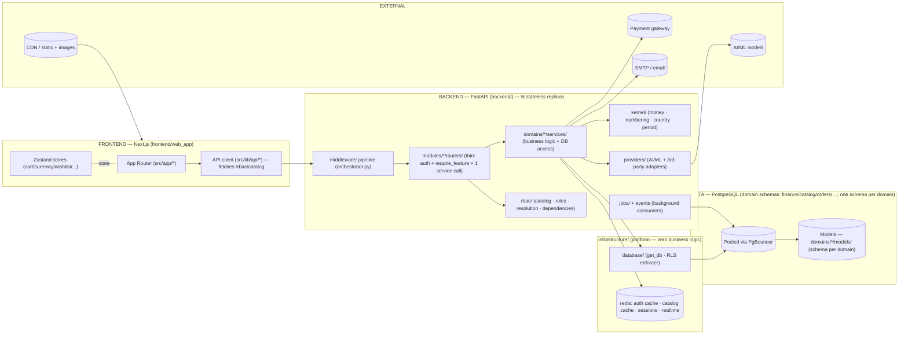
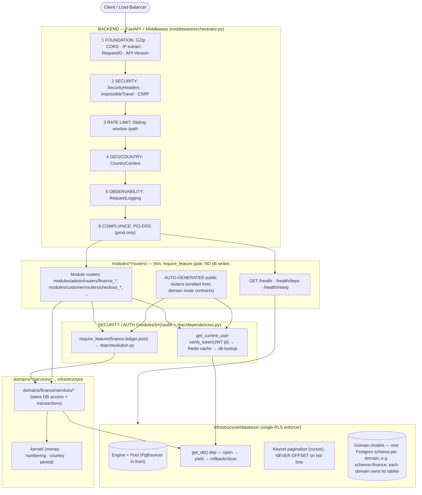
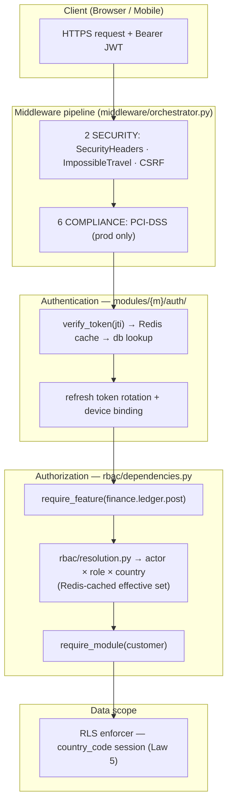
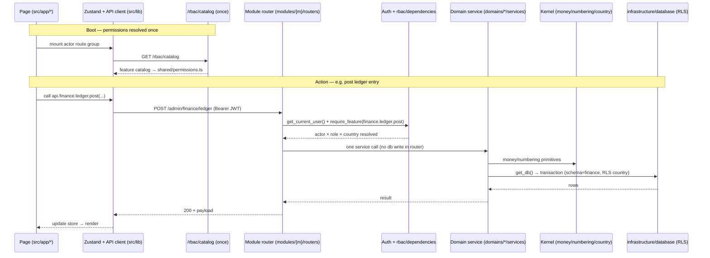

# ZOZI Platform — System Architecture Diagram

> Companion to `documents/TECHNOLOGY_USED.md` and the architecture rules.
> This document is the visual and organizational description of the backend.
> The rules and laws are maintained with it; the technology stack lives in
> `documents/TECHNOLOGY_USED.md`. All stay in lock-step.
>
> The codebase is organized around three orthogonal axes — **Modules, Domains,
> Features**. Every package, dependency arrow and naming rule below is the single
> organization the code follows. Code that does not fit this picture violates the
> dependency laws and is reported by the architecture audit.

---

## 1 · Technology Stack (from `documents/TECHNOLOGY_USED.md`)

### Backend — FastAPI / Python
| Concern | Technology |
|---|---|
| Framework / runtime | FastAPI `0.115.2`, Python `3.11` (Docker) / `3.10` (dev), Uvicorn `0.51.0`, Gunicorn `26.0.0` |
| Database / ORM | PostgreSQL `15` (prod) / SQLite (dev), SQLAlchemy `2.0.51` (async), Alembic `1.18.5`, asyncpg `0.31.0`, psycopg2-binary `2.9.12`, pg8000 `1.31.5`, DuckDB `1.5.5` + duckdb-engine `0.17.0` |
| Auth / security | python-jose `3.5.0` (JWT, `jti` blacklist), bcrypt `5.0.0`, pyotp `2.10.0` (TOTP), cryptography `49.0.0`, slowapi `0.1.10` (rate limit, limits `5.8.0`), CSRF + security-headers + PCI-DSS middleware |
| Cache / sessions | Redis `8.0.1` (auth cache, catalog cache, sessions, realtime, rate-limit) |
| Jobs | APScheduler `3.11.3` + custom background workers (`jobs/`) |
| Payments / APIs | Stripe `15.3.1` + Stripe Connect, httpx `0.28.1`, requests `2.34.2` |
| Observability | structlog `26.1.0`, OpenTelemetry (api / sdk / otlp, fastapi / asgi / sqlalchemy instrumentation), Prometheus (`prometheus-client` + `prometheus-fastapi-instrumentator`), Sentry (`sentry-sdk[fastapi]`) |
| Media / AI | aiofiles `25.1.0`, Pillow `12.3.0`, python-magic `0.4.27`, rembg `2.0.69`, opencv-python `5.0.0`, onnxruntime `1.23.2` |
| Email / comms | SMTP (stdlib) + `email-validator` `2.3.0`, Twilio (SMS), WebSockets `16.1.1` |
| Validation / utils | Pydantic `2.13.4`, python-dotenv `1.2.2`, python-slugify `8.0.4`, pytz `2026.3`, tzlocal `5.4.4`, babel `2.18.0`, phonenumbers `9.0.35`, numpy / scipy / scikit-image, python-docx `1.2.0`, openpyxl `3.1.5`, feedparser `6.0.12` |
| Testing | pytest `9.1.1` + pytest-asyncio `1.4.0`, httpx |

### Frontend — Next.js / React
| Concern | Technology |
|---|---|
| Framework | Next.js `16.3.1` (App Router, RSC), React `18.3.1`, TypeScript `5.8.2` (strict) |
| Styling | Tailwind CSS `3.4.19` + design tokens, class-variance-authority `0.7.1`, clsx `2.1.1`, tailwind-merge `3.5.0`, lucide-react `1.25.0`, framer-motion `11.5.6` |
| State | Zustand `5.0.11` |
| Forms | React Hook Form + Zod |
| Payments | `@stripe/react-stripe-js` `5.6.0`, `@stripe/stripe-js` `8.7.0` |
| Charts | chart.js `4.5.1` + react-chartjs-2 `5.3.1` |
| Maps | leaflet `1.9.4` + react-leaflet `5.0.0` |
| Utilities | jose `6.2.9` (browser JWT), dompurify `3.3.3` (XSS), qrcode `1.5.4`, jspdf `4.1.0`, @zxing/library `0.21.3` |
| Quality | ESLint `9` + typescript-eslint `8.62.0`, Prettier `3.3.3`, eslint-config-next `15.4.5`, Playwright `1.61.1`, jest `29.7.0` + ts-jest + RTL `16.3.0` + jest-axe `10.0.0` |
| Build / deploy | Node.js `20` (Alpine), multi-stage Docker, Next.js rewrites for API proxying |

### Infrastructure / DevOps
- Docker Compose (local), multi-stage Dockerfiles
- Railway (backend), Vercel (frontend)
- Alembic multi-schema migrations (public, analytics, audit, commerce, …)
- `.env` (compose) / `backend/.env` / `frontend/web_app/.env.local` / `.env.example` (source of truth)
- Monorepo `root/`: `docker-compose.yml`, `Makefile`, `pnpm-workspace.yaml`,
  `.github/workflows/*` (`ci.yml` · `import-lint.yml` · `schema-drift.yml` · `e2e.yml`),
  `_extra_files/` (temporary audit / migration working files)

### Key Architectural Patterns
| Layer | Technology | Purpose |
|-------|------------|---------|
| API | FastAPI + auto-discovered routers | RESTful endpoints with versioning |
| Auth | JWT (HS256) + refresh tokens + `jti` blacklisting | Stateless auth with revocation |
| Middleware | 6-layer pipeline (Foundation → Security → Rate Limit → Geo → Observability → Compliance) | Cross-cutting concerns |
| Database | SQLAlchemy `2.0` + RLS (Row Level Security) | Multi-tenant data isolation |
| Caching | Redis + in-memory | Performance |
| Real-time | WebSockets (native + custom manager) | Live updates |
| Observability | OpenTelemetry + Prometheus + Sentry + structlog | Full-stack monitoring |

### Shared Package
- `@zozi/shared` (`frontend/shared`) — TS types / utils shared between web and mobile;
  `permissions.ts` is **generated** from `GET /rbac/catalog`.

---

## 2 · The Three Orthogonal Axes

A folder tree can only express **one** axis. The other two live in **naming +
registration + configuration**. The three axes map to three different mechanisms:

| Axis | What it is | Where it lives | Mechanism |
|---|---|---|---|
| **Module** (customer, supplier, logistics, admin, employee) | *Who* is acting — login, session, route prefix, UI shell | `modules/{module}/` | Separate auth + thin API surface |
| **Domain** (finance, accounts, catalog, orders, payments, logistics, suppliers, customers, hr, comms, media, country, governance, …) | *What* the business does — logic + data | `domains/{domain}/` | Services, models, schemas, policies, events |
| **Feature** (`finance.ledger`, `finance.reporting`, …) | *What may be done* — permission atoms | `rbac/` + `domains/*/features.py` | Data/config, enforced by `require_feature()` |

**The rule that makes it coherent:** Modules compose. Domains own. Features gate.

---

## 3 · Backend Package Layout

```
backend/
├── main.py                     # boots app; registers module routers per actor prefix
├── config.py                   # settings, env, feature gates
├── DOMAIN_ALLOWLIST.yaml       # temporary cross-domain imports (may only shrink)
│
├── modules/                    # AXIS 1 — MODULE (who)
│   ├── customer/  supplier/  logistics/  admin/  employee/
│   │     ├── auth/             # per-actor login/OTP/social → that actor's own tables; sessions; device binding
│   │     ├── routers/          # THIN per-actor routers (auth + require_feature + ONE service call)
│   │     │                     #   modules/{m}/routers/{d}.py — one file per domain (15 files per module)
│   │     │                     #   modules/{m}/routers/__init__.py lists routers/public_routers for main.py
│   │     └── serializers/      # per-actor view models (customer-facing response shaping)
│   │
├── domains/                    # AXIS 2 — DOMAIN (what)
│   ├── finance/  accounts/  catalog/  orders/  logistics/  suppliers/
│   ├── customers/  hr/  comms/  analytics/  audit/  country/  governance/  security/  promotions/
│   │     ├── services/  models/  schemas/  policies/   # heavy domains may instead slice:
│   │     ├── events.py  subscribers.py                  #   ledger/ payouts/ treasury/ … (one sub-capability = one folder)
│   │     ├── ports.py        # SANCTIONED cross-domain READ path (the only thing another domain may import)
│   │     ├── read_models/    # CQRS-lite projections for this domain's own dashboards
│   │     └── features.py      # AXIS 3 seed: this domain's permission atoms
│   │
├── rbac/                       # AXIS 3 — FEATURE (may)
│   ├── catalog.py               # aggregates domains/*/features.py → single source of truth
│   ├── roles.py                 # (module, role) → feature sets
│   ├── resolution.py            # actor × role × country → effective set (Redis-cached)
│   ├── dependencies.py          # require_feature(...), require_module(...)
│   ├── service.py               # grant/revoke, delegation, maker-checker
│   └── models.py                # permission_categories, role_permission_assignments, user_permission_overrides
│
├── infrastructure/             # PLATFORM — zero business logic; imports nothing above it
│   ├── database/               # base.py · database.py (get_db/get_read_db) · session.py · transaction.py
│   │                           #   security.py ← ONE canonical RLS enforcer · seeds/ · create_tables.py (dev-only)
│   ├── redis/                  # client · cache · token blacklist · pub/sub
│   ├── storage/                # S3/R2 adapters · presigned URLs (media blobs never in Postgres)
│   ├── messaging/              # event_bus (in-proc → Redis later) · ws_manager · webhook ingress
│   ├── observability/          # structlog · OTEL · Prometheus · Sentry
│   ├── security/               # JWT · hashing · field encryption (KMS) · zero-trust primitives
│   └── utils/                  # pure technical helpers: pagination.py · datetime_utils · variant_key
├── kernel/                     # SHARED KERNEL — pure business primitives: money, currency, numbering, country, period
│                             #   import rule: domains → kernel → (nothing); kernel may use platform primitives only
├── providers/                  # 3rd-party/AI adapters (called ONLY by services/jobs; never by modules/domains directly)
│   ├── ai/  analytics/  auth/  automation/  comms/  finance/  geography/
│   ├── image/  media/  news/  payments/  security/  voice/
│   └── _base.py                # BaseProvider / BaseAIProvider + health_check()
├── jobs/                        # background workers/consumers (→ domains → infrastructure)
│   ├── fraud_monitoring.py  ghost_order_detector.py  data_retention.py
│   ├── payroll_run.py  payout_sweep.py  reconciliation_cron.py  bank_statement_importer.py
│   ├── fx_revaluation.py  accrual_reversal.py  threat_feed_updater.py  mcp_server.py
│   └── background_tasks.py
├── middleware/                  # flat; orchestrator.py orders the pipeline BEFORE module routers
│   └── orchestrator.py · api_version · country_context · csrf · database_security · device_binding
│       · impossible_travel · ip_extraction · logging · pci_dss_compliance · rate_limit
│       · request_id · rls_dependency · security_headers · webhook_ip_whitelist
│       · webhook_verification · zero_trust_auth
├── alembic/                     # SINGLE schema source of truth
├── scripts/                     # analyze_tables.py, rewrite_imports.py, seed helpers (dev)
├── registry.py                  # ServiceRegistry: discovers + indexes domain services
├── service_index.json           # Auto-generated index: name → {path, type, domain}
├── migrate_imports.py           # Auto-fixes router imports using service_index.json
└── tests/
    ├── architecture/            # test_import_laws.py (layer direction + cross-domain ban), test_feature_catalog.py
    └── domains/                 # per-domain unit/integration tests
```

> **Shared kernel (`kernel/`).** Business primitives used by *every* domain — `money`
> (Decimal, never float), `currency`, `numbering` (centralized ORD-/INV-/PAY-/BATCH-),
> `country`, `period` — live here as first-class residents so they are not smuggled into
> `infrastructure/utils/` or duplicated per domain. **Dependency rule: `domains → kernel → (nothing)`.**
> `kernel/` must not import `modules/`, `domains/`, `rbac/`, `providers/`, `jobs/`, or `middleware/`.
> It may import `infrastructure/` platform primitives only.

> **Canonical top-level packages.** The backend root contains **only**:
> `main.py`, `config.py`, `DOMAIN_ALLOWLIST.yaml`, `modules/`, `domains/`,
> `rbac/`, `kernel/`, `infrastructure/`, `providers/`, `jobs/`, `middleware/`,
> `alembic/`, `scripts/`, `tests/`. A root-level `utils/` is **forbidden** — its
> contents split into `infrastructure/utils/` (technical: pagination, datetime,
> variant keys, slugs) and `kernel/` (business primitives: money, currency,
> numbering, country, period). Likewise `routers/`, `controllers/`, `services/`,
> `models/`, `db/` are **not** top-level packages; they live inside `modules/`,
> `domains/`, or `infrastructure/` as shown above.

> **Cross-domain contract (Law 3).** Writes across domains go *only* through `events.py`/`subscribers.py`.
> Reads across domains go *only* through the publishing domain's `ports.py` (e.g.
> `domains/catalog/ports.py → get_price(db, product_id, country)`). `read_models/` hold each domain's
> own CQRS-lite projections; cross-domain dashboards live in `domains/governance/read_models/`.
> `DOMAIN_ALLOWLIST.yaml` tracks the *temporary* cross-domain imports still permitted and must only shrink.

> **Deployment model.** Shipped initially as a **modular monolith** (one deployable, one Postgres
> ecosystem, shared Redis) — modules and domains are boundaries inside one process, not separate servers.
> Module boundaries make later extraction to independent services possible *without* redesigning domains.

### Frontend layout
```
frontend/
├── web_app/                     # Next.js 16.3.1 (App Router, RSC)
│   ├── src/app/                 # route tree: (customer), auth/, admin/*, supplier/*, logistics-partner/*,
│   │                             #   employee/*, wishlist/, profile/, chatbot/, tracking/; app/api/ = Next server routes
│   ├── src/components/          # ui/ (design system), admin/, auth/, chat/, comms/, country/, ems/, map/, supplier/
│   ├── src/hooks/               # useApi, useAuth, WebSocket hooks
│   ├── src/lib/                 # api/ (client.ts, auth.ts, country.ts, errors.ts), rbac.ts (fetches /rbac/catalog)
│   ├── src/services/            # localizationService, crossBorderService, addressFormatService
│   ├── src/theme/  src/styles/  src/types/  src/utils/
│   ├── tests/  e2e/             # mocks + Playwright
│   └── root/                    # next.config.ts (rewrites), middleware.ts, tailwind.config, playwright.config
├── mobile_app/                  # Expo RN
│   ├── app/                     # Expo Router: (auth)/(tabs) + admin/ supplier/ logistics/ employee/ tracking/ returns/
│   ├── components/ui/           # design-system
│   ├── lib/                     # api.ts, Zustand stores, authPrompt, countryContext, geo, paymentService,
│   │                             #   expoSecureStorage, errorReporter
│   └── theme/  assets/  android/  mocks/  e2e/  scripts/  root/
└── shared/                      # cross-platform TS, imported by BOTH apps
    └── src/                     # api-core.ts (apiFetch), money.ts, i18n.ts, cart/checkout/order/product/returns/
                                  #   wishlist/notification helpers, statusColors.ts, requestCache.ts, realtime.ts,
                                  #   chatbot.ts, types.ts, theme.ts + theme.native.ts,
                                  #   permissions.ts  ← GENERATED from backend /rbac/catalog
```

---

## 4 · The Seven Laws (enforced by the audit)

1. **Arrows point down only:** `modules → domains → infrastructure`.
   Domains never import modules. `rbac` is imported by modules + middleware only.
   `infrastructure` / `kernel` import nothing above them. `providers ← services/jobs`.
2. **Module routers stay thin:** auth context + `require_feature(...)` + one domain-service call.
   No DB writes, no business rules.
3. **Cross-domain writes only via events** (`events.py`/`subscribers.py`);
   cross-domain *reads* only via `ports.py` / `read_models/`.
4. **Features single-sourced** in `domains/*/features.py`; aggregated by `rbac/catalog.py`;
   CI fails on any `require_feature("…")` literal not in the catalog.
5. **Country is the orthogonal scope axis:** RLS session context + `country_staff_assignments`
   — independent of the feature check.
6. **Schema discipline:** every table in a domain Postgres schema; Alembic is the only
   schema source; naming lint (`snake_case`, plural, `<thing>_id`, `created_at/updated_at`,
   `country_code`, `is_deleted`).
7. **Allowlist rule:** temporary cross-domain imports are tracked in `DOMAIN_ALLOWLIST.yaml`
   and may only shrink; direct cross-domain writes outside `events.py` are forbidden.

---

## 5 · System Context



---

## 6 · Backend Circuit (request lifecycle)



---

## 7 · RBAC / Feature axis (AXIS 3)

- Feature atoms are **defined once** in `domains/{domain}/features.py` (e.g.
  `finance.ledger.post`, `finance.reporting.read`).
- `rbac/catalog.py` aggregates every domain's `features.py` via package scan →
  single source of truth. It is served to the frontend at `GET /rbac/catalog`.
- `rbac/roles.py` grants per **(module, role)**; `rbac/resolution.py` resolves
  `actor × role × country → effective feature set` (Redis-cached).
- `rbac/dependencies.py` provides `require_feature(...)` / `require_module(...)`
  gates used by every module router.
- Frontend `shared/src/permissions.ts` is **generated** from `/rbac/catalog` so
  UI gating and backend gating share one source.

---

## 8 · Schema discipline (Law 6)

- Every ORM model declares `__table_args__ = {"schema": "<domain>"}`
  (slice tables use the parent domain's schema).
- Alembic is the only schema source (`create_all` is dev-only).
- Naming lint: `snake_case`, plural tables, `<thing>_id` FKs,
  `created_at`/`updated_at`, `country_code`, `is_deleted`.
- Forbidden schemas: `core` / `platform` / `identity` — every actor's `user`
  table lives in its own domain schema (e.g. `customer.user`, `supplier.user`).

---

## 9 · Database organization (Law 6)

Every domain owns one Postgres schema; the model classes live in
`domains/{domain}/models/`. Cross-domain **writes** travel only through
`events.py` / `subscribers.py`; cross-domain **reads** travel only through the
owning domain's `ports.py` (or `read_models/`). The country scope is enforced by
RLS on every schema.

```mermaid
flowchart TD
    ALE["alembic/ — SINGLE schema source of truth"]
    subgraph SCHEMAS["PostgreSQL — one schema per domain"]
        direction LR
        SF["schema: finance<br/>domains/finance/models/*"]
        SA["schema: accounts<br/>domains/accounts/models/*"]
        SC["schema: catalog<br/>domains/catalog/models/*"]
        SO["schema: orders<br/>domains/orders/models/*"]
        SL["schema: logistics<br/>domains/logistics/models/*"]
        SS["schema: suppliers<br/>domains/suppliers/models/*"]
        SCU["schema: customers<br/>domains/customers/models/*"]
        SH["schema: hr<br/>domains/hr/models/*"]
        SCO["schema: comms<br/>domains/comms/models/*"]
        SCA["schema: analytics<br/>domains/analytics/models/*"]
        SCN["schema: country<br/>domains/country/models/*"]
        SG["schema: governance<br/>domains/governance/models/*"]
        SE["schema: security<br/>domains/security/models/*"]
        SP["schema: promotions<br/>domains/promotions/models/*"]
        SAU["schema: audit<br/>domains/audit/models/*"]
    end
    RLS["infrastructure/database/ RLS enforcer<br/>country_code session context (Law 5)"]
    PORTS["ports.py — sanctioned cross-domain READ<br/>e.g. catalog.ports.get_price(db, product_id, country)"]
    EVT["events.py / subscribers.py — cross-domain WRITE bus"]
    ALE --> SCHEMAS
    SCHEMAS --> RLS
    SC -. read via .-> PORTS
    PORTS -. resolves .-> SC
    SO -. write via .-> EVT
    EVT -. consumed by .-> SF
    EVT -. consumed by .-> SP
```



---

## 10 · Security architecture

Authentication and authorization follow the axes: **modules** carry the actor
(who), **features** gate the action (may), and **country RLS** scopes the data.
The 6-layer middleware pipeline runs before any module router.



---

## 11 · End-to-end flow (frontend ↔ backend)

The frontend route tree under `frontend/web_app/src/app/*` is grouped per actor
(module). On boot it fetches `GET /rbac/catalog` once to build
`shared/src/permissions.ts`; every later action calls a thin module router that
authenticates, gates on a feature, and delegates to one domain service.



---

## 12 · Service Registry & Automatic Wiring

When domain services are reorganized (moved between domains, split into sub-packages),
router import paths break. The **Service Registry** automates discovery, resolution, and
migration of these imports.

### 12.1 Components

| Component | File | Purpose |
|-----------|------|---------|
| `ServiceRegistry` | `backend/registry.py` | Discovers all public functions/classes in `domains/`, `infrastructure/`, `providers/` and builds an index |
| `service_index.json` | `backend/service_index.json` | Persistent index: `name → {path, type, domain, file}` |
| Migration tool | `backend/migrate_imports.py` | Compares router imports against the index and rewrites broken paths |

### 12.2 How It Works

```
┌─────────────────────────────────────────────────────────────────┐
│                     SERVICE REGISTRY                            │
│                                                                 │
│  1. SCAN     → Walk domains/, infrastructure/, providers/       │
│                 Parse every .py file for def/class definitions  │
│                 Build index: name → actual_path                 │
│                                                                 │
│  2. RESOLVE  → Router asks: "where is ProductService?"         │
│                 Registry returns: domains.catalog.services...   │
│                                                                 │
│  3. MIGRATE  → Compare router imports to index                  │
│                 Generate corrections: old_path → new_path        │
│                 Apply: string replacement in router files        │
│                                                                 │
│  4. VERIFY   → Re-scan confirms 0 remaining issues             │
└─────────────────────────────────────────────────────────────────┘
```

### 12.3 Usage

```bash
# Build/update the service index
python backend/registry.py

# Check what needs fixing (dry run)
python backend/migrate_imports.py

# Apply corrections
python backend/migrate_imports.py --apply
```

### 12.4 Example

**Before migration** (stale import path):
```python
# modules/customer/routers/orders.py
from domains.catalog.services.products_controller import ProductService
```

**Registry index entry**:
```json
{
  "name": "ProductService",
  "path": "domains.catalog.services.products.products_service",
  "type": "class",
  "domain": "catalog"
}
```

**After migration** (correct import path):
```python
# modules/customer/routers/orders.py
from domains.catalog.services.products.products_service import ProductService
```

### 12.5 When to Run

| Scenario | Action |
|----------|--------|
| After domain reorganization | `python backend/migrate_imports.py --apply` |
| After adding new domain services | `python backend/registry.py` to update index |
| CI check | `python backend/migrate_imports.py` should report 0 issues |
| Before commit | Verify `service_index.json` is up to date |

### 12.6 Index Statistics

| Category | Count |
|----------|-------|
| Total services indexed | ~4,200 |
| Domains covered | 35 |
| Infrastructure modules | ~150 |
| Provider modules | ~78 |

### 12.7 Design Principles

1. **Discovery over hardcoding** — The registry scans actual files, so it never goes stale
2. **Idempotent** — Running migration multiple times is safe (no duplicate changes)
3. **Non-destructive preview** — Dry run shows what would change before applying
4. **First-wins** — If a name exists in multiple modules, the first scanned wins
5. **Domain-aware** — Prefers same-domain matches when resolving ambiguities

### 12.8 Integration with Architecture Laws

The registry enforces **Law 1 (Arrows point down)** by:
- Tracking which domain each service belongs to
- Detecting when a router imports from the wrong domain
- Ensuring modules only import from domains (not other modules)

The registry enforces **Law 3 (Cross-domain via ports/events)** by:
- Flagging direct cross-domain imports that bypass `ports.py`
- Tracking sanctioned imports in `DOMAIN_ALLOWLIST.yaml`
