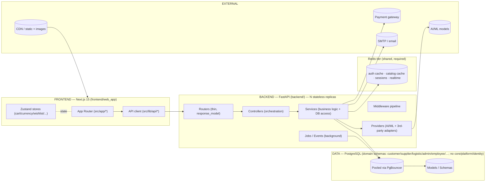
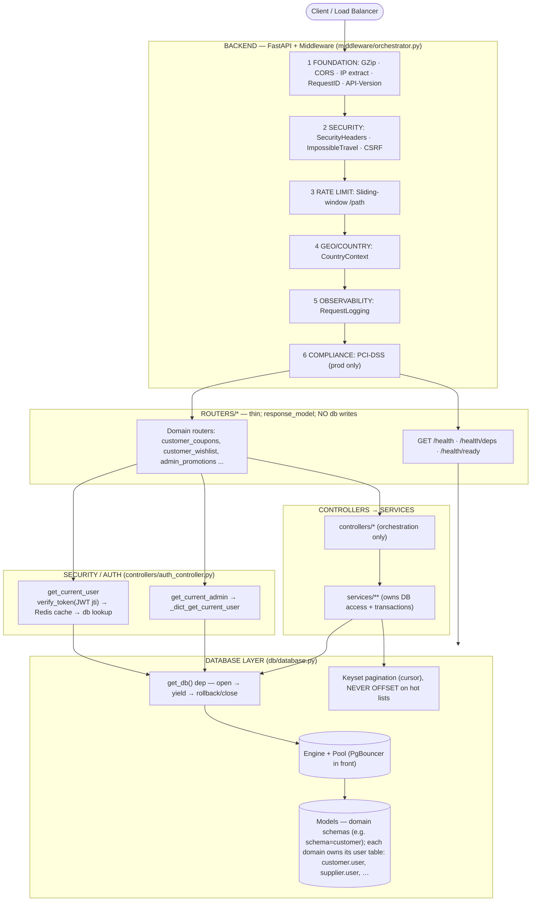
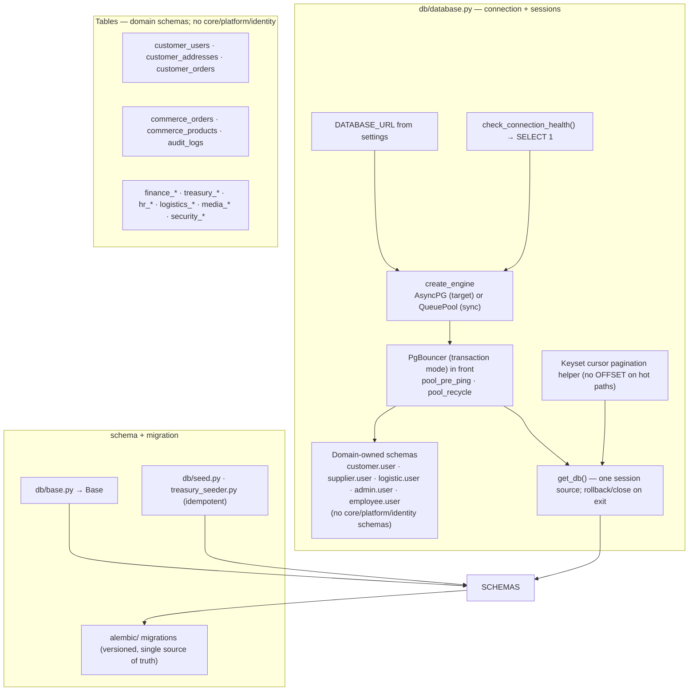
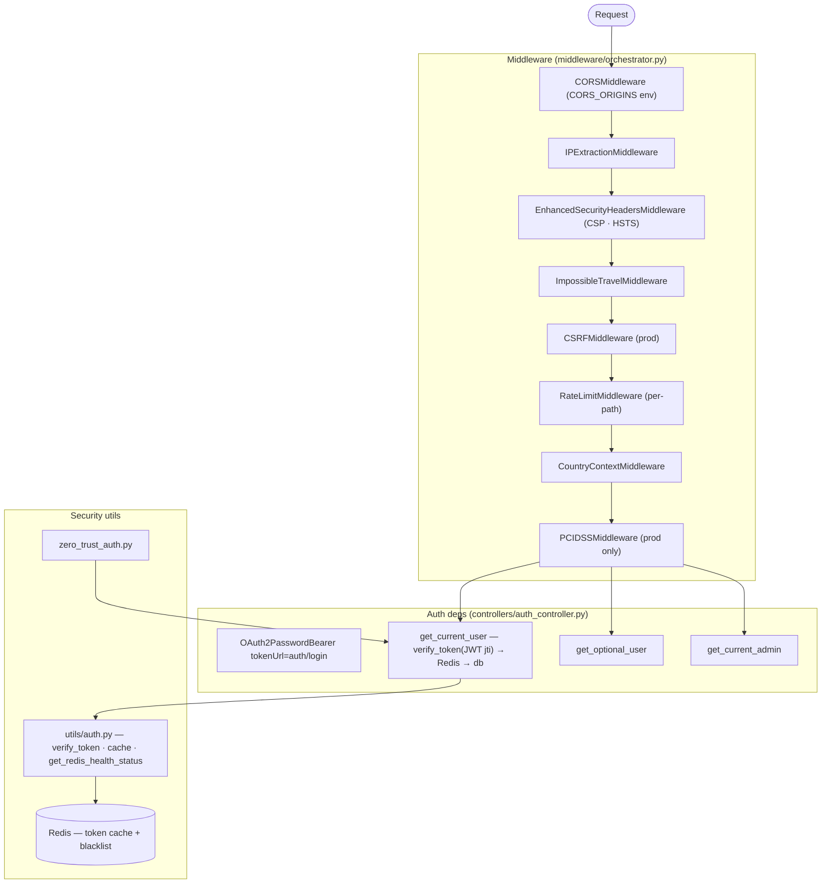
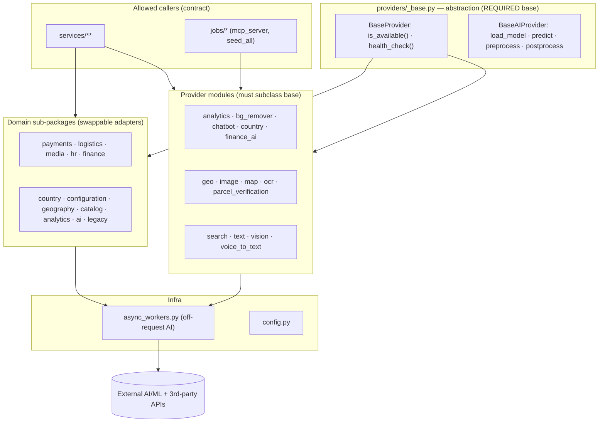
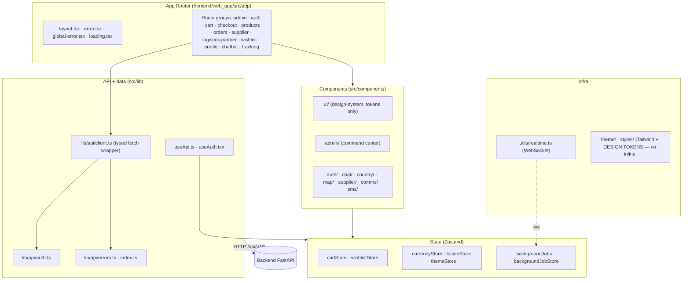
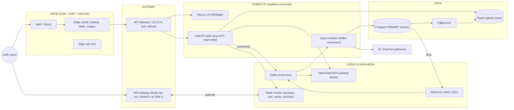

# ZOZI Target Architecture ("Should-Be")

This document is the **canonical reference architecture** for the ZOZI platform. It describes the
system **as it should be designed**, not merely as it exists today. `system_architecture_audit.py`
validates the codebase against the contract defined here (especially §10). Where the current
implementation diverges, the audit must report it as a deviation with the matching rule id.

Verified structural facts (file paths, layer names, pool defaults, provider base classes) are
real and taken from `backend/main.py`, `middleware/orchestrator.py`, `db/database.py`,
`controllers/auth_controller.py`, `routers/health.py`, `providers/_base.py`,
`utils/config.py`, and `frontend/web_app/src`.

---

## 1. System Context (target)



---

## 2. Backend Circuit (target request lifecycle)



**Target layer contract (the "circuit" the auditor enforces — see §10):**

| Layer | May import | Must NOT |
|---|---|---|
| `main.py` | middleware, dependencies, routers, db, utils, lifespan, data | controllers, services, models directly |
| `routers/*` | controllers, schemas, auth deps, `get_db` | raw `db.query(...)`, **any `db.add/commit` (W1)**, business logic |
| `controllers/*` | services, models, `get_db`, auth deps | `db.add/commit` (W1), ORM internals |
| `services/**` | models, `get_db`, utils, providers, redis | routers, `main` |
| `providers/*` | `providers._base`, utils, settings | routers, `main` |
| `db/database.py` | `db.base.Base`, settings | app layers |
| `middleware/*` | utils, settings, db (read-only) | routers, controllers |
| `frontend/src/lib/api/*` | backend `/api/v1/*` only | direct DB; raw fetch from pages |

---

## 3. Database Subsystem (target)



**Target rules**
- `get_db()` is the only session source; services own transactions.
- **Cross-domain FKs are correct and allowed** across domain schemas (e.g. `order.employee_id → employee.user.id`); each domain owns its `user` table. The auditor must resolve the referenced table's real name from ORM metadata —
not parse `ForeignKey("table.column")` as a schema (this is the DBA06 parser bug to fix).
- `create_all()` is dev-only and refuses production (`db/init_db.py`).
- Hot list endpoints use **keyset cursors**, never `OFFSET` (DBA32).
- Alembic is the single source of schema truth; ORM vs migration drift is a real (DBA13) check.

---

## 4. Security Subsystem (target)



**Target rules**
- All SQL must be **parameterized**; the auditor flags only untrusted-input string concatenation,
not every `text(...)` (SEC5/SEC101 false-positive fix).
- JWT validated with `jti` blacklist; admin via `get_current_admin`.
- CSRF + PCI-DSS active in production only.
- No hardcoded secrets (SEC2 real check, not literal-scan noise).
- **One canonical RLS enforcer** — multiple scattered RLS modules are a fail-open risk (a path that omits
RLS silently bypasses tenant/country isolation). Audit flags any second/divergent RLS implementation.

---

## 5. Providers Subsystem (target — AI / ML / 3rd-party adapters)



**Target rules**
- Every provider subclasses `BaseProvider`/`BaseAIProvider` and implements `health_check()`.
- Only `services/**` and `jobs/*` may call providers — never routers (per circuit contract).
- Heavy provider work runs via `async_workers` off the request path.

---

## 6. Frontend Subsystem (target)



**Target rules**
- All backend calls through `src/lib/api/*` (typed client); no raw `fetch` in pages.
- Design tokens centralized in `theme/` + `styles/`; **inline `<style>` is forbidden (DS02)**.
- `key={i}` only on static/loading lists; dynamic/mutable lists need stable ids (FEH402 fix).
- `console.*` restricted to error handlers; loading skeletons use index keys benignly.

---

## 7. Other Important Parts (target)

### 7.1 Background jobs, events & realtime
`events/` publisher + `jobs/` (`background_tasks`, `fraud_monitoring`, `seed_all`, `mcp_server`)
+ `providers/async_workers.py` run heavy work off-request. `services/command_center_background.py`
aggregates health into Redis; `utils/realtime.py` streams via WebSocket. Frontend subscribes
through `FER` realtime.

### 7.2 Lifespan / startup
`lifespan.py` boots: migration gate → schema init (dev) → seed → cache warm-up. Readiness is
re-checked per request by `/health/ready`.

### 7.3 Monitoring
`monitoring/` ships `docker-compose.monitoring.yml` + `prometheus.yml`. Health endpoints are the
liveness/readiness contract for orchestrators.

---

## 8. Health Check (target)

| Endpoint | Purpose | Source |
|---|---|---|
| `GET /health` | Liveness — version + active API versions | `routers/health.py:36` |
| `GET /health/deps` | Redis / email / payments / error-tracking | `routers/health.py:46` |
| `GET /health/ready` | `check_connection_health()` + readiness gates → 503 if blocking | `routers/health.py:66` |

---

## 9. Production Scaling Topology (target — 100K concurrent)

> **Two capacity goals are conflated in "100K" and MUST be separated:**
> - **Concurrency** = 100K long-lived, mostly-idle sessions (browsing + WebSocket presence).
>   Largely solved by stateless autoscaling + edge cache + Phase A infra.
> - **Throughput** = 100K RPS of active requests. Requires the full event-driven / CQRS /
>   search-cluster stack (Phase C).
>
> 100K *concurrent users* ≠ 100K RPS. The phases below are ordered by which goal they serve.
> The current single-instance code (sync SQLAlchemy, pool 15/process, single Postgres, in-process
> WebSockets, optional single Redis) is **below mid-scale** until Phase A is deployed.

### 9.1 Hyper-scale topology (Phase C target state)



**Read path (≈95% traffic):** Edge/CDN cache → API → OpenSearch (facets) + Redis (price/stock
hydrate) + read replica. **Write path (≈5%):** API validates + publishes command to Kafka →
`202 Accepted`; workers consume, reserve inventory, call payments, commit primary. CDC streams WAL
→ OpenSearch + cache invalidation without app-level sync code.

### 9.2 Phased rollout (codebase updates follow in later work)

**Phase A — mid-scale on existing code (deploy, don't rewrite):** PgBouncer (transaction pooling),
read replica, single Redis, CDN/edge cache, stateless autoscaling, keyset pagination on remaining
hot lists, finish removing `W1` router-side writes. Reaches ~10K–20K concurrent with **today's sync
code** — only config + the already-present `utils/cache.py` / `redis_client.py`. No new subsystems.

**Phase B — async + replica fan-out:** convert hot write/read paths to `AsyncPG` + SQLAlchemy 2.0
async sessions (`db`); route reads to replicas; move WebSocket fan-out fully onto Redis pub/sub
(`utils/realtime.py` already wires a bridge). Mandatory before ~50K+ concurrent — sync drivers block
the event loop.

**Phase C — full event-driven / CQRS (only when throughput modeling justifies it):** Kafka command
bus, Debezium CDC → OpenSearch for faceted catalog search, Redis Cluster (sharded), dedicated WS
gateway for 100K+ persistent sockets, partitioned primary for write hotspots. The only phase that
adds Kafka/ES/CDC.

### 9.3 Known blockers still present in the codebase (verify before claiming any phase)
- `DB_POOL_SIZE=5` + `DB_MAX_OVERFLOW=10` = 15 conn/replica (`utils/config.py:41-42`); must sit behind PgBouncer.
- Backend is **100% sync SQLAlchemy** (async only in `experiments/`) → Phase B is a real rewrite.
- WebSockets held in-process (`ws_chat.py`, `utils/realtime.py` keep `dict[...set[WebSocket]]`); must move to Redis pub/sub before scale.
- No Kafka / Celery / Elasticsearch / Debezium anywhere in `backend/` → Phase C is greenfield.
- Redis is single-node `redis.from_url(...)` with `_NoOpRedis` fallback (`utils/redis_client.py`); not a cluster and optional.

### 9.4 Scaling policy (auditor warns if absent at target scale)
Stateless replicas, PgBouncer, read replicas, Redis-fronted catalog reads, keyset pagination,
CDN, rate limiting + circuit breakers, async DB driver at ~50K+, Redis Cluster + Kafka/ES/CDC at
100K throughput.

---

## 10. Canonical Architecture Contract (what the auditor encodes)

This is the single source of truth `system_architecture_audit.py` validates against.

### 10.1 Layers (allow-list)
`main`, `middleware`, `dependencies`, `routers`, `controllers`, `services`, `providers`, `db`,
`models`, `utils`, `data`, `events`, `jobs`,
`settings`, `monitoring`, and frontend `app`/`components`/`lib`/`hooks`/`services`/`theme`/
`styles`/`types`/`utils`. External subsystems (Kafka, OpenSearch, Redis Cluster, CDN, WS gateway,
PgBouncer, Postgres) are **infrastructure**, reached only through the `db` / `utils` / `providers` / `events` / `jobs` adapters.

### 10.2 Allowed dependency edges (the "circuit")
```
main          → middleware, dependencies, routers, db, utils, lifespan, data
routers       → controllers, schemas, auth deps, get_db, events (publish commands)
controllers   → services, models, get_db, auth deps
services      → models, get_db, utils, providers, redis, events (publish), providers (OpenSearch read via utils)
providers     → providers._base, utils, settings
db            → db.base, settings, async engine (AsyncPG at scale)
utils         → redis (cluster), redis pub/sub (realtime fan-out)
middleware    → utils, settings, db (read-only)
events/jobs   → services, db, providers, kafka (publish/consume), opensearch (via CDC consumer)
frontend lib  → backend /api/v1/* only
```
Any edge **outside** this set is a circuit violation (CIR1 / DOM3 / MV1 / FT1 family). The
`db` / `utils` / `providers` / `events` / `jobs` adapters isolate all external infra so the rest
of the app never imports Kafka/OpenSearch/Redis drivers directly.

### 10.3 Schema policy
- **Domain schemas** are used (customer, supplier, logistic, admin, employee, …); each owns its `user` table (e.g. `customer.user.id`). The forbidden schemas are `core` / `platform` / `identity` — never use them.
- Tables live in their domain schema: `customer.user`, `supplier.user`, `commerce.orders`, `admin.user`, `employee.user`, …
- Cross-domain FKs are **allowed** (e.g. `order.employee_id → employee.user.id`); the auditor
    resolves the referenced table's real name from ORM metadata — it must NOT treat
    `ForeignKey("table.column")` as a schema (this is the DBA06 parser bug to fix).
- Alembic is source of truth; ORM↔migration drift = DBA13 (real).
- `create_all()` dev-only; refuses prod.

### 10.4 Security policy
- Parameterized SQL only; flag untrusted concatenation, not `text(...)`.
- JWT + `jti` blacklist; admin via `get_current_admin`.
- CSRF + PCI-DSS in prod; no hardcoded secrets.
- All external-infra credentials (Kafka/OpenSearch/Redis/PG) from `settings` only; never in code.
- Kafka command payloads validated + idempotency-keyed (no dropped/duplicated orders at scale).
- **Exactly one canonical RLS enforcer** (single module, e.g. `db/security.py`, applied uniformly via a
session/connection hook or a shared auth dependency). Multiple independent RLS implementations across
modules are a **fail-open risk** (one path that forgets to call RLS bypasses the policy) and are
disallowed; the auditor flags a second/divergent RLS implementation as a security violation (SEC family).

### 10.5 Performance policy
- Keyset pagination on hot lists (no `OFFSET`).
- DB writes only in `services` (never routers/controllers).
- Heavy/AI work off-request via `async_workers`/`jobs`/`events` consumers.
- At ~50K+ concurrent: `AsyncPG` + SQLAlchemy 2.0 async sessions (`db` async engine); reads fanned
to replicas. Faceted catalog search moves off Postgres `LIKE`/JSONB to OpenSearch via a `jobs` CDC
consumer + `providers`/`utils` adapters
— introduced at **Phase C (CDC)** for 100K throughput, not before.
- WebSocket broadcast fan-out via Redis pub/sub (`utils.realtime`), not in-process socket lists,
before 100K concurrent sockets.

### 10.6 Provider policy
- Subclass `BaseProvider`/`BaseAIProvider`; implement `health_check()`.
- Called only by `services`/`jobs`.

### 10.7 Frontend policy
- Typed API client only; design tokens (no inline `<style>`); stable keys on dynamic lists.
- Edge-cache public read paths (`Cache-Control: public, s-maxage, stale-while-revalidate`);
NEVER edge-cache user-scoped paths (cart/profile → `private, no-store`).

### 10.8 Scaling policy
- Phase A (mid-scale, existing code): PgBouncer + read replica + single Redis + CDN + stateless
autoscaling + keyset pagination. ~10K–20K concurrent.
- Phase B (~50K+): `AsyncPG` async sessions + replica fan-out + WebSocket fan-out on Redis pub/sub.
- Phase C (100K throughput): Kafka command bus + Debezium CDC + OpenSearch + Redis Cluster +
dedicated WS gateway + partitioned primary.
- All external infra reached only via `db` / `utils` / `providers` / `events` / `jobs` adapters.

### 10.9 Realtime policy
- WebSocket connection managers live behind `utils.realtime` (Redis pub/sub); broadcast uses
Redis pub/sub so any replica can publish to any socket.
- In-process `dict[...set[WebSocket]]` fan-out allowed only below scale; must move to Redis pub/sub
before 100K concurrent sockets. Dedicated WS gateway (Node/Go) only at Phase C.

---

## 11. Capacity & SLOs (testable target — NOT a guarantee)

> **Honesty note:** This section is a **target with explicit assumptions and a validation plan**,
> not a proof of capacity. The diagrams in §1–§10 describe an architecture *shaped* to reach the
> targets below **only if deployed per §9 and verified by the load tests in §11.3**. As of this
> writing the *implementation* still diverges from the should-be design (see §9.1 gaps), so the
> current system does **not** meet these targets. Capacity is confirmed by measurement, not by a
> diagram.

### 11.1 Defined load model (what "100K at a time" means)

| Term | Definition used here |
|---|---|
| Registered customers | Total accounts (easy; not a capacity metric) |
| **Concurrent users** | Peak simultaneous active sessions hitting the system |
| **Concurrent requests** | In-flight HTTP requests at peak (the real scaling bar) |
| Target | **100K concurrent users**, ~ **200–400K req/min** at peak, read-heavy (catalog browse) |

### 11.2 SLO table (targets to assert under load)

| Metric | Target SLO | How measured |
|---|---|---|
| API p95 latency (cached reads) | ≤ 100 ms | `k6`/`wrk` p95 over `/api/v1/products`, `/health` |
| API p95 latency (DB reads) | ≤ 250 ms | load test on non-cached paths |
| API p99 latency (writes) | ≤ 500 ms | order/checkout flows |
| Error rate at peak | < 0.5% | `pg_stat_activity` + app error logs |
| DB connection saturation | < 80% of PgBouncer pool | PgBouncer `SHOW POOLS` |
| Redis cache hit-rate (catalog) | > 90% | Redis `INFO stats` keyspace hits/misses |
| Replica lag | < 1 s | `pg_stat_replication` |

### 11.3 Load-test plan (must pass before claiming 100K)

1. **Baseline (single replica, current code):** `k6` against `/health`, `/api/v1/products`,
`/api/v1/coupons` at 1K → 10K VUs. Record p95, error rate, DB connections. Expect to saturate
at the `DB_POOL_SIZE=5+10` limit — this quantifies the current ceiling.
2. **Fix gate:** implement §9.2 Phase A (PgBouncer, read replicas, Redis catalog cache, keyset
pagination, finish W1). Re-run baseline.
3. **Scaling sweep:** increase replicas behind LB (2 → 4 → 8) at 25K / 50K / 100K VUs. Plot
throughput vs replicas; find the knee.
4. **Soak test:** 100K VUs for 1 hour; watch for connection leaks, memory growth, replica lag.
5. **Spike test:** 10K → 100K in 60 s to validate rate limiting + autoscaling.
6. **Write-path test:** checkout/order burst to find the primary-DB write bottleneck.

### 11.4 What would still block 100K even after §9

- Primary-DB write throughput (orders/inventory) — needs partitioning/sharding or queue-based
write buffering.
- Third-party payment gateway latency under load (external, not in our control).
- AI/provider calls (bg_remover, vision) must stay fully off-request (already designed, must hold).
- Cold cache start (thundering herd on replica) — needs cache warm-up + request coalescing.

### 11.5 Verdict (current state)

- **Diagram (should-be):** architecture *capable* of 100K **if** built per §9 + passes §11.3.
- **Running system (today):** does **not** meet targets — pool default 15/process, sync DB,
W1 router writes, OFFSET pagination in places, single Postgres, uncached catalog.
- Capacity is **claimed only after** §11.3 steps 1–5 pass with §11.2 SLOs met.

### 11.6 Phase → SLO mapping

| Phase | Goal unlocked | SLOs asserted | Pre-req tests |
|---|---|---|---|
| A | ~10K–20K concurrent (existing code) | p95 cached ≤100ms, error <0.5%, pool <80% | §11.3 #1–#2 |
| B | ~50K concurrent | + async no event-loop block, replica lag <1s | §11.3 #3 |
| C | 100K throughput | + WS fan-out holds, Redis Cluster ops headroom | §11.3 #4–#6 |

### 11.7 Reference-implementation pitfalls (do NOT copy verbatim)

When the codebase is updated later per these phases, avoid the bugs found in the external
hyper-scale sketch that motivated this section:

- **CDC/Debezium consumer:** Debezium envelope is `{"payload": {"before":..,"after":..,"op":"c"}}`.
Reading `op` at the top level (instead of `payload["op"]`) yields `None` and silently drops
every sync event. Parse `op`/`before`/`after` from inside `payload`.
- **Async `get_db`:** do **not** `await session.commit()` after every request — that commits on
read-only GETs (wasted write txn, can mask errors). Commit only on mutation paths.
- **EventBus:** `lz4` compression needs an extra dependency; declare it. Partition key gives
per-key ordering only — fine for `country_code`/tenant ordering.
- **Frontend edge cache:** `Cache-Control` must be `private, no-store` for cart/profile paths;
only public catalog/static paths get `s-maxage` + `stale-while-revalidate`.
