# Architecture Governance Audit Report (GENERATED — do not hand-edit)

**Repo:** `D:\Projects\10- E-COMMERCE WEBSITE\zozi`  
**Result:** 🔴 752 · 🟡 2431 · 🟢 68  
**Architecture Debt Score:** `123270`  
**Ephemeral. Add to `.gitignore`. NOT an authoritative spec (those live in `documents/scope/`).**

---

## Current Backend Structure

```mermaid
graph TD
    ROOT["backend/"]
    _hypothesis[".hypothesis/"]
    ROOT --> _hypothesis
    _hypothesis_constants["constants/"]
    _hypothesis --> _hypothesis_constants
    _hypothesis_examples["examples/"]
    _hypothesis --> _hypothesis_examples
    alembic["alembic/"]
    ROOT --> alembic
    alembic_versions["versions/"]
    alembic --> alembic_versions
    alembic_flat["1 flat .py files"]
    alembic --> alembic_flat
    controllers["controllers/"]
    ROOT --> controllers
    controllers_admin["admin/"]
    controllers --> controllers_admin
    controllers_commerce["commerce/"]
    controllers --> controllers_commerce
    controllers_products["products/"]
    controllers --> controllers_products
    controllers_supplier["supplier/"]
    controllers --> controllers_supplier
    controllers_flat["43 flat .py files"]
    controllers --> controllers_flat
    data["data/"]
    ROOT --> data
    data_flat["4 flat .py files"]
    data --> data_flat
    db["db/"]
    ROOT --> db
    db_flat["10 flat .py files"]
    db --> db_flat
    dependencies["dependencies/"]
    ROOT --> dependencies
    dependencies_flat["3 flat .py files"]
    dependencies --> dependencies_flat
    docs["docs/"]
    ROOT --> docs
    events["events/"]
    ROOT --> events
    events_flat["2 flat .py files"]
    events --> events_flat
    jobs["jobs/"]
    ROOT --> jobs
    jobs_flat["2 flat .py files"]
    jobs --> jobs_flat
    location_service["location_service/"]
    ROOT --> location_service
    location_service_flat["2 flat .py files"]
    location_service --> location_service_flat
    middleware["middleware/"]
    ROOT --> middleware
    middleware_flat["20 flat .py files"]
    middleware --> middleware_flat
    models["models/"]
    ROOT --> models
    models_flat["31 flat .py files"]
    models --> models_flat
    monitoring["monitoring/"]
    ROOT --> monitoring
    provider_test["provider_test/"]
    ROOT --> provider_test
    provider_test_visual_regression["visual_regression/"]
    provider_test --> provider_test_visual_regression
    providers["providers/"]
    ROOT --> providers
    providers_ai["ai/"]
    providers --> providers_ai
    providers_legacy["legacy/"]
    providers --> providers_legacy
    providers_flat["17 flat .py files"]
    providers --> providers_flat
    routers["routers/"]
    ROOT --> routers
    routers_flat["148 flat .py files"]
    routers --> routers_flat
    scripts["scripts/"]
    ROOT --> scripts
    scripts_flat["6 flat .py files"]
    scripts --> scripts_flat
    services["services/"]
    ROOT --> services
    services_audit["audit/"]
    services --> services_audit
    services_chat["chat/"]
    services --> services_chat
    services_payments["payments/"]
    services --> services_payments
    services_flat["196 flat .py files"]
    services --> services_flat
    settings["settings/"]
    ROOT --> settings
    settings_flat["1 flat .py files"]
    settings --> settings_flat
    static["static/"]
    ROOT --> static
    static__well_known[".well-known/"]
    static --> static__well_known
    tasks["tasks/"]
    ROOT --> tasks
    tasks_flat["2 flat .py files"]
    tasks --> tasks_flat
    tests["tests/"]
    ROOT --> tests
    tests_playwright["playwright/"]
    tests --> tests_playwright
    tests_flat["56 flat .py files"]
    tests --> tests_flat
    tools["tools/"]
    ROOT --> tools
    tools_mcp["mcp/"]
    tools --> tools_mcp
    uploads["uploads/"]
    ROOT --> uploads
    uploads_avatars["avatars/"]
    uploads --> uploads_avatars
    uploads_chat["chat/"]
    uploads --> uploads_chat
    uploads_parcel_proofs["parcel_proofs/"]
    uploads --> uploads_parcel_proofs
    uploads_products["products/"]
    uploads --> uploads_products
    utils["utils/"]
    ROOT --> utils
    utils_flat["62 flat .py files"]
    utils --> utils_flat
```



---

## Suggested Backend Structure

```mermaid
graph TD
    ROOT["backend/ (suggested)"]
    _hypothesis[".hypothesis/"]
    ROOT --> _hypothesis
    _hypothesis_constants["constants/"]
    _hypothesis --> _hypothesis_constants
    _hypothesis_examples["examples/"]
    _hypothesis --> _hypothesis_examples
    alembic["alembic/"]
    ROOT --> alembic
    alembic_versions["versions/"]
    alembic --> alembic_versions
    controllers["controllers/"]
    ROOT --> controllers
    controllers_commerce["commerce/"]
    controllers --> controllers_commerce
    controllers_controller["controller/ ✨"]
    controllers --> controllers_controller
    controllers_products["products/"]
    controllers --> controllers_products
    controllers_service["service/ ✨"]
    controllers --> controllers_service
    data["data/"]
    ROOT --> data
    db["db/"]
    ROOT --> db
    dependencies["dependencies/"]
    ROOT --> dependencies
    docs["docs/"]
    ROOT --> docs
    events["events/"]
    ROOT --> events
    events_service["service/ ✨"]
    events --> events_service
    jobs["jobs/"]
    ROOT --> jobs
    jobs_service["service/ ✨"]
    jobs --> jobs_service
    location_service["location_service/"]
    ROOT --> location_service
    middleware["middleware/"]
    ROOT --> middleware
    models["models/"]
    ROOT --> models
    models_commission["commission/ ✨"]
    models --> models_commission
    models_config["config/ ✨"]
    models --> models_config
    models_country["country/ ✨"]
    models --> models_country
    models_email["email/ ✨"]
    models --> models_email
    models_employee["employee/ ✨"]
    models --> models_employee
    models_event["event/ ✨"]
    models --> models_event
    models_ledger["ledger/ ✨"]
    models --> models_ledger
    models_service["service/ ✨"]
    models --> models_service
    monitoring["monitoring/"]
    ROOT --> monitoring
    provider_test["provider_test/"]
    ROOT --> provider_test
    provider_test_visual_regression["visual_regression/"]
    provider_test --> provider_test_visual_regression
    providers["providers/"]
    ROOT --> providers
    providers_ai["ai/"]
    providers --> providers_ai
    providers_config["config/ ✨"]
    providers --> providers_config
    providers_legacy["legacy/"]
    providers --> providers_legacy
    providers_service["service/ ✨"]
    providers --> providers_service
    routers["routers/"]
    ROOT --> routers
    scripts["scripts/"]
    ROOT --> scripts
    services["services/"]
    ROOT --> services
    services_audit["audit/"]
    services --> services_audit
    services_chat["chat/"]
    services --> services_chat
    services_config["config/ ✨"]
    services --> services_config
    services_event["event/ ✨"]
    services --> services_event
    services_legacy["legacy/ ✨"]
    services --> services_legacy
    services_payments["payments/"]
    services --> services_payments
    services_service["service/ ✨"]
    services --> services_service
    services_write["write/ ✨"]
    services --> services_write
    services_remaining["2 files still to place"]
    services --> services_remaining
    settings["settings/"]
    ROOT --> settings
    static["static/"]
    ROOT --> static
    static__well_known[".well-known/"]
    static --> static__well_known
    tasks["tasks/"]
    ROOT --> tasks
    tests["tests/"]
    ROOT --> tests
    tests_playwright["playwright/"]
    tests --> tests_playwright
    tools["tools/"]
    ROOT --> tools
    tools_mcp["mcp/"]
    tools --> tools_mcp
    uploads["uploads/"]
    ROOT --> uploads
    uploads_avatars["avatars/"]
    uploads --> uploads_avatars
    uploads_chat["chat/"]
    uploads --> uploads_chat
    uploads_parcel_proofs["parcel_proofs/"]
    uploads --> uploads_parcel_proofs
    uploads_products["products/"]
    uploads --> uploads_products
    utils["utils/"]
    ROOT --> utils
```



---

# INTENDED ZOZI STRUCTURE (generated from live governance config)

Logical domains `database` and `security` live INSIDE backend/ by design.

Sub-folder axis:
  SURFACE in routers/ and controllers/: admin, api, customer, external, internal, public, supplier, webhook ...
  DOMAIN in services/ and models/:      advanced, ai, analytics, audit, auth, auto, automation, background, badge, banner, border, cart, cash, catalog ...

```
zozi/
├── backend/
│   ├── routers/        (surface grouping)
│   ├── controllers/    (surface or thin orchestration)
│   ├── services/       (domain grouping REQUIRED)
│   ├── models/         (domain grouping REQUIRED)
│   ├── providers/
│   ├── events/
│   ├── jobs/
│   ├── middleware/
│   ├── dependencies/
│   ├── utils/
│   ├── data/
│   ├── db/             (database logical domain)
│   ├── alembic/        (ONLY migrations home)
│   └── tests/
├── frontend/
│   ├── web_app/
│   ├── mobile_app/
│   └── shared/
├── documents/
│   ├── scope/          (optional machine governance YAML)
│   └── archive/
├── monitoring/
├── nginx/
├── experiments/
└── design/
```

## AI File Placement Contract

**Rule for AI:** Before creating or moving any backend file, use this contract.

### Layer rules

| Layer | Grouping axis | Correct examples |
|---|---|---|
| `backend/routers/` | Surface | `routers/admin/`, `routers/supplier/`, `routers/customer/`, `routers/public/`, `routers/webhooks/`, `routers/internal/` |
| `backend/controllers/` | Domain | `controllers/finance/`, `controllers/orders/`, `controllers/catalog/` |
| `backend/services/` | Domain | `services/finance/`, `services/treasury/`, `services/orders/` |
| `backend/models/` | Domain | `models/finance/`, `models/orders/`, `models/catalog/` |
| `backend/providers/` | Domain/adapter | `providers/ai/`, `providers/media/`, `providers/logistics/` |
| `backend/events/` | Domain | `events/orders/`, `events/finance/` |
| `backend/jobs/` | Domain | `jobs/finance/`, `jobs/ai/` |

### Forbidden generic folders

Do not create folders like:

```text
backend/services/write/
backend/services/event/
backend/services/service/
backend/services/legacy/
backend/services/common/
backend/controllers/admin/
backend/models/misc/
```

### Domain keyword routing

| Domain | Put files here | Keywords |
|---|---|---|
| `ai` | `backend/services/ai/`, `backend/models/ai/`, `backend/controllers/ai/` | ai, automation, bg_removal, chatbot, embedding, embeddings, ml, ocr, recommendation, research, variant_config, vision |
| `analytics` | `backend/services/analytics/`, `backend/models/analytics/`, `backend/controllers/analytics/` | analytics, insights, kpi, metrics, mv, report, reports, snapshot, snapshots |
| `audit` | `backend/services/audit/`, `backend/models/audit/`, `backend/controllers/audit/` | audit, audit_log, audit_trail, auditor, communication_audit, permission_audit, worm |
| `catalog` | `backend/services/catalog/`, `backend/models/catalog/`, `backend/controllers/catalog/` | catalog, categories, category, filter, filters, inventory, moderation, product, products, search, stock, variant |
| `commerce` | `backend/services/commerce/`, `backend/models/commerce/`, `backend/controllers/commerce/` | commerce, coupon, coupons, discount, discounts, flash_sale, loyalty, promotion, promotions, referral, reviews, wishlist |
| `communication` | `backend/services/communication/`, `backend/models/communication/`, `backend/controllers/communication/` | chat, comm, comms, communication, email, meeting, message, messages, notification, notifications, push, sms |
| `configuration` | `backend/services/configuration/`, `backend/models/configuration/`, `backend/controllers/configuration/` | config, configuration, feature, feature_flag, flag, rules, toggles |
| `core` | `backend/services/core/`, `backend/models/core/`, `backend/controllers/core/` | approval, approval_matrix, banner, banners, core, device, identity, platform, preferences, role, roles, session |
| `country` | `backend/services/country/`, `backend/models/country/`, `backend/controllers/country/` | cities, city, countries, country, country_detection, country_research, cross_border, currency, localization |
| `customer` | `backend/services/customer/`, `backend/models/customer/`, `backend/controllers/customer/` | address, addresses, customer, customers, point, points, profile |
| `finance` | `backend/services/finance/`, `backend/models/finance/`, `backend/controllers/finance/` | accounting, ap, ar, billing, commission, credit_control, finance, financial, general_ledger, invoice, invoices, journal |
| `hr` | `backend/services/hr/`, `backend/models/hr/`, `backend/controllers/hr/` | attendance, coi, dei, employee, employees, handover, hr, hse, leave, lms, offboarding, performance |
| `logistics` | `backend/services/logistics/`, `backend/models/logistics/`, `backend/controllers/logistics/` | carrier, delivery, dispatch, fleet, logistics, parcel, pod, route, routes, shipment, shipments, shipping |
| `media` | `backend/services/media/`, `backend/models/media/`, `backend/controllers/media/` | asset, assets, file, files, image, images, media, storage, upload, uploads |
| `orders` | `backend/services/orders/`, `backend/models/orders/`, `backend/controllers/orders/` | cart, checkout, dispute, disputes, fulfillment, order, orders, purchase, purchases, refund, refunds, return |
| `security` | `backend/services/security/`, `backend/models/security/`, `backend/controllers/security/` | auth, authentication, authorization, blacklist, csrf, device_binding, fraud, iam, mfa, otp, permission, permissions |
| `supplier` | `backend/services/supplier/`, `backend/models/supplier/`, `backend/controllers/supplier/` | badge, kyc, onboarding, storefront, supplier, suppliers, vendor, vendors |
| `treasury` | `backend/services/treasury/`, `backend/models/treasury/`, `backend/controllers/treasury/` | auto_payout, bank, cash, gateway_reconciliation, payment_engine, payment_orchestrator, payout, payout_batch, payouts, reconciliation, settlement, settlements |

### If domain is unclear

If a file does not clearly belong to a domain:

```text
backend/_triage/<file>.py
```

Then ask for a domain decision before merging.


## Scorecard

| Code | Count | Sev | Meaning |
|---|---:|---|---|
| A1 | 13 | 🟡 ADVISORY | architecture hotspot (high coupling / instability) |
| A2 | 101 | 🟡 ADVISORY | possibly dead/orphan module (no inbound imports; not an entrypoint) |
| AUTO8 | 1 | 🟡 ADVISORY | new top-level backend package detected |
| CFG5 | 1 | 🟡 ADVISORY | generated governance artifacts not gitignored |
| D1 | 46 | 🟡 ADVISORY | duplicate module basename within backend (import-shadow) |
| D2 | 3 | 🟡 ADVISORY | duplicate module basename across top dirs |
| D3 | 82 | 🟡 ADVISORY | duplicate class name across modules |
| DG2 | 33 | 🟡 ADVISORY | circular dependency detected |
| DG4 | 2 | 🟡 ADVISORY | dynamic import edge detected |
| DG5 | 14 | 🟡 ADVISORY | dynamic execution obscures dependency graph |
| DOM1 | 25 | 🟡 ADVISORY | file should be moved into its detected domain folder |
| DOM2 | 8 | 🟡 ADVISORY | file is inside the wrong domain folder |
| DOM3 | 3 | 🟡 ADVISORY | surface folder used where domain folder is required |
| DOM6 | 52 | 🟢 INFO | new domain candidate auto-detected |
| DOM8 | 1 | 🟢 INFO | correctly placed domain files |
| F1 | 29 | 🟡 ADVISORY | scratch/debug script (delete; ops scripts -> scripts/maintenance|validation) |
| F2 | 11 | 🟡 ADVISORY | hardcoded developer-local absolute path in source |
| F4 | 43 | 🟡 ADVISORY | committed cache/build/artifact present (bloat) |
| F8 | 1 | 🟡 ADVISORY | non-document artifact at documents/ root (docs are allowed; documents/ is the doc home) |
| F9 | 8 | 🟡 ADVISORY | repo-root note outside allow-list / banned dir |
| FE3 | 3 | 🟡 ADVISORY | frontend flat folder scaling warning |
| FE6 | 50 | 🟡 ADVISORY | frontend console/debugger statement left in source |
| I1 | 1 | 🟢 INFO | structure summary |
| I2 | 1 | 🟢 INFO | rules source (yaml vs embedded fallback) |
| I3 | 1 | 🟢 INFO | architecture metric summary |
| I4 | 1 | 🟢 INFO | file move-map summary |
| L1 | 1 | 🟡 ADVISORY | multiple RLS enforcers (fail-open risk) |
| M1 | 1 | 🟡 ADVISORY | ORM model outside models/ package |
| M2 | 1 | 🟡 ADVISORY | models/ is flat (group by domain) |
| MET1 | 1 | 🟢 INFO | architecture debt score |
| MV1 | 76 | 🟡 ADVISORY | flat layer file should be moved into a sub-folder |
| MV3 | 26 | 🟡 ADVISORY | router file should be grouped by surface |
| NM | 10 | 🟢 INFO | node_modules present (confirm gitignored; #1 context-bloat source) |
| P3 | 4 | 🟡 ADVISORY | module at backend root (belongs in a layer package) |
| P5 | 2 | 🟡 ADVISORY | python package missing __init__.py |
| PERF2 | 200 | 🟡 ADVISORY | possible DB query inside loop (N+1 risk) |
| Q1 | 1287 | 🟡 ADVISORY | controller/router reads via db.query (delegate) |
| QUAL1 | 101 | 🟡 ADVISORY | weak exception handling (bare except / swallowed exception) |
| QUAL2 | 5 | 🟡 ADVISORY | TODO/FIXME technical debt marker |
| QUAL3 | 83 | 🟡 ADVISORY | oversized file or function (scaling/maintainability risk) |
| QUAL4 | 83 | 🟡 ADVISORY | print/debug output in application code |
| S1 | 1 | 🟡 ADVISORY | services/ is flat (needs domain sub-packages) |
| S2 | 32 | 🟡 ADVISORY | overlapping service stems (ownership ambiguity) |
| S3 | 2 | 🟡 ADVISORY | routers/controllers flat (group by surface) |
| SEC2 | 8 | 🟡 ADVISORY | possible hardcoded secret/token literal in source |
| W1 | 716 | 🔴 VIOLATION | controller/router writes to DB (must be a service) |
| W3 | 33 | 🔴 VIOLATION | imports a mis-housed controller (logic belongs in services/utils) |
| W4 | 44 | 🟡 ADVISORY | controller imports another controller (shared logic -> service/util) |

## 🔥 Damage Hotlist (fix these first)

| Sev | Rule | Domain | Location | Problem | Intended home / action |
|---|---|---|---|---|---|
| 🔴 | F4 | backend | `backend\test_probe.db` | must not sit at backend (damages structure/scale) | delete + add to .gitignore |
| 🔴 | F4 | backend | `backend\zozi.db` | must not sit at backend (damages structure/scale) | delete + add to .gitignore |
| 🔴 | F4 | repo | `zozi.db` | must not sit at . (damages structure/scale) | delete + add to .gitignore |
| 🔴 | W1 | backend | `backend\controllers\ai_controller.py:76` | controllers/ must not call session write .add(); move write into a service | a services/<domain>/*_service.py method |
| 🔴 | W1 | backend | `backend\controllers\ai_controller.py:41` | controllers/ must not call session write .add(); move write into a service | a services/<domain>/*_service.py method |
| 🔴 | W1 | backend | `backend\controllers\auth_controller.py:326` | controllers/ must not call session write .commit(); move write into a service | a services/<domain>/*_service.py method |
| 🔴 | W1 | backend | `backend\controllers\auth_controller.py:790` | controllers/ must not call session write .add(); move write into a service | a services/<domain>/*_service.py method |
| 🔴 | W1 | backend | `backend\controllers\auth_controller.py:791` | controllers/ must not call session write .flush(); move write into a service | a services/<domain>/*_service.py method |
| 🔴 | W1 | backend | `backend\controllers\auth_controller.py:1565` | controllers/ must not call session write .commit(); move write into a service | a services/<domain>/*_service.py method |
| 🔴 | W1 | backend | `backend\controllers\auth_controller.py:1609` | controllers/ must not call session write .commit(); move write into a service | a services/<domain>/*_service.py method |
| 🔴 | W1 | backend | `backend\controllers\auth_controller.py:1637` | controllers/ must not call session write .commit(); move write into a service | a services/<domain>/*_service.py method |
| 🔴 | W1 | backend | `backend\controllers\auth_controller.py:1659` | controllers/ must not call session write .commit(); move write into a service | a services/<domain>/*_service.py method |
| 🔴 | W1 | backend | `backend\controllers\auth_controller.py:841` | controllers/ must not call session write .add(); move write into a service | a services/<domain>/*_service.py method |
| 🔴 | W1 | backend | `backend\controllers\auth_controller.py:844` | controllers/ must not call session write .add(); move write into a service | a services/<domain>/*_service.py method |
| 🔴 | W1 | backend | `backend\controllers\auth_controller.py:496` | controllers/ must not call session write .commit(); move write into a service | a services/<domain>/*_service.py method |
| 🔴 | W1 | backend | `backend\controllers\auth_controller.py:497` | controllers/ must not call session write .refresh(); move write into a service | a services/<domain>/*_service.py method |
| 🔴 | W1 | backend | `backend\controllers\cart_controller.py:226` | controllers/ must not call session write .delete(); move write into a service | a services/<domain>/*_service.py method |
| 🔴 | W1 | backend | `backend\controllers\cart_controller.py:237` | controllers/ must not call session write .delete(); move write into a service | a services/<domain>/*_service.py method |
| 🔴 | W1 | backend | `backend\controllers\cart_controller.py:119` | controllers/ must not call session write .delete(); move write into a service | a services/<domain>/*_service.py method |
| 🔴 | W1 | backend | `backend\controllers\cash_management_controller.py:870` | controllers/ must not call session write .commit(); move write into a service | a services/<domain>/*_service.py method |
| 🔴 | W1 | backend | `backend\controllers\cash_management_controller.py:873` | controllers/ must not call session write .rollback(); move write into a service | a services/<domain>/*_service.py method |
| 🔴 | W1 | backend | `backend\controllers\chatbot_controller.py:668` | controllers/ must not call session write .add(); move write into a service | a services/<domain>/*_service.py method |
| 🔴 | W1 | backend | `backend\controllers\chatbot_controller.py:683` | controllers/ must not call session write .add(); move write into a service | a services/<domain>/*_service.py method |
| 🔴 | W1 | backend | `backend\controllers\comm_controller.py:24` | controllers/ executes raw SQL via session.execute(text(...)) | move raw SQL to a service or repository layer |
| 🔴 | W1 | backend | `backend\controllers\comm_controller.py:49` | controllers/ executes raw SQL via session.execute(text(...)) | move raw SQL to a service or repository layer |
| 🔴 | W1 | backend | `backend\controllers\comm_controller.py:68` | controllers/ executes raw SQL via session.execute(text(...)) | move raw SQL to a service or repository layer |
| 🔴 | W1 | backend | `backend\controllers\comm_controller.py:88` | controllers/ executes raw SQL via session.execute(text(...)) | move raw SQL to a service or repository layer |
| 🔴 | W1 | backend | `backend\controllers\comm_controller.py:60` | controllers/ executes raw SQL via session.execute(text(...)) | move raw SQL to a service or repository layer |
| 🔴 | W1 | backend | `backend\controllers\comm_controller.py:108` | controllers/ executes raw SQL via session.execute(text(...)) | move raw SQL to a service or repository layer |
| 🔴 | W1 | backend | `backend\controllers\country_controller.py:1474` | controllers/ must not call session write .add(); move write into a service | a services/<domain>/*_service.py method |
| 🔴 | W1 | backend | `backend\controllers\lms_controller.py:21` | controllers/ executes raw SQL via session.execute(text(...)) | move raw SQL to a service or repository layer |
| 🔴 | W1 | backend | `backend\controllers\lms_controller.py:43` | controllers/ executes raw SQL via session.execute(text(...)) | move raw SQL to a service or repository layer |
| 🔴 | W1 | backend | `backend\controllers\lms_controller.py:57` | controllers/ executes raw SQL via session.execute(text(...)) | move raw SQL to a service or repository layer |
| 🔴 | W1 | backend | `backend\controllers\lms_controller.py:69` | controllers/ executes raw SQL via session.execute(text(...)) | move raw SQL to a service or repository layer |
| 🔴 | W1 | backend | `backend\controllers\lms_controller.py:87` | controllers/ executes raw SQL via session.execute(text(...)) | move raw SQL to a service or repository layer |
| 🔴 | W1 | backend | `backend\controllers\orders_controller.py:290` | controllers/ must not call session write .add(); move write into a service | a services/<domain>/*_service.py method |
| 🔴 | W1 | backend | `backend\controllers\products_controller.py:768` | controllers/ must not call session write .delete(); move write into a service | a services/<domain>/*_service.py method |
| 🔴 | W1 | backend | `backend\controllers\products_controller.py:769` | controllers/ must not call session write .delete(); move write into a service | a services/<domain>/*_service.py method |
| 🔴 | W1 | backend | `backend\controllers\products_controller.py:76` | controllers/ must not call session write .add(); move write into a service | a services/<domain>/*_service.py method |
| 🔴 | W1 | backend | `backend\controllers\products_controller.py:430` | controllers/ must not call session write .add(); move write into a service | a services/<domain>/*_service.py method |
| 🔴 | W1 | backend | `backend\controllers\products_controller.py:1012` | controllers/ must not call session write .add(); move write into a service | a services/<domain>/*_service.py method |
| 🔴 | W1 | backend | `backend\controllers\risk_controller.py:85` | controllers/ executes raw SQL via session.execute(text(...)) | move raw SQL to a service or repository layer |
| 🔴 | W1 | backend | `backend\controllers\risk_controller.py:22` | controllers/ executes raw SQL via session.execute(text(...)) | move raw SQL to a service or repository layer |
| 🔴 | W1 | backend | `backend\controllers\risk_controller.py:37` | controllers/ executes raw SQL via session.execute(text(...)) | move raw SQL to a service or repository layer |
| 🔴 | W1 | backend | `backend\controllers\risk_controller.py:99` | controllers/ executes raw SQL via session.execute(text(...)) | move raw SQL to a service or repository layer |
| 🔴 | W1 | backend | `backend\controllers\risk_controller.py:107` | controllers/ executes raw SQL via session.execute(text(...)) | move raw SQL to a service or repository layer |
| 🔴 | W1 | backend | `backend\controllers\risk_controller.py:124` | controllers/ executes raw SQL via session.execute(text(...)) | move raw SQL to a service or repository layer |
| 🔴 | W1 | backend | `backend\controllers\supplier_controller.py:118` | controllers/ must not call session write .add(); move write into a service | a services/<domain>/*_service.py method |
| 🔴 | W1 | backend | `backend\controllers\supplier_controller.py:738` | controllers/ must not call session write .add(); move write into a service | a services/<domain>/*_service.py method |
| 🔴 | W1 | backend | `backend\controllers\supplier_controller.py:670` | controllers/ must not call session write .add(); move write into a service | a services/<domain>/*_service.py method |
| 🔴 | W1 | backend | `backend\controllers\commerce\package.py:42` | controllers/ must not call session write .add(); move write into a service | a services/<domain>/*_service.py method |
| 🔴 | W1 | backend | `backend\controllers\commerce\package.py:43` | controllers/ must not call session write .commit(); move write into a service | a services/<domain>/*_service.py method |
| 🔴 | W1 | backend | `backend\controllers\commerce\package.py:44` | controllers/ must not call session write .refresh(); move write into a service | a services/<domain>/*_service.py method |
| 🔴 | W1 | backend | `backend\controllers\commerce\package.py:55` | controllers/ must not call session write .delete(); move write into a service | a services/<domain>/*_service.py method |
| 🔴 | W1 | backend | `backend\controllers\commerce\package.py:56` | controllers/ must not call session write .commit(); move write into a service | a services/<domain>/*_service.py method |
| 🔴 | W1 | backend | `backend\controllers\commerce\package.py:61` | controllers/ must not call session write .delete(); move write into a service | a services/<domain>/*_service.py method |
| 🔴 | W1 | backend | `backend\controllers\commerce\package.py:62` | controllers/ must not call session write .commit(); move write into a service | a services/<domain>/*_service.py method |
| 🔴 | W1 | backend | `backend\controllers\commerce\package.py:111` | controllers/ must not call session write .add(); move write into a service | a services/<domain>/*_service.py method |
| 🔴 | W1 | backend | `backend\controllers\commerce\package.py:112` | controllers/ must not call session write .commit(); move write into a service | a services/<domain>/*_service.py method |
| 🔴 | W1 | backend | `backend\controllers\commerce\package.py:113` | controllers/ must not call session write .refresh(); move write into a service | a services/<domain>/*_service.py method |
| 🔴 | W1 | backend | `backend\controllers\commerce\package.py:122` | controllers/ must not call session write .commit(); move write into a service | a services/<domain>/*_service.py method |
| 🔴 | W1 | backend | `backend\controllers\commerce\package.py:135` | controllers/ must not call session write .commit(); move write into a service | a services/<domain>/*_service.py method |
| 🔴 | W1 | backend | `backend\controllers\commerce\package.py:136` | controllers/ must not call session write .refresh(); move write into a service | a services/<domain>/*_service.py method |
| 🔴 | W1 | backend | `backend\controllers\commerce\package.py:147` | controllers/ must not call session write .commit(); move write into a service | a services/<domain>/*_service.py method |
| 🔴 | W1 | backend | `backend\controllers\commerce\package.py:181` | controllers/ must not call session write .add(); move write into a service | a services/<domain>/*_service.py method |
| 🔴 | W1 | backend | `backend\controllers\commerce\package.py:182` | controllers/ must not call session write .commit(); move write into a service | a services/<domain>/*_service.py method |
| 🔴 | W1 | backend | `backend\controllers\commerce\package.py:183` | controllers/ must not call session write .refresh(); move write into a service | a services/<domain>/*_service.py method |
| 🔴 | W1 | backend | `backend\controllers\commerce\package.py:209` | controllers/ must not call session write .commit(); move write into a service | a services/<domain>/*_service.py method |
| 🔴 | W1 | backend | `backend\controllers\commerce\package.py:210` | controllers/ must not call session write .refresh(); move write into a service | a services/<domain>/*_service.py method |
| 🔴 | W1 | backend | `backend\controllers\commerce\package.py:227` | controllers/ must not call session write .delete(); move write into a service | a services/<domain>/*_service.py method |
| 🔴 | W1 | backend | `backend\controllers\commerce\package.py:228` | controllers/ must not call session write .commit(); move write into a service | a services/<domain>/*_service.py method |
| 🔴 | W1 | backend | `backend\controllers\commerce\package.py:248` | controllers/ must not call session write .commit(); move write into a service | a services/<domain>/*_service.py method |
| 🔴 | W1 | backend | `backend\controllers\commerce\package.py:249` | controllers/ must not call session write .refresh(); move write into a service | a services/<domain>/*_service.py method |
| 🔴 | W1 | backend | `backend\controllers\commerce\package.py:324` | controllers/ must not call session write .add(); move write into a service | a services/<domain>/*_service.py method |
| 🔴 | W1 | backend | `backend\controllers\commerce\package.py:325` | controllers/ must not call session write .commit(); move write into a service | a services/<domain>/*_service.py method |
| 🔴 | W1 | backend | `backend\controllers\commerce\package.py:326` | controllers/ must not call session write .refresh(); move write into a service | a services/<domain>/*_service.py method |
| 🔴 | W1 | backend | `backend\controllers\commerce\package.py:339` | controllers/ must not call session write .commit(); move write into a service | a services/<domain>/*_service.py method |
| 🔴 | W1 | backend | `backend\controllers\commerce\package.py:340` | controllers/ must not call session write .refresh(); move write into a service | a services/<domain>/*_service.py method |
| 🔴 | W1 | backend | `backend\controllers\admin\analytics.py:66` | controllers/ must not call session write .flush(); move write into a service | a services/<domain>/*_service.py method |
| 🔴 | W1 | backend | `backend\controllers\admin\analytics.py:59` | controllers/ must not call session write .add(); move write into a service | a services/<domain>/*_service.py method |
| 🔴 | W1 | backend | `backend\controllers\admin\bulk_ops.py:80` | controllers/ must not call session write .commit(); move write into a service | a services/<domain>/*_service.py method |
| 🔴 | W1 | backend | `backend\controllers\admin\coupons.py:73` | controllers/ must not call session write .add(); move write into a service | a services/<domain>/*_service.py method |
| 🔴 | W1 | backend | `backend\controllers\admin\coupons.py:74` | controllers/ must not call session write .commit(); move write into a service | a services/<domain>/*_service.py method |
| 🔴 | W1 | backend | `backend\controllers\admin\coupons.py:75` | controllers/ must not call session write .refresh(); move write into a service | a services/<domain>/*_service.py method |
| 🔴 | W1 | backend | `backend\controllers\admin\coupons.py:103` | controllers/ must not call session write .commit(); move write into a service | a services/<domain>/*_service.py method |
| 🔴 | W1 | backend | `backend\controllers\admin\coupons.py:120` | controllers/ must not call session write .delete(); move write into a service | a services/<domain>/*_service.py method |
| 🔴 | W1 | backend | `backend\controllers\admin\coupons.py:121` | controllers/ must not call session write .commit(); move write into a service | a services/<domain>/*_service.py method |
| 🔴 | W1 | backend | `backend\controllers\admin\coupons.py:123` | controllers/ must not call session write .rollback(); move write into a service | a services/<domain>/*_service.py method |
| 🔴 | W1 | backend | `backend\controllers\admin\database.py:22` | controllers/ executes raw SQL via session.execute(text(...)) | move raw SQL to a service or repository layer |
| 🔴 | W1 | backend | `backend\controllers\admin\database.py:42` | controllers/ executes raw SQL via session.execute(text(...)) | move raw SQL to a service or repository layer |
| 🔴 | W1 | backend | `backend\controllers\admin\database.py:183` | controllers/ executes raw SQL via session.execute(text(...)) | move raw SQL to a service or repository layer |
| 🔴 | W1 | backend | `backend\controllers\admin\misc.py:29` | controllers/ must not call session write .add(); move write into a service | a services/<domain>/*_service.py method |
| 🔴 | W1 | backend | `backend\controllers\admin\misc.py:42` | controllers/ must not call session write .add(); move write into a service | a services/<domain>/*_service.py method |
| 🔴 | W1 | backend | `backend\controllers\admin\misc.py:49` | controllers/ must not call session write .delete(); move write into a service | a services/<domain>/*_service.py method |
| 🔴 | W1 | backend | `backend\controllers\admin\orders.py:376` | controllers/ must not call session write .commit(); move write into a service | a services/<domain>/*_service.py method |
| 🔴 | W1 | backend | `backend\controllers\admin\orders.py:491` | controllers/ must not call session write .add(); move write into a service | a services/<domain>/*_service.py method |
| 🔴 | W1 | backend | `backend\controllers\admin\orders.py:500` | controllers/ must not call session write .commit(); move write into a service | a services/<domain>/*_service.py method |
| 🔴 | W1 | backend | `backend\controllers\admin\orders.py:67` | controllers/ must not call session write .commit(); move write into a service | a services/<domain>/*_service.py method |
| 🔴 | W1 | backend | `backend\controllers\admin\orders.py:118` | controllers/ must not call session write .commit(); move write into a service | a services/<domain>/*_service.py method |
| 🔴 | W1 | backend | `backend\controllers\admin\orders.py:131` | controllers/ must not call session write .rollback(); move write into a service | a services/<domain>/*_service.py method |
| 🔴 | W1 | backend | `backend\controllers\admin\orders.py:152` | controllers/ must not call session write .commit(); move write into a service | a services/<domain>/*_service.py method |
| 🔴 | W1 | backend | `backend\controllers\admin\orders.py:357` | controllers/ must not call session write .add(); move write into a service | a services/<domain>/*_service.py method |
| 🔴 | W1 | backend | `backend\controllers\admin\orders.py:415` | controllers/ must not call session write .add(); move write into a service | a services/<domain>/*_service.py method |
| 🔴 | W1 | backend | `backend\controllers\admin\orders.py:441` | controllers/ must not call session write .add(); move write into a service | a services/<domain>/*_service.py method |
| 🔴 | W1 | backend | `backend\controllers\admin\orders.py:450` | controllers/ must not call session write .commit(); move write into a service | a services/<domain>/*_service.py method |
| 🔴 | W1 | backend | `backend\controllers\admin\orders.py:154` | controllers/ must not call session write .rollback(); move write into a service | a services/<domain>/*_service.py method |
| 🔴 | W1 | backend | `backend\controllers\admin\payouts.py:181` | controllers/ must not call session write .commit(); move write into a service | a services/<domain>/*_service.py method |
| 🔴 | W1 | backend | `backend\controllers\admin\payouts.py:109` | controllers/ must not call session write .add(); move write into a service | a services/<domain>/*_service.py method |
| 🔴 | W1 | backend | `backend\controllers\admin\payouts.py:171` | controllers/ must not call session write .add(); move write into a service | a services/<domain>/*_service.py method |
| 🔴 | W1 | backend | `backend\controllers\admin\permissions.py:120` | controllers/ must not call session write .commit(); move write into a service | a services/<domain>/*_service.py method |
| 🔴 | W1 | backend | `backend\controllers\admin\permissions.py:116` | controllers/ must not call session write .add(); move write into a service | a services/<domain>/*_service.py method |
| 🔴 | W1 | backend | `backend\controllers\admin\products.py:235` | controllers/ must not call session write .delete(); move write into a service | a services/<domain>/*_service.py method |
| 🔴 | W1 | backend | `backend\controllers\admin\products.py:238` | controllers/ must not call session write .delete(); move write into a service | a services/<domain>/*_service.py method |
| 🔴 | W1 | backend | `backend\controllers\admin\products.py:270` | controllers/ must not call session write .commit(); move write into a service | a services/<domain>/*_service.py method |
| 🔴 | W1 | backend | `backend\controllers\admin\products.py:301` | controllers/ must not call session write .commit(); move write into a service | a services/<domain>/*_service.py method |
| 🔴 | W1 | backend | `backend\controllers\admin\products.py:360` | controllers/ must not call session write .commit(); move write into a service | a services/<domain>/*_service.py method |
| 🔴 | W1 | backend | `backend\controllers\admin\products.py:394` | controllers/ must not call session write .add(); move write into a service | a services/<domain>/*_service.py method |
| 🔴 | W1 | backend | `backend\controllers\admin\products.py:403` | controllers/ must not call session write .commit(); move write into a service | a services/<domain>/*_service.py method |
| 🔴 | W1 | backend | `backend\controllers\admin\products.py:424` | controllers/ must not call session write .add(); move write into a service | a services/<domain>/*_service.py method |
| 🔴 | W1 | backend | `backend\controllers\admin\products.py:433` | controllers/ must not call session write .commit(); move write into a service | a services/<domain>/*_service.py method |
| 🔴 | W1 | backend | `backend\controllers\admin\products.py:67` | controllers/ must not call session write .commit(); move write into a service | a services/<domain>/*_service.py method |
| 🔴 | W1 | backend | `backend\controllers\admin\products.py:139` | controllers/ must not call session write .commit(); move write into a service | a services/<domain>/*_service.py method |
| 🔴 | W1 | backend | `backend\controllers\admin\products.py:257` | controllers/ must not call session write .add(); move write into a service | a services/<domain>/*_service.py method |
| 🔴 | W1 | backend | `backend\controllers\admin\products.py:111` | controllers/ must not call session write .add(); move write into a service | a services/<domain>/*_service.py method |
| 🔴 | W1 | backend | `backend\controllers\admin\products.py:123` | controllers/ must not call session write .add(); move write into a service | a services/<domain>/*_service.py method |
| 🔴 | W1 | backend | `backend\controllers\admin\suppliers.py:425` | controllers/ must not call session write .add(); move write into a service | a services/<domain>/*_service.py method |
| 🔴 | W1 | backend | `backend\controllers\admin\suppliers.py:434` | controllers/ must not call session write .commit(); move write into a service | a services/<domain>/*_service.py method |
| 🔴 | W1 | backend | `backend\controllers\admin\suppliers.py:466` | controllers/ must not call session write .add(); move write into a service | a services/<domain>/*_service.py method |
| 🔴 | W1 | backend | `backend\controllers\admin\suppliers.py:475` | controllers/ must not call session write .commit(); move write into a service | a services/<domain>/*_service.py method |
| 🔴 | W1 | backend | `backend\controllers\admin\suppliers.py:78` | controllers/ must not call session write .commit(); move write into a service | a services/<domain>/*_service.py method |
| 🔴 | W1 | backend | `backend\controllers\admin\suppliers.py:180` | controllers/ must not call session write .commit(); move write into a service | a services/<domain>/*_service.py method |
| 🔴 | W1 | backend | `backend\controllers\admin\suppliers.py:379` | controllers/ must not call session write .add(); move write into a service | a services/<domain>/*_service.py method |
| 🔴 | W1 | backend | `backend\controllers\admin\suppliers.py:380` | controllers/ must not call session write .flush(); move write into a service | a services/<domain>/*_service.py method |
| 🔴 | W1 | backend | `backend\controllers\admin\suppliers.py:459` | controllers/ must not call session write .add(); move write into a service | a services/<domain>/*_service.py method |
| 🔴 | W1 | backend | `backend\controllers\admin\suppliers.py:460` | controllers/ must not call session write .flush(); move write into a service | a services/<domain>/*_service.py method |
| 🔴 | W1 | backend | `backend\controllers\admin\suppliers.py:41` | controllers/ must not call session write .add(); move write into a service | a services/<domain>/*_service.py method |
| 🔴 | W1 | backend | `backend\controllers\admin\suppliers.py:42` | controllers/ must not call session write .flush(); move write into a service | a services/<domain>/*_service.py method |
| 🔴 | W1 | backend | `backend\controllers\admin\suppliers.py:52` | controllers/ must not call session write .add(); move write into a service | a services/<domain>/*_service.py method |
| 🔴 | W1 | backend | `backend\controllers\admin\suppliers.py:66` | controllers/ must not call session write .add(); move write into a service | a services/<domain>/*_service.py method |
| 🔴 | W1 | backend | `backend\controllers\admin\suppliers.py:136` | controllers/ must not call session write .add(); move write into a service | a services/<domain>/*_service.py method |
| 🔴 | W1 | backend | `backend\controllers\admin\suppliers.py:137` | controllers/ must not call session write .flush(); move write into a service | a services/<domain>/*_service.py method |
| 🔴 | W1 | backend | `backend\controllers\admin\suppliers.py:409` | controllers/ must not call session write .add(); move write into a service | a services/<domain>/*_service.py method |
| 🔴 | W1 | backend | `backend\controllers\admin\tickets.py:113` | controllers/ must not call session write .add(); move write into a service | a services/<domain>/*_service.py method |
| 🔴 | W1 | backend | `backend\controllers\admin\tickets.py:116` | controllers/ must not call session write .add(); move write into a service | a services/<domain>/*_service.py method |
| 🔴 | W1 | backend | `backend\controllers\admin\tickets.py:125` | controllers/ must not call session write .commit(); move write into a service | a services/<domain>/*_service.py method |
| 🔴 | W1 | backend | `backend\controllers\admin\tickets.py:126` | controllers/ must not call session write .refresh(); move write into a service | a services/<domain>/*_service.py method |
| 🔴 | W1 | backend | `backend\controllers\admin\tickets.py:138` | controllers/ must not call session write .commit(); move write into a service | a services/<domain>/*_service.py method |
| 🔴 | W1 | backend | `backend\controllers\admin\tickets.py:139` | controllers/ must not call session write .refresh(); move write into a service | a services/<domain>/*_service.py method |
| 🔴 | W1 | backend | `backend\controllers\admin\users.py:134` | controllers/ must not call session write .commit(); move write into a service | a services/<domain>/*_service.py method |
| 🔴 | W1 | backend | `backend\controllers\admin\users.py:157` | controllers/ must not call session write .commit(); move write into a service | a services/<domain>/*_service.py method |
| 🔴 | W1 | backend | `backend\controllers\admin\users.py:404` | controllers/ must not call session write .commit(); move write into a service | a services/<domain>/*_service.py method |
| 🔴 | W1 | backend | `backend\controllers\admin\users.py:588` | controllers/ must not call session write .add(); move write into a service | a services/<domain>/*_service.py method |
| 🔴 | W1 | backend | `backend\controllers\admin\users.py:589` | controllers/ must not call session write .commit(); move write into a service | a services/<domain>/*_service.py method |
| 🔴 | W1 | backend | `backend\controllers\admin\users.py:590` | controllers/ must not call session write .refresh(); move write into a service | a services/<domain>/*_service.py method |
| 🔴 | W1 | backend | `backend\controllers\admin\users.py:675` | controllers/ must not call session write .commit(); move write into a service | a services/<domain>/*_service.py method |
| 🔴 | W1 | backend | `backend\controllers\admin\users.py:676` | controllers/ must not call session write .refresh(); move write into a service | a services/<domain>/*_service.py method |
| 🔴 | W1 | backend | `backend\controllers\admin\users.py:805` | controllers/ must not call session write .commit(); move write into a service | a services/<domain>/*_service.py method |
| 🔴 | W1 | backend | `backend\controllers\admin\users.py:939` | controllers/ must not call session write .commit(); move write into a service | a services/<domain>/*_service.py method |
| 🔴 | W1 | backend | `backend\controllers\admin\users.py:979` | controllers/ must not call session write .delete(); move write into a service | a services/<domain>/*_service.py method |
| 🔴 | W1 | backend | `backend\controllers\admin\users.py:980` | controllers/ must not call session write .commit(); move write into a service | a services/<domain>/*_service.py method |
| 🔴 | W1 | backend | `backend\controllers\admin\users.py:289` | controllers/ must not call session write .commit(); move write into a service | a services/<domain>/*_service.py method |
| 🔴 | W1 | backend | `backend\controllers\admin\users.py:364` | controllers/ must not call session write .commit(); move write into a service | a services/<domain>/*_service.py method |
| 🔴 | W1 | backend | `backend\controllers\admin\users.py:377` | controllers/ must not call session write .rollback(); move write into a service | a services/<domain>/*_service.py method |
| 🔴 | W1 | backend | `backend\controllers\admin\users.py:476` | controllers/ must not call session write .commit(); move write into a service | a services/<domain>/*_service.py method |
| 🔴 | W1 | backend | `backend\controllers\admin\users.py:532` | controllers/ must not call session write .commit(); move write into a service | a services/<domain>/*_service.py method |
| 🔴 | W1 | backend | `backend\controllers\admin\users.py:291` | controllers/ must not call session write .rollback(); move write into a service | a services/<domain>/*_service.py method |
| 🔴 | W1 | backend | `backend\controllers\admin\users.py:298` | controllers/ must not call session write .rollback(); move write into a service | a services/<domain>/*_service.py method |
| 🔴 | W1 | backend | `backend\controllers\admin\users.py:355` | controllers/ must not call session write .rollback(); move write into a service | a services/<domain>/*_service.py method |
| 🔴 | W1 | backend | `backend\routers\addresses.py:125` | routers/ must not call session write .delete(); move write into a service | a services/<domain>/*_service.py method |
| 🔴 | W1 | backend | `backend\routers\admin.py:196` | routers/ must not call session write .delete(); move write into a service | a services/<domain>/*_service.py method |
| 🔴 | W1 | backend | `backend\routers\admin.py:250` | routers/ must not call session write .delete(); move write into a service | a services/<domain>/*_service.py method |
| 🔴 | W1 | backend | `backend\routers\admin.py:328` | routers/ must not call session write .delete(); move write into a service | a services/<domain>/*_service.py method |
| 🔴 | W1 | backend | `backend\routers\admin.py:400` | routers/ must not call session write .delete(); move write into a service | a services/<domain>/*_service.py method |
| 🔴 | W1 | backend | `backend\routers\admin.py:410` | routers/ must not call session write .delete(); move write into a service | a services/<domain>/*_service.py method |
| 🔴 | W1 | backend | `backend\routers\admin.py:476` | routers/ must not call session write .delete(); move write into a service | a services/<domain>/*_service.py method |
| 🔴 | W1 | backend | `backend\routers\admin.py:486` | routers/ must not call session write .delete(); move write into a service | a services/<domain>/*_service.py method |
| 🔴 | W1 | backend | `backend\routers\admin.py:813` | routers/ must not call session write .delete(); move write into a service | a services/<domain>/*_service.py method |
| 🔴 | W1 | backend | `backend\routers\admin.py:922` | routers/ must not call session write .delete(); move write into a service | a services/<domain>/*_service.py method |
| 🔴 | W1 | backend | `backend\routers\admin.py:1102` | routers/ must not call session write .delete(); move write into a service | a services/<domain>/*_service.py method |
| 🔴 | W1 | backend | `backend\routers\admin.py:1659` | routers/ must not call session write .delete(); move write into a service | a services/<domain>/*_service.py method |
| 🔴 | W1 | backend | `backend\routers\admin.py:1937` | routers/ must not call session write .delete(); move write into a service | a services/<domain>/*_service.py method |
| 🔴 | W1 | backend | `backend\routers\admin_banners.py:81` | routers/ must not call session write .delete(); move write into a service | a services/<domain>/*_service.py method |
| 🔴 | W1 | backend | `backend\routers\admin_categories.py:121` | routers/ must not call session write .delete(); move write into a service | a services/<domain>/*_service.py method |
| 🔴 | W1 | backend | `backend\routers\admin_email.py:70` | routers/ must not call session write .delete(); move write into a service | a services/<domain>/*_service.py method |
| 🔴 | W1 | backend | `backend\routers\admin_logistics.py:110` | routers/ must not call session write .delete(); move write into a service | a services/<domain>/*_service.py method |
| 🔴 | W1 | backend | `backend\routers\admin_orders.py:188` | routers/ must not call session write .delete(); move write into a service | a services/<domain>/*_service.py method |
| 🔴 | W1 | backend | `backend\routers\admin_payouts.py:57` | routers/ must not call session write .add(); move write into a service | a services/<domain>/*_service.py method |
| 🔴 | W1 | backend | `backend\routers\admin_payouts.py:57` | routers/ must not call session write .commit(); move write into a service | a services/<domain>/*_service.py method |
| 🔴 | W1 | backend | `backend\routers\admin_payouts.py:57` | routers/ must not call session write .refresh(); move write into a service | a services/<domain>/*_service.py method |
| 🔴 | W1 | backend | `backend\routers\admin_payouts.py:126` | routers/ must not call session write .commit(); move write into a service | a services/<domain>/*_service.py method |
| 🔴 | W1 | backend | `backend\routers\admin_payouts.py:185` | routers/ must not call session write .commit(); move write into a service | a services/<domain>/*_service.py method |
| 🔴 | W1 | backend | `backend\routers\admin_products.py:141` | routers/ must not call session write .delete(); move write into a service | a services/<domain>/*_service.py method |
| 🔴 | W1 | backend | `backend\routers\admin_products.py:38` | routers/ must not call session write .commit(); move write into a service | a services/<domain>/*_service.py method |
| 🔴 | W1 | backend | `backend\routers\admin_products.py:53` | routers/ must not call session write .commit(); move write into a service | a services/<domain>/*_service.py method |
| 🔴 | W1 | backend | `backend\routers\admin_products.py:70` | routers/ must not call session write .commit(); move write into a service | a services/<domain>/*_service.py method |
| 🔴 | W1 | backend | `backend\routers\admin_promotions.py:433` | routers/ must not call session write .delete(); move write into a service | a services/<domain>/*_service.py method |
| 🔴 | W1 | backend | `backend\routers\admin_promotions.py:737` | routers/ must not call session write .delete(); move write into a service | a services/<domain>/*_service.py method |
| 🔴 | W1 | backend | `backend\routers\admin_promotions.py:50` | routers/ must not call session write .commit(); move write into a service | a services/<domain>/*_service.py method |
| 🔴 | W1 | backend | `backend\routers\admin_promotions.py:51` | routers/ must not call session write .refresh(); move write into a service | a services/<domain>/*_service.py method |
| 🔴 | W1 | backend | `backend\routers\admin_promotions.py:108` | routers/ must not call session write .add(); move write into a service | a services/<domain>/*_service.py method |
| 🔴 | W1 | backend | `backend\routers\admin_promotions.py:109` | routers/ must not call session write .commit(); move write into a service | a services/<domain>/*_service.py method |
| 🔴 | W1 | backend | `backend\routers\admin_promotions.py:110` | routers/ must not call session write .refresh(); move write into a service | a services/<domain>/*_service.py method |
| 🔴 | W1 | backend | `backend\routers\admin_promotions.py:192` | routers/ must not call session write .add(); move write into a service | a services/<domain>/*_service.py method |
| 🔴 | W1 | backend | `backend\routers\admin_promotions.py:193` | routers/ must not call session write .commit(); move write into a service | a services/<domain>/*_service.py method |
| 🔴 | W1 | backend | `backend\routers\admin_promotions.py:194` | routers/ must not call session write .refresh(); move write into a service | a services/<domain>/*_service.py method |
| 🔴 | W1 | backend | `backend\routers\admin_promotions.py:229` | routers/ must not call session write .commit(); move write into a service | a services/<domain>/*_service.py method |
| 🔴 | W1 | backend | `backend\routers\admin_promotions.py:230` | routers/ must not call session write .refresh(); move write into a service | a services/<domain>/*_service.py method |
| 🔴 | W1 | backend | `backend\routers\admin_promotions.py:353` | routers/ must not call session write .add(); move write into a service | a services/<domain>/*_service.py method |
| 🔴 | W1 | backend | `backend\routers\admin_promotions.py:354` | routers/ must not call session write .commit(); move write into a service | a services/<domain>/*_service.py method |
| 🔴 | W1 | backend | `backend\routers\admin_promotions.py:355` | routers/ must not call session write .refresh(); move write into a service | a services/<domain>/*_service.py method |
| 🔴 | W1 | backend | `backend\routers\admin_promotions.py:428` | routers/ must not call session write .commit(); move write into a service | a services/<domain>/*_service.py method |
| 🔴 | W1 | backend | `backend\routers\admin_promotions.py:429` | routers/ must not call session write .refresh(); move write into a service | a services/<domain>/*_service.py method |
| 🔴 | W1 | backend | `backend\routers\admin_promotions.py:449` | routers/ must not call session write .commit(); move write into a service | a services/<domain>/*_service.py method |
| 🔴 | W1 | backend | `backend\routers\admin_promotions.py:557` | routers/ must not call session write .add(); move write into a service | a services/<domain>/*_service.py method |
| 🔴 | W1 | backend | `backend\routers\admin_promotions.py:558` | routers/ must not call session write .commit(); move write into a service | a services/<domain>/*_service.py method |
| 🔴 | W1 | backend | `backend\routers\admin_promotions.py:559` | routers/ must not call session write .refresh(); move write into a service | a services/<domain>/*_service.py method |
| 🔴 | W1 | backend | `backend\routers\admin_promotions.py:658` | routers/ must not call session write .add(); move write into a service | a services/<domain>/*_service.py method |
| 🔴 | W1 | backend | `backend\routers\admin_promotions.py:659` | routers/ must not call session write .commit(); move write into a service | a services/<domain>/*_service.py method |
| 🔴 | W1 | backend | `backend\routers\admin_promotions.py:660` | routers/ must not call session write .refresh(); move write into a service | a services/<domain>/*_service.py method |
| 🔴 | W1 | backend | `backend\routers\admin_promotions.py:732` | routers/ must not call session write .commit(); move write into a service | a services/<domain>/*_service.py method |
| 🔴 | W1 | backend | `backend\routers\admin_promotions.py:733` | routers/ must not call session write .refresh(); move write into a service | a services/<domain>/*_service.py method |
| 🔴 | W1 | backend | `backend\routers\admin_promotions.py:755` | routers/ must not call session write .commit(); move write into a service | a services/<domain>/*_service.py method |
| 🔴 | W1 | backend | `backend\routers\admin_suppliers.py:251` | routers/ must not call session write .delete(); move write into a service | a services/<domain>/*_service.py method |
| 🔴 | W1 | backend | `backend\routers\admin_suppliers.py:141` | routers/ must not call session write .commit(); move write into a service | a services/<domain>/*_service.py method |
| 🔴 | W1 | backend | `backend\routers\admin_suppliers.py:142` | routers/ must not call session write .refresh(); move write into a service | a services/<domain>/*_service.py method |
| 🔴 | W1 | backend | `backend\routers\admin_suppliers.py:161` | routers/ must not call session write .commit(); move write into a service | a services/<domain>/*_service.py method |
| 🔴 | W1 | backend | `backend\routers\admin_suppliers.py:180` | routers/ must not call session write .commit(); move write into a service | a services/<domain>/*_service.py method |
| 🔴 | W1 | backend | `backend\routers\admin_suppliers.py:199` | routers/ must not call session write .commit(); move write into a service | a services/<domain>/*_service.py method |
| 🔴 | W1 | backend | `backend\routers\admin_suppliers.py:218` | routers/ must not call session write .commit(); move write into a service | a services/<domain>/*_service.py method |
| 🔴 | W1 | backend | `backend\routers\admin_suppliers.py:404` | routers/ must not call session write .commit(); move write into a service | a services/<domain>/*_service.py method |
| 🔴 | W1 | backend | `backend\routers\admin_suppliers.py:426` | routers/ must not call session write .commit(); move write into a service | a services/<domain>/*_service.py method |
| 🔴 | W1 | backend | `backend\routers\admin_suppliers.py:442` | routers/ must not call session write .commit(); move write into a service | a services/<domain>/*_service.py method |
| 🔴 | W1 | backend | `backend\routers\admin_treasury.py:225` | routers/ must not call session write .add(); move write into a service | a services/<domain>/*_service.py method |
| 🔴 | W1 | backend | `backend\routers\admin_treasury.py:226` | routers/ must not call session write .flush(); move write into a service | a services/<domain>/*_service.py method |
| 🔴 | W1 | backend | `backend\routers\admin_treasury.py:238` | routers/ must not call session write .commit(); move write into a service | a services/<domain>/*_service.py method |
| 🔴 | W1 | backend | `backend\routers\admin_treasury.py:239` | routers/ must not call session write .refresh(); move write into a service | a services/<domain>/*_service.py method |
| 🔴 | W1 | backend | `backend\routers\admin_treasury.py:270` | routers/ must not call session write .commit(); move write into a service | a services/<domain>/*_service.py method |
| 🔴 | W1 | backend | `backend\routers\admin_treasury.py:304` | routers/ must not call session write .commit(); move write into a service | a services/<domain>/*_service.py method |
| 🔴 | W1 | backend | `backend\routers\admin_treasury.py:435` | routers/ must not call session write .commit(); move write into a service | a services/<domain>/*_service.py method |
| 🔴 | W1 | backend | `backend\routers\admin_treasury.py:236` | routers/ must not call session write .add(); move write into a service | a services/<domain>/*_service.py method |
| 🔴 | W1 | backend | `backend\routers\admin_treasury.py:434` | routers/ must not call session write .add(); move write into a service | a services/<domain>/*_service.py method |
| 🔴 | W1 | backend | `backend\routers\admin_treasury.py:1081` | routers/ must not call session write .add(); move write into a service | a services/<domain>/*_service.py method |
| 🔴 | W1 | backend | `backend\routers\admin_treasury.py:1082` | routers/ must not call session write .flush(); move write into a service | a services/<domain>/*_service.py method |
| 🔴 | W1 | backend | `backend\routers\admin_treasury.py:1086` | routers/ must not call session write .commit(); move write into a service | a services/<domain>/*_service.py method |
| 🔴 | W1 | backend | `backend\routers\admin_treasury.py:1087` | routers/ must not call session write .refresh(); move write into a service | a services/<domain>/*_service.py method |
| 🔴 | W1 | backend | `backend\routers\admin_treasury.py:1134` | routers/ must not call session write .add(); move write into a service | a services/<domain>/*_service.py method |
| 🔴 | W1 | backend | `backend\routers\admin_treasury.py:1135` | routers/ must not call session write .flush(); move write into a service | a services/<domain>/*_service.py method |
| 🔴 | W1 | backend | `backend\routers\admin_treasury.py:1139` | routers/ must not call session write .commit(); move write into a service | a services/<domain>/*_service.py method |
| 🔴 | W1 | backend | `backend\routers\admin_treasury.py:1140` | routers/ must not call session write .refresh(); move write into a service | a services/<domain>/*_service.py method |
| 🔴 | W1 | backend | `backend\routers\admin_treasury.py:1163` | routers/ must not call session write .commit(); move write into a service | a services/<domain>/*_service.py method |
| 🔴 | W1 | backend | `backend\routers\admin_treasury.py:257` | routers/ must not call session .execute(); move DB work into a service | a services/<domain>/*_service.py method |
| 🔴 | W1 | backend | `backend\routers\admin_treasury.py:281` | routers/ must not call session .execute(); move DB work into a service | a services/<domain>/*_service.py method |
| 🔴 | W1 | backend | `backend\routers\admin_treasury.py:361` | routers/ must not call session .execute(); move DB work into a service | a services/<domain>/*_service.py method |
| 🔴 | W1 | backend | `backend\routers\admin_treasury.py:877` | routers/ must not call session .execute(); move DB work into a service | a services/<domain>/*_service.py method |
| 🔴 | W1 | backend | `backend\routers\admin_treasury.py:1333` | routers/ must not call session .execute(); move DB work into a service | a services/<domain>/*_service.py method |
| 🔴 | W1 | backend | `backend\routers\admin_treasury.py:1461` | routers/ must not call session .execute(); move DB work into a service | a services/<domain>/*_service.py method |
| 🔴 | W1 | backend | `backend\routers\admin_treasury.py:58` | routers/ must not call session .execute(); move DB work into a service | a services/<domain>/*_service.py method |
| 🔴 | W1 | backend | `backend\routers\admin_treasury.py:75` | routers/ must not call session .execute(); move DB work into a service | a services/<domain>/*_service.py method |
| 🔴 | W1 | backend | `backend\routers\admin_treasury.py:80` | routers/ must not call session .execute(); move DB work into a service | a services/<domain>/*_service.py method |
| 🔴 | W1 | backend | `backend\routers\admin_treasury.py:323` | routers/ must not call session .execute(); move DB work into a service | a services/<domain>/*_service.py method |
| 🔴 | W1 | backend | `backend\routers\admin_treasury.py:329` | routers/ must not call session .execute(); move DB work into a service | a services/<domain>/*_service.py method |
| 🔴 | W1 | backend | `backend\routers\admin_treasury.py:716` | routers/ must not call session .execute(); move DB work into a service | a services/<domain>/*_service.py method |
| 🔴 | W1 | backend | `backend\routers\admin_treasury.py:721` | routers/ must not call session .execute(); move DB work into a service | a services/<domain>/*_service.py method |
| 🔴 | W1 | backend | `backend\routers\admin_treasury.py:840` | routers/ must not call session .execute(); move DB work into a service | a services/<domain>/*_service.py method |
| 🔴 | W1 | backend | `backend\routers\admin_treasury.py:845` | routers/ must not call session .execute(); move DB work into a service | a services/<domain>/*_service.py method |
| 🔴 | W1 | backend | `backend\routers\admin_treasury.py:1370` | routers/ must not call session .execute(); move DB work into a service | a services/<domain>/*_service.py method |
| 🔴 | W1 | backend | `backend\routers\admin_treasury.py:1489` | routers/ must not call session .execute(); move DB work into a service | a services/<domain>/*_service.py method |
| 🔴 | W1 | backend | `backend\routers\admin_treasury.py:151` | routers/ must not call session .execute(); move DB work into a service | a services/<domain>/*_service.py method |
| 🔴 | W1 | backend | `backend\routers\admin_treasury.py:205` | routers/ must not call session .execute(); move DB work into a service | a services/<domain>/*_service.py method |
| 🔴 | W1 | backend | `backend\routers\admin_treasury.py:385` | routers/ must not call session .execute(); move DB work into a service | a services/<domain>/*_service.py method |
| 🔴 | W1 | backend | `backend\routers\admin_treasury.py:422` | routers/ must not call session .execute(); move DB work into a service | a services/<domain>/*_service.py method |
| 🔴 | W1 | backend | `backend\routers\admin_treasury.py:446` | routers/ must not call session .execute(); move DB work into a service | a services/<domain>/*_service.py method |
| 🔴 | W1 | backend | `backend\routers\admin_treasury.py:652` | routers/ must not call session .execute(); move DB work into a service | a services/<domain>/*_service.py method |
| 🔴 | W1 | backend | `backend\routers\admin_treasury.py:789` | routers/ must not call session .execute(); move DB work into a service | a services/<domain>/*_service.py method |
| 🔴 | W1 | backend | `backend\routers\admin_treasury.py:901` | routers/ must not call session .execute(); move DB work into a service | a services/<domain>/*_service.py method |
| 🔴 | W1 | backend | `backend\routers\admin_treasury.py:1187` | routers/ must not call session .execute(); move DB work into a service | a services/<domain>/*_service.py method |
| 🔴 | W1 | backend | `backend\routers\admin_treasury.py:1257` | routers/ must not call session .execute(); move DB work into a service | a services/<domain>/*_service.py method |
| 🔴 | W1 | backend | `backend\routers\admin_treasury.py:1399` | routers/ must not call session .execute(); move DB work into a service | a services/<domain>/*_service.py method |
| 🔴 | W1 | backend | `backend\routers\admin_treasury.py:1521` | routers/ must not call session .execute(); move DB work into a service | a services/<domain>/*_service.py method |
| 🔴 | W1 | backend | `backend\routers\admin_treasury.py:793` | routers/ must not call session .execute(); move DB work into a service | a services/<domain>/*_service.py method |
| 🔴 | W1 | backend | `backend\routers\admin_treasury.py:1215` | routers/ must not call session .execute(); move DB work into a service | a services/<domain>/*_service.py method |
| 🔴 | W1 | backend | `backend\routers\admin_treasury.py:1299` | routers/ must not call session .execute(); move DB work into a service | a services/<domain>/*_service.py method |
| 🔴 | W1 | backend | `backend\routers\admin_treasury.py:1434` | routers/ must not call session .execute(); move DB work into a service | a services/<domain>/*_service.py method |
| 🔴 | W1 | backend | `backend\routers\admin_treasury.py:1542` | routers/ must not call session .execute(); move DB work into a service | a services/<domain>/*_service.py method |
| 🔴 | W1 | backend | `backend\routers\admin_treasury.py:104` | routers/ must not call session .execute(); move DB work into a service | a services/<domain>/*_service.py method |
| 🔴 | W1 | backend | `backend\routers\admin_treasury.py:171` | routers/ must not call session .execute(); move DB work into a service | a services/<domain>/*_service.py method |
| 🔴 | W1 | backend | `backend\routers\admin_treasury.py:746` | routers/ must not call session .execute(); move DB work into a service | a services/<domain>/*_service.py method |
| 🔴 | W1 | backend | `backend\routers\admin_treasury.py:809` | routers/ must not call session .execute(); move DB work into a service | a services/<domain>/*_service.py method |
| 🔴 | W1 | backend | `backend\routers\admin_users.py:146` | routers/ must not call session write .delete(); move write into a service | a services/<domain>/*_service.py method |
| 🔴 | W1 | backend | `backend\routers\admin_users.py:166` | routers/ must not call session write .delete(); move write into a service | a services/<domain>/*_service.py method |
| 🔴 | W1 | backend | `backend\routers\admin_users.py:38` | routers/ must not call session write .commit(); move write into a service | a services/<domain>/*_service.py method |
| 🔴 | W1 | backend | `backend\routers\admin_users.py:38` | routers/ must not call session write .refresh(); move write into a service | a services/<domain>/*_service.py method |
| 🔴 | W1 | backend | `backend\routers\admin_users.py:140` | routers/ must not call session write .commit(); move write into a service | a services/<domain>/*_service.py method |
| 🔴 | W1 | backend | `backend\routers\admin_video.py:87` | routers/ must not call session write .commit(); move write into a service | a services/<domain>/*_service.py method |
| 🔴 | W1 | backend | `backend\routers\admin_video.py:165` | routers/ must not call session write .commit(); move write into a service | a services/<domain>/*_service.py method |
| 🔴 | W1 | backend | `backend\routers\admin_video.py:166` | routers/ must not call session write .refresh(); move write into a service | a services/<domain>/*_service.py method |
| 🔴 | W1 | backend | `backend\routers\ai_upload.py:259` | routers/ must not call session write .add(); move write into a service | a services/<domain>/*_service.py method |
| 🔴 | W1 | backend | `backend\routers\ai_upload.py:260` | routers/ must not call session write .flush(); move write into a service | a services/<domain>/*_service.py method |
| 🔴 | W1 | backend | `backend\routers\ai_upload.py:320` | routers/ must not call session write .add(); move write into a service | a services/<domain>/*_service.py method |
| 🔴 | W1 | backend | `backend\routers\ai_upload.py:321` | routers/ must not call session write .flush(); move write into a service | a services/<domain>/*_service.py method |
| 🔴 | W1 | backend | `backend\routers\ai_upload.py:335` | routers/ must not call session write .commit(); move write into a service | a services/<domain>/*_service.py method |
| 🔴 | W1 | backend | `backend\routers\ai_upload.py:336` | routers/ must not call session write .refresh(); move write into a service | a services/<domain>/*_service.py method |
| 🔴 | W1 | backend | `backend\routers\ai_upload.py:413` | routers/ must not call session write .commit(); move write into a service | a services/<domain>/*_service.py method |
| 🔴 | W1 | backend | `backend\routers\ai_upload.py:425` | routers/ must not call session write .commit(); move write into a service | a services/<domain>/*_service.py method |
| 🔴 | W1 | backend | `backend\routers\ai_upload.py:169` | routers/ must not call session write .commit(); move write into a service | a services/<domain>/*_service.py method |
| 🔴 | W1 | backend | `backend\routers\ai_upload.py:289` | routers/ must not call session write .add(); move write into a service | a services/<domain>/*_service.py method |
| 🔴 | W1 | backend | `backend\routers\ai_upload.py:216` | routers/ must not call session write .commit(); move write into a service | a services/<domain>/*_service.py method |
| 🔴 | W1 | backend | `backend\routers\ai_upload.py:199` | routers/ must not call session write .add(); move write into a service | a services/<domain>/*_service.py method |
| 🔴 | W1 | backend | `backend\routers\ai_upload.py:200` | routers/ must not call session write .flush(); move write into a service | a services/<domain>/*_service.py method |
| 🔴 | W1 | backend | `backend\routers\ai_upload.py:218` | routers/ must not call session write .rollback(); move write into a service | a services/<domain>/*_service.py method |
| 🔴 | W1 | backend | `backend\routers\ai_upload.py:204` | routers/ must not call session write .add(); move write into a service | a services/<domain>/*_service.py method |
| 🔴 | W1 | backend | `backend\routers\ai_upload.py:206` | routers/ must not call session write .add(); move write into a service | a services/<domain>/*_service.py method |
| 🔴 | W1 | backend | `backend\routers\ai_upload.py:223` | routers/ must not call session write .commit(); move write into a service | a services/<domain>/*_service.py method |
| 🔴 | W1 | backend | `backend\routers\ai_upload.py:193` | routers/ must not call session write .add(); move write into a service | a services/<domain>/*_service.py method |
| 🔴 | W1 | backend | `backend\routers\auth.py:119` | routers/ must not call session write .commit(); move write into a service | a services/<domain>/*_service.py method |
| 🔴 | W1 | backend | `backend\routers\auth.py:73` | routers/ must not call session write .add(); move write into a service | a services/<domain>/*_service.py method |
| 🔴 | W1 | backend | `backend\routers\auth.py:74` | routers/ must not call session write .commit(); move write into a service | a services/<domain>/*_service.py method |
| 🔴 | W1 | backend | `backend\routers\auth.py:198` | routers/ must not call session write .add(); move write into a service | a services/<domain>/*_service.py method |
| 🔴 | W1 | backend | `backend\routers\auth.py:199` | routers/ must not call session write .commit(); move write into a service | a services/<domain>/*_service.py method |
| 🔴 | W1 | backend | `backend\routers\auth.py:200` | routers/ must not call session write .refresh(); move write into a service | a services/<domain>/*_service.py method |
| 🔴 | W1 | backend | `backend\routers\auth.py:78` | routers/ must not call session write .rollback(); move write into a service | a services/<domain>/*_service.py method |
| 🔴 | W1 | backend | `backend\routers\banners.py:69` | routers/ must not call session write .delete(); move write into a service | a services/<domain>/*_service.py method |
| 🔴 | W1 | backend | `backend\routers\batch_upload.py:283` | routers/ must not call session write .commit(); move write into a service | a services/<domain>/*_service.py method |
| 🔴 | W1 | backend | `backend\routers\batch_upload.py:285` | routers/ must not call session write .rollback(); move write into a service | a services/<domain>/*_service.py method |
| 🔴 | W1 | backend | `backend\routers\batch_upload.py:262` | routers/ must not call session write .flush(); move write into a service | a services/<domain>/*_service.py method |
| 🔴 | W1 | backend | `backend\routers\cart.py:131` | routers/ must not call session write .delete(); move write into a service | a services/<domain>/*_service.py method |
| 🔴 | W1 | backend | `backend\routers\cart.py:139` | routers/ must not call session write .delete(); move write into a service | a services/<domain>/*_service.py method |
| 🔴 | W1 | backend | `backend\routers\cart.py:101` | routers/ must not call session write .commit(); move write into a service | a services/<domain>/*_service.py method |
| 🔴 | W1 | backend | `backend\routers\cart.py:129` | routers/ must not call session write .commit(); move write into a service | a services/<domain>/*_service.py method |
| 🔴 | W1 | backend | `backend\routers\cart.py:137` | routers/ must not call session write .delete(); move write into a service | a services/<domain>/*_service.py method |
| 🔴 | W1 | backend | `backend\routers\cart.py:137` | routers/ must not call session write .commit(); move write into a service | a services/<domain>/*_service.py method |
| 🔴 | W1 | backend | `backend\routers\cart.py:141` | routers/ must not call session write .delete(); move write into a service | a services/<domain>/*_service.py method |
| 🔴 | W1 | backend | `backend\routers\cart.py:142` | routers/ must not call session write .commit(); move write into a service | a services/<domain>/*_service.py method |
| 🔴 | W1 | backend | `backend\routers\cart.py:93` | routers/ must not call session write .add(); move write into a service | a services/<domain>/*_service.py method |
| 🔴 | W1 | backend | `backend\routers\cart.py:126` | routers/ must not call session write .delete(); move write into a service | a services/<domain>/*_service.py method |
| 🔴 | W1 | backend | `backend\routers\cart.py:122` | routers/ must not call session write .add(); move write into a service | a services/<domain>/*_service.py method |
| 🔴 | W1 | backend | `backend\routers\cart.py:123` | routers/ must not call session write .commit(); move write into a service | a services/<domain>/*_service.py method |
| 🔴 | W1 | backend | `backend\routers\cash_management.py:160` | routers/ must not call session write .commit(); move write into a service | a services/<domain>/*_service.py method |
| 🔴 | W1 | backend | `backend\routers\cash_management.py:267` | routers/ must not call session write .commit(); move write into a service | a services/<domain>/*_service.py method |
| 🔴 | W1 | backend | `backend\routers\cash_management.py:279` | routers/ must not call session write .commit(); move write into a service | a services/<domain>/*_service.py method |
| 🔴 | W1 | backend | `backend\routers\cash_management.py:291` | routers/ must not call session write .commit(); move write into a service | a services/<domain>/*_service.py method |
| 🔴 | W1 | backend | `backend\routers\cash_management.py:309` | routers/ must not call session write .commit(); move write into a service | a services/<domain>/*_service.py method |
| 🔴 | W1 | backend | `backend\routers\cash_management.py:321` | routers/ must not call session write .commit(); move write into a service | a services/<domain>/*_service.py method |
| 🔴 | W1 | backend | `backend\routers\cash_management.py:334` | routers/ must not call session write .commit(); move write into a service | a services/<domain>/*_service.py method |
| 🔴 | W1 | backend | `backend\routers\cash_management.py:347` | routers/ must not call session write .commit(); move write into a service | a services/<domain>/*_service.py method |
| 🔴 | W1 | backend | `backend\routers\cash_management.py:367` | routers/ must not call session write .commit(); move write into a service | a services/<domain>/*_service.py method |
| 🔴 | W1 | backend | `backend\routers\cash_management.py:379` | routers/ must not call session write .commit(); move write into a service | a services/<domain>/*_service.py method |
| 🔴 | W1 | backend | `backend\routers\cash_management.py:391` | routers/ must not call session write .commit(); move write into a service | a services/<domain>/*_service.py method |
| 🔴 | W1 | backend | `backend\routers\cash_management.py:420` | routers/ must not call session write .commit(); move write into a service | a services/<domain>/*_service.py method |
| 🔴 | W1 | backend | `backend\routers\cash_management.py:433` | routers/ must not call session write .commit(); move write into a service | a services/<domain>/*_service.py method |
| 🔴 | W1 | backend | `backend\routers\cash_management.py:459` | routers/ must not call session write .commit(); move write into a service | a services/<domain>/*_service.py method |
| 🔴 | W1 | backend | `backend\routers\cash_management.py:472` | routers/ must not call session write .commit(); move write into a service | a services/<domain>/*_service.py method |
| 🔴 | W1 | backend | `backend\routers\categories.py:120` | routers/ must not call session write .delete(); move write into a service | a services/<domain>/*_service.py method |
| 🔴 | W1 | backend | `backend\routers\categories.py:60` | routers/ must not call session write .add(); move write into a service | a services/<domain>/*_service.py method |
| 🔴 | W1 | backend | `backend\routers\categories.py:61` | routers/ must not call session write .commit(); move write into a service | a services/<domain>/*_service.py method |
| 🔴 | W1 | backend | `backend\routers\categories.py:62` | routers/ must not call session write .refresh(); move write into a service | a services/<domain>/*_service.py method |
| 🔴 | W1 | backend | `backend\routers\categories.py:86` | routers/ must not call session write .commit(); move write into a service | a services/<domain>/*_service.py method |
| 🔴 | W1 | backend | `backend\routers\categories.py:87` | routers/ must not call session write .refresh(); move write into a service | a services/<domain>/*_service.py method |
| 🔴 | W1 | backend | `backend\routers\categories.py:130` | routers/ must not call session write .commit(); move write into a service | a services/<domain>/*_service.py method |
| 🔴 | W1 | backend | `backend\routers\chat_enrichment.py:45` | routers/ must not call session write .delete(); move write into a service | a services/<domain>/*_service.py method |
| 🔴 | W1 | backend | `backend\routers\chat_enrichment.py:79` | routers/ must not call session write .delete(); move write into a service | a services/<domain>/*_service.py method |
| 🔴 | W1 | backend | `backend\routers\chat_enrichment.py:104` | routers/ must not call session write .delete(); move write into a service | a services/<domain>/*_service.py method |
| 🔴 | W1 | backend | `backend\routers\command_center.py:348` | routers/ must not call session write .delete(); move write into a service | a services/<domain>/*_service.py method |
| 🔴 | W1 | backend | `backend\routers\command_center.py:333` | routers/ must not call session write .add(); move write into a service | a services/<domain>/*_service.py method |
| 🔴 | W1 | backend | `backend\routers\command_center.py:334` | routers/ must not call session write .commit(); move write into a service | a services/<domain>/*_service.py method |
| 🔴 | W1 | backend | `backend\routers\command_center.py:335` | routers/ must not call session write .refresh(); move write into a service | a services/<domain>/*_service.py method |
| 🔴 | W1 | backend | `backend\routers\command_center.py:357` | routers/ must not call session write .delete(); move write into a service | a services/<domain>/*_service.py method |
| 🔴 | W1 | backend | `backend\routers\command_center.py:358` | routers/ must not call session write .commit(); move write into a service | a services/<domain>/*_service.py method |
| 🔴 | W1 | backend | `backend\routers\command_center.py:397` | routers/ must not call session write .commit(); move write into a service | a services/<domain>/*_service.py method |
| 🔴 | W1 | backend | `backend\routers\command_center.py:49` | routers/ executes raw SQL via session.execute(text(...)) | move raw SQL to a service or repository layer |
| 🔴 | W1 | backend | `backend\routers\command_center.py:42` | routers/ executes raw SQL via session.execute(text(...)) | move raw SQL to a service or repository layer |
| 🔴 | W1 | backend | `backend\routers\command_center.py:498` | routers/ executes raw SQL via session.execute(text(...)) | move raw SQL to a service or repository layer |
| 🔴 | W1 | backend | `backend\routers\command_center_api.py:373` | routers/ must not call session write .delete(); move write into a service | a services/<domain>/*_service.py method |
| 🔴 | W1 | backend | `backend\routers\command_center_api.py:358` | routers/ must not call session write .add(); move write into a service | a services/<domain>/*_service.py method |
| 🔴 | W1 | backend | `backend\routers\command_center_api.py:359` | routers/ must not call session write .commit(); move write into a service | a services/<domain>/*_service.py method |
| 🔴 | W1 | backend | `backend\routers\command_center_api.py:360` | routers/ must not call session write .refresh(); move write into a service | a services/<domain>/*_service.py method |
| 🔴 | W1 | backend | `backend\routers\command_center_api.py:382` | routers/ must not call session write .delete(); move write into a service | a services/<domain>/*_service.py method |
| 🔴 | W1 | backend | `backend\routers\command_center_api.py:383` | routers/ must not call session write .commit(); move write into a service | a services/<domain>/*_service.py method |
| 🔴 | W1 | backend | `backend\routers\command_center_api.py:422` | routers/ must not call session write .commit(); move write into a service | a services/<domain>/*_service.py method |
| 🔴 | W1 | backend | `backend\routers\command_center_api.py:61` | routers/ executes raw SQL via session.execute(text(...)) | move raw SQL to a service or repository layer |
| 🔴 | W1 | backend | `backend\routers\command_center_api.py:54` | routers/ executes raw SQL via session.execute(text(...)) | move raw SQL to a service or repository layer |
| 🔴 | W1 | backend | `backend\routers\command_center_api.py:523` | routers/ executes raw SQL via session.execute(text(...)) | move raw SQL to a service or repository layer |
| 🔴 | W1 | backend | `backend\routers\commission.py:219` | routers/ must not call session write .delete(); move write into a service | a services/<domain>/*_service.py method |
| 🔴 | W1 | backend | `backend\routers\commission.py:278` | routers/ must not call session write .delete(); move write into a service | a services/<domain>/*_service.py method |
| 🔴 | W1 | backend | `backend\routers\comms_unified.py:218` | routers/ executes raw SQL via session.execute(text(...)) | move raw SQL to a service or repository layer |
| 🔴 | W1 | backend | `backend\routers\countries.py:482` | routers/ must not call session write .delete(); move write into a service | a services/<domain>/*_service.py method |
| 🔴 | W1 | backend | `backend\routers\countries.py:509` | routers/ must not call session write .delete(); move write into a service | a services/<domain>/*_service.py method |
| 🔴 | W1 | backend | `backend\routers\countries.py:635` | routers/ must not call session write .delete(); move write into a service | a services/<domain>/*_service.py method |
| 🔴 | W1 | backend | `backend\routers\countries.py:692` | routers/ must not call session write .delete(); move write into a service | a services/<domain>/*_service.py method |
| 🔴 | W1 | backend | `backend\routers\countries.py:754` | routers/ must not call session write .delete(); move write into a service | a services/<domain>/*_service.py method |
| 🔴 | W1 | backend | `backend\routers\countries.py:759` | routers/ must not call session write .delete(); move write into a service | a services/<domain>/*_service.py method |
| 🔴 | W1 | backend | `backend\routers\countries.py:840` | routers/ must not call session write .delete(); move write into a service | a services/<domain>/*_service.py method |
| 🔴 | W1 | backend | `backend\routers\countries.py:905` | routers/ must not call session write .delete(); move write into a service | a services/<domain>/*_service.py method |
| 🔴 | W1 | backend | `backend\routers\countries.py:439` | routers/ must not call session write .add(); move write into a service | a services/<domain>/*_service.py method |
| 🔴 | W1 | backend | `backend\routers\countries.py:440` | routers/ must not call session write .commit(); move write into a service | a services/<domain>/*_service.py method |
| 🔴 | W1 | backend | `backend\routers\countries.py:441` | routers/ must not call session write .refresh(); move write into a service | a services/<domain>/*_service.py method |
| 🔴 | W1 | backend | `backend\routers\countries.py:472` | routers/ must not call session write .commit(); move write into a service | a services/<domain>/*_service.py method |
| 🔴 | W1 | backend | `backend\routers\countries.py:473` | routers/ must not call session write .refresh(); move write into a service | a services/<domain>/*_service.py method |
| 🔴 | W1 | backend | `backend\routers\countries.py:520` | routers/ must not call session write .delete(); move write into a service | a services/<domain>/*_service.py method |
| 🔴 | W1 | backend | `backend\routers\countries.py:521` | routers/ must not call session write .commit(); move write into a service | a services/<domain>/*_service.py method |
| 🔴 | W1 | backend | `backend\routers\countries.py:608` | routers/ must not call session write .add(); move write into a service | a services/<domain>/*_service.py method |
| 🔴 | W1 | backend | `backend\routers\countries.py:609` | routers/ must not call session write .commit(); move write into a service | a services/<domain>/*_service.py method |
| 🔴 | W1 | backend | `backend\routers\countries.py:610` | routers/ must not call session write .refresh(); move write into a service | a services/<domain>/*_service.py method |
| 🔴 | W1 | backend | `backend\routers\countries.py:631` | routers/ must not call session write .commit(); move write into a service | a services/<domain>/*_service.py method |
| 🔴 | W1 | backend | `backend\routers\countries.py:648` | routers/ must not call session write .delete(); move write into a service | a services/<domain>/*_service.py method |
| 🔴 | W1 | backend | `backend\routers\countries.py:649` | routers/ must not call session write .commit(); move write into a service | a services/<domain>/*_service.py method |
| 🔴 | W1 | backend | `backend\routers\countries.py:775` | routers/ must not call session write .commit(); move write into a service | a services/<domain>/*_service.py method |
| 🔴 | W1 | backend | `backend\routers\countries.py:796` | routers/ must not call session write .commit(); move write into a service | a services/<domain>/*_service.py method |
| 🔴 | W1 | backend | `backend\routers\countries.py:808` | routers/ must not call session write .commit(); move write into a service | a services/<domain>/*_service.py method |
| 🔴 | W1 | backend | `backend\routers\countries.py:822` | routers/ must not call session write .commit(); move write into a service | a services/<domain>/*_service.py method |
| 🔴 | W1 | backend | `backend\routers\countries.py:836` | routers/ must not call session write .commit(); move write into a service | a services/<domain>/*_service.py method |
| 🔴 | W1 | backend | `backend\routers\countries.py:847` | routers/ must not call session write .delete(); move write into a service | a services/<domain>/*_service.py method |
| 🔴 | W1 | backend | `backend\routers\countries.py:848` | routers/ must not call session write .commit(); move write into a service | a services/<domain>/*_service.py method |
| 🔴 | W1 | backend | `backend\routers\countries.py:898` | routers/ must not call session write .add(); move write into a service | a services/<domain>/*_service.py method |
| 🔴 | W1 | backend | `backend\routers\countries.py:900` | routers/ must not call session write .commit(); move write into a service | a services/<domain>/*_service.py method |
| 🔴 | W1 | backend | `backend\routers\countries.py:901` | routers/ must not call session write .refresh(); move write into a service | a services/<domain>/*_service.py method |
| 🔴 | W1 | backend | `backend\routers\countries.py:918` | routers/ must not call session write .delete(); move write into a service | a services/<domain>/*_service.py method |
| 🔴 | W1 | backend | `backend\routers\countries.py:920` | routers/ must not call session write .commit(); move write into a service | a services/<domain>/*_service.py method |
| 🔴 | W1 | backend | `backend\routers\country_admin.py:288` | routers/ must not call session write .delete(); move write into a service | a services/<domain>/*_service.py method |
| 🔴 | W1 | backend | `backend\routers\country_admin.py:363` | routers/ must not call session write .delete(); move write into a service | a services/<domain>/*_service.py method |
| 🔴 | W1 | backend | `backend\routers\country_admin.py:112` | routers/ must not call session write .add(); move write into a service | a services/<domain>/*_service.py method |
| 🔴 | W1 | backend | `backend\routers\country_admin.py:113` | routers/ must not call session write .commit(); move write into a service | a services/<domain>/*_service.py method |
| 🔴 | W1 | backend | `backend\routers\country_admin.py:114` | routers/ must not call session write .refresh(); move write into a service | a services/<domain>/*_service.py method |
| 🔴 | W1 | backend | `backend\routers\country_admin.py:173` | routers/ must not call session write .commit(); move write into a service | a services/<domain>/*_service.py method |
| 🔴 | W1 | backend | `backend\routers\country_admin.py:247` | routers/ must not call session write .add(); move write into a service | a services/<domain>/*_service.py method |
| 🔴 | W1 | backend | `backend\routers\country_admin.py:248` | routers/ must not call session write .commit(); move write into a service | a services/<domain>/*_service.py method |
| 🔴 | W1 | backend | `backend\routers\country_admin.py:249` | routers/ must not call session write .refresh(); move write into a service | a services/<domain>/*_service.py method |
| 🔴 | W1 | backend | `backend\routers\country_admin.py:284` | routers/ must not call session write .commit(); move write into a service | a services/<domain>/*_service.py method |
| 🔴 | W1 | backend | `backend\routers\country_admin.py:299` | routers/ must not call session write .commit(); move write into a service | a services/<domain>/*_service.py method |
| 🔴 | W1 | backend | `backend\routers\country_admin.py:358` | routers/ must not call session write .add(); move write into a service | a services/<domain>/*_service.py method |
| 🔴 | W1 | backend | `backend\routers\country_admin.py:359` | routers/ must not call session write .commit(); move write into a service | a services/<domain>/*_service.py method |
| 🔴 | W1 | backend | `backend\routers\country_admin.py:378` | routers/ must not call session write .commit(); move write into a service | a services/<domain>/*_service.py method |
| 🔴 | W1 | backend | `backend\routers\country_admin.py:437` | routers/ must not call session write .commit(); move write into a service | a services/<domain>/*_service.py method |
| 🔴 | W1 | backend | `backend\routers\country_admin.py:436` | routers/ must not call session write .add(); move write into a service | a services/<domain>/*_service.py method |
| 🔴 | W1 | backend | `backend\routers\country_auto_populate.py:105` | routers/ must not call session write .add(); move write into a service | a services/<domain>/*_service.py method |
| 🔴 | W1 | backend | `backend\routers\country_auto_populate.py:106` | routers/ must not call session write .flush(); move write into a service | a services/<domain>/*_service.py method |
| 🔴 | W1 | backend | `backend\routers\country_auto_populate.py:142` | routers/ must not call session write .add(); move write into a service | a services/<domain>/*_service.py method |
| 🔴 | W1 | backend | `backend\routers\country_auto_populate.py:144` | routers/ must not call session write .commit(); move write into a service | a services/<domain>/*_service.py method |
| 🔴 | W1 | backend | `backend\routers\country_auto_populate.py:121` | routers/ must not call session write .add(); move write into a service | a services/<domain>/*_service.py method |
| 🔴 | W1 | backend | `backend\routers\country_auto_populate.py:132` | routers/ must not call session write .add(); move write into a service | a services/<domain>/*_service.py method |
| 🔴 | W1 | backend | `backend\routers\country_payouts.py:93` | routers/ must not call session write .delete(); move write into a service | a services/<domain>/*_service.py method |
| 🔴 | W1 | backend | `backend\routers\country_payouts.py:168` | routers/ must not call session write .delete(); move write into a service | a services/<domain>/*_service.py method |
| 🔴 | W1 | backend | `backend\routers\country_payouts.py:87` | routers/ must not call session write .add(); move write into a service | a services/<domain>/*_service.py method |
| 🔴 | W1 | backend | `backend\routers\country_payouts.py:88` | routers/ must not call session write .commit(); move write into a service | a services/<domain>/*_service.py method |
| 🔴 | W1 | backend | `backend\routers\country_payouts.py:89` | routers/ must not call session write .refresh(); move write into a service | a services/<domain>/*_service.py method |
| 🔴 | W1 | backend | `backend\routers\country_payouts.py:107` | routers/ must not call session write .delete(); move write into a service | a services/<domain>/*_service.py method |
| 🔴 | W1 | backend | `backend\routers\country_payouts.py:108` | routers/ must not call session write .commit(); move write into a service | a services/<domain>/*_service.py method |
| 🔴 | W1 | backend | `backend\routers\country_payouts.py:162` | routers/ must not call session write .add(); move write into a service | a services/<domain>/*_service.py method |
| 🔴 | W1 | backend | `backend\routers\country_payouts.py:163` | routers/ must not call session write .commit(); move write into a service | a services/<domain>/*_service.py method |
| 🔴 | W1 | backend | `backend\routers\country_payouts.py:164` | routers/ must not call session write .refresh(); move write into a service | a services/<domain>/*_service.py method |
| 🔴 | W1 | backend | `backend\routers\country_payouts.py:182` | routers/ must not call session write .delete(); move write into a service | a services/<domain>/*_service.py method |
| 🔴 | W1 | backend | `backend\routers\country_payouts.py:183` | routers/ must not call session write .commit(); move write into a service | a services/<domain>/*_service.py method |
| 🔴 | W1 | backend | `backend\routers\country_staff.py:178` | routers/ must not call session write .delete(); move write into a service | a services/<domain>/*_service.py method |
| 🔴 | W1 | backend | `backend\routers\country_staff.py:139` | routers/ must not call session write .add(); move write into a service | a services/<domain>/*_service.py method |
| 🔴 | W1 | backend | `backend\routers\country_staff.py:140` | routers/ must not call session write .commit(); move write into a service | a services/<domain>/*_service.py method |
| 🔴 | W1 | backend | `backend\routers\country_staff.py:141` | routers/ must not call session write .refresh(); move write into a service | a services/<domain>/*_service.py method |
| 🔴 | W1 | backend | `backend\routers\country_staff.py:173` | routers/ must not call session write .commit(); move write into a service | a services/<domain>/*_service.py method |
| 🔴 | W1 | backend | `backend\routers\country_staff.py:174` | routers/ must not call session write .refresh(); move write into a service | a services/<domain>/*_service.py method |
| 🔴 | W1 | backend | `backend\routers\country_staff.py:197` | routers/ must not call session write .commit(); move write into a service | a services/<domain>/*_service.py method |
| 🔴 | W1 | backend | `backend\routers\country_staff.py:127` | routers/ must not call session write .commit(); move write into a service | a services/<domain>/*_service.py method |
| 🔴 | W1 | backend | `backend\routers\country_staff.py:128` | routers/ must not call session write .refresh(); move write into a service | a services/<domain>/*_service.py method |
| 🔴 | W1 | backend | `backend\routers\coupons.py:195` | routers/ must not call session write .delete(); move write into a service | a services/<domain>/*_service.py method |
| 🔴 | W1 | backend | `backend\routers\coupons.py:189` | routers/ must not call session write .add(); move write into a service | a services/<domain>/*_service.py method |
| 🔴 | W1 | backend | `backend\routers\coupons.py:190` | routers/ must not call session write .commit(); move write into a service | a services/<domain>/*_service.py method |
| 🔴 | W1 | backend | `backend\routers\coupons.py:191` | routers/ must not call session write .refresh(); move write into a service | a services/<domain>/*_service.py method |
| 🔴 | W1 | backend | `backend\routers\coupons.py:202` | routers/ must not call session write .delete(); move write into a service | a services/<domain>/*_service.py method |
| 🔴 | W1 | backend | `backend\routers\coupons.py:203` | routers/ must not call session write .commit(); move write into a service | a services/<domain>/*_service.py method |
| 🔴 | W1 | backend | `backend\routers\effective_permissions.py:508` | routers/ must not call session write .add(); move write into a service | a services/<domain>/*_service.py method |
| 🔴 | W1 | backend | `backend\routers\effective_permissions.py:509` | routers/ must not call session write .commit(); move write into a service | a services/<domain>/*_service.py method |
| 🔴 | W1 | backend | `backend\routers\effective_permissions.py:260` | routers/ must not call session write .add(); move write into a service | a services/<domain>/*_service.py method |
| 🔴 | W1 | backend | `backend\routers\effective_permissions.py:261` | routers/ must not call session write .add(); move write into a service | a services/<domain>/*_service.py method |
| 🔴 | W1 | backend | `backend\routers\effective_permissions.py:263` | routers/ must not call session write .add(); move write into a service | a services/<domain>/*_service.py method |
| 🔴 | W1 | backend | `backend\routers\effective_permissions.py:264` | routers/ must not call session write .add(); move write into a service | a services/<domain>/*_service.py method |
| 🔴 | W1 | backend | `backend\routers\effective_permissions.py:266` | routers/ must not call session write .add(); move write into a service | a services/<domain>/*_service.py method |
| 🔴 | W1 | backend | `backend\routers\effective_permissions.py:191` | routers/ must not call session write .delete(); move write into a service | a services/<domain>/*_service.py method |
| 🔴 | W1 | backend | `backend\routers\effective_permissions.py:288` | routers/ must not call session write .add(); move write into a service | a services/<domain>/*_service.py method |
| 🔴 | W1 | backend | `backend\routers\effective_permissions.py:290` | routers/ must not call session write .add(); move write into a service | a services/<domain>/*_service.py method |
| 🔴 | W1 | backend | `backend\routers\effective_permissions.py:476` | routers/ must not call session write .add(); move write into a service | a services/<domain>/*_service.py method |
| 🔴 | W1 | backend | `backend\routers\effective_permissions.py:195` | routers/ must not call session write .delete(); move write into a service | a services/<domain>/*_service.py method |
| 🔴 | W1 | backend | `backend\routers\effective_permissions.py:210` | routers/ must not call session write .delete(); move write into a service | a services/<domain>/*_service.py method |
| 🔴 | W1 | backend | `backend\routers\effective_permissions.py:497` | routers/ must not call session write .add(); move write into a service | a services/<domain>/*_service.py method |
| 🔴 | W1 | backend | `backend\routers\email.py:298` | routers/ must not call session write .delete(); move write into a service | a services/<domain>/*_service.py method |
| 🔴 | W1 | backend | `backend\routers\email.py:215` | routers/ must not call session write .commit(); move write into a service | a services/<domain>/*_service.py method |
| 🔴 | W1 | backend | `backend\routers\email.py:216` | routers/ must not call session write .refresh(); move write into a service | a services/<domain>/*_service.py method |
| 🔴 | W1 | backend | `backend\routers\email.py:244` | routers/ must not call session write .add(); move write into a service | a services/<domain>/*_service.py method |
| 🔴 | W1 | backend | `backend\routers\email.py:245` | routers/ must not call session write .commit(); move write into a service | a services/<domain>/*_service.py method |
| 🔴 | W1 | backend | `backend\routers\email.py:246` | routers/ must not call session write .refresh(); move write into a service | a services/<domain>/*_service.py method |
| 🔴 | W1 | backend | `backend\routers\email.py:269` | routers/ must not call session write .add(); move write into a service | a services/<domain>/*_service.py method |
| 🔴 | W1 | backend | `backend\routers\email.py:270` | routers/ must not call session write .commit(); move write into a service | a services/<domain>/*_service.py method |
| 🔴 | W1 | backend | `backend\routers\email.py:271` | routers/ must not call session write .refresh(); move write into a service | a services/<domain>/*_service.py method |
| 🔴 | W1 | backend | `backend\routers\email.py:293` | routers/ must not call session write .commit(); move write into a service | a services/<domain>/*_service.py method |
| 🔴 | W1 | backend | `backend\routers\email.py:294` | routers/ must not call session write .refresh(); move write into a service | a services/<domain>/*_service.py method |
| 🔴 | W1 | backend | `backend\routers\email.py:307` | routers/ must not call session write .delete(); move write into a service | a services/<domain>/*_service.py method |
| 🔴 | W1 | backend | `backend\routers\email.py:308` | routers/ must not call session write .commit(); move write into a service | a services/<domain>/*_service.py method |
| 🔴 | W1 | backend | `backend\routers\email.py:394` | routers/ must not call session write .commit(); move write into a service | a services/<domain>/*_service.py method |
| 🔴 | W1 | backend | `backend\routers\email.py:395` | routers/ must not call session write .refresh(); move write into a service | a services/<domain>/*_service.py method |
| 🔴 | W1 | backend | `backend\routers\email.py:361` | routers/ must not call session write .add(); move write into a service | a services/<domain>/*_service.py method |
| 🔴 | W1 | backend | `backend\routers\email.py:362` | routers/ must not call session write .commit(); move write into a service | a services/<domain>/*_service.py method |
| 🔴 | W1 | backend | `backend\routers\email.py:363` | routers/ must not call session write .refresh(); move write into a service | a services/<domain>/*_service.py method |
| 🔴 | W1 | backend | `backend\routers\email.py:376` | routers/ must not call session write .add(); move write into a service | a services/<domain>/*_service.py method |
| 🔴 | W1 | backend | `backend\routers\email_controller.py:303` | routers/ must not call session write .delete(); move write into a service | a services/<domain>/*_service.py method |
| 🔴 | W1 | backend | `backend\routers\employees.py:194` | routers/ must not call session write .delete(); move write into a service | a services/<domain>/*_service.py method |
| 🔴 | W1 | backend | `backend\routers\employees.py:397` | routers/ must not call session write .delete(); move write into a service | a services/<domain>/*_service.py method |
| 🔴 | W1 | backend | `backend\routers\employees.py:507` | routers/ must not call session write .delete(); move write into a service | a services/<domain>/*_service.py method |
| 🔴 | W1 | backend | `backend\routers\employees.py:579` | routers/ must not call session write .commit(); move write into a service | a services/<domain>/*_service.py method |
| 🔴 | W1 | backend | `backend\routers\employees.py:626` | routers/ must not call session .execute(); move DB work into a service | a services/<domain>/*_service.py method |
| 🔴 | W1 | backend | `backend\routers\ess.py:80` | routers/ executes raw SQL via session.execute(text(...)) | move raw SQL to a service or repository layer |
| 🔴 | W1 | backend | `backend\routers\ess.py:84` | routers/ must not call session write .commit(); move write into a service | a services/<domain>/*_service.py method |
| 🔴 | W1 | backend | `backend\routers\ess.py:122` | routers/ executes raw SQL via session.execute(text(...)) | move raw SQL to a service or repository layer |
| 🔴 | W1 | backend | `backend\routers\ess.py:140` | routers/ must not call session write .commit(); move write into a service | a services/<domain>/*_service.py method |
| 🔴 | W1 | backend | `backend\routers\ess.py:38` | routers/ executes raw SQL via session.execute(text(...)) | move raw SQL to a service or repository layer |
| 🔴 | W1 | backend | `backend\routers\ess.py:98` | routers/ executes raw SQL via session.execute(text(...)) | move raw SQL to a service or repository layer |
| 🔴 | W1 | backend | `backend\routers\ess.py:151` | routers/ executes raw SQL via session.execute(text(...)) | move raw SQL to a service or repository layer |
| 🔴 | W1 | backend | `backend\routers\ess.py:173` | routers/ executes raw SQL via session.execute(text(...)) | move raw SQL to a service or repository layer |
| 🔴 | W1 | backend | `backend\routers\ess.py:195` | routers/ executes raw SQL via session.execute(text(...)) | move raw SQL to a service or repository layer |
| 🔴 | W1 | backend | `backend\routers\ess.py:217` | routers/ executes raw SQL via session.execute(text(...)) | move raw SQL to a service or repository layer |
| 🔴 | W1 | backend | `backend\routers\ess.py:252` | routers/ executes raw SQL via session.execute(text(...)) | move raw SQL to a service or repository layer |
| 🔴 | W1 | backend | `backend\routers\ess.py:270` | routers/ executes raw SQL via session.execute(text(...)) | move raw SQL to a service or repository layer |
| 🔴 | W1 | backend | `backend\routers\ess.py:282` | routers/ executes raw SQL via session.execute(text(...)) | move raw SQL to a service or repository layer |
| 🔴 | W1 | backend | `backend\routers\ess.py:230` | routers/ executes raw SQL via session.execute(text(...)) | move raw SQL to a service or repository layer |
| 🔴 | W1 | backend | `backend\routers\finance.py:360` | routers/ must not call session .execute(); move DB work into a service | a services/<domain>/*_service.py method |
| 🔴 | W1 | backend | `backend\routers\finance.py:62` | routers/ must not call session .execute(); move DB work into a service | a services/<domain>/*_service.py method |
| 🔴 | W1 | backend | `backend\routers\finance.py:68` | routers/ must not call session .execute(); move DB work into a service | a services/<domain>/*_service.py method |
| 🔴 | W1 | backend | `backend\routers\finance.py:74` | routers/ must not call session .execute(); move DB work into a service | a services/<domain>/*_service.py method |
| 🔴 | W1 | backend | `backend\routers\finance.py:377` | routers/ must not call session .execute(); move DB work into a service | a services/<domain>/*_service.py method |
| 🔴 | W1 | backend | `backend\routers\finance.py:114` | routers/ must not call session .execute(); move DB work into a service | a services/<domain>/*_service.py method |
| 🔴 | W1 | backend | `backend\routers\finance.py:186` | routers/ must not call session .execute(); move DB work into a service | a services/<domain>/*_service.py method |
| 🔴 | W1 | backend | `backend\routers\finance.py:245` | routers/ must not call session .execute(); move DB work into a service | a services/<domain>/*_service.py method |
| 🔴 | W1 | backend | `backend\routers\finance.py:277` | routers/ must not call session .execute(); move DB work into a service | a services/<domain>/*_service.py method |
| 🔴 | W1 | backend | `backend\routers\finance.py:313` | routers/ must not call session .execute(); move DB work into a service | a services/<domain>/*_service.py method |
| 🔴 | W1 | backend | `backend\routers\finance.py:193` | routers/ must not call session .execute(); move DB work into a service | a services/<domain>/*_service.py method |
| 🔴 | W1 | backend | `backend\routers\finance.py:195` | routers/ must not call session .execute(); move DB work into a service | a services/<domain>/*_service.py method |
| 🔴 | W1 | backend | `backend\routers\finance_automation.py:95` | routers/ must not call session write .commit(); move write into a service | a services/<domain>/*_service.py method |
| 🔴 | W1 | backend | `backend\routers\finance_automation.py:247` | routers/ must not call session write .add(); move write into a service | a services/<domain>/*_service.py method |
| 🔴 | W1 | backend | `backend\routers\finance_automation.py:248` | routers/ must not call session write .commit(); move write into a service | a services/<domain>/*_service.py method |
| 🔴 | W1 | backend | `backend\routers\finance_automation.py:249` | routers/ must not call session write .refresh(); move write into a service | a services/<domain>/*_service.py method |
| 🔴 | W1 | backend | `backend\routers\finance_automation.py:79` | routers/ must not call session write .add(); move write into a service | a services/<domain>/*_service.py method |
| 🔴 | W1 | backend | `backend\routers\finance_automation.py:80` | routers/ must not call session write .flush(); move write into a service | a services/<domain>/*_service.py method |
| 🔴 | W1 | backend | `backend\routers\finance_automation.py:81` | routers/ must not call session write .add(); move write into a service | a services/<domain>/*_service.py method |
| 🔴 | W1 | backend | `backend\routers\finance_automation.py:82` | routers/ must not call session write .commit(); move write into a service | a services/<domain>/*_service.py method |
| 🔴 | W1 | backend | `backend\routers\finance_automation.py:83` | routers/ must not call session write .refresh(); move write into a service | a services/<domain>/*_service.py method |
| 🔴 | W1 | backend | `backend\routers\finance_domain.py:176` | routers/ executes raw SQL via session.execute(text(...)) | move raw SQL to a service or repository layer |
| 🔴 | W1 | backend | `backend\routers\finance_erp.py:86` | routers/ must not call session write .commit(); move write into a service | a services/<domain>/*_service.py method |
| 🔴 | W1 | backend | `backend\routers\finance_erp.py:503` | routers/ must not call session write .add(); move write into a service | a services/<domain>/*_service.py method |
| 🔴 | W1 | backend | `backend\routers\finance_erp.py:504` | routers/ must not call session write .commit(); move write into a service | a services/<domain>/*_service.py method |
| 🔴 | W1 | backend | `backend\routers\finance_erp.py:505` | routers/ must not call session write .refresh(); move write into a service | a services/<domain>/*_service.py method |
| 🔴 | W1 | backend | `backend\routers\flash_sales.py:33` | routers/ must not call session write .add(); move write into a service | a services/<domain>/*_service.py method |
| 🔴 | W1 | backend | `backend\routers\flash_sales.py:33` | routers/ must not call session write .flush(); move write into a service | a services/<domain>/*_service.py method |
| 🔴 | W1 | backend | `backend\routers\flash_sales.py:36` | routers/ must not call session write .commit(); move write into a service | a services/<domain>/*_service.py method |
| 🔴 | W1 | backend | `backend\routers\flash_sales.py:36` | routers/ must not call session write .refresh(); move write into a service | a services/<domain>/*_service.py method |
| 🔴 | W1 | backend | `backend\routers\flash_sales.py:35` | routers/ must not call session write .add(); move write into a service | a services/<domain>/*_service.py method |
| 🔴 | W1 | backend | `backend\routers\fraud_detection.py:125` | routers/ must not call session write .delete(); move write into a service | a services/<domain>/*_service.py method |
| 🔴 | W1 | backend | `backend\routers\fraud_detection.py:120` | routers/ must not call session write .add(); move write into a service | a services/<domain>/*_service.py method |
| 🔴 | W1 | backend | `backend\routers\fraud_detection.py:121` | routers/ must not call session write .commit(); move write into a service | a services/<domain>/*_service.py method |
| 🔴 | W1 | backend | `backend\routers\fraud_detection.py:132` | routers/ must not call session write .commit(); move write into a service | a services/<domain>/*_service.py method |
| 🔴 | W1 | backend | `backend\routers\fraud_detection.py:159` | routers/ must not call session write .add(); move write into a service | a services/<domain>/*_service.py method |
| 🔴 | W1 | backend | `backend\routers\fraud_detection.py:160` | routers/ must not call session write .commit(); move write into a service | a services/<domain>/*_service.py method |
| 🔴 | W1 | backend | `backend\routers\fraud_detection.py:190` | routers/ must not call session write .commit(); move write into a service | a services/<domain>/*_service.py method |
| 🔴 | W1 | backend | `backend\routers\fraud_detection.py:209` | routers/ must not call session write .commit(); move write into a service | a services/<domain>/*_service.py method |
| 🔴 | W1 | backend | `backend\routers\health.py:24` | routers/ executes raw SQL via session.execute(text(...)) | move raw SQL to a service or repository layer |
| 🔴 | W1 | backend | `backend\routers\health.py:34` | routers/ executes raw SQL via session.execute(text(...)) | move raw SQL to a service or repository layer |
| 🔴 | W1 | backend | `backend\routers\health.py:47` | routers/ executes raw SQL via session.execute(text(...)) | move raw SQL to a service or repository layer |
| 🔴 | W1 | backend | `backend\routers\hierarchy.py:288` | routers/ must not call session write .delete(); move write into a service | a services/<domain>/*_service.py method |
| 🔴 | W1 | backend | `backend\routers\hierarchy.py:124` | routers/ must not call session write .add(); move write into a service | a services/<domain>/*_service.py method |
| 🔴 | W1 | backend | `backend\routers\hierarchy.py:125` | routers/ must not call session write .flush(); move write into a service | a services/<domain>/*_service.py method |
| 🔴 | W1 | backend | `backend\routers\hierarchy.py:127` | routers/ must not call session write .commit(); move write into a service | a services/<domain>/*_service.py method |
| 🔴 | W1 | backend | `backend\routers\hierarchy.py:128` | routers/ must not call session write .refresh(); move write into a service | a services/<domain>/*_service.py method |
| 🔴 | W1 | backend | `backend\routers\hierarchy.py:157` | routers/ must not call session write .flush(); move write into a service | a services/<domain>/*_service.py method |
| 🔴 | W1 | backend | `backend\routers\hierarchy.py:159` | routers/ must not call session write .commit(); move write into a service | a services/<domain>/*_service.py method |
| 🔴 | W1 | backend | `backend\routers\hierarchy.py:205` | routers/ must not call session write .commit(); move write into a service | a services/<domain>/*_service.py method |
| 🔴 | W1 | backend | `backend\routers\hierarchy.py:252` | routers/ must not call session write .commit(); move write into a service | a services/<domain>/*_service.py method |
| 🔴 | W1 | backend | `backend\routers\hierarchy.py:262` | routers/ must not call session write .commit(); move write into a service | a services/<domain>/*_service.py method |
| 🔴 | W1 | backend | `backend\routers\hierarchy.py:284` | routers/ must not call session write .commit(); move write into a service | a services/<domain>/*_service.py method |
| 🔴 | W1 | backend | `backend\routers\hierarchy.py:295` | routers/ must not call session write .commit(); move write into a service | a services/<domain>/*_service.py method |
| 🔴 | W1 | backend | `backend\routers\hierarchy.py:508` | routers/ must not call session write .flush(); move write into a service | a services/<domain>/*_service.py method |
| 🔴 | W1 | backend | `backend\routers\hr.py:132` | routers/ executes raw SQL via session.execute(text(...)) | move raw SQL to a service or repository layer |
| 🔴 | W1 | backend | `backend\routers\hr.py:150` | routers/ must not call session write .commit(); move write into a service | a services/<domain>/*_service.py method |
| 🔴 | W1 | backend | `backend\routers\hr.py:103` | routers/ executes raw SQL via session.execute(text(...)) | move raw SQL to a service or repository layer |
| 🔴 | W1 | backend | `backend\routers\hr_dashboard.py:84` | routers/ executes raw SQL via session.execute(text(...)) | move raw SQL to a service or repository layer |
| 🔴 | W1 | backend | `backend\routers\hr_dashboard.py:97` | routers/ executes raw SQL via session.execute(text(...)) | move raw SQL to a service or repository layer |
| 🔴 | W1 | backend | `backend\routers\hr_dashboard.py:121` | routers/ executes raw SQL via session.execute(text(...)) | move raw SQL to a service or repository layer |
| 🔴 | W1 | backend | `backend\routers\hr_dashboard.py:135` | routers/ executes raw SQL via session.execute(text(...)) | move raw SQL to a service or repository layer |
| 🔴 | W1 | backend | `backend\routers\hr_dashboard.py:147` | routers/ executes raw SQL via session.execute(text(...)) | move raw SQL to a service or repository layer |
| 🔴 | W1 | backend | `backend\routers\hr_dashboard.py:173` | routers/ executes raw SQL via session.execute(text(...)) | move raw SQL to a service or repository layer |
| 🔴 | W1 | backend | `backend\routers\hr_dashboard.py:219` | routers/ executes raw SQL via session.execute(text(...)) | move raw SQL to a service or repository layer |
| 🔴 | W1 | backend | `backend\routers\internal_channels.py:69` | routers/ must not call session write .delete(); move write into a service | a services/<domain>/*_service.py method |
| 🔴 | W1 | backend | `backend\routers\logistics.py:45` | routers/ must not call session write .delete(); move write into a service | a services/<domain>/*_service.py method |
| 🔴 | W1 | backend | `backend\routers\logistics.py:84` | routers/ must not call session write .delete(); move write into a service | a services/<domain>/*_service.py method |
| 🔴 | W1 | backend | `backend\routers\logistics.py:177` | routers/ must not call session write .commit(); move write into a service | a services/<domain>/*_service.py method |
| 🔴 | W1 | backend | `backend\routers\logistics.py:178` | routers/ must not call session write .refresh(); move write into a service | a services/<domain>/*_service.py method |
| 🔴 | W1 | backend | `backend\routers\logistics.py:176` | routers/ must not call session write .add(); move write into a service | a services/<domain>/*_service.py method |
| 🔴 | W1 | backend | `backend\routers\logistics_locations.py:79` | routers/ must not call session write .add(); move write into a service | a services/<domain>/*_service.py method |
| 🔴 | W1 | backend | `backend\routers\logistics_locations.py:80` | routers/ must not call session write .commit(); move write into a service | a services/<domain>/*_service.py method |
| 🔴 | W1 | backend | `backend\routers\logistics_locations.py:81` | routers/ must not call session write .refresh(); move write into a service | a services/<domain>/*_service.py method |
| 🔴 | W1 | backend | `backend\routers\logistics_partner.py:176` | routers/ must not call session write .delete(); move write into a service | a services/<domain>/*_service.py method |
| 🔴 | W1 | backend | `backend\routers\logistics_partner.py:204` | routers/ must not call session write .delete(); move write into a service | a services/<domain>/*_service.py method |
| 🔴 | W1 | backend | `backend\routers\logistics_partner.py:232` | routers/ must not call session write .delete(); move write into a service | a services/<domain>/*_service.py method |
| 🔴 | W1 | backend | `backend\routers\logistics_partner.py:260` | routers/ must not call session write .delete(); move write into a service | a services/<domain>/*_service.py method |
| 🔴 | W1 | backend | `backend\routers\logistics_partner.py:376` | routers/ must not call session write .delete(); move write into a service | a services/<domain>/*_service.py method |
| 🔴 | W1 | backend | `backend\routers\logistics_partner.py:582` | routers/ must not call session write .delete(); move write into a service | a services/<domain>/*_service.py method |
| 🔴 | W1 | backend | `backend\routers\logistics_partner.py:640` | routers/ must not call session write .delete(); move write into a service | a services/<domain>/*_service.py method |
| 🔴 | W1 | backend | `backend\routers\parcel_tracking.py:68` | routers/ must not call session write .add(); move write into a service | a services/<domain>/*_service.py method |
| 🔴 | W1 | backend | `backend\routers\parcel_tracking.py:69` | routers/ must not call session write .commit(); move write into a service | a services/<domain>/*_service.py method |
| 🔴 | W1 | backend | `backend\routers\parcel_tracking.py:70` | routers/ must not call session write .refresh(); move write into a service | a services/<domain>/*_service.py method |
| 🔴 | W1 | backend | `backend\routers\payout_approval.py:269` | routers/ must not call session write .commit(); move write into a service | a services/<domain>/*_service.py method |
| 🔴 | W1 | backend | `backend\routers\payout_approval.py:300` | routers/ must not call session write .commit(); move write into a service | a services/<domain>/*_service.py method |
| 🔴 | W1 | backend | `backend\routers\payout_approval.py:345` | routers/ must not call session write .commit(); move write into a service | a services/<domain>/*_service.py method |
| 🔴 | W1 | backend | `backend\routers\payout_approval.py:387` | routers/ must not call session write .commit(); move write into a service | a services/<domain>/*_service.py method |
| 🔴 | W1 | backend | `backend\routers\payout_approval.py:460` | routers/ must not call session write .commit(); move write into a service | a services/<domain>/*_service.py method |
| 🔴 | W1 | backend | `backend\routers\permissions.py:94` | routers/ must not call session write .delete(); move write into a service | a services/<domain>/*_service.py method |
| 🔴 | W1 | backend | `backend\routers\permissions.py:126` | routers/ must not call session write .delete(); move write into a service | a services/<domain>/*_service.py method |
| 🔴 | W1 | backend | `backend\routers\products.py:237` | routers/ must not call session write .delete(); move write into a service | a services/<domain>/*_service.py method |
| 🔴 | W1 | backend | `backend\routers\products.py:179` | routers/ must not call session write .add(); move write into a service | a services/<domain>/*_service.py method |
| 🔴 | W1 | backend | `backend\routers\products.py:180` | routers/ must not call session write .commit(); move write into a service | a services/<domain>/*_service.py method |
| 🔴 | W1 | backend | `backend\routers\products.py:181` | routers/ must not call session write .refresh(); move write into a service | a services/<domain>/*_service.py method |
| 🔴 | W1 | backend | `backend\routers\products.py:231` | routers/ must not call session write .commit(); move write into a service | a services/<domain>/*_service.py method |
| 🔴 | W1 | backend | `backend\routers\products.py:232` | routers/ must not call session write .refresh(); move write into a service | a services/<domain>/*_service.py method |
| 🔴 | W1 | backend | `backend\routers\products.py:250` | routers/ must not call session write .commit(); move write into a service | a services/<domain>/*_service.py method |
| 🔴 | W1 | backend | `backend\routers\push_notifications.py:65` | routers/ must not call session write .delete(); move write into a service | a services/<domain>/*_service.py method |
| 🔴 | W1 | backend | `backend\routers\push_notifications.py:60` | routers/ must not call session write .add(); move write into a service | a services/<domain>/*_service.py method |
| 🔴 | W1 | backend | `backend\routers\push_notifications.py:61` | routers/ must not call session write .commit(); move write into a service | a services/<domain>/*_service.py method |
| 🔴 | W1 | backend | `backend\routers\push_notifications.py:52` | routers/ must not call session write .commit(); move write into a service | a services/<domain>/*_service.py method |
| 🔴 | W1 | backend | `backend\routers\push_notifications.py:82` | routers/ must not call session write .delete(); move write into a service | a services/<domain>/*_service.py method |
| 🔴 | W1 | backend | `backend\routers\push_notifications.py:83` | routers/ must not call session write .commit(); move write into a service | a services/<domain>/*_service.py method |
| 🔴 | W1 | backend | `backend\routers\referrals.py:33` | routers/ must not call session write .add(); move write into a service | a services/<domain>/*_service.py method |
| 🔴 | W1 | backend | `backend\routers\referrals.py:33` | routers/ must not call session write .commit(); move write into a service | a services/<domain>/*_service.py method |
| 🔴 | W1 | backend | `backend\routers\referrals.py:33` | routers/ must not call session write .refresh(); move write into a service | a services/<domain>/*_service.py method |
| 🔴 | W1 | backend | `backend\routers\returns.py:106` | routers/ must not call session write .commit(); move write into a service | a services/<domain>/*_service.py method |
| 🔴 | W1 | backend | `backend\routers\reviews.py:94` | routers/ must not call session write .delete(); move write into a service | a services/<domain>/*_service.py method |
| 🔴 | W1 | backend | `backend\routers\risk.py:21` | routers/ executes raw SQL via session.execute(text(...)) | move raw SQL to a service or repository layer |
| 🔴 | W1 | backend | `backend\routers\risk.py:31` | routers/ executes raw SQL via session.execute(text(...)) | move raw SQL to a service or repository layer |
| 🔴 | W1 | backend | `backend\routers\shipments.py:26` | routers/ must not call session write .add(); move write into a service | a services/<domain>/*_service.py method |
| 🔴 | W1 | backend | `backend\routers\shipments.py:26` | routers/ must not call session write .commit(); move write into a service | a services/<domain>/*_service.py method |
| 🔴 | W1 | backend | `backend\routers\shipments.py:26` | routers/ must not call session write .refresh(); move write into a service | a services/<domain>/*_service.py method |
| 🔴 | W1 | backend | `backend\routers\shipments.py:34` | routers/ must not call session write .commit(); move write into a service | a services/<domain>/*_service.py method |
| 🔴 | W1 | backend | `backend\routers\shipments.py:34` | routers/ must not call session write .refresh(); move write into a service | a services/<domain>/*_service.py method |
| 🔴 | W1 | backend | `backend\routers\shipments.py:42` | routers/ must not call session write .add(); move write into a service | a services/<domain>/*_service.py method |
| 🔴 | W1 | backend | `backend\routers\shipments.py:42` | routers/ must not call session write .commit(); move write into a service | a services/<domain>/*_service.py method |
| 🔴 | W1 | backend | `backend\routers\shipments.py:42` | routers/ must not call session write .refresh(); move write into a service | a services/<domain>/*_service.py method |
| 🔴 | W1 | backend | `backend\routers\shop_locations.py:68` | routers/ must not call session write .add(); move write into a service | a services/<domain>/*_service.py method |
| 🔴 | W1 | backend | `backend\routers\shop_locations.py:69` | routers/ must not call session write .commit(); move write into a service | a services/<domain>/*_service.py method |
| 🔴 | W1 | backend | `backend\routers\shop_locations.py:70` | routers/ must not call session write .refresh(); move write into a service | a services/<domain>/*_service.py method |
| 🔴 | W1 | backend | `backend\routers\shop_locations.py:95` | routers/ must not call session write .commit(); move write into a service | a services/<domain>/*_service.py method |
| 🔴 | W1 | backend | `backend\routers\shop_locations.py:96` | routers/ must not call session write .refresh(); move write into a service | a services/<domain>/*_service.py method |
| 🔴 | W1 | backend | `backend\routers\supplier.py:1091` | routers/ must not call session write .delete(); move write into a service | a services/<domain>/*_service.py method |
| 🔴 | W1 | backend | `backend\routers\supplier_documents.py:57` | routers/ must not call session write .commit(); move write into a service | a services/<domain>/*_service.py method |
| 🔴 | W1 | backend | `backend\routers\supplier_finance.py:384` | routers/ must not call session write .commit(); move write into a service | a services/<domain>/*_service.py method |
| 🔴 | W1 | backend | `backend\routers\supplier_finance.py:385` | routers/ must not call session write .refresh(); move write into a service | a services/<domain>/*_service.py method |
| 🔴 | W1 | backend | `backend\routers\supplier_finance.py:375` | routers/ must not call session write .add(); move write into a service | a services/<domain>/*_service.py method |
| 🔴 | W1 | backend | `backend\routers\supplier_orders.py:272` | routers/ must not call session write .commit(); move write into a service | a services/<domain>/*_service.py method |
| 🔴 | W1 | backend | `backend\routers\supplier_orders.py:511` | routers/ must not call session write .delete(); move write into a service | a services/<domain>/*_service.py method |
| 🔴 | W1 | backend | `backend\routers\supplier_payouts.py:53` | routers/ must not call session write .add(); move write into a service | a services/<domain>/*_service.py method |
| 🔴 | W1 | backend | `backend\routers\supplier_payouts.py:54` | routers/ must not call session write .commit(); move write into a service | a services/<domain>/*_service.py method |
| 🔴 | W1 | backend | `backend\routers\supplier_payouts.py:55` | routers/ must not call session write .refresh(); move write into a service | a services/<domain>/*_service.py method |
| 🔴 | W1 | backend | `backend\routers\supplier_products.py:229` | routers/ must not call session write .delete(); move write into a service | a services/<domain>/*_service.py method |
| 🔴 | W1 | backend | `backend\routers\supplier_products.py:103` | routers/ must not call session write .commit(); move write into a service | a services/<domain>/*_service.py method |
| 🔴 | W1 | backend | `backend\routers\supplier_products.py:104` | routers/ must not call session write .refresh(); move write into a service | a services/<domain>/*_service.py method |
| 🔴 | W1 | backend | `backend\routers\supplier_products.py:164` | routers/ must not call session write .commit(); move write into a service | a services/<domain>/*_service.py method |
| 🔴 | W1 | backend | `backend\routers\supplier_products.py:165` | routers/ must not call session write .refresh(); move write into a service | a services/<domain>/*_service.py method |
| 🔴 | W1 | backend | `backend\routers\supplier_products.py:223` | routers/ must not call session write .commit(); move write into a service | a services/<domain>/*_service.py method |
| 🔴 | W1 | backend | `backend\routers\supplier_products.py:224` | routers/ must not call session write .refresh(); move write into a service | a services/<domain>/*_service.py method |
| 🔴 | W1 | backend | `backend\routers\supplier_products.py:243` | routers/ must not call session write .commit(); move write into a service | a services/<domain>/*_service.py method |
| 🔴 | W1 | backend | `backend\routers\supplier_products.py:79` | routers/ must not call session write .commit(); move write into a service | a services/<domain>/*_service.py method |
| 🔴 | W1 | backend | `backend\routers\supplier_products.py:80` | routers/ must not call session write .refresh(); move write into a service | a services/<domain>/*_service.py method |
| 🔴 | W1 | backend | `backend\routers\supplier_products.py:218` | routers/ must not call session write .delete(); move write into a service | a services/<domain>/*_service.py method |
| 🔴 | W1 | backend | `backend\routers\supplier_profile.py:23` | routers/ must not call session write .add(); move write into a service | a services/<domain>/*_service.py method |
| 🔴 | W1 | backend | `backend\routers\supplier_profile.py:23` | routers/ must not call session write .commit(); move write into a service | a services/<domain>/*_service.py method |
| 🔴 | W1 | backend | `backend\routers\supplier_profile.py:23` | routers/ must not call session write .refresh(); move write into a service | a services/<domain>/*_service.py method |
| 🔴 | W1 | backend | `backend\routers\supplier_profile.py:24` | routers/ must not call session write .commit(); move write into a service | a services/<domain>/*_service.py method |
| 🔴 | W1 | backend | `backend\routers\supplier_profile.py:32` | routers/ must not call session write .commit(); move write into a service | a services/<domain>/*_service.py method |
| 🔴 | W1 | backend | `backend\routers\supplier_profile.py:32` | routers/ must not call session write .refresh(); move write into a service | a services/<domain>/*_service.py method |
| 🔴 | W1 | backend | `backend\routers\tickets.py:70` | routers/ must not call session write .add(); move write into a service | a services/<domain>/*_service.py method |
| 🔴 | W1 | backend | `backend\routers\tickets.py:71` | routers/ must not call session write .flush(); move write into a service | a services/<domain>/*_service.py method |
| 🔴 | W1 | backend | `backend\routers\tickets.py:73` | routers/ must not call session write .add(); move write into a service | a services/<domain>/*_service.py method |
| 🔴 | W1 | backend | `backend\routers\tickets.py:74` | routers/ must not call session write .commit(); move write into a service | a services/<domain>/*_service.py method |
| 🔴 | W1 | backend | `backend\routers\tickets.py:75` | routers/ must not call session write .refresh(); move write into a service | a services/<domain>/*_service.py method |
| 🔴 | W1 | backend | `backend\routers\tickets.py:101` | routers/ must not call session write .add(); move write into a service | a services/<domain>/*_service.py method |
| 🔴 | W1 | backend | `backend\routers\tickets.py:102` | routers/ must not call session write .commit(); move write into a service | a services/<domain>/*_service.py method |
| 🔴 | W1 | backend | `backend\routers\tickets.py:103` | routers/ must not call session write .refresh(); move write into a service | a services/<domain>/*_service.py method |
| 🔴 | W1 | backend | `backend\routers\tickets.py:122` | routers/ must not call session write .add(); move write into a service | a services/<domain>/*_service.py method |
| 🔴 | W1 | backend | `backend\routers\tickets.py:123` | routers/ must not call session write .commit(); move write into a service | a services/<domain>/*_service.py method |
| 🔴 | W1 | backend | `backend\routers\tickets.py:124` | routers/ must not call session write .refresh(); move write into a service | a services/<domain>/*_service.py method |
| 🔴 | W1 | backend | `backend\routers\treasury_api.py:95` | routers/ must not call session write .add(); move write into a service | a services/<domain>/*_service.py method |
| 🔴 | W1 | backend | `backend\routers\treasury_api.py:96` | routers/ must not call session write .commit(); move write into a service | a services/<domain>/*_service.py method |
| 🔴 | W1 | backend | `backend\routers\treasury_api.py:97` | routers/ must not call session write .refresh(); move write into a service | a services/<domain>/*_service.py method |
| 🔴 | W1 | backend | `backend\routers\treasury_api.py:157` | routers/ must not call session write .add(); move write into a service | a services/<domain>/*_service.py method |
| 🔴 | W1 | backend | `backend\routers\treasury_api.py:158` | routers/ must not call session write .commit(); move write into a service | a services/<domain>/*_service.py method |
| 🔴 | W1 | backend | `backend\routers\treasury_api.py:170` | routers/ must not call session write .commit(); move write into a service | a services/<domain>/*_service.py method |
| 🔴 | W1 | backend | `backend\routers\treasury_api.py:171` | routers/ must not call session write .refresh(); move write into a service | a services/<domain>/*_service.py method |
| 🔴 | W1 | backend | `backend\routers\treasury_api.py:168` | routers/ must not call session write .add(); move write into a service | a services/<domain>/*_service.py method |
| 🔴 | W1 | backend | `backend\routers\treasury_api.py:196` | routers/ executes raw SQL via session.execute(text(...)) | move raw SQL to a service or repository layer |
| 🔴 | W1 | backend | `backend\routers\treasury_api.py:228` | routers/ executes raw SQL via session.execute(text(...)) | move raw SQL to a service or repository layer |
| 🔴 | W1 | backend | `backend\routers\treasury_api.py:240` | routers/ executes raw SQL via session.execute(text(...)) | move raw SQL to a service or repository layer |
| 🔴 | W1 | backend | `backend\routers\treasury_api.py:271` | routers/ executes raw SQL via session.execute(text(...)) | move raw SQL to a service or repository layer |
| 🔴 | W1 | backend | `backend\routers\treasury_api.py:321` | routers/ must not call session .execute(); move DB work into a service | a services/<domain>/*_service.py method |
| 🔴 | W1 | backend | `backend\routers\treasury_api.py:360` | routers/ must not call session .execute(); move DB work into a service | a services/<domain>/*_service.py method |
| 🔴 | W1 | backend | `backend\routers\users.py:23` | routers/ must not call session write .commit(); move write into a service | a services/<domain>/*_service.py method |
| 🔴 | W1 | backend | `backend\routers\users.py:23` | routers/ must not call session write .refresh(); move write into a service | a services/<domain>/*_service.py method |
| 🔴 | W1 | backend | `backend\routers\users.py:42` | routers/ must not call session write .commit(); move write into a service | a services/<domain>/*_service.py method |
| 🔴 | W1 | backend | `backend\routers\users.py:42` | routers/ must not call session write .refresh(); move write into a service | a services/<domain>/*_service.py method |
| 🔴 | W1 | backend | `backend\routers\wishlist.py:48` | routers/ must not call session write .delete(); move write into a service | a services/<domain>/*_service.py method |
| 🔴 | W1 | backend | `backend\routers\wishlist.py:44` | routers/ must not call session write .add(); move write into a service | a services/<domain>/*_service.py method |
| 🔴 | W1 | backend | `backend\routers\wishlist.py:45` | routers/ must not call session write .commit(); move write into a service | a services/<domain>/*_service.py method |
| 🔴 | W1 | backend | `backend\routers\wishlist.py:53` | routers/ must not call session write .delete(); move write into a service | a services/<domain>/*_service.py method |
| 🔴 | W1 | backend | `backend\routers\wishlist.py:53` | routers/ must not call session write .commit(); move write into a service | a services/<domain>/*_service.py method |
| 🔴 | W1 | backend | `backend\routers\ws_chat.py:191` | routers/ must not call session write .commit(); move write into a service | a services/<domain>/*_service.py method |
| 🔴 | W1 | backend | `backend\routers\ws_chat.py:47` | routers/ must not call session write .add(); move write into a service | a services/<domain>/*_service.py method |
| 🔴 | W1 | backend | `backend\routers\ws_chat.py:55` | routers/ must not call session write .add(); move write into a service | a services/<domain>/*_service.py method |
| 🔴 | W1 | backend | `backend\routers\ws_chat.py:86` | routers/ must not call session write .add(); move write into a service | a services/<domain>/*_service.py method |
| 🔴 | W1 | backend | `backend\routers\ws_chat.py:133` | routers/ must not call session write .add(); move write into a service | a services/<domain>/*_service.py method |
| 🔴 | W1 | backend | `backend\routers\ws_chat.py:134` | routers/ must not call session write .commit(); move write into a service | a services/<domain>/*_service.py method |
| 🔴 | W1 | backend | `backend\routers\ws_chat.py:135` | routers/ must not call session write .refresh(); move write into a service | a services/<domain>/*_service.py method |
| 🔴 | W1 | backend | `backend\routers\ws_chat.py:141` | routers/ must not call session write .add(); move write into a service | a services/<domain>/*_service.py method |
| 🔴 | W1 | backend | `backend\routers\ws_chat.py:142` | routers/ must not call session write .commit(); move write into a service | a services/<domain>/*_service.py method |
| 🔴 | W1 | backend | `backend\routers\ws_chat.py:143` | routers/ must not call session write .refresh(); move write into a service | a services/<domain>/*_service.py method |
| 🔴 | W1 | backend | `backend\routers\ws_chat.py:149` | routers/ must not call session write .add(); move write into a service | a services/<domain>/*_service.py method |
| 🔴 | W1 | backend | `backend\routers\ws_chat.py:150` | routers/ must not call session write .commit(); move write into a service | a services/<domain>/*_service.py method |
| 🔴 | W1 | backend | `backend\routers\ws_chat.py:151` | routers/ must not call session write .refresh(); move write into a service | a services/<domain>/*_service.py method |
| 🔴 | W1 | backend | `backend\routers\ws_chat.py:79` | routers/ must not call session write .add(); move write into a service | a services/<domain>/*_service.py method |
| 🔴 | W3 | backend | `backend\controllers\accounting_controller.py:12` | imports controller 'controllers.audit_controller' from controllers (controller logic belongs in services/utils) | move the imported logic to services/<domain>/ or utils/ |
| 🔴 | W3 | backend | `backend\controllers\admin\orders.py:17` | imports controller 'controllers.payments_controller' from controllers (controller logic belongs in services/utils) | move the imported logic to services/<domain>/ or utils/ |
| 🔴 | W3 | backend | `backend\controllers\auth_controller.py:79` | imports controller 'controllers.audit_controller' from controllers (controller logic belongs in services/utils) | move the imported logic to services/<domain>/ or utils/ |
| 🔴 | W3 | backend | `backend\controllers\banner_controller.py:21` | imports controller 'controllers.audit_controller' from controllers (controller logic belongs in services/utils) | move the imported logic to services/<domain>/ or utils/ |
| 🔴 | W3 | backend | `backend\controllers\cash_management_controller.py:16` | imports controller 'controllers.audit_controller' from controllers (controller logic belongs in services/utils) | move the imported logic to services/<domain>/ or utils/ |
| 🔴 | W3 | backend | `backend\controllers\commerce\package.py:10` | imports controller 'controllers.audit_controller' from controllers (controller logic belongs in services/utils) | move the imported logic to services/<domain>/ or utils/ |
| 🔴 | W3 | backend | `backend\controllers\commission_controller.py:31` | imports controller 'controllers.audit_controller' from controllers (controller logic belongs in services/utils) | move the imported logic to services/<domain>/ or utils/ |
| 🔴 | W3 | backend | `backend\controllers\coupons_controller.py:14` | imports controller 'controllers.audit_controller' from controllers (controller logic belongs in services/utils) | move the imported logic to services/<domain>/ or utils/ |
| 🔴 | W3 | backend | `backend\controllers\export_controller.py:22` | imports controller 'controllers.audit_controller' from controllers (controller logic belongs in services/utils) | move the imported logic to services/<domain>/ or utils/ |
| 🔴 | W3 | backend | `backend\controllers\flash_sale_controller.py:10` | imports controller 'controllers.audit_controller' from controllers (controller logic belongs in services/utils) | move the imported logic to services/<domain>/ or utils/ |
| 🔴 | W3 | backend | `backend\controllers\invoice_controller.py:17` | imports controller 'controllers.audit_controller' from controllers (controller logic belongs in services/utils) | move the imported logic to services/<domain>/ or utils/ |
| 🔴 | W3 | backend | `backend\controllers\logistics_controller.py:13` | imports controller 'controllers.audit_controller' from controllers (controller logic belongs in services/utils) | move the imported logic to services/<domain>/ or utils/ |
| 🔴 | W3 | backend | `backend\controllers\logistics_partner_controller.py:20` | imports controller 'controllers.audit_controller' from controllers (controller logic belongs in services/utils) | move the imported logic to services/<domain>/ or utils/ |
| 🔴 | W3 | backend | `backend\controllers\orders_controller.py:28` | imports controller 'controllers.payments_controller' from controllers (controller logic belongs in services/utils) | move the imported logic to services/<domain>/ or utils/ |
| 🔴 | W3 | backend | `backend\controllers\orders_controller.py:50` | imports controller 'controllers.audit_controller' from controllers (controller logic belongs in services/utils) | move the imported logic to services/<domain>/ or utils/ |
| 🔴 | W3 | backend | `backend\controllers\products_controller.py:24` | imports controller 'controllers.audit_controller' from controllers (controller logic belongs in services/utils) | move the imported logic to services/<domain>/ or utils/ |
| 🔴 | W3 | backend | `backend\controllers\promotion_controller.py:14` | imports controller 'controllers.audit_controller' from controllers (controller logic belongs in services/utils) | move the imported logic to services/<domain>/ or utils/ |
| 🔴 | W3 | backend | `backend\controllers\returns_controller.py:16` | imports controller 'controllers.audit_controller' from controllers (controller logic belongs in services/utils) | move the imported logic to services/<domain>/ or utils/ |
| 🔴 | W3 | backend | `backend\controllers\returns_controller.py:17` | imports controller 'controllers.payments_controller' from controllers (controller logic belongs in services/utils) | move the imported logic to services/<domain>/ or utils/ |
| 🔴 | W3 | backend | `backend\controllers\sub_ledger_controller.py:19` | imports controller 'controllers.audit_controller' from controllers (controller logic belongs in services/utils) | move the imported logic to services/<domain>/ or utils/ |
| 🔴 | W3 | backend | `backend\controllers\supplier_controller.py:44` | imports controller 'controllers.audit_controller' from controllers (controller logic belongs in services/utils) | move the imported logic to services/<domain>/ or utils/ |
| 🔴 | W3 | backend | `backend\controllers\supplier_document_controller.py:18` | imports controller 'controllers.audit_controller' from controllers (controller logic belongs in services/utils) | move the imported logic to services/<domain>/ or utils/ |
| 🔴 | W3 | backend | `backend\lifespan.py:101` | imports controller 'controllers.payments_controller' from lifespan (controller logic belongs in services/utils) | move the imported logic to services/<domain>/ or utils/ |
| 🔴 | W3 | backend | `backend\routers\accounting.py:31` | imports controller 'controllers.audit_controller' from routers (controller logic belongs in services/utils) | move the imported logic to services/<domain>/ or utils/ |
| 🔴 | W3 | backend | `backend\routers\admin_orders.py:9` | imports controller 'controllers.audit_controller' from routers (controller logic belongs in services/utils) | move the imported logic to services/<domain>/ or utils/ |
| 🔴 | W3 | backend | `backend\routers\admin_payouts.py:12` | imports controller 'controllers.audit_controller' from routers (controller logic belongs in services/utils) | move the imported logic to services/<domain>/ or utils/ |
| 🔴 | W3 | backend | `backend\routers\auth.py:28` | imports controller 'controllers.audit_controller' from routers (controller logic belongs in services/utils) | move the imported logic to services/<domain>/ or utils/ |
| 🔴 | W3 | backend | `backend\routers\comms_unified.py:13` | imports controller 'controllers.audit_controller' from routers (controller logic belongs in services/utils) | move the imported logic to services/<domain>/ or utils/ |
| 🔴 | W3 | backend | `backend\routers\finance_domain.py:16` | imports controller 'controllers.audit_controller' from routers (controller logic belongs in services/utils) | move the imported logic to services/<domain>/ or utils/ |
| 🔴 | W3 | backend | `backend\routers\payments.py:7` | imports controller 'controllers.payments_controller' from routers (controller logic belongs in services/utils) | move the imported logic to services/<domain>/ or utils/ |
| 🔴 | W3 | backend | `backend\routers\payout_approval.py:39` | imports controller 'controllers.audit_controller' from routers (controller logic belongs in services/utils) | move the imported logic to services/<domain>/ or utils/ |
| 🔴 | W3 | backend | `backend\routers\treasury.py:11` | imports controller 'controllers.audit_controller' from routers (controller logic belongs in services/utils) | move the imported logic to services/<domain>/ or utils/ |
| 🔴 | W3 | backend | `backend\utils\soft_delete.py:9` | imports controller 'controllers.audit_controller' from utils (controller logic belongs in services/utils) | move the imported logic to services/<domain>/ or utils/ |
| 🟡 | A1 | backend | `backend\controllers\orders_controller.py` | architecture hotspot: fan_in=2, fan_out=21, instability=0.91 | reduce coupling; split responsibilities or introduce an abstraction layer |
| 🟡 | A1 | backend | `backend\controllers\supplier_controller.py` | architecture hotspot: fan_in=13, fan_out=22, instability=0.63 | reduce coupling; split responsibilities or introduce an abstraction layer |
| 🟡 | A1 | backend | `backend\db\database.py` | architecture hotspot: fan_in=195, fan_out=2, instability=0.01 | reduce coupling; split responsibilities or introduce an abstraction layer |
| 🟡 | A1 | backend | `backend\db\schemas.py` | architecture hotspot: fan_in=56, fan_out=0, instability=0.00 | reduce coupling; split responsibilities or introduce an abstraction layer |
| 🟡 | A1 | backend | `backend\dependencies\auth.py` | architecture hotspot: fan_in=55, fan_out=7, instability=0.11 | reduce coupling; split responsibilities or introduce an abstraction layer |
| 🟡 | A1 | backend | `backend\models\__init__.py` | architecture hotspot: fan_in=348, fan_out=31, instability=0.08 | reduce coupling; split responsibilities or introduce an abstraction layer |
| 🟡 | A1 | backend | `backend\models\employee_models.py` | architecture hotspot: fan_in=57, fan_out=2, instability=0.03 | reduce coupling; split responsibilities or introduce an abstraction layer |
| 🟡 | A1 | backend | `backend\routers\admin.py` | architecture hotspot: fan_in=0, fan_out=22, instability=1.00 | reduce coupling; split responsibilities or introduce an abstraction layer |
| 🟡 | A1 | backend | `backend\tests\conftest.py` | architecture hotspot: fan_in=0, fan_out=20, instability=1.00 | reduce coupling; split responsibilities or introduce an abstraction layer |
| 🟡 | A1 | backend | `backend\utils\auth.py` | architecture hotspot: fan_in=33, fan_out=1, instability=0.03 | reduce coupling; split responsibilities or introduce an abstraction layer |
| 🟡 | A1 | backend | `backend\utils\config.py` | architecture hotspot: fan_in=66, fan_out=0, instability=0.00 | reduce coupling; split responsibilities or introduce an abstraction layer |
| 🟡 | A1 | backend | `backend\utils\datetime_utils.py` | architecture hotspot: fan_in=100, fan_out=0, instability=0.00 | reduce coupling; split responsibilities or introduce an abstraction layer |
| 🟡 | A1 | backend | `backend\utils\dependencies.py` | architecture hotspot: fan_in=52, fan_out=3, instability=0.05 | reduce coupling; split responsibilities or introduce an abstraction layer |
| 🟡 | A2 | backend | `backend\controllers\accounting_controller.py` | module has no inbound imports and is not an obvious entrypoint | verify usage; delete if unused, or wire it through the correct layer |
| 🟡 | A2 | backend | `backend\controllers\address_controller.py` | module has no inbound imports and is not an obvious entrypoint | verify usage; delete if unused, or wire it through the correct layer |
| 🟡 | A2 | backend | `backend\controllers\auth_controller.py` | module has no inbound imports and is not an obvious entrypoint | verify usage; delete if unused, or wire it through the correct layer |
| 🟡 | A2 | backend | `backend\controllers\categories_controller.py` | module has no inbound imports and is not an obvious entrypoint | verify usage; delete if unused, or wire it through the correct layer |
| 🟡 | A2 | backend | `backend\controllers\commission_controller.py` | module has no inbound imports and is not an obvious entrypoint | verify usage; delete if unused, or wire it through the correct layer |
| 🟡 | A2 | backend | `backend\controllers\employee_controller.py` | module has no inbound imports and is not an obvious entrypoint | verify usage; delete if unused, or wire it through the correct layer |
| 🟡 | A2 | backend | `backend\controllers\employees_controller.py` | module has no inbound imports and is not an obvious entrypoint | verify usage; delete if unused, or wire it through the correct layer |
| 🟡 | A2 | backend | `backend\controllers\financial_controller.py` | module has no inbound imports and is not an obvious entrypoint | verify usage; delete if unused, or wire it through the correct layer |
| 🟡 | A2 | backend | `backend\controllers\operational_controller.py` | module has no inbound imports and is not an obvious entrypoint | verify usage; delete if unused, or wire it through the correct layer |
| 🟡 | A2 | backend | `backend\controllers\products\__init__.py` | module has no inbound imports and is not an obvious entrypoint | verify usage; delete if unused, or wire it through the correct layer |
| 🟡 | A2 | backend | `backend\controllers\reviews_controller.py` | module has no inbound imports and is not an obvious entrypoint | verify usage; delete if unused, or wire it through the correct layer |
| 🟡 | A2 | backend | `backend\controllers\wishlist_controller.py` | module has no inbound imports and is not an obvious entrypoint | verify usage; delete if unused, or wire it through the correct layer |
| 🟡 | A2 | backend | `backend\services\ai_service.py` | module has no inbound imports and is not an obvious entrypoint | verify usage; delete if unused, or wire it through the correct layer |
| 🟡 | A2 | backend | `backend\services\attendance_service.py` | module has no inbound imports and is not an obvious entrypoint | verify usage; delete if unused, or wire it through the correct layer |
| 🟡 | A2 | backend | `backend\services\audit_service.py` | module has no inbound imports and is not an obvious entrypoint | verify usage; delete if unused, or wire it through the correct layer |
| 🟡 | A2 | backend | `backend\services\auth_service.py` | module has no inbound imports and is not an obvious entrypoint | verify usage; delete if unused, or wire it through the correct layer |
| 🟡 | A2 | backend | `backend\services\automation_scheduler.py` | module has no inbound imports and is not an obvious entrypoint | verify usage; delete if unused, or wire it through the correct layer |
| 🟡 | A2 | backend | `backend\services\banner_write_service.py` | module has no inbound imports and is not an obvious entrypoint | verify usage; delete if unused, or wire it through the correct layer |
| 🟡 | A2 | backend | `backend\services\bg_removal_presets.py` | module has no inbound imports and is not an obvious entrypoint | verify usage; delete if unused, or wire it through the correct layer |
| 🟡 | A2 | backend | `backend\services\cart_write_service.py` | module has no inbound imports and is not an obvious entrypoint | verify usage; delete if unused, or wire it through the correct layer |
| 🟡 | A2 | backend | `backend\services\chat\__init__.py` | module has no inbound imports and is not an obvious entrypoint | verify usage; delete if unused, or wire it through the correct layer |
| 🟡 | A2 | backend | `backend\services\coi_engine.py` | module has no inbound imports and is not an obvious entrypoint | verify usage; delete if unused, or wire it through the correct layer |
| 🟡 | A2 | backend | `backend\services\communication_write_service.py` | module has no inbound imports and is not an obvious entrypoint | verify usage; delete if unused, or wire it through the correct layer |
| 🟡 | A2 | backend | `backend\services\confidence_scoring.py` | module has no inbound imports and is not an obvious entrypoint | verify usage; delete if unused, or wire it through the correct layer |
| 🟡 | A2 | backend | `backend\services\country_data_orchestrator.py` | module has no inbound imports and is not an obvious entrypoint | verify usage; delete if unused, or wire it through the correct layer |
| 🟡 | A2 | backend | `backend\services\country_rls_service.py` | module has no inbound imports and is not an obvious entrypoint | verify usage; delete if unused, or wire it through the correct layer |
| 🟡 | A2 | backend | `backend\services\coupons_write_service.py` | module has no inbound imports and is not an obvious entrypoint | verify usage; delete if unused, or wire it through the correct layer |
| 🟡 | A2 | backend | `backend\services\cross_border_tracker.py` | module has no inbound imports and is not an obvious entrypoint | verify usage; delete if unused, or wire it through the correct layer |
| 🟡 | A2 | backend | `backend\services\data_residency_service.py` | module has no inbound imports and is not an obvious entrypoint | verify usage; delete if unused, or wire it through the correct layer |
| 🟡 | A2 | backend | `backend\services\dei_auditor.py` | module has no inbound imports and is not an obvious entrypoint | verify usage; delete if unused, or wire it through the correct layer |
| 🟡 | A2 | backend | `backend\services\disputes_write_service.py` | module has no inbound imports and is not an obvious entrypoint | verify usage; delete if unused, or wire it through the correct layer |
| 🟡 | A2 | backend | `backend\services\downstream_wiring.py` | module has no inbound imports and is not an obvious entrypoint | verify usage; delete if unused, or wire it through the correct layer |
| 🟡 | A2 | backend | `backend\services\email_reputation.py` | module has no inbound imports and is not an obvious entrypoint | verify usage; delete if unused, or wire it through the correct layer |
| 🟡 | A2 | backend | `backend\services\erp_finance_service.py` | module has no inbound imports and is not an obvious entrypoint | verify usage; delete if unused, or wire it through the correct layer |
| 🟡 | A2 | backend | `backend\services\external_contact.py` | module has no inbound imports and is not an obvious entrypoint | verify usage; delete if unused, or wire it through the correct layer |
| 🟡 | A2 | backend | `backend\services\fix_chat.py` | module has no inbound imports and is not an obvious entrypoint | verify usage; delete if unused, or wire it through the correct layer |
| 🟡 | A2 | backend | `backend\services\fraud_service.py` | module has no inbound imports and is not an obvious entrypoint | verify usage; delete if unused, or wire it through the correct layer |
| 🟡 | A2 | backend | `backend\services\gateway_auto_enable.py` | module has no inbound imports and is not an obvious entrypoint | verify usage; delete if unused, or wire it through the correct layer |
| 🟡 | A2 | backend | `backend\services\ghost_watchdog.py` | module has no inbound imports and is not an obvious entrypoint | verify usage; delete if unused, or wire it through the correct layer |
| 🟡 | A2 | backend | `backend\services\hr_write_service.py` | module has no inbound imports and is not an obvious entrypoint | verify usage; delete if unused, or wire it through the correct layer |
| 🟡 | A2 | backend | `backend\services\hse_manager.py` | module has no inbound imports and is not an obvious entrypoint | verify usage; delete if unused, or wire it through the correct layer |
| 🟡 | A2 | backend | `backend\services\iam_write_service.py` | module has no inbound imports and is not an obvious entrypoint | verify usage; delete if unused, or wire it through the correct layer |
| 🟡 | A2 | backend | `backend\services\image_ai_service.py` | module has no inbound imports and is not an obvious entrypoint | verify usage; delete if unused, or wire it through the correct layer |
| 🟡 | A2 | backend | `backend\services\invoice_write_service.py` | module has no inbound imports and is not an obvious entrypoint | verify usage; delete if unused, or wire it through the correct layer |
| 🟡 | A2 | backend | `backend\services\kms_encryption.py` | module has no inbound imports and is not an obvious entrypoint | verify usage; delete if unused, or wire it through the correct layer |
| 🟡 | A2 | backend | `backend\services\live_tracking_service.py` | module has no inbound imports and is not an obvious entrypoint | verify usage; delete if unused, or wire it through the correct layer |
| 🟡 | A2 | backend | `backend\services\lms.py` | module has no inbound imports and is not an obvious entrypoint | verify usage; delete if unused, or wire it through the correct layer |
| 🟡 | A2 | backend | `backend\services\lms_permission_lock.py` | module has no inbound imports and is not an obvious entrypoint | verify usage; delete if unused, or wire it through the correct layer |
| 🟡 | A2 | backend | `backend\services\lms_write_service.py` | module has no inbound imports and is not an obvious entrypoint | verify usage; delete if unused, or wire it through the correct layer |
| 🟡 | A2 | backend | `backend\services\logistics_engine.py` | module has no inbound imports and is not an obvious entrypoint | verify usage; delete if unused, or wire it through the correct layer |
| 🟡 | A2 | backend | `backend\services\logistics_write_service.py` | module has no inbound imports and is not an obvious entrypoint | verify usage; delete if unused, or wire it through the correct layer |
| 🟡 | A2 | backend | `backend\services\maker.py` | module has no inbound imports and is not an obvious entrypoint | verify usage; delete if unused, or wire it through the correct layer |
| 🟡 | A2 | backend | `backend\services\map_service.py` | module has no inbound imports and is not an obvious entrypoint | verify usage; delete if unused, or wire it through the correct layer |
| 🟡 | A2 | backend | `backend\services\media_storage.py` | module has no inbound imports and is not an obvious entrypoint | verify usage; delete if unused, or wire it through the correct layer |
| 🟡 | A2 | backend | `backend\services\mobile_auth_service.py` | module has no inbound imports and is not an obvious entrypoint | verify usage; delete if unused, or wire it through the correct layer |
| 🟡 | A2 | backend | `backend\services\offboarding.py` | module has no inbound imports and is not an obvious entrypoint | verify usage; delete if unused, or wire it through the correct layer |
| 🟡 | A2 | backend | `backend\services\payment_orchestrator.py` | module has no inbound imports and is not an obvious entrypoint | verify usage; delete if unused, or wire it through the correct layer |
| 🟡 | A2 | backend | `backend\services\payments\payments_service.py` | module has no inbound imports and is not an obvious entrypoint | verify usage; delete if unused, or wire it through the correct layer |
| 🟡 | A2 | backend | `backend\services\payout_engine.py` | module has no inbound imports and is not an obvious entrypoint | verify usage; delete if unused, or wire it through the correct layer |
| 🟡 | A2 | backend | `backend\services\payroll_service.py` | module has no inbound imports and is not an obvious entrypoint | verify usage; delete if unused, or wire it through the correct layer |
| 🟡 | A2 | backend | `backend\services\permission_service.py` | module has no inbound imports and is not an obvious entrypoint | verify usage; delete if unused, or wire it through the correct layer |
| 🟡 | A2 | backend | `backend\services\permissions_write_service.py` | module has no inbound imports and is not an obvious entrypoint | verify usage; delete if unused, or wire it through the correct layer |
| 🟡 | A2 | backend | `backend\services\promotion_bogo_service.py` | module has no inbound imports and is not an obvious entrypoint | verify usage; delete if unused, or wire it through the correct layer |
| 🟡 | A2 | backend | `backend\services\promotion_points_service.py` | module has no inbound imports and is not an obvious entrypoint | verify usage; delete if unused, or wire it through the correct layer |
| 🟡 | A2 | backend | `backend\services\promotions_write_service.py` | module has no inbound imports and is not an obvious entrypoint | verify usage; delete if unused, or wire it through the correct layer |
| 🟡 | A2 | backend | `backend\services\qr_service.py` | module has no inbound imports and is not an obvious entrypoint | verify usage; delete if unused, or wire it through the correct layer |
| 🟡 | A2 | backend | `backend\services\rbac_service.py` | module has no inbound imports and is not an obvious entrypoint | verify usage; delete if unused, or wire it through the correct layer |
| 🟡 | A2 | backend | `backend\services\returns_write_service.py` | module has no inbound imports and is not an obvious entrypoint | verify usage; delete if unused, or wire it through the correct layer |
| 🟡 | A2 | backend | `backend\services\run_py.py` | module has no inbound imports and is not an obvious entrypoint | verify usage; delete if unused, or wire it through the correct layer |
| 🟡 | A2 | backend | `backend\services\script1.py` | module has no inbound imports and is not an obvious entrypoint | verify usage; delete if unused, or wire it through the correct layer |
| 🟡 | A2 | backend | `backend\services\shift_roster_service.py` | module has no inbound imports and is not an obvious entrypoint | verify usage; delete if unused, or wire it through the correct layer |
| 🟡 | A2 | backend | `backend\services\shift_scheduling.py` | module has no inbound imports and is not an obvious entrypoint | verify usage; delete if unused, or wire it through the correct layer |
| 🟡 | A2 | backend | `backend\services\supplier_onboarding_service.py` | module has no inbound imports and is not an obvious entrypoint | verify usage; delete if unused, or wire it through the correct layer |
| 🟡 | A2 | backend | `backend\services\template.py` | module has no inbound imports and is not an obvious entrypoint | verify usage; delete if unused, or wire it through the correct layer |
| 🟡 | A2 | backend | `backend\services\tickets_write_service.py` | module has no inbound imports and is not an obvious entrypoint | verify usage; delete if unused, or wire it through the correct layer |
| 🟡 | A2 | backend | `backend\services\translation_service.py` | module has no inbound imports and is not an obvious entrypoint | verify usage; delete if unused, or wire it through the correct layer |
| 🟡 | A2 | backend | `backend\services\travel_detector.py` | module has no inbound imports and is not an obvious entrypoint | verify usage; delete if unused, or wire it through the correct layer |
| 🟡 | A2 | backend | `backend\services\treasurer.py` | module has no inbound imports and is not an obvious entrypoint | verify usage; delete if unused, or wire it through the correct layer |
| 🟡 | A2 | backend | `backend\services\triple_auth.py` | module has no inbound imports and is not an obvious entrypoint | verify usage; delete if unused, or wire it through the correct layer |
| 🟡 | A2 | backend | `backend\services\users_write_service.py` | module has no inbound imports and is not an obvious entrypoint | verify usage; delete if unused, or wire it through the correct layer |
| 🟡 | A2 | backend | `backend\services\webhook_processor.py` | module has no inbound imports and is not an obvious entrypoint | verify usage; delete if unused, or wire it through the correct layer |
| 🟡 | A2 | backend | `backend\services\websocket_chat.py` | module has no inbound imports and is not an obvious entrypoint | verify usage; delete if unused, or wire it through the correct layer |
| 🟡 | A2 | backend | `backend\services\worm_audit.py` | module has no inbound imports and is not an obvious entrypoint | verify usage; delete if unused, or wire it through the correct layer |
| 🟡 | A2 | backend | `backend\services\write_chat.py` | module has no inbound imports and is not an obvious entrypoint | verify usage; delete if unused, or wire it through the correct layer |
| 🟡 | A2 | backend | `backend\services\write_files_script.py` | module has no inbound imports and is not an obvious entrypoint | verify usage; delete if unused, or wire it through the correct layer |
| 🟡 | A2 | backend | `backend\utils\api_docs.py` | module has no inbound imports and is not an obvious entrypoint | verify usage; delete if unused, or wire it through the correct layer |
| 🟡 | A2 | backend | `backend\utils\country_detection_middleware.py` | module has no inbound imports and is not an obvious entrypoint | verify usage; delete if unused, or wire it through the correct layer |
| 🟡 | A2 | backend | `backend\utils\db_backup.py` | module has no inbound imports and is not an obvious entrypoint | verify usage; delete if unused, or wire it through the correct layer |
| 🟡 | A2 | backend | `backend\utils\entity_messaging.py` | module has no inbound imports and is not an obvious entrypoint | verify usage; delete if unused, or wire it through the correct layer |
| 🟡 | A2 | backend | `backend\utils\ghost_record.py` | module has no inbound imports and is not an obvious entrypoint | verify usage; delete if unused, or wire it through the correct layer |
| 🟡 | A2 | backend | `backend\utils\kms_encryption.py` | module has no inbound imports and is not an obvious entrypoint | verify usage; delete if unused, or wire it through the correct layer |
| 🟡 | A2 | backend | `backend\utils\kms_integration.py` | module has no inbound imports and is not an obvious entrypoint | verify usage; delete if unused, or wire it through the correct layer |
| 🟡 | A2 | backend | `backend\utils\ml_worker.py` | module has no inbound imports and is not an obvious entrypoint | verify usage; delete if unused, or wire it through the correct layer |
| 🟡 | A2 | backend | `backend\utils\multi_secret_webhook.py` | module has no inbound imports and is not an obvious entrypoint | verify usage; delete if unused, or wire it through the correct layer |
| 🟡 | A2 | backend | `backend\utils\qr_auth.py` | module has no inbound imports and is not an obvious entrypoint | verify usage; delete if unused, or wire it through the correct layer |
| 🟡 | A2 | backend | `backend\utils\rls_context.py` | module has no inbound imports and is not an obvious entrypoint | verify usage; delete if unused, or wire it through the correct layer |
| 🟡 | A2 | backend | `backend\utils\rls_middleware.py` | module has no inbound imports and is not an obvious entrypoint | verify usage; delete if unused, or wire it through the correct layer |
| 🟡 | A2 | backend | `backend\utils\schema_audit.py` | module has no inbound imports and is not an obvious entrypoint | verify usage; delete if unused, or wire it through the correct layer |
| 🟡 | A2 | backend | `backend\utils\secrets_manager.py` | module has no inbound imports and is not an obvious entrypoint | verify usage; delete if unused, or wire it through the correct layer |
| 🟡 | A2 | backend | `backend\utils\security_metrics.py` | module has no inbound imports and is not an obvious entrypoint | verify usage; delete if unused, or wire it through the correct layer |
| 🟡 | A2 | backend | `backend\utils\soft_delete.py` | module has no inbound imports and is not an obvious entrypoint | verify usage; delete if unused, or wire it through the correct layer |
| 🟡 | AUTO8 | backend | `backend/uploads` | new top-level backend package detected | prefer placing features inside routers/controllers/services/models/providers/events/jobs/utils; add a new layer only with an ADR |
| 🟡 | CFG5 | repo | `.gitignore` | generated governance artifacts not ignored: out/, .governance/architecture_trend.json, .governance/zozi_auto_policy.json | ignore generated local outputs; keep canonical governance files if desired |
| 🟡 | D1 | backend | `database.py` | same module name in 3 dirs (import-shadow): backend\database.py, backend\db\database.py, backend\controllers\admin\database.py | keep the canonical copy (db/database.py); delete the shadows |
| 🟡 | D1 | backend | `main.py` | same module name in 2 dirs (import-shadow): backend\main.py, backend\location_service\main.py | keep the canonical copy (one canonical package); delete the shadows |
| 🟡 | D1 | backend | `schemas.py` | same module name in 2 dirs (import-shadow): backend\schemas.py, backend\db\schemas.py | keep the canonical copy (db/schemas.py); delete the shadows |
| 🟡 | D1 | backend | `audit.py` | same module name in 2 dirs (import-shadow): backend\utils\audit.py, backend\routers\audit.py | keep the canonical copy (one canonical package); delete the shadows |
| 🟡 | D1 | backend | `auth.py` | same module name in 4 dirs (import-shadow): backend\utils\auth.py, backend\routers\auth.py, backend\dependencies\auth.py, backend\controllers\admin\auth.py | keep the canonical copy (utils/auth.py); delete the shadows |
| 🟡 | D1 | backend | `config.py` | same module name in 2 dirs (import-shadow): backend\utils\config.py, backend\providers\config.py | keep the canonical copy (utils/config.py); delete the shadows |
| 🟡 | D1 | backend | `country_rls.py` | same module name in 2 dirs (import-shadow): backend\utils\country_rls.py, backend\dependencies\country_rls.py | keep the canonical copy (one canonical package); delete the shadows |
| 🟡 | D1 | backend | `currency.py` | same module name in 2 dirs (import-shadow): backend\utils\currency.py, backend\routers\currency.py | keep the canonical copy (one canonical package); delete the shadows |
| 🟡 | D1 | backend | `kms_encryption.py` | same module name in 2 dirs (import-shadow): backend\utils\kms_encryption.py, backend\services\kms_encryption.py | keep the canonical copy (one canonical package); delete the shadows |
| 🟡 | D1 | backend | `websocket_manager.py` | same module name in 2 dirs (import-shadow): backend\utils\websocket_manager.py, backend\services\websocket_manager.py | keep the canonical copy (one canonical package); delete the shadows |
| 🟡 | D1 | backend | `audit_service.py` | same module name in 2 dirs (import-shadow): backend\services\audit_service.py, backend\services\audit\audit_service.py | keep the canonical copy (one canonical package); delete the shadows |
| 🟡 | D1 | backend | `chat_enrichment.py` | same module name in 2 dirs (import-shadow): backend\services\chat_enrichment.py, backend\routers\chat_enrichment.py | keep the canonical copy (one canonical package); delete the shadows |
| 🟡 | D1 | backend | `country_auto_populate.py` | same module name in 2 dirs (import-shadow): backend\services\country_auto_populate.py, backend\routers\country_auto_populate.py | keep the canonical copy (one canonical package); delete the shadows |
| 🟡 | D1 | backend | `country_research.py` | same module name in 2 dirs (import-shadow): backend\services\country_research.py, backend\routers\country_research.py | keep the canonical copy (one canonical package); delete the shadows |
| 🟡 | D1 | backend | `ediscovery.py` | same module name in 2 dirs (import-shadow): backend\services\ediscovery.py, backend\routers\ediscovery.py | keep the canonical copy (one canonical package); delete the shadows |
| 🟡 | D1 | backend | `effective_permissions.py` | same module name in 2 dirs (import-shadow): backend\services\effective_permissions.py, backend\routers\effective_permissions.py | keep the canonical copy (one canonical package); delete the shadows |
| 🟡 | D1 | backend | `email_enrichment.py` | same module name in 2 dirs (import-shadow): backend\services\email_enrichment.py, backend\routers\email_enrichment.py | keep the canonical copy (one canonical package); delete the shadows |
| 🟡 | D1 | backend | `finance_automation.py` | same module name in 2 dirs (import-shadow): backend\services\finance_automation.py, backend\routers\finance_automation.py | keep the canonical copy (one canonical package); delete the shadows |
| 🟡 | D1 | backend | `fraud_detection.py` | same module name in 2 dirs (import-shadow): backend\services\fraud_detection.py, backend\routers\fraud_detection.py | keep the canonical copy (one canonical package); delete the shadows |
| 🟡 | D1 | backend | `lms.py` | same module name in 2 dirs (import-shadow): backend\services\lms.py, backend\routers\lms.py | keep the canonical copy (one canonical package); delete the shadows |
| 🟡 | D1 | backend | `proxy_communication.py` | same module name in 2 dirs (import-shadow): backend\services\proxy_communication.py, backend\routers\proxy_communication.py | keep the canonical copy (one canonical package); delete the shadows |
| 🟡 | D1 | backend | `shift_handover.py` | same module name in 2 dirs (import-shadow): backend\services\shift_handover.py, backend\routers\shift_handover.py | keep the canonical copy (one canonical package); delete the shadows |
| 🟡 | D1 | backend | `admin.py` | same module name in 2 dirs (import-shadow): backend\routers\admin.py, backend\models\admin.py | keep the canonical copy (one canonical package); delete the shadows |
| 🟡 | D1 | backend | `ai_upload.py` | same module name in 2 dirs (import-shadow): backend\routers\ai_upload.py, backend\models\ai_upload.py | keep the canonical copy (one canonical package); delete the shadows |
| 🟡 | D1 | backend | `chatbot.py` | same module name in 2 dirs (import-shadow): backend\routers\chatbot.py, backend\providers\chatbot.py | keep the canonical copy (one canonical package); delete the shadows |
| 🟡 | D1 | backend | `commission.py` | same module name in 2 dirs (import-shadow): backend\routers\commission.py, backend\models\commission.py | keep the canonical copy (one canonical package); delete the shadows |
| 🟡 | D1 | backend | `countries.py` | same module name in 2 dirs (import-shadow): backend\routers\countries.py, backend\models\countries.py | keep the canonical copy (one canonical package); delete the shadows |
| 🟡 | D1 | backend | `coupons.py` | same module name in 2 dirs (import-shadow): backend\routers\coupons.py, backend\controllers\admin\coupons.py | keep the canonical copy (one canonical package); delete the shadows |
| 🟡 | D1 | backend | `finance.py` | same module name in 2 dirs (import-shadow): backend\routers\finance.py, backend\models\finance.py | keep the canonical copy (one canonical package); delete the shadows |
| 🟡 | D1 | backend | `geo.py` | same module name in 2 dirs (import-shadow): backend\routers\geo.py, backend\providers\geo.py | keep the canonical copy (one canonical package); delete the shadows |
| 🟡 | D1 | backend | `incident.py` | same module name in 2 dirs (import-shadow): backend\routers\incident.py, backend\models\incident.py | keep the canonical copy (one canonical package); delete the shadows |
| 🟡 | D1 | backend | `logistics.py` | same module name in 2 dirs (import-shadow): backend\routers\logistics.py, backend\models\logistics.py | keep the canonical copy (one canonical package); delete the shadows |
| 🟡 | D1 | backend | `onboarding.py` | same module name in 2 dirs (import-shadow): backend\routers\onboarding.py, backend\models\onboarding.py | keep the canonical copy (one canonical package); delete the shadows |
| 🟡 | D1 | backend | `orders.py` | same module name in 4 dirs (import-shadow): backend\routers\orders.py, backend\models\orders.py, backend\controllers\supplier\orders.py, backend\controllers\admin\orders.py | keep the canonical copy (one canonical package); delete the shadows |
| 🟡 | D1 | backend | `payments.py` | same module name in 2 dirs (import-shadow): backend\routers\payments.py, backend\models\payments.py | keep the canonical copy (one canonical package); delete the shadows |
| 🟡 | D1 | backend | `permissions.py` | same module name in 3 dirs (import-shadow): backend\routers\permissions.py, backend\models\permissions.py, backend\controllers\admin\permissions.py | keep the canonical copy (one canonical package); delete the shadows |
| 🟡 | D1 | backend | `products.py` | same module name in 4 dirs (import-shadow): backend\routers\products.py, backend\models\products.py, backend\controllers\supplier\products.py, backend\controllers\admin\products.py | keep the canonical copy (one canonical package); delete the shadows |
| 🟡 | D1 | backend | `search.py` | same module name in 2 dirs (import-shadow): backend\routers\search.py, backend\providers\search.py | keep the canonical copy (one canonical package); delete the shadows |
| 🟡 | D1 | backend | `tickets.py` | same module name in 2 dirs (import-shadow): backend\routers\tickets.py, backend\controllers\admin\tickets.py | keep the canonical copy (one canonical package); delete the shadows |
| 🟡 | D1 | backend | `users.py` | same module name in 2 dirs (import-shadow): backend\routers\users.py, backend\controllers\admin\users.py | keep the canonical copy (one canonical package); delete the shadows |
| 🟡 | D1 | backend | `analytics.py` | same module name in 4 dirs (import-shadow): backend\providers\analytics.py, backend\models\analytics.py, backend\controllers\supplier\analytics.py, backend\controllers\admin\analytics.py | keep the canonical copy (one canonical package); delete the shadows |
| 🟡 | D1 | backend | `text.py` | same module name in 2 dirs (import-shadow): backend\providers\text.py, backend\providers\ai\text.py | keep the canonical copy (one canonical package); delete the shadows |
| 🟡 | D1 | backend | `vision.py` | same module name in 2 dirs (import-shadow): backend\providers\vision.py, backend\providers\ai\vision.py | keep the canonical copy (one canonical package); delete the shadows |
| 🟡 | D1 | backend | `mixins.py` | same module name in 2 dirs (import-shadow): backend\models\mixins.py, backend\db\mixins.py | keep the canonical copy (one canonical package); delete the shadows |
| 🟡 | D1 | backend | `suppliers.py` | same module name in 2 dirs (import-shadow): backend\models\suppliers.py, backend\controllers\admin\suppliers.py | keep the canonical copy (one canonical package); delete the shadows |
| 🟡 | D1 | backend | `payouts.py` | same module name in 2 dirs (import-shadow): backend\controllers\supplier\payouts.py, backend\controllers\admin\payouts.py | keep the canonical copy (one canonical package); delete the shadows |
| 🟡 | D2 | repo | `fraud_monitoring.py` | same module name across ['backend', 'monitoring'] (duplicated detector / ghost backend): backend\tasks\fraud_monitoring.py, monitoring\fraud_monitoring.py | keep ONE owner; the other is drift |
| 🟡 | D2 | repo | `ghost_order_detector.py` | same module name across ['backend', 'monitoring'] (duplicated detector / ghost backend): backend\jobs\ghost_order_detector.py, monitoring\ghost_order_detector.py | keep ONE owner; the other is drift |
| 🟡 | D2 | repo | `threat_feed_updater.py` | same module name across ['backend', 'monitoring'] (duplicated detector / ghost backend): backend\jobs\threat_feed_updater.py, monitoring\threat_feed_updater.py | keep ONE owner; the other is drift |
| 🟡 | D3 | backend | `providers.bg_remover, providers.legacy.br_11, providers.legacy.br_12, providers.legacy.br_13:2062` | class name 'AISegmenter' is defined in 4 modules | rename or consolidate; duplicate class names create import/confusion drift |
| 🟡 | D3 | backend | `providers.search, services.advanced_search_engine:17` | class name 'AdvancedSearchEngine' is defined in 2 modules | rename or consolidate; duplicate class names create import/confusion drift |
| 🟡 | D3 | backend | `routers.command_center, routers.command_center_api:110` | class name 'AlertResponse' is defined in 2 modules | rename or consolidate; duplicate class names create import/confusion drift |
| 🟡 | D3 | backend | `models.employee_models, services.succession_service:152` | class name 'AlumniNetwork' is defined in 2 modules | rename or consolidate; duplicate class names create import/confusion drift |
| 🟡 | D3 | backend | `providers.bg_remover, providers.legacy.br_11, services.bg_removal_service:721` | class name 'ArtifactIsolator' is defined in 3 modules | rename or consolidate; duplicate class names create import/confusion drift |
| 🟡 | D3 | backend | `services.audit.audit_service, utils.audit, utils.audit_log:19` | class name 'AuditAction' is defined in 3 modules | rename or consolidate; duplicate class names create import/confusion drift |
| 🟡 | D3 | backend | `db.mixins, models.mixins:11` | class name 'AuditMixin' is defined in 2 modules | rename or consolidate; duplicate class names create import/confusion drift |
| 🟡 | D3 | backend | `providers.bg_remover, providers.legacy.br_05, providers.legacy.br_06:1279` | class name 'BackgroundRemover' is defined in 3 modules | rename or consolidate; duplicate class names create import/confusion drift |
| 🟡 | D3 | backend | `controllers.banner_controller, db.schemas:859` | class name 'BannerCreate' is defined in 2 modules | rename or consolidate; duplicate class names create import/confusion drift |
| 🟡 | D3 | backend | `providers.bg_remover, providers.legacy.br_12, providers.legacy.br_13, services.bg_removal_presets, services.bg_removal_service:486` | class name 'BottomTextEraser' is defined in 5 modules | rename or consolidate; duplicate class names create import/confusion drift |
| 🟡 | D3 | backend | `db.schemas, routers.permissions, schemas:223` | class name 'CategoryCreate' is defined in 3 modules | rename or consolidate; duplicate class names create import/confusion drift |
| 🟡 | D3 | backend | `db.schemas, schemas:209` | class name 'CategorySchema' is defined in 2 modules | rename or consolidate; duplicate class names create import/confusion drift |
| 🟡 | D3 | backend | `db.schemas, routers.permissions:30` | class name 'CategoryUpdate' is defined in 2 modules | rename or consolidate; duplicate class names create import/confusion drift |
| 🟡 | D3 | backend | `db.schemas, schemas:131` | class name 'ChangePasswordRequest' is defined in 2 modules | rename or consolidate; duplicate class names create import/confusion drift |
| 🟡 | D3 | backend | `providers.bg_remover, providers.legacy.br_05, services.bg_removal_presets, services.bg_removal_service, services.free_image_tools:510` | class name 'CleanEdgeRefiner' is defined in 5 modules | rename or consolidate; duplicate class names create import/confusion drift |
| 🟡 | D3 | backend | `providers.bg_remover, providers.legacy.br_08:1627` | class name 'ColorSpaceUtils' is defined in 2 modules | rename or consolidate; duplicate class names create import/confusion drift |
| 🟡 | D3 | backend | `providers.legacy.br_05, providers.legacy.br_06:32` | class name 'ColoredFormatter' is defined in 2 modules | rename or consolidate; duplicate class names create import/confusion drift |
| 🟡 | D3 | backend | `routers.command_center, routers.command_center_api:82` | class name 'CommandCenterDashboardResponse' is defined in 2 modules | rename or consolidate; duplicate class names create import/confusion drift |
| 🟡 | D3 | backend | `routers.command_center, routers.command_center_api, routers.ws_chat:460` | class name 'ConnectionManager' is defined in 3 modules | rename or consolidate; duplicate class names create import/confusion drift |
| 🟡 | D3 | backend | `db.schemas, schemas:248` | class name 'CouponValidate' is defined in 2 modules | rename or consolidate; duplicate class names create import/confusion drift |
| 🟡 | D3 | backend | `services.cross_border_service, services.cross_border_tracker:179` | class name 'CrossBorderTracker' is defined in 2 modules | rename or consolidate; duplicate class names create import/confusion drift |
| 🟡 | D3 | backend | `services.audit_trail_service, services.data_residency, services.data_residency_service:118` | class name 'DataResidencyService' is defined in 3 modules | rename or consolidate; duplicate class names create import/confusion drift |
| 🟡 | D3 | backend | `providers.legacy.br_05, providers.legacy.br_06:55` | class name 'Deps' is defined in 2 modules | rename or consolidate; duplicate class names create import/confusion drift |
| 🟡 | D3 | backend | `services.iam_service, services.triple_auth:55` | class name 'DeviceFingerprinter' is defined in 2 modules | rename or consolidate; duplicate class names create import/confusion drift |
| 🟡 | D3 | backend | `providers.bg_remover, providers.legacy.br_06:1590` | class name 'EdgeRefiner' is defined in 2 modules | rename or consolidate; duplicate class names create import/confusion drift |
| 🟡 | D3 | backend | `providers.bg_remover, providers.legacy.br_11, providers.legacy.br_12, providers.legacy.br_13, services.bg_removal_presets:362` | class name 'EdgeShaver' is defined in 6 modules | rename or consolidate; duplicate class names create import/confusion drift |
| 🟡 | D3 | backend | `providers.bg_remover, providers.legacy.br_08, providers.legacy.br_11, providers.legacy.br_12, providers.legacy.br_13:2413` | class name 'Exporter' is defined in 5 modules | rename or consolidate; duplicate class names create import/confusion drift |
| 🟡 | D3 | backend | `providers.bg_remover, providers.legacy.br_12, providers.legacy.br_13, services.bg_removal_presets, services.bg_removal_service:452` | class name 'FloatingArtifactRemover' is defined in 5 modules | rename or consolidate; duplicate class names create import/confusion drift |
| 🟡 | D3 | backend | `controllers.auth_controller, db.schemas:111` | class name 'ForgotPasswordRequest' is defined in 2 modules | rename or consolidate; duplicate class names create import/confusion drift |
| 🟡 | D3 | backend | `routers.command_center, routers.command_center_api:90` | class name 'FraudAlertResponse' is defined in 2 modules | rename or consolidate; duplicate class names create import/confusion drift |
| 🟡 | D3 | backend | `services.iam_service, services.triple_auth:19` | class name 'GeoFenceValidator' is defined in 2 modules | rename or consolidate; duplicate class names create import/confusion drift |
| 🟡 | D3 | backend | `providers.bg_remover, providers.legacy.br_11, providers.legacy.br_12, providers.legacy.br_13, services.bg_removal_presets:374` | class name 'GlobalBackgroundBleeder' is defined in 6 modules | rename or consolidate; duplicate class names create import/confusion drift |
| 🟡 | D3 | backend | `providers.bg_remover, providers.legacy.br_06, services.bg_removal_presets, services.bg_removal_service:288` | class name 'HandRemover' is defined in 4 modules | rename or consolidate; duplicate class names create import/confusion drift |
| 🟡 | D3 | backend | `providers.bg_remover, providers.legacy.br_06, providers.legacy.br_08, services.bg_removal_presets, services.bg_removal_service:317` | class name 'HoleFiller' is defined in 5 modules | rename or consolidate; duplicate class names create import/confusion drift |
| 🟡 | D3 | backend | `providers.bg_remover, providers.legacy.br_06, services.bg_removal_presets, services.bg_removal_service:348` | class name 'HumanPreserver' is defined in 4 modules | rename or consolidate; duplicate class names create import/confusion drift |
| 🟡 | D3 | backend | `providers.bg_remover, providers.legacy.br_08:1662` | class name 'ImageLoader' is defined in 2 modules | rename or consolidate; duplicate class names create import/confusion drift |
| 🟡 | D3 | backend | `middleware.behavioral_analytics, services.travel_detector:18` | class name 'ImpossibleTravelDetector' is defined in 2 modules | rename or consolidate; duplicate class names create import/confusion drift |
| 🟡 | D3 | backend | `db.schemas, routers.treasury_api, services.treasury_service:19` | class name 'JournalEntryCreate' is defined in 3 modules | rename or consolidate; duplicate class names create import/confusion drift |
| 🟡 | D3 | backend | `routers.treasury_api, services.treasury_service:27` | class name 'JournalEntryResponse' is defined in 2 modules | rename or consolidate; duplicate class names create import/confusion drift |
| 🟡 | D3 | backend | `services.cross_border_detection, services.cross_border_service:94` | class name 'LocalizationService' is defined in 2 modules | rename or consolidate; duplicate class names create import/confusion drift |
| 🟡 | D3 | backend | `controllers.auth_controller, db.schemas, routers.auth:38` | class name 'LoginRequest' is defined in 3 modules | rename or consolidate; duplicate class names create import/confusion drift |
| 🟡 | D3 | backend | `models.fraud, services.video_conferencing:19` | class name 'MeetingTranscript' is defined in 2 modules | rename or consolidate; duplicate class names create import/confusion drift |
| 🟡 | D3 | backend | `providers.bg_remover, providers.legacy.br_08, providers.legacy.br_11, providers.legacy.br_12, providers.legacy.br_13:273` | class name 'MemoryManager' is defined in 6 modules | rename or consolidate; duplicate class names create import/confusion drift |
| 🟡 | D3 | backend | `providers.bg_remover, providers.legacy.br_08:1731` | class name 'ModelSelector' is defined in 2 modules | rename or consolidate; duplicate class names create import/confusion drift |
| 🟡 | D3 | backend | `providers.bg_remover, providers.legacy.br_08:1758` | class name 'MultiModelSegmenter' is defined in 2 modules | rename or consolidate; duplicate class names create import/confusion drift |
| 🟡 | D3 | backend | `routers.command_center, routers.command_center_api:99` | class name 'NewsArticleResponse' is defined in 2 modules | rename or consolidate; duplicate class names create import/confusion drift |
| 🟡 | D3 | backend | `routers.okr, routers.performance:16` | class name 'ObjectiveCreate' is defined in 2 modules | rename or consolidate; duplicate class names create import/confusion drift |
| 🟡 | D3 | backend | `models.orders, schemas:118` | class name 'Order' is defined in 2 modules | rename or consolidate; duplicate class names create import/confusion drift |
| 🟡 | D3 | backend | `db.schemas, schemas:113` | class name 'OrderCreate' is defined in 2 modules | rename or consolidate; duplicate class names create import/confusion drift |
| 🟡 | D3 | backend | `models.orders, schemas:102` | class name 'OrderItem' is defined in 2 modules | rename or consolidate; duplicate class names create import/confusion drift |
| 🟡 | D3 | backend | `db.schemas, schemas:97` | class name 'OrderItemBase' is defined in 2 modules | rename or consolidate; duplicate class names create import/confusion drift |
| 🟡 | D3 | backend | `providers.bg_remover, providers.legacy.br_08, providers.legacy.br_11, providers.legacy.br_12, providers.legacy.br_13:140` | class name 'ProcessingConfig' is defined in 5 modules | rename or consolidate; duplicate class names create import/confusion drift |
| 🟡 | D3 | backend | `models.products, schemas:44` | class name 'Product' is defined in 2 modules | rename or consolidate; duplicate class names create import/confusion drift |
| 🟡 | D3 | backend | `db.schemas, schemas:41` | class name 'ProductCreate' is defined in 2 modules | rename or consolidate; duplicate class names create import/confusion drift |
| 🟡 | D3 | backend | `db.schemas, schemas:86` | class name 'ProfileUpdate' is defined in 2 modules | rename or consolidate; duplicate class names create import/confusion drift |
| 🟡 | D3 | backend | `providers.bg_remover, providers.legacy.br_08:1683` | class name 'QualityAnalyzer' is defined in 2 modules | rename or consolidate; duplicate class names create import/confusion drift |
| 🟡 | D3 | backend | `routers.command_center, routers.command_center_api:120` | class name 'RealtimeMetrics' is defined in 2 modules | rename or consolidate; duplicate class names create import/confusion drift |
| 🟡 | D3 | backend | `db.schemas, routers.auth:222` | class name 'RefreshRequest' is defined in 2 modules | rename or consolidate; duplicate class names create import/confusion drift |
| 🟡 | D3 | backend | `controllers.auth_controller, db.schemas:114` | class name 'ResetPasswordRequest' is defined in 2 modules | rename or consolidate; duplicate class names create import/confusion drift |
| 🟡 | D3 | backend | `location_service.main, routers.location_api:27` | class name 'ResolveRequest' is defined in 2 modules | rename or consolidate; duplicate class names create import/confusion drift |
| 🟡 | D3 | backend | `location_service.main, routers.location_api:22` | class name 'ReverseRequest' is defined in 2 modules | rename or consolidate; duplicate class names create import/confusion drift |
| 🟡 | D3 | backend | `db.schemas, schemas:168` | class name 'ReviewCreate' is defined in 2 modules | rename or consolidate; duplicate class names create import/confusion drift |
| 🟡 | D3 | backend | `providers.bg_remover, providers.legacy.br_06, services.bg_removal_presets, services.bg_removal_service:279` | class name 'SceneAnalyzer' is defined in 4 modules | rename or consolidate; duplicate class names create import/confusion drift |
| 🟡 | D3 | backend | `db.schemas, routers.imports:33` | class name 'ShipmentCreate' is defined in 2 modules | rename or consolidate; duplicate class names create import/confusion drift |
| 🟡 | D3 | backend | `db.mixins, models.mixins:24` | class name 'SoftDeleteMixin' is defined in 2 modules | rename or consolidate; duplicate class names create import/confusion drift |
| 🟡 | D3 | backend | `providers.bg_remover, providers.legacy.br_08:108` | class name 'SubjectCategory' is defined in 2 modules | rename or consolidate; duplicate class names create import/confusion drift |
| 🟡 | D3 | backend | `providers.bg_remover, providers.legacy.br_08:1696` | class name 'SubjectDetector' is defined in 2 modules | rename or consolidate; duplicate class names create import/confusion drift |
| 🟡 | D3 | backend | `routers.command_center, routers.command_center_api:63` | class name 'SystemMetricsResponse' is defined in 2 modules | rename or consolidate; duplicate class names create import/confusion drift |
| 🟡 | D3 | backend | `tests.test_country_ai_research, tests.test_free_country_research:74` | class name 'TestBuildAIInput' is defined in 2 modules | rename or consolidate; duplicate class names create import/confusion drift |
| 🟡 | D3 | backend | `tests.test_country_ai_research, tests.test_free_country_research:134` | class name 'TestCompactEvidence' is defined in 2 modules | rename or consolidate; duplicate class names create import/confusion drift |
| 🟡 | D3 | backend | `tests.test_ai_research_jobs, tests.test_background_jobs:37` | class name 'TestEnqueueJob' is defined in 2 modules | rename or consolidate; duplicate class names create import/confusion drift |
| 🟡 | D3 | backend | `tests.test_country_ai_research, tests.test_free_country_research:168` | class name 'TestParseJsonText' is defined in 2 modules | rename or consolidate; duplicate class names create import/confusion drift |
| 🟡 | D3 | backend | `providers.bg_remover, providers.legacy.br_06, services.bg_removal_presets, services.bg_removal_service:334` | class name 'ThinPartHandler' is defined in 4 modules | rename or consolidate; duplicate class names create import/confusion drift |
| 🟡 | D3 | backend | `models.employee_models, services.travel_service:69` | class name 'TravelRequest' is defined in 2 modules | rename or consolidate; duplicate class names create import/confusion drift |
| 🟡 | D3 | backend | `routers.command_center, routers.command_center_api:73` | class name 'TreasuryMetricsResponse' is defined in 2 modules | rename or consolidate; duplicate class names create import/confusion drift |
| 🟡 | D3 | backend | `models.user, schemas:73` | class name 'User' is defined in 2 modules | rename or consolidate; duplicate class names create import/confusion drift |
| 🟡 | D3 | backend | `db.schemas, schemas:56` | class name 'UserCreate' is defined in 2 modules | rename or consolidate; duplicate class names create import/confusion drift |
| 🟡 | D3 | backend | `providers.vision, services.ai_variant_config:306` | class name 'VariantConfig' is defined in 2 modules | rename or consolidate; duplicate class names create import/confusion drift |
| 🟡 | D3 | backend | `services.command_center_service, utils.websocket_manager:19` | class name 'WebSocketManager' is defined in 2 modules | rename or consolidate; duplicate class names create import/confusion drift |
| 🟡 | D3 | backend | `models.products, schemas:184` | class name 'WishlistItem' is defined in 2 modules | rename or consolidate; duplicate class names create import/confusion drift |
| 🟡 | D3 | backend | `providers.bg_remover, providers.legacy.br_08, services.bg_removal_presets, services.bg_removal_service:410` | class name 'WoodBackgroundRemover' is defined in 4 modules | rename or consolidate; duplicate class names create import/confusion drift |
| 🟡 | D3 | backend | `providers.bg_remover, providers.legacy.br_08:1987` | class name 'ZoziBackgroundRemover' is defined in 2 modules | rename or consolidate; duplicate class names create import/confusion drift |
| 🟡 | DG2 | backend | `backend\models\__init__.py` | circular module dependency: models -> models.onboarding -> models | break the cycle by extracting shared logic into a lower layer (utils/service interface) |
| 🟡 | DG2 | backend | `backend\models\__init__.py` | circular module dependency: models -> models.permissions -> models | break the cycle by extracting shared logic into a lower layer (utils/service interface) |
| 🟡 | DG2 | backend | `backend\models\__init__.py` | circular module dependency: models -> models.products -> models | break the cycle by extracting shared logic into a lower layer (utils/service interface) |
| 🟡 | DG2 | backend | `backend\models\__init__.py` | circular module dependency: models -> models.communication -> models | break the cycle by extracting shared logic into a lower layer (utils/service interface) |
| 🟡 | DG2 | backend | `backend\models\__init__.py` | circular module dependency: models -> models.country_legal -> models | break the cycle by extracting shared logic into a lower layer (utils/service interface) |
| 🟡 | DG2 | backend | `backend\models\__init__.py` | circular module dependency: models -> models.incident -> models | break the cycle by extracting shared logic into a lower layer (utils/service interface) |
| 🟡 | DG2 | backend | `backend\models\__init__.py` | circular module dependency: models -> models.payments -> models | break the cycle by extracting shared logic into a lower layer (utils/service interface) |
| 🟡 | DG2 | backend | `backend\models\__init__.py` | circular module dependency: models -> models.events -> models | break the cycle by extracting shared logic into a lower layer (utils/service interface) |
| 🟡 | DG2 | backend | `backend\models\__init__.py` | circular module dependency: models -> models.country_economics -> models | break the cycle by extracting shared logic into a lower layer (utils/service interface) |
| 🟡 | DG2 | backend | `backend\models\__init__.py` | circular module dependency: models -> models.commission -> models | break the cycle by extracting shared logic into a lower layer (utils/service interface) |
| 🟡 | DG2 | backend | `backend\models\__init__.py` | circular module dependency: models -> models.country_basics -> models | break the cycle by extracting shared logic into a lower layer (utils/service interface) |
| 🟡 | DG2 | backend | `backend\models\__init__.py` | circular module dependency: models -> models.media_models -> models | break the cycle by extracting shared logic into a lower layer (utils/service interface) |
| 🟡 | DG2 | backend | `backend\models\__init__.py` | circular module dependency: models -> models.employee_models -> models | break the cycle by extracting shared logic into a lower layer (utils/service interface) |
| 🟡 | DG2 | backend | `backend\models\__init__.py` | circular module dependency: models -> models.finance -> models | break the cycle by extracting shared logic into a lower layer (utils/service interface) |
| 🟡 | DG2 | backend | `backend\models\__init__.py` | circular module dependency: models -> models.core -> models | break the cycle by extracting shared logic into a lower layer (utils/service interface) |
| 🟡 | DG2 | backend | `backend\models\__init__.py` | circular module dependency: models -> models.mixins -> models | break the cycle by extracting shared logic into a lower layer (utils/service interface) |
| 🟡 | DG2 | backend | `backend\models\__init__.py` | circular module dependency: models -> models.admin -> models | break the cycle by extracting shared logic into a lower layer (utils/service interface) |
| 🟡 | DG2 | backend | `backend\models\__init__.py` | circular module dependency: models -> models.country_enhancements -> models | break the cycle by extracting shared logic into a lower layer (utils/service interface) |
| 🟡 | DG2 | backend | `backend\models\__init__.py` | circular module dependency: models -> models.upload_job -> models | break the cycle by extracting shared logic into a lower layer (utils/service interface) |
| 🟡 | DG2 | backend | `backend\models\__init__.py` | circular module dependency: models -> models.fraud -> models | break the cycle by extracting shared logic into a lower layer (utils/service interface) |
| 🟡 | DG2 | backend | `backend\models\__init__.py` | circular module dependency: models -> models.countries -> models | break the cycle by extracting shared logic into a lower layer (utils/service interface) |
| 🟡 | DG2 | backend | `backend\models\__init__.py` | circular module dependency: models -> models.platform -> models | break the cycle by extracting shared logic into a lower layer (utils/service interface) |
| 🟡 | DG2 | backend | `backend\db\base.py` | circular module dependency: db.base -> models -> models.user -> utils.encryption -> utils.vault -> db.database -> db.base | break the cycle by extracting shared logic into a lower layer (utils/service interface) |
| 🟡 | DG2 | backend | `backend\models\__init__.py` | circular module dependency: models -> models.user -> utils.encryption -> utils.vault -> models | break the cycle by extracting shared logic into a lower layer (utils/service interface) |
| 🟡 | DG2 | backend | `backend\models\__init__.py` | circular module dependency: models -> models.user -> models | break the cycle by extracting shared logic into a lower layer (utils/service interface) |
| 🟡 | DG2 | backend | `backend\models\__init__.py` | circular module dependency: models -> models.orders -> models | break the cycle by extracting shared logic into a lower layer (utils/service interface) |
| 🟡 | DG2 | backend | `backend\models\__init__.py` | circular module dependency: models -> models.ai_upload -> models | break the cycle by extracting shared logic into a lower layer (utils/service interface) |
| 🟡 | DG2 | backend | `backend\models\__init__.py` | circular module dependency: models -> models.suppliers -> models | break the cycle by extracting shared logic into a lower layer (utils/service interface) |
| 🟡 | DG2 | backend | `backend\models\__init__.py` | circular module dependency: models -> models.analytics -> models | break the cycle by extracting shared logic into a lower layer (utils/service interface) |
| 🟡 | DG2 | backend | `backend\models\__init__.py` | circular module dependency: models -> models.country_control -> models | break the cycle by extracting shared logic into a lower layer (utils/service interface) |
| 🟡 | DG2 | backend | `backend\models\__init__.py` | circular module dependency: models -> models.marketing -> models | break the cycle by extracting shared logic into a lower layer (utils/service interface) |
| 🟡 | DG2 | backend | `backend\models\__init__.py` | circular module dependency: models -> models.country_tax -> models | break the cycle by extracting shared logic into a lower layer (utils/service interface) |
| 🟡 | DG2 | backend | `backend\models\__init__.py` | circular module dependency: models -> models.logistics -> models | break the cycle by extracting shared logic into a lower layer (utils/service interface) |
| 🟡 | DG4 | backend | `backend\main.py:380` | dynamic import resolves to 'routers.logistics_partner' (hidden dependency) | prefer explicit static imports for auditable architecture |
| 🟡 | DG4 | backend | `backend\main.py:390` | dynamic import resolves to 'routers.countries' (hidden dependency) | prefer explicit static imports for auditable architecture |
| 🟡 | DG5 | backend | `backend\main.py:347` | dynamic execution/import obscures dependency graph (import_module) | avoid eval/exec/dynamic import_module for layer-critical code paths |
| 🟡 | DG5 | backend | `backend\main.py:350` | dynamic execution/import obscures dependency graph (import_module) | avoid eval/exec/dynamic import_module for layer-critical code paths |
| 🟡 | DG5 | backend | `backend\utils\backup.py:306` | dynamic execution/import obscures dependency graph (import_module:boto3) | avoid eval/exec/dynamic import_module for layer-critical code paths |
| 🟡 | DG5 | backend | `backend\services\cross_border_service.py:198` | dynamic execution/import obscures dependency graph (__import__:datetime) | avoid eval/exec/dynamic import_module for layer-critical code paths |
| 🟡 | DG5 | backend | `backend\services\employee_communication_service.py:604` | dynamic execution/import obscures dependency graph (__import__:sqlalchemy) | avoid eval/exec/dynamic import_module for layer-critical code paths |
| 🟡 | DG5 | backend | `backend\services\employee_communication_service.py:409` | dynamic execution/import obscures dependency graph (__import__:uuid) | avoid eval/exec/dynamic import_module for layer-critical code paths |
| 🟡 | DG5 | backend | `backend\services\live_tracking_service.py:193` | dynamic execution/import obscures dependency graph (__import__:datetime) | avoid eval/exec/dynamic import_module for layer-critical code paths |
| 🟡 | DG5 | backend | `backend\services\payroll_service.py:20` | dynamic execution/import obscures dependency graph (__import__:datetime) | avoid eval/exec/dynamic import_module for layer-critical code paths |
| 🟡 | DG5 | backend | `backend\services\payroll_service.py:22` | dynamic execution/import obscures dependency graph (__import__:datetime) | avoid eval/exec/dynamic import_module for layer-critical code paths |
| 🟡 | DG5 | backend | `backend\routers\hr.py:145` | dynamic execution/import obscures dependency graph (__import__:datetime) | avoid eval/exec/dynamic import_module for layer-critical code paths |
| 🟡 | DG5 | backend | `backend\routers\hr.py:146` | dynamic execution/import obscures dependency graph (__import__:datetime) | avoid eval/exec/dynamic import_module for layer-critical code paths |
| 🟡 | DG5 | backend | `backend\providers\chatbot.py:100` | dynamic execution/import obscures dependency graph (__import__:time) | avoid eval/exec/dynamic import_module for layer-critical code paths |
| 🟡 | DG5 | backend | `backend\controllers\returns_controller.py:277` | dynamic execution/import obscures dependency graph (import_module:sentry_sdk) | avoid eval/exec/dynamic import_module for layer-critical code paths |
| 🟡 | DG5 | backend | `backend\controllers\admin\auth.py:19` | dynamic execution/import obscures dependency graph (__import__:logging) | avoid eval/exec/dynamic import_module for layer-critical code paths |
| 🟡 | DOM1 | controllers | `backend/controllers/` | 11 file(s) detected as domain 'controller' at backend/controllers/ root | mkdir -p backend/controllers/controller; move: backend\controllers\address_controller.py, backend\controllers\admin_controller.py, backend\controllers\audit_controller.py, backend\controllers\categories_controller.py, backend\controllers\compliance_controller.py, backend\controllers\employee_controller.py, backend\controllers\expense_controller.py, backend\controllers\financial_controller.py, backend\controllers\operational_controller.py, backend\controllers\reviews_controller.py, backend\controllers\wishlist_controller.py (detected from address, commerce, controller) |
| 🟡 | DOM1 | controllers | `backend/controllers/` | 32 file(s) detected as domain 'service' at backend/controllers/ root | mkdir -p backend/controllers/service; move: backend\controllers\accounting_controller.py, backend\controllers\ai_controller.py, backend\controllers\auth_controller.py, backend\controllers\banner_controller.py, backend\controllers\cart_controller.py, backend\controllers\cash_management_controller.py, backend\controllers\chatbot_controller.py, backend\controllers\comm_controller.py, backend\controllers\commission_controller.py, backend\controllers\country_controller.py, backend\controllers\coupons_controller.py, backend\controllers\disputes_controller.py +20 more (detected from audit, controller, datetime, decimal) |
| 🟡 | DOM1 | events | `backend/events/` | 2 file(s) detected as domain 'service' at backend/events/ root | mkdir -p backend/events/service; move: backend\events\event_publisher.py, backend\events\payment_events.py (detected from event, get, logging, publish) |
| 🟡 | DOM1 | jobs | `backend/jobs/` | 2 file(s) detected as domain 'service' at backend/jobs/ root | mkdir -p backend/jobs/service; move: backend\jobs\ghost_order_detector.py, backend\jobs\threat_feed_updater.py (detected from database, datetime, detect, detector) |
| 🟡 | DOM1 | models | `backend/models/` | 1 file(s) detected as domain 'commission' at backend/models/ root | mkdir -p backend/models/commission; move: backend\models\commission.py (detected from agreement, category, commission, datetime) |
| 🟡 | DOM1 | models | `backend/models/` | 3 file(s) detected as domain 'config' at backend/models/ root | mkdir -p backend/models/config; move: backend\models\admin.py, backend\models\country_control.py, backend\models\products.py (detected from alert, analytics, datetime, decimal) |
| 🟡 | DOM1 | models | `backend/models/` | 4 file(s) detected as domain 'country' at backend/models/ root | mkdir -p backend/models/country; move: backend\models\analytics.py, backend\models\countries.py, backend\models\country_basics.py, backend\models\country_enhancements.py (detected from analytics, country, daily, datetime) |
| 🟡 | DOM1 | models | `backend/models/` | 3 file(s) detected as domain 'email' at backend/models/ root | mkdir -p backend/models/email; move: backend\models\communication.py, backend\models\marketing.py, backend\models\user.py (detected from announcement, category, communication, datetime) |
| 🟡 | DOM1 | models | `backend/models/` | 1 file(s) detected as domain 'employee' at backend/models/ root | mkdir -p backend/models/employee; move: backend\models\employee_models.py (detected from card, datetime, decimal, dynamic) |
| 🟡 | DOM1 | models | `backend/models/` | 3 file(s) detected as domain 'event' at backend/models/ root | mkdir -p backend/models/event; move: backend\models\core.py, backend\models\events.py, backend\models\fraud.py (detected from address, audit, cart, core) |
| 🟡 | DOM1 | models | `backend/models/` | 1 file(s) detected as domain 'ledger' at backend/models/ root | mkdir -p backend/models/ledger; move: backend\models\finance.py (detected from datetime, entry, finance, fiscal) |
| 🟡 | DOM1 | models | `backend/models/` | 15 file(s) detected as domain 'service' at backend/models/ root | mkdir -p backend/models/service; move: backend\models\ai_upload.py, backend\models\country_economics.py, backend\models\country_legal.py, backend\models\country_tax.py, backend\models\incident.py, backend\models\logistics.py, backend\models\media_models.py, backend\models\mixins.py, backend\models\onboarding.py, backend\models\orders.py, backend\models\payments.py, backend\models\permissions.py +3 more (detected from datetime, future, job, jobs) |
| 🟡 | DOM1 | providers | `backend/providers/` | 3 file(s) detected as domain 'config' at backend/providers/ root | mkdir -p backend/providers/config; move: backend\providers\config.py, backend\providers\country.py, backend\providers\text.py (detected from config, dataclasses, future, provider) |
| 🟡 | DOM1 | providers | `backend/providers/` | 1 file(s) detected as domain 'legacy' at backend/providers/ root | mkdir -p backend/providers/legacy; move: backend\providers\bg_remover.py (detected from base64, config, dataclasses, enum) |
| 🟡 | DOM1 | providers | `backend/providers/` | 13 file(s) detected as domain 'service' at backend/providers/ root | mkdir -p backend/providers/service; move: backend\providers\_base.py, backend\providers\analytics.py, backend\providers\async_workers.py, backend\providers\chatbot.py, backend\providers\finance_ai.py, backend\providers\geo.py, backend\providers\image.py, backend\providers\map.py, backend\providers\ocr.py, backend\providers\parcel_verification.py, backend\providers\search.py, backend\providers\vision.py +1 more (detected from analytics, chatbot, config, dashboard) |
| 🟡 | DOM1 | routers | `backend/routers/` | 6 file(s) detected as domain 'config' at backend/routers/ root | mkdir -p backend/routers/config; move: backend\routers\admin_categories.py, backend\routers\admin_commission.py, backend\routers\admin_settings.py, backend\routers\ai_image.py, backend\routers\commission.py, backend\routers\countries.py (detected from categories, category, controller, country) |
| 🟡 | DOM1 | routers | `backend/routers/` | 3 file(s) detected as domain 'controller' at backend/routers/ root | mkdir -p backend/routers/controller; move: backend\routers\compliance.py, backend\routers\expenses.py, backend\routers\messaging.py (detected from compliance, controller) |
| 🟡 | DOM1 | routers | `backend/routers/` | 2 file(s) detected as domain 'country' at backend/routers/ root | mkdir -p backend/routers/country; move: backend\routers\admin_products.py, backend\routers\country_communications.py (detected from all, controller, country, database) |
| 🟡 | DOM1 | routers | `backend/routers/` | 3 file(s) detected as domain 'employee' at backend/routers/ root | mkdir -p backend/routers/employee; move: backend\routers\employees.py, backend\routers\hr.py, backend\routers\lms.py (detected from auth, country, database, employee) |
| 🟡 | DOM1 | routers | `backend/routers/` | 134 file(s) detected as domain 'service' at backend/routers/ root | mkdir -p backend/routers/service; move: backend\routers\accounting.py, backend\routers\addresses.py, backend\routers\admin.py, backend\routers\admin_banners.py, backend\routers\admin_cash.py, backend\routers\admin_chat.py, backend\routers\admin_email.py, backend\routers\admin_fallback.py, backend\routers\admin_logistics.py, backend\routers\admin_orders.py, backend\routers\admin_payouts.py, backend\routers\admin_promotions.py +122 more (detected from controller, database, datetime, fastapi) |
| 🟡 | DOM1 | services | `backend/services/` | 2 file(s) detected as domain 'config' at backend/services/ root | mkdir -p backend/services/config; move: backend\services\country_data_orchestrator.py, backend\services\run_py.py (detected from aiohttp, asyncio, auto, country) |
| 🟡 | DOM1 | services | `backend/services/` | 1 file(s) detected as domain 'event' at backend/services/ root | mkdir -p backend/services/event; move: backend\services\fix_chat.py (detected from chat) |
| 🟡 | DOM1 | services | `backend/services/` | 1 file(s) detected as domain 'legacy' at backend/services/ root | mkdir -p backend/services/legacy; move: backend\services\bg_removal_presets.py (detected from alpha, available, generate, logging) |
| 🟡 | DOM1 | services | `backend/services/` | 188 file(s) detected as domain 'service' at backend/services/ root | mkdir -p backend/services/service; move: backend\services\admin_analytics_service.py, backend\services\advanced_filter_service.py, backend\services\advanced_search_engine.py, backend\services\ai_automation_service.py, backend\services\ai_copy_jobs.py, backend\services\ai_research_jobs.py, backend\services\ai_search_service.py, backend\services\ai_service.py, backend\services\ai_variant_config.py, backend\services\approval_matrix_service.py, backend\services\asset_tracking.py, backend\services\attendance_service.py +176 more (detected from analytics, compute, datetime, future) |
| 🟡 | DOM1 | services | `backend/services/` | 2 file(s) detected as domain 'write' at backend/services/ root | mkdir -p backend/services/write; move: backend\services\write_chat.py, backend\services\write_files_script.py (detected from chat, write) |
| 🟡 | DOM2 | controllers | `backend/controllers/` | 1 file(s) are in the wrong backend/controllers/ sub-folder; detected domain: 'analytics' | mkdir -p backend/controllers/analytics; move: backend\controllers\supplier\analytics.py (detected from analytics) |
| 🟡 | DOM2 | controllers | `backend/controllers/` | 1 file(s) are in the wrong backend/controllers/ sub-folder; detected domain: 'audit' | mkdir -p backend/controllers/audit; move: backend\controllers\commerce\package.py (detected from audit) |
| 🟡 | DOM2 | controllers | `backend/controllers/` | 3 file(s) are in the wrong backend/controllers/ sub-folder; detected domain: 'catalog' | mkdir -p backend/controllers/catalog; move: backend\controllers\admin\products.py, backend\controllers\supplier\inventory.py, backend\controllers\supplier\products.py (detected from products) |
| 🟡 | DOM2 | controllers | `backend/controllers/` | 1 file(s) are in the wrong backend/controllers/ sub-folder; detected domain: 'customer' | mkdir -p backend/controllers/customer; move: backend\controllers\supplier\profile.py (detected from profile) |
| 🟡 | DOM2 | controllers | `backend/controllers/` | 1 file(s) are in the wrong backend/controllers/ sub-folder; detected domain: 'orders' | mkdir -p backend/controllers/orders; move: backend\controllers\supplier\orders.py (detected from orders) |
| 🟡 | DOM2 | controllers | `backend/controllers/` | 2 file(s) are in the wrong backend/controllers/ sub-folder; detected domain: 'security' | mkdir -p backend/controllers/security; move: backend\controllers\admin\auth.py, backend\controllers\admin\permissions.py (detected from auth, permissions) |
| 🟡 | DOM2 | controllers | `backend/controllers/` | 1 file(s) are in the wrong backend/controllers/ sub-folder; detected domain: 'treasury' | mkdir -p backend/controllers/treasury; move: backend\controllers\supplier\payouts.py (detected from payouts) |
| 🟡 | DOM2 | providers | `backend/providers/` | 1 file(s) are in the wrong backend/providers/ sub-folder; detected domain: 'text' | mkdir -p backend/providers/text; move: backend\providers\ai\text.py (detected from text) |
| 🟡 | DOM3 | controllers | `backend/controllers/` | 6 file(s) detected as domain 'service' but grouped by surface/mixed folder in backend/controllers/ | mkdir -p backend/controllers/service; move: backend\controllers\admin\bulk_ops.py, backend\controllers\admin\coupons.py, backend\controllers\admin\misc.py, backend\controllers\admin\payouts.py, backend\controllers\admin\suppliers.py, backend\controllers\admin\tickets.py (detected from archive, bulk, category, change) |
| 🟡 | DOM3 | controllers | `backend\controllers\admin` | surface folder 'admin' inside domain layer controllers/ | surface folders belong in routers/admin/; controllers/ must be grouped by domain |
| 🟡 | DOM3 | controllers | `backend\controllers\supplier` | surface folder 'supplier' inside domain layer controllers/ | surface folders belong in routers/supplier/; controllers/ must be grouped by domain |
| 🟡 | F1 | frontend | `frontend\web_app\scripts\diag_checkout.cjs` | scratch/debug script (one-off; not an ops/maintenance script) | delete; ops scripts live in scripts/maintenance or scripts/validation |
| 🟡 | F1 | frontend | `frontend\web_app\scripts\diag_login.cjs` | scratch/debug script (one-off; not an ops/maintenance script) | delete; ops scripts live in scripts/maintenance or scripts/validation |
| 🟡 | F1 | frontend | `frontend\web_app\e2e\debug_test6.js` | scratch/debug script (one-off; not an ops/maintenance script) | delete; ops scripts live in scripts/maintenance or scripts/validation |
| 🟡 | F1 | repo | `scripts\frontend\countDivs.js` | scratch/debug script (one-off; not an ops/maintenance script) | delete; ops scripts live in scripts/maintenance or scripts/validation |
| 🟡 | F1 | repo | `scripts\frontend\countDivs2.js` | scratch/debug script (one-off; not an ops/maintenance script) | delete; ops scripts live in scripts/maintenance or scripts/validation |
| 🟡 | F1 | repo | `scripts\frontend\linenums.js` | scratch/debug script (one-off; not an ops/maintenance script) | delete; ops scripts live in scripts/maintenance or scripts/validation |
| 🟡 | F1 | repo | `scripts\frontend\patch-vars.js` | scratch/debug script (one-off; not an ops/maintenance script) | delete; ops scripts live in scripts/maintenance or scripts/validation |
| 🟡 | F1 | repo | `scripts\frontend\patch-vars2.js` | scratch/debug script (one-off; not an ops/maintenance script) | delete; ops scripts live in scripts/maintenance or scripts/validation |
| 🟡 | F1 | repo | `scripts\frontend\printLines.js` | scratch/debug script (one-off; not an ops/maintenance script) | delete; ops scripts live in scripts/maintenance or scripts/validation |
| 🟡 | F1 | repo | `scripts\frontend\stackDivs.js` | scratch/debug script (one-off; not an ops/maintenance script) | delete; ops scripts live in scripts/maintenance or scripts/validation |
| 🟡 | F1 | repo | `.kilo\worktrees\whip-milk\frontend\countDivs.js` | scratch/debug script (one-off; not an ops/maintenance script) | delete; ops scripts live in scripts/maintenance or scripts/validation |
| 🟡 | F1 | repo | `.kilo\worktrees\whip-milk\frontend\countDivs2.js` | scratch/debug script (one-off; not an ops/maintenance script) | delete; ops scripts live in scripts/maintenance or scripts/validation |
| 🟡 | F1 | repo | `.kilo\worktrees\whip-milk\frontend\linenums.js` | scratch/debug script (one-off; not an ops/maintenance script) | delete; ops scripts live in scripts/maintenance or scripts/validation |
| 🟡 | F1 | repo | `.kilo\worktrees\whip-milk\frontend\patch-vars.js` | scratch/debug script (one-off; not an ops/maintenance script) | delete; ops scripts live in scripts/maintenance or scripts/validation |
| 🟡 | F1 | repo | `.kilo\worktrees\whip-milk\frontend\patch-vars2.js` | scratch/debug script (one-off; not an ops/maintenance script) | delete; ops scripts live in scripts/maintenance or scripts/validation |
| 🟡 | F1 | repo | `.kilo\worktrees\whip-milk\frontend\printLines.js` | scratch/debug script (one-off; not an ops/maintenance script) | delete; ops scripts live in scripts/maintenance or scripts/validation |
| 🟡 | F1 | repo | `.kilo\worktrees\whip-milk\frontend\stackDivs.js` | scratch/debug script (one-off; not an ops/maintenance script) | delete; ops scripts live in scripts/maintenance or scripts/validation |
| 🟡 | F1 | repo | `.kilo\worktrees\whip-milk\frontend\web_app\inspect_add.js` | scratch/debug script (one-off; not an ops/maintenance script) | delete; ops scripts live in scripts/maintenance or scripts/validation |
| 🟡 | F1 | repo | `.kilo\worktrees\whip-milk\frontend\web_app\inspect_login.js` | scratch/debug script (one-off; not an ops/maintenance script) | delete; ops scripts live in scripts/maintenance or scripts/validation |
| 🟡 | F1 | repo | `.kilo\worktrees\whip-milk\frontend\web_app\inspect_slogin.js` | scratch/debug script (one-off; not an ops/maintenance script) | delete; ops scripts live in scripts/maintenance or scripts/validation |
| 🟡 | F1 | repo | `.kilo\worktrees\whip-milk\frontend\web_app\inspect_slogin2.js` | scratch/debug script (one-off; not an ops/maintenance script) | delete; ops scripts live in scripts/maintenance or scripts/validation |
| 🟡 | F1 | repo | `.kilo\worktrees\whip-milk\frontend\web_app\inspect_slogin3.js` | scratch/debug script (one-off; not an ops/maintenance script) | delete; ops scripts live in scripts/maintenance or scripts/validation |
| 🟡 | F1 | repo | `.kilo\worktrees\whip-milk\frontend\web_app\inspect_slogin4.js` | scratch/debug script (one-off; not an ops/maintenance script) | delete; ops scripts live in scripts/maintenance or scripts/validation |
| 🟡 | F1 | repo | `.kilo\worktrees\whip-milk\frontend\web_app\inspect_slogin5.js` | scratch/debug script (one-off; not an ops/maintenance script) | delete; ops scripts live in scripts/maintenance or scripts/validation |
| 🟡 | F1 | repo | `.kilo\worktrees\whip-milk\frontend\web_app\inspect_slogin6.js` | scratch/debug script (one-off; not an ops/maintenance script) | delete; ops scripts live in scripts/maintenance or scripts/validation |
| 🟡 | F1 | repo | `.kilo\worktrees\whip-milk\frontend\web_app\verify-tmp.js` | scratch/debug script (one-off; not an ops/maintenance script) | delete; ops scripts live in scripts/maintenance or scripts/validation |
| 🟡 | F1 | repo | `.kilo\worktrees\whip-milk\frontend\web_app\scripts\diag_checkout.cjs` | scratch/debug script (one-off; not an ops/maintenance script) | delete; ops scripts live in scripts/maintenance or scripts/validation |
| 🟡 | F1 | repo | `.kilo\worktrees\whip-milk\frontend\web_app\scripts\diag_login.cjs` | scratch/debug script (one-off; not an ops/maintenance script) | delete; ops scripts live in scripts/maintenance or scripts/validation |
| 🟡 | F1 | repo | `.kilo\worktrees\whip-milk\frontend\web_app\e2e\debug_test6.js` | scratch/debug script (one-off; not an ops/maintenance script) | delete; ops scripts live in scripts/maintenance or scripts/validation |
| 🟡 | F2 | backend | `backend\tests\fix_models.py:4` | hardcoded developer-local absolute path (portability + leak) | use repo-relative paths / config; never commit C:/d:/F:/home paths |
| 🟡 | F2 | database | `backend\db\seed.py:709` | hardcoded developer-local absolute path (portability + leak) | use repo-relative paths / config; never commit C:/d:/F:/home paths |
| 🟡 | F2 | frontend | `frontend\web_app\src\__tests__\pages\adminExportsPanel.test.tsx:89` | hardcoded developer-local absolute path (portability + leak) | use repo-relative paths / config; never commit C:/d:/F:/home paths |
| 🟡 | F2 | frontend | `frontend\web_app\scripts\gen_variant_config.js:2` | hardcoded developer-local absolute path (portability + leak) | use repo-relative paths / config; never commit C:/d:/F:/home paths |
| 🟡 | F2 | repo | `scripts\testing\_batch_ai_test.py:6` | hardcoded developer-local absolute path (portability + leak) | use repo-relative paths / config; never commit C:/d:/F:/home paths |
| 🟡 | F2 | repo | `scripts\testing\_smoke_admin_users.py:4` | hardcoded developer-local absolute path (portability + leak) | use repo-relative paths / config; never commit C:/d:/F:/home paths |
| 🟡 | F2 | repo | `scripts\maintenance\debug_coupon.py:2` | hardcoded developer-local absolute path (portability + leak) | use repo-relative paths / config; never commit C:/d:/F:/home paths |
| 🟡 | F2 | repo | `scripts\maintenance\gen_matrix.py:251` | hardcoded developer-local absolute path (portability + leak) | use repo-relative paths / config; never commit C:/d:/F:/home paths |
| 🟡 | F2 | repo | `scripts\maintenance\gen_routers.py:7` | hardcoded developer-local absolute path (portability + leak) | use repo-relative paths / config; never commit C:/d:/F:/home paths |
| 🟡 | F2 | repo | `scripts\maintenance\overwrite_routers.py:4` | hardcoded developer-local absolute path (portability + leak) | use repo-relative paths / config; never commit C:/d:/F:/home paths |
| 🟡 | F2 | repo | `scripts\frontend\patch-vars.js:5` | hardcoded developer-local absolute path (portability + leak) | use repo-relative paths / config; never commit C:/d:/F:/home paths |
| 🟡 | F4 | repo | `.pytest_cache` | cache/build dir '.pytest_cache' present in tree (bloats repo & context) | delete + ensure in .gitignore |
| 🟡 | F4 | repo | `.ruff_cache` | cache/build dir '.ruff_cache' present in tree (bloats repo & context) | delete + ensure in .gitignore |
| 🟡 | F4 | frontend | `frontend\web_app\.next` | cache/build dir '.next' present in tree (bloats repo & context) | delete + ensure in .gitignore |
| 🟡 | F4 | frontend | `frontend\web_app\coverage` | cache/build dir 'coverage' present in tree (bloats repo & context) | delete + ensure in .gitignore |
| 🟡 | F4 | frontend | `frontend\web_app\test-results` | cache/build dir 'test-results' present in tree (bloats repo & context) | delete + ensure in .gitignore |
| 🟡 | F4 | frontend | `frontend\shared\dist` | cache/build dir 'dist' present in tree (bloats repo & context) | delete + ensure in .gitignore |
| 🟡 | F4 | frontend | `frontend\mobile_app\.expo` | cache/build dir '.expo' present in tree (bloats repo & context) | delete + ensure in .gitignore |
| 🟡 | F4 | frontend | `frontend\mobile_app\playwright-report` | cache/build dir 'playwright-report' present in tree (bloats repo & context) | delete + ensure in .gitignore |
| 🟡 | F4 | frontend | `frontend\mobile_app\test-output` | cache/build dir 'test-output' present in tree (bloats repo & context) | delete + ensure in .gitignore |
| 🟡 | F4 | frontend | `frontend\mobile_app\web-dist` | cache/build dir 'web-dist' present in tree (bloats repo & context) | delete + ensure in .gitignore |
| 🟡 | F4 | frontend | `frontend\mobile_app\android\build` | cache/build dir 'build' present in tree (bloats repo & context) | delete + ensure in .gitignore |
| 🟡 | F4 | backend | `backend\alembic_test.json` | must not sit at backend (damages structure/scale) | delete + add to .gitignore |
| 🟡 | F4 | backend | `backend\requirements.txt` | must not sit at backend (damages structure/scale) | relocate per scope/repo_structure.yaml or delete |
| 🟡 | F4 | backend | `backend\schema-audit-report.json` | must not sit at backend (damages structure/scale) | delete + add to .gitignore |
| 🟡 | F4 | backend | `backend\schema_mapping.json` | must not sit at backend (damages structure/scale) | relocate per scope/repo_structure.yaml or delete |
| 🟡 | F4 | backend | `backend\zozi.db-shm` | must not sit at backend (damages structure/scale) | delete + add to .gitignore |
| 🟡 | F4 | backend | `backend\zozi.db-wal` | must not sit at backend (damages structure/scale) | delete + add to .gitignore |
| 🟡 | F4 | backend | `backend\_import_test_out.txt` | must not sit at backend (damages structure/scale) | delete + add to .gitignore |
| 🟡 | F4 | frontend | `frontend\web_app\-w` | must not sit at frontend/web_app (damages structure/scale) | relocate per scope/repo_structure.yaml or delete |
| 🟡 | F4 | frontend | `frontend\web_app\audit-logs-fixed.png` | must not sit at frontend/web_app (damages structure/scale) | relocate per scope/repo_structure.yaml or delete |
| 🟡 | F4 | frontend | `frontend\web_app\build_final.log` | must not sit at frontend/web_app (damages structure/scale) | delete + add to .gitignore |
| 🟡 | F4 | frontend | `frontend\web_app\build_final2.log` | must not sit at frontend/web_app (damages structure/scale) | delete + add to .gitignore |
| 🟡 | F4 | frontend | `frontend\web_app\build_final3.log` | must not sit at frontend/web_app (damages structure/scale) | delete + add to .gitignore |
| 🟡 | F4 | frontend | `frontend\web_app\build_final4.log` | must not sit at frontend/web_app (damages structure/scale) | delete + add to .gitignore |
| 🟡 | F4 | frontend | `frontend\web_app\build_final5.log` | must not sit at frontend/web_app (damages structure/scale) | delete + add to .gitignore |
| 🟡 | F4 | frontend | `frontend\web_app\build_final6.log` | must not sit at frontend/web_app (damages structure/scale) | delete + add to .gitignore |
| 🟡 | F4 | frontend | `frontend\web_app\build_log.txt` | must not sit at frontend/web_app (damages structure/scale) | relocate per scope/repo_structure.yaml or delete |
| 🟡 | F4 | frontend | `frontend\web_app\build_out10.log` | must not sit at frontend/web_app (damages structure/scale) | delete + add to .gitignore |
| 🟡 | F4 | frontend | `frontend\web_app\build_out11.log` | must not sit at frontend/web_app (damages structure/scale) | delete + add to .gitignore |
| 🟡 | F4 | frontend | `frontend\web_app\build_out12.log` | must not sit at frontend/web_app (damages structure/scale) | delete + add to .gitignore |
| 🟡 | F4 | frontend | `frontend\web_app\build_output.txt` | must not sit at frontend/web_app (damages structure/scale) | relocate per scope/repo_structure.yaml or delete |
| 🟡 | F4 | frontend | `frontend\web_app\bulk_test_output.txt` | must not sit at frontend/web_app (damages structure/scale) | relocate per scope/repo_structure.yaml or delete |
| 🟡 | F4 | frontend | `frontend\web_app\bulk_test_verbose.txt` | must not sit at frontend/web_app (damages structure/scale) | relocate per scope/repo_structure.yaml or delete |
| 🟡 | F4 | frontend | `frontend\web_app\command-center-fixed.png` | must not sit at frontend/web_app (damages structure/scale) | relocate per scope/repo_structure.yaml or delete |
| 🟡 | F4 | frontend | `frontend\web_app\logistics_test.txt` | must not sit at frontend/web_app (damages structure/scale) | relocate per scope/repo_structure.yaml or delete |
| 🟡 | F4 | frontend | `frontend\web_app\playwright-results.txt` | must not sit at frontend/web_app (damages structure/scale) | delete + add to .gitignore |
| 🟡 | F4 | frontend | `frontend\web_app\staff_test.txt` | must not sit at frontend/web_app (damages structure/scale) | relocate per scope/repo_structure.yaml or delete |
| 🟡 | F4 | frontend | `frontend\web_app\standalone_test.txt` | must not sit at frontend/web_app (damages structure/scale) | relocate per scope/repo_structure.yaml or delete |
| 🟡 | F4 | repo | `login_form.yml` | must not sit at . (damages structure/scale) | relocate per scope/repo_structure.yaml or delete |
| 🟡 | F4 | repo | `login_rsp.json` | must not sit at . (damages structure/scale) | relocate per scope/repo_structure.yaml or delete |
| 🟡 | F8 | docs | `documents\backend_server.log` | non-document artifact at documents/ root (documents/ is the doc home; this is not a doc) | move this artifact out of documents/ (e.g. archive/ or delete); .md/.txt docs are fine here |
| 🟡 | F9 | repo | `correction_plan.md` | doc at repo root outside the allow-list | move to documents/ (the doc home) or documents/archive/ |
| 🟡 | F9 | repo | `DATABASE_AUDIT_REPORT.md` | doc at repo root outside the allow-list | move to documents/ (the doc home) or documents/archive/ |
| 🟡 | F9 | repo | `DESIGN_AUDIT_REPORT.md` | doc at repo root outside the allow-list | move to documents/ (the doc home) or documents/archive/ |
| 🟡 | F9 | repo | `FEATURES_LIST.md` | doc at repo root outside the allow-list | move to documents/ (the doc home) or documents/archive/ |
| 🟡 | F9 | repo | `findings.md` | doc at repo root outside the allow-list | move to documents/ (the doc home) or documents/archive/ |
| 🟡 | F9 | repo | `progress.md` | doc at repo root outside the allow-list | move to documents/ (the doc home) or documents/archive/ |
| 🟡 | F9 | repo | `PROJECT_SCAFFOLDING.md` | doc at repo root outside the allow-list | move to documents/ (the doc home) or documents/archive/ |
| 🟡 | F9 | repo | `task_plan.md` | doc at repo root outside the allow-list | move to documents/ (the doc home) or documents/archive/ |
| 🟡 | FE3 | frontend | `frontend\web_app\src\components` | frontend folder is flat (72 direct source files) | group by feature/domain (e.g. orders/, finance/, supplier/, ui/) |
| 🟡 | FE3 | frontend | `frontend\web_app\src\lib` | frontend folder is flat (52 direct source files) | group by feature/domain (e.g. orders/, finance/, supplier/, ui/) |
| 🟡 | FE3 | frontend | `frontend\mobile_app\lib` | frontend folder is flat (48 direct source files) | group by feature/domain (e.g. orders/, finance/, supplier/, ui/) |
| 🟡 | FE6 | frontend | `frontend\web_app\src\lib\crossBorderService.ts` | frontend debug statements present (4 console/debugger) | remove console/debugger before merge; use proper logging/error reporting |
| 🟡 | FE6 | frontend | `frontend\web_app\src\lib\logger.ts` | frontend debug statements present (4 console/debugger) | remove console/debugger before merge; use proper logging/error reporting |
| 🟡 | FE6 | frontend | `frontend\web_app\src\lib\useAuth.tsx` | frontend debug statements present (1 console/debugger) | remove console/debugger before merge; use proper logging/error reporting |
| 🟡 | FE6 | frontend | `frontend\web_app\src\lib\api\client.ts` | frontend debug statements present (1 console/debugger) | remove console/debugger before merge; use proper logging/error reporting |
| 🟡 | FE6 | frontend | `frontend\web_app\src\lib\api\country.ts` | frontend debug statements present (1 console/debugger) | remove console/debugger before merge; use proper logging/error reporting |
| 🟡 | FE6 | frontend | `frontend\web_app\src\lib\api\errors.ts` | frontend debug statements present (1 console/debugger) | remove console/debugger before merge; use proper logging/error reporting |
| 🟡 | FE6 | frontend | `frontend\web_app\src\components\supplier\ParcelAuditWidget.tsx` | frontend debug statements present (3 console/debugger) | remove console/debugger before merge; use proper logging/error reporting |
| 🟡 | FE6 | frontend | `frontend\web_app\src\components\supplier\UploadProgressDashboard.tsx` | frontend debug statements present (1 console/debugger) | remove console/debugger before merge; use proper logging/error reporting |
| 🟡 | FE6 | frontend | `frontend\web_app\src\components\comms\Rail\EmailFolderTree.tsx` | frontend debug statements present (4 console/debugger) | remove console/debugger before merge; use proper logging/error reporting |
| 🟡 | FE6 | frontend | `frontend\web_app\src\components\admin\CreateCampaignForm.tsx` | frontend debug statements present (2 console/debugger) | remove console/debugger before merge; use proper logging/error reporting |
| 🟡 | FE6 | frontend | `frontend\web_app\src\components\admin\EmailTemplateManager.tsx` | frontend debug statements present (3 console/debugger) | remove console/debugger before merge; use proper logging/error reporting |
| 🟡 | FE6 | frontend | `frontend\web_app\src\app\global-error.tsx` | frontend debug statements present (1 console/debugger) | remove console/debugger before merge; use proper logging/error reporting |
| 🟡 | FE6 | frontend | `frontend\web_app\src\app\supplier\products\[id]\page.tsx` | frontend debug statements present (5 console/debugger) | remove console/debugger before merge; use proper logging/error reporting |
| 🟡 | FE6 | frontend | `frontend\web_app\src\app\supplier\orders\[id]\page.tsx` | frontend debug statements present (4 console/debugger) | remove console/debugger before merge; use proper logging/error reporting |
| 🟡 | FE6 | frontend | `frontend\web_app\src\app\products\page.tsx` | frontend debug statements present (2 console/debugger) | remove console/debugger before merge; use proper logging/error reporting |
| 🟡 | FE6 | frontend | `frontend\web_app\src\app\newsletter\unsubscribe\page.tsx` | frontend debug statements present (1 console/debugger) | remove console/debugger before merge; use proper logging/error reporting |
| 🟡 | FE6 | frontend | `frontend\web_app\src\app\newsletter\preferences\page.tsx` | frontend debug statements present (3 console/debugger) | remove console/debugger before merge; use proper logging/error reporting |
| 🟡 | FE6 | frontend | `frontend\web_app\src\app\api\z-rmbg\route.ts` | frontend debug statements present (1 console/debugger) | remove console/debugger before merge; use proper logging/error reporting |
| 🟡 | FE6 | frontend | `frontend\web_app\src\app\admin\treasury\_components\treasury-content.tsx` | frontend debug statements present (2 console/debugger) | remove console/debugger before merge; use proper logging/error reporting |
| 🟡 | FE6 | frontend | `frontend\web_app\src\app\admin\invoices\page.tsx` | frontend debug statements present (1 console/debugger) | remove console/debugger before merge; use proper logging/error reporting |
| 🟡 | FE6 | frontend | `frontend\web_app\src\app\admin\inventory-alerts\page.tsx` | frontend debug statements present (1 console/debugger) | remove console/debugger before merge; use proper logging/error reporting |
| 🟡 | FE6 | frontend | `frontend\web_app\src\app\admin\finance\_components\BankAccountsPanel.tsx` | frontend debug statements present (1 console/debugger) | remove console/debugger before merge; use proper logging/error reporting |
| 🟡 | FE6 | frontend | `frontend\web_app\src\app\admin\finance\_components\CashFlowCycleTab.tsx` | frontend debug statements present (1 console/debugger) | remove console/debugger before merge; use proper logging/error reporting |
| 🟡 | FE6 | frontend | `frontend\web_app\src\app\admin\dashboard\_tabs\FinanceTab.tsx` | frontend debug statements present (1 console/debugger) | remove console/debugger before merge; use proper logging/error reporting |
| 🟡 | FE6 | frontend | `frontend\web_app\src\app\admin\countries\CountryLedgerTable.tsx` | frontend debug statements present (1 console/debugger) | remove console/debugger before merge; use proper logging/error reporting |
| 🟡 | FE6 | frontend | `frontend\web_app\src\app\admin\commission\page.tsx` | frontend debug statements present (1 console/debugger) | remove console/debugger before merge; use proper logging/error reporting |
| 🟡 | FE6 | frontend | `frontend\web_app\src\app\admin\command-center\page.tsx` | frontend debug statements present (2 console/debugger) | remove console/debugger before merge; use proper logging/error reporting |
| 🟡 | FE6 | frontend | `frontend\web_app\src\app\admin\audit-logs\page.tsx` | frontend debug statements present (1 console/debugger) | remove console/debugger before merge; use proper logging/error reporting |
| 🟡 | FE6 | frontend | `frontend\web_app\scripts\diag_checkout.cjs` | frontend debug statements present (8 console/debugger) | remove console/debugger before merge; use proper logging/error reporting |
| 🟡 | FE6 | frontend | `frontend\web_app\scripts\diag_login.cjs` | frontend debug statements present (7 console/debugger) | remove console/debugger before merge; use proper logging/error reporting |
| 🟡 | FE6 | frontend | `frontend\web_app\scripts\e2e_payment_gateway.cjs` | frontend debug statements present (10 console/debugger) | remove console/debugger before merge; use proper logging/error reporting |
| 🟡 | FE6 | frontend | `frontend\web_app\scripts\e2e_storefront_checkout.cjs` | frontend debug statements present (11 console/debugger) | remove console/debugger before merge; use proper logging/error reporting |
| 🟡 | FE6 | frontend | `frontend\web_app\scripts\gen_variant_config.js` | frontend debug statements present (3 console/debugger) | remove console/debugger before merge; use proper logging/error reporting |
| 🟡 | FE6 | frontend | `frontend\web_app\scripts\start-dev.js` | frontend debug statements present (4 console/debugger) | remove console/debugger before merge; use proper logging/error reporting |
| 🟡 | FE6 | frontend | `frontend\shared\src\components\ui\ErrorBoundary.tsx` | frontend debug statements present (1 console/debugger) | remove console/debugger before merge; use proper logging/error reporting |
| 🟡 | FE6 | frontend | `frontend\mobile_app\patch-logbox.js` | frontend debug statements present (6 console/debugger) | remove console/debugger before merge; use proper logging/error reporting |
| 🟡 | FE6 | frontend | `frontend\mobile_app\scripts\pw-smoke-prod.js` | frontend debug statements present (13 console/debugger) | remove console/debugger before merge; use proper logging/error reporting |
| 🟡 | FE6 | frontend | `frontend\mobile_app\scripts\pw-smoke.js` | frontend debug statements present (13 console/debugger) | remove console/debugger before merge; use proper logging/error reporting |
| 🟡 | FE6 | frontend | `frontend\mobile_app\scripts\simple-server.js` | frontend debug statements present (1 console/debugger) | remove console/debugger before merge; use proper logging/error reporting |
| 🟡 | FE6 | frontend | `frontend\mobile_app\scripts\static-server.js` | frontend debug statements present (1 console/debugger) | remove console/debugger before merge; use proper logging/error reporting |
| 🟡 | FE6 | frontend | `frontend\mobile_app\lib\api.ts` | frontend debug statements present (7 console/debugger) | remove console/debugger before merge; use proper logging/error reporting |
| 🟡 | FE6 | frontend | `frontend\mobile_app\lib\clipboard.ts` | frontend debug statements present (1 console/debugger) | remove console/debugger before merge; use proper logging/error reporting |
| 🟡 | FE6 | frontend | `frontend\mobile_app\lib\invoiceService.ts` | frontend debug statements present (1 console/debugger) | remove console/debugger before merge; use proper logging/error reporting |
| 🟡 | FE6 | frontend | `frontend\mobile_app\lib\logger.ts` | frontend debug statements present (4 console/debugger) | remove console/debugger before merge; use proper logging/error reporting |
| 🟡 | FE6 | frontend | `frontend\mobile_app\lib\paymentService.ts` | frontend debug statements present (1 console/debugger) | remove console/debugger before merge; use proper logging/error reporting |
| 🟡 | FE6 | frontend | `frontend\mobile_app\lib\sharing.js` | frontend debug statements present (1 console/debugger) | remove console/debugger before merge; use proper logging/error reporting |
| 🟡 | FE6 | frontend | `frontend\mobile_app\lib\sharing.ts` | frontend debug statements present (1 console/debugger) | remove console/debugger before merge; use proper logging/error reporting |
| 🟡 | FE6 | frontend | `frontend\mobile_app\components\ui\ErrorBoundary.tsx` | frontend debug statements present (1 console/debugger) | remove console/debugger before merge; use proper logging/error reporting |
| 🟡 | FE6 | frontend | `frontend\mobile_app\app\notification-preferences.tsx` | frontend debug statements present (2 console/debugger) | remove console/debugger before merge; use proper logging/error reporting |
| 🟡 | FE6 | frontend | `frontend\mobile_app\app\notifications.tsx` | frontend debug statements present (3 console/debugger) | remove console/debugger before merge; use proper logging/error reporting |
| 🟡 | L1 | security | `middleware/ + dependencies/` | 6 RLS modules -> two enforcers = fail-open risk | pick ONE canonical enforcer (ADR); alias/delete rest: backend\utils\country_rls.py, backend\utils\rls_context.py, backend\utils\rls_interceptor.py, backend\utils\rls_middleware.py, backend\middleware\rls_dependency.py, backend\dependencies\country_rls.py |
| 🟡 | M1 | database | `backend\models\employee_models.py` | forbidden under backend | move into backend/models/ and add __table_args__ schema |
| 🟡 | M2 | backend | `backend\models` | models/ FLAT (31 files, too many at layer root) | models/<domain>/ per bounded contexts (finance/orders/catalog/...) |
| 🟢 | MET1 | repo | `architecture-debt` | architecture debt score = 123270 | track this number down over time; lower is healthier |
| 🟡 | MV1 | controllers | `backend/controllers/` | 1 'ai' domain file(s) at backend/controllers/ root should be moved to backend/controllers/ai/ | mkdir -p backend/controllers/ai; move: backend\controllers\chatbot_controller.py (detected from chatbot) |
| 🟡 | MV1 | controllers | `backend/controllers/` | 1 'audit' domain file(s) at backend/controllers/ root should be moved to backend/controllers/audit/ | mkdir -p backend/controllers/audit; move: backend\controllers\audit_controller.py (detected from audit) |
| 🟡 | MV1 | controllers | `backend/controllers/` | 3 'catalog' domain file(s) at backend/controllers/ root should be moved to backend/controllers/catalog/ | mkdir -p backend/controllers/catalog; move: backend\controllers\categories_controller.py, backend\controllers\product_verification_controller.py, backend\controllers\search_controller.py (detected from categories) |
| 🟡 | MV1 | controllers | `backend/controllers/` | 4 'commerce' domain file(s) at backend/controllers/ root should be moved to backend/controllers/commerce/ | mkdir -p backend/controllers/commerce; move: backend\controllers\coupons_controller.py, backend\controllers\promotion_controller.py, backend\controllers\reviews_controller.py, backend\controllers\wishlist_controller.py (detected from coupons) |
| 🟡 | MV1 | controllers | `backend/controllers/` | 2 'communication' domain file(s) at backend/controllers/ root should be moved to backend/controllers/communication/ | mkdir -p backend/controllers/communication; move: backend\controllers\comm_controller.py, backend\controllers\invoice_controller.py (detected from comm) |
| 🟡 | MV1 | controllers | `backend/controllers/` | 1 'compliance' domain file(s) at backend/controllers/ root should be moved to backend/controllers/compliance/ | mkdir -p backend/controllers/compliance; move: backend\controllers\compliance_controller.py (detected from compliance) |
| 🟡 | MV1 | controllers | `backend/controllers/` | 1 'core' domain file(s) at backend/controllers/ root should be moved to backend/controllers/core/ | mkdir -p backend/controllers/core; move: backend\controllers\banner_controller.py (detected from banner) |
| 🟡 | MV1 | controllers | `backend/controllers/` | 1 'country' domain file(s) at backend/controllers/ root should be moved to backend/controllers/country/ | mkdir -p backend/controllers/country; move: backend\controllers\country_controller.py (detected from country) |
| 🟡 | MV1 | controllers | `backend/controllers/` | 1 'customer' domain file(s) at backend/controllers/ root should be moved to backend/controllers/customer/ | mkdir -p backend/controllers/customer; move: backend\controllers\address_controller.py (detected from address) |
| 🟡 | MV1 | controllers | `backend/controllers/` | 1 'expense' domain file(s) at backend/controllers/ root should be moved to backend/controllers/expense/ | mkdir -p backend/controllers/expense; move: backend\controllers\expense_controller.py (detected from expense) |
| 🟡 | MV1 | controllers | `backend/controllers/` | 5 'finance' domain file(s) at backend/controllers/ root should be moved to backend/controllers/finance/ | mkdir -p backend/controllers/finance; move: backend\controllers\accounting_controller.py, backend\controllers\commission_controller.py, backend\controllers\financial_controller.py, backend\controllers\payments_controller.py, backend\controllers\sub_ledger_controller.py (detected from accounting, journal) |
| 🟡 | MV1 | controllers | `backend/controllers/` | 4 'hr' domain file(s) at backend/controllers/ root should be moved to backend/controllers/hr/ | mkdir -p backend/controllers/hr; move: backend\controllers\employee_controller.py, backend\controllers\employees_controller.py, backend\controllers\hr_controller.py, backend\controllers\lms_controller.py (detected from employee) |
| 🟡 | MV1 | controllers | `backend/controllers/` | 2 'logistics' domain file(s) at backend/controllers/ root should be moved to backend/controllers/logistics/ | mkdir -p backend/controllers/logistics; move: backend\controllers\logistics_controller.py, backend\controllers\logistics_partner_controller.py (detected from logistics, tracking) |
| 🟡 | MV1 | controllers | `backend/controllers/` | 2 'media' domain file(s) at backend/controllers/ root should be moved to backend/controllers/media/ | mkdir -p backend/controllers/media; move: backend\controllers\supplier_controller.py, backend\controllers\supplier_document_controller.py (detected from file, image, media) |
| 🟡 | MV1 | controllers | `backend/controllers/` | 3 'orders' domain file(s) at backend/controllers/ root should be moved to backend/controllers/orders/ | mkdir -p backend/controllers/orders; move: backend\controllers\cart_controller.py, backend\controllers\disputes_controller.py, backend\controllers\orders_controller.py (detected from cart, orders) |
| 🟡 | MV1 | controllers | `backend/controllers/` | 3 'security' domain file(s) at backend/controllers/ root should be moved to backend/controllers/security/ | mkdir -p backend/controllers/security; move: backend\controllers\auth_controller.py, backend\controllers\iam_controller.py, backend\controllers\risk_controller.py (detected from auth, permissions, security) |
| 🟡 | MV1 | controllers | `backend/controllers/` | 1 'treasury' domain file(s) at backend/controllers/ root should be moved to backend/controllers/treasury/ | mkdir -p backend/controllers/treasury; move: backend\controllers\cash_management_controller.py (detected from cash) |
| 🟡 | MV1 | events | `backend/events/` | 1 'finance' domain file(s) at backend/events/ root should be moved to backend/events/finance/ | mkdir -p backend/events/finance; move: backend\events\payment_events.py (detected from payment) |
| 🟡 | MV1 | models | `backend/models/` | 1 'analytics' domain file(s) at backend/models/ root should be moved to backend/models/analytics/ | mkdir -p backend/models/analytics; move: backend\models\analytics.py (detected from analytics, kpi, snapshot) |
| 🟡 | MV1 | models | `backend/models/` | 1 'audit' domain file(s) at backend/models/ root should be moved to backend/models/audit/ | mkdir -p backend/models/audit; move: backend\models\platform.py (detected from audit, worm) |
| 🟡 | MV1 | models | `backend/models/` | 2 'catalog' domain file(s) at backend/models/ root should be moved to backend/models/catalog/ | mkdir -p backend/models/catalog; move: backend\models\ai_upload.py, backend\models\products.py (detected from product, products, variant) |
| 🟡 | MV1 | models | `backend/models/` | 4 'communication' domain file(s) at backend/models/ root should be moved to backend/models/communication/ | mkdir -p backend/models/communication; move: backend\models\communication.py, backend\models\core.py, backend\models\marketing.py, backend\models\suppliers.py (detected from chat, communication, email) |
| 🟡 | MV1 | models | `backend/models/` | 1 'core' domain file(s) at backend/models/ root should be moved to backend/models/core/ | mkdir -p backend/models/core; move: backend\models\user.py (detected from device, user, users) |
| 🟡 | MV1 | models | `backend/models/` | 5 'country' domain file(s) at backend/models/ root should be moved to backend/models/country/ | mkdir -p backend/models/country; move: backend\models\countries.py, backend\models\country_basics.py, backend\models\country_economics.py, backend\models\country_enhancements.py, backend\models\country_legal.py (detected from countries, country) |
| 🟡 | MV1 | models | `backend/models/` | 2 'finance' domain file(s) at backend/models/ root should be moved to backend/models/finance/ | mkdir -p backend/models/finance; move: backend\models\commission.py, backend\models\payments.py (detected from commission, ledger) |
| 🟡 | MV1 | models | `backend/models/` | 1 'hr' domain file(s) at backend/models/ root should be moved to backend/models/hr/ | mkdir -p backend/models/hr; move: backend\models\employee_models.py (detected from attendance, coi, employee) |
| 🟡 | MV1 | models | `backend/models/` | 1 'incident' domain file(s) at backend/models/ root should be moved to backend/models/incident/ | mkdir -p backend/models/incident; move: backend\models\incident.py (detected from incident) |
| 🟡 | MV1 | models | `backend/models/` | 2 'logistics' domain file(s) at backend/models/ root should be moved to backend/models/logistics/ | mkdir -p backend/models/logistics; move: backend\models\admin.py, backend\models\logistics.py (detected from carrier, logistics, shipment) |
| 🟡 | MV1 | models | `backend/models/` | 2 'media' domain file(s) at backend/models/ root should be moved to backend/models/media/ | mkdir -p backend/models/media; move: backend\models\media_models.py, backend\models\upload_job.py (detected from asset, assets, media) |
| 🟡 | MV1 | models | `backend/models/` | 1 'orders' domain file(s) at backend/models/ root should be moved to backend/models/orders/ | mkdir -p backend/models/orders; move: backend\models\orders.py (detected from order, orders, return) |
| 🟡 | MV1 | models | `backend/models/` | 2 'security' domain file(s) at backend/models/ root should be moved to backend/models/security/ | mkdir -p backend/models/security; move: backend\models\fraud.py, backend\models\permissions.py (detected from blacklist, fraud) |
| 🟡 | MV1 | models | `backend/models/` | 1 'supplier' domain file(s) at backend/models/ root should be moved to backend/models/supplier/ | mkdir -p backend/models/supplier; move: backend\models\onboarding.py (detected from kyc, onboarding) |
| 🟡 | MV1 | models | `backend/models/` | 1 'treasury' domain file(s) at backend/models/ root should be moved to backend/models/treasury/ | mkdir -p backend/models/treasury; move: backend\models\finance.py (detected from bank, cash, payout) |
| 🟡 | MV1 | providers | `backend/providers/` | 3 'ai' domain file(s) at backend/providers/ root should be moved to backend/providers/ai/ | mkdir -p backend/providers/ai; move: backend\providers\async_workers.py, backend\providers\chatbot.py, backend\providers\ocr.py (detected from ocr, vision) |
| 🟡 | MV1 | providers | `backend/providers/` | 1 'analytics' domain file(s) at backend/providers/ root should be moved to backend/providers/analytics/ | mkdir -p backend/providers/analytics; move: backend\providers\analytics.py (detected from analytics) |
| 🟡 | MV1 | providers | `backend/providers/` | 1 'background' domain file(s) at backend/providers/ root should be moved to backend/providers/background/ | mkdir -p backend/providers/background; move: backend\providers\bg_remover.py (detected from background) |
| 🟡 | MV1 | providers | `backend/providers/` | 2 'catalog' domain file(s) at backend/providers/ root should be moved to backend/providers/catalog/ | mkdir -p backend/providers/catalog; move: backend\providers\parcel_verification.py, backend\providers\search.py (detected from filters, verification) |
| 🟡 | MV1 | providers | `backend/providers/` | 2 'configuration' domain file(s) at backend/providers/ root should be moved to backend/providers/configuration/ | mkdir -p backend/providers/configuration; move: backend\providers\config.py, backend\providers\vision.py (detected from config) |
| 🟡 | MV1 | providers | `backend/providers/` | 1 'country' domain file(s) at backend/providers/ root should be moved to backend/providers/country/ | mkdir -p backend/providers/country; move: backend\providers\country.py (detected from country) |
| 🟡 | MV1 | providers | `backend/providers/` | 1 'finance' domain file(s) at backend/providers/ root should be moved to backend/providers/finance/ | mkdir -p backend/providers/finance; move: backend\providers\finance_ai.py (detected from finance) |
| 🟡 | MV1 | providers | `backend/providers/` | 1 'geo' domain file(s) at backend/providers/ root should be moved to backend/providers/geo/ | mkdir -p backend/providers/geo; move: backend\providers\geo.py (detected from geo) |
| 🟡 | MV1 | providers | `backend/providers/` | 1 'map' domain file(s) at backend/providers/ root should be moved to backend/providers/map/ | mkdir -p backend/providers/map; move: backend\providers\map.py (detected from map) |
| 🟡 | MV1 | providers | `backend/providers/` | 1 'media' domain file(s) at backend/providers/ root should be moved to backend/providers/media/ | mkdir -p backend/providers/media; move: backend\providers\image.py (detected from image) |
| 🟡 | MV1 | providers | `backend/providers/` | 1 'text' domain file(s) at backend/providers/ root should be moved to backend/providers/text/ | mkdir -p backend/providers/text; move: backend\providers\text.py (detected from text) |
| 🟡 | MV1 | services | `backend/services/` | 4 'ai' domain file(s) at backend/services/ root should be moved to backend/services/ai/ | mkdir -p backend/services/ai; move: backend\services\ai_automation_service.py, backend\services\ai_research_jobs.py, backend\services\finance_automation.py, backend\services\ocr_parser.py (detected from automation, ocr) |
| 🟡 | MV1 | services | `backend/services/` | 2 'analytics' domain file(s) at backend/services/ root should be moved to backend/services/analytics/ | mkdir -p backend/services/analytics; move: backend\services\admin_analytics_service.py, backend\services\financial_reports_service.py (detected from analytics) |
| 🟡 | MV1 | services | `backend/services/` | 3 'audit' domain file(s) at backend/services/ root should be moved to backend/services/audit/ | mkdir -p backend/services/audit; move: backend\services\audit_service.py, backend\services\audit_trail_service.py, backend\services\worm_audit.py (detected from audit) |
| 🟡 | MV1 | services | `backend/services/` | 1 'auto' domain file(s) at backend/services/ root should be moved to backend/services/auto/ | mkdir -p backend/services/auto; move: backend\services\gateway_auto_enable.py (detected from auto) |
| 🟡 | MV1 | services | `backend/services/` | 1 'background' domain file(s) at backend/services/ root should be moved to backend/services/background/ | mkdir -p backend/services/background; move: backend\services\background_check.py (detected from background) |
| 🟡 | MV1 | services | `backend/services/` | 2 'catalog' domain file(s) at backend/services/ root should be moved to backend/services/catalog/ | mkdir -p backend/services/catalog; move: backend\services\ai_search_service.py, backend\services\products_write_service.py (detected from search) |
| 🟡 | MV1 | services | `backend/services/` | 7 'commerce' domain file(s) at backend/services/ root should be moved to backend/services/commerce/ | mkdir -p backend/services/commerce; move: backend\services\commerce_write_service.py, backend\services\coupons_write_service.py, backend\services\promotion_bogo_service.py, backend\services\promotion_engine_service.py, backend\services\promotion_points_service.py, backend\services\promotions_write_service.py, backend\services\reviews_service.py (detected from commerce) |
| 🟡 | MV1 | services | `backend/services/` | 24 'communication' domain file(s) at backend/services/ root should be moved to backend/services/communication/ | mkdir -p backend/services/communication; move: backend\services\chat_enrichment.py, backend\services\communication_audit.py, backend\services\communication_write_service.py, backend\services\email_event_service.py, backend\services\email_gateway.py, backend\services\email_reputation.py, backend\services\email_write_service.py, backend\services\entity_chat_service.py, backend\services\external_contact.py, backend\services\fix_chat.py, backend\services\internal_communication.py, backend\services\notification_engine.py +12 more (detected from chat, websocket) |
| 🟡 | MV1 | services | `backend/services/` | 1 'compliance' domain file(s) at backend/services/ root should be moved to backend/services/compliance/ | mkdir -p backend/services/compliance; move: backend\services\compliance_engine.py (detected from compliance) |
| 🟡 | MV1 | services | `backend/services/` | 1 'configuration' domain file(s) at backend/services/ root should be moved to backend/services/configuration/ | mkdir -p backend/services/configuration; move: backend\services\ai_service.py (detected from config) |
| 🟡 | MV1 | services | `backend/services/` | 1 'control' domain file(s) at backend/services/ root should be moved to backend/services/control/ | mkdir -p backend/services/control; move: backend\services\credit_control_service.py (detected from control) |
| 🟡 | MV1 | services | `backend/services/` | 7 'core' domain file(s) at backend/services/ root should be moved to backend/services/core/ | mkdir -p backend/services/core; move: backend\services\approval_matrix_service.py, backend\services\banner_write_service.py, backend\services\bg_removal_service.py, backend\services\chat_system.py, backend\services\rbac_service.py, backend\services\users_write_service.py, backend\services\workflow_engine.py (detected from approval) |
| 🟡 | MV1 | services | `backend/services/` | 6 'country' domain file(s) at backend/services/ root should be moved to backend/services/country/ | mkdir -p backend/services/country; move: backend\services\country_auto_populate.py, backend\services\country_heuristic_engine.py, backend\services\country_rls_service.py, backend\services\country_write_service.py, backend\services\localization_service.py, backend\services\map_service.py (detected from cities, country) |
| 🟡 | MV1 | services | `backend/services/` | 2 'downstream' domain file(s) at backend/services/ root should be moved to backend/services/downstream/ | mkdir -p backend/services/downstream; move: backend\services\downstream_hooks.py, backend\services\downstream_wiring.py (detected from downstream) |
| 🟡 | MV1 | services | `backend/services/` | 2 'expense' domain file(s) at backend/services/ root should be moved to backend/services/expense/ | mkdir -p backend/services/expense; move: backend\services\expense_processing.py, backend\services\expense_routing.py (detected from expense) |
| 🟡 | MV1 | services | `backend/services/` | 14 'finance' domain file(s) at backend/services/ root should be moved to backend/services/finance/ | mkdir -p backend/services/finance; move: backend\services\cash_management_service.py, backend\services\commission_engine.py, backend\services\commission_write_service.py, backend\services\erp_finance_service.py, backend\services\finance_transfer_service.py, backend\services\financial_reporting.py, backend\services\general_ledger_service.py, backend\services\invoice_write_service.py, backend\services\je_reversal_service.py, backend\services\payment_engine.py, backend\services\payments_write_service.py, backend\services\period_close_service.py +2 more (detected from finance, ledger) |
| 🟡 | MV1 | services | `backend/services/` | 1 'geo' domain file(s) at backend/services/ root should be moved to backend/services/geo/ | mkdir -p backend/services/geo; move: backend\services\geo_fence_service.py (detected from geo) |
| 🟡 | MV1 | services | `backend/services/` | 1 'ghost' domain file(s) at backend/services/ root should be moved to backend/services/ghost/ | mkdir -p backend/services/ghost; move: backend\services\ghost_watchdog.py (detected from ghost) |
| 🟡 | MV1 | services | `backend/services/` | 2 'health' domain file(s) at backend/services/ root should be moved to backend/services/health/ | mkdir -p backend/services/health; move: backend\services\customer_health_engine.py, backend\services\supplier_health_engine.py (detected from health) |
| 🟡 | MV1 | services | `backend/services/` | 27 'hr' domain file(s) at backend/services/ root should be moved to backend/services/hr/ | mkdir -p backend/services/hr; move: backend\services\attendance_service.py, backend\services\coi_engine.py, backend\services\coi_service.py, backend\services\dei_auditor.py, backend\services\employee_activity_logger.py, backend\services\employee_communication_service.py, backend\services\employee_lifecycle_service.py, backend\services\employee_write_service.py, backend\services\hierarchy_service.py, backend\services\hr_write_service.py, backend\services\hse_manager.py, backend\services\iam_service.py +15 more (detected from attendance) |
| 🟡 | MV1 | services | `backend/services/` | 1 'incident' domain file(s) at backend/services/ root should be moved to backend/services/incident/ | mkdir -p backend/services/incident; move: backend\services\incident_service.py (detected from incident) |
| 🟡 | MV1 | services | `backend/services/` | 1 'legal' domain file(s) at backend/services/ root should be moved to backend/services/legal/ | mkdir -p backend/services/legal; move: backend\services\legal_contract_service.py (detected from legal) |
| 🟡 | MV1 | services | `backend/services/` | 6 'logistics' domain file(s) at backend/services/ root should be moved to backend/services/logistics/ | mkdir -p backend/services/logistics; move: backend\services\live_tracking_service.py, backend\services\logistics_engine.py, backend\services\logistics_partner_write_service.py, backend\services\logistics_sla_service.py, backend\services\logistics_write_service.py, backend\services\shipping_tier.py (detected from tracking) |
| 🟡 | MV1 | services | `backend/services/` | 7 'media' domain file(s) at backend/services/ root should be moved to backend/services/media/ | mkdir -p backend/services/media; move: backend\services\free_image_tools.py, backend\services\image_ai_service.py, backend\services\media_service.py, backend\services\media_storage.py, backend\services\storage.py, backend\services\upload_job_service.py, backend\services\write_files_script.py (detected from image) |
| 🟡 | MV1 | services | `backend/services/` | 1 'misc' domain file(s) at backend/services/ root should be moved to backend/services/misc/ | mkdir -p backend/services/misc; move: backend\services\misc_write_service.py (detected from misc) |
| 🟡 | MV1 | services | `backend/services/` | 5 'orders' domain file(s) at backend/services/ root should be moved to backend/services/orders/ | mkdir -p backend/services/orders; move: backend\services\cart_write_service.py, backend\services\disputes_write_service.py, backend\services\fulfillment_service.py, backend\services\orders_write_service.py, backend\services\returns_write_service.py (detected from cart) |
| 🟡 | MV1 | services | `backend/services/` | 1 'payroll' domain file(s) at backend/services/ root should be moved to backend/services/payroll/ | mkdir -p backend/services/payroll; move: backend\services\payroll_service.py (detected from payroll) |
| 🟡 | MV1 | services | `backend/services/` | 2 'residency' domain file(s) at backend/services/ root should be moved to backend/services/residency/ | mkdir -p backend/services/residency; move: backend\services\data_residency.py, backend\services\data_residency_service.py (detected from residency) |
| 🟡 | MV1 | services | `backend/services/` | 12 'security' domain file(s) at backend/services/ root should be moved to backend/services/security/ | mkdir -p backend/services/security; move: backend\services\auth_service.py, backend\services\auth_write_service.py, backend\services\biometric_auth.py, backend\services\effective_permissions.py, backend\services\fraud_detection.py, backend\services\fraud_detection_service.py, backend\services\fraud_service.py, backend\services\iam_write_service.py, backend\services\mobile_auth_service.py, backend\services\permission_service.py, backend\services\permissions_write_service.py, backend\services\triple_auth.py (detected from auth) |
| 🟡 | MV1 | services | `backend/services/` | 1 'sla' domain file(s) at backend/services/ root should be moved to backend/services/sla/ | mkdir -p backend/services/sla; move: backend\services\escalation_sla.py (detected from sla) |
| 🟡 | MV1 | services | `backend/services/` | 4 'supplier' domain file(s) at backend/services/ root should be moved to backend/services/supplier/ | mkdir -p backend/services/supplier; move: backend\services\onboarding_pipeline.py, backend\services\supplier_badge_service.py, backend\services\supplier_onboarding_service.py, backend\services\suppliers_write_service.py (detected from onboarding) |
| 🟡 | MV1 | services | `backend/services/` | 9 'treasury' domain file(s) at backend/services/ root should be moved to backend/services/treasury/ | mkdir -p backend/services/treasury; move: backend\services\auto_payout_scheduler.py, backend\services\automation_scheduler.py, backend\services\bank_transaction_service.py, backend\services\cash_flow_forecast_service.py, backend\services\cash_management_write_service.py, backend\services\payout_batch_service.py, backend\services\payout_engine.py, backend\services\treasury_adapter.py, backend\services\treasury_engine.py (detected from payout) |
| 🟡 | MV3 | routers | `backend/routers/` | 31 router file(s) should be grouped under backend/routers/admin/ | mkdir -p backend/routers/admin; move: backend\routers\admin.py, backend\routers\admin_banners.py, backend\routers\admin_cash.py, backend\routers\admin_categories.py, backend\routers\admin_chat.py, backend\routers\admin_commission.py, backend\routers\admin_email.py, backend\routers\admin_fallback.py, backend\routers\admin_logistics.py, backend\routers\admin_orders.py, backend\routers\admin_payouts.py, backend\routers\admin_products.py +19 more (detected from approval, banner, banners) |
| 🟡 | MV3 | routers | `backend/routers/` | 2 router file(s) should be grouped under backend/routers/ai/ | mkdir -p backend/routers/ai; move: backend\routers\ai_research.py, backend\routers\chatbot.py (detected from research) |
| 🟡 | MV3 | routers | `backend/routers/` | 1 router file(s) should be grouped under backend/routers/analytics/ | mkdir -p backend/routers/analytics; move: backend\routers\csp_reporting.py (detected from report) |
| 🟡 | MV3 | routers | `backend/routers/` | 2 router file(s) should be grouped under backend/routers/api/ | mkdir -p backend/routers/api; move: backend\routers\frontend_errors.py, backend\routers\location_api.py (detected from config) |
| 🟡 | MV3 | routers | `backend/routers/` | 1 router file(s) should be grouped under backend/routers/audit/ | mkdir -p backend/routers/audit; move: backend\routers\audit.py (detected from audit) |
| 🟡 | MV3 | routers | `backend/routers/` | 3 router file(s) should be grouped under backend/routers/catalog/ | mkdir -p backend/routers/catalog; move: backend\routers\product_moderation.py, backend\routers\product_verification.py, backend\routers\products.py (detected from moderation, product, products) |
| 🟡 | MV3 | routers | `backend/routers/` | 1 router file(s) should be grouped under backend/routers/commerce/ | mkdir -p backend/routers/commerce; move: backend\routers\coupons.py (detected from coupon, coupons) |
| 🟡 | MV3 | routers | `backend/routers/` | 14 router file(s) should be grouped under backend/routers/communication/ | mkdir -p backend/routers/communication; move: backend\routers\chat.py, backend\routers\chat_api.py, backend\routers\chat_enrichment.py, backend\routers\comm.py, backend\routers\comms_unified.py, backend\routers\entity_chat.py, backend\routers\entity_communication.py, backend\routers\messaging.py, backend\routers\notifications.py, backend\routers\push_notifications.py, backend\routers\tickets.py, backend\routers\video.py +2 more (detected from chat, message, messages) |
| 🟡 | MV3 | routers | `backend/routers/` | 1 router file(s) should be grouped under backend/routers/compliance/ | mkdir -p backend/routers/compliance; move: backend\routers\compliance.py (detected from compliance) |
| 🟡 | MV3 | routers | `backend/routers/` | 3 router file(s) should be grouped under backend/routers/core/ | mkdir -p backend/routers/core; move: backend\routers\banners.py, backend\routers\users.py, backend\routers\workflows.py (detected from banner, banners) |
| 🟡 | MV3 | routers | `backend/routers/` | 6 router file(s) should be grouped under backend/routers/country/ | mkdir -p backend/routers/country; move: backend\routers\country_auto_populate.py, backend\routers\country_dropdown.py, backend\routers\country_maps.py, backend\routers\country_staff.py, backend\routers\currency.py, backend\routers\hierarchy.py (detected from countries, country) |
| 🟡 | MV3 | routers | `backend/routers/` | 2 router file(s) should be grouped under backend/routers/customer/ | mkdir -p backend/routers/customer; move: backend\routers\automation.py, backend\routers\customer_health.py (detected from bank, cash, payout) |
| 🟡 | MV3 | routers | `backend/routers/` | 1 router file(s) should be grouped under backend/routers/external/ | mkdir -p backend/routers/external; move: backend\routers\email_controller.py (detected from communication, email) |
| 🟡 | MV3 | routers | `backend/routers/` | 3 router file(s) should be grouped under backend/routers/finance/ | mkdir -p backend/routers/finance; move: backend\routers\accounting.py, backend\routers\finance_erp.py, backend\routers\invoices.py (detected from accounting, financial, invoice) |
| 🟡 | MV3 | routers | `backend/routers/` | 1 router file(s) should be grouped under backend/routers/health/ | mkdir -p backend/routers/health; move: backend\routers\health.py (detected from health) |
| 🟡 | MV3 | routers | `backend/routers/` | 9 router file(s) should be grouped under backend/routers/hr/ | mkdir -p backend/routers/hr; move: backend\routers\ess.py, backend\routers\export.py, backend\routers\governance.py, backend\routers\hr.py, backend\routers\lms.py, backend\routers\performance.py, backend\routers\shift_handover.py, backend\routers\succession.py, backend\routers\travel.py (detected from attendance, employee, leave) |
| 🟡 | MV3 | routers | `backend/routers/` | 1 router file(s) should be grouped under backend/routers/incident/ | mkdir -p backend/routers/incident; move: backend\routers\incident.py (detected from incident) |
| 🟡 | MV3 | routers | `backend/routers/` | 28 router file(s) should be grouped under backend/routers/internal/ | mkdir -p backend/routers/internal; move: backend\routers\addresses.py, backend\routers\ai.py, backend\routers\contact.py, backend\routers\country_research.py, backend\routers\ediscovery.py, backend\routers\email.py, backend\routers\email_enrichment.py, backend\routers\escalation.py, backend\routers\expenses.py, backend\routers\finance_automation.py, backend\routers\finance_domain.py, backend\routers\flash_sales.py +16 more (detected from address, addresses) |
| 🟡 | MV3 | routers | `backend/routers/` | 5 router file(s) should be grouped under backend/routers/logistics/ | mkdir -p backend/routers/logistics; move: backend\routers\imports.py, backend\routers\logistics.py, backend\routers\logistics_locations.py, backend\routers\parcel_tracking.py, backend\routers\shipments.py (detected from shipment, shipments) |
| 🟡 | MV3 | routers | `backend/routers/` | 5 router file(s) should be grouped under backend/routers/media/ | mkdir -p backend/routers/media; move: backend\routers\ai_image.py, backend\routers\ai_upload.py, backend\routers\batch_upload.py, backend\routers\upload.py, backend\routers\upload_jobs.py (detected from image) |
| 🟡 | MV3 | routers | `backend/routers/` | 4 router file(s) should be grouped under backend/routers/orders/ | mkdir -p backend/routers/orders; move: backend\routers\cart.py, backend\routers\logistics_orders_v2.py, backend\routers\orders.py, backend\routers\returns.py (detected from cart) |
| 🟡 | MV3 | routers | `backend/routers/` | 1 router file(s) should be grouped under backend/routers/payroll/ | mkdir -p backend/routers/payroll; move: backend\routers\payroll.py (detected from payroll) |
| 🟡 | MV3 | routers | `backend/routers/` | 2 router file(s) should be grouped under backend/routers/public/ | mkdir -p backend/routers/public; move: backend\routers\public_suppliers.py, backend\routers\search.py (detected from supplier, suppliers) |
| 🟡 | MV3 | routers | `backend/routers/` | 6 router file(s) should be grouped under backend/routers/security/ | mkdir -p backend/routers/security; move: backend\routers\auth.py, backend\routers\effective_permissions.py, backend\routers\fraud_detection.py, backend\routers\hr_dashboard.py, backend\routers\iam.py, backend\routers\permissions.py (detected from auth, csrf, security) |
| 🟡 | MV3 | routers | `backend/routers/` | 14 router file(s) should be grouped under backend/routers/supplier/ | mkdir -p backend/routers/supplier; move: backend\routers\commission.py, backend\routers\countries.py, backend\routers\finance.py, backend\routers\supplier.py, backend\routers\supplier_analytics.py, backend\routers\supplier_bg_ab_test.py, backend\routers\supplier_documents.py, backend\routers\supplier_finance.py, backend\routers\supplier_health.py, backend\routers\supplier_orders.py, backend\routers\supplier_payouts.py, backend\routers\supplier_products.py +2 more (detected from commission, ledger) |
| 🟡 | MV3 | routers | `backend/routers/` | 1 router file(s) should be grouped under backend/routers/treasury/ | mkdir -p backend/routers/treasury; move: backend\routers\payout_approval.py (detected from payout, payouts) |
| 🟢 | NM | frontend | `frontend\node_modules` | node_modules present (local-only is fine) | CONFIRM gitignored; a COMMITTED node_modules is the #1 bloat source |
| 🟢 | NM | frontend | `frontend\web_app\node_modules` | node_modules present (local-only is fine) | CONFIRM gitignored; a COMMITTED node_modules is the #1 bloat source |
| 🟢 | NM | frontend | `frontend\shared\node_modules` | node_modules present (local-only is fine) | CONFIRM gitignored; a COMMITTED node_modules is the #1 bloat source |
| 🟢 | NM | frontend | `frontend\mobile_app\node_modules` | node_modules present (local-only is fine) | CONFIRM gitignored; a COMMITTED node_modules is the #1 bloat source |
| 🟢 | NM | frontend | `frontend\mobile_app\web-dist\assets\node_modules` | node_modules present (local-only is fine) | CONFIRM gitignored; a COMMITTED node_modules is the #1 bloat source |
| 🟢 | NM | frontend | `frontend\mobile_app\.web-build-test\assets\node_modules` | node_modules present (local-only is fine) | CONFIRM gitignored; a COMMITTED node_modules is the #1 bloat source |
| 🟢 | NM | docs | `documents\archive\snap\Logo\zozi-logo-app\node_modules` | node_modules present (local-only is fine) | CONFIRM gitignored; a COMMITTED node_modules is the #1 bloat source |
| 🟢 | NM | backend | `backend\tests\playwright\node_modules` | node_modules present (local-only is fine) | CONFIRM gitignored; a COMMITTED node_modules is the #1 bloat source |
| 🟢 | NM | repo | `.kilocode\node_modules` | node_modules present (local-only is fine) | CONFIRM gitignored; a COMMITTED node_modules is the #1 bloat source |
| 🟢 | NM | repo | `.kilo\node_modules` | node_modules present (local-only is fine) | CONFIRM gitignored; a COMMITTED node_modules is the #1 bloat source |
| 🟡 | P3 | backend | `backend\database.py` | module at backend root (shadows the canonical home or is mis-placed) | move to db/database.py; backend/ root holds only main/lifespan/run_server |
| 🟡 | P3 | backend | `backend\database_logging.py` | module at backend root (shadows the canonical home or is mis-placed) | move to a layer package (routers/controllers/services/utils/db); backend/ root holds only main/lifespan/run_server |
| 🟡 | P3 | backend | `backend\schemas.py` | module at backend root (shadows the canonical home or is mis-placed) | move to db/schemas.py; backend/ root holds only main/lifespan/run_server |
| 🟡 | P3 | backend | `backend\seed_all.py` | module at backend root (shadows the canonical home or is mis-placed) | move to a layer package (routers/controllers/services/utils/db); backend/ root holds only main/lifespan/run_server |
| 🟡 | P5 | backend | `backend\tools\mcp` | folder contains Python files but no __init__.py | make it an explicit package or move the script to scripts/tests |
| 🟡 | P5 | backend | `backend\services\payments` | folder contains Python files but no __init__.py | make it an explicit package or move the script to scripts/tests |
| 🟡 | PERF2 | backend | `backend\seed_all.py:293` | possible DB query inside loop (N+1 risk) | batch the query / use joins / preload relationships instead of querying per item |
| 🟡 | PERF2 | backend | `backend\seed_all.py:314` | possible DB query inside loop (N+1 risk) | batch the query / use joins / preload relationships instead of querying per item |
| 🟡 | PERF2 | backend | `backend\seed_all.py:314` | possible DB query inside loop (N+1 risk) | batch the query / use joins / preload relationships instead of querying per item |
| 🟡 | PERF2 | backend | `backend\seed_all.py:314` | possible DB query inside loop (N+1 risk) | batch the query / use joins / preload relationships instead of querying per item |
| 🟡 | PERF2 | backend | `backend\seed_all.py:373` | possible DB query inside loop (N+1 risk) | batch the query / use joins / preload relationships instead of querying per item |
| 🟡 | PERF2 | backend | `backend\seed_all.py:373` | possible DB query inside loop (N+1 risk) | batch the query / use joins / preload relationships instead of querying per item |
| 🟡 | PERF2 | backend | `backend\seed_all.py:373` | possible DB query inside loop (N+1 risk) | batch the query / use joins / preload relationships instead of querying per item |
| 🟡 | PERF2 | backend | `backend\seed_all.py:401` | possible DB query inside loop (N+1 risk) | batch the query / use joins / preload relationships instead of querying per item |
| 🟡 | PERF2 | backend | `backend\seed_all.py:401` | possible DB query inside loop (N+1 risk) | batch the query / use joins / preload relationships instead of querying per item |
| 🟡 | PERF2 | backend | `backend\seed_all.py:401` | possible DB query inside loop (N+1 risk) | batch the query / use joins / preload relationships instead of querying per item |
| 🟡 | PERF2 | backend | `backend\seed_all.py:625` | possible DB query inside loop (N+1 risk) | batch the query / use joins / preload relationships instead of querying per item |
| 🟡 | PERF2 | backend | `backend\seed_all.py:641` | possible DB query inside loop (N+1 risk) | batch the query / use joins / preload relationships instead of querying per item |
| 🟡 | PERF2 | backend | `backend\seed_all.py:625` | possible DB query inside loop (N+1 risk) | batch the query / use joins / preload relationships instead of querying per item |
| 🟡 | PERF2 | backend | `backend\seed_all.py:641` | possible DB query inside loop (N+1 risk) | batch the query / use joins / preload relationships instead of querying per item |
| 🟡 | PERF2 | backend | `backend\seed_all.py:625` | possible DB query inside loop (N+1 risk) | batch the query / use joins / preload relationships instead of querying per item |
| 🟡 | PERF2 | backend | `backend\seed_all.py:641` | possible DB query inside loop (N+1 risk) | batch the query / use joins / preload relationships instead of querying per item |
| 🟡 | PERF2 | backend | `backend\seed_all.py:443` | possible DB query inside loop (N+1 risk) | batch the query / use joins / preload relationships instead of querying per item |
| 🟡 | PERF2 | backend | `backend\seed_all.py:443` | possible DB query inside loop (N+1 risk) | batch the query / use joins / preload relationships instead of querying per item |
| 🟡 | PERF2 | backend | `backend\seed_all.py:443` | possible DB query inside loop (N+1 risk) | batch the query / use joins / preload relationships instead of querying per item |
| 🟡 | PERF2 | backend | `backend\utils\key_rotation.py:92` | possible DB query inside loop (N+1 risk) | batch the query / use joins / preload relationships instead of querying per item |
| 🟡 | PERF2 | backend | `backend\utils\key_rotation.py:92` | possible DB query inside loop (N+1 risk) | batch the query / use joins / preload relationships instead of querying per item |
| 🟡 | PERF2 | backend | `backend\utils\key_rotation.py:92` | possible DB query inside loop (N+1 risk) | batch the query / use joins / preload relationships instead of querying per item |
| 🟡 | PERF2 | backend | `backend\utils\key_rotation.py:92` | possible DB query inside loop (N+1 risk) | batch the query / use joins / preload relationships instead of querying per item |
| 🟡 | PERF2 | backend | `backend\utils\key_rotation.py:92` | possible DB query inside loop (N+1 risk) | batch the query / use joins / preload relationships instead of querying per item |
| 🟡 | PERF2 | backend | `backend\utils\key_rotation.py:92` | possible DB query inside loop (N+1 risk) | batch the query / use joins / preload relationships instead of querying per item |
| 🟡 | PERF2 | backend | `backend\utils\key_rotation.py:92` | possible DB query inside loop (N+1 risk) | batch the query / use joins / preload relationships instead of querying per item |
| 🟡 | PERF2 | backend | `backend\utils\key_rotation.py:92` | possible DB query inside loop (N+1 risk) | batch the query / use joins / preload relationships instead of querying per item |
| 🟡 | PERF2 | backend | `backend\utils\rls_interceptor.py:423` | possible DB query inside loop (N+1 risk) | batch the query / use joins / preload relationships instead of querying per item |
| 🟡 | PERF2 | backend | `backend\utils\rls_interceptor.py:426` | possible DB query inside loop (N+1 risk) | batch the query / use joins / preload relationships instead of querying per item |
| 🟡 | PERF2 | backend | `backend\utils\rls_middleware.py:110` | possible DB query inside loop (N+1 risk) | batch the query / use joins / preload relationships instead of querying per item |
| 🟡 | PERF2 | backend | `backend\utils\schema_audit.py:970` | possible DB query inside loop (N+1 risk) | batch the query / use joins / preload relationships instead of querying per item |
| 🟡 | PERF2 | backend | `backend\services\advanced_filter_service.py:294` | possible DB query inside loop (N+1 risk) | batch the query / use joins / preload relationships instead of querying per item |
| 🟡 | PERF2 | backend | `backend\services\advanced_filter_service.py:294` | possible DB query inside loop (N+1 risk) | batch the query / use joins / preload relationships instead of querying per item |
| 🟡 | PERF2 | backend | `backend\services\advanced_filter_service.py:294` | possible DB query inside loop (N+1 risk) | batch the query / use joins / preload relationships instead of querying per item |
| 🟡 | PERF2 | backend | `backend\services\advanced_filter_service.py:294` | possible DB query inside loop (N+1 risk) | batch the query / use joins / preload relationships instead of querying per item |
| 🟡 | PERF2 | backend | `backend\services\advanced_filter_service.py:149` | possible DB query inside loop (N+1 risk) | batch the query / use joins / preload relationships instead of querying per item |
| 🟡 | PERF2 | backend | `backend\services\advanced_search_engine.py:121` | possible DB query inside loop (N+1 risk) | batch the query / use joins / preload relationships instead of querying per item |
| 🟡 | PERF2 | backend | `backend\services\advanced_search_engine.py:121` | possible DB query inside loop (N+1 risk) | batch the query / use joins / preload relationships instead of querying per item |
| 🟡 | PERF2 | backend | `backend\services\advanced_search_engine.py:121` | possible DB query inside loop (N+1 risk) | batch the query / use joins / preload relationships instead of querying per item |
| 🟡 | PERF2 | backend | `backend\services\advanced_search_engine.py:121` | possible DB query inside loop (N+1 risk) | batch the query / use joins / preload relationships instead of querying per item |
| 🟡 | PERF2 | backend | `backend\services\ai_automation_service.py:116` | possible DB query inside loop (N+1 risk) | batch the query / use joins / preload relationships instead of querying per item |
| 🟡 | PERF2 | backend | `backend\services\ai_automation_service.py:116` | possible DB query inside loop (N+1 risk) | batch the query / use joins / preload relationships instead of querying per item |
| 🟡 | PERF2 | backend | `backend\services\ai_automation_service.py:139` | possible DB query inside loop (N+1 risk) | batch the query / use joins / preload relationships instead of querying per item |
| 🟡 | PERF2 | backend | `backend\services\ai_automation_service.py:139` | possible DB query inside loop (N+1 risk) | batch the query / use joins / preload relationships instead of querying per item |
| 🟡 | PERF2 | backend | `backend\services\automation_scheduler.py:191` | possible DB query inside loop (N+1 risk) | batch the query / use joins / preload relationships instead of querying per item |
| 🟡 | PERF2 | backend | `backend\services\automation_scheduler.py:191` | possible DB query inside loop (N+1 risk) | batch the query / use joins / preload relationships instead of querying per item |
| 🟡 | PERF2 | backend | `backend\services\automation_scheduler.py:191` | possible DB query inside loop (N+1 risk) | batch the query / use joins / preload relationships instead of querying per item |
| 🟡 | PERF2 | backend | `backend\services\automation_scheduler.py:254` | possible DB query inside loop (N+1 risk) | batch the query / use joins / preload relationships instead of querying per item |
| 🟡 | PERF2 | backend | `backend\services\automation_scheduler.py:254` | possible DB query inside loop (N+1 risk) | batch the query / use joins / preload relationships instead of querying per item |
| 🟡 | PERF2 | backend | `backend\services\automation_scheduler.py:254` | possible DB query inside loop (N+1 risk) | batch the query / use joins / preload relationships instead of querying per item |
| 🟡 | PERF2 | backend | `backend\services\automation_scheduler.py:254` | possible DB query inside loop (N+1 risk) | batch the query / use joins / preload relationships instead of querying per item |
| 🟡 | PERF2 | backend | `backend\services\banner_write_service.py:41` | possible DB query inside loop (N+1 risk) | batch the query / use joins / preload relationships instead of querying per item |
| 🟡 | PERF2 | backend | `backend\services\banner_write_service.py:41` | possible DB query inside loop (N+1 risk) | batch the query / use joins / preload relationships instead of querying per item |
| 🟡 | PERF2 | backend | `backend\services\banner_write_service.py:41` | possible DB query inside loop (N+1 risk) | batch the query / use joins / preload relationships instead of querying per item |
| 🟡 | PERF2 | backend | `backend\services\cash_management_service.py:148` | possible DB query inside loop (N+1 risk) | batch the query / use joins / preload relationships instead of querying per item |
| 🟡 | PERF2 | backend | `backend\services\cash_management_service.py:148` | possible DB query inside loop (N+1 risk) | batch the query / use joins / preload relationships instead of querying per item |
| 🟡 | PERF2 | backend | `backend\services\cash_management_service.py:148` | possible DB query inside loop (N+1 risk) | batch the query / use joins / preload relationships instead of querying per item |
| 🟡 | PERF2 | backend | `backend\services\cash_management_service.py:283` | possible DB query inside loop (N+1 risk) | batch the query / use joins / preload relationships instead of querying per item |
| 🟡 | PERF2 | backend | `backend\services\cash_management_service.py:283` | possible DB query inside loop (N+1 risk) | batch the query / use joins / preload relationships instead of querying per item |
| 🟡 | PERF2 | backend | `backend\services\cash_management_service.py:283` | possible DB query inside loop (N+1 risk) | batch the query / use joins / preload relationships instead of querying per item |
| 🟡 | PERF2 | backend | `backend\services\cash_management_service.py:564` | possible DB query inside loop (N+1 risk) | batch the query / use joins / preload relationships instead of querying per item |
| 🟡 | PERF2 | backend | `backend\services\cash_management_service.py:564` | possible DB query inside loop (N+1 risk) | batch the query / use joins / preload relationships instead of querying per item |
| 🟡 | PERF2 | backend | `backend\services\cash_management_service.py:564` | possible DB query inside loop (N+1 risk) | batch the query / use joins / preload relationships instead of querying per item |
| 🟡 | PERF2 | backend | `backend\services\cash_management_service.py:601` | possible DB query inside loop (N+1 risk) | batch the query / use joins / preload relationships instead of querying per item |
| 🟡 | PERF2 | backend | `backend\services\cash_management_service.py:601` | possible DB query inside loop (N+1 risk) | batch the query / use joins / preload relationships instead of querying per item |
| 🟡 | PERF2 | backend | `backend\services\cash_management_service.py:601` | possible DB query inside loop (N+1 risk) | batch the query / use joins / preload relationships instead of querying per item |
| 🟡 | PERF2 | backend | `backend\services\cash_management_service.py:658` | possible DB query inside loop (N+1 risk) | batch the query / use joins / preload relationships instead of querying per item |
| 🟡 | PERF2 | backend | `backend\services\cash_management_service.py:723` | possible DB query inside loop (N+1 risk) | batch the query / use joins / preload relationships instead of querying per item |
| 🟡 | PERF2 | backend | `backend\services\cash_management_service.py:658` | possible DB query inside loop (N+1 risk) | batch the query / use joins / preload relationships instead of querying per item |
| 🟡 | PERF2 | backend | `backend\services\cash_management_service.py:723` | possible DB query inside loop (N+1 risk) | batch the query / use joins / preload relationships instead of querying per item |
| 🟡 | PERF2 | backend | `backend\services\cash_management_service.py:658` | possible DB query inside loop (N+1 risk) | batch the query / use joins / preload relationships instead of querying per item |
| 🟡 | PERF2 | backend | `backend\services\cash_management_service.py:723` | possible DB query inside loop (N+1 risk) | batch the query / use joins / preload relationships instead of querying per item |
| 🟡 | PERF2 | backend | `backend\services\cash_management_service.py:784` | possible DB query inside loop (N+1 risk) | batch the query / use joins / preload relationships instead of querying per item |
| 🟡 | PERF2 | backend | `backend\services\cash_management_service.py:811` | possible DB query inside loop (N+1 risk) | batch the query / use joins / preload relationships instead of querying per item |
| 🟡 | PERF2 | backend | `backend\services\cash_management_service.py:784` | possible DB query inside loop (N+1 risk) | batch the query / use joins / preload relationships instead of querying per item |
| 🟡 | PERF2 | backend | `backend\services\cash_management_service.py:811` | possible DB query inside loop (N+1 risk) | batch the query / use joins / preload relationships instead of querying per item |
| 🟡 | PERF2 | backend | `backend\services\cash_management_service.py:784` | possible DB query inside loop (N+1 risk) | batch the query / use joins / preload relationships instead of querying per item |
| 🟡 | PERF2 | backend | `backend\services\cash_management_service.py:811` | possible DB query inside loop (N+1 risk) | batch the query / use joins / preload relationships instead of querying per item |
| 🟡 | PERF2 | backend | `backend\services\cash_management_service.py:1360` | possible DB query inside loop (N+1 risk) | batch the query / use joins / preload relationships instead of querying per item |
| 🟡 | PERF2 | backend | `backend\services\cash_management_service.py:1360` | possible DB query inside loop (N+1 risk) | batch the query / use joins / preload relationships instead of querying per item |
| 🟡 | PERF2 | backend | `backend\services\cash_management_service.py:1360` | possible DB query inside loop (N+1 risk) | batch the query / use joins / preload relationships instead of querying per item |
| 🟡 | PERF2 | backend | `backend\services\cash_management_service.py:1492` | possible DB query inside loop (N+1 risk) | batch the query / use joins / preload relationships instead of querying per item |
| 🟡 | PERF2 | backend | `backend\services\cash_management_service.py:1498` | possible DB query inside loop (N+1 risk) | batch the query / use joins / preload relationships instead of querying per item |
| 🟡 | PERF2 | backend | `backend\services\cash_management_service.py:1492` | possible DB query inside loop (N+1 risk) | batch the query / use joins / preload relationships instead of querying per item |
| 🟡 | PERF2 | backend | `backend\services\cash_management_service.py:1498` | possible DB query inside loop (N+1 risk) | batch the query / use joins / preload relationships instead of querying per item |
| 🟡 | PERF2 | backend | `backend\services\cash_management_service.py:1492` | possible DB query inside loop (N+1 risk) | batch the query / use joins / preload relationships instead of querying per item |
| 🟡 | PERF2 | backend | `backend\services\cash_management_service.py:1498` | possible DB query inside loop (N+1 risk) | batch the query / use joins / preload relationships instead of querying per item |
| 🟡 | PERF2 | backend | `backend\services\cash_management_service.py:1819` | possible DB query inside loop (N+1 risk) | batch the query / use joins / preload relationships instead of querying per item |
| 🟡 | PERF2 | backend | `backend\services\cash_management_service.py:1819` | possible DB query inside loop (N+1 risk) | batch the query / use joins / preload relationships instead of querying per item |
| 🟡 | PERF2 | backend | `backend\services\cash_management_service.py:1819` | possible DB query inside loop (N+1 risk) | batch the query / use joins / preload relationships instead of querying per item |
| 🟡 | PERF2 | backend | `backend\services\cash_management_service.py:658` | possible DB query inside loop (N+1 risk) | batch the query / use joins / preload relationships instead of querying per item |
| 🟡 | PERF2 | backend | `backend\services\cash_management_service.py:658` | possible DB query inside loop (N+1 risk) | batch the query / use joins / preload relationships instead of querying per item |
| 🟡 | PERF2 | backend | `backend\services\cash_management_service.py:658` | possible DB query inside loop (N+1 risk) | batch the query / use joins / preload relationships instead of querying per item |
| 🟡 | PERF2 | backend | `backend\services\cash_management_service.py:723` | possible DB query inside loop (N+1 risk) | batch the query / use joins / preload relationships instead of querying per item |
| 🟡 | PERF2 | backend | `backend\services\cash_management_service.py:723` | possible DB query inside loop (N+1 risk) | batch the query / use joins / preload relationships instead of querying per item |
| 🟡 | PERF2 | backend | `backend\services\cash_management_service.py:723` | possible DB query inside loop (N+1 risk) | batch the query / use joins / preload relationships instead of querying per item |
| 🟡 | PERF2 | backend | `backend\services\coi_engine.py:41` | possible DB query inside loop (N+1 risk) | batch the query / use joins / preload relationships instead of querying per item |
| 🟡 | PERF2 | backend | `backend\services\coi_engine.py:41` | possible DB query inside loop (N+1 risk) | batch the query / use joins / preload relationships instead of querying per item |
| 🟡 | PERF2 | backend | `backend\services\coi_engine.py:41` | possible DB query inside loop (N+1 risk) | batch the query / use joins / preload relationships instead of querying per item |
| 🟡 | PERF2 | backend | `backend\services\command_center_service.py:102` | possible DB query inside loop (N+1 risk) | batch the query / use joins / preload relationships instead of querying per item |
| 🟡 | PERF2 | backend | `backend\services\command_center_service.py:102` | possible DB query inside loop (N+1 risk) | batch the query / use joins / preload relationships instead of querying per item |
| 🟡 | PERF2 | backend | `backend\services\command_center_service.py:102` | possible DB query inside loop (N+1 risk) | batch the query / use joins / preload relationships instead of querying per item |
| 🟡 | PERF2 | backend | `backend\services\command_center_service.py:150` | possible DB query inside loop (N+1 risk) | batch the query / use joins / preload relationships instead of querying per item |
| 🟡 | PERF2 | backend | `backend\services\command_center_service.py:150` | possible DB query inside loop (N+1 risk) | batch the query / use joins / preload relationships instead of querying per item |
| 🟡 | PERF2 | backend | `backend\services\command_center_service.py:150` | possible DB query inside loop (N+1 risk) | batch the query / use joins / preload relationships instead of querying per item |
| 🟡 | PERF2 | backend | `backend\services\commerce_write_service.py:80` | possible DB query inside loop (N+1 risk) | batch the query / use joins / preload relationships instead of querying per item |
| 🟡 | PERF2 | backend | `backend\services\dei_auditor.py:136` | possible DB query inside loop (N+1 risk) | batch the query / use joins / preload relationships instead of querying per item |
| 🟡 | PERF2 | backend | `backend\services\dei_auditor.py:136` | possible DB query inside loop (N+1 risk) | batch the query / use joins / preload relationships instead of querying per item |
| 🟡 | PERF2 | backend | `backend\services\dei_auditor.py:136` | possible DB query inside loop (N+1 risk) | batch the query / use joins / preload relationships instead of querying per item |
| 🟡 | PERF2 | backend | `backend\services\ediscovery.py:117` | possible DB query inside loop (N+1 risk) | batch the query / use joins / preload relationships instead of querying per item |
| 🟡 | PERF2 | backend | `backend\services\effective_permissions.py:277` | possible DB query inside loop (N+1 risk) | batch the query / use joins / preload relationships instead of querying per item |
| 🟡 | PERF2 | backend | `backend\services\effective_permissions.py:277` | possible DB query inside loop (N+1 risk) | batch the query / use joins / preload relationships instead of querying per item |
| 🟡 | PERF2 | backend | `backend\services\effective_permissions.py:277` | possible DB query inside loop (N+1 risk) | batch the query / use joins / preload relationships instead of querying per item |
| 🟡 | PERF2 | backend | `backend\services\email_gateway.py:133` | possible DB query inside loop (N+1 risk) | batch the query / use joins / preload relationships instead of querying per item |
| 🟡 | PERF2 | backend | `backend\services\email_gateway.py:129` | possible DB query inside loop (N+1 risk) | batch the query / use joins / preload relationships instead of querying per item |
| 🟡 | PERF2 | backend | `backend\services\email_gateway.py:133` | possible DB query inside loop (N+1 risk) | batch the query / use joins / preload relationships instead of querying per item |
| 🟡 | PERF2 | backend | `backend\services\email_gateway.py:129` | possible DB query inside loop (N+1 risk) | batch the query / use joins / preload relationships instead of querying per item |
| 🟡 | PERF2 | backend | `backend\services\email_gateway.py:133` | possible DB query inside loop (N+1 risk) | batch the query / use joins / preload relationships instead of querying per item |
| 🟡 | PERF2 | backend | `backend\services\email_gateway.py:129` | possible DB query inside loop (N+1 risk) | batch the query / use joins / preload relationships instead of querying per item |
| 🟡 | PERF2 | backend | `backend\services\email_gateway.py:359` | possible DB query inside loop (N+1 risk) | batch the query / use joins / preload relationships instead of querying per item |
| 🟡 | PERF2 | backend | `backend\services\email_gateway.py:359` | possible DB query inside loop (N+1 risk) | batch the query / use joins / preload relationships instead of querying per item |
| 🟡 | PERF2 | backend | `backend\services\email_gateway.py:359` | possible DB query inside loop (N+1 risk) | batch the query / use joins / preload relationships instead of querying per item |
| 🟡 | PERF2 | backend | `backend\services\employee_communication_service.py:424` | possible DB query inside loop (N+1 risk) | batch the query / use joins / preload relationships instead of querying per item |
| 🟡 | PERF2 | backend | `backend\services\employee_communication_service.py:435` | possible DB query inside loop (N+1 risk) | batch the query / use joins / preload relationships instead of querying per item |
| 🟡 | PERF2 | backend | `backend\services\employee_communication_service.py:431` | possible DB query inside loop (N+1 risk) | batch the query / use joins / preload relationships instead of querying per item |
| 🟡 | PERF2 | backend | `backend\services\employee_communication_service.py:424` | possible DB query inside loop (N+1 risk) | batch the query / use joins / preload relationships instead of querying per item |
| 🟡 | PERF2 | backend | `backend\services\employee_communication_service.py:435` | possible DB query inside loop (N+1 risk) | batch the query / use joins / preload relationships instead of querying per item |
| 🟡 | PERF2 | backend | `backend\services\employee_communication_service.py:431` | possible DB query inside loop (N+1 risk) | batch the query / use joins / preload relationships instead of querying per item |
| 🟡 | PERF2 | backend | `backend\services\employee_communication_service.py:424` | possible DB query inside loop (N+1 risk) | batch the query / use joins / preload relationships instead of querying per item |
| 🟡 | PERF2 | backend | `backend\services\employee_communication_service.py:435` | possible DB query inside loop (N+1 risk) | batch the query / use joins / preload relationships instead of querying per item |
| 🟡 | PERF2 | backend | `backend\services\employee_communication_service.py:431` | possible DB query inside loop (N+1 risk) | batch the query / use joins / preload relationships instead of querying per item |
| 🟡 | PERF2 | backend | `backend\services\employee_communication_service.py:481` | possible DB query inside loop (N+1 risk) | batch the query / use joins / preload relationships instead of querying per item |
| 🟡 | PERF2 | backend | `backend\services\employee_communication_service.py:481` | possible DB query inside loop (N+1 risk) | batch the query / use joins / preload relationships instead of querying per item |
| 🟡 | PERF2 | backend | `backend\services\employee_lifecycle_service.py:119` | possible DB query inside loop (N+1 risk) | batch the query / use joins / preload relationships instead of querying per item |
| 🟡 | PERF2 | backend | `backend\services\erp_finance_service.py:318` | possible DB query inside loop (N+1 risk) | batch the query / use joins / preload relationships instead of querying per item |
| 🟡 | PERF2 | backend | `backend\services\erp_finance_service.py:321` | possible DB query inside loop (N+1 risk) | batch the query / use joins / preload relationships instead of querying per item |
| 🟡 | PERF2 | backend | `backend\services\erp_finance_service.py:318` | possible DB query inside loop (N+1 risk) | batch the query / use joins / preload relationships instead of querying per item |
| 🟡 | PERF2 | backend | `backend\services\erp_finance_service.py:321` | possible DB query inside loop (N+1 risk) | batch the query / use joins / preload relationships instead of querying per item |
| 🟡 | PERF2 | backend | `backend\services\erp_finance_service.py:318` | possible DB query inside loop (N+1 risk) | batch the query / use joins / preload relationships instead of querying per item |
| 🟡 | PERF2 | backend | `backend\services\erp_finance_service.py:321` | possible DB query inside loop (N+1 risk) | batch the query / use joins / preload relationships instead of querying per item |
| 🟡 | PERF2 | backend | `backend\services\finance_transfer_service.py:965` | possible DB query inside loop (N+1 risk) | batch the query / use joins / preload relationships instead of querying per item |
| 🟡 | PERF2 | backend | `backend\services\finance_transfer_service.py:965` | possible DB query inside loop (N+1 risk) | batch the query / use joins / preload relationships instead of querying per item |
| 🟡 | PERF2 | backend | `backend\services\finance_transfer_service.py:965` | possible DB query inside loop (N+1 risk) | batch the query / use joins / preload relationships instead of querying per item |
| 🟡 | PERF2 | backend | `backend\services\finance_transfer_service.py:937` | possible DB query inside loop (N+1 risk) | batch the query / use joins / preload relationships instead of querying per item |
| 🟡 | PERF2 | backend | `backend\services\finance_transfer_service.py:937` | possible DB query inside loop (N+1 risk) | batch the query / use joins / preload relationships instead of querying per item |
| 🟡 | PERF2 | backend | `backend\services\finance_transfer_service.py:937` | possible DB query inside loop (N+1 risk) | batch the query / use joins / preload relationships instead of querying per item |
| 🟡 | PERF2 | backend | `backend\services\financial_reports_service.py:568` | possible DB query inside loop (N+1 risk) | batch the query / use joins / preload relationships instead of querying per item |
| 🟡 | PERF2 | backend | `backend\services\financial_reports_service.py:568` | possible DB query inside loop (N+1 risk) | batch the query / use joins / preload relationships instead of querying per item |
| 🟡 | PERF2 | backend | `backend\services\financial_reports_service.py:573` | possible DB query inside loop (N+1 risk) | batch the query / use joins / preload relationships instead of querying per item |
| 🟡 | PERF2 | backend | `backend\services\financial_reports_service.py:568` | possible DB query inside loop (N+1 risk) | batch the query / use joins / preload relationships instead of querying per item |
| 🟡 | PERF2 | backend | `backend\services\financial_reports_service.py:573` | possible DB query inside loop (N+1 risk) | batch the query / use joins / preload relationships instead of querying per item |
| 🟡 | PERF2 | backend | `backend\services\fraud_detection.py:87` | possible DB query inside loop (N+1 risk) | batch the query / use joins / preload relationships instead of querying per item |
| 🟡 | PERF2 | backend | `backend\services\fraud_detection.py:97` | possible DB query inside loop (N+1 risk) | batch the query / use joins / preload relationships instead of querying per item |
| 🟡 | PERF2 | backend | `backend\services\fraud_detection.py:87` | possible DB query inside loop (N+1 risk) | batch the query / use joins / preload relationships instead of querying per item |
| 🟡 | PERF2 | backend | `backend\services\fraud_detection.py:97` | possible DB query inside loop (N+1 risk) | batch the query / use joins / preload relationships instead of querying per item |
| 🟡 | PERF2 | backend | `backend\services\fraud_detection.py:87` | possible DB query inside loop (N+1 risk) | batch the query / use joins / preload relationships instead of querying per item |
| 🟡 | PERF2 | backend | `backend\services\fraud_detection.py:97` | possible DB query inside loop (N+1 risk) | batch the query / use joins / preload relationships instead of querying per item |
| 🟡 | PERF2 | backend | `backend\services\gateway_auto_enable.py:112` | possible DB query inside loop (N+1 risk) | batch the query / use joins / preload relationships instead of querying per item |
| 🟡 | PERF2 | backend | `backend\services\gateway_auto_enable.py:112` | possible DB query inside loop (N+1 risk) | batch the query / use joins / preload relationships instead of querying per item |
| 🟡 | PERF2 | backend | `backend\services\gateway_auto_enable.py:112` | possible DB query inside loop (N+1 risk) | batch the query / use joins / preload relationships instead of querying per item |
| 🟡 | PERF2 | backend | `backend\services\general_ledger_service.py:193` | possible DB query inside loop (N+1 risk) | batch the query / use joins / preload relationships instead of querying per item |
| 🟡 | PERF2 | backend | `backend\services\general_ledger_service.py:193` | possible DB query inside loop (N+1 risk) | batch the query / use joins / preload relationships instead of querying per item |
| 🟡 | PERF2 | backend | `backend\services\general_ledger_service.py:193` | possible DB query inside loop (N+1 risk) | batch the query / use joins / preload relationships instead of querying per item |
| 🟡 | PERF2 | backend | `backend\services\general_ledger_service.py:223` | possible DB query inside loop (N+1 risk) | batch the query / use joins / preload relationships instead of querying per item |
| 🟡 | PERF2 | backend | `backend\services\general_ledger_service.py:223` | possible DB query inside loop (N+1 risk) | batch the query / use joins / preload relationships instead of querying per item |
| 🟡 | PERF2 | backend | `backend\services\general_ledger_service.py:223` | possible DB query inside loop (N+1 risk) | batch the query / use joins / preload relationships instead of querying per item |
| 🟡 | PERF2 | backend | `backend\services\ghost_watchdog.py:43` | possible DB query inside loop (N+1 risk) | batch the query / use joins / preload relationships instead of querying per item |
| 🟡 | PERF2 | backend | `backend\services\ghost_watchdog.py:43` | possible DB query inside loop (N+1 risk) | batch the query / use joins / preload relationships instead of querying per item |
| 🟡 | PERF2 | backend | `backend\services\ghost_watchdog.py:43` | possible DB query inside loop (N+1 risk) | batch the query / use joins / preload relationships instead of querying per item |
| 🟡 | PERF2 | backend | `backend\services\hierarchy_service.py:80` | possible DB query inside loop (N+1 risk) | batch the query / use joins / preload relationships instead of querying per item |
| 🟡 | PERF2 | backend | `backend\services\hierarchy_service.py:80` | possible DB query inside loop (N+1 risk) | batch the query / use joins / preload relationships instead of querying per item |
| 🟡 | PERF2 | backend | `backend\services\hierarchy_service.py:80` | possible DB query inside loop (N+1 risk) | batch the query / use joins / preload relationships instead of querying per item |
| 🟡 | PERF2 | backend | `backend\services\hierarchy_service.py:104` | possible DB query inside loop (N+1 risk) | batch the query / use joins / preload relationships instead of querying per item |
| 🟡 | PERF2 | backend | `backend\services\hierarchy_service.py:104` | possible DB query inside loop (N+1 risk) | batch the query / use joins / preload relationships instead of querying per item |
| 🟡 | PERF2 | backend | `backend\services\hierarchy_service.py:104` | possible DB query inside loop (N+1 risk) | batch the query / use joins / preload relationships instead of querying per item |
| 🟡 | PERF2 | backend | `backend\services\hierarchy_service.py:172` | possible DB query inside loop (N+1 risk) | batch the query / use joins / preload relationships instead of querying per item |
| 🟡 | PERF2 | backend | `backend\services\hierarchy_service.py:172` | possible DB query inside loop (N+1 risk) | batch the query / use joins / preload relationships instead of querying per item |
| 🟡 | PERF2 | backend | `backend\services\hierarchy_service.py:172` | possible DB query inside loop (N+1 risk) | batch the query / use joins / preload relationships instead of querying per item |
| 🟡 | PERF2 | backend | `backend\services\hierarchy_service.py:212` | possible DB query inside loop (N+1 risk) | batch the query / use joins / preload relationships instead of querying per item |
| 🟡 | PERF2 | backend | `backend\services\hierarchy_service.py:212` | possible DB query inside loop (N+1 risk) | batch the query / use joins / preload relationships instead of querying per item |
| 🟡 | PERF2 | backend | `backend\services\hierarchy_service.py:212` | possible DB query inside loop (N+1 risk) | batch the query / use joins / preload relationships instead of querying per item |
| 🟡 | PERF2 | backend | `backend\services\hierarchy_service.py:452` | possible DB query inside loop (N+1 risk) | batch the query / use joins / preload relationships instead of querying per item |
| 🟡 | PERF2 | backend | `backend\services\hierarchy_service.py:452` | possible DB query inside loop (N+1 risk) | batch the query / use joins / preload relationships instead of querying per item |
| 🟡 | PERF2 | backend | `backend\services\hierarchy_service.py:452` | possible DB query inside loop (N+1 risk) | batch the query / use joins / preload relationships instead of querying per item |
| 🟡 | PERF2 | backend | `backend\services\hierarchy_service.py:565` | possible DB query inside loop (N+1 risk) | batch the query / use joins / preload relationships instead of querying per item |
| 🟡 | PERF2 | backend | `backend\services\hierarchy_service.py:565` | possible DB query inside loop (N+1 risk) | batch the query / use joins / preload relationships instead of querying per item |
| 🟡 | PERF2 | backend | `backend\services\hierarchy_service.py:565` | possible DB query inside loop (N+1 risk) | batch the query / use joins / preload relationships instead of querying per item |
| 🟡 | PERF2 | backend | `backend\services\hierarchy_service.py:589` | possible DB query inside loop (N+1 risk) | batch the query / use joins / preload relationships instead of querying per item |
| 🟡 | PERF2 | backend | `backend\services\hierarchy_service.py:589` | possible DB query inside loop (N+1 risk) | batch the query / use joins / preload relationships instead of querying per item |
| 🟡 | PERF2 | backend | `backend\services\hierarchy_service.py:589` | possible DB query inside loop (N+1 risk) | batch the query / use joins / preload relationships instead of querying per item |
| 🟡 | PERF2 | backend | `backend\services\hierarchy_service.py:619` | possible DB query inside loop (N+1 risk) | batch the query / use joins / preload relationships instead of querying per item |
| 🟡 | PERF2 | backend | `backend\services\hierarchy_service.py:619` | possible DB query inside loop (N+1 risk) | batch the query / use joins / preload relationships instead of querying per item |
| 🟡 | PERF2 | backend | `backend\services\hierarchy_service.py:619` | possible DB query inside loop (N+1 risk) | batch the query / use joins / preload relationships instead of querying per item |
| 🟡 | PERF2 | backend | `backend\services\hierarchy_service.py:647` | possible DB query inside loop (N+1 risk) | batch the query / use joins / preload relationships instead of querying per item |
| 🟡 | PERF2 | backend | `backend\services\hierarchy_service.py:647` | possible DB query inside loop (N+1 risk) | batch the query / use joins / preload relationships instead of querying per item |
| 🟡 | PERF2 | backend | `backend\services\hierarchy_service.py:647` | possible DB query inside loop (N+1 risk) | batch the query / use joins / preload relationships instead of querying per item |
| 🟡 | PERF2 | backend | `backend\services\hierarchy_service.py:675` | possible DB query inside loop (N+1 risk) | batch the query / use joins / preload relationships instead of querying per item |
| 🟡 | PERF2 | backend | `backend\services\hierarchy_service.py:675` | possible DB query inside loop (N+1 risk) | batch the query / use joins / preload relationships instead of querying per item |
| 🟡 | PERF2 | backend | `backend\services\hierarchy_service.py:675` | possible DB query inside loop (N+1 risk) | batch the query / use joins / preload relationships instead of querying per item |
| 🟡 | PERF2 | backend | `backend\services\hierarchy_service.py:416` | possible DB query inside loop (N+1 risk) | batch the query / use joins / preload relationships instead of querying per item |
| 🟡 | Q1 | backend | `backend\controllers\auth_controller.py:1275` | controllers/ reads via .query(); delegate to a service | service layer |
| 🟡 | Q1 | backend | `backend\controllers\auth_controller.py:121` | controllers/ reads via .query(); delegate to a service | service layer |
| 🟡 | Q1 | backend | `backend\controllers\auth_controller.py:289` | controllers/ reads via .query(); delegate to a service | service layer |
| 🟡 | Q1 | backend | `backend\controllers\auth_controller.py:308` | controllers/ reads via .query(); delegate to a service | service layer |
| 🟡 | Q1 | backend | `backend\controllers\auth_controller.py:322` | controllers/ reads via .query(); delegate to a service | service layer |
| 🟡 | Q1 | backend | `backend\controllers\auth_controller.py:481` | controllers/ reads via .query(); delegate to a service | service layer |
| 🟡 | Q1 | backend | `backend\controllers\auth_controller.py:733` | controllers/ reads via .query(); delegate to a service | service layer |
| 🟡 | Q1 | backend | `backend\controllers\auth_controller.py:735` | controllers/ reads via .query(); delegate to a service | service layer |
| 🟡 | Q1 | backend | `backend\controllers\auth_controller.py:877` | controllers/ reads via .query(); delegate to a service | service layer |
| 🟡 | Q1 | backend | `backend\controllers\auth_controller.py:888` | controllers/ reads via .query(); delegate to a service | service layer |
| 🟡 | Q1 | backend | `backend\controllers\auth_controller.py:901` | controllers/ reads via .query(); delegate to a service | service layer |
| 🟡 | Q1 | backend | `backend\controllers\auth_controller.py:916` | controllers/ reads via .query(); delegate to a service | service layer |
| 🟡 | Q1 | backend | `backend\controllers\auth_controller.py:961` | controllers/ reads via .query(); delegate to a service | service layer |
| 🟡 | Q1 | backend | `backend\controllers\auth_controller.py:1239` | controllers/ reads via .query(); delegate to a service | service layer |
| 🟡 | Q1 | backend | `backend\controllers\auth_controller.py:1269` | controllers/ reads via .query(); delegate to a service | service layer |
| 🟡 | Q1 | backend | `backend\controllers\auth_controller.py:1292` | controllers/ reads via .query(); delegate to a service | service layer |
| 🟡 | Q1 | backend | `backend\controllers\auth_controller.py:1301` | controllers/ reads via .query(); delegate to a service | service layer |
| 🟡 | Q1 | backend | `backend\controllers\auth_controller.py:1388` | controllers/ reads via .query(); delegate to a service | service layer |
| 🟡 | Q1 | backend | `backend\controllers\auth_controller.py:1450` | controllers/ reads via .query(); delegate to a service | service layer |
| 🟡 | Q1 | backend | `backend\controllers\auth_controller.py:1460` | controllers/ reads via .query(); delegate to a service | service layer |
| 🟡 | Q1 | backend | `backend\controllers\auth_controller.py:1475` | controllers/ reads via .query(); delegate to a service | service layer |
| 🟡 | Q1 | backend | `backend\controllers\auth_controller.py:1479` | controllers/ reads via .query(); delegate to a service | service layer |
| 🟡 | Q1 | backend | `backend\controllers\auth_controller.py:1497` | controllers/ reads via .query(); delegate to a service | service layer |
| 🟡 | Q1 | backend | `backend\controllers\auth_controller.py:1510` | controllers/ reads via .query(); delegate to a service | service layer |
| 🟡 | Q1 | backend | `backend\controllers\auth_controller.py:1532` | controllers/ reads via .query(); delegate to a service | service layer |
| 🟡 | Q1 | backend | `backend\controllers\auth_controller.py:1552` | controllers/ reads via .query(); delegate to a service | service layer |
| 🟡 | Q1 | backend | `backend\controllers\auth_controller.py:1574` | controllers/ reads via .query(); delegate to a service | service layer |
| 🟡 | Q1 | backend | `backend\controllers\auth_controller.py:1601` | controllers/ reads via .query(); delegate to a service | service layer |
| 🟡 | Q1 | backend | `backend\controllers\auth_controller.py:1619` | controllers/ reads via .query(); delegate to a service | service layer |
| 🟡 | Q1 | backend | `backend\controllers\auth_controller.py:1647` | controllers/ reads via .query(); delegate to a service | service layer |
| 🟡 | Q1 | backend | `backend\controllers\auth_controller.py:1698` | controllers/ reads via .query(); delegate to a service | service layer |
| 🟡 | Q1 | backend | `backend\controllers\auth_controller.py:1723` | controllers/ reads via .query(); delegate to a service | service layer |
| 🟡 | Q1 | backend | `backend\controllers\auth_controller.py:231` | controllers/ reads via .query(); delegate to a service | service layer |
| 🟡 | Q1 | backend | `backend\controllers\auth_controller.py:427` | controllers/ reads via .query(); delegate to a service | service layer |
| 🟡 | Q1 | backend | `backend\controllers\auth_controller.py:767` | controllers/ reads via .query(); delegate to a service | service layer |
| 🟡 | Q1 | backend | `backend\controllers\auth_controller.py:1245` | controllers/ reads via .query(); delegate to a service | service layer |
| 🟡 | Q1 | backend | `backend\controllers\auth_controller.py:1396` | controllers/ reads via .query(); delegate to a service | service layer |
| 🟡 | Q1 | backend | `backend\controllers\auth_controller.py:1402` | controllers/ reads via .query(); delegate to a service | service layer |
| 🟡 | Q1 | backend | `backend\controllers\auth_controller.py:433` | controllers/ reads via .query(); delegate to a service | service layer |
| 🟡 | Q1 | backend | `backend\controllers\auth_controller.py:1251` | controllers/ reads via .query(); delegate to a service | service layer |
| 🟡 | Q1 | backend | `backend\controllers\auth_controller.py:1536` | controllers/ reads via .query(); delegate to a service | service layer |
| 🟡 | Q1 | backend | `backend\controllers\banner_controller.py:264` | controllers/ reads via .query(); delegate to a service | service layer |
| 🟡 | Q1 | backend | `backend\controllers\banner_controller.py:292` | controllers/ reads via .query(); delegate to a service | service layer |
| 🟡 | Q1 | backend | `backend\controllers\banner_controller.py:231` | controllers/ reads via .query(); delegate to a service | service layer |
| 🟡 | Q1 | backend | `backend\controllers\banner_controller.py:238` | controllers/ reads via .query(); delegate to a service | service layer |
| 🟡 | Q1 | backend | `backend\controllers\banner_controller.py:314` | controllers/ reads via .query(); delegate to a service | service layer |
| 🟡 | Q1 | backend | `backend\controllers\banner_controller.py:362` | controllers/ reads via .query(); delegate to a service | service layer |
| 🟡 | Q1 | backend | `backend\controllers\banner_controller.py:385` | controllers/ reads via .query(); delegate to a service | service layer |
| 🟡 | Q1 | backend | `backend\controllers\banner_controller.py:415` | controllers/ reads via .query(); delegate to a service | service layer |
| 🟡 | Q1 | backend | `backend\controllers\banner_controller.py:446` | controllers/ reads via .query(); delegate to a service | service layer |
| 🟡 | Q1 | backend | `backend\controllers\cart_controller.py:199` | controllers/ reads via .query(); delegate to a service | service layer |
| 🟡 | Q1 | backend | `backend\controllers\cart_controller.py:226` | controllers/ reads via .query(); delegate to a service | service layer |
| 🟡 | Q1 | backend | `backend\controllers\cart_controller.py:237` | controllers/ reads via .query(); delegate to a service | service layer |
| 🟡 | Q1 | backend | `backend\controllers\cart_controller.py:119` | controllers/ reads via .query(); delegate to a service | service layer |
| 🟡 | Q1 | backend | `backend\controllers\cart_controller.py:86` | controllers/ reads via .query(); delegate to a service | service layer |
| 🟡 | Q1 | backend | `backend\controllers\cart_controller.py:183` | controllers/ reads via .query(); delegate to a service | service layer |
| 🟡 | Q1 | backend | `backend\controllers\cart_controller.py:127` | controllers/ reads via .query(); delegate to a service | service layer |
| 🟡 | Q1 | backend | `backend\controllers\cash_management_controller.py:446` | controllers/ reads via .query(); delegate to a service | service layer |
| 🟡 | Q1 | backend | `backend\controllers\cash_management_controller.py:569` | controllers/ reads via .query(); delegate to a service | service layer |
| 🟡 | Q1 | backend | `backend\controllers\cash_management_controller.py:586` | controllers/ reads via .query(); delegate to a service | service layer |
| 🟡 | Q1 | backend | `backend\controllers\cash_management_controller.py:605` | controllers/ reads via .query(); delegate to a service | service layer |
| 🟡 | Q1 | backend | `backend\controllers\cash_management_controller.py:624` | controllers/ reads via .query(); delegate to a service | service layer |
| 🟡 | Q1 | backend | `backend\controllers\cash_management_controller.py:457` | controllers/ reads via .query(); delegate to a service | service layer |
| 🟡 | Q1 | backend | `backend\controllers\cash_management_controller.py:526` | controllers/ reads via .query(); delegate to a service | service layer |
| 🟡 | Q1 | backend | `backend\controllers\cash_management_controller.py:930` | controllers/ reads via .query(); delegate to a service | service layer |
| 🟡 | Q1 | backend | `backend\controllers\cash_management_controller.py:969` | controllers/ reads via .query(); delegate to a service | service layer |
| 🟡 | Q1 | backend | `backend\controllers\cash_management_controller.py:180` | controllers/ reads via .query(); delegate to a service | service layer |
| 🟡 | Q1 | backend | `backend\controllers\cash_management_controller.py:273` | controllers/ reads via .query(); delegate to a service | service layer |
| 🟡 | Q1 | backend | `backend\controllers\cash_management_controller.py:167` | controllers/ reads via .query(); delegate to a service | service layer |
| 🟡 | Q1 | backend | `backend\controllers\cash_management_controller.py:225` | controllers/ reads via .query(); delegate to a service | service layer |
| 🟡 | Q1 | backend | `backend\controllers\cash_management_controller.py:255` | controllers/ reads via .query(); delegate to a service | service layer |
| 🟡 | Q1 | backend | `backend\controllers\cash_management_controller.py:159` | controllers/ reads via .query(); delegate to a service | service layer |
| 🟡 | Q1 | backend | `backend\controllers\cash_management_controller.py:169` | controllers/ reads via .query(); delegate to a service | service layer |
| 🟡 | Q1 | backend | `backend\controllers\cash_management_controller.py:195` | controllers/ reads via .query(); delegate to a service | service layer |
| 🟡 | Q1 | backend | `backend\controllers\cash_management_controller.py:227` | controllers/ reads via .query(); delegate to a service | service layer |
| 🟡 | Q1 | backend | `backend\controllers\cash_management_controller.py:257` | controllers/ reads via .query(); delegate to a service | service layer |
| 🟡 | Q1 | backend | `backend\controllers\cash_management_controller.py:497` | controllers/ reads via .query(); delegate to a service | service layer |
| 🟡 | Q1 | backend | `backend\controllers\cash_management_controller.py:501` | controllers/ reads via .query(); delegate to a service | service layer |
| 🟡 | Q1 | backend | `backend\controllers\cash_management_controller.py:486` | controllers/ reads via .query(); delegate to a service | service layer |
| 🟡 | Q1 | backend | `backend\controllers\cash_management_controller.py:945` | controllers/ reads via .query(); delegate to a service | service layer |
| 🟡 | Q1 | backend | `backend\controllers\cash_management_controller.py:984` | controllers/ reads via .query(); delegate to a service | service layer |
| 🟡 | Q1 | backend | `backend\controllers\chatbot_controller.py:186` | controllers/ reads via .query(); delegate to a service | service layer |
| 🟡 | Q1 | backend | `backend\controllers\chatbot_controller.py:192` | controllers/ reads via .query(); delegate to a service | service layer |
| 🟡 | Q1 | backend | `backend\controllers\chatbot_controller.py:332` | controllers/ reads via .query(); delegate to a service | service layer |
| 🟡 | Q1 | backend | `backend\controllers\chatbot_controller.py:958` | controllers/ reads via .query(); delegate to a service | service layer |
| 🟡 | Q1 | backend | `backend\controllers\chatbot_controller.py:336` | controllers/ reads via .query(); delegate to a service | service layer |
| 🟡 | Q1 | backend | `backend\controllers\chatbot_controller.py:316` | controllers/ reads via .query(); delegate to a service | service layer |
| 🟡 | Q1 | backend | `backend\controllers\chatbot_controller.py:347` | controllers/ reads via .query(); delegate to a service | service layer |
| 🟡 | Q1 | backend | `backend\controllers\chatbot_controller.py:289` | controllers/ reads via .query(); delegate to a service | service layer |
| 🟡 | Q1 | backend | `backend\controllers\commission_controller.py:635` | controllers/ reads via .query(); delegate to a service | service layer |
| 🟡 | Q1 | backend | `backend\controllers\commission_controller.py:724` | controllers/ reads via .query(); delegate to a service | service layer |
| 🟡 | Q1 | backend | `backend\controllers\commission_controller.py:822` | controllers/ reads via .query(); delegate to a service | service layer |
| 🟡 | Q1 | backend | `backend\controllers\commission_controller.py:647` | controllers/ reads via .query(); delegate to a service | service layer |
| 🟡 | Q1 | backend | `backend\controllers\commission_controller.py:730` | controllers/ reads via .query(); delegate to a service | service layer |
| 🟡 | Q1 | backend | `backend\controllers\commission_controller.py:396` | controllers/ reads via .query(); delegate to a service | service layer |
| 🟡 | Q1 | backend | `backend\controllers\commission_controller.py:102` | controllers/ reads via .query(); delegate to a service | service layer |
| 🟡 | Q1 | backend | `backend\controllers\commission_controller.py:107` | controllers/ reads via .query(); delegate to a service | service layer |
| 🟡 | Q1 | backend | `backend\controllers\commission_controller.py:155` | controllers/ reads via .query(); delegate to a service | service layer |
| 🟡 | Q1 | backend | `backend\controllers\commission_controller.py:163` | controllers/ reads via .query(); delegate to a service | service layer |
| 🟡 | Q1 | backend | `backend\controllers\commission_controller.py:246` | controllers/ reads via .query(); delegate to a service | service layer |
| 🟡 | Q1 | backend | `backend\controllers\commission_controller.py:268` | controllers/ reads via .query(); delegate to a service | service layer |
| 🟡 | Q1 | backend | `backend\controllers\commission_controller.py:273` | controllers/ reads via .query(); delegate to a service | service layer |
| 🟡 | Q1 | backend | `backend\controllers\commission_controller.py:324` | controllers/ reads via .query(); delegate to a service | service layer |
| 🟡 | Q1 | backend | `backend\controllers\commission_controller.py:667` | controllers/ reads via .query(); delegate to a service | service layer |
| 🟡 | Q1 | backend | `backend\controllers\commission_controller.py:744` | controllers/ reads via .query(); delegate to a service | service layer |
| 🟡 | Q1 | backend | `backend\controllers\commission_controller.py:837` | controllers/ reads via .query(); delegate to a service | service layer |
| 🟡 | Q1 | backend | `backend\controllers\commission_controller.py:87` | controllers/ reads via .query(); delegate to a service | service layer |
| 🟡 | Q1 | backend | `backend\controllers\commission_controller.py:116` | controllers/ reads via .query(); delegate to a service | service layer |
| 🟡 | Q1 | backend | `backend\controllers\commission_controller.py:210` | controllers/ reads via .query(); delegate to a service | service layer |
| 🟡 | Q1 | backend | `backend\controllers\commission_controller.py:358` | controllers/ reads via .query(); delegate to a service | service layer |
| 🟡 | Q1 | backend | `backend\controllers\commission_controller.py:411` | controllers/ reads via .query(); delegate to a service | service layer |
| 🟡 | Q1 | backend | `backend\controllers\country_controller.py:343` | controllers/ reads via .query(); delegate to a service | service layer |
| 🟡 | Q1 | backend | `backend\controllers\country_controller.py:688` | controllers/ reads via .query(); delegate to a service | service layer |
| 🟡 | Q1 | backend | `backend\controllers\country_controller.py:1420` | controllers/ reads via .query(); delegate to a service | service layer |
| 🟡 | Q1 | backend | `backend\controllers\country_controller.py:1573` | controllers/ reads via .query(); delegate to a service | service layer |
| 🟡 | Q1 | backend | `backend\controllers\country_controller.py:143` | controllers/ reads via .query(); delegate to a service | service layer |
| 🟡 | Q1 | backend | `backend\controllers\country_controller.py:305` | controllers/ reads via .query(); delegate to a service | service layer |
| 🟡 | Q1 | backend | `backend\controllers\country_controller.py:365` | controllers/ reads via .query(); delegate to a service | service layer |
| 🟡 | Q1 | backend | `backend\controllers\country_controller.py:715` | controllers/ reads via .query(); delegate to a service | service layer |
| 🟡 | Q1 | backend | `backend\controllers\country_controller.py:895` | controllers/ reads via .query(); delegate to a service | service layer |
| 🟡 | Q1 | backend | `backend\controllers\country_controller.py:927` | controllers/ reads via .query(); delegate to a service | service layer |
| 🟡 | Q1 | backend | `backend\controllers\country_controller.py:1041` | controllers/ reads via .query(); delegate to a service | service layer |
| 🟡 | Q1 | backend | `backend\controllers\country_controller.py:1486` | controllers/ reads via .query(); delegate to a service | service layer |
| 🟡 | Q1 | backend | `backend\controllers\country_controller.py:1490` | controllers/ reads via .query(); delegate to a service | service layer |
| 🟡 | Q1 | backend | `backend\controllers\country_controller.py:1537` | controllers/ reads via .query(); delegate to a service | service layer |
| 🟡 | Q1 | backend | `backend\controllers\country_controller.py:1596` | controllers/ reads via .query(); delegate to a service | service layer |
| 🟡 | Q1 | backend | `backend\controllers\country_controller.py:1648` | controllers/ reads via .query(); delegate to a service | service layer |
| 🟡 | Q1 | backend | `backend\controllers\country_controller.py:1673` | controllers/ reads via .query(); delegate to a service | service layer |
| 🟡 | Q1 | backend | `backend\controllers\country_controller.py:174` | controllers/ reads via .query(); delegate to a service | service layer |
| 🟡 | Q1 | backend | `backend\controllers\country_controller.py:210` | controllers/ reads via .query(); delegate to a service | service layer |
| 🟡 | Q1 | backend | `backend\controllers\country_controller.py:294` | controllers/ reads via .query(); delegate to a service | service layer |
| 🟡 | Q1 | backend | `backend\controllers\country_controller.py:313` | controllers/ reads via .query(); delegate to a service | service layer |
| 🟡 | Q1 | backend | `backend\controllers\country_controller.py:974` | controllers/ reads via .query(); delegate to a service | service layer |
| 🟡 | Q1 | backend | `backend\controllers\country_controller.py:1015` | controllers/ reads via .query(); delegate to a service | service layer |
| 🟡 | Q1 | backend | `backend\controllers\country_controller.py:1511` | controllers/ reads via .query(); delegate to a service | service layer |
| 🟡 | Q1 | backend | `backend\controllers\country_controller.py:1757` | controllers/ reads via .query(); delegate to a service | service layer |
| 🟡 | Q1 | backend | `backend\controllers\country_controller.py:767` | controllers/ reads via .query(); delegate to a service | service layer |
| 🟡 | Q1 | backend | `backend\controllers\country_controller.py:1517` | controllers/ reads via .query(); delegate to a service | service layer |
| 🟡 | Q1 | backend | `backend\controllers\country_controller.py:1613` | controllers/ reads via .query(); delegate to a service | service layer |
| 🟡 | Q1 | backend | `backend\controllers\country_controller.py:792` | controllers/ reads via .query(); delegate to a service | service layer |
| 🟡 | Q1 | backend | `backend\controllers\country_controller.py:818` | controllers/ reads via .query(); delegate to a service | service layer |
| 🟡 | Q1 | backend | `backend\controllers\coupons_controller.py:34` | controllers/ reads via .query(); delegate to a service | service layer |
| 🟡 | Q1 | backend | `backend\controllers\coupons_controller.py:113` | controllers/ reads via .query(); delegate to a service | service layer |
| 🟡 | Q1 | backend | `backend\controllers\coupons_controller.py:129` | controllers/ reads via .query(); delegate to a service | service layer |
| 🟡 | Q1 | backend | `backend\controllers\coupons_controller.py:157` | controllers/ reads via .query(); delegate to a service | service layer |
| 🟡 | Q1 | backend | `backend\controllers\coupons_controller.py:192` | controllers/ reads via .query(); delegate to a service | service layer |
| 🟡 | Q1 | backend | `backend\controllers\coupons_controller.py:201` | controllers/ reads via .query(); delegate to a service | service layer |
| 🟡 | Q1 | backend | `backend\controllers\coupons_controller.py:69` | controllers/ reads via .query(); delegate to a service | service layer |
| 🟡 | Q1 | backend | `backend\controllers\disputes_controller.py:260` | controllers/ reads via .query(); delegate to a service | service layer |
| 🟡 | Q1 | backend | `backend\controllers\disputes_controller.py:214` | controllers/ reads via .query(); delegate to a service | service layer |
| 🟡 | Q1 | backend | `backend\controllers\disputes_controller.py:112` | controllers/ reads via .query(); delegate to a service | service layer |
| 🟡 | Q1 | backend | `backend\controllers\disputes_controller.py:243` | controllers/ reads via .query(); delegate to a service | service layer |
| 🟡 | Q1 | backend | `backend\controllers\disputes_controller.py:289` | controllers/ reads via .query(); delegate to a service | service layer |
| 🟡 | Q1 | backend | `backend\controllers\disputes_controller.py:296` | controllers/ reads via .query(); delegate to a service | service layer |
| 🟡 | Q1 | backend | `backend\controllers\disputes_controller.py:354` | controllers/ reads via .query(); delegate to a service | service layer |
| 🟡 | Q1 | backend | `backend\controllers\employees_controller.py:66` | controllers/ reads via .query(); delegate to a service | service layer |
| 🟡 | Q1 | backend | `backend\controllers\employees_controller.py:140` | controllers/ reads via .query(); delegate to a service | service layer |
| 🟡 | Q1 | backend | `backend\controllers\employees_controller.py:219` | controllers/ reads via .query(); delegate to a service | service layer |
| 🟡 | Q1 | backend | `backend\controllers\employees_controller.py:269` | controllers/ reads via .query(); delegate to a service | service layer |
| 🟡 | Q1 | backend | `backend\controllers\employees_controller.py:299` | controllers/ reads via .query(); delegate to a service | service layer |
| 🟡 | Q1 | backend | `backend\controllers\employees_controller.py:308` | controllers/ reads via .query(); delegate to a service | service layer |
| 🟡 | Q1 | backend | `backend\controllers\employees_controller.py:23` | controllers/ reads via .query(); delegate to a service | service layer |
| 🟡 | Q1 | backend | `backend\controllers\employees_controller.py:35` | controllers/ reads via .query(); delegate to a service | service layer |
| 🟡 | Q1 | backend | `backend\controllers\employees_controller.py:43` | controllers/ reads via .query(); delegate to a service | service layer |
| 🟡 | Q1 | backend | `backend\controllers\employees_controller.py:93` | controllers/ reads via .query(); delegate to a service | service layer |
| 🟡 | Q1 | backend | `backend\controllers\employees_controller.py:100` | controllers/ reads via .query(); delegate to a service | service layer |
| 🟡 | Q1 | backend | `backend\controllers\employees_controller.py:114` | controllers/ reads via .query(); delegate to a service | service layer |
| 🟡 | Q1 | backend | `backend\controllers\employees_controller.py:121` | controllers/ reads via .query(); delegate to a service | service layer |
| 🟡 | Q1 | backend | `backend\controllers\employees_controller.py:131` | controllers/ reads via .query(); delegate to a service | service layer |
| 🟡 | Q1 | backend | `backend\controllers\employees_controller.py:153` | controllers/ reads via .query(); delegate to a service | service layer |
| 🟡 | Q1 | backend | `backend\controllers\employees_controller.py:162` | controllers/ reads via .query(); delegate to a service | service layer |
| 🟡 | Q1 | backend | `backend\controllers\employees_controller.py:173` | controllers/ reads via .query(); delegate to a service | service layer |
| 🟡 | Q1 | backend | `backend\controllers\employees_controller.py:182` | controllers/ reads via .query(); delegate to a service | service layer |
| 🟡 | Q1 | backend | `backend\controllers\employees_controller.py:199` | controllers/ reads via .query(); delegate to a service | service layer |
| 🟡 | Q1 | backend | `backend\controllers\employees_controller.py:211` | controllers/ reads via .query(); delegate to a service | service layer |
| 🟡 | Q1 | backend | `backend\controllers\employees_controller.py:237` | controllers/ reads via .query(); delegate to a service | service layer |
| 🟡 | Q1 | backend | `backend\controllers\employees_controller.py:245` | controllers/ reads via .query(); delegate to a service | service layer |
| 🟡 | Q1 | backend | `backend\controllers\employees_controller.py:257` | controllers/ reads via .query(); delegate to a service | service layer |
| 🟡 | Q1 | backend | `backend\controllers\employees_controller.py:292` | controllers/ reads via .query(); delegate to a service | service layer |
| 🟡 | Q1 | backend | `backend\controllers\employees_controller.py:314` | controllers/ reads via .query(); delegate to a service | service layer |
| 🟡 | Q1 | backend | `backend\controllers\employees_controller.py:369` | controllers/ reads via .query(); delegate to a service | service layer |
| 🟡 | Q1 | backend | `backend\controllers\export_controller.py:348` | controllers/ reads via .query(); delegate to a service | service layer |
| 🟡 | Q1 | backend | `backend\controllers\export_controller.py:358` | controllers/ reads via .query(); delegate to a service | service layer |
| 🟡 | Q1 | backend | `backend\controllers\export_controller.py:367` | controllers/ reads via .query(); delegate to a service | service layer |
| 🟡 | Q1 | backend | `backend\controllers\export_controller.py:377` | controllers/ reads via .query(); delegate to a service | service layer |
| 🟡 | Q1 | backend | `backend\controllers\export_controller.py:386` | controllers/ reads via .query(); delegate to a service | service layer |
| 🟡 | Q1 | backend | `backend\controllers\export_controller.py:396` | controllers/ reads via .query(); delegate to a service | service layer |
| 🟡 | Q1 | backend | `backend\controllers\export_controller.py:405` | controllers/ reads via .query(); delegate to a service | service layer |
| 🟡 | Q1 | backend | `backend\controllers\export_controller.py:415` | controllers/ reads via .query(); delegate to a service | service layer |
| 🟡 | Q1 | backend | `backend\controllers\export_controller.py:429` | controllers/ reads via .query(); delegate to a service | service layer |
| 🟡 | Q1 | backend | `backend\controllers\export_controller.py:439` | controllers/ reads via .query(); delegate to a service | service layer |
| 🟡 | Q1 | backend | `backend\controllers\export_controller.py:177` | controllers/ reads via .query(); delegate to a service | service layer |
| 🟡 | Q1 | backend | `backend\controllers\export_controller.py:202` | controllers/ reads via .query(); delegate to a service | service layer |
| 🟡 | Q1 | backend | `backend\controllers\export_controller.py:231` | controllers/ reads via .query(); delegate to a service | service layer |
| 🟡 | Q1 | backend | `backend\controllers\export_controller.py:261` | controllers/ reads via .query(); delegate to a service | service layer |
| 🟡 | Q1 | backend | `backend\controllers\export_controller.py:293` | controllers/ reads via .query(); delegate to a service | service layer |
| 🟡 | Q1 | backend | `backend\controllers\flash_sale_controller.py:69` | controllers/ reads via .query(); delegate to a service | service layer |
| 🟡 | Q1 | backend | `backend\controllers\flash_sale_controller.py:117` | controllers/ reads via .query(); delegate to a service | service layer |
| 🟡 | Q1 | backend | `backend\controllers\flash_sale_controller.py:150` | controllers/ reads via .query(); delegate to a service | service layer |
| 🟡 | Q1 | backend | `backend\controllers\flash_sale_controller.py:48` | controllers/ reads via .query(); delegate to a service | service layer |
| 🟡 | Q1 | backend | `backend\controllers\hr_controller.py:144` | controllers/ reads via .query(); delegate to a service | service layer |
| 🟡 | Q1 | backend | `backend\controllers\hr_controller.py:169` | controllers/ reads via .query(); delegate to a service | service layer |
| 🟡 | Q1 | backend | `backend\controllers\hr_controller.py:22` | controllers/ reads via .query(); delegate to a service | service layer |
| 🟡 | Q1 | backend | `backend\controllers\hr_controller.py:35` | controllers/ reads via .query(); delegate to a service | service layer |
| 🟡 | Q1 | backend | `backend\controllers\hr_controller.py:48` | controllers/ reads via .query(); delegate to a service | service layer |
| 🟡 | Q1 | backend | `backend\controllers\hr_controller.py:52` | controllers/ reads via .query(); delegate to a service | service layer |
| 🟡 | Q1 | backend | `backend\controllers\hr_controller.py:71` | controllers/ reads via .query(); delegate to a service | service layer |
| 🟡 | Q1 | backend | `backend\controllers\hr_controller.py:90` | controllers/ reads via .query(); delegate to a service | service layer |
| 🟡 | Q1 | backend | `backend\controllers\hr_controller.py:105` | controllers/ reads via .query(); delegate to a service | service layer |
| 🟡 | Q1 | backend | `backend\controllers\hr_controller.py:112` | controllers/ reads via .query(); delegate to a service | service layer |
| 🟡 | Q1 | backend | `backend\controllers\hr_controller.py:126` | controllers/ reads via .query(); delegate to a service | service layer |
| 🟡 | Q1 | backend | `backend\controllers\hr_controller.py:151` | controllers/ reads via .query(); delegate to a service | service layer |
| 🟡 | Q1 | backend | `backend\controllers\hr_controller.py:58` | controllers/ reads via .query(); delegate to a service | service layer |
| 🟡 | Q1 | backend | `backend\controllers\iam_controller.py:30` | controllers/ reads via .query(); delegate to a service | service layer |
| 🟡 | Q1 | backend | `backend\controllers\iam_controller.py:41` | controllers/ reads via .query(); delegate to a service | service layer |
| 🟡 | Q1 | backend | `backend\controllers\iam_controller.py:44` | controllers/ reads via .query(); delegate to a service | service layer |
| 🟡 | Q1 | backend | `backend\controllers\iam_controller.py:64` | controllers/ reads via .query(); delegate to a service | service layer |
| 🟡 | Q1 | backend | `backend\controllers\iam_controller.py:87` | controllers/ reads via .query(); delegate to a service | service layer |
| 🟡 | Q1 | backend | `backend\controllers\iam_controller.py:135` | controllers/ reads via .query(); delegate to a service | service layer |
| 🟡 | Q1 | backend | `backend\controllers\iam_controller.py:138` | controllers/ reads via .query(); delegate to a service | service layer |
| 🟡 | Q1 | backend | `backend\controllers\iam_controller.py:119` | controllers/ reads via .query(); delegate to a service | service layer |
| 🟡 | Q1 | backend | `backend\controllers\iam_controller.py:124` | controllers/ reads via .query(); delegate to a service | service layer |
| 🟡 | Q1 | backend | `backend\controllers\invoice_controller.py:88` | controllers/ reads via .query(); delegate to a service | service layer |
| 🟡 | Q1 | backend | `backend\controllers\invoice_controller.py:295` | controllers/ reads via .query(); delegate to a service | service layer |
| 🟡 | Q1 | backend | `backend\controllers\invoice_controller.py:297` | controllers/ reads via .query(); delegate to a service | service layer |
| 🟡 | Q1 | backend | `backend\controllers\invoice_controller.py:159` | controllers/ reads via .query(); delegate to a service | service layer |
| 🟡 | Q1 | backend | `backend\controllers\invoice_controller.py:240` | controllers/ reads via .query(); delegate to a service | service layer |
| 🟡 | Q1 | backend | `backend\controllers\invoice_controller.py:296` | controllers/ reads via .query(); delegate to a service | service layer |
| 🟡 | Q1 | backend | `backend\controllers\invoice_controller.py:128` | controllers/ reads via .query(); delegate to a service | service layer |
| 🟡 | Q1 | backend | `backend\controllers\invoice_controller.py:115` | controllers/ reads via .query(); delegate to a service | service layer |
| 🟡 | Q1 | backend | `backend\controllers\invoice_controller.py:148` | controllers/ reads via .query(); delegate to a service | service layer |
| 🟡 | Q1 | backend | `backend\controllers\invoice_controller.py:298` | controllers/ reads via .query(); delegate to a service | service layer |
| 🟡 | Q1 | backend | `backend\controllers\lms_controller.py:39` | controllers/ reads via .query(); delegate to a service | service layer |
| 🟡 | Q1 | backend | `backend\controllers\logistics_controller.py:275` | controllers/ reads via .query(); delegate to a service | service layer |
| 🟡 | Q1 | backend | `backend\controllers\logistics_controller.py:346` | controllers/ reads via .query(); delegate to a service | service layer |
| 🟡 | Q1 | backend | `backend\controllers\logistics_controller.py:394` | controllers/ reads via .query(); delegate to a service | service layer |
| 🟡 | Q1 | backend | `backend\controllers\logistics_controller.py:483` | controllers/ reads via .query(); delegate to a service | service layer |
| 🟡 | Q1 | backend | `backend\controllers\logistics_controller.py:577` | controllers/ reads via .query(); delegate to a service | service layer |
| 🟡 | Q1 | backend | `backend\controllers\logistics_controller.py:592` | controllers/ reads via .query(); delegate to a service | service layer |
| 🟡 | Q1 | backend | `backend\controllers\logistics_controller.py:960` | controllers/ reads via .query(); delegate to a service | service layer |
| 🟡 | Q1 | backend | `backend\controllers\logistics_controller.py:961` | controllers/ reads via .query(); delegate to a service | service layer |
| 🟡 | Q1 | backend | `backend\controllers\logistics_controller.py:965` | controllers/ reads via .query(); delegate to a service | service layer |
| 🟡 | Q1 | backend | `backend\controllers\logistics_controller.py:969` | controllers/ reads via .query(); delegate to a service | service layer |
| 🟡 | Q1 | backend | `backend\controllers\logistics_controller.py:993` | controllers/ reads via .query(); delegate to a service | service layer |
| 🟡 | Q1 | backend | `backend\controllers\logistics_controller.py:999` | controllers/ reads via .query(); delegate to a service | service layer |
| 🟡 | Q1 | backend | `backend\controllers\logistics_controller.py:1004` | controllers/ reads via .query(); delegate to a service | service layer |
| 🟡 | Q1 | backend | `backend\controllers\logistics_controller.py:1041` | controllers/ reads via .query(); delegate to a service | service layer |
| 🟡 | Q1 | backend | `backend\controllers\logistics_controller.py:284` | controllers/ reads via .query(); delegate to a service | service layer |
| 🟡 | Q1 | backend | `backend\controllers\logistics_controller.py:442` | controllers/ reads via .query(); delegate to a service | service layer |
| 🟡 | Q1 | backend | `backend\controllers\logistics_controller.py:605` | controllers/ reads via .query(); delegate to a service | service layer |
| 🟡 | Q1 | backend | `backend\controllers\logistics_controller.py:693` | controllers/ reads via .query(); delegate to a service | service layer |
| 🟡 | Q1 | backend | `backend\controllers\logistics_controller.py:837` | controllers/ reads via .query(); delegate to a service | service layer |
| 🟡 | Q1 | backend | `backend\controllers\logistics_controller.py:949` | controllers/ reads via .query(); delegate to a service | service layer |
| 🟡 | Q1 | backend | `backend\controllers\logistics_controller.py:502` | controllers/ reads via .query(); delegate to a service | service layer |
| 🟡 | Q1 | backend | `backend\controllers\logistics_controller.py:509` | controllers/ reads via .query(); delegate to a service | service layer |
| 🟡 | Q1 | backend | `backend\controllers\logistics_controller.py:583` | controllers/ reads via .query(); delegate to a service | service layer |
| 🟡 | Q1 | backend | `backend\controllers\logistics_controller.py:736` | controllers/ reads via .query(); delegate to a service | service layer |
| 🟡 | Q1 | backend | `backend\controllers\logistics_controller.py:758` | controllers/ reads via .query(); delegate to a service | service layer |
| 🟡 | Q1 | backend | `backend\controllers\logistics_controller.py:773` | controllers/ reads via .query(); delegate to a service | service layer |
| 🟡 | Q1 | backend | `backend\controllers\logistics_controller.py:782` | controllers/ reads via .query(); delegate to a service | service layer |
| 🟡 | Q1 | backend | `backend\controllers\logistics_controller.py:899` | controllers/ reads via .query(); delegate to a service | service layer |
| 🟡 | Q1 | backend | `backend\controllers\logistics_controller.py:976` | controllers/ reads via .query(); delegate to a service | service layer |
| 🟡 | Q1 | backend | `backend\controllers\logistics_controller.py:982` | controllers/ reads via .query(); delegate to a service | service layer |
| 🟡 | Q1 | backend | `backend\controllers\logistics_controller.py:359` | controllers/ reads via .query(); delegate to a service | service layer |
| 🟡 | Q1 | backend | `backend\controllers\logistics_controller.py:409` | controllers/ reads via .query(); delegate to a service | service layer |
| 🟡 | Q1 | backend | `backend\controllers\logistics_controller.py:519` | controllers/ reads via .query(); delegate to a service | service layer |
| 🟡 | Q1 | backend | `backend\controllers\logistics_controller.py:988` | controllers/ reads via .query(); delegate to a service | service layer |
| 🟡 | Q1 | backend | `backend\controllers\logistics_controller.py:715` | controllers/ reads via .query(); delegate to a service | service layer |
| 🟡 | Q1 | backend | `backend\controllers\logistics_controller.py:525` | controllers/ reads via .query(); delegate to a service | service layer |
| 🟡 | Q1 | backend | `backend\controllers\logistics_partner_controller.py:747` | controllers/ reads via .query(); delegate to a service | service layer |
| 🟡 | Q1 | backend | `backend\controllers\logistics_partner_controller.py:776` | controllers/ reads via .query(); delegate to a service | service layer |
| 🟡 | Q1 | backend | `backend\controllers\logistics_partner_controller.py:805` | controllers/ reads via .query(); delegate to a service | service layer |
| 🟡 | Q1 | backend | `backend\controllers\logistics_partner_controller.py:834` | controllers/ reads via .query(); delegate to a service | service layer |
| 🟡 | Q1 | backend | `backend\controllers\logistics_partner_controller.py:3682` | controllers/ reads via .query(); delegate to a service | service layer |
| 🟡 | Q1 | backend | `backend\controllers\logistics_partner_controller.py:1080` | controllers/ reads via .query(); delegate to a service | service layer |
| 🟡 | Q1 | backend | `backend\controllers\logistics_partner_controller.py:1095` | controllers/ reads via .query(); delegate to a service | service layer |
| 🟡 | Q1 | backend | `backend\controllers\logistics_partner_controller.py:1110` | controllers/ reads via .query(); delegate to a service | service layer |
| 🟡 | Q1 | backend | `backend\controllers\logistics_partner_controller.py:1125` | controllers/ reads via .query(); delegate to a service | service layer |
| 🟡 | Q1 | backend | `backend\controllers\logistics_partner_controller.py:1306` | controllers/ reads via .query(); delegate to a service | service layer |
| 🟡 | Q1 | backend | `backend\controllers\logistics_partner_controller.py:1378` | controllers/ reads via .query(); delegate to a service | service layer |
| 🟡 | Q1 | backend | `backend\controllers\logistics_partner_controller.py:1388` | controllers/ reads via .query(); delegate to a service | service layer |
| 🟡 | Q1 | backend | `backend\controllers\logistics_partner_controller.py:1542` | controllers/ reads via .query(); delegate to a service | service layer |
| 🟡 | Q1 | backend | `backend\controllers\logistics_partner_controller.py:2870` | controllers/ reads via .query(); delegate to a service | service layer |
| 🟡 | Q1 | backend | `backend\controllers\logistics_partner_controller.py:580` | controllers/ reads via .query(); delegate to a service | service layer |
| 🟡 | Q1 | backend | `backend\controllers\logistics_partner_controller.py:105` | controllers/ reads via .query(); delegate to a service | service layer |
| 🟡 | Q1 | backend | `backend\controllers\logistics_partner_controller.py:490` | controllers/ reads via .query(); delegate to a service | service layer |
| 🟡 | Q1 | backend | `backend\controllers\logistics_partner_controller.py:518` | controllers/ reads via .query(); delegate to a service | service layer |
| 🟡 | Q1 | backend | `backend\controllers\logistics_partner_controller.py:1140` | controllers/ reads via .query(); delegate to a service | service layer |
| 🟡 | Q1 | backend | `backend\controllers\logistics_partner_controller.py:1161` | controllers/ reads via .query(); delegate to a service | service layer |
| 🟡 | Q1 | backend | `backend\controllers\logistics_partner_controller.py:1184` | controllers/ reads via .query(); delegate to a service | service layer |
| 🟡 | Q1 | backend | `backend\controllers\logistics_partner_controller.py:1207` | controllers/ reads via .query(); delegate to a service | service layer |
| 🟡 | Q1 | backend | `backend\controllers\logistics_partner_controller.py:1230` | controllers/ reads via .query(); delegate to a service | service layer |
| 🟡 | Q1 | backend | `backend\controllers\logistics_partner_controller.py:1353` | controllers/ reads via .query(); delegate to a service | service layer |
| 🟡 | Q1 | backend | `backend\controllers\logistics_partner_controller.py:1381` | controllers/ reads via .query(); delegate to a service | service layer |
| 🟡 | Q1 | backend | `backend\controllers\logistics_partner_controller.py:1405` | controllers/ reads via .query(); delegate to a service | service layer |
| 🟡 | Q1 | backend | `backend\controllers\logistics_partner_controller.py:1546` | controllers/ reads via .query(); delegate to a service | service layer |
| 🟡 | Q1 | backend | `backend\controllers\logistics_partner_controller.py:2026` | controllers/ reads via .query(); delegate to a service | service layer |
| 🟡 | Q1 | backend | `backend\controllers\logistics_partner_controller.py:2060` | controllers/ reads via .query(); delegate to a service | service layer |
| 🟡 | Q1 | backend | `backend\controllers\logistics_partner_controller.py:2111` | controllers/ reads via .query(); delegate to a service | service layer |
| 🟡 | Q1 | backend | `backend\controllers\logistics_partner_controller.py:2151` | controllers/ reads via .query(); delegate to a service | service layer |
| 🟡 | Q1 | backend | `backend\controllers\logistics_partner_controller.py:2371` | controllers/ reads via .query(); delegate to a service | service layer |
| 🟡 | Q1 | backend | `backend\controllers\logistics_partner_controller.py:2535` | controllers/ reads via .query(); delegate to a service | service layer |
| 🟡 | Q1 | backend | `backend\controllers\logistics_partner_controller.py:2733` | controllers/ reads via .query(); delegate to a service | service layer |
| 🟡 | Q1 | backend | `backend\controllers\logistics_partner_controller.py:2942` | controllers/ reads via .query(); delegate to a service | service layer |
| 🟡 | Q1 | backend | `backend\controllers\logistics_partner_controller.py:3028` | controllers/ reads via .query(); delegate to a service | service layer |
| 🟡 | Q1 | backend | `backend\controllers\logistics_partner_controller.py:3346` | controllers/ reads via .query(); delegate to a service | service layer |
| 🟡 | Q1 | backend | `backend\controllers\logistics_partner_controller.py:3371` | controllers/ reads via .query(); delegate to a service | service layer |
| 🟡 | Q1 | backend | `backend\controllers\logistics_partner_controller.py:3407` | controllers/ reads via .query(); delegate to a service | service layer |
| 🟡 | Q1 | backend | `backend\controllers\logistics_partner_controller.py:3610` | controllers/ reads via .query(); delegate to a service | service layer |
| 🟡 | Q1 | backend | `backend\controllers\logistics_partner_controller.py:3628` | controllers/ reads via .query(); delegate to a service | service layer |
| 🟡 | Q1 | backend | `backend\controllers\logistics_partner_controller.py:3718` | controllers/ reads via .query(); delegate to a service | service layer |
| 🟡 | Q1 | backend | `backend\controllers\logistics_partner_controller.py:3749` | controllers/ reads via .query(); delegate to a service | service layer |
| 🟡 | Q1 | backend | `backend\controllers\logistics_partner_controller.py:3769` | controllers/ reads via .query(); delegate to a service | service layer |
| 🟡 | Q1 | backend | `backend\controllers\logistics_partner_controller.py:506` | controllers/ reads via .query(); delegate to a service | service layer |
| 🟡 | Q1 | backend | `backend\controllers\logistics_partner_controller.py:520` | controllers/ reads via .query(); delegate to a service | service layer |
| 🟡 | Q1 | backend | `backend\controllers\logistics_partner_controller.py:570` | controllers/ reads via .query(); delegate to a service | service layer |
| 🟡 | Q1 | backend | `backend\controllers\logistics_partner_controller.py:864` | controllers/ reads via .query(); delegate to a service | service layer |
| 🟡 | Q1 | backend | `backend\controllers\logistics_partner_controller.py:877` | controllers/ reads via .query(); delegate to a service | service layer |
| 🟡 | Q1 | backend | `backend\controllers\logistics_partner_controller.py:914` | controllers/ reads via .query(); delegate to a service | service layer |
| 🟡 | Q1 | backend | `backend\controllers\logistics_partner_controller.py:935` | controllers/ reads via .query(); delegate to a service | service layer |
| 🟡 | Q1 | backend | `backend\controllers\logistics_partner_controller.py:972` | controllers/ reads via .query(); delegate to a service | service layer |
| 🟡 | Q1 | backend | `backend\controllers\logistics_partner_controller.py:993` | controllers/ reads via .query(); delegate to a service | service layer |
| 🟡 | Q1 | backend | `backend\controllers\logistics_partner_controller.py:1030` | controllers/ reads via .query(); delegate to a service | service layer |
| 🟡 | Q1 | backend | `backend\controllers\logistics_partner_controller.py:1051` | controllers/ reads via .query(); delegate to a service | service layer |
| 🟡 | Q1 | backend | `backend\controllers\logistics_partner_controller.py:1392` | controllers/ reads via .query(); delegate to a service | service layer |
| 🟡 | Q1 | backend | `backend\controllers\logistics_partner_controller.py:1393` | controllers/ reads via .query(); delegate to a service | service layer |
| 🟡 | Q1 | backend | `backend\controllers\logistics_partner_controller.py:1500` | controllers/ reads via .query(); delegate to a service | service layer |
| 🟡 | Q1 | backend | `backend\controllers\logistics_partner_controller.py:1501` | controllers/ reads via .query(); delegate to a service | service layer |
| 🟡 | Q1 | backend | `backend\controllers\logistics_partner_controller.py:1995` | controllers/ reads via .query(); delegate to a service | service layer |
| 🟡 | Q1 | backend | `backend\controllers\logistics_partner_controller.py:2068` | controllers/ reads via .query(); delegate to a service | service layer |
| 🟡 | Q1 | backend | `backend\controllers\logistics_partner_controller.py:2315` | controllers/ reads via .query(); delegate to a service | service layer |
| 🟡 | Q1 | backend | `backend\controllers\logistics_partner_controller.py:2760` | controllers/ reads via .query(); delegate to a service | service layer |
| 🟡 | Q1 | backend | `backend\controllers\logistics_partner_controller.py:3240` | controllers/ reads via .query(); delegate to a service | service layer |
| 🟡 | Q1 | backend | `backend\controllers\logistics_partner_controller.py:3307` | controllers/ reads via .query(); delegate to a service | service layer |
| 🟡 | Q1 | backend | `backend\controllers\logistics_partner_controller.py:3348` | controllers/ reads via .query(); delegate to a service | service layer |
| 🟡 | Q1 | backend | `backend\controllers\logistics_partner_controller.py:572` | controllers/ reads via .query(); delegate to a service | service layer |
| 🟡 | Q1 | backend | `backend\controllers\logistics_partner_controller.py:1361` | controllers/ reads via .query(); delegate to a service | service layer |
| 🟡 | Q1 | backend | `backend\controllers\logistics_partner_controller.py:1462` | controllers/ reads via .query(); delegate to a service | service layer |
| 🟡 | Q1 | backend | `backend\controllers\logistics_partner_controller.py:1616` | controllers/ reads via .query(); delegate to a service | service layer |
| 🟡 | Q1 | backend | `backend\controllers\logistics_partner_controller.py:1734` | controllers/ reads via .query(); delegate to a service | service layer |
| 🟡 | Q1 | backend | `backend\controllers\logistics_partner_controller.py:1772` | controllers/ reads via .query(); delegate to a service | service layer |
| 🟡 | Q1 | backend | `backend\controllers\logistics_partner_controller.py:1914` | controllers/ reads via .query(); delegate to a service | service layer |
| 🟡 | Q1 | backend | `backend\controllers\logistics_partner_controller.py:1997` | controllers/ reads via .query(); delegate to a service | service layer |
| 🟡 | Q1 | backend | `backend\controllers\logistics_partner_controller.py:2361` | controllers/ reads via .query(); delegate to a service | service layer |
| 🟡 | Q1 | backend | `backend\controllers\logistics_partner_controller.py:2448` | controllers/ reads via .query(); delegate to a service | service layer |
| 🟡 | Q1 | backend | `backend\controllers\logistics_partner_controller.py:2468` | controllers/ reads via .query(); delegate to a service | service layer |
| 🟡 | Q1 | backend | `backend\controllers\logistics_partner_controller.py:2782` | controllers/ reads via .query(); delegate to a service | service layer |
| 🟡 | Q1 | backend | `backend\controllers\logistics_partner_controller.py:3037` | controllers/ reads via .query(); delegate to a service | service layer |
| 🟡 | Q1 | backend | `backend\controllers\logistics_partner_controller.py:3309` | controllers/ reads via .query(); delegate to a service | service layer |
| 🟡 | Q1 | backend | `backend\controllers\logistics_partner_controller.py:3477` | controllers/ reads via .query(); delegate to a service | service layer |
| 🟡 | Q1 | backend | `backend\controllers\logistics_partner_controller.py:1963` | controllers/ reads via .query(); delegate to a service | service layer |
| 🟡 | Q1 | backend | `backend\controllers\logistics_partner_controller.py:2308` | controllers/ reads via .query(); delegate to a service | service layer |
| 🟡 | Q1 | backend | `backend\controllers\logistics_partner_controller.py:2494` | controllers/ reads via .query(); delegate to a service | service layer |
| 🟡 | Q1 | backend | `backend\controllers\logistics_partner_controller.py:2624` | controllers/ reads via .query(); delegate to a service | service layer |
| 🟡 | Q1 | backend | `backend\controllers\logistics_partner_controller.py:2638` | controllers/ reads via .query(); delegate to a service | service layer |
| 🟡 | Q1 | backend | `backend\controllers\logistics_partner_controller.py:184` | controllers/ reads via .query(); delegate to a service | service layer |
| 🟡 | Q1 | backend | `backend\controllers\logistics_partner_controller.py:1327` | controllers/ reads via .query(); delegate to a service | service layer |
| 🟡 | Q1 | backend | `backend\controllers\logistics_partner_controller.py:1967` | controllers/ reads via .query(); delegate to a service | service layer |
| 🟡 | Q1 | backend | `backend\controllers\logistics_partner_controller.py:2501` | controllers/ reads via .query(); delegate to a service | service layer |
| 🟡 | Q1 | backend | `backend\controllers\orders_controller.py:129` | controllers/ reads via .query(); delegate to a service | service layer |
| 🟡 | Q1 | backend | `backend\controllers\orders_controller.py:348` | controllers/ reads via .query(); delegate to a service | service layer |
| 🟡 | Q1 | backend | `backend\controllers\orders_controller.py:993` | controllers/ reads via .query(); delegate to a service | service layer |
| 🟡 | Q1 | backend | `backend\controllers\orders_controller.py:1206` | controllers/ reads via .query(); delegate to a service | service layer |
| 🟡 | Q1 | backend | `backend\controllers\orders_controller.py:1273` | controllers/ reads via .query(); delegate to a service | service layer |
| 🟡 | Q1 | backend | `backend\controllers\orders_controller.py:1345` | controllers/ reads via .query(); delegate to a service | service layer |
| 🟡 | Q1 | backend | `backend\controllers\orders_controller.py:1365` | controllers/ reads via .query(); delegate to a service | service layer |
| 🟡 | Q1 | backend | `backend\controllers\orders_controller.py:1476` | controllers/ reads via .query(); delegate to a service | service layer |
| 🟡 | Q1 | backend | `backend\controllers\orders_controller.py:1488` | controllers/ reads via .query(); delegate to a service | service layer |
| 🟡 | Q1 | backend | `backend\controllers\orders_controller.py:1503` | controllers/ reads via .query(); delegate to a service | service layer |
| 🟡 | Q1 | backend | `backend\controllers\orders_controller.py:1541` | controllers/ reads via .query(); delegate to a service | service layer |
| 🟡 | Q1 | backend | `backend\controllers\orders_controller.py:1127` | controllers/ reads via .query(); delegate to a service | service layer |
| 🟡 | Q1 | backend | `backend\controllers\orders_controller.py:1416` | controllers/ reads via .query(); delegate to a service | service layer |
| 🟡 | Q1 | backend | `backend\controllers\orders_controller.py:78` | controllers/ reads via .query(); delegate to a service | service layer |
| 🟡 | Q1 | backend | `backend\controllers\orders_controller.py:95` | controllers/ reads via .query(); delegate to a service | service layer |
| 🟡 | Q1 | backend | `backend\controllers\orders_controller.py:962` | controllers/ reads via .query(); delegate to a service | service layer |
| 🟡 | Q1 | backend | `backend\controllers\orders_controller.py:1093` | controllers/ reads via .query(); delegate to a service | service layer |
| 🟡 | Q1 | backend | `backend\controllers\orders_controller.py:1114` | controllers/ reads via .query(); delegate to a service | service layer |
| 🟡 | Q1 | backend | `backend\controllers\orders_controller.py:1220` | controllers/ reads via .query(); delegate to a service | service layer |
| 🟡 | Q1 | backend | `backend\controllers\orders_controller.py:1290` | controllers/ reads via .query(); delegate to a service | service layer |
| 🟡 | Q1 | backend | `backend\controllers\orders_controller.py:1314` | controllers/ reads via .query(); delegate to a service | service layer |
| 🟡 | Q1 | backend | `backend\controllers\orders_controller.py:1418` | controllers/ reads via .query(); delegate to a service | service layer |
| 🟡 | Q1 | backend | `backend\controllers\orders_controller.py:305` | controllers/ reads via .query(); delegate to a service | service layer |
| 🟡 | Q1 | backend | `backend\controllers\orders_controller.py:1117` | controllers/ reads via .query(); delegate to a service | service layer |
| 🟡 | Q1 | backend | `backend\controllers\orders_controller.py:1298` | controllers/ reads via .query(); delegate to a service | service layer |
| 🟡 | Q1 | backend | `backend\controllers\orders_controller.py:1306` | controllers/ reads via .query(); delegate to a service | service layer |
| 🟡 | Q1 | backend | `backend\controllers\orders_controller.py:173` | controllers/ reads via .query(); delegate to a service | service layer |
| 🟡 | Q1 | backend | `backend\controllers\orders_controller.py:934` | controllers/ reads via .query(); delegate to a service | service layer |
| 🟡 | Q1 | backend | `backend\controllers\payments_controller.py:531` | controllers/ reads via .query(); delegate to a service | service layer |
| 🟡 | Q1 | backend | `backend\controllers\payments_controller.py:679` | controllers/ reads via .query(); delegate to a service | service layer |
| 🟡 | Q1 | backend | `backend\controllers\payments_controller.py:1031` | controllers/ reads via .query(); delegate to a service | service layer |
| 🟡 | Q1 | backend | `backend\controllers\payments_controller.py:1670` | controllers/ reads via .query(); delegate to a service | service layer |
| 🟡 | Q1 | backend | `backend\controllers\payments_controller.py:1939` | controllers/ reads via .query(); delegate to a service | service layer |
| 🟡 | Q1 | backend | `backend\controllers\payments_controller.py:1948` | controllers/ reads via .query(); delegate to a service | service layer |
| 🟡 | Q1 | backend | `backend\controllers\payments_controller.py:1971` | controllers/ reads via .query(); delegate to a service | service layer |
| 🟡 | Q1 | backend | `backend\controllers\payments_controller.py:2060` | controllers/ reads via .query(); delegate to a service | service layer |
| 🟡 | Q1 | backend | `backend\controllers\payments_controller.py:3194` | controllers/ reads via .query(); delegate to a service | service layer |
| 🟡 | Q1 | backend | `backend\controllers\payments_controller.py:3202` | controllers/ reads via .query(); delegate to a service | service layer |
| 🟡 | Q1 | backend | `backend\controllers\payments_controller.py:3256` | controllers/ reads via .query(); delegate to a service | service layer |
| 🟡 | Q1 | backend | `backend\controllers\payments_controller.py:4349` | controllers/ reads via .query(); delegate to a service | service layer |
| 🟡 | Q1 | backend | `backend\controllers\payments_controller.py:793` | controllers/ reads via .query(); delegate to a service | service layer |
| 🟡 | Q1 | backend | `backend\controllers\payments_controller.py:2197` | controllers/ reads via .query(); delegate to a service | service layer |
| 🟡 | Q1 | backend | `backend\controllers\payments_controller.py:2538` | controllers/ reads via .query(); delegate to a service | service layer |
| 🟡 | Q1 | backend | `backend\controllers\payments_controller.py:2550` | controllers/ reads via .query(); delegate to a service | service layer |
| 🟡 | Q1 | backend | `backend\controllers\payments_controller.py:3246` | controllers/ reads via .query(); delegate to a service | service layer |
| 🟡 | Q1 | backend | `backend\controllers\payments_controller.py:3248` | controllers/ reads via .query(); delegate to a service | service layer |
| 🟡 | Q1 | backend | `backend\controllers\payments_controller.py:3463` | controllers/ reads via .query(); delegate to a service | service layer |
| 🟡 | Q1 | backend | `backend\controllers\payments_controller.py:3727` | controllers/ reads via .query(); delegate to a service | service layer |
| 🟡 | Q1 | backend | `backend\controllers\payments_controller.py:3740` | controllers/ reads via .query(); delegate to a service | service layer |
| 🟡 | Q1 | backend | `backend\controllers\payments_controller.py:3750` | controllers/ reads via .query(); delegate to a service | service layer |
| 🟡 | Q1 | backend | `backend\controllers\payments_controller.py:4287` | controllers/ reads via .query(); delegate to a service | service layer |
| 🟡 | Q1 | backend | `backend\controllers\payments_controller.py:4291` | controllers/ reads via .query(); delegate to a service | service layer |
| 🟡 | Q1 | backend | `backend\controllers\payments_controller.py:521` | controllers/ reads via .query(); delegate to a service | service layer |
| 🟡 | Q1 | backend | `backend\controllers\payments_controller.py:1436` | controllers/ reads via .query(); delegate to a service | service layer |
| 🟡 | Q1 | backend | `backend\controllers\payments_controller.py:1442` | controllers/ reads via .query(); delegate to a service | service layer |
| 🟡 | Q1 | backend | `backend\controllers\payments_controller.py:1958` | controllers/ reads via .query(); delegate to a service | service layer |
| 🟡 | Q1 | backend | `backend\controllers\payments_controller.py:2552` | controllers/ reads via .query(); delegate to a service | service layer |
| 🟡 | Q1 | backend | `backend\controllers\payments_controller.py:2608` | controllers/ reads via .query(); delegate to a service | service layer |
| 🟡 | Q1 | backend | `backend\controllers\payments_controller.py:3515` | controllers/ reads via .query(); delegate to a service | service layer |
| 🟡 | Q1 | backend | `backend\controllers\payments_controller.py:3746` | controllers/ reads via .query(); delegate to a service | service layer |
| 🟡 | Q1 | backend | `backend\controllers\payments_controller.py:4460` | controllers/ reads via .query(); delegate to a service | service layer |
| 🟡 | Q1 | backend | `backend\controllers\payments_controller.py:1988` | controllers/ reads via .query(); delegate to a service | service layer |
| 🟡 | Q1 | backend | `backend\controllers\payments_controller.py:2068` | controllers/ reads via .query(); delegate to a service | service layer |
| 🟡 | Q1 | backend | `backend\controllers\payments_controller.py:2610` | controllers/ reads via .query(); delegate to a service | service layer |
| 🟡 | Q1 | backend | `backend\controllers\payments_controller.py:3535` | controllers/ reads via .query(); delegate to a service | service layer |
| 🟡 | Q1 | backend | `backend\controllers\payments_controller.py:2656` | controllers/ reads via .query(); delegate to a service | service layer |
| 🟡 | Q1 | backend | `backend\controllers\payments_controller.py:3557` | controllers/ reads via .query(); delegate to a service | service layer |
| 🟡 | Q1 | backend | `backend\controllers\products_controller.py:290` | controllers/ reads via .query(); delegate to a service | service layer |
| 🟡 | Q1 | backend | `backend\controllers\products_controller.py:867` | controllers/ reads via .query(); delegate to a service | service layer |
| 🟡 | Q1 | backend | `backend\controllers\products_controller.py:1105` | controllers/ reads via .query(); delegate to a service | service layer |
| 🟡 | Q1 | backend | `backend\controllers\products_controller.py:364` | controllers/ reads via .query(); delegate to a service | service layer |
| 🟡 | Q1 | backend | `backend\controllers\products_controller.py:412` | controllers/ reads via .query(); delegate to a service | service layer |
| 🟡 | Q1 | backend | `backend\controllers\products_controller.py:726` | controllers/ reads via .query(); delegate to a service | service layer |
| 🟡 | Q1 | backend | `backend\controllers\products_controller.py:757` | controllers/ reads via .query(); delegate to a service | service layer |
| 🟡 | Q1 | backend | `backend\controllers\products_controller.py:768` | controllers/ reads via .query(); delegate to a service | service layer |
| 🟡 | Q1 | backend | `backend\controllers\products_controller.py:769` | controllers/ reads via .query(); delegate to a service | service layer |
| 🟡 | Q1 | backend | `backend\controllers\products_controller.py:772` | controllers/ reads via .query(); delegate to a service | service layer |
| 🟡 | Q1 | backend | `backend\controllers\products_controller.py:831` | controllers/ reads via .query(); delegate to a service | service layer |
| 🟡 | Q1 | backend | `backend\controllers\products_controller.py:840` | controllers/ reads via .query(); delegate to a service | service layer |
| 🟡 | Q1 | backend | `backend\controllers\products_controller.py:928` | controllers/ reads via .query(); delegate to a service | service layer |
| 🟡 | Q1 | backend | `backend\controllers\products_controller.py:117` | controllers/ reads via .query(); delegate to a service | service layer |
| 🟡 | Q1 | backend | `backend\controllers\products_controller.py:968` | controllers/ reads via .query(); delegate to a service | service layer |
| 🟡 | Q1 | backend | `backend\controllers\products_controller.py:122` | controllers/ reads via .query(); delegate to a service | service layer |
| 🟡 | Q1 | backend | `backend\controllers\products_controller.py:563` | controllers/ reads via .query(); delegate to a service | service layer |
| 🟡 | Q1 | backend | `backend\controllers\products_controller.py:710` | controllers/ reads via .query(); delegate to a service | service layer |
| 🟡 | Q1 | backend | `backend\controllers\products_controller.py:779` | controllers/ reads via .query(); delegate to a service | service layer |
| 🟡 | Q1 | backend | `backend\controllers\products_controller.py:904` | controllers/ reads via .query(); delegate to a service | service layer |
| 🟡 | Q1 | backend | `backend\controllers\products_controller.py:983` | controllers/ reads via .query(); delegate to a service | service layer |
| 🟡 | Q1 | backend | `backend\controllers\products_controller.py:1045` | controllers/ reads via .query(); delegate to a service | service layer |
| 🟡 | Q1 | backend | `backend\controllers\products_controller.py:1053` | controllers/ reads via .query(); delegate to a service | service layer |
| 🟡 | Q1 | backend | `backend\controllers\products_controller.py:1085` | controllers/ reads via .query(); delegate to a service | service layer |
| 🟡 | Q1 | backend | `backend\controllers\products_controller.py:990` | controllers/ reads via .query(); delegate to a service | service layer |
| 🟡 | Q1 | backend | `backend\controllers\products_controller.py:1096` | controllers/ reads via .query(); delegate to a service | service layer |
| 🟡 | Q1 | backend | `backend\controllers\product_verification_controller.py:70` | controllers/ reads via .query(); delegate to a service | service layer |
| 🟡 | Q1 | backend | `backend\controllers\product_verification_controller.py:112` | controllers/ reads via .query(); delegate to a service | service layer |
| 🟡 | Q1 | backend | `backend\controllers\product_verification_controller.py:149` | controllers/ reads via .query(); delegate to a service | service layer |
| 🟡 | Q1 | backend | `backend\controllers\product_verification_controller.py:207` | controllers/ reads via .query(); delegate to a service | service layer |
| 🟡 | Q1 | backend | `backend\controllers\product_verification_controller.py:183` | controllers/ reads via .query(); delegate to a service | service layer |
| 🟡 | Q1 | backend | `backend\controllers\product_verification_controller.py:212` | controllers/ reads via .query(); delegate to a service | service layer |
| 🟡 | Q1 | backend | `backend\controllers\promotion_controller.py:113` | controllers/ reads via .query(); delegate to a service | service layer |
| 🟡 | Q1 | backend | `backend\controllers\promotion_controller.py:78` | controllers/ reads via .query(); delegate to a service | service layer |
| 🟡 | Q1 | backend | `backend\controllers\promotion_controller.py:260` | controllers/ reads via .query(); delegate to a service | service layer |
| 🟡 | Q1 | backend | `backend\controllers\promotion_controller.py:329` | controllers/ reads via .query(); delegate to a service | service layer |
| 🟡 | Q1 | backend | `backend\controllers\promotion_controller.py:375` | controllers/ reads via .query(); delegate to a service | service layer |
| 🟡 | Q1 | backend | `backend\controllers\promotion_controller.py:379` | controllers/ reads via .query(); delegate to a service | service layer |
| 🟡 | Q1 | backend | `backend\controllers\promotion_controller.py:413` | controllers/ reads via .query(); delegate to a service | service layer |
| 🟡 | Q1 | backend | `backend\controllers\returns_controller.py:303` | controllers/ reads via .query(); delegate to a service | service layer |
| 🟡 | Q1 | backend | `backend\controllers\returns_controller.py:360` | controllers/ reads via .query(); delegate to a service | service layer |
| 🟡 | Q1 | backend | `backend\controllers\returns_controller.py:63` | controllers/ reads via .query(); delegate to a service | service layer |
| 🟡 | Q1 | backend | `backend\controllers\returns_controller.py:284` | controllers/ reads via .query(); delegate to a service | service layer |
| 🟡 | Q1 | backend | `backend\controllers\returns_controller.py:389` | controllers/ reads via .query(); delegate to a service | service layer |
| 🟡 | Q1 | backend | `backend\controllers\returns_controller.py:574` | controllers/ reads via .query(); delegate to a service | service layer |
| 🟡 | Q1 | backend | `backend\controllers\returns_controller.py:608` | controllers/ reads via .query(); delegate to a service | service layer |
| 🟡 | Q1 | backend | `backend\controllers\returns_controller.py:408` | controllers/ reads via .query(); delegate to a service | service layer |
| 🟡 | Q1 | backend | `backend\controllers\returns_controller.py:92` | controllers/ reads via .query(); delegate to a service | service layer |
| 🟡 | Q1 | backend | `backend\controllers\returns_controller.py:371` | controllers/ reads via .query(); delegate to a service | service layer |
| 🟡 | Q1 | backend | `backend\controllers\returns_controller.py:502` | controllers/ reads via .query(); delegate to a service | service layer |
| 🟡 | Q1 | backend | `backend\controllers\returns_controller.py:70` | controllers/ reads via .query(); delegate to a service | service layer |
| 🟡 | Q1 | backend | `backend\controllers\returns_controller.py:107` | controllers/ reads via .query(); delegate to a service | service layer |
| 🟡 | Q1 | backend | `backend\controllers\returns_controller.py:143` | controllers/ reads via .query(); delegate to a service | service layer |
| 🟡 | Q1 | backend | `backend\controllers\returns_controller.py:291` | controllers/ reads via .query(); delegate to a service | service layer |
| 🟡 | Q1 | backend | `backend\controllers\returns_controller.py:641` | controllers/ reads via .query(); delegate to a service | service layer |
| 🟡 | Q1 | backend | `backend\controllers\returns_controller.py:132` | controllers/ reads via .query(); delegate to a service | service layer |
| 🟡 | Q1 | backend | `backend\controllers\search_controller.py:496` | controllers/ reads via .query(); delegate to a service | service layer |
| 🟡 | Q1 | backend | `backend\controllers\search_controller.py:634` | controllers/ reads via .query(); delegate to a service | service layer |
| 🟡 | Q1 | backend | `backend\controllers\search_controller.py:789` | controllers/ reads via .query(); delegate to a service | service layer |
| 🟡 | Q1 | backend | `backend\controllers\search_controller.py:803` | controllers/ reads via .query(); delegate to a service | service layer |
| 🟡 | Q1 | backend | `backend\controllers\search_controller.py:218` | controllers/ reads via .query(); delegate to a service | service layer |
| 🟡 | Q1 | backend | `backend\controllers\search_controller.py:691` | controllers/ reads via .query(); delegate to a service | service layer |
| 🟡 | Q1 | backend | `backend\controllers\search_controller.py:758` | controllers/ reads via .query(); delegate to a service | service layer |
| 🟡 | Q1 | backend | `backend\controllers\search_controller.py:646` | controllers/ reads via .query(); delegate to a service | service layer |
| 🟡 | Q1 | backend | `backend\controllers\search_controller.py:715` | controllers/ reads via .query(); delegate to a service | service layer |
| 🟡 | Q1 | backend | `backend\controllers\search_controller.py:724` | controllers/ reads via .query(); delegate to a service | service layer |
| 🟡 | Q1 | backend | `backend\controllers\search_controller.py:736` | controllers/ reads via .query(); delegate to a service | service layer |
| 🟡 | Q1 | backend | `backend\controllers\search_controller.py:782` | controllers/ reads via .query(); delegate to a service | service layer |
| 🟡 | Q1 | backend | `backend\controllers\search_controller.py:671` | controllers/ reads via .query(); delegate to a service | service layer |
| 🟡 | Q1 | backend | `backend\controllers\supplier_controller.py:3515` | controllers/ reads via .query(); delegate to a service | service layer |
| 🟡 | Q1 | backend | `backend\controllers\supplier_controller.py:153` | controllers/ reads via .query(); delegate to a service | service layer |
| 🟡 | Q1 | backend | `backend\controllers\supplier_controller.py:224` | controllers/ reads via .query(); delegate to a service | service layer |
| 🟡 | Q1 | backend | `backend\controllers\supplier_controller.py:404` | controllers/ reads via .query(); delegate to a service | service layer |
| 🟡 | Q1 | backend | `backend\controllers\supplier_controller.py:526` | controllers/ reads via .query(); delegate to a service | service layer |
| 🟡 | Q1 | backend | `backend\controllers\supplier_controller.py:534` | controllers/ reads via .query(); delegate to a service | service layer |
| 🟡 | Q1 | backend | `backend\controllers\supplier_controller.py:1056` | controllers/ reads via .query(); delegate to a service | service layer |
| 🟡 | Q1 | backend | `backend\controllers\supplier_controller.py:1177` | controllers/ reads via .query(); delegate to a service | service layer |
| 🟡 | Q1 | backend | `backend\controllers\supplier_controller.py:1178` | controllers/ reads via .query(); delegate to a service | service layer |
| 🟡 | Q1 | backend | `backend\controllers\supplier_controller.py:1187` | controllers/ reads via .query(); delegate to a service | service layer |
| 🟡 | Q1 | backend | `backend\controllers\supplier_controller.py:1319` | controllers/ reads via .query(); delegate to a service | service layer |
| 🟡 | Q1 | backend | `backend\controllers\supplier_controller.py:1336` | controllers/ reads via .query(); delegate to a service | service layer |
| 🟡 | Q1 | backend | `backend\controllers\supplier_controller.py:1399` | controllers/ reads via .query(); delegate to a service | service layer |
| 🟡 | Q1 | backend | `backend\controllers\supplier_controller.py:1464` | controllers/ reads via .query(); delegate to a service | service layer |
| 🟡 | Q1 | backend | `backend\controllers\supplier_controller.py:1519` | controllers/ reads via .query(); delegate to a service | service layer |
| 🟡 | Q1 | backend | `backend\controllers\supplier_controller.py:1897` | controllers/ reads via .query(); delegate to a service | service layer |
| 🟡 | Q1 | backend | `backend\controllers\supplier_controller.py:1979` | controllers/ reads via .query(); delegate to a service | service layer |
| 🟡 | Q1 | backend | `backend\controllers\supplier_controller.py:2014` | controllers/ reads via .query(); delegate to a service | service layer |
| 🟡 | Q1 | backend | `backend\controllers\supplier_controller.py:2120` | controllers/ reads via .query(); delegate to a service | service layer |
| 🟡 | Q1 | backend | `backend\controllers\supplier_controller.py:2155` | controllers/ reads via .query(); delegate to a service | service layer |
| 🟡 | Q1 | backend | `backend\controllers\supplier_controller.py:2171` | controllers/ reads via .query(); delegate to a service | service layer |
| 🟡 | Q1 | backend | `backend\controllers\supplier_controller.py:2196` | controllers/ reads via .query(); delegate to a service | service layer |
| 🟡 | Q1 | backend | `backend\controllers\supplier_controller.py:2248` | controllers/ reads via .query(); delegate to a service | service layer |
| 🟡 | Q1 | backend | `backend\controllers\supplier_controller.py:2253` | controllers/ reads via .query(); delegate to a service | service layer |
| 🟡 | Q1 | backend | `backend\controllers\supplier_controller.py:2255` | controllers/ reads via .query(); delegate to a service | service layer |
| 🟡 | Q1 | backend | `backend\controllers\supplier_controller.py:2288` | controllers/ reads via .query(); delegate to a service | service layer |
| 🟡 | Q1 | backend | `backend\controllers\supplier_controller.py:2293` | controllers/ reads via .query(); delegate to a service | service layer |
| 🟡 | Q1 | backend | `backend\controllers\supplier_controller.py:2331` | controllers/ reads via .query(); delegate to a service | service layer |
| 🟡 | Q1 | backend | `backend\controllers\supplier_controller.py:2336` | controllers/ reads via .query(); delegate to a service | service layer |
| 🟡 | Q1 | backend | `backend\controllers\supplier_controller.py:2442` | controllers/ reads via .query(); delegate to a service | service layer |
| 🟡 | Q1 | backend | `backend\controllers\supplier_controller.py:2599` | controllers/ reads via .query(); delegate to a service | service layer |
| 🟡 | Q1 | backend | `backend\controllers\supplier_controller.py:2697` | controllers/ reads via .query(); delegate to a service | service layer |
| 🟡 | Q1 | backend | `backend\controllers\supplier_controller.py:3187` | controllers/ reads via .query(); delegate to a service | service layer |
| 🟡 | Q1 | backend | `backend\controllers\supplier_controller.py:3195` | controllers/ reads via .query(); delegate to a service | service layer |
| 🟡 | Q1 | backend | `backend\controllers\supplier_controller.py:3235` | controllers/ reads via .query(); delegate to a service | service layer |
| 🟡 | Q1 | backend | `backend\controllers\supplier_controller.py:3279` | controllers/ reads via .query(); delegate to a service | service layer |
| 🟡 | Q1 | backend | `backend\controllers\supplier_controller.py:3291` | controllers/ reads via .query(); delegate to a service | service layer |
| 🟡 | Q1 | backend | `backend\controllers\supplier_controller.py:3292` | controllers/ reads via .query(); delegate to a service | service layer |
| 🟡 | Q1 | backend | `backend\controllers\supplier_controller.py:3312` | controllers/ reads via .query(); delegate to a service | service layer |
| 🟡 | Q1 | backend | `backend\controllers\supplier_controller.py:3330` | controllers/ reads via .query(); delegate to a service | service layer |
| 🟡 | Q1 | backend | `backend\controllers\supplier_controller.py:3366` | controllers/ reads via .query(); delegate to a service | service layer |
| 🟡 | Q1 | backend | `backend\controllers\supplier_controller.py:3591` | controllers/ reads via .query(); delegate to a service | service layer |
| 🟡 | Q1 | backend | `backend\controllers\supplier_controller.py:3750` | controllers/ reads via .query(); delegate to a service | service layer |
| 🟡 | Q1 | backend | `backend\controllers\supplier_controller.py:3874` | controllers/ reads via .query(); delegate to a service | service layer |
| 🟡 | Q1 | backend | `backend\controllers\supplier_controller.py:3888` | controllers/ reads via .query(); delegate to a service | service layer |
| 🟡 | Q1 | backend | `backend\controllers\supplier_controller.py:4029` | controllers/ reads via .query(); delegate to a service | service layer |
| 🟡 | Q1 | backend | `backend\controllers\supplier_controller.py:4130` | controllers/ reads via .query(); delegate to a service | service layer |
| 🟡 | Q1 | backend | `backend\controllers\supplier_controller.py:4301` | controllers/ reads via .query(); delegate to a service | service layer |
| 🟡 | Q1 | backend | `backend\controllers\supplier_controller.py:4374` | controllers/ reads via .query(); delegate to a service | service layer |
| 🟡 | Q1 | backend | `backend\controllers\supplier_controller.py:4597` | controllers/ reads via .query(); delegate to a service | service layer |
| 🟡 | Q1 | backend | `backend\controllers\supplier_controller.py:4630` | controllers/ reads via .query(); delegate to a service | service layer |
| 🟡 | Q1 | backend | `backend\controllers\supplier_controller.py:1376` | controllers/ reads via .query(); delegate to a service | service layer |
| 🟡 | Q1 | backend | `backend\controllers\supplier_controller.py:2068` | controllers/ reads via .query(); delegate to a service | service layer |
| 🟡 | Q1 | backend | `backend\controllers\supplier_controller.py:3896` | controllers/ reads via .query(); delegate to a service | service layer |
| 🟡 | Q1 | backend | `backend\controllers\supplier_controller.py:4524` | controllers/ reads via .query(); delegate to a service | service layer |
| 🟡 | Q1 | backend | `backend\controllers\supplier_controller.py:137` | controllers/ reads via .query(); delegate to a service | service layer |
| 🟡 | Q1 | backend | `backend\controllers\supplier_controller.py:932` | controllers/ reads via .query(); delegate to a service | service layer |
| 🟡 | Q1 | backend | `backend\controllers\supplier_controller.py:1045` | controllers/ reads via .query(); delegate to a service | service layer |
| 🟡 | Q1 | backend | `backend\controllers\supplier_controller.py:1061` | controllers/ reads via .query(); delegate to a service | service layer |
| 🟡 | Q1 | backend | `backend\controllers\supplier_controller.py:1097` | controllers/ reads via .query(); delegate to a service | service layer |
| 🟡 | Q1 | backend | `backend\controllers\supplier_controller.py:1109` | controllers/ reads via .query(); delegate to a service | service layer |
| 🟡 | Q1 | backend | `backend\controllers\supplier_controller.py:1157` | controllers/ reads via .query(); delegate to a service | service layer |
| 🟡 | Q1 | backend | `backend\controllers\supplier_controller.py:1169` | controllers/ reads via .query(); delegate to a service | service layer |
| 🟡 | Q1 | backend | `backend\controllers\supplier_controller.py:1181` | controllers/ reads via .query(); delegate to a service | service layer |
| 🟡 | Q1 | backend | `backend\controllers\supplier_controller.py:1308` | controllers/ reads via .query(); delegate to a service | service layer |
| 🟡 | Q1 | backend | `backend\controllers\supplier_controller.py:1331` | controllers/ reads via .query(); delegate to a service | service layer |
| 🟡 | Q1 | backend | `backend\controllers\supplier_controller.py:1511` | controllers/ reads via .query(); delegate to a service | service layer |
| 🟡 | Q1 | backend | `backend\controllers\supplier_controller.py:2067` | controllers/ reads via .query(); delegate to a service | service layer |
| 🟡 | Q1 | backend | `backend\controllers\supplier_controller.py:2350` | controllers/ reads via .query(); delegate to a service | service layer |
| 🟡 | Q1 | backend | `backend\controllers\supplier_controller.py:2374` | controllers/ reads via .query(); delegate to a service | service layer |
| 🟡 | Q1 | backend | `backend\controllers\supplier_controller.py:2529` | controllers/ reads via .query(); delegate to a service | service layer |
| 🟡 | Q1 | backend | `backend\controllers\supplier_controller.py:2659` | controllers/ reads via .query(); delegate to a service | service layer |
| 🟡 | Q1 | backend | `backend\controllers\supplier_controller.py:3402` | controllers/ reads via .query(); delegate to a service | service layer |
| 🟡 | Q1 | backend | `backend\controllers\supplier_controller.py:3414` | controllers/ reads via .query(); delegate to a service | service layer |
| 🟡 | Q1 | backend | `backend\controllers\supplier_controller.py:3688` | controllers/ reads via .query(); delegate to a service | service layer |
| 🟡 | Q1 | backend | `backend\controllers\supplier_controller.py:3992` | controllers/ reads via .query(); delegate to a service | service layer |
| 🟡 | Q1 | backend | `backend\controllers\supplier_controller.py:4182` | controllers/ reads via .query(); delegate to a service | service layer |
| 🟡 | Q1 | backend | `backend\controllers\supplier_controller.py:4258` | controllers/ reads via .query(); delegate to a service | service layer |
| 🟡 | Q1 | backend | `backend\controllers\supplier_controller.py:944` | controllers/ reads via .query(); delegate to a service | service layer |
| 🟡 | Q1 | backend | `backend\controllers\supplier_controller.py:959` | controllers/ reads via .query(); delegate to a service | service layer |
| 🟡 | Q1 | backend | `backend\controllers\supplier_controller.py:1478` | controllers/ reads via .query(); delegate to a service | service layer |
| 🟡 | Q1 | backend | `backend\controllers\supplier_controller.py:2127` | controllers/ reads via .query(); delegate to a service | service layer |
| 🟡 | Q1 | backend | `backend\controllers\supplier_controller.py:2700` | controllers/ reads via .query(); delegate to a service | service layer |
| 🟡 | Q1 | backend | `backend\controllers\supplier_controller.py:2708` | controllers/ reads via .query(); delegate to a service | service layer |
| 🟡 | Q1 | backend | `backend\controllers\supplier_controller.py:2759` | controllers/ reads via .query(); delegate to a service | service layer |
| 🟡 | Q1 | backend | `backend\controllers\supplier_controller.py:2768` | controllers/ reads via .query(); delegate to a service | service layer |
| 🟡 | Q1 | backend | `backend\controllers\supplier_controller.py:2778` | controllers/ reads via .query(); delegate to a service | service layer |
| 🟡 | Q1 | backend | `backend\controllers\supplier_controller.py:2784` | controllers/ reads via .query(); delegate to a service | service layer |
| 🟡 | Q1 | backend | `backend\controllers\supplier_controller.py:3866` | controllers/ reads via .query(); delegate to a service | service layer |
| 🟡 | Q1 | backend | `backend\controllers\supplier_controller.py:903` | controllers/ reads via .query(); delegate to a service | service layer |
| 🟡 | Q1 | backend | `backend\controllers\supplier_controller.py:2203` | controllers/ reads via .query(); delegate to a service | service layer |
| 🟡 | Q1 | backend | `backend\controllers\supplier_controller.py:2743` | controllers/ reads via .query(); delegate to a service | service layer |
| 🟡 | Q1 | backend | `backend\controllers\supplier_controller.py:4206` | controllers/ reads via .query(); delegate to a service | service layer |
| 🟡 | Q1 | backend | `backend\controllers\supplier_controller.py:2002` | controllers/ reads via .query(); delegate to a service | service layer |
| 🟡 | Q1 | backend | `backend\controllers\supplier_controller.py:2017` | controllers/ reads via .query(); delegate to a service | service layer |
| 🟡 | Q1 | backend | `backend\controllers\supplier_controller.py:2262` | controllers/ reads via .query(); delegate to a service | service layer |
| 🟡 | Q1 | backend | `backend\controllers\supplier_controller.py:3432` | controllers/ reads via .query(); delegate to a service | service layer |
| 🟡 | Q1 | backend | `backend\controllers\supplier_controller.py:3845` | controllers/ reads via .query(); delegate to a service | service layer |
| 🟡 | Q1 | backend | `backend\controllers\supplier_controller.py:3852` | controllers/ reads via .query(); delegate to a service | service layer |
| 🟡 | Q1 | backend | `backend\controllers\supplier_controller.py:2009` | controllers/ reads via .query(); delegate to a service | service layer |
| 🟡 | Q1 | backend | `backend\controllers\supplier_controller.py:2025` | controllers/ reads via .query(); delegate to a service | service layer |
| 🟡 | Q1 | backend | `backend\controllers\supplier_controller.py:2035` | controllers/ reads via .query(); delegate to a service | service layer |
| 🟡 | Q1 | backend | `backend\controllers\supplier_controller.py:2257` | controllers/ reads via .query(); delegate to a service | service layer |
| 🟡 | Q1 | backend | `backend\controllers\supplier_controller.py:2718` | controllers/ reads via .query(); delegate to a service | service layer |
| 🟡 | Q1 | backend | `backend\controllers\supplier_controller.py:3666` | controllers/ reads via .query(); delegate to a service | service layer |
| 🟡 | Q1 | backend | `backend\controllers\supplier_controller.py:4530` | controllers/ reads via .query(); delegate to a service | service layer |
| 🟡 | Q1 | backend | `backend\controllers\supplier_controller.py:3443` | controllers/ reads via .query(); delegate to a service | service layer |
| 🟡 | Q1 | backend | `backend\controllers\supplier_controller.py:4090` | controllers/ reads via .query(); delegate to a service | service layer |
| 🟡 | Q1 | backend | `backend\controllers\supplier_controller.py:2053` | controllers/ reads via .query(); delegate to a service | service layer |
| 🟡 | Q1 | backend | `backend\controllers\supplier_controller.py:2727` | controllers/ reads via .query(); delegate to a service | service layer |
| 🟡 | Q1 | backend | `backend\controllers\supplier_controller.py:4442` | controllers/ reads via .query(); delegate to a service | service layer |
| 🟡 | Q1 | backend | `backend\controllers\supplier_document_controller.py:220` | controllers/ reads via .query(); delegate to a service | service layer |
| 🟡 | Q1 | backend | `backend\controllers\supplier_document_controller.py:78` | controllers/ reads via .query(); delegate to a service | service layer |
| 🟡 | Q1 | backend | `backend\controllers\supplier_document_controller.py:72` | controllers/ reads via .query(); delegate to a service | service layer |
| 🟡 | Q1 | backend | `backend\controllers\supplier_document_controller.py:189` | controllers/ reads via .query(); delegate to a service | service layer |
| 🟡 | Q1 | backend | `backend\controllers\supplier_document_controller.py:248` | controllers/ reads via .query(); delegate to a service | service layer |
| 🟡 | Q1 | backend | `backend\controllers\supplier_document_controller.py:311` | controllers/ reads via .query(); delegate to a service | service layer |
| 🟡 | Q1 | backend | `backend\controllers\supplier_document_controller.py:264` | controllers/ reads via .query(); delegate to a service | service layer |
| 🟡 | Q1 | backend | `backend\controllers\supplier_document_controller.py:268` | controllers/ reads via .query(); delegate to a service | service layer |
| 🟡 | Q1 | backend | `backend\controllers\commerce\package.py:34` | controllers/ reads via .query(); delegate to a service | service layer |
| 🟡 | Q1 | backend | `backend\controllers\commerce\package.py:49` | controllers/ reads via .query(); delegate to a service | service layer |
| 🟡 | Q1 | backend | `backend\controllers\commerce\package.py:61` | controllers/ reads via .query(); delegate to a service | service layer |
| 🟡 | Q1 | backend | `backend\controllers\commerce\package.py:84` | controllers/ reads via .query(); delegate to a service | service layer |
| 🟡 | Q1 | backend | `backend\controllers\commerce\package.py:116` | controllers/ reads via .query(); delegate to a service | service layer |
| 🟡 | Q1 | backend | `backend\controllers\commerce\package.py:121` | controllers/ reads via .query(); delegate to a service | service layer |
| 🟡 | Q1 | backend | `backend\controllers\commerce\package.py:127` | controllers/ reads via .query(); delegate to a service | service layer |
| 🟡 | Q1 | backend | `backend\controllers\commerce\package.py:141` | controllers/ reads via .query(); delegate to a service | service layer |
| 🟡 | Q1 | backend | `backend\controllers\commerce\package.py:242` | controllers/ reads via .query(); delegate to a service | service layer |
| 🟡 | Q1 | backend | `backend\controllers\commerce\package.py:264` | controllers/ reads via .query(); delegate to a service | service layer |
| 🟡 | Q1 | backend | `backend\controllers\commerce\package.py:310` | controllers/ reads via .query(); delegate to a service | service layer |
| 🟡 | Q1 | backend | `backend\controllers\commerce\package.py:321` | controllers/ reads via .query(); delegate to a service | service layer |
| 🟡 | Q1 | backend | `backend\controllers\commerce\package.py:334` | controllers/ reads via .query(); delegate to a service | service layer |
| 🟡 | Q1 | backend | `backend\controllers\commerce\package.py:31` | controllers/ reads via .query(); delegate to a service | service layer |
| 🟡 | Q1 | backend | `backend\controllers\commerce\package.py:81` | controllers/ reads via .query(); delegate to a service | service layer |
| 🟡 | Q1 | backend | `backend\controllers\commerce\package.py:167` | controllers/ reads via .query(); delegate to a service | service layer |
| 🟡 | Q1 | backend | `backend\controllers\commerce\package.py:202` | controllers/ reads via .query(); delegate to a service | service layer |
| 🟡 | Q1 | backend | `backend\controllers\commerce\package.py:93` | controllers/ reads via .query(); delegate to a service | service layer |
| 🟡 | Q1 | backend | `backend\controllers\commerce\package.py:294` | controllers/ reads via .query(); delegate to a service | service layer |
| 🟡 | Q1 | backend | `backend\controllers\commerce\package.py:21` | controllers/ reads via .query(); delegate to a service | service layer |
| 🟡 | Q1 | backend | `backend\controllers\commerce\package.py:71` | controllers/ reads via .query(); delegate to a service | service layer |
| 🟡 | Q1 | backend | `backend\controllers\commerce\package.py:156` | controllers/ reads via .query(); delegate to a service | service layer |
| 🟡 | Q1 | backend | `backend\controllers\admin\analytics.py:351` | controllers/ reads via .query(); delegate to a service | service layer |
| 🟡 | Q1 | backend | `backend\controllers\admin\analytics.py:354` | controllers/ reads via .query(); delegate to a service | service layer |
| 🟡 | Q1 | backend | `backend\controllers\admin\analytics.py:25` | controllers/ reads via .query(); delegate to a service | service layer |
| 🟡 | Q1 | backend | `backend\controllers\admin\analytics.py:48` | controllers/ reads via .query(); delegate to a service | service layer |
| 🟡 | Q1 | backend | `backend\controllers\admin\analytics.py:179` | controllers/ reads via .query(); delegate to a service | service layer |
| 🟡 | Q1 | backend | `backend\controllers\admin\analytics.py:183` | controllers/ reads via .query(); delegate to a service | service layer |
| 🟡 | Q1 | backend | `backend\controllers\admin\analytics.py:352` | controllers/ reads via .query(); delegate to a service | service layer |
| 🟡 | Q1 | backend | `backend\controllers\admin\analytics.py:353` | controllers/ reads via .query(); delegate to a service | service layer |
| 🟡 | Q1 | backend | `backend\controllers\admin\analytics.py:236` | controllers/ reads via .query(); delegate to a service | service layer |
| 🟡 | Q1 | backend | `backend\controllers\admin\analytics.py:368` | controllers/ reads via .query(); delegate to a service | service layer |
| 🟡 | Q1 | backend | `backend\controllers\admin\analytics.py:410` | controllers/ reads via .query(); delegate to a service | service layer |
| 🟡 | Q1 | backend | `backend\controllers\admin\analytics.py:138` | controllers/ reads via .query(); delegate to a service | service layer |
| 🟡 | Q1 | backend | `backend\controllers\admin\analytics.py:163` | controllers/ reads via .query(); delegate to a service | service layer |
| 🟡 | Q1 | backend | `backend\controllers\admin\analytics.py:387` | controllers/ reads via .query(); delegate to a service | service layer |
| 🟡 | Q1 | backend | `backend\controllers\admin\analytics.py:297` | controllers/ reads via .query(); delegate to a service | service layer |
| 🟡 | Q1 | backend | `backend\controllers\admin\bulk_ops.py:70` | controllers/ reads via .query(); delegate to a service | service layer |
| 🟡 | Q1 | backend | `backend\controllers\admin\bulk_ops.py:75` | controllers/ reads via .query(); delegate to a service | service layer |
| 🟡 | Q1 | backend | `backend\controllers\admin\coupons.py:18` | controllers/ reads via .query(); delegate to a service | service layer |
| 🟡 | Q1 | backend | `backend\controllers\admin\coupons.py:52` | controllers/ reads via .query(); delegate to a service | service layer |
| 🟡 | Q1 | backend | `backend\controllers\admin\coupons.py:91` | controllers/ reads via .query(); delegate to a service | service layer |
| 🟡 | Q1 | backend | `backend\controllers\admin\coupons.py:108` | controllers/ reads via .query(); delegate to a service | service layer |
| 🟡 | Q1 | backend | `backend\controllers\admin\coupons.py:112` | controllers/ reads via .query(); delegate to a service | service layer |
| 🟡 | Q1 | backend | `backend\controllers\admin\misc.py:151` | controllers/ reads via .query(); delegate to a service | service layer |
| 🟡 | Q1 | backend | `backend\controllers\admin\misc.py:21` | controllers/ reads via .query(); delegate to a service | service layer |
| 🟡 | Q1 | backend | `backend\controllers\admin\misc.py:34` | controllers/ reads via .query(); delegate to a service | service layer |
| 🟡 | Q1 | backend | `backend\controllers\admin\misc.py:47` | controllers/ reads via .query(); delegate to a service | service layer |
| 🟡 | Q1 | backend | `backend\controllers\admin\misc.py:193` | controllers/ reads via .query(); delegate to a service | service layer |
| 🟡 | Q1 | backend | `backend\controllers\admin\misc.py:74` | controllers/ reads via .query(); delegate to a service | service layer |
| 🟡 | Q1 | backend | `backend\controllers\admin\orders.py:187` | controllers/ reads via .query(); delegate to a service | service layer |
| 🟡 | Q1 | backend | `backend\controllers\admin\orders.py:146` | controllers/ reads via .query(); delegate to a service | service layer |
| 🟡 | Q1 | backend | `backend\controllers\admin\orders.py:323` | controllers/ reads via .query(); delegate to a service | service layer |
| 🟡 | Q1 | backend | `backend\controllers\admin\orders.py:404` | controllers/ reads via .query(); delegate to a service | service layer |
| 🟡 | Q1 | backend | `backend\controllers\admin\orders.py:478` | controllers/ reads via .query(); delegate to a service | service layer |
| 🟡 | Q1 | backend | `backend\controllers\admin\orders.py:52` | controllers/ reads via .query(); delegate to a service | service layer |
| 🟡 | Q1 | backend | `backend\controllers\admin\orders.py:100` | controllers/ reads via .query(); delegate to a service | service layer |
| 🟡 | Q1 | backend | `backend\controllers\admin\orders.py:233` | controllers/ reads via .query(); delegate to a service | service layer |
| 🟡 | Q1 | backend | `backend\controllers\admin\orders.py:238` | controllers/ reads via .query(); delegate to a service | service layer |
| 🟡 | Q1 | backend | `backend\controllers\admin\orders.py:252` | controllers/ reads via .query(); delegate to a service | service layer |
| 🟡 | Q1 | backend | `backend\controllers\admin\payouts.py:101` | controllers/ reads via .query(); delegate to a service | service layer |
| 🟡 | Q1 | backend | `backend\controllers\admin\payouts.py:133` | controllers/ reads via .query(); delegate to a service | service layer |
| 🟡 | Q1 | backend | `backend\controllers\admin\payouts.py:42` | controllers/ reads via .query(); delegate to a service | service layer |
| 🟡 | Q1 | backend | `backend\controllers\admin\payouts.py:55` | controllers/ reads via .query(); delegate to a service | service layer |
| 🟡 | Q1 | backend | `backend\controllers\admin\payouts.py:65` | controllers/ reads via .query(); delegate to a service | service layer |
| 🟡 | Q1 | backend | `backend\controllers\admin\payouts.py:16` | controllers/ reads via .query(); delegate to a service | service layer |
| 🟡 | Q1 | backend | `backend\controllers\admin\permissions.py:48` | controllers/ reads via .query(); delegate to a service | service layer |
| 🟡 | Q1 | backend | `backend\controllers\admin\permissions.py:109` | controllers/ reads via .query(); delegate to a service | service layer |
| 🟡 | Q1 | backend | `backend\controllers\admin\products.py:195` | controllers/ reads via .query(); delegate to a service | service layer |
| 🟡 | Q1 | backend | `backend\controllers\admin\products.py:322` | controllers/ reads via .query(); delegate to a service | service layer |
| 🟡 | Q1 | backend | `backend\controllers\admin\products.py:99` | controllers/ reads via .query(); delegate to a service | service layer |
| 🟡 | Q1 | backend | `backend\controllers\admin\products.py:228` | controllers/ reads via .query(); delegate to a service | service layer |
| 🟡 | Q1 | backend | `backend\controllers\admin\products.py:235` | controllers/ reads via .query(); delegate to a service | service layer |
| 🟡 | Q1 | backend | `backend\controllers\admin\products.py:238` | controllers/ reads via .query(); delegate to a service | service layer |
| 🟡 | Q1 | backend | `backend\controllers\admin\products.py:241` | controllers/ reads via .query(); delegate to a service | service layer |
| 🟡 | Q1 | backend | `backend\controllers\admin\products.py:295` | controllers/ reads via .query(); delegate to a service | service layer |
| 🟡 | Q1 | backend | `backend\controllers\admin\products.py:356` | controllers/ reads via .query(); delegate to a service | service layer |
| 🟡 | Q1 | backend | `backend\controllers\admin\products.py:376` | controllers/ reads via .query(); delegate to a service | service layer |
| 🟡 | Q1 | backend | `backend\controllers\admin\products.py:381` | controllers/ reads via .query(); delegate to a service | service layer |
| 🟡 | Q1 | backend | `backend\controllers\admin\products.py:419` | controllers/ reads via .query(); delegate to a service | service layer |
| 🟡 | Q1 | backend | `backend\controllers\admin\products.py:50` | controllers/ reads via .query(); delegate to a service | service layer |
| 🟡 | Q1 | backend | `backend\controllers\admin\products.py:248` | controllers/ reads via .query(); delegate to a service | service layer |
| 🟡 | Q1 | backend | `backend\controllers\admin\suppliers.py:220` | controllers/ reads via .query(); delegate to a service | service layer |
| 🟡 | Q1 | backend | `backend\controllers\admin\suppliers.py:346` | controllers/ reads via .query(); delegate to a service | service layer |
| 🟡 | Q1 | backend | `backend\controllers\admin\suppliers.py:372` | controllers/ reads via .query(); delegate to a service | service layer |
| 🟡 | Q1 | backend | `backend\controllers\admin\suppliers.py:376` | controllers/ reads via .query(); delegate to a service | service layer |
| 🟡 | Q1 | backend | `backend\controllers\admin\suppliers.py:452` | controllers/ reads via .query(); delegate to a service | service layer |
| 🟡 | Q1 | backend | `backend\controllers\admin\suppliers.py:456` | controllers/ reads via .query(); delegate to a service | service layer |
| 🟡 | Q1 | backend | `backend\controllers\admin\suppliers.py:505` | controllers/ reads via .query(); delegate to a service | service layer |
| 🟡 | Q1 | backend | `backend\controllers\admin\suppliers.py:33` | controllers/ reads via .query(); delegate to a service | service layer |
| 🟡 | Q1 | backend | `backend\controllers\admin\suppliers.py:38` | controllers/ reads via .query(); delegate to a service | service layer |
| 🟡 | Q1 | backend | `backend\controllers\admin\suppliers.py:128` | controllers/ reads via .query(); delegate to a service | service layer |
| 🟡 | Q1 | backend | `backend\controllers\admin\suppliers.py:133` | controllers/ reads via .query(); delegate to a service | service layer |
| 🟡 | Q1 | backend | `backend\controllers\admin\suppliers.py:388` | controllers/ reads via .query(); delegate to a service | service layer |
| 🟡 | Q1 | backend | `backend\controllers\admin\suppliers.py:239` | controllers/ reads via .query(); delegate to a service | service layer |
| 🟡 | Q1 | backend | `backend\controllers\admin\suppliers.py:251` | controllers/ reads via .query(); delegate to a service | service layer |
| 🟡 | Q1 | backend | `backend\controllers\admin\suppliers.py:560` | controllers/ reads via .query(); delegate to a service | service layer |
| 🟡 | Q1 | backend | `backend\controllers\admin\suppliers.py:564` | controllers/ reads via .query(); delegate to a service | service layer |
| 🟡 | Q1 | backend | `backend\controllers\admin\suppliers.py:601` | controllers/ reads via .query(); delegate to a service | service layer |
| 🟡 | Q1 | backend | `backend\controllers\admin\suppliers.py:628` | controllers/ reads via .query(); delegate to a service | service layer |
| 🟡 | Q1 | backend | `backend\controllers\admin\suppliers.py:629` | controllers/ reads via .query(); delegate to a service | service layer |
| 🟡 | Q1 | backend | `backend\controllers\admin\suppliers.py:265` | controllers/ reads via .query(); delegate to a service | service layer |
| 🟡 | Q1 | backend | `backend\controllers\admin\suppliers.py:405` | controllers/ reads via .query(); delegate to a service | service layer |
| 🟡 | Q1 | backend | `backend\controllers\admin\suppliers.py:582` | controllers/ reads via .query(); delegate to a service | service layer |
| 🟡 | Q1 | backend | `backend\controllers\admin\suppliers.py:615` | controllers/ reads via .query(); delegate to a service | service layer |
| 🟡 | Q1 | backend | `backend\controllers\admin\suppliers.py:281` | controllers/ reads via .query(); delegate to a service | service layer |
| 🟡 | Q1 | backend | `backend\controllers\admin\suppliers.py:296` | controllers/ reads via .query(); delegate to a service | service layer |
| 🟡 | Q1 | backend | `backend\controllers\admin\suppliers.py:633` | controllers/ reads via .query(); delegate to a service | service layer |
| 🟡 | Q1 | backend | `backend\controllers\admin\tickets.py:66` | controllers/ reads via .query(); delegate to a service | service layer |
| 🟡 | Q1 | backend | `backend\controllers\admin\tickets.py:102` | controllers/ reads via .query(); delegate to a service | service layer |
| 🟡 | Q1 | backend | `backend\controllers\admin\tickets.py:134` | controllers/ reads via .query(); delegate to a service | service layer |
| 🟡 | Q1 | backend | `backend\controllers\admin\tickets.py:87` | controllers/ reads via .query(); delegate to a service | service layer |
| 🟡 | Q1 | backend | `backend\controllers\admin\users.py:72` | controllers/ reads via .query(); delegate to a service | service layer |
| 🟡 | Q1 | backend | `backend\controllers\admin\users.py:128` | controllers/ reads via .query(); delegate to a service | service layer |
| 🟡 | Q1 | backend | `backend\controllers\admin\users.py:151` | controllers/ reads via .query(); delegate to a service | service layer |
| 🟡 | Q1 | backend | `backend\controllers\admin\users.py:264` | controllers/ reads via .query(); delegate to a service | service layer |
| 🟡 | Q1 | backend | `backend\controllers\admin\users.py:395` | controllers/ reads via .query(); delegate to a service | service layer |
| 🟡 | Q1 | backend | `backend\controllers\admin\users.py:557` | controllers/ reads via .query(); delegate to a service | service layer |
| 🟡 | Q1 | backend | `backend\controllers\admin\users.py:559` | controllers/ reads via .query(); delegate to a service | service layer |
| 🟡 | Q1 | backend | `backend\controllers\admin\users.py:618` | controllers/ reads via .query(); delegate to a service | service layer |
| 🟡 | Q1 | backend | `backend\controllers\admin\users.py:697` | controllers/ reads via .query(); delegate to a service | service layer |
| 🟡 | Q1 | backend | `backend\controllers\admin\users.py:727` | controllers/ reads via .query(); delegate to a service | service layer |
| 🟡 | Q1 | backend | `backend\controllers\admin\users.py:339` | controllers/ reads via .query(); delegate to a service | service layer |
| 🟡 | Q1 | backend | `backend\controllers\admin\users.py:451` | controllers/ reads via .query(); delegate to a service | service layer |
| 🟡 | Q1 | backend | `backend\controllers\admin\users.py:517` | controllers/ reads via .query(); delegate to a service | service layer |
| 🟡 | Q1 | backend | `backend\controllers\admin\users.py:632` | controllers/ reads via .query(); delegate to a service | service layer |
| 🟡 | Q1 | backend | `backend\controllers\admin\users.py:756` | controllers/ reads via .query(); delegate to a service | service layer |
| 🟡 | Q1 | backend | `backend\controllers\admin\users.py:922` | controllers/ reads via .query(); delegate to a service | service layer |
| 🟡 | Q1 | backend | `backend\controllers\admin\users.py:924` | controllers/ reads via .query(); delegate to a service | service layer |
| 🟡 | Q1 | backend | `backend\controllers\admin\users.py:971` | controllers/ reads via .query(); delegate to a service | service layer |
| 🟡 | Q1 | backend | `backend\controllers\admin\users.py:973` | controllers/ reads via .query(); delegate to a service | service layer |
| 🟡 | Q1 | backend | `backend\controllers\admin\users.py:84` | controllers/ reads via .query(); delegate to a service | service layer |
| 🟡 | Q1 | backend | `backend\controllers\admin\users.py:61` | controllers/ reads via .query(); delegate to a service | service layer |
| 🟡 | Q1 | backend | `backend\controllers\admin\users.py:268` | controllers/ reads via .query(); delegate to a service | service layer |
| 🟡 | Q1 | backend | `backend\controllers\admin\users.py:874` | controllers/ reads via .query(); delegate to a service | service layer |
| 🟡 | Q1 | backend | `backend\controllers\admin\users.py:841` | controllers/ reads via .query(); delegate to a service | service layer |
| 🟡 | Q1 | backend | `backend\routers\addresses.py:61` | routers/ reads via .query(); delegate to a service | service layer |
| 🟡 | Q1 | backend | `backend\routers\addresses.py:70` | routers/ reads via .query(); delegate to a service | service layer |
| 🟡 | Q1 | backend | `backend\routers\admin.py:1346` | routers/ reads via .query(); delegate to a service | service layer |
| 🟡 | Q1 | backend | `backend\routers\admin.py:1324` | routers/ reads via .query(); delegate to a service | service layer |
| 🟡 | Q1 | backend | `backend\routers\admin.py:1409` | routers/ reads via .query(); delegate to a service | service layer |
| 🟡 | Q1 | backend | `backend\routers\admin.py:1421` | routers/ reads via .query(); delegate to a service | service layer |
| 🟡 | Q1 | backend | `backend\routers\admin.py:1422` | routers/ reads via .query(); delegate to a service | service layer |
| 🟡 | Q1 | backend | `backend\routers\admin.py:1342` | routers/ reads via .query(); delegate to a service | service layer |
| 🟡 | Q1 | backend | `backend\routers\admin.py:1351` | routers/ reads via .query(); delegate to a service | service layer |
| 🟡 | Q1 | backend | `backend\routers\admin.py:1354` | routers/ reads via .query(); delegate to a service | service layer |
| 🟡 | Q1 | backend | `backend\routers\admin.py:1357` | routers/ reads via .query(); delegate to a service | service layer |
| 🟡 | Q1 | backend | `backend\routers\admin.py:1364` | routers/ reads via .query(); delegate to a service | service layer |
| 🟡 | Q1 | backend | `backend\routers\admin.py:1369` | routers/ reads via .query(); delegate to a service | service layer |
| 🟡 | Q1 | backend | `backend\routers\admin.py:1414` | routers/ reads via .query(); delegate to a service | service layer |
| 🟡 | Q1 | backend | `backend\routers\admin.py:1424` | routers/ reads via .query(); delegate to a service | service layer |
| 🟡 | Q1 | backend | `backend\routers\admin_cash.py:23` | routers/ reads via .query(); delegate to a service | service layer |
| 🟡 | Q1 | backend | `backend\routers\admin_cash.py:43` | routers/ reads via .query(); delegate to a service | service layer |
| 🟡 | Q1 | backend | `backend\routers\admin_categories.py:28` | routers/ reads via .query(); delegate to a service | service layer |
| 🟡 | Q1 | backend | `backend\routers\admin_categories.py:54` | routers/ reads via .query(); delegate to a service | service layer |
| 🟡 | Q1 | backend | `backend\routers\admin_categories.py:126` | routers/ reads via .query(); delegate to a service | service layer |
| 🟡 | Q1 | backend | `backend\routers\admin_chat.py:106` | routers/ reads via .query(); delegate to a service | service layer |
| 🟡 | Q1 | backend | `backend\routers\admin_chat.py:107` | routers/ reads via .query(); delegate to a service | service layer |
| 🟡 | Q1 | backend | `backend\routers\admin_commission.py:25` | routers/ reads via .query(); delegate to a service | service layer |
| 🟡 | Q1 | backend | `backend\routers\admin_commission.py:74` | routers/ reads via .query(); delegate to a service | service layer |
| 🟡 | Q1 | backend | `backend\routers\admin_commission.py:55` | routers/ reads via .query(); delegate to a service | service layer |
| 🟡 | Q1 | backend | `backend\routers\admin_commission.py:103` | routers/ reads via .query(); delegate to a service | service layer |
| 🟡 | Q1 | backend | `backend\routers\admin_email.py:30` | routers/ reads via .query(); delegate to a service | service layer |
| 🟡 | Q1 | backend | `backend\routers\admin_email.py:49` | routers/ reads via .query(); delegate to a service | service layer |
| 🟡 | Q1 | backend | `backend\routers\admin_email.py:29` | routers/ reads via .query(); delegate to a service | service layer |
| 🟡 | Q1 | backend | `backend\routers\admin_email.py:75` | routers/ reads via .query(); delegate to a service | service layer |
| 🟡 | Q1 | backend | `backend\routers\admin_email.py:23` | routers/ reads via .query(); delegate to a service | service layer |
| 🟡 | Q1 | backend | `backend\routers\admin_fallback.py:140` | routers/ reads via .query(); delegate to a service | service layer |
| 🟡 | Q1 | backend | `backend\routers\admin_fallback.py:162` | routers/ reads via .query(); delegate to a service | service layer |
| 🟡 | Q1 | backend | `backend\routers\admin_fallback.py:174` | routers/ reads via .query(); delegate to a service | service layer |
| 🟡 | Q1 | backend | `backend\routers\admin_fallback.py:198` | routers/ reads via .query(); delegate to a service | service layer |
| 🟡 | Q1 | backend | `backend\routers\admin_fallback.py:220` | routers/ reads via .query(); delegate to a service | service layer |
| 🟡 | Q1 | backend | `backend\routers\admin_fallback.py:240` | routers/ reads via .query(); delegate to a service | service layer |
| 🟡 | Q1 | backend | `backend\routers\admin_fallback.py:286` | routers/ reads via .query(); delegate to a service | service layer |
| 🟡 | Q1 | backend | `backend\routers\admin_fallback.py:305` | routers/ reads via .query(); delegate to a service | service layer |
| 🟡 | Q1 | backend | `backend\routers\admin_fallback.py:56` | routers/ reads via .query(); delegate to a service | service layer |
| 🟡 | Q1 | backend | `backend\routers\admin_fallback.py:57` | routers/ reads via .query(); delegate to a service | service layer |
| 🟡 | Q1 | backend | `backend\routers\admin_fallback.py:82` | routers/ reads via .query(); delegate to a service | service layer |
| 🟡 | Q1 | backend | `backend\routers\admin_fallback.py:89` | routers/ reads via .query(); delegate to a service | service layer |
| 🟡 | Q1 | backend | `backend\routers\admin_fallback.py:234` | routers/ reads via .query(); delegate to a service | service layer |
| 🟡 | Q1 | backend | `backend\routers\admin_fallback.py:237` | routers/ reads via .query(); delegate to a service | service layer |
| 🟡 | Q1 | backend | `backend\routers\admin_fallback.py:258` | routers/ reads via .query(); delegate to a service | service layer |
| 🟡 | Q1 | backend | `backend\routers\admin_fallback.py:51` | routers/ reads via .query(); delegate to a service | service layer |
| 🟡 | Q1 | backend | `backend\routers\admin_fallback.py:64` | routers/ reads via .query(); delegate to a service | service layer |
| 🟡 | Q1 | backend | `backend\routers\admin_fallback.py:93` | routers/ reads via .query(); delegate to a service | service layer |
| 🟡 | Q1 | backend | `backend\routers\admin_fallback.py:281` | routers/ reads via .query(); delegate to a service | service layer |
| 🟡 | Q1 | backend | `backend\routers\admin_fallback.py:307` | routers/ reads via .query(); delegate to a service | service layer |
| 🟡 | Q1 | backend | `backend\routers\admin_fallback.py:83` | routers/ reads via .query(); delegate to a service | service layer |
| 🟡 | Q1 | backend | `backend\routers\admin_fallback.py:86` | routers/ reads via .query(); delegate to a service | service layer |
| 🟡 | Q1 | backend | `backend\routers\admin_fallback.py:90` | routers/ reads via .query(); delegate to a service | service layer |
| 🟡 | Q1 | backend | `backend\routers\admin_fallback.py:134` | routers/ reads via .query(); delegate to a service | service layer |
| 🟡 | Q1 | backend | `backend\routers\admin_fallback.py:156` | routers/ reads via .query(); delegate to a service | service layer |
| 🟡 | Q1 | backend | `backend\routers\admin_fallback.py:214` | routers/ reads via .query(); delegate to a service | service layer |
| 🟡 | Q1 | backend | `backend\routers\admin_fallback.py:191` | routers/ reads via .query(); delegate to a service | service layer |
| 🟡 | Q1 | backend | `backend\routers\admin_logistics.py:21` | routers/ reads via .query(); delegate to a service | service layer |
| 🟡 | Q1 | backend | `backend\routers\admin_logistics.py:35` | routers/ reads via .query(); delegate to a service | service layer |
| 🟡 | Q1 | backend | `backend\routers\admin_logistics.py:48` | routers/ reads via .query(); delegate to a service | service layer |
| 🟡 | Q1 | backend | `backend\routers\admin_logistics.py:61` | routers/ reads via .query(); delegate to a service | service layer |
| 🟡 | Q1 | backend | `backend\routers\admin_orders.py:34` | routers/ reads via .query(); delegate to a service | service layer |
| 🟡 | Q1 | backend | `backend\routers\admin_orders.py:178` | routers/ reads via .query(); delegate to a service | service layer |
| 🟡 | Q1 | backend | `backend\routers\admin_payouts.py:78` | routers/ reads via .query(); delegate to a service | service layer |
| 🟡 | Q1 | backend | `backend\routers\admin_payouts.py:36` | routers/ reads via .query(); delegate to a service | service layer |
| 🟡 | Q1 | backend | `backend\routers\admin_payouts.py:96` | routers/ reads via .query(); delegate to a service | service layer |
| 🟡 | Q1 | backend | `backend\routers\admin_payouts.py:116` | routers/ reads via .query(); delegate to a service | service layer |
| 🟡 | Q1 | backend | `backend\routers\admin_payouts.py:182` | routers/ reads via .query(); delegate to a service | service layer |
| 🟡 | Q1 | backend | `backend\routers\admin_payouts.py:214` | routers/ reads via .query(); delegate to a service | service layer |
| 🟡 | Q1 | backend | `backend\routers\admin_products.py:22` | routers/ reads via .query(); delegate to a service | service layer |
| 🟡 | Q1 | backend | `backend\routers\admin_products.py:35` | routers/ reads via .query(); delegate to a service | service layer |
| 🟡 | Q1 | backend | `backend\routers\admin_products.py:50` | routers/ reads via .query(); delegate to a service | service layer |
| 🟡 | Q1 | backend | `backend\routers\admin_products.py:65` | routers/ reads via .query(); delegate to a service | service layer |
| 🟡 | Q1 | backend | `backend\routers\admin_promotions.py:65` | routers/ reads via .query(); delegate to a service | service layer |
| 🟡 | Q1 | backend | `backend\routers\admin_promotions.py:161` | routers/ reads via .query(); delegate to a service | service layer |
| 🟡 | Q1 | backend | `backend\routers\admin_promotions.py:283` | routers/ reads via .query(); delegate to a service | service layer |
| 🟡 | Q1 | backend | `backend\routers\admin_promotions.py:494` | routers/ reads via .query(); delegate to a service | service layer |
| 🟡 | Q1 | backend | `backend\routers\admin_promotions.py:514` | routers/ reads via .query(); delegate to a service | service layer |
| 🟡 | Q1 | backend | `backend\routers\admin_promotions.py:571` | routers/ reads via .query(); delegate to a service | service layer |
| 🟡 | Q1 | backend | `backend\routers\admin_promotions.py:589` | routers/ reads via .query(); delegate to a service | service layer |
| 🟡 | Q1 | backend | `backend\routers\admin_promotions.py:31` | routers/ reads via .query(); delegate to a service | service layer |
| 🟡 | Q1 | backend | `backend\routers\admin_promotions.py:43` | routers/ reads via .query(); delegate to a service | service layer |
| 🟡 | Q1 | backend | `backend\routers\admin_promotions.py:92` | routers/ reads via .query(); delegate to a service | service layer |
| 🟡 | Q1 | backend | `backend\routers\admin_promotions.py:212` | routers/ reads via .query(); delegate to a service | service layer |
| 🟡 | Q1 | backend | `backend\routers\admin_promotions.py:385` | routers/ reads via .query(); delegate to a service | service layer |
| 🟡 | Q1 | backend | `backend\routers\admin_promotions.py:439` | routers/ reads via .query(); delegate to a service | service layer |
| 🟡 | Q1 | backend | `backend\routers\admin_promotions.py:540` | routers/ reads via .query(); delegate to a service | service layer |
| 🟡 | Q1 | backend | `backend\routers\admin_promotions.py:691` | routers/ reads via .query(); delegate to a service | service layer |
| 🟡 | Q1 | backend | `backend\routers\admin_promotions.py:745` | routers/ reads via .query(); delegate to a service | service layer |
| 🟡 | Q1 | backend | `backend\routers\admin_suppliers.py:43` | routers/ reads via .query(); delegate to a service | service layer |
| 🟡 | Q1 | backend | `backend\routers\admin_suppliers.py:271` | routers/ reads via .query(); delegate to a service | service layer |
| 🟡 | Q1 | backend | `backend\routers\admin_suppliers.py:289` | routers/ reads via .query(); delegate to a service | service layer |
| 🟡 | Q1 | backend | `backend\routers\admin_suppliers.py:331` | routers/ reads via .query(); delegate to a service | service layer |
| 🟡 | Q1 | backend | `backend\routers\admin_suppliers.py:88` | routers/ reads via .query(); delegate to a service | service layer |
| 🟡 | Q1 | backend | `backend\routers\admin_suppliers.py:111` | routers/ reads via .query(); delegate to a service | service layer |
| 🟡 | Q1 | backend | `backend\routers\admin_suppliers.py:130` | routers/ reads via .query(); delegate to a service | service layer |
| 🟡 | Q1 | backend | `backend\routers\admin_suppliers.py:154` | routers/ reads via .query(); delegate to a service | service layer |
| 🟡 | Q1 | backend | `backend\routers\admin_suppliers.py:174` | routers/ reads via .query(); delegate to a service | service layer |
| 🟡 | Q1 | backend | `backend\routers\admin_suppliers.py:192` | routers/ reads via .query(); delegate to a service | service layer |
| 🟡 | Q1 | backend | `backend\routers\admin_suppliers.py:196` | routers/ reads via .query(); delegate to a service | service layer |
| 🟡 | Q1 | backend | `backend\routers\admin_suppliers.py:211` | routers/ reads via .query(); delegate to a service | service layer |
| 🟡 | Q1 | backend | `backend\routers\admin_suppliers.py:215` | routers/ reads via .query(); delegate to a service | service layer |
| 🟡 | Q1 | backend | `backend\routers\admin_suppliers.py:436` | routers/ reads via .query(); delegate to a service | service layer |
| 🟡 | Q1 | backend | `backend\routers\admin_suppliers.py:452` | routers/ reads via .query(); delegate to a service | service layer |
| 🟡 | Q1 | backend | `backend\routers\admin_suppliers.py:374` | routers/ reads via .query(); delegate to a service | service layer |
| 🟡 | Q1 | backend | `backend\routers\admin_suppliers.py:419` | routers/ reads via .query(); delegate to a service | service layer |
| 🟡 | Q1 | backend | `backend\routers\admin_suppliers.py:62` | routers/ reads via .query(); delegate to a service | service layer |
| 🟡 | Q1 | backend | `backend\routers\admin_suppliers.py:66` | routers/ reads via .query(); delegate to a service | service layer |
| 🟡 | Q1 | backend | `backend\routers\admin_suppliers.py:70` | routers/ reads via .query(); delegate to a service | service layer |
| 🟡 | Q1 | backend | `backend\routers\admin_suppliers.py:308` | routers/ reads via .query(); delegate to a service | service layer |
| 🟡 | Q1 | backend | `backend\routers\admin_suppliers.py:309` | routers/ reads via .query(); delegate to a service | service layer |
| 🟡 | Q1 | backend | `backend\routers\admin_suppliers.py:310` | routers/ reads via .query(); delegate to a service | service layer |
| 🟡 | Q1 | backend | `backend\routers\admin_suppliers.py:350` | routers/ reads via .query(); delegate to a service | service layer |
| 🟡 | Q1 | backend | `backend\routers\admin_suppliers.py:351` | routers/ reads via .query(); delegate to a service | service layer |
| 🟡 | Q1 | backend | `backend\routers\admin_suppliers.py:352` | routers/ reads via .query(); delegate to a service | service layer |
| 🟡 | Q1 | backend | `backend\routers\admin_suppliers.py:499` | routers/ reads via .query(); delegate to a service | service layer |
| 🟡 | Q1 | backend | `backend\routers\admin_suppliers.py:387` | routers/ reads via .query(); delegate to a service | service layer |
| 🟡 | Q1 | backend | `backend\routers\admin_suppliers.py:393` | routers/ reads via .query(); delegate to a service | service layer |
| 🟡 | Q1 | backend | `backend\routers\admin_treasury.py:85` | routers/ reads via .query(); delegate to a service | service layer |
| 🟡 | Q1 | backend | `backend\routers\admin_treasury.py:474` | routers/ reads via .query(); delegate to a service | service layer |
| 🟡 | Q1 | backend | `backend\routers\admin_treasury.py:475` | routers/ reads via .query(); delegate to a service | service layer |
| 🟡 | Q1 | backend | `backend\routers\admin_treasury.py:476` | routers/ reads via .query(); delegate to a service | service layer |
| 🟡 | Q1 | backend | `backend\routers\admin_treasury.py:477` | routers/ reads via .query(); delegate to a service | service layer |
| 🟡 | Q1 | backend | `backend\routers\admin_treasury.py:513` | routers/ reads via .query(); delegate to a service | service layer |
| 🟡 | Q1 | backend | `backend\routers\admin_treasury.py:541` | routers/ reads via .query(); delegate to a service | service layer |
| 🟡 | Q1 | backend | `backend\routers\admin_treasury.py:56` | routers/ reads via .query(); delegate to a service | service layer |
| 🟡 | Q1 | backend | `backend\routers\admin_treasury.py:57` | routers/ reads via .query(); delegate to a service | service layer |
| 🟡 | Q1 | backend | `backend\routers\admin_treasury.py:726` | routers/ reads via .query(); delegate to a service | service layer |
| 🟡 | Q1 | backend | `backend\routers\admin_treasury.py:1773` | routers/ reads via .query(); delegate to a service | service layer |
| 🟡 | Q1 | backend | `backend\routers\admin_treasury.py:690` | routers/ reads via .query(); delegate to a service | service layer |
| 🟡 | Q1 | backend | `backend\routers\admin_treasury.py:691` | routers/ reads via .query(); delegate to a service | service layer |
| 🟡 | Q1 | backend | `backend\routers\admin_treasury.py:1072` | routers/ reads via .query(); delegate to a service | service layer |
| 🟡 | Q1 | backend | `backend\routers\admin_treasury.py:1083` | routers/ reads via .query(); delegate to a service | service layer |
| 🟡 | Q1 | backend | `backend\routers\admin_treasury.py:1120` | routers/ reads via .query(); delegate to a service | service layer |
| 🟡 | Q1 | backend | `backend\routers\admin_treasury.py:1136` | routers/ reads via .query(); delegate to a service | service layer |
| 🟡 | Q1 | backend | `backend\routers\admin_treasury.py:1156` | routers/ reads via .query(); delegate to a service | service layer |
| 🟡 | Q1 | backend | `backend\routers\admin_treasury.py:492` | routers/ reads via .query(); delegate to a service | service layer |
| 🟡 | Q1 | backend | `backend\routers\admin_treasury.py:544` | routers/ reads via .query(); delegate to a service | service layer |
| 🟡 | Q1 | backend | `backend\routers\admin_treasury.py:568` | routers/ reads via .query(); delegate to a service | service layer |
| 🟡 | Q1 | backend | `backend\routers\admin_treasury.py:588` | routers/ reads via .query(); delegate to a service | service layer |
| 🟡 | Q1 | backend | `backend\routers\admin_treasury.py:611` | routers/ reads via .query(); delegate to a service | service layer |
| 🟡 | Q1 | backend | `backend\routers\admin_treasury.py:633` | routers/ reads via .query(); delegate to a service | service layer |
| 🟡 | Q1 | backend | `backend\routers\admin_treasury.py:692` | routers/ reads via .query(); delegate to a service | service layer |
| 🟡 | Q1 | backend | `backend\routers\admin_treasury.py:963` | routers/ reads via .query(); delegate to a service | service layer |
| 🟡 | Q1 | backend | `backend\routers\admin_treasury.py:968` | routers/ reads via .query(); delegate to a service | service layer |
| 🟡 | Q1 | backend | `backend\routers\admin_treasury.py:982` | routers/ reads via .query(); delegate to a service | service layer |
| 🟡 | Q1 | backend | `backend\routers\admin_treasury.py:993` | routers/ reads via .query(); delegate to a service | service layer |
| 🟡 | Q1 | backend | `backend\routers\admin_treasury.py:1740` | routers/ reads via .query(); delegate to a service | service layer |
| 🟡 | Q1 | backend | `backend\routers\admin_treasury.py:616` | routers/ reads via .query(); delegate to a service | service layer |
| 🟡 | Q1 | backend | `backend\routers\admin_treasury.py:978` | routers/ reads via .query(); delegate to a service | service layer |
| 🟡 | Q1 | backend | `backend\routers\admin_treasury.py:685` | routers/ reads via .query(); delegate to a service | service layer |
| 🟡 | Q1 | backend | `backend\routers\admin_treasury.py:988` | routers/ reads via .query(); delegate to a service | service layer |
| 🟡 | Q1 | backend | `backend\routers\admin_treasury.py:523` | routers/ reads via .query(); delegate to a service | service layer |
| 🟡 | Q1 | backend | `backend\routers\admin_treasury.py:524` | routers/ reads via .query(); delegate to a service | service layer |
| 🟡 | Q1 | backend | `backend\routers\admin_treasury.py:956` | routers/ reads via .query(); delegate to a service | service layer |
| 🟡 | Q1 | backend | `backend\routers\admin_users.py:21` | routers/ reads via .query(); delegate to a service | service layer |
| 🟡 | Q1 | backend | `backend\routers\admin_users.py:35` | routers/ reads via .query(); delegate to a service | service layer |
| 🟡 | Q1 | backend | `backend\routers\admin_users.py:136` | routers/ reads via .query(); delegate to a service | service layer |
| 🟡 | Q1 | backend | `backend\routers\admin_video.py:58` | routers/ reads via .query(); delegate to a service | service layer |
| 🟡 | Q1 | backend | `backend\routers\admin_video.py:107` | routers/ reads via .query(); delegate to a service | service layer |
| 🟡 | Q1 | backend | `backend\routers\admin_video.py:109` | routers/ reads via .query(); delegate to a service | service layer |
| 🟡 | Q1 | backend | `backend\routers\admin_video.py:84` | routers/ reads via .query(); delegate to a service | service layer |
| 🟡 | Q1 | backend | `backend\routers\admin_video.py:108` | routers/ reads via .query(); delegate to a service | service layer |
| 🟡 | Q1 | backend | `backend\routers\admin_video.py:162` | routers/ reads via .query(); delegate to a service | service layer |
| 🟡 | Q1 | backend | `backend\routers\admin_video.py:46` | routers/ reads via .query(); delegate to a service | service layer |
| 🟡 | Q1 | backend | `backend\routers\admin_video.py:126` | routers/ reads via .query(); delegate to a service | service layer |
| 🟡 | Q1 | backend | `backend\routers\ai_upload.py:262` | routers/ reads via .query(); delegate to a service | service layer |
| 🟡 | Q1 | backend | `backend\routers\ai_upload.py:352` | routers/ reads via .query(); delegate to a service | service layer |
| 🟡 | Q1 | backend | `backend\routers\ai_upload.py:353` | routers/ reads via .query(); delegate to a service | service layer |
| 🟡 | Q1 | backend | `backend\routers\ai_upload.py:400` | routers/ reads via .query(); delegate to a service | service layer |
| 🟡 | Q1 | backend | `backend\routers\auth.py:45` | routers/ reads via .query(); delegate to a service | service layer |
| 🟡 | Q1 | backend | `backend\routers\auth.py:239` | routers/ reads via .query(); delegate to a service | service layer |
| 🟡 | Q1 | backend | `backend\routers\auth.py:56` | routers/ reads via .query(); delegate to a service | service layer |
| 🟡 | Q1 | backend | `backend\routers\auth.py:161` | routers/ reads via .query(); delegate to a service | service layer |
| 🟡 | Q1 | backend | `backend\routers\auth.py:163` | routers/ reads via .query(); delegate to a service | service layer |
| 🟡 | Q1 | backend | `backend\routers\cart.py:81` | routers/ reads via .query(); delegate to a service | service layer |
| 🟡 | Q1 | backend | `backend\routers\cart.py:84` | routers/ reads via .query(); delegate to a service | service layer |
| 🟡 | Q1 | backend | `backend\routers\cart.py:114` | routers/ reads via .query(); delegate to a service | service layer |
| 🟡 | Q1 | backend | `backend\routers\cart.py:133` | routers/ reads via .query(); delegate to a service | service layer |
| 🟡 | Q1 | backend | `backend\routers\cart.py:141` | routers/ reads via .query(); delegate to a service | service layer |
| 🟡 | Q1 | backend | `backend\routers\cart.py:116` | routers/ reads via .query(); delegate to a service | service layer |
| 🟡 | Q1 | backend | `backend\routers\cart.py:118` | routers/ reads via .query(); delegate to a service | service layer |
| 🟡 | Q1 | backend | `backend\routers\cart.py:135` | routers/ reads via .query(); delegate to a service | service layer |
| 🟡 | Q1 | backend | `backend\routers\cart.py:71` | routers/ reads via .query(); delegate to a service | service layer |
| 🟡 | Q1 | backend | `backend\routers\cash_management.py:525` | routers/ reads via .query(); delegate to a service | service layer |
| 🟡 | Q1 | backend | `backend\routers\cash_management.py:540` | routers/ reads via .query(); delegate to a service | service layer |
| 🟡 | Q1 | backend | `backend\routers\cash_management.py:554` | routers/ reads via .query(); delegate to a service | service layer |
| 🟡 | Q1 | backend | `backend\routers\categories.py:24` | routers/ reads via .query(); delegate to a service | service layer |
| 🟡 | Q1 | backend | `backend\routers\categories.py:99` | routers/ reads via .query(); delegate to a service | service layer |
| 🟡 | Q1 | backend | `backend\routers\categories.py:36` | routers/ reads via .query(); delegate to a service | service layer |
| 🟡 | Q1 | backend | `backend\routers\categories.py:51` | routers/ reads via .query(); delegate to a service | service layer |
| 🟡 | Q1 | backend | `backend\routers\categories.py:73` | routers/ reads via .query(); delegate to a service | service layer |
| 🟡 | Q1 | backend | `backend\routers\categories.py:126` | routers/ reads via .query(); delegate to a service | service layer |
| 🟡 | Q1 | backend | `backend\routers\categories.py:38` | routers/ reads via .query(); delegate to a service | service layer |
| 🟡 | Q1 | backend | `backend\routers\categories.py:80` | routers/ reads via .query(); delegate to a service | service layer |
| 🟡 | Q1 | backend | `backend\routers\command_center.py:264` | routers/ reads via .query(); delegate to a service | service layer |
| 🟡 | Q1 | backend | `backend\routers\command_center.py:291` | routers/ reads via .query(); delegate to a service | service layer |
| 🟡 | Q1 | backend | `backend\routers\command_center.py:367` | routers/ reads via .query(); delegate to a service | service layer |
| 🟡 | Q1 | backend | `backend\routers\command_center.py:409` | routers/ reads via .query(); delegate to a service | service layer |
| 🟡 | Q1 | backend | `backend\routers\command_center.py:354` | routers/ reads via .query(); delegate to a service | service layer |
| 🟡 | Q1 | backend | `backend\routers\command_center.py:393` | routers/ reads via .query(); delegate to a service | service layer |
| 🟡 | Q1 | backend | `backend\routers\command_center.py:410` | routers/ reads via .query(); delegate to a service | service layer |
| 🟡 | Q1 | backend | `backend\routers\command_center.py:411` | routers/ reads via .query(); delegate to a service | service layer |
| 🟡 | Q1 | backend | `backend\routers\command_center.py:412` | routers/ reads via .query(); delegate to a service | service layer |
| 🟡 | Q1 | backend | `backend\routers\command_center.py:413` | routers/ reads via .query(); delegate to a service | service layer |
| 🟡 | Q1 | backend | `backend\routers\command_center.py:422` | routers/ reads via .query(); delegate to a service | service layer |
| 🟡 | Q1 | backend | `backend\routers\command_center.py:135` | routers/ reads via .query(); delegate to a service | service layer |
| 🟡 | Q1 | backend | `backend\routers\command_center.py:419` | routers/ reads via .query(); delegate to a service | service layer |
| 🟡 | Q1 | backend | `backend\routers\command_center.py:420` | routers/ reads via .query(); delegate to a service | service layer |
| 🟡 | Q1 | backend | `backend\routers\command_center.py:426` | routers/ reads via .query(); delegate to a service | service layer |
| 🟡 | Q1 | backend | `backend\routers\command_center.py:433` | routers/ reads via .query(); delegate to a service | service layer |
| 🟡 | Q1 | backend | `backend\routers\command_center.py:441` | routers/ reads via .query(); delegate to a service | service layer |
| 🟡 | Q1 | backend | `backend\routers\command_center.py:450` | routers/ reads via .query(); delegate to a service | service layer |
| 🟡 | Q1 | backend | `backend\routers\command_center.py:183` | routers/ reads via .query(); delegate to a service | service layer |
| 🟡 | Q1 | backend | `backend\routers\command_center.py:238` | routers/ reads via .query(); delegate to a service | service layer |
| 🟡 | Q1 | backend | `backend\routers\command_center.py:207` | routers/ reads via .query(); delegate to a service | service layer |
| 🟡 | Q1 | backend | `backend\routers\command_center_api.py:289` | routers/ reads via .query(); delegate to a service | service layer |
| 🟡 | Q1 | backend | `backend\routers\command_center_api.py:316` | routers/ reads via .query(); delegate to a service | service layer |
| 🟡 | Q1 | backend | `backend\routers\command_center_api.py:392` | routers/ reads via .query(); delegate to a service | service layer |
| 🟡 | Q1 | backend | `backend\routers\command_center_api.py:434` | routers/ reads via .query(); delegate to a service | service layer |
| 🟡 | Q1 | backend | `backend\routers\command_center_api.py:379` | routers/ reads via .query(); delegate to a service | service layer |
| 🟡 | Q1 | backend | `backend\routers\command_center_api.py:418` | routers/ reads via .query(); delegate to a service | service layer |
| 🟡 | Q1 | backend | `backend\routers\command_center_api.py:435` | routers/ reads via .query(); delegate to a service | service layer |
| 🟡 | Q1 | backend | `backend\routers\command_center_api.py:436` | routers/ reads via .query(); delegate to a service | service layer |
| 🟡 | Q1 | backend | `backend\routers\command_center_api.py:437` | routers/ reads via .query(); delegate to a service | service layer |
| 🟡 | Q1 | backend | `backend\routers\command_center_api.py:438` | routers/ reads via .query(); delegate to a service | service layer |
| 🟡 | Q1 | backend | `backend\routers\command_center_api.py:447` | routers/ reads via .query(); delegate to a service | service layer |
| 🟡 | Q1 | backend | `backend\routers\command_center_api.py:160` | routers/ reads via .query(); delegate to a service | service layer |
| 🟡 | Q1 | backend | `backend\routers\command_center_api.py:444` | routers/ reads via .query(); delegate to a service | service layer |
| 🟡 | Q1 | backend | `backend\routers\command_center_api.py:445` | routers/ reads via .query(); delegate to a service | service layer |
| 🟡 | Q1 | backend | `backend\routers\command_center_api.py:451` | routers/ reads via .query(); delegate to a service | service layer |
| 🟡 | Q1 | backend | `backend\routers\command_center_api.py:458` | routers/ reads via .query(); delegate to a service | service layer |
| 🟡 | Q1 | backend | `backend\routers\command_center_api.py:466` | routers/ reads via .query(); delegate to a service | service layer |
| 🟡 | Q1 | backend | `backend\routers\command_center_api.py:475` | routers/ reads via .query(); delegate to a service | service layer |
| 🟡 | Q1 | backend | `backend\routers\command_center_api.py:208` | routers/ reads via .query(); delegate to a service | service layer |
| 🟡 | Q1 | backend | `backend\routers\command_center_api.py:263` | routers/ reads via .query(); delegate to a service | service layer |
| 🟡 | Q1 | backend | `backend\routers\command_center_api.py:232` | routers/ reads via .query(); delegate to a service | service layer |
| 🟡 | Q1 | backend | `backend\routers\countries.py:456` | routers/ reads via .query(); delegate to a service | service layer |
| 🟡 | Q1 | backend | `backend\routers\countries.py:514` | routers/ reads via .query(); delegate to a service | service layer |
| 🟡 | Q1 | backend | `backend\routers\countries.py:596` | routers/ reads via .query(); delegate to a service | service layer |
| 🟡 | Q1 | backend | `backend\routers\countries.py:625` | routers/ reads via .query(); delegate to a service | service layer |
| 🟡 | Q1 | backend | `backend\routers\countries.py:645` | routers/ reads via .query(); delegate to a service | service layer |
| 🟡 | Q1 | backend | `backend\routers\countries.py:771` | routers/ reads via .query(); delegate to a service | service layer |
| 🟡 | Q1 | backend | `backend\routers\countries.py:817` | routers/ reads via .query(); delegate to a service | service layer |
| 🟡 | Q1 | backend | `backend\routers\countries.py:831` | routers/ reads via .query(); delegate to a service | service layer |
| 🟡 | Q1 | backend | `backend\routers\countries.py:844` | routers/ reads via .query(); delegate to a service | service layer |
| 🟡 | Q1 | backend | `backend\routers\countries.py:883` | routers/ reads via .query(); delegate to a service | service layer |
| 🟡 | Q1 | backend | `backend\routers\countries.py:911` | routers/ reads via .query(); delegate to a service | service layer |
| 🟡 | Q1 | backend | `backend\routers\countries.py:870` | routers/ reads via .query(); delegate to a service | service layer |
| 🟡 | Q1 | backend | `backend\routers\country_admin.py:134` | routers/ reads via .query(); delegate to a service | service layer |
| 🟡 | Q1 | backend | `backend\routers\country_admin.py:205` | routers/ reads via .query(); delegate to a service | service layer |
| 🟡 | Q1 | backend | `backend\routers\country_admin.py:168` | routers/ reads via .query(); delegate to a service | service layer |
| 🟡 | Q1 | backend | `backend\routers\country_admin.py:267` | routers/ reads via .query(); delegate to a service | service layer |
| 🟡 | Q1 | backend | `backend\routers\country_admin.py:295` | routers/ reads via .query(); delegate to a service | service layer |
| 🟡 | Q1 | backend | `backend\routers\country_admin.py:313` | routers/ reads via .query(); delegate to a service | service layer |
| 🟡 | Q1 | backend | `backend\routers\country_admin.py:340` | routers/ reads via .query(); delegate to a service | service layer |
| 🟡 | Q1 | backend | `backend\routers\country_admin.py:371` | routers/ reads via .query(); delegate to a service | service layer |
| 🟡 | Q1 | backend | `backend\routers\country_admin.py:392` | routers/ reads via .query(); delegate to a service | service layer |
| 🟡 | Q1 | backend | `backend\routers\country_admin.py:417` | routers/ reads via .query(); delegate to a service | service layer |
| 🟡 | Q1 | backend | `backend\routers\country_auto_populate.py:81` | routers/ reads via .query(); delegate to a service | service layer |
| 🟡 | Q1 | backend | `backend\routers\country_communications.py:57` | routers/ reads via .query(); delegate to a service | service layer |
| 🟡 | Q1 | backend | `backend\routers\country_communications.py:36` | routers/ reads via .query(); delegate to a service | service layer |
| 🟡 | Q1 | backend | `backend\routers\country_communications.py:80` | routers/ reads via .query(); delegate to a service | service layer |
| 🟡 | Q1 | backend | `backend\routers\country_communications.py:16` | routers/ reads via .query(); delegate to a service | service layer |
| 🟡 | Q1 | backend | `backend\routers\country_dropdown.py:107` | routers/ reads via .query(); delegate to a service | service layer |
| 🟡 | Q1 | backend | `backend\routers\country_dropdown.py:56` | routers/ reads via .query(); delegate to a service | service layer |
| 🟡 | Q1 | backend | `backend\routers\country_dropdown.py:49` | routers/ reads via .query(); delegate to a service | service layer |
| 🟡 | Q1 | backend | `backend\routers\country_dropdown.py:83` | routers/ reads via .query(); delegate to a service | service layer |
| 🟡 | Q1 | backend | `backend\routers\country_maps.py:27` | routers/ reads via .query(); delegate to a service | service layer |
| 🟡 | Q1 | backend | `backend\routers\country_maps.py:34` | routers/ reads via .query(); delegate to a service | service layer |
| 🟡 | Q1 | backend | `backend\routers\country_maps.py:93` | routers/ reads via .query(); delegate to a service | service layer |
| 🟡 | Q1 | backend | `backend\routers\country_maps.py:62` | routers/ reads via .query(); delegate to a service | service layer |
| 🟡 | Q1 | backend | `backend\routers\country_payouts.py:46` | routers/ reads via .query(); delegate to a service | service layer |
| 🟡 | Q1 | backend | `backend\routers\country_payouts.py:73` | routers/ reads via .query(); delegate to a service | service layer |
| 🟡 | Q1 | backend | `backend\routers\country_payouts.py:101` | routers/ reads via .query(); delegate to a service | service layer |
| 🟡 | Q1 | backend | `backend\routers\country_payouts.py:121` | routers/ reads via .query(); delegate to a service | service layer |
| 🟡 | Q1 | backend | `backend\routers\country_payouts.py:148` | routers/ reads via .query(); delegate to a service | service layer |
| 🟡 | Q1 | backend | `backend\routers\country_payouts.py:176` | routers/ reads via .query(); delegate to a service | service layer |
| 🟡 | Q1 | backend | `backend\routers\country_staff.py:238` | routers/ reads via .query(); delegate to a service | service layer |
| 🟡 | Q1 | backend | `backend\routers\country_staff.py:78` | routers/ reads via .query(); delegate to a service | service layer |
| 🟡 | Q1 | backend | `backend\routers\country_staff.py:74` | routers/ reads via .query(); delegate to a service | service layer |
| 🟡 | Q1 | backend | `backend\routers\country_staff.py:108` | routers/ reads via .query(); delegate to a service | service layer |
| 🟡 | Q1 | backend | `backend\routers\country_staff.py:112` | routers/ reads via .query(); delegate to a service | service layer |
| 🟡 | Q1 | backend | `backend\routers\country_staff.py:117` | routers/ reads via .query(); delegate to a service | service layer |
| 🟡 | Q1 | backend | `backend\routers\country_staff.py:156` | routers/ reads via .query(); delegate to a service | service layer |
| 🟡 | Q1 | backend | `backend\routers\country_staff.py:188` | routers/ reads via .query(); delegate to a service | service layer |
| 🟡 | Q1 | backend | `backend\routers\country_staff.py:208` | routers/ reads via .query(); delegate to a service | service layer |
| 🟡 | Q1 | backend | `backend\routers\country_staff.py:215` | routers/ reads via .query(); delegate to a service | service layer |
| 🟡 | Q1 | backend | `backend\routers\country_versioning.py:31` | routers/ reads via .query(); delegate to a service | service layer |
| 🟡 | Q1 | backend | `backend\routers\country_versioning.py:48` | routers/ reads via .query(); delegate to a service | service layer |
| 🟡 | Q1 | backend | `backend\routers\country_versioning.py:86` | routers/ reads via .query(); delegate to a service | service layer |
| 🟡 | Q1 | backend | `backend\routers\country_versioning.py:122` | routers/ reads via .query(); delegate to a service | service layer |
| 🟡 | Q1 | backend | `backend\routers\country_versioning.py:164` | routers/ reads via .query(); delegate to a service | service layer |
| 🟡 | Q1 | backend | `backend\routers\coupons.py:94` | routers/ reads via .query(); delegate to a service | service layer |
| 🟡 | Q1 | backend | `backend\routers\coupons.py:197` | routers/ reads via .query(); delegate to a service | service layer |
| 🟡 | Q1 | backend | `backend\routers\coupons.py:157` | routers/ reads via .query(); delegate to a service | service layer |
| 🟡 | Q1 | backend | `backend\routers\coupons.py:200` | routers/ reads via .query(); delegate to a service | service layer |
| 🟡 | Q1 | backend | `backend\routers\coupons.py:142` | routers/ reads via .query(); delegate to a service | service layer |
| 🟡 | Q1 | backend | `backend\routers\cross_border.py:84` | routers/ reads via .query(); delegate to a service | service layer |
| 🟡 | Q1 | backend | `backend\routers\cross_border.py:89` | routers/ reads via .query(); delegate to a service | service layer |
| 🟡 | Q1 | backend | `backend\routers\customer_health.py:35` | routers/ reads via .query(); delegate to a service | service layer |
| 🟡 | Q1 | backend | `backend\routers\effective_permissions.py:229` | routers/ reads via .query(); delegate to a service | service layer |
| 🟡 | Q1 | backend | `backend\routers\effective_permissions.py:274` | routers/ reads via .query(); delegate to a service | service layer |
| 🟡 | Q1 | backend | `backend\routers\effective_permissions.py:310` | routers/ reads via .query(); delegate to a service | service layer |
| 🟡 | Q1 | backend | `backend\routers\effective_permissions.py:314` | routers/ reads via .query(); delegate to a service | service layer |
| 🟡 | Q1 | backend | `backend\routers\effective_permissions.py:451` | routers/ reads via .query(); delegate to a service | service layer |
| 🟡 | Q1 | backend | `backend\routers\effective_permissions.py:207` | routers/ reads via .query(); delegate to a service | service layer |
| 🟡 | Q1 | backend | `backend\routers\effective_permissions.py:284` | routers/ reads via .query(); delegate to a service | service layer |
| 🟡 | Q1 | backend | `backend\routers\effective_permissions.py:457` | routers/ reads via .query(); delegate to a service | service layer |
| 🟡 | Q1 | backend | `backend\routers\effective_permissions.py:479` | routers/ reads via .query(); delegate to a service | service layer |
| 🟡 | Q1 | backend | `backend\routers\email.py:175` | routers/ reads via .query(); delegate to a service | service layer |
| 🟡 | Q1 | backend | `backend\routers\email.py:148` | routers/ reads via .query(); delegate to a service | service layer |
| 🟡 | Q1 | backend | `backend\routers\email.py:155` | routers/ reads via .query(); delegate to a service | service layer |
| 🟡 | Q1 | backend | `backend\routers\email.py:203` | routers/ reads via .query(); delegate to a service | service layer |
| 🟡 | Q1 | backend | `backend\routers\email.py:282` | routers/ reads via .query(); delegate to a service | service layer |
| 🟡 | Q1 | backend | `backend\routers\email.py:304` | routers/ reads via .query(); delegate to a service | service layer |
| 🟡 | Q1 | backend | `backend\routers\email.py:358` | routers/ reads via .query(); delegate to a service | service layer |
| 🟡 | Q1 | backend | `backend\routers\email.py:373` | routers/ reads via .query(); delegate to a service | service layer |
| 🟡 | Q1 | backend | `backend\routers\email_controller.py:344` | routers/ reads via .query(); delegate to a service | service layer |
| 🟡 | Q1 | backend | `backend\routers\email_controller.py:71` | routers/ reads via .query(); delegate to a service | service layer |
| 🟡 | Q1 | backend | `backend\routers\email_controller.py:150` | routers/ reads via .query(); delegate to a service | service layer |
| 🟡 | Q1 | backend | `backend\routers\email_controller.py:194` | routers/ reads via .query(); delegate to a service | service layer |
| 🟡 | Q1 | backend | `backend\routers\email_controller.py:199` | routers/ reads via .query(); delegate to a service | service layer |
| 🟡 | Q1 | backend | `backend\routers\email_controller.py:236` | routers/ reads via .query(); delegate to a service | service layer |
| 🟡 | Q1 | backend | `backend\routers\email_controller.py:240` | routers/ reads via .query(); delegate to a service | service layer |
| 🟡 | Q1 | backend | `backend\routers\email_controller.py:269` | routers/ reads via .query(); delegate to a service | service layer |
| 🟡 | Q1 | backend | `backend\routers\email_controller.py:281` | routers/ reads via .query(); delegate to a service | service layer |
| 🟡 | Q1 | backend | `backend\routers\email_controller.py:310` | routers/ reads via .query(); delegate to a service | service layer |
| 🟡 | Q1 | backend | `backend\routers\email_controller.py:81` | routers/ reads via .query(); delegate to a service | service layer |
| 🟡 | Q1 | backend | `backend\routers\email_controller.py:164` | routers/ reads via .query(); delegate to a service | service layer |
| 🟡 | Q1 | backend | `backend\routers\email_controller.py:169` | routers/ reads via .query(); delegate to a service | service layer |
| 🟡 | Q1 | backend | `backend\routers\email_controller.py:155` | routers/ reads via .query(); delegate to a service | service layer |
| 🟡 | Q1 | backend | `backend\routers\email_controller.py:207` | routers/ reads via .query(); delegate to a service | service layer |
| 🟡 | Q1 | backend | `backend\routers\employees.py:255` | routers/ reads via .query(); delegate to a service | service layer |
| 🟡 | Q1 | backend | `backend\routers\employees.py:258` | routers/ reads via .query(); delegate to a service | service layer |
| 🟡 | Q1 | backend | `backend\routers\employees.py:286` | routers/ reads via .query(); delegate to a service | service layer |
| 🟡 | Q1 | backend | `backend\routers\employees.py:527` | routers/ reads via .query(); delegate to a service | service layer |
| 🟡 | Q1 | backend | `backend\routers\employees.py:570` | routers/ reads via .query(); delegate to a service | service layer |
| 🟡 | Q1 | backend | `backend\routers\employees.py:591` | routers/ reads via .query(); delegate to a service | service layer |
| 🟡 | Q1 | backend | `backend\routers\entity_chat.py:41` | routers/ reads via .query(); delegate to a service | service layer |
| 🟡 | Q1 | backend | `backend\routers\ess.py:23` | routers/ reads via .query(); delegate to a service | service layer |
| 🟡 | Q1 | backend | `backend\routers\export.py:20` | routers/ reads via .query(); delegate to a service | service layer |
| 🟡 | Q1 | backend | `backend\routers\finance_automation.py:126` | routers/ reads via .query(); delegate to a service | service layer |
| 🟡 | Q1 | backend | `backend\routers\finance_automation.py:215` | routers/ reads via .query(); delegate to a service | service layer |
| 🟡 | Q1 | backend | `backend\routers\finance_automation.py:256` | routers/ reads via .query(); delegate to a service | service layer |
| 🟡 | Q1 | backend | `backend\routers\finance_automation.py:302` | routers/ reads via .query(); delegate to a service | service layer |
| 🟡 | Q1 | backend | `backend\routers\finance_automation.py:91` | routers/ reads via .query(); delegate to a service | service layer |
| 🟡 | Q1 | backend | `backend\routers\finance_automation.py:71` | routers/ reads via .query(); delegate to a service | service layer |
| 🟡 | Q1 | backend | `backend\routers\finance_automation.py:73` | routers/ reads via .query(); delegate to a service | service layer |
| 🟡 | Q1 | backend | `backend\routers\finance_automation.py:169` | routers/ reads via .query(); delegate to a service | service layer |
| 🟡 | Q1 | backend | `backend\routers\finance_erp.py:99` | routers/ reads via .query(); delegate to a service | service layer |
| 🟡 | Q1 | backend | `backend\routers\finance_erp.py:149` | routers/ reads via .query(); delegate to a service | service layer |
| 🟡 | Q1 | backend | `backend\routers\finance_erp.py:212` | routers/ reads via .query(); delegate to a service | service layer |
| 🟡 | Q1 | backend | `backend\routers\finance_erp.py:288` | routers/ reads via .query(); delegate to a service | service layer |
| 🟡 | Q1 | backend | `backend\routers\finance_erp.py:352` | routers/ reads via .query(); delegate to a service | service layer |
| 🟡 | Q1 | backend | `backend\routers\finance_erp.py:379` | routers/ reads via .query(); delegate to a service | service layer |
| 🟡 | Q1 | backend | `backend\routers\finance_erp.py:417` | routers/ reads via .query(); delegate to a service | service layer |
| 🟡 | Q1 | backend | `backend\routers\finance_erp.py:72` | routers/ reads via .query(); delegate to a service | service layer |
| 🟡 | Q1 | backend | `backend\routers\finance_erp.py:255` | routers/ reads via .query(); delegate to a service | service layer |
| 🟡 | Q1 | backend | `backend\routers\finance_erp.py:322` | routers/ reads via .query(); delegate to a service | service layer |
| 🟡 | Q1 | backend | `backend\routers\finance_erp.py:82` | routers/ reads via .query(); delegate to a service | service layer |
| 🟡 | Q1 | backend | `backend\routers\finance_erp.py:357` | routers/ reads via .query(); delegate to a service | service layer |
| 🟡 | Q1 | backend | `backend\routers\finance_erp.py:301` | routers/ reads via .query(); delegate to a service | service layer |
| 🟡 | Q1 | backend | `backend\routers\flash_sales.py:15` | routers/ reads via .query(); delegate to a service | service layer |
| 🟡 | Q1 | backend | `backend\routers\flash_sales.py:24` | routers/ reads via .query(); delegate to a service | service layer |
| 🟡 | Q1 | backend | `backend\routers\fraud_detection.py:60` | routers/ reads via .query(); delegate to a service | service layer |
| 🟡 | Q1 | backend | `backend\routers\fraud_detection.py:94` | routers/ reads via .query(); delegate to a service | service layer |
| 🟡 | Q1 | backend | `backend\routers\fraud_detection.py:222` | routers/ reads via .query(); delegate to a service | service layer |
| 🟡 | Q1 | backend | `backend\routers\fraud_detection.py:172` | routers/ reads via .query(); delegate to a service | service layer |
| 🟡 | Q1 | backend | `backend\routers\fraud_detection.py:107` | routers/ reads via .query(); delegate to a service | service layer |
| 🟡 | Q1 | backend | `backend\routers\fraud_detection.py:128` | routers/ reads via .query(); delegate to a service | service layer |
| 🟡 | Q1 | backend | `backend\routers\fraud_detection.py:143` | routers/ reads via .query(); delegate to a service | service layer |
| 🟡 | Q1 | backend | `backend\routers\fraud_detection.py:186` | routers/ reads via .query(); delegate to a service | service layer |
| 🟡 | Q1 | backend | `backend\routers\fraud_detection.py:202` | routers/ reads via .query(); delegate to a service | service layer |
| 🟡 | Q1 | backend | `backend\routers\fraud_detection.py:255` | routers/ reads via .query(); delegate to a service | service layer |
| 🟡 | Q1 | backend | `backend\routers\fraud_detection.py:256` | routers/ reads via .query(); delegate to a service | service layer |
| 🟡 | Q1 | backend | `backend\routers\fraud_detection.py:257` | routers/ reads via .query(); delegate to a service | service layer |
| 🟡 | Q1 | backend | `backend\routers\fraud_detection.py:238` | routers/ reads via .query(); delegate to a service | service layer |
| 🟡 | Q1 | backend | `backend\routers\geo.py:56` | routers/ reads via .query(); delegate to a service | service layer |
| 🟡 | Q1 | backend | `backend\routers\geo.py:40` | routers/ reads via .query(); delegate to a service | service layer |
| 🟡 | Q1 | backend | `backend\routers\hierarchy.py:91` | routers/ reads via .query(); delegate to a service | service layer |
| 🟡 | Q1 | backend | `backend\routers\hierarchy.py:144` | routers/ reads via .query(); delegate to a service | service layer |
| 🟡 | Q1 | backend | `backend\routers\hierarchy.py:365` | routers/ reads via .query(); delegate to a service | service layer |
| 🟡 | Q1 | backend | `backend\routers\hierarchy.py:396` | routers/ reads via .query(); delegate to a service | service layer |
| 🟡 | Q1 | backend | `backend\routers\hierarchy.py:423` | routers/ reads via .query(); delegate to a service | service layer |
| 🟡 | Q1 | backend | `backend\routers\hierarchy.py:434` | routers/ reads via .query(); delegate to a service | service layer |
| 🟡 | Q1 | backend | `backend\routers\hierarchy.py:498` | routers/ reads via .query(); delegate to a service | service layer |
| 🟡 | Q1 | backend | `backend\routers\hierarchy.py:428` | routers/ reads via .query(); delegate to a service | service layer |
| 🟡 | Q1 | backend | `backend\routers\hr.py:81` | routers/ reads via .query(); delegate to a service | service layer |
| 🟡 | Q1 | backend | `backend\routers\imports.py:131` | routers/ reads via .query(); delegate to a service | service layer |
| 🟡 | Q1 | backend | `backend\routers\incident.py:68` | routers/ reads via .query(); delegate to a service | service layer |
| 🟡 | Q1 | backend | `backend\routers\logistics.py:126` | routers/ reads via .query(); delegate to a service | service layer |
| 🟡 | Q1 | backend | `backend\routers\logistics.py:157` | routers/ reads via .query(); delegate to a service | service layer |
| 🟡 | Q1 | backend | `backend\routers\logistics_health.py:32` | routers/ reads via .query(); delegate to a service | service layer |
| 🟡 | Q1 | backend | `backend\routers\logistics_health.py:37` | routers/ reads via .query(); delegate to a service | service layer |
| 🟡 | Q1 | backend | `backend\routers\logistics_locations.py:26` | routers/ reads via .query(); delegate to a service | service layer |
| 🟡 | Q1 | backend | `backend\routers\logistics_locations.py:58` | routers/ reads via .query(); delegate to a service | service layer |
| 🟡 | Q1 | backend | `backend\routers\logistics_locations.py:66` | routers/ reads via .query(); delegate to a service | service layer |
| 🟡 | Q1 | backend | `backend\routers\logistics_orders.py:12` | routers/ reads via .query(); delegate to a service | service layer |
| 🟡 | Q1 | backend | `backend\routers\logistics_orders.py:14` | routers/ reads via .query(); delegate to a service | service layer |
| 🟡 | Q1 | backend | `backend\routers\logistics_orders_v2.py:67` | routers/ reads via .query(); delegate to a service | service layer |
| 🟡 | Q1 | backend | `backend\routers\logistics_orders_v2.py:73` | routers/ reads via .query(); delegate to a service | service layer |
| 🟡 | Q1 | backend | `backend\routers\onboarding.py:22` | routers/ reads via .query(); delegate to a service | service layer |
| 🟡 | Q1 | backend | `backend\routers\onboarding.py:63` | routers/ reads via .query(); delegate to a service | service layer |
| 🟡 | Q1 | backend | `backend\routers\onboarding.py:82` | routers/ reads via .query(); delegate to a service | service layer |
| 🟡 | Q1 | backend | `backend\routers\parcel_tracking.py:26` | routers/ reads via .query(); delegate to a service | service layer |
| 🟡 | Q1 | backend | `backend\routers\parcel_tracking.py:57` | routers/ reads via .query(); delegate to a service | service layer |
| 🟡 | Q1 | backend | `backend\routers\payments.py:83` | routers/ reads via .query(); delegate to a service | service layer |
| 🟡 | Q1 | backend | `backend\routers\payout_approval.py:143` | routers/ reads via .query(); delegate to a service | service layer |
| 🟡 | Q1 | backend | `backend\routers\payout_approval.py:204` | routers/ reads via .query(); delegate to a service | service layer |
| 🟡 | Q1 | backend | `backend\routers\payout_approval.py:100` | routers/ reads via .query(); delegate to a service | service layer |
| 🟡 | Q1 | backend | `backend\routers\payout_approval.py:108` | routers/ reads via .query(); delegate to a service | service layer |
| 🟡 | Q1 | backend | `backend\routers\payout_approval.py:161` | routers/ reads via .query(); delegate to a service | service layer |
| 🟡 | Q1 | backend | `backend\routers\payout_approval.py:257` | routers/ reads via .query(); delegate to a service | service layer |
| 🟡 | Q1 | backend | `backend\routers\payout_approval.py:288` | routers/ reads via .query(); delegate to a service | service layer |
| 🟡 | Q1 | backend | `backend\routers\payout_approval.py:180` | routers/ reads via .query(); delegate to a service | service layer |
| 🟡 | Q1 | backend | `backend\routers\payout_approval.py:449` | routers/ reads via .query(); delegate to a service | service layer |
| 🟡 | Q1 | backend | `backend\routers\payout_approval.py:455` | routers/ reads via .query(); delegate to a service | service layer |
| 🟡 | Q1 | backend | `backend\routers\payout_approval.py:323` | routers/ reads via .query(); delegate to a service | service layer |
| 🟡 | Q1 | backend | `backend\routers\payout_approval.py:365` | routers/ reads via .query(); delegate to a service | service layer |
| 🟡 | Q1 | backend | `backend\routers\payout_approval.py:411` | routers/ reads via .query(); delegate to a service | service layer |
| 🟡 | Q1 | backend | `backend\routers\payroll.py:127` | routers/ reads via .query(); delegate to a service | service layer |
| 🟡 | Q1 | backend | `backend\routers\performance.py:259` | routers/ reads via .query(); delegate to a service | service layer |
| 🟡 | Q1 | backend | `backend\routers\performance.py:268` | routers/ reads via .query(); delegate to a service | service layer |
| 🟡 | Q1 | backend | `backend\routers\performance.py:287` | routers/ reads via .query(); delegate to a service | service layer |
| 🟡 | Q1 | backend | `backend\routers\performance.py:301` | routers/ reads via .query(); delegate to a service | service layer |
| 🟡 | Q1 | backend | `backend\routers\products.py:120` | routers/ reads via .query(); delegate to a service | service layer |
| 🟡 | Q1 | backend | `backend\routers\products.py:193` | routers/ reads via .query(); delegate to a service | service layer |
| 🟡 | Q1 | backend | `backend\routers\products.py:243` | routers/ reads via .query(); delegate to a service | service layer |
| 🟡 | Q1 | backend | `backend\routers\products.py:32` | routers/ reads via .query(); delegate to a service | service layer |
| 🟡 | Q1 | backend | `backend\routers\product_moderation.py:27` | routers/ reads via .query(); delegate to a service | service layer |
| 🟡 | Q1 | backend | `backend\routers\proxy_communication.py:174` | routers/ reads via .query(); delegate to a service | service layer |
| 🟡 | Q1 | backend | `backend\routers\proxy_communication.py:45` | routers/ reads via .query(); delegate to a service | service layer |
| 🟡 | Q1 | backend | `backend\routers\proxy_communication.py:154` | routers/ reads via .query(); delegate to a service | service layer |
| 🟡 | Q1 | backend | `backend\routers\push_notifications.py:41` | routers/ reads via .query(); delegate to a service | service layer |
| 🟡 | Q1 | backend | `backend\routers\push_notifications.py:74` | routers/ reads via .query(); delegate to a service | service layer |
| 🟡 | Q1 | backend | `backend\routers\push_notifications.py:95` | routers/ reads via .query(); delegate to a service | service layer |
| 🟡 | Q1 | backend | `backend\routers\referrals.py:29` | routers/ reads via .query(); delegate to a service | service layer |
| 🟡 | Q1 | backend | `backend\routers\returns.py:102` | routers/ reads via .query(); delegate to a service | service layer |
| 🟡 | Q1 | backend | `backend\routers\shipments.py:13` | routers/ reads via .query(); delegate to a service | service layer |
| 🟡 | Q1 | backend | `backend\routers\shipments.py:19` | routers/ reads via .query(); delegate to a service | service layer |
| 🟡 | Q1 | backend | `backend\routers\shipments.py:31` | routers/ reads via .query(); delegate to a service | service layer |
| 🟡 | Q1 | backend | `backend\routers\shipments.py:39` | routers/ reads via .query(); delegate to a service | service layer |
| 🟡 | Q1 | backend | `backend\routers\shop_locations.py:25` | routers/ reads via .query(); delegate to a service | service layer |
| 🟡 | Q1 | backend | `backend\routers\shop_locations.py:55` | routers/ reads via .query(); delegate to a service | service layer |
| 🟡 | Q1 | backend | `backend\routers\shop_locations.py:84` | routers/ reads via .query(); delegate to a service | service layer |
| 🟡 | Q1 | backend | `backend\routers\supplier_analytics.py:13` | routers/ reads via .query(); delegate to a service | service layer |
| 🟡 | Q1 | backend | `backend\routers\supplier_analytics.py:15` | routers/ reads via .query(); delegate to a service | service layer |
| 🟡 | Q1 | backend | `backend\routers\supplier_analytics.py:16` | routers/ reads via .query(); delegate to a service | service layer |
| 🟡 | Q1 | backend | `backend\routers\supplier_analytics.py:17` | routers/ reads via .query(); delegate to a service | service layer |
| 🟡 | Q1 | backend | `backend\routers\supplier_documents.py:37` | routers/ reads via .query(); delegate to a service | service layer |
| 🟡 | Q1 | backend | `backend\routers\supplier_documents.py:20` | routers/ reads via .query(); delegate to a service | service layer |
| 🟡 | Q1 | backend | `backend\routers\supplier_documents.py:51` | routers/ reads via .query(); delegate to a service | service layer |
| 🟡 | Q1 | backend | `backend\routers\supplier_documents.py:24` | routers/ reads via .query(); delegate to a service | service layer |
| 🟡 | Q1 | backend | `backend\routers\supplier_finance.py:80` | routers/ reads via .query(); delegate to a service | service layer |
| 🟡 | Q1 | backend | `backend\routers\supplier_finance.py:91` | routers/ reads via .query(); delegate to a service | service layer |
| 🟡 | Q1 | backend | `backend\routers\supplier_finance.py:102` | routers/ reads via .query(); delegate to a service | service layer |
| 🟡 | Q1 | backend | `backend\routers\supplier_finance.py:157` | routers/ reads via .query(); delegate to a service | service layer |
| 🟡 | Q1 | backend | `backend\routers\supplier_finance.py:172` | routers/ reads via .query(); delegate to a service | service layer |
| 🟡 | Q1 | backend | `backend\routers\supplier_finance.py:332` | routers/ reads via .query(); delegate to a service | service layer |
| 🟡 | Q1 | backend | `backend\routers\supplier_finance.py:368` | routers/ reads via .query(); delegate to a service | service layer |
| 🟡 | Q1 | backend | `backend\routers\supplier_finance.py:168` | routers/ reads via .query(); delegate to a service | service layer |
| 🟡 | Q1 | backend | `backend\routers\supplier_finance.py:250` | routers/ reads via .query(); delegate to a service | service layer |
| 🟡 | Q1 | backend | `backend\routers\supplier_finance.py:269` | routers/ reads via .query(); delegate to a service | service layer |
| 🟡 | Q1 | backend | `backend\routers\supplier_finance.py:279` | routers/ reads via .query(); delegate to a service | service layer |
| 🟡 | Q1 | backend | `backend\routers\supplier_finance.py:146` | routers/ reads via .query(); delegate to a service | service layer |
| 🟡 | Q1 | backend | `backend\routers\supplier_health.py:45` | routers/ reads via .query(); delegate to a service | service layer |
| 🟡 | Q1 | backend | `backend\routers\supplier_health.py:24` | routers/ reads via .query(); delegate to a service | service layer |
| 🟡 | Q1 | backend | `backend\routers\supplier_orders.py:53` | routers/ reads via .query(); delegate to a service | service layer |
| 🟡 | Q1 | backend | `backend\routers\supplier_orders.py:75` | routers/ reads via .query(); delegate to a service | service layer |
| 🟡 | Q1 | backend | `backend\routers\supplier_orders.py:93` | routers/ reads via .query(); delegate to a service | service layer |
| 🟡 | Q1 | backend | `backend\routers\supplier_orders.py:211` | routers/ reads via .query(); delegate to a service | service layer |
| 🟡 | Q1 | backend | `backend\routers\supplier_orders.py:296` | routers/ reads via .query(); delegate to a service | service layer |
| 🟡 | Q1 | backend | `backend\routers\supplier_orders.py:484` | routers/ reads via .query(); delegate to a service | service layer |
| 🟡 | Q1 | backend | `backend\routers\supplier_orders.py:547` | routers/ reads via .query(); delegate to a service | service layer |
| 🟡 | Q1 | backend | `backend\routers\supplier_orders.py:603` | routers/ reads via .query(); delegate to a service | service layer |
| 🟡 | Q1 | backend | `backend\routers\supplier_orders.py:172` | routers/ reads via .query(); delegate to a service | service layer |
| 🟡 | Q1 | backend | `backend\routers\supplier_orders.py:335` | routers/ reads via .query(); delegate to a service | service layer |
| 🟡 | Q1 | backend | `backend\routers\supplier_orders.py:57` | routers/ reads via .query(); delegate to a service | service layer |
| 🟡 | Q1 | backend | `backend\routers\supplier_orders.py:83` | routers/ reads via .query(); delegate to a service | service layer |
| 🟡 | Q1 | backend | `backend\routers\supplier_orders.py:219` | routers/ reads via .query(); delegate to a service | service layer |
| 🟡 | Q1 | backend | `backend\routers\supplier_orders.py:492` | routers/ reads via .query(); delegate to a service | service layer |
| 🟡 | Q1 | backend | `backend\routers\supplier_orders.py:555` | routers/ reads via .query(); delegate to a service | service layer |
| 🟡 | Q1 | backend | `backend\routers\supplier_orders.py:304` | routers/ reads via .query(); delegate to a service | service layer |
| 🟡 | Q1 | backend | `backend\routers\supplier_orders.py:613` | routers/ reads via .query(); delegate to a service | service layer |
| 🟡 | Q1 | backend | `backend\routers\supplier_payouts.py:14` | routers/ reads via .query(); delegate to a service | service layer |
| 🟡 | Q1 | backend | `backend\routers\supplier_payouts.py:38` | routers/ reads via .query(); delegate to a service | service layer |
| 🟡 | Q1 | backend | `backend\routers\supplier_payouts.py:18` | routers/ reads via .query(); delegate to a service | service layer |
| 🟡 | Q1 | backend | `backend\routers\supplier_products.py:27` | routers/ reads via .query(); delegate to a service | service layer |
| 🟡 | Q1 | backend | `backend\routers\supplier_products.py:24` | routers/ reads via .query(); delegate to a service | service layer |
| 🟡 | Q1 | backend | `backend\routers\supplier_products.py:34` | routers/ reads via .query(); delegate to a service | service layer |
| 🟡 | Q1 | backend | `backend\routers\supplier_products.py:38` | routers/ reads via .query(); delegate to a service | service layer |
| 🟡 | Q1 | backend | `backend\routers\supplier_products.py:62` | routers/ reads via .query(); delegate to a service | service layer |
| 🟡 | Q1 | backend | `backend\routers\supplier_products.py:67` | routers/ reads via .query(); delegate to a service | service layer |
| 🟡 | Q1 | backend | `backend\routers\supplier_products.py:137` | routers/ reads via .query(); delegate to a service | service layer |
| 🟡 | Q1 | backend | `backend\routers\supplier_products.py:141` | routers/ reads via .query(); delegate to a service | service layer |
| 🟡 | Q1 | backend | `backend\routers\supplier_products.py:182` | routers/ reads via .query(); delegate to a service | service layer |
| 🟡 | Q1 | backend | `backend\routers\supplier_products.py:187` | routers/ reads via .query(); delegate to a service | service layer |
| 🟡 | Q1 | backend | `backend\routers\supplier_products.py:232` | routers/ reads via .query(); delegate to a service | service layer |
| 🟡 | Q1 | backend | `backend\routers\supplier_products.py:236` | routers/ reads via .query(); delegate to a service | service layer |
| 🟡 | Q1 | backend | `backend\routers\supplier_profile.py:14` | routers/ reads via .query(); delegate to a service | service layer |
| 🟡 | Q1 | backend | `backend\routers\supplier_profile.py:20` | routers/ reads via .query(); delegate to a service | service layer |
| 🟡 | Q1 | backend | `backend\routers\supplier_profile.py:29` | routers/ reads via .query(); delegate to a service | service layer |
| 🟡 | Q1 | backend | `backend\routers\tickets.py:54` | routers/ reads via .query(); delegate to a service | service layer |
| 🟡 | Q1 | backend | `backend\routers\tickets.py:92` | routers/ reads via .query(); delegate to a service | service layer |
| 🟡 | Q1 | backend | `backend\routers\tickets.py:115` | routers/ reads via .query(); delegate to a service | service layer |
| 🟡 | Q1 | backend | `backend\routers\tickets.py:81` | routers/ reads via .query(); delegate to a service | service layer |
| 🟡 | Q1 | backend | `backend\routers\tickets.py:86` | routers/ reads via .query(); delegate to a service | service layer |
| 🟡 | Q1 | backend | `backend\routers\trading.py:347` | routers/ reads via .query(); delegate to a service | service layer |
| 🟡 | Q1 | backend | `backend\routers\trading.py:167` | routers/ reads via .query(); delegate to a service | service layer |
| 🟡 | Q1 | backend | `backend\routers\trading.py:209` | routers/ reads via .query(); delegate to a service | service layer |
| 🟡 | Q1 | backend | `backend\routers\trading.py:269` | routers/ reads via .query(); delegate to a service | service layer |
| 🟡 | Q1 | backend | `backend\routers\treasury_api.py:218` | routers/ reads via .query(); delegate to a service | service layer |
| 🟡 | Q1 | backend | `backend\routers\treasury_api.py:217` | routers/ reads via .query(); delegate to a service | service layer |
| 🟡 | Q1 | backend | `backend\routers\treasury_api.py:39` | routers/ reads via .query(); delegate to a service | service layer |
| 🟡 | Q1 | backend | `backend\routers\treasury_api.py:67` | routers/ reads via .query(); delegate to a service | service layer |
| 🟡 | Q1 | backend | `backend\routers\upload_jobs.py:59` | routers/ reads via .query(); delegate to a service | service layer |
| 🟡 | Q1 | backend | `backend\routers\users.py:13` | routers/ reads via .query(); delegate to a service | service layer |
| 🟡 | Q1 | backend | `backend\routers\users.py:18` | routers/ reads via .query(); delegate to a service | service layer |
| 🟡 | Q1 | backend | `backend\routers\users.py:32` | routers/ reads via .query(); delegate to a service | service layer |
| 🟡 | Q1 | backend | `backend\routers\users.py:38` | routers/ reads via .query(); delegate to a service | service layer |
| 🟡 | Q1 | backend | `backend\routers\users.py:28` | routers/ reads via .query(); delegate to a service | service layer |
| 🟡 | Q1 | backend | `backend\routers\wishlist.py:42` | routers/ reads via .query(); delegate to a service | service layer |
| 🟡 | Q1 | backend | `backend\routers\wishlist.py:50` | routers/ reads via .query(); delegate to a service | service layer |
| 🟡 | Q1 | backend | `backend\routers\wishlist.py:13` | routers/ reads via .query(); delegate to a service | service layer |
| 🟡 | Q1 | backend | `backend\routers\wishlist.py:36` | routers/ reads via .query(); delegate to a service | service layer |
| 🟡 | Q1 | backend | `backend\routers\ws_chat.py:121` | routers/ reads via .query(); delegate to a service | service layer |
| 🟡 | Q1 | backend | `backend\routers\ws_chat.py:130` | routers/ reads via .query(); delegate to a service | service layer |
| 🟡 | Q1 | backend | `backend\routers\ws_chat.py:161` | routers/ reads via .query(); delegate to a service | service layer |
| 🟡 | Q1 | backend | `backend\routers\ws_chat.py:390` | routers/ reads via .query(); delegate to a service | service layer |
| 🟡 | Q1 | backend | `backend\routers\ws_chat.py:138` | routers/ reads via .query(); delegate to a service | service layer |
| 🟡 | Q1 | backend | `backend\routers\ws_chat.py:146` | routers/ reads via .query(); delegate to a service | service layer |
| 🟡 | Q1 | backend | `backend\routers\ws_chat.py:163` | routers/ reads via .query(); delegate to a service | service layer |
| 🟡 | Q1 | backend | `backend\routers\ws_chat.py:172` | routers/ reads via .query(); delegate to a service | service layer |
| 🟡 | Q1 | backend | `backend\routers\ws_chat.py:183` | routers/ reads via .query(); delegate to a service | service layer |
| 🟡 | Q1 | backend | `backend\routers\ws_chat.py:174` | routers/ reads via .query(); delegate to a service | service layer |
| 🟡 | QUAL1 | backend | `backend\main.py:188` | swallowed exception: 'except Exception: pass' | log or re-raise; silent swallowing hides bugs |
| 🟡 | QUAL1 | backend | `backend\seed_all.py:294` | swallowed exception: 'except Exception: pass' | log or re-raise; silent swallowing hides bugs |
| 🟡 | QUAL1 | backend | `backend\utils\audit_log.py:172` | swallowed exception: 'except Exception: pass' | log or re-raise; silent swallowing hides bugs |
| 🟡 | QUAL1 | backend | `backend\utils\auth.py:92` | swallowed exception: 'except Exception: pass' | log or re-raise; silent swallowing hides bugs |
| 🟡 | QUAL1 | backend | `backend\utils\auth.py:110` | swallowed exception: 'except Exception: pass' | log or re-raise; silent swallowing hides bugs |
| 🟡 | QUAL1 | backend | `backend\utils\auth.py:131` | swallowed exception: 'except Exception: pass' | log or re-raise; silent swallowing hides bugs |
| 🟡 | QUAL1 | backend | `backend\utils\auth.py:154` | swallowed exception: 'except Exception: pass' | log or re-raise; silent swallowing hides bugs |
| 🟡 | QUAL1 | backend | `backend\utils\auth.py:175` | swallowed exception: 'except Exception: pass' | log or re-raise; silent swallowing hides bugs |
| 🟡 | QUAL1 | backend | `backend\utils\auth.py:225` | swallowed exception: 'except Exception: pass' | log or re-raise; silent swallowing hides bugs |
| 🟡 | QUAL1 | backend | `backend\utils\auth.py:236` | swallowed exception: 'except Exception: pass' | log or re-raise; silent swallowing hides bugs |
| 🟡 | QUAL1 | backend | `backend\utils\auth.py:254` | swallowed exception: 'except Exception: pass' | log or re-raise; silent swallowing hides bugs |
| 🟡 | QUAL1 | backend | `backend\utils\auth.py:265` | swallowed exception: 'except Exception: pass' | log or re-raise; silent swallowing hides bugs |
| 🟡 | QUAL1 | backend | `backend\utils\background_jobs.py:114` | swallowed exception: 'except Exception: pass' | log or re-raise; silent swallowing hides bugs |
| 🟡 | QUAL1 | backend | `backend\utils\background_jobs.py:133` | swallowed exception: 'except Exception: pass' | log or re-raise; silent swallowing hides bugs |
| 🟡 | QUAL1 | backend | `backend\utils\background_jobs.py:177` | swallowed exception: 'except Exception: pass' | log or re-raise; silent swallowing hides bugs |
| 🟡 | QUAL1 | backend | `backend\utils\background_jobs.py:196` | swallowed exception: 'except Exception: pass' | log or re-raise; silent swallowing hides bugs |
| 🟡 | QUAL1 | backend | `backend\utils\background_jobs.py:205` | swallowed exception: 'except Exception: pass' | log or re-raise; silent swallowing hides bugs |
| 🟡 | QUAL1 | backend | `backend\utils\cache.py:47` | swallowed exception: 'except Exception: pass' | log or re-raise; silent swallowing hides bugs |
| 🟡 | QUAL1 | backend | `backend\utils\cache.py:74` | swallowed exception: 'except Exception: pass' | log or re-raise; silent swallowing hides bugs |
| 🟡 | QUAL1 | backend | `backend\utils\cache.py:110` | swallowed exception: 'except Exception: pass' | log or re-raise; silent swallowing hides bugs |
| 🟡 | QUAL1 | backend | `backend\utils\cache.py:126` | swallowed exception: 'except Exception: pass' | log or re-raise; silent swallowing hides bugs |
| 🟡 | QUAL1 | backend | `backend\utils\country_detection_middleware.py:45` | swallowed exception: 'except Exception: pass' | log or re-raise; silent swallowing hides bugs |
| 🟡 | QUAL1 | backend | `backend\utils\db_backup.py:31` | swallowed exception: 'except Exception: pass' | log or re-raise; silent swallowing hides bugs |
| 🟡 | QUAL1 | backend | `backend\utils\migration_helpers.py:48` | swallowed exception: 'except Exception: pass' | log or re-raise; silent swallowing hides bugs |
| 🟡 | QUAL1 | backend | `backend\utils\migration_helpers.py:53` | swallowed exception: 'except Exception: pass' | log or re-raise; silent swallowing hides bugs |
| 🟡 | QUAL1 | backend | `backend\utils\migration_helpers.py:58` | swallowed exception: 'except Exception: pass' | log or re-raise; silent swallowing hides bugs |
| 🟡 | QUAL1 | backend | `backend\utils\realtime.py:124` | swallowed exception: 'except Exception: pass' | log or re-raise; silent swallowing hides bugs |
| 🟡 | QUAL1 | backend | `backend\utils\realtime.py:128` | swallowed exception: 'except Exception: pass' | log or re-raise; silent swallowing hides bugs |
| 🟡 | QUAL1 | backend | `backend\utils\schema_audit.py:55` | swallowed exception: 'except Exception: pass' | log or re-raise; silent swallowing hides bugs |
| 🟡 | QUAL1 | backend | `backend\utils\schema_audit.py:335` | swallowed exception: 'except Exception: pass' | log or re-raise; silent swallowing hides bugs |
| 🟡 | QUAL1 | backend | `backend\utils\schema_audit.py:346` | swallowed exception: 'except Exception: pass' | log or re-raise; silent swallowing hides bugs |
| 🟡 | QUAL1 | backend | `backend\utils\schema_audit.py:525` | swallowed exception: 'except Exception: pass' | log or re-raise; silent swallowing hides bugs |
| 🟡 | QUAL1 | backend | `backend\utils\schema_audit.py:532` | swallowed exception: 'except Exception: pass' | log or re-raise; silent swallowing hides bugs |
| 🟡 | QUAL1 | backend | `backend\services\bg_removal_presets.py:530` | swallowed exception: 'except Exception: pass' | log or re-raise; silent swallowing hides bugs |
| 🟡 | QUAL1 | backend | `backend\services\bg_removal_service.py:235` | swallowed exception: 'except Exception: pass' | log or re-raise; silent swallowing hides bugs |
| 🟡 | QUAL1 | backend | `backend\services\bg_removal_service.py:296` | swallowed exception: 'except Exception: pass' | log or re-raise; silent swallowing hides bugs |
| 🟡 | QUAL1 | backend | `backend\services\bg_removal_service.py:587` | swallowed exception: 'except Exception: pass' | log or re-raise; silent swallowing hides bugs |
| 🟡 | QUAL1 | backend | `backend\services\country_ai_research.py:469` | swallowed exception: 'except Exception: pass' | log or re-raise; silent swallowing hides bugs |
| 🟡 | QUAL1 | backend | `backend\services\country_detection.py:99` | swallowed exception: 'except Exception: pass' | log or re-raise; silent swallowing hides bugs |
| 🟡 | QUAL1 | backend | `backend\services\country_detection.py:124` | swallowed exception: 'except Exception: pass' | log or re-raise; silent swallowing hides bugs |
| 🟡 | QUAL1 | backend | `backend\services\country_detection.py:143` | swallowed exception: 'except Exception: pass' | log or re-raise; silent swallowing hides bugs |
| 🟡 | QUAL1 | backend | `backend\services\effective_permissions.py:162` | swallowed exception: 'except Exception: pass' | log or re-raise; silent swallowing hides bugs |
| 🟡 | QUAL1 | backend | `backend\services\effective_permissions.py:173` | swallowed exception: 'except Exception: pass' | log or re-raise; silent swallowing hides bugs |
| 🟡 | QUAL1 | backend | `backend\services\effective_permissions.py:189` | swallowed exception: 'except Exception: pass' | log or re-raise; silent swallowing hides bugs |
| 🟡 | QUAL1 | backend | `backend\services\effective_permissions.py:205` | swallowed exception: 'except Exception: pass' | log or re-raise; silent swallowing hides bugs |
| 🟡 | QUAL1 | backend | `backend\services\finance_automation.py:437` | swallowed exception: 'except Exception: pass' | log or re-raise; silent swallowing hides bugs |
| 🟡 | QUAL1 | backend | `backend\services\fraud_detection_service.py:753` | swallowed exception: 'except Exception: pass' | log or re-raise; silent swallowing hides bugs |
| 🟡 | QUAL1 | backend | `backend\services\free_image_tools.py:99` | swallowed exception: 'except Exception: pass' | log or re-raise; silent swallowing hides bugs |
| 🟡 | QUAL1 | backend | `backend\services\misc_write_service.py:81` | swallowed exception: 'except Exception: pass' | log or re-raise; silent swallowing hides bugs |
| 🟡 | QUAL1 | backend | `backend\services\performance_service.py:141` | swallowed exception: 'except Exception: pass' | log or re-raise; silent swallowing hides bugs |
| 🟡 | QUAL1 | backend | `backend\services\performance_service.py:414` | swallowed exception: 'except Exception: pass' | log or re-raise; silent swallowing hides bugs |
| 🟡 | QUAL1 | backend | `backend\services\translation_service.py:60` | bare except: catches everything and hides failures | catch specific exceptions and handle/log them explicitly |
| 🟡 | QUAL1 | backend | `backend\services\audit\audit_service.py:183` | swallowed exception: 'except Exception: pass' | log or re-raise; silent swallowing hides bugs |
| 🟡 | QUAL1 | backend | `backend\routers\admin_treasury.py:1005` | swallowed exception: 'except Exception: pass' | log or re-raise; silent swallowing hides bugs |
| 🟡 | QUAL1 | backend | `backend\routers\ai_research.py:57` | swallowed exception: 'except Exception: pass' | log or re-raise; silent swallowing hides bugs |
| 🟡 | QUAL1 | backend | `backend\routers\ai_research.py:123` | swallowed exception: 'except Exception: pass' | log or re-raise; silent swallowing hides bugs |
| 🟡 | QUAL1 | backend | `backend\routers\ai_research.py:101` | swallowed exception: 'except Exception: pass' | log or re-raise; silent swallowing hides bugs |
| 🟡 | QUAL1 | backend | `backend\routers\auth.py:313` | swallowed exception: 'except Exception: pass' | log or re-raise; silent swallowing hides bugs |
| 🟡 | QUAL1 | backend | `backend\routers\auth.py:79` | swallowed exception: 'except Exception: pass' | log or re-raise; silent swallowing hides bugs |
| 🟡 | QUAL1 | backend | `backend\routers\command_center.py:519` | swallowed exception: 'except Exception: pass' | log or re-raise; silent swallowing hides bugs |
| 🟡 | QUAL1 | backend | `backend\routers\command_center_api.py:544` | swallowed exception: 'except Exception: pass' | log or re-raise; silent swallowing hides bugs |
| 🟡 | QUAL1 | backend | `backend\routers\comms_unified.py:129` | swallowed exception: 'except Exception: pass' | log or re-raise; silent swallowing hides bugs |
| 🟡 | QUAL1 | backend | `backend\routers\contact.py:42` | swallowed exception: 'except Exception: pass' | log or re-raise; silent swallowing hides bugs |
| 🟡 | QUAL1 | backend | `backend\routers\effective_permissions.py:169` | swallowed exception: 'except Exception: pass' | log or re-raise; silent swallowing hides bugs |
| 🟡 | QUAL1 | backend | `backend\routers\effective_permissions.py:180` | swallowed exception: 'except Exception: pass' | log or re-raise; silent swallowing hides bugs |
| 🟡 | QUAL1 | backend | `backend\routers\effective_permissions.py:196` | swallowed exception: 'except Exception: pass' | log or re-raise; silent swallowing hides bugs |
| 🟡 | QUAL1 | backend | `backend\routers\effective_permissions.py:212` | swallowed exception: 'except Exception: pass' | log or re-raise; silent swallowing hides bugs |
| 🟡 | QUAL1 | backend | `backend\routers\email.py:432` | swallowed exception: 'except Exception: pass' | log or re-raise; silent swallowing hides bugs |
| 🟡 | QUAL1 | backend | `backend\routers\supplier_orders.py:512` | swallowed exception: 'except Exception: pass' | log or re-raise; silent swallowing hides bugs |
| 🟡 | QUAL1 | backend | `backend\routers\supplier_products.py:219` | swallowed exception: 'except Exception: pass' | log or re-raise; silent swallowing hides bugs |
| 🟡 | QUAL1 | backend | `backend\routers\ws_chat.py:411` | swallowed exception: 'except Exception: pass' | log or re-raise; silent swallowing hides bugs |
| 🟡 | QUAL1 | backend | `backend\providers\bg_remover.py:297` | swallowed exception: 'except Exception: pass' | log or re-raise; silent swallowing hides bugs |
| 🟡 | QUAL1 | backend | `backend\providers\bg_remover.py:1265` | swallowed exception: 'except Exception: pass' | log or re-raise; silent swallowing hides bugs |
| 🟡 | QUAL1 | backend | `backend\providers\bg_remover.py:1298` | swallowed exception: 'except Exception: pass' | log or re-raise; silent swallowing hides bugs |
| 🟡 | QUAL1 | backend | `backend\providers\geo.py:101` | swallowed exception: 'except Exception: pass' | log or re-raise; silent swallowing hides bugs |
| 🟡 | QUAL1 | backend | `backend\providers\legacy\br_05.py:77` | bare except: catches everything and hides failures | catch specific exceptions and handle/log them explicitly |
| 🟡 | QUAL1 | backend | `backend\providers\legacy\br_05.py:135` | swallowed exception: 'except Exception: pass' | log or re-raise; silent swallowing hides bugs |
| 🟡 | QUAL1 | backend | `backend\providers\legacy\br_06.py:72` | bare except: catches everything and hides failures | catch specific exceptions and handle/log them explicitly |
| 🟡 | QUAL1 | backend | `backend\middleware\country_context.py:197` | swallowed exception: 'except Exception: pass' | log or re-raise; silent swallowing hides bugs |
| 🟡 | QUAL1 | backend | `backend\middleware\country_context.py:357` | swallowed exception: 'except Exception: pass' | log or re-raise; silent swallowing hides bugs |
| 🟡 | QUAL1 | backend | `backend\middleware\country_context.py:365` | swallowed exception: 'except Exception: pass' | log or re-raise; silent swallowing hides bugs |
| 🟡 | QUAL1 | backend | `backend\middleware\impossible_travel_middleware.py:108` | swallowed exception: 'except Exception: pass' | log or re-raise; silent swallowing hides bugs |
| 🟡 | QUAL1 | backend | `backend\middleware\impossible_travel_middleware.py:121` | swallowed exception: 'except Exception: pass' | log or re-raise; silent swallowing hides bugs |
| 🟡 | QUAL1 | backend | `backend\middleware\impossible_travel_middleware.py:133` | swallowed exception: 'except Exception: pass' | log or re-raise; silent swallowing hides bugs |
| 🟡 | QUAL1 | backend | `backend\middleware\impossible_travel_middleware.py:141` | swallowed exception: 'except Exception: pass' | log or re-raise; silent swallowing hides bugs |
| 🟡 | QUAL1 | backend | `backend\middleware\impossible_travel_middleware.py:148` | swallowed exception: 'except Exception: pass' | log or re-raise; silent swallowing hides bugs |
| 🟡 | QUAL1 | backend | `backend\middleware\impossible_travel_middleware.py:164` | swallowed exception: 'except Exception: pass' | log or re-raise; silent swallowing hides bugs |
| 🟡 | QUAL1 | backend | `backend\middleware\rate_limit_middleware.py:161` | swallowed exception: 'except Exception: pass' | log or re-raise; silent swallowing hides bugs |
| 🟡 | QUAL1 | backend | `backend\middleware\webhook_verification.py:167` | swallowed exception: 'except Exception: pass' | log or re-raise; silent swallowing hides bugs |
| 🟡 | QUAL1 | backend | `backend\middleware\webhook_verification.py:178` | swallowed exception: 'except Exception: pass' | log or re-raise; silent swallowing hides bugs |
| 🟡 | QUAL1 | backend | `backend\db\transaction.py:68` | swallowed exception: 'except Exception: pass' | log or re-raise; silent swallowing hides bugs |
| 🟡 | QUAL1 | backend | `backend\controllers\auth_controller.py:1360` | swallowed exception: 'except Exception: pass' | log or re-raise; silent swallowing hides bugs |
| 🟡 | QUAL1 | backend | `backend\controllers\auth_controller.py:1378` | swallowed exception: 'except Exception: pass' | log or re-raise; silent swallowing hides bugs |
| 🟡 | QUAL1 | backend | `backend\controllers\country_controller.py:1475` | swallowed exception: 'except Exception: pass' | log or re-raise; silent swallowing hides bugs |
| 🟡 | QUAL1 | backend | `backend\controllers\products_controller.py:164` | swallowed exception: 'except Exception: pass' | log or re-raise; silent swallowing hides bugs |
| 🟡 | QUAL1 | backend | `backend\controllers\products_controller.py:189` | swallowed exception: 'except Exception: pass' | log or re-raise; silent swallowing hides bugs |
| 🟡 | QUAL1 | backend | `backend\controllers\products_controller.py:1102` | swallowed exception: 'except Exception: pass' | log or re-raise; silent swallowing hides bugs |
| 🟡 | QUAL1 | backend | `backend\controllers\products_controller.py:573` | swallowed exception: 'except Exception: pass' | log or re-raise; silent swallowing hides bugs |
| 🟡 | QUAL1 | backend | `backend\controllers\returns_controller.py:279` | swallowed exception: 'except Exception: pass' | log or re-raise; silent swallowing hides bugs |
| 🟡 | QUAL1 | backend | `backend\controllers\supplier_controller.py:508` | swallowed exception: 'except Exception: pass' | log or re-raise; silent swallowing hides bugs |
| 🟡 | QUAL1 | backend | `backend\controllers\supplier_controller.py:1707` | swallowed exception: 'except Exception: pass' | log or re-raise; silent swallowing hides bugs |
| 🟡 | QUAL2 | backend | `backend\services\auth_service.py` | technical debt markers present (3 TODO/FIXME/XXX/HACK) | convert important markers into tasks/ADRs; delete stale ones |
| 🟡 | QUAL2 | backend | `backend\services\promotion_bogo_service.py` | technical debt markers present (1 TODO/FIXME/XXX/HACK) | convert important markers into tasks/ADRs; delete stale ones |
| 🟡 | QUAL2 | backend | `backend\routers\ai_image.py` | technical debt markers present (1 TODO/FIXME/XXX/HACK) | convert important markers into tasks/ADRs; delete stale ones |
| 🟡 | QUAL2 | backend | `backend\routers\countries.py` | technical debt markers present (1 TODO/FIXME/XXX/HACK) | convert important markers into tasks/ADRs; delete stale ones |
| 🟡 | QUAL2 | backend | `backend\providers\image.py` | technical debt markers present (1 TODO/FIXME/XXX/HACK) | convert important markers into tasks/ADRs; delete stale ones |
| 🟡 | QUAL3 | backend | `backend\main.py:194` | oversized function '_load_routers' (201 lines) | extract smaller functions / service methods; long functions hide side effects |
| 🟡 | QUAL3 | backend | `backend\seed_all.py:600` | oversized function 'seed_comms' (185 lines) | extract smaller functions / service methods; long functions hide side effects |
| 🟡 | QUAL3 | backend | `backend\utils\order_tracking.py:573` | oversized function 'build_tracking_timeline' (138 lines) | extract smaller functions / service methods; long functions hide side effects |
| 🟡 | QUAL3 | backend | `backend\utils\realtime.py:472` | oversized function '_collect_realtime_events' (188 lines) | extract smaller functions / service methods; long functions hide side effects |
| 🟡 | QUAL3 | backend | `backend\utils\schema_audit.py:410` | oversized function 'audit_schema' (410 lines) | extract smaller functions / service methods; long functions hide side effects |
| 🟡 | QUAL3 | backend | `backend\services\ai_automation_service.py:316` | oversized function 'process_mobile_scan' (123 lines) | extract smaller functions / service methods; long functions hide side effects |
| 🟡 | QUAL3 | backend | `backend\services\ai_variant_config.py` | oversized file (1349 lines) | split by domain/responsibility; large files become change bottlenecks |
| 🟡 | QUAL3 | backend | `backend\services\ai_variant_config.py:1006` | oversized function 'analyze_product_image' (264 lines) | extract smaller functions / service methods; long functions hide side effects |
| 🟡 | QUAL3 | backend | `backend\services\auth_service.py:657` | oversized function 'authenticate_kiosk_qr' (132 lines) | extract smaller functions / service methods; long functions hide side effects |
| 🟡 | QUAL3 | backend | `backend\services\auto_payout_scheduler.py:71` | oversized function 'run_auto_payout_sweep' (270 lines) | extract smaller functions / service methods; long functions hide side effects |
| 🟡 | QUAL3 | backend | `backend\services\auto_payout_scheduler.py:346` | oversized function 'run_auto_logistics_payout_sweep' (269 lines) | extract smaller functions / service methods; long functions hide side effects |
| 🟡 | QUAL3 | backend | `backend\services\cash_management_service.py` | oversized file (2248 lines) | split by domain/responsibility; large files become change bottlenecks |
| 🟡 | QUAL3 | backend | `backend\services\cash_management_service.py:140` | oversized function '_build_order_logistics_allocations' (128 lines) | extract smaller functions / service methods; long functions hide side effects |
| 🟡 | QUAL3 | backend | `backend\services\cash_management_service.py:577` | oversized function 'create_ledger_entries_for_order' (167 lines) | extract smaller functions / service methods; long functions hide side effects |
| 🟡 | QUAL3 | backend | `backend\services\commission_engine.py:197` | oversized function 'get_effective_rate' (125 lines) | extract smaller functions / service methods; long functions hide side effects |
| 🟡 | QUAL3 | backend | `backend\services\country_auto_populate.py:459` | oversized function 'auto_populate_country' (268 lines) | extract smaller functions / service methods; long functions hide side effects |
| 🟡 | QUAL3 | backend | `backend\services\country_research.py:287` | oversized function 'build_country_research' (186 lines) | extract smaller functions / service methods; long functions hide side effects |
| 🟡 | QUAL3 | backend | `backend\services\employee_lifecycle_service.py:483` | oversized function '_handle_background_check_step' (147 lines) | extract smaller functions / service methods; long functions hide side effects |
| 🟡 | QUAL3 | backend | `backend\services\finance_transfer_service.py:896` | oversized function 'execute_transfer_batch' (154 lines) | extract smaller functions / service methods; long functions hide side effects |
| 🟡 | QUAL3 | backend | `backend\services\fraud_detection_service.py:430` | oversized function 'calculate_score' (149 lines) | extract smaller functions / service methods; long functions hide side effects |
| 🟡 | QUAL3 | backend | `backend\services\general_ledger_service.py:42` | oversized function 'seed_chart_of_accounts' (134 lines) | extract smaller functions / service methods; long functions hide side effects |
| 🟡 | QUAL3 | backend | `backend\services\logistics_partner_pricing.py:439` | oversized function '_build_service_area_pricing_breakdown' (191 lines) | extract smaller functions / service methods; long functions hide side effects |
| 🟡 | QUAL3 | backend | `backend\services\refund_posting_service.py:41` | oversized function 'post_refund_automatically' (159 lines) | extract smaller functions / service methods; long functions hide side effects |
| 🟡 | QUAL3 | backend | `backend\routers\admin.py` | oversized file (2034 lines) | split by domain/responsibility; large files become change bottlenecks |
| 🟡 | QUAL3 | backend | `backend\routers\admin_treasury.py` | oversized file (1788 lines) | split by domain/responsibility; large files become change bottlenecks |
| 🟡 | QUAL3 | backend | `backend\routers\batch_upload.py:72` | oversized function 'batch_publish_products' (231 lines) | extract smaller functions / service methods; long functions hide side effects |
| 🟡 | QUAL3 | backend | `backend\routers\batch_upload.py:306` | oversized function 'batch_analyze_products' (137 lines) | extract smaller functions / service methods; long functions hide side effects |
| 🟡 | QUAL3 | backend | `backend\routers\command_center.py:542` | oversized function 'get_comprehensive_dashboard' (343 lines) | extract smaller functions / service methods; long functions hide side effects |
| 🟡 | QUAL3 | backend | `backend\routers\command_center_api.py:567` | oversized function 'get_comprehensive_dashboard' (341 lines) | extract smaller functions / service methods; long functions hide side effects |
| 🟡 | QUAL3 | backend | `backend\routers\comms_unified.py:92` | oversized function 'unified_inbox' (160 lines) | extract smaller functions / service methods; long functions hide side effects |
| 🟡 | QUAL3 | backend | `backend\routers\hr_dashboard.py:64` | oversized function 'get_hr_dashboard' (174 lines) | extract smaller functions / service methods; long functions hide side effects |
| 🟡 | QUAL3 | backend | `backend\routers\supplier.py` | oversized file (1392 lines) | split by domain/responsibility; large files become change bottlenecks |
| 🟡 | QUAL3 | backend | `backend\routers\supplier.py:430` | oversized function 'create_product' (142 lines) | extract smaller functions / service methods; long functions hide side effects |
| 🟡 | QUAL3 | backend | `backend\routers\supplier_orders.py:283` | oversized function 'verify_parcel_proof' (149 lines) | extract smaller functions / service methods; long functions hide side effects |
| 🟡 | QUAL3 | backend | `backend\routers\ws_chat.py:196` | oversized function 'websocket_chat' (134 lines) | extract smaller functions / service methods; long functions hide side effects |
| 🟡 | QUAL3 | backend | `backend\providers\bg_remover.py` | oversized file (2475 lines) | split by domain/responsibility; large files become change bottlenecks |
| 🟡 | QUAL3 | backend | `backend\providers\parcel_verification.py:234` | oversized function '_engine_feature_match_homography' (218 lines) | extract smaller functions / service methods; long functions hide side effects |
| 🟡 | QUAL3 | backend | `backend\providers\parcel_verification.py:558` | oversized function 'verify_parcel_photo' (138 lines) | extract smaller functions / service methods; long functions hide side effects |
| 🟡 | QUAL3 | backend | `backend\db\schemas.py` | oversized file (2190 lines) | split by domain/responsibility; large files become change bottlenecks |
| 🟡 | QUAL3 | backend | `backend\db\seed.py` | oversized file (1271 lines) | split by domain/responsibility; large files become change bottlenecks |
| 🟡 | QUAL3 | backend | `backend\db\seed.py:320` | oversized function '_ensure_demo_pickup_ready_shipment' (226 lines) | extract smaller functions / service methods; long functions hide side effects |
| 🟡 | QUAL3 | backend | `backend\db\seed.py:547` | oversized function 'seed_data' (581 lines) | extract smaller functions / service methods; long functions hide side effects |
| 🟡 | QUAL3 | backend | `backend\controllers\ai_controller.py:83` | oversized function '_generate_ai_suggestions' (162 lines) | extract smaller functions / service methods; long functions hide side effects |
| 🟡 | QUAL3 | backend | `backend\controllers\auth_controller.py` | oversized file (1749 lines) | split by domain/responsibility; large files become change bottlenecks |
| 🟡 | QUAL3 | backend | `backend\controllers\auth_controller.py:732` | oversized function 'register_user' (150 lines) | extract smaller functions / service methods; long functions hide side effects |
| 🟡 | QUAL3 | backend | `backend\controllers\chatbot_controller.py:971` | oversized function 'handle_message' (134 lines) | extract smaller functions / service methods; long functions hide side effects |
| 🟡 | QUAL3 | backend | `backend\controllers\country_controller.py` | oversized file (1763 lines) | split by domain/responsibility; large files become change bottlenecks |
| 🟡 | QUAL3 | backend | `backend\controllers\country_controller.py:359` | oversized function 'create_admin_country' (175 lines) | extract smaller functions / service methods; long functions hide side effects |
| 🟡 | QUAL3 | backend | `backend\controllers\country_controller.py:740` | oversized function '_apply_version_payload' (147 lines) | extract smaller functions / service methods; long functions hide side effects |
| 🟡 | QUAL3 | backend | `backend\controllers\logistics_controller.py:569` | oversized function 'create_shipment' (140 lines) | extract smaller functions / service methods; long functions hide side effects |
| 🟡 | QUAL3 | backend | `backend\controllers\logistics_partner_controller.py` | oversized file (3776 lines) | split by domain/responsibility; large files become change bottlenecks |
| 🟡 | QUAL3 | backend | `backend\controllers\logistics_partner_controller.py:2434` | oversized function 'scan_lookup_shipment_partner' (160 lines) | extract smaller functions / service methods; long functions hide side effects |
| 🟡 | QUAL3 | backend | `backend\controllers\logistics_partner_controller.py:2596` | oversized function 'get_partner_shipments' (125 lines) | extract smaller functions / service methods; long functions hide side effects |
| 🟡 | QUAL3 | backend | `backend\controllers\logistics_partner_controller.py:2723` | oversized function 'create_shipment_confirmation_request_partner' (126 lines) | extract smaller functions / service methods; long functions hide side effects |
| 🟡 | QUAL3 | backend | `backend\controllers\logistics_partner_controller.py:2851` | oversized function 'get_partner_pricing_insights' (165 lines) | extract smaller functions / service methods; long functions hide side effects |
| 🟡 | QUAL3 | backend | `backend\controllers\logistics_partner_controller.py:3018` | oversized function 'update_shipment_status_partner' (173 lines) | extract smaller functions / service methods; long functions hide side effects |
| 🟡 | QUAL3 | backend | `backend\controllers\logistics_partner_controller.py:3193` | oversized function 'bulk_update_shipment_status_partner' (147 lines) | extract smaller functions / service methods; long functions hide side effects |
| 🟡 | QUAL3 | backend | `backend\controllers\orders_controller.py` | oversized file (1565 lines) | split by domain/responsibility; large files become change bottlenecks |
| 🟡 | QUAL3 | backend | `backend\controllers\orders_controller.py:336` | oversized function '_quote_supplier_groups' (163 lines) | extract smaller functions / service methods; long functions hide side effects |
| 🟡 | QUAL3 | backend | `backend\controllers\orders_controller.py:548` | oversized function '_calculate_order_amounts' (149 lines) | extract smaller functions / service methods; long functions hide side effects |
| 🟡 | QUAL3 | backend | `backend\controllers\orders_controller.py:699` | oversized function 'create_order' (151 lines) | extract smaller functions / service methods; long functions hide side effects |
| 🟡 | QUAL3 | backend | `backend\controllers\orders_controller.py:1338` | oversized function 'respond_to_shipment_confirmation' (135 lines) | extract smaller functions / service methods; long functions hide side effects |
| 🟡 | QUAL3 | backend | `backend\controllers\payments_controller.py` | oversized file (4470 lines) | split by domain/responsibility; large files become change bottlenecks |
| 🟡 | QUAL3 | backend | `backend\controllers\payments_controller.py:1106` | oversized function '_built_in_gateway_defaults' (214 lines) | extract smaller functions / service methods; long functions hide side effects |
| 🟡 | QUAL3 | backend | `backend\controllers\payments_controller.py:2387` | oversized function 'confirm_card_payment' (121 lines) | extract smaller functions / service methods; long functions hide side effects |
| 🟡 | QUAL3 | backend | `backend\controllers\payments_controller.py:2512` | oversized function 'handle_stripe_webhook' (191 lines) | extract smaller functions / service methods; long functions hide side effects |
| 🟡 | QUAL3 | backend | `backend\controllers\payments_controller.py:3451` | oversized function 'handle_paypal_webhook' (145 lines) | extract smaller functions / service methods; long functions hide side effects |
| 🟡 | QUAL3 | backend | `backend\controllers\payments_controller.py:3681` | oversized function 'handle_thawani_webhook' (128 lines) | extract smaller functions / service methods; long functions hide side effects |
| 🟡 | QUAL3 | backend | `backend\controllers\products_controller.py:383` | oversized function '_list_products_cached' (200 lines) | extract smaller functions / service methods; long functions hide side effects |
| 🟡 | QUAL3 | backend | `backend\controllers\returns_controller.py:385` | oversized function 'update_return_request' (147 lines) | extract smaller functions / service methods; long functions hide side effects |
| 🟡 | QUAL3 | backend | `backend\controllers\search_controller.py:471` | oversized function 'smart_search_from_parsed' (122 lines) | extract smaller functions / service methods; long functions hide side effects |
| 🟡 | QUAL3 | backend | `backend\controllers\search_controller.py:612` | oversized function 'get_recommendations' (222 lines) | extract smaller functions / service methods; long functions hide side effects |
| 🟡 | QUAL3 | backend | `backend\controllers\search_controller.py:669` | oversized function '_compute_payload' (158 lines) | extract smaller functions / service methods; long functions hide side effects |
| 🟡 | QUAL3 | backend | `backend\controllers\supplier_controller.py` | oversized file (4665 lines) | split by domain/responsibility; large files become change bottlenecks |
| 🟡 | QUAL3 | backend | `backend\controllers\supplier_controller.py:893` | oversized function 'get_supplier_orders' (148 lines) | extract smaller functions / service methods; long functions hide side effects |
| 🟡 | QUAL3 | backend | `backend\controllers\supplier_controller.py:1154` | oversized function 'get_supplier_label_payload' (143 lines) | extract smaller functions / service methods; long functions hide side effects |
| 🟡 | QUAL3 | backend | `backend\controllers\supplier_controller.py:1299` | oversized function 'upload_supplier_parcel_proof' (160 lines) | extract smaller functions / service methods; long functions hide side effects |
| 🟡 | QUAL3 | backend | `backend\controllers\supplier_controller.py:1630` | oversized function 'create_supplier_product_upload' (132 lines) | extract smaller functions / service methods; long functions hide side effects |
| 🟡 | QUAL3 | backend | `backend\controllers\supplier_controller.py:1994` | oversized function 'get_supplier_analytics' (121 lines) | extract smaller functions / service methods; long functions hide side effects |
| 🟡 | QUAL3 | backend | `backend\controllers\supplier_controller.py:2691` | oversized function 'get_supplier_reports' (130 lines) | extract smaller functions / service methods; long functions hide side effects |
| 🟡 | QUAL3 | backend | `backend\controllers\supplier_controller.py:2830` | oversized function 'bulk_upload_products' (302 lines) | extract smaller functions / service methods; long functions hide side effects |
| 🟡 | QUAL3 | backend | `backend\controllers\admin\suppliers.py:218` | oversized function 'get_supplier_comparison' (123 lines) | extract smaller functions / service methods; long functions hide side effects |
| 🟡 | QUAL3 | backend | `backend\controllers\admin\suppliers.py:492` | oversized function 'get_all_suppliers' (208 lines) | extract smaller functions / service methods; long functions hide side effects |
| 🟡 | QUAL4 | backend | `backend\utils\schema_audit.py:929` | print() statement in application code | use structured logging instead of print() |
| 🟡 | QUAL4 | backend | `backend\utils\schema_audit.py:930` | print() statement in application code | use structured logging instead of print() |
| 🟡 | QUAL4 | backend | `backend\utils\schema_audit.py:931` | print() statement in application code | use structured logging instead of print() |
| 🟡 | QUAL4 | backend | `backend\utils\schema_audit.py:934` | print() statement in application code | use structured logging instead of print() |
| 🟡 | QUAL4 | backend | `backend\utils\schema_audit.py:935` | print() statement in application code | use structured logging instead of print() |
| 🟡 | QUAL4 | backend | `backend\utils\schema_audit.py:981` | print() statement in application code | use structured logging instead of print() |
| 🟡 | QUAL4 | backend | `backend\utils\schema_audit.py:925` | print() statement in application code | use structured logging instead of print() |
| 🟡 | QUAL4 | backend | `backend\utils\schema_audit.py:933` | print() statement in application code | use structured logging instead of print() |
| 🟡 | QUAL4 | backend | `backend\utils\schema_audit.py:947` | print() statement in application code | use structured logging instead of print() |
| 🟡 | QUAL4 | backend | `backend\utils\schema_audit.py:950` | print() statement in application code | use structured logging instead of print() |
| 🟡 | QUAL4 | backend | `backend\utils\schema_audit.py:978` | print() statement in application code | use structured logging instead of print() |
| 🟡 | QUAL4 | backend | `backend\utils\schema_audit.py:949` | print() statement in application code | use structured logging instead of print() |
| 🟡 | QUAL4 | backend | `backend\utils\schema_audit.py:956` | print() statement in application code | use structured logging instead of print() |
| 🟡 | QUAL4 | backend | `backend\utils\schema_audit.py:957` | print() statement in application code | use structured logging instead of print() |
| 🟡 | QUAL4 | backend | `backend\utils\schema_audit.py:958` | print() statement in application code | use structured logging instead of print() |
| 🟡 | QUAL4 | backend | `backend\utils\schema_audit.py:959` | print() statement in application code | use structured logging instead of print() |
| 🟡 | QUAL4 | backend | `backend\utils\schema_audit.py:962` | print() statement in application code | use structured logging instead of print() |
| 🟡 | QUAL4 | backend | `backend\utils\schema_audit.py:977` | print() statement in application code | use structured logging instead of print() |
| 🟡 | QUAL4 | backend | `backend\utils\schema_audit.py:961` | print() statement in application code | use structured logging instead of print() |
| 🟡 | QUAL4 | backend | `backend\utils\schema_audit.py:966` | print() statement in application code | use structured logging instead of print() |
| 🟡 | QUAL4 | backend | `backend\utils\schema_audit.py:975` | print() statement in application code | use structured logging instead of print() |
| 🟡 | QUAL4 | backend | `backend\utils\schema_audit.py:971` | print() statement in application code | use structured logging instead of print() |
| 🟡 | QUAL4 | backend | `backend\utils\schema_audit.py:973` | print() statement in application code | use structured logging instead of print() |
| 🟡 | QUAL4 | backend | `backend\services\run_py.py:1` | print() statement in application code | use structured logging instead of print() |
| 🟡 | QUAL4 | backend | `backend\services\script1.py:2` | print() statement in application code | use structured logging instead of print() |
| 🟡 | QUAL4 | backend | `backend\providers\legacy\br_05.py:287` | print() statement in application code | use structured logging instead of print() |
| 🟡 | QUAL4 | backend | `backend\providers\legacy\br_05.py:288` | print() statement in application code | use structured logging instead of print() |
| 🟡 | QUAL4 | backend | `backend\providers\legacy\br_05.py:289` | print() statement in application code | use structured logging instead of print() |
| 🟡 | QUAL4 | backend | `backend\providers\legacy\br_05.py:290` | print() statement in application code | use structured logging instead of print() |
| 🟡 | QUAL4 | backend | `backend\providers\legacy\br_05.py:291` | print() statement in application code | use structured logging instead of print() |
| 🟡 | QUAL4 | backend | `backend\providers\legacy\br_05.py:292` | print() statement in application code | use structured logging instead of print() |
| 🟡 | QUAL4 | backend | `backend\providers\legacy\br_05.py:293` | print() statement in application code | use structured logging instead of print() |
| 🟡 | QUAL4 | backend | `backend\providers\legacy\br_05.py:279` | print() statement in application code | use structured logging instead of print() |
| 🟡 | QUAL4 | backend | `backend\providers\legacy\br_05.py:285` | print() statement in application code | use structured logging instead of print() |
| 🟡 | QUAL4 | backend | `backend\providers\legacy\br_05.py:300` | print() statement in application code | use structured logging instead of print() |
| 🟡 | QUAL4 | backend | `backend\providers\legacy\br_06.py:426` | print() statement in application code | use structured logging instead of print() |
| 🟡 | QUAL4 | backend | `backend\providers\legacy\br_06.py:427` | print() statement in application code | use structured logging instead of print() |
| 🟡 | QUAL4 | backend | `backend\providers\legacy\br_06.py:428` | print() statement in application code | use structured logging instead of print() |
| 🟡 | QUAL4 | backend | `backend\providers\legacy\br_06.py:429` | print() statement in application code | use structured logging instead of print() |
| 🟡 | QUAL4 | backend | `backend\providers\legacy\br_06.py:430` | print() statement in application code | use structured logging instead of print() |
| 🟡 | QUAL4 | backend | `backend\providers\legacy\br_06.py:431` | print() statement in application code | use structured logging instead of print() |
| 🟡 | QUAL4 | backend | `backend\providers\legacy\br_06.py:432` | print() statement in application code | use structured logging instead of print() |
| 🟡 | QUAL4 | backend | `backend\providers\legacy\br_06.py:418` | print() statement in application code | use structured logging instead of print() |
| 🟡 | QUAL4 | backend | `backend\providers\legacy\br_06.py:424` | print() statement in application code | use structured logging instead of print() |
| 🟡 | QUAL4 | backend | `backend\providers\legacy\br_06.py:439` | print() statement in application code | use structured logging instead of print() |
| 🟡 | QUAL4 | backend | `backend\providers\legacy\br_08.py:623` | print() statement in application code | use structured logging instead of print() |
| 🟡 | QUAL4 | backend | `backend\providers\legacy\br_08.py:624` | print() statement in application code | use structured logging instead of print() |
| 🟡 | QUAL4 | backend | `backend\providers\legacy\br_08.py:625` | print() statement in application code | use structured logging instead of print() |
| 🟡 | QUAL4 | backend | `backend\providers\legacy\br_08.py:659` | print() statement in application code | use structured logging instead of print() |
| 🟡 | QUAL4 | backend | `backend\providers\legacy\br_08.py:660` | print() statement in application code | use structured logging instead of print() |
| 🟡 | QUAL4 | backend | `backend\providers\legacy\br_08.py:661` | print() statement in application code | use structured logging instead of print() |
| 🟡 | QUAL4 | backend | `backend\providers\legacy\br_08.py:620` | print() statement in application code | use structured logging instead of print() |
| 🟡 | QUAL4 | backend | `backend\providers\legacy\br_08.py:631` | print() statement in application code | use structured logging instead of print() |
| 🟡 | QUAL4 | backend | `backend\providers\legacy\br_08.py:632` | print() statement in application code | use structured logging instead of print() |
| 🟡 | QUAL4 | backend | `backend\providers\legacy\br_08.py:651` | print() statement in application code | use structured logging instead of print() |
| 🟡 | QUAL4 | backend | `backend\providers\legacy\br_08.py:652` | print() statement in application code | use structured logging instead of print() |
| 🟡 | QUAL4 | backend | `backend\providers\legacy\br_08.py:641` | print() statement in application code | use structured logging instead of print() |
| 🟡 | QUAL4 | backend | `backend\providers\legacy\br_08.py:656` | print() statement in application code | use structured logging instead of print() |
| 🟡 | QUAL4 | backend | `backend\providers\legacy\br_11.py:279` | print() statement in application code | use structured logging instead of print() |
| 🟡 | QUAL4 | backend | `backend\providers\legacy\br_11.py:299` | print() statement in application code | use structured logging instead of print() |
| 🟡 | QUAL4 | backend | `backend\providers\legacy\br_11.py:276` | print() statement in application code | use structured logging instead of print() |
| 🟡 | QUAL4 | backend | `backend\providers\legacy\br_11.py:283` | print() statement in application code | use structured logging instead of print() |
| 🟡 | QUAL4 | backend | `backend\providers\legacy\br_11.py:291` | print() statement in application code | use structured logging instead of print() |
| 🟡 | QUAL4 | backend | `backend\providers\legacy\br_11.py:294` | print() statement in application code | use structured logging instead of print() |
| 🟡 | QUAL4 | backend | `backend\providers\legacy\br_12.py:344` | print() statement in application code | use structured logging instead of print() |
| 🟡 | QUAL4 | backend | `backend\providers\legacy\br_12.py:345` | print() statement in application code | use structured logging instead of print() |
| 🟡 | QUAL4 | backend | `backend\providers\legacy\br_12.py:365` | print() statement in application code | use structured logging instead of print() |
| 🟡 | QUAL4 | backend | `backend\providers\legacy\br_12.py:341` | print() statement in application code | use structured logging instead of print() |
| 🟡 | QUAL4 | backend | `backend\providers\legacy\br_12.py:349` | print() statement in application code | use structured logging instead of print() |
| 🟡 | QUAL4 | backend | `backend\providers\legacy\br_12.py:357` | print() statement in application code | use structured logging instead of print() |
| 🟡 | QUAL4 | backend | `backend\providers\legacy\br_12.py:360` | print() statement in application code | use structured logging instead of print() |
| 🟡 | QUAL4 | backend | `backend\providers\legacy\br_13.py:304` | print() statement in application code | use structured logging instead of print() |
| 🟡 | QUAL4 | backend | `backend\providers\legacy\br_13.py:305` | print() statement in application code | use structured logging instead of print() |
| 🟡 | QUAL4 | backend | `backend\providers\legacy\br_13.py:325` | print() statement in application code | use structured logging instead of print() |
| 🟡 | QUAL4 | backend | `backend\providers\legacy\br_13.py:301` | print() statement in application code | use structured logging instead of print() |
| 🟡 | QUAL4 | backend | `backend\providers\legacy\br_13.py:309` | print() statement in application code | use structured logging instead of print() |
| 🟡 | QUAL4 | backend | `backend\providers\legacy\br_13.py:317` | print() statement in application code | use structured logging instead of print() |
| 🟡 | QUAL4 | backend | `backend\providers\legacy\br_13.py:320` | print() statement in application code | use structured logging instead of print() |
| 🟡 | QUAL4 | backend | `backend\providers\legacy\check_BiRefNet.py:6` | print() statement in application code | use structured logging instead of print() |
| 🟡 | QUAL4 | backend | `backend\providers\legacy\check_BiRefNet.py:8` | print() statement in application code | use structured logging instead of print() |
| 🟡 | QUAL4 | backend | `backend\providers\legacy\check_BiRefNet.py:9` | print() statement in application code | use structured logging instead of print() |
| 🟡 | QUAL4 | backend | `backend\providers\legacy\check_BiRefNet.py:13` | print() statement in application code | use structured logging instead of print() |
| 🟡 | QUAL4 | backend | `backend\jobs\threat_feed_updater.py:58` | print() statement in application code | use structured logging instead of print() |
| 🟡 | S1 | backend | `backend\services` | services/ FLAT (196 files, too many at layer root) | services/<domain>/ per bounded contexts (finance/orders/catalog/...) |
| 🟡 | S2 | backend | `backend\services` | overlapping service stems 'advanc*' (2) -> ambiguous ownership | merge or document each role in an ADR: advanced_filter_service, advanced_search_engine |
| 🟡 | S2 | backend | `backend\services` | overlapping service stems 'audit*' (2) -> ambiguous ownership | merge or document each role in an ADR: audit_service, audit_trail_service |
| 🟡 | S2 | backend | `backend\services` | overlapping service stems 'bg_rem*' (2) -> ambiguous ownership | merge or document each role in an ADR: bg_removal_presets, bg_removal_service |
| 🟡 | S2 | backend | `backend\services` | overlapping service stems 'cash_m*' (2) -> ambiguous ownership | merge or document each role in an ADR: cash_management_service, cash_management_write_service |
| 🟡 | S2 | backend | `backend\services` | overlapping service stems 'comman*' (2) -> ambiguous ownership | merge or document each role in an ADR: command_center_background, command_center_service |
| 🟡 | S2 | backend | `backend\services` | overlapping service stems 'commis*' (2) -> ambiguous ownership | merge or document each role in an ADR: commission_engine, commission_write_service |
| 🟡 | S2 | backend | `backend\services` | overlapping service stems 'commun*' (2) -> ambiguous ownership | merge or document each role in an ADR: communication_audit, communication_write_service |
| 🟡 | S2 | backend | `backend\services` | overlapping service stems 'countr*' (8) -> ambiguous ownership | merge or document each role in an ADR: country_ai_research, country_auto_populate, country_data_orchestrator, country_detection, country_heuristic_engine, country_research |
| 🟡 | S2 | backend | `backend\services` | overlapping service stems 'cross*' (3) -> ambiguous ownership | merge or document each role in an ADR: cross_border_detection, cross_border_service, cross_border_tracker |
| 🟡 | S2 | backend | `backend\services` | overlapping service stems 'data_r*' (2) -> ambiguous ownership | merge or document each role in an ADR: data_residency, data_residency_service |
| 🟡 | S2 | backend | `backend\services` | overlapping service stems 'downst*' (2) -> ambiguous ownership | merge or document each role in an ADR: downstream_hooks, downstream_wiring |
| 🟡 | S2 | backend | `backend\services` | overlapping service stems 'email*' (5) -> ambiguous ownership | merge or document each role in an ADR: email_enrichment, email_event_service, email_gateway, email_reputation, email_write_service |
| 🟡 | S2 | backend | `backend\services` | overlapping service stems 'employ*' (4) -> ambiguous ownership | merge or document each role in an ADR: employee_activity_logger, employee_communication_service, employee_lifecycle_service, employee_write_service |
| 🟡 | S2 | backend | `backend\services` | overlapping service stems 'expens*' (2) -> ambiguous ownership | merge or document each role in an ADR: expense_processing, expense_routing |
| 🟡 | S2 | backend | `backend\services` | overlapping service stems 'financ*' (4) -> ambiguous ownership | merge or document each role in an ADR: finance_automation, finance_transfer_service, financial_reporting, financial_reports_service |
| 🟡 | S2 | backend | `backend\services` | overlapping service stems 'fraud*' (3) -> ambiguous ownership | merge or document each role in an ADR: fraud_detection, fraud_detection_service, fraud_service |
| 🟡 | S2 | backend | `backend\services` | overlapping service stems 'gatewa*' (2) -> ambiguous ownership | merge or document each role in an ADR: gateway_auto_enable, gateway_reconciliation_service |
| 🟡 | S2 | backend | `backend\services` | overlapping service stems 'logist*' (6) -> ambiguous ownership | merge or document each role in an ADR: logistics_engine, logistics_health_engine, logistics_partner_pricing, logistics_partner_write_service, logistics_sla_service, logistics_write_service |
| 🟡 | S2 | backend | `backend\services` | overlapping service stems 'media*' (2) -> ambiguous ownership | merge or document each role in an ADR: media_service, media_storage |
| 🟡 | S2 | backend | `backend\services` | overlapping service stems 'notifi*' (2) -> ambiguous ownership | merge or document each role in an ADR: notification_engine, notification_service |
| 🟡 | S2 | backend | `backend\services` | overlapping service stems 'paymen*' (3) -> ambiguous ownership | merge or document each role in an ADR: payment_engine, payment_orchestrator, payments_write_service |
| 🟡 | S2 | backend | `backend\services` | overlapping service stems 'payout*' (3) -> ambiguous ownership | merge or document each role in an ADR: payout_batch_service, payout_engine, payout_notification_service |
| 🟡 | S2 | backend | `backend\services` | overlapping service stems 'payrol*' (2) -> ambiguous ownership | merge or document each role in an ADR: payroll_engine, payroll_service |
| 🟡 | S2 | backend | `backend\services` | overlapping service stems 'permis*' (2) -> ambiguous ownership | merge or document each role in an ADR: permission_service, permissions_write_service |
| 🟡 | S2 | backend | `backend\services` | overlapping service stems 'promot*' (4) -> ambiguous ownership | merge or document each role in an ADR: promotion_bogo_service, promotion_engine_service, promotion_points_service, promotions_write_service |
| 🟡 | S2 | backend | `backend\services` | overlapping service stems 'shift*' (3) -> ambiguous ownership | merge or document each role in an ADR: shift_handover, shift_roster_service, shift_scheduling |
| 🟡 | S2 | backend | `backend\services` | overlapping service stems 'suppli*' (4) -> ambiguous ownership | merge or document each role in an ADR: supplier_badge_service, supplier_health_engine, supplier_onboarding_service, suppliers_write_service |
| 🟡 | S2 | backend | `backend\services` | overlapping service stems 'travel*' (2) -> ambiguous ownership | merge or document each role in an ADR: travel_detector, travel_service |
| 🟡 | S2 | backend | `backend\services` | overlapping service stems 'treasu*' (4) -> ambiguous ownership | merge or document each role in an ADR: treasurer, treasury_adapter, treasury_engine, treasury_service |
| 🟡 | S2 | backend | `backend\services` | overlapping service stems 'video*' (2) -> ambiguous ownership | merge or document each role in an ADR: video_conferencing, video_service |
| 🟡 | S2 | backend | `backend\services` | overlapping service stems 'websoc*' (2) -> ambiguous ownership | merge or document each role in an ADR: websocket_chat, websocket_manager |
| 🟡 | S2 | backend | `backend\services` | overlapping service stems 'write*' (3) -> ambiguous ownership | merge or document each role in an ADR: write_chat, write_files_script, write_helpers |
| 🟡 | S3 | backend | `backend\routers` | routers/ FLAT (148 files at layer root) | group routers/ by surface (admin/supplier/customer/public/webhooks) |
| 🟡 | S3 | backend | `backend\controllers` | controllers/ FLAT (43 files at layer root) | group controllers/ by surface (admin/supplier/customer/public/webhooks) |
| 🟡 | SEC2 | backend | `backend\tests\test_auth.py:14` | possible hardcoded secret/token (1 hit(s)) | move secrets to env/Vault/settings; keep only placeholders in examples |
| 🟡 | SEC2 | backend | `backend\tests\test_security.py:24` | possible hardcoded secret/token (1 hit(s)) | move secrets to env/Vault/settings; keep only placeholders in examples |
| 🟡 | SEC2 | frontend | `frontend\web_app\src\__tests__\lib\useAuth.preferences.test.tsx:74` | possible hardcoded secret/token (1 hit(s)) | move secrets to env/Vault/settings; keep only placeholders in examples |
| 🟡 | SEC2 | frontend | `frontend\web_app\e2e\admin-supplier-logistics-sanity.spec.ts:369` | possible hardcoded secret/token (1 hit(s)) | move secrets to env/Vault/settings; keep only placeholders in examples |
| 🟡 | SEC2 | frontend | `frontend\web_app\e2e\mobile-panel-audit.spec.ts:55` | possible hardcoded secret/token (1 hit(s)) | move secrets to env/Vault/settings; keep only placeholders in examples |
| 🟡 | SEC2 | frontend | `frontend\web_app\e2e\panel-slider-audit.spec.ts:8` | possible hardcoded secret/token (1 hit(s)) | move secrets to env/Vault/settings; keep only placeholders in examples |
| 🟡 | SEC2 | frontend | `frontend\web_app\e2e\supplier-product-upload-complete.spec.ts:15` | possible hardcoded secret/token (1 hit(s)) | move secrets to env/Vault/settings; keep only placeholders in examples |
| 🟡 | SEC2 | repo | `scripts\testing\ai_image_group_smoke.py:472` | possible hardcoded secret/token (1 hit(s)) | move secrets to env/Vault/settings; keep only placeholders in examples |
| 🟡 | W4 | backend | `backend\controllers\address_controller.py:5` | controller imports another controller ('controllers.commerce') | extract shared logic into a service or util; controllers stay thin |
| 🟡 | W4 | backend | `backend\controllers\admin\__init__.py:3` | controller imports another controller ('controllers.admin.auth') | extract shared logic into a service or util; controllers stay thin |
| 🟡 | W4 | backend | `backend\controllers\admin\__init__.py:4` | controller imports another controller ('controllers.admin.users') | extract shared logic into a service or util; controllers stay thin |
| 🟡 | W4 | backend | `backend\controllers\admin\__init__.py:5` | controller imports another controller ('controllers.admin.orders') | extract shared logic into a service or util; controllers stay thin |
| 🟡 | W4 | backend | `backend\controllers\admin\__init__.py:6` | controller imports another controller ('controllers.admin.products') | extract shared logic into a service or util; controllers stay thin |
| 🟡 | W4 | backend | `backend\controllers\admin\__init__.py:7` | controller imports another controller ('controllers.admin.suppliers') | extract shared logic into a service or util; controllers stay thin |
| 🟡 | W4 | backend | `backend\controllers\admin\__init__.py:8` | controller imports another controller ('controllers.admin.payouts') | extract shared logic into a service or util; controllers stay thin |
| 🟡 | W4 | backend | `backend\controllers\admin\__init__.py:9` | controller imports another controller ('controllers.admin.coupons') | extract shared logic into a service or util; controllers stay thin |
| 🟡 | W4 | backend | `backend\controllers\admin\__init__.py:10` | controller imports another controller ('controllers.admin.tickets') | extract shared logic into a service or util; controllers stay thin |
| 🟡 | W4 | backend | `backend\controllers\admin\__init__.py:11` | controller imports another controller ('controllers.admin.database') | extract shared logic into a service or util; controllers stay thin |
| 🟡 | W4 | backend | `backend\controllers\admin\__init__.py:12` | controller imports another controller ('controllers.admin.permissions') | extract shared logic into a service or util; controllers stay thin |
| 🟡 | W4 | backend | `backend\controllers\admin\__init__.py:13` | controller imports another controller ('controllers.admin.analytics') | extract shared logic into a service or util; controllers stay thin |
| 🟡 | W4 | backend | `backend\controllers\admin\__init__.py:14` | controller imports another controller ('controllers.admin.bulk_ops') | extract shared logic into a service or util; controllers stay thin |
| 🟡 | W4 | backend | `backend\controllers\admin\__init__.py:15` | controller imports another controller ('controllers.admin.misc') | extract shared logic into a service or util; controllers stay thin |
| 🟡 | W4 | backend | `backend\controllers\admin\bulk_ops.py:14` | controller imports another controller ('controllers.admin.misc') | extract shared logic into a service or util; controllers stay thin |
| 🟡 | W4 | backend | `backend\controllers\admin\permissions.py:16` | controller imports another controller ('controllers.admin.analytics') | extract shared logic into a service or util; controllers stay thin |
| 🟡 | W4 | backend | `backend\controllers\admin\products.py:16` | controller imports another controller ('controllers.products_controller') | extract shared logic into a service or util; controllers stay thin |
| 🟡 | W4 | backend | `backend\controllers\admin\products.py:380` | controller imports another controller ('controllers.country_controller') | extract shared logic into a service or util; controllers stay thin |
| 🟡 | W4 | backend | `backend\controllers\admin_controller.py:6` | controller imports another controller ('controllers.admin') | extract shared logic into a service or util; controllers stay thin |
| 🟡 | W4 | backend | `backend\controllers\cart_controller.py:8` | controller imports another controller ('controllers.orders_controller') | extract shared logic into a service or util; controllers stay thin |
| 🟡 | W4 | backend | `backend\controllers\cart_controller.py:11` | controller imports another controller ('controllers.products_controller') | extract shared logic into a service or util; controllers stay thin |
| 🟡 | W4 | backend | `backend\controllers\cash_management_controller.py:549` | controller imports another controller ('controllers.supplier_controller') | extract shared logic into a service or util; controllers stay thin |
| 🟡 | W4 | backend | `backend\controllers\categories_controller.py:5` | controller imports another controller ('controllers.commerce') | extract shared logic into a service or util; controllers stay thin |
| 🟡 | W4 | backend | `backend\controllers\chatbot_controller.py:21` | controller imports another controller ('controllers.search_controller') | extract shared logic into a service or util; controllers stay thin |
| 🟡 | W4 | backend | `backend\controllers\commerce\__init__.py:1` | controller imports another controller ('controllers.commerce.package') | extract shared logic into a service or util; controllers stay thin |
| 🟡 | W4 | backend | `backend\controllers\flash_sale_controller.py:12` | controller imports another controller ('controllers.products_controller') | extract shared logic into a service or util; controllers stay thin |
| 🟡 | W4 | backend | `backend\controllers\logistics_controller.py:692` | controller imports another controller ('controllers.invoice_controller') | extract shared logic into a service or util; controllers stay thin |
| 🟡 | W4 | backend | `backend\controllers\orders_controller.py:25` | controller imports another controller ('controllers.coupons_controller') | extract shared logic into a service or util; controllers stay thin |
| 🟡 | W4 | backend | `backend\controllers\orders_controller.py:26` | controller imports another controller ('controllers.promotion_controller') | extract shared logic into a service or util; controllers stay thin |
| 🟡 | W4 | backend | `backend\controllers\orders_controller.py:27` | controller imports another controller ('controllers.products_controller') | extract shared logic into a service or util; controllers stay thin |
| 🟡 | W4 | backend | `backend\controllers\payments_controller.py:35` | controller imports another controller ('controllers.products_controller') | extract shared logic into a service or util; controllers stay thin |
| 🟡 | W4 | backend | `backend\controllers\reviews_controller.py:5` | controller imports another controller ('controllers.commerce') | extract shared logic into a service or util; controllers stay thin |
| 🟡 | W4 | backend | `backend\controllers\supplier\__init__.py:11` | controller imports another controller ('controllers.supplier_controller') | extract shared logic into a service or util; controllers stay thin |
| 🟡 | W4 | backend | `backend\controllers\supplier\analytics.py:2` | controller imports another controller ('controllers.supplier_controller') | extract shared logic into a service or util; controllers stay thin |
| 🟡 | W4 | backend | `backend\controllers\supplier\badge.py:2` | controller imports another controller ('controllers.supplier_controller') | extract shared logic into a service or util; controllers stay thin |
| 🟡 | W4 | backend | `backend\controllers\supplier\inventory.py:2` | controller imports another controller ('controllers.supplier_controller') | extract shared logic into a service or util; controllers stay thin |
| 🟡 | W4 | backend | `backend\controllers\supplier\orders.py:2` | controller imports another controller ('controllers.supplier_controller') | extract shared logic into a service or util; controllers stay thin |
| 🟡 | W4 | backend | `backend\controllers\supplier\payouts.py:2` | controller imports another controller ('controllers.supplier_controller') | extract shared logic into a service or util; controllers stay thin |
| 🟡 | W4 | backend | `backend\controllers\supplier\products.py:6` | controller imports another controller ('controllers.supplier_controller') | extract shared logic into a service or util; controllers stay thin |
| 🟡 | W4 | backend | `backend\controllers\supplier\profile.py:2` | controller imports another controller ('controllers.supplier_controller') | extract shared logic into a service or util; controllers stay thin |
| 🟡 | W4 | backend | `backend\controllers\supplier_controller.py:46` | controller imports another controller ('controllers.products_controller') | extract shared logic into a service or util; controllers stay thin |
| 🟡 | W4 | backend | `backend\controllers\supplier_controller.py:1421` | controller imports another controller ('controllers.product_verification_controller') | extract shared logic into a service or util; controllers stay thin |
| 🟡 | W4 | backend | `backend\controllers\supplier_controller.py:202` | controller imports another controller ('controllers.country_controller') | extract shared logic into a service or util; controllers stay thin |
| 🟡 | W4 | backend | `backend\controllers\wishlist_controller.py:5` | controller imports another controller ('controllers.commerce') | extract shared logic into a service or util; controllers stay thin |

## Architecture Metrics

- architecture debt score: **123270**
- modules: **697**
- dependency edges: **1987**
- classes: **1130**
- layer counts: `alembic=24`, `controllers=69`, `data=5`, `database=1`, `database_logging=1`, `db=11`, `dependencies=4`, `events=3`, `jobs=3`, `lifespan=1`, `location_service=3`, `main=1`, `middleware=21`, `models=32`, `monitoring=1`, `providers=29`, `routers=149`, `run_server=1`, `schemas=1`, `scripts=7`, `seed_all=1`, `services=201`, `settings=2`, `tasks=3`, `tests=57`, `tools=3`, `utils=63`

### Top fan-in

| Module | Fan-in |
|---|---:|
| `models` | 348 |
| `db.database` | 195 |
| `utils.datetime_utils` | 100 |
| `utils.config` | 66 |
| `models.employee_models` | 57 |
| `db.schemas` | 56 |
| `dependencies.auth` | 55 |
| `utils.dependencies` | 52 |
| `utils.auth` | 33 |
| `controllers.admin_controller` | 29 |

### Top fan-out

| Module | Fan-out |
|---|---:|
| `models` | 31 |
| `routers.admin` | 22 |
| `controllers.supplier_controller` | 22 |
| `controllers.orders_controller` | 21 |
| `tests.conftest` | 20 |
| `main` | 19 |
| `routers.supplier` | 17 |
| `services.automation_scheduler` | 16 |
| `routers.admin_treasury` | 16 |
| `controllers.auth_controller` | 16 |

### Frontend workspace metrics

| Workspace | Source files | Dirs |
|---|---:|---:|
| `mobile_app` | 307 | 237 |
| `shared` | 101 | 7 |
| `web_app` | 642 | 216 |

### Auto-discovery

- domains: **98**
- features: **511**
- frontend features: **9**
- backend top dirs: **25**
- learned domain edges: **133**

## Domain: repo

- 🟡 **F4** `.pytest_cache` — cache/build dir '.pytest_cache' present in tree (bloats repo & context) → *delete + ensure in .gitignore*
- 🟡 **F4** `.ruff_cache` — cache/build dir '.ruff_cache' present in tree (bloats repo & context) → *delete + ensure in .gitignore*
- 🟢 **NM** `.kilocode\node_modules` — node_modules present (local-only is fine) → *CONFIRM gitignored; a COMMITTED node_modules is the #1 bloat source*
- 🟢 **NM** `.kilo\node_modules` — node_modules present (local-only is fine) → *CONFIRM gitignored; a COMMITTED node_modules is the #1 bloat source*
- 🟡 **F2** `scripts\testing\_batch_ai_test.py:6` — hardcoded developer-local absolute path (portability + leak) → *use repo-relative paths / config; never commit C:/d:/F:/home paths*
- 🟡 **F2** `scripts\testing\_smoke_admin_users.py:4` — hardcoded developer-local absolute path (portability + leak) → *use repo-relative paths / config; never commit C:/d:/F:/home paths*
- 🟡 **F2** `scripts\maintenance\debug_coupon.py:2` — hardcoded developer-local absolute path (portability + leak) → *use repo-relative paths / config; never commit C:/d:/F:/home paths*
- 🟡 **F2** `scripts\maintenance\gen_matrix.py:251` — hardcoded developer-local absolute path (portability + leak) → *use repo-relative paths / config; never commit C:/d:/F:/home paths*
- 🟡 **F2** `scripts\maintenance\gen_routers.py:7` — hardcoded developer-local absolute path (portability + leak) → *use repo-relative paths / config; never commit C:/d:/F:/home paths*
- 🟡 **F2** `scripts\maintenance\overwrite_routers.py:4` — hardcoded developer-local absolute path (portability + leak) → *use repo-relative paths / config; never commit C:/d:/F:/home paths*
- 🟡 **F2** `scripts\frontend\patch-vars.js:5` — hardcoded developer-local absolute path (portability + leak) → *use repo-relative paths / config; never commit C:/d:/F:/home paths*
- 🟡 **D2** `fraud_monitoring.py` — same module name across ['backend', 'monitoring'] (duplicated detector / ghost backend): backend\tasks\fraud_monitoring.py, monitoring\fraud_monitoring.py → *keep ONE owner; the other is drift*
- 🟡 **D2** `ghost_order_detector.py` — same module name across ['backend', 'monitoring'] (duplicated detector / ghost backend): backend\jobs\ghost_order_detector.py, monitoring\ghost_order_detector.py → *keep ONE owner; the other is drift*
- 🟡 **D2** `threat_feed_updater.py` — same module name across ['backend', 'monitoring'] (duplicated detector / ghost backend): backend\jobs\threat_feed_updater.py, monitoring\threat_feed_updater.py → *keep ONE owner; the other is drift*
- 🟡 **F4** `login_form.yml` — must not sit at . (damages structure/scale) → *relocate per scope/repo_structure.yaml or delete*
- 🟡 **F4** `login_rsp.json` — must not sit at . (damages structure/scale) → *relocate per scope/repo_structure.yaml or delete*
- 🔴 **F4** `zozi.db` — must not sit at . (damages structure/scale) → *delete + add to .gitignore*
- 🟡 **F1** `scripts\frontend\countDivs.js` — scratch/debug script (one-off; not an ops/maintenance script) → *delete; ops scripts live in scripts/maintenance or scripts/validation*
- 🟡 **F1** `scripts\frontend\countDivs2.js` — scratch/debug script (one-off; not an ops/maintenance script) → *delete; ops scripts live in scripts/maintenance or scripts/validation*
- 🟡 **F1** `scripts\frontend\linenums.js` — scratch/debug script (one-off; not an ops/maintenance script) → *delete; ops scripts live in scripts/maintenance or scripts/validation*
- 🟡 **F1** `scripts\frontend\patch-vars.js` — scratch/debug script (one-off; not an ops/maintenance script) → *delete; ops scripts live in scripts/maintenance or scripts/validation*
- 🟡 **F1** `scripts\frontend\patch-vars2.js` — scratch/debug script (one-off; not an ops/maintenance script) → *delete; ops scripts live in scripts/maintenance or scripts/validation*
- 🟡 **F1** `scripts\frontend\printLines.js` — scratch/debug script (one-off; not an ops/maintenance script) → *delete; ops scripts live in scripts/maintenance or scripts/validation*
- 🟡 **F1** `scripts\frontend\stackDivs.js` — scratch/debug script (one-off; not an ops/maintenance script) → *delete; ops scripts live in scripts/maintenance or scripts/validation*
- 🟡 **F1** `.kilo\worktrees\whip-milk\frontend\countDivs.js` — scratch/debug script (one-off; not an ops/maintenance script) → *delete; ops scripts live in scripts/maintenance or scripts/validation*
- 🟡 **F1** `.kilo\worktrees\whip-milk\frontend\countDivs2.js` — scratch/debug script (one-off; not an ops/maintenance script) → *delete; ops scripts live in scripts/maintenance or scripts/validation*
- 🟡 **F1** `.kilo\worktrees\whip-milk\frontend\linenums.js` — scratch/debug script (one-off; not an ops/maintenance script) → *delete; ops scripts live in scripts/maintenance or scripts/validation*
- 🟡 **F1** `.kilo\worktrees\whip-milk\frontend\patch-vars.js` — scratch/debug script (one-off; not an ops/maintenance script) → *delete; ops scripts live in scripts/maintenance or scripts/validation*
- 🟡 **F1** `.kilo\worktrees\whip-milk\frontend\patch-vars2.js` — scratch/debug script (one-off; not an ops/maintenance script) → *delete; ops scripts live in scripts/maintenance or scripts/validation*
- 🟡 **F1** `.kilo\worktrees\whip-milk\frontend\printLines.js` — scratch/debug script (one-off; not an ops/maintenance script) → *delete; ops scripts live in scripts/maintenance or scripts/validation*
- 🟡 **F1** `.kilo\worktrees\whip-milk\frontend\stackDivs.js` — scratch/debug script (one-off; not an ops/maintenance script) → *delete; ops scripts live in scripts/maintenance or scripts/validation*
- 🟡 **F1** `.kilo\worktrees\whip-milk\frontend\web_app\inspect_add.js` — scratch/debug script (one-off; not an ops/maintenance script) → *delete; ops scripts live in scripts/maintenance or scripts/validation*
- 🟡 **F1** `.kilo\worktrees\whip-milk\frontend\web_app\inspect_login.js` — scratch/debug script (one-off; not an ops/maintenance script) → *delete; ops scripts live in scripts/maintenance or scripts/validation*
- 🟡 **F1** `.kilo\worktrees\whip-milk\frontend\web_app\inspect_slogin.js` — scratch/debug script (one-off; not an ops/maintenance script) → *delete; ops scripts live in scripts/maintenance or scripts/validation*
- 🟡 **F1** `.kilo\worktrees\whip-milk\frontend\web_app\inspect_slogin2.js` — scratch/debug script (one-off; not an ops/maintenance script) → *delete; ops scripts live in scripts/maintenance or scripts/validation*
- 🟡 **F1** `.kilo\worktrees\whip-milk\frontend\web_app\inspect_slogin3.js` — scratch/debug script (one-off; not an ops/maintenance script) → *delete; ops scripts live in scripts/maintenance or scripts/validation*
- 🟡 **F1** `.kilo\worktrees\whip-milk\frontend\web_app\inspect_slogin4.js` — scratch/debug script (one-off; not an ops/maintenance script) → *delete; ops scripts live in scripts/maintenance or scripts/validation*
- 🟡 **F1** `.kilo\worktrees\whip-milk\frontend\web_app\inspect_slogin5.js` — scratch/debug script (one-off; not an ops/maintenance script) → *delete; ops scripts live in scripts/maintenance or scripts/validation*
- 🟡 **F1** `.kilo\worktrees\whip-milk\frontend\web_app\inspect_slogin6.js` — scratch/debug script (one-off; not an ops/maintenance script) → *delete; ops scripts live in scripts/maintenance or scripts/validation*
- 🟡 **F1** `.kilo\worktrees\whip-milk\frontend\web_app\verify-tmp.js` — scratch/debug script (one-off; not an ops/maintenance script) → *delete; ops scripts live in scripts/maintenance or scripts/validation*
- 🟡 **F1** `.kilo\worktrees\whip-milk\frontend\web_app\scripts\diag_checkout.cjs` — scratch/debug script (one-off; not an ops/maintenance script) → *delete; ops scripts live in scripts/maintenance or scripts/validation*
- 🟡 **F1** `.kilo\worktrees\whip-milk\frontend\web_app\scripts\diag_login.cjs` — scratch/debug script (one-off; not an ops/maintenance script) → *delete; ops scripts live in scripts/maintenance or scripts/validation*
- 🟡 **F1** `.kilo\worktrees\whip-milk\frontend\web_app\e2e\debug_test6.js` — scratch/debug script (one-off; not an ops/maintenance script) → *delete; ops scripts live in scripts/maintenance or scripts/validation*
- 🟡 **F9** `correction_plan.md` — doc at repo root outside the allow-list → *move to documents/ (the doc home) or documents/archive/*
- 🟡 **F9** `DATABASE_AUDIT_REPORT.md` — doc at repo root outside the allow-list → *move to documents/ (the doc home) or documents/archive/*
- 🟡 **F9** `DESIGN_AUDIT_REPORT.md` — doc at repo root outside the allow-list → *move to documents/ (the doc home) or documents/archive/*
- 🟡 **F9** `FEATURES_LIST.md` — doc at repo root outside the allow-list → *move to documents/ (the doc home) or documents/archive/*
- 🟡 **F9** `findings.md` — doc at repo root outside the allow-list → *move to documents/ (the doc home) or documents/archive/*
- 🟡 **F9** `progress.md` — doc at repo root outside the allow-list → *move to documents/ (the doc home) or documents/archive/*
- 🟡 **F9** `PROJECT_SCAFFOLDING.md` — doc at repo root outside the allow-list → *move to documents/ (the doc home) or documents/archive/*
- 🟡 **F9** `task_plan.md` — doc at repo root outside the allow-list → *move to documents/ (the doc home) or documents/archive/*
- 🟡 **SEC2** `scripts\testing\ai_image_group_smoke.py:472` — possible hardcoded secret/token (1 hit(s)) → *move secrets to env/Vault/settings; keep only placeholders in examples*
- 🟡 **CFG5** `.gitignore` — generated governance artifacts not ignored: out/, .governance/architecture_trend.json, .governance/zozi_auto_policy.json → *ignore generated local outputs; keep canonical governance files if desired*
- 🟢 **I4** `move-map` — 397 file move suggestions generated → *run with --move-map to get exact from/to relocation JSON*
- 🟢 **I1** `.` — backend models=32 routers=149 controllers=69 services=201 middleware=21
- 🟢 **I2** `documents/scope/` — rules loaded from: YAML policy (documents/scope/ or governance/)
- 🟢 **I3** `backend/` — module graph: modules=697, edges=1987, classes=1130
- 🟢 **MET1** `architecture-debt` — architecture debt score = 123270 → *track this number down over time; lower is healthier*

## Domain: backend

- 🟡 **AUTO8** `backend/uploads` — new top-level backend package detected → *prefer placing features inside routers/controllers/services/models/providers/events/jobs/utils; add a new layer only with an ADR*
- 🟢 **NM** `backend\tests\playwright\node_modules` — node_modules present (local-only is fine) → *CONFIRM gitignored; a COMMITTED node_modules is the #1 bloat source*
- 🟡 **F2** `backend\tests\fix_models.py:4` — hardcoded developer-local absolute path (portability + leak) → *use repo-relative paths / config; never commit C:/d:/F:/home paths*
- 🟡 **D1** `database.py` — same module name in 3 dirs (import-shadow): backend\database.py, backend\db\database.py, backend\controllers\admin\database.py → *keep the canonical copy (db/database.py); delete the shadows*
- 🟡 **D1** `main.py` — same module name in 2 dirs (import-shadow): backend\main.py, backend\location_service\main.py → *keep the canonical copy (one canonical package); delete the shadows*
- 🟡 **D1** `schemas.py` — same module name in 2 dirs (import-shadow): backend\schemas.py, backend\db\schemas.py → *keep the canonical copy (db/schemas.py); delete the shadows*
- 🟡 **D1** `audit.py` — same module name in 2 dirs (import-shadow): backend\utils\audit.py, backend\routers\audit.py → *keep the canonical copy (one canonical package); delete the shadows*
- 🟡 **D1** `auth.py` — same module name in 4 dirs (import-shadow): backend\utils\auth.py, backend\routers\auth.py, backend\dependencies\auth.py, backend\controllers\admin\auth.py → *keep the canonical copy (utils/auth.py); delete the shadows*
- 🟡 **D1** `config.py` — same module name in 2 dirs (import-shadow): backend\utils\config.py, backend\providers\config.py → *keep the canonical copy (utils/config.py); delete the shadows*
- 🟡 **D1** `country_rls.py` — same module name in 2 dirs (import-shadow): backend\utils\country_rls.py, backend\dependencies\country_rls.py → *keep the canonical copy (one canonical package); delete the shadows*
- 🟡 **D1** `currency.py` — same module name in 2 dirs (import-shadow): backend\utils\currency.py, backend\routers\currency.py → *keep the canonical copy (one canonical package); delete the shadows*
- 🟡 **D1** `kms_encryption.py` — same module name in 2 dirs (import-shadow): backend\utils\kms_encryption.py, backend\services\kms_encryption.py → *keep the canonical copy (one canonical package); delete the shadows*
- 🟡 **D1** `websocket_manager.py` — same module name in 2 dirs (import-shadow): backend\utils\websocket_manager.py, backend\services\websocket_manager.py → *keep the canonical copy (one canonical package); delete the shadows*
- 🟡 **D1** `audit_service.py` — same module name in 2 dirs (import-shadow): backend\services\audit_service.py, backend\services\audit\audit_service.py → *keep the canonical copy (one canonical package); delete the shadows*
- 🟡 **D1** `chat_enrichment.py` — same module name in 2 dirs (import-shadow): backend\services\chat_enrichment.py, backend\routers\chat_enrichment.py → *keep the canonical copy (one canonical package); delete the shadows*
- 🟡 **D1** `country_auto_populate.py` — same module name in 2 dirs (import-shadow): backend\services\country_auto_populate.py, backend\routers\country_auto_populate.py → *keep the canonical copy (one canonical package); delete the shadows*
- 🟡 **D1** `country_research.py` — same module name in 2 dirs (import-shadow): backend\services\country_research.py, backend\routers\country_research.py → *keep the canonical copy (one canonical package); delete the shadows*
- 🟡 **D1** `ediscovery.py` — same module name in 2 dirs (import-shadow): backend\services\ediscovery.py, backend\routers\ediscovery.py → *keep the canonical copy (one canonical package); delete the shadows*
- 🟡 **D1** `effective_permissions.py` — same module name in 2 dirs (import-shadow): backend\services\effective_permissions.py, backend\routers\effective_permissions.py → *keep the canonical copy (one canonical package); delete the shadows*
- 🟡 **D1** `email_enrichment.py` — same module name in 2 dirs (import-shadow): backend\services\email_enrichment.py, backend\routers\email_enrichment.py → *keep the canonical copy (one canonical package); delete the shadows*
- 🟡 **D1** `finance_automation.py` — same module name in 2 dirs (import-shadow): backend\services\finance_automation.py, backend\routers\finance_automation.py → *keep the canonical copy (one canonical package); delete the shadows*
- 🟡 **D1** `fraud_detection.py` — same module name in 2 dirs (import-shadow): backend\services\fraud_detection.py, backend\routers\fraud_detection.py → *keep the canonical copy (one canonical package); delete the shadows*
- 🟡 **D1** `lms.py` — same module name in 2 dirs (import-shadow): backend\services\lms.py, backend\routers\lms.py → *keep the canonical copy (one canonical package); delete the shadows*
- 🟡 **D1** `proxy_communication.py` — same module name in 2 dirs (import-shadow): backend\services\proxy_communication.py, backend\routers\proxy_communication.py → *keep the canonical copy (one canonical package); delete the shadows*
- 🟡 **D1** `shift_handover.py` — same module name in 2 dirs (import-shadow): backend\services\shift_handover.py, backend\routers\shift_handover.py → *keep the canonical copy (one canonical package); delete the shadows*
- 🟡 **D1** `admin.py` — same module name in 2 dirs (import-shadow): backend\routers\admin.py, backend\models\admin.py → *keep the canonical copy (one canonical package); delete the shadows*
- 🟡 **D1** `ai_upload.py` — same module name in 2 dirs (import-shadow): backend\routers\ai_upload.py, backend\models\ai_upload.py → *keep the canonical copy (one canonical package); delete the shadows*
- 🟡 **D1** `chatbot.py` — same module name in 2 dirs (import-shadow): backend\routers\chatbot.py, backend\providers\chatbot.py → *keep the canonical copy (one canonical package); delete the shadows*
- 🟡 **D1** `commission.py` — same module name in 2 dirs (import-shadow): backend\routers\commission.py, backend\models\commission.py → *keep the canonical copy (one canonical package); delete the shadows*
- 🟡 **D1** `countries.py` — same module name in 2 dirs (import-shadow): backend\routers\countries.py, backend\models\countries.py → *keep the canonical copy (one canonical package); delete the shadows*
- 🟡 **D1** `coupons.py` — same module name in 2 dirs (import-shadow): backend\routers\coupons.py, backend\controllers\admin\coupons.py → *keep the canonical copy (one canonical package); delete the shadows*
- 🟡 **D1** `finance.py` — same module name in 2 dirs (import-shadow): backend\routers\finance.py, backend\models\finance.py → *keep the canonical copy (one canonical package); delete the shadows*
- 🟡 **D1** `geo.py` — same module name in 2 dirs (import-shadow): backend\routers\geo.py, backend\providers\geo.py → *keep the canonical copy (one canonical package); delete the shadows*
- 🟡 **D1** `incident.py` — same module name in 2 dirs (import-shadow): backend\routers\incident.py, backend\models\incident.py → *keep the canonical copy (one canonical package); delete the shadows*
- 🟡 **D1** `logistics.py` — same module name in 2 dirs (import-shadow): backend\routers\logistics.py, backend\models\logistics.py → *keep the canonical copy (one canonical package); delete the shadows*
- 🟡 **D1** `onboarding.py` — same module name in 2 dirs (import-shadow): backend\routers\onboarding.py, backend\models\onboarding.py → *keep the canonical copy (one canonical package); delete the shadows*
- 🟡 **D1** `orders.py` — same module name in 4 dirs (import-shadow): backend\routers\orders.py, backend\models\orders.py, backend\controllers\supplier\orders.py, backend\controllers\admin\orders.py → *keep the canonical copy (one canonical package); delete the shadows*
- 🟡 **D1** `payments.py` — same module name in 2 dirs (import-shadow): backend\routers\payments.py, backend\models\payments.py → *keep the canonical copy (one canonical package); delete the shadows*
- 🟡 **D1** `permissions.py` — same module name in 3 dirs (import-shadow): backend\routers\permissions.py, backend\models\permissions.py, backend\controllers\admin\permissions.py → *keep the canonical copy (one canonical package); delete the shadows*
- 🟡 **D1** `products.py` — same module name in 4 dirs (import-shadow): backend\routers\products.py, backend\models\products.py, backend\controllers\supplier\products.py, backend\controllers\admin\products.py → *keep the canonical copy (one canonical package); delete the shadows*
- 🟡 **D1** `search.py` — same module name in 2 dirs (import-shadow): backend\routers\search.py, backend\providers\search.py → *keep the canonical copy (one canonical package); delete the shadows*
- 🟡 **D1** `tickets.py` — same module name in 2 dirs (import-shadow): backend\routers\tickets.py, backend\controllers\admin\tickets.py → *keep the canonical copy (one canonical package); delete the shadows*
- 🟡 **D1** `users.py` — same module name in 2 dirs (import-shadow): backend\routers\users.py, backend\controllers\admin\users.py → *keep the canonical copy (one canonical package); delete the shadows*
- 🟡 **D1** `analytics.py` — same module name in 4 dirs (import-shadow): backend\providers\analytics.py, backend\models\analytics.py, backend\controllers\supplier\analytics.py, backend\controllers\admin\analytics.py → *keep the canonical copy (one canonical package); delete the shadows*
- 🟡 **D1** `text.py` — same module name in 2 dirs (import-shadow): backend\providers\text.py, backend\providers\ai\text.py → *keep the canonical copy (one canonical package); delete the shadows*
- 🟡 **D1** `vision.py` — same module name in 2 dirs (import-shadow): backend\providers\vision.py, backend\providers\ai\vision.py → *keep the canonical copy (one canonical package); delete the shadows*
- 🟡 **D1** `mixins.py` — same module name in 2 dirs (import-shadow): backend\models\mixins.py, backend\db\mixins.py → *keep the canonical copy (one canonical package); delete the shadows*
- 🟡 **D1** `suppliers.py` — same module name in 2 dirs (import-shadow): backend\models\suppliers.py, backend\controllers\admin\suppliers.py → *keep the canonical copy (one canonical package); delete the shadows*
- 🟡 **D1** `payouts.py` — same module name in 2 dirs (import-shadow): backend\controllers\supplier\payouts.py, backend\controllers\admin\payouts.py → *keep the canonical copy (one canonical package); delete the shadows*
- 🟡 **F4** `backend\alembic_test.json` — must not sit at backend (damages structure/scale) → *delete + add to .gitignore*
- 🟡 **F4** `backend\requirements.txt` — must not sit at backend (damages structure/scale) → *relocate per scope/repo_structure.yaml or delete*
- 🟡 **F4** `backend\schema-audit-report.json` — must not sit at backend (damages structure/scale) → *delete + add to .gitignore*
- 🟡 **F4** `backend\schema_mapping.json` — must not sit at backend (damages structure/scale) → *relocate per scope/repo_structure.yaml or delete*
- 🔴 **F4** `backend\test_probe.db` — must not sit at backend (damages structure/scale) → *delete + add to .gitignore*
- 🔴 **F4** `backend\zozi.db` — must not sit at backend (damages structure/scale) → *delete + add to .gitignore*
- 🟡 **F4** `backend\zozi.db-shm` — must not sit at backend (damages structure/scale) → *delete + add to .gitignore*
- 🟡 **F4** `backend\zozi.db-wal` — must not sit at backend (damages structure/scale) → *delete + add to .gitignore*
- 🟡 **F4** `backend\_import_test_out.txt` — must not sit at backend (damages structure/scale) → *delete + add to .gitignore*
- 🟡 **P3** `backend\database.py` — module at backend root (shadows the canonical home or is mis-placed) → *move to db/database.py; backend/ root holds only main/lifespan/run_server*
- 🟡 **P3** `backend\database_logging.py` — module at backend root (shadows the canonical home or is mis-placed) → *move to a layer package (routers/controllers/services/utils/db); backend/ root holds only main/lifespan/run_server*
- 🟡 **P3** `backend\schemas.py` — module at backend root (shadows the canonical home or is mis-placed) → *move to db/schemas.py; backend/ root holds only main/lifespan/run_server*
- 🟡 **P3** `backend\seed_all.py` — module at backend root (shadows the canonical home or is mis-placed) → *move to a layer package (routers/controllers/services/utils/db); backend/ root holds only main/lifespan/run_server*
- 🟡 **P5** `backend\tools\mcp` — folder contains Python files but no __init__.py → *make it an explicit package or move the script to scripts/tests*
- 🟡 **P5** `backend\services\payments` — folder contains Python files but no __init__.py → *make it an explicit package or move the script to scripts/tests*
- 🟡 **S1** `backend\services` — services/ FLAT (196 files, too many at layer root) → *services/<domain>/ per bounded contexts (finance/orders/catalog/...)*
- 🟡 **S2** `backend\services` — overlapping service stems 'advanc*' (2) -> ambiguous ownership → *merge or document each role in an ADR: advanced_filter_service, advanced_search_engine*
- 🟡 **S2** `backend\services` — overlapping service stems 'audit*' (2) -> ambiguous ownership → *merge or document each role in an ADR: audit_service, audit_trail_service*
- 🟡 **S2** `backend\services` — overlapping service stems 'bg_rem*' (2) -> ambiguous ownership → *merge or document each role in an ADR: bg_removal_presets, bg_removal_service*
- 🟡 **S2** `backend\services` — overlapping service stems 'cash_m*' (2) -> ambiguous ownership → *merge or document each role in an ADR: cash_management_service, cash_management_write_service*
- 🟡 **S2** `backend\services` — overlapping service stems 'comman*' (2) -> ambiguous ownership → *merge or document each role in an ADR: command_center_background, command_center_service*
- 🟡 **S2** `backend\services` — overlapping service stems 'commis*' (2) -> ambiguous ownership → *merge or document each role in an ADR: commission_engine, commission_write_service*
- 🟡 **S2** `backend\services` — overlapping service stems 'commun*' (2) -> ambiguous ownership → *merge or document each role in an ADR: communication_audit, communication_write_service*
- 🟡 **S2** `backend\services` — overlapping service stems 'countr*' (8) -> ambiguous ownership → *merge or document each role in an ADR: country_ai_research, country_auto_populate, country_data_orchestrator, country_detection, country_heuristic_engine, country_research*
- 🟡 **S2** `backend\services` — overlapping service stems 'cross*' (3) -> ambiguous ownership → *merge or document each role in an ADR: cross_border_detection, cross_border_service, cross_border_tracker*
- 🟡 **S2** `backend\services` — overlapping service stems 'data_r*' (2) -> ambiguous ownership → *merge or document each role in an ADR: data_residency, data_residency_service*
- 🟡 **S2** `backend\services` — overlapping service stems 'downst*' (2) -> ambiguous ownership → *merge or document each role in an ADR: downstream_hooks, downstream_wiring*
- 🟡 **S2** `backend\services` — overlapping service stems 'email*' (5) -> ambiguous ownership → *merge or document each role in an ADR: email_enrichment, email_event_service, email_gateway, email_reputation, email_write_service*
- 🟡 **S2** `backend\services` — overlapping service stems 'employ*' (4) -> ambiguous ownership → *merge or document each role in an ADR: employee_activity_logger, employee_communication_service, employee_lifecycle_service, employee_write_service*
- 🟡 **S2** `backend\services` — overlapping service stems 'expens*' (2) -> ambiguous ownership → *merge or document each role in an ADR: expense_processing, expense_routing*
- 🟡 **S2** `backend\services` — overlapping service stems 'financ*' (4) -> ambiguous ownership → *merge or document each role in an ADR: finance_automation, finance_transfer_service, financial_reporting, financial_reports_service*
- 🟡 **S2** `backend\services` — overlapping service stems 'fraud*' (3) -> ambiguous ownership → *merge or document each role in an ADR: fraud_detection, fraud_detection_service, fraud_service*
- 🟡 **S2** `backend\services` — overlapping service stems 'gatewa*' (2) -> ambiguous ownership → *merge or document each role in an ADR: gateway_auto_enable, gateway_reconciliation_service*
- 🟡 **S2** `backend\services` — overlapping service stems 'logist*' (6) -> ambiguous ownership → *merge or document each role in an ADR: logistics_engine, logistics_health_engine, logistics_partner_pricing, logistics_partner_write_service, logistics_sla_service, logistics_write_service*
- 🟡 **S2** `backend\services` — overlapping service stems 'media*' (2) -> ambiguous ownership → *merge or document each role in an ADR: media_service, media_storage*
- 🟡 **S2** `backend\services` — overlapping service stems 'notifi*' (2) -> ambiguous ownership → *merge or document each role in an ADR: notification_engine, notification_service*
- 🟡 **S2** `backend\services` — overlapping service stems 'paymen*' (3) -> ambiguous ownership → *merge or document each role in an ADR: payment_engine, payment_orchestrator, payments_write_service*
- 🟡 **S2** `backend\services` — overlapping service stems 'payout*' (3) -> ambiguous ownership → *merge or document each role in an ADR: payout_batch_service, payout_engine, payout_notification_service*
- 🟡 **S2** `backend\services` — overlapping service stems 'payrol*' (2) -> ambiguous ownership → *merge or document each role in an ADR: payroll_engine, payroll_service*
- 🟡 **S2** `backend\services` — overlapping service stems 'permis*' (2) -> ambiguous ownership → *merge or document each role in an ADR: permission_service, permissions_write_service*
- 🟡 **S2** `backend\services` — overlapping service stems 'promot*' (4) -> ambiguous ownership → *merge or document each role in an ADR: promotion_bogo_service, promotion_engine_service, promotion_points_service, promotions_write_service*
- 🟡 **S2** `backend\services` — overlapping service stems 'shift*' (3) -> ambiguous ownership → *merge or document each role in an ADR: shift_handover, shift_roster_service, shift_scheduling*
- 🟡 **S2** `backend\services` — overlapping service stems 'suppli*' (4) -> ambiguous ownership → *merge or document each role in an ADR: supplier_badge_service, supplier_health_engine, supplier_onboarding_service, suppliers_write_service*
- 🟡 **S2** `backend\services` — overlapping service stems 'travel*' (2) -> ambiguous ownership → *merge or document each role in an ADR: travel_detector, travel_service*
- 🟡 **S2** `backend\services` — overlapping service stems 'treasu*' (4) -> ambiguous ownership → *merge or document each role in an ADR: treasurer, treasury_adapter, treasury_engine, treasury_service*
- 🟡 **S2** `backend\services` — overlapping service stems 'video*' (2) -> ambiguous ownership → *merge or document each role in an ADR: video_conferencing, video_service*
- 🟡 **S2** `backend\services` — overlapping service stems 'websoc*' (2) -> ambiguous ownership → *merge or document each role in an ADR: websocket_chat, websocket_manager*
- 🟡 **S2** `backend\services` — overlapping service stems 'write*' (3) -> ambiguous ownership → *merge or document each role in an ADR: write_chat, write_files_script, write_helpers*
- 🟡 **M2** `backend\models` — models/ FLAT (31 files, too many at layer root) → *models/<domain>/ per bounded contexts (finance/orders/catalog/...)*
- 🟡 **S3** `backend\routers` — routers/ FLAT (148 files at layer root) → *group routers/ by surface (admin/supplier/customer/public/webhooks)*
- 🟡 **S3** `backend\controllers` — controllers/ FLAT (43 files at layer root) → *group controllers/ by surface (admin/supplier/customer/public/webhooks)*
- 🔴 **W1** `backend\controllers\ai_controller.py:76` — controllers/ must not call session write .add(); move write into a service → *a services/<domain>/*_service.py method*
- 🔴 **W1** `backend\controllers\ai_controller.py:41` — controllers/ must not call session write .add(); move write into a service → *a services/<domain>/*_service.py method*
- 🔴 **W1** `backend\controllers\auth_controller.py:326` — controllers/ must not call session write .commit(); move write into a service → *a services/<domain>/*_service.py method*
- 🔴 **W1** `backend\controllers\auth_controller.py:790` — controllers/ must not call session write .add(); move write into a service → *a services/<domain>/*_service.py method*
- 🔴 **W1** `backend\controllers\auth_controller.py:791` — controllers/ must not call session write .flush(); move write into a service → *a services/<domain>/*_service.py method*
- 🔴 **W1** `backend\controllers\auth_controller.py:1565` — controllers/ must not call session write .commit(); move write into a service → *a services/<domain>/*_service.py method*
- 🔴 **W1** `backend\controllers\auth_controller.py:1609` — controllers/ must not call session write .commit(); move write into a service → *a services/<domain>/*_service.py method*
- 🔴 **W1** `backend\controllers\auth_controller.py:1637` — controllers/ must not call session write .commit(); move write into a service → *a services/<domain>/*_service.py method*
- 🔴 **W1** `backend\controllers\auth_controller.py:1659` — controllers/ must not call session write .commit(); move write into a service → *a services/<domain>/*_service.py method*
- 🔴 **W1** `backend\controllers\auth_controller.py:841` — controllers/ must not call session write .add(); move write into a service → *a services/<domain>/*_service.py method*
- 🔴 **W1** `backend\controllers\auth_controller.py:844` — controllers/ must not call session write .add(); move write into a service → *a services/<domain>/*_service.py method*
- 🔴 **W1** `backend\controllers\auth_controller.py:496` — controllers/ must not call session write .commit(); move write into a service → *a services/<domain>/*_service.py method*
- 🔴 **W1** `backend\controllers\auth_controller.py:497` — controllers/ must not call session write .refresh(); move write into a service → *a services/<domain>/*_service.py method*
- 🟡 **Q1** `backend\controllers\auth_controller.py:1275` — controllers/ reads via .query(); delegate to a service → *service layer*
- 🟡 **Q1** `backend\controllers\auth_controller.py:121` — controllers/ reads via .query(); delegate to a service → *service layer*
- 🟡 **Q1** `backend\controllers\auth_controller.py:289` — controllers/ reads via .query(); delegate to a service → *service layer*
- 🟡 **Q1** `backend\controllers\auth_controller.py:308` — controllers/ reads via .query(); delegate to a service → *service layer*
- 🟡 **Q1** `backend\controllers\auth_controller.py:322` — controllers/ reads via .query(); delegate to a service → *service layer*
- 🟡 **Q1** `backend\controllers\auth_controller.py:481` — controllers/ reads via .query(); delegate to a service → *service layer*
- 🟡 **Q1** `backend\controllers\auth_controller.py:733` — controllers/ reads via .query(); delegate to a service → *service layer*
- 🟡 **Q1** `backend\controllers\auth_controller.py:735` — controllers/ reads via .query(); delegate to a service → *service layer*
- 🟡 **Q1** `backend\controllers\auth_controller.py:877` — controllers/ reads via .query(); delegate to a service → *service layer*
- 🟡 **Q1** `backend\controllers\auth_controller.py:888` — controllers/ reads via .query(); delegate to a service → *service layer*
- 🟡 **Q1** `backend\controllers\auth_controller.py:901` — controllers/ reads via .query(); delegate to a service → *service layer*
- 🟡 **Q1** `backend\controllers\auth_controller.py:916` — controllers/ reads via .query(); delegate to a service → *service layer*
- 🟡 **Q1** `backend\controllers\auth_controller.py:961` — controllers/ reads via .query(); delegate to a service → *service layer*
- 🟡 **Q1** `backend\controllers\auth_controller.py:1239` — controllers/ reads via .query(); delegate to a service → *service layer*
- 🟡 **Q1** `backend\controllers\auth_controller.py:1269` — controllers/ reads via .query(); delegate to a service → *service layer*
- 🟡 **Q1** `backend\controllers\auth_controller.py:1292` — controllers/ reads via .query(); delegate to a service → *service layer*
- 🟡 **Q1** `backend\controllers\auth_controller.py:1301` — controllers/ reads via .query(); delegate to a service → *service layer*
- 🟡 **Q1** `backend\controllers\auth_controller.py:1388` — controllers/ reads via .query(); delegate to a service → *service layer*
- 🟡 **Q1** `backend\controllers\auth_controller.py:1450` — controllers/ reads via .query(); delegate to a service → *service layer*
- 🟡 **Q1** `backend\controllers\auth_controller.py:1460` — controllers/ reads via .query(); delegate to a service → *service layer*
- 🟡 **Q1** `backend\controllers\auth_controller.py:1475` — controllers/ reads via .query(); delegate to a service → *service layer*
- 🟡 **Q1** `backend\controllers\auth_controller.py:1479` — controllers/ reads via .query(); delegate to a service → *service layer*
- 🟡 **Q1** `backend\controllers\auth_controller.py:1497` — controllers/ reads via .query(); delegate to a service → *service layer*
- 🟡 **Q1** `backend\controllers\auth_controller.py:1510` — controllers/ reads via .query(); delegate to a service → *service layer*
- 🟡 **Q1** `backend\controllers\auth_controller.py:1532` — controllers/ reads via .query(); delegate to a service → *service layer*
- 🟡 **Q1** `backend\controllers\auth_controller.py:1552` — controllers/ reads via .query(); delegate to a service → *service layer*
- 🟡 **Q1** `backend\controllers\auth_controller.py:1574` — controllers/ reads via .query(); delegate to a service → *service layer*
- 🟡 **Q1** `backend\controllers\auth_controller.py:1601` — controllers/ reads via .query(); delegate to a service → *service layer*
- 🟡 **Q1** `backend\controllers\auth_controller.py:1619` — controllers/ reads via .query(); delegate to a service → *service layer*
- 🟡 **Q1** `backend\controllers\auth_controller.py:1647` — controllers/ reads via .query(); delegate to a service → *service layer*
- 🟡 **Q1** `backend\controllers\auth_controller.py:1698` — controllers/ reads via .query(); delegate to a service → *service layer*
- 🟡 **Q1** `backend\controllers\auth_controller.py:1723` — controllers/ reads via .query(); delegate to a service → *service layer*
- 🟡 **Q1** `backend\controllers\auth_controller.py:231` — controllers/ reads via .query(); delegate to a service → *service layer*
- 🟡 **Q1** `backend\controllers\auth_controller.py:427` — controllers/ reads via .query(); delegate to a service → *service layer*
- 🟡 **Q1** `backend\controllers\auth_controller.py:767` — controllers/ reads via .query(); delegate to a service → *service layer*
- 🟡 **Q1** `backend\controllers\auth_controller.py:1245` — controllers/ reads via .query(); delegate to a service → *service layer*
- 🟡 **Q1** `backend\controllers\auth_controller.py:1396` — controllers/ reads via .query(); delegate to a service → *service layer*
- 🟡 **Q1** `backend\controllers\auth_controller.py:1402` — controllers/ reads via .query(); delegate to a service → *service layer*
- 🟡 **Q1** `backend\controllers\auth_controller.py:433` — controllers/ reads via .query(); delegate to a service → *service layer*
- 🟡 **Q1** `backend\controllers\auth_controller.py:1251` — controllers/ reads via .query(); delegate to a service → *service layer*
- 🟡 **Q1** `backend\controllers\auth_controller.py:1536` — controllers/ reads via .query(); delegate to a service → *service layer*
- 🟡 **Q1** `backend\controllers\banner_controller.py:264` — controllers/ reads via .query(); delegate to a service → *service layer*
- 🟡 **Q1** `backend\controllers\banner_controller.py:292` — controllers/ reads via .query(); delegate to a service → *service layer*
- 🟡 **Q1** `backend\controllers\banner_controller.py:231` — controllers/ reads via .query(); delegate to a service → *service layer*
- 🟡 **Q1** `backend\controllers\banner_controller.py:238` — controllers/ reads via .query(); delegate to a service → *service layer*
- 🟡 **Q1** `backend\controllers\banner_controller.py:314` — controllers/ reads via .query(); delegate to a service → *service layer*
- 🟡 **Q1** `backend\controllers\banner_controller.py:362` — controllers/ reads via .query(); delegate to a service → *service layer*
- 🟡 **Q1** `backend\controllers\banner_controller.py:385` — controllers/ reads via .query(); delegate to a service → *service layer*
- 🟡 **Q1** `backend\controllers\banner_controller.py:415` — controllers/ reads via .query(); delegate to a service → *service layer*
- 🟡 **Q1** `backend\controllers\banner_controller.py:446` — controllers/ reads via .query(); delegate to a service → *service layer*
- 🔴 **W1** `backend\controllers\cart_controller.py:226` — controllers/ must not call session write .delete(); move write into a service → *a services/<domain>/*_service.py method*
- 🔴 **W1** `backend\controllers\cart_controller.py:237` — controllers/ must not call session write .delete(); move write into a service → *a services/<domain>/*_service.py method*
- 🔴 **W1** `backend\controllers\cart_controller.py:119` — controllers/ must not call session write .delete(); move write into a service → *a services/<domain>/*_service.py method*
- 🟡 **Q1** `backend\controllers\cart_controller.py:199` — controllers/ reads via .query(); delegate to a service → *service layer*
- 🟡 **Q1** `backend\controllers\cart_controller.py:226` — controllers/ reads via .query(); delegate to a service → *service layer*
- 🟡 **Q1** `backend\controllers\cart_controller.py:237` — controllers/ reads via .query(); delegate to a service → *service layer*
- 🟡 **Q1** `backend\controllers\cart_controller.py:119` — controllers/ reads via .query(); delegate to a service → *service layer*
- 🟡 **Q1** `backend\controllers\cart_controller.py:86` — controllers/ reads via .query(); delegate to a service → *service layer*
- 🟡 **Q1** `backend\controllers\cart_controller.py:183` — controllers/ reads via .query(); delegate to a service → *service layer*
- 🟡 **Q1** `backend\controllers\cart_controller.py:127` — controllers/ reads via .query(); delegate to a service → *service layer*
- 🟡 **Q1** `backend\controllers\cash_management_controller.py:446` — controllers/ reads via .query(); delegate to a service → *service layer*
- 🟡 **Q1** `backend\controllers\cash_management_controller.py:569` — controllers/ reads via .query(); delegate to a service → *service layer*
- 🟡 **Q1** `backend\controllers\cash_management_controller.py:586` — controllers/ reads via .query(); delegate to a service → *service layer*
- 🟡 **Q1** `backend\controllers\cash_management_controller.py:605` — controllers/ reads via .query(); delegate to a service → *service layer*
- 🟡 **Q1** `backend\controllers\cash_management_controller.py:624` — controllers/ reads via .query(); delegate to a service → *service layer*
- 🟡 **Q1** `backend\controllers\cash_management_controller.py:457` — controllers/ reads via .query(); delegate to a service → *service layer*
- 🟡 **Q1** `backend\controllers\cash_management_controller.py:526` — controllers/ reads via .query(); delegate to a service → *service layer*
- 🔴 **W1** `backend\controllers\cash_management_controller.py:870` — controllers/ must not call session write .commit(); move write into a service → *a services/<domain>/*_service.py method*
- 🟡 **Q1** `backend\controllers\cash_management_controller.py:930` — controllers/ reads via .query(); delegate to a service → *service layer*
- 🟡 **Q1** `backend\controllers\cash_management_controller.py:969` — controllers/ reads via .query(); delegate to a service → *service layer*
- 🔴 **W1** `backend\controllers\cash_management_controller.py:873` — controllers/ must not call session write .rollback(); move write into a service → *a services/<domain>/*_service.py method*
- 🟡 **Q1** `backend\controllers\cash_management_controller.py:180` — controllers/ reads via .query(); delegate to a service → *service layer*
- 🟡 **Q1** `backend\controllers\cash_management_controller.py:273` — controllers/ reads via .query(); delegate to a service → *service layer*
- 🟡 **Q1** `backend\controllers\cash_management_controller.py:167` — controllers/ reads via .query(); delegate to a service → *service layer*
- 🟡 **Q1** `backend\controllers\cash_management_controller.py:225` — controllers/ reads via .query(); delegate to a service → *service layer*
- 🟡 **Q1** `backend\controllers\cash_management_controller.py:255` — controllers/ reads via .query(); delegate to a service → *service layer*
- 🟡 **Q1** `backend\controllers\cash_management_controller.py:159` — controllers/ reads via .query(); delegate to a service → *service layer*
- 🟡 **Q1** `backend\controllers\cash_management_controller.py:169` — controllers/ reads via .query(); delegate to a service → *service layer*
- 🟡 **Q1** `backend\controllers\cash_management_controller.py:195` — controllers/ reads via .query(); delegate to a service → *service layer*
- 🟡 **Q1** `backend\controllers\cash_management_controller.py:227` — controllers/ reads via .query(); delegate to a service → *service layer*
- 🟡 **Q1** `backend\controllers\cash_management_controller.py:257` — controllers/ reads via .query(); delegate to a service → *service layer*
- 🟡 **Q1** `backend\controllers\cash_management_controller.py:497` — controllers/ reads via .query(); delegate to a service → *service layer*
- 🟡 **Q1** `backend\controllers\cash_management_controller.py:501` — controllers/ reads via .query(); delegate to a service → *service layer*
- 🟡 **Q1** `backend\controllers\cash_management_controller.py:486` — controllers/ reads via .query(); delegate to a service → *service layer*
- 🟡 **Q1** `backend\controllers\cash_management_controller.py:945` — controllers/ reads via .query(); delegate to a service → *service layer*
- 🟡 **Q1** `backend\controllers\cash_management_controller.py:984` — controllers/ reads via .query(); delegate to a service → *service layer*
- 🔴 **W1** `backend\controllers\chatbot_controller.py:668` — controllers/ must not call session write .add(); move write into a service → *a services/<domain>/*_service.py method*
- 🟡 **Q1** `backend\controllers\chatbot_controller.py:186` — controllers/ reads via .query(); delegate to a service → *service layer*
- 🟡 **Q1** `backend\controllers\chatbot_controller.py:192` — controllers/ reads via .query(); delegate to a service → *service layer*
- 🔴 **W1** `backend\controllers\chatbot_controller.py:683` — controllers/ must not call session write .add(); move write into a service → *a services/<domain>/*_service.py method*
- 🟡 **Q1** `backend\controllers\chatbot_controller.py:332` — controllers/ reads via .query(); delegate to a service → *service layer*
- 🟡 **Q1** `backend\controllers\chatbot_controller.py:958` — controllers/ reads via .query(); delegate to a service → *service layer*
- 🟡 **Q1** `backend\controllers\chatbot_controller.py:336` — controllers/ reads via .query(); delegate to a service → *service layer*
- 🟡 **Q1** `backend\controllers\chatbot_controller.py:316` — controllers/ reads via .query(); delegate to a service → *service layer*
- 🟡 **Q1** `backend\controllers\chatbot_controller.py:347` — controllers/ reads via .query(); delegate to a service → *service layer*
- 🟡 **Q1** `backend\controllers\chatbot_controller.py:289` — controllers/ reads via .query(); delegate to a service → *service layer*
- 🟡 **Q1** `backend\controllers\commission_controller.py:635` — controllers/ reads via .query(); delegate to a service → *service layer*
- 🟡 **Q1** `backend\controllers\commission_controller.py:724` — controllers/ reads via .query(); delegate to a service → *service layer*
- 🟡 **Q1** `backend\controllers\commission_controller.py:822` — controllers/ reads via .query(); delegate to a service → *service layer*
- 🟡 **Q1** `backend\controllers\commission_controller.py:647` — controllers/ reads via .query(); delegate to a service → *service layer*
- 🟡 **Q1** `backend\controllers\commission_controller.py:730` — controllers/ reads via .query(); delegate to a service → *service layer*
- 🟡 **Q1** `backend\controllers\commission_controller.py:396` — controllers/ reads via .query(); delegate to a service → *service layer*
- 🟡 **Q1** `backend\controllers\commission_controller.py:102` — controllers/ reads via .query(); delegate to a service → *service layer*
- 🟡 **Q1** `backend\controllers\commission_controller.py:107` — controllers/ reads via .query(); delegate to a service → *service layer*
- 🟡 **Q1** `backend\controllers\commission_controller.py:155` — controllers/ reads via .query(); delegate to a service → *service layer*
- 🟡 **Q1** `backend\controllers\commission_controller.py:163` — controllers/ reads via .query(); delegate to a service → *service layer*
- 🟡 **Q1** `backend\controllers\commission_controller.py:246` — controllers/ reads via .query(); delegate to a service → *service layer*
- 🟡 **Q1** `backend\controllers\commission_controller.py:268` — controllers/ reads via .query(); delegate to a service → *service layer*
- 🟡 **Q1** `backend\controllers\commission_controller.py:273` — controllers/ reads via .query(); delegate to a service → *service layer*
- 🟡 **Q1** `backend\controllers\commission_controller.py:324` — controllers/ reads via .query(); delegate to a service → *service layer*
- 🟡 **Q1** `backend\controllers\commission_controller.py:667` — controllers/ reads via .query(); delegate to a service → *service layer*
- 🟡 **Q1** `backend\controllers\commission_controller.py:744` — controllers/ reads via .query(); delegate to a service → *service layer*
- 🟡 **Q1** `backend\controllers\commission_controller.py:837` — controllers/ reads via .query(); delegate to a service → *service layer*
- 🟡 **Q1** `backend\controllers\commission_controller.py:87` — controllers/ reads via .query(); delegate to a service → *service layer*
- 🟡 **Q1** `backend\controllers\commission_controller.py:116` — controllers/ reads via .query(); delegate to a service → *service layer*
- 🟡 **Q1** `backend\controllers\commission_controller.py:210` — controllers/ reads via .query(); delegate to a service → *service layer*
- 🟡 **Q1** `backend\controllers\commission_controller.py:358` — controllers/ reads via .query(); delegate to a service → *service layer*
- 🟡 **Q1** `backend\controllers\commission_controller.py:411` — controllers/ reads via .query(); delegate to a service → *service layer*
- 🔴 **W1** `backend\controllers\comm_controller.py:24` — controllers/ executes raw SQL via session.execute(text(...)) → *move raw SQL to a service or repository layer*
- 🔴 **W1** `backend\controllers\comm_controller.py:49` — controllers/ executes raw SQL via session.execute(text(...)) → *move raw SQL to a service or repository layer*
- 🔴 **W1** `backend\controllers\comm_controller.py:68` — controllers/ executes raw SQL via session.execute(text(...)) → *move raw SQL to a service or repository layer*
- 🔴 **W1** `backend\controllers\comm_controller.py:88` — controllers/ executes raw SQL via session.execute(text(...)) → *move raw SQL to a service or repository layer*
- 🔴 **W1** `backend\controllers\comm_controller.py:60` — controllers/ executes raw SQL via session.execute(text(...)) → *move raw SQL to a service or repository layer*
- 🔴 **W1** `backend\controllers\comm_controller.py:108` — controllers/ executes raw SQL via session.execute(text(...)) → *move raw SQL to a service or repository layer*
- 🟡 **Q1** `backend\controllers\country_controller.py:343` — controllers/ reads via .query(); delegate to a service → *service layer*
- 🟡 **Q1** `backend\controllers\country_controller.py:688` — controllers/ reads via .query(); delegate to a service → *service layer*
- 🟡 **Q1** `backend\controllers\country_controller.py:1420` — controllers/ reads via .query(); delegate to a service → *service layer*
- 🟡 **Q1** `backend\controllers\country_controller.py:1573` — controllers/ reads via .query(); delegate to a service → *service layer*
- 🟡 **Q1** `backend\controllers\country_controller.py:143` — controllers/ reads via .query(); delegate to a service → *service layer*
- 🟡 **Q1** `backend\controllers\country_controller.py:305` — controllers/ reads via .query(); delegate to a service → *service layer*
- 🟡 **Q1** `backend\controllers\country_controller.py:365` — controllers/ reads via .query(); delegate to a service → *service layer*
- 🟡 **Q1** `backend\controllers\country_controller.py:715` — controllers/ reads via .query(); delegate to a service → *service layer*
- 🟡 **Q1** `backend\controllers\country_controller.py:895` — controllers/ reads via .query(); delegate to a service → *service layer*
- 🟡 **Q1** `backend\controllers\country_controller.py:927` — controllers/ reads via .query(); delegate to a service → *service layer*
- 🟡 **Q1** `backend\controllers\country_controller.py:1041` — controllers/ reads via .query(); delegate to a service → *service layer*
- 🟡 **Q1** `backend\controllers\country_controller.py:1486` — controllers/ reads via .query(); delegate to a service → *service layer*
- 🟡 **Q1** `backend\controllers\country_controller.py:1490` — controllers/ reads via .query(); delegate to a service → *service layer*
- 🟡 **Q1** `backend\controllers\country_controller.py:1537` — controllers/ reads via .query(); delegate to a service → *service layer*
- 🟡 **Q1** `backend\controllers\country_controller.py:1596` — controllers/ reads via .query(); delegate to a service → *service layer*
- 🟡 **Q1** `backend\controllers\country_controller.py:1648` — controllers/ reads via .query(); delegate to a service → *service layer*
- 🟡 **Q1** `backend\controllers\country_controller.py:1673` — controllers/ reads via .query(); delegate to a service → *service layer*
- 🔴 **W1** `backend\controllers\country_controller.py:1474` — controllers/ must not call session write .add(); move write into a service → *a services/<domain>/*_service.py method*
- 🟡 **Q1** `backend\controllers\country_controller.py:174` — controllers/ reads via .query(); delegate to a service → *service layer*
- 🟡 **Q1** `backend\controllers\country_controller.py:210` — controllers/ reads via .query(); delegate to a service → *service layer*
- 🟡 **Q1** `backend\controllers\country_controller.py:294` — controllers/ reads via .query(); delegate to a service → *service layer*
- 🟡 **Q1** `backend\controllers\country_controller.py:313` — controllers/ reads via .query(); delegate to a service → *service layer*
- 🟡 **Q1** `backend\controllers\country_controller.py:974` — controllers/ reads via .query(); delegate to a service → *service layer*
- 🟡 **Q1** `backend\controllers\country_controller.py:1015` — controllers/ reads via .query(); delegate to a service → *service layer*
- 🟡 **Q1** `backend\controllers\country_controller.py:1511` — controllers/ reads via .query(); delegate to a service → *service layer*
- 🟡 **Q1** `backend\controllers\country_controller.py:1757` — controllers/ reads via .query(); delegate to a service → *service layer*
- 🟡 **Q1** `backend\controllers\country_controller.py:767` — controllers/ reads via .query(); delegate to a service → *service layer*
- 🟡 **Q1** `backend\controllers\country_controller.py:1517` — controllers/ reads via .query(); delegate to a service → *service layer*
- 🟡 **Q1** `backend\controllers\country_controller.py:1613` — controllers/ reads via .query(); delegate to a service → *service layer*
- 🟡 **Q1** `backend\controllers\country_controller.py:792` — controllers/ reads via .query(); delegate to a service → *service layer*
- 🟡 **Q1** `backend\controllers\country_controller.py:818` — controllers/ reads via .query(); delegate to a service → *service layer*
- 🟡 **Q1** `backend\controllers\coupons_controller.py:34` — controllers/ reads via .query(); delegate to a service → *service layer*
- 🟡 **Q1** `backend\controllers\coupons_controller.py:113` — controllers/ reads via .query(); delegate to a service → *service layer*
- 🟡 **Q1** `backend\controllers\coupons_controller.py:129` — controllers/ reads via .query(); delegate to a service → *service layer*
- 🟡 **Q1** `backend\controllers\coupons_controller.py:157` — controllers/ reads via .query(); delegate to a service → *service layer*
- 🟡 **Q1** `backend\controllers\coupons_controller.py:192` — controllers/ reads via .query(); delegate to a service → *service layer*
- 🟡 **Q1** `backend\controllers\coupons_controller.py:201` — controllers/ reads via .query(); delegate to a service → *service layer*
- 🟡 **Q1** `backend\controllers\coupons_controller.py:69` — controllers/ reads via .query(); delegate to a service → *service layer*
- 🟡 **Q1** `backend\controllers\disputes_controller.py:260` — controllers/ reads via .query(); delegate to a service → *service layer*
- 🟡 **Q1** `backend\controllers\disputes_controller.py:214` — controllers/ reads via .query(); delegate to a service → *service layer*
- 🟡 **Q1** `backend\controllers\disputes_controller.py:112` — controllers/ reads via .query(); delegate to a service → *service layer*
- 🟡 **Q1** `backend\controllers\disputes_controller.py:243` — controllers/ reads via .query(); delegate to a service → *service layer*
- 🟡 **Q1** `backend\controllers\disputes_controller.py:289` — controllers/ reads via .query(); delegate to a service → *service layer*
- 🟡 **Q1** `backend\controllers\disputes_controller.py:296` — controllers/ reads via .query(); delegate to a service → *service layer*
- 🟡 **Q1** `backend\controllers\disputes_controller.py:354` — controllers/ reads via .query(); delegate to a service → *service layer*
- 🟡 **Q1** `backend\controllers\employees_controller.py:66` — controllers/ reads via .query(); delegate to a service → *service layer*
- 🟡 **Q1** `backend\controllers\employees_controller.py:140` — controllers/ reads via .query(); delegate to a service → *service layer*
- 🟡 **Q1** `backend\controllers\employees_controller.py:219` — controllers/ reads via .query(); delegate to a service → *service layer*
- 🟡 **Q1** `backend\controllers\employees_controller.py:269` — controllers/ reads via .query(); delegate to a service → *service layer*
- 🟡 **Q1** `backend\controllers\employees_controller.py:299` — controllers/ reads via .query(); delegate to a service → *service layer*
- 🟡 **Q1** `backend\controllers\employees_controller.py:308` — controllers/ reads via .query(); delegate to a service → *service layer*
- 🟡 **Q1** `backend\controllers\employees_controller.py:23` — controllers/ reads via .query(); delegate to a service → *service layer*
- 🟡 **Q1** `backend\controllers\employees_controller.py:35` — controllers/ reads via .query(); delegate to a service → *service layer*
- 🟡 **Q1** `backend\controllers\employees_controller.py:43` — controllers/ reads via .query(); delegate to a service → *service layer*
- 🟡 **Q1** `backend\controllers\employees_controller.py:93` — controllers/ reads via .query(); delegate to a service → *service layer*
- 🟡 **Q1** `backend\controllers\employees_controller.py:100` — controllers/ reads via .query(); delegate to a service → *service layer*
- 🟡 **Q1** `backend\controllers\employees_controller.py:114` — controllers/ reads via .query(); delegate to a service → *service layer*
- 🟡 **Q1** `backend\controllers\employees_controller.py:121` — controllers/ reads via .query(); delegate to a service → *service layer*
- 🟡 **Q1** `backend\controllers\employees_controller.py:131` — controllers/ reads via .query(); delegate to a service → *service layer*
- 🟡 **Q1** `backend\controllers\employees_controller.py:153` — controllers/ reads via .query(); delegate to a service → *service layer*
- 🟡 **Q1** `backend\controllers\employees_controller.py:162` — controllers/ reads via .query(); delegate to a service → *service layer*
- 🟡 **Q1** `backend\controllers\employees_controller.py:173` — controllers/ reads via .query(); delegate to a service → *service layer*
- 🟡 **Q1** `backend\controllers\employees_controller.py:182` — controllers/ reads via .query(); delegate to a service → *service layer*
- 🟡 **Q1** `backend\controllers\employees_controller.py:199` — controllers/ reads via .query(); delegate to a service → *service layer*
- 🟡 **Q1** `backend\controllers\employees_controller.py:211` — controllers/ reads via .query(); delegate to a service → *service layer*
- 🟡 **Q1** `backend\controllers\employees_controller.py:237` — controllers/ reads via .query(); delegate to a service → *service layer*
- 🟡 **Q1** `backend\controllers\employees_controller.py:245` — controllers/ reads via .query(); delegate to a service → *service layer*
- 🟡 **Q1** `backend\controllers\employees_controller.py:257` — controllers/ reads via .query(); delegate to a service → *service layer*
- 🟡 **Q1** `backend\controllers\employees_controller.py:292` — controllers/ reads via .query(); delegate to a service → *service layer*
- 🟡 **Q1** `backend\controllers\employees_controller.py:314` — controllers/ reads via .query(); delegate to a service → *service layer*
- 🟡 **Q1** `backend\controllers\employees_controller.py:369` — controllers/ reads via .query(); delegate to a service → *service layer*
- 🟡 **Q1** `backend\controllers\export_controller.py:348` — controllers/ reads via .query(); delegate to a service → *service layer*
- 🟡 **Q1** `backend\controllers\export_controller.py:358` — controllers/ reads via .query(); delegate to a service → *service layer*
- 🟡 **Q1** `backend\controllers\export_controller.py:367` — controllers/ reads via .query(); delegate to a service → *service layer*
- 🟡 **Q1** `backend\controllers\export_controller.py:377` — controllers/ reads via .query(); delegate to a service → *service layer*
- 🟡 **Q1** `backend\controllers\export_controller.py:386` — controllers/ reads via .query(); delegate to a service → *service layer*
- 🟡 **Q1** `backend\controllers\export_controller.py:396` — controllers/ reads via .query(); delegate to a service → *service layer*
- 🟡 **Q1** `backend\controllers\export_controller.py:405` — controllers/ reads via .query(); delegate to a service → *service layer*
- 🟡 **Q1** `backend\controllers\export_controller.py:415` — controllers/ reads via .query(); delegate to a service → *service layer*
- 🟡 **Q1** `backend\controllers\export_controller.py:429` — controllers/ reads via .query(); delegate to a service → *service layer*
- 🟡 **Q1** `backend\controllers\export_controller.py:439` — controllers/ reads via .query(); delegate to a service → *service layer*
- 🟡 **Q1** `backend\controllers\export_controller.py:177` — controllers/ reads via .query(); delegate to a service → *service layer*
- 🟡 **Q1** `backend\controllers\export_controller.py:202` — controllers/ reads via .query(); delegate to a service → *service layer*
- 🟡 **Q1** `backend\controllers\export_controller.py:231` — controllers/ reads via .query(); delegate to a service → *service layer*
- 🟡 **Q1** `backend\controllers\export_controller.py:261` — controllers/ reads via .query(); delegate to a service → *service layer*
- 🟡 **Q1** `backend\controllers\export_controller.py:293` — controllers/ reads via .query(); delegate to a service → *service layer*
- 🟡 **Q1** `backend\controllers\flash_sale_controller.py:69` — controllers/ reads via .query(); delegate to a service → *service layer*
- 🟡 **Q1** `backend\controllers\flash_sale_controller.py:117` — controllers/ reads via .query(); delegate to a service → *service layer*
- 🟡 **Q1** `backend\controllers\flash_sale_controller.py:150` — controllers/ reads via .query(); delegate to a service → *service layer*
- 🟡 **Q1** `backend\controllers\flash_sale_controller.py:48` — controllers/ reads via .query(); delegate to a service → *service layer*
- 🟡 **Q1** `backend\controllers\hr_controller.py:144` — controllers/ reads via .query(); delegate to a service → *service layer*
- 🟡 **Q1** `backend\controllers\hr_controller.py:169` — controllers/ reads via .query(); delegate to a service → *service layer*
- 🟡 **Q1** `backend\controllers\hr_controller.py:22` — controllers/ reads via .query(); delegate to a service → *service layer*
- 🟡 **Q1** `backend\controllers\hr_controller.py:35` — controllers/ reads via .query(); delegate to a service → *service layer*
- 🟡 **Q1** `backend\controllers\hr_controller.py:48` — controllers/ reads via .query(); delegate to a service → *service layer*
- 🟡 **Q1** `backend\controllers\hr_controller.py:52` — controllers/ reads via .query(); delegate to a service → *service layer*
- 🟡 **Q1** `backend\controllers\hr_controller.py:71` — controllers/ reads via .query(); delegate to a service → *service layer*
- 🟡 **Q1** `backend\controllers\hr_controller.py:90` — controllers/ reads via .query(); delegate to a service → *service layer*
- 🟡 **Q1** `backend\controllers\hr_controller.py:105` — controllers/ reads via .query(); delegate to a service → *service layer*
- 🟡 **Q1** `backend\controllers\hr_controller.py:112` — controllers/ reads via .query(); delegate to a service → *service layer*
- 🟡 **Q1** `backend\controllers\hr_controller.py:126` — controllers/ reads via .query(); delegate to a service → *service layer*
- 🟡 **Q1** `backend\controllers\hr_controller.py:151` — controllers/ reads via .query(); delegate to a service → *service layer*
- 🟡 **Q1** `backend\controllers\hr_controller.py:58` — controllers/ reads via .query(); delegate to a service → *service layer*
- 🟡 **Q1** `backend\controllers\iam_controller.py:30` — controllers/ reads via .query(); delegate to a service → *service layer*
- 🟡 **Q1** `backend\controllers\iam_controller.py:41` — controllers/ reads via .query(); delegate to a service → *service layer*
- 🟡 **Q1** `backend\controllers\iam_controller.py:44` — controllers/ reads via .query(); delegate to a service → *service layer*
- 🟡 **Q1** `backend\controllers\iam_controller.py:64` — controllers/ reads via .query(); delegate to a service → *service layer*
- 🟡 **Q1** `backend\controllers\iam_controller.py:87` — controllers/ reads via .query(); delegate to a service → *service layer*
- 🟡 **Q1** `backend\controllers\iam_controller.py:135` — controllers/ reads via .query(); delegate to a service → *service layer*
- 🟡 **Q1** `backend\controllers\iam_controller.py:138` — controllers/ reads via .query(); delegate to a service → *service layer*
- 🟡 **Q1** `backend\controllers\iam_controller.py:119` — controllers/ reads via .query(); delegate to a service → *service layer*
- 🟡 **Q1** `backend\controllers\iam_controller.py:124` — controllers/ reads via .query(); delegate to a service → *service layer*
- 🟡 **Q1** `backend\controllers\invoice_controller.py:88` — controllers/ reads via .query(); delegate to a service → *service layer*
- 🟡 **Q1** `backend\controllers\invoice_controller.py:295` — controllers/ reads via .query(); delegate to a service → *service layer*
- 🟡 **Q1** `backend\controllers\invoice_controller.py:297` — controllers/ reads via .query(); delegate to a service → *service layer*
- 🟡 **Q1** `backend\controllers\invoice_controller.py:159` — controllers/ reads via .query(); delegate to a service → *service layer*
- 🟡 **Q1** `backend\controllers\invoice_controller.py:240` — controllers/ reads via .query(); delegate to a service → *service layer*
- 🟡 **Q1** `backend\controllers\invoice_controller.py:296` — controllers/ reads via .query(); delegate to a service → *service layer*
- 🟡 **Q1** `backend\controllers\invoice_controller.py:128` — controllers/ reads via .query(); delegate to a service → *service layer*
- 🟡 **Q1** `backend\controllers\invoice_controller.py:115` — controllers/ reads via .query(); delegate to a service → *service layer*
- 🟡 **Q1** `backend\controllers\invoice_controller.py:148` — controllers/ reads via .query(); delegate to a service → *service layer*
- 🟡 **Q1** `backend\controllers\invoice_controller.py:298` — controllers/ reads via .query(); delegate to a service → *service layer*
- 🔴 **W1** `backend\controllers\lms_controller.py:21` — controllers/ executes raw SQL via session.execute(text(...)) → *move raw SQL to a service or repository layer*
- 🔴 **W1** `backend\controllers\lms_controller.py:43` — controllers/ executes raw SQL via session.execute(text(...)) → *move raw SQL to a service or repository layer*
- 🔴 **W1** `backend\controllers\lms_controller.py:57` — controllers/ executes raw SQL via session.execute(text(...)) → *move raw SQL to a service or repository layer*
- 🔴 **W1** `backend\controllers\lms_controller.py:69` — controllers/ executes raw SQL via session.execute(text(...)) → *move raw SQL to a service or repository layer*
- 🔴 **W1** `backend\controllers\lms_controller.py:87` — controllers/ executes raw SQL via session.execute(text(...)) → *move raw SQL to a service or repository layer*
- 🟡 **Q1** `backend\controllers\lms_controller.py:39` — controllers/ reads via .query(); delegate to a service → *service layer*
- 🟡 **Q1** `backend\controllers\logistics_controller.py:275` — controllers/ reads via .query(); delegate to a service → *service layer*
- 🟡 **Q1** `backend\controllers\logistics_controller.py:346` — controllers/ reads via .query(); delegate to a service → *service layer*
- 🟡 **Q1** `backend\controllers\logistics_controller.py:394` — controllers/ reads via .query(); delegate to a service → *service layer*
- 🟡 **Q1** `backend\controllers\logistics_controller.py:483` — controllers/ reads via .query(); delegate to a service → *service layer*
- 🟡 **Q1** `backend\controllers\logistics_controller.py:577` — controllers/ reads via .query(); delegate to a service → *service layer*
- 🟡 **Q1** `backend\controllers\logistics_controller.py:592` — controllers/ reads via .query(); delegate to a service → *service layer*
- 🟡 **Q1** `backend\controllers\logistics_controller.py:960` — controllers/ reads via .query(); delegate to a service → *service layer*
- 🟡 **Q1** `backend\controllers\logistics_controller.py:961` — controllers/ reads via .query(); delegate to a service → *service layer*
- 🟡 **Q1** `backend\controllers\logistics_controller.py:965` — controllers/ reads via .query(); delegate to a service → *service layer*
- 🟡 **Q1** `backend\controllers\logistics_controller.py:969` — controllers/ reads via .query(); delegate to a service → *service layer*
- 🟡 **Q1** `backend\controllers\logistics_controller.py:993` — controllers/ reads via .query(); delegate to a service → *service layer*
- 🟡 **Q1** `backend\controllers\logistics_controller.py:999` — controllers/ reads via .query(); delegate to a service → *service layer*
- 🟡 **Q1** `backend\controllers\logistics_controller.py:1004` — controllers/ reads via .query(); delegate to a service → *service layer*
- 🟡 **Q1** `backend\controllers\logistics_controller.py:1041` — controllers/ reads via .query(); delegate to a service → *service layer*
- 🟡 **Q1** `backend\controllers\logistics_controller.py:284` — controllers/ reads via .query(); delegate to a service → *service layer*
- 🟡 **Q1** `backend\controllers\logistics_controller.py:442` — controllers/ reads via .query(); delegate to a service → *service layer*
- 🟡 **Q1** `backend\controllers\logistics_controller.py:605` — controllers/ reads via .query(); delegate to a service → *service layer*
- 🟡 **Q1** `backend\controllers\logistics_controller.py:693` — controllers/ reads via .query(); delegate to a service → *service layer*
- 🟡 **Q1** `backend\controllers\logistics_controller.py:837` — controllers/ reads via .query(); delegate to a service → *service layer*
- 🟡 **Q1** `backend\controllers\logistics_controller.py:949` — controllers/ reads via .query(); delegate to a service → *service layer*
- 🟡 **Q1** `backend\controllers\logistics_controller.py:502` — controllers/ reads via .query(); delegate to a service → *service layer*
- 🟡 **Q1** `backend\controllers\logistics_controller.py:509` — controllers/ reads via .query(); delegate to a service → *service layer*
- 🟡 **Q1** `backend\controllers\logistics_controller.py:583` — controllers/ reads via .query(); delegate to a service → *service layer*
- 🟡 **Q1** `backend\controllers\logistics_controller.py:736` — controllers/ reads via .query(); delegate to a service → *service layer*
- 🟡 **Q1** `backend\controllers\logistics_controller.py:758` — controllers/ reads via .query(); delegate to a service → *service layer*
- 🟡 **Q1** `backend\controllers\logistics_controller.py:773` — controllers/ reads via .query(); delegate to a service → *service layer*
- 🟡 **Q1** `backend\controllers\logistics_controller.py:782` — controllers/ reads via .query(); delegate to a service → *service layer*
- 🟡 **Q1** `backend\controllers\logistics_controller.py:899` — controllers/ reads via .query(); delegate to a service → *service layer*
- 🟡 **Q1** `backend\controllers\logistics_controller.py:976` — controllers/ reads via .query(); delegate to a service → *service layer*
- 🟡 **Q1** `backend\controllers\logistics_controller.py:982` — controllers/ reads via .query(); delegate to a service → *service layer*
- 🟡 **Q1** `backend\controllers\logistics_controller.py:359` — controllers/ reads via .query(); delegate to a service → *service layer*
- 🟡 **Q1** `backend\controllers\logistics_controller.py:409` — controllers/ reads via .query(); delegate to a service → *service layer*
- 🟡 **Q1** `backend\controllers\logistics_controller.py:519` — controllers/ reads via .query(); delegate to a service → *service layer*
- 🟡 **Q1** `backend\controllers\logistics_controller.py:988` — controllers/ reads via .query(); delegate to a service → *service layer*
- 🟡 **Q1** `backend\controllers\logistics_controller.py:715` — controllers/ reads via .query(); delegate to a service → *service layer*
- 🟡 **Q1** `backend\controllers\logistics_controller.py:525` — controllers/ reads via .query(); delegate to a service → *service layer*
- 🟡 **Q1** `backend\controllers\logistics_partner_controller.py:747` — controllers/ reads via .query(); delegate to a service → *service layer*
- 🟡 **Q1** `backend\controllers\logistics_partner_controller.py:776` — controllers/ reads via .query(); delegate to a service → *service layer*
- 🟡 **Q1** `backend\controllers\logistics_partner_controller.py:805` — controllers/ reads via .query(); delegate to a service → *service layer*
- 🟡 **Q1** `backend\controllers\logistics_partner_controller.py:834` — controllers/ reads via .query(); delegate to a service → *service layer*
- 🟡 **Q1** `backend\controllers\logistics_partner_controller.py:3682` — controllers/ reads via .query(); delegate to a service → *service layer*
- 🟡 **Q1** `backend\controllers\logistics_partner_controller.py:1080` — controllers/ reads via .query(); delegate to a service → *service layer*
- 🟡 **Q1** `backend\controllers\logistics_partner_controller.py:1095` — controllers/ reads via .query(); delegate to a service → *service layer*
- 🟡 **Q1** `backend\controllers\logistics_partner_controller.py:1110` — controllers/ reads via .query(); delegate to a service → *service layer*
- 🟡 **Q1** `backend\controllers\logistics_partner_controller.py:1125` — controllers/ reads via .query(); delegate to a service → *service layer*
- 🟡 **Q1** `backend\controllers\logistics_partner_controller.py:1306` — controllers/ reads via .query(); delegate to a service → *service layer*
- 🟡 **Q1** `backend\controllers\logistics_partner_controller.py:1378` — controllers/ reads via .query(); delegate to a service → *service layer*
- 🟡 **Q1** `backend\controllers\logistics_partner_controller.py:1388` — controllers/ reads via .query(); delegate to a service → *service layer*
- 🟡 **Q1** `backend\controllers\logistics_partner_controller.py:1542` — controllers/ reads via .query(); delegate to a service → *service layer*
- 🟡 **Q1** `backend\controllers\logistics_partner_controller.py:2870` — controllers/ reads via .query(); delegate to a service → *service layer*
- 🟡 **Q1** `backend\controllers\logistics_partner_controller.py:580` — controllers/ reads via .query(); delegate to a service → *service layer*
- 🟡 **Q1** `backend\controllers\logistics_partner_controller.py:105` — controllers/ reads via .query(); delegate to a service → *service layer*
- 🟡 **Q1** `backend\controllers\logistics_partner_controller.py:490` — controllers/ reads via .query(); delegate to a service → *service layer*
- 🟡 **Q1** `backend\controllers\logistics_partner_controller.py:518` — controllers/ reads via .query(); delegate to a service → *service layer*
- 🟡 **Q1** `backend\controllers\logistics_partner_controller.py:1140` — controllers/ reads via .query(); delegate to a service → *service layer*
- 🟡 **Q1** `backend\controllers\logistics_partner_controller.py:1161` — controllers/ reads via .query(); delegate to a service → *service layer*
- 🟡 **Q1** `backend\controllers\logistics_partner_controller.py:1184` — controllers/ reads via .query(); delegate to a service → *service layer*
- 🟡 **Q1** `backend\controllers\logistics_partner_controller.py:1207` — controllers/ reads via .query(); delegate to a service → *service layer*
- 🟡 **Q1** `backend\controllers\logistics_partner_controller.py:1230` — controllers/ reads via .query(); delegate to a service → *service layer*
- 🟡 **Q1** `backend\controllers\logistics_partner_controller.py:1353` — controllers/ reads via .query(); delegate to a service → *service layer*
- 🟡 **Q1** `backend\controllers\logistics_partner_controller.py:1381` — controllers/ reads via .query(); delegate to a service → *service layer*
- 🟡 **Q1** `backend\controllers\logistics_partner_controller.py:1405` — controllers/ reads via .query(); delegate to a service → *service layer*
- 🟡 **Q1** `backend\controllers\logistics_partner_controller.py:1546` — controllers/ reads via .query(); delegate to a service → *service layer*
- 🟡 **Q1** `backend\controllers\logistics_partner_controller.py:2026` — controllers/ reads via .query(); delegate to a service → *service layer*
- 🟡 **Q1** `backend\controllers\logistics_partner_controller.py:2060` — controllers/ reads via .query(); delegate to a service → *service layer*
- 🟡 **Q1** `backend\controllers\logistics_partner_controller.py:2111` — controllers/ reads via .query(); delegate to a service → *service layer*
- 🟡 **Q1** `backend\controllers\logistics_partner_controller.py:2151` — controllers/ reads via .query(); delegate to a service → *service layer*
- 🟡 **Q1** `backend\controllers\logistics_partner_controller.py:2371` — controllers/ reads via .query(); delegate to a service → *service layer*
- 🟡 **Q1** `backend\controllers\logistics_partner_controller.py:2535` — controllers/ reads via .query(); delegate to a service → *service layer*
- 🟡 **Q1** `backend\controllers\logistics_partner_controller.py:2733` — controllers/ reads via .query(); delegate to a service → *service layer*
- 🟡 **Q1** `backend\controllers\logistics_partner_controller.py:2942` — controllers/ reads via .query(); delegate to a service → *service layer*
- 🟡 **Q1** `backend\controllers\logistics_partner_controller.py:3028` — controllers/ reads via .query(); delegate to a service → *service layer*
- 🟡 **Q1** `backend\controllers\logistics_partner_controller.py:3346` — controllers/ reads via .query(); delegate to a service → *service layer*
- 🟡 **Q1** `backend\controllers\logistics_partner_controller.py:3371` — controllers/ reads via .query(); delegate to a service → *service layer*
- 🟡 **Q1** `backend\controllers\logistics_partner_controller.py:3407` — controllers/ reads via .query(); delegate to a service → *service layer*
- 🟡 **Q1** `backend\controllers\logistics_partner_controller.py:3610` — controllers/ reads via .query(); delegate to a service → *service layer*
- 🟡 **Q1** `backend\controllers\logistics_partner_controller.py:3628` — controllers/ reads via .query(); delegate to a service → *service layer*
- 🟡 **Q1** `backend\controllers\logistics_partner_controller.py:3718` — controllers/ reads via .query(); delegate to a service → *service layer*
- 🟡 **Q1** `backend\controllers\logistics_partner_controller.py:3749` — controllers/ reads via .query(); delegate to a service → *service layer*
- 🟡 **Q1** `backend\controllers\logistics_partner_controller.py:3769` — controllers/ reads via .query(); delegate to a service → *service layer*
- 🟡 **Q1** `backend\controllers\logistics_partner_controller.py:506` — controllers/ reads via .query(); delegate to a service → *service layer*
- 🟡 **Q1** `backend\controllers\logistics_partner_controller.py:520` — controllers/ reads via .query(); delegate to a service → *service layer*
- 🟡 **Q1** `backend\controllers\logistics_partner_controller.py:570` — controllers/ reads via .query(); delegate to a service → *service layer*
- 🟡 **Q1** `backend\controllers\logistics_partner_controller.py:864` — controllers/ reads via .query(); delegate to a service → *service layer*
- 🟡 **Q1** `backend\controllers\logistics_partner_controller.py:877` — controllers/ reads via .query(); delegate to a service → *service layer*
- 🟡 **Q1** `backend\controllers\logistics_partner_controller.py:914` — controllers/ reads via .query(); delegate to a service → *service layer*
- 🟡 **Q1** `backend\controllers\logistics_partner_controller.py:935` — controllers/ reads via .query(); delegate to a service → *service layer*
- 🟡 **Q1** `backend\controllers\logistics_partner_controller.py:972` — controllers/ reads via .query(); delegate to a service → *service layer*
- 🟡 **Q1** `backend\controllers\logistics_partner_controller.py:993` — controllers/ reads via .query(); delegate to a service → *service layer*
- 🟡 **Q1** `backend\controllers\logistics_partner_controller.py:1030` — controllers/ reads via .query(); delegate to a service → *service layer*
- 🟡 **Q1** `backend\controllers\logistics_partner_controller.py:1051` — controllers/ reads via .query(); delegate to a service → *service layer*
- 🟡 **Q1** `backend\controllers\logistics_partner_controller.py:1392` — controllers/ reads via .query(); delegate to a service → *service layer*
- 🟡 **Q1** `backend\controllers\logistics_partner_controller.py:1393` — controllers/ reads via .query(); delegate to a service → *service layer*
- 🟡 **Q1** `backend\controllers\logistics_partner_controller.py:1500` — controllers/ reads via .query(); delegate to a service → *service layer*
- 🟡 **Q1** `backend\controllers\logistics_partner_controller.py:1501` — controllers/ reads via .query(); delegate to a service → *service layer*
- 🟡 **Q1** `backend\controllers\logistics_partner_controller.py:1995` — controllers/ reads via .query(); delegate to a service → *service layer*
- 🟡 **Q1** `backend\controllers\logistics_partner_controller.py:2068` — controllers/ reads via .query(); delegate to a service → *service layer*
- 🟡 **Q1** `backend\controllers\logistics_partner_controller.py:2315` — controllers/ reads via .query(); delegate to a service → *service layer*
- 🟡 **Q1** `backend\controllers\logistics_partner_controller.py:2760` — controllers/ reads via .query(); delegate to a service → *service layer*
- 🟡 **Q1** `backend\controllers\logistics_partner_controller.py:3240` — controllers/ reads via .query(); delegate to a service → *service layer*
- 🟡 **Q1** `backend\controllers\logistics_partner_controller.py:3307` — controllers/ reads via .query(); delegate to a service → *service layer*
- 🟡 **Q1** `backend\controllers\logistics_partner_controller.py:3348` — controllers/ reads via .query(); delegate to a service → *service layer*
- 🟡 **Q1** `backend\controllers\logistics_partner_controller.py:572` — controllers/ reads via .query(); delegate to a service → *service layer*
- 🟡 **Q1** `backend\controllers\logistics_partner_controller.py:1361` — controllers/ reads via .query(); delegate to a service → *service layer*
- 🟡 **Q1** `backend\controllers\logistics_partner_controller.py:1462` — controllers/ reads via .query(); delegate to a service → *service layer*
- 🟡 **Q1** `backend\controllers\logistics_partner_controller.py:1616` — controllers/ reads via .query(); delegate to a service → *service layer*
- 🟡 **Q1** `backend\controllers\logistics_partner_controller.py:1734` — controllers/ reads via .query(); delegate to a service → *service layer*
- 🟡 **Q1** `backend\controllers\logistics_partner_controller.py:1772` — controllers/ reads via .query(); delegate to a service → *service layer*
- 🟡 **Q1** `backend\controllers\logistics_partner_controller.py:1914` — controllers/ reads via .query(); delegate to a service → *service layer*
- 🟡 **Q1** `backend\controllers\logistics_partner_controller.py:1997` — controllers/ reads via .query(); delegate to a service → *service layer*
- 🟡 **Q1** `backend\controllers\logistics_partner_controller.py:2361` — controllers/ reads via .query(); delegate to a service → *service layer*
- 🟡 **Q1** `backend\controllers\logistics_partner_controller.py:2448` — controllers/ reads via .query(); delegate to a service → *service layer*
- 🟡 **Q1** `backend\controllers\logistics_partner_controller.py:2468` — controllers/ reads via .query(); delegate to a service → *service layer*
- 🟡 **Q1** `backend\controllers\logistics_partner_controller.py:2782` — controllers/ reads via .query(); delegate to a service → *service layer*
- 🟡 **Q1** `backend\controllers\logistics_partner_controller.py:3037` — controllers/ reads via .query(); delegate to a service → *service layer*
- 🟡 **Q1** `backend\controllers\logistics_partner_controller.py:3309` — controllers/ reads via .query(); delegate to a service → *service layer*
- 🟡 **Q1** `backend\controllers\logistics_partner_controller.py:3477` — controllers/ reads via .query(); delegate to a service → *service layer*
- 🟡 **Q1** `backend\controllers\logistics_partner_controller.py:1963` — controllers/ reads via .query(); delegate to a service → *service layer*
- 🟡 **Q1** `backend\controllers\logistics_partner_controller.py:2308` — controllers/ reads via .query(); delegate to a service → *service layer*
- 🟡 **Q1** `backend\controllers\logistics_partner_controller.py:2494` — controllers/ reads via .query(); delegate to a service → *service layer*
- 🟡 **Q1** `backend\controllers\logistics_partner_controller.py:2624` — controllers/ reads via .query(); delegate to a service → *service layer*
- 🟡 **Q1** `backend\controllers\logistics_partner_controller.py:2638` — controllers/ reads via .query(); delegate to a service → *service layer*
- 🟡 **Q1** `backend\controllers\logistics_partner_controller.py:184` — controllers/ reads via .query(); delegate to a service → *service layer*
- 🟡 **Q1** `backend\controllers\logistics_partner_controller.py:1327` — controllers/ reads via .query(); delegate to a service → *service layer*
- 🟡 **Q1** `backend\controllers\logistics_partner_controller.py:1967` — controllers/ reads via .query(); delegate to a service → *service layer*
- 🟡 **Q1** `backend\controllers\logistics_partner_controller.py:2501` — controllers/ reads via .query(); delegate to a service → *service layer*
- 🔴 **W1** `backend\controllers\orders_controller.py:290` — controllers/ must not call session write .add(); move write into a service → *a services/<domain>/*_service.py method*
- 🟡 **Q1** `backend\controllers\orders_controller.py:129` — controllers/ reads via .query(); delegate to a service → *service layer*
- 🟡 **Q1** `backend\controllers\orders_controller.py:348` — controllers/ reads via .query(); delegate to a service → *service layer*
- 🟡 **Q1** `backend\controllers\orders_controller.py:993` — controllers/ reads via .query(); delegate to a service → *service layer*
- 🟡 **Q1** `backend\controllers\orders_controller.py:1206` — controllers/ reads via .query(); delegate to a service → *service layer*
- 🟡 **Q1** `backend\controllers\orders_controller.py:1273` — controllers/ reads via .query(); delegate to a service → *service layer*
- 🟡 **Q1** `backend\controllers\orders_controller.py:1345` — controllers/ reads via .query(); delegate to a service → *service layer*
- 🟡 **Q1** `backend\controllers\orders_controller.py:1365` — controllers/ reads via .query(); delegate to a service → *service layer*
- 🟡 **Q1** `backend\controllers\orders_controller.py:1476` — controllers/ reads via .query(); delegate to a service → *service layer*
- 🟡 **Q1** `backend\controllers\orders_controller.py:1488` — controllers/ reads via .query(); delegate to a service → *service layer*
- 🟡 **Q1** `backend\controllers\orders_controller.py:1503` — controllers/ reads via .query(); delegate to a service → *service layer*
- 🟡 **Q1** `backend\controllers\orders_controller.py:1541` — controllers/ reads via .query(); delegate to a service → *service layer*
- 🟡 **Q1** `backend\controllers\orders_controller.py:1127` — controllers/ reads via .query(); delegate to a service → *service layer*
- 🟡 **Q1** `backend\controllers\orders_controller.py:1416` — controllers/ reads via .query(); delegate to a service → *service layer*
- 🟡 **Q1** `backend\controllers\orders_controller.py:78` — controllers/ reads via .query(); delegate to a service → *service layer*
- 🟡 **Q1** `backend\controllers\orders_controller.py:95` — controllers/ reads via .query(); delegate to a service → *service layer*
- 🟡 **Q1** `backend\controllers\orders_controller.py:962` — controllers/ reads via .query(); delegate to a service → *service layer*
- 🟡 **Q1** `backend\controllers\orders_controller.py:1093` — controllers/ reads via .query(); delegate to a service → *service layer*
- 🟡 **Q1** `backend\controllers\orders_controller.py:1114` — controllers/ reads via .query(); delegate to a service → *service layer*
- 🟡 **Q1** `backend\controllers\orders_controller.py:1220` — controllers/ reads via .query(); delegate to a service → *service layer*
- 🟡 **Q1** `backend\controllers\orders_controller.py:1290` — controllers/ reads via .query(); delegate to a service → *service layer*
- 🟡 **Q1** `backend\controllers\orders_controller.py:1314` — controllers/ reads via .query(); delegate to a service → *service layer*
- 🟡 **Q1** `backend\controllers\orders_controller.py:1418` — controllers/ reads via .query(); delegate to a service → *service layer*
- 🟡 **Q1** `backend\controllers\orders_controller.py:305` — controllers/ reads via .query(); delegate to a service → *service layer*
- 🟡 **Q1** `backend\controllers\orders_controller.py:1117` — controllers/ reads via .query(); delegate to a service → *service layer*
- 🟡 **Q1** `backend\controllers\orders_controller.py:1298` — controllers/ reads via .query(); delegate to a service → *service layer*
- 🟡 **Q1** `backend\controllers\orders_controller.py:1306` — controllers/ reads via .query(); delegate to a service → *service layer*
- 🟡 **Q1** `backend\controllers\orders_controller.py:173` — controllers/ reads via .query(); delegate to a service → *service layer*
- 🟡 **Q1** `backend\controllers\orders_controller.py:934` — controllers/ reads via .query(); delegate to a service → *service layer*
- 🟡 **Q1** `backend\controllers\payments_controller.py:531` — controllers/ reads via .query(); delegate to a service → *service layer*
- 🟡 **Q1** `backend\controllers\payments_controller.py:679` — controllers/ reads via .query(); delegate to a service → *service layer*
- 🟡 **Q1** `backend\controllers\payments_controller.py:1031` — controllers/ reads via .query(); delegate to a service → *service layer*
- 🟡 **Q1** `backend\controllers\payments_controller.py:1670` — controllers/ reads via .query(); delegate to a service → *service layer*
- 🟡 **Q1** `backend\controllers\payments_controller.py:1939` — controllers/ reads via .query(); delegate to a service → *service layer*
- 🟡 **Q1** `backend\controllers\payments_controller.py:1948` — controllers/ reads via .query(); delegate to a service → *service layer*
- 🟡 **Q1** `backend\controllers\payments_controller.py:1971` — controllers/ reads via .query(); delegate to a service → *service layer*
- 🟡 **Q1** `backend\controllers\payments_controller.py:2060` — controllers/ reads via .query(); delegate to a service → *service layer*
- 🟡 **Q1** `backend\controllers\payments_controller.py:3194` — controllers/ reads via .query(); delegate to a service → *service layer*
- 🟡 **Q1** `backend\controllers\payments_controller.py:3202` — controllers/ reads via .query(); delegate to a service → *service layer*
- 🟡 **Q1** `backend\controllers\payments_controller.py:3256` — controllers/ reads via .query(); delegate to a service → *service layer*
- 🟡 **Q1** `backend\controllers\payments_controller.py:4349` — controllers/ reads via .query(); delegate to a service → *service layer*
- 🟡 **Q1** `backend\controllers\payments_controller.py:793` — controllers/ reads via .query(); delegate to a service → *service layer*
- 🟡 **Q1** `backend\controllers\payments_controller.py:2197` — controllers/ reads via .query(); delegate to a service → *service layer*
- 🟡 **Q1** `backend\controllers\payments_controller.py:2538` — controllers/ reads via .query(); delegate to a service → *service layer*
- 🟡 **Q1** `backend\controllers\payments_controller.py:2550` — controllers/ reads via .query(); delegate to a service → *service layer*
- 🟡 **Q1** `backend\controllers\payments_controller.py:3246` — controllers/ reads via .query(); delegate to a service → *service layer*
- 🟡 **Q1** `backend\controllers\payments_controller.py:3248` — controllers/ reads via .query(); delegate to a service → *service layer*
- 🟡 **Q1** `backend\controllers\payments_controller.py:3463` — controllers/ reads via .query(); delegate to a service → *service layer*
- 🟡 **Q1** `backend\controllers\payments_controller.py:3727` — controllers/ reads via .query(); delegate to a service → *service layer*
- 🟡 **Q1** `backend\controllers\payments_controller.py:3740` — controllers/ reads via .query(); delegate to a service → *service layer*
- 🟡 **Q1** `backend\controllers\payments_controller.py:3750` — controllers/ reads via .query(); delegate to a service → *service layer*
- 🟡 **Q1** `backend\controllers\payments_controller.py:4287` — controllers/ reads via .query(); delegate to a service → *service layer*
- 🟡 **Q1** `backend\controllers\payments_controller.py:4291` — controllers/ reads via .query(); delegate to a service → *service layer*
- 🟡 **Q1** `backend\controllers\payments_controller.py:521` — controllers/ reads via .query(); delegate to a service → *service layer*
- 🟡 **Q1** `backend\controllers\payments_controller.py:1436` — controllers/ reads via .query(); delegate to a service → *service layer*
- 🟡 **Q1** `backend\controllers\payments_controller.py:1442` — controllers/ reads via .query(); delegate to a service → *service layer*
- 🟡 **Q1** `backend\controllers\payments_controller.py:1958` — controllers/ reads via .query(); delegate to a service → *service layer*
- 🟡 **Q1** `backend\controllers\payments_controller.py:2552` — controllers/ reads via .query(); delegate to a service → *service layer*
- 🟡 **Q1** `backend\controllers\payments_controller.py:2608` — controllers/ reads via .query(); delegate to a service → *service layer*
- 🟡 **Q1** `backend\controllers\payments_controller.py:3515` — controllers/ reads via .query(); delegate to a service → *service layer*
- 🟡 **Q1** `backend\controllers\payments_controller.py:3746` — controllers/ reads via .query(); delegate to a service → *service layer*
- 🟡 **Q1** `backend\controllers\payments_controller.py:4460` — controllers/ reads via .query(); delegate to a service → *service layer*
- 🟡 **Q1** `backend\controllers\payments_controller.py:1988` — controllers/ reads via .query(); delegate to a service → *service layer*
- 🟡 **Q1** `backend\controllers\payments_controller.py:2068` — controllers/ reads via .query(); delegate to a service → *service layer*
- 🟡 **Q1** `backend\controllers\payments_controller.py:2610` — controllers/ reads via .query(); delegate to a service → *service layer*
- 🟡 **Q1** `backend\controllers\payments_controller.py:3535` — controllers/ reads via .query(); delegate to a service → *service layer*
- 🟡 **Q1** `backend\controllers\payments_controller.py:2656` — controllers/ reads via .query(); delegate to a service → *service layer*
- 🟡 **Q1** `backend\controllers\payments_controller.py:3557` — controllers/ reads via .query(); delegate to a service → *service layer*
- 🔴 **W1** `backend\controllers\products_controller.py:768` — controllers/ must not call session write .delete(); move write into a service → *a services/<domain>/*_service.py method*
- 🔴 **W1** `backend\controllers\products_controller.py:769` — controllers/ must not call session write .delete(); move write into a service → *a services/<domain>/*_service.py method*
- 🔴 **W1** `backend\controllers\products_controller.py:76` — controllers/ must not call session write .add(); move write into a service → *a services/<domain>/*_service.py method*
- 🟡 **Q1** `backend\controllers\products_controller.py:290` — controllers/ reads via .query(); delegate to a service → *service layer*
- 🔴 **W1** `backend\controllers\products_controller.py:430` — controllers/ must not call session write .add(); move write into a service → *a services/<domain>/*_service.py method*
- 🟡 **Q1** `backend\controllers\products_controller.py:867` — controllers/ reads via .query(); delegate to a service → *service layer*
- 🔴 **W1** `backend\controllers\products_controller.py:1012` — controllers/ must not call session write .add(); move write into a service → *a services/<domain>/*_service.py method*
- 🟡 **Q1** `backend\controllers\products_controller.py:1105` — controllers/ reads via .query(); delegate to a service → *service layer*
- 🟡 **Q1** `backend\controllers\products_controller.py:364` — controllers/ reads via .query(); delegate to a service → *service layer*
- 🟡 **Q1** `backend\controllers\products_controller.py:412` — controllers/ reads via .query(); delegate to a service → *service layer*
- 🟡 **Q1** `backend\controllers\products_controller.py:726` — controllers/ reads via .query(); delegate to a service → *service layer*
- 🟡 **Q1** `backend\controllers\products_controller.py:757` — controllers/ reads via .query(); delegate to a service → *service layer*
- 🟡 **Q1** `backend\controllers\products_controller.py:768` — controllers/ reads via .query(); delegate to a service → *service layer*
- 🟡 **Q1** `backend\controllers\products_controller.py:769` — controllers/ reads via .query(); delegate to a service → *service layer*
- 🟡 **Q1** `backend\controllers\products_controller.py:772` — controllers/ reads via .query(); delegate to a service → *service layer*
- 🟡 **Q1** `backend\controllers\products_controller.py:831` — controllers/ reads via .query(); delegate to a service → *service layer*
- 🟡 **Q1** `backend\controllers\products_controller.py:840` — controllers/ reads via .query(); delegate to a service → *service layer*
- 🟡 **Q1** `backend\controllers\products_controller.py:928` — controllers/ reads via .query(); delegate to a service → *service layer*
- 🟡 **Q1** `backend\controllers\products_controller.py:117` — controllers/ reads via .query(); delegate to a service → *service layer*
- 🟡 **Q1** `backend\controllers\products_controller.py:968` — controllers/ reads via .query(); delegate to a service → *service layer*
- 🟡 **Q1** `backend\controllers\products_controller.py:122` — controllers/ reads via .query(); delegate to a service → *service layer*
- 🟡 **Q1** `backend\controllers\products_controller.py:563` — controllers/ reads via .query(); delegate to a service → *service layer*
- 🟡 **Q1** `backend\controllers\products_controller.py:710` — controllers/ reads via .query(); delegate to a service → *service layer*
- 🟡 **Q1** `backend\controllers\products_controller.py:779` — controllers/ reads via .query(); delegate to a service → *service layer*
- 🟡 **Q1** `backend\controllers\products_controller.py:904` — controllers/ reads via .query(); delegate to a service → *service layer*
- 🟡 **Q1** `backend\controllers\products_controller.py:983` — controllers/ reads via .query(); delegate to a service → *service layer*
- 🟡 **Q1** `backend\controllers\products_controller.py:1045` — controllers/ reads via .query(); delegate to a service → *service layer*
- 🟡 **Q1** `backend\controllers\products_controller.py:1053` — controllers/ reads via .query(); delegate to a service → *service layer*
- 🟡 **Q1** `backend\controllers\products_controller.py:1085` — controllers/ reads via .query(); delegate to a service → *service layer*
- 🟡 **Q1** `backend\controllers\products_controller.py:990` — controllers/ reads via .query(); delegate to a service → *service layer*
- 🟡 **Q1** `backend\controllers\products_controller.py:1096` — controllers/ reads via .query(); delegate to a service → *service layer*
- 🟡 **Q1** `backend\controllers\product_verification_controller.py:70` — controllers/ reads via .query(); delegate to a service → *service layer*
- 🟡 **Q1** `backend\controllers\product_verification_controller.py:112` — controllers/ reads via .query(); delegate to a service → *service layer*
- 🟡 **Q1** `backend\controllers\product_verification_controller.py:149` — controllers/ reads via .query(); delegate to a service → *service layer*
- 🟡 **Q1** `backend\controllers\product_verification_controller.py:207` — controllers/ reads via .query(); delegate to a service → *service layer*
- 🟡 **Q1** `backend\controllers\product_verification_controller.py:183` — controllers/ reads via .query(); delegate to a service → *service layer*
- 🟡 **Q1** `backend\controllers\product_verification_controller.py:212` — controllers/ reads via .query(); delegate to a service → *service layer*
- 🟡 **Q1** `backend\controllers\promotion_controller.py:113` — controllers/ reads via .query(); delegate to a service → *service layer*
- 🟡 **Q1** `backend\controllers\promotion_controller.py:78` — controllers/ reads via .query(); delegate to a service → *service layer*
- 🟡 **Q1** `backend\controllers\promotion_controller.py:260` — controllers/ reads via .query(); delegate to a service → *service layer*
- 🟡 **Q1** `backend\controllers\promotion_controller.py:329` — controllers/ reads via .query(); delegate to a service → *service layer*
- 🟡 **Q1** `backend\controllers\promotion_controller.py:375` — controllers/ reads via .query(); delegate to a service → *service layer*
- 🟡 **Q1** `backend\controllers\promotion_controller.py:379` — controllers/ reads via .query(); delegate to a service → *service layer*
- 🟡 **Q1** `backend\controllers\promotion_controller.py:413` — controllers/ reads via .query(); delegate to a service → *service layer*
- 🟡 **Q1** `backend\controllers\returns_controller.py:303` — controllers/ reads via .query(); delegate to a service → *service layer*
- 🟡 **Q1** `backend\controllers\returns_controller.py:360` — controllers/ reads via .query(); delegate to a service → *service layer*
- 🟡 **Q1** `backend\controllers\returns_controller.py:63` — controllers/ reads via .query(); delegate to a service → *service layer*
- 🟡 **Q1** `backend\controllers\returns_controller.py:284` — controllers/ reads via .query(); delegate to a service → *service layer*
- 🟡 **Q1** `backend\controllers\returns_controller.py:389` — controllers/ reads via .query(); delegate to a service → *service layer*
- 🟡 **Q1** `backend\controllers\returns_controller.py:574` — controllers/ reads via .query(); delegate to a service → *service layer*
- 🟡 **Q1** `backend\controllers\returns_controller.py:608` — controllers/ reads via .query(); delegate to a service → *service layer*
- 🟡 **Q1** `backend\controllers\returns_controller.py:408` — controllers/ reads via .query(); delegate to a service → *service layer*
- 🟡 **Q1** `backend\controllers\returns_controller.py:92` — controllers/ reads via .query(); delegate to a service → *service layer*
- 🟡 **Q1** `backend\controllers\returns_controller.py:371` — controllers/ reads via .query(); delegate to a service → *service layer*
- 🟡 **Q1** `backend\controllers\returns_controller.py:502` — controllers/ reads via .query(); delegate to a service → *service layer*
- 🟡 **Q1** `backend\controllers\returns_controller.py:70` — controllers/ reads via .query(); delegate to a service → *service layer*
- 🟡 **Q1** `backend\controllers\returns_controller.py:107` — controllers/ reads via .query(); delegate to a service → *service layer*
- 🟡 **Q1** `backend\controllers\returns_controller.py:143` — controllers/ reads via .query(); delegate to a service → *service layer*
- 🟡 **Q1** `backend\controllers\returns_controller.py:291` — controllers/ reads via .query(); delegate to a service → *service layer*
- 🟡 **Q1** `backend\controllers\returns_controller.py:641` — controllers/ reads via .query(); delegate to a service → *service layer*
- 🟡 **Q1** `backend\controllers\returns_controller.py:132` — controllers/ reads via .query(); delegate to a service → *service layer*
- 🔴 **W1** `backend\controllers\risk_controller.py:85` — controllers/ executes raw SQL via session.execute(text(...)) → *move raw SQL to a service or repository layer*
- 🔴 **W1** `backend\controllers\risk_controller.py:22` — controllers/ executes raw SQL via session.execute(text(...)) → *move raw SQL to a service or repository layer*
- 🔴 **W1** `backend\controllers\risk_controller.py:37` — controllers/ executes raw SQL via session.execute(text(...)) → *move raw SQL to a service or repository layer*
- 🔴 **W1** `backend\controllers\risk_controller.py:99` — controllers/ executes raw SQL via session.execute(text(...)) → *move raw SQL to a service or repository layer*
- 🔴 **W1** `backend\controllers\risk_controller.py:107` — controllers/ executes raw SQL via session.execute(text(...)) → *move raw SQL to a service or repository layer*
- 🔴 **W1** `backend\controllers\risk_controller.py:124` — controllers/ executes raw SQL via session.execute(text(...)) → *move raw SQL to a service or repository layer*
- 🟡 **Q1** `backend\controllers\search_controller.py:496` — controllers/ reads via .query(); delegate to a service → *service layer*
- 🟡 **Q1** `backend\controllers\search_controller.py:634` — controllers/ reads via .query(); delegate to a service → *service layer*
- 🟡 **Q1** `backend\controllers\search_controller.py:789` — controllers/ reads via .query(); delegate to a service → *service layer*
- 🟡 **Q1** `backend\controllers\search_controller.py:803` — controllers/ reads via .query(); delegate to a service → *service layer*
- 🟡 **Q1** `backend\controllers\search_controller.py:218` — controllers/ reads via .query(); delegate to a service → *service layer*
- 🟡 **Q1** `backend\controllers\search_controller.py:691` — controllers/ reads via .query(); delegate to a service → *service layer*
- 🟡 **Q1** `backend\controllers\search_controller.py:758` — controllers/ reads via .query(); delegate to a service → *service layer*
- 🟡 **Q1** `backend\controllers\search_controller.py:646` — controllers/ reads via .query(); delegate to a service → *service layer*
- 🟡 **Q1** `backend\controllers\search_controller.py:715` — controllers/ reads via .query(); delegate to a service → *service layer*
- 🟡 **Q1** `backend\controllers\search_controller.py:724` — controllers/ reads via .query(); delegate to a service → *service layer*
- 🟡 **Q1** `backend\controllers\search_controller.py:736` — controllers/ reads via .query(); delegate to a service → *service layer*
- 🟡 **Q1** `backend\controllers\search_controller.py:782` — controllers/ reads via .query(); delegate to a service → *service layer*
- 🟡 **Q1** `backend\controllers\search_controller.py:671` — controllers/ reads via .query(); delegate to a service → *service layer*
- 🔴 **W1** `backend\controllers\supplier_controller.py:118` — controllers/ must not call session write .add(); move write into a service → *a services/<domain>/*_service.py method*
- 🔴 **W1** `backend\controllers\supplier_controller.py:738` — controllers/ must not call session write .add(); move write into a service → *a services/<domain>/*_service.py method*
- 🟡 **Q1** `backend\controllers\supplier_controller.py:3515` — controllers/ reads via .query(); delegate to a service → *service layer*
- 🔴 **W1** `backend\controllers\supplier_controller.py:670` — controllers/ must not call session write .add(); move write into a service → *a services/<domain>/*_service.py method*
- 🟡 **Q1** `backend\controllers\supplier_controller.py:153` — controllers/ reads via .query(); delegate to a service → *service layer*
- 🟡 **Q1** `backend\controllers\supplier_controller.py:224` — controllers/ reads via .query(); delegate to a service → *service layer*
- 🟡 **Q1** `backend\controllers\supplier_controller.py:404` — controllers/ reads via .query(); delegate to a service → *service layer*
- 🟡 **Q1** `backend\controllers\supplier_controller.py:526` — controllers/ reads via .query(); delegate to a service → *service layer*
- 🟡 **Q1** `backend\controllers\supplier_controller.py:534` — controllers/ reads via .query(); delegate to a service → *service layer*
- 🟡 **Q1** `backend\controllers\supplier_controller.py:1056` — controllers/ reads via .query(); delegate to a service → *service layer*
- 🟡 **Q1** `backend\controllers\supplier_controller.py:1177` — controllers/ reads via .query(); delegate to a service → *service layer*
- 🟡 **Q1** `backend\controllers\supplier_controller.py:1178` — controllers/ reads via .query(); delegate to a service → *service layer*
- 🟡 **Q1** `backend\controllers\supplier_controller.py:1187` — controllers/ reads via .query(); delegate to a service → *service layer*
- 🟡 **Q1** `backend\controllers\supplier_controller.py:1319` — controllers/ reads via .query(); delegate to a service → *service layer*
- 🟡 **Q1** `backend\controllers\supplier_controller.py:1336` — controllers/ reads via .query(); delegate to a service → *service layer*
- 🟡 **Q1** `backend\controllers\supplier_controller.py:1399` — controllers/ reads via .query(); delegate to a service → *service layer*
- 🟡 **Q1** `backend\controllers\supplier_controller.py:1464` — controllers/ reads via .query(); delegate to a service → *service layer*
- 🟡 **Q1** `backend\controllers\supplier_controller.py:1519` — controllers/ reads via .query(); delegate to a service → *service layer*
- 🟡 **Q1** `backend\controllers\supplier_controller.py:1897` — controllers/ reads via .query(); delegate to a service → *service layer*
- 🟡 **Q1** `backend\controllers\supplier_controller.py:1979` — controllers/ reads via .query(); delegate to a service → *service layer*
- 🟡 **Q1** `backend\controllers\supplier_controller.py:2014` — controllers/ reads via .query(); delegate to a service → *service layer*
- 🟡 **Q1** `backend\controllers\supplier_controller.py:2120` — controllers/ reads via .query(); delegate to a service → *service layer*
- 🟡 **Q1** `backend\controllers\supplier_controller.py:2155` — controllers/ reads via .query(); delegate to a service → *service layer*
- 🟡 **Q1** `backend\controllers\supplier_controller.py:2171` — controllers/ reads via .query(); delegate to a service → *service layer*
- 🟡 **Q1** `backend\controllers\supplier_controller.py:2196` — controllers/ reads via .query(); delegate to a service → *service layer*
- 🟡 **Q1** `backend\controllers\supplier_controller.py:2248` — controllers/ reads via .query(); delegate to a service → *service layer*
- 🟡 **Q1** `backend\controllers\supplier_controller.py:2253` — controllers/ reads via .query(); delegate to a service → *service layer*
- 🟡 **Q1** `backend\controllers\supplier_controller.py:2255` — controllers/ reads via .query(); delegate to a service → *service layer*
- 🟡 **Q1** `backend\controllers\supplier_controller.py:2288` — controllers/ reads via .query(); delegate to a service → *service layer*
- 🟡 **Q1** `backend\controllers\supplier_controller.py:2293` — controllers/ reads via .query(); delegate to a service → *service layer*
- 🟡 **Q1** `backend\controllers\supplier_controller.py:2331` — controllers/ reads via .query(); delegate to a service → *service layer*
- 🟡 **Q1** `backend\controllers\supplier_controller.py:2336` — controllers/ reads via .query(); delegate to a service → *service layer*
- 🟡 **Q1** `backend\controllers\supplier_controller.py:2442` — controllers/ reads via .query(); delegate to a service → *service layer*
- 🟡 **Q1** `backend\controllers\supplier_controller.py:2599` — controllers/ reads via .query(); delegate to a service → *service layer*
- 🟡 **Q1** `backend\controllers\supplier_controller.py:2697` — controllers/ reads via .query(); delegate to a service → *service layer*
- 🟡 **Q1** `backend\controllers\supplier_controller.py:3187` — controllers/ reads via .query(); delegate to a service → *service layer*
- 🟡 **Q1** `backend\controllers\supplier_controller.py:3195` — controllers/ reads via .query(); delegate to a service → *service layer*
- 🟡 **Q1** `backend\controllers\supplier_controller.py:3235` — controllers/ reads via .query(); delegate to a service → *service layer*
- 🟡 **Q1** `backend\controllers\supplier_controller.py:3279` — controllers/ reads via .query(); delegate to a service → *service layer*
- 🟡 **Q1** `backend\controllers\supplier_controller.py:3291` — controllers/ reads via .query(); delegate to a service → *service layer*
- 🟡 **Q1** `backend\controllers\supplier_controller.py:3292` — controllers/ reads via .query(); delegate to a service → *service layer*
- 🟡 **Q1** `backend\controllers\supplier_controller.py:3312` — controllers/ reads via .query(); delegate to a service → *service layer*
- 🟡 **Q1** `backend\controllers\supplier_controller.py:3330` — controllers/ reads via .query(); delegate to a service → *service layer*
- 🟡 **Q1** `backend\controllers\supplier_controller.py:3366` — controllers/ reads via .query(); delegate to a service → *service layer*
- 🟡 **Q1** `backend\controllers\supplier_controller.py:3591` — controllers/ reads via .query(); delegate to a service → *service layer*
- 🟡 **Q1** `backend\controllers\supplier_controller.py:3750` — controllers/ reads via .query(); delegate to a service → *service layer*
- 🟡 **Q1** `backend\controllers\supplier_controller.py:3874` — controllers/ reads via .query(); delegate to a service → *service layer*
- 🟡 **Q1** `backend\controllers\supplier_controller.py:3888` — controllers/ reads via .query(); delegate to a service → *service layer*
- 🟡 **Q1** `backend\controllers\supplier_controller.py:4029` — controllers/ reads via .query(); delegate to a service → *service layer*
- 🟡 **Q1** `backend\controllers\supplier_controller.py:4130` — controllers/ reads via .query(); delegate to a service → *service layer*
- 🟡 **Q1** `backend\controllers\supplier_controller.py:4301` — controllers/ reads via .query(); delegate to a service → *service layer*
- 🟡 **Q1** `backend\controllers\supplier_controller.py:4374` — controllers/ reads via .query(); delegate to a service → *service layer*
- 🟡 **Q1** `backend\controllers\supplier_controller.py:4597` — controllers/ reads via .query(); delegate to a service → *service layer*
- 🟡 **Q1** `backend\controllers\supplier_controller.py:4630` — controllers/ reads via .query(); delegate to a service → *service layer*
- 🟡 **Q1** `backend\controllers\supplier_controller.py:1376` — controllers/ reads via .query(); delegate to a service → *service layer*
- 🟡 **Q1** `backend\controllers\supplier_controller.py:2068` — controllers/ reads via .query(); delegate to a service → *service layer*
- 🟡 **Q1** `backend\controllers\supplier_controller.py:3896` — controllers/ reads via .query(); delegate to a service → *service layer*
- 🟡 **Q1** `backend\controllers\supplier_controller.py:4524` — controllers/ reads via .query(); delegate to a service → *service layer*
- 🟡 **Q1** `backend\controllers\supplier_controller.py:137` — controllers/ reads via .query(); delegate to a service → *service layer*
- 🟡 **Q1** `backend\controllers\supplier_controller.py:932` — controllers/ reads via .query(); delegate to a service → *service layer*
- 🟡 **Q1** `backend\controllers\supplier_controller.py:1045` — controllers/ reads via .query(); delegate to a service → *service layer*
- 🟡 **Q1** `backend\controllers\supplier_controller.py:1061` — controllers/ reads via .query(); delegate to a service → *service layer*
- 🟡 **Q1** `backend\controllers\supplier_controller.py:1097` — controllers/ reads via .query(); delegate to a service → *service layer*
- 🟡 **Q1** `backend\controllers\supplier_controller.py:1109` — controllers/ reads via .query(); delegate to a service → *service layer*
- 🟡 **Q1** `backend\controllers\supplier_controller.py:1157` — controllers/ reads via .query(); delegate to a service → *service layer*
- 🟡 **Q1** `backend\controllers\supplier_controller.py:1169` — controllers/ reads via .query(); delegate to a service → *service layer*
- 🟡 **Q1** `backend\controllers\supplier_controller.py:1181` — controllers/ reads via .query(); delegate to a service → *service layer*
- 🟡 **Q1** `backend\controllers\supplier_controller.py:1308` — controllers/ reads via .query(); delegate to a service → *service layer*
- 🟡 **Q1** `backend\controllers\supplier_controller.py:1331` — controllers/ reads via .query(); delegate to a service → *service layer*
- 🟡 **Q1** `backend\controllers\supplier_controller.py:1511` — controllers/ reads via .query(); delegate to a service → *service layer*
- 🟡 **Q1** `backend\controllers\supplier_controller.py:2067` — controllers/ reads via .query(); delegate to a service → *service layer*
- 🟡 **Q1** `backend\controllers\supplier_controller.py:2350` — controllers/ reads via .query(); delegate to a service → *service layer*
- 🟡 **Q1** `backend\controllers\supplier_controller.py:2374` — controllers/ reads via .query(); delegate to a service → *service layer*
- 🟡 **Q1** `backend\controllers\supplier_controller.py:2529` — controllers/ reads via .query(); delegate to a service → *service layer*
- 🟡 **Q1** `backend\controllers\supplier_controller.py:2659` — controllers/ reads via .query(); delegate to a service → *service layer*
- 🟡 **Q1** `backend\controllers\supplier_controller.py:3402` — controllers/ reads via .query(); delegate to a service → *service layer*
- 🟡 **Q1** `backend\controllers\supplier_controller.py:3414` — controllers/ reads via .query(); delegate to a service → *service layer*
- 🟡 **Q1** `backend\controllers\supplier_controller.py:3688` — controllers/ reads via .query(); delegate to a service → *service layer*
- 🟡 **Q1** `backend\controllers\supplier_controller.py:3992` — controllers/ reads via .query(); delegate to a service → *service layer*
- 🟡 **Q1** `backend\controllers\supplier_controller.py:4182` — controllers/ reads via .query(); delegate to a service → *service layer*
- 🟡 **Q1** `backend\controllers\supplier_controller.py:4258` — controllers/ reads via .query(); delegate to a service → *service layer*
- 🟡 **Q1** `backend\controllers\supplier_controller.py:944` — controllers/ reads via .query(); delegate to a service → *service layer*
- 🟡 **Q1** `backend\controllers\supplier_controller.py:959` — controllers/ reads via .query(); delegate to a service → *service layer*
- 🟡 **Q1** `backend\controllers\supplier_controller.py:1478` — controllers/ reads via .query(); delegate to a service → *service layer*
- 🟡 **Q1** `backend\controllers\supplier_controller.py:2127` — controllers/ reads via .query(); delegate to a service → *service layer*
- 🟡 **Q1** `backend\controllers\supplier_controller.py:2700` — controllers/ reads via .query(); delegate to a service → *service layer*
- 🟡 **Q1** `backend\controllers\supplier_controller.py:2708` — controllers/ reads via .query(); delegate to a service → *service layer*
- 🟡 **Q1** `backend\controllers\supplier_controller.py:2759` — controllers/ reads via .query(); delegate to a service → *service layer*
- 🟡 **Q1** `backend\controllers\supplier_controller.py:2768` — controllers/ reads via .query(); delegate to a service → *service layer*
- 🟡 **Q1** `backend\controllers\supplier_controller.py:2778` — controllers/ reads via .query(); delegate to a service → *service layer*
- 🟡 **Q1** `backend\controllers\supplier_controller.py:2784` — controllers/ reads via .query(); delegate to a service → *service layer*
- 🟡 **Q1** `backend\controllers\supplier_controller.py:3866` — controllers/ reads via .query(); delegate to a service → *service layer*
- 🟡 **Q1** `backend\controllers\supplier_controller.py:903` — controllers/ reads via .query(); delegate to a service → *service layer*
- 🟡 **Q1** `backend\controllers\supplier_controller.py:2203` — controllers/ reads via .query(); delegate to a service → *service layer*
- 🟡 **Q1** `backend\controllers\supplier_controller.py:2743` — controllers/ reads via .query(); delegate to a service → *service layer*
- 🟡 **Q1** `backend\controllers\supplier_controller.py:4206` — controllers/ reads via .query(); delegate to a service → *service layer*
- 🟡 **Q1** `backend\controllers\supplier_controller.py:2002` — controllers/ reads via .query(); delegate to a service → *service layer*
- 🟡 **Q1** `backend\controllers\supplier_controller.py:2017` — controllers/ reads via .query(); delegate to a service → *service layer*
- 🟡 **Q1** `backend\controllers\supplier_controller.py:2262` — controllers/ reads via .query(); delegate to a service → *service layer*
- 🟡 **Q1** `backend\controllers\supplier_controller.py:3432` — controllers/ reads via .query(); delegate to a service → *service layer*
- 🟡 **Q1** `backend\controllers\supplier_controller.py:3845` — controllers/ reads via .query(); delegate to a service → *service layer*
- 🟡 **Q1** `backend\controllers\supplier_controller.py:3852` — controllers/ reads via .query(); delegate to a service → *service layer*
- 🟡 **Q1** `backend\controllers\supplier_controller.py:2009` — controllers/ reads via .query(); delegate to a service → *service layer*
- 🟡 **Q1** `backend\controllers\supplier_controller.py:2025` — controllers/ reads via .query(); delegate to a service → *service layer*
- 🟡 **Q1** `backend\controllers\supplier_controller.py:2035` — controllers/ reads via .query(); delegate to a service → *service layer*
- 🟡 **Q1** `backend\controllers\supplier_controller.py:2257` — controllers/ reads via .query(); delegate to a service → *service layer*
- 🟡 **Q1** `backend\controllers\supplier_controller.py:2718` — controllers/ reads via .query(); delegate to a service → *service layer*
- 🟡 **Q1** `backend\controllers\supplier_controller.py:3666` — controllers/ reads via .query(); delegate to a service → *service layer*
- 🟡 **Q1** `backend\controllers\supplier_controller.py:4530` — controllers/ reads via .query(); delegate to a service → *service layer*
- 🟡 **Q1** `backend\controllers\supplier_controller.py:3443` — controllers/ reads via .query(); delegate to a service → *service layer*
- 🟡 **Q1** `backend\controllers\supplier_controller.py:4090` — controllers/ reads via .query(); delegate to a service → *service layer*
- 🟡 **Q1** `backend\controllers\supplier_controller.py:2053` — controllers/ reads via .query(); delegate to a service → *service layer*
- 🟡 **Q1** `backend\controllers\supplier_controller.py:2727` — controllers/ reads via .query(); delegate to a service → *service layer*
- 🟡 **Q1** `backend\controllers\supplier_controller.py:4442` — controllers/ reads via .query(); delegate to a service → *service layer*
- 🟡 **Q1** `backend\controllers\supplier_document_controller.py:220` — controllers/ reads via .query(); delegate to a service → *service layer*
- 🟡 **Q1** `backend\controllers\supplier_document_controller.py:78` — controllers/ reads via .query(); delegate to a service → *service layer*
- 🟡 **Q1** `backend\controllers\supplier_document_controller.py:72` — controllers/ reads via .query(); delegate to a service → *service layer*
- 🟡 **Q1** `backend\controllers\supplier_document_controller.py:189` — controllers/ reads via .query(); delegate to a service → *service layer*
- 🟡 **Q1** `backend\controllers\supplier_document_controller.py:248` — controllers/ reads via .query(); delegate to a service → *service layer*
- 🟡 **Q1** `backend\controllers\supplier_document_controller.py:311` — controllers/ reads via .query(); delegate to a service → *service layer*
- 🟡 **Q1** `backend\controllers\supplier_document_controller.py:264` — controllers/ reads via .query(); delegate to a service → *service layer*
- 🟡 **Q1** `backend\controllers\supplier_document_controller.py:268` — controllers/ reads via .query(); delegate to a service → *service layer*
- 🔴 **W1** `backend\controllers\commerce\package.py:42` — controllers/ must not call session write .add(); move write into a service → *a services/<domain>/*_service.py method*
- 🔴 **W1** `backend\controllers\commerce\package.py:43` — controllers/ must not call session write .commit(); move write into a service → *a services/<domain>/*_service.py method*
- 🔴 **W1** `backend\controllers\commerce\package.py:44` — controllers/ must not call session write .refresh(); move write into a service → *a services/<domain>/*_service.py method*
- 🔴 **W1** `backend\controllers\commerce\package.py:55` — controllers/ must not call session write .delete(); move write into a service → *a services/<domain>/*_service.py method*
- 🔴 **W1** `backend\controllers\commerce\package.py:56` — controllers/ must not call session write .commit(); move write into a service → *a services/<domain>/*_service.py method*
- 🔴 **W1** `backend\controllers\commerce\package.py:61` — controllers/ must not call session write .delete(); move write into a service → *a services/<domain>/*_service.py method*
- 🔴 **W1** `backend\controllers\commerce\package.py:62` — controllers/ must not call session write .commit(); move write into a service → *a services/<domain>/*_service.py method*
- 🔴 **W1** `backend\controllers\commerce\package.py:111` — controllers/ must not call session write .add(); move write into a service → *a services/<domain>/*_service.py method*
- 🔴 **W1** `backend\controllers\commerce\package.py:112` — controllers/ must not call session write .commit(); move write into a service → *a services/<domain>/*_service.py method*
- 🔴 **W1** `backend\controllers\commerce\package.py:113` — controllers/ must not call session write .refresh(); move write into a service → *a services/<domain>/*_service.py method*
- 🔴 **W1** `backend\controllers\commerce\package.py:122` — controllers/ must not call session write .commit(); move write into a service → *a services/<domain>/*_service.py method*
- 🔴 **W1** `backend\controllers\commerce\package.py:135` — controllers/ must not call session write .commit(); move write into a service → *a services/<domain>/*_service.py method*
- 🔴 **W1** `backend\controllers\commerce\package.py:136` — controllers/ must not call session write .refresh(); move write into a service → *a services/<domain>/*_service.py method*
- 🔴 **W1** `backend\controllers\commerce\package.py:147` — controllers/ must not call session write .commit(); move write into a service → *a services/<domain>/*_service.py method*
- 🔴 **W1** `backend\controllers\commerce\package.py:181` — controllers/ must not call session write .add(); move write into a service → *a services/<domain>/*_service.py method*
- 🔴 **W1** `backend\controllers\commerce\package.py:182` — controllers/ must not call session write .commit(); move write into a service → *a services/<domain>/*_service.py method*
- 🔴 **W1** `backend\controllers\commerce\package.py:183` — controllers/ must not call session write .refresh(); move write into a service → *a services/<domain>/*_service.py method*
- 🔴 **W1** `backend\controllers\commerce\package.py:209` — controllers/ must not call session write .commit(); move write into a service → *a services/<domain>/*_service.py method*
- 🔴 **W1** `backend\controllers\commerce\package.py:210` — controllers/ must not call session write .refresh(); move write into a service → *a services/<domain>/*_service.py method*
- 🔴 **W1** `backend\controllers\commerce\package.py:227` — controllers/ must not call session write .delete(); move write into a service → *a services/<domain>/*_service.py method*
- 🔴 **W1** `backend\controllers\commerce\package.py:228` — controllers/ must not call session write .commit(); move write into a service → *a services/<domain>/*_service.py method*
- 🔴 **W1** `backend\controllers\commerce\package.py:248` — controllers/ must not call session write .commit(); move write into a service → *a services/<domain>/*_service.py method*
- 🔴 **W1** `backend\controllers\commerce\package.py:249` — controllers/ must not call session write .refresh(); move write into a service → *a services/<domain>/*_service.py method*
- 🔴 **W1** `backend\controllers\commerce\package.py:324` — controllers/ must not call session write .add(); move write into a service → *a services/<domain>/*_service.py method*
- 🔴 **W1** `backend\controllers\commerce\package.py:325` — controllers/ must not call session write .commit(); move write into a service → *a services/<domain>/*_service.py method*
- 🔴 **W1** `backend\controllers\commerce\package.py:326` — controllers/ must not call session write .refresh(); move write into a service → *a services/<domain>/*_service.py method*
- 🔴 **W1** `backend\controllers\commerce\package.py:339` — controllers/ must not call session write .commit(); move write into a service → *a services/<domain>/*_service.py method*
- 🔴 **W1** `backend\controllers\commerce\package.py:340` — controllers/ must not call session write .refresh(); move write into a service → *a services/<domain>/*_service.py method*
- 🟡 **Q1** `backend\controllers\commerce\package.py:34` — controllers/ reads via .query(); delegate to a service → *service layer*
- 🟡 **Q1** `backend\controllers\commerce\package.py:49` — controllers/ reads via .query(); delegate to a service → *service layer*
- 🟡 **Q1** `backend\controllers\commerce\package.py:61` — controllers/ reads via .query(); delegate to a service → *service layer*
- 🟡 **Q1** `backend\controllers\commerce\package.py:84` — controllers/ reads via .query(); delegate to a service → *service layer*
- 🟡 **Q1** `backend\controllers\commerce\package.py:116` — controllers/ reads via .query(); delegate to a service → *service layer*
- 🟡 **Q1** `backend\controllers\commerce\package.py:121` — controllers/ reads via .query(); delegate to a service → *service layer*
- 🟡 **Q1** `backend\controllers\commerce\package.py:127` — controllers/ reads via .query(); delegate to a service → *service layer*
- 🟡 **Q1** `backend\controllers\commerce\package.py:141` — controllers/ reads via .query(); delegate to a service → *service layer*
- 🟡 **Q1** `backend\controllers\commerce\package.py:242` — controllers/ reads via .query(); delegate to a service → *service layer*
- 🟡 **Q1** `backend\controllers\commerce\package.py:264` — controllers/ reads via .query(); delegate to a service → *service layer*
- 🟡 **Q1** `backend\controllers\commerce\package.py:310` — controllers/ reads via .query(); delegate to a service → *service layer*
- 🟡 **Q1** `backend\controllers\commerce\package.py:321` — controllers/ reads via .query(); delegate to a service → *service layer*
- 🟡 **Q1** `backend\controllers\commerce\package.py:334` — controllers/ reads via .query(); delegate to a service → *service layer*
- 🟡 **Q1** `backend\controllers\commerce\package.py:31` — controllers/ reads via .query(); delegate to a service → *service layer*
- 🟡 **Q1** `backend\controllers\commerce\package.py:81` — controllers/ reads via .query(); delegate to a service → *service layer*
- 🟡 **Q1** `backend\controllers\commerce\package.py:167` — controllers/ reads via .query(); delegate to a service → *service layer*
- 🟡 **Q1** `backend\controllers\commerce\package.py:202` — controllers/ reads via .query(); delegate to a service → *service layer*
- 🟡 **Q1** `backend\controllers\commerce\package.py:93` — controllers/ reads via .query(); delegate to a service → *service layer*
- 🟡 **Q1** `backend\controllers\commerce\package.py:294` — controllers/ reads via .query(); delegate to a service → *service layer*
- 🟡 **Q1** `backend\controllers\commerce\package.py:21` — controllers/ reads via .query(); delegate to a service → *service layer*
- 🟡 **Q1** `backend\controllers\commerce\package.py:71` — controllers/ reads via .query(); delegate to a service → *service layer*
- 🟡 **Q1** `backend\controllers\commerce\package.py:156` — controllers/ reads via .query(); delegate to a service → *service layer*
- 🔴 **W1** `backend\controllers\admin\analytics.py:66` — controllers/ must not call session write .flush(); move write into a service → *a services/<domain>/*_service.py method*
- 🔴 **W1** `backend\controllers\admin\analytics.py:59` — controllers/ must not call session write .add(); move write into a service → *a services/<domain>/*_service.py method*
- 🟡 **Q1** `backend\controllers\admin\analytics.py:351` — controllers/ reads via .query(); delegate to a service → *service layer*
- 🟡 **Q1** `backend\controllers\admin\analytics.py:354` — controllers/ reads via .query(); delegate to a service → *service layer*
- 🟡 **Q1** `backend\controllers\admin\analytics.py:25` — controllers/ reads via .query(); delegate to a service → *service layer*
- 🟡 **Q1** `backend\controllers\admin\analytics.py:48` — controllers/ reads via .query(); delegate to a service → *service layer*
- 🟡 **Q1** `backend\controllers\admin\analytics.py:179` — controllers/ reads via .query(); delegate to a service → *service layer*
- 🟡 **Q1** `backend\controllers\admin\analytics.py:183` — controllers/ reads via .query(); delegate to a service → *service layer*
- 🟡 **Q1** `backend\controllers\admin\analytics.py:352` — controllers/ reads via .query(); delegate to a service → *service layer*
- 🟡 **Q1** `backend\controllers\admin\analytics.py:353` — controllers/ reads via .query(); delegate to a service → *service layer*
- 🟡 **Q1** `backend\controllers\admin\analytics.py:236` — controllers/ reads via .query(); delegate to a service → *service layer*
- 🟡 **Q1** `backend\controllers\admin\analytics.py:368` — controllers/ reads via .query(); delegate to a service → *service layer*
- 🟡 **Q1** `backend\controllers\admin\analytics.py:410` — controllers/ reads via .query(); delegate to a service → *service layer*
- 🟡 **Q1** `backend\controllers\admin\analytics.py:138` — controllers/ reads via .query(); delegate to a service → *service layer*
- 🟡 **Q1** `backend\controllers\admin\analytics.py:163` — controllers/ reads via .query(); delegate to a service → *service layer*
- 🟡 **Q1** `backend\controllers\admin\analytics.py:387` — controllers/ reads via .query(); delegate to a service → *service layer*
- 🟡 **Q1** `backend\controllers\admin\analytics.py:297` — controllers/ reads via .query(); delegate to a service → *service layer*
- 🔴 **W1** `backend\controllers\admin\bulk_ops.py:80` — controllers/ must not call session write .commit(); move write into a service → *a services/<domain>/*_service.py method*
- 🟡 **Q1** `backend\controllers\admin\bulk_ops.py:70` — controllers/ reads via .query(); delegate to a service → *service layer*
- 🟡 **Q1** `backend\controllers\admin\bulk_ops.py:75` — controllers/ reads via .query(); delegate to a service → *service layer*
- 🟡 **Q1** `backend\controllers\admin\coupons.py:18` — controllers/ reads via .query(); delegate to a service → *service layer*
- 🔴 **W1** `backend\controllers\admin\coupons.py:73` — controllers/ must not call session write .add(); move write into a service → *a services/<domain>/*_service.py method*
- 🔴 **W1** `backend\controllers\admin\coupons.py:74` — controllers/ must not call session write .commit(); move write into a service → *a services/<domain>/*_service.py method*
- 🔴 **W1** `backend\controllers\admin\coupons.py:75` — controllers/ must not call session write .refresh(); move write into a service → *a services/<domain>/*_service.py method*
- 🔴 **W1** `backend\controllers\admin\coupons.py:103` — controllers/ must not call session write .commit(); move write into a service → *a services/<domain>/*_service.py method*
- 🔴 **W1** `backend\controllers\admin\coupons.py:120` — controllers/ must not call session write .delete(); move write into a service → *a services/<domain>/*_service.py method*
- 🔴 **W1** `backend\controllers\admin\coupons.py:121` — controllers/ must not call session write .commit(); move write into a service → *a services/<domain>/*_service.py method*
- 🔴 **W1** `backend\controllers\admin\coupons.py:123` — controllers/ must not call session write .rollback(); move write into a service → *a services/<domain>/*_service.py method*
- 🟡 **Q1** `backend\controllers\admin\coupons.py:52` — controllers/ reads via .query(); delegate to a service → *service layer*
- 🟡 **Q1** `backend\controllers\admin\coupons.py:91` — controllers/ reads via .query(); delegate to a service → *service layer*
- 🟡 **Q1** `backend\controllers\admin\coupons.py:108` — controllers/ reads via .query(); delegate to a service → *service layer*
- 🟡 **Q1** `backend\controllers\admin\coupons.py:112` — controllers/ reads via .query(); delegate to a service → *service layer*
- 🔴 **W1** `backend\controllers\admin\database.py:22` — controllers/ executes raw SQL via session.execute(text(...)) → *move raw SQL to a service or repository layer*
- 🔴 **W1** `backend\controllers\admin\database.py:42` — controllers/ executes raw SQL via session.execute(text(...)) → *move raw SQL to a service or repository layer*
- 🔴 **W1** `backend\controllers\admin\database.py:183` — controllers/ executes raw SQL via session.execute(text(...)) → *move raw SQL to a service or repository layer*
- 🟡 **Q1** `backend\controllers\admin\misc.py:151` — controllers/ reads via .query(); delegate to a service → *service layer*
- 🔴 **W1** `backend\controllers\admin\misc.py:29` — controllers/ must not call session write .add(); move write into a service → *a services/<domain>/*_service.py method*
- 🔴 **W1** `backend\controllers\admin\misc.py:42` — controllers/ must not call session write .add(); move write into a service → *a services/<domain>/*_service.py method*
- 🔴 **W1** `backend\controllers\admin\misc.py:49` — controllers/ must not call session write .delete(); move write into a service → *a services/<domain>/*_service.py method*
- 🟡 **Q1** `backend\controllers\admin\misc.py:21` — controllers/ reads via .query(); delegate to a service → *service layer*
- 🟡 **Q1** `backend\controllers\admin\misc.py:34` — controllers/ reads via .query(); delegate to a service → *service layer*
- 🟡 **Q1** `backend\controllers\admin\misc.py:47` — controllers/ reads via .query(); delegate to a service → *service layer*
- 🟡 **Q1** `backend\controllers\admin\misc.py:193` — controllers/ reads via .query(); delegate to a service → *service layer*
- 🟡 **Q1** `backend\controllers\admin\misc.py:74` — controllers/ reads via .query(); delegate to a service → *service layer*
- 🔴 **W1** `backend\controllers\admin\orders.py:376` — controllers/ must not call session write .commit(); move write into a service → *a services/<domain>/*_service.py method*
- 🔴 **W1** `backend\controllers\admin\orders.py:491` — controllers/ must not call session write .add(); move write into a service → *a services/<domain>/*_service.py method*
- 🔴 **W1** `backend\controllers\admin\orders.py:500` — controllers/ must not call session write .commit(); move write into a service → *a services/<domain>/*_service.py method*
- 🔴 **W1** `backend\controllers\admin\orders.py:67` — controllers/ must not call session write .commit(); move write into a service → *a services/<domain>/*_service.py method*
- 🔴 **W1** `backend\controllers\admin\orders.py:118` — controllers/ must not call session write .commit(); move write into a service → *a services/<domain>/*_service.py method*
- 🔴 **W1** `backend\controllers\admin\orders.py:131` — controllers/ must not call session write .rollback(); move write into a service → *a services/<domain>/*_service.py method*
- 🔴 **W1** `backend\controllers\admin\orders.py:152` — controllers/ must not call session write .commit(); move write into a service → *a services/<domain>/*_service.py method*
- 🔴 **W1** `backend\controllers\admin\orders.py:357` — controllers/ must not call session write .add(); move write into a service → *a services/<domain>/*_service.py method*
- 🔴 **W1** `backend\controllers\admin\orders.py:415` — controllers/ must not call session write .add(); move write into a service → *a services/<domain>/*_service.py method*
- 🔴 **W1** `backend\controllers\admin\orders.py:441` — controllers/ must not call session write .add(); move write into a service → *a services/<domain>/*_service.py method*
- 🔴 **W1** `backend\controllers\admin\orders.py:450` — controllers/ must not call session write .commit(); move write into a service → *a services/<domain>/*_service.py method*
- 🔴 **W1** `backend\controllers\admin\orders.py:154` — controllers/ must not call session write .rollback(); move write into a service → *a services/<domain>/*_service.py method*
- 🟡 **Q1** `backend\controllers\admin\orders.py:187` — controllers/ reads via .query(); delegate to a service → *service layer*
- 🟡 **Q1** `backend\controllers\admin\orders.py:146` — controllers/ reads via .query(); delegate to a service → *service layer*
- 🟡 **Q1** `backend\controllers\admin\orders.py:323` — controllers/ reads via .query(); delegate to a service → *service layer*
- 🟡 **Q1** `backend\controllers\admin\orders.py:404` — controllers/ reads via .query(); delegate to a service → *service layer*
- 🟡 **Q1** `backend\controllers\admin\orders.py:478` — controllers/ reads via .query(); delegate to a service → *service layer*
- 🟡 **Q1** `backend\controllers\admin\orders.py:52` — controllers/ reads via .query(); delegate to a service → *service layer*
- 🟡 **Q1** `backend\controllers\admin\orders.py:100` — controllers/ reads via .query(); delegate to a service → *service layer*
- 🟡 **Q1** `backend\controllers\admin\orders.py:233` — controllers/ reads via .query(); delegate to a service → *service layer*
- 🟡 **Q1** `backend\controllers\admin\orders.py:238` — controllers/ reads via .query(); delegate to a service → *service layer*
- 🟡 **Q1** `backend\controllers\admin\orders.py:252` — controllers/ reads via .query(); delegate to a service → *service layer*
- 🔴 **W1** `backend\controllers\admin\payouts.py:181` — controllers/ must not call session write .commit(); move write into a service → *a services/<domain>/*_service.py method*
- 🔴 **W1** `backend\controllers\admin\payouts.py:109` — controllers/ must not call session write .add(); move write into a service → *a services/<domain>/*_service.py method*
- 🔴 **W1** `backend\controllers\admin\payouts.py:171` — controllers/ must not call session write .add(); move write into a service → *a services/<domain>/*_service.py method*
- 🟡 **Q1** `backend\controllers\admin\payouts.py:101` — controllers/ reads via .query(); delegate to a service → *service layer*
- 🟡 **Q1** `backend\controllers\admin\payouts.py:133` — controllers/ reads via .query(); delegate to a service → *service layer*
- 🟡 **Q1** `backend\controllers\admin\payouts.py:42` — controllers/ reads via .query(); delegate to a service → *service layer*
- 🟡 **Q1** `backend\controllers\admin\payouts.py:55` — controllers/ reads via .query(); delegate to a service → *service layer*
- 🟡 **Q1** `backend\controllers\admin\payouts.py:65` — controllers/ reads via .query(); delegate to a service → *service layer*
- 🟡 **Q1** `backend\controllers\admin\payouts.py:16` — controllers/ reads via .query(); delegate to a service → *service layer*
- 🔴 **W1** `backend\controllers\admin\permissions.py:120` — controllers/ must not call session write .commit(); move write into a service → *a services/<domain>/*_service.py method*
- 🔴 **W1** `backend\controllers\admin\permissions.py:116` — controllers/ must not call session write .add(); move write into a service → *a services/<domain>/*_service.py method*
- 🟡 **Q1** `backend\controllers\admin\permissions.py:48` — controllers/ reads via .query(); delegate to a service → *service layer*
- 🟡 **Q1** `backend\controllers\admin\permissions.py:109` — controllers/ reads via .query(); delegate to a service → *service layer*
- 🔴 **W1** `backend\controllers\admin\products.py:235` — controllers/ must not call session write .delete(); move write into a service → *a services/<domain>/*_service.py method*
- 🔴 **W1** `backend\controllers\admin\products.py:238` — controllers/ must not call session write .delete(); move write into a service → *a services/<domain>/*_service.py method*
- 🔴 **W1** `backend\controllers\admin\products.py:270` — controllers/ must not call session write .commit(); move write into a service → *a services/<domain>/*_service.py method*
- 🔴 **W1** `backend\controllers\admin\products.py:301` — controllers/ must not call session write .commit(); move write into a service → *a services/<domain>/*_service.py method*
- 🔴 **W1** `backend\controllers\admin\products.py:360` — controllers/ must not call session write .commit(); move write into a service → *a services/<domain>/*_service.py method*
- 🔴 **W1** `backend\controllers\admin\products.py:394` — controllers/ must not call session write .add(); move write into a service → *a services/<domain>/*_service.py method*
- 🔴 **W1** `backend\controllers\admin\products.py:403` — controllers/ must not call session write .commit(); move write into a service → *a services/<domain>/*_service.py method*
- 🔴 **W1** `backend\controllers\admin\products.py:424` — controllers/ must not call session write .add(); move write into a service → *a services/<domain>/*_service.py method*
- 🔴 **W1** `backend\controllers\admin\products.py:433` — controllers/ must not call session write .commit(); move write into a service → *a services/<domain>/*_service.py method*
- 🔴 **W1** `backend\controllers\admin\products.py:67` — controllers/ must not call session write .commit(); move write into a service → *a services/<domain>/*_service.py method*
- 🔴 **W1** `backend\controllers\admin\products.py:139` — controllers/ must not call session write .commit(); move write into a service → *a services/<domain>/*_service.py method*
- 🔴 **W1** `backend\controllers\admin\products.py:257` — controllers/ must not call session write .add(); move write into a service → *a services/<domain>/*_service.py method*
- 🔴 **W1** `backend\controllers\admin\products.py:111` — controllers/ must not call session write .add(); move write into a service → *a services/<domain>/*_service.py method*
- 🔴 **W1** `backend\controllers\admin\products.py:123` — controllers/ must not call session write .add(); move write into a service → *a services/<domain>/*_service.py method*
- 🟡 **Q1** `backend\controllers\admin\products.py:195` — controllers/ reads via .query(); delegate to a service → *service layer*
- 🟡 **Q1** `backend\controllers\admin\products.py:322` — controllers/ reads via .query(); delegate to a service → *service layer*
- 🟡 **Q1** `backend\controllers\admin\products.py:99` — controllers/ reads via .query(); delegate to a service → *service layer*
- 🟡 **Q1** `backend\controllers\admin\products.py:228` — controllers/ reads via .query(); delegate to a service → *service layer*
- 🟡 **Q1** `backend\controllers\admin\products.py:235` — controllers/ reads via .query(); delegate to a service → *service layer*
- 🟡 **Q1** `backend\controllers\admin\products.py:238` — controllers/ reads via .query(); delegate to a service → *service layer*
- 🟡 **Q1** `backend\controllers\admin\products.py:241` — controllers/ reads via .query(); delegate to a service → *service layer*
- 🟡 **Q1** `backend\controllers\admin\products.py:295` — controllers/ reads via .query(); delegate to a service → *service layer*
- 🟡 **Q1** `backend\controllers\admin\products.py:356` — controllers/ reads via .query(); delegate to a service → *service layer*
- 🟡 **Q1** `backend\controllers\admin\products.py:376` — controllers/ reads via .query(); delegate to a service → *service layer*
- 🟡 **Q1** `backend\controllers\admin\products.py:381` — controllers/ reads via .query(); delegate to a service → *service layer*
- 🟡 **Q1** `backend\controllers\admin\products.py:419` — controllers/ reads via .query(); delegate to a service → *service layer*
- 🟡 **Q1** `backend\controllers\admin\products.py:50` — controllers/ reads via .query(); delegate to a service → *service layer*
- 🟡 **Q1** `backend\controllers\admin\products.py:248` — controllers/ reads via .query(); delegate to a service → *service layer*
- 🔴 **W1** `backend\controllers\admin\suppliers.py:425` — controllers/ must not call session write .add(); move write into a service → *a services/<domain>/*_service.py method*
- 🔴 **W1** `backend\controllers\admin\suppliers.py:434` — controllers/ must not call session write .commit(); move write into a service → *a services/<domain>/*_service.py method*
- 🔴 **W1** `backend\controllers\admin\suppliers.py:466` — controllers/ must not call session write .add(); move write into a service → *a services/<domain>/*_service.py method*
- 🔴 **W1** `backend\controllers\admin\suppliers.py:475` — controllers/ must not call session write .commit(); move write into a service → *a services/<domain>/*_service.py method*
- 🔴 **W1** `backend\controllers\admin\suppliers.py:78` — controllers/ must not call session write .commit(); move write into a service → *a services/<domain>/*_service.py method*
- 🔴 **W1** `backend\controllers\admin\suppliers.py:180` — controllers/ must not call session write .commit(); move write into a service → *a services/<domain>/*_service.py method*
- 🔴 **W1** `backend\controllers\admin\suppliers.py:379` — controllers/ must not call session write .add(); move write into a service → *a services/<domain>/*_service.py method*
- 🔴 **W1** `backend\controllers\admin\suppliers.py:380` — controllers/ must not call session write .flush(); move write into a service → *a services/<domain>/*_service.py method*
- 🔴 **W1** `backend\controllers\admin\suppliers.py:459` — controllers/ must not call session write .add(); move write into a service → *a services/<domain>/*_service.py method*
- 🔴 **W1** `backend\controllers\admin\suppliers.py:460` — controllers/ must not call session write .flush(); move write into a service → *a services/<domain>/*_service.py method*
- 🔴 **W1** `backend\controllers\admin\suppliers.py:41` — controllers/ must not call session write .add(); move write into a service → *a services/<domain>/*_service.py method*
- 🔴 **W1** `backend\controllers\admin\suppliers.py:42` — controllers/ must not call session write .flush(); move write into a service → *a services/<domain>/*_service.py method*
- 🔴 **W1** `backend\controllers\admin\suppliers.py:52` — controllers/ must not call session write .add(); move write into a service → *a services/<domain>/*_service.py method*
- 🔴 **W1** `backend\controllers\admin\suppliers.py:66` — controllers/ must not call session write .add(); move write into a service → *a services/<domain>/*_service.py method*
- 🔴 **W1** `backend\controllers\admin\suppliers.py:136` — controllers/ must not call session write .add(); move write into a service → *a services/<domain>/*_service.py method*
- 🔴 **W1** `backend\controllers\admin\suppliers.py:137` — controllers/ must not call session write .flush(); move write into a service → *a services/<domain>/*_service.py method*
- 🟡 **Q1** `backend\controllers\admin\suppliers.py:220` — controllers/ reads via .query(); delegate to a service → *service layer*
- 🟡 **Q1** `backend\controllers\admin\suppliers.py:346` — controllers/ reads via .query(); delegate to a service → *service layer*
- 🟡 **Q1** `backend\controllers\admin\suppliers.py:372` — controllers/ reads via .query(); delegate to a service → *service layer*
- 🟡 **Q1** `backend\controllers\admin\suppliers.py:376` — controllers/ reads via .query(); delegate to a service → *service layer*
- 🟡 **Q1** `backend\controllers\admin\suppliers.py:452` — controllers/ reads via .query(); delegate to a service → *service layer*
- 🟡 **Q1** `backend\controllers\admin\suppliers.py:456` — controllers/ reads via .query(); delegate to a service → *service layer*
- 🟡 **Q1** `backend\controllers\admin\suppliers.py:505` — controllers/ reads via .query(); delegate to a service → *service layer*
- 🟡 **Q1** `backend\controllers\admin\suppliers.py:33` — controllers/ reads via .query(); delegate to a service → *service layer*
- 🟡 **Q1** `backend\controllers\admin\suppliers.py:38` — controllers/ reads via .query(); delegate to a service → *service layer*
- 🟡 **Q1** `backend\controllers\admin\suppliers.py:128` — controllers/ reads via .query(); delegate to a service → *service layer*
- 🟡 **Q1** `backend\controllers\admin\suppliers.py:133` — controllers/ reads via .query(); delegate to a service → *service layer*
- 🟡 **Q1** `backend\controllers\admin\suppliers.py:388` — controllers/ reads via .query(); delegate to a service → *service layer*
- 🟡 **Q1** `backend\controllers\admin\suppliers.py:239` — controllers/ reads via .query(); delegate to a service → *service layer*
- 🟡 **Q1** `backend\controllers\admin\suppliers.py:251` — controllers/ reads via .query(); delegate to a service → *service layer*
- 🔴 **W1** `backend\controllers\admin\suppliers.py:409` — controllers/ must not call session write .add(); move write into a service → *a services/<domain>/*_service.py method*
- 🟡 **Q1** `backend\controllers\admin\suppliers.py:560` — controllers/ reads via .query(); delegate to a service → *service layer*
- 🟡 **Q1** `backend\controllers\admin\suppliers.py:564` — controllers/ reads via .query(); delegate to a service → *service layer*
- 🟡 **Q1** `backend\controllers\admin\suppliers.py:601` — controllers/ reads via .query(); delegate to a service → *service layer*
- 🟡 **Q1** `backend\controllers\admin\suppliers.py:628` — controllers/ reads via .query(); delegate to a service → *service layer*
- 🟡 **Q1** `backend\controllers\admin\suppliers.py:629` — controllers/ reads via .query(); delegate to a service → *service layer*
- 🟡 **Q1** `backend\controllers\admin\suppliers.py:265` — controllers/ reads via .query(); delegate to a service → *service layer*
- 🟡 **Q1** `backend\controllers\admin\suppliers.py:405` — controllers/ reads via .query(); delegate to a service → *service layer*
- 🟡 **Q1** `backend\controllers\admin\suppliers.py:582` — controllers/ reads via .query(); delegate to a service → *service layer*
- 🟡 **Q1** `backend\controllers\admin\suppliers.py:615` — controllers/ reads via .query(); delegate to a service → *service layer*
- 🟡 **Q1** `backend\controllers\admin\suppliers.py:281` — controllers/ reads via .query(); delegate to a service → *service layer*
- 🟡 **Q1** `backend\controllers\admin\suppliers.py:296` — controllers/ reads via .query(); delegate to a service → *service layer*
- 🟡 **Q1** `backend\controllers\admin\suppliers.py:633` — controllers/ reads via .query(); delegate to a service → *service layer*
- 🟡 **Q1** `backend\controllers\admin\tickets.py:66` — controllers/ reads via .query(); delegate to a service → *service layer*
- 🔴 **W1** `backend\controllers\admin\tickets.py:113` — controllers/ must not call session write .add(); move write into a service → *a services/<domain>/*_service.py method*
- 🔴 **W1** `backend\controllers\admin\tickets.py:116` — controllers/ must not call session write .add(); move write into a service → *a services/<domain>/*_service.py method*
- 🔴 **W1** `backend\controllers\admin\tickets.py:125` — controllers/ must not call session write .commit(); move write into a service → *a services/<domain>/*_service.py method*
- 🔴 **W1** `backend\controllers\admin\tickets.py:126` — controllers/ must not call session write .refresh(); move write into a service → *a services/<domain>/*_service.py method*
- 🔴 **W1** `backend\controllers\admin\tickets.py:138` — controllers/ must not call session write .commit(); move write into a service → *a services/<domain>/*_service.py method*
- 🔴 **W1** `backend\controllers\admin\tickets.py:139` — controllers/ must not call session write .refresh(); move write into a service → *a services/<domain>/*_service.py method*
- 🟡 **Q1** `backend\controllers\admin\tickets.py:102` — controllers/ reads via .query(); delegate to a service → *service layer*
- 🟡 **Q1** `backend\controllers\admin\tickets.py:134` — controllers/ reads via .query(); delegate to a service → *service layer*
- 🟡 **Q1** `backend\controllers\admin\tickets.py:87` — controllers/ reads via .query(); delegate to a service → *service layer*
- 🔴 **W1** `backend\controllers\admin\users.py:134` — controllers/ must not call session write .commit(); move write into a service → *a services/<domain>/*_service.py method*
- 🔴 **W1** `backend\controllers\admin\users.py:157` — controllers/ must not call session write .commit(); move write into a service → *a services/<domain>/*_service.py method*
- 🔴 **W1** `backend\controllers\admin\users.py:404` — controllers/ must not call session write .commit(); move write into a service → *a services/<domain>/*_service.py method*
- 🔴 **W1** `backend\controllers\admin\users.py:588` — controllers/ must not call session write .add(); move write into a service → *a services/<domain>/*_service.py method*
- 🔴 **W1** `backend\controllers\admin\users.py:589` — controllers/ must not call session write .commit(); move write into a service → *a services/<domain>/*_service.py method*
- 🔴 **W1** `backend\controllers\admin\users.py:590` — controllers/ must not call session write .refresh(); move write into a service → *a services/<domain>/*_service.py method*
- 🔴 **W1** `backend\controllers\admin\users.py:675` — controllers/ must not call session write .commit(); move write into a service → *a services/<domain>/*_service.py method*
- 🔴 **W1** `backend\controllers\admin\users.py:676` — controllers/ must not call session write .refresh(); move write into a service → *a services/<domain>/*_service.py method*
- 🔴 **W1** `backend\controllers\admin\users.py:805` — controllers/ must not call session write .commit(); move write into a service → *a services/<domain>/*_service.py method*
- 🔴 **W1** `backend\controllers\admin\users.py:939` — controllers/ must not call session write .commit(); move write into a service → *a services/<domain>/*_service.py method*
- 🔴 **W1** `backend\controllers\admin\users.py:979` — controllers/ must not call session write .delete(); move write into a service → *a services/<domain>/*_service.py method*
- 🔴 **W1** `backend\controllers\admin\users.py:980` — controllers/ must not call session write .commit(); move write into a service → *a services/<domain>/*_service.py method*
- 🔴 **W1** `backend\controllers\admin\users.py:289` — controllers/ must not call session write .commit(); move write into a service → *a services/<domain>/*_service.py method*
- 🔴 **W1** `backend\controllers\admin\users.py:364` — controllers/ must not call session write .commit(); move write into a service → *a services/<domain>/*_service.py method*
- 🔴 **W1** `backend\controllers\admin\users.py:377` — controllers/ must not call session write .rollback(); move write into a service → *a services/<domain>/*_service.py method*
- 🔴 **W1** `backend\controllers\admin\users.py:476` — controllers/ must not call session write .commit(); move write into a service → *a services/<domain>/*_service.py method*
- 🔴 **W1** `backend\controllers\admin\users.py:532` — controllers/ must not call session write .commit(); move write into a service → *a services/<domain>/*_service.py method*
- 🟡 **Q1** `backend\controllers\admin\users.py:72` — controllers/ reads via .query(); delegate to a service → *service layer*
- 🔴 **W1** `backend\controllers\admin\users.py:291` — controllers/ must not call session write .rollback(); move write into a service → *a services/<domain>/*_service.py method*
- 🔴 **W1** `backend\controllers\admin\users.py:298` — controllers/ must not call session write .rollback(); move write into a service → *a services/<domain>/*_service.py method*
- 🔴 **W1** `backend\controllers\admin\users.py:355` — controllers/ must not call session write .rollback(); move write into a service → *a services/<domain>/*_service.py method*
- 🟡 **Q1** `backend\controllers\admin\users.py:128` — controllers/ reads via .query(); delegate to a service → *service layer*
- 🟡 **Q1** `backend\controllers\admin\users.py:151` — controllers/ reads via .query(); delegate to a service → *service layer*
- 🟡 **Q1** `backend\controllers\admin\users.py:264` — controllers/ reads via .query(); delegate to a service → *service layer*
- 🟡 **Q1** `backend\controllers\admin\users.py:395` — controllers/ reads via .query(); delegate to a service → *service layer*
- 🟡 **Q1** `backend\controllers\admin\users.py:557` — controllers/ reads via .query(); delegate to a service → *service layer*
- 🟡 **Q1** `backend\controllers\admin\users.py:559` — controllers/ reads via .query(); delegate to a service → *service layer*
- 🟡 **Q1** `backend\controllers\admin\users.py:618` — controllers/ reads via .query(); delegate to a service → *service layer*
- 🟡 **Q1** `backend\controllers\admin\users.py:697` — controllers/ reads via .query(); delegate to a service → *service layer*
- 🟡 **Q1** `backend\controllers\admin\users.py:727` — controllers/ reads via .query(); delegate to a service → *service layer*
- 🟡 **Q1** `backend\controllers\admin\users.py:339` — controllers/ reads via .query(); delegate to a service → *service layer*
- 🟡 **Q1** `backend\controllers\admin\users.py:451` — controllers/ reads via .query(); delegate to a service → *service layer*
- 🟡 **Q1** `backend\controllers\admin\users.py:517` — controllers/ reads via .query(); delegate to a service → *service layer*
- 🟡 **Q1** `backend\controllers\admin\users.py:632` — controllers/ reads via .query(); delegate to a service → *service layer*
- 🟡 **Q1** `backend\controllers\admin\users.py:756` — controllers/ reads via .query(); delegate to a service → *service layer*
- 🟡 **Q1** `backend\controllers\admin\users.py:922` — controllers/ reads via .query(); delegate to a service → *service layer*
- 🟡 **Q1** `backend\controllers\admin\users.py:924` — controllers/ reads via .query(); delegate to a service → *service layer*
- 🟡 **Q1** `backend\controllers\admin\users.py:971` — controllers/ reads via .query(); delegate to a service → *service layer*
- 🟡 **Q1** `backend\controllers\admin\users.py:973` — controllers/ reads via .query(); delegate to a service → *service layer*
- 🟡 **Q1** `backend\controllers\admin\users.py:84` — controllers/ reads via .query(); delegate to a service → *service layer*
- 🟡 **Q1** `backend\controllers\admin\users.py:61` — controllers/ reads via .query(); delegate to a service → *service layer*
- 🟡 **Q1** `backend\controllers\admin\users.py:268` — controllers/ reads via .query(); delegate to a service → *service layer*
- 🟡 **Q1** `backend\controllers\admin\users.py:874` — controllers/ reads via .query(); delegate to a service → *service layer*
- 🟡 **Q1** `backend\controllers\admin\users.py:841` — controllers/ reads via .query(); delegate to a service → *service layer*
- 🔴 **W1** `backend\routers\addresses.py:125` — routers/ must not call session write .delete(); move write into a service → *a services/<domain>/*_service.py method*
- 🟡 **Q1** `backend\routers\addresses.py:61` — routers/ reads via .query(); delegate to a service → *service layer*
- 🟡 **Q1** `backend\routers\addresses.py:70` — routers/ reads via .query(); delegate to a service → *service layer*
- 🔴 **W1** `backend\routers\admin.py:196` — routers/ must not call session write .delete(); move write into a service → *a services/<domain>/*_service.py method*
- 🔴 **W1** `backend\routers\admin.py:250` — routers/ must not call session write .delete(); move write into a service → *a services/<domain>/*_service.py method*
- 🔴 **W1** `backend\routers\admin.py:328` — routers/ must not call session write .delete(); move write into a service → *a services/<domain>/*_service.py method*
- 🔴 **W1** `backend\routers\admin.py:400` — routers/ must not call session write .delete(); move write into a service → *a services/<domain>/*_service.py method*
- 🔴 **W1** `backend\routers\admin.py:410` — routers/ must not call session write .delete(); move write into a service → *a services/<domain>/*_service.py method*
- 🔴 **W1** `backend\routers\admin.py:476` — routers/ must not call session write .delete(); move write into a service → *a services/<domain>/*_service.py method*
- 🔴 **W1** `backend\routers\admin.py:486` — routers/ must not call session write .delete(); move write into a service → *a services/<domain>/*_service.py method*
- 🔴 **W1** `backend\routers\admin.py:813` — routers/ must not call session write .delete(); move write into a service → *a services/<domain>/*_service.py method*
- 🔴 **W1** `backend\routers\admin.py:922` — routers/ must not call session write .delete(); move write into a service → *a services/<domain>/*_service.py method*
- 🔴 **W1** `backend\routers\admin.py:1102` — routers/ must not call session write .delete(); move write into a service → *a services/<domain>/*_service.py method*
- 🔴 **W1** `backend\routers\admin.py:1659` — routers/ must not call session write .delete(); move write into a service → *a services/<domain>/*_service.py method*
- 🔴 **W1** `backend\routers\admin.py:1937` — routers/ must not call session write .delete(); move write into a service → *a services/<domain>/*_service.py method*
- 🟡 **Q1** `backend\routers\admin.py:1346` — routers/ reads via .query(); delegate to a service → *service layer*
- 🟡 **Q1** `backend\routers\admin.py:1324` — routers/ reads via .query(); delegate to a service → *service layer*
- 🟡 **Q1** `backend\routers\admin.py:1409` — routers/ reads via .query(); delegate to a service → *service layer*
- 🟡 **Q1** `backend\routers\admin.py:1421` — routers/ reads via .query(); delegate to a service → *service layer*
- 🟡 **Q1** `backend\routers\admin.py:1422` — routers/ reads via .query(); delegate to a service → *service layer*
- 🟡 **Q1** `backend\routers\admin.py:1342` — routers/ reads via .query(); delegate to a service → *service layer*
- 🟡 **Q1** `backend\routers\admin.py:1351` — routers/ reads via .query(); delegate to a service → *service layer*
- 🟡 **Q1** `backend\routers\admin.py:1354` — routers/ reads via .query(); delegate to a service → *service layer*
- 🟡 **Q1** `backend\routers\admin.py:1357` — routers/ reads via .query(); delegate to a service → *service layer*
- 🟡 **Q1** `backend\routers\admin.py:1364` — routers/ reads via .query(); delegate to a service → *service layer*
- 🟡 **Q1** `backend\routers\admin.py:1369` — routers/ reads via .query(); delegate to a service → *service layer*
- 🟡 **Q1** `backend\routers\admin.py:1414` — routers/ reads via .query(); delegate to a service → *service layer*
- 🟡 **Q1** `backend\routers\admin.py:1424` — routers/ reads via .query(); delegate to a service → *service layer*
- 🔴 **W1** `backend\routers\admin_banners.py:81` — routers/ must not call session write .delete(); move write into a service → *a services/<domain>/*_service.py method*
- 🟡 **Q1** `backend\routers\admin_cash.py:23` — routers/ reads via .query(); delegate to a service → *service layer*
- 🟡 **Q1** `backend\routers\admin_cash.py:43` — routers/ reads via .query(); delegate to a service → *service layer*
- 🔴 **W1** `backend\routers\admin_categories.py:121` — routers/ must not call session write .delete(); move write into a service → *a services/<domain>/*_service.py method*
- 🟡 **Q1** `backend\routers\admin_categories.py:28` — routers/ reads via .query(); delegate to a service → *service layer*
- 🟡 **Q1** `backend\routers\admin_categories.py:54` — routers/ reads via .query(); delegate to a service → *service layer*
- 🟡 **Q1** `backend\routers\admin_categories.py:126` — routers/ reads via .query(); delegate to a service → *service layer*
- 🟡 **Q1** `backend\routers\admin_chat.py:106` — routers/ reads via .query(); delegate to a service → *service layer*
- 🟡 **Q1** `backend\routers\admin_chat.py:107` — routers/ reads via .query(); delegate to a service → *service layer*
- 🟡 **Q1** `backend\routers\admin_commission.py:25` — routers/ reads via .query(); delegate to a service → *service layer*
- 🟡 **Q1** `backend\routers\admin_commission.py:74` — routers/ reads via .query(); delegate to a service → *service layer*
- 🟡 **Q1** `backend\routers\admin_commission.py:55` — routers/ reads via .query(); delegate to a service → *service layer*
- 🟡 **Q1** `backend\routers\admin_commission.py:103` — routers/ reads via .query(); delegate to a service → *service layer*
- 🔴 **W1** `backend\routers\admin_email.py:70` — routers/ must not call session write .delete(); move write into a service → *a services/<domain>/*_service.py method*
- 🟡 **Q1** `backend\routers\admin_email.py:30` — routers/ reads via .query(); delegate to a service → *service layer*
- 🟡 **Q1** `backend\routers\admin_email.py:49` — routers/ reads via .query(); delegate to a service → *service layer*
- 🟡 **Q1** `backend\routers\admin_email.py:29` — routers/ reads via .query(); delegate to a service → *service layer*
- 🟡 **Q1** `backend\routers\admin_email.py:75` — routers/ reads via .query(); delegate to a service → *service layer*
- 🟡 **Q1** `backend\routers\admin_email.py:23` — routers/ reads via .query(); delegate to a service → *service layer*
- 🟡 **Q1** `backend\routers\admin_fallback.py:140` — routers/ reads via .query(); delegate to a service → *service layer*
- 🟡 **Q1** `backend\routers\admin_fallback.py:162` — routers/ reads via .query(); delegate to a service → *service layer*
- 🟡 **Q1** `backend\routers\admin_fallback.py:174` — routers/ reads via .query(); delegate to a service → *service layer*
- 🟡 **Q1** `backend\routers\admin_fallback.py:198` — routers/ reads via .query(); delegate to a service → *service layer*
- 🟡 **Q1** `backend\routers\admin_fallback.py:220` — routers/ reads via .query(); delegate to a service → *service layer*
- 🟡 **Q1** `backend\routers\admin_fallback.py:240` — routers/ reads via .query(); delegate to a service → *service layer*
- 🟡 **Q1** `backend\routers\admin_fallback.py:286` — routers/ reads via .query(); delegate to a service → *service layer*
- 🟡 **Q1** `backend\routers\admin_fallback.py:305` — routers/ reads via .query(); delegate to a service → *service layer*
- 🟡 **Q1** `backend\routers\admin_fallback.py:56` — routers/ reads via .query(); delegate to a service → *service layer*
- 🟡 **Q1** `backend\routers\admin_fallback.py:57` — routers/ reads via .query(); delegate to a service → *service layer*
- 🟡 **Q1** `backend\routers\admin_fallback.py:82` — routers/ reads via .query(); delegate to a service → *service layer*
- 🟡 **Q1** `backend\routers\admin_fallback.py:89` — routers/ reads via .query(); delegate to a service → *service layer*
- 🟡 **Q1** `backend\routers\admin_fallback.py:234` — routers/ reads via .query(); delegate to a service → *service layer*
- 🟡 **Q1** `backend\routers\admin_fallback.py:237` — routers/ reads via .query(); delegate to a service → *service layer*
- 🟡 **Q1** `backend\routers\admin_fallback.py:258` — routers/ reads via .query(); delegate to a service → *service layer*
- 🟡 **Q1** `backend\routers\admin_fallback.py:51` — routers/ reads via .query(); delegate to a service → *service layer*
- 🟡 **Q1** `backend\routers\admin_fallback.py:64` — routers/ reads via .query(); delegate to a service → *service layer*
- 🟡 **Q1** `backend\routers\admin_fallback.py:93` — routers/ reads via .query(); delegate to a service → *service layer*
- 🟡 **Q1** `backend\routers\admin_fallback.py:281` — routers/ reads via .query(); delegate to a service → *service layer*
- 🟡 **Q1** `backend\routers\admin_fallback.py:307` — routers/ reads via .query(); delegate to a service → *service layer*
- 🟡 **Q1** `backend\routers\admin_fallback.py:83` — routers/ reads via .query(); delegate to a service → *service layer*
- 🟡 **Q1** `backend\routers\admin_fallback.py:86` — routers/ reads via .query(); delegate to a service → *service layer*
- 🟡 **Q1** `backend\routers\admin_fallback.py:90` — routers/ reads via .query(); delegate to a service → *service layer*
- 🟡 **Q1** `backend\routers\admin_fallback.py:134` — routers/ reads via .query(); delegate to a service → *service layer*
- 🟡 **Q1** `backend\routers\admin_fallback.py:156` — routers/ reads via .query(); delegate to a service → *service layer*
- 🟡 **Q1** `backend\routers\admin_fallback.py:214` — routers/ reads via .query(); delegate to a service → *service layer*
- 🟡 **Q1** `backend\routers\admin_fallback.py:191` — routers/ reads via .query(); delegate to a service → *service layer*
- 🔴 **W1** `backend\routers\admin_logistics.py:110` — routers/ must not call session write .delete(); move write into a service → *a services/<domain>/*_service.py method*
- 🟡 **Q1** `backend\routers\admin_logistics.py:21` — routers/ reads via .query(); delegate to a service → *service layer*
- 🟡 **Q1** `backend\routers\admin_logistics.py:35` — routers/ reads via .query(); delegate to a service → *service layer*
- 🟡 **Q1** `backend\routers\admin_logistics.py:48` — routers/ reads via .query(); delegate to a service → *service layer*
- 🟡 **Q1** `backend\routers\admin_logistics.py:61` — routers/ reads via .query(); delegate to a service → *service layer*
- 🔴 **W1** `backend\routers\admin_orders.py:188` — routers/ must not call session write .delete(); move write into a service → *a services/<domain>/*_service.py method*
- 🟡 **Q1** `backend\routers\admin_orders.py:34` — routers/ reads via .query(); delegate to a service → *service layer*
- 🟡 **Q1** `backend\routers\admin_orders.py:178` — routers/ reads via .query(); delegate to a service → *service layer*
- 🔴 **W1** `backend\routers\admin_payouts.py:57` — routers/ must not call session write .add(); move write into a service → *a services/<domain>/*_service.py method*
- 🔴 **W1** `backend\routers\admin_payouts.py:57` — routers/ must not call session write .commit(); move write into a service → *a services/<domain>/*_service.py method*
- 🔴 **W1** `backend\routers\admin_payouts.py:57` — routers/ must not call session write .refresh(); move write into a service → *a services/<domain>/*_service.py method*
- 🔴 **W1** `backend\routers\admin_payouts.py:126` — routers/ must not call session write .commit(); move write into a service → *a services/<domain>/*_service.py method*
- 🔴 **W1** `backend\routers\admin_payouts.py:185` — routers/ must not call session write .commit(); move write into a service → *a services/<domain>/*_service.py method*
- 🟡 **Q1** `backend\routers\admin_payouts.py:78` — routers/ reads via .query(); delegate to a service → *service layer*
- 🟡 **Q1** `backend\routers\admin_payouts.py:36` — routers/ reads via .query(); delegate to a service → *service layer*
- 🟡 **Q1** `backend\routers\admin_payouts.py:96` — routers/ reads via .query(); delegate to a service → *service layer*
- 🟡 **Q1** `backend\routers\admin_payouts.py:116` — routers/ reads via .query(); delegate to a service → *service layer*
- 🟡 **Q1** `backend\routers\admin_payouts.py:182` — routers/ reads via .query(); delegate to a service → *service layer*
- 🟡 **Q1** `backend\routers\admin_payouts.py:214` — routers/ reads via .query(); delegate to a service → *service layer*
- 🔴 **W1** `backend\routers\admin_products.py:141` — routers/ must not call session write .delete(); move write into a service → *a services/<domain>/*_service.py method*
- 🔴 **W1** `backend\routers\admin_products.py:38` — routers/ must not call session write .commit(); move write into a service → *a services/<domain>/*_service.py method*
- 🔴 **W1** `backend\routers\admin_products.py:53` — routers/ must not call session write .commit(); move write into a service → *a services/<domain>/*_service.py method*
- 🔴 **W1** `backend\routers\admin_products.py:70` — routers/ must not call session write .commit(); move write into a service → *a services/<domain>/*_service.py method*
- 🟡 **Q1** `backend\routers\admin_products.py:22` — routers/ reads via .query(); delegate to a service → *service layer*
- 🟡 **Q1** `backend\routers\admin_products.py:35` — routers/ reads via .query(); delegate to a service → *service layer*
- 🟡 **Q1** `backend\routers\admin_products.py:50` — routers/ reads via .query(); delegate to a service → *service layer*
- 🟡 **Q1** `backend\routers\admin_products.py:65` — routers/ reads via .query(); delegate to a service → *service layer*
- 🔴 **W1** `backend\routers\admin_promotions.py:433` — routers/ must not call session write .delete(); move write into a service → *a services/<domain>/*_service.py method*
- 🔴 **W1** `backend\routers\admin_promotions.py:737` — routers/ must not call session write .delete(); move write into a service → *a services/<domain>/*_service.py method*
- 🔴 **W1** `backend\routers\admin_promotions.py:50` — routers/ must not call session write .commit(); move write into a service → *a services/<domain>/*_service.py method*
- 🔴 **W1** `backend\routers\admin_promotions.py:51` — routers/ must not call session write .refresh(); move write into a service → *a services/<domain>/*_service.py method*
- 🟡 **Q1** `backend\routers\admin_promotions.py:65` — routers/ reads via .query(); delegate to a service → *service layer*
- 🔴 **W1** `backend\routers\admin_promotions.py:108` — routers/ must not call session write .add(); move write into a service → *a services/<domain>/*_service.py method*
- 🔴 **W1** `backend\routers\admin_promotions.py:109` — routers/ must not call session write .commit(); move write into a service → *a services/<domain>/*_service.py method*
- 🔴 **W1** `backend\routers\admin_promotions.py:110` — routers/ must not call session write .refresh(); move write into a service → *a services/<domain>/*_service.py method*
- 🟡 **Q1** `backend\routers\admin_promotions.py:161` — routers/ reads via .query(); delegate to a service → *service layer*
- 🔴 **W1** `backend\routers\admin_promotions.py:192` — routers/ must not call session write .add(); move write into a service → *a services/<domain>/*_service.py method*
- 🔴 **W1** `backend\routers\admin_promotions.py:193` — routers/ must not call session write .commit(); move write into a service → *a services/<domain>/*_service.py method*
- 🔴 **W1** `backend\routers\admin_promotions.py:194` — routers/ must not call session write .refresh(); move write into a service → *a services/<domain>/*_service.py method*
- 🔴 **W1** `backend\routers\admin_promotions.py:229` — routers/ must not call session write .commit(); move write into a service → *a services/<domain>/*_service.py method*
- 🔴 **W1** `backend\routers\admin_promotions.py:230` — routers/ must not call session write .refresh(); move write into a service → *a services/<domain>/*_service.py method*
- 🟡 **Q1** `backend\routers\admin_promotions.py:283` — routers/ reads via .query(); delegate to a service → *service layer*
- 🔴 **W1** `backend\routers\admin_promotions.py:353` — routers/ must not call session write .add(); move write into a service → *a services/<domain>/*_service.py method*
- 🔴 **W1** `backend\routers\admin_promotions.py:354` — routers/ must not call session write .commit(); move write into a service → *a services/<domain>/*_service.py method*
- 🔴 **W1** `backend\routers\admin_promotions.py:355` — routers/ must not call session write .refresh(); move write into a service → *a services/<domain>/*_service.py method*
- 🔴 **W1** `backend\routers\admin_promotions.py:428` — routers/ must not call session write .commit(); move write into a service → *a services/<domain>/*_service.py method*
- 🔴 **W1** `backend\routers\admin_promotions.py:429` — routers/ must not call session write .refresh(); move write into a service → *a services/<domain>/*_service.py method*
- 🔴 **W1** `backend\routers\admin_promotions.py:449` — routers/ must not call session write .commit(); move write into a service → *a services/<domain>/*_service.py method*
- 🟡 **Q1** `backend\routers\admin_promotions.py:494` — routers/ reads via .query(); delegate to a service → *service layer*
- 🟡 **Q1** `backend\routers\admin_promotions.py:514` — routers/ reads via .query(); delegate to a service → *service layer*
- 🔴 **W1** `backend\routers\admin_promotions.py:557` — routers/ must not call session write .add(); move write into a service → *a services/<domain>/*_service.py method*
- 🔴 **W1** `backend\routers\admin_promotions.py:558` — routers/ must not call session write .commit(); move write into a service → *a services/<domain>/*_service.py method*
- 🔴 **W1** `backend\routers\admin_promotions.py:559` — routers/ must not call session write .refresh(); move write into a service → *a services/<domain>/*_service.py method*
- 🟡 **Q1** `backend\routers\admin_promotions.py:571` — routers/ reads via .query(); delegate to a service → *service layer*
- 🟡 **Q1** `backend\routers\admin_promotions.py:589` — routers/ reads via .query(); delegate to a service → *service layer*
- 🔴 **W1** `backend\routers\admin_promotions.py:658` — routers/ must not call session write .add(); move write into a service → *a services/<domain>/*_service.py method*
- 🔴 **W1** `backend\routers\admin_promotions.py:659` — routers/ must not call session write .commit(); move write into a service → *a services/<domain>/*_service.py method*
- 🔴 **W1** `backend\routers\admin_promotions.py:660` — routers/ must not call session write .refresh(); move write into a service → *a services/<domain>/*_service.py method*
- 🔴 **W1** `backend\routers\admin_promotions.py:732` — routers/ must not call session write .commit(); move write into a service → *a services/<domain>/*_service.py method*
- 🔴 **W1** `backend\routers\admin_promotions.py:733` — routers/ must not call session write .refresh(); move write into a service → *a services/<domain>/*_service.py method*
- 🔴 **W1** `backend\routers\admin_promotions.py:755` — routers/ must not call session write .commit(); move write into a service → *a services/<domain>/*_service.py method*
- 🟡 **Q1** `backend\routers\admin_promotions.py:31` — routers/ reads via .query(); delegate to a service → *service layer*
- 🟡 **Q1** `backend\routers\admin_promotions.py:43` — routers/ reads via .query(); delegate to a service → *service layer*
- 🟡 **Q1** `backend\routers\admin_promotions.py:92` — routers/ reads via .query(); delegate to a service → *service layer*
- 🟡 **Q1** `backend\routers\admin_promotions.py:212` — routers/ reads via .query(); delegate to a service → *service layer*
- 🟡 **Q1** `backend\routers\admin_promotions.py:385` — routers/ reads via .query(); delegate to a service → *service layer*
- 🟡 **Q1** `backend\routers\admin_promotions.py:439` — routers/ reads via .query(); delegate to a service → *service layer*
- 🟡 **Q1** `backend\routers\admin_promotions.py:540` — routers/ reads via .query(); delegate to a service → *service layer*
- 🟡 **Q1** `backend\routers\admin_promotions.py:691` — routers/ reads via .query(); delegate to a service → *service layer*
- 🟡 **Q1** `backend\routers\admin_promotions.py:745` — routers/ reads via .query(); delegate to a service → *service layer*
- 🔴 **W1** `backend\routers\admin_suppliers.py:251` — routers/ must not call session write .delete(); move write into a service → *a services/<domain>/*_service.py method*
- 🟡 **Q1** `backend\routers\admin_suppliers.py:43` — routers/ reads via .query(); delegate to a service → *service layer*
- 🔴 **W1** `backend\routers\admin_suppliers.py:141` — routers/ must not call session write .commit(); move write into a service → *a services/<domain>/*_service.py method*
- 🔴 **W1** `backend\routers\admin_suppliers.py:142` — routers/ must not call session write .refresh(); move write into a service → *a services/<domain>/*_service.py method*
- 🔴 **W1** `backend\routers\admin_suppliers.py:161` — routers/ must not call session write .commit(); move write into a service → *a services/<domain>/*_service.py method*
- 🔴 **W1** `backend\routers\admin_suppliers.py:180` — routers/ must not call session write .commit(); move write into a service → *a services/<domain>/*_service.py method*
- 🔴 **W1** `backend\routers\admin_suppliers.py:199` — routers/ must not call session write .commit(); move write into a service → *a services/<domain>/*_service.py method*
- 🔴 **W1** `backend\routers\admin_suppliers.py:218` — routers/ must not call session write .commit(); move write into a service → *a services/<domain>/*_service.py method*
- 🟡 **Q1** `backend\routers\admin_suppliers.py:271` — routers/ reads via .query(); delegate to a service → *service layer*
- 🟡 **Q1** `backend\routers\admin_suppliers.py:289` — routers/ reads via .query(); delegate to a service → *service layer*
- 🟡 **Q1** `backend\routers\admin_suppliers.py:331` — routers/ reads via .query(); delegate to a service → *service layer*
- 🔴 **W1** `backend\routers\admin_suppliers.py:404` — routers/ must not call session write .commit(); move write into a service → *a services/<domain>/*_service.py method*
- 🔴 **W1** `backend\routers\admin_suppliers.py:426` — routers/ must not call session write .commit(); move write into a service → *a services/<domain>/*_service.py method*
- 🔴 **W1** `backend\routers\admin_suppliers.py:442` — routers/ must not call session write .commit(); move write into a service → *a services/<domain>/*_service.py method*
- 🟡 **Q1** `backend\routers\admin_suppliers.py:88` — routers/ reads via .query(); delegate to a service → *service layer*
- 🟡 **Q1** `backend\routers\admin_suppliers.py:111` — routers/ reads via .query(); delegate to a service → *service layer*
- 🟡 **Q1** `backend\routers\admin_suppliers.py:130` — routers/ reads via .query(); delegate to a service → *service layer*
- 🟡 **Q1** `backend\routers\admin_suppliers.py:154` — routers/ reads via .query(); delegate to a service → *service layer*
- 🟡 **Q1** `backend\routers\admin_suppliers.py:174` — routers/ reads via .query(); delegate to a service → *service layer*
- 🟡 **Q1** `backend\routers\admin_suppliers.py:192` — routers/ reads via .query(); delegate to a service → *service layer*
- 🟡 **Q1** `backend\routers\admin_suppliers.py:196` — routers/ reads via .query(); delegate to a service → *service layer*
- 🟡 **Q1** `backend\routers\admin_suppliers.py:211` — routers/ reads via .query(); delegate to a service → *service layer*
- 🟡 **Q1** `backend\routers\admin_suppliers.py:215` — routers/ reads via .query(); delegate to a service → *service layer*
- 🟡 **Q1** `backend\routers\admin_suppliers.py:436` — routers/ reads via .query(); delegate to a service → *service layer*
- 🟡 **Q1** `backend\routers\admin_suppliers.py:452` — routers/ reads via .query(); delegate to a service → *service layer*
- 🟡 **Q1** `backend\routers\admin_suppliers.py:374` — routers/ reads via .query(); delegate to a service → *service layer*
- 🟡 **Q1** `backend\routers\admin_suppliers.py:419` — routers/ reads via .query(); delegate to a service → *service layer*
- 🟡 **Q1** `backend\routers\admin_suppliers.py:62` — routers/ reads via .query(); delegate to a service → *service layer*
- 🟡 **Q1** `backend\routers\admin_suppliers.py:66` — routers/ reads via .query(); delegate to a service → *service layer*
- 🟡 **Q1** `backend\routers\admin_suppliers.py:70` — routers/ reads via .query(); delegate to a service → *service layer*
- 🟡 **Q1** `backend\routers\admin_suppliers.py:308` — routers/ reads via .query(); delegate to a service → *service layer*
- 🟡 **Q1** `backend\routers\admin_suppliers.py:309` — routers/ reads via .query(); delegate to a service → *service layer*
- 🟡 **Q1** `backend\routers\admin_suppliers.py:310` — routers/ reads via .query(); delegate to a service → *service layer*
- 🟡 **Q1** `backend\routers\admin_suppliers.py:350` — routers/ reads via .query(); delegate to a service → *service layer*
- 🟡 **Q1** `backend\routers\admin_suppliers.py:351` — routers/ reads via .query(); delegate to a service → *service layer*
- 🟡 **Q1** `backend\routers\admin_suppliers.py:352` — routers/ reads via .query(); delegate to a service → *service layer*
- 🟡 **Q1** `backend\routers\admin_suppliers.py:499` — routers/ reads via .query(); delegate to a service → *service layer*
- 🟡 **Q1** `backend\routers\admin_suppliers.py:387` — routers/ reads via .query(); delegate to a service → *service layer*
- 🟡 **Q1** `backend\routers\admin_suppliers.py:393` — routers/ reads via .query(); delegate to a service → *service layer*
- 🔴 **W1** `backend\routers\admin_treasury.py:225` — routers/ must not call session write .add(); move write into a service → *a services/<domain>/*_service.py method*
- 🔴 **W1** `backend\routers\admin_treasury.py:226` — routers/ must not call session write .flush(); move write into a service → *a services/<domain>/*_service.py method*
- 🔴 **W1** `backend\routers\admin_treasury.py:238` — routers/ must not call session write .commit(); move write into a service → *a services/<domain>/*_service.py method*
- 🔴 **W1** `backend\routers\admin_treasury.py:239` — routers/ must not call session write .refresh(); move write into a service → *a services/<domain>/*_service.py method*
- 🔴 **W1** `backend\routers\admin_treasury.py:270` — routers/ must not call session write .commit(); move write into a service → *a services/<domain>/*_service.py method*
- 🔴 **W1** `backend\routers\admin_treasury.py:304` — routers/ must not call session write .commit(); move write into a service → *a services/<domain>/*_service.py method*
- 🔴 **W1** `backend\routers\admin_treasury.py:435` — routers/ must not call session write .commit(); move write into a service → *a services/<domain>/*_service.py method*
- 🔴 **W1** `backend\routers\admin_treasury.py:236` — routers/ must not call session write .add(); move write into a service → *a services/<domain>/*_service.py method*
- 🔴 **W1** `backend\routers\admin_treasury.py:434` — routers/ must not call session write .add(); move write into a service → *a services/<domain>/*_service.py method*
- 🔴 **W1** `backend\routers\admin_treasury.py:1081` — routers/ must not call session write .add(); move write into a service → *a services/<domain>/*_service.py method*
- 🔴 **W1** `backend\routers\admin_treasury.py:1082` — routers/ must not call session write .flush(); move write into a service → *a services/<domain>/*_service.py method*
- 🔴 **W1** `backend\routers\admin_treasury.py:1086` — routers/ must not call session write .commit(); move write into a service → *a services/<domain>/*_service.py method*
- 🔴 **W1** `backend\routers\admin_treasury.py:1087` — routers/ must not call session write .refresh(); move write into a service → *a services/<domain>/*_service.py method*
- 🔴 **W1** `backend\routers\admin_treasury.py:1134` — routers/ must not call session write .add(); move write into a service → *a services/<domain>/*_service.py method*
- 🔴 **W1** `backend\routers\admin_treasury.py:1135` — routers/ must not call session write .flush(); move write into a service → *a services/<domain>/*_service.py method*
- 🔴 **W1** `backend\routers\admin_treasury.py:1139` — routers/ must not call session write .commit(); move write into a service → *a services/<domain>/*_service.py method*
- 🔴 **W1** `backend\routers\admin_treasury.py:1140` — routers/ must not call session write .refresh(); move write into a service → *a services/<domain>/*_service.py method*
- 🔴 **W1** `backend\routers\admin_treasury.py:1163` — routers/ must not call session write .commit(); move write into a service → *a services/<domain>/*_service.py method*
- 🟡 **Q1** `backend\routers\admin_treasury.py:85` — routers/ reads via .query(); delegate to a service → *service layer*
- 🔴 **W1** `backend\routers\admin_treasury.py:257` — routers/ must not call session .execute(); move DB work into a service → *a services/<domain>/*_service.py method*
- 🔴 **W1** `backend\routers\admin_treasury.py:281` — routers/ must not call session .execute(); move DB work into a service → *a services/<domain>/*_service.py method*
- 🔴 **W1** `backend\routers\admin_treasury.py:361` — routers/ must not call session .execute(); move DB work into a service → *a services/<domain>/*_service.py method*
- 🟡 **Q1** `backend\routers\admin_treasury.py:474` — routers/ reads via .query(); delegate to a service → *service layer*
- 🟡 **Q1** `backend\routers\admin_treasury.py:475` — routers/ reads via .query(); delegate to a service → *service layer*
- 🟡 **Q1** `backend\routers\admin_treasury.py:476` — routers/ reads via .query(); delegate to a service → *service layer*
- 🟡 **Q1** `backend\routers\admin_treasury.py:477` — routers/ reads via .query(); delegate to a service → *service layer*
- 🟡 **Q1** `backend\routers\admin_treasury.py:513` — routers/ reads via .query(); delegate to a service → *service layer*
- 🟡 **Q1** `backend\routers\admin_treasury.py:541` — routers/ reads via .query(); delegate to a service → *service layer*
- 🔴 **W1** `backend\routers\admin_treasury.py:877` — routers/ must not call session .execute(); move DB work into a service → *a services/<domain>/*_service.py method*
- 🔴 **W1** `backend\routers\admin_treasury.py:1333` — routers/ must not call session .execute(); move DB work into a service → *a services/<domain>/*_service.py method*
- 🔴 **W1** `backend\routers\admin_treasury.py:1461` — routers/ must not call session .execute(); move DB work into a service → *a services/<domain>/*_service.py method*
- 🟡 **Q1** `backend\routers\admin_treasury.py:56` — routers/ reads via .query(); delegate to a service → *service layer*
- 🟡 **Q1** `backend\routers\admin_treasury.py:57` — routers/ reads via .query(); delegate to a service → *service layer*
- 🔴 **W1** `backend\routers\admin_treasury.py:58` — routers/ must not call session .execute(); move DB work into a service → *a services/<domain>/*_service.py method*
- 🔴 **W1** `backend\routers\admin_treasury.py:75` — routers/ must not call session .execute(); move DB work into a service → *a services/<domain>/*_service.py method*
- 🔴 **W1** `backend\routers\admin_treasury.py:80` — routers/ must not call session .execute(); move DB work into a service → *a services/<domain>/*_service.py method*
- 🔴 **W1** `backend\routers\admin_treasury.py:323` — routers/ must not call session .execute(); move DB work into a service → *a services/<domain>/*_service.py method*
- 🔴 **W1** `backend\routers\admin_treasury.py:329` — routers/ must not call session .execute(); move DB work into a service → *a services/<domain>/*_service.py method*
- 🔴 **W1** `backend\routers\admin_treasury.py:716` — routers/ must not call session .execute(); move DB work into a service → *a services/<domain>/*_service.py method*
- 🔴 **W1** `backend\routers\admin_treasury.py:721` — routers/ must not call session .execute(); move DB work into a service → *a services/<domain>/*_service.py method*
- 🔴 **W1** `backend\routers\admin_treasury.py:840` — routers/ must not call session .execute(); move DB work into a service → *a services/<domain>/*_service.py method*
- 🔴 **W1** `backend\routers\admin_treasury.py:845` — routers/ must not call session .execute(); move DB work into a service → *a services/<domain>/*_service.py method*
- 🔴 **W1** `backend\routers\admin_treasury.py:1370` — routers/ must not call session .execute(); move DB work into a service → *a services/<domain>/*_service.py method*
- 🔴 **W1** `backend\routers\admin_treasury.py:1489` — routers/ must not call session .execute(); move DB work into a service → *a services/<domain>/*_service.py method*
- 🔴 **W1** `backend\routers\admin_treasury.py:151` — routers/ must not call session .execute(); move DB work into a service → *a services/<domain>/*_service.py method*
- 🔴 **W1** `backend\routers\admin_treasury.py:205` — routers/ must not call session .execute(); move DB work into a service → *a services/<domain>/*_service.py method*
- 🔴 **W1** `backend\routers\admin_treasury.py:385` — routers/ must not call session .execute(); move DB work into a service → *a services/<domain>/*_service.py method*
- 🔴 **W1** `backend\routers\admin_treasury.py:422` — routers/ must not call session .execute(); move DB work into a service → *a services/<domain>/*_service.py method*
- 🔴 **W1** `backend\routers\admin_treasury.py:446` — routers/ must not call session .execute(); move DB work into a service → *a services/<domain>/*_service.py method*
- 🔴 **W1** `backend\routers\admin_treasury.py:652` — routers/ must not call session .execute(); move DB work into a service → *a services/<domain>/*_service.py method*
- 🟡 **Q1** `backend\routers\admin_treasury.py:726` — routers/ reads via .query(); delegate to a service → *service layer*
- 🔴 **W1** `backend\routers\admin_treasury.py:789` — routers/ must not call session .execute(); move DB work into a service → *a services/<domain>/*_service.py method*
- 🔴 **W1** `backend\routers\admin_treasury.py:901` — routers/ must not call session .execute(); move DB work into a service → *a services/<domain>/*_service.py method*
- 🔴 **W1** `backend\routers\admin_treasury.py:1187` — routers/ must not call session .execute(); move DB work into a service → *a services/<domain>/*_service.py method*
- 🔴 **W1** `backend\routers\admin_treasury.py:1257` — routers/ must not call session .execute(); move DB work into a service → *a services/<domain>/*_service.py method*
- 🔴 **W1** `backend\routers\admin_treasury.py:1399` — routers/ must not call session .execute(); move DB work into a service → *a services/<domain>/*_service.py method*
- 🔴 **W1** `backend\routers\admin_treasury.py:1521` — routers/ must not call session .execute(); move DB work into a service → *a services/<domain>/*_service.py method*
- 🟡 **Q1** `backend\routers\admin_treasury.py:1773` — routers/ reads via .query(); delegate to a service → *service layer*
- 🟡 **Q1** `backend\routers\admin_treasury.py:690` — routers/ reads via .query(); delegate to a service → *service layer*
- 🟡 **Q1** `backend\routers\admin_treasury.py:691` — routers/ reads via .query(); delegate to a service → *service layer*
- 🔴 **W1** `backend\routers\admin_treasury.py:793` — routers/ must not call session .execute(); move DB work into a service → *a services/<domain>/*_service.py method*
- 🟡 **Q1** `backend\routers\admin_treasury.py:1072` — routers/ reads via .query(); delegate to a service → *service layer*
- 🟡 **Q1** `backend\routers\admin_treasury.py:1083` — routers/ reads via .query(); delegate to a service → *service layer*
- 🟡 **Q1** `backend\routers\admin_treasury.py:1120` — routers/ reads via .query(); delegate to a service → *service layer*
- 🟡 **Q1** `backend\routers\admin_treasury.py:1136` — routers/ reads via .query(); delegate to a service → *service layer*
- 🟡 **Q1** `backend\routers\admin_treasury.py:1156` — routers/ reads via .query(); delegate to a service → *service layer*
- 🔴 **W1** `backend\routers\admin_treasury.py:1215` — routers/ must not call session .execute(); move DB work into a service → *a services/<domain>/*_service.py method*
- 🔴 **W1** `backend\routers\admin_treasury.py:1299` — routers/ must not call session .execute(); move DB work into a service → *a services/<domain>/*_service.py method*
- 🔴 **W1** `backend\routers\admin_treasury.py:1434` — routers/ must not call session .execute(); move DB work into a service → *a services/<domain>/*_service.py method*
- 🔴 **W1** `backend\routers\admin_treasury.py:1542` — routers/ must not call session .execute(); move DB work into a service → *a services/<domain>/*_service.py method*
- 🔴 **W1** `backend\routers\admin_treasury.py:104` — routers/ must not call session .execute(); move DB work into a service → *a services/<domain>/*_service.py method*
- 🔴 **W1** `backend\routers\admin_treasury.py:171` — routers/ must not call session .execute(); move DB work into a service → *a services/<domain>/*_service.py method*
- 🟡 **Q1** `backend\routers\admin_treasury.py:492` — routers/ reads via .query(); delegate to a service → *service layer*
- 🟡 **Q1** `backend\routers\admin_treasury.py:544` — routers/ reads via .query(); delegate to a service → *service layer*
- 🟡 **Q1** `backend\routers\admin_treasury.py:568` — routers/ reads via .query(); delegate to a service → *service layer*
- 🟡 **Q1** `backend\routers\admin_treasury.py:588` — routers/ reads via .query(); delegate to a service → *service layer*
- 🟡 **Q1** `backend\routers\admin_treasury.py:611` — routers/ reads via .query(); delegate to a service → *service layer*
- 🟡 **Q1** `backend\routers\admin_treasury.py:633` — routers/ reads via .query(); delegate to a service → *service layer*
- 🟡 **Q1** `backend\routers\admin_treasury.py:692` — routers/ reads via .query(); delegate to a service → *service layer*
- 🔴 **W1** `backend\routers\admin_treasury.py:746` — routers/ must not call session .execute(); move DB work into a service → *a services/<domain>/*_service.py method*
- 🔴 **W1** `backend\routers\admin_treasury.py:809` — routers/ must not call session .execute(); move DB work into a service → *a services/<domain>/*_service.py method*
- 🟡 **Q1** `backend\routers\admin_treasury.py:963` — routers/ reads via .query(); delegate to a service → *service layer*
- 🟡 **Q1** `backend\routers\admin_treasury.py:968` — routers/ reads via .query(); delegate to a service → *service layer*
- 🟡 **Q1** `backend\routers\admin_treasury.py:982` — routers/ reads via .query(); delegate to a service → *service layer*
- 🟡 **Q1** `backend\routers\admin_treasury.py:993` — routers/ reads via .query(); delegate to a service → *service layer*
- 🟡 **Q1** `backend\routers\admin_treasury.py:1740` — routers/ reads via .query(); delegate to a service → *service layer*
- 🟡 **Q1** `backend\routers\admin_treasury.py:616` — routers/ reads via .query(); delegate to a service → *service layer*
- 🟡 **Q1** `backend\routers\admin_treasury.py:978` — routers/ reads via .query(); delegate to a service → *service layer*
- 🟡 **Q1** `backend\routers\admin_treasury.py:685` — routers/ reads via .query(); delegate to a service → *service layer*
- 🟡 **Q1** `backend\routers\admin_treasury.py:988` — routers/ reads via .query(); delegate to a service → *service layer*
- 🟡 **Q1** `backend\routers\admin_treasury.py:523` — routers/ reads via .query(); delegate to a service → *service layer*
- 🟡 **Q1** `backend\routers\admin_treasury.py:524` — routers/ reads via .query(); delegate to a service → *service layer*
- 🟡 **Q1** `backend\routers\admin_treasury.py:956` — routers/ reads via .query(); delegate to a service → *service layer*
- 🔴 **W1** `backend\routers\admin_users.py:146` — routers/ must not call session write .delete(); move write into a service → *a services/<domain>/*_service.py method*
- 🔴 **W1** `backend\routers\admin_users.py:166` — routers/ must not call session write .delete(); move write into a service → *a services/<domain>/*_service.py method*
- 🔴 **W1** `backend\routers\admin_users.py:38` — routers/ must not call session write .commit(); move write into a service → *a services/<domain>/*_service.py method*
- 🔴 **W1** `backend\routers\admin_users.py:38` — routers/ must not call session write .refresh(); move write into a service → *a services/<domain>/*_service.py method*
- 🔴 **W1** `backend\routers\admin_users.py:140` — routers/ must not call session write .commit(); move write into a service → *a services/<domain>/*_service.py method*
- 🟡 **Q1** `backend\routers\admin_users.py:21` — routers/ reads via .query(); delegate to a service → *service layer*
- 🟡 **Q1** `backend\routers\admin_users.py:35` — routers/ reads via .query(); delegate to a service → *service layer*
- 🟡 **Q1** `backend\routers\admin_users.py:136` — routers/ reads via .query(); delegate to a service → *service layer*
- 🟡 **Q1** `backend\routers\admin_video.py:58` — routers/ reads via .query(); delegate to a service → *service layer*
- 🔴 **W1** `backend\routers\admin_video.py:87` — routers/ must not call session write .commit(); move write into a service → *a services/<domain>/*_service.py method*
- 🔴 **W1** `backend\routers\admin_video.py:165` — routers/ must not call session write .commit(); move write into a service → *a services/<domain>/*_service.py method*
- 🔴 **W1** `backend\routers\admin_video.py:166` — routers/ must not call session write .refresh(); move write into a service → *a services/<domain>/*_service.py method*
- 🟡 **Q1** `backend\routers\admin_video.py:107` — routers/ reads via .query(); delegate to a service → *service layer*
- 🟡 **Q1** `backend\routers\admin_video.py:109` — routers/ reads via .query(); delegate to a service → *service layer*
- 🟡 **Q1** `backend\routers\admin_video.py:84` — routers/ reads via .query(); delegate to a service → *service layer*
- 🟡 **Q1** `backend\routers\admin_video.py:108` — routers/ reads via .query(); delegate to a service → *service layer*
- 🟡 **Q1** `backend\routers\admin_video.py:162` — routers/ reads via .query(); delegate to a service → *service layer*
- 🟡 **Q1** `backend\routers\admin_video.py:46` — routers/ reads via .query(); delegate to a service → *service layer*
- 🟡 **Q1** `backend\routers\admin_video.py:126` — routers/ reads via .query(); delegate to a service → *service layer*
- 🔴 **W1** `backend\routers\ai_upload.py:259` — routers/ must not call session write .add(); move write into a service → *a services/<domain>/*_service.py method*
- 🔴 **W1** `backend\routers\ai_upload.py:260` — routers/ must not call session write .flush(); move write into a service → *a services/<domain>/*_service.py method*
- 🔴 **W1** `backend\routers\ai_upload.py:320` — routers/ must not call session write .add(); move write into a service → *a services/<domain>/*_service.py method*
- 🔴 **W1** `backend\routers\ai_upload.py:321` — routers/ must not call session write .flush(); move write into a service → *a services/<domain>/*_service.py method*
- 🔴 **W1** `backend\routers\ai_upload.py:335` — routers/ must not call session write .commit(); move write into a service → *a services/<domain>/*_service.py method*
- 🔴 **W1** `backend\routers\ai_upload.py:336` — routers/ must not call session write .refresh(); move write into a service → *a services/<domain>/*_service.py method*
- 🔴 **W1** `backend\routers\ai_upload.py:413` — routers/ must not call session write .commit(); move write into a service → *a services/<domain>/*_service.py method*
- 🔴 **W1** `backend\routers\ai_upload.py:425` — routers/ must not call session write .commit(); move write into a service → *a services/<domain>/*_service.py method*
- 🔴 **W1** `backend\routers\ai_upload.py:169` — routers/ must not call session write .commit(); move write into a service → *a services/<domain>/*_service.py method*
- 🔴 **W1** `backend\routers\ai_upload.py:289` — routers/ must not call session write .add(); move write into a service → *a services/<domain>/*_service.py method*
- 🔴 **W1** `backend\routers\ai_upload.py:216` — routers/ must not call session write .commit(); move write into a service → *a services/<domain>/*_service.py method*
- 🔴 **W1** `backend\routers\ai_upload.py:199` — routers/ must not call session write .add(); move write into a service → *a services/<domain>/*_service.py method*
- 🔴 **W1** `backend\routers\ai_upload.py:200` — routers/ must not call session write .flush(); move write into a service → *a services/<domain>/*_service.py method*
- 🔴 **W1** `backend\routers\ai_upload.py:218` — routers/ must not call session write .rollback(); move write into a service → *a services/<domain>/*_service.py method*
- 🔴 **W1** `backend\routers\ai_upload.py:204` — routers/ must not call session write .add(); move write into a service → *a services/<domain>/*_service.py method*
- 🔴 **W1** `backend\routers\ai_upload.py:206` — routers/ must not call session write .add(); move write into a service → *a services/<domain>/*_service.py method*
- 🔴 **W1** `backend\routers\ai_upload.py:223` — routers/ must not call session write .commit(); move write into a service → *a services/<domain>/*_service.py method*
- 🟡 **Q1** `backend\routers\ai_upload.py:262` — routers/ reads via .query(); delegate to a service → *service layer*
- 🟡 **Q1** `backend\routers\ai_upload.py:352` — routers/ reads via .query(); delegate to a service → *service layer*
- 🟡 **Q1** `backend\routers\ai_upload.py:353` — routers/ reads via .query(); delegate to a service → *service layer*
- 🟡 **Q1** `backend\routers\ai_upload.py:400` — routers/ reads via .query(); delegate to a service → *service layer*
- 🔴 **W1** `backend\routers\ai_upload.py:193` — routers/ must not call session write .add(); move write into a service → *a services/<domain>/*_service.py method*
- 🟡 **Q1** `backend\routers\auth.py:45` — routers/ reads via .query(); delegate to a service → *service layer*
- 🔴 **W1** `backend\routers\auth.py:119` — routers/ must not call session write .commit(); move write into a service → *a services/<domain>/*_service.py method*
- 🔴 **W1** `backend\routers\auth.py:73` — routers/ must not call session write .add(); move write into a service → *a services/<domain>/*_service.py method*
- 🔴 **W1** `backend\routers\auth.py:74` — routers/ must not call session write .commit(); move write into a service → *a services/<domain>/*_service.py method*
- 🔴 **W1** `backend\routers\auth.py:198` — routers/ must not call session write .add(); move write into a service → *a services/<domain>/*_service.py method*
- 🔴 **W1** `backend\routers\auth.py:199` — routers/ must not call session write .commit(); move write into a service → *a services/<domain>/*_service.py method*
- 🔴 **W1** `backend\routers\auth.py:200` — routers/ must not call session write .refresh(); move write into a service → *a services/<domain>/*_service.py method*
- 🔴 **W1** `backend\routers\auth.py:78` — routers/ must not call session write .rollback(); move write into a service → *a services/<domain>/*_service.py method*
- 🟡 **Q1** `backend\routers\auth.py:239` — routers/ reads via .query(); delegate to a service → *service layer*
- 🟡 **Q1** `backend\routers\auth.py:56` — routers/ reads via .query(); delegate to a service → *service layer*
- 🟡 **Q1** `backend\routers\auth.py:161` — routers/ reads via .query(); delegate to a service → *service layer*
- 🟡 **Q1** `backend\routers\auth.py:163` — routers/ reads via .query(); delegate to a service → *service layer*
- 🔴 **W1** `backend\routers\banners.py:69` — routers/ must not call session write .delete(); move write into a service → *a services/<domain>/*_service.py method*
- 🔴 **W1** `backend\routers\batch_upload.py:283` — routers/ must not call session write .commit(); move write into a service → *a services/<domain>/*_service.py method*
- 🔴 **W1** `backend\routers\batch_upload.py:285` — routers/ must not call session write .rollback(); move write into a service → *a services/<domain>/*_service.py method*
- 🔴 **W1** `backend\routers\batch_upload.py:262` — routers/ must not call session write .flush(); move write into a service → *a services/<domain>/*_service.py method*
- 🔴 **W1** `backend\routers\cart.py:131` — routers/ must not call session write .delete(); move write into a service → *a services/<domain>/*_service.py method*
- 🔴 **W1** `backend\routers\cart.py:139` — routers/ must not call session write .delete(); move write into a service → *a services/<domain>/*_service.py method*
- 🔴 **W1** `backend\routers\cart.py:101` — routers/ must not call session write .commit(); move write into a service → *a services/<domain>/*_service.py method*
- 🔴 **W1** `backend\routers\cart.py:129` — routers/ must not call session write .commit(); move write into a service → *a services/<domain>/*_service.py method*
- 🔴 **W1** `backend\routers\cart.py:137` — routers/ must not call session write .delete(); move write into a service → *a services/<domain>/*_service.py method*
- 🔴 **W1** `backend\routers\cart.py:137` — routers/ must not call session write .commit(); move write into a service → *a services/<domain>/*_service.py method*
- 🔴 **W1** `backend\routers\cart.py:141` — routers/ must not call session write .delete(); move write into a service → *a services/<domain>/*_service.py method*
- 🔴 **W1** `backend\routers\cart.py:142` — routers/ must not call session write .commit(); move write into a service → *a services/<domain>/*_service.py method*
- 🔴 **W1** `backend\routers\cart.py:93` — routers/ must not call session write .add(); move write into a service → *a services/<domain>/*_service.py method*
- 🔴 **W1** `backend\routers\cart.py:126` — routers/ must not call session write .delete(); move write into a service → *a services/<domain>/*_service.py method*
- 🔴 **W1** `backend\routers\cart.py:122` — routers/ must not call session write .add(); move write into a service → *a services/<domain>/*_service.py method*
- 🔴 **W1** `backend\routers\cart.py:123` — routers/ must not call session write .commit(); move write into a service → *a services/<domain>/*_service.py method*
- 🟡 **Q1** `backend\routers\cart.py:81` — routers/ reads via .query(); delegate to a service → *service layer*
- 🟡 **Q1** `backend\routers\cart.py:84` — routers/ reads via .query(); delegate to a service → *service layer*
- 🟡 **Q1** `backend\routers\cart.py:114` — routers/ reads via .query(); delegate to a service → *service layer*
- 🟡 **Q1** `backend\routers\cart.py:133` — routers/ reads via .query(); delegate to a service → *service layer*
- 🟡 **Q1** `backend\routers\cart.py:141` — routers/ reads via .query(); delegate to a service → *service layer*
- 🟡 **Q1** `backend\routers\cart.py:116` — routers/ reads via .query(); delegate to a service → *service layer*
- 🟡 **Q1** `backend\routers\cart.py:118` — routers/ reads via .query(); delegate to a service → *service layer*
- 🟡 **Q1** `backend\routers\cart.py:135` — routers/ reads via .query(); delegate to a service → *service layer*
- 🟡 **Q1** `backend\routers\cart.py:71` — routers/ reads via .query(); delegate to a service → *service layer*
- 🔴 **W1** `backend\routers\cash_management.py:160` — routers/ must not call session write .commit(); move write into a service → *a services/<domain>/*_service.py method*
- 🔴 **W1** `backend\routers\cash_management.py:267` — routers/ must not call session write .commit(); move write into a service → *a services/<domain>/*_service.py method*
- 🔴 **W1** `backend\routers\cash_management.py:279` — routers/ must not call session write .commit(); move write into a service → *a services/<domain>/*_service.py method*
- 🔴 **W1** `backend\routers\cash_management.py:291` — routers/ must not call session write .commit(); move write into a service → *a services/<domain>/*_service.py method*
- 🔴 **W1** `backend\routers\cash_management.py:309` — routers/ must not call session write .commit(); move write into a service → *a services/<domain>/*_service.py method*
- 🔴 **W1** `backend\routers\cash_management.py:321` — routers/ must not call session write .commit(); move write into a service → *a services/<domain>/*_service.py method*
- 🔴 **W1** `backend\routers\cash_management.py:334` — routers/ must not call session write .commit(); move write into a service → *a services/<domain>/*_service.py method*
- 🔴 **W1** `backend\routers\cash_management.py:347` — routers/ must not call session write .commit(); move write into a service → *a services/<domain>/*_service.py method*
- 🔴 **W1** `backend\routers\cash_management.py:367` — routers/ must not call session write .commit(); move write into a service → *a services/<domain>/*_service.py method*
- 🔴 **W1** `backend\routers\cash_management.py:379` — routers/ must not call session write .commit(); move write into a service → *a services/<domain>/*_service.py method*
- 🔴 **W1** `backend\routers\cash_management.py:391` — routers/ must not call session write .commit(); move write into a service → *a services/<domain>/*_service.py method*
- 🔴 **W1** `backend\routers\cash_management.py:420` — routers/ must not call session write .commit(); move write into a service → *a services/<domain>/*_service.py method*
- 🔴 **W1** `backend\routers\cash_management.py:433` — routers/ must not call session write .commit(); move write into a service → *a services/<domain>/*_service.py method*
- 🔴 **W1** `backend\routers\cash_management.py:459` — routers/ must not call session write .commit(); move write into a service → *a services/<domain>/*_service.py method*
- 🔴 **W1** `backend\routers\cash_management.py:472` — routers/ must not call session write .commit(); move write into a service → *a services/<domain>/*_service.py method*
- 🟡 **Q1** `backend\routers\cash_management.py:525` — routers/ reads via .query(); delegate to a service → *service layer*
- 🟡 **Q1** `backend\routers\cash_management.py:540` — routers/ reads via .query(); delegate to a service → *service layer*
- 🟡 **Q1** `backend\routers\cash_management.py:554` — routers/ reads via .query(); delegate to a service → *service layer*
- 🔴 **W1** `backend\routers\categories.py:120` — routers/ must not call session write .delete(); move write into a service → *a services/<domain>/*_service.py method*
- 🟡 **Q1** `backend\routers\categories.py:24` — routers/ reads via .query(); delegate to a service → *service layer*
- 🔴 **W1** `backend\routers\categories.py:60` — routers/ must not call session write .add(); move write into a service → *a services/<domain>/*_service.py method*
- 🔴 **W1** `backend\routers\categories.py:61` — routers/ must not call session write .commit(); move write into a service → *a services/<domain>/*_service.py method*
- 🔴 **W1** `backend\routers\categories.py:62` — routers/ must not call session write .refresh(); move write into a service → *a services/<domain>/*_service.py method*
- 🔴 **W1** `backend\routers\categories.py:86` — routers/ must not call session write .commit(); move write into a service → *a services/<domain>/*_service.py method*
- 🔴 **W1** `backend\routers\categories.py:87` — routers/ must not call session write .refresh(); move write into a service → *a services/<domain>/*_service.py method*
- 🔴 **W1** `backend\routers\categories.py:130` — routers/ must not call session write .commit(); move write into a service → *a services/<domain>/*_service.py method*
- 🟡 **Q1** `backend\routers\categories.py:99` — routers/ reads via .query(); delegate to a service → *service layer*
- 🟡 **Q1** `backend\routers\categories.py:36` — routers/ reads via .query(); delegate to a service → *service layer*
- 🟡 **Q1** `backend\routers\categories.py:51` — routers/ reads via .query(); delegate to a service → *service layer*
- 🟡 **Q1** `backend\routers\categories.py:73` — routers/ reads via .query(); delegate to a service → *service layer*
- 🟡 **Q1** `backend\routers\categories.py:126` — routers/ reads via .query(); delegate to a service → *service layer*
- 🟡 **Q1** `backend\routers\categories.py:38` — routers/ reads via .query(); delegate to a service → *service layer*
- 🟡 **Q1** `backend\routers\categories.py:80` — routers/ reads via .query(); delegate to a service → *service layer*
- 🔴 **W1** `backend\routers\chat_enrichment.py:45` — routers/ must not call session write .delete(); move write into a service → *a services/<domain>/*_service.py method*
- 🔴 **W1** `backend\routers\chat_enrichment.py:79` — routers/ must not call session write .delete(); move write into a service → *a services/<domain>/*_service.py method*
- 🔴 **W1** `backend\routers\chat_enrichment.py:104` — routers/ must not call session write .delete(); move write into a service → *a services/<domain>/*_service.py method*
- 🔴 **W1** `backend\routers\command_center.py:348` — routers/ must not call session write .delete(); move write into a service → *a services/<domain>/*_service.py method*
- 🔴 **W1** `backend\routers\command_center.py:333` — routers/ must not call session write .add(); move write into a service → *a services/<domain>/*_service.py method*
- 🔴 **W1** `backend\routers\command_center.py:334` — routers/ must not call session write .commit(); move write into a service → *a services/<domain>/*_service.py method*
- 🔴 **W1** `backend\routers\command_center.py:335` — routers/ must not call session write .refresh(); move write into a service → *a services/<domain>/*_service.py method*
- 🔴 **W1** `backend\routers\command_center.py:357` — routers/ must not call session write .delete(); move write into a service → *a services/<domain>/*_service.py method*
- 🔴 **W1** `backend\routers\command_center.py:358` — routers/ must not call session write .commit(); move write into a service → *a services/<domain>/*_service.py method*
- 🔴 **W1** `backend\routers\command_center.py:397` — routers/ must not call session write .commit(); move write into a service → *a services/<domain>/*_service.py method*
- 🔴 **W1** `backend\routers\command_center.py:49` — routers/ executes raw SQL via session.execute(text(...)) → *move raw SQL to a service or repository layer*
- 🟡 **Q1** `backend\routers\command_center.py:264` — routers/ reads via .query(); delegate to a service → *service layer*
- 🟡 **Q1** `backend\routers\command_center.py:291` — routers/ reads via .query(); delegate to a service → *service layer*
- 🟡 **Q1** `backend\routers\command_center.py:367` — routers/ reads via .query(); delegate to a service → *service layer*
- 🟡 **Q1** `backend\routers\command_center.py:409` — routers/ reads via .query(); delegate to a service → *service layer*
- 🔴 **W1** `backend\routers\command_center.py:42` — routers/ executes raw SQL via session.execute(text(...)) → *move raw SQL to a service or repository layer*
- 🟡 **Q1** `backend\routers\command_center.py:354` — routers/ reads via .query(); delegate to a service → *service layer*
- 🟡 **Q1** `backend\routers\command_center.py:393` — routers/ reads via .query(); delegate to a service → *service layer*
- 🟡 **Q1** `backend\routers\command_center.py:410` — routers/ reads via .query(); delegate to a service → *service layer*
- 🟡 **Q1** `backend\routers\command_center.py:411` — routers/ reads via .query(); delegate to a service → *service layer*
- 🟡 **Q1** `backend\routers\command_center.py:412` — routers/ reads via .query(); delegate to a service → *service layer*
- 🟡 **Q1** `backend\routers\command_center.py:413` — routers/ reads via .query(); delegate to a service → *service layer*
- 🟡 **Q1** `backend\routers\command_center.py:422` — routers/ reads via .query(); delegate to a service → *service layer*
- 🟡 **Q1** `backend\routers\command_center.py:135` — routers/ reads via .query(); delegate to a service → *service layer*
- 🟡 **Q1** `backend\routers\command_center.py:419` — routers/ reads via .query(); delegate to a service → *service layer*
- 🟡 **Q1** `backend\routers\command_center.py:420` — routers/ reads via .query(); delegate to a service → *service layer*
- 🟡 **Q1** `backend\routers\command_center.py:426` — routers/ reads via .query(); delegate to a service → *service layer*
- 🟡 **Q1** `backend\routers\command_center.py:433` — routers/ reads via .query(); delegate to a service → *service layer*
- 🟡 **Q1** `backend\routers\command_center.py:441` — routers/ reads via .query(); delegate to a service → *service layer*
- 🟡 **Q1** `backend\routers\command_center.py:450` — routers/ reads via .query(); delegate to a service → *service layer*
- 🟡 **Q1** `backend\routers\command_center.py:183` — routers/ reads via .query(); delegate to a service → *service layer*
- 🟡 **Q1** `backend\routers\command_center.py:238` — routers/ reads via .query(); delegate to a service → *service layer*
- 🟡 **Q1** `backend\routers\command_center.py:207` — routers/ reads via .query(); delegate to a service → *service layer*
- 🔴 **W1** `backend\routers\command_center.py:498` — routers/ executes raw SQL via session.execute(text(...)) → *move raw SQL to a service or repository layer*
- 🔴 **W1** `backend\routers\command_center_api.py:373` — routers/ must not call session write .delete(); move write into a service → *a services/<domain>/*_service.py method*
- 🔴 **W1** `backend\routers\command_center_api.py:358` — routers/ must not call session write .add(); move write into a service → *a services/<domain>/*_service.py method*
- 🔴 **W1** `backend\routers\command_center_api.py:359` — routers/ must not call session write .commit(); move write into a service → *a services/<domain>/*_service.py method*
- 🔴 **W1** `backend\routers\command_center_api.py:360` — routers/ must not call session write .refresh(); move write into a service → *a services/<domain>/*_service.py method*
- 🔴 **W1** `backend\routers\command_center_api.py:382` — routers/ must not call session write .delete(); move write into a service → *a services/<domain>/*_service.py method*
- 🔴 **W1** `backend\routers\command_center_api.py:383` — routers/ must not call session write .commit(); move write into a service → *a services/<domain>/*_service.py method*
- 🔴 **W1** `backend\routers\command_center_api.py:422` — routers/ must not call session write .commit(); move write into a service → *a services/<domain>/*_service.py method*
- 🔴 **W1** `backend\routers\command_center_api.py:61` — routers/ executes raw SQL via session.execute(text(...)) → *move raw SQL to a service or repository layer*
- 🟡 **Q1** `backend\routers\command_center_api.py:289` — routers/ reads via .query(); delegate to a service → *service layer*
- 🟡 **Q1** `backend\routers\command_center_api.py:316` — routers/ reads via .query(); delegate to a service → *service layer*
- 🟡 **Q1** `backend\routers\command_center_api.py:392` — routers/ reads via .query(); delegate to a service → *service layer*
- 🟡 **Q1** `backend\routers\command_center_api.py:434` — routers/ reads via .query(); delegate to a service → *service layer*
- 🔴 **W1** `backend\routers\command_center_api.py:54` — routers/ executes raw SQL via session.execute(text(...)) → *move raw SQL to a service or repository layer*
- 🟡 **Q1** `backend\routers\command_center_api.py:379` — routers/ reads via .query(); delegate to a service → *service layer*
- 🟡 **Q1** `backend\routers\command_center_api.py:418` — routers/ reads via .query(); delegate to a service → *service layer*
- 🟡 **Q1** `backend\routers\command_center_api.py:435` — routers/ reads via .query(); delegate to a service → *service layer*
- 🟡 **Q1** `backend\routers\command_center_api.py:436` — routers/ reads via .query(); delegate to a service → *service layer*
- 🟡 **Q1** `backend\routers\command_center_api.py:437` — routers/ reads via .query(); delegate to a service → *service layer*
- 🟡 **Q1** `backend\routers\command_center_api.py:438` — routers/ reads via .query(); delegate to a service → *service layer*
- 🟡 **Q1** `backend\routers\command_center_api.py:447` — routers/ reads via .query(); delegate to a service → *service layer*
- 🟡 **Q1** `backend\routers\command_center_api.py:160` — routers/ reads via .query(); delegate to a service → *service layer*
- 🟡 **Q1** `backend\routers\command_center_api.py:444` — routers/ reads via .query(); delegate to a service → *service layer*
- 🟡 **Q1** `backend\routers\command_center_api.py:445` — routers/ reads via .query(); delegate to a service → *service layer*
- 🟡 **Q1** `backend\routers\command_center_api.py:451` — routers/ reads via .query(); delegate to a service → *service layer*
- 🟡 **Q1** `backend\routers\command_center_api.py:458` — routers/ reads via .query(); delegate to a service → *service layer*
- 🟡 **Q1** `backend\routers\command_center_api.py:466` — routers/ reads via .query(); delegate to a service → *service layer*
- 🟡 **Q1** `backend\routers\command_center_api.py:475` — routers/ reads via .query(); delegate to a service → *service layer*
- 🟡 **Q1** `backend\routers\command_center_api.py:208` — routers/ reads via .query(); delegate to a service → *service layer*
- 🟡 **Q1** `backend\routers\command_center_api.py:263` — routers/ reads via .query(); delegate to a service → *service layer*
- 🟡 **Q1** `backend\routers\command_center_api.py:232` — routers/ reads via .query(); delegate to a service → *service layer*
- 🔴 **W1** `backend\routers\command_center_api.py:523` — routers/ executes raw SQL via session.execute(text(...)) → *move raw SQL to a service or repository layer*
- 🔴 **W1** `backend\routers\commission.py:219` — routers/ must not call session write .delete(); move write into a service → *a services/<domain>/*_service.py method*
- 🔴 **W1** `backend\routers\commission.py:278` — routers/ must not call session write .delete(); move write into a service → *a services/<domain>/*_service.py method*
- 🔴 **W1** `backend\routers\comms_unified.py:218` — routers/ executes raw SQL via session.execute(text(...)) → *move raw SQL to a service or repository layer*
- 🔴 **W1** `backend\routers\countries.py:482` — routers/ must not call session write .delete(); move write into a service → *a services/<domain>/*_service.py method*
- 🔴 **W1** `backend\routers\countries.py:509` — routers/ must not call session write .delete(); move write into a service → *a services/<domain>/*_service.py method*
- 🔴 **W1** `backend\routers\countries.py:635` — routers/ must not call session write .delete(); move write into a service → *a services/<domain>/*_service.py method*
- 🔴 **W1** `backend\routers\countries.py:692` — routers/ must not call session write .delete(); move write into a service → *a services/<domain>/*_service.py method*
- 🔴 **W1** `backend\routers\countries.py:754` — routers/ must not call session write .delete(); move write into a service → *a services/<domain>/*_service.py method*
- 🔴 **W1** `backend\routers\countries.py:759` — routers/ must not call session write .delete(); move write into a service → *a services/<domain>/*_service.py method*
- 🔴 **W1** `backend\routers\countries.py:840` — routers/ must not call session write .delete(); move write into a service → *a services/<domain>/*_service.py method*
- 🔴 **W1** `backend\routers\countries.py:905` — routers/ must not call session write .delete(); move write into a service → *a services/<domain>/*_service.py method*
- 🔴 **W1** `backend\routers\countries.py:439` — routers/ must not call session write .add(); move write into a service → *a services/<domain>/*_service.py method*
- 🔴 **W1** `backend\routers\countries.py:440` — routers/ must not call session write .commit(); move write into a service → *a services/<domain>/*_service.py method*
- 🔴 **W1** `backend\routers\countries.py:441` — routers/ must not call session write .refresh(); move write into a service → *a services/<domain>/*_service.py method*
- 🔴 **W1** `backend\routers\countries.py:472` — routers/ must not call session write .commit(); move write into a service → *a services/<domain>/*_service.py method*
- 🔴 **W1** `backend\routers\countries.py:473` — routers/ must not call session write .refresh(); move write into a service → *a services/<domain>/*_service.py method*
- 🔴 **W1** `backend\routers\countries.py:520` — routers/ must not call session write .delete(); move write into a service → *a services/<domain>/*_service.py method*
- 🔴 **W1** `backend\routers\countries.py:521` — routers/ must not call session write .commit(); move write into a service → *a services/<domain>/*_service.py method*
- 🔴 **W1** `backend\routers\countries.py:608` — routers/ must not call session write .add(); move write into a service → *a services/<domain>/*_service.py method*
- 🔴 **W1** `backend\routers\countries.py:609` — routers/ must not call session write .commit(); move write into a service → *a services/<domain>/*_service.py method*
- 🔴 **W1** `backend\routers\countries.py:610` — routers/ must not call session write .refresh(); move write into a service → *a services/<domain>/*_service.py method*
- 🔴 **W1** `backend\routers\countries.py:631` — routers/ must not call session write .commit(); move write into a service → *a services/<domain>/*_service.py method*
- 🔴 **W1** `backend\routers\countries.py:648` — routers/ must not call session write .delete(); move write into a service → *a services/<domain>/*_service.py method*
- 🔴 **W1** `backend\routers\countries.py:649` — routers/ must not call session write .commit(); move write into a service → *a services/<domain>/*_service.py method*
- 🔴 **W1** `backend\routers\countries.py:775` — routers/ must not call session write .commit(); move write into a service → *a services/<domain>/*_service.py method*
- 🔴 **W1** `backend\routers\countries.py:796` — routers/ must not call session write .commit(); move write into a service → *a services/<domain>/*_service.py method*
- 🔴 **W1** `backend\routers\countries.py:808` — routers/ must not call session write .commit(); move write into a service → *a services/<domain>/*_service.py method*
- 🔴 **W1** `backend\routers\countries.py:822` — routers/ must not call session write .commit(); move write into a service → *a services/<domain>/*_service.py method*
- 🔴 **W1** `backend\routers\countries.py:836` — routers/ must not call session write .commit(); move write into a service → *a services/<domain>/*_service.py method*
- 🔴 **W1** `backend\routers\countries.py:847` — routers/ must not call session write .delete(); move write into a service → *a services/<domain>/*_service.py method*
- 🔴 **W1** `backend\routers\countries.py:848` — routers/ must not call session write .commit(); move write into a service → *a services/<domain>/*_service.py method*
- 🔴 **W1** `backend\routers\countries.py:898` — routers/ must not call session write .add(); move write into a service → *a services/<domain>/*_service.py method*
- 🔴 **W1** `backend\routers\countries.py:900` — routers/ must not call session write .commit(); move write into a service → *a services/<domain>/*_service.py method*
- 🔴 **W1** `backend\routers\countries.py:901` — routers/ must not call session write .refresh(); move write into a service → *a services/<domain>/*_service.py method*
- 🔴 **W1** `backend\routers\countries.py:918` — routers/ must not call session write .delete(); move write into a service → *a services/<domain>/*_service.py method*
- 🔴 **W1** `backend\routers\countries.py:920` — routers/ must not call session write .commit(); move write into a service → *a services/<domain>/*_service.py method*
- 🟡 **Q1** `backend\routers\countries.py:456` — routers/ reads via .query(); delegate to a service → *service layer*
- 🟡 **Q1** `backend\routers\countries.py:514` — routers/ reads via .query(); delegate to a service → *service layer*
- 🟡 **Q1** `backend\routers\countries.py:596` — routers/ reads via .query(); delegate to a service → *service layer*
- 🟡 **Q1** `backend\routers\countries.py:625` — routers/ reads via .query(); delegate to a service → *service layer*
- 🟡 **Q1** `backend\routers\countries.py:645` — routers/ reads via .query(); delegate to a service → *service layer*
- 🟡 **Q1** `backend\routers\countries.py:771` — routers/ reads via .query(); delegate to a service → *service layer*
- 🟡 **Q1** `backend\routers\countries.py:817` — routers/ reads via .query(); delegate to a service → *service layer*
- 🟡 **Q1** `backend\routers\countries.py:831` — routers/ reads via .query(); delegate to a service → *service layer*
- 🟡 **Q1** `backend\routers\countries.py:844` — routers/ reads via .query(); delegate to a service → *service layer*
- 🟡 **Q1** `backend\routers\countries.py:883` — routers/ reads via .query(); delegate to a service → *service layer*
- 🟡 **Q1** `backend\routers\countries.py:911` — routers/ reads via .query(); delegate to a service → *service layer*
- 🟡 **Q1** `backend\routers\countries.py:870` — routers/ reads via .query(); delegate to a service → *service layer*
- 🔴 **W1** `backend\routers\country_admin.py:288` — routers/ must not call session write .delete(); move write into a service → *a services/<domain>/*_service.py method*
- 🔴 **W1** `backend\routers\country_admin.py:363` — routers/ must not call session write .delete(); move write into a service → *a services/<domain>/*_service.py method*
- 🔴 **W1** `backend\routers\country_admin.py:112` — routers/ must not call session write .add(); move write into a service → *a services/<domain>/*_service.py method*
- 🔴 **W1** `backend\routers\country_admin.py:113` — routers/ must not call session write .commit(); move write into a service → *a services/<domain>/*_service.py method*
- 🔴 **W1** `backend\routers\country_admin.py:114` — routers/ must not call session write .refresh(); move write into a service → *a services/<domain>/*_service.py method*
- 🔴 **W1** `backend\routers\country_admin.py:173` — routers/ must not call session write .commit(); move write into a service → *a services/<domain>/*_service.py method*
- 🔴 **W1** `backend\routers\country_admin.py:247` — routers/ must not call session write .add(); move write into a service → *a services/<domain>/*_service.py method*
- 🔴 **W1** `backend\routers\country_admin.py:248` — routers/ must not call session write .commit(); move write into a service → *a services/<domain>/*_service.py method*
- 🔴 **W1** `backend\routers\country_admin.py:249` — routers/ must not call session write .refresh(); move write into a service → *a services/<domain>/*_service.py method*
- 🔴 **W1** `backend\routers\country_admin.py:284` — routers/ must not call session write .commit(); move write into a service → *a services/<domain>/*_service.py method*
- 🔴 **W1** `backend\routers\country_admin.py:299` — routers/ must not call session write .commit(); move write into a service → *a services/<domain>/*_service.py method*
- 🔴 **W1** `backend\routers\country_admin.py:358` — routers/ must not call session write .add(); move write into a service → *a services/<domain>/*_service.py method*
- 🔴 **W1** `backend\routers\country_admin.py:359` — routers/ must not call session write .commit(); move write into a service → *a services/<domain>/*_service.py method*
- 🔴 **W1** `backend\routers\country_admin.py:378` — routers/ must not call session write .commit(); move write into a service → *a services/<domain>/*_service.py method*
- 🔴 **W1** `backend\routers\country_admin.py:437` — routers/ must not call session write .commit(); move write into a service → *a services/<domain>/*_service.py method*
- 🔴 **W1** `backend\routers\country_admin.py:436` — routers/ must not call session write .add(); move write into a service → *a services/<domain>/*_service.py method*
- 🟡 **Q1** `backend\routers\country_admin.py:134` — routers/ reads via .query(); delegate to a service → *service layer*
- 🟡 **Q1** `backend\routers\country_admin.py:205` — routers/ reads via .query(); delegate to a service → *service layer*
- 🟡 **Q1** `backend\routers\country_admin.py:168` — routers/ reads via .query(); delegate to a service → *service layer*
- 🟡 **Q1** `backend\routers\country_admin.py:267` — routers/ reads via .query(); delegate to a service → *service layer*
- 🟡 **Q1** `backend\routers\country_admin.py:295` — routers/ reads via .query(); delegate to a service → *service layer*
- 🟡 **Q1** `backend\routers\country_admin.py:313` — routers/ reads via .query(); delegate to a service → *service layer*
- 🟡 **Q1** `backend\routers\country_admin.py:340` — routers/ reads via .query(); delegate to a service → *service layer*
- 🟡 **Q1** `backend\routers\country_admin.py:371` — routers/ reads via .query(); delegate to a service → *service layer*
- 🟡 **Q1** `backend\routers\country_admin.py:392` — routers/ reads via .query(); delegate to a service → *service layer*
- 🟡 **Q1** `backend\routers\country_admin.py:417` — routers/ reads via .query(); delegate to a service → *service layer*
- 🔴 **W1** `backend\routers\country_auto_populate.py:105` — routers/ must not call session write .add(); move write into a service → *a services/<domain>/*_service.py method*
- 🔴 **W1** `backend\routers\country_auto_populate.py:106` — routers/ must not call session write .flush(); move write into a service → *a services/<domain>/*_service.py method*
- 🔴 **W1** `backend\routers\country_auto_populate.py:142` — routers/ must not call session write .add(); move write into a service → *a services/<domain>/*_service.py method*
- 🔴 **W1** `backend\routers\country_auto_populate.py:144` — routers/ must not call session write .commit(); move write into a service → *a services/<domain>/*_service.py method*
- 🔴 **W1** `backend\routers\country_auto_populate.py:121` — routers/ must not call session write .add(); move write into a service → *a services/<domain>/*_service.py method*
- 🔴 **W1** `backend\routers\country_auto_populate.py:132` — routers/ must not call session write .add(); move write into a service → *a services/<domain>/*_service.py method*
- 🟡 **Q1** `backend\routers\country_auto_populate.py:81` — routers/ reads via .query(); delegate to a service → *service layer*
- 🟡 **Q1** `backend\routers\country_communications.py:57` — routers/ reads via .query(); delegate to a service → *service layer*
- 🟡 **Q1** `backend\routers\country_communications.py:36` — routers/ reads via .query(); delegate to a service → *service layer*
- 🟡 **Q1** `backend\routers\country_communications.py:80` — routers/ reads via .query(); delegate to a service → *service layer*
- 🟡 **Q1** `backend\routers\country_communications.py:16` — routers/ reads via .query(); delegate to a service → *service layer*
- 🟡 **Q1** `backend\routers\country_dropdown.py:107` — routers/ reads via .query(); delegate to a service → *service layer*
- 🟡 **Q1** `backend\routers\country_dropdown.py:56` — routers/ reads via .query(); delegate to a service → *service layer*
- 🟡 **Q1** `backend\routers\country_dropdown.py:49` — routers/ reads via .query(); delegate to a service → *service layer*
- 🟡 **Q1** `backend\routers\country_dropdown.py:83` — routers/ reads via .query(); delegate to a service → *service layer*
- 🟡 **Q1** `backend\routers\country_maps.py:27` — routers/ reads via .query(); delegate to a service → *service layer*
- 🟡 **Q1** `backend\routers\country_maps.py:34` — routers/ reads via .query(); delegate to a service → *service layer*
- 🟡 **Q1** `backend\routers\country_maps.py:93` — routers/ reads via .query(); delegate to a service → *service layer*
- 🟡 **Q1** `backend\routers\country_maps.py:62` — routers/ reads via .query(); delegate to a service → *service layer*
- 🔴 **W1** `backend\routers\country_payouts.py:93` — routers/ must not call session write .delete(); move write into a service → *a services/<domain>/*_service.py method*
- 🔴 **W1** `backend\routers\country_payouts.py:168` — routers/ must not call session write .delete(); move write into a service → *a services/<domain>/*_service.py method*
- 🔴 **W1** `backend\routers\country_payouts.py:87` — routers/ must not call session write .add(); move write into a service → *a services/<domain>/*_service.py method*
- 🔴 **W1** `backend\routers\country_payouts.py:88` — routers/ must not call session write .commit(); move write into a service → *a services/<domain>/*_service.py method*
- 🔴 **W1** `backend\routers\country_payouts.py:89` — routers/ must not call session write .refresh(); move write into a service → *a services/<domain>/*_service.py method*
- 🔴 **W1** `backend\routers\country_payouts.py:107` — routers/ must not call session write .delete(); move write into a service → *a services/<domain>/*_service.py method*
- 🔴 **W1** `backend\routers\country_payouts.py:108` — routers/ must not call session write .commit(); move write into a service → *a services/<domain>/*_service.py method*
- 🔴 **W1** `backend\routers\country_payouts.py:162` — routers/ must not call session write .add(); move write into a service → *a services/<domain>/*_service.py method*
- 🔴 **W1** `backend\routers\country_payouts.py:163` — routers/ must not call session write .commit(); move write into a service → *a services/<domain>/*_service.py method*
- 🔴 **W1** `backend\routers\country_payouts.py:164` — routers/ must not call session write .refresh(); move write into a service → *a services/<domain>/*_service.py method*
- 🔴 **W1** `backend\routers\country_payouts.py:182` — routers/ must not call session write .delete(); move write into a service → *a services/<domain>/*_service.py method*
- 🔴 **W1** `backend\routers\country_payouts.py:183` — routers/ must not call session write .commit(); move write into a service → *a services/<domain>/*_service.py method*
- 🟡 **Q1** `backend\routers\country_payouts.py:46` — routers/ reads via .query(); delegate to a service → *service layer*
- 🟡 **Q1** `backend\routers\country_payouts.py:73` — routers/ reads via .query(); delegate to a service → *service layer*
- 🟡 **Q1** `backend\routers\country_payouts.py:101` — routers/ reads via .query(); delegate to a service → *service layer*
- 🟡 **Q1** `backend\routers\country_payouts.py:121` — routers/ reads via .query(); delegate to a service → *service layer*
- 🟡 **Q1** `backend\routers\country_payouts.py:148` — routers/ reads via .query(); delegate to a service → *service layer*
- 🟡 **Q1** `backend\routers\country_payouts.py:176` — routers/ reads via .query(); delegate to a service → *service layer*
- 🔴 **W1** `backend\routers\country_staff.py:178` — routers/ must not call session write .delete(); move write into a service → *a services/<domain>/*_service.py method*
- 🔴 **W1** `backend\routers\country_staff.py:139` — routers/ must not call session write .add(); move write into a service → *a services/<domain>/*_service.py method*
- 🔴 **W1** `backend\routers\country_staff.py:140` — routers/ must not call session write .commit(); move write into a service → *a services/<domain>/*_service.py method*
- 🔴 **W1** `backend\routers\country_staff.py:141` — routers/ must not call session write .refresh(); move write into a service → *a services/<domain>/*_service.py method*
- 🔴 **W1** `backend\routers\country_staff.py:173` — routers/ must not call session write .commit(); move write into a service → *a services/<domain>/*_service.py method*
- 🔴 **W1** `backend\routers\country_staff.py:174` — routers/ must not call session write .refresh(); move write into a service → *a services/<domain>/*_service.py method*
- 🔴 **W1** `backend\routers\country_staff.py:197` — routers/ must not call session write .commit(); move write into a service → *a services/<domain>/*_service.py method*
- 🟡 **Q1** `backend\routers\country_staff.py:238` — routers/ reads via .query(); delegate to a service → *service layer*
- 🔴 **W1** `backend\routers\country_staff.py:127` — routers/ must not call session write .commit(); move write into a service → *a services/<domain>/*_service.py method*
- 🔴 **W1** `backend\routers\country_staff.py:128` — routers/ must not call session write .refresh(); move write into a service → *a services/<domain>/*_service.py method*
- 🟡 **Q1** `backend\routers\country_staff.py:78` — routers/ reads via .query(); delegate to a service → *service layer*
- 🟡 **Q1** `backend\routers\country_staff.py:74` — routers/ reads via .query(); delegate to a service → *service layer*
- 🟡 **Q1** `backend\routers\country_staff.py:108` — routers/ reads via .query(); delegate to a service → *service layer*
- 🟡 **Q1** `backend\routers\country_staff.py:112` — routers/ reads via .query(); delegate to a service → *service layer*
- 🟡 **Q1** `backend\routers\country_staff.py:117` — routers/ reads via .query(); delegate to a service → *service layer*
- 🟡 **Q1** `backend\routers\country_staff.py:156` — routers/ reads via .query(); delegate to a service → *service layer*
- 🟡 **Q1** `backend\routers\country_staff.py:188` — routers/ reads via .query(); delegate to a service → *service layer*
- 🟡 **Q1** `backend\routers\country_staff.py:208` — routers/ reads via .query(); delegate to a service → *service layer*
- 🟡 **Q1** `backend\routers\country_staff.py:215` — routers/ reads via .query(); delegate to a service → *service layer*
- 🟡 **Q1** `backend\routers\country_versioning.py:31` — routers/ reads via .query(); delegate to a service → *service layer*
- 🟡 **Q1** `backend\routers\country_versioning.py:48` — routers/ reads via .query(); delegate to a service → *service layer*
- 🟡 **Q1** `backend\routers\country_versioning.py:86` — routers/ reads via .query(); delegate to a service → *service layer*
- 🟡 **Q1** `backend\routers\country_versioning.py:122` — routers/ reads via .query(); delegate to a service → *service layer*
- 🟡 **Q1** `backend\routers\country_versioning.py:164` — routers/ reads via .query(); delegate to a service → *service layer*
- 🔴 **W1** `backend\routers\coupons.py:195` — routers/ must not call session write .delete(); move write into a service → *a services/<domain>/*_service.py method*
- 🔴 **W1** `backend\routers\coupons.py:189` — routers/ must not call session write .add(); move write into a service → *a services/<domain>/*_service.py method*
- 🔴 **W1** `backend\routers\coupons.py:190` — routers/ must not call session write .commit(); move write into a service → *a services/<domain>/*_service.py method*
- 🔴 **W1** `backend\routers\coupons.py:191` — routers/ must not call session write .refresh(); move write into a service → *a services/<domain>/*_service.py method*
- 🔴 **W1** `backend\routers\coupons.py:202` — routers/ must not call session write .delete(); move write into a service → *a services/<domain>/*_service.py method*
- 🔴 **W1** `backend\routers\coupons.py:203` — routers/ must not call session write .commit(); move write into a service → *a services/<domain>/*_service.py method*
- 🟡 **Q1** `backend\routers\coupons.py:94` — routers/ reads via .query(); delegate to a service → *service layer*
- 🟡 **Q1** `backend\routers\coupons.py:197` — routers/ reads via .query(); delegate to a service → *service layer*
- 🟡 **Q1** `backend\routers\coupons.py:157` — routers/ reads via .query(); delegate to a service → *service layer*
- 🟡 **Q1** `backend\routers\coupons.py:200` — routers/ reads via .query(); delegate to a service → *service layer*
- 🟡 **Q1** `backend\routers\coupons.py:142` — routers/ reads via .query(); delegate to a service → *service layer*
- 🟡 **Q1** `backend\routers\cross_border.py:84` — routers/ reads via .query(); delegate to a service → *service layer*
- 🟡 **Q1** `backend\routers\cross_border.py:89` — routers/ reads via .query(); delegate to a service → *service layer*
- 🟡 **Q1** `backend\routers\customer_health.py:35` — routers/ reads via .query(); delegate to a service → *service layer*
- 🔴 **W1** `backend\routers\effective_permissions.py:508` — routers/ must not call session write .add(); move write into a service → *a services/<domain>/*_service.py method*
- 🔴 **W1** `backend\routers\effective_permissions.py:509` — routers/ must not call session write .commit(); move write into a service → *a services/<domain>/*_service.py method*
- 🔴 **W1** `backend\routers\effective_permissions.py:260` — routers/ must not call session write .add(); move write into a service → *a services/<domain>/*_service.py method*
- 🔴 **W1** `backend\routers\effective_permissions.py:261` — routers/ must not call session write .add(); move write into a service → *a services/<domain>/*_service.py method*
- 🔴 **W1** `backend\routers\effective_permissions.py:263` — routers/ must not call session write .add(); move write into a service → *a services/<domain>/*_service.py method*
- 🔴 **W1** `backend\routers\effective_permissions.py:264` — routers/ must not call session write .add(); move write into a service → *a services/<domain>/*_service.py method*
- 🔴 **W1** `backend\routers\effective_permissions.py:266` — routers/ must not call session write .add(); move write into a service → *a services/<domain>/*_service.py method*
- 🔴 **W1** `backend\routers\effective_permissions.py:191` — routers/ must not call session write .delete(); move write into a service → *a services/<domain>/*_service.py method*
- 🔴 **W1** `backend\routers\effective_permissions.py:288` — routers/ must not call session write .add(); move write into a service → *a services/<domain>/*_service.py method*
- 🔴 **W1** `backend\routers\effective_permissions.py:290` — routers/ must not call session write .add(); move write into a service → *a services/<domain>/*_service.py method*
- 🔴 **W1** `backend\routers\effective_permissions.py:476` — routers/ must not call session write .add(); move write into a service → *a services/<domain>/*_service.py method*
- 🔴 **W1** `backend\routers\effective_permissions.py:195` — routers/ must not call session write .delete(); move write into a service → *a services/<domain>/*_service.py method*
- 🔴 **W1** `backend\routers\effective_permissions.py:210` — routers/ must not call session write .delete(); move write into a service → *a services/<domain>/*_service.py method*
- 🔴 **W1** `backend\routers\effective_permissions.py:497` — routers/ must not call session write .add(); move write into a service → *a services/<domain>/*_service.py method*
- 🟡 **Q1** `backend\routers\effective_permissions.py:229` — routers/ reads via .query(); delegate to a service → *service layer*
- 🟡 **Q1** `backend\routers\effective_permissions.py:274` — routers/ reads via .query(); delegate to a service → *service layer*
- 🟡 **Q1** `backend\routers\effective_permissions.py:310` — routers/ reads via .query(); delegate to a service → *service layer*
- 🟡 **Q1** `backend\routers\effective_permissions.py:314` — routers/ reads via .query(); delegate to a service → *service layer*
- 🟡 **Q1** `backend\routers\effective_permissions.py:451` — routers/ reads via .query(); delegate to a service → *service layer*
- 🟡 **Q1** `backend\routers\effective_permissions.py:207` — routers/ reads via .query(); delegate to a service → *service layer*
- 🟡 **Q1** `backend\routers\effective_permissions.py:284` — routers/ reads via .query(); delegate to a service → *service layer*
- 🟡 **Q1** `backend\routers\effective_permissions.py:457` — routers/ reads via .query(); delegate to a service → *service layer*
- 🟡 **Q1** `backend\routers\effective_permissions.py:479` — routers/ reads via .query(); delegate to a service → *service layer*
- 🔴 **W1** `backend\routers\email.py:298` — routers/ must not call session write .delete(); move write into a service → *a services/<domain>/*_service.py method*
- 🟡 **Q1** `backend\routers\email.py:175` — routers/ reads via .query(); delegate to a service → *service layer*
- 🔴 **W1** `backend\routers\email.py:215` — routers/ must not call session write .commit(); move write into a service → *a services/<domain>/*_service.py method*
- 🔴 **W1** `backend\routers\email.py:216` — routers/ must not call session write .refresh(); move write into a service → *a services/<domain>/*_service.py method*
- 🔴 **W1** `backend\routers\email.py:244` — routers/ must not call session write .add(); move write into a service → *a services/<domain>/*_service.py method*
- 🔴 **W1** `backend\routers\email.py:245` — routers/ must not call session write .commit(); move write into a service → *a services/<domain>/*_service.py method*
- 🔴 **W1** `backend\routers\email.py:246` — routers/ must not call session write .refresh(); move write into a service → *a services/<domain>/*_service.py method*
- 🔴 **W1** `backend\routers\email.py:269` — routers/ must not call session write .add(); move write into a service → *a services/<domain>/*_service.py method*
- 🔴 **W1** `backend\routers\email.py:270` — routers/ must not call session write .commit(); move write into a service → *a services/<domain>/*_service.py method*
- 🔴 **W1** `backend\routers\email.py:271` — routers/ must not call session write .refresh(); move write into a service → *a services/<domain>/*_service.py method*
- 🔴 **W1** `backend\routers\email.py:293` — routers/ must not call session write .commit(); move write into a service → *a services/<domain>/*_service.py method*
- 🔴 **W1** `backend\routers\email.py:294` — routers/ must not call session write .refresh(); move write into a service → *a services/<domain>/*_service.py method*
- 🔴 **W1** `backend\routers\email.py:307` — routers/ must not call session write .delete(); move write into a service → *a services/<domain>/*_service.py method*
- 🔴 **W1** `backend\routers\email.py:308` — routers/ must not call session write .commit(); move write into a service → *a services/<domain>/*_service.py method*
- 🔴 **W1** `backend\routers\email.py:394` — routers/ must not call session write .commit(); move write into a service → *a services/<domain>/*_service.py method*
- 🔴 **W1** `backend\routers\email.py:395` — routers/ must not call session write .refresh(); move write into a service → *a services/<domain>/*_service.py method*
- 🔴 **W1** `backend\routers\email.py:361` — routers/ must not call session write .add(); move write into a service → *a services/<domain>/*_service.py method*
- 🔴 **W1** `backend\routers\email.py:362` — routers/ must not call session write .commit(); move write into a service → *a services/<domain>/*_service.py method*
- 🔴 **W1** `backend\routers\email.py:363` — routers/ must not call session write .refresh(); move write into a service → *a services/<domain>/*_service.py method*
- 🔴 **W1** `backend\routers\email.py:376` — routers/ must not call session write .add(); move write into a service → *a services/<domain>/*_service.py method*
- 🟡 **Q1** `backend\routers\email.py:148` — routers/ reads via .query(); delegate to a service → *service layer*
- 🟡 **Q1** `backend\routers\email.py:155` — routers/ reads via .query(); delegate to a service → *service layer*
- 🟡 **Q1** `backend\routers\email.py:203` — routers/ reads via .query(); delegate to a service → *service layer*
- 🟡 **Q1** `backend\routers\email.py:282` — routers/ reads via .query(); delegate to a service → *service layer*
- 🟡 **Q1** `backend\routers\email.py:304` — routers/ reads via .query(); delegate to a service → *service layer*
- 🟡 **Q1** `backend\routers\email.py:358` — routers/ reads via .query(); delegate to a service → *service layer*
- 🟡 **Q1** `backend\routers\email.py:373` — routers/ reads via .query(); delegate to a service → *service layer*
- 🔴 **W1** `backend\routers\email_controller.py:303` — routers/ must not call session write .delete(); move write into a service → *a services/<domain>/*_service.py method*
- 🟡 **Q1** `backend\routers\email_controller.py:344` — routers/ reads via .query(); delegate to a service → *service layer*
- 🟡 **Q1** `backend\routers\email_controller.py:71` — routers/ reads via .query(); delegate to a service → *service layer*
- 🟡 **Q1** `backend\routers\email_controller.py:150` — routers/ reads via .query(); delegate to a service → *service layer*
- 🟡 **Q1** `backend\routers\email_controller.py:194` — routers/ reads via .query(); delegate to a service → *service layer*
- 🟡 **Q1** `backend\routers\email_controller.py:199` — routers/ reads via .query(); delegate to a service → *service layer*
- 🟡 **Q1** `backend\routers\email_controller.py:236` — routers/ reads via .query(); delegate to a service → *service layer*
- 🟡 **Q1** `backend\routers\email_controller.py:240` — routers/ reads via .query(); delegate to a service → *service layer*
- 🟡 **Q1** `backend\routers\email_controller.py:269` — routers/ reads via .query(); delegate to a service → *service layer*
- 🟡 **Q1** `backend\routers\email_controller.py:281` — routers/ reads via .query(); delegate to a service → *service layer*
- 🟡 **Q1** `backend\routers\email_controller.py:310` — routers/ reads via .query(); delegate to a service → *service layer*
- 🟡 **Q1** `backend\routers\email_controller.py:81` — routers/ reads via .query(); delegate to a service → *service layer*
- 🟡 **Q1** `backend\routers\email_controller.py:164` — routers/ reads via .query(); delegate to a service → *service layer*
- 🟡 **Q1** `backend\routers\email_controller.py:169` — routers/ reads via .query(); delegate to a service → *service layer*
- 🟡 **Q1** `backend\routers\email_controller.py:155` — routers/ reads via .query(); delegate to a service → *service layer*
- 🟡 **Q1** `backend\routers\email_controller.py:207` — routers/ reads via .query(); delegate to a service → *service layer*
- 🔴 **W1** `backend\routers\employees.py:194` — routers/ must not call session write .delete(); move write into a service → *a services/<domain>/*_service.py method*
- 🔴 **W1** `backend\routers\employees.py:397` — routers/ must not call session write .delete(); move write into a service → *a services/<domain>/*_service.py method*
- 🔴 **W1** `backend\routers\employees.py:507` — routers/ must not call session write .delete(); move write into a service → *a services/<domain>/*_service.py method*
- 🔴 **W1** `backend\routers\employees.py:579` — routers/ must not call session write .commit(); move write into a service → *a services/<domain>/*_service.py method*
- 🔴 **W1** `backend\routers\employees.py:626` — routers/ must not call session .execute(); move DB work into a service → *a services/<domain>/*_service.py method*
- 🟡 **Q1** `backend\routers\employees.py:255` — routers/ reads via .query(); delegate to a service → *service layer*
- 🟡 **Q1** `backend\routers\employees.py:258` — routers/ reads via .query(); delegate to a service → *service layer*
- 🟡 **Q1** `backend\routers\employees.py:286` — routers/ reads via .query(); delegate to a service → *service layer*
- 🟡 **Q1** `backend\routers\employees.py:527` — routers/ reads via .query(); delegate to a service → *service layer*
- 🟡 **Q1** `backend\routers\employees.py:570` — routers/ reads via .query(); delegate to a service → *service layer*
- 🟡 **Q1** `backend\routers\employees.py:591` — routers/ reads via .query(); delegate to a service → *service layer*
- 🟡 **Q1** `backend\routers\entity_chat.py:41` — routers/ reads via .query(); delegate to a service → *service layer*
- 🔴 **W1** `backend\routers\ess.py:80` — routers/ executes raw SQL via session.execute(text(...)) → *move raw SQL to a service or repository layer*
- 🔴 **W1** `backend\routers\ess.py:84` — routers/ must not call session write .commit(); move write into a service → *a services/<domain>/*_service.py method*
- 🔴 **W1** `backend\routers\ess.py:122` — routers/ executes raw SQL via session.execute(text(...)) → *move raw SQL to a service or repository layer*
- 🔴 **W1** `backend\routers\ess.py:140` — routers/ must not call session write .commit(); move write into a service → *a services/<domain>/*_service.py method*
- 🟡 **Q1** `backend\routers\ess.py:23` — routers/ reads via .query(); delegate to a service → *service layer*
- 🔴 **W1** `backend\routers\ess.py:38` — routers/ executes raw SQL via session.execute(text(...)) → *move raw SQL to a service or repository layer*
- 🔴 **W1** `backend\routers\ess.py:98` — routers/ executes raw SQL via session.execute(text(...)) → *move raw SQL to a service or repository layer*
- 🔴 **W1** `backend\routers\ess.py:151` — routers/ executes raw SQL via session.execute(text(...)) → *move raw SQL to a service or repository layer*
- 🔴 **W1** `backend\routers\ess.py:173` — routers/ executes raw SQL via session.execute(text(...)) → *move raw SQL to a service or repository layer*
- 🔴 **W1** `backend\routers\ess.py:195` — routers/ executes raw SQL via session.execute(text(...)) → *move raw SQL to a service or repository layer*
- 🔴 **W1** `backend\routers\ess.py:217` — routers/ executes raw SQL via session.execute(text(...)) → *move raw SQL to a service or repository layer*
- 🔴 **W1** `backend\routers\ess.py:252` — routers/ executes raw SQL via session.execute(text(...)) → *move raw SQL to a service or repository layer*
- 🔴 **W1** `backend\routers\ess.py:270` — routers/ executes raw SQL via session.execute(text(...)) → *move raw SQL to a service or repository layer*
- 🔴 **W1** `backend\routers\ess.py:282` — routers/ executes raw SQL via session.execute(text(...)) → *move raw SQL to a service or repository layer*
- 🔴 **W1** `backend\routers\ess.py:230` — routers/ executes raw SQL via session.execute(text(...)) → *move raw SQL to a service or repository layer*
- 🟡 **Q1** `backend\routers\export.py:20` — routers/ reads via .query(); delegate to a service → *service layer*
- 🔴 **W1** `backend\routers\finance.py:360` — routers/ must not call session .execute(); move DB work into a service → *a services/<domain>/*_service.py method*
- 🔴 **W1** `backend\routers\finance.py:62` — routers/ must not call session .execute(); move DB work into a service → *a services/<domain>/*_service.py method*
- 🔴 **W1** `backend\routers\finance.py:68` — routers/ must not call session .execute(); move DB work into a service → *a services/<domain>/*_service.py method*
- 🔴 **W1** `backend\routers\finance.py:74` — routers/ must not call session .execute(); move DB work into a service → *a services/<domain>/*_service.py method*
- 🔴 **W1** `backend\routers\finance.py:377` — routers/ must not call session .execute(); move DB work into a service → *a services/<domain>/*_service.py method*
- 🔴 **W1** `backend\routers\finance.py:114` — routers/ must not call session .execute(); move DB work into a service → *a services/<domain>/*_service.py method*
- 🔴 **W1** `backend\routers\finance.py:186` — routers/ must not call session .execute(); move DB work into a service → *a services/<domain>/*_service.py method*
- 🔴 **W1** `backend\routers\finance.py:245` — routers/ must not call session .execute(); move DB work into a service → *a services/<domain>/*_service.py method*
- 🔴 **W1** `backend\routers\finance.py:277` — routers/ must not call session .execute(); move DB work into a service → *a services/<domain>/*_service.py method*
- 🔴 **W1** `backend\routers\finance.py:313` — routers/ must not call session .execute(); move DB work into a service → *a services/<domain>/*_service.py method*
- 🔴 **W1** `backend\routers\finance.py:193` — routers/ must not call session .execute(); move DB work into a service → *a services/<domain>/*_service.py method*
- 🔴 **W1** `backend\routers\finance.py:195` — routers/ must not call session .execute(); move DB work into a service → *a services/<domain>/*_service.py method*
- 🔴 **W1** `backend\routers\finance_automation.py:95` — routers/ must not call session write .commit(); move write into a service → *a services/<domain>/*_service.py method*
- 🟡 **Q1** `backend\routers\finance_automation.py:126` — routers/ reads via .query(); delegate to a service → *service layer*
- 🟡 **Q1** `backend\routers\finance_automation.py:215` — routers/ reads via .query(); delegate to a service → *service layer*
- 🔴 **W1** `backend\routers\finance_automation.py:247` — routers/ must not call session write .add(); move write into a service → *a services/<domain>/*_service.py method*
- 🔴 **W1** `backend\routers\finance_automation.py:248` — routers/ must not call session write .commit(); move write into a service → *a services/<domain>/*_service.py method*
- 🔴 **W1** `backend\routers\finance_automation.py:249` — routers/ must not call session write .refresh(); move write into a service → *a services/<domain>/*_service.py method*
- 🟡 **Q1** `backend\routers\finance_automation.py:256` — routers/ reads via .query(); delegate to a service → *service layer*
- 🟡 **Q1** `backend\routers\finance_automation.py:302` — routers/ reads via .query(); delegate to a service → *service layer*
- 🔴 **W1** `backend\routers\finance_automation.py:79` — routers/ must not call session write .add(); move write into a service → *a services/<domain>/*_service.py method*
- 🔴 **W1** `backend\routers\finance_automation.py:80` — routers/ must not call session write .flush(); move write into a service → *a services/<domain>/*_service.py method*
- 🔴 **W1** `backend\routers\finance_automation.py:81` — routers/ must not call session write .add(); move write into a service → *a services/<domain>/*_service.py method*
- 🔴 **W1** `backend\routers\finance_automation.py:82` — routers/ must not call session write .commit(); move write into a service → *a services/<domain>/*_service.py method*
- 🔴 **W1** `backend\routers\finance_automation.py:83` — routers/ must not call session write .refresh(); move write into a service → *a services/<domain>/*_service.py method*
- 🟡 **Q1** `backend\routers\finance_automation.py:91` — routers/ reads via .query(); delegate to a service → *service layer*
- 🟡 **Q1** `backend\routers\finance_automation.py:71` — routers/ reads via .query(); delegate to a service → *service layer*
- 🟡 **Q1** `backend\routers\finance_automation.py:73` — routers/ reads via .query(); delegate to a service → *service layer*
- 🟡 **Q1** `backend\routers\finance_automation.py:169` — routers/ reads via .query(); delegate to a service → *service layer*
- 🔴 **W1** `backend\routers\finance_domain.py:176` — routers/ executes raw SQL via session.execute(text(...)) → *move raw SQL to a service or repository layer*
- 🔴 **W1** `backend\routers\finance_erp.py:86` — routers/ must not call session write .commit(); move write into a service → *a services/<domain>/*_service.py method*
- 🟡 **Q1** `backend\routers\finance_erp.py:99` — routers/ reads via .query(); delegate to a service → *service layer*
- 🟡 **Q1** `backend\routers\finance_erp.py:149` — routers/ reads via .query(); delegate to a service → *service layer*
- 🟡 **Q1** `backend\routers\finance_erp.py:212` — routers/ reads via .query(); delegate to a service → *service layer*
- 🟡 **Q1** `backend\routers\finance_erp.py:288` — routers/ reads via .query(); delegate to a service → *service layer*
- 🟡 **Q1** `backend\routers\finance_erp.py:352` — routers/ reads via .query(); delegate to a service → *service layer*
- 🟡 **Q1** `backend\routers\finance_erp.py:379` — routers/ reads via .query(); delegate to a service → *service layer*
- 🟡 **Q1** `backend\routers\finance_erp.py:417` — routers/ reads via .query(); delegate to a service → *service layer*
- 🔴 **W1** `backend\routers\finance_erp.py:503` — routers/ must not call session write .add(); move write into a service → *a services/<domain>/*_service.py method*
- 🔴 **W1** `backend\routers\finance_erp.py:504` — routers/ must not call session write .commit(); move write into a service → *a services/<domain>/*_service.py method*
- 🔴 **W1** `backend\routers\finance_erp.py:505` — routers/ must not call session write .refresh(); move write into a service → *a services/<domain>/*_service.py method*
- 🟡 **Q1** `backend\routers\finance_erp.py:72` — routers/ reads via .query(); delegate to a service → *service layer*
- 🟡 **Q1** `backend\routers\finance_erp.py:255` — routers/ reads via .query(); delegate to a service → *service layer*
- 🟡 **Q1** `backend\routers\finance_erp.py:322` — routers/ reads via .query(); delegate to a service → *service layer*
- 🟡 **Q1** `backend\routers\finance_erp.py:82` — routers/ reads via .query(); delegate to a service → *service layer*
- 🟡 **Q1** `backend\routers\finance_erp.py:357` — routers/ reads via .query(); delegate to a service → *service layer*
- 🟡 **Q1** `backend\routers\finance_erp.py:301` — routers/ reads via .query(); delegate to a service → *service layer*
- 🟡 **Q1** `backend\routers\flash_sales.py:15` — routers/ reads via .query(); delegate to a service → *service layer*
- 🔴 **W1** `backend\routers\flash_sales.py:33` — routers/ must not call session write .add(); move write into a service → *a services/<domain>/*_service.py method*
- 🔴 **W1** `backend\routers\flash_sales.py:33` — routers/ must not call session write .flush(); move write into a service → *a services/<domain>/*_service.py method*
- 🔴 **W1** `backend\routers\flash_sales.py:36` — routers/ must not call session write .commit(); move write into a service → *a services/<domain>/*_service.py method*
- 🔴 **W1** `backend\routers\flash_sales.py:36` — routers/ must not call session write .refresh(); move write into a service → *a services/<domain>/*_service.py method*
- 🔴 **W1** `backend\routers\flash_sales.py:35` — routers/ must not call session write .add(); move write into a service → *a services/<domain>/*_service.py method*
- 🟡 **Q1** `backend\routers\flash_sales.py:24` — routers/ reads via .query(); delegate to a service → *service layer*
- 🔴 **W1** `backend\routers\fraud_detection.py:125` — routers/ must not call session write .delete(); move write into a service → *a services/<domain>/*_service.py method*
- 🟡 **Q1** `backend\routers\fraud_detection.py:60` — routers/ reads via .query(); delegate to a service → *service layer*
- 🟡 **Q1** `backend\routers\fraud_detection.py:94` — routers/ reads via .query(); delegate to a service → *service layer*
- 🔴 **W1** `backend\routers\fraud_detection.py:120` — routers/ must not call session write .add(); move write into a service → *a services/<domain>/*_service.py method*
- 🔴 **W1** `backend\routers\fraud_detection.py:121` — routers/ must not call session write .commit(); move write into a service → *a services/<domain>/*_service.py method*
- 🔴 **W1** `backend\routers\fraud_detection.py:132` — routers/ must not call session write .commit(); move write into a service → *a services/<domain>/*_service.py method*
- 🔴 **W1** `backend\routers\fraud_detection.py:159` — routers/ must not call session write .add(); move write into a service → *a services/<domain>/*_service.py method*
- 🔴 **W1** `backend\routers\fraud_detection.py:160` — routers/ must not call session write .commit(); move write into a service → *a services/<domain>/*_service.py method*
- 🔴 **W1** `backend\routers\fraud_detection.py:190` — routers/ must not call session write .commit(); move write into a service → *a services/<domain>/*_service.py method*
- 🔴 **W1** `backend\routers\fraud_detection.py:209` — routers/ must not call session write .commit(); move write into a service → *a services/<domain>/*_service.py method*
- 🟡 **Q1** `backend\routers\fraud_detection.py:222` — routers/ reads via .query(); delegate to a service → *service layer*
- 🟡 **Q1** `backend\routers\fraud_detection.py:172` — routers/ reads via .query(); delegate to a service → *service layer*
- 🟡 **Q1** `backend\routers\fraud_detection.py:107` — routers/ reads via .query(); delegate to a service → *service layer*
- 🟡 **Q1** `backend\routers\fraud_detection.py:128` — routers/ reads via .query(); delegate to a service → *service layer*
- 🟡 **Q1** `backend\routers\fraud_detection.py:143` — routers/ reads via .query(); delegate to a service → *service layer*
- 🟡 **Q1** `backend\routers\fraud_detection.py:186` — routers/ reads via .query(); delegate to a service → *service layer*
- 🟡 **Q1** `backend\routers\fraud_detection.py:202` — routers/ reads via .query(); delegate to a service → *service layer*
- 🟡 **Q1** `backend\routers\fraud_detection.py:255` — routers/ reads via .query(); delegate to a service → *service layer*
- 🟡 **Q1** `backend\routers\fraud_detection.py:256` — routers/ reads via .query(); delegate to a service → *service layer*
- 🟡 **Q1** `backend\routers\fraud_detection.py:257` — routers/ reads via .query(); delegate to a service → *service layer*
- 🟡 **Q1** `backend\routers\fraud_detection.py:238` — routers/ reads via .query(); delegate to a service → *service layer*
- 🟡 **Q1** `backend\routers\geo.py:56` — routers/ reads via .query(); delegate to a service → *service layer*
- 🟡 **Q1** `backend\routers\geo.py:40` — routers/ reads via .query(); delegate to a service → *service layer*
- 🔴 **W1** `backend\routers\health.py:24` — routers/ executes raw SQL via session.execute(text(...)) → *move raw SQL to a service or repository layer*
- 🔴 **W1** `backend\routers\health.py:34` — routers/ executes raw SQL via session.execute(text(...)) → *move raw SQL to a service or repository layer*
- 🔴 **W1** `backend\routers\health.py:47` — routers/ executes raw SQL via session.execute(text(...)) → *move raw SQL to a service or repository layer*
- 🔴 **W1** `backend\routers\hierarchy.py:288` — routers/ must not call session write .delete(); move write into a service → *a services/<domain>/*_service.py method*
- 🔴 **W1** `backend\routers\hierarchy.py:124` — routers/ must not call session write .add(); move write into a service → *a services/<domain>/*_service.py method*
- 🔴 **W1** `backend\routers\hierarchy.py:125` — routers/ must not call session write .flush(); move write into a service → *a services/<domain>/*_service.py method*
- 🔴 **W1** `backend\routers\hierarchy.py:127` — routers/ must not call session write .commit(); move write into a service → *a services/<domain>/*_service.py method*
- 🔴 **W1** `backend\routers\hierarchy.py:128` — routers/ must not call session write .refresh(); move write into a service → *a services/<domain>/*_service.py method*
- 🔴 **W1** `backend\routers\hierarchy.py:157` — routers/ must not call session write .flush(); move write into a service → *a services/<domain>/*_service.py method*
- 🔴 **W1** `backend\routers\hierarchy.py:159` — routers/ must not call session write .commit(); move write into a service → *a services/<domain>/*_service.py method*
- 🔴 **W1** `backend\routers\hierarchy.py:205` — routers/ must not call session write .commit(); move write into a service → *a services/<domain>/*_service.py method*
- 🔴 **W1** `backend\routers\hierarchy.py:252` — routers/ must not call session write .commit(); move write into a service → *a services/<domain>/*_service.py method*
- 🔴 **W1** `backend\routers\hierarchy.py:262` — routers/ must not call session write .commit(); move write into a service → *a services/<domain>/*_service.py method*
- 🔴 **W1** `backend\routers\hierarchy.py:284` — routers/ must not call session write .commit(); move write into a service → *a services/<domain>/*_service.py method*
- 🔴 **W1** `backend\routers\hierarchy.py:295` — routers/ must not call session write .commit(); move write into a service → *a services/<domain>/*_service.py method*
- 🔴 **W1** `backend\routers\hierarchy.py:508` — routers/ must not call session write .flush(); move write into a service → *a services/<domain>/*_service.py method*
- 🟡 **Q1** `backend\routers\hierarchy.py:91` — routers/ reads via .query(); delegate to a service → *service layer*
- 🟡 **Q1** `backend\routers\hierarchy.py:144` — routers/ reads via .query(); delegate to a service → *service layer*
- 🟡 **Q1** `backend\routers\hierarchy.py:365` — routers/ reads via .query(); delegate to a service → *service layer*
- 🟡 **Q1** `backend\routers\hierarchy.py:396` — routers/ reads via .query(); delegate to a service → *service layer*
- 🟡 **Q1** `backend\routers\hierarchy.py:423` — routers/ reads via .query(); delegate to a service → *service layer*
- 🟡 **Q1** `backend\routers\hierarchy.py:434` — routers/ reads via .query(); delegate to a service → *service layer*
- 🟡 **Q1** `backend\routers\hierarchy.py:498` — routers/ reads via .query(); delegate to a service → *service layer*
- 🟡 **Q1** `backend\routers\hierarchy.py:428` — routers/ reads via .query(); delegate to a service → *service layer*
- 🔴 **W1** `backend\routers\hr.py:132` — routers/ executes raw SQL via session.execute(text(...)) → *move raw SQL to a service or repository layer*
- 🔴 **W1** `backend\routers\hr.py:150` — routers/ must not call session write .commit(); move write into a service → *a services/<domain>/*_service.py method*
- 🔴 **W1** `backend\routers\hr.py:103` — routers/ executes raw SQL via session.execute(text(...)) → *move raw SQL to a service or repository layer*
- 🟡 **Q1** `backend\routers\hr.py:81` — routers/ reads via .query(); delegate to a service → *service layer*
- 🔴 **W1** `backend\routers\hr_dashboard.py:84` — routers/ executes raw SQL via session.execute(text(...)) → *move raw SQL to a service or repository layer*
- 🔴 **W1** `backend\routers\hr_dashboard.py:97` — routers/ executes raw SQL via session.execute(text(...)) → *move raw SQL to a service or repository layer*
- 🔴 **W1** `backend\routers\hr_dashboard.py:121` — routers/ executes raw SQL via session.execute(text(...)) → *move raw SQL to a service or repository layer*
- 🔴 **W1** `backend\routers\hr_dashboard.py:135` — routers/ executes raw SQL via session.execute(text(...)) → *move raw SQL to a service or repository layer*
- 🔴 **W1** `backend\routers\hr_dashboard.py:147` — routers/ executes raw SQL via session.execute(text(...)) → *move raw SQL to a service or repository layer*
- 🔴 **W1** `backend\routers\hr_dashboard.py:173` — routers/ executes raw SQL via session.execute(text(...)) → *move raw SQL to a service or repository layer*
- 🔴 **W1** `backend\routers\hr_dashboard.py:219` — routers/ executes raw SQL via session.execute(text(...)) → *move raw SQL to a service or repository layer*
- 🟡 **Q1** `backend\routers\imports.py:131` — routers/ reads via .query(); delegate to a service → *service layer*
- 🟡 **Q1** `backend\routers\incident.py:68` — routers/ reads via .query(); delegate to a service → *service layer*
- 🔴 **W1** `backend\routers\internal_channels.py:69` — routers/ must not call session write .delete(); move write into a service → *a services/<domain>/*_service.py method*
- 🔴 **W1** `backend\routers\logistics.py:45` — routers/ must not call session write .delete(); move write into a service → *a services/<domain>/*_service.py method*
- 🔴 **W1** `backend\routers\logistics.py:84` — routers/ must not call session write .delete(); move write into a service → *a services/<domain>/*_service.py method*
- 🔴 **W1** `backend\routers\logistics.py:177` — routers/ must not call session write .commit(); move write into a service → *a services/<domain>/*_service.py method*
- 🔴 **W1** `backend\routers\logistics.py:178` — routers/ must not call session write .refresh(); move write into a service → *a services/<domain>/*_service.py method*
- 🔴 **W1** `backend\routers\logistics.py:176` — routers/ must not call session write .add(); move write into a service → *a services/<domain>/*_service.py method*
- 🟡 **Q1** `backend\routers\logistics.py:126` — routers/ reads via .query(); delegate to a service → *service layer*
- 🟡 **Q1** `backend\routers\logistics.py:157` — routers/ reads via .query(); delegate to a service → *service layer*
- 🟡 **Q1** `backend\routers\logistics_health.py:32` — routers/ reads via .query(); delegate to a service → *service layer*
- 🟡 **Q1** `backend\routers\logistics_health.py:37` — routers/ reads via .query(); delegate to a service → *service layer*
- 🔴 **W1** `backend\routers\logistics_locations.py:79` — routers/ must not call session write .add(); move write into a service → *a services/<domain>/*_service.py method*
- 🔴 **W1** `backend\routers\logistics_locations.py:80` — routers/ must not call session write .commit(); move write into a service → *a services/<domain>/*_service.py method*
- 🔴 **W1** `backend\routers\logistics_locations.py:81` — routers/ must not call session write .refresh(); move write into a service → *a services/<domain>/*_service.py method*
- 🟡 **Q1** `backend\routers\logistics_locations.py:26` — routers/ reads via .query(); delegate to a service → *service layer*
- 🟡 **Q1** `backend\routers\logistics_locations.py:58` — routers/ reads via .query(); delegate to a service → *service layer*
- 🟡 **Q1** `backend\routers\logistics_locations.py:66` — routers/ reads via .query(); delegate to a service → *service layer*
- 🟡 **Q1** `backend\routers\logistics_orders.py:12` — routers/ reads via .query(); delegate to a service → *service layer*
- 🟡 **Q1** `backend\routers\logistics_orders.py:14` — routers/ reads via .query(); delegate to a service → *service layer*
- 🟡 **Q1** `backend\routers\logistics_orders_v2.py:67` — routers/ reads via .query(); delegate to a service → *service layer*
- 🟡 **Q1** `backend\routers\logistics_orders_v2.py:73` — routers/ reads via .query(); delegate to a service → *service layer*
- 🔴 **W1** `backend\routers\logistics_partner.py:176` — routers/ must not call session write .delete(); move write into a service → *a services/<domain>/*_service.py method*
- 🔴 **W1** `backend\routers\logistics_partner.py:204` — routers/ must not call session write .delete(); move write into a service → *a services/<domain>/*_service.py method*
- 🔴 **W1** `backend\routers\logistics_partner.py:232` — routers/ must not call session write .delete(); move write into a service → *a services/<domain>/*_service.py method*
- 🔴 **W1** `backend\routers\logistics_partner.py:260` — routers/ must not call session write .delete(); move write into a service → *a services/<domain>/*_service.py method*
- 🔴 **W1** `backend\routers\logistics_partner.py:376` — routers/ must not call session write .delete(); move write into a service → *a services/<domain>/*_service.py method*
- 🔴 **W1** `backend\routers\logistics_partner.py:582` — routers/ must not call session write .delete(); move write into a service → *a services/<domain>/*_service.py method*
- 🔴 **W1** `backend\routers\logistics_partner.py:640` — routers/ must not call session write .delete(); move write into a service → *a services/<domain>/*_service.py method*
- 🟡 **Q1** `backend\routers\onboarding.py:22` — routers/ reads via .query(); delegate to a service → *service layer*
- 🟡 **Q1** `backend\routers\onboarding.py:63` — routers/ reads via .query(); delegate to a service → *service layer*
- 🟡 **Q1** `backend\routers\onboarding.py:82` — routers/ reads via .query(); delegate to a service → *service layer*
- 🔴 **W1** `backend\routers\parcel_tracking.py:68` — routers/ must not call session write .add(); move write into a service → *a services/<domain>/*_service.py method*
- 🔴 **W1** `backend\routers\parcel_tracking.py:69` — routers/ must not call session write .commit(); move write into a service → *a services/<domain>/*_service.py method*
- 🔴 **W1** `backend\routers\parcel_tracking.py:70` — routers/ must not call session write .refresh(); move write into a service → *a services/<domain>/*_service.py method*
- 🟡 **Q1** `backend\routers\parcel_tracking.py:26` — routers/ reads via .query(); delegate to a service → *service layer*
- 🟡 **Q1** `backend\routers\parcel_tracking.py:57` — routers/ reads via .query(); delegate to a service → *service layer*
- 🟡 **Q1** `backend\routers\payments.py:83` — routers/ reads via .query(); delegate to a service → *service layer*
- 🔴 **W1** `backend\routers\payout_approval.py:269` — routers/ must not call session write .commit(); move write into a service → *a services/<domain>/*_service.py method*
- 🔴 **W1** `backend\routers\payout_approval.py:300` — routers/ must not call session write .commit(); move write into a service → *a services/<domain>/*_service.py method*
- 🔴 **W1** `backend\routers\payout_approval.py:345` — routers/ must not call session write .commit(); move write into a service → *a services/<domain>/*_service.py method*
- 🔴 **W1** `backend\routers\payout_approval.py:387` — routers/ must not call session write .commit(); move write into a service → *a services/<domain>/*_service.py method*
- 🔴 **W1** `backend\routers\payout_approval.py:460` — routers/ must not call session write .commit(); move write into a service → *a services/<domain>/*_service.py method*
- 🟡 **Q1** `backend\routers\payout_approval.py:143` — routers/ reads via .query(); delegate to a service → *service layer*
- 🟡 **Q1** `backend\routers\payout_approval.py:204` — routers/ reads via .query(); delegate to a service → *service layer*
- 🟡 **Q1** `backend\routers\payout_approval.py:100` — routers/ reads via .query(); delegate to a service → *service layer*
- 🟡 **Q1** `backend\routers\payout_approval.py:108` — routers/ reads via .query(); delegate to a service → *service layer*
- 🟡 **Q1** `backend\routers\payout_approval.py:161` — routers/ reads via .query(); delegate to a service → *service layer*
- 🟡 **Q1** `backend\routers\payout_approval.py:257` — routers/ reads via .query(); delegate to a service → *service layer*
- 🟡 **Q1** `backend\routers\payout_approval.py:288` — routers/ reads via .query(); delegate to a service → *service layer*
- 🟡 **Q1** `backend\routers\payout_approval.py:180` — routers/ reads via .query(); delegate to a service → *service layer*
- 🟡 **Q1** `backend\routers\payout_approval.py:449` — routers/ reads via .query(); delegate to a service → *service layer*
- 🟡 **Q1** `backend\routers\payout_approval.py:455` — routers/ reads via .query(); delegate to a service → *service layer*
- 🟡 **Q1** `backend\routers\payout_approval.py:323` — routers/ reads via .query(); delegate to a service → *service layer*
- 🟡 **Q1** `backend\routers\payout_approval.py:365` — routers/ reads via .query(); delegate to a service → *service layer*
- 🟡 **Q1** `backend\routers\payout_approval.py:411` — routers/ reads via .query(); delegate to a service → *service layer*
- 🟡 **Q1** `backend\routers\payroll.py:127` — routers/ reads via .query(); delegate to a service → *service layer*
- 🟡 **Q1** `backend\routers\performance.py:259` — routers/ reads via .query(); delegate to a service → *service layer*
- 🟡 **Q1** `backend\routers\performance.py:268` — routers/ reads via .query(); delegate to a service → *service layer*
- 🟡 **Q1** `backend\routers\performance.py:287` — routers/ reads via .query(); delegate to a service → *service layer*
- 🟡 **Q1** `backend\routers\performance.py:301` — routers/ reads via .query(); delegate to a service → *service layer*
- 🔴 **W1** `backend\routers\permissions.py:94` — routers/ must not call session write .delete(); move write into a service → *a services/<domain>/*_service.py method*
- 🔴 **W1** `backend\routers\permissions.py:126` — routers/ must not call session write .delete(); move write into a service → *a services/<domain>/*_service.py method*
- 🔴 **W1** `backend\routers\products.py:237` — routers/ must not call session write .delete(); move write into a service → *a services/<domain>/*_service.py method*
- 🔴 **W1** `backend\routers\products.py:179` — routers/ must not call session write .add(); move write into a service → *a services/<domain>/*_service.py method*
- 🔴 **W1** `backend\routers\products.py:180` — routers/ must not call session write .commit(); move write into a service → *a services/<domain>/*_service.py method*
- 🔴 **W1** `backend\routers\products.py:181` — routers/ must not call session write .refresh(); move write into a service → *a services/<domain>/*_service.py method*
- 🔴 **W1** `backend\routers\products.py:231` — routers/ must not call session write .commit(); move write into a service → *a services/<domain>/*_service.py method*
- 🔴 **W1** `backend\routers\products.py:232` — routers/ must not call session write .refresh(); move write into a service → *a services/<domain>/*_service.py method*
- 🔴 **W1** `backend\routers\products.py:250` — routers/ must not call session write .commit(); move write into a service → *a services/<domain>/*_service.py method*
- 🟡 **Q1** `backend\routers\products.py:120` — routers/ reads via .query(); delegate to a service → *service layer*
- 🟡 **Q1** `backend\routers\products.py:193` — routers/ reads via .query(); delegate to a service → *service layer*
- 🟡 **Q1** `backend\routers\products.py:243` — routers/ reads via .query(); delegate to a service → *service layer*
- 🟡 **Q1** `backend\routers\products.py:32` — routers/ reads via .query(); delegate to a service → *service layer*
- 🟡 **Q1** `backend\routers\product_moderation.py:27` — routers/ reads via .query(); delegate to a service → *service layer*
- 🟡 **Q1** `backend\routers\proxy_communication.py:174` — routers/ reads via .query(); delegate to a service → *service layer*
- 🟡 **Q1** `backend\routers\proxy_communication.py:45` — routers/ reads via .query(); delegate to a service → *service layer*
- 🟡 **Q1** `backend\routers\proxy_communication.py:154` — routers/ reads via .query(); delegate to a service → *service layer*
- 🔴 **W1** `backend\routers\push_notifications.py:65` — routers/ must not call session write .delete(); move write into a service → *a services/<domain>/*_service.py method*
- 🔴 **W1** `backend\routers\push_notifications.py:60` — routers/ must not call session write .add(); move write into a service → *a services/<domain>/*_service.py method*
- 🔴 **W1** `backend\routers\push_notifications.py:61` — routers/ must not call session write .commit(); move write into a service → *a services/<domain>/*_service.py method*
- 🔴 **W1** `backend\routers\push_notifications.py:52` — routers/ must not call session write .commit(); move write into a service → *a services/<domain>/*_service.py method*
- 🔴 **W1** `backend\routers\push_notifications.py:82` — routers/ must not call session write .delete(); move write into a service → *a services/<domain>/*_service.py method*
- 🔴 **W1** `backend\routers\push_notifications.py:83` — routers/ must not call session write .commit(); move write into a service → *a services/<domain>/*_service.py method*
- 🟡 **Q1** `backend\routers\push_notifications.py:41` — routers/ reads via .query(); delegate to a service → *service layer*
- 🟡 **Q1** `backend\routers\push_notifications.py:74` — routers/ reads via .query(); delegate to a service → *service layer*
- 🟡 **Q1** `backend\routers\push_notifications.py:95` — routers/ reads via .query(); delegate to a service → *service layer*
- 🔴 **W1** `backend\routers\referrals.py:33` — routers/ must not call session write .add(); move write into a service → *a services/<domain>/*_service.py method*
- 🔴 **W1** `backend\routers\referrals.py:33` — routers/ must not call session write .commit(); move write into a service → *a services/<domain>/*_service.py method*
- 🔴 **W1** `backend\routers\referrals.py:33` — routers/ must not call session write .refresh(); move write into a service → *a services/<domain>/*_service.py method*
- 🟡 **Q1** `backend\routers\referrals.py:29` — routers/ reads via .query(); delegate to a service → *service layer*
- 🔴 **W1** `backend\routers\returns.py:106` — routers/ must not call session write .commit(); move write into a service → *a services/<domain>/*_service.py method*
- 🟡 **Q1** `backend\routers\returns.py:102` — routers/ reads via .query(); delegate to a service → *service layer*
- 🔴 **W1** `backend\routers\reviews.py:94` — routers/ must not call session write .delete(); move write into a service → *a services/<domain>/*_service.py method*
- 🔴 **W1** `backend\routers\risk.py:21` — routers/ executes raw SQL via session.execute(text(...)) → *move raw SQL to a service or repository layer*
- 🔴 **W1** `backend\routers\risk.py:31` — routers/ executes raw SQL via session.execute(text(...)) → *move raw SQL to a service or repository layer*
- 🔴 **W1** `backend\routers\shipments.py:26` — routers/ must not call session write .add(); move write into a service → *a services/<domain>/*_service.py method*
- 🔴 **W1** `backend\routers\shipments.py:26` — routers/ must not call session write .commit(); move write into a service → *a services/<domain>/*_service.py method*
- 🔴 **W1** `backend\routers\shipments.py:26` — routers/ must not call session write .refresh(); move write into a service → *a services/<domain>/*_service.py method*
- 🔴 **W1** `backend\routers\shipments.py:34` — routers/ must not call session write .commit(); move write into a service → *a services/<domain>/*_service.py method*
- 🔴 **W1** `backend\routers\shipments.py:34` — routers/ must not call session write .refresh(); move write into a service → *a services/<domain>/*_service.py method*
- 🔴 **W1** `backend\routers\shipments.py:42` — routers/ must not call session write .add(); move write into a service → *a services/<domain>/*_service.py method*
- 🔴 **W1** `backend\routers\shipments.py:42` — routers/ must not call session write .commit(); move write into a service → *a services/<domain>/*_service.py method*
- 🔴 **W1** `backend\routers\shipments.py:42` — routers/ must not call session write .refresh(); move write into a service → *a services/<domain>/*_service.py method*
- 🟡 **Q1** `backend\routers\shipments.py:13` — routers/ reads via .query(); delegate to a service → *service layer*
- 🟡 **Q1** `backend\routers\shipments.py:19` — routers/ reads via .query(); delegate to a service → *service layer*
- 🟡 **Q1** `backend\routers\shipments.py:31` — routers/ reads via .query(); delegate to a service → *service layer*
- 🟡 **Q1** `backend\routers\shipments.py:39` — routers/ reads via .query(); delegate to a service → *service layer*
- 🔴 **W1** `backend\routers\shop_locations.py:68` — routers/ must not call session write .add(); move write into a service → *a services/<domain>/*_service.py method*
- 🔴 **W1** `backend\routers\shop_locations.py:69` — routers/ must not call session write .commit(); move write into a service → *a services/<domain>/*_service.py method*
- 🔴 **W1** `backend\routers\shop_locations.py:70` — routers/ must not call session write .refresh(); move write into a service → *a services/<domain>/*_service.py method*
- 🔴 **W1** `backend\routers\shop_locations.py:95` — routers/ must not call session write .commit(); move write into a service → *a services/<domain>/*_service.py method*
- 🔴 **W1** `backend\routers\shop_locations.py:96` — routers/ must not call session write .refresh(); move write into a service → *a services/<domain>/*_service.py method*
- 🟡 **Q1** `backend\routers\shop_locations.py:25` — routers/ reads via .query(); delegate to a service → *service layer*
- 🟡 **Q1** `backend\routers\shop_locations.py:55` — routers/ reads via .query(); delegate to a service → *service layer*
- 🟡 **Q1** `backend\routers\shop_locations.py:84` — routers/ reads via .query(); delegate to a service → *service layer*
- 🔴 **W1** `backend\routers\supplier.py:1091` — routers/ must not call session write .delete(); move write into a service → *a services/<domain>/*_service.py method*
- 🟡 **Q1** `backend\routers\supplier_analytics.py:13` — routers/ reads via .query(); delegate to a service → *service layer*
- 🟡 **Q1** `backend\routers\supplier_analytics.py:15` — routers/ reads via .query(); delegate to a service → *service layer*
- 🟡 **Q1** `backend\routers\supplier_analytics.py:16` — routers/ reads via .query(); delegate to a service → *service layer*
- 🟡 **Q1** `backend\routers\supplier_analytics.py:17` — routers/ reads via .query(); delegate to a service → *service layer*
- 🔴 **W1** `backend\routers\supplier_documents.py:57` — routers/ must not call session write .commit(); move write into a service → *a services/<domain>/*_service.py method*
- 🟡 **Q1** `backend\routers\supplier_documents.py:37` — routers/ reads via .query(); delegate to a service → *service layer*
- 🟡 **Q1** `backend\routers\supplier_documents.py:20` — routers/ reads via .query(); delegate to a service → *service layer*
- 🟡 **Q1** `backend\routers\supplier_documents.py:51` — routers/ reads via .query(); delegate to a service → *service layer*
- 🟡 **Q1** `backend\routers\supplier_documents.py:24` — routers/ reads via .query(); delegate to a service → *service layer*
- 🔴 **W1** `backend\routers\supplier_finance.py:384` — routers/ must not call session write .commit(); move write into a service → *a services/<domain>/*_service.py method*
- 🔴 **W1** `backend\routers\supplier_finance.py:385` — routers/ must not call session write .refresh(); move write into a service → *a services/<domain>/*_service.py method*
- 🔴 **W1** `backend\routers\supplier_finance.py:375` — routers/ must not call session write .add(); move write into a service → *a services/<domain>/*_service.py method*
- 🟡 **Q1** `backend\routers\supplier_finance.py:80` — routers/ reads via .query(); delegate to a service → *service layer*
- 🟡 **Q1** `backend\routers\supplier_finance.py:91` — routers/ reads via .query(); delegate to a service → *service layer*
- 🟡 **Q1** `backend\routers\supplier_finance.py:102` — routers/ reads via .query(); delegate to a service → *service layer*
- 🟡 **Q1** `backend\routers\supplier_finance.py:157` — routers/ reads via .query(); delegate to a service → *service layer*
- 🟡 **Q1** `backend\routers\supplier_finance.py:172` — routers/ reads via .query(); delegate to a service → *service layer*
- 🟡 **Q1** `backend\routers\supplier_finance.py:332` — routers/ reads via .query(); delegate to a service → *service layer*
- 🟡 **Q1** `backend\routers\supplier_finance.py:368` — routers/ reads via .query(); delegate to a service → *service layer*
- 🟡 **Q1** `backend\routers\supplier_finance.py:168` — routers/ reads via .query(); delegate to a service → *service layer*
- 🟡 **Q1** `backend\routers\supplier_finance.py:250` — routers/ reads via .query(); delegate to a service → *service layer*
- 🟡 **Q1** `backend\routers\supplier_finance.py:269` — routers/ reads via .query(); delegate to a service → *service layer*
- 🟡 **Q1** `backend\routers\supplier_finance.py:279` — routers/ reads via .query(); delegate to a service → *service layer*
- 🟡 **Q1** `backend\routers\supplier_finance.py:146` — routers/ reads via .query(); delegate to a service → *service layer*
- 🟡 **Q1** `backend\routers\supplier_health.py:45` — routers/ reads via .query(); delegate to a service → *service layer*
- 🟡 **Q1** `backend\routers\supplier_health.py:24` — routers/ reads via .query(); delegate to a service → *service layer*
- 🔴 **W1** `backend\routers\supplier_orders.py:272` — routers/ must not call session write .commit(); move write into a service → *a services/<domain>/*_service.py method*
- 🔴 **W1** `backend\routers\supplier_orders.py:511` — routers/ must not call session write .delete(); move write into a service → *a services/<domain>/*_service.py method*
- 🟡 **Q1** `backend\routers\supplier_orders.py:53` — routers/ reads via .query(); delegate to a service → *service layer*
- 🟡 **Q1** `backend\routers\supplier_orders.py:75` — routers/ reads via .query(); delegate to a service → *service layer*
- 🟡 **Q1** `backend\routers\supplier_orders.py:93` — routers/ reads via .query(); delegate to a service → *service layer*
- 🟡 **Q1** `backend\routers\supplier_orders.py:211` — routers/ reads via .query(); delegate to a service → *service layer*
- 🟡 **Q1** `backend\routers\supplier_orders.py:296` — routers/ reads via .query(); delegate to a service → *service layer*
- 🟡 **Q1** `backend\routers\supplier_orders.py:484` — routers/ reads via .query(); delegate to a service → *service layer*
- 🟡 **Q1** `backend\routers\supplier_orders.py:547` — routers/ reads via .query(); delegate to a service → *service layer*
- 🟡 **Q1** `backend\routers\supplier_orders.py:603` — routers/ reads via .query(); delegate to a service → *service layer*
- 🟡 **Q1** `backend\routers\supplier_orders.py:172` — routers/ reads via .query(); delegate to a service → *service layer*
- 🟡 **Q1** `backend\routers\supplier_orders.py:335` — routers/ reads via .query(); delegate to a service → *service layer*
- 🟡 **Q1** `backend\routers\supplier_orders.py:57` — routers/ reads via .query(); delegate to a service → *service layer*
- 🟡 **Q1** `backend\routers\supplier_orders.py:83` — routers/ reads via .query(); delegate to a service → *service layer*
- 🟡 **Q1** `backend\routers\supplier_orders.py:219` — routers/ reads via .query(); delegate to a service → *service layer*
- 🟡 **Q1** `backend\routers\supplier_orders.py:492` — routers/ reads via .query(); delegate to a service → *service layer*
- 🟡 **Q1** `backend\routers\supplier_orders.py:555` — routers/ reads via .query(); delegate to a service → *service layer*
- 🟡 **Q1** `backend\routers\supplier_orders.py:304` — routers/ reads via .query(); delegate to a service → *service layer*
- 🟡 **Q1** `backend\routers\supplier_orders.py:613` — routers/ reads via .query(); delegate to a service → *service layer*
- 🔴 **W1** `backend\routers\supplier_payouts.py:53` — routers/ must not call session write .add(); move write into a service → *a services/<domain>/*_service.py method*
- 🔴 **W1** `backend\routers\supplier_payouts.py:54` — routers/ must not call session write .commit(); move write into a service → *a services/<domain>/*_service.py method*
- 🔴 **W1** `backend\routers\supplier_payouts.py:55` — routers/ must not call session write .refresh(); move write into a service → *a services/<domain>/*_service.py method*
- 🟡 **Q1** `backend\routers\supplier_payouts.py:14` — routers/ reads via .query(); delegate to a service → *service layer*
- 🟡 **Q1** `backend\routers\supplier_payouts.py:38` — routers/ reads via .query(); delegate to a service → *service layer*
- 🟡 **Q1** `backend\routers\supplier_payouts.py:18` — routers/ reads via .query(); delegate to a service → *service layer*
- 🔴 **W1** `backend\routers\supplier_products.py:229` — routers/ must not call session write .delete(); move write into a service → *a services/<domain>/*_service.py method*
- 🔴 **W1** `backend\routers\supplier_products.py:103` — routers/ must not call session write .commit(); move write into a service → *a services/<domain>/*_service.py method*
- 🔴 **W1** `backend\routers\supplier_products.py:104` — routers/ must not call session write .refresh(); move write into a service → *a services/<domain>/*_service.py method*
- 🔴 **W1** `backend\routers\supplier_products.py:164` — routers/ must not call session write .commit(); move write into a service → *a services/<domain>/*_service.py method*
- 🔴 **W1** `backend\routers\supplier_products.py:165` — routers/ must not call session write .refresh(); move write into a service → *a services/<domain>/*_service.py method*
- 🔴 **W1** `backend\routers\supplier_products.py:223` — routers/ must not call session write .commit(); move write into a service → *a services/<domain>/*_service.py method*
- 🔴 **W1** `backend\routers\supplier_products.py:224` — routers/ must not call session write .refresh(); move write into a service → *a services/<domain>/*_service.py method*
- 🔴 **W1** `backend\routers\supplier_products.py:243` — routers/ must not call session write .commit(); move write into a service → *a services/<domain>/*_service.py method*
- 🔴 **W1** `backend\routers\supplier_products.py:79` — routers/ must not call session write .commit(); move write into a service → *a services/<domain>/*_service.py method*
- 🔴 **W1** `backend\routers\supplier_products.py:80` — routers/ must not call session write .refresh(); move write into a service → *a services/<domain>/*_service.py method*
- 🟡 **Q1** `backend\routers\supplier_products.py:27` — routers/ reads via .query(); delegate to a service → *service layer*
- 🔴 **W1** `backend\routers\supplier_products.py:218` — routers/ must not call session write .delete(); move write into a service → *a services/<domain>/*_service.py method*
- 🟡 **Q1** `backend\routers\supplier_products.py:24` — routers/ reads via .query(); delegate to a service → *service layer*
- 🟡 **Q1** `backend\routers\supplier_products.py:34` — routers/ reads via .query(); delegate to a service → *service layer*
- 🟡 **Q1** `backend\routers\supplier_products.py:38` — routers/ reads via .query(); delegate to a service → *service layer*
- 🟡 **Q1** `backend\routers\supplier_products.py:62` — routers/ reads via .query(); delegate to a service → *service layer*
- 🟡 **Q1** `backend\routers\supplier_products.py:67` — routers/ reads via .query(); delegate to a service → *service layer*
- 🟡 **Q1** `backend\routers\supplier_products.py:137` — routers/ reads via .query(); delegate to a service → *service layer*
- 🟡 **Q1** `backend\routers\supplier_products.py:141` — routers/ reads via .query(); delegate to a service → *service layer*
- 🟡 **Q1** `backend\routers\supplier_products.py:182` — routers/ reads via .query(); delegate to a service → *service layer*
- 🟡 **Q1** `backend\routers\supplier_products.py:187` — routers/ reads via .query(); delegate to a service → *service layer*
- 🟡 **Q1** `backend\routers\supplier_products.py:232` — routers/ reads via .query(); delegate to a service → *service layer*
- 🟡 **Q1** `backend\routers\supplier_products.py:236` — routers/ reads via .query(); delegate to a service → *service layer*
- 🔴 **W1** `backend\routers\supplier_profile.py:23` — routers/ must not call session write .add(); move write into a service → *a services/<domain>/*_service.py method*
- 🔴 **W1** `backend\routers\supplier_profile.py:23` — routers/ must not call session write .commit(); move write into a service → *a services/<domain>/*_service.py method*
- 🔴 **W1** `backend\routers\supplier_profile.py:23` — routers/ must not call session write .refresh(); move write into a service → *a services/<domain>/*_service.py method*
- 🔴 **W1** `backend\routers\supplier_profile.py:24` — routers/ must not call session write .commit(); move write into a service → *a services/<domain>/*_service.py method*
- 🔴 **W1** `backend\routers\supplier_profile.py:32` — routers/ must not call session write .commit(); move write into a service → *a services/<domain>/*_service.py method*
- 🔴 **W1** `backend\routers\supplier_profile.py:32` — routers/ must not call session write .refresh(); move write into a service → *a services/<domain>/*_service.py method*
- 🟡 **Q1** `backend\routers\supplier_profile.py:14` — routers/ reads via .query(); delegate to a service → *service layer*
- 🟡 **Q1** `backend\routers\supplier_profile.py:20` — routers/ reads via .query(); delegate to a service → *service layer*
- 🟡 **Q1** `backend\routers\supplier_profile.py:29` — routers/ reads via .query(); delegate to a service → *service layer*
- 🟡 **Q1** `backend\routers\tickets.py:54` — routers/ reads via .query(); delegate to a service → *service layer*
- 🔴 **W1** `backend\routers\tickets.py:70` — routers/ must not call session write .add(); move write into a service → *a services/<domain>/*_service.py method*
- 🔴 **W1** `backend\routers\tickets.py:71` — routers/ must not call session write .flush(); move write into a service → *a services/<domain>/*_service.py method*
- 🔴 **W1** `backend\routers\tickets.py:73` — routers/ must not call session write .add(); move write into a service → *a services/<domain>/*_service.py method*
- 🔴 **W1** `backend\routers\tickets.py:74` — routers/ must not call session write .commit(); move write into a service → *a services/<domain>/*_service.py method*
- 🔴 **W1** `backend\routers\tickets.py:75` — routers/ must not call session write .refresh(); move write into a service → *a services/<domain>/*_service.py method*
- 🔴 **W1** `backend\routers\tickets.py:101` — routers/ must not call session write .add(); move write into a service → *a services/<domain>/*_service.py method*
- 🔴 **W1** `backend\routers\tickets.py:102` — routers/ must not call session write .commit(); move write into a service → *a services/<domain>/*_service.py method*
- 🔴 **W1** `backend\routers\tickets.py:103` — routers/ must not call session write .refresh(); move write into a service → *a services/<domain>/*_service.py method*
- 🔴 **W1** `backend\routers\tickets.py:122` — routers/ must not call session write .add(); move write into a service → *a services/<domain>/*_service.py method*
- 🔴 **W1** `backend\routers\tickets.py:123` — routers/ must not call session write .commit(); move write into a service → *a services/<domain>/*_service.py method*
- 🔴 **W1** `backend\routers\tickets.py:124` — routers/ must not call session write .refresh(); move write into a service → *a services/<domain>/*_service.py method*
- 🟡 **Q1** `backend\routers\tickets.py:92` — routers/ reads via .query(); delegate to a service → *service layer*
- 🟡 **Q1** `backend\routers\tickets.py:115` — routers/ reads via .query(); delegate to a service → *service layer*
- 🟡 **Q1** `backend\routers\tickets.py:81` — routers/ reads via .query(); delegate to a service → *service layer*
- 🟡 **Q1** `backend\routers\tickets.py:86` — routers/ reads via .query(); delegate to a service → *service layer*
- 🟡 **Q1** `backend\routers\trading.py:347` — routers/ reads via .query(); delegate to a service → *service layer*
- 🟡 **Q1** `backend\routers\trading.py:167` — routers/ reads via .query(); delegate to a service → *service layer*
- 🟡 **Q1** `backend\routers\trading.py:209` — routers/ reads via .query(); delegate to a service → *service layer*
- 🟡 **Q1** `backend\routers\trading.py:269` — routers/ reads via .query(); delegate to a service → *service layer*
- 🔴 **W1** `backend\routers\treasury_api.py:95` — routers/ must not call session write .add(); move write into a service → *a services/<domain>/*_service.py method*
- 🔴 **W1** `backend\routers\treasury_api.py:96` — routers/ must not call session write .commit(); move write into a service → *a services/<domain>/*_service.py method*
- 🔴 **W1** `backend\routers\treasury_api.py:97` — routers/ must not call session write .refresh(); move write into a service → *a services/<domain>/*_service.py method*
- 🔴 **W1** `backend\routers\treasury_api.py:157` — routers/ must not call session write .add(); move write into a service → *a services/<domain>/*_service.py method*
- 🔴 **W1** `backend\routers\treasury_api.py:158` — routers/ must not call session write .commit(); move write into a service → *a services/<domain>/*_service.py method*
- 🔴 **W1** `backend\routers\treasury_api.py:170` — routers/ must not call session write .commit(); move write into a service → *a services/<domain>/*_service.py method*
- 🔴 **W1** `backend\routers\treasury_api.py:171` — routers/ must not call session write .refresh(); move write into a service → *a services/<domain>/*_service.py method*
- 🔴 **W1** `backend\routers\treasury_api.py:168` — routers/ must not call session write .add(); move write into a service → *a services/<domain>/*_service.py method*
- 🔴 **W1** `backend\routers\treasury_api.py:196` — routers/ executes raw SQL via session.execute(text(...)) → *move raw SQL to a service or repository layer*
- 🟡 **Q1** `backend\routers\treasury_api.py:218` — routers/ reads via .query(); delegate to a service → *service layer*
- 🔴 **W1** `backend\routers\treasury_api.py:228` — routers/ executes raw SQL via session.execute(text(...)) → *move raw SQL to a service or repository layer*
- 🔴 **W1** `backend\routers\treasury_api.py:240` — routers/ executes raw SQL via session.execute(text(...)) → *move raw SQL to a service or repository layer*
- 🔴 **W1** `backend\routers\treasury_api.py:271` — routers/ executes raw SQL via session.execute(text(...)) → *move raw SQL to a service or repository layer*
- 🔴 **W1** `backend\routers\treasury_api.py:321` — routers/ must not call session .execute(); move DB work into a service → *a services/<domain>/*_service.py method*
- 🔴 **W1** `backend\routers\treasury_api.py:360` — routers/ must not call session .execute(); move DB work into a service → *a services/<domain>/*_service.py method*
- 🟡 **Q1** `backend\routers\treasury_api.py:217` — routers/ reads via .query(); delegate to a service → *service layer*
- 🟡 **Q1** `backend\routers\treasury_api.py:39` — routers/ reads via .query(); delegate to a service → *service layer*
- 🟡 **Q1** `backend\routers\treasury_api.py:67` — routers/ reads via .query(); delegate to a service → *service layer*
- 🟡 **Q1** `backend\routers\upload_jobs.py:59` — routers/ reads via .query(); delegate to a service → *service layer*
- 🔴 **W1** `backend\routers\users.py:23` — routers/ must not call session write .commit(); move write into a service → *a services/<domain>/*_service.py method*
- 🔴 **W1** `backend\routers\users.py:23` — routers/ must not call session write .refresh(); move write into a service → *a services/<domain>/*_service.py method*
- 🔴 **W1** `backend\routers\users.py:42` — routers/ must not call session write .commit(); move write into a service → *a services/<domain>/*_service.py method*
- 🔴 **W1** `backend\routers\users.py:42` — routers/ must not call session write .refresh(); move write into a service → *a services/<domain>/*_service.py method*
- 🟡 **Q1** `backend\routers\users.py:13` — routers/ reads via .query(); delegate to a service → *service layer*
- 🟡 **Q1** `backend\routers\users.py:18` — routers/ reads via .query(); delegate to a service → *service layer*
- 🟡 **Q1** `backend\routers\users.py:32` — routers/ reads via .query(); delegate to a service → *service layer*
- 🟡 **Q1** `backend\routers\users.py:38` — routers/ reads via .query(); delegate to a service → *service layer*
- 🟡 **Q1** `backend\routers\users.py:28` — routers/ reads via .query(); delegate to a service → *service layer*
- 🔴 **W1** `backend\routers\wishlist.py:48` — routers/ must not call session write .delete(); move write into a service → *a services/<domain>/*_service.py method*
- 🔴 **W1** `backend\routers\wishlist.py:44` — routers/ must not call session write .add(); move write into a service → *a services/<domain>/*_service.py method*
- 🔴 **W1** `backend\routers\wishlist.py:45` — routers/ must not call session write .commit(); move write into a service → *a services/<domain>/*_service.py method*
- 🔴 **W1** `backend\routers\wishlist.py:53` — routers/ must not call session write .delete(); move write into a service → *a services/<domain>/*_service.py method*
- 🔴 **W1** `backend\routers\wishlist.py:53` — routers/ must not call session write .commit(); move write into a service → *a services/<domain>/*_service.py method*
- 🟡 **Q1** `backend\routers\wishlist.py:42` — routers/ reads via .query(); delegate to a service → *service layer*
- 🟡 **Q1** `backend\routers\wishlist.py:50` — routers/ reads via .query(); delegate to a service → *service layer*
- 🟡 **Q1** `backend\routers\wishlist.py:13` — routers/ reads via .query(); delegate to a service → *service layer*
- 🟡 **Q1** `backend\routers\wishlist.py:36` — routers/ reads via .query(); delegate to a service → *service layer*
- 🔴 **W1** `backend\routers\ws_chat.py:191` — routers/ must not call session write .commit(); move write into a service → *a services/<domain>/*_service.py method*
- 🔴 **W1** `backend\routers\ws_chat.py:47` — routers/ must not call session write .add(); move write into a service → *a services/<domain>/*_service.py method*
- 🔴 **W1** `backend\routers\ws_chat.py:55` — routers/ must not call session write .add(); move write into a service → *a services/<domain>/*_service.py method*
- 🔴 **W1** `backend\routers\ws_chat.py:86` — routers/ must not call session write .add(); move write into a service → *a services/<domain>/*_service.py method*
- 🔴 **W1** `backend\routers\ws_chat.py:133` — routers/ must not call session write .add(); move write into a service → *a services/<domain>/*_service.py method*
- 🔴 **W1** `backend\routers\ws_chat.py:134` — routers/ must not call session write .commit(); move write into a service → *a services/<domain>/*_service.py method*
- 🔴 **W1** `backend\routers\ws_chat.py:135` — routers/ must not call session write .refresh(); move write into a service → *a services/<domain>/*_service.py method*
- 🔴 **W1** `backend\routers\ws_chat.py:141` — routers/ must not call session write .add(); move write into a service → *a services/<domain>/*_service.py method*
- 🔴 **W1** `backend\routers\ws_chat.py:142` — routers/ must not call session write .commit(); move write into a service → *a services/<domain>/*_service.py method*
- 🔴 **W1** `backend\routers\ws_chat.py:143` — routers/ must not call session write .refresh(); move write into a service → *a services/<domain>/*_service.py method*
- 🔴 **W1** `backend\routers\ws_chat.py:149` — routers/ must not call session write .add(); move write into a service → *a services/<domain>/*_service.py method*
- 🔴 **W1** `backend\routers\ws_chat.py:150` — routers/ must not call session write .commit(); move write into a service → *a services/<domain>/*_service.py method*
- 🔴 **W1** `backend\routers\ws_chat.py:151` — routers/ must not call session write .refresh(); move write into a service → *a services/<domain>/*_service.py method*
- 🟡 **Q1** `backend\routers\ws_chat.py:121` — routers/ reads via .query(); delegate to a service → *service layer*
- 🔴 **W1** `backend\routers\ws_chat.py:79` — routers/ must not call session write .add(); move write into a service → *a services/<domain>/*_service.py method*
- 🟡 **Q1** `backend\routers\ws_chat.py:130` — routers/ reads via .query(); delegate to a service → *service layer*
- 🟡 **Q1** `backend\routers\ws_chat.py:161` — routers/ reads via .query(); delegate to a service → *service layer*
- 🟡 **Q1** `backend\routers\ws_chat.py:390` — routers/ reads via .query(); delegate to a service → *service layer*
- 🟡 **Q1** `backend\routers\ws_chat.py:138` — routers/ reads via .query(); delegate to a service → *service layer*
- 🟡 **Q1** `backend\routers\ws_chat.py:146` — routers/ reads via .query(); delegate to a service → *service layer*
- 🟡 **Q1** `backend\routers\ws_chat.py:163` — routers/ reads via .query(); delegate to a service → *service layer*
- 🟡 **Q1** `backend\routers\ws_chat.py:172` — routers/ reads via .query(); delegate to a service → *service layer*
- 🟡 **Q1** `backend\routers\ws_chat.py:183` — routers/ reads via .query(); delegate to a service → *service layer*
- 🟡 **Q1** `backend\routers\ws_chat.py:174` — routers/ reads via .query(); delegate to a service → *service layer*
- 🔴 **W3** `backend\controllers\accounting_controller.py:12` — imports controller 'controllers.audit_controller' from controllers (controller logic belongs in services/utils) → *move the imported logic to services/<domain>/ or utils/*
- 🟡 **W4** `backend\controllers\address_controller.py:5` — controller imports another controller ('controllers.commerce') → *extract shared logic into a service or util; controllers stay thin*
- 🟡 **W4** `backend\controllers\admin\__init__.py:3` — controller imports another controller ('controllers.admin.auth') → *extract shared logic into a service or util; controllers stay thin*
- 🟡 **W4** `backend\controllers\admin\__init__.py:4` — controller imports another controller ('controllers.admin.users') → *extract shared logic into a service or util; controllers stay thin*
- 🟡 **W4** `backend\controllers\admin\__init__.py:5` — controller imports another controller ('controllers.admin.orders') → *extract shared logic into a service or util; controllers stay thin*
- 🟡 **W4** `backend\controllers\admin\__init__.py:6` — controller imports another controller ('controllers.admin.products') → *extract shared logic into a service or util; controllers stay thin*
- 🟡 **W4** `backend\controllers\admin\__init__.py:7` — controller imports another controller ('controllers.admin.suppliers') → *extract shared logic into a service or util; controllers stay thin*
- 🟡 **W4** `backend\controllers\admin\__init__.py:8` — controller imports another controller ('controllers.admin.payouts') → *extract shared logic into a service or util; controllers stay thin*
- 🟡 **W4** `backend\controllers\admin\__init__.py:9` — controller imports another controller ('controllers.admin.coupons') → *extract shared logic into a service or util; controllers stay thin*
- 🟡 **W4** `backend\controllers\admin\__init__.py:10` — controller imports another controller ('controllers.admin.tickets') → *extract shared logic into a service or util; controllers stay thin*
- 🟡 **W4** `backend\controllers\admin\__init__.py:11` — controller imports another controller ('controllers.admin.database') → *extract shared logic into a service or util; controllers stay thin*
- 🟡 **W4** `backend\controllers\admin\__init__.py:12` — controller imports another controller ('controllers.admin.permissions') → *extract shared logic into a service or util; controllers stay thin*
- 🟡 **W4** `backend\controllers\admin\__init__.py:13` — controller imports another controller ('controllers.admin.analytics') → *extract shared logic into a service or util; controllers stay thin*
- 🟡 **W4** `backend\controllers\admin\__init__.py:14` — controller imports another controller ('controllers.admin.bulk_ops') → *extract shared logic into a service or util; controllers stay thin*
- 🟡 **W4** `backend\controllers\admin\__init__.py:15` — controller imports another controller ('controllers.admin.misc') → *extract shared logic into a service or util; controllers stay thin*
- 🟡 **W4** `backend\controllers\admin\bulk_ops.py:14` — controller imports another controller ('controllers.admin.misc') → *extract shared logic into a service or util; controllers stay thin*
- 🔴 **W3** `backend\controllers\admin\orders.py:17` — imports controller 'controllers.payments_controller' from controllers (controller logic belongs in services/utils) → *move the imported logic to services/<domain>/ or utils/*
- 🟡 **W4** `backend\controllers\admin\permissions.py:16` — controller imports another controller ('controllers.admin.analytics') → *extract shared logic into a service or util; controllers stay thin*
- 🟡 **W4** `backend\controllers\admin\products.py:16` — controller imports another controller ('controllers.products_controller') → *extract shared logic into a service or util; controllers stay thin*
- 🟡 **W4** `backend\controllers\admin\products.py:380` — controller imports another controller ('controllers.country_controller') → *extract shared logic into a service or util; controllers stay thin*
- 🟡 **W4** `backend\controllers\admin_controller.py:6` — controller imports another controller ('controllers.admin') → *extract shared logic into a service or util; controllers stay thin*
- 🔴 **W3** `backend\controllers\auth_controller.py:79` — imports controller 'controllers.audit_controller' from controllers (controller logic belongs in services/utils) → *move the imported logic to services/<domain>/ or utils/*
- 🔴 **W3** `backend\controllers\banner_controller.py:21` — imports controller 'controllers.audit_controller' from controllers (controller logic belongs in services/utils) → *move the imported logic to services/<domain>/ or utils/*
- 🟡 **W4** `backend\controllers\cart_controller.py:8` — controller imports another controller ('controllers.orders_controller') → *extract shared logic into a service or util; controllers stay thin*
- 🟡 **W4** `backend\controllers\cart_controller.py:11` — controller imports another controller ('controllers.products_controller') → *extract shared logic into a service or util; controllers stay thin*
- 🔴 **W3** `backend\controllers\cash_management_controller.py:16` — imports controller 'controllers.audit_controller' from controllers (controller logic belongs in services/utils) → *move the imported logic to services/<domain>/ or utils/*
- 🟡 **W4** `backend\controllers\cash_management_controller.py:549` — controller imports another controller ('controllers.supplier_controller') → *extract shared logic into a service or util; controllers stay thin*
- 🟡 **W4** `backend\controllers\categories_controller.py:5` — controller imports another controller ('controllers.commerce') → *extract shared logic into a service or util; controllers stay thin*
- 🟡 **W4** `backend\controllers\chatbot_controller.py:21` — controller imports another controller ('controllers.search_controller') → *extract shared logic into a service or util; controllers stay thin*
- 🟡 **W4** `backend\controllers\commerce\__init__.py:1` — controller imports another controller ('controllers.commerce.package') → *extract shared logic into a service or util; controllers stay thin*
- 🔴 **W3** `backend\controllers\commerce\package.py:10` — imports controller 'controllers.audit_controller' from controllers (controller logic belongs in services/utils) → *move the imported logic to services/<domain>/ or utils/*
- 🔴 **W3** `backend\controllers\commission_controller.py:31` — imports controller 'controllers.audit_controller' from controllers (controller logic belongs in services/utils) → *move the imported logic to services/<domain>/ or utils/*
- 🔴 **W3** `backend\controllers\coupons_controller.py:14` — imports controller 'controllers.audit_controller' from controllers (controller logic belongs in services/utils) → *move the imported logic to services/<domain>/ or utils/*
- 🔴 **W3** `backend\controllers\export_controller.py:22` — imports controller 'controllers.audit_controller' from controllers (controller logic belongs in services/utils) → *move the imported logic to services/<domain>/ or utils/*
- 🔴 **W3** `backend\controllers\flash_sale_controller.py:10` — imports controller 'controllers.audit_controller' from controllers (controller logic belongs in services/utils) → *move the imported logic to services/<domain>/ or utils/*
- 🟡 **W4** `backend\controllers\flash_sale_controller.py:12` — controller imports another controller ('controllers.products_controller') → *extract shared logic into a service or util; controllers stay thin*
- 🔴 **W3** `backend\controllers\invoice_controller.py:17` — imports controller 'controllers.audit_controller' from controllers (controller logic belongs in services/utils) → *move the imported logic to services/<domain>/ or utils/*
- 🔴 **W3** `backend\controllers\logistics_controller.py:13` — imports controller 'controllers.audit_controller' from controllers (controller logic belongs in services/utils) → *move the imported logic to services/<domain>/ or utils/*
- 🟡 **W4** `backend\controllers\logistics_controller.py:692` — controller imports another controller ('controllers.invoice_controller') → *extract shared logic into a service or util; controllers stay thin*
- 🔴 **W3** `backend\controllers\logistics_partner_controller.py:20` — imports controller 'controllers.audit_controller' from controllers (controller logic belongs in services/utils) → *move the imported logic to services/<domain>/ or utils/*
- 🟡 **W4** `backend\controllers\orders_controller.py:25` — controller imports another controller ('controllers.coupons_controller') → *extract shared logic into a service or util; controllers stay thin*
- 🟡 **W4** `backend\controllers\orders_controller.py:26` — controller imports another controller ('controllers.promotion_controller') → *extract shared logic into a service or util; controllers stay thin*
- 🟡 **W4** `backend\controllers\orders_controller.py:27` — controller imports another controller ('controllers.products_controller') → *extract shared logic into a service or util; controllers stay thin*
- 🔴 **W3** `backend\controllers\orders_controller.py:28` — imports controller 'controllers.payments_controller' from controllers (controller logic belongs in services/utils) → *move the imported logic to services/<domain>/ or utils/*
- 🔴 **W3** `backend\controllers\orders_controller.py:50` — imports controller 'controllers.audit_controller' from controllers (controller logic belongs in services/utils) → *move the imported logic to services/<domain>/ or utils/*
- 🟡 **W4** `backend\controllers\payments_controller.py:35` — controller imports another controller ('controllers.products_controller') → *extract shared logic into a service or util; controllers stay thin*
- 🔴 **W3** `backend\controllers\products_controller.py:24` — imports controller 'controllers.audit_controller' from controllers (controller logic belongs in services/utils) → *move the imported logic to services/<domain>/ or utils/*
- 🔴 **W3** `backend\controllers\promotion_controller.py:14` — imports controller 'controllers.audit_controller' from controllers (controller logic belongs in services/utils) → *move the imported logic to services/<domain>/ or utils/*
- 🔴 **W3** `backend\controllers\returns_controller.py:16` — imports controller 'controllers.audit_controller' from controllers (controller logic belongs in services/utils) → *move the imported logic to services/<domain>/ or utils/*
- 🔴 **W3** `backend\controllers\returns_controller.py:17` — imports controller 'controllers.payments_controller' from controllers (controller logic belongs in services/utils) → *move the imported logic to services/<domain>/ or utils/*
- 🟡 **W4** `backend\controllers\reviews_controller.py:5` — controller imports another controller ('controllers.commerce') → *extract shared logic into a service or util; controllers stay thin*
- 🔴 **W3** `backend\controllers\sub_ledger_controller.py:19` — imports controller 'controllers.audit_controller' from controllers (controller logic belongs in services/utils) → *move the imported logic to services/<domain>/ or utils/*
- 🟡 **W4** `backend\controllers\supplier\__init__.py:11` — controller imports another controller ('controllers.supplier_controller') → *extract shared logic into a service or util; controllers stay thin*
- 🟡 **W4** `backend\controllers\supplier\analytics.py:2` — controller imports another controller ('controllers.supplier_controller') → *extract shared logic into a service or util; controllers stay thin*
- 🟡 **W4** `backend\controllers\supplier\badge.py:2` — controller imports another controller ('controllers.supplier_controller') → *extract shared logic into a service or util; controllers stay thin*
- 🟡 **W4** `backend\controllers\supplier\inventory.py:2` — controller imports another controller ('controllers.supplier_controller') → *extract shared logic into a service or util; controllers stay thin*
- 🟡 **W4** `backend\controllers\supplier\orders.py:2` — controller imports another controller ('controllers.supplier_controller') → *extract shared logic into a service or util; controllers stay thin*
- 🟡 **W4** `backend\controllers\supplier\payouts.py:2` — controller imports another controller ('controllers.supplier_controller') → *extract shared logic into a service or util; controllers stay thin*
- 🟡 **W4** `backend\controllers\supplier\products.py:6` — controller imports another controller ('controllers.supplier_controller') → *extract shared logic into a service or util; controllers stay thin*
- 🟡 **W4** `backend\controllers\supplier\profile.py:2` — controller imports another controller ('controllers.supplier_controller') → *extract shared logic into a service or util; controllers stay thin*
- 🔴 **W3** `backend\controllers\supplier_controller.py:44` — imports controller 'controllers.audit_controller' from controllers (controller logic belongs in services/utils) → *move the imported logic to services/<domain>/ or utils/*
- 🟡 **W4** `backend\controllers\supplier_controller.py:46` — controller imports another controller ('controllers.products_controller') → *extract shared logic into a service or util; controllers stay thin*
- 🟡 **W4** `backend\controllers\supplier_controller.py:1421` — controller imports another controller ('controllers.product_verification_controller') → *extract shared logic into a service or util; controllers stay thin*
- 🟡 **W4** `backend\controllers\supplier_controller.py:202` — controller imports another controller ('controllers.country_controller') → *extract shared logic into a service or util; controllers stay thin*
- 🔴 **W3** `backend\controllers\supplier_document_controller.py:18` — imports controller 'controllers.audit_controller' from controllers (controller logic belongs in services/utils) → *move the imported logic to services/<domain>/ or utils/*
- 🟡 **W4** `backend\controllers\wishlist_controller.py:5` — controller imports another controller ('controllers.commerce') → *extract shared logic into a service or util; controllers stay thin*
- 🔴 **W3** `backend\lifespan.py:101` — imports controller 'controllers.payments_controller' from lifespan (controller logic belongs in services/utils) → *move the imported logic to services/<domain>/ or utils/*
- 🔴 **W3** `backend\routers\accounting.py:31` — imports controller 'controllers.audit_controller' from routers (controller logic belongs in services/utils) → *move the imported logic to services/<domain>/ or utils/*
- 🔴 **W3** `backend\routers\admin_orders.py:9` — imports controller 'controllers.audit_controller' from routers (controller logic belongs in services/utils) → *move the imported logic to services/<domain>/ or utils/*
- 🔴 **W3** `backend\routers\admin_payouts.py:12` — imports controller 'controllers.audit_controller' from routers (controller logic belongs in services/utils) → *move the imported logic to services/<domain>/ or utils/*
- 🔴 **W3** `backend\routers\auth.py:28` — imports controller 'controllers.audit_controller' from routers (controller logic belongs in services/utils) → *move the imported logic to services/<domain>/ or utils/*
- 🔴 **W3** `backend\routers\comms_unified.py:13` — imports controller 'controllers.audit_controller' from routers (controller logic belongs in services/utils) → *move the imported logic to services/<domain>/ or utils/*
- 🔴 **W3** `backend\routers\finance_domain.py:16` — imports controller 'controllers.audit_controller' from routers (controller logic belongs in services/utils) → *move the imported logic to services/<domain>/ or utils/*
- 🔴 **W3** `backend\routers\payments.py:7` — imports controller 'controllers.payments_controller' from routers (controller logic belongs in services/utils) → *move the imported logic to services/<domain>/ or utils/*
- 🔴 **W3** `backend\routers\payout_approval.py:39` — imports controller 'controllers.audit_controller' from routers (controller logic belongs in services/utils) → *move the imported logic to services/<domain>/ or utils/*
- 🔴 **W3** `backend\routers\treasury.py:11` — imports controller 'controllers.audit_controller' from routers (controller logic belongs in services/utils) → *move the imported logic to services/<domain>/ or utils/*
- 🔴 **W3** `backend\utils\soft_delete.py:9` — imports controller 'controllers.audit_controller' from utils (controller logic belongs in services/utils) → *move the imported logic to services/<domain>/ or utils/*
- 🟡 **DG2** `backend\models\__init__.py` — circular module dependency: models -> models.onboarding -> models → *break the cycle by extracting shared logic into a lower layer (utils/service interface)*
- 🟡 **DG2** `backend\models\__init__.py` — circular module dependency: models -> models.permissions -> models → *break the cycle by extracting shared logic into a lower layer (utils/service interface)*
- 🟡 **DG2** `backend\models\__init__.py` — circular module dependency: models -> models.products -> models → *break the cycle by extracting shared logic into a lower layer (utils/service interface)*
- 🟡 **DG2** `backend\models\__init__.py` — circular module dependency: models -> models.communication -> models → *break the cycle by extracting shared logic into a lower layer (utils/service interface)*
- 🟡 **DG2** `backend\models\__init__.py` — circular module dependency: models -> models.country_legal -> models → *break the cycle by extracting shared logic into a lower layer (utils/service interface)*
- 🟡 **DG2** `backend\models\__init__.py` — circular module dependency: models -> models.incident -> models → *break the cycle by extracting shared logic into a lower layer (utils/service interface)*
- 🟡 **DG2** `backend\models\__init__.py` — circular module dependency: models -> models.payments -> models → *break the cycle by extracting shared logic into a lower layer (utils/service interface)*
- 🟡 **DG2** `backend\models\__init__.py` — circular module dependency: models -> models.events -> models → *break the cycle by extracting shared logic into a lower layer (utils/service interface)*
- 🟡 **DG2** `backend\models\__init__.py` — circular module dependency: models -> models.country_economics -> models → *break the cycle by extracting shared logic into a lower layer (utils/service interface)*
- 🟡 **DG2** `backend\models\__init__.py` — circular module dependency: models -> models.commission -> models → *break the cycle by extracting shared logic into a lower layer (utils/service interface)*
- 🟡 **DG2** `backend\models\__init__.py` — circular module dependency: models -> models.country_basics -> models → *break the cycle by extracting shared logic into a lower layer (utils/service interface)*
- 🟡 **DG2** `backend\models\__init__.py` — circular module dependency: models -> models.media_models -> models → *break the cycle by extracting shared logic into a lower layer (utils/service interface)*
- 🟡 **DG2** `backend\models\__init__.py` — circular module dependency: models -> models.employee_models -> models → *break the cycle by extracting shared logic into a lower layer (utils/service interface)*
- 🟡 **DG2** `backend\models\__init__.py` — circular module dependency: models -> models.finance -> models → *break the cycle by extracting shared logic into a lower layer (utils/service interface)*
- 🟡 **DG2** `backend\models\__init__.py` — circular module dependency: models -> models.core -> models → *break the cycle by extracting shared logic into a lower layer (utils/service interface)*
- 🟡 **DG2** `backend\models\__init__.py` — circular module dependency: models -> models.mixins -> models → *break the cycle by extracting shared logic into a lower layer (utils/service interface)*
- 🟡 **DG2** `backend\models\__init__.py` — circular module dependency: models -> models.admin -> models → *break the cycle by extracting shared logic into a lower layer (utils/service interface)*
- 🟡 **DG2** `backend\models\__init__.py` — circular module dependency: models -> models.country_enhancements -> models → *break the cycle by extracting shared logic into a lower layer (utils/service interface)*
- 🟡 **DG2** `backend\models\__init__.py` — circular module dependency: models -> models.upload_job -> models → *break the cycle by extracting shared logic into a lower layer (utils/service interface)*
- 🟡 **DG2** `backend\models\__init__.py` — circular module dependency: models -> models.fraud -> models → *break the cycle by extracting shared logic into a lower layer (utils/service interface)*
- 🟡 **DG2** `backend\models\__init__.py` — circular module dependency: models -> models.countries -> models → *break the cycle by extracting shared logic into a lower layer (utils/service interface)*
- 🟡 **DG2** `backend\models\__init__.py` — circular module dependency: models -> models.platform -> models → *break the cycle by extracting shared logic into a lower layer (utils/service interface)*
- 🟡 **DG2** `backend\db\base.py` — circular module dependency: db.base -> models -> models.user -> utils.encryption -> utils.vault -> db.database -> db.base → *break the cycle by extracting shared logic into a lower layer (utils/service interface)*
- 🟡 **DG2** `backend\models\__init__.py` — circular module dependency: models -> models.user -> utils.encryption -> utils.vault -> models → *break the cycle by extracting shared logic into a lower layer (utils/service interface)*
- 🟡 **DG2** `backend\models\__init__.py` — circular module dependency: models -> models.user -> models → *break the cycle by extracting shared logic into a lower layer (utils/service interface)*
- 🟡 **DG2** `backend\models\__init__.py` — circular module dependency: models -> models.orders -> models → *break the cycle by extracting shared logic into a lower layer (utils/service interface)*
- 🟡 **DG2** `backend\models\__init__.py` — circular module dependency: models -> models.ai_upload -> models → *break the cycle by extracting shared logic into a lower layer (utils/service interface)*
- 🟡 **DG2** `backend\models\__init__.py` — circular module dependency: models -> models.suppliers -> models → *break the cycle by extracting shared logic into a lower layer (utils/service interface)*
- 🟡 **DG2** `backend\models\__init__.py` — circular module dependency: models -> models.analytics -> models → *break the cycle by extracting shared logic into a lower layer (utils/service interface)*
- 🟡 **DG2** `backend\models\__init__.py` — circular module dependency: models -> models.country_control -> models → *break the cycle by extracting shared logic into a lower layer (utils/service interface)*
- 🟡 **DG2** `backend\models\__init__.py` — circular module dependency: models -> models.marketing -> models → *break the cycle by extracting shared logic into a lower layer (utils/service interface)*
- 🟡 **DG2** `backend\models\__init__.py` — circular module dependency: models -> models.country_tax -> models → *break the cycle by extracting shared logic into a lower layer (utils/service interface)*
- 🟡 **DG2** `backend\models\__init__.py` — circular module dependency: models -> models.logistics -> models → *break the cycle by extracting shared logic into a lower layer (utils/service interface)*
- 🟡 **A2** `backend\controllers\accounting_controller.py` — module has no inbound imports and is not an obvious entrypoint → *verify usage; delete if unused, or wire it through the correct layer*
- 🟡 **A2** `backend\controllers\address_controller.py` — module has no inbound imports and is not an obvious entrypoint → *verify usage; delete if unused, or wire it through the correct layer*
- 🟡 **A2** `backend\controllers\auth_controller.py` — module has no inbound imports and is not an obvious entrypoint → *verify usage; delete if unused, or wire it through the correct layer*
- 🟡 **A2** `backend\controllers\categories_controller.py` — module has no inbound imports and is not an obvious entrypoint → *verify usage; delete if unused, or wire it through the correct layer*
- 🟡 **A2** `backend\controllers\commission_controller.py` — module has no inbound imports and is not an obvious entrypoint → *verify usage; delete if unused, or wire it through the correct layer*
- 🟡 **A2** `backend\controllers\employee_controller.py` — module has no inbound imports and is not an obvious entrypoint → *verify usage; delete if unused, or wire it through the correct layer*
- 🟡 **A2** `backend\controllers\employees_controller.py` — module has no inbound imports and is not an obvious entrypoint → *verify usage; delete if unused, or wire it through the correct layer*
- 🟡 **A2** `backend\controllers\financial_controller.py` — module has no inbound imports and is not an obvious entrypoint → *verify usage; delete if unused, or wire it through the correct layer*
- 🟡 **A2** `backend\controllers\operational_controller.py` — module has no inbound imports and is not an obvious entrypoint → *verify usage; delete if unused, or wire it through the correct layer*
- 🟡 **A2** `backend\controllers\products\__init__.py` — module has no inbound imports and is not an obvious entrypoint → *verify usage; delete if unused, or wire it through the correct layer*
- 🟡 **A2** `backend\controllers\reviews_controller.py` — module has no inbound imports and is not an obvious entrypoint → *verify usage; delete if unused, or wire it through the correct layer*
- 🟡 **A2** `backend\controllers\wishlist_controller.py` — module has no inbound imports and is not an obvious entrypoint → *verify usage; delete if unused, or wire it through the correct layer*
- 🟡 **A2** `backend\services\ai_service.py` — module has no inbound imports and is not an obvious entrypoint → *verify usage; delete if unused, or wire it through the correct layer*
- 🟡 **A2** `backend\services\attendance_service.py` — module has no inbound imports and is not an obvious entrypoint → *verify usage; delete if unused, or wire it through the correct layer*
- 🟡 **A2** `backend\services\audit_service.py` — module has no inbound imports and is not an obvious entrypoint → *verify usage; delete if unused, or wire it through the correct layer*
- 🟡 **A2** `backend\services\auth_service.py` — module has no inbound imports and is not an obvious entrypoint → *verify usage; delete if unused, or wire it through the correct layer*
- 🟡 **A2** `backend\services\automation_scheduler.py` — module has no inbound imports and is not an obvious entrypoint → *verify usage; delete if unused, or wire it through the correct layer*
- 🟡 **A2** `backend\services\banner_write_service.py` — module has no inbound imports and is not an obvious entrypoint → *verify usage; delete if unused, or wire it through the correct layer*
- 🟡 **A2** `backend\services\bg_removal_presets.py` — module has no inbound imports and is not an obvious entrypoint → *verify usage; delete if unused, or wire it through the correct layer*
- 🟡 **A2** `backend\services\cart_write_service.py` — module has no inbound imports and is not an obvious entrypoint → *verify usage; delete if unused, or wire it through the correct layer*
- 🟡 **A2** `backend\services\chat\__init__.py` — module has no inbound imports and is not an obvious entrypoint → *verify usage; delete if unused, or wire it through the correct layer*
- 🟡 **A2** `backend\services\coi_engine.py` — module has no inbound imports and is not an obvious entrypoint → *verify usage; delete if unused, or wire it through the correct layer*
- 🟡 **A2** `backend\services\communication_write_service.py` — module has no inbound imports and is not an obvious entrypoint → *verify usage; delete if unused, or wire it through the correct layer*
- 🟡 **A2** `backend\services\confidence_scoring.py` — module has no inbound imports and is not an obvious entrypoint → *verify usage; delete if unused, or wire it through the correct layer*
- 🟡 **A2** `backend\services\country_data_orchestrator.py` — module has no inbound imports and is not an obvious entrypoint → *verify usage; delete if unused, or wire it through the correct layer*
- 🟡 **A2** `backend\services\country_rls_service.py` — module has no inbound imports and is not an obvious entrypoint → *verify usage; delete if unused, or wire it through the correct layer*
- 🟡 **A2** `backend\services\coupons_write_service.py` — module has no inbound imports and is not an obvious entrypoint → *verify usage; delete if unused, or wire it through the correct layer*
- 🟡 **A2** `backend\services\cross_border_tracker.py` — module has no inbound imports and is not an obvious entrypoint → *verify usage; delete if unused, or wire it through the correct layer*
- 🟡 **A2** `backend\services\data_residency_service.py` — module has no inbound imports and is not an obvious entrypoint → *verify usage; delete if unused, or wire it through the correct layer*
- 🟡 **A2** `backend\services\dei_auditor.py` — module has no inbound imports and is not an obvious entrypoint → *verify usage; delete if unused, or wire it through the correct layer*
- 🟡 **A2** `backend\services\disputes_write_service.py` — module has no inbound imports and is not an obvious entrypoint → *verify usage; delete if unused, or wire it through the correct layer*
- 🟡 **A2** `backend\services\downstream_wiring.py` — module has no inbound imports and is not an obvious entrypoint → *verify usage; delete if unused, or wire it through the correct layer*
- 🟡 **A2** `backend\services\email_reputation.py` — module has no inbound imports and is not an obvious entrypoint → *verify usage; delete if unused, or wire it through the correct layer*
- 🟡 **A2** `backend\services\erp_finance_service.py` — module has no inbound imports and is not an obvious entrypoint → *verify usage; delete if unused, or wire it through the correct layer*
- 🟡 **A2** `backend\services\external_contact.py` — module has no inbound imports and is not an obvious entrypoint → *verify usage; delete if unused, or wire it through the correct layer*
- 🟡 **A2** `backend\services\fix_chat.py` — module has no inbound imports and is not an obvious entrypoint → *verify usage; delete if unused, or wire it through the correct layer*
- 🟡 **A2** `backend\services\fraud_service.py` — module has no inbound imports and is not an obvious entrypoint → *verify usage; delete if unused, or wire it through the correct layer*
- 🟡 **A2** `backend\services\gateway_auto_enable.py` — module has no inbound imports and is not an obvious entrypoint → *verify usage; delete if unused, or wire it through the correct layer*
- 🟡 **A2** `backend\services\ghost_watchdog.py` — module has no inbound imports and is not an obvious entrypoint → *verify usage; delete if unused, or wire it through the correct layer*
- 🟡 **A2** `backend\services\hr_write_service.py` — module has no inbound imports and is not an obvious entrypoint → *verify usage; delete if unused, or wire it through the correct layer*
- 🟡 **A2** `backend\services\hse_manager.py` — module has no inbound imports and is not an obvious entrypoint → *verify usage; delete if unused, or wire it through the correct layer*
- 🟡 **A2** `backend\services\iam_write_service.py` — module has no inbound imports and is not an obvious entrypoint → *verify usage; delete if unused, or wire it through the correct layer*
- 🟡 **A2** `backend\services\image_ai_service.py` — module has no inbound imports and is not an obvious entrypoint → *verify usage; delete if unused, or wire it through the correct layer*
- 🟡 **A2** `backend\services\invoice_write_service.py` — module has no inbound imports and is not an obvious entrypoint → *verify usage; delete if unused, or wire it through the correct layer*
- 🟡 **A2** `backend\services\kms_encryption.py` — module has no inbound imports and is not an obvious entrypoint → *verify usage; delete if unused, or wire it through the correct layer*
- 🟡 **A2** `backend\services\live_tracking_service.py` — module has no inbound imports and is not an obvious entrypoint → *verify usage; delete if unused, or wire it through the correct layer*
- 🟡 **A2** `backend\services\lms.py` — module has no inbound imports and is not an obvious entrypoint → *verify usage; delete if unused, or wire it through the correct layer*
- 🟡 **A2** `backend\services\lms_permission_lock.py` — module has no inbound imports and is not an obvious entrypoint → *verify usage; delete if unused, or wire it through the correct layer*
- 🟡 **A2** `backend\services\lms_write_service.py` — module has no inbound imports and is not an obvious entrypoint → *verify usage; delete if unused, or wire it through the correct layer*
- 🟡 **A2** `backend\services\logistics_engine.py` — module has no inbound imports and is not an obvious entrypoint → *verify usage; delete if unused, or wire it through the correct layer*
- 🟡 **A2** `backend\services\logistics_write_service.py` — module has no inbound imports and is not an obvious entrypoint → *verify usage; delete if unused, or wire it through the correct layer*
- 🟡 **A2** `backend\services\maker.py` — module has no inbound imports and is not an obvious entrypoint → *verify usage; delete if unused, or wire it through the correct layer*
- 🟡 **A2** `backend\services\map_service.py` — module has no inbound imports and is not an obvious entrypoint → *verify usage; delete if unused, or wire it through the correct layer*
- 🟡 **A2** `backend\services\media_storage.py` — module has no inbound imports and is not an obvious entrypoint → *verify usage; delete if unused, or wire it through the correct layer*
- 🟡 **A2** `backend\services\mobile_auth_service.py` — module has no inbound imports and is not an obvious entrypoint → *verify usage; delete if unused, or wire it through the correct layer*
- 🟡 **A2** `backend\services\offboarding.py` — module has no inbound imports and is not an obvious entrypoint → *verify usage; delete if unused, or wire it through the correct layer*
- 🟡 **A2** `backend\services\payment_orchestrator.py` — module has no inbound imports and is not an obvious entrypoint → *verify usage; delete if unused, or wire it through the correct layer*
- 🟡 **A2** `backend\services\payments\payments_service.py` — module has no inbound imports and is not an obvious entrypoint → *verify usage; delete if unused, or wire it through the correct layer*
- 🟡 **A2** `backend\services\payout_engine.py` — module has no inbound imports and is not an obvious entrypoint → *verify usage; delete if unused, or wire it through the correct layer*
- 🟡 **A2** `backend\services\payroll_service.py` — module has no inbound imports and is not an obvious entrypoint → *verify usage; delete if unused, or wire it through the correct layer*
- 🟡 **A2** `backend\services\permission_service.py` — module has no inbound imports and is not an obvious entrypoint → *verify usage; delete if unused, or wire it through the correct layer*
- 🟡 **A2** `backend\services\permissions_write_service.py` — module has no inbound imports and is not an obvious entrypoint → *verify usage; delete if unused, or wire it through the correct layer*
- 🟡 **A2** `backend\services\promotion_bogo_service.py` — module has no inbound imports and is not an obvious entrypoint → *verify usage; delete if unused, or wire it through the correct layer*
- 🟡 **A2** `backend\services\promotion_points_service.py` — module has no inbound imports and is not an obvious entrypoint → *verify usage; delete if unused, or wire it through the correct layer*
- 🟡 **A2** `backend\services\promotions_write_service.py` — module has no inbound imports and is not an obvious entrypoint → *verify usage; delete if unused, or wire it through the correct layer*
- 🟡 **A2** `backend\services\qr_service.py` — module has no inbound imports and is not an obvious entrypoint → *verify usage; delete if unused, or wire it through the correct layer*
- 🟡 **A2** `backend\services\rbac_service.py` — module has no inbound imports and is not an obvious entrypoint → *verify usage; delete if unused, or wire it through the correct layer*
- 🟡 **A2** `backend\services\returns_write_service.py` — module has no inbound imports and is not an obvious entrypoint → *verify usage; delete if unused, or wire it through the correct layer*
- 🟡 **A2** `backend\services\run_py.py` — module has no inbound imports and is not an obvious entrypoint → *verify usage; delete if unused, or wire it through the correct layer*
- 🟡 **A2** `backend\services\script1.py` — module has no inbound imports and is not an obvious entrypoint → *verify usage; delete if unused, or wire it through the correct layer*
- 🟡 **A2** `backend\services\shift_roster_service.py` — module has no inbound imports and is not an obvious entrypoint → *verify usage; delete if unused, or wire it through the correct layer*
- 🟡 **A2** `backend\services\shift_scheduling.py` — module has no inbound imports and is not an obvious entrypoint → *verify usage; delete if unused, or wire it through the correct layer*
- 🟡 **A2** `backend\services\supplier_onboarding_service.py` — module has no inbound imports and is not an obvious entrypoint → *verify usage; delete if unused, or wire it through the correct layer*
- 🟡 **A2** `backend\services\template.py` — module has no inbound imports and is not an obvious entrypoint → *verify usage; delete if unused, or wire it through the correct layer*
- 🟡 **A2** `backend\services\tickets_write_service.py` — module has no inbound imports and is not an obvious entrypoint → *verify usage; delete if unused, or wire it through the correct layer*
- 🟡 **A2** `backend\services\translation_service.py` — module has no inbound imports and is not an obvious entrypoint → *verify usage; delete if unused, or wire it through the correct layer*
- 🟡 **A2** `backend\services\travel_detector.py` — module has no inbound imports and is not an obvious entrypoint → *verify usage; delete if unused, or wire it through the correct layer*
- 🟡 **A2** `backend\services\treasurer.py` — module has no inbound imports and is not an obvious entrypoint → *verify usage; delete if unused, or wire it through the correct layer*
- 🟡 **A2** `backend\services\triple_auth.py` — module has no inbound imports and is not an obvious entrypoint → *verify usage; delete if unused, or wire it through the correct layer*
- 🟡 **A2** `backend\services\users_write_service.py` — module has no inbound imports and is not an obvious entrypoint → *verify usage; delete if unused, or wire it through the correct layer*
- 🟡 **A2** `backend\services\webhook_processor.py` — module has no inbound imports and is not an obvious entrypoint → *verify usage; delete if unused, or wire it through the correct layer*
- 🟡 **A2** `backend\services\websocket_chat.py` — module has no inbound imports and is not an obvious entrypoint → *verify usage; delete if unused, or wire it through the correct layer*
- 🟡 **A2** `backend\services\worm_audit.py` — module has no inbound imports and is not an obvious entrypoint → *verify usage; delete if unused, or wire it through the correct layer*
- 🟡 **A2** `backend\services\write_chat.py` — module has no inbound imports and is not an obvious entrypoint → *verify usage; delete if unused, or wire it through the correct layer*
- 🟡 **A2** `backend\services\write_files_script.py` — module has no inbound imports and is not an obvious entrypoint → *verify usage; delete if unused, or wire it through the correct layer*
- 🟡 **A2** `backend\utils\api_docs.py` — module has no inbound imports and is not an obvious entrypoint → *verify usage; delete if unused, or wire it through the correct layer*
- 🟡 **A2** `backend\utils\country_detection_middleware.py` — module has no inbound imports and is not an obvious entrypoint → *verify usage; delete if unused, or wire it through the correct layer*
- 🟡 **A2** `backend\utils\db_backup.py` — module has no inbound imports and is not an obvious entrypoint → *verify usage; delete if unused, or wire it through the correct layer*
- 🟡 **A2** `backend\utils\entity_messaging.py` — module has no inbound imports and is not an obvious entrypoint → *verify usage; delete if unused, or wire it through the correct layer*
- 🟡 **A2** `backend\utils\ghost_record.py` — module has no inbound imports and is not an obvious entrypoint → *verify usage; delete if unused, or wire it through the correct layer*
- 🟡 **A2** `backend\utils\kms_encryption.py` — module has no inbound imports and is not an obvious entrypoint → *verify usage; delete if unused, or wire it through the correct layer*
- 🟡 **A2** `backend\utils\kms_integration.py` — module has no inbound imports and is not an obvious entrypoint → *verify usage; delete if unused, or wire it through the correct layer*
- 🟡 **A2** `backend\utils\ml_worker.py` — module has no inbound imports and is not an obvious entrypoint → *verify usage; delete if unused, or wire it through the correct layer*
- 🟡 **A2** `backend\utils\multi_secret_webhook.py` — module has no inbound imports and is not an obvious entrypoint → *verify usage; delete if unused, or wire it through the correct layer*
- 🟡 **A2** `backend\utils\qr_auth.py` — module has no inbound imports and is not an obvious entrypoint → *verify usage; delete if unused, or wire it through the correct layer*
- 🟡 **A2** `backend\utils\rls_context.py` — module has no inbound imports and is not an obvious entrypoint → *verify usage; delete if unused, or wire it through the correct layer*
- 🟡 **A2** `backend\utils\rls_middleware.py` — module has no inbound imports and is not an obvious entrypoint → *verify usage; delete if unused, or wire it through the correct layer*
- 🟡 **A2** `backend\utils\schema_audit.py` — module has no inbound imports and is not an obvious entrypoint → *verify usage; delete if unused, or wire it through the correct layer*
- 🟡 **A2** `backend\utils\secrets_manager.py` — module has no inbound imports and is not an obvious entrypoint → *verify usage; delete if unused, or wire it through the correct layer*
- 🟡 **A2** `backend\utils\security_metrics.py` — module has no inbound imports and is not an obvious entrypoint → *verify usage; delete if unused, or wire it through the correct layer*
- 🟡 **A2** `backend\utils\soft_delete.py` — module has no inbound imports and is not an obvious entrypoint → *verify usage; delete if unused, or wire it through the correct layer*
- 🟡 **A1** `backend\controllers\orders_controller.py` — architecture hotspot: fan_in=2, fan_out=21, instability=0.91 → *reduce coupling; split responsibilities or introduce an abstraction layer*
- 🟡 **A1** `backend\controllers\supplier_controller.py` — architecture hotspot: fan_in=13, fan_out=22, instability=0.63 → *reduce coupling; split responsibilities or introduce an abstraction layer*
- 🟡 **A1** `backend\db\database.py` — architecture hotspot: fan_in=195, fan_out=2, instability=0.01 → *reduce coupling; split responsibilities or introduce an abstraction layer*
- 🟡 **A1** `backend\db\schemas.py` — architecture hotspot: fan_in=56, fan_out=0, instability=0.00 → *reduce coupling; split responsibilities or introduce an abstraction layer*
- 🟡 **A1** `backend\dependencies\auth.py` — architecture hotspot: fan_in=55, fan_out=7, instability=0.11 → *reduce coupling; split responsibilities or introduce an abstraction layer*
- 🟡 **A1** `backend\models\__init__.py` — architecture hotspot: fan_in=348, fan_out=31, instability=0.08 → *reduce coupling; split responsibilities or introduce an abstraction layer*
- 🟡 **A1** `backend\models\employee_models.py` — architecture hotspot: fan_in=57, fan_out=2, instability=0.03 → *reduce coupling; split responsibilities or introduce an abstraction layer*
- 🟡 **A1** `backend\routers\admin.py` — architecture hotspot: fan_in=0, fan_out=22, instability=1.00 → *reduce coupling; split responsibilities or introduce an abstraction layer*
- 🟡 **A1** `backend\tests\conftest.py` — architecture hotspot: fan_in=0, fan_out=20, instability=1.00 → *reduce coupling; split responsibilities or introduce an abstraction layer*
- 🟡 **A1** `backend\utils\auth.py` — architecture hotspot: fan_in=33, fan_out=1, instability=0.03 → *reduce coupling; split responsibilities or introduce an abstraction layer*
- 🟡 **A1** `backend\utils\config.py` — architecture hotspot: fan_in=66, fan_out=0, instability=0.00 → *reduce coupling; split responsibilities or introduce an abstraction layer*
- 🟡 **A1** `backend\utils\datetime_utils.py` — architecture hotspot: fan_in=100, fan_out=0, instability=0.00 → *reduce coupling; split responsibilities or introduce an abstraction layer*
- 🟡 **A1** `backend\utils\dependencies.py` — architecture hotspot: fan_in=52, fan_out=3, instability=0.05 → *reduce coupling; split responsibilities or introduce an abstraction layer*
- 🟡 **D3** `providers.bg_remover, providers.legacy.br_11, providers.legacy.br_12, providers.legacy.br_13:2062` — class name 'AISegmenter' is defined in 4 modules → *rename or consolidate; duplicate class names create import/confusion drift*
- 🟡 **D3** `providers.search, services.advanced_search_engine:17` — class name 'AdvancedSearchEngine' is defined in 2 modules → *rename or consolidate; duplicate class names create import/confusion drift*
- 🟡 **D3** `routers.command_center, routers.command_center_api:110` — class name 'AlertResponse' is defined in 2 modules → *rename or consolidate; duplicate class names create import/confusion drift*
- 🟡 **D3** `models.employee_models, services.succession_service:152` — class name 'AlumniNetwork' is defined in 2 modules → *rename or consolidate; duplicate class names create import/confusion drift*
- 🟡 **D3** `providers.bg_remover, providers.legacy.br_11, services.bg_removal_service:721` — class name 'ArtifactIsolator' is defined in 3 modules → *rename or consolidate; duplicate class names create import/confusion drift*
- 🟡 **D3** `services.audit.audit_service, utils.audit, utils.audit_log:19` — class name 'AuditAction' is defined in 3 modules → *rename or consolidate; duplicate class names create import/confusion drift*
- 🟡 **D3** `db.mixins, models.mixins:11` — class name 'AuditMixin' is defined in 2 modules → *rename or consolidate; duplicate class names create import/confusion drift*
- 🟡 **D3** `providers.bg_remover, providers.legacy.br_05, providers.legacy.br_06:1279` — class name 'BackgroundRemover' is defined in 3 modules → *rename or consolidate; duplicate class names create import/confusion drift*
- 🟡 **D3** `controllers.banner_controller, db.schemas:859` — class name 'BannerCreate' is defined in 2 modules → *rename or consolidate; duplicate class names create import/confusion drift*
- 🟡 **D3** `providers.bg_remover, providers.legacy.br_12, providers.legacy.br_13, services.bg_removal_presets, services.bg_removal_service:486` — class name 'BottomTextEraser' is defined in 5 modules → *rename or consolidate; duplicate class names create import/confusion drift*
- 🟡 **D3** `db.schemas, routers.permissions, schemas:223` — class name 'CategoryCreate' is defined in 3 modules → *rename or consolidate; duplicate class names create import/confusion drift*
- 🟡 **D3** `db.schemas, schemas:209` — class name 'CategorySchema' is defined in 2 modules → *rename or consolidate; duplicate class names create import/confusion drift*
- 🟡 **D3** `db.schemas, routers.permissions:30` — class name 'CategoryUpdate' is defined in 2 modules → *rename or consolidate; duplicate class names create import/confusion drift*
- 🟡 **D3** `db.schemas, schemas:131` — class name 'ChangePasswordRequest' is defined in 2 modules → *rename or consolidate; duplicate class names create import/confusion drift*
- 🟡 **D3** `providers.bg_remover, providers.legacy.br_05, services.bg_removal_presets, services.bg_removal_service, services.free_image_tools:510` — class name 'CleanEdgeRefiner' is defined in 5 modules → *rename or consolidate; duplicate class names create import/confusion drift*
- 🟡 **D3** `providers.bg_remover, providers.legacy.br_08:1627` — class name 'ColorSpaceUtils' is defined in 2 modules → *rename or consolidate; duplicate class names create import/confusion drift*
- 🟡 **D3** `providers.legacy.br_05, providers.legacy.br_06:32` — class name 'ColoredFormatter' is defined in 2 modules → *rename or consolidate; duplicate class names create import/confusion drift*
- 🟡 **D3** `routers.command_center, routers.command_center_api:82` — class name 'CommandCenterDashboardResponse' is defined in 2 modules → *rename or consolidate; duplicate class names create import/confusion drift*
- 🟡 **D3** `routers.command_center, routers.command_center_api, routers.ws_chat:460` — class name 'ConnectionManager' is defined in 3 modules → *rename or consolidate; duplicate class names create import/confusion drift*
- 🟡 **D3** `db.schemas, schemas:248` — class name 'CouponValidate' is defined in 2 modules → *rename or consolidate; duplicate class names create import/confusion drift*
- 🟡 **D3** `services.cross_border_service, services.cross_border_tracker:179` — class name 'CrossBorderTracker' is defined in 2 modules → *rename or consolidate; duplicate class names create import/confusion drift*
- 🟡 **D3** `services.audit_trail_service, services.data_residency, services.data_residency_service:118` — class name 'DataResidencyService' is defined in 3 modules → *rename or consolidate; duplicate class names create import/confusion drift*
- 🟡 **D3** `providers.legacy.br_05, providers.legacy.br_06:55` — class name 'Deps' is defined in 2 modules → *rename or consolidate; duplicate class names create import/confusion drift*
- 🟡 **D3** `services.iam_service, services.triple_auth:55` — class name 'DeviceFingerprinter' is defined in 2 modules → *rename or consolidate; duplicate class names create import/confusion drift*
- 🟡 **D3** `providers.bg_remover, providers.legacy.br_06:1590` — class name 'EdgeRefiner' is defined in 2 modules → *rename or consolidate; duplicate class names create import/confusion drift*
- 🟡 **D3** `providers.bg_remover, providers.legacy.br_11, providers.legacy.br_12, providers.legacy.br_13, services.bg_removal_presets:362` — class name 'EdgeShaver' is defined in 6 modules → *rename or consolidate; duplicate class names create import/confusion drift*
- 🟡 **D3** `providers.bg_remover, providers.legacy.br_08, providers.legacy.br_11, providers.legacy.br_12, providers.legacy.br_13:2413` — class name 'Exporter' is defined in 5 modules → *rename or consolidate; duplicate class names create import/confusion drift*
- 🟡 **D3** `providers.bg_remover, providers.legacy.br_12, providers.legacy.br_13, services.bg_removal_presets, services.bg_removal_service:452` — class name 'FloatingArtifactRemover' is defined in 5 modules → *rename or consolidate; duplicate class names create import/confusion drift*
- 🟡 **D3** `controllers.auth_controller, db.schemas:111` — class name 'ForgotPasswordRequest' is defined in 2 modules → *rename or consolidate; duplicate class names create import/confusion drift*
- 🟡 **D3** `routers.command_center, routers.command_center_api:90` — class name 'FraudAlertResponse' is defined in 2 modules → *rename or consolidate; duplicate class names create import/confusion drift*
- 🟡 **D3** `services.iam_service, services.triple_auth:19` — class name 'GeoFenceValidator' is defined in 2 modules → *rename or consolidate; duplicate class names create import/confusion drift*
- 🟡 **D3** `providers.bg_remover, providers.legacy.br_11, providers.legacy.br_12, providers.legacy.br_13, services.bg_removal_presets:374` — class name 'GlobalBackgroundBleeder' is defined in 6 modules → *rename or consolidate; duplicate class names create import/confusion drift*
- 🟡 **D3** `providers.bg_remover, providers.legacy.br_06, services.bg_removal_presets, services.bg_removal_service:288` — class name 'HandRemover' is defined in 4 modules → *rename or consolidate; duplicate class names create import/confusion drift*
- 🟡 **D3** `providers.bg_remover, providers.legacy.br_06, providers.legacy.br_08, services.bg_removal_presets, services.bg_removal_service:317` — class name 'HoleFiller' is defined in 5 modules → *rename or consolidate; duplicate class names create import/confusion drift*
- 🟡 **D3** `providers.bg_remover, providers.legacy.br_06, services.bg_removal_presets, services.bg_removal_service:348` — class name 'HumanPreserver' is defined in 4 modules → *rename or consolidate; duplicate class names create import/confusion drift*
- 🟡 **D3** `providers.bg_remover, providers.legacy.br_08:1662` — class name 'ImageLoader' is defined in 2 modules → *rename or consolidate; duplicate class names create import/confusion drift*
- 🟡 **D3** `middleware.behavioral_analytics, services.travel_detector:18` — class name 'ImpossibleTravelDetector' is defined in 2 modules → *rename or consolidate; duplicate class names create import/confusion drift*
- 🟡 **D3** `db.schemas, routers.treasury_api, services.treasury_service:19` — class name 'JournalEntryCreate' is defined in 3 modules → *rename or consolidate; duplicate class names create import/confusion drift*
- 🟡 **D3** `routers.treasury_api, services.treasury_service:27` — class name 'JournalEntryResponse' is defined in 2 modules → *rename or consolidate; duplicate class names create import/confusion drift*
- 🟡 **D3** `services.cross_border_detection, services.cross_border_service:94` — class name 'LocalizationService' is defined in 2 modules → *rename or consolidate; duplicate class names create import/confusion drift*
- 🟡 **D3** `controllers.auth_controller, db.schemas, routers.auth:38` — class name 'LoginRequest' is defined in 3 modules → *rename or consolidate; duplicate class names create import/confusion drift*
- 🟡 **D3** `models.fraud, services.video_conferencing:19` — class name 'MeetingTranscript' is defined in 2 modules → *rename or consolidate; duplicate class names create import/confusion drift*
- 🟡 **D3** `providers.bg_remover, providers.legacy.br_08, providers.legacy.br_11, providers.legacy.br_12, providers.legacy.br_13:273` — class name 'MemoryManager' is defined in 6 modules → *rename or consolidate; duplicate class names create import/confusion drift*
- 🟡 **D3** `providers.bg_remover, providers.legacy.br_08:1731` — class name 'ModelSelector' is defined in 2 modules → *rename or consolidate; duplicate class names create import/confusion drift*
- 🟡 **D3** `providers.bg_remover, providers.legacy.br_08:1758` — class name 'MultiModelSegmenter' is defined in 2 modules → *rename or consolidate; duplicate class names create import/confusion drift*
- 🟡 **D3** `routers.command_center, routers.command_center_api:99` — class name 'NewsArticleResponse' is defined in 2 modules → *rename or consolidate; duplicate class names create import/confusion drift*
- 🟡 **D3** `routers.okr, routers.performance:16` — class name 'ObjectiveCreate' is defined in 2 modules → *rename or consolidate; duplicate class names create import/confusion drift*
- 🟡 **D3** `models.orders, schemas:118` — class name 'Order' is defined in 2 modules → *rename or consolidate; duplicate class names create import/confusion drift*
- 🟡 **D3** `db.schemas, schemas:113` — class name 'OrderCreate' is defined in 2 modules → *rename or consolidate; duplicate class names create import/confusion drift*
- 🟡 **D3** `models.orders, schemas:102` — class name 'OrderItem' is defined in 2 modules → *rename or consolidate; duplicate class names create import/confusion drift*
- 🟡 **D3** `db.schemas, schemas:97` — class name 'OrderItemBase' is defined in 2 modules → *rename or consolidate; duplicate class names create import/confusion drift*
- 🟡 **D3** `providers.bg_remover, providers.legacy.br_08, providers.legacy.br_11, providers.legacy.br_12, providers.legacy.br_13:140` — class name 'ProcessingConfig' is defined in 5 modules → *rename or consolidate; duplicate class names create import/confusion drift*
- 🟡 **D3** `models.products, schemas:44` — class name 'Product' is defined in 2 modules → *rename or consolidate; duplicate class names create import/confusion drift*
- 🟡 **D3** `db.schemas, schemas:41` — class name 'ProductCreate' is defined in 2 modules → *rename or consolidate; duplicate class names create import/confusion drift*
- 🟡 **D3** `db.schemas, schemas:86` — class name 'ProfileUpdate' is defined in 2 modules → *rename or consolidate; duplicate class names create import/confusion drift*
- 🟡 **D3** `providers.bg_remover, providers.legacy.br_08:1683` — class name 'QualityAnalyzer' is defined in 2 modules → *rename or consolidate; duplicate class names create import/confusion drift*
- 🟡 **D3** `routers.command_center, routers.command_center_api:120` — class name 'RealtimeMetrics' is defined in 2 modules → *rename or consolidate; duplicate class names create import/confusion drift*
- 🟡 **D3** `db.schemas, routers.auth:222` — class name 'RefreshRequest' is defined in 2 modules → *rename or consolidate; duplicate class names create import/confusion drift*
- 🟡 **D3** `controllers.auth_controller, db.schemas:114` — class name 'ResetPasswordRequest' is defined in 2 modules → *rename or consolidate; duplicate class names create import/confusion drift*
- 🟡 **D3** `location_service.main, routers.location_api:27` — class name 'ResolveRequest' is defined in 2 modules → *rename or consolidate; duplicate class names create import/confusion drift*
- 🟡 **D3** `location_service.main, routers.location_api:22` — class name 'ReverseRequest' is defined in 2 modules → *rename or consolidate; duplicate class names create import/confusion drift*
- 🟡 **D3** `db.schemas, schemas:168` — class name 'ReviewCreate' is defined in 2 modules → *rename or consolidate; duplicate class names create import/confusion drift*
- 🟡 **D3** `providers.bg_remover, providers.legacy.br_06, services.bg_removal_presets, services.bg_removal_service:279` — class name 'SceneAnalyzer' is defined in 4 modules → *rename or consolidate; duplicate class names create import/confusion drift*
- 🟡 **D3** `db.schemas, routers.imports:33` — class name 'ShipmentCreate' is defined in 2 modules → *rename or consolidate; duplicate class names create import/confusion drift*
- 🟡 **D3** `db.mixins, models.mixins:24` — class name 'SoftDeleteMixin' is defined in 2 modules → *rename or consolidate; duplicate class names create import/confusion drift*
- 🟡 **D3** `providers.bg_remover, providers.legacy.br_08:108` — class name 'SubjectCategory' is defined in 2 modules → *rename or consolidate; duplicate class names create import/confusion drift*
- 🟡 **D3** `providers.bg_remover, providers.legacy.br_08:1696` — class name 'SubjectDetector' is defined in 2 modules → *rename or consolidate; duplicate class names create import/confusion drift*
- 🟡 **D3** `routers.command_center, routers.command_center_api:63` — class name 'SystemMetricsResponse' is defined in 2 modules → *rename or consolidate; duplicate class names create import/confusion drift*
- 🟡 **D3** `tests.test_country_ai_research, tests.test_free_country_research:74` — class name 'TestBuildAIInput' is defined in 2 modules → *rename or consolidate; duplicate class names create import/confusion drift*
- 🟡 **D3** `tests.test_country_ai_research, tests.test_free_country_research:134` — class name 'TestCompactEvidence' is defined in 2 modules → *rename or consolidate; duplicate class names create import/confusion drift*
- 🟡 **D3** `tests.test_ai_research_jobs, tests.test_background_jobs:37` — class name 'TestEnqueueJob' is defined in 2 modules → *rename or consolidate; duplicate class names create import/confusion drift*
- 🟡 **D3** `tests.test_country_ai_research, tests.test_free_country_research:168` — class name 'TestParseJsonText' is defined in 2 modules → *rename or consolidate; duplicate class names create import/confusion drift*
- 🟡 **D3** `providers.bg_remover, providers.legacy.br_06, services.bg_removal_presets, services.bg_removal_service:334` — class name 'ThinPartHandler' is defined in 4 modules → *rename or consolidate; duplicate class names create import/confusion drift*
- 🟡 **D3** `models.employee_models, services.travel_service:69` — class name 'TravelRequest' is defined in 2 modules → *rename or consolidate; duplicate class names create import/confusion drift*
- 🟡 **D3** `routers.command_center, routers.command_center_api:73` — class name 'TreasuryMetricsResponse' is defined in 2 modules → *rename or consolidate; duplicate class names create import/confusion drift*
- 🟡 **D3** `models.user, schemas:73` — class name 'User' is defined in 2 modules → *rename or consolidate; duplicate class names create import/confusion drift*
- 🟡 **D3** `db.schemas, schemas:56` — class name 'UserCreate' is defined in 2 modules → *rename or consolidate; duplicate class names create import/confusion drift*
- 🟡 **D3** `providers.vision, services.ai_variant_config:306` — class name 'VariantConfig' is defined in 2 modules → *rename or consolidate; duplicate class names create import/confusion drift*
- 🟡 **D3** `services.command_center_service, utils.websocket_manager:19` — class name 'WebSocketManager' is defined in 2 modules → *rename or consolidate; duplicate class names create import/confusion drift*
- 🟡 **D3** `models.products, schemas:184` — class name 'WishlistItem' is defined in 2 modules → *rename or consolidate; duplicate class names create import/confusion drift*
- 🟡 **D3** `providers.bg_remover, providers.legacy.br_08, services.bg_removal_presets, services.bg_removal_service:410` — class name 'WoodBackgroundRemover' is defined in 4 modules → *rename or consolidate; duplicate class names create import/confusion drift*
- 🟡 **D3** `providers.bg_remover, providers.legacy.br_08:1987` — class name 'ZoziBackgroundRemover' is defined in 2 modules → *rename or consolidate; duplicate class names create import/confusion drift*
- 🟡 **DG4** `backend\main.py:380` — dynamic import resolves to 'routers.logistics_partner' (hidden dependency) → *prefer explicit static imports for auditable architecture*
- 🟡 **DG4** `backend\main.py:390` — dynamic import resolves to 'routers.countries' (hidden dependency) → *prefer explicit static imports for auditable architecture*
- 🟡 **DG5** `backend\main.py:347` — dynamic execution/import obscures dependency graph (import_module) → *avoid eval/exec/dynamic import_module for layer-critical code paths*
- 🟡 **DG5** `backend\main.py:350` — dynamic execution/import obscures dependency graph (import_module) → *avoid eval/exec/dynamic import_module for layer-critical code paths*
- 🟡 **DG5** `backend\utils\backup.py:306` — dynamic execution/import obscures dependency graph (import_module:boto3) → *avoid eval/exec/dynamic import_module for layer-critical code paths*
- 🟡 **DG5** `backend\services\cross_border_service.py:198` — dynamic execution/import obscures dependency graph (__import__:datetime) → *avoid eval/exec/dynamic import_module for layer-critical code paths*
- 🟡 **DG5** `backend\services\employee_communication_service.py:604` — dynamic execution/import obscures dependency graph (__import__:sqlalchemy) → *avoid eval/exec/dynamic import_module for layer-critical code paths*
- 🟡 **DG5** `backend\services\employee_communication_service.py:409` — dynamic execution/import obscures dependency graph (__import__:uuid) → *avoid eval/exec/dynamic import_module for layer-critical code paths*
- 🟡 **DG5** `backend\services\live_tracking_service.py:193` — dynamic execution/import obscures dependency graph (__import__:datetime) → *avoid eval/exec/dynamic import_module for layer-critical code paths*
- 🟡 **DG5** `backend\services\payroll_service.py:20` — dynamic execution/import obscures dependency graph (__import__:datetime) → *avoid eval/exec/dynamic import_module for layer-critical code paths*
- 🟡 **DG5** `backend\services\payroll_service.py:22` — dynamic execution/import obscures dependency graph (__import__:datetime) → *avoid eval/exec/dynamic import_module for layer-critical code paths*
- 🟡 **DG5** `backend\routers\hr.py:145` — dynamic execution/import obscures dependency graph (__import__:datetime) → *avoid eval/exec/dynamic import_module for layer-critical code paths*
- 🟡 **DG5** `backend\routers\hr.py:146` — dynamic execution/import obscures dependency graph (__import__:datetime) → *avoid eval/exec/dynamic import_module for layer-critical code paths*
- 🟡 **DG5** `backend\providers\chatbot.py:100` — dynamic execution/import obscures dependency graph (__import__:time) → *avoid eval/exec/dynamic import_module for layer-critical code paths*
- 🟡 **DG5** `backend\controllers\returns_controller.py:277` — dynamic execution/import obscures dependency graph (import_module:sentry_sdk) → *avoid eval/exec/dynamic import_module for layer-critical code paths*
- 🟡 **DG5** `backend\controllers\admin\auth.py:19` — dynamic execution/import obscures dependency graph (__import__:logging) → *avoid eval/exec/dynamic import_module for layer-critical code paths*
- 🟡 **SEC2** `backend\tests\test_auth.py:14` — possible hardcoded secret/token (1 hit(s)) → *move secrets to env/Vault/settings; keep only placeholders in examples*
- 🟡 **SEC2** `backend\tests\test_security.py:24` — possible hardcoded secret/token (1 hit(s)) → *move secrets to env/Vault/settings; keep only placeholders in examples*
- 🟡 **PERF2** `backend\seed_all.py:293` — possible DB query inside loop (N+1 risk) → *batch the query / use joins / preload relationships instead of querying per item*
- 🟡 **PERF2** `backend\seed_all.py:314` — possible DB query inside loop (N+1 risk) → *batch the query / use joins / preload relationships instead of querying per item*
- 🟡 **PERF2** `backend\seed_all.py:314` — possible DB query inside loop (N+1 risk) → *batch the query / use joins / preload relationships instead of querying per item*
- 🟡 **PERF2** `backend\seed_all.py:314` — possible DB query inside loop (N+1 risk) → *batch the query / use joins / preload relationships instead of querying per item*
- 🟡 **PERF2** `backend\seed_all.py:373` — possible DB query inside loop (N+1 risk) → *batch the query / use joins / preload relationships instead of querying per item*
- 🟡 **PERF2** `backend\seed_all.py:373` — possible DB query inside loop (N+1 risk) → *batch the query / use joins / preload relationships instead of querying per item*
- 🟡 **PERF2** `backend\seed_all.py:373` — possible DB query inside loop (N+1 risk) → *batch the query / use joins / preload relationships instead of querying per item*
- 🟡 **PERF2** `backend\seed_all.py:401` — possible DB query inside loop (N+1 risk) → *batch the query / use joins / preload relationships instead of querying per item*
- 🟡 **PERF2** `backend\seed_all.py:401` — possible DB query inside loop (N+1 risk) → *batch the query / use joins / preload relationships instead of querying per item*
- 🟡 **PERF2** `backend\seed_all.py:401` — possible DB query inside loop (N+1 risk) → *batch the query / use joins / preload relationships instead of querying per item*
- 🟡 **PERF2** `backend\seed_all.py:625` — possible DB query inside loop (N+1 risk) → *batch the query / use joins / preload relationships instead of querying per item*
- 🟡 **PERF2** `backend\seed_all.py:641` — possible DB query inside loop (N+1 risk) → *batch the query / use joins / preload relationships instead of querying per item*
- 🟡 **PERF2** `backend\seed_all.py:625` — possible DB query inside loop (N+1 risk) → *batch the query / use joins / preload relationships instead of querying per item*
- 🟡 **PERF2** `backend\seed_all.py:641` — possible DB query inside loop (N+1 risk) → *batch the query / use joins / preload relationships instead of querying per item*
- 🟡 **PERF2** `backend\seed_all.py:625` — possible DB query inside loop (N+1 risk) → *batch the query / use joins / preload relationships instead of querying per item*
- 🟡 **PERF2** `backend\seed_all.py:641` — possible DB query inside loop (N+1 risk) → *batch the query / use joins / preload relationships instead of querying per item*
- 🟡 **PERF2** `backend\seed_all.py:443` — possible DB query inside loop (N+1 risk) → *batch the query / use joins / preload relationships instead of querying per item*
- 🟡 **PERF2** `backend\seed_all.py:443` — possible DB query inside loop (N+1 risk) → *batch the query / use joins / preload relationships instead of querying per item*
- 🟡 **PERF2** `backend\seed_all.py:443` — possible DB query inside loop (N+1 risk) → *batch the query / use joins / preload relationships instead of querying per item*
- 🟡 **PERF2** `backend\utils\key_rotation.py:92` — possible DB query inside loop (N+1 risk) → *batch the query / use joins / preload relationships instead of querying per item*
- 🟡 **PERF2** `backend\utils\key_rotation.py:92` — possible DB query inside loop (N+1 risk) → *batch the query / use joins / preload relationships instead of querying per item*
- 🟡 **PERF2** `backend\utils\key_rotation.py:92` — possible DB query inside loop (N+1 risk) → *batch the query / use joins / preload relationships instead of querying per item*
- 🟡 **PERF2** `backend\utils\key_rotation.py:92` — possible DB query inside loop (N+1 risk) → *batch the query / use joins / preload relationships instead of querying per item*
- 🟡 **PERF2** `backend\utils\key_rotation.py:92` — possible DB query inside loop (N+1 risk) → *batch the query / use joins / preload relationships instead of querying per item*
- 🟡 **PERF2** `backend\utils\key_rotation.py:92` — possible DB query inside loop (N+1 risk) → *batch the query / use joins / preload relationships instead of querying per item*
- 🟡 **PERF2** `backend\utils\key_rotation.py:92` — possible DB query inside loop (N+1 risk) → *batch the query / use joins / preload relationships instead of querying per item*
- 🟡 **PERF2** `backend\utils\key_rotation.py:92` — possible DB query inside loop (N+1 risk) → *batch the query / use joins / preload relationships instead of querying per item*
- 🟡 **PERF2** `backend\utils\rls_interceptor.py:423` — possible DB query inside loop (N+1 risk) → *batch the query / use joins / preload relationships instead of querying per item*
- 🟡 **PERF2** `backend\utils\rls_interceptor.py:426` — possible DB query inside loop (N+1 risk) → *batch the query / use joins / preload relationships instead of querying per item*
- 🟡 **PERF2** `backend\utils\rls_middleware.py:110` — possible DB query inside loop (N+1 risk) → *batch the query / use joins / preload relationships instead of querying per item*
- 🟡 **PERF2** `backend\utils\schema_audit.py:970` — possible DB query inside loop (N+1 risk) → *batch the query / use joins / preload relationships instead of querying per item*
- 🟡 **PERF2** `backend\services\advanced_filter_service.py:294` — possible DB query inside loop (N+1 risk) → *batch the query / use joins / preload relationships instead of querying per item*
- 🟡 **PERF2** `backend\services\advanced_filter_service.py:294` — possible DB query inside loop (N+1 risk) → *batch the query / use joins / preload relationships instead of querying per item*
- 🟡 **PERF2** `backend\services\advanced_filter_service.py:294` — possible DB query inside loop (N+1 risk) → *batch the query / use joins / preload relationships instead of querying per item*
- 🟡 **PERF2** `backend\services\advanced_filter_service.py:294` — possible DB query inside loop (N+1 risk) → *batch the query / use joins / preload relationships instead of querying per item*
- 🟡 **PERF2** `backend\services\advanced_filter_service.py:149` — possible DB query inside loop (N+1 risk) → *batch the query / use joins / preload relationships instead of querying per item*
- 🟡 **PERF2** `backend\services\advanced_search_engine.py:121` — possible DB query inside loop (N+1 risk) → *batch the query / use joins / preload relationships instead of querying per item*
- 🟡 **PERF2** `backend\services\advanced_search_engine.py:121` — possible DB query inside loop (N+1 risk) → *batch the query / use joins / preload relationships instead of querying per item*
- 🟡 **PERF2** `backend\services\advanced_search_engine.py:121` — possible DB query inside loop (N+1 risk) → *batch the query / use joins / preload relationships instead of querying per item*
- 🟡 **PERF2** `backend\services\advanced_search_engine.py:121` — possible DB query inside loop (N+1 risk) → *batch the query / use joins / preload relationships instead of querying per item*
- 🟡 **PERF2** `backend\services\ai_automation_service.py:116` — possible DB query inside loop (N+1 risk) → *batch the query / use joins / preload relationships instead of querying per item*
- 🟡 **PERF2** `backend\services\ai_automation_service.py:116` — possible DB query inside loop (N+1 risk) → *batch the query / use joins / preload relationships instead of querying per item*
- 🟡 **PERF2** `backend\services\ai_automation_service.py:139` — possible DB query inside loop (N+1 risk) → *batch the query / use joins / preload relationships instead of querying per item*
- 🟡 **PERF2** `backend\services\ai_automation_service.py:139` — possible DB query inside loop (N+1 risk) → *batch the query / use joins / preload relationships instead of querying per item*
- 🟡 **PERF2** `backend\services\automation_scheduler.py:191` — possible DB query inside loop (N+1 risk) → *batch the query / use joins / preload relationships instead of querying per item*
- 🟡 **PERF2** `backend\services\automation_scheduler.py:191` — possible DB query inside loop (N+1 risk) → *batch the query / use joins / preload relationships instead of querying per item*
- 🟡 **PERF2** `backend\services\automation_scheduler.py:191` — possible DB query inside loop (N+1 risk) → *batch the query / use joins / preload relationships instead of querying per item*
- 🟡 **PERF2** `backend\services\automation_scheduler.py:254` — possible DB query inside loop (N+1 risk) → *batch the query / use joins / preload relationships instead of querying per item*
- 🟡 **PERF2** `backend\services\automation_scheduler.py:254` — possible DB query inside loop (N+1 risk) → *batch the query / use joins / preload relationships instead of querying per item*
- 🟡 **PERF2** `backend\services\automation_scheduler.py:254` — possible DB query inside loop (N+1 risk) → *batch the query / use joins / preload relationships instead of querying per item*
- 🟡 **PERF2** `backend\services\automation_scheduler.py:254` — possible DB query inside loop (N+1 risk) → *batch the query / use joins / preload relationships instead of querying per item*
- 🟡 **PERF2** `backend\services\banner_write_service.py:41` — possible DB query inside loop (N+1 risk) → *batch the query / use joins / preload relationships instead of querying per item*
- 🟡 **PERF2** `backend\services\banner_write_service.py:41` — possible DB query inside loop (N+1 risk) → *batch the query / use joins / preload relationships instead of querying per item*
- 🟡 **PERF2** `backend\services\banner_write_service.py:41` — possible DB query inside loop (N+1 risk) → *batch the query / use joins / preload relationships instead of querying per item*
- 🟡 **PERF2** `backend\services\cash_management_service.py:148` — possible DB query inside loop (N+1 risk) → *batch the query / use joins / preload relationships instead of querying per item*
- 🟡 **PERF2** `backend\services\cash_management_service.py:148` — possible DB query inside loop (N+1 risk) → *batch the query / use joins / preload relationships instead of querying per item*
- 🟡 **PERF2** `backend\services\cash_management_service.py:148` — possible DB query inside loop (N+1 risk) → *batch the query / use joins / preload relationships instead of querying per item*
- 🟡 **PERF2** `backend\services\cash_management_service.py:283` — possible DB query inside loop (N+1 risk) → *batch the query / use joins / preload relationships instead of querying per item*
- 🟡 **PERF2** `backend\services\cash_management_service.py:283` — possible DB query inside loop (N+1 risk) → *batch the query / use joins / preload relationships instead of querying per item*
- 🟡 **PERF2** `backend\services\cash_management_service.py:283` — possible DB query inside loop (N+1 risk) → *batch the query / use joins / preload relationships instead of querying per item*
- 🟡 **PERF2** `backend\services\cash_management_service.py:564` — possible DB query inside loop (N+1 risk) → *batch the query / use joins / preload relationships instead of querying per item*
- 🟡 **PERF2** `backend\services\cash_management_service.py:564` — possible DB query inside loop (N+1 risk) → *batch the query / use joins / preload relationships instead of querying per item*
- 🟡 **PERF2** `backend\services\cash_management_service.py:564` — possible DB query inside loop (N+1 risk) → *batch the query / use joins / preload relationships instead of querying per item*
- 🟡 **PERF2** `backend\services\cash_management_service.py:601` — possible DB query inside loop (N+1 risk) → *batch the query / use joins / preload relationships instead of querying per item*
- 🟡 **PERF2** `backend\services\cash_management_service.py:601` — possible DB query inside loop (N+1 risk) → *batch the query / use joins / preload relationships instead of querying per item*
- 🟡 **PERF2** `backend\services\cash_management_service.py:601` — possible DB query inside loop (N+1 risk) → *batch the query / use joins / preload relationships instead of querying per item*
- 🟡 **PERF2** `backend\services\cash_management_service.py:658` — possible DB query inside loop (N+1 risk) → *batch the query / use joins / preload relationships instead of querying per item*
- 🟡 **PERF2** `backend\services\cash_management_service.py:723` — possible DB query inside loop (N+1 risk) → *batch the query / use joins / preload relationships instead of querying per item*
- 🟡 **PERF2** `backend\services\cash_management_service.py:658` — possible DB query inside loop (N+1 risk) → *batch the query / use joins / preload relationships instead of querying per item*
- 🟡 **PERF2** `backend\services\cash_management_service.py:723` — possible DB query inside loop (N+1 risk) → *batch the query / use joins / preload relationships instead of querying per item*
- 🟡 **PERF2** `backend\services\cash_management_service.py:658` — possible DB query inside loop (N+1 risk) → *batch the query / use joins / preload relationships instead of querying per item*
- 🟡 **PERF2** `backend\services\cash_management_service.py:723` — possible DB query inside loop (N+1 risk) → *batch the query / use joins / preload relationships instead of querying per item*
- 🟡 **PERF2** `backend\services\cash_management_service.py:784` — possible DB query inside loop (N+1 risk) → *batch the query / use joins / preload relationships instead of querying per item*
- 🟡 **PERF2** `backend\services\cash_management_service.py:811` — possible DB query inside loop (N+1 risk) → *batch the query / use joins / preload relationships instead of querying per item*
- 🟡 **PERF2** `backend\services\cash_management_service.py:784` — possible DB query inside loop (N+1 risk) → *batch the query / use joins / preload relationships instead of querying per item*
- 🟡 **PERF2** `backend\services\cash_management_service.py:811` — possible DB query inside loop (N+1 risk) → *batch the query / use joins / preload relationships instead of querying per item*
- 🟡 **PERF2** `backend\services\cash_management_service.py:784` — possible DB query inside loop (N+1 risk) → *batch the query / use joins / preload relationships instead of querying per item*
- 🟡 **PERF2** `backend\services\cash_management_service.py:811` — possible DB query inside loop (N+1 risk) → *batch the query / use joins / preload relationships instead of querying per item*
- 🟡 **PERF2** `backend\services\cash_management_service.py:1360` — possible DB query inside loop (N+1 risk) → *batch the query / use joins / preload relationships instead of querying per item*
- 🟡 **PERF2** `backend\services\cash_management_service.py:1360` — possible DB query inside loop (N+1 risk) → *batch the query / use joins / preload relationships instead of querying per item*
- 🟡 **PERF2** `backend\services\cash_management_service.py:1360` — possible DB query inside loop (N+1 risk) → *batch the query / use joins / preload relationships instead of querying per item*
- 🟡 **PERF2** `backend\services\cash_management_service.py:1492` — possible DB query inside loop (N+1 risk) → *batch the query / use joins / preload relationships instead of querying per item*
- 🟡 **PERF2** `backend\services\cash_management_service.py:1498` — possible DB query inside loop (N+1 risk) → *batch the query / use joins / preload relationships instead of querying per item*
- 🟡 **PERF2** `backend\services\cash_management_service.py:1492` — possible DB query inside loop (N+1 risk) → *batch the query / use joins / preload relationships instead of querying per item*
- 🟡 **PERF2** `backend\services\cash_management_service.py:1498` — possible DB query inside loop (N+1 risk) → *batch the query / use joins / preload relationships instead of querying per item*
- 🟡 **PERF2** `backend\services\cash_management_service.py:1492` — possible DB query inside loop (N+1 risk) → *batch the query / use joins / preload relationships instead of querying per item*
- 🟡 **PERF2** `backend\services\cash_management_service.py:1498` — possible DB query inside loop (N+1 risk) → *batch the query / use joins / preload relationships instead of querying per item*
- 🟡 **PERF2** `backend\services\cash_management_service.py:1819` — possible DB query inside loop (N+1 risk) → *batch the query / use joins / preload relationships instead of querying per item*
- 🟡 **PERF2** `backend\services\cash_management_service.py:1819` — possible DB query inside loop (N+1 risk) → *batch the query / use joins / preload relationships instead of querying per item*
- 🟡 **PERF2** `backend\services\cash_management_service.py:1819` — possible DB query inside loop (N+1 risk) → *batch the query / use joins / preload relationships instead of querying per item*
- 🟡 **PERF2** `backend\services\cash_management_service.py:658` — possible DB query inside loop (N+1 risk) → *batch the query / use joins / preload relationships instead of querying per item*
- 🟡 **PERF2** `backend\services\cash_management_service.py:658` — possible DB query inside loop (N+1 risk) → *batch the query / use joins / preload relationships instead of querying per item*
- 🟡 **PERF2** `backend\services\cash_management_service.py:658` — possible DB query inside loop (N+1 risk) → *batch the query / use joins / preload relationships instead of querying per item*
- 🟡 **PERF2** `backend\services\cash_management_service.py:723` — possible DB query inside loop (N+1 risk) → *batch the query / use joins / preload relationships instead of querying per item*
- 🟡 **PERF2** `backend\services\cash_management_service.py:723` — possible DB query inside loop (N+1 risk) → *batch the query / use joins / preload relationships instead of querying per item*
- 🟡 **PERF2** `backend\services\cash_management_service.py:723` — possible DB query inside loop (N+1 risk) → *batch the query / use joins / preload relationships instead of querying per item*
- 🟡 **PERF2** `backend\services\coi_engine.py:41` — possible DB query inside loop (N+1 risk) → *batch the query / use joins / preload relationships instead of querying per item*
- 🟡 **PERF2** `backend\services\coi_engine.py:41` — possible DB query inside loop (N+1 risk) → *batch the query / use joins / preload relationships instead of querying per item*
- 🟡 **PERF2** `backend\services\coi_engine.py:41` — possible DB query inside loop (N+1 risk) → *batch the query / use joins / preload relationships instead of querying per item*
- 🟡 **PERF2** `backend\services\command_center_service.py:102` — possible DB query inside loop (N+1 risk) → *batch the query / use joins / preload relationships instead of querying per item*
- 🟡 **PERF2** `backend\services\command_center_service.py:102` — possible DB query inside loop (N+1 risk) → *batch the query / use joins / preload relationships instead of querying per item*
- 🟡 **PERF2** `backend\services\command_center_service.py:102` — possible DB query inside loop (N+1 risk) → *batch the query / use joins / preload relationships instead of querying per item*
- 🟡 **PERF2** `backend\services\command_center_service.py:150` — possible DB query inside loop (N+1 risk) → *batch the query / use joins / preload relationships instead of querying per item*
- 🟡 **PERF2** `backend\services\command_center_service.py:150` — possible DB query inside loop (N+1 risk) → *batch the query / use joins / preload relationships instead of querying per item*
- 🟡 **PERF2** `backend\services\command_center_service.py:150` — possible DB query inside loop (N+1 risk) → *batch the query / use joins / preload relationships instead of querying per item*
- 🟡 **PERF2** `backend\services\commerce_write_service.py:80` — possible DB query inside loop (N+1 risk) → *batch the query / use joins / preload relationships instead of querying per item*
- 🟡 **PERF2** `backend\services\dei_auditor.py:136` — possible DB query inside loop (N+1 risk) → *batch the query / use joins / preload relationships instead of querying per item*
- 🟡 **PERF2** `backend\services\dei_auditor.py:136` — possible DB query inside loop (N+1 risk) → *batch the query / use joins / preload relationships instead of querying per item*
- 🟡 **PERF2** `backend\services\dei_auditor.py:136` — possible DB query inside loop (N+1 risk) → *batch the query / use joins / preload relationships instead of querying per item*
- 🟡 **PERF2** `backend\services\ediscovery.py:117` — possible DB query inside loop (N+1 risk) → *batch the query / use joins / preload relationships instead of querying per item*
- 🟡 **PERF2** `backend\services\effective_permissions.py:277` — possible DB query inside loop (N+1 risk) → *batch the query / use joins / preload relationships instead of querying per item*
- 🟡 **PERF2** `backend\services\effective_permissions.py:277` — possible DB query inside loop (N+1 risk) → *batch the query / use joins / preload relationships instead of querying per item*
- 🟡 **PERF2** `backend\services\effective_permissions.py:277` — possible DB query inside loop (N+1 risk) → *batch the query / use joins / preload relationships instead of querying per item*
- 🟡 **PERF2** `backend\services\email_gateway.py:133` — possible DB query inside loop (N+1 risk) → *batch the query / use joins / preload relationships instead of querying per item*
- 🟡 **PERF2** `backend\services\email_gateway.py:129` — possible DB query inside loop (N+1 risk) → *batch the query / use joins / preload relationships instead of querying per item*
- 🟡 **PERF2** `backend\services\email_gateway.py:133` — possible DB query inside loop (N+1 risk) → *batch the query / use joins / preload relationships instead of querying per item*
- 🟡 **PERF2** `backend\services\email_gateway.py:129` — possible DB query inside loop (N+1 risk) → *batch the query / use joins / preload relationships instead of querying per item*
- 🟡 **PERF2** `backend\services\email_gateway.py:133` — possible DB query inside loop (N+1 risk) → *batch the query / use joins / preload relationships instead of querying per item*
- 🟡 **PERF2** `backend\services\email_gateway.py:129` — possible DB query inside loop (N+1 risk) → *batch the query / use joins / preload relationships instead of querying per item*
- 🟡 **PERF2** `backend\services\email_gateway.py:359` — possible DB query inside loop (N+1 risk) → *batch the query / use joins / preload relationships instead of querying per item*
- 🟡 **PERF2** `backend\services\email_gateway.py:359` — possible DB query inside loop (N+1 risk) → *batch the query / use joins / preload relationships instead of querying per item*
- 🟡 **PERF2** `backend\services\email_gateway.py:359` — possible DB query inside loop (N+1 risk) → *batch the query / use joins / preload relationships instead of querying per item*
- 🟡 **PERF2** `backend\services\employee_communication_service.py:424` — possible DB query inside loop (N+1 risk) → *batch the query / use joins / preload relationships instead of querying per item*
- 🟡 **PERF2** `backend\services\employee_communication_service.py:435` — possible DB query inside loop (N+1 risk) → *batch the query / use joins / preload relationships instead of querying per item*
- 🟡 **PERF2** `backend\services\employee_communication_service.py:431` — possible DB query inside loop (N+1 risk) → *batch the query / use joins / preload relationships instead of querying per item*
- 🟡 **PERF2** `backend\services\employee_communication_service.py:424` — possible DB query inside loop (N+1 risk) → *batch the query / use joins / preload relationships instead of querying per item*
- 🟡 **PERF2** `backend\services\employee_communication_service.py:435` — possible DB query inside loop (N+1 risk) → *batch the query / use joins / preload relationships instead of querying per item*
- 🟡 **PERF2** `backend\services\employee_communication_service.py:431` — possible DB query inside loop (N+1 risk) → *batch the query / use joins / preload relationships instead of querying per item*
- 🟡 **PERF2** `backend\services\employee_communication_service.py:424` — possible DB query inside loop (N+1 risk) → *batch the query / use joins / preload relationships instead of querying per item*
- 🟡 **PERF2** `backend\services\employee_communication_service.py:435` — possible DB query inside loop (N+1 risk) → *batch the query / use joins / preload relationships instead of querying per item*
- 🟡 **PERF2** `backend\services\employee_communication_service.py:431` — possible DB query inside loop (N+1 risk) → *batch the query / use joins / preload relationships instead of querying per item*
- 🟡 **PERF2** `backend\services\employee_communication_service.py:481` — possible DB query inside loop (N+1 risk) → *batch the query / use joins / preload relationships instead of querying per item*
- 🟡 **PERF2** `backend\services\employee_communication_service.py:481` — possible DB query inside loop (N+1 risk) → *batch the query / use joins / preload relationships instead of querying per item*
- 🟡 **PERF2** `backend\services\employee_lifecycle_service.py:119` — possible DB query inside loop (N+1 risk) → *batch the query / use joins / preload relationships instead of querying per item*
- 🟡 **PERF2** `backend\services\erp_finance_service.py:318` — possible DB query inside loop (N+1 risk) → *batch the query / use joins / preload relationships instead of querying per item*
- 🟡 **PERF2** `backend\services\erp_finance_service.py:321` — possible DB query inside loop (N+1 risk) → *batch the query / use joins / preload relationships instead of querying per item*
- 🟡 **PERF2** `backend\services\erp_finance_service.py:318` — possible DB query inside loop (N+1 risk) → *batch the query / use joins / preload relationships instead of querying per item*
- 🟡 **PERF2** `backend\services\erp_finance_service.py:321` — possible DB query inside loop (N+1 risk) → *batch the query / use joins / preload relationships instead of querying per item*
- 🟡 **PERF2** `backend\services\erp_finance_service.py:318` — possible DB query inside loop (N+1 risk) → *batch the query / use joins / preload relationships instead of querying per item*
- 🟡 **PERF2** `backend\services\erp_finance_service.py:321` — possible DB query inside loop (N+1 risk) → *batch the query / use joins / preload relationships instead of querying per item*
- 🟡 **PERF2** `backend\services\finance_transfer_service.py:965` — possible DB query inside loop (N+1 risk) → *batch the query / use joins / preload relationships instead of querying per item*
- 🟡 **PERF2** `backend\services\finance_transfer_service.py:965` — possible DB query inside loop (N+1 risk) → *batch the query / use joins / preload relationships instead of querying per item*
- 🟡 **PERF2** `backend\services\finance_transfer_service.py:965` — possible DB query inside loop (N+1 risk) → *batch the query / use joins / preload relationships instead of querying per item*
- 🟡 **PERF2** `backend\services\finance_transfer_service.py:937` — possible DB query inside loop (N+1 risk) → *batch the query / use joins / preload relationships instead of querying per item*
- 🟡 **PERF2** `backend\services\finance_transfer_service.py:937` — possible DB query inside loop (N+1 risk) → *batch the query / use joins / preload relationships instead of querying per item*
- 🟡 **PERF2** `backend\services\finance_transfer_service.py:937` — possible DB query inside loop (N+1 risk) → *batch the query / use joins / preload relationships instead of querying per item*
- 🟡 **PERF2** `backend\services\financial_reports_service.py:568` — possible DB query inside loop (N+1 risk) → *batch the query / use joins / preload relationships instead of querying per item*
- 🟡 **PERF2** `backend\services\financial_reports_service.py:568` — possible DB query inside loop (N+1 risk) → *batch the query / use joins / preload relationships instead of querying per item*
- 🟡 **PERF2** `backend\services\financial_reports_service.py:573` — possible DB query inside loop (N+1 risk) → *batch the query / use joins / preload relationships instead of querying per item*
- 🟡 **PERF2** `backend\services\financial_reports_service.py:568` — possible DB query inside loop (N+1 risk) → *batch the query / use joins / preload relationships instead of querying per item*
- 🟡 **PERF2** `backend\services\financial_reports_service.py:573` — possible DB query inside loop (N+1 risk) → *batch the query / use joins / preload relationships instead of querying per item*
- 🟡 **PERF2** `backend\services\fraud_detection.py:87` — possible DB query inside loop (N+1 risk) → *batch the query / use joins / preload relationships instead of querying per item*
- 🟡 **PERF2** `backend\services\fraud_detection.py:97` — possible DB query inside loop (N+1 risk) → *batch the query / use joins / preload relationships instead of querying per item*
- 🟡 **PERF2** `backend\services\fraud_detection.py:87` — possible DB query inside loop (N+1 risk) → *batch the query / use joins / preload relationships instead of querying per item*
- 🟡 **PERF2** `backend\services\fraud_detection.py:97` — possible DB query inside loop (N+1 risk) → *batch the query / use joins / preload relationships instead of querying per item*
- 🟡 **PERF2** `backend\services\fraud_detection.py:87` — possible DB query inside loop (N+1 risk) → *batch the query / use joins / preload relationships instead of querying per item*
- 🟡 **PERF2** `backend\services\fraud_detection.py:97` — possible DB query inside loop (N+1 risk) → *batch the query / use joins / preload relationships instead of querying per item*
- 🟡 **PERF2** `backend\services\gateway_auto_enable.py:112` — possible DB query inside loop (N+1 risk) → *batch the query / use joins / preload relationships instead of querying per item*
- 🟡 **PERF2** `backend\services\gateway_auto_enable.py:112` — possible DB query inside loop (N+1 risk) → *batch the query / use joins / preload relationships instead of querying per item*
- 🟡 **PERF2** `backend\services\gateway_auto_enable.py:112` — possible DB query inside loop (N+1 risk) → *batch the query / use joins / preload relationships instead of querying per item*
- 🟡 **PERF2** `backend\services\general_ledger_service.py:193` — possible DB query inside loop (N+1 risk) → *batch the query / use joins / preload relationships instead of querying per item*
- 🟡 **PERF2** `backend\services\general_ledger_service.py:193` — possible DB query inside loop (N+1 risk) → *batch the query / use joins / preload relationships instead of querying per item*
- 🟡 **PERF2** `backend\services\general_ledger_service.py:193` — possible DB query inside loop (N+1 risk) → *batch the query / use joins / preload relationships instead of querying per item*
- 🟡 **PERF2** `backend\services\general_ledger_service.py:223` — possible DB query inside loop (N+1 risk) → *batch the query / use joins / preload relationships instead of querying per item*
- 🟡 **PERF2** `backend\services\general_ledger_service.py:223` — possible DB query inside loop (N+1 risk) → *batch the query / use joins / preload relationships instead of querying per item*
- 🟡 **PERF2** `backend\services\general_ledger_service.py:223` — possible DB query inside loop (N+1 risk) → *batch the query / use joins / preload relationships instead of querying per item*
- 🟡 **PERF2** `backend\services\ghost_watchdog.py:43` — possible DB query inside loop (N+1 risk) → *batch the query / use joins / preload relationships instead of querying per item*
- 🟡 **PERF2** `backend\services\ghost_watchdog.py:43` — possible DB query inside loop (N+1 risk) → *batch the query / use joins / preload relationships instead of querying per item*
- 🟡 **PERF2** `backend\services\ghost_watchdog.py:43` — possible DB query inside loop (N+1 risk) → *batch the query / use joins / preload relationships instead of querying per item*
- 🟡 **PERF2** `backend\services\hierarchy_service.py:80` — possible DB query inside loop (N+1 risk) → *batch the query / use joins / preload relationships instead of querying per item*
- 🟡 **PERF2** `backend\services\hierarchy_service.py:80` — possible DB query inside loop (N+1 risk) → *batch the query / use joins / preload relationships instead of querying per item*
- 🟡 **PERF2** `backend\services\hierarchy_service.py:80` — possible DB query inside loop (N+1 risk) → *batch the query / use joins / preload relationships instead of querying per item*
- 🟡 **PERF2** `backend\services\hierarchy_service.py:104` — possible DB query inside loop (N+1 risk) → *batch the query / use joins / preload relationships instead of querying per item*
- 🟡 **PERF2** `backend\services\hierarchy_service.py:104` — possible DB query inside loop (N+1 risk) → *batch the query / use joins / preload relationships instead of querying per item*
- 🟡 **PERF2** `backend\services\hierarchy_service.py:104` — possible DB query inside loop (N+1 risk) → *batch the query / use joins / preload relationships instead of querying per item*
- 🟡 **PERF2** `backend\services\hierarchy_service.py:172` — possible DB query inside loop (N+1 risk) → *batch the query / use joins / preload relationships instead of querying per item*
- 🟡 **PERF2** `backend\services\hierarchy_service.py:172` — possible DB query inside loop (N+1 risk) → *batch the query / use joins / preload relationships instead of querying per item*
- 🟡 **PERF2** `backend\services\hierarchy_service.py:172` — possible DB query inside loop (N+1 risk) → *batch the query / use joins / preload relationships instead of querying per item*
- 🟡 **PERF2** `backend\services\hierarchy_service.py:212` — possible DB query inside loop (N+1 risk) → *batch the query / use joins / preload relationships instead of querying per item*
- 🟡 **PERF2** `backend\services\hierarchy_service.py:212` — possible DB query inside loop (N+1 risk) → *batch the query / use joins / preload relationships instead of querying per item*
- 🟡 **PERF2** `backend\services\hierarchy_service.py:212` — possible DB query inside loop (N+1 risk) → *batch the query / use joins / preload relationships instead of querying per item*
- 🟡 **PERF2** `backend\services\hierarchy_service.py:452` — possible DB query inside loop (N+1 risk) → *batch the query / use joins / preload relationships instead of querying per item*
- 🟡 **PERF2** `backend\services\hierarchy_service.py:452` — possible DB query inside loop (N+1 risk) → *batch the query / use joins / preload relationships instead of querying per item*
- 🟡 **PERF2** `backend\services\hierarchy_service.py:452` — possible DB query inside loop (N+1 risk) → *batch the query / use joins / preload relationships instead of querying per item*
- 🟡 **PERF2** `backend\services\hierarchy_service.py:565` — possible DB query inside loop (N+1 risk) → *batch the query / use joins / preload relationships instead of querying per item*
- 🟡 **PERF2** `backend\services\hierarchy_service.py:565` — possible DB query inside loop (N+1 risk) → *batch the query / use joins / preload relationships instead of querying per item*
- 🟡 **PERF2** `backend\services\hierarchy_service.py:565` — possible DB query inside loop (N+1 risk) → *batch the query / use joins / preload relationships instead of querying per item*
- 🟡 **PERF2** `backend\services\hierarchy_service.py:589` — possible DB query inside loop (N+1 risk) → *batch the query / use joins / preload relationships instead of querying per item*
- 🟡 **PERF2** `backend\services\hierarchy_service.py:589` — possible DB query inside loop (N+1 risk) → *batch the query / use joins / preload relationships instead of querying per item*
- 🟡 **PERF2** `backend\services\hierarchy_service.py:589` — possible DB query inside loop (N+1 risk) → *batch the query / use joins / preload relationships instead of querying per item*
- 🟡 **PERF2** `backend\services\hierarchy_service.py:619` — possible DB query inside loop (N+1 risk) → *batch the query / use joins / preload relationships instead of querying per item*
- 🟡 **PERF2** `backend\services\hierarchy_service.py:619` — possible DB query inside loop (N+1 risk) → *batch the query / use joins / preload relationships instead of querying per item*
- 🟡 **PERF2** `backend\services\hierarchy_service.py:619` — possible DB query inside loop (N+1 risk) → *batch the query / use joins / preload relationships instead of querying per item*
- 🟡 **PERF2** `backend\services\hierarchy_service.py:647` — possible DB query inside loop (N+1 risk) → *batch the query / use joins / preload relationships instead of querying per item*
- 🟡 **PERF2** `backend\services\hierarchy_service.py:647` — possible DB query inside loop (N+1 risk) → *batch the query / use joins / preload relationships instead of querying per item*
- 🟡 **PERF2** `backend\services\hierarchy_service.py:647` — possible DB query inside loop (N+1 risk) → *batch the query / use joins / preload relationships instead of querying per item*
- 🟡 **PERF2** `backend\services\hierarchy_service.py:675` — possible DB query inside loop (N+1 risk) → *batch the query / use joins / preload relationships instead of querying per item*
- 🟡 **PERF2** `backend\services\hierarchy_service.py:675` — possible DB query inside loop (N+1 risk) → *batch the query / use joins / preload relationships instead of querying per item*
- 🟡 **PERF2** `backend\services\hierarchy_service.py:675` — possible DB query inside loop (N+1 risk) → *batch the query / use joins / preload relationships instead of querying per item*
- 🟡 **PERF2** `backend\services\hierarchy_service.py:416` — possible DB query inside loop (N+1 risk) → *batch the query / use joins / preload relationships instead of querying per item*
- 🟡 **QUAL1** `backend\main.py:188` — swallowed exception: 'except Exception: pass' → *log or re-raise; silent swallowing hides bugs*
- 🟡 **QUAL1** `backend\seed_all.py:294` — swallowed exception: 'except Exception: pass' → *log or re-raise; silent swallowing hides bugs*
- 🟡 **QUAL1** `backend\utils\audit_log.py:172` — swallowed exception: 'except Exception: pass' → *log or re-raise; silent swallowing hides bugs*
- 🟡 **QUAL1** `backend\utils\auth.py:92` — swallowed exception: 'except Exception: pass' → *log or re-raise; silent swallowing hides bugs*
- 🟡 **QUAL1** `backend\utils\auth.py:110` — swallowed exception: 'except Exception: pass' → *log or re-raise; silent swallowing hides bugs*
- 🟡 **QUAL1** `backend\utils\auth.py:131` — swallowed exception: 'except Exception: pass' → *log or re-raise; silent swallowing hides bugs*
- 🟡 **QUAL1** `backend\utils\auth.py:154` — swallowed exception: 'except Exception: pass' → *log or re-raise; silent swallowing hides bugs*
- 🟡 **QUAL1** `backend\utils\auth.py:175` — swallowed exception: 'except Exception: pass' → *log or re-raise; silent swallowing hides bugs*
- 🟡 **QUAL1** `backend\utils\auth.py:225` — swallowed exception: 'except Exception: pass' → *log or re-raise; silent swallowing hides bugs*
- 🟡 **QUAL1** `backend\utils\auth.py:236` — swallowed exception: 'except Exception: pass' → *log or re-raise; silent swallowing hides bugs*
- 🟡 **QUAL1** `backend\utils\auth.py:254` — swallowed exception: 'except Exception: pass' → *log or re-raise; silent swallowing hides bugs*
- 🟡 **QUAL1** `backend\utils\auth.py:265` — swallowed exception: 'except Exception: pass' → *log or re-raise; silent swallowing hides bugs*
- 🟡 **QUAL1** `backend\utils\background_jobs.py:114` — swallowed exception: 'except Exception: pass' → *log or re-raise; silent swallowing hides bugs*
- 🟡 **QUAL1** `backend\utils\background_jobs.py:133` — swallowed exception: 'except Exception: pass' → *log or re-raise; silent swallowing hides bugs*
- 🟡 **QUAL1** `backend\utils\background_jobs.py:177` — swallowed exception: 'except Exception: pass' → *log or re-raise; silent swallowing hides bugs*
- 🟡 **QUAL1** `backend\utils\background_jobs.py:196` — swallowed exception: 'except Exception: pass' → *log or re-raise; silent swallowing hides bugs*
- 🟡 **QUAL1** `backend\utils\background_jobs.py:205` — swallowed exception: 'except Exception: pass' → *log or re-raise; silent swallowing hides bugs*
- 🟡 **QUAL1** `backend\utils\cache.py:47` — swallowed exception: 'except Exception: pass' → *log or re-raise; silent swallowing hides bugs*
- 🟡 **QUAL1** `backend\utils\cache.py:74` — swallowed exception: 'except Exception: pass' → *log or re-raise; silent swallowing hides bugs*
- 🟡 **QUAL1** `backend\utils\cache.py:110` — swallowed exception: 'except Exception: pass' → *log or re-raise; silent swallowing hides bugs*
- 🟡 **QUAL1** `backend\utils\cache.py:126` — swallowed exception: 'except Exception: pass' → *log or re-raise; silent swallowing hides bugs*
- 🟡 **QUAL1** `backend\utils\country_detection_middleware.py:45` — swallowed exception: 'except Exception: pass' → *log or re-raise; silent swallowing hides bugs*
- 🟡 **QUAL1** `backend\utils\db_backup.py:31` — swallowed exception: 'except Exception: pass' → *log or re-raise; silent swallowing hides bugs*
- 🟡 **QUAL1** `backend\utils\migration_helpers.py:48` — swallowed exception: 'except Exception: pass' → *log or re-raise; silent swallowing hides bugs*
- 🟡 **QUAL1** `backend\utils\migration_helpers.py:53` — swallowed exception: 'except Exception: pass' → *log or re-raise; silent swallowing hides bugs*
- 🟡 **QUAL1** `backend\utils\migration_helpers.py:58` — swallowed exception: 'except Exception: pass' → *log or re-raise; silent swallowing hides bugs*
- 🟡 **QUAL1** `backend\utils\realtime.py:124` — swallowed exception: 'except Exception: pass' → *log or re-raise; silent swallowing hides bugs*
- 🟡 **QUAL1** `backend\utils\realtime.py:128` — swallowed exception: 'except Exception: pass' → *log or re-raise; silent swallowing hides bugs*
- 🟡 **QUAL1** `backend\utils\schema_audit.py:55` — swallowed exception: 'except Exception: pass' → *log or re-raise; silent swallowing hides bugs*
- 🟡 **QUAL1** `backend\utils\schema_audit.py:335` — swallowed exception: 'except Exception: pass' → *log or re-raise; silent swallowing hides bugs*
- 🟡 **QUAL1** `backend\utils\schema_audit.py:346` — swallowed exception: 'except Exception: pass' → *log or re-raise; silent swallowing hides bugs*
- 🟡 **QUAL1** `backend\utils\schema_audit.py:525` — swallowed exception: 'except Exception: pass' → *log or re-raise; silent swallowing hides bugs*
- 🟡 **QUAL1** `backend\utils\schema_audit.py:532` — swallowed exception: 'except Exception: pass' → *log or re-raise; silent swallowing hides bugs*
- 🟡 **QUAL1** `backend\services\bg_removal_presets.py:530` — swallowed exception: 'except Exception: pass' → *log or re-raise; silent swallowing hides bugs*
- 🟡 **QUAL1** `backend\services\bg_removal_service.py:235` — swallowed exception: 'except Exception: pass' → *log or re-raise; silent swallowing hides bugs*
- 🟡 **QUAL1** `backend\services\bg_removal_service.py:296` — swallowed exception: 'except Exception: pass' → *log or re-raise; silent swallowing hides bugs*
- 🟡 **QUAL1** `backend\services\bg_removal_service.py:587` — swallowed exception: 'except Exception: pass' → *log or re-raise; silent swallowing hides bugs*
- 🟡 **QUAL1** `backend\services\country_ai_research.py:469` — swallowed exception: 'except Exception: pass' → *log or re-raise; silent swallowing hides bugs*
- 🟡 **QUAL1** `backend\services\country_detection.py:99` — swallowed exception: 'except Exception: pass' → *log or re-raise; silent swallowing hides bugs*
- 🟡 **QUAL1** `backend\services\country_detection.py:124` — swallowed exception: 'except Exception: pass' → *log or re-raise; silent swallowing hides bugs*
- 🟡 **QUAL1** `backend\services\country_detection.py:143` — swallowed exception: 'except Exception: pass' → *log or re-raise; silent swallowing hides bugs*
- 🟡 **QUAL1** `backend\services\effective_permissions.py:162` — swallowed exception: 'except Exception: pass' → *log or re-raise; silent swallowing hides bugs*
- 🟡 **QUAL1** `backend\services\effective_permissions.py:173` — swallowed exception: 'except Exception: pass' → *log or re-raise; silent swallowing hides bugs*
- 🟡 **QUAL1** `backend\services\effective_permissions.py:189` — swallowed exception: 'except Exception: pass' → *log or re-raise; silent swallowing hides bugs*
- 🟡 **QUAL1** `backend\services\effective_permissions.py:205` — swallowed exception: 'except Exception: pass' → *log or re-raise; silent swallowing hides bugs*
- 🟡 **QUAL1** `backend\services\finance_automation.py:437` — swallowed exception: 'except Exception: pass' → *log or re-raise; silent swallowing hides bugs*
- 🟡 **QUAL1** `backend\services\fraud_detection_service.py:753` — swallowed exception: 'except Exception: pass' → *log or re-raise; silent swallowing hides bugs*
- 🟡 **QUAL1** `backend\services\free_image_tools.py:99` — swallowed exception: 'except Exception: pass' → *log or re-raise; silent swallowing hides bugs*
- 🟡 **QUAL1** `backend\services\misc_write_service.py:81` — swallowed exception: 'except Exception: pass' → *log or re-raise; silent swallowing hides bugs*
- 🟡 **QUAL1** `backend\services\performance_service.py:141` — swallowed exception: 'except Exception: pass' → *log or re-raise; silent swallowing hides bugs*
- 🟡 **QUAL1** `backend\services\performance_service.py:414` — swallowed exception: 'except Exception: pass' → *log or re-raise; silent swallowing hides bugs*
- 🟡 **QUAL1** `backend\services\translation_service.py:60` — bare except: catches everything and hides failures → *catch specific exceptions and handle/log them explicitly*
- 🟡 **QUAL1** `backend\services\audit\audit_service.py:183` — swallowed exception: 'except Exception: pass' → *log or re-raise; silent swallowing hides bugs*
- 🟡 **QUAL1** `backend\routers\admin_treasury.py:1005` — swallowed exception: 'except Exception: pass' → *log or re-raise; silent swallowing hides bugs*
- 🟡 **QUAL1** `backend\routers\ai_research.py:57` — swallowed exception: 'except Exception: pass' → *log or re-raise; silent swallowing hides bugs*
- 🟡 **QUAL1** `backend\routers\ai_research.py:123` — swallowed exception: 'except Exception: pass' → *log or re-raise; silent swallowing hides bugs*
- 🟡 **QUAL1** `backend\routers\ai_research.py:101` — swallowed exception: 'except Exception: pass' → *log or re-raise; silent swallowing hides bugs*
- 🟡 **QUAL1** `backend\routers\auth.py:313` — swallowed exception: 'except Exception: pass' → *log or re-raise; silent swallowing hides bugs*
- 🟡 **QUAL1** `backend\routers\auth.py:79` — swallowed exception: 'except Exception: pass' → *log or re-raise; silent swallowing hides bugs*
- 🟡 **QUAL1** `backend\routers\command_center.py:519` — swallowed exception: 'except Exception: pass' → *log or re-raise; silent swallowing hides bugs*
- 🟡 **QUAL1** `backend\routers\command_center_api.py:544` — swallowed exception: 'except Exception: pass' → *log or re-raise; silent swallowing hides bugs*
- 🟡 **QUAL1** `backend\routers\comms_unified.py:129` — swallowed exception: 'except Exception: pass' → *log or re-raise; silent swallowing hides bugs*
- 🟡 **QUAL1** `backend\routers\contact.py:42` — swallowed exception: 'except Exception: pass' → *log or re-raise; silent swallowing hides bugs*
- 🟡 **QUAL1** `backend\routers\effective_permissions.py:169` — swallowed exception: 'except Exception: pass' → *log or re-raise; silent swallowing hides bugs*
- 🟡 **QUAL1** `backend\routers\effective_permissions.py:180` — swallowed exception: 'except Exception: pass' → *log or re-raise; silent swallowing hides bugs*
- 🟡 **QUAL1** `backend\routers\effective_permissions.py:196` — swallowed exception: 'except Exception: pass' → *log or re-raise; silent swallowing hides bugs*
- 🟡 **QUAL1** `backend\routers\effective_permissions.py:212` — swallowed exception: 'except Exception: pass' → *log or re-raise; silent swallowing hides bugs*
- 🟡 **QUAL1** `backend\routers\email.py:432` — swallowed exception: 'except Exception: pass' → *log or re-raise; silent swallowing hides bugs*
- 🟡 **QUAL1** `backend\routers\supplier_orders.py:512` — swallowed exception: 'except Exception: pass' → *log or re-raise; silent swallowing hides bugs*
- 🟡 **QUAL1** `backend\routers\supplier_products.py:219` — swallowed exception: 'except Exception: pass' → *log or re-raise; silent swallowing hides bugs*
- 🟡 **QUAL1** `backend\routers\ws_chat.py:411` — swallowed exception: 'except Exception: pass' → *log or re-raise; silent swallowing hides bugs*
- 🟡 **QUAL1** `backend\providers\bg_remover.py:297` — swallowed exception: 'except Exception: pass' → *log or re-raise; silent swallowing hides bugs*
- 🟡 **QUAL1** `backend\providers\bg_remover.py:1265` — swallowed exception: 'except Exception: pass' → *log or re-raise; silent swallowing hides bugs*
- 🟡 **QUAL1** `backend\providers\bg_remover.py:1298` — swallowed exception: 'except Exception: pass' → *log or re-raise; silent swallowing hides bugs*
- 🟡 **QUAL1** `backend\providers\geo.py:101` — swallowed exception: 'except Exception: pass' → *log or re-raise; silent swallowing hides bugs*
- 🟡 **QUAL1** `backend\providers\legacy\br_05.py:77` — bare except: catches everything and hides failures → *catch specific exceptions and handle/log them explicitly*
- 🟡 **QUAL1** `backend\providers\legacy\br_05.py:135` — swallowed exception: 'except Exception: pass' → *log or re-raise; silent swallowing hides bugs*
- 🟡 **QUAL1** `backend\providers\legacy\br_06.py:72` — bare except: catches everything and hides failures → *catch specific exceptions and handle/log them explicitly*
- 🟡 **QUAL1** `backend\middleware\country_context.py:197` — swallowed exception: 'except Exception: pass' → *log or re-raise; silent swallowing hides bugs*
- 🟡 **QUAL1** `backend\middleware\country_context.py:357` — swallowed exception: 'except Exception: pass' → *log or re-raise; silent swallowing hides bugs*
- 🟡 **QUAL1** `backend\middleware\country_context.py:365` — swallowed exception: 'except Exception: pass' → *log or re-raise; silent swallowing hides bugs*
- 🟡 **QUAL1** `backend\middleware\impossible_travel_middleware.py:108` — swallowed exception: 'except Exception: pass' → *log or re-raise; silent swallowing hides bugs*
- 🟡 **QUAL1** `backend\middleware\impossible_travel_middleware.py:121` — swallowed exception: 'except Exception: pass' → *log or re-raise; silent swallowing hides bugs*
- 🟡 **QUAL1** `backend\middleware\impossible_travel_middleware.py:133` — swallowed exception: 'except Exception: pass' → *log or re-raise; silent swallowing hides bugs*
- 🟡 **QUAL1** `backend\middleware\impossible_travel_middleware.py:141` — swallowed exception: 'except Exception: pass' → *log or re-raise; silent swallowing hides bugs*
- 🟡 **QUAL1** `backend\middleware\impossible_travel_middleware.py:148` — swallowed exception: 'except Exception: pass' → *log or re-raise; silent swallowing hides bugs*
- 🟡 **QUAL1** `backend\middleware\impossible_travel_middleware.py:164` — swallowed exception: 'except Exception: pass' → *log or re-raise; silent swallowing hides bugs*
- 🟡 **QUAL1** `backend\middleware\rate_limit_middleware.py:161` — swallowed exception: 'except Exception: pass' → *log or re-raise; silent swallowing hides bugs*
- 🟡 **QUAL1** `backend\middleware\webhook_verification.py:167` — swallowed exception: 'except Exception: pass' → *log or re-raise; silent swallowing hides bugs*
- 🟡 **QUAL1** `backend\middleware\webhook_verification.py:178` — swallowed exception: 'except Exception: pass' → *log or re-raise; silent swallowing hides bugs*
- 🟡 **QUAL1** `backend\db\transaction.py:68` — swallowed exception: 'except Exception: pass' → *log or re-raise; silent swallowing hides bugs*
- 🟡 **QUAL1** `backend\controllers\auth_controller.py:1360` — swallowed exception: 'except Exception: pass' → *log or re-raise; silent swallowing hides bugs*
- 🟡 **QUAL1** `backend\controllers\auth_controller.py:1378` — swallowed exception: 'except Exception: pass' → *log or re-raise; silent swallowing hides bugs*
- 🟡 **QUAL1** `backend\controllers\country_controller.py:1475` — swallowed exception: 'except Exception: pass' → *log or re-raise; silent swallowing hides bugs*
- 🟡 **QUAL1** `backend\controllers\products_controller.py:164` — swallowed exception: 'except Exception: pass' → *log or re-raise; silent swallowing hides bugs*
- 🟡 **QUAL1** `backend\controllers\products_controller.py:189` — swallowed exception: 'except Exception: pass' → *log or re-raise; silent swallowing hides bugs*
- 🟡 **QUAL1** `backend\controllers\products_controller.py:1102` — swallowed exception: 'except Exception: pass' → *log or re-raise; silent swallowing hides bugs*
- 🟡 **QUAL1** `backend\controllers\products_controller.py:573` — swallowed exception: 'except Exception: pass' → *log or re-raise; silent swallowing hides bugs*
- 🟡 **QUAL1** `backend\controllers\returns_controller.py:279` — swallowed exception: 'except Exception: pass' → *log or re-raise; silent swallowing hides bugs*
- 🟡 **QUAL1** `backend\controllers\supplier_controller.py:508` — swallowed exception: 'except Exception: pass' → *log or re-raise; silent swallowing hides bugs*
- 🟡 **QUAL1** `backend\controllers\supplier_controller.py:1707` — swallowed exception: 'except Exception: pass' → *log or re-raise; silent swallowing hides bugs*
- 🟡 **QUAL2** `backend\services\auth_service.py` — technical debt markers present (3 TODO/FIXME/XXX/HACK) → *convert important markers into tasks/ADRs; delete stale ones*
- 🟡 **QUAL2** `backend\services\promotion_bogo_service.py` — technical debt markers present (1 TODO/FIXME/XXX/HACK) → *convert important markers into tasks/ADRs; delete stale ones*
- 🟡 **QUAL2** `backend\routers\ai_image.py` — technical debt markers present (1 TODO/FIXME/XXX/HACK) → *convert important markers into tasks/ADRs; delete stale ones*
- 🟡 **QUAL2** `backend\routers\countries.py` — technical debt markers present (1 TODO/FIXME/XXX/HACK) → *convert important markers into tasks/ADRs; delete stale ones*
- 🟡 **QUAL2** `backend\providers\image.py` — technical debt markers present (1 TODO/FIXME/XXX/HACK) → *convert important markers into tasks/ADRs; delete stale ones*
- 🟡 **QUAL3** `backend\main.py:194` — oversized function '_load_routers' (201 lines) → *extract smaller functions / service methods; long functions hide side effects*
- 🟡 **QUAL3** `backend\seed_all.py:600` — oversized function 'seed_comms' (185 lines) → *extract smaller functions / service methods; long functions hide side effects*
- 🟡 **QUAL3** `backend\utils\order_tracking.py:573` — oversized function 'build_tracking_timeline' (138 lines) → *extract smaller functions / service methods; long functions hide side effects*
- 🟡 **QUAL3** `backend\utils\realtime.py:472` — oversized function '_collect_realtime_events' (188 lines) → *extract smaller functions / service methods; long functions hide side effects*
- 🟡 **QUAL3** `backend\utils\schema_audit.py:410` — oversized function 'audit_schema' (410 lines) → *extract smaller functions / service methods; long functions hide side effects*
- 🟡 **QUAL3** `backend\services\ai_automation_service.py:316` — oversized function 'process_mobile_scan' (123 lines) → *extract smaller functions / service methods; long functions hide side effects*
- 🟡 **QUAL3** `backend\services\ai_variant_config.py` — oversized file (1349 lines) → *split by domain/responsibility; large files become change bottlenecks*
- 🟡 **QUAL3** `backend\services\ai_variant_config.py:1006` — oversized function 'analyze_product_image' (264 lines) → *extract smaller functions / service methods; long functions hide side effects*
- 🟡 **QUAL3** `backend\services\auth_service.py:657` — oversized function 'authenticate_kiosk_qr' (132 lines) → *extract smaller functions / service methods; long functions hide side effects*
- 🟡 **QUAL3** `backend\services\auto_payout_scheduler.py:71` — oversized function 'run_auto_payout_sweep' (270 lines) → *extract smaller functions / service methods; long functions hide side effects*
- 🟡 **QUAL3** `backend\services\auto_payout_scheduler.py:346` — oversized function 'run_auto_logistics_payout_sweep' (269 lines) → *extract smaller functions / service methods; long functions hide side effects*
- 🟡 **QUAL3** `backend\services\cash_management_service.py` — oversized file (2248 lines) → *split by domain/responsibility; large files become change bottlenecks*
- 🟡 **QUAL3** `backend\services\cash_management_service.py:140` — oversized function '_build_order_logistics_allocations' (128 lines) → *extract smaller functions / service methods; long functions hide side effects*
- 🟡 **QUAL3** `backend\services\cash_management_service.py:577` — oversized function 'create_ledger_entries_for_order' (167 lines) → *extract smaller functions / service methods; long functions hide side effects*
- 🟡 **QUAL3** `backend\services\commission_engine.py:197` — oversized function 'get_effective_rate' (125 lines) → *extract smaller functions / service methods; long functions hide side effects*
- 🟡 **QUAL3** `backend\services\country_auto_populate.py:459` — oversized function 'auto_populate_country' (268 lines) → *extract smaller functions / service methods; long functions hide side effects*
- 🟡 **QUAL3** `backend\services\country_research.py:287` — oversized function 'build_country_research' (186 lines) → *extract smaller functions / service methods; long functions hide side effects*
- 🟡 **QUAL3** `backend\services\employee_lifecycle_service.py:483` — oversized function '_handle_background_check_step' (147 lines) → *extract smaller functions / service methods; long functions hide side effects*
- 🟡 **QUAL3** `backend\services\finance_transfer_service.py:896` — oversized function 'execute_transfer_batch' (154 lines) → *extract smaller functions / service methods; long functions hide side effects*
- 🟡 **QUAL3** `backend\services\fraud_detection_service.py:430` — oversized function 'calculate_score' (149 lines) → *extract smaller functions / service methods; long functions hide side effects*
- 🟡 **QUAL3** `backend\services\general_ledger_service.py:42` — oversized function 'seed_chart_of_accounts' (134 lines) → *extract smaller functions / service methods; long functions hide side effects*
- 🟡 **QUAL3** `backend\services\logistics_partner_pricing.py:439` — oversized function '_build_service_area_pricing_breakdown' (191 lines) → *extract smaller functions / service methods; long functions hide side effects*
- 🟡 **QUAL3** `backend\services\refund_posting_service.py:41` — oversized function 'post_refund_automatically' (159 lines) → *extract smaller functions / service methods; long functions hide side effects*
- 🟡 **QUAL3** `backend\routers\admin.py` — oversized file (2034 lines) → *split by domain/responsibility; large files become change bottlenecks*
- 🟡 **QUAL3** `backend\routers\admin_treasury.py` — oversized file (1788 lines) → *split by domain/responsibility; large files become change bottlenecks*
- 🟡 **QUAL3** `backend\routers\batch_upload.py:72` — oversized function 'batch_publish_products' (231 lines) → *extract smaller functions / service methods; long functions hide side effects*
- 🟡 **QUAL3** `backend\routers\batch_upload.py:306` — oversized function 'batch_analyze_products' (137 lines) → *extract smaller functions / service methods; long functions hide side effects*
- 🟡 **QUAL3** `backend\routers\command_center.py:542` — oversized function 'get_comprehensive_dashboard' (343 lines) → *extract smaller functions / service methods; long functions hide side effects*
- 🟡 **QUAL3** `backend\routers\command_center_api.py:567` — oversized function 'get_comprehensive_dashboard' (341 lines) → *extract smaller functions / service methods; long functions hide side effects*
- 🟡 **QUAL3** `backend\routers\comms_unified.py:92` — oversized function 'unified_inbox' (160 lines) → *extract smaller functions / service methods; long functions hide side effects*
- 🟡 **QUAL3** `backend\routers\hr_dashboard.py:64` — oversized function 'get_hr_dashboard' (174 lines) → *extract smaller functions / service methods; long functions hide side effects*
- 🟡 **QUAL3** `backend\routers\supplier.py` — oversized file (1392 lines) → *split by domain/responsibility; large files become change bottlenecks*
- 🟡 **QUAL3** `backend\routers\supplier.py:430` — oversized function 'create_product' (142 lines) → *extract smaller functions / service methods; long functions hide side effects*
- 🟡 **QUAL3** `backend\routers\supplier_orders.py:283` — oversized function 'verify_parcel_proof' (149 lines) → *extract smaller functions / service methods; long functions hide side effects*
- 🟡 **QUAL3** `backend\routers\ws_chat.py:196` — oversized function 'websocket_chat' (134 lines) → *extract smaller functions / service methods; long functions hide side effects*
- 🟡 **QUAL3** `backend\providers\bg_remover.py` — oversized file (2475 lines) → *split by domain/responsibility; large files become change bottlenecks*
- 🟡 **QUAL3** `backend\providers\parcel_verification.py:234` — oversized function '_engine_feature_match_homography' (218 lines) → *extract smaller functions / service methods; long functions hide side effects*
- 🟡 **QUAL3** `backend\providers\parcel_verification.py:558` — oversized function 'verify_parcel_photo' (138 lines) → *extract smaller functions / service methods; long functions hide side effects*
- 🟡 **QUAL3** `backend\db\schemas.py` — oversized file (2190 lines) → *split by domain/responsibility; large files become change bottlenecks*
- 🟡 **QUAL3** `backend\db\seed.py` — oversized file (1271 lines) → *split by domain/responsibility; large files become change bottlenecks*
- 🟡 **QUAL3** `backend\db\seed.py:320` — oversized function '_ensure_demo_pickup_ready_shipment' (226 lines) → *extract smaller functions / service methods; long functions hide side effects*
- 🟡 **QUAL3** `backend\db\seed.py:547` — oversized function 'seed_data' (581 lines) → *extract smaller functions / service methods; long functions hide side effects*
- 🟡 **QUAL3** `backend\controllers\ai_controller.py:83` — oversized function '_generate_ai_suggestions' (162 lines) → *extract smaller functions / service methods; long functions hide side effects*
- 🟡 **QUAL3** `backend\controllers\auth_controller.py` — oversized file (1749 lines) → *split by domain/responsibility; large files become change bottlenecks*
- 🟡 **QUAL3** `backend\controllers\auth_controller.py:732` — oversized function 'register_user' (150 lines) → *extract smaller functions / service methods; long functions hide side effects*
- 🟡 **QUAL3** `backend\controllers\chatbot_controller.py:971` — oversized function 'handle_message' (134 lines) → *extract smaller functions / service methods; long functions hide side effects*
- 🟡 **QUAL3** `backend\controllers\country_controller.py` — oversized file (1763 lines) → *split by domain/responsibility; large files become change bottlenecks*
- 🟡 **QUAL3** `backend\controllers\country_controller.py:359` — oversized function 'create_admin_country' (175 lines) → *extract smaller functions / service methods; long functions hide side effects*
- 🟡 **QUAL3** `backend\controllers\country_controller.py:740` — oversized function '_apply_version_payload' (147 lines) → *extract smaller functions / service methods; long functions hide side effects*
- 🟡 **QUAL3** `backend\controllers\logistics_controller.py:569` — oversized function 'create_shipment' (140 lines) → *extract smaller functions / service methods; long functions hide side effects*
- 🟡 **QUAL3** `backend\controllers\logistics_partner_controller.py` — oversized file (3776 lines) → *split by domain/responsibility; large files become change bottlenecks*
- 🟡 **QUAL3** `backend\controllers\logistics_partner_controller.py:2434` — oversized function 'scan_lookup_shipment_partner' (160 lines) → *extract smaller functions / service methods; long functions hide side effects*
- 🟡 **QUAL3** `backend\controllers\logistics_partner_controller.py:2596` — oversized function 'get_partner_shipments' (125 lines) → *extract smaller functions / service methods; long functions hide side effects*
- 🟡 **QUAL3** `backend\controllers\logistics_partner_controller.py:2723` — oversized function 'create_shipment_confirmation_request_partner' (126 lines) → *extract smaller functions / service methods; long functions hide side effects*
- 🟡 **QUAL3** `backend\controllers\logistics_partner_controller.py:2851` — oversized function 'get_partner_pricing_insights' (165 lines) → *extract smaller functions / service methods; long functions hide side effects*
- 🟡 **QUAL3** `backend\controllers\logistics_partner_controller.py:3018` — oversized function 'update_shipment_status_partner' (173 lines) → *extract smaller functions / service methods; long functions hide side effects*
- 🟡 **QUAL3** `backend\controllers\logistics_partner_controller.py:3193` — oversized function 'bulk_update_shipment_status_partner' (147 lines) → *extract smaller functions / service methods; long functions hide side effects*
- 🟡 **QUAL3** `backend\controllers\orders_controller.py` — oversized file (1565 lines) → *split by domain/responsibility; large files become change bottlenecks*
- 🟡 **QUAL3** `backend\controllers\orders_controller.py:336` — oversized function '_quote_supplier_groups' (163 lines) → *extract smaller functions / service methods; long functions hide side effects*
- 🟡 **QUAL3** `backend\controllers\orders_controller.py:548` — oversized function '_calculate_order_amounts' (149 lines) → *extract smaller functions / service methods; long functions hide side effects*
- 🟡 **QUAL3** `backend\controllers\orders_controller.py:699` — oversized function 'create_order' (151 lines) → *extract smaller functions / service methods; long functions hide side effects*
- 🟡 **QUAL3** `backend\controllers\orders_controller.py:1338` — oversized function 'respond_to_shipment_confirmation' (135 lines) → *extract smaller functions / service methods; long functions hide side effects*
- 🟡 **QUAL3** `backend\controllers\payments_controller.py` — oversized file (4470 lines) → *split by domain/responsibility; large files become change bottlenecks*
- 🟡 **QUAL3** `backend\controllers\payments_controller.py:1106` — oversized function '_built_in_gateway_defaults' (214 lines) → *extract smaller functions / service methods; long functions hide side effects*
- 🟡 **QUAL3** `backend\controllers\payments_controller.py:2387` — oversized function 'confirm_card_payment' (121 lines) → *extract smaller functions / service methods; long functions hide side effects*
- 🟡 **QUAL3** `backend\controllers\payments_controller.py:2512` — oversized function 'handle_stripe_webhook' (191 lines) → *extract smaller functions / service methods; long functions hide side effects*
- 🟡 **QUAL3** `backend\controllers\payments_controller.py:3451` — oversized function 'handle_paypal_webhook' (145 lines) → *extract smaller functions / service methods; long functions hide side effects*
- 🟡 **QUAL3** `backend\controllers\payments_controller.py:3681` — oversized function 'handle_thawani_webhook' (128 lines) → *extract smaller functions / service methods; long functions hide side effects*
- 🟡 **QUAL3** `backend\controllers\products_controller.py:383` — oversized function '_list_products_cached' (200 lines) → *extract smaller functions / service methods; long functions hide side effects*
- 🟡 **QUAL3** `backend\controllers\returns_controller.py:385` — oversized function 'update_return_request' (147 lines) → *extract smaller functions / service methods; long functions hide side effects*
- 🟡 **QUAL3** `backend\controllers\search_controller.py:471` — oversized function 'smart_search_from_parsed' (122 lines) → *extract smaller functions / service methods; long functions hide side effects*
- 🟡 **QUAL3** `backend\controllers\search_controller.py:612` — oversized function 'get_recommendations' (222 lines) → *extract smaller functions / service methods; long functions hide side effects*
- 🟡 **QUAL3** `backend\controllers\search_controller.py:669` — oversized function '_compute_payload' (158 lines) → *extract smaller functions / service methods; long functions hide side effects*
- 🟡 **QUAL3** `backend\controllers\supplier_controller.py` — oversized file (4665 lines) → *split by domain/responsibility; large files become change bottlenecks*
- 🟡 **QUAL3** `backend\controllers\supplier_controller.py:893` — oversized function 'get_supplier_orders' (148 lines) → *extract smaller functions / service methods; long functions hide side effects*
- 🟡 **QUAL3** `backend\controllers\supplier_controller.py:1154` — oversized function 'get_supplier_label_payload' (143 lines) → *extract smaller functions / service methods; long functions hide side effects*
- 🟡 **QUAL3** `backend\controllers\supplier_controller.py:1299` — oversized function 'upload_supplier_parcel_proof' (160 lines) → *extract smaller functions / service methods; long functions hide side effects*
- 🟡 **QUAL3** `backend\controllers\supplier_controller.py:1630` — oversized function 'create_supplier_product_upload' (132 lines) → *extract smaller functions / service methods; long functions hide side effects*
- 🟡 **QUAL3** `backend\controllers\supplier_controller.py:1994` — oversized function 'get_supplier_analytics' (121 lines) → *extract smaller functions / service methods; long functions hide side effects*
- 🟡 **QUAL3** `backend\controllers\supplier_controller.py:2691` — oversized function 'get_supplier_reports' (130 lines) → *extract smaller functions / service methods; long functions hide side effects*
- 🟡 **QUAL3** `backend\controllers\supplier_controller.py:2830` — oversized function 'bulk_upload_products' (302 lines) → *extract smaller functions / service methods; long functions hide side effects*
- 🟡 **QUAL3** `backend\controllers\admin\suppliers.py:218` — oversized function 'get_supplier_comparison' (123 lines) → *extract smaller functions / service methods; long functions hide side effects*
- 🟡 **QUAL3** `backend\controllers\admin\suppliers.py:492` — oversized function 'get_all_suppliers' (208 lines) → *extract smaller functions / service methods; long functions hide side effects*
- 🟡 **QUAL4** `backend\utils\schema_audit.py:929` — print() statement in application code → *use structured logging instead of print()*
- 🟡 **QUAL4** `backend\utils\schema_audit.py:930` — print() statement in application code → *use structured logging instead of print()*
- 🟡 **QUAL4** `backend\utils\schema_audit.py:931` — print() statement in application code → *use structured logging instead of print()*
- 🟡 **QUAL4** `backend\utils\schema_audit.py:934` — print() statement in application code → *use structured logging instead of print()*
- 🟡 **QUAL4** `backend\utils\schema_audit.py:935` — print() statement in application code → *use structured logging instead of print()*
- 🟡 **QUAL4** `backend\utils\schema_audit.py:981` — print() statement in application code → *use structured logging instead of print()*
- 🟡 **QUAL4** `backend\utils\schema_audit.py:925` — print() statement in application code → *use structured logging instead of print()*
- 🟡 **QUAL4** `backend\utils\schema_audit.py:933` — print() statement in application code → *use structured logging instead of print()*
- 🟡 **QUAL4** `backend\utils\schema_audit.py:947` — print() statement in application code → *use structured logging instead of print()*
- 🟡 **QUAL4** `backend\utils\schema_audit.py:950` — print() statement in application code → *use structured logging instead of print()*
- 🟡 **QUAL4** `backend\utils\schema_audit.py:978` — print() statement in application code → *use structured logging instead of print()*
- 🟡 **QUAL4** `backend\utils\schema_audit.py:949` — print() statement in application code → *use structured logging instead of print()*
- 🟡 **QUAL4** `backend\utils\schema_audit.py:956` — print() statement in application code → *use structured logging instead of print()*
- 🟡 **QUAL4** `backend\utils\schema_audit.py:957` — print() statement in application code → *use structured logging instead of print()*
- 🟡 **QUAL4** `backend\utils\schema_audit.py:958` — print() statement in application code → *use structured logging instead of print()*
- 🟡 **QUAL4** `backend\utils\schema_audit.py:959` — print() statement in application code → *use structured logging instead of print()*
- 🟡 **QUAL4** `backend\utils\schema_audit.py:962` — print() statement in application code → *use structured logging instead of print()*
- 🟡 **QUAL4** `backend\utils\schema_audit.py:977` — print() statement in application code → *use structured logging instead of print()*
- 🟡 **QUAL4** `backend\utils\schema_audit.py:961` — print() statement in application code → *use structured logging instead of print()*
- 🟡 **QUAL4** `backend\utils\schema_audit.py:966` — print() statement in application code → *use structured logging instead of print()*
- 🟡 **QUAL4** `backend\utils\schema_audit.py:975` — print() statement in application code → *use structured logging instead of print()*
- 🟡 **QUAL4** `backend\utils\schema_audit.py:971` — print() statement in application code → *use structured logging instead of print()*
- 🟡 **QUAL4** `backend\utils\schema_audit.py:973` — print() statement in application code → *use structured logging instead of print()*
- 🟡 **QUAL4** `backend\services\run_py.py:1` — print() statement in application code → *use structured logging instead of print()*
- 🟡 **QUAL4** `backend\services\script1.py:2` — print() statement in application code → *use structured logging instead of print()*
- 🟡 **QUAL4** `backend\providers\legacy\br_05.py:287` — print() statement in application code → *use structured logging instead of print()*
- 🟡 **QUAL4** `backend\providers\legacy\br_05.py:288` — print() statement in application code → *use structured logging instead of print()*
- 🟡 **QUAL4** `backend\providers\legacy\br_05.py:289` — print() statement in application code → *use structured logging instead of print()*
- 🟡 **QUAL4** `backend\providers\legacy\br_05.py:290` — print() statement in application code → *use structured logging instead of print()*
- 🟡 **QUAL4** `backend\providers\legacy\br_05.py:291` — print() statement in application code → *use structured logging instead of print()*
- 🟡 **QUAL4** `backend\providers\legacy\br_05.py:292` — print() statement in application code → *use structured logging instead of print()*
- 🟡 **QUAL4** `backend\providers\legacy\br_05.py:293` — print() statement in application code → *use structured logging instead of print()*
- 🟡 **QUAL4** `backend\providers\legacy\br_05.py:279` — print() statement in application code → *use structured logging instead of print()*
- 🟡 **QUAL4** `backend\providers\legacy\br_05.py:285` — print() statement in application code → *use structured logging instead of print()*
- 🟡 **QUAL4** `backend\providers\legacy\br_05.py:300` — print() statement in application code → *use structured logging instead of print()*
- 🟡 **QUAL4** `backend\providers\legacy\br_06.py:426` — print() statement in application code → *use structured logging instead of print()*
- 🟡 **QUAL4** `backend\providers\legacy\br_06.py:427` — print() statement in application code → *use structured logging instead of print()*
- 🟡 **QUAL4** `backend\providers\legacy\br_06.py:428` — print() statement in application code → *use structured logging instead of print()*
- 🟡 **QUAL4** `backend\providers\legacy\br_06.py:429` — print() statement in application code → *use structured logging instead of print()*
- 🟡 **QUAL4** `backend\providers\legacy\br_06.py:430` — print() statement in application code → *use structured logging instead of print()*
- 🟡 **QUAL4** `backend\providers\legacy\br_06.py:431` — print() statement in application code → *use structured logging instead of print()*
- 🟡 **QUAL4** `backend\providers\legacy\br_06.py:432` — print() statement in application code → *use structured logging instead of print()*
- 🟡 **QUAL4** `backend\providers\legacy\br_06.py:418` — print() statement in application code → *use structured logging instead of print()*
- 🟡 **QUAL4** `backend\providers\legacy\br_06.py:424` — print() statement in application code → *use structured logging instead of print()*
- 🟡 **QUAL4** `backend\providers\legacy\br_06.py:439` — print() statement in application code → *use structured logging instead of print()*
- 🟡 **QUAL4** `backend\providers\legacy\br_08.py:623` — print() statement in application code → *use structured logging instead of print()*
- 🟡 **QUAL4** `backend\providers\legacy\br_08.py:624` — print() statement in application code → *use structured logging instead of print()*
- 🟡 **QUAL4** `backend\providers\legacy\br_08.py:625` — print() statement in application code → *use structured logging instead of print()*
- 🟡 **QUAL4** `backend\providers\legacy\br_08.py:659` — print() statement in application code → *use structured logging instead of print()*
- 🟡 **QUAL4** `backend\providers\legacy\br_08.py:660` — print() statement in application code → *use structured logging instead of print()*
- 🟡 **QUAL4** `backend\providers\legacy\br_08.py:661` — print() statement in application code → *use structured logging instead of print()*
- 🟡 **QUAL4** `backend\providers\legacy\br_08.py:620` — print() statement in application code → *use structured logging instead of print()*
- 🟡 **QUAL4** `backend\providers\legacy\br_08.py:631` — print() statement in application code → *use structured logging instead of print()*
- 🟡 **QUAL4** `backend\providers\legacy\br_08.py:632` — print() statement in application code → *use structured logging instead of print()*
- 🟡 **QUAL4** `backend\providers\legacy\br_08.py:651` — print() statement in application code → *use structured logging instead of print()*
- 🟡 **QUAL4** `backend\providers\legacy\br_08.py:652` — print() statement in application code → *use structured logging instead of print()*
- 🟡 **QUAL4** `backend\providers\legacy\br_08.py:641` — print() statement in application code → *use structured logging instead of print()*
- 🟡 **QUAL4** `backend\providers\legacy\br_08.py:656` — print() statement in application code → *use structured logging instead of print()*
- 🟡 **QUAL4** `backend\providers\legacy\br_11.py:279` — print() statement in application code → *use structured logging instead of print()*
- 🟡 **QUAL4** `backend\providers\legacy\br_11.py:299` — print() statement in application code → *use structured logging instead of print()*
- 🟡 **QUAL4** `backend\providers\legacy\br_11.py:276` — print() statement in application code → *use structured logging instead of print()*
- 🟡 **QUAL4** `backend\providers\legacy\br_11.py:283` — print() statement in application code → *use structured logging instead of print()*
- 🟡 **QUAL4** `backend\providers\legacy\br_11.py:291` — print() statement in application code → *use structured logging instead of print()*
- 🟡 **QUAL4** `backend\providers\legacy\br_11.py:294` — print() statement in application code → *use structured logging instead of print()*
- 🟡 **QUAL4** `backend\providers\legacy\br_12.py:344` — print() statement in application code → *use structured logging instead of print()*
- 🟡 **QUAL4** `backend\providers\legacy\br_12.py:345` — print() statement in application code → *use structured logging instead of print()*
- 🟡 **QUAL4** `backend\providers\legacy\br_12.py:365` — print() statement in application code → *use structured logging instead of print()*
- 🟡 **QUAL4** `backend\providers\legacy\br_12.py:341` — print() statement in application code → *use structured logging instead of print()*
- 🟡 **QUAL4** `backend\providers\legacy\br_12.py:349` — print() statement in application code → *use structured logging instead of print()*
- 🟡 **QUAL4** `backend\providers\legacy\br_12.py:357` — print() statement in application code → *use structured logging instead of print()*
- 🟡 **QUAL4** `backend\providers\legacy\br_12.py:360` — print() statement in application code → *use structured logging instead of print()*
- 🟡 **QUAL4** `backend\providers\legacy\br_13.py:304` — print() statement in application code → *use structured logging instead of print()*
- 🟡 **QUAL4** `backend\providers\legacy\br_13.py:305` — print() statement in application code → *use structured logging instead of print()*
- 🟡 **QUAL4** `backend\providers\legacy\br_13.py:325` — print() statement in application code → *use structured logging instead of print()*
- 🟡 **QUAL4** `backend\providers\legacy\br_13.py:301` — print() statement in application code → *use structured logging instead of print()*
- 🟡 **QUAL4** `backend\providers\legacy\br_13.py:309` — print() statement in application code → *use structured logging instead of print()*
- 🟡 **QUAL4** `backend\providers\legacy\br_13.py:317` — print() statement in application code → *use structured logging instead of print()*
- 🟡 **QUAL4** `backend\providers\legacy\br_13.py:320` — print() statement in application code → *use structured logging instead of print()*
- 🟡 **QUAL4** `backend\providers\legacy\check_BiRefNet.py:6` — print() statement in application code → *use structured logging instead of print()*
- 🟡 **QUAL4** `backend\providers\legacy\check_BiRefNet.py:8` — print() statement in application code → *use structured logging instead of print()*
- 🟡 **QUAL4** `backend\providers\legacy\check_BiRefNet.py:9` — print() statement in application code → *use structured logging instead of print()*
- 🟡 **QUAL4** `backend\providers\legacy\check_BiRefNet.py:13` — print() statement in application code → *use structured logging instead of print()*
- 🟡 **QUAL4** `backend\jobs\threat_feed_updater.py:58` — print() statement in application code → *use structured logging instead of print()*
- 🟢 **DOM6** `backend/services|models/advanced` — new domain candidate auto-detected: 'advanced' → *create backend/<layer>/advanced/ and group related files; or merge into nearest existing domain if this is not a real bounded context. Examples: backend\services\advanced_filter_service.py, backend\services\advanced_search_engine.py*
- 🟢 **DOM6** `backend/services|models/analytics` — new domain candidate auto-detected: 'analytics' → *create backend/<layer>/analytics/ and group related files; or merge into nearest existing domain if this is not a real bounded context. Examples: backend\controllers\admin\analytics.py, backend\controllers\supplier\analytics.py, backend\models\analytics.py, backend\providers\analytics.py, backend\services\admin_analytics_service.py*
- 🟢 **DOM6** `backend/services|models/auto` — new domain candidate auto-detected: 'auto' → *create backend/<layer>/auto/ and group related files; or merge into nearest existing domain if this is not a real bounded context. Examples: backend\services\auto_payout_scheduler.py, backend\services\country_auto_populate.py, backend\services\gateway_auto_enable.py*
- 🟢 **DOM6** `backend/services|models/automation` — new domain candidate auto-detected: 'automation' → *create backend/<layer>/automation/ and group related files; or merge into nearest existing domain if this is not a real bounded context. Examples: backend\services\ai_automation_service.py, backend\services\automation_scheduler.py, backend\services\finance_automation.py*
- 🟢 **DOM6** `backend/services|models/background` — new domain candidate auto-detected: 'background' → *create backend/<layer>/background/ and group related files; or merge into nearest existing domain if this is not a real bounded context. Examples: backend\services\background_check.py, backend\services\command_center_background.py*
- 🟢 **DOM6** `backend/services|models/badge` — new domain candidate auto-detected: 'badge' → *create backend/<layer>/badge/ and group related files; or merge into nearest existing domain if this is not a real bounded context. Examples: backend\controllers\supplier\badge.py, backend\services\supplier_badge_service.py*
- 🟢 **DOM6** `backend/services|models/banner` — new domain candidate auto-detected: 'banner' → *create backend/<layer>/banner/ and group related files; or merge into nearest existing domain if this is not a real bounded context. Examples: backend\controllers\banner_controller.py, backend\services\banner_write_service.py*
- 🟢 **DOM6** `backend/services|models/border` — new domain candidate auto-detected: 'border' → *create backend/<layer>/border/ and group related files; or merge into nearest existing domain if this is not a real bounded context. Examples: backend\services\cross_border_detection.py, backend\services\cross_border_service.py, backend\services\cross_border_tracker.py*
- 🟢 **DOM6** `backend/services|models/cart` — new domain candidate auto-detected: 'cart' → *create backend/<layer>/cart/ and group related files; or merge into nearest existing domain if this is not a real bounded context. Examples: backend\controllers\cart_controller.py, backend\services\cart_write_service.py*
- 🟢 **DOM6** `backend/services|models/cash` — new domain candidate auto-detected: 'cash' → *create backend/<layer>/cash/ and group related files; or merge into nearest existing domain if this is not a real bounded context. Examples: backend\controllers\cash_management_controller.py, backend\services\cash_flow_forecast_service.py, backend\services\cash_management_service.py, backend\services\cash_management_write_service.py*
- 🟢 **DOM6** `backend/services|models/center` — new domain candidate auto-detected: 'center' → *create backend/<layer>/center/ and group related files; or merge into nearest existing domain if this is not a real bounded context. Examples: backend\services\command_center_background.py, backend\services\command_center_service.py*
- 🟢 **DOM6** `backend/services|models/chatbot` — new domain candidate auto-detected: 'chatbot' → *create backend/<layer>/chatbot/ and group related files; or merge into nearest existing domain if this is not a real bounded context. Examples: backend\controllers\chatbot_controller.py, backend\providers\chatbot.py*
- 🟢 **DOM6** `backend/services|models/coi` — new domain candidate auto-detected: 'coi' → *create backend/<layer>/coi/ and group related files; or merge into nearest existing domain if this is not a real bounded context. Examples: backend\services\coi_engine.py, backend\services\coi_service.py*
- 🟢 **DOM6** `backend/services|models/command` — new domain candidate auto-detected: 'command' → *create backend/<layer>/command/ and group related files; or merge into nearest existing domain if this is not a real bounded context. Examples: backend\services\command_center_background.py, backend\services\command_center_service.py*
- 🟢 **DOM6** `backend/services|models/commission` — new domain candidate auto-detected: 'commission' → *create backend/<layer>/commission/ and group related files; or merge into nearest existing domain if this is not a real bounded context. Examples: backend\controllers\commission_controller.py, backend\models\commission.py, backend\services\commission_engine.py, backend\services\commission_write_service.py*
- 🟢 **DOM6** `backend/services|models/communication` — new domain candidate auto-detected: 'communication' → *create backend/<layer>/communication/ and group related files; or merge into nearest existing domain if this is not a real bounded context. Examples: backend\models\communication.py, backend\services\communication_audit.py, backend\services\communication_write_service.py, backend\services\employee_communication_service.py, backend\services\internal_communication.py, backend\services\proxy_communication.py*
- 🟢 **DOM6** `backend/services|models/compliance` — new domain candidate auto-detected: 'compliance' → *create backend/<layer>/compliance/ and group related files; or merge into nearest existing domain if this is not a real bounded context. Examples: backend\controllers\compliance_controller.py, backend\services\compliance_engine.py*
- 🟢 **DOM6** `backend/services|models/config` — new domain candidate auto-detected: 'config' → *create backend/<layer>/config/ and group related files; or merge into nearest existing domain if this is not a real bounded context. Examples: backend\providers\config.py, backend\services\ai_variant_config.py, backend\services\variant_config_service.py*
- 🟢 **DOM6** `backend/services|models/control` — new domain candidate auto-detected: 'control' → *create backend/<layer>/control/ and group related files; or merge into nearest existing domain if this is not a real bounded context. Examples: backend\models\country_control.py, backend\services\credit_control_service.py*
- 🟢 **DOM6** `backend/services|models/controller` — new domain candidate auto-detected: 'controller' → *create backend/<layer>/controller/ and group related files; or merge into nearest existing domain if this is not a real bounded context. Examples: backend\controllers\accounting_controller.py, backend\controllers\address_controller.py, backend\controllers\admin_controller.py, backend\controllers\ai_controller.py, backend\controllers\audit_controller.py, backend\controllers\auth_controller.py, backend\controllers\banner_controller.py, backend\controllers\cart_controller.py*
- 🟢 **DOM6** `backend/services|models/country` — new domain candidate auto-detected: 'country' → *create backend/<layer>/country/ and group related files; or merge into nearest existing domain if this is not a real bounded context. Examples: backend\controllers\country_controller.py, backend\models\country_basics.py, backend\models\country_control.py, backend\models\country_economics.py, backend\models\country_enhancements.py, backend\models\country_legal.py, backend\models\country_tax.py, backend\providers\country.py*
- 🟢 **DOM6** `backend/services|models/coupons` — new domain candidate auto-detected: 'coupons' → *create backend/<layer>/coupons/ and group related files; or merge into nearest existing domain if this is not a real bounded context. Examples: backend\controllers\admin\coupons.py, backend\controllers\coupons_controller.py, backend\services\coupons_write_service.py*
- 🟢 **DOM6** `backend/services|models/cross` — new domain candidate auto-detected: 'cross' → *create backend/<layer>/cross/ and group related files; or merge into nearest existing domain if this is not a real bounded context. Examples: backend\services\cross_border_detection.py, backend\services\cross_border_service.py, backend\services\cross_border_tracker.py*
- 🟢 **DOM6** `backend/services|models/data` — new domain candidate auto-detected: 'data' → *create backend/<layer>/data/ and group related files; or merge into nearest existing domain if this is not a real bounded context. Examples: backend\services\country_data_orchestrator.py, backend\services\data_residency.py, backend\services\data_residency_service.py*
- 🟢 **DOM6** `backend/services|models/detection` — new domain candidate auto-detected: 'detection' → *create backend/<layer>/detection/ and group related files; or merge into nearest existing domain if this is not a real bounded context. Examples: backend\services\country_detection.py, backend\services\cross_border_detection.py, backend\services\fraud_detection.py, backend\services\fraud_detection_service.py*
- 🟢 **DOM6** `backend/services|models/detector` — new domain candidate auto-detected: 'detector' → *create backend/<layer>/detector/ and group related files; or merge into nearest existing domain if this is not a real bounded context. Examples: backend\jobs\ghost_order_detector.py, backend\services\travel_detector.py*
- 🟢 **DOM6** `backend/services|models/disputes` — new domain candidate auto-detected: 'disputes' → *create backend/<layer>/disputes/ and group related files; or merge into nearest existing domain if this is not a real bounded context. Examples: backend\controllers\disputes_controller.py, backend\services\disputes_write_service.py*
- 🟢 **DOM6** `backend/services|models/downstream` — new domain candidate auto-detected: 'downstream' → *create backend/<layer>/downstream/ and group related files; or merge into nearest existing domain if this is not a real bounded context. Examples: backend\services\downstream_hooks.py, backend\services\downstream_wiring.py*
- 🟢 **DOM6** `backend/services|models/email` — new domain candidate auto-detected: 'email' → *create backend/<layer>/email/ and group related files; or merge into nearest existing domain if this is not a real bounded context. Examples: backend\services\email_enrichment.py, backend\services\email_event_service.py, backend\services\email_gateway.py, backend\services\email_reputation.py, backend\services\email_write_service.py, backend\services\transactional_email_service.py*
- 🟢 **DOM6** `backend/services|models/employee` — new domain candidate auto-detected: 'employee' → *create backend/<layer>/employee/ and group related files; or merge into nearest existing domain if this is not a real bounded context. Examples: backend\controllers\employee_controller.py, backend\models\employee_models.py, backend\services\employee_activity_logger.py, backend\services\employee_communication_service.py, backend\services\employee_lifecycle_service.py, backend\services\employee_write_service.py*
- 🟢 **DOM6** `backend/services|models/engine` — new domain candidate auto-detected: 'engine' → *create backend/<layer>/engine/ and group related files; or merge into nearest existing domain if this is not a real bounded context. Examples: backend\services\advanced_search_engine.py, backend\services\coi_engine.py, backend\services\commission_engine.py, backend\services\compliance_engine.py, backend\services\country_heuristic_engine.py, backend\services\customer_health_engine.py, backend\services\logistics_engine.py, backend\services\logistics_health_engine.py*
- 🟢 **DOM6** `backend/services|models/enrichment` — new domain candidate auto-detected: 'enrichment' → *create backend/<layer>/enrichment/ and group related files; or merge into nearest existing domain if this is not a real bounded context. Examples: backend\services\chat_enrichment.py, backend\services\email_enrichment.py*
- 🟢 **DOM6** `backend/services|models/event` — new domain candidate auto-detected: 'event' → *create backend/<layer>/event/ and group related files; or merge into nearest existing domain if this is not a real bounded context. Examples: backend\events\event_publisher.py, backend\services\email_event_service.py*
- 🟢 **DOM6** `backend/services|models/events` — new domain candidate auto-detected: 'events' → *create backend/<layer>/events/ and group related files; or merge into nearest existing domain if this is not a real bounded context. Examples: backend\events\payment_events.py, backend\models\events.py*
- 🟢 **DOM6** `backend/services|models/expense` — new domain candidate auto-detected: 'expense' → *create backend/<layer>/expense/ and group related files; or merge into nearest existing domain if this is not a real bounded context. Examples: backend\controllers\expense_controller.py, backend\services\expense_processing.py, backend\services\expense_routing.py*
- 🟢 **DOM6** `backend/services|models/financial` — new domain candidate auto-detected: 'financial' → *create backend/<layer>/financial/ and group related files; or merge into nearest existing domain if this is not a real bounded context. Examples: backend\controllers\financial_controller.py, backend\services\financial_reporting.py, backend\services\financial_reports_service.py*
- 🟢 **DOM6** `backend/services|models/gateway` — new domain candidate auto-detected: 'gateway' → *create backend/<layer>/gateway/ and group related files; or merge into nearest existing domain if this is not a real bounded context. Examples: backend\services\email_gateway.py, backend\services\gateway_auto_enable.py, backend\services\gateway_reconciliation_service.py*
- 🟢 **DOM6** `backend/services|models/geo` — new domain candidate auto-detected: 'geo' → *create backend/<layer>/geo/ and group related files; or merge into nearest existing domain if this is not a real bounded context. Examples: backend\providers\geo.py, backend\services\geo_fence_service.py*
- 🟢 **DOM6** `backend/services|models/ghost` — new domain candidate auto-detected: 'ghost' → *create backend/<layer>/ghost/ and group related files; or merge into nearest existing domain if this is not a real bounded context. Examples: backend\jobs\ghost_order_detector.py, backend\services\ghost_watchdog.py*
- 🟢 **DOM6** `backend/services|models/health` — new domain candidate auto-detected: 'health' → *create backend/<layer>/health/ and group related files; or merge into nearest existing domain if this is not a real bounded context. Examples: backend\services\customer_health_engine.py, backend\services\logistics_health_engine.py, backend\services\supplier_health_engine.py*
- 🟢 **DOM6** `backend/services|models/iam` — new domain candidate auto-detected: 'iam' → *create backend/<layer>/iam/ and group related files; or merge into nearest existing domain if this is not a real bounded context. Examples: backend\controllers\iam_controller.py, backend\services\iam_service.py, backend\services\iam_write_service.py*
- 🟢 **DOM6** `backend/services|models/image` — new domain candidate auto-detected: 'image' → *create backend/<layer>/image/ and group related files; or merge into nearest existing domain if this is not a real bounded context. Examples: backend\providers\image.py, backend\services\free_image_tools.py, backend\services\image_ai_service.py*
- 🟢 **DOM6** `backend/services|models/incident` — new domain candidate auto-detected: 'incident' → *create backend/<layer>/incident/ and group related files; or merge into nearest existing domain if this is not a real bounded context. Examples: backend\models\incident.py, backend\services\incident_service.py*
- 🟢 **DOM6** `backend/services|models/invoice` — new domain candidate auto-detected: 'invoice' → *create backend/<layer>/invoice/ and group related files; or merge into nearest existing domain if this is not a real bounded context. Examples: backend\controllers\invoice_controller.py, backend\services\invoice_write_service.py*
- 🟢 **DOM6** `backend/services|models/job` — new domain candidate auto-detected: 'job' → *create backend/<layer>/job/ and group related files; or merge into nearest existing domain if this is not a real bounded context. Examples: backend\models\upload_job.py, backend\services\upload_job_service.py*
- 🟢 **DOM6** `backend/services|models/jobs` — new domain candidate auto-detected: 'jobs' → *create backend/<layer>/jobs/ and group related files; or merge into nearest existing domain if this is not a real bounded context. Examples: backend\services\ai_copy_jobs.py, backend\services\ai_research_jobs.py*
- 🟢 **DOM6** `backend/services|models/ledger` — new domain candidate auto-detected: 'ledger' → *create backend/<layer>/ledger/ and group related files; or merge into nearest existing domain if this is not a real bounded context. Examples: backend\controllers\sub_ledger_controller.py, backend\services\general_ledger_service.py, backend\services\sub_ledger_service.py*
- 🟢 **DOM6** `backend/services|models/legal` — new domain candidate auto-detected: 'legal' → *create backend/<layer>/legal/ and group related files; or merge into nearest existing domain if this is not a real bounded context. Examples: backend\models\country_legal.py, backend\services\legal_contract_service.py*
- 🟢 **DOM6** `backend/services|models/lms` — new domain candidate auto-detected: 'lms' → *create backend/<layer>/lms/ and group related files; or merge into nearest existing domain if this is not a real bounded context. Examples: backend\controllers\lms_controller.py, backend\services\lms.py, backend\services\lms_permission_lock.py, backend\services\lms_write_service.py*
- 🟢 **DOM6** `backend/services|models/management` — new domain candidate auto-detected: 'management' → *create backend/<layer>/management/ and group related files; or merge into nearest existing domain if this is not a real bounded context. Examples: backend\controllers\cash_management_controller.py, backend\services\cash_management_service.py, backend\services\cash_management_write_service.py*
- 🟢 **DOM6** `backend/services|models/cross/` — new domain candidate auto-detected: 'cross' → *if this is a real bounded context, create the domain folder; otherwise move related files into the nearest canonical domain*
- 🟢 **DOM6** `backend/services|models/expense/` — new domain candidate auto-detected: 'expense' → *if this is a real bounded context, create the domain folder; otherwise move related files into the nearest canonical domain*
- 🟢 **DOM8** `backend/` — 3 scanned file(s) are already in the correct domain folder → *keep these placements; do not move them*

## Domain: database

- 🟡 **F2** `backend\db\seed.py:709` — hardcoded developer-local absolute path (portability + leak) → *use repo-relative paths / config; never commit C:/d:/F:/home paths*
- 🟡 **M1** `backend\models\employee_models.py` — forbidden under backend → *move into backend/models/ and add __table_args__ schema*

## Domain: frontend

- 🟡 **F4** `frontend\web_app\.next` — cache/build dir '.next' present in tree (bloats repo & context) → *delete + ensure in .gitignore*
- 🟡 **F4** `frontend\web_app\coverage` — cache/build dir 'coverage' present in tree (bloats repo & context) → *delete + ensure in .gitignore*
- 🟡 **F4** `frontend\web_app\test-results` — cache/build dir 'test-results' present in tree (bloats repo & context) → *delete + ensure in .gitignore*
- 🟡 **F4** `frontend\shared\dist` — cache/build dir 'dist' present in tree (bloats repo & context) → *delete + ensure in .gitignore*
- 🟡 **F4** `frontend\mobile_app\.expo` — cache/build dir '.expo' present in tree (bloats repo & context) → *delete + ensure in .gitignore*
- 🟡 **F4** `frontend\mobile_app\playwright-report` — cache/build dir 'playwright-report' present in tree (bloats repo & context) → *delete + ensure in .gitignore*
- 🟡 **F4** `frontend\mobile_app\test-output` — cache/build dir 'test-output' present in tree (bloats repo & context) → *delete + ensure in .gitignore*
- 🟡 **F4** `frontend\mobile_app\web-dist` — cache/build dir 'web-dist' present in tree (bloats repo & context) → *delete + ensure in .gitignore*
- 🟡 **F4** `frontend\mobile_app\android\build` — cache/build dir 'build' present in tree (bloats repo & context) → *delete + ensure in .gitignore*
- 🟢 **NM** `frontend\node_modules` — node_modules present (local-only is fine) → *CONFIRM gitignored; a COMMITTED node_modules is the #1 bloat source*
- 🟢 **NM** `frontend\web_app\node_modules` — node_modules present (local-only is fine) → *CONFIRM gitignored; a COMMITTED node_modules is the #1 bloat source*
- 🟢 **NM** `frontend\shared\node_modules` — node_modules present (local-only is fine) → *CONFIRM gitignored; a COMMITTED node_modules is the #1 bloat source*
- 🟢 **NM** `frontend\mobile_app\node_modules` — node_modules present (local-only is fine) → *CONFIRM gitignored; a COMMITTED node_modules is the #1 bloat source*
- 🟢 **NM** `frontend\mobile_app\web-dist\assets\node_modules` — node_modules present (local-only is fine) → *CONFIRM gitignored; a COMMITTED node_modules is the #1 bloat source*
- 🟢 **NM** `frontend\mobile_app\.web-build-test\assets\node_modules` — node_modules present (local-only is fine) → *CONFIRM gitignored; a COMMITTED node_modules is the #1 bloat source*
- 🟡 **F2** `frontend\web_app\src\__tests__\pages\adminExportsPanel.test.tsx:89` — hardcoded developer-local absolute path (portability + leak) → *use repo-relative paths / config; never commit C:/d:/F:/home paths*
- 🟡 **F2** `frontend\web_app\scripts\gen_variant_config.js:2` — hardcoded developer-local absolute path (portability + leak) → *use repo-relative paths / config; never commit C:/d:/F:/home paths*
- 🟡 **F4** `frontend\web_app\-w` — must not sit at frontend/web_app (damages structure/scale) → *relocate per scope/repo_structure.yaml or delete*
- 🟡 **F4** `frontend\web_app\audit-logs-fixed.png` — must not sit at frontend/web_app (damages structure/scale) → *relocate per scope/repo_structure.yaml or delete*
- 🟡 **F4** `frontend\web_app\build_final.log` — must not sit at frontend/web_app (damages structure/scale) → *delete + add to .gitignore*
- 🟡 **F4** `frontend\web_app\build_final2.log` — must not sit at frontend/web_app (damages structure/scale) → *delete + add to .gitignore*
- 🟡 **F4** `frontend\web_app\build_final3.log` — must not sit at frontend/web_app (damages structure/scale) → *delete + add to .gitignore*
- 🟡 **F4** `frontend\web_app\build_final4.log` — must not sit at frontend/web_app (damages structure/scale) → *delete + add to .gitignore*
- 🟡 **F4** `frontend\web_app\build_final5.log` — must not sit at frontend/web_app (damages structure/scale) → *delete + add to .gitignore*
- 🟡 **F4** `frontend\web_app\build_final6.log` — must not sit at frontend/web_app (damages structure/scale) → *delete + add to .gitignore*
- 🟡 **F4** `frontend\web_app\build_log.txt` — must not sit at frontend/web_app (damages structure/scale) → *relocate per scope/repo_structure.yaml or delete*
- 🟡 **F4** `frontend\web_app\build_out10.log` — must not sit at frontend/web_app (damages structure/scale) → *delete + add to .gitignore*
- 🟡 **F4** `frontend\web_app\build_out11.log` — must not sit at frontend/web_app (damages structure/scale) → *delete + add to .gitignore*
- 🟡 **F4** `frontend\web_app\build_out12.log` — must not sit at frontend/web_app (damages structure/scale) → *delete + add to .gitignore*
- 🟡 **F4** `frontend\web_app\build_output.txt` — must not sit at frontend/web_app (damages structure/scale) → *relocate per scope/repo_structure.yaml or delete*
- 🟡 **F4** `frontend\web_app\bulk_test_output.txt` — must not sit at frontend/web_app (damages structure/scale) → *relocate per scope/repo_structure.yaml or delete*
- 🟡 **F4** `frontend\web_app\bulk_test_verbose.txt` — must not sit at frontend/web_app (damages structure/scale) → *relocate per scope/repo_structure.yaml or delete*
- 🟡 **F4** `frontend\web_app\command-center-fixed.png` — must not sit at frontend/web_app (damages structure/scale) → *relocate per scope/repo_structure.yaml or delete*
- 🟡 **F4** `frontend\web_app\logistics_test.txt` — must not sit at frontend/web_app (damages structure/scale) → *relocate per scope/repo_structure.yaml or delete*
- 🟡 **F4** `frontend\web_app\playwright-results.txt` — must not sit at frontend/web_app (damages structure/scale) → *delete + add to .gitignore*
- 🟡 **F4** `frontend\web_app\staff_test.txt` — must not sit at frontend/web_app (damages structure/scale) → *relocate per scope/repo_structure.yaml or delete*
- 🟡 **F4** `frontend\web_app\standalone_test.txt` — must not sit at frontend/web_app (damages structure/scale) → *relocate per scope/repo_structure.yaml or delete*
- 🟡 **F1** `frontend\web_app\scripts\diag_checkout.cjs` — scratch/debug script (one-off; not an ops/maintenance script) → *delete; ops scripts live in scripts/maintenance or scripts/validation*
- 🟡 **F1** `frontend\web_app\scripts\diag_login.cjs` — scratch/debug script (one-off; not an ops/maintenance script) → *delete; ops scripts live in scripts/maintenance or scripts/validation*
- 🟡 **F1** `frontend\web_app\e2e\debug_test6.js` — scratch/debug script (one-off; not an ops/maintenance script) → *delete; ops scripts live in scripts/maintenance or scripts/validation*
- 🟡 **FE3** `frontend\web_app\src\components` — frontend folder is flat (72 direct source files) → *group by feature/domain (e.g. orders/, finance/, supplier/, ui/)*
- 🟡 **FE3** `frontend\web_app\src\lib` — frontend folder is flat (52 direct source files) → *group by feature/domain (e.g. orders/, finance/, supplier/, ui/)*
- 🟡 **FE3** `frontend\mobile_app\lib` — frontend folder is flat (48 direct source files) → *group by feature/domain (e.g. orders/, finance/, supplier/, ui/)*
- 🟡 **SEC2** `frontend\web_app\src\__tests__\lib\useAuth.preferences.test.tsx:74` — possible hardcoded secret/token (1 hit(s)) → *move secrets to env/Vault/settings; keep only placeholders in examples*
- 🟡 **SEC2** `frontend\web_app\e2e\admin-supplier-logistics-sanity.spec.ts:369` — possible hardcoded secret/token (1 hit(s)) → *move secrets to env/Vault/settings; keep only placeholders in examples*
- 🟡 **SEC2** `frontend\web_app\e2e\mobile-panel-audit.spec.ts:55` — possible hardcoded secret/token (1 hit(s)) → *move secrets to env/Vault/settings; keep only placeholders in examples*
- 🟡 **SEC2** `frontend\web_app\e2e\panel-slider-audit.spec.ts:8` — possible hardcoded secret/token (1 hit(s)) → *move secrets to env/Vault/settings; keep only placeholders in examples*
- 🟡 **SEC2** `frontend\web_app\e2e\supplier-product-upload-complete.spec.ts:15` — possible hardcoded secret/token (1 hit(s)) → *move secrets to env/Vault/settings; keep only placeholders in examples*
- 🟡 **FE6** `frontend\web_app\src\lib\crossBorderService.ts` — frontend debug statements present (4 console/debugger) → *remove console/debugger before merge; use proper logging/error reporting*
- 🟡 **FE6** `frontend\web_app\src\lib\logger.ts` — frontend debug statements present (4 console/debugger) → *remove console/debugger before merge; use proper logging/error reporting*
- 🟡 **FE6** `frontend\web_app\src\lib\useAuth.tsx` — frontend debug statements present (1 console/debugger) → *remove console/debugger before merge; use proper logging/error reporting*
- 🟡 **FE6** `frontend\web_app\src\lib\api\client.ts` — frontend debug statements present (1 console/debugger) → *remove console/debugger before merge; use proper logging/error reporting*
- 🟡 **FE6** `frontend\web_app\src\lib\api\country.ts` — frontend debug statements present (1 console/debugger) → *remove console/debugger before merge; use proper logging/error reporting*
- 🟡 **FE6** `frontend\web_app\src\lib\api\errors.ts` — frontend debug statements present (1 console/debugger) → *remove console/debugger before merge; use proper logging/error reporting*
- 🟡 **FE6** `frontend\web_app\src\components\supplier\ParcelAuditWidget.tsx` — frontend debug statements present (3 console/debugger) → *remove console/debugger before merge; use proper logging/error reporting*
- 🟡 **FE6** `frontend\web_app\src\components\supplier\UploadProgressDashboard.tsx` — frontend debug statements present (1 console/debugger) → *remove console/debugger before merge; use proper logging/error reporting*
- 🟡 **FE6** `frontend\web_app\src\components\comms\Rail\EmailFolderTree.tsx` — frontend debug statements present (4 console/debugger) → *remove console/debugger before merge; use proper logging/error reporting*
- 🟡 **FE6** `frontend\web_app\src\components\admin\CreateCampaignForm.tsx` — frontend debug statements present (2 console/debugger) → *remove console/debugger before merge; use proper logging/error reporting*
- 🟡 **FE6** `frontend\web_app\src\components\admin\EmailTemplateManager.tsx` — frontend debug statements present (3 console/debugger) → *remove console/debugger before merge; use proper logging/error reporting*
- 🟡 **FE6** `frontend\web_app\src\app\global-error.tsx` — frontend debug statements present (1 console/debugger) → *remove console/debugger before merge; use proper logging/error reporting*
- 🟡 **FE6** `frontend\web_app\src\app\supplier\products\[id]\page.tsx` — frontend debug statements present (5 console/debugger) → *remove console/debugger before merge; use proper logging/error reporting*
- 🟡 **FE6** `frontend\web_app\src\app\supplier\orders\[id]\page.tsx` — frontend debug statements present (4 console/debugger) → *remove console/debugger before merge; use proper logging/error reporting*
- 🟡 **FE6** `frontend\web_app\src\app\products\page.tsx` — frontend debug statements present (2 console/debugger) → *remove console/debugger before merge; use proper logging/error reporting*
- 🟡 **FE6** `frontend\web_app\src\app\newsletter\unsubscribe\page.tsx` — frontend debug statements present (1 console/debugger) → *remove console/debugger before merge; use proper logging/error reporting*
- 🟡 **FE6** `frontend\web_app\src\app\newsletter\preferences\page.tsx` — frontend debug statements present (3 console/debugger) → *remove console/debugger before merge; use proper logging/error reporting*
- 🟡 **FE6** `frontend\web_app\src\app\api\z-rmbg\route.ts` — frontend debug statements present (1 console/debugger) → *remove console/debugger before merge; use proper logging/error reporting*
- 🟡 **FE6** `frontend\web_app\src\app\admin\treasury\_components\treasury-content.tsx` — frontend debug statements present (2 console/debugger) → *remove console/debugger before merge; use proper logging/error reporting*
- 🟡 **FE6** `frontend\web_app\src\app\admin\invoices\page.tsx` — frontend debug statements present (1 console/debugger) → *remove console/debugger before merge; use proper logging/error reporting*
- 🟡 **FE6** `frontend\web_app\src\app\admin\inventory-alerts\page.tsx` — frontend debug statements present (1 console/debugger) → *remove console/debugger before merge; use proper logging/error reporting*
- 🟡 **FE6** `frontend\web_app\src\app\admin\finance\_components\BankAccountsPanel.tsx` — frontend debug statements present (1 console/debugger) → *remove console/debugger before merge; use proper logging/error reporting*
- 🟡 **FE6** `frontend\web_app\src\app\admin\finance\_components\CashFlowCycleTab.tsx` — frontend debug statements present (1 console/debugger) → *remove console/debugger before merge; use proper logging/error reporting*
- 🟡 **FE6** `frontend\web_app\src\app\admin\dashboard\_tabs\FinanceTab.tsx` — frontend debug statements present (1 console/debugger) → *remove console/debugger before merge; use proper logging/error reporting*
- 🟡 **FE6** `frontend\web_app\src\app\admin\countries\CountryLedgerTable.tsx` — frontend debug statements present (1 console/debugger) → *remove console/debugger before merge; use proper logging/error reporting*
- 🟡 **FE6** `frontend\web_app\src\app\admin\commission\page.tsx` — frontend debug statements present (1 console/debugger) → *remove console/debugger before merge; use proper logging/error reporting*
- 🟡 **FE6** `frontend\web_app\src\app\admin\command-center\page.tsx` — frontend debug statements present (2 console/debugger) → *remove console/debugger before merge; use proper logging/error reporting*
- 🟡 **FE6** `frontend\web_app\src\app\admin\audit-logs\page.tsx` — frontend debug statements present (1 console/debugger) → *remove console/debugger before merge; use proper logging/error reporting*
- 🟡 **FE6** `frontend\web_app\scripts\diag_checkout.cjs` — frontend debug statements present (8 console/debugger) → *remove console/debugger before merge; use proper logging/error reporting*
- 🟡 **FE6** `frontend\web_app\scripts\diag_login.cjs` — frontend debug statements present (7 console/debugger) → *remove console/debugger before merge; use proper logging/error reporting*
- 🟡 **FE6** `frontend\web_app\scripts\e2e_payment_gateway.cjs` — frontend debug statements present (10 console/debugger) → *remove console/debugger before merge; use proper logging/error reporting*
- 🟡 **FE6** `frontend\web_app\scripts\e2e_storefront_checkout.cjs` — frontend debug statements present (11 console/debugger) → *remove console/debugger before merge; use proper logging/error reporting*
- 🟡 **FE6** `frontend\web_app\scripts\gen_variant_config.js` — frontend debug statements present (3 console/debugger) → *remove console/debugger before merge; use proper logging/error reporting*
- 🟡 **FE6** `frontend\web_app\scripts\start-dev.js` — frontend debug statements present (4 console/debugger) → *remove console/debugger before merge; use proper logging/error reporting*
- 🟡 **FE6** `frontend\shared\src\components\ui\ErrorBoundary.tsx` — frontend debug statements present (1 console/debugger) → *remove console/debugger before merge; use proper logging/error reporting*
- 🟡 **FE6** `frontend\mobile_app\patch-logbox.js` — frontend debug statements present (6 console/debugger) → *remove console/debugger before merge; use proper logging/error reporting*
- 🟡 **FE6** `frontend\mobile_app\scripts\pw-smoke-prod.js` — frontend debug statements present (13 console/debugger) → *remove console/debugger before merge; use proper logging/error reporting*
- 🟡 **FE6** `frontend\mobile_app\scripts\pw-smoke.js` — frontend debug statements present (13 console/debugger) → *remove console/debugger before merge; use proper logging/error reporting*
- 🟡 **FE6** `frontend\mobile_app\scripts\simple-server.js` — frontend debug statements present (1 console/debugger) → *remove console/debugger before merge; use proper logging/error reporting*
- 🟡 **FE6** `frontend\mobile_app\scripts\static-server.js` — frontend debug statements present (1 console/debugger) → *remove console/debugger before merge; use proper logging/error reporting*
- 🟡 **FE6** `frontend\mobile_app\lib\api.ts` — frontend debug statements present (7 console/debugger) → *remove console/debugger before merge; use proper logging/error reporting*
- 🟡 **FE6** `frontend\mobile_app\lib\clipboard.ts` — frontend debug statements present (1 console/debugger) → *remove console/debugger before merge; use proper logging/error reporting*
- 🟡 **FE6** `frontend\mobile_app\lib\invoiceService.ts` — frontend debug statements present (1 console/debugger) → *remove console/debugger before merge; use proper logging/error reporting*
- 🟡 **FE6** `frontend\mobile_app\lib\logger.ts` — frontend debug statements present (4 console/debugger) → *remove console/debugger before merge; use proper logging/error reporting*
- 🟡 **FE6** `frontend\mobile_app\lib\paymentService.ts` — frontend debug statements present (1 console/debugger) → *remove console/debugger before merge; use proper logging/error reporting*
- 🟡 **FE6** `frontend\mobile_app\lib\sharing.js` — frontend debug statements present (1 console/debugger) → *remove console/debugger before merge; use proper logging/error reporting*
- 🟡 **FE6** `frontend\mobile_app\lib\sharing.ts` — frontend debug statements present (1 console/debugger) → *remove console/debugger before merge; use proper logging/error reporting*
- 🟡 **FE6** `frontend\mobile_app\components\ui\ErrorBoundary.tsx` — frontend debug statements present (1 console/debugger) → *remove console/debugger before merge; use proper logging/error reporting*
- 🟡 **FE6** `frontend\mobile_app\app\notification-preferences.tsx` — frontend debug statements present (2 console/debugger) → *remove console/debugger before merge; use proper logging/error reporting*
- 🟡 **FE6** `frontend\mobile_app\app\notifications.tsx` — frontend debug statements present (3 console/debugger) → *remove console/debugger before merge; use proper logging/error reporting*

## Domain: security

- 🟡 **L1** `middleware/ + dependencies/` — 6 RLS modules -> two enforcers = fail-open risk → *pick ONE canonical enforcer (ADR); alias/delete rest: backend\utils\country_rls.py, backend\utils\rls_context.py, backend\utils\rls_interceptor.py, backend\utils\rls_middleware.py, backend\middleware\rls_dependency.py, backend\dependencies\country_rls.py*

## Domain: docs

- 🟢 **NM** `documents\archive\snap\Logo\zozi-logo-app\node_modules` — node_modules present (local-only is fine) → *CONFIRM gitignored; a COMMITTED node_modules is the #1 bloat source*
- 🟡 **F8** `documents\backend_server.log` — non-document artifact at documents/ root (documents/ is the doc home; this is not a doc) → *move this artifact out of documents/ (e.g. archive/ or delete); .md/.txt docs are fine here*
