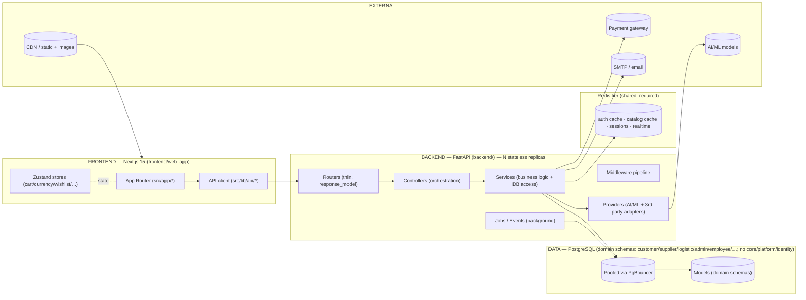
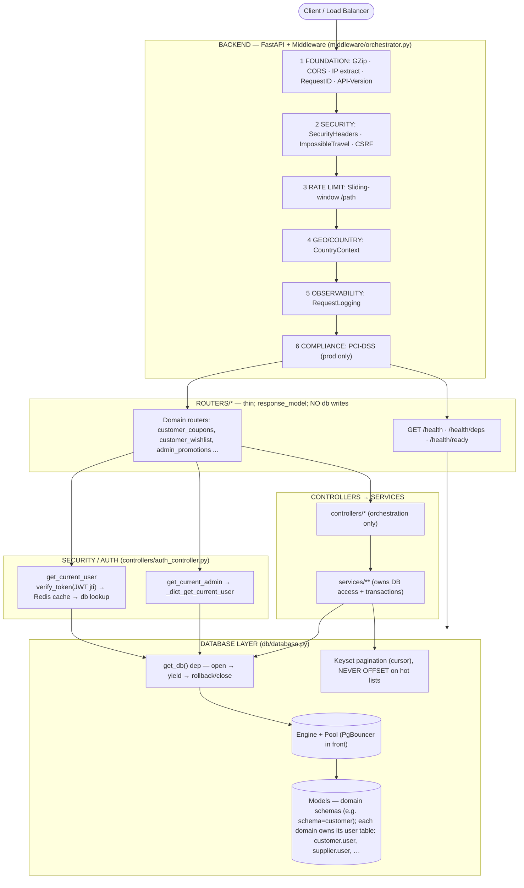
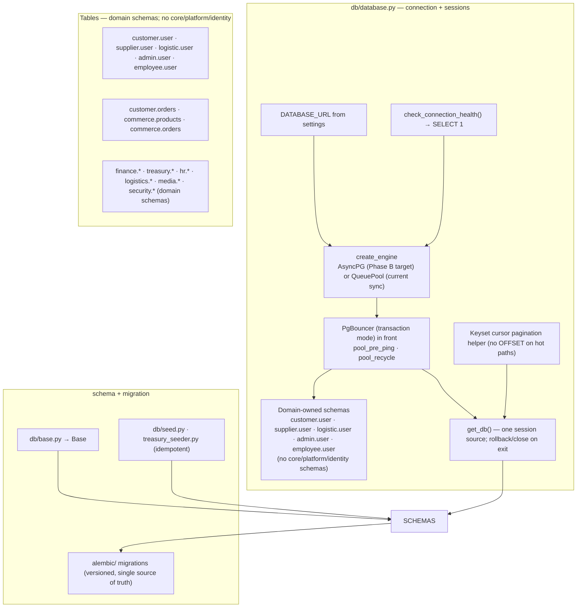
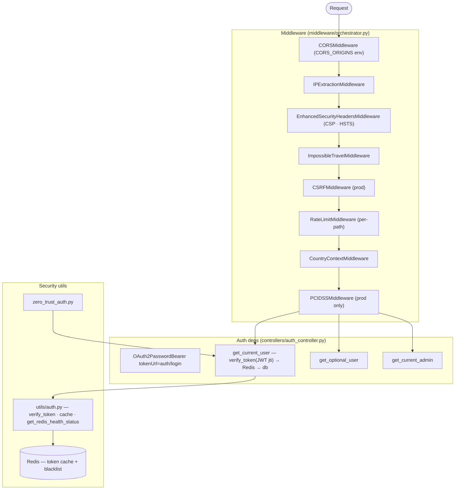
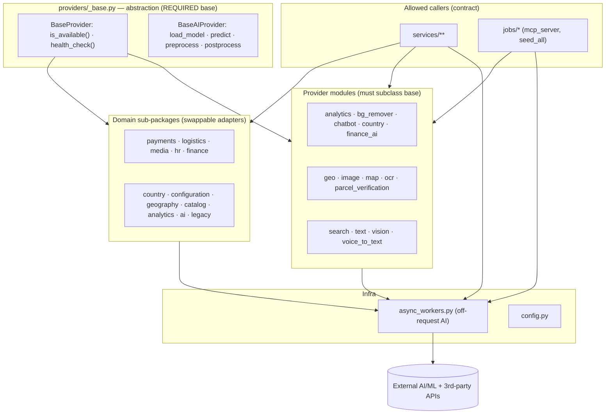
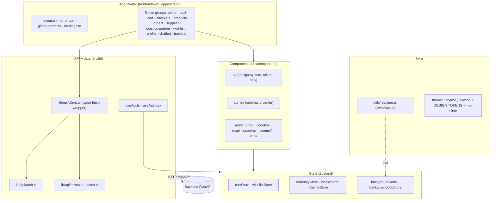
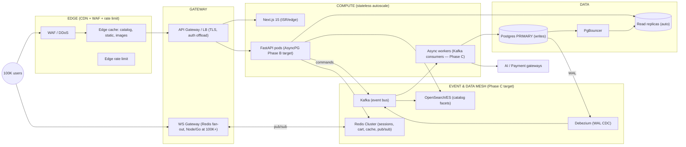

# ZOZI System Audit Report (target-contract aligned)

> **Generated:** 2026-08-09T09:17:48.879146+00:00  
> **Repo:** `D:\Projects\10- E-COMMERCE WEBSITE\zozi`  
> **Result:** 🔴 1505 violations · 🟡 6241 advisories · 🟢 78 info  
> **Architecture Debt Score:** 282725  
**Ephemeral. Add to `.gitignore`.**

---

## 1. The Grid Line (Target Layer Contract)

| Layer | May import | Must NOT |
|---|---|---|
| main.py | middleware, dependencies, routers, db, utils, lifespan, data | controllers, services, models directly |
| routers/* | controllers, schemas, auth deps, get_db | raw db.query(...), any db.add/commit (W1), business logic |
| controllers/* | services, models, get_db, auth deps | db.add/commit (W1), ORM internals |
| services/** | models, get_db, utils, providers, redis | routers, main |
| providers/* | providers._base, utils, settings | routers, main |
| db/database.py | db.base.Base, settings | app layers |
| middleware/* | utils, settings, db (read-only) | routers, controllers |
| frontend/src/lib/api/* | backend /api/v1/* only | direct DB; raw fetch from pages |

Cross-domain FKs are **allowed** across domain schemas (e.g. order.employee_id → employee.user.id). Keyset cursors on hot lists (never OFFSET).  
One canonical RLS enforcer. create_all() dev-only.

---

## 2. Target Architecture (should-be, from ARCHITECTURE_DIAGRAM.md)

### 2.1 System Context


### 2.2 Backend Circuit (target request lifecycle)


### 2.3 Database Subsystem


### 2.4 Security Subsystem


### 2.5 Providers Subsystem


### 2.6 Frontend Subsystem


### 2.7 Production Scaling Topology (100K target)


### 2.8 Phase Annotations

| Phase | Goal | Pre-req | Status in codebase |
|---|---|---|---|
| **A** | ~10K–20K concurrent (existing code) | PgBouncer + read replica + single Redis + CDN + keyset pagination | Config-only; `utils/cache.py` + `redis_client.py` present |
| **B** | ~50K+ concurrent | AsyncPG + SQLAlchemy 2.0 async sessions + replica fan-out + Redis pub/sub WS fan-out | Rewrite needed; sync-only today |
| **C** | 100K throughput | Kafka + Debezium CDC + OpenSearch + Redis Cluster + dedicated WS gateway + partitioned primary | Greenfield; not in codebase |

> **Note:** the architecture uses DOMAIN schemas (customer, supplier, logistic, admin, employee, …), each owning its own `user` table (customer.user.id, supplier.user.id, …). The forbidden schemas are core/platform/identity.


---

## 3. AI File Placement Contract

## AI File Placement Contract

> **Rule for AI:** Before creating or moving any backend file, use this contract.

### Layer rules

| Layer | Structure | Correct examples |
|---|---|---|
| `backend/routers/` | **Flat file**: `{surface}_{domain}_{operation}.py` | `admin_orders_management.py`, `supplier_orders_fulfillment.py`, `customer_orders_tracking.py`, `public_catalog_product_browsing.py` |
| `backend/controllers/` | Domain folder + surface-prefixed controller file | `controllers/orders/admin_order_management_controller.py`, `controllers/catalog/supplier_product_management_controller.py` |
| `backend/services/` | Domain folder | `services/orders/order_management_service.py`, `services/finance/payment_processing_service.py` |
| `backend/models/` | Domain folder | `models/orders/order_entities.py` |
| `backend/providers/` | Domain/adapter folder | `providers/ai/image_analysis_provider.py` |
| `backend/events/` | Domain folder | `events/orders/order_events.py` |
| `backend/jobs/` | Domain folder | `jobs/finance/payout_batch_job.py` |

### Admin CRUD handling

Admin is a **surface**, not a domain.

Do not create:

```text
backend/services/admin/
backend/controllers/admin/
backend/routers/admin/
```

Use this instead:

```text
backend/routers/admin_orders_management.py
backend/controllers/orders/admin_order_management_controller.py
backend/services/orders/order_management_service.py
```

### Forbidden folders

```text
backend/routers/admin/
backend/routers/finance/
backend/routers/catalog/
backend/routers/orders/
backend/controllers/admin/
backend/services/admin/
backend/models/admin/
backend/providers/admin/
backend/events/admin/
backend/jobs/admin/
backend/services/write/
backend/services/common/
backend/services/legacy/
```

### Domain keyword routing

| Domain | Put files here | Keywords |
|---|---|---|
| `ai` | `backend/services/ai/`, `backend/models/ai/`, `backend/controllers/ai/` | ai, automation, bg, bg_removal, chatbot, embedding, embeddings, image_ai, ml, model, ocr, recommendation, removal, research |
| `analytics` | `backend/services/analytics/`, `backend/models/analytics/`, `backend/controllers/analytics/` | analytics, dashboard, facet, insights, kpi, metric, metrics, mv, report, reports, snapshot, snapshots |
| `audit` | `backend/services/audit/`, `backend/models/audit/`, `backend/controllers/audit/` | audit, audit_log, audit_trail, auditor, communication_audit, compliance, gdpr, permission_audit, sox, worm |
| `billing` | `backend/services/billing/`, `backend/models/billing/`, `backend/controllers/billing/` | billing, billing_cycle, billing_cycles, charge, charges, receipt, receipts, subscription, subscriptions |
| `catalog` | `backend/services/catalog/`, `backend/models/catalog/`, `backend/controllers/catalog/` | advanced_filter, advanced_search, catalog, categories, category, filter, filters, moderation, product, product_moderation, product_verification, products, sku, variant |
| `commerce` | `backend/services/commerce/`, `backend/models/commerce/`, `backend/controllers/commerce/` | banner, banners, campaign, commerce, coupon, coupons, discount, discounts, flash_sale, loyalty, promotion, promotions, referral, voucher |
| `comms` | `backend/services/comms/`, `backend/models/comms/`, `backend/controllers/comms/` | chat, comm, comms, communication, email, fix_chat, meeting, message, messages, notification, notifications, push, sms, ticket |
| `configuration` | `backend/services/configuration/`, `backend/models/configuration/`, `backend/controllers/configuration/` | config, configuration, env, feature, feature_flag, flag, parameter, rules, settings, toggle, toggles |
| `customer` | `backend/services/customer/`, `backend/models/customer/`, `backend/controllers/customer/` | address, addresses, customer, customer_health, customers, point, points, preferences, profile, segment |
| `documents` | `backend/services/documents/`, `backend/models/documents/`, `backend/controllers/documents/` | attachment, attachments, certificate, certificates, contract_document, document, documents |
| `events` | `backend/services/events/`, `backend/models/events/`, `backend/controllers/events/` | event_log, event_subscription, event_subscriptions, events, outbox, outbox_events, saga |
| `finance` | `backend/services/finance/`, `backend/models/finance/`, `backend/controllers/finance/` | accounting, budget, commission, commission_write, credit_control, erp, finance, finance_automation, finance_erp, financial, financial_reporting, financial_reports, fiscal, general_ledger |
| `gateway` | `backend/services/gateway/`, `backend/models/gateway/`, `backend/controllers/gateway/` | checkout_gateway, gateway, logistic_payments, payment_adapter, payment_gateway, payment_processor, payment_provider, paypal, paytabs, stripe, supplier_payments, tap, thawani |
| `geography` | `backend/services/geography/`, `backend/models/geography/`, `backend/controllers/geography/` | border, cities, city, countries, country, country_detection, country_research, cross_border, cross_border_tracker, currency, economics, geo, geography, localization |
| `hr` | `backend/services/hr/`, `backend/models/hr/`, `backend/controllers/hr/` | attendance, background, background_check, coi, dei, employee, employees, handover, hr, hse, leave, lms, offboarding, payroll |
| `identity` | `backend/services/identity/`, `backend/models/identity/`, `backend/controllers/identity/` | approval, approval_matrix, device, devices, identity, mfa, oauth, otp, rbac, role, roles, session, sessions, token |
| `inventory` | `backend/services/inventory/`, `backend/models/inventory/`, `backend/controllers/inventory/` | inventory, reorder, reservation, reservations, stock, stock_adjustment, stock_movement, warehouse, warehouses |
| `logistics` | `backend/services/logistics/`, `backend/models/logistics/`, `backend/controllers/logistics/` | carrier, delivery, dispatch, fleet, geo_fence, geofence, live_tracking, logistics, map, parcel, pod, route, routes, shipment |
| `media` | `backend/services/media/`, `backend/models/media/`, `backend/controllers/media/` | asset, assets, cdn, file, free_image, image, images, media, storage, upload, uploads, video |
| `notifications` | `backend/services/notifications/`, `backend/models/notifications/`, `backend/controllers/notifications/` | email_template, notification_template, notification_templates, notifications, push_token, push_tokens, sms_template |
| `orders` | `backend/services/orders/`, `backend/models/orders/`, `backend/controllers/orders/` | cart, checkout, dispute, disputes, fulfillment, ghost, order, orders, purchase, purchases, return, returns |
| `permissions` | `backend/services/permissions/`, `backend/models/permissions/`, `backend/controllers/permissions/` | access_control, permission_grant, permission_grants, permissions, rbac_policies, rbac_policy |
| `pricing` | `backend/services/pricing/`, `backend/models/pricing/`, `backend/controllers/pricing/` | price_history, price_list, price_lists, price_rule, pricing, tax_rate, tax_rates |
| `reporting` | `backend/services/reporting/`, `backend/models/reporting/`, `backend/controllers/reporting/` | export, exports, report_template, reporting, scheduled_report, scheduled_reports |
| `reviews` | `backend/services/reviews/`, `backend/models/reviews/`, `backend/controllers/reviews/` | rating, ratings, review, review_moderation, review_response, reviews |
| `search` | `backend/services/search/`, `backend/models/search/`, `backend/controllers/search/` | autocomplete, search, search_config, search_index, search_log, synonym, synonyms |
| `security` | `backend/services/security/`, `backend/models/security/`, `backend/controllers/security/` | auth, authentication, authorization, biometric, blacklist, csrf, device_binding, dlp, fraud, ghost_watchdog, iam, incident, permission, permissions |
| `shipping` | `backend/services/shipping/`, `backend/models/shipping/`, `backend/controllers/shipping/` | carrier_config, carrier_configs, shipping, shipping_rate, shipping_rates, shipping_zone, shipping_zones |
| `supplier` | `backend/services/supplier/`, `backend/models/supplier/`, `backend/controllers/supplier/` | badge, contract, kyc, onboarding, storefront, supplier, supplier_badge, supplier_health, supplier_inventory, supplier_onboarding, supplier_products, supplier_profile, suppliers, vendor |
| `treasury` | `backend/services/treasury/`, `backend/models/treasury/`, `backend/controllers/treasury/` | auto_payout, bank, cash, cash_flow, fx, gateway_reconciliation, payment_engine, payment_orchestrator, payout, payout_batch, payouts, settlement, settlements, treasurer |
| `webhooks` | `backend/services/webhooks/`, `backend/models/webhooks/`, `backend/controllers/webhooks/` | webhook, webhook_delivery, webhook_endpoint, webhook_log, webhooks |

### If domain is unclear

If a file does not clearly belong to a domain:

```text
backend/_triage/<file>.py
```

Then ask for a domain decision before merging.


---

## 4. Scorecard

| Code | Count | Sev | Meaning |
|---|---:|---|---|
| A1 | 22 | 🟡 ADVISORY | architecture hotspot (high coupling / instability) |
| A2 | 150 | 🟡 ADVISORY | possibly dead/orphan module (no inbound imports; not an entrypoint) |
| API101 | 130 | 🟡 ADVISORY | endpoint missing response_model |
| API2 | 100 | 🟡 ADVISORY | internal symbol exposed outside its module boundary |
| CA1 | 14 | 🟡 ADVISORY | file name does not match file content (operations mismatch) |
| CA2 | 38 | 🟡 ADVISORY | file contains operations from multiple domains (split candidate) |
| CFG5 | 1 | 🟡 ADVISORY | generated governance artifacts not gitignored |
| CG1 | 133 | 🔴 VIOLATION | call graph violation: function calls across forbidden layer boundary |
| CG2 | 117 | 🔴 VIOLATION | call chain violates circuit direction (upward call) |
| CG3 | 1 | 🔴 VIOLATION | circular call chain detected |
| CIR1 | 18 | 🔴 VIOLATION | circuit violation: import is outside the allowed layer circuit |
| CIR2 | 161 | 🟡 ADVISORY | circuit bypass: import skips the preferred layer (migration warning) |
| D1 | 6 | 🟡 ADVISORY | duplicate module basename within backend (import-shadow) |
| D3 | 150 | 🟡 ADVISORY | duplicate class name across modules |
| DB1 | 5 | 🟡 ADVISORY | ORM model missing __table_args__ schema declaration |
| DBA01 | 14 | 🟡 ADVISORY | model declares a forbidden (core/platform/identity) PostgreSQL schema= argument |
| DBA02 | 8 | 🟡 ADVISORY | Base.metadata.create_all not safely dev-gated |
| DBA03 | 274 | 🟡 ADVISORY | mandatory column set / mixin missing |
| DBA04 | 1 | 🟡 ADVISORY | country_code width mismatch |
| DBA05 | 1 | 🔴 VIOLATION | RLS coverage missing or weak |
| DBA07 | 346 | 🟡 ADVISORY | unsafe or missing FK cascade rule |
| DBA08 | 255 | 🟡 ADVISORY | FK column missing index |
| DBA09 | 55 | 🟡 ADVISORY | JSONB column missing GIN index signal |
| DBA11 | 28 | 🟡 ADVISORY | database naming convention violation |
| DBA12 | 9 | 🟡 ADVISORY | migration governance missing or unsafe |
| DBA18 | 1 | 🟡 ADVISORY | audit log taxonomy missing or fragmented |
| DBA23 | 1 | 🟡 ADVISORY | partition strategy missing for hot append-only tables |
| DBA26 | 20 | 🔴 VIOLATION | ORM model outside backend/models/ |
| DBA31 | 48 | 🟡 ADVISORY | required composite index signal missing |
| DBA32 | 38 | 🟡 ADVISORY | unsafe pagination/query pattern (OFFSET in request path) |
| DG | 198 | 🔴 VIOLATION | forbidden dependency-graph edge (layer contract violated) |
| DG2 | 71 | 🟡 ADVISORY | circular dependency detected |
| DG4 | 2 | 🟡 ADVISORY | dynamic import edge detected |
| DG5 | 19 | 🟡 ADVISORY | dynamic execution obscures dependency graph |
| DOM2 | 26 | 🟡 ADVISORY | file is inside the wrong domain folder |
| DOM3 | 1 | 🔴 VIOLATION | surface folder used where domain folder is required |
| DOM6 | 50 | 🟢 INFO | new domain candidate auto-detected |
| DOM7 | 7 | 🟡 ADVISORY | unknown or non-canonical domain folder |
| DOM8 | 1 | 🟢 INFO | correctly placed domain files |
| DP103 | 1 | 🟡 ADVISORY | missing env var validation at startup |
| DP104 | 1 | 🟡 ADVISORY | missing graceful shutdown handler |
| DP105 | 1 | 🟡 ADVISORY | missing .dockerignore |
| DS01 | 60 | 🟡 ADVISORY | hardcoded CSS: inline style={{...}} object in component |
| DS02 | 3 | 🔴 VIOLATION | hardcoded CSS:- <style> </style> tag inside a component file |
| DS03 | 30 | 🟡 ADVISORY | raw/off-palette color literal (bypasses design tokens) |
| DS04 | 14 | 🟡 ADVISORY | color theme drift: near-duplicate colors used as if different |
| DS07 | 2 | 🟡 ADVISORY | hardcoded typography (font size / family literal) |
| DS08 | 1 | 🟡 ADVISORY | hardcoded spacing/dimension (raw px) |
| DS09 | 1 | 🟡 ADVISORY | inconsistent border-radius values |
| DS11 | 1 | 🟡 ADVISORY | inconsistent box-shadow values |
| DS16 | 1 | 🟡 ADVISORY | inconsistent motion durations (transition/animation) |
| F1 | 10 | 🟡 ADVISORY | scratch/debug script (delete; ops scripts -> scripts/maintenance|validation) |
| F2 | 35 | 🟡 ADVISORY | hardcoded developer-local absolute path in source |
| F4 | 65 | 🟡 ADVISORY | committed cache/build/artifact present (bloat) |
| F9 | 5 | 🟡 ADVISORY | repo-root note outside allow-list / banned dir |
| FE2 | 21 | 🟡 ADVISORY | frontend scratch/artifact script at package root |
| FE3 | 3 | 🟡 ADVISORY | frontend flat folder scaling warning |
| FE6 | 73 | 🟡 ADVISORY | frontend console/debugger statement left in source |
| FE7 | 30 | 🟡 ADVISORY | frontend component in wrong feature folder |
| FEH101 | 58 | 🟡 ADVISORY | oversized frontend file/component |
| FEH201 | 73 | 🟡 ADVISORY | console/debugger in frontend code |
| FEH301 | 12 | 🟡 ADVISORY | missing React error boundary |
| FEH401 | 9 | 🟡 ADVISORY | too many inline JSX handlers |
| FEH402 | 114 | 🟡 ADVISORY | list key uses array index |
| FEH501 | 157 | 🟡 ADVISORY | data fetching inside useEffect |
| FEH502 | 1 | 🟡 ADVISORY | heavy frontend import (lazy-load) |
| FEH503 | 72 | 🟡 ADVISORY | direct DOM access in React |
| FEH504 | 1 | 🟡 ADVISORY | large list rendering (virtualization) |
| FEH601 | 7 | 🟡 ADVISORY | large component without memoization |
| FEH701 | 4 | 🟡 ADVISORY | heavy client-side transformation |
| FEH801 | 29 | 🟡 ADVISORY | missing Suspense/lazy for code splitting |
| FEH802 | 30 | 🟡 ADVISORY | raw  without next/image |
| FT1 | 4 | 🟡 ADVISORY | flow-type violation: operation not allowed for this surface×domain flow |
| G1 | 2 | 🟡 ADVISORY | second migrations home / dual schema-creator |
| H1 | 13 | 🟡 ADVISORY | sys.path.insert/append (import-resolution footgun) |
| HL101 | 35 | 🟡 ADVISORY | oversized Python file |
| HL102 | 101 | 🟡 ADVISORY | oversized Python function |
| HL110 | 1 | 🟡 ADVISORY | missing docstring on public service/controller function |
| HL201 | 19 | 🟡 ADVISORY | print() used instead of structured logging |
| HL203 | 23 | 🟡 ADVISORY | logging.basicConfig() should be configured centrally |
| HL204 | 9 | 🟡 ADVISORY | possible secret/token value in log/print statement |
| HL301 | 3 | 🟡 ADVISORY | bare except hides failures |
| HL302 | 177 | 🟡 ADVISORY | swallowed exception (except + pass / no logging) |
| HL303 | 46 | 🟡 ADVISORY | broad except Exception should be narrowed or logged |
| HL403 | 1 | 🟡 ADVISORY | sync file/OS I/O inside async function |
| HL501 | 19 | 🟡 ADVISORY | heavy top-level import in web path (lazy-load recommended) |
| HL502 | 62 | 🟡 ADVISORY | star import (from x import *) pollutes namespace |
| HL601 | 17 | 🟡 ADVISORY | sequential external calls (concurrency opportunity) |
| HL602 | 22 | 🟡 ADVISORY | missing timeout on external call |
| HL801 | 178 | 🟡 ADVISORY | function needs timing/metrics instrumentation |
| HL901 | 1 | 🟡 ADVISORY |  |
| HL902 | 1 | 🟡 ADVISORY | commented-out code lines (dead code) |
| I1 | 1 | 🟢 INFO | structure summary |
| I2 | 1 | 🟢 INFO | rules source (yaml vs embedded fallback) |
| I3 | 1 | 🟢 INFO | architecture metric summary |
| I4 | 1 | 🟢 INFO | file move suggestions generated |
| L1 | 1 | 🟡 ADVISORY | multiple RLS enforcers (fail-open risk) |
| LC1 | 1 | 🔴 VIOLATION | layer contract violation: forbidden operation in layer |
| M1 | 2 | 🟡 ADVISORY | ORM model outside models/ package |
| MET1 | 1 | 🟢 INFO | architecture debt score |
| MET2 | 17 | 🟡 ADVISORY | module instability exceeds threshold |
| MET3 | 7 | 🟢 INFO | abstractness below threshold (no interfaces) |
| MET5 | 1 | 🔴 VIOLATION | god module detected (excessive responsibility) |
| MR101 | 3 | 🟡 ADVISORY | nested list comprehension (use generator) |
| MR104 | 22 | 🟡 ADVISORY | global mutable state (breaks scaling) |
| MV1 | 45 | 🟡 ADVISORY | flat layer file should be moved into its detected domain folder |
| MV2 | 2 | 🟡 ADVISORY | mis-housed / backend-root file should be relocated to canonical layer |
| MW2 | 1 | 🟡 ADVISORY | required middleware missing |
| MW3 | 4 | 🔴 VIOLATION | middleware imports service/controller (circuit violation) |
| NM | 6 | 🟢 INFO | node_modules present (confirm gitignored) |
| OB101 | 5 | 🟡 ADVISORY | module missing structured logger |
| OB102 | 3 | 🟡 ADVISORY | missing request_id / correlation_id |
| P1 | 1 | 🟡 ADVISORY | scratch script at backend root (delete / scripts/) |
| P2 | 1 | 🟡 ADVISORY | controller file outside controllers/ |
| P3 | 6 | 🟡 ADVISORY | module at backend root (belongs in a layer package) |
| P4 | 1 | 🟡 ADVISORY | missing expected backend package |
| P5 | 13 | 🟡 ADVISORY | python package missing __init__.py |
| PERF2 | 67 | 🟡 ADVISORY | possible DB query inside loop (N+1 risk) |
| PERF4 | 202 | 🟡 ADVISORY | unbounded query detected (no limit clause) |
| PF1 | 1 | 🟢 INFO | required project file missing |
| PF2 | 9 | 🟡 ADVISORY | required scope document missing |
| PG102 | 27 | 🟡 ADVISORY | WebSocket in Python (consider Node.js gateway) |
| PG103 | 9 | 🟡 ADVISORY | CPU-bound work in request path (offload to worker) |
| PG201 | 1 | 🟡 ADVISORY | frontend main-thread CPU work (use Web Worker) |
| PL100 | 1 | 🟢 INFO | pipeline component present |
| PL101 | 1 | 🟡 ADVISORY | pipeline component missing |
| PRV1 | 7 | 🟡 ADVISORY | provider class does not subclass BaseProvider/BaseAIProvider |
| Q1 | 1391 | 🟡 ADVISORY | controller/router reads via db.query (delegate) |
| QUAL1 | 91 | 🟡 ADVISORY | weak exception handling (bare except / swallowed exception) |
| QUAL2 | 5 | 🟡 ADVISORY | TODO/FIXME technical debt marker |
| QUAL3 | 99 | 🟡 ADVISORY | oversized file or function (scaling/maintainability risk) |
| QUAL4 | 83 | 🟡 ADVISORY | print/debug output in application code |
| R1 | 15 | 🔴 VIOLATION | APIRouter instantiated outside routers/ |
| RN1 | 124 | 🟡 ADVISORY | router path/name does not match the configured router contract |
| S1 | 1 | 🟡 ADVISORY | services/ is flat (needs domain sub-packages) |
| S2 | 30 | 🟡 ADVISORY | overlapping service stems (ownership ambiguity) |
| S3 | 1 | 🟡 ADVISORY | controllers/ flat (group by domain; routers/ is flat by design) |
| SC1 | 1 | 🟡 ADVISORY | DB pool_size exceeds PgBouncer-safe limit (§9.3) |
| SC101 | 45 | 🟡 ADVISORY | list endpoint missing pagination |
| SC2 | 2 | 🟡 ADVISORY | sync-only SQLAlchemy blocks event loop at scale (§9.3 Phase B) |
| SC3 | 3 | 🟢 INFO | in-process WebSocket fan-out won't scale to 100K sockets (§9.3) |
| SC501 | 9 | 🟡 ADVISORY | heavy operation in request path (background job) |
| SEC101 | 10 | 🔴 VIOLATION | raw SQL string concatenation (injection risk) |
| SEC2 | 3 | 🟡 ADVISORY | possible hardcoded secret/token literal in source |
| SEC4 | 1 | 🟡 ADVISORY | insecure runtime setting (debug/cors wildcard with credentials) |
| SEC5 | 36 | 🔴 VIOLATION | potential SQL injection risk |
| SEC6 | 4 | 🟡 ADVISORY | potential SSRF risk |
| SYM1 | 100 | 🟡 ADVISORY | symbol defined but never used (dead symbol) |
| SYM2 | 100 | 🟡 ADVISORY | duplicate symbol definition across modules |
| W1 | 911 | 🔴 VIOLATION | controller/router writes to DB (must be a service) |
| W3 | 40 | 🔴 VIOLATION | imports a mis-housed controller (logic belongs in services/utils) |
| W4 | 68 | 🟡 ADVISORY | controller imports another controller (shared logic -> service/util) |

---

## 5. 🔥 Damage Hotlist (fix these first)

| Sev | Rule | Domain | Location | Problem | Fix |
|---|---|---|---|---|---|
| 🔴 | CG1 | backend | `backend\services\cash_management_service.py:2011` | forbidden call: services.run_scheduled_finance_cycle() → controllers.run_badge_recalculation_cycle() | services must not call controllers directly |
| 🔴 | CG1 | backend | `backend\services\cash_management_service.py:2012` | forbidden call: services.run_scheduled_finance_cycle() → controllers.refresh_admin_analytics_snapshots() | services must not call controllers directly |
| 🔴 | CG1 | backend | `backend\services\finance_automation.py:431` | forbidden call: services._post_gl() → controllers.audit_log() | services must not call controllers directly |
| 🔴 | CG1 | backend | `backend\services\treasury_service.py:101` | forbidden call: services.create_treasury_transaction() → controllers.audit_log() | services must not call controllers directly |
| 🔴 | CG1 | backend | `backend\services\treasury_service.py:176` | forbidden call: services.create_journal_entry() → controllers.audit_log() | services must not call controllers directly |
| 🔴 | CG1 | backend | `backend\routers\addresses.py:79` | forbidden call: routers.create_address() → models.Address() | routers must not call models directly |
| 🔴 | CG1 | backend | `backend\routers\admin_cash.py:30` | forbidden call: routers.create_account() → models.CashAccount() | routers must not call models directly |
| 🔴 | CG1 | backend | `backend\routers\admin_cash.py:48` | forbidden call: routers.create_transaction() → models.CashTransaction() | routers must not call models directly |
| 🔴 | CG1 | backend | `backend\routers\admin_categories.py:35` | forbidden call: routers.create_category() → models.Category() | routers must not call models directly |
| 🔴 | CG1 | backend | `backend\routers\admin_commission.py:16` | forbidden call: routers._build_category_rate() → models.CommissionCategoryRate() | routers must not call models directly |
| 🔴 | CG1 | backend | `backend\routers\admin_commission.py:28` | forbidden call: routers._build_badge_tier() → models.CommissionBadgeTier() | routers must not call models directly |
| 🔴 | CG1 | backend | `backend\routers\admin_email.py:61` | forbidden call: routers.create_campaign() → models.EmailCampaign() | routers must not call models directly |
| 🔴 | CG1 | backend | `backend\routers\admin_payouts.py:56` | forbidden call: routers.create_payout() → models.Payout() | routers must not call models directly |
| 🔴 | CG1 | backend | `backend\routers\admin_promotions.py:96` | forbidden call: routers.create_coupon() → models.Coupon() | routers must not call models directly |
| 🔴 | CG1 | backend | `backend\routers\admin_promotions.py:183` | forbidden call: routers.create_flash_sale() → models.FlashSale() | routers must not call models directly |
| 🔴 | CG1 | backend | `backend\routers\admin_promotions.py:324` | forbidden call: routers.create_banner_promotion() → models.Banner() | routers must not call models directly |
| 🔴 | CG1 | backend | `backend\routers\admin_promotions.py:545` | forbidden call: routers.create_coupon_by_country() → models.Coupon() | routers must not call models directly |
| 🔴 | CG1 | backend | `backend\routers\admin_promotions.py:631` | forbidden call: routers.create_banner_by_country() → models.Banner() | routers must not call models directly |
| 🔴 | CG1 | backend | `backend\routers\admin_treasury.py:217` | forbidden call: routers.admin_generate_payout_batch() → models.PayoutBatch() | routers must not call models directly |
| 🔴 | CG1 | backend | `backend\routers\admin_treasury.py:229` | forbidden call: routers.admin_generate_payout_batch() → models.PayoutBatchItem() | routers must not call models directly |
| 🔴 | CG1 | backend | `backend\routers\admin_treasury.py:428` | forbidden call: routers.admin_snapshot_cash_position() → models.CashPositionSnapshot() | routers must not call models directly |
| 🔴 | CG1 | backend | `backend\routers\admin_treasury.py:1073` | forbidden call: routers.admin_record_cod_remittance() → models.LogisticsCODRemittanceReceipt() | routers must not call models directly |
| 🔴 | CG1 | backend | `backend\routers\admin_treasury.py:1123` | forbidden call: routers.admin_settle_supplier() → models.SupplierSettlement() | routers must not call models directly |
| 🔴 | CG1 | backend | `backend\routers\ai_upload.py:103` | forbidden call: routers._enrich_one() → models.AIStagingProduct() | routers must not call models directly |
| 🔴 | CG1 | backend | `backend\routers\ai_upload.py:236` | forbidden call: routers._publish_staging() → models.Product() | routers must not call models directly |
| 🔴 | CG1 | backend | `backend\routers\ai_upload.py:312` | forbidden call: routers.create_ai_upload_job() → models.AIUploadJob() | routers must not call models directly |
| 🔴 | CG1 | backend | `backend\routers\ai_upload.py:159` | forbidden call: routers.process_ai_upload_job() → db.get_db_context() | routers must not call db directly |
| 🔴 | CG1 | backend | `backend\routers\ai_upload.py:271` | forbidden call: routers._publish_staging() → models.ProductVariant() | routers must not call models directly |
| 🔴 | CG1 | backend | `backend\routers\ai_upload.py:92` | forbidden call: routers._enrich_one() → models.AIGenerationLog() | routers must not call models directly |
| 🔴 | CG1 | backend | `backend\routers\ai_upload.py:131` | forbidden call: routers._enrich_one() → models.AIStagingVariant() | routers must not call models directly |
| 🔴 | CG1 | backend | `backend\routers\ai_upload.py:193` | forbidden call: routers.process_ai_upload_job() → models.AIGenerationLog() | routers must not call models directly |
| 🔴 | CG1 | backend | `backend\routers\auth.py:65` | forbidden call: routers._record_login_history() → models.UserLoginHistory() | routers must not call models directly |
| 🔴 | CG1 | backend | `backend\routers\auth.py:190` | forbidden call: routers.register() → models.User() | routers must not call models directly |
| 🔴 | CG1 | backend | `backend\routers\auth.py:204` | forbidden call: routers.register() → db.TokenResponse() | routers must not call db directly |
| 🔴 | CG1 | backend | `backend\routers\auth.py:129` | forbidden call: routers.login() → db.TokenResponse() | routers must not call db directly |
| 🔴 | CG1 | backend | `backend\routers\auth.py:176` | forbidden call: routers.register() → db._validate_password_complexity() | routers must not call db directly |
| 🔴 | CG1 | backend | `backend\routers\auth.py:247` | forbidden call: routers.refresh() → db.TokenResponse() | routers must not call db directly |
| 🔴 | CG1 | backend | `backend\routers\auth.py:208` | forbidden call: routers.register() → db.model_validate() | routers must not call db directly |
| 🔴 | CG1 | backend | `backend\routers\auth.py:133` | forbidden call: routers.login() → db.model_validate() | routers must not call db directly |
| 🔴 | CG1 | backend | `backend\routers\auth.py:251` | forbidden call: routers.refresh() → db.model_validate() | routers must not call db directly |
| 🔴 | CG1 | backend | `backend\routers\batch_upload.py:434` | forbidden call: routers.batch_analyze_products() → providers.cleanup() | routers must not call providers directly |
| 🔴 | CG1 | backend | `backend\routers\batch_upload.py:391` | forbidden call: routers.process_one() → providers.remove_background_async() | routers must not call providers directly |
| 🔴 | CG1 | backend | `backend\routers\batch_upload.py:394` | forbidden call: routers.process_one() → providers.analyze_product_image_async() | routers must not call providers directly |
| 🔴 | CG1 | backend | `backend\routers\batch_upload.py:374` | forbidden call: routers.process_one() → providers._bytes_to_image() | routers must not call providers directly |
| 🔴 | CG1 | backend | `backend\routers\batch_upload.py:370` | forbidden call: routers.process_one() → providers.remove_background_async() | routers must not call providers directly |
| 🔴 | CG1 | backend | `backend\routers\cart.py:93` | forbidden call: routers.add_to_cart() → models.CartItem() | routers must not call models directly |
| 🔴 | CG1 | backend | `backend\routers\cart.py:121` | forbidden call: routers.update_cart_item() → models.CartItem() | routers must not call models directly |
| 🔴 | CG1 | backend | `backend\routers\categories.py:55` | forbidden call: routers.create_category() → models.Category() | routers must not call models directly |
| 🔴 | CG1 | backend | `backend\routers\categories.py:131` | forbidden call: routers.delete_category() → db.MessageResponse() | routers must not call db directly |
| 🔴 | CG1 | backend | `backend\routers\countries.py:412` | forbidden call: routers.create_country_feature_flag() → models.CountryFeatureFlag() | routers must not call models directly |
| 🔴 | CG1 | backend | `backend\routers\countries.py:581` | forbidden call: routers.add_country_city() → models.CountryCity() | routers must not call models directly |
| 🔴 | CG1 | backend | `backend\routers\countries.py:873` | forbidden call: routers.create_country_commission_rate() → models.CountryCommissionRate() | routers must not call models directly |
| 🔴 | CG1 | backend | `backend\routers\country_admin.py:100` | forbidden call: routers.send_country_communication() → models.CountryCommunication() | routers must not call models directly |
| 🔴 | CG1 | backend | `backend\routers\country_admin.py:237` | forbidden call: routers.add_city() → models.CountryCity() | routers must not call models directly |
| 🔴 | CG1 | backend | `backend\routers\country_admin.py:351` | forbidden call: routers.assign_staff() → models.CountryStaffAssignment() | routers must not call models directly |
| 🔴 | CG1 | backend | `backend\routers\country_admin.py:429` | forbidden call: routers.set_tax_rate() → models.CountryCategoryTaxRate() | routers must not call models directly |
| 🔴 | CG1 | backend | `backend\routers\country_auto_populate.py:85` | forbidden call: routers.save_country_from_suggestion() → models.CountryConfig() | routers must not call models directly |
| 🔴 | CG1 | backend | `backend\routers\country_auto_populate.py:135` | forbidden call: routers.save_country_from_suggestion() → models.SupplierKYCRequirement() | routers must not call models directly |
| 🔴 | CG1 | backend | `backend\routers\country_auto_populate.py:110` | forbidden call: routers.save_country_from_suggestion() → models.CountryCity() | routers must not call models directly |
| 🔴 | CG1 | backend | `backend\routers\country_auto_populate.py:125` | forbidden call: routers.save_country_from_suggestion() → models.CountryCommissionRate() | routers must not call models directly |
| 🔴 | CG1 | backend | `backend\routers\country_payouts.py:79` | forbidden call: routers.create_payout_rule_category() → models.PayoutRuleCategory() | routers must not call models directly |
| 🔴 | CG1 | backend | `backend\routers\country_payouts.py:154` | forbidden call: routers.create_payout_rule_product() → models.PayoutRuleProduct() | routers must not call models directly |
| 🔴 | CG1 | backend | `backend\routers\country_staff.py:131` | forbidden call: routers.assign_staff_to_country() → models.CountryStaffAssignment() | routers must not call models directly |
| 🔴 | CG1 | backend | `backend\routers\coupons.py:148` | forbidden call: routers.create_coupon() → models.Coupon() | routers must not call models directly |
| 🔴 | CG1 | backend | `backend\routers\cross_border.py:83` | forbidden call: routers.get_cross_border_session() → db.get_db_context() | routers must not call db directly |
| 🔴 | CG1 | backend | `backend\routers\email.py:236` | forbidden call: routers.create_campaign() → models.EmailCampaign() | routers must not call models directly |
| 🔴 | CG1 | backend | `backend\routers\email.py:262` | forbidden call: routers.create_template() → models.EmailTemplate() | routers must not call models directly |
| 🔴 | CG1 | backend | `backend\routers\email.py:360` | forbidden call: routers.get_email_runtime_config() → models.EmailRuntimeConfig() | routers must not call models directly |
| 🔴 | CG1 | backend | `backend\routers\email.py:375` | forbidden call: routers.update_email_runtime_config() → models.EmailRuntimeConfig() | routers must not call models directly |
| 🔴 | CG1 | backend | `backend\routers\finance_automation.py:246` | forbidden call: routers.create_asset() → models.FixedAsset() | routers must not call models directly |
| 🔴 | CG1 | backend | `backend\routers\finance_automation.py:76` | forbidden call: routers.create_account() → models.Account() | routers must not call models directly |
| 🔴 | CG1 | backend | `backend\routers\finance_automation.py:81` | forbidden call: routers.create_account() → models.AccountBalance() | routers must not call models directly |
| 🔴 | CG1 | backend | `backend\routers\finance_erp.py:500` | forbidden call: routers.create_recurring() → models.RecurringTemplate() | routers must not call models directly |
| 🔴 | CG1 | backend | `backend\routers\flash_sales.py:32` | forbidden call: routers.create_flash_sale() → models.FlashSale() | routers must not call models directly |
| 🔴 | CG1 | backend | `backend\routers\flash_sales.py:35` | forbidden call: routers.create_flash_sale() → models.FlashSaleItem() | routers must not call models directly |
| 🔴 | CG1 | backend | `backend\routers\fraud_detection.py:114` | forbidden call: routers.add_to_blacklist() → models.FraudBlacklist() | routers must not call models directly |
| 🔴 | CG1 | backend | `backend\routers\fraud_detection.py:149` | forbidden call: routers.create_rule() → models.FraudRule() | routers must not call models directly |
| 🔴 | CG1 | backend | `backend\routers\fraud_detection.py:259` | forbidden call: routers.get_threat_feed_status() → db.ThreatFeedStatus() | routers must not call db directly |
| 🔴 | CG1 | backend | `backend\routers\fraud_detection.py:72` | forbidden call: routers.list_fraud_events() → db.FraudEventOut() | routers must not call db directly |
| 🔴 | CG1 | backend | `backend\routers\hierarchy.py:118` | forbidden call: routers.create_org_unit() → models.OrgUnit() | routers must not call models directly |
| 🔴 | CG1 | backend | `backend\routers\logistics.py:168` | forbidden call: routers.admin_update_shipment_status() → models.ShipmentEvent() | routers must not call models directly |
| 🔴 | CG1 | backend | `backend\routers\logistics_locations.py:70` | forbidden call: routers.create_logistics_partner_location() → models.LogisticsPartnerLocation() | routers must not call models directly |
| 🔴 | CG1 | backend | `backend\routers\parcel_tracking.py:61` | forbidden call: routers.create_parcel_tracking() → models.ParcelLocationTracker() | routers must not call models directly |
| 🔴 | CG1 | backend | `backend\routers\products.py:143` | forbidden call: routers.create_product() → models.Product() | routers must not call models directly |
| 🔴 | CG1 | backend | `backend\routers\public_configuration_health_status.py:73` | forbidden call: routers.health_ready() → db.check_connection_health() | routers must not call db directly |
| 🔴 | CG1 | backend | `backend\routers\public_configuration_health_status.py:94` | forbidden call: routers.health_ready() → db.SessionLocal() | routers must not call db directly |
| 🔴 | CG1 | backend | `backend\routers\push_notifications.py:55` | forbidden call: routers.register_push_token() → models.PushNotificationToken() | routers must not call models directly |
| 🔴 | CG1 | backend | `backend\routers\referrals.py:32` | forbidden call: routers.get_referral_code() → models.Referral() | routers must not call models directly |
| 🔴 | CG1 | backend | `backend\routers\returns.py:83` | forbidden call: routers.bulk_update_returns() → db.ReturnRequestUpdate() | routers must not call db directly |
| 🔴 | CG1 | backend | `backend\routers\reviews.py:74` | forbidden call: routers.create_product_review() → models.Review() | routers must not call models directly |
| 🔴 | CG1 | backend | `backend\routers\search.py:204` | forbidden call: routers.visual_search() → providers.process_image_search() | routers must not call providers directly |
| 🔴 | CG1 | backend | `backend\routers\search.py:44` | forbidden call: routers.voice_search() → providers.transcribe_audio() | routers must not call providers directly |
| 🔴 | CG1 | backend | `backend\routers\shipments.py:25` | forbidden call: routers.create_shipment() → models.Shipment() | routers must not call models directly |
| 🔴 | CG1 | backend | `backend\routers\shipments.py:41` | forbidden call: routers.add_event() → models.ShipmentEvent() | routers must not call models directly |
| 🔴 | CG1 | backend | `backend\routers\shop_locations.py:59` | forbidden call: routers.create_shop_location() → models.ShopWarehouseLocation() | routers must not call models directly |
| 🔴 | CG1 | backend | `backend\routers\supplier_bg_ab_test.py:159` | forbidden call: routers._run_ab_test() → providers._bytes_to_image() | routers must not call providers directly |
| 🔴 | CG1 | backend | `backend\routers\supplier_bg_ab_test.py:179` | forbidden call: routers._run_ab_test() → providers._bytes_to_image() | routers must not call providers directly |
| 🔴 | CG1 | backend | `backend\routers\supplier_finance.py:374` | forbidden call: routers.upsert_supplier_bank_account() → models.SupplierBankAccount() | routers must not call models directly |
| 🔴 | CG1 | backend | `backend\routers\supplier_orders.py:368` | forbidden call: routers.verify_parcel_proof() → providers.verify_parcel_photo() | routers must not call providers directly |
| 🔴 | CG1 | backend | `backend\routers\supplier_orders.py:382` | forbidden call: routers.verify_parcel_proof() → providers.verify_parcel_fast() | routers must not call providers directly |
| 🔴 | CG1 | backend | `backend\routers\supplier_payouts.py:46` | forbidden call: routers.request_payout() → models.Payout() | routers must not call models directly |
| 🔴 | CG1 | backend | `backend\routers\supplier_profile.py:22` | forbidden call: routers.create_supplier_profile() → models.SupplierProfile() | routers must not call models directly |
| 🔴 | CG1 | backend | `backend\routers\tickets.py:65` | forbidden call: routers.create_ticket() → models.SupportTicket() | routers must not call models directly |
| 🔴 | CG1 | backend | `backend\routers\tickets.py:72` | forbidden call: routers.create_ticket() → models.TicketMessage() | routers must not call models directly |
| 🔴 | CG1 | backend | `backend\routers\tickets.py:100` | forbidden call: routers.reply_to_ticket() → models.TicketMessage() | routers must not call models directly |
| 🔴 | CG1 | backend | `backend\routers\tickets.py:121` | forbidden call: routers.add_message() → models.TicketMessage() | routers must not call models directly |
| 🔴 | CG1 | backend | `backend\routers\wishlist.py:44` | forbidden call: routers.add_to_wishlist() → models.WishlistItem() | routers must not call models directly |
| 🔴 | CG1 | backend | `backend\routers\ws_chat.py:214` | forbidden call: routers.websocket_chat() → db.get_db_session() | routers must not call db directly |
| 🔴 | CG1 | backend | `backend\routers\ws_chat.py:439` | forbidden call: routers.websocket_user() → db.get_db() | routers must not call db directly |
| 🔴 | CG1 | backend | `backend\routers\ws_chat.py:128` | forbidden call: routers._persist_message() → models.DirectChatMessage() | routers must not call models directly |
| 🔴 | CG1 | backend | `backend\routers\ws_chat.py:136` | forbidden call: routers._persist_message() → models.GroupChatMessage() | routers must not call models directly |
| 🔴 | CG1 | backend | `backend\routers\ws_chat.py:144` | forbidden call: routers._persist_message() → models.EntityChatMessage() | routers must not call models directly |
| 🔴 | CG1 | backend | `backend\routers\ws_chat.py:243` | forbidden call: routers.websocket_chat() → db.get_db_session() | routers must not call db directly |
| 🔴 | CG1 | backend | `backend\routers\ws_chat.py:281` | forbidden call: routers.websocket_chat() → db.get_db_session() | routers must not call db directly |
| 🔴 | CG1 | backend | `backend\middleware\coi_middleware.py:30` | forbidden call: middleware._coi_check_internal() → services.COIService() | middleware must not call services directly |
| 🔴 | CG1 | backend | `backend\middleware\country_context.py:60` | forbidden call: middleware._get_country_detection_service() → services.CountryDetectionService() | middleware must not call services directly |
| 🔴 | CG1 | backend | `backend\controllers\accounting_controller.py:68` | forbidden call: controllers.create_journal_entry() → db.JournalEntryCreate() | controllers must not call db directly |
| 🔴 | CG1 | backend | `backend\controllers\auth_controller.py:275` | forbidden call: controllers._serialize_referral_event() → db.ReferralPointEventSchema() | controllers must not call db directly |
| 🔴 | CG1 | backend | `backend\controllers\auth_controller.py:1087` | forbidden call: controllers.register_user() → db.model_validate() | controllers must not call db directly |
| 🔴 | CG1 | backend | `backend\controllers\auth_controller.py:1469` | forbidden call: controllers.get_referral_dashboard() → db.ReferralDashboardSchema() | controllers must not call db directly |
| 🔴 | CG1 | backend | `backend\controllers\cart_controller.py:244` | forbidden call: controllers.get_cart_shipping_quote() → db.OrderCreate() | controllers must not call db directly |
| 🔴 | CG1 | backend | `backend\controllers\cash_management_controller.py:861` | forbidden call: controllers._runner() → db.SessionLocal() | controllers must not call db directly |
| 🔴 | CG1 | backend | `backend\controllers\command_center_controller.py:490` | forbidden call: controllers.websocket_endpoint() → db.SessionLocal() | controllers must not call db directly |
| 🔴 | CG1 | backend | `backend\controllers\export_controller.py:468` | forbidden call: controllers._run_export_job() → db.SessionLocal() | controllers must not call db directly |
| 🔴 | CG1 | backend | `backend\controllers\flash_sale_controller.py:106` | forbidden call: controllers.create_flash_sale() → db.model_validate() | controllers must not call db directly |
| 🔴 | CG1 | backend | `backend\controllers\flash_sale_controller.py:140` | forbidden call: controllers.update_flash_sale() → db.model_validate() | controllers must not call db directly |
| 🔴 | CG1 | backend | `backend\controllers\flash_sale_controller.py:50` | forbidden call: controllers.get_active_flash_sales() → db.model_validate() | controllers must not call db directly |
| 🔴 | CG1 | backend | `backend\controllers\flash_sale_controller.py:72` | forbidden call: controllers.get_all_flash_sales() → db.model_validate() | controllers must not call db directly |
| 🔴 | CG1 | backend | `backend\controllers\products_controller.py:196` | forbidden call: controllers._serialize_product() → db.model_validate() | controllers must not call db directly |
| 🔴 | CG1 | backend | `backend\controllers\hr\package.py:42` | forbidden call: controllers.create_employee() → db.Employee() | controllers must not call db directly |
| 🔴 | CG1 | backend | `backend\controllers\hr\package.py:74` | forbidden call: controllers.record_attendance() → db.EmployeeAttendance() | controllers must not call db directly |
| 🔴 | CG1 | backend | `backend\controllers\hr\package.py:21` | forbidden call: controllers.get_db_session() → db.get_db() | controllers must not call db directly |
| 🔴 | CG1 | backend | `backend\controllers\commerce\package.py:284` | forbidden call: controllers._serialize_category() → db.model_validate() | controllers must not call db directly |
| 🔴 | CG2 | backend | `backend\seed_all.py:280` | upward call: seed_all._wipe_data() → db.SessionLocal() | calls must flow downward in the circuit; extract shared logic to a lower layer |
| 🔴 | CG2 | backend | `backend\seed_all.py:309` | upward call: seed_all.seed_users() → db.SessionLocal() | calls must flow downward in the circuit; extract shared logic to a lower layer |
| 🔴 | CG2 | backend | `backend\seed_all.py:367` | upward call: seed_all.seed_products() → db.SessionLocal() | calls must flow downward in the circuit; extract shared logic to a lower layer |
| 🔴 | CG2 | backend | `backend\seed_all.py:487` | upward call: seed_all.seed_orders() → db.SessionLocal() | calls must flow downward in the circuit; extract shared logic to a lower layer |
| 🔴 | CG2 | backend | `backend\seed_all.py:601` | upward call: seed_all.seed_comms() → db.SessionLocal() | calls must flow downward in the circuit; extract shared logic to a lower layer |
| 🔴 | CG2 | backend | `backend\seed_all.py:788` | upward call: seed_all.seed_commission() → db.SessionLocal() | calls must flow downward in the circuit; extract shared logic to a lower layer |
| 🔴 | CG2 | backend | `backend\seed_all.py:790` | upward call: seed_all.seed_commission() → services.seed_defaults() | calls must flow downward in the circuit; extract shared logic to a lower layer |
| 🔴 | CG2 | backend | `backend\seed_all.py:791` | upward call: seed_all.seed_commission() → services.get_global_config() | calls must flow downward in the circuit; extract shared logic to a lower layer |
| 🔴 | CG2 | backend | `backend\seed_all.py:377` | upward call: seed_all.seed_products() → models.Category() | calls must flow downward in the circuit; extract shared logic to a lower layer |
| 🔴 | CG2 | backend | `backend\seed_all.py:408` | upward call: seed_all.seed_products() → models.Product() | calls must flow downward in the circuit; extract shared logic to a lower layer |
| 🔴 | CG2 | backend | `backend\seed_all.py:537` | upward call: seed_all.seed_orders() → models.Order() | calls must flow downward in the circuit; extract shared logic to a lower layer |
| 🔴 | CG2 | backend | `backend\seed_all.py:663` | upward call: seed_all.seed_comms() → models.EntityChatThread() | calls must flow downward in the circuit; extract shared logic to a lower layer |
| 🔴 | CG2 | backend | `backend\seed_all.py:686` | upward call: seed_all.seed_comms() → models.DirectChatRoom() | calls must flow downward in the circuit; extract shared logic to a lower layer |
| 🔴 | CG2 | backend | `backend\seed_all.py:710` | upward call: seed_all.seed_comms() → models.GroupChatRoom() | calls must flow downward in the circuit; extract shared logic to a lower layer |
| 🔴 | CG2 | backend | `backend\seed_all.py:746` | upward call: seed_all.seed_comms() → models.InternalEmail() | calls must flow downward in the circuit; extract shared logic to a lower layer |
| 🔴 | CG2 | backend | `backend\seed_all.py:332` | upward call: seed_all.seed_users() → models.User() | calls must flow downward in the circuit; extract shared logic to a lower layer |
| 🔴 | CG2 | backend | `backend\seed_all.py:567` | upward call: seed_all.seed_orders() → models.OrderItem() | calls must flow downward in the circuit; extract shared logic to a lower layer |
| 🔴 | CG2 | backend | `backend\seed_all.py:626` | upward call: seed_all.seed_comms() → models.Employee() | calls must flow downward in the circuit; extract shared logic to a lower layer |
| 🔴 | CG2 | backend | `backend\seed_all.py:645` | upward call: seed_all.seed_comms() → models.EmailFolder() | calls must flow downward in the circuit; extract shared logic to a lower layer |
| 🔴 | CG2 | backend | `backend\seed_all.py:449` | upward call: seed_all.seed_products() → models.Review() | calls must flow downward in the circuit; extract shared logic to a lower layer |
| 🔴 | CG2 | backend | `backend\seed_all.py:674` | upward call: seed_all.seed_comms() → models.EntityChatMessage() | calls must flow downward in the circuit; extract shared logic to a lower layer |
| 🔴 | CG2 | backend | `backend\seed_all.py:698` | upward call: seed_all.seed_comms() → models.DirectChatMessage() | calls must flow downward in the circuit; extract shared logic to a lower layer |
| 🔴 | CG2 | backend | `backend\seed_all.py:721` | upward call: seed_all.seed_comms() → models.GroupChatMember() | calls must flow downward in the circuit; extract shared logic to a lower layer |
| 🔴 | CG2 | backend | `backend\seed_all.py:728` | upward call: seed_all.seed_comms() → models.GroupChatMessage() | calls must flow downward in the circuit; extract shared logic to a lower layer |
| 🔴 | CG2 | backend | `backend\utils\country_detection_middleware.py:34` | upward call: utils._detect_country() → db.get_db_session() | calls must flow downward in the circuit; extract shared logic to a lower layer |
| 🔴 | CG2 | backend | `backend\utils\country_detection_middleware.py:35` | upward call: utils._detect_country() → services.CountryDetectionService() | calls must flow downward in the circuit; extract shared logic to a lower layer |
| 🔴 | CG2 | backend | `backend\utils\country_rls.py:59` | upward call: utils.enforce_country_access() → services.normalize_country_code() | calls must flow downward in the circuit; extract shared logic to a lower layer |
| 🔴 | CG2 | backend | `backend\utils\country_rls.py:92` | upward call: utils.get_country_or_404() → services.normalize_country_code() | calls must flow downward in the circuit; extract shared logic to a lower layer |
| 🔴 | CG2 | backend | `backend\utils\country_rls.py:26` | upward call: utils.get_country_scope_from_db() → services.normalize_country_code() | calls must flow downward in the circuit; extract shared logic to a lower layer |
| 🔴 | CG2 | backend | `backend\utils\country_rls.py:45` | upward call: utils.get_current_country_scope() → services.normalize_country_code() | calls must flow downward in the circuit; extract shared logic to a lower layer |
| 🔴 | CG2 | backend | `backend\utils\country_rls.py:81` | upward call: utils.enforce_country_access() → services.normalize_country_code() | calls must flow downward in the circuit; extract shared logic to a lower layer |
| 🔴 | CG2 | backend | `backend\utils\email_service.py:182` | upward call: utils._load_runtime_email_config() → db.SessionLocal() | calls must flow downward in the circuit; extract shared logic to a lower layer |
| 🔴 | CG2 | backend | `backend\utils\email_service.py:450` | upward call: utils.send_email() → services.is_email_suppressed() | calls must flow downward in the circuit; extract shared logic to a lower layer |
| 🔴 | CG2 | backend | `backend\utils\email_service.py:489` | upward call: utils.send_email() → services.record_email_delivery_event() | calls must flow downward in the circuit; extract shared logic to a lower layer |
| 🔴 | CG2 | backend | `backend\utils\email_service.py:452` | upward call: utils.send_email() → services.record_email_delivery_event() | calls must flow downward in the circuit; extract shared logic to a lower layer |
| 🔴 | CG2 | backend | `backend\utils\entity_messaging.py:28` | upward call: utils.create_message() → db.get_db() | calls must flow downward in the circuit; extract shared logic to a lower layer |
| 🔴 | CG2 | backend | `backend\utils\entity_messaging.py:29` | upward call: utils.create_message() → models.Message() | calls must flow downward in the circuit; extract shared logic to a lower layer |
| 🔴 | CG2 | backend | `backend\utils\entity_messaging.py:53` | upward call: utils.get_messages_for_user() → db.get_db() | calls must flow downward in the circuit; extract shared logic to a lower layer |
| 🔴 | CG2 | backend | `backend\utils\entity_messaging.py:77` | upward call: utils.mark_as_read() → db.get_db() | calls must flow downward in the circuit; extract shared logic to a lower layer |
| 🔴 | CG2 | backend | `backend\utils\entity_messaging.py:103` | upward call: utils.create_shift_handover() → db.get_db() | calls must flow downward in the circuit; extract shared logic to a lower layer |
| 🔴 | CG2 | backend | `backend\utils\entity_messaging.py:104` | upward call: utils.create_shift_handover() → models.ShiftHandoverLog() | calls must flow downward in the circuit; extract shared logic to a lower layer |
| 🔴 | CG2 | backend | `backend\utils\ml_worker.py:48` | upward call: utils._warmup_models() → services.remove_background() | calls must flow downward in the circuit; extract shared logic to a lower layer |
| 🔴 | CG2 | backend | `backend\utils\rls_context.py:49` | upward call: utils.rls_context_for_user() → db.SessionLocal() | calls must flow downward in the circuit; extract shared logic to a lower layer |
| 🔴 | CG2 | backend | `backend\utils\rls_interceptor.py:420` | upward call: utils.install_rls_policies() → db.connect() | calls must flow downward in the circuit; extract shared logic to a lower layer |
| 🔴 | CG2 | backend | `backend\utils\rls_middleware.py:26` | upward call: utils.get_user_countries() → db.get_service_session() | calls must flow downward in the circuit; extract shared logic to a lower layer |
| 🔴 | CG2 | backend | `backend\utils\rls_middleware.py:99` | upward call: utils.find_all() → db.get_service_session() | calls must flow downward in the circuit; extract shared logic to a lower layer |
| 🔴 | CG2 | backend | `backend\utils\rls_middleware.py:117` | upward call: utils.find_by_id() → db.get_service_session() | calls must flow downward in the circuit; extract shared logic to a lower layer |
| 🔴 | CG2 | backend | `backend\utils\soft_delete.py:110` | upward call: utils.hard_delete() → controllers.audit_log() | calls must flow downward in the circuit; extract shared logic to a lower layer |
| 🔴 | CG2 | backend | `backend\utils\soft_delete.py:46` | upward call: utils.soft_delete() → controllers.audit_log() | calls must flow downward in the circuit; extract shared logic to a lower layer |
| 🔴 | CG2 | backend | `backend\utils\soft_delete.py:85` | upward call: utils.restore() → controllers.audit_log() | calls must flow downward in the circuit; extract shared logic to a lower layer |
| 🔴 | CG2 | backend | `backend\utils\soft_delete.py:145` | upward call: utils.bulk_soft_delete() → controllers.audit_log() | calls must flow downward in the circuit; extract shared logic to a lower layer |
| 🔴 | CG2 | backend | `backend\utils\soft_delete.py:175` | upward call: utils.bulk_restore() → controllers.audit_log() | calls must flow downward in the circuit; extract shared logic to a lower layer |
| 🔴 | CG2 | backend | `backend\utils\soft_delete.py:48` | upward call: utils.soft_delete() → controllers.get_archive_action() | calls must flow downward in the circuit; extract shared logic to a lower layer |
| 🔴 | CG2 | backend | `backend\utils\soft_delete.py:87` | upward call: utils.restore() → controllers.get_restore_action() | calls must flow downward in the circuit; extract shared logic to a lower layer |
| 🔴 | CG2 | backend | `backend\utils\soft_delete.py:147` | upward call: utils.bulk_soft_delete() → controllers.get_bulk_archive_action() | calls must flow downward in the circuit; extract shared logic to a lower layer |
| 🔴 | CG2 | backend | `backend\utils\soft_delete.py:177` | upward call: utils.bulk_restore() → controllers.get_bulk_restore_action() | calls must flow downward in the circuit; extract shared logic to a lower layer |
| 🔴 | CG2 | backend | `backend\utils\vault.py:144` | upward call: utils.rotate_key() → db.get_db() | calls must flow downward in the circuit; extract shared logic to a lower layer |
| 🔴 | CG2 | backend | `backend\tools\mcp\mcp_server.py:70` | upward call: tools.remove_background_tool() → providers.remove_background() | calls must flow downward in the circuit; extract shared logic to a lower layer |
| 🔴 | CG2 | backend | `backend\tools\mcp\mcp_server.py:93` | upward call: tools.magic_erase_tool() → providers.magic_erase() | calls must flow downward in the circuit; extract shared logic to a lower layer |
| 🔴 | CG2 | backend | `backend\tools\mcp\mcp_server.py:126` | upward call: tools.analyze_product_image_tool() → providers.analyze_product_image() | calls must flow downward in the circuit; extract shared logic to a lower layer |
| 🔴 | CG2 | backend | `backend\tools\mcp\mcp_server.py:157` | upward call: tools.classify_product_type_tool() → providers.classify_product_type() | calls must flow downward in the circuit; extract shared logic to a lower layer |
| 🔴 | CG2 | backend | `backend\tools\mcp\mcp_server.py:179` | upward call: tools.normalize_category_tool() → providers.normalize_category() | calls must flow downward in the circuit; extract shared logic to a lower layer |
| 🔴 | CG2 | backend | `backend\tools\mcp\mcp_server.py:204` | upward call: tools.suggest_price_tool() → providers.suggest_price() | calls must flow downward in the circuit; extract shared logic to a lower layer |
| 🔴 | CG2 | backend | `backend\tools\mcp\mcp_server.py:227` | upward call: tools.embed_text_tool() → providers.embed_text() | calls must flow downward in the circuit; extract shared logic to a lower layer |
| 🔴 | CG2 | backend | `backend\tools\mcp\mcp_server.py:249` | upward call: tools.cosine_similarity_tool() → providers.cosine_similarity() | calls must flow downward in the circuit; extract shared logic to a lower layer |
| 🔴 | CG2 | backend | `backend\tools\mcp\mcp_server.py:268` | upward call: tools.transcribe_audio_tool() → providers.transcribe_audio() | calls must flow downward in the circuit; extract shared logic to a lower layer |
| 🔴 | CG2 | backend | `backend\tools\mcp\mcp_server.py:295` | upward call: tools.search_products_tool() → providers.AdvancedSearchEngine() | calls must flow downward in the circuit; extract shared logic to a lower layer |
| 🔴 | CG2 | backend | `backend\tools\mcp\mcp_server.py:316` | upward call: tools.parse_search_query_tool() → providers.AdvancedSearchEngine() | calls must flow downward in the circuit; extract shared logic to a lower layer |
| 🔴 | CG2 | backend | `backend\tools\mcp\mcp_server.py:345` | upward call: tools.chatbot_query_tool() → providers.ChatbotProvider() | calls must flow downward in the circuit; extract shared logic to a lower layer |
| 🔴 | CG2 | backend | `backend\tools\mcp\mcp_server.py:370` | upward call: tools.parse_bill_tool() → providers.parse_bill_text() | calls must flow downward in the circuit; extract shared logic to a lower layer |
| 🔴 | CG2 | backend | `backend\tools\mcp\mcp_server.py:390` | upward call: tools.parse_statement_csv_tool() → providers.parse_statement_csv() | calls must flow downward in the circuit; extract shared logic to a lower layer |
| 🔴 | CG2 | backend | `backend\tools\mcp\mcp_server.py:417` | upward call: tools.detect_country_from_ip_tool() → providers.CountryDetectionProvider() | calls must flow downward in the circuit; extract shared logic to a lower layer |
| 🔴 | CG2 | backend | `backend\tools\mcp\mcp_server.py:438` | upward call: tools.search_country_tool() → providers.CountrySearchProvider() | calls must flow downward in the circuit; extract shared logic to a lower layer |
| 🔴 | CG2 | backend | `backend\tools\mcp\mcp_server.py:458` | upward call: tools.get_country_details_tool() → providers.CountrySearchProvider() | calls must flow downward in the circuit; extract shared logic to a lower layer |
| 🔴 | CG2 | backend | `backend\tools\mcp\mcp_server.py:478` | upward call: tools.resolve_ip_location_tool() → providers.LocationProvider() | calls must flow downward in the circuit; extract shared logic to a lower layer |
| 🔴 | CG2 | backend | `backend\tools\mcp\mcp_server.py:504` | upward call: tools.calculate_distance_tool() → providers.LocationProvider() | calls must flow downward in the circuit; extract shared logic to a lower layer |
| 🔴 | CG2 | backend | `backend\tools\mcp\mcp_server.py:527` | upward call: tools.parse_email_to_ledger_tool() → providers.parse_email_to_ledger() | calls must flow downward in the circuit; extract shared logic to a lower layer |
| 🔴 | CG2 | backend | `backend\tools\mcp\mcp_server.py:558` | upward call: tools.suggest_reconciliation_match_tool() → providers.suggest_reconciliation_match() | calls must flow downward in the circuit; extract shared logic to a lower layer |
| 🔴 | CG2 | backend | `backend\tools\mcp\mcp_server.py:589` | upward call: tools.get_dashboard_summary_tool() → providers.AnalyticsProvider() | calls must flow downward in the circuit; extract shared logic to a lower layer |
| 🔴 | CG2 | backend | `backend\tools\mcp\mcp_server.py:617` | upward call: tools.generate_photo_angles_tool() → providers.generate_angles() | calls must flow downward in the circuit; extract shared logic to a lower layer |
| 🔴 | CG2 | backend | `backend\tasks\background_tasks.py:27` | upward call: tasks.run_treasury_sync_job() → services.run_treasury_sync() | calls must flow downward in the circuit; extract shared logic to a lower layer |
| 🔴 | CG2 | backend | `backend\tasks\fraud_monitoring.py:17` | upward call: tasks.run_ghost_employee_detection() → db.SessionLocal() | calls must flow downward in the circuit; extract shared logic to a lower layer |
| 🔴 | CG2 | backend | `backend\tasks\fraud_monitoring.py:39` | upward call: tasks.run_anomaly_detection() → db.SessionLocal() | calls must flow downward in the circuit; extract shared logic to a lower layer |
| 🔴 | CG2 | backend | `backend\tasks\fraud_monitoring.py:19` | upward call: tasks.run_ghost_employee_detection() → services.FraudDetectionService() | calls must flow downward in the circuit; extract shared logic to a lower layer |
| 🔴 | CG2 | backend | `backend\tasks\fraud_monitoring.py:20` | upward call: tasks.run_ghost_employee_detection() → services.NotificationService() | calls must flow downward in the circuit; extract shared logic to a lower layer |
| 🔴 | CG2 | backend | `backend\tasks\fraud_monitoring.py:41` | upward call: tasks.run_anomaly_detection() → services.FraudDetectionService() | calls must flow downward in the circuit; extract shared logic to a lower layer |
| 🔴 | CG2 | backend | `backend\tasks\fraud_monitoring.py:42` | upward call: tasks.run_anomaly_detection() → services.NotificationService() | calls must flow downward in the circuit; extract shared logic to a lower layer |
| 🔴 | CG2 | backend | `backend\settings\notification_worker.py:43` | upward call: settings._deliver_notification() → db.SessionLocal() | calls must flow downward in the circuit; extract shared logic to a lower layer |
| 🔴 | CG2 | backend | `backend\settings\notification_worker.py:92` | upward call: settings._poll_once() → db.SessionLocal() | calls must flow downward in the circuit; extract shared logic to a lower layer |
| 🔴 | CG2 | backend | `backend\services\cash_management_service.py:2011` | upward call: services.run_scheduled_finance_cycle() → controllers.run_badge_recalculation_cycle() | calls must flow downward in the circuit; extract shared logic to a lower layer |
| 🔴 | CG2 | backend | `backend\services\cash_management_service.py:2012` | upward call: services.run_scheduled_finance_cycle() → controllers.refresh_admin_analytics_snapshots() | calls must flow downward in the circuit; extract shared logic to a lower layer |
| 🔴 | CG2 | backend | `backend\services\finance_automation.py:431` | upward call: services._post_gl() → controllers.audit_log() | calls must flow downward in the circuit; extract shared logic to a lower layer |
| 🔴 | CG2 | backend | `backend\services\treasury_service.py:101` | upward call: services.create_treasury_transaction() → controllers.audit_log() | calls must flow downward in the circuit; extract shared logic to a lower layer |
| 🔴 | CG2 | backend | `backend\services\treasury_service.py:176` | upward call: services.create_journal_entry() → controllers.audit_log() | calls must flow downward in the circuit; extract shared logic to a lower layer |
| 🔴 | CG2 | backend | `backend\routers\auth.py:283` | upward call: routers.csrf_token() → middleware.generate_csrf_token() | calls must flow downward in the circuit; extract shared logic to a lower layer |
| 🔴 | CG2 | backend | `backend\db\seed.py:344` | upward call: db._ensure_demo_pickup_ready_shipment() → services.quote_shipping_for_destination() | calls must flow downward in the circuit; extract shared logic to a lower layer |
| 🔴 | CG2 | backend | `backend\db\seed.py:73` | upward call: db._ensure_demo_user() → models.User() | calls must flow downward in the circuit; extract shared logic to a lower layer |
| 🔴 | CG2 | backend | `backend\db\seed.py:133` | upward call: db._ensure_demo_supplier_profile() → models.SupplierProfile() | calls must flow downward in the circuit; extract shared logic to a lower layer |
| 🔴 | CG2 | backend | `backend\db\seed.py:213` | upward call: db._ensure_demo_service_area() → models.LogisticsPartnerServiceArea() | calls must flow downward in the circuit; extract shared logic to a lower layer |
| 🔴 | CG2 | backend | `backend\db\seed.py:259` | upward call: db._ensure_demo_pricing_profile() → models.LogisticsPricingProfile() | calls must flow downward in the circuit; extract shared logic to a lower layer |
| 🔴 | CG2 | backend | `backend\db\seed.py:301` | upward call: db._ensure_demo_vehicle_rule() → models.LogisticsVehicleRule() | calls must flow downward in the circuit; extract shared logic to a lower layer |
| 🔴 | CG2 | backend | `backend\db\seed.py:368` | upward call: db._ensure_demo_pickup_ready_shipment() → models.Order() | calls must flow downward in the circuit; extract shared logic to a lower layer |
| 🔴 | CG2 | backend | `backend\db\seed.py:425` | upward call: db._ensure_demo_pickup_ready_shipment() → models.OrderItem() | calls must flow downward in the circuit; extract shared logic to a lower layer |
| 🔴 | CG2 | backend | `backend\db\seed.py:440` | upward call: db._ensure_demo_pickup_ready_shipment() → models.Shipment() | calls must flow downward in the circuit; extract shared logic to a lower layer |
| 🔴 | CG2 | backend | `backend\db\seed.py:480` | upward call: db._ensure_demo_pickup_ready_shipment() → models.OrderLogisticsAllocation() | calls must flow downward in the circuit; extract shared logic to a lower layer |
| 🔴 | CG2 | backend | `backend\db\seed.py:518` | upward call: db._ensure_demo_pickup_ready_shipment() → models.ShipmentEvent() | calls must flow downward in the circuit; extract shared logic to a lower layer |
| 🔴 | CG2 | backend | `backend\db\seed.py:1185` | upward call: db._seed_countries() → models.CountryConfig() | calls must flow downward in the circuit; extract shared logic to a lower layer |
| 🔴 | CG2 | backend | `backend\db\seed.py:1220` | upward call: db._seed_employee_data() → models.Office() | calls must flow downward in the circuit; extract shared logic to a lower layer |
| 🔴 | CG2 | backend | `backend\db\seed.py:1233` | upward call: db._seed_employee_data() → models.User() | calls must flow downward in the circuit; extract shared logic to a lower layer |
| 🔴 | CG2 | backend | `backend\db\seed.py:1244` | upward call: db._seed_employee_data() → models.Employee() | calls must flow downward in the circuit; extract shared logic to a lower layer |
| 🔴 | CG2 | backend | `backend\db\seed.py:167` | upward call: db._upsert_demo_product() → models.Product() | calls must flow downward in the circuit; extract shared logic to a lower layer |
| 🔴 | CG2 | backend | `backend\db\seed.py:188` | upward call: db._upsert_email_template() → models.EmailTemplate() | calls must flow downward in the circuit; extract shared logic to a lower layer |
| 🔴 | CG2 | backend | `backend\db\seed.py:628` | upward call: db.seed_data() → models.LogisticsPartner() | calls must flow downward in the circuit; extract shared logic to a lower layer |
| 🔴 | CG2 | backend | `backend\db\seed.py:724` | upward call: db.seed_data() → models.Category() | calls must flow downward in the circuit; extract shared logic to a lower layer |
| 🔴 | CG2 | backend | `backend\db\treasury_seeder.py:77` | upward call: db._get_or_create_account_group() → models.AccountGroup() | calls must flow downward in the circuit; extract shared logic to a lower layer |
| 🔴 | CG2 | backend | `backend\db\treasury_seeder.py:139` | upward call: db.seed_treasury_buckets() → models.TreasuryAccount() | calls must flow downward in the circuit; extract shared logic to a lower layer |
| 🔴 | CG2 | backend | `backend\db\treasury_seeder.py:118` | upward call: db.seed_chart_of_accounts() → models.Account() | calls must flow downward in the circuit; extract shared logic to a lower layer |
| 🔴 | CG3 | backend | `call-graph` | circular call chain: controllers.supplier_controller → services.cash_management_service → controllers.supplier_controller | break the cycle; extract shared logic to utils/ or events/ |
| 🔴 | CIR1 | backend | `backend\controllers\payments_controller.py:33` | circuit violation: controllers -> events (events) is outside the allowed circuit | controllers may import only: data, db, dependencies, models, services, utils |
| 🔴 | CIR1 | backend | `backend\db\employee_models.py:12` | circuit violation: db -> models (models) is outside the allowed circuit | db may import only: utils |
| 🔴 | CIR1 | backend | `backend\db\models_country_enhancements.py:10` | circuit violation: db -> models (models.country_enhancements) is outside the allowed circuit | db may import only: utils |
| 🔴 | CIR1 | backend | `backend\db\seed.py:12` | circuit violation: db -> models (models) is outside the allowed circuit | db may import only: utils |
| 🔴 | CIR1 | backend | `backend\db\treasury_seeder.py:9` | circuit violation: db -> models (models) is outside the allowed circuit | db may import only: utils |
| 🔴 | CIR1 | backend | `backend\lifespan.py:37` | circuit violation: lifespan -> models (models) is outside the allowed circuit | lifespan may import only: data, db, dependencies, middleware, utils |
| 🔴 | CIR1 | backend | `backend\lifespan.py:87` | circuit violation: lifespan -> controllers (controllers.admin_controller) is outside the allowed circuit | lifespan may import only: data, db, dependencies, middleware, utils |
| 🔴 | CIR1 | backend | `backend\lifespan.py:102` | circuit violation: lifespan -> events (events) is outside the allowed circuit | lifespan may import only: data, db, dependencies, middleware, utils |
| 🔴 | CIR1 | backend | `backend\lifespan.py:103` | circuit violation: lifespan -> services (services.fulfillment_service) is outside the allowed circuit | lifespan may import only: data, db, dependencies, middleware, utils |
| 🔴 | CIR1 | backend | `backend\main.py:32` | circuit violation: main -> database_logging (database_logging) is outside the allowed circuit | main may import only: data, db, dependencies, lifespan, middleware, routers, utils |
| 🔴 | CIR1 | backend | `backend\main.py:117` | circuit violation: main -> controllers (controllers) is outside the allowed circuit | main may import only: data, db, dependencies, lifespan, middleware, routers, utils |
| 🔴 | CIR1 | backend | `backend\routers\auth.py:32` | circuit violation: routers -> middleware (middleware.csrf_middleware) is outside the allowed circuit | routers may import only: controllers, data, db, dependencies, events, utils |
| 🔴 | CIR1 | backend | `backend\routers\countries.py:16` | circuit violation: routers -> middleware (middleware.rls_dependency) is outside the allowed circuit | routers may import only: controllers, data, db, dependencies, events, utils |
| 🔴 | CIR1 | backend | `backend\routers\location_api.py:17` | circuit violation: routers -> location_service (location_service.geo_resolver) is outside the allowed circuit | routers may import only: controllers, data, db, dependencies, events, utils |
| 🔴 | CIR1 | backend | `backend\utils\middleware_helpers.py:19` | circuit violation: utils -> db (db.schemas) is outside the allowed circuit | utils may import only: none |
| 🔴 | CIR1 | backend | `backend\utils\migrations.py:32` | circuit violation: utils -> db (db.base) is outside the allowed circuit | utils may import only: none |
| 🔴 | CIR1 | backend | `backend\utils\response_wrapper.py:12` | circuit violation: utils -> db (db.schemas) is outside the allowed circuit | utils may import only: none |
| 🔴 | CIR1 | backend | `backend\utils\schema_audit.py:439` | circuit violation: utils -> db (db.base) is outside the allowed circuit | utils may import only: none |
| 🔴 | DBA02 | dev | `backend\tests\test_search_endpoints.py:26` | create_all present without visible dev gate | gate behind APP_ENV=development |
| 🔴 | DBA02 | dev | `backend\scripts\test_create_all.py:4` | create_all present without visible dev gate | gate behind APP_ENV=development |
| 🔴 | DBA02 | dev | `backend\db\init_db.py:32` | create_all present without visible dev gate | gate behind APP_ENV=development |
| 🔴 | DBA02 | dev | `backend\controllers\promotion_controller.py:24` | create_all present without visible dev gate | gate behind APP_ENV=development |
| 🔴 | DBA02 | dev | `backend\alembic\versions\2026_07_26_16_09-b81bfc888610_baseline_canonical_orm_schema_clean.py:23` | create_all present without visible dev gate | gate behind APP_ENV=development |
| 🔴 | DBA05 | security | `backend/middleware/` | no middleware signal setting app.current_country_code | set RLS context per request; fail closed |
| 🔴 | DBA07 | database | `backend\models\employee_models.py:138` | CASCADE into shared reference table: employees.user_id → users.id | shared references (users/roles/country) must use RESTRICT — deleting a user must not cascade-delete business data |
| 🔴 | DBA26 | models | `backend\db\employee_models.py:24` | ORM model 'Office' table 'offices' is outside backend/models/ | move ORM models into backend/models/<domain>/ |
| 🔴 | DBA26 | models | `backend\db\employee_models.py:37` | ORM model 'PhysicalIDCard' table 'physical_id_cards' is outside backend/models/ | move ORM models into backend/models/<domain>/ |
| 🔴 | DBA26 | models | `backend\db\employee_models.py:52` | ORM model 'DynamicQRSession' table 'dynamic_qr_sessions' is outside backend/models/ | move ORM models into backend/models/<domain>/ |
| 🔴 | DBA26 | models | `backend\db\employee_models.py:68` | ORM model 'EmployeeBiometric' table 'employee_biometrics' is outside backend/models/ | move ORM models into backend/models/<domain>/ |
| 🔴 | DBA26 | models | `backend\db\employee_models.py:82` | ORM model 'GeoFenceLog' table 'geo_fence_logs' is outside backend/models/ | move ORM models into backend/models/<domain>/ |
| 🔴 | DBA26 | models | `backend\db\employee_models.py:96` | ORM model 'EmployeeRole' table 'employee_roles' is outside backend/models/ | move ORM models into backend/models/<domain>/ |
| 🔴 | DBA26 | models | `backend\db\employee_models.py:104` | ORM model 'Employee' table 'employees' is outside backend/models/ | move ORM models into backend/models/<domain>/ |
| 🔴 | DBA26 | models | `backend\db\employee_models.py:155` | ORM model 'EmployeeAttendance' table 'employee_attendance' is outside backend/models/ | move ORM models into backend/models/<domain>/ |
| 🔴 | DBA26 | models | `backend\db\employee_models.py:176` | ORM model 'EmployeeWorkLog' table 'employee_work_logs' is outside backend/models/ | move ORM models into backend/models/<domain>/ |
| 🔴 | DBA26 | models | `backend\db\employee_models.py:192` | ORM model 'EmployeeLeaveRequest' table 'employee_leave_requests' is outside backend/models/ | move ORM models into backend/models/<domain>/ |
| 🔴 | DBA26 | models | `backend\db\employee_models.py:212` | ORM model 'EmployeeShiftRoster' table 'employee_shift_rosters' is outside backend/models/ | move ORM models into backend/models/<domain>/ |
| 🔴 | DBA26 | models | `backend\db\employee_models.py:229` | ORM model 'EmployeeAsset' table 'employee_assets' is outside backend/models/ | move ORM models into backend/models/<domain>/ |
| 🔴 | DBA26 | models | `backend\db\employee_models.py:246` | ORM model 'EmployeeCertification' table 'employee_certifications' is outside backend/models/ | move ORM models into backend/models/<domain>/ |
| 🔴 | DBA26 | models | `backend\db\employee_models.py:262` | ORM model 'EmployeeDocument' table 'employee_documents' is outside backend/models/ | move ORM models into backend/models/<domain>/ |
| 🔴 | DBA26 | models | `backend\db\employee_models.py:279` | ORM model 'EmployeeDependent' table 'employee_dependents' is outside backend/models/ | move ORM models into backend/models/<domain>/ |
| 🔴 | DBA26 | models | `backend\db\employee_models.py:294` | ORM model 'EmployeeRelation' table 'employee_relations' is outside backend/models/ | move ORM models into backend/models/<domain>/ |
| 🔴 | DBA26 | models | `backend\db\employee_models.py:310` | ORM model 'EmployeeAddress' table 'employee_addresses' is outside backend/models/ | move ORM models into backend/models/<domain>/ |
| 🔴 | DBA26 | models | `backend\db\employee_models.py:329` | ORM model 'COIReport' table 'coi_reports' is outside backend/models/ | move ORM models into backend/models/<domain>/ |
| 🔴 | DBA26 | models | `backend\db\media_models.py:10` | ORM model 'MediaAsset' table 'media_assets' is outside backend/models/ | move ORM models into backend/models/<domain>/ |
| 🔴 | DBA26 | models | `backend\db\media_models.py:48` | ORM model 'MediaUploadSession' table 'media_upload_sessions' is outside backend/models/ | move ORM models into backend/models/<domain>/ |
| 🔴 | DG | backend | `backend\controllers\auth_controller.py:45` | forbidden dependency edge: controllers -> db.database | layer contract: controllers may not depend on db.database; route via services/ |
| 🔴 | DG | backend | `backend\controllers\cash_management_controller.py:15` | forbidden dependency edge: controllers -> db.database | layer contract: controllers may not depend on db.database; route via services/ |
| 🔴 | DG | backend | `backend\controllers\chat_controller.py:10` | forbidden dependency edge: controllers -> db.database | layer contract: controllers may not depend on db.database; route via services/ |
| 🔴 | DG | backend | `backend\controllers\command_center.py:13` | forbidden dependency edge: controllers -> db.database | layer contract: controllers may not depend on db.database; route via services/ |
| 🔴 | DG | backend | `backend\controllers\command_center_controller.py:13` | forbidden dependency edge: controllers -> db.database | layer contract: controllers may not depend on db.database; route via services/ |
| 🔴 | DG | backend | `backend\controllers\communication\package.py:14` | forbidden dependency edge: controllers -> db.database | layer contract: controllers may not depend on db.database; route via services/ |
| 🔴 | DG | backend | `backend\controllers\country_versioning_controller.py:10` | forbidden dependency edge: controllers -> db.database | layer contract: controllers may not depend on db.database; route via services/ |
| 🔴 | DG | backend | `backend\controllers\email_controller.py:11` | forbidden dependency edge: controllers -> db.database | layer contract: controllers may not depend on db.database; route via services/ |
| 🔴 | DG | backend | `backend\controllers\email_controller.py:14` | forbidden dependency edge: controllers -> routers.auth | layer contract: controllers may not depend on routers; route via services/ |
| 🔴 | DG | backend | `backend\controllers\export_controller.py:23` | forbidden dependency edge: controllers -> db.database | layer contract: controllers may not depend on db.database; route via services/ |
| 🔴 | DG | backend | `backend\controllers\finance\package.py:18` | forbidden dependency edge: controllers -> db.database | layer contract: controllers may not depend on db.database; route via services/ |
| 🔴 | DG | backend | `backend\controllers\governance\package.py:16` | forbidden dependency edge: controllers -> db.database | layer contract: controllers may not depend on db.database; route via services/ |
| 🔴 | DG | backend | `backend\controllers\hr\package.py:20` | forbidden dependency edge: controllers -> db.database | layer contract: controllers may not depend on db.database; route via services/ |
| 🔴 | DG | backend | `backend\controllers\video_controller.py:10` | forbidden dependency edge: controllers -> db.database | layer contract: controllers may not depend on db.database; route via services/ |
| 🔴 | DG | backend | `backend\db\seed.py:34` | forbidden dependency edge: db -> services.logistics_partner_pricing | layer contract: db may not depend on services; route via services/ |
| 🔴 | DG | backend | `backend\dependencies\country_rls.py:10` | forbidden dependency edge: dependencies -> models | layer contract: dependencies may not depend on models; route via services/ |
| 🔴 | DG | backend | `backend\dependencies\country_rls.py:12` | forbidden dependency edge: dependencies -> services.logistics_partner_pricing | layer contract: dependencies may not depend on services; route via services/ |
| 🔴 | DG | backend | `backend\middleware\coi_middleware.py:10` | forbidden dependency edge: middleware -> services.coi_service | layer contract: middleware may not depend on services; route via services/ |
| 🔴 | DG | backend | `backend\middleware\country_context.py:32` | forbidden dependency edge: middleware -> models | layer contract: middleware may not depend on models; route via services/ |
| 🔴 | DG | backend | `backend\middleware\country_context.py:59` | forbidden dependency edge: middleware -> services.country_detection | layer contract: middleware may not depend on services; route via services/ |
| 🔴 | DG | backend | `backend\middleware\impossible_travel_middleware.py:152` | forbidden dependency edge: middleware -> models.fraud | layer contract: middleware may not depend on models; route via services/ |
| 🔴 | DG | backend | `backend\routers\accounting.py:11` | forbidden dependency edge: routers -> db.database | layer contract: routers may not depend on db.database; route via services/ |
| 🔴 | DG | backend | `backend\routers\addresses.py:6` | forbidden dependency edge: routers -> db.database | layer contract: routers may not depend on db.database; route via services/ |
| 🔴 | DG | backend | `backend\routers\admin.py:15` | forbidden dependency edge: routers -> db.database | layer contract: routers may not depend on db.database; route via services/ |
| 🔴 | DG | backend | `backend\routers\admin_analytics_fallback_dashboard.py:22` | forbidden dependency edge: routers -> db.database | layer contract: routers may not depend on db.database; route via services/ |
| 🔴 | DG | backend | `backend\routers\admin_banners.py:4` | forbidden dependency edge: routers -> db.database | layer contract: routers may not depend on db.database; route via services/ |
| 🔴 | DG | backend | `backend\routers\admin_cash.py:4` | forbidden dependency edge: routers -> db.database | layer contract: routers may not depend on db.database; route via services/ |
| 🔴 | DG | backend | `backend\routers\admin_categories.py:4` | forbidden dependency edge: routers -> db.database | layer contract: routers may not depend on db.database; route via services/ |
| 🔴 | DG | backend | `backend\routers\admin_chat.py:9` | forbidden dependency edge: routers -> db.database | layer contract: routers may not depend on db.database; route via services/ |
| 🔴 | DG | backend | `backend\routers\admin_commission.py:4` | forbidden dependency edge: routers -> db.database | layer contract: routers may not depend on db.database; route via services/ |
| 🔴 | DG | backend | `backend\routers\admin_email.py:6` | forbidden dependency edge: routers -> db.database | layer contract: routers may not depend on db.database; route via services/ |
| 🔴 | DG | backend | `backend\routers\admin_fallback.py:19` | forbidden dependency edge: routers -> db.database | layer contract: routers may not depend on db.database; route via services/ |
| 🔴 | DG | backend | `backend\routers\admin_logistics.py:4` | forbidden dependency edge: routers -> db.database | layer contract: routers may not depend on db.database; route via services/ |
| 🔴 | DG | backend | `backend\routers\admin_orders.py:4` | forbidden dependency edge: routers -> db.database | layer contract: routers may not depend on db.database; route via services/ |
| 🔴 | DG | backend | `backend\routers\admin_payouts.py:5` | forbidden dependency edge: routers -> db.database | layer contract: routers may not depend on db.database; route via services/ |
| 🔴 | DG | backend | `backend\routers\admin_products.py:4` | forbidden dependency edge: routers -> db.database | layer contract: routers may not depend on db.database; route via services/ |
| 🔴 | DG | backend | `backend\routers\admin_promotions.py:7` | forbidden dependency edge: routers -> db.database | layer contract: routers may not depend on db.database; route via services/ |
| 🔴 | DG | backend | `backend\routers\admin_suppliers.py:7` | forbidden dependency edge: routers -> db.database | layer contract: routers may not depend on db.database; route via services/ |
| 🔴 | DG | backend | `backend\routers\admin_treasury.py:15` | forbidden dependency edge: routers -> db.database | layer contract: routers may not depend on db.database; route via services/ |
| 🔴 | DG | backend | `backend\routers\admin_users.py:4` | forbidden dependency edge: routers -> db.database | layer contract: routers may not depend on db.database; route via services/ |
| 🔴 | DG | backend | `backend\routers\admin_video.py:9` | forbidden dependency edge: routers -> db.database | layer contract: routers may not depend on db.database; route via services/ |
| 🔴 | DG | backend | `backend\routers\ai_upload.py:36` | forbidden dependency edge: routers -> db.database | layer contract: routers may not depend on db.database; route via services/ |
| 🔴 | DG | backend | `backend\routers\audit.py:8` | forbidden dependency edge: routers -> db.database | layer contract: routers may not depend on db.database; route via services/ |
| 🔴 | DG | backend | `backend\routers\auth.py:17` | forbidden dependency edge: routers -> db.database | layer contract: routers may not depend on db.database; route via services/ |
| 🔴 | DG | backend | `backend\routers\automation.py:10` | forbidden dependency edge: routers -> db.database | layer contract: routers may not depend on db.database; route via services/ |
| 🔴 | DG | backend | `backend\routers\banners.py:18` | forbidden dependency edge: routers -> db.database | layer contract: routers may not depend on db.database; route via services/ |
| 🔴 | DG | backend | `backend\routers\batch_upload.py:23` | forbidden dependency edge: routers -> db.database | layer contract: routers may not depend on db.database; route via services/ |
| 🔴 | DG | backend | `backend\routers\batch_upload.py:24` | forbidden dependency edge: routers -> providers.async_workers | layer contract: routers may not depend on providers; route via services/ |
| 🔴 | DG | backend | `backend\routers\batch_upload.py:28` | forbidden dependency edge: routers -> providers.bg_remover | layer contract: routers may not depend on providers; route via services/ |
| 🔴 | DG | backend | `backend\routers\batch_upload.py:33` | forbidden dependency edge: routers -> providers.vision | layer contract: routers may not depend on providers; route via services/ |
| 🔴 | DG | backend | `backend\routers\cart.py:7` | forbidden dependency edge: routers -> db.database | layer contract: routers may not depend on db.database; route via services/ |
| 🔴 | DG | backend | `backend\routers\cash_management.py:15` | forbidden dependency edge: routers -> db.database | layer contract: routers may not depend on db.database; route via services/ |
| 🔴 | DG | backend | `backend\routers\categories.py:7` | forbidden dependency edge: routers -> db.database | layer contract: routers may not depend on db.database; route via services/ |
| 🔴 | DG | backend | `backend\routers\chat_enrichment.py:11` | forbidden dependency edge: routers -> db.database | layer contract: routers may not depend on db.database; route via services/ |
| 🔴 | DG | backend | `backend\routers\chatbot.py:11` | forbidden dependency edge: routers -> db.database | layer contract: routers may not depend on db.database; route via services/ |
| 🔴 | DG | backend | `backend\routers\comm.py:11` | forbidden dependency edge: routers -> db.database | layer contract: routers may not depend on db.database; route via services/ |
| 🔴 | DG | backend | `backend\routers\commission.py:11` | forbidden dependency edge: routers -> db.database | layer contract: routers may not depend on db.database; route via services/ |
| 🔴 | DG | backend | `backend\routers\comms_unified.py:10` | forbidden dependency edge: routers -> db.database | layer contract: routers may not depend on db.database; route via services/ |
| 🔴 | DG | backend | `backend\routers\contact.py:7` | forbidden dependency edge: routers -> db.database | layer contract: routers may not depend on db.database; route via services/ |
| 🔴 | DG | backend | `backend\routers\countries.py:13` | forbidden dependency edge: routers -> db.database | layer contract: routers may not depend on db.database; route via services/ |
| 🔴 | DG | backend | `backend\routers\country_admin.py:13` | forbidden dependency edge: routers -> db.database | layer contract: routers may not depend on db.database; route via services/ |
| 🔴 | DG | backend | `backend\routers\country_auto_populate.py:14` | forbidden dependency edge: routers -> db.database | layer contract: routers may not depend on db.database; route via services/ |
| 🔴 | DG | backend | `backend\routers\country_dropdown.py:9` | forbidden dependency edge: routers -> db.database | layer contract: routers may not depend on db.database; route via services/ |
| 🔴 | DG | backend | `backend\routers\country_maps.py:12` | forbidden dependency edge: routers -> db.database | layer contract: routers may not depend on db.database; route via services/ |
| 🔴 | DG | backend | `backend\routers\country_payouts.py:11` | forbidden dependency edge: routers -> db.database | layer contract: routers may not depend on db.database; route via services/ |
| 🔴 | DG | backend | `backend\routers\country_research.py:11` | forbidden dependency edge: routers -> db.database | layer contract: routers may not depend on db.database; route via services/ |
| 🔴 | DG | backend | `backend\routers\country_staff.py:14` | forbidden dependency edge: routers -> db.database | layer contract: routers may not depend on db.database; route via services/ |
| 🔴 | DG | backend | `backend\routers\coupons.py:9` | forbidden dependency edge: routers -> db.database | layer contract: routers may not depend on db.database; route via services/ |
| 🔴 | DG | backend | `backend\routers\cross_border.py:81` | forbidden dependency edge: routers -> db.database | layer contract: routers may not depend on db.database; route via services/ |
| 🔴 | DG | backend | `backend\routers\customer_health.py:7` | forbidden dependency edge: routers -> db.database | layer contract: routers may not depend on db.database; route via services/ |
| 🔴 | DG | backend | `backend\routers\ediscovery.py:9` | forbidden dependency edge: routers -> db.database | layer contract: routers may not depend on db.database; route via services/ |
| 🔴 | DG | backend | `backend\routers\email.py:17` | forbidden dependency edge: routers -> db.database | layer contract: routers may not depend on db.database; route via services/ |
| 🔴 | DG | backend | `backend\routers\email_enrichment.py:11` | forbidden dependency edge: routers -> db.database | layer contract: routers may not depend on db.database; route via services/ |
| 🔴 | DG | backend | `backend\routers\employees.py:11` | forbidden dependency edge: routers -> db.database | layer contract: routers may not depend on db.database; route via services/ |
| 🔴 | DG | backend | `backend\routers\entity_chat.py:10` | forbidden dependency edge: routers -> db.database | layer contract: routers may not depend on db.database; route via services/ |
| 🔴 | DG | backend | `backend\routers\entity_communication.py:12` | forbidden dependency edge: routers -> db.database | layer contract: routers may not depend on db.database; route via services/ |
| 🔴 | DG | backend | `backend\routers\escalation.py:8` | forbidden dependency edge: routers -> db.database | layer contract: routers may not depend on db.database; route via services/ |
| 🔴 | DG | backend | `backend\routers\ess.py:12` | forbidden dependency edge: routers -> db.database | layer contract: routers may not depend on db.database; route via services/ |
| 🔴 | DG | backend | `backend\routers\export.py:12` | forbidden dependency edge: routers -> db.database | layer contract: routers may not depend on db.database; route via services/ |
| 🔴 | DG | backend | `backend\routers\finance.py:17` | forbidden dependency edge: routers -> db.database | layer contract: routers may not depend on db.database; route via services/ |
| 🔴 | DG | backend | `backend\routers\finance_automation.py:13` | forbidden dependency edge: routers -> db.database | layer contract: routers may not depend on db.database; route via services/ |
| 🔴 | DG | backend | `backend\routers\finance_erp.py:18` | forbidden dependency edge: routers -> db.database | layer contract: routers may not depend on db.database; route via services/ |
| 🔴 | DG | backend | `backend\routers\flash_sales.py:4` | forbidden dependency edge: routers -> db.database | layer contract: routers may not depend on db.database; route via services/ |
| 🔴 | DG | backend | `backend\routers\fraud_detection.py:7` | forbidden dependency edge: routers -> db.database | layer contract: routers may not depend on db.database; route via services/ |
| 🔴 | DG | backend | `backend\routers\geo.py:8` | forbidden dependency edge: routers -> db.database | layer contract: routers may not depend on db.database; route via services/ |
| 🔴 | DG | backend | `backend\routers\hierarchy.py:12` | forbidden dependency edge: routers -> db.database | layer contract: routers may not depend on db.database; route via services/ |
| 🔴 | DG | backend | `backend\routers\hr.py:16` | forbidden dependency edge: routers -> db.database | layer contract: routers may not depend on db.database; route via services/ |
| 🔴 | DG | backend | `backend\routers\hr_dashboard.py:14` | forbidden dependency edge: routers -> db.database | layer contract: routers may not depend on db.database; route via services/ |
| 🔴 | DG | backend | `backend\routers\iam.py:13` | forbidden dependency edge: routers -> db.database | layer contract: routers may not depend on db.database; route via services/ |
| 🔴 | DG | backend | `backend\routers\imports.py:11` | forbidden dependency edge: routers -> db.database | layer contract: routers may not depend on db.database; route via services/ |
| 🔴 | DG | backend | `backend\routers\incident.py:10` | forbidden dependency edge: routers -> db.database | layer contract: routers may not depend on db.database; route via services/ |
| 🔴 | DG | backend | `backend\routers\internal_channels.py:7` | forbidden dependency edge: routers -> db.database | layer contract: routers may not depend on db.database; route via services/ |
| 🔴 | DG | backend | `backend\routers\invoices.py:10` | forbidden dependency edge: routers -> db.database | layer contract: routers may not depend on db.database; route via services/ |
| 🔴 | DG | backend | `backend\routers\lms.py:11` | forbidden dependency edge: routers -> db.database | layer contract: routers may not depend on db.database; route via services/ |
| 🔴 | DG | backend | `backend\routers\logistics.py:9` | forbidden dependency edge: routers -> db.database | layer contract: routers may not depend on db.database; route via services/ |
| 🔴 | DG | backend | `backend\routers\logistics_health.py:7` | forbidden dependency edge: routers -> db.database | layer contract: routers may not depend on db.database; route via services/ |
| 🔴 | DG | backend | `backend\routers\logistics_locations.py:10` | forbidden dependency edge: routers -> db.database | layer contract: routers may not depend on db.database; route via services/ |
| 🔴 | DG | backend | `backend\routers\logistics_orders.py:4` | forbidden dependency edge: routers -> db.database | layer contract: routers may not depend on db.database; route via services/ |
| 🔴 | DG | backend | `backend\routers\logistics_orders_v2.py:13` | forbidden dependency edge: routers -> db.database | layer contract: routers may not depend on db.database; route via services/ |
| 🔴 | DG | backend | `backend\routers\logistics_partner.py:10` | forbidden dependency edge: routers -> db.database | layer contract: routers may not depend on db.database; route via services/ |
| 🔴 | DG | backend | `backend\routers\notifications.py:7` | forbidden dependency edge: routers -> db.database | layer contract: routers may not depend on db.database; route via services/ |
| 🔴 | DG | backend | `backend\routers\okr.py:10` | forbidden dependency edge: routers -> db.database | layer contract: routers may not depend on db.database; route via services/ |
| 🔴 | DG | backend | `backend\routers\onboarding.py:10` | forbidden dependency edge: routers -> db.database | layer contract: routers may not depend on db.database; route via services/ |
| 🔴 | DG | backend | `backend\routers\orders.py:19` | forbidden dependency edge: routers -> db.database | layer contract: routers may not depend on db.database; route via services/ |
| 🔴 | DG | backend | `backend\routers\parcel_tracking.py:10` | forbidden dependency edge: routers -> db.database | layer contract: routers may not depend on db.database; route via services/ |
| 🔴 | DG | backend | `backend\routers\payments.py:54` | forbidden dependency edge: routers -> db.database | layer contract: routers may not depend on db.database; route via services/ |
| 🔴 | DG | backend | `backend\routers\payout_approval.py:27` | forbidden dependency edge: routers -> db.database | layer contract: routers may not depend on db.database; route via services/ |
| 🔴 | DG | backend | `backend\routers\payroll.py:13` | forbidden dependency edge: routers -> db.database | layer contract: routers may not depend on db.database; route via services/ |
| 🔴 | DG | backend | `backend\routers\performance.py:14` | forbidden dependency edge: routers -> db.database | layer contract: routers may not depend on db.database; route via services/ |
| 🔴 | DG | backend | `backend\routers\permissions.py:15` | forbidden dependency edge: routers -> db.database | layer contract: routers may not depend on db.database; route via services/ |
| 🔴 | DG | backend | `backend\routers\product_moderation.py:12` | forbidden dependency edge: routers -> db.database | layer contract: routers may not depend on db.database; route via services/ |
| 🔴 | DG | backend | `backend\routers\product_verification.py:10` | forbidden dependency edge: routers -> db.database | layer contract: routers may not depend on db.database; route via services/ |
| 🔴 | DG | backend | `backend\routers\product_videos.py:8` | forbidden dependency edge: routers -> db.database | layer contract: routers may not depend on db.database; route via services/ |
| 🔴 | DG | backend | `backend\routers\products.py:15` | forbidden dependency edge: routers -> db.database | layer contract: routers may not depend on db.database; route via services/ |
| 🔴 | DG | backend | `backend\routers\proxy_communication.py:10` | forbidden dependency edge: routers -> db.database | layer contract: routers may not depend on db.database; route via services/ |
| 🔴 | DG | backend | `backend\routers\public_audit_ediscovery_search.py:10` | forbidden dependency edge: routers -> db.database | layer contract: routers may not depend on db.database; route via services/ |
| 🔴 | DG | backend | `backend\routers\public_badge_billing_access.py:21` | forbidden dependency edge: routers -> db.database | layer contract: routers may not depend on db.database; route via services/ |
| 🔴 | DG | backend | `backend\routers\public_commerce_flash_sales.py:10` | forbidden dependency edge: routers -> db.database | layer contract: routers may not depend on db.database; route via services/ |
| 🔴 | DG | backend | `backend\routers\public_commerce_referrals_tracking.py:12` | forbidden dependency edge: routers -> db.database | layer contract: routers may not depend on db.database; route via services/ |
| 🔴 | DG | backend | `backend\routers\public_comms_contact_messaging.py:8` | forbidden dependency edge: routers -> db.database | layer contract: routers may not depend on db.database; route via services/ |
| 🔴 | DG | backend | `backend\routers\public_comms_internal_channels.py:7` | forbidden dependency edge: routers -> db.database | layer contract: routers may not depend on db.database; route via services/ |
| 🔴 | DG | backend | `backend\routers\public_comms_tickets_handling.py:6` | forbidden dependency edge: routers -> db.database | layer contract: routers may not depend on db.database; route via services/ |
| 🔴 | DG | backend | `backend\routers\public_configuration_health_status.py:70` | forbidden dependency edge: routers -> db.database | layer contract: routers may not depend on db.database; route via services/ |
| 🔴 | DG | backend | `backend\routers\public_configuration_workflow_automation.py:8` | forbidden dependency edge: routers -> db.database | layer contract: routers may not depend on db.database; route via services/ |
| 🔴 | DG | backend | `backend\routers\public_gateway_payment_processing.py:58` | forbidden dependency edge: routers -> db.database | layer contract: routers may not depend on db.database; route via services/ |
| 🔴 | DG | backend | `backend\routers\public_hr_ess_portal.py:11` | forbidden dependency edge: routers -> db.database | layer contract: routers may not depend on db.database; route via services/ |
| 🔴 | DG | backend | `backend\routers\public_hr_okr_tracking.py:11` | forbidden dependency edge: routers -> db.database | layer contract: routers may not depend on db.database; route via services/ |
| 🔴 | DG | backend | `backend\routers\public_logistics_shop_locations.py:11` | forbidden dependency edge: routers -> db.database | layer contract: routers may not depend on db.database; route via services/ |
| 🔴 | DG | backend | `backend\routers\public_security_escalation_handling.py:9` | forbidden dependency edge: routers -> db.database | layer contract: routers may not depend on db.database; route via services/ |
| 🔴 | DG | backend | `backend\routers\public_suppliers.py:12` | forbidden dependency edge: routers -> db.database | layer contract: routers may not depend on db.database; route via services/ |
| 🔴 | DG | backend | `backend\routers\push_notifications.py:11` | forbidden dependency edge: routers -> db.database | layer contract: routers may not depend on db.database; route via services/ |
| 🔴 | DG | backend | `backend\routers\referrals.py:6` | forbidden dependency edge: routers -> db.database | layer contract: routers may not depend on db.database; route via services/ |
| 🔴 | DG | backend | `backend\routers\returns.py:15` | forbidden dependency edge: routers -> db.database | layer contract: routers may not depend on db.database; route via services/ |
| 🔴 | DG | backend | `backend\routers\reviews.py:4` | forbidden dependency edge: routers -> db.database | layer contract: routers may not depend on db.database; route via services/ |
| 🔴 | DG | backend | `backend\routers\risk.py:12` | forbidden dependency edge: routers -> db.database | layer contract: routers may not depend on db.database; route via services/ |
| 🔴 | DG | backend | `backend\routers\search.py:12` | forbidden dependency edge: routers -> db.database | layer contract: routers may not depend on db.database; route via services/ |
| 🔴 | DG | backend | `backend\routers\search.py:16` | forbidden dependency edge: routers -> providers.image | layer contract: routers may not depend on providers; route via services/ |
| 🔴 | DG | backend | `backend\routers\search.py:17` | forbidden dependency edge: routers -> providers.voice_to_text | layer contract: routers may not depend on providers; route via services/ |
| 🔴 | DG | backend | `backend\routers\shift_handover.py:8` | forbidden dependency edge: routers -> db.database | layer contract: routers may not depend on db.database; route via services/ |
| 🔴 | DG | backend | `backend\routers\shipments.py:4` | forbidden dependency edge: routers -> db.database | layer contract: routers may not depend on db.database; route via services/ |
| 🔴 | DG | backend | `backend\routers\shop_locations.py:10` | forbidden dependency edge: routers -> db.database | layer contract: routers may not depend on db.database; route via services/ |
| 🔴 | DG | backend | `backend\routers\succession.py:10` | forbidden dependency edge: routers -> db.database | layer contract: routers may not depend on db.database; route via services/ |
| 🔴 | DG | backend | `backend\routers\supplier.py:10` | forbidden dependency edge: routers -> db.database | layer contract: routers may not depend on db.database; route via services/ |
| 🔴 | DG | backend | `backend\routers\supplier_analytics.py:5` | forbidden dependency edge: routers -> db.database | layer contract: routers may not depend on db.database; route via services/ |
| 🔴 | DG | backend | `backend\routers\supplier_bg_ab_test.py:29` | forbidden dependency edge: routers -> providers.bg_remover | layer contract: routers may not depend on providers; route via services/ |
| 🔴 | DG | backend | `backend\routers\supplier_documents.py:7` | forbidden dependency edge: routers -> db.database | layer contract: routers may not depend on db.database; route via services/ |
| 🔴 | DG | backend | `backend\routers\supplier_finance.py:32` | forbidden dependency edge: routers -> db.database | layer contract: routers may not depend on db.database; route via services/ |
| 🔴 | DG | backend | `backend\routers\supplier_health.py:7` | forbidden dependency edge: routers -> db.database | layer contract: routers may not depend on db.database; route via services/ |
| 🔴 | DG | backend | `backend\routers\supplier_orders.py:15` | forbidden dependency edge: routers -> db.database | layer contract: routers may not depend on db.database; route via services/ |
| 🔴 | DG | backend | `backend\routers\supplier_orders.py:364` | forbidden dependency edge: routers -> providers.parcel_verification | layer contract: routers may not depend on providers; route via services/ |
| 🔴 | DG | backend | `backend\routers\supplier_payouts.py:4` | forbidden dependency edge: routers -> db.database | layer contract: routers may not depend on db.database; route via services/ |
| 🔴 | DG | backend | `backend\routers\supplier_products.py:10` | forbidden dependency edge: routers -> db.database | layer contract: routers may not depend on db.database; route via services/ |
| 🔴 | DG | backend | `backend\routers\supplier_profile.py:4` | forbidden dependency edge: routers -> db.database | layer contract: routers may not depend on db.database; route via services/ |
| 🔴 | DG | backend | `backend\routers\tickets.py:4` | forbidden dependency edge: routers -> db.database | layer contract: routers may not depend on db.database; route via services/ |
| 🔴 | DG | backend | `backend\routers\trading.py:11` | forbidden dependency edge: routers -> db.database | layer contract: routers may not depend on db.database; route via services/ |
| 🔴 | DG | backend | `backend\routers\travel.py:10` | forbidden dependency edge: routers -> db.database | layer contract: routers may not depend on db.database; route via services/ |
| 🔴 | DG | backend | `backend\routers\treasury.py:3` | forbidden dependency edge: routers -> db.database | layer contract: routers may not depend on db.database; route via services/ |
| 🔴 | DG | backend | `backend\routers\upload_jobs.py:17` | forbidden dependency edge: routers -> db.database | layer contract: routers may not depend on db.database; route via services/ |
| 🔴 | DG | backend | `backend\routers\users.py:4` | forbidden dependency edge: routers -> db.database | layer contract: routers may not depend on db.database; route via services/ |
| 🔴 | DG | backend | `backend\routers\video_controller.py:8` | forbidden dependency edge: routers -> db.database | layer contract: routers may not depend on db.database; route via services/ |
| 🔴 | DG | backend | `backend\routers\wishlist.py:5` | forbidden dependency edge: routers -> db.database | layer contract: routers may not depend on db.database; route via services/ |
| 🔴 | DG | backend | `backend\routers\workflows.py:7` | forbidden dependency edge: routers -> db.database | layer contract: routers may not depend on db.database; route via services/ |
| 🔴 | DG | backend | `backend\routers\ws_chat.py:14` | forbidden dependency edge: routers -> db.database | layer contract: routers may not depend on db.database; route via services/ |
| 🔴 | DG | backend | `backend\services\upload_job_service.py:33` | forbidden dependency edge: services -> routers.ws_chat | layer contract: services may not depend on routers; route via services/ |
| 🔴 | DG | backend | `backend\utils\audit.py:13` | forbidden dependency edge: utils -> models.core | layer contract: utils may not depend on models; route via services/ |
| 🔴 | DG | backend | `backend\utils\category_tree.py:21` | forbidden dependency edge: utils -> models | layer contract: utils may not depend on models; route via services/ |
| 🔴 | DG | backend | `backend\utils\country_access.py:9` | forbidden dependency edge: utils -> db.database | layer contract: utils may not depend on db.database; route via services/ |
| 🔴 | DG | backend | `backend\utils\country_detection_middleware.py:7` | forbidden dependency edge: utils -> db.database | layer contract: utils may not depend on db.database; route via services/ |
| 🔴 | DG | backend | `backend\utils\country_detection_middleware.py:8` | forbidden dependency edge: utils -> services.country_detection | layer contract: utils may not depend on services; route via services/ |
| 🔴 | DG | backend | `backend\utils\country_rls.py:9` | forbidden dependency edge: utils -> db.database | layer contract: utils may not depend on db.database; route via services/ |
| 🔴 | DG | backend | `backend\utils\country_rls.py:10` | forbidden dependency edge: utils -> models | layer contract: utils may not depend on models; route via services/ |
| 🔴 | DG | backend | `backend\utils\country_rls.py:12` | forbidden dependency edge: utils -> services.logistics_partner_pricing | layer contract: utils may not depend on services; route via services/ |
| 🔴 | DG | backend | `backend\utils\dependencies.py:10` | forbidden dependency edge: utils -> db.database | layer contract: utils may not depend on db.database; route via services/ |
| 🔴 | DG | backend | `backend\utils\dependencies.py:11` | forbidden dependency edge: utils -> models | layer contract: utils may not depend on models; route via services/ |
| 🔴 | DG | backend | `backend\utils\email_service.py:175` | forbidden dependency edge: utils -> db.database | layer contract: utils may not depend on db.database; route via services/ |
| 🔴 | DG | backend | `backend\utils\email_service.py:176` | forbidden dependency edge: utils -> models | layer contract: utils may not depend on models; route via services/ |
| 🔴 | DG | backend | `backend\utils\email_service.py:444` | forbidden dependency edge: utils -> services.email_event_service | layer contract: utils may not depend on services; route via services/ |
| 🔴 | DG | backend | `backend\utils\entity_messaging.py:8` | forbidden dependency edge: utils -> db.database | layer contract: utils may not depend on db.database; route via services/ |
| 🔴 | DG | backend | `backend\utils\entity_messaging.py:9` | forbidden dependency edge: utils -> models | layer contract: utils may not depend on models; route via services/ |
| 🔴 | DG | backend | `backend\utils\health.py:8` | forbidden dependency edge: utils -> db.database | layer contract: utils may not depend on db.database; route via services/ |
| 🔴 | DG | backend | `backend\utils\key_rotation.py:43` | forbidden dependency edge: utils -> models | layer contract: utils may not depend on models; route via services/ |
| 🔴 | DG | backend | `backend\utils\middleware_helpers.py:18` | forbidden dependency edge: utils -> db.database | layer contract: utils may not depend on db.database; route via services/ |
| 🔴 | DG | backend | `backend\utils\migrations.py:33` | forbidden dependency edge: utils -> db.database | layer contract: utils may not depend on db.database; route via services/ |
| 🔴 | DG | backend | `backend\utils\ml_worker.py:44` | forbidden dependency edge: utils -> services.bg_removal_service | layer contract: utils may not depend on services; route via services/ |
| 🔴 | DG | backend | `backend\utils\order_tracking.py:8` | forbidden dependency edge: utils -> models | layer contract: utils may not depend on models; route via services/ |
| 🔴 | DG | backend | `backend\utils\realtime.py:14` | forbidden dependency edge: utils -> models | layer contract: utils may not depend on models; route via services/ |
| 🔴 | DG | backend | `backend\utils\rls_context.py:7` | forbidden dependency edge: utils -> db.database | layer contract: utils may not depend on db.database; route via services/ |
| 🔴 | DG | backend | `backend\utils\rls_context.py:8` | forbidden dependency edge: utils -> models | layer contract: utils may not depend on models; route via services/ |
| 🔴 | DG | backend | `backend\utils\rls_interceptor.py:203` | forbidden dependency edge: utils -> db.database | layer contract: utils may not depend on db.database; route via services/ |
| 🔴 | DG | backend | `backend\utils\rls_interceptor.py:251` | forbidden dependency edge: utils -> models | layer contract: utils may not depend on models; route via services/ |
| 🔴 | DG | backend | `backend\utils\rls_middleware.py:23` | forbidden dependency edge: utils -> db.database | layer contract: utils may not depend on db.database; route via services/ |
| 🔴 | DG | backend | `backend\utils\rls_middleware.py:24` | forbidden dependency edge: utils -> models | layer contract: utils may not depend on models; route via services/ |
| 🔴 | DG | backend | `backend\utils\schema_audit.py:240` | forbidden dependency edge: utils -> models | layer contract: utils may not depend on models; route via services/ |
| 🔴 | DG | backend | `backend\utils\schema_audit.py:445` | forbidden dependency edge: utils -> db.database | layer contract: utils may not depend on db.database; route via services/ |
| 🔴 | DG | backend | `backend\utils\security_audit.py:8` | forbidden dependency edge: utils -> models | layer contract: utils may not depend on models; route via services/ |
| 🔴 | DG | backend | `backend\utils\security_audit.py:69` | forbidden dependency edge: utils -> db.database | layer contract: utils may not depend on db.database; route via services/ |
| 🔴 | DG | backend | `backend\utils\vault.py:124` | forbidden dependency edge: utils -> db.database | layer contract: utils may not depend on db.database; route via services/ |
| 🔴 | DG | backend | `backend\utils\vault.py:125` | forbidden dependency edge: utils -> models | layer contract: utils may not depend on models; route via services/ |
| 🔴 | DOM3 | controllers | `backend\controllers\admin` | SURFACE folder 'admin/' inside DOMAIN layer controllers/ | remove controllers/admin/; move its files into the correct domain folder or rename to a real domain (finance/orders/catalog/supplier/...) |
| 🔴 | DS02 | web_app | `frontend\web_app\src\components\banner-effects.css` | 1 <style> tag(s) inside component | delete; styles belong in design system |
| 🔴 | DS02 | web_app | `frontend\web_app\src\components\admin\commandCenter\hud.css` | 1 <style> tag(s) inside component | delete; styles belong in design system |
| 🔴 | DS02 | web_app | `frontend\web_app\src\app\supplier\labels\[id]\print.css` | 1 <style> tag(s) inside component | delete; styles belong in design system |
| 🔴 | LC1 | controllers | `backend\controllers\cash_management_controller.py:870` | layer contract violation: write operation 'session\.(add|commit|delete|merge|flush)\(' found in controllers/ | controllers must not perform DB writes; move write operations to services/ |
| 🔴 | MET5 | backend | `backend\models\__init__.py` | god module: Ca=317, Ce=23, total coupling=340 | split this module; it has too many responsibilities |
| 🔴 | MW3 | backend | `backend\middleware\coi_middleware.py:10` | middleware imports from 'services.coi_service' (circuit violation) | middleware must not import from services/controllers/routers/models; use dependency injection or events |
| 🔴 | MW3 | backend | `backend\middleware\country_context.py:59` | middleware imports from 'services.country_detection' (circuit violation) | middleware must not import from services/controllers/routers/models; use dependency injection or events |
| 🔴 | MW3 | backend | `backend\middleware\country_context.py:150` | middleware imports from 'services.country_detection' (circuit violation) | middleware must not import from services/controllers/routers/models; use dependency injection or events |
| 🔴 | MW3 | backend | `backend\middleware\impossible_travel_middleware.py:152` | middleware imports from 'models.fraud' (circuit violation) | middleware must not import from services/controllers/routers/models; use dependency injection or events |
| 🔴 | R1 | backend | `backend\utils\health.py:12` | APIRouter outside routers/ -> endpoint mis-registered/shadowed | backend/routers/ |
| 🔴 | R1 | backend | `backend\services\country_auto_populate.py:26` | APIRouter outside routers/ -> endpoint mis-registered/shadowed | backend/routers/ |
| 🔴 | R1 | backend | `backend\services\treasury_service.py:18` | APIRouter outside routers/ -> endpoint mis-registered/shadowed | backend/routers/ |
| 🔴 | R1 | backend | `backend\controllers\chat_controller.py:14` | APIRouter outside routers/ -> endpoint mis-registered/shadowed | backend/routers/ |
| 🔴 | R1 | backend | `backend\controllers\command_center.py:20` | APIRouter outside routers/ -> endpoint mis-registered/shadowed | backend/routers/ |
| 🔴 | R1 | backend | `backend\controllers\command_center_controller.py:60` | APIRouter outside routers/ -> endpoint mis-registered/shadowed | backend/routers/ |
| 🔴 | R1 | backend | `backend\controllers\country_versioning_controller.py:17` | APIRouter outside routers/ -> endpoint mis-registered/shadowed | backend/routers/ |
| 🔴 | R1 | backend | `backend\controllers\email_controller.py:19` | APIRouter outside routers/ -> endpoint mis-registered/shadowed | backend/routers/ |
| 🔴 | R1 | backend | `backend\controllers\iam_controller.py:19` | APIRouter outside routers/ -> endpoint mis-registered/shadowed | backend/routers/ |
| 🔴 | R1 | backend | `backend\controllers\video_controller.py:14` | APIRouter outside routers/ -> endpoint mis-registered/shadowed | backend/routers/ |
| 🔴 | R1 | backend | `backend\controllers\hr\package.py:16` | APIRouter outside routers/ -> endpoint mis-registered/shadowed | backend/routers/ |
| 🔴 | R1 | backend | `backend\controllers\governance\package.py:26` | APIRouter outside routers/ -> endpoint mis-registered/shadowed | backend/routers/ |
| 🔴 | R1 | backend | `backend\controllers\finance\package.py:26` | APIRouter outside routers/ -> endpoint mis-registered/shadowed | backend/routers/ |
| 🔴 | R1 | backend | `backend\controllers\communication\package.py:24` | APIRouter outside routers/ -> endpoint mis-registered/shadowed | backend/routers/ |
| 🔴 | R1 | backend | `backend\api\country_communications.py:12` | APIRouter outside routers/ -> endpoint mis-registered/shadowed | backend/routers/ |
| 🔴 | SEC101 | security | `backend\seed_all.py` | raw SQL concatenation (lines: 292) | use parameterized queries / SQLAlchemy ORM |
| 🔴 | SEC101 | security | `backend\utils\rls_interceptor.py` | raw SQL concatenation (lines: 424, 426) | use parameterized queries / SQLAlchemy ORM |
| 🔴 | SEC101 | security | `backend\services\employee_activity_logger.py` | raw SQL concatenation (lines: 147, 270, 281) | use parameterized queries / SQLAlchemy ORM |
| 🔴 | SEC101 | security | `backend\services\employee_communication_service.py` | raw SQL concatenation (lines: 502) | use parameterized queries / SQLAlchemy ORM |
| 🔴 | SEC101 | security | `backend\services\financial_reports_service.py` | raw SQL concatenation (lines: 526, 537, 582) | use parameterized queries / SQLAlchemy ORM |
| 🔴 | SEC101 | security | `backend\services\performance_service.py` | raw SQL concatenation (lines: 333) | use parameterized queries / SQLAlchemy ORM |
| 🔴 | SEC101 | security | `backend\routers\admin.py` | raw SQL concatenation (lines: 2065) | use parameterized queries / SQLAlchemy ORM |
| 🔴 | SEC101 | security | `backend\routers\hr_dashboard.py` | raw SQL concatenation (lines: 85, 98, 122, 136, 148, 174 +1 more) | use parameterized queries / SQLAlchemy ORM |
| 🔴 | SEC101 | security | `backend\middleware\country_context.py` | raw SQL concatenation (lines: 255) | use parameterized queries / SQLAlchemy ORM |
| 🔴 | SEC101 | security | `backend\controllers\admin\database.py` | raw SQL concatenation (lines: 42) | use parameterized queries / SQLAlchemy ORM |
| 🔴 | SEC5 | seed_all | `backend\seed_all.py:292` | potential SQL injection: string interpolation in SQL query without visible parameterization | use parameterized queries or SQLAlchemy ORM; never interpolate user input into SQL |
| 🔴 | SEC5 | services | `backend\services\command_center_background.py:57` | potential SQL injection: string interpolation in SQL query without visible parameterization | use parameterized queries or SQLAlchemy ORM; never interpolate user input into SQL |
| 🔴 | SEC5 | services | `backend\services\fraud_detection_service.py:944` | potential SQL injection: string interpolation in SQL query without visible parameterization | use parameterized queries or SQLAlchemy ORM; never interpolate user input into SQL |
| 🔴 | SEC5 | services | `backend\services\logistics_engine.py:160` | potential SQL injection: string interpolation in SQL query without visible parameterization | use parameterized queries or SQLAlchemy ORM; never interpolate user input into SQL |
| 🔴 | SEC5 | services | `backend\services\order_tracking_service.py:737` | potential SQL injection: string interpolation in SQL query without visible parameterization | use parameterized queries or SQLAlchemy ORM; never interpolate user input into SQL |
| 🔴 | SEC5 | services | `backend\services\order_tracking_service.py:375` | potential SQL injection: string interpolation in SQL query without visible parameterization | use parameterized queries or SQLAlchemy ORM; never interpolate user input into SQL |
| 🔴 | SEC5 | services | `backend\services\permission_service.py:77` | potential SQL injection: string interpolation in SQL query without visible parameterization | use parameterized queries or SQLAlchemy ORM; never interpolate user input into SQL |
| 🔴 | SEC5 | services | `backend\services\permission_service.py:85` | potential SQL injection: string interpolation in SQL query without visible parameterization | use parameterized queries or SQLAlchemy ORM; never interpolate user input into SQL |
| 🔴 | SEC5 | services | `backend\services\transactional_email_service.py:146` | potential SQL injection: string interpolation in SQL query without visible parameterization | use parameterized queries or SQLAlchemy ORM; never interpolate user input into SQL |
| 🔴 | SEC5 | scripts | `backend\scripts\add_schema_to_models.py:100` | potential SQL injection: string interpolation in SQL query without visible parameterization | use parameterized queries or SQLAlchemy ORM; never interpolate user input into SQL |
| 🔴 | SEC5 | routers | `backend\routers\admin.py:2065` | potential SQL injection: string interpolation in SQL query without visible parameterization | use parameterized queries or SQLAlchemy ORM; never interpolate user input into SQL |
| 🔴 | SEC5 | routers | `backend\routers\admin_orders.py:182` | potential SQL injection: string interpolation in SQL query without visible parameterization | use parameterized queries or SQLAlchemy ORM; never interpolate user input into SQL |
| 🔴 | SEC5 | routers | `backend\routers\admin_users.py:120` | potential SQL injection: string interpolation in SQL query without visible parameterization | use parameterized queries or SQLAlchemy ORM; never interpolate user input into SQL |
| 🔴 | SEC5 | routers | `backend\routers\hierarchy.py:263` | potential SQL injection: string interpolation in SQL query without visible parameterization | use parameterized queries or SQLAlchemy ORM; never interpolate user input into SQL |
| 🔴 | SEC5 | providers | `backend\providers\legacy\br_08.py:376` | potential SQL injection: string interpolation in SQL query without visible parameterization | use parameterized queries or SQLAlchemy ORM; never interpolate user input into SQL |
| 🔴 | SEC5 | middleware | `backend\middleware\behavioral_analytics.py:103` | potential SQL injection: string interpolation in SQL query without visible parameterization | use parameterized queries or SQLAlchemy ORM; never interpolate user input into SQL |
| 🔴 | SEC5 | middleware | `backend\middleware\rate_limit_middleware.py:225` | potential SQL injection: string interpolation in SQL query without visible parameterization | use parameterized queries or SQLAlchemy ORM; never interpolate user input into SQL |
| 🔴 | SEC5 | jobs | `backend\jobs\threat_feed_updater.py:52` | potential SQL injection: string interpolation in SQL query without visible parameterization | use parameterized queries or SQLAlchemy ORM; never interpolate user input into SQL |
| 🔴 | SEC5 | controllers | `backend\controllers\cart_controller.py:91` | potential SQL injection: string interpolation in SQL query without visible parameterization | use parameterized queries or SQLAlchemy ORM; never interpolate user input into SQL |
| 🔴 | SEC5 | controllers | `backend\controllers\logistics_partner_controller.py:3182` | potential SQL injection: string interpolation in SQL query without visible parameterization | use parameterized queries or SQLAlchemy ORM; never interpolate user input into SQL |
| 🔴 | SEC5 | controllers | `backend\controllers\orders_controller.py:181` | potential SQL injection: string interpolation in SQL query without visible parameterization | use parameterized queries or SQLAlchemy ORM; never interpolate user input into SQL |
| 🔴 | SEC5 | controllers | `backend\controllers\supplier_controller.py:1070` | potential SQL injection: string interpolation in SQL query without visible parameterization | use parameterized queries or SQLAlchemy ORM; never interpolate user input into SQL |
| 🔴 | SEC5 | controllers | `backend\controllers\admin\database.py:42` | potential SQL injection: string interpolation in SQL query without visible parameterization | use parameterized queries or SQLAlchemy ORM; never interpolate user input into SQL |
| 🔴 | SEC5 | controllers | `backend\controllers\admin\users.py:824` | potential SQL injection: string interpolation in SQL query without visible parameterization | use parameterized queries or SQLAlchemy ORM; never interpolate user input into SQL |
| 🔴 | SEC5 | controllers | `backend\controllers\admin\users.py:300` | potential SQL injection: string interpolation in SQL query without visible parameterization | use parameterized queries or SQLAlchemy ORM; never interpolate user input into SQL |
| 🔴 | W1 | routers | `backend\routers\addresses.py` | 6 session write(s) in this file; move writes into services/<domain>/ (lines: 93, 94, 109, 117, 118, 128) | move this write into services/<domain>/; routers/controllers are read-only orchestration |
| 🔴 | W1 | routers | `backend\routers\admin.py` | 1 session write(s) in this file; move writes into services/<domain>/ (lines: 2083) | move this write into services/<domain>/; routers/controllers are read-only orchestration |
| 🔴 | W1 | routers | `backend\routers\admin.py` | 2 session write(s) in this file; move writes into services/<domain>/ (lines: 2072, 2079) | move this write into services/<domain>/; routers/controllers must not mutate data |
| 🔴 | W1 | routers | `backend\routers\admin_cash.py` | 4 session write(s) in this file; move writes into services/<domain>/ (lines: 31, 49) | move this write into services/<domain>/; routers/controllers are read-only orchestration |
| 🔴 | W1 | routers | `backend\routers\admin_categories.py` | 8 session write(s) in this file; move writes into services/<domain>/ (lines: 36, 38, 56, 58, 92, 125) | move this write into services/<domain>/; routers/controllers are read-only orchestration |
| 🔴 | W1 | routers | `backend\routers\admin_commission.py` | 6 session write(s) in this file; move writes into services/<domain>/ (lines: 56, 75, 98, 115) | move this write into services/<domain>/; routers/controllers are read-only orchestration |
| 🔴 | W1 | routers | `backend\routers\admin_email.py` | 4 session write(s) in this file; move writes into services/<domain>/ (lines: 62, 75) | move this write into services/<domain>/; routers/controllers are read-only orchestration |
| 🔴 | W1 | routers | `backend\routers\admin_logistics.py` | 3 session write(s) in this file; move writes into services/<domain>/ (lines: 37, 51, 65) | move this write into services/<domain>/; routers/controllers are read-only orchestration |
| 🔴 | W1 | routers | `backend\routers\admin_orders.py` | 1 session write(s) in this file; move writes into services/<domain>/ (lines: 181) | move this write into services/<domain>/; routers/controllers are read-only orchestration |
| 🔴 | W1 | routers | `backend\routers\admin_payouts.py` | 4 session write(s) in this file; move writes into services/<domain>/ (lines: 57, 126, 185) | move this write into services/<domain>/; routers/controllers are read-only orchestration |
| 🔴 | W1 | routers | `backend\routers\admin_products.py` | 3 session write(s) in this file; move writes into services/<domain>/ (lines: 38, 53, 70) | move this write into services/<domain>/; routers/controllers are read-only orchestration |
| 🔴 | W1 | routers | `backend\routers\admin_promotions.py` | 16 session write(s) in this file; move writes into services/<domain>/ (lines: 50, 108, 109, 192, 193, 229, 353, 354, 428, 449 +6 more) | move this write into services/<domain>/; routers/controllers are read-only orchestration |
| 🔴 | W1 | routers | `backend\routers\admin_suppliers.py` | 8 session write(s) in this file; move writes into services/<domain>/ (lines: 141, 161, 180, 199, 218, 404, 426, 442) | move this write into services/<domain>/; routers/controllers are read-only orchestration |
| 🔴 | W1 | routers | `backend\routers\admin_treasury.py` | 15 session write(s) in this file; move writes into services/<domain>/ (lines: 225, 226, 236, 238, 270, 304, 434, 435, 1081, 1082 +5 more) | move this write into services/<domain>/; routers/controllers are read-only orchestration |
| 🔴 | W1 | routers | `backend\routers\admin_users.py` | 2 session write(s) in this file; move writes into services/<domain>/ (lines: 38, 140) | move this write into services/<domain>/; routers/controllers are read-only orchestration |
| 🔴 | W1 | routers | `backend\routers\admin_video.py` | 2 session write(s) in this file; move writes into services/<domain>/ (lines: 87, 165) | move this write into services/<domain>/; routers/controllers are read-only orchestration |
| 🔴 | W1 | routers | `backend\routers\ai_upload.py` | 16 session write(s) in this file; move writes into services/<domain>/ (lines: 169, 193, 199, 200, 204, 206, 216, 223, 259, 260 +6 more) | move this write into services/<domain>/; routers/controllers are read-only orchestration |
| 🔴 | W1 | routers | `backend\routers\auth.py` | 5 session write(s) in this file; move writes into services/<domain>/ (lines: 73, 74, 119, 198, 199) | move this write into services/<domain>/; routers/controllers are read-only orchestration |
| 🔴 | W1 | routers | `backend\routers\batch_upload.py` | 2 session write(s) in this file; move writes into services/<domain>/ (lines: 262, 283) | move this write into services/<domain>/; routers/controllers are read-only orchestration |
| 🔴 | W1 | routers | `backend\routers\cart.py` | 9 session write(s) in this file; move writes into services/<domain>/ (lines: 93, 101, 122, 123, 126, 129, 137, 142) | move this write into services/<domain>/; routers/controllers are read-only orchestration |
| 🔴 | W1 | routers | `backend\routers\cash_management.py` | 15 session write(s) in this file; move writes into services/<domain>/ (lines: 160, 267, 279, 291, 309, 321, 334, 347, 367, 379 +5 more) | move this write into services/<domain>/; routers/controllers are read-only orchestration |
| 🔴 | W1 | routers | `backend\routers\categories.py` | 4 session write(s) in this file; move writes into services/<domain>/ (lines: 60, 61, 86, 130) | move this write into services/<domain>/; routers/controllers are read-only orchestration |
| 🔴 | W1 | routers | `backend\routers\countries.py` | 21 session write(s) in this file; move writes into services/<domain>/ (lines: 421, 422, 454, 502, 503, 590, 591, 613, 630, 631 +11 more) | move this write into services/<domain>/; routers/controllers are read-only orchestration |
| 🔴 | W1 | routers | `backend\routers\country_admin.py` | 12 session write(s) in this file; move writes into services/<domain>/ (lines: 112, 113, 173, 247, 248, 284, 299, 358, 359, 378 +2 more) | move this write into services/<domain>/; routers/controllers are read-only orchestration |
| 🔴 | W1 | routers | `backend\routers\country_auto_populate.py` | 6 session write(s) in this file; move writes into services/<domain>/ (lines: 105, 106, 121, 132, 142, 144) | move this write into services/<domain>/; routers/controllers are read-only orchestration |
| 🔴 | W1 | routers | `backend\routers\country_payouts.py` | 8 session write(s) in this file; move writes into services/<domain>/ (lines: 87, 88, 107, 108, 162, 163, 182, 183) | move this write into services/<domain>/; routers/controllers are read-only orchestration |
| 🔴 | W1 | routers | `backend\routers\country_staff.py` | 5 session write(s) in this file; move writes into services/<domain>/ (lines: 127, 139, 140, 173, 197) | move this write into services/<domain>/; routers/controllers are read-only orchestration |
| 🔴 | W1 | routers | `backend\routers\coupons.py` | 6 session write(s) in this file; move writes into services/<domain>/ (lines: 168, 170, 177, 178, 190, 191) | move this write into services/<domain>/; routers/controllers are read-only orchestration |
| 🔴 | W1 | routers | `backend\routers\email.py` | 12 session write(s) in this file; move writes into services/<domain>/ (lines: 215, 244, 245, 269, 270, 293, 307, 308, 361, 362 +2 more) | move this write into services/<domain>/; routers/controllers are read-only orchestration |
| 🔴 | W1 | routers | `backend\routers\employees.py` | 1 session write(s) in this file; move writes into services/<domain>/ (lines: 579) | move this write into services/<domain>/; routers/controllers are read-only orchestration |
| 🔴 | W1 | routers | `backend\routers\ess.py` | 2 session write(s) in this file; move writes into services/<domain>/ (lines: 84, 140) | move this write into services/<domain>/; routers/controllers are read-only orchestration |
| 🔴 | W1 | routers | `backend\routers\ess.py` | 1 session write(s) in this file; move writes into services/<domain>/ (lines: 122) | move this write into services/<domain>/; routers/controllers must not mutate data |
| 🔴 | W1 | routers | `backend\routers\finance_automation.py` | 7 session write(s) in this file; move writes into services/<domain>/ (lines: 79, 80, 81, 82, 95, 247, 248) | move this write into services/<domain>/; routers/controllers are read-only orchestration |
| 🔴 | W1 | routers | `backend\routers\finance_erp.py` | 3 session write(s) in this file; move writes into services/<domain>/ (lines: 86, 503, 504) | move this write into services/<domain>/; routers/controllers are read-only orchestration |
| 🔴 | W1 | routers | `backend\routers\flash_sales.py` | 4 session write(s) in this file; move writes into services/<domain>/ (lines: 33, 35, 36) | move this write into services/<domain>/; routers/controllers are read-only orchestration |
| 🔴 | W1 | routers | `backend\routers\fraud_detection.py` | 7 session write(s) in this file; move writes into services/<domain>/ (lines: 120, 121, 132, 159, 160, 190, 209) | move this write into services/<domain>/; routers/controllers are read-only orchestration |
| 🔴 | W1 | routers | `backend\routers\hierarchy.py` | 11 session write(s) in this file; move writes into services/<domain>/ (lines: 124, 125, 127, 157, 159, 205, 252, 262, 284, 295 +1 more) | move this write into services/<domain>/; routers/controllers are read-only orchestration |
| 🔴 | W1 | routers | `backend\routers\hr.py` | 1 session write(s) in this file; move writes into services/<domain>/ (lines: 132) | move this write into services/<domain>/; routers/controllers must not mutate data |
| 🔴 | W1 | routers | `backend\routers\hr.py` | 1 session write(s) in this file; move writes into services/<domain>/ (lines: 150) | move this write into services/<domain>/; routers/controllers are read-only orchestration |
| 🔴 | W1 | routers | `backend\routers\logistics.py` | 2 session write(s) in this file; move writes into services/<domain>/ (lines: 176, 177) | move this write into services/<domain>/; routers/controllers are read-only orchestration |
| 🔴 | W1 | routers | `backend\routers\logistics_locations.py` | 2 session write(s) in this file; move writes into services/<domain>/ (lines: 79, 80) | move this write into services/<domain>/; routers/controllers are read-only orchestration |
| 🔴 | W1 | routers | `backend\routers\parcel_tracking.py` | 2 session write(s) in this file; move writes into services/<domain>/ (lines: 68, 69) | move this write into services/<domain>/; routers/controllers are read-only orchestration |
| 🔴 | W1 | routers | `backend\routers\payout_approval.py` | 5 session write(s) in this file; move writes into services/<domain>/ (lines: 269, 300, 345, 387, 460) | move this write into services/<domain>/; routers/controllers are read-only orchestration |
| 🔴 | W1 | routers | `backend\routers\products.py` | 4 session write(s) in this file; move writes into services/<domain>/ (lines: 179, 180, 231, 250) | move this write into services/<domain>/; routers/controllers are read-only orchestration |
| 🔴 | W1 | routers | `backend\routers\push_notifications.py` | 5 session write(s) in this file; move writes into services/<domain>/ (lines: 52, 60, 61, 82, 83) | move this write into services/<domain>/; routers/controllers are read-only orchestration |
| 🔴 | W1 | routers | `backend\routers\referrals.py` | 2 session write(s) in this file; move writes into services/<domain>/ (lines: 33) | move this write into services/<domain>/; routers/controllers are read-only orchestration |
| 🔴 | W1 | routers | `backend\routers\returns.py` | 1 session write(s) in this file; move writes into services/<domain>/ (lines: 106) | move this write into services/<domain>/; routers/controllers are read-only orchestration |
| 🔴 | W1 | routers | `backend\routers\reviews.py` | 3 session write(s) in this file; move writes into services/<domain>/ (lines: 82, 83, 106) | move this write into services/<domain>/; routers/controllers are read-only orchestration |
| 🔴 | W1 | routers | `backend\routers\shipments.py` | 5 session write(s) in this file; move writes into services/<domain>/ (lines: 26, 34, 42) | move this write into services/<domain>/; routers/controllers are read-only orchestration |
| 🔴 | W1 | routers | `backend\routers\shop_locations.py` | 3 session write(s) in this file; move writes into services/<domain>/ (lines: 68, 69, 95) | move this write into services/<domain>/; routers/controllers are read-only orchestration |
| 🔴 | W1 | routers | `backend\routers\supplier_documents.py` | 1 session write(s) in this file; move writes into services/<domain>/ (lines: 57) | move this write into services/<domain>/; routers/controllers are read-only orchestration |
| 🔴 | W1 | routers | `backend\routers\supplier_finance.py` | 2 session write(s) in this file; move writes into services/<domain>/ (lines: 375, 384) | move this write into services/<domain>/; routers/controllers are read-only orchestration |
| 🔴 | W1 | routers | `backend\routers\supplier_orders.py` | 1 session write(s) in this file; move writes into services/<domain>/ (lines: 272) | move this write into services/<domain>/; routers/controllers are read-only orchestration |
| 🔴 | W1 | routers | `backend\routers\supplier_payouts.py` | 2 session write(s) in this file; move writes into services/<domain>/ (lines: 53, 54) | move this write into services/<domain>/; routers/controllers are read-only orchestration |
| 🔴 | W1 | routers | `backend\routers\supplier_products.py` | 5 session write(s) in this file; move writes into services/<domain>/ (lines: 79, 103, 164, 223, 243) | move this write into services/<domain>/; routers/controllers are read-only orchestration |
| 🔴 | W1 | routers | `backend\routers\supplier_profile.py` | 4 session write(s) in this file; move writes into services/<domain>/ (lines: 23, 24, 32) | move this write into services/<domain>/; routers/controllers are read-only orchestration |
| 🔴 | W1 | routers | `backend\routers\tickets.py` | 8 session write(s) in this file; move writes into services/<domain>/ (lines: 70, 71, 73, 74, 101, 102, 122, 123) | move this write into services/<domain>/; routers/controllers are read-only orchestration |
| 🔴 | W1 | routers | `backend\routers\users.py` | 2 session write(s) in this file; move writes into services/<domain>/ (lines: 23, 42) | move this write into services/<domain>/; routers/controllers are read-only orchestration |
| 🔴 | W1 | routers | `backend\routers\wishlist.py` | 4 session write(s) in this file; move writes into services/<domain>/ (lines: 44, 45, 53) | move this write into services/<domain>/; routers/controllers are read-only orchestration |
| 🔴 | W1 | routers | `backend\routers\ws_chat.py` | 7 session write(s) in this file; move writes into services/<domain>/ (lines: 129, 130, 137, 138, 145, 146, 187) | move this write into services/<domain>/; routers/controllers are read-only orchestration |
| 🔴 | W1 | controllers | `backend\controllers\audit_controller.py` | 2 session write(s) in this file; move writes into services/<domain>/ (lines: 178, 179) | move this write into services/<domain>/; routers/controllers are read-only orchestration |
| 🔴 | W1 | controllers | `backend\controllers\auth_controller.py` | 36 session write(s) in this file; move writes into services/<domain>/ (lines: 184, 320, 479, 494, 557, 579, 580, 672, 673, 695 +26 more) | move this write into services/<domain>/; routers/controllers are read-only orchestration |
| 🔴 | W1 | controllers | `backend\controllers\banner_controller.py` | 11 session write(s) in this file; move writes into services/<domain>/ (lines: 227, 228, 236, 239, 338, 339, 363, 384, 385, 423 +1 more) | move this write into services/<domain>/; routers/controllers are read-only orchestration |
| 🔴 | W1 | controllers | `backend\controllers\cart_controller.py` | 8 session write(s) in this file; move writes into services/<domain>/ (lines: 114, 143, 158, 168, 205, 215, 226, 232) | move this write into services/<domain>/; routers/controllers are read-only orchestration |
| 🔴 | W1 | controllers | `backend\controllers\cash_management_controller.py` | 1 session write(s) in this file; move writes into services/<domain>/ (lines: 870) | move this write into services/<domain>/; routers/controllers are read-only orchestration |
| 🔴 | W1 | controllers | `backend\controllers\chatbot_controller.py` | 3 session write(s) in this file; move writes into services/<domain>/ (lines: 384, 385, 963) | move this write into services/<domain>/; routers/controllers are read-only orchestration |
| 🔴 | W1 | controllers | `backend\controllers\command_center_controller.py` | 5 session write(s) in this file; move writes into services/<domain>/ (lines: 333, 334, 357, 358, 397) | move this write into services/<domain>/; routers/controllers are read-only orchestration |
| 🔴 | W1 | controllers | `backend\controllers\commission_controller.py` | 13 session write(s) in this file; move writes into services/<domain>/ (lines: 175, 176, 216, 217, 287, 288, 291, 324, 325, 590 +3 more) | move this write into services/<domain>/; routers/controllers are read-only orchestration |
| 🔴 | W1 | controllers | `backend\controllers\comm_controller.py` | 4 session write(s) in this file; move writes into services/<domain>/ (lines: 21, 46, 65, 85) | move this write into services/<domain>/; routers/controllers must not mutate data |
| 🔴 | W1 | controllers | `backend\controllers\comm_controller.py` | 4 session write(s) in this file; move writes into services/<domain>/ (lines: 38, 58, 75, 98) | move this write into services/<domain>/; routers/controllers are read-only orchestration |
| 🔴 | W1 | controllers | `backend\controllers\country_controller.py` | 36 session write(s) in this file; move writes into services/<domain>/ (lines: 147, 191, 449, 459, 474, 488, 522, 558, 598, 642 +26 more) | move this write into services/<domain>/; routers/controllers are read-only orchestration |
| 🔴 | W1 | controllers | `backend\controllers\country_versioning_controller.py` | 6 session write(s) in this file; move writes into services/<domain>/ (lines: 58, 59, 98, 138, 182, 183) | move this write into services/<domain>/; routers/controllers are read-only orchestration |
| 🔴 | W1 | controllers | `backend\controllers\coupons_controller.py` | 4 session write(s) in this file; move writes into services/<domain>/ (lines: 133, 134, 160, 161) | move this write into services/<domain>/; routers/controllers are read-only orchestration |
| 🔴 | W1 | controllers | `backend\controllers\disputes_controller.py` | 11 session write(s) in this file; move writes into services/<domain>/ (lines: 114, 115, 139, 182, 183, 186, 196, 319, 322, 332 +1 more) | move this write into services/<domain>/; routers/controllers are read-only orchestration |
| 🔴 | W1 | controllers | `backend\controllers\email_controller.py` | 6 session write(s) in this file; move writes into services/<domain>/ (lines: 212, 213, 252, 296, 331, 332) | move this write into services/<domain>/; routers/controllers are read-only orchestration |
| 🔴 | W1 | controllers | `backend\controllers\employees_controller.py` | 36 session write(s) in this file; move writes into services/<domain>/ (lines: 30, 31, 42, 51, 52, 95, 96, 117, 126, 127 +26 more) | move this write into services/<domain>/; routers/controllers are read-only orchestration |
| 🔴 | W1 | controllers | `backend\controllers\flash_sale_controller.py` | 5 session write(s) in this file; move writes into services/<domain>/ (lines: 91, 92, 126, 149, 150) | move this write into services/<domain>/; routers/controllers are read-only orchestration |
| 🔴 | W1 | controllers | `backend\controllers\hr_controller.py` | 10 session write(s) in this file; move writes into services/<domain>/ (lines: 22, 23, 36, 37, 80, 81, 134, 135, 160, 161) | move this write into services/<domain>/; routers/controllers are read-only orchestration |
| 🔴 | W1 | controllers | `backend\controllers\iam_controller.py` | 8 session write(s) in this file; move writes into services/<domain>/ (lines: 31, 32, 47, 56, 57, 81, 82, 141) | move this write into services/<domain>/; routers/controllers are read-only orchestration |
| 🔴 | W1 | controllers | `backend\controllers\invoice_controller.py` | 5 session write(s) in this file; move writes into services/<domain>/ (lines: 195, 196, 200, 211, 265) | move this write into services/<domain>/; routers/controllers are read-only orchestration |
| 🔴 | W1 | controllers | `backend\controllers\lms_controller.py` | 3 session write(s) in this file; move writes into services/<domain>/ (lines: 18, 40, 54) | move this write into services/<domain>/; routers/controllers must not mutate data |
| 🔴 | W1 | controllers | `backend\controllers\lms_controller.py` | 3 session write(s) in this file; move writes into services/<domain>/ (lines: 29, 44, 59) | move this write into services/<domain>/; routers/controllers are read-only orchestration |
| 🔴 | W1 | controllers | `backend\controllers\logistics_controller.py` | 17 session write(s) in this file; move writes into services/<domain>/ (lines: 284, 378, 379, 394, 468, 470, 483, 484, 628, 629 +7 more) | move this write into services/<domain>/; routers/controllers are read-only orchestration |
| 🔴 | W1 | controllers | `backend\controllers\logistics_partner_controller.py` | 69 session write(s) in this file; move writes into services/<domain>/ (lines: 490, 491, 657, 670, 695, 836, 863, 897, 924, 958 +59 more) | move this write into services/<domain>/; routers/controllers are read-only orchestration |
| 🔴 | W1 | controllers | `backend\controllers\orders_controller.py` | 21 session write(s) in this file; move writes into services/<domain>/ (lines: 642, 643, 768, 769, 792, 794, 810, 956, 980, 1256 +11 more) | move this write into services/<domain>/; routers/controllers are read-only orchestration |
| 🔴 | W1 | controllers | `backend\controllers\payments_controller.py` | 68 session write(s) in this file; move writes into services/<domain>/ (lines: 1089, 1093, 1473, 1502, 1521, 1522, 1593, 2027, 2041, 2120 +58 more) | move this write into services/<domain>/; routers/controllers are read-only orchestration |
| 🔴 | W1 | controllers | `backend\controllers\products_controller.py` | 9 session write(s) in this file; move writes into services/<domain>/ (lines: 691, 692, 734, 782, 794, 845, 878, 968, 969) | move this write into services/<domain>/; routers/controllers are read-only orchestration |
| 🔴 | W1 | controllers | `backend\controllers\product_verification_controller.py` | 4 session write(s) in this file; move writes into services/<domain>/ (lines: 134, 135, 157, 189) | move this write into services/<domain>/; routers/controllers are read-only orchestration |
| 🔴 | W1 | controllers | `backend\controllers\promotion_controller.py` | 11 session write(s) in this file; move writes into services/<domain>/ (lines: 109, 110, 112, 165, 246, 316, 317, 364, 396, 397 +1 more) | move this write into services/<domain>/; routers/controllers are read-only orchestration |
| 🔴 | W1 | controllers | `backend\controllers\returns_controller.py` | 7 session write(s) in this file; move writes into services/<domain>/ (lines: 331, 332, 428, 484, 500, 508, 657) | move this write into services/<domain>/; routers/controllers are read-only orchestration |
| 🔴 | W1 | controllers | `backend\controllers\risk_controller.py` | 1 session write(s) in this file; move writes into services/<domain>/ (lines: 82) | move this write into services/<domain>/; routers/controllers must not mutate data |
| 🔴 | W1 | controllers | `backend\controllers\risk_controller.py` | 1 session write(s) in this file; move writes into services/<domain>/ (lines: 88) | move this write into services/<domain>/; routers/controllers are read-only orchestration |
| 🔴 | W1 | controllers | `backend\controllers\supplier_controller.py` | 56 session write(s) in this file; move writes into services/<domain>/ (lines: 248, 249, 252, 738, 747, 1028, 1067, 1112, 1356, 1357 +46 more) | move this write into services/<domain>/; routers/controllers are read-only orchestration |
| 🔴 | W1 | controllers | `backend\controllers\supplier_document_controller.py` | 9 session write(s) in this file; move writes into services/<domain>/ (lines: 121, 122, 175, 176, 196, 197, 282, 298, 305) | move this write into services/<domain>/; routers/controllers are read-only orchestration |
| 🔴 | W1 | controllers | `backend\controllers\admin\analytics.py` | 2 session write(s) in this file; move writes into services/<domain>/ (lines: 59, 66) | move this write into services/<domain>/; routers/controllers are read-only orchestration |
| 🔴 | W1 | controllers | `backend\controllers\admin\bulk_ops.py` | 1 session write(s) in this file; move writes into services/<domain>/ (lines: 80) | move this write into services/<domain>/; routers/controllers are read-only orchestration |
| 🔴 | W1 | controllers | `backend\controllers\admin\coupons.py` | 5 session write(s) in this file; move writes into services/<domain>/ (lines: 73, 74, 103, 120, 121) | move this write into services/<domain>/; routers/controllers are read-only orchestration |
| 🔴 | W1 | controllers | `backend\controllers\admin\misc.py` | 3 session write(s) in this file; move writes into services/<domain>/ (lines: 29, 42, 49) | move this write into services/<domain>/; routers/controllers are read-only orchestration |
| 🔴 | W1 | controllers | `backend\controllers\admin\orders.py` | 9 session write(s) in this file; move writes into services/<domain>/ (lines: 67, 105, 118, 152, 376, 441, 450, 491, 500) | move this write into services/<domain>/; routers/controllers are read-only orchestration |
| 🔴 | W1 | controllers | `backend\controllers\admin\payouts.py` | 2 session write(s) in this file; move writes into services/<domain>/ (lines: 171, 181) | move this write into services/<domain>/; routers/controllers are read-only orchestration |
| 🔴 | W1 | controllers | `backend\controllers\admin\permissions.py` | 2 session write(s) in this file; move writes into services/<domain>/ (lines: 116, 120) | move this write into services/<domain>/; routers/controllers are read-only orchestration |
| 🔴 | W1 | controllers | `backend\controllers\admin\products.py` | 12 session write(s) in this file; move writes into services/<domain>/ (lines: 67, 111, 123, 139, 257, 270, 301, 360, 394, 403 +2 more) | move this write into services/<domain>/; routers/controllers are read-only orchestration |
| 🔴 | W1 | controllers | `backend\controllers\admin\suppliers.py` | 16 session write(s) in this file; move writes into services/<domain>/ (lines: 41, 42, 52, 66, 78, 136, 137, 180, 379, 380 +6 more) | move this write into services/<domain>/; routers/controllers are read-only orchestration |
| 🔴 | W1 | controllers | `backend\controllers\admin\tickets.py` | 4 session write(s) in this file; move writes into services/<domain>/ (lines: 113, 116, 125, 138) | move this write into services/<domain>/; routers/controllers are read-only orchestration |
| 🔴 | W1 | controllers | `backend\controllers\admin\users.py` | 15 session write(s) in this file; move writes into services/<domain>/ (lines: 134, 157, 289, 351, 364, 404, 476, 532, 588, 589 +5 more) | move this write into services/<domain>/; routers/controllers are read-only orchestration |
| 🔴 | W1 | controllers | `backend\controllers\commerce\package.py` | 19 session write(s) in this file; move writes into services/<domain>/ (lines: 42, 43, 55, 56, 62, 111, 112, 122, 135, 147 +9 more) | move this write into services/<domain>/; routers/controllers are read-only orchestration |
| 🔴 | W1 | controllers | `backend\controllers\communication\package.py` | 8 session write(s) in this file; move writes into services/<domain>/ (lines: 81, 94, 106, 107, 131, 141, 142, 156) | move this write into services/<domain>/; routers/controllers are read-only orchestration |
| 🔴 | W1 | controllers | `backend\controllers\hr\package.py` | 4 session write(s) in this file; move writes into services/<domain>/ (lines: 43, 44, 82, 83) | move this write into services/<domain>/; routers/controllers are read-only orchestration |
| 🔴 | W1 | middleware | `backend\middleware\impossible_travel_middleware.py` | 2 session write(s) in this file; move writes into services/<domain>/ (lines: 161, 162) | move this write into services/<domain>/; routers/controllers are read-only orchestration |
| 🔴 | W3 | backend | `backend\controllers\accounting_controller.py:12` | imports controller 'controllers.audit_controller' from controllers (controller logic belongs in services/utils) | move the imported logic to services/<domain>/ or utils/ |
| 🔴 | W3 | backend | `backend\controllers\admin\orders.py:17` | imports controller 'controllers.payments_controller' from controllers (controller logic belongs in services/utils) | move the imported logic to services/<domain>/ or utils/ |
| 🔴 | W3 | backend | `backend\controllers\auth_controller.py:81` | imports controller 'controllers.audit_controller' from controllers (controller logic belongs in services/utils) | move the imported logic to services/<domain>/ or utils/ |
| 🔴 | W3 | backend | `backend\controllers\banner_controller.py:21` | imports controller 'controllers.audit_controller' from controllers (controller logic belongs in services/utils) | move the imported logic to services/<domain>/ or utils/ |
| 🔴 | W3 | backend | `backend\controllers\cash_management_controller.py:16` | imports controller 'controllers.audit_controller' from controllers (controller logic belongs in services/utils) | move the imported logic to services/<domain>/ or utils/ |
| 🔴 | W3 | backend | `backend\controllers\commerce\package.py:10` | imports controller 'controllers.audit_controller' from controllers (controller logic belongs in services/utils) | move the imported logic to services/<domain>/ or utils/ |
| 🔴 | W3 | backend | `backend\controllers\commission_controller.py:31` | imports controller 'controllers.audit_controller' from controllers (controller logic belongs in services/utils) | move the imported logic to services/<domain>/ or utils/ |
| 🔴 | W3 | backend | `backend\controllers\coupons_controller.py:14` | imports controller 'controllers.audit_controller' from controllers (controller logic belongs in services/utils) | move the imported logic to services/<domain>/ or utils/ |
| 🔴 | W3 | backend | `backend\controllers\export_controller.py:22` | imports controller 'controllers.audit_controller' from controllers (controller logic belongs in services/utils) | move the imported logic to services/<domain>/ or utils/ |
| 🔴 | W3 | backend | `backend\controllers\finance\package.py:16` | imports controller 'controllers.audit_controller' from controllers (controller logic belongs in services/utils) | move the imported logic to services/<domain>/ or utils/ |
| 🔴 | W3 | backend | `backend\controllers\flash_sale_controller.py:10` | imports controller 'controllers.audit_controller' from controllers (controller logic belongs in services/utils) | move the imported logic to services/<domain>/ or utils/ |
| 🔴 | W3 | backend | `backend\controllers\invoice_controller.py:17` | imports controller 'controllers.audit_controller' from controllers (controller logic belongs in services/utils) | move the imported logic to services/<domain>/ or utils/ |
| 🔴 | W3 | backend | `backend\controllers\logistics_controller.py:13` | imports controller 'controllers.audit_controller' from controllers (controller logic belongs in services/utils) | move the imported logic to services/<domain>/ or utils/ |
| 🔴 | W3 | backend | `backend\controllers\logistics_partner_controller.py:20` | imports controller 'controllers.audit_controller' from controllers (controller logic belongs in services/utils) | move the imported logic to services/<domain>/ or utils/ |
| 🔴 | W3 | backend | `backend\controllers\orders_controller.py:28` | imports controller 'controllers.payments_controller' from controllers (controller logic belongs in services/utils) | move the imported logic to services/<domain>/ or utils/ |
| 🔴 | W3 | backend | `backend\controllers\orders_controller.py:50` | imports controller 'controllers.audit_controller' from controllers (controller logic belongs in services/utils) | move the imported logic to services/<domain>/ or utils/ |
| 🔴 | W3 | backend | `backend\controllers\products_controller.py:24` | imports controller 'controllers.audit_controller' from controllers (controller logic belongs in services/utils) | move the imported logic to services/<domain>/ or utils/ |
| 🔴 | W3 | backend | `backend\controllers\promotion_controller.py:14` | imports controller 'controllers.audit_controller' from controllers (controller logic belongs in services/utils) | move the imported logic to services/<domain>/ or utils/ |
| 🔴 | W3 | backend | `backend\controllers\returns_controller.py:16` | imports controller 'controllers.audit_controller' from controllers (controller logic belongs in services/utils) | move the imported logic to services/<domain>/ or utils/ |
| 🔴 | W3 | backend | `backend\controllers\returns_controller.py:17` | imports controller 'controllers.payments_controller' from controllers (controller logic belongs in services/utils) | move the imported logic to services/<domain>/ or utils/ |
| 🔴 | W3 | backend | `backend\controllers\sub_ledger_controller.py:19` | imports controller 'controllers.audit_controller' from controllers (controller logic belongs in services/utils) | move the imported logic to services/<domain>/ or utils/ |
| 🔴 | W3 | backend | `backend\controllers\supplier_controller.py:33` | imports controller 'controllers.audit_controller' from controllers (controller logic belongs in services/utils) | move the imported logic to services/<domain>/ or utils/ |
| 🔴 | W3 | backend | `backend\controllers\supplier_document_controller.py:18` | imports controller 'controllers.audit_controller' from controllers (controller logic belongs in services/utils) | move the imported logic to services/<domain>/ or utils/ |
| 🔴 | W3 | backend | `backend\lifespan.py:101` | imports controller 'controllers.payments_controller' from lifespan (controller logic belongs in services/utils) | move the imported logic to services/<domain>/ or utils/ |
| 🔴 | W3 | backend | `backend\routers\accounting.py:31` | imports controller 'controllers.audit_controller' from routers (controller logic belongs in services/utils) | move the imported logic to services/<domain>/ or utils/ |
| 🔴 | W3 | backend | `backend\routers\admin_orders.py:9` | imports controller 'controllers.audit_controller' from routers (controller logic belongs in services/utils) | move the imported logic to services/<domain>/ or utils/ |
| 🔴 | W3 | backend | `backend\routers\admin_payouts.py:12` | imports controller 'controllers.audit_controller' from routers (controller logic belongs in services/utils) | move the imported logic to services/<domain>/ or utils/ |
| 🔴 | W3 | backend | `backend\routers\auth.py:28` | imports controller 'controllers.audit_controller' from routers (controller logic belongs in services/utils) | move the imported logic to services/<domain>/ or utils/ |
| 🔴 | W3 | backend | `backend\routers\comms_unified.py:13` | imports controller 'controllers.audit_controller' from routers (controller logic belongs in services/utils) | move the imported logic to services/<domain>/ or utils/ |
| 🔴 | W3 | backend | `backend\routers\payments.py:7` | imports controller 'controllers.payments_controller' from routers (controller logic belongs in services/utils) | move the imported logic to services/<domain>/ or utils/ |
| 🔴 | W3 | backend | `backend\routers\payout_approval.py:39` | imports controller 'controllers.audit_controller' from routers (controller logic belongs in services/utils) | move the imported logic to services/<domain>/ or utils/ |
| 🔴 | W3 | backend | `backend\routers\treasury.py:11` | imports controller 'controllers.audit_controller' from routers (controller logic belongs in services/utils) | move the imported logic to services/<domain>/ or utils/ |
| 🔴 | W3 | backend | `backend\services\audit_trail_service.py:54` | imports controller 'controllers.audit_controller' from services (controller logic belongs in services/utils) | move the imported logic to services/<domain>/ or utils/ |
| 🔴 | W3 | backend | `backend\services\cash_management_service.py:2007` | imports controller 'controllers.supplier_controller' from services (controller logic belongs in services/utils) | move the imported logic to services/<domain>/ or utils/ |
| 🔴 | W3 | backend | `backend\services\cash_management_service.py:2008` | imports controller 'controllers.admin_controller' from services (controller logic belongs in services/utils) | move the imported logic to services/<domain>/ or utils/ |
| 🔴 | W3 | backend | `backend\services\effective_permissions.py:516` | imports controller 'controllers.auth_controller' from services (controller logic belongs in services/utils) | move the imported logic to services/<domain>/ or utils/ |
| 🔴 | W3 | backend | `backend\services\finance_automation.py:29` | imports controller 'controllers.audit_controller' from services (controller logic belongs in services/utils) | move the imported logic to services/<domain>/ or utils/ |
| 🔴 | W3 | backend | `backend\services\promotion_points_service.py:28` | imports controller 'controllers.promotion_controller' from services (controller logic belongs in services/utils) | move the imported logic to services/<domain>/ or utils/ |
| 🔴 | W3 | backend | `backend\services\treasury_service.py:12` | imports controller 'controllers.audit_controller' from services (controller logic belongs in services/utils) | move the imported logic to services/<domain>/ or utils/ |
| 🔴 | W3 | backend | `backend\utils\soft_delete.py:9` | imports controller 'controllers.audit_controller' from utils (controller logic belongs in services/utils) | move the imported logic to services/<domain>/ or utils/ |
| 🟡 | A1 | database | `backend\alembic\_analyze_graph.py` | must not sit at backend/alembic (damages structure/scale) | relocate per scope/repo_structure.yaml or delete |
| 🟡 | A1 | database | `backend\alembic\_diagnose_tree.py` | must not sit at backend/alembic (damages structure/scale) | relocate per scope/repo_structure.yaml or delete |
| 🟡 | A1 | database | `backend\alembic\_graph_analysis.py` | must not sit at backend/alembic (damages structure/scale) | relocate per scope/repo_structure.yaml or delete |
| 🟡 | A1 | backend | `backend\controllers\admin_controller.py` | architecture hotspot: fan_in=34, fan_out=1, instability=0.03 | reduce coupling; split responsibilities or introduce an abstraction layer |
| 🟡 | A1 | backend | `backend\controllers\audit_controller.py` | architecture hotspot: fan_in=31, fan_out=1, instability=0.03 | reduce coupling; split responsibilities or introduce an abstraction layer |
| 🟡 | A1 | backend | `backend\controllers\auth_controller.py` | architecture hotspot: fan_in=63, fan_out=15, instability=0.19 | reduce coupling; split responsibilities or introduce an abstraction layer |
| 🟡 | A1 | backend | `backend\controllers\orders_controller.py` | architecture hotspot: fan_in=2, fan_out=20, instability=0.91 | reduce coupling; split responsibilities or introduce an abstraction layer |
| 🟡 | A1 | backend | `backend\controllers\supplier_controller.py` | architecture hotspot: fan_in=14, fan_out=22, instability=0.61 | reduce coupling; split responsibilities or introduce an abstraction layer |
| 🟡 | A1 | backend | `backend\data\models.py` | architecture hotspot: fan_in=130, fan_out=1, instability=0.01 | reduce coupling; split responsibilities or introduce an abstraction layer |
| 🟡 | A1 | backend | `backend\db\database.py` | architecture hotspot: fan_in=241, fan_out=2, instability=0.01 | reduce coupling; split responsibilities or introduce an abstraction layer |
| 🟡 | A1 | backend | `backend\db\schemas.py` | architecture hotspot: fan_in=55, fan_out=0, instability=0.00 | reduce coupling; split responsibilities or introduce an abstraction layer |
| 🟡 | A1 | backend | `backend\models\__init__.py` | architecture hotspot: fan_in=317, fan_out=23, instability=0.07 | reduce coupling; split responsibilities or introduce an abstraction layer |
| 🟡 | A1 | backend | `backend\models\_exports.py` | architecture hotspot: fan_in=0, fan_out=23, instability=1.00 | reduce coupling; split responsibilities or introduce an abstraction layer |
| 🟡 | A1 | backend | `backend\models\employee_models.py` | architecture hotspot: fan_in=65, fan_out=2, instability=0.03 | reduce coupling; split responsibilities or introduce an abstraction layer |
| 🟡 | A1 | backend | `backend\routers\admin.py` | architecture hotspot: fan_in=0, fan_out=21, instability=1.00 | reduce coupling; split responsibilities or introduce an abstraction layer |
| 🟡 | A1 | backend | `backend\services\__init__.py` | architecture hotspot: fan_in=34, fan_out=0, instability=0.00 | reduce coupling; split responsibilities or introduce an abstraction layer |
| 🟡 | A1 | backend | `backend\services\_registry.py` | architecture hotspot: fan_in=0, fan_out=109, instability=1.00 | reduce coupling; split responsibilities or introduce an abstraction layer |
| 🟡 | A1 | backend | `backend\utils\auth.py` | architecture hotspot: fan_in=40, fan_out=1, instability=0.02 | reduce coupling; split responsibilities or introduce an abstraction layer |
| 🟡 | A1 | backend | `backend\utils\config.py` | architecture hotspot: fan_in=83, fan_out=0, instability=0.00 | reduce coupling; split responsibilities or introduce an abstraction layer |
| 🟡 | A1 | backend | `backend\utils\datetime_utils.py` | architecture hotspot: fan_in=125, fan_out=0, instability=0.00 | reduce coupling; split responsibilities or introduce an abstraction layer |
| 🟡 | A1 | backend | `backend\utils\dependencies.py` | architecture hotspot: fan_in=56, fan_out=3, instability=0.05 | reduce coupling; split responsibilities or introduce an abstraction layer |
| 🟡 | A1 | backend | `backend\utils\pagination.py` | architecture hotspot: fan_in=30, fan_out=0, instability=0.00 | reduce coupling; split responsibilities or introduce an abstraction layer |
| 🟡 | A2 | backend | `backend\controllers\accounting_controller.py` | module has no inbound imports and is not an obvious entrypoint | verify usage; delete if unused, or wire it through the correct layer |
| 🟡 | A2 | backend | `backend\controllers\address_controller.py` | module has no inbound imports and is not an obvious entrypoint | verify usage; delete if unused, or wire it through the correct layer |
| 🟡 | A2 | backend | `backend\controllers\admin_commission_controller.py` | module has no inbound imports and is not an obvious entrypoint | verify usage; delete if unused, or wire it through the correct layer |
| 🟡 | A2 | backend | `backend\controllers\admin_email_controller.py` | module has no inbound imports and is not an obvious entrypoint | verify usage; delete if unused, or wire it through the correct layer |
| 🟡 | A2 | backend | `backend\controllers\admin_logistics_controller.py` | module has no inbound imports and is not an obvious entrypoint | verify usage; delete if unused, or wire it through the correct layer |
| 🟡 | A2 | backend | `backend\controllers\admin_payouts_controller.py` | module has no inbound imports and is not an obvious entrypoint | verify usage; delete if unused, or wire it through the correct layer |
| 🟡 | A2 | backend | `backend\controllers\admin_supplier_controller.py` | module has no inbound imports and is not an obvious entrypoint | verify usage; delete if unused, or wire it through the correct layer |
| 🟡 | A2 | backend | `backend\controllers\admin_video_controller.py` | module has no inbound imports and is not an obvious entrypoint | verify usage; delete if unused, or wire it through the correct layer |
| 🟡 | A2 | backend | `backend\controllers\audit\misc.py` | module has no inbound imports and is not an obvious entrypoint | verify usage; delete if unused, or wire it through the correct layer |
| 🟡 | A2 | backend | `backend\controllers\catalog\bulk_ops.py` | module has no inbound imports and is not an obvious entrypoint | verify usage; delete if unused, or wire it through the correct layer |
| 🟡 | A2 | backend | `backend\controllers\catalog\category_admin_controller.py` | module has no inbound imports and is not an obvious entrypoint | verify usage; delete if unused, or wire it through the correct layer |
| 🟡 | A2 | backend | `backend\controllers\catalog\product_controller.py` | module has no inbound imports and is not an obvious entrypoint | verify usage; delete if unused, or wire it through the correct layer |
| 🟡 | A2 | backend | `backend\controllers\catalog\product_moderation_controller.py` | module has no inbound imports and is not an obvious entrypoint | verify usage; delete if unused, or wire it through the correct layer |
| 🟡 | A2 | backend | `backend\controllers\catalog\products.py` | module has no inbound imports and is not an obvious entrypoint | verify usage; delete if unused, or wire it through the correct layer |
| 🟡 | A2 | backend | `backend\controllers\categories_controller.py` | module has no inbound imports and is not an obvious entrypoint | verify usage; delete if unused, or wire it through the correct layer |
| 🟡 | A2 | backend | `backend\controllers\command_center.py` | module has no inbound imports and is not an obvious entrypoint | verify usage; delete if unused, or wire it through the correct layer |
| 🟡 | A2 | backend | `backend\controllers\commerce\coupons.py` | module has no inbound imports and is not an obvious entrypoint | verify usage; delete if unused, or wire it through the correct layer |
| 🟡 | A2 | backend | `backend\controllers\commission_controller.py` | module has no inbound imports and is not an obvious entrypoint | verify usage; delete if unused, or wire it through the correct layer |
| 🟡 | A2 | backend | `backend\controllers\comms\admin_tickets_controller.py` | module has no inbound imports and is not an obvious entrypoint | verify usage; delete if unused, or wire it through the correct layer |
| 🟡 | A2 | backend | `backend\controllers\comms\chat_write_controller.py` | module has no inbound imports and is not an obvious entrypoint | verify usage; delete if unused, or wire it through the correct layer |
| 🟡 | A2 | backend | `backend\controllers\comms\comm_controller.py` | module has no inbound imports and is not an obvious entrypoint | verify usage; delete if unused, or wire it through the correct layer |
| 🟡 | A2 | backend | `backend\controllers\comms\email_admin_controller.py` | module has no inbound imports and is not an obvious entrypoint | verify usage; delete if unused, or wire it through the correct layer |
| 🟡 | A2 | backend | `backend\controllers\comms\push_notifications_controller.py` | module has no inbound imports and is not an obvious entrypoint | verify usage; delete if unused, or wire it through the correct layer |
| 🟡 | A2 | backend | `backend\controllers\comms\tickets.py` | module has no inbound imports and is not an obvious entrypoint | verify usage; delete if unused, or wire it through the correct layer |
| 🟡 | A2 | backend | `backend\controllers\comms\tickets_controller.py` | module has no inbound imports and is not an obvious entrypoint | verify usage; delete if unused, or wire it through the correct layer |
| 🟡 | A2 | backend | `backend\controllers\comms\unified_inbox_controller.py` | module has no inbound imports and is not an obvious entrypoint | verify usage; delete if unused, or wire it through the correct layer |
| 🟡 | A2 | backend | `backend\controllers\configuration\database.py` | module has no inbound imports and is not an obvious entrypoint | verify usage; delete if unused, or wire it through the correct layer |
| 🟡 | A2 | backend | `backend\controllers\core\__init__.py` | module has no inbound imports and is not an obvious entrypoint | verify usage; delete if unused, or wire it through the correct layer |
| 🟡 | A2 | backend | `backend\controllers\country_admin_controller.py` | module has no inbound imports and is not an obvious entrypoint | verify usage; delete if unused, or wire it through the correct layer |
| 🟡 | A2 | backend | `backend\controllers\country_payouts_controller.py` | module has no inbound imports and is not an obvious entrypoint | verify usage; delete if unused, or wire it through the correct layer |
| 🟡 | A2 | backend | `backend\controllers\employee_controller.py` | module has no inbound imports and is not an obvious entrypoint | verify usage; delete if unused, or wire it through the correct layer |
| 🟡 | A2 | backend | `backend\controllers\employees_controller.py` | module has no inbound imports and is not an obvious entrypoint | verify usage; delete if unused, or wire it through the correct layer |
| 🟡 | A2 | backend | `backend\controllers\finance_automation_controller.py` | module has no inbound imports and is not an obvious entrypoint | verify usage; delete if unused, or wire it through the correct layer |
| 🟡 | A2 | backend | `backend\controllers\finance_erp_controller.py` | module has no inbound imports and is not an obvious entrypoint | verify usage; delete if unused, or wire it through the correct layer |
| 🟡 | A2 | backend | `backend\controllers\financial_controller.py` | module has no inbound imports and is not an obvious entrypoint | verify usage; delete if unused, or wire it through the correct layer |
| 🟡 | A2 | backend | `backend\controllers\fraud_controller.py` | module has no inbound imports and is not an obvious entrypoint | verify usage; delete if unused, or wire it through the correct layer |
| 🟡 | A2 | backend | `backend\controllers\geography\country_controller.py` | module has no inbound imports and is not an obvious entrypoint | verify usage; delete if unused, or wire it through the correct layer |
| 🟡 | A2 | backend | `backend\controllers\hierarchy_controller.py` | module has no inbound imports and is not an obvious entrypoint | verify usage; delete if unused, or wire it through the correct layer |
| 🟡 | A2 | backend | `backend\controllers\hr\package.py` | module has no inbound imports and is not an obvious entrypoint | verify usage; delete if unused, or wire it through the correct layer |
| 🟡 | A2 | backend | `backend\controllers\mobile_controller.py` | module has no inbound imports and is not an obvious entrypoint | verify usage; delete if unused, or wire it through the correct layer |
| 🟡 | A2 | backend | `backend\controllers\notifications_controller.py` | module has no inbound imports and is not an obvious entrypoint | verify usage; delete if unused, or wire it through the correct layer |
| 🟡 | A2 | backend | `backend\controllers\operational_controller.py` | module has no inbound imports and is not an obvious entrypoint | verify usage; delete if unused, or wire it through the correct layer |
| 🟡 | A2 | backend | `backend\controllers\orders\orders.py` | module has no inbound imports and is not an obvious entrypoint | verify usage; delete if unused, or wire it through the correct layer |
| 🟡 | A2 | backend | `backend\controllers\payout_approval_controller.py` | module has no inbound imports and is not an obvious entrypoint | verify usage; delete if unused, or wire it through the correct layer |
| 🟡 | A2 | backend | `backend\controllers\permissions\permissions.py` | module has no inbound imports and is not an obvious entrypoint | verify usage; delete if unused, or wire it through the correct layer |
| 🟡 | A2 | backend | `backend\controllers\products\__init__.py` | module has no inbound imports and is not an obvious entrypoint | verify usage; delete if unused, or wire it through the correct layer |
| 🟡 | A2 | backend | `backend\controllers\promotion_admin_controller.py` | module has no inbound imports and is not an obvious entrypoint | verify usage; delete if unused, or wire it through the correct layer |
| 🟡 | A2 | backend | `backend\controllers\reviews_controller.py` | module has no inbound imports and is not an obvious entrypoint | verify usage; delete if unused, or wire it through the correct layer |
| 🟡 | A2 | backend | `backend\controllers\security\admin_auth.py` | module has no inbound imports and is not an obvious entrypoint | verify usage; delete if unused, or wire it through the correct layer |
| 🟡 | A2 | backend | `backend\controllers\supplier\suppliers.py` | module has no inbound imports and is not an obvious entrypoint | verify usage; delete if unused, or wire it through the correct layer |
| 🟡 | A2 | backend | `backend\controllers\supplier_profile_controller.py` | module has no inbound imports and is not an obvious entrypoint | verify usage; delete if unused, or wire it through the correct layer |
| 🟡 | A2 | backend | `backend\controllers\treasury\admin_treasury_write_controller.py` | module has no inbound imports and is not an obvious entrypoint | verify usage; delete if unused, or wire it through the correct layer |
| 🟡 | A2 | backend | `backend\controllers\treasury\auto_payout_controller.py` | module has no inbound imports and is not an obvious entrypoint | verify usage; delete if unused, or wire it through the correct layer |
| 🟡 | A2 | backend | `backend\controllers\treasury\cash_write_controller.py` | module has no inbound imports and is not an obvious entrypoint | verify usage; delete if unused, or wire it through the correct layer |
| 🟡 | A2 | backend | `backend\controllers\treasury\payout_admin_controller.py` | module has no inbound imports and is not an obvious entrypoint | verify usage; delete if unused, or wire it through the correct layer |
| 🟡 | A2 | backend | `backend\controllers\treasury\payout_approval_controller.py` | module has no inbound imports and is not an obvious entrypoint | verify usage; delete if unused, or wire it through the correct layer |
| 🟡 | A2 | backend | `backend\controllers\treasury\payouts.py` | module has no inbound imports and is not an obvious entrypoint | verify usage; delete if unused, or wire it through the correct layer |
| 🟡 | A2 | backend | `backend\controllers\treasury\treasury_metrics_controller.py` | module has no inbound imports and is not an obvious entrypoint | verify usage; delete if unused, or wire it through the correct layer |
| 🟡 | A2 | backend | `backend\controllers\treasury\treasury_query_controller.py` | module has no inbound imports and is not an obvious entrypoint | verify usage; delete if unused, or wire it through the correct layer |
| 🟡 | A2 | backend | `backend\controllers\wishlist_controller.py` | module has no inbound imports and is not an obvious entrypoint | verify usage; delete if unused, or wire it through the correct layer |
| 🟡 | A2 | backend | `backend\db\create_tables.py` | module has no inbound imports and is not an obvious entrypoint | verify usage; delete if unused, or wire it through the correct layer |
| 🟡 | A2 | backend | `backend\db\database_logging.py` | module has no inbound imports and is not an obvious entrypoint | verify usage; delete if unused, or wire it through the correct layer |
| 🟡 | A2 | backend | `backend\db\init_db.py` | module has no inbound imports and is not an obvious entrypoint | verify usage; delete if unused, or wire it through the correct layer |
| 🟡 | A2 | backend | `backend\db\media_models.py` | module has no inbound imports and is not an obvious entrypoint | verify usage; delete if unused, or wire it through the correct layer |
| 🟡 | A2 | backend | `backend\db\migrations\new_tables.py` | module has no inbound imports and is not an obvious entrypoint | verify usage; delete if unused, or wire it through the correct layer |
| 🟡 | A2 | backend | `backend\db\models_country_enhancements.py` | module has no inbound imports and is not an obvious entrypoint | verify usage; delete if unused, or wire it through the correct layer |
| 🟡 | A2 | backend | `backend\models\_exports.py` | module has no inbound imports and is not an obvious entrypoint | verify usage; delete if unused, or wire it through the correct layer |
| 🟡 | A2 | backend | `backend\models\ai\__init__.py` | module has no inbound imports and is not an obvious entrypoint | verify usage; delete if unused, or wire it through the correct layer |
| 🟡 | A2 | backend | `backend\models\catalog\__init__.py` | module has no inbound imports and is not an obvious entrypoint | verify usage; delete if unused, or wire it through the correct layer |
| 🟡 | A2 | backend | `backend\models\configuration\__init__.py` | module has no inbound imports and is not an obvious entrypoint | verify usage; delete if unused, or wire it through the correct layer |
| 🟡 | A2 | backend | `backend\models\core\user.py` | module has no inbound imports and is not an obvious entrypoint | verify usage; delete if unused, or wire it through the correct layer |
| 🟡 | A2 | backend | `backend\models\gateway\__init__.py` | module has no inbound imports and is not an obvious entrypoint | verify usage; delete if unused, or wire it through the correct layer |
| 🟡 | A2 | backend | `backend\models\hr\__init__.py` | module has no inbound imports and is not an obvious entrypoint | verify usage; delete if unused, or wire it through the correct layer |
| 🟡 | A2 | backend | `backend\models\identity\__init__.py` | module has no inbound imports and is not an obvious entrypoint | verify usage; delete if unused, or wire it through the correct layer |
| 🟡 | A2 | backend | `backend\models\media\__init__.py` | module has no inbound imports and is not an obvious entrypoint | verify usage; delete if unused, or wire it through the correct layer |
| 🟡 | A2 | backend | `backend\models\supplier\suppliers.py` | module has no inbound imports and is not an obvious entrypoint | verify usage; delete if unused, or wire it through the correct layer |
| 🟡 | A2 | backend | `backend\services\_registry.py` | module has no inbound imports and is not an obvious entrypoint | verify usage; delete if unused, or wire it through the correct layer |
| 🟡 | A2 | backend | `backend\services\ai\automation_read_service.py` | module has no inbound imports and is not an obvious entrypoint | verify usage; delete if unused, or wire it through the correct layer |
| 🟡 | A2 | backend | `backend\services\ai_service.py` | module has no inbound imports and is not an obvious entrypoint | verify usage; delete if unused, or wire it through the correct layer |
| 🟡 | A2 | backend | `backend\services\audit_service.py` | module has no inbound imports and is not an obvious entrypoint | verify usage; delete if unused, or wire it through the correct layer |
| 🟡 | A2 | backend | `backend\services\auth_service.py` | module has no inbound imports and is not an obvious entrypoint | verify usage; delete if unused, or wire it through the correct layer |
| 🟡 | A2 | backend | `backend\services\automation_scheduler.py` | module has no inbound imports and is not an obvious entrypoint | verify usage; delete if unused, or wire it through the correct layer |
| 🟡 | A2 | backend | `backend\services\bg_removal_presets.py` | module has no inbound imports and is not an obvious entrypoint | verify usage; delete if unused, or wire it through the correct layer |
| 🟡 | A2 | backend | `backend\services\cart_service.py` | module has no inbound imports and is not an obvious entrypoint | verify usage; delete if unused, or wire it through the correct layer |
| 🟡 | A2 | backend | `backend\services\cart_write_service.py` | module has no inbound imports and is not an obvious entrypoint | verify usage; delete if unused, or wire it through the correct layer |
| 🟡 | A2 | backend | `backend\services\catalog\category_service.py` | module has no inbound imports and is not an obvious entrypoint | verify usage; delete if unused, or wire it through the correct layer |
| 🟡 | A2 | backend | `backend\services\catalog\product_moderation_service.py` | module has no inbound imports and is not an obvious entrypoint | verify usage; delete if unused, or wire it through the correct layer |
| 🟡 | A2 | backend | `backend\services\commerce\customer_router_service.py` | module has no inbound imports and is not an obvious entrypoint | verify usage; delete if unused, or wire it through the correct layer |
| 🟡 | A2 | backend | `backend\services\comms\chat_read_service.py` | module has no inbound imports and is not an obvious entrypoint | verify usage; delete if unused, or wire it through the correct layer |
| 🟡 | A2 | backend | `backend\services\comms\command_center_query_service.py` | module has no inbound imports and is not an obvious entrypoint | verify usage; delete if unused, or wire it through the correct layer |
| 🟡 | A2 | backend | `backend\services\comms\email_gateway.py` | module has no inbound imports and is not an obvious entrypoint | verify usage; delete if unused, or wire it through the correct layer |
| 🟡 | A2 | backend | `backend\services\comms\email_management_service.py` | module has no inbound imports and is not an obvious entrypoint | verify usage; delete if unused, or wire it through the correct layer |
| 🟡 | A2 | backend | `backend\services\comms\proxy_communication.py` | module has no inbound imports and is not an obvious entrypoint | verify usage; delete if unused, or wire it through the correct layer |
| 🟡 | A2 | backend | `backend\services\comms\video_conferencing.py` | module has no inbound imports and is not an obvious entrypoint | verify usage; delete if unused, or wire it through the correct layer |
| 🟡 | A2 | backend | `backend\services\comms\websocket_chat.py` | module has no inbound imports and is not an obvious entrypoint | verify usage; delete if unused, or wire it through the correct layer |
| 🟡 | A2 | backend | `backend\services\customer\__init__.py` | module has no inbound imports and is not an obvious entrypoint | verify usage; delete if unused, or wire it through the correct layer |
| 🟡 | A2 | backend | `backend\services\downstream_wiring.py` | module has no inbound imports and is not an obvious entrypoint | verify usage; delete if unused, or wire it through the correct layer |
| 🟡 | A2 | backend | `backend\services\email_reputation.py` | module has no inbound imports and is not an obvious entrypoint | verify usage; delete if unused, or wire it through the correct layer |
| 🟡 | A2 | backend | `backend\services\erp_finance_service.py` | module has no inbound imports and is not an obvious entrypoint | verify usage; delete if unused, or wire it through the correct layer |
| 🟡 | A2 | backend | `backend\services\external_contact.py` | module has no inbound imports and is not an obvious entrypoint | verify usage; delete if unused, or wire it through the correct layer |
| 🟡 | A2 | backend | `backend\services\finance\events\__init__.py` | module has no inbound imports and is not an obvious entrypoint | verify usage; delete if unused, or wire it through the correct layer |
| 🟡 | A2 | backend | `backend\services\finance\supplier_finance_service.py` | module has no inbound imports and is not an obvious entrypoint | verify usage; delete if unused, or wire it through the correct layer |
| 🟡 | A2 | backend | `backend\services\fix_chat.py` | module has no inbound imports and is not an obvious entrypoint | verify usage; delete if unused, or wire it through the correct layer |
| 🟡 | A2 | backend | `backend\services\gateway_auto_enable.py` | module has no inbound imports and is not an obvious entrypoint | verify usage; delete if unused, or wire it through the correct layer |
| 🟡 | A2 | backend | `backend\services\geography\country_admin_write_service.py` | module has no inbound imports and is not an obvious entrypoint | verify usage; delete if unused, or wire it through the correct layer |
| 🟡 | A2 | backend | `backend\services\geography\country_auto_populate_write_service.py` | module has no inbound imports and is not an obvious entrypoint | verify usage; delete if unused, or wire it through the correct layer |
| 🟡 | A2 | backend | `backend\services\geography\country_dropdown_service.py` | module has no inbound imports and is not an obvious entrypoint | verify usage; delete if unused, or wire it through the correct layer |
| 🟡 | A2 | backend | `backend\services\geography\country_maps_service.py` | module has no inbound imports and is not an obvious entrypoint | verify usage; delete if unused, or wire it through the correct layer |
| 🟡 | A2 | backend | `backend\services\geography\country_restriction_service.py` | module has no inbound imports and is not an obvious entrypoint | verify usage; delete if unused, or wire it through the correct layer |
| 🟡 | A2 | backend | `backend\services\geography\country_router_service.py` | module has no inbound imports and is not an obvious entrypoint | verify usage; delete if unused, or wire it through the correct layer |
| 🟡 | A2 | backend | `backend\services\geography\country_staff_service.py` | module has no inbound imports and is not an obvious entrypoint | verify usage; delete if unused, or wire it through the correct layer |
| 🟡 | A2 | backend | `backend\services\geography\country_staff_write_service.py` | module has no inbound imports and is not an obvious entrypoint | verify usage; delete if unused, or wire it through the correct layer |
| 🟡 | A2 | backend | `backend\services\geography\country_tax_service.py` | module has no inbound imports and is not an obvious entrypoint | verify usage; delete if unused, or wire it through the correct layer |
| 🟡 | A2 | backend | `backend\services\geography\geo_service.py` | module has no inbound imports and is not an obvious entrypoint | verify usage; delete if unused, or wire it through the correct layer |
| 🟡 | A2 | backend | `backend\services\hierarchy\org_hierarchy_write_service.py` | module has no inbound imports and is not an obvious entrypoint | verify usage; delete if unused, or wire it through the correct layer |
| 🟡 | A2 | backend | `backend\services\hr\employees_service.py` | module has no inbound imports and is not an obvious entrypoint | verify usage; delete if unused, or wire it through the correct layer |
| 🟡 | A2 | backend | `backend\services\hr\payroll_read_service.py` | module has no inbound imports and is not an obvious entrypoint | verify usage; delete if unused, or wire it through the correct layer |
| 🟡 | A2 | backend | `backend\services\hr_dashboard_service.py` | module has no inbound imports and is not an obvious entrypoint | verify usage; delete if unused, or wire it through the correct layer |
| 🟡 | A2 | backend | `backend\services\lms_write_service.py` | module has no inbound imports and is not an obvious entrypoint | verify usage; delete if unused, or wire it through the correct layer |
| 🟡 | A2 | backend | `backend\services\location\__init__.py` | module has no inbound imports and is not an obvious entrypoint | verify usage; delete if unused, or wire it through the correct layer |
| 🟡 | A2 | backend | `backend\services\location_service\geo_resolver.py` | module has no inbound imports and is not an obvious entrypoint | verify usage; delete if unused, or wire it through the correct layer |
| 🟡 | A2 | backend | `backend\services\logistics\logistics_analytics_service.py` | module has no inbound imports and is not an obvious entrypoint | verify usage; delete if unused, or wire it through the correct layer |
| 🟡 | A2 | backend | `backend\services\logistics\partner_blocker_service.py` | module has no inbound imports and is not an obvious entrypoint | verify usage; delete if unused, or wire it through the correct layer |
| 🟡 | A2 | backend | `backend\services\logistics\shipment_service.py` | module has no inbound imports and is not an obvious entrypoint | verify usage; delete if unused, or wire it through the correct layer |
| 🟡 | A2 | backend | `backend\services\logistics_partner_write_service.py` | module has no inbound imports and is not an obvious entrypoint | verify usage; delete if unused, or wire it through the correct layer |
| 🟡 | A2 | backend | `backend\services\maker.py` | module has no inbound imports and is not an obvious entrypoint | verify usage; delete if unused, or wire it through the correct layer |
| 🟡 | A2 | backend | `backend\services\payment_event_handlers.py` | module has no inbound imports and is not an obvious entrypoint | verify usage; delete if unused, or wire it through the correct layer |
| 🟡 | A2 | backend | `backend\services\payout_engine.py` | module has no inbound imports and is not an obvious entrypoint | verify usage; delete if unused, or wire it through the correct layer |
| 🟡 | A2 | backend | `backend\services\payroll_service.py` | module has no inbound imports and is not an obvious entrypoint | verify usage; delete if unused, or wire it through the correct layer |
| 🟡 | A2 | backend | `backend\services\promotion_points_service.py` | module has no inbound imports and is not an obvious entrypoint | verify usage; delete if unused, or wire it through the correct layer |
| 🟡 | A2 | backend | `backend\services\promotions\admin_promotions_write_service.py` | module has no inbound imports and is not an obvious entrypoint | verify usage; delete if unused, or wire it through the correct layer |
| 🟡 | A2 | backend | `backend\services\promotions_write_service.py` | module has no inbound imports and is not an obvious entrypoint | verify usage; delete if unused, or wire it through the correct layer |
| 🟡 | A2 | backend | `backend\services\qr_service.py` | module has no inbound imports and is not an obvious entrypoint | verify usage; delete if unused, or wire it through the correct layer |
| 🟡 | A2 | backend | `backend\services\returns_service.py` | module has no inbound imports and is not an obvious entrypoint | verify usage; delete if unused, or wire it through the correct layer |
| 🟡 | A2 | backend | `backend\services\run_py.py` | module has no inbound imports and is not an obvious entrypoint | verify usage; delete if unused, or wire it through the correct layer |
| 🟡 | A2 | backend | `backend\services\script1.py` | module has no inbound imports and is not an obvious entrypoint | verify usage; delete if unused, or wire it through the correct layer |
| 🟡 | A2 | backend | `backend\services\security\impossible_travel_write_service.py` | module has no inbound imports and is not an obvious entrypoint | verify usage; delete if unused, or wire it through the correct layer |
| 🟡 | A2 | backend | `backend\services\supplier\admin_supplier_write_service.py` | module has no inbound imports and is not an obvious entrypoint | verify usage; delete if unused, or wire it through the correct layer |
| 🟡 | A2 | backend | `backend\services\supplier\supplier_bank_account_service.py` | module has no inbound imports and is not an obvious entrypoint | verify usage; delete if unused, or wire it through the correct layer |
| 🟡 | A2 | backend | `backend\services\supplier\supplier_batch_write_service.py` | module has no inbound imports and is not an obvious entrypoint | verify usage; delete if unused, or wire it through the correct layer |
| 🟡 | A2 | backend | `backend\services\supplier\supplier_document_service.py` | module has no inbound imports and is not an obvious entrypoint | verify usage; delete if unused, or wire it through the correct layer |
| 🟡 | A2 | backend | `backend\services\supplier\supplier_order_service.py` | module has no inbound imports and is not an obvious entrypoint | verify usage; delete if unused, or wire it through the correct layer |
| 🟡 | A2 | backend | `backend\services\supplier\supplier_payout_service.py` | module has no inbound imports and is not an obvious entrypoint | verify usage; delete if unused, or wire it through the correct layer |
| 🟡 | A2 | backend | `backend\services\supplier_badge_write_service.py` | module has no inbound imports and is not an obvious entrypoint | verify usage; delete if unused, or wire it through the correct layer |
| 🟡 | A2 | backend | `backend\services\supplier_onboarding_service.py` | module has no inbound imports and is not an obvious entrypoint | verify usage; delete if unused, or wire it through the correct layer |
| 🟡 | A2 | backend | `backend\services\template.py` | module has no inbound imports and is not an obvious entrypoint | verify usage; delete if unused, or wire it through the correct layer |
| 🟡 | A2 | backend | `backend\services\translation_service.py` | module has no inbound imports and is not an obvious entrypoint | verify usage; delete if unused, or wire it through the correct layer |
| 🟡 | A2 | backend | `backend\services\treasurer.py` | module has no inbound imports and is not an obvious entrypoint | verify usage; delete if unused, or wire it through the correct layer |
| 🟡 | A2 | backend | `backend\services\treasury\admin_treasury_read_service.py` | module has no inbound imports and is not an obvious entrypoint | verify usage; delete if unused, or wire it through the correct layer |
| 🟡 | A2 | backend | `backend\services\treasury\payout_approval_write_service.py` | module has no inbound imports and is not an obvious entrypoint | verify usage; delete if unused, or wire it through the correct layer |
| 🟡 | API2 | backend | `backend\controllers\admin\analytics.py:422` | private symbol '_ALLOWED_BANK_ACCOUNT_KINDS' used in 6 external module(s) | make it public (remove _) or keep internal and refactor external usages |
| 🟡 | API2 | backend | `backend\services\comms\chat_enrichment.py:21` | private symbol '_ALLOWED_TABLES' used in 4 external module(s) | make it public (remove _) or keep internal and refactor external usages |
| 🟡 | API2 | backend | `backend\controllers\analytics\analytics.py:34` | private symbol '_ANALYTICS_CACHE_TTL_SECONDS' used in 3 external module(s) | make it public (remove _) or keep internal and refactor external usages |
| 🟡 | API2 | backend | `backend\services\admin_analytics_service.py:23` | private symbol '_ANALYTICS_SNAPSHOT_TTL' used in 2 external module(s) | make it public (remove _) or keep internal and refactor external usages |
| 🟡 | API2 | backend | `backend\services\ai_service.py:1133` | private symbol '_ANGLE_PROMPTS' used in 4 external module(s) | make it public (remove _) or keep internal and refactor external usages |
| 🟡 | API2 | backend | `backend\utils\schema_audit.py:47` | private symbol '_BACKEND_ROOT' used in 71 external module(s) | make it public (remove _) or keep internal and refactor external usages |
| 🟡 | API2 | backend | `backend\services\bg_removal_presets.py:115` | private symbol '_BG_SEMAPHORE' used in 3 external module(s) | make it public (remove _) or keep internal and refactor external usages |
| 🟡 | API2 | backend | `backend\services\ai_variant_config.py:1348` | private symbol '_CONFIG' used in 2 external module(s) | make it public (remove _) or keep internal and refactor external usages |
| 🟡 | API2 | backend | `backend\services\bg_removal_presets.py:118` | private symbol '_ConcurrencyGate' used in 2 external module(s) | make it public (remove _) or keep internal and refactor external usages |
| 🟡 | API2 | backend | `backend\providers\hr\br_05.py:83` | private symbol '_Config' used in 2 external module(s) | make it public (remove _) or keep internal and refactor external usages |
| 🟡 | API2 | backend | `backend\services\users\user_write_ops.py:190` | private symbol '_DELETABLE_USER_OWNED_MODELS' used in 2 external module(s) | make it public (remove _) or keep internal and refactor external usages |
| 🟡 | API2 | backend | `backend\services\users\user_write_ops.py:129` | private symbol '_DELETE_BLOCKING_SUPPLIER_MODELS' used in 2 external module(s) | make it public (remove _) or keep internal and refactor external usages |
| 🟡 | API2 | backend | `backend\tests\test_ai_upload_w1_rescue.py:18` | private symbol '_EXPECTED_WRITE_VERBS' used in 2 external module(s) | make it public (remove _) or keep internal and refactor external usages |
| 🟡 | API2 | backend | `backend\services\coupons_write_service.py:19` | private symbol '_FIELD_ALIASES' used in 2 external module(s) | make it public (remove _) or keep internal and refactor external usages |
| 🟡 | API2 | backend | `backend\tests\test_admin_email_q1_rescue.py:21` | private symbol '_FORBIDDEN_ATTRS' used in 50 external module(s) | make it public (remove _) or keep internal and refactor external usages |
| 🟡 | API2 | backend | `backend\controllers\payments_controller.py:4131` | private symbol '_GENERIC_DEFAULT_SUCCESS_VALUES' used in 2 external module(s) | make it public (remove _) or keep internal and refactor external usages |
| 🟡 | API2 | backend | `backend\services\content_service.py:25` | private symbol '_GLOSSARY' used in 2 external module(s) | make it public (remove _) or keep internal and refactor external usages |
| 🟡 | API2 | backend | `backend\services\free_image_tools.py:33` | private symbol '_HAS_CV2' used in 59 external module(s) | make it public (remove _) or keep internal and refactor external usages |
| 🟡 | API2 | backend | `backend\services\free_image_tools.py:34` | private symbol '_HAS_GUIDED_FILTER' used in 4 external module(s) | make it public (remove _) or keep internal and refactor external usages |
| 🟡 | API2 | backend | `backend\services\write_helpers.py:15` | private symbol '_M' used in 9 external module(s) | make it public (remove _) or keep internal and refactor external usages |
| 🟡 | API2 | backend | `backend\tests\test_admin_email_q1_rescue.py:18` | private symbol '_MODULE' used in 50 external module(s) | make it public (remove _) or keep internal and refactor external usages |
| 🟡 | API2 | backend | `backend\services\users\user_write_ops.py:143` | private symbol '_NULLABLE_USER_REFERENCE_UPDATES' used in 2 external module(s) | make it public (remove _) or keep internal and refactor external usages |
| 🟡 | API2 | backend | `backend\services\ai_variant_config.py:36` | private symbol '_OLLAMA_BASE_URL' used in 4 external module(s) | make it public (remove _) or keep internal and refactor external usages |
| 🟡 | API2 | backend | `backend\services\ai_variant_config.py:37` | private symbol '_OLLAMA_TEXT_MODEL' used in 8 external module(s) | make it public (remove _) or keep internal and refactor external usages |
| 🟡 | API2 | backend | `backend\services\ai_variant_config.py:41` | private symbol '_OLLAMA_VISION_MODEL' used in 2 external module(s) | make it public (remove _) or keep internal and refactor external usages |
| 🟡 | API2 | backend | `backend\services\admin_analytics_service.py:24` | private symbol '_PERIOD_DAYS' used in 8 external module(s) | make it public (remove _) or keep internal and refactor external usages |
| 🟡 | API2 | backend | `backend\services\users\user_write_ops.py:212` | private symbol '_PROTECTED_EMAILS' used in 4 external module(s) | make it public (remove _) or keep internal and refactor external usages |
| 🟡 | API2 | backend | `backend\services\email_event_service.py:23` | private symbol '_RESEND_EVENT_TYPE_MAP' used in 2 external module(s) | make it public (remove _) or keep internal and refactor external usages |
| 🟡 | API2 | backend | `backend\services\content_service.py:39` | private symbol '_RESTRICTED_KEYWORDS' used in 2 external module(s) | make it public (remove _) or keep internal and refactor external usages |
| 🟡 | API2 | backend | `backend\seed_all.py:257` | private symbol '_ROLE_PASSWORD_ENV' used in 2 external module(s) | make it public (remove _) or keep internal and refactor external usages |
| 🟡 | API2 | backend | `backend\tests\test_database_contract.py:12` | private symbol '_ROOT' used in 2 external module(s) | make it public (remove _) or keep internal and refactor external usages |
| 🟡 | API2 | backend | `backend\tests\test_admin_email_q1_rescue.py:16` | private symbol '_ROUTER_NAME' used in 125 external module(s) | make it public (remove _) or keep internal and refactor external usages |
| 🟡 | API2 | backend | `backend\tests\test_admin_email_q1_rescue.py:17` | private symbol '_ROUTER_PATH' used in 50 external module(s) | make it public (remove _) or keep internal and refactor external usages |
| 🟡 | API2 | backend | `backend\tests\test_admin_email_q1_rescue.py:23` | private symbol '_SESSION_NAMES' used in 56 external module(s) | make it public (remove _) or keep internal and refactor external usages |
| 🟡 | API2 | backend | `backend\services\cart_write_service.py:14` | private symbol '_SRC' used in 9 external module(s) | make it public (remove _) or keep internal and refactor external usages |
| 🟡 | API2 | backend | `backend\services\email_event_service.py:21` | private symbol '_SUPPRESSION_EVENT_TYPES' used in 3 external module(s) | make it public (remove _) or keep internal and refactor external usages |
| 🟡 | API2 | backend | `backend\services\email_event_service.py:20` | private symbol '_SVIX_TOLERANCE_SECONDS' used in 2 external module(s) | make it public (remove _) or keep internal and refactor external usages |
| 🟡 | API2 | backend | `backend\services\bg_removal_presets.py:135` | private symbol '_SessionManager' used in 35 external module(s) | make it public (remove _) or keep internal and refactor external usages |
| 🟡 | API2 | backend | `backend\services\email_event_service.py:22` | private symbol '_TERMINAL_RECIPIENT_STATUSES' used in 4 external module(s) | make it public (remove _) or keep internal and refactor external usages |
| 🟡 | API2 | backend | `backend\controllers\supplier_controller.py:58` | private symbol '_UNSET' used in 8 external module(s) | make it public (remove _) or keep internal and refactor external usages |
| 🟡 | API2 | backend | `backend\utils\backup.py:31` | private symbol '__init__' used in 9 external module(s) | make it public (remove _) or keep internal and refactor external usages |
| 🟡 | API2 | backend | `backend\services\permission_primitive_write_service.py:17` | private symbol '_actor_id' used in 3 external module(s) | make it public (remove _) or keep internal and refactor external usages |
| 🟡 | API2 | backend | `backend\alembic\versions\2026_08_06_0001_add_analytics_audit_columns.py:77` | private symbol '_add_columns' used in 2 external module(s) | make it public (remove _) or keep internal and refactor external usages |
| 🟡 | API2 | backend | `backend\routers\admin_banners.py:23` | private symbol '_admin_context' used in 4 external module(s) | make it public (remove _) or keep internal and refactor external usages |
| 🟡 | API2 | backend | `backend\database_logging.py:26` | private symbol '_after_cursor_execute' used in 1 external module(s) | make it public (remove _) or keep internal and refactor external usages |
| 🟡 | API2 | backend | `backend\providers\chatbot.py:94` | private symbol '_append_to_session' used in 2 external module(s) | make it public (remove _) or keep internal and refactor external usages |
| 🟡 | API2 | backend | `backend\services\logistics_partner_write_service.py:91` | private symbol '_apply' used in 2 external module(s) | make it public (remove _) or keep internal and refactor external usages |
| 🟡 | API2 | backend | `backend\services\email_event_service.py:168` | private symbol '_apply_campaign_recipient_event' used in 1 external module(s) | make it public (remove _) or keep internal and refactor external usages |
| 🟡 | API2 | backend | `backend\services\disputes_write_service.py:41` | private symbol '_apply_changes' used in 17 external module(s) | make it public (remove _) or keep internal and refactor external usages |
| 🟡 | API2 | backend | `backend\controllers\logistics_controller.py:85` | private symbol '_apply_package_metadata' used in 1 external module(s) | make it public (remove _) or keep internal and refactor external usages |
| 🟡 | API2 | backend | `backend\providers\payments\config.py:111` | private symbol '_apply_stripe_runtime_key' used in 11 external module(s) | make it public (remove _) or keep internal and refactor external usages |
| 🟡 | API2 | backend | `backend\providers\payments\_order.py:350` | private symbol '_apply_successful_payment' used in 26 external module(s) | make it public (remove _) or keep internal and refactor external usages |
| 🟡 | API2 | backend | `backend\services\promotions_write_service.py:22` | private symbol '_apply_updates' used in 6 external module(s) | make it public (remove _) or keep internal and refactor external usages |
| 🟡 | API2 | backend | `backend\controllers\country_controller.py:731` | private symbol '_apply_version_payload' used in 2 external module(s) | make it public (remove _) or keep internal and refactor external usages |
| 🟡 | API2 | backend | `backend\services\erp_finance_service.py:29` | private symbol '_audit' used in 6 external module(s) | make it public (remove _) or keep internal and refactor external usages |
| 🟡 | API2 | backend | `backend\services\bg_removal_presets.py:97` | private symbol '_available_ram_mb' used in 3 external module(s) | make it public (remove _) or keep internal and refactor external usages |
| 🟡 | API2 | backend | `backend\routers\admin_promotions.py:761` | private symbol '_banner_to_dict' used in 7 external module(s) | make it public (remove _) or keep internal and refactor external usages |
| 🟡 | API2 | backend | `backend\database_logging.py:15` | private symbol '_before_cursor_execute' used in 1 external module(s) | make it public (remove _) or keep internal and refactor external usages |
| 🟡 | API2 | backend | `backend\utils\error_handler.py:80` | private symbol '_before_send' used in 2 external module(s) | make it public (remove _) or keep internal and refactor external usages |
| 🟡 | API2 | backend | `backend\migration_helpers.py:17` | private symbol '_bind' used in 9 external module(s) | make it public (remove _) or keep internal and refactor external usages |
| 🟡 | API2 | backend | `backend\services\country_ai_research.py:457` | private symbol '_build_ai_input' used in 4 external module(s) | make it public (remove _) or keep internal and refactor external usages |
| 🟡 | API2 | backend | `backend\providers\payments\generic.py:210` | private symbol '_build_generic_redirect' used in 1 external module(s) | make it public (remove _) or keep internal and refactor external usages |
| 🟡 | API2 | backend | `backend\controllers\banner_controller.py:30` | private symbol '_build_list_page_payload' used in 33 external module(s) | make it public (remove _) or keep internal and refactor external usages |
| 🟡 | API2 | backend | `backend\services\payout_notification_service.py:112` | private symbol '_build_logistics_payout_email' used in 1 external module(s) | make it public (remove _) or keep internal and refactor external usages |
| 🟡 | API2 | backend | `backend\utils\error_handler.py:189` | private symbol '_build_problem_response' used in 1 external module(s) | make it public (remove _) or keep internal and refactor external usages |
| 🟡 | API2 | backend | `backend\services\logistics_partner_pricing.py:439` | private symbol '_build_service_area_pricing_breakdown' used in 2 external module(s) | make it public (remove _) or keep internal and refactor external usages |
| 🟡 | API2 | backend | `backend\services\payout_notification_service.py:46` | private symbol '_build_supplier_payout_email' used in 1 external module(s) | make it public (remove _) or keep internal and refactor external usages |
| 🟡 | API2 | backend | `backend\providers\payments\tap.py:376` | private symbol '_build_tap_customer' used in 1 external module(s) | make it public (remove _) or keep internal and refactor external usages |
| 🟡 | API2 | backend | `backend\providers\payments\config.py:548` | private symbol '_built_in_gateway_defaults' used in 2 external module(s) | make it public (remove _) or keep internal and refactor external usages |
| 🟡 | API2 | backend | `backend\controllers\products_controller.py:178` | private symbol '_bump_product_cache_version' used in 27 external module(s) | make it public (remove _) or keep internal and refactor external usages |
| 🟡 | API2 | backend | `backend\providers\bg_remover.py:83` | private symbol '_bytes_to_image' used in 4 external module(s) | make it public (remove _) or keep internal and refactor external usages |
| 🟡 | API2 | backend | `backend\services\ai_research_jobs.py:28` | private symbol '_cache_get_json' used in 1 external module(s) | make it public (remove _) or keep internal and refactor external usages |
| 🟡 | API2 | backend | `backend\services\country_auto_populate.py:46` | private symbol '_cache_key' used in 7 external module(s) | make it public (remove _) or keep internal and refactor external usages |
| 🟡 | API2 | backend | `backend\services\ai_research_jobs.py:32` | private symbol '_cache_set_json' used in 1 external module(s) | make it public (remove _) or keep internal and refactor external usages |
| 🟡 | API2 | backend | `backend\controllers\coupons_controller.py:48` | private symbol '_calculate_discount' used in 1 external module(s) | make it public (remove _) or keep internal and refactor external usages |
| 🟡 | API2 | backend | `backend\services\logistics_health_engine.py:104` | private symbol '_calculate_dispute_rate' used in 1 external module(s) | make it public (remove _) or keep internal and refactor external usages |
| 🟡 | API2 | backend | `backend\controllers\orders\orders.py:353` | private symbol '_can_staff_override_order_status' used in 2 external module(s) | make it public (remove _) or keep internal and refactor external usages |
| 🟡 | API2 | backend | `backend\routers\jobs.py:10` | private symbol '_can_view_job' used in 1 external module(s) | make it public (remove _) or keep internal and refactor external usages |
| 🟡 | API2 | backend | `backend\providers\bg_remover.py:1775` | private symbol '_check_model_availability' used in 4 external module(s) | make it public (remove _) or keep internal and refactor external usages |
| 🟡 | API2 | backend | `backend\providers\chatbot.py:55` | private symbol '_classify_intent' used in 1 external module(s) | make it public (remove _) or keep internal and refactor external usages |
| 🟡 | API2 | backend | `backend\routers\location_api.py:31` | private symbol '_client_meta' used in 6 external module(s) | make it public (remove _) or keep internal and refactor external usages |
| 🟡 | API2 | backend | `backend\services\country_ai_research.py:492` | private symbol '_compact_evidence' used in 2 external module(s) | make it public (remove _) or keep internal and refactor external usages |
| 🟡 | API2 | backend | `backend\services\bg_removal_presets.py:546` | private symbol '_compose_rgba' used in 2 external module(s) | make it public (remove _) or keep internal and refactor external usages |
| 🟡 | API2 | backend | `backend\controllers\admin\analytics.py:350` | private symbol '_compute_analytics_overview' used in 1 external module(s) | make it public (remove _) or keep internal and refactor external usages |
| 🟡 | API2 | backend | `backend\controllers\admin\analytics.py:364` | private symbol '_compute_analytics_timeseries_payload' used in 1 external module(s) | make it public (remove _) or keep internal and refactor external usages |
| 🟡 | API2 | backend | `backend\services\worm_audit.py:89` | private symbol '_compute_chain_hash' used in 1 external module(s) | make it public (remove _) or keep internal and refactor external usages |
| 🟡 | API2 | backend | `backend\services\audit_trail_service.py:81` | private symbol '_compute_hash' used in 1 external module(s) | make it public (remove _) or keep internal and refactor external usages |
| 🟡 | API2 | backend | `backend\utils\background_jobs.py:155` | private symbol '_compute_idempotency_key' used in 2 external module(s) | make it public (remove _) or keep internal and refactor external usages |
| 🟡 | API2 | backend | `backend\services\worm_audit.py:84` | private symbol '_compute_record_hash' used in 1 external module(s) | make it public (remove _) or keep internal and refactor external usages |
| 🟡 | API2 | backend | `backend\controllers\admin\analytics.py:385` | private symbol '_compute_top_products_payload' used in 1 external module(s) | make it public (remove _) or keep internal and refactor external usages |
| 🟡 | API2 | backend | `backend\controllers\admin\analytics.py:406` | private symbol '_compute_user_growth_payload' used in 1 external module(s) | make it public (remove _) or keep internal and refactor external usages |
| 🟡 | API2 | backend | `backend\providers\payments\_order.py:278` | private symbol '_confirm_order' used in 2 external module(s) | make it public (remove _) or keep internal and refactor external usages |
| 🟡 | API2 | backend | `backend\controllers\country_controller.py:195` | private symbol '_country_public_payload' used in 10 external module(s) | make it public (remove _) or keep internal and refactor external usages |
| 🟡 | API2 | backend | `backend\controllers\country_controller.py:174` | private symbol '_create_draft_version' used in 11 external module(s) | make it public (remove _) or keep internal and refactor external usages |
| 🟡 | API2 | backend | `backend\services\payout_batch_service.py:182` | private symbol '_create_payout_batch' used in 1 external module(s) | make it public (remove _) or keep internal and refactor external usages |
| 🟡 | API2 | backend | `backend\tests\test_ems_edge_cases.py:50` | private symbol '_create_test_employee' used in 4 external module(s) | make it public (remove _) or keep internal and refactor external usages |
| 🟡 | API2 | backend | `backend\tests\test_ems_edge_cases.py:33` | private symbol '_create_test_user' used in 8 external module(s) | make it public (remove _) or keep internal and refactor external usages |
| 🟡 | API2 | backend | `backend\controllers\configuration\database.py:133` | private symbol '_database_architecture_snapshot' used in 1 external module(s) | make it public (remove _) or keep internal and refactor external usages |
| 🟡 | API2 | backend | `backend\controllers\configuration\database.py:23` | private symbol '_database_health_snapshot' used in 1 external module(s) | make it public (remove _) or keep internal and refactor external usages |
| 🟡 | API2 | backend | `backend\providers\payments\_common.py:463` | private symbol '_decimal_from_value' used in 25 external module(s) | make it public (remove _) or keep internal and refactor external usages |
| 🟡 | CA1 | services | `backend\services\financial_reporting.py` | file 'financial_reporting.py' content does not match its name (expected operations like: aggregate, export, report, summarize) | rename the file to match its actual content, or move mismatched functions to appropriate files |
| 🟡 | CA1 | services | `backend\services\payment_event_handlers.py` | file 'payment_event_handlers.py' content does not match its name (expected operations like: charge, pay, process_payment, refund) | rename the file to match its actual content, or move mismatched functions to appropriate files |
| 🟡 | CA1 | services | `backend\services\payment_orchestrator.py` | file 'payment_orchestrator.py' content does not match its name (expected operations like: charge, pay, process_payment, refund) | rename the file to match its actual content, or move mismatched functions to appropriate files |
| 🟡 | CA1 | services | `backend\services\upload_job_service.py` | file 'upload_job_service.py' content does not match its name (expected operations like: persist, save, store, upload) | rename the file to match its actual content, or move mismatched functions to appropriate files |
| 🟡 | CA1 | services | `backend\services\orders\fulfillment_service.py` | file 'fulfillment_service.py' content does not match its name (expected operations like: fulfill, handover, pack, prepare, ship) | rename the file to match its actual content, or move mismatched functions to appropriate files |
| 🟡 | CA1 | services | `backend\services\finance\cash_management_write_service.py` | file 'cash_management_write_service.py' content does not match its name (expected operations like: create, crud, delete, get, list) | rename the file to match its actual content, or move mismatched functions to appropriate files |
| 🟡 | CA1 | services | `backend\services\catalog\product_moderation_service.py` | file 'product_moderation_service.py' content does not match its name (expected operations like: approve, flag, moderate, reject, review) | rename the file to match its actual content, or move mismatched functions to appropriate files |
| 🟡 | CA1 | routers | `backend\routers\batch_upload.py` | file 'batch_upload.py' content does not match its name (expected operations like: persist, save, store, upload) | rename the file to match its actual content, or move mismatched functions to appropriate files |
| 🟡 | CA1 | routers | `backend\routers\parcel_tracking.py` | file 'parcel_tracking.py' content does not match its name (expected operations like: locate, monitor, status, timeline, track) | rename the file to match its actual content, or move mismatched functions to appropriate files |
| 🟡 | CA1 | routers | `backend\routers\public_commerce_referrals_tracking.py` | file 'public_commerce_referrals_tracking.py' content does not match its name (expected operations like: locate, monitor, status, timeline, track) | rename the file to match its actual content, or move mismatched functions to appropriate files |
| 🟡 | CA1 | routers | `backend\routers\public_gateway_payment_processing.py` | file 'public_gateway_payment_processing.py' content does not match its name (expected operations like: charge, compute, execute, handle, pay) | rename the file to match its actual content, or move mismatched functions to appropriate files |
| 🟡 | CA1 | routers | `backend\routers\public_hr_okr_tracking.py` | file 'public_hr_okr_tracking.py' content does not match its name (expected operations like: locate, monitor, status, timeline, track) | rename the file to match its actual content, or move mismatched functions to appropriate files |
| 🟡 | CA1 | controllers | `backend\controllers\ai_upload_controller.py` | file 'ai_upload_controller.py' content does not match its name (expected operations like: persist, save, store, upload) | rename the file to match its actual content, or move mismatched functions to appropriate files |
| 🟡 | CA1 | controllers | `backend\controllers\cash_management_write_controller.py` | file 'cash_management_write_controller.py' content does not match its name (expected operations like: create, crud, delete, get, list) | rename the file to match its actual content, or move mismatched functions to appropriate files |
| 🟡 | CA2 | services | `backend\services\auth_write_service.py` | file contains signals for 5 domains: identity(26), comms(6), customer(5), catalog(5), commerce(3) — consider splitting if sub-domains are independently reusable | split only if a sub-domain is independently reusable; multi-domain orchestration services are normal |
| 🟡 | CA2 | services | `backend\services\bg_removal_service.py` | file contains signals for 3 domains: hr(4), catalog(3), ai(3) — consider splitting if sub-domains are independently reusable | split only if a sub-domain is independently reusable; multi-domain orchestration services are normal |
| 🟡 | CA2 | services | `backend\services\command_center_service.py` | file contains signals for 6 domains: identity(4), geography(3), finance(3), security(3), treasury(3), analytics(3) — consider splitting if sub-domains are independently reusable | split only if a sub-domain is independently reusable; multi-domain orchestration services are normal |
| 🟡 | CA2 | services | `backend\services\country_write_service.py` | file contains signals for 7 domains: geography(40), configuration(17), comms(8), finance(5), identity(4), supplier(4), logistics(3) — consider splitting if sub-domains are independently reusable | split only if a sub-domain is independently reusable; multi-domain orchestration services are normal |
| 🟡 | CA2 | services | `backend\services\disputes_write_service.py` | file contains signals for 3 domains: orders(4), comms(4), supplier(3) — consider splitting if sub-domains are independently reusable | split only if a sub-domain is independently reusable; multi-domain orchestration services are normal |
| 🟡 | CA2 | services | `backend\services\effective_permissions.py` | file contains signals for 3 domains: permissions(7), security(6), identity(4) — consider splitting if sub-domains are independently reusable | split only if a sub-domain is independently reusable; multi-domain orchestration services are normal |
| 🟡 | CA2 | services | `backend\services\finance_transfer_service.py` | file contains signals for 4 domains: treasury(10), reporting(9), logistics(5), configuration(4) — consider splitting if sub-domains are independently reusable | split only if a sub-domain is independently reusable; multi-domain orchestration services are normal |
| 🟡 | CA2 | services | `backend\services\logistics_partner_pricing.py` | file contains signals for 5 domains: geography(6), pricing(5), logistics(5), customer(3), catalog(3) — consider splitting if sub-domains are independently reusable | split only if a sub-domain is independently reusable; multi-domain orchestration services are normal |
| 🟡 | CA2 | services | `backend\services\logistics_partner_write_service.py` | file contains signals for 6 domains: logistics(19), treasury(8), pricing(7), customer(3), documents(3), geography(3) — consider splitting if sub-domains are independently reusable | split only if a sub-domain is independently reusable; multi-domain orchestration services are normal |
| 🟡 | CA2 | services | `backend\services\payments.py` | file contains signals for 5 domains: gateway(21), webhooks(5), configuration(3), logistics(3), orders(3) — consider splitting if sub-domains are independently reusable | split only if a sub-domain is independently reusable; multi-domain orchestration services are normal |
| 🟡 | CA2 | services | `backend\services\payout_notification_service.py` | file contains signals for 3 domains: treasury(4), comms(3), logistics(3) — consider splitting if sub-domains are independently reusable | split only if a sub-domain is independently reusable; multi-domain orchestration services are normal |
| 🟡 | CA2 | services | `backend\services\permission_service.py` | file contains signals for 4 domains: security(6), identity(5), catalog(4), permissions(3) — consider splitting if sub-domains are independently reusable | split only if a sub-domain is independently reusable; multi-domain orchestration services are normal |
| 🟡 | CA2 | services | `backend\services\suppliers_write_service.py` | file contains signals for 5 domains: supplier(12), treasury(9), logistics(7), documents(3), customer(3) — consider splitting if sub-domains are independently reusable | split only if a sub-domain is independently reusable; multi-domain orchestration services are normal |
| 🟡 | CA2 | services | `backend\services\trading_service.py` | file contains signals for 3 domains: orders(14), inventory(5), finance(3) — consider splitting if sub-domains are independently reusable | split only if a sub-domain is independently reusable; multi-domain orchestration services are normal |
| 🟡 | CA2 | services | `backend\services\transactional_email_service.py` | file contains signals for 3 domains: comms(21), orders(7), logistics(3) — consider splitting if sub-domains are independently reusable | split only if a sub-domain is independently reusable; multi-domain orchestration services are normal |
| 🟡 | CA2 | services | `backend\services\comms\email_write_service.py` | file contains signals for 3 domains: comms(15), identity(7), hr(3) — consider splitting if sub-domains are independently reusable | split only if a sub-domain is independently reusable; multi-domain orchestration services are normal |
| 🟡 | CA2 | services | `backend\services\comms\payout_notification_service.py` | file contains signals for 3 domains: treasury(4), comms(4), logistics(3) — consider splitting if sub-domains are independently reusable | split only if a sub-domain is independently reusable; multi-domain orchestration services are normal |
| 🟡 | CA2 | services | `backend\services\comms\tickets_write_service.py` | file contains signals for 3 domains: comms(13), finance(9), orders(4) — consider splitting if sub-domains are independently reusable | split only if a sub-domain is independently reusable; multi-domain orchestration services are normal |
| 🟡 | CA2 | services | `backend\services\comms\transactional_email_service.py` | file contains signals for 3 domains: comms(28), orders(12), logistics(3) — consider splitting if sub-domains are independently reusable | split only if a sub-domain is independently reusable; multi-domain orchestration services are normal |
| 🟡 | CA2 | services | `backend\services\catalog\product_service.py` | file contains signals for 3 domains: catalog(18), supplier(6), geography(3) — consider splitting if sub-domains are independently reusable | split only if a sub-domain is independently reusable; multi-domain orchestration services are normal |
| 🟡 | CA2 | providers | `backend\providers\bg_remover.py` | file contains signals for 5 domains: ai(7), identity(7), media(5), hr(5), catalog(3) — consider splitting if sub-domains are independently reusable | split only if a sub-domain is independently reusable; multi-domain orchestration services are normal |
| 🟡 | CA2 | providers | `backend\providers\payments\_order.py` | file contains signals for 3 domains: orders(8), gateway(5), inventory(3) — consider splitting if sub-domains are independently reusable | split only if a sub-domain is independently reusable; multi-domain orchestration services are normal |
| 🟡 | CA2 | controllers | `backend\controllers\auth_controller.py` | file contains signals for 7 domains: identity(35), commerce(9), customer(8), catalog(5), security(4), comms(4), media(3) — consider splitting if sub-domains are independently reusable | split only if a sub-domain is independently reusable; multi-domain orchestration services are normal |
| 🟡 | CA2 | controllers | `backend\controllers\commission_controller.py` | file contains signals for 4 domains: finance(11), supplier(9), catalog(8), configuration(3) — consider splitting if sub-domains are independently reusable | split only if a sub-domain is independently reusable; multi-domain orchestration services are normal |
| 🟡 | CA2 | controllers | `backend\controllers\country_controller.py` | file contains signals for 6 domains: geography(31), configuration(8), treasury(8), finance(5), catalog(5), logistics(4) — consider splitting if sub-domains are independently reusable | split only if a sub-domain is independently reusable; multi-domain orchestration services are normal |
| 🟡 | CA2 | controllers | `backend\controllers\disputes_controller.py` | file contains signals for 3 domains: orders(8), supplier(6), customer(4) — consider splitting if sub-domains are independently reusable | split only if a sub-domain is independently reusable; multi-domain orchestration services are normal |
| 🟡 | CA2 | controllers | `backend\controllers\employees_controller.py` | file contains signals for 4 domains: hr(27), comms(9), identity(4), documents(3) — consider splitting if sub-domains are independently reusable | split only if a sub-domain is independently reusable; multi-domain orchestration services are normal |
| 🟡 | CA2 | controllers | `backend\controllers\export_controller.py` | file contains signals for 7 domains: reporting(15), logistics(5), identity(3), orders(3), catalog(3), commerce(3), audit(3) — consider splitting if sub-domains are independently reusable | split only if a sub-domain is independently reusable; multi-domain orchestration services are normal |
| 🟡 | CA2 | controllers | `backend\controllers\logistics_controller.py` | file contains signals for 3 domains: logistics(13), geography(3), shipping(3) — consider splitting if sub-domains are independently reusable | split only if a sub-domain is independently reusable; multi-domain orchestration services are normal |
| 🟡 | CA2 | controllers | `backend\controllers\logistics_partner_controller.py` | file contains signals for 11 domains: logistics(23), customer(9), pricing(8), treasury(8), reviews(7), analytics(7), catalog(6), geography(6), documents(4), media(4), identity(3) — consider splitting if sub-domains are independently reusable | split only if a sub-domain is independently reusable; multi-domain orchestration services are normal |
| 🟡 | CA2 | controllers | `backend\controllers\orders_controller.py` | file contains signals for 6 domains: orders(16), logistics(7), geography(5), shipping(4), supplier(4), customer(3) — consider splitting if sub-domains are independently reusable | split only if a sub-domain is independently reusable; multi-domain orchestration services are normal |
| 🟡 | CA2 | controllers | `backend\controllers\payments_controller.py` | file contains signals for 10 domains: gateway(78), orders(22), webhooks(9), ai(8), geography(6), customer(6), billing(5), configuration(4), identity(4), inventory(3) — consider splitting if sub-domains are independently reusable | split only if a sub-domain is independently reusable; multi-domain orchestration services are normal |
| 🟡 | CA2 | controllers | `backend\controllers\promotion_controller.py` | file contains signals for 3 domains: commerce(9), configuration(4), orders(3) — consider splitting if sub-domains are independently reusable | split only if a sub-domain is independently reusable; multi-domain orchestration services are normal |
| 🟡 | CA2 | controllers | `backend\controllers\returns_controller.py` | file contains signals for 3 domains: orders(16), supplier(9), reviews(4) — consider splitting if sub-domains are independently reusable | split only if a sub-domain is independently reusable; multi-domain orchestration services are normal |
| 🟡 | CA2 | controllers | `backend\controllers\supplier_controller.py` | file contains signals for 12 domains: supplier(75), catalog(34), media(18), customer(14), orders(8), billing(6), analytics(5), inventory(5), ai(4), logistics(4), treasury(4), audit(3) — consider splitting if sub-domains are independently reusable | split only if a sub-domain is independently reusable; multi-domain orchestration services are normal |
| 🟡 | CA2 | controllers | `backend\controllers\geography\country_controller.py` | file contains signals for 6 domains: geography(31), configuration(8), treasury(7), finance(5), catalog(5), logistics(4) — consider splitting if sub-domains are independently reusable | split only if a sub-domain is independently reusable; multi-domain orchestration services are normal |
| 🟡 | CA2 | controllers | `backend\controllers\commerce\package.py` | file contains signals for 4 domains: catalog(6), customer(6), commerce(4), reviews(4) — consider splitting if sub-domains are independently reusable | split only if a sub-domain is independently reusable; multi-domain orchestration services are normal |
| 🟡 | CA2 | controllers | `backend\controllers\catalog\product_controller.py` | file contains signals for 5 domains: catalog(22), supplier(8), commerce(4), geography(3), media(3) — consider splitting if sub-domains are independently reusable | split only if a sub-domain is independently reusable; multi-domain orchestration services are normal |
| 🟡 | CFG5 | repo | `.gitignore` | generated governance artifacts not ignored: ARCHITECTURE_AUDIT_REPORT.md, out/, .governance/architecture_trend.json, .governance/zozi_auto_policy.json | ignore generated local outputs; keep canonical governance files if desired |
| 🟡 | CIR2 | backend | `backend\routers\accounting.py:14` | circuit bypass: routers -> services (services.financial_reporting) | routers should call controllers; direct router -> service usage skips the orchestration layer |
| 🟡 | CIR2 | backend | `backend\routers\addresses.py:7` | circuit bypass: routers -> models (models) | routers should not read models directly; use controllers/services |
| 🟡 | CIR2 | backend | `backend\routers\admin.py:98` | circuit bypass: routers -> services (services.hierarchy_service) | routers should call controllers; direct router -> service usage skips the orchestration layer |
| 🟡 | CIR2 | backend | `backend\routers\admin.py:1322` | circuit bypass: routers -> models (models) | routers should not read models directly; use controllers/services |
| 🟡 | CIR2 | backend | `backend\routers\admin_analytics_fallback_dashboard.py:35` | circuit bypass: routers -> services (services.db_read) | routers should call controllers; direct router -> service usage skips the orchestration layer |
| 🟡 | CIR2 | backend | `backend\routers\admin_banners.py:5` | circuit bypass: routers -> models (models) | routers should not read models directly; use controllers/services |
| 🟡 | CIR2 | backend | `backend\routers\admin_cash.py:5` | circuit bypass: routers -> models (models) | routers should not read models directly; use controllers/services |
| 🟡 | CIR2 | backend | `backend\routers\admin_categories.py:5` | circuit bypass: routers -> models (models) | routers should not read models directly; use controllers/services |
| 🟡 | CIR2 | backend | `backend\routers\admin_chat.py:10` | circuit bypass: routers -> models (models) | routers should not read models directly; use controllers/services |
| 🟡 | CIR2 | backend | `backend\routers\admin_chat.py:12` | circuit bypass: routers -> services (services.chat_system) | routers should call controllers; direct router -> service usage skips the orchestration layer |
| 🟡 | CIR2 | backend | `backend\routers\admin_commission.py:5` | circuit bypass: routers -> models (models) | routers should not read models directly; use controllers/services |
| 🟡 | CIR2 | backend | `backend\routers\admin_email.py:7` | circuit bypass: routers -> models (models) | routers should not read models directly; use controllers/services |
| 🟡 | CIR2 | backend | `backend\routers\admin_fallback.py:25` | circuit bypass: routers -> models (models) | routers should not read models directly; use controllers/services |
| 🟡 | CIR2 | backend | `backend\routers\admin_logistics.py:5` | circuit bypass: routers -> models (models) | routers should not read models directly; use controllers/services |
| 🟡 | CIR2 | backend | `backend\routers\admin_orders.py:5` | circuit bypass: routers -> models (models) | routers should not read models directly; use controllers/services |
| 🟡 | CIR2 | backend | `backend\routers\admin_payouts.py:6` | circuit bypass: routers -> models (models) | routers should not read models directly; use controllers/services |
| 🟡 | CIR2 | backend | `backend\routers\admin_payouts.py:13` | circuit bypass: routers -> services (services.auto_payout_scheduler) | routers should call controllers; direct router -> service usage skips the orchestration layer |
| 🟡 | CIR2 | backend | `backend\routers\admin_products.py:5` | circuit bypass: routers -> models (models) | routers should not read models directly; use controllers/services |
| 🟡 | CIR2 | backend | `backend\routers\admin_promotions.py:8` | circuit bypass: routers -> models (models) | routers should not read models directly; use controllers/services |
| 🟡 | CIR2 | backend | `backend\routers\admin_settings.py:5` | circuit bypass: routers -> models (models) | routers should not read models directly; use controllers/services |
| 🟡 | CIR2 | backend | `backend\routers\admin_suppliers.py:8` | circuit bypass: routers -> models (models) | routers should not read models directly; use controllers/services |
| 🟡 | CIR2 | backend | `backend\routers\admin_treasury.py:16` | circuit bypass: routers -> models (models) | routers should not read models directly; use controllers/services |
| 🟡 | CIR2 | backend | `backend\routers\admin_treasury.py:27` | circuit bypass: routers -> services (services.treasury_engine) | routers should call controllers; direct router -> service usage skips the orchestration layer |
| 🟡 | CIR2 | backend | `backend\routers\admin_users.py:5` | circuit bypass: routers -> models (models) | routers should not read models directly; use controllers/services |
| 🟡 | CIR2 | backend | `backend\routers\admin_video.py:10` | circuit bypass: routers -> models (models) | routers should not read models directly; use controllers/services |
| 🟡 | CIR2 | backend | `backend\routers\admin_video.py:12` | circuit bypass: routers -> services (services.video_conferencing) | routers should call controllers; direct router -> service usage skips the orchestration layer |
| 🟡 | CIR2 | backend | `backend\routers\ai_image.py:5` | circuit bypass: routers -> models (models) | routers should not read models directly; use controllers/services |
| 🟡 | CIR2 | backend | `backend\routers\ai_research.py:10` | circuit bypass: routers -> services (services.ai_research_jobs) | routers should call controllers; direct router -> service usage skips the orchestration layer |
| 🟡 | CIR2 | backend | `backend\routers\ai_upload.py:38` | circuit bypass: routers -> models (models) | routers should not read models directly; use controllers/services |
| 🟡 | CIR2 | backend | `backend\routers\ai_upload.py:63` | circuit bypass: routers -> services (services.storage) | routers should call controllers; direct router -> service usage skips the orchestration layer |
| 🟡 | CIR2 | backend | `backend\routers\audit.py:9` | circuit bypass: routers -> services (services.communication_audit) | routers should call controllers; direct router -> service usage skips the orchestration layer |
| 🟡 | CIR2 | backend | `backend\routers\auth.py:18` | circuit bypass: routers -> models (models) | routers should not read models directly; use controllers/services |
| 🟡 | CIR2 | backend | `backend\routers\automation.py:12` | circuit bypass: routers -> services (services) | routers should call controllers; direct router -> service usage skips the orchestration layer |
| 🟡 | CIR2 | backend | `backend\routers\banners.py:19` | circuit bypass: routers -> models (models) | routers should not read models directly; use controllers/services |
| 🟡 | CIR2 | backend | `backend\routers\batch_upload.py:34` | circuit bypass: routers -> services (services.storage) | routers should call controllers; direct router -> service usage skips the orchestration layer |
| 🟡 | CIR2 | backend | `backend\routers\cart.py:8` | circuit bypass: routers -> models (models) | routers should not read models directly; use controllers/services |
| 🟡 | CIR2 | backend | `backend\routers\cash_management.py:524` | circuit bypass: routers -> models (models) | routers should not read models directly; use controllers/services |
| 🟡 | CIR2 | backend | `backend\routers\categories.py:8` | circuit bypass: routers -> models (models) | routers should not read models directly; use controllers/services |
| 🟡 | CIR2 | backend | `backend\routers\chat_enrichment.py:12` | circuit bypass: routers -> models (models) | routers should not read models directly; use controllers/services |
| 🟡 | CIR2 | backend | `backend\routers\chat_enrichment.py:13` | circuit bypass: routers -> services (services.chat_enrichment) | routers should call controllers; direct router -> service usage skips the orchestration layer |
| 🟡 | CIR2 | backend | `backend\routers\chatbot.py:12` | circuit bypass: routers -> models (models) | routers should not read models directly; use controllers/services |
| 🟡 | CIR2 | backend | `backend\routers\commission.py:301` | circuit bypass: routers -> services (services.commission_engine) | routers should call controllers; direct router -> service usage skips the orchestration layer |
| 🟡 | CIR2 | backend | `backend\routers\comms_unified.py:11` | circuit bypass: routers -> models (models) | routers should not read models directly; use controllers/services |
| 🟡 | CIR2 | backend | `backend\routers\countries.py:14` | circuit bypass: routers -> services (services.country_auto_populate) | routers should call controllers; direct router -> service usage skips the orchestration layer |
| 🟡 | CIR2 | backend | `backend\routers\countries.py:410` | circuit bypass: routers -> models (models.country_enhancements) | routers should not read models directly; use controllers/services |
| 🟡 | CIR2 | backend | `backend\routers\country_admin.py:14` | circuit bypass: routers -> models (models) | routers should not read models directly; use controllers/services |
| 🟡 | CIR2 | backend | `backend\routers\country_admin.py:17` | circuit bypass: routers -> services (services.legal_contract_service) | routers should call controllers; direct router -> service usage skips the orchestration layer |
| 🟡 | CIR2 | backend | `backend\routers\country_auto_populate.py:15` | circuit bypass: routers -> models (models.countries) | routers should not read models directly; use controllers/services |
| 🟡 | CIR2 | backend | `backend\routers\country_auto_populate.py:18` | circuit bypass: routers -> services (services.country_auto_populate) | routers should call controllers; direct router -> service usage skips the orchestration layer |
| 🟡 | CIR2 | backend | `backend\routers\country_dropdown.py:10` | circuit bypass: routers -> models (models) | routers should not read models directly; use controllers/services |
| 🟡 | CIR2 | backend | `backend\routers\country_maps.py:13` | circuit bypass: routers -> models (models) | routers should not read models directly; use controllers/services |
| 🟡 | CIR2 | backend | `backend\routers\country_payouts.py:12` | circuit bypass: routers -> models (models) | routers should not read models directly; use controllers/services |
| 🟡 | CIR2 | backend | `backend\routers\country_research.py:13` | circuit bypass: routers -> services (services.country_auto_populate) | routers should call controllers; direct router -> service usage skips the orchestration layer |
| 🟡 | CIR2 | backend | `backend\routers\country_staff.py:15` | circuit bypass: routers -> models (models.country_enhancements) | routers should not read models directly; use controllers/services |
| 🟡 | CIR2 | backend | `backend\routers\coupons.py:10` | circuit bypass: routers -> models (models) | routers should not read models directly; use controllers/services |
| 🟡 | CIR2 | backend | `backend\routers\cross_border.py:23` | circuit bypass: routers -> services (services.cross_border_service) | routers should call controllers; direct router -> service usage skips the orchestration layer |
| 🟡 | CIR2 | backend | `backend\routers\cross_border.py:80` | circuit bypass: routers -> models (models) | routers should not read models directly; use controllers/services |
| 🟡 | CIR2 | backend | `backend\routers\customer_health.py:9` | circuit bypass: routers -> services (services.customer_health_engine) | routers should call controllers; direct router -> service usage skips the orchestration layer |
| 🟡 | CIR2 | backend | `backend\routers\customer_health.py:32` | circuit bypass: routers -> models (models) | routers should not read models directly; use controllers/services |
| 🟡 | CIR2 | backend | `backend\routers\ediscovery.py:8` | circuit bypass: routers -> services (services.ediscovery) | routers should call controllers; direct router -> service usage skips the orchestration layer |
| 🟡 | CIR2 | backend | `backend\routers\email.py:19` | circuit bypass: routers -> services (services.email_gateway) | routers should call controllers; direct router -> service usage skips the orchestration layer |
| 🟡 | CIR2 | backend | `backend\routers\email.py:26` | circuit bypass: routers -> models (models.marketing) | routers should not read models directly; use controllers/services |
| 🟡 | CIR2 | backend | `backend\routers\email_enrichment.py:12` | circuit bypass: routers -> models (models) | routers should not read models directly; use controllers/services |
| 🟡 | CIR2 | backend | `backend\routers\email_enrichment.py:13` | circuit bypass: routers -> services (services.email_enrichment) | routers should call controllers; direct router -> service usage skips the orchestration layer |
| 🟡 | CIR2 | backend | `backend\routers\employees.py:12` | circuit bypass: routers -> models (models.employee_models) | routers should not read models directly; use controllers/services |
| 🟡 | CIR2 | backend | `backend\routers\entity_chat.py:8` | circuit bypass: routers -> models (models) | routers should not read models directly; use controllers/services |
| 🟡 | CIR2 | backend | `backend\routers\entity_chat.py:9` | circuit bypass: routers -> services (services.entity_chat_service) | routers should call controllers; direct router -> service usage skips the orchestration layer |
| 🟡 | CIR2 | backend | `backend\routers\entity_communication.py:9` | circuit bypass: routers -> models (models) | routers should not read models directly; use controllers/services |
| 🟡 | CIR2 | backend | `backend\routers\entity_communication.py:10` | circuit bypass: routers -> services (services.entity_chat_service) | routers should call controllers; direct router -> service usage skips the orchestration layer |
| 🟡 | CIR2 | backend | `backend\routers\escalation.py:10` | circuit bypass: routers -> services (services.escalation_sla) | routers should call controllers; direct router -> service usage skips the orchestration layer |
| 🟡 | CIR2 | backend | `backend\routers\ess.py:13` | circuit bypass: routers -> models (models) | routers should not read models directly; use controllers/services |
| 🟡 | CIR2 | backend | `backend\routers\ess.py:15` | circuit bypass: routers -> services (services.employee_activity_logger) | routers should call controllers; direct router -> service usage skips the orchestration layer |
| 🟡 | CIR2 | backend | `backend\routers\export.py:13` | circuit bypass: routers -> models (models.employee_models) | routers should not read models directly; use controllers/services |
| 🟡 | CIR2 | backend | `backend\routers\finance.py:18` | circuit bypass: routers -> models (models) | routers should not read models directly; use controllers/services |
| 🟡 | CIR2 | backend | `backend\routers\finance.py:23` | circuit bypass: routers -> services (services.treasury_engine) | routers should call controllers; direct router -> service usage skips the orchestration layer |
| 🟡 | CIR2 | backend | `backend\routers\finance_automation.py:16` | circuit bypass: routers -> services (services) | routers should call controllers; direct router -> service usage skips the orchestration layer |
| 🟡 | CIR2 | backend | `backend\routers\finance_automation.py:20` | circuit bypass: routers -> models (models) | routers should not read models directly; use controllers/services |
| 🟡 | CIR2 | backend | `backend\routers\finance_erp.py:23` | circuit bypass: routers -> models (models) | routers should not read models directly; use controllers/services |
| 🟡 | CIR2 | backend | `backend\routers\finance_erp.py:28` | circuit bypass: routers -> services (services) | routers should call controllers; direct router -> service usage skips the orchestration layer |
| 🟡 | CIR2 | backend | `backend\routers\flash_sales.py:5` | circuit bypass: routers -> models (models) | routers should not read models directly; use controllers/services |
| 🟡 | CIR2 | backend | `backend\routers\fraud_detection.py:8` | circuit bypass: routers -> models (models) | routers should not read models directly; use controllers/services |
| 🟡 | CIR2 | backend | `backend\routers\fraud_detection.py:20` | circuit bypass: routers -> services (services.fraud_detection_service) | routers should call controllers; direct router -> service usage skips the orchestration layer |
| 🟡 | CIR2 | backend | `backend\routers\geo.py:10` | circuit bypass: routers -> services (services.country_detection) | routers should call controllers; direct router -> service usage skips the orchestration layer |
| 🟡 | CIR2 | backend | `backend\routers\geo.py:39` | circuit bypass: routers -> models (models) | routers should not read models directly; use controllers/services |
| 🟡 | CIR2 | backend | `backend\routers\hierarchy.py:13` | circuit bypass: routers -> models (models) | routers should not read models directly; use controllers/services |
| 🟡 | CIR2 | backend | `backend\routers\hierarchy.py:14` | circuit bypass: routers -> services (services.hierarchy_service) | routers should call controllers; direct router -> service usage skips the orchestration layer |
| 🟡 | CIR2 | backend | `backend\routers\hr.py:9` | circuit bypass: routers -> models (models.employee_models) | routers should not read models directly; use controllers/services |
| 🟡 | CIR2 | backend | `backend\routers\imports.py:13` | circuit bypass: routers -> services (services) | routers should call controllers; direct router -> service usage skips the orchestration layer |
| 🟡 | CIR2 | backend | `backend\routers\incident.py:8` | circuit bypass: routers -> models (models) | routers should not read models directly; use controllers/services |
| 🟡 | CIR2 | backend | `backend\routers\incident.py:9` | circuit bypass: routers -> services (services.incident_service) | routers should call controllers; direct router -> service usage skips the orchestration layer |
| 🟡 | CIR2 | backend | `backend\routers\internal_channels.py:8` | circuit bypass: routers -> services (services.internal_communication) | routers should call controllers; direct router -> service usage skips the orchestration layer |
| 🟡 | CIR2 | backend | `backend\routers\logistics.py:125` | circuit bypass: routers -> models (models) | routers should not read models directly; use controllers/services |
| 🟡 | CIR2 | backend | `backend\routers\logistics_health.py:9` | circuit bypass: routers -> services (services.logistics_health_engine) | routers should call controllers; direct router -> service usage skips the orchestration layer |
| 🟡 | CIR2 | backend | `backend\routers\logistics_health.py:31` | circuit bypass: routers -> models (models) | routers should not read models directly; use controllers/services |
| 🟡 | CIR2 | backend | `backend\routers\logistics_locations.py:11` | circuit bypass: routers -> models (models) | routers should not read models directly; use controllers/services |
| 🟡 | CIR2 | backend | `backend\routers\logistics_orders.py:5` | circuit bypass: routers -> models (models) | routers should not read models directly; use controllers/services |
| 🟡 | CIR2 | backend | `backend\routers\logistics_orders_v2.py:14` | circuit bypass: routers -> models (models) | routers should not read models directly; use controllers/services |
| 🟡 | CIR2 | backend | `backend\routers\logistics_orders_v2.py:16` | circuit bypass: routers -> services (services.order_tracking_service) | routers should call controllers; direct router -> service usage skips the orchestration layer |
| 🟡 | CIR2 | backend | `backend\routers\notifications.py:9` | circuit bypass: routers -> services (services.notification_engine) | routers should call controllers; direct router -> service usage skips the orchestration layer |
| 🟡 | CIR2 | backend | `backend\routers\okr.py:9` | circuit bypass: routers -> services (services.okr_engine) | routers should call controllers; direct router -> service usage skips the orchestration layer |
| 🟡 | CIR2 | backend | `backend\routers\onboarding.py:8` | circuit bypass: routers -> models (models) | routers should not read models directly; use controllers/services |
| 🟡 | CIR2 | backend | `backend\routers\onboarding.py:9` | circuit bypass: routers -> services (services.onboarding_pipeline) | routers should call controllers; direct router -> service usage skips the orchestration layer |
| 🟡 | CIR2 | backend | `backend\routers\parcel_tracking.py:11` | circuit bypass: routers -> models (models) | routers should not read models directly; use controllers/services |
| 🟡 | CIR2 | backend | `backend\routers\payments.py:55` | circuit bypass: routers -> models (models.payments) | routers should not read models directly; use controllers/services |
| 🟡 | CIR2 | backend | `backend\routers\payout_approval.py:28` | circuit bypass: routers -> models (models) | routers should not read models directly; use controllers/services |
| 🟡 | CIR2 | backend | `backend\routers\payroll.py:14` | circuit bypass: routers -> models (models) | routers should not read models directly; use controllers/services |
| 🟡 | CIR2 | backend | `backend\routers\payroll.py:15` | circuit bypass: routers -> services (services.payroll_engine) | routers should call controllers; direct router -> service usage skips the orchestration layer |
| 🟡 | CIR2 | backend | `backend\routers\performance.py:84` | circuit bypass: routers -> services (services.performance_service) | routers should call controllers; direct router -> service usage skips the orchestration layer |
| 🟡 | CIR2 | backend | `backend\routers\performance.py:252` | circuit bypass: routers -> models (models.employee_models) | routers should not read models directly; use controllers/services |
| 🟡 | CIR2 | backend | `backend\routers\permissions.py:16` | circuit bypass: routers -> services (services) | routers should call controllers; direct router -> service usage skips the orchestration layer |
| 🟡 | CIR2 | backend | `backend\routers\product_moderation.py:13` | circuit bypass: routers -> models (models) | routers should not read models directly; use controllers/services |
| 🟡 | CIR2 | backend | `backend\routers\product_videos.py:9` | circuit bypass: routers -> models (models) | routers should not read models directly; use controllers/services |
| 🟡 | CIR2 | backend | `backend\routers\product_videos.py:10` | circuit bypass: routers -> services (services.video_service) | routers should call controllers; direct router -> service usage skips the orchestration layer |
| 🟡 | CIR2 | backend | `backend\routers\products.py:16` | circuit bypass: routers -> models (models) | routers should not read models directly; use controllers/services |
| 🟡 | CIR2 | backend | `backend\routers\proxy_communication.py:8` | circuit bypass: routers -> models (models) | routers should not read models directly; use controllers/services |
| 🟡 | CIR2 | backend | `backend\routers\proxy_communication.py:9` | circuit bypass: routers -> services (services.proxy_communication) | routers should call controllers; direct router -> service usage skips the orchestration layer |
| 🟡 | CIR2 | backend | `backend\routers\public_badge_billing_access.py:25` | circuit bypass: routers -> services (services.badge_billing_payment) | routers should call controllers; direct router -> service usage skips the orchestration layer |
| 🟡 | CIR2 | backend | `backend\routers\public_commerce_flash_sales.py:15` | circuit bypass: routers -> services (services.db_read) | routers should call controllers; direct router -> service usage skips the orchestration layer |
| 🟡 | CIR2 | backend | `backend\routers\public_comms_tickets_handling.py:8` | circuit bypass: routers -> services (services.db_read) | routers should call controllers; direct router -> service usage skips the orchestration layer |
| 🟡 | CIR2 | backend | `backend\routers\public_gateway_payment_processing.py:60` | circuit bypass: routers -> services (services.db_read) | routers should call controllers; direct router -> service usage skips the orchestration layer |
| 🟡 | CIR2 | backend | `backend\routers\public_hr_ess_portal.py:15` | circuit bypass: routers -> services (services.db_read) | routers should call controllers; direct router -> service usage skips the orchestration layer |
| 🟡 | CIR2 | backend | `backend\routers\public_logistics_shop_locations.py:13` | circuit bypass: routers -> services (services.db_read) | routers should call controllers; direct router -> service usage skips the orchestration layer |
| 🟡 | CIR2 | backend | `backend\routers\public_permission_primitives_access.py:24` | circuit bypass: routers -> services (services.db_read) | routers should call controllers; direct router -> service usage skips the orchestration layer |
| 🟡 | CIR2 | backend | `backend\routers\push_notifications.py:12` | circuit bypass: routers -> models (models) | routers should not read models directly; use controllers/services |
| 🟡 | CIR2 | backend | `backend\routers\referrals.py:7` | circuit bypass: routers -> models (models) | routers should not read models directly; use controllers/services |
| 🟡 | CIR2 | backend | `backend\routers\returns.py:16` | circuit bypass: routers -> models (models) | routers should not read models directly; use controllers/services |
| 🟡 | CIR2 | backend | `backend\routers\reviews.py:5` | circuit bypass: routers -> models (models) | routers should not read models directly; use controllers/services |
| 🟡 | CIR2 | backend | `backend\routers\search.py:13` | circuit bypass: routers -> services (services.advanced_filter_service) | routers should call controllers; direct router -> service usage skips the orchestration layer |
| 🟡 | CIR2 | backend | `backend\routers\shift_handover.py:10` | circuit bypass: routers -> services (services.shift_handover) | routers should call controllers; direct router -> service usage skips the orchestration layer |
| 🟡 | CIR2 | backend | `backend\routers\shipments.py:5` | circuit bypass: routers -> models (models) | routers should not read models directly; use controllers/services |
| 🟡 | CIR2 | backend | `backend\routers\shop_locations.py:11` | circuit bypass: routers -> models (models) | routers should not read models directly; use controllers/services |
| 🟡 | CIR2 | backend | `backend\routers\succession.py:8` | circuit bypass: routers -> models (models.employee_models) | routers should not read models directly; use controllers/services |
| 🟡 | CIR2 | backend | `backend\routers\succession.py:9` | circuit bypass: routers -> services (services.succession_service) | routers should call controllers; direct router -> service usage skips the orchestration layer |
| 🟡 | CIR2 | backend | `backend\routers\supplier.py:301` | circuit bypass: routers -> services (services.storage) | routers should call controllers; direct router -> service usage skips the orchestration layer |
| 🟡 | CIR2 | backend | `backend\routers\supplier_analytics.py:6` | circuit bypass: routers -> models (models) | routers should not read models directly; use controllers/services |
| 🟡 | CIR2 | backend | `backend\routers\supplier_bg_ab_test.py:24` | circuit bypass: routers -> services (services.bg_removal_service) | routers should call controllers; direct router -> service usage skips the orchestration layer |
| 🟡 | CIR2 | backend | `backend\routers\supplier_documents.py:8` | circuit bypass: routers -> models (models) | routers should not read models directly; use controllers/services |
| 🟡 | CIR2 | backend | `backend\routers\supplier_finance.py:33` | circuit bypass: routers -> models (models) | routers should not read models directly; use controllers/services |
| 🟡 | CIR2 | backend | `backend\routers\supplier_health.py:9` | circuit bypass: routers -> services (services.supplier_health_engine) | routers should call controllers; direct router -> service usage skips the orchestration layer |
| 🟡 | CIR2 | backend | `backend\routers\supplier_health.py:44` | circuit bypass: routers -> models (models) | routers should not read models directly; use controllers/services |
| 🟡 | CIR2 | backend | `backend\routers\supplier_orders.py:16` | circuit bypass: routers -> models (models) | routers should not read models directly; use controllers/services |
| 🟡 | CIR2 | backend | `backend\routers\supplier_orders.py:18` | circuit bypass: routers -> services (services.storage) | routers should call controllers; direct router -> service usage skips the orchestration layer |
| 🟡 | CIR2 | backend | `backend\routers\supplier_payouts.py:5` | circuit bypass: routers -> models (models) | routers should not read models directly; use controllers/services |
| 🟡 | CIR2 | backend | `backend\routers\supplier_products.py:11` | circuit bypass: routers -> models (models) | routers should not read models directly; use controllers/services |
| 🟡 | CIR2 | backend | `backend\routers\supplier_products.py:17` | circuit bypass: routers -> services (services.storage) | routers should call controllers; direct router -> service usage skips the orchestration layer |
| 🟡 | CIR2 | backend | `backend\routers\supplier_profile.py:5` | circuit bypass: routers -> models (models) | routers should not read models directly; use controllers/services |
| 🟡 | CIR2 | backend | `backend\routers\tickets.py:5` | circuit bypass: routers -> models (models) | routers should not read models directly; use controllers/services |
| 🟡 | CIR2 | backend | `backend\routers\trading.py:13` | circuit bypass: routers -> services (services) | routers should call controllers; direct router -> service usage skips the orchestration layer |
| 🟡 | CIR2 | backend | `backend\routers\travel.py:8` | circuit bypass: routers -> models (models.employee_models) | routers should not read models directly; use controllers/services |
| 🟡 | CIR2 | backend | `backend\routers\travel.py:9` | circuit bypass: routers -> services (services.travel_service) | routers should call controllers; direct router -> service usage skips the orchestration layer |
| 🟡 | CIR2 | backend | `backend\routers\treasury.py:4` | circuit bypass: routers -> services (services.treasury_service) | routers should call controllers; direct router -> service usage skips the orchestration layer |
| 🟡 | CIR2 | backend | `backend\routers\upload.py:9` | circuit bypass: routers -> models (models) | routers should not read models directly; use controllers/services |
| 🟡 | CIR2 | backend | `backend\routers\upload.py:10` | circuit bypass: routers -> services (services.storage) | routers should call controllers; direct router -> service usage skips the orchestration layer |
| 🟡 | CIR2 | backend | `backend\routers\upload_jobs.py:19` | circuit bypass: routers -> services (services.upload_job_service) | routers should call controllers; direct router -> service usage skips the orchestration layer |
| 🟡 | CIR2 | backend | `backend\routers\upload_jobs.py:24` | circuit bypass: routers -> models (models.upload_job) | routers should not read models directly; use controllers/services |
| 🟡 | CIR2 | backend | `backend\routers\users.py:5` | circuit bypass: routers -> models (models) | routers should not read models directly; use controllers/services |
| 🟡 | CIR2 | backend | `backend\routers\video_controller.py:9` | circuit bypass: routers -> services (services.video_conferencing) | routers should call controllers; direct router -> service usage skips the orchestration layer |
| 🟡 | CIR2 | backend | `backend\routers\video_controller.py:10` | circuit bypass: routers -> models (models) | routers should not read models directly; use controllers/services |
| 🟡 | CIR2 | backend | `backend\routers\wishlist.py:6` | circuit bypass: routers -> models (models) | routers should not read models directly; use controllers/services |
| 🟡 | CIR2 | backend | `backend\routers\workflows.py:9` | circuit bypass: routers -> services (services.workflow_engine) | routers should call controllers; direct router -> service usage skips the orchestration layer |
| 🟡 | CIR2 | backend | `backend\routers\ws_chat.py:15` | circuit bypass: routers -> models (models.core) | routers should not read models directly; use controllers/services |
| 🟡 | D1 | backend | `database.py` | sensitive module name in 5 dirs (import-shadow): backend\database.py, backend\db\database.py, backend\data\database.py, backend\controllers\configuration\database.py, backend\controllers\admin\database.py | keep the canonical copy (db/database.py); delete the shadows |
| 🟡 | D1 | backend | `main.py` | sensitive module name in 2 dirs (import-shadow): backend\main.py, backend\location_service\main.py | keep the canonical copy (one canonical package); delete the shadows |
| 🟡 | D1 | backend | `schemas.py` | sensitive module name in 3 dirs (import-shadow): backend\schemas.py, backend\db\schemas.py, backend\data\schemas.py | keep the canonical copy (db/schemas.py); delete the shadows |
| 🟡 | D1 | backend | `auth.py` | sensitive module name in 3 dirs (import-shadow): backend\utils\auth.py, backend\routers\auth.py, backend\controllers\admin\auth.py | keep the canonical copy (utils/auth.py); delete the shadows |
| 🟡 | D1 | backend | `config.py` | sensitive module name in 3 dirs (import-shadow): backend\utils\config.py, backend\providers\config.py, backend\providers\payments\config.py | keep the canonical copy (utils/config.py); delete the shadows |
| 🟡 | D1 | backend | `base.py` | sensitive module name in 3 dirs (import-shadow): backend\providers\payments\base.py, backend\db\base.py, backend\data\base.py | keep the canonical copy (one canonical package); delete the shadows |
| 🟡 | D3 | backend | `providers.bg_remover, providers.legacy.br_11, providers.legacy.br_12, providers.legacy.br_13:2062` | class name 'AISegmenter' is defined in 4 modules | rename or consolidate; duplicate class names create import/confusion drift |
| 🟡 | D3 | backend | `providers.search, services.advanced_search_engine:17` | class name 'AdvancedSearchEngine' is defined in 2 modules | rename or consolidate; duplicate class names create import/confusion drift |
| 🟡 | D3 | backend | `models.employee_models, services.succession_service:152` | class name 'AlumniNetwork' is defined in 2 modules | rename or consolidate; duplicate class names create import/confusion drift |
| 🟡 | D3 | backend | `providers.bg_remover, providers.legacy.br_11, services.bg_removal_service:721` | class name 'ArtifactIsolator' is defined in 3 modules | rename or consolidate; duplicate class names create import/confusion drift |
| 🟡 | D3 | backend | `controllers.audit_controller, utils.audit:19` | class name 'AuditAction' is defined in 2 modules | rename or consolidate; duplicate class names create import/confusion drift |
| 🟡 | D3 | backend | `db.mixins, models.mixins:11` | class name 'AuditMixin' is defined in 2 modules | rename or consolidate; duplicate class names create import/confusion drift |
| 🟡 | D3 | backend | `services.audit.audit_trail_service, services.audit_trail_service:16` | class name 'AuditTrailService' is defined in 2 modules | rename or consolidate; duplicate class names create import/confusion drift |
| 🟡 | D3 | backend | `providers.bg_remover, providers.legacy.br_05, providers.legacy.br_06:1279` | class name 'BackgroundRemover' is defined in 3 modules | rename or consolidate; duplicate class names create import/confusion drift |
| 🟡 | D3 | backend | `controllers.banner_controller, db.schemas:859` | class name 'BannerCreate' is defined in 2 modules | rename or consolidate; duplicate class names create import/confusion drift |
| 🟡 | D3 | backend | `providers.bg_remover, providers.legacy.br_12, providers.legacy.br_13, services.bg_removal_presets, services.bg_removal_service:486` | class name 'BottomTextEraser' is defined in 5 modules | rename or consolidate; duplicate class names create import/confusion drift |
| 🟡 | D3 | backend | `db.employee_models, models.employee_models:387` | class name 'COIReport' is defined in 2 modules | rename or consolidate; duplicate class names create import/confusion drift |
| 🟡 | D3 | backend | `db.schemas, routers.permissions, schemas:223` | class name 'CategoryCreate' is defined in 3 modules | rename or consolidate; duplicate class names create import/confusion drift |
| 🟡 | D3 | backend | `db.schemas, schemas:209` | class name 'CategorySchema' is defined in 2 modules | rename or consolidate; duplicate class names create import/confusion drift |
| 🟡 | D3 | backend | `db.schemas, routers.permissions:30` | class name 'CategoryUpdate' is defined in 2 modules | rename or consolidate; duplicate class names create import/confusion drift |
| 🟡 | D3 | backend | `db.schemas, schemas:131` | class name 'ChangePasswordRequest' is defined in 2 modules | rename or consolidate; duplicate class names create import/confusion drift |
| 🟡 | D3 | backend | `providers.bg_remover, providers.legacy.br_05, services.bg_removal_presets, services.bg_removal_service, services.free_image_tools:510` | class name 'CleanEdgeRefiner' is defined in 5 modules | rename or consolidate; duplicate class names create import/confusion drift |
| 🟡 | D3 | backend | `providers.bg_remover, providers.legacy.br_08:1627` | class name 'ColorSpaceUtils' is defined in 2 modules | rename or consolidate; duplicate class names create import/confusion drift |
| 🟡 | D3 | backend | `providers.legacy.br_05, providers.legacy.br_06:32` | class name 'ColoredFormatter' is defined in 2 modules | rename or consolidate; duplicate class names create import/confusion drift |
| 🟡 | D3 | backend | `services.comms.communication_audit, services.communication_audit:12` | class name 'CommunicationAuditService' is defined in 2 modules | rename or consolidate; duplicate class names create import/confusion drift |
| 🟡 | D3 | backend | `controllers.payments_controller, providers.payments._common:149` | class name 'ConfirmCardPaymentRequest' is defined in 2 modules | rename or consolidate; duplicate class names create import/confusion drift |
| 🟡 | D3 | backend | `controllers.payments_controller, providers.payments._common:434` | class name 'ConfirmGenericGatewayRequest' is defined in 2 modules | rename or consolidate; duplicate class names create import/confusion drift |
| 🟡 | D3 | backend | `controllers.payments_controller, providers.payments._common:160` | class name 'ConfirmPayTabsPaymentRequest' is defined in 2 modules | rename or consolidate; duplicate class names create import/confusion drift |
| 🟡 | D3 | backend | `controllers.payments_controller, providers.payments._common:155` | class name 'ConfirmTapPaymentRequest' is defined in 2 modules | rename or consolidate; duplicate class names create import/confusion drift |
| 🟡 | D3 | backend | `controllers.payments_controller, providers.payments._common:408` | class name 'ConfirmThawaniPaymentRequest' is defined in 2 modules | rename or consolidate; duplicate class names create import/confusion drift |
| 🟡 | D3 | backend | `controllers.command_center_controller, routers.ws_chat:33` | class name 'ConnectionManager' is defined in 2 modules | rename or consolidate; duplicate class names create import/confusion drift |
| 🟡 | D3 | backend | `models.country_enhancements, models.geography.country_enhancements:214` | class name 'CountryCategoryTaxRate' is defined in 2 modules | rename or consolidate; duplicate class names create import/confusion drift |
| 🟡 | D3 | backend | `models.country_enhancements, models.geography.country_enhancements:237` | class name 'CountryCity' is defined in 2 modules | rename or consolidate; duplicate class names create import/confusion drift |
| 🟡 | D3 | backend | `models.country_enhancements, models.geography.country_enhancements:149` | class name 'CountryCommissionRate' is defined in 2 modules | rename or consolidate; duplicate class names create import/confusion drift |
| 🟡 | D3 | backend | `models.country_enhancements, models.geography.country_enhancements:316` | class name 'CountryCommissionRateHistory' is defined in 2 modules | rename or consolidate; duplicate class names create import/confusion drift |
| 🟡 | D3 | backend | `models.countries, models.geography.countries:130` | class name 'CountryCommunication' is defined in 2 modules | rename or consolidate; duplicate class names create import/confusion drift |
| 🟡 | D3 | backend | `models.country_enhancements, models.geography.country_enhancements:299` | class name 'CountryCommunicationThread' is defined in 2 modules | rename or consolidate; duplicate class names create import/confusion drift |
| 🟡 | D3 | backend | `models.countries, models.geography.countries:12` | class name 'CountryConfig' is defined in 2 modules | rename or consolidate; duplicate class names create import/confusion drift |
| 🟡 | D3 | backend | `models.country_enhancements, models.geography.country_enhancements:97` | class name 'CountryConfigVersion' is defined in 2 modules | rename or consolidate; duplicate class names create import/confusion drift |
| 🟡 | D3 | backend | `models.country_enhancements, models.geography.country_enhancements:17` | class name 'CountryFeatureFlag' is defined in 2 modules | rename or consolidate; duplicate class names create import/confusion drift |
| 🟡 | D3 | backend | `models.country_enhancements, models.geography.country_enhancements:277` | class name 'CountryGatewayConfig' is defined in 2 modules | rename or consolidate; duplicate class names create import/confusion drift |
| 🟡 | D3 | backend | `models.countries, models.geography.countries:155` | class name 'CountryGatewayCredentials' is defined in 2 modules | rename or consolidate; duplicate class names create import/confusion drift |
| 🟡 | D3 | backend | `models.country_enhancements, models.geography.country_enhancements:261` | class name 'CountryHolidayCalendar' is defined in 2 modules | rename or consolidate; duplicate class names create import/confusion drift |
| 🟡 | D3 | backend | `models.country_enhancements, models.geography.country_enhancements:197` | class name 'CountryLegalContract' is defined in 2 modules | rename or consolidate; duplicate class names create import/confusion drift |
| 🟡 | D3 | backend | `models.country_enhancements, models.geography.country_enhancements:165` | class name 'CountryLocalization' is defined in 2 modules | rename or consolidate; duplicate class names create import/confusion drift |
| 🟡 | D3 | backend | `models.country_enhancements, models.geography.country_enhancements:336` | class name 'CountryLogisticsZone' is defined in 2 modules | rename or consolidate; duplicate class names create import/confusion drift |
| 🟡 | D3 | backend | `models.country_enhancements, models.geography.country_enhancements:182` | class name 'CountryPaymentAlias' is defined in 2 modules | rename or consolidate; duplicate class names create import/confusion drift |
| 🟡 | D3 | backend | `models.country_enhancements, models.geography.country_enhancements:354` | class name 'CountryPayoutRule' is defined in 2 modules | rename or consolidate; duplicate class names create import/confusion drift |
| 🟡 | D3 | backend | `providers.country, providers.geography.country:17` | class name 'CountrySearchProvider' is defined in 2 modules | rename or consolidate; duplicate class names create import/confusion drift |
| 🟡 | D3 | backend | `models.country_enhancements, models.geography.country_enhancements:36` | class name 'CountryStaffAssignment' is defined in 2 modules | rename or consolidate; duplicate class names create import/confusion drift |
| 🟡 | D3 | backend | `db.schemas, schemas:248` | class name 'CouponValidate' is defined in 2 modules | rename or consolidate; duplicate class names create import/confusion drift |
| 🟡 | D3 | backend | `services.cross_border_service, services.cross_border_tracker:179` | class name 'CrossBorderTracker' is defined in 2 modules | rename or consolidate; duplicate class names create import/confusion drift |
| 🟡 | D3 | backend | `models.country_enhancements, models.geography.country_enhancements:57` | class name 'CrossCountryCustomerSession' is defined in 2 modules | rename or consolidate; duplicate class names create import/confusion drift |
| 🟡 | D3 | backend | `services.comms.email_gateway, services.email_gateway:24` | class name 'DLPScanner' is defined in 2 modules | rename or consolidate; duplicate class names create import/confusion drift |
| 🟡 | D3 | backend | `services.audit.audit_trail_service, services.audit_trail_service, services.data_residency, services.data_residency_service:118` | class name 'DataResidencyService' is defined in 4 modules | rename or consolidate; duplicate class names create import/confusion drift |
| 🟡 | D3 | backend | `providers.legacy.br_05, providers.legacy.br_06:55` | class name 'Deps' is defined in 2 modules | rename or consolidate; duplicate class names create import/confusion drift |
| 🟡 | D3 | backend | `services.iam_service, services.triple_auth:55` | class name 'DeviceFingerprinter' is defined in 2 modules | rename or consolidate; duplicate class names create import/confusion drift |
| 🟡 | D3 | backend | `services.orders.qr_service, services.triple_auth:96` | class name 'DynamicQRService' is defined in 2 modules | rename or consolidate; duplicate class names create import/confusion drift |
| 🟡 | D3 | backend | `db.employee_models, models.employee_models:57` | class name 'DynamicQRSession' is defined in 2 modules | rename or consolidate; duplicate class names create import/confusion drift |
| 🟡 | D3 | backend | `providers.bg_remover, providers.legacy.br_06:1590` | class name 'EdgeRefiner' is defined in 2 modules | rename or consolidate; duplicate class names create import/confusion drift |
| 🟡 | D3 | backend | `providers.bg_remover, providers.legacy.br_11, providers.legacy.br_12, providers.legacy.br_13, services.bg_removal_presets:362` | class name 'EdgeShaver' is defined in 6 modules | rename or consolidate; duplicate class names create import/confusion drift |
| 🟡 | D3 | backend | `services.comms.email_gateway, services.email_gateway:86` | class name 'EmailGateway' is defined in 2 modules | rename or consolidate; duplicate class names create import/confusion drift |
| 🟡 | D3 | backend | `db.employee_models, models.employee_models:131` | class name 'Employee' is defined in 2 modules | rename or consolidate; duplicate class names create import/confusion drift |
| 🟡 | D3 | backend | `db.employee_models, models.employee_models:368` | class name 'EmployeeAddress' is defined in 2 modules | rename or consolidate; duplicate class names create import/confusion drift |
| 🟡 | D3 | backend | `db.employee_models, models.employee_models:282` | class name 'EmployeeAsset' is defined in 2 modules | rename or consolidate; duplicate class names create import/confusion drift |
| 🟡 | D3 | backend | `db.employee_models, models.employee_models:186` | class name 'EmployeeAttendance' is defined in 2 modules | rename or consolidate; duplicate class names create import/confusion drift |
| 🟡 | D3 | backend | `db.employee_models, models.employee_models:74` | class name 'EmployeeBiometric' is defined in 2 modules | rename or consolidate; duplicate class names create import/confusion drift |
| 🟡 | D3 | backend | `db.employee_models, models.employee_models:300` | class name 'EmployeeCertification' is defined in 2 modules | rename or consolidate; duplicate class names create import/confusion drift |
| 🟡 | D3 | backend | `db.employee_models, models.employee_models:335` | class name 'EmployeeDependent' is defined in 2 modules | rename or consolidate; duplicate class names create import/confusion drift |
| 🟡 | D3 | backend | `db.employee_models, models.employee_models:317` | class name 'EmployeeDocument' is defined in 2 modules | rename or consolidate; duplicate class names create import/confusion drift |
| 🟡 | D3 | backend | `db.employee_models, models.employee_models:225` | class name 'EmployeeLeaveRequest' is defined in 2 modules | rename or consolidate; duplicate class names create import/confusion drift |
| 🟡 | D3 | backend | `db.employee_models, models.employee_models:351` | class name 'EmployeeRelation' is defined in 2 modules | rename or consolidate; duplicate class names create import/confusion drift |
| 🟡 | D3 | backend | `db.employee_models, models.employee_models:104` | class name 'EmployeeRole' is defined in 2 modules | rename or consolidate; duplicate class names create import/confusion drift |
| 🟡 | D3 | backend | `db.employee_models, models.employee_models:264` | class name 'EmployeeShiftRoster' is defined in 2 modules | rename or consolidate; duplicate class names create import/confusion drift |
| 🟡 | D3 | backend | `db.employee_models, models.employee_models:208` | class name 'EmployeeWorkLog' is defined in 2 modules | rename or consolidate; duplicate class names create import/confusion drift |
| 🟡 | D3 | backend | `services.comms.entity_chat_service, services.entity_chat_service:17` | class name 'EntityChatService' is defined in 2 modules | rename or consolidate; duplicate class names create import/confusion drift |
| 🟡 | D3 | backend | `services.comms.escalation_sla, services.escalation_sla:17` | class name 'EscalationSLAService' is defined in 2 modules | rename or consolidate; duplicate class names create import/confusion drift |
| 🟡 | D3 | backend | `providers.bg_remover, providers.legacy.br_08, providers.legacy.br_11, providers.legacy.br_12, providers.legacy.br_13:2413` | class name 'Exporter' is defined in 5 modules | rename or consolidate; duplicate class names create import/confusion drift |
| 🟡 | D3 | backend | `services.comms.external_contact, services.external_contact:19` | class name 'ExternalContactService' is defined in 2 modules | rename or consolidate; duplicate class names create import/confusion drift |
| 🟡 | D3 | backend | `providers.bg_remover, providers.legacy.br_12, providers.legacy.br_13, services.bg_removal_presets, services.bg_removal_service:452` | class name 'FloatingArtifactRemover' is defined in 5 modules | rename or consolidate; duplicate class names create import/confusion drift |
| 🟡 | D3 | backend | `controllers.auth_controller, db.schemas:111` | class name 'ForgotPasswordRequest' is defined in 2 modules | rename or consolidate; duplicate class names create import/confusion drift |
| 🟡 | D3 | backend | `routers.frontend_errors, routers.public_analytics_frontend_telemetry:29` | class name 'FrontendErrorBatch' is defined in 2 modules | rename or consolidate; duplicate class names create import/confusion drift |
| 🟡 | D3 | backend | `routers.frontend_errors, routers.public_analytics_frontend_telemetry:21` | class name 'FrontendErrorEntry' is defined in 2 modules | rename or consolidate; duplicate class names create import/confusion drift |
| 🟡 | D3 | backend | `services.fulfillment_service, services.orders.fulfillment_service:19` | class name 'FulfillmentService' is defined in 2 modules | rename or consolidate; duplicate class names create import/confusion drift |
| 🟡 | D3 | backend | `controllers.payments_controller, providers.payments._common:347` | class name 'GatewayWizardRequest' is defined in 2 modules | rename or consolidate; duplicate class names create import/confusion drift |
| 🟡 | D3 | backend | `controllers.payments_controller, providers.payments._common:368` | class name 'GatewayWizardResponse' is defined in 2 modules | rename or consolidate; duplicate class names create import/confusion drift |
| 🟡 | D3 | backend | `controllers.payments_controller, providers.payments._common:412` | class name 'GenericGatewayCreateRequest' is defined in 2 modules | rename or consolidate; duplicate class names create import/confusion drift |
| 🟡 | D3 | backend | `db.employee_models, models.employee_models:89` | class name 'GeoFenceLog' is defined in 2 modules | rename or consolidate; duplicate class names create import/confusion drift |
| 🟡 | D3 | backend | `services.iam_service, services.triple_auth:19` | class name 'GeoFenceValidator' is defined in 2 modules | rename or consolidate; duplicate class names create import/confusion drift |
| 🟡 | D3 | backend | `providers.bg_remover, providers.legacy.br_11, providers.legacy.br_12, providers.legacy.br_13, services.bg_removal_presets:374` | class name 'GlobalBackgroundBleeder' is defined in 6 modules | rename or consolidate; duplicate class names create import/confusion drift |
| 🟡 | D3 | backend | `providers.bg_remover, providers.legacy.br_06, services.bg_removal_presets, services.bg_removal_service:288` | class name 'HandRemover' is defined in 4 modules | rename or consolidate; duplicate class names create import/confusion drift |
| 🟡 | D3 | backend | `providers.bg_remover, providers.legacy.br_06, providers.legacy.br_08, services.bg_removal_presets, services.bg_removal_service:317` | class name 'HoleFiller' is defined in 5 modules | rename or consolidate; duplicate class names create import/confusion drift |
| 🟡 | D3 | backend | `providers.bg_remover, providers.legacy.br_06, services.bg_removal_presets, services.bg_removal_service:348` | class name 'HumanPreserver' is defined in 4 modules | rename or consolidate; duplicate class names create import/confusion drift |
| 🟡 | D3 | backend | `providers.bg_remover, providers.legacy.br_08:1662` | class name 'ImageLoader' is defined in 2 modules | rename or consolidate; duplicate class names create import/confusion drift |
| 🟡 | D3 | backend | `middleware.behavioral_analytics, services.travel_detector:18` | class name 'ImpossibleTravelDetector' is defined in 2 modules | rename or consolidate; duplicate class names create import/confusion drift |
| 🟡 | D3 | backend | `services.comms.internal_communication, services.internal_communication:26` | class name 'InternalCommunicationService' is defined in 2 modules | rename or consolidate; duplicate class names create import/confusion drift |
| 🟡 | D3 | backend | `db.schemas, services.treasury_service:21` | class name 'JournalEntryCreate' is defined in 2 modules | rename or consolidate; duplicate class names create import/confusion drift |
| 🟡 | D3 | backend | `routers.okr, routers.public_hr_okr_tracking:25` | class name 'KpiEvaluate' is defined in 2 modules | rename or consolidate; duplicate class names create import/confusion drift |
| 🟡 | D3 | backend | `services.cross_border_detection, services.cross_border_service:94` | class name 'LocalizationService' is defined in 2 modules | rename or consolidate; duplicate class names create import/confusion drift |
| 🟡 | D3 | backend | `controllers.auth_controller, db.schemas, routers.auth:38` | class name 'LoginRequest' is defined in 3 modules | rename or consolidate; duplicate class names create import/confusion drift |
| 🟡 | D3 | backend | `models.country_enhancements, models.geography.country_enhancements:133` | class name 'LogisticsPartnerKYCRequirement' is defined in 2 modules | rename or consolidate; duplicate class names create import/confusion drift |
| 🟡 | D3 | backend | `db.media_models, models.media_models:9` | class name 'MediaAsset' is defined in 2 modules | rename or consolidate; duplicate class names create import/confusion drift |
| 🟡 | D3 | backend | `db.media_models, models.media_models:46` | class name 'MediaUploadSession' is defined in 2 modules | rename or consolidate; duplicate class names create import/confusion drift |
| 🟡 | D3 | backend | `models.fraud, services.video_conferencing:19` | class name 'MeetingTranscript' is defined in 2 modules | rename or consolidate; duplicate class names create import/confusion drift |
| 🟡 | D3 | backend | `providers.bg_remover, providers.legacy.br_08, providers.legacy.br_11, providers.legacy.br_12, providers.legacy.br_13:273` | class name 'MemoryManager' is defined in 6 modules | rename or consolidate; duplicate class names create import/confusion drift |
| 🟡 | D3 | backend | `models.countries, models.geography.countries:207` | class name 'Message' is defined in 2 modules | rename or consolidate; duplicate class names create import/confusion drift |
| 🟡 | D3 | backend | `services.comms.entity_messaging, utils.entity_messaging:12` | class name 'MessagingService' is defined in 2 modules | rename or consolidate; duplicate class names create import/confusion drift |
| 🟡 | D3 | backend | `providers.bg_remover, providers.legacy.br_08:1731` | class name 'ModelSelector' is defined in 2 modules | rename or consolidate; duplicate class names create import/confusion drift |
| 🟡 | D3 | backend | `providers.bg_remover, providers.legacy.br_08:1758` | class name 'MultiModelSegmenter' is defined in 2 modules | rename or consolidate; duplicate class names create import/confusion drift |
| 🟡 | D3 | backend | `services.comms.notification_engine, services.notification_engine:13` | class name 'NotificationChannel' is defined in 2 modules | rename or consolidate; duplicate class names create import/confusion drift |
| 🟡 | D3 | backend | `services.comms.notification_engine, services.notification_engine:28` | class name 'NotificationEngine' is defined in 2 modules | rename or consolidate; duplicate class names create import/confusion drift |
| 🟡 | D3 | backend | `services.comms.notification_engine, services.notification_engine:21` | class name 'NotificationPriority' is defined in 2 modules | rename or consolidate; duplicate class names create import/confusion drift |
| 🟡 | D3 | backend | `services.comms.notification_service, services.notification_service:14` | class name 'NotificationService' is defined in 2 modules | rename or consolidate; duplicate class names create import/confusion drift |
| 🟡 | D3 | backend | `routers.okr, routers.performance, routers.public_hr_okr_tracking:16` | class name 'ObjectiveCreate' is defined in 3 modules | rename or consolidate; duplicate class names create import/confusion drift |
| 🟡 | D3 | backend | `db.employee_models, models.employee_models:25` | class name 'Office' is defined in 2 modules | rename or consolidate; duplicate class names create import/confusion drift |
| 🟡 | D3 | backend | `models.country_enhancements, models.geography.country_enhancements:77` | class name 'OmanDeliveryZone' is defined in 2 modules | rename or consolidate; duplicate class names create import/confusion drift |
| 🟡 | D3 | backend | `models.orders.order_entities, schemas:118` | class name 'Order' is defined in 2 modules | rename or consolidate; duplicate class names create import/confusion drift |
| 🟡 | D3 | backend | `db.schemas, schemas:113` | class name 'OrderCreate' is defined in 2 modules | rename or consolidate; duplicate class names create import/confusion drift |
| 🟡 | D3 | backend | `models.orders.order_entities, schemas:102` | class name 'OrderItem' is defined in 2 modules | rename or consolidate; duplicate class names create import/confusion drift |
| 🟡 | D3 | backend | `db.schemas, schemas:97` | class name 'OrderItemBase' is defined in 2 modules | rename or consolidate; duplicate class names create import/confusion drift |
| 🟡 | D3 | backend | `controllers.payments_controller, providers.payments._common:213` | class name 'PayPalCaptureRequest' is defined in 2 modules | rename or consolidate; duplicate class names create import/confusion drift |
| 🟡 | D3 | backend | `controllers.payments_controller, providers.payments._common:198` | class name 'PayPalOrderRequest' is defined in 2 modules | rename or consolidate; duplicate class names create import/confusion drift |
| 🟡 | D3 | backend | `controllers.payments_controller, providers.payments._common:182` | class name 'PayTabsChargeRequest' is defined in 2 modules | rename or consolidate; duplicate class names create import/confusion drift |
| 🟡 | D3 | backend | `controllers.payments_controller, providers.payments._common:383` | class name 'PaymentFinanceQuoteRequest' is defined in 2 modules | rename or consolidate; duplicate class names create import/confusion drift |
| 🟡 | D3 | backend | `controllers.payments_controller, providers.payments._common:391` | class name 'PaymentFinanceQuoteResponse' is defined in 2 modules | rename or consolidate; duplicate class names create import/confusion drift |
| 🟡 | D3 | backend | `controllers.payments_controller, providers.payments._common:259` | class name 'PaymentGatewayConnectionRequest' is defined in 2 modules | rename or consolidate; duplicate class names create import/confusion drift |
| 🟡 | D3 | backend | `controllers.payments_controller, providers.payments._common:304` | class name 'PaymentGatewayConnectionResponse' is defined in 2 modules | rename or consolidate; duplicate class names create import/confusion drift |
| 🟡 | D3 | backend | `controllers.payments_controller, providers.payments._common:340` | class name 'PaymentGatewayTestResponse' is defined in 2 modules | rename or consolidate; duplicate class names create import/confusion drift |
| 🟡 | D3 | backend | `controllers.payments_controller, providers.payments._common:110` | class name 'PaymentIntentRequest' is defined in 2 modules | rename or consolidate; duplicate class names create import/confusion drift |
| 🟡 | D3 | backend | `controllers.payments_controller, providers.payments._common:233` | class name 'PaymentMethodsStatus' is defined in 2 modules | rename or consolidate; duplicate class names create import/confusion drift |
| 🟡 | D3 | backend | `controllers.payments_controller, providers.payments._common:240` | class name 'PaymentProviderRuntimeConfigRequest' is defined in 2 modules | rename or consolidate; duplicate class names create import/confusion drift |
| 🟡 | D3 | backend | `controllers.payments_controller, providers.payments._common:244` | class name 'PaymentProviderRuntimeConfigResponse' is defined in 2 modules | rename or consolidate; duplicate class names create import/confusion drift |
| 🟡 | D3 | backend | `models.countries, models.geography.countries:168` | class name 'PayoutRule' is defined in 2 modules | rename or consolidate; duplicate class names create import/confusion drift |
| 🟡 | D3 | backend | `models.countries, models.geography.countries:232` | class name 'PayoutRuleCategory' is defined in 2 modules | rename or consolidate; duplicate class names create import/confusion drift |
| 🟡 | D3 | backend | `models.countries, models.geography.countries:249` | class name 'PayoutRuleProduct' is defined in 2 modules | rename or consolidate; duplicate class names create import/confusion drift |
| 🟡 | D3 | backend | `db.employee_models, models.employee_models:41` | class name 'PhysicalIDCard' is defined in 2 modules | rename or consolidate; duplicate class names create import/confusion drift |
| 🟡 | D3 | backend | `providers.bg_remover, providers.legacy.br_08, providers.legacy.br_11, providers.legacy.br_12, providers.legacy.br_13:140` | class name 'ProcessingConfig' is defined in 5 modules | rename or consolidate; duplicate class names create import/confusion drift |
| 🟡 | D3 | backend | `models.products, schemas:44` | class name 'Product' is defined in 2 modules | rename or consolidate; duplicate class names create import/confusion drift |
| 🟡 | D3 | backend | `db.schemas, schemas:41` | class name 'ProductCreate' is defined in 2 modules | rename or consolidate; duplicate class names create import/confusion drift |
| 🟡 | D3 | backend | `db.schemas, schemas:86` | class name 'ProfileUpdate' is defined in 2 modules | rename or consolidate; duplicate class names create import/confusion drift |
| 🟡 | D3 | backend | `services.comms.proxy_communication, services.proxy_communication:67` | class name 'ProxyCommunicationService' is defined in 2 modules | rename or consolidate; duplicate class names create import/confusion drift |
| 🟡 | D3 | backend | `services.comms.proxy_communication, services.proxy_communication:28` | class name 'ProxyNumberManager' is defined in 2 modules | rename or consolidate; duplicate class names create import/confusion drift |
| 🟡 | D3 | backend | `providers.bg_remover, providers.legacy.br_08:1683` | class name 'QualityAnalyzer' is defined in 2 modules | rename or consolidate; duplicate class names create import/confusion drift |
| 🟡 | D3 | backend | `db.schemas, routers.auth:222` | class name 'RefreshRequest' is defined in 2 modules | rename or consolidate; duplicate class names create import/confusion drift |
| 🟡 | D3 | backend | `controllers.auth_controller, db.schemas:114` | class name 'ResetPasswordRequest' is defined in 2 modules | rename or consolidate; duplicate class names create import/confusion drift |
| 🟡 | D3 | backend | `location_service.main, routers.location_api, routers.public_geography_location_api:27` | class name 'ResolveRequest' is defined in 3 modules | rename or consolidate; duplicate class names create import/confusion drift |
| 🟡 | D3 | backend | `location_service.main, routers.location_api, routers.public_geography_location_api:22` | class name 'ReverseRequest' is defined in 3 modules | rename or consolidate; duplicate class names create import/confusion drift |
| 🟡 | D3 | backend | `db.schemas, schemas:168` | class name 'ReviewCreate' is defined in 2 modules | rename or consolidate; duplicate class names create import/confusion drift |
| 🟡 | D3 | backend | `services.comms.email_gateway, services.email_gateway:70` | class name 'RoleBasedAliasManager' is defined in 2 modules | rename or consolidate; duplicate class names create import/confusion drift |
| 🟡 | D3 | backend | `providers.bg_remover, providers.legacy.br_06, services.bg_removal_presets, services.bg_removal_service:279` | class name 'SceneAnalyzer' is defined in 4 modules | rename or consolidate; duplicate class names create import/confusion drift |
| 🟡 | D3 | backend | `db.schemas, routers.imports:33` | class name 'ShipmentCreate' is defined in 2 modules | rename or consolidate; duplicate class names create import/confusion drift |
| 🟡 | D3 | backend | `models.countries, models.geography.countries:194` | class name 'ShippingRule' is defined in 2 modules | rename or consolidate; duplicate class names create import/confusion drift |
| 🟡 | D3 | backend | `db.mixins, models.mixins:24` | class name 'SoftDeleteMixin' is defined in 2 modules | rename or consolidate; duplicate class names create import/confusion drift |
| 🟡 | D3 | backend | `controllers.payments_controller, providers.payments._common:135` | class name 'StripeCheckoutSessionRequest' is defined in 2 modules | rename or consolidate; duplicate class names create import/confusion drift |
| 🟡 | D3 | backend | `providers.bg_remover, providers.legacy.br_08:108` | class name 'SubjectCategory' is defined in 2 modules | rename or consolidate; duplicate class names create import/confusion drift |
| 🟡 | D3 | backend | `providers.bg_remover, providers.legacy.br_08:1696` | class name 'SubjectDetector' is defined in 2 modules | rename or consolidate; duplicate class names create import/confusion drift |
| 🟡 | DB1 | database | `backend\models\country_enhancements.py:119` | model 'SupplierKYCRequirement' has __tablename__ but no __table_args__ | declare schema ownership with __table_args__={'schema': '<domain>'} |
| 🟡 | DB1 | database | `backend\models\country_enhancements.py:133` | model 'LogisticsPartnerKYCRequirement' has __tablename__ but no __table_args__ | declare schema ownership with __table_args__={'schema': '<domain>'} |
| 🟡 | DB1 | database | `backend\models\country_enhancements.py:237` | model 'CountryCity' has __tablename__ but no __table_args__ | declare schema ownership with __table_args__={'schema': '<domain>'} |
| 🟡 | DB1 | database | `backend\models\finance.py:544` | model 'PayoutBatch' has __tablename__ but no __table_args__ | declare schema ownership with __table_args__={'schema': '<domain>'} |
| 🟡 | DB1 | database | `backend\models\media_models.py:46` | model 'MediaUploadSession' has __tablename__ but no __table_args__ | declare schema ownership with __table_args__={'schema': '<domain>'} |
| 🟡 | DBA02 | dev | `backend\tests\conftest.py:61` | create_all present but appears dev-gated | ensure impossible in production |
| 🟡 | DBA02 | dev | `backend\services\promotion_engine_service.py:36` | create_all present but appears dev-gated | ensure impossible in production |
| 🟡 | DBA02 | dev | `backend\db\database.py:255` | create_all present but appears dev-gated | ensure impossible in production |
| 🟡 | DG2 | backend | `backend\models\__init__.py` | circular module dependency: models -> models.finance -> models.commission -> models | break the cycle by extracting shared logic into a lower layer (utils/service interface) |
| 🟡 | DG2 | backend | `backend\models\finance\__init__.py` | circular module dependency: models.finance -> models.finance.general_ledger -> models.finance | break the cycle by extracting shared logic into a lower layer (utils/service interface) |
| 🟡 | DG2 | backend | `backend\models\__init__.py` | circular module dependency: models -> models.finance -> models | break the cycle by extracting shared logic into a lower layer (utils/service interface) |
| 🟡 | DG2 | backend | `backend\models\__init__.py` | circular module dependency: models -> models.admin -> models | break the cycle by extracting shared logic into a lower layer (utils/service interface) |
| 🟡 | DG2 | backend | `backend\models\__init__.py` | circular module dependency: models -> models.products -> models | break the cycle by extracting shared logic into a lower layer (utils/service interface) |
| 🟡 | DG2 | backend | `backend\models\__init__.py` | circular module dependency: models -> models.media_models -> models | break the cycle by extracting shared logic into a lower layer (utils/service interface) |
| 🟡 | DG2 | backend | `backend\models\comms\__init__.py` | circular module dependency: models.comms -> models.comms.core -> models.comms | break the cycle by extracting shared logic into a lower layer (utils/service interface) |
| 🟡 | DG2 | backend | `backend\models\__init__.py` | circular module dependency: models -> models.marketing -> models.comms.marketing -> models.comms -> models.comms.core -> models.mixins -> models | break the cycle by extracting shared logic into a lower layer (utils/service interface) |
| 🟡 | DG2 | backend | `backend\models\__init__.py` | circular module dependency: models -> models.marketing -> models.comms.marketing -> models.comms -> models | break the cycle by extracting shared logic into a lower layer (utils/service interface) |
| 🟡 | DG2 | backend | `backend\models\comms\__init__.py` | circular module dependency: models.comms -> models.comms.marketing -> models.comms | break the cycle by extracting shared logic into a lower layer (utils/service interface) |
| 🟡 | DG2 | backend | `backend\models\comms\__init__.py` | circular module dependency: models.comms -> models.comms.communication -> models.comms | break the cycle by extracting shared logic into a lower layer (utils/service interface) |
| 🟡 | DG2 | backend | `backend\models\comms\__init__.py` | circular module dependency: models.comms -> models.comms.suppliers -> models.comms | break the cycle by extracting shared logic into a lower layer (utils/service interface) |
| 🟡 | DG2 | backend | `backend\models\__init__.py` | circular module dependency: models -> models.fraud -> models | break the cycle by extracting shared logic into a lower layer (utils/service interface) |
| 🟡 | DG2 | backend | `backend\models\__init__.py` | circular module dependency: models -> models.country_control -> models | break the cycle by extracting shared logic into a lower layer (utils/service interface) |
| 🟡 | DG2 | backend | `backend\models\__init__.py` | circular module dependency: models -> models.user -> utils.encryption -> utils.vault -> models | break the cycle by extracting shared logic into a lower layer (utils/service interface) |
| 🟡 | DG2 | backend | `backend\models\__init__.py` | circular module dependency: models -> models.user -> models | break the cycle by extracting shared logic into a lower layer (utils/service interface) |
| 🟡 | DG2 | backend | `backend\models\__init__.py` | circular module dependency: models -> models.logistics -> models | break the cycle by extracting shared logic into a lower layer (utils/service interface) |
| 🟡 | DG2 | backend | `backend\models\logistics\__init__.py` | circular module dependency: models.logistics -> models.logistics.logistics_entities -> models.logistics | break the cycle by extracting shared logic into a lower layer (utils/service interface) |
| 🟡 | DG2 | backend | `backend\models\__init__.py` | circular module dependency: models -> models.country_enhancements -> models | break the cycle by extracting shared logic into a lower layer (utils/service interface) |
| 🟡 | DG2 | backend | `backend\models\__init__.py` | circular module dependency: models -> models.onboarding -> models | break the cycle by extracting shared logic into a lower layer (utils/service interface) |
| 🟡 | DG2 | backend | `backend\models\__init__.py` | circular module dependency: models -> models.ai_upload -> models | break the cycle by extracting shared logic into a lower layer (utils/service interface) |
| 🟡 | DG2 | backend | `backend\models\permissions\__init__.py` | circular module dependency: models.permissions -> models.permissions.permission_entities -> models.permissions | break the cycle by extracting shared logic into a lower layer (utils/service interface) |
| 🟡 | DG2 | backend | `backend\models\__init__.py` | circular module dependency: models -> models.permissions -> models | break the cycle by extracting shared logic into a lower layer (utils/service interface) |
| 🟡 | DG2 | backend | `backend\models\__init__.py` | circular module dependency: models -> models.payments -> models | break the cycle by extracting shared logic into a lower layer (utils/service interface) |
| 🟡 | DG2 | backend | `backend\models\__init__.py` | circular module dependency: models -> models.incident -> models | break the cycle by extracting shared logic into a lower layer (utils/service interface) |
| 🟡 | DG2 | backend | `backend\models\__init__.py` | circular module dependency: models -> models.countries -> models | break the cycle by extracting shared logic into a lower layer (utils/service interface) |
| 🟡 | DG2 | backend | `backend\models\orders\__init__.py` | circular module dependency: models.orders -> models.orders.order_entities -> models.orders | break the cycle by extracting shared logic into a lower layer (utils/service interface) |
| 🟡 | DG2 | backend | `backend\models\__init__.py` | circular module dependency: models -> models.orders -> models | break the cycle by extracting shared logic into a lower layer (utils/service interface) |
| 🟡 | DG2 | backend | `backend\models\__init__.py` | circular module dependency: models -> models.employee_models -> models | break the cycle by extracting shared logic into a lower layer (utils/service interface) |
| 🟡 | DG2 | backend | `backend\controllers\admin\__init__.py` | circular module dependency: controllers.admin -> controllers.admin.auth -> controllers.auth_controller -> controllers.admin_controller -> controllers.admin | break the cycle by extracting shared logic into a lower layer (utils/service interface) |
| 🟡 | DG2 | backend | `backend\controllers\supplier_controller.py` | circular module dependency: controllers.supplier_controller -> services.cash_management_service -> controllers.supplier_controller | break the cycle by extracting shared logic into a lower layer (utils/service interface) |
| 🟡 | DG2 | backend | `backend\controllers\customer\users.py` | circular module dependency: controllers.customer.users -> controllers.security.admin_users -> controllers.customer.users | break the cycle by extracting shared logic into a lower layer (utils/service interface) |
| 🟡 | DG2 | backend | `backend\providers\payments\paytabs.py` | circular module dependency: providers.payments.paytabs -> providers.payments.thawani -> providers.payments.paytabs | break the cycle by extracting shared logic into a lower layer (utils/service interface) |
| 🟡 | DG2 | backend | `backend\providers\payments\generic.py` | circular module dependency: providers.payments.generic -> providers.payments.paytabs -> providers.payments.thawani -> providers.payments.generic | break the cycle by extracting shared logic into a lower layer (utils/service interface) |
| 🟡 | DG2 | backend | `backend\providers\payments\generic.py` | circular module dependency: providers.payments.generic -> providers.payments.thawani -> providers.payments.generic | break the cycle by extracting shared logic into a lower layer (utils/service interface) |
| 🟡 | DG2 | backend | `backend\providers\payments\config.py` | circular module dependency: providers.payments.config -> providers.payments.paytabs -> providers.payments.thawani -> providers.payments.generic -> providers.payments.config | break the cycle by extracting shared logic into a lower layer (utils/service interface) |
| 🟡 | DG2 | backend | `backend\providers\payments\config.py` | circular module dependency: providers.payments.config -> providers.payments.thawani -> providers.payments.generic -> providers.payments.config | break the cycle by extracting shared logic into a lower layer (utils/service interface) |
| 🟡 | DG2 | backend | `backend\providers\payments\config.py` | circular module dependency: providers.payments.config -> providers.payments.generic -> providers.payments.config | break the cycle by extracting shared logic into a lower layer (utils/service interface) |
| 🟡 | DG2 | backend | `backend\providers\payments\config.py` | circular module dependency: providers.payments.config -> providers.payments.webhooks -> providers.payments.paytabs -> providers.payments.thawani -> providers.payments.generic -> providers.payments.config | break the cycle by extracting shared logic into a lower layer (utils/service interface) |
| 🟡 | DG2 | backend | `backend\providers\payments\config.py` | circular module dependency: providers.payments.config -> providers.payments.webhooks -> providers.payments.thawani -> providers.payments.generic -> providers.payments.config | break the cycle by extracting shared logic into a lower layer (utils/service interface) |
| 🟡 | DG2 | backend | `backend\providers\payments\config.py` | circular module dependency: providers.payments.config -> providers.payments.webhooks -> providers.payments.generic -> providers.payments.config | break the cycle by extracting shared logic into a lower layer (utils/service interface) |
| 🟡 | DG2 | backend | `backend\providers\payments\config.py` | circular module dependency: providers.payments.config -> providers.payments.webhooks -> providers.payments.config | break the cycle by extracting shared logic into a lower layer (utils/service interface) |
| 🟡 | DG2 | backend | `backend\providers\payments\_order.py` | circular module dependency: providers.payments._order -> providers.payments.paytabs -> providers.payments.thawani -> providers.payments.generic -> providers.payments.config -> providers.payments.webhooks -> providers.payments._order | break the cycle by extracting shared logic into a lower layer (utils/service interface) |
| 🟡 | DG2 | backend | `backend\providers\payments\_order.py` | circular module dependency: providers.payments._order -> providers.payments.thawani -> providers.payments.generic -> providers.payments.config -> providers.payments.webhooks -> providers.payments._order | break the cycle by extracting shared logic into a lower layer (utils/service interface) |
| 🟡 | DG2 | backend | `backend\providers\payments\_order.py` | circular module dependency: providers.payments._order -> providers.payments.generic -> providers.payments.config -> providers.payments.webhooks -> providers.payments._order | break the cycle by extracting shared logic into a lower layer (utils/service interface) |
| 🟡 | DG2 | backend | `backend\providers\payments\_order.py` | circular module dependency: providers.payments._order -> providers.payments.config -> providers.payments.webhooks -> providers.payments._order | break the cycle by extracting shared logic into a lower layer (utils/service interface) |
| 🟡 | DG2 | backend | `backend\providers\payments\_order.py` | circular module dependency: providers.payments._order -> providers.payments.webhooks -> providers.payments._order | break the cycle by extracting shared logic into a lower layer (utils/service interface) |
| 🟡 | DG2 | backend | `backend\providers\payments\_order.py` | circular module dependency: providers.payments._order -> providers.payments.tap -> providers.payments.paytabs -> providers.payments.thawani -> providers.payments.generic -> providers.payments.config -> providers.payments.webhooks -> providers.payments._order | break the cycle by extracting shared logic into a lower layer (utils/service interface) |
| 🟡 | DG2 | backend | `backend\providers\payments\_order.py` | circular module dependency: providers.payments._order -> providers.payments.tap -> providers.payments.thawani -> providers.payments.generic -> providers.payments.config -> providers.payments.webhooks -> providers.payments._order | break the cycle by extracting shared logic into a lower layer (utils/service interface) |
| 🟡 | DG2 | backend | `backend\providers\payments\_order.py` | circular module dependency: providers.payments._order -> providers.payments.tap -> providers.payments.generic -> providers.payments.config -> providers.payments.webhooks -> providers.payments._order | break the cycle by extracting shared logic into a lower layer (utils/service interface) |
| 🟡 | DG2 | backend | `backend\providers\payments\_order.py` | circular module dependency: providers.payments._order -> providers.payments.tap -> providers.payments.config -> providers.payments.webhooks -> providers.payments._order | break the cycle by extracting shared logic into a lower layer (utils/service interface) |
| 🟡 | DG2 | backend | `backend\providers\payments\_order.py` | circular module dependency: providers.payments._order -> providers.payments.tap -> providers.payments.webhooks -> providers.payments._order | break the cycle by extracting shared logic into a lower layer (utils/service interface) |
| 🟡 | DG2 | backend | `backend\providers\payments\_order.py` | circular module dependency: providers.payments._order -> providers.payments.tap -> providers.payments._order | break the cycle by extracting shared logic into a lower layer (utils/service interface) |
| 🟡 | DG2 | backend | `backend\providers\payments\_order.py` | circular module dependency: providers.payments._order -> providers.payments.paypal -> providers.payments.paytabs -> providers.payments.thawani -> providers.payments.generic -> providers.payments.config -> providers.payments.webhooks -> providers.payments._order | break the cycle by extracting shared logic into a lower layer (utils/service interface) |
| 🟡 | DG2 | backend | `backend\providers\payments\_order.py` | circular module dependency: providers.payments._order -> providers.payments.paypal -> providers.payments.thawani -> providers.payments.generic -> providers.payments.config -> providers.payments.webhooks -> providers.payments._order | break the cycle by extracting shared logic into a lower layer (utils/service interface) |
| 🟡 | DG2 | backend | `backend\providers\payments\_order.py` | circular module dependency: providers.payments._order -> providers.payments.paypal -> providers.payments.generic -> providers.payments.config -> providers.payments.webhooks -> providers.payments._order | break the cycle by extracting shared logic into a lower layer (utils/service interface) |
| 🟡 | DG2 | backend | `backend\providers\payments\_order.py` | circular module dependency: providers.payments._order -> providers.payments.paypal -> providers.payments.config -> providers.payments.webhooks -> providers.payments._order | break the cycle by extracting shared logic into a lower layer (utils/service interface) |
| 🟡 | DG2 | backend | `backend\providers\payments\_order.py` | circular module dependency: providers.payments._order -> providers.payments.paypal -> providers.payments.webhooks -> providers.payments._order | break the cycle by extracting shared logic into a lower layer (utils/service interface) |
| 🟡 | DG2 | backend | `backend\providers\payments\_order.py` | circular module dependency: providers.payments._order -> providers.payments.paypal -> providers.payments._order | break the cycle by extracting shared logic into a lower layer (utils/service interface) |
| 🟡 | DG2 | backend | `backend\providers\payments\_order.py` | circular module dependency: providers.payments._order -> providers.payments.stripe -> providers.payments.paytabs -> providers.payments.thawani -> providers.payments.generic -> providers.payments.config -> providers.payments.webhooks -> providers.payments._order | break the cycle by extracting shared logic into a lower layer (utils/service interface) |
| 🟡 | DG2 | backend | `backend\providers\payments\_order.py` | circular module dependency: providers.payments._order -> providers.payments.stripe -> providers.payments.thawani -> providers.payments.generic -> providers.payments.config -> providers.payments.webhooks -> providers.payments._order | break the cycle by extracting shared logic into a lower layer (utils/service interface) |
| 🟡 | DG2 | backend | `backend\providers\payments\_order.py` | circular module dependency: providers.payments._order -> providers.payments.stripe -> providers.payments.generic -> providers.payments.config -> providers.payments.webhooks -> providers.payments._order | break the cycle by extracting shared logic into a lower layer (utils/service interface) |
| 🟡 | DG2 | backend | `backend\providers\payments\_order.py` | circular module dependency: providers.payments._order -> providers.payments.stripe -> providers.payments.config -> providers.payments.webhooks -> providers.payments._order | break the cycle by extracting shared logic into a lower layer (utils/service interface) |
| 🟡 | DG2 | backend | `backend\providers\payments\_order.py` | circular module dependency: providers.payments._order -> providers.payments.stripe -> providers.payments.webhooks -> providers.payments._order | break the cycle by extracting shared logic into a lower layer (utils/service interface) |
| 🟡 | DG2 | backend | `backend\providers\payments\_order.py` | circular module dependency: providers.payments._order -> providers.payments.stripe -> providers.payments._order | break the cycle by extracting shared logic into a lower layer (utils/service interface) |
| 🟡 | DG2 | backend | `backend\models\geography\__init__.py` | circular module dependency: models.geography -> models.geography.country_basics -> models.geography | break the cycle by extracting shared logic into a lower layer (utils/service interface) |
| 🟡 | DG2 | backend | `backend\models\geography\__init__.py` | circular module dependency: models.geography -> models.geography.country_tax -> models.geography | break the cycle by extracting shared logic into a lower layer (utils/service interface) |
| 🟡 | DG2 | backend | `backend\models\geography\__init__.py` | circular module dependency: models.geography -> models.geography.country_economics -> models.geography | break the cycle by extracting shared logic into a lower layer (utils/service interface) |
| 🟡 | DG2 | backend | `backend\models\geography\__init__.py` | circular module dependency: models.geography -> models.geography.countries -> models.geography | break the cycle by extracting shared logic into a lower layer (utils/service interface) |
| 🟡 | DG2 | backend | `backend\models\geography\__init__.py` | circular module dependency: models.geography -> models.geography.country_legal -> models.geography | break the cycle by extracting shared logic into a lower layer (utils/service interface) |
| 🟡 | DG2 | backend | `backend\models\geography\__init__.py` | circular module dependency: models.geography -> models.geography.country_enhancements -> models.geography | break the cycle by extracting shared logic into a lower layer (utils/service interface) |
| 🟡 | DG4 | backend | `backend\main.py:380` | dynamic import resolves to 'routers.logistics_partner' (hidden dependency) | prefer explicit static imports for auditable architecture |
| 🟡 | DG4 | backend | `backend\main.py:390` | dynamic import resolves to 'routers.countries' (hidden dependency) | prefer explicit static imports for auditable architecture |
| 🟡 | DG5 | backend | `backend\main.py:347` | dynamic execution/import obscures dependency graph (import_module:None) | avoid eval/exec/dynamic import_module for layer-critical code paths |
| 🟡 | DG5 | backend | `backend\main.py:350` | dynamic execution/import obscures dependency graph (import_module:None) | avoid eval/exec/dynamic import_module for layer-critical code paths |
| 🟡 | DG5 | backend | `backend\_import_test.py:34` | dynamic execution/import obscures dependency graph (import_module:None) | avoid eval/exec/dynamic import_module for layer-critical code paths |
| 🟡 | DG5 | backend | `backend\services\banner_write_service.py:27` | dynamic execution/import obscures dependency graph (import_module:None) | avoid eval/exec/dynamic import_module for layer-critical code paths |
| 🟡 | DG5 | backend | `backend\services\cart_write_service.py:29` | dynamic execution/import obscures dependency graph (import_module:None) | avoid eval/exec/dynamic import_module for layer-critical code paths |
| 🟡 | DG5 | backend | `backend\services\cash_write_service.py:27` | dynamic execution/import obscures dependency graph (import_module:None) | avoid eval/exec/dynamic import_module for layer-critical code paths |
| 🟡 | DG5 | backend | `backend\services\commerce_write_service.py:140` | dynamic execution/import obscures dependency graph (import_module:None) | avoid eval/exec/dynamic import_module for layer-critical code paths |
| 🟡 | DG5 | backend | `backend\services\disputes_write_service.py:24` | dynamic execution/import obscures dependency graph (import_module:None) | avoid eval/exec/dynamic import_module for layer-critical code paths |
| 🟡 | DG5 | backend | `backend\services\employee_write_service.py:35` | dynamic execution/import obscures dependency graph (import_module:None) | avoid eval/exec/dynamic import_module for layer-critical code paths |
| 🟡 | DG5 | backend | `backend\services\hr_write_service.py:30` | dynamic execution/import obscures dependency graph (import_module:None) | avoid eval/exec/dynamic import_module for layer-critical code paths |
| 🟡 | DG5 | backend | `backend\services\logistics_partner_write_service.py:58` | dynamic execution/import obscures dependency graph (import_module:None) | avoid eval/exec/dynamic import_module for layer-critical code paths |
| 🟡 | DG5 | backend | `backend\services\logistics_write_service.py:27` | dynamic execution/import obscures dependency graph (import_module:None) | avoid eval/exec/dynamic import_module for layer-critical code paths |
| 🟡 | DG5 | backend | `backend\services\orders_write_service.py:33` | dynamic execution/import obscures dependency graph (import_module:None) | avoid eval/exec/dynamic import_module for layer-critical code paths |
| 🟡 | DG5 | backend | `backend\services\permissions_write_service.py:19` | dynamic execution/import obscures dependency graph (import_module:None) | avoid eval/exec/dynamic import_module for layer-critical code paths |
| 🟡 | DG5 | backend | `backend\services\products_write_service.py:175` | dynamic execution/import obscures dependency graph (import_module:None) | avoid eval/exec/dynamic import_module for layer-critical code paths |
| 🟡 | DG5 | backend | `backend\services\returns_write_service.py:22` | dynamic execution/import obscures dependency graph (import_module:None) | avoid eval/exec/dynamic import_module for layer-critical code paths |
| 🟡 | DG5 | backend | `backend\services\supplier_badge_service.py:26` | dynamic execution/import obscures dependency graph (import_module:None) | avoid eval/exec/dynamic import_module for layer-critical code paths |
| 🟡 | DG5 | backend | `backend\services\users_write_service.py:26` | dynamic execution/import obscures dependency graph (import_module:None) | avoid eval/exec/dynamic import_module for layer-critical code paths |
| 🟡 | DG5 | backend | `backend\services\orders\returns_write_service.py:27` | dynamic execution/import obscures dependency graph (import_module:None) | avoid eval/exec/dynamic import_module for layer-critical code paths |
| 🟡 | DOM2 | controllers | `backend/controllers/` | 1 file(s) in backend/controllers/supplier/ are in the wrong sub-folder; detected domain: 'analytics' | mkdir -p backend/controllers/analytics; move: backend\controllers\supplier\analytics.py (detected from analytics) |
| 🟡 | DOM2 | controllers | `backend/controllers/` | 1 file(s) in backend/controllers/admin/ are in the wrong sub-folder; detected domain: 'catalog' | mkdir -p backend/controllers/catalog; move: backend\controllers\admin\products.py (detected from products) |
| 🟡 | DOM2 | controllers | `backend/controllers/` | 1 file(s) in backend/controllers/supplier/ are in the wrong sub-folder; detected domain: 'catalog' | mkdir -p backend/controllers/catalog; move: backend\controllers\supplier\products.py (detected from products) |
| 🟡 | DOM2 | controllers | `backend/controllers/` | 1 file(s) in backend/controllers/supplier/ are in the wrong sub-folder; detected domain: 'customer' | mkdir -p backend/controllers/customer; move: backend\controllers\supplier\profile.py (detected from profile) |
| 🟡 | DOM2 | controllers | `backend/controllers/` | 1 file(s) in backend/controllers/governance/ are in the wrong sub-folder; detected domain: 'hr' | mkdir -p backend/controllers/hr; move: backend\controllers\governance\package.py (detected from employee, employees, leave) |
| 🟡 | DOM2 | controllers | `backend/controllers/` | 1 file(s) in backend/controllers/security/ are in the wrong sub-folder; detected domain: 'identity' | mkdir -p backend/controllers/identity; move: backend\controllers\security\admin_users.py (detected from users) |
| 🟡 | DOM2 | controllers | `backend/controllers/` | 1 file(s) in backend/controllers/supplier/ are in the wrong sub-folder; detected domain: 'inventory' | mkdir -p backend/controllers/inventory; move: backend\controllers\supplier\inventory.py (detected from inventory) |
| 🟡 | DOM2 | controllers | `backend/controllers/` | 1 file(s) in backend/controllers/supplier/ are in the wrong sub-folder; detected domain: 'orders' | mkdir -p backend/controllers/orders; move: backend\controllers\supplier\orders.py (detected from orders) |
| 🟡 | DOM2 | controllers | `backend/controllers/` | 1 file(s) in backend/controllers/admin/ are in the wrong sub-folder; detected domain: 'permissions' | mkdir -p backend/controllers/permissions; move: backend\controllers\admin\permissions.py (detected from permissions) |
| 🟡 | DOM2 | controllers | `backend/controllers/` | 1 file(s) in backend/controllers/admin/ are in the wrong sub-folder; detected domain: 'security' | mkdir -p backend/controllers/security; move: backend\controllers\admin\auth.py (detected from auth) |
| 🟡 | DOM2 | controllers | `backend/controllers/` | 1 file(s) in backend/controllers/supplier/ are in the wrong sub-folder; detected domain: 'treasury' | mkdir -p backend/controllers/treasury; move: backend\controllers\supplier\payouts.py (detected from payouts) |
| 🟡 | DOM2 | models | `backend/models/` | 1 file(s) in backend/models/core/ are in the wrong sub-folder; detected domain: 'identity' | mkdir -p backend/models/identity; move: backend\models\core\user.py (detected from user) |
| 🟡 | DOM2 | models | `backend/models/` | 1 file(s) in backend/models/permissions/ are in the wrong sub-folder; detected domain: 'security' | mkdir -p backend/models/security; move: backend\models\permissions\permission_entities.py (detected from permission) |
| 🟡 | DOM2 | models | `backend/models/` | 1 file(s) in backend/models/comms/ are in the wrong sub-folder; detected domain: 'supplier' | mkdir -p backend/models/supplier; move: backend\models\comms\suppliers.py (detected from badge, suppliers) |
| 🟡 | DOM2 | providers | `backend/providers/` | 2 file(s) in backend/providers/payments/ are in the wrong sub-folder; detected domain: 'gateway' | mkdir -p backend/providers/gateway; move: backend\providers\payments\_common.py, backend\providers\payments\base.py (detected from gateway, stripe, tap) |
| 🟡 | DOM2 | services | `backend/services/` | 1 file(s) in backend/services/logistics/ are in the wrong sub-folder; detected domain: 'analytics' | mkdir -p backend/services/analytics; move: backend\services\logistics\logistics_analytics_service.py (detected from analytics) |
| 🟡 | DOM2 | services | `backend/services/` | 1 file(s) in backend/services/supplier/ are in the wrong sub-folder; detected domain: 'customer' | mkdir -p backend/services/customer; move: backend\services\supplier\supplier_profile_write_service.py (detected from profile) |
| 🟡 | DOM2 | services | `backend/services/` | 1 file(s) in backend/services/supplier/ are in the wrong sub-folder; detected domain: 'documents' | mkdir -p backend/services/documents; move: backend\services\supplier\supplier_document_service.py (detected from document) |
| 🟡 | DOM2 | services | `backend/services/` | 1 file(s) in backend/services/location_service/ are in the wrong sub-folder; detected domain: 'geography' | mkdir -p backend/services/geography; move: backend\services\location_service\geo_resolver.py (detected from geo) |
| 🟡 | DOM2 | services | `backend/services/` | 1 file(s) in backend/services/security/ are in the wrong sub-folder; detected domain: 'hr' | mkdir -p backend/services/hr; move: backend\services\security\impossible_travel_write_service.py (detected from travel) |
| 🟡 | DOM2 | services | `backend/services/` | 1 file(s) in backend/services/ai/ are in the wrong sub-folder; detected domain: 'media' | mkdir -p backend/services/media; move: backend\services\ai\ai_upload_write_service.py (detected from storage, upload) |
| 🟡 | DOM2 | services | `backend/services/` | 3 file(s) in backend/services/comms/ are in the wrong sub-folder; detected domain: 'media' | mkdir -p backend/services/media; move: backend\services\comms\video_conferencing.py, backend\services\comms\video_room_write_service.py, backend\services\comms\video_service.py (detected from video) |
| 🟡 | DOM2 | services | `backend/services/` | 1 file(s) in backend/services/supplier/ are in the wrong sub-folder; detected domain: 'orders' | mkdir -p backend/services/orders; move: backend\services\supplier\supplier_order_service.py (detected from order) |
| 🟡 | DOM2 | services | `backend/services/` | 1 file(s) in backend/services/catalog/ are in the wrong sub-folder; detected domain: 'search' | mkdir -p backend/services/search; move: backend\services\catalog\ai_search_service.py (detected from search) |
| 🟡 | DOM2 | services | `backend/services/` | 1 file(s) in backend/services/finance/ are in the wrong sub-folder; detected domain: 'treasury' | mkdir -p backend/services/treasury; move: backend\services\finance\cash_management_write_service.py (detected from cash, payout, treasury) |
| 🟡 | DOM2 | services | `backend/services/` | 2 file(s) in backend/services/supplier/ are in the wrong sub-folder; detected domain: 'treasury' | mkdir -p backend/services/treasury; move: backend\services\supplier\supplier_bank_account_service.py, backend\services\supplier\supplier_payout_service.py (detected from bank) |
| 🟢 | DOM6 | backend | `backend/services|models/advanced` | new domain candidate auto-detected: 'advanced' | create backend/<layer>/advanced/ and group related files; or merge into nearest existing domain if this is not a real bounded context. Examples: backend\services\advanced_filter_service.py, backend\services\advanced_search_engine.py |
| 🟢 | DOM6 | backend | `backend/services|models/approval` | new domain candidate auto-detected: 'approval' | create backend/<layer>/approval/ and group related files; or merge into nearest existing domain if this is not a real bounded context. Examples: backend\controllers\payout_approval_controller.py, backend\services\approval_matrix_service.py |
| 🟢 | DOM6 | backend | `backend/services|models/auth` | new domain candidate auto-detected: 'auth' | create backend/<layer>/auth/ and group related files; or merge into nearest existing domain if this is not a real bounded context. Examples: backend\controllers\admin\auth.py, backend\controllers\auth_controller.py, backend\services\auth_service.py, backend\services\auth_write_service.py, backend\services\biometric_auth.py, backend\services\mobile_auth_service.py, backend\services\triple_auth.py |
| 🟢 | DOM6 | backend | `backend/services|models/auto` | new domain candidate auto-detected: 'auto' | create backend/<layer>/auto/ and group related files; or merge into nearest existing domain if this is not a real bounded context. Examples: backend\services\auto_payout_scheduler.py, backend\services\country_auto_populate.py, backend\services\gateway_auto_enable.py |
| 🟢 | DOM6 | backend | `backend/services|models/automation` | new domain candidate auto-detected: 'automation' | create backend/<layer>/automation/ and group related files; or merge into nearest existing domain if this is not a real bounded context. Examples: backend\controllers\finance_automation_controller.py, backend\services\ai_automation_service.py, backend\services\automation_scheduler.py, backend\services\finance_automation.py |
| 🟢 | DOM6 | backend | `backend/services|models/background` | new domain candidate auto-detected: 'background' | create backend/<layer>/background/ and group related files; or merge into nearest existing domain if this is not a real bounded context. Examples: backend\jobs\background_tasks.py, backend\services\background_check.py, backend\services\command_center_background.py |
| 🟢 | DOM6 | backend | `backend/services|models/badge` | new domain candidate auto-detected: 'badge' | create backend/<layer>/badge/ and group related files; or merge into nearest existing domain if this is not a real bounded context. Examples: backend\controllers\supplier\badge.py, backend\services\badge_billing_payment.py, backend\services\supplier_badge_service.py, backend\services\supplier_badge_write_service.py |
| 🟢 | DOM6 | backend | `backend/services|models/bank` | new domain candidate auto-detected: 'bank' | create backend/<layer>/bank/ and group related files; or merge into nearest existing domain if this is not a real bounded context. Examples: backend\services\bank_transaction_service.py, backend\services\supplier\supplier_bank_account_service.py |
| 🟢 | DOM6 | backend | `backend/services|models/banner` | new domain candidate auto-detected: 'banner' | create backend/<layer>/banner/ and group related files; or merge into nearest existing domain if this is not a real bounded context. Examples: backend\controllers\banner_controller.py, backend\services\banner_write_service.py |
| 🟢 | DOM6 | backend | `backend/services|models/batch` | new domain candidate auto-detected: 'batch' | create backend/<layer>/batch/ and group related files; or merge into nearest existing domain if this is not a real bounded context. Examples: backend\services\payout_batch_service.py, backend\services\supplier\supplier_batch_write_service.py |
| 🟢 | DOM6 | backend | `backend/services|models/border` | new domain candidate auto-detected: 'border' | create backend/<layer>/border/ and group related files; or merge into nearest existing domain if this is not a real bounded context. Examples: backend\services\cross_border_detection.py, backend\services\cross_border_service.py, backend\services\cross_border_tracker.py |
| 🟢 | DOM6 | backend | `backend/services|models/cart` | new domain candidate auto-detected: 'cart' | create backend/<layer>/cart/ and group related files; or merge into nearest existing domain if this is not a real bounded context. Examples: backend\controllers\cart_controller.py, backend\services\cart_service.py, backend\services\cart_write_service.py |
| 🟢 | DOM6 | backend | `backend/services|models/cash` | new domain candidate auto-detected: 'cash' | create backend/<layer>/cash/ and group related files; or merge into nearest existing domain if this is not a real bounded context. Examples: backend\controllers\cash_management_controller.py, backend\controllers\cash_management_write_controller.py, backend\services\cash_flow_forecast_service.py, backend\services\cash_management_service.py, backend\services\cash_write_service.py |
| 🟢 | DOM6 | backend | `backend/services|models/center` | new domain candidate auto-detected: 'center' | create backend/<layer>/center/ and group related files; or merge into nearest existing domain if this is not a real bounded context. Examples: backend\controllers\command_center.py, backend\controllers\command_center_controller.py, backend\services\command_center_background.py, backend\services\command_center_service.py |
| 🟢 | DOM6 | backend | `backend/services|models/chat` | new domain candidate auto-detected: 'chat' | create backend/<layer>/chat/ and group related files; or merge into nearest existing domain if this is not a real bounded context. Examples: backend\controllers\chat_controller.py, backend\services\chat_enrichment.py, backend\services\chat_system.py, backend\services\entity_chat_service.py, backend\services\fix_chat.py, backend\services\websocket_chat.py, backend\services\write_chat.py |
| 🟢 | DOM6 | backend | `backend/services|models/chatbot` | new domain candidate auto-detected: 'chatbot' | create backend/<layer>/chatbot/ and group related files; or merge into nearest existing domain if this is not a real bounded context. Examples: backend\controllers\chatbot_controller.py, backend\providers\chatbot.py |
| 🟢 | DOM6 | backend | `backend/services|models/coi` | new domain candidate auto-detected: 'coi' | create backend/<layer>/coi/ and group related files; or merge into nearest existing domain if this is not a real bounded context. Examples: backend\services\coi_engine.py, backend\services\coi_service.py |
| 🟢 | DOM6 | backend | `backend/services|models/command` | new domain candidate auto-detected: 'command' | create backend/<layer>/command/ and group related files; or merge into nearest existing domain if this is not a real bounded context. Examples: backend\controllers\command_center.py, backend\controllers\command_center_controller.py, backend\services\command_center_background.py, backend\services\command_center_service.py |
| 🟢 | DOM6 | backend | `backend/services|models/commission` | new domain candidate auto-detected: 'commission' | create backend/<layer>/commission/ and group related files; or merge into nearest existing domain if this is not a real bounded context. Examples: backend\controllers\admin_commission_controller.py, backend\controllers\commission_controller.py, backend\models\commission.py, backend\services\commission_engine.py, backend\services\commission_write_service.py |
| 🟢 | DOM6 | backend | `backend/services|models/compliance` | new domain candidate auto-detected: 'compliance' | create backend/<layer>/compliance/ and group related files; or merge into nearest existing domain if this is not a real bounded context. Examples: backend\controllers\compliance_controller.py, backend\services\compliance_engine.py |
| 🟢 | DOM6 | backend | `backend/services|models/config` | new domain candidate auto-detected: 'config' | create backend/<layer>/config/ and group related files; or merge into nearest existing domain if this is not a real bounded context. Examples: backend\providers\config.py, backend\services\ai_variant_config.py, backend\services\variant_config_service.py |
| 🟢 | DOM6 | backend | `backend/services|models/control` | new domain candidate auto-detected: 'control' | create backend/<layer>/control/ and group related files; or merge into nearest existing domain if this is not a real bounded context. Examples: backend\models\country_control.py, backend\services\credit_control_service.py |
| 🟢 | DOM6 | backend | `backend/services|models/controller` | new domain candidate auto-detected: 'controller' | create backend/<layer>/controller/ and group related files; or merge into nearest existing domain if this is not a real bounded context. Examples: backend\controllers\accounting_controller.py, backend\controllers\address_controller.py, backend\controllers\admin_commission_controller.py, backend\controllers\admin_controller.py, backend\controllers\admin_email_controller.py, backend\controllers\admin_logistics_controller.py, backend\controllers\admin_payouts_controller.py, backend\controllers\admin_supplier_controller.py |
| 🟢 | DOM6 | backend | `backend/services|models/country` | new domain candidate auto-detected: 'country' | create backend/<layer>/country/ and group related files; or merge into nearest existing domain if this is not a real bounded context. Examples: backend\controllers\country_admin_controller.py, backend\controllers\country_controller.py, backend\controllers\country_payouts_controller.py, backend\controllers\country_versioning_controller.py, backend\models\country_control.py, backend\models\country_enhancements.py, backend\providers\country.py, backend\services\country_ai_research.py |
| 🟢 | DOM6 | backend | `backend/services|models/coupons` | new domain candidate auto-detected: 'coupons' | create backend/<layer>/coupons/ and group related files; or merge into nearest existing domain if this is not a real bounded context. Examples: backend\controllers\admin\coupons.py, backend\controllers\coupons_controller.py, backend\services\coupons_write_service.py |
| 🟢 | DOM6 | backend | `backend/services|models/cross` | new domain candidate auto-detected: 'cross' | create backend/<layer>/cross/ and group related files; or merge into nearest existing domain if this is not a real bounded context. Examples: backend\services\cross_border_detection.py, backend\services\cross_border_service.py, backend\services\cross_border_tracker.py |
| 🟢 | DOM6 | backend | `backend/services|models/data` | new domain candidate auto-detected: 'data' | create backend/<layer>/data/ and group related files; or merge into nearest existing domain if this is not a real bounded context. Examples: backend\services\country_data_orchestrator.py, backend\services\data_residency.py, backend\services\data_residency_service.py |
| 🟢 | DOM6 | backend | `backend/services|models/detection` | new domain candidate auto-detected: 'detection' | create backend/<layer>/detection/ and group related files; or merge into nearest existing domain if this is not a real bounded context. Examples: backend\services\country_detection.py, backend\services\cross_border_detection.py, backend\services\fraud_detection.py, backend\services\fraud_detection_service.py |
| 🟢 | DOM6 | backend | `backend/services|models/detector` | new domain candidate auto-detected: 'detector' | create backend/<layer>/detector/ and group related files; or merge into nearest existing domain if this is not a real bounded context. Examples: backend\jobs\ghost_order_detector.py, backend\services\travel_detector.py |
| 🟢 | DOM6 | backend | `backend/services|models/disputes` | new domain candidate auto-detected: 'disputes' | create backend/<layer>/disputes/ and group related files; or merge into nearest existing domain if this is not a real bounded context. Examples: backend\controllers\disputes_controller.py, backend\services\disputes_write_service.py |
| 🟢 | DOM6 | backend | `backend/services|models/document` | new domain candidate auto-detected: 'document' | create backend/<layer>/document/ and group related files; or merge into nearest existing domain if this is not a real bounded context. Examples: backend\controllers\supplier_document_controller.py, backend\services\supplier\supplier_document_service.py |
| 🟢 | DOM6 | backend | `backend/services|models/downstream` | new domain candidate auto-detected: 'downstream' | create backend/<layer>/downstream/ and group related files; or merge into nearest existing domain if this is not a real bounded context. Examples: backend\services\downstream_hooks.py, backend\services\downstream_wiring.py |
| 🟢 | DOM6 | backend | `backend/services|models/email` | new domain candidate auto-detected: 'email' | create backend/<layer>/email/ and group related files; or merge into nearest existing domain if this is not a real bounded context. Examples: backend\controllers\admin_email_controller.py, backend\controllers\email_controller.py, backend\services\email_enrichment.py, backend\services\email_event_service.py, backend\services\email_gateway.py, backend\services\email_reputation.py, backend\services\transactional_email_service.py |
| 🟢 | DOM6 | backend | `backend/services|models/employee` | new domain candidate auto-detected: 'employee' | create backend/<layer>/employee/ and group related files; or merge into nearest existing domain if this is not a real bounded context. Examples: backend\controllers\employee_controller.py, backend\models\employee_models.py, backend\services\employee_activity_logger.py, backend\services\employee_communication_service.py, backend\services\employee_lifecycle_service.py, backend\services\employee_write_service.py |
| 🟢 | DOM6 | backend | `backend/services|models/engine` | new domain candidate auto-detected: 'engine' | create backend/<layer>/engine/ and group related files; or merge into nearest existing domain if this is not a real bounded context. Examples: backend\services\advanced_search_engine.py, backend\services\coi_engine.py, backend\services\commission_engine.py, backend\services\compliance_engine.py, backend\services\country_heuristic_engine.py, backend\services\customer_health_engine.py, backend\services\logistics_engine.py, backend\services\logistics_health_engine.py |
| 🟢 | DOM6 | backend | `backend/services|models/enrichment` | new domain candidate auto-detected: 'enrichment' | create backend/<layer>/enrichment/ and group related files; or merge into nearest existing domain if this is not a real bounded context. Examples: backend\services\chat_enrichment.py, backend\services\email_enrichment.py |
| 🟢 | DOM6 | backend | `backend/services|models/erp` | new domain candidate auto-detected: 'erp' | create backend/<layer>/erp/ and group related files; or merge into nearest existing domain if this is not a real bounded context. Examples: backend\controllers\finance_erp_controller.py, backend\services\erp_finance_service.py |
| 🟢 | DOM6 | backend | `backend/services|models/event` | new domain candidate auto-detected: 'event' | create backend/<layer>/event/ and group related files; or merge into nearest existing domain if this is not a real bounded context. Examples: backend\events\event_publisher.py, backend\services\email_event_service.py, backend\services\payment_event_handlers.py |
| 🟢 | DOM6 | backend | `backend/services|models/expense` | new domain candidate auto-detected: 'expense' | create backend/<layer>/expense/ and group related files; or merge into nearest existing domain if this is not a real bounded context. Examples: backend\controllers\expense_controller.py, backend\services\expense_processing.py, backend\services\expense_routing.py |
| 🟢 | DOM6 | backend | `backend/services|models/financial` | new domain candidate auto-detected: 'financial' | create backend/<layer>/financial/ and group related files; or merge into nearest existing domain if this is not a real bounded context. Examples: backend\controllers\financial_controller.py, backend\services\financial_reporting.py, backend\services\financial_reports_service.py |
| 🟢 | DOM6 | backend | `backend/services|models/flash` | new domain candidate auto-detected: 'flash' | create backend/<layer>/flash/ and group related files; or merge into nearest existing domain if this is not a real bounded context. Examples: backend\controllers\flash_sale_controller.py, backend\controllers\flash_sales_controller.py |
| 🟢 | DOM6 | backend | `backend/services|models/fraud` | new domain candidate auto-detected: 'fraud' | create backend/<layer>/fraud/ and group related files; or merge into nearest existing domain if this is not a real bounded context. Examples: backend\controllers\fraud_controller.py, backend\jobs\fraud_monitoring.py, backend\models\fraud.py, backend\services\fraud_admin_service.py, backend\services\fraud_detection.py, backend\services\fraud_detection_service.py, backend\services\fraud_service.py |
| 🟢 | DOM6 | backend | `backend/services|models/geo` | new domain candidate auto-detected: 'geo' | create backend/<layer>/geo/ and group related files; or merge into nearest existing domain if this is not a real bounded context. Examples: backend\providers\geo.py, backend\services\geo_fence_service.py |
| 🟢 | DOM6 | backend | `backend/services|models/ghost` | new domain candidate auto-detected: 'ghost' | create backend/<layer>/ghost/ and group related files; or merge into nearest existing domain if this is not a real bounded context. Examples: backend\jobs\ghost_order_detector.py, backend\services\ghost_watchdog.py |
| 🟢 | DOM6 | backend | `backend/services|models/health` | new domain candidate auto-detected: 'health' | create backend/<layer>/health/ and group related files; or merge into nearest existing domain if this is not a real bounded context. Examples: backend\services\customer_health_engine.py, backend\services\logistics_health_engine.py, backend\services\supplier_health_engine.py |
| 🟢 | DOM6 | backend | `backend/services|models/iam` | new domain candidate auto-detected: 'iam' | create backend/<layer>/iam/ and group related files; or merge into nearest existing domain if this is not a real bounded context. Examples: backend\controllers\iam_controller.py, backend\services\iam_service.py, backend\services\iam_write_service.py |
| 🟢 | DOM6 | backend | `backend/services|models/image` | new domain candidate auto-detected: 'image' | create backend/<layer>/image/ and group related files; or merge into nearest existing domain if this is not a real bounded context. Examples: backend\providers\image.py, backend\services\free_image_tools.py, backend\services\image_ai_service.py |
| 🟢 | DOM6 | backend | `backend/services|models/incident` | new domain candidate auto-detected: 'incident' | create backend/<layer>/incident/ and group related files; or merge into nearest existing domain if this is not a real bounded context. Examples: backend\models\incident.py, backend\services\incident_service.py |
| 🟢 | DOM6 | backend | `backend/services|models/invoice` | new domain candidate auto-detected: 'invoice' | create backend/<layer>/invoice/ and group related files; or merge into nearest existing domain if this is not a real bounded context. Examples: backend\controllers\invoice_controller.py, backend\services\invoice_write_service.py |
| 🟢 | DOM6 | backend | `backend/services|models/job` | new domain candidate auto-detected: 'job' | create backend/<layer>/job/ and group related files; or merge into nearest existing domain if this is not a real bounded context. Examples: backend\models\upload_job.py, backend\services\upload_job_service.py |
| 🟡 | DOM7 | services | `backend/services/promotions/` | non-canonical domain folder 'promotions/' should be renamed to 'commerce/' | git mv backend/services/promotions backend/services/commerce |
| 🟡 | DOM7 | services | `backend/services/users/` | non-canonical domain folder 'users/' should be renamed to 'identity/' | git mv backend/services/users backend/services/identity |
| 🟡 | DOM7 | services | `backend\services\promotions` | non-canonical domain folder 'promotions/' should be 'commerce/' | git mv backend/services/promotions backend/services/commerce |
| 🟡 | DOM7 | services | `backend\services\user` | non-canonical domain folder 'user/' should be 'identity/' | git mv backend/services/user backend/services/identity |
| 🟡 | DOM7 | services | `backend\services\users` | non-canonical domain folder 'users/' should be 'identity/' | git mv backend/services/users backend/services/identity |
| 🟡 | DOM7 | controllers | `backend\controllers\communication` | non-canonical domain folder 'communication/' should be 'comms/' | git mv backend/controllers/communication backend/controllers/comms |
| 🟡 | DOM7 | controllers | `backend\controllers\products` | non-canonical domain folder 'products/' should be 'catalog/' | git mv backend/controllers/products backend/controllers/catalog |
| 🟡 | DS03 | design | `frontend/` | off-palette color #2fb43d used 47× | replace with nearest design token |
| 🟡 | DS03 | design | `frontend/` | off-palette color #8b5cf6 used 17× | replace with nearest design token |
| 🟡 | DS03 | design | `frontend/` | off-palette color #fde68a used 13× | replace with nearest design token |
| 🟡 | DS03 | design | `frontend/` | off-palette color #a78bfa used 10× | replace with nearest design token |
| 🟡 | DS03 | design | `frontend/` | off-palette color #a3b3c8 used 8× | replace with nearest design token |
| 🟡 | DS03 | design | `frontend/` | off-palette color #325a24 used 7× | replace with nearest design token |
| 🟡 | DS03 | design | `frontend/` | off-palette color #6ae022 used 7× | replace with nearest design token |
| 🟡 | DS03 | design | `frontend/` | off-palette color #d08c00 used 7× | replace with nearest design token |
| 🟡 | DS03 | design | `frontend/` | off-palette color #2dd4bf used 6× | replace with nearest design token |
| 🟡 | DS03 | design | `frontend/` | off-palette color #7f1d1d used 6× | replace with nearest design token |
| 🟡 | DS03 | design | `frontend/` | off-palette color #cccccc used 6× | replace with nearest design token |
| 🟡 | DS03 | design | `frontend/` | off-palette color #dc2626 used 6× | replace with nearest design token |
| 🟡 | DS03 | design | `frontend/` | off-palette color #1e3a8a used 5× | replace with nearest design token |
| 🟡 | DS03 | design | `frontend/` | off-palette color #22d3ee used 5× | replace with nearest design token |
| 🟡 | DS03 | design | `frontend/` | off-palette color #a86000 used 5× | replace with nearest design token |
| 🟡 | DS03 | design | `frontend/` | off-palette color #f0c800 used 5× | replace with nearest design token |
| 🟡 | DS03 | design | `frontend/` | off-palette color #fff550 used 5× | replace with nearest design token |
| 🟡 | DS03 | design | `frontend/` | off-palette color #00c800 used 4× | replace with nearest design token |
| 🟡 | DS03 | design | `frontend/` | off-palette color #10233e used 4× | replace with nearest design token |
| 🟡 | DS03 | design | `frontend/` | off-palette color #1e1b4b used 4× | replace with nearest design token |
| 🟡 | DS03 | design | `frontend/` | off-palette color #233a61 used 4× | replace with nearest design token |
| 🟡 | DS03 | design | `frontend/` | off-palette color #2828ff used 4× | replace with nearest design token |
| 🟡 | DS03 | design | `frontend/` | off-palette color #3d8018 used 4× | replace with nearest design token |
| 🟡 | DS03 | design | `frontend/` | off-palette color #40542e used 4× | replace with nearest design token |
| 🟡 | DS03 | design | `frontend/` | off-palette color #4f8ef7 used 4× | replace with nearest design token |
| 🟡 | DS03 | design | `frontend/` | off-palette color #60a5fa used 4× | replace with nearest design token |
| 🟡 | DS03 | design | `frontend/` | off-palette color #6fd648 used 4× | replace with nearest design token |
| 🟡 | DS03 | design | `frontend/` | off-palette color #a37e0e used 4× | replace with nearest design token |
| 🟡 | DS03 | design | `frontend/` | off-palette color #ff2828 used 4× | replace with nearest design token |
| 🟡 | DS03 | design | `frontend/` | off-palette color #ffdc28 used 4× | replace with nearest design token |
| 🟡 | F1 | frontend | `frontend\web_app\inspect-playwright.cjs` | scratch/debug script (one-off; not an ops/maintenance script) | delete; ops scripts live in scripts/maintenance or scripts/validation |
| 🟡 | F1 | frontend | `frontend\web_app\scripts\diag_checkout.cjs` | scratch/debug script (one-off; not an ops/maintenance script) | delete; ops scripts live in scripts/maintenance or scripts/validation |
| 🟡 | F1 | frontend | `frontend\web_app\scripts\diag_login.cjs` | scratch/debug script (one-off; not an ops/maintenance script) | delete; ops scripts live in scripts/maintenance or scripts/validation |
| 🟡 | F1 | repo | `scripts\frontend\countDivs.js` | scratch/debug script (one-off; not an ops/maintenance script) | delete; ops scripts live in scripts/maintenance or scripts/validation |
| 🟡 | F1 | repo | `scripts\frontend\countDivs2.js` | scratch/debug script (one-off; not an ops/maintenance script) | delete; ops scripts live in scripts/maintenance or scripts/validation |
| 🟡 | F1 | repo | `scripts\frontend\linenums.js` | scratch/debug script (one-off; not an ops/maintenance script) | delete; ops scripts live in scripts/maintenance or scripts/validation |
| 🟡 | F1 | repo | `scripts\frontend\patch-vars.js` | scratch/debug script (one-off; not an ops/maintenance script) | delete; ops scripts live in scripts/maintenance or scripts/validation |
| 🟡 | F1 | repo | `scripts\frontend\patch-vars2.js` | scratch/debug script (one-off; not an ops/maintenance script) | delete; ops scripts live in scripts/maintenance or scripts/validation |
| 🟡 | F1 | repo | `scripts\frontend\printLines.js` | scratch/debug script (one-off; not an ops/maintenance script) | delete; ops scripts live in scripts/maintenance or scripts/validation |
| 🟡 | F1 | repo | `scripts\frontend\stackDivs.js` | scratch/debug script (one-off; not an ops/maintenance script) | delete; ops scripts live in scripts/maintenance or scripts/validation |
| 🟡 | F2 | backend | `backend\scripts\check_db_models.py:4` | hardcoded developer-local absolute path (portability + leak) | use repo-relative paths / config; never commit C:/d:/F:/home paths |
| 🟡 | F2 | backend | `backend\scripts\check_remaining.py:6` | hardcoded developer-local absolute path (portability + leak) | use repo-relative paths / config; never commit C:/d:/F:/home paths |
| 🟡 | F2 | backend | `backend\scripts\check_schema_coverage.py:5` | hardcoded developer-local absolute path (portability + leak) | use repo-relative paths / config; never commit C:/d:/F:/home paths |
| 🟡 | F2 | backend | `backend\scripts\comprehensive_schema_check.py:7` | hardcoded developer-local absolute path (portability + leak) | use repo-relative paths / config; never commit C:/d:/F:/home paths |
| 🟡 | F2 | backend | `backend\scripts\debug_bare.py:10` | hardcoded developer-local absolute path (portability + leak) | use repo-relative paths / config; never commit C:/d:/F:/home paths |
| 🟡 | F2 | backend | `backend\scripts\debug_classes.py:4` | hardcoded developer-local absolute path (portability + leak) | use repo-relative paths / config; never commit C:/d:/F:/home paths |
| 🟡 | F2 | backend | `backend\scripts\debug_first_class.py:10` | hardcoded developer-local absolute path (portability + leak) | use repo-relative paths / config; never commit C:/d:/F:/home paths |
| 🟡 | F2 | backend | `backend\scripts\debug_systemalert.py:4` | hardcoded developer-local absolute path (portability + leak) | use repo-relative paths / config; never commit C:/d:/F:/home paths |
| 🟡 | F2 | backend | `backend\scripts\list_no_table_args.py:4` | hardcoded developer-local absolute path (portability + leak) | use repo-relative paths / config; never commit C:/d:/F:/home paths |
| 🟡 | F2 | backend | `backend\scripts\verify_syntax.py:5` | hardcoded developer-local absolute path (portability + leak) | use repo-relative paths / config; never commit C:/d:/F:/home paths |
| 🟡 | F2 | database | `backend\db\seed.py:709` | hardcoded developer-local absolute path (portability + leak) | use repo-relative paths / config; never commit C:/d:/F:/home paths |
| 🟡 | F2 | frontend | `frontend\web_app\_extra_files\gcss_proto\audit_report.py:4` | hardcoded developer-local absolute path (portability + leak) | use repo-relative paths / config; never commit C:/d:/F:/home paths |
| 🟡 | F2 | frontend | `frontend\web_app\_extra_files\gcss_proto\authored_metrics.py:4` | hardcoded developer-local absolute path (portability + leak) | use repo-relative paths / config; never commit C:/d:/F:/home paths |
| 🟡 | F2 | frontend | `frontend\web_app\_extra_files\gcss_proto\classify.py:3` | hardcoded developer-local absolute path (portability + leak) | use repo-relative paths / config; never commit C:/d:/F:/home paths |
| 🟡 | F2 | frontend | `frontend\web_app\_extra_files\gcss_proto\classify2.py:4` | hardcoded developer-local absolute path (portability + leak) | use repo-relative paths / config; never commit C:/d:/F:/home paths |
| 🟡 | F2 | frontend | `frontend\web_app\_extra_files\gcss_proto\rebuild.py:3` | hardcoded developer-local absolute path (portability + leak) | use repo-relative paths / config; never commit C:/d:/F:/home paths |
| 🟡 | F2 | frontend | `frontend\web_app\scripts\gen_variant_config.js:2` | hardcoded developer-local absolute path (portability + leak) | use repo-relative paths / config; never commit C:/d:/F:/home paths |
| 🟡 | F2 | repo | `scripts\_extra\check_db_models.py:4` | hardcoded developer-local absolute path (portability + leak) | use repo-relative paths / config; never commit C:/d:/F:/home paths |
| 🟡 | F2 | repo | `scripts\_extra\check_remaining.py:6` | hardcoded developer-local absolute path (portability + leak) | use repo-relative paths / config; never commit C:/d:/F:/home paths |
| 🟡 | F2 | repo | `scripts\_extra\check_schema_coverage.py:4` | hardcoded developer-local absolute path (portability + leak) | use repo-relative paths / config; never commit C:/d:/F:/home paths |
| 🟡 | F2 | repo | `scripts\_extra\comprehensive_schema_check.py:7` | hardcoded developer-local absolute path (portability + leak) | use repo-relative paths / config; never commit C:/d:/F:/home paths |
| 🟡 | F2 | repo | `scripts\_extra\debug_bare.py:10` | hardcoded developer-local absolute path (portability + leak) | use repo-relative paths / config; never commit C:/d:/F:/home paths |
| 🟡 | F2 | repo | `scripts\_extra\debug_classes.py:4` | hardcoded developer-local absolute path (portability + leak) | use repo-relative paths / config; never commit C:/d:/F:/home paths |
| 🟡 | F2 | repo | `scripts\_extra\debug_first_class.py:10` | hardcoded developer-local absolute path (portability + leak) | use repo-relative paths / config; never commit C:/d:/F:/home paths |
| 🟡 | F2 | repo | `scripts\_extra\debug_systemalert.py:4` | hardcoded developer-local absolute path (portability + leak) | use repo-relative paths / config; never commit C:/d:/F:/home paths |
| 🟡 | F2 | repo | `scripts\_extra\list_no_table_args.py:4` | hardcoded developer-local absolute path (portability + leak) | use repo-relative paths / config; never commit C:/d:/F:/home paths |
| 🟡 | F2 | repo | `scripts\_extra\verify_syntax.py:5` | hardcoded developer-local absolute path (portability + leak) | use repo-relative paths / config; never commit C:/d:/F:/home paths |
| 🟡 | F2 | repo | `scripts\testing\_batch_ai_test.py:6` | hardcoded developer-local absolute path (portability + leak) | use repo-relative paths / config; never commit C:/d:/F:/home paths |
| 🟡 | F2 | repo | `scripts\testing\_smoke_admin_users.py:4` | hardcoded developer-local absolute path (portability + leak) | use repo-relative paths / config; never commit C:/d:/F:/home paths |
| 🟡 | F2 | repo | `scripts\system_trackers\_probe_w1.py:7` | hardcoded developer-local absolute path (portability + leak) | use repo-relative paths / config; never commit C:/d:/F:/home paths |
| 🟡 | F2 | repo | `scripts\maintenance\debug_coupon.py:2` | hardcoded developer-local absolute path (portability + leak) | use repo-relative paths / config; never commit C:/d:/F:/home paths |
| 🟡 | F2 | repo | `scripts\maintenance\gen_matrix.py:251` | hardcoded developer-local absolute path (portability + leak) | use repo-relative paths / config; never commit C:/d:/F:/home paths |
| 🟡 | F2 | repo | `scripts\maintenance\gen_routers.py:7` | hardcoded developer-local absolute path (portability + leak) | use repo-relative paths / config; never commit C:/d:/F:/home paths |
| 🟡 | F2 | repo | `scripts\maintenance\overwrite_routers.py:4` | hardcoded developer-local absolute path (portability + leak) | use repo-relative paths / config; never commit C:/d:/F:/home paths |
| 🟡 | F2 | repo | `scripts\frontend\patch-vars.js:5` | hardcoded developer-local absolute path (portability + leak) | use repo-relative paths / config; never commit C:/d:/F:/home paths |
| 🟡 | F4 | repo | `.pytest_cache` | cache/build dir '.pytest_cache' present in tree (bloats repo & context) | delete + ensure in .gitignore |
| 🟡 | F4 | repo | `_extra_files\backend_backup\tests\playwright\test-results` | cache/build dir 'test-results' present in tree (bloats repo & context) | delete + ensure in .gitignore |
| 🟡 | F4 | frontend | `frontend\web_app\.next` | cache/build dir '.next' present in tree (bloats repo & context) | delete + ensure in .gitignore |
| 🟡 | F4 | frontend | `frontend\mobile_app\playwright-report` | cache/build dir 'playwright-report' present in tree (bloats repo & context) | delete + ensure in .gitignore |
| 🟡 | F4 | frontend | `frontend\mobile_app\test-output` | cache/build dir 'test-output' present in tree (bloats repo & context) | delete + ensure in .gitignore |
| 🟡 | F4 | frontend | `frontend\mobile_app\web-dist` | cache/build dir 'web-dist' present in tree (bloats repo & context) | delete + ensure in .gitignore |
| 🟡 | F4 | backend | `backend\alembic_test.json` | must not sit at backend (damages structure/scale) | delete + add to .gitignore |
| 🟡 | F4 | backend | `backend\schema-audit-report.json` | must not sit at backend (damages structure/scale) | delete + add to .gitignore |
| 🟡 | F4 | backend | `backend\schema_mapping.json` | must not sit at backend (damages structure/scale) | relocate per scope/repo_structure.yaml or delete |
| 🟡 | F4 | backend | `backend\_import_test_out.txt` | must not sit at backend (damages structure/scale) | delete + add to .gitignore |
| 🟡 | F4 | frontend | `frontend\web_app\-w` | must not sit at frontend/web_app (damages structure/scale) | relocate per scope/repo_structure.yaml or delete |
| 🟡 | F4 | frontend | `frontend\web_app\audit-logs-fixed.png` | must not sit at frontend/web_app (damages structure/scale) | relocate per scope/repo_structure.yaml or delete |
| 🟡 | F4 | frontend | `frontend\web_app\build_log.txt` | must not sit at frontend/web_app (damages structure/scale) | relocate per scope/repo_structure.yaml or delete |
| 🟡 | F4 | frontend | `frontend\web_app\build_output.txt` | must not sit at frontend/web_app (damages structure/scale) | relocate per scope/repo_structure.yaml or delete |
| 🟡 | F4 | frontend | `frontend\web_app\bulk_test_output.txt` | must not sit at frontend/web_app (damages structure/scale) | relocate per scope/repo_structure.yaml or delete |
| 🟡 | F4 | frontend | `frontend\web_app\bulk_test_verbose.txt` | must not sit at frontend/web_app (damages structure/scale) | relocate per scope/repo_structure.yaml or delete |
| 🟡 | F4 | frontend | `frontend\web_app\command-center-fixed.png` | must not sit at frontend/web_app (damages structure/scale) | relocate per scope/repo_structure.yaml or delete |
| 🟡 | F4 | frontend | `frontend\web_app\inspect-playwright.cjs` | must not sit at frontend/web_app (damages structure/scale) | relocate per scope/repo_structure.yaml or delete |
| 🟡 | F4 | frontend | `frontend\web_app\logistics_test.txt` | must not sit at frontend/web_app (damages structure/scale) | relocate per scope/repo_structure.yaml or delete |
| 🟡 | F4 | frontend | `frontend\web_app\playwright-results.txt` | must not sit at frontend/web_app (damages structure/scale) | delete + add to .gitignore |
| 🟡 | F4 | frontend | `frontend\web_app\playwright.config.ts.bak` | must not sit at frontend/web_app (damages structure/scale) | relocate per scope/repo_structure.yaml or delete |
| 🟡 | F4 | frontend | `frontend\web_app\staff_test.txt` | must not sit at frontend/web_app (damages structure/scale) | relocate per scope/repo_structure.yaml or delete |
| 🟡 | F4 | frontend | `frontend\web_app\standalone_test.txt` | must not sit at frontend/web_app (damages structure/scale) | relocate per scope/repo_structure.yaml or delete |
| 🟡 | F4 | frontend | `frontend\web_app\verify_cart.cjs` | must not sit at frontend/web_app (damages structure/scale) | relocate per scope/repo_structure.yaml or delete |
| 🟡 | F4 | frontend | `frontend\web_app\verify_chatbot.cjs` | must not sit at frontend/web_app (damages structure/scale) | relocate per scope/repo_structure.yaml or delete |
| 🟡 | F4 | frontend | `frontend\web_app\verify_hash.cjs` | must not sit at frontend/web_app (damages structure/scale) | relocate per scope/repo_structure.yaml or delete |
| 🟡 | F4 | frontend | `frontend\web_app\verify_hash_dbg.cjs` | must not sit at frontend/web_app (damages structure/scale) | relocate per scope/repo_structure.yaml or delete |
| 🟡 | F4 | frontend | `frontend\web_app\verify_imgs.cjs` | must not sit at frontend/web_app (damages structure/scale) | relocate per scope/repo_structure.yaml or delete |
| 🟡 | F4 | frontend | `frontend\web_app\verify_pages.cjs` | must not sit at frontend/web_app (damages structure/scale) | relocate per scope/repo_structure.yaml or delete |
| 🟡 | F4 | frontend | `frontend\web_app\verify_style.cjs` | must not sit at frontend/web_app (damages structure/scale) | relocate per scope/repo_structure.yaml or delete |
| 🟡 | F4 | frontend | `frontend\web_app\verify_zero.cjs` | must not sit at frontend/web_app (damages structure/scale) | relocate per scope/repo_structure.yaml or delete |
| 🟡 | F4 | frontend | `frontend\web_app\_audit_ar.cjs` | must not sit at frontend/web_app (damages structure/scale) | relocate per scope/repo_structure.yaml or delete |
| 🟡 | F4 | frontend | `frontend\web_app\_audit_auth.cjs` | must not sit at frontend/web_app (damages structure/scale) | relocate per scope/repo_structure.yaml or delete |
| 🟡 | F4 | frontend | `frontend\web_app\_audit_content.cjs` | must not sit at frontend/web_app (damages structure/scale) | relocate per scope/repo_structure.yaml or delete |
| 🟡 | F4 | frontend | `frontend\web_app\_audit_html.cjs` | must not sit at frontend/web_app (damages structure/scale) | relocate per scope/repo_structure.yaml or delete |
| 🟡 | F4 | frontend | `frontend\web_app\_audit_low.cjs` | must not sit at frontend/web_app (damages structure/scale) | relocate per scope/repo_structure.yaml or delete |
| 🟡 | F4 | frontend | `frontend\web_app\_audit_markers.cjs` | must not sit at frontend/web_app (damages structure/scale) | relocate per scope/repo_structure.yaml or delete |
| 🟡 | F4 | frontend | `frontend\web_app\_audit_net.cjs` | must not sit at frontend/web_app (damages structure/scale) | relocate per scope/repo_structure.yaml or delete |
| 🟡 | F4 | frontend | `frontend\web_app\_audit_panels.cjs` | must not sit at frontend/web_app (damages structure/scale) | relocate per scope/repo_structure.yaml or delete |
| 🟡 | F4 | frontend | `frontend\web_app\_audit_single.cjs` | must not sit at frontend/web_app (damages structure/scale) | relocate per scope/repo_structure.yaml or delete |
| 🟡 | F4 | frontend | `frontend\web_app\_audit_tabs.cjs` | must not sit at frontend/web_app (damages structure/scale) | relocate per scope/repo_structure.yaml or delete |
| 🟡 | F4 | frontend | `frontend\web_app\_audit_treasury.cjs` | must not sit at frontend/web_app (damages structure/scale) | relocate per scope/repo_structure.yaml or delete |
| 🟡 | F4 | frontend | `frontend\web_app\_audit_valid.cjs` | must not sit at frontend/web_app (damages structure/scale) | relocate per scope/repo_structure.yaml or delete |
| 🟡 | F4 | repo | `align_run.log` | must not sit at . (damages structure/scale) | delete + add to .gitignore |
| 🟡 | F4 | repo | `audit_run.log` | must not sit at . (damages structure/scale) | delete + add to .gitignore |
| 🟡 | F4 | repo | `audit_run10.log` | must not sit at . (damages structure/scale) | delete + add to .gitignore |
| 🟡 | F4 | repo | `audit_run11.log` | must not sit at . (damages structure/scale) | delete + add to .gitignore |
| 🟡 | F4 | repo | `audit_run12.log` | must not sit at . (damages structure/scale) | delete + add to .gitignore |
| 🟡 | F4 | repo | `audit_run2.log` | must not sit at . (damages structure/scale) | delete + add to .gitignore |
| 🟡 | F4 | repo | `audit_run3.log` | must not sit at . (damages structure/scale) | delete + add to .gitignore |
| 🟡 | F4 | repo | `audit_run4.log` | must not sit at . (damages structure/scale) | delete + add to .gitignore |
| 🟡 | F4 | repo | `audit_run5.log` | must not sit at . (damages structure/scale) | delete + add to .gitignore |
| 🟡 | F4 | repo | `audit_run6.log` | must not sit at . (damages structure/scale) | delete + add to .gitignore |
| 🟡 | F4 | repo | `audit_run7.log` | must not sit at . (damages structure/scale) | delete + add to .gitignore |
| 🟡 | F4 | repo | `audit_run8.log` | must not sit at . (damages structure/scale) | delete + add to .gitignore |
| 🟡 | F4 | repo | `audit_run9.log` | must not sit at . (damages structure/scale) | delete + add to .gitignore |
| 🟡 | F4 | repo | `audit_run_final.log` | must not sit at . (damages structure/scale) | delete + add to .gitignore |
| 🟡 | F4 | repo | `broken2.log` | must not sit at . (damages structure/scale) | delete + add to .gitignore |
| 🟡 | F4 | repo | `broken3.log` | must not sit at . (damages structure/scale) | delete + add to .gitignore |
| 🟡 | F4 | repo | `broken_compile.log` | must not sit at . (damages structure/scale) | delete + add to .gitignore |
| 🟡 | F4 | repo | `broken_now.log` | must not sit at . (damages structure/scale) | delete + add to .gitignore |
| 🟡 | F4 | repo | `login_form.yml` | must not sit at . (damages structure/scale) | relocate per scope/repo_structure.yaml or delete |
| 🟡 | F4 | repo | `login_rsp.json` | must not sit at . (damages structure/scale) | relocate per scope/repo_structure.yaml or delete |
| 🟡 | F4 | repo | `narrow_run.log` | must not sit at . (damages structure/scale) | delete + add to .gitignore |
| 🟡 | F4 | repo | `narrow_run2.log` | must not sit at . (damages structure/scale) | delete + add to .gitignore |
| 🟡 | F9 | repo | `_extra_files afterexists.txt` | design/plan note (.txt) at repo root | move to documents/ (the doc home) or experiments/ (scratch); never commit at root |
| 🟡 | F9 | repo | `ARCHITECTURE_DIAGRAM.md` | doc at repo root outside the allow-list | move to documents/ (the doc home) or documents/archive/ |
| 🟡 | F9 | repo | `compile_check.txt` | design/plan note (.txt) at repo root | move to documents/ (the doc home) or experiments/ (scratch); never commit at root |
| 🟡 | F9 | repo | `FEATURE_LIST.md` | doc at repo root outside the allow-list | move to documents/ (the doc home) or documents/archive/ |
| 🟡 | F9 | repo | `SYSTEM_AUDIT_REPORT.md` | doc at repo root outside the allow-list | move to documents/ (the doc home) or documents/archive/ |
| 🟡 | FE2 | frontend | `frontend\web_app\inspect-playwright.cjs` | frontend scratch/artifact script at package root | delete; keep only workspace config/package files at root |
| 🟡 | FE2 | frontend | `frontend\web_app\verify_cart.cjs` | frontend scratch/artifact script at package root | delete; keep only workspace config/package files at root |
| 🟡 | FE2 | frontend | `frontend\web_app\verify_chatbot.cjs` | frontend scratch/artifact script at package root | delete; keep only workspace config/package files at root |
| 🟡 | FE2 | frontend | `frontend\web_app\verify_hash.cjs` | frontend scratch/artifact script at package root | delete; keep only workspace config/package files at root |
| 🟡 | FE2 | frontend | `frontend\web_app\verify_hash_dbg.cjs` | frontend scratch/artifact script at package root | delete; keep only workspace config/package files at root |
| 🟡 | FE2 | frontend | `frontend\web_app\verify_imgs.cjs` | frontend scratch/artifact script at package root | delete; keep only workspace config/package files at root |
| 🟡 | FE2 | frontend | `frontend\web_app\verify_pages.cjs` | frontend scratch/artifact script at package root | delete; keep only workspace config/package files at root |
| 🟡 | FE2 | frontend | `frontend\web_app\verify_style.cjs` | frontend scratch/artifact script at package root | delete; keep only workspace config/package files at root |
| 🟡 | FE2 | frontend | `frontend\web_app\verify_zero.cjs` | frontend scratch/artifact script at package root | delete; keep only workspace config/package files at root |
| 🟡 | FE2 | frontend | `frontend\web_app\_audit_ar.cjs` | frontend scratch/artifact script at package root | delete; keep only workspace config/package files at root |
| 🟡 | FE2 | frontend | `frontend\web_app\_audit_auth.cjs` | frontend scratch/artifact script at package root | delete; keep only workspace config/package files at root |
| 🟡 | FE2 | frontend | `frontend\web_app\_audit_content.cjs` | frontend scratch/artifact script at package root | delete; keep only workspace config/package files at root |
| 🟡 | FE2 | frontend | `frontend\web_app\_audit_html.cjs` | frontend scratch/artifact script at package root | delete; keep only workspace config/package files at root |
| 🟡 | FE2 | frontend | `frontend\web_app\_audit_low.cjs` | frontend scratch/artifact script at package root | delete; keep only workspace config/package files at root |
| 🟡 | FE2 | frontend | `frontend\web_app\_audit_markers.cjs` | frontend scratch/artifact script at package root | delete; keep only workspace config/package files at root |
| 🟡 | FE2 | frontend | `frontend\web_app\_audit_net.cjs` | frontend scratch/artifact script at package root | delete; keep only workspace config/package files at root |
| 🟡 | FE2 | frontend | `frontend\web_app\_audit_panels.cjs` | frontend scratch/artifact script at package root | delete; keep only workspace config/package files at root |
| 🟡 | FE2 | frontend | `frontend\web_app\_audit_single.cjs` | frontend scratch/artifact script at package root | delete; keep only workspace config/package files at root |
| 🟡 | FE2 | frontend | `frontend\web_app\_audit_tabs.cjs` | frontend scratch/artifact script at package root | delete; keep only workspace config/package files at root |
| 🟡 | FE2 | frontend | `frontend\web_app\_audit_treasury.cjs` | frontend scratch/artifact script at package root | delete; keep only workspace config/package files at root |
| 🟡 | FE2 | frontend | `frontend\web_app\_audit_valid.cjs` | frontend scratch/artifact script at package root | delete; keep only workspace config/package files at root |
| 🟡 | FE3 | frontend | `frontend\web_app\src\components` | frontend folder is flat (72 direct source files) | group by feature/domain (e.g. orders/, finance/, supplier/, ui/) |
| 🟡 | FE3 | frontend | `frontend\web_app\src\lib` | frontend folder is flat (52 direct source files) | group by feature/domain (e.g. orders/, finance/, supplier/, ui/) |
| 🟡 | FE3 | frontend | `frontend\mobile_app\lib` | frontend folder is flat (49 direct source files) | group by feature/domain (e.g. orders/, finance/, supplier/, ui/) |
| 🟡 | FE6 | frontend | `frontend\web_app\inspect-playwright.cjs` | frontend debug statements present (8 console/debugger) | remove console/debugger before merge; use proper logging/error reporting |
| 🟡 | FE6 | frontend | `frontend\web_app\verify_cart.cjs` | frontend debug statements present (7 console/debugger) | remove console/debugger before merge; use proper logging/error reporting |
| 🟡 | FE6 | frontend | `frontend\web_app\verify_chatbot.cjs` | frontend debug statements present (3 console/debugger) | remove console/debugger before merge; use proper logging/error reporting |
| 🟡 | FE6 | frontend | `frontend\web_app\verify_hash.cjs` | frontend debug statements present (3 console/debugger) | remove console/debugger before merge; use proper logging/error reporting |
| 🟡 | FE6 | frontend | `frontend\web_app\verify_hash_dbg.cjs` | frontend debug statements present (4 console/debugger) | remove console/debugger before merge; use proper logging/error reporting |
| 🟡 | FE6 | frontend | `frontend\web_app\verify_imgs.cjs` | frontend debug statements present (2 console/debugger) | remove console/debugger before merge; use proper logging/error reporting |
| 🟡 | FE6 | frontend | `frontend\web_app\verify_pages.cjs` | frontend debug statements present (2 console/debugger) | remove console/debugger before merge; use proper logging/error reporting |
| 🟡 | FE6 | frontend | `frontend\web_app\verify_style.cjs` | frontend debug statements present (2 console/debugger) | remove console/debugger before merge; use proper logging/error reporting |
| 🟡 | FE6 | frontend | `frontend\web_app\verify_zero.cjs` | frontend debug statements present (2 console/debugger) | remove console/debugger before merge; use proper logging/error reporting |
| 🟡 | FE6 | frontend | `frontend\web_app\_audit_ar.cjs` | frontend debug statements present (3 console/debugger) | remove console/debugger before merge; use proper logging/error reporting |
| 🟡 | FE6 | frontend | `frontend\web_app\_audit_auth.cjs` | frontend debug statements present (7 console/debugger) | remove console/debugger before merge; use proper logging/error reporting |
| 🟡 | FE6 | frontend | `frontend\web_app\_audit_content.cjs` | frontend debug statements present (2 console/debugger) | remove console/debugger before merge; use proper logging/error reporting |
| 🟡 | FE6 | frontend | `frontend\web_app\_audit_html.cjs` | frontend debug statements present (1 console/debugger) | remove console/debugger before merge; use proper logging/error reporting |
| 🟡 | FE6 | frontend | `frontend\web_app\_audit_low.cjs` | frontend debug statements present (1 console/debugger) | remove console/debugger before merge; use proper logging/error reporting |
| 🟡 | FE6 | frontend | `frontend\web_app\_audit_markers.cjs` | frontend debug statements present (1 console/debugger) | remove console/debugger before merge; use proper logging/error reporting |
| 🟡 | FE6 | frontend | `frontend\web_app\_audit_net.cjs` | frontend debug statements present (1 console/debugger) | remove console/debugger before merge; use proper logging/error reporting |
| 🟡 | FE6 | frontend | `frontend\web_app\_audit_panels.cjs` | frontend debug statements present (3 console/debugger) | remove console/debugger before merge; use proper logging/error reporting |
| 🟡 | FE6 | frontend | `frontend\web_app\_audit_single.cjs` | frontend debug statements present (1 console/debugger) | remove console/debugger before merge; use proper logging/error reporting |
| 🟡 | FE6 | frontend | `frontend\web_app\_audit_tabs.cjs` | frontend debug statements present (6 console/debugger) | remove console/debugger before merge; use proper logging/error reporting |
| 🟡 | FE6 | frontend | `frontend\web_app\_audit_treasury.cjs` | frontend debug statements present (3 console/debugger) | remove console/debugger before merge; use proper logging/error reporting |
| 🟡 | FE6 | frontend | `frontend\web_app\_audit_valid.cjs` | frontend debug statements present (3 console/debugger) | remove console/debugger before merge; use proper logging/error reporting |
| 🟡 | FE6 | frontend | `frontend\web_app\_collect_icons.cjs` | frontend debug statements present (2 console/debugger) | remove console/debugger before merge; use proper logging/error reporting |
| 🟡 | FE6 | frontend | `frontend\web_app\_gen_lucide.cjs` | frontend debug statements present (1 console/debugger) | remove console/debugger before merge; use proper logging/error reporting |
| 🟡 | FE6 | frontend | `frontend\web_app\src\lib\crossBorderService.ts` | frontend debug statements present (4 console/debugger) | remove console/debugger before merge; use proper logging/error reporting |
| 🟡 | FE6 | frontend | `frontend\web_app\src\lib\logger.ts` | frontend debug statements present (4 console/debugger) | remove console/debugger before merge; use proper logging/error reporting |
| 🟡 | FE6 | frontend | `frontend\web_app\src\lib\useAuth.tsx` | frontend debug statements present (1 console/debugger) | remove console/debugger before merge; use proper logging/error reporting |
| 🟡 | FE6 | frontend | `frontend\web_app\src\lib\api\client.ts` | frontend debug statements present (1 console/debugger) | remove console/debugger before merge; use proper logging/error reporting |
| 🟡 | FE6 | frontend | `frontend\web_app\src\lib\api\country.ts` | frontend debug statements present (1 console/debugger) | remove console/debugger before merge; use proper logging/error reporting |
| 🟡 | FE6 | frontend | `frontend\web_app\src\lib\api\errors.ts` | frontend debug statements present (1 console/debugger) | remove console/debugger before merge; use proper logging/error reporting |
| 🟡 | FE6 | frontend | `frontend\web_app\src\components\supplier\ParcelAuditWidget.tsx` | frontend debug statements present (3 console/debugger) | remove console/debugger before merge; use proper logging/error reporting |
| 🟡 | FE6 | frontend | `frontend\web_app\src\components\supplier\UploadProgressDashboard.tsx` | frontend debug statements present (1 console/debugger) | remove console/debugger before merge; use proper logging/error reporting |
| 🟡 | FE6 | frontend | `frontend\web_app\src\components\comms\Rail\EmailFolderTree.tsx` | frontend debug statements present (4 console/debugger) | remove console/debugger before merge; use proper logging/error reporting |
| 🟡 | FE6 | frontend | `frontend\web_app\src\components\admin\CreateCampaignForm.tsx` | frontend debug statements present (2 console/debugger) | remove console/debugger before merge; use proper logging/error reporting |
| 🟡 | FE6 | frontend | `frontend\web_app\src\components\admin\EmailTemplateManager.tsx` | frontend debug statements present (3 console/debugger) | remove console/debugger before merge; use proper logging/error reporting |
| 🟡 | FE6 | frontend | `frontend\web_app\src\app\global-error.tsx` | frontend debug statements present (1 console/debugger) | remove console/debugger before merge; use proper logging/error reporting |
| 🟡 | FE6 | frontend | `frontend\web_app\src\app\supplier\products\[id]\page.tsx` | frontend debug statements present (5 console/debugger) | remove console/debugger before merge; use proper logging/error reporting |
| 🟡 | FE6 | frontend | `frontend\web_app\src\app\supplier\orders\[id]\page.tsx` | frontend debug statements present (4 console/debugger) | remove console/debugger before merge; use proper logging/error reporting |
| 🟡 | FE6 | frontend | `frontend\web_app\src\app\products\page.tsx` | frontend debug statements present (2 console/debugger) | remove console/debugger before merge; use proper logging/error reporting |
| 🟡 | FE6 | frontend | `frontend\web_app\src\app\newsletter\unsubscribe\page.tsx` | frontend debug statements present (1 console/debugger) | remove console/debugger before merge; use proper logging/error reporting |
| 🟡 | FE6 | frontend | `frontend\web_app\src\app\newsletter\preferences\page.tsx` | frontend debug statements present (3 console/debugger) | remove console/debugger before merge; use proper logging/error reporting |
| 🟡 | FE6 | frontend | `frontend\web_app\src\app\api\z-rmbg\route.ts` | frontend debug statements present (1 console/debugger) | remove console/debugger before merge; use proper logging/error reporting |
| 🟡 | FE6 | frontend | `frontend\web_app\src\app\admin\treasury\_components\treasury-content.tsx` | frontend debug statements present (2 console/debugger) | remove console/debugger before merge; use proper logging/error reporting |
| 🟡 | FE6 | frontend | `frontend\web_app\src\app\admin\invoices\page.tsx` | frontend debug statements present (1 console/debugger) | remove console/debugger before merge; use proper logging/error reporting |
| 🟡 | FE6 | frontend | `frontend\web_app\src\app\admin\inventory-alerts\page.tsx` | frontend debug statements present (1 console/debugger) | remove console/debugger before merge; use proper logging/error reporting |
| 🟡 | FE6 | frontend | `frontend\web_app\src\app\admin\finance\_components\BankAccountsPanel.tsx` | frontend debug statements present (1 console/debugger) | remove console/debugger before merge; use proper logging/error reporting |
| 🟡 | FE6 | frontend | `frontend\web_app\src\app\admin\finance\_components\CashFlowCycleTab.tsx` | frontend debug statements present (1 console/debugger) | remove console/debugger before merge; use proper logging/error reporting |
| 🟡 | FE6 | frontend | `frontend\web_app\src\app\admin\dashboard\_tabs\FinanceTab.tsx` | frontend debug statements present (1 console/debugger) | remove console/debugger before merge; use proper logging/error reporting |
| 🟡 | FE6 | frontend | `frontend\web_app\src\app\admin\countries\CountryLedgerTable.tsx` | frontend debug statements present (1 console/debugger) | remove console/debugger before merge; use proper logging/error reporting |
| 🟡 | FE6 | frontend | `frontend\web_app\src\app\admin\commission\page.tsx` | frontend debug statements present (1 console/debugger) | remove console/debugger before merge; use proper logging/error reporting |
| 🟡 | FE6 | frontend | `frontend\web_app\src\app\admin\command-center\page.tsx` | frontend debug statements present (2 console/debugger) | remove console/debugger before merge; use proper logging/error reporting |
| 🟡 | FE6 | frontend | `frontend\web_app\src\app\admin\audit-logs\page.tsx` | frontend debug statements present (1 console/debugger) | remove console/debugger before merge; use proper logging/error reporting |
| 🟡 | FE6 | frontend | `frontend\web_app\scripts\diag_checkout.cjs` | frontend debug statements present (8 console/debugger) | remove console/debugger before merge; use proper logging/error reporting |
| 🟡 | FE6 | frontend | `frontend\web_app\scripts\diag_login.cjs` | frontend debug statements present (7 console/debugger) | remove console/debugger before merge; use proper logging/error reporting |
| 🟡 | FE6 | frontend | `frontend\web_app\scripts\e2e_payment_gateway.cjs` | frontend debug statements present (10 console/debugger) | remove console/debugger before merge; use proper logging/error reporting |
| 🟡 | FE6 | frontend | `frontend\web_app\scripts\e2e_storefront_checkout.cjs` | frontend debug statements present (11 console/debugger) | remove console/debugger before merge; use proper logging/error reporting |
| 🟡 | FE6 | frontend | `frontend\web_app\scripts\gen_variant_config.js` | frontend debug statements present (3 console/debugger) | remove console/debugger before merge; use proper logging/error reporting |
| 🟡 | FE6 | frontend | `frontend\web_app\scripts\start-dev.js` | frontend debug statements present (4 console/debugger) | remove console/debugger before merge; use proper logging/error reporting |
| 🟡 | FE6 | frontend | `frontend\shared\src\components\ui\ErrorBoundary.tsx` | frontend debug statements present (1 console/debugger) | remove console/debugger before merge; use proper logging/error reporting |
| 🟡 | FE6 | frontend | `frontend\mobile_app\patch-logbox.js` | frontend debug statements present (6 console/debugger) | remove console/debugger before merge; use proper logging/error reporting |
| 🟡 | FE6 | frontend | `frontend\mobile_app\scripts\pw-smoke-prod.js` | frontend debug statements present (13 console/debugger) | remove console/debugger before merge; use proper logging/error reporting |
| 🟡 | FE6 | frontend | `frontend\mobile_app\scripts\pw-smoke.js` | frontend debug statements present (13 console/debugger) | remove console/debugger before merge; use proper logging/error reporting |
| 🟡 | FE6 | frontend | `frontend\mobile_app\scripts\simple-server.js` | frontend debug statements present (1 console/debugger) | remove console/debugger before merge; use proper logging/error reporting |
| 🟡 | FE6 | frontend | `frontend\mobile_app\scripts\static-server.js` | frontend debug statements present (1 console/debugger) | remove console/debugger before merge; use proper logging/error reporting |
| 🟡 | FE6 | frontend | `frontend\mobile_app\lib\api.ts` | frontend debug statements present (7 console/debugger) | remove console/debugger before merge; use proper logging/error reporting |
| 🟡 | FE6 | frontend | `frontend\mobile_app\lib\clipboard.ts` | frontend debug statements present (1 console/debugger) | remove console/debugger before merge; use proper logging/error reporting |
| 🟡 | FE6 | frontend | `frontend\mobile_app\lib\invoiceService.ts` | frontend debug statements present (1 console/debugger) | remove console/debugger before merge; use proper logging/error reporting |
| 🟡 | FE6 | frontend | `frontend\mobile_app\lib\logger.ts` | frontend debug statements present (4 console/debugger) | remove console/debugger before merge; use proper logging/error reporting |
| 🟡 | FE6 | frontend | `frontend\mobile_app\lib\paymentService.ts` | frontend debug statements present (1 console/debugger) | remove console/debugger before merge; use proper logging/error reporting |
| 🟡 | FE6 | frontend | `frontend\mobile_app\lib\sharing.js` | frontend debug statements present (1 console/debugger) | remove console/debugger before merge; use proper logging/error reporting |
| 🟡 | FE6 | frontend | `frontend\mobile_app\lib\sharing.ts` | frontend debug statements present (1 console/debugger) | remove console/debugger before merge; use proper logging/error reporting |
| 🟡 | FE6 | frontend | `frontend\mobile_app\components\ui\ErrorBoundary.tsx` | frontend debug statements present (1 console/debugger) | remove console/debugger before merge; use proper logging/error reporting |
| 🟡 | FE6 | frontend | `frontend\mobile_app\app\notification-preferences.tsx` | frontend debug statements present (2 console/debugger) | remove console/debugger before merge; use proper logging/error reporting |
| 🟡 | FE6 | frontend | `frontend\mobile_app\app\notifications.tsx` | frontend debug statements present (3 console/debugger) | remove console/debugger before merge; use proper logging/error reporting |
| 🟡 | FE7 | frontend | `frontend\web_app\src\components\AdvancedFilterPanel.tsx` | component in 'advancedfilterpanel.tsx/' imports from 'ui/' | extract shared component to shared/ or ui/ folder |
| 🟡 | FE7 | frontend | `frontend\web_app\src\components\Chatbot.tsx` | component in 'chatbot.tsx/' imports from 'ui/' | extract shared component to shared/ or ui/ folder |
| 🟡 | FE7 | frontend | `frontend\web_app\src\components\FilterSearchBar.tsx` | component in 'filtersearchbar.tsx/' imports from 'ui/' | extract shared component to shared/ or ui/ folder |
| 🟡 | FE7 | frontend | `frontend\web_app\src\components\FraudDetectionDashboard.tsx` | component in 'frauddetectiondashboard.tsx/' imports from 'ui/' | extract shared component to shared/ or ui/ folder |
| 🟡 | FE7 | frontend | `frontend\web_app\src\components\Header.tsx` | component in 'header.tsx/' imports from 'ui/' | extract shared component to shared/ or ui/ folder |
| 🟡 | FE7 | frontend | `frontend\web_app\src\components\PanelShell.tsx` | component in 'panelshell.tsx/' imports from 'ui/' | extract shared component to shared/ or ui/ folder |
| 🟡 | FE7 | frontend | `frontend\web_app\src\components\supplier\PhotoEditorModal.tsx` | component in 'supplier/' imports from 'ui/' | extract shared component to shared/ or ui/ folder |
| 🟡 | FE7 | frontend | `frontend\web_app\src\components\supplier\ProductImageCanvas.tsx` | component in 'supplier/' imports from 'ui/' | extract shared component to shared/ or ui/ folder |
| 🟡 | FE7 | frontend | `frontend\web_app\src\components\supplier\SmartPricingPanel.tsx` | component in 'supplier/' imports from 'ui/' | extract shared component to shared/ or ui/ folder |
| 🟡 | FE7 | frontend | `frontend\web_app\src\components\supplier\SmartVariantMatrix.tsx` | component in 'supplier/' imports from 'ui/' | extract shared component to shared/ or ui/ folder |
| 🟡 | FE7 | frontend | `frontend\web_app\src\components\supplier\VoiceProductInput.tsx` | component in 'supplier/' imports from 'ui/' | extract shared component to shared/ or ui/ folder |
| 🟡 | FE7 | frontend | `frontend\web_app\src\components\ems\ChatEnrichment.tsx` | component in 'ems/' imports from 'ui/' | extract shared component to shared/ or ui/ folder |
| 🟡 | FE7 | frontend | `frontend\web_app\src\components\ems\OrgChartTree.tsx` | component in 'ems/' imports from 'ui/' | extract shared component to shared/ or ui/ folder |
| 🟡 | FE7 | frontend | `frontend\web_app\src\components\ems\PayrollWorkflow.tsx` | component in 'ems/' imports from 'ui/' | extract shared component to shared/ or ui/ folder |
| 🟡 | FE7 | frontend | `frontend\web_app\src\components\country\CountryMapView.tsx` | component in 'country/' imports from 'ui/' | extract shared component to shared/ or ui/ folder |
| 🟡 | FE7 | frontend | `frontend\web_app\src\components\country\CountryStaffAssignmentModal.tsx` | component in 'country/' imports from 'ui/' | extract shared component to shared/ or ui/ folder |
| 🟡 | FE7 | frontend | `frontend\web_app\src\components\country\GhostRowForm.tsx` | component in 'country/' imports from 'ui/' | extract shared component to shared/ or ui/ folder |
| 🟡 | FE7 | frontend | `frontend\web_app\src\components\country\InternalCommunicationsSystem.tsx` | component in 'country/' imports from 'ui/' | extract shared component to shared/ or ui/ folder |
| 🟡 | FE7 | frontend | `frontend\web_app\src\components\country\LegalContractGenerator.tsx` | component in 'country/' imports from 'ui/' | extract shared component to shared/ or ui/ folder |
| 🟡 | FE7 | frontend | `frontend\web_app\src\components\country\ParcelTracker.tsx` | component in 'country/' imports from 'ui/' | extract shared component to shared/ or ui/ folder |
| 🟡 | FE7 | frontend | `frontend\web_app\src\components\country\ShiftHandoverModal.tsx` | component in 'country/' imports from 'ui/' | extract shared component to shared/ or ui/ folder |
| 🟡 | FE7 | frontend | `frontend\web_app\src\components\country\tabs\OverviewTab.tsx` | component in 'country/' imports from 'ui/' | extract shared component to shared/ or ui/ folder |
| 🟡 | FE7 | frontend | `frontend\web_app\src\components\admin\AdminChatPanel.tsx` | component in 'admin/' imports from 'country/' | extract shared component to shared/ or ui/ folder |
| 🟡 | FE7 | frontend | `frontend\web_app\src\components\admin\AdminChatPanel.tsx` | component in 'admin/' imports from 'chat/' | extract shared component to shared/ or ui/ folder |
| 🟡 | FE7 | frontend | `frontend\web_app\src\components\admin\AdminChatPanel.tsx` | component in 'admin/' imports from 'ems/' | extract shared component to shared/ or ui/ folder |
| 🟡 | FE7 | frontend | `frontend\web_app\src\components\admin\AdminChatPanel.tsx` | component in 'admin/' imports from 'ui/' | extract shared component to shared/ or ui/ folder |
| 🟡 | FE7 | frontend | `frontend\web_app\src\components\admin\AdminEmailPanel.tsx` | component in 'admin/' imports from 'ui/' | extract shared component to shared/ or ui/ folder |
| 🟡 | FE7 | frontend | `frontend\web_app\src\components\admin\AdminVideoPanel.tsx` | component in 'admin/' imports from 'ui/' | extract shared component to shared/ or ui/ folder |
| 🟡 | FE7 | frontend | `frontend\web_app\src\components\admin\EmailCampaignManager.tsx` | component in 'admin/' imports from 'ui/' | extract shared component to shared/ or ui/ folder |
| 🟡 | FE7 | frontend | `frontend\web_app\src\components\admin\EmailTemplateManager.tsx` | component in 'admin/' imports from 'ui/' | extract shared component to shared/ or ui/ folder |
| 🟡 | FT1 | routers | `backend\routers\admin_logistics.py:30` | oversight operation 'approve_partner' in non-admin surface 'logistics' | oversight operations belong in admin surface |
| 🟡 | FT1 | routers | `backend\routers\admin_logistics.py:44` | oversight operation 'reject_partner' in non-admin surface 'logistics' | oversight operations belong in admin surface |
| 🟡 | FT1 | routers | `backend\routers\supplier.py:905` | oversight operation 'moderate_text' in non-admin surface 'supplier' | oversight operations belong in admin surface |
| 🟡 | FT1 | routers | `backend\routers\supplier.py:1142` | oversight operation 'run_reports_ai_audit' in non-admin surface 'supplier' | oversight operations belong in admin surface |
| 🟡 | G1 | database | `backend\db\migrations\new_tables.py` | forbidden under backend | fold into an Alembic revision or delete (no second migrations home) |
| 🟡 | G1 | database | `backend\db\migrations\new_tables.py` | forbidden under backend/db | fold into an Alembic revision or delete (no second migrations home) |
| 🟡 | H1 | backend | `backend\main.py:12` | sys.path manipulation detected | remove sys.path.insert/append; fix package structure and use proper imports |
| 🟡 | H1 | backend | `backend\run_server.py:5` | sys.path manipulation detected | remove sys.path.insert/append; fix package structure and use proper imports |
| 🟡 | H1 | backend | `backend\seed_all.py:24` | sys.path manipulation detected | remove sys.path.insert/append; fix package structure and use proper imports |
| 🟡 | H1 | backend | `backend\_import_test.py:9` | sys.path manipulation detected | remove sys.path.insert/append; fix package structure and use proper imports |
| 🟡 | H1 | backend | `backend\utils\ml_worker.py:28` | sys.path manipulation detected | remove sys.path.insert/append; fix package structure and use proper imports |
| 🟡 | H1 | backend | `backend\tools\mcp\mcp_client_example.py:20` | sys.path manipulation detected | remove sys.path.insert/append; fix package structure and use proper imports |
| 🟡 | H1 | backend | `backend\tools\mcp\mcp_server.py:26` | sys.path manipulation detected | remove sys.path.insert/append; fix package structure and use proper imports |
| 🟡 | H1 | backend | `backend\settings\notification_worker.py:26` | sys.path manipulation detected | remove sys.path.insert/append; fix package structure and use proper imports |
| 🟡 | H1 | backend | `backend\services\comms\notification_worker.py:28` | sys.path manipulation detected | remove sys.path.insert/append; fix package structure and use proper imports |
| 🟡 | H1 | backend | `backend\jobs\mcp_server.py:25` | sys.path manipulation detected | remove sys.path.insert/append; fix package structure and use proper imports |
| 🟡 | H1 | backend | `backend\jobs\seed_all.py:23` | sys.path manipulation detected | remove sys.path.insert/append; fix package structure and use proper imports |
| 🟡 | H1 | backend | `backend\db\create_tables.py:5` | sys.path manipulation detected | remove sys.path.insert/append; fix package structure and use proper imports |
| 🟡 | H1 | backend | `backend\db\init_db.py:8` | sys.path manipulation detected | remove sys.path.insert/append; fix package structure and use proper imports |
| 🟡 | HL601 | concurrency | `backend\utils\email_service.py` | sequential external calls: _send_via_resend (2 calls), _send_via_smtp (2 calls) | use asyncio.gather or ThreadPoolExecutor; add timeout + retry |
| 🟡 | HL601 | concurrency | `backend\services\country_ai_research.py` | sequential external calls: _fetch_web_evidence (2 calls), _generate_ai_modules (2 calls) | use asyncio.gather or ThreadPoolExecutor; add timeout + retry |
| 🟡 | HL601 | concurrency | `backend\services\country_data_orchestrator.py` | sequential external calls: __aenter__ (2 calls) | use asyncio.gather or ThreadPoolExecutor; add timeout + retry |
| 🟡 | HL601 | concurrency | `backend\services\country_detection.py` | sequential external calls: _lookup_ipapi (2 calls) | use asyncio.gather or ThreadPoolExecutor; add timeout + retry |
| 🟡 | HL601 | concurrency | `backend\services\cross_border_service.py` | sequential external calls: detect_country_from_ip (2 calls) | use asyncio.gather or ThreadPoolExecutor; add timeout + retry |
| 🟡 | HL601 | concurrency | `backend\services\finance_transfer_service.py` | sequential external calls: execute_transfer_batch (3 calls) | use asyncio.gather or ThreadPoolExecutor; add timeout + retry |
| 🟡 | HL601 | concurrency | `backend\providers\geo.py` | sequential external calls: _lookup_ipapi (2 calls) | use asyncio.gather or ThreadPoolExecutor; add timeout + retry |
| 🟡 | HL601 | concurrency | `backend\providers\map.py` | sequential external calls: resolve_ip (2 calls), reverse_geocode (2 calls) | use asyncio.gather or ThreadPoolExecutor; add timeout + retry |
| 🟡 | HL601 | concurrency | `backend\providers\text.py` | sequential external calls: _ollama_chat (2 calls), _ollama_vision_chat (2 calls), transcribe_audio (2 calls), embed_text (2 calls) | use asyncio.gather or ThreadPoolExecutor; add timeout + retry |
| 🟡 | HL601 | concurrency | `backend\providers\voice_to_text.py` | sequential external calls: transcribe_audio (2 calls) | use asyncio.gather or ThreadPoolExecutor; add timeout + retry |
| 🟡 | HL601 | concurrency | `backend\providers\payments\config.py` | sequential external calls: test_payment_gateway_connection (4 calls) | use asyncio.gather or ThreadPoolExecutor; add timeout + retry |
| 🟡 | HL601 | concurrency | `backend\providers\payments\stripe.py` | sequential external calls: create_payment_intent (2 calls), confirm_card_payment (2 calls) | use asyncio.gather or ThreadPoolExecutor; add timeout + retry |
| 🟡 | HL601 | concurrency | `backend\providers\geography\geo.py` | sequential external calls: _lookup_ipapi (2 calls) | use asyncio.gather or ThreadPoolExecutor; add timeout + retry |
| 🟡 | HL601 | concurrency | `backend\middleware\country_context.py` | sequential external calls: _lookup_country_from_ip (2 calls) | use asyncio.gather or ThreadPoolExecutor; add timeout + retry |
| 🟡 | HL601 | concurrency | `backend\controllers\auth_controller.py` | sequential external calls: handle_google_oauth_callback (2 calls), handle_facebook_oauth_callback (2 calls) | use asyncio.gather or ThreadPoolExecutor; add timeout + retry |
| 🟡 | HL601 | concurrency | `backend\controllers\payments_controller.py` | sequential external calls: test_payment_gateway_connection (4 calls), create_payment_intent (2 calls), confirm_card_payment (2 calls) | use asyncio.gather or ThreadPoolExecutor; add timeout + retry |
| 🟡 | HL601 | concurrency | `backend\controllers\returns_controller.py` | sequential external calls: update_return_request (2 calls) | use asyncio.gather or ThreadPoolExecutor; add timeout + retry |
| 🟡 | HL602 | concurrency | `backend\zozi_mcp\zozi_mcp.py` | external call(s) missing timeout: app_lifespan:46 | always set timeout; add retry + circuit breaker |
| 🟡 | HL602 | concurrency | `backend\utils\backup.py` | external call(s) missing timeout: _s3_client:321 | always set timeout; add retry + circuit breaker |
| 🟡 | HL602 | concurrency | `backend\utils\config.py` | external call(s) missing timeout: _load_field_encryption_key_from_aws_ssm:387 | always set timeout; add retry + circuit breaker |
| 🟡 | HL602 | concurrency | `backend\utils\email_service.py` | external call(s) missing timeout: _send_via_resend:353 | always set timeout; add retry + circuit breaker |
| 🟡 | HL602 | concurrency | `backend\services\country_ai_research.py` | external call(s) missing timeout: _fetch_web_evidence:370, _generate_ai_modules:403 | always set timeout; add retry + circuit breaker |
| 🟡 | HL602 | concurrency | `backend\services\country_data_orchestrator.py` | external call(s) missing timeout: __aenter__:32 | always set timeout; add retry + circuit breaker |
| 🟡 | HL602 | concurrency | `backend\services\country_detection.py` | external call(s) missing timeout: _lookup_ipapi:106 | always set timeout; add retry + circuit breaker |
| 🟡 | HL602 | concurrency | `backend\services\finance_transfer_service.py` | external call(s) missing timeout: execute_transfer_batch:1016, execute_transfer_batch:996, execute_transfer_batch:1000 | always set timeout; add retry + circuit breaker |
| 🟡 | HL602 | concurrency | `backend\services\storage.py` | external call(s) missing timeout: client:157 | always set timeout; add retry + circuit breaker |
| 🟡 | HL602 | concurrency | `backend\providers\geo.py` | external call(s) missing timeout: _lookup_ipapi:108 | always set timeout; add retry + circuit breaker |
| 🟡 | HL602 | concurrency | `backend\providers\map.py` | external call(s) missing timeout: resolve_ip:39, reverse_geocode:85 | always set timeout; add retry + circuit breaker |
| 🟡 | HL602 | concurrency | `backend\providers\text.py` | external call(s) missing timeout: _ollama_chat:65, _ollama_vision_chat:104, transcribe_audio:142, embed_text:187 | always set timeout; add retry + circuit breaker |
| 🟡 | HL602 | concurrency | `backend\providers\voice_to_text.py` | external call(s) missing timeout: transcribe_audio:58 | always set timeout; add retry + circuit breaker |
| 🟡 | HL602 | concurrency | `backend\providers\payments\config.py` | external call(s) missing timeout: test_payment_gateway_connection:989 | always set timeout; add retry + circuit breaker |
| 🟡 | HL602 | concurrency | `backend\providers\payments\stripe.py` | external call(s) missing timeout: create_payment_intent:125, create_payment_intent:70, create_stripe_checkout_session:176, confirm_card_payment:274, confirm_card_payment:249, handle_stripe_webhook:362 | always set timeout; add retry + circuit breaker |
| 🟡 | HL602 | concurrency | `backend\providers\geography\geo.py` | external call(s) missing timeout: _lookup_ipapi:114 | always set timeout; add retry + circuit breaker |
| 🟡 | HL602 | concurrency | `backend\middleware\country_context.py` | external call(s) missing timeout: _lookup_country_from_ip:335 | always set timeout; add retry + circuit breaker |
| 🟡 | HL602 | concurrency | `backend\jobs\threat_feed_updater.py` | external call(s) missing timeout: fetch_ip_list:29, update_threat_feeds:48 | always set timeout; add retry + circuit breaker |
| 🟡 | HL602 | concurrency | `backend\controllers\payments_controller.py` | external call(s) missing timeout: test_payment_gateway_connection:1539, create_payment_intent:2297, create_payment_intent:2243, create_stripe_checkout_session:2347, confirm_card_payment:2443, confirm_card_payment:2419 | always set timeout; add retry + circuit breaker |
| 🟡 | HL602 | concurrency | `backend\controllers\returns_controller.py` | external call(s) missing timeout: update_return_request:413 | always set timeout; add retry + circuit breaker |
| 🟡 | HL602 | concurrency | `backend\controllers\orders\orders.py` | external call(s) missing timeout: refund_order:465 | always set timeout; add retry + circuit breaker |
| 🟡 | HL602 | concurrency | `backend\controllers\admin\orders.py` | external call(s) missing timeout: refund_order:426 | always set timeout; add retry + circuit breaker |
| 🟡 | HL902 | python | `backend\providers\bg_remover.py` | 16 commented-out code lines | remove dead code; rely on git history |
| 🟡 | L1 | security | `middleware/ + dependencies/` | 7 RLS-named modules -> two enforcers = fail-open risk | pick ONE canonical enforcer (ADR); alias/delete rest: backend\utils\country_rls.py, backend\utils\rls_context.py, backend\utils\rls_interceptor.py, backend\utils\rls_middleware.py, backend\middleware\rls_dependency.py, backend\dependencies\country_rls.py, backend\data\pg_rls_policies.sql |
| 🟡 | M1 | database | `backend\db\employee_models.py` | forbidden under backend | move into backend/models/<domain>/ and add __table_args__ schema |
| 🟡 | M1 | database | `backend\db\employee_models.py` | forbidden under backend/db | move into backend/models/<domain>/ and add __table_args__ schema |
| 🟢 | MET1 | repo | `architecture-debt` | UNIFIED debt score = 282725 | - |
| 🟡 | MET2 | backend | `backend\controllers\admin\__init__.py` | high instability: I=0.93 (Ca=1, Ce=13) | module is very fragile; add abstractions or reduce outgoing dependencies |
| 🟡 | MET2 | backend | `backend\controllers\orders\orders.py` | high instability: I=1.00 (Ca=0, Ce=13) | module is very fragile; add abstractions or reduce outgoing dependencies |
| 🟡 | MET2 | backend | `backend\controllers\orders_controller.py` | high instability: I=0.91 (Ca=2, Ce=20) | module is very fragile; add abstractions or reduce outgoing dependencies |
| 🟡 | MET2 | backend | `backend\jobs\mcp_server.py` | high instability: I=1.00 (Ca=0, Ce=12) | module is very fragile; add abstractions or reduce outgoing dependencies |
| 🟡 | MET2 | backend | `backend\lifespan.py` | high instability: I=0.92 (Ca=1, Ce=12) | module is very fragile; add abstractions or reduce outgoing dependencies |
| 🟡 | MET2 | backend | `backend\main.py` | high instability: I=0.90 (Ca=2, Ce=19) | module is very fragile; add abstractions or reduce outgoing dependencies |
| 🟡 | MET2 | backend | `backend\models\_exports.py` | high instability: I=1.00 (Ca=0, Ce=23) | module is very fragile; add abstractions or reduce outgoing dependencies |
| 🟡 | MET2 | backend | `backend\providers\__init__.py` | high instability: I=0.94 (Ca=1, Ce=15) | module is very fragile; add abstractions or reduce outgoing dependencies |
| 🟡 | MET2 | backend | `backend\routers\accounting.py` | high instability: I=1.00 (Ca=0, Ce=11) | module is very fragile; add abstractions or reduce outgoing dependencies |
| 🟡 | MET2 | backend | `backend\routers\admin.py` | high instability: I=1.00 (Ca=0, Ce=21) | module is very fragile; add abstractions or reduce outgoing dependencies |
| 🟡 | MET2 | backend | `backend\routers\admin_treasury.py` | high instability: I=1.00 (Ca=0, Ce=16) | module is very fragile; add abstractions or reduce outgoing dependencies |
| 🟡 | MET2 | backend | `backend\routers\supplier.py` | high instability: I=1.00 (Ca=0, Ce=17) | module is very fragile; add abstractions or reduce outgoing dependencies |
| 🟡 | MET2 | backend | `backend\services\_registry.py` | high instability: I=1.00 (Ca=0, Ce=109) | module is very fragile; add abstractions or reduce outgoing dependencies |
| 🟡 | MET2 | backend | `backend\services\automation_scheduler.py` | high instability: I=1.00 (Ca=0, Ce=16) | module is very fragile; add abstractions or reduce outgoing dependencies |
| 🟡 | MET2 | backend | `backend\tests\conftest.py` | high instability: I=1.00 (Ca=0, Ce=19) | module is very fragile; add abstractions or reduce outgoing dependencies |
| 🟡 | MET2 | backend | `backend\tests\test_recovery_write_services.py` | high instability: I=1.00 (Ca=0, Ce=13) | module is very fragile; add abstractions or reduce outgoing dependencies |
| 🟡 | MET2 | backend | `backend\tools\mcp\mcp_server.py` | high instability: I=1.00 (Ca=0, Ce=12) | module is very fragile; add abstractions or reduce outgoing dependencies |
| 🟢 | MET3 | schemas | `backend/schemas/` | no abstract classes in schemas/ (A=0.00, 31 classes) | consider adding interfaces/ABCs for dependency inversion |
| 🟢 | MET3 | routers | `backend/routers/` | no abstract classes in routers/ (A=0.00, 190 classes) | consider adding interfaces/ABCs for dependency inversion |
| 🟢 | MET3 | utils | `backend/utils/` | no abstract classes in utils/ (A=0.00, 40 classes) | consider adding interfaces/ABCs for dependency inversion |
| 🟢 | MET3 | controllers | `backend/controllers/` | no abstract classes in controllers/ (A=0.00, 60 classes) | consider adding interfaces/ABCs for dependency inversion |
| 🟢 | MET3 | services | `backend/services/` | no abstract classes in services/ (A=0.00, 221 classes) | consider adding interfaces/ABCs for dependency inversion |
| 🟢 | MET3 | tests | `backend/tests/` | no abstract classes in tests/ (A=0.00, 131 classes) | consider adding interfaces/ABCs for dependency inversion |
| 🟢 | MET3 | middleware | `backend/middleware/` | no abstract classes in middleware/ (A=0.00, 41 classes) | consider adding interfaces/ABCs for dependency inversion |
| 🟡 | MR101 | memory | `backend\services\auto_payout_scheduler.py` | nested list comprehension: run_auto_payout_sweep:313, run_auto_logistics_payout_sweep:587 | use generator expression for large datasets |
| 🟡 | MR101 | memory | `backend\controllers\orders_controller.py` | nested list comprehension: get_orders:944 | use generator expression for large datasets |
| 🟡 | MR101 | memory | `backend\controllers\supplier_controller.py` | nested list comprehension: get_supplier_orders:930 | use generator expression for large datasets |
| 🟡 | MV1 | controllers | `backend/controllers/` | 1 'audit' domain file(s) at backend/controllers/ root should be moved to backend/controllers/audit/ | mkdir -p backend/controllers/audit; move: backend\controllers\audit_controller.py (detected from audit) |
| 🟡 | MV1 | controllers | `backend/controllers/` | 1 'catalog' domain file(s) at backend/controllers/ root should be moved to backend/controllers/catalog/ | mkdir -p backend/controllers/catalog; move: backend\controllers\product_verification_controller.py (detected from product, verification) |
| 🟡 | MV1 | controllers | `backend/controllers/` | 2 'commerce' domain file(s) at backend/controllers/ root should be moved to backend/controllers/commerce/ | mkdir -p backend/controllers/commerce; move: backend\controllers\promotion_admin_controller.py, backend\controllers\wishlist_controller.py (detected from promotion, promotions) |
| 🟡 | MV1 | controllers | `backend/controllers/` | 1 'comms' domain file(s) at backend/controllers/ root should be moved to backend/controllers/comms/ | mkdir -p backend/controllers/comms; move: backend\controllers\chat_controller.py (detected from chat, message, messages) |
| 🟡 | MV1 | controllers | `backend/controllers/` | 1 'customer' domain file(s) at backend/controllers/ root should be moved to backend/controllers/customer/ | mkdir -p backend/controllers/customer; move: backend\controllers\supplier_profile_controller.py (detected from profile) |
| 🟡 | MV1 | controllers | `backend/controllers/` | 3 'finance' domain file(s) at backend/controllers/ root should be moved to backend/controllers/finance/ | mkdir -p backend/controllers/finance; move: backend\controllers\admin_commission_controller.py, backend\controllers\finance_erp_controller.py, backend\controllers\financial_controller.py (detected from commission, finance) |
| 🟡 | MV1 | controllers | `backend/controllers/` | 1 'geography' domain file(s) at backend/controllers/ root should be moved to backend/controllers/geography/ | mkdir -p backend/controllers/geography; move: backend\controllers\country_admin_controller.py (detected from country, geography) |
| 🟡 | MV1 | controllers | `backend/controllers/` | 4 'hr' domain file(s) at backend/controllers/ root should be moved to backend/controllers/hr/ | mkdir -p backend/controllers/hr; move: backend\controllers\employee_controller.py, backend\controllers\employees_controller.py, backend\controllers\hr_controller.py, backend\controllers\lms_controller.py (detected from employee) |
| 🟡 | MV1 | controllers | `backend/controllers/` | 2 'media' domain file(s) at backend/controllers/ root should be moved to backend/controllers/media/ | mkdir -p backend/controllers/media; move: backend\controllers\ai_upload_controller.py, backend\controllers\video_controller.py (detected from upload) |
| 🟡 | MV1 | controllers | `backend/controllers/` | 2 'orders' domain file(s) at backend/controllers/ root should be moved to backend/controllers/orders/ | mkdir -p backend/controllers/orders; move: backend\controllers\cart_controller.py, backend\controllers\disputes_controller.py (detected from cart, orders) |
| 🟡 | MV1 | controllers | `backend/controllers/` | 1 'security' domain file(s) at backend/controllers/ root should be moved to backend/controllers/security/ | mkdir -p backend/controllers/security; move: backend\controllers\fraud_controller.py (detected from fraud) |
| 🟡 | MV1 | jobs | `backend/jobs/` | 1 'ai' domain file(s) at backend/jobs/ root should be moved to backend/jobs/ai/ | mkdir -p backend/jobs/ai; move: backend\jobs\mcp_server.py (detected from chatbot, ocr, text) |
| 🟡 | MV1 | jobs | `backend/jobs/` | 1 'hr' domain file(s) at backend/jobs/ root should be moved to backend/jobs/hr/ | mkdir -p backend/jobs/hr; move: backend\jobs\background_tasks.py (detected from background) |
| 🟡 | MV1 | jobs | `backend/jobs/` | 1 'orders' domain file(s) at backend/jobs/ root should be moved to backend/jobs/orders/ | mkdir -p backend/jobs/orders; move: backend\jobs\ghost_order_detector.py (detected from ghost, order) |
| 🟡 | MV1 | jobs | `backend/jobs/` | 1 'security' domain file(s) at backend/jobs/ root should be moved to backend/jobs/security/ | mkdir -p backend/jobs/security; move: backend\jobs\threat_feed_updater.py (detected from threat) |
| 🟡 | MV1 | models | `backend/models/` | 1 'catalog' domain file(s) at backend/models/ root should be moved to backend/models/catalog/ | mkdir -p backend/models/catalog; move: backend\models\products.py (detected from categories, category, filter) |
| 🟡 | MV1 | models | `backend/models/` | 3 'comms' domain file(s) at backend/models/ root should be moved to backend/models/comms/ | mkdir -p backend/models/comms; move: backend\models\communication.py, backend\models\core.py, backend\models\marketing.py (detected from comms, communication) |
| 🟡 | MV1 | models | `backend/models/` | 1 'geography' domain file(s) at backend/models/ root should be moved to backend/models/geography/ | mkdir -p backend/models/geography; move: backend\models\country_enhancements.py (detected from cities, city, country) |
| 🟡 | MV1 | models | `backend/models/` | 1 'hr' domain file(s) at backend/models/ root should be moved to backend/models/hr/ | mkdir -p backend/models/hr; move: backend\models\employee_models.py (detected from attendance, coi, employee) |
| 🟡 | MV1 | models | `backend/models/` | 1 'identity' domain file(s) at backend/models/ root should be moved to backend/models/identity/ | mkdir -p backend/models/identity; move: backend\models\user.py (detected from device, devices, token) |
| 🟡 | MV1 | models | `backend/models/` | 2 'media' domain file(s) at backend/models/ root should be moved to backend/models/media/ | mkdir -p backend/models/media; move: backend\models\media_models.py, backend\models\upload_job.py (detected from asset, assets, media) |
| 🟡 | MV1 | models | `backend/models/` | 1 'orders' domain file(s) at backend/models/ root should be moved to backend/models/orders/ | mkdir -p backend/models/orders; move: backend\models\orders.py (detected from order, orders, return) |
| 🟡 | MV1 | models | `backend/models/` | 2 'security' domain file(s) at backend/models/ root should be moved to backend/models/security/ | mkdir -p backend/models/security; move: backend\models\fraud.py, backend\models\incident.py (detected from blacklist, dlp, fraud) |
| 🟡 | MV1 | models | `backend/models/` | 1 'supplier' domain file(s) at backend/models/ root should be moved to backend/models/supplier/ | mkdir -p backend/models/supplier; move: backend\models\onboarding.py (detected from kyc, onboarding) |
| 🟡 | MV1 | providers | `backend/providers/` | 1 'ai' domain file(s) at backend/providers/ root should be moved to backend/providers/ai/ | mkdir -p backend/providers/ai; move: backend\providers\async_workers.py (detected from ocr, text, vision) |
| 🟡 | MV1 | providers | `backend/providers/` | 1 'configuration' domain file(s) at backend/providers/ root should be moved to backend/providers/configuration/ | mkdir -p backend/providers/configuration; move: backend\providers\config.py (detected from config) |
| 🟡 | MV1 | services | `backend/services/` | 2 'ai' domain file(s) at backend/services/ root should be moved to backend/services/ai/ | mkdir -p backend/services/ai; move: backend\services\ai_research_jobs.py, backend\services\ocr_parser.py (detected from research) |
| 🟡 | MV1 | services | `backend/services/` | 1 'analytics' domain file(s) at backend/services/ root should be moved to backend/services/analytics/ | mkdir -p backend/services/analytics; move: backend\services\admin_analytics_service.py (detected from analytics) |
| 🟡 | MV1 | services | `backend/services/` | 3 'audit' domain file(s) at backend/services/ root should be moved to backend/services/audit/ | mkdir -p backend/services/audit; move: backend\services\audit_service.py, backend\services\audit_trail_service.py, backend\services\worm_audit.py (detected from audit) |
| 🟡 | MV1 | services | `backend/services/` | 2 'catalog' domain file(s) at backend/services/ root should be moved to backend/services/catalog/ | mkdir -p backend/services/catalog; move: backend\services\advanced_filter_service.py, backend\services\products_write_service.py (detected from filter) |
| 🟡 | MV1 | services | `backend/services/` | 4 'commerce' domain file(s) at backend/services/ root should be moved to backend/services/commerce/ | mkdir -p backend/services/commerce; move: backend\services\banner_write_service.py, backend\services\commerce_write_service.py, backend\services\promotion_bogo_service.py, backend\services\promotions_write_service.py (detected from banner) |
| 🟡 | MV1 | services | `backend/services/` | 7 'comms' domain file(s) at backend/services/ root should be moved to backend/services/comms/ | mkdir -p backend/services/comms; move: backend\services\email_reputation.py, backend\services\entity_chat_service.py, backend\services\fix_chat.py, backend\services\notification_engine.py, backend\services\notification_service.py, backend\services\translation_service.py, backend\services\write_chat.py (detected from email) |
| 🟡 | MV1 | services | `backend/services/` | 6 'finance' domain file(s) at backend/services/ root should be moved to backend/services/finance/ | mkdir -p backend/services/finance; move: backend\services\commission_write_service.py, backend\services\erp_finance_service.py, backend\services\general_ledger_service.py, backend\services\invoice_write_service.py, backend\services\refund_posting_service.py, backend\services\sub_ledger_service.py (detected from commission) |
| 🟡 | MV1 | services | `backend/services/` | 10 'geography' domain file(s) at backend/services/ root should be moved to backend/services/geography/ | mkdir -p backend/services/geography; move: backend\services\country_data_orchestrator.py, backend\services\country_detection.py, backend\services\country_heuristic_engine.py, backend\services\country_read_service.py, backend\services\country_rls_service.py, backend\services\cross_border_detection.py, backend\services\cross_border_service.py, backend\services\cross_border_tracker.py, backend\services\geo_fence_service.py, backend\services\localization_service.py (detected from country) |
| 🟡 | MV1 | services | `backend/services/` | 19 'hr' domain file(s) at backend/services/ root should be moved to backend/services/hr/ | mkdir -p backend/services/hr; move: backend\services\attendance_service.py, backend\services\background_check.py, backend\services\coi_service.py, backend\services\employee_activity_logger.py, backend\services\employee_lifecycle_service.py, backend\services\employee_write_service.py, backend\services\hse_manager.py, backend\services\leave_accrual.py, backend\services\lms.py, backend\services\lms_write_service.py, backend\services\payroll_engine.py, backend\services\payroll_service.py +7 more (detected from attendance) |
| 🟡 | MV1 | services | `backend/services/` | 4 'identity' domain file(s) at backend/services/ root should be moved to backend/services/identity/ | mkdir -p backend/services/identity; move: backend\services\approval_matrix_service.py, backend\services\rbac_service.py, backend\services\users_write_service.py, backend\services\workflow_engine.py (detected from approval) |
| 🟡 | MV1 | services | `backend/services/` | 5 'media' domain file(s) at backend/services/ root should be moved to backend/services/media/ | mkdir -p backend/services/media; move: backend\services\image_ai_service.py, backend\services\media_service.py, backend\services\media_storage.py, backend\services\storage.py, backend\services\video_service.py (detected from image) |
| 🟡 | MV1 | services | `backend/services/` | 5 'orders' domain file(s) at backend/services/ root should be moved to backend/services/orders/ | mkdir -p backend/services/orders; move: backend\services\cart_write_service.py, backend\services\disputes_write_service.py, backend\services\orders_write_service.py, backend\services\returns_service.py, backend\services\returns_write_service.py (detected from cart) |
| 🟡 | MV1 | services | `backend/services/` | 1 'payments' domain file(s) at backend/services/ root should be moved to backend/services/payments/ | mkdir -p backend/services/payments; move: backend\services\payments.py (detected from payments) |
| 🟡 | MV1 | services | `backend/services/` | 1 'pricing' domain file(s) at backend/services/ root should be moved to backend/services/pricing/ | mkdir -p backend/services/pricing; move: backend\services\logistics_partner_pricing.py (detected from pricing) |
| 🟡 | MV1 | services | `backend/services/` | 2 'search' domain file(s) at backend/services/ root should be moved to backend/services/search/ | mkdir -p backend/services/search; move: backend\services\advanced_search_engine.py, backend\services\ai_search_service.py (detected from search) |
| 🟡 | MV1 | services | `backend/services/` | 9 'security' domain file(s) at backend/services/ root should be moved to backend/services/security/ | mkdir -p backend/services/security; move: backend\services\auth_write_service.py, backend\services\biometric_auth.py, backend\services\fraud_admin_service.py, backend\services\fraud_detection.py, backend\services\fraud_detection_service.py, backend\services\fraud_service.py, backend\services\iam_write_service.py, backend\services\incident_service.py, backend\services\mobile_auth_service.py (detected from auth) |
| 🟡 | MV1 | services | `backend/services/` | 1 'shipping' domain file(s) at backend/services/ root should be moved to backend/services/shipping/ | mkdir -p backend/services/shipping; move: backend\services\shipping_tier.py (detected from shipping) |
| 🟡 | MV1 | services | `backend/services/` | 3 'supplier' domain file(s) at backend/services/ root should be moved to backend/services/supplier/ | mkdir -p backend/services/supplier; move: backend\services\onboarding_pipeline.py, backend\services\supplier_badge_service.py, backend\services\supplier_onboarding_service.py (detected from onboarding) |
| 🟡 | MV1 | services | `backend/services/` | 5 'treasury' domain file(s) at backend/services/ root should be moved to backend/services/treasury/ | mkdir -p backend/services/treasury; move: backend\services\bank_transaction_service.py, backend\services\cash_flow_forecast_service.py, backend\services\cash_write_service.py, backend\services\payout_engine.py, backend\services\treasury_adapter.py (detected from bank) |
| 🟡 | MV2 | backend | `backend/` | 2 backend-root file(s) should be moved to backend/db/ | mkdir -p backend/db; move: backend\database.py, backend\schemas.py (detected from canonical_home) |
| 🟡 | MV2 | backend | `backend/` | 5 backend-root file(s) should be moved to backend/utils/ | mkdir -p backend/utils; move: backend\_import_test.py, backend\database_logging.py, backend\location_service.py, backend\migration_helpers.py, backend\seed_all.py (detected from name/content signals) |
| 🟡 | MW2 | backend | `backend/middleware/` | required middleware 'cors' not found | add cors middleware to backend/middleware/ |
| 🟢 | NM | repo | `tests\playwright\node_modules` | node_modules present (local-only is fine) | CONFIRM gitignored; a COMMITTED node_modules is the #1 bloat source |
| 🟢 | NM | frontend | `frontend\node_modules` | node_modules present (local-only is fine) | CONFIRM gitignored; a COMMITTED node_modules is the #1 bloat source |
| 🟢 | NM | frontend | `frontend\web_app\node_modules` | node_modules present (local-only is fine) | CONFIRM gitignored; a COMMITTED node_modules is the #1 bloat source |
| 🟢 | NM | frontend | `frontend\shared\node_modules` | node_modules present (local-only is fine) | CONFIRM gitignored; a COMMITTED node_modules is the #1 bloat source |
| 🟢 | NM | frontend | `frontend\mobile_app\node_modules` | node_modules present (local-only is fine) | CONFIRM gitignored; a COMMITTED node_modules is the #1 bloat source |
| 🟢 | NM | docs | `documents\archive\snap\Logo\zozi-logo-app\node_modules` | node_modules present (local-only is fine) | CONFIRM gitignored; a COMMITTED node_modules is the #1 bloat source |
| 🟡 | P1 | backend | `backend\_import_test.py` | scratch/one-off script at backend root | delete, or move to scripts/ (ops) / tests/ |
| 🟡 | P2 | backend | `backend\routers\video_controller.py` | controller-named file 'video_controller.py' outside controllers/ | if it contains business logic, rename to *_service.py; if it is truly a controller, move to controllers/<domain>/ |
| 🟡 | P3 | backend | `backend\database.py` | module at backend root (shadows the canonical home or is mis-placed) | move to db/database.py; backend/ root holds only main/lifespan/run_server |
| 🟡 | P3 | backend | `backend\database_logging.py` | module at backend root (shadows the canonical home or is mis-placed) | move to a layer package (routers/controllers/services/utils/db); backend/ root holds only main/lifespan/run_server |
| 🟡 | P3 | backend | `backend\location_service.py` | module at backend root (shadows the canonical home or is mis-placed) | move to a layer package (routers/controllers/services/utils/db); backend/ root holds only main/lifespan/run_server |
| 🟡 | P3 | backend | `backend\migration_helpers.py` | module at backend root (shadows the canonical home or is mis-placed) | move to a layer package (routers/controllers/services/utils/db); backend/ root holds only main/lifespan/run_server |
| 🟡 | P3 | backend | `backend\schemas.py` | module at backend root (shadows the canonical home or is mis-placed) | move to db/schemas.py; backend/ root holds only main/lifespan/run_server |
| 🟡 | P3 | backend | `backend\seed_all.py` | module at backend root (shadows the canonical home or is mis-placed) | move to a layer package (routers/controllers/services/utils/db); backend/ root holds only main/lifespan/run_server |
| 🟡 | P4 | backend | `backend/lifespan.py` | lifespan.py missing startup signal(s): cache_warm (§7.2) | lifespan should boot: migration gate → schema init (dev) → seed → cache warm-up |
| 🟡 | P5 | backend | `backend\dependencies` | expected package 'dependencies' has no __init__.py | add __init__.py so imports/package boundaries are explicit |
| 🟡 | P5 | backend | `backend\tools\mcp` | folder contains Python files but no __init__.py | make it an explicit package or move the script to scripts/tests |
| 🟡 | P5 | backend | `backend\tasks` | folder contains Python files but no __init__.py | make it an explicit package or move the script to scripts/tests |
| 🟡 | P5 | backend | `backend\services\security` | folder contains Python files but no __init__.py | make it an explicit package or move the script to scripts/tests |
| 🟡 | P5 | backend | `backend\services\finance` | folder contains Python files but no __init__.py | make it an explicit package or move the script to scripts/tests |
| 🟡 | P5 | backend | `backend\services\commerce` | folder contains Python files but no __init__.py | make it an explicit package or move the script to scripts/tests |
| 🟡 | P5 | backend | `backend\services\ai` | folder contains Python files but no __init__.py | make it an explicit package or move the script to scripts/tests |
| 🟡 | P5 | backend | `backend\providers\media` | folder contains Python files but no __init__.py | make it an explicit package or move the script to scripts/tests |
| 🟡 | P5 | backend | `backend\providers\hr` | folder contains Python files but no __init__.py | make it an explicit package or move the script to scripts/tests |
| 🟡 | P5 | backend | `backend\models\supplier` | folder contains Python files but no __init__.py | make it an explicit package or move the script to scripts/tests |
| 🟡 | P5 | backend | `backend\dependencies` | folder contains Python files but no __init__.py | make it an explicit package or move the script to scripts/tests |
| 🟡 | P5 | backend | `backend\db\migrations` | folder contains Python files but no __init__.py | make it an explicit package or move the script to scripts/tests |
| 🟡 | P5 | backend | `backend\api` | folder contains Python files but no __init__.py | make it an explicit package or move the script to scripts/tests |
| 🟡 | PERF2 | backend | `backend\seed_all.py` | 7 possible DB query inside loop (N+1 risk); batch queries / use joins / preload relationships (lines: 292, 313, 372, 400, 442, 624, 640) | batch the query / use joins / preload relationships instead of querying per item |
| 🟡 | PERF2 | backend | `backend\utils\key_rotation.py` | 1 possible DB query inside loop (N+1 risk); batch queries / use joins / preload relationships (lines: 92) | batch the query / use joins / preload relationships instead of querying per item |
| 🟡 | PERF2 | backend | `backend\utils\rls_interceptor.py` | 2 possible DB query inside loop (N+1 risk); batch queries / use joins / preload relationships (lines: 423, 426) | batch the query / use joins / preload relationships instead of querying per item |
| 🟡 | PERF2 | backend | `backend\utils\rls_middleware.py` | 1 possible DB query inside loop (N+1 risk); batch queries / use joins / preload relationships (lines: 110) | batch the query / use joins / preload relationships instead of querying per item |
| 🟡 | PERF2 | backend | `backend\utils\schema_audit.py` | 1 possible DB query inside loop (N+1 risk); batch queries / use joins / preload relationships (lines: 940) | batch the query / use joins / preload relationships instead of querying per item |
| 🟡 | PERF2 | backend | `backend\services\advanced_filter_service.py` | 2 possible DB query inside loop (N+1 risk); batch queries / use joins / preload relationships (lines: 149, 294) | batch the query / use joins / preload relationships instead of querying per item |
| 🟡 | PERF2 | backend | `backend\services\advanced_search_engine.py` | 1 possible DB query inside loop (N+1 risk); batch queries / use joins / preload relationships (lines: 121) | batch the query / use joins / preload relationships instead of querying per item |
| 🟡 | PERF2 | backend | `backend\services\ai_automation_service.py` | 2 possible DB query inside loop (N+1 risk); batch queries / use joins / preload relationships (lines: 116, 139) | batch the query / use joins / preload relationships instead of querying per item |
| 🟡 | PERF2 | backend | `backend\services\automation_scheduler.py` | 2 possible DB query inside loop (N+1 risk); batch queries / use joins / preload relationships (lines: 191, 254) | batch the query / use joins / preload relationships instead of querying per item |
| 🟡 | PERF2 | backend | `backend\services\cash_management_service.py` | 12 possible DB query inside loop (N+1 risk); batch queries / use joins / preload relationships (lines: 147, 282, 563, 600, 657, 722, 783, 810, 1401, 1533 +2 more) | batch the query / use joins / preload relationships instead of querying per item |
| 🟡 | PERF2 | backend | `backend\services\coi_engine.py` | 1 possible DB query inside loop (N+1 risk); batch queries / use joins / preload relationships (lines: 41) | batch the query / use joins / preload relationships instead of querying per item |
| 🟡 | PERF2 | backend | `backend\services\command_center_service.py` | 2 possible DB query inside loop (N+1 risk); batch queries / use joins / preload relationships (lines: 102, 150) | batch the query / use joins / preload relationships instead of querying per item |
| 🟡 | PERF2 | backend | `backend\services\dei_auditor.py` | 1 possible DB query inside loop (N+1 risk); batch queries / use joins / preload relationships (lines: 136) | batch the query / use joins / preload relationships instead of querying per item |
| 🟡 | PERF2 | backend | `backend\services\ediscovery.py` | 1 possible DB query inside loop (N+1 risk); batch queries / use joins / preload relationships (lines: 117) | batch the query / use joins / preload relationships instead of querying per item |
| 🟡 | PERF2 | backend | `backend\services\effective_permissions.py` | 1 possible DB query inside loop (N+1 risk); batch queries / use joins / preload relationships (lines: 277) | batch the query / use joins / preload relationships instead of querying per item |
| 🟡 | PERF2 | backend | `backend\services\email_gateway.py` | 3 possible DB query inside loop (N+1 risk); batch queries / use joins / preload relationships (lines: 128, 132, 358) | batch the query / use joins / preload relationships instead of querying per item |
| 🟡 | PERF2 | backend | `backend\services\employee_lifecycle_service.py` | 1 possible DB query inside loop (N+1 risk); batch queries / use joins / preload relationships (lines: 119) | batch the query / use joins / preload relationships instead of querying per item |
| 🟡 | PERF2 | backend | `backend\services\erp_finance_service.py` | 2 possible DB query inside loop (N+1 risk); batch queries / use joins / preload relationships (lines: 318, 321) | batch the query / use joins / preload relationships instead of querying per item |
| 🟡 | PERF2 | backend | `backend\services\finance_transfer_service.py` | 2 possible DB query inside loop (N+1 risk); batch queries / use joins / preload relationships (lines: 937, 965) | batch the query / use joins / preload relationships instead of querying per item |
| 🟡 | PERF2 | backend | `backend\services\fraud_detection.py` | 2 possible DB query inside loop (N+1 risk); batch queries / use joins / preload relationships (lines: 87, 97) | batch the query / use joins / preload relationships instead of querying per item |
| 🟡 | PERF2 | backend | `backend\services\gateway_auto_enable.py` | 1 possible DB query inside loop (N+1 risk); batch queries / use joins / preload relationships (lines: 112) | batch the query / use joins / preload relationships instead of querying per item |
| 🟡 | PERF2 | backend | `backend\services\ghost_watchdog.py` | 1 possible DB query inside loop (N+1 risk); batch queries / use joins / preload relationships (lines: 43) | batch the query / use joins / preload relationships instead of querying per item |
| 🟡 | PERF2 | backend | `backend\services\import_service.py` | 1 possible DB query inside loop (N+1 risk); batch queries / use joins / preload relationships (lines: 471) | batch the query / use joins / preload relationships instead of querying per item |
| 🟡 | PERF2 | backend | `backend\services\internal_communication.py` | 1 possible DB query inside loop (N+1 risk); batch queries / use joins / preload relationships (lines: 116) | batch the query / use joins / preload relationships instead of querying per item |
| 🟡 | PERF2 | backend | `backend\services\order_tracking_service.py` | 1 possible DB query inside loop (N+1 risk); batch queries / use joins / preload relationships (lines: 689) | batch the query / use joins / preload relationships instead of querying per item |
| 🟡 | PERF2 | backend | `backend\services\payment_orchestrator.py` | 1 possible DB query inside loop (N+1 risk); batch queries / use joins / preload relationships (lines: 61) | batch the query / use joins / preload relationships instead of querying per item |
| 🟡 | PERF2 | backend | `backend\services\payout_notification_service.py` | 3 possible DB query inside loop (N+1 risk); batch queries / use joins / preload relationships (lines: 227, 317, 326) | batch the query / use joins / preload relationships instead of querying per item |
| 🟡 | PERF2 | backend | `backend\services\payroll_engine.py` | 1 possible DB query inside loop (N+1 risk); batch queries / use joins / preload relationships (lines: 271) | batch the query / use joins / preload relationships instead of querying per item |
| 🟡 | PERF2 | backend | `backend\services\permission_service.py` | 1 possible DB query inside loop (N+1 risk); batch queries / use joins / preload relationships (lines: 152) | batch the query / use joins / preload relationships instead of querying per item |
| 🟡 | PERF2 | backend | `backend\services\retention_service.py` | 1 possible DB query inside loop (N+1 risk); batch queries / use joins / preload relationships (lines: 68) | batch the query / use joins / preload relationships instead of querying per item |
| 🟡 | PERF2 | backend | `backend\services\shift_handover.py` | 1 possible DB query inside loop (N+1 risk); batch queries / use joins / preload relationships (lines: 112) | batch the query / use joins / preload relationships instead of querying per item |
| 🟡 | PERF2 | backend | `backend\services\shift_roster_service.py` | 1 possible DB query inside loop (N+1 risk); batch queries / use joins / preload relationships (lines: 82) | batch the query / use joins / preload relationships instead of querying per item |
| 🟡 | PERF2 | backend | `backend\services\treasury_engine.py` | 1 possible DB query inside loop (N+1 risk); batch queries / use joins / preload relationships (lines: 184) | batch the query / use joins / preload relationships instead of querying per item |
| 🟡 | PERF2 | backend | `backend\services\users\user_write_ops.py` | 2 possible DB query inside loop (N+1 risk); batch queries / use joins / preload relationships (lines: 236, 241) | batch the query / use joins / preload relationships instead of querying per item |
| 🟡 | PERF2 | backend | `backend\services\user\user_profile_service.py` | 1 possible DB query inside loop (N+1 risk); batch queries / use joins / preload relationships (lines: 37) | batch the query / use joins / preload relationships instead of querying per item |
| 🟡 | PERF2 | backend | `backend\services\orders\bulk_order_service.py` | 1 possible DB query inside loop (N+1 risk); batch queries / use joins / preload relationships (lines: 21) | batch the query / use joins / preload relationships instead of querying per item |
| 🟡 | PERF2 | backend | `backend\services\geography\country_staff_write_service.py` | 1 possible DB query inside loop (N+1 risk); batch queries / use joins / preload relationships (lines: 188) | batch the query / use joins / preload relationships instead of querying per item |
| 🟡 | PERF4 | services | `backend\services\admin_analytics_service.py:53` | unbounded query: .all() without .limit() | add .limit() to prevent loading entire tables into memory |
| 🟡 | PERF4 | services | `backend\services\admin_analytics_service.py:103` | unbounded query: .all() without .limit() | add .limit() to prevent loading entire tables into memory |
| 🟡 | PERF4 | services | `backend\services\advanced_filter_service.py:289` | unbounded query: .all() without .limit() | add .limit() to prevent loading entire tables into memory |
| 🟡 | PERF4 | services | `backend\services\advanced_filter_service.py:297` | unbounded query: .all() without .limit() | add .limit() to prevent loading entire tables into memory |
| 🟡 | PERF4 | services | `backend\services\ai_automation_service.py:62` | unbounded query: .all() without .limit() | add .limit() to prevent loading entire tables into memory |
| 🟡 | PERF4 | services | `backend\services\ai_automation_service.py:115` | unbounded query: .all() without .limit() | add .limit() to prevent loading entire tables into memory |
| 🟡 | PERF4 | services | `backend\services\ai_automation_service.py:138` | unbounded query: .all() without .limit() | add .limit() to prevent loading entire tables into memory |
| 🟡 | PERF4 | services | `backend\services\ai_automation_service.py:285` | unbounded query: .all() without .limit() | add .limit() to prevent loading entire tables into memory |
| 🟡 | PERF4 | services | `backend\services\ai_automation_service.py:506` | unbounded query: .all() without .limit() | add .limit() to prevent loading entire tables into memory |
| 🟡 | PERF4 | services | `backend\services\approval_matrix_service.py:238` | unbounded query: .all() without .limit() | add .limit() to prevent loading entire tables into memory |
| 🟡 | PERF4 | services | `backend\services\asset_tracking.py:81` | unbounded query: .all() without .limit() | add .limit() to prevent loading entire tables into memory |
| 🟡 | PERF4 | services | `backend\services\attendance_service.py:91` | unbounded query: .all() without .limit() | add .limit() to prevent loading entire tables into memory |
| 🟡 | PERF4 | services | `backend\services\attendance_service.py:102` | unbounded query: .all() without .limit() | add .limit() to prevent loading entire tables into memory |
| 🟡 | PERF4 | services | `backend\services\automation_scheduler.py:64` | unbounded query: .all() without .limit() | add .limit() to prevent loading entire tables into memory |
| 🟡 | PERF4 | services | `backend\services\automation_scheduler.py:190` | unbounded query: .all() without .limit() | add .limit() to prevent loading entire tables into memory |
| 🟡 | PERF4 | services | `backend\services\automation_scheduler.py:195` | unbounded query: .all() without .limit() | add .limit() to prevent loading entire tables into memory |
| 🟡 | PERF4 | services | `backend\services\automation_scheduler.py:253` | unbounded query: .all() without .limit() | add .limit() to prevent loading entire tables into memory |
| 🟡 | PERF4 | services | `backend\services\automation_scheduler.py:261` | unbounded query: .all() without .limit() | add .limit() to prevent loading entire tables into memory |
| 🟡 | PERF4 | services | `backend\services\automation_scheduler.py:305` | unbounded query: .all() without .limit() | add .limit() to prevent loading entire tables into memory |
| 🟡 | PERF4 | services | `backend\services\automation_scheduler.py:324` | unbounded query: .all() without .limit() | add .limit() to prevent loading entire tables into memory |
| 🟡 | PERF4 | services | `backend\services\automation_scheduler.py:346` | unbounded query: .all() without .limit() | add .limit() to prevent loading entire tables into memory |
| 🟡 | PERF4 | services | `backend\services\automation_scheduler.py:366` | unbounded query: .all() without .limit() | add .limit() to prevent loading entire tables into memory |
| 🟡 | PERF4 | services | `backend\services\automation_scheduler.py:387` | unbounded query: .all() without .limit() | add .limit() to prevent loading entire tables into memory |
| 🟡 | PERF4 | services | `backend\services\automation_scheduler.py:425` | unbounded query: .all() without .limit() | add .limit() to prevent loading entire tables into memory |
| 🟡 | PERF4 | services | `backend\services\auto_payout_scheduler.py:120` | unbounded query: .all() without .limit() | add .limit() to prevent loading entire tables into memory |
| 🟡 | PERF4 | services | `backend\services\auto_payout_scheduler.py:144` | unbounded query: .all() without .limit() | add .limit() to prevent loading entire tables into memory |
| 🟡 | PERF4 | services | `backend\services\auto_payout_scheduler.py:398` | unbounded query: .all() without .limit() | add .limit() to prevent loading entire tables into memory |
| 🟡 | PERF4 | services | `backend\services\auto_payout_scheduler.py:422` | unbounded query: .all() without .limit() | add .limit() to prevent loading entire tables into memory |
| 🟡 | PERF4 | services | `backend\services\cash_management_service.py:280` | unbounded query: .all() without .limit() | add .limit() to prevent loading entire tables into memory |
| 🟡 | PERF4 | services | `backend\services\cash_management_service.py:498` | unbounded query: .all() without .limit() | add .limit() to prevent loading entire tables into memory |
| 🟡 | PERF4 | services | `backend\services\cash_management_service.py:505` | unbounded query: .all() without .limit() | add .limit() to prevent loading entire tables into memory |
| 🟡 | PERF4 | services | `backend\services\cash_management_service.py:559` | unbounded query: .all() without .limit() | add .limit() to prevent loading entire tables into memory |
| 🟡 | PERF4 | services | `backend\services\cash_management_service.py:591` | unbounded query: .all() without .limit() | add .limit() to prevent loading entire tables into memory |
| 🟡 | PERF4 | services | `backend\services\cash_management_service.py:754` | unbounded query: .all() without .limit() | add .limit() to prevent loading entire tables into memory |
| 🟡 | PERF4 | services | `backend\services\cash_management_service.py:768` | unbounded query: .all() without .limit() | add .limit() to prevent loading entire tables into memory |
| 🟡 | PERF4 | services | `backend\services\cash_management_service.py:996` | unbounded query: .all() without .limit() | add .limit() to prevent loading entire tables into memory |
| 🟡 | PERF4 | services | `backend\services\cash_management_service.py:1266` | unbounded query: .all() without .limit() | add .limit() to prevent loading entire tables into memory |
| 🟡 | PERF4 | services | `backend\services\cash_management_service.py:1274` | unbounded query: .all() without .limit() | add .limit() to prevent loading entire tables into memory |
| 🟡 | PERF4 | services | `backend\services\cash_management_service.py:1277` | unbounded query: .all() without .limit() | add .limit() to prevent loading entire tables into memory |
| 🟡 | PERF4 | services | `backend\services\cash_management_service.py:1302` | unbounded query: .all() without .limit() | add .limit() to prevent loading entire tables into memory |
| 🟡 | PERF4 | services | `backend\services\cash_management_service.py:1311` | unbounded query: .all() without .limit() | add .limit() to prevent loading entire tables into memory |
| 🟡 | PERF4 | services | `backend\services\cash_management_service.py:1336` | unbounded query: .all() without .limit() | add .limit() to prevent loading entire tables into memory |
| 🟡 | PERF4 | services | `backend\services\cash_management_service.py:1340` | unbounded query: .all() without .limit() | add .limit() to prevent loading entire tables into memory |
| 🟡 | PERF4 | services | `backend\services\cash_management_service.py:1343` | unbounded query: .all() without .limit() | add .limit() to prevent loading entire tables into memory |
| 🟡 | PERF4 | services | `backend\services\cash_management_service.py:1344` | unbounded query: .all() without .limit() | add .limit() to prevent loading entire tables into memory |
| 🟡 | PERF4 | services | `backend\services\cash_management_service.py:1347` | unbounded query: .all() without .limit() | add .limit() to prevent loading entire tables into memory |
| 🟡 | PERF4 | services | `backend\services\cash_management_service.py:1386` | unbounded query: .all() without .limit() | add .limit() to prevent loading entire tables into memory |
| 🟡 | PERF4 | services | `backend\services\cash_management_service.py:1468` | unbounded query: .all() without .limit() | add .limit() to prevent loading entire tables into memory |
| 🟡 | PERF4 | services | `backend\services\cash_management_service.py:1525` | unbounded query: .all() without .limit() | add .limit() to prevent loading entire tables into memory |
| 🟡 | PERF4 | services | `backend\services\cash_management_service.py:1566` | unbounded query: .all() without .limit() | add .limit() to prevent loading entire tables into memory |
| 🟡 | PERF4 | services | `backend\services\cash_management_service.py:1585` | unbounded query: .all() without .limit() | add .limit() to prevent loading entire tables into memory |
| 🟡 | PERF4 | services | `backend\services\cash_management_service.py:1603` | unbounded query: .all() without .limit() | add .limit() to prevent loading entire tables into memory |
| 🟡 | PERF4 | services | `backend\services\cash_management_service.py:1644` | unbounded query: .all() without .limit() | add .limit() to prevent loading entire tables into memory |
| 🟡 | PERF4 | services | `backend\services\cash_management_service.py:1656` | unbounded query: .all() without .limit() | add .limit() to prevent loading entire tables into memory |
| 🟡 | PERF4 | services | `backend\services\cash_management_service.py:1682` | unbounded query: .all() without .limit() | add .limit() to prevent loading entire tables into memory |
| 🟡 | PERF4 | services | `backend\services\cash_management_service.py:1701` | unbounded query: .all() without .limit() | add .limit() to prevent loading entire tables into memory |
| 🟡 | PERF4 | services | `backend\services\cash_management_service.py:2168` | unbounded query: .all() without .limit() | add .limit() to prevent loading entire tables into memory |
| 🟡 | PERF4 | services | `backend\services\chat_enrichment.py:116` | unbounded query: .all() without .limit() | add .limit() to prevent loading entire tables into memory |
| 🟡 | PERF4 | services | `backend\services\chat_system.py:399` | unbounded query: .all() without .limit() | add .limit() to prevent loading entire tables into memory |
| 🟡 | PERF4 | services | `backend\services\chat_system.py:414` | unbounded query: .all() without .limit() | add .limit() to prevent loading entire tables into memory |
| 🟡 | PERF4 | services | `backend\services\chat_system.py:424` | unbounded query: .all() without .limit() | add .limit() to prevent loading entire tables into memory |
| 🟡 | PERF4 | services | `backend\services\coi_engine.py:46` | unbounded query: .all() without .limit() | add .limit() to prevent loading entire tables into memory |
| 🟡 | PERF4 | services | `backend\services\coi_engine.py:92` | unbounded query: .all() without .limit() | add .limit() to prevent loading entire tables into memory |
| 🟡 | PERF4 | services | `backend\services\coi_service.py:26` | unbounded query: .all() without .limit() | add .limit() to prevent loading entire tables into memory |
| 🟡 | PERF4 | services | `backend\services\command_center_service.py:79` | unbounded query: .all() without .limit() | add .limit() to prevent loading entire tables into memory |
| 🟡 | PERF4 | services | `backend\services\command_center_service.py:645` | unbounded query: .all() without .limit() | add .limit() to prevent loading entire tables into memory |
| 🟡 | PERF4 | services | `backend\services\commission_engine.py:124` | unbounded query: .all() without .limit() | add .limit() to prevent loading entire tables into memory |
| 🟡 | PERF4 | services | `backend\services\commission_engine.py:137` | unbounded query: .all() without .limit() | add .limit() to prevent loading entire tables into memory |
| 🟡 | PERF4 | services | `backend\services\communication_audit.py:105` | unbounded query: .all() without .limit() | add .limit() to prevent loading entire tables into memory |
| 🟡 | PERF4 | services | `backend\services\compliance_engine.py:52` | unbounded query: .all() without .limit() | add .limit() to prevent loading entire tables into memory |
| 🟡 | PERF4 | services | `backend\services\compliance_engine.py:85` | unbounded query: .all() without .limit() | add .limit() to prevent loading entire tables into memory |
| 🟡 | PERF4 | services | `backend\services\country_read_service.py:52` | unbounded query: .all() without .limit() | add .limit() to prevent loading entire tables into memory |
| 🟡 | PERF4 | services | `backend\services\country_read_service.py:60` | unbounded query: .all() without .limit() | add .limit() to prevent loading entire tables into memory |
| 🟡 | PERF4 | services | `backend\services\country_read_service.py:68` | unbounded query: .all() without .limit() | add .limit() to prevent loading entire tables into memory |
| 🟡 | PERF4 | services | `backend\services\country_read_service.py:86` | unbounded query: .all() without .limit() | add .limit() to prevent loading entire tables into memory |
| 🟡 | PERF4 | services | `backend\services\country_read_service.py:114` | unbounded query: .all() without .limit() | add .limit() to prevent loading entire tables into memory |
| 🟡 | PERF4 | services | `backend\services\country_read_service.py:123` | unbounded query: .all() without .limit() | add .limit() to prevent loading entire tables into memory |
| 🟡 | PERF4 | services | `backend\services\country_read_service.py:167` | unbounded query: .all() without .limit() | add .limit() to prevent loading entire tables into memory |
| 🟡 | PERF4 | services | `backend\services\country_read_service.py:192` | unbounded query: .all() without .limit() | add .limit() to prevent loading entire tables into memory |
| 🟡 | PERF4 | services | `backend\services\country_read_service.py:201` | unbounded query: .all() without .limit() | add .limit() to prevent loading entire tables into memory |
| 🟡 | PERF4 | services | `backend\services\country_read_service.py:214` | unbounded query: .all() without .limit() | add .limit() to prevent loading entire tables into memory |
| 🟡 | PERF4 | services | `backend\services\country_read_service.py:229` | unbounded query: .all() without .limit() | add .limit() to prevent loading entire tables into memory |
| 🟡 | PERF4 | services | `backend\services\credit_control_service.py:166` | unbounded query: .all() without .limit() | add .limit() to prevent loading entire tables into memory |
| 🟡 | PERF4 | services | `backend\services\credit_control_service.py:254` | unbounded query: .all() without .limit() | add .limit() to prevent loading entire tables into memory |
| 🟡 | PERF4 | services | `backend\services\cross_border_detection.py:78` | unbounded query: .all() without .limit() | add .limit() to prevent loading entire tables into memory |
| 🟡 | PERF4 | services | `backend\services\cross_border_detection.py:82` | unbounded query: .all() without .limit() | add .limit() to prevent loading entire tables into memory |
| 🟡 | PERF4 | services | `backend\services\cross_border_detection.py:113` | unbounded query: .all() without .limit() | add .limit() to prevent loading entire tables into memory |
| 🟡 | PERF4 | services | `backend\services\customer_health_engine.py:65` | unbounded query: .all() without .limit() | add .limit() to prevent loading entire tables into memory |
| 🟡 | PERF4 | services | `backend\services\customer_health_engine.py:71` | unbounded query: .all() without .limit() | add .limit() to prevent loading entire tables into memory |
| 🟡 | PERF4 | services | `backend\services\db_read.py:82` | unbounded query: .all() without .limit() | add .limit() to prevent loading entire tables into memory |
| 🟡 | PERF4 | services | `backend\services\db_read.py:86` | unbounded query: .all() without .limit() | add .limit() to prevent loading entire tables into memory |
| 🟡 | PERF4 | services | `backend\services\db_read.py:96` | unbounded query: .all() without .limit() | add .limit() to prevent loading entire tables into memory |
| 🟡 | PERF4 | services | `backend\services\db_read.py:98` | unbounded query: .all() without .limit() | add .limit() to prevent loading entire tables into memory |
| 🟡 | PERF4 | services | `backend\services\db_read.py:99` | unbounded query: .all() without .limit() | add .limit() to prevent loading entire tables into memory |
| 🟡 | PERF4 | services | `backend\services\db_read.py:127` | unbounded query: .all() without .limit() | add .limit() to prevent loading entire tables into memory |
| 🟡 | PERF4 | services | `backend\services\db_read.py:222` | unbounded query: .all() without .limit() | add .limit() to prevent loading entire tables into memory |
| 🟡 | PERF4 | services | `backend\services\db_read.py:374` | unbounded query: .all() without .limit() | add .limit() to prevent loading entire tables into memory |
| 🟡 | PERF4 | services | `backend\services\db_read.py:407` | unbounded query: .all() without .limit() | add .limit() to prevent loading entire tables into memory |
| 🟡 | PERF4 | services | `backend\services\db_read.py:427` | unbounded query: .all() without .limit() | add .limit() to prevent loading entire tables into memory |
| 🟡 | PERF4 | services | `backend\services\dei_auditor.py:101` | unbounded query: .all() without .limit() | add .limit() to prevent loading entire tables into memory |
| 🟡 | PERF4 | services | `backend\services\dei_auditor.py:125` | unbounded query: .all() without .limit() | add .limit() to prevent loading entire tables into memory |
| 🟡 | PERF4 | services | `backend\services\dei_auditor.py:136` | unbounded query: .all() without .limit() | add .limit() to prevent loading entire tables into memory |
| 🟡 | PERF4 | services | `backend\services\disputes_write_service.py:174` | unbounded query: .all() without .limit() | add .limit() to prevent loading entire tables into memory |
| 🟡 | PERF4 | services | `backend\services\effective_permissions.py:200` | unbounded query: .all() without .limit() | add .limit() to prevent loading entire tables into memory |
| 🟡 | PERF4 | services | `backend\services\effective_permissions.py:272` | unbounded query: .all() without .limit() | add .limit() to prevent loading entire tables into memory |
| 🟡 | PERF4 | services | `backend\services\email_gateway.py:94` | unbounded query: .all() without .limit() | add .limit() to prevent loading entire tables into memory |
| 🟡 | PERF4 | services | `backend\services\employee_activity_logger.py:157` | unbounded query: .all() without .limit() | add .limit() to prevent loading entire tables into memory |
| 🟡 | PERF4 | services | `backend\services\employee_activity_logger.py:198` | unbounded query: .all() without .limit() | add .limit() to prevent loading entire tables into memory |
| 🟡 | PERF4 | services | `backend\services\employee_activity_logger.py:223` | unbounded query: .all() without .limit() | add .limit() to prevent loading entire tables into memory |
| 🟡 | PERF4 | services | `backend\services\employee_activity_logger.py:230` | unbounded query: .all() without .limit() | add .limit() to prevent loading entire tables into memory |
| 🟡 | PERF4 | services | `backend\services\employee_activity_logger.py:278` | unbounded query: .all() without .limit() | add .limit() to prevent loading entire tables into memory |
| 🟡 | PERF4 | services | `backend\services\employee_communication_service.py:179` | unbounded query: .all() without .limit() | add .limit() to prevent loading entire tables into memory |
| 🟡 | PERF4 | services | `backend\services\employee_communication_service.py:352` | unbounded query: .all() without .limit() | add .limit() to prevent loading entire tables into memory |
| 🟡 | PERF4 | services | `backend\services\employee_communication_service.py:426` | unbounded query: .all() without .limit() | add .limit() to prevent loading entire tables into memory |
| 🟡 | PERF4 | services | `backend\services\employee_communication_service.py:429` | unbounded query: .all() without .limit() | add .limit() to prevent loading entire tables into memory |
| 🟡 | PERF4 | services | `backend\services\employee_communication_service.py:439` | unbounded query: .all() without .limit() | add .limit() to prevent loading entire tables into memory |
| 🟡 | PERF4 | services | `backend\services\employee_communication_service.py:494` | unbounded query: .all() without .limit() | add .limit() to prevent loading entire tables into memory |
| 🟡 | PERF4 | services | `backend\services\employee_communication_service.py:508` | unbounded query: .all() without .limit() | add .limit() to prevent loading entire tables into memory |
| 🟡 | PERF4 | services | `backend\services\employee_communication_service.py:553` | unbounded query: .all() without .limit() | add .limit() to prevent loading entire tables into memory |
| 🟡 | PERF4 | services | `backend\services\employee_communication_service.py:612` | unbounded query: .all() without .limit() | add .limit() to prevent loading entire tables into memory |
| 🟡 | PERF4 | services | `backend\services\employee_communication_service.py:632` | unbounded query: .all() without .limit() | add .limit() to prevent loading entire tables into memory |
| 🟡 | PERF4 | services | `backend\services\employee_lifecycle_service.py:267` | unbounded query: .all() without .limit() | add .limit() to prevent loading entire tables into memory |
| 🟡 | PERF4 | services | `backend\services\employee_lifecycle_service.py:296` | unbounded query: .all() without .limit() | add .limit() to prevent loading entire tables into memory |
| 🟡 | PERF4 | services | `backend\services\employee_write_service.py:189` | unbounded query: .all() without .limit() | add .limit() to prevent loading entire tables into memory |
| 🟡 | PERF4 | services | `backend\services\erp_finance_service.py:107` | unbounded query: .all() without .limit() | add .limit() to prevent loading entire tables into memory |
| 🟡 | PERF4 | services | `backend\services\erp_finance_service.py:195` | unbounded query: .all() without .limit() | add .limit() to prevent loading entire tables into memory |
| 🟡 | PERF4 | services | `backend\services\erp_finance_service.py:272` | unbounded query: .all() without .limit() | add .limit() to prevent loading entire tables into memory |
| 🟡 | PERF4 | services | `backend\services\erp_finance_service.py:317` | unbounded query: .all() without .limit() | add .limit() to prevent loading entire tables into memory |
| 🟡 | PERF4 | services | `backend\services\escalation_sla.py:77` | unbounded query: .all() without .limit() | add .limit() to prevent loading entire tables into memory |
| 🟡 | PERF4 | services | `backend\services\finance_automation.py:168` | unbounded query: .all() without .limit() | add .limit() to prevent loading entire tables into memory |
| 🟡 | PERF4 | services | `backend\services\finance_automation.py:240` | unbounded query: .all() without .limit() | add .limit() to prevent loading entire tables into memory |
| 🟡 | PERF4 | services | `backend\services\finance_automation.py:283` | unbounded query: .all() without .limit() | add .limit() to prevent loading entire tables into memory |
| 🟡 | PERF4 | services | `backend\services\finance_automation.py:493` | unbounded query: .all() without .limit() | add .limit() to prevent loading entire tables into memory |
| 🟡 | PERF4 | services | `backend\services\finance_transfer_service.py:259` | unbounded query: .all() without .limit() | add .limit() to prevent loading entire tables into memory |
| 🟡 | PERF4 | services | `backend\services\finance_transfer_service.py:273` | unbounded query: .all() without .limit() | add .limit() to prevent loading entire tables into memory |
| 🟡 | PERF4 | services | `backend\services\finance_transfer_service.py:362` | unbounded query: .all() without .limit() | add .limit() to prevent loading entire tables into memory |
| 🟡 | PERF4 | services | `backend\services\finance_transfer_service.py:375` | unbounded query: .all() without .limit() | add .limit() to prevent loading entire tables into memory |
| 🟡 | PERF4 | services | `backend\services\finance_transfer_service.py:465` | unbounded query: .all() without .limit() | add .limit() to prevent loading entire tables into memory |
| 🟡 | PERF4 | services | `backend\services\finance_transfer_service.py:727` | unbounded query: .all() without .limit() | add .limit() to prevent loading entire tables into memory |
| 🟡 | PERF4 | services | `backend\services\finance_transfer_service.py:729` | unbounded query: .all() without .limit() | add .limit() to prevent loading entire tables into memory |
| 🟡 | PERF4 | services | `backend\services\finance_transfer_service.py:921` | unbounded query: .all() without .limit() | add .limit() to prevent loading entire tables into memory |
| 🟡 | PERF4 | services | `backend\services\financial_reporting.py:61` | unbounded query: .all() without .limit() | add .limit() to prevent loading entire tables into memory |
| 🟡 | PERF4 | services | `backend\services\financial_reporting.py:84` | unbounded query: .all() without .limit() | add .limit() to prevent loading entire tables into memory |
| 🟡 | PERF4 | services | `backend\services\financial_reports_service.py:292` | unbounded query: .all() without .limit() | add .limit() to prevent loading entire tables into memory |
| 🟡 | PERF4 | services | `backend\services\financial_reports_service.py:571` | unbounded query: .all() without .limit() | add .limit() to prevent loading entire tables into memory |
| 🟡 | PERF4 | services | `backend\services\financial_reports_service.py:592` | unbounded query: .all() without .limit() | add .limit() to prevent loading entire tables into memory |
| 🟡 | PERF4 | services | `backend\services\fraud_admin_service.py:80` | unbounded query: .all() without .limit() | add .limit() to prevent loading entire tables into memory |
| 🟡 | PERF4 | services | `backend\services\fraud_admin_service.py:116` | unbounded query: .all() without .limit() | add .limit() to prevent loading entire tables into memory |
| 🟡 | PERF4 | services | `backend\services\fraud_admin_service.py:150` | unbounded query: .all() without .limit() | add .limit() to prevent loading entire tables into memory |
| 🟡 | PERF4 | services | `backend\services\fraud_detection.py:84` | unbounded query: .all() without .limit() | add .limit() to prevent loading entire tables into memory |
| 🟡 | PERF4 | services | `backend\services\fraud_detection.py:141` | unbounded query: .all() without .limit() | add .limit() to prevent loading entire tables into memory |
| 🟡 | PERF4 | services | `backend\services\fraud_detection_service.py:289` | unbounded query: .all() without .limit() | add .limit() to prevent loading entire tables into memory |
| 🟡 | PERF4 | services | `backend\services\fraud_detection_service.py:1052` | unbounded query: .all() without .limit() | add .limit() to prevent loading entire tables into memory |
| 🟡 | PERF4 | services | `backend\services\fraud_detection_service.py:1083` | unbounded query: .all() without .limit() | add .limit() to prevent loading entire tables into memory |
| 🟡 | PERF4 | services | `backend\services\fraud_service.py:66` | unbounded query: .all() without .limit() | add .limit() to prevent loading entire tables into memory |
| 🟡 | PERF4 | services | `backend\services\gateway_auto_enable.py:141` | unbounded query: .all() without .limit() | add .limit() to prevent loading entire tables into memory |
| 🟡 | PERF4 | services | `backend\services\gateway_reconciliation_service.py:113` | unbounded query: .all() without .limit() | add .limit() to prevent loading entire tables into memory |
| 🟡 | PERF4 | services | `backend\services\gateway_reconciliation_service.py:203` | unbounded query: .all() without .limit() | add .limit() to prevent loading entire tables into memory |
| 🟡 | PERF4 | services | `backend\services\gateway_reconciliation_service.py:235` | unbounded query: .all() without .limit() | add .limit() to prevent loading entire tables into memory |
| 🟡 | PERF4 | services | `backend\services\general_ledger_service.py:49` | unbounded query: .all() without .limit() | add .limit() to prevent loading entire tables into memory |
| 🟡 | PERF4 | services | `backend\services\general_ledger_service.py:50` | unbounded query: .all() without .limit() | add .limit() to prevent loading entire tables into memory |
| 🟡 | PERF4 | services | `backend\services\general_ledger_service.py:148` | unbounded query: .all() without .limit() | add .limit() to prevent loading entire tables into memory |
| 🟡 | PERF4 | services | `backend\services\general_ledger_service.py:175` | unbounded query: .all() without .limit() | add .limit() to prevent loading entire tables into memory |
| 🟡 | PERF4 | services | `backend\services\general_ledger_service.py:195` | unbounded query: .all() without .limit() | add .limit() to prevent loading entire tables into memory |
| 🟡 | PERF4 | services | `backend\services\general_ledger_service.py:231` | unbounded query: .all() without .limit() | add .limit() to prevent loading entire tables into memory |
| 🟡 | PERF4 | services | `backend\services\general_ledger_service.py:262` | unbounded query: .all() without .limit() | add .limit() to prevent loading entire tables into memory |
| 🟡 | PERF4 | services | `backend\services\general_ledger_service.py:430` | unbounded query: .all() without .limit() | add .limit() to prevent loading entire tables into memory |
| 🟡 | PERF4 | services | `backend\services\general_ledger_service.py:488` | unbounded query: .all() without .limit() | add .limit() to prevent loading entire tables into memory |
| 🟡 | PERF4 | services | `backend\services\general_ledger_service.py:1047` | unbounded query: .all() without .limit() | add .limit() to prevent loading entire tables into memory |
| 🟡 | PERF4 | services | `backend\services\general_ledger_service.py:1058` | unbounded query: .all() without .limit() | add .limit() to prevent loading entire tables into memory |
| 🟡 | PERF4 | services | `backend\services\ghost_watchdog.py:39` | unbounded query: .all() without .limit() | add .limit() to prevent loading entire tables into memory |
| 🟡 | PERF4 | services | `backend\services\hierarchy_service.py:54` | unbounded query: .all() without .limit() | add .limit() to prevent loading entire tables into memory |
| 🟡 | PERF4 | services | `backend\services\hierarchy_service.py:67` | unbounded query: .all() without .limit() | add .limit() to prevent loading entire tables into memory |
| 🟡 | PERF4 | services | `backend\services\hierarchy_service.py:167` | unbounded query: .all() without .limit() | add .limit() to prevent loading entire tables into memory |
| 🟡 | PERF4 | services | `backend\services\hierarchy_service.py:258` | unbounded query: .all() without .limit() | add .limit() to prevent loading entire tables into memory |
| 🟡 | PERF4 | services | `backend\services\hierarchy_service.py:341` | unbounded query: .all() without .limit() | add .limit() to prevent loading entire tables into memory |
| 🟡 | PERF4 | services | `backend\services\hierarchy_service.py:374` | unbounded query: .all() without .limit() | add .limit() to prevent loading entire tables into memory |
| 🟡 | PERF4 | services | `backend\services\hierarchy_service.py:384` | unbounded query: .all() without .limit() | add .limit() to prevent loading entire tables into memory |
| 🟡 | PERF4 | services | `backend\services\hierarchy_service.py:411` | unbounded query: .all() without .limit() | add .limit() to prevent loading entire tables into memory |
| 🟡 | PERF4 | services | `backend\services\hierarchy_service.py:497` | unbounded query: .all() without .limit() | add .limit() to prevent loading entire tables into memory |
| 🟡 | PERF4 | services | `backend\services\hierarchy_service.py:590` | unbounded query: .all() without .limit() | add .limit() to prevent loading entire tables into memory |
| 🟡 | PERF4 | services | `backend\services\hierarchy_service.py:595` | unbounded query: .all() without .limit() | add .limit() to prevent loading entire tables into memory |
| 🟡 | PERF4 | services | `backend\services\hierarchy_service.py:619` | unbounded query: .all() without .limit() | add .limit() to prevent loading entire tables into memory |
| 🟡 | PERF4 | services | `backend\services\hierarchy_service.py:624` | unbounded query: .all() without .limit() | add .limit() to prevent loading entire tables into memory |
| 🟡 | PERF4 | services | `backend\services\hierarchy_service.py:713` | unbounded query: .all() without .limit() | add .limit() to prevent loading entire tables into memory |
| 🟡 | PERF4 | services | `backend\services\hierarchy_service.py:718` | unbounded query: .all() without .limit() | add .limit() to prevent loading entire tables into memory |
| 🟡 | PERF4 | services | `backend\services\hr_dashboard_service.py:71` | unbounded query: .all() without .limit() | add .limit() to prevent loading entire tables into memory |
| 🟡 | PERF4 | services | `backend\services\hr_dashboard_service.py:107` | unbounded query: .all() without .limit() | add .limit() to prevent loading entire tables into memory |
| 🟡 | PERF4 | services | `backend\services\hr_dashboard_service.py:119` | unbounded query: .all() without .limit() | add .limit() to prevent loading entire tables into memory |
| 🟡 | PERF4 | services | `backend\services\hr_dashboard_service.py:149` | unbounded query: .all() without .limit() | add .limit() to prevent loading entire tables into memory |
| 🟡 | PERF4 | services | `backend\services\import_service.py:34` | unbounded query: .all() without .limit() | add .limit() to prevent loading entire tables into memory |
| 🟡 | PERF4 | services | `backend\services\import_service.py:35` | unbounded query: .all() without .limit() | add .limit() to prevent loading entire tables into memory |
| 🟡 | PERF4 | services | `backend\services\import_service.py:521` | unbounded query: .all() without .limit() | add .limit() to prevent loading entire tables into memory |
| 🟡 | PERF4 | services | `backend\services\import_service.py:646` | unbounded query: .all() without .limit() | add .limit() to prevent loading entire tables into memory |
| 🟡 | PERF4 | services | `backend\services\internal_communication.py:108` | unbounded query: .all() without .limit() | add .limit() to prevent loading entire tables into memory |
| 🟡 | PERF4 | services | `backend\services\je_reversal_service.py:54` | unbounded query: .all() without .limit() | add .limit() to prevent loading entire tables into memory |
| 🟡 | PERF4 | services | `backend\services\leave_accrual.py:56` | unbounded query: .all() without .limit() | add .limit() to prevent loading entire tables into memory |
| 🟡 | PERF4 | services | `backend\services\leave_accrual.py:82` | unbounded query: .all() without .limit() | add .limit() to prevent loading entire tables into memory |
| 🟡 | PERF4 | services | `backend\services\live_tracking_service.py:36` | unbounded query: .all() without .limit() | add .limit() to prevent loading entire tables into memory |
| 🟡 | PERF4 | services | `backend\services\live_tracking_service.py:95` | unbounded query: .all() without .limit() | add .limit() to prevent loading entire tables into memory |
| 🟡 | PERF4 | services | `backend\services\live_tracking_service.py:119` | unbounded query: .all() without .limit() | add .limit() to prevent loading entire tables into memory |
| 🟡 | PERF4 | services | `backend\services\live_tracking_service.py:144` | unbounded query: .all() without .limit() | add .limit() to prevent loading entire tables into memory |
| 🟢 | PF1 | repo | `.aiignore` | recommended file '.aiignore' missing (AI tool ignore rules) | consider adding .aiignore |
| 🟡 | PF2 | docs | `documents/scope/00_SCOPE_BINDING.md` | scope document '00_SCOPE_BINDING.md' exists but is empty | add content to documents/scope/00_SCOPE_BINDING.md |
| 🟡 | PF2 | docs | `documents/scope/01_DATABASE.md` | REQUIRED scope document missing: '01_DATABASE.md' (database specification — schema, RLS, tables) | create documents/scope/01_DATABASE.md |
| 🟢 | PF2 | docs | `documents/scope/02_SEARCH.md` | recommended scope document missing: '02_SEARCH.md' (search specification — indexing, queries) | consider adding documents/scope/02_SEARCH.md |
| 🟢 | PF2 | docs | `documents/scope/03_COMMS.md` | recommended scope document missing: '03_COMMS.md' (communication specification — chat, email, SMS) | consider adding documents/scope/03_COMMS.md |
| 🟢 | PF2 | docs | `documents/scope/06_LOGISTICS.md` | recommended scope document missing: '06_LOGISTICS.md' (logistics specification — delivery, tracking) | consider adding documents/scope/06_LOGISTICS.md |
| 🟢 | PF2 | docs | `documents/scope/07_SECURITY.md` | recommended scope document missing: '07_SECURITY.md' (security specification — auth, permissions, RLS) | consider adding documents/scope/07_SECURITY.md |
| 🟡 | PF2 | docs | `documents/scope/repo_structure.yaml` | REQUIRED policy file missing: 'repo_structure.yaml' | create repo_structure.yaml in documents/scope/ or governance/; this file drives the audit rules externally |
| 🟡 | PF2 | docs | `documents/scope/layer_rules.yaml` | REQUIRED policy file missing: 'layer_rules.yaml' | create layer_rules.yaml in documents/scope/ or governance/; this file drives the audit rules externally |
| 🟢 | PF2 | docs | `documents/scope/governance.yaml` | recommended policy file missing: 'governance.yaml' | consider adding governance.yaml for centralized governance |
| 🟡 | PG103 | polyglot | `backend\routers\ai_upload.py` | CPU-bound in request path: create_ai_upload_job | offload to worker (Celery/arq) or Node.js worker thread |
| 🟡 | PG103 | polyglot | `backend\routers\batch_upload.py` | CPU-bound in request path: batch_publish_products, batch_analyze_products | offload to worker (Celery/arq) or Node.js worker thread |
| 🟡 | PG103 | polyglot | `backend\routers\comms_unified.py` | CPU-bound in request path: unified_inbox | offload to worker (Celery/arq) or Node.js worker thread |
| 🟡 | PG103 | polyglot | `backend\routers\country_auto_populate.py` | CPU-bound in request path: save_country_from_suggestion | offload to worker (Celery/arq) or Node.js worker thread |
| 🟡 | PG103 | polyglot | `backend\routers\country_maps.py` | CPU-bound in request path: get_country_map | offload to worker (Celery/arq) or Node.js worker thread |
| 🟡 | PG103 | polyglot | `backend\routers\fraud_detection.py` | CPU-bound in request path: list_fraud_events | offload to worker (Celery/arq) or Node.js worker thread |
| 🟡 | PG103 | polyglot | `backend\routers\supplier.py` | CPU-bound in request path: get_upload_history | offload to worker (Celery/arq) or Node.js worker thread |
| 🟡 | PG103 | polyglot | `backend\routers\supplier_bg_ab_test.py` | CPU-bound in request path: ab_test_bg_strategies | offload to worker (Celery/arq) or Node.js worker thread |
| 🟡 | PG103 | polyglot | `backend\routers\supplier_orders.py` | CPU-bound in request path: get_parcel_verification_history | offload to worker (Celery/arq) or Node.js worker thread |
| 🟡 | Q1 | routers | `backend\routers\addresses.py` | 5 DB read(s) via .query() in this file; delegate reads to a service (lines: 54, 63, 78, 104, 125) | delegate DB reads to services/<domain>/; routers/controllers should call service methods |
| 🟡 | Q1 | routers | `backend\routers\admin.py` | 13 DB read(s) via .query() in this file; delegate reads to a service (lines: 1323, 1341, 1345, 1350, 1353, 1356, 1363, 1368, 1408, 1413 +3 more) | delegate DB reads to services/<domain>/; routers/controllers should call service methods |
| 🟡 | Q1 | routers | `backend\routers\admin.py` | 1 DB read(s) via .query() in this file; delegate reads to a service (lines: 2065) | if this is a write, move to services/; if a read, delegate to a service method |
| 🟡 | Q1 | routers | `backend\routers\admin_cash.py` | 2 DB read(s) via .query() in this file; delegate reads to a service (lines: 20, 42) | delegate DB reads to services/<domain>/; routers/controllers should call service methods |
| 🟡 | Q1 | routers | `backend\routers\admin_categories.py` | 4 DB read(s) via .query() in this file; delegate reads to a service (lines: 21, 49, 90, 123) | delegate DB reads to services/<domain>/; routers/controllers should call service methods |
| 🟡 | Q1 | routers | `backend\routers\admin_chat.py` | 2 DB read(s) via .query() in this file; delegate reads to a service (lines: 106, 107) | delegate DB reads to services/<domain>/; routers/controllers should call service methods |
| 🟡 | Q1 | routers | `backend\routers\admin_commission.py` | 4 DB read(s) via .query() in this file; delegate reads to a service (lines: 42, 65, 84, 107) | delegate DB reads to services/<domain>/; routers/controllers should call service methods |
| 🟡 | Q1 | routers | `backend\routers\admin_email.py` | 5 DB read(s) via .query() in this file; delegate reads to a service (lines: 19, 25, 26, 45, 73) | delegate DB reads to services/<domain>/; routers/controllers should call service methods |
| 🟡 | Q1 | routers | `backend\routers\admin_fallback.py` | 27 DB read(s) via .query() in this file; delegate reads to a service (lines: 51, 56, 57, 64, 82, 83, 86, 89, 90, 93 +17 more) | delegate DB reads to services/<domain>/; routers/controllers should call service methods |
| 🟡 | Q1 | routers | `backend\routers\admin_logistics.py` | 4 DB read(s) via .query() in this file; delegate reads to a service (lines: 20, 34, 48, 62) | delegate DB reads to services/<domain>/; routers/controllers should call service methods |
| 🟡 | Q1 | routers | `backend\routers\admin_orders.py` | 2 DB read(s) via .query() in this file; delegate reads to a service (lines: 33, 177) | delegate DB reads to services/<domain>/; routers/controllers should call service methods |
| 🟡 | Q1 | routers | `backend\routers\admin_payouts.py` | 6 DB read(s) via .query() in this file; delegate reads to a service (lines: 36, 78, 96, 116, 182, 214) | delegate DB reads to services/<domain>/; routers/controllers should call service methods |
| 🟡 | Q1 | routers | `backend\routers\admin_products.py` | 4 DB read(s) via .query() in this file; delegate reads to a service (lines: 22, 35, 50, 65) | delegate DB reads to services/<domain>/; routers/controllers should call service methods |
| 🟡 | Q1 | routers | `backend\routers\admin_promotions.py` | 16 DB read(s) via .query() in this file; delegate reads to a service (lines: 31, 43, 65, 92, 161, 212, 283, 385, 439, 494 +6 more) | delegate DB reads to services/<domain>/; routers/controllers should call service methods |
| 🟡 | Q1 | routers | `backend\routers\admin_suppliers.py` | 29 DB read(s) via .query() in this file; delegate reads to a service (lines: 43, 62, 66, 70, 88, 111, 130, 154, 174, 192 +19 more) | delegate DB reads to services/<domain>/; routers/controllers should call service methods |
| 🟡 | Q1 | routers | `backend\routers\admin_treasury.py` | 37 DB read(s) via .query() in this file; delegate reads to a service (lines: 56, 57, 85, 474, 475, 476, 477, 492, 513, 523 +27 more) | delegate DB reads to services/<domain>/; routers/controllers should call service methods |
| 🟡 | Q1 | routers | `backend\routers\admin_treasury.py` | 38 DB read(s) via .query() in this file; delegate reads to a service (lines: 58, 75, 80, 104, 151, 171, 205, 257, 281, 323 +28 more) | if this is a write, move to services/; if a read, delegate to a service method |
| 🟡 | Q1 | routers | `backend\routers\admin_users.py` | 3 DB read(s) via .query() in this file; delegate reads to a service (lines: 21, 35, 136) | delegate DB reads to services/<domain>/; routers/controllers should call service methods |
| 🟡 | Q1 | routers | `backend\routers\admin_video.py` | 8 DB read(s) via .query() in this file; delegate reads to a service (lines: 46, 58, 84, 107, 108, 109, 126, 162) | delegate DB reads to services/<domain>/; routers/controllers should call service methods |
| 🟡 | Q1 | routers | `backend\routers\ai_upload.py` | 9 DB read(s) via .query() in this file; delegate reads to a service (lines: 160, 219, 262, 349, 352, 353, 394, 400, 419) | delegate DB reads to services/<domain>/; routers/controllers should call service methods |
| 🟡 | Q1 | routers | `backend\routers\auth.py` | 5 DB read(s) via .query() in this file; delegate reads to a service (lines: 45, 56, 161, 163, 239) | delegate DB reads to services/<domain>/; routers/controllers should call service methods |
| 🟡 | Q1 | routers | `backend\routers\cart.py` | 9 DB read(s) via .query() in this file; delegate reads to a service (lines: 71, 81, 84, 114, 116, 118, 133, 135, 141) | delegate DB reads to services/<domain>/; routers/controllers should call service methods |
| 🟡 | Q1 | routers | `backend\routers\cash_management.py` | 3 DB read(s) via .query() in this file; delegate reads to a service (lines: 525, 540, 554) | delegate DB reads to services/<domain>/; routers/controllers should call service methods |
| 🟡 | Q1 | routers | `backend\routers\categories.py` | 8 DB read(s) via .query() in this file; delegate reads to a service (lines: 24, 36, 38, 51, 73, 80, 99, 126) | delegate DB reads to services/<domain>/; routers/controllers should call service methods |
| 🟡 | Q1 | routers | `backend\routers\comms_unified.py` | 1 DB read(s) via .query() in this file; delegate reads to a service (lines: 218) | if this is a write, move to services/; if a read, delegate to a service method |
| 🟡 | Q1 | routers | `backend\routers\countries.py` | 12 DB read(s) via .query() in this file; delegate reads to a service (lines: 438, 496, 578, 607, 627, 753, 799, 813, 826, 853 +2 more) | delegate DB reads to services/<domain>/; routers/controllers should call service methods |
| 🟡 | Q1 | routers | `backend\routers\country_admin.py` | 10 DB read(s) via .query() in this file; delegate reads to a service (lines: 134, 168, 205, 267, 295, 313, 340, 371, 392, 417) | delegate DB reads to services/<domain>/; routers/controllers should call service methods |
| 🟡 | Q1 | routers | `backend\routers\country_auto_populate.py` | 1 DB read(s) via .query() in this file; delegate reads to a service (lines: 81) | delegate DB reads to services/<domain>/; routers/controllers should call service methods |
| 🟡 | Q1 | routers | `backend\routers\country_dropdown.py` | 4 DB read(s) via .query() in this file; delegate reads to a service (lines: 49, 56, 83, 107) | delegate DB reads to services/<domain>/; routers/controllers should call service methods |
| 🟡 | Q1 | routers | `backend\routers\country_maps.py` | 4 DB read(s) via .query() in this file; delegate reads to a service (lines: 27, 34, 62, 93) | delegate DB reads to services/<domain>/; routers/controllers should call service methods |
| 🟡 | Q1 | routers | `backend\routers\country_payouts.py` | 6 DB read(s) via .query() in this file; delegate reads to a service (lines: 46, 73, 101, 121, 148, 176) | delegate DB reads to services/<domain>/; routers/controllers should call service methods |
| 🟡 | Q1 | routers | `backend\routers\country_staff.py` | 10 DB read(s) via .query() in this file; delegate reads to a service (lines: 74, 78, 108, 112, 117, 156, 188, 208, 215, 238) | delegate DB reads to services/<domain>/; routers/controllers should call service methods |
| 🟡 | Q1 | routers | `backend\routers\coupons.py` | 6 DB read(s) via .query() in this file; delegate reads to a service (lines: 71, 118, 119, 134, 185, 188) | delegate DB reads to services/<domain>/; routers/controllers should call service methods |
| 🟡 | Q1 | routers | `backend\routers\cross_border.py` | 2 DB read(s) via .query() in this file; delegate reads to a service (lines: 84, 89) | delegate DB reads to services/<domain>/; routers/controllers should call service methods |
| 🟡 | Q1 | routers | `backend\routers\customer_health.py` | 1 DB read(s) via .query() in this file; delegate reads to a service (lines: 35) | delegate DB reads to services/<domain>/; routers/controllers should call service methods |
| 🟡 | Q1 | routers | `backend\routers\email.py` | 8 DB read(s) via .query() in this file; delegate reads to a service (lines: 148, 155, 175, 203, 282, 304, 358, 373) | delegate DB reads to services/<domain>/; routers/controllers should call service methods |
| 🟡 | Q1 | routers | `backend\routers\employees.py` | 1 DB read(s) via .query() in this file; delegate reads to a service (lines: 626) | if this is a write, move to services/; if a read, delegate to a service method |
| 🟡 | Q1 | routers | `backend\routers\employees.py` | 6 DB read(s) via .query() in this file; delegate reads to a service (lines: 255, 258, 286, 527, 570, 591) | delegate DB reads to services/<domain>/; routers/controllers should call service methods |
| 🟡 | Q1 | routers | `backend\routers\entity_chat.py` | 1 DB read(s) via .query() in this file; delegate reads to a service (lines: 41) | delegate DB reads to services/<domain>/; routers/controllers should call service methods |
| 🟡 | Q1 | routers | `backend\routers\ess.py` | 1 DB read(s) via .query() in this file; delegate reads to a service (lines: 80) | if this is a write, move to services/; if a read, delegate to a service method |
| 🟡 | Q1 | routers | `backend\routers\ess.py` | 11 DB read(s) via .query() in this file; delegate reads to a service (lines: 23, 38, 98, 151, 173, 195, 217, 230, 252, 270 +1 more) | delegate DB reads to services/<domain>/; routers/controllers should call service methods |
| 🟡 | Q1 | routers | `backend\routers\export.py` | 1 DB read(s) via .query() in this file; delegate reads to a service (lines: 20) | delegate DB reads to services/<domain>/; routers/controllers should call service methods |
| 🟡 | Q1 | routers | `backend\routers\finance.py` | 12 DB read(s) via .query() in this file; delegate reads to a service (lines: 62, 68, 74, 114, 186, 193, 195, 245, 277, 313 +2 more) | if this is a write, move to services/; if a read, delegate to a service method |
| 🟡 | Q1 | routers | `backend\routers\finance_automation.py` | 8 DB read(s) via .query() in this file; delegate reads to a service (lines: 71, 73, 91, 126, 169, 215, 256, 302) | delegate DB reads to services/<domain>/; routers/controllers should call service methods |
| 🟡 | Q1 | routers | `backend\routers\finance_erp.py` | 13 DB read(s) via .query() in this file; delegate reads to a service (lines: 72, 82, 99, 149, 212, 255, 288, 301, 322, 352 +3 more) | delegate DB reads to services/<domain>/; routers/controllers should call service methods |
| 🟡 | Q1 | routers | `backend\routers\flash_sales.py` | 2 DB read(s) via .query() in this file; delegate reads to a service (lines: 15, 24) | delegate DB reads to services/<domain>/; routers/controllers should call service methods |
| 🟡 | Q1 | routers | `backend\routers\fraud_detection.py` | 13 DB read(s) via .query() in this file; delegate reads to a service (lines: 60, 94, 107, 128, 143, 172, 186, 202, 222, 238 +3 more) | delegate DB reads to services/<domain>/; routers/controllers should call service methods |
| 🟡 | Q1 | routers | `backend\routers\geo.py` | 2 DB read(s) via .query() in this file; delegate reads to a service (lines: 40, 56) | delegate DB reads to services/<domain>/; routers/controllers should call service methods |
| 🟡 | Q1 | routers | `backend\routers\hierarchy.py` | 8 DB read(s) via .query() in this file; delegate reads to a service (lines: 91, 144, 365, 396, 423, 428, 434, 498) | delegate DB reads to services/<domain>/; routers/controllers should call service methods |
| 🟡 | Q1 | routers | `backend\routers\hr.py` | 2 DB read(s) via .query() in this file; delegate reads to a service (lines: 81, 103) | delegate DB reads to services/<domain>/; routers/controllers should call service methods |
| 🟡 | Q1 | routers | `backend\routers\hr_dashboard.py` | 7 DB read(s) via .query() in this file; delegate reads to a service (lines: 84, 97, 121, 135, 147, 173, 219) | if this is a write, move to services/; if a read, delegate to a service method |
| 🟡 | Q1 | routers | `backend\routers\imports.py` | 1 DB read(s) via .query() in this file; delegate reads to a service (lines: 131) | delegate DB reads to services/<domain>/; routers/controllers should call service methods |
| 🟡 | Q1 | routers | `backend\routers\incident.py` | 1 DB read(s) via .query() in this file; delegate reads to a service (lines: 68) | delegate DB reads to services/<domain>/; routers/controllers should call service methods |
| 🟡 | Q1 | routers | `backend\routers\logistics.py` | 2 DB read(s) via .query() in this file; delegate reads to a service (lines: 126, 157) | delegate DB reads to services/<domain>/; routers/controllers should call service methods |
| 🟡 | Q1 | routers | `backend\routers\logistics_health.py` | 2 DB read(s) via .query() in this file; delegate reads to a service (lines: 32, 37) | delegate DB reads to services/<domain>/; routers/controllers should call service methods |
| 🟡 | Q1 | routers | `backend\routers\logistics_locations.py` | 3 DB read(s) via .query() in this file; delegate reads to a service (lines: 26, 58, 66) | delegate DB reads to services/<domain>/; routers/controllers should call service methods |
| 🟡 | Q1 | routers | `backend\routers\logistics_orders.py` | 2 DB read(s) via .query() in this file; delegate reads to a service (lines: 12, 14) | delegate DB reads to services/<domain>/; routers/controllers should call service methods |
| 🟡 | Q1 | routers | `backend\routers\logistics_orders_v2.py` | 2 DB read(s) via .query() in this file; delegate reads to a service (lines: 67, 73) | delegate DB reads to services/<domain>/; routers/controllers should call service methods |
| 🟡 | Q1 | routers | `backend\routers\onboarding.py` | 3 DB read(s) via .query() in this file; delegate reads to a service (lines: 22, 63, 82) | delegate DB reads to services/<domain>/; routers/controllers should call service methods |
| 🟡 | Q1 | routers | `backend\routers\parcel_tracking.py` | 2 DB read(s) via .query() in this file; delegate reads to a service (lines: 26, 57) | delegate DB reads to services/<domain>/; routers/controllers should call service methods |
| 🟡 | Q1 | routers | `backend\routers\payments.py` | 1 DB read(s) via .query() in this file; delegate reads to a service (lines: 83) | delegate DB reads to services/<domain>/; routers/controllers should call service methods |
| 🟡 | Q1 | routers | `backend\routers\payout_approval.py` | 13 DB read(s) via .query() in this file; delegate reads to a service (lines: 100, 108, 143, 161, 180, 204, 257, 288, 323, 365 +3 more) | delegate DB reads to services/<domain>/; routers/controllers should call service methods |
| 🟡 | Q1 | routers | `backend\routers\payroll.py` | 1 DB read(s) via .query() in this file; delegate reads to a service (lines: 127) | delegate DB reads to services/<domain>/; routers/controllers should call service methods |
| 🟡 | Q1 | routers | `backend\routers\performance.py` | 4 DB read(s) via .query() in this file; delegate reads to a service (lines: 259, 268, 287, 301) | delegate DB reads to services/<domain>/; routers/controllers should call service methods |
| 🟡 | Q1 | routers | `backend\routers\products.py` | 4 DB read(s) via .query() in this file; delegate reads to a service (lines: 32, 120, 193, 243) | delegate DB reads to services/<domain>/; routers/controllers should call service methods |
| 🟡 | Q1 | routers | `backend\routers\product_moderation.py` | 1 DB read(s) via .query() in this file; delegate reads to a service (lines: 27) | delegate DB reads to services/<domain>/; routers/controllers should call service methods |
| 🟡 | Q1 | routers | `backend\routers\proxy_communication.py` | 3 DB read(s) via .query() in this file; delegate reads to a service (lines: 45, 154, 174) | delegate DB reads to services/<domain>/; routers/controllers should call service methods |
| 🟡 | Q1 | routers | `backend\routers\push_notifications.py` | 3 DB read(s) via .query() in this file; delegate reads to a service (lines: 41, 74, 95) | delegate DB reads to services/<domain>/; routers/controllers should call service methods |
| 🟡 | Q1 | routers | `backend\routers\referrals.py` | 1 DB read(s) via .query() in this file; delegate reads to a service (lines: 29) | delegate DB reads to services/<domain>/; routers/controllers should call service methods |
| 🟡 | Q1 | routers | `backend\routers\returns.py` | 1 DB read(s) via .query() in this file; delegate reads to a service (lines: 102) | delegate DB reads to services/<domain>/; routers/controllers should call service methods |
| 🟡 | Q1 | routers | `backend\routers\reviews.py` | 5 DB read(s) via .query() in this file; delegate reads to a service (lines: 27, 37, 51, 63, 100) | delegate DB reads to services/<domain>/; routers/controllers should call service methods |
| 🟡 | Q1 | routers | `backend\routers\risk.py` | 2 DB read(s) via .query() in this file; delegate reads to a service (lines: 21, 31) | delegate DB reads to services/<domain>/; routers/controllers should call service methods |
| 🟡 | Q1 | routers | `backend\routers\shipments.py` | 4 DB read(s) via .query() in this file; delegate reads to a service (lines: 13, 19, 31, 39) | delegate DB reads to services/<domain>/; routers/controllers should call service methods |
| 🟡 | Q1 | routers | `backend\routers\shop_locations.py` | 3 DB read(s) via .query() in this file; delegate reads to a service (lines: 25, 55, 84) | delegate DB reads to services/<domain>/; routers/controllers should call service methods |
| 🟡 | Q1 | routers | `backend\routers\supplier_analytics.py` | 4 DB read(s) via .query() in this file; delegate reads to a service (lines: 13, 15, 16, 17) | delegate DB reads to services/<domain>/; routers/controllers should call service methods |
| 🟡 | Q1 | routers | `backend\routers\supplier_documents.py` | 4 DB read(s) via .query() in this file; delegate reads to a service (lines: 20, 24, 37, 51) | delegate DB reads to services/<domain>/; routers/controllers should call service methods |
| 🟡 | Q1 | routers | `backend\routers\supplier_finance.py` | 12 DB read(s) via .query() in this file; delegate reads to a service (lines: 80, 91, 102, 146, 157, 168, 172, 250, 269, 279 +2 more) | delegate DB reads to services/<domain>/; routers/controllers should call service methods |
| 🟡 | Q1 | routers | `backend\routers\supplier_health.py` | 2 DB read(s) via .query() in this file; delegate reads to a service (lines: 24, 45) | delegate DB reads to services/<domain>/; routers/controllers should call service methods |
| 🟡 | Q1 | routers | `backend\routers\supplier_orders.py` | 17 DB read(s) via .query() in this file; delegate reads to a service (lines: 53, 57, 75, 83, 93, 172, 211, 219, 296, 304 +7 more) | delegate DB reads to services/<domain>/; routers/controllers should call service methods |
| 🟡 | Q1 | routers | `backend\routers\supplier_payouts.py` | 3 DB read(s) via .query() in this file; delegate reads to a service (lines: 14, 18, 38) | delegate DB reads to services/<domain>/; routers/controllers should call service methods |
| 🟡 | Q1 | routers | `backend\routers\supplier_products.py` | 12 DB read(s) via .query() in this file; delegate reads to a service (lines: 24, 27, 34, 38, 62, 67, 137, 141, 182, 187 +2 more) | delegate DB reads to services/<domain>/; routers/controllers should call service methods |
| 🟡 | Q1 | routers | `backend\routers\supplier_profile.py` | 3 DB read(s) via .query() in this file; delegate reads to a service (lines: 14, 20, 29) | delegate DB reads to services/<domain>/; routers/controllers should call service methods |
| 🟡 | Q1 | routers | `backend\routers\tickets.py` | 5 DB read(s) via .query() in this file; delegate reads to a service (lines: 54, 81, 86, 92, 115) | delegate DB reads to services/<domain>/; routers/controllers should call service methods |
| 🟡 | Q1 | routers | `backend\routers\trading.py` | 4 DB read(s) via .query() in this file; delegate reads to a service (lines: 167, 209, 269, 347) | delegate DB reads to services/<domain>/; routers/controllers should call service methods |
| 🟡 | Q1 | routers | `backend\routers\upload_jobs.py` | 1 DB read(s) via .query() in this file; delegate reads to a service (lines: 59) | delegate DB reads to services/<domain>/; routers/controllers should call service methods |
| 🟡 | Q1 | routers | `backend\routers\users.py` | 5 DB read(s) via .query() in this file; delegate reads to a service (lines: 13, 18, 28, 32, 38) | delegate DB reads to services/<domain>/; routers/controllers should call service methods |
| 🟡 | Q1 | routers | `backend\routers\wishlist.py` | 4 DB read(s) via .query() in this file; delegate reads to a service (lines: 13, 36, 42, 50) | delegate DB reads to services/<domain>/; routers/controllers should call service methods |
| 🟡 | Q1 | routers | `backend\routers\ws_chat.py` | 10 DB read(s) via .query() in this file; delegate reads to a service (lines: 117, 126, 134, 142, 157, 159, 168, 170, 179, 441) | delegate DB reads to services/<domain>/; routers/controllers should call service methods |
| 🟡 | Q1 | controllers | `backend\controllers\audit_controller.py` | 2 DB read(s) via .query() in this file; delegate reads to a service (lines: 201, 243) | delegate DB reads to services/<domain>/; routers/controllers should call service methods |
| 🟡 | Q1 | controllers | `backend\controllers\auth_controller.py` | 43 DB read(s) via .query() in this file; delegate reads to a service (lines: 111, 190, 192, 295, 448, 467, 489, 623, 629, 680 +33 more) | delegate DB reads to services/<domain>/; routers/controllers should call service methods |
| 🟡 | Q1 | controllers | `backend\controllers\banner_controller.py` | 9 DB read(s) via .query() in this file; delegate reads to a service (lines: 224, 231, 257, 285, 307, 356, 380, 410, 442) | delegate DB reads to services/<domain>/; routers/controllers should call service methods |
| 🟡 | Q1 | controllers | `backend\controllers\cart_controller.py` | 7 DB read(s) via .query() in this file; delegate reads to a service (lines: 80, 113, 121, 177, 193, 220, 231) | delegate DB reads to services/<domain>/; routers/controllers should call service methods |
| 🟡 | Q1 | controllers | `backend\controllers\cash_management_controller.py` | 24 DB read(s) via .query() in this file; delegate reads to a service (lines: 159, 167, 169, 180, 195, 225, 227, 255, 257, 273 +14 more) | delegate DB reads to services/<domain>/; routers/controllers should call service methods |
| 🟡 | Q1 | controllers | `backend\controllers\chatbot_controller.py` | 8 DB read(s) via .query() in this file; delegate reads to a service (lines: 182, 188, 285, 312, 328, 332, 343, 954) | delegate DB reads to services/<domain>/; routers/controllers should call service methods |
| 🟡 | Q1 | controllers | `backend\controllers\command_center.py` | 8 DB read(s) via .query() in this file; delegate reads to a service (lines: 28, 29, 32, 47, 51, 62, 66, 75) | delegate DB reads to services/<domain>/; routers/controllers should call service methods |
| 🟡 | Q1 | controllers | `backend\controllers\command_center_controller.py` | 3 DB read(s) via .query() in this file; delegate reads to a service (lines: 42, 49, 498) | if this is a write, move to services/; if a read, delegate to a service method |
| 🟡 | Q1 | controllers | `backend\controllers\command_center_controller.py` | 21 DB read(s) via .query() in this file; delegate reads to a service (lines: 135, 183, 207, 238, 264, 291, 354, 367, 393, 409 +11 more) | delegate DB reads to services/<domain>/; routers/controllers should call service methods |
| 🟡 | Q1 | controllers | `backend\controllers\commission_controller.py` | 22 DB read(s) via .query() in this file; delegate reads to a service (lines: 79, 94, 99, 108, 147, 155, 203, 239, 261, 266 +12 more) | delegate DB reads to services/<domain>/; routers/controllers should call service methods |
| 🟡 | Q1 | controllers | `backend\controllers\comm_controller.py` | 2 DB read(s) via .query() in this file; delegate reads to a service (lines: 57, 105) | delegate DB reads to services/<domain>/; routers/controllers should call service methods |
| 🟡 | Q1 | controllers | `backend\controllers\country_controller.py` | 31 DB read(s) via .query() in this file; delegate reads to a service (lines: 130, 163, 199, 283, 294, 302, 332, 354, 679, 706 +21 more) | delegate DB reads to services/<domain>/; routers/controllers should call service methods |
| 🟡 | Q1 | controllers | `backend\controllers\country_versioning_controller.py` | 5 DB read(s) via .query() in this file; delegate reads to a service (lines: 27, 44, 84, 123, 165) | delegate DB reads to services/<domain>/; routers/controllers should call service methods |
| 🟡 | Q1 | controllers | `backend\controllers\coupons_controller.py` | 7 DB read(s) via .query() in this file; delegate reads to a service (lines: 26, 61, 105, 121, 150, 185, 194) | delegate DB reads to services/<domain>/; routers/controllers should call service methods |
| 🟡 | Q1 | controllers | `backend\controllers\disputes_controller.py` | 7 DB read(s) via .query() in this file; delegate reads to a service (lines: 106, 211, 240, 257, 286, 293, 352) | delegate DB reads to services/<domain>/; routers/controllers should call service methods |
| 🟡 | Q1 | controllers | `backend\controllers\email_controller.py` | 17 DB read(s) via .query() in this file; delegate reads to a service (lines: 61, 71, 140, 145, 154, 159, 184, 189, 197, 236 +7 more) | delegate DB reads to services/<domain>/; routers/controllers should call service methods |
| 🟡 | Q1 | controllers | `backend\controllers\employees_controller.py` | 25 DB read(s) via .query() in this file; delegate reads to a service (lines: 22, 37, 48, 72, 102, 109, 123, 131, 144, 156 +15 more) | delegate DB reads to services/<domain>/; routers/controllers should call service methods |
| 🟡 | Q1 | controllers | `backend\controllers\export_controller.py` | 15 DB read(s) via .query() in this file; delegate reads to a service (lines: 177, 202, 231, 261, 293, 348, 358, 367, 377, 386 +5 more) | delegate DB reads to services/<domain>/; routers/controllers should call service methods |
| 🟡 | Q1 | controllers | `backend\controllers\flash_sale_controller.py` | 4 DB read(s) via .query() in this file; delegate reads to a service (lines: 41, 62, 111, 145) | delegate DB reads to services/<domain>/; routers/controllers should call service methods |
| 🟡 | Q1 | controllers | `backend\controllers\hr_controller.py` | 13 DB read(s) via .query() in this file; delegate reads to a service (lines: 17, 31, 45, 49, 55, 68, 88, 103, 110, 124 +3 more) | delegate DB reads to services/<domain>/; routers/controllers should call service methods |
| 🟡 | Q1 | controllers | `backend\controllers\iam_controller.py` | 9 DB read(s) via .query() in this file; delegate reads to a service (lines: 26, 38, 41, 63, 86, 118, 123, 134, 137) | delegate DB reads to services/<domain>/; routers/controllers should call service methods |
| 🟡 | Q1 | controllers | `backend\controllers\invoice_controller.py` | 10 DB read(s) via .query() in this file; delegate reads to a service (lines: 82, 109, 122, 142, 153, 235, 291, 292, 293, 294) | delegate DB reads to services/<domain>/; routers/controllers should call service methods |
| 🟡 | Q1 | controllers | `backend\controllers\lms_controller.py` | 3 DB read(s) via .query() in this file; delegate reads to a service (lines: 36, 66, 84) | delegate DB reads to services/<domain>/; routers/controllers should call service methods |
| 🟡 | Q1 | controllers | `backend\controllers\logistics_controller.py` | 36 DB read(s) via .query() in this file; delegate reads to a service (lines: 266, 275, 338, 351, 387, 402, 435, 477, 496, 503 +26 more) | delegate DB reads to services/<domain>/; routers/controllers should call service methods |
| 🟡 | Q1 | controllers | `backend\controllers\logistics_partner_controller.py` | 92 DB read(s) via .query() in this file; delegate reads to a service (lines: 62, 141, 447, 463, 475, 477, 529, 531, 539, 708 +82 more) | delegate DB reads to services/<domain>/; routers/controllers should call service methods |
| 🟡 | Q1 | controllers | `backend\controllers\orders_controller.py` | 28 DB read(s) via .query() in this file; delegate reads to a service (lines: 73, 90, 124, 168, 300, 343, 934, 962, 994, 1094 +18 more) | delegate DB reads to services/<domain>/; routers/controllers should call service methods |
| 🟡 | Q1 | controllers | `backend\controllers\payments_controller.py` | 39 DB read(s) via .query() in this file; delegate reads to a service (lines: 512, 522, 670, 784, 1022, 1428, 1434, 1664, 1933, 1942 +29 more) | delegate DB reads to services/<domain>/; routers/controllers should call service methods |
| 🟡 | Q1 | controllers | `backend\controllers\products_controller.py` | 26 DB read(s) via .query() in this file; delegate reads to a service (lines: 111, 116, 284, 358, 406, 557, 704, 720, 751, 762 +16 more) | delegate DB reads to services/<domain>/; routers/controllers should call service methods |
| 🟡 | Q1 | controllers | `backend\controllers\product_verification_controller.py` | 6 DB read(s) via .query() in this file; delegate reads to a service (lines: 65, 107, 145, 180, 204, 209) | delegate DB reads to services/<domain>/; routers/controllers should call service methods |
| 🟡 | Q1 | controllers | `backend\controllers\promotion_controller.py` | 7 DB read(s) via .query() in this file; delegate reads to a service (lines: 82, 118, 266, 336, 383, 387, 421) | delegate DB reads to services/<domain>/; routers/controllers should call service methods |
| 🟡 | Q1 | controllers | `backend\controllers\returns_controller.py` | 17 DB read(s) via .query() in this file; delegate reads to a service (lines: 58, 65, 87, 102, 127, 138, 279, 286, 298, 356 +7 more) | delegate DB reads to services/<domain>/; routers/controllers should call service methods |
| 🟡 | Q1 | controllers | `backend\controllers\risk_controller.py` | 5 DB read(s) via .query() in this file; delegate reads to a service (lines: 19, 34, 96, 104, 121) | delegate DB reads to services/<domain>/; routers/controllers should call service methods |
| 🟡 | Q1 | controllers | `backend\controllers\search_controller.py` | 13 DB read(s) via .query() in this file; delegate reads to a service (lines: 217, 495, 633, 645, 670, 690, 714, 723, 735, 757 +3 more) | delegate DB reads to services/<domain>/; routers/controllers should call service methods |
| 🟡 | Q1 | controllers | `backend\controllers\supplier_controller.py` | 111 DB read(s) via .query() in this file; delegate reads to a service (lines: 126, 142, 213, 394, 516, 524, 893, 922, 934, 949 +101 more) | delegate DB reads to services/<domain>/; routers/controllers should call service methods |
| 🟡 | Q1 | controllers | `backend\controllers\supplier_document_controller.py` | 8 DB read(s) via .query() in this file; delegate reads to a service (lines: 66, 72, 185, 216, 244, 260, 264, 308) | delegate DB reads to services/<domain>/; routers/controllers should call service methods |
| 🟡 | Q1 | controllers | `backend\controllers\admin\analytics.py` | 15 DB read(s) via .query() in this file; delegate reads to a service (lines: 25, 48, 138, 163, 179, 183, 236, 297, 351, 352 +5 more) | delegate DB reads to services/<domain>/; routers/controllers should call service methods |
| 🟡 | Q1 | controllers | `backend\controllers\admin\bulk_ops.py` | 2 DB read(s) via .query() in this file; delegate reads to a service (lines: 70, 75) | delegate DB reads to services/<domain>/; routers/controllers should call service methods |
| 🟡 | Q1 | controllers | `backend\controllers\admin\coupons.py` | 5 DB read(s) via .query() in this file; delegate reads to a service (lines: 18, 52, 91, 108, 112) | delegate DB reads to services/<domain>/; routers/controllers should call service methods |
| 🟡 | Q1 | controllers | `backend\controllers\admin\database.py` | 2 DB read(s) via .query() in this file; delegate reads to a service (lines: 22, 183) | delegate DB reads to services/<domain>/; routers/controllers should call service methods |
| 🟡 | Q1 | controllers | `backend\controllers\admin\database.py` | 1 DB read(s) via .query() in this file; delegate reads to a service (lines: 42) | if this is a write, move to services/; if a read, delegate to a service method |
| 🟡 | Q1 | controllers | `backend\controllers\admin\misc.py` | 6 DB read(s) via .query() in this file; delegate reads to a service (lines: 21, 34, 47, 74, 151, 193) | delegate DB reads to services/<domain>/; routers/controllers should call service methods |
| 🟡 | Q1 | controllers | `backend\controllers\admin\orders.py` | 10 DB read(s) via .query() in this file; delegate reads to a service (lines: 52, 100, 146, 187, 233, 238, 252, 323, 404, 478) | delegate DB reads to services/<domain>/; routers/controllers should call service methods |
| 🟡 | Q1 | controllers | `backend\controllers\admin\payouts.py` | 6 DB read(s) via .query() in this file; delegate reads to a service (lines: 16, 42, 55, 65, 101, 133) | delegate DB reads to services/<domain>/; routers/controllers should call service methods |
| 🟡 | Q1 | controllers | `backend\controllers\admin\permissions.py` | 2 DB read(s) via .query() in this file; delegate reads to a service (lines: 48, 109) | delegate DB reads to services/<domain>/; routers/controllers should call service methods |
| 🟡 | Q1 | controllers | `backend\controllers\admin\products.py` | 14 DB read(s) via .query() in this file; delegate reads to a service (lines: 50, 99, 195, 228, 235, 238, 241, 248, 295, 322 +4 more) | delegate DB reads to services/<domain>/; routers/controllers should call service methods |
| 🟡 | Q1 | controllers | `backend\controllers\admin\suppliers.py` | 26 DB read(s) via .query() in this file; delegate reads to a service (lines: 33, 38, 128, 133, 220, 239, 251, 265, 281, 296 +16 more) | delegate DB reads to services/<domain>/; routers/controllers should call service methods |
| 🟡 | Q1 | controllers | `backend\controllers\admin\tickets.py` | 4 DB read(s) via .query() in this file; delegate reads to a service (lines: 66, 87, 102, 134) | delegate DB reads to services/<domain>/; routers/controllers should call service methods |
| 🟡 | Q1 | controllers | `backend\controllers\admin\users.py` | 24 DB read(s) via .query() in this file; delegate reads to a service (lines: 61, 72, 84, 128, 151, 264, 268, 339, 395, 451 +14 more) | delegate DB reads to services/<domain>/; routers/controllers should call service methods |
| 🟡 | Q1 | controllers | `backend\controllers\commerce\package.py` | 22 DB read(s) via .query() in this file; delegate reads to a service (lines: 21, 31, 34, 49, 61, 71, 81, 84, 93, 116 +12 more) | delegate DB reads to services/<domain>/; routers/controllers should call service methods |
| 🟡 | Q1 | controllers | `backend\controllers\communication\package.py` | 8 DB read(s) via .query() in this file; delegate reads to a service (lines: 61, 71, 86, 100, 121, 149, 198, 211) | delegate DB reads to services/<domain>/; routers/controllers should call service methods |
| 🟡 | Q1 | controllers | `backend\controllers\finance\package.py` | 1 DB read(s) via .query() in this file; delegate reads to a service (lines: 176) | delegate DB reads to services/<domain>/; routers/controllers should call service methods |
| 🟡 | Q1 | controllers | `backend\controllers\hr\package.py` | 1 DB read(s) via .query() in this file; delegate reads to a service (lines: 33) | delegate DB reads to services/<domain>/; routers/controllers should call service methods |
| 🟡 | Q1 | middleware | `backend\middleware\country_context.py` | 1 DB read(s) via .query() in this file; delegate reads to a service (lines: 254) | if this is a write, move to services/; if a read, delegate to a service method |
| 🟡 | Q1 | middleware | `backend\middleware\country_context.py` | 2 DB read(s) via .query() in this file; delegate reads to a service (lines: 192, 228) | delegate DB reads to services/<domain>/; routers/controllers should call service methods |
| 🟡 | Q1 | middleware | `backend\middleware\impossible_travel_middleware.py` | 5 DB read(s) via .query() in this file; delegate reads to a service (lines: 195, 216, 222, 231, 235) | delegate DB reads to services/<domain>/; routers/controllers should call service methods |
| 🟡 | Q1 | middleware | `backend\middleware\rls_dependency.py` | 2 DB read(s) via .query() in this file; delegate reads to a service (lines: 58, 74) | delegate DB reads to services/<domain>/; routers/controllers should call service methods |
| 🟡 | Q1 | dependencies | `backend\dependencies\country_rls.py` | 2 DB read(s) via .query() in this file; delegate reads to a service (lines: 19, 92) | delegate DB reads to services/<domain>/; routers/controllers should call service methods |
| 🟡 | QUAL1 | backend | `backend\main.py` | 1 weak exception handling location(s); log or re-raise instead of swallowing exceptions (lines: 188) | log or re-raise; silent swallowing hides bugs |
| 🟡 | QUAL1 | backend | `backend\seed_all.py` | 1 weak exception handling location(s); log or re-raise instead of swallowing exceptions (lines: 293) | log or re-raise; silent swallowing hides bugs |
| 🟡 | QUAL1 | backend | `backend\utils\auth.py` | 9 weak exception handling location(s); log or re-raise instead of swallowing exceptions (lines: 92, 110, 131, 154, 175, 225, 236, 254, 265) | log or re-raise; silent swallowing hides bugs |
| 🟡 | QUAL1 | backend | `backend\utils\background_jobs.py` | 5 weak exception handling location(s); log or re-raise instead of swallowing exceptions (lines: 114, 133, 177, 196, 205) | log or re-raise; silent swallowing hides bugs |
| 🟡 | QUAL1 | backend | `backend\utils\cache.py` | 4 weak exception handling location(s); log or re-raise instead of swallowing exceptions (lines: 47, 74, 110, 126) | log or re-raise; silent swallowing hides bugs |
| 🟡 | QUAL1 | backend | `backend\utils\country_detection_middleware.py` | 1 weak exception handling location(s); log or re-raise instead of swallowing exceptions (lines: 45) | log or re-raise; silent swallowing hides bugs |
| 🟡 | QUAL1 | backend | `backend\utils\db_backup.py` | 1 weak exception handling location(s); log or re-raise instead of swallowing exceptions (lines: 31) | log or re-raise; silent swallowing hides bugs |
| 🟡 | QUAL1 | backend | `backend\utils\realtime.py` | 2 weak exception handling location(s); log or re-raise instead of swallowing exceptions (lines: 124, 128) | log or re-raise; silent swallowing hides bugs |
| 🟡 | QUAL1 | backend | `backend\utils\schema_audit.py` | 3 weak exception handling location(s); log or re-raise instead of swallowing exceptions (lines: 55, 335, 346) | log or re-raise; silent swallowing hides bugs |
| 🟡 | QUAL1 | backend | `backend\services\bg_removal_presets.py` | 1 weak exception handling location(s); log or re-raise instead of swallowing exceptions (lines: 530) | log or re-raise; silent swallowing hides bugs |
| 🟡 | QUAL1 | backend | `backend\services\bg_removal_service.py` | 3 weak exception handling location(s); log or re-raise instead of swallowing exceptions (lines: 235, 296, 587) | log or re-raise; silent swallowing hides bugs |
| 🟡 | QUAL1 | backend | `backend\services\country_ai_research.py` | 1 weak exception handling location(s); log or re-raise instead of swallowing exceptions (lines: 469) | log or re-raise; silent swallowing hides bugs |
| 🟡 | QUAL1 | backend | `backend\services\country_detection.py` | 3 weak exception handling location(s); log or re-raise instead of swallowing exceptions (lines: 99, 124, 143) | log or re-raise; silent swallowing hides bugs |
| 🟡 | QUAL1 | backend | `backend\services\effective_permissions.py` | 4 weak exception handling location(s); log or re-raise instead of swallowing exceptions (lines: 162, 173, 189, 205) | log or re-raise; silent swallowing hides bugs |
| 🟡 | QUAL1 | backend | `backend\services\finance_automation.py` | 1 weak exception handling location(s); log or re-raise instead of swallowing exceptions (lines: 437) | log or re-raise; silent swallowing hides bugs |
| 🟡 | QUAL1 | backend | `backend\services\fraud_detection_service.py` | 1 weak exception handling location(s); log or re-raise instead of swallowing exceptions (lines: 753) | log or re-raise; silent swallowing hides bugs |
| 🟡 | QUAL1 | backend | `backend\services\free_image_tools.py` | 1 weak exception handling location(s); log or re-raise instead of swallowing exceptions (lines: 99) | log or re-raise; silent swallowing hides bugs |
| 🟡 | QUAL1 | backend | `backend\services\performance_service.py` | 2 weak exception handling location(s); log or re-raise instead of swallowing exceptions (lines: 143, 428) | log or re-raise; silent swallowing hides bugs |
| 🟡 | QUAL1 | backend | `backend\services\translation_service.py` | 1 weak exception handling location(s); log or re-raise instead of swallowing exceptions (lines: 60) | catch specific exceptions and handle/log them explicitly |
| 🟡 | QUAL1 | backend | `backend\routers\admin.py` | 1 weak exception handling location(s); log or re-raise instead of swallowing exceptions (lines: 2080) | log or re-raise; silent swallowing hides bugs |
| 🟡 | QUAL1 | backend | `backend\routers\admin_treasury.py` | 1 weak exception handling location(s); log or re-raise instead of swallowing exceptions (lines: 1005) | log or re-raise; silent swallowing hides bugs |
| 🟡 | QUAL1 | backend | `backend\routers\ai_research.py` | 3 weak exception handling location(s); log or re-raise instead of swallowing exceptions (lines: 57, 101, 123) | log or re-raise; silent swallowing hides bugs |
| 🟡 | QUAL1 | backend | `backend\routers\auth.py` | 2 weak exception handling location(s); log or re-raise instead of swallowing exceptions (lines: 79, 313) | log or re-raise; silent swallowing hides bugs |
| 🟡 | QUAL1 | backend | `backend\routers\comms_unified.py` | 1 weak exception handling location(s); log or re-raise instead of swallowing exceptions (lines: 129) | log or re-raise; silent swallowing hides bugs |
| 🟡 | QUAL1 | backend | `backend\routers\contact.py` | 1 weak exception handling location(s); log or re-raise instead of swallowing exceptions (lines: 42) | log or re-raise; silent swallowing hides bugs |
| 🟡 | QUAL1 | backend | `backend\routers\email.py` | 1 weak exception handling location(s); log or re-raise instead of swallowing exceptions (lines: 432) | log or re-raise; silent swallowing hides bugs |
| 🟡 | QUAL1 | backend | `backend\routers\supplier_orders.py` | 1 weak exception handling location(s); log or re-raise instead of swallowing exceptions (lines: 512) | log or re-raise; silent swallowing hides bugs |
| 🟡 | QUAL1 | backend | `backend\routers\supplier_products.py` | 1 weak exception handling location(s); log or re-raise instead of swallowing exceptions (lines: 219) | log or re-raise; silent swallowing hides bugs |
| 🟡 | QUAL1 | backend | `backend\routers\ws_chat.py` | 1 weak exception handling location(s); log or re-raise instead of swallowing exceptions (lines: 462) | log or re-raise; silent swallowing hides bugs |
| 🟡 | QUAL1 | backend | `backend\providers\bg_remover.py` | 3 weak exception handling location(s); log or re-raise instead of swallowing exceptions (lines: 297, 1265, 1298) | log or re-raise; silent swallowing hides bugs |
| 🟡 | QUAL1 | backend | `backend\providers\geo.py` | 1 weak exception handling location(s); log or re-raise instead of swallowing exceptions (lines: 101) | log or re-raise; silent swallowing hides bugs |
| 🟡 | QUAL1 | backend | `backend\providers\legacy\br_05.py` | 1 weak exception handling location(s); log or re-raise instead of swallowing exceptions (lines: 77) | catch specific exceptions and handle/log them explicitly |
| 🟡 | QUAL1 | backend | `backend\providers\legacy\br_05.py` | 1 weak exception handling location(s); log or re-raise instead of swallowing exceptions (lines: 135) | log or re-raise; silent swallowing hides bugs |
| 🟡 | QUAL1 | backend | `backend\providers\legacy\br_06.py` | 1 weak exception handling location(s); log or re-raise instead of swallowing exceptions (lines: 72) | catch specific exceptions and handle/log them explicitly |
| 🟡 | QUAL1 | backend | `backend\middleware\country_context.py` | 2 weak exception handling location(s); log or re-raise instead of swallowing exceptions (lines: 318, 326) | log or re-raise; silent swallowing hides bugs |
| 🟡 | QUAL1 | backend | `backend\middleware\impossible_travel_middleware.py` | 6 weak exception handling location(s); log or re-raise instead of swallowing exceptions (lines: 108, 121, 133, 141, 148, 164) | log or re-raise; silent swallowing hides bugs |
| 🟡 | QUAL1 | backend | `backend\middleware\rate_limit_middleware.py` | 1 weak exception handling location(s); log or re-raise instead of swallowing exceptions (lines: 161) | log or re-raise; silent swallowing hides bugs |
| 🟡 | QUAL1 | backend | `backend\middleware\webhook_verification.py` | 2 weak exception handling location(s); log or re-raise instead of swallowing exceptions (lines: 167, 178) | log or re-raise; silent swallowing hides bugs |
| 🟡 | QUAL1 | backend | `backend\db\transaction.py` | 1 weak exception handling location(s); log or re-raise instead of swallowing exceptions (lines: 68) | log or re-raise; silent swallowing hides bugs |
| 🟡 | QUAL1 | backend | `backend\controllers\audit_controller.py` | 1 weak exception handling location(s); log or re-raise instead of swallowing exceptions (lines: 184) | log or re-raise; silent swallowing hides bugs |
| 🟡 | QUAL1 | backend | `backend\controllers\auth_controller.py` | 4 weak exception handling location(s); log or re-raise instead of swallowing exceptions (lines: 562, 585, 1580, 1598) | log or re-raise; silent swallowing hides bugs |
| 🟡 | QUAL1 | backend | `backend\controllers\command_center_controller.py` | 1 weak exception handling location(s); log or re-raise instead of swallowing exceptions (lines: 519) | log or re-raise; silent swallowing hides bugs |
| 🟡 | QUAL1 | backend | `backend\controllers\country_controller.py` | 1 weak exception handling location(s); log or re-raise instead of swallowing exceptions (lines: 1467) | log or re-raise; silent swallowing hides bugs |
| 🟡 | QUAL1 | backend | `backend\controllers\products_controller.py` | 4 weak exception handling location(s); log or re-raise instead of swallowing exceptions (lines: 158, 183, 567, 1096) | log or re-raise; silent swallowing hides bugs |
| 🟡 | QUAL1 | backend | `backend\controllers\returns_controller.py` | 1 weak exception handling location(s); log or re-raise instead of swallowing exceptions (lines: 274) | log or re-raise; silent swallowing hides bugs |
| 🟡 | QUAL1 | backend | `backend\controllers\supplier_controller.py` | 2 weak exception handling location(s); log or re-raise instead of swallowing exceptions (lines: 498, 1700) | log or re-raise; silent swallowing hides bugs |
| 🟡 | QUAL2 | backend | `backend\services\auth_service.py` | technical debt markers present (3 TODO/FIXME/XXX/HACK) | convert important markers into tasks/ADRs; delete stale ones |
| 🟡 | QUAL2 | backend | `backend\services\promotion_bogo_service.py` | technical debt markers present (1 TODO/FIXME/XXX/HACK) | convert important markers into tasks/ADRs; delete stale ones |
| 🟡 | QUAL2 | backend | `backend\routers\ai_image.py` | technical debt markers present (1 TODO/FIXME/XXX/HACK) | convert important markers into tasks/ADRs; delete stale ones |
| 🟡 | QUAL2 | backend | `backend\routers\countries.py` | technical debt markers present (1 TODO/FIXME/XXX/HACK) | convert important markers into tasks/ADRs; delete stale ones |
| 🟡 | QUAL2 | backend | `backend\providers\image.py` | technical debt markers present (1 TODO/FIXME/XXX/HACK) | convert important markers into tasks/ADRs; delete stale ones |
| 🟡 | QUAL3 | backend | `backend\main.py:194` | oversized function '_load_routers' (201 lines) | extract smaller functions / service methods; long functions hide side effects |
| 🟡 | QUAL3 | backend | `backend\seed_all.py:599` | oversized function 'seed_comms' (185 lines) | extract smaller functions / service methods; long functions hide side effects |
| 🟡 | QUAL3 | backend | `backend\utils\order_tracking.py:573` | oversized function 'build_tracking_timeline' (138 lines) | extract smaller functions / service methods; long functions hide side effects |
| 🟡 | QUAL3 | backend | `backend\utils\realtime.py:472` | oversized function '_collect_realtime_events' (188 lines) | extract smaller functions / service methods; long functions hide side effects |
| 🟡 | QUAL3 | backend | `backend\utils\schema_audit.py:410` | oversized function 'audit_schema' (380 lines) | extract smaller functions / service methods; long functions hide side effects |
| 🟡 | QUAL3 | backend | `backend\services\ai_automation_service.py:316` | oversized function 'process_mobile_scan' (123 lines) | extract smaller functions / service methods; long functions hide side effects |
| 🟡 | QUAL3 | backend | `backend\services\ai_variant_config.py` | oversized file (1349 lines) | split by domain/responsibility; large files become change bottlenecks |
| 🟡 | QUAL3 | backend | `backend\services\ai_variant_config.py:1006` | oversized function 'analyze_product_image' (264 lines) | extract smaller functions / service methods; long functions hide side effects |
| 🟡 | QUAL3 | backend | `backend\services\auth_service.py:657` | oversized function 'authenticate_kiosk_qr' (132 lines) | extract smaller functions / service methods; long functions hide side effects |
| 🟡 | QUAL3 | backend | `backend\services\auto_payout_scheduler.py:71` | oversized function 'run_auto_payout_sweep' (270 lines) | extract smaller functions / service methods; long functions hide side effects |
| 🟡 | QUAL3 | backend | `backend\services\auto_payout_scheduler.py:346` | oversized function 'run_auto_logistics_payout_sweep' (269 lines) | extract smaller functions / service methods; long functions hide side effects |
| 🟡 | QUAL3 | backend | `backend\services\cash_management_service.py` | oversized file (2287 lines) | split by domain/responsibility; large files become change bottlenecks |
| 🟡 | QUAL3 | backend | `backend\services\cash_management_service.py:139` | oversized function '_build_order_logistics_allocations' (128 lines) | extract smaller functions / service methods; long functions hide side effects |
| 🟡 | QUAL3 | backend | `backend\services\cash_management_service.py:576` | oversized function 'create_ledger_entries_for_order' (167 lines) | extract smaller functions / service methods; long functions hide side effects |
| 🟡 | QUAL3 | backend | `backend\services\commission_engine.py:197` | oversized function 'get_effective_rate' (125 lines) | extract smaller functions / service methods; long functions hide side effects |
| 🟡 | QUAL3 | backend | `backend\services\country_auto_populate.py:461` | oversized function 'auto_populate_country' (268 lines) | extract smaller functions / service methods; long functions hide side effects |
| 🟡 | QUAL3 | backend | `backend\services\country_research.py:287` | oversized function 'build_country_research' (186 lines) | extract smaller functions / service methods; long functions hide side effects |
| 🟡 | QUAL3 | backend | `backend\services\employee_lifecycle_service.py:483` | oversized function '_handle_background_check_step' (147 lines) | extract smaller functions / service methods; long functions hide side effects |
| 🟡 | QUAL3 | backend | `backend\services\finance_transfer_service.py:896` | oversized function 'execute_transfer_batch' (154 lines) | extract smaller functions / service methods; long functions hide side effects |
| 🟡 | QUAL3 | backend | `backend\services\financial_reports_service.py:499` | oversized function 'generate_cash_flow_statement' (125 lines) | extract smaller functions / service methods; long functions hide side effects |
| 🟡 | QUAL3 | backend | `backend\services\fraud_detection_service.py:430` | oversized function 'calculate_score' (149 lines) | extract smaller functions / service methods; long functions hide side effects |
| 🟡 | QUAL3 | backend | `backend\services\general_ledger_service.py:42` | oversized function 'seed_chart_of_accounts' (134 lines) | extract smaller functions / service methods; long functions hide side effects |
| 🟡 | QUAL3 | backend | `backend\services\hr_dashboard_service.py:30` | oversized function 'get_hr_dashboard' (168 lines) | extract smaller functions / service methods; long functions hide side effects |
| 🟡 | QUAL3 | backend | `backend\services\logistics_partner_pricing.py:439` | oversized function '_build_service_area_pricing_breakdown' (191 lines) | extract smaller functions / service methods; long functions hide side effects |
| 🟡 | QUAL3 | backend | `backend\services\refund_posting_service.py:41` | oversized function 'post_refund_automatically' (159 lines) | extract smaller functions / service methods; long functions hide side effects |
| 🟡 | QUAL3 | backend | `backend\services\suppliers_write_service.py:89` | oversized function 'create_shipment' (143 lines) | extract smaller functions / service methods; long functions hide side effects |
| 🟡 | QUAL3 | backend | `backend\services\comms\payout_notification_service.py:302` | oversized function 'notify_logistics_partners_of_payout' (133 lines) | extract smaller functions / service methods; long functions hide side effects |
| 🟡 | QUAL3 | backend | `backend\services\comms\unified_inbox_service.py:95` | oversized function 'get_unified_inbox' (153 lines) | extract smaller functions / service methods; long functions hide side effects |
| 🟡 | QUAL3 | backend | `backend\routers\admin.py` | oversized file (2094 lines) | split by domain/responsibility; large files become change bottlenecks |
| 🟡 | QUAL3 | backend | `backend\routers\admin_treasury.py` | oversized file (1788 lines) | split by domain/responsibility; large files become change bottlenecks |
| 🟡 | QUAL3 | backend | `backend\routers\batch_upload.py:72` | oversized function 'batch_publish_products' (231 lines) | extract smaller functions / service methods; long functions hide side effects |
| 🟡 | QUAL3 | backend | `backend\routers\batch_upload.py:306` | oversized function 'batch_analyze_products' (137 lines) | extract smaller functions / service methods; long functions hide side effects |
| 🟡 | QUAL3 | backend | `backend\routers\comms_unified.py:92` | oversized function 'unified_inbox' (160 lines) | extract smaller functions / service methods; long functions hide side effects |
| 🟡 | QUAL3 | backend | `backend\routers\hr_dashboard.py:64` | oversized function 'get_hr_dashboard' (174 lines) | extract smaller functions / service methods; long functions hide side effects |
| 🟡 | QUAL3 | backend | `backend\routers\supplier.py` | oversized file (1392 lines) | split by domain/responsibility; large files become change bottlenecks |
| 🟡 | QUAL3 | backend | `backend\routers\supplier.py:430` | oversized function 'create_product' (142 lines) | extract smaller functions / service methods; long functions hide side effects |
| 🟡 | QUAL3 | backend | `backend\routers\supplier_orders.py:283` | oversized function 'verify_parcel_proof' (149 lines) | extract smaller functions / service methods; long functions hide side effects |
| 🟡 | QUAL3 | backend | `backend\routers\ws_chat.py:192` | oversized function 'websocket_chat' (134 lines) | extract smaller functions / service methods; long functions hide side effects |
| 🟡 | QUAL3 | backend | `backend\providers\bg_remover.py` | oversized file (2475 lines) | split by domain/responsibility; large files become change bottlenecks |
| 🟡 | QUAL3 | backend | `backend\providers\parcel_verification.py:234` | oversized function '_engine_feature_match_homography' (218 lines) | extract smaller functions / service methods; long functions hide side effects |
| 🟡 | QUAL3 | backend | `backend\providers\parcel_verification.py:558` | oversized function 'verify_parcel_photo' (138 lines) | extract smaller functions / service methods; long functions hide side effects |
| 🟡 | QUAL3 | backend | `backend\providers\payments\config.py` | oversized file (1426 lines) | split by domain/responsibility; large files become change bottlenecks |
| 🟡 | QUAL3 | backend | `backend\providers\payments\config.py:548` | oversized function '_built_in_gateway_defaults' (214 lines) | extract smaller functions / service methods; long functions hide side effects |
| 🟡 | QUAL3 | backend | `backend\providers\payments\paypal.py:224` | oversized function 'handle_paypal_webhook' (145 lines) | extract smaller functions / service methods; long functions hide side effects |
| 🟡 | QUAL3 | backend | `backend\providers\payments\stripe.py:215` | oversized function 'confirm_card_payment' (133 lines) | extract smaller functions / service methods; long functions hide side effects |
| 🟡 | QUAL3 | backend | `backend\providers\payments\stripe.py:350` | oversized function 'handle_stripe_webhook' (183 lines) | extract smaller functions / service methods; long functions hide side effects |
| 🟡 | QUAL3 | backend | `backend\providers\payments\thawani.py:124` | oversized function 'handle_thawani_webhook' (125 lines) | extract smaller functions / service methods; long functions hide side effects |
| 🟡 | QUAL3 | backend | `backend\jobs\seed_all.py:605` | oversized function 'seed_comms' (185 lines) | extract smaller functions / service methods; long functions hide side effects |
| 🟡 | QUAL3 | backend | `backend\db\schemas.py` | oversized file (2190 lines) | split by domain/responsibility; large files become change bottlenecks |
| 🟡 | QUAL3 | backend | `backend\db\seed.py` | oversized file (1271 lines) | split by domain/responsibility; large files become change bottlenecks |
| 🟡 | QUAL3 | backend | `backend\db\seed.py:320` | oversized function '_ensure_demo_pickup_ready_shipment' (226 lines) | extract smaller functions / service methods; long functions hide side effects |
| 🟡 | QUAL3 | backend | `backend\db\seed.py:547` | oversized function 'seed_data' (581 lines) | extract smaller functions / service methods; long functions hide side effects |
| 🟡 | QUAL3 | backend | `backend\controllers\ai_controller.py:83` | oversized function '_generate_ai_suggestions' (162 lines) | extract smaller functions / service methods; long functions hide side effects |
| 🟡 | QUAL3 | backend | `backend\controllers\auth_controller.py` | oversized file (1981 lines) | split by domain/responsibility; large files become change bottlenecks |
| 🟡 | QUAL3 | backend | `backend\controllers\auth_controller.py:931` | oversized function 'register_user' (157 lines) | extract smaller functions / service methods; long functions hide side effects |
| 🟡 | QUAL3 | backend | `backend\controllers\chatbot_controller.py:967` | oversized function 'handle_message' (134 lines) | extract smaller functions / service methods; long functions hide side effects |
| 🟡 | QUAL3 | backend | `backend\controllers\command_center_controller.py:542` | oversized function 'get_comprehensive_dashboard' (343 lines) | extract smaller functions / service methods; long functions hide side effects |
| 🟡 | QUAL3 | backend | `backend\controllers\country_controller.py` | oversized file (1762 lines) | split by domain/responsibility; large files become change bottlenecks |
| 🟡 | QUAL3 | backend | `backend\controllers\country_controller.py:348` | oversized function 'create_admin_country' (177 lines) | extract smaller functions / service methods; long functions hide side effects |
| 🟡 | QUAL3 | backend | `backend\controllers\country_controller.py:731` | oversized function '_apply_version_payload' (147 lines) | extract smaller functions / service methods; long functions hide side effects |
| 🟡 | QUAL3 | backend | `backend\controllers\logistics_controller.py:563` | oversized function 'create_shipment' (141 lines) | extract smaller functions / service methods; long functions hide side effects |
| 🟡 | QUAL3 | backend | `backend\controllers\logistics_partner_controller.py` | oversized file (3831 lines) | split by domain/responsibility; large files become change bottlenecks |
| 🟡 | QUAL3 | backend | `backend\controllers\logistics_partner_controller.py:2467` | oversized function 'scan_lookup_shipment_partner' (160 lines) | extract smaller functions / service methods; long functions hide side effects |
| 🟡 | QUAL3 | backend | `backend\controllers\logistics_partner_controller.py:2629` | oversized function 'get_partner_shipments' (125 lines) | extract smaller functions / service methods; long functions hide side effects |
| 🟡 | QUAL3 | backend | `backend\controllers\logistics_partner_controller.py:2756` | oversized function 'create_shipment_confirmation_request_partner' (128 lines) | extract smaller functions / service methods; long functions hide side effects |
| 🟡 | QUAL3 | backend | `backend\controllers\logistics_partner_controller.py:2886` | oversized function 'get_partner_pricing_insights' (165 lines) | extract smaller functions / service methods; long functions hide side effects |
| 🟡 | QUAL3 | backend | `backend\controllers\logistics_partner_controller.py:3053` | oversized function 'update_shipment_status_partner' (187 lines) | extract smaller functions / service methods; long functions hide side effects |
| 🟡 | QUAL3 | backend | `backend\controllers\logistics_partner_controller.py:3242` | oversized function 'bulk_update_shipment_status_partner' (147 lines) | extract smaller functions / service methods; long functions hide side effects |
| 🟡 | QUAL3 | backend | `backend\controllers\orders_controller.py` | oversized file (1570 lines) | split by domain/responsibility; large files become change bottlenecks |
| 🟡 | QUAL3 | backend | `backend\controllers\orders_controller.py:331` | oversized function '_quote_supplier_groups' (163 lines) | extract smaller functions / service methods; long functions hide side effects |
| 🟡 | QUAL3 | backend | `backend\controllers\orders_controller.py:543` | oversized function '_calculate_order_amounts' (150 lines) | extract smaller functions / service methods; long functions hide side effects |
| 🟡 | QUAL3 | backend | `backend\controllers\orders_controller.py:695` | oversized function 'create_order' (155 lines) | extract smaller functions / service methods; long functions hide side effects |
| 🟡 | QUAL3 | backend | `backend\controllers\orders_controller.py:1341` | oversized function 'respond_to_shipment_confirmation' (136 lines) | extract smaller functions / service methods; long functions hide side effects |
| 🟡 | QUAL3 | backend | `backend\controllers\payments_controller.py` | oversized file (4485 lines) | split by domain/responsibility; large files become change bottlenecks |
| 🟡 | QUAL3 | backend | `backend\controllers\payments_controller.py:1098` | oversized function '_built_in_gateway_defaults' (214 lines) | extract smaller functions / service methods; long functions hide side effects |
| 🟡 | QUAL3 | backend | `backend\controllers\payments_controller.py:2385` | oversized function 'confirm_card_payment' (121 lines) | extract smaller functions / service methods; long functions hide side effects |
| 🟡 | QUAL3 | backend | `backend\controllers\payments_controller.py:2510` | oversized function 'handle_stripe_webhook' (194 lines) | extract smaller functions / service methods; long functions hide side effects |
| 🟡 | QUAL3 | backend | `backend\controllers\payments_controller.py:3458` | oversized function 'handle_paypal_webhook' (148 lines) | extract smaller functions / service methods; long functions hide side effects |
| 🟡 | QUAL3 | backend | `backend\controllers\payments_controller.py:3691` | oversized function 'handle_thawani_webhook' (130 lines) | extract smaller functions / service methods; long functions hide side effects |
| 🟡 | QUAL3 | backend | `backend\controllers\products_controller.py:377` | oversized function '_list_products_cached' (200 lines) | extract smaller functions / service methods; long functions hide side effects |
| 🟡 | QUAL3 | backend | `backend\controllers\returns_controller.py:381` | oversized function 'update_return_request' (148 lines) | extract smaller functions / service methods; long functions hide side effects |
| 🟡 | QUAL3 | backend | `backend\controllers\search_controller.py:470` | oversized function 'smart_search_from_parsed' (122 lines) | extract smaller functions / service methods; long functions hide side effects |
| 🟡 | QUAL3 | backend | `backend\controllers\search_controller.py:611` | oversized function 'get_recommendations' (222 lines) | extract smaller functions / service methods; long functions hide side effects |
| 🟡 | QUAL3 | backend | `backend\controllers\search_controller.py:668` | oversized function '_compute_payload' (158 lines) | extract smaller functions / service methods; long functions hide side effects |
| 🟡 | QUAL3 | backend | `backend\controllers\supplier_controller.py` | oversized file (4697 lines) | split by domain/responsibility; large files become change bottlenecks |
| 🟡 | QUAL3 | backend | `backend\controllers\supplier_controller.py:883` | oversized function 'get_supplier_orders' (148 lines) | extract smaller functions / service methods; long functions hide side effects |
| 🟡 | QUAL3 | backend | `backend\controllers\supplier_controller.py:1146` | oversized function 'get_supplier_label_payload' (143 lines) | extract smaller functions / service methods; long functions hide side effects |
| 🟡 | QUAL3 | backend | `backend\controllers\supplier_controller.py:1291` | oversized function 'upload_supplier_parcel_proof' (161 lines) | extract smaller functions / service methods; long functions hide side effects |
| 🟡 | QUAL3 | backend | `backend\controllers\supplier_controller.py:1623` | oversized function 'create_supplier_product_upload' (133 lines) | extract smaller functions / service methods; long functions hide side effects |
| 🟡 | QUAL3 | backend | `backend\controllers\supplier_controller.py:1990` | oversized function 'get_supplier_analytics' (121 lines) | extract smaller functions / service methods; long functions hide side effects |
| 🟡 | QUAL3 | backend | `backend\controllers\supplier_controller.py:2710` | oversized function 'get_supplier_reports' (130 lines) | extract smaller functions / service methods; long functions hide side effects |
| 🟡 | QUAL3 | backend | `backend\controllers\supplier_controller.py:2849` | oversized function 'bulk_upload_products' (302 lines) | extract smaller functions / service methods; long functions hide side effects |
| 🟡 | QUAL3 | backend | `backend\controllers\supplier\suppliers.py:226` | oversized function 'get_supplier_comparison' (126 lines) | extract smaller functions / service methods; long functions hide side effects |
| 🟡 | QUAL3 | backend | `backend\controllers\supplier\suppliers.py:506` | oversized function 'get_all_suppliers' (231 lines) | extract smaller functions / service methods; long functions hide side effects |
| 🟡 | QUAL3 | backend | `backend\controllers\geography\country_controller.py` | oversized file (1709 lines) | split by domain/responsibility; large files become change bottlenecks |
| 🟡 | QUAL3 | backend | `backend\controllers\geography\country_controller.py:366` | oversized function 'create_admin_country' (175 lines) | extract smaller functions / service methods; long functions hide side effects |
| 🟡 | QUAL3 | backend | `backend\controllers\geography\country_controller.py:740` | oversized function '_apply_version_payload' (143 lines) | extract smaller functions / service methods; long functions hide side effects |
| 🟡 | QUAL3 | backend | `backend\controllers\admin\suppliers.py:218` | oversized function 'get_supplier_comparison' (123 lines) | extract smaller functions / service methods; long functions hide side effects |
| 🟡 | QUAL3 | backend | `backend\controllers\admin\suppliers.py:492` | oversized function 'get_all_suppliers' (208 lines) | extract smaller functions / service methods; long functions hide side effects |
| 🟡 | QUAL4 | backend | `backend\utils\schema_audit.py` | 23 print/debug output location(s); use structured logging instead of print() (lines: 895, 899, 900, 901, 903, 904, 905, 917, 919, 920 +13 more) | use structured logging instead of print() |
| 🟡 | QUAL4 | backend | `backend\services\run_py.py` | 1 print/debug output location(s); use structured logging instead of print() (lines: 1) | use structured logging instead of print() |
| 🟡 | QUAL4 | backend | `backend\services\script1.py` | 1 print/debug output location(s); use structured logging instead of print() (lines: 2) | use structured logging instead of print() |
| 🟡 | QUAL4 | backend | `backend\providers\legacy\br_05.py` | 10 print/debug output location(s); use structured logging instead of print() (lines: 279, 285, 287, 288, 289, 290, 291, 292, 293, 300) | use structured logging instead of print() |
| 🟡 | QUAL4 | backend | `backend\providers\legacy\br_06.py` | 10 print/debug output location(s); use structured logging instead of print() (lines: 418, 424, 426, 427, 428, 429, 430, 431, 432, 439) | use structured logging instead of print() |
| 🟡 | QUAL4 | backend | `backend\providers\legacy\br_08.py` | 13 print/debug output location(s); use structured logging instead of print() (lines: 620, 623, 624, 625, 631, 632, 641, 651, 652, 656 +3 more) | use structured logging instead of print() |
| 🟡 | QUAL4 | backend | `backend\providers\legacy\br_11.py` | 6 print/debug output location(s); use structured logging instead of print() (lines: 276, 279, 283, 291, 294, 299) | use structured logging instead of print() |
| 🟡 | QUAL4 | backend | `backend\providers\legacy\br_12.py` | 7 print/debug output location(s); use structured logging instead of print() (lines: 341, 344, 345, 349, 357, 360, 365) | use structured logging instead of print() |
| 🟡 | QUAL4 | backend | `backend\providers\legacy\br_13.py` | 7 print/debug output location(s); use structured logging instead of print() (lines: 301, 304, 305, 309, 317, 320, 325) | use structured logging instead of print() |
| 🟡 | QUAL4 | backend | `backend\providers\legacy\check_BiRefNet.py` | 4 print/debug output location(s); use structured logging instead of print() (lines: 6, 8, 9, 13) | use structured logging instead of print() |
| 🟡 | QUAL4 | backend | `backend\jobs\threat_feed_updater.py` | 1 print/debug output location(s); use structured logging instead of print() (lines: 58) | use structured logging instead of print() |
| 🟡 | RN1 | routers | `backend\routers\accounting.py` | flat router filename 'accounting.py' is not comprehensive; missing surface, operation | rename to {surface}_{domain}_{operation}.py, e.g. admin_orders_management.py, supplier_orders_fulfillment.py, customer_orders_tracking.py |
| 🟡 | RN1 | routers | `backend\routers\addresses.py` | flat router filename 'addresses.py' is not comprehensive; missing surface, operation | rename to {surface}_{domain}_{operation}.py, e.g. admin_orders_management.py, supplier_orders_fulfillment.py, customer_orders_tracking.py |
| 🟡 | RN1 | routers | `backend\routers\admin.py` | flat router filename 'admin.py' is not comprehensive; missing domain, operation | rename to {surface}_{domain}_{operation}.py, e.g. admin_orders_management.py, supplier_orders_fulfillment.py, customer_orders_tracking.py |
| 🟡 | RN1 | routers | `backend\routers\admin_banners.py` | flat router filename 'admin_banners.py' is not comprehensive; missing operation | rename to {surface}_{domain}_{operation}.py, e.g. admin_orders_management.py, supplier_orders_fulfillment.py, customer_orders_tracking.py |
| 🟡 | RN1 | routers | `backend\routers\admin_cash.py` | flat router filename 'admin_cash.py' is not comprehensive; missing operation | rename to {surface}_{domain}_{operation}.py, e.g. admin_orders_management.py, supplier_orders_fulfillment.py, customer_orders_tracking.py |
| 🟡 | RN1 | routers | `backend\routers\admin_categories.py` | flat router filename 'admin_categories.py' is not comprehensive; missing operation | rename to {surface}_{domain}_{operation}.py, e.g. admin_orders_management.py, supplier_orders_fulfillment.py, customer_orders_tracking.py |
| 🟡 | RN1 | routers | `backend\routers\admin_chat.py` | flat router filename 'admin_chat.py' is not comprehensive; missing operation | rename to {surface}_{domain}_{operation}.py, e.g. admin_orders_management.py, supplier_orders_fulfillment.py, customer_orders_tracking.py |
| 🟡 | RN1 | routers | `backend\routers\admin_commission.py` | flat router filename 'admin_commission.py' is not comprehensive; missing operation | rename to {surface}_{domain}_{operation}.py, e.g. admin_orders_management.py, supplier_orders_fulfillment.py, customer_orders_tracking.py |
| 🟡 | RN1 | routers | `backend\routers\admin_email.py` | flat router filename 'admin_email.py' is not comprehensive; missing operation | rename to {surface}_{domain}_{operation}.py, e.g. admin_orders_management.py, supplier_orders_fulfillment.py, customer_orders_tracking.py |
| 🟡 | RN1 | routers | `backend\routers\admin_fallback.py` | flat router filename 'admin_fallback.py' is not comprehensive; missing domain | rename to {surface}_{domain}_{operation}.py, e.g. admin_orders_management.py, supplier_orders_fulfillment.py, customer_orders_tracking.py |
| 🟡 | RN1 | routers | `backend\routers\admin_logistics.py` | flat router filename 'admin_logistics.py' is not comprehensive; missing operation | rename to {surface}_{domain}_{operation}.py, e.g. admin_orders_management.py, supplier_orders_fulfillment.py, customer_orders_tracking.py |
| 🟡 | RN1 | routers | `backend\routers\admin_orders.py` | flat router filename 'admin_orders.py' is not comprehensive; missing operation | rename to {surface}_{domain}_{operation}.py, e.g. admin_orders_management.py, supplier_orders_fulfillment.py, customer_orders_tracking.py |
| 🟡 | RN1 | routers | `backend\routers\admin_payouts.py` | flat router filename 'admin_payouts.py' is not comprehensive; missing operation | rename to {surface}_{domain}_{operation}.py, e.g. admin_orders_management.py, supplier_orders_fulfillment.py, customer_orders_tracking.py |
| 🟡 | RN1 | routers | `backend\routers\admin_products.py` | flat router filename 'admin_products.py' is not comprehensive; missing operation | rename to {surface}_{domain}_{operation}.py, e.g. admin_orders_management.py, supplier_orders_fulfillment.py, customer_orders_tracking.py |
| 🟡 | RN1 | routers | `backend\routers\admin_promotions.py` | flat router filename 'admin_promotions.py' is not comprehensive; missing operation | rename to {surface}_{domain}_{operation}.py, e.g. admin_orders_management.py, supplier_orders_fulfillment.py, customer_orders_tracking.py |
| 🟡 | RN1 | routers | `backend\routers\admin_settings.py` | flat router filename 'admin_settings.py' is not comprehensive; missing operation | rename to {surface}_{domain}_{operation}.py, e.g. admin_orders_management.py, supplier_orders_fulfillment.py, customer_orders_tracking.py |
| 🟡 | RN1 | routers | `backend\routers\admin_suppliers.py` | flat router filename 'admin_suppliers.py' is not comprehensive; missing operation | rename to {surface}_{domain}_{operation}.py, e.g. admin_orders_management.py, supplier_orders_fulfillment.py, customer_orders_tracking.py |
| 🟡 | RN1 | routers | `backend\routers\admin_treasury.py` | flat router filename 'admin_treasury.py' is not comprehensive; missing operation | rename to {surface}_{domain}_{operation}.py, e.g. admin_orders_management.py, supplier_orders_fulfillment.py, customer_orders_tracking.py |
| 🟡 | RN1 | routers | `backend\routers\admin_users.py` | flat router filename 'admin_users.py' is not comprehensive; missing operation | rename to {surface}_{domain}_{operation}.py, e.g. admin_orders_management.py, supplier_orders_fulfillment.py, customer_orders_tracking.py |
| 🟡 | RN1 | routers | `backend\routers\admin_video.py` | flat router filename 'admin_video.py' is not comprehensive; missing operation | rename to {surface}_{domain}_{operation}.py, e.g. admin_orders_management.py, supplier_orders_fulfillment.py, customer_orders_tracking.py |
| 🟡 | RN1 | routers | `backend\routers\ai.py` | flat router filename 'ai.py' is not comprehensive; missing surface, operation | rename to {surface}_{domain}_{operation}.py, e.g. admin_orders_management.py, supplier_orders_fulfillment.py, customer_orders_tracking.py |
| 🟡 | RN1 | routers | `backend\routers\ai_image.py` | flat router filename 'ai_image.py' is not comprehensive; missing surface | rename to {surface}_{domain}_{operation}.py, e.g. admin_orders_management.py, supplier_orders_fulfillment.py, customer_orders_tracking.py |
| 🟡 | RN1 | routers | `backend\routers\ai_research.py` | flat router filename 'ai_research.py' is not comprehensive; missing surface, operation | rename to {surface}_{domain}_{operation}.py, e.g. admin_orders_management.py, supplier_orders_fulfillment.py, customer_orders_tracking.py |
| 🟡 | RN1 | routers | `backend\routers\ai_upload.py` | flat router filename 'ai_upload.py' is not comprehensive; missing surface | rename to {surface}_{domain}_{operation}.py, e.g. admin_orders_management.py, supplier_orders_fulfillment.py, customer_orders_tracking.py |
| 🟡 | RN1 | routers | `backend\routers\audit.py` | flat router filename 'audit.py' is not comprehensive; missing surface, operation | rename to {surface}_{domain}_{operation}.py, e.g. admin_orders_management.py, supplier_orders_fulfillment.py, customer_orders_tracking.py |
| 🟡 | RN1 | routers | `backend\routers\auth.py` | flat router filename 'auth.py' is not comprehensive; missing surface, operation | rename to {surface}_{domain}_{operation}.py, e.g. admin_orders_management.py, supplier_orders_fulfillment.py, customer_orders_tracking.py |
| 🟡 | RN1 | routers | `backend\routers\automation.py` | flat router filename 'automation.py' is not comprehensive; missing surface, operation | rename to {surface}_{domain}_{operation}.py, e.g. admin_orders_management.py, supplier_orders_fulfillment.py, customer_orders_tracking.py |
| 🟡 | RN1 | routers | `backend\routers\banners.py` | flat router filename 'banners.py' is not comprehensive; missing surface, operation | rename to {surface}_{domain}_{operation}.py, e.g. admin_orders_management.py, supplier_orders_fulfillment.py, customer_orders_tracking.py |
| 🟡 | RN1 | routers | `backend\routers\batch_upload.py` | flat router filename 'batch_upload.py' is not comprehensive; missing surface | rename to {surface}_{domain}_{operation}.py, e.g. admin_orders_management.py, supplier_orders_fulfillment.py, customer_orders_tracking.py |
| 🟡 | RN1 | routers | `backend\routers\cart.py` | flat router filename 'cart.py' is not comprehensive; missing surface, operation | rename to {surface}_{domain}_{operation}.py, e.g. admin_orders_management.py, supplier_orders_fulfillment.py, customer_orders_tracking.py |
| 🟡 | RN1 | routers | `backend\routers\cash_management.py` | flat router filename 'cash_management.py' is not comprehensive; missing surface, operation | rename to {surface}_{domain}_{operation}.py, e.g. admin_orders_management.py, supplier_orders_fulfillment.py, customer_orders_tracking.py |
| 🟡 | RN1 | routers | `backend\routers\categories.py` | flat router filename 'categories.py' is not comprehensive; missing surface, operation | rename to {surface}_{domain}_{operation}.py, e.g. admin_orders_management.py, supplier_orders_fulfillment.py, customer_orders_tracking.py |
| 🟡 | RN1 | routers | `backend\routers\chat.py` | flat router filename 'chat.py' is not comprehensive; missing surface, operation | rename to {surface}_{domain}_{operation}.py, e.g. admin_orders_management.py, supplier_orders_fulfillment.py, customer_orders_tracking.py |
| 🟡 | RN1 | routers | `backend\routers\chat_enrichment.py` | flat router filename 'chat_enrichment.py' is not comprehensive; missing surface | rename to {surface}_{domain}_{operation}.py, e.g. admin_orders_management.py, supplier_orders_fulfillment.py, customer_orders_tracking.py |
| 🟡 | RN1 | routers | `backend\routers\chatbot.py` | flat router filename 'chatbot.py' is not comprehensive; missing surface, operation | rename to {surface}_{domain}_{operation}.py, e.g. admin_orders_management.py, supplier_orders_fulfillment.py, customer_orders_tracking.py |
| 🟡 | RN1 | routers | `backend\routers\comm.py` | flat router filename 'comm.py' is not comprehensive; missing surface, operation | rename to {surface}_{domain}_{operation}.py, e.g. admin_orders_management.py, supplier_orders_fulfillment.py, customer_orders_tracking.py |
| 🟡 | RN1 | routers | `backend\routers\command_center.py` | flat router filename 'command_center.py' is not comprehensive; missing surface, domain | rename to {surface}_{domain}_{operation}.py, e.g. admin_orders_management.py, supplier_orders_fulfillment.py, customer_orders_tracking.py |
| 🟡 | RN1 | routers | `backend\routers\commission.py` | flat router filename 'commission.py' is not comprehensive; missing surface, operation | rename to {surface}_{domain}_{operation}.py, e.g. admin_orders_management.py, supplier_orders_fulfillment.py, customer_orders_tracking.py |
| 🟡 | RN1 | routers | `backend\routers\comms_unified.py` | flat router filename 'comms_unified.py' is not comprehensive; missing surface | rename to {surface}_{domain}_{operation}.py, e.g. admin_orders_management.py, supplier_orders_fulfillment.py, customer_orders_tracking.py |
| 🟡 | RN1 | routers | `backend\routers\compliance.py` | flat router filename 'compliance.py' is not comprehensive; missing surface, operation | rename to {surface}_{domain}_{operation}.py, e.g. admin_orders_management.py, supplier_orders_fulfillment.py, customer_orders_tracking.py |
| 🟡 | RN1 | routers | `backend\routers\contact.py` | flat router filename 'contact.py' is not comprehensive; missing surface, domain | rename to {surface}_{domain}_{operation}.py, e.g. admin_orders_management.py, supplier_orders_fulfillment.py, customer_orders_tracking.py |
| 🟡 | RN1 | routers | `backend\routers\countries.py` | flat router filename 'countries.py' is not comprehensive; missing surface, operation | rename to {surface}_{domain}_{operation}.py, e.g. admin_orders_management.py, supplier_orders_fulfillment.py, customer_orders_tracking.py |
| 🟡 | RN1 | routers | `backend\routers\country_admin.py` | flat router filename 'country_admin.py' is not comprehensive; missing operation | rename to {surface}_{domain}_{operation}.py, e.g. admin_orders_management.py, supplier_orders_fulfillment.py, customer_orders_tracking.py |
| 🟡 | RN1 | routers | `backend\routers\country_auto_populate.py` | flat router filename 'country_auto_populate.py' is not comprehensive; missing surface | rename to {surface}_{domain}_{operation}.py, e.g. admin_orders_management.py, supplier_orders_fulfillment.py, customer_orders_tracking.py |
| 🟡 | RN1 | routers | `backend\routers\country_dropdown.py` | flat router filename 'country_dropdown.py' is not comprehensive; missing surface | rename to {surface}_{domain}_{operation}.py, e.g. admin_orders_management.py, supplier_orders_fulfillment.py, customer_orders_tracking.py |
| 🟡 | RN1 | routers | `backend\routers\country_maps.py` | flat router filename 'country_maps.py' is not comprehensive; missing surface | rename to {surface}_{domain}_{operation}.py, e.g. admin_orders_management.py, supplier_orders_fulfillment.py, customer_orders_tracking.py |
| 🟡 | RN1 | routers | `backend\routers\country_payouts.py` | flat router filename 'country_payouts.py' is not comprehensive; missing surface | rename to {surface}_{domain}_{operation}.py, e.g. admin_orders_management.py, supplier_orders_fulfillment.py, customer_orders_tracking.py |
| 🟡 | RN1 | routers | `backend\routers\country_research.py` | flat router filename 'country_research.py' is not comprehensive; missing surface | rename to {surface}_{domain}_{operation}.py, e.g. admin_orders_management.py, supplier_orders_fulfillment.py, customer_orders_tracking.py |
| 🟡 | RN1 | routers | `backend\routers\country_staff.py` | flat router filename 'country_staff.py' is not comprehensive; missing surface | rename to {surface}_{domain}_{operation}.py, e.g. admin_orders_management.py, supplier_orders_fulfillment.py, customer_orders_tracking.py |
| 🟡 | RN1 | routers | `backend\routers\coupons.py` | flat router filename 'coupons.py' is not comprehensive; missing surface, operation | rename to {surface}_{domain}_{operation}.py, e.g. admin_orders_management.py, supplier_orders_fulfillment.py, customer_orders_tracking.py |
| 🟡 | RN1 | routers | `backend\routers\cross_border.py` | flat router filename 'cross_border.py' is not comprehensive; missing surface | rename to {surface}_{domain}_{operation}.py, e.g. admin_orders_management.py, supplier_orders_fulfillment.py, customer_orders_tracking.py |
| 🟡 | RN1 | routers | `backend\routers\csp_reporting.py` | flat router filename 'csp_reporting.py' is not comprehensive; missing surface | rename to {surface}_{domain}_{operation}.py, e.g. admin_orders_management.py, supplier_orders_fulfillment.py, customer_orders_tracking.py |
| 🟡 | RN1 | routers | `backend\routers\currency.py` | flat router filename 'currency.py' is not comprehensive; missing surface, operation | rename to {surface}_{domain}_{operation}.py, e.g. admin_orders_management.py, supplier_orders_fulfillment.py, customer_orders_tracking.py |
| 🟡 | RN1 | routers | `backend\routers\ediscovery.py` | flat router filename 'ediscovery.py' is not comprehensive; missing surface, domain | rename to {surface}_{domain}_{operation}.py, e.g. admin_orders_management.py, supplier_orders_fulfillment.py, customer_orders_tracking.py |
| 🟡 | RN1 | routers | `backend\routers\email.py` | flat router filename 'email.py' is not comprehensive; missing surface, operation | rename to {surface}_{domain}_{operation}.py, e.g. admin_orders_management.py, supplier_orders_fulfillment.py, customer_orders_tracking.py |
| 🟡 | RN1 | routers | `backend\routers\email_enrichment.py` | flat router filename 'email_enrichment.py' is not comprehensive; missing surface | rename to {surface}_{domain}_{operation}.py, e.g. admin_orders_management.py, supplier_orders_fulfillment.py, customer_orders_tracking.py |
| 🟡 | RN1 | routers | `backend\routers\employees.py` | flat router filename 'employees.py' is not comprehensive; missing surface, operation | rename to {surface}_{domain}_{operation}.py, e.g. admin_orders_management.py, supplier_orders_fulfillment.py, customer_orders_tracking.py |
| 🟡 | RN1 | routers | `backend\routers\entity_chat.py` | flat router filename 'entity_chat.py' is not comprehensive; missing surface | rename to {surface}_{domain}_{operation}.py, e.g. admin_orders_management.py, supplier_orders_fulfillment.py, customer_orders_tracking.py |
| 🟡 | RN1 | routers | `backend\routers\entity_communication.py` | flat router filename 'entity_communication.py' is not comprehensive; missing surface | rename to {surface}_{domain}_{operation}.py, e.g. admin_orders_management.py, supplier_orders_fulfillment.py, customer_orders_tracking.py |
| 🟡 | RN1 | routers | `backend\routers\escalation.py` | flat router filename 'escalation.py' is not comprehensive; missing surface, domain | rename to {surface}_{domain}_{operation}.py, e.g. admin_orders_management.py, supplier_orders_fulfillment.py, customer_orders_tracking.py |
| 🟡 | RN1 | routers | `backend\routers\ess.py` | flat router filename 'ess.py' is not comprehensive; missing surface, domain | rename to {surface}_{domain}_{operation}.py, e.g. admin_orders_management.py, supplier_orders_fulfillment.py, customer_orders_tracking.py |
| 🟡 | RN1 | routers | `backend\routers\expenses.py` | flat router filename 'expenses.py' is not comprehensive; missing surface, domain | rename to {surface}_{domain}_{operation}.py, e.g. admin_orders_management.py, supplier_orders_fulfillment.py, customer_orders_tracking.py |
| 🟡 | RN1 | routers | `backend\routers\export.py` | flat router filename 'export.py' is not comprehensive; missing surface, operation | rename to {surface}_{domain}_{operation}.py, e.g. admin_orders_management.py, supplier_orders_fulfillment.py, customer_orders_tracking.py |
| 🟡 | RN1 | routers | `backend\routers\finance.py` | flat router filename 'finance.py' is not comprehensive; missing surface, operation | rename to {surface}_{domain}_{operation}.py, e.g. admin_orders_management.py, supplier_orders_fulfillment.py, customer_orders_tracking.py |
| 🟡 | RN1 | routers | `backend\routers\finance_automation.py` | flat router filename 'finance_automation.py' is not comprehensive; missing surface | rename to {surface}_{domain}_{operation}.py, e.g. admin_orders_management.py, supplier_orders_fulfillment.py, customer_orders_tracking.py |
| 🟡 | RN1 | routers | `backend\routers\finance_erp.py` | flat router filename 'finance_erp.py' is not comprehensive; missing surface, operation | rename to {surface}_{domain}_{operation}.py, e.g. admin_orders_management.py, supplier_orders_fulfillment.py, customer_orders_tracking.py |
| 🟡 | RN1 | routers | `backend\routers\flash_sales.py` | flat router filename 'flash_sales.py' is not comprehensive; missing surface, domain | rename to {surface}_{domain}_{operation}.py, e.g. admin_orders_management.py, supplier_orders_fulfillment.py, customer_orders_tracking.py |
| 🟡 | RN1 | routers | `backend\routers\fraud_detection.py` | flat router filename 'fraud_detection.py' is not comprehensive; missing surface | rename to {surface}_{domain}_{operation}.py, e.g. admin_orders_management.py, supplier_orders_fulfillment.py, customer_orders_tracking.py |
| 🟡 | RN1 | routers | `backend\routers\frontend_errors.py` | flat router filename 'frontend_errors.py' is not comprehensive; missing surface, domain, operation | rename to {surface}_{domain}_{operation}.py, e.g. admin_orders_management.py, supplier_orders_fulfillment.py, customer_orders_tracking.py |
| 🟡 | RN1 | routers | `backend\routers\geo.py` | flat router filename 'geo.py' is not comprehensive; missing surface, operation | rename to {surface}_{domain}_{operation}.py, e.g. admin_orders_management.py, supplier_orders_fulfillment.py, customer_orders_tracking.py |
| 🟡 | RN1 | routers | `backend\routers\hierarchy.py` | flat router filename 'hierarchy.py' is not comprehensive; missing surface, domain | rename to {surface}_{domain}_{operation}.py, e.g. admin_orders_management.py, supplier_orders_fulfillment.py, customer_orders_tracking.py |
| 🟡 | RN1 | routers | `backend\routers\hr.py` | flat router filename 'hr.py' is not comprehensive; missing surface, operation | rename to {surface}_{domain}_{operation}.py, e.g. admin_orders_management.py, supplier_orders_fulfillment.py, customer_orders_tracking.py |
| 🟡 | RN1 | routers | `backend\routers\hr_dashboard.py` | flat router filename 'hr_dashboard.py' is not comprehensive; missing surface | rename to {surface}_{domain}_{operation}.py, e.g. admin_orders_management.py, supplier_orders_fulfillment.py, customer_orders_tracking.py |
| 🟡 | RN1 | routers | `backend\routers\iam.py` | flat router filename 'iam.py' is not comprehensive; missing surface, operation | rename to {surface}_{domain}_{operation}.py, e.g. admin_orders_management.py, supplier_orders_fulfillment.py, customer_orders_tracking.py |
| 🟡 | RN1 | routers | `backend\routers\imports.py` | flat router filename 'imports.py' is not comprehensive; missing surface, domain | rename to {surface}_{domain}_{operation}.py, e.g. admin_orders_management.py, supplier_orders_fulfillment.py, customer_orders_tracking.py |
| 🟡 | RN1 | routers | `backend\routers\incident.py` | flat router filename 'incident.py' is not comprehensive; missing surface, operation | rename to {surface}_{domain}_{operation}.py, e.g. admin_orders_management.py, supplier_orders_fulfillment.py, customer_orders_tracking.py |
| 🟡 | RN1 | routers | `backend\routers\internal_channels.py` | flat router filename 'internal_channels.py' is not comprehensive; missing domain | rename to {surface}_{domain}_{operation}.py, e.g. admin_orders_management.py, supplier_orders_fulfillment.py, customer_orders_tracking.py |
| 🟡 | RN1 | routers | `backend\routers\invoices.py` | flat router filename 'invoices.py' is not comprehensive; missing surface, operation | rename to {surface}_{domain}_{operation}.py, e.g. admin_orders_management.py, supplier_orders_fulfillment.py, customer_orders_tracking.py |
| 🟡 | RN1 | routers | `backend\routers\jobs.py` | flat router filename 'jobs.py' is not comprehensive; missing surface, domain, operation | rename to {surface}_{domain}_{operation}.py, e.g. admin_orders_management.py, supplier_orders_fulfillment.py, customer_orders_tracking.py |
| 🟡 | RN1 | routers | `backend\routers\lms.py` | flat router filename 'lms.py' is not comprehensive; missing surface, operation | rename to {surface}_{domain}_{operation}.py, e.g. admin_orders_management.py, supplier_orders_fulfillment.py, customer_orders_tracking.py |
| 🟡 | RN1 | routers | `backend\routers\location_api.py` | flat router filename 'location_api.py' is not comprehensive; missing domain | rename to {surface}_{domain}_{operation}.py, e.g. admin_orders_management.py, supplier_orders_fulfillment.py, customer_orders_tracking.py |
| 🟡 | RN1 | routers | `backend\routers\logistics.py` | flat router filename 'logistics.py' is not comprehensive; missing operation | rename to {surface}_{domain}_{operation}.py, e.g. admin_orders_management.py, supplier_orders_fulfillment.py, customer_orders_tracking.py |
| 🟡 | RN1 | routers | `backend\routers\messaging.py` | flat router filename 'messaging.py' is not comprehensive; missing surface, domain | rename to {surface}_{domain}_{operation}.py, e.g. admin_orders_management.py, supplier_orders_fulfillment.py, customer_orders_tracking.py |
| 🟡 | RN1 | routers | `backend\routers\notifications.py` | flat router filename 'notifications.py' is not comprehensive; missing surface, operation | rename to {surface}_{domain}_{operation}.py, e.g. admin_orders_management.py, supplier_orders_fulfillment.py, customer_orders_tracking.py |
| 🟡 | RN1 | routers | `backend\routers\okr.py` | flat router filename 'okr.py' is not comprehensive; missing surface, domain | rename to {surface}_{domain}_{operation}.py, e.g. admin_orders_management.py, supplier_orders_fulfillment.py, customer_orders_tracking.py |
| 🟡 | RN1 | routers | `backend\routers\onboarding.py` | flat router filename 'onboarding.py' is not comprehensive; missing surface, operation | rename to {surface}_{domain}_{operation}.py, e.g. admin_orders_management.py, supplier_orders_fulfillment.py, customer_orders_tracking.py |
| 🟡 | RN1 | routers | `backend\routers\orders.py` | flat router filename 'orders.py' is not comprehensive; missing surface, operation | rename to {surface}_{domain}_{operation}.py, e.g. admin_orders_management.py, supplier_orders_fulfillment.py, customer_orders_tracking.py |
| 🟡 | RN1 | routers | `backend\routers\parcel_tracking.py` | flat router filename 'parcel_tracking.py' is not comprehensive; missing surface, operation | rename to {surface}_{domain}_{operation}.py, e.g. admin_orders_management.py, supplier_orders_fulfillment.py, customer_orders_tracking.py |
| 🟡 | RN1 | routers | `backend\routers\payments.py` | flat router filename 'payments.py' is not comprehensive; missing surface, domain | rename to {surface}_{domain}_{operation}.py, e.g. admin_orders_management.py, supplier_orders_fulfillment.py, customer_orders_tracking.py |
| 🟡 | RN1 | routers | `backend\routers\payout_approval.py` | flat router filename 'payout_approval.py' is not comprehensive; missing surface | rename to {surface}_{domain}_{operation}.py, e.g. admin_orders_management.py, supplier_orders_fulfillment.py, customer_orders_tracking.py |
| 🟡 | RN1 | routers | `backend\routers\payroll.py` | flat router filename 'payroll.py' is not comprehensive; missing surface, operation | rename to {surface}_{domain}_{operation}.py, e.g. admin_orders_management.py, supplier_orders_fulfillment.py, customer_orders_tracking.py |
| 🟡 | RN1 | routers | `backend\routers\performance.py` | flat router filename 'performance.py' is not comprehensive; missing surface, operation | rename to {surface}_{domain}_{operation}.py, e.g. admin_orders_management.py, supplier_orders_fulfillment.py, customer_orders_tracking.py |
| 🟡 | RN1 | routers | `backend\routers\permissions.py` | flat router filename 'permissions.py' is not comprehensive; missing surface, operation | rename to {surface}_{domain}_{operation}.py, e.g. admin_orders_management.py, supplier_orders_fulfillment.py, customer_orders_tracking.py |
| 🟡 | RN1 | routers | `backend\routers\product_moderation.py` | flat router filename 'product_moderation.py' is not comprehensive; missing surface, operation | rename to {surface}_{domain}_{operation}.py, e.g. admin_orders_management.py, supplier_orders_fulfillment.py, customer_orders_tracking.py |
| 🟡 | RN1 | routers | `backend\routers\product_verification.py` | flat router filename 'product_verification.py' is not comprehensive; missing surface, operation | rename to {surface}_{domain}_{operation}.py, e.g. admin_orders_management.py, supplier_orders_fulfillment.py, customer_orders_tracking.py |
| 🟡 | RN1 | routers | `backend\routers\product_videos.py` | flat router filename 'product_videos.py' is not comprehensive; missing surface | rename to {surface}_{domain}_{operation}.py, e.g. admin_orders_management.py, supplier_orders_fulfillment.py, customer_orders_tracking.py |
| 🟡 | RN1 | routers | `backend\routers\products.py` | flat router filename 'products.py' is not comprehensive; missing surface, operation | rename to {surface}_{domain}_{operation}.py, e.g. admin_orders_management.py, supplier_orders_fulfillment.py, customer_orders_tracking.py |
| 🟡 | RN1 | routers | `backend\routers\proxy_communication.py` | flat router filename 'proxy_communication.py' is not comprehensive; missing surface | rename to {surface}_{domain}_{operation}.py, e.g. admin_orders_management.py, supplier_orders_fulfillment.py, customer_orders_tracking.py |
| 🟡 | RN1 | routers | `backend\routers\public_suppliers.py` | flat router filename 'public_suppliers.py' is not comprehensive; missing operation | rename to {surface}_{domain}_{operation}.py, e.g. admin_orders_management.py, supplier_orders_fulfillment.py, customer_orders_tracking.py |
| 🟡 | RN1 | routers | `backend\routers\push_notifications.py` | flat router filename 'push_notifications.py' is not comprehensive; missing surface | rename to {surface}_{domain}_{operation}.py, e.g. admin_orders_management.py, supplier_orders_fulfillment.py, customer_orders_tracking.py |
| 🟡 | RN1 | routers | `backend\routers\referrals.py` | flat router filename 'referrals.py' is not comprehensive; missing surface, domain | rename to {surface}_{domain}_{operation}.py, e.g. admin_orders_management.py, supplier_orders_fulfillment.py, customer_orders_tracking.py |
| 🟡 | RN1 | routers | `backend\routers\returns.py` | flat router filename 'returns.py' is not comprehensive; missing surface, operation | rename to {surface}_{domain}_{operation}.py, e.g. admin_orders_management.py, supplier_orders_fulfillment.py, customer_orders_tracking.py |
| 🟡 | RN1 | routers | `backend\routers\reviews.py` | flat router filename 'reviews.py' is not comprehensive; missing surface, operation | rename to {surface}_{domain}_{operation}.py, e.g. admin_orders_management.py, supplier_orders_fulfillment.py, customer_orders_tracking.py |
| 🟡 | RN1 | routers | `backend\routers\risk.py` | flat router filename 'risk.py' is not comprehensive; missing surface, operation | rename to {surface}_{domain}_{operation}.py, e.g. admin_orders_management.py, supplier_orders_fulfillment.py, customer_orders_tracking.py |
| 🟡 | RN1 | routers | `backend\routers\search.py` | flat router filename 'search.py' is not comprehensive; missing surface, operation | rename to {surface}_{domain}_{operation}.py, e.g. admin_orders_management.py, supplier_orders_fulfillment.py, customer_orders_tracking.py |
| 🟡 | RN1 | routers | `backend\routers\shift_handover.py` | flat router filename 'shift_handover.py' is not comprehensive; missing surface, operation | rename to {surface}_{domain}_{operation}.py, e.g. admin_orders_management.py, supplier_orders_fulfillment.py, customer_orders_tracking.py |
| 🟡 | RN1 | routers | `backend\routers\shipments.py` | flat router filename 'shipments.py' is not comprehensive; missing surface, operation | rename to {surface}_{domain}_{operation}.py, e.g. admin_orders_management.py, supplier_orders_fulfillment.py, customer_orders_tracking.py |
| 🟡 | RN1 | routers | `backend\routers\shop_locations.py` | flat router filename 'shop_locations.py' is not comprehensive; missing surface, domain | rename to {surface}_{domain}_{operation}.py, e.g. admin_orders_management.py, supplier_orders_fulfillment.py, customer_orders_tracking.py |
| 🟡 | RN1 | routers | `backend\routers\succession.py` | flat router filename 'succession.py' is not comprehensive; missing surface, operation | rename to {surface}_{domain}_{operation}.py, e.g. admin_orders_management.py, supplier_orders_fulfillment.py, customer_orders_tracking.py |
| 🟡 | RN1 | routers | `backend\routers\supplier.py` | flat router filename 'supplier.py' is not comprehensive; missing operation | rename to {surface}_{domain}_{operation}.py, e.g. admin_orders_management.py, supplier_orders_fulfillment.py, customer_orders_tracking.py |
| 🟡 | RN1 | routers | `backend\routers\supplier_bg_ab_test.py` | flat router filename 'supplier_bg_ab_test.py' is not comprehensive; missing operation | rename to {surface}_{domain}_{operation}.py, e.g. admin_orders_management.py, supplier_orders_fulfillment.py, customer_orders_tracking.py |
| 🟡 | RN1 | routers | `backend\routers\tickets.py` | flat router filename 'tickets.py' is not comprehensive; missing surface, domain | rename to {surface}_{domain}_{operation}.py, e.g. admin_orders_management.py, supplier_orders_fulfillment.py, customer_orders_tracking.py |
| 🟡 | RN1 | routers | `backend\routers\trading.py` | flat router filename 'trading.py' is not comprehensive; missing surface, domain | rename to {surface}_{domain}_{operation}.py, e.g. admin_orders_management.py, supplier_orders_fulfillment.py, customer_orders_tracking.py |
| 🟡 | RN1 | routers | `backend\routers\translate.py` | flat router filename 'translate.py' is not comprehensive; missing surface, domain | rename to {surface}_{domain}_{operation}.py, e.g. admin_orders_management.py, supplier_orders_fulfillment.py, customer_orders_tracking.py |
| 🟡 | RN1 | routers | `backend\routers\travel.py` | flat router filename 'travel.py' is not comprehensive; missing surface, operation | rename to {surface}_{domain}_{operation}.py, e.g. admin_orders_management.py, supplier_orders_fulfillment.py, customer_orders_tracking.py |
| 🟡 | RN1 | routers | `backend\routers\treasury.py` | flat router filename 'treasury.py' is not comprehensive; missing surface, operation | rename to {surface}_{domain}_{operation}.py, e.g. admin_orders_management.py, supplier_orders_fulfillment.py, customer_orders_tracking.py |
| 🟡 | RN1 | routers | `backend\routers\upload.py` | flat router filename 'upload.py' is not comprehensive; missing surface, operation | rename to {surface}_{domain}_{operation}.py, e.g. admin_orders_management.py, supplier_orders_fulfillment.py, customer_orders_tracking.py |
| 🟡 | RN1 | routers | `backend\routers\upload_jobs.py` | flat router filename 'upload_jobs.py' is not comprehensive; missing surface, operation | rename to {surface}_{domain}_{operation}.py, e.g. admin_orders_management.py, supplier_orders_fulfillment.py, customer_orders_tracking.py |
| 🟡 | RN1 | routers | `backend\routers\users.py` | flat router filename 'users.py' is not comprehensive; missing surface, operation | rename to {surface}_{domain}_{operation}.py, e.g. admin_orders_management.py, supplier_orders_fulfillment.py, customer_orders_tracking.py |
| 🟡 | RN1 | routers | `backend\routers\video.py` | flat router filename 'video.py' is not comprehensive; missing surface, operation | rename to {surface}_{domain}_{operation}.py, e.g. admin_orders_management.py, supplier_orders_fulfillment.py, customer_orders_tracking.py |
| 🟡 | RN1 | routers | `backend\routers\video_controller.py` | flat router filename 'video_controller.py' is not comprehensive; missing surface, operation | rename to {surface}_{domain}_{operation}.py, e.g. admin_orders_management.py, supplier_orders_fulfillment.py, customer_orders_tracking.py |
| 🟡 | RN1 | routers | `backend\routers\wishlist.py` | flat router filename 'wishlist.py' is not comprehensive; missing surface, operation | rename to {surface}_{domain}_{operation}.py, e.g. admin_orders_management.py, supplier_orders_fulfillment.py, customer_orders_tracking.py |
| 🟡 | RN1 | routers | `backend\routers\workflows.py` | flat router filename 'workflows.py' is not comprehensive; missing surface, domain | rename to {surface}_{domain}_{operation}.py, e.g. admin_orders_management.py, supplier_orders_fulfillment.py, customer_orders_tracking.py |
| 🟡 | RN1 | routers | `backend\routers\ws_chat.py` | flat router filename 'ws_chat.py' is not comprehensive; missing surface, operation | rename to {surface}_{domain}_{operation}.py, e.g. admin_orders_management.py, supplier_orders_fulfillment.py, customer_orders_tracking.py |
| 🟡 | S1 | backend | `backend\services` | services/ FLAT (205 files, too many at layer root) | services/<domain>/ per bounded contexts (finance/orders/catalog/...) |
| 🟡 | S2 | backend | `backend\services` | overlapping service stems 'advanc*' (2) -> ambiguous ownership | merge or document each role in an ADR: advanced_filter_service, advanced_search_engine |
| 🟡 | S2 | backend | `backend\services` | overlapping service stems 'audit*' (2) -> ambiguous ownership | merge or document each role in an ADR: audit_service, audit_trail_service |
| 🟡 | S2 | backend | `backend\services` | overlapping service stems 'bg_rem*' (2) -> ambiguous ownership | merge or document each role in an ADR: bg_removal_presets, bg_removal_service |
| 🟡 | S2 | backend | `backend\services` | overlapping service stems 'comman*' (2) -> ambiguous ownership | merge or document each role in an ADR: command_center_background, command_center_service |
| 🟡 | S2 | backend | `backend\services` | overlapping service stems 'commis*' (2) -> ambiguous ownership | merge or document each role in an ADR: commission_engine, commission_write_service |
| 🟡 | S2 | backend | `backend\services` | overlapping service stems 'countr*' (9) -> ambiguous ownership | merge or document each role in an ADR: country_ai_research, country_auto_populate, country_data_orchestrator, country_detection, country_heuristic_engine, country_read_service |
| 🟡 | S2 | backend | `backend\services` | overlapping service stems 'cross*' (3) -> ambiguous ownership | merge or document each role in an ADR: cross_border_detection, cross_border_service, cross_border_tracker |
| 🟡 | S2 | backend | `backend\services` | overlapping service stems 'data_r*' (2) -> ambiguous ownership | merge or document each role in an ADR: data_residency, data_residency_service |
| 🟡 | S2 | backend | `backend\services` | overlapping service stems 'downst*' (2) -> ambiguous ownership | merge or document each role in an ADR: downstream_hooks, downstream_wiring |
| 🟡 | S2 | backend | `backend\services` | overlapping service stems 'email*' (4) -> ambiguous ownership | merge or document each role in an ADR: email_enrichment, email_event_service, email_gateway, email_reputation |
| 🟡 | S2 | backend | `backend\services` | overlapping service stems 'employ*' (4) -> ambiguous ownership | merge or document each role in an ADR: employee_activity_logger, employee_communication_service, employee_lifecycle_service, employee_write_service |
| 🟡 | S2 | backend | `backend\services` | overlapping service stems 'expens*' (2) -> ambiguous ownership | merge or document each role in an ADR: expense_processing, expense_routing |
| 🟡 | S2 | backend | `backend\services` | overlapping service stems 'financ*' (4) -> ambiguous ownership | merge or document each role in an ADR: finance_automation, finance_transfer_service, financial_reporting, financial_reports_service |
| 🟡 | S2 | backend | `backend\services` | overlapping service stems 'fraud*' (4) -> ambiguous ownership | merge or document each role in an ADR: fraud_admin_service, fraud_detection, fraud_detection_service, fraud_service |
| 🟡 | S2 | backend | `backend\services` | overlapping service stems 'gatewa*' (2) -> ambiguous ownership | merge or document each role in an ADR: gateway_auto_enable, gateway_reconciliation_service |
| 🟡 | S2 | backend | `backend\services` | overlapping service stems 'logist*' (6) -> ambiguous ownership | merge or document each role in an ADR: logistics_engine, logistics_health_engine, logistics_partner_pricing, logistics_partner_write_service, logistics_sla_service, logistics_write_service |
| 🟡 | S2 | backend | `backend\services` | overlapping service stems 'media*' (2) -> ambiguous ownership | merge or document each role in an ADR: media_service, media_storage |
| 🟡 | S2 | backend | `backend\services` | overlapping service stems 'notifi*' (2) -> ambiguous ownership | merge or document each role in an ADR: notification_engine, notification_service |
| 🟡 | S2 | backend | `backend\services` | overlapping service stems 'paymen*' (5) -> ambiguous ownership | merge or document each role in an ADR: payment_engine, payment_event_handlers, payment_orchestrator, payments, payments_write_service |
| 🟡 | S2 | backend | `backend\services` | overlapping service stems 'payout*' (3) -> ambiguous ownership | merge or document each role in an ADR: payout_batch_service, payout_engine, payout_notification_service |
| 🟡 | S2 | backend | `backend\services` | overlapping service stems 'payrol*' (2) -> ambiguous ownership | merge or document each role in an ADR: payroll_engine, payroll_service |
| 🟡 | S2 | backend | `backend\services` | overlapping service stems 'permis*' (3) -> ambiguous ownership | merge or document each role in an ADR: permission_primitive_write_service, permission_service, permissions_write_service |
| 🟡 | S2 | backend | `backend\services` | overlapping service stems 'promot*' (4) -> ambiguous ownership | merge or document each role in an ADR: promotion_bogo_service, promotion_engine_service, promotion_points_service, promotions_write_service |
| 🟡 | S2 | backend | `backend\services` | overlapping service stems 'return*' (2) -> ambiguous ownership | merge or document each role in an ADR: returns_service, returns_write_service |
| 🟡 | S2 | backend | `backend\services` | overlapping service stems 'shift*' (3) -> ambiguous ownership | merge or document each role in an ADR: shift_handover, shift_roster_service, shift_scheduling |
| 🟡 | S2 | backend | `backend\services` | overlapping service stems 'suppli*' (5) -> ambiguous ownership | merge or document each role in an ADR: supplier_badge_service, supplier_badge_write_service, supplier_health_engine, supplier_onboarding_service, suppliers_write_service |
| 🟡 | S2 | backend | `backend\services` | overlapping service stems 'travel*' (2) -> ambiguous ownership | merge or document each role in an ADR: travel_detector, travel_service |
| 🟡 | S2 | backend | `backend\services` | overlapping service stems 'treasu*' (4) -> ambiguous ownership | merge or document each role in an ADR: treasurer, treasury_adapter, treasury_engine, treasury_service |
| 🟡 | S2 | backend | `backend\services` | overlapping service stems 'video*' (2) -> ambiguous ownership | merge or document each role in an ADR: video_conferencing, video_service |
| 🟡 | S2 | backend | `backend\services` | overlapping service stems 'write*' (4) -> ambiguous ownership | merge or document each role in an ADR: write_chat, write_files_script, write_help, write_helpers |
| 🟡 | S3 | backend | `backend\controllers` | controllers/ FLAT (70 files at layer root) | group controllers/ by domain (finance/orders/catalog/...) with surface-prefixed controller filenames |
| 🟡 | SC1 | backend | `backend/db/database.py` | no read-replica configuration found (§9.2 Phase A) | configure read replica URL for read-heavy paths |
| 🟡 | SC2 | backend | `backend/db/` | 100% sync SQLAlchemy — blocks the event loop under concurrent load (§9.3 Phase B blocker). Sync drivers serialise all DB I/O. | convert hot read/write paths to AsyncPG + SQLAlchemy 2.0 async sessions (create_async_engine + AsyncSession) |
| 🟡 | SC2 | backend | `backend/db/` | no async SQLAlchemy engine found — sync drivers block the event loop at ~50K+ concurrent (§9.2 Phase B) | convert hot paths to AsyncPG + SQLAlchemy 2.0 async sessions |
| 🟢 | SC3 | backend | `events/` | no Kafka command bus found (§9.2 Phase C — not yet required) | add an events/ Kafka command bus (publish/consume) when throughput modeling justifies Phase C |
| 🟢 | SC3 | backend | `providers/` | no OpenSearch adapter found (§9.2 Phase C — not yet required) | add a providers/ OpenSearch adapter for faceted catalog search at Phase C |
| 🟡 | SC3 | backend | `backend/utils/realtime.py` | WebSocket fan-out uses in-process dict without Redis pub/sub bridge (§10.9) — will not scale past one replica | add Redis pub/sub bridge so any replica can publish to any socket |
| 🟡 | SEC2 | backend | `backend\tests\test_auth.py:14` | possible hardcoded secret/token (1 hit(s)) | move secrets to env/Vault/settings; keep only placeholders in examples |
| 🟡 | SEC2 | backend | `backend\tests\test_security.py:24` | possible hardcoded secret/token (1 hit(s)) | move secrets to env/Vault/settings; keep only placeholders in examples |
| 🟡 | SEC2 | repo | `scripts\testing\ai_image_group_smoke.py:472` | possible hardcoded secret/token (1 hit(s)) | move secrets to env/Vault/settings; keep only placeholders in examples |
| 🟡 | SEC4 | backend | `backend/middleware/orchestrator.py` | CSRFMiddleware not gated on production (§4) | CSRF + PCI-DSS should be active in production only |
| 🟡 | SEC5 | services | `backend\services\chat_enrichment.py:154` | SQL with string interpolation detected, but bound parameters present — verify no user input is interpolated | confirm all interpolated values are constants or allowlisted identifiers, not user input |
| 🟡 | SEC5 | services | `backend\services\chat_enrichment.py:183` | SQL with string interpolation detected, but bound parameters present — verify no user input is interpolated | confirm all interpolated values are constants or allowlisted identifiers, not user input |
| 🟡 | SEC5 | services | `backend\services\chat_enrichment.py:235` | SQL with string interpolation detected, but bound parameters present — verify no user input is interpolated | confirm all interpolated values are constants or allowlisted identifiers, not user input |
| 🟡 | SEC5 | services | `backend\services\employee_activity_logger.py:281` | SQL with string interpolation detected, but bound parameters present — verify no user input is interpolated | confirm all interpolated values are constants or allowlisted identifiers, not user input |
| 🟡 | SEC5 | services | `backend\services\hr\ess_write_service.py:47` | SQL with string interpolation detected, but bound parameters present — verify no user input is interpolated | confirm all interpolated values are constants or allowlisted identifiers, not user input |
| 🟡 | SEC5 | scripts | `backend\scripts\add_schema_declarations.py:139` | SQL with identifier interpolation (table/column names) — verify identifiers come from constants | ensure interpolated identifiers are from allowlisted constants, not user input |
| 🟡 | SEC5 | scripts | `backend\scripts\add_schema_declarations_debug.py:134` | SQL with identifier interpolation (table/column names) — verify identifiers come from constants | ensure interpolated identifiers are from allowlisted constants, not user input |
| 🟡 | SEC5 | routers | `backend\routers\ess.py:81` | SQL with string interpolation detected, but bound parameters present — verify no user input is interpolated | confirm all interpolated values are constants or allowlisted identifiers, not user input |
| 🟡 | SEC5 | controllers | `backend\controllers\command_center_controller.py:57` | SQL with string interpolation detected, but bound parameters present — verify no user input is interpolated | confirm all interpolated values are constants or allowlisted identifiers, not user input |
| 🟡 | SEC5 | alembic | `backend\alembic\versions\2026_07_29_20_30-20260729_2030_add_postgres_range_partitioning_audit_notif.py:202` | SQL with identifier interpolation (table/column names) — verify identifiers come from constants | ensure interpolated identifiers are from allowlisted constants, not user input |
| 🟡 | SEC5 | alembic | `backend\alembic\versions\2026_07_29_20_30-20260729_2030_add_postgres_range_partitioning_audit_notif.py:206` | SQL with identifier interpolation (table/column names) — verify identifiers come from constants | ensure interpolated identifiers are from allowlisted constants, not user input |
| 🟡 | SEC6 | services | `backend\services\fraud_detection_service.py:925` | potential SSRF: URL from variable used in HTTP request | validate/whitelist URLs before making requests |
| 🟡 | SEC6 | providers | `backend\providers\payments\config.py:998` | potential SSRF: URL from variable used in HTTP request | validate/whitelist URLs before making requests |
| 🟡 | SEC6 | location_service | `backend\location_service\geo_resolver.py:194` | potential SSRF: URL from variable used in HTTP request | validate/whitelist URLs before making requests |
| 🟡 | SEC6 | controllers | `backend\controllers\payments_controller.py:1548` | potential SSRF: URL from variable used in HTTP request | validate/whitelist URLs before making requests |
| 🟡 | SYM1 | routers | `backend\routers\ai_research.py:27` | symbol 'AIResearchRequest' (class) defined but never referenced outside its module | verify usage; delete if dead code |
| 🟡 | SYM1 | routers | `backend\routers\ai_research.py:36` | symbol 'AIResearchResponse' (class) defined but never referenced outside its module | verify usage; delete if dead code |
| 🟡 | SYM1 | services | `backend\services\onboarding_pipeline.py:88` | symbol 'AIVerifier' (class) defined but never referenced outside its module | verify usage; delete if dead code |
| 🟡 | SYM1 | routers | `backend\routers\finance_erp.py:182` | symbol 'APBillCreate' (class) defined but never referenced outside its module | verify usage; delete if dead code |
| 🟡 | SYM1 | routers | `backend\routers\accounting.py:529` | symbol 'APPayableBody' (class) defined but never referenced outside its module | verify usage; delete if dead code |
| 🟡 | SYM1 | routers | `backend\routers\finance_erp.py:194` | symbol 'APPayment' (class) defined but never referenced outside its module | verify usage; delete if dead code |
| 🟡 | SYM1 | routers | `backend\routers\accounting.py:549` | symbol 'APPaymentBody' (class) defined but never referenced outside its module | verify usage; delete if dead code |
| 🟡 | SYM1 | routers | `backend\routers\accounting.py:458` | symbol 'ARInvoiceBody' (class) defined but never referenced outside its module | verify usage; delete if dead code |
| 🟡 | SYM1 | routers | `backend\routers\finance_erp.py:119` | symbol 'ARInvoiceCreate' (class) defined but never referenced outside its module | verify usage; delete if dead code |
| 🟡 | SYM1 | routers | `backend\routers\accounting.py:478` | symbol 'ARPaymentBody' (class) defined but never referenced outside its module | verify usage; delete if dead code |
| 🟡 | SYM1 | routers | `backend\routers\finance_erp.py:131` | symbol 'ARReceipt' (class) defined but never referenced outside its module | verify usage; delete if dead code |
| 🟡 | SYM1 | routers | `backend\routers\finance_automation.py:58` | symbol 'AccountCreate' (class) defined but never referenced outside its module | verify usage; delete if dead code |
| 🟡 | SYM1 | routers | `backend\routers\finance_erp.py:62` | symbol 'AccountUpdate' (class) defined but never referenced outside its module | verify usage; delete if dead code |
| 🟡 | SYM1 | routers | `backend\routers\finance_automation.py:277` | symbol 'AccrualCreate' (class) defined but never referenced outside its module | verify usage; delete if dead code |
| 🟡 | SYM1 | routers | `backend\routers\payout_approval.py:46` | symbol 'ActionRequest' (class) defined but never referenced outside its module | verify usage; delete if dead code |
| 🟡 | SYM1 | routers | `backend\routers\admin.py:988` | symbol 'AdminDisputeBulkActionBody' (class) defined but never referenced outside its module | verify usage; delete if dead code |
| 🟡 | SYM1 | utils | `backend\utils\schema_audit.py:128` | symbol 'AlembicInfo' (class) defined but never referenced outside its module | verify usage; delete if dead code |
| 🟡 | SYM1 | controllers | `backend\controllers\command_center_controller.py:110` | symbol 'AlertResponse' (class) defined but never referenced outside its module | verify usage; delete if dead code |
| 🟡 | SYM1 | middleware | `backend\middleware\behavioral_analytics.py:36` | symbol 'AnomalyDetector' (class) defined but never referenced outside its module | verify usage; delete if dead code |
| 🟡 | SYM1 | routers | `backend\routers\hierarchy.py:74` | symbol 'ApprovalChainQuery' (class) defined but never referenced outside its module | verify usage; delete if dead code |
| 🟡 | SYM1 | routers | `backend\routers\countries.py:761` | symbol 'ArchivePayload' (class) defined but never referenced outside its module | verify usage; delete if dead code |
| 🟡 | SYM1 | services | `backend\services\offboarding.py:20` | symbol 'AssetRecoveryTask' (class) defined but never referenced outside its module | verify usage; delete if dead code |
| 🟡 | SYM1 | routers | `backend\routers\countries.py:649` | symbol 'AssignStaffBody' (class) defined but never referenced outside its module | verify usage; delete if dead code |
| 🟡 | SYM1 | services | `backend\services\attendance_service.py:15` | symbol 'AttendanceService' (class) defined but never referenced outside its module | verify usage; delete if dead code |
| 🟡 | SYM1 | utils | `backend\utils\schema_audit.py:165` | symbol 'AuditReport' (class) defined but never referenced outside its module | verify usage; delete if dead code |
| 🟡 | SYM1 | services | `backend\services\audit_service.py:12` | symbol 'AuditService' (class) defined but never referenced outside its module | verify usage; delete if dead code |
| 🟡 | SYM1 | routers | `backend\routers\imports.py:88` | symbol 'AutoAllocateInput' (class) defined but never referenced outside its module | verify usage; delete if dead code |
| 🟡 | SYM1 | routers | `backend\routers\countries.py:538` | symbol 'AutoPopulateBody' (class) defined but never referenced outside its module | verify usage; delete if dead code |
| 🟡 | SYM1 | utils | `backend\utils\backup.py:28` | symbol 'BackupManager' (class) defined but never referenced outside its module | verify usage; delete if dead code |
| 🟡 | SYM1 | routers | `backend\routers\public_badge_billing_access.py:62` | symbol 'BadgeBillingBankTxnOut' (class) defined but never referenced outside its module | verify usage; delete if dead code |
| 🟡 | SYM1 | routers | `backend\routers\public_badge_billing_access.py:99` | symbol 'BadgeBillingListOut' (class) defined but never referenced outside its module | verify usage; delete if dead code |
| 🟡 | SYM1 | routers | `backend\routers\public_badge_billing_access.py:95` | symbol 'BadgeBillingPayOut' (class) defined but never referenced outside its module | verify usage; delete if dead code |
| 🟡 | SYM1 | routers | `backend\routers\cash_management.py:54` | symbol 'BadgeBillingPaymentRequest' (class) defined but never referenced outside its module | verify usage; delete if dead code |
| 🟡 | SYM1 | routers | `backend\routers\public_badge_billing_access.py:69` | symbol 'BadgeBillingRecordOut' (class) defined but never referenced outside its module | verify usage; delete if dead code |
| 🟡 | SYM1 | routers | `backend\routers\commission.py:42` | symbol 'BadgeTierBody' (class) defined but never referenced outside its module | verify usage; delete if dead code |
| 🟡 | SYM1 | services | `backend\services\financial_reports_service.py:95` | symbol 'BalanceSheetLine' (class) defined but never referenced outside its module | verify usage; delete if dead code |
| 🟡 | SYM1 | services | `backend\services\financial_reports_service.py:103` | symbol 'BalanceSheetReport' (class) defined but never referenced outside its module | verify usage; delete if dead code |
| 🟡 | SYM1 | services | `backend\services\free_image_tools.py:728` | symbol 'BatchResult' (class) defined but never referenced outside its module | verify usage; delete if dead code |
| 🟡 | SYM1 | middleware | `backend\middleware\behavioral_analytics.py:24` | symbol 'BehaviorProfile' (class) defined but never referenced outside its module | verify usage; delete if dead code |
| 🟡 | SYM1 | middleware | `backend\middleware\behavioral_analytics.py:140` | symbol 'BehavioralAnalyzer' (class) defined but never referenced outside its module | verify usage; delete if dead code |
| 🟡 | SYM1 | services | `backend\services\succession_service.py:18` | symbol 'BenchStrengthScore' (class) defined but never referenced outside its module | verify usage; delete if dead code |
| 🟡 | SYM1 | controllers | `backend\controllers\communication\package.py:30` | symbol 'BiometricLoginRequest' (class) defined but never referenced outside its module | verify usage; delete if dead code |
| 🟡 | SYM1 | services | `backend\services\triple_auth.py:78` | symbol 'BiometricValidator' (class) defined but never referenced outside its module | verify usage; delete if dead code |
| 🟡 | SYM1 | routers | `backend\routers\finance_erp.py:367` | symbol 'BudgetSet' (class) defined but never referenced outside its module | verify usage; delete if dead code |
| 🟡 | SYM1 | routers | `backend\routers\admin.py:185` | symbol 'BulkDeleteUsersBody' (class) defined but never referenced outside its module | verify usage; delete if dead code |
| 🟡 | SYM1 | routers | `backend\routers\countries.py:765` | symbol 'BulkIdsPayload' (class) defined but never referenced outside its module | verify usage; delete if dead code |
| 🟡 | SYM1 | routers | `backend\routers\admin.py:389` | symbol 'BulkOrderDeleteBody' (class) defined but never referenced outside its module | verify usage; delete if dead code |
| 🟡 | SYM1 | routers | `backend\routers\admin.py:367` | symbol 'BulkOrderStatusBody' (class) defined but never referenced outside its module | verify usage; delete if dead code |
| 🟡 | SYM1 | routers | `backend\routers\logistics_partner.py:349` | symbol 'BulkPartnerAdminActionRequest' (class) defined but never referenced outside its module | verify usage; delete if dead code |
| 🟡 | SYM1 | routers | `backend\routers\admin.py:465` | symbol 'BulkProductDeleteBody' (class) defined but never referenced outside its module | verify usage; delete if dead code |
| 🟡 | SYM1 | routers | `backend\routers\admin.py:495` | symbol 'BulkProductModerationBody' (class) defined but never referenced outside its module | verify usage; delete if dead code |
| 🟡 | SYM1 | routers | `backend\routers\returns.py:23` | symbol 'BulkReturnStatusUpdateBody' (class) defined but never referenced outside its module | verify usage; delete if dead code |
| 🟡 | SYM1 | routers | `backend\routers\logistics_partner.py:485` | symbol 'BulkShipmentStatusRequest' (class) defined but never referenced outside its module | verify usage; delete if dead code |
| 🟡 | SYM1 | routers | `backend\routers\admin.py:541` | symbol 'BulkSupplierLifecycleBody' (class) defined but never referenced outside its module | verify usage; delete if dead code |
| 🟡 | SYM1 | routers | `backend\routers\admin.py:518` | symbol 'BulkSupplierVerifyBody' (class) defined but never referenced outside its module | verify usage; delete if dead code |
| 🟡 | SYM1 | routers | `backend\routers\admin.py:206` | symbol 'BulkToggleActiveBody' (class) defined but never referenced outside its module | verify usage; delete if dead code |
| 🟡 | SYM1 | routers | `backend\routers\admin.py:228` | symbol 'BulkUserRoleBody' (class) defined but never referenced outside its module | verify usage; delete if dead code |
| 🟡 | SYM1 | routers | `backend\routers\product_verification.py:51` | symbol 'BulkVerificationUpdateBody' (class) defined but never referenced outside its module | verify usage; delete if dead code |
| 🟡 | SYM1 | services | `backend\services\coi_engine.py:26` | symbol 'COIEngine' (class) defined but never referenced outside its module | verify usage; delete if dead code |
| 🟡 | SYM1 | routers | `backend\routers\csp_reporting.py:21` | symbol 'CSPReport' (class) defined but never referenced outside its module | verify usage; delete if dead code |
| 🟡 | SYM1 | routers | `backend\routers\logistics_orders_v2.py:46` | symbol 'CancelPickupRequest' (class) defined but never referenced outside its module | verify usage; delete if dead code |
| 🟡 | SYM1 | controllers | `backend\controllers\cart_controller.py:18` | symbol 'CartItemIn' (class) defined but never referenced outside its module | verify usage; delete if dead code |
| 🟡 | SYM1 | routers | `backend\routers\cart.py:15` | symbol 'CartItemUpdate' (class) defined but never referenced outside its module | verify usage; delete if dead code |
| 🟡 | SYM1 | services | `backend\services\financial_reports_service.py:168` | symbol 'CashFlowLine' (class) defined but never referenced outside its module | verify usage; delete if dead code |
| 🟡 | SYM1 | services | `backend\services\financial_reports_service.py:175` | symbol 'CashFlowSection' (class) defined but never referenced outside its module | verify usage; delete if dead code |
| 🟡 | SYM1 | services | `backend\services\financial_reports_service.py:181` | symbol 'CashFlowStatementReport' (class) defined but never referenced outside its module | verify usage; delete if dead code |
| 🟡 | SYM1 | routers | `backend\routers\commission.py:35` | symbol 'CategoryRateBody' (class) defined but never referenced outside its module | verify usage; delete if dead code |
| 🟡 | SYM1 | routers | `backend\routers\country_dropdown.py:33` | symbol 'CategoryResponse' (class) defined but never referenced outside its module | verify usage; delete if dead code |
| 🟡 | SYM1 | services | `backend\services\internal_communication.py:20` | symbol 'ChannelMember' (class) defined but never referenced outside its module | verify usage; delete if dead code |
| 🟡 | SYM1 | routers | `backend\routers\chatbot.py:18` | symbol 'ChatRequest' (class) defined but never referenced outside its module | verify usage; delete if dead code |
| 🟡 | SYM1 | services | `backend\services\chat_system.py:19` | symbol 'ChatThread' (class) defined but never referenced outside its module | verify usage; delete if dead code |
| 🟡 | SYM1 | services | `backend\services\translation_service.py:64` | symbol 'ChatTranslationMiddleware' (class) defined but never referenced outside its module | verify usage; delete if dead code |
| 🟡 | SYM1 | routers | `backend\routers\employees.py:85` | symbol 'CheckInBody' (class) defined but never referenced outside its module | verify usage; delete if dead code |
| 🟡 | SYM1 | controllers | `backend\controllers\communication\package.py:35` | symbol 'CheckInRequest' (class) defined but never referenced outside its module | verify usage; delete if dead code |
| 🟡 | SYM1 | routers | `backend\routers\employees.py:93` | symbol 'CheckOutBody' (class) defined but never referenced outside its module | verify usage; delete if dead code |
| 🟡 | SYM1 | utils | `backend\utils\circuit_breaker.py:27` | symbol 'CircuitStats' (class) defined but never referenced outside its module | verify usage; delete if dead code |
| 🟡 | SYM1 | routers | `backend\routers\country_dropdown.py:16` | symbol 'CityResponse' (class) defined but never referenced outside its module | verify usage; delete if dead code |
| 🟡 | SYM1 | routers | `backend\routers\accounting.py:271` | symbol 'ClosePeriodBody' (class) defined but never referenced outside its module | verify usage; delete if dead code |
| 🟡 | SYM1 | routers | `backend\routers\cash_management.py:50` | symbol 'CodRemittanceRequest' (class) defined but never referenced outside its module | verify usage; delete if dead code |
| 🟡 | SYM1 | controllers | `backend\controllers\command_center.py:23` | symbol 'CommandCenter' (class) defined but never referenced outside its module | verify usage; delete if dead code |
| 🟡 | SYM1 | services | `backend\services\command_center_background.py:36` | symbol 'CommandCenterCacheJob' (class) defined but never referenced outside its module | verify usage; delete if dead code |
| 🟡 | SYM1 | controllers | `backend\controllers\command_center_controller.py:82` | symbol 'CommandCenterDashboardResponse' (class) defined but never referenced outside its module | verify usage; delete if dead code |
| 🟡 | SYM1 | routers | `backend\routers\countries.py:136` | symbol 'CommissionDraftBody' (class) defined but never referenced outside its module | verify usage; delete if dead code |
| 🟡 | SYM1 | routers | `backend\routers\commission.py:21` | symbol 'CommissionRateBody' (class) defined but never referenced outside its module | verify usage; delete if dead code |
| 🟡 | SYM1 | services | `backend\services\commission_engine.py:341` | symbol 'CommissionResult' (class) defined but never referenced outside its module | verify usage; delete if dead code |
| 🟡 | SYM1 | routers | `backend\routers\countries.py:217` | symbol 'CommissionTierItem' (class) defined but never referenced outside its module | verify usage; delete if dead code |
| 🟡 | SYM1 | routers | `backend\routers\countries.py:224` | symbol 'CommissionTiersDraftBody' (class) defined but never referenced outside its module | verify usage; delete if dead code |
| 🟡 | SYM1 | providers | `backend\providers\async_workers.py:393` | symbol 'ConcurrencyManager' (class) defined but never referenced outside its module | verify usage; delete if dead code |
| 🟡 | SYM1 | services | `backend\services\confidence_scoring.py:8` | symbol 'ConfidenceScoringEngine' (class) defined but never referenced outside its module | verify usage; delete if dead code |
| 🟡 | SYM1 | services | `backend\services\finance_transfer_service.py:743` | symbol 'ConfiguredBankApiTransferProvider' (class) defined but never referenced outside its module | verify usage; delete if dead code |
| 🟡 | SYM1 | routers | `backend\routers\imports.py:52` | symbol 'CostAllocateInput' (class) defined but never referenced outside its module | verify usage; delete if dead code |
| 🟡 | SYM1 | middleware | `backend\middleware\country_context.py:373` | symbol 'CountryAccessScope' (class) defined but never referenced outside its module | verify usage; delete if dead code |
| 🟡 | SYM1 | routers | `backend\routers\countries.py:840` | symbol 'CountryCommissionRateItem' (class) defined but never referenced outside its module | verify usage; delete if dead code |
| 🟡 | SYM1 | routers | `backend\routers\countries.py:31` | symbol 'CountryCreateBody' (class) defined but never referenced outside its module | verify usage; delete if dead code |
| 🟡 | SYM1 | utils | `backend\utils\country_detection_middleware.py:17` | symbol 'CountryDetectionMiddleware' (class) defined but never referenced outside its module | verify usage; delete if dead code |
| 🟡 | SYM1 | routers | `backend\routers\country_dropdown.py:25` | symbol 'CountryDropdownResponse' (class) defined but never referenced outside its module | verify usage; delete if dead code |
| 🟡 | SYM1 | routers | `backend\routers\countries.py:115` | symbol 'CountryIdentityUpdateBody' (class) defined but never referenced outside its module | verify usage; delete if dead code |
| 🟡 | SYM1 | providers | `backend\providers\geography\country.py:14` | symbol 'CountryProviderSettings' (class) defined but never referenced outside its module | verify usage; delete if dead code |
| 🟡 | SYM1 | services | `backend\services\country_rls_service.py:13` | symbol 'CountryRLSService' (class) defined but never referenced outside its module | verify usage; delete if dead code |
| 🟡 | SYM1 | utils | `backend\utils\rls_middleware.py:88` | symbol 'CountryScopedRepository' (class) defined but never referenced outside its module | verify usage; delete if dead code |
| 🟡 | SYM2 | backend | `providers.bg_remover:2062, providers.legacy.br_11:54, providers.legacy.br_12:52, providers.legacy.br_13:47` | class 'AISegmenter' defined in 4 modules | consolidate into one canonical definition |
| 🟡 | SYM2 | backend | `services.advanced_search_engine:17, providers.search:34` | class 'AdvancedSearchEngine' defined in 2 modules | consolidate into one canonical definition |
| 🟡 | SYM2 | backend | `services.succession_service:152, models.employee_models:428` | class 'AlumniNetwork' defined in 2 modules | consolidate into one canonical definition |
| 🟡 | SYM2 | backend | `services.bg_removal_service:721, providers.bg_remover:2267, providers.legacy.br_11:192` | class 'ArtifactIsolator' defined in 3 modules | consolidate into one canonical definition |
| 🟡 | SYM2 | backend | `utils.audit:19, controllers.audit_controller:36` | class 'AuditAction' defined in 2 modules | consolidate into one canonical definition |
| 🟡 | SYM2 | backend | `models.mixins:11, db.mixins:17` | class 'AuditMixin' defined in 2 modules | consolidate into one canonical definition |
| 🟡 | SYM2 | backend | `services.audit_trail_service:16, services.audit.audit_trail_service:18` | class 'AuditTrailService' defined in 2 modules | consolidate into one canonical definition |
| 🟡 | SYM2 | backend | `providers.bg_remover:1279, providers.legacy.br_05:152, providers.legacy.br_06:280` | class 'BackgroundRemover' defined in 3 modules | consolidate into one canonical definition |
| 🟡 | SYM2 | backend | `db.schemas:859, controllers.banner_controller:133` | class 'BannerCreate' defined in 2 modules | consolidate into one canonical definition |
| 🟡 | SYM2 | backend | `models:5, db.base:7` | class 'Base' defined in 2 modules | consolidate into one canonical definition |
| 🟡 | SYM2 | backend | `services.bg_removal_presets:486, services.bg_removal_service:765, providers.bg_remover:2369, providers.legacy.br_12:194, providers.legacy.br_13:210` | class 'BottomTextEraser' defined in 5 modules | consolidate into one canonical definition |
| 🟡 | SYM2 | backend | `models.employee_models:387, db.employee_models:329` | class 'COIReport' defined in 2 modules | consolidate into one canonical definition |
| 🟡 | SYM2 | backend | `schemas:223, routers.permissions:22, db.schemas:267` | class 'CategoryCreate' defined in 3 modules | consolidate into one canonical definition |
| 🟡 | SYM2 | backend | `schemas:209, db.schemas:1702` | class 'CategorySchema' defined in 2 modules | consolidate into one canonical definition |
| 🟡 | SYM2 | backend | `routers.permissions:30, db.schemas:281` | class 'CategoryUpdate' defined in 2 modules | consolidate into one canonical definition |
| 🟡 | SYM2 | backend | `schemas:131, db.schemas:123` | class 'ChangePasswordRequest' defined in 2 modules | consolidate into one canonical definition |
| 🟡 | SYM2 | backend | `services.bg_removal_presets:510, services.bg_removal_service:568, services.free_image_tools:58, providers.bg_remover:1238, providers.legacy.br_05:104` | class 'CleanEdgeRefiner' defined in 5 modules | consolidate into one canonical definition |
| 🟡 | SYM2 | backend | `providers.bg_remover:1627, providers.legacy.br_08:99` | class 'ColorSpaceUtils' defined in 2 modules | consolidate into one canonical definition |
| 🟡 | SYM2 | backend | `providers.legacy.br_05:32, providers.legacy.br_06:32` | class 'ColoredFormatter' defined in 2 modules | consolidate into one canonical definition |
| 🟡 | SYM2 | backend | `services.communication_audit:12, services.comms.communication_audit:17` | class 'CommunicationAuditService' defined in 2 modules | consolidate into one canonical definition |
| 🟡 | SYM2 | backend | `schemas:48, schemas:82, schemas:106, schemas:128, schemas:179` | class 'Config' defined in 12 modules | consolidate into one canonical definition |
| 🟡 | SYM2 | backend | `providers.payments._common:149, controllers.payments_controller:123` | class 'ConfirmCardPaymentRequest' defined in 2 modules | consolidate into one canonical definition |
| 🟡 | SYM2 | backend | `providers.payments._common:434, controllers.payments_controller:4125` | class 'ConfirmGenericGatewayRequest' defined in 2 modules | consolidate into one canonical definition |
| 🟡 | SYM2 | backend | `providers.payments._common:160, controllers.payments_controller:134` | class 'ConfirmPayTabsPaymentRequest' defined in 2 modules | consolidate into one canonical definition |
| 🟡 | SYM2 | backend | `providers.payments._common:155, controllers.payments_controller:129` | class 'ConfirmTapPaymentRequest' defined in 2 modules | consolidate into one canonical definition |
| 🟡 | SYM2 | backend | `providers.payments._common:408, controllers.payments_controller:3823` | class 'ConfirmThawaniPaymentRequest' defined in 2 modules | consolidate into one canonical definition |
| 🟡 | SYM2 | backend | `routers.ws_chat:33, controllers.command_center_controller:460` | class 'ConnectionManager' defined in 2 modules | consolidate into one canonical definition |
| 🟡 | SYM2 | backend | `models.country_enhancements:214, models.geography.country_enhancements:256` | class 'CountryCategoryTaxRate' defined in 2 modules | consolidate into one canonical definition |
| 🟡 | SYM2 | backend | `models.country_enhancements:237, models.geography.country_enhancements:283` | class 'CountryCity' defined in 2 modules | consolidate into one canonical definition |
| 🟡 | SYM2 | backend | `models.country_enhancements:149, models.geography.country_enhancements:172` | class 'CountryCommissionRate' defined in 2 modules | consolidate into one canonical definition |
| 🟡 | SYM2 | backend | `models.country_enhancements:316, models.geography.country_enhancements:378` | class 'CountryCommissionRateHistory' defined in 2 modules | consolidate into one canonical definition |
| 🟡 | SYM2 | backend | `models.countries:130, models.geography.countries:126` | class 'CountryCommunication' defined in 2 modules | consolidate into one canonical definition |
| 🟡 | SYM2 | backend | `models.country_enhancements:299, models.geography.country_enhancements:357` | class 'CountryCommunicationThread' defined in 2 modules | consolidate into one canonical definition |
| 🟡 | SYM2 | backend | `models.countries:12, models.geography.countries:12` | class 'CountryConfig' defined in 2 modules | consolidate into one canonical definition |
| 🟡 | SYM2 | backend | `models.country_enhancements:97, models.geography.country_enhancements:107` | class 'CountryConfigVersion' defined in 2 modules | consolidate into one canonical definition |
| 🟡 | SYM2 | backend | `models.country_enhancements:17, models.geography.country_enhancements:13` | class 'CountryFeatureFlag' defined in 2 modules | consolidate into one canonical definition |
| 🟡 | SYM2 | backend | `models.country_enhancements:277, models.geography.country_enhancements:332` | class 'CountryGatewayConfig' defined in 2 modules | consolidate into one canonical definition |
| 🟡 | SYM2 | backend | `models.countries:155, models.geography.countries:155` | class 'CountryGatewayCredentials' defined in 2 modules | consolidate into one canonical definition |
| 🟡 | SYM2 | backend | `models.country_enhancements:261, models.geography.country_enhancements:312` | class 'CountryHolidayCalendar' defined in 2 modules | consolidate into one canonical definition |
| 🟡 | SYM2 | backend | `models.country_enhancements:197, models.geography.country_enhancements:237` | class 'CountryLegalContract' defined in 2 modules | consolidate into one canonical definition |
| 🟡 | SYM2 | backend | `models.country_enhancements:165, models.geography.country_enhancements:198` | class 'CountryLocalization' defined in 2 modules | consolidate into one canonical definition |
| 🟡 | SYM2 | backend | `models.country_enhancements:336, models.geography.country_enhancements:402` | class 'CountryLogisticsZone' defined in 2 modules | consolidate into one canonical definition |
| 🟡 | SYM2 | backend | `models.country_enhancements:182, models.geography.country_enhancements:218` | class 'CountryPaymentAlias' defined in 2 modules | consolidate into one canonical definition |
| 🟡 | SYM2 | backend | `models.country_enhancements:354, models.geography.country_enhancements:424` | class 'CountryPayoutRule' defined in 2 modules | consolidate into one canonical definition |
| 🟡 | SYM2 | backend | `providers.country:17, providers.geography.country:29` | class 'CountrySearchProvider' defined in 2 modules | consolidate into one canonical definition |
| 🟡 | SYM2 | backend | `models.country_enhancements:36, models.geography.country_enhancements:35` | class 'CountryStaffAssignment' defined in 2 modules | consolidate into one canonical definition |
| 🟡 | SYM2 | backend | `schemas:248, db.schemas:1784` | class 'CouponValidate' defined in 2 modules | consolidate into one canonical definition |
| 🟡 | SYM2 | backend | `services.cross_border_service:179, services.cross_border_tracker:15` | class 'CrossBorderTracker' defined in 2 modules | consolidate into one canonical definition |
| 🟡 | SYM2 | backend | `models.country_enhancements:57, models.geography.country_enhancements:58` | class 'CrossCountryCustomerSession' defined in 2 modules | consolidate into one canonical definition |
| 🟡 | SYM2 | backend | `services.email_gateway:24, services.comms.email_gateway:29` | class 'DLPScanner' defined in 2 modules | consolidate into one canonical definition |
| 🟡 | SYM2 | backend | `services.audit_trail_service:118, services.data_residency:16, services.data_residency_service:16, services.audit.audit_trail_service:121` | class 'DataResidencyService' defined in 4 modules | consolidate into one canonical definition |
| 🟡 | SYM2 | backend | `providers.legacy.br_05:55, providers.legacy.br_06:52` | class 'Deps' defined in 2 modules | consolidate into one canonical definition |
| 🟡 | SYM2 | backend | `services.iam_service:55, services.triple_auth:68` | class 'DeviceFingerprinter' defined in 2 modules | consolidate into one canonical definition |
| 🟡 | SYM2 | backend | `services.triple_auth:96, services.orders.qr_service:14` | class 'DynamicQRService' defined in 2 modules | consolidate into one canonical definition |
| 🟡 | SYM2 | backend | `models.employee_models:57, db.employee_models:52` | class 'DynamicQRSession' defined in 2 modules | consolidate into one canonical definition |
| 🟡 | SYM2 | backend | `providers.bg_remover:1590, providers.legacy.br_06:242` | class 'EdgeRefiner' defined in 2 modules | consolidate into one canonical definition |
| 🟡 | SYM2 | backend | `services.bg_removal_presets:362, services.bg_removal_service:678, providers.bg_remover:2178, providers.legacy.br_11:126, providers.legacy.br_12:236` | class 'EdgeShaver' defined in 6 modules | consolidate into one canonical definition |
| 🟡 | SYM2 | backend | `services.email_gateway:86, services.comms.email_gateway:91` | class 'EmailGateway' defined in 2 modules | consolidate into one canonical definition |
| 🟡 | SYM2 | backend | `models.employee_models:131, db.employee_models:104` | class 'Employee' defined in 2 modules | consolidate into one canonical definition |
| 🟡 | SYM2 | backend | `models.employee_models:368, db.employee_models:310` | class 'EmployeeAddress' defined in 2 modules | consolidate into one canonical definition |
| 🟡 | SYM2 | backend | `models.employee_models:282, db.employee_models:229` | class 'EmployeeAsset' defined in 2 modules | consolidate into one canonical definition |
| 🟡 | SYM2 | backend | `models.employee_models:186, db.employee_models:155` | class 'EmployeeAttendance' defined in 2 modules | consolidate into one canonical definition |
| 🟡 | SYM2 | backend | `models.employee_models:74, db.employee_models:68` | class 'EmployeeBiometric' defined in 2 modules | consolidate into one canonical definition |
| 🟡 | SYM2 | backend | `models.employee_models:300, db.employee_models:246` | class 'EmployeeCertification' defined in 2 modules | consolidate into one canonical definition |
| 🟡 | SYM2 | backend | `models.employee_models:335, db.employee_models:279` | class 'EmployeeDependent' defined in 2 modules | consolidate into one canonical definition |
| 🟡 | SYM2 | backend | `models.employee_models:317, db.employee_models:262` | class 'EmployeeDocument' defined in 2 modules | consolidate into one canonical definition |
| 🟡 | SYM2 | backend | `models.employee_models:225, db.employee_models:192` | class 'EmployeeLeaveRequest' defined in 2 modules | consolidate into one canonical definition |
| 🟡 | SYM2 | backend | `models.employee_models:351, db.employee_models:294` | class 'EmployeeRelation' defined in 2 modules | consolidate into one canonical definition |
| 🟡 | SYM2 | backend | `models.employee_models:104, db.employee_models:96` | class 'EmployeeRole' defined in 2 modules | consolidate into one canonical definition |
| 🟡 | SYM2 | backend | `models.employee_models:264, db.employee_models:212` | class 'EmployeeShiftRoster' defined in 2 modules | consolidate into one canonical definition |
| 🟡 | SYM2 | backend | `models.employee_models:208, db.employee_models:176` | class 'EmployeeWorkLog' defined in 2 modules | consolidate into one canonical definition |
| 🟡 | SYM2 | backend | `services.entity_chat_service:17, services.comms.entity_chat_service:11` | class 'EntityChatService' defined in 2 modules | consolidate into one canonical definition |
| 🟡 | SYM2 | backend | `services.escalation_sla:17, services.comms.escalation_sla:21` | class 'EscalationSLAService' defined in 2 modules | consolidate into one canonical definition |
| 🟡 | SYM2 | backend | `providers.bg_remover:2413, providers.legacy.br_08:461, providers.legacy.br_11:212, providers.legacy.br_12:275, providers.legacy.br_13:235` | class 'Exporter' defined in 5 modules | consolidate into one canonical definition |
| 🟡 | SYM2 | backend | `services.external_contact:19, services.comms.external_contact:22` | class 'ExternalContactService' defined in 2 modules | consolidate into one canonical definition |
| 🟡 | SYM2 | backend | `services.bg_removal_presets:452, services.bg_removal_service:739, providers.bg_remover:2308, providers.legacy.br_12:138, providers.legacy.br_13:170` | class 'FloatingArtifactRemover' defined in 5 modules | consolidate into one canonical definition |
| 🟡 | SYM2 | backend | `db.schemas:111, controllers.auth_controller:119` | class 'ForgotPasswordRequest' defined in 2 modules | consolidate into one canonical definition |
| 🟡 | SYM2 | backend | `db.schemas:1993, db.schemas:2151` | class 'FraudScoreRequest' defined in 2 modules | consolidate into one canonical definition |
| 🟡 | SYM2 | backend | `db.schemas:2002, db.schemas:2161` | class 'FraudScoreResponse' defined in 2 modules | consolidate into one canonical definition |
| 🟡 | SYM2 | backend | `routers.frontend_errors:29, routers.public_analytics_frontend_telemetry:29` | class 'FrontendErrorBatch' defined in 2 modules | consolidate into one canonical definition |
| 🟡 | SYM2 | backend | `routers.frontend_errors:21, routers.public_analytics_frontend_telemetry:21` | class 'FrontendErrorEntry' defined in 2 modules | consolidate into one canonical definition |
| 🟡 | SYM2 | backend | `services.fulfillment_service:19, services.orders.fulfillment_service:14` | class 'FulfillmentService' defined in 2 modules | consolidate into one canonical definition |
| 🟡 | SYM2 | backend | `providers.payments._common:347, controllers.payments_controller:321` | class 'GatewayWizardRequest' defined in 2 modules | consolidate into one canonical definition |
| 🟡 | SYM2 | backend | `providers.payments._common:368, controllers.payments_controller:342` | class 'GatewayWizardResponse' defined in 2 modules | consolidate into one canonical definition |
| 🟡 | SYM2 | backend | `providers.payments._common:412, controllers.payments_controller:4103` | class 'GenericGatewayCreateRequest' defined in 2 modules | consolidate into one canonical definition |
| 🟡 | SYM2 | backend | `models.employee_models:89, db.employee_models:82` | class 'GeoFenceLog' defined in 2 modules | consolidate into one canonical definition |
| 🟡 | SYM2 | backend | `services.iam_service:19, services.triple_auth:20` | class 'GeoFenceValidator' defined in 2 modules | consolidate into one canonical definition |
| 🟡 | SYM2 | backend | `services.bg_removal_presets:374, services.bg_removal_service:690, providers.bg_remover:2209, providers.legacy.br_11:146, providers.legacy.br_12:246` | class 'GlobalBackgroundBleeder' defined in 6 modules | consolidate into one canonical definition |
| 🟡 | SYM2 | backend | `services.bg_removal_presets:288, services.bg_removal_service:605, providers.bg_remover:1433, providers.legacy.br_06:109` | class 'HandRemover' defined in 4 modules | consolidate into one canonical definition |
| 🟡 | SYM2 | backend | `services.bg_removal_presets:317, services.bg_removal_service:634, providers.bg_remover:1487, providers.legacy.br_06:152, providers.legacy.br_08:382` | class 'HoleFiller' defined in 5 modules | consolidate into one canonical definition |
| 🟡 | SYM2 | backend | `services.bg_removal_presets:348, services.bg_removal_service:664, providers.bg_remover:1568, providers.legacy.br_06:218` | class 'HumanPreserver' defined in 4 modules | consolidate into one canonical definition |
| 🟡 | SYM2 | backend | `providers.bg_remover:1662, providers.legacy.br_08:126` | class 'ImageLoader' defined in 2 modules | consolidate into one canonical definition |
| 🟡 | SYM2 | backend | `services.travel_detector:18, middleware.behavioral_analytics:226` | class 'ImpossibleTravelDetector' defined in 2 modules | consolidate into one canonical definition |
| 🟡 | SYM2 | backend | `services.internal_communication:26, services.comms.internal_communication:25` | class 'InternalCommunicationService' defined in 2 modules | consolidate into one canonical definition |
| 🟡 | SYM2 | backend | `services.treasury_service:21, db.schemas:1174` | class 'JournalEntryCreate' defined in 2 modules | consolidate into one canonical definition |
| 🟡 | SYM2 | backend | `routers.okr:25, routers.public_hr_okr_tracking:28` | class 'KpiEvaluate' defined in 2 modules | consolidate into one canonical definition |
| 🟡 | SYM2 | backend | `services.cross_border_detection:94, services.cross_border_service:68` | class 'LocalizationService' defined in 2 modules | consolidate into one canonical definition |
| 🟡 | SYM2 | backend | `routers.auth:38, db.schemas:82, controllers.auth_controller:141` | class 'LoginRequest' defined in 3 modules | consolidate into one canonical definition |
| 🟡 | SYM2 | backend | `models.country_enhancements:133, models.geography.country_enhancements:150` | class 'LogisticsPartnerKYCRequirement' defined in 2 modules | consolidate into one canonical definition |
| 🟡 | SYM2 | backend | `models.media_models:9, db.media_models:10` | class 'MediaAsset' defined in 2 modules | consolidate into one canonical definition |
| 🟡 | W4 | backend | `backend\controllers\address_controller.py:5` | controller imports another controller ('controllers.commerce') | extract shared logic into a service or util; controllers stay thin |
| 🟡 | W4 | backend | `backend\controllers\admin\__init__.py:3` | controller imports another controller ('controllers.admin.auth') | extract shared logic into a service or util; controllers stay thin |
| 🟡 | W4 | backend | `backend\controllers\admin\__init__.py:4` | controller imports another controller ('controllers.admin.users') | extract shared logic into a service or util; controllers stay thin |
| 🟡 | W4 | backend | `backend\controllers\admin\__init__.py:5` | controller imports another controller ('controllers.admin.orders') | extract shared logic into a service or util; controllers stay thin |
| 🟡 | W4 | backend | `backend\controllers\admin\__init__.py:6` | controller imports another controller ('controllers.admin.products') | extract shared logic into a service or util; controllers stay thin |
| 🟡 | W4 | backend | `backend\controllers\admin\__init__.py:7` | controller imports another controller ('controllers.admin.suppliers') | extract shared logic into a service or util; controllers stay thin |
| 🟡 | W4 | backend | `backend\controllers\admin\__init__.py:8` | controller imports another controller ('controllers.admin.payouts') | extract shared logic into a service or util; controllers stay thin |
| 🟡 | W4 | backend | `backend\controllers\admin\__init__.py:9` | controller imports another controller ('controllers.admin.coupons') | extract shared logic into a service or util; controllers stay thin |
| 🟡 | W4 | backend | `backend\controllers\admin\__init__.py:10` | controller imports another controller ('controllers.admin.tickets') | extract shared logic into a service or util; controllers stay thin |
| 🟡 | W4 | backend | `backend\controllers\admin\__init__.py:11` | controller imports another controller ('controllers.admin.database') | extract shared logic into a service or util; controllers stay thin |
| 🟡 | W4 | backend | `backend\controllers\admin\__init__.py:12` | controller imports another controller ('controllers.admin.permissions') | extract shared logic into a service or util; controllers stay thin |
| 🟡 | W4 | backend | `backend\controllers\admin\__init__.py:13` | controller imports another controller ('controllers.admin.analytics') | extract shared logic into a service or util; controllers stay thin |
| 🟡 | W4 | backend | `backend\controllers\admin\__init__.py:14` | controller imports another controller ('controllers.admin.bulk_ops') | extract shared logic into a service or util; controllers stay thin |
| 🟡 | W4 | backend | `backend\controllers\admin\__init__.py:15` | controller imports another controller ('controllers.admin.misc') | extract shared logic into a service or util; controllers stay thin |
| 🟡 | W4 | backend | `backend\controllers\admin\auth.py:12` | controller imports another controller ('controllers.auth_controller') | extract shared logic into a service or util; controllers stay thin |
| 🟡 | W4 | backend | `backend\controllers\admin\bulk_ops.py:14` | controller imports another controller ('controllers.admin.misc') | extract shared logic into a service or util; controllers stay thin |
| 🟡 | W4 | backend | `backend\controllers\admin\permissions.py:16` | controller imports another controller ('controllers.admin.analytics') | extract shared logic into a service or util; controllers stay thin |
| 🟡 | W4 | backend | `backend\controllers\admin\products.py:16` | controller imports another controller ('controllers.products_controller') | extract shared logic into a service or util; controllers stay thin |
| 🟡 | W4 | backend | `backend\controllers\admin\products.py:380` | controller imports another controller ('controllers.country_controller') | extract shared logic into a service or util; controllers stay thin |
| 🟡 | W4 | backend | `backend\controllers\admin_controller.py:6` | controller imports another controller ('controllers.admin') | extract shared logic into a service or util; controllers stay thin |
| 🟡 | W4 | backend | `backend\controllers\auth_controller.py:231` | controller imports another controller ('controllers.admin_controller') | extract shared logic into a service or util; controllers stay thin |
| 🟡 | W4 | backend | `backend\controllers\cart_controller.py:8` | controller imports another controller ('controllers.orders_controller') | extract shared logic into a service or util; controllers stay thin |
| 🟡 | W4 | backend | `backend\controllers\cart_controller.py:11` | controller imports another controller ('controllers.products_controller') | extract shared logic into a service or util; controllers stay thin |
| 🟡 | W4 | backend | `backend\controllers\cash_management_controller.py:549` | controller imports another controller ('controllers.supplier_controller') | extract shared logic into a service or util; controllers stay thin |
| 🟡 | W4 | backend | `backend\controllers\cash_management_write_controller.py:16` | controller imports another controller ('controllers.cash_management_controller') | extract shared logic into a service or util; controllers stay thin |
| 🟡 | W4 | backend | `backend\controllers\catalog\products.py:11` | controller imports another controller ('controllers.products_controller') | extract shared logic into a service or util; controllers stay thin |
| 🟡 | W4 | backend | `backend\controllers\catalog\products.py:404` | controller imports another controller ('controllers.country_controller') | extract shared logic into a service or util; controllers stay thin |
| 🟡 | W4 | backend | `backend\controllers\categories_controller.py:5` | controller imports another controller ('controllers.commerce') | extract shared logic into a service or util; controllers stay thin |
| 🟡 | W4 | backend | `backend\controllers\chatbot_controller.py:21` | controller imports another controller ('controllers.search_controller') | extract shared logic into a service or util; controllers stay thin |
| 🟡 | W4 | backend | `backend\controllers\command_center_controller.py:20` | controller imports another controller ('controllers.auth_controller') | extract shared logic into a service or util; controllers stay thin |
| 🟡 | W4 | backend | `backend\controllers\commerce\__init__.py:1` | controller imports another controller ('controllers.commerce.package') | extract shared logic into a service or util; controllers stay thin |
| 🟡 | W4 | backend | `backend\controllers\communication\__init__.py:1` | controller imports another controller ('controllers.communication.package') | extract shared logic into a service or util; controllers stay thin |
| 🟡 | W4 | backend | `backend\controllers\compliance_controller.py:5` | controller imports another controller ('controllers.governance') | extract shared logic into a service or util; controllers stay thin |
| 🟡 | W4 | backend | `backend\controllers\country_admin_controller.py:7` | controller imports another controller ('controllers.country_controller') | extract shared logic into a service or util; controllers stay thin |
| 🟡 | W4 | backend | `backend\controllers\country_payouts_controller.py:14` | controller imports another controller ('controllers.admin_controller') | extract shared logic into a service or util; controllers stay thin |
| 🟡 | W4 | backend | `backend\controllers\country_versioning_controller.py:12` | controller imports another controller ('controllers.auth_controller') | extract shared logic into a service or util; controllers stay thin |
| 🟡 | W4 | backend | `backend\controllers\customer\users.py:562` | controller imports another controller ('controllers.security.admin_users') | extract shared logic into a service or util; controllers stay thin |
| 🟡 | W4 | backend | `backend\controllers\expense_controller.py:5` | controller imports another controller ('controllers.finance') | extract shared logic into a service or util; controllers stay thin |
| 🟡 | W4 | backend | `backend\controllers\finance\__init__.py:1` | controller imports another controller ('controllers.finance.package') | extract shared logic into a service or util; controllers stay thin |
| 🟡 | W4 | backend | `backend\controllers\finance\package.py:17` | controller imports another controller ('controllers.auth_controller') | extract shared logic into a service or util; controllers stay thin |
| 🟡 | W4 | backend | `backend\controllers\financial_controller.py:5` | controller imports another controller ('controllers.finance') | extract shared logic into a service or util; controllers stay thin |
| 🟡 | W4 | backend | `backend\controllers\flash_sale_controller.py:12` | controller imports another controller ('controllers.products_controller') | extract shared logic into a service or util; controllers stay thin |
| 🟡 | W4 | backend | `backend\controllers\governance\__init__.py:1` | controller imports another controller ('controllers.governance.package') | extract shared logic into a service or util; controllers stay thin |
| 🟡 | W4 | backend | `backend\controllers\governance\package.py:15` | controller imports another controller ('controllers.auth_controller') | extract shared logic into a service or util; controllers stay thin |
| 🟡 | W4 | backend | `backend\controllers\logistics_controller.py:687` | controller imports another controller ('controllers.invoice_controller') | extract shared logic into a service or util; controllers stay thin |
| 🟡 | W4 | backend | `backend\controllers\mobile_controller.py:5` | controller imports another controller ('controllers.communication') | extract shared logic into a service or util; controllers stay thin |
| 🟡 | W4 | backend | `backend\controllers\notifications_controller.py:5` | controller imports another controller ('controllers.communication') | extract shared logic into a service or util; controllers stay thin |
| 🟡 | W4 | backend | `backend\controllers\operational_controller.py:5` | controller imports another controller ('controllers.governance') | extract shared logic into a service or util; controllers stay thin |
| 🟡 | W4 | backend | `backend\controllers\orders_controller.py:25` | controller imports another controller ('controllers.coupons_controller') | extract shared logic into a service or util; controllers stay thin |
| 🟡 | W4 | backend | `backend\controllers\orders_controller.py:26` | controller imports another controller ('controllers.promotion_controller') | extract shared logic into a service or util; controllers stay thin |
| 🟡 | W4 | backend | `backend\controllers\orders_controller.py:27` | controller imports another controller ('controllers.products_controller') | extract shared logic into a service or util; controllers stay thin |
| 🟡 | W4 | backend | `backend\controllers\payments_controller.py:35` | controller imports another controller ('controllers.products_controller') | extract shared logic into a service or util; controllers stay thin |
| 🟡 | W4 | backend | `backend\controllers\permissions\permissions.py:21` | controller imports another controller ('controllers.analytics.analytics') | extract shared logic into a service or util; controllers stay thin |
| 🟡 | W4 | backend | `backend\controllers\reviews_controller.py:5` | controller imports another controller ('controllers.commerce') | extract shared logic into a service or util; controllers stay thin |
| 🟡 | W4 | backend | `backend\controllers\security\admin_auth.py:11` | controller imports another controller ('controllers.auth_controller') | extract shared logic into a service or util; controllers stay thin |
| 🟡 | W4 | backend | `backend\controllers\security\admin_users.py:17` | controller imports another controller ('controllers.customer.users') | extract shared logic into a service or util; controllers stay thin |
| 🟡 | W4 | backend | `backend\controllers\supplier\__init__.py:11` | controller imports another controller ('controllers.supplier_controller') | extract shared logic into a service or util; controllers stay thin |
| 🟡 | W4 | backend | `backend\controllers\supplier\analytics.py:2` | controller imports another controller ('controllers.supplier_controller') | extract shared logic into a service or util; controllers stay thin |
| 🟡 | W4 | backend | `backend\controllers\supplier\badge.py:2` | controller imports another controller ('controllers.supplier_controller') | extract shared logic into a service or util; controllers stay thin |
| 🟡 | W4 | backend | `backend\controllers\supplier\inventory.py:2` | controller imports another controller ('controllers.supplier_controller') | extract shared logic into a service or util; controllers stay thin |
| 🟡 | W4 | backend | `backend\controllers\supplier\orders.py:2` | controller imports another controller ('controllers.supplier_controller') | extract shared logic into a service or util; controllers stay thin |
| 🟡 | W4 | backend | `backend\controllers\supplier\payouts.py:2` | controller imports another controller ('controllers.supplier_controller') | extract shared logic into a service or util; controllers stay thin |
| 🟡 | W4 | backend | `backend\controllers\supplier\products.py:6` | controller imports another controller ('controllers.supplier_controller') | extract shared logic into a service or util; controllers stay thin |
| 🟡 | W4 | backend | `backend\controllers\supplier\profile.py:2` | controller imports another controller ('controllers.supplier_controller') | extract shared logic into a service or util; controllers stay thin |
| 🟡 | W4 | backend | `backend\controllers\supplier_controller.py:35` | controller imports another controller ('controllers.products_controller') | extract shared logic into a service or util; controllers stay thin |
| 🟡 | W4 | backend | `backend\controllers\supplier_controller.py:1414` | controller imports another controller ('controllers.product_verification_controller') | extract shared logic into a service or util; controllers stay thin |
| 🟡 | W4 | backend | `backend\controllers\supplier_controller.py:191` | controller imports another controller ('controllers.country_controller') | extract shared logic into a service or util; controllers stay thin |
| 🟡 | W4 | backend | `backend\controllers\wishlist_controller.py:5` | controller imports another controller ('controllers.commerce') | extract shared logic into a service or util; controllers stay thin |

---

## 6. All Findings by Domain

### REPO (63 findings)

- 🟢 **I4** `move-map` — 167 file move suggestions generated
- 🟡 **F4** `.pytest_cache` — cache/build dir '.pytest_cache' present in tree (bloats repo & context) → *delete + ensure in .gitignore*
- 🟡 **F4** `_extra_files\backend_backup\tests\playwright\test-results` — cache/build dir 'test-results' present in tree (bloats repo & context) → *delete + ensure in .gitignore*
- 🟢 **NM** `tests\playwright\node_modules` — node_modules present (local-only is fine) → *CONFIRM gitignored; a COMMITTED node_modules is the #1 bloat source*
- 🟡 **F2** `scripts\_extra\check_db_models.py:4` — hardcoded developer-local absolute path (portability + leak) → *use repo-relative paths / config; never commit C:/d:/F:/home paths*
- 🟡 **F2** `scripts\_extra\check_remaining.py:6` — hardcoded developer-local absolute path (portability + leak) → *use repo-relative paths / config; never commit C:/d:/F:/home paths*
- 🟡 **F2** `scripts\_extra\check_schema_coverage.py:4` — hardcoded developer-local absolute path (portability + leak) → *use repo-relative paths / config; never commit C:/d:/F:/home paths*
- 🟡 **F2** `scripts\_extra\comprehensive_schema_check.py:7` — hardcoded developer-local absolute path (portability + leak) → *use repo-relative paths / config; never commit C:/d:/F:/home paths*
- 🟡 **F2** `scripts\_extra\debug_bare.py:10` — hardcoded developer-local absolute path (portability + leak) → *use repo-relative paths / config; never commit C:/d:/F:/home paths*
- 🟡 **F2** `scripts\_extra\debug_classes.py:4` — hardcoded developer-local absolute path (portability + leak) → *use repo-relative paths / config; never commit C:/d:/F:/home paths*
- 🟡 **F2** `scripts\_extra\debug_first_class.py:10` — hardcoded developer-local absolute path (portability + leak) → *use repo-relative paths / config; never commit C:/d:/F:/home paths*
- 🟡 **F2** `scripts\_extra\debug_systemalert.py:4` — hardcoded developer-local absolute path (portability + leak) → *use repo-relative paths / config; never commit C:/d:/F:/home paths*
- 🟡 **F2** `scripts\_extra\list_no_table_args.py:4` — hardcoded developer-local absolute path (portability + leak) → *use repo-relative paths / config; never commit C:/d:/F:/home paths*
- 🟡 **F2** `scripts\_extra\verify_syntax.py:5` — hardcoded developer-local absolute path (portability + leak) → *use repo-relative paths / config; never commit C:/d:/F:/home paths*
- 🟡 **F2** `scripts\testing\_batch_ai_test.py:6` — hardcoded developer-local absolute path (portability + leak) → *use repo-relative paths / config; never commit C:/d:/F:/home paths*
- 🟡 **F2** `scripts\testing\_smoke_admin_users.py:4` — hardcoded developer-local absolute path (portability + leak) → *use repo-relative paths / config; never commit C:/d:/F:/home paths*
- 🟡 **F2** `scripts\system_trackers\_probe_w1.py:7` — hardcoded developer-local absolute path (portability + leak) → *use repo-relative paths / config; never commit C:/d:/F:/home paths*
- 🟡 **F2** `scripts\maintenance\debug_coupon.py:2` — hardcoded developer-local absolute path (portability + leak) → *use repo-relative paths / config; never commit C:/d:/F:/home paths*
- 🟡 **F2** `scripts\maintenance\gen_matrix.py:251` — hardcoded developer-local absolute path (portability + leak) → *use repo-relative paths / config; never commit C:/d:/F:/home paths*
- 🟡 **F2** `scripts\maintenance\gen_routers.py:7` — hardcoded developer-local absolute path (portability + leak) → *use repo-relative paths / config; never commit C:/d:/F:/home paths*
- 🟡 **F2** `scripts\maintenance\overwrite_routers.py:4` — hardcoded developer-local absolute path (portability + leak) → *use repo-relative paths / config; never commit C:/d:/F:/home paths*
- 🟡 **F2** `scripts\frontend\patch-vars.js:5` — hardcoded developer-local absolute path (portability + leak) → *use repo-relative paths / config; never commit C:/d:/F:/home paths*
- 🟡 **F4** `align_run.log` — must not sit at . (damages structure/scale) → *delete + add to .gitignore*
- 🟡 **F4** `audit_run.log` — must not sit at . (damages structure/scale) → *delete + add to .gitignore*
- 🟡 **F4** `audit_run10.log` — must not sit at . (damages structure/scale) → *delete + add to .gitignore*
- 🟡 **F4** `audit_run11.log` — must not sit at . (damages structure/scale) → *delete + add to .gitignore*
- 🟡 **F4** `audit_run12.log` — must not sit at . (damages structure/scale) → *delete + add to .gitignore*
- 🟡 **F4** `audit_run2.log` — must not sit at . (damages structure/scale) → *delete + add to .gitignore*
- 🟡 **F4** `audit_run3.log` — must not sit at . (damages structure/scale) → *delete + add to .gitignore*
- 🟡 **F4** `audit_run4.log` — must not sit at . (damages structure/scale) → *delete + add to .gitignore*
- 🟡 **F4** `audit_run5.log` — must not sit at . (damages structure/scale) → *delete + add to .gitignore*
- 🟡 **F4** `audit_run6.log` — must not sit at . (damages structure/scale) → *delete + add to .gitignore*
- 🟡 **F4** `audit_run7.log` — must not sit at . (damages structure/scale) → *delete + add to .gitignore*
- 🟡 **F4** `audit_run8.log` — must not sit at . (damages structure/scale) → *delete + add to .gitignore*
- 🟡 **F4** `audit_run9.log` — must not sit at . (damages structure/scale) → *delete + add to .gitignore*
- 🟡 **F4** `audit_run_final.log` — must not sit at . (damages structure/scale) → *delete + add to .gitignore*
- 🟡 **F4** `broken2.log` — must not sit at . (damages structure/scale) → *delete + add to .gitignore*
- 🟡 **F4** `broken3.log` — must not sit at . (damages structure/scale) → *delete + add to .gitignore*
- 🟡 **F4** `broken_compile.log` — must not sit at . (damages structure/scale) → *delete + add to .gitignore*
- 🟡 **F4** `broken_now.log` — must not sit at . (damages structure/scale) → *delete + add to .gitignore*
- 🟡 **F4** `login_form.yml` — must not sit at . (damages structure/scale) → *relocate per scope/repo_structure.yaml or delete*
- 🟡 **F4** `login_rsp.json` — must not sit at . (damages structure/scale) → *relocate per scope/repo_structure.yaml or delete*
- 🟡 **F4** `narrow_run.log` — must not sit at . (damages structure/scale) → *delete + add to .gitignore*
- 🟡 **F4** `narrow_run2.log` — must not sit at . (damages structure/scale) → *delete + add to .gitignore*
- 🟡 **F1** `scripts\frontend\countDivs.js` — scratch/debug script (one-off; not an ops/maintenance script) → *delete; ops scripts live in scripts/maintenance or scripts/validation*
- 🟡 **F1** `scripts\frontend\countDivs2.js` — scratch/debug script (one-off; not an ops/maintenance script) → *delete; ops scripts live in scripts/maintenance or scripts/validation*
- 🟡 **F1** `scripts\frontend\linenums.js` — scratch/debug script (one-off; not an ops/maintenance script) → *delete; ops scripts live in scripts/maintenance or scripts/validation*
- 🟡 **F1** `scripts\frontend\patch-vars.js` — scratch/debug script (one-off; not an ops/maintenance script) → *delete; ops scripts live in scripts/maintenance or scripts/validation*
- 🟡 **F1** `scripts\frontend\patch-vars2.js` — scratch/debug script (one-off; not an ops/maintenance script) → *delete; ops scripts live in scripts/maintenance or scripts/validation*
- 🟡 **F1** `scripts\frontend\printLines.js` — scratch/debug script (one-off; not an ops/maintenance script) → *delete; ops scripts live in scripts/maintenance or scripts/validation*
- 🟡 **F1** `scripts\frontend\stackDivs.js` — scratch/debug script (one-off; not an ops/maintenance script) → *delete; ops scripts live in scripts/maintenance or scripts/validation*
- 🟡 **F9** `_extra_files afterexists.txt` — design/plan note (.txt) at repo root → *move to documents/ (the doc home) or experiments/ (scratch); never commit at root*
- 🟡 **F9** `ARCHITECTURE_DIAGRAM.md` — doc at repo root outside the allow-list → *move to documents/ (the doc home) or documents/archive/*
- 🟡 **F9** `compile_check.txt` — design/plan note (.txt) at repo root → *move to documents/ (the doc home) or experiments/ (scratch); never commit at root*
- 🟡 **F9** `FEATURE_LIST.md` — doc at repo root outside the allow-list → *move to documents/ (the doc home) or documents/archive/*
- 🟡 **F9** `SYSTEM_AUDIT_REPORT.md` — doc at repo root outside the allow-list → *move to documents/ (the doc home) or documents/archive/*
- 🟢 **PF1** `.aiignore` — recommended file '.aiignore' missing (AI tool ignore rules) → *consider adding .aiignore*
- 🟡 **SEC2** `scripts\testing\ai_image_group_smoke.py:472` — possible hardcoded secret/token (1 hit(s)) → *move secrets to env/Vault/settings; keep only placeholders in examples*
- 🟡 **CFG5** `.gitignore` — generated governance artifacts not ignored: ARCHITECTURE_AUDIT_REPORT.md, out/, .governance/architecture_trend.json, .governance/zozi_auto_policy.json → *ignore generated local outputs; keep canonical governance files if desired*
- 🟢 **I1** `.` — backend models=57 routers=171 controllers=151 services=335 middleware=21
- 🟢 **I2** `documents/scope/` — rules loaded from: embedded defaults
- 🟢 **I3** `backend/` — module graph: modules=1199, edges=2858, classes=1132
- 🟢 **MET1** `architecture-debt` — UNIFIED debt score = 282725

### BACKEND (1777 findings)

- 🟡 **MV2** `backend/` — 2 backend-root file(s) should be moved to backend/db/ → *mkdir -p backend/db; move: backend\database.py, backend\schemas.py (detected from canonical_home)*
- 🟡 **MV2** `backend/` — 5 backend-root file(s) should be moved to backend/utils/ → *mkdir -p backend/utils; move: backend\_import_test.py, backend\database_logging.py, backend\location_service.py, backend\migration_helpers.py, backend\seed_all.py (detected from name/content signals)*
- 🟢 **DOM8** `backend/` — 98 scanned file(s) are already in the correct domain folder → *keep these placements; do not move them*
- 🟢 **DOM6** `backend/services|models/advanced` — new domain candidate auto-detected: 'advanced' → *create backend/<layer>/advanced/ and group related files; or merge into nearest existing domain if this is not a real bounded context. Examples: backend\services\advanced_filter_service.py, backend\services\advanced_search_engine.py*
- 🟢 **DOM6** `backend/services|models/approval` — new domain candidate auto-detected: 'approval' → *create backend/<layer>/approval/ and group related files; or merge into nearest existing domain if this is not a real bounded context. Examples: backend\controllers\payout_approval_controller.py, backend\services\approval_matrix_service.py*
- 🟢 **DOM6** `backend/services|models/auth` — new domain candidate auto-detected: 'auth' → *create backend/<layer>/auth/ and group related files; or merge into nearest existing domain if this is not a real bounded context. Examples: backend\controllers\admin\auth.py, backend\controllers\auth_controller.py, backend\services\auth_service.py, backend\services\auth_write_service.py, backend\services\biometric_auth.py, backend\services\mobile_auth_service.py, backend\services\triple_auth.py*
- 🟢 **DOM6** `backend/services|models/auto` — new domain candidate auto-detected: 'auto' → *create backend/<layer>/auto/ and group related files; or merge into nearest existing domain if this is not a real bounded context. Examples: backend\services\auto_payout_scheduler.py, backend\services\country_auto_populate.py, backend\services\gateway_auto_enable.py*
- 🟢 **DOM6** `backend/services|models/automation` — new domain candidate auto-detected: 'automation' → *create backend/<layer>/automation/ and group related files; or merge into nearest existing domain if this is not a real bounded context. Examples: backend\controllers\finance_automation_controller.py, backend\services\ai_automation_service.py, backend\services\automation_scheduler.py, backend\services\finance_automation.py*
- 🟢 **DOM6** `backend/services|models/background` — new domain candidate auto-detected: 'background' → *create backend/<layer>/background/ and group related files; or merge into nearest existing domain if this is not a real bounded context. Examples: backend\jobs\background_tasks.py, backend\services\background_check.py, backend\services\command_center_background.py*
- 🟢 **DOM6** `backend/services|models/badge` — new domain candidate auto-detected: 'badge' → *create backend/<layer>/badge/ and group related files; or merge into nearest existing domain if this is not a real bounded context. Examples: backend\controllers\supplier\badge.py, backend\services\badge_billing_payment.py, backend\services\supplier_badge_service.py, backend\services\supplier_badge_write_service.py*
- 🟢 **DOM6** `backend/services|models/bank` — new domain candidate auto-detected: 'bank' → *create backend/<layer>/bank/ and group related files; or merge into nearest existing domain if this is not a real bounded context. Examples: backend\services\bank_transaction_service.py, backend\services\supplier\supplier_bank_account_service.py*
- 🟢 **DOM6** `backend/services|models/banner` — new domain candidate auto-detected: 'banner' → *create backend/<layer>/banner/ and group related files; or merge into nearest existing domain if this is not a real bounded context. Examples: backend\controllers\banner_controller.py, backend\services\banner_write_service.py*
- 🟢 **DOM6** `backend/services|models/batch` — new domain candidate auto-detected: 'batch' → *create backend/<layer>/batch/ and group related files; or merge into nearest existing domain if this is not a real bounded context. Examples: backend\services\payout_batch_service.py, backend\services\supplier\supplier_batch_write_service.py*
- 🟢 **DOM6** `backend/services|models/border` — new domain candidate auto-detected: 'border' → *create backend/<layer>/border/ and group related files; or merge into nearest existing domain if this is not a real bounded context. Examples: backend\services\cross_border_detection.py, backend\services\cross_border_service.py, backend\services\cross_border_tracker.py*
- 🟢 **DOM6** `backend/services|models/cart` — new domain candidate auto-detected: 'cart' → *create backend/<layer>/cart/ and group related files; or merge into nearest existing domain if this is not a real bounded context. Examples: backend\controllers\cart_controller.py, backend\services\cart_service.py, backend\services\cart_write_service.py*
- 🟢 **DOM6** `backend/services|models/cash` — new domain candidate auto-detected: 'cash' → *create backend/<layer>/cash/ and group related files; or merge into nearest existing domain if this is not a real bounded context. Examples: backend\controllers\cash_management_controller.py, backend\controllers\cash_management_write_controller.py, backend\services\cash_flow_forecast_service.py, backend\services\cash_management_service.py, backend\services\cash_write_service.py*
- 🟢 **DOM6** `backend/services|models/center` — new domain candidate auto-detected: 'center' → *create backend/<layer>/center/ and group related files; or merge into nearest existing domain if this is not a real bounded context. Examples: backend\controllers\command_center.py, backend\controllers\command_center_controller.py, backend\services\command_center_background.py, backend\services\command_center_service.py*
- 🟢 **DOM6** `backend/services|models/chat` — new domain candidate auto-detected: 'chat' → *create backend/<layer>/chat/ and group related files; or merge into nearest existing domain if this is not a real bounded context. Examples: backend\controllers\chat_controller.py, backend\services\chat_enrichment.py, backend\services\chat_system.py, backend\services\entity_chat_service.py, backend\services\fix_chat.py, backend\services\websocket_chat.py, backend\services\write_chat.py*
- 🟢 **DOM6** `backend/services|models/chatbot` — new domain candidate auto-detected: 'chatbot' → *create backend/<layer>/chatbot/ and group related files; or merge into nearest existing domain if this is not a real bounded context. Examples: backend\controllers\chatbot_controller.py, backend\providers\chatbot.py*
- 🟢 **DOM6** `backend/services|models/coi` — new domain candidate auto-detected: 'coi' → *create backend/<layer>/coi/ and group related files; or merge into nearest existing domain if this is not a real bounded context. Examples: backend\services\coi_engine.py, backend\services\coi_service.py*
- 🟢 **DOM6** `backend/services|models/command` — new domain candidate auto-detected: 'command' → *create backend/<layer>/command/ and group related files; or merge into nearest existing domain if this is not a real bounded context. Examples: backend\controllers\command_center.py, backend\controllers\command_center_controller.py, backend\services\command_center_background.py, backend\services\command_center_service.py*
- 🟢 **DOM6** `backend/services|models/commission` — new domain candidate auto-detected: 'commission' → *create backend/<layer>/commission/ and group related files; or merge into nearest existing domain if this is not a real bounded context. Examples: backend\controllers\admin_commission_controller.py, backend\controllers\commission_controller.py, backend\models\commission.py, backend\services\commission_engine.py, backend\services\commission_write_service.py*
- 🟢 **DOM6** `backend/services|models/compliance` — new domain candidate auto-detected: 'compliance' → *create backend/<layer>/compliance/ and group related files; or merge into nearest existing domain if this is not a real bounded context. Examples: backend\controllers\compliance_controller.py, backend\services\compliance_engine.py*
- 🟢 **DOM6** `backend/services|models/config` — new domain candidate auto-detected: 'config' → *create backend/<layer>/config/ and group related files; or merge into nearest existing domain if this is not a real bounded context. Examples: backend\providers\config.py, backend\services\ai_variant_config.py, backend\services\variant_config_service.py*
- 🟢 **DOM6** `backend/services|models/control` — new domain candidate auto-detected: 'control' → *create backend/<layer>/control/ and group related files; or merge into nearest existing domain if this is not a real bounded context. Examples: backend\models\country_control.py, backend\services\credit_control_service.py*
- 🟢 **DOM6** `backend/services|models/controller` — new domain candidate auto-detected: 'controller' → *create backend/<layer>/controller/ and group related files; or merge into nearest existing domain if this is not a real bounded context. Examples: backend\controllers\accounting_controller.py, backend\controllers\address_controller.py, backend\controllers\admin_commission_controller.py, backend\controllers\admin_controller.py, backend\controllers\admin_email_controller.py, backend\controllers\admin_logistics_controller.py, backend\controllers\admin_payouts_controller.py, backend\controllers\admin_supplier_controller.py*
- 🟢 **DOM6** `backend/services|models/country` — new domain candidate auto-detected: 'country' → *create backend/<layer>/country/ and group related files; or merge into nearest existing domain if this is not a real bounded context. Examples: backend\controllers\country_admin_controller.py, backend\controllers\country_controller.py, backend\controllers\country_payouts_controller.py, backend\controllers\country_versioning_controller.py, backend\models\country_control.py, backend\models\country_enhancements.py, backend\providers\country.py, backend\services\country_ai_research.py*
- 🟢 **DOM6** `backend/services|models/coupons` — new domain candidate auto-detected: 'coupons' → *create backend/<layer>/coupons/ and group related files; or merge into nearest existing domain if this is not a real bounded context. Examples: backend\controllers\admin\coupons.py, backend\controllers\coupons_controller.py, backend\services\coupons_write_service.py*
- 🟢 **DOM6** `backend/services|models/cross` — new domain candidate auto-detected: 'cross' → *create backend/<layer>/cross/ and group related files; or merge into nearest existing domain if this is not a real bounded context. Examples: backend\services\cross_border_detection.py, backend\services\cross_border_service.py, backend\services\cross_border_tracker.py*
- 🟢 **DOM6** `backend/services|models/data` — new domain candidate auto-detected: 'data' → *create backend/<layer>/data/ and group related files; or merge into nearest existing domain if this is not a real bounded context. Examples: backend\services\country_data_orchestrator.py, backend\services\data_residency.py, backend\services\data_residency_service.py*
- 🟢 **DOM6** `backend/services|models/detection` — new domain candidate auto-detected: 'detection' → *create backend/<layer>/detection/ and group related files; or merge into nearest existing domain if this is not a real bounded context. Examples: backend\services\country_detection.py, backend\services\cross_border_detection.py, backend\services\fraud_detection.py, backend\services\fraud_detection_service.py*
- 🟢 **DOM6** `backend/services|models/detector` — new domain candidate auto-detected: 'detector' → *create backend/<layer>/detector/ and group related files; or merge into nearest existing domain if this is not a real bounded context. Examples: backend\jobs\ghost_order_detector.py, backend\services\travel_detector.py*
- 🟢 **DOM6** `backend/services|models/disputes` — new domain candidate auto-detected: 'disputes' → *create backend/<layer>/disputes/ and group related files; or merge into nearest existing domain if this is not a real bounded context. Examples: backend\controllers\disputes_controller.py, backend\services\disputes_write_service.py*
- 🟢 **DOM6** `backend/services|models/document` — new domain candidate auto-detected: 'document' → *create backend/<layer>/document/ and group related files; or merge into nearest existing domain if this is not a real bounded context. Examples: backend\controllers\supplier_document_controller.py, backend\services\supplier\supplier_document_service.py*
- 🟢 **DOM6** `backend/services|models/downstream` — new domain candidate auto-detected: 'downstream' → *create backend/<layer>/downstream/ and group related files; or merge into nearest existing domain if this is not a real bounded context. Examples: backend\services\downstream_hooks.py, backend\services\downstream_wiring.py*
- 🟢 **DOM6** `backend/services|models/email` — new domain candidate auto-detected: 'email' → *create backend/<layer>/email/ and group related files; or merge into nearest existing domain if this is not a real bounded context. Examples: backend\controllers\admin_email_controller.py, backend\controllers\email_controller.py, backend\services\email_enrichment.py, backend\services\email_event_service.py, backend\services\email_gateway.py, backend\services\email_reputation.py, backend\services\transactional_email_service.py*
- 🟢 **DOM6** `backend/services|models/employee` — new domain candidate auto-detected: 'employee' → *create backend/<layer>/employee/ and group related files; or merge into nearest existing domain if this is not a real bounded context. Examples: backend\controllers\employee_controller.py, backend\models\employee_models.py, backend\services\employee_activity_logger.py, backend\services\employee_communication_service.py, backend\services\employee_lifecycle_service.py, backend\services\employee_write_service.py*
- 🟢 **DOM6** `backend/services|models/engine` — new domain candidate auto-detected: 'engine' → *create backend/<layer>/engine/ and group related files; or merge into nearest existing domain if this is not a real bounded context. Examples: backend\services\advanced_search_engine.py, backend\services\coi_engine.py, backend\services\commission_engine.py, backend\services\compliance_engine.py, backend\services\country_heuristic_engine.py, backend\services\customer_health_engine.py, backend\services\logistics_engine.py, backend\services\logistics_health_engine.py*
- 🟢 **DOM6** `backend/services|models/enrichment` — new domain candidate auto-detected: 'enrichment' → *create backend/<layer>/enrichment/ and group related files; or merge into nearest existing domain if this is not a real bounded context. Examples: backend\services\chat_enrichment.py, backend\services\email_enrichment.py*
- 🟢 **DOM6** `backend/services|models/erp` — new domain candidate auto-detected: 'erp' → *create backend/<layer>/erp/ and group related files; or merge into nearest existing domain if this is not a real bounded context. Examples: backend\controllers\finance_erp_controller.py, backend\services\erp_finance_service.py*
- 🟢 **DOM6** `backend/services|models/event` — new domain candidate auto-detected: 'event' → *create backend/<layer>/event/ and group related files; or merge into nearest existing domain if this is not a real bounded context. Examples: backend\events\event_publisher.py, backend\services\email_event_service.py, backend\services\payment_event_handlers.py*
- 🟢 **DOM6** `backend/services|models/expense` — new domain candidate auto-detected: 'expense' → *create backend/<layer>/expense/ and group related files; or merge into nearest existing domain if this is not a real bounded context. Examples: backend\controllers\expense_controller.py, backend\services\expense_processing.py, backend\services\expense_routing.py*
- 🟢 **DOM6** `backend/services|models/financial` — new domain candidate auto-detected: 'financial' → *create backend/<layer>/financial/ and group related files; or merge into nearest existing domain if this is not a real bounded context. Examples: backend\controllers\financial_controller.py, backend\services\financial_reporting.py, backend\services\financial_reports_service.py*
- 🟢 **DOM6** `backend/services|models/flash` — new domain candidate auto-detected: 'flash' → *create backend/<layer>/flash/ and group related files; or merge into nearest existing domain if this is not a real bounded context. Examples: backend\controllers\flash_sale_controller.py, backend\controllers\flash_sales_controller.py*
- 🟢 **DOM6** `backend/services|models/fraud` — new domain candidate auto-detected: 'fraud' → *create backend/<layer>/fraud/ and group related files; or merge into nearest existing domain if this is not a real bounded context. Examples: backend\controllers\fraud_controller.py, backend\jobs\fraud_monitoring.py, backend\models\fraud.py, backend\services\fraud_admin_service.py, backend\services\fraud_detection.py, backend\services\fraud_detection_service.py, backend\services\fraud_service.py*
- 🟢 **DOM6** `backend/services|models/geo` — new domain candidate auto-detected: 'geo' → *create backend/<layer>/geo/ and group related files; or merge into nearest existing domain if this is not a real bounded context. Examples: backend\providers\geo.py, backend\services\geo_fence_service.py*
- 🟢 **DOM6** `backend/services|models/ghost` — new domain candidate auto-detected: 'ghost' → *create backend/<layer>/ghost/ and group related files; or merge into nearest existing domain if this is not a real bounded context. Examples: backend\jobs\ghost_order_detector.py, backend\services\ghost_watchdog.py*
- 🟢 **DOM6** `backend/services|models/health` — new domain candidate auto-detected: 'health' → *create backend/<layer>/health/ and group related files; or merge into nearest existing domain if this is not a real bounded context. Examples: backend\services\customer_health_engine.py, backend\services\logistics_health_engine.py, backend\services\supplier_health_engine.py*
- 🟢 **DOM6** `backend/services|models/iam` — new domain candidate auto-detected: 'iam' → *create backend/<layer>/iam/ and group related files; or merge into nearest existing domain if this is not a real bounded context. Examples: backend\controllers\iam_controller.py, backend\services\iam_service.py, backend\services\iam_write_service.py*
- 🟢 **DOM6** `backend/services|models/image` — new domain candidate auto-detected: 'image' → *create backend/<layer>/image/ and group related files; or merge into nearest existing domain if this is not a real bounded context. Examples: backend\providers\image.py, backend\services\free_image_tools.py, backend\services\image_ai_service.py*
- 🟢 **DOM6** `backend/services|models/incident` — new domain candidate auto-detected: 'incident' → *create backend/<layer>/incident/ and group related files; or merge into nearest existing domain if this is not a real bounded context. Examples: backend\models\incident.py, backend\services\incident_service.py*
- 🟢 **DOM6** `backend/services|models/invoice` — new domain candidate auto-detected: 'invoice' → *create backend/<layer>/invoice/ and group related files; or merge into nearest existing domain if this is not a real bounded context. Examples: backend\controllers\invoice_controller.py, backend\services\invoice_write_service.py*
- 🟢 **DOM6** `backend/services|models/job` — new domain candidate auto-detected: 'job' → *create backend/<layer>/job/ and group related files; or merge into nearest existing domain if this is not a real bounded context. Examples: backend\models\upload_job.py, backend\services\upload_job_service.py*
- 🟡 **F2** `backend\scripts\check_db_models.py:4` — hardcoded developer-local absolute path (portability + leak) → *use repo-relative paths / config; never commit C:/d:/F:/home paths*
- 🟡 **F2** `backend\scripts\check_remaining.py:6` — hardcoded developer-local absolute path (portability + leak) → *use repo-relative paths / config; never commit C:/d:/F:/home paths*
- 🟡 **F2** `backend\scripts\check_schema_coverage.py:5` — hardcoded developer-local absolute path (portability + leak) → *use repo-relative paths / config; never commit C:/d:/F:/home paths*
- 🟡 **F2** `backend\scripts\comprehensive_schema_check.py:7` — hardcoded developer-local absolute path (portability + leak) → *use repo-relative paths / config; never commit C:/d:/F:/home paths*
- 🟡 **F2** `backend\scripts\debug_bare.py:10` — hardcoded developer-local absolute path (portability + leak) → *use repo-relative paths / config; never commit C:/d:/F:/home paths*
- 🟡 **F2** `backend\scripts\debug_classes.py:4` — hardcoded developer-local absolute path (portability + leak) → *use repo-relative paths / config; never commit C:/d:/F:/home paths*
- 🟡 **F2** `backend\scripts\debug_first_class.py:10` — hardcoded developer-local absolute path (portability + leak) → *use repo-relative paths / config; never commit C:/d:/F:/home paths*
- 🟡 **F2** `backend\scripts\debug_systemalert.py:4` — hardcoded developer-local absolute path (portability + leak) → *use repo-relative paths / config; never commit C:/d:/F:/home paths*
- 🟡 **F2** `backend\scripts\list_no_table_args.py:4` — hardcoded developer-local absolute path (portability + leak) → *use repo-relative paths / config; never commit C:/d:/F:/home paths*
- 🟡 **F2** `backend\scripts\verify_syntax.py:5` — hardcoded developer-local absolute path (portability + leak) → *use repo-relative paths / config; never commit C:/d:/F:/home paths*
- 🟡 **D1** `database.py` — sensitive module name in 5 dirs (import-shadow): backend\database.py, backend\db\database.py, backend\data\database.py, backend\controllers\configuration\database.py, backend\controllers\admin\database.py → *keep the canonical copy (db/database.py); delete the shadows*
- 🟡 **D1** `main.py` — sensitive module name in 2 dirs (import-shadow): backend\main.py, backend\location_service\main.py → *keep the canonical copy (one canonical package); delete the shadows*
- 🟡 **D1** `schemas.py` — sensitive module name in 3 dirs (import-shadow): backend\schemas.py, backend\db\schemas.py, backend\data\schemas.py → *keep the canonical copy (db/schemas.py); delete the shadows*
- 🟡 **D1** `auth.py` — sensitive module name in 3 dirs (import-shadow): backend\utils\auth.py, backend\routers\auth.py, backend\controllers\admin\auth.py → *keep the canonical copy (utils/auth.py); delete the shadows*
- 🟡 **D1** `config.py` — sensitive module name in 3 dirs (import-shadow): backend\utils\config.py, backend\providers\config.py, backend\providers\payments\config.py → *keep the canonical copy (utils/config.py); delete the shadows*
- 🟡 **D1** `base.py` — sensitive module name in 3 dirs (import-shadow): backend\providers\payments\base.py, backend\db\base.py, backend\data\base.py → *keep the canonical copy (one canonical package); delete the shadows*
- 🟡 **F4** `backend\alembic_test.json` — must not sit at backend (damages structure/scale) → *delete + add to .gitignore*
- 🟡 **F4** `backend\schema-audit-report.json` — must not sit at backend (damages structure/scale) → *delete + add to .gitignore*
- 🟡 **F4** `backend\schema_mapping.json` — must not sit at backend (damages structure/scale) → *relocate per scope/repo_structure.yaml or delete*
- 🟡 **F4** `backend\_import_test_out.txt` — must not sit at backend (damages structure/scale) → *delete + add to .gitignore*
- 🟡 **P1** `backend\_import_test.py` — scratch/one-off script at backend root → *delete, or move to scripts/ (ops) / tests/*
- 🟡 **P3** `backend\database.py` — module at backend root (shadows the canonical home or is mis-placed) → *move to db/database.py; backend/ root holds only main/lifespan/run_server*
- 🟡 **P3** `backend\database_logging.py` — module at backend root (shadows the canonical home or is mis-placed) → *move to a layer package (routers/controllers/services/utils/db); backend/ root holds only main/lifespan/run_server*
- 🟡 **P3** `backend\location_service.py` — module at backend root (shadows the canonical home or is mis-placed) → *move to a layer package (routers/controllers/services/utils/db); backend/ root holds only main/lifespan/run_server*
- 🟡 **P3** `backend\migration_helpers.py` — module at backend root (shadows the canonical home or is mis-placed) → *move to a layer package (routers/controllers/services/utils/db); backend/ root holds only main/lifespan/run_server*
- 🟡 **P3** `backend\schemas.py` — module at backend root (shadows the canonical home or is mis-placed) → *move to db/schemas.py; backend/ root holds only main/lifespan/run_server*
- 🟡 **P3** `backend\seed_all.py` — module at backend root (shadows the canonical home or is mis-placed) → *move to a layer package (routers/controllers/services/utils/db); backend/ root holds only main/lifespan/run_server*
- 🟡 **P5** `backend\dependencies` — expected package 'dependencies' has no __init__.py → *add __init__.py so imports/package boundaries are explicit*
- 🟡 **P5** `backend\tools\mcp` — folder contains Python files but no __init__.py → *make it an explicit package or move the script to scripts/tests*
- 🟡 **P5** `backend\tasks` — folder contains Python files but no __init__.py → *make it an explicit package or move the script to scripts/tests*
- 🟡 **P5** `backend\services\security` — folder contains Python files but no __init__.py → *make it an explicit package or move the script to scripts/tests*
- 🟡 **P5** `backend\services\finance` — folder contains Python files but no __init__.py → *make it an explicit package or move the script to scripts/tests*
- 🟡 **P5** `backend\services\commerce` — folder contains Python files but no __init__.py → *make it an explicit package or move the script to scripts/tests*
- 🟡 **P5** `backend\services\ai` — folder contains Python files but no __init__.py → *make it an explicit package or move the script to scripts/tests*
- 🟡 **P5** `backend\providers\media` — folder contains Python files but no __init__.py → *make it an explicit package or move the script to scripts/tests*
- 🟡 **P5** `backend\providers\hr` — folder contains Python files but no __init__.py → *make it an explicit package or move the script to scripts/tests*
- 🟡 **P5** `backend\models\supplier` — folder contains Python files but no __init__.py → *make it an explicit package or move the script to scripts/tests*
- 🟡 **P5** `backend\dependencies` — folder contains Python files but no __init__.py → *make it an explicit package or move the script to scripts/tests*
- 🟡 **P5** `backend\db\migrations` — folder contains Python files but no __init__.py → *make it an explicit package or move the script to scripts/tests*
- 🟡 **P5** `backend\api` — folder contains Python files but no __init__.py → *make it an explicit package or move the script to scripts/tests*
- 🟡 **S1** `backend\services` — services/ FLAT (205 files, too many at layer root) → *services/<domain>/ per bounded contexts (finance/orders/catalog/...)*
- 🟡 **S2** `backend\services` — overlapping service stems 'advanc*' (2) -> ambiguous ownership → *merge or document each role in an ADR: advanced_filter_service, advanced_search_engine*
- 🟡 **S2** `backend\services` — overlapping service stems 'audit*' (2) -> ambiguous ownership → *merge or document each role in an ADR: audit_service, audit_trail_service*
- 🟡 **S2** `backend\services` — overlapping service stems 'bg_rem*' (2) -> ambiguous ownership → *merge or document each role in an ADR: bg_removal_presets, bg_removal_service*
- 🟡 **S2** `backend\services` — overlapping service stems 'comman*' (2) -> ambiguous ownership → *merge or document each role in an ADR: command_center_background, command_center_service*
- 🟡 **S2** `backend\services` — overlapping service stems 'commis*' (2) -> ambiguous ownership → *merge or document each role in an ADR: commission_engine, commission_write_service*
- 🟡 **S2** `backend\services` — overlapping service stems 'countr*' (9) -> ambiguous ownership → *merge or document each role in an ADR: country_ai_research, country_auto_populate, country_data_orchestrator, country_detection, country_heuristic_engine, country_read_service*
- 🟡 **S2** `backend\services` — overlapping service stems 'cross*' (3) -> ambiguous ownership → *merge or document each role in an ADR: cross_border_detection, cross_border_service, cross_border_tracker*
- 🟡 **S2** `backend\services` — overlapping service stems 'data_r*' (2) -> ambiguous ownership → *merge or document each role in an ADR: data_residency, data_residency_service*
- 🟡 **S2** `backend\services` — overlapping service stems 'downst*' (2) -> ambiguous ownership → *merge or document each role in an ADR: downstream_hooks, downstream_wiring*
- 🟡 **S2** `backend\services` — overlapping service stems 'email*' (4) -> ambiguous ownership → *merge or document each role in an ADR: email_enrichment, email_event_service, email_gateway, email_reputation*
- 🟡 **S2** `backend\services` — overlapping service stems 'employ*' (4) -> ambiguous ownership → *merge or document each role in an ADR: employee_activity_logger, employee_communication_service, employee_lifecycle_service, employee_write_service*
- 🟡 **S2** `backend\services` — overlapping service stems 'expens*' (2) -> ambiguous ownership → *merge or document each role in an ADR: expense_processing, expense_routing*
- 🟡 **S2** `backend\services` — overlapping service stems 'financ*' (4) -> ambiguous ownership → *merge or document each role in an ADR: finance_automation, finance_transfer_service, financial_reporting, financial_reports_service*
- 🟡 **S2** `backend\services` — overlapping service stems 'fraud*' (4) -> ambiguous ownership → *merge or document each role in an ADR: fraud_admin_service, fraud_detection, fraud_detection_service, fraud_service*
- 🟡 **S2** `backend\services` — overlapping service stems 'gatewa*' (2) -> ambiguous ownership → *merge or document each role in an ADR: gateway_auto_enable, gateway_reconciliation_service*
- 🟡 **S2** `backend\services` — overlapping service stems 'logist*' (6) -> ambiguous ownership → *merge or document each role in an ADR: logistics_engine, logistics_health_engine, logistics_partner_pricing, logistics_partner_write_service, logistics_sla_service, logistics_write_service*
- 🟡 **S2** `backend\services` — overlapping service stems 'media*' (2) -> ambiguous ownership → *merge or document each role in an ADR: media_service, media_storage*
- 🟡 **S2** `backend\services` — overlapping service stems 'notifi*' (2) -> ambiguous ownership → *merge or document each role in an ADR: notification_engine, notification_service*
- 🟡 **S2** `backend\services` — overlapping service stems 'paymen*' (5) -> ambiguous ownership → *merge or document each role in an ADR: payment_engine, payment_event_handlers, payment_orchestrator, payments, payments_write_service*
- 🟡 **S2** `backend\services` — overlapping service stems 'payout*' (3) -> ambiguous ownership → *merge or document each role in an ADR: payout_batch_service, payout_engine, payout_notification_service*
- 🟡 **S2** `backend\services` — overlapping service stems 'payrol*' (2) -> ambiguous ownership → *merge or document each role in an ADR: payroll_engine, payroll_service*
- 🟡 **S2** `backend\services` — overlapping service stems 'permis*' (3) -> ambiguous ownership → *merge or document each role in an ADR: permission_primitive_write_service, permission_service, permissions_write_service*
- 🟡 **S2** `backend\services` — overlapping service stems 'promot*' (4) -> ambiguous ownership → *merge or document each role in an ADR: promotion_bogo_service, promotion_engine_service, promotion_points_service, promotions_write_service*
- 🟡 **S2** `backend\services` — overlapping service stems 'return*' (2) -> ambiguous ownership → *merge or document each role in an ADR: returns_service, returns_write_service*
- 🟡 **S2** `backend\services` — overlapping service stems 'shift*' (3) -> ambiguous ownership → *merge or document each role in an ADR: shift_handover, shift_roster_service, shift_scheduling*
- 🟡 **S2** `backend\services` — overlapping service stems 'suppli*' (5) -> ambiguous ownership → *merge or document each role in an ADR: supplier_badge_service, supplier_badge_write_service, supplier_health_engine, supplier_onboarding_service, suppliers_write_service*
- 🟡 **S2** `backend\services` — overlapping service stems 'travel*' (2) -> ambiguous ownership → *merge or document each role in an ADR: travel_detector, travel_service*
- 🟡 **S2** `backend\services` — overlapping service stems 'treasu*' (4) -> ambiguous ownership → *merge or document each role in an ADR: treasurer, treasury_adapter, treasury_engine, treasury_service*
- 🟡 **S2** `backend\services` — overlapping service stems 'video*' (2) -> ambiguous ownership → *merge or document each role in an ADR: video_conferencing, video_service*
- 🟡 **S2** `backend\services` — overlapping service stems 'write*' (4) -> ambiguous ownership → *merge or document each role in an ADR: write_chat, write_files_script, write_help, write_helpers*
- 🟡 **S3** `backend\controllers` — controllers/ FLAT (70 files at layer root) → *group controllers/ by domain (finance/orders/catalog/...) with surface-prefixed controller filenames*
- 🟡 **MW2** `backend/middleware/` — required middleware 'cors' not found → *add cors middleware to backend/middleware/*
- 🔴 **MW3** `backend\middleware\coi_middleware.py:10` — middleware imports from 'services.coi_service' (circuit violation) → *middleware must not import from services/controllers/routers/models; use dependency injection or events*
- 🔴 **MW3** `backend\middleware\country_context.py:59` — middleware imports from 'services.country_detection' (circuit violation) → *middleware must not import from services/controllers/routers/models; use dependency injection or events*
- 🔴 **MW3** `backend\middleware\country_context.py:150` — middleware imports from 'services.country_detection' (circuit violation) → *middleware must not import from services/controllers/routers/models; use dependency injection or events*
- 🔴 **MW3** `backend\middleware\impossible_travel_middleware.py:152` — middleware imports from 'models.fraud' (circuit violation) → *middleware must not import from services/controllers/routers/models; use dependency injection or events*
- 🟡 **SC2** `backend/db/` — 100% sync SQLAlchemy — blocks the event loop under concurrent load (§9.3 Phase B blocker). Sync drivers serialise all DB I/O. → *convert hot read/write paths to AsyncPG + SQLAlchemy 2.0 async sessions (create_async_engine + AsyncSession)*
- 🟡 **SC1** `backend/db/database.py` — no read-replica configuration found (§9.2 Phase A) → *configure read replica URL for read-heavy paths*
- 🟡 **SC2** `backend/db/` — no async SQLAlchemy engine found — sync drivers block the event loop at ~50K+ concurrent (§9.2 Phase B) → *convert hot paths to AsyncPG + SQLAlchemy 2.0 async sessions*
- 🟢 **SC3** `events/` — no Kafka command bus found (§9.2 Phase C — not yet required) → *add an events/ Kafka command bus (publish/consume) when throughput modeling justifies Phase C*
- 🟢 **SC3** `providers/` — no OpenSearch adapter found (§9.2 Phase C — not yet required) → *add a providers/ OpenSearch adapter for faceted catalog search at Phase C*
- 🟡 **SC3** `backend/utils/realtime.py` — WebSocket fan-out uses in-process dict without Redis pub/sub bridge (§10.9) — will not scale past one replica → *add Redis pub/sub bridge so any replica can publish to any socket*
- 🟡 **PRV1** `backend\providers\bg_remover.py:1387` — class 'SceneAnalyzer' in providers/ does not subclass BaseProvider/BaseAIProvider → *subclass the provider base so health/availability is uniform*
- 🟡 **PRV1** `backend\providers\bg_remover.py:1433` — class 'HandRemover' in providers/ does not subclass BaseProvider/BaseAIProvider → *subclass the provider base so health/availability is uniform*
- 🟡 **PRV1** `backend\providers\bg_remover.py:1683` — class 'QualityAnalyzer' in providers/ does not subclass BaseProvider/BaseAIProvider → *subclass the provider base so health/availability is uniform*
- 🟡 **PRV1** `backend\providers\bg_remover.py:1934` — class 'WoodBackgroundRemover' in providers/ does not subclass BaseProvider/BaseAIProvider → *subclass the provider base so health/availability is uniform*
- 🟡 **PRV1** `backend\providers\bg_remover.py:2308` — class 'FloatingArtifactRemover' in providers/ does not subclass BaseProvider/BaseAIProvider → *subclass the provider base so health/availability is uniform*
- 🟡 **PRV1** `backend\providers\legacy\br_08.py:144` — class 'QualityAnalyzer' in providers/ does not subclass BaseProvider/BaseAIProvider → *subclass the provider base so health/availability is uniform*
- 🟡 **PRV1** `backend\providers\legacy\br_08.py:406` — class 'WoodBackgroundRemover' in providers/ does not subclass BaseProvider/BaseAIProvider → *subclass the provider base so health/availability is uniform*
- 🔴 **R1** `backend\utils\health.py:12` — APIRouter outside routers/ -> endpoint mis-registered/shadowed → *backend/routers/*
- 🔴 **R1** `backend\services\country_auto_populate.py:26` — APIRouter outside routers/ -> endpoint mis-registered/shadowed → *backend/routers/*
- 🔴 **R1** `backend\services\treasury_service.py:18` — APIRouter outside routers/ -> endpoint mis-registered/shadowed → *backend/routers/*
- 🔴 **R1** `backend\controllers\chat_controller.py:14` — APIRouter outside routers/ -> endpoint mis-registered/shadowed → *backend/routers/*
- 🔴 **R1** `backend\controllers\command_center.py:20` — APIRouter outside routers/ -> endpoint mis-registered/shadowed → *backend/routers/*
- 🔴 **R1** `backend\controllers\command_center_controller.py:60` — APIRouter outside routers/ -> endpoint mis-registered/shadowed → *backend/routers/*
- 🔴 **R1** `backend\controllers\country_versioning_controller.py:17` — APIRouter outside routers/ -> endpoint mis-registered/shadowed → *backend/routers/*
- 🔴 **R1** `backend\controllers\email_controller.py:19` — APIRouter outside routers/ -> endpoint mis-registered/shadowed → *backend/routers/*
- 🔴 **R1** `backend\controllers\iam_controller.py:19` — APIRouter outside routers/ -> endpoint mis-registered/shadowed → *backend/routers/*
- 🔴 **R1** `backend\controllers\video_controller.py:14` — APIRouter outside routers/ -> endpoint mis-registered/shadowed → *backend/routers/*
- 🔴 **R1** `backend\controllers\hr\package.py:16` — APIRouter outside routers/ -> endpoint mis-registered/shadowed → *backend/routers/*
- 🔴 **R1** `backend\controllers\governance\package.py:26` — APIRouter outside routers/ -> endpoint mis-registered/shadowed → *backend/routers/*
- 🔴 **R1** `backend\controllers\finance\package.py:26` — APIRouter outside routers/ -> endpoint mis-registered/shadowed → *backend/routers/*
- 🔴 **R1** `backend\controllers\communication\package.py:24` — APIRouter outside routers/ -> endpoint mis-registered/shadowed → *backend/routers/*
- 🔴 **R1** `backend\api\country_communications.py:12` — APIRouter outside routers/ -> endpoint mis-registered/shadowed → *backend/routers/*
- 🔴 **W3** `backend\controllers\accounting_controller.py:12` — imports controller 'controllers.audit_controller' from controllers (controller logic belongs in services/utils) → *move the imported logic to services/<domain>/ or utils/*
- 🟡 **W4** `backend\controllers\address_controller.py:5` — controller imports another controller ('controllers.commerce') → *extract shared logic into a service or util; controllers stay thin*
- 🟡 **W4** `backend\controllers\admin\__init__.py:3` — controller imports another controller ('controllers.admin.auth') → *extract shared logic into a service or util; controllers stay thin*
- 🟡 **W4** `backend\controllers\admin\__init__.py:4` — controller imports another controller ('controllers.admin.users') → *extract shared logic into a service or util; controllers stay thin*
- 🟡 **W4** `backend\controllers\admin\__init__.py:5` — controller imports another controller ('controllers.admin.orders') → *extract shared logic into a service or util; controllers stay thin*
- 🟡 **W4** `backend\controllers\admin\__init__.py:6` — controller imports another controller ('controllers.admin.products') → *extract shared logic into a service or util; controllers stay thin*
- 🟡 **W4** `backend\controllers\admin\__init__.py:7` — controller imports another controller ('controllers.admin.suppliers') → *extract shared logic into a service or util; controllers stay thin*
- 🟡 **W4** `backend\controllers\admin\__init__.py:8` — controller imports another controller ('controllers.admin.payouts') → *extract shared logic into a service or util; controllers stay thin*
- 🟡 **W4** `backend\controllers\admin\__init__.py:9` — controller imports another controller ('controllers.admin.coupons') → *extract shared logic into a service or util; controllers stay thin*
- 🟡 **W4** `backend\controllers\admin\__init__.py:10` — controller imports another controller ('controllers.admin.tickets') → *extract shared logic into a service or util; controllers stay thin*
- 🟡 **W4** `backend\controllers\admin\__init__.py:11` — controller imports another controller ('controllers.admin.database') → *extract shared logic into a service or util; controllers stay thin*
- 🟡 **W4** `backend\controllers\admin\__init__.py:12` — controller imports another controller ('controllers.admin.permissions') → *extract shared logic into a service or util; controllers stay thin*
- 🟡 **W4** `backend\controllers\admin\__init__.py:13` — controller imports another controller ('controllers.admin.analytics') → *extract shared logic into a service or util; controllers stay thin*
- 🟡 **W4** `backend\controllers\admin\__init__.py:14` — controller imports another controller ('controllers.admin.bulk_ops') → *extract shared logic into a service or util; controllers stay thin*
- 🟡 **W4** `backend\controllers\admin\__init__.py:15` — controller imports another controller ('controllers.admin.misc') → *extract shared logic into a service or util; controllers stay thin*
- 🟡 **W4** `backend\controllers\admin\auth.py:12` — controller imports another controller ('controllers.auth_controller') → *extract shared logic into a service or util; controllers stay thin*
- 🟡 **W4** `backend\controllers\admin\bulk_ops.py:14` — controller imports another controller ('controllers.admin.misc') → *extract shared logic into a service or util; controllers stay thin*
- 🔴 **W3** `backend\controllers\admin\orders.py:17` — imports controller 'controllers.payments_controller' from controllers (controller logic belongs in services/utils) → *move the imported logic to services/<domain>/ or utils/*
- 🟡 **W4** `backend\controllers\admin\permissions.py:16` — controller imports another controller ('controllers.admin.analytics') → *extract shared logic into a service or util; controllers stay thin*
- 🟡 **W4** `backend\controllers\admin\products.py:16` — controller imports another controller ('controllers.products_controller') → *extract shared logic into a service or util; controllers stay thin*
- 🟡 **W4** `backend\controllers\admin\products.py:380` — controller imports another controller ('controllers.country_controller') → *extract shared logic into a service or util; controllers stay thin*
- 🟡 **W4** `backend\controllers\admin_controller.py:6` — controller imports another controller ('controllers.admin') → *extract shared logic into a service or util; controllers stay thin*
- 🔴 **DG** `backend\controllers\auth_controller.py:45` — forbidden dependency edge: controllers -> db.database → *layer contract: controllers may not depend on db.database; route via services/*
- 🔴 **W3** `backend\controllers\auth_controller.py:81` — imports controller 'controllers.audit_controller' from controllers (controller logic belongs in services/utils) → *move the imported logic to services/<domain>/ or utils/*
- 🟡 **W4** `backend\controllers\auth_controller.py:231` — controller imports another controller ('controllers.admin_controller') → *extract shared logic into a service or util; controllers stay thin*
- 🔴 **W3** `backend\controllers\banner_controller.py:21` — imports controller 'controllers.audit_controller' from controllers (controller logic belongs in services/utils) → *move the imported logic to services/<domain>/ or utils/*
- 🟡 **W4** `backend\controllers\cart_controller.py:8` — controller imports another controller ('controllers.orders_controller') → *extract shared logic into a service or util; controllers stay thin*
- 🟡 **W4** `backend\controllers\cart_controller.py:11` — controller imports another controller ('controllers.products_controller') → *extract shared logic into a service or util; controllers stay thin*
- 🔴 **DG** `backend\controllers\cash_management_controller.py:15` — forbidden dependency edge: controllers -> db.database → *layer contract: controllers may not depend on db.database; route via services/*
- 🔴 **W3** `backend\controllers\cash_management_controller.py:16` — imports controller 'controllers.audit_controller' from controllers (controller logic belongs in services/utils) → *move the imported logic to services/<domain>/ or utils/*
- 🟡 **W4** `backend\controllers\cash_management_controller.py:549` — controller imports another controller ('controllers.supplier_controller') → *extract shared logic into a service or util; controllers stay thin*
- 🟡 **W4** `backend\controllers\cash_management_write_controller.py:16` — controller imports another controller ('controllers.cash_management_controller') → *extract shared logic into a service or util; controllers stay thin*
- 🟡 **W4** `backend\controllers\catalog\products.py:11` — controller imports another controller ('controllers.products_controller') → *extract shared logic into a service or util; controllers stay thin*
- 🟡 **W4** `backend\controllers\catalog\products.py:404` — controller imports another controller ('controllers.country_controller') → *extract shared logic into a service or util; controllers stay thin*
- 🟡 **W4** `backend\controllers\categories_controller.py:5` — controller imports another controller ('controllers.commerce') → *extract shared logic into a service or util; controllers stay thin*
- 🔴 **DG** `backend\controllers\chat_controller.py:10` — forbidden dependency edge: controllers -> db.database → *layer contract: controllers may not depend on db.database; route via services/*
- 🟡 **W4** `backend\controllers\chatbot_controller.py:21` — controller imports another controller ('controllers.search_controller') → *extract shared logic into a service or util; controllers stay thin*
- 🔴 **DG** `backend\controllers\command_center.py:13` — forbidden dependency edge: controllers -> db.database → *layer contract: controllers may not depend on db.database; route via services/*
- 🔴 **DG** `backend\controllers\command_center_controller.py:13` — forbidden dependency edge: controllers -> db.database → *layer contract: controllers may not depend on db.database; route via services/*
- 🟡 **W4** `backend\controllers\command_center_controller.py:20` — controller imports another controller ('controllers.auth_controller') → *extract shared logic into a service or util; controllers stay thin*
- 🟡 **W4** `backend\controllers\commerce\__init__.py:1` — controller imports another controller ('controllers.commerce.package') → *extract shared logic into a service or util; controllers stay thin*
- 🔴 **W3** `backend\controllers\commerce\package.py:10` — imports controller 'controllers.audit_controller' from controllers (controller logic belongs in services/utils) → *move the imported logic to services/<domain>/ or utils/*
- 🔴 **W3** `backend\controllers\commission_controller.py:31` — imports controller 'controllers.audit_controller' from controllers (controller logic belongs in services/utils) → *move the imported logic to services/<domain>/ or utils/*
- 🟡 **W4** `backend\controllers\communication\__init__.py:1` — controller imports another controller ('controllers.communication.package') → *extract shared logic into a service or util; controllers stay thin*
- 🔴 **DG** `backend\controllers\communication\package.py:14` — forbidden dependency edge: controllers -> db.database → *layer contract: controllers may not depend on db.database; route via services/*
- 🟡 **W4** `backend\controllers\compliance_controller.py:5` — controller imports another controller ('controllers.governance') → *extract shared logic into a service or util; controllers stay thin*
- 🟡 **W4** `backend\controllers\country_admin_controller.py:7` — controller imports another controller ('controllers.country_controller') → *extract shared logic into a service or util; controllers stay thin*
- 🟡 **W4** `backend\controllers\country_payouts_controller.py:14` — controller imports another controller ('controllers.admin_controller') → *extract shared logic into a service or util; controllers stay thin*
- 🔴 **DG** `backend\controllers\country_versioning_controller.py:10` — forbidden dependency edge: controllers -> db.database → *layer contract: controllers may not depend on db.database; route via services/*
- 🟡 **W4** `backend\controllers\country_versioning_controller.py:12` — controller imports another controller ('controllers.auth_controller') → *extract shared logic into a service or util; controllers stay thin*
- 🔴 **W3** `backend\controllers\coupons_controller.py:14` — imports controller 'controllers.audit_controller' from controllers (controller logic belongs in services/utils) → *move the imported logic to services/<domain>/ or utils/*
- 🟡 **W4** `backend\controllers\customer\users.py:562` — controller imports another controller ('controllers.security.admin_users') → *extract shared logic into a service or util; controllers stay thin*
- 🔴 **DG** `backend\controllers\email_controller.py:11` — forbidden dependency edge: controllers -> db.database → *layer contract: controllers may not depend on db.database; route via services/*
- 🔴 **DG** `backend\controllers\email_controller.py:14` — forbidden dependency edge: controllers -> routers.auth → *layer contract: controllers may not depend on routers; route via services/*
- 🟡 **W4** `backend\controllers\expense_controller.py:5` — controller imports another controller ('controllers.finance') → *extract shared logic into a service or util; controllers stay thin*
- 🔴 **W3** `backend\controllers\export_controller.py:22` — imports controller 'controllers.audit_controller' from controllers (controller logic belongs in services/utils) → *move the imported logic to services/<domain>/ or utils/*
- 🔴 **DG** `backend\controllers\export_controller.py:23` — forbidden dependency edge: controllers -> db.database → *layer contract: controllers may not depend on db.database; route via services/*
- 🟡 **W4** `backend\controllers\finance\__init__.py:1` — controller imports another controller ('controllers.finance.package') → *extract shared logic into a service or util; controllers stay thin*
- 🔴 **W3** `backend\controllers\finance\package.py:16` — imports controller 'controllers.audit_controller' from controllers (controller logic belongs in services/utils) → *move the imported logic to services/<domain>/ or utils/*
- 🟡 **W4** `backend\controllers\finance\package.py:17` — controller imports another controller ('controllers.auth_controller') → *extract shared logic into a service or util; controllers stay thin*
- 🔴 **DG** `backend\controllers\finance\package.py:18` — forbidden dependency edge: controllers -> db.database → *layer contract: controllers may not depend on db.database; route via services/*
- 🟡 **W4** `backend\controllers\financial_controller.py:5` — controller imports another controller ('controllers.finance') → *extract shared logic into a service or util; controllers stay thin*
- 🔴 **W3** `backend\controllers\flash_sale_controller.py:10` — imports controller 'controllers.audit_controller' from controllers (controller logic belongs in services/utils) → *move the imported logic to services/<domain>/ or utils/*
- 🟡 **W4** `backend\controllers\flash_sale_controller.py:12` — controller imports another controller ('controllers.products_controller') → *extract shared logic into a service or util; controllers stay thin*
- 🟡 **W4** `backend\controllers\governance\__init__.py:1` — controller imports another controller ('controllers.governance.package') → *extract shared logic into a service or util; controllers stay thin*
- 🟡 **W4** `backend\controllers\governance\package.py:15` — controller imports another controller ('controllers.auth_controller') → *extract shared logic into a service or util; controllers stay thin*
- 🔴 **DG** `backend\controllers\governance\package.py:16` — forbidden dependency edge: controllers -> db.database → *layer contract: controllers may not depend on db.database; route via services/*
- 🔴 **DG** `backend\controllers\hr\package.py:20` — forbidden dependency edge: controllers -> db.database → *layer contract: controllers may not depend on db.database; route via services/*
- 🔴 **W3** `backend\controllers\invoice_controller.py:17` — imports controller 'controllers.audit_controller' from controllers (controller logic belongs in services/utils) → *move the imported logic to services/<domain>/ or utils/*
- 🔴 **W3** `backend\controllers\logistics_controller.py:13` — imports controller 'controllers.audit_controller' from controllers (controller logic belongs in services/utils) → *move the imported logic to services/<domain>/ or utils/*
- 🟡 **W4** `backend\controllers\logistics_controller.py:687` — controller imports another controller ('controllers.invoice_controller') → *extract shared logic into a service or util; controllers stay thin*
- 🔴 **W3** `backend\controllers\logistics_partner_controller.py:20` — imports controller 'controllers.audit_controller' from controllers (controller logic belongs in services/utils) → *move the imported logic to services/<domain>/ or utils/*
- 🟡 **W4** `backend\controllers\mobile_controller.py:5` — controller imports another controller ('controllers.communication') → *extract shared logic into a service or util; controllers stay thin*
- 🟡 **W4** `backend\controllers\notifications_controller.py:5` — controller imports another controller ('controllers.communication') → *extract shared logic into a service or util; controllers stay thin*
- 🟡 **W4** `backend\controllers\operational_controller.py:5` — controller imports another controller ('controllers.governance') → *extract shared logic into a service or util; controllers stay thin*
- 🟡 **W4** `backend\controllers\orders_controller.py:25` — controller imports another controller ('controllers.coupons_controller') → *extract shared logic into a service or util; controllers stay thin*
- 🟡 **W4** `backend\controllers\orders_controller.py:26` — controller imports another controller ('controllers.promotion_controller') → *extract shared logic into a service or util; controllers stay thin*
- 🟡 **W4** `backend\controllers\orders_controller.py:27` — controller imports another controller ('controllers.products_controller') → *extract shared logic into a service or util; controllers stay thin*
- 🔴 **W3** `backend\controllers\orders_controller.py:28` — imports controller 'controllers.payments_controller' from controllers (controller logic belongs in services/utils) → *move the imported logic to services/<domain>/ or utils/*
- 🔴 **W3** `backend\controllers\orders_controller.py:50` — imports controller 'controllers.audit_controller' from controllers (controller logic belongs in services/utils) → *move the imported logic to services/<domain>/ or utils/*
- 🟡 **W4** `backend\controllers\payments_controller.py:35` — controller imports another controller ('controllers.products_controller') → *extract shared logic into a service or util; controllers stay thin*
- 🟡 **W4** `backend\controllers\permissions\permissions.py:21` — controller imports another controller ('controllers.analytics.analytics') → *extract shared logic into a service or util; controllers stay thin*
- 🔴 **W3** `backend\controllers\products_controller.py:24` — imports controller 'controllers.audit_controller' from controllers (controller logic belongs in services/utils) → *move the imported logic to services/<domain>/ or utils/*
- 🔴 **W3** `backend\controllers\promotion_controller.py:14` — imports controller 'controllers.audit_controller' from controllers (controller logic belongs in services/utils) → *move the imported logic to services/<domain>/ or utils/*
- 🔴 **W3** `backend\controllers\returns_controller.py:16` — imports controller 'controllers.audit_controller' from controllers (controller logic belongs in services/utils) → *move the imported logic to services/<domain>/ or utils/*
- 🔴 **W3** `backend\controllers\returns_controller.py:17` — imports controller 'controllers.payments_controller' from controllers (controller logic belongs in services/utils) → *move the imported logic to services/<domain>/ or utils/*
- 🟡 **W4** `backend\controllers\reviews_controller.py:5` — controller imports another controller ('controllers.commerce') → *extract shared logic into a service or util; controllers stay thin*
- 🟡 **W4** `backend\controllers\security\admin_auth.py:11` — controller imports another controller ('controllers.auth_controller') → *extract shared logic into a service or util; controllers stay thin*
- 🟡 **W4** `backend\controllers\security\admin_users.py:17` — controller imports another controller ('controllers.customer.users') → *extract shared logic into a service or util; controllers stay thin*
- 🔴 **W3** `backend\controllers\sub_ledger_controller.py:19` — imports controller 'controllers.audit_controller' from controllers (controller logic belongs in services/utils) → *move the imported logic to services/<domain>/ or utils/*
- 🟡 **W4** `backend\controllers\supplier\__init__.py:11` — controller imports another controller ('controllers.supplier_controller') → *extract shared logic into a service or util; controllers stay thin*
- 🟡 **W4** `backend\controllers\supplier\analytics.py:2` — controller imports another controller ('controllers.supplier_controller') → *extract shared logic into a service or util; controllers stay thin*
- 🟡 **W4** `backend\controllers\supplier\badge.py:2` — controller imports another controller ('controllers.supplier_controller') → *extract shared logic into a service or util; controllers stay thin*
- 🟡 **W4** `backend\controllers\supplier\inventory.py:2` — controller imports another controller ('controllers.supplier_controller') → *extract shared logic into a service or util; controllers stay thin*
- 🟡 **W4** `backend\controllers\supplier\orders.py:2` — controller imports another controller ('controllers.supplier_controller') → *extract shared logic into a service or util; controllers stay thin*
- 🟡 **W4** `backend\controllers\supplier\payouts.py:2` — controller imports another controller ('controllers.supplier_controller') → *extract shared logic into a service or util; controllers stay thin*
- 🟡 **W4** `backend\controllers\supplier\products.py:6` — controller imports another controller ('controllers.supplier_controller') → *extract shared logic into a service or util; controllers stay thin*
- 🟡 **W4** `backend\controllers\supplier\profile.py:2` — controller imports another controller ('controllers.supplier_controller') → *extract shared logic into a service or util; controllers stay thin*
- 🔴 **W3** `backend\controllers\supplier_controller.py:33` — imports controller 'controllers.audit_controller' from controllers (controller logic belongs in services/utils) → *move the imported logic to services/<domain>/ or utils/*
- 🟡 **W4** `backend\controllers\supplier_controller.py:35` — controller imports another controller ('controllers.products_controller') → *extract shared logic into a service or util; controllers stay thin*
- 🟡 **W4** `backend\controllers\supplier_controller.py:1414` — controller imports another controller ('controllers.product_verification_controller') → *extract shared logic into a service or util; controllers stay thin*
- 🟡 **W4** `backend\controllers\supplier_controller.py:191` — controller imports another controller ('controllers.country_controller') → *extract shared logic into a service or util; controllers stay thin*
- 🔴 **W3** `backend\controllers\supplier_document_controller.py:18` — imports controller 'controllers.audit_controller' from controllers (controller logic belongs in services/utils) → *move the imported logic to services/<domain>/ or utils/*
- 🔴 **DG** `backend\controllers\video_controller.py:10` — forbidden dependency edge: controllers -> db.database → *layer contract: controllers may not depend on db.database; route via services/*
- 🟡 **W4** `backend\controllers\wishlist_controller.py:5` — controller imports another controller ('controllers.commerce') → *extract shared logic into a service or util; controllers stay thin*
- 🔴 **DG** `backend\db\seed.py:34` — forbidden dependency edge: db -> services.logistics_partner_pricing → *layer contract: db may not depend on services; route via services/*
- 🔴 **DG** `backend\dependencies\country_rls.py:10` — forbidden dependency edge: dependencies -> models → *layer contract: dependencies may not depend on models; route via services/*
- 🔴 **DG** `backend\dependencies\country_rls.py:12` — forbidden dependency edge: dependencies -> services.logistics_partner_pricing → *layer contract: dependencies may not depend on services; route via services/*
- 🔴 **W3** `backend\lifespan.py:101` — imports controller 'controllers.payments_controller' from lifespan (controller logic belongs in services/utils) → *move the imported logic to services/<domain>/ or utils/*
- 🔴 **DG** `backend\middleware\coi_middleware.py:10` — forbidden dependency edge: middleware -> services.coi_service → *layer contract: middleware may not depend on services; route via services/*
- 🔴 **DG** `backend\middleware\country_context.py:32` — forbidden dependency edge: middleware -> models → *layer contract: middleware may not depend on models; route via services/*
- 🔴 **DG** `backend\middleware\country_context.py:59` — forbidden dependency edge: middleware -> services.country_detection → *layer contract: middleware may not depend on services; route via services/*
- 🔴 **DG** `backend\middleware\impossible_travel_middleware.py:152` — forbidden dependency edge: middleware -> models.fraud → *layer contract: middleware may not depend on models; route via services/*
- 🔴 **DG** `backend\routers\accounting.py:11` — forbidden dependency edge: routers -> db.database → *layer contract: routers may not depend on db.database; route via services/*
- 🔴 **W3** `backend\routers\accounting.py:31` — imports controller 'controllers.audit_controller' from routers (controller logic belongs in services/utils) → *move the imported logic to services/<domain>/ or utils/*
- 🔴 **DG** `backend\routers\addresses.py:6` — forbidden dependency edge: routers -> db.database → *layer contract: routers may not depend on db.database; route via services/*
- 🔴 **DG** `backend\routers\admin.py:15` — forbidden dependency edge: routers -> db.database → *layer contract: routers may not depend on db.database; route via services/*
- 🔴 **DG** `backend\routers\admin_analytics_fallback_dashboard.py:22` — forbidden dependency edge: routers -> db.database → *layer contract: routers may not depend on db.database; route via services/*
- 🔴 **DG** `backend\routers\admin_banners.py:4` — forbidden dependency edge: routers -> db.database → *layer contract: routers may not depend on db.database; route via services/*
- 🔴 **DG** `backend\routers\admin_cash.py:4` — forbidden dependency edge: routers -> db.database → *layer contract: routers may not depend on db.database; route via services/*
- 🔴 **DG** `backend\routers\admin_categories.py:4` — forbidden dependency edge: routers -> db.database → *layer contract: routers may not depend on db.database; route via services/*
- 🔴 **DG** `backend\routers\admin_chat.py:9` — forbidden dependency edge: routers -> db.database → *layer contract: routers may not depend on db.database; route via services/*
- 🔴 **DG** `backend\routers\admin_commission.py:4` — forbidden dependency edge: routers -> db.database → *layer contract: routers may not depend on db.database; route via services/*
- 🔴 **DG** `backend\routers\admin_email.py:6` — forbidden dependency edge: routers -> db.database → *layer contract: routers may not depend on db.database; route via services/*
- 🔴 **DG** `backend\routers\admin_fallback.py:19` — forbidden dependency edge: routers -> db.database → *layer contract: routers may not depend on db.database; route via services/*
- 🔴 **DG** `backend\routers\admin_logistics.py:4` — forbidden dependency edge: routers -> db.database → *layer contract: routers may not depend on db.database; route via services/*
- 🔴 **DG** `backend\routers\admin_orders.py:4` — forbidden dependency edge: routers -> db.database → *layer contract: routers may not depend on db.database; route via services/*
- 🔴 **W3** `backend\routers\admin_orders.py:9` — imports controller 'controllers.audit_controller' from routers (controller logic belongs in services/utils) → *move the imported logic to services/<domain>/ or utils/*
- 🔴 **DG** `backend\routers\admin_payouts.py:5` — forbidden dependency edge: routers -> db.database → *layer contract: routers may not depend on db.database; route via services/*
- 🔴 **W3** `backend\routers\admin_payouts.py:12` — imports controller 'controllers.audit_controller' from routers (controller logic belongs in services/utils) → *move the imported logic to services/<domain>/ or utils/*
- 🔴 **DG** `backend\routers\admin_products.py:4` — forbidden dependency edge: routers -> db.database → *layer contract: routers may not depend on db.database; route via services/*
- 🔴 **DG** `backend\routers\admin_promotions.py:7` — forbidden dependency edge: routers -> db.database → *layer contract: routers may not depend on db.database; route via services/*
- 🔴 **DG** `backend\routers\admin_suppliers.py:7` — forbidden dependency edge: routers -> db.database → *layer contract: routers may not depend on db.database; route via services/*
- 🔴 **DG** `backend\routers\admin_treasury.py:15` — forbidden dependency edge: routers -> db.database → *layer contract: routers may not depend on db.database; route via services/*
- 🔴 **DG** `backend\routers\admin_users.py:4` — forbidden dependency edge: routers -> db.database → *layer contract: routers may not depend on db.database; route via services/*
- 🔴 **DG** `backend\routers\admin_video.py:9` — forbidden dependency edge: routers -> db.database → *layer contract: routers may not depend on db.database; route via services/*
- 🔴 **DG** `backend\routers\ai_upload.py:36` — forbidden dependency edge: routers -> db.database → *layer contract: routers may not depend on db.database; route via services/*
- 🔴 **DG** `backend\routers\audit.py:8` — forbidden dependency edge: routers -> db.database → *layer contract: routers may not depend on db.database; route via services/*
- 🔴 **DG** `backend\routers\auth.py:17` — forbidden dependency edge: routers -> db.database → *layer contract: routers may not depend on db.database; route via services/*
- 🔴 **W3** `backend\routers\auth.py:28` — imports controller 'controllers.audit_controller' from routers (controller logic belongs in services/utils) → *move the imported logic to services/<domain>/ or utils/*
- 🔴 **DG** `backend\routers\automation.py:10` — forbidden dependency edge: routers -> db.database → *layer contract: routers may not depend on db.database; route via services/*
- 🔴 **DG** `backend\routers\banners.py:18` — forbidden dependency edge: routers -> db.database → *layer contract: routers may not depend on db.database; route via services/*
- 🔴 **DG** `backend\routers\batch_upload.py:23` — forbidden dependency edge: routers -> db.database → *layer contract: routers may not depend on db.database; route via services/*
- 🔴 **DG** `backend\routers\batch_upload.py:24` — forbidden dependency edge: routers -> providers.async_workers → *layer contract: routers may not depend on providers; route via services/*
- 🔴 **DG** `backend\routers\batch_upload.py:28` — forbidden dependency edge: routers -> providers.bg_remover → *layer contract: routers may not depend on providers; route via services/*
- 🔴 **DG** `backend\routers\batch_upload.py:33` — forbidden dependency edge: routers -> providers.vision → *layer contract: routers may not depend on providers; route via services/*
- 🔴 **DG** `backend\routers\cart.py:7` — forbidden dependency edge: routers -> db.database → *layer contract: routers may not depend on db.database; route via services/*
- 🔴 **DG** `backend\routers\cash_management.py:15` — forbidden dependency edge: routers -> db.database → *layer contract: routers may not depend on db.database; route via services/*
- 🔴 **DG** `backend\routers\categories.py:7` — forbidden dependency edge: routers -> db.database → *layer contract: routers may not depend on db.database; route via services/*
- 🔴 **DG** `backend\routers\chat_enrichment.py:11` — forbidden dependency edge: routers -> db.database → *layer contract: routers may not depend on db.database; route via services/*
- 🔴 **DG** `backend\routers\chatbot.py:11` — forbidden dependency edge: routers -> db.database → *layer contract: routers may not depend on db.database; route via services/*
- 🔴 **DG** `backend\routers\comm.py:11` — forbidden dependency edge: routers -> db.database → *layer contract: routers may not depend on db.database; route via services/*
- 🔴 **DG** `backend\routers\commission.py:11` — forbidden dependency edge: routers -> db.database → *layer contract: routers may not depend on db.database; route via services/*
- 🔴 **DG** `backend\routers\comms_unified.py:10` — forbidden dependency edge: routers -> db.database → *layer contract: routers may not depend on db.database; route via services/*
- 🔴 **W3** `backend\routers\comms_unified.py:13` — imports controller 'controllers.audit_controller' from routers (controller logic belongs in services/utils) → *move the imported logic to services/<domain>/ or utils/*
- 🔴 **DG** `backend\routers\contact.py:7` — forbidden dependency edge: routers -> db.database → *layer contract: routers may not depend on db.database; route via services/*
- 🔴 **DG** `backend\routers\countries.py:13` — forbidden dependency edge: routers -> db.database → *layer contract: routers may not depend on db.database; route via services/*
- 🔴 **DG** `backend\routers\country_admin.py:13` — forbidden dependency edge: routers -> db.database → *layer contract: routers may not depend on db.database; route via services/*
- 🔴 **DG** `backend\routers\country_auto_populate.py:14` — forbidden dependency edge: routers -> db.database → *layer contract: routers may not depend on db.database; route via services/*
- 🔴 **DG** `backend\routers\country_dropdown.py:9` — forbidden dependency edge: routers -> db.database → *layer contract: routers may not depend on db.database; route via services/*
- 🔴 **DG** `backend\routers\country_maps.py:12` — forbidden dependency edge: routers -> db.database → *layer contract: routers may not depend on db.database; route via services/*
- 🔴 **DG** `backend\routers\country_payouts.py:11` — forbidden dependency edge: routers -> db.database → *layer contract: routers may not depend on db.database; route via services/*
- 🔴 **DG** `backend\routers\country_research.py:11` — forbidden dependency edge: routers -> db.database → *layer contract: routers may not depend on db.database; route via services/*
- 🔴 **DG** `backend\routers\country_staff.py:14` — forbidden dependency edge: routers -> db.database → *layer contract: routers may not depend on db.database; route via services/*
- 🔴 **DG** `backend\routers\coupons.py:9` — forbidden dependency edge: routers -> db.database → *layer contract: routers may not depend on db.database; route via services/*
- 🔴 **DG** `backend\routers\cross_border.py:81` — forbidden dependency edge: routers -> db.database → *layer contract: routers may not depend on db.database; route via services/*
- 🔴 **DG** `backend\routers\customer_health.py:7` — forbidden dependency edge: routers -> db.database → *layer contract: routers may not depend on db.database; route via services/*
- 🔴 **DG** `backend\routers\ediscovery.py:9` — forbidden dependency edge: routers -> db.database → *layer contract: routers may not depend on db.database; route via services/*
- 🔴 **DG** `backend\routers\email.py:17` — forbidden dependency edge: routers -> db.database → *layer contract: routers may not depend on db.database; route via services/*
- 🔴 **DG** `backend\routers\email_enrichment.py:11` — forbidden dependency edge: routers -> db.database → *layer contract: routers may not depend on db.database; route via services/*
- 🔴 **DG** `backend\routers\employees.py:11` — forbidden dependency edge: routers -> db.database → *layer contract: routers may not depend on db.database; route via services/*
- 🔴 **DG** `backend\routers\entity_chat.py:10` — forbidden dependency edge: routers -> db.database → *layer contract: routers may not depend on db.database; route via services/*
- 🔴 **DG** `backend\routers\entity_communication.py:12` — forbidden dependency edge: routers -> db.database → *layer contract: routers may not depend on db.database; route via services/*
- 🔴 **DG** `backend\routers\escalation.py:8` — forbidden dependency edge: routers -> db.database → *layer contract: routers may not depend on db.database; route via services/*
- 🔴 **DG** `backend\routers\ess.py:12` — forbidden dependency edge: routers -> db.database → *layer contract: routers may not depend on db.database; route via services/*
- 🔴 **DG** `backend\routers\export.py:12` — forbidden dependency edge: routers -> db.database → *layer contract: routers may not depend on db.database; route via services/*
- 🔴 **DG** `backend\routers\finance.py:17` — forbidden dependency edge: routers -> db.database → *layer contract: routers may not depend on db.database; route via services/*
- 🔴 **DG** `backend\routers\finance_automation.py:13` — forbidden dependency edge: routers -> db.database → *layer contract: routers may not depend on db.database; route via services/*
- 🔴 **DG** `backend\routers\finance_erp.py:18` — forbidden dependency edge: routers -> db.database → *layer contract: routers may not depend on db.database; route via services/*
- 🔴 **DG** `backend\routers\flash_sales.py:4` — forbidden dependency edge: routers -> db.database → *layer contract: routers may not depend on db.database; route via services/*
- 🔴 **DG** `backend\routers\fraud_detection.py:7` — forbidden dependency edge: routers -> db.database → *layer contract: routers may not depend on db.database; route via services/*
- 🔴 **DG** `backend\routers\geo.py:8` — forbidden dependency edge: routers -> db.database → *layer contract: routers may not depend on db.database; route via services/*
- 🔴 **DG** `backend\routers\hierarchy.py:12` — forbidden dependency edge: routers -> db.database → *layer contract: routers may not depend on db.database; route via services/*
- 🔴 **DG** `backend\routers\hr.py:16` — forbidden dependency edge: routers -> db.database → *layer contract: routers may not depend on db.database; route via services/*
- 🔴 **DG** `backend\routers\hr_dashboard.py:14` — forbidden dependency edge: routers -> db.database → *layer contract: routers may not depend on db.database; route via services/*
- 🔴 **DG** `backend\routers\iam.py:13` — forbidden dependency edge: routers -> db.database → *layer contract: routers may not depend on db.database; route via services/*
- 🔴 **DG** `backend\routers\imports.py:11` — forbidden dependency edge: routers -> db.database → *layer contract: routers may not depend on db.database; route via services/*
- 🔴 **DG** `backend\routers\incident.py:10` — forbidden dependency edge: routers -> db.database → *layer contract: routers may not depend on db.database; route via services/*
- 🔴 **DG** `backend\routers\internal_channels.py:7` — forbidden dependency edge: routers -> db.database → *layer contract: routers may not depend on db.database; route via services/*
- 🔴 **DG** `backend\routers\invoices.py:10` — forbidden dependency edge: routers -> db.database → *layer contract: routers may not depend on db.database; route via services/*
- 🔴 **DG** `backend\routers\lms.py:11` — forbidden dependency edge: routers -> db.database → *layer contract: routers may not depend on db.database; route via services/*
- 🔴 **DG** `backend\routers\logistics.py:9` — forbidden dependency edge: routers -> db.database → *layer contract: routers may not depend on db.database; route via services/*
- 🔴 **DG** `backend\routers\logistics_health.py:7` — forbidden dependency edge: routers -> db.database → *layer contract: routers may not depend on db.database; route via services/*
- 🔴 **DG** `backend\routers\logistics_locations.py:10` — forbidden dependency edge: routers -> db.database → *layer contract: routers may not depend on db.database; route via services/*
- 🔴 **DG** `backend\routers\logistics_orders.py:4` — forbidden dependency edge: routers -> db.database → *layer contract: routers may not depend on db.database; route via services/*
- 🔴 **DG** `backend\routers\logistics_orders_v2.py:13` — forbidden dependency edge: routers -> db.database → *layer contract: routers may not depend on db.database; route via services/*
- 🔴 **DG** `backend\routers\logistics_partner.py:10` — forbidden dependency edge: routers -> db.database → *layer contract: routers may not depend on db.database; route via services/*
- 🔴 **DG** `backend\routers\notifications.py:7` — forbidden dependency edge: routers -> db.database → *layer contract: routers may not depend on db.database; route via services/*
- 🔴 **DG** `backend\routers\okr.py:10` — forbidden dependency edge: routers -> db.database → *layer contract: routers may not depend on db.database; route via services/*
- 🔴 **DG** `backend\routers\onboarding.py:10` — forbidden dependency edge: routers -> db.database → *layer contract: routers may not depend on db.database; route via services/*
- 🔴 **DG** `backend\routers\orders.py:19` — forbidden dependency edge: routers -> db.database → *layer contract: routers may not depend on db.database; route via services/*
- 🔴 **DG** `backend\routers\parcel_tracking.py:10` — forbidden dependency edge: routers -> db.database → *layer contract: routers may not depend on db.database; route via services/*
- 🔴 **W3** `backend\routers\payments.py:7` — imports controller 'controllers.payments_controller' from routers (controller logic belongs in services/utils) → *move the imported logic to services/<domain>/ or utils/*
- 🔴 **DG** `backend\routers\payments.py:54` — forbidden dependency edge: routers -> db.database → *layer contract: routers may not depend on db.database; route via services/*
- 🔴 **DG** `backend\routers\payout_approval.py:27` — forbidden dependency edge: routers -> db.database → *layer contract: routers may not depend on db.database; route via services/*
- 🔴 **W3** `backend\routers\payout_approval.py:39` — imports controller 'controllers.audit_controller' from routers (controller logic belongs in services/utils) → *move the imported logic to services/<domain>/ or utils/*
- 🔴 **DG** `backend\routers\payroll.py:13` — forbidden dependency edge: routers -> db.database → *layer contract: routers may not depend on db.database; route via services/*
- 🔴 **DG** `backend\routers\performance.py:14` — forbidden dependency edge: routers -> db.database → *layer contract: routers may not depend on db.database; route via services/*
- 🔴 **DG** `backend\routers\permissions.py:15` — forbidden dependency edge: routers -> db.database → *layer contract: routers may not depend on db.database; route via services/*
- 🔴 **DG** `backend\routers\product_moderation.py:12` — forbidden dependency edge: routers -> db.database → *layer contract: routers may not depend on db.database; route via services/*
- 🔴 **DG** `backend\routers\product_verification.py:10` — forbidden dependency edge: routers -> db.database → *layer contract: routers may not depend on db.database; route via services/*
- 🔴 **DG** `backend\routers\product_videos.py:8` — forbidden dependency edge: routers -> db.database → *layer contract: routers may not depend on db.database; route via services/*
- 🔴 **DG** `backend\routers\products.py:15` — forbidden dependency edge: routers -> db.database → *layer contract: routers may not depend on db.database; route via services/*
- 🔴 **DG** `backend\routers\proxy_communication.py:10` — forbidden dependency edge: routers -> db.database → *layer contract: routers may not depend on db.database; route via services/*
- 🔴 **DG** `backend\routers\public_audit_ediscovery_search.py:10` — forbidden dependency edge: routers -> db.database → *layer contract: routers may not depend on db.database; route via services/*
- 🔴 **DG** `backend\routers\public_badge_billing_access.py:21` — forbidden dependency edge: routers -> db.database → *layer contract: routers may not depend on db.database; route via services/*
- 🔴 **DG** `backend\routers\public_commerce_flash_sales.py:10` — forbidden dependency edge: routers -> db.database → *layer contract: routers may not depend on db.database; route via services/*
- 🔴 **DG** `backend\routers\public_commerce_referrals_tracking.py:12` — forbidden dependency edge: routers -> db.database → *layer contract: routers may not depend on db.database; route via services/*
- 🔴 **DG** `backend\routers\public_comms_contact_messaging.py:8` — forbidden dependency edge: routers -> db.database → *layer contract: routers may not depend on db.database; route via services/*
- 🔴 **DG** `backend\routers\public_comms_internal_channels.py:7` — forbidden dependency edge: routers -> db.database → *layer contract: routers may not depend on db.database; route via services/*
- 🔴 **DG** `backend\routers\public_comms_tickets_handling.py:6` — forbidden dependency edge: routers -> db.database → *layer contract: routers may not depend on db.database; route via services/*
- 🔴 **DG** `backend\routers\public_configuration_health_status.py:70` — forbidden dependency edge: routers -> db.database → *layer contract: routers may not depend on db.database; route via services/*
- 🔴 **DG** `backend\routers\public_configuration_workflow_automation.py:8` — forbidden dependency edge: routers -> db.database → *layer contract: routers may not depend on db.database; route via services/*
- 🔴 **DG** `backend\routers\public_gateway_payment_processing.py:58` — forbidden dependency edge: routers -> db.database → *layer contract: routers may not depend on db.database; route via services/*
- 🔴 **DG** `backend\routers\public_hr_ess_portal.py:11` — forbidden dependency edge: routers -> db.database → *layer contract: routers may not depend on db.database; route via services/*
- 🔴 **DG** `backend\routers\public_hr_okr_tracking.py:11` — forbidden dependency edge: routers -> db.database → *layer contract: routers may not depend on db.database; route via services/*
- 🔴 **DG** `backend\routers\public_logistics_shop_locations.py:11` — forbidden dependency edge: routers -> db.database → *layer contract: routers may not depend on db.database; route via services/*
- 🔴 **DG** `backend\routers\public_security_escalation_handling.py:9` — forbidden dependency edge: routers -> db.database → *layer contract: routers may not depend on db.database; route via services/*
- 🔴 **DG** `backend\routers\public_suppliers.py:12` — forbidden dependency edge: routers -> db.database → *layer contract: routers may not depend on db.database; route via services/*
- 🔴 **DG** `backend\routers\push_notifications.py:11` — forbidden dependency edge: routers -> db.database → *layer contract: routers may not depend on db.database; route via services/*
- 🔴 **DG** `backend\routers\referrals.py:6` — forbidden dependency edge: routers -> db.database → *layer contract: routers may not depend on db.database; route via services/*
- 🔴 **DG** `backend\routers\returns.py:15` — forbidden dependency edge: routers -> db.database → *layer contract: routers may not depend on db.database; route via services/*
- 🔴 **DG** `backend\routers\reviews.py:4` — forbidden dependency edge: routers -> db.database → *layer contract: routers may not depend on db.database; route via services/*
- 🔴 **DG** `backend\routers\risk.py:12` — forbidden dependency edge: routers -> db.database → *layer contract: routers may not depend on db.database; route via services/*
- 🔴 **DG** `backend\routers\search.py:12` — forbidden dependency edge: routers -> db.database → *layer contract: routers may not depend on db.database; route via services/*
- 🔴 **DG** `backend\routers\search.py:16` — forbidden dependency edge: routers -> providers.image → *layer contract: routers may not depend on providers; route via services/*
- 🔴 **DG** `backend\routers\search.py:17` — forbidden dependency edge: routers -> providers.voice_to_text → *layer contract: routers may not depend on providers; route via services/*
- 🔴 **DG** `backend\routers\shift_handover.py:8` — forbidden dependency edge: routers -> db.database → *layer contract: routers may not depend on db.database; route via services/*
- 🔴 **DG** `backend\routers\shipments.py:4` — forbidden dependency edge: routers -> db.database → *layer contract: routers may not depend on db.database; route via services/*
- 🔴 **DG** `backend\routers\shop_locations.py:10` — forbidden dependency edge: routers -> db.database → *layer contract: routers may not depend on db.database; route via services/*
- 🔴 **DG** `backend\routers\succession.py:10` — forbidden dependency edge: routers -> db.database → *layer contract: routers may not depend on db.database; route via services/*
- 🔴 **DG** `backend\routers\supplier.py:10` — forbidden dependency edge: routers -> db.database → *layer contract: routers may not depend on db.database; route via services/*
- 🔴 **DG** `backend\routers\supplier_analytics.py:5` — forbidden dependency edge: routers -> db.database → *layer contract: routers may not depend on db.database; route via services/*
- 🔴 **DG** `backend\routers\supplier_bg_ab_test.py:29` — forbidden dependency edge: routers -> providers.bg_remover → *layer contract: routers may not depend on providers; route via services/*
- 🔴 **DG** `backend\routers\supplier_documents.py:7` — forbidden dependency edge: routers -> db.database → *layer contract: routers may not depend on db.database; route via services/*
- 🔴 **DG** `backend\routers\supplier_finance.py:32` — forbidden dependency edge: routers -> db.database → *layer contract: routers may not depend on db.database; route via services/*
- 🔴 **DG** `backend\routers\supplier_health.py:7` — forbidden dependency edge: routers -> db.database → *layer contract: routers may not depend on db.database; route via services/*
- 🔴 **DG** `backend\routers\supplier_orders.py:15` — forbidden dependency edge: routers -> db.database → *layer contract: routers may not depend on db.database; route via services/*
- 🔴 **DG** `backend\routers\supplier_orders.py:364` — forbidden dependency edge: routers -> providers.parcel_verification → *layer contract: routers may not depend on providers; route via services/*
- 🔴 **DG** `backend\routers\supplier_payouts.py:4` — forbidden dependency edge: routers -> db.database → *layer contract: routers may not depend on db.database; route via services/*
- 🔴 **DG** `backend\routers\supplier_products.py:10` — forbidden dependency edge: routers -> db.database → *layer contract: routers may not depend on db.database; route via services/*
- 🔴 **DG** `backend\routers\supplier_profile.py:4` — forbidden dependency edge: routers -> db.database → *layer contract: routers may not depend on db.database; route via services/*
- 🔴 **DG** `backend\routers\tickets.py:4` — forbidden dependency edge: routers -> db.database → *layer contract: routers may not depend on db.database; route via services/*
- 🔴 **DG** `backend\routers\trading.py:11` — forbidden dependency edge: routers -> db.database → *layer contract: routers may not depend on db.database; route via services/*
- 🔴 **DG** `backend\routers\travel.py:10` — forbidden dependency edge: routers -> db.database → *layer contract: routers may not depend on db.database; route via services/*
- 🔴 **DG** `backend\routers\treasury.py:3` — forbidden dependency edge: routers -> db.database → *layer contract: routers may not depend on db.database; route via services/*
- 🔴 **W3** `backend\routers\treasury.py:11` — imports controller 'controllers.audit_controller' from routers (controller logic belongs in services/utils) → *move the imported logic to services/<domain>/ or utils/*
- 🔴 **DG** `backend\routers\upload_jobs.py:17` — forbidden dependency edge: routers -> db.database → *layer contract: routers may not depend on db.database; route via services/*
- 🔴 **DG** `backend\routers\users.py:4` — forbidden dependency edge: routers -> db.database → *layer contract: routers may not depend on db.database; route via services/*
- 🔴 **DG** `backend\routers\video_controller.py:8` — forbidden dependency edge: routers -> db.database → *layer contract: routers may not depend on db.database; route via services/*
- 🔴 **DG** `backend\routers\wishlist.py:5` — forbidden dependency edge: routers -> db.database → *layer contract: routers may not depend on db.database; route via services/*
- 🔴 **DG** `backend\routers\workflows.py:7` — forbidden dependency edge: routers -> db.database → *layer contract: routers may not depend on db.database; route via services/*
- 🔴 **DG** `backend\routers\ws_chat.py:14` — forbidden dependency edge: routers -> db.database → *layer contract: routers may not depend on db.database; route via services/*
- 🔴 **W3** `backend\services\audit_trail_service.py:54` — imports controller 'controllers.audit_controller' from services (controller logic belongs in services/utils) → *move the imported logic to services/<domain>/ or utils/*
- 🔴 **W3** `backend\services\cash_management_service.py:2007` — imports controller 'controllers.supplier_controller' from services (controller logic belongs in services/utils) → *move the imported logic to services/<domain>/ or utils/*
- 🔴 **W3** `backend\services\cash_management_service.py:2008` — imports controller 'controllers.admin_controller' from services (controller logic belongs in services/utils) → *move the imported logic to services/<domain>/ or utils/*
- 🔴 **W3** `backend\services\effective_permissions.py:516` — imports controller 'controllers.auth_controller' from services (controller logic belongs in services/utils) → *move the imported logic to services/<domain>/ or utils/*
- 🔴 **W3** `backend\services\finance_automation.py:29` — imports controller 'controllers.audit_controller' from services (controller logic belongs in services/utils) → *move the imported logic to services/<domain>/ or utils/*
- 🔴 **W3** `backend\services\promotion_points_service.py:28` — imports controller 'controllers.promotion_controller' from services (controller logic belongs in services/utils) → *move the imported logic to services/<domain>/ or utils/*
- 🔴 **W3** `backend\services\treasury_service.py:12` — imports controller 'controllers.audit_controller' from services (controller logic belongs in services/utils) → *move the imported logic to services/<domain>/ or utils/*
- 🔴 **DG** `backend\services\upload_job_service.py:33` — forbidden dependency edge: services -> routers.ws_chat → *layer contract: services may not depend on routers; route via services/*
- 🔴 **DG** `backend\utils\audit.py:13` — forbidden dependency edge: utils -> models.core → *layer contract: utils may not depend on models; route via services/*
- 🔴 **DG** `backend\utils\category_tree.py:21` — forbidden dependency edge: utils -> models → *layer contract: utils may not depend on models; route via services/*
- 🔴 **DG** `backend\utils\country_access.py:9` — forbidden dependency edge: utils -> db.database → *layer contract: utils may not depend on db.database; route via services/*
- 🔴 **DG** `backend\utils\country_detection_middleware.py:7` — forbidden dependency edge: utils -> db.database → *layer contract: utils may not depend on db.database; route via services/*
- 🔴 **DG** `backend\utils\country_detection_middleware.py:8` — forbidden dependency edge: utils -> services.country_detection → *layer contract: utils may not depend on services; route via services/*
- 🔴 **DG** `backend\utils\country_rls.py:9` — forbidden dependency edge: utils -> db.database → *layer contract: utils may not depend on db.database; route via services/*
- 🔴 **DG** `backend\utils\country_rls.py:10` — forbidden dependency edge: utils -> models → *layer contract: utils may not depend on models; route via services/*
- 🔴 **DG** `backend\utils\country_rls.py:12` — forbidden dependency edge: utils -> services.logistics_partner_pricing → *layer contract: utils may not depend on services; route via services/*
- 🔴 **DG** `backend\utils\dependencies.py:10` — forbidden dependency edge: utils -> db.database → *layer contract: utils may not depend on db.database; route via services/*
- 🔴 **DG** `backend\utils\dependencies.py:11` — forbidden dependency edge: utils -> models → *layer contract: utils may not depend on models; route via services/*
- 🔴 **DG** `backend\utils\email_service.py:175` — forbidden dependency edge: utils -> db.database → *layer contract: utils may not depend on db.database; route via services/*
- 🔴 **DG** `backend\utils\email_service.py:176` — forbidden dependency edge: utils -> models → *layer contract: utils may not depend on models; route via services/*
- 🔴 **DG** `backend\utils\email_service.py:444` — forbidden dependency edge: utils -> services.email_event_service → *layer contract: utils may not depend on services; route via services/*
- 🔴 **DG** `backend\utils\entity_messaging.py:8` — forbidden dependency edge: utils -> db.database → *layer contract: utils may not depend on db.database; route via services/*
- 🔴 **DG** `backend\utils\entity_messaging.py:9` — forbidden dependency edge: utils -> models → *layer contract: utils may not depend on models; route via services/*
- 🔴 **DG** `backend\utils\health.py:8` — forbidden dependency edge: utils -> db.database → *layer contract: utils may not depend on db.database; route via services/*
- 🔴 **DG** `backend\utils\key_rotation.py:43` — forbidden dependency edge: utils -> models → *layer contract: utils may not depend on models; route via services/*
- 🔴 **DG** `backend\utils\middleware_helpers.py:18` — forbidden dependency edge: utils -> db.database → *layer contract: utils may not depend on db.database; route via services/*
- 🔴 **DG** `backend\utils\migrations.py:33` — forbidden dependency edge: utils -> db.database → *layer contract: utils may not depend on db.database; route via services/*
- 🔴 **DG** `backend\utils\ml_worker.py:44` — forbidden dependency edge: utils -> services.bg_removal_service → *layer contract: utils may not depend on services; route via services/*
- 🔴 **DG** `backend\utils\order_tracking.py:8` — forbidden dependency edge: utils -> models → *layer contract: utils may not depend on models; route via services/*
- 🔴 **DG** `backend\utils\realtime.py:14` — forbidden dependency edge: utils -> models → *layer contract: utils may not depend on models; route via services/*
- 🔴 **DG** `backend\utils\rls_context.py:7` — forbidden dependency edge: utils -> db.database → *layer contract: utils may not depend on db.database; route via services/*
- 🔴 **DG** `backend\utils\rls_context.py:8` — forbidden dependency edge: utils -> models → *layer contract: utils may not depend on models; route via services/*
- 🔴 **DG** `backend\utils\rls_interceptor.py:203` — forbidden dependency edge: utils -> db.database → *layer contract: utils may not depend on db.database; route via services/*
- 🔴 **DG** `backend\utils\rls_interceptor.py:251` — forbidden dependency edge: utils -> models → *layer contract: utils may not depend on models; route via services/*
- 🔴 **DG** `backend\utils\rls_middleware.py:23` — forbidden dependency edge: utils -> db.database → *layer contract: utils may not depend on db.database; route via services/*
- 🔴 **DG** `backend\utils\rls_middleware.py:24` — forbidden dependency edge: utils -> models → *layer contract: utils may not depend on models; route via services/*
- 🔴 **DG** `backend\utils\schema_audit.py:240` — forbidden dependency edge: utils -> models → *layer contract: utils may not depend on models; route via services/*
- 🔴 **DG** `backend\utils\schema_audit.py:445` — forbidden dependency edge: utils -> db.database → *layer contract: utils may not depend on db.database; route via services/*
- 🔴 **DG** `backend\utils\security_audit.py:8` — forbidden dependency edge: utils -> models → *layer contract: utils may not depend on models; route via services/*
- 🔴 **DG** `backend\utils\security_audit.py:69` — forbidden dependency edge: utils -> db.database → *layer contract: utils may not depend on db.database; route via services/*
- 🔴 **W3** `backend\utils\soft_delete.py:9` — imports controller 'controllers.audit_controller' from utils (controller logic belongs in services/utils) → *move the imported logic to services/<domain>/ or utils/*
- 🔴 **DG** `backend\utils\vault.py:124` — forbidden dependency edge: utils -> db.database → *layer contract: utils may not depend on db.database; route via services/*
- 🔴 **DG** `backend\utils\vault.py:125` — forbidden dependency edge: utils -> models → *layer contract: utils may not depend on models; route via services/*
- 🔴 **CIR1** `backend\controllers\payments_controller.py:33` — circuit violation: controllers -> events (events) is outside the allowed circuit → *controllers may import only: data, db, dependencies, models, services, utils*
- 🔴 **CIR1** `backend\db\employee_models.py:12` — circuit violation: db -> models (models) is outside the allowed circuit → *db may import only: utils*
- 🔴 **CIR1** `backend\db\models_country_enhancements.py:10` — circuit violation: db -> models (models.country_enhancements) is outside the allowed circuit → *db may import only: utils*
- 🔴 **CIR1** `backend\db\seed.py:12` — circuit violation: db -> models (models) is outside the allowed circuit → *db may import only: utils*
- 🔴 **CIR1** `backend\db\treasury_seeder.py:9` — circuit violation: db -> models (models) is outside the allowed circuit → *db may import only: utils*
- 🔴 **CIR1** `backend\lifespan.py:37` — circuit violation: lifespan -> models (models) is outside the allowed circuit → *lifespan may import only: data, db, dependencies, middleware, utils*
- 🔴 **CIR1** `backend\lifespan.py:87` — circuit violation: lifespan -> controllers (controllers.admin_controller) is outside the allowed circuit → *lifespan may import only: data, db, dependencies, middleware, utils*
- 🔴 **CIR1** `backend\lifespan.py:102` — circuit violation: lifespan -> events (events) is outside the allowed circuit → *lifespan may import only: data, db, dependencies, middleware, utils*
- 🔴 **CIR1** `backend\lifespan.py:103` — circuit violation: lifespan -> services (services.fulfillment_service) is outside the allowed circuit → *lifespan may import only: data, db, dependencies, middleware, utils*
- 🔴 **CIR1** `backend\main.py:32` — circuit violation: main -> database_logging (database_logging) is outside the allowed circuit → *main may import only: data, db, dependencies, lifespan, middleware, routers, utils*
- 🔴 **CIR1** `backend\main.py:117` — circuit violation: main -> controllers (controllers) is outside the allowed circuit → *main may import only: data, db, dependencies, lifespan, middleware, routers, utils*
- 🟡 **CIR2** `backend\routers\accounting.py:14` — circuit bypass: routers -> services (services.financial_reporting) → *routers should call controllers; direct router -> service usage skips the orchestration layer*
- 🟡 **CIR2** `backend\routers\addresses.py:7` — circuit bypass: routers -> models (models) → *routers should not read models directly; use controllers/services*
- 🟡 **CIR2** `backend\routers\admin.py:98` — circuit bypass: routers -> services (services.hierarchy_service) → *routers should call controllers; direct router -> service usage skips the orchestration layer*
- 🟡 **CIR2** `backend\routers\admin.py:1322` — circuit bypass: routers -> models (models) → *routers should not read models directly; use controllers/services*
- 🟡 **CIR2** `backend\routers\admin_analytics_fallback_dashboard.py:35` — circuit bypass: routers -> services (services.db_read) → *routers should call controllers; direct router -> service usage skips the orchestration layer*
- 🟡 **CIR2** `backend\routers\admin_banners.py:5` — circuit bypass: routers -> models (models) → *routers should not read models directly; use controllers/services*
- 🟡 **CIR2** `backend\routers\admin_cash.py:5` — circuit bypass: routers -> models (models) → *routers should not read models directly; use controllers/services*
- 🟡 **CIR2** `backend\routers\admin_categories.py:5` — circuit bypass: routers -> models (models) → *routers should not read models directly; use controllers/services*
- 🟡 **CIR2** `backend\routers\admin_chat.py:10` — circuit bypass: routers -> models (models) → *routers should not read models directly; use controllers/services*
- 🟡 **CIR2** `backend\routers\admin_chat.py:12` — circuit bypass: routers -> services (services.chat_system) → *routers should call controllers; direct router -> service usage skips the orchestration layer*
- 🟡 **CIR2** `backend\routers\admin_commission.py:5` — circuit bypass: routers -> models (models) → *routers should not read models directly; use controllers/services*
- 🟡 **CIR2** `backend\routers\admin_email.py:7` — circuit bypass: routers -> models (models) → *routers should not read models directly; use controllers/services*
- 🟡 **CIR2** `backend\routers\admin_fallback.py:25` — circuit bypass: routers -> models (models) → *routers should not read models directly; use controllers/services*
- 🟡 **CIR2** `backend\routers\admin_logistics.py:5` — circuit bypass: routers -> models (models) → *routers should not read models directly; use controllers/services*
- 🟡 **CIR2** `backend\routers\admin_orders.py:5` — circuit bypass: routers -> models (models) → *routers should not read models directly; use controllers/services*
- 🟡 **CIR2** `backend\routers\admin_payouts.py:6` — circuit bypass: routers -> models (models) → *routers should not read models directly; use controllers/services*
- 🟡 **CIR2** `backend\routers\admin_payouts.py:13` — circuit bypass: routers -> services (services.auto_payout_scheduler) → *routers should call controllers; direct router -> service usage skips the orchestration layer*
- 🟡 **CIR2** `backend\routers\admin_products.py:5` — circuit bypass: routers -> models (models) → *routers should not read models directly; use controllers/services*
- 🟡 **CIR2** `backend\routers\admin_promotions.py:8` — circuit bypass: routers -> models (models) → *routers should not read models directly; use controllers/services*
- 🟡 **CIR2** `backend\routers\admin_settings.py:5` — circuit bypass: routers -> models (models) → *routers should not read models directly; use controllers/services*
- 🟡 **CIR2** `backend\routers\admin_suppliers.py:8` — circuit bypass: routers -> models (models) → *routers should not read models directly; use controllers/services*
- 🟡 **CIR2** `backend\routers\admin_treasury.py:16` — circuit bypass: routers -> models (models) → *routers should not read models directly; use controllers/services*
- 🟡 **CIR2** `backend\routers\admin_treasury.py:27` — circuit bypass: routers -> services (services.treasury_engine) → *routers should call controllers; direct router -> service usage skips the orchestration layer*
- 🟡 **CIR2** `backend\routers\admin_users.py:5` — circuit bypass: routers -> models (models) → *routers should not read models directly; use controllers/services*
- 🟡 **CIR2** `backend\routers\admin_video.py:10` — circuit bypass: routers -> models (models) → *routers should not read models directly; use controllers/services*
- 🟡 **CIR2** `backend\routers\admin_video.py:12` — circuit bypass: routers -> services (services.video_conferencing) → *routers should call controllers; direct router -> service usage skips the orchestration layer*
- 🟡 **CIR2** `backend\routers\ai_image.py:5` — circuit bypass: routers -> models (models) → *routers should not read models directly; use controllers/services*
- 🟡 **CIR2** `backend\routers\ai_research.py:10` — circuit bypass: routers -> services (services.ai_research_jobs) → *routers should call controllers; direct router -> service usage skips the orchestration layer*
- 🟡 **CIR2** `backend\routers\ai_upload.py:38` — circuit bypass: routers -> models (models) → *routers should not read models directly; use controllers/services*
- 🟡 **CIR2** `backend\routers\ai_upload.py:63` — circuit bypass: routers -> services (services.storage) → *routers should call controllers; direct router -> service usage skips the orchestration layer*
- 🟡 **CIR2** `backend\routers\audit.py:9` — circuit bypass: routers -> services (services.communication_audit) → *routers should call controllers; direct router -> service usage skips the orchestration layer*
- 🟡 **CIR2** `backend\routers\auth.py:18` — circuit bypass: routers -> models (models) → *routers should not read models directly; use controllers/services*
- 🔴 **CIR1** `backend\routers\auth.py:32` — circuit violation: routers -> middleware (middleware.csrf_middleware) is outside the allowed circuit → *routers may import only: controllers, data, db, dependencies, events, utils*
- 🟡 **CIR2** `backend\routers\automation.py:12` — circuit bypass: routers -> services (services) → *routers should call controllers; direct router -> service usage skips the orchestration layer*
- 🟡 **CIR2** `backend\routers\banners.py:19` — circuit bypass: routers -> models (models) → *routers should not read models directly; use controllers/services*
- 🟡 **CIR2** `backend\routers\batch_upload.py:34` — circuit bypass: routers -> services (services.storage) → *routers should call controllers; direct router -> service usage skips the orchestration layer*
- 🟡 **CIR2** `backend\routers\cart.py:8` — circuit bypass: routers -> models (models) → *routers should not read models directly; use controllers/services*
- 🟡 **CIR2** `backend\routers\cash_management.py:524` — circuit bypass: routers -> models (models) → *routers should not read models directly; use controllers/services*
- 🟡 **CIR2** `backend\routers\categories.py:8` — circuit bypass: routers -> models (models) → *routers should not read models directly; use controllers/services*
- 🟡 **CIR2** `backend\routers\chat_enrichment.py:12` — circuit bypass: routers -> models (models) → *routers should not read models directly; use controllers/services*
- 🟡 **CIR2** `backend\routers\chat_enrichment.py:13` — circuit bypass: routers -> services (services.chat_enrichment) → *routers should call controllers; direct router -> service usage skips the orchestration layer*
- 🟡 **CIR2** `backend\routers\chatbot.py:12` — circuit bypass: routers -> models (models) → *routers should not read models directly; use controllers/services*
- 🟡 **CIR2** `backend\routers\commission.py:301` — circuit bypass: routers -> services (services.commission_engine) → *routers should call controllers; direct router -> service usage skips the orchestration layer*
- 🟡 **CIR2** `backend\routers\comms_unified.py:11` — circuit bypass: routers -> models (models) → *routers should not read models directly; use controllers/services*
- 🟡 **CIR2** `backend\routers\countries.py:14` — circuit bypass: routers -> services (services.country_auto_populate) → *routers should call controllers; direct router -> service usage skips the orchestration layer*
- 🔴 **CIR1** `backend\routers\countries.py:16` — circuit violation: routers -> middleware (middleware.rls_dependency) is outside the allowed circuit → *routers may import only: controllers, data, db, dependencies, events, utils*
- 🟡 **CIR2** `backend\routers\countries.py:410` — circuit bypass: routers -> models (models.country_enhancements) → *routers should not read models directly; use controllers/services*
- 🟡 **CIR2** `backend\routers\country_admin.py:14` — circuit bypass: routers -> models (models) → *routers should not read models directly; use controllers/services*
- 🟡 **CIR2** `backend\routers\country_admin.py:17` — circuit bypass: routers -> services (services.legal_contract_service) → *routers should call controllers; direct router -> service usage skips the orchestration layer*
- 🟡 **CIR2** `backend\routers\country_auto_populate.py:15` — circuit bypass: routers -> models (models.countries) → *routers should not read models directly; use controllers/services*
- 🟡 **CIR2** `backend\routers\country_auto_populate.py:18` — circuit bypass: routers -> services (services.country_auto_populate) → *routers should call controllers; direct router -> service usage skips the orchestration layer*
- 🟡 **CIR2** `backend\routers\country_dropdown.py:10` — circuit bypass: routers -> models (models) → *routers should not read models directly; use controllers/services*
- 🟡 **CIR2** `backend\routers\country_maps.py:13` — circuit bypass: routers -> models (models) → *routers should not read models directly; use controllers/services*
- 🟡 **CIR2** `backend\routers\country_payouts.py:12` — circuit bypass: routers -> models (models) → *routers should not read models directly; use controllers/services*
- 🟡 **CIR2** `backend\routers\country_research.py:13` — circuit bypass: routers -> services (services.country_auto_populate) → *routers should call controllers; direct router -> service usage skips the orchestration layer*
- 🟡 **CIR2** `backend\routers\country_staff.py:15` — circuit bypass: routers -> models (models.country_enhancements) → *routers should not read models directly; use controllers/services*
- 🟡 **CIR2** `backend\routers\coupons.py:10` — circuit bypass: routers -> models (models) → *routers should not read models directly; use controllers/services*
- 🟡 **CIR2** `backend\routers\cross_border.py:23` — circuit bypass: routers -> services (services.cross_border_service) → *routers should call controllers; direct router -> service usage skips the orchestration layer*
- 🟡 **CIR2** `backend\routers\cross_border.py:80` — circuit bypass: routers -> models (models) → *routers should not read models directly; use controllers/services*
- 🟡 **CIR2** `backend\routers\customer_health.py:9` — circuit bypass: routers -> services (services.customer_health_engine) → *routers should call controllers; direct router -> service usage skips the orchestration layer*
- 🟡 **CIR2** `backend\routers\customer_health.py:32` — circuit bypass: routers -> models (models) → *routers should not read models directly; use controllers/services*
- 🟡 **CIR2** `backend\routers\ediscovery.py:8` — circuit bypass: routers -> services (services.ediscovery) → *routers should call controllers; direct router -> service usage skips the orchestration layer*
- 🟡 **CIR2** `backend\routers\email.py:19` — circuit bypass: routers -> services (services.email_gateway) → *routers should call controllers; direct router -> service usage skips the orchestration layer*
- 🟡 **CIR2** `backend\routers\email.py:26` — circuit bypass: routers -> models (models.marketing) → *routers should not read models directly; use controllers/services*
- 🟡 **CIR2** `backend\routers\email_enrichment.py:12` — circuit bypass: routers -> models (models) → *routers should not read models directly; use controllers/services*
- 🟡 **CIR2** `backend\routers\email_enrichment.py:13` — circuit bypass: routers -> services (services.email_enrichment) → *routers should call controllers; direct router -> service usage skips the orchestration layer*
- 🟡 **CIR2** `backend\routers\employees.py:12` — circuit bypass: routers -> models (models.employee_models) → *routers should not read models directly; use controllers/services*
- 🟡 **CIR2** `backend\routers\entity_chat.py:8` — circuit bypass: routers -> models (models) → *routers should not read models directly; use controllers/services*
- 🟡 **CIR2** `backend\routers\entity_chat.py:9` — circuit bypass: routers -> services (services.entity_chat_service) → *routers should call controllers; direct router -> service usage skips the orchestration layer*
- 🟡 **CIR2** `backend\routers\entity_communication.py:9` — circuit bypass: routers -> models (models) → *routers should not read models directly; use controllers/services*
- 🟡 **CIR2** `backend\routers\entity_communication.py:10` — circuit bypass: routers -> services (services.entity_chat_service) → *routers should call controllers; direct router -> service usage skips the orchestration layer*
- 🟡 **CIR2** `backend\routers\escalation.py:10` — circuit bypass: routers -> services (services.escalation_sla) → *routers should call controllers; direct router -> service usage skips the orchestration layer*
- 🟡 **CIR2** `backend\routers\ess.py:13` — circuit bypass: routers -> models (models) → *routers should not read models directly; use controllers/services*
- 🟡 **CIR2** `backend\routers\ess.py:15` — circuit bypass: routers -> services (services.employee_activity_logger) → *routers should call controllers; direct router -> service usage skips the orchestration layer*
- 🟡 **CIR2** `backend\routers\export.py:13` — circuit bypass: routers -> models (models.employee_models) → *routers should not read models directly; use controllers/services*
- 🟡 **CIR2** `backend\routers\finance.py:18` — circuit bypass: routers -> models (models) → *routers should not read models directly; use controllers/services*
- 🟡 **CIR2** `backend\routers\finance.py:23` — circuit bypass: routers -> services (services.treasury_engine) → *routers should call controllers; direct router -> service usage skips the orchestration layer*
- 🟡 **CIR2** `backend\routers\finance_automation.py:16` — circuit bypass: routers -> services (services) → *routers should call controllers; direct router -> service usage skips the orchestration layer*
- 🟡 **CIR2** `backend\routers\finance_automation.py:20` — circuit bypass: routers -> models (models) → *routers should not read models directly; use controllers/services*
- 🟡 **CIR2** `backend\routers\finance_erp.py:23` — circuit bypass: routers -> models (models) → *routers should not read models directly; use controllers/services*
- 🟡 **CIR2** `backend\routers\finance_erp.py:28` — circuit bypass: routers -> services (services) → *routers should call controllers; direct router -> service usage skips the orchestration layer*
- 🟡 **CIR2** `backend\routers\flash_sales.py:5` — circuit bypass: routers -> models (models) → *routers should not read models directly; use controllers/services*
- 🟡 **CIR2** `backend\routers\fraud_detection.py:8` — circuit bypass: routers -> models (models) → *routers should not read models directly; use controllers/services*
- 🟡 **CIR2** `backend\routers\fraud_detection.py:20` — circuit bypass: routers -> services (services.fraud_detection_service) → *routers should call controllers; direct router -> service usage skips the orchestration layer*
- 🟡 **CIR2** `backend\routers\geo.py:10` — circuit bypass: routers -> services (services.country_detection) → *routers should call controllers; direct router -> service usage skips the orchestration layer*
- 🟡 **CIR2** `backend\routers\geo.py:39` — circuit bypass: routers -> models (models) → *routers should not read models directly; use controllers/services*
- 🟡 **CIR2** `backend\routers\hierarchy.py:13` — circuit bypass: routers -> models (models) → *routers should not read models directly; use controllers/services*
- 🟡 **CIR2** `backend\routers\hierarchy.py:14` — circuit bypass: routers -> services (services.hierarchy_service) → *routers should call controllers; direct router -> service usage skips the orchestration layer*
- 🟡 **CIR2** `backend\routers\hr.py:9` — circuit bypass: routers -> models (models.employee_models) → *routers should not read models directly; use controllers/services*
- 🟡 **CIR2** `backend\routers\imports.py:13` — circuit bypass: routers -> services (services) → *routers should call controllers; direct router -> service usage skips the orchestration layer*
- 🟡 **CIR2** `backend\routers\incident.py:8` — circuit bypass: routers -> models (models) → *routers should not read models directly; use controllers/services*
- 🟡 **CIR2** `backend\routers\incident.py:9` — circuit bypass: routers -> services (services.incident_service) → *routers should call controllers; direct router -> service usage skips the orchestration layer*
- 🟡 **CIR2** `backend\routers\internal_channels.py:8` — circuit bypass: routers -> services (services.internal_communication) → *routers should call controllers; direct router -> service usage skips the orchestration layer*
- 🔴 **CIR1** `backend\routers\location_api.py:17` — circuit violation: routers -> location_service (location_service.geo_resolver) is outside the allowed circuit → *routers may import only: controllers, data, db, dependencies, events, utils*
- 🟡 **CIR2** `backend\routers\logistics.py:125` — circuit bypass: routers -> models (models) → *routers should not read models directly; use controllers/services*
- 🟡 **CIR2** `backend\routers\logistics_health.py:9` — circuit bypass: routers -> services (services.logistics_health_engine) → *routers should call controllers; direct router -> service usage skips the orchestration layer*
- 🟡 **CIR2** `backend\routers\logistics_health.py:31` — circuit bypass: routers -> models (models) → *routers should not read models directly; use controllers/services*
- 🟡 **CIR2** `backend\routers\logistics_locations.py:11` — circuit bypass: routers -> models (models) → *routers should not read models directly; use controllers/services*
- 🟡 **CIR2** `backend\routers\logistics_orders.py:5` — circuit bypass: routers -> models (models) → *routers should not read models directly; use controllers/services*
- 🟡 **CIR2** `backend\routers\logistics_orders_v2.py:14` — circuit bypass: routers -> models (models) → *routers should not read models directly; use controllers/services*
- 🟡 **CIR2** `backend\routers\logistics_orders_v2.py:16` — circuit bypass: routers -> services (services.order_tracking_service) → *routers should call controllers; direct router -> service usage skips the orchestration layer*
- 🟡 **CIR2** `backend\routers\notifications.py:9` — circuit bypass: routers -> services (services.notification_engine) → *routers should call controllers; direct router -> service usage skips the orchestration layer*
- 🟡 **CIR2** `backend\routers\okr.py:9` — circuit bypass: routers -> services (services.okr_engine) → *routers should call controllers; direct router -> service usage skips the orchestration layer*
- 🟡 **CIR2** `backend\routers\onboarding.py:8` — circuit bypass: routers -> models (models) → *routers should not read models directly; use controllers/services*
- 🟡 **CIR2** `backend\routers\onboarding.py:9` — circuit bypass: routers -> services (services.onboarding_pipeline) → *routers should call controllers; direct router -> service usage skips the orchestration layer*
- 🟡 **CIR2** `backend\routers\parcel_tracking.py:11` — circuit bypass: routers -> models (models) → *routers should not read models directly; use controllers/services*
- 🟡 **CIR2** `backend\routers\payments.py:55` — circuit bypass: routers -> models (models.payments) → *routers should not read models directly; use controllers/services*
- 🟡 **CIR2** `backend\routers\payout_approval.py:28` — circuit bypass: routers -> models (models) → *routers should not read models directly; use controllers/services*
- 🟡 **CIR2** `backend\routers\payroll.py:14` — circuit bypass: routers -> models (models) → *routers should not read models directly; use controllers/services*
- 🟡 **CIR2** `backend\routers\payroll.py:15` — circuit bypass: routers -> services (services.payroll_engine) → *routers should call controllers; direct router -> service usage skips the orchestration layer*
- 🟡 **CIR2** `backend\routers\performance.py:84` — circuit bypass: routers -> services (services.performance_service) → *routers should call controllers; direct router -> service usage skips the orchestration layer*
- 🟡 **CIR2** `backend\routers\performance.py:252` — circuit bypass: routers -> models (models.employee_models) → *routers should not read models directly; use controllers/services*
- 🟡 **CIR2** `backend\routers\permissions.py:16` — circuit bypass: routers -> services (services) → *routers should call controllers; direct router -> service usage skips the orchestration layer*
- 🟡 **CIR2** `backend\routers\product_moderation.py:13` — circuit bypass: routers -> models (models) → *routers should not read models directly; use controllers/services*
- 🟡 **CIR2** `backend\routers\product_videos.py:9` — circuit bypass: routers -> models (models) → *routers should not read models directly; use controllers/services*
- 🟡 **CIR2** `backend\routers\product_videos.py:10` — circuit bypass: routers -> services (services.video_service) → *routers should call controllers; direct router -> service usage skips the orchestration layer*
- 🟡 **CIR2** `backend\routers\products.py:16` — circuit bypass: routers -> models (models) → *routers should not read models directly; use controllers/services*
- 🟡 **CIR2** `backend\routers\proxy_communication.py:8` — circuit bypass: routers -> models (models) → *routers should not read models directly; use controllers/services*
- 🟡 **CIR2** `backend\routers\proxy_communication.py:9` — circuit bypass: routers -> services (services.proxy_communication) → *routers should call controllers; direct router -> service usage skips the orchestration layer*
- 🟡 **CIR2** `backend\routers\public_badge_billing_access.py:25` — circuit bypass: routers -> services (services.badge_billing_payment) → *routers should call controllers; direct router -> service usage skips the orchestration layer*
- 🟡 **CIR2** `backend\routers\public_commerce_flash_sales.py:15` — circuit bypass: routers -> services (services.db_read) → *routers should call controllers; direct router -> service usage skips the orchestration layer*
- 🟡 **CIR2** `backend\routers\public_comms_tickets_handling.py:8` — circuit bypass: routers -> services (services.db_read) → *routers should call controllers; direct router -> service usage skips the orchestration layer*
- 🟡 **CIR2** `backend\routers\public_gateway_payment_processing.py:60` — circuit bypass: routers -> services (services.db_read) → *routers should call controllers; direct router -> service usage skips the orchestration layer*
- 🟡 **CIR2** `backend\routers\public_hr_ess_portal.py:15` — circuit bypass: routers -> services (services.db_read) → *routers should call controllers; direct router -> service usage skips the orchestration layer*
- 🟡 **CIR2** `backend\routers\public_logistics_shop_locations.py:13` — circuit bypass: routers -> services (services.db_read) → *routers should call controllers; direct router -> service usage skips the orchestration layer*
- 🟡 **CIR2** `backend\routers\public_permission_primitives_access.py:24` — circuit bypass: routers -> services (services.db_read) → *routers should call controllers; direct router -> service usage skips the orchestration layer*
- 🟡 **CIR2** `backend\routers\push_notifications.py:12` — circuit bypass: routers -> models (models) → *routers should not read models directly; use controllers/services*
- 🟡 **CIR2** `backend\routers\referrals.py:7` — circuit bypass: routers -> models (models) → *routers should not read models directly; use controllers/services*
- 🟡 **CIR2** `backend\routers\returns.py:16` — circuit bypass: routers -> models (models) → *routers should not read models directly; use controllers/services*
- 🟡 **CIR2** `backend\routers\reviews.py:5` — circuit bypass: routers -> models (models) → *routers should not read models directly; use controllers/services*
- 🟡 **CIR2** `backend\routers\search.py:13` — circuit bypass: routers -> services (services.advanced_filter_service) → *routers should call controllers; direct router -> service usage skips the orchestration layer*
- 🟡 **CIR2** `backend\routers\shift_handover.py:10` — circuit bypass: routers -> services (services.shift_handover) → *routers should call controllers; direct router -> service usage skips the orchestration layer*
- 🟡 **CIR2** `backend\routers\shipments.py:5` — circuit bypass: routers -> models (models) → *routers should not read models directly; use controllers/services*
- 🟡 **CIR2** `backend\routers\shop_locations.py:11` — circuit bypass: routers -> models (models) → *routers should not read models directly; use controllers/services*
- 🟡 **CIR2** `backend\routers\succession.py:8` — circuit bypass: routers -> models (models.employee_models) → *routers should not read models directly; use controllers/services*
- 🟡 **CIR2** `backend\routers\succession.py:9` — circuit bypass: routers -> services (services.succession_service) → *routers should call controllers; direct router -> service usage skips the orchestration layer*
- 🟡 **CIR2** `backend\routers\supplier.py:301` — circuit bypass: routers -> services (services.storage) → *routers should call controllers; direct router -> service usage skips the orchestration layer*
- 🟡 **CIR2** `backend\routers\supplier_analytics.py:6` — circuit bypass: routers -> models (models) → *routers should not read models directly; use controllers/services*
- 🟡 **CIR2** `backend\routers\supplier_bg_ab_test.py:24` — circuit bypass: routers -> services (services.bg_removal_service) → *routers should call controllers; direct router -> service usage skips the orchestration layer*
- 🟡 **CIR2** `backend\routers\supplier_documents.py:8` — circuit bypass: routers -> models (models) → *routers should not read models directly; use controllers/services*
- 🟡 **CIR2** `backend\routers\supplier_finance.py:33` — circuit bypass: routers -> models (models) → *routers should not read models directly; use controllers/services*
- 🟡 **CIR2** `backend\routers\supplier_health.py:9` — circuit bypass: routers -> services (services.supplier_health_engine) → *routers should call controllers; direct router -> service usage skips the orchestration layer*
- 🟡 **CIR2** `backend\routers\supplier_health.py:44` — circuit bypass: routers -> models (models) → *routers should not read models directly; use controllers/services*
- 🟡 **CIR2** `backend\routers\supplier_orders.py:16` — circuit bypass: routers -> models (models) → *routers should not read models directly; use controllers/services*
- 🟡 **CIR2** `backend\routers\supplier_orders.py:18` — circuit bypass: routers -> services (services.storage) → *routers should call controllers; direct router -> service usage skips the orchestration layer*
- 🟡 **CIR2** `backend\routers\supplier_payouts.py:5` — circuit bypass: routers -> models (models) → *routers should not read models directly; use controllers/services*
- 🟡 **CIR2** `backend\routers\supplier_products.py:11` — circuit bypass: routers -> models (models) → *routers should not read models directly; use controllers/services*
- 🟡 **CIR2** `backend\routers\supplier_products.py:17` — circuit bypass: routers -> services (services.storage) → *routers should call controllers; direct router -> service usage skips the orchestration layer*
- 🟡 **CIR2** `backend\routers\supplier_profile.py:5` — circuit bypass: routers -> models (models) → *routers should not read models directly; use controllers/services*
- 🟡 **CIR2** `backend\routers\tickets.py:5` — circuit bypass: routers -> models (models) → *routers should not read models directly; use controllers/services*
- 🟡 **CIR2** `backend\routers\trading.py:13` — circuit bypass: routers -> services (services) → *routers should call controllers; direct router -> service usage skips the orchestration layer*
- 🟡 **CIR2** `backend\routers\travel.py:8` — circuit bypass: routers -> models (models.employee_models) → *routers should not read models directly; use controllers/services*
- 🟡 **CIR2** `backend\routers\travel.py:9` — circuit bypass: routers -> services (services.travel_service) → *routers should call controllers; direct router -> service usage skips the orchestration layer*
- 🟡 **CIR2** `backend\routers\treasury.py:4` — circuit bypass: routers -> services (services.treasury_service) → *routers should call controllers; direct router -> service usage skips the orchestration layer*
- 🟡 **CIR2** `backend\routers\upload.py:9` — circuit bypass: routers -> models (models) → *routers should not read models directly; use controllers/services*
- 🟡 **CIR2** `backend\routers\upload.py:10` — circuit bypass: routers -> services (services.storage) → *routers should call controllers; direct router -> service usage skips the orchestration layer*
- 🟡 **CIR2** `backend\routers\upload_jobs.py:19` — circuit bypass: routers -> services (services.upload_job_service) → *routers should call controllers; direct router -> service usage skips the orchestration layer*
- 🟡 **CIR2** `backend\routers\upload_jobs.py:24` — circuit bypass: routers -> models (models.upload_job) → *routers should not read models directly; use controllers/services*
- 🟡 **CIR2** `backend\routers\users.py:5` — circuit bypass: routers -> models (models) → *routers should not read models directly; use controllers/services*
- 🟡 **CIR2** `backend\routers\video_controller.py:9` — circuit bypass: routers -> services (services.video_conferencing) → *routers should call controllers; direct router -> service usage skips the orchestration layer*
- 🟡 **CIR2** `backend\routers\video_controller.py:10` — circuit bypass: routers -> models (models) → *routers should not read models directly; use controllers/services*
- 🟡 **CIR2** `backend\routers\wishlist.py:6` — circuit bypass: routers -> models (models) → *routers should not read models directly; use controllers/services*
- 🟡 **CIR2** `backend\routers\workflows.py:9` — circuit bypass: routers -> services (services.workflow_engine) → *routers should call controllers; direct router -> service usage skips the orchestration layer*
- 🟡 **CIR2** `backend\routers\ws_chat.py:15` — circuit bypass: routers -> models (models.core) → *routers should not read models directly; use controllers/services*
- 🔴 **CIR1** `backend\utils\middleware_helpers.py:19` — circuit violation: utils -> db (db.schemas) is outside the allowed circuit → *utils may import only: none*
- 🔴 **CIR1** `backend\utils\migrations.py:32` — circuit violation: utils -> db (db.base) is outside the allowed circuit → *utils may import only: none*
- 🔴 **CIR1** `backend\utils\response_wrapper.py:12` — circuit violation: utils -> db (db.schemas) is outside the allowed circuit → *utils may import only: none*
- 🔴 **CIR1** `backend\utils\schema_audit.py:439` — circuit violation: utils -> db (db.base) is outside the allowed circuit → *utils may import only: none*
- 🟡 **DG2** `backend\models\__init__.py` — circular module dependency: models -> models.finance -> models.commission -> models → *break the cycle by extracting shared logic into a lower layer (utils/service interface)*
- 🟡 **DG2** `backend\models\finance\__init__.py` — circular module dependency: models.finance -> models.finance.general_ledger -> models.finance → *break the cycle by extracting shared logic into a lower layer (utils/service interface)*
- 🟡 **DG2** `backend\models\__init__.py` — circular module dependency: models -> models.finance -> models → *break the cycle by extracting shared logic into a lower layer (utils/service interface)*
- 🟡 **DG2** `backend\models\__init__.py` — circular module dependency: models -> models.admin -> models → *break the cycle by extracting shared logic into a lower layer (utils/service interface)*
- 🟡 **DG2** `backend\models\__init__.py` — circular module dependency: models -> models.products -> models → *break the cycle by extracting shared logic into a lower layer (utils/service interface)*
- 🟡 **DG2** `backend\models\__init__.py` — circular module dependency: models -> models.media_models -> models → *break the cycle by extracting shared logic into a lower layer (utils/service interface)*
- 🟡 **DG2** `backend\models\comms\__init__.py` — circular module dependency: models.comms -> models.comms.core -> models.comms → *break the cycle by extracting shared logic into a lower layer (utils/service interface)*
- 🟡 **DG2** `backend\models\__init__.py` — circular module dependency: models -> models.marketing -> models.comms.marketing -> models.comms -> models.comms.core -> models.mixins -> models → *break the cycle by extracting shared logic into a lower layer (utils/service interface)*
- 🟡 **DG2** `backend\models\__init__.py` — circular module dependency: models -> models.marketing -> models.comms.marketing -> models.comms -> models → *break the cycle by extracting shared logic into a lower layer (utils/service interface)*
- 🟡 **DG2** `backend\models\comms\__init__.py` — circular module dependency: models.comms -> models.comms.marketing -> models.comms → *break the cycle by extracting shared logic into a lower layer (utils/service interface)*
- 🟡 **DG2** `backend\models\comms\__init__.py` — circular module dependency: models.comms -> models.comms.communication -> models.comms → *break the cycle by extracting shared logic into a lower layer (utils/service interface)*
- 🟡 **DG2** `backend\models\comms\__init__.py` — circular module dependency: models.comms -> models.comms.suppliers -> models.comms → *break the cycle by extracting shared logic into a lower layer (utils/service interface)*
- 🟡 **DG2** `backend\models\__init__.py` — circular module dependency: models -> models.fraud -> models → *break the cycle by extracting shared logic into a lower layer (utils/service interface)*
- 🟡 **DG2** `backend\models\__init__.py` — circular module dependency: models -> models.country_control -> models → *break the cycle by extracting shared logic into a lower layer (utils/service interface)*
- 🟡 **DG2** `backend\models\__init__.py` — circular module dependency: models -> models.user -> utils.encryption -> utils.vault -> models → *break the cycle by extracting shared logic into a lower layer (utils/service interface)*
- 🟡 **DG2** `backend\models\__init__.py` — circular module dependency: models -> models.user -> models → *break the cycle by extracting shared logic into a lower layer (utils/service interface)*
- 🟡 **DG2** `backend\models\__init__.py` — circular module dependency: models -> models.logistics -> models → *break the cycle by extracting shared logic into a lower layer (utils/service interface)*
- 🟡 **DG2** `backend\models\logistics\__init__.py` — circular module dependency: models.logistics -> models.logistics.logistics_entities -> models.logistics → *break the cycle by extracting shared logic into a lower layer (utils/service interface)*
- 🟡 **DG2** `backend\models\__init__.py` — circular module dependency: models -> models.country_enhancements -> models → *break the cycle by extracting shared logic into a lower layer (utils/service interface)*
- 🟡 **DG2** `backend\models\__init__.py` — circular module dependency: models -> models.onboarding -> models → *break the cycle by extracting shared logic into a lower layer (utils/service interface)*
- 🟡 **DG2** `backend\models\__init__.py` — circular module dependency: models -> models.ai_upload -> models → *break the cycle by extracting shared logic into a lower layer (utils/service interface)*
- 🟡 **DG2** `backend\models\permissions\__init__.py` — circular module dependency: models.permissions -> models.permissions.permission_entities -> models.permissions → *break the cycle by extracting shared logic into a lower layer (utils/service interface)*
- 🟡 **DG2** `backend\models\__init__.py` — circular module dependency: models -> models.permissions -> models → *break the cycle by extracting shared logic into a lower layer (utils/service interface)*
- 🟡 **DG2** `backend\models\__init__.py` — circular module dependency: models -> models.payments -> models → *break the cycle by extracting shared logic into a lower layer (utils/service interface)*
- 🟡 **DG2** `backend\models\__init__.py` — circular module dependency: models -> models.incident -> models → *break the cycle by extracting shared logic into a lower layer (utils/service interface)*
- 🟡 **DG2** `backend\models\__init__.py` — circular module dependency: models -> models.countries -> models → *break the cycle by extracting shared logic into a lower layer (utils/service interface)*
- 🟡 **DG2** `backend\models\orders\__init__.py` — circular module dependency: models.orders -> models.orders.order_entities -> models.orders → *break the cycle by extracting shared logic into a lower layer (utils/service interface)*
- 🟡 **DG2** `backend\models\__init__.py` — circular module dependency: models -> models.orders -> models → *break the cycle by extracting shared logic into a lower layer (utils/service interface)*
- 🟡 **DG2** `backend\models\__init__.py` — circular module dependency: models -> models.employee_models -> models → *break the cycle by extracting shared logic into a lower layer (utils/service interface)*
- 🟡 **DG2** `backend\controllers\admin\__init__.py` — circular module dependency: controllers.admin -> controllers.admin.auth -> controllers.auth_controller -> controllers.admin_controller -> controllers.admin → *break the cycle by extracting shared logic into a lower layer (utils/service interface)*
- 🟡 **DG2** `backend\controllers\supplier_controller.py` — circular module dependency: controllers.supplier_controller -> services.cash_management_service -> controllers.supplier_controller → *break the cycle by extracting shared logic into a lower layer (utils/service interface)*
- 🟡 **DG2** `backend\controllers\customer\users.py` — circular module dependency: controllers.customer.users -> controllers.security.admin_users -> controllers.customer.users → *break the cycle by extracting shared logic into a lower layer (utils/service interface)*
- 🟡 **DG2** `backend\providers\payments\paytabs.py` — circular module dependency: providers.payments.paytabs -> providers.payments.thawani -> providers.payments.paytabs → *break the cycle by extracting shared logic into a lower layer (utils/service interface)*
- 🟡 **DG2** `backend\providers\payments\generic.py` — circular module dependency: providers.payments.generic -> providers.payments.paytabs -> providers.payments.thawani -> providers.payments.generic → *break the cycle by extracting shared logic into a lower layer (utils/service interface)*
- 🟡 **DG2** `backend\providers\payments\generic.py` — circular module dependency: providers.payments.generic -> providers.payments.thawani -> providers.payments.generic → *break the cycle by extracting shared logic into a lower layer (utils/service interface)*
- 🟡 **DG2** `backend\providers\payments\config.py` — circular module dependency: providers.payments.config -> providers.payments.paytabs -> providers.payments.thawani -> providers.payments.generic -> providers.payments.config → *break the cycle by extracting shared logic into a lower layer (utils/service interface)*
- 🟡 **DG2** `backend\providers\payments\config.py` — circular module dependency: providers.payments.config -> providers.payments.thawani -> providers.payments.generic -> providers.payments.config → *break the cycle by extracting shared logic into a lower layer (utils/service interface)*
- 🟡 **DG2** `backend\providers\payments\config.py` — circular module dependency: providers.payments.config -> providers.payments.generic -> providers.payments.config → *break the cycle by extracting shared logic into a lower layer (utils/service interface)*
- 🟡 **DG2** `backend\providers\payments\config.py` — circular module dependency: providers.payments.config -> providers.payments.webhooks -> providers.payments.paytabs -> providers.payments.thawani -> providers.payments.generic -> providers.payments.config → *break the cycle by extracting shared logic into a lower layer (utils/service interface)*
- 🟡 **DG2** `backend\providers\payments\config.py` — circular module dependency: providers.payments.config -> providers.payments.webhooks -> providers.payments.thawani -> providers.payments.generic -> providers.payments.config → *break the cycle by extracting shared logic into a lower layer (utils/service interface)*
- 🟡 **DG2** `backend\providers\payments\config.py` — circular module dependency: providers.payments.config -> providers.payments.webhooks -> providers.payments.generic -> providers.payments.config → *break the cycle by extracting shared logic into a lower layer (utils/service interface)*
- 🟡 **DG2** `backend\providers\payments\config.py` — circular module dependency: providers.payments.config -> providers.payments.webhooks -> providers.payments.config → *break the cycle by extracting shared logic into a lower layer (utils/service interface)*
- 🟡 **DG2** `backend\providers\payments\_order.py` — circular module dependency: providers.payments._order -> providers.payments.paytabs -> providers.payments.thawani -> providers.payments.generic -> providers.payments.config -> providers.payments.webhooks -> providers.payments._order → *break the cycle by extracting shared logic into a lower layer (utils/service interface)*
- 🟡 **DG2** `backend\providers\payments\_order.py` — circular module dependency: providers.payments._order -> providers.payments.thawani -> providers.payments.generic -> providers.payments.config -> providers.payments.webhooks -> providers.payments._order → *break the cycle by extracting shared logic into a lower layer (utils/service interface)*
- 🟡 **DG2** `backend\providers\payments\_order.py` — circular module dependency: providers.payments._order -> providers.payments.generic -> providers.payments.config -> providers.payments.webhooks -> providers.payments._order → *break the cycle by extracting shared logic into a lower layer (utils/service interface)*
- 🟡 **DG2** `backend\providers\payments\_order.py` — circular module dependency: providers.payments._order -> providers.payments.config -> providers.payments.webhooks -> providers.payments._order → *break the cycle by extracting shared logic into a lower layer (utils/service interface)*
- 🟡 **DG2** `backend\providers\payments\_order.py` — circular module dependency: providers.payments._order -> providers.payments.webhooks -> providers.payments._order → *break the cycle by extracting shared logic into a lower layer (utils/service interface)*
- 🟡 **DG2** `backend\providers\payments\_order.py` — circular module dependency: providers.payments._order -> providers.payments.tap -> providers.payments.paytabs -> providers.payments.thawani -> providers.payments.generic -> providers.payments.config -> providers.payments.webhooks -> providers.payments._order → *break the cycle by extracting shared logic into a lower layer (utils/service interface)*
- 🟡 **DG2** `backend\providers\payments\_order.py` — circular module dependency: providers.payments._order -> providers.payments.tap -> providers.payments.thawani -> providers.payments.generic -> providers.payments.config -> providers.payments.webhooks -> providers.payments._order → *break the cycle by extracting shared logic into a lower layer (utils/service interface)*
- 🟡 **DG2** `backend\providers\payments\_order.py` — circular module dependency: providers.payments._order -> providers.payments.tap -> providers.payments.generic -> providers.payments.config -> providers.payments.webhooks -> providers.payments._order → *break the cycle by extracting shared logic into a lower layer (utils/service interface)*
- 🟡 **DG2** `backend\providers\payments\_order.py` — circular module dependency: providers.payments._order -> providers.payments.tap -> providers.payments.config -> providers.payments.webhooks -> providers.payments._order → *break the cycle by extracting shared logic into a lower layer (utils/service interface)*
- 🟡 **DG2** `backend\providers\payments\_order.py` — circular module dependency: providers.payments._order -> providers.payments.tap -> providers.payments.webhooks -> providers.payments._order → *break the cycle by extracting shared logic into a lower layer (utils/service interface)*
- 🟡 **DG2** `backend\providers\payments\_order.py` — circular module dependency: providers.payments._order -> providers.payments.tap -> providers.payments._order → *break the cycle by extracting shared logic into a lower layer (utils/service interface)*
- 🟡 **DG2** `backend\providers\payments\_order.py` — circular module dependency: providers.payments._order -> providers.payments.paypal -> providers.payments.paytabs -> providers.payments.thawani -> providers.payments.generic -> providers.payments.config -> providers.payments.webhooks -> providers.payments._order → *break the cycle by extracting shared logic into a lower layer (utils/service interface)*
- 🟡 **DG2** `backend\providers\payments\_order.py` — circular module dependency: providers.payments._order -> providers.payments.paypal -> providers.payments.thawani -> providers.payments.generic -> providers.payments.config -> providers.payments.webhooks -> providers.payments._order → *break the cycle by extracting shared logic into a lower layer (utils/service interface)*
- 🟡 **DG2** `backend\providers\payments\_order.py` — circular module dependency: providers.payments._order -> providers.payments.paypal -> providers.payments.generic -> providers.payments.config -> providers.payments.webhooks -> providers.payments._order → *break the cycle by extracting shared logic into a lower layer (utils/service interface)*
- 🟡 **DG2** `backend\providers\payments\_order.py` — circular module dependency: providers.payments._order -> providers.payments.paypal -> providers.payments.config -> providers.payments.webhooks -> providers.payments._order → *break the cycle by extracting shared logic into a lower layer (utils/service interface)*
- 🟡 **DG2** `backend\providers\payments\_order.py` — circular module dependency: providers.payments._order -> providers.payments.paypal -> providers.payments.webhooks -> providers.payments._order → *break the cycle by extracting shared logic into a lower layer (utils/service interface)*
- 🟡 **DG2** `backend\providers\payments\_order.py` — circular module dependency: providers.payments._order -> providers.payments.paypal -> providers.payments._order → *break the cycle by extracting shared logic into a lower layer (utils/service interface)*
- 🟡 **DG2** `backend\providers\payments\_order.py` — circular module dependency: providers.payments._order -> providers.payments.stripe -> providers.payments.paytabs -> providers.payments.thawani -> providers.payments.generic -> providers.payments.config -> providers.payments.webhooks -> providers.payments._order → *break the cycle by extracting shared logic into a lower layer (utils/service interface)*
- 🟡 **DG2** `backend\providers\payments\_order.py` — circular module dependency: providers.payments._order -> providers.payments.stripe -> providers.payments.thawani -> providers.payments.generic -> providers.payments.config -> providers.payments.webhooks -> providers.payments._order → *break the cycle by extracting shared logic into a lower layer (utils/service interface)*
- 🟡 **DG2** `backend\providers\payments\_order.py` — circular module dependency: providers.payments._order -> providers.payments.stripe -> providers.payments.generic -> providers.payments.config -> providers.payments.webhooks -> providers.payments._order → *break the cycle by extracting shared logic into a lower layer (utils/service interface)*
- 🟡 **DG2** `backend\providers\payments\_order.py` — circular module dependency: providers.payments._order -> providers.payments.stripe -> providers.payments.config -> providers.payments.webhooks -> providers.payments._order → *break the cycle by extracting shared logic into a lower layer (utils/service interface)*
- 🟡 **DG2** `backend\providers\payments\_order.py` — circular module dependency: providers.payments._order -> providers.payments.stripe -> providers.payments.webhooks -> providers.payments._order → *break the cycle by extracting shared logic into a lower layer (utils/service interface)*
- 🟡 **DG2** `backend\providers\payments\_order.py` — circular module dependency: providers.payments._order -> providers.payments.stripe -> providers.payments._order → *break the cycle by extracting shared logic into a lower layer (utils/service interface)*
- 🟡 **DG2** `backend\models\geography\__init__.py` — circular module dependency: models.geography -> models.geography.country_basics -> models.geography → *break the cycle by extracting shared logic into a lower layer (utils/service interface)*
- 🟡 **DG2** `backend\models\geography\__init__.py` — circular module dependency: models.geography -> models.geography.country_tax -> models.geography → *break the cycle by extracting shared logic into a lower layer (utils/service interface)*
- 🟡 **DG2** `backend\models\geography\__init__.py` — circular module dependency: models.geography -> models.geography.country_economics -> models.geography → *break the cycle by extracting shared logic into a lower layer (utils/service interface)*
- 🟡 **DG2** `backend\models\geography\__init__.py` — circular module dependency: models.geography -> models.geography.countries -> models.geography → *break the cycle by extracting shared logic into a lower layer (utils/service interface)*
- 🟡 **DG2** `backend\models\geography\__init__.py` — circular module dependency: models.geography -> models.geography.country_legal -> models.geography → *break the cycle by extracting shared logic into a lower layer (utils/service interface)*
- 🟡 **DG2** `backend\models\geography\__init__.py` — circular module dependency: models.geography -> models.geography.country_enhancements -> models.geography → *break the cycle by extracting shared logic into a lower layer (utils/service interface)*
- 🟡 **A2** `backend\controllers\accounting_controller.py` — module has no inbound imports and is not an obvious entrypoint → *verify usage; delete if unused, or wire it through the correct layer*
- 🟡 **A2** `backend\controllers\address_controller.py` — module has no inbound imports and is not an obvious entrypoint → *verify usage; delete if unused, or wire it through the correct layer*
- 🟡 **A2** `backend\controllers\admin_commission_controller.py` — module has no inbound imports and is not an obvious entrypoint → *verify usage; delete if unused, or wire it through the correct layer*
- 🟡 **A2** `backend\controllers\admin_email_controller.py` — module has no inbound imports and is not an obvious entrypoint → *verify usage; delete if unused, or wire it through the correct layer*
- 🟡 **A2** `backend\controllers\admin_logistics_controller.py` — module has no inbound imports and is not an obvious entrypoint → *verify usage; delete if unused, or wire it through the correct layer*
- 🟡 **A2** `backend\controllers\admin_payouts_controller.py` — module has no inbound imports and is not an obvious entrypoint → *verify usage; delete if unused, or wire it through the correct layer*
- 🟡 **A2** `backend\controllers\admin_supplier_controller.py` — module has no inbound imports and is not an obvious entrypoint → *verify usage; delete if unused, or wire it through the correct layer*
- 🟡 **A2** `backend\controllers\admin_video_controller.py` — module has no inbound imports and is not an obvious entrypoint → *verify usage; delete if unused, or wire it through the correct layer*
- 🟡 **A2** `backend\controllers\audit\misc.py` — module has no inbound imports and is not an obvious entrypoint → *verify usage; delete if unused, or wire it through the correct layer*
- 🟡 **A2** `backend\controllers\catalog\bulk_ops.py` — module has no inbound imports and is not an obvious entrypoint → *verify usage; delete if unused, or wire it through the correct layer*
- 🟡 **A2** `backend\controllers\catalog\category_admin_controller.py` — module has no inbound imports and is not an obvious entrypoint → *verify usage; delete if unused, or wire it through the correct layer*
- 🟡 **A2** `backend\controllers\catalog\product_controller.py` — module has no inbound imports and is not an obvious entrypoint → *verify usage; delete if unused, or wire it through the correct layer*
- 🟡 **A2** `backend\controllers\catalog\product_moderation_controller.py` — module has no inbound imports and is not an obvious entrypoint → *verify usage; delete if unused, or wire it through the correct layer*
- 🟡 **A2** `backend\controllers\catalog\products.py` — module has no inbound imports and is not an obvious entrypoint → *verify usage; delete if unused, or wire it through the correct layer*
- 🟡 **A2** `backend\controllers\categories_controller.py` — module has no inbound imports and is not an obvious entrypoint → *verify usage; delete if unused, or wire it through the correct layer*
- 🟡 **A2** `backend\controllers\command_center.py` — module has no inbound imports and is not an obvious entrypoint → *verify usage; delete if unused, or wire it through the correct layer*
- 🟡 **A2** `backend\controllers\commerce\coupons.py` — module has no inbound imports and is not an obvious entrypoint → *verify usage; delete if unused, or wire it through the correct layer*
- 🟡 **A2** `backend\controllers\commission_controller.py` — module has no inbound imports and is not an obvious entrypoint → *verify usage; delete if unused, or wire it through the correct layer*
- 🟡 **A2** `backend\controllers\comms\admin_tickets_controller.py` — module has no inbound imports and is not an obvious entrypoint → *verify usage; delete if unused, or wire it through the correct layer*
- 🟡 **A2** `backend\controllers\comms\chat_write_controller.py` — module has no inbound imports and is not an obvious entrypoint → *verify usage; delete if unused, or wire it through the correct layer*
- 🟡 **A2** `backend\controllers\comms\comm_controller.py` — module has no inbound imports and is not an obvious entrypoint → *verify usage; delete if unused, or wire it through the correct layer*
- 🟡 **A2** `backend\controllers\comms\email_admin_controller.py` — module has no inbound imports and is not an obvious entrypoint → *verify usage; delete if unused, or wire it through the correct layer*
- 🟡 **A2** `backend\controllers\comms\push_notifications_controller.py` — module has no inbound imports and is not an obvious entrypoint → *verify usage; delete if unused, or wire it through the correct layer*
- 🟡 **A2** `backend\controllers\comms\tickets.py` — module has no inbound imports and is not an obvious entrypoint → *verify usage; delete if unused, or wire it through the correct layer*
- 🟡 **A2** `backend\controllers\comms\tickets_controller.py` — module has no inbound imports and is not an obvious entrypoint → *verify usage; delete if unused, or wire it through the correct layer*
- 🟡 **A2** `backend\controllers\comms\unified_inbox_controller.py` — module has no inbound imports and is not an obvious entrypoint → *verify usage; delete if unused, or wire it through the correct layer*
- 🟡 **A2** `backend\controllers\configuration\database.py` — module has no inbound imports and is not an obvious entrypoint → *verify usage; delete if unused, or wire it through the correct layer*
- 🟡 **A2** `backend\controllers\core\__init__.py` — module has no inbound imports and is not an obvious entrypoint → *verify usage; delete if unused, or wire it through the correct layer*
- 🟡 **A2** `backend\controllers\country_admin_controller.py` — module has no inbound imports and is not an obvious entrypoint → *verify usage; delete if unused, or wire it through the correct layer*
- 🟡 **A2** `backend\controllers\country_payouts_controller.py` — module has no inbound imports and is not an obvious entrypoint → *verify usage; delete if unused, or wire it through the correct layer*
- 🟡 **A2** `backend\controllers\employee_controller.py` — module has no inbound imports and is not an obvious entrypoint → *verify usage; delete if unused, or wire it through the correct layer*
- 🟡 **A2** `backend\controllers\employees_controller.py` — module has no inbound imports and is not an obvious entrypoint → *verify usage; delete if unused, or wire it through the correct layer*
- 🟡 **A2** `backend\controllers\finance_automation_controller.py` — module has no inbound imports and is not an obvious entrypoint → *verify usage; delete if unused, or wire it through the correct layer*
- 🟡 **A2** `backend\controllers\finance_erp_controller.py` — module has no inbound imports and is not an obvious entrypoint → *verify usage; delete if unused, or wire it through the correct layer*
- 🟡 **A2** `backend\controllers\financial_controller.py` — module has no inbound imports and is not an obvious entrypoint → *verify usage; delete if unused, or wire it through the correct layer*
- 🟡 **A2** `backend\controllers\fraud_controller.py` — module has no inbound imports and is not an obvious entrypoint → *verify usage; delete if unused, or wire it through the correct layer*
- 🟡 **A2** `backend\controllers\geography\country_controller.py` — module has no inbound imports and is not an obvious entrypoint → *verify usage; delete if unused, or wire it through the correct layer*
- 🟡 **A2** `backend\controllers\hierarchy_controller.py` — module has no inbound imports and is not an obvious entrypoint → *verify usage; delete if unused, or wire it through the correct layer*
- 🟡 **A2** `backend\controllers\hr\package.py` — module has no inbound imports and is not an obvious entrypoint → *verify usage; delete if unused, or wire it through the correct layer*
- 🟡 **A2** `backend\controllers\mobile_controller.py` — module has no inbound imports and is not an obvious entrypoint → *verify usage; delete if unused, or wire it through the correct layer*
- 🟡 **A2** `backend\controllers\notifications_controller.py` — module has no inbound imports and is not an obvious entrypoint → *verify usage; delete if unused, or wire it through the correct layer*
- 🟡 **A2** `backend\controllers\operational_controller.py` — module has no inbound imports and is not an obvious entrypoint → *verify usage; delete if unused, or wire it through the correct layer*
- 🟡 **A2** `backend\controllers\orders\orders.py` — module has no inbound imports and is not an obvious entrypoint → *verify usage; delete if unused, or wire it through the correct layer*
- 🟡 **A2** `backend\controllers\payout_approval_controller.py` — module has no inbound imports and is not an obvious entrypoint → *verify usage; delete if unused, or wire it through the correct layer*
- 🟡 **A2** `backend\controllers\permissions\permissions.py` — module has no inbound imports and is not an obvious entrypoint → *verify usage; delete if unused, or wire it through the correct layer*
- 🟡 **A2** `backend\controllers\products\__init__.py` — module has no inbound imports and is not an obvious entrypoint → *verify usage; delete if unused, or wire it through the correct layer*
- 🟡 **A2** `backend\controllers\promotion_admin_controller.py` — module has no inbound imports and is not an obvious entrypoint → *verify usage; delete if unused, or wire it through the correct layer*
- 🟡 **A2** `backend\controllers\reviews_controller.py` — module has no inbound imports and is not an obvious entrypoint → *verify usage; delete if unused, or wire it through the correct layer*
- 🟡 **A2** `backend\controllers\security\admin_auth.py` — module has no inbound imports and is not an obvious entrypoint → *verify usage; delete if unused, or wire it through the correct layer*
- 🟡 **A2** `backend\controllers\supplier\suppliers.py` — module has no inbound imports and is not an obvious entrypoint → *verify usage; delete if unused, or wire it through the correct layer*
- 🟡 **A2** `backend\controllers\supplier_profile_controller.py` — module has no inbound imports and is not an obvious entrypoint → *verify usage; delete if unused, or wire it through the correct layer*
- 🟡 **A2** `backend\controllers\treasury\admin_treasury_write_controller.py` — module has no inbound imports and is not an obvious entrypoint → *verify usage; delete if unused, or wire it through the correct layer*
- 🟡 **A2** `backend\controllers\treasury\auto_payout_controller.py` — module has no inbound imports and is not an obvious entrypoint → *verify usage; delete if unused, or wire it through the correct layer*
- 🟡 **A2** `backend\controllers\treasury\cash_write_controller.py` — module has no inbound imports and is not an obvious entrypoint → *verify usage; delete if unused, or wire it through the correct layer*
- 🟡 **A2** `backend\controllers\treasury\payout_admin_controller.py` — module has no inbound imports and is not an obvious entrypoint → *verify usage; delete if unused, or wire it through the correct layer*
- 🟡 **A2** `backend\controllers\treasury\payout_approval_controller.py` — module has no inbound imports and is not an obvious entrypoint → *verify usage; delete if unused, or wire it through the correct layer*
- 🟡 **A2** `backend\controllers\treasury\payouts.py` — module has no inbound imports and is not an obvious entrypoint → *verify usage; delete if unused, or wire it through the correct layer*
- 🟡 **A2** `backend\controllers\treasury\treasury_metrics_controller.py` — module has no inbound imports and is not an obvious entrypoint → *verify usage; delete if unused, or wire it through the correct layer*
- 🟡 **A2** `backend\controllers\treasury\treasury_query_controller.py` — module has no inbound imports and is not an obvious entrypoint → *verify usage; delete if unused, or wire it through the correct layer*
- 🟡 **A2** `backend\controllers\wishlist_controller.py` — module has no inbound imports and is not an obvious entrypoint → *verify usage; delete if unused, or wire it through the correct layer*
- 🟡 **A2** `backend\db\create_tables.py` — module has no inbound imports and is not an obvious entrypoint → *verify usage; delete if unused, or wire it through the correct layer*
- 🟡 **A2** `backend\db\database_logging.py` — module has no inbound imports and is not an obvious entrypoint → *verify usage; delete if unused, or wire it through the correct layer*
- 🟡 **A2** `backend\db\init_db.py` — module has no inbound imports and is not an obvious entrypoint → *verify usage; delete if unused, or wire it through the correct layer*
- 🟡 **A2** `backend\db\media_models.py` — module has no inbound imports and is not an obvious entrypoint → *verify usage; delete if unused, or wire it through the correct layer*
- 🟡 **A2** `backend\db\migrations\new_tables.py` — module has no inbound imports and is not an obvious entrypoint → *verify usage; delete if unused, or wire it through the correct layer*
- 🟡 **A2** `backend\db\models_country_enhancements.py` — module has no inbound imports and is not an obvious entrypoint → *verify usage; delete if unused, or wire it through the correct layer*
- 🟡 **A2** `backend\models\_exports.py` — module has no inbound imports and is not an obvious entrypoint → *verify usage; delete if unused, or wire it through the correct layer*
- 🟡 **A2** `backend\models\ai\__init__.py` — module has no inbound imports and is not an obvious entrypoint → *verify usage; delete if unused, or wire it through the correct layer*
- 🟡 **A2** `backend\models\catalog\__init__.py` — module has no inbound imports and is not an obvious entrypoint → *verify usage; delete if unused, or wire it through the correct layer*
- 🟡 **A2** `backend\models\configuration\__init__.py` — module has no inbound imports and is not an obvious entrypoint → *verify usage; delete if unused, or wire it through the correct layer*
- 🟡 **A2** `backend\models\core\user.py` — module has no inbound imports and is not an obvious entrypoint → *verify usage; delete if unused, or wire it through the correct layer*
- 🟡 **A2** `backend\models\gateway\__init__.py` — module has no inbound imports and is not an obvious entrypoint → *verify usage; delete if unused, or wire it through the correct layer*
- 🟡 **A2** `backend\models\hr\__init__.py` — module has no inbound imports and is not an obvious entrypoint → *verify usage; delete if unused, or wire it through the correct layer*
- 🟡 **A2** `backend\models\identity\__init__.py` — module has no inbound imports and is not an obvious entrypoint → *verify usage; delete if unused, or wire it through the correct layer*
- 🟡 **A2** `backend\models\media\__init__.py` — module has no inbound imports and is not an obvious entrypoint → *verify usage; delete if unused, or wire it through the correct layer*
- 🟡 **A2** `backend\models\supplier\suppliers.py` — module has no inbound imports and is not an obvious entrypoint → *verify usage; delete if unused, or wire it through the correct layer*
- 🟡 **A2** `backend\services\_registry.py` — module has no inbound imports and is not an obvious entrypoint → *verify usage; delete if unused, or wire it through the correct layer*
- 🟡 **A2** `backend\services\ai\automation_read_service.py` — module has no inbound imports and is not an obvious entrypoint → *verify usage; delete if unused, or wire it through the correct layer*
- 🟡 **A2** `backend\services\ai_service.py` — module has no inbound imports and is not an obvious entrypoint → *verify usage; delete if unused, or wire it through the correct layer*
- 🟡 **A2** `backend\services\audit_service.py` — module has no inbound imports and is not an obvious entrypoint → *verify usage; delete if unused, or wire it through the correct layer*
- 🟡 **A2** `backend\services\auth_service.py` — module has no inbound imports and is not an obvious entrypoint → *verify usage; delete if unused, or wire it through the correct layer*
- 🟡 **A2** `backend\services\automation_scheduler.py` — module has no inbound imports and is not an obvious entrypoint → *verify usage; delete if unused, or wire it through the correct layer*
- 🟡 **A2** `backend\services\bg_removal_presets.py` — module has no inbound imports and is not an obvious entrypoint → *verify usage; delete if unused, or wire it through the correct layer*
- 🟡 **A2** `backend\services\cart_service.py` — module has no inbound imports and is not an obvious entrypoint → *verify usage; delete if unused, or wire it through the correct layer*
- 🟡 **A2** `backend\services\cart_write_service.py` — module has no inbound imports and is not an obvious entrypoint → *verify usage; delete if unused, or wire it through the correct layer*
- 🟡 **A2** `backend\services\catalog\category_service.py` — module has no inbound imports and is not an obvious entrypoint → *verify usage; delete if unused, or wire it through the correct layer*
- 🟡 **A2** `backend\services\catalog\product_moderation_service.py` — module has no inbound imports and is not an obvious entrypoint → *verify usage; delete if unused, or wire it through the correct layer*
- 🟡 **A2** `backend\services\commerce\customer_router_service.py` — module has no inbound imports and is not an obvious entrypoint → *verify usage; delete if unused, or wire it through the correct layer*
- 🟡 **A2** `backend\services\comms\chat_read_service.py` — module has no inbound imports and is not an obvious entrypoint → *verify usage; delete if unused, or wire it through the correct layer*
- 🟡 **A2** `backend\services\comms\command_center_query_service.py` — module has no inbound imports and is not an obvious entrypoint → *verify usage; delete if unused, or wire it through the correct layer*
- 🟡 **A2** `backend\services\comms\email_gateway.py` — module has no inbound imports and is not an obvious entrypoint → *verify usage; delete if unused, or wire it through the correct layer*
- 🟡 **A2** `backend\services\comms\email_management_service.py` — module has no inbound imports and is not an obvious entrypoint → *verify usage; delete if unused, or wire it through the correct layer*
- 🟡 **A2** `backend\services\comms\proxy_communication.py` — module has no inbound imports and is not an obvious entrypoint → *verify usage; delete if unused, or wire it through the correct layer*
- 🟡 **A2** `backend\services\comms\video_conferencing.py` — module has no inbound imports and is not an obvious entrypoint → *verify usage; delete if unused, or wire it through the correct layer*
- 🟡 **A2** `backend\services\comms\websocket_chat.py` — module has no inbound imports and is not an obvious entrypoint → *verify usage; delete if unused, or wire it through the correct layer*
- 🟡 **A2** `backend\services\customer\__init__.py` — module has no inbound imports and is not an obvious entrypoint → *verify usage; delete if unused, or wire it through the correct layer*
- 🟡 **A2** `backend\services\downstream_wiring.py` — module has no inbound imports and is not an obvious entrypoint → *verify usage; delete if unused, or wire it through the correct layer*
- 🟡 **A2** `backend\services\email_reputation.py` — module has no inbound imports and is not an obvious entrypoint → *verify usage; delete if unused, or wire it through the correct layer*
- 🟡 **A2** `backend\services\erp_finance_service.py` — module has no inbound imports and is not an obvious entrypoint → *verify usage; delete if unused, or wire it through the correct layer*
- 🟡 **A2** `backend\services\external_contact.py` — module has no inbound imports and is not an obvious entrypoint → *verify usage; delete if unused, or wire it through the correct layer*
- 🟡 **A2** `backend\services\finance\events\__init__.py` — module has no inbound imports and is not an obvious entrypoint → *verify usage; delete if unused, or wire it through the correct layer*
- 🟡 **A2** `backend\services\finance\supplier_finance_service.py` — module has no inbound imports and is not an obvious entrypoint → *verify usage; delete if unused, or wire it through the correct layer*
- 🟡 **A2** `backend\services\fix_chat.py` — module has no inbound imports and is not an obvious entrypoint → *verify usage; delete if unused, or wire it through the correct layer*
- 🟡 **A2** `backend\services\gateway_auto_enable.py` — module has no inbound imports and is not an obvious entrypoint → *verify usage; delete if unused, or wire it through the correct layer*
- 🟡 **A2** `backend\services\geography\country_admin_write_service.py` — module has no inbound imports and is not an obvious entrypoint → *verify usage; delete if unused, or wire it through the correct layer*
- 🟡 **A2** `backend\services\geography\country_auto_populate_write_service.py` — module has no inbound imports and is not an obvious entrypoint → *verify usage; delete if unused, or wire it through the correct layer*
- 🟡 **A2** `backend\services\geography\country_dropdown_service.py` — module has no inbound imports and is not an obvious entrypoint → *verify usage; delete if unused, or wire it through the correct layer*
- 🟡 **A2** `backend\services\geography\country_maps_service.py` — module has no inbound imports and is not an obvious entrypoint → *verify usage; delete if unused, or wire it through the correct layer*
- 🟡 **A2** `backend\services\geography\country_restriction_service.py` — module has no inbound imports and is not an obvious entrypoint → *verify usage; delete if unused, or wire it through the correct layer*
- 🟡 **A2** `backend\services\geography\country_router_service.py` — module has no inbound imports and is not an obvious entrypoint → *verify usage; delete if unused, or wire it through the correct layer*
- 🟡 **A2** `backend\services\geography\country_staff_service.py` — module has no inbound imports and is not an obvious entrypoint → *verify usage; delete if unused, or wire it through the correct layer*
- 🟡 **A2** `backend\services\geography\country_staff_write_service.py` — module has no inbound imports and is not an obvious entrypoint → *verify usage; delete if unused, or wire it through the correct layer*
- 🟡 **A2** `backend\services\geography\country_tax_service.py` — module has no inbound imports and is not an obvious entrypoint → *verify usage; delete if unused, or wire it through the correct layer*
- 🟡 **A2** `backend\services\geography\geo_service.py` — module has no inbound imports and is not an obvious entrypoint → *verify usage; delete if unused, or wire it through the correct layer*
- 🟡 **A2** `backend\services\hierarchy\org_hierarchy_write_service.py` — module has no inbound imports and is not an obvious entrypoint → *verify usage; delete if unused, or wire it through the correct layer*
- 🟡 **A2** `backend\services\hr\employees_service.py` — module has no inbound imports and is not an obvious entrypoint → *verify usage; delete if unused, or wire it through the correct layer*
- 🟡 **A2** `backend\services\hr\payroll_read_service.py` — module has no inbound imports and is not an obvious entrypoint → *verify usage; delete if unused, or wire it through the correct layer*
- 🟡 **A2** `backend\services\hr_dashboard_service.py` — module has no inbound imports and is not an obvious entrypoint → *verify usage; delete if unused, or wire it through the correct layer*
- 🟡 **A2** `backend\services\lms_write_service.py` — module has no inbound imports and is not an obvious entrypoint → *verify usage; delete if unused, or wire it through the correct layer*
- 🟡 **A2** `backend\services\location\__init__.py` — module has no inbound imports and is not an obvious entrypoint → *verify usage; delete if unused, or wire it through the correct layer*
- 🟡 **A2** `backend\services\location_service\geo_resolver.py` — module has no inbound imports and is not an obvious entrypoint → *verify usage; delete if unused, or wire it through the correct layer*
- 🟡 **A2** `backend\services\logistics\logistics_analytics_service.py` — module has no inbound imports and is not an obvious entrypoint → *verify usage; delete if unused, or wire it through the correct layer*
- 🟡 **A2** `backend\services\logistics\partner_blocker_service.py` — module has no inbound imports and is not an obvious entrypoint → *verify usage; delete if unused, or wire it through the correct layer*
- 🟡 **A2** `backend\services\logistics\shipment_service.py` — module has no inbound imports and is not an obvious entrypoint → *verify usage; delete if unused, or wire it through the correct layer*
- 🟡 **A2** `backend\services\logistics_partner_write_service.py` — module has no inbound imports and is not an obvious entrypoint → *verify usage; delete if unused, or wire it through the correct layer*
- 🟡 **A2** `backend\services\maker.py` — module has no inbound imports and is not an obvious entrypoint → *verify usage; delete if unused, or wire it through the correct layer*
- 🟡 **A2** `backend\services\payment_event_handlers.py` — module has no inbound imports and is not an obvious entrypoint → *verify usage; delete if unused, or wire it through the correct layer*
- 🟡 **A2** `backend\services\payout_engine.py` — module has no inbound imports and is not an obvious entrypoint → *verify usage; delete if unused, or wire it through the correct layer*
- 🟡 **A2** `backend\services\payroll_service.py` — module has no inbound imports and is not an obvious entrypoint → *verify usage; delete if unused, or wire it through the correct layer*
- 🟡 **A2** `backend\services\promotion_points_service.py` — module has no inbound imports and is not an obvious entrypoint → *verify usage; delete if unused, or wire it through the correct layer*
- 🟡 **A2** `backend\services\promotions\admin_promotions_write_service.py` — module has no inbound imports and is not an obvious entrypoint → *verify usage; delete if unused, or wire it through the correct layer*
- 🟡 **A2** `backend\services\promotions_write_service.py` — module has no inbound imports and is not an obvious entrypoint → *verify usage; delete if unused, or wire it through the correct layer*
- 🟡 **A2** `backend\services\qr_service.py` — module has no inbound imports and is not an obvious entrypoint → *verify usage; delete if unused, or wire it through the correct layer*
- 🟡 **A2** `backend\services\returns_service.py` — module has no inbound imports and is not an obvious entrypoint → *verify usage; delete if unused, or wire it through the correct layer*
- 🟡 **A2** `backend\services\run_py.py` — module has no inbound imports and is not an obvious entrypoint → *verify usage; delete if unused, or wire it through the correct layer*
- 🟡 **A2** `backend\services\script1.py` — module has no inbound imports and is not an obvious entrypoint → *verify usage; delete if unused, or wire it through the correct layer*
- 🟡 **A2** `backend\services\security\impossible_travel_write_service.py` — module has no inbound imports and is not an obvious entrypoint → *verify usage; delete if unused, or wire it through the correct layer*
- 🟡 **A2** `backend\services\supplier\admin_supplier_write_service.py` — module has no inbound imports and is not an obvious entrypoint → *verify usage; delete if unused, or wire it through the correct layer*
- 🟡 **A2** `backend\services\supplier\supplier_bank_account_service.py` — module has no inbound imports and is not an obvious entrypoint → *verify usage; delete if unused, or wire it through the correct layer*
- 🟡 **A2** `backend\services\supplier\supplier_batch_write_service.py` — module has no inbound imports and is not an obvious entrypoint → *verify usage; delete if unused, or wire it through the correct layer*
- 🟡 **A2** `backend\services\supplier\supplier_document_service.py` — module has no inbound imports and is not an obvious entrypoint → *verify usage; delete if unused, or wire it through the correct layer*
- 🟡 **A2** `backend\services\supplier\supplier_order_service.py` — module has no inbound imports and is not an obvious entrypoint → *verify usage; delete if unused, or wire it through the correct layer*
- 🟡 **A2** `backend\services\supplier\supplier_payout_service.py` — module has no inbound imports and is not an obvious entrypoint → *verify usage; delete if unused, or wire it through the correct layer*
- 🟡 **A2** `backend\services\supplier_badge_write_service.py` — module has no inbound imports and is not an obvious entrypoint → *verify usage; delete if unused, or wire it through the correct layer*
- 🟡 **A2** `backend\services\supplier_onboarding_service.py` — module has no inbound imports and is not an obvious entrypoint → *verify usage; delete if unused, or wire it through the correct layer*
- 🟡 **A2** `backend\services\template.py` — module has no inbound imports and is not an obvious entrypoint → *verify usage; delete if unused, or wire it through the correct layer*
- 🟡 **A2** `backend\services\translation_service.py` — module has no inbound imports and is not an obvious entrypoint → *verify usage; delete if unused, or wire it through the correct layer*
- 🟡 **A2** `backend\services\treasurer.py` — module has no inbound imports and is not an obvious entrypoint → *verify usage; delete if unused, or wire it through the correct layer*
- 🟡 **A2** `backend\services\treasury\admin_treasury_read_service.py` — module has no inbound imports and is not an obvious entrypoint → *verify usage; delete if unused, or wire it through the correct layer*
- 🟡 **A2** `backend\services\treasury\payout_approval_write_service.py` — module has no inbound imports and is not an obvious entrypoint → *verify usage; delete if unused, or wire it through the correct layer*
- 🟡 **A1** `backend\controllers\admin_controller.py` — architecture hotspot: fan_in=34, fan_out=1, instability=0.03 → *reduce coupling; split responsibilities or introduce an abstraction layer*
- 🟡 **A1** `backend\controllers\audit_controller.py` — architecture hotspot: fan_in=31, fan_out=1, instability=0.03 → *reduce coupling; split responsibilities or introduce an abstraction layer*
- 🟡 **A1** `backend\controllers\auth_controller.py` — architecture hotspot: fan_in=63, fan_out=15, instability=0.19 → *reduce coupling; split responsibilities or introduce an abstraction layer*
- 🟡 **A1** `backend\controllers\orders_controller.py` — architecture hotspot: fan_in=2, fan_out=20, instability=0.91 → *reduce coupling; split responsibilities or introduce an abstraction layer*
- 🟡 **A1** `backend\controllers\supplier_controller.py` — architecture hotspot: fan_in=14, fan_out=22, instability=0.61 → *reduce coupling; split responsibilities or introduce an abstraction layer*
- 🟡 **A1** `backend\data\models.py` — architecture hotspot: fan_in=130, fan_out=1, instability=0.01 → *reduce coupling; split responsibilities or introduce an abstraction layer*
- 🟡 **A1** `backend\db\database.py` — architecture hotspot: fan_in=241, fan_out=2, instability=0.01 → *reduce coupling; split responsibilities or introduce an abstraction layer*
- 🟡 **A1** `backend\db\schemas.py` — architecture hotspot: fan_in=55, fan_out=0, instability=0.00 → *reduce coupling; split responsibilities or introduce an abstraction layer*
- 🟡 **A1** `backend\models\__init__.py` — architecture hotspot: fan_in=317, fan_out=23, instability=0.07 → *reduce coupling; split responsibilities or introduce an abstraction layer*
- 🟡 **A1** `backend\models\_exports.py` — architecture hotspot: fan_in=0, fan_out=23, instability=1.00 → *reduce coupling; split responsibilities or introduce an abstraction layer*
- 🟡 **A1** `backend\models\employee_models.py` — architecture hotspot: fan_in=65, fan_out=2, instability=0.03 → *reduce coupling; split responsibilities or introduce an abstraction layer*
- 🟡 **A1** `backend\routers\admin.py` — architecture hotspot: fan_in=0, fan_out=21, instability=1.00 → *reduce coupling; split responsibilities or introduce an abstraction layer*
- 🟡 **A1** `backend\services\__init__.py` — architecture hotspot: fan_in=34, fan_out=0, instability=0.00 → *reduce coupling; split responsibilities or introduce an abstraction layer*
- 🟡 **A1** `backend\services\_registry.py` — architecture hotspot: fan_in=0, fan_out=109, instability=1.00 → *reduce coupling; split responsibilities or introduce an abstraction layer*
- 🟡 **A1** `backend\utils\auth.py` — architecture hotspot: fan_in=40, fan_out=1, instability=0.02 → *reduce coupling; split responsibilities or introduce an abstraction layer*
- 🟡 **A1** `backend\utils\config.py` — architecture hotspot: fan_in=83, fan_out=0, instability=0.00 → *reduce coupling; split responsibilities or introduce an abstraction layer*
- 🟡 **A1** `backend\utils\datetime_utils.py` — architecture hotspot: fan_in=125, fan_out=0, instability=0.00 → *reduce coupling; split responsibilities or introduce an abstraction layer*
- 🟡 **A1** `backend\utils\dependencies.py` — architecture hotspot: fan_in=56, fan_out=3, instability=0.05 → *reduce coupling; split responsibilities or introduce an abstraction layer*
- 🟡 **A1** `backend\utils\pagination.py` — architecture hotspot: fan_in=30, fan_out=0, instability=0.00 → *reduce coupling; split responsibilities or introduce an abstraction layer*
- 🟡 **D3** `providers.bg_remover, providers.legacy.br_11, providers.legacy.br_12, providers.legacy.br_13:2062` — class name 'AISegmenter' is defined in 4 modules → *rename or consolidate; duplicate class names create import/confusion drift*
- 🟡 **D3** `providers.search, services.advanced_search_engine:17` — class name 'AdvancedSearchEngine' is defined in 2 modules → *rename or consolidate; duplicate class names create import/confusion drift*
- 🟡 **D3** `models.employee_models, services.succession_service:152` — class name 'AlumniNetwork' is defined in 2 modules → *rename or consolidate; duplicate class names create import/confusion drift*
- 🟡 **D3** `providers.bg_remover, providers.legacy.br_11, services.bg_removal_service:721` — class name 'ArtifactIsolator' is defined in 3 modules → *rename or consolidate; duplicate class names create import/confusion drift*
- 🟡 **D3** `controllers.audit_controller, utils.audit:19` — class name 'AuditAction' is defined in 2 modules → *rename or consolidate; duplicate class names create import/confusion drift*
- 🟡 **D3** `db.mixins, models.mixins:11` — class name 'AuditMixin' is defined in 2 modules → *rename or consolidate; duplicate class names create import/confusion drift*
- 🟡 **D3** `services.audit.audit_trail_service, services.audit_trail_service:16` — class name 'AuditTrailService' is defined in 2 modules → *rename or consolidate; duplicate class names create import/confusion drift*
- 🟡 **D3** `providers.bg_remover, providers.legacy.br_05, providers.legacy.br_06:1279` — class name 'BackgroundRemover' is defined in 3 modules → *rename or consolidate; duplicate class names create import/confusion drift*
- 🟡 **D3** `controllers.banner_controller, db.schemas:859` — class name 'BannerCreate' is defined in 2 modules → *rename or consolidate; duplicate class names create import/confusion drift*
- 🟡 **D3** `providers.bg_remover, providers.legacy.br_12, providers.legacy.br_13, services.bg_removal_presets, services.bg_removal_service:486` — class name 'BottomTextEraser' is defined in 5 modules → *rename or consolidate; duplicate class names create import/confusion drift*
- 🟡 **D3** `db.employee_models, models.employee_models:387` — class name 'COIReport' is defined in 2 modules → *rename or consolidate; duplicate class names create import/confusion drift*
- 🟡 **D3** `db.schemas, routers.permissions, schemas:223` — class name 'CategoryCreate' is defined in 3 modules → *rename or consolidate; duplicate class names create import/confusion drift*
- 🟡 **D3** `db.schemas, schemas:209` — class name 'CategorySchema' is defined in 2 modules → *rename or consolidate; duplicate class names create import/confusion drift*
- 🟡 **D3** `db.schemas, routers.permissions:30` — class name 'CategoryUpdate' is defined in 2 modules → *rename or consolidate; duplicate class names create import/confusion drift*
- 🟡 **D3** `db.schemas, schemas:131` — class name 'ChangePasswordRequest' is defined in 2 modules → *rename or consolidate; duplicate class names create import/confusion drift*
- 🟡 **D3** `providers.bg_remover, providers.legacy.br_05, services.bg_removal_presets, services.bg_removal_service, services.free_image_tools:510` — class name 'CleanEdgeRefiner' is defined in 5 modules → *rename or consolidate; duplicate class names create import/confusion drift*
- 🟡 **D3** `providers.bg_remover, providers.legacy.br_08:1627` — class name 'ColorSpaceUtils' is defined in 2 modules → *rename or consolidate; duplicate class names create import/confusion drift*
- 🟡 **D3** `providers.legacy.br_05, providers.legacy.br_06:32` — class name 'ColoredFormatter' is defined in 2 modules → *rename or consolidate; duplicate class names create import/confusion drift*
- 🟡 **D3** `services.comms.communication_audit, services.communication_audit:12` — class name 'CommunicationAuditService' is defined in 2 modules → *rename or consolidate; duplicate class names create import/confusion drift*
- 🟡 **D3** `controllers.payments_controller, providers.payments._common:149` — class name 'ConfirmCardPaymentRequest' is defined in 2 modules → *rename or consolidate; duplicate class names create import/confusion drift*
- 🟡 **D3** `controllers.payments_controller, providers.payments._common:434` — class name 'ConfirmGenericGatewayRequest' is defined in 2 modules → *rename or consolidate; duplicate class names create import/confusion drift*
- 🟡 **D3** `controllers.payments_controller, providers.payments._common:160` — class name 'ConfirmPayTabsPaymentRequest' is defined in 2 modules → *rename or consolidate; duplicate class names create import/confusion drift*
- 🟡 **D3** `controllers.payments_controller, providers.payments._common:155` — class name 'ConfirmTapPaymentRequest' is defined in 2 modules → *rename or consolidate; duplicate class names create import/confusion drift*
- 🟡 **D3** `controllers.payments_controller, providers.payments._common:408` — class name 'ConfirmThawaniPaymentRequest' is defined in 2 modules → *rename or consolidate; duplicate class names create import/confusion drift*
- 🟡 **D3** `controllers.command_center_controller, routers.ws_chat:33` — class name 'ConnectionManager' is defined in 2 modules → *rename or consolidate; duplicate class names create import/confusion drift*
- 🟡 **D3** `models.country_enhancements, models.geography.country_enhancements:214` — class name 'CountryCategoryTaxRate' is defined in 2 modules → *rename or consolidate; duplicate class names create import/confusion drift*
- 🟡 **D3** `models.country_enhancements, models.geography.country_enhancements:237` — class name 'CountryCity' is defined in 2 modules → *rename or consolidate; duplicate class names create import/confusion drift*
- 🟡 **D3** `models.country_enhancements, models.geography.country_enhancements:149` — class name 'CountryCommissionRate' is defined in 2 modules → *rename or consolidate; duplicate class names create import/confusion drift*
- 🟡 **D3** `models.country_enhancements, models.geography.country_enhancements:316` — class name 'CountryCommissionRateHistory' is defined in 2 modules → *rename or consolidate; duplicate class names create import/confusion drift*
- 🟡 **D3** `models.countries, models.geography.countries:130` — class name 'CountryCommunication' is defined in 2 modules → *rename or consolidate; duplicate class names create import/confusion drift*
- 🟡 **D3** `models.country_enhancements, models.geography.country_enhancements:299` — class name 'CountryCommunicationThread' is defined in 2 modules → *rename or consolidate; duplicate class names create import/confusion drift*
- 🟡 **D3** `models.countries, models.geography.countries:12` — class name 'CountryConfig' is defined in 2 modules → *rename or consolidate; duplicate class names create import/confusion drift*
- 🟡 **D3** `models.country_enhancements, models.geography.country_enhancements:97` — class name 'CountryConfigVersion' is defined in 2 modules → *rename or consolidate; duplicate class names create import/confusion drift*
- 🟡 **D3** `models.country_enhancements, models.geography.country_enhancements:17` — class name 'CountryFeatureFlag' is defined in 2 modules → *rename or consolidate; duplicate class names create import/confusion drift*
- 🟡 **D3** `models.country_enhancements, models.geography.country_enhancements:277` — class name 'CountryGatewayConfig' is defined in 2 modules → *rename or consolidate; duplicate class names create import/confusion drift*
- 🟡 **D3** `models.countries, models.geography.countries:155` — class name 'CountryGatewayCredentials' is defined in 2 modules → *rename or consolidate; duplicate class names create import/confusion drift*
- 🟡 **D3** `models.country_enhancements, models.geography.country_enhancements:261` — class name 'CountryHolidayCalendar' is defined in 2 modules → *rename or consolidate; duplicate class names create import/confusion drift*
- 🟡 **D3** `models.country_enhancements, models.geography.country_enhancements:197` — class name 'CountryLegalContract' is defined in 2 modules → *rename or consolidate; duplicate class names create import/confusion drift*
- 🟡 **D3** `models.country_enhancements, models.geography.country_enhancements:165` — class name 'CountryLocalization' is defined in 2 modules → *rename or consolidate; duplicate class names create import/confusion drift*
- 🟡 **D3** `models.country_enhancements, models.geography.country_enhancements:336` — class name 'CountryLogisticsZone' is defined in 2 modules → *rename or consolidate; duplicate class names create import/confusion drift*
- 🟡 **D3** `models.country_enhancements, models.geography.country_enhancements:182` — class name 'CountryPaymentAlias' is defined in 2 modules → *rename or consolidate; duplicate class names create import/confusion drift*
- 🟡 **D3** `models.country_enhancements, models.geography.country_enhancements:354` — class name 'CountryPayoutRule' is defined in 2 modules → *rename or consolidate; duplicate class names create import/confusion drift*
- 🟡 **D3** `providers.country, providers.geography.country:17` — class name 'CountrySearchProvider' is defined in 2 modules → *rename or consolidate; duplicate class names create import/confusion drift*
- 🟡 **D3** `models.country_enhancements, models.geography.country_enhancements:36` — class name 'CountryStaffAssignment' is defined in 2 modules → *rename or consolidate; duplicate class names create import/confusion drift*
- 🟡 **D3** `db.schemas, schemas:248` — class name 'CouponValidate' is defined in 2 modules → *rename or consolidate; duplicate class names create import/confusion drift*
- 🟡 **D3** `services.cross_border_service, services.cross_border_tracker:179` — class name 'CrossBorderTracker' is defined in 2 modules → *rename or consolidate; duplicate class names create import/confusion drift*
- 🟡 **D3** `models.country_enhancements, models.geography.country_enhancements:57` — class name 'CrossCountryCustomerSession' is defined in 2 modules → *rename or consolidate; duplicate class names create import/confusion drift*
- 🟡 **D3** `services.comms.email_gateway, services.email_gateway:24` — class name 'DLPScanner' is defined in 2 modules → *rename or consolidate; duplicate class names create import/confusion drift*
- 🟡 **D3** `services.audit.audit_trail_service, services.audit_trail_service, services.data_residency, services.data_residency_service:118` — class name 'DataResidencyService' is defined in 4 modules → *rename or consolidate; duplicate class names create import/confusion drift*
- 🟡 **D3** `providers.legacy.br_05, providers.legacy.br_06:55` — class name 'Deps' is defined in 2 modules → *rename or consolidate; duplicate class names create import/confusion drift*
- 🟡 **D3** `services.iam_service, services.triple_auth:55` — class name 'DeviceFingerprinter' is defined in 2 modules → *rename or consolidate; duplicate class names create import/confusion drift*
- 🟡 **D3** `services.orders.qr_service, services.triple_auth:96` — class name 'DynamicQRService' is defined in 2 modules → *rename or consolidate; duplicate class names create import/confusion drift*
- 🟡 **D3** `db.employee_models, models.employee_models:57` — class name 'DynamicQRSession' is defined in 2 modules → *rename or consolidate; duplicate class names create import/confusion drift*
- 🟡 **D3** `providers.bg_remover, providers.legacy.br_06:1590` — class name 'EdgeRefiner' is defined in 2 modules → *rename or consolidate; duplicate class names create import/confusion drift*
- 🟡 **D3** `providers.bg_remover, providers.legacy.br_11, providers.legacy.br_12, providers.legacy.br_13, services.bg_removal_presets:362` — class name 'EdgeShaver' is defined in 6 modules → *rename or consolidate; duplicate class names create import/confusion drift*
- 🟡 **D3** `services.comms.email_gateway, services.email_gateway:86` — class name 'EmailGateway' is defined in 2 modules → *rename or consolidate; duplicate class names create import/confusion drift*
- 🟡 **D3** `db.employee_models, models.employee_models:131` — class name 'Employee' is defined in 2 modules → *rename or consolidate; duplicate class names create import/confusion drift*
- 🟡 **D3** `db.employee_models, models.employee_models:368` — class name 'EmployeeAddress' is defined in 2 modules → *rename or consolidate; duplicate class names create import/confusion drift*
- 🟡 **D3** `db.employee_models, models.employee_models:282` — class name 'EmployeeAsset' is defined in 2 modules → *rename or consolidate; duplicate class names create import/confusion drift*
- 🟡 **D3** `db.employee_models, models.employee_models:186` — class name 'EmployeeAttendance' is defined in 2 modules → *rename or consolidate; duplicate class names create import/confusion drift*
- 🟡 **D3** `db.employee_models, models.employee_models:74` — class name 'EmployeeBiometric' is defined in 2 modules → *rename or consolidate; duplicate class names create import/confusion drift*
- 🟡 **D3** `db.employee_models, models.employee_models:300` — class name 'EmployeeCertification' is defined in 2 modules → *rename or consolidate; duplicate class names create import/confusion drift*
- 🟡 **D3** `db.employee_models, models.employee_models:335` — class name 'EmployeeDependent' is defined in 2 modules → *rename or consolidate; duplicate class names create import/confusion drift*
- 🟡 **D3** `db.employee_models, models.employee_models:317` — class name 'EmployeeDocument' is defined in 2 modules → *rename or consolidate; duplicate class names create import/confusion drift*
- 🟡 **D3** `db.employee_models, models.employee_models:225` — class name 'EmployeeLeaveRequest' is defined in 2 modules → *rename or consolidate; duplicate class names create import/confusion drift*
- 🟡 **D3** `db.employee_models, models.employee_models:351` — class name 'EmployeeRelation' is defined in 2 modules → *rename or consolidate; duplicate class names create import/confusion drift*
- 🟡 **D3** `db.employee_models, models.employee_models:104` — class name 'EmployeeRole' is defined in 2 modules → *rename or consolidate; duplicate class names create import/confusion drift*
- 🟡 **D3** `db.employee_models, models.employee_models:264` — class name 'EmployeeShiftRoster' is defined in 2 modules → *rename or consolidate; duplicate class names create import/confusion drift*
- 🟡 **D3** `db.employee_models, models.employee_models:208` — class name 'EmployeeWorkLog' is defined in 2 modules → *rename or consolidate; duplicate class names create import/confusion drift*
- 🟡 **D3** `services.comms.entity_chat_service, services.entity_chat_service:17` — class name 'EntityChatService' is defined in 2 modules → *rename or consolidate; duplicate class names create import/confusion drift*
- 🟡 **D3** `services.comms.escalation_sla, services.escalation_sla:17` — class name 'EscalationSLAService' is defined in 2 modules → *rename or consolidate; duplicate class names create import/confusion drift*
- 🟡 **D3** `providers.bg_remover, providers.legacy.br_08, providers.legacy.br_11, providers.legacy.br_12, providers.legacy.br_13:2413` — class name 'Exporter' is defined in 5 modules → *rename or consolidate; duplicate class names create import/confusion drift*
- 🟡 **D3** `services.comms.external_contact, services.external_contact:19` — class name 'ExternalContactService' is defined in 2 modules → *rename or consolidate; duplicate class names create import/confusion drift*
- 🟡 **D3** `providers.bg_remover, providers.legacy.br_12, providers.legacy.br_13, services.bg_removal_presets, services.bg_removal_service:452` — class name 'FloatingArtifactRemover' is defined in 5 modules → *rename or consolidate; duplicate class names create import/confusion drift*
- 🟡 **D3** `controllers.auth_controller, db.schemas:111` — class name 'ForgotPasswordRequest' is defined in 2 modules → *rename or consolidate; duplicate class names create import/confusion drift*
- 🟡 **D3** `routers.frontend_errors, routers.public_analytics_frontend_telemetry:29` — class name 'FrontendErrorBatch' is defined in 2 modules → *rename or consolidate; duplicate class names create import/confusion drift*
- 🟡 **D3** `routers.frontend_errors, routers.public_analytics_frontend_telemetry:21` — class name 'FrontendErrorEntry' is defined in 2 modules → *rename or consolidate; duplicate class names create import/confusion drift*
- 🟡 **D3** `services.fulfillment_service, services.orders.fulfillment_service:19` — class name 'FulfillmentService' is defined in 2 modules → *rename or consolidate; duplicate class names create import/confusion drift*
- 🟡 **D3** `controllers.payments_controller, providers.payments._common:347` — class name 'GatewayWizardRequest' is defined in 2 modules → *rename or consolidate; duplicate class names create import/confusion drift*
- 🟡 **D3** `controllers.payments_controller, providers.payments._common:368` — class name 'GatewayWizardResponse' is defined in 2 modules → *rename or consolidate; duplicate class names create import/confusion drift*
- 🟡 **D3** `controllers.payments_controller, providers.payments._common:412` — class name 'GenericGatewayCreateRequest' is defined in 2 modules → *rename or consolidate; duplicate class names create import/confusion drift*
- 🟡 **D3** `db.employee_models, models.employee_models:89` — class name 'GeoFenceLog' is defined in 2 modules → *rename or consolidate; duplicate class names create import/confusion drift*
- 🟡 **D3** `services.iam_service, services.triple_auth:19` — class name 'GeoFenceValidator' is defined in 2 modules → *rename or consolidate; duplicate class names create import/confusion drift*
- 🟡 **D3** `providers.bg_remover, providers.legacy.br_11, providers.legacy.br_12, providers.legacy.br_13, services.bg_removal_presets:374` — class name 'GlobalBackgroundBleeder' is defined in 6 modules → *rename or consolidate; duplicate class names create import/confusion drift*
- 🟡 **D3** `providers.bg_remover, providers.legacy.br_06, services.bg_removal_presets, services.bg_removal_service:288` — class name 'HandRemover' is defined in 4 modules → *rename or consolidate; duplicate class names create import/confusion drift*
- 🟡 **D3** `providers.bg_remover, providers.legacy.br_06, providers.legacy.br_08, services.bg_removal_presets, services.bg_removal_service:317` — class name 'HoleFiller' is defined in 5 modules → *rename or consolidate; duplicate class names create import/confusion drift*
- 🟡 **D3** `providers.bg_remover, providers.legacy.br_06, services.bg_removal_presets, services.bg_removal_service:348` — class name 'HumanPreserver' is defined in 4 modules → *rename or consolidate; duplicate class names create import/confusion drift*
- 🟡 **D3** `providers.bg_remover, providers.legacy.br_08:1662` — class name 'ImageLoader' is defined in 2 modules → *rename or consolidate; duplicate class names create import/confusion drift*
- 🟡 **D3** `middleware.behavioral_analytics, services.travel_detector:18` — class name 'ImpossibleTravelDetector' is defined in 2 modules → *rename or consolidate; duplicate class names create import/confusion drift*
- 🟡 **D3** `services.comms.internal_communication, services.internal_communication:26` — class name 'InternalCommunicationService' is defined in 2 modules → *rename or consolidate; duplicate class names create import/confusion drift*
- 🟡 **D3** `db.schemas, services.treasury_service:21` — class name 'JournalEntryCreate' is defined in 2 modules → *rename or consolidate; duplicate class names create import/confusion drift*
- 🟡 **D3** `routers.okr, routers.public_hr_okr_tracking:25` — class name 'KpiEvaluate' is defined in 2 modules → *rename or consolidate; duplicate class names create import/confusion drift*
- 🟡 **D3** `services.cross_border_detection, services.cross_border_service:94` — class name 'LocalizationService' is defined in 2 modules → *rename or consolidate; duplicate class names create import/confusion drift*
- 🟡 **D3** `controllers.auth_controller, db.schemas, routers.auth:38` — class name 'LoginRequest' is defined in 3 modules → *rename or consolidate; duplicate class names create import/confusion drift*
- 🟡 **D3** `models.country_enhancements, models.geography.country_enhancements:133` — class name 'LogisticsPartnerKYCRequirement' is defined in 2 modules → *rename or consolidate; duplicate class names create import/confusion drift*
- 🟡 **D3** `db.media_models, models.media_models:9` — class name 'MediaAsset' is defined in 2 modules → *rename or consolidate; duplicate class names create import/confusion drift*
- 🟡 **D3** `db.media_models, models.media_models:46` — class name 'MediaUploadSession' is defined in 2 modules → *rename or consolidate; duplicate class names create import/confusion drift*
- 🟡 **D3** `models.fraud, services.video_conferencing:19` — class name 'MeetingTranscript' is defined in 2 modules → *rename or consolidate; duplicate class names create import/confusion drift*
- 🟡 **D3** `providers.bg_remover, providers.legacy.br_08, providers.legacy.br_11, providers.legacy.br_12, providers.legacy.br_13:273` — class name 'MemoryManager' is defined in 6 modules → *rename or consolidate; duplicate class names create import/confusion drift*
- 🟡 **D3** `models.countries, models.geography.countries:207` — class name 'Message' is defined in 2 modules → *rename or consolidate; duplicate class names create import/confusion drift*
- 🟡 **D3** `services.comms.entity_messaging, utils.entity_messaging:12` — class name 'MessagingService' is defined in 2 modules → *rename or consolidate; duplicate class names create import/confusion drift*
- 🟡 **D3** `providers.bg_remover, providers.legacy.br_08:1731` — class name 'ModelSelector' is defined in 2 modules → *rename or consolidate; duplicate class names create import/confusion drift*
- 🟡 **D3** `providers.bg_remover, providers.legacy.br_08:1758` — class name 'MultiModelSegmenter' is defined in 2 modules → *rename or consolidate; duplicate class names create import/confusion drift*
- 🟡 **D3** `services.comms.notification_engine, services.notification_engine:13` — class name 'NotificationChannel' is defined in 2 modules → *rename or consolidate; duplicate class names create import/confusion drift*
- 🟡 **D3** `services.comms.notification_engine, services.notification_engine:28` — class name 'NotificationEngine' is defined in 2 modules → *rename or consolidate; duplicate class names create import/confusion drift*
- 🟡 **D3** `services.comms.notification_engine, services.notification_engine:21` — class name 'NotificationPriority' is defined in 2 modules → *rename or consolidate; duplicate class names create import/confusion drift*
- 🟡 **D3** `services.comms.notification_service, services.notification_service:14` — class name 'NotificationService' is defined in 2 modules → *rename or consolidate; duplicate class names create import/confusion drift*
- 🟡 **D3** `routers.okr, routers.performance, routers.public_hr_okr_tracking:16` — class name 'ObjectiveCreate' is defined in 3 modules → *rename or consolidate; duplicate class names create import/confusion drift*
- 🟡 **D3** `db.employee_models, models.employee_models:25` — class name 'Office' is defined in 2 modules → *rename or consolidate; duplicate class names create import/confusion drift*
- 🟡 **D3** `models.country_enhancements, models.geography.country_enhancements:77` — class name 'OmanDeliveryZone' is defined in 2 modules → *rename or consolidate; duplicate class names create import/confusion drift*
- 🟡 **D3** `models.orders.order_entities, schemas:118` — class name 'Order' is defined in 2 modules → *rename or consolidate; duplicate class names create import/confusion drift*
- 🟡 **D3** `db.schemas, schemas:113` — class name 'OrderCreate' is defined in 2 modules → *rename or consolidate; duplicate class names create import/confusion drift*
- 🟡 **D3** `models.orders.order_entities, schemas:102` — class name 'OrderItem' is defined in 2 modules → *rename or consolidate; duplicate class names create import/confusion drift*
- 🟡 **D3** `db.schemas, schemas:97` — class name 'OrderItemBase' is defined in 2 modules → *rename or consolidate; duplicate class names create import/confusion drift*
- 🟡 **D3** `controllers.payments_controller, providers.payments._common:213` — class name 'PayPalCaptureRequest' is defined in 2 modules → *rename or consolidate; duplicate class names create import/confusion drift*
- 🟡 **D3** `controllers.payments_controller, providers.payments._common:198` — class name 'PayPalOrderRequest' is defined in 2 modules → *rename or consolidate; duplicate class names create import/confusion drift*
- 🟡 **D3** `controllers.payments_controller, providers.payments._common:182` — class name 'PayTabsChargeRequest' is defined in 2 modules → *rename or consolidate; duplicate class names create import/confusion drift*
- 🟡 **D3** `controllers.payments_controller, providers.payments._common:383` — class name 'PaymentFinanceQuoteRequest' is defined in 2 modules → *rename or consolidate; duplicate class names create import/confusion drift*
- 🟡 **D3** `controllers.payments_controller, providers.payments._common:391` — class name 'PaymentFinanceQuoteResponse' is defined in 2 modules → *rename or consolidate; duplicate class names create import/confusion drift*
- 🟡 **D3** `controllers.payments_controller, providers.payments._common:259` — class name 'PaymentGatewayConnectionRequest' is defined in 2 modules → *rename or consolidate; duplicate class names create import/confusion drift*
- 🟡 **D3** `controllers.payments_controller, providers.payments._common:304` — class name 'PaymentGatewayConnectionResponse' is defined in 2 modules → *rename or consolidate; duplicate class names create import/confusion drift*
- 🟡 **D3** `controllers.payments_controller, providers.payments._common:340` — class name 'PaymentGatewayTestResponse' is defined in 2 modules → *rename or consolidate; duplicate class names create import/confusion drift*
- 🟡 **D3** `controllers.payments_controller, providers.payments._common:110` — class name 'PaymentIntentRequest' is defined in 2 modules → *rename or consolidate; duplicate class names create import/confusion drift*
- 🟡 **D3** `controllers.payments_controller, providers.payments._common:233` — class name 'PaymentMethodsStatus' is defined in 2 modules → *rename or consolidate; duplicate class names create import/confusion drift*
- 🟡 **D3** `controllers.payments_controller, providers.payments._common:240` — class name 'PaymentProviderRuntimeConfigRequest' is defined in 2 modules → *rename or consolidate; duplicate class names create import/confusion drift*
- 🟡 **D3** `controllers.payments_controller, providers.payments._common:244` — class name 'PaymentProviderRuntimeConfigResponse' is defined in 2 modules → *rename or consolidate; duplicate class names create import/confusion drift*
- 🟡 **D3** `models.countries, models.geography.countries:168` — class name 'PayoutRule' is defined in 2 modules → *rename or consolidate; duplicate class names create import/confusion drift*
- 🟡 **D3** `models.countries, models.geography.countries:232` — class name 'PayoutRuleCategory' is defined in 2 modules → *rename or consolidate; duplicate class names create import/confusion drift*
- 🟡 **D3** `models.countries, models.geography.countries:249` — class name 'PayoutRuleProduct' is defined in 2 modules → *rename or consolidate; duplicate class names create import/confusion drift*
- 🟡 **D3** `db.employee_models, models.employee_models:41` — class name 'PhysicalIDCard' is defined in 2 modules → *rename or consolidate; duplicate class names create import/confusion drift*
- 🟡 **D3** `providers.bg_remover, providers.legacy.br_08, providers.legacy.br_11, providers.legacy.br_12, providers.legacy.br_13:140` — class name 'ProcessingConfig' is defined in 5 modules → *rename or consolidate; duplicate class names create import/confusion drift*
- 🟡 **D3** `models.products, schemas:44` — class name 'Product' is defined in 2 modules → *rename or consolidate; duplicate class names create import/confusion drift*
- 🟡 **D3** `db.schemas, schemas:41` — class name 'ProductCreate' is defined in 2 modules → *rename or consolidate; duplicate class names create import/confusion drift*
- 🟡 **D3** `db.schemas, schemas:86` — class name 'ProfileUpdate' is defined in 2 modules → *rename or consolidate; duplicate class names create import/confusion drift*
- 🟡 **D3** `services.comms.proxy_communication, services.proxy_communication:67` — class name 'ProxyCommunicationService' is defined in 2 modules → *rename or consolidate; duplicate class names create import/confusion drift*
- 🟡 **D3** `services.comms.proxy_communication, services.proxy_communication:28` — class name 'ProxyNumberManager' is defined in 2 modules → *rename or consolidate; duplicate class names create import/confusion drift*
- 🟡 **D3** `providers.bg_remover, providers.legacy.br_08:1683` — class name 'QualityAnalyzer' is defined in 2 modules → *rename or consolidate; duplicate class names create import/confusion drift*
- 🟡 **D3** `db.schemas, routers.auth:222` — class name 'RefreshRequest' is defined in 2 modules → *rename or consolidate; duplicate class names create import/confusion drift*
- 🟡 **D3** `controllers.auth_controller, db.schemas:114` — class name 'ResetPasswordRequest' is defined in 2 modules → *rename or consolidate; duplicate class names create import/confusion drift*
- 🟡 **D3** `location_service.main, routers.location_api, routers.public_geography_location_api:27` — class name 'ResolveRequest' is defined in 3 modules → *rename or consolidate; duplicate class names create import/confusion drift*
- 🟡 **D3** `location_service.main, routers.location_api, routers.public_geography_location_api:22` — class name 'ReverseRequest' is defined in 3 modules → *rename or consolidate; duplicate class names create import/confusion drift*
- 🟡 **D3** `db.schemas, schemas:168` — class name 'ReviewCreate' is defined in 2 modules → *rename or consolidate; duplicate class names create import/confusion drift*
- 🟡 **D3** `services.comms.email_gateway, services.email_gateway:70` — class name 'RoleBasedAliasManager' is defined in 2 modules → *rename or consolidate; duplicate class names create import/confusion drift*
- 🟡 **D3** `providers.bg_remover, providers.legacy.br_06, services.bg_removal_presets, services.bg_removal_service:279` — class name 'SceneAnalyzer' is defined in 4 modules → *rename or consolidate; duplicate class names create import/confusion drift*
- 🟡 **D3** `db.schemas, routers.imports:33` — class name 'ShipmentCreate' is defined in 2 modules → *rename or consolidate; duplicate class names create import/confusion drift*
- 🟡 **D3** `models.countries, models.geography.countries:194` — class name 'ShippingRule' is defined in 2 modules → *rename or consolidate; duplicate class names create import/confusion drift*
- 🟡 **D3** `db.mixins, models.mixins:24` — class name 'SoftDeleteMixin' is defined in 2 modules → *rename or consolidate; duplicate class names create import/confusion drift*
- 🟡 **D3** `controllers.payments_controller, providers.payments._common:135` — class name 'StripeCheckoutSessionRequest' is defined in 2 modules → *rename or consolidate; duplicate class names create import/confusion drift*
- 🟡 **D3** `providers.bg_remover, providers.legacy.br_08:108` — class name 'SubjectCategory' is defined in 2 modules → *rename or consolidate; duplicate class names create import/confusion drift*
- 🟡 **D3** `providers.bg_remover, providers.legacy.br_08:1696` — class name 'SubjectDetector' is defined in 2 modules → *rename or consolidate; duplicate class names create import/confusion drift*
- 🟡 **H1** `backend\main.py:12` — sys.path manipulation detected → *remove sys.path.insert/append; fix package structure and use proper imports*
- 🟡 **H1** `backend\run_server.py:5` — sys.path manipulation detected → *remove sys.path.insert/append; fix package structure and use proper imports*
- 🟡 **H1** `backend\seed_all.py:24` — sys.path manipulation detected → *remove sys.path.insert/append; fix package structure and use proper imports*
- 🟡 **H1** `backend\_import_test.py:9` — sys.path manipulation detected → *remove sys.path.insert/append; fix package structure and use proper imports*
- 🟡 **H1** `backend\utils\ml_worker.py:28` — sys.path manipulation detected → *remove sys.path.insert/append; fix package structure and use proper imports*
- 🟡 **H1** `backend\tools\mcp\mcp_client_example.py:20` — sys.path manipulation detected → *remove sys.path.insert/append; fix package structure and use proper imports*
- 🟡 **H1** `backend\tools\mcp\mcp_server.py:26` — sys.path manipulation detected → *remove sys.path.insert/append; fix package structure and use proper imports*
- 🟡 **H1** `backend\settings\notification_worker.py:26` — sys.path manipulation detected → *remove sys.path.insert/append; fix package structure and use proper imports*
- 🟡 **H1** `backend\services\comms\notification_worker.py:28` — sys.path manipulation detected → *remove sys.path.insert/append; fix package structure and use proper imports*
- 🟡 **H1** `backend\jobs\mcp_server.py:25` — sys.path manipulation detected → *remove sys.path.insert/append; fix package structure and use proper imports*
- 🟡 **H1** `backend\jobs\seed_all.py:23` — sys.path manipulation detected → *remove sys.path.insert/append; fix package structure and use proper imports*
- 🟡 **H1** `backend\db\create_tables.py:5` — sys.path manipulation detected → *remove sys.path.insert/append; fix package structure and use proper imports*
- 🟡 **H1** `backend\db\init_db.py:8` — sys.path manipulation detected → *remove sys.path.insert/append; fix package structure and use proper imports*
- 🟡 **P2** `backend\routers\video_controller.py` — controller-named file 'video_controller.py' outside controllers/ → *if it contains business logic, rename to *_service.py; if it is truly a controller, move to controllers/<domain>/*
- 🟡 **SYM2** `providers.bg_remover:2062, providers.legacy.br_11:54, providers.legacy.br_12:52, providers.legacy.br_13:47` — class 'AISegmenter' defined in 4 modules → *consolidate into one canonical definition*
- 🟡 **SYM2** `services.advanced_search_engine:17, providers.search:34` — class 'AdvancedSearchEngine' defined in 2 modules → *consolidate into one canonical definition*
- 🟡 **SYM2** `services.succession_service:152, models.employee_models:428` — class 'AlumniNetwork' defined in 2 modules → *consolidate into one canonical definition*
- 🟡 **SYM2** `services.bg_removal_service:721, providers.bg_remover:2267, providers.legacy.br_11:192` — class 'ArtifactIsolator' defined in 3 modules → *consolidate into one canonical definition*
- 🟡 **SYM2** `utils.audit:19, controllers.audit_controller:36` — class 'AuditAction' defined in 2 modules → *consolidate into one canonical definition*
- 🟡 **SYM2** `models.mixins:11, db.mixins:17` — class 'AuditMixin' defined in 2 modules → *consolidate into one canonical definition*
- 🟡 **SYM2** `services.audit_trail_service:16, services.audit.audit_trail_service:18` — class 'AuditTrailService' defined in 2 modules → *consolidate into one canonical definition*
- 🟡 **SYM2** `providers.bg_remover:1279, providers.legacy.br_05:152, providers.legacy.br_06:280` — class 'BackgroundRemover' defined in 3 modules → *consolidate into one canonical definition*
- 🟡 **SYM2** `db.schemas:859, controllers.banner_controller:133` — class 'BannerCreate' defined in 2 modules → *consolidate into one canonical definition*
- 🟡 **SYM2** `models:5, db.base:7` — class 'Base' defined in 2 modules → *consolidate into one canonical definition*
- 🟡 **SYM2** `services.bg_removal_presets:486, services.bg_removal_service:765, providers.bg_remover:2369, providers.legacy.br_12:194, providers.legacy.br_13:210` — class 'BottomTextEraser' defined in 5 modules → *consolidate into one canonical definition*
- 🟡 **SYM2** `models.employee_models:387, db.employee_models:329` — class 'COIReport' defined in 2 modules → *consolidate into one canonical definition*
- 🟡 **SYM2** `schemas:223, routers.permissions:22, db.schemas:267` — class 'CategoryCreate' defined in 3 modules → *consolidate into one canonical definition*
- 🟡 **SYM2** `schemas:209, db.schemas:1702` — class 'CategorySchema' defined in 2 modules → *consolidate into one canonical definition*
- 🟡 **SYM2** `routers.permissions:30, db.schemas:281` — class 'CategoryUpdate' defined in 2 modules → *consolidate into one canonical definition*
- 🟡 **SYM2** `schemas:131, db.schemas:123` — class 'ChangePasswordRequest' defined in 2 modules → *consolidate into one canonical definition*
- 🟡 **SYM2** `services.bg_removal_presets:510, services.bg_removal_service:568, services.free_image_tools:58, providers.bg_remover:1238, providers.legacy.br_05:104` — class 'CleanEdgeRefiner' defined in 5 modules → *consolidate into one canonical definition*
- 🟡 **SYM2** `providers.bg_remover:1627, providers.legacy.br_08:99` — class 'ColorSpaceUtils' defined in 2 modules → *consolidate into one canonical definition*
- 🟡 **SYM2** `providers.legacy.br_05:32, providers.legacy.br_06:32` — class 'ColoredFormatter' defined in 2 modules → *consolidate into one canonical definition*
- 🟡 **SYM2** `services.communication_audit:12, services.comms.communication_audit:17` — class 'CommunicationAuditService' defined in 2 modules → *consolidate into one canonical definition*
- 🟡 **SYM2** `schemas:48, schemas:82, schemas:106, schemas:128, schemas:179` — class 'Config' defined in 12 modules → *consolidate into one canonical definition*
- 🟡 **SYM2** `providers.payments._common:149, controllers.payments_controller:123` — class 'ConfirmCardPaymentRequest' defined in 2 modules → *consolidate into one canonical definition*
- 🟡 **SYM2** `providers.payments._common:434, controllers.payments_controller:4125` — class 'ConfirmGenericGatewayRequest' defined in 2 modules → *consolidate into one canonical definition*
- 🟡 **SYM2** `providers.payments._common:160, controllers.payments_controller:134` — class 'ConfirmPayTabsPaymentRequest' defined in 2 modules → *consolidate into one canonical definition*
- 🟡 **SYM2** `providers.payments._common:155, controllers.payments_controller:129` — class 'ConfirmTapPaymentRequest' defined in 2 modules → *consolidate into one canonical definition*
- 🟡 **SYM2** `providers.payments._common:408, controllers.payments_controller:3823` — class 'ConfirmThawaniPaymentRequest' defined in 2 modules → *consolidate into one canonical definition*
- 🟡 **SYM2** `routers.ws_chat:33, controllers.command_center_controller:460` — class 'ConnectionManager' defined in 2 modules → *consolidate into one canonical definition*
- 🟡 **SYM2** `models.country_enhancements:214, models.geography.country_enhancements:256` — class 'CountryCategoryTaxRate' defined in 2 modules → *consolidate into one canonical definition*
- 🟡 **SYM2** `models.country_enhancements:237, models.geography.country_enhancements:283` — class 'CountryCity' defined in 2 modules → *consolidate into one canonical definition*
- 🟡 **SYM2** `models.country_enhancements:149, models.geography.country_enhancements:172` — class 'CountryCommissionRate' defined in 2 modules → *consolidate into one canonical definition*
- 🟡 **SYM2** `models.country_enhancements:316, models.geography.country_enhancements:378` — class 'CountryCommissionRateHistory' defined in 2 modules → *consolidate into one canonical definition*
- 🟡 **SYM2** `models.countries:130, models.geography.countries:126` — class 'CountryCommunication' defined in 2 modules → *consolidate into one canonical definition*
- 🟡 **SYM2** `models.country_enhancements:299, models.geography.country_enhancements:357` — class 'CountryCommunicationThread' defined in 2 modules → *consolidate into one canonical definition*
- 🟡 **SYM2** `models.countries:12, models.geography.countries:12` — class 'CountryConfig' defined in 2 modules → *consolidate into one canonical definition*
- 🟡 **SYM2** `models.country_enhancements:97, models.geography.country_enhancements:107` — class 'CountryConfigVersion' defined in 2 modules → *consolidate into one canonical definition*
- 🟡 **SYM2** `models.country_enhancements:17, models.geography.country_enhancements:13` — class 'CountryFeatureFlag' defined in 2 modules → *consolidate into one canonical definition*
- 🟡 **SYM2** `models.country_enhancements:277, models.geography.country_enhancements:332` — class 'CountryGatewayConfig' defined in 2 modules → *consolidate into one canonical definition*
- 🟡 **SYM2** `models.countries:155, models.geography.countries:155` — class 'CountryGatewayCredentials' defined in 2 modules → *consolidate into one canonical definition*
- 🟡 **SYM2** `models.country_enhancements:261, models.geography.country_enhancements:312` — class 'CountryHolidayCalendar' defined in 2 modules → *consolidate into one canonical definition*
- 🟡 **SYM2** `models.country_enhancements:197, models.geography.country_enhancements:237` — class 'CountryLegalContract' defined in 2 modules → *consolidate into one canonical definition*
- 🟡 **SYM2** `models.country_enhancements:165, models.geography.country_enhancements:198` — class 'CountryLocalization' defined in 2 modules → *consolidate into one canonical definition*
- 🟡 **SYM2** `models.country_enhancements:336, models.geography.country_enhancements:402` — class 'CountryLogisticsZone' defined in 2 modules → *consolidate into one canonical definition*
- 🟡 **SYM2** `models.country_enhancements:182, models.geography.country_enhancements:218` — class 'CountryPaymentAlias' defined in 2 modules → *consolidate into one canonical definition*
- 🟡 **SYM2** `models.country_enhancements:354, models.geography.country_enhancements:424` — class 'CountryPayoutRule' defined in 2 modules → *consolidate into one canonical definition*
- 🟡 **SYM2** `providers.country:17, providers.geography.country:29` — class 'CountrySearchProvider' defined in 2 modules → *consolidate into one canonical definition*
- 🟡 **SYM2** `models.country_enhancements:36, models.geography.country_enhancements:35` — class 'CountryStaffAssignment' defined in 2 modules → *consolidate into one canonical definition*
- 🟡 **SYM2** `schemas:248, db.schemas:1784` — class 'CouponValidate' defined in 2 modules → *consolidate into one canonical definition*
- 🟡 **SYM2** `services.cross_border_service:179, services.cross_border_tracker:15` — class 'CrossBorderTracker' defined in 2 modules → *consolidate into one canonical definition*
- 🟡 **SYM2** `models.country_enhancements:57, models.geography.country_enhancements:58` — class 'CrossCountryCustomerSession' defined in 2 modules → *consolidate into one canonical definition*
- 🟡 **SYM2** `services.email_gateway:24, services.comms.email_gateway:29` — class 'DLPScanner' defined in 2 modules → *consolidate into one canonical definition*
- 🟡 **SYM2** `services.audit_trail_service:118, services.data_residency:16, services.data_residency_service:16, services.audit.audit_trail_service:121` — class 'DataResidencyService' defined in 4 modules → *consolidate into one canonical definition*
- 🟡 **SYM2** `providers.legacy.br_05:55, providers.legacy.br_06:52` — class 'Deps' defined in 2 modules → *consolidate into one canonical definition*
- 🟡 **SYM2** `services.iam_service:55, services.triple_auth:68` — class 'DeviceFingerprinter' defined in 2 modules → *consolidate into one canonical definition*
- 🟡 **SYM2** `services.triple_auth:96, services.orders.qr_service:14` — class 'DynamicQRService' defined in 2 modules → *consolidate into one canonical definition*
- 🟡 **SYM2** `models.employee_models:57, db.employee_models:52` — class 'DynamicQRSession' defined in 2 modules → *consolidate into one canonical definition*
- 🟡 **SYM2** `providers.bg_remover:1590, providers.legacy.br_06:242` — class 'EdgeRefiner' defined in 2 modules → *consolidate into one canonical definition*
- 🟡 **SYM2** `services.bg_removal_presets:362, services.bg_removal_service:678, providers.bg_remover:2178, providers.legacy.br_11:126, providers.legacy.br_12:236` — class 'EdgeShaver' defined in 6 modules → *consolidate into one canonical definition*
- 🟡 **SYM2** `services.email_gateway:86, services.comms.email_gateway:91` — class 'EmailGateway' defined in 2 modules → *consolidate into one canonical definition*
- 🟡 **SYM2** `models.employee_models:131, db.employee_models:104` — class 'Employee' defined in 2 modules → *consolidate into one canonical definition*
- 🟡 **SYM2** `models.employee_models:368, db.employee_models:310` — class 'EmployeeAddress' defined in 2 modules → *consolidate into one canonical definition*
- 🟡 **SYM2** `models.employee_models:282, db.employee_models:229` — class 'EmployeeAsset' defined in 2 modules → *consolidate into one canonical definition*
- 🟡 **SYM2** `models.employee_models:186, db.employee_models:155` — class 'EmployeeAttendance' defined in 2 modules → *consolidate into one canonical definition*
- 🟡 **SYM2** `models.employee_models:74, db.employee_models:68` — class 'EmployeeBiometric' defined in 2 modules → *consolidate into one canonical definition*
- 🟡 **SYM2** `models.employee_models:300, db.employee_models:246` — class 'EmployeeCertification' defined in 2 modules → *consolidate into one canonical definition*
- 🟡 **SYM2** `models.employee_models:335, db.employee_models:279` — class 'EmployeeDependent' defined in 2 modules → *consolidate into one canonical definition*
- 🟡 **SYM2** `models.employee_models:317, db.employee_models:262` — class 'EmployeeDocument' defined in 2 modules → *consolidate into one canonical definition*
- 🟡 **SYM2** `models.employee_models:225, db.employee_models:192` — class 'EmployeeLeaveRequest' defined in 2 modules → *consolidate into one canonical definition*
- 🟡 **SYM2** `models.employee_models:351, db.employee_models:294` — class 'EmployeeRelation' defined in 2 modules → *consolidate into one canonical definition*
- 🟡 **SYM2** `models.employee_models:104, db.employee_models:96` — class 'EmployeeRole' defined in 2 modules → *consolidate into one canonical definition*
- 🟡 **SYM2** `models.employee_models:264, db.employee_models:212` — class 'EmployeeShiftRoster' defined in 2 modules → *consolidate into one canonical definition*
- 🟡 **SYM2** `models.employee_models:208, db.employee_models:176` — class 'EmployeeWorkLog' defined in 2 modules → *consolidate into one canonical definition*
- 🟡 **SYM2** `services.entity_chat_service:17, services.comms.entity_chat_service:11` — class 'EntityChatService' defined in 2 modules → *consolidate into one canonical definition*
- 🟡 **SYM2** `services.escalation_sla:17, services.comms.escalation_sla:21` — class 'EscalationSLAService' defined in 2 modules → *consolidate into one canonical definition*
- 🟡 **SYM2** `providers.bg_remover:2413, providers.legacy.br_08:461, providers.legacy.br_11:212, providers.legacy.br_12:275, providers.legacy.br_13:235` — class 'Exporter' defined in 5 modules → *consolidate into one canonical definition*
- 🟡 **SYM2** `services.external_contact:19, services.comms.external_contact:22` — class 'ExternalContactService' defined in 2 modules → *consolidate into one canonical definition*
- 🟡 **SYM2** `services.bg_removal_presets:452, services.bg_removal_service:739, providers.bg_remover:2308, providers.legacy.br_12:138, providers.legacy.br_13:170` — class 'FloatingArtifactRemover' defined in 5 modules → *consolidate into one canonical definition*
- 🟡 **SYM2** `db.schemas:111, controllers.auth_controller:119` — class 'ForgotPasswordRequest' defined in 2 modules → *consolidate into one canonical definition*
- 🟡 **SYM2** `db.schemas:1993, db.schemas:2151` — class 'FraudScoreRequest' defined in 2 modules → *consolidate into one canonical definition*
- 🟡 **SYM2** `db.schemas:2002, db.schemas:2161` — class 'FraudScoreResponse' defined in 2 modules → *consolidate into one canonical definition*
- 🟡 **SYM2** `routers.frontend_errors:29, routers.public_analytics_frontend_telemetry:29` — class 'FrontendErrorBatch' defined in 2 modules → *consolidate into one canonical definition*
- 🟡 **SYM2** `routers.frontend_errors:21, routers.public_analytics_frontend_telemetry:21` — class 'FrontendErrorEntry' defined in 2 modules → *consolidate into one canonical definition*
- 🟡 **SYM2** `services.fulfillment_service:19, services.orders.fulfillment_service:14` — class 'FulfillmentService' defined in 2 modules → *consolidate into one canonical definition*
- 🟡 **SYM2** `providers.payments._common:347, controllers.payments_controller:321` — class 'GatewayWizardRequest' defined in 2 modules → *consolidate into one canonical definition*
- 🟡 **SYM2** `providers.payments._common:368, controllers.payments_controller:342` — class 'GatewayWizardResponse' defined in 2 modules → *consolidate into one canonical definition*
- 🟡 **SYM2** `providers.payments._common:412, controllers.payments_controller:4103` — class 'GenericGatewayCreateRequest' defined in 2 modules → *consolidate into one canonical definition*
- 🟡 **SYM2** `models.employee_models:89, db.employee_models:82` — class 'GeoFenceLog' defined in 2 modules → *consolidate into one canonical definition*
- 🟡 **SYM2** `services.iam_service:19, services.triple_auth:20` — class 'GeoFenceValidator' defined in 2 modules → *consolidate into one canonical definition*
- 🟡 **SYM2** `services.bg_removal_presets:374, services.bg_removal_service:690, providers.bg_remover:2209, providers.legacy.br_11:146, providers.legacy.br_12:246` — class 'GlobalBackgroundBleeder' defined in 6 modules → *consolidate into one canonical definition*
- 🟡 **SYM2** `services.bg_removal_presets:288, services.bg_removal_service:605, providers.bg_remover:1433, providers.legacy.br_06:109` — class 'HandRemover' defined in 4 modules → *consolidate into one canonical definition*
- 🟡 **SYM2** `services.bg_removal_presets:317, services.bg_removal_service:634, providers.bg_remover:1487, providers.legacy.br_06:152, providers.legacy.br_08:382` — class 'HoleFiller' defined in 5 modules → *consolidate into one canonical definition*
- 🟡 **SYM2** `services.bg_removal_presets:348, services.bg_removal_service:664, providers.bg_remover:1568, providers.legacy.br_06:218` — class 'HumanPreserver' defined in 4 modules → *consolidate into one canonical definition*
- 🟡 **SYM2** `providers.bg_remover:1662, providers.legacy.br_08:126` — class 'ImageLoader' defined in 2 modules → *consolidate into one canonical definition*
- 🟡 **SYM2** `services.travel_detector:18, middleware.behavioral_analytics:226` — class 'ImpossibleTravelDetector' defined in 2 modules → *consolidate into one canonical definition*
- 🟡 **SYM2** `services.internal_communication:26, services.comms.internal_communication:25` — class 'InternalCommunicationService' defined in 2 modules → *consolidate into one canonical definition*
- 🟡 **SYM2** `services.treasury_service:21, db.schemas:1174` — class 'JournalEntryCreate' defined in 2 modules → *consolidate into one canonical definition*
- 🟡 **SYM2** `routers.okr:25, routers.public_hr_okr_tracking:28` — class 'KpiEvaluate' defined in 2 modules → *consolidate into one canonical definition*
- 🟡 **SYM2** `services.cross_border_detection:94, services.cross_border_service:68` — class 'LocalizationService' defined in 2 modules → *consolidate into one canonical definition*
- 🟡 **SYM2** `routers.auth:38, db.schemas:82, controllers.auth_controller:141` — class 'LoginRequest' defined in 3 modules → *consolidate into one canonical definition*
- 🟡 **SYM2** `models.country_enhancements:133, models.geography.country_enhancements:150` — class 'LogisticsPartnerKYCRequirement' defined in 2 modules → *consolidate into one canonical definition*
- 🟡 **SYM2** `models.media_models:9, db.media_models:10` — class 'MediaAsset' defined in 2 modules → *consolidate into one canonical definition*
- 🔴 **CG2** `backend\seed_all.py:280` — upward call: seed_all._wipe_data() → db.SessionLocal() → *calls must flow downward in the circuit; extract shared logic to a lower layer*
- 🔴 **CG2** `backend\seed_all.py:309` — upward call: seed_all.seed_users() → db.SessionLocal() → *calls must flow downward in the circuit; extract shared logic to a lower layer*
- 🔴 **CG2** `backend\seed_all.py:367` — upward call: seed_all.seed_products() → db.SessionLocal() → *calls must flow downward in the circuit; extract shared logic to a lower layer*
- 🔴 **CG2** `backend\seed_all.py:487` — upward call: seed_all.seed_orders() → db.SessionLocal() → *calls must flow downward in the circuit; extract shared logic to a lower layer*
- 🔴 **CG2** `backend\seed_all.py:601` — upward call: seed_all.seed_comms() → db.SessionLocal() → *calls must flow downward in the circuit; extract shared logic to a lower layer*
- 🔴 **CG2** `backend\seed_all.py:788` — upward call: seed_all.seed_commission() → db.SessionLocal() → *calls must flow downward in the circuit; extract shared logic to a lower layer*
- 🔴 **CG2** `backend\seed_all.py:790` — upward call: seed_all.seed_commission() → services.seed_defaults() → *calls must flow downward in the circuit; extract shared logic to a lower layer*
- 🔴 **CG2** `backend\seed_all.py:791` — upward call: seed_all.seed_commission() → services.get_global_config() → *calls must flow downward in the circuit; extract shared logic to a lower layer*
- 🔴 **CG2** `backend\seed_all.py:377` — upward call: seed_all.seed_products() → models.Category() → *calls must flow downward in the circuit; extract shared logic to a lower layer*
- 🔴 **CG2** `backend\seed_all.py:408` — upward call: seed_all.seed_products() → models.Product() → *calls must flow downward in the circuit; extract shared logic to a lower layer*
- 🔴 **CG2** `backend\seed_all.py:537` — upward call: seed_all.seed_orders() → models.Order() → *calls must flow downward in the circuit; extract shared logic to a lower layer*
- 🔴 **CG2** `backend\seed_all.py:663` — upward call: seed_all.seed_comms() → models.EntityChatThread() → *calls must flow downward in the circuit; extract shared logic to a lower layer*
- 🔴 **CG2** `backend\seed_all.py:686` — upward call: seed_all.seed_comms() → models.DirectChatRoom() → *calls must flow downward in the circuit; extract shared logic to a lower layer*
- 🔴 **CG2** `backend\seed_all.py:710` — upward call: seed_all.seed_comms() → models.GroupChatRoom() → *calls must flow downward in the circuit; extract shared logic to a lower layer*
- 🔴 **CG2** `backend\seed_all.py:746` — upward call: seed_all.seed_comms() → models.InternalEmail() → *calls must flow downward in the circuit; extract shared logic to a lower layer*
- 🔴 **CG2** `backend\seed_all.py:332` — upward call: seed_all.seed_users() → models.User() → *calls must flow downward in the circuit; extract shared logic to a lower layer*
- 🔴 **CG2** `backend\seed_all.py:567` — upward call: seed_all.seed_orders() → models.OrderItem() → *calls must flow downward in the circuit; extract shared logic to a lower layer*
- 🔴 **CG2** `backend\seed_all.py:626` — upward call: seed_all.seed_comms() → models.Employee() → *calls must flow downward in the circuit; extract shared logic to a lower layer*
- 🔴 **CG2** `backend\seed_all.py:645` — upward call: seed_all.seed_comms() → models.EmailFolder() → *calls must flow downward in the circuit; extract shared logic to a lower layer*
- 🔴 **CG2** `backend\seed_all.py:449` — upward call: seed_all.seed_products() → models.Review() → *calls must flow downward in the circuit; extract shared logic to a lower layer*
- 🔴 **CG2** `backend\seed_all.py:674` — upward call: seed_all.seed_comms() → models.EntityChatMessage() → *calls must flow downward in the circuit; extract shared logic to a lower layer*
- 🔴 **CG2** `backend\seed_all.py:698` — upward call: seed_all.seed_comms() → models.DirectChatMessage() → *calls must flow downward in the circuit; extract shared logic to a lower layer*
- 🔴 **CG2** `backend\seed_all.py:721` — upward call: seed_all.seed_comms() → models.GroupChatMember() → *calls must flow downward in the circuit; extract shared logic to a lower layer*
- 🔴 **CG2** `backend\seed_all.py:728` — upward call: seed_all.seed_comms() → models.GroupChatMessage() → *calls must flow downward in the circuit; extract shared logic to a lower layer*
- 🔴 **CG2** `backend\utils\country_detection_middleware.py:34` — upward call: utils._detect_country() → db.get_db_session() → *calls must flow downward in the circuit; extract shared logic to a lower layer*
- 🔴 **CG2** `backend\utils\country_detection_middleware.py:35` — upward call: utils._detect_country() → services.CountryDetectionService() → *calls must flow downward in the circuit; extract shared logic to a lower layer*
- 🔴 **CG2** `backend\utils\country_rls.py:59` — upward call: utils.enforce_country_access() → services.normalize_country_code() → *calls must flow downward in the circuit; extract shared logic to a lower layer*
- 🔴 **CG2** `backend\utils\country_rls.py:92` — upward call: utils.get_country_or_404() → services.normalize_country_code() → *calls must flow downward in the circuit; extract shared logic to a lower layer*
- 🔴 **CG2** `backend\utils\country_rls.py:26` — upward call: utils.get_country_scope_from_db() → services.normalize_country_code() → *calls must flow downward in the circuit; extract shared logic to a lower layer*
- 🔴 **CG2** `backend\utils\country_rls.py:45` — upward call: utils.get_current_country_scope() → services.normalize_country_code() → *calls must flow downward in the circuit; extract shared logic to a lower layer*
- 🔴 **CG2** `backend\utils\country_rls.py:81` — upward call: utils.enforce_country_access() → services.normalize_country_code() → *calls must flow downward in the circuit; extract shared logic to a lower layer*
- 🔴 **CG2** `backend\utils\email_service.py:182` — upward call: utils._load_runtime_email_config() → db.SessionLocal() → *calls must flow downward in the circuit; extract shared logic to a lower layer*
- 🔴 **CG2** `backend\utils\email_service.py:450` — upward call: utils.send_email() → services.is_email_suppressed() → *calls must flow downward in the circuit; extract shared logic to a lower layer*
- 🔴 **CG2** `backend\utils\email_service.py:489` — upward call: utils.send_email() → services.record_email_delivery_event() → *calls must flow downward in the circuit; extract shared logic to a lower layer*
- 🔴 **CG2** `backend\utils\email_service.py:452` — upward call: utils.send_email() → services.record_email_delivery_event() → *calls must flow downward in the circuit; extract shared logic to a lower layer*
- 🔴 **CG2** `backend\utils\entity_messaging.py:28` — upward call: utils.create_message() → db.get_db() → *calls must flow downward in the circuit; extract shared logic to a lower layer*
- 🔴 **CG2** `backend\utils\entity_messaging.py:29` — upward call: utils.create_message() → models.Message() → *calls must flow downward in the circuit; extract shared logic to a lower layer*
- 🔴 **CG2** `backend\utils\entity_messaging.py:53` — upward call: utils.get_messages_for_user() → db.get_db() → *calls must flow downward in the circuit; extract shared logic to a lower layer*
- 🔴 **CG2** `backend\utils\entity_messaging.py:77` — upward call: utils.mark_as_read() → db.get_db() → *calls must flow downward in the circuit; extract shared logic to a lower layer*
- 🔴 **CG2** `backend\utils\entity_messaging.py:103` — upward call: utils.create_shift_handover() → db.get_db() → *calls must flow downward in the circuit; extract shared logic to a lower layer*
- 🔴 **CG2** `backend\utils\entity_messaging.py:104` — upward call: utils.create_shift_handover() → models.ShiftHandoverLog() → *calls must flow downward in the circuit; extract shared logic to a lower layer*
- 🔴 **CG2** `backend\utils\ml_worker.py:48` — upward call: utils._warmup_models() → services.remove_background() → *calls must flow downward in the circuit; extract shared logic to a lower layer*
- 🔴 **CG2** `backend\utils\rls_context.py:49` — upward call: utils.rls_context_for_user() → db.SessionLocal() → *calls must flow downward in the circuit; extract shared logic to a lower layer*
- 🔴 **CG2** `backend\utils\rls_interceptor.py:420` — upward call: utils.install_rls_policies() → db.connect() → *calls must flow downward in the circuit; extract shared logic to a lower layer*
- 🔴 **CG2** `backend\utils\rls_middleware.py:26` — upward call: utils.get_user_countries() → db.get_service_session() → *calls must flow downward in the circuit; extract shared logic to a lower layer*
- 🔴 **CG2** `backend\utils\rls_middleware.py:99` — upward call: utils.find_all() → db.get_service_session() → *calls must flow downward in the circuit; extract shared logic to a lower layer*
- 🔴 **CG2** `backend\utils\rls_middleware.py:117` — upward call: utils.find_by_id() → db.get_service_session() → *calls must flow downward in the circuit; extract shared logic to a lower layer*
- 🔴 **CG2** `backend\utils\soft_delete.py:110` — upward call: utils.hard_delete() → controllers.audit_log() → *calls must flow downward in the circuit; extract shared logic to a lower layer*
- 🔴 **CG2** `backend\utils\soft_delete.py:46` — upward call: utils.soft_delete() → controllers.audit_log() → *calls must flow downward in the circuit; extract shared logic to a lower layer*
- 🔴 **CG2** `backend\utils\soft_delete.py:85` — upward call: utils.restore() → controllers.audit_log() → *calls must flow downward in the circuit; extract shared logic to a lower layer*
- 🔴 **CG2** `backend\utils\soft_delete.py:145` — upward call: utils.bulk_soft_delete() → controllers.audit_log() → *calls must flow downward in the circuit; extract shared logic to a lower layer*
- 🔴 **CG2** `backend\utils\soft_delete.py:175` — upward call: utils.bulk_restore() → controllers.audit_log() → *calls must flow downward in the circuit; extract shared logic to a lower layer*
- 🔴 **CG2** `backend\utils\soft_delete.py:48` — upward call: utils.soft_delete() → controllers.get_archive_action() → *calls must flow downward in the circuit; extract shared logic to a lower layer*
- 🔴 **CG2** `backend\utils\soft_delete.py:87` — upward call: utils.restore() → controllers.get_restore_action() → *calls must flow downward in the circuit; extract shared logic to a lower layer*
- 🔴 **CG2** `backend\utils\soft_delete.py:147` — upward call: utils.bulk_soft_delete() → controllers.get_bulk_archive_action() → *calls must flow downward in the circuit; extract shared logic to a lower layer*
- 🔴 **CG2** `backend\utils\soft_delete.py:177` — upward call: utils.bulk_restore() → controllers.get_bulk_restore_action() → *calls must flow downward in the circuit; extract shared logic to a lower layer*
- 🔴 **CG2** `backend\utils\vault.py:144` — upward call: utils.rotate_key() → db.get_db() → *calls must flow downward in the circuit; extract shared logic to a lower layer*
- 🔴 **CG2** `backend\tools\mcp\mcp_server.py:70` — upward call: tools.remove_background_tool() → providers.remove_background() → *calls must flow downward in the circuit; extract shared logic to a lower layer*
- 🔴 **CG2** `backend\tools\mcp\mcp_server.py:93` — upward call: tools.magic_erase_tool() → providers.magic_erase() → *calls must flow downward in the circuit; extract shared logic to a lower layer*
- 🔴 **CG2** `backend\tools\mcp\mcp_server.py:126` — upward call: tools.analyze_product_image_tool() → providers.analyze_product_image() → *calls must flow downward in the circuit; extract shared logic to a lower layer*
- 🔴 **CG2** `backend\tools\mcp\mcp_server.py:157` — upward call: tools.classify_product_type_tool() → providers.classify_product_type() → *calls must flow downward in the circuit; extract shared logic to a lower layer*
- 🔴 **CG2** `backend\tools\mcp\mcp_server.py:179` — upward call: tools.normalize_category_tool() → providers.normalize_category() → *calls must flow downward in the circuit; extract shared logic to a lower layer*
- 🔴 **CG2** `backend\tools\mcp\mcp_server.py:204` — upward call: tools.suggest_price_tool() → providers.suggest_price() → *calls must flow downward in the circuit; extract shared logic to a lower layer*
- 🔴 **CG2** `backend\tools\mcp\mcp_server.py:227` — upward call: tools.embed_text_tool() → providers.embed_text() → *calls must flow downward in the circuit; extract shared logic to a lower layer*
- 🔴 **CG2** `backend\tools\mcp\mcp_server.py:249` — upward call: tools.cosine_similarity_tool() → providers.cosine_similarity() → *calls must flow downward in the circuit; extract shared logic to a lower layer*
- 🔴 **CG2** `backend\tools\mcp\mcp_server.py:268` — upward call: tools.transcribe_audio_tool() → providers.transcribe_audio() → *calls must flow downward in the circuit; extract shared logic to a lower layer*
- 🔴 **CG2** `backend\tools\mcp\mcp_server.py:295` — upward call: tools.search_products_tool() → providers.AdvancedSearchEngine() → *calls must flow downward in the circuit; extract shared logic to a lower layer*
- 🔴 **CG2** `backend\tools\mcp\mcp_server.py:316` — upward call: tools.parse_search_query_tool() → providers.AdvancedSearchEngine() → *calls must flow downward in the circuit; extract shared logic to a lower layer*
- 🔴 **CG2** `backend\tools\mcp\mcp_server.py:345` — upward call: tools.chatbot_query_tool() → providers.ChatbotProvider() → *calls must flow downward in the circuit; extract shared logic to a lower layer*
- 🔴 **CG2** `backend\tools\mcp\mcp_server.py:370` — upward call: tools.parse_bill_tool() → providers.parse_bill_text() → *calls must flow downward in the circuit; extract shared logic to a lower layer*
- 🔴 **CG2** `backend\tools\mcp\mcp_server.py:390` — upward call: tools.parse_statement_csv_tool() → providers.parse_statement_csv() → *calls must flow downward in the circuit; extract shared logic to a lower layer*
- 🔴 **CG2** `backend\tools\mcp\mcp_server.py:417` — upward call: tools.detect_country_from_ip_tool() → providers.CountryDetectionProvider() → *calls must flow downward in the circuit; extract shared logic to a lower layer*
- 🔴 **CG2** `backend\tools\mcp\mcp_server.py:438` — upward call: tools.search_country_tool() → providers.CountrySearchProvider() → *calls must flow downward in the circuit; extract shared logic to a lower layer*
- 🔴 **CG2** `backend\tools\mcp\mcp_server.py:458` — upward call: tools.get_country_details_tool() → providers.CountrySearchProvider() → *calls must flow downward in the circuit; extract shared logic to a lower layer*
- 🔴 **CG2** `backend\tools\mcp\mcp_server.py:478` — upward call: tools.resolve_ip_location_tool() → providers.LocationProvider() → *calls must flow downward in the circuit; extract shared logic to a lower layer*
- 🔴 **CG2** `backend\tools\mcp\mcp_server.py:504` — upward call: tools.calculate_distance_tool() → providers.LocationProvider() → *calls must flow downward in the circuit; extract shared logic to a lower layer*
- 🔴 **CG2** `backend\tools\mcp\mcp_server.py:527` — upward call: tools.parse_email_to_ledger_tool() → providers.parse_email_to_ledger() → *calls must flow downward in the circuit; extract shared logic to a lower layer*
- 🔴 **CG2** `backend\tools\mcp\mcp_server.py:558` — upward call: tools.suggest_reconciliation_match_tool() → providers.suggest_reconciliation_match() → *calls must flow downward in the circuit; extract shared logic to a lower layer*
- 🔴 **CG2** `backend\tools\mcp\mcp_server.py:589` — upward call: tools.get_dashboard_summary_tool() → providers.AnalyticsProvider() → *calls must flow downward in the circuit; extract shared logic to a lower layer*
- 🔴 **CG2** `backend\tools\mcp\mcp_server.py:617` — upward call: tools.generate_photo_angles_tool() → providers.generate_angles() → *calls must flow downward in the circuit; extract shared logic to a lower layer*
- 🔴 **CG2** `backend\tasks\background_tasks.py:27` — upward call: tasks.run_treasury_sync_job() → services.run_treasury_sync() → *calls must flow downward in the circuit; extract shared logic to a lower layer*
- 🔴 **CG2** `backend\tasks\fraud_monitoring.py:17` — upward call: tasks.run_ghost_employee_detection() → db.SessionLocal() → *calls must flow downward in the circuit; extract shared logic to a lower layer*
- 🔴 **CG2** `backend\tasks\fraud_monitoring.py:39` — upward call: tasks.run_anomaly_detection() → db.SessionLocal() → *calls must flow downward in the circuit; extract shared logic to a lower layer*
- 🔴 **CG2** `backend\tasks\fraud_monitoring.py:19` — upward call: tasks.run_ghost_employee_detection() → services.FraudDetectionService() → *calls must flow downward in the circuit; extract shared logic to a lower layer*
- 🔴 **CG2** `backend\tasks\fraud_monitoring.py:20` — upward call: tasks.run_ghost_employee_detection() → services.NotificationService() → *calls must flow downward in the circuit; extract shared logic to a lower layer*
- 🔴 **CG2** `backend\tasks\fraud_monitoring.py:41` — upward call: tasks.run_anomaly_detection() → services.FraudDetectionService() → *calls must flow downward in the circuit; extract shared logic to a lower layer*
- 🔴 **CG2** `backend\tasks\fraud_monitoring.py:42` — upward call: tasks.run_anomaly_detection() → services.NotificationService() → *calls must flow downward in the circuit; extract shared logic to a lower layer*
- 🔴 **CG2** `backend\settings\notification_worker.py:43` — upward call: settings._deliver_notification() → db.SessionLocal() → *calls must flow downward in the circuit; extract shared logic to a lower layer*
- 🔴 **CG2** `backend\settings\notification_worker.py:92` — upward call: settings._poll_once() → db.SessionLocal() → *calls must flow downward in the circuit; extract shared logic to a lower layer*
- 🔴 **CG2** `backend\services\cash_management_service.py:2011` — upward call: services.run_scheduled_finance_cycle() → controllers.run_badge_recalculation_cycle() → *calls must flow downward in the circuit; extract shared logic to a lower layer*
- 🔴 **CG1** `backend\services\cash_management_service.py:2011` — forbidden call: services.run_scheduled_finance_cycle() → controllers.run_badge_recalculation_cycle() → *services must not call controllers directly*
- 🔴 **CG2** `backend\services\cash_management_service.py:2012` — upward call: services.run_scheduled_finance_cycle() → controllers.refresh_admin_analytics_snapshots() → *calls must flow downward in the circuit; extract shared logic to a lower layer*
- 🔴 **CG1** `backend\services\cash_management_service.py:2012` — forbidden call: services.run_scheduled_finance_cycle() → controllers.refresh_admin_analytics_snapshots() → *services must not call controllers directly*
- 🔴 **CG2** `backend\services\finance_automation.py:431` — upward call: services._post_gl() → controllers.audit_log() → *calls must flow downward in the circuit; extract shared logic to a lower layer*
- 🔴 **CG1** `backend\services\finance_automation.py:431` — forbidden call: services._post_gl() → controllers.audit_log() → *services must not call controllers directly*
- 🔴 **CG2** `backend\services\treasury_service.py:101` — upward call: services.create_treasury_transaction() → controllers.audit_log() → *calls must flow downward in the circuit; extract shared logic to a lower layer*
- 🔴 **CG1** `backend\services\treasury_service.py:101` — forbidden call: services.create_treasury_transaction() → controllers.audit_log() → *services must not call controllers directly*
- 🔴 **CG2** `backend\services\treasury_service.py:176` — upward call: services.create_journal_entry() → controllers.audit_log() → *calls must flow downward in the circuit; extract shared logic to a lower layer*
- 🔴 **CG1** `backend\services\treasury_service.py:176` — forbidden call: services.create_journal_entry() → controllers.audit_log() → *services must not call controllers directly*
- 🔴 **CG1** `backend\routers\addresses.py:79` — forbidden call: routers.create_address() → models.Address() → *routers must not call models directly*
- 🔴 **CG1** `backend\routers\admin_cash.py:30` — forbidden call: routers.create_account() → models.CashAccount() → *routers must not call models directly*
- 🔴 **CG1** `backend\routers\admin_cash.py:48` — forbidden call: routers.create_transaction() → models.CashTransaction() → *routers must not call models directly*
- 🔴 **CG1** `backend\routers\admin_categories.py:35` — forbidden call: routers.create_category() → models.Category() → *routers must not call models directly*
- 🔴 **CG1** `backend\routers\admin_commission.py:16` — forbidden call: routers._build_category_rate() → models.CommissionCategoryRate() → *routers must not call models directly*
- 🔴 **CG1** `backend\routers\admin_commission.py:28` — forbidden call: routers._build_badge_tier() → models.CommissionBadgeTier() → *routers must not call models directly*
- 🔴 **CG1** `backend\routers\admin_email.py:61` — forbidden call: routers.create_campaign() → models.EmailCampaign() → *routers must not call models directly*
- 🔴 **CG1** `backend\routers\admin_payouts.py:56` — forbidden call: routers.create_payout() → models.Payout() → *routers must not call models directly*
- 🔴 **CG1** `backend\routers\admin_promotions.py:96` — forbidden call: routers.create_coupon() → models.Coupon() → *routers must not call models directly*
- 🔴 **CG1** `backend\routers\admin_promotions.py:183` — forbidden call: routers.create_flash_sale() → models.FlashSale() → *routers must not call models directly*
- 🔴 **CG1** `backend\routers\admin_promotions.py:324` — forbidden call: routers.create_banner_promotion() → models.Banner() → *routers must not call models directly*
- 🔴 **CG1** `backend\routers\admin_promotions.py:545` — forbidden call: routers.create_coupon_by_country() → models.Coupon() → *routers must not call models directly*
- 🔴 **CG1** `backend\routers\admin_promotions.py:631` — forbidden call: routers.create_banner_by_country() → models.Banner() → *routers must not call models directly*
- 🔴 **CG1** `backend\routers\admin_treasury.py:217` — forbidden call: routers.admin_generate_payout_batch() → models.PayoutBatch() → *routers must not call models directly*
- 🔴 **CG1** `backend\routers\admin_treasury.py:229` — forbidden call: routers.admin_generate_payout_batch() → models.PayoutBatchItem() → *routers must not call models directly*
- 🔴 **CG1** `backend\routers\admin_treasury.py:428` — forbidden call: routers.admin_snapshot_cash_position() → models.CashPositionSnapshot() → *routers must not call models directly*
- 🔴 **CG1** `backend\routers\admin_treasury.py:1073` — forbidden call: routers.admin_record_cod_remittance() → models.LogisticsCODRemittanceReceipt() → *routers must not call models directly*
- 🔴 **CG1** `backend\routers\admin_treasury.py:1123` — forbidden call: routers.admin_settle_supplier() → models.SupplierSettlement() → *routers must not call models directly*
- 🔴 **CG1** `backend\routers\ai_upload.py:103` — forbidden call: routers._enrich_one() → models.AIStagingProduct() → *routers must not call models directly*
- 🔴 **CG1** `backend\routers\ai_upload.py:236` — forbidden call: routers._publish_staging() → models.Product() → *routers must not call models directly*
- 🔴 **CG1** `backend\routers\ai_upload.py:312` — forbidden call: routers.create_ai_upload_job() → models.AIUploadJob() → *routers must not call models directly*
- 🔴 **CG1** `backend\routers\ai_upload.py:159` — forbidden call: routers.process_ai_upload_job() → db.get_db_context() → *routers must not call db directly*
- 🔴 **CG1** `backend\routers\ai_upload.py:271` — forbidden call: routers._publish_staging() → models.ProductVariant() → *routers must not call models directly*
- 🔴 **CG1** `backend\routers\ai_upload.py:92` — forbidden call: routers._enrich_one() → models.AIGenerationLog() → *routers must not call models directly*
- 🔴 **CG1** `backend\routers\ai_upload.py:131` — forbidden call: routers._enrich_one() → models.AIStagingVariant() → *routers must not call models directly*
- 🔴 **CG1** `backend\routers\ai_upload.py:193` — forbidden call: routers.process_ai_upload_job() → models.AIGenerationLog() → *routers must not call models directly*
- 🔴 **CG2** `backend\routers\auth.py:283` — upward call: routers.csrf_token() → middleware.generate_csrf_token() → *calls must flow downward in the circuit; extract shared logic to a lower layer*
- 🔴 **CG1** `backend\routers\auth.py:65` — forbidden call: routers._record_login_history() → models.UserLoginHistory() → *routers must not call models directly*
- 🔴 **CG1** `backend\routers\auth.py:190` — forbidden call: routers.register() → models.User() → *routers must not call models directly*
- 🔴 **CG1** `backend\routers\auth.py:204` — forbidden call: routers.register() → db.TokenResponse() → *routers must not call db directly*
- 🔴 **CG1** `backend\routers\auth.py:129` — forbidden call: routers.login() → db.TokenResponse() → *routers must not call db directly*
- 🔴 **CG1** `backend\routers\auth.py:176` — forbidden call: routers.register() → db._validate_password_complexity() → *routers must not call db directly*
- 🔴 **CG1** `backend\routers\auth.py:247` — forbidden call: routers.refresh() → db.TokenResponse() → *routers must not call db directly*
- 🔴 **CG1** `backend\routers\auth.py:208` — forbidden call: routers.register() → db.model_validate() → *routers must not call db directly*
- 🔴 **CG1** `backend\routers\auth.py:133` — forbidden call: routers.login() → db.model_validate() → *routers must not call db directly*
- 🔴 **CG1** `backend\routers\auth.py:251` — forbidden call: routers.refresh() → db.model_validate() → *routers must not call db directly*
- 🔴 **CG1** `backend\routers\batch_upload.py:434` — forbidden call: routers.batch_analyze_products() → providers.cleanup() → *routers must not call providers directly*
- 🔴 **CG1** `backend\routers\batch_upload.py:391` — forbidden call: routers.process_one() → providers.remove_background_async() → *routers must not call providers directly*
- 🔴 **CG1** `backend\routers\batch_upload.py:394` — forbidden call: routers.process_one() → providers.analyze_product_image_async() → *routers must not call providers directly*
- 🔴 **CG1** `backend\routers\batch_upload.py:374` — forbidden call: routers.process_one() → providers._bytes_to_image() → *routers must not call providers directly*
- 🔴 **CG1** `backend\routers\batch_upload.py:370` — forbidden call: routers.process_one() → providers.remove_background_async() → *routers must not call providers directly*
- 🔴 **CG1** `backend\routers\cart.py:93` — forbidden call: routers.add_to_cart() → models.CartItem() → *routers must not call models directly*
- 🔴 **CG1** `backend\routers\cart.py:121` — forbidden call: routers.update_cart_item() → models.CartItem() → *routers must not call models directly*
- 🔴 **CG1** `backend\routers\categories.py:55` — forbidden call: routers.create_category() → models.Category() → *routers must not call models directly*
- 🔴 **CG1** `backend\routers\categories.py:131` — forbidden call: routers.delete_category() → db.MessageResponse() → *routers must not call db directly*
- 🔴 **CG1** `backend\routers\countries.py:412` — forbidden call: routers.create_country_feature_flag() → models.CountryFeatureFlag() → *routers must not call models directly*
- 🔴 **CG1** `backend\routers\countries.py:581` — forbidden call: routers.add_country_city() → models.CountryCity() → *routers must not call models directly*
- 🔴 **CG1** `backend\routers\countries.py:873` — forbidden call: routers.create_country_commission_rate() → models.CountryCommissionRate() → *routers must not call models directly*
- 🔴 **CG1** `backend\routers\country_admin.py:100` — forbidden call: routers.send_country_communication() → models.CountryCommunication() → *routers must not call models directly*
- 🔴 **CG1** `backend\routers\country_admin.py:237` — forbidden call: routers.add_city() → models.CountryCity() → *routers must not call models directly*
- 🔴 **CG1** `backend\routers\country_admin.py:351` — forbidden call: routers.assign_staff() → models.CountryStaffAssignment() → *routers must not call models directly*
- 🔴 **CG1** `backend\routers\country_admin.py:429` — forbidden call: routers.set_tax_rate() → models.CountryCategoryTaxRate() → *routers must not call models directly*
- 🔴 **CG1** `backend\routers\country_auto_populate.py:85` — forbidden call: routers.save_country_from_suggestion() → models.CountryConfig() → *routers must not call models directly*
- 🔴 **CG1** `backend\routers\country_auto_populate.py:135` — forbidden call: routers.save_country_from_suggestion() → models.SupplierKYCRequirement() → *routers must not call models directly*
- 🔴 **CG1** `backend\routers\country_auto_populate.py:110` — forbidden call: routers.save_country_from_suggestion() → models.CountryCity() → *routers must not call models directly*
- 🔴 **CG1** `backend\routers\country_auto_populate.py:125` — forbidden call: routers.save_country_from_suggestion() → models.CountryCommissionRate() → *routers must not call models directly*
- 🔴 **CG1** `backend\routers\country_payouts.py:79` — forbidden call: routers.create_payout_rule_category() → models.PayoutRuleCategory() → *routers must not call models directly*
- 🔴 **CG1** `backend\routers\country_payouts.py:154` — forbidden call: routers.create_payout_rule_product() → models.PayoutRuleProduct() → *routers must not call models directly*
- 🔴 **CG1** `backend\routers\country_staff.py:131` — forbidden call: routers.assign_staff_to_country() → models.CountryStaffAssignment() → *routers must not call models directly*
- 🔴 **CG1** `backend\routers\coupons.py:148` — forbidden call: routers.create_coupon() → models.Coupon() → *routers must not call models directly*
- 🔴 **CG1** `backend\routers\cross_border.py:83` — forbidden call: routers.get_cross_border_session() → db.get_db_context() → *routers must not call db directly*
- 🔴 **CG1** `backend\routers\email.py:236` — forbidden call: routers.create_campaign() → models.EmailCampaign() → *routers must not call models directly*
- 🔴 **CG1** `backend\routers\email.py:262` — forbidden call: routers.create_template() → models.EmailTemplate() → *routers must not call models directly*
- 🔴 **CG1** `backend\routers\email.py:360` — forbidden call: routers.get_email_runtime_config() → models.EmailRuntimeConfig() → *routers must not call models directly*
- 🔴 **CG1** `backend\routers\email.py:375` — forbidden call: routers.update_email_runtime_config() → models.EmailRuntimeConfig() → *routers must not call models directly*
- 🔴 **CG1** `backend\routers\finance_automation.py:246` — forbidden call: routers.create_asset() → models.FixedAsset() → *routers must not call models directly*
- 🔴 **CG1** `backend\routers\finance_automation.py:76` — forbidden call: routers.create_account() → models.Account() → *routers must not call models directly*
- 🔴 **CG1** `backend\routers\finance_automation.py:81` — forbidden call: routers.create_account() → models.AccountBalance() → *routers must not call models directly*
- 🔴 **CG1** `backend\routers\finance_erp.py:500` — forbidden call: routers.create_recurring() → models.RecurringTemplate() → *routers must not call models directly*
- 🔴 **CG1** `backend\routers\flash_sales.py:32` — forbidden call: routers.create_flash_sale() → models.FlashSale() → *routers must not call models directly*
- 🔴 **CG1** `backend\routers\flash_sales.py:35` — forbidden call: routers.create_flash_sale() → models.FlashSaleItem() → *routers must not call models directly*
- 🔴 **CG1** `backend\routers\fraud_detection.py:114` — forbidden call: routers.add_to_blacklist() → models.FraudBlacklist() → *routers must not call models directly*
- 🔴 **CG1** `backend\routers\fraud_detection.py:149` — forbidden call: routers.create_rule() → models.FraudRule() → *routers must not call models directly*
- 🔴 **CG1** `backend\routers\fraud_detection.py:259` — forbidden call: routers.get_threat_feed_status() → db.ThreatFeedStatus() → *routers must not call db directly*
- 🔴 **CG1** `backend\routers\fraud_detection.py:72` — forbidden call: routers.list_fraud_events() → db.FraudEventOut() → *routers must not call db directly*
- 🔴 **CG1** `backend\routers\hierarchy.py:118` — forbidden call: routers.create_org_unit() → models.OrgUnit() → *routers must not call models directly*
- 🔴 **CG1** `backend\routers\logistics.py:168` — forbidden call: routers.admin_update_shipment_status() → models.ShipmentEvent() → *routers must not call models directly*
- 🔴 **CG1** `backend\routers\logistics_locations.py:70` — forbidden call: routers.create_logistics_partner_location() → models.LogisticsPartnerLocation() → *routers must not call models directly*
- 🔴 **CG1** `backend\routers\parcel_tracking.py:61` — forbidden call: routers.create_parcel_tracking() → models.ParcelLocationTracker() → *routers must not call models directly*
- 🔴 **CG1** `backend\routers\products.py:143` — forbidden call: routers.create_product() → models.Product() → *routers must not call models directly*
- 🔴 **CG1** `backend\routers\public_configuration_health_status.py:73` — forbidden call: routers.health_ready() → db.check_connection_health() → *routers must not call db directly*
- 🔴 **CG1** `backend\routers\public_configuration_health_status.py:94` — forbidden call: routers.health_ready() → db.SessionLocal() → *routers must not call db directly*
- 🔴 **CG1** `backend\routers\push_notifications.py:55` — forbidden call: routers.register_push_token() → models.PushNotificationToken() → *routers must not call models directly*
- 🔴 **CG1** `backend\routers\referrals.py:32` — forbidden call: routers.get_referral_code() → models.Referral() → *routers must not call models directly*
- 🔴 **CG1** `backend\routers\returns.py:83` — forbidden call: routers.bulk_update_returns() → db.ReturnRequestUpdate() → *routers must not call db directly*
- 🔴 **CG1** `backend\routers\reviews.py:74` — forbidden call: routers.create_product_review() → models.Review() → *routers must not call models directly*
- 🔴 **CG1** `backend\routers\search.py:204` — forbidden call: routers.visual_search() → providers.process_image_search() → *routers must not call providers directly*
- 🔴 **CG1** `backend\routers\search.py:44` — forbidden call: routers.voice_search() → providers.transcribe_audio() → *routers must not call providers directly*
- 🔴 **CG1** `backend\routers\shipments.py:25` — forbidden call: routers.create_shipment() → models.Shipment() → *routers must not call models directly*
- 🔴 **CG1** `backend\routers\shipments.py:41` — forbidden call: routers.add_event() → models.ShipmentEvent() → *routers must not call models directly*
- 🔴 **CG1** `backend\routers\shop_locations.py:59` — forbidden call: routers.create_shop_location() → models.ShopWarehouseLocation() → *routers must not call models directly*
- 🔴 **CG1** `backend\routers\supplier_bg_ab_test.py:159` — forbidden call: routers._run_ab_test() → providers._bytes_to_image() → *routers must not call providers directly*
- 🔴 **CG1** `backend\routers\supplier_bg_ab_test.py:179` — forbidden call: routers._run_ab_test() → providers._bytes_to_image() → *routers must not call providers directly*
- 🔴 **CG1** `backend\routers\supplier_finance.py:374` — forbidden call: routers.upsert_supplier_bank_account() → models.SupplierBankAccount() → *routers must not call models directly*
- 🔴 **CG1** `backend\routers\supplier_orders.py:368` — forbidden call: routers.verify_parcel_proof() → providers.verify_parcel_photo() → *routers must not call providers directly*
- 🔴 **CG1** `backend\routers\supplier_orders.py:382` — forbidden call: routers.verify_parcel_proof() → providers.verify_parcel_fast() → *routers must not call providers directly*
- 🔴 **CG1** `backend\routers\supplier_payouts.py:46` — forbidden call: routers.request_payout() → models.Payout() → *routers must not call models directly*
- 🔴 **CG1** `backend\routers\supplier_profile.py:22` — forbidden call: routers.create_supplier_profile() → models.SupplierProfile() → *routers must not call models directly*
- 🔴 **CG1** `backend\routers\tickets.py:65` — forbidden call: routers.create_ticket() → models.SupportTicket() → *routers must not call models directly*
- 🔴 **CG1** `backend\routers\tickets.py:72` — forbidden call: routers.create_ticket() → models.TicketMessage() → *routers must not call models directly*
- 🔴 **CG1** `backend\routers\tickets.py:100` — forbidden call: routers.reply_to_ticket() → models.TicketMessage() → *routers must not call models directly*
- 🔴 **CG1** `backend\routers\tickets.py:121` — forbidden call: routers.add_message() → models.TicketMessage() → *routers must not call models directly*
- 🔴 **CG1** `backend\routers\wishlist.py:44` — forbidden call: routers.add_to_wishlist() → models.WishlistItem() → *routers must not call models directly*
- 🔴 **CG1** `backend\routers\ws_chat.py:214` — forbidden call: routers.websocket_chat() → db.get_db_session() → *routers must not call db directly*
- 🔴 **CG1** `backend\routers\ws_chat.py:439` — forbidden call: routers.websocket_user() → db.get_db() → *routers must not call db directly*
- 🔴 **CG1** `backend\routers\ws_chat.py:128` — forbidden call: routers._persist_message() → models.DirectChatMessage() → *routers must not call models directly*
- 🔴 **CG1** `backend\routers\ws_chat.py:136` — forbidden call: routers._persist_message() → models.GroupChatMessage() → *routers must not call models directly*
- 🔴 **CG1** `backend\routers\ws_chat.py:144` — forbidden call: routers._persist_message() → models.EntityChatMessage() → *routers must not call models directly*
- 🔴 **CG1** `backend\routers\ws_chat.py:243` — forbidden call: routers.websocket_chat() → db.get_db_session() → *routers must not call db directly*
- 🔴 **CG1** `backend\routers\ws_chat.py:281` — forbidden call: routers.websocket_chat() → db.get_db_session() → *routers must not call db directly*
- 🔴 **CG1** `backend\middleware\coi_middleware.py:30` — forbidden call: middleware._coi_check_internal() → services.COIService() → *middleware must not call services directly*
- 🔴 **CG1** `backend\middleware\country_context.py:60` — forbidden call: middleware._get_country_detection_service() → services.CountryDetectionService() → *middleware must not call services directly*
- 🔴 **CG2** `backend\db\seed.py:344` — upward call: db._ensure_demo_pickup_ready_shipment() → services.quote_shipping_for_destination() → *calls must flow downward in the circuit; extract shared logic to a lower layer*
- 🔴 **CG2** `backend\db\seed.py:73` — upward call: db._ensure_demo_user() → models.User() → *calls must flow downward in the circuit; extract shared logic to a lower layer*
- 🔴 **CG2** `backend\db\seed.py:133` — upward call: db._ensure_demo_supplier_profile() → models.SupplierProfile() → *calls must flow downward in the circuit; extract shared logic to a lower layer*
- 🔴 **CG2** `backend\db\seed.py:213` — upward call: db._ensure_demo_service_area() → models.LogisticsPartnerServiceArea() → *calls must flow downward in the circuit; extract shared logic to a lower layer*
- 🔴 **CG2** `backend\db\seed.py:259` — upward call: db._ensure_demo_pricing_profile() → models.LogisticsPricingProfile() → *calls must flow downward in the circuit; extract shared logic to a lower layer*
- 🔴 **CG2** `backend\db\seed.py:301` — upward call: db._ensure_demo_vehicle_rule() → models.LogisticsVehicleRule() → *calls must flow downward in the circuit; extract shared logic to a lower layer*
- 🔴 **CG2** `backend\db\seed.py:368` — upward call: db._ensure_demo_pickup_ready_shipment() → models.Order() → *calls must flow downward in the circuit; extract shared logic to a lower layer*
- 🔴 **CG2** `backend\db\seed.py:425` — upward call: db._ensure_demo_pickup_ready_shipment() → models.OrderItem() → *calls must flow downward in the circuit; extract shared logic to a lower layer*
- 🔴 **CG2** `backend\db\seed.py:440` — upward call: db._ensure_demo_pickup_ready_shipment() → models.Shipment() → *calls must flow downward in the circuit; extract shared logic to a lower layer*
- 🔴 **CG2** `backend\db\seed.py:480` — upward call: db._ensure_demo_pickup_ready_shipment() → models.OrderLogisticsAllocation() → *calls must flow downward in the circuit; extract shared logic to a lower layer*
- 🔴 **CG2** `backend\db\seed.py:518` — upward call: db._ensure_demo_pickup_ready_shipment() → models.ShipmentEvent() → *calls must flow downward in the circuit; extract shared logic to a lower layer*
- 🔴 **CG2** `backend\db\seed.py:1185` — upward call: db._seed_countries() → models.CountryConfig() → *calls must flow downward in the circuit; extract shared logic to a lower layer*
- 🔴 **CG2** `backend\db\seed.py:1220` — upward call: db._seed_employee_data() → models.Office() → *calls must flow downward in the circuit; extract shared logic to a lower layer*
- 🔴 **CG2** `backend\db\seed.py:1233` — upward call: db._seed_employee_data() → models.User() → *calls must flow downward in the circuit; extract shared logic to a lower layer*
- 🔴 **CG2** `backend\db\seed.py:1244` — upward call: db._seed_employee_data() → models.Employee() → *calls must flow downward in the circuit; extract shared logic to a lower layer*
- 🔴 **CG2** `backend\db\seed.py:167` — upward call: db._upsert_demo_product() → models.Product() → *calls must flow downward in the circuit; extract shared logic to a lower layer*
- 🔴 **CG2** `backend\db\seed.py:188` — upward call: db._upsert_email_template() → models.EmailTemplate() → *calls must flow downward in the circuit; extract shared logic to a lower layer*
- 🔴 **CG2** `backend\db\seed.py:628` — upward call: db.seed_data() → models.LogisticsPartner() → *calls must flow downward in the circuit; extract shared logic to a lower layer*
- 🔴 **CG2** `backend\db\seed.py:724` — upward call: db.seed_data() → models.Category() → *calls must flow downward in the circuit; extract shared logic to a lower layer*
- 🔴 **CG2** `backend\db\treasury_seeder.py:77` — upward call: db._get_or_create_account_group() → models.AccountGroup() → *calls must flow downward in the circuit; extract shared logic to a lower layer*
- 🔴 **CG2** `backend\db\treasury_seeder.py:139` — upward call: db.seed_treasury_buckets() → models.TreasuryAccount() → *calls must flow downward in the circuit; extract shared logic to a lower layer*
- 🔴 **CG2** `backend\db\treasury_seeder.py:118` — upward call: db.seed_chart_of_accounts() → models.Account() → *calls must flow downward in the circuit; extract shared logic to a lower layer*
- 🔴 **CG1** `backend\controllers\accounting_controller.py:68` — forbidden call: controllers.create_journal_entry() → db.JournalEntryCreate() → *controllers must not call db directly*
- 🔴 **CG1** `backend\controllers\auth_controller.py:275` — forbidden call: controllers._serialize_referral_event() → db.ReferralPointEventSchema() → *controllers must not call db directly*
- 🔴 **CG1** `backend\controllers\auth_controller.py:1087` — forbidden call: controllers.register_user() → db.model_validate() → *controllers must not call db directly*
- 🔴 **CG1** `backend\controllers\auth_controller.py:1469` — forbidden call: controllers.get_referral_dashboard() → db.ReferralDashboardSchema() → *controllers must not call db directly*
- 🔴 **CG1** `backend\controllers\cart_controller.py:244` — forbidden call: controllers.get_cart_shipping_quote() → db.OrderCreate() → *controllers must not call db directly*
- 🔴 **CG1** `backend\controllers\cash_management_controller.py:861` — forbidden call: controllers._runner() → db.SessionLocal() → *controllers must not call db directly*
- 🔴 **CG1** `backend\controllers\command_center_controller.py:490` — forbidden call: controllers.websocket_endpoint() → db.SessionLocal() → *controllers must not call db directly*
- 🔴 **CG1** `backend\controllers\export_controller.py:468` — forbidden call: controllers._run_export_job() → db.SessionLocal() → *controllers must not call db directly*
- 🔴 **CG1** `backend\controllers\flash_sale_controller.py:106` — forbidden call: controllers.create_flash_sale() → db.model_validate() → *controllers must not call db directly*
- 🔴 **CG1** `backend\controllers\flash_sale_controller.py:140` — forbidden call: controllers.update_flash_sale() → db.model_validate() → *controllers must not call db directly*
- 🔴 **CG1** `backend\controllers\flash_sale_controller.py:50` — forbidden call: controllers.get_active_flash_sales() → db.model_validate() → *controllers must not call db directly*
- 🔴 **CG1** `backend\controllers\flash_sale_controller.py:72` — forbidden call: controllers.get_all_flash_sales() → db.model_validate() → *controllers must not call db directly*
- 🔴 **CG1** `backend\controllers\products_controller.py:196` — forbidden call: controllers._serialize_product() → db.model_validate() → *controllers must not call db directly*
- 🔴 **CG1** `backend\controllers\hr\package.py:42` — forbidden call: controllers.create_employee() → db.Employee() → *controllers must not call db directly*
- 🔴 **CG1** `backend\controllers\hr\package.py:74` — forbidden call: controllers.record_attendance() → db.EmployeeAttendance() → *controllers must not call db directly*
- 🔴 **CG1** `backend\controllers\hr\package.py:21` — forbidden call: controllers.get_db_session() → db.get_db() → *controllers must not call db directly*
- 🔴 **CG1** `backend\controllers\commerce\package.py:284` — forbidden call: controllers._serialize_category() → db.model_validate() → *controllers must not call db directly*
- 🔴 **CG3** `call-graph` — circular call chain: controllers.supplier_controller → services.cash_management_service → controllers.supplier_controller → *break the cycle; extract shared logic to utils/ or events/*
- 🟡 **API2** `backend\controllers\admin\analytics.py:422` — private symbol '_ALLOWED_BANK_ACCOUNT_KINDS' used in 6 external module(s) → *make it public (remove _) or keep internal and refactor external usages*
- 🟡 **API2** `backend\services\comms\chat_enrichment.py:21` — private symbol '_ALLOWED_TABLES' used in 4 external module(s) → *make it public (remove _) or keep internal and refactor external usages*
- 🟡 **API2** `backend\controllers\analytics\analytics.py:34` — private symbol '_ANALYTICS_CACHE_TTL_SECONDS' used in 3 external module(s) → *make it public (remove _) or keep internal and refactor external usages*
- 🟡 **API2** `backend\services\admin_analytics_service.py:23` — private symbol '_ANALYTICS_SNAPSHOT_TTL' used in 2 external module(s) → *make it public (remove _) or keep internal and refactor external usages*
- 🟡 **API2** `backend\services\ai_service.py:1133` — private symbol '_ANGLE_PROMPTS' used in 4 external module(s) → *make it public (remove _) or keep internal and refactor external usages*
- 🟡 **API2** `backend\utils\schema_audit.py:47` — private symbol '_BACKEND_ROOT' used in 71 external module(s) → *make it public (remove _) or keep internal and refactor external usages*
- 🟡 **API2** `backend\services\bg_removal_presets.py:115` — private symbol '_BG_SEMAPHORE' used in 3 external module(s) → *make it public (remove _) or keep internal and refactor external usages*
- 🟡 **API2** `backend\services\ai_variant_config.py:1348` — private symbol '_CONFIG' used in 2 external module(s) → *make it public (remove _) or keep internal and refactor external usages*
- 🟡 **API2** `backend\services\bg_removal_presets.py:118` — private symbol '_ConcurrencyGate' used in 2 external module(s) → *make it public (remove _) or keep internal and refactor external usages*
- 🟡 **API2** `backend\providers\hr\br_05.py:83` — private symbol '_Config' used in 2 external module(s) → *make it public (remove _) or keep internal and refactor external usages*
- 🟡 **API2** `backend\services\users\user_write_ops.py:190` — private symbol '_DELETABLE_USER_OWNED_MODELS' used in 2 external module(s) → *make it public (remove _) or keep internal and refactor external usages*
- 🟡 **API2** `backend\services\users\user_write_ops.py:129` — private symbol '_DELETE_BLOCKING_SUPPLIER_MODELS' used in 2 external module(s) → *make it public (remove _) or keep internal and refactor external usages*
- 🟡 **API2** `backend\tests\test_ai_upload_w1_rescue.py:18` — private symbol '_EXPECTED_WRITE_VERBS' used in 2 external module(s) → *make it public (remove _) or keep internal and refactor external usages*
- 🟡 **API2** `backend\services\coupons_write_service.py:19` — private symbol '_FIELD_ALIASES' used in 2 external module(s) → *make it public (remove _) or keep internal and refactor external usages*
- 🟡 **API2** `backend\tests\test_admin_email_q1_rescue.py:21` — private symbol '_FORBIDDEN_ATTRS' used in 50 external module(s) → *make it public (remove _) or keep internal and refactor external usages*
- 🟡 **API2** `backend\controllers\payments_controller.py:4131` — private symbol '_GENERIC_DEFAULT_SUCCESS_VALUES' used in 2 external module(s) → *make it public (remove _) or keep internal and refactor external usages*
- 🟡 **API2** `backend\services\content_service.py:25` — private symbol '_GLOSSARY' used in 2 external module(s) → *make it public (remove _) or keep internal and refactor external usages*
- 🟡 **API2** `backend\services\free_image_tools.py:33` — private symbol '_HAS_CV2' used in 59 external module(s) → *make it public (remove _) or keep internal and refactor external usages*
- 🟡 **API2** `backend\services\free_image_tools.py:34` — private symbol '_HAS_GUIDED_FILTER' used in 4 external module(s) → *make it public (remove _) or keep internal and refactor external usages*
- 🟡 **API2** `backend\services\write_helpers.py:15` — private symbol '_M' used in 9 external module(s) → *make it public (remove _) or keep internal and refactor external usages*
- 🟡 **API2** `backend\tests\test_admin_email_q1_rescue.py:18` — private symbol '_MODULE' used in 50 external module(s) → *make it public (remove _) or keep internal and refactor external usages*
- 🟡 **API2** `backend\services\users\user_write_ops.py:143` — private symbol '_NULLABLE_USER_REFERENCE_UPDATES' used in 2 external module(s) → *make it public (remove _) or keep internal and refactor external usages*
- 🟡 **API2** `backend\services\ai_variant_config.py:36` — private symbol '_OLLAMA_BASE_URL' used in 4 external module(s) → *make it public (remove _) or keep internal and refactor external usages*
- 🟡 **API2** `backend\services\ai_variant_config.py:37` — private symbol '_OLLAMA_TEXT_MODEL' used in 8 external module(s) → *make it public (remove _) or keep internal and refactor external usages*
- 🟡 **API2** `backend\services\ai_variant_config.py:41` — private symbol '_OLLAMA_VISION_MODEL' used in 2 external module(s) → *make it public (remove _) or keep internal and refactor external usages*
- 🟡 **API2** `backend\services\admin_analytics_service.py:24` — private symbol '_PERIOD_DAYS' used in 8 external module(s) → *make it public (remove _) or keep internal and refactor external usages*
- 🟡 **API2** `backend\services\users\user_write_ops.py:212` — private symbol '_PROTECTED_EMAILS' used in 4 external module(s) → *make it public (remove _) or keep internal and refactor external usages*
- 🟡 **API2** `backend\services\email_event_service.py:23` — private symbol '_RESEND_EVENT_TYPE_MAP' used in 2 external module(s) → *make it public (remove _) or keep internal and refactor external usages*
- 🟡 **API2** `backend\services\content_service.py:39` — private symbol '_RESTRICTED_KEYWORDS' used in 2 external module(s) → *make it public (remove _) or keep internal and refactor external usages*
- 🟡 **API2** `backend\seed_all.py:257` — private symbol '_ROLE_PASSWORD_ENV' used in 2 external module(s) → *make it public (remove _) or keep internal and refactor external usages*
- 🟡 **API2** `backend\tests\test_database_contract.py:12` — private symbol '_ROOT' used in 2 external module(s) → *make it public (remove _) or keep internal and refactor external usages*
- 🟡 **API2** `backend\tests\test_admin_email_q1_rescue.py:16` — private symbol '_ROUTER_NAME' used in 125 external module(s) → *make it public (remove _) or keep internal and refactor external usages*
- 🟡 **API2** `backend\tests\test_admin_email_q1_rescue.py:17` — private symbol '_ROUTER_PATH' used in 50 external module(s) → *make it public (remove _) or keep internal and refactor external usages*
- 🟡 **API2** `backend\tests\test_admin_email_q1_rescue.py:23` — private symbol '_SESSION_NAMES' used in 56 external module(s) → *make it public (remove _) or keep internal and refactor external usages*
- 🟡 **API2** `backend\services\cart_write_service.py:14` — private symbol '_SRC' used in 9 external module(s) → *make it public (remove _) or keep internal and refactor external usages*
- 🟡 **API2** `backend\services\email_event_service.py:21` — private symbol '_SUPPRESSION_EVENT_TYPES' used in 3 external module(s) → *make it public (remove _) or keep internal and refactor external usages*
- 🟡 **API2** `backend\services\email_event_service.py:20` — private symbol '_SVIX_TOLERANCE_SECONDS' used in 2 external module(s) → *make it public (remove _) or keep internal and refactor external usages*
- 🟡 **API2** `backend\services\bg_removal_presets.py:135` — private symbol '_SessionManager' used in 35 external module(s) → *make it public (remove _) or keep internal and refactor external usages*
- 🟡 **API2** `backend\services\email_event_service.py:22` — private symbol '_TERMINAL_RECIPIENT_STATUSES' used in 4 external module(s) → *make it public (remove _) or keep internal and refactor external usages*
- 🟡 **API2** `backend\controllers\supplier_controller.py:58` — private symbol '_UNSET' used in 8 external module(s) → *make it public (remove _) or keep internal and refactor external usages*
- 🟡 **API2** `backend\utils\backup.py:31` — private symbol '__init__' used in 9 external module(s) → *make it public (remove _) or keep internal and refactor external usages*
- 🟡 **API2** `backend\services\permission_primitive_write_service.py:17` — private symbol '_actor_id' used in 3 external module(s) → *make it public (remove _) or keep internal and refactor external usages*
- 🟡 **API2** `backend\alembic\versions\2026_08_06_0001_add_analytics_audit_columns.py:77` — private symbol '_add_columns' used in 2 external module(s) → *make it public (remove _) or keep internal and refactor external usages*
- 🟡 **API2** `backend\routers\admin_banners.py:23` — private symbol '_admin_context' used in 4 external module(s) → *make it public (remove _) or keep internal and refactor external usages*
- 🟡 **API2** `backend\database_logging.py:26` — private symbol '_after_cursor_execute' used in 1 external module(s) → *make it public (remove _) or keep internal and refactor external usages*
- 🟡 **API2** `backend\providers\chatbot.py:94` — private symbol '_append_to_session' used in 2 external module(s) → *make it public (remove _) or keep internal and refactor external usages*
- 🟡 **API2** `backend\services\logistics_partner_write_service.py:91` — private symbol '_apply' used in 2 external module(s) → *make it public (remove _) or keep internal and refactor external usages*
- 🟡 **API2** `backend\services\email_event_service.py:168` — private symbol '_apply_campaign_recipient_event' used in 1 external module(s) → *make it public (remove _) or keep internal and refactor external usages*
- 🟡 **API2** `backend\services\disputes_write_service.py:41` — private symbol '_apply_changes' used in 17 external module(s) → *make it public (remove _) or keep internal and refactor external usages*
- 🟡 **API2** `backend\controllers\logistics_controller.py:85` — private symbol '_apply_package_metadata' used in 1 external module(s) → *make it public (remove _) or keep internal and refactor external usages*
- 🟡 **API2** `backend\providers\payments\config.py:111` — private symbol '_apply_stripe_runtime_key' used in 11 external module(s) → *make it public (remove _) or keep internal and refactor external usages*
- 🟡 **API2** `backend\providers\payments\_order.py:350` — private symbol '_apply_successful_payment' used in 26 external module(s) → *make it public (remove _) or keep internal and refactor external usages*
- 🟡 **API2** `backend\services\promotions_write_service.py:22` — private symbol '_apply_updates' used in 6 external module(s) → *make it public (remove _) or keep internal and refactor external usages*
- 🟡 **API2** `backend\controllers\country_controller.py:731` — private symbol '_apply_version_payload' used in 2 external module(s) → *make it public (remove _) or keep internal and refactor external usages*
- 🟡 **API2** `backend\services\erp_finance_service.py:29` — private symbol '_audit' used in 6 external module(s) → *make it public (remove _) or keep internal and refactor external usages*
- 🟡 **API2** `backend\services\bg_removal_presets.py:97` — private symbol '_available_ram_mb' used in 3 external module(s) → *make it public (remove _) or keep internal and refactor external usages*
- 🟡 **API2** `backend\routers\admin_promotions.py:761` — private symbol '_banner_to_dict' used in 7 external module(s) → *make it public (remove _) or keep internal and refactor external usages*
- 🟡 **API2** `backend\database_logging.py:15` — private symbol '_before_cursor_execute' used in 1 external module(s) → *make it public (remove _) or keep internal and refactor external usages*
- 🟡 **API2** `backend\utils\error_handler.py:80` — private symbol '_before_send' used in 2 external module(s) → *make it public (remove _) or keep internal and refactor external usages*
- 🟡 **API2** `backend\migration_helpers.py:17` — private symbol '_bind' used in 9 external module(s) → *make it public (remove _) or keep internal and refactor external usages*
- 🟡 **API2** `backend\services\country_ai_research.py:457` — private symbol '_build_ai_input' used in 4 external module(s) → *make it public (remove _) or keep internal and refactor external usages*
- 🟡 **API2** `backend\providers\payments\generic.py:210` — private symbol '_build_generic_redirect' used in 1 external module(s) → *make it public (remove _) or keep internal and refactor external usages*
- 🟡 **API2** `backend\controllers\banner_controller.py:30` — private symbol '_build_list_page_payload' used in 33 external module(s) → *make it public (remove _) or keep internal and refactor external usages*
- 🟡 **API2** `backend\services\payout_notification_service.py:112` — private symbol '_build_logistics_payout_email' used in 1 external module(s) → *make it public (remove _) or keep internal and refactor external usages*
- 🟡 **API2** `backend\utils\error_handler.py:189` — private symbol '_build_problem_response' used in 1 external module(s) → *make it public (remove _) or keep internal and refactor external usages*
- 🟡 **API2** `backend\services\logistics_partner_pricing.py:439` — private symbol '_build_service_area_pricing_breakdown' used in 2 external module(s) → *make it public (remove _) or keep internal and refactor external usages*
- 🟡 **API2** `backend\services\payout_notification_service.py:46` — private symbol '_build_supplier_payout_email' used in 1 external module(s) → *make it public (remove _) or keep internal and refactor external usages*
- 🟡 **API2** `backend\providers\payments\tap.py:376` — private symbol '_build_tap_customer' used in 1 external module(s) → *make it public (remove _) or keep internal and refactor external usages*
- 🟡 **API2** `backend\providers\payments\config.py:548` — private symbol '_built_in_gateway_defaults' used in 2 external module(s) → *make it public (remove _) or keep internal and refactor external usages*
- 🟡 **API2** `backend\controllers\products_controller.py:178` — private symbol '_bump_product_cache_version' used in 27 external module(s) → *make it public (remove _) or keep internal and refactor external usages*
- 🟡 **API2** `backend\providers\bg_remover.py:83` — private symbol '_bytes_to_image' used in 4 external module(s) → *make it public (remove _) or keep internal and refactor external usages*
- 🟡 **API2** `backend\services\ai_research_jobs.py:28` — private symbol '_cache_get_json' used in 1 external module(s) → *make it public (remove _) or keep internal and refactor external usages*
- 🟡 **API2** `backend\services\country_auto_populate.py:46` — private symbol '_cache_key' used in 7 external module(s) → *make it public (remove _) or keep internal and refactor external usages*
- 🟡 **API2** `backend\services\ai_research_jobs.py:32` — private symbol '_cache_set_json' used in 1 external module(s) → *make it public (remove _) or keep internal and refactor external usages*
- 🟡 **API2** `backend\controllers\coupons_controller.py:48` — private symbol '_calculate_discount' used in 1 external module(s) → *make it public (remove _) or keep internal and refactor external usages*
- 🟡 **API2** `backend\services\logistics_health_engine.py:104` — private symbol '_calculate_dispute_rate' used in 1 external module(s) → *make it public (remove _) or keep internal and refactor external usages*
- 🟡 **API2** `backend\controllers\orders\orders.py:353` — private symbol '_can_staff_override_order_status' used in 2 external module(s) → *make it public (remove _) or keep internal and refactor external usages*
- 🟡 **API2** `backend\routers\jobs.py:10` — private symbol '_can_view_job' used in 1 external module(s) → *make it public (remove _) or keep internal and refactor external usages*
- 🟡 **API2** `backend\providers\bg_remover.py:1775` — private symbol '_check_model_availability' used in 4 external module(s) → *make it public (remove _) or keep internal and refactor external usages*
- 🟡 **API2** `backend\providers\chatbot.py:55` — private symbol '_classify_intent' used in 1 external module(s) → *make it public (remove _) or keep internal and refactor external usages*
- 🟡 **API2** `backend\routers\location_api.py:31` — private symbol '_client_meta' used in 6 external module(s) → *make it public (remove _) or keep internal and refactor external usages*
- 🟡 **API2** `backend\services\country_ai_research.py:492` — private symbol '_compact_evidence' used in 2 external module(s) → *make it public (remove _) or keep internal and refactor external usages*
- 🟡 **API2** `backend\services\bg_removal_presets.py:546` — private symbol '_compose_rgba' used in 2 external module(s) → *make it public (remove _) or keep internal and refactor external usages*
- 🟡 **API2** `backend\controllers\admin\analytics.py:350` — private symbol '_compute_analytics_overview' used in 1 external module(s) → *make it public (remove _) or keep internal and refactor external usages*
- 🟡 **API2** `backend\controllers\admin\analytics.py:364` — private symbol '_compute_analytics_timeseries_payload' used in 1 external module(s) → *make it public (remove _) or keep internal and refactor external usages*
- 🟡 **API2** `backend\services\worm_audit.py:89` — private symbol '_compute_chain_hash' used in 1 external module(s) → *make it public (remove _) or keep internal and refactor external usages*
- 🟡 **API2** `backend\services\audit_trail_service.py:81` — private symbol '_compute_hash' used in 1 external module(s) → *make it public (remove _) or keep internal and refactor external usages*
- 🟡 **API2** `backend\utils\background_jobs.py:155` — private symbol '_compute_idempotency_key' used in 2 external module(s) → *make it public (remove _) or keep internal and refactor external usages*
- 🟡 **API2** `backend\services\worm_audit.py:84` — private symbol '_compute_record_hash' used in 1 external module(s) → *make it public (remove _) or keep internal and refactor external usages*
- 🟡 **API2** `backend\controllers\admin\analytics.py:385` — private symbol '_compute_top_products_payload' used in 1 external module(s) → *make it public (remove _) or keep internal and refactor external usages*
- 🟡 **API2** `backend\controllers\admin\analytics.py:406` — private symbol '_compute_user_growth_payload' used in 1 external module(s) → *make it public (remove _) or keep internal and refactor external usages*
- 🟡 **API2** `backend\providers\payments\_order.py:278` — private symbol '_confirm_order' used in 2 external module(s) → *make it public (remove _) or keep internal and refactor external usages*
- 🟡 **API2** `backend\controllers\country_controller.py:195` — private symbol '_country_public_payload' used in 10 external module(s) → *make it public (remove _) or keep internal and refactor external usages*
- 🟡 **API2** `backend\controllers\country_controller.py:174` — private symbol '_create_draft_version' used in 11 external module(s) → *make it public (remove _) or keep internal and refactor external usages*
- 🟡 **API2** `backend\services\payout_batch_service.py:182` — private symbol '_create_payout_batch' used in 1 external module(s) → *make it public (remove _) or keep internal and refactor external usages*
- 🟡 **API2** `backend\tests\test_ems_edge_cases.py:50` — private symbol '_create_test_employee' used in 4 external module(s) → *make it public (remove _) or keep internal and refactor external usages*
- 🟡 **API2** `backend\tests\test_ems_edge_cases.py:33` — private symbol '_create_test_user' used in 8 external module(s) → *make it public (remove _) or keep internal and refactor external usages*
- 🟡 **API2** `backend\controllers\configuration\database.py:133` — private symbol '_database_architecture_snapshot' used in 1 external module(s) → *make it public (remove _) or keep internal and refactor external usages*
- 🟡 **API2** `backend\controllers\configuration\database.py:23` — private symbol '_database_health_snapshot' used in 1 external module(s) → *make it public (remove _) or keep internal and refactor external usages*
- 🟡 **API2** `backend\providers\payments\_common.py:463` — private symbol '_decimal_from_value' used in 25 external module(s) → *make it public (remove _) or keep internal and refactor external usages*
- 🟡 **DG4** `backend\main.py:380` — dynamic import resolves to 'routers.logistics_partner' (hidden dependency) → *prefer explicit static imports for auditable architecture*
- 🟡 **DG4** `backend\main.py:390` — dynamic import resolves to 'routers.countries' (hidden dependency) → *prefer explicit static imports for auditable architecture*
- 🟡 **DG5** `backend\main.py:347` — dynamic execution/import obscures dependency graph (import_module:None) → *avoid eval/exec/dynamic import_module for layer-critical code paths*
- 🟡 **DG5** `backend\main.py:350` — dynamic execution/import obscures dependency graph (import_module:None) → *avoid eval/exec/dynamic import_module for layer-critical code paths*
- 🟡 **DG5** `backend\_import_test.py:34` — dynamic execution/import obscures dependency graph (import_module:None) → *avoid eval/exec/dynamic import_module for layer-critical code paths*
- 🟡 **DG5** `backend\services\banner_write_service.py:27` — dynamic execution/import obscures dependency graph (import_module:None) → *avoid eval/exec/dynamic import_module for layer-critical code paths*
- 🟡 **DG5** `backend\services\cart_write_service.py:29` — dynamic execution/import obscures dependency graph (import_module:None) → *avoid eval/exec/dynamic import_module for layer-critical code paths*
- 🟡 **DG5** `backend\services\cash_write_service.py:27` — dynamic execution/import obscures dependency graph (import_module:None) → *avoid eval/exec/dynamic import_module for layer-critical code paths*
- 🟡 **DG5** `backend\services\commerce_write_service.py:140` — dynamic execution/import obscures dependency graph (import_module:None) → *avoid eval/exec/dynamic import_module for layer-critical code paths*
- 🟡 **DG5** `backend\services\disputes_write_service.py:24` — dynamic execution/import obscures dependency graph (import_module:None) → *avoid eval/exec/dynamic import_module for layer-critical code paths*
- 🟡 **DG5** `backend\services\employee_write_service.py:35` — dynamic execution/import obscures dependency graph (import_module:None) → *avoid eval/exec/dynamic import_module for layer-critical code paths*
- 🟡 **DG5** `backend\services\hr_write_service.py:30` — dynamic execution/import obscures dependency graph (import_module:None) → *avoid eval/exec/dynamic import_module for layer-critical code paths*
- 🟡 **DG5** `backend\services\logistics_partner_write_service.py:58` — dynamic execution/import obscures dependency graph (import_module:None) → *avoid eval/exec/dynamic import_module for layer-critical code paths*
- 🟡 **DG5** `backend\services\logistics_write_service.py:27` — dynamic execution/import obscures dependency graph (import_module:None) → *avoid eval/exec/dynamic import_module for layer-critical code paths*
- 🟡 **DG5** `backend\services\orders_write_service.py:33` — dynamic execution/import obscures dependency graph (import_module:None) → *avoid eval/exec/dynamic import_module for layer-critical code paths*
- 🟡 **DG5** `backend\services\permissions_write_service.py:19` — dynamic execution/import obscures dependency graph (import_module:None) → *avoid eval/exec/dynamic import_module for layer-critical code paths*
- 🟡 **DG5** `backend\services\products_write_service.py:175` — dynamic execution/import obscures dependency graph (import_module:None) → *avoid eval/exec/dynamic import_module for layer-critical code paths*
- 🟡 **DG5** `backend\services\returns_write_service.py:22` — dynamic execution/import obscures dependency graph (import_module:None) → *avoid eval/exec/dynamic import_module for layer-critical code paths*
- 🟡 **DG5** `backend\services\supplier_badge_service.py:26` — dynamic execution/import obscures dependency graph (import_module:None) → *avoid eval/exec/dynamic import_module for layer-critical code paths*
- 🟡 **DG5** `backend\services\users_write_service.py:26` — dynamic execution/import obscures dependency graph (import_module:None) → *avoid eval/exec/dynamic import_module for layer-critical code paths*
- 🟡 **DG5** `backend\services\orders\returns_write_service.py:27` — dynamic execution/import obscures dependency graph (import_module:None) → *avoid eval/exec/dynamic import_module for layer-critical code paths*
- 🟡 **SEC2** `backend\tests\test_auth.py:14` — possible hardcoded secret/token (1 hit(s)) → *move secrets to env/Vault/settings; keep only placeholders in examples*
- 🟡 **SEC2** `backend\tests\test_security.py:24` — possible hardcoded secret/token (1 hit(s)) → *move secrets to env/Vault/settings; keep only placeholders in examples*
- 🟡 **QUAL2** `backend\services\auth_service.py` — technical debt markers present (3 TODO/FIXME/XXX/HACK) → *convert important markers into tasks/ADRs; delete stale ones*
- 🟡 **QUAL2** `backend\services\promotion_bogo_service.py` — technical debt markers present (1 TODO/FIXME/XXX/HACK) → *convert important markers into tasks/ADRs; delete stale ones*
- 🟡 **QUAL2** `backend\routers\ai_image.py` — technical debt markers present (1 TODO/FIXME/XXX/HACK) → *convert important markers into tasks/ADRs; delete stale ones*
- 🟡 **QUAL2** `backend\routers\countries.py` — technical debt markers present (1 TODO/FIXME/XXX/HACK) → *convert important markers into tasks/ADRs; delete stale ones*
- 🟡 **QUAL2** `backend\providers\image.py` — technical debt markers present (1 TODO/FIXME/XXX/HACK) → *convert important markers into tasks/ADRs; delete stale ones*
- 🟡 **QUAL3** `backend\main.py:194` — oversized function '_load_routers' (201 lines) → *extract smaller functions / service methods; long functions hide side effects*
- 🟡 **QUAL3** `backend\seed_all.py:599` — oversized function 'seed_comms' (185 lines) → *extract smaller functions / service methods; long functions hide side effects*
- 🟡 **QUAL3** `backend\utils\order_tracking.py:573` — oversized function 'build_tracking_timeline' (138 lines) → *extract smaller functions / service methods; long functions hide side effects*
- 🟡 **QUAL3** `backend\utils\realtime.py:472` — oversized function '_collect_realtime_events' (188 lines) → *extract smaller functions / service methods; long functions hide side effects*
- 🟡 **QUAL3** `backend\utils\schema_audit.py:410` — oversized function 'audit_schema' (380 lines) → *extract smaller functions / service methods; long functions hide side effects*
- 🟡 **QUAL3** `backend\services\ai_automation_service.py:316` — oversized function 'process_mobile_scan' (123 lines) → *extract smaller functions / service methods; long functions hide side effects*
- 🟡 **QUAL3** `backend\services\ai_variant_config.py` — oversized file (1349 lines) → *split by domain/responsibility; large files become change bottlenecks*
- 🟡 **QUAL3** `backend\services\ai_variant_config.py:1006` — oversized function 'analyze_product_image' (264 lines) → *extract smaller functions / service methods; long functions hide side effects*
- 🟡 **QUAL3** `backend\services\auth_service.py:657` — oversized function 'authenticate_kiosk_qr' (132 lines) → *extract smaller functions / service methods; long functions hide side effects*
- 🟡 **QUAL3** `backend\services\auto_payout_scheduler.py:71` — oversized function 'run_auto_payout_sweep' (270 lines) → *extract smaller functions / service methods; long functions hide side effects*
- 🟡 **QUAL3** `backend\services\auto_payout_scheduler.py:346` — oversized function 'run_auto_logistics_payout_sweep' (269 lines) → *extract smaller functions / service methods; long functions hide side effects*
- 🟡 **QUAL3** `backend\services\cash_management_service.py` — oversized file (2287 lines) → *split by domain/responsibility; large files become change bottlenecks*
- 🟡 **QUAL3** `backend\services\cash_management_service.py:139` — oversized function '_build_order_logistics_allocations' (128 lines) → *extract smaller functions / service methods; long functions hide side effects*
- 🟡 **QUAL3** `backend\services\cash_management_service.py:576` — oversized function 'create_ledger_entries_for_order' (167 lines) → *extract smaller functions / service methods; long functions hide side effects*
- 🟡 **QUAL3** `backend\services\commission_engine.py:197` — oversized function 'get_effective_rate' (125 lines) → *extract smaller functions / service methods; long functions hide side effects*
- 🟡 **QUAL3** `backend\services\country_auto_populate.py:461` — oversized function 'auto_populate_country' (268 lines) → *extract smaller functions / service methods; long functions hide side effects*
- 🟡 **QUAL3** `backend\services\country_research.py:287` — oversized function 'build_country_research' (186 lines) → *extract smaller functions / service methods; long functions hide side effects*
- 🟡 **QUAL3** `backend\services\employee_lifecycle_service.py:483` — oversized function '_handle_background_check_step' (147 lines) → *extract smaller functions / service methods; long functions hide side effects*
- 🟡 **QUAL3** `backend\services\finance_transfer_service.py:896` — oversized function 'execute_transfer_batch' (154 lines) → *extract smaller functions / service methods; long functions hide side effects*
- 🟡 **QUAL3** `backend\services\financial_reports_service.py:499` — oversized function 'generate_cash_flow_statement' (125 lines) → *extract smaller functions / service methods; long functions hide side effects*
- 🟡 **QUAL3** `backend\services\fraud_detection_service.py:430` — oversized function 'calculate_score' (149 lines) → *extract smaller functions / service methods; long functions hide side effects*
- 🟡 **QUAL3** `backend\services\general_ledger_service.py:42` — oversized function 'seed_chart_of_accounts' (134 lines) → *extract smaller functions / service methods; long functions hide side effects*
- 🟡 **QUAL3** `backend\services\hr_dashboard_service.py:30` — oversized function 'get_hr_dashboard' (168 lines) → *extract smaller functions / service methods; long functions hide side effects*
- 🟡 **QUAL3** `backend\services\logistics_partner_pricing.py:439` — oversized function '_build_service_area_pricing_breakdown' (191 lines) → *extract smaller functions / service methods; long functions hide side effects*
- 🟡 **QUAL3** `backend\services\refund_posting_service.py:41` — oversized function 'post_refund_automatically' (159 lines) → *extract smaller functions / service methods; long functions hide side effects*
- 🟡 **QUAL3** `backend\services\suppliers_write_service.py:89` — oversized function 'create_shipment' (143 lines) → *extract smaller functions / service methods; long functions hide side effects*
- 🟡 **QUAL3** `backend\services\comms\payout_notification_service.py:302` — oversized function 'notify_logistics_partners_of_payout' (133 lines) → *extract smaller functions / service methods; long functions hide side effects*
- 🟡 **QUAL3** `backend\services\comms\unified_inbox_service.py:95` — oversized function 'get_unified_inbox' (153 lines) → *extract smaller functions / service methods; long functions hide side effects*
- 🟡 **QUAL3** `backend\routers\admin.py` — oversized file (2094 lines) → *split by domain/responsibility; large files become change bottlenecks*
- 🟡 **QUAL3** `backend\routers\admin_treasury.py` — oversized file (1788 lines) → *split by domain/responsibility; large files become change bottlenecks*
- 🟡 **QUAL3** `backend\routers\batch_upload.py:72` — oversized function 'batch_publish_products' (231 lines) → *extract smaller functions / service methods; long functions hide side effects*
- 🟡 **QUAL3** `backend\routers\batch_upload.py:306` — oversized function 'batch_analyze_products' (137 lines) → *extract smaller functions / service methods; long functions hide side effects*
- 🟡 **QUAL3** `backend\routers\comms_unified.py:92` — oversized function 'unified_inbox' (160 lines) → *extract smaller functions / service methods; long functions hide side effects*
- 🟡 **QUAL3** `backend\routers\hr_dashboard.py:64` — oversized function 'get_hr_dashboard' (174 lines) → *extract smaller functions / service methods; long functions hide side effects*
- 🟡 **QUAL3** `backend\routers\supplier.py` — oversized file (1392 lines) → *split by domain/responsibility; large files become change bottlenecks*
- 🟡 **QUAL3** `backend\routers\supplier.py:430` — oversized function 'create_product' (142 lines) → *extract smaller functions / service methods; long functions hide side effects*
- 🟡 **QUAL3** `backend\routers\supplier_orders.py:283` — oversized function 'verify_parcel_proof' (149 lines) → *extract smaller functions / service methods; long functions hide side effects*
- 🟡 **QUAL3** `backend\routers\ws_chat.py:192` — oversized function 'websocket_chat' (134 lines) → *extract smaller functions / service methods; long functions hide side effects*
- 🟡 **QUAL3** `backend\providers\bg_remover.py` — oversized file (2475 lines) → *split by domain/responsibility; large files become change bottlenecks*
- 🟡 **QUAL3** `backend\providers\parcel_verification.py:234` — oversized function '_engine_feature_match_homography' (218 lines) → *extract smaller functions / service methods; long functions hide side effects*
- 🟡 **QUAL3** `backend\providers\parcel_verification.py:558` — oversized function 'verify_parcel_photo' (138 lines) → *extract smaller functions / service methods; long functions hide side effects*
- 🟡 **QUAL3** `backend\providers\payments\config.py` — oversized file (1426 lines) → *split by domain/responsibility; large files become change bottlenecks*
- 🟡 **QUAL3** `backend\providers\payments\config.py:548` — oversized function '_built_in_gateway_defaults' (214 lines) → *extract smaller functions / service methods; long functions hide side effects*
- 🟡 **QUAL3** `backend\providers\payments\paypal.py:224` — oversized function 'handle_paypal_webhook' (145 lines) → *extract smaller functions / service methods; long functions hide side effects*
- 🟡 **QUAL3** `backend\providers\payments\stripe.py:215` — oversized function 'confirm_card_payment' (133 lines) → *extract smaller functions / service methods; long functions hide side effects*
- 🟡 **QUAL3** `backend\providers\payments\stripe.py:350` — oversized function 'handle_stripe_webhook' (183 lines) → *extract smaller functions / service methods; long functions hide side effects*
- 🟡 **QUAL3** `backend\providers\payments\thawani.py:124` — oversized function 'handle_thawani_webhook' (125 lines) → *extract smaller functions / service methods; long functions hide side effects*
- 🟡 **QUAL3** `backend\jobs\seed_all.py:605` — oversized function 'seed_comms' (185 lines) → *extract smaller functions / service methods; long functions hide side effects*
- 🟡 **QUAL3** `backend\db\schemas.py` — oversized file (2190 lines) → *split by domain/responsibility; large files become change bottlenecks*
- 🟡 **QUAL3** `backend\db\seed.py` — oversized file (1271 lines) → *split by domain/responsibility; large files become change bottlenecks*
- 🟡 **QUAL3** `backend\db\seed.py:320` — oversized function '_ensure_demo_pickup_ready_shipment' (226 lines) → *extract smaller functions / service methods; long functions hide side effects*
- 🟡 **QUAL3** `backend\db\seed.py:547` — oversized function 'seed_data' (581 lines) → *extract smaller functions / service methods; long functions hide side effects*
- 🟡 **QUAL3** `backend\controllers\ai_controller.py:83` — oversized function '_generate_ai_suggestions' (162 lines) → *extract smaller functions / service methods; long functions hide side effects*
- 🟡 **QUAL3** `backend\controllers\auth_controller.py` — oversized file (1981 lines) → *split by domain/responsibility; large files become change bottlenecks*
- 🟡 **QUAL3** `backend\controllers\auth_controller.py:931` — oversized function 'register_user' (157 lines) → *extract smaller functions / service methods; long functions hide side effects*
- 🟡 **QUAL3** `backend\controllers\chatbot_controller.py:967` — oversized function 'handle_message' (134 lines) → *extract smaller functions / service methods; long functions hide side effects*
- 🟡 **QUAL3** `backend\controllers\command_center_controller.py:542` — oversized function 'get_comprehensive_dashboard' (343 lines) → *extract smaller functions / service methods; long functions hide side effects*
- 🟡 **QUAL3** `backend\controllers\country_controller.py` — oversized file (1762 lines) → *split by domain/responsibility; large files become change bottlenecks*
- 🟡 **QUAL3** `backend\controllers\country_controller.py:348` — oversized function 'create_admin_country' (177 lines) → *extract smaller functions / service methods; long functions hide side effects*
- 🟡 **QUAL3** `backend\controllers\country_controller.py:731` — oversized function '_apply_version_payload' (147 lines) → *extract smaller functions / service methods; long functions hide side effects*
- 🟡 **QUAL3** `backend\controllers\logistics_controller.py:563` — oversized function 'create_shipment' (141 lines) → *extract smaller functions / service methods; long functions hide side effects*
- 🟡 **QUAL3** `backend\controllers\logistics_partner_controller.py` — oversized file (3831 lines) → *split by domain/responsibility; large files become change bottlenecks*
- 🟡 **QUAL3** `backend\controllers\logistics_partner_controller.py:2467` — oversized function 'scan_lookup_shipment_partner' (160 lines) → *extract smaller functions / service methods; long functions hide side effects*
- 🟡 **QUAL3** `backend\controllers\logistics_partner_controller.py:2629` — oversized function 'get_partner_shipments' (125 lines) → *extract smaller functions / service methods; long functions hide side effects*
- 🟡 **QUAL3** `backend\controllers\logistics_partner_controller.py:2756` — oversized function 'create_shipment_confirmation_request_partner' (128 lines) → *extract smaller functions / service methods; long functions hide side effects*
- 🟡 **QUAL3** `backend\controllers\logistics_partner_controller.py:2886` — oversized function 'get_partner_pricing_insights' (165 lines) → *extract smaller functions / service methods; long functions hide side effects*
- 🟡 **QUAL3** `backend\controllers\logistics_partner_controller.py:3053` — oversized function 'update_shipment_status_partner' (187 lines) → *extract smaller functions / service methods; long functions hide side effects*
- 🟡 **QUAL3** `backend\controllers\logistics_partner_controller.py:3242` — oversized function 'bulk_update_shipment_status_partner' (147 lines) → *extract smaller functions / service methods; long functions hide side effects*
- 🟡 **QUAL3** `backend\controllers\orders_controller.py` — oversized file (1570 lines) → *split by domain/responsibility; large files become change bottlenecks*
- 🟡 **QUAL3** `backend\controllers\orders_controller.py:331` — oversized function '_quote_supplier_groups' (163 lines) → *extract smaller functions / service methods; long functions hide side effects*
- 🟡 **QUAL3** `backend\controllers\orders_controller.py:543` — oversized function '_calculate_order_amounts' (150 lines) → *extract smaller functions / service methods; long functions hide side effects*
- 🟡 **QUAL3** `backend\controllers\orders_controller.py:695` — oversized function 'create_order' (155 lines) → *extract smaller functions / service methods; long functions hide side effects*
- 🟡 **QUAL3** `backend\controllers\orders_controller.py:1341` — oversized function 'respond_to_shipment_confirmation' (136 lines) → *extract smaller functions / service methods; long functions hide side effects*
- 🟡 **QUAL3** `backend\controllers\payments_controller.py` — oversized file (4485 lines) → *split by domain/responsibility; large files become change bottlenecks*
- 🟡 **QUAL3** `backend\controllers\payments_controller.py:1098` — oversized function '_built_in_gateway_defaults' (214 lines) → *extract smaller functions / service methods; long functions hide side effects*
- 🟡 **QUAL3** `backend\controllers\payments_controller.py:2385` — oversized function 'confirm_card_payment' (121 lines) → *extract smaller functions / service methods; long functions hide side effects*
- 🟡 **QUAL3** `backend\controllers\payments_controller.py:2510` — oversized function 'handle_stripe_webhook' (194 lines) → *extract smaller functions / service methods; long functions hide side effects*
- 🟡 **QUAL3** `backend\controllers\payments_controller.py:3458` — oversized function 'handle_paypal_webhook' (148 lines) → *extract smaller functions / service methods; long functions hide side effects*
- 🟡 **QUAL3** `backend\controllers\payments_controller.py:3691` — oversized function 'handle_thawani_webhook' (130 lines) → *extract smaller functions / service methods; long functions hide side effects*
- 🟡 **QUAL3** `backend\controllers\products_controller.py:377` — oversized function '_list_products_cached' (200 lines) → *extract smaller functions / service methods; long functions hide side effects*
- 🟡 **QUAL3** `backend\controllers\returns_controller.py:381` — oversized function 'update_return_request' (148 lines) → *extract smaller functions / service methods; long functions hide side effects*
- 🟡 **QUAL3** `backend\controllers\search_controller.py:470` — oversized function 'smart_search_from_parsed' (122 lines) → *extract smaller functions / service methods; long functions hide side effects*
- 🟡 **QUAL3** `backend\controllers\search_controller.py:611` — oversized function 'get_recommendations' (222 lines) → *extract smaller functions / service methods; long functions hide side effects*
- 🟡 **QUAL3** `backend\controllers\search_controller.py:668` — oversized function '_compute_payload' (158 lines) → *extract smaller functions / service methods; long functions hide side effects*
- 🟡 **QUAL3** `backend\controllers\supplier_controller.py` — oversized file (4697 lines) → *split by domain/responsibility; large files become change bottlenecks*
- 🟡 **QUAL3** `backend\controllers\supplier_controller.py:883` — oversized function 'get_supplier_orders' (148 lines) → *extract smaller functions / service methods; long functions hide side effects*
- 🟡 **QUAL3** `backend\controllers\supplier_controller.py:1146` — oversized function 'get_supplier_label_payload' (143 lines) → *extract smaller functions / service methods; long functions hide side effects*
- 🟡 **QUAL3** `backend\controllers\supplier_controller.py:1291` — oversized function 'upload_supplier_parcel_proof' (161 lines) → *extract smaller functions / service methods; long functions hide side effects*
- 🟡 **QUAL3** `backend\controllers\supplier_controller.py:1623` — oversized function 'create_supplier_product_upload' (133 lines) → *extract smaller functions / service methods; long functions hide side effects*
- 🟡 **QUAL3** `backend\controllers\supplier_controller.py:1990` — oversized function 'get_supplier_analytics' (121 lines) → *extract smaller functions / service methods; long functions hide side effects*
- 🟡 **QUAL3** `backend\controllers\supplier_controller.py:2710` — oversized function 'get_supplier_reports' (130 lines) → *extract smaller functions / service methods; long functions hide side effects*
- 🟡 **QUAL3** `backend\controllers\supplier_controller.py:2849` — oversized function 'bulk_upload_products' (302 lines) → *extract smaller functions / service methods; long functions hide side effects*
- 🟡 **QUAL3** `backend\controllers\supplier\suppliers.py:226` — oversized function 'get_supplier_comparison' (126 lines) → *extract smaller functions / service methods; long functions hide side effects*
- 🟡 **QUAL3** `backend\controllers\supplier\suppliers.py:506` — oversized function 'get_all_suppliers' (231 lines) → *extract smaller functions / service methods; long functions hide side effects*
- 🟡 **QUAL3** `backend\controllers\geography\country_controller.py` — oversized file (1709 lines) → *split by domain/responsibility; large files become change bottlenecks*
- 🟡 **QUAL3** `backend\controllers\geography\country_controller.py:366` — oversized function 'create_admin_country' (175 lines) → *extract smaller functions / service methods; long functions hide side effects*
- 🟡 **QUAL3** `backend\controllers\geography\country_controller.py:740` — oversized function '_apply_version_payload' (143 lines) → *extract smaller functions / service methods; long functions hide side effects*
- 🟡 **QUAL3** `backend\controllers\admin\suppliers.py:218` — oversized function 'get_supplier_comparison' (123 lines) → *extract smaller functions / service methods; long functions hide side effects*
- 🟡 **QUAL3** `backend\controllers\admin\suppliers.py:492` — oversized function 'get_all_suppliers' (208 lines) → *extract smaller functions / service methods; long functions hide side effects*
- 🟡 **MET2** `backend\controllers\admin\__init__.py` — high instability: I=0.93 (Ca=1, Ce=13) → *module is very fragile; add abstractions or reduce outgoing dependencies*
- 🟡 **MET2** `backend\controllers\orders\orders.py` — high instability: I=1.00 (Ca=0, Ce=13) → *module is very fragile; add abstractions or reduce outgoing dependencies*
- 🟡 **MET2** `backend\controllers\orders_controller.py` — high instability: I=0.91 (Ca=2, Ce=20) → *module is very fragile; add abstractions or reduce outgoing dependencies*
- 🟡 **MET2** `backend\jobs\mcp_server.py` — high instability: I=1.00 (Ca=0, Ce=12) → *module is very fragile; add abstractions or reduce outgoing dependencies*
- 🟡 **MET2** `backend\lifespan.py` — high instability: I=0.92 (Ca=1, Ce=12) → *module is very fragile; add abstractions or reduce outgoing dependencies*
- 🟡 **MET2** `backend\main.py` — high instability: I=0.90 (Ca=2, Ce=19) → *module is very fragile; add abstractions or reduce outgoing dependencies*
- 🔴 **MET5** `backend\models\__init__.py` — god module: Ca=317, Ce=23, total coupling=340 → *split this module; it has too many responsibilities*
- 🟡 **MET2** `backend\models\_exports.py` — high instability: I=1.00 (Ca=0, Ce=23) → *module is very fragile; add abstractions or reduce outgoing dependencies*
- 🟡 **MET2** `backend\providers\__init__.py` — high instability: I=0.94 (Ca=1, Ce=15) → *module is very fragile; add abstractions or reduce outgoing dependencies*
- 🟡 **MET2** `backend\routers\accounting.py` — high instability: I=1.00 (Ca=0, Ce=11) → *module is very fragile; add abstractions or reduce outgoing dependencies*
- 🟡 **MET2** `backend\routers\admin.py` — high instability: I=1.00 (Ca=0, Ce=21) → *module is very fragile; add abstractions or reduce outgoing dependencies*
- 🟡 **MET2** `backend\routers\admin_treasury.py` — high instability: I=1.00 (Ca=0, Ce=16) → *module is very fragile; add abstractions or reduce outgoing dependencies*
- 🟡 **MET2** `backend\routers\supplier.py` — high instability: I=1.00 (Ca=0, Ce=17) → *module is very fragile; add abstractions or reduce outgoing dependencies*
- 🟡 **MET2** `backend\services\_registry.py` — high instability: I=1.00 (Ca=0, Ce=109) → *module is very fragile; add abstractions or reduce outgoing dependencies*
- 🟡 **MET2** `backend\services\automation_scheduler.py` — high instability: I=1.00 (Ca=0, Ce=16) → *module is very fragile; add abstractions or reduce outgoing dependencies*
- 🟡 **MET2** `backend\tests\conftest.py` — high instability: I=1.00 (Ca=0, Ce=19) → *module is very fragile; add abstractions or reduce outgoing dependencies*
- 🟡 **MET2** `backend\tests\test_recovery_write_services.py` — high instability: I=1.00 (Ca=0, Ce=13) → *module is very fragile; add abstractions or reduce outgoing dependencies*
- 🟡 **MET2** `backend\tools\mcp\mcp_server.py` — high instability: I=1.00 (Ca=0, Ce=12) → *module is very fragile; add abstractions or reduce outgoing dependencies*
- 🟡 **P4** `backend/lifespan.py` — lifespan.py missing startup signal(s): cache_warm (§7.2) → *lifespan should boot: migration gate → schema init (dev) → seed → cache warm-up*
- 🟡 **SEC4** `backend/middleware/orchestrator.py` — CSRFMiddleware not gated on production (§4) → *CSRF + PCI-DSS should be active in production only*
- 🟡 **DBA32** `backend\routers\addresses.py:61` — OFFSET pagination on hot table detected → *use cursor-based (keyset) pagination for hot lists*
- 🟡 **DBA32** `backend\routers\admin.py:156` — OFFSET pagination on hot table detected → *use cursor-based (keyset) pagination for hot lists*
- 🟡 **DBA32** `backend\routers\admin_analytics_fallback_dashboard.py:135` — OFFSET pagination on hot table detected → *use cursor-based (keyset) pagination for hot lists*
- 🟡 **DBA32** `backend\routers\admin_categories.py:24` — OFFSET pagination on hot table detected → *use cursor-based (keyset) pagination for hot lists*
- 🟡 **DBA32** `backend\routers\admin_commission.py:44` — OFFSET pagination on hot table detected → *use cursor-based (keyset) pagination for hot lists*
- 🟡 **DBA32** `backend\routers\admin_email.py:47` — OFFSET pagination on hot table detected → *use cursor-based (keyset) pagination for hot lists*
- 🟡 **DBA32** `backend\routers\admin_fallback.py:136` — OFFSET pagination on hot table detected → *use cursor-based (keyset) pagination for hot lists*
- 🟡 **DBA32** `backend\routers\admin_logistics.py:23` — OFFSET pagination on hot table detected → *use cursor-based (keyset) pagination for hot lists*
- 🟡 **DBA32** `backend\routers\admin_orders.py:39` — OFFSET pagination on hot table detected → *use cursor-based (keyset) pagination for hot lists*
- 🟡 **DBA32** `backend\routers\admin_payouts.py:38` — OFFSET pagination on hot table detected → *use cursor-based (keyset) pagination for hot lists*
- 🟡 **DBA32** `backend\routers\admin_promotions.py:289` — OFFSET pagination on hot table detected → *use cursor-based (keyset) pagination for hot lists*
- 🟡 **DBA32** `backend\routers\admin_suppliers.py:54` — OFFSET pagination on hot table detected → *use cursor-based (keyset) pagination for hot lists*
- 🟡 **DBA32** `backend\routers\admin_treasury.py:515` — OFFSET pagination on hot table detected → *use cursor-based (keyset) pagination for hot lists*
- 🟡 **DBA32** `backend\routers\categories.py:30` — OFFSET pagination on hot table detected → *use cursor-based (keyset) pagination for hot lists*
- 🟡 **DBA32** `backend\routers\commission.py:95` — OFFSET pagination on hot table detected → *use cursor-based (keyset) pagination for hot lists*
- 🟡 **DBA32** `backend\routers\coupons.py:119` — OFFSET pagination on hot table detected → *use cursor-based (keyset) pagination for hot lists*
- 🟡 **DBA32** `backend\routers\email.py:473` — OFFSET pagination on hot table detected → *use cursor-based (keyset) pagination for hot lists*
- 🟡 **DBA32** `backend\routers\entity_chat.py:59` — OFFSET pagination on hot table detected → *use cursor-based (keyset) pagination for hot lists*
- 🟡 **DBA32** `backend\routers\entity_communication.py:55` — OFFSET pagination on hot table detected → *use cursor-based (keyset) pagination for hot lists*
- 🟡 **DBA32** `backend\routers\finance_erp.py:96` — OFFSET pagination on hot table detected → *use cursor-based (keyset) pagination for hot lists*
- 🟡 **DBA32** `backend\routers\fraud_detection.py:68` — OFFSET pagination on hot table detected → *use cursor-based (keyset) pagination for hot lists*
- 🟡 **DBA32** `backend\routers\imports.py:122` — OFFSET pagination on hot table detected → *use cursor-based (keyset) pagination for hot lists*
- 🟡 **DBA32** `backend\routers\internal_channels.py:92` — OFFSET pagination on hot table detected → *use cursor-based (keyset) pagination for hot lists*
- 🟡 **DBA32** `backend\routers\logistics.py:98` — OFFSET pagination on hot table detected → *use cursor-based (keyset) pagination for hot lists*
- 🟡 **DBA32** `backend\routers\payments.py:87` — OFFSET pagination on hot table detected → *use cursor-based (keyset) pagination for hot lists*
- 🟡 **DBA32** `backend\routers\payout_approval.py:145` — OFFSET pagination on hot table detected → *use cursor-based (keyset) pagination for hot lists*
- 🟡 **DBA32** `backend\routers\products.py:65` — OFFSET pagination on hot table detected → *use cursor-based (keyset) pagination for hot lists*
- 🟡 **DBA32** `backend\routers\public_comms_internal_channels.py:94` — OFFSET pagination on hot table detected → *use cursor-based (keyset) pagination for hot lists*
- 🟡 **DBA32** `backend\routers\public_comms_tickets_handling.py:69` — OFFSET pagination on hot table detected → *use cursor-based (keyset) pagination for hot lists*
- 🟡 **DBA32** `backend\routers\public_gateway_payment_processing.py:94` — OFFSET pagination on hot table detected → *use cursor-based (keyset) pagination for hot lists*
- 🟡 **DBA32** `backend\routers\public_suppliers.py:25` — OFFSET pagination on hot table detected → *use cursor-based (keyset) pagination for hot lists*
- 🟡 **DBA32** `backend\routers\search.py:144` — OFFSET pagination on hot table detected → *use cursor-based (keyset) pagination for hot lists*
- 🟡 **DBA32** `backend\routers\supplier.py:24` — OFFSET pagination on hot table detected → *use cursor-based (keyset) pagination for hot lists*
- 🟡 **DBA32** `backend\routers\supplier_finance.py:260` — OFFSET pagination on hot table detected → *use cursor-based (keyset) pagination for hot lists*
- 🟡 **DBA32** `backend\routers\tickets.py:58` — OFFSET pagination on hot table detected → *use cursor-based (keyset) pagination for hot lists*
- 🟡 **DBA32** `backend\routers\trading.py:158` — OFFSET pagination on hot table detected → *use cursor-based (keyset) pagination for hot lists*
- 🟡 **DBA32** `backend\routers\users.py:28` — OFFSET pagination on hot table detected → *use cursor-based (keyset) pagination for hot lists*
- 🟡 **DBA32** `backend\routers\wishlist.py:23` — OFFSET pagination on hot table detected → *use cursor-based (keyset) pagination for hot lists*
- 🟡 **PERF2** `backend\seed_all.py` — 7 possible DB query inside loop (N+1 risk); batch queries / use joins / preload relationships (lines: 292, 313, 372, 400, 442, 624, 640) → *batch the query / use joins / preload relationships instead of querying per item*
- 🟡 **PERF2** `backend\utils\key_rotation.py` — 1 possible DB query inside loop (N+1 risk); batch queries / use joins / preload relationships (lines: 92) → *batch the query / use joins / preload relationships instead of querying per item*
- 🟡 **PERF2** `backend\utils\rls_interceptor.py` — 2 possible DB query inside loop (N+1 risk); batch queries / use joins / preload relationships (lines: 423, 426) → *batch the query / use joins / preload relationships instead of querying per item*
- 🟡 **PERF2** `backend\utils\rls_middleware.py` — 1 possible DB query inside loop (N+1 risk); batch queries / use joins / preload relationships (lines: 110) → *batch the query / use joins / preload relationships instead of querying per item*
- 🟡 **PERF2** `backend\utils\schema_audit.py` — 1 possible DB query inside loop (N+1 risk); batch queries / use joins / preload relationships (lines: 940) → *batch the query / use joins / preload relationships instead of querying per item*
- 🟡 **PERF2** `backend\services\advanced_filter_service.py` — 2 possible DB query inside loop (N+1 risk); batch queries / use joins / preload relationships (lines: 149, 294) → *batch the query / use joins / preload relationships instead of querying per item*
- 🟡 **PERF2** `backend\services\advanced_search_engine.py` — 1 possible DB query inside loop (N+1 risk); batch queries / use joins / preload relationships (lines: 121) → *batch the query / use joins / preload relationships instead of querying per item*
- 🟡 **PERF2** `backend\services\ai_automation_service.py` — 2 possible DB query inside loop (N+1 risk); batch queries / use joins / preload relationships (lines: 116, 139) → *batch the query / use joins / preload relationships instead of querying per item*
- 🟡 **PERF2** `backend\services\automation_scheduler.py` — 2 possible DB query inside loop (N+1 risk); batch queries / use joins / preload relationships (lines: 191, 254) → *batch the query / use joins / preload relationships instead of querying per item*
- 🟡 **PERF2** `backend\services\cash_management_service.py` — 12 possible DB query inside loop (N+1 risk); batch queries / use joins / preload relationships (lines: 147, 282, 563, 600, 657, 722, 783, 810, 1401, 1533 +2 more) → *batch the query / use joins / preload relationships instead of querying per item*
- 🟡 **PERF2** `backend\services\coi_engine.py` — 1 possible DB query inside loop (N+1 risk); batch queries / use joins / preload relationships (lines: 41) → *batch the query / use joins / preload relationships instead of querying per item*
- 🟡 **PERF2** `backend\services\command_center_service.py` — 2 possible DB query inside loop (N+1 risk); batch queries / use joins / preload relationships (lines: 102, 150) → *batch the query / use joins / preload relationships instead of querying per item*
- 🟡 **PERF2** `backend\services\dei_auditor.py` — 1 possible DB query inside loop (N+1 risk); batch queries / use joins / preload relationships (lines: 136) → *batch the query / use joins / preload relationships instead of querying per item*
- 🟡 **PERF2** `backend\services\ediscovery.py` — 1 possible DB query inside loop (N+1 risk); batch queries / use joins / preload relationships (lines: 117) → *batch the query / use joins / preload relationships instead of querying per item*
- 🟡 **PERF2** `backend\services\effective_permissions.py` — 1 possible DB query inside loop (N+1 risk); batch queries / use joins / preload relationships (lines: 277) → *batch the query / use joins / preload relationships instead of querying per item*
- 🟡 **PERF2** `backend\services\email_gateway.py` — 3 possible DB query inside loop (N+1 risk); batch queries / use joins / preload relationships (lines: 128, 132, 358) → *batch the query / use joins / preload relationships instead of querying per item*
- 🟡 **PERF2** `backend\services\employee_lifecycle_service.py` — 1 possible DB query inside loop (N+1 risk); batch queries / use joins / preload relationships (lines: 119) → *batch the query / use joins / preload relationships instead of querying per item*
- 🟡 **PERF2** `backend\services\erp_finance_service.py` — 2 possible DB query inside loop (N+1 risk); batch queries / use joins / preload relationships (lines: 318, 321) → *batch the query / use joins / preload relationships instead of querying per item*
- 🟡 **PERF2** `backend\services\finance_transfer_service.py` — 2 possible DB query inside loop (N+1 risk); batch queries / use joins / preload relationships (lines: 937, 965) → *batch the query / use joins / preload relationships instead of querying per item*
- 🟡 **PERF2** `backend\services\fraud_detection.py` — 2 possible DB query inside loop (N+1 risk); batch queries / use joins / preload relationships (lines: 87, 97) → *batch the query / use joins / preload relationships instead of querying per item*
- 🟡 **PERF2** `backend\services\gateway_auto_enable.py` — 1 possible DB query inside loop (N+1 risk); batch queries / use joins / preload relationships (lines: 112) → *batch the query / use joins / preload relationships instead of querying per item*
- 🟡 **PERF2** `backend\services\ghost_watchdog.py` — 1 possible DB query inside loop (N+1 risk); batch queries / use joins / preload relationships (lines: 43) → *batch the query / use joins / preload relationships instead of querying per item*
- 🟡 **PERF2** `backend\services\import_service.py` — 1 possible DB query inside loop (N+1 risk); batch queries / use joins / preload relationships (lines: 471) → *batch the query / use joins / preload relationships instead of querying per item*
- 🟡 **PERF2** `backend\services\internal_communication.py` — 1 possible DB query inside loop (N+1 risk); batch queries / use joins / preload relationships (lines: 116) → *batch the query / use joins / preload relationships instead of querying per item*
- 🟡 **PERF2** `backend\services\order_tracking_service.py` — 1 possible DB query inside loop (N+1 risk); batch queries / use joins / preload relationships (lines: 689) → *batch the query / use joins / preload relationships instead of querying per item*
- 🟡 **PERF2** `backend\services\payment_orchestrator.py` — 1 possible DB query inside loop (N+1 risk); batch queries / use joins / preload relationships (lines: 61) → *batch the query / use joins / preload relationships instead of querying per item*
- 🟡 **PERF2** `backend\services\payout_notification_service.py` — 3 possible DB query inside loop (N+1 risk); batch queries / use joins / preload relationships (lines: 227, 317, 326) → *batch the query / use joins / preload relationships instead of querying per item*
- 🟡 **PERF2** `backend\services\payroll_engine.py` — 1 possible DB query inside loop (N+1 risk); batch queries / use joins / preload relationships (lines: 271) → *batch the query / use joins / preload relationships instead of querying per item*
- 🟡 **PERF2** `backend\services\permission_service.py` — 1 possible DB query inside loop (N+1 risk); batch queries / use joins / preload relationships (lines: 152) → *batch the query / use joins / preload relationships instead of querying per item*
- 🟡 **PERF2** `backend\services\retention_service.py` — 1 possible DB query inside loop (N+1 risk); batch queries / use joins / preload relationships (lines: 68) → *batch the query / use joins / preload relationships instead of querying per item*
- 🟡 **PERF2** `backend\services\shift_handover.py` — 1 possible DB query inside loop (N+1 risk); batch queries / use joins / preload relationships (lines: 112) → *batch the query / use joins / preload relationships instead of querying per item*
- 🟡 **PERF2** `backend\services\shift_roster_service.py` — 1 possible DB query inside loop (N+1 risk); batch queries / use joins / preload relationships (lines: 82) → *batch the query / use joins / preload relationships instead of querying per item*
- 🟡 **PERF2** `backend\services\treasury_engine.py` — 1 possible DB query inside loop (N+1 risk); batch queries / use joins / preload relationships (lines: 184) → *batch the query / use joins / preload relationships instead of querying per item*
- 🟡 **PERF2** `backend\services\users\user_write_ops.py` — 2 possible DB query inside loop (N+1 risk); batch queries / use joins / preload relationships (lines: 236, 241) → *batch the query / use joins / preload relationships instead of querying per item*
- 🟡 **PERF2** `backend\services\user\user_profile_service.py` — 1 possible DB query inside loop (N+1 risk); batch queries / use joins / preload relationships (lines: 37) → *batch the query / use joins / preload relationships instead of querying per item*
- 🟡 **PERF2** `backend\services\orders\bulk_order_service.py` — 1 possible DB query inside loop (N+1 risk); batch queries / use joins / preload relationships (lines: 21) → *batch the query / use joins / preload relationships instead of querying per item*
- 🟡 **PERF2** `backend\services\geography\country_staff_write_service.py` — 1 possible DB query inside loop (N+1 risk); batch queries / use joins / preload relationships (lines: 188) → *batch the query / use joins / preload relationships instead of querying per item*
- 🟡 **QUAL1** `backend\main.py` — 1 weak exception handling location(s); log or re-raise instead of swallowing exceptions (lines: 188) → *log or re-raise; silent swallowing hides bugs*
- 🟡 **QUAL1** `backend\seed_all.py` — 1 weak exception handling location(s); log or re-raise instead of swallowing exceptions (lines: 293) → *log or re-raise; silent swallowing hides bugs*
- 🟡 **QUAL1** `backend\utils\auth.py` — 9 weak exception handling location(s); log or re-raise instead of swallowing exceptions (lines: 92, 110, 131, 154, 175, 225, 236, 254, 265) → *log or re-raise; silent swallowing hides bugs*
- 🟡 **QUAL1** `backend\utils\background_jobs.py` — 5 weak exception handling location(s); log or re-raise instead of swallowing exceptions (lines: 114, 133, 177, 196, 205) → *log or re-raise; silent swallowing hides bugs*
- 🟡 **QUAL1** `backend\utils\cache.py` — 4 weak exception handling location(s); log or re-raise instead of swallowing exceptions (lines: 47, 74, 110, 126) → *log or re-raise; silent swallowing hides bugs*
- 🟡 **QUAL1** `backend\utils\country_detection_middleware.py` — 1 weak exception handling location(s); log or re-raise instead of swallowing exceptions (lines: 45) → *log or re-raise; silent swallowing hides bugs*
- 🟡 **QUAL1** `backend\utils\db_backup.py` — 1 weak exception handling location(s); log or re-raise instead of swallowing exceptions (lines: 31) → *log or re-raise; silent swallowing hides bugs*
- 🟡 **QUAL1** `backend\utils\realtime.py` — 2 weak exception handling location(s); log or re-raise instead of swallowing exceptions (lines: 124, 128) → *log or re-raise; silent swallowing hides bugs*
- 🟡 **QUAL1** `backend\utils\schema_audit.py` — 3 weak exception handling location(s); log or re-raise instead of swallowing exceptions (lines: 55, 335, 346) → *log or re-raise; silent swallowing hides bugs*
- 🟡 **QUAL1** `backend\services\bg_removal_presets.py` — 1 weak exception handling location(s); log or re-raise instead of swallowing exceptions (lines: 530) → *log or re-raise; silent swallowing hides bugs*
- 🟡 **QUAL1** `backend\services\bg_removal_service.py` — 3 weak exception handling location(s); log or re-raise instead of swallowing exceptions (lines: 235, 296, 587) → *log or re-raise; silent swallowing hides bugs*
- 🟡 **QUAL1** `backend\services\country_ai_research.py` — 1 weak exception handling location(s); log or re-raise instead of swallowing exceptions (lines: 469) → *log or re-raise; silent swallowing hides bugs*
- 🟡 **QUAL1** `backend\services\country_detection.py` — 3 weak exception handling location(s); log or re-raise instead of swallowing exceptions (lines: 99, 124, 143) → *log or re-raise; silent swallowing hides bugs*
- 🟡 **QUAL1** `backend\services\effective_permissions.py` — 4 weak exception handling location(s); log or re-raise instead of swallowing exceptions (lines: 162, 173, 189, 205) → *log or re-raise; silent swallowing hides bugs*
- 🟡 **QUAL1** `backend\services\finance_automation.py` — 1 weak exception handling location(s); log or re-raise instead of swallowing exceptions (lines: 437) → *log or re-raise; silent swallowing hides bugs*
- 🟡 **QUAL1** `backend\services\fraud_detection_service.py` — 1 weak exception handling location(s); log or re-raise instead of swallowing exceptions (lines: 753) → *log or re-raise; silent swallowing hides bugs*
- 🟡 **QUAL1** `backend\services\free_image_tools.py` — 1 weak exception handling location(s); log or re-raise instead of swallowing exceptions (lines: 99) → *log or re-raise; silent swallowing hides bugs*
- 🟡 **QUAL1** `backend\services\performance_service.py` — 2 weak exception handling location(s); log or re-raise instead of swallowing exceptions (lines: 143, 428) → *log or re-raise; silent swallowing hides bugs*
- 🟡 **QUAL1** `backend\services\translation_service.py` — 1 weak exception handling location(s); log or re-raise instead of swallowing exceptions (lines: 60) → *catch specific exceptions and handle/log them explicitly*
- 🟡 **QUAL1** `backend\routers\admin.py` — 1 weak exception handling location(s); log or re-raise instead of swallowing exceptions (lines: 2080) → *log or re-raise; silent swallowing hides bugs*
- 🟡 **QUAL1** `backend\routers\admin_treasury.py` — 1 weak exception handling location(s); log or re-raise instead of swallowing exceptions (lines: 1005) → *log or re-raise; silent swallowing hides bugs*
- 🟡 **QUAL1** `backend\routers\ai_research.py` — 3 weak exception handling location(s); log or re-raise instead of swallowing exceptions (lines: 57, 101, 123) → *log or re-raise; silent swallowing hides bugs*
- 🟡 **QUAL1** `backend\routers\auth.py` — 2 weak exception handling location(s); log or re-raise instead of swallowing exceptions (lines: 79, 313) → *log or re-raise; silent swallowing hides bugs*
- 🟡 **QUAL1** `backend\routers\comms_unified.py` — 1 weak exception handling location(s); log or re-raise instead of swallowing exceptions (lines: 129) → *log or re-raise; silent swallowing hides bugs*
- 🟡 **QUAL1** `backend\routers\contact.py` — 1 weak exception handling location(s); log or re-raise instead of swallowing exceptions (lines: 42) → *log or re-raise; silent swallowing hides bugs*
- 🟡 **QUAL1** `backend\routers\email.py` — 1 weak exception handling location(s); log or re-raise instead of swallowing exceptions (lines: 432) → *log or re-raise; silent swallowing hides bugs*
- 🟡 **QUAL1** `backend\routers\supplier_orders.py` — 1 weak exception handling location(s); log or re-raise instead of swallowing exceptions (lines: 512) → *log or re-raise; silent swallowing hides bugs*
- 🟡 **QUAL1** `backend\routers\supplier_products.py` — 1 weak exception handling location(s); log or re-raise instead of swallowing exceptions (lines: 219) → *log or re-raise; silent swallowing hides bugs*
- 🟡 **QUAL1** `backend\routers\ws_chat.py` — 1 weak exception handling location(s); log or re-raise instead of swallowing exceptions (lines: 462) → *log or re-raise; silent swallowing hides bugs*
- 🟡 **QUAL1** `backend\providers\bg_remover.py` — 3 weak exception handling location(s); log or re-raise instead of swallowing exceptions (lines: 297, 1265, 1298) → *log or re-raise; silent swallowing hides bugs*
- 🟡 **QUAL1** `backend\providers\geo.py` — 1 weak exception handling location(s); log or re-raise instead of swallowing exceptions (lines: 101) → *log or re-raise; silent swallowing hides bugs*
- 🟡 **QUAL1** `backend\providers\legacy\br_05.py` — 1 weak exception handling location(s); log or re-raise instead of swallowing exceptions (lines: 77) → *catch specific exceptions and handle/log them explicitly*
- 🟡 **QUAL1** `backend\providers\legacy\br_05.py` — 1 weak exception handling location(s); log or re-raise instead of swallowing exceptions (lines: 135) → *log or re-raise; silent swallowing hides bugs*
- 🟡 **QUAL1** `backend\providers\legacy\br_06.py` — 1 weak exception handling location(s); log or re-raise instead of swallowing exceptions (lines: 72) → *catch specific exceptions and handle/log them explicitly*
- 🟡 **QUAL1** `backend\middleware\country_context.py` — 2 weak exception handling location(s); log or re-raise instead of swallowing exceptions (lines: 318, 326) → *log or re-raise; silent swallowing hides bugs*
- 🟡 **QUAL1** `backend\middleware\impossible_travel_middleware.py` — 6 weak exception handling location(s); log or re-raise instead of swallowing exceptions (lines: 108, 121, 133, 141, 148, 164) → *log or re-raise; silent swallowing hides bugs*
- 🟡 **QUAL1** `backend\middleware\rate_limit_middleware.py` — 1 weak exception handling location(s); log or re-raise instead of swallowing exceptions (lines: 161) → *log or re-raise; silent swallowing hides bugs*
- 🟡 **QUAL1** `backend\middleware\webhook_verification.py` — 2 weak exception handling location(s); log or re-raise instead of swallowing exceptions (lines: 167, 178) → *log or re-raise; silent swallowing hides bugs*
- 🟡 **QUAL1** `backend\db\transaction.py` — 1 weak exception handling location(s); log or re-raise instead of swallowing exceptions (lines: 68) → *log or re-raise; silent swallowing hides bugs*
- 🟡 **QUAL1** `backend\controllers\audit_controller.py` — 1 weak exception handling location(s); log or re-raise instead of swallowing exceptions (lines: 184) → *log or re-raise; silent swallowing hides bugs*
- 🟡 **QUAL1** `backend\controllers\auth_controller.py` — 4 weak exception handling location(s); log or re-raise instead of swallowing exceptions (lines: 562, 585, 1580, 1598) → *log or re-raise; silent swallowing hides bugs*
- 🟡 **QUAL1** `backend\controllers\command_center_controller.py` — 1 weak exception handling location(s); log or re-raise instead of swallowing exceptions (lines: 519) → *log or re-raise; silent swallowing hides bugs*
- 🟡 **QUAL1** `backend\controllers\country_controller.py` — 1 weak exception handling location(s); log or re-raise instead of swallowing exceptions (lines: 1467) → *log or re-raise; silent swallowing hides bugs*
- 🟡 **QUAL1** `backend\controllers\products_controller.py` — 4 weak exception handling location(s); log or re-raise instead of swallowing exceptions (lines: 158, 183, 567, 1096) → *log or re-raise; silent swallowing hides bugs*
- 🟡 **QUAL1** `backend\controllers\returns_controller.py` — 1 weak exception handling location(s); log or re-raise instead of swallowing exceptions (lines: 274) → *log or re-raise; silent swallowing hides bugs*
- 🟡 **QUAL1** `backend\controllers\supplier_controller.py` — 2 weak exception handling location(s); log or re-raise instead of swallowing exceptions (lines: 498, 1700) → *log or re-raise; silent swallowing hides bugs*
- 🟡 **QUAL4** `backend\utils\schema_audit.py` — 23 print/debug output location(s); use structured logging instead of print() (lines: 895, 899, 900, 901, 903, 904, 905, 917, 919, 920 +13 more) → *use structured logging instead of print()*
- 🟡 **QUAL4** `backend\services\run_py.py` — 1 print/debug output location(s); use structured logging instead of print() (lines: 1) → *use structured logging instead of print()*
- 🟡 **QUAL4** `backend\services\script1.py` — 1 print/debug output location(s); use structured logging instead of print() (lines: 2) → *use structured logging instead of print()*
- 🟡 **QUAL4** `backend\providers\legacy\br_05.py` — 10 print/debug output location(s); use structured logging instead of print() (lines: 279, 285, 287, 288, 289, 290, 291, 292, 293, 300) → *use structured logging instead of print()*
- 🟡 **QUAL4** `backend\providers\legacy\br_06.py` — 10 print/debug output location(s); use structured logging instead of print() (lines: 418, 424, 426, 427, 428, 429, 430, 431, 432, 439) → *use structured logging instead of print()*
- 🟡 **QUAL4** `backend\providers\legacy\br_08.py` — 13 print/debug output location(s); use structured logging instead of print() (lines: 620, 623, 624, 625, 631, 632, 641, 651, 652, 656 +3 more) → *use structured logging instead of print()*
- 🟡 **QUAL4** `backend\providers\legacy\br_11.py` — 6 print/debug output location(s); use structured logging instead of print() (lines: 276, 279, 283, 291, 294, 299) → *use structured logging instead of print()*
- 🟡 **QUAL4** `backend\providers\legacy\br_12.py` — 7 print/debug output location(s); use structured logging instead of print() (lines: 341, 344, 345, 349, 357, 360, 365) → *use structured logging instead of print()*
- 🟡 **QUAL4** `backend\providers\legacy\br_13.py` — 7 print/debug output location(s); use structured logging instead of print() (lines: 301, 304, 305, 309, 317, 320, 325) → *use structured logging instead of print()*
- 🟡 **QUAL4** `backend\providers\legacy\check_BiRefNet.py` — 4 print/debug output location(s); use structured logging instead of print() (lines: 6, 8, 9, 13) → *use structured logging instead of print()*
- 🟡 **QUAL4** `backend\jobs\threat_feed_updater.py` — 1 print/debug output location(s); use structured logging instead of print() (lines: 58) → *use structured logging instead of print()*

### DATABASE (719 findings)

- 🟡 **F2** `backend\db\seed.py:709` — hardcoded developer-local absolute path (portability + leak) → *use repo-relative paths / config; never commit C:/d:/F:/home paths*
- 🟡 **A1** `backend\alembic\_analyze_graph.py` — must not sit at backend/alembic (damages structure/scale) → *relocate per scope/repo_structure.yaml or delete*
- 🟡 **A1** `backend\alembic\_diagnose_tree.py` — must not sit at backend/alembic (damages structure/scale) → *relocate per scope/repo_structure.yaml or delete*
- 🟡 **A1** `backend\alembic\_graph_analysis.py` — must not sit at backend/alembic (damages structure/scale) → *relocate per scope/repo_structure.yaml or delete*
- 🟡 **M1** `backend\db\employee_models.py` — forbidden under backend → *move into backend/models/<domain>/ and add __table_args__ schema*
- 🟡 **G1** `backend\db\migrations\new_tables.py` — forbidden under backend → *fold into an Alembic revision or delete (no second migrations home)*
- 🟡 **M1** `backend\db\employee_models.py` — forbidden under backend/db → *move into backend/models/<domain>/ and add __table_args__ schema*
- 🟡 **G1** `backend\db\migrations\new_tables.py` — forbidden under backend/db → *fold into an Alembic revision or delete (no second migrations home)*
- 🟡 **DB1** `backend\models\country_enhancements.py:119` — model 'SupplierKYCRequirement' has __tablename__ but no __table_args__ → *declare schema ownership with __table_args__={'schema': '<domain>'}*
- 🟡 **DB1** `backend\models\country_enhancements.py:133` — model 'LogisticsPartnerKYCRequirement' has __tablename__ but no __table_args__ → *declare schema ownership with __table_args__={'schema': '<domain>'}*
- 🟡 **DB1** `backend\models\country_enhancements.py:237` — model 'CountryCity' has __tablename__ but no __table_args__ → *declare schema ownership with __table_args__={'schema': '<domain>'}*
- 🟡 **DB1** `backend\models\finance.py:544` — model 'PayoutBatch' has __tablename__ but no __table_args__ → *declare schema ownership with __table_args__={'schema': '<domain>'}*
- 🟡 **DB1** `backend\models\media_models.py:46` — model 'MediaUploadSession' has __tablename__ but no __table_args__ → *declare schema ownership with __table_args__={'schema': '<domain>'}*
- 🟡 **DBA04** `backend/models/` — country_code width mismatch (10: 217 tables; 3: 101 tables) → *unify country_code width in one migration*
- 🟡 **DBA08** `backend\models\admin.py:63` — FK column 'system_alerts.acknowledged_by' has no explicit index signal → *every FK should have an explicit index*
- 🟡 **DBA07** `backend\models\admin.py:63` — FK 'system_alerts.acknowledged_by' missing ON DELETE rule → *default RESTRICT; CASCADE only for composition*
- 🟡 **DBA08** `backend\models\admin.py:73` — FK column 'admin_change_audit_logs.admin_id' has no explicit index signal → *every FK should have an explicit index*
- 🟡 **DBA07** `backend\models\admin.py:73` — FK 'admin_change_audit_logs.admin_id' missing ON DELETE rule → *default RESTRICT; CASCADE only for composition*
- 🟡 **DBA08** `backend\models\admin.py:90` — FK column 'admin_activity_logs.admin_id' has no explicit index signal → *every FK should have an explicit index*
- 🟡 **DBA07** `backend\models\admin.py:90` — FK 'admin_activity_logs.admin_id' missing ON DELETE rule → *default RESTRICT; CASCADE only for composition*
- 🟡 **DBA08** `backend\models\admin.py:120` — FK column 'api_keys.created_by' has no explicit index signal → *every FK should have an explicit index*
- 🟡 **DBA07** `backend\models\admin.py:120` — FK 'api_keys.created_by' missing ON DELETE rule → *default RESTRICT; CASCADE only for composition*
- 🟡 **DBA08** `backend\models\admin.py:129` — FK column 'badge_billing_records.user_id' has no explicit index signal → *every FK should have an explicit index*
- 🟡 **DBA07** `backend\models\admin.py:129` — FK 'badge_billing_records.user_id' missing ON DELETE rule → *default RESTRICT; CASCADE only for composition*
- 🟡 **DBA08** `backend\models\admin.py:130` — FK column 'badge_billing_records.supplier_id' has no explicit index signal → *every FK should have an explicit index*
- 🟡 **DBA07** `backend\models\admin.py:130` — FK 'badge_billing_records.supplier_id' missing ON DELETE rule → *default RESTRICT; CASCADE only for composition*
- 🟡 **DBA08** `backend\models\admin.py:147` — FK column 'badge_billing_records.bank_transaction_id' has no explicit index signal → *every FK should have an explicit index*
- 🟡 **DBA07** `backend\models\admin.py:147` — FK 'badge_billing_records.bank_transaction_id' missing ON DELETE rule → *default RESTRICT; CASCADE only for composition*
- 🟡 **DBA08** `backend\models\admin.py:159` — FK column 'badge_transactions.user_id' has no explicit index signal → *every FK should have an explicit index*
- 🟡 **DBA07** `backend\models\admin.py:159` — FK 'badge_transactions.user_id' missing ON DELETE rule → *default RESTRICT; CASCADE only for composition*
- 🟡 **DBA08** `backend\models\admin.py:193` — FK column 'commission_badge_tiers.updated_by' has no explicit index signal → *every FK should have an explicit index*
- 🟡 **DBA07** `backend\models\admin.py:193` — FK 'commission_badge_tiers.updated_by' missing ON DELETE rule → *default RESTRICT; CASCADE only for composition*
- 🟡 **DBA08** `backend\models\admin.py:209` — FK column 'commission_global_configs.updated_by' has no explicit index signal → *every FK should have an explicit index*
- 🟡 **DBA07** `backend\models\admin.py:209` — FK 'commission_global_configs.updated_by' missing ON DELETE rule → *default RESTRICT; CASCADE only for composition*
- 🟡 **DBA08** `backend\models\admin.py:219` — FK column 'ticket_replies.ticket_id' has no explicit index signal → *every FK should have an explicit index*
- 🟡 **DBA07** `backend\models\admin.py:219` — FK 'ticket_replies.ticket_id' missing ON DELETE rule → *default RESTRICT; CASCADE only for composition*
- 🟡 **DBA08** `backend\models\admin.py:220` — FK column 'ticket_replies.sender_id' has no explicit index signal → *every FK should have an explicit index*
- 🟡 **DBA07** `backend\models\admin.py:220` — FK 'ticket_replies.sender_id' missing ON DELETE rule → *default RESTRICT; CASCADE only for composition*
- 🟡 **DBA08** `backend\models\admin.py:230` — FK column 'coupon_usage.coupon_id' has no explicit index signal → *every FK should have an explicit index*
- 🟡 **DBA07** `backend\models\admin.py:230` — FK 'coupon_usage.coupon_id' missing ON DELETE rule → *default RESTRICT; CASCADE only for composition*
- 🟡 **DBA08** `backend\models\admin.py:231` — FK column 'coupon_usage.user_id' has no explicit index signal → *every FK should have an explicit index*
- 🟡 **DBA07** `backend\models\admin.py:231` — FK 'coupon_usage.user_id' missing ON DELETE rule → *default RESTRICT; CASCADE only for composition*
- 🟡 **DBA08** `backend\models\admin.py:232` — FK column 'coupon_usage.order_id' has no explicit index signal → *every FK should have an explicit index*
- 🟡 **DBA07** `backend\models\admin.py:232` — FK 'coupon_usage.order_id' missing ON DELETE rule → *default RESTRICT; CASCADE only for composition*
- 🟡 **DBA07** `backend\models\admin.py:233` — FK 'coupon_usage.country_code' missing ON DELETE rule → *default RESTRICT; CASCADE only for composition*
- 🟡 **DBA08** `backend\models\admin.py:249` — FK column 'payment_provider_configs.updated_by' has no explicit index signal → *every FK should have an explicit index*
- 🟡 **DBA07** `backend\models\admin.py:249` — FK 'payment_provider_configs.updated_by' missing ON DELETE rule → *default RESTRICT; CASCADE only for composition*
- 🟡 **DBA08** `backend\models\admin.py:261` — FK column 'email_provider_configs.updated_by' has no explicit index signal → *every FK should have an explicit index*
- 🟡 **DBA07** `backend\models\admin.py:261` — FK 'email_provider_configs.updated_by' missing ON DELETE rule → *default RESTRICT; CASCADE only for composition*
- 🟡 **DBA08** `backend\models\admin.py:288` — FK column 'shipping_carriers.supplier_id' has no explicit index signal → *every FK should have an explicit index*
- 🟡 **DBA07** `backend\models\admin.py:288` — FK 'shipping_carriers.supplier_id' missing ON DELETE rule → *default RESTRICT; CASCADE only for composition*
- 🟡 **DBA08** `backend\models\admin.py:301` — FK column 'shipping_zones.supplier_id' has no explicit index signal → *every FK should have an explicit index*
- 🟡 **DBA07** `backend\models\admin.py:301` — FK 'shipping_zones.supplier_id' missing ON DELETE rule → *default RESTRICT; CASCADE only for composition*
- 🟡 **DBA08** `backend\models\admin.py:329` — FK column 'finance_bank_accounts.created_by' has no explicit index signal → *every FK should have an explicit index*
- 🟡 **DBA07** `backend\models\admin.py:329` — FK 'finance_bank_accounts.created_by' missing ON DELETE rule → *default RESTRICT; CASCADE only for composition*
- 🟡 **DBA08** `backend\models\admin.py:330` — FK column 'finance_bank_accounts.updated_by' has no explicit index signal → *every FK should have an explicit index*
- 🟡 **DBA07** `backend\models\admin.py:330` — FK 'finance_bank_accounts.updated_by' missing ON DELETE rule → *default RESTRICT; CASCADE only for composition*
- 🟡 **DBA07** `backend\models\admin.py:340` — FK 'promotion_engine_configs.country_code' missing ON DELETE rule → *default RESTRICT; CASCADE only for composition*
- 🟡 **DBA08** `backend\models\admin.py:361` — FK column 'promotion_engine_configs.updated_by' has no explicit index signal → *every FK should have an explicit index*
- 🟡 **DBA07** `backend\models\admin.py:361` — FK 'promotion_engine_configs.updated_by' missing ON DELETE rule → *default RESTRICT; CASCADE only for composition*
- 🟡 **DBA08** `backend\models\admin.py:373` — FK column 'promotion_ledger_entries.user_id' has no explicit index signal → *every FK should have an explicit index*
- 🟡 **DBA07** `backend\models\admin.py:373` — FK 'promotion_ledger_entries.user_id' missing ON DELETE rule → *default RESTRICT; CASCADE only for composition*
- 🟡 **DBA08** `backend\models\admin.py:394` — FK column 'promotion_order_tiers.updated_by' has no explicit index signal → *every FK should have an explicit index*
- 🟡 **DBA07** `backend\models\admin.py:394` — FK 'promotion_order_tiers.updated_by' missing ON DELETE rule → *default RESTRICT; CASCADE only for composition*
- 🟡 **DBA07** `backend\models\admin.py:395` — FK 'promotion_order_tiers.country_code' missing ON DELETE rule → *default RESTRICT; CASCADE only for composition*
- 🟡 **DBA08** `backend\models\admin.py:405` — FK column 'logistics_cod_remittance_receipts.partner_id' has no explicit index signal → *every FK should have an explicit index*
- 🟡 **DBA07** `backend\models\admin.py:405` — FK 'logistics_cod_remittance_receipts.partner_id' missing ON DELETE rule → *default RESTRICT; CASCADE only for composition*
- 🟡 **DBA08** `backend\models\admin.py:406` — FK column 'logistics_cod_remittance_receipts.shipment_id' has no explicit index signal → *every FK should have an explicit index*
- 🟡 **DBA07** `backend\models\admin.py:406` — FK 'logistics_cod_remittance_receipts.shipment_id' missing ON DELETE rule → *default RESTRICT; CASCADE only for composition*
- 🟡 **DBA08** `backend\models\admin.py:407` — FK column 'logistics_cod_remittance_receipts.settlement_id' has no explicit index signal → *every FK should have an explicit index*
- 🟡 **DBA07** `backend\models\admin.py:407` — FK 'logistics_cod_remittance_receipts.settlement_id' missing ON DELETE rule → *default RESTRICT; CASCADE only for composition*
- 🟡 **DBA08** `backend\models\admin.py:413` — FK column 'logistics_cod_remittance_receipts.reviewed_by' has no explicit index signal → *every FK should have an explicit index*
- 🟡 **DBA07** `backend\models\admin.py:413` — FK 'logistics_cod_remittance_receipts.reviewed_by' missing ON DELETE rule → *default RESTRICT; CASCADE only for composition*
- 🟡 **DBA08** `backend\models\admin.py:426` — FK column 'logistics_partner_bank_accounts.partner_id' has no explicit index signal → *every FK should have an explicit index*
- 🟡 **DBA07** `backend\models\admin.py:426` — FK 'logistics_partner_bank_accounts.partner_id' missing ON DELETE rule → *default RESTRICT; CASCADE only for composition*
- 🟡 **DBA08** `backend\models\admin.py:443` — FK column 'logistics_partner_bank_accounts.verified_by' has no explicit index signal → *every FK should have an explicit index*
- 🟡 **DBA07** `backend\models\admin.py:443` — FK 'logistics_partner_bank_accounts.verified_by' missing ON DELETE rule → *default RESTRICT; CASCADE only for composition*
- 🟡 **DBA08** `backend\models\admin.py:454` — FK column 'logistics_partner_documents.partner_id' has no explicit index signal → *every FK should have an explicit index*
- 🟡 **DBA07** `backend\models\admin.py:454` — FK 'logistics_partner_documents.partner_id' missing ON DELETE rule → *default RESTRICT; CASCADE only for composition*
- 🟡 **DBA08** `backend\models\admin.py:457` — FK column 'logistics_partner_documents.reviewed_by' has no explicit index signal → *every FK should have an explicit index*
- 🟡 **DBA07** `backend\models\admin.py:457` — FK 'logistics_partner_documents.reviewed_by' missing ON DELETE rule → *default RESTRICT; CASCADE only for composition*
- 🟡 **DBA08** `backend\models\admin.py:468` — FK column 'logistics_settlements.partner_id' has no explicit index signal → *every FK should have an explicit index*
- 🟡 **DBA07** `backend\models\admin.py:468` — FK 'logistics_settlements.partner_id' missing ON DELETE rule → *default RESTRICT; CASCADE only for composition*
- 🟡 **DBA08** `backend\models\admin.py:469` — FK column 'logistics_settlements.order_id' has no explicit index signal → *every FK should have an explicit index*
- 🟡 **DBA07** `backend\models\admin.py:469` — FK 'logistics_settlements.order_id' missing ON DELETE rule → *default RESTRICT; CASCADE only for composition*
- 🟡 **DBA08** `backend\models\admin.py:471` — FK column 'logistics_settlements.shipment_id' has no explicit index signal → *every FK should have an explicit index*
- 🟡 **DBA07** `backend\models\admin.py:471` — FK 'logistics_settlements.shipment_id' missing ON DELETE rule → *default RESTRICT; CASCADE only for composition*
- 🟡 **DBA08** `backend\models\admin.py:483` — FK column 'logistics_settlements.payout_id' has no explicit index signal → *every FK should have an explicit index*
- 🟡 **DBA07** `backend\models\admin.py:483` — FK 'logistics_settlements.payout_id' missing ON DELETE rule → *default RESTRICT; CASCADE only for composition*
- 🟡 **DBA08** `backend\models\admin.py:493` — FK column 'shipment_confirmations.shipment_id' has no explicit index signal → *every FK should have an explicit index*
- 🟡 **DBA07** `backend\models\admin.py:493` — FK 'shipment_confirmations.shipment_id' missing ON DELETE rule → *default RESTRICT; CASCADE only for composition*
- 🟡 **DBA08** `backend\models\admin.py:494` — FK column 'shipment_confirmations.order_id' has no explicit index signal → *every FK should have an explicit index*
- 🟡 **DBA07** `backend\models\admin.py:494` — FK 'shipment_confirmations.order_id' missing ON DELETE rule → *default RESTRICT; CASCADE only for composition*
- 🟡 **DBA08** `backend\models\admin.py:495` — FK column 'shipment_confirmations.supplier_id' has no explicit index signal → *every FK should have an explicit index*
- 🟡 **DBA07** `backend\models\admin.py:495` — FK 'shipment_confirmations.supplier_id' missing ON DELETE rule → *default RESTRICT; CASCADE only for composition*
- 🟡 **DBA08** `backend\models\admin.py:496` — FK column 'shipment_confirmations.requester_user_id' has no explicit index signal → *every FK should have an explicit index*
- 🟡 **DBA07** `backend\models\admin.py:496` — FK 'shipment_confirmations.requester_user_id' missing ON DELETE rule → *default RESTRICT; CASCADE only for composition*
- 🟡 **DBA08** `backend\models\admin.py:498` — FK column 'shipment_confirmations.target_user_id' has no explicit index signal → *every FK should have an explicit index*
- 🟡 **DBA07** `backend\models\admin.py:498` — FK 'shipment_confirmations.target_user_id' missing ON DELETE rule → *default RESTRICT; CASCADE only for composition*
- 🟡 **DBA07** `backend\models\admin.py:531` — FK 'chatbot_query_events.user_id' missing ON DELETE rule → *default RESTRICT; CASCADE only for composition*
- 🟡 **DBA07** `backend\models\admin.py:540` — FK 'chatbot_query_events.clicked_product_id' missing ON DELETE rule → *default RESTRICT; CASCADE only for composition*
- 🟡 **DBA08** `backend\models\admin.py:553` — FK column 'push_notification_tokens.user_id' has no explicit index signal → *every FK should have an explicit index*
- 🟡 **DBA07** `backend\models\admin.py:553` — FK 'push_notification_tokens.user_id' missing ON DELETE rule → *default RESTRICT; CASCADE only for composition*
- 🟡 **DBA08** `backend\models\admin.py:564` — FK column 'product_verifications.product_id' has no explicit index signal → *every FK should have an explicit index*
- 🟡 **DBA07** `backend\models\admin.py:564` — FK 'product_verifications.product_id' missing ON DELETE rule → *default RESTRICT; CASCADE only for composition*
- 🟡 **DBA08** `backend\models\admin.py:566` — FK column 'product_verifications.verified_by' has no explicit index signal → *every FK should have an explicit index*
- 🟡 **DBA07** `backend\models\admin.py:566` — FK 'product_verifications.verified_by' missing ON DELETE rule → *default RESTRICT; CASCADE only for composition*
- 🟡 **DBA08** `backend\models\admin.py:567` — FK column 'product_verifications.shipment_id' has no explicit index signal → *every FK should have an explicit index*
- 🟡 **DBA07** `backend\models\admin.py:567` — FK 'product_verifications.shipment_id' missing ON DELETE rule → *default RESTRICT; CASCADE only for composition*
- 🟡 **DBA08** `backend\models\admin.py:577` — FK column 'product_verifications.order_id' has no explicit index signal → *every FK should have an explicit index*
- 🟡 **DBA07** `backend\models\admin.py:577` — FK 'product_verifications.order_id' missing ON DELETE rule → *default RESTRICT; CASCADE only for composition*
- 🟡 **DBA08** `backend\models\admin.py:585` — FK column 'supplier_bank_accounts.supplier_id' has no explicit index signal → *every FK should have an explicit index*
- 🟡 **DBA07** `backend\models\admin.py:585` — FK 'supplier_bank_accounts.supplier_id' missing ON DELETE rule → *default RESTRICT; CASCADE only for composition*
- 🟡 **DBA08** `backend\models\admin.py:602` — FK column 'supplier_bank_accounts.verified_by' has no explicit index signal → *every FK should have an explicit index*
- 🟡 **DBA07** `backend\models\admin.py:602` — FK 'supplier_bank_accounts.verified_by' missing ON DELETE rule → *default RESTRICT; CASCADE only for composition*
- 🟡 **DBA07** `backend\models\admin.py:660` — FK 'employee_expenses.employee_id' missing ON DELETE rule → *default RESTRICT; CASCADE only for composition*
- 🟡 **DBA08** `backend\models\admin.py:665` — FK column 'employee_expenses.approved_by' has no explicit index signal → *every FK should have an explicit index*
- 🟡 **DBA07** `backend\models\admin.py:665` — FK 'employee_expenses.approved_by' missing ON DELETE rule → *default RESTRICT; CASCADE only for composition*
- 🟡 **DBA08** `backend\models\admin.py:679` — FK column 'supplier_disputes.supplier_id' has no explicit index signal → *every FK should have an explicit index*
- 🟡 **DBA07** `backend\models\admin.py:679` — FK 'supplier_disputes.supplier_id' missing ON DELETE rule → *default RESTRICT; CASCADE only for composition*
- 🟡 **DBA08** `backend\models\admin.py:680` — FK column 'supplier_disputes.order_id' has no explicit index signal → *every FK should have an explicit index*
- 🟡 **DBA07** `backend\models\admin.py:680` — FK 'supplier_disputes.order_id' missing ON DELETE rule → *default RESTRICT; CASCADE only for composition*
- 🟡 **DBA08** `backend\models\admin.py:685` — FK column 'supplier_disputes.return_request_id' has no explicit index signal → *every FK should have an explicit index*
- 🟡 **DBA07** `backend\models\admin.py:685` — FK 'supplier_disputes.return_request_id' missing ON DELETE rule → *default RESTRICT; CASCADE only for composition*
- 🟡 **DBA08** `backend\models\admin.py:693` — FK column 'supplier_disputes.created_by' has no explicit index signal → *every FK should have an explicit index*
- 🟡 **DBA07** `backend\models\admin.py:693` — FK 'supplier_disputes.created_by' missing ON DELETE rule → *default RESTRICT; CASCADE only for composition*
- 🟡 **DBA08** `backend\models\admin.py:696` — FK column 'supplier_disputes.resolved_by' has no explicit index signal → *every FK should have an explicit index*
- 🟡 **DBA07** `backend\models\admin.py:696` — FK 'supplier_disputes.resolved_by' missing ON DELETE rule → *default RESTRICT; CASCADE only for composition*
- 🟡 **DBA08** `backend\models\admin.py:708` — FK column 'supplier_country_commissions.supplier_id' has no explicit index signal → *every FK should have an explicit index*
- 🟡 **DBA07** `backend\models\admin.py:708` — FK 'supplier_country_commissions.supplier_id' missing ON DELETE rule → *default RESTRICT; CASCADE only for composition*
- 🟡 **DBA07** `backend\models\ai_upload.py:55` — FK 'ai_upload_jobs.supplier_id' missing ON DELETE rule → *default RESTRICT; CASCADE only for composition*
- 🟡 **DBA08** `backend\models\ai_upload.py:61` — FK column 'ai_upload_jobs.created_product_id' has no explicit index signal → *every FK should have an explicit index*
- 🟡 **DBA07** `backend\models\ai_upload.py:61` — FK 'ai_upload_jobs.created_product_id' missing ON DELETE rule → *default RESTRICT; CASCADE only for composition*
- 🟡 **DBA07** `backend\models\ai_upload.py:79` — FK 'ai_staging_products.job_id' missing ON DELETE rule → *default RESTRICT; CASCADE only for composition*
- 🟡 **DBA08** `backend\models\ai_upload.py:80` — FK column 'ai_staging_products.product_id' has no explicit index signal → *every FK should have an explicit index*
- 🟡 **DBA07** `backend\models\ai_upload.py:80` — FK 'ai_staging_products.product_id' missing ON DELETE rule → *default RESTRICT; CASCADE only for composition*
- 🟡 **DBA07** `backend\models\ai_upload.py:115` — FK 'ai_staging_variants.job_id' missing ON DELETE rule → *default RESTRICT; CASCADE only for composition*
- 🟡 **DBA07** `backend\models\ai_upload.py:116` — FK 'ai_staging_variants.staging_product_id' missing ON DELETE rule → *default RESTRICT; CASCADE only for composition*
- 🟡 **DBA07** `backend\models\ai_upload.py:144` — FK 'ai_generation_logs.job_id' missing ON DELETE rule → *default RESTRICT; CASCADE only for composition*
- 🟡 **DBA08** `backend\models\commission.py:15` — FK column 'commission_agreements.supplier_id' has no explicit index signal → *every FK should have an explicit index*
- 🟡 **DBA07** `backend\models\commission.py:15` — FK 'commission_agreements.supplier_id' missing ON DELETE rule → *default RESTRICT; CASCADE only for composition*
- 🟡 **DBA08** `backend\models\commission.py:19` — FK column 'commission_agreements.set_by_admin_id' has no explicit index signal → *every FK should have an explicit index*
- 🟡 **DBA07** `backend\models\commission.py:19` — FK 'commission_agreements.set_by_admin_id' missing ON DELETE rule → *default RESTRICT; CASCADE only for composition*
- 🟡 **DBA08** `backend\models\commission.py:31` — FK column 'product_commission_overrides.product_id' has no explicit index signal → *every FK should have an explicit index*
- 🟡 **DBA07** `backend\models\commission.py:31` — FK 'product_commission_overrides.product_id' missing ON DELETE rule → *default RESTRICT; CASCADE only for composition*
- 🟡 **DBA08** `backend\models\commission.py:32` — FK column 'product_commission_overrides.supplier_id' has no explicit index signal → *every FK should have an explicit index*
- 🟡 **DBA07** `backend\models\commission.py:32` — FK 'product_commission_overrides.supplier_id' missing ON DELETE rule → *default RESTRICT; CASCADE only for composition*
- 🟡 **DBA08** `backend\models\commission.py:34` — FK column 'product_commission_overrides.set_by_admin_id' has no explicit index signal → *every FK should have an explicit index*
- 🟡 **DBA07** `backend\models\commission.py:34` — FK 'product_commission_overrides.set_by_admin_id' missing ON DELETE rule → *default RESTRICT; CASCADE only for composition*
- 🟡 **DBA08** `backend\models\commission.py:44` — FK column 'commission_ledger_entries.supplier_id' has no explicit index signal → *every FK should have an explicit index*
- 🟡 **DBA07** `backend\models\commission.py:44` — FK 'commission_ledger_entries.supplier_id' missing ON DELETE rule → *default RESTRICT; CASCADE only for composition*
- 🟡 **DBA08** `backend\models\commission.py:45` — FK column 'commission_ledger_entries.order_id' has no explicit index signal → *every FK should have an explicit index*
- 🟡 **DBA07** `backend\models\commission.py:45` — FK 'commission_ledger_entries.order_id' missing ON DELETE rule → *default RESTRICT; CASCADE only for composition*
- 🟡 **DBA08** `backend\models\commission.py:46` — FK column 'commission_ledger_entries.order_item_id' has no explicit index signal → *every FK should have an explicit index*
- 🟡 **DBA07** `backend\models\commission.py:46` — FK 'commission_ledger_entries.order_item_id' missing ON DELETE rule → *default RESTRICT; CASCADE only for composition*
- 🟡 **DBA08** `backend\models\commission.py:47` — FK column 'commission_ledger_entries.product_id' has no explicit index signal → *every FK should have an explicit index*
- 🟡 **DBA07** `backend\models\commission.py:47` — FK 'commission_ledger_entries.product_id' missing ON DELETE rule → *default RESTRICT; CASCADE only for composition*
- 🟡 **DBA08** `backend\models\commission.py:66` — FK column 'commission_ledger_entries.adjusted_by' has no explicit index signal → *every FK should have an explicit index*
- 🟡 **DBA07** `backend\models\commission.py:66` — FK 'commission_ledger_entries.adjusted_by' missing ON DELETE rule → *default RESTRICT; CASCADE only for composition*
- 🟡 **DBA07** `backend\models\commission.py:78` — FK 'commission_category_rates.category_id' missing ON DELETE rule → *default RESTRICT; CASCADE only for composition*
- 🟡 **DBA08** `backend\models\commission.py:81` — FK column 'commission_category_rates.country_code' has no explicit index signal → *every FK should have an explicit index*
- 🟡 **DBA07** `backend\models\commission.py:81` — FK 'commission_category_rates.country_code' missing ON DELETE rule → *default RESTRICT; CASCADE only for composition*
- 🟡 **DBA08** `backend\models\core.py:25` — FK column 'addresses.user_id' has no explicit index signal → *every FK should have an explicit index*
- 🟡 **DBA07** `backend\models\core.py:25` — FK 'addresses.user_id' missing ON DELETE rule → *default RESTRICT; CASCADE only for composition*
- 🟡 **DBA08** `backend\models\core.py:45` — FK column 'carts.user_id' has no explicit index signal → *every FK should have an explicit index*
- 🟡 **DBA07** `backend\models\core.py:45` — FK 'carts.user_id' missing ON DELETE rule → *default RESTRICT; CASCADE only for composition*
- 🟡 **DBA08** `backend\models\core.py:56` — FK column 'cart_items.user_id' has no explicit index signal → *every FK should have an explicit index*
- 🟡 **DBA07** `backend\models\core.py:56` — FK 'cart_items.user_id' missing ON DELETE rule → *default RESTRICT; CASCADE only for composition*
- 🟡 **DBA08** `backend\models\core.py:57` — FK column 'cart_items.product_id' has no explicit index signal → *every FK should have an explicit index*
- 🟡 **DBA07** `backend\models\core.py:57` — FK 'cart_items.product_id' missing ON DELETE rule → *default RESTRICT; CASCADE only for composition*
- 🟡 **DBA08** `backend\models\core.py:75` — FK column 'audit_logs.user_id' has no explicit index signal → *every FK should have an explicit index*
- 🟡 **DBA07** `backend\models\core.py:75` — FK 'audit_logs.user_id' missing ON DELETE rule → *default RESTRICT; CASCADE only for composition*
- 🟡 **DBA08** `backend\models\core.py:87` — FK column 'support_tickets.user_id' has no explicit index signal → *every FK should have an explicit index*
- 🟡 **DBA07** `backend\models\core.py:87` — FK 'support_tickets.user_id' missing ON DELETE rule → *default RESTRICT; CASCADE only for composition*
- 🟡 **DBA08** `backend\models\core.py:103` — FK column 'support_ticket_replies.ticket_id' has no explicit index signal → *every FK should have an explicit index*
- 🟡 **DBA07** `backend\models\core.py:103` — FK 'support_ticket_replies.ticket_id' missing ON DELETE rule → *default RESTRICT; CASCADE only for composition*
- 🟡 **DBA08** `backend\models\core.py:104` — FK column 'support_ticket_replies.sender_id' has no explicit index signal → *every FK should have an explicit index*
- 🟡 **DBA07** `backend\models\core.py:104` — FK 'support_ticket_replies.sender_id' missing ON DELETE rule → *default RESTRICT; CASCADE only for composition*
- 🟡 **DBA08** `backend\models\core.py:116` — FK column 'ticket_attachments.ticket_reply_id' has no explicit index signal → *every FK should have an explicit index*
- 🟡 **DBA07** `backend\models\core.py:116` — FK 'ticket_attachments.ticket_reply_id' missing ON DELETE rule → *default RESTRICT; CASCADE only for composition*
- 🟡 **DBA08** `backend\models\core.py:117` — FK column 'ticket_attachments.ticket_id' has no explicit index signal → *every FK should have an explicit index*
- 🟡 **DBA07** `backend\models\core.py:117` — FK 'ticket_attachments.ticket_id' missing ON DELETE rule → *default RESTRICT; CASCADE only for composition*
- 🟡 **DBA08** `backend\models\core.py:135` — FK column 'city_distance_matrix.created_by' has no explicit index signal → *every FK should have an explicit index*
- 🟡 **DBA07** `backend\models\core.py:135` — FK 'city_distance_matrix.created_by' missing ON DELETE rule → *default RESTRICT; CASCADE only for composition*
- 🟡 **DBA08** `backend\models\core.py:136` — FK column 'city_distance_matrix.updated_by' has no explicit index signal → *every FK should have an explicit index*
- 🟡 **DBA07** `backend\models\core.py:136` — FK 'city_distance_matrix.updated_by' missing ON DELETE rule → *default RESTRICT; CASCADE only for composition*
- 🟡 **DBA07** `backend\models\core.py:161` — FK 'user_browsing_history.user_id' missing ON DELETE rule → *default RESTRICT; CASCADE only for composition*
- 🟡 **DBA07** `backend\models\core.py:162` — FK 'user_browsing_history.product_id' missing ON DELETE rule → *default RESTRICT; CASCADE only for composition*
- 🟡 **DBA07** `backend\models\core.py:181` — FK 'user_sessions.user_id' missing ON DELETE rule → *default RESTRICT; CASCADE only for composition*
- 🟡 **DBA08** `backend\models\core.py:196` — FK column 'command_center_views.user_id' has no explicit index signal → *every FK should have an explicit index*
- 🟡 **DBA07** `backend\models\core.py:196` — FK 'command_center_views.user_id' missing ON DELETE rule → *default RESTRICT; CASCADE only for composition*
- 🟡 **DBA08** `backend\models\core.py:222` — FK column 'news_articles.source_id' has no explicit index signal → *every FK should have an explicit index*
- 🟡 **DBA07** `backend\models\core.py:222` — FK 'news_articles.source_id' missing ON DELETE rule → *default RESTRICT; CASCADE only for composition*
- 🟡 **DBA08** `backend\models\core.py:290` — FK column 'entity_chat_messages.thread_id' has no explicit index signal → *every FK should have an explicit index*
- 🟡 **DBA07** `backend\models\core.py:290` — FK 'entity_chat_messages.thread_id' missing ON DELETE rule → *default RESTRICT; CASCADE only for composition*
- 🟡 **DBA08** `backend\models\core.py:291` — FK column 'entity_chat_messages.sender_id' has no explicit index signal → *every FK should have an explicit index*
- 🟡 **DBA07** `backend\models\core.py:291` — FK 'entity_chat_messages.sender_id' missing ON DELETE rule → *default RESTRICT; CASCADE only for composition*
- 🟡 **DBA08** `backend\models\core.py:309` — FK column 'video_rooms.country_code' has no explicit index signal → *every FK should have an explicit index*
- 🟡 **DBA07** `backend\models\core.py:309` — FK 'video_rooms.country_code' missing ON DELETE rule → *default RESTRICT; CASCADE only for composition*
- 🟡 **DBA08** `backend\models\core.py:310` — FK column 'video_rooms.created_by' has no explicit index signal → *every FK should have an explicit index*
- 🟡 **DBA07** `backend\models\core.py:310` — FK 'video_rooms.created_by' missing ON DELETE rule → *default RESTRICT; CASCADE only for composition*
- 🟡 **DBA07** `backend\models\core.py:331` — FK 'video_room_participants.room_id' missing ON DELETE rule → *default RESTRICT; CASCADE only for composition*
- 🟡 **DBA07** `backend\models\core.py:332` — FK 'video_room_participants.user_id' missing ON DELETE rule → *default RESTRICT; CASCADE only for composition*
- 🟡 **DBA08** `backend\models\core.py:344` — FK column 'video_room_recordings.room_id' has no explicit index signal → *every FK should have an explicit index*
- 🟡 **DBA07** `backend\models\core.py:344` — FK 'video_room_recordings.room_id' missing ON DELETE rule → *default RESTRICT; CASCADE only for composition*
- 🟡 **DBA08** `backend\models\core.py:345` — FK column 'video_room_recordings.started_by' has no explicit index signal → *every FK should have an explicit index*
- 🟡 **DBA07** `backend\models\core.py:345` — FK 'video_room_recordings.started_by' missing ON DELETE rule → *default RESTRICT; CASCADE only for composition*
- 🟡 **DBA07** `backend\models\core.py:359` — FK 'direct_chat_rooms.participant_one' missing ON DELETE rule → *default RESTRICT; CASCADE only for composition*
- 🟡 **DBA07** `backend\models\core.py:360` — FK 'direct_chat_rooms.participant_two' missing ON DELETE rule → *default RESTRICT; CASCADE only for composition*
- 🟡 **DBA08** `backend\models\core.py:361` — FK column 'direct_chat_rooms.country_code' has no explicit index signal → *every FK should have an explicit index*
- 🟡 **DBA07** `backend\models\core.py:361` — FK 'direct_chat_rooms.country_code' missing ON DELETE rule → *default RESTRICT; CASCADE only for composition*
- 🟡 **DBA08** `backend\models\core.py:374` — FK column 'direct_chat_messages.room_id' has no explicit index signal → *every FK should have an explicit index*
- 🟡 **DBA07** `backend\models\core.py:374` — FK 'direct_chat_messages.room_id' missing ON DELETE rule → *default RESTRICT; CASCADE only for composition*
- 🟡 **DBA08** `backend\models\core.py:375` — FK column 'direct_chat_messages.sender_id' has no explicit index signal → *every FK should have an explicit index*
- 🟡 **DBA07** `backend\models\core.py:375` — FK 'direct_chat_messages.sender_id' missing ON DELETE rule → *default RESTRICT; CASCADE only for composition*
- 🟡 **DBA08** `backend\models\core.py:390` — FK column 'group_chat_rooms.country_code' has no explicit index signal → *every FK should have an explicit index*
- 🟡 **DBA07** `backend\models\core.py:390` — FK 'group_chat_rooms.country_code' missing ON DELETE rule → *default RESTRICT; CASCADE only for composition*
- 🟡 **DBA08** `backend\models\core.py:393` — FK column 'group_chat_rooms.created_by' has no explicit index signal → *every FK should have an explicit index*
- 🟡 **DBA07** `backend\models\core.py:393` — FK 'group_chat_rooms.created_by' missing ON DELETE rule → *default RESTRICT; CASCADE only for composition*
- 🟡 **DBA07** `backend\models\core.py:404` — FK 'group_chat_members.room_id' missing ON DELETE rule → *default RESTRICT; CASCADE only for composition*
- 🟡 **DBA07** `backend\models\core.py:405` — FK 'group_chat_members.user_id' missing ON DELETE rule → *default RESTRICT; CASCADE only for composition*
- 🟡 **DBA08** `backend\models\core.py:416` — FK column 'group_chat_messages.room_id' has no explicit index signal → *every FK should have an explicit index*
- 🟡 **DBA07** `backend\models\core.py:416` — FK 'group_chat_messages.room_id' missing ON DELETE rule → *default RESTRICT; CASCADE only for composition*
- 🟡 **DBA08** `backend\models\core.py:417` — FK column 'group_chat_messages.sender_id' has no explicit index signal → *every FK should have an explicit index*
- 🟡 **DBA07** `backend\models\core.py:417` — FK 'group_chat_messages.sender_id' missing ON DELETE rule → *default RESTRICT; CASCADE only for composition*
- 🟡 **DBA08** `backend\models\core.py:433` — FK column 'shift_handover_sessions.country_code' has no explicit index signal → *every FK should have an explicit index*
- 🟡 **DBA07** `backend\models\core.py:433` — FK 'shift_handover_sessions.country_code' missing ON DELETE rule → *default RESTRICT; CASCADE only for composition*
- 🟡 **DBA07** `backend\models\core.py:434` — FK 'shift_handover_sessions.outgoing_employee_id' missing ON DELETE rule → *default RESTRICT; CASCADE only for composition*
- 🟡 **DBA07** `backend\models\core.py:435` — FK 'shift_handover_sessions.incoming_employee_id' missing ON DELETE rule → *default RESTRICT; CASCADE only for composition*
- 🟡 **DBA08** `backend\models\core.py:449` — FK column 'shift_handover_tasks.session_id' has no explicit index signal → *every FK should have an explicit index*
- 🟡 **DBA07** `backend\models\core.py:449` — FK 'shift_handover_tasks.session_id' missing ON DELETE rule → *default RESTRICT; CASCADE only for composition*
- 🟡 **DBA08** `backend\models\core.py:453` — FK column 'shift_handover_tasks.assigned_to' has no explicit index signal → *every FK should have an explicit index*
- 🟡 **DBA07** `backend\models\core.py:453` — FK 'shift_handover_tasks.assigned_to' missing ON DELETE rule → *default RESTRICT; CASCADE only for composition*
- 🟡 **DBA08** `backend\models\core.py:462` — FK column 'escalation_sla_rules.country_code' has no explicit index signal → *every FK should have an explicit index*
- 🟡 **DBA07** `backend\models\core.py:462` — FK 'escalation_sla_rules.country_code' missing ON DELETE rule → *default RESTRICT; CASCADE only for composition*
- 🟡 **DBA08** `backend\models\core.py:479` — FK column 'escalation_sla_logs.original_recipient_id' has no explicit index signal → *every FK should have an explicit index*
- 🟡 **DBA07** `backend\models\core.py:479` — FK 'escalation_sla_logs.original_recipient_id' missing ON DELETE rule → *default RESTRICT; CASCADE only for composition*
- 🟡 **DBA08** `backend\models\core.py:480` — FK column 'escalation_sla_logs.escalated_to_user_id' has no explicit index signal → *every FK should have an explicit index*
- 🟡 **DBA07** `backend\models\core.py:480` — FK 'escalation_sla_logs.escalated_to_user_id' missing ON DELETE rule → *default RESTRICT; CASCADE only for composition*
- 🟡 **DBA08** `backend\models\countries.py:136` — FK column 'country_communications.country_code' has no explicit index signal → *every FK should have an explicit index*
- 🟡 **DBA07** `backend\models\countries.py:136` — FK 'country_communications.country_code' missing ON DELETE rule → *default RESTRICT; CASCADE only for composition*
- 🟡 **DBA08** `backend\models\countries.py:137` — FK column 'country_communications.from_user_id' has no explicit index signal → *every FK should have an explicit index*
- 🟡 **DBA07** `backend\models\countries.py:137` — FK 'country_communications.from_user_id' missing ON DELETE rule → *default RESTRICT; CASCADE only for composition*
- 🟡 **DBA07** `backend\models\countries.py:138` — FK 'country_communications.to_user_id' missing ON DELETE rule → *default RESTRICT; CASCADE only for composition*
- 🟡 **DBA08** `backend\models\countries.py:159` — FK column 'country_gateway_credentials.country_code' has no explicit index signal → *every FK should have an explicit index*
- 🟡 **DBA07** `backend\models\countries.py:159` — FK 'country_gateway_credentials.country_code' missing ON DELETE rule → *default RESTRICT; CASCADE only for composition*
- 🟡 **DBA08** `backend\models\countries.py:172` — FK column 'payout_rules.country_code' has no explicit index signal → *every FK should have an explicit index*
- 🟡 **DBA07** `backend\models\countries.py:172` — FK 'payout_rules.country_code' missing ON DELETE rule → *default RESTRICT; CASCADE only for composition*
- 🟡 **DBA08** `backend\models\countries.py:186` — FK column 'tax_rules.country_code' has no explicit index signal → *every FK should have an explicit index*
- 🟡 **DBA07** `backend\models\countries.py:186` — FK 'tax_rules.country_code' missing ON DELETE rule → *default RESTRICT; CASCADE only for composition*
- 🟡 **DBA08** `backend\models\countries.py:198` — FK column 'shipping_rules.country_code' has no explicit index signal → *every FK should have an explicit index*
- 🟡 **DBA07** `backend\models\countries.py:198` — FK 'shipping_rules.country_code' missing ON DELETE rule → *default RESTRICT; CASCADE only for composition*
- 🟡 **DBA08** `backend\models\countries.py:214` — FK column 'messages.country_code' has no explicit index signal → *every FK should have an explicit index*
- 🟡 **DBA07** `backend\models\countries.py:214` — FK 'messages.country_code' missing ON DELETE rule → *default RESTRICT; CASCADE only for composition*
- 🟡 **DBA07** `backend\models\countries.py:215` — FK 'messages.from_user_id' missing ON DELETE rule → *default RESTRICT; CASCADE only for composition*
- 🟡 **DBA07** `backend\models\countries.py:216` — FK 'messages.to_user_id' missing ON DELETE rule → *default RESTRICT; CASCADE only for composition*
- 🟡 **DBA07** `backend\models\countries.py:238` — FK 'payout_rule_categories.country_code' missing ON DELETE rule → *default RESTRICT; CASCADE only for composition*
- 🟡 **DBA07** `backend\models\countries.py:255` — FK 'payout_rule_products.country_code' missing ON DELETE rule → *default RESTRICT; CASCADE only for composition*
- 🟡 **DBA07** `backend\models\countries.py:256` — FK 'payout_rule_products.product_id' missing ON DELETE rule → *default RESTRICT; CASCADE only for composition*
- 🟡 **DBA07** `backend\models\country_control.py:20` — FK 'shift_handover_logs.user_id' missing ON DELETE rule → *default RESTRICT; CASCADE only for composition*
- 🟡 **DBA07** `backend\models\country_control.py:21` — FK 'shift_handover_logs.country_code' missing ON DELETE rule → *default RESTRICT; CASCADE only for composition*
- 🟡 **DBA08** `backend\models\country_control.py:25` — FK column 'shift_handover_logs.handover_to_user_id' has no explicit index signal → *every FK should have an explicit index*
- 🟡 **DBA07** `backend\models\country_control.py:25` — FK 'shift_handover_logs.handover_to_user_id' missing ON DELETE rule → *default RESTRICT; CASCADE only for composition*
- 🟡 **DBA07** `backend\models\country_control.py:41` — FK 'payment_orchestrator_sync.country_code' missing ON DELETE rule → *default RESTRICT; CASCADE only for composition*
- 🟡 **DBA07** `backend\models\country_control.py:64` — FK 'supplier_onboarding_sync.country_code' missing ON DELETE rule → *default RESTRICT; CASCADE only for composition*
- 🟡 **DBA07** `backend\models\country_control.py:65` — FK 'supplier_onboarding_sync.supplier_id' missing ON DELETE rule → *default RESTRICT; CASCADE only for composition*
- 🟡 **DBA07** `backend\models\country_control.py:86` — FK 'legal_contract_templates.country_code' missing ON DELETE rule → *default RESTRICT; CASCADE only for composition*
- 🟡 **DBA07** `backend\models\country_control.py:104` — FK 'data_residency_records.country_code' missing ON DELETE rule → *default RESTRICT; CASCADE only for composition*
- 🟡 **DBA07** `backend\models\country_control.py:123` — FK 'country_map_configs.country_code' missing ON DELETE rule → *default RESTRICT; CASCADE only for composition*
- 🟡 **DBA07** `backend\models\country_control.py:141` — FK 'shop_warehouse_locations.country_code' missing ON DELETE rule → *default RESTRICT; CASCADE only for composition*
- 🟡 **DBA07** `backend\models\country_control.py:159` — FK 'logistics_partner_locations.partner_id' missing ON DELETE rule → *default RESTRICT; CASCADE only for composition*
- 🟡 **DBA07** `backend\models\country_control.py:160` — FK 'logistics_partner_locations.country_code' missing ON DELETE rule → *default RESTRICT; CASCADE only for composition*
- 🟡 **DBA07** `backend\models\country_control.py:179` — FK 'parcel_location_trackers.parcel_id' missing ON DELETE rule → *default RESTRICT; CASCADE only for composition*
- 🟡 **DBA07** `backend\models\country_control.py:180` — FK 'parcel_location_trackers.country_code' missing ON DELETE rule → *default RESTRICT; CASCADE only for composition*
- 🟡 **DBA07** `backend\models\country_enhancements.py:23` — FK 'country_feature_flags.country_code' missing ON DELETE rule → *default RESTRICT; CASCADE only for composition*
- 🟡 **DBA07** `backend\models\country_enhancements.py:43` — FK 'country_staff_assignments.user_id' missing ON DELETE rule → *default RESTRICT; CASCADE only for composition*
- 🟡 **DBA07** `backend\models\country_enhancements.py:44` — FK 'country_staff_assignments.country_code' missing ON DELETE rule → *default RESTRICT; CASCADE only for composition*
- 🟡 **DBA08** `backend\models\country_enhancements.py:47` — FK column 'country_staff_assignments.assigned_by' has no explicit index signal → *every FK should have an explicit index*
- 🟡 **DBA07** `backend\models\country_enhancements.py:47` — FK 'country_staff_assignments.assigned_by' missing ON DELETE rule → *default RESTRICT; CASCADE only for composition*
- 🟡 **DBA07** `backend\models\country_enhancements.py:63` — FK 'cross_country_customer_sessions.user_id' missing ON DELETE rule → *default RESTRICT; CASCADE only for composition*
- 🟡 **DBA08** `backend\models\country_enhancements.py:68` — FK column 'cross_country_customer_sessions.order_id' has no explicit index signal → *every FK should have an explicit index*
- 🟡 **DBA07** `backend\models\country_enhancements.py:68` — FK 'cross_country_customer_sessions.order_id' missing ON DELETE rule → *default RESTRICT; CASCADE only for composition*
- 🟡 **DBA08** `backend\models\country_enhancements.py:104` — FK column 'country_config_versions.country_code' has no explicit index signal → *every FK should have an explicit index*
- 🟡 **DBA07** `backend\models\country_enhancements.py:104` — FK 'country_config_versions.country_code' missing ON DELETE rule → *default RESTRICT; CASCADE only for composition*
- 🟡 **DBA08** `backend\models\country_enhancements.py:109` — FK column 'country_config_versions.draft_by' has no explicit index signal → *every FK should have an explicit index*
- 🟡 **DBA07** `backend\models\country_enhancements.py:109` — FK 'country_config_versions.draft_by' missing ON DELETE rule → *default RESTRICT; CASCADE only for composition*
- 🟡 **DBA08** `backend\models\country_enhancements.py:110` — FK column 'country_config_versions.approved_by' has no explicit index signal → *every FK should have an explicit index*
- 🟡 **DBA07** `backend\models\country_enhancements.py:110` — FK 'country_config_versions.approved_by' missing ON DELETE rule → *default RESTRICT; CASCADE only for composition*
- 🟡 **DBA07** `backend\models\country_enhancements.py:122` — FK 'supplier_kyc_requirements.country_code' missing ON DELETE rule → *default RESTRICT; CASCADE only for composition*
- 🟡 **DBA07** `backend\models\country_enhancements.py:136` — FK 'logistics_partner_kyc_requirements.country_code' missing ON DELETE rule → *default RESTRICT; CASCADE only for composition*
- 🟡 **DBA07** `backend\models\country_enhancements.py:154` — FK 'country_commission_rates.country_code' missing ON DELETE rule → *default RESTRICT; CASCADE only for composition*
- 🟡 **DBA07** `backend\models\country_enhancements.py:171` — FK 'country_localization.country_code' missing ON DELETE rule → *default RESTRICT; CASCADE only for composition*
- 🟡 **DBA07** `backend\models\country_enhancements.py:188` — FK 'country_payment_aliases.country_code' missing ON DELETE rule → *default RESTRICT; CASCADE only for composition*
- 🟡 **DBA07** `backend\models\country_enhancements.py:203` — FK 'country_legal_contracts.country_code' missing ON DELETE rule → *default RESTRICT; CASCADE only for composition*
- 🟡 **DBA07** `backend\models\country_enhancements.py:220` — FK 'country_category_tax_rates.country_code' missing ON DELETE rule → *default RESTRICT; CASCADE only for composition*
- 🟡 **DBA07** `backend\models\country_enhancements.py:221` — FK 'country_category_tax_rates.category_id' missing ON DELETE rule → *default RESTRICT; CASCADE only for composition*
- 🟡 **DBA08** `backend\models\country_enhancements.py:242` — FK column 'country_cities.country_code' has no explicit index signal → *every FK should have an explicit index*
- 🟡 **DBA07** `backend\models\country_enhancements.py:242` — FK 'country_cities.country_code' missing ON DELETE rule → *default RESTRICT; CASCADE only for composition*
- 🟡 **DBA08** `backend\models\country_enhancements.py:267` — FK column 'country_holiday_calendars.country_code' has no explicit index signal → *every FK should have an explicit index*
- 🟡 **DBA07** `backend\models\country_enhancements.py:267` — FK 'country_holiday_calendars.country_code' missing ON DELETE rule → *default RESTRICT; CASCADE only for composition*
- 🟡 **DBA07** `backend\models\country_enhancements.py:283` — FK 'country_gateway_configs.country_code' missing ON DELETE rule → *default RESTRICT; CASCADE only for composition*
- 🟡 **DBA08** `backend\models\country_enhancements.py:305` — FK column 'country_communication_threads.country_code' has no explicit index signal → *every FK should have an explicit index*
- 🟡 **DBA07** `backend\models\country_enhancements.py:305` — FK 'country_communication_threads.country_code' missing ON DELETE rule → *default RESTRICT; CASCADE only for composition*
- 🟡 **DBA08** `backend\models\country_enhancements.py:322` — FK column 'country_commission_rate_history.country_code' has no explicit index signal → *every FK should have an explicit index*
- 🟡 **DBA07** `backend\models\country_enhancements.py:322` — FK 'country_commission_rate_history.country_code' missing ON DELETE rule → *default RESTRICT; CASCADE only for composition*
- 🟡 **DBA08** `backend\models\country_enhancements.py:323` — FK column 'country_commission_rate_history.category_id' has no explicit index signal → *every FK should have an explicit index*
- 🟡 **DBA07** `backend\models\country_enhancements.py:323` — FK 'country_commission_rate_history.category_id' missing ON DELETE rule → *default RESTRICT; CASCADE only for composition*
- 🟡 **DBA08** `backend\models\country_enhancements.py:328` — FK column 'country_commission_rate_history.changed_by' has no explicit index signal → *every FK should have an explicit index*
- 🟡 **DBA07** `backend\models\country_enhancements.py:328` — FK 'country_commission_rate_history.changed_by' missing ON DELETE rule → *default RESTRICT; CASCADE only for composition*
- 🟡 **DBA07** `backend\models\country_enhancements.py:342` — FK 'country_logistics_zones.country_code' missing ON DELETE rule → *default RESTRICT; CASCADE only for composition*
- 🟡 **DBA08** `backend\models\country_enhancements.py:360` — FK column 'country_payout_rules.country_code' has no explicit index signal → *every FK should have an explicit index*
- 🟡 **DBA07** `backend\models\country_enhancements.py:360` — FK 'country_payout_rules.country_code' missing ON DELETE rule → *default RESTRICT; CASCADE only for composition*
- 🟡 **DBA07** `backend\models\employee_models.py:45` — FK 'physical_id_cards.employee_id' missing ON DELETE rule → *default RESTRICT; CASCADE only for composition*
- 🟡 **DBA07** `backend\models\employee_models.py:60` — FK 'dynamic_qr_sessions.employee_id' missing ON DELETE rule → *default RESTRICT; CASCADE only for composition*
- 🟡 **DBA07** `backend\models\employee_models.py:78` — FK 'employee_biometrics.employee_id' missing ON DELETE rule → *default RESTRICT; CASCADE only for composition*
- 🟡 **DBA08** `backend\models\employee_models.py:93` — FK column 'geo_fence_logs.employee_id' has no explicit index signal → *every FK should have an explicit index*
- 🟡 **DBA07** `backend\models\employee_models.py:93` — FK 'geo_fence_logs.employee_id' missing ON DELETE rule → *default RESTRICT; CASCADE only for composition*
- 🟡 **DBA08** `backend\models\employee_models.py:122` — FK column 'org_units.parent_id' has no explicit index signal → *every FK should have an explicit index*
- 🟡 **DBA07** `backend\models\employee_models.py:122` — FK 'org_units.parent_id' missing ON DELETE rule → *default RESTRICT; CASCADE only for composition*
- 🔴 **DBA07** `backend\models\employee_models.py:138` — CASCADE into shared reference table: employees.user_id → users.id → *shared references (users/roles/country) must use RESTRICT — deleting a user must not cascade-delete business data*
- 🟡 **DBA08** `backend\models\employee_models.py:147` — FK column 'employees.country_code' has no explicit index signal → *every FK should have an explicit index*
- 🟡 **DBA07** `backend\models\employee_models.py:147` — FK 'employees.country_code' missing ON DELETE rule → *default RESTRICT; CASCADE only for composition*
- 🟡 **DBA08** `backend\models\employee_models.py:156` — FK column 'employees.reporting_manager_id' has no explicit index signal → *every FK should have an explicit index*
- 🟡 **DBA07** `backend\models\employee_models.py:156` — FK 'employees.reporting_manager_id' missing ON DELETE rule → *default RESTRICT; CASCADE only for composition*
- 🟡 **DBA08** `backend\models\employee_models.py:157` — FK column 'employees.hiring_manager_id' has no explicit index signal → *every FK should have an explicit index*
- 🟡 **DBA07** `backend\models\employee_models.py:157` — FK 'employees.hiring_manager_id' missing ON DELETE rule → *default RESTRICT; CASCADE only for composition*
- 🟡 **DBA08** `backend\models\employee_models.py:159` — FK column 'employees.org_unit_id' has no explicit index signal → *every FK should have an explicit index*
- 🟡 **DBA07** `backend\models\employee_models.py:159` — FK 'employees.org_unit_id' missing ON DELETE rule → *default RESTRICT; CASCADE only for composition*
- 🟡 **DBA08** `backend\models\employee_models.py:235` — FK column 'employee_leave_requests.approved_by' has no explicit index signal → *every FK should have an explicit index*
- 🟡 **DBA07** `backend\models\employee_models.py:235` — FK 'employee_leave_requests.approved_by' missing ON DELETE rule → *default RESTRICT; CASCADE only for composition*
- 🟡 **DBA08** `backend\models\employee_models.py:325` — FK column 'employee_documents.verified_by' has no explicit index signal → *every FK should have an explicit index*
- 🟡 **DBA07** `backend\models\employee_models.py:325` — FK 'employee_documents.verified_by' missing ON DELETE rule → *default RESTRICT; CASCADE only for composition*
- 🟡 **DBA08** `backend\models\employee_models.py:359` — FK column 'employee_relations.internal_employee_id' has no explicit index signal → *every FK should have an explicit index*
- 🟡 **DBA07** `backend\models\employee_models.py:359` — FK 'employee_relations.internal_employee_id' missing ON DELETE rule → *default RESTRICT; CASCADE only for composition*
- 🟡 **DBA08** `backend\models\employee_models.py:378` — FK column 'employee_addresses.country_code' has no explicit index signal → *every FK should have an explicit index*
- 🟡 **DBA07** `backend\models\employee_models.py:378` — FK 'employee_addresses.country_code' missing ON DELETE rule → *default RESTRICT; CASCADE only for composition*
- 🟡 **DBA08** `backend\models\employee_models.py:391` — FK column 'coi_reports.employee_id' has no explicit index signal → *every FK should have an explicit index*
- 🟡 **DBA07** `backend\models\employee_models.py:391` — FK 'coi_reports.employee_id' missing ON DELETE rule → *default RESTRICT; CASCADE only for composition*
- 🟡 **DBA08** `backend\models\employee_models.py:395` — FK column 'coi_reports.internal_employee_id' has no explicit index signal → *every FK should have an explicit index*
- 🟡 **DBA07** `backend\models\employee_models.py:395` — FK 'coi_reports.internal_employee_id' missing ON DELETE rule → *default RESTRICT; CASCADE only for composition*
- 🟡 **DBA08** `backend\models\employee_models.py:398` — FK column 'coi_reports.approved_by' has no explicit index signal → *every FK should have an explicit index*
- 🟡 **DBA07** `backend\models\employee_models.py:398` — FK 'coi_reports.approved_by' missing ON DELETE rule → *default RESTRICT; CASCADE only for composition*
- 🟡 **DBA08** `backend\models\employee_models.py:411` — FK column 'employee_travel_requests.employee_id' has no explicit index signal → *every FK should have an explicit index*
- 🟡 **DBA07** `backend\models\employee_models.py:411` — FK 'employee_travel_requests.employee_id' missing ON DELETE rule → *default RESTRICT; CASCADE only for composition*
- 🟡 **DBA08** `backend\models\employee_models.py:417` — FK column 'employee_travel_requests.approved_by' has no explicit index signal → *every FK should have an explicit index*
- 🟡 **DBA07** `backend\models\employee_models.py:417` — FK 'employee_travel_requests.approved_by' missing ON DELETE rule → *default RESTRICT; CASCADE only for composition*
- 🟡 **DBA07** `backend\models\employee_models.py:432` — FK 'alumni_network.employee_id' missing ON DELETE rule → *default RESTRICT; CASCADE only for composition*
- 🟡 **DBA07** `backend\models\employee_models.py:446` — FK 'disciplinary_cases.employee_id' missing ON DELETE rule → *default RESTRICT; CASCADE only for composition*
- 🟡 **DBA07** `backend\models\employee_models.py:461` — FK 'offboarding_cases.employee_id' missing ON DELETE rule → *default RESTRICT; CASCADE only for composition*
- 🟡 **DBA08** `backend\models\finance.py:34` — FK column 'fiscal_periods.closed_by' has no explicit index signal → *every FK should have an explicit index*
- 🟡 **DBA07** `backend\models\finance.py:34` — FK 'fiscal_periods.closed_by' missing ON DELETE rule → *default RESTRICT; CASCADE only for composition*
- 🟡 **DBA08** `backend\models\finance.py:47` — FK column 'transaction_ledgers.user_id' has no explicit index signal → *every FK should have an explicit index*
- 🟡 **DBA07** `backend\models\finance.py:47` — FK 'transaction_ledgers.user_id' missing ON DELETE rule → *default RESTRICT; CASCADE only for composition*
- 🟡 **DBA08** `backend\models\finance.py:48` — FK column 'transaction_ledgers.supplier_id' has no explicit index signal → *every FK should have an explicit index*
- 🟡 **DBA07** `backend\models\finance.py:48` — FK 'transaction_ledgers.supplier_id' missing ON DELETE rule → *default RESTRICT; CASCADE only for composition*
- 🟡 **DBA08** `backend\models\finance.py:49` — FK column 'transaction_ledgers.logistics_partner_id' has no explicit index signal → *every FK should have an explicit index*
- 🟡 **DBA07** `backend\models\finance.py:49` — FK 'transaction_ledgers.logistics_partner_id' missing ON DELETE rule → *default RESTRICT; CASCADE only for composition*
- 🟡 **DBA08** `backend\models\finance.py:50` — FK column 'transaction_ledgers.order_id' has no explicit index signal → *every FK should have an explicit index*
- 🟡 **DBA07** `backend\models\finance.py:50` — FK 'transaction_ledgers.order_id' missing ON DELETE rule → *default RESTRICT; CASCADE only for composition*
- 🟡 **DBA08** `backend\models\finance.py:51` — FK column 'transaction_ledgers.order_item_id' has no explicit index signal → *every FK should have an explicit index*
- 🟡 **DBA07** `backend\models\finance.py:51` — FK 'transaction_ledgers.order_item_id' missing ON DELETE rule → *default RESTRICT; CASCADE only for composition*
- 🟡 **DBA08** `backend\models\finance.py:52` — FK column 'transaction_ledgers.shipment_id' has no explicit index signal → *every FK should have an explicit index*
- 🟡 **DBA07** `backend\models\finance.py:52` — FK 'transaction_ledgers.shipment_id' missing ON DELETE rule → *default RESTRICT; CASCADE only for composition*
- 🟡 **DBA08** `backend\models\finance.py:86` — FK column 'supplier_settlements.supplier_id' has no explicit index signal → *every FK should have an explicit index*
- 🟡 **DBA07** `backend\models\finance.py:86` — FK 'supplier_settlements.supplier_id' missing ON DELETE rule → *default RESTRICT; CASCADE only for composition*
- 🟡 **DBA08** `backend\models\finance.py:87` — FK column 'supplier_settlements.order_id' has no explicit index signal → *every FK should have an explicit index*
- 🟡 **DBA07** `backend\models\finance.py:87` — FK 'supplier_settlements.order_id' missing ON DELETE rule → *default RESTRICT; CASCADE only for composition*
- 🟡 **DBA08** `backend\models\finance.py:88` — FK column 'supplier_settlements.ledger_id' has no explicit index signal → *every FK should have an explicit index*
- 🟡 **DBA07** `backend\models\finance.py:88` — FK 'supplier_settlements.ledger_id' missing ON DELETE rule → *default RESTRICT; CASCADE only for composition*
- 🟡 **DBA08** `backend\models\finance.py:89` — FK column 'supplier_settlements.payout_id' has no explicit index signal → *every FK should have an explicit index*
- 🟡 **DBA07** `backend\models\finance.py:89` — FK 'supplier_settlements.payout_id' missing ON DELETE rule → *default RESTRICT; CASCADE only for composition*
- 🟡 **DBA08** `backend\models\finance.py:90` — FK column 'supplier_settlements.shipment_id' has no explicit index signal → *every FK should have an explicit index*
- 🟡 **DBA07** `backend\models\finance.py:90` — FK 'supplier_settlements.shipment_id' missing ON DELETE rule → *default RESTRICT; CASCADE only for composition*
- 🟡 **DBA08** `backend\models\finance.py:107` — FK column 'supplier_settlements.deleted_by' has no explicit index signal → *every FK should have an explicit index*
- 🟡 **DBA07** `backend\models\finance.py:107` — FK 'supplier_settlements.deleted_by' missing ON DELETE rule → *default RESTRICT; CASCADE only for composition*
- 🟡 **DBA08** `backend\models\finance.py:124` — FK column 'journal_entries.created_by' has no explicit index signal → *every FK should have an explicit index*
- 🟡 **DBA07** `backend\models\finance.py:124` — FK 'journal_entries.created_by' missing ON DELETE rule → *default RESTRICT; CASCADE only for composition*
- 🟡 **DBA07** `backend\models\finance.py:127` — FK 'journal_entries.period_id' missing ON DELETE rule → *default RESTRICT; CASCADE only for composition*
- 🟡 **DBA07** `backend\models\finance.py:128` — FK 'journal_entries.reversal_of_id' missing ON DELETE rule → *default RESTRICT; CASCADE only for composition*
- 🟡 **DBA08** `backend\models\finance.py:131` — FK column 'journal_entries.deleted_by' has no explicit index signal → *every FK should have an explicit index*
- 🟡 **DBA07** `backend\models\finance.py:131` — FK 'journal_entries.deleted_by' missing ON DELETE rule → *default RESTRICT; CASCADE only for composition*
- 🟡 **DBA07** `backend\models\finance.py:144` — FK 'journal_entry_lines.entry_id' missing ON DELETE rule → *default RESTRICT; CASCADE only for composition*
- 🟡 **DBA07** `backend\models\finance.py:145` — FK 'journal_entry_lines.account_id' missing ON DELETE rule → *default RESTRICT; CASCADE only for composition*
- 🟡 **DBA07** `backend\models\finance.py:146` — FK 'journal_entry_lines.cost_center_id' missing ON DELETE rule → *default RESTRICT; CASCADE only for composition*
- 🟡 **DBA07** `backend\models\finance.py:163` — FK 'accounts.group_id' missing ON DELETE rule → *default RESTRICT; CASCADE only for composition*
- 🟡 **DBA07** `backend\models\finance.py:198` — FK 'account_balances.account_id' missing ON DELETE rule → *default RESTRICT; CASCADE only for composition*
- 🟡 **DBA07** `backend\models\finance.py:199` — FK 'account_balances.user_id' missing ON DELETE rule → *default RESTRICT; CASCADE only for composition*
- 🟡 **DBA07** `backend\models\finance.py:217` — FK 'ar_ledger_entries.customer_id' missing ON DELETE rule → *default RESTRICT; CASCADE only for composition*
- 🟡 **DBA08** `backend\models\finance.py:218` — FK column 'ar_ledger_entries.order_id' has no explicit index signal → *every FK should have an explicit index*
- 🟡 **DBA07** `backend\models\finance.py:218` — FK 'ar_ledger_entries.order_id' missing ON DELETE rule → *default RESTRICT; CASCADE only for composition*
- 🟡 **DBA08** `backend\models\finance.py:219` — FK column 'ar_ledger_entries.invoice_id' has no explicit index signal → *every FK should have an explicit index*
- 🟡 **DBA07** `backend\models\finance.py:219` — FK 'ar_ledger_entries.invoice_id' missing ON DELETE rule → *default RESTRICT; CASCADE only for composition*
- 🟡 **DBA08** `backend\models\finance.py:230` — FK column 'ar_ledger_entries.created_by' has no explicit index signal → *every FK should have an explicit index*
- 🟡 **DBA07** `backend\models\finance.py:230` — FK 'ar_ledger_entries.created_by' missing ON DELETE rule → *default RESTRICT; CASCADE only for composition*
- 🟡 **DBA07** `backend\models\finance.py:246` — FK 'ap_ledger_entries.supplier_id' missing ON DELETE rule → *default RESTRICT; CASCADE only for composition*
- 🟡 **DBA08** `backend\models\finance.py:247` — FK column 'ap_ledger_entries.order_id' has no explicit index signal → *every FK should have an explicit index*
- 🟡 **DBA07** `backend\models\finance.py:247` — FK 'ap_ledger_entries.order_id' missing ON DELETE rule → *default RESTRICT; CASCADE only for composition*
- 🟡 **DBA08** `backend\models\finance.py:248` — FK column 'ap_ledger_entries.invoice_id' has no explicit index signal → *every FK should have an explicit index*
- 🟡 **DBA07** `backend\models\finance.py:248` — FK 'ap_ledger_entries.invoice_id' missing ON DELETE rule → *default RESTRICT; CASCADE only for composition*
- 🟡 **DBA08** `backend\models\finance.py:249` — FK column 'ap_ledger_entries.settlement_id' has no explicit index signal → *every FK should have an explicit index*
- 🟡 **DBA07** `backend\models\finance.py:249` — FK 'ap_ledger_entries.settlement_id' missing ON DELETE rule → *default RESTRICT; CASCADE only for composition*
- 🟡 **DBA08** `backend\models\finance.py:260` — FK column 'ap_ledger_entries.created_by' has no explicit index signal → *every FK should have an explicit index*
- 🟡 **DBA07** `backend\models\finance.py:260` — FK 'ap_ledger_entries.created_by' missing ON DELETE rule → *default RESTRICT; CASCADE only for composition*
- 🟡 **DBA08** `backend\models\finance.py:289` — FK column 'invoices.order_id' has no explicit index signal → *every FK should have an explicit index*
- 🟡 **DBA07** `backend\models\finance.py:289` — FK 'invoices.order_id' missing ON DELETE rule → *default RESTRICT; CASCADE only for composition*
- 🟡 **DBA08** `backend\models\finance.py:290` — FK column 'invoices.shipment_id' has no explicit index signal → *every FK should have an explicit index*
- 🟡 **DBA07** `backend\models\finance.py:290` — FK 'invoices.shipment_id' missing ON DELETE rule → *default RESTRICT; CASCADE only for composition*
- 🟡 **DBA08** `backend\models\finance.py:291` — FK column 'invoices.supplier_id' has no explicit index signal → *every FK should have an explicit index*
- 🟡 **DBA07** `backend\models\finance.py:291` — FK 'invoices.supplier_id' missing ON DELETE rule → *default RESTRICT; CASCADE only for composition*
- 🟡 **DBA08** `backend\models\finance.py:313` — FK column 'invoices.deleted_by' has no explicit index signal → *every FK should have an explicit index*
- 🟡 **DBA07** `backend\models\finance.py:313` — FK 'invoices.deleted_by' missing ON DELETE rule → *default RESTRICT; CASCADE only for composition*
- 🟡 **DBA08** `backend\models\finance.py:323` — FK column 'invoice_items.invoice_id' has no explicit index signal → *every FK should have an explicit index*
- 🟡 **DBA07** `backend\models\finance.py:323` — FK 'invoice_items.invoice_id' missing ON DELETE rule → *default RESTRICT; CASCADE only for composition*
- 🟡 **DBA08** `backend\models\finance.py:324` — FK column 'invoice_items.product_id' has no explicit index signal → *every FK should have an explicit index*
- 🟡 **DBA07** `backend\models\finance.py:324` — FK 'invoice_items.product_id' missing ON DELETE rule → *default RESTRICT; CASCADE only for composition*
- 🟡 **DBA08** `backend\models\finance.py:341` — FK column 'refund_ledger.order_id' has no explicit index signal → *every FK should have an explicit index*
- 🟡 **DBA07** `backend\models\finance.py:341` — FK 'refund_ledger.order_id' missing ON DELETE rule → *default RESTRICT; CASCADE only for composition*
- 🟡 **DBA08** `backend\models\finance.py:342` — FK column 'refund_ledger.return_request_id' has no explicit index signal → *every FK should have an explicit index*
- 🟡 **DBA07** `backend\models\finance.py:342` — FK 'refund_ledger.return_request_id' missing ON DELETE rule → *default RESTRICT; CASCADE only for composition*
- 🟡 **DBA08** `backend\models\finance.py:355` — FK column 'refund_ledger.performed_by' has no explicit index signal → *every FK should have an explicit index*
- 🟡 **DBA07** `backend\models\finance.py:355` — FK 'refund_ledger.performed_by' missing ON DELETE rule → *default RESTRICT; CASCADE only for composition*
- 🟡 **DBA08** `backend\models\finance.py:363` — FK column 'refund_ledger.deleted_by' has no explicit index signal → *every FK should have an explicit index*
- 🟡 **DBA07** `backend\models\finance.py:363` — FK 'refund_ledger.deleted_by' missing ON DELETE rule → *default RESTRICT; CASCADE only for composition*
- 🟡 **DBA08** `backend\models\finance.py:377` — FK column 'bank_transactions.linked_order_id' has no explicit index signal → *every FK should have an explicit index*
- 🟡 **DBA07** `backend\models\finance.py:377` — FK 'bank_transactions.linked_order_id' missing ON DELETE rule → *default RESTRICT; CASCADE only for composition*
- 🟡 **DBA08** `backend\models\finance.py:378` — FK column 'bank_transactions.linked_supplier_id' has no explicit index signal → *every FK should have an explicit index*
- 🟡 **DBA07** `backend\models\finance.py:378` — FK 'bank_transactions.linked_supplier_id' missing ON DELETE rule → *default RESTRICT; CASCADE only for composition*
- 🟡 **DBA08** `backend\models\finance.py:383` — FK column 'bank_transactions.reconciled_by' has no explicit index signal → *every FK should have an explicit index*
- 🟡 **DBA07** `backend\models\finance.py:383` — FK 'bank_transactions.reconciled_by' missing ON DELETE rule → *default RESTRICT; CASCADE only for composition*
- 🟡 **DBA08** `backend\models\finance.py:406` — FK column 'vat_remittances.remitted_by' has no explicit index signal → *every FK should have an explicit index*
- 🟡 **DBA07** `backend\models\finance.py:406` — FK 'vat_remittances.remitted_by' missing ON DELETE rule → *default RESTRICT; CASCADE only for composition*
- 🟡 **DBA08** `backend\models\finance.py:424` — FK column 'cash_accounts.created_by' has no explicit index signal → *every FK should have an explicit index*
- 🟡 **DBA07** `backend\models\finance.py:424` — FK 'cash_accounts.created_by' missing ON DELETE rule → *default RESTRICT; CASCADE only for composition*
- 🟡 **DBA08** `backend\models\finance.py:434` — FK column 'cash_transactions.account_id' has no explicit index signal → *every FK should have an explicit index*
- 🟡 **DBA07** `backend\models\finance.py:434` — FK 'cash_transactions.account_id' missing ON DELETE rule → *default RESTRICT; CASCADE only for composition*
- 🟡 **DBA08** `backend\models\finance.py:441` — FK column 'cash_transactions.performed_by' has no explicit index signal → *every FK should have an explicit index*
- 🟡 **DBA07** `backend\models\finance.py:441` — FK 'cash_transactions.performed_by' missing ON DELETE rule → *default RESTRICT; CASCADE only for composition*
- 🟡 **DBA08** `backend\models\finance.py:456` — FK column 'treasury_accounts.employee_id' has no explicit index signal → *every FK should have an explicit index*
- 🟡 **DBA07** `backend\models\finance.py:456` — FK 'treasury_accounts.employee_id' missing ON DELETE rule → *default RESTRICT; CASCADE only for composition*
- 🟡 **DBA08** `backend\models\finance.py:468` — FK column 'treasury_transactions.from_account_id' has no explicit index signal → *every FK should have an explicit index*
- 🟡 **DBA07** `backend\models\finance.py:468` — FK 'treasury_transactions.from_account_id' missing ON DELETE rule → *default RESTRICT; CASCADE only for composition*
- 🟡 **DBA08** `backend\models\finance.py:469` — FK column 'treasury_transactions.to_account_id' has no explicit index signal → *every FK should have an explicit index*
- 🟡 **DBA07** `backend\models\finance.py:469` — FK 'treasury_transactions.to_account_id' missing ON DELETE rule → *default RESTRICT; CASCADE only for composition*
- 🟡 **DBA08** `backend\models\finance.py:470` — FK column 'treasury_transactions.account_id' has no explicit index signal → *every FK should have an explicit index*
- 🟡 **DBA07** `backend\models\finance.py:470` — FK 'treasury_transactions.account_id' missing ON DELETE rule → *default RESTRICT; CASCADE only for composition*
- 🟡 **DBA08** `backend\models\finance.py:499` — FK column 'cash_position_snapshots.account_id' has no explicit index signal → *every FK should have an explicit index*
- 🟡 **DBA07** `backend\models\finance.py:499` — FK 'cash_position_snapshots.account_id' missing ON DELETE rule → *default RESTRICT; CASCADE only for composition*
- 🟡 **DBA08** `backend\models\finance.py:510` — FK column 'gateway_settlement_schedules.gateway_id' has no explicit index signal → *every FK should have an explicit index*
- 🟡 **DBA07** `backend\models\finance.py:510` — FK 'gateway_settlement_schedules.gateway_id' missing ON DELETE rule → *default RESTRICT; CASCADE only for composition*
- 🟡 **DBA07** `backend\models\finance.py:532` — FK 'pending_journal_entries.created_by' missing ON DELETE rule → *default RESTRICT; CASCADE only for composition*
- 🟡 **DBA08** `backend\models\finance.py:533` — FK column 'pending_journal_entries.approved_by' has no explicit index signal → *every FK should have an explicit index*
- 🟡 **DBA07** `backend\models\finance.py:533` — FK 'pending_journal_entries.approved_by' missing ON DELETE rule → *default RESTRICT; CASCADE only for composition*
- 🟡 **DBA08** `backend\models\finance.py:534` — FK column 'pending_journal_entries.rejected_by' has no explicit index signal → *every FK should have an explicit index*
- 🟡 **DBA07** `backend\models\finance.py:534` — FK 'pending_journal_entries.rejected_by' missing ON DELETE rule → *default RESTRICT; CASCADE only for composition*
- 🟡 **DBA08** `backend\models\finance.py:537` — FK column 'pending_journal_entries.journal_entry_id' has no explicit index signal → *every FK should have an explicit index*
- 🟡 **DBA07** `backend\models\finance.py:537` — FK 'pending_journal_entries.journal_entry_id' missing ON DELETE rule → *default RESTRICT; CASCADE only for composition*
- 🟡 **DBA08** `backend\models\finance.py:554` — FK column 'payout_batches.created_by' has no explicit index signal → *every FK should have an explicit index*
- 🟡 **DBA07** `backend\models\finance.py:554` — FK 'payout_batches.created_by' missing ON DELETE rule → *default RESTRICT; CASCADE only for composition*
- 🟡 **DBA08** `backend\models\finance.py:555` — FK column 'payout_batches.approved_by' has no explicit index signal → *every FK should have an explicit index*
- 🟡 **DBA07** `backend\models\finance.py:555` — FK 'payout_batches.approved_by' missing ON DELETE rule → *default RESTRICT; CASCADE only for composition*
- 🟡 **DBA08** `backend\models\finance.py:571` — FK column 'payout_batch_items.batch_id' has no explicit index signal → *every FK should have an explicit index*
- 🟡 **DBA07** `backend\models\finance.py:571` — FK 'payout_batch_items.batch_id' missing ON DELETE rule → *default RESTRICT; CASCADE only for composition*
- 🟡 **DBA08** `backend\models\finance.py:600` — FK column 'bank_mapping_rules.created_by' has no explicit index signal → *every FK should have an explicit index*
- 🟡 **DBA07** `backend\models\finance.py:600` — FK 'bank_mapping_rules.created_by' missing ON DELETE rule → *default RESTRICT; CASCADE only for composition*
- 🟡 **DBA08** `backend\models\finance.py:619` — FK column 'bank_statement_imports.imported_by' has no explicit index signal → *every FK should have an explicit index*
- 🟡 **DBA07** `backend\models\finance.py:619` — FK 'bank_statement_imports.imported_by' missing ON DELETE rule → *default RESTRICT; CASCADE only for composition*
- 🟡 **DBA07** `backend\models\finance.py:632` — FK 'bank_statement_lines.import_id' missing ON DELETE rule → *default RESTRICT; CASCADE only for composition*
- 🟡 **DBA08** `backend\models\finance.py:640` — FK column 'bank_statement_lines.mapping_rule_id' has no explicit index signal → *every FK should have an explicit index*
- 🟡 **DBA07** `backend\models\finance.py:640` — FK 'bank_statement_lines.mapping_rule_id' missing ON DELETE rule → *default RESTRICT; CASCADE only for composition*
- 🟡 **DBA08** `backend\models\finance.py:642` — FK column 'bank_statement_lines.posted_journal_entry_id' has no explicit index signal → *every FK should have an explicit index*
- 🟡 **DBA07** `backend\models\finance.py:642` — FK 'bank_statement_lines.posted_journal_entry_id' missing ON DELETE rule → *default RESTRICT; CASCADE only for composition*
- 🟡 **DBA08** `backend\models\finance.py:643` — FK column 'bank_statement_lines.reconciled_transaction_id' has no explicit index signal → *every FK should have an explicit index*
- 🟡 **DBA07** `backend\models\finance.py:643` — FK 'bank_statement_lines.reconciled_transaction_id' missing ON DELETE rule → *default RESTRICT; CASCADE only for composition*
- 🟡 **DBA08** `backend\models\finance.py:667` — FK column 'fixed_assets.created_by' has no explicit index signal → *every FK should have an explicit index*
- 🟡 **DBA07** `backend\models\finance.py:667` — FK 'fixed_assets.created_by' missing ON DELETE rule → *default RESTRICT; CASCADE only for composition*
- 🟡 **DBA08** `backend\models\finance.py:685` — FK column 'accruals.journal_entry_id' has no explicit index signal → *every FK should have an explicit index*
- 🟡 **DBA07** `backend\models\finance.py:685` — FK 'accruals.journal_entry_id' missing ON DELETE rule → *default RESTRICT; CASCADE only for composition*
- 🟡 **DBA08** `backend\models\finance.py:686` — FK column 'accruals.reversal_entry_id' has no explicit index signal → *every FK should have an explicit index*
- 🟡 **DBA07** `backend\models\finance.py:686` — FK 'accruals.reversal_entry_id' missing ON DELETE rule → *default RESTRICT; CASCADE only for composition*
- 🟡 **DBA08** `backend\models\finance.py:688` — FK column 'accruals.created_by' has no explicit index signal → *every FK should have an explicit index*
- 🟡 **DBA07** `backend\models\finance.py:688` — FK 'accruals.created_by' missing ON DELETE rule → *default RESTRICT; CASCADE only for composition*
- 🟡 **DBA08** `backend\models\finance.py:697` — FK column 'scanned_expenses.employee_id' has no explicit index signal → *every FK should have an explicit index*
- 🟡 **DBA07** `backend\models\finance.py:697` — FK 'scanned_expenses.employee_id' missing ON DELETE rule → *default RESTRICT; CASCADE only for composition*
- 🟡 **DBA08** `backend\models\finance.py:711` — FK column 'scanned_expenses.posted_journal_entry_id' has no explicit index signal → *every FK should have an explicit index*
- 🟡 **DBA07** `backend\models\finance.py:711` — FK 'scanned_expenses.posted_journal_entry_id' missing ON DELETE rule → *default RESTRICT; CASCADE only for composition*
- 🟡 **DBA08** `backend\models\finance.py:712` — FK column 'scanned_expenses.reviewed_by' has no explicit index signal → *every FK should have an explicit index*
- 🟡 **DBA07** `backend\models\finance.py:712` — FK 'scanned_expenses.reviewed_by' missing ON DELETE rule → *default RESTRICT; CASCADE only for composition*
- 🟡 **DBA07** `backend\models\finance.py:773` — FK 'ap_bills.vendor_id' missing ON DELETE rule → *default RESTRICT; CASCADE only for composition*
- 🟡 **DBA08** `backend\models\finance.py:782` — FK column 'ap_bills.linked_journal_entry_id' has no explicit index signal → *every FK should have an explicit index*
- 🟡 **DBA07** `backend\models\finance.py:782` — FK 'ap_bills.linked_journal_entry_id' missing ON DELETE rule → *default RESTRICT; CASCADE only for composition*
- 🟡 **DBA08** `backend\models\finance.py:783` — FK column 'ap_bills.paid_journal_entry_id' has no explicit index signal → *every FK should have an explicit index*
- 🟡 **DBA07** `backend\models\finance.py:783` — FK 'ap_bills.paid_journal_entry_id' missing ON DELETE rule → *default RESTRICT; CASCADE only for composition*
- 🟡 **DBA08** `backend\models\finance.py:785` — FK column 'ap_bills.created_by' has no explicit index signal → *every FK should have an explicit index*
- 🟡 **DBA07** `backend\models\finance.py:785` — FK 'ap_bills.created_by' missing ON DELETE rule → *default RESTRICT; CASCADE only for composition*
- 🟡 **DBA07** `backend\models\finance.py:800` — FK 'ar_invoices.customer_id' missing ON DELETE rule → *default RESTRICT; CASCADE only for composition*
- 🟡 **DBA08** `backend\models\finance.py:809` — FK column 'ar_invoices.linked_journal_entry_id' has no explicit index signal → *every FK should have an explicit index*
- 🟡 **DBA07** `backend\models\finance.py:809` — FK 'ar_invoices.linked_journal_entry_id' missing ON DELETE rule → *default RESTRICT; CASCADE only for composition*
- 🟡 **DBA08** `backend\models\finance.py:810` — FK column 'ar_invoices.paid_journal_entry_id' has no explicit index signal → *every FK should have an explicit index*
- 🟡 **DBA07** `backend\models\finance.py:810` — FK 'ar_invoices.paid_journal_entry_id' missing ON DELETE rule → *default RESTRICT; CASCADE only for composition*
- 🟡 **DBA08** `backend\models\finance.py:812` — FK column 'ar_invoices.created_by' has no explicit index signal → *every FK should have an explicit index*
- 🟡 **DBA07** `backend\models\finance.py:812` — FK 'ar_invoices.created_by' missing ON DELETE rule → *default RESTRICT; CASCADE only for composition*
- 🟡 **DBA07** `backend\models\finance.py:844` — FK 'budgets.fiscal_period_id' missing ON DELETE rule → *default RESTRICT; CASCADE only for composition*
- 🟡 **DBA08** `backend\models\finance.py:849` — FK column 'budgets.created_by' has no explicit index signal → *every FK should have an explicit index*
- 🟡 **DBA07** `backend\models\finance.py:849` — FK 'budgets.created_by' missing ON DELETE rule → *default RESTRICT; CASCADE only for composition*
- 🟡 **DBA07** `backend\models\finance.py:863` — FK 'bank_reconciliations.statement_line_id' missing ON DELETE rule → *default RESTRICT; CASCADE only for composition*
- 🟡 **DBA08** `backend\models\finance.py:864` — FK column 'bank_reconciliations.journal_entry_id' has no explicit index signal → *every FK should have an explicit index*
- 🟡 **DBA07** `backend\models\finance.py:864` — FK 'bank_reconciliations.journal_entry_id' missing ON DELETE rule → *default RESTRICT; CASCADE only for composition*
- 🟡 **DBA08** `backend\models\finance.py:868` — FK column 'bank_reconciliations.matched_by' has no explicit index signal → *every FK should have an explicit index*
- 🟡 **DBA07** `backend\models\finance.py:868` — FK 'bank_reconciliations.matched_by' missing ON DELETE rule → *default RESTRICT; CASCADE only for composition*
- 🟡 **DBA08** `backend\models\finance.py:887` — FK column 'recurring_templates.created_by' has no explicit index signal → *every FK should have an explicit index*
- 🟡 **DBA07** `backend\models\finance.py:887` — FK 'recurring_templates.created_by' missing ON DELETE rule → *default RESTRICT; CASCADE only for composition*
- 🟡 **DBA07** `backend\models\finance.py:901` — FK 'finance_audit_logs.actor_id' missing ON DELETE rule → *default RESTRICT; CASCADE only for composition*
- 🟡 **DBA08** `backend\models\finance.py:919` — FK column 'finance_automation_logs.run_by' has no explicit index signal → *every FK should have an explicit index*
- 🟡 **DBA07** `backend\models\finance.py:919` — FK 'finance_automation_logs.run_by' missing ON DELETE rule → *default RESTRICT; CASCADE only for composition*
- 🟡 **DBA07** `backend\models\fraud.py:24` — FK 'fraud_events.user_id' missing ON DELETE rule → *default RESTRICT; CASCADE only for composition*
- 🟡 **DBA08** `backend\models\fraud.py:25` — FK column 'fraud_events.order_id' has no explicit index signal → *every FK should have an explicit index*
- 🟡 **DBA07** `backend\models\fraud.py:25` — FK 'fraud_events.order_id' missing ON DELETE rule → *default RESTRICT; CASCADE only for composition*
- 🟡 **DBA08** `backend\models\fraud.py:35` — FK column 'fraud_events.reviewed_by' has no explicit index signal → *every FK should have an explicit index*
- 🟡 **DBA07** `backend\models\fraud.py:35` — FK 'fraud_events.reviewed_by' missing ON DELETE rule → *default RESTRICT; CASCADE only for composition*
- 🟡 **DBA08** `backend\models\fraud.py:90` — FK column 'manual_review_queue.assigned_to' has no explicit index signal → *every FK should have an explicit index*
- 🟡 **DBA07** `backend\models\fraud.py:90` — FK 'manual_review_queue.assigned_to' missing ON DELETE rule → *default RESTRICT; CASCADE only for composition*
- 🟡 **DBA08** `backend\models\fraud.py:121` — FK column 'device_fingerprints.user_id' has no explicit index signal → *every FK should have an explicit index*
- 🟡 **DBA07** `backend\models\fraud.py:121` — FK 'device_fingerprints.user_id' missing ON DELETE rule → *default RESTRICT; CASCADE only for composition*
- 🟡 **DBA08** `backend\models\fraud.py:152` — FK column 'return_abuse_patterns.user_id' has no explicit index signal → *every FK should have an explicit index*
- 🟡 **DBA07** `backend\models\fraud.py:152` — FK 'return_abuse_patterns.user_id' missing ON DELETE rule → *default RESTRICT; CASCADE only for composition*
- 🟡 **DBA08** `backend\models\fraud.py:166` — FK column 'supplier_fraud_indicators.supplier_id' has no explicit index signal → *every FK should have an explicit index*
- 🟡 **DBA07** `backend\models\fraud.py:166` — FK 'supplier_fraud_indicators.supplier_id' missing ON DELETE rule → *default RESTRICT; CASCADE only for composition*
- 🟡 **DBA08** `backend\models\fraud.py:178` — FK column 'logistics_fraud_indicators.partner_id' has no explicit index signal → *every FK should have an explicit index*
- 🟡 **DBA07** `backend\models\fraud.py:178` — FK 'logistics_fraud_indicators.partner_id' missing ON DELETE rule → *default RESTRICT; CASCADE only for composition*
- 🟡 **DBA08** `backend\models\fraud.py:208` — FK column 'ip_account_linkages.user_id' has no explicit index signal → *every FK should have an explicit index*
- 🟡 **DBA07** `backend\models\fraud.py:208` — FK 'ip_account_linkages.user_id' missing ON DELETE rule → *default RESTRICT; CASCADE only for composition*
- 🟡 **DBA08** `backend\models\fraud.py:240` — FK column 'fraud_scoring_logs.user_id' has no explicit index signal → *every FK should have an explicit index*
- 🟡 **DBA07** `backend\models\fraud.py:240` — FK 'fraud_scoring_logs.user_id' missing ON DELETE rule → *default RESTRICT; CASCADE only for composition*
- 🟡 **DBA08** `backend\models\fraud.py:241` — FK column 'fraud_scoring_logs.order_id' has no explicit index signal → *every FK should have an explicit index*
- 🟡 **DBA07** `backend\models\fraud.py:241` — FK 'fraud_scoring_logs.order_id' missing ON DELETE rule → *default RESTRICT; CASCADE only for composition*
- 🟡 **DBA08** `backend\models\fraud.py:270` — FK column 'fraud_cases.assigned_to' has no explicit index signal → *every FK should have an explicit index*
- 🟡 **DBA07** `backend\models\fraud.py:270` — FK 'fraud_cases.assigned_to' missing ON DELETE rule → *default RESTRICT; CASCADE only for composition*
- 🟡 **DBA08** `backend\models\fraud.py:271` — FK column 'fraud_cases.created_by' has no explicit index signal → *every FK should have an explicit index*
- 🟡 **DBA07** `backend\models\fraud.py:271` — FK 'fraud_cases.created_by' missing ON DELETE rule → *default RESTRICT; CASCADE only for composition*
- 🟡 **DBA08** `backend\models\fraud.py:288` — FK column 'fraud_case_assignments.case_id' has no explicit index signal → *every FK should have an explicit index*
- 🟡 **DBA07** `backend\models\fraud.py:288` — FK 'fraud_case_assignments.case_id' missing ON DELETE rule → *default RESTRICT; CASCADE only for composition*
- 🟡 **DBA08** `backend\models\fraud.py:289` — FK column 'fraud_case_assignments.assigned_to' has no explicit index signal → *every FK should have an explicit index*
- 🟡 **DBA07** `backend\models\fraud.py:289` — FK 'fraud_case_assignments.assigned_to' missing ON DELETE rule → *default RESTRICT; CASCADE only for composition*
- 🟡 **DBA08** `backend\models\fraud.py:290` — FK column 'fraud_case_assignments.assigned_by' has no explicit index signal → *every FK should have an explicit index*
- 🟡 **DBA07** `backend\models\fraud.py:290` — FK 'fraud_case_assignments.assigned_by' missing ON DELETE rule → *default RESTRICT; CASCADE only for composition*
- 🟡 **DBA08** `backend\models\fraud.py:308` — FK column 'dlp_violations.sender_id' has no explicit index signal → *every FK should have an explicit index*
- 🟡 **DBA07** `backend\models\fraud.py:308` — FK 'dlp_violations.sender_id' missing ON DELETE rule → *default RESTRICT; CASCADE only for composition*
- 🟡 **DBA08** `backend\models\fraud.py:313` — FK column 'dlp_violations.reviewed_by' has no explicit index signal → *every FK should have an explicit index*
- 🟡 **DBA07** `backend\models\fraud.py:313` — FK 'dlp_violations.reviewed_by' missing ON DELETE rule → *default RESTRICT; CASCADE only for composition*
- 🟡 **DBA07** `backend\models\fraud.py:343` — FK 'meeting_action_items.meeting_id' missing ON DELETE rule → *default RESTRICT; CASCADE only for composition*
- 🟡 **DBA08** `backend\models\fraud.py:349` — FK column 'meeting_action_items.assigned_to' has no explicit index signal → *every FK should have an explicit index*
- 🟡 **DBA07** `backend\models\fraud.py:349` — FK 'meeting_action_items.assigned_to' missing ON DELETE rule → *default RESTRICT; CASCADE only for composition*
- 🟡 **DBA08** `backend\models\fraud.py:364` — FK column 'meeting_recordings.started_by' has no explicit index signal → *every FK should have an explicit index*
- 🟡 **DBA07** `backend\models\fraud.py:364` — FK 'meeting_recordings.started_by' missing ON DELETE rule → *default RESTRICT; CASCADE only for composition*
- 🟡 **DBA08** `backend\models\incident.py:19` — FK column 'incident_war_rooms.created_by' has no explicit index signal → *every FK should have an explicit index*
- 🟡 **DBA07** `backend\models\incident.py:19` — FK 'incident_war_rooms.created_by' missing ON DELETE rule → *default RESTRICT; CASCADE only for composition*
- 🟡 **DBA08** `backend\models\incident.py:33` — FK column 'incident_threads.war_room_id' has no explicit index signal → *every FK should have an explicit index*
- 🟡 **DBA07** `backend\models\incident.py:33` — FK 'incident_threads.war_room_id' missing ON DELETE rule → *default RESTRICT; CASCADE only for composition*
- 🟡 **DBA08** `backend\models\incident.py:34` — FK column 'incident_threads.participant_id' has no explicit index signal → *every FK should have an explicit index*
- 🟡 **DBA07** `backend\models\incident.py:34` — FK 'incident_threads.participant_id' missing ON DELETE rule → *default RESTRICT; CASCADE only for composition*
- 🟡 **DBA08** `backend\models\incident.py:45` — FK column 'incident_action_items.war_room_id' has no explicit index signal → *every FK should have an explicit index*
- 🟡 **DBA07** `backend\models\incident.py:45` — FK 'incident_action_items.war_room_id' missing ON DELETE rule → *default RESTRICT; CASCADE only for composition*
- 🟡 **DBA08** `backend\models\incident.py:46` — FK column 'incident_action_items.assignee_id' has no explicit index signal → *every FK should have an explicit index*
- 🟡 **DBA07** `backend\models\incident.py:46` — FK 'incident_action_items.assignee_id' missing ON DELETE rule → *default RESTRICT; CASCADE only for composition*
- 🟡 **DBA08** `backend\models\logistics.py:18` — FK column 'logistics_partners.user_id' has no explicit index signal → *every FK should have an explicit index*
- 🟡 **DBA07** `backend\models\logistics.py:18` — FK 'logistics_partners.user_id' missing ON DELETE rule → *default RESTRICT; CASCADE only for composition*
- 🟡 **DBA07** `backend\models\logistics.py:32` — FK 'logistics_partners.country_code' missing ON DELETE rule → *default RESTRICT; CASCADE only for composition*
- 🟡 **DBA07** `backend\models\logistics.py:64` — FK 'logistics_partner_profiles.partner_id' missing ON DELETE rule → *default RESTRICT; CASCADE only for composition*
- 🟡 **DBA07** `backend\models\logistics.py:74` — FK 'logistics_partner_profiles.country_code' missing ON DELETE rule → *default RESTRICT; CASCADE only for composition*
- 🟡 **DBA08** `backend\models\logistics.py:84` — FK column 'logistics_partner_service_areas.partner_id' has no explicit index signal → *every FK should have an explicit index*
- 🟡 **DBA07** `backend\models\logistics.py:84` — FK 'logistics_partner_service_areas.partner_id' missing ON DELETE rule → *default RESTRICT; CASCADE only for composition*
- 🟡 **DBA08** `backend\models\logistics.py:116` — FK column 'logistics_pricing_profiles.partner_id' has no explicit index signal → *every FK should have an explicit index*
- 🟡 **DBA07** `backend\models\logistics.py:116` — FK 'logistics_pricing_profiles.partner_id' missing ON DELETE rule → *default RESTRICT; CASCADE only for composition*
- 🟡 **DBA08** `backend\models\logistics.py:117` — FK column 'logistics_pricing_profiles.service_area_id' has no explicit index signal → *every FK should have an explicit index*
- 🟡 **DBA07** `backend\models\logistics.py:117` — FK 'logistics_pricing_profiles.service_area_id' missing ON DELETE rule → *default RESTRICT; CASCADE only for composition*
- 🟡 **DBA08** `backend\models\logistics.py:132` — FK column 'logistics_pricing_profiles.reviewed_by' has no explicit index signal → *every FK should have an explicit index*
- 🟡 **DBA07** `backend\models\logistics.py:132` — FK 'logistics_pricing_profiles.reviewed_by' missing ON DELETE rule → *default RESTRICT; CASCADE only for composition*
- 🟡 **DBA08** `backend\models\logistics.py:145` — FK column 'logistics_vehicle_rules.partner_id' has no explicit index signal → *every FK should have an explicit index*
- 🟡 **DBA07** `backend\models\logistics.py:145` — FK 'logistics_vehicle_rules.partner_id' missing ON DELETE rule → *default RESTRICT; CASCADE only for composition*
- 🟡 **DBA08** `backend\models\logistics.py:146` — FK column 'logistics_vehicle_rules.service_area_id' has no explicit index signal → *every FK should have an explicit index*
- 🟡 **DBA07** `backend\models\logistics.py:146` — FK 'logistics_vehicle_rules.service_area_id' missing ON DELETE rule → *default RESTRICT; CASCADE only for composition*
- 🟡 **DBA08** `backend\models\logistics.py:156` — FK column 'logistics_vehicle_rules.reviewed_by' has no explicit index signal → *every FK should have an explicit index*
- 🟡 **DBA07** `backend\models\logistics.py:156` — FK 'logistics_vehicle_rules.reviewed_by' missing ON DELETE rule → *default RESTRICT; CASCADE only for composition*
- 🟡 **DBA08** `backend\models\logistics.py:169` — FK column 'logistics_category_pricing_rules.partner_id' has no explicit index signal → *every FK should have an explicit index*
- 🟡 **DBA07** `backend\models\logistics.py:169` — FK 'logistics_category_pricing_rules.partner_id' missing ON DELETE rule → *default RESTRICT; CASCADE only for composition*
- 🟡 **DBA08** `backend\models\logistics.py:170` — FK column 'logistics_category_pricing_rules.service_area_id' has no explicit index signal → *every FK should have an explicit index*
- 🟡 **DBA07** `backend\models\logistics.py:170` — FK 'logistics_category_pricing_rules.service_area_id' missing ON DELETE rule → *default RESTRICT; CASCADE only for composition*
- 🟡 **DBA08** `backend\models\logistics.py:178` — FK column 'logistics_category_pricing_rules.reviewed_by' has no explicit index signal → *every FK should have an explicit index*
- 🟡 **DBA07** `backend\models\logistics.py:178` — FK 'logistics_category_pricing_rules.reviewed_by' missing ON DELETE rule → *default RESTRICT; CASCADE only for composition*
- 🟡 **DBA07** `backend\models\logistics.py:192` — FK 'shipments.order_id' missing ON DELETE rule → *default RESTRICT; CASCADE only for composition*
- 🟡 **DBA08** `backend\models\logistics.py:193` — FK column 'shipments.supplier_id' has no explicit index signal → *every FK should have an explicit index*
- 🟡 **DBA07** `backend\models\logistics.py:193` — FK 'shipments.supplier_id' missing ON DELETE rule → *default RESTRICT; CASCADE only for composition*
- 🟡 **DBA08** `backend\models\logistics.py:194` — FK column 'shipments.assigned_partner_id' has no explicit index signal → *every FK should have an explicit index*
- 🟡 **DBA07** `backend\models\logistics.py:194` — FK 'shipments.assigned_partner_id' missing ON DELETE rule → *default RESTRICT; CASCADE only for composition*
- 🟡 **DBA08** `backend\models\logistics.py:195` — FK column 'shipments.carrier_id' has no explicit index signal → *every FK should have an explicit index*
- 🟡 **DBA07** `backend\models\logistics.py:195` — FK 'shipments.carrier_id' missing ON DELETE rule → *default RESTRICT; CASCADE only for composition*
- 🟡 **DBA07** `backend\models\logistics.py:235` — FK 'shipment_events.shipment_id' missing ON DELETE rule → *default RESTRICT; CASCADE only for composition*
- 🟡 **DBA07** `backend\models\logistics.py:236` — FK 'shipment_events.order_id' missing ON DELETE rule → *default RESTRICT; CASCADE only for composition*
- 🟡 **DBA08** `backend\models\logistics.py:237` — FK column 'shipment_events.supplier_id' has no explicit index signal → *every FK should have an explicit index*
- 🟡 **DBA07** `backend\models\logistics.py:237` — FK 'shipment_events.supplier_id' missing ON DELETE rule → *default RESTRICT; CASCADE only for composition*
- 🟡 **DBA08** `backend\models\logistics.py:238` — FK column 'shipment_events.actor_user_id' has no explicit index signal → *every FK should have an explicit index*
- 🟡 **DBA07** `backend\models\logistics.py:238` — FK 'shipment_events.actor_user_id' missing ON DELETE rule → *default RESTRICT; CASCADE only for composition*
- 🟡 **DBA07** `backend\models\media_models.py:18` — FK 'media_assets.supplier_id' missing ON DELETE rule → *default RESTRICT; CASCADE only for composition*
- 🟡 **DBA07** `backend\models\media_models.py:19` — FK 'media_assets.product_id' missing ON DELETE rule → *default RESTRICT; CASCADE only for composition*
- 🟡 **DBA08** `backend\models\media_models.py:36` — FK column 'media_assets.uploaded_by' has no explicit index signal → *every FK should have an explicit index*
- 🟡 **DBA07** `backend\models\media_models.py:36` — FK 'media_assets.uploaded_by' missing ON DELETE rule → *default RESTRICT; CASCADE only for composition*
- 🟡 **DBA08** `backend\models\media_models.py:63` — FK column 'media_upload_sessions.created_by' has no explicit index signal → *every FK should have an explicit index*
- 🟡 **DBA07** `backend\models\media_models.py:63` — FK 'media_upload_sessions.created_by' missing ON DELETE rule → *default RESTRICT; CASCADE only for composition*
- 🟡 **DBA07** `backend\models\onboarding.py:15` — FK 'onboarding_pipelines.user_id' missing ON DELETE rule → *default RESTRICT; CASCADE only for composition*
- 🟡 **DBA08** `backend\models\onboarding.py:31` — FK column 'onboarding_steps.pipeline_id' has no explicit index signal → *every FK should have an explicit index*
- 🟡 **DBA07** `backend\models\onboarding.py:31` — FK 'onboarding_steps.pipeline_id' missing ON DELETE rule → *default RESTRICT; CASCADE only for composition*
- 🟡 **DBA08** `backend\models\onboarding.py:44` — FK column 'document_verifications.pipeline_id' has no explicit index signal → *every FK should have an explicit index*
- 🟡 **DBA07** `backend\models\onboarding.py:44` — FK 'document_verifications.pipeline_id' missing ON DELETE rule → *default RESTRICT; CASCADE only for composition*
- 🟡 **DBA08** `backend\models\onboarding.py:49` — FK column 'document_verifications.verifier_id' has no explicit index signal → *every FK should have an explicit index*
- 🟡 **DBA07** `backend\models\onboarding.py:49` — FK 'document_verifications.verifier_id' missing ON DELETE rule → *default RESTRICT; CASCADE only for composition*
- 🟡 **DBA09** `backend\models\admin.py:49` — JSONB column 'role_permission_settings.permissions_json' has no GIN index signal → *add GIN index for JSONB filters/facets*
- 🟡 **DBA09** `backend\models\admin.py:92` — JSONB column 'admin_activity_logs.details' has no GIN index signal → *add GIN index for JSONB filters/facets*
- 🟡 **DBA09** `backend\models\admin.py:117` — JSONB column 'api_keys.permissions' has no GIN index signal → *add GIN index for JSONB filters/facets*
- 🟡 **DBA09** `backend\models\admin.py:173` — JSONB column 'badge_tiers.benefits' has no GIN index signal → *add GIN index for JSONB filters/facets*
- 🟡 **DBA09** `backend\models\admin.py:247` — JSONB column 'payment_provider_configs.config' has no GIN index signal → *add GIN index for JSONB filters/facets*
- 🟡 **DBA09** `backend\models\admin.py:303` — JSONB column 'shipping_zones.countries' has no GIN index signal → *add GIN index for JSONB filters/facets*
- 🟡 **DBA09** `backend\models\admin.py:689` — JSONB column 'supplier_disputes.evidence_urls' has no GIN index signal → *add GIN index for JSONB filters/facets*
- 🟡 **DBA09** `backend\models\admin.py:690` — JSONB column 'supplier_disputes.metadata_json' has no GIN index signal → *add GIN index for JSONB filters/facets*
- 🟡 **DBA09** `backend\models\ai_upload.py:89` — JSONB column 'ai_staging_products.tags' has no GIN index signal → *add GIN index for JSONB filters/facets*
- 🟡 **DBA09** `backend\models\ai_upload.py:90` — JSONB column 'ai_staging_products.sizes' has no GIN index signal → *add GIN index for JSONB filters/facets*
- 🟡 **DBA09** `backend\models\ai_upload.py:91` — JSONB column 'ai_staging_products.materials' has no GIN index signal → *add GIN index for JSONB filters/facets*
- 🟡 **DBA09** `backend\models\ai_upload.py:93` — JSONB column 'ai_staging_products.additional_media' has no GIN index signal → *add GIN index for JSONB filters/facets*
- 🟡 **DBA09** `backend\models\ai_upload.py:95` — JSONB column 'ai_staging_products.variant_axes' has no GIN index signal → *add GIN index for JSONB filters/facets*
- 🟡 **DBA09** `backend\models\ai_upload.py:96` — JSONB column 'ai_staging_products.attributes' has no GIN index signal → *add GIN index for JSONB filters/facets*
- 🟡 **DBA09** `backend\models\core.py:78` — JSONB column 'audit_logs.details' has no GIN index signal → *add GIN index for JSONB filters/facets*
- 🟡 **DBA09** `backend\models\core.py:198` — JSONB column 'command_center_views.config' has no GIN index signal → *add GIN index for JSONB filters/facets*
- 🟡 **DBA09** `backend\models\core.py:233` — JSONB column 'news_articles.ai_tags' has no GIN index signal → *add GIN index for JSONB filters/facets*
- 🟡 **DBA09** `backend\models\countries.py:162` — JSONB column 'country_gateway_credentials.credentials' has no GIN index signal → *add GIN index for JSONB filters/facets*
- 🟡 **DBA09** `backend\models\employee_models.py:109` — JSONB column 'employee_roles.permissions' has no GIN index signal → *add GIN index for JSONB filters/facets*
- 🟡 **DBA09** `backend\models\employee_models.py:419` — JSONB column 'employee_travel_requests.per_diem_json' has no GIN index signal → *add GIN index for JSONB filters/facets*
- 🟡 **DBA09** `backend\models\finance.py:279` — JSONB column 'financial_reports.data' has no GIN index signal → *add GIN index for JSONB filters/facets*
- 🟡 **DBA09** `backend\models\finance.py:883` — JSONB column 'recurring_templates.lines' has no GIN index signal → *add GIN index for JSONB filters/facets*
- 🟡 **DBA09** `backend\models\finance.py:906` — JSONB column 'finance_audit_logs.detail' has no GIN index signal → *add GIN index for JSONB filters/facets*
- 🟡 **DBA09** `backend\models\finance.py:918` — JSONB column 'finance_automation_logs.detail' has no GIN index signal → *add GIN index for JSONB filters/facets*
- 🟡 **DBA09** `backend\models\fraud.py:32` — JSONB column 'fraud_events.details' has no GIN index signal → *add GIN index for JSONB filters/facets*
- 🟡 **DBA09** `backend\models\fraud.py:246` — JSONB column 'fraud_scoring_logs.triggered_rules' has no GIN index signal → *add GIN index for JSONB filters/facets*
- 🟡 **DBA09** `backend\models\fraud.py:247` — JSONB column 'fraud_scoring_logs.metadata_json' has no GIN index signal → *add GIN index for JSONB filters/facets*
- 🟡 **DBA09** `backend\models\fraud.py:328` — JSONB column 'meeting_transcripts.segments' has no GIN index signal → *add GIN index for JSONB filters/facets*
- 🟡 **DBA09** `backend\models\fraud.py:329` — JSONB column 'meeting_transcripts.action_items' has no GIN index signal → *add GIN index for JSONB filters/facets*
- 🟡 **DBA09** `backend\models\fraud.py:347` — JSONB column 'meeting_action_items.metadata_json' has no GIN index signal → *add GIN index for JSONB filters/facets*
- 🟡 **DBA09** `backend\models\incident.py:23` — JSONB column 'incident_war_rooms.context_data' has no GIN index signal → *add GIN index for JSONB filters/facets*
- 🟡 **DBA09** `backend\models\incident.py:65` — JSONB column 'war_room_templates.template_data' has no GIN index signal → *add GIN index for JSONB filters/facets*
- 🟡 **DBA09** `backend\models\logistics.py:25` — JSONB column 'logistics_partners.coverage_regions' has no GIN index signal → *add GIN index for JSONB filters/facets*
- 🟡 **DBA09** `backend\models\logistics.py:26` — JSONB column 'logistics_partners.service_types' has no GIN index signal → *add GIN index for JSONB filters/facets*
- 🟡 **DBA09** `backend\models\logistics.py:46` — JSONB column 'logistics_partners.social_links' has no GIN index signal → *add GIN index for JSONB filters/facets*
- 🟡 **DBA09** `backend\models\onboarding.py:19` — JSONB column 'onboarding_pipelines.steps_data' has no GIN index signal → *add GIN index for JSONB filters/facets*
- 🟡 **DBA09** `backend\models\onboarding.py:34` — JSONB column 'onboarding_steps.data' has no GIN index signal → *add GIN index for JSONB filters/facets*
- 🟡 **DBA09** `backend\models\onboarding.py:46` — JSONB column 'document_verifications.document_data' has no GIN index signal → *add GIN index for JSONB filters/facets*
- 🟡 **DBA09** `backend\models\onboarding.py:61` — JSONB column 'ocr_results.fields' has no GIN index signal → *add GIN index for JSONB filters/facets*
- 🟡 **DBA09** `backend\models\onboarding.py:73` — JSONB column 'kyc_verifications.verification_data' has no GIN index signal → *add GIN index for JSONB filters/facets*
- 🟡 **DBA09** `backend\models\onboarding.py:74` — JSONB column 'kyc_verifications.document_types' has no GIN index signal → *add GIN index for JSONB filters/facets*
- 🟡 **DBA09** `backend\models\payments.py:131` — JSONB column 'payment_gateway_connections.credentials' has no GIN index signal → *add GIN index for JSONB filters/facets*
- 🟡 **DBA09** `backend\models\payments.py:132` — JSONB column 'payment_gateway_connections.fee_config' has no GIN index signal → *add GIN index for JSONB filters/facets*
- 🟡 **DBA09** `backend\models\payments.py:133` — JSONB column 'payment_gateway_connections.supported_methods' has no GIN index signal → *add GIN index for JSONB filters/facets*
- 🟡 **DBA09** `backend\models\products.py:55` — JSONB column 'products.materials' has no GIN index signal → *add GIN index for JSONB filters/facets*
- 🟡 **DBA09** `backend\models\products.py:57` — JSONB column 'products.images' has no GIN index signal → *add GIN index for JSONB filters/facets*
- 🟡 **DBA09** `backend\models\products.py:60` — JSONB column 'products.tags' has no GIN index signal → *add GIN index for JSONB filters/facets*
- 🟡 **DBA09** `backend\models\products.py:61` — JSONB column 'products.attributes' has no GIN index signal → *add GIN index for JSONB filters/facets*
- 🟡 **DBA09** `backend\models\products.py:71` — JSONB column 'products.sizes' has no GIN index signal → *add GIN index for JSONB filters/facets*
- 🟡 **DBA09** `backend\models\products.py:82` — JSONB column 'products.filter_attributes' has no GIN index signal → *add GIN index for JSONB filters/facets*
- 🟡 **DBA09** `backend\models\products.py:83` — JSONB column 'products.search_vector' has no GIN index signal → *add GIN index for JSONB filters/facets*
- 🟡 **DBA09** `backend\models\products.py:85` — JSONB column 'products.variant_axes' has no GIN index signal → *add GIN index for JSONB filters/facets*
- 🟡 **DBA09** `backend\models\user.py:45` — JSONB column 'users.staff_assigned_tasks' has no GIN index signal → *add GIN index for JSONB filters/facets*
- 🟡 **DBA09** `backend\models\user.py:46` — JSONB column 'users.staff_assigned_projects' has no GIN index signal → *add GIN index for JSONB filters/facets*
- 🟡 **DBA09** `backend\db\employee_models.py:101` — JSONB column 'employee_roles.permissions' has no GIN index signal → *add GIN index for JSONB filters/facets*
- 🟡 **DBA31** `backend\models\admin.py:704` — table 'supplier_country_commissions' has country_code + created_at but no composite index → *add composite index (country_code, created_at)*
- 🟡 **DBA31** `backend\models\commission.py:11` — table 'commission_agreements' has country_code + created_at but no composite index → *add composite index (country_code, created_at)*
- 🟡 **DBA31** `backend\models\commission.py:73` — table 'commission_category_rates' has country_code + created_at but no composite index → *add composite index (country_code, created_at)*
- 🟡 **DBA31** `backend\models\core.py:140` — table 'executive_news' has country_code + created_at but no composite index → *add composite index (country_code, created_at)*
- 🟡 **DBA31** `backend\models\core.py:217` — table 'news_articles' has country_code + created_at but no composite index → *add composite index (country_code, created_at)*
- 🟡 **DBA31** `backend\models\core.py:300` — table 'video_rooms' has country_code + created_at but no composite index → *add composite index (country_code, created_at)*
- 🟡 **DBA31** `backend\models\core.py:355` — table 'direct_chat_rooms' has country_code + created_at but no composite index → *add composite index (country_code, created_at)*
- 🟡 **DBA31** `backend\models\core.py:384` — table 'group_chat_rooms' has country_code + created_at but no composite index → *add composite index (country_code, created_at)*
- 🟡 **DBA31** `backend\models\core.py:426` — table 'shift_handover_sessions' has country_code + created_at but no composite index → *add composite index (country_code, created_at)*
- 🟡 **DBA31** `backend\models\core.py:458` — table 'escalation_sla_rules' has country_code + created_at but no composite index → *add composite index (country_code, created_at)*
- 🟡 **DBA31** `backend\models\countries.py:130` — table 'country_communications' has country_code + created_at but no composite index → *add composite index (country_code, created_at)*
- 🟡 **DBA31** `backend\models\countries.py:155` — table 'country_gateway_credentials' has country_code + created_at but no composite index → *add composite index (country_code, created_at)*
- 🟡 **DBA31** `backend\models\countries.py:168` — table 'payout_rules' has country_code + created_at but no composite index → *add composite index (country_code, created_at)*
- 🟡 **DBA31** `backend\models\countries.py:182` — table 'tax_rules' has country_code + created_at but no composite index → *add composite index (country_code, created_at)*
- 🟡 **DBA31** `backend\models\countries.py:194` — table 'shipping_rules' has country_code + created_at but no composite index → *add composite index (country_code, created_at)*
- 🟡 **DBA31** `backend\models\countries.py:207` — table 'messages' has country_code + created_at but no composite index → *add composite index (country_code, created_at)*
- 🟡 **DBA31** `backend\models\countries.py:232` — table 'payout_rule_categories' has country_code + created_at but no composite index → *add composite index (country_code, created_at)*
- 🟡 **DBA31** `backend\models\countries.py:249` — table 'payout_rule_products' has country_code + created_at but no composite index → *add composite index (country_code, created_at)*
- 🟡 **DBA31** `backend\models\country_enhancements.py:17` — table 'country_feature_flags' has country_code + created_at but no composite index → *add composite index (country_code, created_at)*
- 🟡 **DBA31** `backend\models\country_enhancements.py:36` — table 'country_staff_assignments' has country_code + created_at but no composite index → *add composite index (country_code, created_at)*
- 🟡 **DBA31** `backend\models\country_enhancements.py:97` — table 'country_config_versions' has country_code + created_at but no composite index → *add composite index (country_code, created_at)*
- 🟡 **DBA31** `backend\models\country_enhancements.py:182` — table 'country_payment_aliases' has country_code + created_at but no composite index → *add composite index (country_code, created_at)*
- 🟡 **DBA31** `backend\models\country_enhancements.py:197` — table 'country_legal_contracts' has country_code + created_at but no composite index → *add composite index (country_code, created_at)*
- 🟡 **DBA31** `backend\models\country_enhancements.py:214` — table 'country_category_tax_rates' has country_code + created_at but no composite index → *add composite index (country_code, created_at)*
- 🟡 **DBA31** `backend\models\country_enhancements.py:237` — table 'country_cities' has country_code + created_at but no composite index → *add composite index (country_code, created_at)*
- 🟡 **DBA31** `backend\models\country_enhancements.py:261` — table 'country_holiday_calendars' has country_code + created_at but no composite index → *add composite index (country_code, created_at)*
- 🟡 **DBA31** `backend\models\country_enhancements.py:277` — table 'country_gateway_configs' has country_code + created_at but no composite index → *add composite index (country_code, created_at)*
- 🟡 **DBA31** `backend\models\country_enhancements.py:299` — table 'country_communication_threads' has country_code + created_at but no composite index → *add composite index (country_code, created_at)*
- 🟡 **DBA31** `backend\models\country_enhancements.py:316` — table 'country_commission_rate_history' has country_code + created_at but no composite index → *add composite index (country_code, created_at)*
- 🟡 **DBA31** `backend\models\country_enhancements.py:336` — table 'country_logistics_zones' has country_code + created_at but no composite index → *add composite index (country_code, created_at)*
- 🟡 **DBA31** `backend\models\country_enhancements.py:354` — table 'country_payout_rules' has country_code + created_at but no composite index → *add composite index (country_code, created_at)*
- 🟡 **DBA31** `backend\models\employee_models.py:117` — table 'org_units' has country_code + created_at but no composite index → *add composite index (country_code, created_at)*
- 🟡 **DBA31** `backend\models\employee_models.py:131` — table 'employees' has country_code + created_at but no composite index → *add composite index (country_code, created_at)*
- 🟡 **DBA31** `backend\models\employee_models.py:368` — table 'employee_addresses' has country_code + created_at but no composite index → *add composite index (country_code, created_at)*
- 🟡 **DBA31** `backend\models\finance.py:110` — table 'journal_entries' has country_code + created_at but no composite index → *add composite index (country_code, created_at)*
- 🟡 **DBA31** `backend\models\finance.py:519` — table 'pending_journal_entries' has country_code + created_at but no composite index → *add composite index (country_code, created_at)*
- 🟡 **DBA31** `backend\models\fraud.py:60` — table 'fraud_rules' has country_code + created_at but no composite index → *add composite index (country_code, created_at)*
- 🟡 **DBA31** `backend\models\fraud.py:97` — table 'ip_reputations' has country_code + created_at but no composite index → *add composite index (country_code, created_at)*
- 🟡 **DBA31** `backend\models\logistics.py:80` — table 'logistics_partner_service_areas' has country_code + created_at but no composite index → *add composite index (country_code, created_at)*
- 🟡 **DBA31** `backend\models\media_models.py:46` — table 'media_upload_sessions' has country_code + created_at but no composite index → *add composite index (country_code, created_at)*
- 🟡 **DBA31** `backend\models\payments.py:122` — table 'payment_gateway_connections' has country_code + created_at but no composite index → *add composite index (country_code, created_at)*
- 🟡 **DBA31** `backend\models\permissions.py:17` — table 'permission_categories' has country_code + created_at but no composite index → *add composite index (country_code, created_at)*
- 🟡 **DBA31** `backend\models\permissions.py:34` — table 'permissions' has country_code + created_at but no composite index → *add composite index (country_code, created_at)*
- 🟡 **DBA31** `backend\models\permissions.py:50` — table 'role_permission_assignments' has country_code + created_at but no composite index → *add composite index (country_code, created_at)*
- 🟡 **DBA31** `backend\models\permissions.py:64` — table 'user_permission_overrides' has country_code + created_at but no composite index → *add composite index (country_code, created_at)*
- 🟡 **DBA31** `backend\models\permissions.py:78` — table 'permission_audit_log' has country_code + created_at but no composite index → *add composite index (country_code, created_at)*
- 🟡 **DBA31** `backend\db\employee_models.py:310` — table 'employee_addresses' has country_code + created_at but no composite index → *add composite index (country_code, created_at)*
- 🟡 **DBA31** `backend\db\media_models.py:48` — table 'media_upload_sessions' has country_code + created_at but no composite index → *add composite index (country_code, created_at)*
- 🟡 **DBA18** `backend\models\core.py:68` — audit_logs model missing expected columns: log_type, actor, entity, country_code, old/new_value_json → *audit_logs should have log_type, actor, entity, old/new_value_json, country_code*

### FRONTEND (179 findings)

- 🟡 **F4** `frontend\web_app\.next` — cache/build dir '.next' present in tree (bloats repo & context) → *delete + ensure in .gitignore*
- 🟡 **F4** `frontend\mobile_app\playwright-report` — cache/build dir 'playwright-report' present in tree (bloats repo & context) → *delete + ensure in .gitignore*
- 🟡 **F4** `frontend\mobile_app\test-output` — cache/build dir 'test-output' present in tree (bloats repo & context) → *delete + ensure in .gitignore*
- 🟡 **F4** `frontend\mobile_app\web-dist` — cache/build dir 'web-dist' present in tree (bloats repo & context) → *delete + ensure in .gitignore*
- 🟢 **NM** `frontend\node_modules` — node_modules present (local-only is fine) → *CONFIRM gitignored; a COMMITTED node_modules is the #1 bloat source*
- 🟢 **NM** `frontend\web_app\node_modules` — node_modules present (local-only is fine) → *CONFIRM gitignored; a COMMITTED node_modules is the #1 bloat source*
- 🟢 **NM** `frontend\shared\node_modules` — node_modules present (local-only is fine) → *CONFIRM gitignored; a COMMITTED node_modules is the #1 bloat source*
- 🟢 **NM** `frontend\mobile_app\node_modules` — node_modules present (local-only is fine) → *CONFIRM gitignored; a COMMITTED node_modules is the #1 bloat source*
- 🟡 **F2** `frontend\web_app\_extra_files\gcss_proto\audit_report.py:4` — hardcoded developer-local absolute path (portability + leak) → *use repo-relative paths / config; never commit C:/d:/F:/home paths*
- 🟡 **F2** `frontend\web_app\_extra_files\gcss_proto\authored_metrics.py:4` — hardcoded developer-local absolute path (portability + leak) → *use repo-relative paths / config; never commit C:/d:/F:/home paths*
- 🟡 **F2** `frontend\web_app\_extra_files\gcss_proto\classify.py:3` — hardcoded developer-local absolute path (portability + leak) → *use repo-relative paths / config; never commit C:/d:/F:/home paths*
- 🟡 **F2** `frontend\web_app\_extra_files\gcss_proto\classify2.py:4` — hardcoded developer-local absolute path (portability + leak) → *use repo-relative paths / config; never commit C:/d:/F:/home paths*
- 🟡 **F2** `frontend\web_app\_extra_files\gcss_proto\rebuild.py:3` — hardcoded developer-local absolute path (portability + leak) → *use repo-relative paths / config; never commit C:/d:/F:/home paths*
- 🟡 **F2** `frontend\web_app\scripts\gen_variant_config.js:2` — hardcoded developer-local absolute path (portability + leak) → *use repo-relative paths / config; never commit C:/d:/F:/home paths*
- 🟡 **F4** `frontend\web_app\-w` — must not sit at frontend/web_app (damages structure/scale) → *relocate per scope/repo_structure.yaml or delete*
- 🟡 **F4** `frontend\web_app\audit-logs-fixed.png` — must not sit at frontend/web_app (damages structure/scale) → *relocate per scope/repo_structure.yaml or delete*
- 🟡 **F4** `frontend\web_app\build_log.txt` — must not sit at frontend/web_app (damages structure/scale) → *relocate per scope/repo_structure.yaml or delete*
- 🟡 **F4** `frontend\web_app\build_output.txt` — must not sit at frontend/web_app (damages structure/scale) → *relocate per scope/repo_structure.yaml or delete*
- 🟡 **F4** `frontend\web_app\bulk_test_output.txt` — must not sit at frontend/web_app (damages structure/scale) → *relocate per scope/repo_structure.yaml or delete*
- 🟡 **F4** `frontend\web_app\bulk_test_verbose.txt` — must not sit at frontend/web_app (damages structure/scale) → *relocate per scope/repo_structure.yaml or delete*
- 🟡 **F4** `frontend\web_app\command-center-fixed.png` — must not sit at frontend/web_app (damages structure/scale) → *relocate per scope/repo_structure.yaml or delete*
- 🟡 **F4** `frontend\web_app\inspect-playwright.cjs` — must not sit at frontend/web_app (damages structure/scale) → *relocate per scope/repo_structure.yaml or delete*
- 🟡 **F4** `frontend\web_app\logistics_test.txt` — must not sit at frontend/web_app (damages structure/scale) → *relocate per scope/repo_structure.yaml or delete*
- 🟡 **F4** `frontend\web_app\playwright-results.txt` — must not sit at frontend/web_app (damages structure/scale) → *delete + add to .gitignore*
- 🟡 **F4** `frontend\web_app\playwright.config.ts.bak` — must not sit at frontend/web_app (damages structure/scale) → *relocate per scope/repo_structure.yaml or delete*
- 🟡 **F4** `frontend\web_app\staff_test.txt` — must not sit at frontend/web_app (damages structure/scale) → *relocate per scope/repo_structure.yaml or delete*
- 🟡 **F4** `frontend\web_app\standalone_test.txt` — must not sit at frontend/web_app (damages structure/scale) → *relocate per scope/repo_structure.yaml or delete*
- 🟡 **F4** `frontend\web_app\verify_cart.cjs` — must not sit at frontend/web_app (damages structure/scale) → *relocate per scope/repo_structure.yaml or delete*
- 🟡 **F4** `frontend\web_app\verify_chatbot.cjs` — must not sit at frontend/web_app (damages structure/scale) → *relocate per scope/repo_structure.yaml or delete*
- 🟡 **F4** `frontend\web_app\verify_hash.cjs` — must not sit at frontend/web_app (damages structure/scale) → *relocate per scope/repo_structure.yaml or delete*
- 🟡 **F4** `frontend\web_app\verify_hash_dbg.cjs` — must not sit at frontend/web_app (damages structure/scale) → *relocate per scope/repo_structure.yaml or delete*
- 🟡 **F4** `frontend\web_app\verify_imgs.cjs` — must not sit at frontend/web_app (damages structure/scale) → *relocate per scope/repo_structure.yaml or delete*
- 🟡 **F4** `frontend\web_app\verify_pages.cjs` — must not sit at frontend/web_app (damages structure/scale) → *relocate per scope/repo_structure.yaml or delete*
- 🟡 **F4** `frontend\web_app\verify_style.cjs` — must not sit at frontend/web_app (damages structure/scale) → *relocate per scope/repo_structure.yaml or delete*
- 🟡 **F4** `frontend\web_app\verify_zero.cjs` — must not sit at frontend/web_app (damages structure/scale) → *relocate per scope/repo_structure.yaml or delete*
- 🟡 **F4** `frontend\web_app\_audit_ar.cjs` — must not sit at frontend/web_app (damages structure/scale) → *relocate per scope/repo_structure.yaml or delete*
- 🟡 **F4** `frontend\web_app\_audit_auth.cjs` — must not sit at frontend/web_app (damages structure/scale) → *relocate per scope/repo_structure.yaml or delete*
- 🟡 **F4** `frontend\web_app\_audit_content.cjs` — must not sit at frontend/web_app (damages structure/scale) → *relocate per scope/repo_structure.yaml or delete*
- 🟡 **F4** `frontend\web_app\_audit_html.cjs` — must not sit at frontend/web_app (damages structure/scale) → *relocate per scope/repo_structure.yaml or delete*
- 🟡 **F4** `frontend\web_app\_audit_low.cjs` — must not sit at frontend/web_app (damages structure/scale) → *relocate per scope/repo_structure.yaml or delete*
- 🟡 **F4** `frontend\web_app\_audit_markers.cjs` — must not sit at frontend/web_app (damages structure/scale) → *relocate per scope/repo_structure.yaml or delete*
- 🟡 **F4** `frontend\web_app\_audit_net.cjs` — must not sit at frontend/web_app (damages structure/scale) → *relocate per scope/repo_structure.yaml or delete*
- 🟡 **F4** `frontend\web_app\_audit_panels.cjs` — must not sit at frontend/web_app (damages structure/scale) → *relocate per scope/repo_structure.yaml or delete*
- 🟡 **F4** `frontend\web_app\_audit_single.cjs` — must not sit at frontend/web_app (damages structure/scale) → *relocate per scope/repo_structure.yaml or delete*
- 🟡 **F4** `frontend\web_app\_audit_tabs.cjs` — must not sit at frontend/web_app (damages structure/scale) → *relocate per scope/repo_structure.yaml or delete*
- 🟡 **F4** `frontend\web_app\_audit_treasury.cjs` — must not sit at frontend/web_app (damages structure/scale) → *relocate per scope/repo_structure.yaml or delete*
- 🟡 **F4** `frontend\web_app\_audit_valid.cjs` — must not sit at frontend/web_app (damages structure/scale) → *relocate per scope/repo_structure.yaml or delete*
- 🟡 **F1** `frontend\web_app\inspect-playwright.cjs` — scratch/debug script (one-off; not an ops/maintenance script) → *delete; ops scripts live in scripts/maintenance or scripts/validation*
- 🟡 **F1** `frontend\web_app\scripts\diag_checkout.cjs` — scratch/debug script (one-off; not an ops/maintenance script) → *delete; ops scripts live in scripts/maintenance or scripts/validation*
- 🟡 **F1** `frontend\web_app\scripts\diag_login.cjs` — scratch/debug script (one-off; not an ops/maintenance script) → *delete; ops scripts live in scripts/maintenance or scripts/validation*
- 🟡 **FE2** `frontend\web_app\inspect-playwright.cjs` — frontend scratch/artifact script at package root → *delete; keep only workspace config/package files at root*
- 🟡 **FE2** `frontend\web_app\verify_cart.cjs` — frontend scratch/artifact script at package root → *delete; keep only workspace config/package files at root*
- 🟡 **FE2** `frontend\web_app\verify_chatbot.cjs` — frontend scratch/artifact script at package root → *delete; keep only workspace config/package files at root*
- 🟡 **FE2** `frontend\web_app\verify_hash.cjs` — frontend scratch/artifact script at package root → *delete; keep only workspace config/package files at root*
- 🟡 **FE2** `frontend\web_app\verify_hash_dbg.cjs` — frontend scratch/artifact script at package root → *delete; keep only workspace config/package files at root*
- 🟡 **FE2** `frontend\web_app\verify_imgs.cjs` — frontend scratch/artifact script at package root → *delete; keep only workspace config/package files at root*
- 🟡 **FE2** `frontend\web_app\verify_pages.cjs` — frontend scratch/artifact script at package root → *delete; keep only workspace config/package files at root*
- 🟡 **FE2** `frontend\web_app\verify_style.cjs` — frontend scratch/artifact script at package root → *delete; keep only workspace config/package files at root*
- 🟡 **FE2** `frontend\web_app\verify_zero.cjs` — frontend scratch/artifact script at package root → *delete; keep only workspace config/package files at root*
- 🟡 **FE2** `frontend\web_app\_audit_ar.cjs` — frontend scratch/artifact script at package root → *delete; keep only workspace config/package files at root*
- 🟡 **FE2** `frontend\web_app\_audit_auth.cjs` — frontend scratch/artifact script at package root → *delete; keep only workspace config/package files at root*
- 🟡 **FE2** `frontend\web_app\_audit_content.cjs` — frontend scratch/artifact script at package root → *delete; keep only workspace config/package files at root*
- 🟡 **FE2** `frontend\web_app\_audit_html.cjs` — frontend scratch/artifact script at package root → *delete; keep only workspace config/package files at root*
- 🟡 **FE2** `frontend\web_app\_audit_low.cjs` — frontend scratch/artifact script at package root → *delete; keep only workspace config/package files at root*
- 🟡 **FE2** `frontend\web_app\_audit_markers.cjs` — frontend scratch/artifact script at package root → *delete; keep only workspace config/package files at root*
- 🟡 **FE2** `frontend\web_app\_audit_net.cjs` — frontend scratch/artifact script at package root → *delete; keep only workspace config/package files at root*
- 🟡 **FE2** `frontend\web_app\_audit_panels.cjs` — frontend scratch/artifact script at package root → *delete; keep only workspace config/package files at root*
- 🟡 **FE2** `frontend\web_app\_audit_single.cjs` — frontend scratch/artifact script at package root → *delete; keep only workspace config/package files at root*
- 🟡 **FE2** `frontend\web_app\_audit_tabs.cjs` — frontend scratch/artifact script at package root → *delete; keep only workspace config/package files at root*
- 🟡 **FE2** `frontend\web_app\_audit_treasury.cjs` — frontend scratch/artifact script at package root → *delete; keep only workspace config/package files at root*
- 🟡 **FE2** `frontend\web_app\_audit_valid.cjs` — frontend scratch/artifact script at package root → *delete; keep only workspace config/package files at root*
- 🟡 **FE3** `frontend\web_app\src\components` — frontend folder is flat (72 direct source files) → *group by feature/domain (e.g. orders/, finance/, supplier/, ui/)*
- 🟡 **FE3** `frontend\web_app\src\lib` — frontend folder is flat (52 direct source files) → *group by feature/domain (e.g. orders/, finance/, supplier/, ui/)*
- 🟡 **FE3** `frontend\mobile_app\lib` — frontend folder is flat (49 direct source files) → *group by feature/domain (e.g. orders/, finance/, supplier/, ui/)*
- 🟡 **FE6** `frontend\web_app\inspect-playwright.cjs` — frontend debug statements present (8 console/debugger) → *remove console/debugger before merge; use proper logging/error reporting*
- 🟡 **FE6** `frontend\web_app\verify_cart.cjs` — frontend debug statements present (7 console/debugger) → *remove console/debugger before merge; use proper logging/error reporting*
- 🟡 **FE6** `frontend\web_app\verify_chatbot.cjs` — frontend debug statements present (3 console/debugger) → *remove console/debugger before merge; use proper logging/error reporting*
- 🟡 **FE6** `frontend\web_app\verify_hash.cjs` — frontend debug statements present (3 console/debugger) → *remove console/debugger before merge; use proper logging/error reporting*
- 🟡 **FE6** `frontend\web_app\verify_hash_dbg.cjs` — frontend debug statements present (4 console/debugger) → *remove console/debugger before merge; use proper logging/error reporting*
- 🟡 **FE6** `frontend\web_app\verify_imgs.cjs` — frontend debug statements present (2 console/debugger) → *remove console/debugger before merge; use proper logging/error reporting*
- 🟡 **FE6** `frontend\web_app\verify_pages.cjs` — frontend debug statements present (2 console/debugger) → *remove console/debugger before merge; use proper logging/error reporting*
- 🟡 **FE6** `frontend\web_app\verify_style.cjs` — frontend debug statements present (2 console/debugger) → *remove console/debugger before merge; use proper logging/error reporting*
- 🟡 **FE6** `frontend\web_app\verify_zero.cjs` — frontend debug statements present (2 console/debugger) → *remove console/debugger before merge; use proper logging/error reporting*
- 🟡 **FE6** `frontend\web_app\_audit_ar.cjs` — frontend debug statements present (3 console/debugger) → *remove console/debugger before merge; use proper logging/error reporting*
- 🟡 **FE6** `frontend\web_app\_audit_auth.cjs` — frontend debug statements present (7 console/debugger) → *remove console/debugger before merge; use proper logging/error reporting*
- 🟡 **FE6** `frontend\web_app\_audit_content.cjs` — frontend debug statements present (2 console/debugger) → *remove console/debugger before merge; use proper logging/error reporting*
- 🟡 **FE6** `frontend\web_app\_audit_html.cjs` — frontend debug statements present (1 console/debugger) → *remove console/debugger before merge; use proper logging/error reporting*
- 🟡 **FE6** `frontend\web_app\_audit_low.cjs` — frontend debug statements present (1 console/debugger) → *remove console/debugger before merge; use proper logging/error reporting*
- 🟡 **FE6** `frontend\web_app\_audit_markers.cjs` — frontend debug statements present (1 console/debugger) → *remove console/debugger before merge; use proper logging/error reporting*
- 🟡 **FE6** `frontend\web_app\_audit_net.cjs` — frontend debug statements present (1 console/debugger) → *remove console/debugger before merge; use proper logging/error reporting*
- 🟡 **FE6** `frontend\web_app\_audit_panels.cjs` — frontend debug statements present (3 console/debugger) → *remove console/debugger before merge; use proper logging/error reporting*
- 🟡 **FE6** `frontend\web_app\_audit_single.cjs` — frontend debug statements present (1 console/debugger) → *remove console/debugger before merge; use proper logging/error reporting*
- 🟡 **FE6** `frontend\web_app\_audit_tabs.cjs` — frontend debug statements present (6 console/debugger) → *remove console/debugger before merge; use proper logging/error reporting*
- 🟡 **FE6** `frontend\web_app\_audit_treasury.cjs` — frontend debug statements present (3 console/debugger) → *remove console/debugger before merge; use proper logging/error reporting*
- 🟡 **FE6** `frontend\web_app\_audit_valid.cjs` — frontend debug statements present (3 console/debugger) → *remove console/debugger before merge; use proper logging/error reporting*
- 🟡 **FE6** `frontend\web_app\_collect_icons.cjs` — frontend debug statements present (2 console/debugger) → *remove console/debugger before merge; use proper logging/error reporting*
- 🟡 **FE6** `frontend\web_app\_gen_lucide.cjs` — frontend debug statements present (1 console/debugger) → *remove console/debugger before merge; use proper logging/error reporting*
- 🟡 **FE6** `frontend\web_app\src\lib\crossBorderService.ts` — frontend debug statements present (4 console/debugger) → *remove console/debugger before merge; use proper logging/error reporting*
- 🟡 **FE6** `frontend\web_app\src\lib\logger.ts` — frontend debug statements present (4 console/debugger) → *remove console/debugger before merge; use proper logging/error reporting*
- 🟡 **FE6** `frontend\web_app\src\lib\useAuth.tsx` — frontend debug statements present (1 console/debugger) → *remove console/debugger before merge; use proper logging/error reporting*
- 🟡 **FE6** `frontend\web_app\src\lib\api\client.ts` — frontend debug statements present (1 console/debugger) → *remove console/debugger before merge; use proper logging/error reporting*
- 🟡 **FE6** `frontend\web_app\src\lib\api\country.ts` — frontend debug statements present (1 console/debugger) → *remove console/debugger before merge; use proper logging/error reporting*
- 🟡 **FE6** `frontend\web_app\src\lib\api\errors.ts` — frontend debug statements present (1 console/debugger) → *remove console/debugger before merge; use proper logging/error reporting*
- 🟡 **FE6** `frontend\web_app\src\components\supplier\ParcelAuditWidget.tsx` — frontend debug statements present (3 console/debugger) → *remove console/debugger before merge; use proper logging/error reporting*
- 🟡 **FE6** `frontend\web_app\src\components\supplier\UploadProgressDashboard.tsx` — frontend debug statements present (1 console/debugger) → *remove console/debugger before merge; use proper logging/error reporting*
- 🟡 **FE6** `frontend\web_app\src\components\comms\Rail\EmailFolderTree.tsx` — frontend debug statements present (4 console/debugger) → *remove console/debugger before merge; use proper logging/error reporting*
- 🟡 **FE6** `frontend\web_app\src\components\admin\CreateCampaignForm.tsx` — frontend debug statements present (2 console/debugger) → *remove console/debugger before merge; use proper logging/error reporting*
- 🟡 **FE6** `frontend\web_app\src\components\admin\EmailTemplateManager.tsx` — frontend debug statements present (3 console/debugger) → *remove console/debugger before merge; use proper logging/error reporting*
- 🟡 **FE6** `frontend\web_app\src\app\global-error.tsx` — frontend debug statements present (1 console/debugger) → *remove console/debugger before merge; use proper logging/error reporting*
- 🟡 **FE6** `frontend\web_app\src\app\supplier\products\[id]\page.tsx` — frontend debug statements present (5 console/debugger) → *remove console/debugger before merge; use proper logging/error reporting*
- 🟡 **FE6** `frontend\web_app\src\app\supplier\orders\[id]\page.tsx` — frontend debug statements present (4 console/debugger) → *remove console/debugger before merge; use proper logging/error reporting*
- 🟡 **FE6** `frontend\web_app\src\app\products\page.tsx` — frontend debug statements present (2 console/debugger) → *remove console/debugger before merge; use proper logging/error reporting*
- 🟡 **FE6** `frontend\web_app\src\app\newsletter\unsubscribe\page.tsx` — frontend debug statements present (1 console/debugger) → *remove console/debugger before merge; use proper logging/error reporting*
- 🟡 **FE6** `frontend\web_app\src\app\newsletter\preferences\page.tsx` — frontend debug statements present (3 console/debugger) → *remove console/debugger before merge; use proper logging/error reporting*
- 🟡 **FE6** `frontend\web_app\src\app\api\z-rmbg\route.ts` — frontend debug statements present (1 console/debugger) → *remove console/debugger before merge; use proper logging/error reporting*
- 🟡 **FE6** `frontend\web_app\src\app\admin\treasury\_components\treasury-content.tsx` — frontend debug statements present (2 console/debugger) → *remove console/debugger before merge; use proper logging/error reporting*
- 🟡 **FE6** `frontend\web_app\src\app\admin\invoices\page.tsx` — frontend debug statements present (1 console/debugger) → *remove console/debugger before merge; use proper logging/error reporting*
- 🟡 **FE6** `frontend\web_app\src\app\admin\inventory-alerts\page.tsx` — frontend debug statements present (1 console/debugger) → *remove console/debugger before merge; use proper logging/error reporting*
- 🟡 **FE6** `frontend\web_app\src\app\admin\finance\_components\BankAccountsPanel.tsx` — frontend debug statements present (1 console/debugger) → *remove console/debugger before merge; use proper logging/error reporting*
- 🟡 **FE6** `frontend\web_app\src\app\admin\finance\_components\CashFlowCycleTab.tsx` — frontend debug statements present (1 console/debugger) → *remove console/debugger before merge; use proper logging/error reporting*
- 🟡 **FE6** `frontend\web_app\src\app\admin\dashboard\_tabs\FinanceTab.tsx` — frontend debug statements present (1 console/debugger) → *remove console/debugger before merge; use proper logging/error reporting*
- 🟡 **FE6** `frontend\web_app\src\app\admin\countries\CountryLedgerTable.tsx` — frontend debug statements present (1 console/debugger) → *remove console/debugger before merge; use proper logging/error reporting*
- 🟡 **FE6** `frontend\web_app\src\app\admin\commission\page.tsx` — frontend debug statements present (1 console/debugger) → *remove console/debugger before merge; use proper logging/error reporting*
- 🟡 **FE6** `frontend\web_app\src\app\admin\command-center\page.tsx` — frontend debug statements present (2 console/debugger) → *remove console/debugger before merge; use proper logging/error reporting*
- 🟡 **FE6** `frontend\web_app\src\app\admin\audit-logs\page.tsx` — frontend debug statements present (1 console/debugger) → *remove console/debugger before merge; use proper logging/error reporting*
- 🟡 **FE6** `frontend\web_app\scripts\diag_checkout.cjs` — frontend debug statements present (8 console/debugger) → *remove console/debugger before merge; use proper logging/error reporting*
- 🟡 **FE6** `frontend\web_app\scripts\diag_login.cjs` — frontend debug statements present (7 console/debugger) → *remove console/debugger before merge; use proper logging/error reporting*
- 🟡 **FE6** `frontend\web_app\scripts\e2e_payment_gateway.cjs` — frontend debug statements present (10 console/debugger) → *remove console/debugger before merge; use proper logging/error reporting*
- 🟡 **FE6** `frontend\web_app\scripts\e2e_storefront_checkout.cjs` — frontend debug statements present (11 console/debugger) → *remove console/debugger before merge; use proper logging/error reporting*
- 🟡 **FE6** `frontend\web_app\scripts\gen_variant_config.js` — frontend debug statements present (3 console/debugger) → *remove console/debugger before merge; use proper logging/error reporting*
- 🟡 **FE6** `frontend\web_app\scripts\start-dev.js` — frontend debug statements present (4 console/debugger) → *remove console/debugger before merge; use proper logging/error reporting*
- 🟡 **FE6** `frontend\shared\src\components\ui\ErrorBoundary.tsx` — frontend debug statements present (1 console/debugger) → *remove console/debugger before merge; use proper logging/error reporting*
- 🟡 **FE6** `frontend\mobile_app\patch-logbox.js` — frontend debug statements present (6 console/debugger) → *remove console/debugger before merge; use proper logging/error reporting*
- 🟡 **FE6** `frontend\mobile_app\scripts\pw-smoke-prod.js` — frontend debug statements present (13 console/debugger) → *remove console/debugger before merge; use proper logging/error reporting*
- 🟡 **FE6** `frontend\mobile_app\scripts\pw-smoke.js` — frontend debug statements present (13 console/debugger) → *remove console/debugger before merge; use proper logging/error reporting*
- 🟡 **FE6** `frontend\mobile_app\scripts\simple-server.js` — frontend debug statements present (1 console/debugger) → *remove console/debugger before merge; use proper logging/error reporting*
- 🟡 **FE6** `frontend\mobile_app\scripts\static-server.js` — frontend debug statements present (1 console/debugger) → *remove console/debugger before merge; use proper logging/error reporting*
- 🟡 **FE6** `frontend\mobile_app\lib\api.ts` — frontend debug statements present (7 console/debugger) → *remove console/debugger before merge; use proper logging/error reporting*
- 🟡 **FE6** `frontend\mobile_app\lib\clipboard.ts` — frontend debug statements present (1 console/debugger) → *remove console/debugger before merge; use proper logging/error reporting*
- 🟡 **FE6** `frontend\mobile_app\lib\invoiceService.ts` — frontend debug statements present (1 console/debugger) → *remove console/debugger before merge; use proper logging/error reporting*
- 🟡 **FE6** `frontend\mobile_app\lib\logger.ts` — frontend debug statements present (4 console/debugger) → *remove console/debugger before merge; use proper logging/error reporting*
- 🟡 **FE6** `frontend\mobile_app\lib\paymentService.ts` — frontend debug statements present (1 console/debugger) → *remove console/debugger before merge; use proper logging/error reporting*
- 🟡 **FE6** `frontend\mobile_app\lib\sharing.js` — frontend debug statements present (1 console/debugger) → *remove console/debugger before merge; use proper logging/error reporting*
- 🟡 **FE6** `frontend\mobile_app\lib\sharing.ts` — frontend debug statements present (1 console/debugger) → *remove console/debugger before merge; use proper logging/error reporting*
- 🟡 **FE6** `frontend\mobile_app\components\ui\ErrorBoundary.tsx` — frontend debug statements present (1 console/debugger) → *remove console/debugger before merge; use proper logging/error reporting*
- 🟡 **FE6** `frontend\mobile_app\app\notification-preferences.tsx` — frontend debug statements present (2 console/debugger) → *remove console/debugger before merge; use proper logging/error reporting*
- 🟡 **FE6** `frontend\mobile_app\app\notifications.tsx` — frontend debug statements present (3 console/debugger) → *remove console/debugger before merge; use proper logging/error reporting*
- 🟡 **FE7** `frontend\web_app\src\components\AdvancedFilterPanel.tsx` — component in 'advancedfilterpanel.tsx/' imports from 'ui/' → *extract shared component to shared/ or ui/ folder*
- 🟡 **FE7** `frontend\web_app\src\components\Chatbot.tsx` — component in 'chatbot.tsx/' imports from 'ui/' → *extract shared component to shared/ or ui/ folder*
- 🟡 **FE7** `frontend\web_app\src\components\FilterSearchBar.tsx` — component in 'filtersearchbar.tsx/' imports from 'ui/' → *extract shared component to shared/ or ui/ folder*
- 🟡 **FE7** `frontend\web_app\src\components\FraudDetectionDashboard.tsx` — component in 'frauddetectiondashboard.tsx/' imports from 'ui/' → *extract shared component to shared/ or ui/ folder*
- 🟡 **FE7** `frontend\web_app\src\components\Header.tsx` — component in 'header.tsx/' imports from 'ui/' → *extract shared component to shared/ or ui/ folder*
- 🟡 **FE7** `frontend\web_app\src\components\PanelShell.tsx` — component in 'panelshell.tsx/' imports from 'ui/' → *extract shared component to shared/ or ui/ folder*
- 🟡 **FE7** `frontend\web_app\src\components\supplier\PhotoEditorModal.tsx` — component in 'supplier/' imports from 'ui/' → *extract shared component to shared/ or ui/ folder*
- 🟡 **FE7** `frontend\web_app\src\components\supplier\ProductImageCanvas.tsx` — component in 'supplier/' imports from 'ui/' → *extract shared component to shared/ or ui/ folder*
- 🟡 **FE7** `frontend\web_app\src\components\supplier\SmartPricingPanel.tsx` — component in 'supplier/' imports from 'ui/' → *extract shared component to shared/ or ui/ folder*
- 🟡 **FE7** `frontend\web_app\src\components\supplier\SmartVariantMatrix.tsx` — component in 'supplier/' imports from 'ui/' → *extract shared component to shared/ or ui/ folder*
- 🟡 **FE7** `frontend\web_app\src\components\supplier\VoiceProductInput.tsx` — component in 'supplier/' imports from 'ui/' → *extract shared component to shared/ or ui/ folder*
- 🟡 **FE7** `frontend\web_app\src\components\ems\ChatEnrichment.tsx` — component in 'ems/' imports from 'ui/' → *extract shared component to shared/ or ui/ folder*
- 🟡 **FE7** `frontend\web_app\src\components\ems\OrgChartTree.tsx` — component in 'ems/' imports from 'ui/' → *extract shared component to shared/ or ui/ folder*
- 🟡 **FE7** `frontend\web_app\src\components\ems\PayrollWorkflow.tsx` — component in 'ems/' imports from 'ui/' → *extract shared component to shared/ or ui/ folder*
- 🟡 **FE7** `frontend\web_app\src\components\country\CountryMapView.tsx` — component in 'country/' imports from 'ui/' → *extract shared component to shared/ or ui/ folder*
- 🟡 **FE7** `frontend\web_app\src\components\country\CountryStaffAssignmentModal.tsx` — component in 'country/' imports from 'ui/' → *extract shared component to shared/ or ui/ folder*
- 🟡 **FE7** `frontend\web_app\src\components\country\GhostRowForm.tsx` — component in 'country/' imports from 'ui/' → *extract shared component to shared/ or ui/ folder*
- 🟡 **FE7** `frontend\web_app\src\components\country\InternalCommunicationsSystem.tsx` — component in 'country/' imports from 'ui/' → *extract shared component to shared/ or ui/ folder*
- 🟡 **FE7** `frontend\web_app\src\components\country\LegalContractGenerator.tsx` — component in 'country/' imports from 'ui/' → *extract shared component to shared/ or ui/ folder*
- 🟡 **FE7** `frontend\web_app\src\components\country\ParcelTracker.tsx` — component in 'country/' imports from 'ui/' → *extract shared component to shared/ or ui/ folder*
- 🟡 **FE7** `frontend\web_app\src\components\country\ShiftHandoverModal.tsx` — component in 'country/' imports from 'ui/' → *extract shared component to shared/ or ui/ folder*
- 🟡 **FE7** `frontend\web_app\src\components\country\tabs\OverviewTab.tsx` — component in 'country/' imports from 'ui/' → *extract shared component to shared/ or ui/ folder*
- 🟡 **FE7** `frontend\web_app\src\components\admin\AdminChatPanel.tsx` — component in 'admin/' imports from 'country/' → *extract shared component to shared/ or ui/ folder*
- 🟡 **FE7** `frontend\web_app\src\components\admin\AdminChatPanel.tsx` — component in 'admin/' imports from 'chat/' → *extract shared component to shared/ or ui/ folder*
- 🟡 **FE7** `frontend\web_app\src\components\admin\AdminChatPanel.tsx` — component in 'admin/' imports from 'ems/' → *extract shared component to shared/ or ui/ folder*
- 🟡 **FE7** `frontend\web_app\src\components\admin\AdminChatPanel.tsx` — component in 'admin/' imports from 'ui/' → *extract shared component to shared/ or ui/ folder*
- 🟡 **FE7** `frontend\web_app\src\components\admin\AdminEmailPanel.tsx` — component in 'admin/' imports from 'ui/' → *extract shared component to shared/ or ui/ folder*
- 🟡 **FE7** `frontend\web_app\src\components\admin\AdminVideoPanel.tsx` — component in 'admin/' imports from 'ui/' → *extract shared component to shared/ or ui/ folder*
- 🟡 **FE7** `frontend\web_app\src\components\admin\EmailCampaignManager.tsx` — component in 'admin/' imports from 'ui/' → *extract shared component to shared/ or ui/ folder*
- 🟡 **FE7** `frontend\web_app\src\components\admin\EmailTemplateManager.tsx` — component in 'admin/' imports from 'ui/' → *extract shared component to shared/ or ui/ folder*
- 🟡 **FEH201** `frontend/` — 73 files have console/debugger statements → *Remove before merge; use structured logger. Top: frontend\web_app\inspect-playwright.cjs, frontend\web_app\verify_cart.cjs, frontend\web_app\verify_chatbot.cjs, frontend\web_app\verify_hash.cjs, frontend\web_app\verify_hash_dbg.cjs +68 more*
- 🟡 **FEH802** `frontend/` — 30 files use raw  without next/image → *Use next/image for lazy loading + WebP. Top: frontend\web_app\src\components\BannerCanvasEditor.tsx, frontend\web_app\src\components\UnifiedSearchBar.tsx, frontend\web_app\src\components\supplier\AIResultsModal.tsx, frontend\web_app\src\components\supplier\ParcelAuditWidget.tsx, frontend\web_app\src\components\supplier\PhotoEditorModal.tsx +25 more*

### SECURITY (21 findings)

- 🟡 **L1** `middleware/ + dependencies/` — 7 RLS-named modules -> two enforcers = fail-open risk → *pick ONE canonical enforcer (ADR); alias/delete rest: backend\utils\country_rls.py, backend\utils\rls_context.py, backend\utils\rls_interceptor.py, backend\utils\rls_middleware.py, backend\middleware\rls_dependency.py, backend\dependencies\country_rls.py, backend\data\pg_rls_policies.sql*
- 🔴 **DBA05** `backend/middleware/` — no middleware signal setting app.current_country_code → *set RLS context per request; fail closed*
- 🔴 **SEC101** `backend\seed_all.py` — raw SQL concatenation (lines: 292) → *use parameterized queries / SQLAlchemy ORM*
- 🟡 **HL204** `backend\utils\auth.py` — possible secret in log (lines: 97, 100) → *never log secrets; log only IDs/status*
- 🟡 **HL204** `backend\utils\constant_time.py` — possible secret in log (lines: 35) → *never log secrets; log only IDs/status*
- 🟡 **HL204** `backend\utils\multi_secret_webhook.py` — possible secret in log (lines: 99, 105) → *never log secrets; log only IDs/status*
- 🔴 **SEC101** `backend\utils\rls_interceptor.py` — raw SQL concatenation (lines: 424, 426) → *use parameterized queries / SQLAlchemy ORM*
- 🟡 **HL204** `backend\utils\secrets_manager.py` — possible secret in log (lines: 67) → *never log secrets; log only IDs/status*
- 🟡 **HL204** `backend\services\biometric_auth.py` — possible secret in log (lines: 51, 52) → *never log secrets; log only IDs/status*
- 🔴 **SEC101** `backend\services\employee_activity_logger.py` — raw SQL concatenation (lines: 147, 270, 281) → *use parameterized queries / SQLAlchemy ORM*
- 🔴 **SEC101** `backend\services\employee_communication_service.py` — raw SQL concatenation (lines: 502) → *use parameterized queries / SQLAlchemy ORM*
- 🔴 **SEC101** `backend\services\financial_reports_service.py` — raw SQL concatenation (lines: 526, 537, 582) → *use parameterized queries / SQLAlchemy ORM*
- 🔴 **SEC101** `backend\services\performance_service.py` — raw SQL concatenation (lines: 333) → *use parameterized queries / SQLAlchemy ORM*
- 🔴 **SEC101** `backend\routers\admin.py` — raw SQL concatenation (lines: 2065) → *use parameterized queries / SQLAlchemy ORM*
- 🔴 **SEC101** `backend\routers\hr_dashboard.py` — raw SQL concatenation (lines: 85, 98, 122, 136, 148, 174 +1 more) → *use parameterized queries / SQLAlchemy ORM*
- 🟡 **HL204** `backend\providers\payments\paypal.py` — possible secret in log (lines: 381) → *never log secrets; log only IDs/status*
- 🔴 **SEC101** `backend\middleware\country_context.py` — raw SQL concatenation (lines: 255) → *use parameterized queries / SQLAlchemy ORM*
- 🟡 **HL204** `backend\middleware\country_context.py` — possible secret in log (lines: 84) → *never log secrets; log only IDs/status*
- 🟡 **HL204** `backend\controllers\auth_controller.py` — possible secret in log (lines: 791, 1719) → *never log secrets; log only IDs/status*
- 🟡 **HL204** `backend\controllers\payments_controller.py` — possible secret in log (lines: 850) → *never log secrets; log only IDs/status*
- 🔴 **SEC101** `backend\controllers\admin\database.py` — raw SQL concatenation (lines: 42) → *use parameterized queries / SQLAlchemy ORM*

### DOCS (10 findings)

- 🟢 **NM** `documents\archive\snap\Logo\zozi-logo-app\node_modules` — node_modules present (local-only is fine) → *CONFIRM gitignored; a COMMITTED node_modules is the #1 bloat source*
- 🟡 **PF2** `documents/scope/00_SCOPE_BINDING.md` — scope document '00_SCOPE_BINDING.md' exists but is empty → *add content to documents/scope/00_SCOPE_BINDING.md*
- 🟡 **PF2** `documents/scope/01_DATABASE.md` — REQUIRED scope document missing: '01_DATABASE.md' (database specification — schema, RLS, tables) → *create documents/scope/01_DATABASE.md*
- 🟢 **PF2** `documents/scope/02_SEARCH.md` — recommended scope document missing: '02_SEARCH.md' (search specification — indexing, queries) → *consider adding documents/scope/02_SEARCH.md*
- 🟢 **PF2** `documents/scope/03_COMMS.md` — recommended scope document missing: '03_COMMS.md' (communication specification — chat, email, SMS) → *consider adding documents/scope/03_COMMS.md*
- 🟢 **PF2** `documents/scope/06_LOGISTICS.md` — recommended scope document missing: '06_LOGISTICS.md' (logistics specification — delivery, tracking) → *consider adding documents/scope/06_LOGISTICS.md*
- 🟢 **PF2** `documents/scope/07_SECURITY.md` — recommended scope document missing: '07_SECURITY.md' (security specification — auth, permissions, RLS) → *consider adding documents/scope/07_SECURITY.md*
- 🟡 **PF2** `documents/scope/repo_structure.yaml` — REQUIRED policy file missing: 'repo_structure.yaml' → *create repo_structure.yaml in documents/scope/ or governance/; this file drives the audit rules externally*
- 🟡 **PF2** `documents/scope/layer_rules.yaml` — REQUIRED policy file missing: 'layer_rules.yaml' → *create layer_rules.yaml in documents/scope/ or governance/; this file drives the audit rules externally*
- 🟢 **PF2** `documents/scope/governance.yaml` — recommended policy file missing: 'governance.yaml' → *consider adding governance.yaml for centralized governance*

### ALEMBIC (2 findings)

- 🟡 **SEC5** `backend\alembic\versions\2026_07_29_20_30-20260729_2030_add_postgres_range_partitioning_audit_notif.py:202` — SQL with identifier interpolation (table/column names) — verify identifiers come from constants → *ensure interpolated identifiers are from allowlisted constants, not user input*
- 🟡 **SEC5** `backend\alembic\versions\2026_07_29_20_30-20260729_2030_add_postgres_range_partitioning_audit_notif.py:206` — SQL with identifier interpolation (table/column names) — verify identifiers come from constants → *ensure interpolated identifiers are from allowlisted constants, not user input*

### API-HEALTH (130 findings)

- 🟡 **API101** `backend\main.py` — endpoint(s) missing response_model: health_check, health_deps, health_ready → *add response_model for type safety and docs*
- 🟡 **API101** `backend\utils\health.py` — endpoint(s) missing response_model: health_check, database_health, readiness_check, deps_health → *add response_model for type safety and docs*
- 🟡 **API101** `backend\tests\test_error_handling.py` — endpoint(s) missing response_model: test_endpoint, error_endpoint, unhandled_endpoint → *add response_model for type safety and docs*
- 🟡 **API101** `backend\routers\accounting.py` — endpoint(s) missing response_model: seed_chart_of_accounts, list_accounts, get_account, create_journal_entry, list_journal_entries, get_journal_entry → *add response_model for type safety and docs*
- 🟡 **API101** `backend\routers\addresses.py` — endpoint(s) missing response_model: list_addresses, create_address, update_address, delete_address, set_default_address → *add response_model for type safety and docs*
- 🟡 **API101** `backend\routers\admin.py` — endpoint(s) missing response_model: set_user_role, toggle_user_status, bulk_delete_users, bulk_toggle_users_active_route, bulk_update_users_role_route, delete_user → *add response_model for type safety and docs*
- 🟡 **API101** `backend\routers\admin_banners.py` — endpoint(s) missing response_model: list_banners, list_all_banners, create_banner, update_banner, upload_image, delete_banner → *add response_model for type safety and docs*
- 🟡 **API101** `backend\routers\admin_categories.py` — endpoint(s) missing response_model: list_categories, create_category, update_category, archive_category, restore_category, reorder_categories → *add response_model for type safety and docs*
- 🟡 **API101** `backend\routers\admin_chat.py` — endpoint(s) missing response_model: admin_list_all_threads, admin_list_chat_threads, admin_get_chat_thread_messages, admin_send_chat_thread_message, admin_create_direct_chat, admin_create_group_chat → *add response_model for type safety and docs*
- 🟡 **API101** `backend\routers\admin_commission.py` — endpoint(s) missing response_model: list_rates, list_badge_tiers → *add response_model for type safety and docs*
- 🟡 **API101** `backend\routers\admin_email.py` — endpoint(s) missing response_model: admin_email_metrics, list_campaigns, delete_campaign → *add response_model for type safety and docs*
- 🟡 **API101** `backend\routers\admin_fallback.py` — endpoint(s) missing response_model: admin_dashboard_fallback, admin_stats_fallback, admin_suppliers_fallback, admin_payouts_fallback, admin_categories_fallback, admin_commission_fallback → *add response_model for type safety and docs*
- 🟡 **API101** `backend\routers\admin_logistics.py` — endpoint(s) missing response_model: list_partners, approve_partner, reject_partner, toggle_partner_active, archive_partner, restore_partner → *add response_model for type safety and docs*
- 🟡 **API101** `backend\routers\admin_orders.py` — endpoint(s) missing response_model: list_all_orders, update_status, archive_order, restore_order, bulk_archive_orders, bulk_restore_orders → *add response_model for type safety and docs*
- 🟡 **API101** `backend\routers\admin_payouts.py` — endpoint(s) missing response_model: list_payouts, list_pending_payouts, list_pending_payouts_by_country, verify_payout, run_auto_payout_sweep, process_payout → *add response_model for type safety and docs*
- 🟡 **API101** `backend\routers\admin_products.py` — endpoint(s) missing response_model: list_all_products, approve_product, reject_product, update_product_badge, bulk_archive_products, bulk_restore_products → *add response_model for type safety and docs*
- 🟡 **API101** `backend\routers\admin_promotions.py` — endpoint(s) missing response_model: get_promotion_config, update_promotion_config, list_coupons, create_coupon, archive_coupon, restore_coupon → *add response_model for type safety and docs*
- 🟡 **API101** `backend\routers\admin_settings.py` — endpoint(s) missing response_model: get_settings → *add response_model for type safety and docs*
- 🟡 **API101** `backend\routers\admin_suppliers.py` — endpoint(s) missing response_model: list_suppliers_by_country, list_pending_kyc_suppliers, get_supplier_by_country, update_supplier_by_country, approve_supplier_kyc, reject_supplier_kyc → *add response_model for type safety and docs*
- 🟡 **API101** `backend\routers\admin_treasury.py` — endpoint(s) missing response_model: admin_treasury_root, admin_treasury_metrics, admin_treasury_ledger, admin_trial_balance, admin_cash_position, admin_payout_batches → *add response_model for type safety and docs*
- 🟡 **API101** `backend\routers\admin_users.py` — endpoint(s) missing response_model: list_users, archive_user, restore_user, toggle_user_active_route, reset_user_password, bulk_archive_users → *add response_model for type safety and docs*
- 🟡 **API101** `backend\routers\admin_video.py` — endpoint(s) missing response_model: admin_list_all_rooms, admin_list_video_rooms, admin_create_video_room, admin_video_metrics, admin_list_rooms, admin_create_room → *add response_model for type safety and docs*
- 🟡 **API101** `backend\routers\ai.py` — endpoint(s) missing response_model: ai_suggest, ai_suggest_async, ai_suggest_text_only, ai_suggest_text_only_async, generate_product_angles, generate_product_angles_async → *add response_model for type safety and docs*
- 🟡 **API101** `backend\routers\ai_image.py` — endpoint(s) missing response_model: analyze_image → *add response_model for type safety and docs*
- 🟡 **API101** `backend\routers\ai_upload.py` — endpoint(s) missing response_model: create_ai_upload_job, get_ai_upload_job, publish_ai_upload_job, cancel_ai_upload_job → *add response_model for type safety and docs*
- 🟡 **API101** `backend\routers\audit.py` — endpoint(s) missing response_model: get_audit_trail, export_for_ediscovery → *add response_model for type safety and docs*
- 🟡 **API101** `backend\routers\auth.py` — endpoint(s) missing response_model: csrf_token, logout → *add response_model for type safety and docs*
- 🟡 **API101** `backend\routers\automation.py` — endpoint(s) missing response_model: run_automation, cash_snapshot, compute_vat, generate_reports, distributor_statements, supplier_statements → *add response_model for type safety and docs*
- 🟡 **API101** `backend\routers\banners.py` — endpoint(s) missing response_model: delete_banner → *add response_model for type safety and docs*
- 🟡 **API101** `backend\routers\batch_upload.py` — endpoint(s) missing response_model: batch_publish_products, batch_analyze_products, batch_limits → *add response_model for type safety and docs*
- 🟡 **API101** `backend\routers\cart.py` — endpoint(s) missing response_model: get_cart, add_to_cart, sync_cart, update_cart_item, remove_from_cart, clear_cart → *add response_model for type safety and docs*
- 🟡 **API101** `backend\routers\cash_management.py` — endpoint(s) missing response_model: admin_list_transfer_providers, admin_import_bank_transactions, admin_auto_reconcile_transactions, admin_trigger_supplier_payouts, admin_trigger_logistics_payouts, admin_dispatch_payouts → *add response_model for type safety and docs*
- 🟡 **API101** `backend\routers\categories.py` — endpoint(s) missing response_model: list_categories, list_categories_flat → *add response_model for type safety and docs*
- 🟡 **API101** `backend\routers\chatbot.py` — endpoint(s) missing response_model: chat_message, chat_message_root, chat_record_click → *add response_model for type safety and docs*
- 🟡 **API101** `backend\routers\chat_enrichment.py` — endpoint(s) missing response_model: api_add_reaction, api_remove_reaction, api_get_reactions, api_edit_message, api_delete_message, api_apply_legal_hold → *add response_model for type safety and docs*
- 🟡 **API101** `backend\routers\comm.py` — endpoint(s) missing response_model: create_room, create_thread, send_message, create_incident, comm_metrics → *add response_model for type safety and docs*
- 🟡 **API101** `backend\routers\commission.py` — endpoint(s) missing response_model: get_global_config, update_global_config, update_category_rate, update_badge_tier, list_ledger_entries, adjust_ledger_entry → *add response_model for type safety and docs*
- 🟡 **API101** `backend\routers\comms_unified.py` — endpoint(s) missing response_model: reset_unified_inbox, unified_inbox → *add response_model for type safety and docs*
- 🟡 **API101** `backend\routers\contact.py` — endpoint(s) missing response_model: submit_contact_form → *add response_model for type safety and docs*
- 🟡 **API101** `backend\routers\countries.py` — endpoint(s) missing response_model: list_public_countries, get_public_country_config, list_public_country_employees, create_admin_country, get_admin_country, update_admin_country_identity → *add response_model for type safety and docs*
- 🟡 **API101** `backend\routers\country_admin.py` — endpoint(s) missing response_model: generate_legal_contract, log_financial_change, send_country_communication, list_communications, mark_communication_read, get_data_residency → *add response_model for type safety and docs*
- 🟡 **API101** `backend\routers\country_auto_populate.py` — endpoint(s) missing response_model: auto_populate, save_country_from_suggestion → *add response_model for type safety and docs*
- 🟡 **API101** `backend\routers\country_maps.py` — endpoint(s) missing response_model: get_country_map, get_country_map_config → *add response_model for type safety and docs*
- 🟡 **API101** `backend\routers\country_payouts.py` — endpoint(s) missing response_model: list_payout_rule_categories, create_payout_rule_category, delete_payout_rule_category, list_payout_rule_products, create_payout_rule_product, delete_payout_rule_product → *add response_model for type safety and docs*
- 🟡 **API101** `backend\routers\country_research.py` — endpoint(s) missing response_model: get_country_research → *add response_model for type safety and docs*
- 🟡 **API101** `backend\routers\country_staff.py` — endpoint(s) missing response_model: list_country_staff, assign_staff_to_country, update_staff_assignment, remove_staff_from_country, get_my_assigned_countries, list_all_staff_assignments → *add response_model for type safety and docs*
- 🟡 **API101** `backend\routers\coupons.py` — endpoint(s) missing response_model: validate_coupon, list_coupons, create_coupon, delete_coupon → *add response_model for type safety and docs*
- 🟡 **API101** `backend\routers\cross_border.py` — endpoint(s) missing response_model: get_localization_settings, detect_country_from_ip, get_legal_documents, get_data_residency_info, get_cross_border_session, convert_currency → *add response_model for type safety and docs*
- 🟡 **API101** `backend\routers\csp_reporting.py` — endpoint(s) missing response_model: csp_report → *add response_model for type safety and docs*
- 🟡 **API101** `backend\routers\currency.py` — endpoint(s) missing response_model: currency_context, currency_rates, refresh_currency_rates → *add response_model for type safety and docs*
- 🟡 **API101** `backend\routers\customer_health.py` — endpoint(s) missing response_model: get_customer_health, list_customer_health → *add response_model for type safety and docs*
- 🟡 **API101** `backend\routers\ediscovery.py` — endpoint(s) missing response_model: search_audit_trail, get_entity_timeline, export_for_legal → *add response_model for type safety and docs*
- 🟡 **API101** `backend\routers\email.py` — endpoint(s) missing response_model: resend_webhook, send_email, send_transactional, send_from_alias, send_bulk, list_templates → *add response_model for type safety and docs*
- 🟡 **API101** `backend\routers\email_enrichment.py` — endpoint(s) missing response_model: api_resolve_address, api_resolve_recipients, api_dlp_scan, api_send_notification → *add response_model for type safety and docs*
- 🟡 **API101** `backend\routers\employees.py` — endpoint(s) missing response_model: list_offices, create_office, update_office, delete_office, list_employees, create_employee → *add response_model for type safety and docs*
- 🟡 **API101** `backend\routers\escalation.py` — endpoint(s) missing response_model: track_message, check_escalations, acknowledge_escalation → *add response_model for type safety and docs*
- 🟡 **API101** `backend\routers\ess.py` — endpoint(s) missing response_model: ess_get_profile, ess_update_profile, ess_leave_balance, ess_request_leave, ess_leave_history, ess_payslips → *add response_model for type safety and docs*
- 🟡 **API101** `backend\routers\export.py` — endpoint(s) missing response_model: export_pay_equity → *add response_model for type safety and docs*
- 🟡 **API101** `backend\routers\finance.py` — endpoint(s) missing response_model: seed_coa, get_dashboard_metrics, get_ledger, create_journal_entry, get_trial_balance, get_vat_liability → *add response_model for type safety and docs*
- 🟡 **API101** `backend\routers\finance_automation.py` — endpoint(s) missing response_model: create_account, deactivate_account, create_rule, list_rules, import_statement, statement_lines → *add response_model for type safety and docs*
- 🟡 **API101** `backend\routers\finance_erp.py` — endpoint(s) missing response_model: update_account, list_accounts_paged, ar_aging, list_ar, create_ar, ar_receipt → *add response_model for type safety and docs*
- 🟡 **API101** `backend\routers\flash_sales.py` — endpoint(s) missing response_model: list_flash_sales, get_flash_sale, create_flash_sale → *add response_model for type safety and docs*
- 🟡 **API101** `backend\routers\fraud_detection.py` — endpoint(s) missing response_model: remove_from_blacklist, assign_review, resolve_review, update_threat_feeds → *add response_model for type safety and docs*
- 🟡 **API101** `backend\routers\frontend_errors.py` — endpoint(s) missing response_model: report_frontend_errors → *add response_model for type safety and docs*
- 🟡 **API101** `backend\routers\geo.py` — endpoint(s) missing response_model: get_geo_info, list_geo_countries → *add response_model for type safety and docs*
- 🟡 **API101** `backend\routers\hierarchy.py` — endpoint(s) missing response_model: create_org_unit, update_org_unit, org_chart, org_unit_subtree, org_unit_ancestor_path, employees_in_subtree → *add response_model for type safety and docs*
- 🟡 **API101** `backend\routers\hr.py` — endpoint(s) missing response_model: add_address, add_dependent, check_coi, create_coi, check_compliance, get_graph → *add response_model for type safety and docs*
- 🟡 **API101** `backend\routers\hr_dashboard.py` — endpoint(s) missing response_model: get_hr_dashboard → *add response_model for type safety and docs*
- 🟡 **API101** `backend\routers\iam.py` — endpoint(s) missing response_model: create_card, enroll_bio, validate_geo, log_geo, get_qr, qr_login → *add response_model for type safety and docs*
- 🟡 **API101** `backend\routers\imports.py` — endpoint(s) missing response_model: create_shipment, list_shipments, get_shipment, confirm_shipment, allocate_costs, auto_allocate → *add response_model for type safety and docs*
- 🟡 **API101** `backend\routers\internal_channels.py` — endpoint(s) missing response_model: create_channel, list_channels, get_channel, add_member, remove_member, send_message → *add response_model for type safety and docs*
- 🟡 **API101** `backend\routers\invoices.py` — endpoint(s) missing response_model: list_invoices, invoice_overview, get_invoice_html, get_invoice_pdf, get_invoice, create_invoice → *add response_model for type safety and docs*
- 🟡 **API101** `backend\routers\jobs.py` — endpoint(s) missing response_model: get_job_status → *add response_model for type safety and docs*
- 🟡 **API101** `backend\routers\lms.py` — endpoint(s) missing response_model: create_module, assign_training, complete_training, check_lock, training_progress → *add response_model for type safety and docs*
- 🟡 **API101** `backend\routers\location_api.py` — endpoint(s) missing response_model: geo_from_ip, geo_locate, geo_reverse, geo_resolve → *add response_model for type safety and docs*
- 🟡 **API101** `backend\routers\logistics.py` — endpoint(s) missing response_model: get_logistics_summary, get_carriers, create_carrier, delete_carrier, get_shipping_zones, upsert_shipping_zone → *add response_model for type safety and docs*
- 🟡 **API101** `backend\routers\logistics_health.py` — endpoint(s) missing response_model: get_logistics_health, list_logistics_health → *add response_model for type safety and docs*
- 🟡 **API101** `backend\routers\logistics_orders.py` — endpoint(s) missing response_model: list_assigned_shipments → *add response_model for type safety and docs*
- 🟡 **API101** `backend\routers\logistics_orders_v2.py` — endpoint(s) missing response_model: list_available_orders, list_my_pickups, confirm_pickup, scan_and_receive, update_transit, deliver_order → *add response_model for type safety and docs*
- 🟡 **API101** `backend\routers\logistics_partner.py` — endpoint(s) missing response_model: list_public_logistics_partners, get_public_logistics_partner, get_partner_profile, update_partner_profile, accept_partner_profile_terms, submit_partner_profile_review → *add response_model for type safety and docs*
- 🟡 **API101** `backend\routers\notifications.py` — endpoint(s) missing response_model: send_notification, send_bulk_notifications, get_notifications, mark_notification_read → *add response_model for type safety and docs*
- 🟡 **API101** `backend\routers\orders.py` — endpoint(s) missing response_model: list_orders, get_order, get_order_tracking, get_order_invoice, confirm_order_scan_receipt, create_order → *add response_model for type safety and docs*
- 🟡 **API101** `backend\routers\payments.py` — endpoint(s) missing response_model: list_payments, payment_methods, payment_runtime_config, update_runtime_config, list_gateway_connections, save_gateway_connection → *add response_model for type safety and docs*
- 🟡 **API101** `backend\routers\payout_approval.py` — endpoint(s) missing response_model: get_pending_payouts, approve_payout, reject_payout, approve_batch, reject_batch, dispatch_batch → *add response_model for type safety and docs*
- 🟡 **API101** `backend\routers\payroll.py` — endpoint(s) missing response_model: calculate_employee_payroll, process_payroll_batch, approve_payroll_batch, get_employee_payslips, employee_bank_accounts, verify_bank_account → *add response_model for type safety and docs*
- 🟡 **API101** `backend\routers\performance.py` — endpoint(s) missing response_model: create_objective_endpoint, get_objective_tree_endpoint, update_objective_progress_endpoint, create_kpi_endpoint, record_kpi_value_endpoint, get_kpi_dashboard_endpoint → *add response_model for type safety and docs*
- 🟡 **API101** `backend\routers\permissions.py` — endpoint(s) missing response_model: list_categories, create_category, update_category, delete_category, list_permissions, create_permission → *add response_model for type safety and docs*
- 🟡 **API101** `backend\routers\products.py` — endpoint(s) missing response_model: list_products, list_product_suppliers, get_product_by_barcode, get_product, get_product_by_hash, create_product → *add response_model for type safety and docs*
- 🟡 **API101** `backend\routers\product_moderation.py` — endpoint(s) missing response_model: get_product_restrictions, moderate_product → *add response_model for type safety and docs*
- 🟡 **API101** `backend\routers\product_verification.py` — endpoint(s) missing response_model: list_verifications, create_verification, bulk_update_verification_records, update_verification, get_verification → *add response_model for type safety and docs*
- 🟡 **API101** `backend\routers\product_videos.py` — endpoint(s) missing response_model: upload_product_video, get_product_videos, get_video_recommendations, get_featured_videos, track_video_event → *add response_model for type safety and docs*
- 🟡 **API101** `backend\routers\public_configuration_health_status.py` — endpoint(s) missing response_model: health_ready → *add response_model for type safety and docs*
- 🟡 **API101** `backend\routers\public_suppliers.py` — endpoint(s) missing response_model: list_public_suppliers, resolve_public_supplier_slug, get_public_supplier, get_supplier_products_public → *add response_model for type safety and docs*
- 🟡 **API101** `backend\routers\push_notifications.py` — endpoint(s) missing response_model: register_push_token, unregister_push_token, list_push_tokens → *add response_model for type safety and docs*
- 🟡 **API101** `backend\routers\referrals.py` — endpoint(s) missing response_model: referral_config, get_referral_code → *add response_model for type safety and docs*
- 🟡 **API101** `backend\routers\returns.py` — endpoint(s) missing response_model: bulk_update_returns, update_return_status → *add response_model for type safety and docs*
- 🟡 **API101** `backend\routers\reviews.py` — endpoint(s) missing response_model: list_reviews, get_product_reviews, create_product_review, create_review, delete_review → *add response_model for type safety and docs*
- 🟡 **API101** `backend\routers\risk.py` — endpoint(s) missing response_model: get_risk_score, ghost_employees, impossible_travel, update_risk, team_health, audit_timeline → *add response_model for type safety and docs*
- 🟡 **API101** `backend\routers\search.py` — endpoint(s) missing response_model: voice_search, search, search_products, recommendations, public_recommendations, get_available_filters → *add response_model for type safety and docs*
- 🟡 **API101** `backend\routers\shift_handover.py` — endpoint(s) missing response_model: create_handover, assign_incoming, add_task, acknowledge_handover, get_pending_handovers → *add response_model for type safety and docs*
- 🟡 **API101** `backend\routers\supplier.py` — endpoint(s) missing response_model: get_upload_history, get_supplier_commission_policy, update_order_status, update_order_status_alias, get_order_detail, get_order_label_payload → *add response_model for type safety and docs*
- 🟡 **API101** `backend\routers\supplier_analytics.py` — endpoint(s) missing response_model: analytics_summary → *add response_model for type safety and docs*
- 🟡 **API101** `backend\routers\supplier_bg_ab_test.py` — endpoint(s) missing response_model: ab_test_bg_strategies, list_ab_test_strategies, get_bg_recommendations → *add response_model for type safety and docs*
- 🟡 **API101** `backend\routers\supplier_documents.py` — endpoint(s) missing response_model: review_document → *add response_model for type safety and docs*
- 🟡 **API101** `backend\routers\supplier_finance.py` — endpoint(s) missing response_model: get_supplier_payout_summary, get_order_payment_status, list_supplier_orders_with_payout_status, get_supplier_bank_account, upsert_supplier_bank_account → *add response_model for type safety and docs*
- 🟡 **API101** `backend\routers\supplier_health.py` — endpoint(s) missing response_model: get_supplier_health, list_supplier_health → *add response_model for type safety and docs*
- 🟡 **API101** `backend\routers\supplier_orders.py` — endpoint(s) missing response_model: list_supplier_orders, get_supplier_label, upload_parcel_proof, verify_parcel_proof, replace_reference_image, get_reference_image → *add response_model for type safety and docs*
- 🟡 **API101** `backend\routers\supplier_payouts.py` — endpoint(s) missing response_model: request_payout → *add response_model for type safety and docs*
- 🟡 **API101** `backend\routers\supplier_products.py` — endpoint(s) missing response_model: list_my_products, get_supplier_product, update_product_discount, update_supplier_product, upload_supplier_product_image, delete_supplier_product → *add response_model for type safety and docs*
- 🟡 **API101** `backend\routers\tickets.py` — endpoint(s) missing response_model: list_tickets, create_ticket, get_ticket, reply_to_ticket, add_message → *add response_model for type safety and docs*
- 🟡 **API101** `backend\routers\trading.py` — endpoint(s) missing response_model: create_po, list_pos, get_po, confirm_po, receive_po, list_grns → *add response_model for type safety and docs*
- 🟡 **API101** `backend\routers\treasury.py` — endpoint(s) missing response_model: treasury_metrics, cash_position, vat_liability, supplier_payables → *add response_model for type safety and docs*
- 🟡 **API101** `backend\routers\upload.py` — endpoint(s) missing response_model: upload_file → *add response_model for type safety and docs*
- 🟡 **API101** `backend\routers\upload_jobs.py` — endpoint(s) missing response_model: list_upload_jobs, upload_jobs_stats, get_upload_job, start_upload_job → *add response_model for type safety and docs*
- 🟡 **API101** `backend\routers\video_controller.py` — endpoint(s) missing response_model: create_room, list_rooms, get_room, generate_token, start_recording, end_recording → *add response_model for type safety and docs*
- 🟡 **API101** `backend\routers\wishlist.py` — endpoint(s) missing response_model: get_wishlist, add_to_wishlist, remove_from_wishlist → *add response_model for type safety and docs*
- 🟡 **API101** `backend\routers\workflows.py` — endpoint(s) missing response_model: create_workflow, execute_workflow → *add response_model for type safety and docs*
- 🟡 **API101** `backend\routers\ws_chat.py` — endpoint(s) missing response_model: get_online_users, get_user_status → *add response_model for type safety and docs*
- 🟡 **API101** `backend\location_service\main.py` — endpoint(s) missing response_model: health, geo_from_ip, geo_locate, geo_reverse, geo_resolve → *add response_model for type safety and docs*
- 🟡 **API101** `backend\controllers\chat_controller.py` — endpoint(s) missing response_model: create_direct_chat, create_group_chat, send_message, get_history, list_threads, create_thread → *add response_model for type safety and docs*
- 🟡 **API101** `backend\controllers\command_center.py` — endpoint(s) missing response_model: get_dashboard, get_headcount, get_attendance, get_treasury_metrics, get_security → *add response_model for type safety and docs*
- 🟡 **API101** `backend\controllers\command_center_controller.py` — endpoint(s) missing response_model: delete_executive_news, resolve_alert, get_dashboard_stats, get_comprehensive_dashboard → *add response_model for type safety and docs*
- 🟡 **API101** `backend\controllers\country_versioning_controller.py` — endpoint(s) missing response_model: create_draft, approve_draft, publish_version, rollback_to_version → *add response_model for type safety and docs*
- 🟡 **API101** `backend\controllers\email_controller.py` — endpoint(s) missing response_model: send_internal_email, send_internal_email_by_email, send_external_email, get_templates, track_open, get_email_history → *add response_model for type safety and docs*
- 🟡 **API101** `backend\controllers\video_controller.py` — endpoint(s) missing response_model: create_room, list_rooms, generate_token, start_recording, end_room, get_room_details → *add response_model for type safety and docs*
- 🟡 **API101** `backend\controllers\hr\package.py` — endpoint(s) missing response_model: get_employee, create_employee, generate_qr_login, validate_qr_login, record_attendance → *add response_model for type safety and docs*
- 🟡 **API101** `backend\controllers\governance\package.py` — endpoint(s) missing response_model: submit_expense, assign_asset, check_work_hours, get_report, calculate_overtime → *add response_model for type safety and docs*
- 🟡 **API101** `backend\controllers\finance\package.py` — endpoint(s) missing response_model: process_payroll, create_journal_entry, get_cash_flow, get_profitability, route_claim, get_deadline → *add response_model for type safety and docs*
- 🟡 **API101** `backend\controllers\communication\package.py` — endpoint(s) missing response_model: biometric_login, mobile_check_in, get_leave_balance, submit_expense → *add response_model for type safety and docs*
- 🟡 **API101** `backend\api\country_communications.py` — endpoint(s) missing response_model: list_cross_border_sessions, list_legal_contracts, list_warehouses, list_partner_locations → *add response_model for type safety and docs*

### CONCURRENCY (39 findings)

- 🟡 **HL602** `backend\zozi_mcp\zozi_mcp.py` — external call(s) missing timeout: app_lifespan:46 → *always set timeout; add retry + circuit breaker*
- 🟡 **HL602** `backend\utils\backup.py` — external call(s) missing timeout: _s3_client:321 → *always set timeout; add retry + circuit breaker*
- 🟡 **HL602** `backend\utils\config.py` — external call(s) missing timeout: _load_field_encryption_key_from_aws_ssm:387 → *always set timeout; add retry + circuit breaker*
- 🟡 **HL601** `backend\utils\email_service.py` — sequential external calls: _send_via_resend (2 calls), _send_via_smtp (2 calls) → *use asyncio.gather or ThreadPoolExecutor; add timeout + retry*
- 🟡 **HL602** `backend\utils\email_service.py` — external call(s) missing timeout: _send_via_resend:353 → *always set timeout; add retry + circuit breaker*
- 🟡 **HL601** `backend\services\country_ai_research.py` — sequential external calls: _fetch_web_evidence (2 calls), _generate_ai_modules (2 calls) → *use asyncio.gather or ThreadPoolExecutor; add timeout + retry*
- 🟡 **HL602** `backend\services\country_ai_research.py` — external call(s) missing timeout: _fetch_web_evidence:370, _generate_ai_modules:403 → *always set timeout; add retry + circuit breaker*
- 🟡 **HL601** `backend\services\country_data_orchestrator.py` — sequential external calls: __aenter__ (2 calls) → *use asyncio.gather or ThreadPoolExecutor; add timeout + retry*
- 🟡 **HL602** `backend\services\country_data_orchestrator.py` — external call(s) missing timeout: __aenter__:32 → *always set timeout; add retry + circuit breaker*
- 🟡 **HL601** `backend\services\country_detection.py` — sequential external calls: _lookup_ipapi (2 calls) → *use asyncio.gather or ThreadPoolExecutor; add timeout + retry*
- 🟡 **HL602** `backend\services\country_detection.py` — external call(s) missing timeout: _lookup_ipapi:106 → *always set timeout; add retry + circuit breaker*
- 🟡 **HL601** `backend\services\cross_border_service.py` — sequential external calls: detect_country_from_ip (2 calls) → *use asyncio.gather or ThreadPoolExecutor; add timeout + retry*
- 🟡 **HL601** `backend\services\finance_transfer_service.py` — sequential external calls: execute_transfer_batch (3 calls) → *use asyncio.gather or ThreadPoolExecutor; add timeout + retry*
- 🟡 **HL602** `backend\services\finance_transfer_service.py` — external call(s) missing timeout: execute_transfer_batch:1016, execute_transfer_batch:996, execute_transfer_batch:1000 → *always set timeout; add retry + circuit breaker*
- 🟡 **HL602** `backend\services\storage.py` — external call(s) missing timeout: client:157 → *always set timeout; add retry + circuit breaker*
- 🟡 **HL601** `backend\providers\geo.py` — sequential external calls: _lookup_ipapi (2 calls) → *use asyncio.gather or ThreadPoolExecutor; add timeout + retry*
- 🟡 **HL602** `backend\providers\geo.py` — external call(s) missing timeout: _lookup_ipapi:108 → *always set timeout; add retry + circuit breaker*
- 🟡 **HL601** `backend\providers\map.py` — sequential external calls: resolve_ip (2 calls), reverse_geocode (2 calls) → *use asyncio.gather or ThreadPoolExecutor; add timeout + retry*
- 🟡 **HL602** `backend\providers\map.py` — external call(s) missing timeout: resolve_ip:39, reverse_geocode:85 → *always set timeout; add retry + circuit breaker*
- 🟡 **HL601** `backend\providers\text.py` — sequential external calls: _ollama_chat (2 calls), _ollama_vision_chat (2 calls), transcribe_audio (2 calls), embed_text (2 calls) → *use asyncio.gather or ThreadPoolExecutor; add timeout + retry*
- 🟡 **HL602** `backend\providers\text.py` — external call(s) missing timeout: _ollama_chat:65, _ollama_vision_chat:104, transcribe_audio:142, embed_text:187 → *always set timeout; add retry + circuit breaker*
- 🟡 **HL601** `backend\providers\voice_to_text.py` — sequential external calls: transcribe_audio (2 calls) → *use asyncio.gather or ThreadPoolExecutor; add timeout + retry*
- 🟡 **HL602** `backend\providers\voice_to_text.py` — external call(s) missing timeout: transcribe_audio:58 → *always set timeout; add retry + circuit breaker*
- 🟡 **HL601** `backend\providers\payments\config.py` — sequential external calls: test_payment_gateway_connection (4 calls) → *use asyncio.gather or ThreadPoolExecutor; add timeout + retry*
- 🟡 **HL602** `backend\providers\payments\config.py` — external call(s) missing timeout: test_payment_gateway_connection:989 → *always set timeout; add retry + circuit breaker*
- 🟡 **HL601** `backend\providers\payments\stripe.py` — sequential external calls: create_payment_intent (2 calls), confirm_card_payment (2 calls) → *use asyncio.gather or ThreadPoolExecutor; add timeout + retry*
- 🟡 **HL602** `backend\providers\payments\stripe.py` — external call(s) missing timeout: create_payment_intent:125, create_payment_intent:70, create_stripe_checkout_session:176, confirm_card_payment:274, confirm_card_payment:249, handle_stripe_webhook:362 → *always set timeout; add retry + circuit breaker*
- 🟡 **HL601** `backend\providers\geography\geo.py` — sequential external calls: _lookup_ipapi (2 calls) → *use asyncio.gather or ThreadPoolExecutor; add timeout + retry*
- 🟡 **HL602** `backend\providers\geography\geo.py` — external call(s) missing timeout: _lookup_ipapi:114 → *always set timeout; add retry + circuit breaker*
- 🟡 **HL601** `backend\middleware\country_context.py` — sequential external calls: _lookup_country_from_ip (2 calls) → *use asyncio.gather or ThreadPoolExecutor; add timeout + retry*
- 🟡 **HL602** `backend\middleware\country_context.py` — external call(s) missing timeout: _lookup_country_from_ip:335 → *always set timeout; add retry + circuit breaker*
- 🟡 **HL602** `backend\jobs\threat_feed_updater.py` — external call(s) missing timeout: fetch_ip_list:29, update_threat_feeds:48 → *always set timeout; add retry + circuit breaker*
- 🟡 **HL601** `backend\controllers\auth_controller.py` — sequential external calls: handle_google_oauth_callback (2 calls), handle_facebook_oauth_callback (2 calls) → *use asyncio.gather or ThreadPoolExecutor; add timeout + retry*
- 🟡 **HL601** `backend\controllers\payments_controller.py` — sequential external calls: test_payment_gateway_connection (4 calls), create_payment_intent (2 calls), confirm_card_payment (2 calls) → *use asyncio.gather or ThreadPoolExecutor; add timeout + retry*
- 🟡 **HL602** `backend\controllers\payments_controller.py` — external call(s) missing timeout: test_payment_gateway_connection:1539, create_payment_intent:2297, create_payment_intent:2243, create_stripe_checkout_session:2347, confirm_card_payment:2443, confirm_card_payment:2419 → *always set timeout; add retry + circuit breaker*
- 🟡 **HL601** `backend\controllers\returns_controller.py` — sequential external calls: update_return_request (2 calls) → *use asyncio.gather or ThreadPoolExecutor; add timeout + retry*
- 🟡 **HL602** `backend\controllers\returns_controller.py` — external call(s) missing timeout: update_return_request:413 → *always set timeout; add retry + circuit breaker*
- 🟡 **HL602** `backend\controllers\orders\orders.py` — external call(s) missing timeout: refund_order:465 → *always set timeout; add retry + circuit breaker*
- 🟡 **HL602** `backend\controllers\admin\orders.py` — external call(s) missing timeout: refund_order:426 → *always set timeout; add retry + circuit breaker*

### CONTROLLERS (160 findings)

- 🟡 **DOM2** `backend/controllers/` — 1 file(s) in backend/controllers/supplier/ are in the wrong sub-folder; detected domain: 'analytics' → *mkdir -p backend/controllers/analytics; move: backend\controllers\supplier\analytics.py (detected from analytics)*
- 🟡 **MV1** `backend/controllers/` — 1 'audit' domain file(s) at backend/controllers/ root should be moved to backend/controllers/audit/ → *mkdir -p backend/controllers/audit; move: backend\controllers\audit_controller.py (detected from audit)*
- 🟡 **MV1** `backend/controllers/` — 1 'catalog' domain file(s) at backend/controllers/ root should be moved to backend/controllers/catalog/ → *mkdir -p backend/controllers/catalog; move: backend\controllers\product_verification_controller.py (detected from product, verification)*
- 🟡 **DOM2** `backend/controllers/` — 1 file(s) in backend/controllers/admin/ are in the wrong sub-folder; detected domain: 'catalog' → *mkdir -p backend/controllers/catalog; move: backend\controllers\admin\products.py (detected from products)*
- 🟡 **DOM2** `backend/controllers/` — 1 file(s) in backend/controllers/supplier/ are in the wrong sub-folder; detected domain: 'catalog' → *mkdir -p backend/controllers/catalog; move: backend\controllers\supplier\products.py (detected from products)*
- 🟡 **MV1** `backend/controllers/` — 2 'commerce' domain file(s) at backend/controllers/ root should be moved to backend/controllers/commerce/ → *mkdir -p backend/controllers/commerce; move: backend\controllers\promotion_admin_controller.py, backend\controllers\wishlist_controller.py (detected from promotion, promotions)*
- 🟡 **MV1** `backend/controllers/` — 1 'comms' domain file(s) at backend/controllers/ root should be moved to backend/controllers/comms/ → *mkdir -p backend/controllers/comms; move: backend\controllers\chat_controller.py (detected from chat, message, messages)*
- 🟡 **MV1** `backend/controllers/` — 1 'customer' domain file(s) at backend/controllers/ root should be moved to backend/controllers/customer/ → *mkdir -p backend/controllers/customer; move: backend\controllers\supplier_profile_controller.py (detected from profile)*
- 🟡 **DOM2** `backend/controllers/` — 1 file(s) in backend/controllers/supplier/ are in the wrong sub-folder; detected domain: 'customer' → *mkdir -p backend/controllers/customer; move: backend\controllers\supplier\profile.py (detected from profile)*
- 🟡 **MV1** `backend/controllers/` — 3 'finance' domain file(s) at backend/controllers/ root should be moved to backend/controllers/finance/ → *mkdir -p backend/controllers/finance; move: backend\controllers\admin_commission_controller.py, backend\controllers\finance_erp_controller.py, backend\controllers\financial_controller.py (detected from commission, finance)*
- 🟡 **MV1** `backend/controllers/` — 1 'geography' domain file(s) at backend/controllers/ root should be moved to backend/controllers/geography/ → *mkdir -p backend/controllers/geography; move: backend\controllers\country_admin_controller.py (detected from country, geography)*
- 🟡 **MV1** `backend/controllers/` — 4 'hr' domain file(s) at backend/controllers/ root should be moved to backend/controllers/hr/ → *mkdir -p backend/controllers/hr; move: backend\controllers\employee_controller.py, backend\controllers\employees_controller.py, backend\controllers\hr_controller.py, backend\controllers\lms_controller.py (detected from employee)*
- 🟡 **DOM2** `backend/controllers/` — 1 file(s) in backend/controllers/governance/ are in the wrong sub-folder; detected domain: 'hr' → *mkdir -p backend/controllers/hr; move: backend\controllers\governance\package.py (detected from employee, employees, leave)*
- 🟡 **DOM2** `backend/controllers/` — 1 file(s) in backend/controllers/security/ are in the wrong sub-folder; detected domain: 'identity' → *mkdir -p backend/controllers/identity; move: backend\controllers\security\admin_users.py (detected from users)*
- 🟡 **DOM2** `backend/controllers/` — 1 file(s) in backend/controllers/supplier/ are in the wrong sub-folder; detected domain: 'inventory' → *mkdir -p backend/controllers/inventory; move: backend\controllers\supplier\inventory.py (detected from inventory)*
- 🟡 **MV1** `backend/controllers/` — 2 'media' domain file(s) at backend/controllers/ root should be moved to backend/controllers/media/ → *mkdir -p backend/controllers/media; move: backend\controllers\ai_upload_controller.py, backend\controllers\video_controller.py (detected from upload)*
- 🟡 **MV1** `backend/controllers/` — 2 'orders' domain file(s) at backend/controllers/ root should be moved to backend/controllers/orders/ → *mkdir -p backend/controllers/orders; move: backend\controllers\cart_controller.py, backend\controllers\disputes_controller.py (detected from cart, orders)*
- 🟡 **DOM2** `backend/controllers/` — 1 file(s) in backend/controllers/supplier/ are in the wrong sub-folder; detected domain: 'orders' → *mkdir -p backend/controllers/orders; move: backend\controllers\supplier\orders.py (detected from orders)*
- 🟡 **DOM2** `backend/controllers/` — 1 file(s) in backend/controllers/admin/ are in the wrong sub-folder; detected domain: 'permissions' → *mkdir -p backend/controllers/permissions; move: backend\controllers\admin\permissions.py (detected from permissions)*
- 🟡 **MV1** `backend/controllers/` — 1 'security' domain file(s) at backend/controllers/ root should be moved to backend/controllers/security/ → *mkdir -p backend/controllers/security; move: backend\controllers\fraud_controller.py (detected from fraud)*
- 🟡 **DOM2** `backend/controllers/` — 1 file(s) in backend/controllers/admin/ are in the wrong sub-folder; detected domain: 'security' → *mkdir -p backend/controllers/security; move: backend\controllers\admin\auth.py (detected from auth)*
- 🟡 **DOM2** `backend/controllers/` — 1 file(s) in backend/controllers/supplier/ are in the wrong sub-folder; detected domain: 'treasury' → *mkdir -p backend/controllers/treasury; move: backend\controllers\supplier\payouts.py (detected from payouts)*
- 🟡 **DOM7** `backend\controllers\communication` — non-canonical domain folder 'communication/' should be 'comms/' → *git mv backend/controllers/communication backend/controllers/comms*
- 🟡 **DOM7** `backend\controllers\products` — non-canonical domain folder 'products/' should be 'catalog/' → *git mv backend/controllers/products backend/controllers/catalog*
- 🔴 **LC1** `backend\controllers\cash_management_controller.py:870` — layer contract violation: write operation 'session\.(add|commit|delete|merge|flush)\(' found in controllers/ → *controllers must not perform DB writes; move write operations to services/*
- 🟡 **SYM1** `backend\controllers\command_center_controller.py:110` — symbol 'AlertResponse' (class) defined but never referenced outside its module → *verify usage; delete if dead code*
- 🟡 **SYM1** `backend\controllers\communication\package.py:30` — symbol 'BiometricLoginRequest' (class) defined but never referenced outside its module → *verify usage; delete if dead code*
- 🟡 **SYM1** `backend\controllers\cart_controller.py:18` — symbol 'CartItemIn' (class) defined but never referenced outside its module → *verify usage; delete if dead code*
- 🟡 **SYM1** `backend\controllers\communication\package.py:35` — symbol 'CheckInRequest' (class) defined but never referenced outside its module → *verify usage; delete if dead code*
- 🟡 **SYM1** `backend\controllers\command_center.py:23` — symbol 'CommandCenter' (class) defined but never referenced outside its module → *verify usage; delete if dead code*
- 🟡 **SYM1** `backend\controllers\command_center_controller.py:82` — symbol 'CommandCenterDashboardResponse' (class) defined but never referenced outside its module → *verify usage; delete if dead code*
- 🟡 **CA1** `backend\controllers\ai_upload_controller.py` — file 'ai_upload_controller.py' content does not match its name (expected operations like: persist, save, store, upload) → *rename the file to match its actual content, or move mismatched functions to appropriate files*
- 🟡 **CA1** `backend\controllers\cash_management_write_controller.py` — file 'cash_management_write_controller.py' content does not match its name (expected operations like: create, crud, delete, get, list) → *rename the file to match its actual content, or move mismatched functions to appropriate files*
- 🟡 **CA2** `backend\controllers\auth_controller.py` — file contains signals for 7 domains: identity(35), commerce(9), customer(8), catalog(5), security(4), comms(4), media(3) — consider splitting if sub-domains are independently reusable → *split only if a sub-domain is independently reusable; multi-domain orchestration services are normal*
- 🟡 **CA2** `backend\controllers\commission_controller.py` — file contains signals for 4 domains: finance(11), supplier(9), catalog(8), configuration(3) — consider splitting if sub-domains are independently reusable → *split only if a sub-domain is independently reusable; multi-domain orchestration services are normal*
- 🟡 **CA2** `backend\controllers\country_controller.py` — file contains signals for 6 domains: geography(31), configuration(8), treasury(8), finance(5), catalog(5), logistics(4) — consider splitting if sub-domains are independently reusable → *split only if a sub-domain is independently reusable; multi-domain orchestration services are normal*
- 🟡 **CA2** `backend\controllers\disputes_controller.py` — file contains signals for 3 domains: orders(8), supplier(6), customer(4) — consider splitting if sub-domains are independently reusable → *split only if a sub-domain is independently reusable; multi-domain orchestration services are normal*
- 🟡 **CA2** `backend\controllers\employees_controller.py` — file contains signals for 4 domains: hr(27), comms(9), identity(4), documents(3) — consider splitting if sub-domains are independently reusable → *split only if a sub-domain is independently reusable; multi-domain orchestration services are normal*
- 🟡 **CA2** `backend\controllers\export_controller.py` — file contains signals for 7 domains: reporting(15), logistics(5), identity(3), orders(3), catalog(3), commerce(3), audit(3) — consider splitting if sub-domains are independently reusable → *split only if a sub-domain is independently reusable; multi-domain orchestration services are normal*
- 🟡 **CA2** `backend\controllers\logistics_controller.py` — file contains signals for 3 domains: logistics(13), geography(3), shipping(3) — consider splitting if sub-domains are independently reusable → *split only if a sub-domain is independently reusable; multi-domain orchestration services are normal*
- 🟡 **CA2** `backend\controllers\logistics_partner_controller.py` — file contains signals for 11 domains: logistics(23), customer(9), pricing(8), treasury(8), reviews(7), analytics(7), catalog(6), geography(6), documents(4), media(4), identity(3) — consider splitting if sub-domains are independently reusable → *split only if a sub-domain is independently reusable; multi-domain orchestration services are normal*
- 🟡 **CA2** `backend\controllers\orders_controller.py` — file contains signals for 6 domains: orders(16), logistics(7), geography(5), shipping(4), supplier(4), customer(3) — consider splitting if sub-domains are independently reusable → *split only if a sub-domain is independently reusable; multi-domain orchestration services are normal*
- 🟡 **CA2** `backend\controllers\payments_controller.py` — file contains signals for 10 domains: gateway(78), orders(22), webhooks(9), ai(8), geography(6), customer(6), billing(5), configuration(4), identity(4), inventory(3) — consider splitting if sub-domains are independently reusable → *split only if a sub-domain is independently reusable; multi-domain orchestration services are normal*
- 🟡 **CA2** `backend\controllers\promotion_controller.py` — file contains signals for 3 domains: commerce(9), configuration(4), orders(3) — consider splitting if sub-domains are independently reusable → *split only if a sub-domain is independently reusable; multi-domain orchestration services are normal*
- 🟡 **CA2** `backend\controllers\returns_controller.py` — file contains signals for 3 domains: orders(16), supplier(9), reviews(4) — consider splitting if sub-domains are independently reusable → *split only if a sub-domain is independently reusable; multi-domain orchestration services are normal*
- 🟡 **CA2** `backend\controllers\supplier_controller.py` — file contains signals for 12 domains: supplier(75), catalog(34), media(18), customer(14), orders(8), billing(6), analytics(5), inventory(5), ai(4), logistics(4), treasury(4), audit(3) — consider splitting if sub-domains are independently reusable → *split only if a sub-domain is independently reusable; multi-domain orchestration services are normal*
- 🟡 **CA2** `backend\controllers\geography\country_controller.py` — file contains signals for 6 domains: geography(31), configuration(8), treasury(7), finance(5), catalog(5), logistics(4) — consider splitting if sub-domains are independently reusable → *split only if a sub-domain is independently reusable; multi-domain orchestration services are normal*
- 🟡 **CA2** `backend\controllers\commerce\package.py` — file contains signals for 4 domains: catalog(6), customer(6), commerce(4), reviews(4) — consider splitting if sub-domains are independently reusable → *split only if a sub-domain is independently reusable; multi-domain orchestration services are normal*
- 🟡 **CA2** `backend\controllers\catalog\product_controller.py` — file contains signals for 5 domains: catalog(22), supplier(8), commerce(4), geography(3), media(3) — consider splitting if sub-domains are independently reusable → *split only if a sub-domain is independently reusable; multi-domain orchestration services are normal*
- 🔴 **SEC5** `backend\controllers\cart_controller.py:91` — potential SQL injection: string interpolation in SQL query without visible parameterization → *use parameterized queries or SQLAlchemy ORM; never interpolate user input into SQL*
- 🟡 **SEC5** `backend\controllers\command_center_controller.py:57` — SQL with string interpolation detected, but bound parameters present — verify no user input is interpolated → *confirm all interpolated values are constants or allowlisted identifiers, not user input*
- 🔴 **SEC5** `backend\controllers\logistics_partner_controller.py:3182` — potential SQL injection: string interpolation in SQL query without visible parameterization → *use parameterized queries or SQLAlchemy ORM; never interpolate user input into SQL*
- 🔴 **SEC5** `backend\controllers\orders_controller.py:181` — potential SQL injection: string interpolation in SQL query without visible parameterization → *use parameterized queries or SQLAlchemy ORM; never interpolate user input into SQL*
- 🟡 **SEC6** `backend\controllers\payments_controller.py:1548` — potential SSRF: URL from variable used in HTTP request → *validate/whitelist URLs before making requests*
- 🔴 **SEC5** `backend\controllers\supplier_controller.py:1070` — potential SQL injection: string interpolation in SQL query without visible parameterization → *use parameterized queries or SQLAlchemy ORM; never interpolate user input into SQL*
- 🔴 **SEC5** `backend\controllers\admin\database.py:42` — potential SQL injection: string interpolation in SQL query without visible parameterization → *use parameterized queries or SQLAlchemy ORM; never interpolate user input into SQL*
- 🔴 **SEC5** `backend\controllers\admin\users.py:824` — potential SQL injection: string interpolation in SQL query without visible parameterization → *use parameterized queries or SQLAlchemy ORM; never interpolate user input into SQL*
- 🔴 **SEC5** `backend\controllers\admin\users.py:300` — potential SQL injection: string interpolation in SQL query without visible parameterization → *use parameterized queries or SQLAlchemy ORM; never interpolate user input into SQL*
- 🟢 **MET3** `backend/controllers/` — no abstract classes in controllers/ (A=0.00, 60 classes) → *consider adding interfaces/ABCs for dependency inversion*
- 🔴 **DOM3** `backend\controllers\admin` — SURFACE folder 'admin/' inside DOMAIN layer controllers/ → *remove controllers/admin/; move its files into the correct domain folder or rename to a real domain (finance/orders/catalog/supplier/...)*
- 🟡 **Q1** `backend\controllers\audit_controller.py` — 2 DB read(s) via .query() in this file; delegate reads to a service (lines: 201, 243) → *delegate DB reads to services/<domain>/; routers/controllers should call service methods*
- 🔴 **W1** `backend\controllers\audit_controller.py` — 2 session write(s) in this file; move writes into services/<domain>/ (lines: 178, 179) → *move this write into services/<domain>/; routers/controllers are read-only orchestration*
- 🔴 **W1** `backend\controllers\auth_controller.py` — 36 session write(s) in this file; move writes into services/<domain>/ (lines: 184, 320, 479, 494, 557, 579, 580, 672, 673, 695 +26 more) → *move this write into services/<domain>/; routers/controllers are read-only orchestration*
- 🟡 **Q1** `backend\controllers\auth_controller.py` — 43 DB read(s) via .query() in this file; delegate reads to a service (lines: 111, 190, 192, 295, 448, 467, 489, 623, 629, 680 +33 more) → *delegate DB reads to services/<domain>/; routers/controllers should call service methods*
- 🟡 **Q1** `backend\controllers\banner_controller.py` — 9 DB read(s) via .query() in this file; delegate reads to a service (lines: 224, 231, 257, 285, 307, 356, 380, 410, 442) → *delegate DB reads to services/<domain>/; routers/controllers should call service methods*
- 🔴 **W1** `backend\controllers\banner_controller.py` — 11 session write(s) in this file; move writes into services/<domain>/ (lines: 227, 228, 236, 239, 338, 339, 363, 384, 385, 423 +1 more) → *move this write into services/<domain>/; routers/controllers are read-only orchestration*
- 🔴 **W1** `backend\controllers\cart_controller.py` — 8 session write(s) in this file; move writes into services/<domain>/ (lines: 114, 143, 158, 168, 205, 215, 226, 232) → *move this write into services/<domain>/; routers/controllers are read-only orchestration*
- 🟡 **Q1** `backend\controllers\cart_controller.py` — 7 DB read(s) via .query() in this file; delegate reads to a service (lines: 80, 113, 121, 177, 193, 220, 231) → *delegate DB reads to services/<domain>/; routers/controllers should call service methods*
- 🟡 **Q1** `backend\controllers\cash_management_controller.py` — 24 DB read(s) via .query() in this file; delegate reads to a service (lines: 159, 167, 169, 180, 195, 225, 227, 255, 257, 273 +14 more) → *delegate DB reads to services/<domain>/; routers/controllers should call service methods*
- 🔴 **W1** `backend\controllers\cash_management_controller.py` — 1 session write(s) in this file; move writes into services/<domain>/ (lines: 870) → *move this write into services/<domain>/; routers/controllers are read-only orchestration*
- 🔴 **W1** `backend\controllers\chatbot_controller.py` — 3 session write(s) in this file; move writes into services/<domain>/ (lines: 384, 385, 963) → *move this write into services/<domain>/; routers/controllers are read-only orchestration*
- 🟡 **Q1** `backend\controllers\chatbot_controller.py` — 8 DB read(s) via .query() in this file; delegate reads to a service (lines: 182, 188, 285, 312, 328, 332, 343, 954) → *delegate DB reads to services/<domain>/; routers/controllers should call service methods*
- 🟡 **Q1** `backend\controllers\command_center.py` — 8 DB read(s) via .query() in this file; delegate reads to a service (lines: 28, 29, 32, 47, 51, 62, 66, 75) → *delegate DB reads to services/<domain>/; routers/controllers should call service methods*
- 🔴 **W1** `backend\controllers\command_center_controller.py` — 5 session write(s) in this file; move writes into services/<domain>/ (lines: 333, 334, 357, 358, 397) → *move this write into services/<domain>/; routers/controllers are read-only orchestration*
- 🟡 **Q1** `backend\controllers\command_center_controller.py` — 3 DB read(s) via .query() in this file; delegate reads to a service (lines: 42, 49, 498) → *if this is a write, move to services/; if a read, delegate to a service method*
- 🟡 **Q1** `backend\controllers\command_center_controller.py` — 21 DB read(s) via .query() in this file; delegate reads to a service (lines: 135, 183, 207, 238, 264, 291, 354, 367, 393, 409 +11 more) → *delegate DB reads to services/<domain>/; routers/controllers should call service methods*
- 🔴 **W1** `backend\controllers\commission_controller.py` — 13 session write(s) in this file; move writes into services/<domain>/ (lines: 175, 176, 216, 217, 287, 288, 291, 324, 325, 590 +3 more) → *move this write into services/<domain>/; routers/controllers are read-only orchestration*
- 🟡 **Q1** `backend\controllers\commission_controller.py` — 22 DB read(s) via .query() in this file; delegate reads to a service (lines: 79, 94, 99, 108, 147, 155, 203, 239, 261, 266 +12 more) → *delegate DB reads to services/<domain>/; routers/controllers should call service methods*
- 🔴 **W1** `backend\controllers\comm_controller.py` — 4 session write(s) in this file; move writes into services/<domain>/ (lines: 21, 46, 65, 85) → *move this write into services/<domain>/; routers/controllers must not mutate data*
- 🔴 **W1** `backend\controllers\comm_controller.py` — 4 session write(s) in this file; move writes into services/<domain>/ (lines: 38, 58, 75, 98) → *move this write into services/<domain>/; routers/controllers are read-only orchestration*
- 🟡 **Q1** `backend\controllers\comm_controller.py` — 2 DB read(s) via .query() in this file; delegate reads to a service (lines: 57, 105) → *delegate DB reads to services/<domain>/; routers/controllers should call service methods*
- 🔴 **W1** `backend\controllers\country_controller.py` — 36 session write(s) in this file; move writes into services/<domain>/ (lines: 147, 191, 449, 459, 474, 488, 522, 558, 598, 642 +26 more) → *move this write into services/<domain>/; routers/controllers are read-only orchestration*
- 🟡 **Q1** `backend\controllers\country_controller.py` — 31 DB read(s) via .query() in this file; delegate reads to a service (lines: 130, 163, 199, 283, 294, 302, 332, 354, 679, 706 +21 more) → *delegate DB reads to services/<domain>/; routers/controllers should call service methods*
- 🔴 **W1** `backend\controllers\country_versioning_controller.py` — 6 session write(s) in this file; move writes into services/<domain>/ (lines: 58, 59, 98, 138, 182, 183) → *move this write into services/<domain>/; routers/controllers are read-only orchestration*
- 🟡 **Q1** `backend\controllers\country_versioning_controller.py` — 5 DB read(s) via .query() in this file; delegate reads to a service (lines: 27, 44, 84, 123, 165) → *delegate DB reads to services/<domain>/; routers/controllers should call service methods*
- 🔴 **W1** `backend\controllers\coupons_controller.py` — 4 session write(s) in this file; move writes into services/<domain>/ (lines: 133, 134, 160, 161) → *move this write into services/<domain>/; routers/controllers are read-only orchestration*
- 🟡 **Q1** `backend\controllers\coupons_controller.py` — 7 DB read(s) via .query() in this file; delegate reads to a service (lines: 26, 61, 105, 121, 150, 185, 194) → *delegate DB reads to services/<domain>/; routers/controllers should call service methods*
- 🔴 **W1** `backend\controllers\disputes_controller.py` — 11 session write(s) in this file; move writes into services/<domain>/ (lines: 114, 115, 139, 182, 183, 186, 196, 319, 322, 332 +1 more) → *move this write into services/<domain>/; routers/controllers are read-only orchestration*
- 🟡 **Q1** `backend\controllers\disputes_controller.py` — 7 DB read(s) via .query() in this file; delegate reads to a service (lines: 106, 211, 240, 257, 286, 293, 352) → *delegate DB reads to services/<domain>/; routers/controllers should call service methods*
- 🔴 **W1** `backend\controllers\email_controller.py` — 6 session write(s) in this file; move writes into services/<domain>/ (lines: 212, 213, 252, 296, 331, 332) → *move this write into services/<domain>/; routers/controllers are read-only orchestration*
- 🟡 **Q1** `backend\controllers\email_controller.py` — 17 DB read(s) via .query() in this file; delegate reads to a service (lines: 61, 71, 140, 145, 154, 159, 184, 189, 197, 236 +7 more) → *delegate DB reads to services/<domain>/; routers/controllers should call service methods*
- 🔴 **W1** `backend\controllers\employees_controller.py` — 36 session write(s) in this file; move writes into services/<domain>/ (lines: 30, 31, 42, 51, 52, 95, 96, 117, 126, 127 +26 more) → *move this write into services/<domain>/; routers/controllers are read-only orchestration*
- 🟡 **Q1** `backend\controllers\employees_controller.py` — 25 DB read(s) via .query() in this file; delegate reads to a service (lines: 22, 37, 48, 72, 102, 109, 123, 131, 144, 156 +15 more) → *delegate DB reads to services/<domain>/; routers/controllers should call service methods*
- 🟡 **Q1** `backend\controllers\export_controller.py` — 15 DB read(s) via .query() in this file; delegate reads to a service (lines: 177, 202, 231, 261, 293, 348, 358, 367, 377, 386 +5 more) → *delegate DB reads to services/<domain>/; routers/controllers should call service methods*
- 🟡 **Q1** `backend\controllers\flash_sale_controller.py` — 4 DB read(s) via .query() in this file; delegate reads to a service (lines: 41, 62, 111, 145) → *delegate DB reads to services/<domain>/; routers/controllers should call service methods*
- 🔴 **W1** `backend\controllers\flash_sale_controller.py` — 5 session write(s) in this file; move writes into services/<domain>/ (lines: 91, 92, 126, 149, 150) → *move this write into services/<domain>/; routers/controllers are read-only orchestration*
- 🔴 **W1** `backend\controllers\hr_controller.py` — 10 session write(s) in this file; move writes into services/<domain>/ (lines: 22, 23, 36, 37, 80, 81, 134, 135, 160, 161) → *move this write into services/<domain>/; routers/controllers are read-only orchestration*
- 🟡 **Q1** `backend\controllers\hr_controller.py` — 13 DB read(s) via .query() in this file; delegate reads to a service (lines: 17, 31, 45, 49, 55, 68, 88, 103, 110, 124 +3 more) → *delegate DB reads to services/<domain>/; routers/controllers should call service methods*
- 🔴 **W1** `backend\controllers\iam_controller.py` — 8 session write(s) in this file; move writes into services/<domain>/ (lines: 31, 32, 47, 56, 57, 81, 82, 141) → *move this write into services/<domain>/; routers/controllers are read-only orchestration*
- 🟡 **Q1** `backend\controllers\iam_controller.py` — 9 DB read(s) via .query() in this file; delegate reads to a service (lines: 26, 38, 41, 63, 86, 118, 123, 134, 137) → *delegate DB reads to services/<domain>/; routers/controllers should call service methods*
- 🟡 **Q1** `backend\controllers\invoice_controller.py` — 10 DB read(s) via .query() in this file; delegate reads to a service (lines: 82, 109, 122, 142, 153, 235, 291, 292, 293, 294) → *delegate DB reads to services/<domain>/; routers/controllers should call service methods*
- 🔴 **W1** `backend\controllers\invoice_controller.py` — 5 session write(s) in this file; move writes into services/<domain>/ (lines: 195, 196, 200, 211, 265) → *move this write into services/<domain>/; routers/controllers are read-only orchestration*
- 🔴 **W1** `backend\controllers\lms_controller.py` — 3 session write(s) in this file; move writes into services/<domain>/ (lines: 18, 40, 54) → *move this write into services/<domain>/; routers/controllers must not mutate data*
- 🔴 **W1** `backend\controllers\lms_controller.py` — 3 session write(s) in this file; move writes into services/<domain>/ (lines: 29, 44, 59) → *move this write into services/<domain>/; routers/controllers are read-only orchestration*
- 🟡 **Q1** `backend\controllers\lms_controller.py` — 3 DB read(s) via .query() in this file; delegate reads to a service (lines: 36, 66, 84) → *delegate DB reads to services/<domain>/; routers/controllers should call service methods*
- 🔴 **W1** `backend\controllers\logistics_controller.py` — 17 session write(s) in this file; move writes into services/<domain>/ (lines: 284, 378, 379, 394, 468, 470, 483, 484, 628, 629 +7 more) → *move this write into services/<domain>/; routers/controllers are read-only orchestration*
- 🟡 **Q1** `backend\controllers\logistics_controller.py` — 36 DB read(s) via .query() in this file; delegate reads to a service (lines: 266, 275, 338, 351, 387, 402, 435, 477, 496, 503 +26 more) → *delegate DB reads to services/<domain>/; routers/controllers should call service methods*
- 🔴 **W1** `backend\controllers\logistics_partner_controller.py` — 69 session write(s) in this file; move writes into services/<domain>/ (lines: 490, 491, 657, 670, 695, 836, 863, 897, 924, 958 +59 more) → *move this write into services/<domain>/; routers/controllers are read-only orchestration*
- 🟡 **Q1** `backend\controllers\logistics_partner_controller.py` — 92 DB read(s) via .query() in this file; delegate reads to a service (lines: 62, 141, 447, 463, 475, 477, 529, 531, 539, 708 +82 more) → *delegate DB reads to services/<domain>/; routers/controllers should call service methods*
- 🔴 **W1** `backend\controllers\orders_controller.py` — 21 session write(s) in this file; move writes into services/<domain>/ (lines: 642, 643, 768, 769, 792, 794, 810, 956, 980, 1256 +11 more) → *move this write into services/<domain>/; routers/controllers are read-only orchestration*
- 🟡 **Q1** `backend\controllers\orders_controller.py` — 28 DB read(s) via .query() in this file; delegate reads to a service (lines: 73, 90, 124, 168, 300, 343, 934, 962, 994, 1094 +18 more) → *delegate DB reads to services/<domain>/; routers/controllers should call service methods*
- 🔴 **W1** `backend\controllers\payments_controller.py` — 68 session write(s) in this file; move writes into services/<domain>/ (lines: 1089, 1093, 1473, 1502, 1521, 1522, 1593, 2027, 2041, 2120 +58 more) → *move this write into services/<domain>/; routers/controllers are read-only orchestration*
- 🟡 **Q1** `backend\controllers\payments_controller.py` — 39 DB read(s) via .query() in this file; delegate reads to a service (lines: 512, 522, 670, 784, 1022, 1428, 1434, 1664, 1933, 1942 +29 more) → *delegate DB reads to services/<domain>/; routers/controllers should call service methods*
- 🔴 **W1** `backend\controllers\products_controller.py` — 9 session write(s) in this file; move writes into services/<domain>/ (lines: 691, 692, 734, 782, 794, 845, 878, 968, 969) → *move this write into services/<domain>/; routers/controllers are read-only orchestration*
- 🟡 **Q1** `backend\controllers\products_controller.py` — 26 DB read(s) via .query() in this file; delegate reads to a service (lines: 111, 116, 284, 358, 406, 557, 704, 720, 751, 762 +16 more) → *delegate DB reads to services/<domain>/; routers/controllers should call service methods*
- 🟡 **Q1** `backend\controllers\product_verification_controller.py` — 6 DB read(s) via .query() in this file; delegate reads to a service (lines: 65, 107, 145, 180, 204, 209) → *delegate DB reads to services/<domain>/; routers/controllers should call service methods*
- 🔴 **W1** `backend\controllers\product_verification_controller.py` — 4 session write(s) in this file; move writes into services/<domain>/ (lines: 134, 135, 157, 189) → *move this write into services/<domain>/; routers/controllers are read-only orchestration*
- 🔴 **W1** `backend\controllers\promotion_controller.py` — 11 session write(s) in this file; move writes into services/<domain>/ (lines: 109, 110, 112, 165, 246, 316, 317, 364, 396, 397 +1 more) → *move this write into services/<domain>/; routers/controllers are read-only orchestration*
- 🟡 **Q1** `backend\controllers\promotion_controller.py` — 7 DB read(s) via .query() in this file; delegate reads to a service (lines: 82, 118, 266, 336, 383, 387, 421) → *delegate DB reads to services/<domain>/; routers/controllers should call service methods*
- 🔴 **W1** `backend\controllers\returns_controller.py` — 7 session write(s) in this file; move writes into services/<domain>/ (lines: 331, 332, 428, 484, 500, 508, 657) → *move this write into services/<domain>/; routers/controllers are read-only orchestration*
- 🟡 **Q1** `backend\controllers\returns_controller.py` — 17 DB read(s) via .query() in this file; delegate reads to a service (lines: 58, 65, 87, 102, 127, 138, 279, 286, 298, 356 +7 more) → *delegate DB reads to services/<domain>/; routers/controllers should call service methods*
- 🔴 **W1** `backend\controllers\risk_controller.py` — 1 session write(s) in this file; move writes into services/<domain>/ (lines: 82) → *move this write into services/<domain>/; routers/controllers must not mutate data*
- 🔴 **W1** `backend\controllers\risk_controller.py` — 1 session write(s) in this file; move writes into services/<domain>/ (lines: 88) → *move this write into services/<domain>/; routers/controllers are read-only orchestration*
- 🟡 **Q1** `backend\controllers\risk_controller.py` — 5 DB read(s) via .query() in this file; delegate reads to a service (lines: 19, 34, 96, 104, 121) → *delegate DB reads to services/<domain>/; routers/controllers should call service methods*
- 🟡 **Q1** `backend\controllers\search_controller.py` — 13 DB read(s) via .query() in this file; delegate reads to a service (lines: 217, 495, 633, 645, 670, 690, 714, 723, 735, 757 +3 more) → *delegate DB reads to services/<domain>/; routers/controllers should call service methods*
- 🔴 **W1** `backend\controllers\supplier_controller.py` — 56 session write(s) in this file; move writes into services/<domain>/ (lines: 248, 249, 252, 738, 747, 1028, 1067, 1112, 1356, 1357 +46 more) → *move this write into services/<domain>/; routers/controllers are read-only orchestration*
- 🟡 **Q1** `backend\controllers\supplier_controller.py` — 111 DB read(s) via .query() in this file; delegate reads to a service (lines: 126, 142, 213, 394, 516, 524, 893, 922, 934, 949 +101 more) → *delegate DB reads to services/<domain>/; routers/controllers should call service methods*
- 🔴 **W1** `backend\controllers\supplier_document_controller.py` — 9 session write(s) in this file; move writes into services/<domain>/ (lines: 121, 122, 175, 176, 196, 197, 282, 298, 305) → *move this write into services/<domain>/; routers/controllers are read-only orchestration*
- 🟡 **Q1** `backend\controllers\supplier_document_controller.py` — 8 DB read(s) via .query() in this file; delegate reads to a service (lines: 66, 72, 185, 216, 244, 260, 264, 308) → *delegate DB reads to services/<domain>/; routers/controllers should call service methods*
- 🔴 **W1** `backend\controllers\admin\analytics.py` — 2 session write(s) in this file; move writes into services/<domain>/ (lines: 59, 66) → *move this write into services/<domain>/; routers/controllers are read-only orchestration*
- 🟡 **Q1** `backend\controllers\admin\analytics.py` — 15 DB read(s) via .query() in this file; delegate reads to a service (lines: 25, 48, 138, 163, 179, 183, 236, 297, 351, 352 +5 more) → *delegate DB reads to services/<domain>/; routers/controllers should call service methods*
- 🔴 **W1** `backend\controllers\admin\bulk_ops.py` — 1 session write(s) in this file; move writes into services/<domain>/ (lines: 80) → *move this write into services/<domain>/; routers/controllers are read-only orchestration*
- 🟡 **Q1** `backend\controllers\admin\bulk_ops.py` — 2 DB read(s) via .query() in this file; delegate reads to a service (lines: 70, 75) → *delegate DB reads to services/<domain>/; routers/controllers should call service methods*
- 🟡 **Q1** `backend\controllers\admin\coupons.py` — 5 DB read(s) via .query() in this file; delegate reads to a service (lines: 18, 52, 91, 108, 112) → *delegate DB reads to services/<domain>/; routers/controllers should call service methods*
- 🔴 **W1** `backend\controllers\admin\coupons.py` — 5 session write(s) in this file; move writes into services/<domain>/ (lines: 73, 74, 103, 120, 121) → *move this write into services/<domain>/; routers/controllers are read-only orchestration*
- 🟡 **Q1** `backend\controllers\admin\database.py` — 2 DB read(s) via .query() in this file; delegate reads to a service (lines: 22, 183) → *delegate DB reads to services/<domain>/; routers/controllers should call service methods*
- 🟡 **Q1** `backend\controllers\admin\database.py` — 1 DB read(s) via .query() in this file; delegate reads to a service (lines: 42) → *if this is a write, move to services/; if a read, delegate to a service method*
- 🟡 **Q1** `backend\controllers\admin\misc.py` — 6 DB read(s) via .query() in this file; delegate reads to a service (lines: 21, 34, 47, 74, 151, 193) → *delegate DB reads to services/<domain>/; routers/controllers should call service methods*
- 🔴 **W1** `backend\controllers\admin\misc.py` — 3 session write(s) in this file; move writes into services/<domain>/ (lines: 29, 42, 49) → *move this write into services/<domain>/; routers/controllers are read-only orchestration*
- 🔴 **W1** `backend\controllers\admin\orders.py` — 9 session write(s) in this file; move writes into services/<domain>/ (lines: 67, 105, 118, 152, 376, 441, 450, 491, 500) → *move this write into services/<domain>/; routers/controllers are read-only orchestration*
- 🟡 **Q1** `backend\controllers\admin\orders.py` — 10 DB read(s) via .query() in this file; delegate reads to a service (lines: 52, 100, 146, 187, 233, 238, 252, 323, 404, 478) → *delegate DB reads to services/<domain>/; routers/controllers should call service methods*
- 🔴 **W1** `backend\controllers\admin\payouts.py` — 2 session write(s) in this file; move writes into services/<domain>/ (lines: 171, 181) → *move this write into services/<domain>/; routers/controllers are read-only orchestration*
- 🟡 **Q1** `backend\controllers\admin\payouts.py` — 6 DB read(s) via .query() in this file; delegate reads to a service (lines: 16, 42, 55, 65, 101, 133) → *delegate DB reads to services/<domain>/; routers/controllers should call service methods*
- 🔴 **W1** `backend\controllers\admin\permissions.py` — 2 session write(s) in this file; move writes into services/<domain>/ (lines: 116, 120) → *move this write into services/<domain>/; routers/controllers are read-only orchestration*
- 🟡 **Q1** `backend\controllers\admin\permissions.py` — 2 DB read(s) via .query() in this file; delegate reads to a service (lines: 48, 109) → *delegate DB reads to services/<domain>/; routers/controllers should call service methods*
- 🔴 **W1** `backend\controllers\admin\products.py` — 12 session write(s) in this file; move writes into services/<domain>/ (lines: 67, 111, 123, 139, 257, 270, 301, 360, 394, 403 +2 more) → *move this write into services/<domain>/; routers/controllers are read-only orchestration*
- 🟡 **Q1** `backend\controllers\admin\products.py` — 14 DB read(s) via .query() in this file; delegate reads to a service (lines: 50, 99, 195, 228, 235, 238, 241, 248, 295, 322 +4 more) → *delegate DB reads to services/<domain>/; routers/controllers should call service methods*
- 🔴 **W1** `backend\controllers\admin\suppliers.py` — 16 session write(s) in this file; move writes into services/<domain>/ (lines: 41, 42, 52, 66, 78, 136, 137, 180, 379, 380 +6 more) → *move this write into services/<domain>/; routers/controllers are read-only orchestration*
- 🟡 **Q1** `backend\controllers\admin\suppliers.py` — 26 DB read(s) via .query() in this file; delegate reads to a service (lines: 33, 38, 128, 133, 220, 239, 251, 265, 281, 296 +16 more) → *delegate DB reads to services/<domain>/; routers/controllers should call service methods*
- 🟡 **Q1** `backend\controllers\admin\tickets.py` — 4 DB read(s) via .query() in this file; delegate reads to a service (lines: 66, 87, 102, 134) → *delegate DB reads to services/<domain>/; routers/controllers should call service methods*
- 🔴 **W1** `backend\controllers\admin\tickets.py` — 4 session write(s) in this file; move writes into services/<domain>/ (lines: 113, 116, 125, 138) → *move this write into services/<domain>/; routers/controllers are read-only orchestration*
- 🔴 **W1** `backend\controllers\admin\users.py` — 15 session write(s) in this file; move writes into services/<domain>/ (lines: 134, 157, 289, 351, 364, 404, 476, 532, 588, 589 +5 more) → *move this write into services/<domain>/; routers/controllers are read-only orchestration*
- 🟡 **Q1** `backend\controllers\admin\users.py` — 24 DB read(s) via .query() in this file; delegate reads to a service (lines: 61, 72, 84, 128, 151, 264, 268, 339, 395, 451 +14 more) → *delegate DB reads to services/<domain>/; routers/controllers should call service methods*
- 🔴 **W1** `backend\controllers\commerce\package.py` — 19 session write(s) in this file; move writes into services/<domain>/ (lines: 42, 43, 55, 56, 62, 111, 112, 122, 135, 147 +9 more) → *move this write into services/<domain>/; routers/controllers are read-only orchestration*
- 🟡 **Q1** `backend\controllers\commerce\package.py` — 22 DB read(s) via .query() in this file; delegate reads to a service (lines: 21, 31, 34, 49, 61, 71, 81, 84, 93, 116 +12 more) → *delegate DB reads to services/<domain>/; routers/controllers should call service methods*
- 🔴 **W1** `backend\controllers\communication\package.py` — 8 session write(s) in this file; move writes into services/<domain>/ (lines: 81, 94, 106, 107, 131, 141, 142, 156) → *move this write into services/<domain>/; routers/controllers are read-only orchestration*
- 🟡 **Q1** `backend\controllers\communication\package.py` — 8 DB read(s) via .query() in this file; delegate reads to a service (lines: 61, 71, 86, 100, 121, 149, 198, 211) → *delegate DB reads to services/<domain>/; routers/controllers should call service methods*
- 🟡 **Q1** `backend\controllers\finance\package.py` — 1 DB read(s) via .query() in this file; delegate reads to a service (lines: 176) → *delegate DB reads to services/<domain>/; routers/controllers should call service methods*
- 🔴 **W1** `backend\controllers\hr\package.py` — 4 session write(s) in this file; move writes into services/<domain>/ (lines: 43, 44, 82, 83) → *move this write into services/<domain>/; routers/controllers are read-only orchestration*
- 🟡 **Q1** `backend\controllers\hr\package.py` — 1 DB read(s) via .query() in this file; delegate reads to a service (lines: 33) → *delegate DB reads to services/<domain>/; routers/controllers should call service methods*

### DEPENDENCIES (1 findings)

- 🟡 **Q1** `backend\dependencies\country_rls.py` — 2 DB read(s) via .query() in this file; delegate reads to a service (lines: 19, 92) → *delegate DB reads to services/<domain>/; routers/controllers should call service methods*

### DEPLOYMENT (3 findings)

- 🟡 **DP105** `repo` — missing .dockerignore → *exclude .git, node_modules, __pycache__, .venv, uploads*
- 🟡 **DP104** `backend/main.py` — no graceful shutdown handler → *handle SIGTERM/SIGINT; drain connections; flush logs*
- 🟡 **DP103** `backend/` — no env var validation at startup → *use pydantic BaseSettings; fail fast on missing vars*

### DESIGN (50 findings)

- 🟡 **DS03** `frontend/` — off-palette color #2fb43d used 47× → *replace with nearest design token*
- 🟡 **DS03** `frontend/` — off-palette color #8b5cf6 used 17× → *replace with nearest design token*
- 🟡 **DS03** `frontend/` — off-palette color #fde68a used 13× → *replace with nearest design token*
- 🟡 **DS03** `frontend/` — off-palette color #a78bfa used 10× → *replace with nearest design token*
- 🟡 **DS03** `frontend/` — off-palette color #a3b3c8 used 8× → *replace with nearest design token*
- 🟡 **DS03** `frontend/` — off-palette color #325a24 used 7× → *replace with nearest design token*
- 🟡 **DS03** `frontend/` — off-palette color #6ae022 used 7× → *replace with nearest design token*
- 🟡 **DS03** `frontend/` — off-palette color #d08c00 used 7× → *replace with nearest design token*
- 🟡 **DS03** `frontend/` — off-palette color #2dd4bf used 6× → *replace with nearest design token*
- 🟡 **DS03** `frontend/` — off-palette color #7f1d1d used 6× → *replace with nearest design token*
- 🟡 **DS03** `frontend/` — off-palette color #cccccc used 6× → *replace with nearest design token*
- 🟡 **DS03** `frontend/` — off-palette color #dc2626 used 6× → *replace with nearest design token*
- 🟡 **DS03** `frontend/` — off-palette color #1e3a8a used 5× → *replace with nearest design token*
- 🟡 **DS03** `frontend/` — off-palette color #22d3ee used 5× → *replace with nearest design token*
- 🟡 **DS03** `frontend/` — off-palette color #a86000 used 5× → *replace with nearest design token*
- 🟡 **DS03** `frontend/` — off-palette color #f0c800 used 5× → *replace with nearest design token*
- 🟡 **DS03** `frontend/` — off-palette color #fff550 used 5× → *replace with nearest design token*
- 🟡 **DS03** `frontend/` — off-palette color #00c800 used 4× → *replace with nearest design token*
- 🟡 **DS03** `frontend/` — off-palette color #10233e used 4× → *replace with nearest design token*
- 🟡 **DS03** `frontend/` — off-palette color #1e1b4b used 4× → *replace with nearest design token*
- 🟡 **DS03** `frontend/` — off-palette color #233a61 used 4× → *replace with nearest design token*
- 🟡 **DS03** `frontend/` — off-palette color #2828ff used 4× → *replace with nearest design token*
- 🟡 **DS03** `frontend/` — off-palette color #3d8018 used 4× → *replace with nearest design token*
- 🟡 **DS03** `frontend/` — off-palette color #40542e used 4× → *replace with nearest design token*
- 🟡 **DS03** `frontend/` — off-palette color #4f8ef7 used 4× → *replace with nearest design token*
- 🟡 **DS03** `frontend/` — off-palette color #60a5fa used 4× → *replace with nearest design token*
- 🟡 **DS03** `frontend/` — off-palette color #6fd648 used 4× → *replace with nearest design token*
- 🟡 **DS03** `frontend/` — off-palette color #a37e0e used 4× → *replace with nearest design token*
- 🟡 **DS03** `frontend/` — off-palette color #ff2828 used 4× → *replace with nearest design token*
- 🟡 **DS03** `frontend/` — off-palette color #ffdc28 used 4× → *replace with nearest design token*
- 🟡 **DS04** `frontend/` — color drift (12× total): #060e1c (×4) ≈ #080d18 (×7) ≈ #080d1a (×1) → *pick ONE token; these are visually the same color*
- 🟡 **DS04** `frontend/` — color drift (97× total): #0f172a (×94) ≈ #111827 (×3) → *pick ONE token; these are visually the same color*
- 🟡 **DS04** `frontend/` — color drift (20× total): #1a1a1a (×14) ≈ #1c1917 (×6) → *pick ONE token; these are visually the same color*
- 🟡 **DS04** `frontend/` — color drift (9× total): #475569 (×6) ≈ #4b5563 (×3) → *pick ONE token; these are visually the same color*
- 🟡 **DS04** `frontend/` — color drift (20× total): #cbd5e1 (×11) ≈ #d1d5db (×9) → *pick ONE token; these are visually the same color*
- 🟡 **DS04** `frontend/` — color drift (6× total): #e3e9d8 (×3) ≈ #e6ebdd (×3) → *pick ONE token; these are visually the same color*
- 🟡 **DS04** `frontend/` — color drift (6× total): #edf1e5 (×3) ≈ #eef3e6 (×3) → *pick ONE token; these are visually the same color*
- 🟡 **DS04** `frontend/` — color drift (12× total): #f0fdf0 (×4) ≈ #f3f8ee (×2) ≈ #f4f8ee (×2) ≈ #f5f9ef (×2) ≈ #f5faf0 (×2) → *pick ONE token; these are visually the same color*
- 🟡 **DS04** `frontend/` — color drift (14× total): #f1f5f9 (×11) ≈ #f5f5f5 (×3) → *pick ONE token; these are visually the same color*
- 🟡 **DS04** `frontend/` — color drift (12× total): #f3f6ee (×3) ≈ #f5f7ef (×3) ≈ #f7faf3 (×6) → *pick ONE token; these are visually the same color*
- 🟡 **DS04** `frontend/` — color drift (51× total): #f8faf5 (×2) ≈ #f8fafc (×21) ≈ #f8fbf4 (×6) ≈ #f8fcf3 (×2) ≈ #f8fcf4 (×2) ≈ #f9fbf5 (×4) ≈ #fafcf6 (×2) ≈ #fbfcf8 (×12) → *pick ONE token; these are visually the same color*
- 🟡 **DS04** `frontend/` — color drift (4× total): #fef2f2 (×3) ≈ #fff7ed (×1) → *pick ONE token; these are visually the same color*
- 🟡 **DS04** `frontend/` — color drift (10× total): #fef3c7 (×7) ≈ #fff7bf (×3) → *pick ONE token; these are visually the same color*
- 🟡 **DS04** `frontend/` — color drift (13× total): #ffd440 (×4) ≈ #ffd740 (×9) → *pick ONE token; these are visually the same color*
- 🟡 **DS07** `frontend/` — 58 distinct hardcoded font sizes → *collapse onto a type scale; max ~8 steps*
- 🟡 **DS07** `frontend/` — 14 distinct font families → *one brand family + one mono; reference from theme token*
- 🟡 **DS08** `frontend/` — 3806 raw px values across files → *use the spacing scale (p-2/gap-4...) or design tokens*
- 🟡 **DS09** `frontend/` — 63 distinct border-radius values → *standardize on 3-4 radii tokens (sm/md/lg/full)*
- 🟡 **DS11** `frontend/` — 109 distinct shadow definitions — no elevation system → *define 3 elevation tokens (shadow-sm/md/lg) and reuse them*
- 🟡 **DS16** `frontend/` — 9 distinct animation durations → *standardize on 2-3 motion tokens (150ms/250ms/400ms)*

### DEV (8 findings)

- 🟡 **DBA02** `backend\tests\conftest.py:61` — create_all present but appears dev-gated → *ensure impossible in production*
- 🔴 **DBA02** `backend\tests\test_search_endpoints.py:26` — create_all present without visible dev gate → *gate behind APP_ENV=development*
- 🟡 **DBA02** `backend\services\promotion_engine_service.py:36` — create_all present but appears dev-gated → *ensure impossible in production*
- 🔴 **DBA02** `backend\scripts\test_create_all.py:4` — create_all present without visible dev gate → *gate behind APP_ENV=development*
- 🟡 **DBA02** `backend\db\database.py:255` — create_all present but appears dev-gated → *ensure impossible in production*
- 🔴 **DBA02** `backend\db\init_db.py:32` — create_all present without visible dev gate → *gate behind APP_ENV=development*
- 🔴 **DBA02** `backend\controllers\promotion_controller.py:24` — create_all present without visible dev gate → *gate behind APP_ENV=development*
- 🔴 **DBA02** `backend\alembic\versions\2026_07_26_16_09-b81bfc888610_baseline_canonical_orm_schema_clean.py:23` — create_all present without visible dev gate → *gate behind APP_ENV=development*

### DOCUMENTATION (1 findings)

- 🟡 **HL110** `backend/` — 3029 public functions missing docstrings across 406 files → *By layer: routers/ (1090), services/ (1024), controllers/ (734), providers/ (178), jobs/ (3). Top: admin_analytics_service.py, advanced_filter_service.py, advanced_search_engine.py, ai_research_jobs.py, ai_search_service.py +401 more*

### ERROR-HANDLING (226 findings)

- 🟡 **HL303** `backend\lifespan.py` — broad except Exception (lines: 38, 53, 95, 119, 134, 153 +6 more) → *narrow exception types; always log with context*
- 🟡 **HL302** `backend\main.py` — swallowed exception (lines: 188, 143, 348, 351) → *log with logger.exception(...); re-raise or return controlled error*
- 🟡 **HL302** `backend\seed_all.py` — swallowed exception (lines: 293) → *log with logger.exception(...); re-raise or return controlled error*
- 🟡 **HL302** `backend\utils\analytics_service.py` — swallowed exception (lines: 57, 70) → *log with logger.exception(...); re-raise or return controlled error*
- 🟡 **HL303** `backend\utils\audit.py` — broad except Exception (lines: 64) → *narrow exception types; always log with context*
- 🟡 **HL302** `backend\utils\auth.py` — swallowed exception (lines: 65, 183, 291, 322, 352, 37 +10 more) → *log with logger.exception(...); re-raise or return controlled error*
- 🟡 **HL302** `backend\utils\background_jobs.py` — swallowed exception (lines: 90, 114, 133, 177, 196, 205) → *log with logger.exception(...); re-raise or return controlled error*
- 🟡 **HL302** `backend\utils\backup.py` — swallowed exception (lines: 124, 160, 302, 307) → *log with logger.exception(...); re-raise or return controlled error*
- 🟡 **HL302** `backend\utils\cache.py` — swallowed exception (lines: 22, 37, 47, 64, 74, 100 +2 more) → *log with logger.exception(...); re-raise or return controlled error*
- 🟡 **HL302** `backend\utils\circuit_breaker.py` — swallowed exception (lines: 145, 185, 441, 453, 390, 404 +1 more) → *log with logger.exception(...); re-raise or return controlled error*
- 🟡 **HL302** `backend\utils\config.py` — swallowed exception (lines: 21, 270, 353, 392, 332, 290 +1 more) → *log with logger.exception(...); re-raise or return controlled error*
- 🟡 **HL302** `backend\utils\country_detection_middleware.py` — swallowed exception (lines: 45) → *log with logger.exception(...); re-raise or return controlled error*
- 🟡 **HL303** `backend\utils\currency.py` — broad except Exception (lines: 194, 295) → *narrow exception types; always log with context*
- 🟡 **HL302** `backend\utils\db_backup.py` — swallowed exception (lines: 31) → *log with logger.exception(...); re-raise or return controlled error*
- 🟡 **HL302** `backend\utils\dependencies.py` — swallowed exception (lines: 22, 57) → *log with logger.exception(...); re-raise or return controlled error*
- 🟡 **HL303** `backend\utils\email_service.py` — broad except Exception (lines: 185) → *narrow exception types; always log with context*
- 🟡 **HL302** `backend\utils\error_handler.py` — swallowed exception (lines: 111) → *log with logger.exception(...); re-raise or return controlled error*
- 🟡 **HL302** `backend\utils\health.py` — swallowed exception (lines: 48, 59, 69) → *log with logger.exception(...); re-raise or return controlled error*
- 🟡 **HL303** `backend\utils\invoice_html.py` — broad except Exception (lines: 226) → *narrow exception types; always log with context*
- 🟡 **HL302** `backend\utils\ip_utils.py` — swallowed exception (lines: 87, 122) → *log with logger.exception(...); re-raise or return controlled error*
- 🟡 **HL303** `backend\utils\key_rotation.py` — broad except Exception (lines: 124, 113) → *narrow exception types; always log with context*
- 🟡 **HL302** `backend\utils\kms_integration.py` — swallowed exception (lines: 26) → *log with logger.exception(...); re-raise or return controlled error*
- 🟡 **HL302** `backend\utils\middleware_helpers.py` — swallowed exception (lines: 88) → *log with logger.exception(...); re-raise or return controlled error*
- 🟡 **HL302** `backend\utils\ml_worker.py` — swallowed exception (lines: 85) → *log with logger.exception(...); re-raise or return controlled error*
- 🟡 **HL302** `backend\utils\money.py` — swallowed exception (lines: 18) → *log with logger.exception(...); re-raise or return controlled error*
- 🟡 **HL302** `backend\utils\order_tracking.py` — swallowed exception (lines: 294) → *log with logger.exception(...); re-raise or return controlled error*
- 🟡 **HL302** `backend\utils\prometheus_setup.py` — swallowed exception (lines: 11) → *log with logger.exception(...); re-raise or return controlled error*
- 🟡 **HL302** `backend\utils\qr_auth.py` — swallowed exception (lines: 69) → *log with logger.exception(...); re-raise or return controlled error*
- 🟡 **HL302** `backend\utils\realtime.py` — swallowed exception (lines: 46, 303, 81, 170, 265, 124 +1 more) → *log with logger.exception(...); re-raise or return controlled error*
- 🟡 **HL302** `backend\utils\redis_client.py` — swallowed exception (lines: 72, 105, 87) → *log with logger.exception(...); re-raise or return controlled error*
- 🟡 **HL302** `backend\utils\rls_interceptor.py` — swallowed exception (lines: 239, 252, 315) → *log with logger.exception(...); re-raise or return controlled error*
- 🟡 **HL302** `backend\utils\schema_audit.py` — swallowed exception (lines: 55, 497, 335, 346, 362, 555 +4 more) → *log with logger.exception(...); re-raise or return controlled error*
- 🟡 **HL303** `backend\utils\secrets_manager.py` — broad except Exception (lines: 66) → *narrow exception types; always log with context*
- 🟡 **HL303** `backend\utils\security_audit.py` — broad except Exception (lines: 87) → *narrow exception types; always log with context*
- 🟡 **HL302** `backend\utils\soft_delete.py` — swallowed exception (lines: 142, 172) → *log with logger.exception(...); re-raise or return controlled error*
- 🟡 **HL302** `backend\utils\vault.py` — swallowed exception (lines: 155) → *log with logger.exception(...); re-raise or return controlled error*
- 🟡 **HL302** `backend\utils\websocket_manager.py` — swallowed exception (lines: 91, 45) → *log with logger.exception(...); re-raise or return controlled error*
- 🟡 **HL302** `backend\tools\mcp\mcp_client_example.py` — swallowed exception (lines: 60, 74) → *log with logger.exception(...); re-raise or return controlled error*
- 🟡 **HL302** `backend\tests\conftest.py` — swallowed exception (lines: 284) → *log with logger.exception(...); re-raise or return controlled error*
- 🟡 **HL302** `backend\tests\test_circuit_breaker.py` — swallowed exception (lines: 214) → *log with logger.exception(...); re-raise or return controlled error*
- 🟡 **HL302** `backend\tests\test_ems_edge_cases.py` — swallowed exception (lines: 1184, 1308, 1441, 1187, 1311, 1444) → *log with logger.exception(...); re-raise or return controlled error*
- 🟡 **HL302** `backend\tests\test_error_handling.py` — swallowed exception (lines: 170, 183) → *log with logger.exception(...); re-raise or return controlled error*
- 🟡 **HL303** `backend\tasks\background_tasks.py` — broad except Exception (lines: 29) → *narrow exception types; always log with context*
- 🟡 **HL303** `backend\settings\notification_worker.py` — broad except Exception (lines: 81, 131) → *narrow exception types; always log with context*
- 🟡 **HL302** `backend\services\advanced_filter_service.py` — swallowed exception (lines: 118, 123, 134, 140) → *log with logger.exception(...); re-raise or return controlled error*
- 🟡 **HL302** `backend\services\ai_automation_service.py` — swallowed exception (lines: 257) → *log with logger.exception(...); re-raise or return controlled error*
- 🟡 **HL302** `backend\services\ai_copy_jobs.py` — swallowed exception (lines: 69) → *log with logger.exception(...); re-raise or return controlled error*
- 🟡 **HL302** `backend\services\ai_service.py` — swallowed exception (lines: 809, 283, 835) → *log with logger.exception(...); re-raise or return controlled error*
- 🟡 **HL302** `backend\services\ai_variant_config.py` — swallowed exception (lines: 630, 671, 681, 694) → *log with logger.exception(...); re-raise or return controlled error*
- 🟡 **HL302** `backend\services\audit_trail_service.py` — swallowed exception (lines: 154, 170, 105) → *log with logger.exception(...); re-raise or return controlled error*
- 🟡 **HL302** `backend\services\auth_service.py` — swallowed exception (lines: 76, 600, 827, 239) → *log with logger.exception(...); re-raise or return controlled error*
- 🟡 **HL303** `backend\services\automation_scheduler.py` — broad except Exception (lines: 53, 411, 464, 472, 489, 497 +7 more) → *narrow exception types; always log with context*
- 🟡 **HL303** `backend\services\auto_payout_scheduler.py` — broad except Exception (lines: 329, 603, 731, 836, 147, 295 +2 more) → *narrow exception types; always log with context*
- 🟡 **HL302** `backend\services\bg_removal_presets.py` — swallowed exception (lines: 31, 102, 394, 530) → *log with logger.exception(...); re-raise or return controlled error*
- 🟡 **HL302** `backend\services\bg_removal_service.py` — swallowed exception (lines: 56, 54, 235, 272, 296, 708 +2 more) → *log with logger.exception(...); re-raise or return controlled error*
- 🟡 **HL302** `backend\services\cash_management_service.py` — swallowed exception (lines: 312, 321, 551, 208) → *log with logger.exception(...); re-raise or return controlled error*
- 🟡 **HL303** `backend\services\chat_enrichment.py` — broad except Exception (lines: 42, 414) → *narrow exception types; always log with context*
- 🟡 **HL303** `backend\services\command_center_background.py` — broad except Exception (lines: 368, 382, 56, 100, 155, 216 +3 more) → *narrow exception types; always log with context*
- 🟡 **HL302** `backend\services\command_center_service.py` — swallowed exception (lines: 609, 629, 641, 39) → *log with logger.exception(...); re-raise or return controlled error*
- 🟡 **HL302** `backend\services\commission_engine.py` — swallowed exception (lines: 478) → *log with logger.exception(...); re-raise or return controlled error*
- 🟡 **HL303** `backend\services\content_service.py` — broad except Exception (lines: 73) → *narrow exception types; always log with context*
- 🟡 **HL302** `backend\services\country_ai_research.py` — swallowed exception (lines: 515, 469, 520) → *log with logger.exception(...); re-raise or return controlled error*
- 🟡 **HL303** `backend\services\country_auto_populate.py` — broad except Exception (lines: 41, 57, 227, 271, 298, 323 +4 more) → *narrow exception types; always log with context*
- 🟡 **HL302** `backend\services\country_detection.py` — swallowed exception (lines: 74, 99, 124, 143) → *log with logger.exception(...); re-raise or return controlled error*
- 🟡 **HL303** `backend\services\credit_control_service.py` — broad except Exception (lines: 313, 330) → *narrow exception types; always log with context*
- 🟡 **HL302** `backend\services\cross_border_service.py` — swallowed exception (lines: 35, 111) → *log with logger.exception(...); re-raise or return controlled error*
- 🟡 **HL303** `backend\services\data_residency_service.py` — broad except Exception (lines: 66) → *narrow exception types; always log with context*
- 🟡 **HL302** `backend\services\dei_auditor.py` — swallowed exception (lines: 88) → *log with logger.exception(...); re-raise or return controlled error*
- 🟡 **HL302** `backend\services\downstream_wiring.py` — swallowed exception (lines: 33, 53, 69, 81, 157, 169 +1 more) → *log with logger.exception(...); re-raise or return controlled error*
- 🟡 **HL302** `backend\services\effective_permissions.py` — swallowed exception (lines: 146, 162, 173, 189, 205) → *log with logger.exception(...); re-raise or return controlled error*
- 🟡 **HL303** `backend\services\email_enrichment.py` — broad except Exception (lines: 152) → *narrow exception types; always log with context*
- 🟡 **HL302** `backend\services\email_event_service.py` — swallowed exception (lines: 53, 76, 86, 133) → *log with logger.exception(...); re-raise or return controlled error*
- 🟡 **HL302** `backend\services\email_gateway.py` — swallowed exception (lines: 217, 273) → *log with logger.exception(...); re-raise or return controlled error*
- 🟡 **HL302** `backend\services\employee_activity_logger.py` — swallowed exception (lines: 110) → *log with logger.exception(...); re-raise or return controlled error*
- 🟡 **HL302** `backend\services\employee_communication_service.py` — swallowed exception (lines: 289) → *log with logger.exception(...); re-raise or return controlled error*
- 🟡 **HL303** `backend\services\employee_lifecycle_service.py` — broad except Exception (lines: 142) → *narrow exception types; always log with context*
- 🟡 **HL303** `backend\services\erp_finance_service.py` — broad except Exception (lines: 36) → *narrow exception types; always log with context*
- 🟡 **HL302** `backend\services\finance_automation.py` — swallowed exception (lines: 158, 153, 437, 546) → *log with logger.exception(...); re-raise or return controlled error*
- 🟡 **HL302** `backend\services\finance_transfer_service.py` — swallowed exception (lines: 619, 1134, 832, 838, 1035) → *log with logger.exception(...); re-raise or return controlled error*
- 🟡 **HL302** `backend\services\financial_reporting.py` — swallowed exception (lines: 83) → *log with logger.exception(...); re-raise or return controlled error*
- 🟡 **HL302** `backend\services\fraud_detection_service.py` — swallowed exception (lines: 124, 140, 643, 48, 753, 1014 +5 more) → *log with logger.exception(...); re-raise or return controlled error*
- 🟡 **HL302** `backend\services\free_image_tools.py` — swallowed exception (lines: 43, 789, 847, 99, 360) → *log with logger.exception(...); re-raise or return controlled error*
- 🟡 **HL303** `backend\services\gateway_reconciliation_service.py` — broad except Exception (lines: 272, 212, 255) → *narrow exception types; always log with context*
- 🟡 **HL302** `backend\services\image_ai_service.py` — swallowed exception (lines: 42, 314, 266, 381) → *log with logger.exception(...); re-raise or return controlled error*
- 🟡 **HL302** `backend\services\import_service.py` — swallowed exception (lines: 66) → *log with logger.exception(...); re-raise or return controlled error*
- 🟡 **HL302** `backend\services\kms_encryption.py` — swallowed exception (lines: 80) → *log with logger.exception(...); re-raise or return controlled error*
- 🟡 **HL302** `backend\services\legal_contract_service.py` — swallowed exception (lines: 176) → *log with logger.exception(...); re-raise or return controlled error*
- 🟡 **HL302** `backend\services\logistics_engine.py` — swallowed exception (lines: 127, 178) → *log with logger.exception(...); re-raise or return controlled error*
- 🟡 **HL302** `backend\services\logistics_partner_pricing.py` — swallowed exception (lines: 234) → *log with logger.exception(...); re-raise or return controlled error*
- 🟡 **HL302** `backend\services\logistics_sla_service.py` — swallowed exception (lines: 34, 50) → *log with logger.exception(...); re-raise or return controlled error*
- 🟡 **HL302** `backend\services\media_service.py` — swallowed exception (lines: 118, 173) → *log with logger.exception(...); re-raise or return controlled error*
- 🟡 **HL303** `backend\services\notification_engine.py` — broad except Exception (lines: 192) → *narrow exception types; always log with context*
- 🟡 **HL302** `backend\services\ocr_parser.py` — swallowed exception (lines: 34, 42) → *log with logger.exception(...); re-raise or return controlled error*
- 🟡 **HL302** `backend\services\okr_engine.py` — swallowed exception (lines: 27) → *log with logger.exception(...); re-raise or return controlled error*
- 🟡 **HL302** `backend\services\onboarding_pipeline.py` — swallowed exception (lines: 19) → *log with logger.exception(...); re-raise or return controlled error*
- 🟡 **HL302** `backend\services\order_tracking_service.py` — swallowed exception (lines: 112) → *log with logger.exception(...); re-raise or return controlled error*
- 🟡 **HL302** `backend\services\payment_engine.py` — swallowed exception (lines: 159) → *log with logger.exception(...); re-raise or return controlled error*
- 🟡 **HL302** `backend\services\payment_orchestrator.py` — swallowed exception (lines: 33, 52) → *log with logger.exception(...); re-raise or return controlled error*
- 🟡 **HL303** `backend\services\payout_batch_service.py` — broad except Exception (lines: 317, 109) → *narrow exception types; always log with context*
- 🟡 **HL302** `backend\services\payout_engine.py` — swallowed exception (lines: 84, 113) → *log with logger.exception(...); re-raise or return controlled error*
- 🟡 **HL302** `backend\services\payout_notification_service.py` — swallowed exception (lines: 42) → *log with logger.exception(...); re-raise or return controlled error*
- 🟡 **HL303** `backend\services\payroll_engine.py` — broad except Exception (lines: 330, 426, 454, 489) → *narrow exception types; always log with context*
- 🟡 **HL302** `backend\services\payroll_service.py` — swallowed exception (lines: 95) → *log with logger.exception(...); re-raise or return controlled error*
- 🟡 **HL302** `backend\services\performance_service.py` — swallowed exception (lines: 143, 428) → *log with logger.exception(...); re-raise or return controlled error*
- 🟡 **HL302** `backend\services\proxy_communication.py` — swallowed exception (lines: 16) → *log with logger.exception(...); re-raise or return controlled error*
- 🟡 **HL302** `backend\services\qr_service.py` — swallowed exception (lines: 89) → *log with logger.exception(...); re-raise or return controlled error*
- 🟡 **HL303** `backend\services\refund_posting_service.py` — broad except Exception (lines: 247) → *narrow exception types; always log with context*
- 🟡 **HL302** `backend\services\shipping_tier.py` — swallowed exception (lines: 33) → *log with logger.exception(...); re-raise or return controlled error*
- 🟡 **HL302** `backend\services\storage.py` — swallowed exception (lines: 106, 207) → *log with logger.exception(...); re-raise or return controlled error*
- 🟡 **HL302** `backend\services\supplier_onboarding_service.py` — swallowed exception (lines: 35) → *log with logger.exception(...); re-raise or return controlled error*
- 🟡 **HL302** `backend\services\tax_service.py` — swallowed exception (lines: 20, 32) → *log with logger.exception(...); re-raise or return controlled error*
- 🟡 **HL302** `backend\services\trading_service.py` — swallowed exception (lines: 42) → *log with logger.exception(...); re-raise or return controlled error*
- 🟡 **HL301** `backend\services\translation_service.py` — bare except (lines: 60) → *catch specific exceptions; log; re-raise or return safe error*
- 🟡 **HL303** `backend\services\treasury_adapter.py` — broad except Exception (lines: 79) → *narrow exception types; always log with context*
- 🟡 **HL303** `backend\services\treasury_engine.py` — broad except Exception (lines: 41) → *narrow exception types; always log with context*
- 🟡 **HL303** `backend\services\upload_job_service.py` — broad except Exception (lines: 106, 233) → *narrow exception types; always log with context*
- 🟡 **HL303** `backend\services\video_conferencing.py` — broad except Exception (lines: 233, 261) → *narrow exception types; always log with context*
- 🟡 **HL303** `backend\services\webhook_processor.py` — broad except Exception (lines: 109) → *narrow exception types; always log with context*
- 🟡 **HL302** `backend\services\workflow_engine.py` — swallowed exception (lines: 71) → *log with logger.exception(...); re-raise or return controlled error*
- 🟡 **HL302** `backend\routers\admin.py` — swallowed exception (lines: 1841, 1861, 1863, 1865, 2080, 2067) → *log with logger.exception(...); re-raise or return controlled error*
- 🟡 **HL303** `backend\routers\admin_chat.py` — broad except Exception (lines: 148) → *narrow exception types; always log with context*
- 🟡 **HL302** `backend\routers\admin_treasury.py` — swallowed exception (lines: 1005) → *log with logger.exception(...); re-raise or return controlled error*
- 🟡 **HL302** `backend\routers\admin_users.py` — swallowed exception (lines: 118, 160) → *log with logger.exception(...); re-raise or return controlled error*
- 🟡 **HL302** `backend\routers\ai_research.py` — swallowed exception (lines: 57, 123, 101) → *log with logger.exception(...); re-raise or return controlled error*
- 🟡 **HL302** `backend\routers\ai_upload.py` — swallowed exception (lines: 174) → *log with logger.exception(...); re-raise or return controlled error*
- 🟡 **HL302** `backend\routers\auth.py` — swallowed exception (lines: 210, 235, 177, 313, 79) → *log with logger.exception(...); re-raise or return controlled error*
- 🟡 **HL302** `backend\routers\batch_upload.py` — swallowed exception (lines: 107, 335, 163, 383) → *log with logger.exception(...); re-raise or return controlled error*
- 🟡 **HL302** `backend\routers\comm.py` — swallowed exception (lines: 49) → *log with logger.exception(...); re-raise or return controlled error*
- 🟡 **HL302** `backend\routers\comms_unified.py` — swallowed exception (lines: 129) → *log with logger.exception(...); re-raise or return controlled error*
- 🟡 **HL302** `backend\routers\contact.py` — swallowed exception (lines: 42) → *log with logger.exception(...); re-raise or return controlled error*
- 🟡 **HL302** `backend\routers\country_auto_populate.py` — swallowed exception (lines: 59) → *log with logger.exception(...); re-raise or return controlled error*
- 🟡 **HL302** `backend\routers\country_maps.py` — swallowed exception (lines: 58) → *log with logger.exception(...); re-raise or return controlled error*
- 🟡 **HL302** `backend\routers\country_research.py` — swallowed exception (lines: 48) → *log with logger.exception(...); re-raise or return controlled error*
- 🟡 **HL302** `backend\routers\coupons.py` — swallowed exception (lines: 36, 48, 171) → *log with logger.exception(...); re-raise or return controlled error*
- 🟡 **HL302** `backend\routers\csp_reporting.py` — swallowed exception (lines: 58) → *log with logger.exception(...); re-raise or return controlled error*
- 🟡 **HL302** `backend\routers\email.py` — swallowed exception (lines: 432) → *log with logger.exception(...); re-raise or return controlled error*
- 🟡 **HL302** `backend\routers\employees.py` — swallowed exception (lines: 641) → *log with logger.exception(...); re-raise or return controlled error*
- 🟡 **HL302** `backend\routers\fraud_detection.py` — swallowed exception (lines: 324) → *log with logger.exception(...); re-raise or return controlled error*
- 🟡 **HL302** `backend\routers\hr_dashboard.py` — swallowed exception (lines: 53) → *log with logger.exception(...); re-raise or return controlled error*
- 🟡 **HL302** `backend\routers\imports.py` — swallowed exception (lines: 115, 144, 165, 179, 200, 212 +1 more) → *log with logger.exception(...); re-raise or return controlled error*
- 🟡 **HL302** `backend\routers\location_api.py` — swallowed exception (lines: 41, 50, 58, 67) → *log with logger.exception(...); re-raise or return controlled error*
- 🟡 **HL302** `backend\routers\logistics.py` — swallowed exception (lines: 261) → *log with logger.exception(...); re-raise or return controlled error*
- 🟡 **HL302** `backend\routers\notifications.py` — swallowed exception (lines: 17, 24) → *log with logger.exception(...); re-raise or return controlled error*
- 🟡 **HL302** `backend\routers\orders.py` — swallowed exception (lines: 32) → *log with logger.exception(...); re-raise or return controlled error*
- 🟡 **HL302** `backend\routers\performance.py` — swallowed exception (lines: 100, 208) → *log with logger.exception(...); re-raise or return controlled error*
- 🟡 **HL302** `backend\routers\product_moderation.py` — swallowed exception (lines: 36) → *log with logger.exception(...); re-raise or return controlled error*
- 🟡 **HL302** `backend\routers\proxy_communication.py` — swallowed exception (lines: 83) → *log with logger.exception(...); re-raise or return controlled error*
- 🟡 **HL302** `backend\routers\reviews.py` — swallowed exception (lines: 56) → *log with logger.exception(...); re-raise or return controlled error*
- 🟡 **HL302** `backend\routers\supplier.py` — swallowed exception (lines: 816, 1010, 57) → *log with logger.exception(...); re-raise or return controlled error*
- 🟡 **HL302** `backend\routers\supplier_bg_ab_test.py` — swallowed exception (lines: 77) → *log with logger.exception(...); re-raise or return controlled error*
- 🟡 **HL302** `backend\routers\supplier_orders.py` — swallowed exception (lines: 446, 646, 512) → *log with logger.exception(...); re-raise or return controlled error*
- 🟡 **HL302** `backend\routers\supplier_products.py` — swallowed exception (lines: 93, 100, 219) → *log with logger.exception(...); re-raise or return controlled error*
- 🟡 **HL302** `backend\routers\trading.py` — swallowed exception (lines: 151, 180, 190, 227, 253, 282 +3 more) → *log with logger.exception(...); re-raise or return controlled error*
- 🟡 **HL303** `backend\routers\translate.py` — broad except Exception (lines: 63, 53) → *narrow exception types; always log with context*
- 🟡 **HL302** `backend\routers\wishlist.py` — swallowed exception (lines: 25) → *log with logger.exception(...); re-raise or return controlled error*
- 🟡 **HL302** `backend\routers\ws_chat.py` — swallowed exception (lines: 29, 313, 460, 462, 360, 370 +1 more) → *log with logger.exception(...); re-raise or return controlled error*
- 🟡 **HL303** `backend\providers\async_workers.py` — broad except Exception (lines: 209) → *narrow exception types; always log with context*
- 🟡 **HL302** `backend\providers\bg_remover.py` — swallowed exception (lines: 38, 86, 62, 177, 185, 210 +5 more) → *log with logger.exception(...); re-raise or return controlled error*
- 🟡 **HL302** `backend\providers\finance_ai.py` — swallowed exception (lines: 79) → *log with logger.exception(...); re-raise or return controlled error*
- 🟡 **HL302** `backend\providers\geo.py` — swallowed exception (lines: 74, 101, 95) → *log with logger.exception(...); re-raise or return controlled error*
- 🟡 **HL303** `backend\providers\image.py` — broad except Exception (lines: 199, 184) → *narrow exception types; always log with context*
- 🟡 **HL303** `backend\providers\map.py` — broad except Exception (lines: 102, 53) → *narrow exception types; always log with context*
- 🟡 **HL302** `backend\providers\ocr.py` — swallowed exception (lines: 45, 116, 169, 184) → *log with logger.exception(...); re-raise or return controlled error*
- 🟡 **HL302** `backend\providers\parcel_verification.py` — swallowed exception (lines: 508) → *log with logger.exception(...); re-raise or return controlled error*
- 🟡 **HL302** `backend\providers\text.py` — swallowed exception (lines: 253, 271) → *log with logger.exception(...); re-raise or return controlled error*
- 🟡 **HL302** `backend\providers\voice_to_text.py` — swallowed exception (lines: 166) → *log with logger.exception(...); re-raise or return controlled error*
- 🟡 **HL301** `backend\providers\legacy\br_05.py` — bare except (lines: 77) → *catch specific exceptions; log; re-raise or return safe error*
- 🟡 **HL302** `backend\providers\legacy\br_05.py` — swallowed exception (lines: 135) → *log with logger.exception(...); re-raise or return controlled error*
- 🟡 **HL301** `backend\providers\legacy\br_06.py` — bare except (lines: 72) → *catch specific exceptions; log; re-raise or return safe error*
- 🟡 **HL302** `backend\providers\legacy\br_06.py` — swallowed exception (lines: 267) → *log with logger.exception(...); re-raise or return controlled error*
- 🟡 **HL302** `backend\providers\legacy\br_08.py` — swallowed exception (lines: 40, 48, 655) → *log with logger.exception(...); re-raise or return controlled error*
- 🟡 **HL302** `backend\providers\legacy\br_11.py` — swallowed exception (lines: 293) → *log with logger.exception(...); re-raise or return controlled error*
- 🟡 **HL302** `backend\providers\legacy\br_12.py` — swallowed exception (lines: 359) → *log with logger.exception(...); re-raise or return controlled error*
- 🟡 **HL302** `backend\providers\legacy\br_13.py` — swallowed exception (lines: 319) → *log with logger.exception(...); re-raise or return controlled error*
- 🟡 **HL302** `backend\providers\legacy\check_BiRefNet.py` — swallowed exception (lines: 7) → *log with logger.exception(...); re-raise or return controlled error*
- 🟡 **HL302** `backend\middleware\behavioral_analytics.py` — swallowed exception (lines: 80, 91) → *log with logger.exception(...); re-raise or return controlled error*
- 🟡 **HL302** `backend\middleware\country_context.py` — swallowed exception (lines: 233, 318, 326) → *log with logger.exception(...); re-raise or return controlled error*
- 🟡 **HL303** `backend\middleware\database_security.py` — broad except Exception (lines: 214) → *narrow exception types; always log with context*
- 🟡 **HL302** `backend\middleware\impossible_travel_middleware.py` — swallowed exception (lines: 108, 121, 133, 141, 148, 164) → *log with logger.exception(...); re-raise or return controlled error*
- 🟡 **HL302** `backend\middleware\logging_middleware.py` — swallowed exception (lines: 35) → *log with logger.exception(...); re-raise or return controlled error*
- 🟡 **HL302** `backend\middleware\rate_limit_middleware.py` — swallowed exception (lines: 89, 233, 161) → *log with logger.exception(...); re-raise or return controlled error*
- 🟡 **HL303** `backend\middleware\siem_engine.py` — broad except Exception (lines: 110) → *narrow exception types; always log with context*
- 🟡 **HL302** `backend\middleware\webhook_ip_whitelist.py` — swallowed exception (lines: 416, 424) → *log with logger.exception(...); re-raise or return controlled error*
- 🟡 **HL302** `backend\middleware\webhook_verification.py` — swallowed exception (lines: 243, 261, 167, 178, 191, 284) → *log with logger.exception(...); re-raise or return controlled error*
- 🟡 **HL302** `backend\location_service\geo_resolver.py` — swallowed exception (lines: 124, 143, 152, 230) → *log with logger.exception(...); re-raise or return controlled error*
- 🟡 **HL302** `backend\location_service\main.py` — swallowed exception (lines: 77, 91, 100, 115) → *log with logger.exception(...); re-raise or return controlled error*
- 🟡 **HL303** `backend\jobs\ghost_order_detector.py` — broad except Exception (lines: 71) → *narrow exception types; always log with context*
- 🟡 **HL303** `backend\jobs\threat_feed_updater.py` — broad except Exception (lines: 40) → *narrow exception types; always log with context*
- 🟡 **HL303** `backend\events\event_publisher.py` — broad except Exception (lines: 61) → *narrow exception types; always log with context*
- 🟡 **HL302** `backend\db\database.py` — swallowed exception (lines: 140, 229, 168, 186) → *log with logger.exception(...); re-raise or return controlled error*
- 🟡 **HL302** `backend\db\schemas.py` — swallowed exception (lines: 27, 944, 1072, 938, 952) → *log with logger.exception(...); re-raise or return controlled error*
- 🟡 **HL303** `backend\db\seed.py` — broad except Exception (lines: 1122) → *narrow exception types; always log with context*
- 🟡 **HL302** `backend\db\transaction.py` — swallowed exception (lines: 60, 68) → *log with logger.exception(...); re-raise or return controlled error*
- 🟡 **HL303** `backend\data\event_bus.py` — broad except Exception (lines: 34) → *narrow exception types; always log with context*
- 🟡 **HL302** `backend\controllers\ai_controller.py` — swallowed exception (lines: 45, 72, 340, 357) → *log with logger.exception(...); re-raise or return controlled error*
- 🟡 **HL302** `backend\controllers\audit_controller.py` — swallowed exception (lines: 184) → *log with logger.exception(...); re-raise or return controlled error*
- 🟡 **HL302** `backend\controllers\auth_controller.py` — swallowed exception (lines: 191, 438, 495, 849, 922, 1354 +5 more) → *log with logger.exception(...); re-raise or return controlled error*
- 🟡 **HL302** `backend\controllers\cash_management_controller.py` — swallowed exception (lines: 665, 673, 728, 747, 757, 911 +1 more) → *log with logger.exception(...); re-raise or return controlled error*
- 🟡 **HL302** `backend\controllers\chatbot_controller.py` — swallowed exception (lines: 267) → *log with logger.exception(...); re-raise or return controlled error*
- 🟡 **HL302** `backend\controllers\command_center_controller.py` — swallowed exception (lines: 43, 51, 150, 220, 522, 477 +3 more) → *log with logger.exception(...); re-raise or return controlled error*
- 🟡 **HL302** `backend\controllers\commission_controller.py` — swallowed exception (lines: 787) → *log with logger.exception(...); re-raise or return controlled error*
- 🟡 **HL302** `backend\controllers\country_controller.py` — swallowed exception (lines: 79, 124, 1657, 203, 1467) → *log with logger.exception(...); re-raise or return controlled error*
- 🟡 **HL302** `backend\controllers\coupons_controller.py` — swallowed exception (lines: 162) → *log with logger.exception(...); re-raise or return controlled error*
- 🟡 **HL302** `backend\controllers\disputes_controller.py` — swallowed exception (lines: 35, 56) → *log with logger.exception(...); re-raise or return controlled error*
- 🟡 **HL302** `backend\controllers\iam_controller.py` — swallowed exception (lines: 129) → *log with logger.exception(...); re-raise or return controlled error*
- 🟡 **HL303** `backend\controllers\invoice_controller.py` — broad except Exception (lines: 227, 282) → *narrow exception types; always log with context*
- 🟡 **HL302** `backend\controllers\logistics_controller.py` — swallowed exception (lines: 55, 67, 81, 140, 335) → *log with logger.exception(...); re-raise or return controlled error*
- 🟡 **HL302** `backend\controllers\logistics_partner_controller.py` — swallowed exception (lines: 79, 83, 87, 172, 222, 237 +26 more) → *log with logger.exception(...); re-raise or return controlled error*
- 🟡 **HL302** `backend\controllers\orders_controller.py` — swallowed exception (lines: 153, 239, 667, 888, 895, 138) → *log with logger.exception(...); re-raise or return controlled error*
- 🟡 **HL302** `backend\controllers\payments_controller.py` — swallowed exception (lines: 410, 426, 439, 808, 1583, 1586 +27 more) → *log with logger.exception(...); re-raise or return controlled error*
- 🟡 **HL302** `backend\controllers\products_controller.py` — swallowed exception (lines: 133, 148, 158, 174, 183, 266 +7 more) → *log with logger.exception(...); re-raise or return controlled error*
- 🟡 **HL302** `backend\controllers\product_verification_controller.py` — swallowed exception (lines: 28) → *log with logger.exception(...); re-raise or return controlled error*
- 🟡 **HL302** `backend\controllers\promotion_controller.py` — swallowed exception (lines: 398, 239) → *log with logger.exception(...); re-raise or return controlled error*
- 🟡 **HL302** `backend\controllers\returns_controller.py` — swallowed exception (lines: 49, 196, 274, 548, 465) → *log with logger.exception(...); re-raise or return controlled error*
- 🟡 **HL302** `backend\controllers\search_controller.py` — swallowed exception (lines: 198) → *log with logger.exception(...); re-raise or return controlled error*
- 🟡 **HL302** `backend\controllers\supplier_controller.py` — swallowed exception (lines: 117, 386, 399, 755, 797, 2869 +31 more) → *log with logger.exception(...); re-raise or return controlled error*
- 🟡 **HL302** `backend\controllers\supplier_document_controller.py` — swallowed exception (lines: 109, 163, 271) → *log with logger.exception(...); re-raise or return controlled error*
- 🟡 **HL302** `backend\controllers\admin\analytics.py` — swallowed exception (lines: 33) → *log with logger.exception(...); re-raise or return controlled error*
- 🟡 **HL302** `backend\controllers\admin\coupons.py` — swallowed exception (lines: 122, 61, 101) → *log with logger.exception(...); re-raise or return controlled error*
- 🟡 **HL302** `backend\controllers\admin\database.py` — swallowed exception (lines: 24, 44, 185) → *log with logger.exception(...); re-raise or return controlled error*
- 🟡 **HL303** `backend\controllers\admin\orders.py` — broad except Exception (lines: 381, 470, 439, 455) → *narrow exception types; always log with context*
- 🟡 **HL302** `backend\controllers\admin\permissions.py` — swallowed exception (lines: 60) → *log with logger.exception(...); re-raise or return controlled error*
- 🟡 **HL302** `backend\controllers\admin\suppliers.py` — swallowed exception (lines: 398) → *log with logger.exception(...); re-raise or return controlled error*
- 🟡 **HL302** `backend\controllers\admin\users.py` — swallowed exception (lines: 354) → *log with logger.exception(...); re-raise or return controlled error*
- 🟡 **HL302** `backend\api\country_communications.py` — swallowed exception (lines: 128, 146) → *log with logger.exception(...); re-raise or return controlled error*
- 🟡 **HL303** `backend\alembic\versions\2026_07_29_10_28-9ff24a0683dd_schema_drift_check.py` — broad except Exception (lines: 54) → *narrow exception types; always log with context*

### FRONTEND/(TABS) (3 findings)

- 🟡 **FEH101** `frontend\mobile_app\app\(tabs)\profile.tsx` — oversized frontend file (697 lines) → *split into smaller components/hooks/features*
- 🟡 **FEH601** `frontend\mobile_app\app\(tabs)\profile.tsx` — large component without memoization → *use useMemo/useCallback/React.memo where measured*
- 🟡 **FEH601** `frontend\mobile_app\app\(tabs)\_layout.tsx` — large component without memoization → *use useMemo/useCallback/React.memo where measured*

### FRONTEND/(TABS)/ORDERS (1 findings)

- 🟡 **FEH301** `frontend\mobile_app\app\(tabs)\orders\index.tsx` — app/layout entry has no ErrorBoundary → *wrap app/routes in ErrorBoundary*

### FRONTEND/(TABS)/PRODUCTS (5 findings)

- 🟡 **FEH101** `frontend\mobile_app\app\(tabs)\products\index.tsx` — oversized frontend file (853 lines) → *split into smaller components/hooks/features*
- 🟡 **FEH401** `frontend\mobile_app\app\(tabs)\products\index.tsx` — 45 inline JSX handler(s) → *extract handlers; use useCallback/React.memo*
- 🟡 **FEH301** `frontend\mobile_app\app\(tabs)\products\index.tsx` — app/layout entry has no ErrorBoundary → *wrap app/routes in ErrorBoundary*
- 🟡 **FEH101** `frontend\mobile_app\app\(tabs)\products\[id].tsx` — oversized frontend file (905 lines) → *split into smaller components/hooks/features*
- 🟡 **FEH601** `frontend\mobile_app\app\(tabs)\products\[id].tsx` — large component without memoization → *use useMemo/useCallback/React.memo where measured*

### FRONTEND/ADMIN (3 findings)

- 🟡 **FEH301** `frontend\web_app\src\app\admin\layout.tsx` — app/layout entry has no ErrorBoundary → *wrap app/routes in ErrorBoundary*
- 🟡 **FEH101** `frontend\mobile_app\app\admin\dashboard.tsx` — oversized frontend file (1630 lines) → *split into smaller components/hooks/features*
- 🟡 **FEH101** `frontend\mobile_app\app\admin\email.tsx` — oversized frontend file (880 lines) → *split into smaller components/hooks/features*

### FRONTEND/ADMIN/COMMAND-CENTER (1 findings)

- 🟡 **FEH801** `frontend\web_app\src\app\admin\command-center\page.tsx` — route/page without Suspense/lazy loading → *use React.lazy + Suspense or next/dynamic*

### FRONTEND/ADMIN/COMMISSION (1 findings)

- 🟡 **FEH801** `frontend\web_app\src\app\admin\commission\page.tsx` — route/page without Suspense/lazy loading → *use React.lazy + Suspense or next/dynamic*

### FRONTEND/ADMIN/COUNTRIES (4 findings)

- 🟡 **FEH101** `frontend\web_app\src\app\admin\countries\page.tsx` — oversized frontend file (1276 lines) → *split into smaller components/hooks/features*
- 🟡 **FEH701** `frontend\web_app\src\app\admin\countries\page.tsx` — heavy client-side transformation (14 JSON ops) → *move to Web Worker / WASM / server*
- 🟡 **FEH801** `frontend\web_app\src\app\admin\countries\page.tsx` — route/page without Suspense/lazy loading → *use React.lazy + Suspense or next/dynamic*
- 🟡 **FEH801** `frontend\web_app\src\app\admin\countries\[code]\staff\page.tsx` — route/page without Suspense/lazy loading → *use React.lazy + Suspense or next/dynamic*

### FRONTEND/ADMIN/DASHBOARD (1 findings)

- 🟡 **FEH101** `frontend\web_app\src\app\admin\dashboard\_components\ExportsPanel.tsx` — oversized frontend file (1167 lines) → *split into smaller components/hooks/features*

### FRONTEND/ADMIN/EMPLOYEES (1 findings)

- 🟡 **FEH101** `frontend\web_app\src\app\admin\employees\_components\employees-content.tsx` — oversized frontend file (1415 lines) → *split into smaller components/hooks/features*

### FRONTEND/ADMIN/ESS (1 findings)

- 🟡 **FEH801** `frontend\web_app\src\app\admin\ess\page.tsx` — route/page without Suspense/lazy loading → *use React.lazy + Suspense or next/dynamic*

### FRONTEND/ADMIN/FINANCE (1 findings)

- 🟡 **FEH101** `frontend\web_app\src\app\admin\finance\_components\ErpPanels.tsx` — oversized frontend file (724 lines) → *split into smaller components/hooks/features*

### FRONTEND/ADMIN/HR (2 findings)

- 🟡 **FEH101** `frontend\web_app\src\app\admin\hr\page.tsx` — oversized frontend file (615 lines) → *split into smaller components/hooks/features*
- 🟡 **FEH801** `frontend\web_app\src\app\admin\hr\page.tsx` — route/page without Suspense/lazy loading → *use React.lazy + Suspense or next/dynamic*

### FRONTEND/ADMIN/LOGISTICS (3 findings)

- 🟡 **FEH101** `frontend\web_app\src\app\admin\logistics\_components\LogisticsPartnersPanel.tsx` — oversized frontend file (1528 lines) → *split into smaller components/hooks/features*
- 🟡 **FEH401** `frontend\web_app\src\app\admin\logistics\_components\LogisticsPartnersPanel.tsx` — 29 inline JSX handler(s) → *extract handlers; use useCallback/React.memo*
- 🟡 **FEH701** `frontend\web_app\src\app\admin\logistics\_components\LogisticsPartnersPanel.tsx` — heavy client-side transformation (13 JSON ops) → *move to Web Worker / WASM / server*

### FRONTEND/ADMIN/ORDERS (1 findings)

- 🟡 **FEH101** `frontend\web_app\src\app\admin\orders\page.tsx` — oversized frontend file (1004 lines) → *split into smaller components/hooks/features*

### FRONTEND/ADMIN/PAYMENTS (2 findings)

- 🟡 **FEH101** `frontend\web_app\src\app\admin\payments\page.tsx` — oversized frontend file (984 lines) → *split into smaller components/hooks/features*
- 🟡 **FEH801** `frontend\web_app\src\app\admin\payments\page.tsx` — route/page without Suspense/lazy loading → *use React.lazy + Suspense or next/dynamic*

### FRONTEND/ADMIN/PAYOUTS (3 findings)

- 🟡 **FEH101** `frontend\web_app\src\app\admin\payouts\page.tsx` — oversized frontend file (614 lines) → *split into smaller components/hooks/features*
- 🟡 **FEH801** `frontend\web_app\src\app\admin\payouts\page.tsx` — route/page without Suspense/lazy loading → *use React.lazy + Suspense or next/dynamic*
- 🟡 **FEH801** `frontend\web_app\src\app\admin\payouts\background-jobs\page.tsx` — route/page without Suspense/lazy loading → *use React.lazy + Suspense or next/dynamic*

### FRONTEND/ADMIN/PERMISSIONS (1 findings)

- 🟡 **FEH101** `frontend\web_app\src\app\admin\permissions\_components\permissions-content.tsx` — oversized frontend file (722 lines) → *split into smaller components/hooks/features*

### FRONTEND/ADMIN/PROMOTIONS (2 findings)

- 🟡 **FEH701** `frontend\web_app\src\app\admin\promotions\_components\BannersPanel.tsx` — heavy client-side transformation (11 JSON ops) → *move to Web Worker / WASM / server*
- 🟡 **FEH101** `frontend\web_app\src\app\admin\promotions\_components\PromotionBuilderPanel.tsx` — oversized frontend file (750 lines) → *split into smaller components/hooks/features*

### FRONTEND/ADMIN/STAFF (1 findings)

- 🟡 **FEH101** `frontend\web_app\src\app\admin\staff\_components\staff-content.tsx` — oversized frontend file (1381 lines) → *split into smaller components/hooks/features*

### FRONTEND/ADMIN/SUPPLIERS (2 findings)

- 🟡 **FEH101** `frontend\web_app\src\app\admin\suppliers\page.tsx` — oversized frontend file (1542 lines) → *split into smaller components/hooks/features*
- 🟡 **FEH401** `frontend\web_app\src\app\admin\suppliers\page.tsx` — 38 inline JSX handler(s) → *extract handlers; use useCallback/React.memo*

### FRONTEND/ADMIN/TREASURY (2 findings)

- 🟡 **FEH101** `frontend\web_app\src\app\admin\treasury\_components\treasury-content.tsx` — oversized frontend file (2300 lines) → *split into smaller components/hooks/features*
- 🟡 **FEH401** `frontend\web_app\src\app\admin\treasury\_components\treasury-content.tsx` — 27 inline JSX handler(s) → *extract handlers; use useCallback/React.memo*

### FRONTEND/ADMIN/USERS (1 findings)

- 🟡 **FEH801** `frontend\web_app\src\app\admin\users\page.tsx` — route/page without Suspense/lazy loading → *use React.lazy + Suspense or next/dynamic*

### FRONTEND/APP (5 findings)

- 🟡 **FEH301** `frontend\web_app\src\app\layout.tsx` — app/layout entry has no ErrorBoundary → *wrap app/routes in ErrorBoundary*
- 🟡 **FEH601** `frontend\mobile_app\app\barcode-scan.tsx` — large component without memoization → *use useMemo/useCallback/React.memo where measured*
- 🟡 **FEH101** `frontend\mobile_app\app\checkout.tsx` — oversized frontend file (1376 lines) → *split into smaller components/hooks/features*
- 🟡 **FEH301** `frontend\mobile_app\app\index.tsx` — app/layout entry has no ErrorBoundary → *wrap app/routes in ErrorBoundary*
- 🟡 **FEH101** `frontend\mobile_app\app\offers.tsx` — oversized frontend file (665 lines) → *split into smaller components/hooks/features*

### FRONTEND/CHECKOUT (1 findings)

- 🟡 **FEH101** `frontend\web_app\src\app\checkout\page.tsx` — oversized frontend file (768 lines) → *split into smaller components/hooks/features*

### FRONTEND/COMPONENTS (13 findings)

- 🟡 **FEH101** `frontend\web_app\src\components\BannerCanvasEditor.tsx` — oversized frontend file (1770 lines) → *split into smaller components/hooks/features*
- 🟡 **FEH401** `frontend\web_app\src\components\BannerCanvasEditor.tsx` — 34 inline JSX handler(s) → *extract handlers; use useCallback/React.memo*
- 🟡 **FEH504** `frontend\web_app\src\components\BannerCanvasEditor.tsx` — large list rendering (44 .map calls) → *use virtualization, pagination, or server-driven lists*
- 🟡 **FEH502** `frontend\web_app\src\components\ChartComponents.tsx` — heavy import(s): chart.js → *use modular imports / dynamic import / next dynamic*
- 🟡 **FEH101** `frontend\web_app\src\components\FilterSearchBar.tsx` — oversized frontend file (921 lines) → *split into smaller components/hooks/features*
- 🟡 **FEH101** `frontend\web_app\src\components\Header.tsx` — oversized frontend file (969 lines) → *split into smaller components/hooks/features*
- 🟡 **FEH401** `frontend\web_app\src\components\Header.tsx` — 30 inline JSX handler(s) → *extract handlers; use useCallback/React.memo*
- 🟡 **FEH101** `frontend\web_app\src\components\HeaderSearchBar.tsx` — oversized frontend file (606 lines) → *split into smaller components/hooks/features*
- 🟡 **FEH101** `frontend\web_app\src\components\MobileSearchOverlay.tsx` — oversized frontend file (615 lines) → *split into smaller components/hooks/features*
- 🟡 **FEH101** `frontend\web_app\src\components\PanelPage.tsx` — oversized frontend file (759 lines) → *split into smaller components/hooks/features*
- 🟡 **FEH801** `frontend\web_app\src\components\PanelPage.tsx` — route/page without Suspense/lazy loading → *use React.lazy + Suspense or next/dynamic*
- 🟡 **FEH801** `frontend\mobile_app\components\AddressesScreen.tsx` — route/page without Suspense/lazy loading → *use React.lazy + Suspense or next/dynamic*
- 🟡 **FEH101** `frontend\mobile_app\components\QuickViewModal.tsx` — oversized frontend file (718 lines) → *split into smaller components/hooks/features*

### FRONTEND/COMPONENTS/ADMIN (2 findings)

- 🟡 **FEH101** `frontend\web_app\src\components\admin\AdminChatPanel.tsx` — oversized frontend file (806 lines) → *split into smaller components/hooks/features*
- 🟡 **FEH401** `frontend\web_app\src\components\admin\AdminChatPanel.tsx` — 21 inline JSX handler(s) → *extract handlers; use useCallback/React.memo*

### FRONTEND/COMPONENTS/SUPPLIER (1 findings)

- 🟡 **FEH101** `frontend\web_app\src\components\supplier\ParcelAuditWidget.tsx` — oversized frontend file (804 lines) → *split into smaller components/hooks/features*

### FRONTEND/LIB (3 findings)

- 🟡 **FEH101** `frontend\web_app\src\lib\variantConfig.ts` — oversized frontend file (2998 lines) → *split into smaller components/hooks/features*
- 🟡 **FEH101** `frontend\mobile_app\lib\api.ts` — oversized frontend file (2333 lines) → *split into smaller components/hooks/features*
- 🟡 **FEH701** `frontend\mobile_app\lib\api.ts` — heavy client-side transformation (32 JSON ops) → *move to Web Worker / WASM / server*

### FRONTEND/LOGISTICS-PARTNER (4 findings)

- 🟡 **FEH301** `frontend\web_app\src\app\logistics-partner\layout.tsx` — app/layout entry has no ErrorBoundary → *wrap app/routes in ErrorBoundary*
- 🟡 **FEH101** `frontend\mobile_app\app\logistics-partner\profile.tsx` — oversized frontend file (1378 lines) → *split into smaller components/hooks/features*
- 🟡 **FEH101** `frontend\mobile_app\app\logistics-partner\scan.tsx` — oversized frontend file (713 lines) → *split into smaller components/hooks/features*
- 🟡 **FEH101** `frontend\mobile_app\app\logistics-partner\shipments.tsx` — oversized frontend file (651 lines) → *split into smaller components/hooks/features*

### FRONTEND/LOGISTICS-PARTNER/(AUTH) (1 findings)

- 🟡 **FEH301** `frontend\web_app\src\app\logistics-partner\(auth)\layout.tsx` — app/layout entry has no ErrorBoundary → *wrap app/routes in ErrorBoundary*

### FRONTEND/LOGISTICS-PARTNER/PAYOUTS (1 findings)

- 🟡 **FEH801** `frontend\web_app\src\app\logistics-partner\payouts\page.tsx` — route/page without Suspense/lazy loading → *use React.lazy + Suspense or next/dynamic*

### FRONTEND/LOGISTICS-PARTNER/PROFILE (2 findings)

- 🟡 **FEH101** `frontend\web_app\src\app\logistics-partner\profile\page.tsx` — oversized frontend file (2273 lines) → *split into smaller components/hooks/features*
- 🟡 **FEH801** `frontend\web_app\src\app\logistics-partner\profile\page.tsx` — route/page without Suspense/lazy loading → *use React.lazy + Suspense or next/dynamic*

### FRONTEND/LOGISTICS-PARTNER/SHIPMENTS (1 findings)

- 🟡 **FEH101** `frontend\web_app\src\app\logistics-partner\shipments\page.tsx` — oversized frontend file (617 lines) → *split into smaller components/hooks/features*

### FRONTEND/LOGISTICS-PARTNERS (1 findings)

- 🟡 **FEH301** `frontend\mobile_app\app\logistics-partners\index.tsx` — app/layout entry has no ErrorBoundary → *wrap app/routes in ErrorBoundary*

### FRONTEND/ORDERS/[ID] (1 findings)

- 🟡 **FEH101** `frontend\web_app\src\app\orders\[id]\page.tsx` — oversized frontend file (624 lines) → *split into smaller components/hooks/features*

### FRONTEND/PRODUCTS (2 findings)

- 🟡 **FEH101** `frontend\web_app\src\app\products\page.tsx` — oversized frontend file (1075 lines) → *split into smaller components/hooks/features*
- 🟡 **FEH301** `frontend\mobile_app\app\products\index.tsx` — app/layout entry has no ErrorBoundary → *wrap app/routes in ErrorBoundary*

### FRONTEND/PRODUCTS/[ID] (3 findings)

- 🟡 **FEH101** `frontend\web_app\src\app\products\[id]\page.tsx` — oversized frontend file (1140 lines) → *split into smaller components/hooks/features*
- 🟡 **FEH601** `frontend\web_app\src\app\products\[id]\page.tsx` — large component without memoization → *use useMemo/useCallback/React.memo where measured*
- 🟡 **FEH801** `frontend\web_app\src\app\products\[id]\page.tsx` — route/page without Suspense/lazy loading → *use React.lazy + Suspense or next/dynamic*

### FRONTEND/PROFILE (2 findings)

- 🟡 **FEH101** `frontend\web_app\src\app\profile\page.tsx` — oversized frontend file (660 lines) → *split into smaller components/hooks/features*
- 🟡 **FEH801** `frontend\web_app\src\app\profile\page.tsx` — route/page without Suspense/lazy loading → *use React.lazy + Suspense or next/dynamic*

### FRONTEND/SHARED (2 findings)

- 🟡 **FEH101** `frontend\shared\src\i18n.ts` — oversized frontend file (827 lines) → *split into smaller components/hooks/features*
- 🟡 **FEH101** `frontend\shared\src\types.ts` — oversized frontend file (776 lines) → *split into smaller components/hooks/features*

### FRONTEND/SUPPLIER (3 findings)

- 🟡 **FEH301** `frontend\web_app\src\app\supplier\layout.tsx` — app/layout entry has no ErrorBoundary → *wrap app/routes in ErrorBoundary*
- 🟡 **FEH101** `frontend\mobile_app\app\supplier\logistics.tsx` — oversized frontend file (613 lines) → *split into smaller components/hooks/features*
- 🟡 **FEH101** `frontend\mobile_app\app\supplier\profile.tsx` — oversized frontend file (1038 lines) → *split into smaller components/hooks/features*

### FRONTEND/SUPPLIER/(AUTH) (1 findings)

- 🟡 **FEH301** `frontend\web_app\src\app\supplier\(auth)\layout.tsx` — app/layout entry has no ErrorBoundary → *wrap app/routes in ErrorBoundary*

### FRONTEND/SUPPLIER/ANALYTICS (1 findings)

- 🟡 **FEH801** `frontend\web_app\src\app\supplier\analytics\page.tsx` — route/page without Suspense/lazy loading → *use React.lazy + Suspense or next/dynamic*

### FRONTEND/SUPPLIER/BATCH-UPLOAD (3 findings)

- 🟡 **FEH101** `frontend\web_app\src\app\supplier\batch-upload\page.tsx` — oversized frontend file (2077 lines) → *split into smaller components/hooks/features*
- 🟡 **FEH401** `frontend\web_app\src\app\supplier\batch-upload\page.tsx` — 23 inline JSX handler(s) → *extract handlers; use useCallback/React.memo*
- 🟡 **FEH801** `frontend\web_app\src\app\supplier\batch-upload\page.tsx` — route/page without Suspense/lazy loading → *use React.lazy + Suspense or next/dynamic*

### FRONTEND/SUPPLIER/BULK (3 findings)

- 🟡 **FEH101** `frontend\web_app\src\app\supplier\bulk\page.tsx` — oversized frontend file (629 lines) → *split into smaller components/hooks/features*
- 🟡 **FEH801** `frontend\web_app\src\app\supplier\bulk\page.tsx` — route/page without Suspense/lazy loading → *use React.lazy + Suspense or next/dynamic*
- 🟡 **FEH101** `frontend\web_app\src\app\supplier\bulk\components\ProductDraftCard.tsx` — oversized frontend file (638 lines) → *split into smaller components/hooks/features*

### FRONTEND/SUPPLIER/LABELS (1 findings)

- 🟡 **FEH801** `frontend\web_app\src\app\supplier\labels\[id]\page.tsx` — route/page without Suspense/lazy loading → *use React.lazy + Suspense or next/dynamic*

### FRONTEND/SUPPLIER/ORDERS (3 findings)

- 🟡 **FEH801** `frontend\web_app\src\app\supplier\orders\page.tsx` — route/page without Suspense/lazy loading → *use React.lazy + Suspense or next/dynamic*
- 🟡 **FEH101** `frontend\web_app\src\app\supplier\orders\SupplierOrdersList.tsx` — oversized frontend file (980 lines) → *split into smaller components/hooks/features*
- 🟡 **FEH601** `frontend\web_app\src\app\supplier\orders\SupplierOrdersList.tsx` — large component without memoization → *use useMemo/useCallback/React.memo where measured*

### FRONTEND/SUPPLIER/PAYOUTS (1 findings)

- 🟡 **FEH801** `frontend\web_app\src\app\supplier\payouts\page.tsx` — route/page without Suspense/lazy loading → *use React.lazy + Suspense or next/dynamic*

### FRONTEND/SUPPLIER/PRODUCTS (7 findings)

- 🟡 **FEH101** `frontend\web_app\src\app\supplier\products\[id]\page.tsx` — oversized frontend file (616 lines) → *split into smaller components/hooks/features*
- 🟡 **FEH801** `frontend\web_app\src\app\supplier\products\[id]\page.tsx` — route/page without Suspense/lazy loading → *use React.lazy + Suspense or next/dynamic*
- 🟡 **FEH101** `frontend\web_app\src\app\supplier\products\add\page.tsx` — oversized frontend file (2140 lines) → *split into smaller components/hooks/features*
- 🟡 **FEH401** `frontend\web_app\src\app\supplier\products\add\page.tsx` — 68 inline JSX handler(s) → *extract handlers; use useCallback/React.memo*
- 🟡 **FEH801** `frontend\web_app\src\app\supplier\products\add\page.tsx` — route/page without Suspense/lazy loading → *use React.lazy + Suspense or next/dynamic*
- 🟡 **FEH301** `frontend\mobile_app\app\supplier\products\index.tsx` — app/layout entry has no ErrorBoundary → *wrap app/routes in ErrorBoundary*
- 🟡 **FEH101** `frontend\mobile_app\app\supplier\products\new.tsx` — oversized frontend file (721 lines) → *split into smaller components/hooks/features*

### FRONTEND/SUPPLIER/PROFILE (2 findings)

- 🟡 **FEH101** `frontend\web_app\src\app\supplier\profile\page.tsx` — oversized frontend file (1797 lines) → *split into smaller components/hooks/features*
- 🟡 **FEH601** `frontend\web_app\src\app\supplier\profile\page.tsx` — large component without memoization → *use useMemo/useCallback/React.memo where measured*

### FRONTEND/SUPPLIER/REPORTS (1 findings)

- 🟡 **FEH801** `frontend\web_app\src\app\supplier\reports\page.tsx` — route/page without Suspense/lazy loading → *use React.lazy + Suspense or next/dynamic*

### FRONTEND/SUPPLIER/UPLOAD (2 findings)

- 🟡 **FEH101** `frontend\web_app\src\app\supplier\upload\bg-compare\page.tsx` — oversized frontend file (764 lines) → *split into smaller components/hooks/features*
- 🟡 **FEH801** `frontend\web_app\src\app\supplier\upload\bg-compare\page.tsx` — route/page without Suspense/lazy loading → *use React.lazy + Suspense or next/dynamic*

### FRONTEND/SUPPLIERS (1 findings)

- 🟡 **FEH101** `frontend\mobile_app\app\suppliers\[id].tsx` — oversized frontend file (722 lines) → *split into smaller components/hooks/features*

### FRONTEND/SUPPLIERS/[ID] (2 findings)

- 🟡 **FEH101** `frontend\web_app\src\app\suppliers\[id]\page.tsx` — oversized frontend file (1062 lines) → *split into smaller components/hooks/features*
- 🟡 **FEH801** `frontend\web_app\src\app\suppliers\[id]\page.tsx` — route/page without Suspense/lazy loading → *use React.lazy + Suspense or next/dynamic*

### FRONTEND/TICKETS/[ID] (1 findings)

- 🟡 **FEH801** `frontend\web_app\src\app\tickets\[id]\page.tsx` — route/page without Suspense/lazy loading → *use React.lazy + Suspense or next/dynamic*

### FRONTEND/TRACKING (1 findings)

- 🟡 **FEH101** `frontend\mobile_app\app\tracking\[id].tsx` — oversized frontend file (608 lines) → *split into smaller components/hooks/features*

### FRONTEND/TRACKING/[ID] (1 findings)

- 🟡 **FEH801** `frontend\web_app\src\app\tracking\[id]\page.tsx` — route/page without Suspense/lazy loading → *use React.lazy + Suspense or next/dynamic*

### JOBS (5 findings)

- 🟡 **MV1** `backend/jobs/` — 1 'ai' domain file(s) at backend/jobs/ root should be moved to backend/jobs/ai/ → *mkdir -p backend/jobs/ai; move: backend\jobs\mcp_server.py (detected from chatbot, ocr, text)*
- 🟡 **MV1** `backend/jobs/` — 1 'hr' domain file(s) at backend/jobs/ root should be moved to backend/jobs/hr/ → *mkdir -p backend/jobs/hr; move: backend\jobs\background_tasks.py (detected from background)*
- 🟡 **MV1** `backend/jobs/` — 1 'orders' domain file(s) at backend/jobs/ root should be moved to backend/jobs/orders/ → *mkdir -p backend/jobs/orders; move: backend\jobs\ghost_order_detector.py (detected from ghost, order)*
- 🟡 **MV1** `backend/jobs/` — 1 'security' domain file(s) at backend/jobs/ root should be moved to backend/jobs/security/ → *mkdir -p backend/jobs/security; move: backend\jobs\threat_feed_updater.py (detected from threat)*
- 🔴 **SEC5** `backend\jobs\threat_feed_updater.py:52` — potential SQL injection: string interpolation in SQL query without visible parameterization → *use parameterized queries or SQLAlchemy ORM; never interpolate user input into SQL*

### LOCATION_SERVICE (1 findings)

- 🟡 **SEC6** `backend\location_service\geo_resolver.py:194` — potential SSRF: URL from variable used in HTTP request → *validate/whitelist URLs before making requests*

### LOGGING (42 findings)

- 🟡 **HL203** `backend\seed_all.py` — logging.basicConfig() in module code → *configure once in main; modules use getLogger()*
- 🟡 **HL201** `backend\_import_test.py` — 3 print() (lines: 43, 44, 46) → *use structured logging with request_id/domain/context*
- 🟡 **HL201** `backend\zozi_mcp\zozi_mcp.py` — 1 print() (lines: 58) → *use structured logging with request_id/domain/context*
- 🟡 **HL203** `backend\utils\logging_config.py` — logging.basicConfig() in module code → *configure once in main; modules use getLogger()*
- 🟡 **HL203** `backend\utils\ml_worker.py` — logging.basicConfig() in module code → *configure once in main; modules use getLogger()*
- 🟡 **HL201** `backend\utils\schema_audit.py` — 23 print() (lines: 899, 900, 901, 904, 905, 951 +17 more) → *use structured logging with request_id/domain/context*
- 🟡 **HL201** `backend\tools\mcp\mcp_client_example.py` — 14 print() (lines: 79, 80, 81, 82, 83, 49 +8 more) → *use structured logging with request_id/domain/context*
- 🟡 **HL203** `backend\tools\mcp\mcp_server.py` — logging.basicConfig() in module code → *configure once in main; modules use getLogger()*
- 🟡 **HL203** `backend\tasks\background_tasks.py` — logging.basicConfig() in module code → *configure once in main; modules use getLogger()*
- 🟡 **HL203** `backend\settings\notification_worker.py` — logging.basicConfig() in module code → *configure once in main; modules use getLogger()*
- 🟡 **HL201** `backend\services\run_py.py` — 1 print() (lines: 1) → *use structured logging with request_id/domain/context*
- 🟡 **HL201** `backend\services\script1.py` — 1 print() (lines: 2) → *use structured logging with request_id/domain/context*
- 🟡 **HL203** `backend\services\comms\notification_worker.py` — logging.basicConfig() in module code → *configure once in main; modules use getLogger()*
- 🟡 **HL203** `backend\scripts\migrate_media_to_s3.py` — logging.basicConfig() in module code → *configure once in main; modules use getLogger()*
- 🟡 **HL201** `backend\providers\legacy\br_05.py` — 10 print() (lines: 287, 288, 289, 290, 291, 292 +4 more) → *use structured logging with request_id/domain/context*
- 🟡 **HL201** `backend\providers\legacy\br_06.py` — 10 print() (lines: 426, 427, 428, 429, 430, 431 +4 more) → *use structured logging with request_id/domain/context*
- 🟡 **HL203** `backend\providers\legacy\br_08.py` — logging.basicConfig() in module code → *configure once in main; modules use getLogger()*
- 🟡 **HL201** `backend\providers\legacy\br_08.py` — 13 print() (lines: 623, 624, 625, 659, 660, 661 +7 more) → *use structured logging with request_id/domain/context*
- 🟡 **HL203** `backend\providers\legacy\br_11.py` — logging.basicConfig() in module code → *configure once in main; modules use getLogger()*
- 🟡 **HL201** `backend\providers\legacy\br_11.py` — 6 print() (lines: 279, 299, 276, 283, 291, 294) → *use structured logging with request_id/domain/context*
- 🟡 **HL203** `backend\providers\legacy\br_12.py` — logging.basicConfig() in module code → *configure once in main; modules use getLogger()*
- 🟡 **HL201** `backend\providers\legacy\br_12.py` — 7 print() (lines: 344, 345, 365, 341, 349, 357 +1 more) → *use structured logging with request_id/domain/context*
- 🟡 **HL203** `backend\providers\legacy\br_13.py` — logging.basicConfig() in module code → *configure once in main; modules use getLogger()*
- 🟡 **HL201** `backend\providers\legacy\br_13.py` — 7 print() (lines: 304, 305, 325, 301, 309, 317 +1 more) → *use structured logging with request_id/domain/context*
- 🟡 **HL201** `backend\providers\legacy\check_BiRefNet.py` — 4 print() (lines: 6, 8, 9, 13) → *use structured logging with request_id/domain/context*
- 🟡 **HL203** `backend\providers\hr\br_08.py` — logging.basicConfig() in module code → *configure once in main; modules use getLogger()*
- 🟡 **HL203** `backend\providers\hr\br_11.py` — logging.basicConfig() in module code → *configure once in main; modules use getLogger()*
- 🟡 **HL203** `backend\providers\hr\br_12.py` — logging.basicConfig() in module code → *configure once in main; modules use getLogger()*
- 🟡 **HL203** `backend\providers\hr\br_13.py` — logging.basicConfig() in module code → *configure once in main; modules use getLogger()*
- 🟡 **HL203** `backend\location_service\main.py` — logging.basicConfig() in module code → *configure once in main; modules use getLogger()*
- 🟡 **HL203** `backend\jobs\background_tasks.py` — logging.basicConfig() in module code → *configure once in main; modules use getLogger()*
- 🟡 **HL203** `backend\jobs\mcp_server.py` — logging.basicConfig() in module code → *configure once in main; modules use getLogger()*
- 🟡 **HL203** `backend\jobs\seed_all.py` — logging.basicConfig() in module code → *configure once in main; modules use getLogger()*
- 🟡 **HL203** `backend\jobs\threat_feed_updater.py` — logging.basicConfig() in module code → *configure once in main; modules use getLogger()*
- 🟡 **HL201** `backend\jobs\threat_feed_updater.py` — 1 print() (lines: 58) → *use structured logging with request_id/domain/context*
- 🟡 **HL201** `backend\db\create_tables.py` — 1 print() (lines: 12) → *use structured logging with request_id/domain/context*
- 🟡 **HL201** `backend\db\init_db.py` — 4 print() (lines: 33, 56, 48, 50) → *use structured logging with request_id/domain/context*
- 🟡 **HL201** `backend\alembic\_analyze_graph.py` — 29 print() (lines: 47, 48, 49, 72, 73, 74 +23 more) → *use structured logging with request_id/domain/context*
- 🟡 **HL201** `backend\alembic\_diagnose_tree.py` — 14 print() (lines: 34, 35, 36, 39, 45, 51 +8 more) → *use structured logging with request_id/domain/context*
- 🟡 **HL201** `backend\alembic\_graph_analysis.py` — 36 print() (lines: 56, 57, 58, 72, 73, 74 +30 more) → *use structured logging with request_id/domain/context*
- 🟡 **HL203** `scripts\_extra\migrate_media_to_s3.py` — logging.basicConfig() in module code → *configure once in main; modules use getLogger()*
- 🟡 **HL203** `scripts\system_trackers\system_architecture_audit.py` — logging.basicConfig() in module code → *configure once in main; modules use getLogger()*

### MEMORY (25 findings)

- 🟡 **MR104** `backend\_import_test.py` — global mutable state: PKG_ROOTS, all_mods → *use dependency injection / singleton*
- 🟡 **MR104** `backend\utils\ip_utils.py` — global mutable state: IP_HEADER_MAPPING → *use dependency injection / singleton*
- 🟡 **MR104** `backend\utils\logging_config.py` — global mutable state: PII_PATTERNS → *use dependency injection / singleton*
- 🟡 **MR104** `backend\services\ai_service.py` — global mutable state: PRODUCT_CATEGORIES → *use dependency injection / singleton*
- 🟡 **MR104** `backend\services\ai_variant_config.py` — global mutable state: CANONICAL_CATEGORIES → *use dependency injection / singleton*
- 🟡 **MR101** `backend\services\auto_payout_scheduler.py` — nested list comprehension: run_auto_payout_sweep:313, run_auto_logistics_payout_sweep:587 → *use generator expression for large datasets*
- 🟡 **MR104** `backend\services\bg_removal_service.py` — global mutable state: VALID_STRATEGIES, LIGHT_MODELS → *use dependency injection / singleton*
- 🟡 **MR104** `backend\services\country_ai_research.py` — global mutable state: QUAL_MODULES, DDG_QUERIES → *use dependency injection / singleton*
- 🟡 **MR104** `backend\services\employee_lifecycle_service.py` — global mutable state: DEFAULT_ONBOARDING_STEPS, DEFAULT_OFFBOARDING_STEPS → *use dependency injection / singleton*
- 🟡 **MR104** `backend\services\gateway_reconciliation_service.py` — global mutable state: GATEWAY_FEE_RATES → *use dependency injection / singleton*
- 🟡 **MR104** `backend\services\localization_service.py` — global mutable state: GREGORIAN_MONTHS_EN, GREGORIAN_MONTHS_AR, HIJRI_MONTHS_AR → *use dependency injection / singleton*
- 🟡 **MR104** `backend\services\logistics_partner_pricing.py` — global mutable state: DEFAULT_VEHICLE_MULTIPLIERS → *use dependency injection / singleton*
- 🟡 **MR104** `backend\services\maker.py` — global mutable state: lines → *use dependency injection / singleton*
- 🟡 **MR104** `backend\services\order_tracking_service.py` — global mutable state: ORDER_STATUS_FLOW, LOGISTICS_SUB_STATUSES, FAULT_STATUSES → *use dependency injection / singleton*
- 🟡 **MR104** `backend\services\performance_service.py` — global mutable state: OKR_CASCADE_LEVELS, REVIEW_TYPES → *use dependency injection / singleton*
- 🟡 **MR104** `backend\services\promotion_points_service.py` — global mutable state: LOYALTY_TIERS → *use dependency injection / singleton*
- 🟡 **MR104** `backend\routers\supplier_bg_ab_test.py` — global mutable state: AB_TEST_STRATEGIES → *use dependency injection / singleton*
- 🟡 **MR104** `backend\providers\payments\_common.py` — global mutable state: ORDER_PAYMENT_METHOD_GATEWAY_MAP → *use dependency injection / singleton*
- 🟡 **MR104** `backend\middleware\country_context.py` — global mutable state: HIGH_RISK_IP_PREFIXES → *use dependency injection / singleton*
- 🟡 **MR104** `backend\location_service\geo_resolver.py` — global mutable state: IP_GEO_PROVIDERS → *use dependency injection / singleton*
- 🟡 **MR101** `backend\controllers\orders_controller.py` — nested list comprehension: get_orders:944 → *use generator expression for large datasets*
- 🟡 **MR104** `backend\controllers\payments_controller.py` — global mutable state: ORDER_PAYMENT_METHOD_GATEWAY_MAP → *use dependency injection / singleton*
- 🟡 **MR101** `backend\controllers\supplier_controller.py` — nested list comprehension: get_supplier_orders:930 → *use generator expression for large datasets*
- 🟡 **MR104** `backend\controllers\permissions\permissions.py` — global mutable state: STAFF_PERMISSION_GROUPS → *use dependency injection / singleton*
- 🟡 **MR104** `backend\controllers\admin\permissions.py` — global mutable state: STAFF_PERMISSION_GROUPS → *use dependency injection / singleton*

### MIDDLEWARE (12 findings)

- 🟡 **SYM1** `backend\middleware\behavioral_analytics.py:36` — symbol 'AnomalyDetector' (class) defined but never referenced outside its module → *verify usage; delete if dead code*
- 🟡 **SYM1** `backend\middleware\behavioral_analytics.py:24` — symbol 'BehaviorProfile' (class) defined but never referenced outside its module → *verify usage; delete if dead code*
- 🟡 **SYM1** `backend\middleware\behavioral_analytics.py:140` — symbol 'BehavioralAnalyzer' (class) defined but never referenced outside its module → *verify usage; delete if dead code*
- 🟡 **SYM1** `backend\middleware\country_context.py:373` — symbol 'CountryAccessScope' (class) defined but never referenced outside its module → *verify usage; delete if dead code*
- 🔴 **SEC5** `backend\middleware\behavioral_analytics.py:103` — potential SQL injection: string interpolation in SQL query without visible parameterization → *use parameterized queries or SQLAlchemy ORM; never interpolate user input into SQL*
- 🔴 **SEC5** `backend\middleware\rate_limit_middleware.py:225` — potential SQL injection: string interpolation in SQL query without visible parameterization → *use parameterized queries or SQLAlchemy ORM; never interpolate user input into SQL*
- 🟢 **MET3** `backend/middleware/` — no abstract classes in middleware/ (A=0.00, 41 classes) → *consider adding interfaces/ABCs for dependency inversion*
- 🟡 **Q1** `backend\middleware\country_context.py` — 1 DB read(s) via .query() in this file; delegate reads to a service (lines: 254) → *if this is a write, move to services/; if a read, delegate to a service method*
- 🟡 **Q1** `backend\middleware\country_context.py` — 2 DB read(s) via .query() in this file; delegate reads to a service (lines: 192, 228) → *delegate DB reads to services/<domain>/; routers/controllers should call service methods*
- 🔴 **W1** `backend\middleware\impossible_travel_middleware.py` — 2 session write(s) in this file; move writes into services/<domain>/ (lines: 161, 162) → *move this write into services/<domain>/; routers/controllers are read-only orchestration*
- 🟡 **Q1** `backend\middleware\impossible_travel_middleware.py` — 5 DB read(s) via .query() in this file; delegate reads to a service (lines: 195, 216, 222, 231, 235) → *delegate DB reads to services/<domain>/; routers/controllers should call service methods*
- 🟡 **Q1** `backend\middleware\rls_dependency.py` — 2 DB read(s) via .query() in this file; delegate reads to a service (lines: 58, 74) → *delegate DB reads to services/<domain>/; routers/controllers should call service methods*

### MIGRATIONS (9 findings)

- 🟡 **DBA12** `backend\alembic\versions\2026_08_08_21_02-02ebc285f66f_merge_divergent_heads_20260806_0009_and_.py (empty downgrade)` — migration missing usable downgrade() → *every migration must have a real downgrade path*
- 🟡 **DBA12** `backend\alembic\versions\2026_07_26_21_30_c9e8f7d6a5b4_add_communication_gap_tables.py:281` — destructive migration operation detected → *constitution: keep all tables; drop/rename only via controlled ADR*
- 🟡 **DBA12** `backend\alembic\versions\2026_07_28_0000_employee_hr_tables.py:183` — destructive migration operation detected → *constitution: keep all tables; drop/rename only via controlled ADR*
- 🟡 **DBA12** `backend\alembic\versions\2026_07_30_0001-20260730_0001_create_user_points_table.py:47` — destructive migration operation detected → *constitution: keep all tables; drop/rename only via controlled ADR*
- 🟡 **DBA12** `backend\alembic\versions\2026_07_30_0002-20260730_0002_create_points_transactions_table.py:52` — destructive migration operation detected → *constitution: keep all tables; drop/rename only via controlled ADR*
- 🟡 **DBA12** `backend\alembic\versions\2026_07_30_0003-20260730_0003_create_upload_jobs_table.py:63` — destructive migration operation detected → *constitution: keep all tables; drop/rename only via controlled ADR*
- 🟡 **DBA12** `backend\alembic\versions\2026_07_30_0004-20260730_0004_create_event_tables.py:260` — destructive migration operation detected → *constitution: keep all tables; drop/rename only via controlled ADR*
- 🟡 **DBA12** `backend\alembic\versions\2026_08_06_0006-upload_jobs_table.py:56` — destructive migration operation detected → *constitution: keep all tables; drop/rename only via controlled ADR*
- 🟡 **DBA12** `backend\alembic\versions\2026_08_06_0007_supplier_badge_and_risk_tables.py:153` — destructive migration operation detected → *constitution: keep all tables; drop/rename only via controlled ADR*

### MOBILE_APP (56 findings)

- 🟡 **DS01** `frontend\mobile_app\app\admin\dashboard.tsx` — 74 inline style object(s) → *move to Tailwind classes / StyleSheet.create*
- 🟡 **DS01** `frontend\mobile_app\app\(tabs)\products\index.tsx` — 52 inline style object(s) → *move to Tailwind classes / StyleSheet.create*
- 🟡 **DS01** `frontend\mobile_app\app\admin\email.tsx` — 51 inline style object(s) → *move to Tailwind classes / StyleSheet.create*
- 🟡 **DS01** `frontend\mobile_app\app\checkout.tsx` — 46 inline style object(s) → *move to Tailwind classes / StyleSheet.create*
- 🟡 **DS01** `frontend\mobile_app\app\logistics-partner\profile.tsx` — 46 inline style object(s) → *move to Tailwind classes / StyleSheet.create*
- 🟡 **DS01** `frontend\mobile_app\app\admin\analytics.tsx` — 40 inline style object(s) → *move to Tailwind classes / StyleSheet.create*
- 🟡 **DS01** `frontend\mobile_app\app\logistics-partner\shipments.tsx` — 38 inline style object(s) → *move to Tailwind classes / StyleSheet.create*
- 🟡 **DS01** `frontend\mobile_app\app\suppliers\[id].tsx` — 36 inline style object(s) → *move to Tailwind classes / StyleSheet.create*
- 🟡 **DS01** `frontend\mobile_app\app\logistics-partners\[id].tsx` — 34 inline style object(s) → *move to Tailwind classes / StyleSheet.create*
- 🟡 **DS01** `frontend\mobile_app\app\invoice.tsx` — 33 inline style object(s) → *move to Tailwind classes / StyleSheet.create*
- 🟡 **DS01** `frontend\mobile_app\app\logistics-partner\dashboard.tsx` — 33 inline style object(s) → *move to Tailwind classes / StyleSheet.create*
- 🟡 **DS01** `frontend\mobile_app\app\supplier\bulk.tsx` — 31 inline style object(s) → *move to Tailwind classes / StyleSheet.create*
- 🟡 **DS01** `frontend\mobile_app\app\admin\coupons.tsx` — 29 inline style object(s) → *move to Tailwind classes / StyleSheet.create*
- 🟡 **DS01** `frontend\mobile_app\app\supplier\documents.tsx` — 28 inline style object(s) → *move to Tailwind classes / StyleSheet.create*
- 🟡 **DS01** `frontend\mobile_app\app\supplier\register.tsx` — 28 inline style object(s) → *move to Tailwind classes / StyleSheet.create*
- 🟡 **DS01** `frontend\mobile_app\app\supplier\dashboard.tsx` — 27 inline style object(s) → *move to Tailwind classes / StyleSheet.create*
- 🟡 **DS01** `frontend\mobile_app\app\admin\flash-sales.tsx` — 26 inline style object(s) → *move to Tailwind classes / StyleSheet.create*
- 🟡 **DS01** `frontend\mobile_app\app\(tabs)\products\[id].tsx` — 26 inline style object(s) → *move to Tailwind classes / StyleSheet.create*
- 🟡 **DS01** `frontend\mobile_app\app\supplier\credibility.tsx` — 25 inline style object(s) → *move to Tailwind classes / StyleSheet.create*
- 🟡 **DS01** `frontend\mobile_app\app\logistics-partner\scan.tsx` — 24 inline style object(s) → *move to Tailwind classes / StyleSheet.create*
- 🟡 **DS01** `frontend\mobile_app\components\MobileSeasonalBanner.tsx` — 23 inline style object(s) → *move to Tailwind classes / StyleSheet.create*
- 🟡 **DS01** `frontend\mobile_app\app\barcode-scan.tsx` — 23 inline style object(s) → *move to Tailwind classes / StyleSheet.create*
- 🟡 **DS01** `frontend\mobile_app\app\supplier\logistics.tsx` — 23 inline style object(s) → *move to Tailwind classes / StyleSheet.create*
- 🟡 **DS01** `frontend\mobile_app\app\tracking\[id].tsx` — 22 inline style object(s) → *move to Tailwind classes / StyleSheet.create*
- 🟡 **DS01** `frontend\mobile_app\app\logistics-partner\payouts.tsx` — 22 inline style object(s) → *move to Tailwind classes / StyleSheet.create*
- 🟡 **DS01** `frontend\mobile_app\app\supplier\reports.tsx` — 21 inline style object(s) → *move to Tailwind classes / StyleSheet.create*
- 🟡 **DS01** `frontend\mobile_app\app\supplier\products\new.tsx` — 21 inline style object(s) → *move to Tailwind classes / StyleSheet.create*
- 🟡 **DS01** `frontend\mobile_app\app\(tabs)\profile.tsx` — 21 inline style object(s) → *move to Tailwind classes / StyleSheet.create*
- 🟡 **DS01** `frontend\mobile_app\app\flash-sales.tsx` — 20 inline style object(s) → *move to Tailwind classes / StyleSheet.create*
- 🟡 **DS01** `frontend\mobile_app\app\ticket-detail.tsx` — 20 inline style object(s) → *move to Tailwind classes / StyleSheet.create*
- 🟡 **DS01** `frontend\mobile_app\app\(tabs)\cart.tsx` — 20 inline style object(s) → *move to Tailwind classes / StyleSheet.create*
- 🟡 **DS01** `frontend\mobile_app\components\BackgroundJobCenter.tsx` — 19 inline style object(s) → *move to Tailwind classes / StyleSheet.create*
- 🟡 **DS01** `frontend\mobile_app\app\supplier\payouts.tsx` — 19 inline style object(s) → *move to Tailwind classes / StyleSheet.create*
- 🟡 **DS01** `frontend\mobile_app\app\settings.tsx` — 17 inline style object(s) → *move to Tailwind classes / StyleSheet.create*
- 🟡 **DS01** `frontend\mobile_app\app\tickets.tsx` — 17 inline style object(s) → *move to Tailwind classes / StyleSheet.create*
- 🟡 **DS01** `frontend\mobile_app\app\returns\[id].tsx` — 17 inline style object(s) → *move to Tailwind classes / StyleSheet.create*
- 🟡 **DS01** `frontend\mobile_app\app\admin\barcode.tsx` — 17 inline style object(s) → *move to Tailwind classes / StyleSheet.create*
- 🟡 **DS01** `frontend\mobile_app\components\AddressesScreen.tsx` — 16 inline style object(s) → *move to Tailwind classes / StyleSheet.create*
- 🟡 **DS01** `frontend\mobile_app\app\offers.tsx` — 16 inline style object(s) → *move to Tailwind classes / StyleSheet.create*
- 🟡 **DS01** `frontend\mobile_app\app\admin\banners.tsx` — 16 inline style object(s) → *move to Tailwind classes / StyleSheet.create*
- 🟡 **DS01** `frontend\mobile_app\app\admin\product-verification.tsx` — 16 inline style object(s) → *move to Tailwind classes / StyleSheet.create*
- 🟡 **DS01** `frontend\mobile_app\app\admin\products.tsx` — 16 inline style object(s) → *move to Tailwind classes / StyleSheet.create*
- 🟡 **DS01** `frontend\mobile_app\components\MobileBackgroundEffect.tsx` — 15 inline style object(s) → *move to Tailwind classes / StyleSheet.create*
- 🟡 **DS01** `frontend\mobile_app\app\supplier\invoices.tsx` — 15 inline style object(s) → *move to Tailwind classes / StyleSheet.create*
- 🟡 **DS01** `frontend\mobile_app\components\ui\ErrorBoundary.tsx` — 14 inline style object(s) → *move to Tailwind classes / StyleSheet.create*
- 🟡 **DS01** `frontend\mobile_app\app\admin\logistics-partners.tsx` — 14 inline style object(s) → *move to Tailwind classes / StyleSheet.create*
- 🟡 **DS01** `frontend\mobile_app\app\admin\users.tsx` — 14 inline style object(s) → *move to Tailwind classes / StyleSheet.create*
- 🟡 **DS01** `frontend\mobile_app\app\admin\audit-logs.tsx` — 13 inline style object(s) → *move to Tailwind classes / StyleSheet.create*
- 🟡 **DS01** `frontend\mobile_app\app\admin\invoices.tsx` — 13 inline style object(s) → *move to Tailwind classes / StyleSheet.create*
- 🟡 **DS01** `frontend\mobile_app\components\NewsletterSignup.tsx` — 12 inline style object(s) → *move to Tailwind classes / StyleSheet.create*
- 🟡 **DS01** `frontend\mobile_app\app\change-password.tsx` — 12 inline style object(s) → *move to Tailwind classes / StyleSheet.create*
- 🟡 **DS01** `frontend\mobile_app\app\help.tsx` — 12 inline style object(s) → *move to Tailwind classes / StyleSheet.create*
- 🟡 **DS01** `frontend\mobile_app\app\supplier\label.tsx` — 12 inline style object(s) → *move to Tailwind classes / StyleSheet.create*
- 🟡 **DS01** `frontend\mobile_app\app\logistics-partners\index.tsx` — 12 inline style object(s) → *move to Tailwind classes / StyleSheet.create*
- 🟡 **DS01** `frontend\mobile_app\app\admin\returns.tsx` — 12 inline style object(s) → *move to Tailwind classes / StyleSheet.create*
- 🟡 **DS01** `frontend\mobile_app\app\admin\suppliers.tsx` — 12 inline style object(s) → *move to Tailwind classes / StyleSheet.create*

### MODELS (348 findings)

- 🟡 **MV1** `backend/models/` — 1 'catalog' domain file(s) at backend/models/ root should be moved to backend/models/catalog/ → *mkdir -p backend/models/catalog; move: backend\models\products.py (detected from categories, category, filter)*
- 🟡 **MV1** `backend/models/` — 3 'comms' domain file(s) at backend/models/ root should be moved to backend/models/comms/ → *mkdir -p backend/models/comms; move: backend\models\communication.py, backend\models\core.py, backend\models\marketing.py (detected from comms, communication)*
- 🟡 **MV1** `backend/models/` — 1 'geography' domain file(s) at backend/models/ root should be moved to backend/models/geography/ → *mkdir -p backend/models/geography; move: backend\models\country_enhancements.py (detected from cities, city, country)*
- 🟡 **MV1** `backend/models/` — 1 'hr' domain file(s) at backend/models/ root should be moved to backend/models/hr/ → *mkdir -p backend/models/hr; move: backend\models\employee_models.py (detected from attendance, coi, employee)*
- 🟡 **MV1** `backend/models/` — 1 'identity' domain file(s) at backend/models/ root should be moved to backend/models/identity/ → *mkdir -p backend/models/identity; move: backend\models\user.py (detected from device, devices, token)*
- 🟡 **DOM2** `backend/models/` — 1 file(s) in backend/models/core/ are in the wrong sub-folder; detected domain: 'identity' → *mkdir -p backend/models/identity; move: backend\models\core\user.py (detected from user)*
- 🟡 **MV1** `backend/models/` — 2 'media' domain file(s) at backend/models/ root should be moved to backend/models/media/ → *mkdir -p backend/models/media; move: backend\models\media_models.py, backend\models\upload_job.py (detected from asset, assets, media)*
- 🟡 **MV1** `backend/models/` — 1 'orders' domain file(s) at backend/models/ root should be moved to backend/models/orders/ → *mkdir -p backend/models/orders; move: backend\models\orders.py (detected from order, orders, return)*
- 🟡 **MV1** `backend/models/` — 2 'security' domain file(s) at backend/models/ root should be moved to backend/models/security/ → *mkdir -p backend/models/security; move: backend\models\fraud.py, backend\models\incident.py (detected from blacklist, dlp, fraud)*
- 🟡 **DOM2** `backend/models/` — 1 file(s) in backend/models/permissions/ are in the wrong sub-folder; detected domain: 'security' → *mkdir -p backend/models/security; move: backend\models\permissions\permission_entities.py (detected from permission)*
- 🟡 **MV1** `backend/models/` — 1 'supplier' domain file(s) at backend/models/ root should be moved to backend/models/supplier/ → *mkdir -p backend/models/supplier; move: backend\models\onboarding.py (detected from kyc, onboarding)*
- 🟡 **DOM2** `backend/models/` — 1 file(s) in backend/models/comms/ are in the wrong sub-folder; detected domain: 'supplier' → *mkdir -p backend/models/supplier; move: backend\models\comms\suppliers.py (detected from badge, suppliers)*
- 🔴 **DBA26** `backend\db\employee_models.py:24` — ORM model 'Office' table 'offices' is outside backend/models/ → *move ORM models into backend/models/<domain>/*
- 🔴 **DBA26** `backend\db\employee_models.py:37` — ORM model 'PhysicalIDCard' table 'physical_id_cards' is outside backend/models/ → *move ORM models into backend/models/<domain>/*
- 🔴 **DBA26** `backend\db\employee_models.py:52` — ORM model 'DynamicQRSession' table 'dynamic_qr_sessions' is outside backend/models/ → *move ORM models into backend/models/<domain>/*
- 🔴 **DBA26** `backend\db\employee_models.py:68` — ORM model 'EmployeeBiometric' table 'employee_biometrics' is outside backend/models/ → *move ORM models into backend/models/<domain>/*
- 🔴 **DBA26** `backend\db\employee_models.py:82` — ORM model 'GeoFenceLog' table 'geo_fence_logs' is outside backend/models/ → *move ORM models into backend/models/<domain>/*
- 🔴 **DBA26** `backend\db\employee_models.py:96` — ORM model 'EmployeeRole' table 'employee_roles' is outside backend/models/ → *move ORM models into backend/models/<domain>/*
- 🔴 **DBA26** `backend\db\employee_models.py:104` — ORM model 'Employee' table 'employees' is outside backend/models/ → *move ORM models into backend/models/<domain>/*
- 🔴 **DBA26** `backend\db\employee_models.py:155` — ORM model 'EmployeeAttendance' table 'employee_attendance' is outside backend/models/ → *move ORM models into backend/models/<domain>/*
- 🔴 **DBA26** `backend\db\employee_models.py:176` — ORM model 'EmployeeWorkLog' table 'employee_work_logs' is outside backend/models/ → *move ORM models into backend/models/<domain>/*
- 🔴 **DBA26** `backend\db\employee_models.py:192` — ORM model 'EmployeeLeaveRequest' table 'employee_leave_requests' is outside backend/models/ → *move ORM models into backend/models/<domain>/*
- 🔴 **DBA26** `backend\db\employee_models.py:212` — ORM model 'EmployeeShiftRoster' table 'employee_shift_rosters' is outside backend/models/ → *move ORM models into backend/models/<domain>/*
- 🔴 **DBA26** `backend\db\employee_models.py:229` — ORM model 'EmployeeAsset' table 'employee_assets' is outside backend/models/ → *move ORM models into backend/models/<domain>/*
- 🔴 **DBA26** `backend\db\employee_models.py:246` — ORM model 'EmployeeCertification' table 'employee_certifications' is outside backend/models/ → *move ORM models into backend/models/<domain>/*
- 🔴 **DBA26** `backend\db\employee_models.py:262` — ORM model 'EmployeeDocument' table 'employee_documents' is outside backend/models/ → *move ORM models into backend/models/<domain>/*
- 🔴 **DBA26** `backend\db\employee_models.py:279` — ORM model 'EmployeeDependent' table 'employee_dependents' is outside backend/models/ → *move ORM models into backend/models/<domain>/*
- 🔴 **DBA26** `backend\db\employee_models.py:294` — ORM model 'EmployeeRelation' table 'employee_relations' is outside backend/models/ → *move ORM models into backend/models/<domain>/*
- 🔴 **DBA26** `backend\db\employee_models.py:310` — ORM model 'EmployeeAddress' table 'employee_addresses' is outside backend/models/ → *move ORM models into backend/models/<domain>/*
- 🔴 **DBA26** `backend\db\employee_models.py:329` — ORM model 'COIReport' table 'coi_reports' is outside backend/models/ → *move ORM models into backend/models/<domain>/*
- 🔴 **DBA26** `backend\db\media_models.py:10` — ORM model 'MediaAsset' table 'media_assets' is outside backend/models/ → *move ORM models into backend/models/<domain>/*
- 🔴 **DBA26** `backend\db\media_models.py:48` — ORM model 'MediaUploadSession' table 'media_upload_sessions' is outside backend/models/ → *move ORM models into backend/models/<domain>/*
- 🟡 **DBA01** `backend\models\admin.py:44` — model 'RolePermissionSetting' table 'role_permission_settings' declares forbidden schema 'core' → *use a domain schema (e.g. schema='customer'); core/platform/identity are forbidden*
- 🟡 **DBA01** `backend\models\admin.py:111` — model 'APIKey' table 'api_keys' declares forbidden schema 'core' → *use a domain schema (e.g. schema='customer'); core/platform/identity are forbidden*
- 🟡 **DBA01** `backend\models\core.py:157` — model 'UserBrowsingHistory' table 'user_browsing_history' declares forbidden schema 'core' → *use a domain schema (e.g. schema='customer'); core/platform/identity are forbidden*
- 🟡 **DBA01** `backend\models\permissions.py:17` — model 'PermissionCategory' table 'permission_categories' declares forbidden schema 'core' → *use a domain schema (e.g. schema='customer'); core/platform/identity are forbidden*
- 🟡 **DBA01** `backend\models\permissions.py:34` — model 'Permission' table 'permissions' declares forbidden schema 'core' → *use a domain schema (e.g. schema='customer'); core/platform/identity are forbidden*
- 🟡 **DBA01** `backend\models\permissions.py:50` — model 'RolePermissionAssignment' table 'role_permission_assignments' declares forbidden schema 'core' → *use a domain schema (e.g. schema='customer'); core/platform/identity are forbidden*
- 🟡 **DBA01** `backend\models\permissions.py:64` — model 'UserPermissionOverride' table 'user_permission_overrides' declares forbidden schema 'core' → *use a domain schema (e.g. schema='customer'); core/platform/identity are forbidden*
- 🟡 **DBA01** `backend\models\permissions.py:78` — model 'PermissionAuditLog' table 'permission_audit_log' declares forbidden schema 'core' → *use a domain schema (e.g. schema='customer'); core/platform/identity are forbidden*
- 🟡 **DBA01** `backend\models\user.py:16` — model 'User' table 'users' declares forbidden schema 'core' → *use a domain schema (e.g. schema='customer'); core/platform/identity are forbidden*
- 🟡 **DBA01** `backend\models\user.py:77` — model 'UserLoginHistory' table 'user_login_history' declares forbidden schema 'core' → *use a domain schema (e.g. schema='customer'); core/platform/identity are forbidden*
- 🟡 **DBA01** `backend\models\user.py:91` — model 'UserDevice' table 'user_devices' declares forbidden schema 'core' → *use a domain schema (e.g. schema='customer'); core/platform/identity are forbidden*
- 🟡 **DBA01** `backend\models\user.py:137` — model 'PasswordResetToken' table 'password_reset_tokens' declares forbidden schema 'core' → *use a domain schema (e.g. schema='customer'); core/platform/identity are forbidden*
- 🟡 **DBA01** `backend\models\user.py:151` — model 'EmailVerificationToken' table 'email_verification_tokens' declares forbidden schema 'core' → *use a domain schema (e.g. schema='customer'); core/platform/identity are forbidden*
- 🟡 **DBA01** `backend\models\user.py:165` — model 'RevokedToken' table 'revoked_tokens' declares forbidden schema 'core' → *use a domain schema (e.g. schema='customer'); core/platform/identity are forbidden*
- 🟡 **DBA03** `backend\models\admin.py:28` — model 'AdminAnalyticsSnapshot' table 'admin_analytics_snapshots' missing: uuid, created_at/updated_at, soft-delete, version, created_by/updated_by → *use AuditMixin + SoftDeleteMixin + TenantMixin*
- 🟡 **DBA03** `backend\models\admin.py:44` — model 'RolePermissionSetting' table 'role_permission_settings' missing: uuid, created_at/updated_at, soft-delete, version, created_by/updated_by → *use AuditMixin + SoftDeleteMixin + TenantMixin*
- 🟡 **DBA03** `backend\models\admin.py:54` — model 'SystemAlert' table 'system_alerts' missing: uuid, created_at/updated_at, soft-delete, version, created_by/updated_by → *use AuditMixin + SoftDeleteMixin + TenantMixin*
- 🟡 **DBA03** `backend\models\admin.py:69` — model 'AdminChangeAuditLog' table 'admin_change_audit_logs' missing: uuid, created_at/updated_at, soft-delete, version, created_by/updated_by → *use AuditMixin + SoftDeleteMixin + TenantMixin*
- 🟡 **DBA03** `backend\models\admin.py:86` — model 'AdminActivityLog' table 'admin_activity_logs' missing: uuid, created_at/updated_at, soft-delete, version, created_by/updated_by → *use AuditMixin + SoftDeleteMixin + TenantMixin*
- 🟡 **DBA03** `backend\models\admin.py:98` — model 'SystemSetting' table 'system_settings' missing: uuid, soft-delete, version, created_by/updated_by → *use AuditMixin + SoftDeleteMixin + TenantMixin*
- 🟡 **DBA03** `backend\models\admin.py:111` — model 'APIKey' table 'api_keys' missing: uuid, created_at/updated_at, soft-delete, version, created_by/updated_by → *use AuditMixin + SoftDeleteMixin + TenantMixin*
- 🟡 **DBA03** `backend\models\admin.py:125` — model 'BadgeBillingRecord' table 'badge_billing_records' missing: uuid, soft-delete, version, created_by/updated_by → *use AuditMixin + SoftDeleteMixin + TenantMixin*
- 🟡 **DBA03** `backend\models\admin.py:155` — model 'BadgeTransaction' table 'badge_transactions' missing: uuid, created_at/updated_at, soft-delete, version, created_by/updated_by → *use AuditMixin + SoftDeleteMixin + TenantMixin*
- 🟡 **DBA03** `backend\models\admin.py:167` — model 'BadgeTier' table 'badge_tiers' missing: uuid, created_at/updated_at, soft-delete, version, created_by/updated_by → *use AuditMixin + SoftDeleteMixin + TenantMixin*
- 🟡 **DBA03** `backend\models\admin.py:178` — model 'CommissionBadgeTier' table 'commission_badge_tiers' missing: uuid, soft-delete, version, created_by/updated_by → *use AuditMixin + SoftDeleteMixin + TenantMixin*
- 🟡 **DBA03** `backend\models\admin.py:199` — model 'CommissionGlobalConfig' table 'commission_global_configs' missing: uuid, soft-delete, version, created_by/updated_by → *use AuditMixin + SoftDeleteMixin + TenantMixin*
- 🟡 **DBA03** `backend\models\admin.py:215` — model 'TicketReply' table 'ticket_replies' missing: uuid, created_at/updated_at, soft-delete, version, created_by/updated_by → *use AuditMixin + SoftDeleteMixin + TenantMixin*
- 🟡 **DBA03** `backend\models\admin.py:226` — model 'CouponUsage' table 'coupon_usage' missing: uuid, created_at/updated_at, soft-delete, version, created_by/updated_by → *use AuditMixin + SoftDeleteMixin + TenantMixin*
- 🟡 **DBA03** `backend\models\admin.py:242` — model 'PaymentProviderConfig' table 'payment_provider_configs' missing: uuid, soft-delete, version, created_by/updated_by → *use AuditMixin + SoftDeleteMixin + TenantMixin*
- 🟡 **DBA03** `backend\models\admin.py:255` — model 'EmailProviderConfig' table 'email_provider_configs' missing: uuid, soft-delete, version, created_by/updated_by → *use AuditMixin + SoftDeleteMixin + TenantMixin*
- 🟡 **DBA03** `backend\models\admin.py:284` — model 'ShippingCarrier' table 'shipping_carriers' missing: uuid, soft-delete, version, created_by/updated_by → *use AuditMixin + SoftDeleteMixin + TenantMixin*
- 🟡 **DBA03** `backend\models\admin.py:297` — model 'ShippingZone' table 'shipping_zones' missing: uuid, soft-delete, version, created_by/updated_by → *use AuditMixin + SoftDeleteMixin + TenantMixin*
- 🟡 **DBA03** `backend\models\admin.py:310` — model 'FinanceBankAccount' table 'finance_bank_accounts' missing: uuid, soft-delete, version → *use AuditMixin + SoftDeleteMixin + TenantMixin*
- 🟡 **DBA03** `backend\models\admin.py:336` — model 'PromotionEngineConfig' table 'promotion_engine_configs' missing: uuid, soft-delete, version, created_by/updated_by → *use AuditMixin + SoftDeleteMixin + TenantMixin*
- 🟡 **DBA03** `backend\models\admin.py:368` — model 'PromotionLedgerEntry' table 'promotion_ledger_entries' missing: uuid, created_at/updated_at, soft-delete, version, created_by/updated_by → *use AuditMixin + SoftDeleteMixin + TenantMixin*
- 🟡 **DBA03** `backend\models\admin.py:380` — model 'PromotionOrderTier' table 'promotion_order_tiers' missing: uuid, created_at/updated_at, soft-delete, version, created_by/updated_by → *use AuditMixin + SoftDeleteMixin + TenantMixin*
- 🟡 **DBA03** `backend\models\admin.py:401` — model 'LogisticsCODRemittanceReceipt' table 'logistics_cod_remittance_receipts' missing: uuid, created_at/updated_at, soft-delete, version, created_by/updated_by → *use AuditMixin + SoftDeleteMixin + TenantMixin*
- 🟡 **DBA03** `backend\models\admin.py:422` — model 'LogisticsPartnerBankAccount' table 'logistics_partner_bank_accounts' missing: uuid, soft-delete, version, created_by/updated_by → *use AuditMixin + SoftDeleteMixin + TenantMixin*
- 🟡 **DBA03** `backend\models\admin.py:450` — model 'LogisticsPartnerDocument' table 'logistics_partner_documents' missing: uuid, created_at/updated_at, soft-delete, version, created_by/updated_by → *use AuditMixin + SoftDeleteMixin + TenantMixin*
- 🟡 **DBA03** `backend\models\admin.py:464` — model 'LogisticsSettlement' table 'logistics_settlements' missing: uuid, created_at/updated_at, soft-delete, version, created_by/updated_by → *use AuditMixin + SoftDeleteMixin + TenantMixin*
- 🟡 **DBA03** `backend\models\admin.py:489` — model 'ShipmentConfirmation' table 'shipment_confirmations' missing: uuid, created_at/updated_at, soft-delete, version, created_by/updated_by → *use AuditMixin + SoftDeleteMixin + TenantMixin*
- 🟡 **DBA03** `backend\models\admin.py:518` — model 'ChatbotQueryEvent' table 'chatbot_query_events' missing: uuid, created_at/updated_at, soft-delete, version, created_by/updated_by → *use AuditMixin + SoftDeleteMixin + TenantMixin*
- 🟡 **DBA03** `backend\models\admin.py:549` — model 'PushNotificationToken' table 'push_notification_tokens' missing: uuid, created_at/updated_at, soft-delete, version, created_by/updated_by → *use AuditMixin + SoftDeleteMixin + TenantMixin*
- 🟡 **DBA03** `backend\models\admin.py:560` — model 'ProductVerification' table 'product_verifications' missing: uuid, created_at/updated_at, soft-delete, version, created_by/updated_by → *use AuditMixin + SoftDeleteMixin + TenantMixin*
- 🟡 **DBA03** `backend\models\admin.py:581` — model 'SupplierBankAccount' table 'supplier_bank_accounts' missing: uuid, soft-delete, version, created_by/updated_by → *use AuditMixin + SoftDeleteMixin + TenantMixin*
- 🟡 **DBA03** `backend\models\admin.py:609` — model 'ProcessedWebhookEvent' table 'processed_webhook_events' missing: uuid, created_at/updated_at, soft-delete, version, created_by/updated_by → *use AuditMixin + SoftDeleteMixin + TenantMixin*
- 🟡 **DBA03** `backend\models\admin.py:631` — model 'NormalizedWebhookEvent' table 'normalized_webhook_events' missing: uuid, created_at/updated_at, soft-delete, version, created_by/updated_by → *use AuditMixin + SoftDeleteMixin + TenantMixin*
- 🟡 **DBA03** `backend\models\admin.py:656` — model 'EmployeeExpense' table 'employee_expenses' missing: uuid, soft-delete, version, created_by/updated_by → *use AuditMixin + SoftDeleteMixin + TenantMixin*
- 🟡 **DBA03** `backend\models\admin.py:675` — model 'SupplierDispute' table 'supplier_disputes' missing: uuid, soft-delete, version, created_by/updated_by → *use AuditMixin + SoftDeleteMixin + TenantMixin*
- 🟡 **DBA03** `backend\models\admin.py:704` — model 'SupplierCountryCommission' table 'supplier_country_commissions' missing: uuid, created_at/updated_at, soft-delete, version, created_by/updated_by → *use AuditMixin + SoftDeleteMixin + TenantMixin*
- 🟡 **DBA03** `backend\models\admin.py:717` — model 'RetentionJobRun' table 'retention_job_runs' missing: uuid, created_at/updated_at, soft-delete, version, created_by/updated_by → *use AuditMixin + SoftDeleteMixin + TenantMixin*
- 🟡 **DBA03** `backend\models\ai_upload.py:49` — model 'AIUploadJob' table 'ai_upload_jobs' missing: uuid, soft-delete, version, created_by/updated_by → *use AuditMixin + SoftDeleteMixin + TenantMixin*
- 🟡 **DBA03** `backend\models\ai_upload.py:73` — model 'AIStagingProduct' table 'ai_staging_products' missing: uuid, created_at/updated_at, soft-delete, version, created_by/updated_by → *use AuditMixin + SoftDeleteMixin + TenantMixin*
- 🟡 **DBA03** `backend\models\ai_upload.py:109` — model 'AIStagingVariant' table 'ai_staging_variants' missing: uuid, created_at/updated_at, soft-delete, version, created_by/updated_by → *use AuditMixin + SoftDeleteMixin + TenantMixin*
- 🟡 **DBA03** `backend\models\ai_upload.py:138` — model 'AIGenerationLog' table 'ai_generation_logs' missing: uuid, created_at/updated_at, soft-delete, version, created_by/updated_by → *use AuditMixin + SoftDeleteMixin + TenantMixin*
- 🟡 **DBA03** `backend\models\commission.py:11` — model 'CommissionAgreement' table 'commission_agreements' missing: uuid, created_at/updated_at, soft-delete, version, created_by/updated_by → *use AuditMixin + SoftDeleteMixin + TenantMixin*
- 🟡 **DBA03** `backend\models\commission.py:27` — model 'ProductCommissionOverride' table 'product_commission_overrides' missing: uuid, created_at/updated_at, soft-delete, version, created_by/updated_by → *use AuditMixin + SoftDeleteMixin + TenantMixin*
- 🟡 **DBA03** `backend\models\commission.py:40` — model 'CommissionLedgerEntry' table 'commission_ledger_entries' missing: uuid, created_at/updated_at, soft-delete, version, created_by/updated_by → *use AuditMixin + SoftDeleteMixin + TenantMixin*
- 🟡 **DBA03** `backend\models\commission.py:73` — model 'CommissionCategoryRate' table 'commission_category_rates' missing: uuid, created_at/updated_at, soft-delete, version, created_by/updated_by → *use AuditMixin + SoftDeleteMixin + TenantMixin*
- 🟡 **DBA03** `backend\models\core.py:21` — model 'Address' table 'addresses' missing: uuid, created_at/updated_at, soft-delete, version, created_by/updated_by → *use AuditMixin + SoftDeleteMixin + TenantMixin*
- 🟡 **DBA03** `backend\models\core.py:41` — model 'Cart' table 'carts' missing: uuid, soft-delete, version, created_by/updated_by → *use AuditMixin + SoftDeleteMixin + TenantMixin*
- 🟡 **DBA03** `backend\models\core.py:52` — model 'CartItem' table 'cart_items' missing: uuid, created_at/updated_at, soft-delete, version, created_by/updated_by → *use AuditMixin + SoftDeleteMixin + TenantMixin*
- 🟡 **DBA03** `backend\models\core.py:68` — model 'AuditLog' table 'audit_logs' missing: uuid, created_at/updated_at, soft-delete, version, created_by/updated_by → *use AuditMixin + SoftDeleteMixin + TenantMixin*
- 🟡 **DBA03** `backend\models\core.py:83` — model 'SupportTicket' table 'support_tickets' missing: uuid, soft-delete, version, created_by/updated_by → *use AuditMixin + SoftDeleteMixin + TenantMixin*
- 🟡 **DBA03** `backend\models\core.py:99` — model 'SupportTicketReply' table 'support_ticket_replies' missing: uuid, created_at/updated_at, soft-delete, version, created_by/updated_by → *use AuditMixin + SoftDeleteMixin + TenantMixin*
- 🟡 **DBA03** `backend\models\core.py:112` — model 'TicketAttachment' table 'ticket_attachments' missing: uuid, created_at/updated_at, soft-delete, version, created_by/updated_by → *use AuditMixin + SoftDeleteMixin + TenantMixin*
- 🟡 **DBA03** `backend\models\core.py:125` — model 'CityDistanceMatrix' table 'city_distance_matrix' missing: uuid, created_at/updated_at, soft-delete, version → *use AuditMixin + SoftDeleteMixin + TenantMixin*
- 🟡 **DBA03** `backend\models\core.py:140` — model 'ExecutiveNews' table 'executive_news' missing: uuid, created_at/updated_at, soft-delete, version, created_by/updated_by → *use AuditMixin + SoftDeleteMixin + TenantMixin*
- 🟡 **DBA03** `backend\models\core.py:157` — model 'UserBrowsingHistory' table 'user_browsing_history' missing: uuid, created_at/updated_at, soft-delete, version, created_by/updated_by → *use AuditMixin + SoftDeleteMixin + TenantMixin*
- 🟡 **DBA03** `backend\models\core.py:166` — model 'SystemHealthEvent' table 'system_health_events' missing: uuid, created_at/updated_at, soft-delete, version, created_by/updated_by → *use AuditMixin + SoftDeleteMixin + TenantMixin*
- 🟡 **DBA03** `backend\models\core.py:178` — model 'UserSession' table 'user_sessions' missing: uuid, created_at/updated_at, soft-delete, version, created_by/updated_by → *use AuditMixin + SoftDeleteMixin + TenantMixin*
- 🟡 **DBA03** `backend\models\core.py:192` — model 'CommandCenterView' table 'command_center_views' missing: uuid, soft-delete, version, created_by/updated_by → *use AuditMixin + SoftDeleteMixin + TenantMixin*
- 🟡 **DBA03** `backend\models\core.py:204` — model 'NewsSource' table 'news_sources' missing: uuid, created_at/updated_at, soft-delete, version, created_by/updated_by → *use AuditMixin + SoftDeleteMixin + TenantMixin*
- 🟡 **DBA03** `backend\models\core.py:217` — model 'NewsArticle' table 'news_articles' missing: uuid, created_at/updated_at, soft-delete, version, created_by/updated_by → *use AuditMixin + SoftDeleteMixin + TenantMixin*
- 🟡 **DBA03** `backend\models\core.py:238` — model 'InternalNotice' table 'internal_notices' missing: uuid, created_at/updated_at, soft-delete, version, created_by/updated_by → *use AuditMixin + SoftDeleteMixin + TenantMixin*
- 🟡 **DBA03** `backend\models\core.py:251` — model 'PredictiveSimulation' table 'predictive_simulations' missing: uuid, created_at/updated_at, soft-delete, version, created_by/updated_by → *use AuditMixin + SoftDeleteMixin + TenantMixin*
- 🟡 **DBA03** `backend\models\core.py:261` — model 'AlertEscalationRule' table 'alert_escalation_rules' missing: uuid, created_at/updated_at, soft-delete, version, created_by/updated_by → *use AuditMixin + SoftDeleteMixin + TenantMixin*
- 🟡 **DBA03** `backend\models\core.py:273` — model 'EntityChatThread' table 'entity_chat_threads' missing: uuid, soft-delete, version, created_by/updated_by → *use AuditMixin + SoftDeleteMixin + TenantMixin*
- 🟡 **DBA03** `backend\models\core.py:286` — model 'EntityChatMessage' table 'entity_chat_messages' missing: uuid, created_at/updated_at, soft-delete, version, created_by/updated_by → *use AuditMixin + SoftDeleteMixin + TenantMixin*
- 🟡 **DBA03** `backend\models\core.py:300` — model 'VideoRoom' table 'video_rooms' missing: uuid, soft-delete, version, created_by/updated_by → *use AuditMixin + SoftDeleteMixin + TenantMixin*
- 🟡 **DBA03** `backend\models\core.py:326` — model 'VideoRoomParticipant' table 'video_room_participants' missing: uuid, created_at/updated_at, soft-delete, version, created_by/updated_by → *use AuditMixin + SoftDeleteMixin + TenantMixin*
- 🟡 **DBA03** `backend\models\core.py:340` — model 'VideoRoomRecording' table 'video_room_recordings' missing: uuid, created_at/updated_at, soft-delete, version, created_by/updated_by → *use AuditMixin + SoftDeleteMixin + TenantMixin*
- 🟡 **DBA03** `backend\models\core.py:355` — model 'DirectChatRoom' table 'direct_chat_rooms' missing: uuid, soft-delete, version, created_by/updated_by → *use AuditMixin + SoftDeleteMixin + TenantMixin*
- 🟡 **DBA03** `backend\models\core.py:370` — model 'DirectChatMessage' table 'direct_chat_messages' missing: uuid, created_at/updated_at, soft-delete, version, created_by/updated_by → *use AuditMixin + SoftDeleteMixin + TenantMixin*
- 🟡 **DBA03** `backend\models\core.py:384` — model 'GroupChatRoom' table 'group_chat_rooms' missing: uuid, soft-delete, version, created_by/updated_by → *use AuditMixin + SoftDeleteMixin + TenantMixin*
- 🟡 **DBA03** `backend\models\core.py:400` — model 'GroupChatMember' table 'group_chat_members' missing: uuid, created_at/updated_at, soft-delete, version, created_by/updated_by → *use AuditMixin + SoftDeleteMixin + TenantMixin*
- 🟡 **DBA03** `backend\models\core.py:412` — model 'GroupChatMessage' table 'group_chat_messages' missing: uuid, created_at/updated_at, soft-delete, version, created_by/updated_by → *use AuditMixin + SoftDeleteMixin + TenantMixin*
- 🟡 **DBA03** `backend\models\core.py:426` — model 'ShiftHandoverSession' table 'shift_handover_sessions' missing: uuid, soft-delete, version, created_by/updated_by → *use AuditMixin + SoftDeleteMixin + TenantMixin*
- 🟡 **DBA03** `backend\models\core.py:445` — model 'ShiftHandoverTask' table 'shift_handover_tasks' missing: uuid, created_at/updated_at, soft-delete, version, created_by/updated_by → *use AuditMixin + SoftDeleteMixin + TenantMixin*
- 🟡 **DBA03** `backend\models\core.py:458` — model 'EscalationSLARule' table 'escalation_sla_rules' missing: uuid, created_at/updated_at, soft-delete, version, created_by/updated_by → *use AuditMixin + SoftDeleteMixin + TenantMixin*
- 🟡 **DBA03** `backend\models\core.py:471` — model 'EscalationSLALog' table 'escalation_sla_logs' missing: uuid, created_at/updated_at, soft-delete, version, created_by/updated_by → *use AuditMixin + SoftDeleteMixin + TenantMixin*
- 🟡 **DBA03** `backend\models\countries.py:12` — model 'CountryConfig' table 'country_configs' missing: uuid, version, created_by/updated_by → *use AuditMixin + SoftDeleteMixin + TenantMixin*
- 🟡 **DBA03** `backend\models\countries.py:130` — model 'CountryCommunication' table 'country_communications' missing: uuid, created_at/updated_at, soft-delete, version, created_by/updated_by → *use AuditMixin + SoftDeleteMixin + TenantMixin*
- 🟡 **DBA03** `backend\models\countries.py:155` — model 'CountryGatewayCredentials' table 'country_gateway_credentials' missing: uuid, created_at/updated_at, soft-delete, version, created_by/updated_by → *use AuditMixin + SoftDeleteMixin + TenantMixin*
- 🟡 **DBA03** `backend\models\countries.py:168` — model 'PayoutRule' table 'payout_rules' missing: uuid, created_at/updated_at, soft-delete, version, created_by/updated_by → *use AuditMixin + SoftDeleteMixin + TenantMixin*
- 🟡 **DBA03** `backend\models\countries.py:182` — model 'TaxRule' table 'tax_rules' missing: uuid, created_at/updated_at, soft-delete, version, created_by/updated_by → *use AuditMixin + SoftDeleteMixin + TenantMixin*
- 🟡 **DBA03** `backend\models\countries.py:194` — model 'ShippingRule' table 'shipping_rules' missing: uuid, created_at/updated_at, soft-delete, version, created_by/updated_by → *use AuditMixin + SoftDeleteMixin + TenantMixin*
- 🟡 **DBA03** `backend\models\countries.py:207` — model 'Message' table 'messages' missing: uuid, created_at/updated_at, soft-delete, version, created_by/updated_by → *use AuditMixin + SoftDeleteMixin + TenantMixin*
- 🟡 **DBA03** `backend\models\countries.py:232` — model 'PayoutRuleCategory' table 'payout_rule_categories' missing: uuid, created_at/updated_at, soft-delete, version, created_by/updated_by → *use AuditMixin + SoftDeleteMixin + TenantMixin*
- 🟡 **DBA03** `backend\models\countries.py:249` — model 'PayoutRuleProduct' table 'payout_rule_products' missing: uuid, created_at/updated_at, soft-delete, version, created_by/updated_by → *use AuditMixin + SoftDeleteMixin + TenantMixin*
- 🟡 **DBA03** `backend\models\country_control.py:14` — model 'ShiftHandoverLog' table 'shift_handover_logs' missing: uuid, created_at/updated_at, soft-delete, version, created_by/updated_by → *use AuditMixin + SoftDeleteMixin + TenantMixin*
- 🟡 **DBA03** `backend\models\country_control.py:34` — model 'PaymentOrchestratorSync' table 'payment_orchestrator_sync' missing: uuid, soft-delete, version, created_by/updated_by → *use AuditMixin + SoftDeleteMixin + TenantMixin*
- 🟡 **DBA03** `backend\models\country_control.py:57` — model 'SupplierOnboardingSync' table 'supplier_onboarding_sync' missing: uuid, soft-delete, version, created_by/updated_by → *use AuditMixin + SoftDeleteMixin + TenantMixin*
- 🟡 **DBA03** `backend\models\country_control.py:79` — model 'LegalContractTemplate' table 'legal_contract_templates' missing: uuid, soft-delete, created_by/updated_by → *use AuditMixin + SoftDeleteMixin + TenantMixin*
- 🟡 **DBA03** `backend\models\country_control.py:97` — model 'DataResidencyRecord' table 'data_residency_records' missing: uuid, soft-delete, version, created_by/updated_by → *use AuditMixin + SoftDeleteMixin + TenantMixin*
- 🟡 **DBA03** `backend\models\country_control.py:117` — model 'CountryMapConfig' table 'country_map_configs' missing: uuid, soft-delete, version, created_by/updated_by → *use AuditMixin + SoftDeleteMixin + TenantMixin*
- 🟡 **DBA03** `backend\models\country_control.py:135` — model 'ShopWarehouseLocation' table 'shop_warehouse_locations' missing: uuid, created_at/updated_at, soft-delete, version, created_by/updated_by → *use AuditMixin + SoftDeleteMixin + TenantMixin*
- 🟡 **DBA03** `backend\models\country_control.py:153` — model 'LogisticsPartnerLocation' table 'logistics_partner_locations' missing: uuid, created_at/updated_at, soft-delete, version, created_by/updated_by → *use AuditMixin + SoftDeleteMixin + TenantMixin*
- 🟡 **DBA03** `backend\models\country_control.py:172` — model 'ParcelLocationTracker' table 'parcel_location_trackers' missing: uuid, created_at/updated_at, soft-delete, version, created_by/updated_by → *use AuditMixin + SoftDeleteMixin + TenantMixin*
- 🟡 **DBA03** `backend\models\country_enhancements.py:17` — model 'CountryFeatureFlag' table 'country_feature_flags' missing: uuid, soft-delete, version, created_by/updated_by → *use AuditMixin + SoftDeleteMixin + TenantMixin*
- 🟡 **DBA03** `backend\models\country_enhancements.py:36` — model 'CountryStaffAssignment' table 'country_staff_assignments' missing: uuid, soft-delete, version, created_by/updated_by → *use AuditMixin + SoftDeleteMixin + TenantMixin*
- 🟡 **DBA03** `backend\models\country_enhancements.py:57` — model 'CrossCountryCustomerSession' table 'cross_country_customer_sessions' missing: uuid, created_at/updated_at, soft-delete, version, created_by/updated_by → *use AuditMixin + SoftDeleteMixin + TenantMixin*
- 🟡 **DBA03** `backend\models\country_enhancements.py:77` — model 'OmanDeliveryZone' table 'oman_delivery_zones' missing: uuid, created_at/updated_at, soft-delete, version, created_by/updated_by → *use AuditMixin + SoftDeleteMixin + TenantMixin*
- 🟡 **DBA03** `backend\models\country_enhancements.py:97` — model 'CountryConfigVersion' table 'country_config_versions' missing: uuid, soft-delete, created_by/updated_by → *use AuditMixin + SoftDeleteMixin + TenantMixin*
- 🟡 **DBA03** `backend\models\country_enhancements.py:119` — model 'SupplierKYCRequirement' table 'supplier_kyc_requirements' missing: uuid, soft-delete, version, created_by/updated_by → *use AuditMixin + SoftDeleteMixin + TenantMixin*
- 🟡 **DBA03** `backend\models\country_enhancements.py:133` — model 'LogisticsPartnerKYCRequirement' table 'logistics_partner_kyc_requirements' missing: uuid, soft-delete, version, created_by/updated_by → *use AuditMixin + SoftDeleteMixin + TenantMixin*
- 🟡 **DBA03** `backend\models\country_enhancements.py:149` — model 'CountryCommissionRate' table 'country_commission_rates' missing: uuid, created_at/updated_at, soft-delete, version, created_by/updated_by → *use AuditMixin + SoftDeleteMixin + TenantMixin*
- 🟡 **DBA03** `backend\models\country_enhancements.py:165` — model 'CountryLocalization' table 'country_localization' missing: uuid, soft-delete, version, created_by/updated_by → *use AuditMixin + SoftDeleteMixin + TenantMixin*
- 🟡 **DBA03** `backend\models\country_enhancements.py:182` — model 'CountryPaymentAlias' table 'country_payment_aliases' missing: uuid, created_at/updated_at, soft-delete, version, created_by/updated_by → *use AuditMixin + SoftDeleteMixin + TenantMixin*
- 🟡 **DBA03** `backend\models\country_enhancements.py:197` — model 'CountryLegalContract' table 'country_legal_contracts' missing: uuid, soft-delete, created_by/updated_by → *use AuditMixin + SoftDeleteMixin + TenantMixin*
- 🟡 **DBA03** `backend\models\country_enhancements.py:214` — model 'CountryCategoryTaxRate' table 'country_category_tax_rates' missing: uuid, created_at/updated_at, soft-delete, version, created_by/updated_by → *use AuditMixin + SoftDeleteMixin + TenantMixin*
- 🟡 **DBA03** `backend\models\country_enhancements.py:237` — model 'CountryCity' table 'country_cities' missing: uuid, soft-delete, version, created_by/updated_by → *use AuditMixin + SoftDeleteMixin + TenantMixin*
- 🟡 **DBA03** `backend\models\country_enhancements.py:261` — model 'CountryHolidayCalendar' table 'country_holiday_calendars' missing: uuid, created_at/updated_at, soft-delete, version, created_by/updated_by → *use AuditMixin + SoftDeleteMixin + TenantMixin*
- 🟡 **DBA03** `backend\models\country_enhancements.py:277` — model 'CountryGatewayConfig' table 'country_gateway_configs' missing: uuid, soft-delete, version, created_by/updated_by → *use AuditMixin + SoftDeleteMixin + TenantMixin*
- 🟡 **DBA03** `backend\models\country_enhancements.py:299` — model 'CountryCommunicationThread' table 'country_communication_threads' missing: uuid, created_at/updated_at, soft-delete, version, created_by/updated_by → *use AuditMixin + SoftDeleteMixin + TenantMixin*
- 🟡 **DBA03** `backend\models\country_enhancements.py:316` — model 'CountryCommissionRateHistory' table 'country_commission_rate_history' missing: uuid, created_at/updated_at, soft-delete, version, created_by/updated_by → *use AuditMixin + SoftDeleteMixin + TenantMixin*
- 🟡 **DBA03** `backend\models\country_enhancements.py:336` — model 'CountryLogisticsZone' table 'country_logistics_zones' missing: uuid, created_at/updated_at, soft-delete, version, created_by/updated_by → *use AuditMixin + SoftDeleteMixin + TenantMixin*
- 🟡 **DBA03** `backend\models\country_enhancements.py:354` — model 'CountryPayoutRule' table 'country_payout_rules' missing: uuid, created_at/updated_at, soft-delete, version, created_by/updated_by → *use AuditMixin + SoftDeleteMixin + TenantMixin*
- 🟡 **DBA03** `backend\models\employee_models.py:25` — model 'Office' table 'offices' missing: uuid, created_at/updated_at, soft-delete, version, created_by/updated_by → *use AuditMixin + SoftDeleteMixin + TenantMixin*
- 🟡 **DBA03** `backend\models\employee_models.py:41` — model 'PhysicalIDCard' table 'physical_id_cards' missing: uuid, created_at/updated_at, soft-delete, version, created_by/updated_by → *use AuditMixin + SoftDeleteMixin + TenantMixin*
- 🟡 **DBA03** `backend\models\employee_models.py:57` — model 'DynamicQRSession' table 'dynamic_qr_sessions' missing: uuid, created_at/updated_at, soft-delete, version, created_by/updated_by → *use AuditMixin + SoftDeleteMixin + TenantMixin*
- 🟡 **DBA03** `backend\models\employee_models.py:74` — model 'EmployeeBiometric' table 'employee_biometrics' missing: uuid, created_at/updated_at, soft-delete, version, created_by/updated_by → *use AuditMixin + SoftDeleteMixin + TenantMixin*
- 🟡 **DBA03** `backend\models\employee_models.py:89` — model 'GeoFenceLog' table 'geo_fence_logs' missing: uuid, created_at/updated_at, soft-delete, version, created_by/updated_by → *use AuditMixin + SoftDeleteMixin + TenantMixin*
- 🟡 **DBA03** `backend\models\employee_models.py:104` — model 'EmployeeRole' table 'employee_roles' missing: uuid, created_at/updated_at, soft-delete, version, created_by/updated_by → *use AuditMixin + SoftDeleteMixin + TenantMixin*
- 🟡 **DBA03** `backend\models\employee_models.py:117` — model 'OrgUnit' table 'org_units' missing: uuid, created_at/updated_at, soft-delete, version, created_by/updated_by → *use AuditMixin + SoftDeleteMixin + TenantMixin*
- 🟡 **DBA03** `backend\models\employee_models.py:131` — model 'Employee' table 'employees' missing: uuid, soft-delete, version, created_by/updated_by → *use AuditMixin + SoftDeleteMixin + TenantMixin*
- 🟡 **DBA03** `backend\models\employee_models.py:186` — model 'EmployeeAttendance' table 'employee_attendance' missing: uuid, soft-delete, version, created_by/updated_by → *use AuditMixin + SoftDeleteMixin + TenantMixin*
- 🟡 **DBA03** `backend\models\employee_models.py:208` — model 'EmployeeWorkLog' table 'employee_work_logs' missing: uuid, soft-delete, version, created_by/updated_by → *use AuditMixin + SoftDeleteMixin + TenantMixin*
- 🟡 **DBA03** `backend\models\employee_models.py:225` — model 'EmployeeLeaveRequest' table 'employee_leave_requests' missing: uuid, soft-delete, version, created_by/updated_by → *use AuditMixin + SoftDeleteMixin + TenantMixin*
- 🟡 **DBA03** `backend\models\employee_models.py:246` — model 'EmployeeLeaveLedger' table 'employee_leave_ledgers' missing: uuid, soft-delete, version, created_by/updated_by → *use AuditMixin + SoftDeleteMixin + TenantMixin*
- 🟡 **DBA03** `backend\models\employee_models.py:264` — model 'EmployeeShiftRoster' table 'employee_shift_rosters' missing: uuid, soft-delete, version, created_by/updated_by → *use AuditMixin + SoftDeleteMixin + TenantMixin*
- 🟡 **DBA03** `backend\models\employee_models.py:282` — model 'EmployeeAsset' table 'employee_assets' missing: uuid, soft-delete, version, created_by/updated_by → *use AuditMixin + SoftDeleteMixin + TenantMixin*
- 🟡 **DBA03** `backend\models\employee_models.py:300` — model 'EmployeeCertification' table 'employee_certifications' missing: uuid, soft-delete, version, created_by/updated_by → *use AuditMixin + SoftDeleteMixin + TenantMixin*
- 🟡 **DBA03** `backend\models\employee_models.py:317` — model 'EmployeeDocument' table 'employee_documents' missing: uuid, soft-delete, version, created_by/updated_by → *use AuditMixin + SoftDeleteMixin + TenantMixin*
- 🟡 **DBA03** `backend\models\employee_models.py:335` — model 'EmployeeDependent' table 'employee_dependents' missing: uuid, soft-delete, version, created_by/updated_by → *use AuditMixin + SoftDeleteMixin + TenantMixin*
- 🟡 **DBA03** `backend\models\employee_models.py:351` — model 'EmployeeRelation' table 'employee_relations' missing: uuid, soft-delete, version, created_by/updated_by → *use AuditMixin + SoftDeleteMixin + TenantMixin*
- 🟡 **DBA03** `backend\models\employee_models.py:368` — model 'EmployeeAddress' table 'employee_addresses' missing: uuid, soft-delete, version, created_by/updated_by → *use AuditMixin + SoftDeleteMixin + TenantMixin*
- 🟡 **DBA03** `backend\models\employee_models.py:387` — model 'COIReport' table 'coi_reports' missing: uuid, created_at/updated_at, soft-delete, version, created_by/updated_by → *use AuditMixin + SoftDeleteMixin + TenantMixin*
- 🟡 **DBA03** `backend\models\employee_models.py:407` — model 'TravelRequest' table 'employee_travel_requests' missing: uuid, created_at/updated_at, soft-delete, version, created_by/updated_by → *use AuditMixin + SoftDeleteMixin + TenantMixin*
- 🟡 **DBA03** `backend\models\employee_models.py:428` — model 'AlumniNetwork' table 'alumni_network' missing: uuid, created_at/updated_at, soft-delete, version, created_by/updated_by → *use AuditMixin + SoftDeleteMixin + TenantMixin*
- 🟡 **DBA03** `backend\models\employee_models.py:442` — model 'DisciplinaryCase' table 'disciplinary_cases' missing: uuid, created_at/updated_at, soft-delete, version, created_by/updated_by → *use AuditMixin + SoftDeleteMixin + TenantMixin*
- 🟡 **DBA03** `backend\models\employee_models.py:457` — model 'OffboardingCase' table 'offboarding_cases' missing: uuid, created_at/updated_at, soft-delete, version, created_by/updated_by → *use AuditMixin + SoftDeleteMixin + TenantMixin*
- 🟡 **DBA03** `backend\models\finance.py:20` — model 'FiscalPeriod' table 'fiscal_periods' missing: uuid, created_at/updated_at, soft-delete, version, created_by/updated_by → *use AuditMixin + SoftDeleteMixin + TenantMixin*
- 🟡 **DBA03** `backend\models\finance.py:40` — model 'TransactionLedger' table 'transaction_ledgers' missing: uuid, soft-delete, version, created_by/updated_by → *use AuditMixin + SoftDeleteMixin + TenantMixin*
- 🟡 **DBA03** `backend\models\finance.py:79` — model 'SupplierSettlement' table 'supplier_settlements' missing: uuid, version, created_by/updated_by → *use AuditMixin + SoftDeleteMixin + TenantMixin*
- 🟡 **DBA03** `backend\models\finance.py:110` — model 'JournalEntry' table 'journal_entries' missing: uuid, created_at/updated_at, version, created_by/updated_by → *use AuditMixin + SoftDeleteMixin + TenantMixin*
- 🟡 **DBA03** `backend\models\finance.py:138` — model 'JournalEntryLine' table 'journal_entry_lines' missing: uuid, created_at/updated_at, soft-delete, version, created_by/updated_by → *use AuditMixin + SoftDeleteMixin + TenantMixin*
- 🟡 **DBA03** `backend\models\finance.py:158` — model 'Account' table 'accounts' missing: uuid, created_at/updated_at, soft-delete, version, created_by/updated_by → *use AuditMixin + SoftDeleteMixin + TenantMixin*
- 🟡 **DBA03** `backend\models\finance.py:176` — model 'AccountGroup' table 'account_groups' missing: uuid, created_at/updated_at, soft-delete, version, created_by/updated_by → *use AuditMixin + SoftDeleteMixin + TenantMixin*
- 🟡 **DBA03** `backend\models\finance.py:191` — model 'AccountBalance' table 'account_balances' missing: uuid, created_at/updated_at, soft-delete, version, created_by/updated_by → *use AuditMixin + SoftDeleteMixin + TenantMixin*
- 🟡 **DBA03** `backend\models\finance.py:211` — model 'ARLedgerEntry' table 'ar_ledger_entries' missing: uuid, created_at/updated_at, version, created_by/updated_by → *use AuditMixin + SoftDeleteMixin + TenantMixin*
- 🟡 **DBA03** `backend\models\finance.py:240` — model 'APLedger' table 'ap_ledger_entries' missing: uuid, created_at/updated_at, version, created_by/updated_by → *use AuditMixin + SoftDeleteMixin + TenantMixin*
- 🟡 **DBA03** `backend\models\finance.py:271` — model 'FinancialReport' table 'financial_reports' missing: uuid, created_at/updated_at, version, created_by/updated_by → *use AuditMixin + SoftDeleteMixin + TenantMixin*
- 🟡 **DBA03** `backend\models\finance.py:285` — model 'Invoice' table 'invoices' missing: uuid, version, created_by/updated_by → *use AuditMixin + SoftDeleteMixin + TenantMixin*
- 🟡 **DBA03** `backend\models\finance.py:319` — model 'InvoiceItem' table 'invoice_items' missing: uuid, created_at/updated_at, soft-delete, version, created_by/updated_by → *use AuditMixin + SoftDeleteMixin + TenantMixin*
- 🟡 **DBA03** `backend\models\finance.py:337` — model 'RefundLedger' table 'refund_ledger' missing: uuid, created_at/updated_at, version, created_by/updated_by → *use AuditMixin + SoftDeleteMixin + TenantMixin*
- 🟡 **DBA03** `backend\models\finance.py:366` — model 'BankTransaction' table 'bank_transactions' missing: uuid, created_at/updated_at, soft-delete, version, created_by/updated_by → *use AuditMixin + SoftDeleteMixin + TenantMixin*
- 🟡 **DBA03** `backend\models\finance.py:393` — model 'VATRemittance' table 'vat_remittances' missing: uuid, created_at/updated_at, soft-delete, version, created_by/updated_by → *use AuditMixin + SoftDeleteMixin + TenantMixin*
- 🟡 **DBA03** `backend\models\finance.py:414` — model 'CashAccount' table 'cash_accounts' missing: uuid, soft-delete, version, created_by/updated_by → *use AuditMixin + SoftDeleteMixin + TenantMixin*
- 🟡 **DBA03** `backend\models\finance.py:430` — model 'CashTransaction' table 'cash_transactions' missing: uuid, created_at/updated_at, soft-delete, version, created_by/updated_by → *use AuditMixin + SoftDeleteMixin + TenantMixin*
- 🟡 **DBA03** `backend\models\finance.py:446` — model 'TreasuryAccount' table 'treasury_accounts' missing: uuid, soft-delete, version, created_by/updated_by → *use AuditMixin + SoftDeleteMixin + TenantMixin*
- 🟡 **DBA03** `backend\models\finance.py:464` — model 'TreasuryTransaction' table 'treasury_transactions' missing: uuid, created_at/updated_at, soft-delete, version, created_by/updated_by → *use AuditMixin + SoftDeleteMixin + TenantMixin*
- 🟡 **DBA03** `backend\models\finance.py:480` — model 'CashFlowForecast' table 'cash_flow_forecasts' missing: uuid, created_at/updated_at, soft-delete, version, created_by/updated_by → *use AuditMixin + SoftDeleteMixin + TenantMixin*
- 🟡 **DBA03** `backend\models\finance.py:494` — model 'CashPositionSnapshot' table 'cash_position_snapshots' missing: uuid, created_at/updated_at, soft-delete, version, created_by/updated_by → *use AuditMixin + SoftDeleteMixin + TenantMixin*
- 🟡 **DBA03** `backend\models\finance.py:506` — model 'GatewaySettlementSchedule' table 'gateway_settlement_schedules' missing: uuid, created_at/updated_at, soft-delete, version, created_by/updated_by → *use AuditMixin + SoftDeleteMixin + TenantMixin*
- 🟡 **DBA03** `backend\models\finance.py:519` — model 'PendingJournalEntry' table 'pending_journal_entries' missing: uuid, created_at/updated_at, soft-delete, version, created_by/updated_by → *use AuditMixin + SoftDeleteMixin + TenantMixin*
- 🟡 **DBA03** `backend\models\finance.py:544` — model 'PayoutBatch' table 'payout_batches' missing: uuid, soft-delete, version, created_by/updated_by → *use AuditMixin + SoftDeleteMixin + TenantMixin*
- 🟡 **DBA03** `backend\models\finance.py:567` — model 'PayoutBatchItem' table 'payout_batch_items' missing: uuid, created_at/updated_at, soft-delete, version, created_by/updated_by → *use AuditMixin + SoftDeleteMixin + TenantMixin*
- 🟡 **DBA03** `backend\models\finance.py:583` — model 'BankMappingRule' table 'bank_mapping_rules' missing: uuid, soft-delete, version, created_by/updated_by → *use AuditMixin + SoftDeleteMixin + TenantMixin*
- 🟡 **DBA03** `backend\models\finance.py:605` — model 'BankStatementImport' table 'bank_statement_imports' missing: uuid, created_at/updated_at, soft-delete, version, created_by/updated_by → *use AuditMixin + SoftDeleteMixin + TenantMixin*
- 🟡 **DBA03** `backend\models\finance.py:624` — model 'BankStatementLine' table 'bank_statement_lines' missing: uuid, created_at/updated_at, soft-delete, version, created_by/updated_by → *use AuditMixin + SoftDeleteMixin + TenantMixin*
- 🟡 **DBA03** `backend\models\finance.py:648` — model 'FixedAsset' table 'fixed_assets' missing: uuid, soft-delete, version, created_by/updated_by → *use AuditMixin + SoftDeleteMixin + TenantMixin*
- 🟡 **DBA03** `backend\models\finance.py:672` — model 'Accrual' table 'accruals' missing: uuid, created_at/updated_at, soft-delete, version, created_by/updated_by → *use AuditMixin + SoftDeleteMixin + TenantMixin*
- 🟡 **DBA03** `backend\models\finance.py:692` — model 'ScannedExpense' table 'scanned_expenses' missing: uuid, soft-delete, version, created_by/updated_by → *use AuditMixin + SoftDeleteMixin + TenantMixin*
- 🟡 **DBA03** `backend\models\finance.py:718` — model 'Vendor' table 'vendors' missing: uuid, soft-delete, version, created_by/updated_by → *use AuditMixin + SoftDeleteMixin + TenantMixin*
- 🟡 **DBA03** `backend\models\finance.py:734` — model 'Customer' table 'customers' missing: uuid, soft-delete, version, created_by/updated_by → *use AuditMixin + SoftDeleteMixin + TenantMixin*
- 🟡 **DBA03** `backend\models\finance.py:751` — model 'CostCenter' table 'cost_centers' missing: uuid, soft-delete, version, created_by/updated_by → *use AuditMixin + SoftDeleteMixin + TenantMixin*
- 🟡 **DBA03** `backend\models\finance.py:764` — model 'APBill' table 'ap_bills' missing: uuid, soft-delete, version, created_by/updated_by → *use AuditMixin + SoftDeleteMixin + TenantMixin*
- 🟡 **DBA03** `backend\models\finance.py:791` — model 'ARInvoice' table 'ar_invoices' missing: uuid, soft-delete, version, created_by/updated_by → *use AuditMixin + SoftDeleteMixin + TenantMixin*
- 🟡 **DBA03** `backend\models\finance.py:818` — model 'BankAccount' table 'bank_accounts' missing: uuid, soft-delete, version, created_by/updated_by → *use AuditMixin + SoftDeleteMixin + TenantMixin*
- 🟡 **DBA03** `backend\models\finance.py:836` — model 'Budget' table 'budgets' missing: uuid, soft-delete, version, created_by/updated_by → *use AuditMixin + SoftDeleteMixin + TenantMixin*
- 🟡 **DBA03** `backend\models\finance.py:855` — model 'BankReconciliation' table 'bank_reconciliations' missing: uuid, created_at/updated_at, soft-delete, version, created_by/updated_by → *use AuditMixin + SoftDeleteMixin + TenantMixin*
- 🟡 **DBA03** `backend\models\finance.py:874` — model 'RecurringTemplate' table 'recurring_templates' missing: uuid, soft-delete, version, created_by/updated_by → *use AuditMixin + SoftDeleteMixin + TenantMixin*
- 🟡 **DBA03** `backend\models\finance.py:892` — model 'FinanceAuditLog' table 'finance_audit_logs' missing: uuid, created_at/updated_at, soft-delete, version, created_by/updated_by → *use AuditMixin + SoftDeleteMixin + TenantMixin*
- 🟡 **DBA03** `backend\models\finance.py:910` — model 'FinanceAutomationLog' table 'finance_automation_logs' missing: uuid, created_at/updated_at, soft-delete, version, created_by/updated_by → *use AuditMixin + SoftDeleteMixin + TenantMixin*
- 🟡 **DBA03** `backend\models\fraud.py:16` — model 'FraudEvent' table 'fraud_events' missing: uuid, created_at/updated_at, soft-delete, version, created_by/updated_by → *use AuditMixin + SoftDeleteMixin + TenantMixin*
- 🟡 **DBA03** `backend\models\fraud.py:44` — model 'FraudBlacklist' table 'fraud_blacklist' missing: uuid, created_at/updated_at, soft-delete, version, created_by/updated_by → *use AuditMixin + SoftDeleteMixin + TenantMixin*
- 🟡 **DBA03** `backend\models\fraud.py:60` — model 'FraudRule' table 'fraud_rules' missing: uuid, created_at/updated_at, soft-delete, version, created_by/updated_by → *use AuditMixin + SoftDeleteMixin + TenantMixin*
- 🟡 **DBA03** `backend\models\fraud.py:77` — model 'ManualReviewQueue' table 'manual_review_queue' missing: uuid, soft-delete, version, created_by/updated_by → *use AuditMixin + SoftDeleteMixin + TenantMixin*
- 🟡 **DBA03** `backend\models\fraud.py:97` — model 'IPReputation' table 'ip_reputations' missing: uuid, soft-delete, version, created_by/updated_by → *use AuditMixin + SoftDeleteMixin + TenantMixin*
- 🟡 **DBA03** `backend\models\fraud.py:116` — model 'DeviceFingerprint' table 'device_fingerprints' missing: uuid, created_at/updated_at, soft-delete, version, created_by/updated_by → *use AuditMixin + SoftDeleteMixin + TenantMixin*
- 🟡 **DBA03** `backend\models\fraud.py:136` — model 'CreditCardBin' table 'credit_card_bins' missing: uuid, created_at/updated_at, soft-delete, version, created_by/updated_by → *use AuditMixin + SoftDeleteMixin + TenantMixin*
- 🟡 **DBA03** `backend\models\fraud.py:148` — model 'ReturnAbusePattern' table 'return_abuse_patterns' missing: uuid, created_at/updated_at, soft-delete, version, created_by/updated_by → *use AuditMixin + SoftDeleteMixin + TenantMixin*
- 🟡 **DBA03** `backend\models\fraud.py:162` — model 'SupplierFraudIndicator' table 'supplier_fraud_indicators' missing: uuid, created_at/updated_at, soft-delete, version, created_by/updated_by → *use AuditMixin + SoftDeleteMixin + TenantMixin*
- 🟡 **DBA03** `backend\models\fraud.py:174` — model 'LogisticsFraudIndicator' table 'logistics_fraud_indicators' missing: uuid, created_at/updated_at, soft-delete, version, created_by/updated_by → *use AuditMixin + SoftDeleteMixin + TenantMixin*
- 🟡 **DBA03** `backend\models\fraud.py:186` — model 'FraudAlert' table 'fraud_alerts' missing: uuid, created_at/updated_at, soft-delete, version, created_by/updated_by → *use AuditMixin + SoftDeleteMixin + TenantMixin*
- 🟡 **DBA03** `backend\models\fraud.py:203` — model 'IPAccountLinkage' table 'ip_account_linkages' missing: uuid, created_at/updated_at, soft-delete, version, created_by/updated_by → *use AuditMixin + SoftDeleteMixin + TenantMixin*
- 🟡 **DBA03** `backend\models\fraud.py:218` — model 'VelocityCounter' table 'fraud_velocity_counters' missing: uuid, created_at/updated_at, soft-delete, version, created_by/updated_by → *use AuditMixin + SoftDeleteMixin + TenantMixin*
- 🟡 **DBA03** `backend\models\fraud.py:232` — model 'FraudScoringLog' table 'fraud_scoring_logs' missing: uuid, created_at/updated_at, soft-delete, version, created_by/updated_by → *use AuditMixin + SoftDeleteMixin + TenantMixin*
- 🟡 **DBA03** `backend\models\fraud.py:255` — model 'FraudCase' table 'fraud_cases' missing: uuid, soft-delete, version, created_by/updated_by → *use AuditMixin + SoftDeleteMixin + TenantMixin*
- 🟡 **DBA03** `backend\models\fraud.py:282` — model 'FraudCaseAssignment' table 'fraud_case_assignments' missing: uuid, created_at/updated_at, soft-delete, version, created_by/updated_by → *use AuditMixin + SoftDeleteMixin + TenantMixin*
- 🟡 **DBA03** `backend\models\fraud.py:299` — model 'DLPViolation' table 'dlp_violations' missing: uuid, created_at/updated_at, soft-delete, version, created_by/updated_by → *use AuditMixin + SoftDeleteMixin + TenantMixin*
- 🟡 **DBA03** `backend\models\fraud.py:321` — model 'MeetingTranscript' table 'meeting_transcripts' missing: uuid, created_at/updated_at, soft-delete, version, created_by/updated_by → *use AuditMixin + SoftDeleteMixin + TenantMixin*
- 🟡 **DBA03** `backend\models\fraud.py:336` — model 'MeetingActionItem' table 'meeting_action_items' missing: uuid, created_at/updated_at, soft-delete, version, created_by/updated_by → *use AuditMixin + SoftDeleteMixin + TenantMixin*
- 🟡 **DBA03** `backend\models\fraud.py:357` — model 'MeetingRecording' table 'meeting_recordings' missing: uuid, created_at/updated_at, soft-delete, version, created_by/updated_by → *use AuditMixin + SoftDeleteMixin + TenantMixin*
- 🟡 **DBA03** `backend\models\incident.py:11` — model 'IncidentWarRoom' table 'incident_war_rooms' missing: uuid, created_at/updated_at, soft-delete, version, created_by/updated_by → *use AuditMixin + SoftDeleteMixin + TenantMixin*
- 🟡 **DBA03** `backend\models\incident.py:29` — model 'IncidentThread' table 'incident_threads' missing: uuid, created_at/updated_at, soft-delete, version, created_by/updated_by → *use AuditMixin + SoftDeleteMixin + TenantMixin*
- 🟡 **DBA03** `backend\models\incident.py:41` — model 'IncidentActionItem' table 'incident_action_items' missing: uuid, created_at/updated_at, soft-delete, version, created_by/updated_by → *use AuditMixin + SoftDeleteMixin + TenantMixin*
- 🟡 **DBA03** `backend\models\incident.py:58` — model 'WarRoomTemplate' table 'war_room_templates' missing: uuid, created_at/updated_at, soft-delete, version, created_by/updated_by → *use AuditMixin + SoftDeleteMixin + TenantMixin*
- 🟡 **DBA03** `backend\models\logistics.py:14` — model 'LogisticsPartner' table 'logistics_partners' missing: uuid, created_at/updated_at, soft-delete, version, created_by/updated_by → *use AuditMixin + SoftDeleteMixin + TenantMixin*
- 🟡 **DBA03** `backend\models\logistics.py:60` — model 'LogisticsPartnerProfile' table 'logistics_partner_profiles' missing: uuid, soft-delete, version, created_by/updated_by → *use AuditMixin + SoftDeleteMixin + TenantMixin*
- 🟡 **DBA03** `backend\models\logistics.py:80` — model 'LogisticsPartnerServiceArea' table 'logistics_partner_service_areas' missing: uuid, soft-delete, version, created_by/updated_by → *use AuditMixin + SoftDeleteMixin + TenantMixin*
- 🟡 **DBA03** `backend\models\logistics.py:112` — model 'LogisticsPricingProfile' table 'logistics_pricing_profiles' missing: uuid, soft-delete, version, created_by/updated_by → *use AuditMixin + SoftDeleteMixin + TenantMixin*
- 🟡 **DBA03** `backend\models\logistics.py:141` — model 'LogisticsVehicleRule' table 'logistics_vehicle_rules' missing: uuid, soft-delete, version, created_by/updated_by → *use AuditMixin + SoftDeleteMixin + TenantMixin*
- 🟡 **DBA03** `backend\models\logistics.py:165` — model 'LogisticsCategoryPricingRule' table 'logistics_category_pricing_rules' missing: uuid, soft-delete, version, created_by/updated_by → *use AuditMixin + SoftDeleteMixin + TenantMixin*
- 🟡 **DBA03** `backend\models\logistics.py:187` — model 'Shipment' table 'shipments' missing: uuid, soft-delete, version, created_by/updated_by → *use AuditMixin + SoftDeleteMixin + TenantMixin*
- 🟡 **DBA03** `backend\models\logistics.py:229` — model 'ShipmentEvent' table 'shipment_events' missing: uuid, created_at/updated_at, soft-delete, version, created_by/updated_by → *use AuditMixin + SoftDeleteMixin + TenantMixin*
- 🟡 **DBA03** `backend\models\media_models.py:9` — model 'MediaAsset' table 'media_assets' missing: uuid, created_at/updated_at, version, created_by/updated_by → *use AuditMixin + SoftDeleteMixin + TenantMixin*
- 🟡 **DBA03** `backend\models\media_models.py:46` — model 'MediaUploadSession' table 'media_upload_sessions' missing: uuid, created_at/updated_at, soft-delete, version, created_by/updated_by → *use AuditMixin + SoftDeleteMixin + TenantMixin*
- 🟡 **DBA03** `backend\models\onboarding.py:11` — model 'OnboardingPipeline' table 'onboarding_pipelines' missing: uuid, created_at/updated_at, soft-delete, version, created_by/updated_by → *use AuditMixin + SoftDeleteMixin + TenantMixin*
- 🟡 **DBA03** `backend\models\onboarding.py:27` — model 'OnboardingStep' table 'onboarding_steps' missing: uuid, created_at/updated_at, soft-delete, version, created_by/updated_by → *use AuditMixin + SoftDeleteMixin + TenantMixin*
- 🟡 **DBA03** `backend\models\onboarding.py:40` — model 'DocumentVerification' table 'document_verifications' missing: uuid, created_at/updated_at, soft-delete, version, created_by/updated_by → *use AuditMixin + SoftDeleteMixin + TenantMixin*
- 🟡 **DBA03** `backend\models\onboarding.py:54` — model 'OCRResult' table 'ocr_results' missing: uuid, created_at/updated_at, soft-delete, version, created_by/updated_by → *use AuditMixin + SoftDeleteMixin + TenantMixin*
- 🟡 **DBA03** `backend\models\onboarding.py:66` — model 'KYCVerification' table 'kyc_verifications' missing: uuid, created_at/updated_at, soft-delete, version, created_by/updated_by → *use AuditMixin + SoftDeleteMixin + TenantMixin*
- 🟡 **DBA03** `backend\models\orders.py:14` — model 'Order' table 'orders' missing: uuid, version, created_by/updated_by → *use AuditMixin + SoftDeleteMixin + TenantMixin*
- 🟡 **DBA03** `backend\models\orders.py:72` — model 'OrderItem' table 'order_items' missing: uuid, created_at/updated_at, soft-delete, version, created_by/updated_by → *use AuditMixin + SoftDeleteMixin + TenantMixin*
- 🟡 **DBA03** `backend\models\orders.py:97` — model 'OrderLogisticsAllocation' table 'order_logistics_allocations' missing: uuid, soft-delete, version, created_by/updated_by → *use AuditMixin + SoftDeleteMixin + TenantMixin*
- 🟡 **DBA03** `backend\models\orders.py:132` — model 'ReturnRequest' table 'return_requests' missing: uuid, soft-delete, version, created_by/updated_by → *use AuditMixin + SoftDeleteMixin + TenantMixin*
- 🟡 **DBA03** `backend\models\payments.py:25` — model 'Payment' table 'payments' missing: uuid, created_at/updated_at, soft-delete, version, created_by/updated_by → *use AuditMixin + SoftDeleteMixin + TenantMixin*
- 🟡 **DBA03** `backend\models\payments.py:46` — model 'PaymentReconciliationRun' table 'payment_reconciliation_runs' missing: uuid, created_at/updated_at, soft-delete, version, created_by/updated_by → *use AuditMixin + SoftDeleteMixin + TenantMixin*
- 🟡 **DBA03** `backend\models\payments.py:65` — model 'Coupon' table 'coupons' missing: uuid, created_at/updated_at, version, created_by/updated_by → *use AuditMixin + SoftDeleteMixin + TenantMixin*
- 🟡 **DBA03** `backend\models\payments.py:88` — model 'Banner' table 'banners' missing: uuid, version, created_by/updated_by → *use AuditMixin + SoftDeleteMixin + TenantMixin*
- 🟡 **DBA03** `backend\models\payments.py:122` — model 'PaymentGatewayConnection' table 'payment_gateway_connections' missing: uuid, soft-delete, version, created_by/updated_by → *use AuditMixin + SoftDeleteMixin + TenantMixin*
- 🟡 **DBA03** `backend\models\payments.py:167` — model 'Payout' table 'payouts' missing: uuid, soft-delete, version, created_by/updated_by → *use AuditMixin + SoftDeleteMixin + TenantMixin*
- 🟡 **DBA03** `backend\models\payments.py:193` — model 'LogisticsPartnerPayout' table 'logistics_partner_payouts' missing: uuid, created_at/updated_at, soft-delete, version, created_by/updated_by → *use AuditMixin + SoftDeleteMixin + TenantMixin*
- 🟡 **DBA03** `backend\models\permissions.py:17` — model 'PermissionCategory' table 'permission_categories' missing: uuid, soft-delete, version, created_by/updated_by → *use AuditMixin + SoftDeleteMixin + TenantMixin*
- 🟡 **DBA03** `backend\models\permissions.py:34` — model 'Permission' table 'permissions' missing: uuid, created_at/updated_at, soft-delete, version, created_by/updated_by → *use AuditMixin + SoftDeleteMixin + TenantMixin*
- 🟡 **DBA03** `backend\models\permissions.py:50` — model 'RolePermissionAssignment' table 'role_permission_assignments' missing: uuid, soft-delete, version, created_by/updated_by → *use AuditMixin + SoftDeleteMixin + TenantMixin*
- 🟡 **DBA03** `backend\models\permissions.py:64` — model 'UserPermissionOverride' table 'user_permission_overrides' missing: uuid, created_at/updated_at, soft-delete, version, created_by/updated_by → *use AuditMixin + SoftDeleteMixin + TenantMixin*
- 🟡 **DBA03** `backend\models\permissions.py:78` — model 'PermissionAuditLog' table 'permission_audit_log' missing: uuid, created_at/updated_at, soft-delete, version, created_by/updated_by → *use AuditMixin + SoftDeleteMixin + TenantMixin*
- 🟡 **DBA03** `backend\models\products.py:11` — model 'Category' table 'categories' missing: uuid, soft-delete, version, created_by/updated_by → *use AuditMixin + SoftDeleteMixin + TenantMixin*
- 🟡 **DBA03** `backend\models\products.py:37` — model 'Product' table 'products' missing: uuid, version, created_by/updated_by → *use AuditMixin + SoftDeleteMixin + TenantMixin*
- 🟡 **DBA03** `backend\models\products.py:106` — model 'Review' table 'reviews' missing: uuid, created_at/updated_at, version, created_by/updated_by → *use AuditMixin + SoftDeleteMixin + TenantMixin*
- 🟡 **DBA03** `backend\models\products.py:125` — model 'WishlistItem' table 'wishlist_items' missing: uuid, created_at/updated_at, soft-delete, version, created_by/updated_by → *use AuditMixin + SoftDeleteMixin + TenantMixin*
- 🟡 **DBA03** `backend\models\products.py:137` — model 'Wishlist' table 'wishlists' missing: uuid, created_at/updated_at, soft-delete, version, created_by/updated_by → *use AuditMixin + SoftDeleteMixin + TenantMixin*
- 🟡 **DBA03** `backend\models\products.py:149` — model 'ProductVariant' table 'product_variants' missing: uuid, soft-delete, version, created_by/updated_by → *use AuditMixin + SoftDeleteMixin + TenantMixin*
- 🟡 **DBA03** `backend\models\products.py:182` — model 'ProductVideo' table 'product_videos' missing: uuid, soft-delete, version, created_by/updated_by → *use AuditMixin + SoftDeleteMixin + TenantMixin*
- 🟡 **DBA03** `backend\models\products.py:202` — model 'VideoAnalytics' table 'video_analytics' missing: uuid, created_at/updated_at, soft-delete, version, created_by/updated_by → *use AuditMixin + SoftDeleteMixin + TenantMixin*
- 🟡 **DBA03** `backend\models\products.py:215` — model 'ProductFilterMetadata' table 'product_filter_metadata' missing: uuid, created_at/updated_at, soft-delete, version, created_by/updated_by → *use AuditMixin + SoftDeleteMixin + TenantMixin*
- 🟡 **DBA03** `backend\models\products.py:230` — model 'ProductFilterOption' table 'product_filter_options' missing: uuid, created_at/updated_at, soft-delete, version, created_by/updated_by → *use AuditMixin + SoftDeleteMixin + TenantMixin*
- 🟡 **DBA03** `backend\models\user.py:16` — model 'User' table 'users' missing: uuid, version, created_by/updated_by → *use AuditMixin + SoftDeleteMixin + TenantMixin*
- 🟡 **DBA03** `backend\models\user.py:77` — model 'UserLoginHistory' table 'user_login_history' missing: uuid, created_at/updated_at, soft-delete, version, created_by/updated_by → *use AuditMixin + SoftDeleteMixin + TenantMixin*
- 🟡 **DBA03** `backend\models\user.py:91` — model 'UserDevice' table 'user_devices' missing: uuid, created_at/updated_at, soft-delete, version, created_by/updated_by → *use AuditMixin + SoftDeleteMixin + TenantMixin*
- 🟡 **DBA03** `backend\models\user.py:107` — model 'Referral' table 'referrals' missing: uuid, soft-delete, version, created_by/updated_by → *use AuditMixin + SoftDeleteMixin + TenantMixin*
- 🟡 **DBA03** `backend\models\user.py:122` — model 'ReferralPointEvent' table 'referral_point_events' missing: uuid, created_at/updated_at, soft-delete, version, created_by/updated_by → *use AuditMixin + SoftDeleteMixin + TenantMixin*
- 🟡 **DBA03** `backend\models\user.py:137` — model 'PasswordResetToken' table 'password_reset_tokens' missing: uuid, created_at/updated_at, soft-delete, version, created_by/updated_by → *use AuditMixin + SoftDeleteMixin + TenantMixin*
- 🟡 **DBA03** `backend\models\user.py:151` — model 'EmailVerificationToken' table 'email_verification_tokens' missing: uuid, created_at/updated_at, soft-delete, version, created_by/updated_by → *use AuditMixin + SoftDeleteMixin + TenantMixin*
- 🟡 **DBA03** `backend\models\user.py:165` — model 'RevokedToken' table 'revoked_tokens' missing: uuid, created_at/updated_at, soft-delete, version, created_by/updated_by → *use AuditMixin + SoftDeleteMixin + TenantMixin*
- 🟡 **DBA03** `backend\db\employee_models.py:24` — model 'Office' table 'offices' missing: uuid, created_at/updated_at, soft-delete, version, created_by/updated_by → *use AuditMixin + SoftDeleteMixin + TenantMixin*
- 🟡 **DBA03** `backend\db\employee_models.py:37` — model 'PhysicalIDCard' table 'physical_id_cards' missing: uuid, created_at/updated_at, soft-delete, version, created_by/updated_by → *use AuditMixin + SoftDeleteMixin + TenantMixin*
- 🟡 **DBA03** `backend\db\employee_models.py:52` — model 'DynamicQRSession' table 'dynamic_qr_sessions' missing: uuid, created_at/updated_at, soft-delete, version, created_by/updated_by → *use AuditMixin + SoftDeleteMixin + TenantMixin*
- 🟡 **DBA03** `backend\db\employee_models.py:68` — model 'EmployeeBiometric' table 'employee_biometrics' missing: uuid, created_at/updated_at, soft-delete, version, created_by/updated_by → *use AuditMixin + SoftDeleteMixin + TenantMixin*
- 🟡 **DBA03** `backend\db\employee_models.py:82` — model 'GeoFenceLog' table 'geo_fence_logs' missing: uuid, created_at/updated_at, soft-delete, version, created_by/updated_by → *use AuditMixin + SoftDeleteMixin + TenantMixin*
- 🟡 **DBA03** `backend\db\employee_models.py:96` — model 'EmployeeRole' table 'employee_roles' missing: uuid, created_at/updated_at, soft-delete, version, created_by/updated_by → *use AuditMixin + SoftDeleteMixin + TenantMixin*
- 🟡 **DBA03** `backend\db\employee_models.py:104` — model 'Employee' table 'employees' missing: uuid, soft-delete, version, created_by/updated_by → *use AuditMixin + SoftDeleteMixin + TenantMixin*
- 🟡 **DBA03** `backend\db\employee_models.py:155` — model 'EmployeeAttendance' table 'employee_attendance' missing: uuid, soft-delete, version, created_by/updated_by → *use AuditMixin + SoftDeleteMixin + TenantMixin*
- 🟡 **DBA03** `backend\db\employee_models.py:176` — model 'EmployeeWorkLog' table 'employee_work_logs' missing: uuid, soft-delete, version, created_by/updated_by → *use AuditMixin + SoftDeleteMixin + TenantMixin*
- 🟡 **DBA03** `backend\db\employee_models.py:192` — model 'EmployeeLeaveRequest' table 'employee_leave_requests' missing: uuid, soft-delete, version, created_by/updated_by → *use AuditMixin + SoftDeleteMixin + TenantMixin*
- 🟡 **DBA03** `backend\db\employee_models.py:212` — model 'EmployeeShiftRoster' table 'employee_shift_rosters' missing: uuid, soft-delete, version, created_by/updated_by → *use AuditMixin + SoftDeleteMixin + TenantMixin*
- 🟡 **DBA03** `backend\db\employee_models.py:229` — model 'EmployeeAsset' table 'employee_assets' missing: uuid, soft-delete, version, created_by/updated_by → *use AuditMixin + SoftDeleteMixin + TenantMixin*
- 🟡 **DBA03** `backend\db\employee_models.py:246` — model 'EmployeeCertification' table 'employee_certifications' missing: uuid, soft-delete, version, created_by/updated_by → *use AuditMixin + SoftDeleteMixin + TenantMixin*
- 🟡 **DBA03** `backend\db\employee_models.py:262` — model 'EmployeeDocument' table 'employee_documents' missing: uuid, soft-delete, version, created_by/updated_by → *use AuditMixin + SoftDeleteMixin + TenantMixin*
- 🟡 **DBA03** `backend\db\employee_models.py:279` — model 'EmployeeDependent' table 'employee_dependents' missing: uuid, soft-delete, version, created_by/updated_by → *use AuditMixin + SoftDeleteMixin + TenantMixin*
- 🟡 **DBA03** `backend\db\employee_models.py:294` — model 'EmployeeRelation' table 'employee_relations' missing: uuid, soft-delete, version, created_by/updated_by → *use AuditMixin + SoftDeleteMixin + TenantMixin*
- 🟡 **DBA03** `backend\db\employee_models.py:310` — model 'EmployeeAddress' table 'employee_addresses' missing: uuid, soft-delete, version, created_by/updated_by → *use AuditMixin + SoftDeleteMixin + TenantMixin*
- 🟡 **DBA03** `backend\db\employee_models.py:329` — model 'COIReport' table 'coi_reports' missing: uuid, created_at/updated_at, soft-delete, version, created_by/updated_by → *use AuditMixin + SoftDeleteMixin + TenantMixin*
- 🟡 **DBA03** `backend\db\media_models.py:10` — model 'MediaAsset' table 'media_assets' missing: uuid, created_at/updated_at, version, created_by/updated_by → *use AuditMixin + SoftDeleteMixin + TenantMixin*
- 🟡 **DBA03** `backend\db\media_models.py:48` — model 'MediaUploadSession' table 'media_upload_sessions' missing: uuid, created_at/updated_at, soft-delete, version, created_by/updated_by → *use AuditMixin + SoftDeleteMixin + TenantMixin*
- 🟡 **DBA11** `backend\models\core.py:125` — table 'city_distance_matrix': should be plural → *snake_case plural table names*
- 🟡 **DBA11** `backend\models\core.py:157` — table 'user_browsing_history': should be plural → *snake_case plural table names*
- 🟡 **DBA11** `backend\models\country_control.py:34` — table 'payment_orchestrator_sync': should be plural → *snake_case plural table names*
- 🟡 **DBA11** `backend\models\country_control.py:57` — table 'supplier_onboarding_sync': should be plural → *snake_case plural table names*
- 🟡 **DBA11** `backend\models\country_enhancements.py:165` — table 'country_localization': should be plural → *snake_case plural table names*
- 🟡 **DBA11** `backend\models\country_enhancements.py:316` — table 'country_commission_rate_history': should be plural → *snake_case plural table names*
- 🟡 **DBA11** `backend\models\employee_models.py:186` — table 'employee_attendance': should be plural → *snake_case plural table names*
- 🟡 **DBA11** `backend\models\employee_models.py:428` — table 'alumni_network': should be plural → *snake_case plural table names*
- 🟡 **DBA11** `backend\models\finance.py:337` — table 'refund_ledger': should be plural → *snake_case plural table names*
- 🟡 **DBA11** `backend\models\fraud.py:44` — table 'fraud_blacklist': should be plural → *snake_case plural table names*
- 🟡 **DBA11** `backend\models\fraud.py:77` — table 'manual_review_queue': should be plural → *snake_case plural table names*
- 🟡 **DBA11** `backend\models\permissions.py:78` — table 'permission_audit_log': should be plural → *snake_case plural table names*
- 🟡 **DBA11** `backend\models\products.py:215` — table 'product_filter_metadata': should be plural → *snake_case plural table names*
- 🟡 **DBA11** `backend\models\user.py:77` — table 'user_login_history': should be plural → *snake_case plural table names*
- 🟡 **DBA11** `backend\models\permissions\permission_entities.py:93` — table 'permission_audit_log': should be plural → *snake_case plural table names*
- 🟡 **DBA11** `backend\models\geography\country_enhancements.py:198` — table 'country_localization': should be plural → *snake_case plural table names*
- 🟡 **DBA11** `backend\models\geography\country_enhancements.py:378` — table 'country_commission_rate_history': should be plural → *snake_case plural table names*
- 🟡 **DBA11** `backend\models\geography\country_legal.py:11` — table 'country_legal': should be plural → *snake_case plural table names*
- 🟡 **DBA11** `backend\models\geography\country_tax.py:11` — table 'country_tax': should be plural → *snake_case plural table names*
- 🟡 **DBA11** `backend\models\finance\general_ledger.py:373` — table 'refund_ledger': should be plural → *snake_case plural table names*
- 🟡 **DBA11** `backend\models\comms\communication.py:226` — table 'external_contact_masking': should be plural → *snake_case plural table names*
- 🟡 **DBA11** `backend\models\comms\communication.py:246` — table 'communication_audit_trail': should be plural → *snake_case plural table names*
- 🟡 **DBA11** `backend\models\comms\core.py:163` — table 'city_distance_matrix': should be plural → *snake_case plural table names*
- 🟡 **DBA11** `backend\models\comms\core.py:205` — table 'user_browsing_history': should be plural → *snake_case plural table names*
- 🟡 **DBA11** `backend\models\comms\marketing.py:212` — table 'email_runtime_config': should be plural → *snake_case plural table names*
- 🟡 **DBA11** `backend\models\comms\suppliers.py:95` — table 'supplier_badge_catalog': should be plural → *snake_case plural table names*
- 🟡 **DBA11** `backend\models\comms\suppliers.py:160` — table 'supplier_badge_billing_history': should be plural → *snake_case plural table names*
- 🟡 **DBA11** `backend\db\employee_models.py:155` — table 'employee_attendance': should be plural → *snake_case plural table names*

### OBSERVABILITY (186 findings)

- 🟡 **HL801** `backend\zozi_mcp\zozi_mcp.py` — function(s) need timing/metrics: zozi_list_countries (calls=26) → *add timing decorator / Prometheus histogram / duration_ms logs*
- 🟡 **HL801** `backend\services\advanced_filter_service.py` — function(s) need timing/metrics: apply_filters (calls=44) → *add timing decorator / Prometheus histogram / duration_ms logs*
- 🟡 **HL801** `backend\services\advanced_search_engine.py` — function(s) need timing/metrics: parse_query (calls=32), search (calls=48), get_autocomplete_suggestions (calls=27), fuzzy_search (calls=32) → *add timing decorator / Prometheus histogram / duration_ms logs*
- 🟡 **HL801** `backend\services\ai_automation_service.py` — function(s) need timing/metrics: process_email_invoice (calls=26), process_mobile_scan (calls=35) → *add timing decorator / Prometheus histogram / duration_ms logs*
- 🟡 **HL801** `backend\services\ai_service.py` — function(s) need timing/metrics: suggest_tags (calls=28) → *add timing decorator / Prometheus histogram / duration_ms logs*
- 🟡 **HL801** `backend\services\ai_variant_config.py` — function(s) need timing/metrics: _analyze_photo_cv (calls=40), analyze_product_image (calls=99) → *add timing decorator / Prometheus histogram / duration_ms logs*
- 🟡 **HL801** `backend\services\auth_service.py` — function(s) need timing/metrics: authenticate_kiosk_qr (calls=43), authenticate_sso (calls=30) → *add timing decorator / Prometheus histogram / duration_ms logs*
- 🟡 **HL801** `backend\services\automation_scheduler.py` — function(s) need timing/metrics: compute_vat_remittance (calls=33), run_full_automation (calls=46) → *add timing decorator / Prometheus histogram / duration_ms logs*
- 🟡 **HL801** `backend\services\auto_payout_scheduler.py` — function(s) need timing/metrics: run_auto_payout_sweep (calls=105), run_auto_logistics_payout_sweep (calls=104), _run_once_with_retry (calls=36) → *add timing decorator / Prometheus histogram / duration_ms logs*
- 🟡 **HL801** `backend\services\bg_removal_presets.py` — function(s) need timing/metrics: _run_preset (calls=42), remove (calls=27) → *add timing decorator / Prometheus histogram / duration_ms logs*
- 🟡 **HL801** `backend\services\bg_removal_service.py` — function(s) need timing/metrics: _generate_alpha (calls=25), _postprocess (calls=34), get (calls=25), remove (calls=25) → *add timing decorator / Prometheus histogram / duration_ms logs*
- 🟡 **HL801** `backend\services\cash_flow_forecast_service.py` — function(s) need timing/metrics: generate_forecast (calls=61) → *add timing decorator / Prometheus histogram / duration_ms logs*
- 🟡 **HL801** `backend\services\cash_management_service.py` — function(s) need timing/metrics: _record_payment_reconciliation_run (calls=28), _build_order_logistics_allocations (calls=96), _compute_allocation_pricing_breakdown_json (calls=29), apply_shipment_vehicle_selection (calls=97), create_ledger_entries_for_order (calls=91), create_settlements_on_delivery (calls=69) → *add timing decorator / Prometheus histogram / duration_ms logs*
- 🟡 **HL801** `backend\services\chat_system.py` — function(s) need timing/metrics: get_chat_history (calls=25), send_message_with_files (calls=37) → *add timing decorator / Prometheus histogram / duration_ms logs*
- 🟡 **HL801** `backend\services\command_center_service.py` — function(s) need timing/metrics: _fetch_rss (calls=25), _process_api_response (calls=32) → *add timing decorator / Prometheus histogram / duration_ms logs*
- 🟡 **HL801** `backend\services\commission_engine.py` — function(s) need timing/metrics: seed_defaults (calls=30), get_effective_rate (calls=36) → *add timing decorator / Prometheus histogram / duration_ms logs*
- 🟡 **HL801** `backend\services\confidence_scoring.py` — function(s) need timing/metrics: calculate_confidence_score (calls=56) → *add timing decorator / Prometheus histogram / duration_ms logs*
- 🟡 **HL801** `backend\services\country_ai_research.py` — function(s) need timing/metrics: _fetch_web_evidence (calls=13), _generate_ai_modules (calls=15) → *add timing decorator / Prometheus histogram / duration_ms logs*
- 🟡 **HL801** `backend\services\country_auto_populate.py` — function(s) need timing/metrics: _normalize_rest_country (calls=31), auto_populate_country (calls=85) → *add timing decorator / Prometheus histogram / duration_ms logs*
- 🟡 **HL801** `backend\services\country_data_orchestrator.py` — function(s) need timing/metrics: auto_populate_country_config (calls=33), __aenter__ (calls=2) → *add timing decorator / Prometheus histogram / duration_ms logs*
- 🟡 **HL801** `backend\services\country_detection.py` — function(s) need timing/metrics: _lookup_ipapi (calls=8) → *add timing decorator / Prometheus histogram / duration_ms logs*
- 🟡 **HL801** `backend\services\country_research.py` — function(s) need timing/metrics: build_country_research (calls=87) → *add timing decorator / Prometheus histogram / duration_ms logs*
- 🟡 **HL801** `backend\services\credit_control_service.py` — function(s) need timing/metrics: check_customer_credit (calls=29) → *add timing decorator / Prometheus histogram / duration_ms logs*
- 🟡 **HL801** `backend\services\cross_border_service.py` — function(s) need timing/metrics: detect_country_from_ip (calls=14) → *add timing decorator / Prometheus histogram / duration_ms logs*
- 🟡 **HL801** `backend\services\ediscovery.py` — function(s) need timing/metrics: search_communications (calls=45) → *add timing decorator / Prometheus histogram / duration_ms logs*
- 🟡 **HL801** `backend\services\email_event_service.py` — function(s) need timing/metrics: verify_resend_webhook_request (calls=25), process_resend_webhook (calls=50) → *add timing decorator / Prometheus histogram / duration_ms logs*
- 🟡 **HL801** `backend\services\email_gateway.py` — function(s) need timing/metrics: send_internal_email (calls=36) → *add timing decorator / Prometheus histogram / duration_ms logs*
- 🟡 **HL801** `backend\services\employee_communication_service.py` — function(s) need timing/metrics: send_internal_email (calls=42) → *add timing decorator / Prometheus histogram / duration_ms logs*
- 🟡 **HL801** `backend\services\employee_lifecycle_service.py` — function(s) need timing/metrics: _handle_background_check_step (calls=33) → *add timing decorator / Prometheus histogram / duration_ms logs*
- 🟡 **HL801** `backend\services\finance_transfer_service.py` — function(s) need timing/metrics: _build_dispatch_manifest (calls=35), get_country_payout_settings (calls=25), _build_supplier_payout_export (calls=29), _build_logistics_payout_export (calls=30), _build_cod_remittance_export (calls=41), execute_transfer_batch (calls=42) → *add timing decorator / Prometheus histogram / duration_ms logs*
- 🟡 **HL801** `backend\services\financial_reports_service.py` — function(s) need timing/metrics: generate_cash_flow_statement (calls=57) → *add timing decorator / Prometheus histogram / duration_ms logs*
- 🟡 **HL801** `backend\services\fraud_detection_service.py` — function(s) need timing/metrics: check_ip_reputation (calls=31), calculate_score (calls=69) → *add timing decorator / Prometheus histogram / duration_ms logs*
- 🟡 **HL801** `backend\services\free_image_tools.py` — function(s) need timing/metrics: magic_erase (calls=34), smart_crop (calls=30), auto_lighting (calls=31), color_enhance (calls=31), batch_process_folder (calls=34) → *add timing decorator / Prometheus histogram / duration_ms logs*
- 🟡 **HL801** `backend\services\gateway_reconciliation_service.py` — function(s) need timing/metrics: match_gateway_settlement (calls=26), reconcile_cod_deposit (calls=25) → *add timing decorator / Prometheus histogram / duration_ms logs*
- 🟡 **HL801** `backend\services\general_ledger_service.py` — function(s) need timing/metrics: seed_chart_of_accounts (calls=36), repair_chart_of_accounts (calls=26) → *add timing decorator / Prometheus histogram / duration_ms logs*
- 🟡 **HL801** `backend\services\hr_dashboard_service.py` — function(s) need timing/metrics: get_hr_dashboard (calls=52) → *add timing decorator / Prometheus histogram / duration_ms logs*
- 🟡 **HL801** `backend\services\image_ai_service.py` — function(s) need timing/metrics: _generate_pil_angle_views (calls=33) → *add timing decorator / Prometheus histogram / duration_ms logs*
- 🟡 **HL801** `backend\services\import_service.py` — function(s) need timing/metrics: create_import_shipment (calls=48), allocate_landed_costs (calls=36), record_customs_entry (calls=31), finalize_landed_cost (calls=27) → *add timing decorator / Prometheus histogram / duration_ms logs*
- 🟡 **HL801** `backend\services\invoice_write_service.py` — function(s) need timing/metrics: create_invoice_with_items (calls=50) → *add timing decorator / Prometheus histogram / duration_ms logs*
- 🟡 **HL801** `backend\services\je_reversal_service.py` — function(s) need timing/metrics: reverse_journal_entry (calls=26) → *add timing decorator / Prometheus histogram / duration_ms logs*
- 🟡 **HL801** `backend\services\logistics_engine.py` — function(s) need timing/metrics: calculate_shipping_cost (calls=25), register_provider (calls=41) → *add timing decorator / Prometheus histogram / duration_ms logs*
- 🟡 **HL801** `backend\services\logistics_health_engine.py` — function(s) need timing/metrics: calculate_health_score (calls=25) → *add timing decorator / Prometheus histogram / duration_ms logs*
- 🟡 **HL801** `backend\services\logistics_partner_pricing.py` — function(s) need timing/metrics: serialize_pricing_profile (calls=28), normalize_pricing_breakdown_payload (calls=83), resolve_vehicle_rule_for_area (calls=39), _build_service_area_pricing_breakdown (calls=140), calculate_per_km_delivery (calls=32), calculate_country_per_km_delivery (calls=30) → *add timing decorator / Prometheus histogram / duration_ms logs*
- 🟡 **HL801** `backend\services\misc_write_service.py` — function(s) need timing/metrics: reset_demo_data (calls=29) → *add timing decorator / Prometheus histogram / duration_ms logs*
- 🟡 **HL801** `backend\services\ocr_parser.py` — function(s) need timing/metrics: parse_bill_text (calls=30), parse_statement_csv (calls=28) → *add timing decorator / Prometheus histogram / duration_ms logs*
- 🟡 **HL801** `backend\services\payment_orchestrator.py` — function(s) need timing/metrics: sync_gateways (calls=49) → *add timing decorator / Prometheus histogram / duration_ms logs*
- 🟡 **HL801** `backend\services\payout_notification_service.py` — function(s) need timing/metrics: notify_suppliers_of_payout (calls=26), notify_logistics_partners_of_payout (calls=31) → *add timing decorator / Prometheus histogram / duration_ms logs*
- 🟡 **HL801** `backend\services\payroll_engine.py` — function(s) need timing/metrics: calculate_monthly_payroll (calls=26), process_payroll_batch (calls=29) → *add timing decorator / Prometheus histogram / duration_ms logs*
- 🟡 **HL801** `backend\services\payroll_service.py` — function(s) need timing/metrics: calculate_monthly_payroll (calls=37), generate_payroll_batch (calls=27) → *add timing decorator / Prometheus histogram / duration_ms logs*
- 🟡 **HL801** `backend\services\performance_service.py` — function(s) need timing/metrics: compute_performance_health (calls=29) → *add timing decorator / Prometheus histogram / duration_ms logs*
- 🟡 **HL801** `backend\services\period_close_service.py` — function(s) need timing/metrics: _transfer_pnl_to_retained_earnings (calls=35) → *add timing decorator / Prometheus histogram / duration_ms logs*
- 🟡 **HL801** `backend\services\promotion_bogo_service.py` — function(s) need timing/metrics: calculate_bogo_discount (calls=27) → *add timing decorator / Prometheus histogram / duration_ms logs*
- 🟡 **HL801** `backend\services\refund_posting_service.py` — function(s) need timing/metrics: post_refund_automatically (calls=50) → *add timing decorator / Prometheus histogram / duration_ms logs*
- 🟡 **HL801** `backend\services\retention_service.py` — function(s) need timing/metrics: run_operational_retention_cycle (calls=34) → *add timing decorator / Prometheus histogram / duration_ms logs*
- 🟡 **HL801** `backend\services\suppliers_write_service.py` — function(s) need timing/metrics: create_shipment (calls=70), update_supplier_profile (calls=26) → *add timing decorator / Prometheus histogram / duration_ms logs*
- 🟡 **HL801** `backend\services\supplier_health_engine.py` — function(s) need timing/metrics: calculate_health_score (calls=26) → *add timing decorator / Prometheus histogram / duration_ms logs*
- 🟡 **HL801** `backend\services\trading_service.py` — function(s) need timing/metrics: create_purchase_order (calls=38), receive_purchase_order (calls=41), three_way_match (calls=25), create_sales_order (calls=50), dispatch_sales_order (calls=25), auto_invoice_ecommerce_orders (calls=28) → *add timing decorator / Prometheus histogram / duration_ms logs*
- 🟡 **HL801** `backend\services\treasury_engine.py` — function(s) need timing/metrics: post_journal_entry (calls=55) → *add timing decorator / Prometheus histogram / duration_ms logs*
- 🟡 **HL801** `backend\services\treasury_service.py` — function(s) need timing/metrics: create_journal_entry (calls=25) → *add timing decorator / Prometheus histogram / duration_ms logs*
- 🟡 **HL801** `backend\services\upload_job_service.py` — function(s) need timing/metrics: get_job_stats (calls=26) → *add timing decorator / Prometheus histogram / duration_ms logs*
- 🟡 **HL801** `backend\services\promotions\promotion_admin_write_service.py` — function(s) need timing/metrics: _apply_banner_fields (calls=26), create_banner (calls=31) → *add timing decorator / Prometheus histogram / duration_ms logs*
- 🟡 **HL801** `backend\services\geography\country_auto_populate_write_service.py` — function(s) need timing/metrics: save_country_from_suggestion (calls=52) → *add timing decorator / Prometheus histogram / duration_ms logs*
- 🟡 **HL801** `backend\services\geography\country_maps_service.py` — function(s) need timing/metrics: get_country_map (calls=28) → *add timing decorator / Prometheus histogram / duration_ms logs*
- 🟡 **HL801** `backend\services\geography\country_router_service.py` — function(s) need timing/metrics: save_country_from_suggestion (calls=52) → *add timing decorator / Prometheus histogram / duration_ms logs*
- 🟡 **HL801** `backend\services\finance\supplier_finance_service.py` — function(s) need timing/metrics: get_order_payment_status (calls=45), list_orders_with_payout_status (calls=38) → *add timing decorator / Prometheus histogram / duration_ms logs*
- 🟡 **HL801** `backend\services\comms\chat_enrichment.py` — function(s) need timing/metrics: edit_message (calls=34), delete_message (calls=36) → *add timing decorator / Prometheus histogram / duration_ms logs*
- 🟡 **HL801** `backend\services\comms\chat_write_service.py` — function(s) need timing/metrics: persist_message (calls=27) → *add timing decorator / Prometheus histogram / duration_ms logs*
- 🟡 **HL801** `backend\services\comms\email_event_service.py` — function(s) need timing/metrics: verify_resend_webhook_request (calls=28), process_resend_webhook (calls=50) → *add timing decorator / Prometheus histogram / duration_ms logs*
- 🟡 **HL801** `backend\services\comms\email_gateway.py` — function(s) need timing/metrics: send_internal_email (calls=47) → *add timing decorator / Prometheus histogram / duration_ms logs*
- 🟡 **HL801** `backend\services\comms\email_management_service.py` — function(s) need timing/metrics: get_email_marketing_stats (calls=41) → *add timing decorator / Prometheus histogram / duration_ms logs*
- 🟡 **HL801** `backend\services\comms\email_write_service.py` — function(s) need timing/metrics: list_folders_paginated (calls=25) → *add timing decorator / Prometheus histogram / duration_ms logs*
- 🟡 **HL801** `backend\services\comms\payout_notification_service.py` — function(s) need timing/metrics: notify_suppliers_of_payout (calls=35), notify_logistics_partners_of_payout (calls=48) → *add timing decorator / Prometheus histogram / duration_ms logs*
- 🟡 **HL801** `backend\services\catalog\product_service.py` — function(s) need timing/metrics: create_product (calls=25) → *add timing decorator / Prometheus histogram / duration_ms logs*
- 🟡 **HL801** `backend\services\ai\ai_upload_write_service.py` — function(s) need timing/metrics: _publish_staging (calls=25), run_ai_upload_job (calls=33) → *add timing decorator / Prometheus histogram / duration_ms logs*
- 🟡 **HL801** `backend\routers\admin.py` — function(s) need timing/metrics: admin_email_stats (calls=47), admin_logistics_overview (calls=31) → *add timing decorator / Prometheus histogram / duration_ms logs*
- 🟡 **HL801** `backend\routers\admin_suppliers.py` — function(s) need timing/metrics: list_suppliers_by_country (calls=34), list_all_suppliers (calls=29), list_all_suppliers_frontend (calls=29) → *add timing decorator / Prometheus histogram / duration_ms logs*
- 🟡 **HL801** `backend\routers\admin_treasury.py` — function(s) need timing/metrics: admin_treasury_ledger (calls=26), admin_generate_payout_batch (calls=25), consolidated_reconciliation_pipeline (calls=26), country_treasury_metrics (calls=27), country_treasury_ledger (calls=27), country_vat_liability (calls=25) → *add timing decorator / Prometheus histogram / duration_ms logs*
- 🟡 **HL801** `backend\routers\admin_video.py` — function(s) need timing/metrics: admin_create_room (calls=25) → *add timing decorator / Prometheus histogram / duration_ms logs*
- 🟡 **HL801** `backend\routers\ai_upload.py` — function(s) need timing/metrics: process_ai_upload_job (calls=32), _publish_staging (calls=25), create_ai_upload_job (calls=26) → *add timing decorator / Prometheus histogram / duration_ms logs*
- 🟡 **HL801** `backend\routers\auth.py` — function(s) need timing/metrics: login (calls=34), register (calls=36), refresh (calls=34) → *add timing decorator / Prometheus histogram / duration_ms logs*
- 🟡 **HL801** `backend\routers\batch_upload.py` — function(s) need timing/metrics: batch_publish_products (calls=80), batch_analyze_products (calls=52), process_one (calls=25) → *add timing decorator / Prometheus histogram / duration_ms logs*
- 🟡 **HL801** `backend\routers\comms_unified.py` — function(s) need timing/metrics: unified_inbox (calls=27) → *add timing decorator / Prometheus histogram / duration_ms logs*
- 🟡 **HL801** `backend\routers\countries.py` — function(s) need timing/metrics: add_country_city (calls=28) → *add timing decorator / Prometheus histogram / duration_ms logs*
- 🟡 **HL801** `backend\routers\country_auto_populate.py` — function(s) need timing/metrics: save_country_from_suggestion (calls=58) → *add timing decorator / Prometheus histogram / duration_ms logs*
- 🟡 **HL801** `backend\routers\country_maps.py` — function(s) need timing/metrics: get_country_map (calls=26) → *add timing decorator / Prometheus histogram / duration_ms logs*
- 🟡 **HL801** `backend\routers\country_staff.py` — function(s) need timing/metrics: assign_staff_to_country (calls=30) → *add timing decorator / Prometheus histogram / duration_ms logs*
- 🟡 **HL801** `backend\routers\coupons.py` — function(s) need timing/metrics: validate_coupon (calls=43), create_coupon (calls=45) → *add timing decorator / Prometheus histogram / duration_ms logs*
- 🟡 **HL801** `backend\routers\finance.py` — function(s) need timing/metrics: get_dashboard_metrics (calls=40), get_vat_liability (calls=29) → *add timing decorator / Prometheus histogram / duration_ms logs*
- 🟡 **HL801** `backend\routers\finance_erp.py` — function(s) need timing/metrics: payments_register (calls=27), browse_journal (calls=35), finance_audit (calls=27) → *add timing decorator / Prometheus histogram / duration_ms logs*
- 🟡 **HL801** `backend\routers\hr_dashboard.py` — function(s) need timing/metrics: get_hr_dashboard (calls=50) → *add timing decorator / Prometheus histogram / duration_ms logs*
- 🟡 **HL801** `backend\routers\logistics_locations.py` — function(s) need timing/metrics: create_logistics_partner_location (calls=25) → *add timing decorator / Prometheus histogram / duration_ms logs*
- 🟡 **HL801** `backend\routers\orders.py` — function(s) need timing/metrics: _serialize_order (calls=61) → *add timing decorator / Prometheus histogram / duration_ms logs*
- 🟡 **HL801** `backend\routers\payout_approval.py` — function(s) need timing/metrics: get_pending_payouts (calls=35), dispatch_batch (calls=28) → *add timing decorator / Prometheus histogram / duration_ms logs*
- 🟡 **HL801** `backend\routers\products.py` — function(s) need timing/metrics: create_product (calls=62) → *add timing decorator / Prometheus histogram / duration_ms logs*
- 🟡 **HL801** `backend\routers\supplier.py` — function(s) need timing/metrics: get_upload_history (calls=35), upload_product (calls=51), create_product (calls=90), analyze_async (calls=35), update_product (calls=40) → *add timing decorator / Prometheus histogram / duration_ms logs*
- 🟡 **HL801** `backend\routers\supplier_bg_ab_test.py` — function(s) need timing/metrics: ab_test_bg_strategies (calls=39), _run_ab_test (calls=26) → *add timing decorator / Prometheus histogram / duration_ms logs*
- 🟡 **HL801** `backend\routers\supplier_finance.py` — function(s) need timing/metrics: get_order_payment_status (calls=48), list_supplier_orders_with_payout_status (calls=47) → *add timing decorator / Prometheus histogram / duration_ms logs*
- 🟡 **HL801** `backend\routers\supplier_orders.py` — function(s) need timing/metrics: get_supplier_label (calls=54), upload_parcel_proof (calls=33), verify_parcel_proof (calls=53), replace_reference_image (calls=27), get_parcel_verification_history (calls=29) → *add timing decorator / Prometheus histogram / duration_ms logs*
- 🟡 **HL801** `backend\routers\supplier_products.py` — function(s) need timing/metrics: update_product_discount (calls=31), upload_supplier_product_image (calls=30) → *add timing decorator / Prometheus histogram / duration_ms logs*
- 🟡 **HL801** `backend\routers\ws_chat.py` — function(s) need timing/metrics: _persist_message (calls=27), websocket_chat (calls=46) → *add timing decorator / Prometheus histogram / duration_ms logs*
- 🟡 **HL801** `backend\providers\bg_remover.py` — function(s) need timing/metrics: remove_background (calls=38), process_folder (calls=37), process_file (calls=39), _generate_probability_map (calls=27), remove (calls=29), process (calls=33) → *add timing decorator / Prometheus histogram / duration_ms logs*
- 🟡 **HL801** `backend\providers\geo.py` — function(s) need timing/metrics: _lookup_ipapi (calls=8) → *add timing decorator / Prometheus histogram / duration_ms logs*
- 🟡 **HL801** `backend\providers\map.py` — function(s) need timing/metrics: resolve_ip (calls=19), reverse_geocode (calls=21) → *add timing decorator / Prometheus histogram / duration_ms logs*
- 🟡 **HL801** `backend\providers\parcel_verification.py` — function(s) need timing/metrics: _engine_ssim (calls=25), _engine_feature_match (calls=31), _engine_feature_match_homography (calls=67), _engine_vision_ai (calls=33), verify_parcel_photo (calls=25) → *add timing decorator / Prometheus histogram / duration_ms logs*
- 🟡 **HL801** `backend\providers\search.py` — function(s) need timing/metrics: parse_query (calls=25) → *add timing decorator / Prometheus histogram / duration_ms logs*
- 🟡 **HL801** `backend\providers\text.py` — function(s) need timing/metrics: _ollama_chat (calls=9), _ollama_vision_chat (calls=11), transcribe_audio (calls=18), embed_text (calls=9) → *add timing decorator / Prometheus histogram / duration_ms logs*
- 🟡 **HL801** `backend\providers\vision.py` — function(s) need timing/metrics: analyze_product_image (calls=28) → *add timing decorator / Prometheus histogram / duration_ms logs*
- 🟡 **HL801** `backend\providers\voice_to_text.py` — function(s) need timing/metrics: transcribe_audio (calls=11), process_product_voice_command (calls=27) → *add timing decorator / Prometheus histogram / duration_ms logs*
- 🟡 **HL801** `backend\providers\payments\config.py` — function(s) need timing/metrics: get_customer_checkout_gateways (calls=25), _serialize_gateway_connection (calls=107), upsert_payment_gateway_connection (calls=39), test_payment_gateway_connection (calls=54), build_payment_finance_quote (calls=44), resolve_gateway_settings (calls=26) → *add timing decorator / Prometheus histogram / duration_ms logs*
- 🟡 **HL801** `backend\providers\payments\generic.py` — function(s) need timing/metrics: create_generic_gateway_payment (calls=26), handle_generic_gateway_callback (calls=54), _build_generic_redirect (calls=40) → *add timing decorator / Prometheus histogram / duration_ms logs*
- 🟡 **HL801** `backend\providers\payments\paypal.py` — function(s) need timing/metrics: create_paypal_order (calls=35), capture_paypal_order (calls=31), handle_paypal_webhook (calls=94) → *add timing decorator / Prometheus histogram / duration_ms logs*
- 🟡 **HL801** `backend\providers\payments\paytabs.py` — function(s) need timing/metrics: create_paytabs_charge (calls=41), handle_paytabs_callback (calls=42), _paytabs_customer_details (calls=26) → *add timing decorator / Prometheus histogram / duration_ms logs*
- 🟡 **HL801** `backend\providers\payments\stripe.py` — function(s) need timing/metrics: create_payment_intent (calls=57), create_stripe_checkout_session (calls=39), confirm_card_payment (calls=62), handle_stripe_webhook (calls=87) → *add timing decorator / Prometheus histogram / duration_ms logs*
- 🟡 **HL801** `backend\providers\payments\tap.py` — function(s) need timing/metrics: create_tap_charge (calls=48), handle_tap_webhook (calls=27), _build_tap_customer (calls=26) → *add timing decorator / Prometheus histogram / duration_ms logs*
- 🟡 **HL801** `backend\providers\payments\thawani.py` — function(s) need timing/metrics: create_thawani_session (calls=39), handle_thawani_webhook (calls=72) → *add timing decorator / Prometheus histogram / duration_ms logs*
- 🟡 **HL801** `backend\providers\payments\webhooks.py` — function(s) need timing/metrics: _generic_verify_payment (calls=41) → *add timing decorator / Prometheus histogram / duration_ms logs*
- 🟡 **HL801** `backend\providers\payments\_order.py` — function(s) need timing/metrics: _finalize_inventory_for_paid_order (calls=42) → *add timing decorator / Prometheus histogram / duration_ms logs*
- 🟡 **HL801** `backend\providers\legacy\br_05.py` — function(s) need timing/metrics: process_file (calls=36) → *add timing decorator / Prometheus histogram / duration_ms logs*
- 🟡 **HL801** `backend\providers\legacy\br_06.py` — function(s) need timing/metrics: process_file (calls=45) → *add timing decorator / Prometheus histogram / duration_ms logs*
- 🟡 **HL801** `backend\providers\legacy\br_08.py` — function(s) need timing/metrics: _generate_probability_map (calls=28), remove (calls=28), process (calls=47) → *add timing decorator / Prometheus histogram / duration_ms logs*
- 🟡 **HL801** `backend\providers\legacy\br_11.py` — function(s) need timing/metrics: generate_alpha (calls=30) → *add timing decorator / Prometheus histogram / duration_ms logs*
- 🟡 **HL801** `backend\providers\legacy\br_12.py` — function(s) need timing/metrics: generate_alpha (calls=33) → *add timing decorator / Prometheus histogram / duration_ms logs*
- 🟡 **HL801** `backend\providers\legacy\br_13.py` — function(s) need timing/metrics: generate_alpha (calls=33) → *add timing decorator / Prometheus histogram / duration_ms logs*
- 🟡 **HL801** `backend\providers\hr\br_05.py` — function(s) need timing/metrics: process_file (calls=36) → *add timing decorator / Prometheus histogram / duration_ms logs*
- 🟡 **HL801** `backend\providers\hr\br_06.py` — function(s) need timing/metrics: process_file (calls=45) → *add timing decorator / Prometheus histogram / duration_ms logs*
- 🟡 **HL801** `backend\providers\hr\br_08.py` — function(s) need timing/metrics: _generate_probability_map (calls=28), remove (calls=28), process (calls=47) → *add timing decorator / Prometheus histogram / duration_ms logs*
- 🟡 **HL801** `backend\providers\hr\br_11.py` — function(s) need timing/metrics: generate_alpha (calls=30) → *add timing decorator / Prometheus histogram / duration_ms logs*
- 🟡 **HL801** `backend\providers\hr\br_12.py` — function(s) need timing/metrics: generate_alpha (calls=33) → *add timing decorator / Prometheus histogram / duration_ms logs*
- 🟡 **HL801** `backend\providers\hr\br_13.py` — function(s) need timing/metrics: generate_alpha (calls=33) → *add timing decorator / Prometheus histogram / duration_ms logs*
- 🟡 **HL801** `backend\providers\geography\geo.py` — function(s) need timing/metrics: _lookup_ipapi (calls=8) → *add timing decorator / Prometheus histogram / duration_ms logs*
- 🟡 **HL801** `backend\middleware\country_context.py` — function(s) need timing/metrics: dispatch (calls=29), _lookup_country_from_ip (calls=6) → *add timing decorator / Prometheus histogram / duration_ms logs*
- 🟡 **HL801** `backend\middleware\csrf_middleware.py` — function(s) need timing/metrics: dispatch (calls=25) → *add timing decorator / Prometheus histogram / duration_ms logs*
- 🟡 **HL801** `backend\middleware\rate_limit_middleware.py` — function(s) need timing/metrics: dispatch (calls=33) → *add timing decorator / Prometheus histogram / duration_ms logs*
- 🟡 **HL801** `backend\jobs\ghost_order_detector.py` — function(s) need timing/metrics: detect_ghost_orders (calls=32) → *add timing decorator / Prometheus histogram / duration_ms logs*
- 🟡 **HL801** `backend\controllers\ai_controller.py` — function(s) need timing/metrics: _collect_upload_sources (calls=26), _generate_ai_suggestions (calls=43) → *add timing decorator / Prometheus histogram / duration_ms logs*
- 🟡 **HL801** `backend\controllers\auth_controller.py` — function(s) need timing/metrics: _user_public_payload (calls=28), get_current_user (calls=44), get_optional_user (calls=40), handle_google_oauth_callback (calls=25), handle_facebook_oauth_callback (calls=25), register_user (calls=75) → *add timing decorator / Prometheus histogram / duration_ms logs*
- 🟡 **HL801** `backend\controllers\cart_controller.py` — function(s) need timing/metrics: sync_cart (calls=39), upsert_cart_item (calls=25), get_cart_shipping_quote (calls=31) → *add timing decorator / Prometheus histogram / duration_ms logs*
- 🟡 **HL801** `backend\controllers\cash_management_controller.py` — function(s) need timing/metrics: _decorate_supplier_settlement (calls=45), admin_list_ledger_entries (calls=44) → *add timing decorator / Prometheus histogram / duration_ms logs*
- 🟡 **HL801** `backend\controllers\chatbot_controller.py` — function(s) need timing/metrics: get_shopper_profile (calls=48), _style_similarity_score (calls=62), _build_relaxed_product_recommendations (calls=52), _build_follow_up_prompts (calls=42), _product_constraints (calls=28), handle_message (calls=40) → *add timing decorator / Prometheus histogram / duration_ms logs*
- 🟡 **HL801** `backend\controllers\command_center_controller.py` — function(s) need timing/metrics: get_dashboard (calls=25), get_dashboard_stats (calls=43), websocket_endpoint (calls=36), get_comprehensive_dashboard (calls=113) → *add timing decorator / Prometheus histogram / duration_ms logs*
- 🟡 **HL801** `backend\controllers\commission_controller.py` — function(s) need timing/metrics: list_all_supplier_commissions (calls=44), get_supplier_policy_snapshot (calls=30), list_category_rates (calls=26), update_category_rate (calls=25), update_badge_tier (calls=30), _serialize_ledger_entry (calls=48) → *add timing decorator / Prometheus histogram / duration_ms logs*
- 🟡 **HL801** `backend\controllers\country_controller.py` — function(s) need timing/metrics: auto_populate_async (calls=36), _country_public_payload (calls=38), create_admin_country (calls=212), create_tax_draft (calls=25), create_logistics_draft (calls=29), create_commission_draft (calls=25) → *add timing decorator / Prometheus histogram / duration_ms logs*
- 🟡 **HL801** `backend\controllers\disputes_controller.py` — function(s) need timing/metrics: create_supplier_dispute (calls=51), update_admin_dispute (calls=33), bulk_update_admin_disputes (calls=26) → *add timing decorator / Prometheus histogram / duration_ms logs*
- 🟡 **HL801** `backend\controllers\flash_sale_controller.py` — function(s) need timing/metrics: update_flash_sale (calls=25) → *add timing decorator / Prometheus histogram / duration_ms logs*
- 🟡 **HL801** `backend\controllers\invoice_controller.py` — function(s) need timing/metrics: create_invoice_from_order (calls=43) → *add timing decorator / Prometheus histogram / duration_ms logs*
- 🟡 **HL801** `backend\controllers\logistics_controller.py` — function(s) need timing/metrics: _serialize_shipment (calls=26), update_event_gps (calls=28), create_carrier (calls=25), upsert_shipping_zone (calls=54), get_orders_to_fulfil (calls=35), create_shipment (calls=69) → *add timing decorator / Prometheus histogram / duration_ms logs*
- 🟡 **HL801** `backend\controllers\logistics_partner_controller.py` — function(s) need timing/metrics: _serialize_partner (calls=30), _parse_partner_service_area_payload (calls=50), _parse_pricing_profile_payload (calls=30), _resolve_partner_user_link (calls=28), update_my_partner_profile (calls=41), upsert_my_partner_service_area (calls=35) → *add timing decorator / Prometheus histogram / duration_ms logs*
- 🟡 **HL801** `backend\controllers\orders_controller.py` — function(s) need timing/metrics: _load_products_for_order (calls=31), _group_supplier_totals (calls=43), _quote_supplier_groups (calls=67), _calculate_order_amounts (calls=58), create_order (calls=70), preview_order (calls=35) → *add timing decorator / Prometheus histogram / duration_ms logs*
- 🟡 **HL801** `backend\controllers\payments_controller.py` — function(s) need timing/metrics: get_customer_checkout_gateways (calls=25), _serialize_gateway_connection (calls=107), upsert_payment_gateway_connection (calls=39), test_payment_gateway_connection (calls=50), build_payment_finance_quote (calls=44), _build_tap_customer (calls=26) → *add timing decorator / Prometheus histogram / duration_ms logs*
- 🟡 **HL801** `backend\controllers\products_controller.py` — function(s) need timing/metrics: _apply_live_offer_metadata (calls=43), _list_products_cached (calls=116), delete_product (calls=30), patch_product_stock (calls=26), create_supplier_product_with_upload (calls=29), get_recommended_products (calls=38) → *add timing decorator / Prometheus histogram / duration_ms logs*
- 🟡 **HL801** `backend\controllers\product_verification_controller.py` — function(s) need timing/metrics: create_verification (calls=32) → *add timing decorator / Prometheus histogram / duration_ms logs*
- 🟡 **HL801** `backend\controllers\promotion_controller.py` — function(s) need timing/metrics: _serialize_config (calls=45), update_promotion_config (calls=33), create_promotion_tier (calls=29), update_promotion_tier (calls=44), calculate_order_tier_discount (calls=32) → *add timing decorator / Prometheus histogram / duration_ms logs*
- 🟡 **HL801** `backend\controllers\returns_controller.py` — function(s) need timing/metrics: _return_request_item_summaries (calls=27), _serialize_supplier_return_request (calls=26), create_return_request (calls=40), update_return_request (calls=75), update_supplier_return_request (calls=55) → *add timing decorator / Prometheus histogram / duration_ms logs*
- 🟡 **HL801** `backend\controllers\search_controller.py` — function(s) need timing/metrics: _resolve_brand_from_catalog (calls=27), _score_product (calls=57), parse_query (calls=38), smart_search_from_parsed (calls=75), get_recommendations (calls=112), _compute_payload (calls=87) → *add timing decorator / Prometheus histogram / duration_ms logs*
- 🟡 **HL801** `backend\controllers\supplier_controller.py` — function(s) need timing/metrics: _persist_supplier_product (calls=31), _load_supplier_ai_audit_summary (calls=37), _parse_product_variants_payload (calls=56), get_supplier_orders (calls=97), get_supplier_order_detail (calls=26), get_supplier_label_payload (calls=76) → *add timing decorator / Prometheus histogram / duration_ms logs*
- 🟡 **HL801** `backend\controllers\supplier_document_controller.py` — function(s) need timing/metrics: admin_review_document (calls=51) → *add timing decorator / Prometheus histogram / duration_ms logs*
- 🟡 **HL801** `backend\controllers\treasury\payouts.py` — function(s) need timing/metrics: verify_payout (calls=42) → *add timing decorator / Prometheus histogram / duration_ms logs*
- 🟡 **HL801** `backend\controllers\supplier\suppliers.py` — function(s) need timing/metrics: bulk_supplier_verification (calls=38), bulk_manage_suppliers (calls=70), get_supplier_comparison (calls=72), verify_supplier (calls=46), get_all_suppliers (calls=112) → *add timing decorator / Prometheus histogram / duration_ms logs*
- 🟡 **HL801** `backend\controllers\security\admin_users.py` — function(s) need timing/metrics: delete_user_admin (calls=30) → *add timing decorator / Prometheus histogram / duration_ms logs*
- 🟡 **HL801** `backend\controllers\orders\orders.py` — function(s) need timing/metrics: get_all_orders (calls=87), update_order_status (calls=27), refund_order (calls=35) → *add timing decorator / Prometheus histogram / duration_ms logs*
- 🟡 **HL801** `backend\controllers\geography\country_controller.py` — function(s) need timing/metrics: auto_populate_async (calls=36), _country_public_payload (calls=37), create_admin_country (calls=208), create_tax_draft (calls=25), create_logistics_draft (calls=29), create_commission_draft (calls=25) → *add timing decorator / Prometheus histogram / duration_ms logs*
- 🟡 **HL801** `backend\controllers\customer\users.py` — function(s) need timing/metrics: _serialize_staff_user (calls=39), get_all_users (calls=44), bulk_update_users_role (calls=30), bulk_update_staff_accounts (calls=38) → *add timing decorator / Prometheus histogram / duration_ms logs*
- 🟡 **HL801** `backend\controllers\configuration\database.py` — function(s) need timing/metrics: get_database_overview (calls=66) → *add timing decorator / Prometheus histogram / duration_ms logs*
- 🟡 **HL801** `backend\controllers\comms\admin_tickets_controller.py` — function(s) need timing/metrics: _serialize_support_ticket (calls=38) → *add timing decorator / Prometheus histogram / duration_ms logs*
- 🟡 **HL801** `backend\controllers\comms\tickets.py` — function(s) need timing/metrics: _serialize_support_ticket (calls=38) → *add timing decorator / Prometheus histogram / duration_ms logs*
- 🟡 **HL801** `backend\controllers\commerce\coupons.py` — function(s) need timing/metrics: create_coupon (calls=27) → *add timing decorator / Prometheus histogram / duration_ms logs*
- 🟡 **HL801** `backend\controllers\commerce\package.py` — function(s) need timing/metrics: create_review (calls=28) → *add timing decorator / Prometheus histogram / duration_ms logs*
- 🟡 **HL801** `backend\controllers\catalog\products.py` — function(s) need timing/metrics: get_all_products (calls=28) → *add timing decorator / Prometheus histogram / duration_ms logs*
- 🟡 **HL801** `backend\controllers\analytics\analytics.py` — function(s) need timing/metrics: get_chatbot_analytics (calls=89) → *add timing decorator / Prometheus histogram / duration_ms logs*
- 🟡 **HL801** `backend\controllers\admin\analytics.py` — function(s) need timing/metrics: get_customer_insights (calls=36), get_chatbot_analytics (calls=98) → *add timing decorator / Prometheus histogram / duration_ms logs*
- 🟡 **HL801** `backend\controllers\admin\coupons.py` — function(s) need timing/metrics: create_coupon (calls=31) → *add timing decorator / Prometheus histogram / duration_ms logs*
- 🟡 **HL801** `backend\controllers\admin\database.py` — function(s) need timing/metrics: get_database_overview (calls=66) → *add timing decorator / Prometheus histogram / duration_ms logs*
- 🟡 **HL801** `backend\controllers\admin\orders.py` — function(s) need timing/metrics: bulk_update_order_status_admin (calls=25), get_all_orders (calls=99), update_order_status (calls=29), refund_order (calls=39) → *add timing decorator / Prometheus histogram / duration_ms logs*
- 🟡 **HL801** `backend\controllers\admin\payouts.py` — function(s) need timing/metrics: verify_payout (calls=46) → *add timing decorator / Prometheus histogram / duration_ms logs*
- 🟡 **HL801** `backend\controllers\admin\products.py` — function(s) need timing/metrics: bulk_delete_products_admin (calls=26), bulk_product_moderation (calls=28), get_all_products (calls=33), delete_product_admin (calls=29), approve_product (calls=25) → *add timing decorator / Prometheus histogram / duration_ms logs*
- 🟡 **HL801** `backend\controllers\admin\suppliers.py` — function(s) need timing/metrics: bulk_supplier_verification (calls=43), bulk_manage_suppliers (calls=75), get_supplier_comparison (calls=97), verify_supplier (calls=53), get_all_suppliers (calls=141) → *add timing decorator / Prometheus histogram / duration_ms logs*
- 🟡 **HL801** `backend\controllers\admin\tickets.py` — function(s) need timing/metrics: _serialize_support_ticket (calls=38) → *add timing decorator / Prometheus histogram / duration_ms logs*
- 🟡 **HL801** `backend\controllers\admin\users.py` — function(s) need timing/metrics: _serialize_staff_user (calls=39), get_all_users (calls=50), delete_user_admin (calls=39), bulk_delete_users_admin (calls=27), bulk_update_users_role (calls=33), bulk_toggle_users_active (calls=26) → *add timing decorator / Prometheus histogram / duration_ms logs*
- 🟡 **OB101** `backend/controllers/` — 58 modules missing structured logger → *Add logger = logging.getLogger(__name__). Top: accounting_controller.py, address_controller.py, admin_controller.py, cart_controller.py, categories_controller.py +53 more*
- 🟡 **OB101** `backend/middleware/` — 4 modules missing structured logger → *Add logger = logging.getLogger(__name__). Top: coi_middleware.py, ip_extraction_middleware.py, rls_dependency.py, __init__.py*
- 🟡 **OB101** `backend/providers/` — 7 modules missing structured logger → *Add logger = logging.getLogger(__name__). Top: config.py, __init__.py, check_BiRefNet.py, __init__.py, text.py +2 more*
- 🟡 **OB101** `backend/routers/` — 101 modules missing structured logger → *Add logger = logging.getLogger(__name__). Top: accounting.py, addresses.py, admin.py, admin_banners.py, admin_cash.py +96 more*
- 🟡 **OB101** `backend/services/` — 40 modules missing structured logger → *Add logger = logging.getLogger(__name__). Top: advanced_filter_service.py, advanced_search_engine.py, ai_search_service.py, approval_matrix_service.py, audit_service.py +35 more*
- 🟡 **OB102** `backend/controllers/` — 143 modules missing request_id / correlation_id → *Add X-Request-ID middleware in main.py (fixes all 143 at once). Top: accounting_controller.py, address_controller.py, admin_commission_controller.py, admin_controller.py, admin_email_controller.py +138 more*
- 🟡 **OB102** `backend/middleware/` — 14 modules missing request_id / correlation_id → *Add X-Request-ID middleware in main.py (fixes all 14 at once). Top: behavioral_analytics.py, coi_middleware.py, country_context.py, csrf_middleware.py, database_security.py +9 more*
- 🟡 **OB102** `backend/routers/` — 166 modules missing request_id / correlation_id → *Add X-Request-ID middleware in main.py (fixes all 166 at once). Top: accounting.py, addresses.py, admin.py, admin_analytics_fallback_dashboard.py, admin_banners.py +161 more*

### PERFORMANCE (20 findings)

- 🟡 **HL501** `backend\services\ai_service.py` — heavy top-level import: PIL → *lazy-import inside the function/job that needs them*
- 🟡 **HL501** `backend\services\bg_removal_presets.py` — heavy top-level import: PIL, numpy → *lazy-import inside the function/job that needs them*
- 🟡 **HL501** `backend\services\bg_removal_service.py` — heavy top-level import: PIL, numpy → *lazy-import inside the function/job that needs them*
- 🟡 **HL501** `backend\services\dei_auditor.py` — heavy top-level import: numpy → *lazy-import inside the function/job that needs them*
- 🟡 **HL501** `backend\services\free_image_tools.py` — heavy top-level import: PIL, numpy → *lazy-import inside the function/job that needs them*
- 🟡 **HL501** `backend\services\image_ai_service.py` — heavy top-level import: PIL → *lazy-import inside the function/job that needs them*
- 🟡 **HL501** `backend\services\onboarding_pipeline.py` — heavy top-level import: PIL → *lazy-import inside the function/job that needs them*
- 🟡 **HL501** `backend\routers\supplier_bg_ab_test.py` — heavy top-level import: PIL, numpy → *lazy-import inside the function/job that needs them*
- 🟡 **HL403** `backend\providers\async_workers.py` — sync I/O inside async: batch_analyze_images_async:204 (open), _analyze_one:204 (open) → *use aiofiles / async pathlib / run_in_executor*
- 🟡 **HL501** `backend\providers\bg_remover.py` — heavy top-level import: PIL, numpy → *lazy-import inside the function/job that needs them*
- 🟡 **HL501** `backend\providers\image.py` — heavy top-level import: PIL, numpy → *lazy-import inside the function/job that needs them*
- 🟡 **HL501** `backend\providers\ocr.py` — heavy top-level import: PIL, numpy → *lazy-import inside the function/job that needs them*
- 🟡 **HL501** `backend\providers\parcel_verification.py` — heavy top-level import: numpy → *lazy-import inside the function/job that needs them*
- 🟡 **HL501** `backend\providers\legacy\br_05.py` — heavy top-level import: PIL, numpy → *lazy-import inside the function/job that needs them*
- 🟡 **HL501** `backend\providers\legacy\br_06.py` — heavy top-level import: PIL, numpy → *lazy-import inside the function/job that needs them*
- 🟡 **HL501** `backend\providers\legacy\br_08.py` — heavy top-level import: PIL, numpy → *lazy-import inside the function/job that needs them*
- 🟡 **HL501** `backend\providers\legacy\br_11.py` — heavy top-level import: PIL, cv2, numpy → *lazy-import inside the function/job that needs them*
- 🟡 **HL501** `backend\providers\legacy\br_12.py` — heavy top-level import: PIL, cv2, numpy → *lazy-import inside the function/job that needs them*
- 🟡 **HL501** `backend\providers\legacy\br_13.py` — heavy top-level import: PIL, cv2, numpy → *lazy-import inside the function/job that needs them*
- 🟡 **HL501** `backend\providers\hr\br_12.py` — heavy top-level import: cv2 → *lazy-import inside the function/job that needs them*

### PIPELINE (2 findings)

- 🟢 **PL100** `repo` — present: GitHub Actions, Makefile, docker-compose, deploy script, health-check script, backend tests, frontend e2e
- 🟡 **PL101** `repo` — missing: GitLab CI → *CI: lint → audits → tests → build → security → staging → e2e → canary*

### POLYGLOT (37 findings)

- 🟡 **PG102** `backend\main.py` — WebSocket handler in Python: main → *Python for business logic; Node.js gateway for high-throughput real-time*
- 🟡 **PG102** `backend\utils\realtime.py` — WebSocket handler in Python: realtime → *Python for business logic; Node.js gateway for high-throughput real-time*
- 🟡 **PG102** `backend\utils\websocket_manager.py` — WebSocket handler in Python: websocket_manager → *Python for business logic; Node.js gateway for high-throughput real-time*
- 🟡 **PG102** `backend\tests\test_chat.py` — WebSocket handler in Python: test_chat → *Python for business logic; Node.js gateway for high-throughput real-time*
- 🟡 **PG102** `backend\services\auto_payout_scheduler.py` — WebSocket handler in Python: auto_payout_scheduler → *Python for business logic; Node.js gateway for high-throughput real-time*
- 🟡 **PG102** `backend\services\chat_enrichment.py` — WebSocket handler in Python: chat_enrichment → *Python for business logic; Node.js gateway for high-throughput real-time*
- 🟡 **PG102** `backend\services\command_center_service.py` — WebSocket handler in Python: command_center_service → *Python for business logic; Node.js gateway for high-throughput real-time*
- 🟡 **PG102** `backend\services\employee_activity_logger.py` — WebSocket handler in Python: employee_activity_logger → *Python for business logic; Node.js gateway for high-throughput real-time*
- 🟡 **PG102** `backend\services\fraud_detection_service.py` — WebSocket handler in Python: fraud_detection_service → *Python for business logic; Node.js gateway for high-throughput real-time*
- 🟡 **PG102** `backend\services\upload_job_service.py` — WebSocket handler in Python: upload_job_service → *Python for business logic; Node.js gateway for high-throughput real-time*
- 🟡 **PG102** `backend\services\websocket_chat.py` — WebSocket handler in Python: websocket_chat → *Python for business logic; Node.js gateway for high-throughput real-time*
- 🟡 **PG102** `backend\services\_registry.py` — WebSocket handler in Python: _registry → *Python for business logic; Node.js gateway for high-throughput real-time*
- 🟡 **PG102** `backend\services\comms\chat_enrichment.py` — WebSocket handler in Python: chat_enrichment → *Python for business logic; Node.js gateway for high-throughput real-time*
- 🟡 **PG102** `backend\services\comms\chat_read_service.py` — WebSocket handler in Python: chat_read_service → *Python for business logic; Node.js gateway for high-throughput real-time*
- 🟡 **PG102** `backend\services\comms\chat_write_service.py` — WebSocket handler in Python: chat_write_service → *Python for business logic; Node.js gateway for high-throughput real-time*
- 🟡 **PG102** `backend\services\comms\websocket_chat.py` — WebSocket handler in Python: websocket_chat → *Python for business logic; Node.js gateway for high-throughput real-time*
- 🟡 **PG102** `backend\services\comms\websocket_manager.py` — WebSocket handler in Python: websocket_manager → *Python for business logic; Node.js gateway for high-throughput real-time*
- 🟡 **PG103** `backend\routers\ai_upload.py` — CPU-bound in request path: create_ai_upload_job → *offload to worker (Celery/arq) or Node.js worker thread*
- 🟡 **PG103** `backend\routers\batch_upload.py` — CPU-bound in request path: batch_publish_products, batch_analyze_products → *offload to worker (Celery/arq) or Node.js worker thread*
- 🟡 **PG102** `backend\routers\comm.py` — WebSocket handler in Python: comm → *Python for business logic; Node.js gateway for high-throughput real-time*
- 🟡 **PG103** `backend\routers\comms_unified.py` — CPU-bound in request path: unified_inbox → *offload to worker (Celery/arq) or Node.js worker thread*
- 🟡 **PG103** `backend\routers\country_auto_populate.py` — CPU-bound in request path: save_country_from_suggestion → *offload to worker (Celery/arq) or Node.js worker thread*
- 🟡 **PG103** `backend\routers\country_maps.py` — CPU-bound in request path: get_country_map → *offload to worker (Celery/arq) or Node.js worker thread*
- 🟡 **PG103** `backend\routers\fraud_detection.py` — CPU-bound in request path: list_fraud_events → *offload to worker (Celery/arq) or Node.js worker thread*
- 🟡 **PG102** `backend\routers\hr_dashboard.py` — WebSocket handler in Python: hr_dashboard → *Python for business logic; Node.js gateway for high-throughput real-time*
- 🟡 **PG103** `backend\routers\supplier.py` — CPU-bound in request path: get_upload_history → *offload to worker (Celery/arq) or Node.js worker thread*
- 🟡 **PG103** `backend\routers\supplier_bg_ab_test.py` — CPU-bound in request path: ab_test_bg_strategies → *offload to worker (Celery/arq) or Node.js worker thread*
- 🟡 **PG103** `backend\routers\supplier_orders.py` — CPU-bound in request path: get_parcel_verification_history → *offload to worker (Celery/arq) or Node.js worker thread*
- 🟡 **PG102** `backend\routers\upload_jobs.py` — WebSocket handler in Python: upload_jobs → *Python for business logic; Node.js gateway for high-throughput real-time*
- 🟡 **PG102** `backend\routers\ws_chat.py` — WebSocket handler in Python: ws_chat → *Python for business logic; Node.js gateway for high-throughput real-time*
- 🟡 **PG102** `backend\middleware\security_headers.py` — WebSocket handler in Python: security_headers → *Python for business logic; Node.js gateway for high-throughput real-time*
- 🟡 **PG102** `backend\data\services_comms_websocket_manager.py` — WebSocket handler in Python: services_comms_websocket_manager → *Python for business logic; Node.js gateway for high-throughput real-time*
- 🟡 **PG102** `backend\data\services_websocket_manager.py` — WebSocket handler in Python: services_websocket_manager → *Python for business logic; Node.js gateway for high-throughput real-time*
- 🟡 **PG102** `backend\controllers\command_center_controller.py` — WebSocket handler in Python: command_center_controller → *Python for business logic; Node.js gateway for high-throughput real-time*
- 🟡 **PG102** `backend\controllers\comms\chat_write_controller.py` — WebSocket handler in Python: chat_write_controller → *Python for business logic; Node.js gateway for high-throughput real-time*
- 🟡 **PG102** `backend\api\country_communications.py` — WebSocket handler in Python: country_communications → *Python for business logic; Node.js gateway for high-throughput real-time*
- 🟡 **PG201** `frontend\mobile_app\lib\api.ts` — heavy computation on main thread (32 JSON ops) → *move to Web Worker; keep main thread for rendering*

### PRODUCTION (1 findings)

- 🟡 **DBA23** `backend/alembic/versions/` — no partition signal for expected hot tables: chat_messages, journal_entries → *add monthly range partitioning for journal_entries/audit_logs/chat_messages/shipment_events*

### PROVIDERS (9 findings)

- 🟡 **MV1** `backend/providers/` — 1 'ai' domain file(s) at backend/providers/ root should be moved to backend/providers/ai/ → *mkdir -p backend/providers/ai; move: backend\providers\async_workers.py (detected from ocr, text, vision)*
- 🟡 **MV1** `backend/providers/` — 1 'configuration' domain file(s) at backend/providers/ root should be moved to backend/providers/configuration/ → *mkdir -p backend/providers/configuration; move: backend\providers\config.py (detected from config)*
- 🟡 **DOM2** `backend/providers/` — 2 file(s) in backend/providers/payments/ are in the wrong sub-folder; detected domain: 'gateway' → *mkdir -p backend/providers/gateway; move: backend\providers\payments\_common.py, backend\providers\payments\base.py (detected from gateway, stripe, tap)*
- 🟡 **SYM1** `backend\providers\async_workers.py:393` — symbol 'ConcurrencyManager' (class) defined but never referenced outside its module → *verify usage; delete if dead code*
- 🟡 **SYM1** `backend\providers\geography\country.py:14` — symbol 'CountryProviderSettings' (class) defined but never referenced outside its module → *verify usage; delete if dead code*
- 🟡 **CA2** `backend\providers\bg_remover.py` — file contains signals for 5 domains: ai(7), identity(7), media(5), hr(5), catalog(3) — consider splitting if sub-domains are independently reusable → *split only if a sub-domain is independently reusable; multi-domain orchestration services are normal*
- 🟡 **CA2** `backend\providers\payments\_order.py` — file contains signals for 3 domains: orders(8), gateway(5), inventory(3) — consider splitting if sub-domains are independently reusable → *split only if a sub-domain is independently reusable; multi-domain orchestration services are normal*
- 🟡 **SEC6** `backend\providers\payments\config.py:998` — potential SSRF: URL from variable used in HTTP request → *validate/whitelist URLs before making requests*
- 🔴 **SEC5** `backend\providers\legacy\br_08.py:376` — potential SQL injection: string interpolation in SQL query without visible parameterization → *use parameterized queries or SQLAlchemy ORM; never interpolate user input into SQL*

### PYTHON (200 findings)

- 🟡 **HL102** `backend\main.py` — oversized function(s): _load_routers (201L) → *extract smaller functions*
- 🟡 **HL102** `backend\utils\background_jobs.py` — oversized function(s): enqueue_job (95L) → *extract smaller functions*
- 🟡 **HL102** `backend\utils\currency.py` — oversized function(s): _lookup_currency_from_wikidata (91L) → *extract smaller functions*
- 🟡 **HL102** `backend\utils\email_service.py` — oversized function(s): _load_runtime_email_config (94L) → *extract smaller functions*
- 🟡 **HL102** `backend\utils\invoice_html.py` — oversized function(s): generate_invoice_html (119L) → *extract smaller functions*
- 🟡 **HL102** `backend\utils\key_rotation.py` — oversized function(s): rotate_encryption_key (83L) → *extract smaller functions*
- 🟡 **HL102** `backend\utils\order_tracking.py` — oversized function(s): _build_order_finance_breakdown (87L), build_tracking_timeline (138L), build_order_tracking_payload (107L) → *extract smaller functions*
- 🟡 **HL102** `backend\utils\realtime.py` — oversized function(s): _collect_realtime_events (188L) → *extract smaller functions*
- 🟡 **HL101** `backend\utils\schema_audit.py` — oversized file (956 lines) → *split by responsibility/domain*
- 🟡 **HL102** `backend\services\ai_automation_service.py` — oversized function(s): process_email_invoice (88L), process_mobile_scan (123L) → *extract smaller functions*
- 🟡 **HL101** `backend\services\ai_service.py` — oversized file (1200 lines) → *split by responsibility/domain*
- 🟡 **HL102** `backend\services\ai_service.py` — oversized function(s): _build_description (104L) → *extract smaller functions*
- 🟡 **HL101** `backend\services\ai_variant_config.py` — oversized file (1349 lines) → *split by responsibility/domain*
- 🟡 **HL102** `backend\services\ai_variant_config.py` — oversized function(s): _analyze_photo_cv (92L), _structure_with_text (82L), analyze_product_image (264L) → *extract smaller functions*
- 🟡 **HL102** `backend\services\approval_matrix_service.py` — oversized function(s): can_approve (107L) → *extract smaller functions*
- 🟡 **HL101** `backend\services\auth_service.py` — oversized file (1114 lines) → *split by responsibility/domain*
- 🟡 **HL102** `backend\services\auth_service.py` — oversized function(s): authenticate_biometric (87L), authenticate_kiosk_qr (132L), authenticate_sso (86L), _issue_session (114L) → *extract smaller functions*
- 🟡 **HL102** `backend\services\automation_scheduler.py` — oversized function(s): run_full_automation (111L) → *extract smaller functions*
- 🟡 **HL102** `backend\services\auto_payout_scheduler.py` — oversized function(s): run_auto_payout_sweep (270L), run_auto_logistics_payout_sweep (269L) → *extract smaller functions*
- 🟡 **HL101** `backend\services\bg_removal_service.py` — oversized file (1145 lines) → *split by responsibility/domain*
- 🟡 **HL102** `backend\services\cash_flow_forecast_service.py` — oversized function(s): generate_forecast (116L) → *extract smaller functions*
- 🟡 **HL101** `backend\services\cash_management_service.py` — oversized file (2287 lines) → *split by responsibility/domain*
- 🟡 **HL102** `backend\services\cash_management_service.py` — oversized function(s): _build_order_logistics_allocations (128L), apply_shipment_vehicle_selection (112L), create_ledger_entries_for_order (167L), create_settlements_on_delivery (98L), _infer_transaction_links (82L) → *extract smaller functions*
- 🟡 **HL102** `backend\services\chat_system.py` — oversized function(s): send_message_with_files (118L) → *extract smaller functions*
- 🟡 **HL102** `backend\services\commission_engine.py` — oversized function(s): get_effective_rate (125L) → *extract smaller functions*
- 🟡 **HL102** `backend\services\confidence_scoring.py` — oversized function(s): calculate_confidence_score (96L) → *extract smaller functions*
- 🟡 **HL102** `backend\services\country_auto_populate.py` — oversized function(s): auto_populate_country (268L) → *extract smaller functions*
- 🟡 **HL102** `backend\services\country_research.py` — oversized function(s): build_country_research (186L) → *extract smaller functions*
- 🟡 **HL102** `backend\services\credit_control_service.py` — oversized function(s): check_customer_credit (108L) → *extract smaller functions*
- 🟡 **HL102** `backend\services\ediscovery.py` — oversized function(s): search_communications (82L) → *extract smaller functions*
- 🟡 **HL102** `backend\services\employee_activity_logger.py` — oversized function(s): log_activity (93L) → *extract smaller functions*
- 🟡 **HL102** `backend\services\employee_communication_service.py` — oversized function(s): send_internal_email (99L) → *extract smaller functions*
- 🟡 **HL102** `backend\services\employee_lifecycle_service.py` — oversized function(s): complete_onboarding_step (92L), _handle_background_check_step (147L) → *extract smaller functions*
- 🟡 **HL101** `backend\services\finance_transfer_service.py` — oversized file (1159 lines) → *split by responsibility/domain*
- 🟡 **HL102** `backend\services\finance_transfer_service.py` — oversized function(s): _build_supplier_payout_export (102L), _build_logistics_payout_export (102L), _build_cod_remittance_export (91L), execute_transfer_batch (98L), execute_transfer_batch (154L) → *extract smaller functions*
- 🟡 **HL102** `backend\services\financial_reports_service.py` — oversized function(s): _get_account_balances_for_period (93L), generate_cash_flow_statement (125L) → *extract smaller functions*
- 🟡 **HL101** `backend\services\fraud_detection_service.py` — oversized file (1097 lines) → *split by responsibility/domain*
- 🟡 **HL102** `backend\services\fraud_detection_service.py` — oversized function(s): calculate_score (149L) → *extract smaller functions*
- 🟡 **HL101** `backend\services\free_image_tools.py` — oversized file (967 lines) → *split by responsibility/domain*
- 🟡 **HL102** `backend\services\free_image_tools.py` — oversized function(s): auto_process_image (82L) → *extract smaller functions*
- 🟡 **HL101** `backend\services\general_ledger_service.py` — oversized file (1102 lines) → *split by responsibility/domain*
- 🟡 **HL102** `backend\services\general_ledger_service.py` — oversized function(s): seed_chart_of_accounts (134L), create_journal_entry (102L), post_delivery_revenue_journal (83L) → *extract smaller functions*
- 🟡 **HL102** `backend\services\hr_dashboard_service.py` — oversized function(s): get_hr_dashboard (168L) → *extract smaller functions*
- 🟡 **HL102** `backend\services\invoice_write_service.py` — oversized function(s): create_invoice_with_items (84L) → *extract smaller functions*
- 🟡 **HL101** `backend\services\logistics_partner_pricing.py` — oversized file (1083 lines) → *split by responsibility/domain*
- 🟡 **HL102** `backend\services\logistics_partner_pricing.py` — oversized function(s): normalize_pricing_breakdown_payload (104L), _build_service_area_pricing_breakdown (191L), quote_shipping_for_destination (88L) → *extract smaller functions*
- 🟡 **HL102** `backend\services\ocr_parser.py` — oversized function(s): parse_bill_text (82L) → *extract smaller functions*
- 🟡 **HL102** `backend\services\payout_batch_service.py` — oversized function(s): generate_supplier_payout_batches (81L) → *extract smaller functions*
- 🟡 **HL102** `backend\services\payout_notification_service.py` — oversized function(s): notify_suppliers_of_payout (92L), notify_logistics_partners_of_payout (95L) → *extract smaller functions*
- 🟡 **HL102** `backend\services\performance_service.py` — oversized function(s): create_objective (107L), compute_performance_health (86L) → *extract smaller functions*
- 🟡 **HL102** `backend\services\period_close_service.py` — oversized function(s): _transfer_pnl_to_retained_earnings (114L) → *extract smaller functions*
- 🟡 **HL102** `backend\services\refund_posting_service.py` — oversized function(s): post_refund_automatically (159L) → *extract smaller functions*
- 🟡 **HL102** `backend\services\suppliers_write_service.py` — oversized function(s): create_shipment (143L) → *extract smaller functions*
- 🟡 **HL102** `backend\services\trading_service.py` — oversized function(s): auto_invoice_ecommerce_orders (106L) → *extract smaller functions*
- 🟡 **HL102** `backend\services\treasury_engine.py` — oversized function(s): post_journal_entry (115L) → *extract smaller functions*
- 🟡 **HL102** `backend\services\finance\supplier_finance_service.py` — oversized function(s): get_order_payment_status (86L) → *extract smaller functions*
- 🟡 **HL102** `backend\services\comms\email_gateway.py` — oversized function(s): send_internal_email (97L) → *extract smaller functions*
- 🟡 **HL102** `backend\services\comms\payout_notification_service.py` — oversized function(s): notify_suppliers_of_payout (115L), notify_logistics_partners_of_payout (133L) → *extract smaller functions*
- 🟡 **HL102** `backend\services\comms\unified_inbox_service.py` — oversized function(s): get_unified_inbox (153L) → *extract smaller functions*
- 🟡 **HL102** `backend\services\ai\ai_upload_write_service.py` — oversized function(s): enrich_one (84L) → *extract smaller functions*
- 🟡 **HL101** `backend\routers\admin.py` — oversized file (2094 lines) → *split by responsibility/domain*
- 🟡 **HL102** `backend\routers\admin.py` — oversized function(s): admin_reset_demo_data (82L) → *extract smaller functions*
- 🟡 **HL101** `backend\routers\admin_treasury.py` — oversized file (1788 lines) → *split by responsibility/domain*
- 🟡 **HL102** `backend\routers\admin_treasury.py` — oversized function(s): admin_reconciliation_pipeline (98L) → *extract smaller functions*
- 🟡 **HL102** `backend\routers\batch_upload.py` — oversized function(s): batch_publish_products (231L), batch_analyze_products (137L) → *extract smaller functions*
- 🟡 **HL102** `backend\routers\comms_unified.py` — oversized function(s): unified_inbox (160L) → *extract smaller functions*
- 🟡 **HL101** `backend\routers\countries.py` — oversized file (905 lines) → *split by responsibility/domain*
- 🟡 **HL102** `backend\routers\country_auto_populate.py` — oversized function(s): save_country_from_suggestion (85L) → *extract smaller functions*
- 🟡 **HL102** `backend\routers\hr_dashboard.py` — oversized function(s): get_hr_dashboard (174L) → *extract smaller functions*
- 🟡 **HL102** `backend\routers\performance.py` — oversized function(s): coi_check_endpoint (81L) → *extract smaller functions*
- 🟡 **HL101** `backend\routers\supplier.py` — oversized file (1392 lines) → *split by responsibility/domain*
- 🟡 **HL102** `backend\routers\supplier.py` — oversized function(s): upload_product (91L), create_product (142L) → *extract smaller functions*
- 🟡 **HL102** `backend\routers\supplier_bg_ab_test.py` — oversized function(s): ab_test_bg_strategies (96L) → *extract smaller functions*
- 🟡 **HL102** `backend\routers\supplier_finance.py` — oversized function(s): get_order_payment_status (102L), list_supplier_orders_with_payout_status (90L) → *extract smaller functions*
- 🟡 **HL102** `backend\routers\supplier_orders.py` — oversized function(s): get_supplier_label (95L), verify_parcel_proof (149L) → *extract smaller functions*
- 🟡 **HL102** `backend\routers\ws_chat.py` — oversized function(s): websocket_chat (134L) → *extract smaller functions*
- 🟡 **HL101** `backend\providers\bg_remover.py` — oversized file (2475 lines) → *split by responsibility/domain*
- 🟡 **HL102** `backend\providers\bg_remover.py` — oversized function(s): remove_background (118L), process_folder (82L), generate_alpha (83L) → *extract smaller functions*
- 🟡 **HL902** `backend\providers\bg_remover.py` — 16 commented-out code lines → *remove dead code; rely on git history*
- 🟡 **HL102** `backend\providers\image.py` — oversized function(s): process_image_search (119L) → *extract smaller functions*
- 🟡 **HL102** `backend\providers\parcel_verification.py` — oversized function(s): _engine_feature_match (85L), _engine_feature_match_homography (218L), _engine_vision_ai (94L), verify_parcel_photo (138L) → *extract smaller functions*
- 🟡 **HL102** `backend\providers\search.py` — oversized function(s): parse_query (100L) → *extract smaller functions*
- 🟡 **HL102** `backend\providers\vision.py` — oversized function(s): analyze_product_image (103L) → *extract smaller functions*
- 🟡 **HL101** `backend\providers\payments\config.py` — oversized file (1426 lines) → *split by responsibility/domain*
- 🟡 **HL502** `backend\providers\payments\config.py` — star import at lines: 1345, 1346, 1347, 1348, 1349, 1350 +4 more → *use explicit imports*
- 🟡 **HL102** `backend\providers\payments\config.py` — oversized function(s): get_payment_methods_status (87L), _built_in_gateway_defaults (214L), _serialize_gateway_connection (108L), test_payment_gateway_connection (93L) → *extract smaller functions*
- 🟡 **HL502** `backend\providers\payments\generic.py` — star import at lines: 335, 336, 337, 338, 339, 340 +4 more → *use explicit imports*
- 🟡 **HL502** `backend\providers\payments\paypal.py` — star import at lines: 402, 403, 404, 405, 406, 407 +4 more → *use explicit imports*
- 🟡 **HL102** `backend\providers\payments\paypal.py` — oversized function(s): create_paypal_order (83L), capture_paypal_order (95L), handle_paypal_webhook (145L) → *extract smaller functions*
- 🟡 **HL502** `backend\providers\payments\paytabs.py` — star import at lines: 328, 329, 330, 331, 332, 333 +4 more → *use explicit imports*
- 🟡 **HL502** `backend\providers\payments\stripe.py` — star import at lines: 637, 638, 639, 640, 641, 642 +4 more → *use explicit imports*
- 🟡 **HL102** `backend\providers\payments\stripe.py` — oversized function(s): create_payment_intent (103L), confirm_card_payment (133L), handle_stripe_webhook (183L) → *extract smaller functions*
- 🟡 **HL502** `backend\providers\payments\tap.py` — star import at lines: 417, 418, 419, 420, 421, 422 +4 more → *use explicit imports*
- 🟡 **HL102** `backend\providers\payments\tap.py` — oversized function(s): create_tap_charge (88L), _finalize_tap_charge_status (99L) → *extract smaller functions*
- 🟡 **HL502** `backend\providers\payments\thawani.py` — star import at lines: 405, 406, 407, 408, 409, 410 +4 more → *use explicit imports*
- 🟡 **HL102** `backend\providers\payments\thawani.py` — oversized function(s): handle_thawani_webhook (125L), confirm_thawani_payment (100L) → *extract smaller functions*
- 🟡 **HL502** `backend\providers\payments\webhooks.py` — star import at lines: 128, 129, 130, 131, 132, 133 +4 more → *use explicit imports*
- 🟡 **HL502** `backend\providers\payments\_order.py` — star import at lines: 25, 377, 378, 379, 380, 381 +5 more → *use explicit imports*
- 🟡 **HL102** `backend\providers\payments\_order.py` — oversized function(s): _finalize_inventory_for_paid_order (90L) → *extract smaller functions*
- 🟡 **HL502** `backend\providers\payments\__init__.py` — star import at lines: 6, 7, 8, 9, 10, 11 +4 more → *use explicit imports*
- 🟡 **HL502** `backend\providers\media\bg_remover.py` — star import at lines: 9 → *use explicit imports*
- 🟡 **HL102** `backend\providers\legacy\br_06.py` — oversized function(s): process_file (82L) → *extract smaller functions*
- 🟡 **HL102** `backend\providers\legacy\br_08.py` — oversized function(s): process (91L) → *extract smaller functions*
- 🟡 **HL502** `backend\models\communication.py` — star import at lines: 7 → *use explicit imports*
- 🟡 **HL101** `backend\models\finance.py` — oversized file (922 lines) → *split by responsibility/domain*
- 🟡 **HL502** `backend\models\marketing.py` — star import at lines: 6 → *use explicit imports*
- 🟡 **HL502** `backend\models\suppliers.py` — star import at lines: 6 → *use explicit imports*
- 🟡 **HL502** `backend\models\_exports.py` — star import at lines: 2, 3, 4, 5, 6, 7 +17 more → *use explicit imports*
- 🟡 **HL502** `backend\models\__init__.py` — star import at lines: 8, 9, 10, 11, 12, 13 +17 more → *use explicit imports*
- 🟡 **HL502** `backend\models\supplier\suppliers.py` — star import at lines: 2 → *use explicit imports*
- 🟡 **HL502** `backend\models\security\__init__.py` — star import at lines: 13, 14 → *use explicit imports*
- 🟡 **HL502** `backend\models\permissions\__init__.py` — star import at lines: 15 → *use explicit imports*
- 🟡 **HL502** `backend\models\orders\__init__.py` — star import at lines: 15 → *use explicit imports*
- 🟡 **HL502** `backend\models\media\__init__.py` — star import at lines: 12 → *use explicit imports*
- 🟡 **HL502** `backend\models\logistics\__init__.py` — star import at lines: 15 → *use explicit imports*
- 🟡 **HL502** `backend\models\identity\__init__.py` — star import at lines: 11 → *use explicit imports*
- 🟡 **HL502** `backend\models\hr\__init__.py` — star import at lines: 11 → *use explicit imports*
- 🟡 **HL502** `backend\models\geography\__init__.py` — star import at lines: 4, 5, 6, 7, 8, 9 → *use explicit imports*
- 🟡 **HL502** `backend\models\gateway\__init__.py` — star import at lines: 11 → *use explicit imports*
- 🟡 **HL101** `backend\models\finance\general_ledger.py` — oversized file (1172 lines) → *split by responsibility/domain*
- 🟡 **HL502** `backend\models\finance\__init__.py` — star import at lines: 15, 19 → *use explicit imports*
- 🟡 **HL502** `backend\models\core\user.py` — star import at lines: 8 → *use explicit imports*
- 🟡 **HL502** `backend\models\core\__init__.py` — star import at lines: 13 → *use explicit imports*
- 🟡 **HL502** `backend\models\configuration\__init__.py` — star import at lines: 13, 14, 15, 16 → *use explicit imports*
- 🟡 **HL502** `backend\models\comms\__init__.py` — star import at lines: 4, 5, 6, 7 → *use explicit imports*
- 🟡 **HL502** `backend\models\catalog\__init__.py` — star import at lines: 11 → *use explicit imports*
- 🟡 **HL502** `backend\models\ai\__init__.py` — star import at lines: 11 → *use explicit imports*
- 🟡 **HL502** `backend\db\models_country_enhancements.py` — star import at lines: 10 → *use explicit imports*
- 🟡 **HL101** `backend\db\schemas.py` — oversized file (2190 lines) → *split by responsibility/domain*
- 🟡 **HL101** `backend\db\seed.py` — oversized file (1271 lines) → *split by responsibility/domain*
- 🟡 **HL502** `backend\data\base.py` — star import at lines: 9 → *use explicit imports*
- 🟡 **HL502** `backend\data\database.py` — star import at lines: 7 → *use explicit imports*
- 🟡 **HL502** `backend\data\db.py` — star import at lines: 8 → *use explicit imports*
- 🟡 **HL502** `backend\data\employee_models.py` — star import at lines: 8 → *use explicit imports*
- 🟡 **HL502** `backend\data\models.py` — star import at lines: 17 → *use explicit imports*
- 🟡 **HL502** `backend\data\models_communication.py` — star import at lines: 4 → *use explicit imports*
- 🟡 **HL502** `backend\data\models_core.py` — star import at lines: 4 → *use explicit imports*
- 🟡 **HL502** `backend\data\models_employee_models.py` — star import at lines: 4 → *use explicit imports*
- 🟡 **HL502** `backend\data\models_fraud.py` — star import at lines: 4 → *use explicit imports*
- 🟡 **HL502** `backend\data\orm_models.py` — star import at lines: 13, 18, 19, 20, 21, 22 → *use explicit imports*
- 🟡 **HL502** `backend\data\schemas.py` — star import at lines: 7 → *use explicit imports*
- 🟡 **HL502** `backend\controllers\address_controller.py` — star import at lines: 5 → *use explicit imports*
- 🟡 **HL502** `backend\controllers\admin_controller.py` — star import at lines: 6 → *use explicit imports*
- 🟡 **HL102** `backend\controllers\ai_controller.py` — oversized function(s): _generate_ai_suggestions (162L) → *extract smaller functions*
- 🟡 **HL101** `backend\controllers\auth_controller.py` — oversized file (1981 lines) → *split by responsibility/domain*
- 🟡 **HL102** `backend\controllers\auth_controller.py` — oversized function(s): register_user (157L) → *extract smaller functions*
- 🟡 **HL101** `backend\controllers\cash_management_controller.py` — oversized file (991 lines) → *split by responsibility/domain*
- 🟡 **HL102** `backend\controllers\cash_management_controller.py` — oversized function(s): admin_list_ledger_entries (81L) → *extract smaller functions*
- 🟡 **HL502** `backend\controllers\categories_controller.py` — star import at lines: 5 → *use explicit imports*
- 🟡 **HL101** `backend\controllers\chatbot_controller.py` — oversized file (1101 lines) → *split by responsibility/domain*
- 🟡 **HL102** `backend\controllers\chatbot_controller.py` — oversized function(s): _build_relaxed_product_recommendations (97L), handle_message (134L) → *extract smaller functions*
- 🟡 **HL102** `backend\controllers\command_center_controller.py` — oversized function(s): get_comprehensive_dashboard (343L) → *extract smaller functions*
- 🟡 **HL101** `backend\controllers\commission_controller.py` — oversized file (908 lines) → *split by responsibility/domain*
- 🟡 **HL102** `backend\controllers\commission_controller.py` — oversized function(s): get_supplier_policy_snapshot (85L) → *extract smaller functions*
- 🟡 **HL502** `backend\controllers\compliance_controller.py` — star import at lines: 5 → *use explicit imports*
- 🟡 **HL101** `backend\controllers\country_controller.py` — oversized file (1762 lines) → *split by responsibility/domain*
- 🟡 **HL102** `backend\controllers\country_controller.py` — oversized function(s): _country_public_payload (83L), create_admin_country (177L), _apply_version_payload (147L), update_country_identity (94L) → *extract smaller functions*
- 🟡 **HL502** `backend\controllers\expense_controller.py` — star import at lines: 5 → *use explicit imports*
- 🟡 **HL502** `backend\controllers\financial_controller.py` — star import at lines: 5 → *use explicit imports*
- 🟡 **HL102** `backend\controllers\invoice_controller.py` — oversized function(s): create_invoice_from_order (99L) → *extract smaller functions*
- 🟡 **HL101** `backend\controllers\logistics_controller.py` — oversized file (1070 lines) → *split by responsibility/domain*
- 🟡 **HL102** `backend\controllers\logistics_controller.py` — oversized function(s): create_shipment (141L), scan_shipment_event (115L), get_logistics_summary (81L) → *extract smaller functions*
- 🟡 **HL101** `backend\controllers\logistics_partner_controller.py` — oversized file (3831 lines) → *split by responsibility/domain*
- 🟡 **HL102** `backend\controllers\logistics_partner_controller.py` — oversized function(s): _parse_partner_service_area_payload (100L), update_my_partner_profile (106L), bulk_manage_partners (93L), scan_lookup_shipment_partner (160L), get_partner_shipments (125L), create_shipment_confirmation_request_partner (128L) → *extract smaller functions*
- 🟡 **HL502** `backend\controllers\mobile_controller.py` — star import at lines: 5 → *use explicit imports*
- 🟡 **HL502** `backend\controllers\notifications_controller.py` — star import at lines: 5 → *use explicit imports*
- 🟡 **HL502** `backend\controllers\operational_controller.py` — star import at lines: 5 → *use explicit imports*
- 🟡 **HL101** `backend\controllers\orders_controller.py` — oversized file (1570 lines) → *split by responsibility/domain*
- 🟡 **HL102** `backend\controllers\orders_controller.py` — oversized function(s): _quote_supplier_groups (163L), _calculate_order_amounts (150L), create_order (155L), _build_supply_chain_timeline (90L), get_order_invoice (112L), respond_to_shipment_confirmation (136L) → *extract smaller functions*
- 🟡 **HL101** `backend\controllers\payments_controller.py` — oversized file (4485 lines) → *split by responsibility/domain*
- 🟡 **HL102** `backend\controllers\payments_controller.py` — oversized function(s): get_payment_methods_status (87L), _built_in_gateway_defaults (214L), _serialize_gateway_connection (108L), test_payment_gateway_connection (91L), _finalize_inventory_for_paid_order (90L), create_payment_intent (101L) → *extract smaller functions*
- 🟡 **HL101** `backend\controllers\products_controller.py` — oversized file (1127 lines) → *split by responsibility/domain*
- 🟡 **HL102** `backend\controllers\products_controller.py` — oversized function(s): _list_products_cached (200L), get_products (103L) → *extract smaller functions*
- 🟡 **HL102** `backend\controllers\returns_controller.py` — oversized function(s): update_return_request (148L), update_supplier_return_request (84L) → *extract smaller functions*
- 🟡 **HL502** `backend\controllers\reviews_controller.py` — star import at lines: 5 → *use explicit imports*
- 🟡 **HL102** `backend\controllers\search_controller.py` — oversized function(s): parse_query (81L), smart_search_from_parsed (122L), get_recommendations (222L), _compute_payload (158L) → *extract smaller functions*
- 🟡 **HL101** `backend\controllers\supplier_controller.py` — oversized file (4697 lines) → *split by responsibility/domain*
- 🟡 **HL102** `backend\controllers\supplier_controller.py` — oversized function(s): _persist_supplier_product (100L), _parse_product_variants_payload (83L), get_supplier_orders (148L), get_supplier_label_payload (143L), upload_supplier_parcel_proof (161L), create_supplier_product_upload (133L) → *extract smaller functions*
- 🟡 **HL102** `backend\controllers\supplier_document_controller.py` — oversized function(s): admin_review_document (100L) → *extract smaller functions*
- 🟡 **HL502** `backend\controllers\wishlist_controller.py` — star import at lines: 5 → *use explicit imports*
- 🟡 **HL102** `backend\controllers\supplier\suppliers.py` — oversized function(s): bulk_manage_suppliers (116L), get_supplier_comparison (126L), get_all_suppliers (231L) → *extract smaller functions*
- 🟡 **HL502** `backend\controllers\supplier\__init__.py` — star import at lines: 11 → *use explicit imports*
- 🟡 **HL102** `backend\controllers\orders\orders.py` — oversized function(s): get_all_orders (119L) → *extract smaller functions*
- 🟡 **HL502** `backend\controllers\governance\__init__.py` — star import at lines: 1 → *use explicit imports*
- 🟡 **HL101** `backend\controllers\geography\country_controller.py` — oversized file (1709 lines) → *split by responsibility/domain*
- 🟡 **HL102** `backend\controllers\geography\country_controller.py` — oversized function(s): _country_public_payload (81L), create_admin_country (175L), _apply_version_payload (143L), update_country_identity (93L) → *extract smaller functions*
- 🟡 **HL502** `backend\controllers\finance\__init__.py` — star import at lines: 1 → *use explicit imports*
- 🟡 **HL102** `backend\controllers\configuration\database.py` — oversized function(s): get_database_overview (97L) → *extract smaller functions*
- 🟡 **HL502** `backend\controllers\communication\__init__.py` — star import at lines: 1 → *use explicit imports*
- 🟡 **HL502** `backend\controllers\commerce\__init__.py` — star import at lines: 1 → *use explicit imports*
- 🟡 **HL102** `backend\controllers\analytics\analytics.py` — oversized function(s): get_chatbot_analytics (118L) → *extract smaller functions*
- 🟡 **HL102** `backend\controllers\admin\analytics.py` — oversized function(s): get_chatbot_analytics (118L) → *extract smaller functions*
- 🟡 **HL102** `backend\controllers\admin\database.py` — oversized function(s): get_database_overview (96L) → *extract smaller functions*
- 🟡 **HL102** `backend\controllers\admin\orders.py` — oversized function(s): get_all_orders (113L) → *extract smaller functions*
- 🟡 **HL102** `backend\controllers\admin\suppliers.py` — oversized function(s): bulk_supplier_verification (82L), bulk_manage_suppliers (117L), get_supplier_comparison (123L), get_all_suppliers (208L) → *extract smaller functions*
- 🟡 **HL101** `backend\controllers\admin\users.py` — oversized file (993 lines) → *split by responsibility/domain*
- 🟡 **HL102** `backend\controllers\admin\users.py` — oversized function(s): bulk_update_staff_accounts (110L) → *extract smaller functions*
- 🟡 **HL502** `backend\controllers\admin\__init__.py` — star import at lines: 3, 4, 5, 6, 7, 8 +6 more → *use explicit imports*
- 🟡 **HL101** `backend\alembic\versions\2026_08_06_0003-20260806_0003_baseline_sync_orm_tables.py` — oversized file (6726 lines) → *split by responsibility/domain*
- 🟡 **HL901** `scripts\system_trackers\system_architecture_audit.py` — 8 TODO/FIXME/HACK markers → *convert to tasks/ADRs; delete stale*

### REACT (3 findings)

- 🟡 **FEH402** `frontend/` — 114 files use array index as list key → *Use item.id instead of index. Top: frontend\web_app\src\components\BackgroundEffect.tsx, frontend\web_app\src\components\BannerCanvasEditor.tsx, frontend\web_app\src\components\Breadcrumbs.tsx, frontend\web_app\src\components\Carousel.tsx, frontend\web_app\src\components\Chatbot.tsx +109 more*
- 🟡 **FEH501** `frontend/` — 157 files fetch data inside useEffect → *Migrate to React Query/SWR. Create shared useApiQuery() hook. Top: frontend\web_app\src\lib\authCapabilities.ts, frontend\web_app\src\lib\useAdminCountry.tsx, frontend\web_app\src\lib\useApi.ts, frontend\web_app\src\components\AdvancedFilter.tsx, frontend\web_app\src\components\ApprovalActionModal.tsx +152 more*
- 🟡 **FEH503** `frontend/` — 72 files use direct DOM/window access → *Isolate browser APIs in hooks. Top: frontend\web_app\verify_chatbot.cjs, frontend\web_app\verify_style.cjs, frontend\web_app\_audit_content.cjs, frontend\web_app\_audit_html.cjs, frontend\web_app\_audit_panels.cjs +67 more*

### ROUTERS (348 findings)

- 🟡 **RN1** `backend\routers\accounting.py` — flat router filename 'accounting.py' is not comprehensive; missing surface, operation → *rename to {surface}_{domain}_{operation}.py, e.g. admin_orders_management.py, supplier_orders_fulfillment.py, customer_orders_tracking.py*
- 🟡 **RN1** `backend\routers\addresses.py` — flat router filename 'addresses.py' is not comprehensive; missing surface, operation → *rename to {surface}_{domain}_{operation}.py, e.g. admin_orders_management.py, supplier_orders_fulfillment.py, customer_orders_tracking.py*
- 🟡 **RN1** `backend\routers\admin.py` — flat router filename 'admin.py' is not comprehensive; missing domain, operation → *rename to {surface}_{domain}_{operation}.py, e.g. admin_orders_management.py, supplier_orders_fulfillment.py, customer_orders_tracking.py*
- 🟡 **RN1** `backend\routers\admin_banners.py` — flat router filename 'admin_banners.py' is not comprehensive; missing operation → *rename to {surface}_{domain}_{operation}.py, e.g. admin_orders_management.py, supplier_orders_fulfillment.py, customer_orders_tracking.py*
- 🟡 **RN1** `backend\routers\admin_cash.py` — flat router filename 'admin_cash.py' is not comprehensive; missing operation → *rename to {surface}_{domain}_{operation}.py, e.g. admin_orders_management.py, supplier_orders_fulfillment.py, customer_orders_tracking.py*
- 🟡 **RN1** `backend\routers\admin_categories.py` — flat router filename 'admin_categories.py' is not comprehensive; missing operation → *rename to {surface}_{domain}_{operation}.py, e.g. admin_orders_management.py, supplier_orders_fulfillment.py, customer_orders_tracking.py*
- 🟡 **RN1** `backend\routers\admin_chat.py` — flat router filename 'admin_chat.py' is not comprehensive; missing operation → *rename to {surface}_{domain}_{operation}.py, e.g. admin_orders_management.py, supplier_orders_fulfillment.py, customer_orders_tracking.py*
- 🟡 **RN1** `backend\routers\admin_commission.py` — flat router filename 'admin_commission.py' is not comprehensive; missing operation → *rename to {surface}_{domain}_{operation}.py, e.g. admin_orders_management.py, supplier_orders_fulfillment.py, customer_orders_tracking.py*
- 🟡 **RN1** `backend\routers\admin_email.py` — flat router filename 'admin_email.py' is not comprehensive; missing operation → *rename to {surface}_{domain}_{operation}.py, e.g. admin_orders_management.py, supplier_orders_fulfillment.py, customer_orders_tracking.py*
- 🟡 **RN1** `backend\routers\admin_fallback.py` — flat router filename 'admin_fallback.py' is not comprehensive; missing domain → *rename to {surface}_{domain}_{operation}.py, e.g. admin_orders_management.py, supplier_orders_fulfillment.py, customer_orders_tracking.py*
- 🟡 **RN1** `backend\routers\admin_logistics.py` — flat router filename 'admin_logistics.py' is not comprehensive; missing operation → *rename to {surface}_{domain}_{operation}.py, e.g. admin_orders_management.py, supplier_orders_fulfillment.py, customer_orders_tracking.py*
- 🟡 **RN1** `backend\routers\admin_orders.py` — flat router filename 'admin_orders.py' is not comprehensive; missing operation → *rename to {surface}_{domain}_{operation}.py, e.g. admin_orders_management.py, supplier_orders_fulfillment.py, customer_orders_tracking.py*
- 🟡 **RN1** `backend\routers\admin_payouts.py` — flat router filename 'admin_payouts.py' is not comprehensive; missing operation → *rename to {surface}_{domain}_{operation}.py, e.g. admin_orders_management.py, supplier_orders_fulfillment.py, customer_orders_tracking.py*
- 🟡 **RN1** `backend\routers\admin_products.py` — flat router filename 'admin_products.py' is not comprehensive; missing operation → *rename to {surface}_{domain}_{operation}.py, e.g. admin_orders_management.py, supplier_orders_fulfillment.py, customer_orders_tracking.py*
- 🟡 **RN1** `backend\routers\admin_promotions.py` — flat router filename 'admin_promotions.py' is not comprehensive; missing operation → *rename to {surface}_{domain}_{operation}.py, e.g. admin_orders_management.py, supplier_orders_fulfillment.py, customer_orders_tracking.py*
- 🟡 **RN1** `backend\routers\admin_settings.py` — flat router filename 'admin_settings.py' is not comprehensive; missing operation → *rename to {surface}_{domain}_{operation}.py, e.g. admin_orders_management.py, supplier_orders_fulfillment.py, customer_orders_tracking.py*
- 🟡 **RN1** `backend\routers\admin_suppliers.py` — flat router filename 'admin_suppliers.py' is not comprehensive; missing operation → *rename to {surface}_{domain}_{operation}.py, e.g. admin_orders_management.py, supplier_orders_fulfillment.py, customer_orders_tracking.py*
- 🟡 **RN1** `backend\routers\admin_treasury.py` — flat router filename 'admin_treasury.py' is not comprehensive; missing operation → *rename to {surface}_{domain}_{operation}.py, e.g. admin_orders_management.py, supplier_orders_fulfillment.py, customer_orders_tracking.py*
- 🟡 **RN1** `backend\routers\admin_users.py` — flat router filename 'admin_users.py' is not comprehensive; missing operation → *rename to {surface}_{domain}_{operation}.py, e.g. admin_orders_management.py, supplier_orders_fulfillment.py, customer_orders_tracking.py*
- 🟡 **RN1** `backend\routers\admin_video.py` — flat router filename 'admin_video.py' is not comprehensive; missing operation → *rename to {surface}_{domain}_{operation}.py, e.g. admin_orders_management.py, supplier_orders_fulfillment.py, customer_orders_tracking.py*
- 🟡 **RN1** `backend\routers\ai.py` — flat router filename 'ai.py' is not comprehensive; missing surface, operation → *rename to {surface}_{domain}_{operation}.py, e.g. admin_orders_management.py, supplier_orders_fulfillment.py, customer_orders_tracking.py*
- 🟡 **RN1** `backend\routers\ai_image.py` — flat router filename 'ai_image.py' is not comprehensive; missing surface → *rename to {surface}_{domain}_{operation}.py, e.g. admin_orders_management.py, supplier_orders_fulfillment.py, customer_orders_tracking.py*
- 🟡 **RN1** `backend\routers\ai_research.py` — flat router filename 'ai_research.py' is not comprehensive; missing surface, operation → *rename to {surface}_{domain}_{operation}.py, e.g. admin_orders_management.py, supplier_orders_fulfillment.py, customer_orders_tracking.py*
- 🟡 **RN1** `backend\routers\ai_upload.py` — flat router filename 'ai_upload.py' is not comprehensive; missing surface → *rename to {surface}_{domain}_{operation}.py, e.g. admin_orders_management.py, supplier_orders_fulfillment.py, customer_orders_tracking.py*
- 🟡 **RN1** `backend\routers\audit.py` — flat router filename 'audit.py' is not comprehensive; missing surface, operation → *rename to {surface}_{domain}_{operation}.py, e.g. admin_orders_management.py, supplier_orders_fulfillment.py, customer_orders_tracking.py*
- 🟡 **RN1** `backend\routers\auth.py` — flat router filename 'auth.py' is not comprehensive; missing surface, operation → *rename to {surface}_{domain}_{operation}.py, e.g. admin_orders_management.py, supplier_orders_fulfillment.py, customer_orders_tracking.py*
- 🟡 **RN1** `backend\routers\automation.py` — flat router filename 'automation.py' is not comprehensive; missing surface, operation → *rename to {surface}_{domain}_{operation}.py, e.g. admin_orders_management.py, supplier_orders_fulfillment.py, customer_orders_tracking.py*
- 🟡 **RN1** `backend\routers\banners.py` — flat router filename 'banners.py' is not comprehensive; missing surface, operation → *rename to {surface}_{domain}_{operation}.py, e.g. admin_orders_management.py, supplier_orders_fulfillment.py, customer_orders_tracking.py*
- 🟡 **RN1** `backend\routers\batch_upload.py` — flat router filename 'batch_upload.py' is not comprehensive; missing surface → *rename to {surface}_{domain}_{operation}.py, e.g. admin_orders_management.py, supplier_orders_fulfillment.py, customer_orders_tracking.py*
- 🟡 **RN1** `backend\routers\cart.py` — flat router filename 'cart.py' is not comprehensive; missing surface, operation → *rename to {surface}_{domain}_{operation}.py, e.g. admin_orders_management.py, supplier_orders_fulfillment.py, customer_orders_tracking.py*
- 🟡 **RN1** `backend\routers\cash_management.py` — flat router filename 'cash_management.py' is not comprehensive; missing surface, operation → *rename to {surface}_{domain}_{operation}.py, e.g. admin_orders_management.py, supplier_orders_fulfillment.py, customer_orders_tracking.py*
- 🟡 **RN1** `backend\routers\categories.py` — flat router filename 'categories.py' is not comprehensive; missing surface, operation → *rename to {surface}_{domain}_{operation}.py, e.g. admin_orders_management.py, supplier_orders_fulfillment.py, customer_orders_tracking.py*
- 🟡 **RN1** `backend\routers\chat.py` — flat router filename 'chat.py' is not comprehensive; missing surface, operation → *rename to {surface}_{domain}_{operation}.py, e.g. admin_orders_management.py, supplier_orders_fulfillment.py, customer_orders_tracking.py*
- 🟡 **RN1** `backend\routers\chat_enrichment.py` — flat router filename 'chat_enrichment.py' is not comprehensive; missing surface → *rename to {surface}_{domain}_{operation}.py, e.g. admin_orders_management.py, supplier_orders_fulfillment.py, customer_orders_tracking.py*
- 🟡 **RN1** `backend\routers\chatbot.py` — flat router filename 'chatbot.py' is not comprehensive; missing surface, operation → *rename to {surface}_{domain}_{operation}.py, e.g. admin_orders_management.py, supplier_orders_fulfillment.py, customer_orders_tracking.py*
- 🟡 **RN1** `backend\routers\comm.py` — flat router filename 'comm.py' is not comprehensive; missing surface, operation → *rename to {surface}_{domain}_{operation}.py, e.g. admin_orders_management.py, supplier_orders_fulfillment.py, customer_orders_tracking.py*
- 🟡 **RN1** `backend\routers\command_center.py` — flat router filename 'command_center.py' is not comprehensive; missing surface, domain → *rename to {surface}_{domain}_{operation}.py, e.g. admin_orders_management.py, supplier_orders_fulfillment.py, customer_orders_tracking.py*
- 🟡 **RN1** `backend\routers\commission.py` — flat router filename 'commission.py' is not comprehensive; missing surface, operation → *rename to {surface}_{domain}_{operation}.py, e.g. admin_orders_management.py, supplier_orders_fulfillment.py, customer_orders_tracking.py*
- 🟡 **RN1** `backend\routers\comms_unified.py` — flat router filename 'comms_unified.py' is not comprehensive; missing surface → *rename to {surface}_{domain}_{operation}.py, e.g. admin_orders_management.py, supplier_orders_fulfillment.py, customer_orders_tracking.py*
- 🟡 **RN1** `backend\routers\compliance.py` — flat router filename 'compliance.py' is not comprehensive; missing surface, operation → *rename to {surface}_{domain}_{operation}.py, e.g. admin_orders_management.py, supplier_orders_fulfillment.py, customer_orders_tracking.py*
- 🟡 **RN1** `backend\routers\contact.py` — flat router filename 'contact.py' is not comprehensive; missing surface, domain → *rename to {surface}_{domain}_{operation}.py, e.g. admin_orders_management.py, supplier_orders_fulfillment.py, customer_orders_tracking.py*
- 🟡 **RN1** `backend\routers\countries.py` — flat router filename 'countries.py' is not comprehensive; missing surface, operation → *rename to {surface}_{domain}_{operation}.py, e.g. admin_orders_management.py, supplier_orders_fulfillment.py, customer_orders_tracking.py*
- 🟡 **RN1** `backend\routers\country_admin.py` — flat router filename 'country_admin.py' is not comprehensive; missing operation → *rename to {surface}_{domain}_{operation}.py, e.g. admin_orders_management.py, supplier_orders_fulfillment.py, customer_orders_tracking.py*
- 🟡 **RN1** `backend\routers\country_auto_populate.py` — flat router filename 'country_auto_populate.py' is not comprehensive; missing surface → *rename to {surface}_{domain}_{operation}.py, e.g. admin_orders_management.py, supplier_orders_fulfillment.py, customer_orders_tracking.py*
- 🟡 **RN1** `backend\routers\country_dropdown.py` — flat router filename 'country_dropdown.py' is not comprehensive; missing surface → *rename to {surface}_{domain}_{operation}.py, e.g. admin_orders_management.py, supplier_orders_fulfillment.py, customer_orders_tracking.py*
- 🟡 **RN1** `backend\routers\country_maps.py` — flat router filename 'country_maps.py' is not comprehensive; missing surface → *rename to {surface}_{domain}_{operation}.py, e.g. admin_orders_management.py, supplier_orders_fulfillment.py, customer_orders_tracking.py*
- 🟡 **RN1** `backend\routers\country_payouts.py` — flat router filename 'country_payouts.py' is not comprehensive; missing surface → *rename to {surface}_{domain}_{operation}.py, e.g. admin_orders_management.py, supplier_orders_fulfillment.py, customer_orders_tracking.py*
- 🟡 **RN1** `backend\routers\country_research.py` — flat router filename 'country_research.py' is not comprehensive; missing surface → *rename to {surface}_{domain}_{operation}.py, e.g. admin_orders_management.py, supplier_orders_fulfillment.py, customer_orders_tracking.py*
- 🟡 **RN1** `backend\routers\country_staff.py` — flat router filename 'country_staff.py' is not comprehensive; missing surface → *rename to {surface}_{domain}_{operation}.py, e.g. admin_orders_management.py, supplier_orders_fulfillment.py, customer_orders_tracking.py*
- 🟡 **RN1** `backend\routers\coupons.py` — flat router filename 'coupons.py' is not comprehensive; missing surface, operation → *rename to {surface}_{domain}_{operation}.py, e.g. admin_orders_management.py, supplier_orders_fulfillment.py, customer_orders_tracking.py*
- 🟡 **RN1** `backend\routers\cross_border.py` — flat router filename 'cross_border.py' is not comprehensive; missing surface → *rename to {surface}_{domain}_{operation}.py, e.g. admin_orders_management.py, supplier_orders_fulfillment.py, customer_orders_tracking.py*
- 🟡 **RN1** `backend\routers\csp_reporting.py` — flat router filename 'csp_reporting.py' is not comprehensive; missing surface → *rename to {surface}_{domain}_{operation}.py, e.g. admin_orders_management.py, supplier_orders_fulfillment.py, customer_orders_tracking.py*
- 🟡 **RN1** `backend\routers\currency.py` — flat router filename 'currency.py' is not comprehensive; missing surface, operation → *rename to {surface}_{domain}_{operation}.py, e.g. admin_orders_management.py, supplier_orders_fulfillment.py, customer_orders_tracking.py*
- 🟡 **RN1** `backend\routers\ediscovery.py` — flat router filename 'ediscovery.py' is not comprehensive; missing surface, domain → *rename to {surface}_{domain}_{operation}.py, e.g. admin_orders_management.py, supplier_orders_fulfillment.py, customer_orders_tracking.py*
- 🟡 **RN1** `backend\routers\email.py` — flat router filename 'email.py' is not comprehensive; missing surface, operation → *rename to {surface}_{domain}_{operation}.py, e.g. admin_orders_management.py, supplier_orders_fulfillment.py, customer_orders_tracking.py*
- 🟡 **RN1** `backend\routers\email_enrichment.py` — flat router filename 'email_enrichment.py' is not comprehensive; missing surface → *rename to {surface}_{domain}_{operation}.py, e.g. admin_orders_management.py, supplier_orders_fulfillment.py, customer_orders_tracking.py*
- 🟡 **RN1** `backend\routers\employees.py` — flat router filename 'employees.py' is not comprehensive; missing surface, operation → *rename to {surface}_{domain}_{operation}.py, e.g. admin_orders_management.py, supplier_orders_fulfillment.py, customer_orders_tracking.py*
- 🟡 **RN1** `backend\routers\entity_chat.py` — flat router filename 'entity_chat.py' is not comprehensive; missing surface → *rename to {surface}_{domain}_{operation}.py, e.g. admin_orders_management.py, supplier_orders_fulfillment.py, customer_orders_tracking.py*
- 🟡 **RN1** `backend\routers\entity_communication.py` — flat router filename 'entity_communication.py' is not comprehensive; missing surface → *rename to {surface}_{domain}_{operation}.py, e.g. admin_orders_management.py, supplier_orders_fulfillment.py, customer_orders_tracking.py*
- 🟡 **RN1** `backend\routers\escalation.py` — flat router filename 'escalation.py' is not comprehensive; missing surface, domain → *rename to {surface}_{domain}_{operation}.py, e.g. admin_orders_management.py, supplier_orders_fulfillment.py, customer_orders_tracking.py*
- 🟡 **RN1** `backend\routers\ess.py` — flat router filename 'ess.py' is not comprehensive; missing surface, domain → *rename to {surface}_{domain}_{operation}.py, e.g. admin_orders_management.py, supplier_orders_fulfillment.py, customer_orders_tracking.py*
- 🟡 **RN1** `backend\routers\expenses.py` — flat router filename 'expenses.py' is not comprehensive; missing surface, domain → *rename to {surface}_{domain}_{operation}.py, e.g. admin_orders_management.py, supplier_orders_fulfillment.py, customer_orders_tracking.py*
- 🟡 **RN1** `backend\routers\export.py` — flat router filename 'export.py' is not comprehensive; missing surface, operation → *rename to {surface}_{domain}_{operation}.py, e.g. admin_orders_management.py, supplier_orders_fulfillment.py, customer_orders_tracking.py*
- 🟡 **RN1** `backend\routers\finance.py` — flat router filename 'finance.py' is not comprehensive; missing surface, operation → *rename to {surface}_{domain}_{operation}.py, e.g. admin_orders_management.py, supplier_orders_fulfillment.py, customer_orders_tracking.py*
- 🟡 **RN1** `backend\routers\finance_automation.py` — flat router filename 'finance_automation.py' is not comprehensive; missing surface → *rename to {surface}_{domain}_{operation}.py, e.g. admin_orders_management.py, supplier_orders_fulfillment.py, customer_orders_tracking.py*
- 🟡 **RN1** `backend\routers\finance_erp.py` — flat router filename 'finance_erp.py' is not comprehensive; missing surface, operation → *rename to {surface}_{domain}_{operation}.py, e.g. admin_orders_management.py, supplier_orders_fulfillment.py, customer_orders_tracking.py*
- 🟡 **RN1** `backend\routers\flash_sales.py` — flat router filename 'flash_sales.py' is not comprehensive; missing surface, domain → *rename to {surface}_{domain}_{operation}.py, e.g. admin_orders_management.py, supplier_orders_fulfillment.py, customer_orders_tracking.py*
- 🟡 **RN1** `backend\routers\fraud_detection.py` — flat router filename 'fraud_detection.py' is not comprehensive; missing surface → *rename to {surface}_{domain}_{operation}.py, e.g. admin_orders_management.py, supplier_orders_fulfillment.py, customer_orders_tracking.py*
- 🟡 **RN1** `backend\routers\frontend_errors.py` — flat router filename 'frontend_errors.py' is not comprehensive; missing surface, domain, operation → *rename to {surface}_{domain}_{operation}.py, e.g. admin_orders_management.py, supplier_orders_fulfillment.py, customer_orders_tracking.py*
- 🟡 **RN1** `backend\routers\geo.py` — flat router filename 'geo.py' is not comprehensive; missing surface, operation → *rename to {surface}_{domain}_{operation}.py, e.g. admin_orders_management.py, supplier_orders_fulfillment.py, customer_orders_tracking.py*
- 🟡 **RN1** `backend\routers\hierarchy.py` — flat router filename 'hierarchy.py' is not comprehensive; missing surface, domain → *rename to {surface}_{domain}_{operation}.py, e.g. admin_orders_management.py, supplier_orders_fulfillment.py, customer_orders_tracking.py*
- 🟡 **RN1** `backend\routers\hr.py` — flat router filename 'hr.py' is not comprehensive; missing surface, operation → *rename to {surface}_{domain}_{operation}.py, e.g. admin_orders_management.py, supplier_orders_fulfillment.py, customer_orders_tracking.py*
- 🟡 **RN1** `backend\routers\hr_dashboard.py` — flat router filename 'hr_dashboard.py' is not comprehensive; missing surface → *rename to {surface}_{domain}_{operation}.py, e.g. admin_orders_management.py, supplier_orders_fulfillment.py, customer_orders_tracking.py*
- 🟡 **RN1** `backend\routers\iam.py` — flat router filename 'iam.py' is not comprehensive; missing surface, operation → *rename to {surface}_{domain}_{operation}.py, e.g. admin_orders_management.py, supplier_orders_fulfillment.py, customer_orders_tracking.py*
- 🟡 **RN1** `backend\routers\imports.py` — flat router filename 'imports.py' is not comprehensive; missing surface, domain → *rename to {surface}_{domain}_{operation}.py, e.g. admin_orders_management.py, supplier_orders_fulfillment.py, customer_orders_tracking.py*
- 🟡 **RN1** `backend\routers\incident.py` — flat router filename 'incident.py' is not comprehensive; missing surface, operation → *rename to {surface}_{domain}_{operation}.py, e.g. admin_orders_management.py, supplier_orders_fulfillment.py, customer_orders_tracking.py*
- 🟡 **RN1** `backend\routers\internal_channels.py` — flat router filename 'internal_channels.py' is not comprehensive; missing domain → *rename to {surface}_{domain}_{operation}.py, e.g. admin_orders_management.py, supplier_orders_fulfillment.py, customer_orders_tracking.py*
- 🟡 **RN1** `backend\routers\invoices.py` — flat router filename 'invoices.py' is not comprehensive; missing surface, operation → *rename to {surface}_{domain}_{operation}.py, e.g. admin_orders_management.py, supplier_orders_fulfillment.py, customer_orders_tracking.py*
- 🟡 **RN1** `backend\routers\jobs.py` — flat router filename 'jobs.py' is not comprehensive; missing surface, domain, operation → *rename to {surface}_{domain}_{operation}.py, e.g. admin_orders_management.py, supplier_orders_fulfillment.py, customer_orders_tracking.py*
- 🟡 **RN1** `backend\routers\lms.py` — flat router filename 'lms.py' is not comprehensive; missing surface, operation → *rename to {surface}_{domain}_{operation}.py, e.g. admin_orders_management.py, supplier_orders_fulfillment.py, customer_orders_tracking.py*
- 🟡 **RN1** `backend\routers\location_api.py` — flat router filename 'location_api.py' is not comprehensive; missing domain → *rename to {surface}_{domain}_{operation}.py, e.g. admin_orders_management.py, supplier_orders_fulfillment.py, customer_orders_tracking.py*
- 🟡 **RN1** `backend\routers\logistics.py` — flat router filename 'logistics.py' is not comprehensive; missing operation → *rename to {surface}_{domain}_{operation}.py, e.g. admin_orders_management.py, supplier_orders_fulfillment.py, customer_orders_tracking.py*
- 🟡 **RN1** `backend\routers\messaging.py` — flat router filename 'messaging.py' is not comprehensive; missing surface, domain → *rename to {surface}_{domain}_{operation}.py, e.g. admin_orders_management.py, supplier_orders_fulfillment.py, customer_orders_tracking.py*
- 🟡 **RN1** `backend\routers\notifications.py` — flat router filename 'notifications.py' is not comprehensive; missing surface, operation → *rename to {surface}_{domain}_{operation}.py, e.g. admin_orders_management.py, supplier_orders_fulfillment.py, customer_orders_tracking.py*
- 🟡 **RN1** `backend\routers\okr.py` — flat router filename 'okr.py' is not comprehensive; missing surface, domain → *rename to {surface}_{domain}_{operation}.py, e.g. admin_orders_management.py, supplier_orders_fulfillment.py, customer_orders_tracking.py*
- 🟡 **RN1** `backend\routers\onboarding.py` — flat router filename 'onboarding.py' is not comprehensive; missing surface, operation → *rename to {surface}_{domain}_{operation}.py, e.g. admin_orders_management.py, supplier_orders_fulfillment.py, customer_orders_tracking.py*
- 🟡 **RN1** `backend\routers\orders.py` — flat router filename 'orders.py' is not comprehensive; missing surface, operation → *rename to {surface}_{domain}_{operation}.py, e.g. admin_orders_management.py, supplier_orders_fulfillment.py, customer_orders_tracking.py*
- 🟡 **RN1** `backend\routers\parcel_tracking.py` — flat router filename 'parcel_tracking.py' is not comprehensive; missing surface, operation → *rename to {surface}_{domain}_{operation}.py, e.g. admin_orders_management.py, supplier_orders_fulfillment.py, customer_orders_tracking.py*
- 🟡 **RN1** `backend\routers\payments.py` — flat router filename 'payments.py' is not comprehensive; missing surface, domain → *rename to {surface}_{domain}_{operation}.py, e.g. admin_orders_management.py, supplier_orders_fulfillment.py, customer_orders_tracking.py*
- 🟡 **RN1** `backend\routers\payout_approval.py` — flat router filename 'payout_approval.py' is not comprehensive; missing surface → *rename to {surface}_{domain}_{operation}.py, e.g. admin_orders_management.py, supplier_orders_fulfillment.py, customer_orders_tracking.py*
- 🟡 **RN1** `backend\routers\payroll.py` — flat router filename 'payroll.py' is not comprehensive; missing surface, operation → *rename to {surface}_{domain}_{operation}.py, e.g. admin_orders_management.py, supplier_orders_fulfillment.py, customer_orders_tracking.py*
- 🟡 **RN1** `backend\routers\performance.py` — flat router filename 'performance.py' is not comprehensive; missing surface, operation → *rename to {surface}_{domain}_{operation}.py, e.g. admin_orders_management.py, supplier_orders_fulfillment.py, customer_orders_tracking.py*
- 🟡 **RN1** `backend\routers\permissions.py` — flat router filename 'permissions.py' is not comprehensive; missing surface, operation → *rename to {surface}_{domain}_{operation}.py, e.g. admin_orders_management.py, supplier_orders_fulfillment.py, customer_orders_tracking.py*
- 🟡 **RN1** `backend\routers\product_moderation.py` — flat router filename 'product_moderation.py' is not comprehensive; missing surface, operation → *rename to {surface}_{domain}_{operation}.py, e.g. admin_orders_management.py, supplier_orders_fulfillment.py, customer_orders_tracking.py*
- 🟡 **RN1** `backend\routers\product_verification.py` — flat router filename 'product_verification.py' is not comprehensive; missing surface, operation → *rename to {surface}_{domain}_{operation}.py, e.g. admin_orders_management.py, supplier_orders_fulfillment.py, customer_orders_tracking.py*
- 🟡 **RN1** `backend\routers\product_videos.py` — flat router filename 'product_videos.py' is not comprehensive; missing surface → *rename to {surface}_{domain}_{operation}.py, e.g. admin_orders_management.py, supplier_orders_fulfillment.py, customer_orders_tracking.py*
- 🟡 **RN1** `backend\routers\products.py` — flat router filename 'products.py' is not comprehensive; missing surface, operation → *rename to {surface}_{domain}_{operation}.py, e.g. admin_orders_management.py, supplier_orders_fulfillment.py, customer_orders_tracking.py*
- 🟡 **RN1** `backend\routers\proxy_communication.py` — flat router filename 'proxy_communication.py' is not comprehensive; missing surface → *rename to {surface}_{domain}_{operation}.py, e.g. admin_orders_management.py, supplier_orders_fulfillment.py, customer_orders_tracking.py*
- 🟡 **RN1** `backend\routers\public_suppliers.py` — flat router filename 'public_suppliers.py' is not comprehensive; missing operation → *rename to {surface}_{domain}_{operation}.py, e.g. admin_orders_management.py, supplier_orders_fulfillment.py, customer_orders_tracking.py*
- 🟡 **RN1** `backend\routers\push_notifications.py` — flat router filename 'push_notifications.py' is not comprehensive; missing surface → *rename to {surface}_{domain}_{operation}.py, e.g. admin_orders_management.py, supplier_orders_fulfillment.py, customer_orders_tracking.py*
- 🟡 **RN1** `backend\routers\referrals.py` — flat router filename 'referrals.py' is not comprehensive; missing surface, domain → *rename to {surface}_{domain}_{operation}.py, e.g. admin_orders_management.py, supplier_orders_fulfillment.py, customer_orders_tracking.py*
- 🟡 **RN1** `backend\routers\returns.py` — flat router filename 'returns.py' is not comprehensive; missing surface, operation → *rename to {surface}_{domain}_{operation}.py, e.g. admin_orders_management.py, supplier_orders_fulfillment.py, customer_orders_tracking.py*
- 🟡 **RN1** `backend\routers\reviews.py` — flat router filename 'reviews.py' is not comprehensive; missing surface, operation → *rename to {surface}_{domain}_{operation}.py, e.g. admin_orders_management.py, supplier_orders_fulfillment.py, customer_orders_tracking.py*
- 🟡 **RN1** `backend\routers\risk.py` — flat router filename 'risk.py' is not comprehensive; missing surface, operation → *rename to {surface}_{domain}_{operation}.py, e.g. admin_orders_management.py, supplier_orders_fulfillment.py, customer_orders_tracking.py*
- 🟡 **RN1** `backend\routers\search.py` — flat router filename 'search.py' is not comprehensive; missing surface, operation → *rename to {surface}_{domain}_{operation}.py, e.g. admin_orders_management.py, supplier_orders_fulfillment.py, customer_orders_tracking.py*
- 🟡 **RN1** `backend\routers\shift_handover.py` — flat router filename 'shift_handover.py' is not comprehensive; missing surface, operation → *rename to {surface}_{domain}_{operation}.py, e.g. admin_orders_management.py, supplier_orders_fulfillment.py, customer_orders_tracking.py*
- 🟡 **RN1** `backend\routers\shipments.py` — flat router filename 'shipments.py' is not comprehensive; missing surface, operation → *rename to {surface}_{domain}_{operation}.py, e.g. admin_orders_management.py, supplier_orders_fulfillment.py, customer_orders_tracking.py*
- 🟡 **RN1** `backend\routers\shop_locations.py` — flat router filename 'shop_locations.py' is not comprehensive; missing surface, domain → *rename to {surface}_{domain}_{operation}.py, e.g. admin_orders_management.py, supplier_orders_fulfillment.py, customer_orders_tracking.py*
- 🟡 **RN1** `backend\routers\succession.py` — flat router filename 'succession.py' is not comprehensive; missing surface, operation → *rename to {surface}_{domain}_{operation}.py, e.g. admin_orders_management.py, supplier_orders_fulfillment.py, customer_orders_tracking.py*
- 🟡 **RN1** `backend\routers\supplier.py` — flat router filename 'supplier.py' is not comprehensive; missing operation → *rename to {surface}_{domain}_{operation}.py, e.g. admin_orders_management.py, supplier_orders_fulfillment.py, customer_orders_tracking.py*
- 🟡 **RN1** `backend\routers\supplier_bg_ab_test.py` — flat router filename 'supplier_bg_ab_test.py' is not comprehensive; missing operation → *rename to {surface}_{domain}_{operation}.py, e.g. admin_orders_management.py, supplier_orders_fulfillment.py, customer_orders_tracking.py*
- 🟡 **RN1** `backend\routers\tickets.py` — flat router filename 'tickets.py' is not comprehensive; missing surface, domain → *rename to {surface}_{domain}_{operation}.py, e.g. admin_orders_management.py, supplier_orders_fulfillment.py, customer_orders_tracking.py*
- 🟡 **RN1** `backend\routers\trading.py` — flat router filename 'trading.py' is not comprehensive; missing surface, domain → *rename to {surface}_{domain}_{operation}.py, e.g. admin_orders_management.py, supplier_orders_fulfillment.py, customer_orders_tracking.py*
- 🟡 **RN1** `backend\routers\translate.py` — flat router filename 'translate.py' is not comprehensive; missing surface, domain → *rename to {surface}_{domain}_{operation}.py, e.g. admin_orders_management.py, supplier_orders_fulfillment.py, customer_orders_tracking.py*
- 🟡 **RN1** `backend\routers\travel.py` — flat router filename 'travel.py' is not comprehensive; missing surface, operation → *rename to {surface}_{domain}_{operation}.py, e.g. admin_orders_management.py, supplier_orders_fulfillment.py, customer_orders_tracking.py*
- 🟡 **RN1** `backend\routers\treasury.py` — flat router filename 'treasury.py' is not comprehensive; missing surface, operation → *rename to {surface}_{domain}_{operation}.py, e.g. admin_orders_management.py, supplier_orders_fulfillment.py, customer_orders_tracking.py*
- 🟡 **RN1** `backend\routers\upload.py` — flat router filename 'upload.py' is not comprehensive; missing surface, operation → *rename to {surface}_{domain}_{operation}.py, e.g. admin_orders_management.py, supplier_orders_fulfillment.py, customer_orders_tracking.py*
- 🟡 **RN1** `backend\routers\upload_jobs.py` — flat router filename 'upload_jobs.py' is not comprehensive; missing surface, operation → *rename to {surface}_{domain}_{operation}.py, e.g. admin_orders_management.py, supplier_orders_fulfillment.py, customer_orders_tracking.py*
- 🟡 **RN1** `backend\routers\users.py` — flat router filename 'users.py' is not comprehensive; missing surface, operation → *rename to {surface}_{domain}_{operation}.py, e.g. admin_orders_management.py, supplier_orders_fulfillment.py, customer_orders_tracking.py*
- 🟡 **RN1** `backend\routers\video.py` — flat router filename 'video.py' is not comprehensive; missing surface, operation → *rename to {surface}_{domain}_{operation}.py, e.g. admin_orders_management.py, supplier_orders_fulfillment.py, customer_orders_tracking.py*
- 🟡 **RN1** `backend\routers\video_controller.py` — flat router filename 'video_controller.py' is not comprehensive; missing surface, operation → *rename to {surface}_{domain}_{operation}.py, e.g. admin_orders_management.py, supplier_orders_fulfillment.py, customer_orders_tracking.py*
- 🟡 **RN1** `backend\routers\wishlist.py` — flat router filename 'wishlist.py' is not comprehensive; missing surface, operation → *rename to {surface}_{domain}_{operation}.py, e.g. admin_orders_management.py, supplier_orders_fulfillment.py, customer_orders_tracking.py*
- 🟡 **RN1** `backend\routers\workflows.py` — flat router filename 'workflows.py' is not comprehensive; missing surface, domain → *rename to {surface}_{domain}_{operation}.py, e.g. admin_orders_management.py, supplier_orders_fulfillment.py, customer_orders_tracking.py*
- 🟡 **RN1** `backend\routers\ws_chat.py` — flat router filename 'ws_chat.py' is not comprehensive; missing surface, operation → *rename to {surface}_{domain}_{operation}.py, e.g. admin_orders_management.py, supplier_orders_fulfillment.py, customer_orders_tracking.py*
- 🟡 **SYM1** `backend\routers\ai_research.py:27` — symbol 'AIResearchRequest' (class) defined but never referenced outside its module → *verify usage; delete if dead code*
- 🟡 **SYM1** `backend\routers\ai_research.py:36` — symbol 'AIResearchResponse' (class) defined but never referenced outside its module → *verify usage; delete if dead code*
- 🟡 **SYM1** `backend\routers\finance_erp.py:182` — symbol 'APBillCreate' (class) defined but never referenced outside its module → *verify usage; delete if dead code*
- 🟡 **SYM1** `backend\routers\accounting.py:529` — symbol 'APPayableBody' (class) defined but never referenced outside its module → *verify usage; delete if dead code*
- 🟡 **SYM1** `backend\routers\finance_erp.py:194` — symbol 'APPayment' (class) defined but never referenced outside its module → *verify usage; delete if dead code*
- 🟡 **SYM1** `backend\routers\accounting.py:549` — symbol 'APPaymentBody' (class) defined but never referenced outside its module → *verify usage; delete if dead code*
- 🟡 **SYM1** `backend\routers\accounting.py:458` — symbol 'ARInvoiceBody' (class) defined but never referenced outside its module → *verify usage; delete if dead code*
- 🟡 **SYM1** `backend\routers\finance_erp.py:119` — symbol 'ARInvoiceCreate' (class) defined but never referenced outside its module → *verify usage; delete if dead code*
- 🟡 **SYM1** `backend\routers\accounting.py:478` — symbol 'ARPaymentBody' (class) defined but never referenced outside its module → *verify usage; delete if dead code*
- 🟡 **SYM1** `backend\routers\finance_erp.py:131` — symbol 'ARReceipt' (class) defined but never referenced outside its module → *verify usage; delete if dead code*
- 🟡 **SYM1** `backend\routers\finance_automation.py:58` — symbol 'AccountCreate' (class) defined but never referenced outside its module → *verify usage; delete if dead code*
- 🟡 **SYM1** `backend\routers\finance_erp.py:62` — symbol 'AccountUpdate' (class) defined but never referenced outside its module → *verify usage; delete if dead code*
- 🟡 **SYM1** `backend\routers\finance_automation.py:277` — symbol 'AccrualCreate' (class) defined but never referenced outside its module → *verify usage; delete if dead code*
- 🟡 **SYM1** `backend\routers\payout_approval.py:46` — symbol 'ActionRequest' (class) defined but never referenced outside its module → *verify usage; delete if dead code*
- 🟡 **SYM1** `backend\routers\admin.py:988` — symbol 'AdminDisputeBulkActionBody' (class) defined but never referenced outside its module → *verify usage; delete if dead code*
- 🟡 **SYM1** `backend\routers\hierarchy.py:74` — symbol 'ApprovalChainQuery' (class) defined but never referenced outside its module → *verify usage; delete if dead code*
- 🟡 **SYM1** `backend\routers\countries.py:761` — symbol 'ArchivePayload' (class) defined but never referenced outside its module → *verify usage; delete if dead code*
- 🟡 **SYM1** `backend\routers\countries.py:649` — symbol 'AssignStaffBody' (class) defined but never referenced outside its module → *verify usage; delete if dead code*
- 🟡 **SYM1** `backend\routers\imports.py:88` — symbol 'AutoAllocateInput' (class) defined but never referenced outside its module → *verify usage; delete if dead code*
- 🟡 **SYM1** `backend\routers\countries.py:538` — symbol 'AutoPopulateBody' (class) defined but never referenced outside its module → *verify usage; delete if dead code*
- 🟡 **SYM1** `backend\routers\public_badge_billing_access.py:62` — symbol 'BadgeBillingBankTxnOut' (class) defined but never referenced outside its module → *verify usage; delete if dead code*
- 🟡 **SYM1** `backend\routers\public_badge_billing_access.py:99` — symbol 'BadgeBillingListOut' (class) defined but never referenced outside its module → *verify usage; delete if dead code*
- 🟡 **SYM1** `backend\routers\public_badge_billing_access.py:95` — symbol 'BadgeBillingPayOut' (class) defined but never referenced outside its module → *verify usage; delete if dead code*
- 🟡 **SYM1** `backend\routers\cash_management.py:54` — symbol 'BadgeBillingPaymentRequest' (class) defined but never referenced outside its module → *verify usage; delete if dead code*
- 🟡 **SYM1** `backend\routers\public_badge_billing_access.py:69` — symbol 'BadgeBillingRecordOut' (class) defined but never referenced outside its module → *verify usage; delete if dead code*
- 🟡 **SYM1** `backend\routers\commission.py:42` — symbol 'BadgeTierBody' (class) defined but never referenced outside its module → *verify usage; delete if dead code*
- 🟡 **SYM1** `backend\routers\finance_erp.py:367` — symbol 'BudgetSet' (class) defined but never referenced outside its module → *verify usage; delete if dead code*
- 🟡 **SYM1** `backend\routers\admin.py:185` — symbol 'BulkDeleteUsersBody' (class) defined but never referenced outside its module → *verify usage; delete if dead code*
- 🟡 **SYM1** `backend\routers\countries.py:765` — symbol 'BulkIdsPayload' (class) defined but never referenced outside its module → *verify usage; delete if dead code*
- 🟡 **SYM1** `backend\routers\admin.py:389` — symbol 'BulkOrderDeleteBody' (class) defined but never referenced outside its module → *verify usage; delete if dead code*
- 🟡 **SYM1** `backend\routers\admin.py:367` — symbol 'BulkOrderStatusBody' (class) defined but never referenced outside its module → *verify usage; delete if dead code*
- 🟡 **SYM1** `backend\routers\logistics_partner.py:349` — symbol 'BulkPartnerAdminActionRequest' (class) defined but never referenced outside its module → *verify usage; delete if dead code*
- 🟡 **SYM1** `backend\routers\admin.py:465` — symbol 'BulkProductDeleteBody' (class) defined but never referenced outside its module → *verify usage; delete if dead code*
- 🟡 **SYM1** `backend\routers\admin.py:495` — symbol 'BulkProductModerationBody' (class) defined but never referenced outside its module → *verify usage; delete if dead code*
- 🟡 **SYM1** `backend\routers\returns.py:23` — symbol 'BulkReturnStatusUpdateBody' (class) defined but never referenced outside its module → *verify usage; delete if dead code*
- 🟡 **SYM1** `backend\routers\logistics_partner.py:485` — symbol 'BulkShipmentStatusRequest' (class) defined but never referenced outside its module → *verify usage; delete if dead code*
- 🟡 **SYM1** `backend\routers\admin.py:541` — symbol 'BulkSupplierLifecycleBody' (class) defined but never referenced outside its module → *verify usage; delete if dead code*
- 🟡 **SYM1** `backend\routers\admin.py:518` — symbol 'BulkSupplierVerifyBody' (class) defined but never referenced outside its module → *verify usage; delete if dead code*
- 🟡 **SYM1** `backend\routers\admin.py:206` — symbol 'BulkToggleActiveBody' (class) defined but never referenced outside its module → *verify usage; delete if dead code*
- 🟡 **SYM1** `backend\routers\admin.py:228` — symbol 'BulkUserRoleBody' (class) defined but never referenced outside its module → *verify usage; delete if dead code*
- 🟡 **SYM1** `backend\routers\product_verification.py:51` — symbol 'BulkVerificationUpdateBody' (class) defined but never referenced outside its module → *verify usage; delete if dead code*
- 🟡 **SYM1** `backend\routers\csp_reporting.py:21` — symbol 'CSPReport' (class) defined but never referenced outside its module → *verify usage; delete if dead code*
- 🟡 **SYM1** `backend\routers\logistics_orders_v2.py:46` — symbol 'CancelPickupRequest' (class) defined but never referenced outside its module → *verify usage; delete if dead code*
- 🟡 **SYM1** `backend\routers\cart.py:15` — symbol 'CartItemUpdate' (class) defined but never referenced outside its module → *verify usage; delete if dead code*
- 🟡 **SYM1** `backend\routers\commission.py:35` — symbol 'CategoryRateBody' (class) defined but never referenced outside its module → *verify usage; delete if dead code*
- 🟡 **SYM1** `backend\routers\country_dropdown.py:33` — symbol 'CategoryResponse' (class) defined but never referenced outside its module → *verify usage; delete if dead code*
- 🟡 **SYM1** `backend\routers\chatbot.py:18` — symbol 'ChatRequest' (class) defined but never referenced outside its module → *verify usage; delete if dead code*
- 🟡 **SYM1** `backend\routers\employees.py:85` — symbol 'CheckInBody' (class) defined but never referenced outside its module → *verify usage; delete if dead code*
- 🟡 **SYM1** `backend\routers\employees.py:93` — symbol 'CheckOutBody' (class) defined but never referenced outside its module → *verify usage; delete if dead code*
- 🟡 **SYM1** `backend\routers\country_dropdown.py:16` — symbol 'CityResponse' (class) defined but never referenced outside its module → *verify usage; delete if dead code*
- 🟡 **SYM1** `backend\routers\accounting.py:271` — symbol 'ClosePeriodBody' (class) defined but never referenced outside its module → *verify usage; delete if dead code*
- 🟡 **SYM1** `backend\routers\cash_management.py:50` — symbol 'CodRemittanceRequest' (class) defined but never referenced outside its module → *verify usage; delete if dead code*
- 🟡 **SYM1** `backend\routers\countries.py:136` — symbol 'CommissionDraftBody' (class) defined but never referenced outside its module → *verify usage; delete if dead code*
- 🟡 **SYM1** `backend\routers\commission.py:21` — symbol 'CommissionRateBody' (class) defined but never referenced outside its module → *verify usage; delete if dead code*
- 🟡 **SYM1** `backend\routers\countries.py:217` — symbol 'CommissionTierItem' (class) defined but never referenced outside its module → *verify usage; delete if dead code*
- 🟡 **SYM1** `backend\routers\countries.py:224` — symbol 'CommissionTiersDraftBody' (class) defined but never referenced outside its module → *verify usage; delete if dead code*
- 🟡 **SYM1** `backend\routers\imports.py:52` — symbol 'CostAllocateInput' (class) defined but never referenced outside its module → *verify usage; delete if dead code*
- 🟡 **SYM1** `backend\routers\countries.py:840` — symbol 'CountryCommissionRateItem' (class) defined but never referenced outside its module → *verify usage; delete if dead code*
- 🟡 **SYM1** `backend\routers\countries.py:31` — symbol 'CountryCreateBody' (class) defined but never referenced outside its module → *verify usage; delete if dead code*
- 🟡 **SYM1** `backend\routers\country_dropdown.py:25` — symbol 'CountryDropdownResponse' (class) defined but never referenced outside its module → *verify usage; delete if dead code*
- 🟡 **SYM1** `backend\routers\countries.py:115` — symbol 'CountryIdentityUpdateBody' (class) defined but never referenced outside its module → *verify usage; delete if dead code*
- 🟡 **FT1** `backend\routers\admin_logistics.py:30` — oversight operation 'approve_partner' in non-admin surface 'logistics' → *oversight operations belong in admin surface*
- 🟡 **FT1** `backend\routers\admin_logistics.py:44` — oversight operation 'reject_partner' in non-admin surface 'logistics' → *oversight operations belong in admin surface*
- 🟡 **FT1** `backend\routers\supplier.py:905` — oversight operation 'moderate_text' in non-admin surface 'supplier' → *oversight operations belong in admin surface*
- 🟡 **FT1** `backend\routers\supplier.py:1142` — oversight operation 'run_reports_ai_audit' in non-admin surface 'supplier' → *oversight operations belong in admin surface*
- 🟡 **CA1** `backend\routers\batch_upload.py` — file 'batch_upload.py' content does not match its name (expected operations like: persist, save, store, upload) → *rename the file to match its actual content, or move mismatched functions to appropriate files*
- 🟡 **CA1** `backend\routers\parcel_tracking.py` — file 'parcel_tracking.py' content does not match its name (expected operations like: locate, monitor, status, timeline, track) → *rename the file to match its actual content, or move mismatched functions to appropriate files*
- 🟡 **CA1** `backend\routers\public_commerce_referrals_tracking.py` — file 'public_commerce_referrals_tracking.py' content does not match its name (expected operations like: locate, monitor, status, timeline, track) → *rename the file to match its actual content, or move mismatched functions to appropriate files*
- 🟡 **CA1** `backend\routers\public_gateway_payment_processing.py` — file 'public_gateway_payment_processing.py' content does not match its name (expected operations like: charge, compute, execute, handle, pay) → *rename the file to match its actual content, or move mismatched functions to appropriate files*
- 🟡 **CA1** `backend\routers\public_hr_okr_tracking.py` — file 'public_hr_okr_tracking.py' content does not match its name (expected operations like: locate, monitor, status, timeline, track) → *rename the file to match its actual content, or move mismatched functions to appropriate files*
- 🔴 **SEC5** `backend\routers\admin.py:2065` — potential SQL injection: string interpolation in SQL query without visible parameterization → *use parameterized queries or SQLAlchemy ORM; never interpolate user input into SQL*
- 🔴 **SEC5** `backend\routers\admin_orders.py:182` — potential SQL injection: string interpolation in SQL query without visible parameterization → *use parameterized queries or SQLAlchemy ORM; never interpolate user input into SQL*
- 🔴 **SEC5** `backend\routers\admin_users.py:120` — potential SQL injection: string interpolation in SQL query without visible parameterization → *use parameterized queries or SQLAlchemy ORM; never interpolate user input into SQL*
- 🟡 **SEC5** `backend\routers\ess.py:81` — SQL with string interpolation detected, but bound parameters present — verify no user input is interpolated → *confirm all interpolated values are constants or allowlisted identifiers, not user input*
- 🔴 **SEC5** `backend\routers\hierarchy.py:263` — potential SQL injection: string interpolation in SQL query without visible parameterization → *use parameterized queries or SQLAlchemy ORM; never interpolate user input into SQL*
- 🟢 **MET3** `backend/routers/` — no abstract classes in routers/ (A=0.00, 190 classes) → *consider adding interfaces/ABCs for dependency inversion*
- 🔴 **W1** `backend\routers\addresses.py` — 6 session write(s) in this file; move writes into services/<domain>/ (lines: 93, 94, 109, 117, 118, 128) → *move this write into services/<domain>/; routers/controllers are read-only orchestration*
- 🟡 **Q1** `backend\routers\addresses.py` — 5 DB read(s) via .query() in this file; delegate reads to a service (lines: 54, 63, 78, 104, 125) → *delegate DB reads to services/<domain>/; routers/controllers should call service methods*
- 🔴 **W1** `backend\routers\admin.py` — 1 session write(s) in this file; move writes into services/<domain>/ (lines: 2083) → *move this write into services/<domain>/; routers/controllers are read-only orchestration*
- 🔴 **W1** `backend\routers\admin.py` — 2 session write(s) in this file; move writes into services/<domain>/ (lines: 2072, 2079) → *move this write into services/<domain>/; routers/controllers must not mutate data*
- 🟡 **Q1** `backend\routers\admin.py` — 13 DB read(s) via .query() in this file; delegate reads to a service (lines: 1323, 1341, 1345, 1350, 1353, 1356, 1363, 1368, 1408, 1413 +3 more) → *delegate DB reads to services/<domain>/; routers/controllers should call service methods*
- 🟡 **Q1** `backend\routers\admin.py` — 1 DB read(s) via .query() in this file; delegate reads to a service (lines: 2065) → *if this is a write, move to services/; if a read, delegate to a service method*
- 🔴 **W1** `backend\routers\admin_cash.py` — 4 session write(s) in this file; move writes into services/<domain>/ (lines: 31, 49) → *move this write into services/<domain>/; routers/controllers are read-only orchestration*
- 🟡 **Q1** `backend\routers\admin_cash.py` — 2 DB read(s) via .query() in this file; delegate reads to a service (lines: 20, 42) → *delegate DB reads to services/<domain>/; routers/controllers should call service methods*
- 🔴 **W1** `backend\routers\admin_categories.py` — 8 session write(s) in this file; move writes into services/<domain>/ (lines: 36, 38, 56, 58, 92, 125) → *move this write into services/<domain>/; routers/controllers are read-only orchestration*
- 🟡 **Q1** `backend\routers\admin_categories.py` — 4 DB read(s) via .query() in this file; delegate reads to a service (lines: 21, 49, 90, 123) → *delegate DB reads to services/<domain>/; routers/controllers should call service methods*
- 🟡 **Q1** `backend\routers\admin_chat.py` — 2 DB read(s) via .query() in this file; delegate reads to a service (lines: 106, 107) → *delegate DB reads to services/<domain>/; routers/controllers should call service methods*
- 🔴 **W1** `backend\routers\admin_commission.py` — 6 session write(s) in this file; move writes into services/<domain>/ (lines: 56, 75, 98, 115) → *move this write into services/<domain>/; routers/controllers are read-only orchestration*
- 🟡 **Q1** `backend\routers\admin_commission.py` — 4 DB read(s) via .query() in this file; delegate reads to a service (lines: 42, 65, 84, 107) → *delegate DB reads to services/<domain>/; routers/controllers should call service methods*
- 🔴 **W1** `backend\routers\admin_email.py` — 4 session write(s) in this file; move writes into services/<domain>/ (lines: 62, 75) → *move this write into services/<domain>/; routers/controllers are read-only orchestration*
- 🟡 **Q1** `backend\routers\admin_email.py` — 5 DB read(s) via .query() in this file; delegate reads to a service (lines: 19, 25, 26, 45, 73) → *delegate DB reads to services/<domain>/; routers/controllers should call service methods*
- 🟡 **Q1** `backend\routers\admin_fallback.py` — 27 DB read(s) via .query() in this file; delegate reads to a service (lines: 51, 56, 57, 64, 82, 83, 86, 89, 90, 93 +17 more) → *delegate DB reads to services/<domain>/; routers/controllers should call service methods*
- 🔴 **W1** `backend\routers\admin_logistics.py` — 3 session write(s) in this file; move writes into services/<domain>/ (lines: 37, 51, 65) → *move this write into services/<domain>/; routers/controllers are read-only orchestration*
- 🟡 **Q1** `backend\routers\admin_logistics.py` — 4 DB read(s) via .query() in this file; delegate reads to a service (lines: 20, 34, 48, 62) → *delegate DB reads to services/<domain>/; routers/controllers should call service methods*
- 🟡 **Q1** `backend\routers\admin_orders.py` — 2 DB read(s) via .query() in this file; delegate reads to a service (lines: 33, 177) → *delegate DB reads to services/<domain>/; routers/controllers should call service methods*
- 🔴 **W1** `backend\routers\admin_orders.py` — 1 session write(s) in this file; move writes into services/<domain>/ (lines: 181) → *move this write into services/<domain>/; routers/controllers are read-only orchestration*
- 🔴 **W1** `backend\routers\admin_payouts.py` — 4 session write(s) in this file; move writes into services/<domain>/ (lines: 57, 126, 185) → *move this write into services/<domain>/; routers/controllers are read-only orchestration*
- 🟡 **Q1** `backend\routers\admin_payouts.py` — 6 DB read(s) via .query() in this file; delegate reads to a service (lines: 36, 78, 96, 116, 182, 214) → *delegate DB reads to services/<domain>/; routers/controllers should call service methods*
- 🔴 **W1** `backend\routers\admin_products.py` — 3 session write(s) in this file; move writes into services/<domain>/ (lines: 38, 53, 70) → *move this write into services/<domain>/; routers/controllers are read-only orchestration*
- 🟡 **Q1** `backend\routers\admin_products.py` — 4 DB read(s) via .query() in this file; delegate reads to a service (lines: 22, 35, 50, 65) → *delegate DB reads to services/<domain>/; routers/controllers should call service methods*
- 🔴 **W1** `backend\routers\admin_promotions.py` — 16 session write(s) in this file; move writes into services/<domain>/ (lines: 50, 108, 109, 192, 193, 229, 353, 354, 428, 449 +6 more) → *move this write into services/<domain>/; routers/controllers are read-only orchestration*
- 🟡 **Q1** `backend\routers\admin_promotions.py` — 16 DB read(s) via .query() in this file; delegate reads to a service (lines: 31, 43, 65, 92, 161, 212, 283, 385, 439, 494 +6 more) → *delegate DB reads to services/<domain>/; routers/controllers should call service methods*
- 🟡 **Q1** `backend\routers\admin_suppliers.py` — 29 DB read(s) via .query() in this file; delegate reads to a service (lines: 43, 62, 66, 70, 88, 111, 130, 154, 174, 192 +19 more) → *delegate DB reads to services/<domain>/; routers/controllers should call service methods*
- 🔴 **W1** `backend\routers\admin_suppliers.py` — 8 session write(s) in this file; move writes into services/<domain>/ (lines: 141, 161, 180, 199, 218, 404, 426, 442) → *move this write into services/<domain>/; routers/controllers are read-only orchestration*
- 🔴 **W1** `backend\routers\admin_treasury.py` — 15 session write(s) in this file; move writes into services/<domain>/ (lines: 225, 226, 236, 238, 270, 304, 434, 435, 1081, 1082 +5 more) → *move this write into services/<domain>/; routers/controllers are read-only orchestration*
- 🟡 **Q1** `backend\routers\admin_treasury.py` — 37 DB read(s) via .query() in this file; delegate reads to a service (lines: 56, 57, 85, 474, 475, 476, 477, 492, 513, 523 +27 more) → *delegate DB reads to services/<domain>/; routers/controllers should call service methods*
- 🟡 **Q1** `backend\routers\admin_treasury.py` — 38 DB read(s) via .query() in this file; delegate reads to a service (lines: 58, 75, 80, 104, 151, 171, 205, 257, 281, 323 +28 more) → *if this is a write, move to services/; if a read, delegate to a service method*
- 🔴 **W1** `backend\routers\admin_users.py` — 2 session write(s) in this file; move writes into services/<domain>/ (lines: 38, 140) → *move this write into services/<domain>/; routers/controllers are read-only orchestration*
- 🟡 **Q1** `backend\routers\admin_users.py` — 3 DB read(s) via .query() in this file; delegate reads to a service (lines: 21, 35, 136) → *delegate DB reads to services/<domain>/; routers/controllers should call service methods*
- 🟡 **Q1** `backend\routers\admin_video.py` — 8 DB read(s) via .query() in this file; delegate reads to a service (lines: 46, 58, 84, 107, 108, 109, 126, 162) → *delegate DB reads to services/<domain>/; routers/controllers should call service methods*
- 🔴 **W1** `backend\routers\admin_video.py` — 2 session write(s) in this file; move writes into services/<domain>/ (lines: 87, 165) → *move this write into services/<domain>/; routers/controllers are read-only orchestration*
- 🔴 **W1** `backend\routers\ai_upload.py` — 16 session write(s) in this file; move writes into services/<domain>/ (lines: 169, 193, 199, 200, 204, 206, 216, 223, 259, 260 +6 more) → *move this write into services/<domain>/; routers/controllers are read-only orchestration*
- 🟡 **Q1** `backend\routers\ai_upload.py` — 9 DB read(s) via .query() in this file; delegate reads to a service (lines: 160, 219, 262, 349, 352, 353, 394, 400, 419) → *delegate DB reads to services/<domain>/; routers/controllers should call service methods*
- 🟡 **Q1** `backend\routers\auth.py` — 5 DB read(s) via .query() in this file; delegate reads to a service (lines: 45, 56, 161, 163, 239) → *delegate DB reads to services/<domain>/; routers/controllers should call service methods*
- 🔴 **W1** `backend\routers\auth.py` — 5 session write(s) in this file; move writes into services/<domain>/ (lines: 73, 74, 119, 198, 199) → *move this write into services/<domain>/; routers/controllers are read-only orchestration*
- 🔴 **W1** `backend\routers\batch_upload.py` — 2 session write(s) in this file; move writes into services/<domain>/ (lines: 262, 283) → *move this write into services/<domain>/; routers/controllers are read-only orchestration*
- 🔴 **W1** `backend\routers\cart.py` — 9 session write(s) in this file; move writes into services/<domain>/ (lines: 93, 101, 122, 123, 126, 129, 137, 142) → *move this write into services/<domain>/; routers/controllers are read-only orchestration*
- 🟡 **Q1** `backend\routers\cart.py` — 9 DB read(s) via .query() in this file; delegate reads to a service (lines: 71, 81, 84, 114, 116, 118, 133, 135, 141) → *delegate DB reads to services/<domain>/; routers/controllers should call service methods*
- 🔴 **W1** `backend\routers\cash_management.py` — 15 session write(s) in this file; move writes into services/<domain>/ (lines: 160, 267, 279, 291, 309, 321, 334, 347, 367, 379 +5 more) → *move this write into services/<domain>/; routers/controllers are read-only orchestration*
- 🟡 **Q1** `backend\routers\cash_management.py` — 3 DB read(s) via .query() in this file; delegate reads to a service (lines: 525, 540, 554) → *delegate DB reads to services/<domain>/; routers/controllers should call service methods*
- 🟡 **Q1** `backend\routers\categories.py` — 8 DB read(s) via .query() in this file; delegate reads to a service (lines: 24, 36, 38, 51, 73, 80, 99, 126) → *delegate DB reads to services/<domain>/; routers/controllers should call service methods*
- 🔴 **W1** `backend\routers\categories.py` — 4 session write(s) in this file; move writes into services/<domain>/ (lines: 60, 61, 86, 130) → *move this write into services/<domain>/; routers/controllers are read-only orchestration*
- 🟡 **Q1** `backend\routers\comms_unified.py` — 1 DB read(s) via .query() in this file; delegate reads to a service (lines: 218) → *if this is a write, move to services/; if a read, delegate to a service method*
- 🔴 **W1** `backend\routers\countries.py` — 21 session write(s) in this file; move writes into services/<domain>/ (lines: 421, 422, 454, 502, 503, 590, 591, 613, 630, 631 +11 more) → *move this write into services/<domain>/; routers/controllers are read-only orchestration*
- 🟡 **Q1** `backend\routers\countries.py` — 12 DB read(s) via .query() in this file; delegate reads to a service (lines: 438, 496, 578, 607, 627, 753, 799, 813, 826, 853 +2 more) → *delegate DB reads to services/<domain>/; routers/controllers should call service methods*
- 🔴 **W1** `backend\routers\country_admin.py` — 12 session write(s) in this file; move writes into services/<domain>/ (lines: 112, 113, 173, 247, 248, 284, 299, 358, 359, 378 +2 more) → *move this write into services/<domain>/; routers/controllers are read-only orchestration*
- 🟡 **Q1** `backend\routers\country_admin.py` — 10 DB read(s) via .query() in this file; delegate reads to a service (lines: 134, 168, 205, 267, 295, 313, 340, 371, 392, 417) → *delegate DB reads to services/<domain>/; routers/controllers should call service methods*
- 🔴 **W1** `backend\routers\country_auto_populate.py` — 6 session write(s) in this file; move writes into services/<domain>/ (lines: 105, 106, 121, 132, 142, 144) → *move this write into services/<domain>/; routers/controllers are read-only orchestration*
- 🟡 **Q1** `backend\routers\country_auto_populate.py` — 1 DB read(s) via .query() in this file; delegate reads to a service (lines: 81) → *delegate DB reads to services/<domain>/; routers/controllers should call service methods*
- 🟡 **Q1** `backend\routers\country_dropdown.py` — 4 DB read(s) via .query() in this file; delegate reads to a service (lines: 49, 56, 83, 107) → *delegate DB reads to services/<domain>/; routers/controllers should call service methods*
- 🟡 **Q1** `backend\routers\country_maps.py` — 4 DB read(s) via .query() in this file; delegate reads to a service (lines: 27, 34, 62, 93) → *delegate DB reads to services/<domain>/; routers/controllers should call service methods*
- 🔴 **W1** `backend\routers\country_payouts.py` — 8 session write(s) in this file; move writes into services/<domain>/ (lines: 87, 88, 107, 108, 162, 163, 182, 183) → *move this write into services/<domain>/; routers/controllers are read-only orchestration*
- 🟡 **Q1** `backend\routers\country_payouts.py` — 6 DB read(s) via .query() in this file; delegate reads to a service (lines: 46, 73, 101, 121, 148, 176) → *delegate DB reads to services/<domain>/; routers/controllers should call service methods*
- 🔴 **W1** `backend\routers\country_staff.py` — 5 session write(s) in this file; move writes into services/<domain>/ (lines: 127, 139, 140, 173, 197) → *move this write into services/<domain>/; routers/controllers are read-only orchestration*
- 🟡 **Q1** `backend\routers\country_staff.py` — 10 DB read(s) via .query() in this file; delegate reads to a service (lines: 74, 78, 108, 112, 117, 156, 188, 208, 215, 238) → *delegate DB reads to services/<domain>/; routers/controllers should call service methods*
- 🔴 **W1** `backend\routers\coupons.py` — 6 session write(s) in this file; move writes into services/<domain>/ (lines: 168, 170, 177, 178, 190, 191) → *move this write into services/<domain>/; routers/controllers are read-only orchestration*
- 🟡 **Q1** `backend\routers\coupons.py` — 6 DB read(s) via .query() in this file; delegate reads to a service (lines: 71, 118, 119, 134, 185, 188) → *delegate DB reads to services/<domain>/; routers/controllers should call service methods*
- 🟡 **Q1** `backend\routers\cross_border.py` — 2 DB read(s) via .query() in this file; delegate reads to a service (lines: 84, 89) → *delegate DB reads to services/<domain>/; routers/controllers should call service methods*
- 🟡 **Q1** `backend\routers\customer_health.py` — 1 DB read(s) via .query() in this file; delegate reads to a service (lines: 35) → *delegate DB reads to services/<domain>/; routers/controllers should call service methods*
- 🟡 **Q1** `backend\routers\email.py` — 8 DB read(s) via .query() in this file; delegate reads to a service (lines: 148, 155, 175, 203, 282, 304, 358, 373) → *delegate DB reads to services/<domain>/; routers/controllers should call service methods*
- 🔴 **W1** `backend\routers\email.py` — 12 session write(s) in this file; move writes into services/<domain>/ (lines: 215, 244, 245, 269, 270, 293, 307, 308, 361, 362 +2 more) → *move this write into services/<domain>/; routers/controllers are read-only orchestration*
- 🔴 **W1** `backend\routers\employees.py` — 1 session write(s) in this file; move writes into services/<domain>/ (lines: 579) → *move this write into services/<domain>/; routers/controllers are read-only orchestration*
- 🟡 **Q1** `backend\routers\employees.py` — 1 DB read(s) via .query() in this file; delegate reads to a service (lines: 626) → *if this is a write, move to services/; if a read, delegate to a service method*
- 🟡 **Q1** `backend\routers\employees.py` — 6 DB read(s) via .query() in this file; delegate reads to a service (lines: 255, 258, 286, 527, 570, 591) → *delegate DB reads to services/<domain>/; routers/controllers should call service methods*
- 🟡 **Q1** `backend\routers\entity_chat.py` — 1 DB read(s) via .query() in this file; delegate reads to a service (lines: 41) → *delegate DB reads to services/<domain>/; routers/controllers should call service methods*
- 🟡 **Q1** `backend\routers\ess.py` — 1 DB read(s) via .query() in this file; delegate reads to a service (lines: 80) → *if this is a write, move to services/; if a read, delegate to a service method*
- 🔴 **W1** `backend\routers\ess.py` — 2 session write(s) in this file; move writes into services/<domain>/ (lines: 84, 140) → *move this write into services/<domain>/; routers/controllers are read-only orchestration*
- 🔴 **W1** `backend\routers\ess.py` — 1 session write(s) in this file; move writes into services/<domain>/ (lines: 122) → *move this write into services/<domain>/; routers/controllers must not mutate data*
- 🟡 **Q1** `backend\routers\ess.py` — 11 DB read(s) via .query() in this file; delegate reads to a service (lines: 23, 38, 98, 151, 173, 195, 217, 230, 252, 270 +1 more) → *delegate DB reads to services/<domain>/; routers/controllers should call service methods*
- 🟡 **Q1** `backend\routers\export.py` — 1 DB read(s) via .query() in this file; delegate reads to a service (lines: 20) → *delegate DB reads to services/<domain>/; routers/controllers should call service methods*
- 🟡 **Q1** `backend\routers\finance.py` — 12 DB read(s) via .query() in this file; delegate reads to a service (lines: 62, 68, 74, 114, 186, 193, 195, 245, 277, 313 +2 more) → *if this is a write, move to services/; if a read, delegate to a service method*
- 🔴 **W1** `backend\routers\finance_automation.py` — 7 session write(s) in this file; move writes into services/<domain>/ (lines: 79, 80, 81, 82, 95, 247, 248) → *move this write into services/<domain>/; routers/controllers are read-only orchestration*
- 🟡 **Q1** `backend\routers\finance_automation.py` — 8 DB read(s) via .query() in this file; delegate reads to a service (lines: 71, 73, 91, 126, 169, 215, 256, 302) → *delegate DB reads to services/<domain>/; routers/controllers should call service methods*
- 🔴 **W1** `backend\routers\finance_erp.py` — 3 session write(s) in this file; move writes into services/<domain>/ (lines: 86, 503, 504) → *move this write into services/<domain>/; routers/controllers are read-only orchestration*
- 🟡 **Q1** `backend\routers\finance_erp.py` — 13 DB read(s) via .query() in this file; delegate reads to a service (lines: 72, 82, 99, 149, 212, 255, 288, 301, 322, 352 +3 more) → *delegate DB reads to services/<domain>/; routers/controllers should call service methods*
- 🟡 **Q1** `backend\routers\flash_sales.py` — 2 DB read(s) via .query() in this file; delegate reads to a service (lines: 15, 24) → *delegate DB reads to services/<domain>/; routers/controllers should call service methods*
- 🔴 **W1** `backend\routers\flash_sales.py` — 4 session write(s) in this file; move writes into services/<domain>/ (lines: 33, 35, 36) → *move this write into services/<domain>/; routers/controllers are read-only orchestration*
- 🟡 **Q1** `backend\routers\fraud_detection.py` — 13 DB read(s) via .query() in this file; delegate reads to a service (lines: 60, 94, 107, 128, 143, 172, 186, 202, 222, 238 +3 more) → *delegate DB reads to services/<domain>/; routers/controllers should call service methods*
- 🔴 **W1** `backend\routers\fraud_detection.py` — 7 session write(s) in this file; move writes into services/<domain>/ (lines: 120, 121, 132, 159, 160, 190, 209) → *move this write into services/<domain>/; routers/controllers are read-only orchestration*
- 🟡 **Q1** `backend\routers\geo.py` — 2 DB read(s) via .query() in this file; delegate reads to a service (lines: 40, 56) → *delegate DB reads to services/<domain>/; routers/controllers should call service methods*
- 🔴 **W1** `backend\routers\hierarchy.py` — 11 session write(s) in this file; move writes into services/<domain>/ (lines: 124, 125, 127, 157, 159, 205, 252, 262, 284, 295 +1 more) → *move this write into services/<domain>/; routers/controllers are read-only orchestration*
- 🟡 **Q1** `backend\routers\hierarchy.py` — 8 DB read(s) via .query() in this file; delegate reads to a service (lines: 91, 144, 365, 396, 423, 428, 434, 498) → *delegate DB reads to services/<domain>/; routers/controllers should call service methods*
- 🔴 **W1** `backend\routers\hr.py` — 1 session write(s) in this file; move writes into services/<domain>/ (lines: 132) → *move this write into services/<domain>/; routers/controllers must not mutate data*
- 🔴 **W1** `backend\routers\hr.py` — 1 session write(s) in this file; move writes into services/<domain>/ (lines: 150) → *move this write into services/<domain>/; routers/controllers are read-only orchestration*
- 🟡 **Q1** `backend\routers\hr.py` — 2 DB read(s) via .query() in this file; delegate reads to a service (lines: 81, 103) → *delegate DB reads to services/<domain>/; routers/controllers should call service methods*
- 🟡 **Q1** `backend\routers\hr_dashboard.py` — 7 DB read(s) via .query() in this file; delegate reads to a service (lines: 84, 97, 121, 135, 147, 173, 219) → *if this is a write, move to services/; if a read, delegate to a service method*
- 🟡 **Q1** `backend\routers\imports.py` — 1 DB read(s) via .query() in this file; delegate reads to a service (lines: 131) → *delegate DB reads to services/<domain>/; routers/controllers should call service methods*
- 🟡 **Q1** `backend\routers\incident.py` — 1 DB read(s) via .query() in this file; delegate reads to a service (lines: 68) → *delegate DB reads to services/<domain>/; routers/controllers should call service methods*
- 🔴 **W1** `backend\routers\logistics.py` — 2 session write(s) in this file; move writes into services/<domain>/ (lines: 176, 177) → *move this write into services/<domain>/; routers/controllers are read-only orchestration*
- 🟡 **Q1** `backend\routers\logistics.py` — 2 DB read(s) via .query() in this file; delegate reads to a service (lines: 126, 157) → *delegate DB reads to services/<domain>/; routers/controllers should call service methods*
- 🟡 **Q1** `backend\routers\logistics_health.py` — 2 DB read(s) via .query() in this file; delegate reads to a service (lines: 32, 37) → *delegate DB reads to services/<domain>/; routers/controllers should call service methods*
- 🔴 **W1** `backend\routers\logistics_locations.py` — 2 session write(s) in this file; move writes into services/<domain>/ (lines: 79, 80) → *move this write into services/<domain>/; routers/controllers are read-only orchestration*
- 🟡 **Q1** `backend\routers\logistics_locations.py` — 3 DB read(s) via .query() in this file; delegate reads to a service (lines: 26, 58, 66) → *delegate DB reads to services/<domain>/; routers/controllers should call service methods*
- 🟡 **Q1** `backend\routers\logistics_orders.py` — 2 DB read(s) via .query() in this file; delegate reads to a service (lines: 12, 14) → *delegate DB reads to services/<domain>/; routers/controllers should call service methods*
- 🟡 **Q1** `backend\routers\logistics_orders_v2.py` — 2 DB read(s) via .query() in this file; delegate reads to a service (lines: 67, 73) → *delegate DB reads to services/<domain>/; routers/controllers should call service methods*
- 🟡 **Q1** `backend\routers\onboarding.py` — 3 DB read(s) via .query() in this file; delegate reads to a service (lines: 22, 63, 82) → *delegate DB reads to services/<domain>/; routers/controllers should call service methods*
- 🔴 **W1** `backend\routers\parcel_tracking.py` — 2 session write(s) in this file; move writes into services/<domain>/ (lines: 68, 69) → *move this write into services/<domain>/; routers/controllers are read-only orchestration*
- 🟡 **Q1** `backend\routers\parcel_tracking.py` — 2 DB read(s) via .query() in this file; delegate reads to a service (lines: 26, 57) → *delegate DB reads to services/<domain>/; routers/controllers should call service methods*
- 🟡 **Q1** `backend\routers\payments.py` — 1 DB read(s) via .query() in this file; delegate reads to a service (lines: 83) → *delegate DB reads to services/<domain>/; routers/controllers should call service methods*
- 🔴 **W1** `backend\routers\payout_approval.py` — 5 session write(s) in this file; move writes into services/<domain>/ (lines: 269, 300, 345, 387, 460) → *move this write into services/<domain>/; routers/controllers are read-only orchestration*
- 🟡 **Q1** `backend\routers\payout_approval.py` — 13 DB read(s) via .query() in this file; delegate reads to a service (lines: 100, 108, 143, 161, 180, 204, 257, 288, 323, 365 +3 more) → *delegate DB reads to services/<domain>/; routers/controllers should call service methods*
- 🟡 **Q1** `backend\routers\payroll.py` — 1 DB read(s) via .query() in this file; delegate reads to a service (lines: 127) → *delegate DB reads to services/<domain>/; routers/controllers should call service methods*
- 🟡 **Q1** `backend\routers\performance.py` — 4 DB read(s) via .query() in this file; delegate reads to a service (lines: 259, 268, 287, 301) → *delegate DB reads to services/<domain>/; routers/controllers should call service methods*
- 🔴 **W1** `backend\routers\products.py` — 4 session write(s) in this file; move writes into services/<domain>/ (lines: 179, 180, 231, 250) → *move this write into services/<domain>/; routers/controllers are read-only orchestration*
- 🟡 **Q1** `backend\routers\products.py` — 4 DB read(s) via .query() in this file; delegate reads to a service (lines: 32, 120, 193, 243) → *delegate DB reads to services/<domain>/; routers/controllers should call service methods*
- 🟡 **Q1** `backend\routers\product_moderation.py` — 1 DB read(s) via .query() in this file; delegate reads to a service (lines: 27) → *delegate DB reads to services/<domain>/; routers/controllers should call service methods*
- 🟡 **Q1** `backend\routers\proxy_communication.py` — 3 DB read(s) via .query() in this file; delegate reads to a service (lines: 45, 154, 174) → *delegate DB reads to services/<domain>/; routers/controllers should call service methods*
- 🔴 **W1** `backend\routers\push_notifications.py` — 5 session write(s) in this file; move writes into services/<domain>/ (lines: 52, 60, 61, 82, 83) → *move this write into services/<domain>/; routers/controllers are read-only orchestration*
- 🟡 **Q1** `backend\routers\push_notifications.py` — 3 DB read(s) via .query() in this file; delegate reads to a service (lines: 41, 74, 95) → *delegate DB reads to services/<domain>/; routers/controllers should call service methods*
- 🔴 **W1** `backend\routers\referrals.py` — 2 session write(s) in this file; move writes into services/<domain>/ (lines: 33) → *move this write into services/<domain>/; routers/controllers are read-only orchestration*
- 🟡 **Q1** `backend\routers\referrals.py` — 1 DB read(s) via .query() in this file; delegate reads to a service (lines: 29) → *delegate DB reads to services/<domain>/; routers/controllers should call service methods*
- 🔴 **W1** `backend\routers\returns.py` — 1 session write(s) in this file; move writes into services/<domain>/ (lines: 106) → *move this write into services/<domain>/; routers/controllers are read-only orchestration*
- 🟡 **Q1** `backend\routers\returns.py` — 1 DB read(s) via .query() in this file; delegate reads to a service (lines: 102) → *delegate DB reads to services/<domain>/; routers/controllers should call service methods*
- 🔴 **W1** `backend\routers\reviews.py` — 3 session write(s) in this file; move writes into services/<domain>/ (lines: 82, 83, 106) → *move this write into services/<domain>/; routers/controllers are read-only orchestration*
- 🟡 **Q1** `backend\routers\reviews.py` — 5 DB read(s) via .query() in this file; delegate reads to a service (lines: 27, 37, 51, 63, 100) → *delegate DB reads to services/<domain>/; routers/controllers should call service methods*
- 🟡 **Q1** `backend\routers\risk.py` — 2 DB read(s) via .query() in this file; delegate reads to a service (lines: 21, 31) → *delegate DB reads to services/<domain>/; routers/controllers should call service methods*
- 🔴 **W1** `backend\routers\shipments.py` — 5 session write(s) in this file; move writes into services/<domain>/ (lines: 26, 34, 42) → *move this write into services/<domain>/; routers/controllers are read-only orchestration*
- 🟡 **Q1** `backend\routers\shipments.py` — 4 DB read(s) via .query() in this file; delegate reads to a service (lines: 13, 19, 31, 39) → *delegate DB reads to services/<domain>/; routers/controllers should call service methods*
- 🔴 **W1** `backend\routers\shop_locations.py` — 3 session write(s) in this file; move writes into services/<domain>/ (lines: 68, 69, 95) → *move this write into services/<domain>/; routers/controllers are read-only orchestration*
- 🟡 **Q1** `backend\routers\shop_locations.py` — 3 DB read(s) via .query() in this file; delegate reads to a service (lines: 25, 55, 84) → *delegate DB reads to services/<domain>/; routers/controllers should call service methods*
- 🟡 **Q1** `backend\routers\supplier_analytics.py` — 4 DB read(s) via .query() in this file; delegate reads to a service (lines: 13, 15, 16, 17) → *delegate DB reads to services/<domain>/; routers/controllers should call service methods*
- 🔴 **W1** `backend\routers\supplier_documents.py` — 1 session write(s) in this file; move writes into services/<domain>/ (lines: 57) → *move this write into services/<domain>/; routers/controllers are read-only orchestration*
- 🟡 **Q1** `backend\routers\supplier_documents.py` — 4 DB read(s) via .query() in this file; delegate reads to a service (lines: 20, 24, 37, 51) → *delegate DB reads to services/<domain>/; routers/controllers should call service methods*
- 🔴 **W1** `backend\routers\supplier_finance.py` — 2 session write(s) in this file; move writes into services/<domain>/ (lines: 375, 384) → *move this write into services/<domain>/; routers/controllers are read-only orchestration*
- 🟡 **Q1** `backend\routers\supplier_finance.py` — 12 DB read(s) via .query() in this file; delegate reads to a service (lines: 80, 91, 102, 146, 157, 168, 172, 250, 269, 279 +2 more) → *delegate DB reads to services/<domain>/; routers/controllers should call service methods*
- 🟡 **Q1** `backend\routers\supplier_health.py` — 2 DB read(s) via .query() in this file; delegate reads to a service (lines: 24, 45) → *delegate DB reads to services/<domain>/; routers/controllers should call service methods*
- 🔴 **W1** `backend\routers\supplier_orders.py` — 1 session write(s) in this file; move writes into services/<domain>/ (lines: 272) → *move this write into services/<domain>/; routers/controllers are read-only orchestration*
- 🟡 **Q1** `backend\routers\supplier_orders.py` — 17 DB read(s) via .query() in this file; delegate reads to a service (lines: 53, 57, 75, 83, 93, 172, 211, 219, 296, 304 +7 more) → *delegate DB reads to services/<domain>/; routers/controllers should call service methods*
- 🔴 **W1** `backend\routers\supplier_payouts.py` — 2 session write(s) in this file; move writes into services/<domain>/ (lines: 53, 54) → *move this write into services/<domain>/; routers/controllers are read-only orchestration*
- 🟡 **Q1** `backend\routers\supplier_payouts.py` — 3 DB read(s) via .query() in this file; delegate reads to a service (lines: 14, 18, 38) → *delegate DB reads to services/<domain>/; routers/controllers should call service methods*
- 🔴 **W1** `backend\routers\supplier_products.py` — 5 session write(s) in this file; move writes into services/<domain>/ (lines: 79, 103, 164, 223, 243) → *move this write into services/<domain>/; routers/controllers are read-only orchestration*
- 🟡 **Q1** `backend\routers\supplier_products.py` — 12 DB read(s) via .query() in this file; delegate reads to a service (lines: 24, 27, 34, 38, 62, 67, 137, 141, 182, 187 +2 more) → *delegate DB reads to services/<domain>/; routers/controllers should call service methods*
- 🔴 **W1** `backend\routers\supplier_profile.py` — 4 session write(s) in this file; move writes into services/<domain>/ (lines: 23, 24, 32) → *move this write into services/<domain>/; routers/controllers are read-only orchestration*
- 🟡 **Q1** `backend\routers\supplier_profile.py` — 3 DB read(s) via .query() in this file; delegate reads to a service (lines: 14, 20, 29) → *delegate DB reads to services/<domain>/; routers/controllers should call service methods*
- 🟡 **Q1** `backend\routers\tickets.py` — 5 DB read(s) via .query() in this file; delegate reads to a service (lines: 54, 81, 86, 92, 115) → *delegate DB reads to services/<domain>/; routers/controllers should call service methods*
- 🔴 **W1** `backend\routers\tickets.py` — 8 session write(s) in this file; move writes into services/<domain>/ (lines: 70, 71, 73, 74, 101, 102, 122, 123) → *move this write into services/<domain>/; routers/controllers are read-only orchestration*
- 🟡 **Q1** `backend\routers\trading.py` — 4 DB read(s) via .query() in this file; delegate reads to a service (lines: 167, 209, 269, 347) → *delegate DB reads to services/<domain>/; routers/controllers should call service methods*
- 🟡 **Q1** `backend\routers\upload_jobs.py` — 1 DB read(s) via .query() in this file; delegate reads to a service (lines: 59) → *delegate DB reads to services/<domain>/; routers/controllers should call service methods*
- 🔴 **W1** `backend\routers\users.py` — 2 session write(s) in this file; move writes into services/<domain>/ (lines: 23, 42) → *move this write into services/<domain>/; routers/controllers are read-only orchestration*
- 🟡 **Q1** `backend\routers\users.py` — 5 DB read(s) via .query() in this file; delegate reads to a service (lines: 13, 18, 28, 32, 38) → *delegate DB reads to services/<domain>/; routers/controllers should call service methods*
- 🔴 **W1** `backend\routers\wishlist.py` — 4 session write(s) in this file; move writes into services/<domain>/ (lines: 44, 45, 53) → *move this write into services/<domain>/; routers/controllers are read-only orchestration*
- 🟡 **Q1** `backend\routers\wishlist.py` — 4 DB read(s) via .query() in this file; delegate reads to a service (lines: 13, 36, 42, 50) → *delegate DB reads to services/<domain>/; routers/controllers should call service methods*
- 🔴 **W1** `backend\routers\ws_chat.py` — 7 session write(s) in this file; move writes into services/<domain>/ (lines: 129, 130, 137, 138, 145, 146, 187) → *move this write into services/<domain>/; routers/controllers are read-only orchestration*
- 🟡 **Q1** `backend\routers\ws_chat.py` — 10 DB read(s) via .query() in this file; delegate reads to a service (lines: 117, 126, 134, 142, 157, 159, 168, 170, 179, 441) → *delegate DB reads to services/<domain>/; routers/controllers should call service methods*

### SCALING (54 findings)

- 🟡 **SC101** `backend\routers\admin_cash.py` — list endpoint(s) missing pagination: list_accounts → *add skip/limit or cursor pagination*
- 🟡 **SC101** `backend\routers\admin_fallback.py` — list endpoint(s) missing pagination: admin_logistics_fallback, admin_logistics_partners_fallback, admin_treasury_metrics_fallback → *add skip/limit or cursor pagination*
- 🟡 **SC101** `backend\routers\admin_promotions.py` — list endpoint(s) missing pagination: list_coupons, list_flash_sales, list_coupons_by_country, list_flash_sales_by_country → *add skip/limit or cursor pagination*
- 🟡 **SC101** `backend\routers\admin_suppliers.py` — list endpoint(s) missing pagination: list_suppliers_global → *add skip/limit or cursor pagination*
- 🟡 **SC101** `backend\routers\admin_treasury.py` — list endpoint(s) missing pagination: admin_cash_position, country_cash_position, admin_supplier_earnings, country_supplier_earnings, payroll_equity, country_payroll → *add skip/limit or cursor pagination*
- 🟡 **SC101** `backend\routers\ai_upload.py` — list endpoint(s) missing pagination: get_ai_upload_job → *add skip/limit or cursor pagination*
- 🟡 **SC501** `backend\routers\ai_upload.py` — heavy operation in request path: create_ai_upload_job → *offload to background job; return 202 Accepted*
- 🟡 **SC501** `backend\routers\batch_upload.py` — heavy operation in request path: batch_publish_products, batch_analyze_products → *offload to background job; return 202 Accepted*
- 🟡 **SC101** `backend\routers\cart.py` — list endpoint(s) missing pagination: get_cart → *add skip/limit or cursor pagination*
- 🟡 **SC501** `backend\routers\comms_unified.py` — heavy operation in request path: unified_inbox → *offload to background job; return 202 Accepted*
- 🟡 **SC101** `backend\routers\countries.py` — list endpoint(s) missing pagination: list_country_commission_rates → *add skip/limit or cursor pagination*
- 🟡 **SC101** `backend\routers\country_admin.py` — list endpoint(s) missing pagination: list_staff, list_tax_rates → *add skip/limit or cursor pagination*
- 🟡 **SC501** `backend\routers\country_auto_populate.py` — heavy operation in request path: save_country_from_suggestion → *offload to background job; return 202 Accepted*
- 🟡 **SC101** `backend\routers\country_dropdown.py` — list endpoint(s) missing pagination: get_countries_dropdown, get_categories_dropdown → *add skip/limit or cursor pagination*
- 🟡 **SC101** `backend\routers\country_maps.py` — list endpoint(s) missing pagination: get_country_map → *add skip/limit or cursor pagination*
- 🟡 **SC501** `backend\routers\country_maps.py` — heavy operation in request path: get_country_map → *offload to background job; return 202 Accepted*
- 🟡 **SC101** `backend\routers\country_payouts.py` — list endpoint(s) missing pagination: list_payout_rule_categories, list_payout_rule_products → *add skip/limit or cursor pagination*
- 🟡 **SC101** `backend\routers\country_staff.py` — list endpoint(s) missing pagination: list_country_staff, get_my_assigned_countries → *add skip/limit or cursor pagination*
- 🟡 **SC101** `backend\routers\cross_border.py` — list endpoint(s) missing pagination: get_cross_border_session → *add skip/limit or cursor pagination*
- 🟡 **SC101** `backend\routers\email.py` — list endpoint(s) missing pagination: list_templates, list_campaigns, list_suppressions → *add skip/limit or cursor pagination*
- 🟡 **SC101** `backend\routers\employees.py` — list endpoint(s) missing pagination: list_employee_addresses, list_employee_dependents, list_leave_requests, list_shifts → *add skip/limit or cursor pagination*
- 🟡 **SC101** `backend\routers\ess.py` — list endpoint(s) missing pagination: ess_leave_balance, ess_leave_history, ess_payslips, ess_attendance, ess_okrs, ess_org_chart → *add skip/limit or cursor pagination*
- 🟡 **SC101** `backend\routers\finance.py` — list endpoint(s) missing pagination: get_ledger, get_vat_liability, get_payout_batches, get_cash_position, supplier_earnings_report → *add skip/limit or cursor pagination*
- 🟡 **SC101** `backend\routers\finance_automation.py` — list endpoint(s) missing pagination: list_rules, statement_lines, list_assets, list_accruals → *add skip/limit or cursor pagination*
- 🟡 **SC101** `backend\routers\finance_erp.py` — list endpoint(s) missing pagination: reconciliation_view, list_budgets → *add skip/limit or cursor pagination*
- 🟡 **SC101** `backend\routers\flash_sales.py` — list endpoint(s) missing pagination: list_flash_sales → *add skip/limit or cursor pagination*
- 🟡 **SC101** `backend\routers\fraud_detection.py` — list endpoint(s) missing pagination: list_blacklist, list_rules, list_review_queue → *add skip/limit or cursor pagination*
- 🟡 **SC501** `backend\routers\fraud_detection.py` — heavy operation in request path: list_fraud_events → *offload to background job; return 202 Accepted*
- 🟡 **SC101** `backend\routers\geo.py` — list endpoint(s) missing pagination: list_geo_countries → *add skip/limit or cursor pagination*
- 🟡 **SC101** `backend\routers\hierarchy.py` — list endpoint(s) missing pagination: list_org_units, user_country_scope, country_localization → *add skip/limit or cursor pagination*
- 🟡 **SC101** `backend\routers\hr.py` — list endpoint(s) missing pagination: list_alumni → *add skip/limit or cursor pagination*
- 🟡 **SC101** `backend\routers\hr_dashboard.py` — list endpoint(s) missing pagination: get_hr_dashboard → *add skip/limit or cursor pagination*
- 🟡 **SC101** `backend\routers\logistics_health.py` — list endpoint(s) missing pagination: list_logistics_health → *add skip/limit or cursor pagination*
- 🟡 **SC101** `backend\routers\logistics_locations.py` — list endpoint(s) missing pagination: list_logistics_partner_locations → *add skip/limit or cursor pagination*
- 🟡 **SC101** `backend\routers\logistics_orders.py` — list endpoint(s) missing pagination: list_assigned_shipments → *add skip/limit or cursor pagination*
- 🟡 **SC101** `backend\routers\logistics_orders_v2.py` — list endpoint(s) missing pagination: list_my_pickups → *add skip/limit or cursor pagination*
- 🟡 **SC101** `backend\routers\payroll.py` — list endpoint(s) missing pagination: get_employee_payslips → *add skip/limit or cursor pagination*
- 🟡 **SC101** `backend\routers\performance.py` — list endpoint(s) missing pagination: coi_check_endpoint → *add skip/limit or cursor pagination*
- 🟡 **SC101** `backend\routers\proxy_communication.py` — list endpoint(s) missing pagination: get_user_channels, admin_list_channels → *add skip/limit or cursor pagination*
- 🟡 **SC101** `backend\routers\push_notifications.py` — list endpoint(s) missing pagination: list_push_tokens → *add skip/limit or cursor pagination*
- 🟡 **SC101** `backend\routers\reviews.py` — list endpoint(s) missing pagination: list_reviews, get_product_reviews → *add skip/limit or cursor pagination*
- 🟡 **SC101** `backend\routers\shop_locations.py` — list endpoint(s) missing pagination: list_shop_locations → *add skip/limit or cursor pagination*
- 🟡 **SC501** `backend\routers\supplier.py` — heavy operation in request path: get_upload_history → *offload to background job; return 202 Accepted*
- 🟡 **SC501** `backend\routers\supplier_bg_ab_test.py` — heavy operation in request path: ab_test_bg_strategies → *offload to background job; return 202 Accepted*
- 🟡 **SC101** `backend\routers\supplier_documents.py` — list endpoint(s) missing pagination: list_my_documents, list_all_documents → *add skip/limit or cursor pagination*
- 🟡 **SC101** `backend\routers\supplier_finance.py` — list endpoint(s) missing pagination: get_supplier_payout_summary → *add skip/limit or cursor pagination*
- 🟡 **SC101** `backend\routers\supplier_health.py` — list endpoint(s) missing pagination: list_supplier_health → *add skip/limit or cursor pagination*
- 🟡 **SC101** `backend\routers\supplier_orders.py` — list endpoint(s) missing pagination: list_supplier_orders, get_supplier_label → *add skip/limit or cursor pagination*
- 🟡 **SC501** `backend\routers\supplier_orders.py` — heavy operation in request path: get_parcel_verification_history → *offload to background job; return 202 Accepted*
- 🟡 **SC101** `backend\routers\supplier_payouts.py` — list endpoint(s) missing pagination: list_payouts → *add skip/limit or cursor pagination*
- 🟡 **SC101** `backend\routers\tickets.py` — list endpoint(s) missing pagination: get_ticket → *add skip/limit or cursor pagination*
- 🟡 **SC101** `backend\controllers\command_center_controller.py` — list endpoint(s) missing pagination: get_system_metrics → *add skip/limit or cursor pagination*
- 🟡 **SC101** `backend\controllers\email_controller.py` — list endpoint(s) missing pagination: list_folders → *add skip/limit or cursor pagination*
- 🟡 **SC101** `backend\api\country_communications.py` — list endpoint(s) missing pagination: list_legal_contracts, list_warehouses, list_partner_locations → *add skip/limit or cursor pagination*

### SCHEMAS (1 findings)

- 🟢 **MET3** `backend/schemas/` — no abstract classes in schemas/ (A=0.00, 31 classes) → *consider adding interfaces/ABCs for dependency inversion*

### SCRIPTS (3 findings)

- 🟡 **SEC5** `backend\scripts\add_schema_declarations.py:139` — SQL with identifier interpolation (table/column names) — verify identifiers come from constants → *ensure interpolated identifiers are from allowlisted constants, not user input*
- 🟡 **SEC5** `backend\scripts\add_schema_declarations_debug.py:134` — SQL with identifier interpolation (table/column names) — verify identifiers come from constants → *ensure interpolated identifiers are from allowlisted constants, not user input*
- 🔴 **SEC5** `backend\scripts\add_schema_to_models.py:100` — potential SQL injection: string interpolation in SQL query without visible parameterization → *use parameterized queries or SQLAlchemy ORM; never interpolate user input into SQL*

### SEED_ALL (1 findings)

- 🔴 **SEC5** `backend\seed_all.py:292` — potential SQL injection: string interpolation in SQL query without visible parameterization → *use parameterized queries or SQLAlchemy ORM; never interpolate user input into SQL*

### SERVICES (300 findings)

- 🟡 **MV1** `backend/services/` — 2 'ai' domain file(s) at backend/services/ root should be moved to backend/services/ai/ → *mkdir -p backend/services/ai; move: backend\services\ai_research_jobs.py, backend\services\ocr_parser.py (detected from research)*
- 🟡 **MV1** `backend/services/` — 1 'analytics' domain file(s) at backend/services/ root should be moved to backend/services/analytics/ → *mkdir -p backend/services/analytics; move: backend\services\admin_analytics_service.py (detected from analytics)*
- 🟡 **DOM2** `backend/services/` — 1 file(s) in backend/services/logistics/ are in the wrong sub-folder; detected domain: 'analytics' → *mkdir -p backend/services/analytics; move: backend\services\logistics\logistics_analytics_service.py (detected from analytics)*
- 🟡 **MV1** `backend/services/` — 3 'audit' domain file(s) at backend/services/ root should be moved to backend/services/audit/ → *mkdir -p backend/services/audit; move: backend\services\audit_service.py, backend\services\audit_trail_service.py, backend\services\worm_audit.py (detected from audit)*
- 🟡 **MV1** `backend/services/` — 2 'catalog' domain file(s) at backend/services/ root should be moved to backend/services/catalog/ → *mkdir -p backend/services/catalog; move: backend\services\advanced_filter_service.py, backend\services\products_write_service.py (detected from filter)*
- 🟡 **MV1** `backend/services/` — 4 'commerce' domain file(s) at backend/services/ root should be moved to backend/services/commerce/ → *mkdir -p backend/services/commerce; move: backend\services\banner_write_service.py, backend\services\commerce_write_service.py, backend\services\promotion_bogo_service.py, backend\services\promotions_write_service.py (detected from banner)*
- 🟡 **MV1** `backend/services/` — 7 'comms' domain file(s) at backend/services/ root should be moved to backend/services/comms/ → *mkdir -p backend/services/comms; move: backend\services\email_reputation.py, backend\services\entity_chat_service.py, backend\services\fix_chat.py, backend\services\notification_engine.py, backend\services\notification_service.py, backend\services\translation_service.py, backend\services\write_chat.py (detected from email)*
- 🟡 **DOM2** `backend/services/` — 1 file(s) in backend/services/supplier/ are in the wrong sub-folder; detected domain: 'customer' → *mkdir -p backend/services/customer; move: backend\services\supplier\supplier_profile_write_service.py (detected from profile)*
- 🟡 **DOM2** `backend/services/` — 1 file(s) in backend/services/supplier/ are in the wrong sub-folder; detected domain: 'documents' → *mkdir -p backend/services/documents; move: backend\services\supplier\supplier_document_service.py (detected from document)*
- 🟡 **MV1** `backend/services/` — 6 'finance' domain file(s) at backend/services/ root should be moved to backend/services/finance/ → *mkdir -p backend/services/finance; move: backend\services\commission_write_service.py, backend\services\erp_finance_service.py, backend\services\general_ledger_service.py, backend\services\invoice_write_service.py, backend\services\refund_posting_service.py, backend\services\sub_ledger_service.py (detected from commission)*
- 🟡 **MV1** `backend/services/` — 10 'geography' domain file(s) at backend/services/ root should be moved to backend/services/geography/ → *mkdir -p backend/services/geography; move: backend\services\country_data_orchestrator.py, backend\services\country_detection.py, backend\services\country_heuristic_engine.py, backend\services\country_read_service.py, backend\services\country_rls_service.py, backend\services\cross_border_detection.py, backend\services\cross_border_service.py, backend\services\cross_border_tracker.py, backend\services\geo_fence_service.py, backend\services\localization_service.py (detected from country)*
- 🟡 **DOM2** `backend/services/` — 1 file(s) in backend/services/location_service/ are in the wrong sub-folder; detected domain: 'geography' → *mkdir -p backend/services/geography; move: backend\services\location_service\geo_resolver.py (detected from geo)*
- 🟡 **MV1** `backend/services/` — 19 'hr' domain file(s) at backend/services/ root should be moved to backend/services/hr/ → *mkdir -p backend/services/hr; move: backend\services\attendance_service.py, backend\services\background_check.py, backend\services\coi_service.py, backend\services\employee_activity_logger.py, backend\services\employee_lifecycle_service.py, backend\services\employee_write_service.py, backend\services\hse_manager.py, backend\services\leave_accrual.py, backend\services\lms.py, backend\services\lms_write_service.py, backend\services\payroll_engine.py, backend\services\payroll_service.py +7 more (detected from attendance)*
- 🟡 **DOM2** `backend/services/` — 1 file(s) in backend/services/security/ are in the wrong sub-folder; detected domain: 'hr' → *mkdir -p backend/services/hr; move: backend\services\security\impossible_travel_write_service.py (detected from travel)*
- 🟡 **MV1** `backend/services/` — 4 'identity' domain file(s) at backend/services/ root should be moved to backend/services/identity/ → *mkdir -p backend/services/identity; move: backend\services\approval_matrix_service.py, backend\services\rbac_service.py, backend\services\users_write_service.py, backend\services\workflow_engine.py (detected from approval)*
- 🟡 **MV1** `backend/services/` — 5 'media' domain file(s) at backend/services/ root should be moved to backend/services/media/ → *mkdir -p backend/services/media; move: backend\services\image_ai_service.py, backend\services\media_service.py, backend\services\media_storage.py, backend\services\storage.py, backend\services\video_service.py (detected from image)*
- 🟡 **DOM2** `backend/services/` — 1 file(s) in backend/services/ai/ are in the wrong sub-folder; detected domain: 'media' → *mkdir -p backend/services/media; move: backend\services\ai\ai_upload_write_service.py (detected from storage, upload)*
- 🟡 **DOM2** `backend/services/` — 3 file(s) in backend/services/comms/ are in the wrong sub-folder; detected domain: 'media' → *mkdir -p backend/services/media; move: backend\services\comms\video_conferencing.py, backend\services\comms\video_room_write_service.py, backend\services\comms\video_service.py (detected from video)*
- 🟡 **MV1** `backend/services/` — 5 'orders' domain file(s) at backend/services/ root should be moved to backend/services/orders/ → *mkdir -p backend/services/orders; move: backend\services\cart_write_service.py, backend\services\disputes_write_service.py, backend\services\orders_write_service.py, backend\services\returns_service.py, backend\services\returns_write_service.py (detected from cart)*
- 🟡 **DOM2** `backend/services/` — 1 file(s) in backend/services/supplier/ are in the wrong sub-folder; detected domain: 'orders' → *mkdir -p backend/services/orders; move: backend\services\supplier\supplier_order_service.py (detected from order)*
- 🟡 **MV1** `backend/services/` — 1 'payments' domain file(s) at backend/services/ root should be moved to backend/services/payments/ → *mkdir -p backend/services/payments; move: backend\services\payments.py (detected from payments)*
- 🟡 **MV1** `backend/services/` — 1 'pricing' domain file(s) at backend/services/ root should be moved to backend/services/pricing/ → *mkdir -p backend/services/pricing; move: backend\services\logistics_partner_pricing.py (detected from pricing)*
- 🟡 **MV1** `backend/services/` — 2 'search' domain file(s) at backend/services/ root should be moved to backend/services/search/ → *mkdir -p backend/services/search; move: backend\services\advanced_search_engine.py, backend\services\ai_search_service.py (detected from search)*
- 🟡 **DOM2** `backend/services/` — 1 file(s) in backend/services/catalog/ are in the wrong sub-folder; detected domain: 'search' → *mkdir -p backend/services/search; move: backend\services\catalog\ai_search_service.py (detected from search)*
- 🟡 **MV1** `backend/services/` — 9 'security' domain file(s) at backend/services/ root should be moved to backend/services/security/ → *mkdir -p backend/services/security; move: backend\services\auth_write_service.py, backend\services\biometric_auth.py, backend\services\fraud_admin_service.py, backend\services\fraud_detection.py, backend\services\fraud_detection_service.py, backend\services\fraud_service.py, backend\services\iam_write_service.py, backend\services\incident_service.py, backend\services\mobile_auth_service.py (detected from auth)*
- 🟡 **MV1** `backend/services/` — 1 'shipping' domain file(s) at backend/services/ root should be moved to backend/services/shipping/ → *mkdir -p backend/services/shipping; move: backend\services\shipping_tier.py (detected from shipping)*
- 🟡 **MV1** `backend/services/` — 3 'supplier' domain file(s) at backend/services/ root should be moved to backend/services/supplier/ → *mkdir -p backend/services/supplier; move: backend\services\onboarding_pipeline.py, backend\services\supplier_badge_service.py, backend\services\supplier_onboarding_service.py (detected from onboarding)*
- 🟡 **MV1** `backend/services/` — 5 'treasury' domain file(s) at backend/services/ root should be moved to backend/services/treasury/ → *mkdir -p backend/services/treasury; move: backend\services\bank_transaction_service.py, backend\services\cash_flow_forecast_service.py, backend\services\cash_write_service.py, backend\services\payout_engine.py, backend\services\treasury_adapter.py (detected from bank)*
- 🟡 **DOM2** `backend/services/` — 1 file(s) in backend/services/finance/ are in the wrong sub-folder; detected domain: 'treasury' → *mkdir -p backend/services/treasury; move: backend\services\finance\cash_management_write_service.py (detected from cash, payout, treasury)*
- 🟡 **DOM2** `backend/services/` — 2 file(s) in backend/services/supplier/ are in the wrong sub-folder; detected domain: 'treasury' → *mkdir -p backend/services/treasury; move: backend\services\supplier\supplier_bank_account_service.py, backend\services\supplier\supplier_payout_service.py (detected from bank)*
- 🟡 **DOM7** `backend/services/promotions/` — non-canonical domain folder 'promotions/' should be renamed to 'commerce/' → *git mv backend/services/promotions backend/services/commerce*
- 🟡 **DOM7** `backend/services/users/` — non-canonical domain folder 'users/' should be renamed to 'identity/' → *git mv backend/services/users backend/services/identity*
- 🟡 **DOM7** `backend\services\promotions` — non-canonical domain folder 'promotions/' should be 'commerce/' → *git mv backend/services/promotions backend/services/commerce*
- 🟡 **DOM7** `backend\services\user` — non-canonical domain folder 'user/' should be 'identity/' → *git mv backend/services/user backend/services/identity*
- 🟡 **DOM7** `backend\services\users` — non-canonical domain folder 'users/' should be 'identity/' → *git mv backend/services/users backend/services/identity*
- 🟡 **SYM1** `backend\services\onboarding_pipeline.py:88` — symbol 'AIVerifier' (class) defined but never referenced outside its module → *verify usage; delete if dead code*
- 🟡 **SYM1** `backend\services\offboarding.py:20` — symbol 'AssetRecoveryTask' (class) defined but never referenced outside its module → *verify usage; delete if dead code*
- 🟡 **SYM1** `backend\services\attendance_service.py:15` — symbol 'AttendanceService' (class) defined but never referenced outside its module → *verify usage; delete if dead code*
- 🟡 **SYM1** `backend\services\audit_service.py:12` — symbol 'AuditService' (class) defined but never referenced outside its module → *verify usage; delete if dead code*
- 🟡 **SYM1** `backend\services\financial_reports_service.py:95` — symbol 'BalanceSheetLine' (class) defined but never referenced outside its module → *verify usage; delete if dead code*
- 🟡 **SYM1** `backend\services\financial_reports_service.py:103` — symbol 'BalanceSheetReport' (class) defined but never referenced outside its module → *verify usage; delete if dead code*
- 🟡 **SYM1** `backend\services\free_image_tools.py:728` — symbol 'BatchResult' (class) defined but never referenced outside its module → *verify usage; delete if dead code*
- 🟡 **SYM1** `backend\services\succession_service.py:18` — symbol 'BenchStrengthScore' (class) defined but never referenced outside its module → *verify usage; delete if dead code*
- 🟡 **SYM1** `backend\services\triple_auth.py:78` — symbol 'BiometricValidator' (class) defined but never referenced outside its module → *verify usage; delete if dead code*
- 🟡 **SYM1** `backend\services\coi_engine.py:26` — symbol 'COIEngine' (class) defined but never referenced outside its module → *verify usage; delete if dead code*
- 🟡 **SYM1** `backend\services\financial_reports_service.py:168` — symbol 'CashFlowLine' (class) defined but never referenced outside its module → *verify usage; delete if dead code*
- 🟡 **SYM1** `backend\services\financial_reports_service.py:175` — symbol 'CashFlowSection' (class) defined but never referenced outside its module → *verify usage; delete if dead code*
- 🟡 **SYM1** `backend\services\financial_reports_service.py:181` — symbol 'CashFlowStatementReport' (class) defined but never referenced outside its module → *verify usage; delete if dead code*
- 🟡 **SYM1** `backend\services\internal_communication.py:20` — symbol 'ChannelMember' (class) defined but never referenced outside its module → *verify usage; delete if dead code*
- 🟡 **SYM1** `backend\services\chat_system.py:19` — symbol 'ChatThread' (class) defined but never referenced outside its module → *verify usage; delete if dead code*
- 🟡 **SYM1** `backend\services\translation_service.py:64` — symbol 'ChatTranslationMiddleware' (class) defined but never referenced outside its module → *verify usage; delete if dead code*
- 🟡 **SYM1** `backend\services\command_center_background.py:36` — symbol 'CommandCenterCacheJob' (class) defined but never referenced outside its module → *verify usage; delete if dead code*
- 🟡 **SYM1** `backend\services\commission_engine.py:341` — symbol 'CommissionResult' (class) defined but never referenced outside its module → *verify usage; delete if dead code*
- 🟡 **SYM1** `backend\services\confidence_scoring.py:8` — symbol 'ConfidenceScoringEngine' (class) defined but never referenced outside its module → *verify usage; delete if dead code*
- 🟡 **SYM1** `backend\services\finance_transfer_service.py:743` — symbol 'ConfiguredBankApiTransferProvider' (class) defined but never referenced outside its module → *verify usage; delete if dead code*
- 🟡 **SYM1** `backend\services\country_rls_service.py:13` — symbol 'CountryRLSService' (class) defined but never referenced outside its module → *verify usage; delete if dead code*
- 🟡 **CA1** `backend\services\financial_reporting.py` — file 'financial_reporting.py' content does not match its name (expected operations like: aggregate, export, report, summarize) → *rename the file to match its actual content, or move mismatched functions to appropriate files*
- 🟡 **CA1** `backend\services\payment_event_handlers.py` — file 'payment_event_handlers.py' content does not match its name (expected operations like: charge, pay, process_payment, refund) → *rename the file to match its actual content, or move mismatched functions to appropriate files*
- 🟡 **CA1** `backend\services\payment_orchestrator.py` — file 'payment_orchestrator.py' content does not match its name (expected operations like: charge, pay, process_payment, refund) → *rename the file to match its actual content, or move mismatched functions to appropriate files*
- 🟡 **CA1** `backend\services\upload_job_service.py` — file 'upload_job_service.py' content does not match its name (expected operations like: persist, save, store, upload) → *rename the file to match its actual content, or move mismatched functions to appropriate files*
- 🟡 **CA1** `backend\services\orders\fulfillment_service.py` — file 'fulfillment_service.py' content does not match its name (expected operations like: fulfill, handover, pack, prepare, ship) → *rename the file to match its actual content, or move mismatched functions to appropriate files*
- 🟡 **CA1** `backend\services\finance\cash_management_write_service.py` — file 'cash_management_write_service.py' content does not match its name (expected operations like: create, crud, delete, get, list) → *rename the file to match its actual content, or move mismatched functions to appropriate files*
- 🟡 **CA1** `backend\services\catalog\product_moderation_service.py` — file 'product_moderation_service.py' content does not match its name (expected operations like: approve, flag, moderate, reject, review) → *rename the file to match its actual content, or move mismatched functions to appropriate files*
- 🟡 **CA2** `backend\services\auth_write_service.py` — file contains signals for 5 domains: identity(26), comms(6), customer(5), catalog(5), commerce(3) — consider splitting if sub-domains are independently reusable → *split only if a sub-domain is independently reusable; multi-domain orchestration services are normal*
- 🟡 **CA2** `backend\services\bg_removal_service.py` — file contains signals for 3 domains: hr(4), catalog(3), ai(3) — consider splitting if sub-domains are independently reusable → *split only if a sub-domain is independently reusable; multi-domain orchestration services are normal*
- 🟡 **CA2** `backend\services\command_center_service.py` — file contains signals for 6 domains: identity(4), geography(3), finance(3), security(3), treasury(3), analytics(3) — consider splitting if sub-domains are independently reusable → *split only if a sub-domain is independently reusable; multi-domain orchestration services are normal*
- 🟡 **CA2** `backend\services\country_write_service.py` — file contains signals for 7 domains: geography(40), configuration(17), comms(8), finance(5), identity(4), supplier(4), logistics(3) — consider splitting if sub-domains are independently reusable → *split only if a sub-domain is independently reusable; multi-domain orchestration services are normal*
- 🟡 **CA2** `backend\services\disputes_write_service.py` — file contains signals for 3 domains: orders(4), comms(4), supplier(3) — consider splitting if sub-domains are independently reusable → *split only if a sub-domain is independently reusable; multi-domain orchestration services are normal*
- 🟡 **CA2** `backend\services\effective_permissions.py` — file contains signals for 3 domains: permissions(7), security(6), identity(4) — consider splitting if sub-domains are independently reusable → *split only if a sub-domain is independently reusable; multi-domain orchestration services are normal*
- 🟡 **CA2** `backend\services\finance_transfer_service.py` — file contains signals for 4 domains: treasury(10), reporting(9), logistics(5), configuration(4) — consider splitting if sub-domains are independently reusable → *split only if a sub-domain is independently reusable; multi-domain orchestration services are normal*
- 🟡 **CA2** `backend\services\logistics_partner_pricing.py` — file contains signals for 5 domains: geography(6), pricing(5), logistics(5), customer(3), catalog(3) — consider splitting if sub-domains are independently reusable → *split only if a sub-domain is independently reusable; multi-domain orchestration services are normal*
- 🟡 **CA2** `backend\services\logistics_partner_write_service.py` — file contains signals for 6 domains: logistics(19), treasury(8), pricing(7), customer(3), documents(3), geography(3) — consider splitting if sub-domains are independently reusable → *split only if a sub-domain is independently reusable; multi-domain orchestration services are normal*
- 🟡 **CA2** `backend\services\payments.py` — file contains signals for 5 domains: gateway(21), webhooks(5), configuration(3), logistics(3), orders(3) — consider splitting if sub-domains are independently reusable → *split only if a sub-domain is independently reusable; multi-domain orchestration services are normal*
- 🟡 **CA2** `backend\services\payout_notification_service.py` — file contains signals for 3 domains: treasury(4), comms(3), logistics(3) — consider splitting if sub-domains are independently reusable → *split only if a sub-domain is independently reusable; multi-domain orchestration services are normal*
- 🟡 **CA2** `backend\services\permission_service.py` — file contains signals for 4 domains: security(6), identity(5), catalog(4), permissions(3) — consider splitting if sub-domains are independently reusable → *split only if a sub-domain is independently reusable; multi-domain orchestration services are normal*
- 🟡 **CA2** `backend\services\suppliers_write_service.py` — file contains signals for 5 domains: supplier(12), treasury(9), logistics(7), documents(3), customer(3) — consider splitting if sub-domains are independently reusable → *split only if a sub-domain is independently reusable; multi-domain orchestration services are normal*
- 🟡 **CA2** `backend\services\trading_service.py` — file contains signals for 3 domains: orders(14), inventory(5), finance(3) — consider splitting if sub-domains are independently reusable → *split only if a sub-domain is independently reusable; multi-domain orchestration services are normal*
- 🟡 **CA2** `backend\services\transactional_email_service.py` — file contains signals for 3 domains: comms(21), orders(7), logistics(3) — consider splitting if sub-domains are independently reusable → *split only if a sub-domain is independently reusable; multi-domain orchestration services are normal*
- 🟡 **CA2** `backend\services\comms\email_write_service.py` — file contains signals for 3 domains: comms(15), identity(7), hr(3) — consider splitting if sub-domains are independently reusable → *split only if a sub-domain is independently reusable; multi-domain orchestration services are normal*
- 🟡 **CA2** `backend\services\comms\payout_notification_service.py` — file contains signals for 3 domains: treasury(4), comms(4), logistics(3) — consider splitting if sub-domains are independently reusable → *split only if a sub-domain is independently reusable; multi-domain orchestration services are normal*
- 🟡 **CA2** `backend\services\comms\tickets_write_service.py` — file contains signals for 3 domains: comms(13), finance(9), orders(4) — consider splitting if sub-domains are independently reusable → *split only if a sub-domain is independently reusable; multi-domain orchestration services are normal*
- 🟡 **CA2** `backend\services\comms\transactional_email_service.py` — file contains signals for 3 domains: comms(28), orders(12), logistics(3) — consider splitting if sub-domains are independently reusable → *split only if a sub-domain is independently reusable; multi-domain orchestration services are normal*
- 🟡 **CA2** `backend\services\catalog\product_service.py` — file contains signals for 3 domains: catalog(18), supplier(6), geography(3) — consider splitting if sub-domains are independently reusable → *split only if a sub-domain is independently reusable; multi-domain orchestration services are normal*
- 🟡 **SEC5** `backend\services\chat_enrichment.py:154` — SQL with string interpolation detected, but bound parameters present — verify no user input is interpolated → *confirm all interpolated values are constants or allowlisted identifiers, not user input*
- 🟡 **SEC5** `backend\services\chat_enrichment.py:183` — SQL with string interpolation detected, but bound parameters present — verify no user input is interpolated → *confirm all interpolated values are constants or allowlisted identifiers, not user input*
- 🟡 **SEC5** `backend\services\chat_enrichment.py:235` — SQL with string interpolation detected, but bound parameters present — verify no user input is interpolated → *confirm all interpolated values are constants or allowlisted identifiers, not user input*
- 🔴 **SEC5** `backend\services\command_center_background.py:57` — potential SQL injection: string interpolation in SQL query without visible parameterization → *use parameterized queries or SQLAlchemy ORM; never interpolate user input into SQL*
- 🟡 **SEC5** `backend\services\employee_activity_logger.py:281` — SQL with string interpolation detected, but bound parameters present — verify no user input is interpolated → *confirm all interpolated values are constants or allowlisted identifiers, not user input*
- 🔴 **SEC5** `backend\services\fraud_detection_service.py:944` — potential SQL injection: string interpolation in SQL query without visible parameterization → *use parameterized queries or SQLAlchemy ORM; never interpolate user input into SQL*
- 🟡 **SEC6** `backend\services\fraud_detection_service.py:925` — potential SSRF: URL from variable used in HTTP request → *validate/whitelist URLs before making requests*
- 🔴 **SEC5** `backend\services\logistics_engine.py:160` — potential SQL injection: string interpolation in SQL query without visible parameterization → *use parameterized queries or SQLAlchemy ORM; never interpolate user input into SQL*
- 🔴 **SEC5** `backend\services\order_tracking_service.py:737` — potential SQL injection: string interpolation in SQL query without visible parameterization → *use parameterized queries or SQLAlchemy ORM; never interpolate user input into SQL*
- 🔴 **SEC5** `backend\services\order_tracking_service.py:375` — potential SQL injection: string interpolation in SQL query without visible parameterization → *use parameterized queries or SQLAlchemy ORM; never interpolate user input into SQL*
- 🔴 **SEC5** `backend\services\permission_service.py:77` — potential SQL injection: string interpolation in SQL query without visible parameterization → *use parameterized queries or SQLAlchemy ORM; never interpolate user input into SQL*
- 🔴 **SEC5** `backend\services\permission_service.py:85` — potential SQL injection: string interpolation in SQL query without visible parameterization → *use parameterized queries or SQLAlchemy ORM; never interpolate user input into SQL*
- 🔴 **SEC5** `backend\services\transactional_email_service.py:146` — potential SQL injection: string interpolation in SQL query without visible parameterization → *use parameterized queries or SQLAlchemy ORM; never interpolate user input into SQL*
- 🟡 **SEC5** `backend\services\hr\ess_write_service.py:47` — SQL with string interpolation detected, but bound parameters present — verify no user input is interpolated → *confirm all interpolated values are constants or allowlisted identifiers, not user input*
- 🟡 **PERF4** `backend\services\admin_analytics_service.py:53` — unbounded query: .all() without .limit() → *add .limit() to prevent loading entire tables into memory*
- 🟡 **PERF4** `backend\services\admin_analytics_service.py:103` — unbounded query: .all() without .limit() → *add .limit() to prevent loading entire tables into memory*
- 🟡 **PERF4** `backend\services\advanced_filter_service.py:289` — unbounded query: .all() without .limit() → *add .limit() to prevent loading entire tables into memory*
- 🟡 **PERF4** `backend\services\advanced_filter_service.py:297` — unbounded query: .all() without .limit() → *add .limit() to prevent loading entire tables into memory*
- 🟡 **PERF4** `backend\services\ai_automation_service.py:62` — unbounded query: .all() without .limit() → *add .limit() to prevent loading entire tables into memory*
- 🟡 **PERF4** `backend\services\ai_automation_service.py:115` — unbounded query: .all() without .limit() → *add .limit() to prevent loading entire tables into memory*
- 🟡 **PERF4** `backend\services\ai_automation_service.py:138` — unbounded query: .all() without .limit() → *add .limit() to prevent loading entire tables into memory*
- 🟡 **PERF4** `backend\services\ai_automation_service.py:285` — unbounded query: .all() without .limit() → *add .limit() to prevent loading entire tables into memory*
- 🟡 **PERF4** `backend\services\ai_automation_service.py:506` — unbounded query: .all() without .limit() → *add .limit() to prevent loading entire tables into memory*
- 🟡 **PERF4** `backend\services\approval_matrix_service.py:238` — unbounded query: .all() without .limit() → *add .limit() to prevent loading entire tables into memory*
- 🟡 **PERF4** `backend\services\asset_tracking.py:81` — unbounded query: .all() without .limit() → *add .limit() to prevent loading entire tables into memory*
- 🟡 **PERF4** `backend\services\attendance_service.py:91` — unbounded query: .all() without .limit() → *add .limit() to prevent loading entire tables into memory*
- 🟡 **PERF4** `backend\services\attendance_service.py:102` — unbounded query: .all() without .limit() → *add .limit() to prevent loading entire tables into memory*
- 🟡 **PERF4** `backend\services\automation_scheduler.py:64` — unbounded query: .all() without .limit() → *add .limit() to prevent loading entire tables into memory*
- 🟡 **PERF4** `backend\services\automation_scheduler.py:190` — unbounded query: .all() without .limit() → *add .limit() to prevent loading entire tables into memory*
- 🟡 **PERF4** `backend\services\automation_scheduler.py:195` — unbounded query: .all() without .limit() → *add .limit() to prevent loading entire tables into memory*
- 🟡 **PERF4** `backend\services\automation_scheduler.py:253` — unbounded query: .all() without .limit() → *add .limit() to prevent loading entire tables into memory*
- 🟡 **PERF4** `backend\services\automation_scheduler.py:261` — unbounded query: .all() without .limit() → *add .limit() to prevent loading entire tables into memory*
- 🟡 **PERF4** `backend\services\automation_scheduler.py:305` — unbounded query: .all() without .limit() → *add .limit() to prevent loading entire tables into memory*
- 🟡 **PERF4** `backend\services\automation_scheduler.py:324` — unbounded query: .all() without .limit() → *add .limit() to prevent loading entire tables into memory*
- 🟡 **PERF4** `backend\services\automation_scheduler.py:346` — unbounded query: .all() without .limit() → *add .limit() to prevent loading entire tables into memory*
- 🟡 **PERF4** `backend\services\automation_scheduler.py:366` — unbounded query: .all() without .limit() → *add .limit() to prevent loading entire tables into memory*
- 🟡 **PERF4** `backend\services\automation_scheduler.py:387` — unbounded query: .all() without .limit() → *add .limit() to prevent loading entire tables into memory*
- 🟡 **PERF4** `backend\services\automation_scheduler.py:425` — unbounded query: .all() without .limit() → *add .limit() to prevent loading entire tables into memory*
- 🟡 **PERF4** `backend\services\auto_payout_scheduler.py:120` — unbounded query: .all() without .limit() → *add .limit() to prevent loading entire tables into memory*
- 🟡 **PERF4** `backend\services\auto_payout_scheduler.py:144` — unbounded query: .all() without .limit() → *add .limit() to prevent loading entire tables into memory*
- 🟡 **PERF4** `backend\services\auto_payout_scheduler.py:398` — unbounded query: .all() without .limit() → *add .limit() to prevent loading entire tables into memory*
- 🟡 **PERF4** `backend\services\auto_payout_scheduler.py:422` — unbounded query: .all() without .limit() → *add .limit() to prevent loading entire tables into memory*
- 🟡 **PERF4** `backend\services\cash_management_service.py:280` — unbounded query: .all() without .limit() → *add .limit() to prevent loading entire tables into memory*
- 🟡 **PERF4** `backend\services\cash_management_service.py:498` — unbounded query: .all() without .limit() → *add .limit() to prevent loading entire tables into memory*
- 🟡 **PERF4** `backend\services\cash_management_service.py:505` — unbounded query: .all() without .limit() → *add .limit() to prevent loading entire tables into memory*
- 🟡 **PERF4** `backend\services\cash_management_service.py:559` — unbounded query: .all() without .limit() → *add .limit() to prevent loading entire tables into memory*
- 🟡 **PERF4** `backend\services\cash_management_service.py:591` — unbounded query: .all() without .limit() → *add .limit() to prevent loading entire tables into memory*
- 🟡 **PERF4** `backend\services\cash_management_service.py:754` — unbounded query: .all() without .limit() → *add .limit() to prevent loading entire tables into memory*
- 🟡 **PERF4** `backend\services\cash_management_service.py:768` — unbounded query: .all() without .limit() → *add .limit() to prevent loading entire tables into memory*
- 🟡 **PERF4** `backend\services\cash_management_service.py:996` — unbounded query: .all() without .limit() → *add .limit() to prevent loading entire tables into memory*
- 🟡 **PERF4** `backend\services\cash_management_service.py:1266` — unbounded query: .all() without .limit() → *add .limit() to prevent loading entire tables into memory*
- 🟡 **PERF4** `backend\services\cash_management_service.py:1274` — unbounded query: .all() without .limit() → *add .limit() to prevent loading entire tables into memory*
- 🟡 **PERF4** `backend\services\cash_management_service.py:1277` — unbounded query: .all() without .limit() → *add .limit() to prevent loading entire tables into memory*
- 🟡 **PERF4** `backend\services\cash_management_service.py:1302` — unbounded query: .all() without .limit() → *add .limit() to prevent loading entire tables into memory*
- 🟡 **PERF4** `backend\services\cash_management_service.py:1311` — unbounded query: .all() without .limit() → *add .limit() to prevent loading entire tables into memory*
- 🟡 **PERF4** `backend\services\cash_management_service.py:1336` — unbounded query: .all() without .limit() → *add .limit() to prevent loading entire tables into memory*
- 🟡 **PERF4** `backend\services\cash_management_service.py:1340` — unbounded query: .all() without .limit() → *add .limit() to prevent loading entire tables into memory*
- 🟡 **PERF4** `backend\services\cash_management_service.py:1343` — unbounded query: .all() without .limit() → *add .limit() to prevent loading entire tables into memory*
- 🟡 **PERF4** `backend\services\cash_management_service.py:1344` — unbounded query: .all() without .limit() → *add .limit() to prevent loading entire tables into memory*
- 🟡 **PERF4** `backend\services\cash_management_service.py:1347` — unbounded query: .all() without .limit() → *add .limit() to prevent loading entire tables into memory*
- 🟡 **PERF4** `backend\services\cash_management_service.py:1386` — unbounded query: .all() without .limit() → *add .limit() to prevent loading entire tables into memory*
- 🟡 **PERF4** `backend\services\cash_management_service.py:1468` — unbounded query: .all() without .limit() → *add .limit() to prevent loading entire tables into memory*
- 🟡 **PERF4** `backend\services\cash_management_service.py:1525` — unbounded query: .all() without .limit() → *add .limit() to prevent loading entire tables into memory*
- 🟡 **PERF4** `backend\services\cash_management_service.py:1566` — unbounded query: .all() without .limit() → *add .limit() to prevent loading entire tables into memory*
- 🟡 **PERF4** `backend\services\cash_management_service.py:1585` — unbounded query: .all() without .limit() → *add .limit() to prevent loading entire tables into memory*
- 🟡 **PERF4** `backend\services\cash_management_service.py:1603` — unbounded query: .all() without .limit() → *add .limit() to prevent loading entire tables into memory*
- 🟡 **PERF4** `backend\services\cash_management_service.py:1644` — unbounded query: .all() without .limit() → *add .limit() to prevent loading entire tables into memory*
- 🟡 **PERF4** `backend\services\cash_management_service.py:1656` — unbounded query: .all() without .limit() → *add .limit() to prevent loading entire tables into memory*
- 🟡 **PERF4** `backend\services\cash_management_service.py:1682` — unbounded query: .all() without .limit() → *add .limit() to prevent loading entire tables into memory*
- 🟡 **PERF4** `backend\services\cash_management_service.py:1701` — unbounded query: .all() without .limit() → *add .limit() to prevent loading entire tables into memory*
- 🟡 **PERF4** `backend\services\cash_management_service.py:2168` — unbounded query: .all() without .limit() → *add .limit() to prevent loading entire tables into memory*
- 🟡 **PERF4** `backend\services\chat_enrichment.py:116` — unbounded query: .all() without .limit() → *add .limit() to prevent loading entire tables into memory*
- 🟡 **PERF4** `backend\services\chat_system.py:399` — unbounded query: .all() without .limit() → *add .limit() to prevent loading entire tables into memory*
- 🟡 **PERF4** `backend\services\chat_system.py:414` — unbounded query: .all() without .limit() → *add .limit() to prevent loading entire tables into memory*
- 🟡 **PERF4** `backend\services\chat_system.py:424` — unbounded query: .all() without .limit() → *add .limit() to prevent loading entire tables into memory*
- 🟡 **PERF4** `backend\services\coi_engine.py:46` — unbounded query: .all() without .limit() → *add .limit() to prevent loading entire tables into memory*
- 🟡 **PERF4** `backend\services\coi_engine.py:92` — unbounded query: .all() without .limit() → *add .limit() to prevent loading entire tables into memory*
- 🟡 **PERF4** `backend\services\coi_service.py:26` — unbounded query: .all() without .limit() → *add .limit() to prevent loading entire tables into memory*
- 🟡 **PERF4** `backend\services\command_center_service.py:79` — unbounded query: .all() without .limit() → *add .limit() to prevent loading entire tables into memory*
- 🟡 **PERF4** `backend\services\command_center_service.py:645` — unbounded query: .all() without .limit() → *add .limit() to prevent loading entire tables into memory*
- 🟡 **PERF4** `backend\services\commission_engine.py:124` — unbounded query: .all() without .limit() → *add .limit() to prevent loading entire tables into memory*
- 🟡 **PERF4** `backend\services\commission_engine.py:137` — unbounded query: .all() without .limit() → *add .limit() to prevent loading entire tables into memory*
- 🟡 **PERF4** `backend\services\communication_audit.py:105` — unbounded query: .all() without .limit() → *add .limit() to prevent loading entire tables into memory*
- 🟡 **PERF4** `backend\services\compliance_engine.py:52` — unbounded query: .all() without .limit() → *add .limit() to prevent loading entire tables into memory*
- 🟡 **PERF4** `backend\services\compliance_engine.py:85` — unbounded query: .all() without .limit() → *add .limit() to prevent loading entire tables into memory*
- 🟡 **PERF4** `backend\services\country_read_service.py:52` — unbounded query: .all() without .limit() → *add .limit() to prevent loading entire tables into memory*
- 🟡 **PERF4** `backend\services\country_read_service.py:60` — unbounded query: .all() without .limit() → *add .limit() to prevent loading entire tables into memory*
- 🟡 **PERF4** `backend\services\country_read_service.py:68` — unbounded query: .all() without .limit() → *add .limit() to prevent loading entire tables into memory*
- 🟡 **PERF4** `backend\services\country_read_service.py:86` — unbounded query: .all() without .limit() → *add .limit() to prevent loading entire tables into memory*
- 🟡 **PERF4** `backend\services\country_read_service.py:114` — unbounded query: .all() without .limit() → *add .limit() to prevent loading entire tables into memory*
- 🟡 **PERF4** `backend\services\country_read_service.py:123` — unbounded query: .all() without .limit() → *add .limit() to prevent loading entire tables into memory*
- 🟡 **PERF4** `backend\services\country_read_service.py:167` — unbounded query: .all() without .limit() → *add .limit() to prevent loading entire tables into memory*
- 🟡 **PERF4** `backend\services\country_read_service.py:192` — unbounded query: .all() without .limit() → *add .limit() to prevent loading entire tables into memory*
- 🟡 **PERF4** `backend\services\country_read_service.py:201` — unbounded query: .all() without .limit() → *add .limit() to prevent loading entire tables into memory*
- 🟡 **PERF4** `backend\services\country_read_service.py:214` — unbounded query: .all() without .limit() → *add .limit() to prevent loading entire tables into memory*
- 🟡 **PERF4** `backend\services\country_read_service.py:229` — unbounded query: .all() without .limit() → *add .limit() to prevent loading entire tables into memory*
- 🟡 **PERF4** `backend\services\credit_control_service.py:166` — unbounded query: .all() without .limit() → *add .limit() to prevent loading entire tables into memory*
- 🟡 **PERF4** `backend\services\credit_control_service.py:254` — unbounded query: .all() without .limit() → *add .limit() to prevent loading entire tables into memory*
- 🟡 **PERF4** `backend\services\cross_border_detection.py:78` — unbounded query: .all() without .limit() → *add .limit() to prevent loading entire tables into memory*
- 🟡 **PERF4** `backend\services\cross_border_detection.py:82` — unbounded query: .all() without .limit() → *add .limit() to prevent loading entire tables into memory*
- 🟡 **PERF4** `backend\services\cross_border_detection.py:113` — unbounded query: .all() without .limit() → *add .limit() to prevent loading entire tables into memory*
- 🟡 **PERF4** `backend\services\customer_health_engine.py:65` — unbounded query: .all() without .limit() → *add .limit() to prevent loading entire tables into memory*
- 🟡 **PERF4** `backend\services\customer_health_engine.py:71` — unbounded query: .all() without .limit() → *add .limit() to prevent loading entire tables into memory*
- 🟡 **PERF4** `backend\services\db_read.py:82` — unbounded query: .all() without .limit() → *add .limit() to prevent loading entire tables into memory*
- 🟡 **PERF4** `backend\services\db_read.py:86` — unbounded query: .all() without .limit() → *add .limit() to prevent loading entire tables into memory*
- 🟡 **PERF4** `backend\services\db_read.py:96` — unbounded query: .all() without .limit() → *add .limit() to prevent loading entire tables into memory*
- 🟡 **PERF4** `backend\services\db_read.py:98` — unbounded query: .all() without .limit() → *add .limit() to prevent loading entire tables into memory*
- 🟡 **PERF4** `backend\services\db_read.py:99` — unbounded query: .all() without .limit() → *add .limit() to prevent loading entire tables into memory*
- 🟡 **PERF4** `backend\services\db_read.py:127` — unbounded query: .all() without .limit() → *add .limit() to prevent loading entire tables into memory*
- 🟡 **PERF4** `backend\services\db_read.py:222` — unbounded query: .all() without .limit() → *add .limit() to prevent loading entire tables into memory*
- 🟡 **PERF4** `backend\services\db_read.py:374` — unbounded query: .all() without .limit() → *add .limit() to prevent loading entire tables into memory*
- 🟡 **PERF4** `backend\services\db_read.py:407` — unbounded query: .all() without .limit() → *add .limit() to prevent loading entire tables into memory*
- 🟡 **PERF4** `backend\services\db_read.py:427` — unbounded query: .all() without .limit() → *add .limit() to prevent loading entire tables into memory*
- 🟡 **PERF4** `backend\services\dei_auditor.py:101` — unbounded query: .all() without .limit() → *add .limit() to prevent loading entire tables into memory*
- 🟡 **PERF4** `backend\services\dei_auditor.py:125` — unbounded query: .all() without .limit() → *add .limit() to prevent loading entire tables into memory*
- 🟡 **PERF4** `backend\services\dei_auditor.py:136` — unbounded query: .all() without .limit() → *add .limit() to prevent loading entire tables into memory*
- 🟡 **PERF4** `backend\services\disputes_write_service.py:174` — unbounded query: .all() without .limit() → *add .limit() to prevent loading entire tables into memory*
- 🟡 **PERF4** `backend\services\effective_permissions.py:200` — unbounded query: .all() without .limit() → *add .limit() to prevent loading entire tables into memory*
- 🟡 **PERF4** `backend\services\effective_permissions.py:272` — unbounded query: .all() without .limit() → *add .limit() to prevent loading entire tables into memory*
- 🟡 **PERF4** `backend\services\email_gateway.py:94` — unbounded query: .all() without .limit() → *add .limit() to prevent loading entire tables into memory*
- 🟡 **PERF4** `backend\services\employee_activity_logger.py:157` — unbounded query: .all() without .limit() → *add .limit() to prevent loading entire tables into memory*
- 🟡 **PERF4** `backend\services\employee_activity_logger.py:198` — unbounded query: .all() without .limit() → *add .limit() to prevent loading entire tables into memory*
- 🟡 **PERF4** `backend\services\employee_activity_logger.py:223` — unbounded query: .all() without .limit() → *add .limit() to prevent loading entire tables into memory*
- 🟡 **PERF4** `backend\services\employee_activity_logger.py:230` — unbounded query: .all() without .limit() → *add .limit() to prevent loading entire tables into memory*
- 🟡 **PERF4** `backend\services\employee_activity_logger.py:278` — unbounded query: .all() without .limit() → *add .limit() to prevent loading entire tables into memory*
- 🟡 **PERF4** `backend\services\employee_communication_service.py:179` — unbounded query: .all() without .limit() → *add .limit() to prevent loading entire tables into memory*
- 🟡 **PERF4** `backend\services\employee_communication_service.py:352` — unbounded query: .all() without .limit() → *add .limit() to prevent loading entire tables into memory*
- 🟡 **PERF4** `backend\services\employee_communication_service.py:426` — unbounded query: .all() without .limit() → *add .limit() to prevent loading entire tables into memory*
- 🟡 **PERF4** `backend\services\employee_communication_service.py:429` — unbounded query: .all() without .limit() → *add .limit() to prevent loading entire tables into memory*
- 🟡 **PERF4** `backend\services\employee_communication_service.py:439` — unbounded query: .all() without .limit() → *add .limit() to prevent loading entire tables into memory*
- 🟡 **PERF4** `backend\services\employee_communication_service.py:494` — unbounded query: .all() without .limit() → *add .limit() to prevent loading entire tables into memory*
- 🟡 **PERF4** `backend\services\employee_communication_service.py:508` — unbounded query: .all() without .limit() → *add .limit() to prevent loading entire tables into memory*
- 🟡 **PERF4** `backend\services\employee_communication_service.py:553` — unbounded query: .all() without .limit() → *add .limit() to prevent loading entire tables into memory*
- 🟡 **PERF4** `backend\services\employee_communication_service.py:612` — unbounded query: .all() without .limit() → *add .limit() to prevent loading entire tables into memory*
- 🟡 **PERF4** `backend\services\employee_communication_service.py:632` — unbounded query: .all() without .limit() → *add .limit() to prevent loading entire tables into memory*
- 🟡 **PERF4** `backend\services\employee_lifecycle_service.py:267` — unbounded query: .all() without .limit() → *add .limit() to prevent loading entire tables into memory*
- 🟡 **PERF4** `backend\services\employee_lifecycle_service.py:296` — unbounded query: .all() without .limit() → *add .limit() to prevent loading entire tables into memory*
- 🟡 **PERF4** `backend\services\employee_write_service.py:189` — unbounded query: .all() without .limit() → *add .limit() to prevent loading entire tables into memory*
- 🟡 **PERF4** `backend\services\erp_finance_service.py:107` — unbounded query: .all() without .limit() → *add .limit() to prevent loading entire tables into memory*
- 🟡 **PERF4** `backend\services\erp_finance_service.py:195` — unbounded query: .all() without .limit() → *add .limit() to prevent loading entire tables into memory*
- 🟡 **PERF4** `backend\services\erp_finance_service.py:272` — unbounded query: .all() without .limit() → *add .limit() to prevent loading entire tables into memory*
- 🟡 **PERF4** `backend\services\erp_finance_service.py:317` — unbounded query: .all() without .limit() → *add .limit() to prevent loading entire tables into memory*
- 🟡 **PERF4** `backend\services\escalation_sla.py:77` — unbounded query: .all() without .limit() → *add .limit() to prevent loading entire tables into memory*
- 🟡 **PERF4** `backend\services\finance_automation.py:168` — unbounded query: .all() without .limit() → *add .limit() to prevent loading entire tables into memory*
- 🟡 **PERF4** `backend\services\finance_automation.py:240` — unbounded query: .all() without .limit() → *add .limit() to prevent loading entire tables into memory*
- 🟡 **PERF4** `backend\services\finance_automation.py:283` — unbounded query: .all() without .limit() → *add .limit() to prevent loading entire tables into memory*
- 🟡 **PERF4** `backend\services\finance_automation.py:493` — unbounded query: .all() without .limit() → *add .limit() to prevent loading entire tables into memory*
- 🟡 **PERF4** `backend\services\finance_transfer_service.py:259` — unbounded query: .all() without .limit() → *add .limit() to prevent loading entire tables into memory*
- 🟡 **PERF4** `backend\services\finance_transfer_service.py:273` — unbounded query: .all() without .limit() → *add .limit() to prevent loading entire tables into memory*
- 🟡 **PERF4** `backend\services\finance_transfer_service.py:362` — unbounded query: .all() without .limit() → *add .limit() to prevent loading entire tables into memory*
- 🟡 **PERF4** `backend\services\finance_transfer_service.py:375` — unbounded query: .all() without .limit() → *add .limit() to prevent loading entire tables into memory*
- 🟡 **PERF4** `backend\services\finance_transfer_service.py:465` — unbounded query: .all() without .limit() → *add .limit() to prevent loading entire tables into memory*
- 🟡 **PERF4** `backend\services\finance_transfer_service.py:727` — unbounded query: .all() without .limit() → *add .limit() to prevent loading entire tables into memory*
- 🟡 **PERF4** `backend\services\finance_transfer_service.py:729` — unbounded query: .all() without .limit() → *add .limit() to prevent loading entire tables into memory*
- 🟡 **PERF4** `backend\services\finance_transfer_service.py:921` — unbounded query: .all() without .limit() → *add .limit() to prevent loading entire tables into memory*
- 🟡 **PERF4** `backend\services\financial_reporting.py:61` — unbounded query: .all() without .limit() → *add .limit() to prevent loading entire tables into memory*
- 🟡 **PERF4** `backend\services\financial_reporting.py:84` — unbounded query: .all() without .limit() → *add .limit() to prevent loading entire tables into memory*
- 🟡 **PERF4** `backend\services\financial_reports_service.py:292` — unbounded query: .all() without .limit() → *add .limit() to prevent loading entire tables into memory*
- 🟡 **PERF4** `backend\services\financial_reports_service.py:571` — unbounded query: .all() without .limit() → *add .limit() to prevent loading entire tables into memory*
- 🟡 **PERF4** `backend\services\financial_reports_service.py:592` — unbounded query: .all() without .limit() → *add .limit() to prevent loading entire tables into memory*
- 🟡 **PERF4** `backend\services\fraud_admin_service.py:80` — unbounded query: .all() without .limit() → *add .limit() to prevent loading entire tables into memory*
- 🟡 **PERF4** `backend\services\fraud_admin_service.py:116` — unbounded query: .all() without .limit() → *add .limit() to prevent loading entire tables into memory*
- 🟡 **PERF4** `backend\services\fraud_admin_service.py:150` — unbounded query: .all() without .limit() → *add .limit() to prevent loading entire tables into memory*
- 🟡 **PERF4** `backend\services\fraud_detection.py:84` — unbounded query: .all() without .limit() → *add .limit() to prevent loading entire tables into memory*
- 🟡 **PERF4** `backend\services\fraud_detection.py:141` — unbounded query: .all() without .limit() → *add .limit() to prevent loading entire tables into memory*
- 🟡 **PERF4** `backend\services\fraud_detection_service.py:289` — unbounded query: .all() without .limit() → *add .limit() to prevent loading entire tables into memory*
- 🟡 **PERF4** `backend\services\fraud_detection_service.py:1052` — unbounded query: .all() without .limit() → *add .limit() to prevent loading entire tables into memory*
- 🟡 **PERF4** `backend\services\fraud_detection_service.py:1083` — unbounded query: .all() without .limit() → *add .limit() to prevent loading entire tables into memory*
- 🟡 **PERF4** `backend\services\fraud_service.py:66` — unbounded query: .all() without .limit() → *add .limit() to prevent loading entire tables into memory*
- 🟡 **PERF4** `backend\services\gateway_auto_enable.py:141` — unbounded query: .all() without .limit() → *add .limit() to prevent loading entire tables into memory*
- 🟡 **PERF4** `backend\services\gateway_reconciliation_service.py:113` — unbounded query: .all() without .limit() → *add .limit() to prevent loading entire tables into memory*
- 🟡 **PERF4** `backend\services\gateway_reconciliation_service.py:203` — unbounded query: .all() without .limit() → *add .limit() to prevent loading entire tables into memory*
- 🟡 **PERF4** `backend\services\gateway_reconciliation_service.py:235` — unbounded query: .all() without .limit() → *add .limit() to prevent loading entire tables into memory*
- 🟡 **PERF4** `backend\services\general_ledger_service.py:49` — unbounded query: .all() without .limit() → *add .limit() to prevent loading entire tables into memory*
- 🟡 **PERF4** `backend\services\general_ledger_service.py:50` — unbounded query: .all() without .limit() → *add .limit() to prevent loading entire tables into memory*
- 🟡 **PERF4** `backend\services\general_ledger_service.py:148` — unbounded query: .all() without .limit() → *add .limit() to prevent loading entire tables into memory*
- 🟡 **PERF4** `backend\services\general_ledger_service.py:175` — unbounded query: .all() without .limit() → *add .limit() to prevent loading entire tables into memory*
- 🟡 **PERF4** `backend\services\general_ledger_service.py:195` — unbounded query: .all() without .limit() → *add .limit() to prevent loading entire tables into memory*
- 🟡 **PERF4** `backend\services\general_ledger_service.py:231` — unbounded query: .all() without .limit() → *add .limit() to prevent loading entire tables into memory*
- 🟡 **PERF4** `backend\services\general_ledger_service.py:262` — unbounded query: .all() without .limit() → *add .limit() to prevent loading entire tables into memory*
- 🟡 **PERF4** `backend\services\general_ledger_service.py:430` — unbounded query: .all() without .limit() → *add .limit() to prevent loading entire tables into memory*
- 🟡 **PERF4** `backend\services\general_ledger_service.py:488` — unbounded query: .all() without .limit() → *add .limit() to prevent loading entire tables into memory*
- 🟡 **PERF4** `backend\services\general_ledger_service.py:1047` — unbounded query: .all() without .limit() → *add .limit() to prevent loading entire tables into memory*
- 🟡 **PERF4** `backend\services\general_ledger_service.py:1058` — unbounded query: .all() without .limit() → *add .limit() to prevent loading entire tables into memory*
- 🟡 **PERF4** `backend\services\ghost_watchdog.py:39` — unbounded query: .all() without .limit() → *add .limit() to prevent loading entire tables into memory*
- 🟡 **PERF4** `backend\services\hierarchy_service.py:54` — unbounded query: .all() without .limit() → *add .limit() to prevent loading entire tables into memory*
- 🟡 **PERF4** `backend\services\hierarchy_service.py:67` — unbounded query: .all() without .limit() → *add .limit() to prevent loading entire tables into memory*
- 🟡 **PERF4** `backend\services\hierarchy_service.py:167` — unbounded query: .all() without .limit() → *add .limit() to prevent loading entire tables into memory*
- 🟡 **PERF4** `backend\services\hierarchy_service.py:258` — unbounded query: .all() without .limit() → *add .limit() to prevent loading entire tables into memory*
- 🟡 **PERF4** `backend\services\hierarchy_service.py:341` — unbounded query: .all() without .limit() → *add .limit() to prevent loading entire tables into memory*
- 🟡 **PERF4** `backend\services\hierarchy_service.py:374` — unbounded query: .all() without .limit() → *add .limit() to prevent loading entire tables into memory*
- 🟡 **PERF4** `backend\services\hierarchy_service.py:384` — unbounded query: .all() without .limit() → *add .limit() to prevent loading entire tables into memory*
- 🟡 **PERF4** `backend\services\hierarchy_service.py:411` — unbounded query: .all() without .limit() → *add .limit() to prevent loading entire tables into memory*
- 🟡 **PERF4** `backend\services\hierarchy_service.py:497` — unbounded query: .all() without .limit() → *add .limit() to prevent loading entire tables into memory*
- 🟡 **PERF4** `backend\services\hierarchy_service.py:590` — unbounded query: .all() without .limit() → *add .limit() to prevent loading entire tables into memory*
- 🟡 **PERF4** `backend\services\hierarchy_service.py:595` — unbounded query: .all() without .limit() → *add .limit() to prevent loading entire tables into memory*
- 🟡 **PERF4** `backend\services\hierarchy_service.py:619` — unbounded query: .all() without .limit() → *add .limit() to prevent loading entire tables into memory*
- 🟡 **PERF4** `backend\services\hierarchy_service.py:624` — unbounded query: .all() without .limit() → *add .limit() to prevent loading entire tables into memory*
- 🟡 **PERF4** `backend\services\hierarchy_service.py:713` — unbounded query: .all() without .limit() → *add .limit() to prevent loading entire tables into memory*
- 🟡 **PERF4** `backend\services\hierarchy_service.py:718` — unbounded query: .all() without .limit() → *add .limit() to prevent loading entire tables into memory*
- 🟡 **PERF4** `backend\services\hr_dashboard_service.py:71` — unbounded query: .all() without .limit() → *add .limit() to prevent loading entire tables into memory*
- 🟡 **PERF4** `backend\services\hr_dashboard_service.py:107` — unbounded query: .all() without .limit() → *add .limit() to prevent loading entire tables into memory*
- 🟡 **PERF4** `backend\services\hr_dashboard_service.py:119` — unbounded query: .all() without .limit() → *add .limit() to prevent loading entire tables into memory*
- 🟡 **PERF4** `backend\services\hr_dashboard_service.py:149` — unbounded query: .all() without .limit() → *add .limit() to prevent loading entire tables into memory*
- 🟡 **PERF4** `backend\services\import_service.py:34` — unbounded query: .all() without .limit() → *add .limit() to prevent loading entire tables into memory*
- 🟡 **PERF4** `backend\services\import_service.py:35` — unbounded query: .all() without .limit() → *add .limit() to prevent loading entire tables into memory*
- 🟡 **PERF4** `backend\services\import_service.py:521` — unbounded query: .all() without .limit() → *add .limit() to prevent loading entire tables into memory*
- 🟡 **PERF4** `backend\services\import_service.py:646` — unbounded query: .all() without .limit() → *add .limit() to prevent loading entire tables into memory*
- 🟡 **PERF4** `backend\services\internal_communication.py:108` — unbounded query: .all() without .limit() → *add .limit() to prevent loading entire tables into memory*
- 🟡 **PERF4** `backend\services\je_reversal_service.py:54` — unbounded query: .all() without .limit() → *add .limit() to prevent loading entire tables into memory*
- 🟡 **PERF4** `backend\services\leave_accrual.py:56` — unbounded query: .all() without .limit() → *add .limit() to prevent loading entire tables into memory*
- 🟡 **PERF4** `backend\services\leave_accrual.py:82` — unbounded query: .all() without .limit() → *add .limit() to prevent loading entire tables into memory*
- 🟡 **PERF4** `backend\services\live_tracking_service.py:36` — unbounded query: .all() without .limit() → *add .limit() to prevent loading entire tables into memory*
- 🟡 **PERF4** `backend\services\live_tracking_service.py:95` — unbounded query: .all() without .limit() → *add .limit() to prevent loading entire tables into memory*
- 🟡 **PERF4** `backend\services\live_tracking_service.py:119` — unbounded query: .all() without .limit() → *add .limit() to prevent loading entire tables into memory*
- 🟡 **PERF4** `backend\services\live_tracking_service.py:144` — unbounded query: .all() without .limit() → *add .limit() to prevent loading entire tables into memory*
- 🟢 **MET3** `backend/services/` — no abstract classes in services/ (A=0.00, 221 classes) → *consider adding interfaces/ABCs for dependency inversion*

### TESTS (1 findings)

- 🟢 **MET3** `backend/tests/` — no abstract classes in tests/ (A=0.00, 131 classes) → *consider adding interfaces/ABCs for dependency inversion*

### UTILS (7 findings)

- 🟡 **SYM1** `backend\utils\schema_audit.py:128` — symbol 'AlembicInfo' (class) defined but never referenced outside its module → *verify usage; delete if dead code*
- 🟡 **SYM1** `backend\utils\schema_audit.py:165` — symbol 'AuditReport' (class) defined but never referenced outside its module → *verify usage; delete if dead code*
- 🟡 **SYM1** `backend\utils\backup.py:28` — symbol 'BackupManager' (class) defined but never referenced outside its module → *verify usage; delete if dead code*
- 🟡 **SYM1** `backend\utils\circuit_breaker.py:27` — symbol 'CircuitStats' (class) defined but never referenced outside its module → *verify usage; delete if dead code*
- 🟡 **SYM1** `backend\utils\country_detection_middleware.py:17` — symbol 'CountryDetectionMiddleware' (class) defined but never referenced outside its module → *verify usage; delete if dead code*
- 🟡 **SYM1** `backend\utils\rls_middleware.py:88` — symbol 'CountryScopedRepository' (class) defined but never referenced outside its module → *verify usage; delete if dead code*
- 🟢 **MET3** `backend/utils/` — no abstract classes in utils/ (A=0.00, 40 classes) → *consider adding interfaces/ABCs for dependency inversion*

### WEB_APP (7 findings)

- 🟡 **DS01** `frontend\web_app\src\components\admin\commandCenter\hud.tsx` — 62 inline style object(s) → *move to Tailwind classes / StyleSheet.create*
- 🟡 **DS01** `frontend\web_app\src\components\BackgroundEffect.tsx` — 33 inline style object(s) → *move to Tailwind classes / StyleSheet.create*
- 🟡 **DS01** `frontend\web_app\src\components\BannerCanvasEditor.tsx` — 33 inline style object(s) → *move to Tailwind classes / StyleSheet.create*
- 🟡 **DS01** `frontend\web_app\src\app\admin\command-center\page.tsx` — 13 inline style object(s) → *move to Tailwind classes / StyleSheet.create*
- 🔴 **DS02** `frontend\web_app\src\components\banner-effects.css` — 1 <style> tag(s) inside component → *delete; styles belong in design system*
- 🔴 **DS02** `frontend\web_app\src\components\admin\commandCenter\hud.css` — 1 <style> tag(s) inside component → *delete; styles belong in design system*
- 🔴 **DS02** `frontend\web_app\src\app\supplier\labels\[id]\print.css` — 1 <style> tag(s) inside component → *delete; styles belong in design system*

---

## 7. Problems by Feature (cumulative view)

| Feature | 🔴 | 🟡 | Total | Top codes |
|---|---:|---:|---:|---|
| `backend/routers` | 329 | 776 | 1105 | A1, API101, API2, CA1, CG1, CG2, CIR1, CIR2 |
| `backend/utils` | 74 | 91 | 165 | A1, API101, API2, CG2, CIR1, DG, H1, HL101 |
| `backend/db` | 48 | 58 | 106 | A1, A2, CG2, CIR1, DBA02, DBA03, DBA09, DBA11 |
| `backend/seed_all.py` | 26 | 8 | 34 | API2, CG2, H1, HL203, HL302, P3, PERF2, QUAL1 |
| `backend/tools` | 23 | 7 | 30 | CG2, H1, HL201, HL203, HL302, MET2, P5 |
| `backend/controllers/admin` | 17 | 65 | 82 | API2, DG2, DOM3, HL101, HL102, HL302, HL303, HL502 |
| `backend/middleware` | 15 | 33 | 48 | CG1, DBA05, DG, HL204, HL302, HL303, HL601, HL602 |
| `backend/tasks` | 7 | 3 | 10 | CG2, HL203, HL303, P5 |
| `backend/services/cash_management_service.py` | 6 | 37 | 43 | CG1, CG2, HL101, HL102, HL302, HL801, PERF2, PERF4 |
| `backend/controllers/auth_controller.py` | 6 | 13 | 19 | A1, CA2, CG1, DG, HL101, HL102, HL204, HL302 |
| `backend/controllers/hr` | 6 | 3 | 9 | A2, API101, CG1, DG, Q1, R1, W1 |
| `backend/controllers/flash_sale_controller.py` | 6 | 3 | 9 | CG1, HL801, Q1, W1, W3, W4 |
| `backend/services/treasury_service.py` | 6 | 1 | 7 | CG1, CG2, HL801, R1, W3 |
| `backend/controllers/cash_management_controller.py` | 5 | 6 | 11 | CG1, DG, HL101, HL102, HL302, HL801, LC1, Q1 |
| `backend/lifespan.py` | 5 | 3 | 8 | CIR1, HL303, MET2, P4, W3 |
| `backend/controllers/orders_controller.py` | 4 | 17 | 21 | A1, CA2, HL101, HL102, HL302, HL801, MET2, MR101 |
| `backend/controllers/command_center_controller.py` | 4 | 14 | 18 | API101, CG1, DG, HL102, HL302, HL801, PG102, Q1 |
| `backend/controllers/email_controller.py` | 4 | 3 | 7 | API101, DG, Q1, R1, SC101, W1 |
| `backend/controllers/supplier_controller.py` | 3 | 22 | 25 | A1, API2, CA2, DG2, HL101, HL102, HL302, HL801 |
| `backend/controllers/logistics_partner_controller.py` | 3 | 13 | 16 | CA2, HL101, HL102, HL302, HL801, Q1, QUAL3, SEC5 |
| `backend/controllers/returns_controller.py` | 3 | 9 | 12 | CA2, HL102, HL302, HL601, HL602, HL801, Q1, QUAL1 |
| `backend/controllers/products_controller.py` | 3 | 8 | 11 | API2, CG1, HL101, HL102, HL302, HL801, Q1, QUAL1 |
| `backend/controllers/communication` | 3 | 7 | 10 | API101, DG, DOM7, HL502, Q1, R1, SYM1, W1 |
| `backend/controllers/commerce` | 3 | 7 | 10 | A2, CA2, CG1, HL502, HL801, Q1, W1, W3 |
| `backend/services/finance_automation.py` | 3 | 6 | 9 | CG1, CG2, HL302, PERF4, QUAL1, W3 |
| `backend/controllers/finance` | 3 | 5 | 8 | API101, DG, HL502, Q1, R1, W3, W4 |
| `backend/controllers/cart_controller.py` | 3 | 5 | 8 | CG1, HL801, Q1, SEC5, SYM1, W1, W4 |
| `backend/controllers/promotion_controller.py` | 3 | 4 | 7 | CA2, DBA02, HL302, HL801, Q1, W1, W3 |
| `backend/controllers/country_versioning_controller.py` | 3 | 3 | 6 | API101, DG, Q1, R1, W1, W4 |
| `backend/controllers/export_controller.py` | 3 | 2 | 5 | CA2, CG1, DG, Q1, W3 |
| `backend/controllers/payments_controller.py` | 2 | 19 | 21 | API2, CA2, CIR1, HL101, HL102, HL204, HL302, HL601 |
| `backend/scripts` | 2 | 13 | 15 | DBA02, F2, HL203, SEC5 |
| `backend/main.py` | 2 | 13 | 15 | API101, CIR1, DG4, DG5, DP104, H1, HL102, HL302 |
| `backend/controllers/logistics_controller.py` | 2 | 9 | 11 | API2, CA2, HL101, HL102, HL302, HL801, Q1, QUAL3 |
| `backend/controllers/commission_controller.py` | 2 | 7 | 9 | A2, CA2, HL101, HL102, HL302, HL801, Q1, W1 |
| `backend/controllers/command_center.py` | 2 | 4 | 6 | A2, API101, DG, Q1, R1, SYM1 |
| `backend/controllers/governance` | 2 | 4 | 6 | API101, DG, HL502, R1, W4 |
| `backend/controllers/invoice_controller.py` | 2 | 4 | 6 | HL102, HL303, HL801, Q1, W1, W3 |
| `backend/controllers/supplier_document_controller.py` | 2 | 4 | 6 | HL102, HL302, HL801, Q1, W1, W3 |
| `backend/dependencies` | 2 | 3 | 5 | DG, P5, Q1 |
| `backend/controllers/coupons_controller.py` | 2 | 3 | 5 | API2, HL302, Q1, W1, W3 |
| `backend/settings` | 2 | 3 | 5 | CG2, H1, HL203, HL303 |
| `backend/services/order_tracking_service.py` | 2 | 3 | 5 | HL302, MR104, PERF2, SEC5 |
| `backend/controllers/iam_controller.py` | 2 | 2 | 4 | HL302, Q1, R1, W1 |
| `backend/controllers/banner_controller.py` | 2 | 2 | 4 | API2, Q1, W1, W3 |
| `backend/services/permission_service.py` | 2 | 2 | 4 | CA2, PERF2, SEC5 |
| `backend/controllers/chat_controller.py` | 2 | 1 | 3 | API101, DG, R1 |
| `backend/controllers/video_controller.py` | 2 | 1 | 3 | API101, DG, R1 |
| `backend/controllers/accounting_controller.py` | 2 | 1 | 3 | A2, CG1, W3 |
| `backend/controllers/comm_controller.py` | 2 | 1 | 3 | Q1, W1 |
| `backend/controllers/lms_controller.py` | 2 | 1 | 3 | Q1, W1 |
| `backend/controllers/risk_controller.py` | 2 | 1 | 3 | Q1, W1 |
| `backend/models/employee_models.py` | 1 | 68 | 69 | A1, DBA03, DBA07, DBA08, DBA09, DBA11, DBA31 |
| `backend/providers/legacy` | 1 | 46 | 47 | HL102, HL201, HL203, HL301, HL302, HL501, HL801, PRV1 |
| `frontend/web_app/app/supplier` | 1 | 26 | 27 | DS02, FE6, FEH101, FEH301, FEH401, FEH601, FEH801 |
| `backend/models/__init__.py` | 1 | 23 | 24 | A1, DG2, HL502, MET5 |
| `backend/alembic` | 1 | 21 | 22 | A1, API2, DBA02, DBA12, DBA23, HL101, HL201, HL303 |
| `backend/tests` | 1 | 20 | 21 | API101, API2, DBA02, HL302, MET2, PG102, SEC2 |
| `backend/controllers/country_controller.py` | 1 | 13 | 14 | API2, CA2, HL101, HL102, HL302, HL801, Q1, QUAL1 |
| `frontend/web_app/components/admin` | 1 | 13 | 14 | DS01, DS02, FE6, FE7, FEH101, FEH401 |
| `backend/services/employee_communication_service.py` | 1 | 13 | 14 | HL102, HL302, HL801, PERF4, SEC101 |
| `backend/services/financial_reports_service.py` | 1 | 11 | 12 | HL102, HL801, PERF4, QUAL3, SEC101, SYM1 |
| `backend/services/fraud_detection_service.py` | 1 | 11 | 12 | HL101, HL102, HL302, HL801, PERF4, PG102, QUAL1, QUAL3 |
| `backend/services/employee_activity_logger.py` | 1 | 9 | 10 | HL102, HL302, PERF4, PG102, SEC101, SEC5 |
| `backend/controllers/chatbot_controller.py` | 1 | 7 | 8 | HL101, HL102, HL302, HL801, Q1, QUAL3, W1, W4 |
| `backend/services/effective_permissions.py` | 1 | 6 | 7 | CA2, HL302, PERF2, PERF4, QUAL1, W3 |
| `backend/api` | 1 | 5 | 6 | API101, HL302, P5, PG102, R1, SC101 |
| `backend/services/country_auto_populate.py` | 1 | 5 | 6 | API2, HL102, HL303, HL801, QUAL3, R1 |
| `backend/jobs/threat_feed_updater.py` | 1 | 5 | 6 | HL201, HL203, HL303, HL602, QUAL4, SEC5 |
| `backend/services/performance_service.py` | 1 | 5 | 6 | HL102, HL302, HL801, MR104, QUAL1, SEC101 |
| `backend/services/upload_job_service.py` | 1 | 4 | 5 | CA1, DG, HL303, HL801, PG102 |
| `backend/controllers/audit_controller.py` | 1 | 4 | 5 | A1, HL302, Q1, QUAL1, W1 |
| `backend/controllers/disputes_controller.py` | 1 | 4 | 5 | CA2, HL302, HL801, Q1, W1 |
| `backend/controllers/employees_controller.py` | 1 | 3 | 4 | A2, CA2, Q1, W1 |
| `backend/controllers/product_verification_controller.py` | 1 | 3 | 4 | HL302, HL801, Q1, W1 |
| `backend/services/audit_trail_service.py` | 1 | 2 | 3 | API2, HL302, W3 |
| `backend/services/promotion_points_service.py` | 1 | 2 | 3 | A2, MR104, W3 |
| `backend/services/command_center_background.py` | 1 | 2 | 3 | HL303, SEC5, SYM1 |
| `backend/services/logistics_engine.py` | 1 | 2 | 3 | HL302, HL801, SEC5 |
| `backend/services/transactional_email_service.py` | 1 | 1 | 2 | CA2, SEC5 |
| `backend/controllers/hr_controller.py` | 1 | 1 | 2 | Q1, W1 |
| `backend/controllers/sub_ledger_controller.py` | 1 | 0 | 1 | W3 |
| `call-graph` | 1 | 0 | 1 | CG3 |
| `frontend/web_app/components/banner-effects.css` | 1 | 0 | 1 | DS02 |
| `backend/models/finance.py` | 0 | 217 | 217 | DB1, DBA03, DBA07, DBA08, DBA09, DBA11, DBA31, HL101 |
| `backend/models/admin.py` | 0 | 164 | 164 | DBA01, DBA03, DBA07, DBA08, DBA09, DBA31 |
| `backend/models/core.py` | 0 | 123 | 123 | DBA01, DBA03, DBA07, DBA08, DBA09, DBA11, DBA18, DBA31 |
| `frontend/web_app` | 0 | 93 | 93 | F1, F2, F4, FE2, FE6 |
| `backend/providers/payments` | 0 | 80 | 80 | API2, CA2, DG2, HL101, HL102, HL204, HL502, HL601 |
| `backend/models/country_enhancements.py` | 0 | 75 | 75 | DB1, DBA03, DBA07, DBA08, DBA11, DBA31 |
| `backend/models/fraud.py` | 0 | 70 | 70 | DBA03, DBA07, DBA08, DBA09, DBA11, DBA31 |
| `backend/services` | 0 | 62 | 62 | DOM2, MV1, OB101, S1, S2 |
| `frontend` | 0 | 55 | 55 | DS03, DS04, DS07, DS08, DS09, DS11, DS16, FEH201 |
| `backend/models/logistics.py` | 0 | 50 | 50 | DBA03, DBA07, DBA08, DBA09, DBA31 |
| `frontend/web_app/app/admin` | 0 | 42 | 42 | DS01, FE6, FEH101, FEH301, FEH401, FEH701, FEH801 |
| `backend/models/countries.py` | 0 | 38 | 38 | DBA03, DBA07, DBA08, DBA09, DBA31 |
| `backend/services/comms` | 0 | 31 | 31 | A2, API2, CA2, H1, HL102, HL203, HL801, PG102 |
| `scripts` | 0 | 29 | 29 | F1, F2, HL203, HL901, SEC2 |
| `backend/models/commission.py` | 0 | 29 | 29 | DBA03, DBA07, DBA08, DBA31 |
| `backend/models/country_control.py` | 0 | 26 | 26 | DBA03, DBA07, DBA08, DBA11 |
| `backend/controllers` | 0 | 25 | 25 | DOM2, MV1, OB101, OB102, S3 |
| `controllers.payments_controller, providers.payments._common` | 0 | 21 | 21 | D3 |
| `backend/models/ai_upload.py` | 0 | 19 | 19 | DBA03, DBA07, DBA08, DBA09 |
| `backend/models/products.py` | 0 | 19 | 19 | DBA03, DBA09, DBA11 |
| `db.employee_models, models.employee_models` | 0 | 18 | 18 | D3 |
| `models.country_enhancements, models.geography.country_enhancements` | 0 | 18 | 18 | D3 |
| `backend/services/finance_transfer_service.py` | 0 | 18 | 18 | CA2, HL101, HL102, HL302, HL601, HL602, HL801, PERF2 |
| `backend/models/onboarding.py` | 0 | 18 | 18 | DBA03, DBA07, DBA08, DBA09 |
| `backend/services/automation_scheduler.py` | 0 | 17 | 17 | A2, HL102, HL303, HL801, MET2, PERF2, PERF4 |
| `backend/models/user.py` | 0 | 17 | 17 | DBA01, DBA03, DBA09, DBA11 |
| `frontend/mobile_app/app/admin` | 0 | 17 | 17 | DS01, FEH101 |
| `backend/providers/bg_remover.py` | 0 | 16 | 16 | API2, CA2, HL101, HL102, HL302, HL501, HL801, HL902 |
| `backend/models/permissions.py` | 0 | 16 | 16 | DBA01, DBA03, DBA11, DBA31 |
| `backend/models/incident.py` | 0 | 16 | 16 | DBA03, DBA07, DBA08, DBA09 |
| `backend/data` | 0 | 15 | 15 | A1, HL303, HL502, PG102 |
| `backend/services/general_ledger_service.py` | 0 | 15 | 15 | HL101, HL102, HL801, PERF4, QUAL3 |
| `backend/services/hierarchy_service.py` | 0 | 15 | 15 | PERF4 |
| `frontend/mobile_app/app/supplier` | 0 | 15 | 15 | DS01, FEH101, FEH301 |
| `backend/controllers/supplier` | 0 | 14 | 14 | A2, HL102, HL502, HL801, QUAL3, W4 |
| `backend/services/geography` | 0 | 14 | 14 | A2, HL801, PERF2 |
| `backend/models` | 0 | 13 | 13 | DBA04, DOM2, MV1 |
| `backend/providers/hr` | 0 | 13 | 13 | API2, HL203, HL501, HL801, P5 |
| `frontend/mobile_app/app/(tabs)` | 0 | 13 | 13 | DS01, FEH101, FEH301, FEH401, FEH601 |
| `backend/models/comms` | 0 | 12 | 12 | DBA11, DG2, HL502 |
| `backend/models/geography` | 0 | 11 | 11 | DBA11, DG2, HL502 |
| `backend/controllers/comms` | 0 | 11 | 11 | A2, HL801, PG102 |
| `backend/services/ai_variant_config.py` | 0 | 11 | 11 | API2, HL101, HL102, HL302, HL801, MR104, QUAL3 |
| `frontend/mobile_app/lib` | 0 | 11 | 11 | FE3, FE6, FEH101, FEH701, PG201 |
| `backend/services/auto_payout_scheduler.py` | 0 | 11 | 11 | HL102, HL303, HL801, MR101, PERF4, PG102, QUAL3 |
| `backend/services/country_read_service.py` | 0 | 11 | 11 | PERF4 |
| `backend/models/payments.py` | 0 | 11 | 11 | DBA03, DBA09, DBA31 |
| `backend/services/bg_removal_presets.py` | 0 | 10 | 10 | A2, API2, HL302, HL501, HL801, QUAL1 |
| `backend/services/ai_automation_service.py` | 0 | 10 | 10 | HL102, HL302, HL801, PERF2, PERF4, QUAL3 |
| `backend/models/media_models.py` | 0 | 10 | 10 | DB1, DBA03, DBA07, DBA08, DBA31 |
| `backend/services/db_read.py` | 0 | 10 | 10 | PERF4 |
| `backend/controllers/catalog` | 0 | 9 | 9 | A2, CA2, HL801, W4 |
| `backend/controllers/treasury` | 0 | 9 | 9 | A2, HL801 |
| `backend/services/free_image_tools.py` | 0 | 9 | 9 | API2, HL101, HL102, HL302, HL501, HL801, QUAL1, SYM1 |
| `frontend/mobile_app` | 0 | 8 | 8 | F4, FE6 |
| `backend/controllers/geography` | 0 | 8 | 8 | A2, CA2, HL101, HL102, HL801, QUAL3 |
| `backend/services/ai_service.py` | 0 | 8 | 8 | A2, API2, HL101, HL102, HL302, HL501, HL801, MR104 |
| `backend/services/erp_finance_service.py` | 0 | 8 | 8 | A2, API2, HL303, PERF2, PERF4 |
| `backend/services/hr_dashboard_service.py` | 0 | 8 | 8 | A2, HL102, HL801, PERF4, QUAL3 |
| `db.schemas, schemas` | 0 | 8 | 8 | D3 |
| `models.countries, models.geography.countries` | 0 | 8 | 8 | D3 |
| `backend/services/country_ai_research.py` | 0 | 8 | 8 | API2, HL302, HL601, HL602, HL801, MR104, QUAL1 |
| `backend/services/logistics_partner_pricing.py` | 0 | 8 | 8 | API2, CA2, HL101, HL102, HL302, HL801, MR104, QUAL3 |
| `frontend/web_app/lib` | 0 | 8 | 8 | FE3, FE6, FEH101 |
| `backend/services/employee_lifecycle_service.py` | 0 | 8 | 8 | HL102, HL303, HL801, MR104, PERF2, PERF4, QUAL3 |
| `frontend/web_app/components/supplier` | 0 | 8 | 8 | FE6, FE7, FEH101 |
| `frontend/web_app/components/country` | 0 | 8 | 8 | FE7 |
| `frontend/mobile_app/app/logistics-partner` | 0 | 8 | 8 | DS01, FEH101 |
| `backend/services/users` | 0 | 7 | 7 | API2, DOM7, PERF2 |
| `backend/services/auth_service.py` | 0 | 7 | 7 | A2, HL101, HL102, HL302, HL801, QUAL2, QUAL3 |
| `providers.bg_remover, providers.legacy.br_08` | 0 | 7 | 7 | D3 |
| `backend/services/commission_engine.py` | 0 | 7 | 7 | HL102, HL302, HL801, PERF4, QUAL3, SYM1 |
| `backend/services/email_event_service.py` | 0 | 7 | 7 | API2, HL302, HL801 |
| `backend/services/payout_notification_service.py` | 0 | 7 | 7 | API2, CA2, HL102, HL302, HL801, PERF2 |
| `backend/services/bg_removal_service.py` | 0 | 7 | 7 | CA2, HL101, HL302, HL501, HL801, MR104, QUAL1 |
| `backend/services/command_center_service.py` | 0 | 7 | 7 | CA2, HL302, HL801, PERF2, PERF4, PG102 |
| `backend/controllers/search_controller.py` | 0 | 7 | 7 | HL102, HL302, HL801, Q1, QUAL3 |
| `backend/services/import_service.py` | 0 | 7 | 7 | HL302, HL801, PERF2, PERF4 |
| `backend/services/finance` | 0 | 6 | 6 | A2, CA1, HL102, HL801, P5 |
| `backend/controllers/orders` | 0 | 6 | 6 | A2, API2, HL102, HL602, HL801, MET2 |
| `backend/services/supplier` | 0 | 6 | 6 | A2 |
| `backend/services/chat_system.py` | 0 | 6 | 6 | HL102, HL801, PERF4, SYM1 |
| `backend/providers/parcel_verification.py` | 0 | 6 | 6 | HL102, HL302, HL501, HL801, QUAL3 |
| `backend/services/chat_enrichment.py` | 0 | 6 | 6 | HL303, PERF4, PG102, SEC5 |
| `backend/location_service` | 0 | 6 | 6 | API101, HL203, HL302, MR104, SEC6 |
| `backend/services/dei_auditor.py` | 0 | 6 | 6 | HL302, HL501, PERF2, PERF4 |
| `backend/services/gateway_reconciliation_service.py` | 0 | 6 | 6 | HL303, HL801, MR104, PERF4 |
| `frontend/web_app/app/logistics-partner` | 0 | 6 | 6 | FEH101, FEH301, FEH801 |
| `backend/_import_test.py` | 0 | 5 | 5 | DG5, H1, HL201, MR104, P1 |
| `backend/controllers/configuration` | 0 | 5 | 5 | A2, API2, HL102, HL801 |
| `backend/services/catalog` | 0 | 5 | 5 | A2, CA1, CA2, HL801 |
| `frontend/web_app/app/products` | 0 | 5 | 5 | FE6, FEH101, FEH601, FEH801 |
| `backend/services/advanced_filter_service.py` | 0 | 5 | 5 | HL302, HL801, PERF2, PERF4 |
| `backend/services/credit_control_service.py` | 0 | 5 | 5 | HL102, HL303, HL801, PERF4 |
| `backend/services/country_detection.py` | 0 | 5 | 5 | HL302, HL601, HL602, HL801, QUAL1 |
| `backend/providers/geo.py` | 0 | 5 | 5 | HL302, HL601, HL602, HL801, QUAL1 |
| `backend` | 0 | 4 | 4 | DP103, HL110, MV2 |
| `backend/jobs` | 0 | 4 | 4 | MV1 |
| `backend/providers` | 0 | 4 | 4 | DOM2, MV1, OB101 |
| `backend/services/promotions` | 0 | 4 | 4 | A2, DOM7, HL801 |
| `backend/services/ai` | 0 | 4 | 4 | A2, HL102, HL801, P5 |
| `backend/controllers/security` | 0 | 4 | 4 | A2, HL801, W4 |
| `backend/models/finance` | 0 | 4 | 4 | DBA11, DG2, HL101, HL502 |
| `backend/models/_exports.py` | 0 | 4 | 4 | A1, A2, HL502, MET2 |
| `backend/services/_registry.py` | 0 | 4 | 4 | A1, A2, MET2, PG102 |
| `backend/services/logistics_partner_write_service.py` | 0 | 4 | 4 | A2, API2, CA2, DG5 |
| `backend/services/translation_service.py` | 0 | 4 | 4 | A2, HL301, QUAL1, SYM1 |
| `backend/services/coi_engine.py` | 0 | 4 | 4 | PERF2, PERF4, SYM1 |
| `backend/providers/geography` | 0 | 4 | 4 | HL601, HL602, HL801, SYM1 |
| `backend/services/admin_analytics_service.py` | 0 | 4 | 4 | API2, PERF4 |
| `backend/services/disputes_write_service.py` | 0 | 4 | 4 | API2, CA2, DG5, PERF4 |
| `backend/services/financial_reporting.py` | 0 | 4 | 4 | CA1, HL302, PERF4 |
| `backend/services/payment_orchestrator.py` | 0 | 4 | 4 | CA1, HL302, HL801, PERF2 |
| `backend/services/suppliers_write_service.py` | 0 | 4 | 4 | CA2, HL102, HL801, QUAL3 |
| `backend/services/trading_service.py` | 0 | 4 | 4 | CA2, HL102, HL302, HL801 |
| `documents` | 0 | 4 | 4 | PF2 |
| `backend/providers/image.py` | 0 | 4 | 4 | HL102, HL303, HL501, QUAL2 |
| `backend/services/refund_posting_service.py` | 0 | 4 | 4 | HL102, HL303, HL801, QUAL3 |
| `backend/controllers/ai_controller.py` | 0 | 4 | 4 | HL102, HL302, HL801, QUAL3 |
| `backend/services/email_gateway.py` | 0 | 4 | 4 | HL302, HL801, PERF2, PERF4 |
| `backend/services/live_tracking_service.py` | 0 | 4 | 4 | PERF4 |
| `backend/models/orders.py` | 0 | 4 | 4 | DBA03 |
| `frontend/web_app/components/bannercanvaseditor.tsx` | 0 | 4 | 4 | DS01, FEH101, FEH401, FEH504 |
| `backend/services/treasury_engine.py` | 0 | 4 | 4 | HL102, HL303, HL801, PERF2 |
| `backend/providers/map.py` | 0 | 4 | 4 | HL303, HL601, HL602, HL801 |
| `backend/providers/text.py` | 0 | 4 | 4 | HL302, HL601, HL602, HL801 |
| `backend/providers/voice_to_text.py` | 0 | 4 | 4 | HL302, HL601, HL602, HL801 |
| `backend/database_logging.py` | 0 | 3 | 3 | API2, P3 |
| `backend/models/supplier` | 0 | 3 | 3 | A2, HL502, P5 |
| `backend/controllers/address_controller.py` | 0 | 3 | 3 | A2, HL502, W4 |
| `backend/controllers/admin_controller.py` | 0 | 3 | 3 | A1, HL502, W4 |
| `backend/controllers/categories_controller.py` | 0 | 3 | 3 | A2, HL502, W4 |
| `backend/controllers/customer` | 0 | 3 | 3 | DG2, HL801, W4 |
| `backend/controllers/financial_controller.py` | 0 | 3 | 3 | A2, HL502, W4 |
| `backend/controllers/mobile_controller.py` | 0 | 3 | 3 | A2, HL502, W4 |
| `backend/controllers/notifications_controller.py` | 0 | 3 | 3 | A2, HL502, W4 |
| `backend/controllers/operational_controller.py` | 0 | 3 | 3 | A2, HL502, W4 |
| `backend/controllers/permissions` | 0 | 3 | 3 | A2, MR104, W4 |
| `backend/controllers/reviews_controller.py` | 0 | 3 | 3 | A2, HL502, W4 |
| `backend/controllers/wishlist_controller.py` | 0 | 3 | 3 | A2, HL502, W4 |
| `backend/models/permissions` | 0 | 3 | 3 | DBA11, DG2, HL502 |
| `backend/models/core` | 0 | 3 | 3 | A2, HL502 |
| `backend/services/cart_write_service.py` | 0 | 3 | 3 | A2, API2, DG5 |
| `backend/services/gateway_auto_enable.py` | 0 | 3 | 3 | A2, PERF2, PERF4 |
| `backend/services/hr` | 0 | 3 | 3 | A2, SEC5 |
| `backend/services/logistics` | 0 | 3 | 3 | A2 |
| `backend/services/payroll_service.py` | 0 | 3 | 3 | A2, HL302, HL801 |
| `backend/services/run_py.py` | 0 | 3 | 3 | A2, HL201, QUAL4 |
| `backend/services/script1.py` | 0 | 3 | 3 | A2, HL201, QUAL4 |
| `services.comms.email_gateway, services.email_gateway` | 0 | 3 | 3 | D3 |
| `providers.bg_remover, providers.legacy.br_08, providers.legacy.br_11, providers.legacy.br_12, providers.legacy.br_13` | 0 | 3 | 3 | D3 |
| `providers.bg_remover, providers.legacy.br_06, services.bg_removal_presets, services.bg_removal_service` | 0 | 3 | 3 | D3 |
| `services.comms.notification_engine, services.notification_engine` | 0 | 3 | 3 | D3 |
| `backend/jobs/mcp_server.py` | 0 | 3 | 3 | H1, HL203, MET2 |
| `backend/jobs/seed_all.py` | 0 | 3 | 3 | H1, HL203, QUAL3 |
| `backend/services/onboarding_pipeline.py` | 0 | 3 | 3 | HL302, HL501, SYM1 |
| `backend/services/attendance_service.py` | 0 | 3 | 3 | PERF4, SYM1 |
| `backend/services/internal_communication.py` | 0 | 3 | 3 | PERF2, PERF4, SYM1 |
| `backend/providers/async_workers.py` | 0 | 3 | 3 | HL303, HL403, SYM1 |
| `backend/services/confidence_scoring.py` | 0 | 3 | 3 | HL102, HL801, SYM1 |
| `backend/controllers/analytics` | 0 | 3 | 3 | API2, HL102, HL801 |
| `backend/services/content_service.py` | 0 | 3 | 3 | API2, HL303 |
| `backend/services/payout_batch_service.py` | 0 | 3 | 3 | API2, HL102, HL303 |
| `backend/services/orders` | 0 | 3 | 3 | CA1, DG5, PERF2 |
| `backend/services/country_research.py` | 0 | 3 | 3 | HL102, HL801, QUAL3 |
| `backend/services/cross_border_detection.py` | 0 | 3 | 3 | PERF4 |
| `backend/services/fraud_admin_service.py` | 0 | 3 | 3 | PERF4 |
| `backend/services/fraud_detection.py` | 0 | 3 | 3 | PERF2, PERF4 |
| `frontend/web_app/components/header.tsx` | 0 | 3 | 3 | FE7, FEH101, FEH401 |
| `frontend/web_app/components/ems` | 0 | 3 | 3 | FE7 |
| `frontend/mobile_app/app/logistics-partners` | 0 | 3 | 3 | DS01, FEH301 |
| `backend/zozi_mcp` | 0 | 3 | 3 | HL201, HL602, HL801 |
| `backend/services/country_data_orchestrator.py` | 0 | 3 | 3 | HL601, HL602, HL801 |
| `backend/services/cross_border_service.py` | 0 | 3 | 3 | HL302, HL601, HL801 |
| `backend/services/ediscovery.py` | 0 | 3 | 3 | HL102, HL801, PERF2 |
| `backend/services/image_ai_service.py` | 0 | 3 | 3 | HL302, HL501, HL801 |
| `backend/services/ocr_parser.py` | 0 | 3 | 3 | HL102, HL302, HL801 |
| `backend/services/payroll_engine.py` | 0 | 3 | 3 | HL303, HL801, PERF2 |
| `backend/services/user` | 0 | 2 | 2 | DOM7, PERF2 |
| `backend/controllers/products` | 0 | 2 | 2 | A2, DOM7 |
| `backend/migration_helpers.py` | 0 | 2 | 2 | API2, P3 |
| `backend/services/security` | 0 | 2 | 2 | A2, P5 |
| `backend/services/commerce` | 0 | 2 | 2 | A2, P5 |
| `backend/providers/media` | 0 | 2 | 2 | HL502, P5 |
| `backend/controllers/cash_management_write_controller.py` | 0 | 2 | 2 | CA1, W4 |
| `backend/controllers/compliance_controller.py` | 0 | 2 | 2 | HL502, W4 |
| `backend/controllers/country_admin_controller.py` | 0 | 2 | 2 | A2, W4 |
| `backend/controllers/country_payouts_controller.py` | 0 | 2 | 2 | A2, W4 |
| `backend/controllers/expense_controller.py` | 0 | 2 | 2 | HL502, W4 |
| `backend/models/logistics` | 0 | 2 | 2 | DG2, HL502 |
| `backend/models/orders` | 0 | 2 | 2 | DG2, HL502 |
| `backend/models/ai` | 0 | 2 | 2 | A2, HL502 |
| `backend/models/catalog` | 0 | 2 | 2 | A2, HL502 |
| `backend/models/configuration` | 0 | 2 | 2 | A2, HL502 |
| `backend/models/gateway` | 0 | 2 | 2 | A2, HL502 |
| `backend/models/hr` | 0 | 2 | 2 | A2, HL502 |
| `backend/models/identity` | 0 | 2 | 2 | A2, HL502 |
| `backend/models/media` | 0 | 2 | 2 | A2, HL502 |
| `backend/services/audit_service.py` | 0 | 2 | 2 | A2, SYM1 |
| `backend/services/downstream_wiring.py` | 0 | 2 | 2 | A2, HL302 |
| `backend/services/maker.py` | 0 | 2 | 2 | A2, MR104 |
| `backend/services/payment_event_handlers.py` | 0 | 2 | 2 | A2, CA1 |
| `backend/services/payout_engine.py` | 0 | 2 | 2 | A2, HL302 |
| `backend/services/promotions_write_service.py` | 0 | 2 | 2 | A2, API2 |
| `backend/services/qr_service.py` | 0 | 2 | 2 | A2, HL302 |
| `backend/services/supplier_onboarding_service.py` | 0 | 2 | 2 | A2, HL302 |
| `backend/services/treasury` | 0 | 2 | 2 | A2 |
| `db.mixins, models.mixins` | 0 | 2 | 2 | D3 |
| `providers.bg_remover, providers.legacy.br_12, providers.legacy.br_13, services.bg_removal_presets, services.bg_removal_service` | 0 | 2 | 2 | D3 |
| `providers.legacy.br_05, providers.legacy.br_06` | 0 | 2 | 2 | D3 |
| `services.iam_service, services.triple_auth` | 0 | 2 | 2 | D3 |
| `providers.bg_remover, providers.legacy.br_11, providers.legacy.br_12, providers.legacy.br_13, services.bg_removal_presets` | 0 | 2 | 2 | D3 |
| `controllers.auth_controller, db.schemas` | 0 | 2 | 2 | D3 |
| `routers.frontend_errors, routers.public_analytics_frontend_telemetry` | 0 | 2 | 2 | D3 |
| `db.media_models, models.media_models` | 0 | 2 | 2 | D3 |
| `models.orders.order_entities, schemas` | 0 | 2 | 2 | D3 |
| `services.comms.proxy_communication, services.proxy_communication` | 0 | 2 | 2 | D3 |
| `location_service.main, routers.location_api, routers.public_geography_location_api` | 0 | 2 | 2 | D3 |
| `backend/providers/chatbot.py` | 0 | 2 | 2 | API2 |
| `backend/services/ai_research_jobs.py` | 0 | 2 | 2 | API2 |
| `backend/services/logistics_health_engine.py` | 0 | 2 | 2 | API2, HL801 |
| `backend/services/worm_audit.py` | 0 | 2 | 2 | API2 |
| `backend/services/employee_write_service.py` | 0 | 2 | 2 | DG5, PERF4 |
| `backend/services/promotion_bogo_service.py` | 0 | 2 | 2 | HL801, QUAL2 |
| `frontend/web_app/app/newsletter` | 0 | 2 | 2 | FE6 |
| `frontend/mobile_app/components/ui` | 0 | 2 | 2 | DS01, FE6 |
| `backend/services/approval_matrix_service.py` | 0 | 2 | 2 | HL102, PERF4 |
| `backend/services/compliance_engine.py` | 0 | 2 | 2 | PERF4 |
| `backend/services/customer_health_engine.py` | 0 | 2 | 2 | PERF4 |
| `backend/services/ghost_watchdog.py` | 0 | 2 | 2 | PERF2, PERF4 |
| `backend/services/je_reversal_service.py` | 0 | 2 | 2 | HL801, PERF4 |
| `backend/services/leave_accrual.py` | 0 | 2 | 2 | PERF4 |
| `frontend/web_app/components/filtersearchbar.tsx` | 0 | 2 | 2 | FE7, FEH101 |
| `frontend/mobile_app/app/checkout.tsx` | 0 | 2 | 2 | DS01, FEH101 |
| `frontend/mobile_app/app/suppliers` | 0 | 2 | 2 | DS01, FEH101 |
| `frontend/mobile_app/app/barcode-scan.tsx` | 0 | 2 | 2 | DS01, FEH601 |
| `frontend/mobile_app/app/tracking` | 0 | 2 | 2 | DS01, FEH101 |
| `frontend/mobile_app/components/addressesscreen.tsx` | 0 | 2 | 2 | DS01, FEH801 |
| `frontend/mobile_app/app/offers.tsx` | 0 | 2 | 2 | DS01, FEH101 |
| `backend/services/advanced_search_engine.py` | 0 | 2 | 2 | HL801, PERF2 |
| `backend/services/cash_flow_forecast_service.py` | 0 | 2 | 2 | HL102, HL801 |
| `backend/services/invoice_write_service.py` | 0 | 2 | 2 | HL102, HL801 |
| `backend/services/period_close_service.py` | 0 | 2 | 2 | HL102, HL801 |
| `backend/services/retention_service.py` | 0 | 2 | 2 | HL801, PERF2 |
| `backend/services/storage.py` | 0 | 2 | 2 | HL302, HL602 |
| `backend/providers/ocr.py` | 0 | 2 | 2 | HL302, HL501 |
| `backend/providers/search.py` | 0 | 2 | 2 | HL102, HL801 |
| `backend/providers/vision.py` | 0 | 2 | 2 | HL102, HL801 |
| `backend/jobs/ghost_order_detector.py` | 0 | 2 | 2 | HL303, HL801 |
| `frontend/web_app/components/panelpage.tsx` | 0 | 2 | 2 | FEH101, FEH801 |
| `frontend/web_app/app/suppliers` | 0 | 2 | 2 | FEH101, FEH801 |
| `frontend/web_app/app/profile` | 0 | 2 | 2 | FEH101, FEH801 |
| `frontend/shared` | 0 | 2 | 2 | FEH101 |
| `repo` | 0 | 2 | 2 | DP105, PL101 |
| `.pytest_cache` | 0 | 1 | 1 | F4 |
| `_extra_files` | 0 | 1 | 1 | F4 |
| `database.py` | 0 | 1 | 1 | D1 |
| `main.py` | 0 | 1 | 1 | D1 |
| `schemas.py` | 0 | 1 | 1 | D1 |
| `auth.py` | 0 | 1 | 1 | D1 |
| `config.py` | 0 | 1 | 1 | D1 |
| `base.py` | 0 | 1 | 1 | D1 |
| `backend/alembic_test.json` | 0 | 1 | 1 | F4 |
| `backend/schema-audit-report.json` | 0 | 1 | 1 | F4 |
| `backend/schema_mapping.json` | 0 | 1 | 1 | F4 |
| `backend/_import_test_out.txt` | 0 | 1 | 1 | F4 |
| `align_run.log` | 0 | 1 | 1 | F4 |
| `audit_run.log` | 0 | 1 | 1 | F4 |
| `audit_run10.log` | 0 | 1 | 1 | F4 |
| `audit_run11.log` | 0 | 1 | 1 | F4 |
| `audit_run12.log` | 0 | 1 | 1 | F4 |
| `audit_run2.log` | 0 | 1 | 1 | F4 |
| `audit_run3.log` | 0 | 1 | 1 | F4 |
| `audit_run4.log` | 0 | 1 | 1 | F4 |
| `audit_run5.log` | 0 | 1 | 1 | F4 |
| `audit_run6.log` | 0 | 1 | 1 | F4 |
| `audit_run7.log` | 0 | 1 | 1 | F4 |
| `audit_run8.log` | 0 | 1 | 1 | F4 |
| `audit_run9.log` | 0 | 1 | 1 | F4 |
| `audit_run_final.log` | 0 | 1 | 1 | F4 |
| `broken2.log` | 0 | 1 | 1 | F4 |
| `broken3.log` | 0 | 1 | 1 | F4 |
| `broken_compile.log` | 0 | 1 | 1 | F4 |
| `broken_now.log` | 0 | 1 | 1 | F4 |
| `login_form.yml` | 0 | 1 | 1 | F4 |
| `login_rsp.json` | 0 | 1 | 1 | F4 |
| `narrow_run.log` | 0 | 1 | 1 | F4 |
| `narrow_run2.log` | 0 | 1 | 1 | F4 |
| `backend/database.py` | 0 | 1 | 1 | P3 |
| `backend/location_service.py` | 0 | 1 | 1 | P3 |
| `backend/schemas.py` | 0 | 1 | 1 | P3 |
| `_extra_files afterexists.txt` | 0 | 1 | 1 | F9 |
| `architecture_diagram.md` | 0 | 1 | 1 | F9 |
| `compile_check.txt` | 0 | 1 | 1 | F9 |
| `feature_list.md` | 0 | 1 | 1 | F9 |
| `system_audit_report.md` | 0 | 1 | 1 | F9 |
| `middleware` | 0 | 1 | 1 | L1 |
| `backend/controllers/admin_commission_controller.py` | 0 | 1 | 1 | A2 |
| `backend/controllers/admin_email_controller.py` | 0 | 1 | 1 | A2 |
| `backend/controllers/admin_logistics_controller.py` | 0 | 1 | 1 | A2 |
| `backend/controllers/admin_payouts_controller.py` | 0 | 1 | 1 | A2 |
| `backend/controllers/admin_supplier_controller.py` | 0 | 1 | 1 | A2 |
| `backend/controllers/admin_video_controller.py` | 0 | 1 | 1 | A2 |
| `backend/controllers/audit` | 0 | 1 | 1 | A2 |
| `backend/controllers/core` | 0 | 1 | 1 | A2 |
| `backend/controllers/employee_controller.py` | 0 | 1 | 1 | A2 |
| `backend/controllers/finance_automation_controller.py` | 0 | 1 | 1 | A2 |
| `backend/controllers/finance_erp_controller.py` | 0 | 1 | 1 | A2 |
| `backend/controllers/fraud_controller.py` | 0 | 1 | 1 | A2 |
| `backend/controllers/hierarchy_controller.py` | 0 | 1 | 1 | A2 |
| `backend/controllers/payout_approval_controller.py` | 0 | 1 | 1 | A2 |
| `backend/controllers/promotion_admin_controller.py` | 0 | 1 | 1 | A2 |
| `backend/controllers/supplier_profile_controller.py` | 0 | 1 | 1 | A2 |
| `backend/services/cart_service.py` | 0 | 1 | 1 | A2 |
| `backend/services/customer` | 0 | 1 | 1 | A2 |
| `backend/services/email_reputation.py` | 0 | 1 | 1 | A2 |
| `backend/services/external_contact.py` | 0 | 1 | 1 | A2 |
| `backend/services/fix_chat.py` | 0 | 1 | 1 | A2 |
| `backend/services/hierarchy` | 0 | 1 | 1 | A2 |
| `backend/services/lms_write_service.py` | 0 | 1 | 1 | A2 |
| `backend/services/location` | 0 | 1 | 1 | A2 |
| `backend/services/location_service` | 0 | 1 | 1 | A2 |
| `backend/services/returns_service.py` | 0 | 1 | 1 | A2 |
| `backend/services/supplier_badge_write_service.py` | 0 | 1 | 1 | A2 |
| `backend/services/template.py` | 0 | 1 | 1 | A2 |
| `backend/services/treasurer.py` | 0 | 1 | 1 | A2 |
| `backend/services/__init__.py` | 0 | 1 | 1 | A1 |
| `providers.bg_remover, providers.legacy.br_11, providers.legacy.br_12, providers.legacy.br_13` | 0 | 1 | 1 | D3 |
| `providers.search, services.advanced_search_engine` | 0 | 1 | 1 | D3 |
| `models.employee_models, services.succession_service` | 0 | 1 | 1 | D3 |
| `providers.bg_remover, providers.legacy.br_11, services.bg_removal_service` | 0 | 1 | 1 | D3 |
| `controllers.audit_controller, utils.audit` | 0 | 1 | 1 | D3 |
| `services.audit.audit_trail_service, services.audit_trail_service` | 0 | 1 | 1 | D3 |
| `providers.bg_remover, providers.legacy.br_05, providers.legacy.br_06` | 0 | 1 | 1 | D3 |
| `controllers.banner_controller, db.schemas` | 0 | 1 | 1 | D3 |
| `db.schemas, routers.permissions, schemas` | 0 | 1 | 1 | D3 |
| `db.schemas, routers.permissions` | 0 | 1 | 1 | D3 |
| `providers.bg_remover, providers.legacy.br_05, services.bg_removal_presets, services.bg_removal_service, services.free_image_tools` | 0 | 1 | 1 | D3 |
| `services.comms.communication_audit, services.communication_audit` | 0 | 1 | 1 | D3 |
| `controllers.command_center_controller, routers.ws_chat` | 0 | 1 | 1 | D3 |
| `providers.country, providers.geography.country` | 0 | 1 | 1 | D3 |
| `services.cross_border_service, services.cross_border_tracker` | 0 | 1 | 1 | D3 |
| `services.audit.audit_trail_service, services.audit_trail_service, services.data_residency, services.data_residency_service` | 0 | 1 | 1 | D3 |
| `services.orders.qr_service, services.triple_auth` | 0 | 1 | 1 | D3 |
| `providers.bg_remover, providers.legacy.br_06` | 0 | 1 | 1 | D3 |
| `services.comms.entity_chat_service, services.entity_chat_service` | 0 | 1 | 1 | D3 |
| `services.comms.escalation_sla, services.escalation_sla` | 0 | 1 | 1 | D3 |
| `services.comms.external_contact, services.external_contact` | 0 | 1 | 1 | D3 |
| `services.fulfillment_service, services.orders.fulfillment_service` | 0 | 1 | 1 | D3 |
| `providers.bg_remover, providers.legacy.br_06, providers.legacy.br_08, services.bg_removal_presets, services.bg_removal_service` | 0 | 1 | 1 | D3 |
| `middleware.behavioral_analytics, services.travel_detector` | 0 | 1 | 1 | D3 |
| `services.comms.internal_communication, services.internal_communication` | 0 | 1 | 1 | D3 |
| `db.schemas, services.treasury_service` | 0 | 1 | 1 | D3 |
| `routers.okr, routers.public_hr_okr_tracking` | 0 | 1 | 1 | D3 |
| `services.cross_border_detection, services.cross_border_service` | 0 | 1 | 1 | D3 |
| `controllers.auth_controller, db.schemas, routers.auth` | 0 | 1 | 1 | D3 |
| `models.fraud, services.video_conferencing` | 0 | 1 | 1 | D3 |
| `services.comms.entity_messaging, utils.entity_messaging` | 0 | 1 | 1 | D3 |
| `services.comms.notification_service, services.notification_service` | 0 | 1 | 1 | D3 |
| `routers.okr, routers.performance, routers.public_hr_okr_tracking` | 0 | 1 | 1 | D3 |
| `models.products, schemas` | 0 | 1 | 1 | D3 |
| `db.schemas, routers.auth` | 0 | 1 | 1 | D3 |
| `db.schemas, routers.imports` | 0 | 1 | 1 | D3 |
| `backend/run_server.py` | 0 | 1 | 1 | H1 |
| `backend/services/offboarding.py` | 0 | 1 | 1 | SYM1 |
| `backend/services/succession_service.py` | 0 | 1 | 1 | SYM1 |
| `backend/services/triple_auth.py` | 0 | 1 | 1 | SYM1 |
| `backend/services/country_rls_service.py` | 0 | 1 | 1 | SYM1 |
| `providers.bg_remover:2062, providers.legacy.br_11:54, providers.legacy.br_12:52, providers.legacy.br_13:47` | 0 | 1 | 1 | SYM2 |
| `services.advanced_search_engine:17, providers.search:34` | 0 | 1 | 1 | SYM2 |
| `services.succession_service:152, models.employee_models:428` | 0 | 1 | 1 | SYM2 |
| `services.bg_removal_service:721, providers.bg_remover:2267, providers.legacy.br_11:192` | 0 | 1 | 1 | SYM2 |
| `utils.audit:19, controllers.audit_controller:36` | 0 | 1 | 1 | SYM2 |
| `models.mixins:11, db.mixins:17` | 0 | 1 | 1 | SYM2 |
| `services.audit_trail_service:16, services.audit.audit_trail_service:18` | 0 | 1 | 1 | SYM2 |
| `providers.bg_remover:1279, providers.legacy.br_05:152, providers.legacy.br_06:280` | 0 | 1 | 1 | SYM2 |
| `db.schemas:859, controllers.banner_controller:133` | 0 | 1 | 1 | SYM2 |
| `models:5, db.base:7` | 0 | 1 | 1 | SYM2 |
| `services.bg_removal_presets:486, services.bg_removal_service:765, providers.bg_remover:2369, providers.legacy.br_12:194, providers.legacy.br_13:210` | 0 | 1 | 1 | SYM2 |
| `models.employee_models:387, db.employee_models:329` | 0 | 1 | 1 | SYM2 |
| `schemas:223, routers.permissions:22, db.schemas:267` | 0 | 1 | 1 | SYM2 |
| `schemas:209, db.schemas:1702` | 0 | 1 | 1 | SYM2 |
| `routers.permissions:30, db.schemas:281` | 0 | 1 | 1 | SYM2 |
| `schemas:131, db.schemas:123` | 0 | 1 | 1 | SYM2 |
| `services.bg_removal_presets:510, services.bg_removal_service:568, services.free_image_tools:58, providers.bg_remover:1238, providers.legacy.br_05:104` | 0 | 1 | 1 | SYM2 |
| `providers.bg_remover:1627, providers.legacy.br_08:99` | 0 | 1 | 1 | SYM2 |
| `providers.legacy.br_05:32, providers.legacy.br_06:32` | 0 | 1 | 1 | SYM2 |
| `services.communication_audit:12, services.comms.communication_audit:17` | 0 | 1 | 1 | SYM2 |
| `schemas:48, schemas:82, schemas:106, schemas:128, schemas:179` | 0 | 1 | 1 | SYM2 |
| `providers.payments._common:149, controllers.payments_controller:123` | 0 | 1 | 1 | SYM2 |
| `providers.payments._common:434, controllers.payments_controller:4125` | 0 | 1 | 1 | SYM2 |
| `providers.payments._common:160, controllers.payments_controller:134` | 0 | 1 | 1 | SYM2 |
| `providers.payments._common:155, controllers.payments_controller:129` | 0 | 1 | 1 | SYM2 |
| `providers.payments._common:408, controllers.payments_controller:3823` | 0 | 1 | 1 | SYM2 |
| `routers.ws_chat:33, controllers.command_center_controller:460` | 0 | 1 | 1 | SYM2 |
| `models.country_enhancements:214, models.geography.country_enhancements:256` | 0 | 1 | 1 | SYM2 |
| `models.country_enhancements:237, models.geography.country_enhancements:283` | 0 | 1 | 1 | SYM2 |
| `models.country_enhancements:149, models.geography.country_enhancements:172` | 0 | 1 | 1 | SYM2 |
| `models.country_enhancements:316, models.geography.country_enhancements:378` | 0 | 1 | 1 | SYM2 |
| `models.countries:130, models.geography.countries:126` | 0 | 1 | 1 | SYM2 |
| `models.country_enhancements:299, models.geography.country_enhancements:357` | 0 | 1 | 1 | SYM2 |
| `models.countries:12, models.geography.countries:12` | 0 | 1 | 1 | SYM2 |
| `models.country_enhancements:97, models.geography.country_enhancements:107` | 0 | 1 | 1 | SYM2 |
| `models.country_enhancements:17, models.geography.country_enhancements:13` | 0 | 1 | 1 | SYM2 |
| `models.country_enhancements:277, models.geography.country_enhancements:332` | 0 | 1 | 1 | SYM2 |
| `models.countries:155, models.geography.countries:155` | 0 | 1 | 1 | SYM2 |
| `models.country_enhancements:261, models.geography.country_enhancements:312` | 0 | 1 | 1 | SYM2 |
| `models.country_enhancements:197, models.geography.country_enhancements:237` | 0 | 1 | 1 | SYM2 |
| `models.country_enhancements:165, models.geography.country_enhancements:198` | 0 | 1 | 1 | SYM2 |
| `models.country_enhancements:336, models.geography.country_enhancements:402` | 0 | 1 | 1 | SYM2 |
| `models.country_enhancements:182, models.geography.country_enhancements:218` | 0 | 1 | 1 | SYM2 |
| `models.country_enhancements:354, models.geography.country_enhancements:424` | 0 | 1 | 1 | SYM2 |
| `providers.country:17, providers.geography.country:29` | 0 | 1 | 1 | SYM2 |
| `models.country_enhancements:36, models.geography.country_enhancements:35` | 0 | 1 | 1 | SYM2 |
| `schemas:248, db.schemas:1784` | 0 | 1 | 1 | SYM2 |
| `services.cross_border_service:179, services.cross_border_tracker:15` | 0 | 1 | 1 | SYM2 |
| `models.country_enhancements:57, models.geography.country_enhancements:58` | 0 | 1 | 1 | SYM2 |
| `services.email_gateway:24, services.comms.email_gateway:29` | 0 | 1 | 1 | SYM2 |
| `services.audit_trail_service:118, services.data_residency:16, services.data_residency_service:16, services.audit.audit_trail_service:121` | 0 | 1 | 1 | SYM2 |
| `providers.legacy.br_05:55, providers.legacy.br_06:52` | 0 | 1 | 1 | SYM2 |
| `services.iam_service:55, services.triple_auth:68` | 0 | 1 | 1 | SYM2 |
| `services.triple_auth:96, services.orders.qr_service:14` | 0 | 1 | 1 | SYM2 |
| `models.employee_models:57, db.employee_models:52` | 0 | 1 | 1 | SYM2 |
| `providers.bg_remover:1590, providers.legacy.br_06:242` | 0 | 1 | 1 | SYM2 |
| `services.bg_removal_presets:362, services.bg_removal_service:678, providers.bg_remover:2178, providers.legacy.br_11:126, providers.legacy.br_12:236` | 0 | 1 | 1 | SYM2 |
| `services.email_gateway:86, services.comms.email_gateway:91` | 0 | 1 | 1 | SYM2 |
| `models.employee_models:131, db.employee_models:104` | 0 | 1 | 1 | SYM2 |
| `models.employee_models:368, db.employee_models:310` | 0 | 1 | 1 | SYM2 |
| `models.employee_models:282, db.employee_models:229` | 0 | 1 | 1 | SYM2 |
| `models.employee_models:186, db.employee_models:155` | 0 | 1 | 1 | SYM2 |
| `models.employee_models:74, db.employee_models:68` | 0 | 1 | 1 | SYM2 |
| `models.employee_models:300, db.employee_models:246` | 0 | 1 | 1 | SYM2 |
| `models.employee_models:335, db.employee_models:279` | 0 | 1 | 1 | SYM2 |
| `models.employee_models:317, db.employee_models:262` | 0 | 1 | 1 | SYM2 |
| `models.employee_models:225, db.employee_models:192` | 0 | 1 | 1 | SYM2 |
| `models.employee_models:351, db.employee_models:294` | 0 | 1 | 1 | SYM2 |
| `models.employee_models:104, db.employee_models:96` | 0 | 1 | 1 | SYM2 |
| `models.employee_models:264, db.employee_models:212` | 0 | 1 | 1 | SYM2 |
| `models.employee_models:208, db.employee_models:176` | 0 | 1 | 1 | SYM2 |
| `services.entity_chat_service:17, services.comms.entity_chat_service:11` | 0 | 1 | 1 | SYM2 |
| `services.escalation_sla:17, services.comms.escalation_sla:21` | 0 | 1 | 1 | SYM2 |
| `providers.bg_remover:2413, providers.legacy.br_08:461, providers.legacy.br_11:212, providers.legacy.br_12:275, providers.legacy.br_13:235` | 0 | 1 | 1 | SYM2 |
| `services.external_contact:19, services.comms.external_contact:22` | 0 | 1 | 1 | SYM2 |
| `services.bg_removal_presets:452, services.bg_removal_service:739, providers.bg_remover:2308, providers.legacy.br_12:138, providers.legacy.br_13:170` | 0 | 1 | 1 | SYM2 |
| `db.schemas:111, controllers.auth_controller:119` | 0 | 1 | 1 | SYM2 |
| `db.schemas:1993, db.schemas:2151` | 0 | 1 | 1 | SYM2 |
| `db.schemas:2002, db.schemas:2161` | 0 | 1 | 1 | SYM2 |
| `routers.frontend_errors:29, routers.public_analytics_frontend_telemetry:29` | 0 | 1 | 1 | SYM2 |
| `routers.frontend_errors:21, routers.public_analytics_frontend_telemetry:21` | 0 | 1 | 1 | SYM2 |
| `services.fulfillment_service:19, services.orders.fulfillment_service:14` | 0 | 1 | 1 | SYM2 |
| `providers.payments._common:347, controllers.payments_controller:321` | 0 | 1 | 1 | SYM2 |
| `providers.payments._common:368, controllers.payments_controller:342` | 0 | 1 | 1 | SYM2 |
| `providers.payments._common:412, controllers.payments_controller:4103` | 0 | 1 | 1 | SYM2 |
| `models.employee_models:89, db.employee_models:82` | 0 | 1 | 1 | SYM2 |
| `services.iam_service:19, services.triple_auth:20` | 0 | 1 | 1 | SYM2 |
| `services.bg_removal_presets:374, services.bg_removal_service:690, providers.bg_remover:2209, providers.legacy.br_11:146, providers.legacy.br_12:246` | 0 | 1 | 1 | SYM2 |
| `services.bg_removal_presets:288, services.bg_removal_service:605, providers.bg_remover:1433, providers.legacy.br_06:109` | 0 | 1 | 1 | SYM2 |
| `services.bg_removal_presets:317, services.bg_removal_service:634, providers.bg_remover:1487, providers.legacy.br_06:152, providers.legacy.br_08:382` | 0 | 1 | 1 | SYM2 |
| `services.bg_removal_presets:348, services.bg_removal_service:664, providers.bg_remover:1568, providers.legacy.br_06:218` | 0 | 1 | 1 | SYM2 |
| `providers.bg_remover:1662, providers.legacy.br_08:126` | 0 | 1 | 1 | SYM2 |
| `services.travel_detector:18, middleware.behavioral_analytics:226` | 0 | 1 | 1 | SYM2 |
| `services.internal_communication:26, services.comms.internal_communication:25` | 0 | 1 | 1 | SYM2 |
| `services.treasury_service:21, db.schemas:1174` | 0 | 1 | 1 | SYM2 |
| `routers.okr:25, routers.public_hr_okr_tracking:28` | 0 | 1 | 1 | SYM2 |
| `services.cross_border_detection:94, services.cross_border_service:68` | 0 | 1 | 1 | SYM2 |
| `routers.auth:38, db.schemas:82, controllers.auth_controller:141` | 0 | 1 | 1 | SYM2 |
| `models.country_enhancements:133, models.geography.country_enhancements:150` | 0 | 1 | 1 | SYM2 |
| `models.media_models:9, db.media_models:10` | 0 | 1 | 1 | SYM2 |
| `backend/services/coupons_write_service.py` | 0 | 1 | 1 | API2 |
| `backend/services/write_helpers.py` | 0 | 1 | 1 | API2 |
| `backend/services/permission_primitive_write_service.py` | 0 | 1 | 1 | API2 |
| `backend/controllers/ai_upload_controller.py` | 0 | 1 | 1 | CA1 |
| `backend/services/auth_write_service.py` | 0 | 1 | 1 | CA2 |
| `backend/services/country_write_service.py` | 0 | 1 | 1 | CA2 |
| `backend/services/payments.py` | 0 | 1 | 1 | CA2 |
| `backend/services/banner_write_service.py` | 0 | 1 | 1 | DG5 |
| `backend/services/cash_write_service.py` | 0 | 1 | 1 | DG5 |
| `backend/services/commerce_write_service.py` | 0 | 1 | 1 | DG5 |
| `backend/services/hr_write_service.py` | 0 | 1 | 1 | DG5 |
| `backend/services/logistics_write_service.py` | 0 | 1 | 1 | DG5 |
| `backend/services/orders_write_service.py` | 0 | 1 | 1 | DG5 |
| `backend/services/permissions_write_service.py` | 0 | 1 | 1 | DG5 |
| `backend/services/products_write_service.py` | 0 | 1 | 1 | DG5 |
| `backend/services/returns_write_service.py` | 0 | 1 | 1 | DG5 |
| `backend/services/supplier_badge_service.py` | 0 | 1 | 1 | DG5 |
| `backend/services/users_write_service.py` | 0 | 1 | 1 | DG5 |
| `frontend/web_app/components` | 0 | 1 | 1 | FE3 |
| `.gitignore` | 0 | 1 | 1 | CFG5 |
| `frontend/web_app/components/comms` | 0 | 1 | 1 | FE6 |
| `frontend/web_app/app/global-error.tsx` | 0 | 1 | 1 | FE6 |
| `frontend/web_app/app/api` | 0 | 1 | 1 | FE6 |
| `frontend/shared/components/ui` | 0 | 1 | 1 | FE6 |
| `frontend/mobile_app/app/notification-preferences.tsx` | 0 | 1 | 1 | FE6 |
| `frontend/mobile_app/app/notifications.tsx` | 0 | 1 | 1 | FE6 |
| `backend/services/asset_tracking.py` | 0 | 1 | 1 | PERF4 |
| `backend/services/coi_service.py` | 0 | 1 | 1 | PERF4 |
| `backend/services/communication_audit.py` | 0 | 1 | 1 | PERF4 |
| `backend/services/escalation_sla.py` | 0 | 1 | 1 | PERF4 |
| `backend/services/fraud_service.py` | 0 | 1 | 1 | PERF4 |
| `frontend/web_app/components/advancedfilterpanel.tsx` | 0 | 1 | 1 | FE7 |
| `frontend/web_app/components/chatbot.tsx` | 0 | 1 | 1 | FE7 |
| `frontend/web_app/components/frauddetectiondashboard.tsx` | 0 | 1 | 1 | FE7 |
| `frontend/web_app/components/panelshell.tsx` | 0 | 1 | 1 | FE7 |
| `backend/providers/__init__.py` | 0 | 1 | 1 | MET2 |
| `backend/services/promotion_engine_service.py` | 0 | 1 | 1 | DBA02 |
| `frontend/web_app/components/backgroundeffect.tsx` | 0 | 1 | 1 | DS01 |
| `frontend/mobile_app/app/invoice.tsx` | 0 | 1 | 1 | DS01 |
| `frontend/mobile_app/components/mobileseasonalbanner.tsx` | 0 | 1 | 1 | DS01 |
| `frontend/mobile_app/app/flash-sales.tsx` | 0 | 1 | 1 | DS01 |
| `frontend/mobile_app/app/ticket-detail.tsx` | 0 | 1 | 1 | DS01 |
| `frontend/mobile_app/components/backgroundjobcenter.tsx` | 0 | 1 | 1 | DS01 |
| `frontend/mobile_app/app/settings.tsx` | 0 | 1 | 1 | DS01 |
| `frontend/mobile_app/app/tickets.tsx` | 0 | 1 | 1 | DS01 |
| `frontend/mobile_app/app/returns` | 0 | 1 | 1 | DS01 |
| `frontend/mobile_app/components/mobilebackgroundeffect.tsx` | 0 | 1 | 1 | DS01 |
| `frontend/mobile_app/components/newslettersignup.tsx` | 0 | 1 | 1 | DS01 |
| `frontend/mobile_app/app/change-password.tsx` | 0 | 1 | 1 | DS01 |
| `frontend/mobile_app/app/help.tsx` | 0 | 1 | 1 | DS01 |
| `backend/services/ai_copy_jobs.py` | 0 | 1 | 1 | HL302 |
| `backend/services/biometric_auth.py` | 0 | 1 | 1 | HL204 |
| `backend/services/data_residency_service.py` | 0 | 1 | 1 | HL303 |
| `backend/services/email_enrichment.py` | 0 | 1 | 1 | HL303 |
| `backend/services/kms_encryption.py` | 0 | 1 | 1 | HL302 |
| `backend/services/legal_contract_service.py` | 0 | 1 | 1 | HL302 |
| `backend/services/localization_service.py` | 0 | 1 | 1 | MR104 |
| `backend/services/logistics_sla_service.py` | 0 | 1 | 1 | HL302 |
| `backend/services/media_service.py` | 0 | 1 | 1 | HL302 |
| `backend/services/misc_write_service.py` | 0 | 1 | 1 | HL801 |
| `backend/services/notification_engine.py` | 0 | 1 | 1 | HL303 |
| `backend/services/okr_engine.py` | 0 | 1 | 1 | HL302 |
| `backend/services/payment_engine.py` | 0 | 1 | 1 | HL302 |
| `backend/services/proxy_communication.py` | 0 | 1 | 1 | HL302 |
| `backend/services/shipping_tier.py` | 0 | 1 | 1 | HL302 |
| `backend/services/supplier_health_engine.py` | 0 | 1 | 1 | HL801 |
| `backend/services/tax_service.py` | 0 | 1 | 1 | HL302 |
| `backend/services/treasury_adapter.py` | 0 | 1 | 1 | HL303 |
| `backend/services/video_conferencing.py` | 0 | 1 | 1 | HL303 |
| `backend/services/webhook_processor.py` | 0 | 1 | 1 | HL303 |
| `backend/services/websocket_chat.py` | 0 | 1 | 1 | PG102 |
| `backend/services/workflow_engine.py` | 0 | 1 | 1 | HL302 |
| `backend/providers/finance_ai.py` | 0 | 1 | 1 | HL302 |
| `backend/models/communication.py` | 0 | 1 | 1 | HL502 |
| `backend/models/marketing.py` | 0 | 1 | 1 | HL502 |
| `backend/models/suppliers.py` | 0 | 1 | 1 | HL502 |
| `backend/models/security` | 0 | 1 | 1 | HL502 |
| `backend/jobs/background_tasks.py` | 0 | 1 | 1 | HL203 |
| `backend/events/event_publisher.py` | 0 | 1 | 1 | HL303 |
| `frontend/web_app/components/chartcomponents.tsx` | 0 | 1 | 1 | FEH502 |
| `frontend/web_app/components/headersearchbar.tsx` | 0 | 1 | 1 | FEH101 |
| `frontend/web_app/components/mobilesearchoverlay.tsx` | 0 | 1 | 1 | FEH101 |
| `frontend/web_app/app/layout.tsx` | 0 | 1 | 1 | FEH301 |
| `frontend/web_app/app/tracking` | 0 | 1 | 1 | FEH801 |
| `frontend/web_app/app/tickets` | 0 | 1 | 1 | FEH801 |
| `frontend/web_app/app/orders` | 0 | 1 | 1 | FEH101 |
| `frontend/web_app/app/checkout` | 0 | 1 | 1 | FEH101 |
| `frontend/mobile_app/components/quickviewmodal.tsx` | 0 | 1 | 1 | FEH101 |
| `frontend/mobile_app/app/index.tsx` | 0 | 1 | 1 | FEH301 |
| `frontend/mobile_app/app/products` | 0 | 1 | 1 | FEH301 |
| `backend/services/shift_handover.py` | 0 | 1 | 1 | PERF2 |
| `backend/services/shift_roster_service.py` | 0 | 1 | 1 | PERF2 |

---

## 8. Problems by File (worst first)

### `backend\seed_all.py`  (🔴 26 · 🟡 8)

- 🟡 **P3** — module at backend root (shadows the canonical home or is mis-placed) → *move to a layer package (routers/controllers/services/utils/db); backend/ root holds only main/lifespan/run_server*
- 🟡 **H1**:24 — sys.path manipulation detected → *remove sys.path.insert/append; fix package structure and use proper imports*
- 🔴 **CG2**:280 — upward call: seed_all._wipe_data() → db.SessionLocal() → *calls must flow downward in the circuit; extract shared logic to a lower layer*
- 🔴 **CG2**:309 — upward call: seed_all.seed_users() → db.SessionLocal() → *calls must flow downward in the circuit; extract shared logic to a lower layer*
- 🔴 **CG2**:367 — upward call: seed_all.seed_products() → db.SessionLocal() → *calls must flow downward in the circuit; extract shared logic to a lower layer*
- 🔴 **CG2**:487 — upward call: seed_all.seed_orders() → db.SessionLocal() → *calls must flow downward in the circuit; extract shared logic to a lower layer*
- 🔴 **CG2**:601 — upward call: seed_all.seed_comms() → db.SessionLocal() → *calls must flow downward in the circuit; extract shared logic to a lower layer*
- 🔴 **CG2**:788 — upward call: seed_all.seed_commission() → db.SessionLocal() → *calls must flow downward in the circuit; extract shared logic to a lower layer*
- 🔴 **CG2**:790 — upward call: seed_all.seed_commission() → services.seed_defaults() → *calls must flow downward in the circuit; extract shared logic to a lower layer*
- 🔴 **CG2**:791 — upward call: seed_all.seed_commission() → services.get_global_config() → *calls must flow downward in the circuit; extract shared logic to a lower layer*
- 🔴 **CG2**:377 — upward call: seed_all.seed_products() → models.Category() → *calls must flow downward in the circuit; extract shared logic to a lower layer*
- 🔴 **CG2**:408 — upward call: seed_all.seed_products() → models.Product() → *calls must flow downward in the circuit; extract shared logic to a lower layer*
- 🔴 **CG2**:537 — upward call: seed_all.seed_orders() → models.Order() → *calls must flow downward in the circuit; extract shared logic to a lower layer*
- 🔴 **CG2**:663 — upward call: seed_all.seed_comms() → models.EntityChatThread() → *calls must flow downward in the circuit; extract shared logic to a lower layer*
- 🔴 **CG2**:686 — upward call: seed_all.seed_comms() → models.DirectChatRoom() → *calls must flow downward in the circuit; extract shared logic to a lower layer*
- 🔴 **CG2**:710 — upward call: seed_all.seed_comms() → models.GroupChatRoom() → *calls must flow downward in the circuit; extract shared logic to a lower layer*
- 🔴 **CG2**:746 — upward call: seed_all.seed_comms() → models.InternalEmail() → *calls must flow downward in the circuit; extract shared logic to a lower layer*
- 🔴 **CG2**:332 — upward call: seed_all.seed_users() → models.User() → *calls must flow downward in the circuit; extract shared logic to a lower layer*
- 🔴 **CG2**:567 — upward call: seed_all.seed_orders() → models.OrderItem() → *calls must flow downward in the circuit; extract shared logic to a lower layer*
- 🔴 **CG2**:626 — upward call: seed_all.seed_comms() → models.Employee() → *calls must flow downward in the circuit; extract shared logic to a lower layer*
- 🔴 **CG2**:645 — upward call: seed_all.seed_comms() → models.EmailFolder() → *calls must flow downward in the circuit; extract shared logic to a lower layer*
- 🔴 **CG2**:449 — upward call: seed_all.seed_products() → models.Review() → *calls must flow downward in the circuit; extract shared logic to a lower layer*
- 🔴 **CG2**:674 — upward call: seed_all.seed_comms() → models.EntityChatMessage() → *calls must flow downward in the circuit; extract shared logic to a lower layer*
- 🔴 **CG2**:698 — upward call: seed_all.seed_comms() → models.DirectChatMessage() → *calls must flow downward in the circuit; extract shared logic to a lower layer*
- 🔴 **CG2**:721 — upward call: seed_all.seed_comms() → models.GroupChatMember() → *calls must flow downward in the circuit; extract shared logic to a lower layer*
- 🔴 **CG2**:728 — upward call: seed_all.seed_comms() → models.GroupChatMessage() → *calls must flow downward in the circuit; extract shared logic to a lower layer*
- 🟡 **API2**:257 — private symbol '_ROLE_PASSWORD_ENV' used in 2 external module(s) → *make it public (remove _) or keep internal and refactor external usages*
- 🟡 **QUAL3**:599 — oversized function 'seed_comms' (185 lines) → *extract smaller functions / service methods; long functions hide side effects*
- 🔴 **SEC5**:292 — potential SQL injection: string interpolation in SQL query without visible parameterization → *use parameterized queries or SQLAlchemy ORM; never interpolate user input into SQL*
- 🔴 **SEC101** — raw SQL concatenation (lines: 292) → *use parameterized queries / SQLAlchemy ORM*
- 🟡 **HL203** — logging.basicConfig() in module code → *configure once in main; modules use getLogger()*
- 🟡 **HL302** — swallowed exception (lines: 293) → *log with logger.exception(...); re-raise or return controlled error*
- 🟡 **PERF2** — 7 possible DB query inside loop (N+1 risk); batch queries / use joins / preload relationships (lines: 292, 313, 372, 400, 442, 624, 640) → *batch the query / use joins / preload relationships instead of querying per item*
- 🟡 **QUAL1** — 1 weak exception handling location(s); log or re-raise instead of swallowing exceptions (lines: 293) → *log or re-raise; silent swallowing hides bugs*

### `backend\tools\mcp\mcp_server.py`  (🔴 23 · 🟡 3)

- 🟡 **H1**:26 — sys.path manipulation detected → *remove sys.path.insert/append; fix package structure and use proper imports*
- 🔴 **CG2**:70 — upward call: tools.remove_background_tool() → providers.remove_background() → *calls must flow downward in the circuit; extract shared logic to a lower layer*
- 🔴 **CG2**:93 — upward call: tools.magic_erase_tool() → providers.magic_erase() → *calls must flow downward in the circuit; extract shared logic to a lower layer*
- 🔴 **CG2**:126 — upward call: tools.analyze_product_image_tool() → providers.analyze_product_image() → *calls must flow downward in the circuit; extract shared logic to a lower layer*
- 🔴 **CG2**:157 — upward call: tools.classify_product_type_tool() → providers.classify_product_type() → *calls must flow downward in the circuit; extract shared logic to a lower layer*
- 🔴 **CG2**:179 — upward call: tools.normalize_category_tool() → providers.normalize_category() → *calls must flow downward in the circuit; extract shared logic to a lower layer*
- 🔴 **CG2**:204 — upward call: tools.suggest_price_tool() → providers.suggest_price() → *calls must flow downward in the circuit; extract shared logic to a lower layer*
- 🔴 **CG2**:227 — upward call: tools.embed_text_tool() → providers.embed_text() → *calls must flow downward in the circuit; extract shared logic to a lower layer*
- 🔴 **CG2**:249 — upward call: tools.cosine_similarity_tool() → providers.cosine_similarity() → *calls must flow downward in the circuit; extract shared logic to a lower layer*
- 🔴 **CG2**:268 — upward call: tools.transcribe_audio_tool() → providers.transcribe_audio() → *calls must flow downward in the circuit; extract shared logic to a lower layer*
- 🔴 **CG2**:295 — upward call: tools.search_products_tool() → providers.AdvancedSearchEngine() → *calls must flow downward in the circuit; extract shared logic to a lower layer*
- 🔴 **CG2**:316 — upward call: tools.parse_search_query_tool() → providers.AdvancedSearchEngine() → *calls must flow downward in the circuit; extract shared logic to a lower layer*
- 🔴 **CG2**:345 — upward call: tools.chatbot_query_tool() → providers.ChatbotProvider() → *calls must flow downward in the circuit; extract shared logic to a lower layer*
- 🔴 **CG2**:370 — upward call: tools.parse_bill_tool() → providers.parse_bill_text() → *calls must flow downward in the circuit; extract shared logic to a lower layer*
- 🔴 **CG2**:390 — upward call: tools.parse_statement_csv_tool() → providers.parse_statement_csv() → *calls must flow downward in the circuit; extract shared logic to a lower layer*
- 🔴 **CG2**:417 — upward call: tools.detect_country_from_ip_tool() → providers.CountryDetectionProvider() → *calls must flow downward in the circuit; extract shared logic to a lower layer*
- 🔴 **CG2**:438 — upward call: tools.search_country_tool() → providers.CountrySearchProvider() → *calls must flow downward in the circuit; extract shared logic to a lower layer*
- 🔴 **CG2**:458 — upward call: tools.get_country_details_tool() → providers.CountrySearchProvider() → *calls must flow downward in the circuit; extract shared logic to a lower layer*
- 🔴 **CG2**:478 — upward call: tools.resolve_ip_location_tool() → providers.LocationProvider() → *calls must flow downward in the circuit; extract shared logic to a lower layer*
- 🔴 **CG2**:504 — upward call: tools.calculate_distance_tool() → providers.LocationProvider() → *calls must flow downward in the circuit; extract shared logic to a lower layer*
- 🔴 **CG2**:527 — upward call: tools.parse_email_to_ledger_tool() → providers.parse_email_to_ledger() → *calls must flow downward in the circuit; extract shared logic to a lower layer*
- 🔴 **CG2**:558 — upward call: tools.suggest_reconciliation_match_tool() → providers.suggest_reconciliation_match() → *calls must flow downward in the circuit; extract shared logic to a lower layer*
- 🔴 **CG2**:589 — upward call: tools.get_dashboard_summary_tool() → providers.AnalyticsProvider() → *calls must flow downward in the circuit; extract shared logic to a lower layer*
- 🔴 **CG2**:617 — upward call: tools.generate_photo_angles_tool() → providers.generate_angles() → *calls must flow downward in the circuit; extract shared logic to a lower layer*
- 🟡 **MET2** — high instability: I=1.00 (Ca=0, Ce=12) → *module is very fragile; add abstractions or reduce outgoing dependencies*
- 🟡 **HL203** — logging.basicConfig() in module code → *configure once in main; modules use getLogger()*

### `backend\db\seed.py`  (🔴 21 · 🟡 6)

- 🟡 **F2**:709 — hardcoded developer-local absolute path (portability + leak) → *use repo-relative paths / config; never commit C:/d:/F:/home paths*
- 🔴 **DG**:34 — forbidden dependency edge: db -> services.logistics_partner_pricing → *layer contract: db may not depend on services; route via services/*
- 🔴 **CIR1**:12 — circuit violation: db -> models (models) is outside the allowed circuit → *db may import only: utils*
- 🔴 **CG2**:344 — upward call: db._ensure_demo_pickup_ready_shipment() → services.quote_shipping_for_destination() → *calls must flow downward in the circuit; extract shared logic to a lower layer*
- 🔴 **CG2**:73 — upward call: db._ensure_demo_user() → models.User() → *calls must flow downward in the circuit; extract shared logic to a lower layer*
- 🔴 **CG2**:133 — upward call: db._ensure_demo_supplier_profile() → models.SupplierProfile() → *calls must flow downward in the circuit; extract shared logic to a lower layer*
- 🔴 **CG2**:213 — upward call: db._ensure_demo_service_area() → models.LogisticsPartnerServiceArea() → *calls must flow downward in the circuit; extract shared logic to a lower layer*
- 🔴 **CG2**:259 — upward call: db._ensure_demo_pricing_profile() → models.LogisticsPricingProfile() → *calls must flow downward in the circuit; extract shared logic to a lower layer*
- 🔴 **CG2**:301 — upward call: db._ensure_demo_vehicle_rule() → models.LogisticsVehicleRule() → *calls must flow downward in the circuit; extract shared logic to a lower layer*
- 🔴 **CG2**:368 — upward call: db._ensure_demo_pickup_ready_shipment() → models.Order() → *calls must flow downward in the circuit; extract shared logic to a lower layer*
- 🔴 **CG2**:425 — upward call: db._ensure_demo_pickup_ready_shipment() → models.OrderItem() → *calls must flow downward in the circuit; extract shared logic to a lower layer*
- 🔴 **CG2**:440 — upward call: db._ensure_demo_pickup_ready_shipment() → models.Shipment() → *calls must flow downward in the circuit; extract shared logic to a lower layer*
- 🔴 **CG2**:480 — upward call: db._ensure_demo_pickup_ready_shipment() → models.OrderLogisticsAllocation() → *calls must flow downward in the circuit; extract shared logic to a lower layer*
- 🔴 **CG2**:518 — upward call: db._ensure_demo_pickup_ready_shipment() → models.ShipmentEvent() → *calls must flow downward in the circuit; extract shared logic to a lower layer*
- 🔴 **CG2**:1185 — upward call: db._seed_countries() → models.CountryConfig() → *calls must flow downward in the circuit; extract shared logic to a lower layer*
- 🔴 **CG2**:1220 — upward call: db._seed_employee_data() → models.Office() → *calls must flow downward in the circuit; extract shared logic to a lower layer*
- 🔴 **CG2**:1233 — upward call: db._seed_employee_data() → models.User() → *calls must flow downward in the circuit; extract shared logic to a lower layer*
- 🔴 **CG2**:1244 — upward call: db._seed_employee_data() → models.Employee() → *calls must flow downward in the circuit; extract shared logic to a lower layer*
- 🔴 **CG2**:167 — upward call: db._upsert_demo_product() → models.Product() → *calls must flow downward in the circuit; extract shared logic to a lower layer*
- 🔴 **CG2**:188 — upward call: db._upsert_email_template() → models.EmailTemplate() → *calls must flow downward in the circuit; extract shared logic to a lower layer*
- 🔴 **CG2**:628 — upward call: db.seed_data() → models.LogisticsPartner() → *calls must flow downward in the circuit; extract shared logic to a lower layer*
- 🔴 **CG2**:724 — upward call: db.seed_data() → models.Category() → *calls must flow downward in the circuit; extract shared logic to a lower layer*
- 🟡 **QUAL3** — oversized file (1271 lines) → *split by domain/responsibility; large files become change bottlenecks*
- 🟡 **QUAL3**:320 — oversized function '_ensure_demo_pickup_ready_shipment' (226 lines) → *extract smaller functions / service methods; long functions hide side effects*
- 🟡 **QUAL3**:547 — oversized function 'seed_data' (581 lines) → *extract smaller functions / service methods; long functions hide side effects*
- 🟡 **HL101** — oversized file (1271 lines) → *split by responsibility/domain*
- 🟡 **HL303** — broad except Exception (lines: 1122) → *narrow exception types; always log with context*

### `backend\db\employee_models.py`  (🔴 19 · 🟡 23)

- 🟡 **M1** — forbidden under backend → *move into backend/models/<domain>/ and add __table_args__ schema*
- 🟡 **M1** — forbidden under backend/db → *move into backend/models/<domain>/ and add __table_args__ schema*
- 🔴 **CIR1**:12 — circuit violation: db -> models (models) is outside the allowed circuit → *db may import only: utils*
- 🔴 **DBA26**:24 — ORM model 'Office' table 'offices' is outside backend/models/ → *move ORM models into backend/models/<domain>/*
- 🔴 **DBA26**:37 — ORM model 'PhysicalIDCard' table 'physical_id_cards' is outside backend/models/ → *move ORM models into backend/models/<domain>/*
- 🔴 **DBA26**:52 — ORM model 'DynamicQRSession' table 'dynamic_qr_sessions' is outside backend/models/ → *move ORM models into backend/models/<domain>/*
- 🔴 **DBA26**:68 — ORM model 'EmployeeBiometric' table 'employee_biometrics' is outside backend/models/ → *move ORM models into backend/models/<domain>/*
- 🔴 **DBA26**:82 — ORM model 'GeoFenceLog' table 'geo_fence_logs' is outside backend/models/ → *move ORM models into backend/models/<domain>/*
- 🔴 **DBA26**:96 — ORM model 'EmployeeRole' table 'employee_roles' is outside backend/models/ → *move ORM models into backend/models/<domain>/*
- 🔴 **DBA26**:104 — ORM model 'Employee' table 'employees' is outside backend/models/ → *move ORM models into backend/models/<domain>/*
- 🔴 **DBA26**:155 — ORM model 'EmployeeAttendance' table 'employee_attendance' is outside backend/models/ → *move ORM models into backend/models/<domain>/*
- 🔴 **DBA26**:176 — ORM model 'EmployeeWorkLog' table 'employee_work_logs' is outside backend/models/ → *move ORM models into backend/models/<domain>/*
- 🔴 **DBA26**:192 — ORM model 'EmployeeLeaveRequest' table 'employee_leave_requests' is outside backend/models/ → *move ORM models into backend/models/<domain>/*
- 🔴 **DBA26**:212 — ORM model 'EmployeeShiftRoster' table 'employee_shift_rosters' is outside backend/models/ → *move ORM models into backend/models/<domain>/*
- 🔴 **DBA26**:229 — ORM model 'EmployeeAsset' table 'employee_assets' is outside backend/models/ → *move ORM models into backend/models/<domain>/*
- 🔴 **DBA26**:246 — ORM model 'EmployeeCertification' table 'employee_certifications' is outside backend/models/ → *move ORM models into backend/models/<domain>/*
- 🔴 **DBA26**:262 — ORM model 'EmployeeDocument' table 'employee_documents' is outside backend/models/ → *move ORM models into backend/models/<domain>/*
- 🔴 **DBA26**:279 — ORM model 'EmployeeDependent' table 'employee_dependents' is outside backend/models/ → *move ORM models into backend/models/<domain>/*
- 🔴 **DBA26**:294 — ORM model 'EmployeeRelation' table 'employee_relations' is outside backend/models/ → *move ORM models into backend/models/<domain>/*
- 🔴 **DBA26**:310 — ORM model 'EmployeeAddress' table 'employee_addresses' is outside backend/models/ → *move ORM models into backend/models/<domain>/*
- 🔴 **DBA26**:329 — ORM model 'COIReport' table 'coi_reports' is outside backend/models/ → *move ORM models into backend/models/<domain>/*
- 🟡 **DBA03**:24 — model 'Office' table 'offices' missing: uuid, created_at/updated_at, soft-delete, version, created_by/updated_by → *use AuditMixin + SoftDeleteMixin + TenantMixin*
- 🟡 **DBA03**:37 — model 'PhysicalIDCard' table 'physical_id_cards' missing: uuid, created_at/updated_at, soft-delete, version, created_by/updated_by → *use AuditMixin + SoftDeleteMixin + TenantMixin*
- 🟡 **DBA03**:52 — model 'DynamicQRSession' table 'dynamic_qr_sessions' missing: uuid, created_at/updated_at, soft-delete, version, created_by/updated_by → *use AuditMixin + SoftDeleteMixin + TenantMixin*
- 🟡 **DBA03**:68 — model 'EmployeeBiometric' table 'employee_biometrics' missing: uuid, created_at/updated_at, soft-delete, version, created_by/updated_by → *use AuditMixin + SoftDeleteMixin + TenantMixin*
- 🟡 **DBA03**:82 — model 'GeoFenceLog' table 'geo_fence_logs' missing: uuid, created_at/updated_at, soft-delete, version, created_by/updated_by → *use AuditMixin + SoftDeleteMixin + TenantMixin*
- 🟡 **DBA03**:96 — model 'EmployeeRole' table 'employee_roles' missing: uuid, created_at/updated_at, soft-delete, version, created_by/updated_by → *use AuditMixin + SoftDeleteMixin + TenantMixin*
- 🟡 **DBA03**:104 — model 'Employee' table 'employees' missing: uuid, soft-delete, version, created_by/updated_by → *use AuditMixin + SoftDeleteMixin + TenantMixin*
- 🟡 **DBA03**:155 — model 'EmployeeAttendance' table 'employee_attendance' missing: uuid, soft-delete, version, created_by/updated_by → *use AuditMixin + SoftDeleteMixin + TenantMixin*
- 🟡 **DBA03**:176 — model 'EmployeeWorkLog' table 'employee_work_logs' missing: uuid, soft-delete, version, created_by/updated_by → *use AuditMixin + SoftDeleteMixin + TenantMixin*
- 🟡 **DBA03**:192 — model 'EmployeeLeaveRequest' table 'employee_leave_requests' missing: uuid, soft-delete, version, created_by/updated_by → *use AuditMixin + SoftDeleteMixin + TenantMixin*
- 🟡 **DBA03**:212 — model 'EmployeeShiftRoster' table 'employee_shift_rosters' missing: uuid, soft-delete, version, created_by/updated_by → *use AuditMixin + SoftDeleteMixin + TenantMixin*
- 🟡 **DBA03**:229 — model 'EmployeeAsset' table 'employee_assets' missing: uuid, soft-delete, version, created_by/updated_by → *use AuditMixin + SoftDeleteMixin + TenantMixin*
- 🟡 **DBA03**:246 — model 'EmployeeCertification' table 'employee_certifications' missing: uuid, soft-delete, version, created_by/updated_by → *use AuditMixin + SoftDeleteMixin + TenantMixin*
- 🟡 **DBA03**:262 — model 'EmployeeDocument' table 'employee_documents' missing: uuid, soft-delete, version, created_by/updated_by → *use AuditMixin + SoftDeleteMixin + TenantMixin*
- 🟡 **DBA03**:279 — model 'EmployeeDependent' table 'employee_dependents' missing: uuid, soft-delete, version, created_by/updated_by → *use AuditMixin + SoftDeleteMixin + TenantMixin*
- 🟡 **DBA03**:294 — model 'EmployeeRelation' table 'employee_relations' missing: uuid, soft-delete, version, created_by/updated_by → *use AuditMixin + SoftDeleteMixin + TenantMixin*
- 🟡 **DBA03**:310 — model 'EmployeeAddress' table 'employee_addresses' missing: uuid, soft-delete, version, created_by/updated_by → *use AuditMixin + SoftDeleteMixin + TenantMixin*
- 🟡 **DBA03**:329 — model 'COIReport' table 'coi_reports' missing: uuid, created_at/updated_at, soft-delete, version, created_by/updated_by → *use AuditMixin + SoftDeleteMixin + TenantMixin*
- 🟡 **DBA11**:155 — table 'employee_attendance': should be plural → *snake_case plural table names*
- 🟡 **DBA09**:101 — JSONB column 'employee_roles.permissions' has no GIN index signal → *add GIN index for JSONB filters/facets*
- 🟡 **DBA31**:310 — table 'employee_addresses' has country_code + created_at but no composite index → *add composite index (country_code, created_at)*

### `backend\routers\auth.py`  (🔴 14 · 🟡 7)

- 🔴 **DG**:17 — forbidden dependency edge: routers -> db.database → *layer contract: routers may not depend on db.database; route via services/*
- 🔴 **W3**:28 — imports controller 'controllers.audit_controller' from routers (controller logic belongs in services/utils) → *move the imported logic to services/<domain>/ or utils/*
- 🟡 **CIR2**:18 — circuit bypass: routers -> models (models) → *routers should not read models directly; use controllers/services*
- 🔴 **CIR1**:32 — circuit violation: routers -> middleware (middleware.csrf_middleware) is outside the allowed circuit → *routers may import only: controllers, data, db, dependencies, events, utils*
- 🟡 **RN1** — flat router filename 'auth.py' is not comprehensive; missing surface, operation → *rename to {surface}_{domain}_{operation}.py, e.g. admin_orders_management.py, supplier_orders_fulfillment.py, customer_orders_tracking.py*
- 🔴 **CG2**:283 — upward call: routers.csrf_token() → middleware.generate_csrf_token() → *calls must flow downward in the circuit; extract shared logic to a lower layer*
- 🔴 **CG1**:65 — forbidden call: routers._record_login_history() → models.UserLoginHistory() → *routers must not call models directly*
- 🔴 **CG1**:190 — forbidden call: routers.register() → models.User() → *routers must not call models directly*
- 🔴 **CG1**:204 — forbidden call: routers.register() → db.TokenResponse() → *routers must not call db directly*
- 🔴 **CG1**:129 — forbidden call: routers.login() → db.TokenResponse() → *routers must not call db directly*
- 🔴 **CG1**:176 — forbidden call: routers.register() → db._validate_password_complexity() → *routers must not call db directly*
- 🔴 **CG1**:247 — forbidden call: routers.refresh() → db.TokenResponse() → *routers must not call db directly*
- 🔴 **CG1**:208 — forbidden call: routers.register() → db.model_validate() → *routers must not call db directly*
- 🔴 **CG1**:133 — forbidden call: routers.login() → db.model_validate() → *routers must not call db directly*
- 🔴 **CG1**:251 — forbidden call: routers.refresh() → db.model_validate() → *routers must not call db directly*
- 🟡 **HL302** — swallowed exception (lines: 210, 235, 177, 313, 79) → *log with logger.exception(...); re-raise or return controlled error*
- 🟡 **API101** — endpoint(s) missing response_model: csrf_token, logout → *add response_model for type safety and docs*
- 🟡 **HL801** — function(s) need timing/metrics: login (calls=34), register (calls=36), refresh (calls=34) → *add timing decorator / Prometheus histogram / duration_ms logs*
- 🟡 **Q1** — 5 DB read(s) via .query() in this file; delegate reads to a service (lines: 45, 56, 161, 163, 239) → *delegate DB reads to services/<domain>/; routers/controllers should call service methods*
- 🔴 **W1** — 5 session write(s) in this file; move writes into services/<domain>/ (lines: 73, 74, 119, 198, 199) → *move this write into services/<domain>/; routers/controllers are read-only orchestration*
- 🟡 **QUAL1** — 2 weak exception handling location(s); log or re-raise instead of swallowing exceptions (lines: 79, 313) → *log or re-raise; silent swallowing hides bugs*

### `backend\routers\batch_upload.py`  (🔴 10 · 🟡 11)

- 🔴 **DG**:23 — forbidden dependency edge: routers -> db.database → *layer contract: routers may not depend on db.database; route via services/*
- 🔴 **DG**:24 — forbidden dependency edge: routers -> providers.async_workers → *layer contract: routers may not depend on providers; route via services/*
- 🔴 **DG**:28 — forbidden dependency edge: routers -> providers.bg_remover → *layer contract: routers may not depend on providers; route via services/*
- 🔴 **DG**:33 — forbidden dependency edge: routers -> providers.vision → *layer contract: routers may not depend on providers; route via services/*
- 🟡 **CIR2**:34 — circuit bypass: routers -> services (services.storage) → *routers should call controllers; direct router -> service usage skips the orchestration layer*
- 🟡 **RN1** — flat router filename 'batch_upload.py' is not comprehensive; missing surface → *rename to {surface}_{domain}_{operation}.py, e.g. admin_orders_management.py, supplier_orders_fulfillment.py, customer_orders_tracking.py*
- 🔴 **CG1**:434 — forbidden call: routers.batch_analyze_products() → providers.cleanup() → *routers must not call providers directly*
- 🔴 **CG1**:391 — forbidden call: routers.process_one() → providers.remove_background_async() → *routers must not call providers directly*
- 🔴 **CG1**:394 — forbidden call: routers.process_one() → providers.analyze_product_image_async() → *routers must not call providers directly*
- 🔴 **CG1**:374 — forbidden call: routers.process_one() → providers._bytes_to_image() → *routers must not call providers directly*
- 🔴 **CG1**:370 — forbidden call: routers.process_one() → providers.remove_background_async() → *routers must not call providers directly*
- 🟡 **CA1** — file 'batch_upload.py' content does not match its name (expected operations like: persist, save, store, upload) → *rename the file to match its actual content, or move mismatched functions to appropriate files*
- 🟡 **QUAL3**:72 — oversized function 'batch_publish_products' (231 lines) → *extract smaller functions / service methods; long functions hide side effects*
- 🟡 **QUAL3**:306 — oversized function 'batch_analyze_products' (137 lines) → *extract smaller functions / service methods; long functions hide side effects*
- 🟡 **HL302** — swallowed exception (lines: 107, 335, 163, 383) → *log with logger.exception(...); re-raise or return controlled error*
- 🟡 **HL102** — oversized function(s): batch_publish_products (231L), batch_analyze_products (137L) → *extract smaller functions*
- 🟡 **PG103** — CPU-bound in request path: batch_publish_products, batch_analyze_products → *offload to worker (Celery/arq) or Node.js worker thread*
- 🟡 **SC501** — heavy operation in request path: batch_publish_products, batch_analyze_products → *offload to background job; return 202 Accepted*
- 🟡 **API101** — endpoint(s) missing response_model: batch_publish_products, batch_analyze_products, batch_limits → *add response_model for type safety and docs*
- 🟡 **HL801** — function(s) need timing/metrics: batch_publish_products (calls=80), batch_analyze_products (calls=52), process_one (calls=25) → *add timing decorator / Prometheus histogram / duration_ms logs*
- 🔴 **W1** — 2 session write(s) in this file; move writes into services/<domain>/ (lines: 262, 283) → *move this write into services/<domain>/; routers/controllers are read-only orchestration*

### `backend\routers\ai_upload.py`  (🔴 10 · 🟡 10)

- 🔴 **DG**:36 — forbidden dependency edge: routers -> db.database → *layer contract: routers may not depend on db.database; route via services/*
- 🟡 **CIR2**:38 — circuit bypass: routers -> models (models) → *routers should not read models directly; use controllers/services*
- 🟡 **CIR2**:63 — circuit bypass: routers -> services (services.storage) → *routers should call controllers; direct router -> service usage skips the orchestration layer*
- 🟡 **RN1** — flat router filename 'ai_upload.py' is not comprehensive; missing surface → *rename to {surface}_{domain}_{operation}.py, e.g. admin_orders_management.py, supplier_orders_fulfillment.py, customer_orders_tracking.py*
- 🔴 **CG1**:103 — forbidden call: routers._enrich_one() → models.AIStagingProduct() → *routers must not call models directly*
- 🔴 **CG1**:236 — forbidden call: routers._publish_staging() → models.Product() → *routers must not call models directly*
- 🔴 **CG1**:312 — forbidden call: routers.create_ai_upload_job() → models.AIUploadJob() → *routers must not call models directly*
- 🔴 **CG1**:159 — forbidden call: routers.process_ai_upload_job() → db.get_db_context() → *routers must not call db directly*
- 🔴 **CG1**:271 — forbidden call: routers._publish_staging() → models.ProductVariant() → *routers must not call models directly*
- 🔴 **CG1**:92 — forbidden call: routers._enrich_one() → models.AIGenerationLog() → *routers must not call models directly*
- 🔴 **CG1**:131 — forbidden call: routers._enrich_one() → models.AIStagingVariant() → *routers must not call models directly*
- 🔴 **CG1**:193 — forbidden call: routers.process_ai_upload_job() → models.AIGenerationLog() → *routers must not call models directly*
- 🟡 **HL302** — swallowed exception (lines: 174) → *log with logger.exception(...); re-raise or return controlled error*
- 🟡 **PG103** — CPU-bound in request path: create_ai_upload_job → *offload to worker (Celery/arq) or Node.js worker thread*
- 🟡 **SC101** — list endpoint(s) missing pagination: get_ai_upload_job → *add skip/limit or cursor pagination*
- 🟡 **SC501** — heavy operation in request path: create_ai_upload_job → *offload to background job; return 202 Accepted*
- 🟡 **API101** — endpoint(s) missing response_model: create_ai_upload_job, get_ai_upload_job, publish_ai_upload_job, cancel_ai_upload_job → *add response_model for type safety and docs*
- 🟡 **HL801** — function(s) need timing/metrics: process_ai_upload_job (calls=32), _publish_staging (calls=25), create_ai_upload_job (calls=26) → *add timing decorator / Prometheus histogram / duration_ms logs*
- 🔴 **W1** — 16 session write(s) in this file; move writes into services/<domain>/ (lines: 169, 193, 199, 200, 204, 206, 216, 223, 259, 260 +6 more) → *move this write into services/<domain>/; routers/controllers are read-only orchestration*
- 🟡 **Q1** — 9 DB read(s) via .query() in this file; delegate reads to a service (lines: 160, 219, 262, 349, 352, 353, 394, 400, 419) → *delegate DB reads to services/<domain>/; routers/controllers should call service methods*

### `backend\utils\soft_delete.py`  (🔴 10 · 🟡 1)

- 🔴 **W3**:9 — imports controller 'controllers.audit_controller' from utils (controller logic belongs in services/utils) → *move the imported logic to services/<domain>/ or utils/*
- 🔴 **CG2**:110 — upward call: utils.hard_delete() → controllers.audit_log() → *calls must flow downward in the circuit; extract shared logic to a lower layer*
- 🔴 **CG2**:46 — upward call: utils.soft_delete() → controllers.audit_log() → *calls must flow downward in the circuit; extract shared logic to a lower layer*
- 🔴 **CG2**:85 — upward call: utils.restore() → controllers.audit_log() → *calls must flow downward in the circuit; extract shared logic to a lower layer*
- 🔴 **CG2**:145 — upward call: utils.bulk_soft_delete() → controllers.audit_log() → *calls must flow downward in the circuit; extract shared logic to a lower layer*
- 🔴 **CG2**:175 — upward call: utils.bulk_restore() → controllers.audit_log() → *calls must flow downward in the circuit; extract shared logic to a lower layer*
- 🔴 **CG2**:48 — upward call: utils.soft_delete() → controllers.get_archive_action() → *calls must flow downward in the circuit; extract shared logic to a lower layer*
- 🔴 **CG2**:87 — upward call: utils.restore() → controllers.get_restore_action() → *calls must flow downward in the circuit; extract shared logic to a lower layer*
- 🔴 **CG2**:147 — upward call: utils.bulk_soft_delete() → controllers.get_bulk_archive_action() → *calls must flow downward in the circuit; extract shared logic to a lower layer*
- 🔴 **CG2**:177 — upward call: utils.bulk_restore() → controllers.get_bulk_restore_action() → *calls must flow downward in the circuit; extract shared logic to a lower layer*
- 🟡 **HL302** — swallowed exception (lines: 142, 172) → *log with logger.exception(...); re-raise or return controlled error*

### `backend\routers\ws_chat.py`  (🔴 9 · 🟡 10)

- 🔴 **DG**:14 — forbidden dependency edge: routers -> db.database → *layer contract: routers may not depend on db.database; route via services/*
- 🟡 **CIR2**:15 — circuit bypass: routers -> models (models.core) → *routers should not read models directly; use controllers/services*
- 🟡 **RN1** — flat router filename 'ws_chat.py' is not comprehensive; missing surface, operation → *rename to {surface}_{domain}_{operation}.py, e.g. admin_orders_management.py, supplier_orders_fulfillment.py, customer_orders_tracking.py*
- 🔴 **CG1**:214 — forbidden call: routers.websocket_chat() → db.get_db_session() → *routers must not call db directly*
- 🔴 **CG1**:439 — forbidden call: routers.websocket_user() → db.get_db() → *routers must not call db directly*
- 🔴 **CG1**:128 — forbidden call: routers._persist_message() → models.DirectChatMessage() → *routers must not call models directly*
- 🔴 **CG1**:136 — forbidden call: routers._persist_message() → models.GroupChatMessage() → *routers must not call models directly*
- 🔴 **CG1**:144 — forbidden call: routers._persist_message() → models.EntityChatMessage() → *routers must not call models directly*
- 🔴 **CG1**:243 — forbidden call: routers.websocket_chat() → db.get_db_session() → *routers must not call db directly*
- 🔴 **CG1**:281 — forbidden call: routers.websocket_chat() → db.get_db_session() → *routers must not call db directly*
- 🟡 **QUAL3**:192 — oversized function 'websocket_chat' (134 lines) → *extract smaller functions / service methods; long functions hide side effects*
- 🟡 **HL302** — swallowed exception (lines: 29, 313, 460, 462, 360, 370 +1 more) → *log with logger.exception(...); re-raise or return controlled error*
- 🟡 **HL102** — oversized function(s): websocket_chat (134L) → *extract smaller functions*
- 🟡 **PG102** — WebSocket handler in Python: ws_chat → *Python for business logic; Node.js gateway for high-throughput real-time*
- 🟡 **API101** — endpoint(s) missing response_model: get_online_users, get_user_status → *add response_model for type safety and docs*
- 🟡 **HL801** — function(s) need timing/metrics: _persist_message (calls=27), websocket_chat (calls=46) → *add timing decorator / Prometheus histogram / duration_ms logs*
- 🔴 **W1** — 7 session write(s) in this file; move writes into services/<domain>/ (lines: 129, 130, 137, 138, 145, 146, 187) → *move this write into services/<domain>/; routers/controllers are read-only orchestration*
- 🟡 **Q1** — 10 DB read(s) via .query() in this file; delegate reads to a service (lines: 117, 126, 134, 142, 157, 159, 168, 170, 179, 441) → *delegate DB reads to services/<domain>/; routers/controllers should call service methods*
- 🟡 **QUAL1** — 1 weak exception handling location(s); log or re-raise instead of swallowing exceptions (lines: 462) → *log or re-raise; silent swallowing hides bugs*

### `backend\utils\country_rls.py`  (🔴 8 · 🟡 0)

- 🔴 **DG**:9 — forbidden dependency edge: utils -> db.database → *layer contract: utils may not depend on db.database; route via services/*
- 🔴 **DG**:10 — forbidden dependency edge: utils -> models → *layer contract: utils may not depend on models; route via services/*
- 🔴 **DG**:12 — forbidden dependency edge: utils -> services.logistics_partner_pricing → *layer contract: utils may not depend on services; route via services/*
- 🔴 **CG2**:59 — upward call: utils.enforce_country_access() → services.normalize_country_code() → *calls must flow downward in the circuit; extract shared logic to a lower layer*
- 🔴 **CG2**:92 — upward call: utils.get_country_or_404() → services.normalize_country_code() → *calls must flow downward in the circuit; extract shared logic to a lower layer*
- 🔴 **CG2**:26 — upward call: utils.get_country_scope_from_db() → services.normalize_country_code() → *calls must flow downward in the circuit; extract shared logic to a lower layer*
- 🔴 **CG2**:45 — upward call: utils.get_current_country_scope() → services.normalize_country_code() → *calls must flow downward in the circuit; extract shared logic to a lower layer*
- 🔴 **CG2**:81 — upward call: utils.enforce_country_access() → services.normalize_country_code() → *calls must flow downward in the circuit; extract shared logic to a lower layer*

### `backend\utils\entity_messaging.py`  (🔴 8 · 🟡 0)

- 🔴 **DG**:8 — forbidden dependency edge: utils -> db.database → *layer contract: utils may not depend on db.database; route via services/*
- 🔴 **DG**:9 — forbidden dependency edge: utils -> models → *layer contract: utils may not depend on models; route via services/*
- 🔴 **CG2**:28 — upward call: utils.create_message() → db.get_db() → *calls must flow downward in the circuit; extract shared logic to a lower layer*
- 🔴 **CG2**:29 — upward call: utils.create_message() → models.Message() → *calls must flow downward in the circuit; extract shared logic to a lower layer*
- 🔴 **CG2**:53 — upward call: utils.get_messages_for_user() → db.get_db() → *calls must flow downward in the circuit; extract shared logic to a lower layer*
- 🔴 **CG2**:77 — upward call: utils.mark_as_read() → db.get_db() → *calls must flow downward in the circuit; extract shared logic to a lower layer*
- 🔴 **CG2**:103 — upward call: utils.create_shift_handover() → db.get_db() → *calls must flow downward in the circuit; extract shared logic to a lower layer*
- 🔴 **CG2**:104 — upward call: utils.create_shift_handover() → models.ShiftHandoverLog() → *calls must flow downward in the circuit; extract shared logic to a lower layer*

### `backend\routers\admin_treasury.py`  (🔴 7 · 🟡 15)

- 🔴 **DG**:15 — forbidden dependency edge: routers -> db.database → *layer contract: routers may not depend on db.database; route via services/*
- 🟡 **CIR2**:16 — circuit bypass: routers -> models (models) → *routers should not read models directly; use controllers/services*
- 🟡 **CIR2**:27 — circuit bypass: routers -> services (services.treasury_engine) → *routers should call controllers; direct router -> service usage skips the orchestration layer*
- 🟡 **RN1** — flat router filename 'admin_treasury.py' is not comprehensive; missing operation → *rename to {surface}_{domain}_{operation}.py, e.g. admin_orders_management.py, supplier_orders_fulfillment.py, customer_orders_tracking.py*
- 🔴 **CG1**:217 — forbidden call: routers.admin_generate_payout_batch() → models.PayoutBatch() → *routers must not call models directly*
- 🔴 **CG1**:229 — forbidden call: routers.admin_generate_payout_batch() → models.PayoutBatchItem() → *routers must not call models directly*
- 🔴 **CG1**:428 — forbidden call: routers.admin_snapshot_cash_position() → models.CashPositionSnapshot() → *routers must not call models directly*
- 🔴 **CG1**:1073 — forbidden call: routers.admin_record_cod_remittance() → models.LogisticsCODRemittanceReceipt() → *routers must not call models directly*
- 🔴 **CG1**:1123 — forbidden call: routers.admin_settle_supplier() → models.SupplierSettlement() → *routers must not call models directly*
- 🟡 **QUAL3** — oversized file (1788 lines) → *split by domain/responsibility; large files become change bottlenecks*
- 🟡 **MET2** — high instability: I=1.00 (Ca=0, Ce=16) → *module is very fragile; add abstractions or reduce outgoing dependencies*
- 🟡 **DBA32**:515 — OFFSET pagination on hot table detected → *use cursor-based (keyset) pagination for hot lists*
- 🟡 **HL101** — oversized file (1788 lines) → *split by responsibility/domain*
- 🟡 **HL302** — swallowed exception (lines: 1005) → *log with logger.exception(...); re-raise or return controlled error*
- 🟡 **HL102** — oversized function(s): admin_reconciliation_pipeline (98L) → *extract smaller functions*
- 🟡 **SC101** — list endpoint(s) missing pagination: admin_cash_position, country_cash_position, admin_supplier_earnings, country_supplier_earnings, payroll_equity, country_payroll → *add skip/limit or cursor pagination*
- 🟡 **API101** — endpoint(s) missing response_model: admin_treasury_root, admin_treasury_metrics, admin_treasury_ledger, admin_trial_balance, admin_cash_position, admin_payout_batches → *add response_model for type safety and docs*
- 🟡 **HL801** — function(s) need timing/metrics: admin_treasury_ledger (calls=26), admin_generate_payout_batch (calls=25), consolidated_reconciliation_pipeline (calls=26), country_treasury_metrics (calls=27), country_treasury_ledger (calls=27), country_vat_liability (calls=25) → *add timing decorator / Prometheus histogram / duration_ms logs*
- 🔴 **W1** — 15 session write(s) in this file; move writes into services/<domain>/ (lines: 225, 226, 236, 238, 270, 304, 434, 435, 1081, 1082 +5 more) → *move this write into services/<domain>/; routers/controllers are read-only orchestration*
- 🟡 **Q1** — 37 DB read(s) via .query() in this file; delegate reads to a service (lines: 56, 57, 85, 474, 475, 476, 477, 492, 513, 523 +27 more) → *delegate DB reads to services/<domain>/; routers/controllers should call service methods*
- 🟡 **Q1** — 38 DB read(s) via .query() in this file; delegate reads to a service (lines: 58, 75, 80, 104, 151, 171, 205, 257, 281, 323 +28 more) → *if this is a write, move to services/; if a read, delegate to a service method*
- 🟡 **QUAL1** — 1 weak exception handling location(s); log or re-raise instead of swallowing exceptions (lines: 1005) → *log or re-raise; silent swallowing hides bugs*

### `backend\routers\admin_promotions.py`  (🔴 7 · 🟡 7)

- 🔴 **DG**:7 — forbidden dependency edge: routers -> db.database → *layer contract: routers may not depend on db.database; route via services/*
- 🟡 **CIR2**:8 — circuit bypass: routers -> models (models) → *routers should not read models directly; use controllers/services*
- 🟡 **RN1** — flat router filename 'admin_promotions.py' is not comprehensive; missing operation → *rename to {surface}_{domain}_{operation}.py, e.g. admin_orders_management.py, supplier_orders_fulfillment.py, customer_orders_tracking.py*
- 🔴 **CG1**:96 — forbidden call: routers.create_coupon() → models.Coupon() → *routers must not call models directly*
- 🔴 **CG1**:183 — forbidden call: routers.create_flash_sale() → models.FlashSale() → *routers must not call models directly*
- 🔴 **CG1**:324 — forbidden call: routers.create_banner_promotion() → models.Banner() → *routers must not call models directly*
- 🔴 **CG1**:545 — forbidden call: routers.create_coupon_by_country() → models.Coupon() → *routers must not call models directly*
- 🔴 **CG1**:631 — forbidden call: routers.create_banner_by_country() → models.Banner() → *routers must not call models directly*
- 🟡 **API2**:761 — private symbol '_banner_to_dict' used in 7 external module(s) → *make it public (remove _) or keep internal and refactor external usages*
- 🟡 **DBA32**:289 — OFFSET pagination on hot table detected → *use cursor-based (keyset) pagination for hot lists*
- 🟡 **SC101** — list endpoint(s) missing pagination: list_coupons, list_flash_sales, list_coupons_by_country, list_flash_sales_by_country → *add skip/limit or cursor pagination*
- 🟡 **API101** — endpoint(s) missing response_model: get_promotion_config, update_promotion_config, list_coupons, create_coupon, archive_coupon, restore_coupon → *add response_model for type safety and docs*
- 🔴 **W1** — 16 session write(s) in this file; move writes into services/<domain>/ (lines: 50, 108, 109, 192, 193, 229, 353, 354, 428, 449 +6 more) → *move this write into services/<domain>/; routers/controllers are read-only orchestration*
- 🟡 **Q1** — 16 DB read(s) via .query() in this file; delegate reads to a service (lines: 31, 43, 65, 92, 161, 212, 283, 385, 439, 494 +6 more) → *delegate DB reads to services/<domain>/; routers/controllers should call service methods*

### `backend\utils\email_service.py`  (🔴 7 · 🟡 4)

- 🔴 **DG**:175 — forbidden dependency edge: utils -> db.database → *layer contract: utils may not depend on db.database; route via services/*
- 🔴 **DG**:176 — forbidden dependency edge: utils -> models → *layer contract: utils may not depend on models; route via services/*
- 🔴 **DG**:444 — forbidden dependency edge: utils -> services.email_event_service → *layer contract: utils may not depend on services; route via services/*
- 🔴 **CG2**:182 — upward call: utils._load_runtime_email_config() → db.SessionLocal() → *calls must flow downward in the circuit; extract shared logic to a lower layer*
- 🔴 **CG2**:450 — upward call: utils.send_email() → services.is_email_suppressed() → *calls must flow downward in the circuit; extract shared logic to a lower layer*
- 🔴 **CG2**:489 — upward call: utils.send_email() → services.record_email_delivery_event() → *calls must flow downward in the circuit; extract shared logic to a lower layer*
- 🔴 **CG2**:452 — upward call: utils.send_email() → services.record_email_delivery_event() → *calls must flow downward in the circuit; extract shared logic to a lower layer*
- 🟡 **HL303** — broad except Exception (lines: 185) → *narrow exception types; always log with context*
- 🟡 **HL102** — oversized function(s): _load_runtime_email_config (94L) → *extract smaller functions*
- 🟡 **HL601** — sequential external calls: _send_via_resend (2 calls), _send_via_smtp (2 calls) → *use asyncio.gather or ThreadPoolExecutor; add timeout + retry*
- 🟡 **HL602** — external call(s) missing timeout: _send_via_resend:353 → *always set timeout; add retry + circuit breaker*

### `backend\services\cash_management_service.py`  (🔴 6 · 🟡 37)

- 🔴 **W3**:2007 — imports controller 'controllers.supplier_controller' from services (controller logic belongs in services/utils) → *move the imported logic to services/<domain>/ or utils/*
- 🔴 **W3**:2008 — imports controller 'controllers.admin_controller' from services (controller logic belongs in services/utils) → *move the imported logic to services/<domain>/ or utils/*
- 🔴 **CG2**:2011 — upward call: services.run_scheduled_finance_cycle() → controllers.run_badge_recalculation_cycle() → *calls must flow downward in the circuit; extract shared logic to a lower layer*
- 🔴 **CG1**:2011 — forbidden call: services.run_scheduled_finance_cycle() → controllers.run_badge_recalculation_cycle() → *services must not call controllers directly*
- 🔴 **CG2**:2012 — upward call: services.run_scheduled_finance_cycle() → controllers.refresh_admin_analytics_snapshots() → *calls must flow downward in the circuit; extract shared logic to a lower layer*
- 🔴 **CG1**:2012 — forbidden call: services.run_scheduled_finance_cycle() → controllers.refresh_admin_analytics_snapshots() → *services must not call controllers directly*
- 🟡 **QUAL3** — oversized file (2287 lines) → *split by domain/responsibility; large files become change bottlenecks*
- 🟡 **QUAL3**:139 — oversized function '_build_order_logistics_allocations' (128 lines) → *extract smaller functions / service methods; long functions hide side effects*
- 🟡 **QUAL3**:576 — oversized function 'create_ledger_entries_for_order' (167 lines) → *extract smaller functions / service methods; long functions hide side effects*
- 🟡 **PERF4**:280 — unbounded query: .all() without .limit() → *add .limit() to prevent loading entire tables into memory*
- 🟡 **PERF4**:498 — unbounded query: .all() without .limit() → *add .limit() to prevent loading entire tables into memory*
- 🟡 **PERF4**:505 — unbounded query: .all() without .limit() → *add .limit() to prevent loading entire tables into memory*
- 🟡 **PERF4**:559 — unbounded query: .all() without .limit() → *add .limit() to prevent loading entire tables into memory*
- 🟡 **PERF4**:591 — unbounded query: .all() without .limit() → *add .limit() to prevent loading entire tables into memory*
- 🟡 **PERF4**:754 — unbounded query: .all() without .limit() → *add .limit() to prevent loading entire tables into memory*
- 🟡 **PERF4**:768 — unbounded query: .all() without .limit() → *add .limit() to prevent loading entire tables into memory*
- 🟡 **PERF4**:996 — unbounded query: .all() without .limit() → *add .limit() to prevent loading entire tables into memory*
- 🟡 **PERF4**:1266 — unbounded query: .all() without .limit() → *add .limit() to prevent loading entire tables into memory*
- 🟡 **PERF4**:1274 — unbounded query: .all() without .limit() → *add .limit() to prevent loading entire tables into memory*
- 🟡 **PERF4**:1277 — unbounded query: .all() without .limit() → *add .limit() to prevent loading entire tables into memory*
- 🟡 **PERF4**:1302 — unbounded query: .all() without .limit() → *add .limit() to prevent loading entire tables into memory*
- 🟡 **PERF4**:1311 — unbounded query: .all() without .limit() → *add .limit() to prevent loading entire tables into memory*
- 🟡 **PERF4**:1336 — unbounded query: .all() without .limit() → *add .limit() to prevent loading entire tables into memory*
- 🟡 **PERF4**:1340 — unbounded query: .all() without .limit() → *add .limit() to prevent loading entire tables into memory*
- 🟡 **PERF4**:1343 — unbounded query: .all() without .limit() → *add .limit() to prevent loading entire tables into memory*
- 🟡 **PERF4**:1344 — unbounded query: .all() without .limit() → *add .limit() to prevent loading entire tables into memory*
- 🟡 **PERF4**:1347 — unbounded query: .all() without .limit() → *add .limit() to prevent loading entire tables into memory*
- 🟡 **PERF4**:1386 — unbounded query: .all() without .limit() → *add .limit() to prevent loading entire tables into memory*
- 🟡 **PERF4**:1468 — unbounded query: .all() without .limit() → *add .limit() to prevent loading entire tables into memory*
- 🟡 **PERF4**:1525 — unbounded query: .all() without .limit() → *add .limit() to prevent loading entire tables into memory*
- 🟡 **PERF4**:1566 — unbounded query: .all() without .limit() → *add .limit() to prevent loading entire tables into memory*
- 🟡 **PERF4**:1585 — unbounded query: .all() without .limit() → *add .limit() to prevent loading entire tables into memory*
- 🟡 **PERF4**:1603 — unbounded query: .all() without .limit() → *add .limit() to prevent loading entire tables into memory*
- 🟡 **PERF4**:1644 — unbounded query: .all() without .limit() → *add .limit() to prevent loading entire tables into memory*
- 🟡 **PERF4**:1656 — unbounded query: .all() without .limit() → *add .limit() to prevent loading entire tables into memory*
- 🟡 **PERF4**:1682 — unbounded query: .all() without .limit() → *add .limit() to prevent loading entire tables into memory*
- 🟡 **PERF4**:1701 — unbounded query: .all() without .limit() → *add .limit() to prevent loading entire tables into memory*
- 🟡 **PERF4**:2168 — unbounded query: .all() without .limit() → *add .limit() to prevent loading entire tables into memory*
- 🟡 **HL101** — oversized file (2287 lines) → *split by responsibility/domain*
- 🟡 **HL302** — swallowed exception (lines: 312, 321, 551, 208) → *log with logger.exception(...); re-raise or return controlled error*
- 🟡 **HL102** — oversized function(s): _build_order_logistics_allocations (128L), apply_shipment_vehicle_selection (112L), create_ledger_entries_for_order (167L), create_settlements_on_delivery (98L), _infer_transaction_links (82L) → *extract smaller functions*
- 🟡 **HL801** — function(s) need timing/metrics: _record_payment_reconciliation_run (calls=28), _build_order_logistics_allocations (calls=96), _compute_allocation_pricing_breakdown_json (calls=29), apply_shipment_vehicle_selection (calls=97), create_ledger_entries_for_order (calls=91), create_settlements_on_delivery (calls=69) → *add timing decorator / Prometheus histogram / duration_ms logs*
- 🟡 **PERF2** — 12 possible DB query inside loop (N+1 risk); batch queries / use joins / preload relationships (lines: 147, 282, 563, 600, 657, 722, 783, 810, 1401, 1533 +2 more) → *batch the query / use joins / preload relationships instead of querying per item*

### `backend\routers\countries.py`  (🔴 6 · 🟡 19)

- 🔴 **DG**:13 — forbidden dependency edge: routers -> db.database → *layer contract: routers may not depend on db.database; route via services/*
- 🟡 **CIR2**:14 — circuit bypass: routers -> services (services.country_auto_populate) → *routers should call controllers; direct router -> service usage skips the orchestration layer*
- 🔴 **CIR1**:16 — circuit violation: routers -> middleware (middleware.rls_dependency) is outside the allowed circuit → *routers may import only: controllers, data, db, dependencies, events, utils*
- 🟡 **CIR2**:410 — circuit bypass: routers -> models (models.country_enhancements) → *routers should not read models directly; use controllers/services*
- 🟡 **RN1** — flat router filename 'countries.py' is not comprehensive; missing surface, operation → *rename to {surface}_{domain}_{operation}.py, e.g. admin_orders_management.py, supplier_orders_fulfillment.py, customer_orders_tracking.py*
- 🟡 **SYM1**:761 — symbol 'ArchivePayload' (class) defined but never referenced outside its module → *verify usage; delete if dead code*
- 🟡 **SYM1**:649 — symbol 'AssignStaffBody' (class) defined but never referenced outside its module → *verify usage; delete if dead code*
- 🟡 **SYM1**:538 — symbol 'AutoPopulateBody' (class) defined but never referenced outside its module → *verify usage; delete if dead code*
- 🟡 **SYM1**:765 — symbol 'BulkIdsPayload' (class) defined but never referenced outside its module → *verify usage; delete if dead code*
- 🟡 **SYM1**:136 — symbol 'CommissionDraftBody' (class) defined but never referenced outside its module → *verify usage; delete if dead code*
- 🟡 **SYM1**:217 — symbol 'CommissionTierItem' (class) defined but never referenced outside its module → *verify usage; delete if dead code*
- 🟡 **SYM1**:224 — symbol 'CommissionTiersDraftBody' (class) defined but never referenced outside its module → *verify usage; delete if dead code*
- 🟡 **SYM1**:840 — symbol 'CountryCommissionRateItem' (class) defined but never referenced outside its module → *verify usage; delete if dead code*
- 🟡 **SYM1**:31 — symbol 'CountryCreateBody' (class) defined but never referenced outside its module → *verify usage; delete if dead code*
- 🟡 **SYM1**:115 — symbol 'CountryIdentityUpdateBody' (class) defined but never referenced outside its module → *verify usage; delete if dead code*
- 🔴 **CG1**:412 — forbidden call: routers.create_country_feature_flag() → models.CountryFeatureFlag() → *routers must not call models directly*
- 🔴 **CG1**:581 — forbidden call: routers.add_country_city() → models.CountryCity() → *routers must not call models directly*
- 🔴 **CG1**:873 — forbidden call: routers.create_country_commission_rate() → models.CountryCommissionRate() → *routers must not call models directly*
- 🟡 **QUAL2** — technical debt markers present (1 TODO/FIXME/XXX/HACK) → *convert important markers into tasks/ADRs; delete stale ones*
- 🟡 **HL101** — oversized file (905 lines) → *split by responsibility/domain*
- 🟡 **SC101** — list endpoint(s) missing pagination: list_country_commission_rates → *add skip/limit or cursor pagination*
- 🟡 **API101** — endpoint(s) missing response_model: list_public_countries, get_public_country_config, list_public_country_employees, create_admin_country, get_admin_country, update_admin_country_identity → *add response_model for type safety and docs*
- 🟡 **HL801** — function(s) need timing/metrics: add_country_city (calls=28) → *add timing decorator / Prometheus histogram / duration_ms logs*
- 🔴 **W1** — 21 session write(s) in this file; move writes into services/<domain>/ (lines: 421, 422, 454, 502, 503, 590, 591, 613, 630, 631 +11 more) → *move this write into services/<domain>/; routers/controllers are read-only orchestration*
- 🟡 **Q1** — 12 DB read(s) via .query() in this file; delegate reads to a service (lines: 438, 496, 578, 607, 627, 753, 799, 813, 826, 853 +2 more) → *delegate DB reads to services/<domain>/; routers/controllers should call service methods*

### `backend\controllers\auth_controller.py`  (🔴 6 · 🟡 13)

- 🔴 **DG**:45 — forbidden dependency edge: controllers -> db.database → *layer contract: controllers may not depend on db.database; route via services/*
- 🔴 **W3**:81 — imports controller 'controllers.audit_controller' from controllers (controller logic belongs in services/utils) → *move the imported logic to services/<domain>/ or utils/*
- 🟡 **W4**:231 — controller imports another controller ('controllers.admin_controller') → *extract shared logic into a service or util; controllers stay thin*
- 🟡 **A1** — architecture hotspot: fan_in=63, fan_out=15, instability=0.19 → *reduce coupling; split responsibilities or introduce an abstraction layer*
- 🔴 **CG1**:275 — forbidden call: controllers._serialize_referral_event() → db.ReferralPointEventSchema() → *controllers must not call db directly*
- 🔴 **CG1**:1087 — forbidden call: controllers.register_user() → db.model_validate() → *controllers must not call db directly*
- 🔴 **CG1**:1469 — forbidden call: controllers.get_referral_dashboard() → db.ReferralDashboardSchema() → *controllers must not call db directly*
- 🟡 **CA2** — file contains signals for 7 domains: identity(35), commerce(9), customer(8), catalog(5), security(4), comms(4), media(3) — consider splitting if sub-domains are independently reusable → *split only if a sub-domain is independently reusable; multi-domain orchestration services are normal*
- 🟡 **QUAL3** — oversized file (1981 lines) → *split by domain/responsibility; large files become change bottlenecks*
- 🟡 **QUAL3**:931 — oversized function 'register_user' (157 lines) → *extract smaller functions / service methods; long functions hide side effects*
- 🟡 **HL101** — oversized file (1981 lines) → *split by responsibility/domain*
- 🟡 **HL204** — possible secret in log (lines: 791, 1719) → *never log secrets; log only IDs/status*
- 🟡 **HL302** — swallowed exception (lines: 191, 438, 495, 849, 922, 1354 +5 more) → *log with logger.exception(...); re-raise or return controlled error*
- 🟡 **HL102** — oversized function(s): register_user (157L) → *extract smaller functions*
- 🟡 **HL601** — sequential external calls: handle_google_oauth_callback (2 calls), handle_facebook_oauth_callback (2 calls) → *use asyncio.gather or ThreadPoolExecutor; add timeout + retry*
- 🟡 **HL801** — function(s) need timing/metrics: _user_public_payload (calls=28), get_current_user (calls=44), get_optional_user (calls=40), handle_google_oauth_callback (calls=25), handle_facebook_oauth_callback (calls=25), register_user (calls=75) → *add timing decorator / Prometheus histogram / duration_ms logs*
- 🔴 **W1** — 36 session write(s) in this file; move writes into services/<domain>/ (lines: 184, 320, 479, 494, 557, 579, 580, 672, 673, 695 +26 more) → *move this write into services/<domain>/; routers/controllers are read-only orchestration*
- 🟡 **Q1** — 43 DB read(s) via .query() in this file; delegate reads to a service (lines: 111, 190, 192, 295, 448, 467, 489, 623, 629, 680 +33 more) → *delegate DB reads to services/<domain>/; routers/controllers should call service methods*
- 🟡 **QUAL1** — 4 weak exception handling location(s); log or re-raise instead of swallowing exceptions (lines: 562, 585, 1580, 1598) → *log or re-raise; silent swallowing hides bugs*

### `backend\middleware\country_context.py`  (🔴 6 · 🟡 10)

- 🔴 **MW3**:59 — middleware imports from 'services.country_detection' (circuit violation) → *middleware must not import from services/controllers/routers/models; use dependency injection or events*
- 🔴 **MW3**:150 — middleware imports from 'services.country_detection' (circuit violation) → *middleware must not import from services/controllers/routers/models; use dependency injection or events*
- 🔴 **DG**:32 — forbidden dependency edge: middleware -> models → *layer contract: middleware may not depend on models; route via services/*
- 🔴 **DG**:59 — forbidden dependency edge: middleware -> services.country_detection → *layer contract: middleware may not depend on services; route via services/*
- 🟡 **SYM1**:373 — symbol 'CountryAccessScope' (class) defined but never referenced outside its module → *verify usage; delete if dead code*
- 🔴 **CG1**:60 — forbidden call: middleware._get_country_detection_service() → services.CountryDetectionService() → *middleware must not call services directly*
- 🔴 **SEC101** — raw SQL concatenation (lines: 255) → *use parameterized queries / SQLAlchemy ORM*
- 🟡 **HL204** — possible secret in log (lines: 84) → *never log secrets; log only IDs/status*
- 🟡 **HL302** — swallowed exception (lines: 233, 318, 326) → *log with logger.exception(...); re-raise or return controlled error*
- 🟡 **HL601** — sequential external calls: _lookup_country_from_ip (2 calls) → *use asyncio.gather or ThreadPoolExecutor; add timeout + retry*
- 🟡 **HL602** — external call(s) missing timeout: _lookup_country_from_ip:335 → *always set timeout; add retry + circuit breaker*
- 🟡 **MR104** — global mutable state: HIGH_RISK_IP_PREFIXES → *use dependency injection / singleton*
- 🟡 **HL801** — function(s) need timing/metrics: dispatch (calls=29), _lookup_country_from_ip (calls=6) → *add timing decorator / Prometheus histogram / duration_ms logs*
- 🟡 **Q1** — 1 DB read(s) via .query() in this file; delegate reads to a service (lines: 254) → *if this is a write, move to services/; if a read, delegate to a service method*
- 🟡 **Q1** — 2 DB read(s) via .query() in this file; delegate reads to a service (lines: 192, 228) → *delegate DB reads to services/<domain>/; routers/controllers should call service methods*
- 🟡 **QUAL1** — 2 weak exception handling location(s); log or re-raise instead of swallowing exceptions (lines: 318, 326) → *log or re-raise; silent swallowing hides bugs*

### `backend\routers\country_auto_populate.py`  (🔴 6 · 🟡 10)

- 🔴 **DG**:14 — forbidden dependency edge: routers -> db.database → *layer contract: routers may not depend on db.database; route via services/*
- 🟡 **CIR2**:15 — circuit bypass: routers -> models (models.countries) → *routers should not read models directly; use controllers/services*
- 🟡 **CIR2**:18 — circuit bypass: routers -> services (services.country_auto_populate) → *routers should call controllers; direct router -> service usage skips the orchestration layer*
- 🟡 **RN1** — flat router filename 'country_auto_populate.py' is not comprehensive; missing surface → *rename to {surface}_{domain}_{operation}.py, e.g. admin_orders_management.py, supplier_orders_fulfillment.py, customer_orders_tracking.py*
- 🔴 **CG1**:85 — forbidden call: routers.save_country_from_suggestion() → models.CountryConfig() → *routers must not call models directly*
- 🔴 **CG1**:135 — forbidden call: routers.save_country_from_suggestion() → models.SupplierKYCRequirement() → *routers must not call models directly*
- 🔴 **CG1**:110 — forbidden call: routers.save_country_from_suggestion() → models.CountryCity() → *routers must not call models directly*
- 🔴 **CG1**:125 — forbidden call: routers.save_country_from_suggestion() → models.CountryCommissionRate() → *routers must not call models directly*
- 🟡 **HL302** — swallowed exception (lines: 59) → *log with logger.exception(...); re-raise or return controlled error*
- 🟡 **HL102** — oversized function(s): save_country_from_suggestion (85L) → *extract smaller functions*
- 🟡 **PG103** — CPU-bound in request path: save_country_from_suggestion → *offload to worker (Celery/arq) or Node.js worker thread*
- 🟡 **SC501** — heavy operation in request path: save_country_from_suggestion → *offload to background job; return 202 Accepted*
- 🟡 **API101** — endpoint(s) missing response_model: auto_populate, save_country_from_suggestion → *add response_model for type safety and docs*
- 🟡 **HL801** — function(s) need timing/metrics: save_country_from_suggestion (calls=58) → *add timing decorator / Prometheus histogram / duration_ms logs*
- 🔴 **W1** — 6 session write(s) in this file; move writes into services/<domain>/ (lines: 105, 106, 121, 132, 142, 144) → *move this write into services/<domain>/; routers/controllers are read-only orchestration*
- 🟡 **Q1** — 1 DB read(s) via .query() in this file; delegate reads to a service (lines: 81) → *delegate DB reads to services/<domain>/; routers/controllers should call service methods*

### `backend\routers\fraud_detection.py`  (🔴 6 · 🟡 10)

- 🔴 **DG**:7 — forbidden dependency edge: routers -> db.database → *layer contract: routers may not depend on db.database; route via services/*
- 🟡 **CIR2**:8 — circuit bypass: routers -> models (models) → *routers should not read models directly; use controllers/services*
- 🟡 **CIR2**:20 — circuit bypass: routers -> services (services.fraud_detection_service) → *routers should call controllers; direct router -> service usage skips the orchestration layer*
- 🟡 **RN1** — flat router filename 'fraud_detection.py' is not comprehensive; missing surface → *rename to {surface}_{domain}_{operation}.py, e.g. admin_orders_management.py, supplier_orders_fulfillment.py, customer_orders_tracking.py*
- 🔴 **CG1**:114 — forbidden call: routers.add_to_blacklist() → models.FraudBlacklist() → *routers must not call models directly*
- 🔴 **CG1**:149 — forbidden call: routers.create_rule() → models.FraudRule() → *routers must not call models directly*
- 🔴 **CG1**:259 — forbidden call: routers.get_threat_feed_status() → db.ThreatFeedStatus() → *routers must not call db directly*
- 🔴 **CG1**:72 — forbidden call: routers.list_fraud_events() → db.FraudEventOut() → *routers must not call db directly*
- 🟡 **DBA32**:68 — OFFSET pagination on hot table detected → *use cursor-based (keyset) pagination for hot lists*
- 🟡 **HL302** — swallowed exception (lines: 324) → *log with logger.exception(...); re-raise or return controlled error*
- 🟡 **PG103** — CPU-bound in request path: list_fraud_events → *offload to worker (Celery/arq) or Node.js worker thread*
- 🟡 **SC101** — list endpoint(s) missing pagination: list_blacklist, list_rules, list_review_queue → *add skip/limit or cursor pagination*
- 🟡 **SC501** — heavy operation in request path: list_fraud_events → *offload to background job; return 202 Accepted*
- 🟡 **API101** — endpoint(s) missing response_model: remove_from_blacklist, assign_review, resolve_review, update_threat_feeds → *add response_model for type safety and docs*
- 🟡 **Q1** — 13 DB read(s) via .query() in this file; delegate reads to a service (lines: 60, 94, 107, 128, 143, 172, 186, 202, 222, 238 +3 more) → *delegate DB reads to services/<domain>/; routers/controllers should call service methods*
- 🔴 **W1** — 7 session write(s) in this file; move writes into services/<domain>/ (lines: 120, 121, 132, 159, 160, 190, 209) → *move this write into services/<domain>/; routers/controllers are read-only orchestration*

### `backend\routers\email.py`  (🔴 6 · 🟡 9)

- 🔴 **DG**:17 — forbidden dependency edge: routers -> db.database → *layer contract: routers may not depend on db.database; route via services/*
- 🟡 **CIR2**:19 — circuit bypass: routers -> services (services.email_gateway) → *routers should call controllers; direct router -> service usage skips the orchestration layer*
- 🟡 **CIR2**:26 — circuit bypass: routers -> models (models.marketing) → *routers should not read models directly; use controllers/services*
- 🟡 **RN1** — flat router filename 'email.py' is not comprehensive; missing surface, operation → *rename to {surface}_{domain}_{operation}.py, e.g. admin_orders_management.py, supplier_orders_fulfillment.py, customer_orders_tracking.py*
- 🔴 **CG1**:236 — forbidden call: routers.create_campaign() → models.EmailCampaign() → *routers must not call models directly*
- 🔴 **CG1**:262 — forbidden call: routers.create_template() → models.EmailTemplate() → *routers must not call models directly*
- 🔴 **CG1**:360 — forbidden call: routers.get_email_runtime_config() → models.EmailRuntimeConfig() → *routers must not call models directly*
- 🔴 **CG1**:375 — forbidden call: routers.update_email_runtime_config() → models.EmailRuntimeConfig() → *routers must not call models directly*
- 🟡 **DBA32**:473 — OFFSET pagination on hot table detected → *use cursor-based (keyset) pagination for hot lists*
- 🟡 **HL302** — swallowed exception (lines: 432) → *log with logger.exception(...); re-raise or return controlled error*
- 🟡 **SC101** — list endpoint(s) missing pagination: list_templates, list_campaigns, list_suppressions → *add skip/limit or cursor pagination*
- 🟡 **API101** — endpoint(s) missing response_model: resend_webhook, send_email, send_transactional, send_from_alias, send_bulk, list_templates → *add response_model for type safety and docs*
- 🟡 **Q1** — 8 DB read(s) via .query() in this file; delegate reads to a service (lines: 148, 155, 175, 203, 282, 304, 358, 373) → *delegate DB reads to services/<domain>/; routers/controllers should call service methods*
- 🔴 **W1** — 12 session write(s) in this file; move writes into services/<domain>/ (lines: 215, 244, 245, 269, 270, 293, 307, 308, 361, 362 +2 more) → *move this write into services/<domain>/; routers/controllers are read-only orchestration*
- 🟡 **QUAL1** — 1 weak exception handling location(s); log or re-raise instead of swallowing exceptions (lines: 432) → *log or re-raise; silent swallowing hides bugs*

### `backend\routers\country_admin.py`  (🔴 6 · 🟡 6)

- 🔴 **DG**:13 — forbidden dependency edge: routers -> db.database → *layer contract: routers may not depend on db.database; route via services/*
- 🟡 **CIR2**:14 — circuit bypass: routers -> models (models) → *routers should not read models directly; use controllers/services*
- 🟡 **CIR2**:17 — circuit bypass: routers -> services (services.legal_contract_service) → *routers should call controllers; direct router -> service usage skips the orchestration layer*
- 🟡 **RN1** — flat router filename 'country_admin.py' is not comprehensive; missing operation → *rename to {surface}_{domain}_{operation}.py, e.g. admin_orders_management.py, supplier_orders_fulfillment.py, customer_orders_tracking.py*
- 🔴 **CG1**:100 — forbidden call: routers.send_country_communication() → models.CountryCommunication() → *routers must not call models directly*
- 🔴 **CG1**:237 — forbidden call: routers.add_city() → models.CountryCity() → *routers must not call models directly*
- 🔴 **CG1**:351 — forbidden call: routers.assign_staff() → models.CountryStaffAssignment() → *routers must not call models directly*
- 🔴 **CG1**:429 — forbidden call: routers.set_tax_rate() → models.CountryCategoryTaxRate() → *routers must not call models directly*
- 🟡 **SC101** — list endpoint(s) missing pagination: list_staff, list_tax_rates → *add skip/limit or cursor pagination*
- 🟡 **API101** — endpoint(s) missing response_model: generate_legal_contract, log_financial_change, send_country_communication, list_communications, mark_communication_read, get_data_residency → *add response_model for type safety and docs*
- 🔴 **W1** — 12 session write(s) in this file; move writes into services/<domain>/ (lines: 112, 113, 173, 247, 248, 284, 299, 358, 359, 378 +2 more) → *move this write into services/<domain>/; routers/controllers are read-only orchestration*
- 🟡 **Q1** — 10 DB read(s) via .query() in this file; delegate reads to a service (lines: 134, 168, 205, 267, 295, 313, 340, 371, 392, 417) → *delegate DB reads to services/<domain>/; routers/controllers should call service methods*

### `backend\routers\tickets.py`  (🔴 6 · 🟡 6)

- 🔴 **DG**:4 — forbidden dependency edge: routers -> db.database → *layer contract: routers may not depend on db.database; route via services/*
- 🟡 **CIR2**:5 — circuit bypass: routers -> models (models) → *routers should not read models directly; use controllers/services*
- 🟡 **RN1** — flat router filename 'tickets.py' is not comprehensive; missing surface, domain → *rename to {surface}_{domain}_{operation}.py, e.g. admin_orders_management.py, supplier_orders_fulfillment.py, customer_orders_tracking.py*
- 🔴 **CG1**:65 — forbidden call: routers.create_ticket() → models.SupportTicket() → *routers must not call models directly*
- 🔴 **CG1**:72 — forbidden call: routers.create_ticket() → models.TicketMessage() → *routers must not call models directly*
- 🔴 **CG1**:100 — forbidden call: routers.reply_to_ticket() → models.TicketMessage() → *routers must not call models directly*
- 🔴 **CG1**:121 — forbidden call: routers.add_message() → models.TicketMessage() → *routers must not call models directly*
- 🟡 **DBA32**:58 — OFFSET pagination on hot table detected → *use cursor-based (keyset) pagination for hot lists*
- 🟡 **SC101** — list endpoint(s) missing pagination: get_ticket → *add skip/limit or cursor pagination*
- 🟡 **API101** — endpoint(s) missing response_model: list_tickets, create_ticket, get_ticket, reply_to_ticket, add_message → *add response_model for type safety and docs*
- 🟡 **Q1** — 5 DB read(s) via .query() in this file; delegate reads to a service (lines: 54, 81, 86, 92, 115) → *delegate DB reads to services/<domain>/; routers/controllers should call service methods*
- 🔴 **W1** — 8 session write(s) in this file; move writes into services/<domain>/ (lines: 70, 71, 73, 74, 101, 102, 122, 123) → *move this write into services/<domain>/; routers/controllers are read-only orchestration*

### `backend\controllers\hr\package.py`  (🔴 6 · 🟡 3)

- 🔴 **R1**:16 — APIRouter outside routers/ -> endpoint mis-registered/shadowed → *backend/routers/*
- 🔴 **DG**:20 — forbidden dependency edge: controllers -> db.database → *layer contract: controllers may not depend on db.database; route via services/*
- 🟡 **A2** — module has no inbound imports and is not an obvious entrypoint → *verify usage; delete if unused, or wire it through the correct layer*
- 🔴 **CG1**:42 — forbidden call: controllers.create_employee() → db.Employee() → *controllers must not call db directly*
- 🔴 **CG1**:74 — forbidden call: controllers.record_attendance() → db.EmployeeAttendance() → *controllers must not call db directly*
- 🔴 **CG1**:21 — forbidden call: controllers.get_db_session() → db.get_db() → *controllers must not call db directly*
- 🟡 **API101** — endpoint(s) missing response_model: get_employee, create_employee, generate_qr_login, validate_qr_login, record_attendance → *add response_model for type safety and docs*
- 🔴 **W1** — 4 session write(s) in this file; move writes into services/<domain>/ (lines: 43, 44, 82, 83) → *move this write into services/<domain>/; routers/controllers are read-only orchestration*
- 🟡 **Q1** — 1 DB read(s) via .query() in this file; delegate reads to a service (lines: 33) → *delegate DB reads to services/<domain>/; routers/controllers should call service methods*

### `backend\controllers\flash_sale_controller.py`  (🔴 6 · 🟡 3)

- 🔴 **W3**:10 — imports controller 'controllers.audit_controller' from controllers (controller logic belongs in services/utils) → *move the imported logic to services/<domain>/ or utils/*
- 🟡 **W4**:12 — controller imports another controller ('controllers.products_controller') → *extract shared logic into a service or util; controllers stay thin*
- 🔴 **CG1**:106 — forbidden call: controllers.create_flash_sale() → db.model_validate() → *controllers must not call db directly*
- 🔴 **CG1**:140 — forbidden call: controllers.update_flash_sale() → db.model_validate() → *controllers must not call db directly*
- 🔴 **CG1**:50 — forbidden call: controllers.get_active_flash_sales() → db.model_validate() → *controllers must not call db directly*
- 🔴 **CG1**:72 — forbidden call: controllers.get_all_flash_sales() → db.model_validate() → *controllers must not call db directly*
- 🟡 **HL801** — function(s) need timing/metrics: update_flash_sale (calls=25) → *add timing decorator / Prometheus histogram / duration_ms logs*
- 🟡 **Q1** — 4 DB read(s) via .query() in this file; delegate reads to a service (lines: 41, 62, 111, 145) → *delegate DB reads to services/<domain>/; routers/controllers should call service methods*
- 🔴 **W1** — 5 session write(s) in this file; move writes into services/<domain>/ (lines: 91, 92, 126, 149, 150) → *move this write into services/<domain>/; routers/controllers are read-only orchestration*

### `backend\services\treasury_service.py`  (🔴 6 · 🟡 1)

- 🔴 **R1**:18 — APIRouter outside routers/ -> endpoint mis-registered/shadowed → *backend/routers/*
- 🔴 **W3**:12 — imports controller 'controllers.audit_controller' from services (controller logic belongs in services/utils) → *move the imported logic to services/<domain>/ or utils/*
- 🔴 **CG2**:101 — upward call: services.create_treasury_transaction() → controllers.audit_log() → *calls must flow downward in the circuit; extract shared logic to a lower layer*
- 🔴 **CG1**:101 — forbidden call: services.create_treasury_transaction() → controllers.audit_log() → *services must not call controllers directly*
- 🔴 **CG2**:176 — upward call: services.create_journal_entry() → controllers.audit_log() → *calls must flow downward in the circuit; extract shared logic to a lower layer*
- 🔴 **CG1**:176 — forbidden call: services.create_journal_entry() → controllers.audit_log() → *services must not call controllers directly*
- 🟡 **HL801** — function(s) need timing/metrics: create_journal_entry (calls=25) → *add timing decorator / Prometheus histogram / duration_ms logs*

### `backend\tasks\fraud_monitoring.py`  (🔴 6 · 🟡 0)

- 🔴 **CG2**:17 — upward call: tasks.run_ghost_employee_detection() → db.SessionLocal() → *calls must flow downward in the circuit; extract shared logic to a lower layer*
- 🔴 **CG2**:39 — upward call: tasks.run_anomaly_detection() → db.SessionLocal() → *calls must flow downward in the circuit; extract shared logic to a lower layer*
- 🔴 **CG2**:19 — upward call: tasks.run_ghost_employee_detection() → services.FraudDetectionService() → *calls must flow downward in the circuit; extract shared logic to a lower layer*
- 🔴 **CG2**:20 — upward call: tasks.run_ghost_employee_detection() → services.NotificationService() → *calls must flow downward in the circuit; extract shared logic to a lower layer*
- 🔴 **CG2**:41 — upward call: tasks.run_anomaly_detection() → services.FraudDetectionService() → *calls must flow downward in the circuit; extract shared logic to a lower layer*
- 🔴 **CG2**:42 — upward call: tasks.run_anomaly_detection() → services.NotificationService() → *calls must flow downward in the circuit; extract shared logic to a lower layer*

### `backend\routers\admin.py`  (🔴 5 · 🟡 25)

- 🔴 **DG**:15 — forbidden dependency edge: routers -> db.database → *layer contract: routers may not depend on db.database; route via services/*
- 🟡 **CIR2**:98 — circuit bypass: routers -> services (services.hierarchy_service) → *routers should call controllers; direct router -> service usage skips the orchestration layer*
- 🟡 **CIR2**:1322 — circuit bypass: routers -> models (models) → *routers should not read models directly; use controllers/services*
- 🟡 **A1** — architecture hotspot: fan_in=0, fan_out=21, instability=1.00 → *reduce coupling; split responsibilities or introduce an abstraction layer*
- 🟡 **RN1** — flat router filename 'admin.py' is not comprehensive; missing domain, operation → *rename to {surface}_{domain}_{operation}.py, e.g. admin_orders_management.py, supplier_orders_fulfillment.py, customer_orders_tracking.py*
- 🟡 **SYM1**:988 — symbol 'AdminDisputeBulkActionBody' (class) defined but never referenced outside its module → *verify usage; delete if dead code*
- 🟡 **SYM1**:185 — symbol 'BulkDeleteUsersBody' (class) defined but never referenced outside its module → *verify usage; delete if dead code*
- 🟡 **SYM1**:389 — symbol 'BulkOrderDeleteBody' (class) defined but never referenced outside its module → *verify usage; delete if dead code*
- 🟡 **SYM1**:367 — symbol 'BulkOrderStatusBody' (class) defined but never referenced outside its module → *verify usage; delete if dead code*
- 🟡 **SYM1**:465 — symbol 'BulkProductDeleteBody' (class) defined but never referenced outside its module → *verify usage; delete if dead code*
- 🟡 **SYM1**:495 — symbol 'BulkProductModerationBody' (class) defined but never referenced outside its module → *verify usage; delete if dead code*
- 🟡 **SYM1**:541 — symbol 'BulkSupplierLifecycleBody' (class) defined but never referenced outside its module → *verify usage; delete if dead code*
- 🟡 **SYM1**:518 — symbol 'BulkSupplierVerifyBody' (class) defined but never referenced outside its module → *verify usage; delete if dead code*
- 🟡 **SYM1**:206 — symbol 'BulkToggleActiveBody' (class) defined but never referenced outside its module → *verify usage; delete if dead code*
- 🟡 **SYM1**:228 — symbol 'BulkUserRoleBody' (class) defined but never referenced outside its module → *verify usage; delete if dead code*
- 🟡 **QUAL3** — oversized file (2094 lines) → *split by domain/responsibility; large files become change bottlenecks*
- 🔴 **SEC5**:2065 — potential SQL injection: string interpolation in SQL query without visible parameterization → *use parameterized queries or SQLAlchemy ORM; never interpolate user input into SQL*
- 🟡 **MET2** — high instability: I=1.00 (Ca=0, Ce=21) → *module is very fragile; add abstractions or reduce outgoing dependencies*
- 🟡 **DBA32**:156 — OFFSET pagination on hot table detected → *use cursor-based (keyset) pagination for hot lists*
- 🟡 **HL101** — oversized file (2094 lines) → *split by responsibility/domain*
- 🔴 **SEC101** — raw SQL concatenation (lines: 2065) → *use parameterized queries / SQLAlchemy ORM*
- 🟡 **HL302** — swallowed exception (lines: 1841, 1861, 1863, 1865, 2080, 2067) → *log with logger.exception(...); re-raise or return controlled error*
- 🟡 **HL102** — oversized function(s): admin_reset_demo_data (82L) → *extract smaller functions*
- 🟡 **API101** — endpoint(s) missing response_model: set_user_role, toggle_user_status, bulk_delete_users, bulk_toggle_users_active_route, bulk_update_users_role_route, delete_user → *add response_model for type safety and docs*
- 🟡 **HL801** — function(s) need timing/metrics: admin_email_stats (calls=47), admin_logistics_overview (calls=31) → *add timing decorator / Prometheus histogram / duration_ms logs*
- 🔴 **W1** — 1 session write(s) in this file; move writes into services/<domain>/ (lines: 2083) → *move this write into services/<domain>/; routers/controllers are read-only orchestration*
- 🔴 **W1** — 2 session write(s) in this file; move writes into services/<domain>/ (lines: 2072, 2079) → *move this write into services/<domain>/; routers/controllers must not mutate data*
- 🟡 **Q1** — 13 DB read(s) via .query() in this file; delegate reads to a service (lines: 1323, 1341, 1345, 1350, 1353, 1356, 1363, 1368, 1408, 1413 +3 more) → *delegate DB reads to services/<domain>/; routers/controllers should call service methods*
- 🟡 **Q1** — 1 DB read(s) via .query() in this file; delegate reads to a service (lines: 2065) → *if this is a write, move to services/; if a read, delegate to a service method*
- 🟡 **QUAL1** — 1 weak exception handling location(s); log or re-raise instead of swallowing exceptions (lines: 2080) → *log or re-raise; silent swallowing hides bugs*

### `backend\routers\supplier_orders.py`  (🔴 5 · 🟡 12)

- 🔴 **DG**:15 — forbidden dependency edge: routers -> db.database → *layer contract: routers may not depend on db.database; route via services/*
- 🔴 **DG**:364 — forbidden dependency edge: routers -> providers.parcel_verification → *layer contract: routers may not depend on providers; route via services/*
- 🟡 **CIR2**:16 — circuit bypass: routers -> models (models) → *routers should not read models directly; use controllers/services*
- 🟡 **CIR2**:18 — circuit bypass: routers -> services (services.storage) → *routers should call controllers; direct router -> service usage skips the orchestration layer*
- 🔴 **CG1**:368 — forbidden call: routers.verify_parcel_proof() → providers.verify_parcel_photo() → *routers must not call providers directly*
- 🔴 **CG1**:382 — forbidden call: routers.verify_parcel_proof() → providers.verify_parcel_fast() → *routers must not call providers directly*
- 🟡 **QUAL3**:283 — oversized function 'verify_parcel_proof' (149 lines) → *extract smaller functions / service methods; long functions hide side effects*
- 🟡 **HL302** — swallowed exception (lines: 446, 646, 512) → *log with logger.exception(...); re-raise or return controlled error*
- 🟡 **HL102** — oversized function(s): get_supplier_label (95L), verify_parcel_proof (149L) → *extract smaller functions*
- 🟡 **PG103** — CPU-bound in request path: get_parcel_verification_history → *offload to worker (Celery/arq) or Node.js worker thread*
- 🟡 **SC101** — list endpoint(s) missing pagination: list_supplier_orders, get_supplier_label → *add skip/limit or cursor pagination*
- 🟡 **SC501** — heavy operation in request path: get_parcel_verification_history → *offload to background job; return 202 Accepted*
- 🟡 **API101** — endpoint(s) missing response_model: list_supplier_orders, get_supplier_label, upload_parcel_proof, verify_parcel_proof, replace_reference_image, get_reference_image → *add response_model for type safety and docs*
- 🟡 **HL801** — function(s) need timing/metrics: get_supplier_label (calls=54), upload_parcel_proof (calls=33), verify_parcel_proof (calls=53), replace_reference_image (calls=27), get_parcel_verification_history (calls=29) → *add timing decorator / Prometheus histogram / duration_ms logs*
- 🔴 **W1** — 1 session write(s) in this file; move writes into services/<domain>/ (lines: 272) → *move this write into services/<domain>/; routers/controllers are read-only orchestration*
- 🟡 **Q1** — 17 DB read(s) via .query() in this file; delegate reads to a service (lines: 53, 57, 75, 83, 93, 172, 211, 219, 296, 304 +7 more) → *delegate DB reads to services/<domain>/; routers/controllers should call service methods*
- 🟡 **QUAL1** — 1 weak exception handling location(s); log or re-raise instead of swallowing exceptions (lines: 512) → *log or re-raise; silent swallowing hides bugs*

### `backend\routers\finance_automation.py`  (🔴 5 · 🟡 8)

- 🔴 **DG**:13 — forbidden dependency edge: routers -> db.database → *layer contract: routers may not depend on db.database; route via services/*
- 🟡 **CIR2**:16 — circuit bypass: routers -> services (services) → *routers should call controllers; direct router -> service usage skips the orchestration layer*
- 🟡 **CIR2**:20 — circuit bypass: routers -> models (models) → *routers should not read models directly; use controllers/services*
- 🟡 **RN1** — flat router filename 'finance_automation.py' is not comprehensive; missing surface → *rename to {surface}_{domain}_{operation}.py, e.g. admin_orders_management.py, supplier_orders_fulfillment.py, customer_orders_tracking.py*
- 🟡 **SYM1**:58 — symbol 'AccountCreate' (class) defined but never referenced outside its module → *verify usage; delete if dead code*
- 🟡 **SYM1**:277 — symbol 'AccrualCreate' (class) defined but never referenced outside its module → *verify usage; delete if dead code*
- 🔴 **CG1**:246 — forbidden call: routers.create_asset() → models.FixedAsset() → *routers must not call models directly*
- 🔴 **CG1**:76 — forbidden call: routers.create_account() → models.Account() → *routers must not call models directly*
- 🔴 **CG1**:81 — forbidden call: routers.create_account() → models.AccountBalance() → *routers must not call models directly*
- 🟡 **SC101** — list endpoint(s) missing pagination: list_rules, statement_lines, list_assets, list_accruals → *add skip/limit or cursor pagination*
- 🟡 **API101** — endpoint(s) missing response_model: create_account, deactivate_account, create_rule, list_rules, import_statement, statement_lines → *add response_model for type safety and docs*
- 🔴 **W1** — 7 session write(s) in this file; move writes into services/<domain>/ (lines: 79, 80, 81, 82, 95, 247, 248) → *move this write into services/<domain>/; routers/controllers are read-only orchestration*
- 🟡 **Q1** — 8 DB read(s) via .query() in this file; delegate reads to a service (lines: 71, 73, 91, 126, 169, 215, 256, 302) → *delegate DB reads to services/<domain>/; routers/controllers should call service methods*

### `backend\controllers\cash_management_controller.py`  (🔴 5 · 🟡 6)

- 🔴 **LC1**:870 — layer contract violation: write operation 'session\.(add|commit|delete|merge|flush)\(' found in controllers/ → *controllers must not perform DB writes; move write operations to services/*
- 🔴 **DG**:15 — forbidden dependency edge: controllers -> db.database → *layer contract: controllers may not depend on db.database; route via services/*
- 🔴 **W3**:16 — imports controller 'controllers.audit_controller' from controllers (controller logic belongs in services/utils) → *move the imported logic to services/<domain>/ or utils/*
- 🟡 **W4**:549 — controller imports another controller ('controllers.supplier_controller') → *extract shared logic into a service or util; controllers stay thin*
- 🔴 **CG1**:861 — forbidden call: controllers._runner() → db.SessionLocal() → *controllers must not call db directly*
- 🟡 **HL101** — oversized file (991 lines) → *split by responsibility/domain*
- 🟡 **HL302** — swallowed exception (lines: 665, 673, 728, 747, 757, 911 +1 more) → *log with logger.exception(...); re-raise or return controlled error*
- 🟡 **HL102** — oversized function(s): admin_list_ledger_entries (81L) → *extract smaller functions*
- 🟡 **HL801** — function(s) need timing/metrics: _decorate_supplier_settlement (calls=45), admin_list_ledger_entries (calls=44) → *add timing decorator / Prometheus histogram / duration_ms logs*
- 🟡 **Q1** — 24 DB read(s) via .query() in this file; delegate reads to a service (lines: 159, 167, 169, 180, 195, 225, 227, 255, 257, 273 +14 more) → *delegate DB reads to services/<domain>/; routers/controllers should call service methods*
- 🔴 **W1** — 1 session write(s) in this file; move writes into services/<domain>/ (lines: 870) → *move this write into services/<domain>/; routers/controllers are read-only orchestration*

### `backend\routers\search.py`  (🔴 5 · 🟡 4)

- 🔴 **DG**:12 — forbidden dependency edge: routers -> db.database → *layer contract: routers may not depend on db.database; route via services/*
- 🔴 **DG**:16 — forbidden dependency edge: routers -> providers.image → *layer contract: routers may not depend on providers; route via services/*
- 🔴 **DG**:17 — forbidden dependency edge: routers -> providers.voice_to_text → *layer contract: routers may not depend on providers; route via services/*
- 🟡 **CIR2**:13 — circuit bypass: routers -> services (services.advanced_filter_service) → *routers should call controllers; direct router -> service usage skips the orchestration layer*
- 🟡 **RN1** — flat router filename 'search.py' is not comprehensive; missing surface, operation → *rename to {surface}_{domain}_{operation}.py, e.g. admin_orders_management.py, supplier_orders_fulfillment.py, customer_orders_tracking.py*
- 🔴 **CG1**:204 — forbidden call: routers.visual_search() → providers.process_image_search() → *routers must not call providers directly*
- 🔴 **CG1**:44 — forbidden call: routers.voice_search() → providers.transcribe_audio() → *routers must not call providers directly*
- 🟡 **DBA32**:144 — OFFSET pagination on hot table detected → *use cursor-based (keyset) pagination for hot lists*
- 🟡 **API101** — endpoint(s) missing response_model: voice_search, search, search_products, recommendations, public_recommendations, get_available_filters → *add response_model for type safety and docs*

### `backend\lifespan.py`  (🔴 5 · 🟡 2)

- 🔴 **W3**:101 — imports controller 'controllers.payments_controller' from lifespan (controller logic belongs in services/utils) → *move the imported logic to services/<domain>/ or utils/*
- 🔴 **CIR1**:37 — circuit violation: lifespan -> models (models) is outside the allowed circuit → *lifespan may import only: data, db, dependencies, middleware, utils*
- 🔴 **CIR1**:87 — circuit violation: lifespan -> controllers (controllers.admin_controller) is outside the allowed circuit → *lifespan may import only: data, db, dependencies, middleware, utils*
- 🔴 **CIR1**:102 — circuit violation: lifespan -> events (events) is outside the allowed circuit → *lifespan may import only: data, db, dependencies, middleware, utils*
- 🔴 **CIR1**:103 — circuit violation: lifespan -> services (services.fulfillment_service) is outside the allowed circuit → *lifespan may import only: data, db, dependencies, middleware, utils*
- 🟡 **MET2** — high instability: I=0.92 (Ca=1, Ce=12) → *module is very fragile; add abstractions or reduce outgoing dependencies*
- 🟡 **HL303** — broad except Exception (lines: 38, 53, 95, 119, 134, 153 +6 more) → *narrow exception types; always log with context*

### `backend\utils\rls_middleware.py`  (🔴 5 · 🟡 2)

- 🔴 **DG**:23 — forbidden dependency edge: utils -> db.database → *layer contract: utils may not depend on db.database; route via services/*
- 🔴 **DG**:24 — forbidden dependency edge: utils -> models → *layer contract: utils may not depend on models; route via services/*
- 🟡 **SYM1**:88 — symbol 'CountryScopedRepository' (class) defined but never referenced outside its module → *verify usage; delete if dead code*
- 🔴 **CG2**:26 — upward call: utils.get_user_countries() → db.get_service_session() → *calls must flow downward in the circuit; extract shared logic to a lower layer*
- 🔴 **CG2**:99 — upward call: utils.find_all() → db.get_service_session() → *calls must flow downward in the circuit; extract shared logic to a lower layer*
- 🔴 **CG2**:117 — upward call: utils.find_by_id() → db.get_service_session() → *calls must flow downward in the circuit; extract shared logic to a lower layer*
- 🟡 **PERF2** — 1 possible DB query inside loop (N+1 risk); batch queries / use joins / preload relationships (lines: 110) → *batch the query / use joins / preload relationships instead of querying per item*

### `backend\controllers\orders_controller.py`  (🔴 4 · 🟡 17)

- 🟡 **W4**:25 — controller imports another controller ('controllers.coupons_controller') → *extract shared logic into a service or util; controllers stay thin*
- 🟡 **W4**:26 — controller imports another controller ('controllers.promotion_controller') → *extract shared logic into a service or util; controllers stay thin*
- 🟡 **W4**:27 — controller imports another controller ('controllers.products_controller') → *extract shared logic into a service or util; controllers stay thin*
- 🔴 **W3**:28 — imports controller 'controllers.payments_controller' from controllers (controller logic belongs in services/utils) → *move the imported logic to services/<domain>/ or utils/*
- 🔴 **W3**:50 — imports controller 'controllers.audit_controller' from controllers (controller logic belongs in services/utils) → *move the imported logic to services/<domain>/ or utils/*
- 🟡 **A1** — architecture hotspot: fan_in=2, fan_out=20, instability=0.91 → *reduce coupling; split responsibilities or introduce an abstraction layer*
- 🟡 **CA2** — file contains signals for 6 domains: orders(16), logistics(7), geography(5), shipping(4), supplier(4), customer(3) — consider splitting if sub-domains are independently reusable → *split only if a sub-domain is independently reusable; multi-domain orchestration services are normal*
- 🟡 **QUAL3** — oversized file (1570 lines) → *split by domain/responsibility; large files become change bottlenecks*
- 🟡 **QUAL3**:331 — oversized function '_quote_supplier_groups' (163 lines) → *extract smaller functions / service methods; long functions hide side effects*
- 🟡 **QUAL3**:543 — oversized function '_calculate_order_amounts' (150 lines) → *extract smaller functions / service methods; long functions hide side effects*
- 🟡 **QUAL3**:695 — oversized function 'create_order' (155 lines) → *extract smaller functions / service methods; long functions hide side effects*
- 🟡 **QUAL3**:1341 — oversized function 'respond_to_shipment_confirmation' (136 lines) → *extract smaller functions / service methods; long functions hide side effects*
- 🔴 **SEC5**:181 — potential SQL injection: string interpolation in SQL query without visible parameterization → *use parameterized queries or SQLAlchemy ORM; never interpolate user input into SQL*
- 🟡 **MET2** — high instability: I=0.91 (Ca=2, Ce=20) → *module is very fragile; add abstractions or reduce outgoing dependencies*
- 🟡 **HL101** — oversized file (1570 lines) → *split by responsibility/domain*
- 🟡 **HL302** — swallowed exception (lines: 153, 239, 667, 888, 895, 138) → *log with logger.exception(...); re-raise or return controlled error*
- 🟡 **HL102** — oversized function(s): _quote_supplier_groups (163L), _calculate_order_amounts (150L), create_order (155L), _build_supply_chain_timeline (90L), get_order_invoice (112L), respond_to_shipment_confirmation (136L) → *extract smaller functions*
- 🟡 **MR101** — nested list comprehension: get_orders:944 → *use generator expression for large datasets*
- 🟡 **HL801** — function(s) need timing/metrics: _load_products_for_order (calls=31), _group_supplier_totals (calls=43), _quote_supplier_groups (calls=67), _calculate_order_amounts (calls=58), create_order (calls=70), preview_order (calls=35) → *add timing decorator / Prometheus histogram / duration_ms logs*
- 🔴 **W1** — 21 session write(s) in this file; move writes into services/<domain>/ (lines: 642, 643, 768, 769, 792, 794, 810, 956, 980, 1256 +11 more) → *move this write into services/<domain>/; routers/controllers are read-only orchestration*
- 🟡 **Q1** — 28 DB read(s) via .query() in this file; delegate reads to a service (lines: 73, 90, 124, 168, 300, 343, 934, 962, 994, 1094 +18 more) → *delegate DB reads to services/<domain>/; routers/controllers should call service methods*

### `backend\controllers\command_center_controller.py`  (🔴 4 · 🟡 14)

- 🔴 **R1**:60 — APIRouter outside routers/ -> endpoint mis-registered/shadowed → *backend/routers/*
- 🔴 **DG**:13 — forbidden dependency edge: controllers -> db.database → *layer contract: controllers may not depend on db.database; route via services/*
- 🟡 **W4**:20 — controller imports another controller ('controllers.auth_controller') → *extract shared logic into a service or util; controllers stay thin*
- 🟡 **SYM1**:110 — symbol 'AlertResponse' (class) defined but never referenced outside its module → *verify usage; delete if dead code*
- 🟡 **SYM1**:82 — symbol 'CommandCenterDashboardResponse' (class) defined but never referenced outside its module → *verify usage; delete if dead code*
- 🔴 **CG1**:490 — forbidden call: controllers.websocket_endpoint() → db.SessionLocal() → *controllers must not call db directly*
- 🟡 **QUAL3**:542 — oversized function 'get_comprehensive_dashboard' (343 lines) → *extract smaller functions / service methods; long functions hide side effects*
- 🟡 **SEC5**:57 — SQL with string interpolation detected, but bound parameters present — verify no user input is interpolated → *confirm all interpolated values are constants or allowlisted identifiers, not user input*
- 🟡 **HL302** — swallowed exception (lines: 43, 51, 150, 220, 522, 477 +3 more) → *log with logger.exception(...); re-raise or return controlled error*
- 🟡 **HL102** — oversized function(s): get_comprehensive_dashboard (343L) → *extract smaller functions*
- 🟡 **PG102** — WebSocket handler in Python: command_center_controller → *Python for business logic; Node.js gateway for high-throughput real-time*
- 🟡 **SC101** — list endpoint(s) missing pagination: get_system_metrics → *add skip/limit or cursor pagination*
- 🟡 **API101** — endpoint(s) missing response_model: delete_executive_news, resolve_alert, get_dashboard_stats, get_comprehensive_dashboard → *add response_model for type safety and docs*
- 🟡 **HL801** — function(s) need timing/metrics: get_dashboard (calls=25), get_dashboard_stats (calls=43), websocket_endpoint (calls=36), get_comprehensive_dashboard (calls=113) → *add timing decorator / Prometheus histogram / duration_ms logs*
- 🔴 **W1** — 5 session write(s) in this file; move writes into services/<domain>/ (lines: 333, 334, 357, 358, 397) → *move this write into services/<domain>/; routers/controllers are read-only orchestration*
- 🟡 **Q1** — 3 DB read(s) via .query() in this file; delegate reads to a service (lines: 42, 49, 498) → *if this is a write, move to services/; if a read, delegate to a service method*
- 🟡 **Q1** — 21 DB read(s) via .query() in this file; delegate reads to a service (lines: 135, 183, 207, 238, 264, 291, 354, 367, 393, 409 +11 more) → *delegate DB reads to services/<domain>/; routers/controllers should call service methods*
- 🟡 **QUAL1** — 1 weak exception handling location(s); log or re-raise instead of swallowing exceptions (lines: 519) → *log or re-raise; silent swallowing hides bugs*

### `backend\routers\hierarchy.py`  (🔴 4 · 🟡 7)

- 🔴 **DG**:12 — forbidden dependency edge: routers -> db.database → *layer contract: routers may not depend on db.database; route via services/*
- 🟡 **CIR2**:13 — circuit bypass: routers -> models (models) → *routers should not read models directly; use controllers/services*
- 🟡 **CIR2**:14 — circuit bypass: routers -> services (services.hierarchy_service) → *routers should call controllers; direct router -> service usage skips the orchestration layer*
- 🟡 **RN1** — flat router filename 'hierarchy.py' is not comprehensive; missing surface, domain → *rename to {surface}_{domain}_{operation}.py, e.g. admin_orders_management.py, supplier_orders_fulfillment.py, customer_orders_tracking.py*
- 🟡 **SYM1**:74 — symbol 'ApprovalChainQuery' (class) defined but never referenced outside its module → *verify usage; delete if dead code*
- 🔴 **CG1**:118 — forbidden call: routers.create_org_unit() → models.OrgUnit() → *routers must not call models directly*
- 🔴 **SEC5**:263 — potential SQL injection: string interpolation in SQL query without visible parameterization → *use parameterized queries or SQLAlchemy ORM; never interpolate user input into SQL*
- 🟡 **SC101** — list endpoint(s) missing pagination: list_org_units, user_country_scope, country_localization → *add skip/limit or cursor pagination*
- 🟡 **API101** — endpoint(s) missing response_model: create_org_unit, update_org_unit, org_chart, org_unit_subtree, org_unit_ancestor_path, employees_in_subtree → *add response_model for type safety and docs*
- 🔴 **W1** — 11 session write(s) in this file; move writes into services/<domain>/ (lines: 124, 125, 127, 157, 159, 205, 252, 262, 284, 295 +1 more) → *move this write into services/<domain>/; routers/controllers are read-only orchestration*
- 🟡 **Q1** — 8 DB read(s) via .query() in this file; delegate reads to a service (lines: 91, 144, 365, 396, 423, 428, 434, 498) → *delegate DB reads to services/<domain>/; routers/controllers should call service methods*

### `backend\routers\admin_payouts.py`  (🔴 4 · 🟡 6)

- 🔴 **DG**:5 — forbidden dependency edge: routers -> db.database → *layer contract: routers may not depend on db.database; route via services/*
- 🔴 **W3**:12 — imports controller 'controllers.audit_controller' from routers (controller logic belongs in services/utils) → *move the imported logic to services/<domain>/ or utils/*
- 🟡 **CIR2**:6 — circuit bypass: routers -> models (models) → *routers should not read models directly; use controllers/services*
- 🟡 **CIR2**:13 — circuit bypass: routers -> services (services.auto_payout_scheduler) → *routers should call controllers; direct router -> service usage skips the orchestration layer*
- 🟡 **RN1** — flat router filename 'admin_payouts.py' is not comprehensive; missing operation → *rename to {surface}_{domain}_{operation}.py, e.g. admin_orders_management.py, supplier_orders_fulfillment.py, customer_orders_tracking.py*
- 🔴 **CG1**:56 — forbidden call: routers.create_payout() → models.Payout() → *routers must not call models directly*
- 🟡 **DBA32**:38 — OFFSET pagination on hot table detected → *use cursor-based (keyset) pagination for hot lists*
- 🟡 **API101** — endpoint(s) missing response_model: list_payouts, list_pending_payouts, list_pending_payouts_by_country, verify_payout, run_auto_payout_sweep, process_payout → *add response_model for type safety and docs*
- 🔴 **W1** — 4 session write(s) in this file; move writes into services/<domain>/ (lines: 57, 126, 185) → *move this write into services/<domain>/; routers/controllers are read-only orchestration*
- 🟡 **Q1** — 6 DB read(s) via .query() in this file; delegate reads to a service (lines: 36, 78, 96, 116, 182, 214) → *delegate DB reads to services/<domain>/; routers/controllers should call service methods*

### `backend\routers\cart.py`  (🔴 4 · 🟡 6)

- 🔴 **DG**:7 — forbidden dependency edge: routers -> db.database → *layer contract: routers may not depend on db.database; route via services/*
- 🟡 **CIR2**:8 — circuit bypass: routers -> models (models) → *routers should not read models directly; use controllers/services*
- 🟡 **RN1** — flat router filename 'cart.py' is not comprehensive; missing surface, operation → *rename to {surface}_{domain}_{operation}.py, e.g. admin_orders_management.py, supplier_orders_fulfillment.py, customer_orders_tracking.py*
- 🟡 **SYM1**:15 — symbol 'CartItemUpdate' (class) defined but never referenced outside its module → *verify usage; delete if dead code*
- 🔴 **CG1**:93 — forbidden call: routers.add_to_cart() → models.CartItem() → *routers must not call models directly*
- 🔴 **CG1**:121 — forbidden call: routers.update_cart_item() → models.CartItem() → *routers must not call models directly*
- 🟡 **SC101** — list endpoint(s) missing pagination: get_cart → *add skip/limit or cursor pagination*
- 🟡 **API101** — endpoint(s) missing response_model: get_cart, add_to_cart, sync_cart, update_cart_item, remove_from_cart, clear_cart → *add response_model for type safety and docs*
- 🔴 **W1** — 9 session write(s) in this file; move writes into services/<domain>/ (lines: 93, 101, 122, 123, 126, 129, 137, 142) → *move this write into services/<domain>/; routers/controllers are read-only orchestration*
- 🟡 **Q1** — 9 DB read(s) via .query() in this file; delegate reads to a service (lines: 71, 81, 84, 114, 116, 118, 133, 135, 141) → *delegate DB reads to services/<domain>/; routers/controllers should call service methods*

### `backend\routers\admin_commission.py`  (🔴 4 · 🟡 5)

- 🔴 **DG**:4 — forbidden dependency edge: routers -> db.database → *layer contract: routers may not depend on db.database; route via services/*
- 🟡 **CIR2**:5 — circuit bypass: routers -> models (models) → *routers should not read models directly; use controllers/services*
- 🟡 **RN1** — flat router filename 'admin_commission.py' is not comprehensive; missing operation → *rename to {surface}_{domain}_{operation}.py, e.g. admin_orders_management.py, supplier_orders_fulfillment.py, customer_orders_tracking.py*
- 🔴 **CG1**:16 — forbidden call: routers._build_category_rate() → models.CommissionCategoryRate() → *routers must not call models directly*
- 🔴 **CG1**:28 — forbidden call: routers._build_badge_tier() → models.CommissionBadgeTier() → *routers must not call models directly*
- 🟡 **DBA32**:44 — OFFSET pagination on hot table detected → *use cursor-based (keyset) pagination for hot lists*
- 🟡 **API101** — endpoint(s) missing response_model: list_rates, list_badge_tiers → *add response_model for type safety and docs*
- 🔴 **W1** — 6 session write(s) in this file; move writes into services/<domain>/ (lines: 56, 75, 98, 115) → *move this write into services/<domain>/; routers/controllers are read-only orchestration*
- 🟡 **Q1** — 4 DB read(s) via .query() in this file; delegate reads to a service (lines: 42, 65, 84, 107) → *delegate DB reads to services/<domain>/; routers/controllers should call service methods*

### `backend\routers\admin_orders.py`  (🔴 4 · 🟡 5)

- 🔴 **DG**:4 — forbidden dependency edge: routers -> db.database → *layer contract: routers may not depend on db.database; route via services/*
- 🔴 **W3**:9 — imports controller 'controllers.audit_controller' from routers (controller logic belongs in services/utils) → *move the imported logic to services/<domain>/ or utils/*
- 🟡 **CIR2**:5 — circuit bypass: routers -> models (models) → *routers should not read models directly; use controllers/services*
- 🟡 **RN1** — flat router filename 'admin_orders.py' is not comprehensive; missing operation → *rename to {surface}_{domain}_{operation}.py, e.g. admin_orders_management.py, supplier_orders_fulfillment.py, customer_orders_tracking.py*
- 🔴 **SEC5**:182 — potential SQL injection: string interpolation in SQL query without visible parameterization → *use parameterized queries or SQLAlchemy ORM; never interpolate user input into SQL*
- 🟡 **DBA32**:39 — OFFSET pagination on hot table detected → *use cursor-based (keyset) pagination for hot lists*
- 🟡 **API101** — endpoint(s) missing response_model: list_all_orders, update_status, archive_order, restore_order, bulk_archive_orders, bulk_restore_orders → *add response_model for type safety and docs*
- 🟡 **Q1** — 2 DB read(s) via .query() in this file; delegate reads to a service (lines: 33, 177) → *delegate DB reads to services/<domain>/; routers/controllers should call service methods*
- 🔴 **W1** — 1 session write(s) in this file; move writes into services/<domain>/ (lines: 181) → *move this write into services/<domain>/; routers/controllers are read-only orchestration*

### `backend\routers\categories.py`  (🔴 4 · 🟡 5)

- 🔴 **DG**:7 — forbidden dependency edge: routers -> db.database → *layer contract: routers may not depend on db.database; route via services/*
- 🟡 **CIR2**:8 — circuit bypass: routers -> models (models) → *routers should not read models directly; use controllers/services*
- 🟡 **RN1** — flat router filename 'categories.py' is not comprehensive; missing surface, operation → *rename to {surface}_{domain}_{operation}.py, e.g. admin_orders_management.py, supplier_orders_fulfillment.py, customer_orders_tracking.py*
- 🔴 **CG1**:55 — forbidden call: routers.create_category() → models.Category() → *routers must not call models directly*
- 🔴 **CG1**:131 — forbidden call: routers.delete_category() → db.MessageResponse() → *routers must not call db directly*
- 🟡 **DBA32**:30 — OFFSET pagination on hot table detected → *use cursor-based (keyset) pagination for hot lists*
- 🟡 **API101** — endpoint(s) missing response_model: list_categories, list_categories_flat → *add response_model for type safety and docs*
- 🟡 **Q1** — 8 DB read(s) via .query() in this file; delegate reads to a service (lines: 24, 36, 38, 51, 73, 80, 99, 126) → *delegate DB reads to services/<domain>/; routers/controllers should call service methods*
- 🔴 **W1** — 4 session write(s) in this file; move writes into services/<domain>/ (lines: 60, 61, 86, 130) → *move this write into services/<domain>/; routers/controllers are read-only orchestration*

### `backend\routers\country_payouts.py`  (🔴 4 · 🟡 5)

- 🔴 **DG**:11 — forbidden dependency edge: routers -> db.database → *layer contract: routers may not depend on db.database; route via services/*
- 🟡 **CIR2**:12 — circuit bypass: routers -> models (models) → *routers should not read models directly; use controllers/services*
- 🟡 **RN1** — flat router filename 'country_payouts.py' is not comprehensive; missing surface → *rename to {surface}_{domain}_{operation}.py, e.g. admin_orders_management.py, supplier_orders_fulfillment.py, customer_orders_tracking.py*
- 🔴 **CG1**:79 — forbidden call: routers.create_payout_rule_category() → models.PayoutRuleCategory() → *routers must not call models directly*
- 🔴 **CG1**:154 — forbidden call: routers.create_payout_rule_product() → models.PayoutRuleProduct() → *routers must not call models directly*
- 🟡 **SC101** — list endpoint(s) missing pagination: list_payout_rule_categories, list_payout_rule_products → *add skip/limit or cursor pagination*
- 🟡 **API101** — endpoint(s) missing response_model: list_payout_rule_categories, create_payout_rule_category, delete_payout_rule_category, list_payout_rule_products, create_payout_rule_product, delete_payout_rule_product → *add response_model for type safety and docs*
- 🔴 **W1** — 8 session write(s) in this file; move writes into services/<domain>/ (lines: 87, 88, 107, 108, 162, 163, 182, 183) → *move this write into services/<domain>/; routers/controllers are read-only orchestration*
- 🟡 **Q1** — 6 DB read(s) via .query() in this file; delegate reads to a service (lines: 46, 73, 101, 121, 148, 176) → *delegate DB reads to services/<domain>/; routers/controllers should call service methods*

### `backend\routers\flash_sales.py`  (🔴 4 · 🟡 5)

- 🔴 **DG**:4 — forbidden dependency edge: routers -> db.database → *layer contract: routers may not depend on db.database; route via services/*
- 🟡 **CIR2**:5 — circuit bypass: routers -> models (models) → *routers should not read models directly; use controllers/services*
- 🟡 **RN1** — flat router filename 'flash_sales.py' is not comprehensive; missing surface, domain → *rename to {surface}_{domain}_{operation}.py, e.g. admin_orders_management.py, supplier_orders_fulfillment.py, customer_orders_tracking.py*
- 🔴 **CG1**:32 — forbidden call: routers.create_flash_sale() → models.FlashSale() → *routers must not call models directly*
- 🔴 **CG1**:35 — forbidden call: routers.create_flash_sale() → models.FlashSaleItem() → *routers must not call models directly*
- 🟡 **SC101** — list endpoint(s) missing pagination: list_flash_sales → *add skip/limit or cursor pagination*
- 🟡 **API101** — endpoint(s) missing response_model: list_flash_sales, get_flash_sale, create_flash_sale → *add response_model for type safety and docs*
- 🟡 **Q1** — 2 DB read(s) via .query() in this file; delegate reads to a service (lines: 15, 24) → *delegate DB reads to services/<domain>/; routers/controllers should call service methods*
- 🔴 **W1** — 4 session write(s) in this file; move writes into services/<domain>/ (lines: 33, 35, 36) → *move this write into services/<domain>/; routers/controllers are read-only orchestration*

### `backend\routers\admin_cash.py`  (🔴 4 · 🟡 4)

- 🔴 **DG**:4 — forbidden dependency edge: routers -> db.database → *layer contract: routers may not depend on db.database; route via services/*
- 🟡 **CIR2**:5 — circuit bypass: routers -> models (models) → *routers should not read models directly; use controllers/services*
- 🟡 **RN1** — flat router filename 'admin_cash.py' is not comprehensive; missing operation → *rename to {surface}_{domain}_{operation}.py, e.g. admin_orders_management.py, supplier_orders_fulfillment.py, customer_orders_tracking.py*
- 🔴 **CG1**:30 — forbidden call: routers.create_account() → models.CashAccount() → *routers must not call models directly*
- 🔴 **CG1**:48 — forbidden call: routers.create_transaction() → models.CashTransaction() → *routers must not call models directly*
- 🟡 **SC101** — list endpoint(s) missing pagination: list_accounts → *add skip/limit or cursor pagination*
- 🔴 **W1** — 4 session write(s) in this file; move writes into services/<domain>/ (lines: 31, 49) → *move this write into services/<domain>/; routers/controllers are read-only orchestration*
- 🟡 **Q1** — 2 DB read(s) via .query() in this file; delegate reads to a service (lines: 20, 42) → *delegate DB reads to services/<domain>/; routers/controllers should call service methods*

### `backend\controllers\email_controller.py`  (🔴 4 · 🟡 3)

- 🔴 **R1**:19 — APIRouter outside routers/ -> endpoint mis-registered/shadowed → *backend/routers/*
- 🔴 **DG**:11 — forbidden dependency edge: controllers -> db.database → *layer contract: controllers may not depend on db.database; route via services/*
- 🔴 **DG**:14 — forbidden dependency edge: controllers -> routers.auth → *layer contract: controllers may not depend on routers; route via services/*
- 🟡 **SC101** — list endpoint(s) missing pagination: list_folders → *add skip/limit or cursor pagination*
- 🟡 **API101** — endpoint(s) missing response_model: send_internal_email, send_internal_email_by_email, send_external_email, get_templates, track_open, get_email_history → *add response_model for type safety and docs*
- 🔴 **W1** — 6 session write(s) in this file; move writes into services/<domain>/ (lines: 212, 213, 252, 296, 331, 332) → *move this write into services/<domain>/; routers/controllers are read-only orchestration*
- 🟡 **Q1** — 17 DB read(s) via .query() in this file; delegate reads to a service (lines: 61, 71, 140, 145, 154, 159, 184, 189, 197, 236 +7 more) → *delegate DB reads to services/<domain>/; routers/controllers should call service methods*

### `backend\routers\shipments.py`  (🔴 4 · 🟡 3)

- 🔴 **DG**:4 — forbidden dependency edge: routers -> db.database → *layer contract: routers may not depend on db.database; route via services/*
- 🟡 **CIR2**:5 — circuit bypass: routers -> models (models) → *routers should not read models directly; use controllers/services*
- 🟡 **RN1** — flat router filename 'shipments.py' is not comprehensive; missing surface, operation → *rename to {surface}_{domain}_{operation}.py, e.g. admin_orders_management.py, supplier_orders_fulfillment.py, customer_orders_tracking.py*
- 🔴 **CG1**:25 — forbidden call: routers.create_shipment() → models.Shipment() → *routers must not call models directly*
- 🔴 **CG1**:41 — forbidden call: routers.add_event() → models.ShipmentEvent() → *routers must not call models directly*
- 🔴 **W1** — 5 session write(s) in this file; move writes into services/<domain>/ (lines: 26, 34, 42) → *move this write into services/<domain>/; routers/controllers are read-only orchestration*
- 🟡 **Q1** — 4 DB read(s) via .query() in this file; delegate reads to a service (lines: 13, 19, 31, 39) → *delegate DB reads to services/<domain>/; routers/controllers should call service methods*

### `backend\utils\country_detection_middleware.py`  (🔴 4 · 🟡 3)

- 🔴 **DG**:7 — forbidden dependency edge: utils -> db.database → *layer contract: utils may not depend on db.database; route via services/*
- 🔴 **DG**:8 — forbidden dependency edge: utils -> services.country_detection → *layer contract: utils may not depend on services; route via services/*
- 🟡 **SYM1**:17 — symbol 'CountryDetectionMiddleware' (class) defined but never referenced outside its module → *verify usage; delete if dead code*
- 🔴 **CG2**:34 — upward call: utils._detect_country() → db.get_db_session() → *calls must flow downward in the circuit; extract shared logic to a lower layer*
- 🔴 **CG2**:35 — upward call: utils._detect_country() → services.CountryDetectionService() → *calls must flow downward in the circuit; extract shared logic to a lower layer*
- 🟡 **HL302** — swallowed exception (lines: 45) → *log with logger.exception(...); re-raise or return controlled error*
- 🟡 **QUAL1** — 1 weak exception handling location(s); log or re-raise instead of swallowing exceptions (lines: 45) → *log or re-raise; silent swallowing hides bugs*

### `backend\utils\rls_interceptor.py`  (🔴 4 · 🟡 2)

- 🔴 **DG**:203 — forbidden dependency edge: utils -> db.database → *layer contract: utils may not depend on db.database; route via services/*
- 🔴 **DG**:251 — forbidden dependency edge: utils -> models → *layer contract: utils may not depend on models; route via services/*
- 🔴 **CG2**:420 — upward call: utils.install_rls_policies() → db.connect() → *calls must flow downward in the circuit; extract shared logic to a lower layer*
- 🔴 **SEC101** — raw SQL concatenation (lines: 424, 426) → *use parameterized queries / SQLAlchemy ORM*
- 🟡 **HL302** — swallowed exception (lines: 239, 252, 315) → *log with logger.exception(...); re-raise or return controlled error*
- 🟡 **PERF2** — 2 possible DB query inside loop (N+1 risk); batch queries / use joins / preload relationships (lines: 423, 426) → *batch the query / use joins / preload relationships instead of querying per item*

### `backend\db\treasury_seeder.py`  (🔴 4 · 🟡 0)

- 🔴 **CIR1**:9 — circuit violation: db -> models (models) is outside the allowed circuit → *db may import only: utils*
- 🔴 **CG2**:77 — upward call: db._get_or_create_account_group() → models.AccountGroup() → *calls must flow downward in the circuit; extract shared logic to a lower layer*
- 🔴 **CG2**:139 — upward call: db.seed_treasury_buckets() → models.TreasuryAccount() → *calls must flow downward in the circuit; extract shared logic to a lower layer*
- 🔴 **CG2**:118 — upward call: db.seed_chart_of_accounts() → models.Account() → *calls must flow downward in the circuit; extract shared logic to a lower layer*

### `backend\controllers\supplier_controller.py`  (🔴 3 · 🟡 22)

- 🔴 **W3**:33 — imports controller 'controllers.audit_controller' from controllers (controller logic belongs in services/utils) → *move the imported logic to services/<domain>/ or utils/*
- 🟡 **W4**:35 — controller imports another controller ('controllers.products_controller') → *extract shared logic into a service or util; controllers stay thin*
- 🟡 **W4**:1414 — controller imports another controller ('controllers.product_verification_controller') → *extract shared logic into a service or util; controllers stay thin*
- 🟡 **W4**:191 — controller imports another controller ('controllers.country_controller') → *extract shared logic into a service or util; controllers stay thin*
- 🟡 **DG2** — circular module dependency: controllers.supplier_controller -> services.cash_management_service -> controllers.supplier_controller → *break the cycle by extracting shared logic into a lower layer (utils/service interface)*
- 🟡 **A1** — architecture hotspot: fan_in=14, fan_out=22, instability=0.61 → *reduce coupling; split responsibilities or introduce an abstraction layer*
- 🟡 **API2**:58 — private symbol '_UNSET' used in 8 external module(s) → *make it public (remove _) or keep internal and refactor external usages*
- 🟡 **CA2** — file contains signals for 12 domains: supplier(75), catalog(34), media(18), customer(14), orders(8), billing(6), analytics(5), inventory(5), ai(4), logistics(4), treasury(4), audit(3) — consider splitting if sub-domains are independently reusable → *split only if a sub-domain is independently reusable; multi-domain orchestration services are normal*
- 🟡 **QUAL3** — oversized file (4697 lines) → *split by domain/responsibility; large files become change bottlenecks*
- 🟡 **QUAL3**:883 — oversized function 'get_supplier_orders' (148 lines) → *extract smaller functions / service methods; long functions hide side effects*
- 🟡 **QUAL3**:1146 — oversized function 'get_supplier_label_payload' (143 lines) → *extract smaller functions / service methods; long functions hide side effects*
- 🟡 **QUAL3**:1291 — oversized function 'upload_supplier_parcel_proof' (161 lines) → *extract smaller functions / service methods; long functions hide side effects*
- 🟡 **QUAL3**:1623 — oversized function 'create_supplier_product_upload' (133 lines) → *extract smaller functions / service methods; long functions hide side effects*
- 🟡 **QUAL3**:1990 — oversized function 'get_supplier_analytics' (121 lines) → *extract smaller functions / service methods; long functions hide side effects*
- 🟡 **QUAL3**:2710 — oversized function 'get_supplier_reports' (130 lines) → *extract smaller functions / service methods; long functions hide side effects*
- 🟡 **QUAL3**:2849 — oversized function 'bulk_upload_products' (302 lines) → *extract smaller functions / service methods; long functions hide side effects*
- 🔴 **SEC5**:1070 — potential SQL injection: string interpolation in SQL query without visible parameterization → *use parameterized queries or SQLAlchemy ORM; never interpolate user input into SQL*
- 🟡 **HL101** — oversized file (4697 lines) → *split by responsibility/domain*
- 🟡 **HL302** — swallowed exception (lines: 117, 386, 399, 755, 797, 2869 +31 more) → *log with logger.exception(...); re-raise or return controlled error*
- 🟡 **HL102** — oversized function(s): _persist_supplier_product (100L), _parse_product_variants_payload (83L), get_supplier_orders (148L), get_supplier_label_payload (143L), upload_supplier_parcel_proof (161L), create_supplier_product_upload (133L) → *extract smaller functions*
- 🟡 **MR101** — nested list comprehension: get_supplier_orders:930 → *use generator expression for large datasets*
- 🟡 **HL801** — function(s) need timing/metrics: _persist_supplier_product (calls=31), _load_supplier_ai_audit_summary (calls=37), _parse_product_variants_payload (calls=56), get_supplier_orders (calls=97), get_supplier_order_detail (calls=26), get_supplier_label_payload (calls=76) → *add timing decorator / Prometheus histogram / duration_ms logs*
- 🔴 **W1** — 56 session write(s) in this file; move writes into services/<domain>/ (lines: 248, 249, 252, 738, 747, 1028, 1067, 1112, 1356, 1357 +46 more) → *move this write into services/<domain>/; routers/controllers are read-only orchestration*
- 🟡 **Q1** — 111 DB read(s) via .query() in this file; delegate reads to a service (lines: 126, 142, 213, 394, 516, 524, 893, 922, 934, 949 +101 more) → *delegate DB reads to services/<domain>/; routers/controllers should call service methods*
- 🟡 **QUAL1** — 2 weak exception handling location(s); log or re-raise instead of swallowing exceptions (lines: 498, 1700) → *log or re-raise; silent swallowing hides bugs*

### `backend\routers\finance_erp.py`  (🔴 3 · 🟡 14)

- 🔴 **DG**:18 — forbidden dependency edge: routers -> db.database → *layer contract: routers may not depend on db.database; route via services/*
- 🟡 **CIR2**:23 — circuit bypass: routers -> models (models) → *routers should not read models directly; use controllers/services*
- 🟡 **CIR2**:28 — circuit bypass: routers -> services (services) → *routers should call controllers; direct router -> service usage skips the orchestration layer*
- 🟡 **RN1** — flat router filename 'finance_erp.py' is not comprehensive; missing surface, operation → *rename to {surface}_{domain}_{operation}.py, e.g. admin_orders_management.py, supplier_orders_fulfillment.py, customer_orders_tracking.py*
- 🟡 **SYM1**:182 — symbol 'APBillCreate' (class) defined but never referenced outside its module → *verify usage; delete if dead code*
- 🟡 **SYM1**:194 — symbol 'APPayment' (class) defined but never referenced outside its module → *verify usage; delete if dead code*
- 🟡 **SYM1**:119 — symbol 'ARInvoiceCreate' (class) defined but never referenced outside its module → *verify usage; delete if dead code*
- 🟡 **SYM1**:131 — symbol 'ARReceipt' (class) defined but never referenced outside its module → *verify usage; delete if dead code*
- 🟡 **SYM1**:62 — symbol 'AccountUpdate' (class) defined but never referenced outside its module → *verify usage; delete if dead code*
- 🟡 **SYM1**:367 — symbol 'BudgetSet' (class) defined but never referenced outside its module → *verify usage; delete if dead code*
- 🔴 **CG1**:500 — forbidden call: routers.create_recurring() → models.RecurringTemplate() → *routers must not call models directly*
- 🟡 **DBA32**:96 — OFFSET pagination on hot table detected → *use cursor-based (keyset) pagination for hot lists*
- 🟡 **SC101** — list endpoint(s) missing pagination: reconciliation_view, list_budgets → *add skip/limit or cursor pagination*
- 🟡 **API101** — endpoint(s) missing response_model: update_account, list_accounts_paged, ar_aging, list_ar, create_ar, ar_receipt → *add response_model for type safety and docs*
- 🟡 **HL801** — function(s) need timing/metrics: payments_register (calls=27), browse_journal (calls=35), finance_audit (calls=27) → *add timing decorator / Prometheus histogram / duration_ms logs*
- 🔴 **W1** — 3 session write(s) in this file; move writes into services/<domain>/ (lines: 86, 503, 504) → *move this write into services/<domain>/; routers/controllers are read-only orchestration*
- 🟡 **Q1** — 13 DB read(s) via .query() in this file; delegate reads to a service (lines: 72, 82, 99, 149, 212, 255, 288, 301, 322, 352 +3 more) → *delegate DB reads to services/<domain>/; routers/controllers should call service methods*

### `backend\controllers\logistics_partner_controller.py`  (🔴 3 · 🟡 13)

- 🔴 **W3**:20 — imports controller 'controllers.audit_controller' from controllers (controller logic belongs in services/utils) → *move the imported logic to services/<domain>/ or utils/*
- 🟡 **CA2** — file contains signals for 11 domains: logistics(23), customer(9), pricing(8), treasury(8), reviews(7), analytics(7), catalog(6), geography(6), documents(4), media(4), identity(3) — consider splitting if sub-domains are independently reusable → *split only if a sub-domain is independently reusable; multi-domain orchestration services are normal*
- 🟡 **QUAL3** — oversized file (3831 lines) → *split by domain/responsibility; large files become change bottlenecks*
- 🟡 **QUAL3**:2467 — oversized function 'scan_lookup_shipment_partner' (160 lines) → *extract smaller functions / service methods; long functions hide side effects*
- 🟡 **QUAL3**:2629 — oversized function 'get_partner_shipments' (125 lines) → *extract smaller functions / service methods; long functions hide side effects*
- 🟡 **QUAL3**:2756 — oversized function 'create_shipment_confirmation_request_partner' (128 lines) → *extract smaller functions / service methods; long functions hide side effects*
- 🟡 **QUAL3**:2886 — oversized function 'get_partner_pricing_insights' (165 lines) → *extract smaller functions / service methods; long functions hide side effects*
- 🟡 **QUAL3**:3053 — oversized function 'update_shipment_status_partner' (187 lines) → *extract smaller functions / service methods; long functions hide side effects*
- 🟡 **QUAL3**:3242 — oversized function 'bulk_update_shipment_status_partner' (147 lines) → *extract smaller functions / service methods; long functions hide side effects*
- 🔴 **SEC5**:3182 — potential SQL injection: string interpolation in SQL query without visible parameterization → *use parameterized queries or SQLAlchemy ORM; never interpolate user input into SQL*
- 🟡 **HL101** — oversized file (3831 lines) → *split by responsibility/domain*
- 🟡 **HL302** — swallowed exception (lines: 79, 83, 87, 172, 222, 237 +26 more) → *log with logger.exception(...); re-raise or return controlled error*
- 🟡 **HL102** — oversized function(s): _parse_partner_service_area_payload (100L), update_my_partner_profile (106L), bulk_manage_partners (93L), scan_lookup_shipment_partner (160L), get_partner_shipments (125L), create_shipment_confirmation_request_partner (128L) → *extract smaller functions*
- 🟡 **HL801** — function(s) need timing/metrics: _serialize_partner (calls=30), _parse_partner_service_area_payload (calls=50), _parse_pricing_profile_payload (calls=30), _resolve_partner_user_link (calls=28), update_my_partner_profile (calls=41), upsert_my_partner_service_area (calls=35) → *add timing decorator / Prometheus histogram / duration_ms logs*
- 🔴 **W1** — 69 session write(s) in this file; move writes into services/<domain>/ (lines: 490, 491, 657, 670, 695, 836, 863, 897, 924, 958 +59 more) → *move this write into services/<domain>/; routers/controllers are read-only orchestration*
- 🟡 **Q1** — 92 DB read(s) via .query() in this file; delegate reads to a service (lines: 62, 141, 447, 463, 475, 477, 529, 531, 539, 708 +82 more) → *delegate DB reads to services/<domain>/; routers/controllers should call service methods*

### `backend\routers\supplier_bg_ab_test.py`  (🔴 3 · 🟡 10)

- 🔴 **DG**:29 — forbidden dependency edge: routers -> providers.bg_remover → *layer contract: routers may not depend on providers; route via services/*
- 🟡 **CIR2**:24 — circuit bypass: routers -> services (services.bg_removal_service) → *routers should call controllers; direct router -> service usage skips the orchestration layer*
- 🟡 **RN1** — flat router filename 'supplier_bg_ab_test.py' is not comprehensive; missing operation → *rename to {surface}_{domain}_{operation}.py, e.g. admin_orders_management.py, supplier_orders_fulfillment.py, customer_orders_tracking.py*
- 🔴 **CG1**:159 — forbidden call: routers._run_ab_test() → providers._bytes_to_image() → *routers must not call providers directly*
- 🔴 **CG1**:179 — forbidden call: routers._run_ab_test() → providers._bytes_to_image() → *routers must not call providers directly*
- 🟡 **HL501** — heavy top-level import: PIL, numpy → *lazy-import inside the function/job that needs them*
- 🟡 **HL302** — swallowed exception (lines: 77) → *log with logger.exception(...); re-raise or return controlled error*
- 🟡 **HL102** — oversized function(s): ab_test_bg_strategies (96L) → *extract smaller functions*
- 🟡 **PG103** — CPU-bound in request path: ab_test_bg_strategies → *offload to worker (Celery/arq) or Node.js worker thread*
- 🟡 **SC501** — heavy operation in request path: ab_test_bg_strategies → *offload to background job; return 202 Accepted*
- 🟡 **API101** — endpoint(s) missing response_model: ab_test_bg_strategies, list_ab_test_strategies, get_bg_recommendations → *add response_model for type safety and docs*
- 🟡 **MR104** — global mutable state: AB_TEST_STRATEGIES → *use dependency injection / singleton*
- 🟡 **HL801** — function(s) need timing/metrics: ab_test_bg_strategies (calls=39), _run_ab_test (calls=26) → *add timing decorator / Prometheus histogram / duration_ms logs*

### `backend\utils\schema_audit.py`  (🔴 3 · 🟡 10)

- 🔴 **DG**:240 — forbidden dependency edge: utils -> models → *layer contract: utils may not depend on models; route via services/*
- 🔴 **DG**:445 — forbidden dependency edge: utils -> db.database → *layer contract: utils may not depend on db.database; route via services/*
- 🔴 **CIR1**:439 — circuit violation: utils -> db (db.base) is outside the allowed circuit → *utils may import only: none*
- 🟡 **SYM1**:128 — symbol 'AlembicInfo' (class) defined but never referenced outside its module → *verify usage; delete if dead code*
- 🟡 **SYM1**:165 — symbol 'AuditReport' (class) defined but never referenced outside its module → *verify usage; delete if dead code*
- 🟡 **API2**:47 — private symbol '_BACKEND_ROOT' used in 71 external module(s) → *make it public (remove _) or keep internal and refactor external usages*
- 🟡 **QUAL3**:410 — oversized function 'audit_schema' (380 lines) → *extract smaller functions / service methods; long functions hide side effects*
- 🟡 **HL101** — oversized file (956 lines) → *split by responsibility/domain*
- 🟡 **HL201** — 23 print() (lines: 899, 900, 901, 904, 905, 951 +17 more) → *use structured logging with request_id/domain/context*
- 🟡 **HL302** — swallowed exception (lines: 55, 497, 335, 346, 362, 555 +4 more) → *log with logger.exception(...); re-raise or return controlled error*
- 🟡 **PERF2** — 1 possible DB query inside loop (N+1 risk); batch queries / use joins / preload relationships (lines: 940) → *batch the query / use joins / preload relationships instead of querying per item*
- 🟡 **QUAL1** — 3 weak exception handling location(s); log or re-raise instead of swallowing exceptions (lines: 55, 335, 346) → *log or re-raise; silent swallowing hides bugs*
- 🟡 **QUAL4** — 23 print/debug output location(s); use structured logging instead of print() (lines: 895, 899, 900, 901, 903, 904, 905, 917, 919, 920 +13 more) → *use structured logging instead of print()*

### `backend\controllers\returns_controller.py`  (🔴 3 · 🟡 9)

- 🔴 **W3**:16 — imports controller 'controllers.audit_controller' from controllers (controller logic belongs in services/utils) → *move the imported logic to services/<domain>/ or utils/*
- 🔴 **W3**:17 — imports controller 'controllers.payments_controller' from controllers (controller logic belongs in services/utils) → *move the imported logic to services/<domain>/ or utils/*
- 🟡 **CA2** — file contains signals for 3 domains: orders(16), supplier(9), reviews(4) — consider splitting if sub-domains are independently reusable → *split only if a sub-domain is independently reusable; multi-domain orchestration services are normal*
- 🟡 **QUAL3**:381 — oversized function 'update_return_request' (148 lines) → *extract smaller functions / service methods; long functions hide side effects*
- 🟡 **HL302** — swallowed exception (lines: 49, 196, 274, 548, 465) → *log with logger.exception(...); re-raise or return controlled error*
- 🟡 **HL102** — oversized function(s): update_return_request (148L), update_supplier_return_request (84L) → *extract smaller functions*
- 🟡 **HL601** — sequential external calls: update_return_request (2 calls) → *use asyncio.gather or ThreadPoolExecutor; add timeout + retry*
- 🟡 **HL602** — external call(s) missing timeout: update_return_request:413 → *always set timeout; add retry + circuit breaker*
- 🟡 **HL801** — function(s) need timing/metrics: _return_request_item_summaries (calls=27), _serialize_supplier_return_request (calls=26), create_return_request (calls=40), update_return_request (calls=75), update_supplier_return_request (calls=55) → *add timing decorator / Prometheus histogram / duration_ms logs*
- 🔴 **W1** — 7 session write(s) in this file; move writes into services/<domain>/ (lines: 331, 332, 428, 484, 500, 508, 657) → *move this write into services/<domain>/; routers/controllers are read-only orchestration*
- 🟡 **Q1** — 17 DB read(s) via .query() in this file; delegate reads to a service (lines: 58, 65, 87, 102, 127, 138, 279, 286, 298, 356 +7 more) → *delegate DB reads to services/<domain>/; routers/controllers should call service methods*
- 🟡 **QUAL1** — 1 weak exception handling location(s); log or re-raise instead of swallowing exceptions (lines: 274) → *log or re-raise; silent swallowing hides bugs*

### `backend\controllers\products_controller.py`  (🔴 3 · 🟡 8)

- 🔴 **W3**:24 — imports controller 'controllers.audit_controller' from controllers (controller logic belongs in services/utils) → *move the imported logic to services/<domain>/ or utils/*
- 🔴 **CG1**:196 — forbidden call: controllers._serialize_product() → db.model_validate() → *controllers must not call db directly*
- 🟡 **API2**:178 — private symbol '_bump_product_cache_version' used in 27 external module(s) → *make it public (remove _) or keep internal and refactor external usages*
- 🟡 **QUAL3**:377 — oversized function '_list_products_cached' (200 lines) → *extract smaller functions / service methods; long functions hide side effects*
- 🟡 **HL101** — oversized file (1127 lines) → *split by responsibility/domain*
- 🟡 **HL302** — swallowed exception (lines: 133, 148, 158, 174, 183, 266 +7 more) → *log with logger.exception(...); re-raise or return controlled error*
- 🟡 **HL102** — oversized function(s): _list_products_cached (200L), get_products (103L) → *extract smaller functions*
- 🟡 **HL801** — function(s) need timing/metrics: _apply_live_offer_metadata (calls=43), _list_products_cached (calls=116), delete_product (calls=30), patch_product_stock (calls=26), create_supplier_product_with_upload (calls=29), get_recommended_products (calls=38) → *add timing decorator / Prometheus histogram / duration_ms logs*
- 🔴 **W1** — 9 session write(s) in this file; move writes into services/<domain>/ (lines: 691, 692, 734, 782, 794, 845, 878, 968, 969) → *move this write into services/<domain>/; routers/controllers are read-only orchestration*
- 🟡 **Q1** — 26 DB read(s) via .query() in this file; delegate reads to a service (lines: 111, 116, 284, 358, 406, 557, 704, 720, 751, 762 +16 more) → *delegate DB reads to services/<domain>/; routers/controllers should call service methods*
- 🟡 **QUAL1** — 4 weak exception handling location(s); log or re-raise instead of swallowing exceptions (lines: 158, 183, 567, 1096) → *log or re-raise; silent swallowing hides bugs*

### `backend\routers\ess.py`  (🔴 3 · 🟡 8)

- 🔴 **DG**:12 — forbidden dependency edge: routers -> db.database → *layer contract: routers may not depend on db.database; route via services/*
- 🟡 **CIR2**:13 — circuit bypass: routers -> models (models) → *routers should not read models directly; use controllers/services*
- 🟡 **CIR2**:15 — circuit bypass: routers -> services (services.employee_activity_logger) → *routers should call controllers; direct router -> service usage skips the orchestration layer*
- 🟡 **RN1** — flat router filename 'ess.py' is not comprehensive; missing surface, domain → *rename to {surface}_{domain}_{operation}.py, e.g. admin_orders_management.py, supplier_orders_fulfillment.py, customer_orders_tracking.py*
- 🟡 **SEC5**:81 — SQL with string interpolation detected, but bound parameters present — verify no user input is interpolated → *confirm all interpolated values are constants or allowlisted identifiers, not user input*
- 🟡 **SC101** — list endpoint(s) missing pagination: ess_leave_balance, ess_leave_history, ess_payslips, ess_attendance, ess_okrs, ess_org_chart → *add skip/limit or cursor pagination*
- 🟡 **API101** — endpoint(s) missing response_model: ess_get_profile, ess_update_profile, ess_leave_balance, ess_request_leave, ess_leave_history, ess_payslips → *add response_model for type safety and docs*
- 🟡 **Q1** — 1 DB read(s) via .query() in this file; delegate reads to a service (lines: 80) → *if this is a write, move to services/; if a read, delegate to a service method*
- 🔴 **W1** — 2 session write(s) in this file; move writes into services/<domain>/ (lines: 84, 140) → *move this write into services/<domain>/; routers/controllers are read-only orchestration*
- 🔴 **W1** — 1 session write(s) in this file; move writes into services/<domain>/ (lines: 122) → *move this write into services/<domain>/; routers/controllers must not mutate data*
- 🟡 **Q1** — 11 DB read(s) via .query() in this file; delegate reads to a service (lines: 23, 38, 98, 151, 173, 195, 217, 230, 252, 270 +1 more) → *delegate DB reads to services/<domain>/; routers/controllers should call service methods*

### `backend\routers\coupons.py`  (🔴 3 · 🟡 7)

- 🔴 **DG**:9 — forbidden dependency edge: routers -> db.database → *layer contract: routers may not depend on db.database; route via services/*
- 🟡 **CIR2**:10 — circuit bypass: routers -> models (models) → *routers should not read models directly; use controllers/services*
- 🟡 **RN1** — flat router filename 'coupons.py' is not comprehensive; missing surface, operation → *rename to {surface}_{domain}_{operation}.py, e.g. admin_orders_management.py, supplier_orders_fulfillment.py, customer_orders_tracking.py*
- 🔴 **CG1**:148 — forbidden call: routers.create_coupon() → models.Coupon() → *routers must not call models directly*
- 🟡 **DBA32**:119 — OFFSET pagination on hot table detected → *use cursor-based (keyset) pagination for hot lists*
- 🟡 **HL302** — swallowed exception (lines: 36, 48, 171) → *log with logger.exception(...); re-raise or return controlled error*
- 🟡 **API101** — endpoint(s) missing response_model: validate_coupon, list_coupons, create_coupon, delete_coupon → *add response_model for type safety and docs*
- 🟡 **HL801** — function(s) need timing/metrics: validate_coupon (calls=43), create_coupon (calls=45) → *add timing decorator / Prometheus histogram / duration_ms logs*
- 🔴 **W1** — 6 session write(s) in this file; move writes into services/<domain>/ (lines: 168, 170, 177, 178, 190, 191) → *move this write into services/<domain>/; routers/controllers are read-only orchestration*
- 🟡 **Q1** — 6 DB read(s) via .query() in this file; delegate reads to a service (lines: 71, 118, 119, 134, 185, 188) → *delegate DB reads to services/<domain>/; routers/controllers should call service methods*

### `backend\routers\payout_approval.py`  (🔴 3 · 🟡 7)

- 🔴 **DG**:27 — forbidden dependency edge: routers -> db.database → *layer contract: routers may not depend on db.database; route via services/*
- 🔴 **W3**:39 — imports controller 'controllers.audit_controller' from routers (controller logic belongs in services/utils) → *move the imported logic to services/<domain>/ or utils/*
- 🟡 **CIR2**:28 — circuit bypass: routers -> models (models) → *routers should not read models directly; use controllers/services*
- 🟡 **RN1** — flat router filename 'payout_approval.py' is not comprehensive; missing surface → *rename to {surface}_{domain}_{operation}.py, e.g. admin_orders_management.py, supplier_orders_fulfillment.py, customer_orders_tracking.py*
- 🟡 **SYM1**:46 — symbol 'ActionRequest' (class) defined but never referenced outside its module → *verify usage; delete if dead code*
- 🟡 **DBA32**:145 — OFFSET pagination on hot table detected → *use cursor-based (keyset) pagination for hot lists*
- 🟡 **API101** — endpoint(s) missing response_model: get_pending_payouts, approve_payout, reject_payout, approve_batch, reject_batch, dispatch_batch → *add response_model for type safety and docs*
- 🟡 **HL801** — function(s) need timing/metrics: get_pending_payouts (calls=35), dispatch_batch (calls=28) → *add timing decorator / Prometheus histogram / duration_ms logs*
- 🔴 **W1** — 5 session write(s) in this file; move writes into services/<domain>/ (lines: 269, 300, 345, 387, 460) → *move this write into services/<domain>/; routers/controllers are read-only orchestration*
- 🟡 **Q1** — 13 DB read(s) via .query() in this file; delegate reads to a service (lines: 100, 108, 143, 161, 180, 204, 257, 288, 323, 365 +3 more) → *delegate DB reads to services/<domain>/; routers/controllers should call service methods*

### `backend\routers\supplier_finance.py`  (🔴 3 · 🟡 7)

- 🔴 **DG**:32 — forbidden dependency edge: routers -> db.database → *layer contract: routers may not depend on db.database; route via services/*
- 🟡 **CIR2**:33 — circuit bypass: routers -> models (models) → *routers should not read models directly; use controllers/services*
- 🔴 **CG1**:374 — forbidden call: routers.upsert_supplier_bank_account() → models.SupplierBankAccount() → *routers must not call models directly*
- 🟡 **DBA32**:260 — OFFSET pagination on hot table detected → *use cursor-based (keyset) pagination for hot lists*
- 🟡 **HL102** — oversized function(s): get_order_payment_status (102L), list_supplier_orders_with_payout_status (90L) → *extract smaller functions*
- 🟡 **SC101** — list endpoint(s) missing pagination: get_supplier_payout_summary → *add skip/limit or cursor pagination*
- 🟡 **API101** — endpoint(s) missing response_model: get_supplier_payout_summary, get_order_payment_status, list_supplier_orders_with_payout_status, get_supplier_bank_account, upsert_supplier_bank_account → *add response_model for type safety and docs*
- 🟡 **HL801** — function(s) need timing/metrics: get_order_payment_status (calls=48), list_supplier_orders_with_payout_status (calls=47) → *add timing decorator / Prometheus histogram / duration_ms logs*
- 🔴 **W1** — 2 session write(s) in this file; move writes into services/<domain>/ (lines: 375, 384) → *move this write into services/<domain>/; routers/controllers are read-only orchestration*
- 🟡 **Q1** — 12 DB read(s) via .query() in this file; delegate reads to a service (lines: 80, 91, 102, 146, 157, 168, 172, 250, 269, 279 +2 more) → *delegate DB reads to services/<domain>/; routers/controllers should call service methods*

### `backend\routers\country_staff.py`  (🔴 3 · 🟡 6)

- 🔴 **DG**:14 — forbidden dependency edge: routers -> db.database → *layer contract: routers may not depend on db.database; route via services/*
- 🟡 **CIR2**:15 — circuit bypass: routers -> models (models.country_enhancements) → *routers should not read models directly; use controllers/services*
- 🟡 **RN1** — flat router filename 'country_staff.py' is not comprehensive; missing surface → *rename to {surface}_{domain}_{operation}.py, e.g. admin_orders_management.py, supplier_orders_fulfillment.py, customer_orders_tracking.py*
- 🔴 **CG1**:131 — forbidden call: routers.assign_staff_to_country() → models.CountryStaffAssignment() → *routers must not call models directly*
- 🟡 **SC101** — list endpoint(s) missing pagination: list_country_staff, get_my_assigned_countries → *add skip/limit or cursor pagination*
- 🟡 **API101** — endpoint(s) missing response_model: list_country_staff, assign_staff_to_country, update_staff_assignment, remove_staff_from_country, get_my_assigned_countries, list_all_staff_assignments → *add response_model for type safety and docs*
- 🟡 **HL801** — function(s) need timing/metrics: assign_staff_to_country (calls=30) → *add timing decorator / Prometheus histogram / duration_ms logs*
- 🔴 **W1** — 5 session write(s) in this file; move writes into services/<domain>/ (lines: 127, 139, 140, 173, 197) → *move this write into services/<domain>/; routers/controllers are read-only orchestration*
- 🟡 **Q1** — 10 DB read(s) via .query() in this file; delegate reads to a service (lines: 74, 78, 108, 112, 117, 156, 188, 208, 215, 238) → *delegate DB reads to services/<domain>/; routers/controllers should call service methods*

### `backend\routers\logistics.py`  (🔴 3 · 🟡 6)

- 🔴 **DG**:9 — forbidden dependency edge: routers -> db.database → *layer contract: routers may not depend on db.database; route via services/*
- 🟡 **CIR2**:125 — circuit bypass: routers -> models (models) → *routers should not read models directly; use controllers/services*
- 🟡 **RN1** — flat router filename 'logistics.py' is not comprehensive; missing operation → *rename to {surface}_{domain}_{operation}.py, e.g. admin_orders_management.py, supplier_orders_fulfillment.py, customer_orders_tracking.py*
- 🔴 **CG1**:168 — forbidden call: routers.admin_update_shipment_status() → models.ShipmentEvent() → *routers must not call models directly*
- 🟡 **DBA32**:98 — OFFSET pagination on hot table detected → *use cursor-based (keyset) pagination for hot lists*
- 🟡 **HL302** — swallowed exception (lines: 261) → *log with logger.exception(...); re-raise or return controlled error*
- 🟡 **API101** — endpoint(s) missing response_model: get_logistics_summary, get_carriers, create_carrier, delete_carrier, get_shipping_zones, upsert_shipping_zone → *add response_model for type safety and docs*
- 🔴 **W1** — 2 session write(s) in this file; move writes into services/<domain>/ (lines: 176, 177) → *move this write into services/<domain>/; routers/controllers are read-only orchestration*
- 🟡 **Q1** — 2 DB read(s) via .query() in this file; delegate reads to a service (lines: 126, 157) → *delegate DB reads to services/<domain>/; routers/controllers should call service methods*

### `backend\routers\products.py`  (🔴 3 · 🟡 6)

- 🔴 **DG**:15 — forbidden dependency edge: routers -> db.database → *layer contract: routers may not depend on db.database; route via services/*
- 🟡 **CIR2**:16 — circuit bypass: routers -> models (models) → *routers should not read models directly; use controllers/services*
- 🟡 **RN1** — flat router filename 'products.py' is not comprehensive; missing surface, operation → *rename to {surface}_{domain}_{operation}.py, e.g. admin_orders_management.py, supplier_orders_fulfillment.py, customer_orders_tracking.py*
- 🔴 **CG1**:143 — forbidden call: routers.create_product() → models.Product() → *routers must not call models directly*
- 🟡 **DBA32**:65 — OFFSET pagination on hot table detected → *use cursor-based (keyset) pagination for hot lists*
- 🟡 **API101** — endpoint(s) missing response_model: list_products, list_product_suppliers, get_product_by_barcode, get_product, get_product_by_hash, create_product → *add response_model for type safety and docs*
- 🟡 **HL801** — function(s) need timing/metrics: create_product (calls=62) → *add timing decorator / Prometheus histogram / duration_ms logs*
- 🔴 **W1** — 4 session write(s) in this file; move writes into services/<domain>/ (lines: 179, 180, 231, 250) → *move this write into services/<domain>/; routers/controllers are read-only orchestration*
- 🟡 **Q1** — 4 DB read(s) via .query() in this file; delegate reads to a service (lines: 32, 120, 193, 243) → *delegate DB reads to services/<domain>/; routers/controllers should call service methods*

### `backend\routers\reviews.py`  (🔴 3 · 🟡 6)

- 🔴 **DG**:4 — forbidden dependency edge: routers -> db.database → *layer contract: routers may not depend on db.database; route via services/*
- 🟡 **CIR2**:5 — circuit bypass: routers -> models (models) → *routers should not read models directly; use controllers/services*
- 🟡 **RN1** — flat router filename 'reviews.py' is not comprehensive; missing surface, operation → *rename to {surface}_{domain}_{operation}.py, e.g. admin_orders_management.py, supplier_orders_fulfillment.py, customer_orders_tracking.py*
- 🔴 **CG1**:74 — forbidden call: routers.create_product_review() → models.Review() → *routers must not call models directly*
- 🟡 **HL302** — swallowed exception (lines: 56) → *log with logger.exception(...); re-raise or return controlled error*
- 🟡 **SC101** — list endpoint(s) missing pagination: list_reviews, get_product_reviews → *add skip/limit or cursor pagination*
- 🟡 **API101** — endpoint(s) missing response_model: list_reviews, get_product_reviews, create_product_review, create_review, delete_review → *add response_model for type safety and docs*
- 🔴 **W1** — 3 session write(s) in this file; move writes into services/<domain>/ (lines: 82, 83, 106) → *move this write into services/<domain>/; routers/controllers are read-only orchestration*
- 🟡 **Q1** — 5 DB read(s) via .query() in this file; delegate reads to a service (lines: 27, 37, 51, 63, 100) → *delegate DB reads to services/<domain>/; routers/controllers should call service methods*

### `backend\routers\wishlist.py`  (🔴 3 · 🟡 6)

- 🔴 **DG**:5 — forbidden dependency edge: routers -> db.database → *layer contract: routers may not depend on db.database; route via services/*
- 🟡 **CIR2**:6 — circuit bypass: routers -> models (models) → *routers should not read models directly; use controllers/services*
- 🟡 **RN1** — flat router filename 'wishlist.py' is not comprehensive; missing surface, operation → *rename to {surface}_{domain}_{operation}.py, e.g. admin_orders_management.py, supplier_orders_fulfillment.py, customer_orders_tracking.py*
- 🔴 **CG1**:44 — forbidden call: routers.add_to_wishlist() → models.WishlistItem() → *routers must not call models directly*
- 🟡 **DBA32**:23 — OFFSET pagination on hot table detected → *use cursor-based (keyset) pagination for hot lists*
- 🟡 **HL302** — swallowed exception (lines: 25) → *log with logger.exception(...); re-raise or return controlled error*
- 🟡 **API101** — endpoint(s) missing response_model: get_wishlist, add_to_wishlist, remove_from_wishlist → *add response_model for type safety and docs*
- 🔴 **W1** — 4 session write(s) in this file; move writes into services/<domain>/ (lines: 44, 45, 53) → *move this write into services/<domain>/; routers/controllers are read-only orchestration*
- 🟡 **Q1** — 4 DB read(s) via .query() in this file; delegate reads to a service (lines: 13, 36, 42, 50) → *delegate DB reads to services/<domain>/; routers/controllers should call service methods*

### `backend\services\finance_automation.py`  (🔴 3 · 🟡 6)

- 🔴 **W3**:29 — imports controller 'controllers.audit_controller' from services (controller logic belongs in services/utils) → *move the imported logic to services/<domain>/ or utils/*
- 🔴 **CG2**:431 — upward call: services._post_gl() → controllers.audit_log() → *calls must flow downward in the circuit; extract shared logic to a lower layer*
- 🔴 **CG1**:431 — forbidden call: services._post_gl() → controllers.audit_log() → *services must not call controllers directly*
- 🟡 **PERF4**:168 — unbounded query: .all() without .limit() → *add .limit() to prevent loading entire tables into memory*
- 🟡 **PERF4**:240 — unbounded query: .all() without .limit() → *add .limit() to prevent loading entire tables into memory*
- 🟡 **PERF4**:283 — unbounded query: .all() without .limit() → *add .limit() to prevent loading entire tables into memory*
- 🟡 **PERF4**:493 — unbounded query: .all() without .limit() → *add .limit() to prevent loading entire tables into memory*
- 🟡 **HL302** — swallowed exception (lines: 158, 153, 437, 546) → *log with logger.exception(...); re-raise or return controlled error*
- 🟡 **QUAL1** — 1 weak exception handling location(s); log or re-raise instead of swallowing exceptions (lines: 437) → *log or re-raise; silent swallowing hides bugs*

### `backend\controllers\cart_controller.py`  (🔴 3 · 🟡 5)

- 🟡 **W4**:8 — controller imports another controller ('controllers.orders_controller') → *extract shared logic into a service or util; controllers stay thin*
- 🟡 **W4**:11 — controller imports another controller ('controllers.products_controller') → *extract shared logic into a service or util; controllers stay thin*
- 🟡 **SYM1**:18 — symbol 'CartItemIn' (class) defined but never referenced outside its module → *verify usage; delete if dead code*
- 🔴 **CG1**:244 — forbidden call: controllers.get_cart_shipping_quote() → db.OrderCreate() → *controllers must not call db directly*
- 🔴 **SEC5**:91 — potential SQL injection: string interpolation in SQL query without visible parameterization → *use parameterized queries or SQLAlchemy ORM; never interpolate user input into SQL*
- 🟡 **HL801** — function(s) need timing/metrics: sync_cart (calls=39), upsert_cart_item (calls=25), get_cart_shipping_quote (calls=31) → *add timing decorator / Prometheus histogram / duration_ms logs*
- 🔴 **W1** — 8 session write(s) in this file; move writes into services/<domain>/ (lines: 114, 143, 158, 168, 205, 215, 226, 232) → *move this write into services/<domain>/; routers/controllers are read-only orchestration*
- 🟡 **Q1** — 7 DB read(s) via .query() in this file; delegate reads to a service (lines: 80, 113, 121, 177, 193, 220, 231) → *delegate DB reads to services/<domain>/; routers/controllers should call service methods*

### `backend\routers\addresses.py`  (🔴 3 · 🟡 5)

- 🔴 **DG**:6 — forbidden dependency edge: routers -> db.database → *layer contract: routers may not depend on db.database; route via services/*
- 🟡 **CIR2**:7 — circuit bypass: routers -> models (models) → *routers should not read models directly; use controllers/services*
- 🟡 **RN1** — flat router filename 'addresses.py' is not comprehensive; missing surface, operation → *rename to {surface}_{domain}_{operation}.py, e.g. admin_orders_management.py, supplier_orders_fulfillment.py, customer_orders_tracking.py*
- 🔴 **CG1**:79 — forbidden call: routers.create_address() → models.Address() → *routers must not call models directly*
- 🟡 **DBA32**:61 — OFFSET pagination on hot table detected → *use cursor-based (keyset) pagination for hot lists*
- 🟡 **API101** — endpoint(s) missing response_model: list_addresses, create_address, update_address, delete_address, set_default_address → *add response_model for type safety and docs*
- 🔴 **W1** — 6 session write(s) in this file; move writes into services/<domain>/ (lines: 93, 94, 109, 117, 118, 128) → *move this write into services/<domain>/; routers/controllers are read-only orchestration*
- 🟡 **Q1** — 5 DB read(s) via .query() in this file; delegate reads to a service (lines: 54, 63, 78, 104, 125) → *delegate DB reads to services/<domain>/; routers/controllers should call service methods*

### `backend\routers\admin_categories.py`  (🔴 3 · 🟡 5)

- 🔴 **DG**:4 — forbidden dependency edge: routers -> db.database → *layer contract: routers may not depend on db.database; route via services/*
- 🟡 **CIR2**:5 — circuit bypass: routers -> models (models) → *routers should not read models directly; use controllers/services*
- 🟡 **RN1** — flat router filename 'admin_categories.py' is not comprehensive; missing operation → *rename to {surface}_{domain}_{operation}.py, e.g. admin_orders_management.py, supplier_orders_fulfillment.py, customer_orders_tracking.py*
- 🔴 **CG1**:35 — forbidden call: routers.create_category() → models.Category() → *routers must not call models directly*
- 🟡 **DBA32**:24 — OFFSET pagination on hot table detected → *use cursor-based (keyset) pagination for hot lists*
- 🟡 **API101** — endpoint(s) missing response_model: list_categories, create_category, update_category, archive_category, restore_category, reorder_categories → *add response_model for type safety and docs*
- 🔴 **W1** — 8 session write(s) in this file; move writes into services/<domain>/ (lines: 36, 38, 56, 58, 92, 125) → *move this write into services/<domain>/; routers/controllers are read-only orchestration*
- 🟡 **Q1** — 4 DB read(s) via .query() in this file; delegate reads to a service (lines: 21, 49, 90, 123) → *delegate DB reads to services/<domain>/; routers/controllers should call service methods*

### `backend\routers\admin_email.py`  (🔴 3 · 🟡 5)

- 🔴 **DG**:6 — forbidden dependency edge: routers -> db.database → *layer contract: routers may not depend on db.database; route via services/*
- 🟡 **CIR2**:7 — circuit bypass: routers -> models (models) → *routers should not read models directly; use controllers/services*
- 🟡 **RN1** — flat router filename 'admin_email.py' is not comprehensive; missing operation → *rename to {surface}_{domain}_{operation}.py, e.g. admin_orders_management.py, supplier_orders_fulfillment.py, customer_orders_tracking.py*
- 🔴 **CG1**:61 — forbidden call: routers.create_campaign() → models.EmailCampaign() → *routers must not call models directly*
- 🟡 **DBA32**:47 — OFFSET pagination on hot table detected → *use cursor-based (keyset) pagination for hot lists*
- 🟡 **API101** — endpoint(s) missing response_model: admin_email_metrics, list_campaigns, delete_campaign → *add response_model for type safety and docs*
- 🔴 **W1** — 4 session write(s) in this file; move writes into services/<domain>/ (lines: 62, 75) → *move this write into services/<domain>/; routers/controllers are read-only orchestration*
- 🟡 **Q1** — 5 DB read(s) via .query() in this file; delegate reads to a service (lines: 19, 25, 26, 45, 73) → *delegate DB reads to services/<domain>/; routers/controllers should call service methods*

### `backend\routers\admin_users.py`  (🔴 3 · 🟡 5)

- 🔴 **DG**:4 — forbidden dependency edge: routers -> db.database → *layer contract: routers may not depend on db.database; route via services/*
- 🟡 **CIR2**:5 — circuit bypass: routers -> models (models) → *routers should not read models directly; use controllers/services*
- 🟡 **RN1** — flat router filename 'admin_users.py' is not comprehensive; missing operation → *rename to {surface}_{domain}_{operation}.py, e.g. admin_orders_management.py, supplier_orders_fulfillment.py, customer_orders_tracking.py*
- 🔴 **SEC5**:120 — potential SQL injection: string interpolation in SQL query without visible parameterization → *use parameterized queries or SQLAlchemy ORM; never interpolate user input into SQL*
- 🟡 **HL302** — swallowed exception (lines: 118, 160) → *log with logger.exception(...); re-raise or return controlled error*
- 🟡 **API101** — endpoint(s) missing response_model: list_users, archive_user, restore_user, toggle_user_active_route, reset_user_password, bulk_archive_users → *add response_model for type safety and docs*
- 🔴 **W1** — 2 session write(s) in this file; move writes into services/<domain>/ (lines: 38, 140) → *move this write into services/<domain>/; routers/controllers are read-only orchestration*
- 🟡 **Q1** — 3 DB read(s) via .query() in this file; delegate reads to a service (lines: 21, 35, 136) → *delegate DB reads to services/<domain>/; routers/controllers should call service methods*

### `backend\routers\hr.py`  (🔴 3 · 🟡 5)

- 🔴 **DG**:16 — forbidden dependency edge: routers -> db.database → *layer contract: routers may not depend on db.database; route via services/*
- 🟡 **CIR2**:9 — circuit bypass: routers -> models (models.employee_models) → *routers should not read models directly; use controllers/services*
- 🟡 **RN1** — flat router filename 'hr.py' is not comprehensive; missing surface, operation → *rename to {surface}_{domain}_{operation}.py, e.g. admin_orders_management.py, supplier_orders_fulfillment.py, customer_orders_tracking.py*
- 🟡 **SC101** — list endpoint(s) missing pagination: list_alumni → *add skip/limit or cursor pagination*
- 🟡 **API101** — endpoint(s) missing response_model: add_address, add_dependent, check_coi, create_coi, check_compliance, get_graph → *add response_model for type safety and docs*
- 🔴 **W1** — 1 session write(s) in this file; move writes into services/<domain>/ (lines: 132) → *move this write into services/<domain>/; routers/controllers must not mutate data*
- 🔴 **W1** — 1 session write(s) in this file; move writes into services/<domain>/ (lines: 150) → *move this write into services/<domain>/; routers/controllers are read-only orchestration*
- 🟡 **Q1** — 2 DB read(s) via .query() in this file; delegate reads to a service (lines: 81, 103) → *delegate DB reads to services/<domain>/; routers/controllers should call service methods*

### `backend\routers\push_notifications.py`  (🔴 3 · 🟡 5)

- 🔴 **DG**:11 — forbidden dependency edge: routers -> db.database → *layer contract: routers may not depend on db.database; route via services/*
- 🟡 **CIR2**:12 — circuit bypass: routers -> models (models) → *routers should not read models directly; use controllers/services*
- 🟡 **RN1** — flat router filename 'push_notifications.py' is not comprehensive; missing surface → *rename to {surface}_{domain}_{operation}.py, e.g. admin_orders_management.py, supplier_orders_fulfillment.py, customer_orders_tracking.py*
- 🔴 **CG1**:55 — forbidden call: routers.register_push_token() → models.PushNotificationToken() → *routers must not call models directly*
- 🟡 **SC101** — list endpoint(s) missing pagination: list_push_tokens → *add skip/limit or cursor pagination*
- 🟡 **API101** — endpoint(s) missing response_model: register_push_token, unregister_push_token, list_push_tokens → *add response_model for type safety and docs*
- 🔴 **W1** — 5 session write(s) in this file; move writes into services/<domain>/ (lines: 52, 60, 61, 82, 83) → *move this write into services/<domain>/; routers/controllers are read-only orchestration*
- 🟡 **Q1** — 3 DB read(s) via .query() in this file; delegate reads to a service (lines: 41, 74, 95) → *delegate DB reads to services/<domain>/; routers/controllers should call service methods*

### `backend\routers\returns.py`  (🔴 3 · 🟡 5)

- 🔴 **DG**:15 — forbidden dependency edge: routers -> db.database → *layer contract: routers may not depend on db.database; route via services/*
- 🟡 **CIR2**:16 — circuit bypass: routers -> models (models) → *routers should not read models directly; use controllers/services*
- 🟡 **RN1** — flat router filename 'returns.py' is not comprehensive; missing surface, operation → *rename to {surface}_{domain}_{operation}.py, e.g. admin_orders_management.py, supplier_orders_fulfillment.py, customer_orders_tracking.py*
- 🟡 **SYM1**:23 — symbol 'BulkReturnStatusUpdateBody' (class) defined but never referenced outside its module → *verify usage; delete if dead code*
- 🔴 **CG1**:83 — forbidden call: routers.bulk_update_returns() → db.ReturnRequestUpdate() → *routers must not call db directly*
- 🟡 **API101** — endpoint(s) missing response_model: bulk_update_returns, update_return_status → *add response_model for type safety and docs*
- 🔴 **W1** — 1 session write(s) in this file; move writes into services/<domain>/ (lines: 106) → *move this write into services/<domain>/; routers/controllers are read-only orchestration*
- 🟡 **Q1** — 1 DB read(s) via .query() in this file; delegate reads to a service (lines: 102) → *delegate DB reads to services/<domain>/; routers/controllers should call service methods*

### `backend\controllers\admin\users.py`  (🔴 3 · 🟡 5)

- 🔴 **SEC5**:824 — potential SQL injection: string interpolation in SQL query without visible parameterization → *use parameterized queries or SQLAlchemy ORM; never interpolate user input into SQL*
- 🔴 **SEC5**:300 — potential SQL injection: string interpolation in SQL query without visible parameterization → *use parameterized queries or SQLAlchemy ORM; never interpolate user input into SQL*
- 🟡 **HL101** — oversized file (993 lines) → *split by responsibility/domain*
- 🟡 **HL302** — swallowed exception (lines: 354) → *log with logger.exception(...); re-raise or return controlled error*
- 🟡 **HL102** — oversized function(s): bulk_update_staff_accounts (110L) → *extract smaller functions*
- 🟡 **HL801** — function(s) need timing/metrics: _serialize_staff_user (calls=39), get_all_users (calls=50), delete_user_admin (calls=39), bulk_delete_users_admin (calls=27), bulk_update_users_role (calls=33), bulk_toggle_users_active (calls=26) → *add timing decorator / Prometheus histogram / duration_ms logs*
- 🔴 **W1** — 15 session write(s) in this file; move writes into services/<domain>/ (lines: 134, 157, 289, 351, 364, 404, 476, 532, 588, 589 +5 more) → *move this write into services/<domain>/; routers/controllers are read-only orchestration*
- 🟡 **Q1** — 24 DB read(s) via .query() in this file; delegate reads to a service (lines: 61, 72, 84, 128, 151, 264, 268, 339, 395, 451 +14 more) → *delegate DB reads to services/<domain>/; routers/controllers should call service methods*

### `backend\controllers\communication\package.py`  (🔴 3 · 🟡 4)

- 🔴 **R1**:24 — APIRouter outside routers/ -> endpoint mis-registered/shadowed → *backend/routers/*
- 🔴 **DG**:14 — forbidden dependency edge: controllers -> db.database → *layer contract: controllers may not depend on db.database; route via services/*
- 🟡 **SYM1**:30 — symbol 'BiometricLoginRequest' (class) defined but never referenced outside its module → *verify usage; delete if dead code*
- 🟡 **SYM1**:35 — symbol 'CheckInRequest' (class) defined but never referenced outside its module → *verify usage; delete if dead code*
- 🟡 **API101** — endpoint(s) missing response_model: biometric_login, mobile_check_in, get_leave_balance, submit_expense → *add response_model for type safety and docs*
- 🔴 **W1** — 8 session write(s) in this file; move writes into services/<domain>/ (lines: 81, 94, 106, 107, 131, 141, 142, 156) → *move this write into services/<domain>/; routers/controllers are read-only orchestration*
- 🟡 **Q1** — 8 DB read(s) via .query() in this file; delegate reads to a service (lines: 61, 71, 86, 100, 121, 149, 198, 211) → *delegate DB reads to services/<domain>/; routers/controllers should call service methods*

### `backend\controllers\promotion_controller.py`  (🔴 3 · 🟡 4)

- 🔴 **W3**:14 — imports controller 'controllers.audit_controller' from controllers (controller logic belongs in services/utils) → *move the imported logic to services/<domain>/ or utils/*
- 🟡 **CA2** — file contains signals for 3 domains: commerce(9), configuration(4), orders(3) — consider splitting if sub-domains are independently reusable → *split only if a sub-domain is independently reusable; multi-domain orchestration services are normal*
- 🔴 **DBA02**:24 — create_all present without visible dev gate → *gate behind APP_ENV=development*
- 🟡 **HL302** — swallowed exception (lines: 398, 239) → *log with logger.exception(...); re-raise or return controlled error*
- 🟡 **HL801** — function(s) need timing/metrics: _serialize_config (calls=45), update_promotion_config (calls=33), create_promotion_tier (calls=29), update_promotion_tier (calls=44), calculate_order_tier_discount (calls=32) → *add timing decorator / Prometheus histogram / duration_ms logs*
- 🔴 **W1** — 11 session write(s) in this file; move writes into services/<domain>/ (lines: 109, 110, 112, 165, 246, 316, 317, 364, 396, 397 +1 more) → *move this write into services/<domain>/; routers/controllers are read-only orchestration*
- 🟡 **Q1** — 7 DB read(s) via .query() in this file; delegate reads to a service (lines: 82, 118, 266, 336, 383, 387, 421) → *delegate DB reads to services/<domain>/; routers/controllers should call service methods*

### `backend\routers\logistics_locations.py`  (🔴 3 · 🟡 4)

- 🔴 **DG**:10 — forbidden dependency edge: routers -> db.database → *layer contract: routers may not depend on db.database; route via services/*
- 🟡 **CIR2**:11 — circuit bypass: routers -> models (models) → *routers should not read models directly; use controllers/services*
- 🔴 **CG1**:70 — forbidden call: routers.create_logistics_partner_location() → models.LogisticsPartnerLocation() → *routers must not call models directly*
- 🟡 **SC101** — list endpoint(s) missing pagination: list_logistics_partner_locations → *add skip/limit or cursor pagination*
- 🟡 **HL801** — function(s) need timing/metrics: create_logistics_partner_location (calls=25) → *add timing decorator / Prometheus histogram / duration_ms logs*
- 🔴 **W1** — 2 session write(s) in this file; move writes into services/<domain>/ (lines: 79, 80) → *move this write into services/<domain>/; routers/controllers are read-only orchestration*
- 🟡 **Q1** — 3 DB read(s) via .query() in this file; delegate reads to a service (lines: 26, 58, 66) → *delegate DB reads to services/<domain>/; routers/controllers should call service methods*

### `backend\routers\parcel_tracking.py`  (🔴 3 · 🟡 4)

- 🔴 **DG**:10 — forbidden dependency edge: routers -> db.database → *layer contract: routers may not depend on db.database; route via services/*
- 🟡 **CIR2**:11 — circuit bypass: routers -> models (models) → *routers should not read models directly; use controllers/services*
- 🟡 **RN1** — flat router filename 'parcel_tracking.py' is not comprehensive; missing surface, operation → *rename to {surface}_{domain}_{operation}.py, e.g. admin_orders_management.py, supplier_orders_fulfillment.py, customer_orders_tracking.py*
- 🔴 **CG1**:61 — forbidden call: routers.create_parcel_tracking() → models.ParcelLocationTracker() → *routers must not call models directly*
- 🟡 **CA1** — file 'parcel_tracking.py' content does not match its name (expected operations like: locate, monitor, status, timeline, track) → *rename the file to match its actual content, or move mismatched functions to appropriate files*
- 🔴 **W1** — 2 session write(s) in this file; move writes into services/<domain>/ (lines: 68, 69) → *move this write into services/<domain>/; routers/controllers are read-only orchestration*
- 🟡 **Q1** — 2 DB read(s) via .query() in this file; delegate reads to a service (lines: 26, 57) → *delegate DB reads to services/<domain>/; routers/controllers should call service methods*

### `backend\routers\referrals.py`  (🔴 3 · 🟡 4)

- 🔴 **DG**:6 — forbidden dependency edge: routers -> db.database → *layer contract: routers may not depend on db.database; route via services/*
- 🟡 **CIR2**:7 — circuit bypass: routers -> models (models) → *routers should not read models directly; use controllers/services*
- 🟡 **RN1** — flat router filename 'referrals.py' is not comprehensive; missing surface, domain → *rename to {surface}_{domain}_{operation}.py, e.g. admin_orders_management.py, supplier_orders_fulfillment.py, customer_orders_tracking.py*
- 🔴 **CG1**:32 — forbidden call: routers.get_referral_code() → models.Referral() → *routers must not call models directly*
- 🟡 **API101** — endpoint(s) missing response_model: referral_config, get_referral_code → *add response_model for type safety and docs*
- 🔴 **W1** — 2 session write(s) in this file; move writes into services/<domain>/ (lines: 33) → *move this write into services/<domain>/; routers/controllers are read-only orchestration*
- 🟡 **Q1** — 1 DB read(s) via .query() in this file; delegate reads to a service (lines: 29) → *delegate DB reads to services/<domain>/; routers/controllers should call service methods*

### `backend\routers\shop_locations.py`  (🔴 3 · 🟡 4)

- 🔴 **DG**:10 — forbidden dependency edge: routers -> db.database → *layer contract: routers may not depend on db.database; route via services/*
- 🟡 **CIR2**:11 — circuit bypass: routers -> models (models) → *routers should not read models directly; use controllers/services*
- 🟡 **RN1** — flat router filename 'shop_locations.py' is not comprehensive; missing surface, domain → *rename to {surface}_{domain}_{operation}.py, e.g. admin_orders_management.py, supplier_orders_fulfillment.py, customer_orders_tracking.py*
- 🔴 **CG1**:59 — forbidden call: routers.create_shop_location() → models.ShopWarehouseLocation() → *routers must not call models directly*
- 🟡 **SC101** — list endpoint(s) missing pagination: list_shop_locations → *add skip/limit or cursor pagination*
- 🔴 **W1** — 3 session write(s) in this file; move writes into services/<domain>/ (lines: 68, 69, 95) → *move this write into services/<domain>/; routers/controllers are read-only orchestration*
- 🟡 **Q1** — 3 DB read(s) via .query() in this file; delegate reads to a service (lines: 25, 55, 84) → *delegate DB reads to services/<domain>/; routers/controllers should call service methods*

### `backend\routers\supplier_payouts.py`  (🔴 3 · 🟡 4)

- 🔴 **DG**:4 — forbidden dependency edge: routers -> db.database → *layer contract: routers may not depend on db.database; route via services/*
- 🟡 **CIR2**:5 — circuit bypass: routers -> models (models) → *routers should not read models directly; use controllers/services*
- 🔴 **CG1**:46 — forbidden call: routers.request_payout() → models.Payout() → *routers must not call models directly*
- 🟡 **SC101** — list endpoint(s) missing pagination: list_payouts → *add skip/limit or cursor pagination*
- 🟡 **API101** — endpoint(s) missing response_model: request_payout → *add response_model for type safety and docs*
- 🔴 **W1** — 2 session write(s) in this file; move writes into services/<domain>/ (lines: 53, 54) → *move this write into services/<domain>/; routers/controllers are read-only orchestration*
- 🟡 **Q1** — 3 DB read(s) via .query() in this file; delegate reads to a service (lines: 14, 18, 38) → *delegate DB reads to services/<domain>/; routers/controllers should call service methods*

### `backend\middleware\impossible_travel_middleware.py`  (🔴 3 · 🟡 3)

- 🔴 **MW3**:152 — middleware imports from 'models.fraud' (circuit violation) → *middleware must not import from services/controllers/routers/models; use dependency injection or events*
- 🔴 **DG**:152 — forbidden dependency edge: middleware -> models.fraud → *layer contract: middleware may not depend on models; route via services/*
- 🟡 **HL302** — swallowed exception (lines: 108, 121, 133, 141, 148, 164) → *log with logger.exception(...); re-raise or return controlled error*
- 🔴 **W1** — 2 session write(s) in this file; move writes into services/<domain>/ (lines: 161, 162) → *move this write into services/<domain>/; routers/controllers are read-only orchestration*
- 🟡 **Q1** — 5 DB read(s) via .query() in this file; delegate reads to a service (lines: 195, 216, 222, 231, 235) → *delegate DB reads to services/<domain>/; routers/controllers should call service methods*
- 🟡 **QUAL1** — 6 weak exception handling location(s); log or re-raise instead of swallowing exceptions (lines: 108, 121, 133, 141, 148, 164) → *log or re-raise; silent swallowing hides bugs*

### `backend\controllers\country_versioning_controller.py`  (🔴 3 · 🟡 3)

- 🔴 **R1**:17 — APIRouter outside routers/ -> endpoint mis-registered/shadowed → *backend/routers/*
- 🔴 **DG**:10 — forbidden dependency edge: controllers -> db.database → *layer contract: controllers may not depend on db.database; route via services/*
- 🟡 **W4**:12 — controller imports another controller ('controllers.auth_controller') → *extract shared logic into a service or util; controllers stay thin*
- 🟡 **API101** — endpoint(s) missing response_model: create_draft, approve_draft, publish_version, rollback_to_version → *add response_model for type safety and docs*
- 🔴 **W1** — 6 session write(s) in this file; move writes into services/<domain>/ (lines: 58, 59, 98, 138, 182, 183) → *move this write into services/<domain>/; routers/controllers are read-only orchestration*
- 🟡 **Q1** — 5 DB read(s) via .query() in this file; delegate reads to a service (lines: 27, 44, 84, 123, 165) → *delegate DB reads to services/<domain>/; routers/controllers should call service methods*

### `backend\controllers\finance\package.py`  (🔴 3 · 🟡 3)

- 🔴 **R1**:26 — APIRouter outside routers/ -> endpoint mis-registered/shadowed → *backend/routers/*
- 🔴 **W3**:16 — imports controller 'controllers.audit_controller' from controllers (controller logic belongs in services/utils) → *move the imported logic to services/<domain>/ or utils/*
- 🟡 **W4**:17 — controller imports another controller ('controllers.auth_controller') → *extract shared logic into a service or util; controllers stay thin*
- 🔴 **DG**:18 — forbidden dependency edge: controllers -> db.database → *layer contract: controllers may not depend on db.database; route via services/*
- 🟡 **API101** — endpoint(s) missing response_model: process_payroll, create_journal_entry, get_cash_flow, get_profitability, route_claim, get_deadline → *add response_model for type safety and docs*
- 🟡 **Q1** — 1 DB read(s) via .query() in this file; delegate reads to a service (lines: 176) → *delegate DB reads to services/<domain>/; routers/controllers should call service methods*

### `backend\controllers\commerce\package.py`  (🔴 3 · 🟡 3)

- 🔴 **W3**:10 — imports controller 'controllers.audit_controller' from controllers (controller logic belongs in services/utils) → *move the imported logic to services/<domain>/ or utils/*
- 🔴 **CG1**:284 — forbidden call: controllers._serialize_category() → db.model_validate() → *controllers must not call db directly*
- 🟡 **CA2** — file contains signals for 4 domains: catalog(6), customer(6), commerce(4), reviews(4) — consider splitting if sub-domains are independently reusable → *split only if a sub-domain is independently reusable; multi-domain orchestration services are normal*
- 🟡 **HL801** — function(s) need timing/metrics: create_review (calls=28) → *add timing decorator / Prometheus histogram / duration_ms logs*
- 🔴 **W1** — 19 session write(s) in this file; move writes into services/<domain>/ (lines: 42, 43, 55, 56, 62, 111, 112, 122, 135, 147 +9 more) → *move this write into services/<domain>/; routers/controllers are read-only orchestration*
- 🟡 **Q1** — 22 DB read(s) via .query() in this file; delegate reads to a service (lines: 21, 31, 34, 49, 61, 71, 81, 84, 93, 116 +12 more) → *delegate DB reads to services/<domain>/; routers/controllers should call service methods*

### `backend\controllers\export_controller.py`  (🔴 3 · 🟡 2)

- 🔴 **W3**:22 — imports controller 'controllers.audit_controller' from controllers (controller logic belongs in services/utils) → *move the imported logic to services/<domain>/ or utils/*
- 🔴 **DG**:23 — forbidden dependency edge: controllers -> db.database → *layer contract: controllers may not depend on db.database; route via services/*
- 🔴 **CG1**:468 — forbidden call: controllers._run_export_job() → db.SessionLocal() → *controllers must not call db directly*
- 🟡 **CA2** — file contains signals for 7 domains: reporting(15), logistics(5), identity(3), orders(3), catalog(3), commerce(3), audit(3) — consider splitting if sub-domains are independently reusable → *split only if a sub-domain is independently reusable; multi-domain orchestration services are normal*
- 🟡 **Q1** — 15 DB read(s) via .query() in this file; delegate reads to a service (lines: 177, 202, 231, 261, 293, 348, 358, 367, 377, 386 +5 more) → *delegate DB reads to services/<domain>/; routers/controllers should call service methods*

### `backend\routers\supplier_profile.py`  (🔴 3 · 🟡 2)

- 🔴 **DG**:4 — forbidden dependency edge: routers -> db.database → *layer contract: routers may not depend on db.database; route via services/*
- 🟡 **CIR2**:5 — circuit bypass: routers -> models (models) → *routers should not read models directly; use controllers/services*
- 🔴 **CG1**:22 — forbidden call: routers.create_supplier_profile() → models.SupplierProfile() → *routers must not call models directly*
- 🔴 **W1** — 4 session write(s) in this file; move writes into services/<domain>/ (lines: 23, 24, 32) → *move this write into services/<domain>/; routers/controllers are read-only orchestration*
- 🟡 **Q1** — 3 DB read(s) via .query() in this file; delegate reads to a service (lines: 14, 20, 29) → *delegate DB reads to services/<domain>/; routers/controllers should call service methods*

### `backend\routers\public_configuration_health_status.py`  (🔴 3 · 🟡 1)

- 🔴 **DG**:70 — forbidden dependency edge: routers -> db.database → *layer contract: routers may not depend on db.database; route via services/*
- 🔴 **CG1**:73 — forbidden call: routers.health_ready() → db.check_connection_health() → *routers must not call db directly*
- 🔴 **CG1**:94 — forbidden call: routers.health_ready() → db.SessionLocal() → *routers must not call db directly*
- 🟡 **API101** — endpoint(s) missing response_model: health_ready → *add response_model for type safety and docs*

### `backend\utils\vault.py`  (🔴 3 · 🟡 1)

- 🔴 **DG**:124 — forbidden dependency edge: utils -> db.database → *layer contract: utils may not depend on db.database; route via services/*
- 🔴 **DG**:125 — forbidden dependency edge: utils -> models → *layer contract: utils may not depend on models; route via services/*
- 🔴 **CG2**:144 — upward call: utils.rotate_key() → db.get_db() → *calls must flow downward in the circuit; extract shared logic to a lower layer*
- 🟡 **HL302** — swallowed exception (lines: 155) → *log with logger.exception(...); re-raise or return controlled error*

### `backend\middleware\coi_middleware.py`  (🔴 3 · 🟡 0)

- 🔴 **MW3**:10 — middleware imports from 'services.coi_service' (circuit violation) → *middleware must not import from services/controllers/routers/models; use dependency injection or events*
- 🔴 **DG**:10 — forbidden dependency edge: middleware -> services.coi_service → *layer contract: middleware may not depend on services; route via services/*
- 🔴 **CG1**:30 — forbidden call: middleware._coi_check_internal() → services.COIService() → *middleware must not call services directly*

### `backend\utils\rls_context.py`  (🔴 3 · 🟡 0)

- 🔴 **DG**:7 — forbidden dependency edge: utils -> db.database → *layer contract: utils may not depend on db.database; route via services/*
- 🔴 **DG**:8 — forbidden dependency edge: utils -> models → *layer contract: utils may not depend on models; route via services/*
- 🔴 **CG2**:49 — upward call: utils.rls_context_for_user() → db.SessionLocal() → *calls must flow downward in the circuit; extract shared logic to a lower layer*

### `backend\controllers\payments_controller.py`  (🔴 2 · 🟡 19)

- 🟡 **W4**:35 — controller imports another controller ('controllers.products_controller') → *extract shared logic into a service or util; controllers stay thin*
- 🔴 **CIR1**:33 — circuit violation: controllers -> events (events) is outside the allowed circuit → *controllers may import only: data, db, dependencies, models, services, utils*
- 🟡 **API2**:4131 — private symbol '_GENERIC_DEFAULT_SUCCESS_VALUES' used in 2 external module(s) → *make it public (remove _) or keep internal and refactor external usages*
- 🟡 **CA2** — file contains signals for 10 domains: gateway(78), orders(22), webhooks(9), ai(8), geography(6), customer(6), billing(5), configuration(4), identity(4), inventory(3) — consider splitting if sub-domains are independently reusable → *split only if a sub-domain is independently reusable; multi-domain orchestration services are normal*
- 🟡 **QUAL3** — oversized file (4485 lines) → *split by domain/responsibility; large files become change bottlenecks*
- 🟡 **QUAL3**:1098 — oversized function '_built_in_gateway_defaults' (214 lines) → *extract smaller functions / service methods; long functions hide side effects*
- 🟡 **QUAL3**:2385 — oversized function 'confirm_card_payment' (121 lines) → *extract smaller functions / service methods; long functions hide side effects*
- 🟡 **QUAL3**:2510 — oversized function 'handle_stripe_webhook' (194 lines) → *extract smaller functions / service methods; long functions hide side effects*
- 🟡 **QUAL3**:3458 — oversized function 'handle_paypal_webhook' (148 lines) → *extract smaller functions / service methods; long functions hide side effects*
- 🟡 **QUAL3**:3691 — oversized function 'handle_thawani_webhook' (130 lines) → *extract smaller functions / service methods; long functions hide side effects*
- 🟡 **SEC6**:1548 — potential SSRF: URL from variable used in HTTP request → *validate/whitelist URLs before making requests*
- 🟡 **HL101** — oversized file (4485 lines) → *split by responsibility/domain*
- 🟡 **HL204** — possible secret in log (lines: 850) → *never log secrets; log only IDs/status*
- 🟡 **HL302** — swallowed exception (lines: 410, 426, 439, 808, 1583, 1586 +27 more) → *log with logger.exception(...); re-raise or return controlled error*
- 🟡 **HL102** — oversized function(s): get_payment_methods_status (87L), _built_in_gateway_defaults (214L), _serialize_gateway_connection (108L), test_payment_gateway_connection (91L), _finalize_inventory_for_paid_order (90L), create_payment_intent (101L) → *extract smaller functions*
- 🟡 **HL601** — sequential external calls: test_payment_gateway_connection (4 calls), create_payment_intent (2 calls), confirm_card_payment (2 calls) → *use asyncio.gather or ThreadPoolExecutor; add timeout + retry*
- 🟡 **HL602** — external call(s) missing timeout: test_payment_gateway_connection:1539, create_payment_intent:2297, create_payment_intent:2243, create_stripe_checkout_session:2347, confirm_card_payment:2443, confirm_card_payment:2419 → *always set timeout; add retry + circuit breaker*
- 🟡 **MR104** — global mutable state: ORDER_PAYMENT_METHOD_GATEWAY_MAP → *use dependency injection / singleton*
- 🟡 **HL801** — function(s) need timing/metrics: get_customer_checkout_gateways (calls=25), _serialize_gateway_connection (calls=107), upsert_payment_gateway_connection (calls=39), test_payment_gateway_connection (calls=50), build_payment_finance_quote (calls=44), _build_tap_customer (calls=26) → *add timing decorator / Prometheus histogram / duration_ms logs*
- 🔴 **W1** — 68 session write(s) in this file; move writes into services/<domain>/ (lines: 1089, 1093, 1473, 1502, 1521, 1522, 1593, 2027, 2041, 2120 +58 more) → *move this write into services/<domain>/; routers/controllers are read-only orchestration*
- 🟡 **Q1** — 39 DB read(s) via .query() in this file; delegate reads to a service (lines: 512, 522, 670, 784, 1022, 1428, 1434, 1664, 1933, 1942 +29 more) → *delegate DB reads to services/<domain>/; routers/controllers should call service methods*

### `backend\main.py`  (🔴 2 · 🟡 12)

- 🔴 **CIR1**:32 — circuit violation: main -> database_logging (database_logging) is outside the allowed circuit → *main may import only: data, db, dependencies, lifespan, middleware, routers, utils*
- 🔴 **CIR1**:117 — circuit violation: main -> controllers (controllers) is outside the allowed circuit → *main may import only: data, db, dependencies, lifespan, middleware, routers, utils*
- 🟡 **H1**:12 — sys.path manipulation detected → *remove sys.path.insert/append; fix package structure and use proper imports*
- 🟡 **DG4**:380 — dynamic import resolves to 'routers.logistics_partner' (hidden dependency) → *prefer explicit static imports for auditable architecture*
- 🟡 **DG4**:390 — dynamic import resolves to 'routers.countries' (hidden dependency) → *prefer explicit static imports for auditable architecture*
- 🟡 **DG5**:347 — dynamic execution/import obscures dependency graph (import_module:None) → *avoid eval/exec/dynamic import_module for layer-critical code paths*
- 🟡 **DG5**:350 — dynamic execution/import obscures dependency graph (import_module:None) → *avoid eval/exec/dynamic import_module for layer-critical code paths*
- 🟡 **QUAL3**:194 — oversized function '_load_routers' (201 lines) → *extract smaller functions / service methods; long functions hide side effects*
- 🟡 **MET2** — high instability: I=0.90 (Ca=2, Ce=19) → *module is very fragile; add abstractions or reduce outgoing dependencies*
- 🟡 **HL302** — swallowed exception (lines: 188, 143, 348, 351) → *log with logger.exception(...); re-raise or return controlled error*
- 🟡 **HL102** — oversized function(s): _load_routers (201L) → *extract smaller functions*
- 🟡 **PG102** — WebSocket handler in Python: main → *Python for business logic; Node.js gateway for high-throughput real-time*
- 🟡 **API101** — endpoint(s) missing response_model: health_check, health_deps, health_ready → *add response_model for type safety and docs*
- 🟡 **QUAL1** — 1 weak exception handling location(s); log or re-raise instead of swallowing exceptions (lines: 188) → *log or re-raise; silent swallowing hides bugs*

### `backend\routers\comms_unified.py`  (🔴 2 · 🟡 11)

- 🔴 **DG**:10 — forbidden dependency edge: routers -> db.database → *layer contract: routers may not depend on db.database; route via services/*
- 🔴 **W3**:13 — imports controller 'controllers.audit_controller' from routers (controller logic belongs in services/utils) → *move the imported logic to services/<domain>/ or utils/*
- 🟡 **CIR2**:11 — circuit bypass: routers -> models (models) → *routers should not read models directly; use controllers/services*
- 🟡 **RN1** — flat router filename 'comms_unified.py' is not comprehensive; missing surface → *rename to {surface}_{domain}_{operation}.py, e.g. admin_orders_management.py, supplier_orders_fulfillment.py, customer_orders_tracking.py*
- 🟡 **QUAL3**:92 — oversized function 'unified_inbox' (160 lines) → *extract smaller functions / service methods; long functions hide side effects*
- 🟡 **HL302** — swallowed exception (lines: 129) → *log with logger.exception(...); re-raise or return controlled error*
- 🟡 **HL102** — oversized function(s): unified_inbox (160L) → *extract smaller functions*
- 🟡 **PG103** — CPU-bound in request path: unified_inbox → *offload to worker (Celery/arq) or Node.js worker thread*
- 🟡 **SC501** — heavy operation in request path: unified_inbox → *offload to background job; return 202 Accepted*
- 🟡 **API101** — endpoint(s) missing response_model: reset_unified_inbox, unified_inbox → *add response_model for type safety and docs*
- 🟡 **HL801** — function(s) need timing/metrics: unified_inbox (calls=27) → *add timing decorator / Prometheus histogram / duration_ms logs*
- 🟡 **Q1** — 1 DB read(s) via .query() in this file; delegate reads to a service (lines: 218) → *if this is a write, move to services/; if a read, delegate to a service method*
- 🟡 **QUAL1** — 1 weak exception handling location(s); log or re-raise instead of swallowing exceptions (lines: 129) → *log or re-raise; silent swallowing hides bugs*

### `backend\controllers\logistics_controller.py`  (🔴 2 · 🟡 9)

- 🔴 **W3**:13 — imports controller 'controllers.audit_controller' from controllers (controller logic belongs in services/utils) → *move the imported logic to services/<domain>/ or utils/*
- 🟡 **W4**:687 — controller imports another controller ('controllers.invoice_controller') → *extract shared logic into a service or util; controllers stay thin*
- 🟡 **API2**:85 — private symbol '_apply_package_metadata' used in 1 external module(s) → *make it public (remove _) or keep internal and refactor external usages*
- 🟡 **CA2** — file contains signals for 3 domains: logistics(13), geography(3), shipping(3) — consider splitting if sub-domains are independently reusable → *split only if a sub-domain is independently reusable; multi-domain orchestration services are normal*
- 🟡 **QUAL3**:563 — oversized function 'create_shipment' (141 lines) → *extract smaller functions / service methods; long functions hide side effects*
- 🟡 **HL101** — oversized file (1070 lines) → *split by responsibility/domain*
- 🟡 **HL302** — swallowed exception (lines: 55, 67, 81, 140, 335) → *log with logger.exception(...); re-raise or return controlled error*
- 🟡 **HL102** — oversized function(s): create_shipment (141L), scan_shipment_event (115L), get_logistics_summary (81L) → *extract smaller functions*
- 🟡 **HL801** — function(s) need timing/metrics: _serialize_shipment (calls=26), update_event_gps (calls=28), create_carrier (calls=25), upsert_shipping_zone (calls=54), get_orders_to_fulfil (calls=35), create_shipment (calls=69) → *add timing decorator / Prometheus histogram / duration_ms logs*
- 🔴 **W1** — 17 session write(s) in this file; move writes into services/<domain>/ (lines: 284, 378, 379, 394, 468, 470, 483, 484, 628, 629 +7 more) → *move this write into services/<domain>/; routers/controllers are read-only orchestration*
- 🟡 **Q1** — 36 DB read(s) via .query() in this file; delegate reads to a service (lines: 266, 275, 338, 351, 387, 402, 435, 477, 496, 503 +26 more) → *delegate DB reads to services/<domain>/; routers/controllers should call service methods*

### `backend\routers\accounting.py`  (🔴 2 · 🟡 9)

- 🔴 **DG**:11 — forbidden dependency edge: routers -> db.database → *layer contract: routers may not depend on db.database; route via services/*
- 🔴 **W3**:31 — imports controller 'controllers.audit_controller' from routers (controller logic belongs in services/utils) → *move the imported logic to services/<domain>/ or utils/*
- 🟡 **CIR2**:14 — circuit bypass: routers -> services (services.financial_reporting) → *routers should call controllers; direct router -> service usage skips the orchestration layer*
- 🟡 **RN1** — flat router filename 'accounting.py' is not comprehensive; missing surface, operation → *rename to {surface}_{domain}_{operation}.py, e.g. admin_orders_management.py, supplier_orders_fulfillment.py, customer_orders_tracking.py*
- 🟡 **SYM1**:529 — symbol 'APPayableBody' (class) defined but never referenced outside its module → *verify usage; delete if dead code*
- 🟡 **SYM1**:549 — symbol 'APPaymentBody' (class) defined but never referenced outside its module → *verify usage; delete if dead code*
- 🟡 **SYM1**:458 — symbol 'ARInvoiceBody' (class) defined but never referenced outside its module → *verify usage; delete if dead code*
- 🟡 **SYM1**:478 — symbol 'ARPaymentBody' (class) defined but never referenced outside its module → *verify usage; delete if dead code*
- 🟡 **SYM1**:271 — symbol 'ClosePeriodBody' (class) defined but never referenced outside its module → *verify usage; delete if dead code*
- 🟡 **MET2** — high instability: I=1.00 (Ca=0, Ce=11) → *module is very fragile; add abstractions or reduce outgoing dependencies*
- 🟡 **API101** — endpoint(s) missing response_model: seed_chart_of_accounts, list_accounts, get_account, create_journal_entry, list_journal_entries, get_journal_entry → *add response_model for type safety and docs*

### `backend\routers\employees.py`  (🔴 2 · 🟡 9)

- 🔴 **DG**:11 — forbidden dependency edge: routers -> db.database → *layer contract: routers may not depend on db.database; route via services/*
- 🟡 **CIR2**:12 — circuit bypass: routers -> models (models.employee_models) → *routers should not read models directly; use controllers/services*
- 🟡 **RN1** — flat router filename 'employees.py' is not comprehensive; missing surface, operation → *rename to {surface}_{domain}_{operation}.py, e.g. admin_orders_management.py, supplier_orders_fulfillment.py, customer_orders_tracking.py*
- 🟡 **SYM1**:85 — symbol 'CheckInBody' (class) defined but never referenced outside its module → *verify usage; delete if dead code*
- 🟡 **SYM1**:93 — symbol 'CheckOutBody' (class) defined but never referenced outside its module → *verify usage; delete if dead code*
- 🟡 **HL302** — swallowed exception (lines: 641) → *log with logger.exception(...); re-raise or return controlled error*
- 🟡 **SC101** — list endpoint(s) missing pagination: list_employee_addresses, list_employee_dependents, list_leave_requests, list_shifts → *add skip/limit or cursor pagination*
- 🟡 **API101** — endpoint(s) missing response_model: list_offices, create_office, update_office, delete_office, list_employees, create_employee → *add response_model for type safety and docs*
- 🔴 **W1** — 1 session write(s) in this file; move writes into services/<domain>/ (lines: 579) → *move this write into services/<domain>/; routers/controllers are read-only orchestration*
- 🟡 **Q1** — 1 DB read(s) via .query() in this file; delegate reads to a service (lines: 626) → *if this is a write, move to services/; if a read, delegate to a service method*
- 🟡 **Q1** — 6 DB read(s) via .query() in this file; delegate reads to a service (lines: 255, 258, 286, 527, 570, 591) → *delegate DB reads to services/<domain>/; routers/controllers should call service methods*

### `backend\routers\hr_dashboard.py`  (🔴 2 · 🟡 9)

- 🔴 **DG**:14 — forbidden dependency edge: routers -> db.database → *layer contract: routers may not depend on db.database; route via services/*
- 🟡 **RN1** — flat router filename 'hr_dashboard.py' is not comprehensive; missing surface → *rename to {surface}_{domain}_{operation}.py, e.g. admin_orders_management.py, supplier_orders_fulfillment.py, customer_orders_tracking.py*
- 🟡 **QUAL3**:64 — oversized function 'get_hr_dashboard' (174 lines) → *extract smaller functions / service methods; long functions hide side effects*
- 🔴 **SEC101** — raw SQL concatenation (lines: 85, 98, 122, 136, 148, 174 +1 more) → *use parameterized queries / SQLAlchemy ORM*
- 🟡 **HL302** — swallowed exception (lines: 53) → *log with logger.exception(...); re-raise or return controlled error*
- 🟡 **HL102** — oversized function(s): get_hr_dashboard (174L) → *extract smaller functions*
- 🟡 **PG102** — WebSocket handler in Python: hr_dashboard → *Python for business logic; Node.js gateway for high-throughput real-time*
- 🟡 **SC101** — list endpoint(s) missing pagination: get_hr_dashboard → *add skip/limit or cursor pagination*
- 🟡 **API101** — endpoint(s) missing response_model: get_hr_dashboard → *add response_model for type safety and docs*
- 🟡 **HL801** — function(s) need timing/metrics: get_hr_dashboard (calls=50) → *add timing decorator / Prometheus histogram / duration_ms logs*
- 🟡 **Q1** — 7 DB read(s) via .query() in this file; delegate reads to a service (lines: 84, 97, 121, 135, 147, 173, 219) → *if this is a write, move to services/; if a read, delegate to a service method*

---

## 9. File Move Suggestions

**167 file(s) need relocation:**

| # | Current | Suggested | Reason | Confidence |
|---:|---|---|---|---:|
| 1 | `backend\services\admin_analytics_service.py` | `backend/services/analytics/admin_analytics_service.py` | domain | 86% |
| 2 | `backend\services\advanced_filter_service.py` | `backend/services/catalog/advanced_filter_service.py` | domain | 90% |
| 3 | `backend\services\advanced_search_engine.py` | `backend/services/search/advanced_search_engine.py` | domain | 90% |
| 4 | `backend\services\ai\ai_upload_write_service.py` | `backend/services/media/ai_upload_write_service.py` | domain | 74% |
| 5 | `backend\services\ai_research_jobs.py` | `backend/services/ai/ai_research_jobs.py` | domain | 86% |
| 6 | `backend\services\ai_search_service.py` | `backend/services/search/ai_search_service.py` | domain | 90% |
| 7 | `backend\services\approval_matrix_service.py` | `backend/services/identity/approval_matrix_service.py` | domain | 86% |
| 8 | `backend\services\attendance_service.py` | `backend/services/hr/attendance_service.py` | domain | 90% |
| 9 | `backend\services\audit_service.py` | `backend/services/audit/audit_service.py` | domain | 90% |
| 10 | `backend\services\audit_trail_service.py` | `backend/services/audit/audit_trail_service.py` | domain | 93% |
| 11 | `backend\services\auth_write_service.py` | `backend/services/security/auth_write_service.py` | domain | 86% |
| 12 | `backend\services\background_check.py` | `backend/services/hr/background_check.py` | domain | 90% |
| 13 | `backend\services\bank_transaction_service.py` | `backend/services/treasury/bank_transaction_service.py` | domain | 86% |
| 14 | `backend\services\banner_write_service.py` | `backend/services/commerce/banner_write_service.py` | domain | 86% |
| 15 | `backend\services\biometric_auth.py` | `backend/services/security/biometric_auth.py` | domain | 95% |
| 16 | `backend\services\cart_write_service.py` | `backend/services/orders/cart_write_service.py` | domain | 86% |
| 17 | `backend\services\cash_flow_forecast_service.py` | `backend/services/treasury/cash_flow_forecast_service.py` | domain | 86% |
| 18 | `backend\services\cash_write_service.py` | `backend/services/treasury/cash_write_service.py` | domain | 86% |
| 19 | `backend\services\catalog\ai_search_service.py` | `backend/services/search/ai_search_service.py` | domain | 86% |
| 20 | `backend\services\coi_service.py` | `backend/services/hr/coi_service.py` | domain | 86% |
| 21 | `backend\services\commerce_write_service.py` | `backend/services/commerce/commerce_write_service.py` | domain | 86% |
| 22 | `backend\services\commission_write_service.py` | `backend/services/finance/commission_write_service.py` | domain | 86% |
| 23 | `backend\services\comms\video_conferencing.py` | `backend/services/media/video_conferencing.py` | domain | 71% |
| 24 | `backend\services\comms\video_room_write_service.py` | `backend/services/media/video_room_write_service.py` | domain | 86% |
| 25 | `backend\services\comms\video_service.py` | `backend/services/media/video_service.py` | domain | 93% |
| 26 | `backend\services\country_data_orchestrator.py` | `backend/services/geography/country_data_orchestrator.py` | domain | 86% |
| 27 | `backend\services\country_detection.py` | `backend/services/geography/country_detection.py` | domain | 90% |
| 28 | `backend\services\country_heuristic_engine.py` | `backend/services/geography/country_heuristic_engine.py` | domain | 86% |
| 29 | `backend\services\country_read_service.py` | `backend/services/geography/country_read_service.py` | domain | 86% |
| 30 | `backend\services\country_rls_service.py` | `backend/services/geography/country_rls_service.py` | domain | 90% |
| 31 | `backend\services\cross_border_detection.py` | `backend/services/geography/cross_border_detection.py` | domain | 92% |
| 32 | `backend\services\cross_border_service.py` | `backend/services/geography/cross_border_service.py` | domain | 82% |
| 33 | `backend\services\cross_border_tracker.py` | `backend/services/geography/cross_border_tracker.py` | domain | 93% |
| 34 | `backend\services\disputes_write_service.py` | `backend/services/orders/disputes_write_service.py` | domain | 86% |
| 35 | `backend\services\email_reputation.py` | `backend/services/comms/email_reputation.py` | domain | 86% |
| 36 | `backend\services\employee_activity_logger.py` | `backend/services/hr/employee_activity_logger.py` | domain | 93% |
| 37 | `backend\services\employee_lifecycle_service.py` | `backend/services/hr/employee_lifecycle_service.py` | domain | 96% |
| 38 | `backend\services\employee_write_service.py` | `backend/services/hr/employee_write_service.py` | domain | 86% |
| 39 | `backend\services\entity_chat_service.py` | `backend/services/comms/entity_chat_service.py` | domain | 90% |
| 40 | `backend\services\erp_finance_service.py` | `backend/services/finance/erp_finance_service.py` | domain | 92% |
| 41 | `backend\services\finance\cash_management_write_service.py` | `backend/services/treasury/cash_management_write_service.py` | domain | 93% |
| 42 | `backend\services\fix_chat.py` | `backend/services/comms/fix_chat.py` | domain | 86% |
| 43 | `backend\services\fraud_admin_service.py` | `backend/services/security/fraud_admin_service.py` | domain | 86% |
| 44 | `backend\services\fraud_detection.py` | `backend/services/security/fraud_detection.py` | domain | 94% |
| 45 | `backend\services\fraud_detection_service.py` | `backend/services/security/fraud_detection_service.py` | domain | 75% |
| 46 | `backend\services\fraud_service.py` | `backend/services/security/fraud_service.py` | domain | 90% |
| 47 | `backend\services\general_ledger_service.py` | `backend/services/finance/general_ledger_service.py` | domain | 86% |
| 48 | `backend\services\geo_fence_service.py` | `backend/services/geography/geo_fence_service.py` | domain | 90% |
| 49 | `backend\services\hse_manager.py` | `backend/services/hr/hse_manager.py` | domain | 91% |
| 50 | `backend\services\iam_write_service.py` | `backend/services/security/iam_write_service.py` | domain | 86% |
| 51 | `backend\services\image_ai_service.py` | `backend/services/media/image_ai_service.py` | domain | 90% |
| 52 | `backend\services\incident_service.py` | `backend/services/security/incident_service.py` | domain | 90% |
| 53 | `backend\services\invoice_write_service.py` | `backend/services/finance/invoice_write_service.py` | domain | 86% |
| 54 | `backend\services\leave_accrual.py` | `backend/services/hr/leave_accrual.py` | domain | 90% |
| 55 | `backend\services\lms.py` | `backend/services/hr/lms.py` | domain | 91% |
| 56 | `backend\services\lms_write_service.py` | `backend/services/hr/lms_write_service.py` | domain | 91% |
| 57 | `backend\services\localization_service.py` | `backend/services/geography/localization_service.py` | domain | 86% |
| 58 | `backend\services\location_service\geo_resolver.py` | `backend/services/geography/geo_resolver.py` | domain | 67% |
| 59 | `backend\services\logistics\logistics_analytics_service.py` | `backend/services/analytics/logistics_analytics_service.py` | domain | 86% |
| 60 | `backend\services\logistics_partner_pricing.py` | `backend/services/pricing/logistics_partner_pricing.py` | domain | 86% |
| 61 | `backend\services\media_service.py` | `backend/services/media/media_service.py` | domain | 95% |
| 62 | `backend\services\media_storage.py` | `backend/services/media/media_storage.py` | domain | 78% |
| 63 | `backend\services\mobile_auth_service.py` | `backend/services/security/mobile_auth_service.py` | domain | 81% |
| 64 | `backend\services\notification_engine.py` | `backend/services/comms/notification_engine.py` | domain | 82% |
| 65 | `backend\services\notification_service.py` | `backend/services/comms/notification_service.py` | domain | 90% |
| 66 | `backend\services\ocr_parser.py` | `backend/services/ai/ocr_parser.py` | domain | 86% |
| 67 | `backend\services\onboarding_pipeline.py` | `backend/services/supplier/onboarding_pipeline.py` | domain | 90% |
| 68 | `backend\services\orders_write_service.py` | `backend/services/orders/orders_write_service.py` | domain | 86% |
| 69 | `backend\services\payments.py` | `backend/services/payments/payments.py` | domain | 97% |
| 70 | `backend\services\payout_engine.py` | `backend/services/treasury/payout_engine.py` | domain | 90% |
| 71 | `backend\services\payroll_engine.py` | `backend/services/hr/payroll_engine.py` | domain | 96% |
| 72 | `backend\services\payroll_service.py` | `backend/services/hr/payroll_service.py` | domain | 91% |
| 73 | `backend\services\performance_service.py` | `backend/services/hr/performance_service.py` | domain | 93% |
| 74 | `backend\services\products_write_service.py` | `backend/services/catalog/products_write_service.py` | domain | 86% |
| 75 | `backend\services\promotion_bogo_service.py` | `backend/services/commerce/promotion_bogo_service.py` | domain | 86% |
| 76 | `backend\services\promotions_write_service.py` | `backend/services/commerce/promotions_write_service.py` | domain | 86% |
| 77 | `backend\services\rbac_service.py` | `backend/services/identity/rbac_service.py` | domain | 78% |
| 78 | `backend\services\refund_posting_service.py` | `backend/services/finance/refund_posting_service.py` | domain | 86% |
| 79 | `backend\services\returns_service.py` | `backend/services/orders/returns_service.py` | domain | 86% |
| 80 | `backend\services\returns_write_service.py` | `backend/services/orders/returns_write_service.py` | domain | 86% |
| 81 | `backend\services\security\impossible_travel_write_service.py` | `backend/services/hr/impossible_travel_write_service.py` | domain | 86% |
| 82 | `backend\services\shift_handover.py` | `backend/services/hr/shift_handover.py` | domain | 96% |
| 83 | `backend\services\shift_roster_service.py` | `backend/services/hr/shift_roster_service.py` | domain | 94% |
| 84 | `backend\services\shift_scheduling.py` | `backend/services/hr/shift_scheduling.py` | domain | 90% |
| 85 | `backend\services\shipping_tier.py` | `backend/services/shipping/shipping_tier.py` | domain | 86% |
| 86 | `backend\services\storage.py` | `backend/services/media/storage.py` | domain | 75% |
| 87 | `backend\services\sub_ledger_service.py` | `backend/services/finance/sub_ledger_service.py` | domain | 91% |
| 88 | `backend\services\succession_service.py` | `backend/services/hr/succession_service.py` | domain | 93% |
| 89 | `backend\services\supplier\supplier_bank_account_service.py` | `backend/services/treasury/supplier_bank_account_service.py` | domain | 86% |
| 90 | `backend\services\supplier\supplier_document_service.py` | `backend/services/documents/supplier_document_service.py` | domain | 86% |
| 91 | `backend\services\supplier\supplier_order_service.py` | `backend/services/orders/supplier_order_service.py` | domain | 86% |
| 92 | `backend\services\supplier\supplier_payout_service.py` | `backend/services/treasury/supplier_payout_service.py` | domain | 86% |
| 93 | `backend\services\supplier\supplier_profile_write_service.py` | `backend/services/customer/supplier_profile_write_service.py` | domain | 86% |
| 94 | `backend\services\supplier_badge_service.py` | `backend/services/supplier/supplier_badge_service.py` | domain | 86% |
| 95 | `backend\services\supplier_onboarding_service.py` | `backend/services/supplier/supplier_onboarding_service.py` | domain | 90% |
| 96 | `backend\services\translation_service.py` | `backend/services/comms/translation_service.py` | domain | 94% |
| 97 | `backend\services\travel_detector.py` | `backend/services/hr/travel_detector.py` | domain | 93% |
| 98 | `backend\services\travel_service.py` | `backend/services/hr/travel_service.py` | domain | 76% |
| 99 | `backend\services\treasury_adapter.py` | `backend/services/treasury/treasury_adapter.py` | domain | 90% |
| 100 | `backend\services\users_write_service.py` | `backend/services/identity/users_write_service.py` | domain | 93% |
| 101 | `backend\services\video_service.py` | `backend/services/media/video_service.py` | domain | 93% |
| 102 | `backend\services\workflow_engine.py` | `backend/services/identity/workflow_engine.py` | domain | 92% |
| 103 | `backend\services\worm_audit.py` | `backend/services/audit/worm_audit.py` | domain | 94% |
| 104 | `backend\services\write_chat.py` | `backend/services/comms/write_chat.py` | domain | 86% |
| 105 | `backend\models\comms\suppliers.py` | `backend/models/supplier/suppliers.py` | domain | 72% |
| 106 | `backend\models\communication.py` | `backend/models/comms/communication.py` | domain | 96% |
| 107 | `backend\models\core\user.py` | `backend/models/identity/user.py` | domain | 91% |
| 108 | `backend\models\core.py` | `backend/models/comms/core.py` | domain | 75% |
| 109 | `backend\models\country_enhancements.py` | `backend/models/geography/country_enhancements.py` | domain | 85% |
| 110 | `backend\models\employee_models.py` | `backend/models/hr/employee_models.py` | domain | 91% |
| 111 | `backend\models\fraud.py` | `backend/models/security/fraud.py` | domain | 80% |
| 112 | `backend\models\incident.py` | `backend/models/security/incident.py` | domain | 98% |
| 113 | `backend\models\marketing.py` | `backend/models/comms/marketing.py` | domain | 89% |
| 114 | `backend\models\media_models.py` | `backend/models/media/media_models.py` | domain | 81% |
| 115 | `backend\models\onboarding.py` | `backend/models/supplier/onboarding.py` | domain | 75% |
| 116 | `backend\models\orders.py` | `backend/models/orders/orders.py` | domain | 98% |
| 117 | `backend\models\permissions\permission_entities.py` | `backend/models/security/permission_entities.py` | domain | 70% |
| 118 | `backend\models\products.py` | `backend/models/catalog/products.py` | domain | 88% |
| 119 | `backend\models\upload_job.py` | `backend/models/media/upload_job.py` | domain | 94% |
| 120 | `backend\models\user.py` | `backend/models/identity/user.py` | domain | 80% |
| 121 | `backend\controllers\admin\auth.py` | `backend/controllers/security/auth.py` | domain | 67% |
| 122 | `backend\controllers\admin\permissions.py` | `backend/controllers/permissions/permissions.py` | domain | 67% |
| 123 | `backend\controllers\admin\products.py` | `backend/controllers/catalog/products.py` | domain | 67% |
| 124 | `backend\controllers\admin_commission_controller.py` | `backend/controllers/finance/admin_commission_controller.py` | domain | 93% |
| 125 | `backend\controllers\ai_upload_controller.py` | `backend/controllers/media/ai_upload_controller.py` | domain | 96% |
| 126 | `backend\controllers\audit_controller.py` | `backend/controllers/audit/audit_controller.py` | domain | 90% |
| 127 | `backend\controllers\cart_controller.py` | `backend/controllers/orders/cart_controller.py` | domain | 79% |
| 128 | `backend\controllers\chat_controller.py` | `backend/controllers/comms/chat_controller.py` | domain | 82% |
| 129 | `backend\controllers\country_admin_controller.py` | `backend/controllers/geography/country_admin_controller.py` | domain | 78% |
| 130 | `backend\controllers\disputes_controller.py` | `backend/controllers/orders/disputes_controller.py` | domain | 86% |
| 131 | `backend\controllers\employee_controller.py` | `backend/controllers/hr/employee_controller.py` | domain | 86% |
| 132 | `backend\controllers\employees_controller.py` | `backend/controllers/hr/employees_controller.py` | domain | 95% |
| 133 | `backend\controllers\finance_erp_controller.py` | `backend/controllers/finance/finance_erp_controller.py` | domain | 95% |
| 134 | `backend\controllers\financial_controller.py` | `backend/controllers/finance/financial_controller.py` | domain | 91% |
| 135 | `backend\controllers\fraud_controller.py` | `backend/controllers/security/fraud_controller.py` | domain | 91% |
| 136 | `backend\controllers\governance\package.py` | `backend/controllers/hr/package.py` | domain | 68% |
| 137 | `backend\controllers\hr_controller.py` | `backend/controllers/hr/hr_controller.py` | domain | 97% |
| 138 | `backend\controllers\lms_controller.py` | `backend/controllers/hr/lms_controller.py` | domain | 91% |
| 139 | `backend\controllers\product_verification_controller.py` | `backend/controllers/catalog/product_verification_controller.py` | domain | 92% |
| 140 | `backend\controllers\promotion_admin_controller.py` | `backend/controllers/commerce/promotion_admin_controller.py` | domain | 93% |
| 141 | `backend\controllers\security\admin_users.py` | `backend/controllers/identity/admin_users.py` | domain | 91% |
| 142 | `backend\controllers\supplier\analytics.py` | `backend/controllers/analytics/analytics.py` | domain | 86% |
| 143 | `backend\controllers\supplier\inventory.py` | `backend/controllers/inventory/inventory.py` | domain | 86% |
| 144 | `backend\controllers\supplier\orders.py` | `backend/controllers/orders/orders.py` | domain | 86% |
| 145 | `backend\controllers\supplier\payouts.py` | `backend/controllers/treasury/payouts.py` | domain | 86% |
| 146 | `backend\controllers\supplier\products.py` | `backend/controllers/catalog/products.py` | domain | 86% |
| 147 | `backend\controllers\supplier\profile.py` | `backend/controllers/customer/profile.py` | domain | 86% |
| 148 | `backend\controllers\supplier_profile_controller.py` | `backend/controllers/customer/supplier_profile_controller.py` | domain | 91% |
| 149 | `backend\controllers\video_controller.py` | `backend/controllers/media/video_controller.py` | domain | 91% |
| 150 | `backend\controllers\wishlist_controller.py` | `backend/controllers/commerce/wishlist_controller.py` | domain | 91% |
| 151 | `backend\providers\async_workers.py` | `backend/providers/ai/async_workers.py` | domain | 76% |
| 152 | `backend\providers\config.py` | `backend/providers/configuration/config.py` | domain | 90% |
| 153 | `backend\providers\payments\_common.py` | `backend/providers/gateway/_common.py` | domain | 80% |
| 154 | `backend\providers\payments\base.py` | `backend/providers/gateway/base.py` | domain | 69% |
| 155 | `backend\jobs\background_tasks.py` | `backend/jobs/hr/background_tasks.py` | domain | 86% |
| 156 | `backend\jobs\ghost_order_detector.py` | `backend/jobs/orders/ghost_order_detector.py` | domain | 92% |
| 157 | `backend\jobs\mcp_server.py` | `backend/jobs/ai/mcp_server.py` | domain | 76% |
| 158 | `backend\jobs\threat_feed_updater.py` | `backend/jobs/security/threat_feed_updater.py` | domain | 86% |
| 159 | `backend\_import_test.py` | `backend/utils/_import_test.py` | backend-root | 60% |
| 160 | `backend\database.py` | `backend/db/database.py` | backend-root | 100% |
| 161 | `backend\database_logging.py` | `backend/utils/database_logging.py` | backend-root | 60% |
| 162 | `backend\location_service.py` | `backend/utils/location_service.py` | backend-root | 60% |
| 163 | `backend\migration_helpers.py` | `backend/utils/migration_helpers.py` | backend-root | 60% |
| 164 | `backend\schemas.py` | `backend/db/schemas.py` | backend-root | 100% |
| 165 | `backend\seed_all.py` | `backend/utils/seed_all.py` | backend-root | 60% |
| 166 | `backend/services/promotions/` | `backend/services/commerce/` | rename-folder | 100% |
| 167 | `backend/services/users/` | `backend/services/identity/` | rename-folder | 100% |

---

## 10. Architecture Metrics

- **Debt Score:** 282725
- **Modules:** 1199
- **Edges:** 2858
- **Classes:** 1132

### Top Fan-In

| Module | Fan-In |
|---|---:|
| `models` | 317 |
| `db.database` | 241 |
| `data.models` | 130 |
| `utils.datetime_utils` | 125 |
| `utils.config` | 83 |
| `models.employee_models` | 65 |
| `controllers.auth_controller` | 63 |
| `utils.dependencies` | 56 |
| `db.schemas` | 55 |
| `utils.auth` | 40 |

---

## 11. Auto-Discovery Summary

- Domains: 29 · Features: 824 ·  FE features: 7 · Cross-domain edges: 290

## 12. Database Audit Summary

- Models: 440 · Tables: 300 ·  Heads: ccw_unify_20260809 · RLS tables: 238

---

## 13. Design Audit Summary

- Palette tokens: 103 · Coverage: 88.1%

---

## 14. Health & Scaling Summary

**Health Score: 20/100 (F)**

## Executive Summary

**Health Score: 20/100 (F)**

| Priority | Count | Action |
|---|---:|---|
| 🔴 P0 (fix today) | 1458 | Production / security risk |
| 🟠 P1 (fix this sprint) | 525 | Scaling / performance risk |
| 🟡 P2 (fix this month) | 4316 | Maintainability / structure |
| 🟢 P3 (fix when convenient) | 1525 | Hygiene / style |

### Top 20 Unhealthiest Files

| # | File | Weight | Issues |
|---|---|---:|---|
| 1 | `backend\controllers\logistics_partner_controller.py` | 911 | CA2, HL101, HL102, HL302, HL801, Q1, QUAL3, SEC5, W1, W3 |
| 2 | `backend\controllers\supplier_controller.py` | 841 | A1, API2, CA2, DG2, HL101, HL102, HL302, HL801, MR101, Q1, QUAL1, QUAL3, SEC5, W1, W3, W4 |
| 3 | `backend\controllers\payments_controller.py` | 807 | API2, CA2, CIR1, HL101, HL102, HL204, HL302, HL601, HL602, HL801, MR104, Q1, QUAL3, SEC6, W1, W4 |
| 4 | `backend\controllers\auth_controller.py` | 521 | A1, CA2, CG1, DG, HL101, HL102, HL204, HL302, HL601, HL801, Q1, QUAL1, QUAL3, W1, W3, W4 |
| 5 | `backend\controllers\country_controller.py` | 444 | API2, CA2, HL101, HL102, HL302, HL801, Q1, QUAL1, QUAL3, W1 |
| 6 | `backend\models\finance.py` | 432 | DB1, DBA03, DBA07, DBA08, DBA09, DBA11, DBA31, HL101 |
| 7 | `backend\controllers\employees_controller.py` | 413 | A2, CA2, Q1, W1 |
| 8 | `backend\routers\admin_treasury.py` | 392 | API101, CG1, CIR2, DBA32, DG, HL101, HL102, HL302, HL801, MET2, Q1, QUAL1, QUAL3, RN1, SC101, W1 |
| 9 | `backend\models\admin.py` | 327 | DBA01, DBA03, DBA07, DBA08, DBA09, DBA31 |
| 10 | `backend\routers\countries.py` | 317 | API101, CG1, CIR1, CIR2, DG, HL101, HL801, Q1, QUAL2, RN1, SC101, SYM1, W1 |
| 11 | `backend\controllers\orders_controller.py` | 315 | A1, CA2, HL101, HL102, HL302, HL801, MET2, MR101, Q1, QUAL3, SEC5, W1, W3, W4 |
| 12 | `backend\seed_all.py` | 306 | API2, CG2, H1, HL203, HL302, P3, PERF2, QUAL1, QUAL3, SEC101, SEC5 |
| 13 | `backend\routers\ai_upload.py` | 299 | API101, CG1, CIR2, DG, HL302, HL801, PG103, Q1, RN1, SC101, SC501, W1 |
| 14 | `backend\routers\admin_promotions.py` | 269 | API101, API2, CG1, CIR2, DBA32, DG, Q1, RN1, SC101, W1 |
| 15 | `backend\controllers\logistics_controller.py` | 261 | API2, CA2, HL101, HL102, HL302, HL801, Q1, QUAL3, W1, W3, W4 |
| 16 | `backend\controllers\commerce\package.py` | 252 | CA2, CG1, HL801, Q1, W1, W3 |
| 17 | `backend\models\core.py` | 238 | DBA01, DBA03, DBA07, DBA08, DBA09, DBA11, DBA18, DBA31 |
| 18 | `backend\tools\mcp\mcp_server.py` | 234 | CG2, H1, HL203, MET2 |
| 19 | `backend\controllers\admin\users.py` | 224 | HL101, HL102, HL302, HL801, Q1, SEC5, W1 |
| 20 | `backend\db\seed.py` | 220 | CG2, CIR1, DG, F2, HL101, HL303, QUAL3 |

---


## AI Health & Scaling Objective Contract

### Python + JS Polyglot Strategy (NOT Python vs JS)

Python and JS **together** are faster than either alone:

| Workload | Best Tool | Why |
|---|---|---|
| Business logic / orchestration | **Python** (FastAPI) | Readability, DB, ecosystem |
| Database operations | **Python** (SQLAlchemy) | ORM, migrations, RLS |
| ML / AI inference | **Python** (PyTorch) | Model ecosystem |
| File / media processing | **Python worker** (Celery/arq) | Background, not request path |
| High-throughput JSON | **Python + orjson** or **Node.js sidecar** | 3-10x faster than stdlib |
| Real-time WebSocket gateway | **Node.js** gateway + Python backend | Node handles 100k+ connections |
| Edge / CDN functions | **Node.js** (Cloudflare/Vercel) | Cold start < 5ms |
| Frontend rendering | **React / Next.js** | Component model, SSR/SSG |
| Client-side CPU work | **Web Worker** or **WASM** | Keep main thread free |

### Scaling Rules
- Every list endpoint must have pagination.
- Never do N individual DB ops in a loop — use bulk/batch.
- Add caching for repeated expensive reads.
- Add rate limiting on public endpoints.
- Offload heavy operations to background jobs (return 202).
- Use streaming for large responses.
- Always set timeout + retry + circuit breaker on external calls.

### Logging & Observability
- No `print()` in backend application code.
- Use structured logging with request_id, domain, duration_ms.
- Never log secrets/tokens/passwords.
- Every caught error: `logger.exception(...)` with context.

### Error Handling
- No bare `except:`. No swallowed exceptions.
- DB writes must roll back on failure.
- API endpoints return controlled errors, not stack traces.

### React Rules
- No `console.log` / `debugger` in production.
- Stable keys for lists (never index).
- React Query/SWR for data fetching.
- Error boundaries at app and route level.
- `next/image` for all images.
- `React.lazy` + `Suspense` for route-level code splitting.
- Virtualization for lists > 100 items.
- Web Workers for CPU-heavy transforms.

### Deployment Rules
- Dockerfile with multi-stage build.
- Healthcheck in docker-compose.
- Validate env vars at startup (pydantic BaseSettings).
- Handle SIGTERM for graceful shutdown.


---

## Recommended Pipeline


    ```mermaid
    graph TD
    PR["Pull Request"] --> LINT["Lint / Format"]
    LINT --> ARCH["architecture_audit"]
    ARCH --> DB["database_audit"]
    DB --> DESIGN["design_audit"]
    DESIGN --> HEALTH["health_audit"]
    HEALTH --> UNIT["Unit Tests"]
    UNIT --> INTEGRATION["Integration Tests"]
    INTEGRATION --> BUILD["Build BE + FE"]
    BUILD --> SECURITY["Security Scan"]
    SECURITY --> STAGE["Deploy Staging"]
    STAGE --> E2E["E2E Tests"]
    E2E --> CANARY["Canary"]
    CANARY --> PROD["Production"]


---

## Fix Patterns (Before → After)

### FEH501: data fetching inside useEffect

**Before:**
```
useEffect(() => { fetch("/api/data").then(r => r.json()).then(setData) }, [])
```
**After:**
```
const { data, isLoading, error } = useQuery({ queryKey: ["data"], queryFn: () => api.get("/data") })
```
**Action:** Create shared hook: frontend/web_app/src/lib/hooks/useApiQuery.ts. Migrate all files in one PR.

### FEH402: list key uses array index

**Before:**
```
{items.map((item, index) => <Card key={index} />)}
```
**After:**
```
{items.map((item) => <Card key={item.id} />)}
```
**Action:** Ensure API responses include stable `id` fields. Fix all files in one PR.

### FEH503: direct DOM access in React

**Before:**
```
document.getElementById('modal').style.display = 'block'
```
**After:**
```
const ref = useRef<HTMLDivElement>(null); useEffect(() => { ref.current.style.display = 'block' })
```
**Action:** Isolate browser APIs in hooks (useDomEffect, useWindowSize). Prefer React state/refs.

### HL402: blocking call inside async function

**Before:**
```
async def handler(): time.sleep(5)  # blocks event loop
```
**After:**
```
async def handler(): await asyncio.sleep(5)  # or: await loop.run_in_executor(None, blocking_fn)
```
**Action:** Replace sync calls with async equivalents. Use run_in_executor for unavoidable sync code.

### HL601: sequential external calls (concurrency opportunity)

**Before:**
```
r1 = requests.get(url1); r2 = requests.get(url2)  # sequential
```
**After:**
```
r1, r2 = await asyncio.gather(fetch(url1), fetch(url2))  # concurrent
```
**Action:** Use asyncio.gather for async I/O. Use ThreadPoolExecutor for sync I/O. Add timeout.

### HL602: missing timeout on external call

**Before:**
```
requests.get(url)  # no timeout — can hang forever
```
**After:**
```
requests.get(url, timeout=30)  # always set timeout
```
**Action:** Add timeout to ALL external calls. Add retry + circuit breaker for critical paths.

### SC102: loop of individual DB operations (N+1)

**Before:**
```
for item in items: db.add(Order(**item)); db.flush()  # N+1
```
**After:**
```
db.bulk_save_objects([Order(**item) for item in items])  # batch
```
**Action:** Use bulk operations, joinedload, or subqueryload. Never individual DB ops in a loop.

### PG101: heavy JSON serialization (use orjson or Node.js sidecar)

**Before:**
```
json.dumps(large_dict)  # stdlib json is slow
```
**After:**
```
orjson.dumps(large_dict)  # 3-10x faster; or offload to Node.js sidecar
```
**Action:** Install orjson. For very high throughput, add Node.js JSON sidecar service.


---

> **Single source of truth:** this report validates the codebase against ARCHITECTURE_DIAGRAM.md (target).
> Fix RED first, then YELLOW. Work file-by-file using §8.

