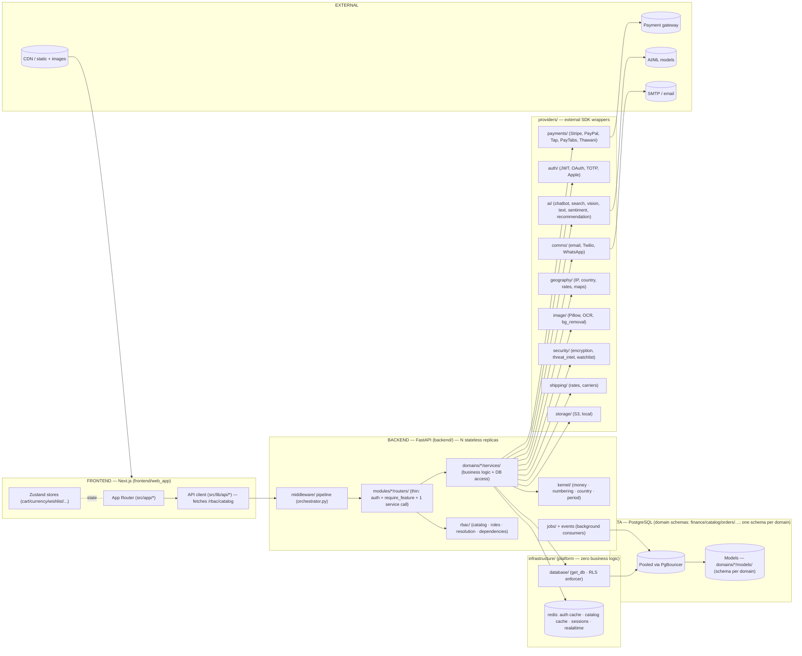
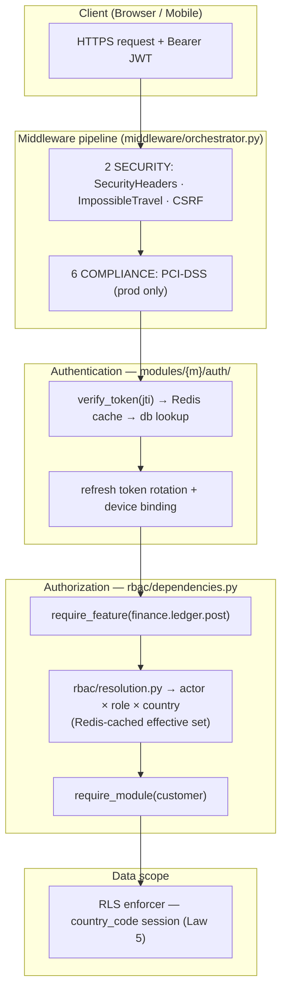
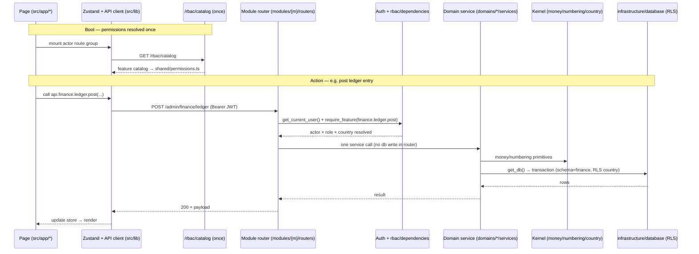

# ZOZI System Audit Report (target-contract aligned)

> **Generated:** 2026-08-25T23:25:00.958213+00:00  
> **Repo:** `D:\Projects\10- E-COMMERCE WEBSITE\zozi`  
> **Result:** 🔴 1105 violations · 🟡 3502 advisories · 🟢 33 info  
> **Architecture Debt Score:** 188425  
**Ephemeral. Add to `.gitignore`.**

---

## 1. The Grid Line (Target Layer Contract — ARCHITECTURE_DIAGRAM.md)

Three orthogonal axes: (1) **Module** `modules/{actor}/`, (2) **Domain** `domains/{domain}/`, (3) **Feature** `rbac/` via `require_feature()`.

| Layer (axis) | May import | Must NOT (law) |
|---|---|---|
| modules/* (AXIS 1) | domains/*/services, rbac (require_feature) | other modules (compose, don't reach in); infrastructure/DB access (law 2: thin routers, delegate to domains/*/services); abolished root layers (controllers/ routers/ services/ models/ db/ utils/) |
| domains/* (AXIS 2) | infrastructure (read-only), kernel, providers, events, subscribers, ports (cross-domain only via ports/events) | modules/* (law 1: arrows point DOWN, never import rbac); other domains except via ports/events (law 3) |
| rbac/* (AXIS 3) | kernel, infrastructure, domains (catalog aggregates domains/*/features.py) | modules/*, providers, jobs, middleware (imported BY modules+middleware only; Law 1 arrows down) |
| infrastructure/* | (none - platform leaf; imports nothing above it, Law 1) | modules/*, domains/*, rbac/*, kernel, providers, jobs, middleware |
| kernel/* | (nothing above) | any app layer |
| providers/* | providers._base, infrastructure, kernel | modules/*, domains/* |
| jobs/* | domains/*, infrastructure, providers | routers, main |
| middleware/* | infrastructure(read-only), kernel, rbac | modules/*, domains/*, routers (law: middleware imports downward only; may import rbac per diagram) |
| frontend/src/lib/api/* | backend /api/v1/* only | direct DB; raw fetch from pages; abolished root layers |

**Seven Laws:** (1) modules→domains→infrastructure, arrows down only; (2) routers delegate to ONE domains/*/services call (thin routers; no DB writes); (3) cross-domain only via `ports.py`/`events.py`/`subscribers.py`; (4) `require_feature()` is the single source of truth for capabilities; (5) middleware/providers/infrastructure never import upward; (6) domain models declare `__table_args__ = {'schema': '<domain>'}`; (7) `DOMAIN_ALLOWLIST.yaml` may only shrink (allowlist rule).
Abolished flat root layers (controllers/, routers/, services/, models/, db/, utils/) are **violations**, not targets.

---

## 2. Target Architecture (from ARCHITECTURE_DIAGRAM.md)

# ZOZI Platform — System Architecture Diagram

> Companion to `documents/TECHNOLOGY_USED.md` and the architecture rules.
> This document is the visual and organizational description of the backend.
> The rules and laws are maintained with it; the technology stack lives in
> `documents/TECHNOLOGY_USED.md`. All stay in lock-step.
>
> The codebase is organized around three orthogonal axes — **Modules, Domains,
> Features**. Every package, dependency arrow and naming rule below is the single
> organization the code follows. Code that does not fit this picture violates the
> dependency laws and is reported by the architecture audit.

---

## 1 · Technology Stack (from `documents/TECHNOLOGY_USED.md`)

### Backend — FastAPI / Python
| Concern | Technology |
|---|---|
| Framework / runtime | FastAPI `0.115.2`, Python `3.11` (Docker) / `3.10` (dev), Uvicorn `0.51.0`, Gunicorn `26.0.0` |
| Database / ORM | PostgreSQL `15` (prod) / SQLite (dev), SQLAlchemy `2.0.51` (async), Alembic `1.18.5`, asyncpg `0.31.0`, psycopg2-binary `2.9.12`, pg8000 `1.31.5`, DuckDB `1.5.5` + duckdb-engine `0.17.0` |
| Auth / security | python-jose `3.5.0` (JWT, `jti` blacklist), bcrypt `5.0.0`, pyotp `2.10.0` (TOTP), cryptography `49.0.0`, slowapi `0.1.10` (rate limit, limits `5.8.0`), CSRF + security-headers + PCI-DSS middleware |
| Cache / sessions | Redis `8.0.1` (auth cache, catalog cache, sessions, realtime, rate-limit) |
| Jobs | APScheduler `3.11.3` + custom background workers (`jobs/`) |
| Payments / APIs | Stripe `15.3.1` + Stripe Connect, httpx `0.28.1`, requests `2.34.2` |
| Observability | structlog `26.1.0`, OpenTelemetry (api / sdk / otlp, fastapi / asgi / sqlalchemy instrumentation), Prometheus (`prometheus-client` + `prometheus-fastapi-instrumentator`), Sentry (`sentry-sdk[fastapi]`) |
| Media / AI | aiofiles `25.1.0`, Pillow `12.3.0`, python-magic `0.4.27`, rembg `2.0.69`, opencv-python `5.0.0`, onnxruntime `1.23.2` |
| Email / comms | SMTP (stdlib) + `email-validator` `2.3.0`, Twilio (SMS), WebSockets `16.1.1` |
| Validation / utils | Pydantic `2.13.4`, python-dotenv `1.2.2`, python-slugify `8.0.4`, pytz `2026.3`, tzlocal `5.4.4`, babel `2.18.0`, phonenumbers `9.0.35`, numpy / scipy / scikit-image, python-docx `1.2.0`, openpyxl `3.1.5`, feedparser `6.0.12` |
| Testing | pytest `9.1.1` + pytest-asyncio `1.4.0`, httpx |

### Frontend — Next.js / React
| Concern | Technology |
|---|---|
| Framework | Next.js `16.3.1` (App Router, RSC), React `18.3.1`, TypeScript `5.8.2` (strict) |
| Styling | Tailwind CSS `3.4.19` + design tokens, class-variance-authority `0.7.1`, clsx `2.1.1`, tailwind-merge `3.5.0`, lucide-react `1.25.0`, framer-motion `11.5.6` |
| State | Zustand `5.0.11` |
| Forms | React Hook Form + Zod |
| Payments | `@stripe/react-stripe-js` `5.6.0`, `@stripe/stripe-js` `8.7.0` |
| Charts | chart.js `4.5.1` + react-chartjs-2 `5.3.1` |
| Maps | leaflet `1.9.4` + react-leaflet `5.0.0` |
| Utilities | jose `6.2.9` (browser JWT), dompurify `3.3.3` (XSS), qrcode `1.5.4`, jspdf `4.1.0`, @zxing/library `0.21.3` |
| Quality | ESLint `9` + typescript-eslint `8.62.0`, Prettier `3.3.3`, eslint-config-next `15.4.5`, Playwright `1.61.1`, jest `29.7.0` + ts-jest + RTL `16.3.0` + jest-axe `10.0.0` |
| Build / deploy | Node.js `20` (Alpine), multi-stage Docker, Next.js rewrites for API proxying |

### Infrastructure / DevOps
- Docker Compose (local), multi-stage Dockerfiles
- Railway (backend), Vercel (frontend)
- Alembic multi-schema migrations (public, analytics, audit, commerce, …)
- `.env` (compose) / `backend/.env` / `frontend/web_app/.env.local` / `.env.example` (source of truth)
- Monorepo `root/`: `docker-compose.yml`, `Makefile`, `pnpm-workspace.yaml`,
  `.github/workflows/*` (`ci.yml` · `import-lint.yml` · `schema-drift.yml` · `e2e.yml`),
  `_extra_files/` (temporary audit / migration working files)

### Key Architectural Patterns
| Layer | Technology | Purpose |
|-------|------------|---------|
| API | FastAPI + auto-discovered routers | RESTful endpoints with versioning |
| Auth | JWT (HS256) + refresh tokens + `jti` blacklisting | Stateless auth with revocation |
| Middleware | 6-layer pipeline (Foundation → Security → Rate Limit → Geo → Observability → Compliance) | Cross-cutting concerns |
| Database | SQLAlchemy `2.0` + RLS (Row Level Security) | Multi-tenant data isolation |
| Caching | Redis + in-memory | Performance |
| Real-time | WebSockets (native + custom manager) | Live updates |
| Observability | OpenTelemetry + Prometheus + Sentry + structlog | Full-stack monitoring |

### Shared Package
- `@zozi/shared` (`frontend/shared`) — TS types / utils shared between web and mobile;
  `permissions.ts` is **generated** from `GET /rbac/catalog`.

---

## 2 · The Three Orthogonal Axes

A folder tree can only express **one** axis. The other two live in **naming +
registration + configuration**. The three axes map to three different mechanisms:

| Axis | What it is | Where it lives | Mechanism |
|---|---|---|---|
| **Module** (customer, supplier, logistics, admin, employee) | *Who* is acting — login, session, route prefix, UI shell | `modules/{module}/` | Separate auth + thin API surface |
| **Domain** (finance, accounts, catalog, orders, payments, logistics, suppliers, customers, hr, comms, media, country, governance, …) | *What* the business does — logic + data | `domains/{domain}/` | Services, models, schemas, policies, events |
| **Feature** (`finance.ledger`, `finance.reporting`, …) | *What may be done* — permission atoms | `rbac/` + `domains/*/features.py` | Data/config, enforced by `require_feature()` |

**The rule that makes it coherent:** Modules compose. Domains own. Features gate.

---

## 3 · Backend Package Layout

```
backend/
├── main.py                     # boots app; registers module routers per actor prefix
├── config.py                   # settings, env, feature gates
├── DOMAIN_ALLOWLIST.yaml       # temporary cross-domain imports (may only shrink)
│
├── modules/                    # AXIS 1 — MODULE (who)
│   ├── customer/  supplier/  logistics/  admin/  employee/
│   │     ├── auth/             # per-actor login/OTP/social → that actor's own tables; sessions; device binding
│   │     ├── routers/          # THIN per-actor routers (auth + require_feature + ONE service call)
│   │     │                     #   modules/{m}/routers/{d}.py — one file per domain (15 files per module)
│   │     │                     #   modules/{m}/routers/__init__.py lists routers/public_routers for main.py
│   │     └── serializers/      # per-actor view models (customer-facing response shaping)
│   │
├── domains/                    # AXIS 2 — DOMAIN (what)
│   ├── finance/  accounts/  catalog/  orders/  logistics/  suppliers/
│   ├── customers/  hr/  comms/  analytics/  audit/  country/  governance/  security/  promotions/
│   │     ├── services/  models/  schemas/  policies/   # heavy domains may instead slice:
│   │     ├── events.py  subscribers.py                  #   ledger/ payouts/ treasury/ … (one sub-capability = one folder)
│   │     ├── ports.py        # SANCTIONED cross-domain READ path (the only thing another domain may import)
│   │     ├── read_models/    # CQRS-lite projections for this domain's own dashboards
│   │     └── features.py      # AXIS 3 seed: this domain's permission atoms
│   │
├── rbac/                       # AXIS 3 — FEATURE (may)
│   ├── catalog.py               # aggregates domains/*/features.py → single source of truth
│   ├── roles.py                 # (module, role) → feature sets
│   ├── resolution.py            # actor × role × country → effective set (Redis-cached)
│   ├── dependencies.py          # require_feature(...), require_module(...)
│   ├── service.py               # grant/revoke, delegation, maker-checker
│   └── models.py                # permission_categories, role_permission_assignments, user_permission_overrides
│
├── infrastructure/             # PLATFORM — zero business logic; imports nothing above it
│   ├── database/               # base.py · database.py (get_db/get_read_db) · session.py · transaction.py
│   │                           #   security.py ← ONE canonical RLS enforcer · seeds/ · create_tables.py (dev-only)
│   ├── redis/                  # client · cache · token blacklist · pub/sub
│   ├── storage/                # S3/R2 adapters · presigned URLs (media blobs never in Postgres)
│   ├── messaging/              # event_bus (in-proc → Redis later) · ws_manager · webhook ingress
│   ├── observability/          # structlog · OTEL · Prometheus · Sentry
│   ├── security/               # JWT · hashing · field encryption (KMS) · zero-trust primitives
│   └── utils/                  # pure technical helpers: pagination.py · datetime_utils · variant_key
├── kernel/                     # SHARED KERNEL — pure business primitives: money, currency, numbering, country, period
│                             #   import rule: domains → kernel → (nothing); kernel may use platform primitives only
├── providers/                  # 3rd-party/AI adapters (called ONLY by services/jobs; never by modules directly)
│   ├── ai/                      # AI/ML: chatbot, search, vision, text, sentiment, recommendation, price_intelligence, image_similarity, finance_ai
│   ├── analytics/               # Admin analytics dashboards
│   ├── auth/                    # JWT, OAuth, TOTP, Apple Auth
│   ├── automation/              # Job scheduler (APScheduler)
│   ├── barcode/                 # EAN/UPC/Code128 generation
│   ├── bg_removal/              # AI background removal (rembg + OpenCV)
│   ├── comms/                   # Email, Twilio, WhatsApp
│   ├── finance/                 # Bank API integration
│   ├── geo/                     # Geo utilities
│   ├── geography/               # IP geolocation, country, maps, currency rates
│   ├── image/                   # Pillow processing, OCR, bg_remover, parcel verification
│   ├── media/                   # Media AI services
│   ├── news/                    # RSS feed parsing
│   ├── ocr/                     # Document OCR parsing
│   ├── payments/                # Stripe, PayPal, Tap, PayTabs, Thawani, webhooks, registry, connect
│   ├── qr/                      # QR generation, parcel verification
│   ├── scanner/                 # QR/barcode scanning from images
│   ├── security/                # Encryption, threat intel, watchlist
│   ├── shipping/                # Rate calculator, carrier comparison
│   ├── storage/                 # S3/local storage backends, S3 client
│   ├── voice/                   # Speech-to-text, voice commands
│   ├── async_workers/           # Thread/process pool executors for CPU-bound work
│   ├── observability/           # Provider health monitoring
│   └── _base.py                 # BaseProvider / BaseAIProvider + health_check()
├── jobs/                        # background workers/consumers (→ domains → infrastructure)
│   ├── fraud_monitoring.py  ghost_order_detector.py  data_retention.py
│   ├── payroll_run.py  payout_sweep.py  reconciliation_cron.py  bank_statement_importer.py
│   ├── fx_revaluation.py  accrual_reversal.py  threat_feed_updater.py  mcp_server.py
│   └── background_tasks.py
├── middleware/                  # flat; orchestrator.py orders the pipeline BEFORE module routers
│   └── orchestrator.py · api_version · country_context · csrf · database_security · device_binding
│       · impossible_travel · ip_extraction · logging · pci_dss_compliance · rate_limit
│       · request_id · rls_dependency · security_headers · webhook_ip_whitelist
│       · webhook_verification · zero_trust_auth
├── alembic/                     # SINGLE schema source of truth
├── scripts/                     # analyze_tables.py, rewrite_imports.py, seed helpers (dev)
├── registry.py                  # ServiceRegistry: discovers + indexes domain services
├── service_index.json           # Auto-generated index: name → {path, type, domain}
├── migrate_imports.py           # Auto-fixes router imports using service_index.json
└── tests/
    ├── architecture/            # test_import_laws.py (layer direction + cross-domain ban), test_feature_catalog.py
    └── domains/                 # per-domain unit/integration tests
```

> **Provider Availability Flags.** All providers expose `HAS_<SDK>` boolean flags (e.g., `HAS_STRIPE`, `HAS_TWILIO`, `HAS_OPENCV`, `HAS_REMBG`). Domains must gracefully degrade when a provider SDK is not installed — never crash.

> **Provider-to-Domain Wiring.** Providers are wired into domain services via direct function calls (never via imports from domains into providers). Each provider tool serves specific domains:

| Provider Tool | Served Domains | Use Case |
|---|---|---|
| `ai/chatbot` | Analytics | Intent classification, session management |
| `ai/search` + `ai/text` (embeddings) | Catalog, Customers | Semantic product search, autocomplete |
| `ai/vision` + `ai/image_similarity` | Catalog | Product image analysis, duplicate detection |
| `ai/sentiment` | Reviews, Security, Analytics | Review moderation, fraud signals |
| `ai/recommendation` | Customers, Promotions, Analytics | Personalized product feeds |
| `ai/price_intelligence` | Promotions, Analytics | Dynamic pricing, competitor tracking |
| `ai/finance_ai` | Finance | Transaction categorization |
| `ai/huggingface` | Catalog | Fallback ML inference |
| `analytics/analytics` | Analytics | Dashboard metrics, sales trends |
| `auth/jwt` + `auth/oauth` + `auth/totp` + `auth/apple` | Security, Accounts | Session management, 2FA, social login |
| `automation/scheduler` | Finance, Logistics, Promotions, Governance, Audit, Analytics | Recurring jobs, flash sale timing |
| `barcode/` + `qr/` + `scanner/` | Logistics, Catalog, Suppliers | Shipping labels, SKU barcodes, parcel verification |
| `bg_removal/` + `image/` + `ocr/` | Catalog, Reviews, Finance, Accounts, Suppliers, Audit | Image preprocessing, document extraction |
| `comms/email` + `comms/twilio` + `comms/whatsapp` | Orders, Comms, Promotions, Accounts, HR, Suppliers, Logistics | Transactional messaging, notifications |
| `finance/bank_api` | Finance, Orders, Suppliers | Bank verification, payouts |
| `geography/` (ip, country, rates, maps) | Orders, Logistics, Country, Security, Accounts, Analytics | Localization, tax rules, shipping eligibility |
| `news/` | Governance, Audit | Regulatory monitoring |
| `payments/` (stripe, paypal, tap, paytabs, thawani, connect, registry) | Orders, Finance | Multi-PSP payment processing |
| `security/encryption` + `security/threat_intel` + `security/watchlist` | Security, Accounts, HR, Governance, Audit, Comms | PII protection, AML screening, fraud feeds |
| `shipping/` | Orders, Customers (cart), Logistics | Rate calculation, carrier comparison |
| `storage/` + `storage/s3_client` | Catalog, Audit, Analytics, Suppliers | File persistence, audit archival |
| `voice/` | *(future use)* | Speech-to-text, voice commands |

> **Wiring Pattern.** Domain services import providers at the top of the service file, call provider functions with primitive parameters, and handle results. Example:
> ```python
> # Inside domains/catalog/services/ai_upload_service.py
> from providers.media.services.ai import ai_service
> from providers.image.free_image_tools import magic_erase, HAS_REMBG
>
> def process_upload(img_bytes: bytes) -> bytes:
>     if HAS_REMBG:
>         img_bytes = magic_erase(img_bytes)
>     name = ai_service.infer_product_name(image_bytes=img_bytes)
>     return img_bytes
> ```

> **Async Provider Calls.** CPU-bound provider work (image processing, embedding generation) runs through `providers.async_workers`:
> ```python
> from providers.async_workers import remove_background_async, embed_text_async
>
> async def process_image(img_bytes: bytes) -> bytes:
>     return await remove_background_async(img_bytes, strategy="auto")
> ```

---

## 2.1 · Shared kernel (`kernel/`)
> (Decimal, never float), `currency`, `numbering` (centralized ORD-/INV-/PAY-/BATCH-),
> `country`, `period` — live here as first-class residents so they are not smuggled into
> `infrastructure/utils/` or duplicated per domain. **Dependency rule: `domains → kernel → (nothing)`.**
> `kernel/` must not import `modules/`, `domains/`, `rbac/`, `providers/`, `jobs/`, or `middleware/`.
> It may import `infrastructure/` platform primitives only.

> **Canonical top-level packages.** The backend root contains **only**:
> `main.py`, `config.py`, `DOMAIN_ALLOWLIST.yaml`, `modules/`, `domains/`,
> `rbac/`, `kernel/`, `infrastructure/`, `providers/`, `jobs/`, `middleware/`,
> `alembic/`, `scripts/`, `tests/`. A root-level `utils/` is **forbidden** — its
> contents split into `infrastructure/utils/` (technical: pagination, datetime,
> variant keys, slugs) and `kernel/` (business primitives: money, currency,
> numbering, country, period). Likewise `routers/`, `controllers/`, `services/`,
> `models/`, `db/` are **not** top-level packages; they live inside `modules/`,
> `domains/`, or `infrastructure/` as shown above.

> **Cross-domain contract (Law 3).** Writes across domains go *only* through `events.py`/`subscribers.py`.
> Reads across domains go *only* through the publishing domain's `ports.py` (e.g.
> `domains/catalog/ports.py → get_price(db, product_id, country)`). `read_models/` hold each domain's
> own CQRS-lite projections; cross-domain dashboards live in `domains/governance/read_models/`.
> `DOMAIN_ALLOWLIST.yaml` tracks the *temporary* cross-domain imports still permitted and must only shrink.

> **Deployment model.** Shipped initially as a **modular monolith** (one deployable, one Postgres
> ecosystem, shared Redis) — modules and domains are boundaries inside one process, not separate servers.
> Module boundaries make later extraction to independent services possible *without* redesigning domains.

### Frontend layout
```
frontend/
├── web_app/                     # Next.js 16.3.1 (App Router, RSC)
│   ├── src/app/                 # route tree: (customer), auth/, admin/*, supplier/*, logistics-partner/*,
│   │                             #   employee/*, wishlist/, profile/, chatbot/, tracking/; app/api/ = Next server routes
│   ├── src/components/          # ui/ (design system), admin/, auth/, chat/, comms/, country/, ems/, map/, supplier/
│   ├── src/hooks/               # useApi, useAuth, WebSocket hooks
│   ├── src/lib/                 # api/ (client.ts, auth.ts, country.ts, errors.ts), rbac.ts (fetches /rbac/catalog)
│   ├── src/services/            # localizationService, crossBorderService, addressFormatService
│   ├── src/theme/  src/styles/  src/types/  src/utils/
│   ├── tests/  e2e/             # mocks + Playwright
│   └── root/                    # next.config.ts (rewrites), middleware.ts, tailwind.config, playwright.config
├── mobile_app/                  # Expo RN
│   ├── app/                     # Expo Router: (auth)/(tabs) + admin/ supplier/ logistics/ employee/ tracking/ returns/
│   ├── components/ui/           # design-system
│   ├── lib/                     # api.ts, Zustand stores, authPrompt, countryContext, geo, paymentService,
│   │                             #   expoSecureStorage, errorReporter
│   └── theme/  assets/  android/  mocks/  e2e/  scripts/  root/
└── shared/                      # cross-platform TS, imported by BOTH apps
    └── src/                     # api-core.ts (apiFetch), money.ts, i18n.ts, cart/checkout/order/product/returns/
                                  #   wishlist/notification helpers, statusColors.ts, requestCache.ts, realtime.ts,
                                  #   chatbot.ts, types.ts, theme.ts + theme.native.ts,
                                  #   permissions.ts  ← GENERATED from backend /rbac/catalog
```

---

## 4 · The Seven Laws (enforced by the audit)

1. **Arrows point down only:** `modules → domains → infrastructure`.
   Domains never import modules. `rbac` is imported by modules + middleware only.
   `infrastructure` / `kernel` import nothing above them. `providers ← services/jobs`.
2. **Module routers stay thin:** auth context + `require_feature(...)` + one domain-service call.
   No DB writes, no business rules.
3. **Cross-domain writes only via events** (`events.py`/`subscribers.py`);
   cross-domain *reads* only via `ports.py` / `read_models/`.
4. **Features single-sourced** in `domains/*/features.py`; aggregated by `rbac/catalog.py`;
   CI fails on any `require_feature("…")` literal not in the catalog.
5. **Country is the orthogonal scope axis:** RLS session context + `country_staff_assignments`
   — independent of the feature check.
6. **Schema discipline:** every table in a domain Postgres schema; Alembic is the only
   schema source; naming lint (`snake_case`, plural, `<thing>_id`, `created_at/updated_at`,
   `country_code`, `is_deleted`).
7. **Allowlist rule:** temporary cross-domain imports are tracked in `DOMAIN_ALLOWLIST.yaml`
   and may only shrink; direct cross-domain writes outside `events.py` are forbidden.

---

## 5 · System Context



> **Provider-to-Domain Connection Map.** The diagram above shows providers as a separate subgraph. Domain services call providers via function calls (arrows from `BEDOM` to `PROV_*`). Providers never import from domains — data flows through parameters and return values only.

---

## 6 · Backend Circuit (request lifecycle)


---

## 7 · RBAC / Feature axis (AXIS 3)

- Feature atoms are **defined once** in `domains/{domain}/features.py` (e.g.
  `finance.ledger.post`, `finance.reporting.read`).
- `rbac/catalog.py` aggregates every domain's `features.py` via package scan →
  single source of truth. It is served to the frontend at `GET /rbac/catalog`.
- `rbac/roles.py` grants per **(module, role)**; `rbac/resolution.py` resolves
  `actor × role × country → effective feature set` (Redis-cached).
- `rbac/dependencies.py` provides `require_feature(...)` / `require_module(...)`
  gates used by every module router.
- Frontend `shared/src/permissions.ts` is **generated** from `/rbac/catalog` so
  UI gating and backend gating share one source.

---

## 8 · Schema discipline (Law 6)

- Every ORM model declares `__table_args__ = {"schema": "<domain>"}`
  (slice tables use the parent domain's schema).
- Alembic is the only schema source (`create_all` is dev-only).
- Naming lint: `snake_case`, plural tables, `<thing>_id` FKs,
  `created_at`/`updated_at`, `country_code`, `is_deleted`.
- Forbidden schemas: `core` / `platform` / `identity` — every actor's `user`
  table lives in its own domain schema (e.g. `customer.user`, `supplier.user`).

---

## 9 · Database organization (Law 6)

Every domain owns one Postgres schema; the model classes live in
`domains/{domain}/models/`. Cross-domain **writes** travel only through
`events.py` / `subscribers.py`; cross-domain **reads** travel only through the
owning domain's `ports.py` (or `read_models/`). The country scope is enforced by
RLS on every schema.

```mermaid
flowchart TD
    ALE["alembic/ — SINGLE schema source of truth"]
    subgraph SCHEMAS["PostgreSQL — one schema per domain"]
        direction LR
        SF["schema: finance<br/>domains/finance/models/*"]
        SA["schema: accounts<br/>domains/accounts/models/*"]
        SC["schema: catalog<br/>domains/catalog/models/*"]
        SO["schema: orders<br/>domains/orders/models/*"]
        SL["schema: logistics<br/>domains/logistics/models/*"]
        SS["schema: suppliers<br/>domains/suppliers/models/*"]
        SCU["schema: customers<br/>domains/customers/models/*"]
        SH["schema: hr<br/>domains/hr/models/*"]
        SCO["schema: comms<br/>domains/comms/models/*"]
        SCA["schema: analytics<br/>domains/analytics/models/*"]
        SCN["schema: country<br/>domains/country/models/*"]
        SG["schema: governance<br/>domains/governance/models/*"]
        SE["schema: security<br/>domains/security/models/*"]
        SP["schema: promotions<br/>domains/promotions/models/*"]
        SAU["schema: audit<br/>domains/audit/models/*"]
    end
    RLS["infrastructure/database/ RLS enforcer<br/>country_code session context (Law 5)"]
    PORTS["ports.py — sanctioned cross-domain READ<br/>e.g. catalog.ports.get_price(db, product_id, country)"]
    EVT["events.py / subscribers.py — cross-domain WRITE bus"]
    ALE --> SCHEMAS
    SCHEMAS --> RLS
    SC -. read via .-> PORTS
    PORTS -. resolves .-> SC
    SO -. write via .-> EVT
    EVT -. consumed by .-> SF
    EVT -. consumed by .-> SP
```



---

## 10 · Security architecture

Authentication and authorization follow the axes: **modules** carry the actor
(who), **features** gate the action (may), and **country RLS** scopes the data.
The 6-layer middleware pipeline runs before any module router.



---

## 11 · End-to-end flow (frontend ↔ backend)

The frontend route tree under `frontend/web_app/src/app/*` is grouped per actor
(module). On boot it fetches `GET /rbac/catalog` once to build
`shared/src/permissions.ts`; every later action calls a thin module router that
authenticates, gates on a feature, and delegates to one domain service.



---

## 12 · Service Registry & Automatic Wiring

When domain services are reorganized (moved between domains, split into sub-packages),
router import paths break. The **Service Registry** automates discovery, resolution, and
migration of these imports.

### 12.1 Components

| Component | File | Purpose |
|-----------|------|---------|
| `ServiceRegistry` | `backend/registry.py` | Discovers all public functions/classes in `domains/`, `infrastructure/`, `providers/` and builds an index |
| `service_index.json` | `backend/service_index.json` | Persistent index: `name → {path, type, domain, file}` |
| Migration tool | `backend/migrate_imports.py` | Compares router imports against the index and rewrites broken paths |

### 12.2 How It Works

```
┌─────────────────────────────────────────────────────────────────┐
│                     SERVICE REGISTRY                            │
│                                                                 │
│  1. SCAN     → Walk domains/, infrastructure/, providers/       │
│                 Parse every .py file for def/class definitions  │
│                 Build index: name → actual_path                 │
│                                                                 │
│  2. RESOLVE  → Router asks: "where is ProductService?"         │
│                 Registry returns: domains.catalog.services...   │
│                                                                 │
│  3. MIGRATE  → Compare router imports to index                  │
│                 Generate corrections: old_path → new_path        │
│                 Apply: string replacement in router files        │
│                                                                 │
│  4. VERIFY   → Re-scan confirms 0 remaining issues             │
└─────────────────────────────────────────────────────────────────┘
```

### 12.3 Usage

```bash
# Build/update the service index
python backend/registry.py

# Check what needs fixing (dry run)
python backend/migrate_imports.py

# Apply corrections
python backend/migrate_imports.py --apply
```

### 12.4 Example

**Before migration** (stale import path):
```python
# modules/customer/routers/orders.py
from domains.catalog.services.products_controller import ProductService
```

**Registry index entry**:
```json
{
  "name": "ProductService",
  "path": "domains.catalog.services.products.products_service",
  "type": "class",
  "domain": "catalog"
}
```

**After migration** (correct import path):
```python
# modules/customer/routers/orders.py
from domains.catalog.services.products.products_service import ProductService
```

### 12.5 When to Run

| Scenario | Action |
|----------|--------|
| After domain reorganization | `python backend/migrate_imports.py --apply` |
| After adding new domain services | `python backend/registry.py` to update index |
| CI check | `python backend/migrate_imports.py` should report 0 issues |
| Before commit | Verify `service_index.json` is up to date |

### 12.6 Index Statistics

| Category | Count |
|----------|-------|
| Total services indexed | ~4,200 |
| Domains covered | 35 |
| Infrastructure modules | ~150 |
| Provider modules | ~78 |

### 12.7 Design Principles

1. **Discovery over hardcoding** — The registry scans actual files, so it never goes stale
2. **Idempotent** — Running migration multiple times is safe (no duplicate changes)
3. **Non-destructive preview** — Dry run shows what would change before applying
4. **First-wins** — If a name exists in multiple modules, the first scanned wins
5. **Domain-aware** — Prefers same-domain matches when resolving ambiguities

### 12.8 Integration with Architecture Laws

The registry enforces **Law 1 (Arrows point down)** by:
- Tracking which domain each service belongs to
- Detecting when a router imports from the wrong domain
- Ensuring modules only import from domains (not other modules)

The registry enforces **Law 3 (Cross-domain via ports/events)** by:
- Flagging direct cross-domain imports that bypass `ports.py`
- Tracking sanctioned imports in `DOMAIN_ALLOWLIST.yaml`

---

## 3. AI File Placement Contract

## AI File Placement Contract (ZOZI ARCHITECTURE_DIAGRAM.md)

> **Rule for AI:** Before creating or moving ANY backend file, use this contract.
> The three axes are: **Module = `modules/` (who)**, **Domain = `domains/` (what)**,
> **Feature = `rbac/` + `domains/*/features.py` (may)**. Platform = `infrastructure/`,
> shared kernel = `kernel/`, adapters = `providers/`, workers = `jobs/`,
> HTTP pipeline = `middleware/`.

### Canonical layer rules (ARCHITECTURE_DIAGRAM structure)

| Axis / Layer | Structure | Correct examples |
|---|---|---|
| `backend/modules/{module}/` (AXIS 1) | auth/ + routers/ per actor | `modules/admin/auth/`, `modules/admin/routers/finance_ledger_router.py`, `modules/customer/routers/checkout_router.py` |
| `backend/modules/{module}/routers/` | **thin**: auth ctx + `require_feature(...)` + one domain-service call | `modules/admin/routers/finance_reports_router.py`, `modules/supplier/routers/payouts_router.py` |
| `backend/domains/{domain}/` (AXIS 2) | services/ models/ schemas/ policies/ events.py subscribers.py features.py | `domains/finance/services/ledger_service.py`, `domains/finance/models/ledger.py` |
| `backend/domains/{domain}/services/` | orchestration + transactions (NO HTTP) | `domains/orders/services/checkout_service.py` |
| `backend/domains/{domain}/models/` | ORM only; flat per domain; `__table_args__={'schema': '<domain>'}` | `domains/catalog/models/products.py` |
| `backend/domains/{domain}/features.py` | AXIS 3 seed: permission atoms | `domains/finance/features.py` (finance.ledger, finance.reporting, ...) |
| `backend/rbac/` (AXIS 3) | catalog.py roles.py resolution.py dependencies.py service.py | `rbac/catalog.py`, `rbac/dependencies.py` |
| `backend/infrastructure/` | platform: database redis storage messaging observability security utils | `infrastructure/database/database.py`, `kernel/money.py` |
| `backend/kernel/` | business primitives: money numbering country period | `kernel/money.py`, `kernel/numbering.py` |
| `backend/providers/` | 3rd-party/AI adapters; called ONLY by services/ and jobs/ | `providers/ai/image_analysis_provider.py` |
| `backend/jobs/` | background workers/consumers (off-request only) | `jobs/finance/payout_sweep.py` |
| `backend/middleware/` | flat HTTP pipeline; orchestrator.py orders it | `middleware/orchestrator.py`, `middleware/rate_limit.py` |

### The seven laws (any violation = report it)

1. Arrows point DOWN only: `modules → domains → infrastructure`; `jobs → domains → infrastructure`; `providers ← services/jobs`; `middleware → infrastructure`; `domains → kernel → (nothing)`. Domains NEVER import modules; `rbac` is imported by modules/middleware only (domains enforce policies, not permissions).
2. Module routers stay THIN: auth ctx + `require_feature(...)` + one domain-service call. No DB writes, no business rules. Module routers NEVER import `providers/` directly (the domain service calls the provider).
3. Cross-domain WRITES only via `events.py`/`subscribers.py`. Cross-domain READS only via the publishing domain's `ports.py` (or `read_models/`); direct `from domains.X.(services|models|repositories|schemas|policies)` outside `domains/X` is a build failure. `DOMAIN_ALLOWLIST.yaml` tracks the temporary exceptions (must shrink).
4. Features are single-sourced in `domains/*/features.py`; aggregated by `rbac/catalog.py`. Any `require_feature("...")` literal not in the catalog is a build failure.
5. Country is the orthogonal scope axis (RLS + `country_staff_assignments`); independent of the feature check.
6. Schema discipline: every table lives in a Postgres schema (`__table_args__={'schema': '<domain>'}`); Alembic is the only schema source; snake_case/plural naming lints apply.
7. Allowlist rule (Law 7): `DOMAIN_ALLOWLIST.yaml` lists the temporary cross-domain imports still permitted and may only shrink.

### ABOLISHED flat root layers — FORBIDDEN (do NOT create; these are violations)

The following root layers are abolished (per ARCHITECTURE_DIAGRAM.md). Creating or leaving a file under any of them is a RED violation. There is no prescribed re-export/`_legacy` shim layer; abolished code must be split into the canonical locations and the originals merged/retired.

```text
backend/controllers/      # ABOLISHED — split into modules/*/routers/ + domains/*/services/
backend/routers/          # ABOLISHED flat — re-home per actor under modules/*/routers/
backend/services/         # ABOLISHED flat — move into domains/*/services/
backend/models/           # ABOLISHED flat — move into domains/*/models/
backend/db/               # ABOLISHED — move into infrastructure/database/
backend/utils/            # ABOLISHED flat — split into infrastructure/utils/ + kernel/
backend/core/             # ABOLISHED — move into domains/*/services/ or infrastructure/
backend/dependencies/     # ABOLISHED — move into domains/*/ or infrastructure/
```

### Domain keyword routing (→ the NEW home is a domain folder)

| Domain | Put business logic here (AXIS 2) | Keywords |
|---|---|---|
| `finance` | `backend/domains/finance/services/`, `backend/domains/finance/models/`, `backend/domains/finance/features.py` | accounting, auto_payout, bank, budget, cash, cash_flow, commission, commission_write, credit_control, erp, finance, finance_automation, finance_erp, financial |
| `accounts` | `backend/domains/accounts/services/`, `backend/domains/accounts/models/`, `backend/domains/accounts/features.py` | account, accounts, chart_of_accounts, gl_account |
| `catalog` | `backend/domains/catalog/services/`, `backend/domains/catalog/models/`, `backend/domains/catalog/features.py` | advanced_filter, advanced_search, autocomplete, catalog, categories, category, filter, filters, inventory, moderation, product, product_moderation, product_verification, products |
| `orders` | `backend/domains/orders/services/`, `backend/domains/orders/models/`, `backend/domains/orders/features.py` | cart, checkout, dispute, disputes, fulfillment, ghost, order, orders, purchase, purchases, return, returns |
| `logistics` | `backend/domains/logistics/services/`, `backend/domains/logistics/models/`, `backend/domains/logistics/features.py` | carrier, carrier_config, carrier_configs, delivery, dispatch, fleet, geo_fence, geofence, live_tracking, logistics, map, parcel, pod, route |
| `suppliers` | `backend/domains/suppliers/services/`, `backend/domains/suppliers/models/`, `backend/domains/suppliers/features.py` | badge, contract, kyc, onboarding, storefront, supplier, supplier_badge, supplier_health, supplier_inventory, supplier_onboarding, supplier_products, supplier_profile, suppliers, vendor |
| `customers` | `backend/domains/customers/services/`, `backend/domains/customers/models/`, `backend/domains/customers/features.py` | address, addresses, customer, customer_health, customers, point, points, preferences, profile, rating, ratings, review, review_moderation, review_response |
| `hr` | `backend/domains/hr/services/`, `backend/domains/hr/models/`, `backend/domains/hr/features.py` | attendance, background, background_check, coi, dei, employee, employees, handover, hr, hse, leave, lms, offboarding, payroll |
| `comms` | `backend/domains/comms/services/`, `backend/domains/comms/models/`, `backend/domains/comms/features.py` | chat, comm, comms, email, email_template, meeting, message, messages, notification, notification_template, notification_templates, notifications, push, push_token |
| `analytics` | `backend/domains/analytics/services/`, `backend/domains/analytics/models/`, `backend/domains/analytics/features.py` | analytics, chart, charts, command_center, customer_analytics, dashboard, dashboards, data_pipeline, data_warehouse, etl, executive_dashboard, forecast, insight, insights |
| `audit` | `backend/domains/audit/services/`, `backend/domains/audit/models/`, `backend/domains/audit/features.py` | audit, audit_event, audit_events, audit_log, audit_plan, audit_plans, audit_report, audit_reports, audit_trail, auditor, chain_of_custody, communication_audit, compliance_audit, compliance_log |
| `country` | `backend/domains/country/services/`, `backend/domains/country/models/`, `backend/domains/country/features.py` | border, cities, city, countries, country, country_detection, country_research, cross_border, cross_border_tracker, currency, economics, geo, geography, localization |
| `governance` | `backend/domains/governance/services/`, `backend/domains/governance/models/`, `backend/domains/governance/features.py` | access_control, compliance, event_log, event_subscription, event_subscriptions, events, export, exports, gdpr, governance, governance_engine, outbox, outbox_events, permission_grant |
| `security` | `backend/domains/security/services/`, `backend/domains/security/models/`, `backend/domains/security/features.py` | account_takeover, anomaly_detection, behavioral_analytics, blacklist, bot_detection, brute_force, csrf, ddos, device_fingerprint, fraud, fraud_detection, fraud_event, fraud_events, ids |
| `promotions` | `backend/domains/promotions/services/`, `backend/domains/promotions/models/`, `backend/domains/promotions/features.py` | banner, banners, bogo, campaign, campaigns, coupon, coupons, deal, deals, discount, discounts, flash_sale, flash_sales, loyalty |
| `media` | `backend/domains/media/services/`, `backend/domains/media/models/`, `backend/domains/media/features.py` | asset, assets, attachment, attachments, cdn, certificate, certificates, contract_document, document, documents, file, free_image, image, images |

### If domain is unclear

If a file does not clearly belong to a domain, create the domain skeleton first:

```text
backend/domains/<new_domain>/services/  models/  schemas/  policies/  events.py  subscribers.py  features.py
```

Then add the surface where needed under `backend/modules/<module>/routers/`. Never drop it into an abolished flat root layer.


---

## 4. Scorecard

| Code | Count | Sev | Meaning |
|---|---:|---|---|
| A1 | 29 | 🟡 ADVISORY | architecture hotspot (high coupling / instability) |
| API101 | 30 | 🟡 ADVISORY | endpoint missing response_model |
| API2 | 100 | 🟡 ADVISORY | internal symbol exposed outside its module boundary |
| AS1 | 4 | 🟡 ADVISORY | route prefix does not align with surface |
| AS2 | 3 | 🟡 ADVISORY | OpenAPI tag does not align with domain |
| CA1 | 4 | 🟡 ADVISORY | file name does not match file content (operations mismatch) |
| CA2 | 79 | 🟡 ADVISORY | file contains operations from multiple domains (split candidate) |
| CFG3 | 11 | 🟡 ADVISORY | malformed or contradictory policy rule |
| CG1 | 169 | 🔴 VIOLATION | call graph violation: function calls across forbidden layer boundary |
| CG2 | 132 | 🔴 VIOLATION | call chain violates circuit direction (upward call) |
| CIR1 | 3 | 🔴 VIOLATION | circuit violation: import is outside the allowed layer circuit |
| CIR2 | 7 | 🟡 ADVISORY | circuit bypass: import skips the preferred layer (migration warning) |
| D1 | 11 | 🟡 ADVISORY | duplicate module basename within backend (import-shadow) |
| D3 | 150 | 🟡 ADVISORY | duplicate class name across modules |
| DBA02 | 8 | 🟡 ADVISORY | Base.metadata.create_all not safely dev-gated |
| DBA03 | 177 | 🟡 ADVISORY | mandatory column set / mixin missing |
| DBA04 | 1 | 🟡 ADVISORY | country_code width mismatch |
| DBA05 | 2 | 🔴 VIOLATION | RLS coverage missing or weak (ONE canonical enforcer: infrastructure/database/security.py) |
| DBA07 | 186 | 🟡 ADVISORY | unsafe or missing FK cascade rule |
| DBA08 | 147 | 🟡 ADVISORY | FK column missing index |
| DBA09 | 40 | 🟡 ADVISORY | JSONB column missing GIN index signal |
| DBA11 | 23 | 🟡 ADVISORY | database naming convention violation |
| DBA12 | 18 | 🟡 ADVISORY | migration governance missing or unsafe |
| DBA13 | 2 | 🔴 VIOLATION | migration head / ORM-only table drift |
| DBA18 | 1 | 🟡 ADVISORY | audit log taxonomy missing or fragmented |
| DBA23 | 1 | 🟡 ADVISORY | partition strategy missing for hot append-only tables |
| DBA24 | 1 | 🟡 ADVISORY | production checklist gap |
| DBA26 | 10 | 🔴 VIOLATION | ORM model outside domains/*/models/ |
| DBA27 | 1 | 🔴 VIOLATION | broken or suspicious migration file (ADR-018 risk) |
| DBA31 | 20 | 🟡 ADVISORY | required composite index signal missing |
| DBA32 | 84 | 🟡 ADVISORY | unsafe pagination/query pattern (OFFSET on hot list; use keyset/cursor pagination) |
| DG | 110 | 🔴 VIOLATION | forbidden dependency-graph edge (layer contract violated) |
| DG2 | 26 | 🟡 ADVISORY | circular dependency detected |
| DG4 | 2 | 🟡 ADVISORY | dynamic import edge detected |
| DG5 | 22 | 🟡 ADVISORY | dynamic execution obscures dependency graph |
| DOM6 | 4 | 🟢 INFO | new domain candidate auto-detected |
| DP103 | 1 | 🟡 ADVISORY | missing env var validation at startup |
| DP104 | 1 | 🟡 ADVISORY | missing graceful shutdown handler |
| DP105 | 1 | 🟡 ADVISORY | missing .dockerignore |
| DS01 | 60 | 🟡 ADVISORY | hardcoded CSS: inline style={{...}} object in component |
| DS02 | 4 | 🔴 VIOLATION | hardcoded CSS: <style> </style> tag inside a component file |
| DS03 | 30 | 🟡 ADVISORY | raw/off-palette color literal (bypasses design tokens) |
| DS04 | 14 | 🟡 ADVISORY | color theme drift: near-duplicate colors used as if different |
| DS07 | 2 | 🟡 ADVISORY | hardcoded typography (font size / family literal) |
| DS08 | 1 | 🟡 ADVISORY | hardcoded spacing/dimension (raw px) |
| DS09 | 1 | 🟡 ADVISORY | inconsistent border-radius values |
| DS11 | 1 | 🟡 ADVISORY | inconsistent box-shadow values |
| DS16 | 1 | 🟡 ADVISORY | inconsistent motion durations (transition/animation) |
| F1 | 8 | 🟡 ADVISORY | scratch/debug script (relocate; ops scripts -> scripts/maintenance|validation) |
| F2 | 15 | 🟡 ADVISORY | hardcoded developer-local absolute path in source |
| F4 | 23 | 🟡 ADVISORY | committed cache/build/artifact present (bloat) |
| F5 | 2 | 🔴 VIOLATION | secret material on disk (security) |
| F8 | 3 | 🟡 ADVISORY | non-document artifact at documents/ root |
| F9 | 14 | 🟡 ADVISORY | repo-root note outside allow-list / banned dir |
| FEH101 | 58 | 🟡 ADVISORY | oversized frontend file/component |
| FEH201 | 51 | 🟡 ADVISORY | console/debugger in frontend code |
| FEH301 | 13 | 🟡 ADVISORY | missing React error boundary |
| FEH401 | 9 | 🟡 ADVISORY | too many inline JSX handlers |
| FEH402 | 114 | 🟡 ADVISORY | list key uses array index |
| FEH501 | 157 | 🟡 ADVISORY | data fetching inside useEffect |
| FEH502 | 1 | 🟡 ADVISORY | heavy frontend import (lazy-load) |
| FEH503 | 67 | 🟡 ADVISORY | direct DOM access in React |
| FEH504 | 1 | 🟡 ADVISORY | large list rendering (virtualization) |
| FEH601 | 7 | 🟡 ADVISORY | large component without memoization |
| FEH701 | 4 | 🟡 ADVISORY | heavy client-side transformation |
| FEH801 | 29 | 🟡 ADVISORY | missing Suspense/lazy for code splitting |
| FEH802 | 30 | 🟡 ADVISORY | raw  without next/image |
| H1 | 5 | 🟡 ADVISORY | sys.path.insert/append (import-resolution footgun) |
| HL101 | 48 | 🟡 ADVISORY | oversized Python file |
| HL102 | 78 | 🟡 ADVISORY | oversized Python function |
| HL110 | 1 | 🟡 ADVISORY | missing docstring on public domain-service / module function |
| HL201 | 8 | 🟡 ADVISORY | print() used instead of structured logging |
| HL203 | 11 | 🟡 ADVISORY | logging.basicConfig() should be configured centrally |
| HL204 | 15 | 🟡 ADVISORY | possible secret/token value in log/print statement |
| HL302 | 210 | 🟡 ADVISORY | swallowed exception (except + pass / no logging) |
| HL303 | 47 | 🟡 ADVISORY | broad except Exception should be narrowed or logged |
| HL401 | 2 | 🟡 ADVISORY | blocking sleep in request-path code |
| HL403 | 2 | 🟡 ADVISORY | sync file/OS I/O inside async function |
| HL501 | 9 | 🟡 ADVISORY | heavy top-level import in web path (lazy-load recommended) |
| HL502 | 121 | 🟡 ADVISORY | star import (from x import *) pollutes namespace |
| HL601 | 7 | 🟡 ADVISORY | sequential external calls (concurrency opportunity) |
| HL602 | 12 | 🟡 ADVISORY | missing timeout on external call |
| HL801 | 115 | 🟡 ADVISORY | function needs timing/metrics instrumentation |
| HL901 | 7 | 🟡 ADVISORY | high count of TODO/FIXME comment markers (debt threshold exceeded) |
| HL902 | 5 | 🟡 ADVISORY | commented-out code lines (dead code) |
| I1 | 1 | 🟢 INFO | structure summary |
| I2 | 1 | 🟢 INFO | rules source (yaml vs embedded fallback) |
| I3 | 1 | 🟢 INFO | architecture metric summary |
| L1 | 1 | 🟡 ADVISORY | multiple RLS enforcers (fail-open risk) — consolidate to ONE canonical enforcer at infrastructure/database/security.py |
| MET1 | 1 | 🟢 INFO | architecture debt score |
| MR101 | 3 | 🟡 ADVISORY | nested list comprehension (use generator) |
| MR104 | 25 | 🟡 ADVISORY | global mutable state (breaks scaling) |
| MW2 | 1 | 🟡 ADVISORY | required middleware missing (diagram §3 list: api_version · country_context · csrf · database_security · device_binding · impossible_travel · ip_extraction · logging · pci_dss_compliance · rate_limit · request_id · rls_dependency · security_headers · webhook_ip_whitelist · webhook_verification · zero_trust_auth) |
| NM | 6 | 🟢 INFO | node_modules present (confirm gitignored) |
| NS0 | 1 | 🟢 INFO | ARCHITECTURE_DIAGRAM.md compliance gate active (authoritative target) |
| NS12 | 9 | 🔴 VIOLATION | consumer import still binds to an abolished flat layer (services/controllers/routers/root models) from a non-_legacy file — runtime still depends on abolished code; migration claim is FALSE (P0) |
| NS14 | 9 | 🟢 INFO | ARCHITECTURE_DIAGRAM.md adoption ratio below target (measured over backend imports) |
| NS15 | 4 | 🔴 VIOLATION | feature atom used via require_feature() literal but not registered in domains/*/features.py (Law 4 single-source, P0) |
| NS17 | 5 | 🟡 ADVISORY | duplicate feature-atom keys across domains/*/features.py (ambiguous capability, P1) |
| NS18 | 22 | 🟡 ADVISORY | thin-router violation: router module carries business logic instead of delegating to ONE domain-service call in domains/*/services (Law 2, P1) |
| NS19 | 3 | 🟡 ADVISORY | module-actor discipline violation: non-standard actor sub-package under modules/, or direct _legacy import instead of a port (Law 5 module axis, P1) |
| NS20 | 37 | 🔴 VIOLATION | inverted dependency arrow: middleware/providers/infrastructure import upward application layers (Law 1, P0) |
| NS22 | 1 | 🟡 ADVISORY | schema discipline violation: domain model table lacks __table_args__ schema='<domain>' (Law 6, P1) |
| NS31 | 1 | 🔴 VIOLATION | non-canonical venv/ at backend root — tooling, not app structure; gitignore and relocate out of repo (archive) (closed root set, P2) |
| NS33 | 33 | 🟡 ADVISORY | module router gates with a pre-ARCHITECTURE_DIAGRAM per-module auth helper (require_admin/require_finance_permission/...) instead of rbac.dependencies.require_feature — Feature axis (Law 4) not wired (P2) |
| NS34 | 1 | 🔴 VIOLATION | kernel/ imports a layer above it (modules/domains/rbac/providers/jobs/middleware); kernel is a pure shared kernel: domains -> kernel -> infrastructure primitives only (Law 1, P1) |
| NS35 | 19 | 🔴 VIOLATION | module router imports providers/ directly; providers are called only by services/jobs, never by thin module routers (Law 1, P0) |
| NS36 | 10 | 🔴 VIOLATION | domain imports rbac/; rbac is imported by modules/middleware only — domains enforce policies, not permissions (Law 4, P0) |
| NS37 | 36 | 🟡 ADVISORY | DOMAIN_ALLOWLIST.yaml missing, or contains a phantom cross-domain entry that matches no real import (allowlist rule, Law 7, P2) |
| NS38 | 2 | 🔴 VIOLATION | backend root entry outside the closed set defined by ARCHITECTURE_DIAGRAM.md §3 (main.py · config.py · DOMAIN_ALLOWLIST.yaml · modules/ domains/ rbac/ kernel/ infrastructure/ providers/ jobs/ middleware/ alembic/ scripts/ tests/) (P1) |
| NS39 | 3 | 🔴 VIOLATION | domain folder missing features.py — every domain seeds its permission atoms (Law 4 single-source, P0) |
| NS40 | 1 | 🟡 ADVISORY | module missing required internals — each actor needs auth/ + routers/ + serializers/ (diagram §3 Axis 1, P1) |
| NS41 | 2 | 🟡 ADVISORY | module router exceeds the thin contract — more than one domain-service call per endpoint (Law 2, P1) |
| NS6 | 16 | 🔴 VIOLATION | domain imports a module layer (Law 1: arrows point down only) |
| NS7 | 70 | 🔴 VIOLATION | infrastructure imports an application/domain layer (Law 1 violation) |
| NS8 | 349 | 🔴 VIOLATION | cross-domain import bypasses ports.py/events.py/read_models (Law 3 violation) |
| OB101 | 8 | 🟡 ADVISORY | module missing structured logger |
| OB102 | 8 | 🟡 ADVISORY | missing request_id / correlation_id |
| P1 | 1 | 🟡 ADVISORY | scratch script at backend root (relocate / merge into scripts/) |
| P3 | 2 | 🟡 ADVISORY | abolished flat root layer package present (controllers/ routers/ services/ models/ db/ utils/ core/ dependencies/) |
| P4 | 5 | 🟡 ADVISORY | missing expected backend package |
| P5 | 27 | 🟡 ADVISORY | python package missing __init__.py |
| PF1 | 1 | 🟢 INFO | required project file missing |
| PF2 | 9 | 🟡 ADVISORY | required scope document missing |
| PG102 | 27 | 🟡 ADVISORY | WebSocket in Python (consider Node.js gateway) |
| PG103 | 3 | 🟡 ADVISORY | CPU-bound work in request path (offload to worker) |
| PG201 | 1 | 🟡 ADVISORY | frontend main-thread CPU work (use Web Worker) |
| PL100 | 1 | 🟢 INFO | pipeline component present |
| PL101 | 1 | 🟡 ADVISORY | pipeline component missing (diagram §1 CI: ci.yml · import-lint.yml · schema-drift.yml · e2e.yml) |
| PRV1 | 7 | 🟡 ADVISORY | provider class does not subclass BaseProvider/BaseAIProvider (providers/_base.py) |
| Q1 | 215 | 🟡 ADVISORY | module router reads via db.query (delegate to domain service) |
| QUAL3 | 271 | 🟡 ADVISORY | oversized file or function (scaling/maintainability risk) |
| SC1 | 1 | 🟡 ADVISORY | DB pool_size exceeds PgBouncer-safe limit (pool_size=5, max_overflow=10 behind PgBouncer) |
| SC101 | 9 | 🟡 ADVISORY | list endpoint missing pagination |
| SC2 | 2 | 🟡 ADVISORY | hot path uses sync-only SQLAlchemy — blocks the event loop at scale (stack target: SQLAlchemy 2.0 async + asyncpg) |
| SC3 | 3 | 🟢 INFO | in-process WebSocket fan-out won't scale past one replica (move to Redis pub/sub — infrastructure/messaging/) |
| SC501 | 3 | 🟡 ADVISORY | heavy operation in request path (background job) |
| SEC101 | 3 | 🔴 VIOLATION | raw SQL string concatenation (injection risk) |
| SEC4 | 1 | 🟡 ADVISORY | insecure runtime setting (debug/cors wildcard with credentials) |
| SYM1 | 100 | 🟡 ADVISORY | symbol defined but never used (dead symbol) |
| SYM2 | 100 | 🟡 ADVISORY | duplicate symbol definition across modules |
| W1 | 113 | 🔴 VIOLATION | module router writes to DB (must be a domain service) |

---

## 5. 🔥 Damage Hotlist (fix these first)

| Sev | Rule | Domain | Location | Problem | Fix |
|---|---|---|---|---|---|
| 🔴 | CG1 | backend | `backend\modules\supplier\routers\orders.py:377` | forbidden call: modules.verify_parcel_proof() → providers.verify_parcel_photo() | modules must not call providers directly |
| 🔴 | CG1 | backend | `backend\modules\supplier\routers\orders.py:925` | forbidden call: modules.verify_parcel_proof() → providers.verify_parcel_photo() | modules must not call providers directly |
| 🔴 | CG1 | backend | `backend\modules\supplier\routers\orders.py:391` | forbidden call: modules.verify_parcel_proof() → providers.verify_parcel_fast() | modules must not call providers directly |
| 🔴 | CG1 | backend | `backend\modules\supplier\routers\orders.py:939` | forbidden call: modules.verify_parcel_proof() → providers.verify_parcel_fast() | modules must not call providers directly |
| 🔴 | CG1 | backend | `backend\modules\supplier\routers\suppliers.py:3518` | forbidden call: modules.get_bg_recommendations() → providers._get_category_recommendations() | modules must not call providers directly |
| 🔴 | CG1 | backend | `backend\modules\supplier\routers\suppliers.py:767` | forbidden call: modules.ai_analyze() → providers.analyze_product_image() | modules must not call providers directly |
| 🔴 | CG1 | backend | `backend\modules\supplier\routers\suppliers.py:770` | forbidden call: modules.ai_analyze() → providers.enqueue_copy_job() | modules must not call providers directly |
| 🔴 | CG1 | backend | `backend\modules\supplier\routers\suppliers.py:845` | forbidden call: modules.nlp_extract() → providers._extract_json() | modules must not call providers directly |
| 🔴 | CG1 | backend | `backend\modules\supplier\routers\suppliers.py:2581` | forbidden call: modules.ai_analyze() → providers.analyze_product_image() | modules must not call providers directly |
| 🔴 | CG1 | backend | `backend\modules\supplier\routers\suppliers.py:2584` | forbidden call: modules.ai_analyze() → providers.enqueue_copy_job() | modules must not call providers directly |
| 🔴 | CG1 | backend | `backend\modules\supplier\routers\suppliers.py:2659` | forbidden call: modules.nlp_extract() → providers._extract_json() | modules must not call providers directly |
| 🔴 | CG1 | backend | `backend\modules\supplier\routers\suppliers.py:3388` | forbidden call: modules._run_ab_test() → providers._bytes_to_image() | modules must not call providers directly |
| 🔴 | CG1 | backend | `backend\modules\supplier\routers\suppliers.py:343` | forbidden call: modules._run_process_image() → providers.process_product_image() | modules must not call providers directly |
| 🔴 | CG1 | backend | `backend\modules\supplier\routers\suppliers.py:634` | forbidden call: modules._run_analysis() → providers.analyze_product_image() | modules must not call providers directly |
| 🔴 | CG1 | backend | `backend\modules\supplier\routers\suppliers.py:841` | forbidden call: modules.nlp_extract() → providers._ollama_chat() | modules must not call providers directly |
| 🔴 | CG1 | backend | `backend\modules\supplier\routers\suppliers.py:975` | forbidden call: modules._run_generate_angles() → providers.process_product_image() | modules must not call providers directly |
| 🔴 | CG1 | backend | `backend\modules\supplier\routers\suppliers.py:2160` | forbidden call: modules._run_process_image() → providers.process_product_image() | modules must not call providers directly |
| 🔴 | CG1 | backend | `backend\modules\supplier\routers\suppliers.py:2449` | forbidden call: modules._run_analysis() → providers.analyze_product_image() | modules must not call providers directly |
| 🔴 | CG1 | backend | `backend\modules\supplier\routers\suppliers.py:2655` | forbidden call: modules.nlp_extract() → providers._ollama_chat() | modules must not call providers directly |
| 🔴 | CG1 | backend | `backend\modules\supplier\routers\suppliers.py:2786` | forbidden call: modules._run_generate_angles() → providers.process_product_image() | modules must not call providers directly |
| 🔴 | CG1 | backend | `backend\modules\supplier\routers\suppliers.py:3946` | forbidden call: modules.verify_parcel_proof() → providers.verify_parcel_photo() | modules must not call providers directly |
| 🔴 | CG1 | backend | `backend\modules\supplier\routers\suppliers.py:4493` | forbidden call: modules.verify_parcel_proof() → providers.verify_parcel_photo() | modules must not call providers directly |
| 🔴 | CG1 | backend | `backend\modules\supplier\routers\suppliers.py:3408` | forbidden call: modules._run_ab_test() → providers._bytes_to_image() | modules must not call providers directly |
| 🔴 | CG1 | backend | `backend\modules\supplier\routers\suppliers.py:3960` | forbidden call: modules.verify_parcel_proof() → providers.verify_parcel_fast() | modules must not call providers directly |
| 🔴 | CG1 | backend | `backend\modules\supplier\routers\suppliers.py:4507` | forbidden call: modules.verify_parcel_proof() → providers.verify_parcel_fast() | modules must not call providers directly |
| 🔴 | CG1 | backend | `backend\middleware\country_context.py:373` | forbidden call: middleware.check_coi_before_approval() → domains.check_approval_blocked() | middleware must not call domains directly |
| 🔴 | CG1 | backend | `backend\middleware\country_context.py:66` | forbidden call: middleware._get_country_detection_service() → domains.CountryDetectionService() | middleware must not call domains directly |
| 🔴 | CG1 | backend | `backend\middleware\country_context.py:323` | forbidden call: middleware._lookup_country_from_ip() → providers.detect_country_from_ip() | middleware must not call providers directly |
| 🔴 | CG1 | backend | `backend\middleware\country_context.py:217` | forbidden call: middleware.dispatch() → domains.get_user_by_id() | middleware must not call domains directly |
| 🔴 | CG1 | backend | `backend\middleware\country_context.py:219` | forbidden call: middleware.dispatch() → domains.resolve_user_country_scope() | middleware must not call domains directly |
| 🔴 | CG1 | backend | `backend\middleware\impossible_travel_middleware.py:121` | forbidden call: middleware._get_coordinates() → providers.lookup_coordinates() | middleware must not call providers directly |
| 🔴 | CG1 | backend | `backend\middleware\impossible_travel_middleware.py:349` | forbidden call: middleware.dispatch() → domains.FraudScoringEngine() | middleware must not call domains directly |
| 🔴 | CG1 | backend | `backend\middleware\dependencies\country_detection.py:24` | forbidden call: middleware._get_service() → domains.CountryDetectionService() | middleware must not call domains directly |
| 🔴 | CG1 | backend | `backend\middleware\dependencies\fraud_events.py:26` | forbidden call: middleware.record_impossible_travel_event() → domains.FraudEvent() | middleware must not call domains directly |
| 🔴 | CG1 | backend | `backend\middleware\dependencies\fraud_events.py:38` | forbidden call: middleware.record_impossible_travel_event() → providers.add() | middleware must not call providers directly |
| 🔴 | CG1 | backend | `backend\middleware\dependencies\fraud_events.py:39` | forbidden call: middleware.record_impossible_travel_event() → providers.commit() | middleware must not call providers directly |
| 🔴 | CG1 | backend | `backend\infrastructure\lifespan.py:121` | forbidden call: infrastructure._startup_register_event_listeners() → domains.FulfillmentService() | infrastructure must not call domains directly |
| 🔴 | CG1 | backend | `backend\infrastructure\lifespan.py:133` | forbidden call: infrastructure._startup_register_event_listeners() → domains.register_listener() | infrastructure must not call domains directly |
| 🔴 | CG1 | backend | `backend\infrastructure\lifespan.py:92` | forbidden call: infrastructure._startup_load_role_permissions() → domains.load_role_permission_settings() | infrastructure must not call domains directly |
| 🔴 | CG1 | backend | `backend\infrastructure\utils\config.py:389` | forbidden call: infrastructure._load_field_encryption_key_from_aws_ssm() → providers.create_ssm_client() | infrastructure must not call providers directly |
| 🔴 | CG1 | backend | `backend\infrastructure\utils\middleware_helpers.py:92` | forbidden call: infrastructure.wrapper() → kernel._build_problem_response() | infrastructure must not call kernel directly |
| 🔴 | CG1 | backend | `backend\infrastructure\storage\storage.py:157` | forbidden call: infrastructure.client() → providers.create_s3_client() | infrastructure must not call providers directly |
| 🔴 | CG1 | backend | `backend\infrastructure\services\utils\workflow_engine.py:37` | forbidden call: infrastructure.create_workflow() → domains.SystemSetting() | infrastructure must not call domains directly |
| 🔴 | CG1 | backend | `backend\infrastructure\security\dependencies.py:147` | forbidden call: infrastructure._checker() → domains.check_permission() | infrastructure must not call domains directly |
| 🔴 | CG1 | backend | `backend\infrastructure\search\routers\search_controller.py:32` | forbidden call: infrastructure.smart_search() → domains.smart_search() | infrastructure must not call domains directly |
| 🔴 | CG1 | backend | `backend\infrastructure\search\routers\search_controller.py:42` | forbidden call: infrastructure.get_recommendations() → domains.get_recommendations() | infrastructure must not call domains directly |
| 🔴 | CG1 | backend | `backend\infrastructure\messaging\downstream_wiring.py:30` | forbidden call: infrastructure.get_enabled_gateways_for_country() → domains.get_country_config() | infrastructure must not call domains directly |
| 🔴 | CG1 | backend | `backend\infrastructure\messaging\downstream_wiring.py:42` | forbidden call: infrastructure.get_settlement_hold_days() → domains.get_country_config() | infrastructure must not call domains directly |
| 🔴 | CG1 | backend | `backend\infrastructure\messaging\downstream_wiring.py:50` | forbidden call: infrastructure.get_public_holidays_for_country() → domains.get_country_config() | infrastructure must not call domains directly |
| 🔴 | CG1 | backend | `backend\infrastructure\messaging\downstream_wiring.py:62` | forbidden call: infrastructure.is_product_restricted_for_country() → domains.get_country_config() | infrastructure must not call domains directly |
| 🔴 | CG1 | backend | `backend\infrastructure\messaging\downstream_wiring.py:78` | forbidden call: infrastructure.get_product_restrictions_for_country() → domains.get_country_config() | infrastructure must not call domains directly |
| 🔴 | CG1 | backend | `backend\infrastructure\messaging\downstream_wiring.py:99` | forbidden call: infrastructure.calculate_order_totals_with_country() → domains.calculate_tax() | infrastructure must not call domains directly |
| 🔴 | CG1 | backend | `backend\infrastructure\messaging\downstream_wiring.py:138` | forbidden call: infrastructure.get_logistics_sla_for_country() → domains.get_country_config() | infrastructure must not call domains directly |
| 🔴 | CG1 | backend | `backend\infrastructure\messaging\downstream_wiring.py:154` | forbidden call: infrastructure.get_commission_tiers_for_country() → domains.get_country_config() | infrastructure must not call domains directly |
| 🔴 | CG1 | backend | `backend\infrastructure\messaging\downstream_wiring.py:166` | forbidden call: infrastructure.get_supplier_requirements_for_country() → domains.get_country_config() | infrastructure must not call domains directly |
| 🔴 | CG1 | backend | `backend\infrastructure\messaging\downstream_wiring.py:178` | forbidden call: infrastructure.get_payout_settings_for_country() → domains.get_country_config() | infrastructure must not call domains directly |
| 🔴 | CG1 | backend | `backend\infrastructure\messaging\email_service.py:343` | forbidden call: infrastructure._send_via_resend() → providers.deliver_email() | infrastructure must not call providers directly |
| 🔴 | CG1 | backend | `backend\infrastructure\messaging\email_service.py:351` | forbidden call: infrastructure._send_via_smtp() → providers.deliver_email() | infrastructure must not call providers directly |
| 🔴 | CG1 | backend | `backend\infrastructure\messaging\email_service.py:374` | forbidden call: infrastructure.send_email() → domains.is_email_suppressed() | infrastructure must not call domains directly |
| 🔴 | CG1 | backend | `backend\infrastructure\messaging\email_service.py:412` | forbidden call: infrastructure.send_email() → domains.record_email_delivery_event() | infrastructure must not call domains directly |
| 🔴 | CG1 | backend | `backend\infrastructure\messaging\email_service.py:376` | forbidden call: infrastructure.send_email() → domains.record_email_delivery_event() | infrastructure must not call domains directly |
| 🔴 | CG1 | backend | `backend\infrastructure\messaging\email_service.py:395` | forbidden call: infrastructure.send_email() → providers.deliver_email() | infrastructure must not call providers directly |
| 🔴 | CG1 | backend | `backend\infrastructure\media\image_ai_service.py:171` | forbidden call: infrastructure._get_rembg_session() → providers.create_rembg_session() | infrastructure must not call providers directly |
| 🔴 | CG1 | backend | `backend\infrastructure\media\image_ai_service.py:295` | forbidden call: infrastructure._composite_white() → providers.new() | infrastructure must not call providers directly |
| 🔴 | CG1 | backend | `backend\infrastructure\media\image_ai_service.py:309` | forbidden call: infrastructure._split_grid() → providers.open() | infrastructure must not call providers directly |
| 🔴 | CG1 | backend | `backend\infrastructure\media\image_ai_service.py:178` | forbidden call: infrastructure._remove_with_rembg() → providers.rembg_remove_bytes() | infrastructure must not call providers directly |
| 🔴 | CG1 | backend | `backend\infrastructure\media\image_ai_service.py:278` | forbidden call: infrastructure._resize_if_needed() → providers.open() | infrastructure must not call providers directly |
| 🔴 | CG1 | backend | `backend\infrastructure\media\image_ai_service.py:379` | forbidden call: infrastructure._generate_pil_angle_views() → providers.new() | infrastructure must not call providers directly |
| 🔴 | CG1 | backend | `backend\infrastructure\media\image_ai_service.py:392` | forbidden call: infrastructure._generate_pil_angle_views() → providers.mirror() | infrastructure must not call providers directly |
| 🔴 | CG1 | backend | `backend\infrastructure\media\image_ai_service.py:177` | forbidden call: infrastructure._remove_with_rembg() → providers.rembg_remove_bytes() | infrastructure must not call providers directly |
| 🔴 | CG1 | backend | `backend\infrastructure\media\image_ai_service.py:294` | forbidden call: infrastructure._composite_white() → providers.open() | infrastructure must not call providers directly |
| 🔴 | CG1 | backend | `backend\infrastructure\media\image_ai_service.py:414` | forbidden call: infrastructure._generate_pil_angle_views() → providers.UnsharpMask() | infrastructure must not call providers directly |
| 🔴 | CG1 | backend | `backend\infrastructure\media\image_ai_service.py:377` | forbidden call: infrastructure._generate_pil_angle_views() → providers.open() | infrastructure must not call providers directly |
| 🔴 | CG1 | backend | `backend\infrastructure\media\image_ai_service.py:261` | forbidden call: infrastructure._extract_views_from_preview_video() → providers.fromarray() | infrastructure must not call providers directly |
| 🔴 | CG1 | backend | `backend\infrastructure\media\media_service.py:102` | forbidden call: infrastructure.save_product_media() → providers.MediaAsset() | infrastructure must not call providers directly |
| 🔴 | CG1 | backend | `backend\infrastructure\media\media_service.py:158` | forbidden call: infrastructure.save_supplier_media() → providers.MediaAsset() | infrastructure must not call providers directly |
| 🔴 | CG1 | backend | `backend\infrastructure\media\media_storage.py:69` | forbidden call: infrastructure.create_upload_session() → providers.MediaUploadSession() | infrastructure must not call providers directly |
| 🔴 | CG1 | backend | `backend\infrastructure\media\media_storage.py:98` | forbidden call: infrastructure.complete_upload_session() → providers.MediaAsset() | infrastructure must not call providers directly |
| 🔴 | CG1 | backend | `backend\infrastructure\media\media_storage.py:134` | forbidden call: infrastructure.generate_variants() → providers.MediaAsset() | infrastructure must not call providers directly |
| 🔴 | CG1 | backend | `backend\infrastructure\database\seed.py:342` | forbidden call: infrastructure._ensure_demo_pickup_ready_shipment() → domains.quote_shipping_for_destination() | infrastructure must not call domains directly |
| 🔴 | CG1 | backend | `backend\infrastructure\database\seed.py:71` | forbidden call: infrastructure._ensure_demo_user() → domains.User() | infrastructure must not call domains directly |
| 🔴 | CG1 | backend | `backend\infrastructure\database\seed.py:131` | forbidden call: infrastructure._ensure_demo_supplier_profile() → domains.SupplierProfile() | infrastructure must not call domains directly |
| 🔴 | CG1 | backend | `backend\infrastructure\database\seed.py:211` | forbidden call: infrastructure._ensure_demo_service_area() → domains.LogisticsPartnerServiceArea() | infrastructure must not call domains directly |
| 🔴 | CG1 | backend | `backend\infrastructure\database\seed.py:257` | forbidden call: infrastructure._ensure_demo_pricing_profile() → domains.LogisticsPricingProfile() | infrastructure must not call domains directly |
| 🔴 | CG1 | backend | `backend\infrastructure\database\seed.py:299` | forbidden call: infrastructure._ensure_demo_vehicle_rule() → domains.LogisticsVehicleRule() | infrastructure must not call domains directly |
| 🔴 | CG1 | backend | `backend\infrastructure\database\seed.py:366` | forbidden call: infrastructure._ensure_demo_pickup_ready_shipment() → domains.Order() | infrastructure must not call domains directly |
| 🔴 | CG1 | backend | `backend\infrastructure\database\seed.py:423` | forbidden call: infrastructure._ensure_demo_pickup_ready_shipment() → domains.OrderItem() | infrastructure must not call domains directly |
| 🔴 | CG1 | backend | `backend\infrastructure\database\seed.py:438` | forbidden call: infrastructure._ensure_demo_pickup_ready_shipment() → domains.Shipment() | infrastructure must not call domains directly |
| 🔴 | CG1 | backend | `backend\infrastructure\database\seed.py:478` | forbidden call: infrastructure._ensure_demo_pickup_ready_shipment() → domains.OrderLogisticsAllocation() | infrastructure must not call domains directly |
| 🔴 | CG1 | backend | `backend\infrastructure\database\seed.py:516` | forbidden call: infrastructure._ensure_demo_pickup_ready_shipment() → domains.ShipmentEvent() | infrastructure must not call domains directly |
| 🔴 | CG1 | backend | `backend\infrastructure\database\seed.py:1183` | forbidden call: infrastructure._seed_countries() → domains.CountryConfig() | infrastructure must not call domains directly |
| 🔴 | CG1 | backend | `backend\infrastructure\database\seed.py:1218` | forbidden call: infrastructure._seed_employee_data() → domains.Office() | infrastructure must not call domains directly |
| 🔴 | CG1 | backend | `backend\infrastructure\database\seed.py:1231` | forbidden call: infrastructure._seed_employee_data() → domains.User() | infrastructure must not call domains directly |
| 🔴 | CG1 | backend | `backend\infrastructure\database\seed.py:1242` | forbidden call: infrastructure._seed_employee_data() → domains.Employee() | infrastructure must not call domains directly |
| 🔴 | CG1 | backend | `backend\infrastructure\database\seed.py:165` | forbidden call: infrastructure._upsert_demo_product() → domains.Product() | infrastructure must not call domains directly |
| 🔴 | CG1 | backend | `backend\infrastructure\database\seed.py:186` | forbidden call: infrastructure._upsert_email_template() → domains.EmailTemplate() | infrastructure must not call domains directly |
| 🔴 | CG1 | backend | `backend\infrastructure\database\seed.py:626` | forbidden call: infrastructure.seed_data() → domains.LogisticsPartner() | infrastructure must not call domains directly |
| 🔴 | CG1 | backend | `backend\infrastructure\database\seed.py:722` | forbidden call: infrastructure.seed_data() → domains.Category() | infrastructure must not call domains directly |
| 🔴 | CG1 | backend | `backend\infrastructure\database\treasury_seeder.py:79` | forbidden call: infrastructure._get_or_create_account_group() → domains.AccountGroup() | infrastructure must not call domains directly |
| 🔴 | CG1 | backend | `backend\infrastructure\database\treasury_seeder.py:141` | forbidden call: infrastructure.seed_treasury_buckets() → domains.TreasuryAccount() | infrastructure must not call domains directly |
| 🔴 | CG1 | backend | `backend\infrastructure\database\treasury_seeder.py:120` | forbidden call: infrastructure.seed_chart_of_accounts() → domains.Account() | infrastructure must not call domains directly |
| 🔴 | CG1 | backend | `backend\domains\orders\services\core\admin.py:70` | forbidden call: domains.update_status() → modules.update_order_status() | domains must not call modules directly |
| 🔴 | CG1 | backend | `backend\domains\orders\services\core\admin.py:84` | forbidden call: domains.archive_order() → modules.archive_entity() | domains must not call modules directly |
| 🔴 | CG1 | backend | `backend\domains\orders\services\core\admin.py:99` | forbidden call: domains.restore_order() → modules.restore_entity() | domains must not call modules directly |
| 🔴 | CG1 | backend | `backend\domains\orders\services\core\admin.py:113` | forbidden call: domains.bulk_archive_orders() → modules.bulk_archive_entities() | domains must not call modules directly |
| 🔴 | CG1 | backend | `backend\domains\orders\services\core\admin.py:128` | forbidden call: domains.bulk_restore_orders() → modules.bulk_restore_entities() | domains must not call modules directly |
| 🔴 | CG1 | backend | `backend\domains\orders\services\core\admin.py:158` | forbidden call: domains.delete_order_permanent() → modules.hard_delete_entity() | domains must not call modules directly |
| 🔴 | CG1 | backend | `backend\domains\orders\services\core\admin_extra.py:94` | forbidden call: domains.archive_category() → modules.archive_entity() | domains must not call modules directly |
| 🔴 | CG1 | backend | `backend\domains\orders\services\core\admin_extra.py:102` | forbidden call: domains.restore_category() → modules.restore_entity() | domains must not call modules directly |
| 🔴 | CG1 | backend | `backend\domains\orders\services\core\admin_extra.py:119` | forbidden call: domains.bulk_archive_categories() → modules.bulk_archive_entities() | domains must not call modules directly |
| 🔴 | CG1 | backend | `backend\domains\orders\services\core\admin_extra.py:127` | forbidden call: domains.bulk_restore_categories() → modules.bulk_restore_entities() | domains must not call modules directly |
| 🔴 | CG1 | backend | `backend\domains\logistics\services\core\service.py:967` | forbidden call: domains.archive_partner() → modules.archive_entity() | domains must not call modules directly |
| 🔴 | CG1 | backend | `backend\domains\logistics\services\core\service.py:975` | forbidden call: domains.restore_partner() → modules.restore_entity() | domains must not call modules directly |
| 🔴 | CG1 | backend | `backend\domains\logistics\services\core\service.py:983` | forbidden call: domains.bulk_archive_partners() → modules.bulk_archive_entities() | domains must not call modules directly |
| 🔴 | CG1 | backend | `backend\domains\logistics\services\core\service.py:991` | forbidden call: domains.bulk_restore_partners() → modules.bulk_restore_entities() | domains must not call modules directly |
| 🔴 | CG1 | backend | `backend\domains\logistics\services\core\service.py:999` | forbidden call: domains.delete_partner_permanent() → modules.hard_delete_entity() | domains must not call modules directly |
| 🔴 | CG1 | backend | `backend\domains\logistics\services\core\service.py:1794` | forbidden call: domains.archive_partner() → modules.archive_entity() | domains must not call modules directly |
| 🔴 | CG1 | backend | `backend\domains\logistics\services\core\service.py:1802` | forbidden call: domains.restore_partner() → modules.restore_entity() | domains must not call modules directly |
| 🔴 | CG1 | backend | `backend\domains\logistics\services\core\service.py:1810` | forbidden call: domains.bulk_archive_partners() → modules.bulk_archive_entities() | domains must not call modules directly |
| 🔴 | CG1 | backend | `backend\domains\logistics\services\core\service.py:1818` | forbidden call: domains.bulk_restore_partners() → modules.bulk_restore_entities() | domains must not call modules directly |
| 🔴 | CG1 | backend | `backend\domains\logistics\services\core\service.py:1826` | forbidden call: domains.delete_partner_permanent() → modules.hard_delete_entity() | domains must not call modules directly |
| 🔴 | CG1 | backend | `backend\domains\governance\services\admin\admin_service.py:83` | forbidden call: domains.admin_email_stats() → modules.require_permission() | domains must not call modules directly |
| 🔴 | CG1 | backend | `backend\domains\governance\services\admin\admin_service.py:105` | forbidden call: domains.admin_logistics_overview() → modules.require_permission() | domains must not call modules directly |
| 🔴 | CG1 | backend | `backend\domains\governance\services\admin\admin_service.py:122` | forbidden call: domains.admin_supplier_documents() → modules.require_permission() | domains must not call modules directly |
| 🔴 | CG1 | backend | `backend\domains\governance\services\admin\admin_service.py:128` | forbidden call: domains.admin_review_document() → modules.require_permission() | domains must not call modules directly |
| 🔴 | CG1 | backend | `backend\domains\governance\services\admin\admin_service.py:140` | forbidden call: domains.admin_reset_demo_data() → modules.require_admin() | domains must not call modules directly |
| 🔴 | CG1 | backend | `backend\domains\finance\services\finance_service.py:66` | forbidden call: domains.admin_financial_summary() → modules.require_permission() | domains must not call modules directly |
| 🔴 | CG1 | backend | `backend\domains\finance\services\finance_service.py:67` | forbidden call: domains.admin_financial_summary() → modules.admin_get_financial_summary() | domains must not call modules directly |
| 🔴 | CG1 | backend | `backend\domains\finance\services\finance_service.py:70` | forbidden call: domains.admin_reconciliation_summary() → modules.require_permission() | domains must not call modules directly |
| 🔴 | CG1 | backend | `backend\domains\finance\services\finance_service.py:71` | forbidden call: domains.admin_reconciliation_summary() → modules.admin_get_reconciliation_summary() | domains must not call modules directly |
| 🔴 | CG1 | backend | `backend\domains\finance\services\finance_service.py:74` | forbidden call: domains.admin_list_ledger() → modules.require_permission() | domains must not call modules directly |
| 🔴 | CG1 | backend | `backend\domains\finance\services\finance_service.py:75` | forbidden call: domains.admin_list_ledger() → modules.admin_list_ledger_entries() | domains must not call modules directly |
| 🔴 | CG1 | backend | `backend\domains\finance\services\finance_service.py:83` | forbidden call: domains.admin_list_badge_billings() → modules.require_permission() | domains must not call modules directly |
| 🔴 | CG1 | backend | `backend\domains\finance\services\finance_service.py:84` | forbidden call: domains.admin_list_badge_billings() → modules.admin_list_badge_billing_records() | domains must not call modules directly |
| 🔴 | CG1 | backend | `backend\domains\finance\services\finance_service.py:95` | forbidden call: domains.admin_record_badge_billing_payment() → modules.require_permission() | domains must not call modules directly |
| 🔴 | CG1 | backend | `backend\domains\finance\services\finance_service.py:96` | forbidden call: domains.admin_record_badge_billing_payment() → modules.admin_record_badge_billing_payment() | domains must not call modules directly |
| 🔴 | CG1 | backend | `backend\domains\finance\services\finance_service.py:108` | forbidden call: domains.admin_list_supplier_settlements() → modules.require_permission() | domains must not call modules directly |
| 🔴 | CG1 | backend | `backend\domains\finance\services\finance_service.py:109` | forbidden call: domains.admin_list_supplier_settlements() → modules.admin_list_supplier_settlements() | domains must not call modules directly |
| 🔴 | CG1 | backend | `backend\domains\finance\services\finance_service.py:112` | forbidden call: domains.admin_list_logistics_settlements() → modules.require_permission() | domains must not call modules directly |
| 🔴 | CG1 | backend | `backend\domains\finance\services\finance_service.py:113` | forbidden call: domains.admin_list_logistics_settlements() → modules.admin_list_logistics_settlements() | domains must not call modules directly |
| 🔴 | CG1 | backend | `backend\domains\finance\services\finance_service.py:116` | forbidden call: domains.admin_list_bank_transactions() → modules.require_permission() | domains must not call modules directly |
| 🔴 | CG1 | backend | `backend\domains\finance\services\finance_service.py:117` | forbidden call: domains.admin_list_bank_transactions() → modules.admin_list_bank_transactions() | domains must not call modules directly |
| 🔴 | CG1 | backend | `backend\domains\finance\services\finance_service.py:124` | forbidden call: domains.admin_list_refunds() → modules.require_permission() | domains must not call modules directly |
| 🔴 | CG1 | backend | `backend\domains\finance\services\finance_service.py:125` | forbidden call: domains.admin_list_refunds() → modules.admin_list_refunds() | domains must not call modules directly |
| 🔴 | CG1 | backend | `backend\domains\finance\services\finance_service.py:128` | forbidden call: domains.admin_list_vat_remittances() → modules.require_permission() | domains must not call modules directly |
| 🔴 | CG1 | backend | `backend\domains\finance\services\finance_service.py:129` | forbidden call: domains.admin_list_vat_remittances() → modules.admin_list_vat_remittance_records() | domains must not call modules directly |
| 🔴 | CG1 | backend | `backend\domains\finance\services\finance_service.py:132` | forbidden call: domains.admin_get_bank_settings() → modules.require_permission() | domains must not call modules directly |
| 🔴 | CG1 | backend | `backend\domains\finance\services\finance_service.py:133` | forbidden call: domains.admin_get_bank_settings() → modules.admin_get_finance_bank_settings() | domains must not call modules directly |
| 🔴 | CG1 | backend | `backend\domains\finance\services\finance_service.py:136` | forbidden call: domains.admin_list_transfer_providers() → modules.require_permission() | domains must not call modules directly |
| 🔴 | CG1 | backend | `backend\domains\finance\services\finance_service.py:137` | forbidden call: domains.admin_list_transfer_providers() → modules.admin_list_transfer_providers() | domains must not call modules directly |
| 🔴 | CG1 | backend | `backend\domains\finance\services\finance_service.py:140` | forbidden call: domains.admin_test_bank_settings_connection() → modules.require_permission() | domains must not call modules directly |
| 🔴 | CG1 | backend | `backend\domains\finance\services\finance_service.py:141` | forbidden call: domains.admin_test_bank_settings_connection() → modules.admin_test_finance_bank_connection() | domains must not call modules directly |
| 🔴 | CG1 | backend | `backend\domains\finance\services\finance_service.py:144` | forbidden call: domains.admin_upsert_bank_settings() → modules.require_permission() | domains must not call modules directly |
| 🔴 | CG1 | backend | `backend\domains\finance\services\finance_service.py:145` | forbidden call: domains.admin_upsert_bank_settings() → modules.admin_upsert_finance_bank_settings() | domains must not call modules directly |
| 🔴 | CG1 | backend | `backend\domains\finance\services\finance_service.py:150` | forbidden call: domains.admin_record_vat_remittance() → modules.require_permission() | domains must not call modules directly |
| 🔴 | CG1 | backend | `backend\domains\finance\services\finance_service.py:151` | forbidden call: domains.admin_record_vat_remittance() → modules.admin_record_vat_remittance() | domains must not call modules directly |
| 🔴 | CG1 | backend | `backend\domains\finance\services\finance_service.py:156` | forbidden call: domains.admin_create_bank_transaction() → modules.require_permission() | domains must not call modules directly |
| 🔴 | CG1 | backend | `backend\domains\finance\services\finance_service.py:157` | forbidden call: domains.admin_create_bank_transaction() → modules.admin_create_bank_transaction() | domains must not call modules directly |
| 🔴 | CG1 | backend | `backend\domains\finance\services\finance_service.py:162` | forbidden call: domains.admin_import_bank_transactions() → modules.require_permission() | domains must not call modules directly |
| 🔴 | CG1 | backend | `backend\domains\finance\services\finance_service.py:163` | forbidden call: domains.admin_import_bank_transactions() → modules.admin_import_bank_transactions() | domains must not call modules directly |
| 🔴 | CG1 | backend | `backend\domains\finance\services\finance_service.py:173` | forbidden call: domains.admin_reconcile_transaction() → modules.require_permission() | domains must not call modules directly |
| 🔴 | CG1 | backend | `backend\domains\finance\services\finance_service.py:174` | forbidden call: domains.admin_reconcile_transaction() → modules.admin_reconcile_transaction() | domains must not call modules directly |
| 🔴 | CG1 | backend | `backend\domains\finance\services\finance_service.py:179` | forbidden call: domains.admin_flag_transaction() → modules.require_permission() | domains must not call modules directly |
| 🔴 | CG1 | backend | `backend\domains\finance\services\finance_service.py:180` | forbidden call: domains.admin_flag_transaction() → modules.admin_flag_transaction() | domains must not call modules directly |
| 🔴 | CG1 | backend | `backend\domains\finance\services\finance_service.py:185` | forbidden call: domains.admin_resolve_transaction() → modules.require_permission() | domains must not call modules directly |
| 🔴 | CG1 | backend | `backend\domains\finance\services\finance_service.py:186` | forbidden call: domains.admin_resolve_transaction() → modules.admin_resolve_transaction_exception() | domains must not call modules directly |
| 🔴 | CG1 | backend | `backend\domains\finance\services\finance_service.py:191` | forbidden call: domains.admin_auto_reconcile_transactions() → modules.require_permission() | domains must not call modules directly |
| 🔴 | CG1 | backend | `backend\domains\finance\services\finance_service.py:192` | forbidden call: domains.admin_auto_reconcile_transactions() → modules.admin_auto_reconcile_transactions() | domains must not call modules directly |
| 🔴 | CG1 | backend | `backend\domains\finance\services\finance_service.py:203` | forbidden call: domains.admin_trigger_supplier_payouts() → modules.require_permission() | domains must not call modules directly |
| 🔴 | CG2 | backend | `backend\infrastructure\lifespan.py:121` | upward call: infrastructure._startup_register_event_listeners() → domains.FulfillmentService() | calls must flow downward in the circuit; extract shared logic to a lower layer |
| 🔴 | CG2 | backend | `backend\infrastructure\lifespan.py:133` | upward call: infrastructure._startup_register_event_listeners() → domains.register_listener() | calls must flow downward in the circuit; extract shared logic to a lower layer |
| 🔴 | CG2 | backend | `backend\infrastructure\lifespan.py:92` | upward call: infrastructure._startup_load_role_permissions() → domains.load_role_permission_settings() | calls must flow downward in the circuit; extract shared logic to a lower layer |
| 🔴 | CG2 | backend | `backend\infrastructure\utils\config.py:389` | upward call: infrastructure._load_field_encryption_key_from_aws_ssm() → providers.create_ssm_client() | calls must flow downward in the circuit; extract shared logic to a lower layer |
| 🔴 | CG2 | backend | `backend\infrastructure\storage\storage.py:157` | upward call: infrastructure.client() → providers.create_s3_client() | calls must flow downward in the circuit; extract shared logic to a lower layer |
| 🔴 | CG2 | backend | `backend\infrastructure\services\utils\workflow_engine.py:37` | upward call: infrastructure.create_workflow() → domains.SystemSetting() | calls must flow downward in the circuit; extract shared logic to a lower layer |
| 🔴 | CG2 | backend | `backend\infrastructure\security\dependencies.py:147` | upward call: infrastructure._checker() → domains.check_permission() | calls must flow downward in the circuit; extract shared logic to a lower layer |
| 🔴 | CG2 | backend | `backend\infrastructure\search\routers\search_controller.py:32` | upward call: infrastructure.smart_search() → domains.smart_search() | calls must flow downward in the circuit; extract shared logic to a lower layer |
| 🔴 | CG2 | backend | `backend\infrastructure\search\routers\search_controller.py:42` | upward call: infrastructure.get_recommendations() → domains.get_recommendations() | calls must flow downward in the circuit; extract shared logic to a lower layer |
| 🔴 | CG2 | backend | `backend\infrastructure\messaging\downstream_wiring.py:30` | upward call: infrastructure.get_enabled_gateways_for_country() → domains.get_country_config() | calls must flow downward in the circuit; extract shared logic to a lower layer |
| 🔴 | CG2 | backend | `backend\infrastructure\messaging\downstream_wiring.py:42` | upward call: infrastructure.get_settlement_hold_days() → domains.get_country_config() | calls must flow downward in the circuit; extract shared logic to a lower layer |
| 🔴 | CG2 | backend | `backend\infrastructure\messaging\downstream_wiring.py:50` | upward call: infrastructure.get_public_holidays_for_country() → domains.get_country_config() | calls must flow downward in the circuit; extract shared logic to a lower layer |
| 🔴 | CG2 | backend | `backend\infrastructure\messaging\downstream_wiring.py:62` | upward call: infrastructure.is_product_restricted_for_country() → domains.get_country_config() | calls must flow downward in the circuit; extract shared logic to a lower layer |
| 🔴 | CG2 | backend | `backend\infrastructure\messaging\downstream_wiring.py:78` | upward call: infrastructure.get_product_restrictions_for_country() → domains.get_country_config() | calls must flow downward in the circuit; extract shared logic to a lower layer |
| 🔴 | CG2 | backend | `backend\infrastructure\messaging\downstream_wiring.py:99` | upward call: infrastructure.calculate_order_totals_with_country() → domains.calculate_tax() | calls must flow downward in the circuit; extract shared logic to a lower layer |
| 🔴 | CG2 | backend | `backend\infrastructure\messaging\downstream_wiring.py:138` | upward call: infrastructure.get_logistics_sla_for_country() → domains.get_country_config() | calls must flow downward in the circuit; extract shared logic to a lower layer |
| 🔴 | CG2 | backend | `backend\infrastructure\messaging\downstream_wiring.py:154` | upward call: infrastructure.get_commission_tiers_for_country() → domains.get_country_config() | calls must flow downward in the circuit; extract shared logic to a lower layer |
| 🔴 | CG2 | backend | `backend\infrastructure\messaging\downstream_wiring.py:166` | upward call: infrastructure.get_supplier_requirements_for_country() → domains.get_country_config() | calls must flow downward in the circuit; extract shared logic to a lower layer |
| 🔴 | CG2 | backend | `backend\infrastructure\messaging\downstream_wiring.py:178` | upward call: infrastructure.get_payout_settings_for_country() → domains.get_country_config() | calls must flow downward in the circuit; extract shared logic to a lower layer |
| 🔴 | CG2 | backend | `backend\infrastructure\messaging\email_service.py:343` | upward call: infrastructure._send_via_resend() → providers.deliver_email() | calls must flow downward in the circuit; extract shared logic to a lower layer |
| 🔴 | CG2 | backend | `backend\infrastructure\messaging\email_service.py:351` | upward call: infrastructure._send_via_smtp() → providers.deliver_email() | calls must flow downward in the circuit; extract shared logic to a lower layer |
| 🔴 | CG2 | backend | `backend\infrastructure\messaging\email_service.py:374` | upward call: infrastructure.send_email() → domains.is_email_suppressed() | calls must flow downward in the circuit; extract shared logic to a lower layer |
| 🔴 | CG2 | backend | `backend\infrastructure\messaging\email_service.py:412` | upward call: infrastructure.send_email() → domains.record_email_delivery_event() | calls must flow downward in the circuit; extract shared logic to a lower layer |
| 🔴 | CG2 | backend | `backend\infrastructure\messaging\email_service.py:376` | upward call: infrastructure.send_email() → domains.record_email_delivery_event() | calls must flow downward in the circuit; extract shared logic to a lower layer |
| 🔴 | CG2 | backend | `backend\infrastructure\messaging\email_service.py:395` | upward call: infrastructure.send_email() → providers.deliver_email() | calls must flow downward in the circuit; extract shared logic to a lower layer |
| 🔴 | CG2 | backend | `backend\infrastructure\media\image_ai_service.py:171` | upward call: infrastructure._get_rembg_session() → providers.create_rembg_session() | calls must flow downward in the circuit; extract shared logic to a lower layer |
| 🔴 | CG2 | backend | `backend\infrastructure\media\image_ai_service.py:295` | upward call: infrastructure._composite_white() → providers.new() | calls must flow downward in the circuit; extract shared logic to a lower layer |
| 🔴 | CG2 | backend | `backend\infrastructure\media\image_ai_service.py:309` | upward call: infrastructure._split_grid() → providers.open() | calls must flow downward in the circuit; extract shared logic to a lower layer |
| 🔴 | CG2 | backend | `backend\infrastructure\media\image_ai_service.py:178` | upward call: infrastructure._remove_with_rembg() → providers.rembg_remove_bytes() | calls must flow downward in the circuit; extract shared logic to a lower layer |
| 🔴 | CG2 | backend | `backend\infrastructure\media\image_ai_service.py:278` | upward call: infrastructure._resize_if_needed() → providers.open() | calls must flow downward in the circuit; extract shared logic to a lower layer |
| 🔴 | CG2 | backend | `backend\infrastructure\media\image_ai_service.py:379` | upward call: infrastructure._generate_pil_angle_views() → providers.new() | calls must flow downward in the circuit; extract shared logic to a lower layer |
| 🔴 | CG2 | backend | `backend\infrastructure\media\image_ai_service.py:392` | upward call: infrastructure._generate_pil_angle_views() → providers.mirror() | calls must flow downward in the circuit; extract shared logic to a lower layer |
| 🔴 | CG2 | backend | `backend\infrastructure\media\image_ai_service.py:177` | upward call: infrastructure._remove_with_rembg() → providers.rembg_remove_bytes() | calls must flow downward in the circuit; extract shared logic to a lower layer |
| 🔴 | CG2 | backend | `backend\infrastructure\media\image_ai_service.py:294` | upward call: infrastructure._composite_white() → providers.open() | calls must flow downward in the circuit; extract shared logic to a lower layer |
| 🔴 | CG2 | backend | `backend\infrastructure\media\image_ai_service.py:414` | upward call: infrastructure._generate_pil_angle_views() → providers.UnsharpMask() | calls must flow downward in the circuit; extract shared logic to a lower layer |
| 🔴 | CG2 | backend | `backend\infrastructure\media\image_ai_service.py:377` | upward call: infrastructure._generate_pil_angle_views() → providers.open() | calls must flow downward in the circuit; extract shared logic to a lower layer |
| 🔴 | CG2 | backend | `backend\infrastructure\media\image_ai_service.py:261` | upward call: infrastructure._extract_views_from_preview_video() → providers.fromarray() | calls must flow downward in the circuit; extract shared logic to a lower layer |
| 🔴 | CG2 | backend | `backend\infrastructure\media\media_service.py:102` | upward call: infrastructure.save_product_media() → providers.MediaAsset() | calls must flow downward in the circuit; extract shared logic to a lower layer |
| 🔴 | CG2 | backend | `backend\infrastructure\media\media_service.py:158` | upward call: infrastructure.save_supplier_media() → providers.MediaAsset() | calls must flow downward in the circuit; extract shared logic to a lower layer |
| 🔴 | CG2 | backend | `backend\infrastructure\media\media_storage.py:69` | upward call: infrastructure.create_upload_session() → providers.MediaUploadSession() | calls must flow downward in the circuit; extract shared logic to a lower layer |
| 🔴 | CG2 | backend | `backend\infrastructure\media\media_storage.py:98` | upward call: infrastructure.complete_upload_session() → providers.MediaAsset() | calls must flow downward in the circuit; extract shared logic to a lower layer |
| 🔴 | CG2 | backend | `backend\infrastructure\media\media_storage.py:134` | upward call: infrastructure.generate_variants() → providers.MediaAsset() | calls must flow downward in the circuit; extract shared logic to a lower layer |
| 🔴 | CG2 | backend | `backend\infrastructure\database\seed.py:342` | upward call: infrastructure._ensure_demo_pickup_ready_shipment() → domains.quote_shipping_for_destination() | calls must flow downward in the circuit; extract shared logic to a lower layer |
| 🔴 | CG2 | backend | `backend\infrastructure\database\seed.py:71` | upward call: infrastructure._ensure_demo_user() → domains.User() | calls must flow downward in the circuit; extract shared logic to a lower layer |
| 🔴 | CG2 | backend | `backend\infrastructure\database\seed.py:131` | upward call: infrastructure._ensure_demo_supplier_profile() → domains.SupplierProfile() | calls must flow downward in the circuit; extract shared logic to a lower layer |
| 🔴 | CG2 | backend | `backend\infrastructure\database\seed.py:211` | upward call: infrastructure._ensure_demo_service_area() → domains.LogisticsPartnerServiceArea() | calls must flow downward in the circuit; extract shared logic to a lower layer |
| 🔴 | CG2 | backend | `backend\infrastructure\database\seed.py:257` | upward call: infrastructure._ensure_demo_pricing_profile() → domains.LogisticsPricingProfile() | calls must flow downward in the circuit; extract shared logic to a lower layer |
| 🔴 | CG2 | backend | `backend\infrastructure\database\seed.py:299` | upward call: infrastructure._ensure_demo_vehicle_rule() → domains.LogisticsVehicleRule() | calls must flow downward in the circuit; extract shared logic to a lower layer |
| 🔴 | CG2 | backend | `backend\infrastructure\database\seed.py:366` | upward call: infrastructure._ensure_demo_pickup_ready_shipment() → domains.Order() | calls must flow downward in the circuit; extract shared logic to a lower layer |
| 🔴 | CG2 | backend | `backend\infrastructure\database\seed.py:423` | upward call: infrastructure._ensure_demo_pickup_ready_shipment() → domains.OrderItem() | calls must flow downward in the circuit; extract shared logic to a lower layer |
| 🔴 | CG2 | backend | `backend\infrastructure\database\seed.py:438` | upward call: infrastructure._ensure_demo_pickup_ready_shipment() → domains.Shipment() | calls must flow downward in the circuit; extract shared logic to a lower layer |
| 🔴 | CG2 | backend | `backend\infrastructure\database\seed.py:478` | upward call: infrastructure._ensure_demo_pickup_ready_shipment() → domains.OrderLogisticsAllocation() | calls must flow downward in the circuit; extract shared logic to a lower layer |
| 🔴 | CG2 | backend | `backend\infrastructure\database\seed.py:516` | upward call: infrastructure._ensure_demo_pickup_ready_shipment() → domains.ShipmentEvent() | calls must flow downward in the circuit; extract shared logic to a lower layer |
| 🔴 | CG2 | backend | `backend\infrastructure\database\seed.py:1183` | upward call: infrastructure._seed_countries() → domains.CountryConfig() | calls must flow downward in the circuit; extract shared logic to a lower layer |
| 🔴 | CG2 | backend | `backend\infrastructure\database\seed.py:1218` | upward call: infrastructure._seed_employee_data() → domains.Office() | calls must flow downward in the circuit; extract shared logic to a lower layer |
| 🔴 | CG2 | backend | `backend\infrastructure\database\seed.py:1231` | upward call: infrastructure._seed_employee_data() → domains.User() | calls must flow downward in the circuit; extract shared logic to a lower layer |
| 🔴 | CG2 | backend | `backend\infrastructure\database\seed.py:1242` | upward call: infrastructure._seed_employee_data() → domains.Employee() | calls must flow downward in the circuit; extract shared logic to a lower layer |
| 🔴 | CG2 | backend | `backend\infrastructure\database\seed.py:165` | upward call: infrastructure._upsert_demo_product() → domains.Product() | calls must flow downward in the circuit; extract shared logic to a lower layer |
| 🔴 | CG2 | backend | `backend\infrastructure\database\seed.py:186` | upward call: infrastructure._upsert_email_template() → domains.EmailTemplate() | calls must flow downward in the circuit; extract shared logic to a lower layer |
| 🔴 | CG2 | backend | `backend\infrastructure\database\seed.py:626` | upward call: infrastructure.seed_data() → domains.LogisticsPartner() | calls must flow downward in the circuit; extract shared logic to a lower layer |
| 🔴 | CG2 | backend | `backend\infrastructure\database\seed.py:722` | upward call: infrastructure.seed_data() → domains.Category() | calls must flow downward in the circuit; extract shared logic to a lower layer |
| 🔴 | CG2 | backend | `backend\infrastructure\database\treasury_seeder.py:79` | upward call: infrastructure._get_or_create_account_group() → domains.AccountGroup() | calls must flow downward in the circuit; extract shared logic to a lower layer |
| 🔴 | CG2 | backend | `backend\infrastructure\database\treasury_seeder.py:141` | upward call: infrastructure.seed_treasury_buckets() → domains.TreasuryAccount() | calls must flow downward in the circuit; extract shared logic to a lower layer |
| 🔴 | CG2 | backend | `backend\infrastructure\database\treasury_seeder.py:120` | upward call: infrastructure.seed_chart_of_accounts() → domains.Account() | calls must flow downward in the circuit; extract shared logic to a lower layer |
| 🔴 | CG2 | backend | `backend\domains\orders\services\core\admin.py:70` | upward call: domains.update_status() → modules.update_order_status() | calls must flow downward in the circuit; extract shared logic to a lower layer |
| 🔴 | CG2 | backend | `backend\domains\orders\services\core\admin.py:84` | upward call: domains.archive_order() → modules.archive_entity() | calls must flow downward in the circuit; extract shared logic to a lower layer |
| 🔴 | CG2 | backend | `backend\domains\orders\services\core\admin.py:99` | upward call: domains.restore_order() → modules.restore_entity() | calls must flow downward in the circuit; extract shared logic to a lower layer |
| 🔴 | CG2 | backend | `backend\domains\orders\services\core\admin.py:113` | upward call: domains.bulk_archive_orders() → modules.bulk_archive_entities() | calls must flow downward in the circuit; extract shared logic to a lower layer |
| 🔴 | CG2 | backend | `backend\domains\orders\services\core\admin.py:128` | upward call: domains.bulk_restore_orders() → modules.bulk_restore_entities() | calls must flow downward in the circuit; extract shared logic to a lower layer |
| 🔴 | CG2 | backend | `backend\domains\orders\services\core\admin.py:158` | upward call: domains.delete_order_permanent() → modules.hard_delete_entity() | calls must flow downward in the circuit; extract shared logic to a lower layer |
| 🔴 | CG2 | backend | `backend\domains\orders\services\core\admin_extra.py:94` | upward call: domains.archive_category() → modules.archive_entity() | calls must flow downward in the circuit; extract shared logic to a lower layer |
| 🔴 | CG2 | backend | `backend\domains\orders\services\core\admin_extra.py:102` | upward call: domains.restore_category() → modules.restore_entity() | calls must flow downward in the circuit; extract shared logic to a lower layer |
| 🔴 | CG2 | backend | `backend\domains\orders\services\core\admin_extra.py:119` | upward call: domains.bulk_archive_categories() → modules.bulk_archive_entities() | calls must flow downward in the circuit; extract shared logic to a lower layer |
| 🔴 | CG2 | backend | `backend\domains\orders\services\core\admin_extra.py:127` | upward call: domains.bulk_restore_categories() → modules.bulk_restore_entities() | calls must flow downward in the circuit; extract shared logic to a lower layer |
| 🔴 | CG2 | backend | `backend\domains\logistics\services\core\service.py:967` | upward call: domains.archive_partner() → modules.archive_entity() | calls must flow downward in the circuit; extract shared logic to a lower layer |
| 🔴 | CG2 | backend | `backend\domains\logistics\services\core\service.py:975` | upward call: domains.restore_partner() → modules.restore_entity() | calls must flow downward in the circuit; extract shared logic to a lower layer |
| 🔴 | CG2 | backend | `backend\domains\logistics\services\core\service.py:983` | upward call: domains.bulk_archive_partners() → modules.bulk_archive_entities() | calls must flow downward in the circuit; extract shared logic to a lower layer |
| 🔴 | CG2 | backend | `backend\domains\logistics\services\core\service.py:991` | upward call: domains.bulk_restore_partners() → modules.bulk_restore_entities() | calls must flow downward in the circuit; extract shared logic to a lower layer |
| 🔴 | CG2 | backend | `backend\domains\logistics\services\core\service.py:999` | upward call: domains.delete_partner_permanent() → modules.hard_delete_entity() | calls must flow downward in the circuit; extract shared logic to a lower layer |
| 🔴 | CG2 | backend | `backend\domains\logistics\services\core\service.py:1794` | upward call: domains.archive_partner() → modules.archive_entity() | calls must flow downward in the circuit; extract shared logic to a lower layer |
| 🔴 | CG2 | backend | `backend\domains\logistics\services\core\service.py:1802` | upward call: domains.restore_partner() → modules.restore_entity() | calls must flow downward in the circuit; extract shared logic to a lower layer |
| 🔴 | CG2 | backend | `backend\domains\logistics\services\core\service.py:1810` | upward call: domains.bulk_archive_partners() → modules.bulk_archive_entities() | calls must flow downward in the circuit; extract shared logic to a lower layer |
| 🔴 | CG2 | backend | `backend\domains\logistics\services\core\service.py:1818` | upward call: domains.bulk_restore_partners() → modules.bulk_restore_entities() | calls must flow downward in the circuit; extract shared logic to a lower layer |
| 🔴 | CG2 | backend | `backend\domains\logistics\services\core\service.py:1826` | upward call: domains.delete_partner_permanent() → modules.hard_delete_entity() | calls must flow downward in the circuit; extract shared logic to a lower layer |
| 🔴 | CG2 | backend | `backend\domains\governance\services\admin\admin_service.py:83` | upward call: domains.admin_email_stats() → modules.require_permission() | calls must flow downward in the circuit; extract shared logic to a lower layer |
| 🔴 | CG2 | backend | `backend\domains\governance\services\admin\admin_service.py:105` | upward call: domains.admin_logistics_overview() → modules.require_permission() | calls must flow downward in the circuit; extract shared logic to a lower layer |
| 🔴 | CG2 | backend | `backend\domains\governance\services\admin\admin_service.py:122` | upward call: domains.admin_supplier_documents() → modules.require_permission() | calls must flow downward in the circuit; extract shared logic to a lower layer |
| 🔴 | CG2 | backend | `backend\domains\governance\services\admin\admin_service.py:128` | upward call: domains.admin_review_document() → modules.require_permission() | calls must flow downward in the circuit; extract shared logic to a lower layer |
| 🔴 | CG2 | backend | `backend\domains\governance\services\admin\admin_service.py:140` | upward call: domains.admin_reset_demo_data() → modules.require_admin() | calls must flow downward in the circuit; extract shared logic to a lower layer |
| 🔴 | CG2 | backend | `backend\domains\finance\services\finance_service.py:66` | upward call: domains.admin_financial_summary() → modules.require_permission() | calls must flow downward in the circuit; extract shared logic to a lower layer |
| 🔴 | CG2 | backend | `backend\domains\finance\services\finance_service.py:67` | upward call: domains.admin_financial_summary() → modules.admin_get_financial_summary() | calls must flow downward in the circuit; extract shared logic to a lower layer |
| 🔴 | CG2 | backend | `backend\domains\finance\services\finance_service.py:70` | upward call: domains.admin_reconciliation_summary() → modules.require_permission() | calls must flow downward in the circuit; extract shared logic to a lower layer |
| 🔴 | CG2 | backend | `backend\domains\finance\services\finance_service.py:71` | upward call: domains.admin_reconciliation_summary() → modules.admin_get_reconciliation_summary() | calls must flow downward in the circuit; extract shared logic to a lower layer |
| 🔴 | CG2 | backend | `backend\domains\finance\services\finance_service.py:74` | upward call: domains.admin_list_ledger() → modules.require_permission() | calls must flow downward in the circuit; extract shared logic to a lower layer |
| 🔴 | CG2 | backend | `backend\domains\finance\services\finance_service.py:75` | upward call: domains.admin_list_ledger() → modules.admin_list_ledger_entries() | calls must flow downward in the circuit; extract shared logic to a lower layer |
| 🔴 | CG2 | backend | `backend\domains\finance\services\finance_service.py:83` | upward call: domains.admin_list_badge_billings() → modules.require_permission() | calls must flow downward in the circuit; extract shared logic to a lower layer |
| 🔴 | CG2 | backend | `backend\domains\finance\services\finance_service.py:84` | upward call: domains.admin_list_badge_billings() → modules.admin_list_badge_billing_records() | calls must flow downward in the circuit; extract shared logic to a lower layer |
| 🔴 | CG2 | backend | `backend\domains\finance\services\finance_service.py:95` | upward call: domains.admin_record_badge_billing_payment() → modules.require_permission() | calls must flow downward in the circuit; extract shared logic to a lower layer |
| 🔴 | CG2 | backend | `backend\domains\finance\services\finance_service.py:96` | upward call: domains.admin_record_badge_billing_payment() → modules.admin_record_badge_billing_payment() | calls must flow downward in the circuit; extract shared logic to a lower layer |
| 🔴 | CG2 | backend | `backend\domains\finance\services\finance_service.py:108` | upward call: domains.admin_list_supplier_settlements() → modules.require_permission() | calls must flow downward in the circuit; extract shared logic to a lower layer |
| 🔴 | CG2 | backend | `backend\domains\finance\services\finance_service.py:109` | upward call: domains.admin_list_supplier_settlements() → modules.admin_list_supplier_settlements() | calls must flow downward in the circuit; extract shared logic to a lower layer |
| 🔴 | CG2 | backend | `backend\domains\finance\services\finance_service.py:112` | upward call: domains.admin_list_logistics_settlements() → modules.require_permission() | calls must flow downward in the circuit; extract shared logic to a lower layer |
| 🔴 | CG2 | backend | `backend\domains\finance\services\finance_service.py:113` | upward call: domains.admin_list_logistics_settlements() → modules.admin_list_logistics_settlements() | calls must flow downward in the circuit; extract shared logic to a lower layer |
| 🔴 | CG2 | backend | `backend\domains\finance\services\finance_service.py:116` | upward call: domains.admin_list_bank_transactions() → modules.require_permission() | calls must flow downward in the circuit; extract shared logic to a lower layer |
| 🔴 | CG2 | backend | `backend\domains\finance\services\finance_service.py:117` | upward call: domains.admin_list_bank_transactions() → modules.admin_list_bank_transactions() | calls must flow downward in the circuit; extract shared logic to a lower layer |
| 🔴 | CG2 | backend | `backend\domains\finance\services\finance_service.py:124` | upward call: domains.admin_list_refunds() → modules.require_permission() | calls must flow downward in the circuit; extract shared logic to a lower layer |
| 🔴 | CG2 | backend | `backend\domains\finance\services\finance_service.py:125` | upward call: domains.admin_list_refunds() → modules.admin_list_refunds() | calls must flow downward in the circuit; extract shared logic to a lower layer |
| 🔴 | CG2 | backend | `backend\domains\finance\services\finance_service.py:128` | upward call: domains.admin_list_vat_remittances() → modules.require_permission() | calls must flow downward in the circuit; extract shared logic to a lower layer |
| 🔴 | CG2 | backend | `backend\domains\finance\services\finance_service.py:129` | upward call: domains.admin_list_vat_remittances() → modules.admin_list_vat_remittance_records() | calls must flow downward in the circuit; extract shared logic to a lower layer |
| 🔴 | CG2 | backend | `backend\domains\finance\services\finance_service.py:132` | upward call: domains.admin_get_bank_settings() → modules.require_permission() | calls must flow downward in the circuit; extract shared logic to a lower layer |
| 🔴 | CG2 | backend | `backend\domains\finance\services\finance_service.py:133` | upward call: domains.admin_get_bank_settings() → modules.admin_get_finance_bank_settings() | calls must flow downward in the circuit; extract shared logic to a lower layer |
| 🔴 | CG2 | backend | `backend\domains\finance\services\finance_service.py:136` | upward call: domains.admin_list_transfer_providers() → modules.require_permission() | calls must flow downward in the circuit; extract shared logic to a lower layer |
| 🔴 | CG2 | backend | `backend\domains\finance\services\finance_service.py:137` | upward call: domains.admin_list_transfer_providers() → modules.admin_list_transfer_providers() | calls must flow downward in the circuit; extract shared logic to a lower layer |
| 🔴 | CG2 | backend | `backend\domains\finance\services\finance_service.py:140` | upward call: domains.admin_test_bank_settings_connection() → modules.require_permission() | calls must flow downward in the circuit; extract shared logic to a lower layer |
| 🔴 | CG2 | backend | `backend\domains\finance\services\finance_service.py:141` | upward call: domains.admin_test_bank_settings_connection() → modules.admin_test_finance_bank_connection() | calls must flow downward in the circuit; extract shared logic to a lower layer |
| 🔴 | CG2 | backend | `backend\domains\finance\services\finance_service.py:144` | upward call: domains.admin_upsert_bank_settings() → modules.require_permission() | calls must flow downward in the circuit; extract shared logic to a lower layer |
| 🔴 | CG2 | backend | `backend\domains\finance\services\finance_service.py:145` | upward call: domains.admin_upsert_bank_settings() → modules.admin_upsert_finance_bank_settings() | calls must flow downward in the circuit; extract shared logic to a lower layer |
| 🔴 | CG2 | backend | `backend\domains\finance\services\finance_service.py:150` | upward call: domains.admin_record_vat_remittance() → modules.require_permission() | calls must flow downward in the circuit; extract shared logic to a lower layer |
| 🔴 | CG2 | backend | `backend\domains\finance\services\finance_service.py:151` | upward call: domains.admin_record_vat_remittance() → modules.admin_record_vat_remittance() | calls must flow downward in the circuit; extract shared logic to a lower layer |
| 🔴 | CG2 | backend | `backend\domains\finance\services\finance_service.py:156` | upward call: domains.admin_create_bank_transaction() → modules.require_permission() | calls must flow downward in the circuit; extract shared logic to a lower layer |
| 🔴 | CG2 | backend | `backend\domains\finance\services\finance_service.py:157` | upward call: domains.admin_create_bank_transaction() → modules.admin_create_bank_transaction() | calls must flow downward in the circuit; extract shared logic to a lower layer |
| 🔴 | CG2 | backend | `backend\domains\finance\services\finance_service.py:162` | upward call: domains.admin_import_bank_transactions() → modules.require_permission() | calls must flow downward in the circuit; extract shared logic to a lower layer |
| 🔴 | CG2 | backend | `backend\domains\finance\services\finance_service.py:163` | upward call: domains.admin_import_bank_transactions() → modules.admin_import_bank_transactions() | calls must flow downward in the circuit; extract shared logic to a lower layer |
| 🔴 | CG2 | backend | `backend\domains\finance\services\finance_service.py:173` | upward call: domains.admin_reconcile_transaction() → modules.require_permission() | calls must flow downward in the circuit; extract shared logic to a lower layer |
| 🔴 | CG2 | backend | `backend\domains\finance\services\finance_service.py:174` | upward call: domains.admin_reconcile_transaction() → modules.admin_reconcile_transaction() | calls must flow downward in the circuit; extract shared logic to a lower layer |
| 🔴 | CG2 | backend | `backend\domains\finance\services\finance_service.py:179` | upward call: domains.admin_flag_transaction() → modules.require_permission() | calls must flow downward in the circuit; extract shared logic to a lower layer |
| 🔴 | CG2 | backend | `backend\domains\finance\services\finance_service.py:180` | upward call: domains.admin_flag_transaction() → modules.admin_flag_transaction() | calls must flow downward in the circuit; extract shared logic to a lower layer |
| 🔴 | CG2 | backend | `backend\domains\finance\services\finance_service.py:185` | upward call: domains.admin_resolve_transaction() → modules.require_permission() | calls must flow downward in the circuit; extract shared logic to a lower layer |
| 🔴 | CG2 | backend | `backend\domains\finance\services\finance_service.py:186` | upward call: domains.admin_resolve_transaction() → modules.admin_resolve_transaction_exception() | calls must flow downward in the circuit; extract shared logic to a lower layer |
| 🔴 | CG2 | backend | `backend\domains\finance\services\finance_service.py:191` | upward call: domains.admin_auto_reconcile_transactions() → modules.require_permission() | calls must flow downward in the circuit; extract shared logic to a lower layer |
| 🔴 | CG2 | backend | `backend\domains\finance\services\finance_service.py:192` | upward call: domains.admin_auto_reconcile_transactions() → modules.admin_auto_reconcile_transactions() | calls must flow downward in the circuit; extract shared logic to a lower layer |
| 🔴 | CG2 | backend | `backend\domains\finance\services\finance_service.py:203` | upward call: domains.admin_trigger_supplier_payouts() → modules.require_permission() | calls must flow downward in the circuit; extract shared logic to a lower layer |
| 🔴 | CIR1 | backend | `backend\domains\audit\services\compliance_service.py:353` | circuit violation: domains -> middleware (middleware.csrf_middleware) is outside the allowed circuit | domains may import only: infrastructure, kernel, providers |
| 🔴 | CIR1 | backend | `backend\domains\security\services\registration\public_security_registration_service.py:21` | circuit violation: domains -> middleware (middleware.csrf_middleware) is outside the allowed circuit | domains may import only: infrastructure, kernel, providers |
| 🔴 | CIR1 | backend | `backend\main.py:54` | circuit violation: main -> lifespan (lifespan) is outside the allowed circuit | main may import only: config, domains, infrastructure, jobs, kernel, middleware, modules, providers, rbac |
| 🔴 | DBA02 | dev | `backend\tests\domains\test_search_endpoints.py:26` | create_all present without visible dev gate | gate behind APP_ENV=development |
| 🔴 | DBA02 | dev | `backend\tests\architecture\test_keyset_pagination.py:80` | create_all present without visible dev gate | gate behind APP_ENV=development |
| 🔴 | DBA02 | dev | `backend\infrastructure\database\init_db.py:45` | create_all present without visible dev gate | gate behind APP_ENV=development |
| 🔴 | DBA02 | dev | `backend\domains\promotions\services\engine\promotion_service.py:26` | create_all present without visible dev gate | gate behind APP_ENV=development |
| 🔴 | DBA02 | dev | `backend\alembic\versions\2026_07_26_16_09-b81bfc888610_baseline_canonical_orm_schema_clean.py:23` | create_all present without visible dev gate | gate behind APP_ENV=development |
| 🔴 | DBA05 | security | `backend/infrastructure/database/security.py` | country-scoped models exist but no RLS enforcer found | add ONE canonical RLS enforcer (e.g. backend/infrastructure/database/security.py) and enable RLS uniformly via a session hook / shared auth dependency |
| 🔴 | DBA05 | security | `backend/middleware/` | no middleware signal setting app.current_country_code | set RLS context per request; fail closed |
| 🔴 | DBA07 | database | `backend\domains\security\models\fraud.py:158` | SET NULL on NOT NULL FK: return_abuse_patterns.user_id — will raise IntegrityError at runtime | either make the column nullable or use RESTRICT / CASCADE |
| 🔴 | DBA07 | database | `backend\domains\security\models\fraud.py:172` | SET NULL on NOT NULL FK: supplier_fraud_indicators.supplier_id — will raise IntegrityError at runtime | either make the column nullable or use RESTRICT / CASCADE |
| 🔴 | DBA07 | database | `backend\domains\security\models\fraud.py:214` | SET NULL on NOT NULL FK: ip_account_linkages.user_id — will raise IntegrityError at runtime | either make the column nullable or use RESTRICT / CASCADE |
| 🔴 | DBA07 | database | `backend\domains\security\models\fraud.py:296` | dangerous CASCADE into protected table: fraud_case_assignments.case_id → security.fraud_cases.id | never CASCADE into finance/audit/security/identity/orders/hr — use RESTRICT |
| 🔴 | DBA07 | database | `backend\domains\security\models\fraud.py:297` | SET NULL on NOT NULL FK: fraud_case_assignments.assigned_to — will raise IntegrityError at runtime | either make the column nullable or use RESTRICT / CASCADE |
| 🔴 | DBA07 | database | `backend\domains\security\models\fraud.py:378` | SET NULL on NOT NULL FK: meeting_recordings.started_by — will raise IntegrityError at runtime | either make the column nullable or use RESTRICT / CASCADE |
| 🔴 | DBA07 | database | `backend\domains\security\models\security_schema_models.py:32` | dangerous CASCADE into protected table: document_verifications.pipeline_id → hr.onboarding_pipelines.id | never CASCADE into finance/audit/security/identity/orders/hr — use RESTRICT |
| 🔴 | DBA07 | database | `backend\domains\security\models\security_schema_models.py:46` | SET NULL on NOT NULL FK: kyc_verifications.user_id — will raise IntegrityError at runtime | either make the column nullable or use RESTRICT / CASCADE |
| 🔴 | DBA07 | database | `backend\domains\hr\models\employee_models.py:141` | CASCADE into shared reference table: employees.user_id → governance.users.id | shared references (users/roles/country) must use RESTRICT — deleting a user must not cascade-delete business data |
| 🔴 | DBA07 | database | `backend\domains\customers\models\customer_schema_models.py:31` | SET NULL on NOT NULL FK: referrals.referrer_id — will raise IntegrityError at runtime | either make the column nullable or use RESTRICT / CASCADE |
| 🔴 | DBA07 | database | `backend\domains\customers\models\customer_schema_models.py:32` | SET NULL on NOT NULL FK: referrals.referred_id — will raise IntegrityError at runtime | either make the column nullable or use RESTRICT / CASCADE |
| 🔴 | DBA07 | database | `backend\domains\customers\models\customer_schema_models.py:52` | SET NULL on NOT NULL FK: referral_point_events.user_id — will raise IntegrityError at runtime | either make the column nullable or use RESTRICT / CASCADE |
| 🔴 | DBA07 | database | `backend\domains\comms\models\chat.py:64` | SET NULL on NOT NULL FK: video_room_participants.user_id — will raise IntegrityError at runtime | either make the column nullable or use RESTRICT / CASCADE |
| 🔴 | DBA07 | database | `backend\domains\comms\models\chat.py:76` | SET NULL on NOT NULL FK: direct_chat_rooms.participant_one — will raise IntegrityError at runtime | either make the column nullable or use RESTRICT / CASCADE |
| 🔴 | DBA07 | database | `backend\domains\comms\models\chat.py:77` | SET NULL on NOT NULL FK: direct_chat_rooms.participant_two — will raise IntegrityError at runtime | either make the column nullable or use RESTRICT / CASCADE |
| 🔴 | DBA07 | database | `backend\domains\comms\models\chat.py:92` | SET NULL on NOT NULL FK: group_chat_members.user_id — will raise IntegrityError at runtime | either make the column nullable or use RESTRICT / CASCADE |
| 🔴 | DBA07 | database | `backend\domains\comms\models\chat.py:123` | SET NULL on NOT NULL FK: entity_chat_messages.sender_id — will raise IntegrityError at runtime | either make the column nullable or use RESTRICT / CASCADE |
| 🔴 | DBA07 | database | `backend\domains\comms\models\chat.py:137` | SET NULL on NOT NULL FK: video_room_recordings.started_by — will raise IntegrityError at runtime | either make the column nullable or use RESTRICT / CASCADE |
| 🔴 | DBA07 | database | `backend\domains\comms\models\chat.py:152` | SET NULL on NOT NULL FK: direct_chat_messages.sender_id — will raise IntegrityError at runtime | either make the column nullable or use RESTRICT / CASCADE |
| 🔴 | DBA07 | database | `backend\domains\comms\models\chat.py:170` | SET NULL on NOT NULL FK: group_chat_rooms.created_by — will raise IntegrityError at runtime | either make the column nullable or use RESTRICT / CASCADE |
| 🔴 | DBA07 | database | `backend\domains\comms\models\chat.py:182` | SET NULL on NOT NULL FK: group_chat_messages.sender_id — will raise IntegrityError at runtime | either make the column nullable or use RESTRICT / CASCADE |
| 🔴 | DBA07 | database | `backend\domains\audit\models\audit_schema_models.py:31` | SET NULL on NOT NULL FK: command_center_views.user_id — will raise IntegrityError at runtime | either make the column nullable or use RESTRICT / CASCADE |
| 🔴 | DBA07 | database | `backend\domains\accounts\models\onboarding.py:15` | SET NULL on NOT NULL FK: onboarding_pipelines.user_id — will raise IntegrityError at runtime | either make the column nullable or use RESTRICT / CASCADE |
| 🔴 | DBA07 | database | `backend\domains\accounts\models\onboarding.py:31` | dangerous CASCADE into protected table: onboarding_steps.pipeline_id → hr.onboarding_pipelines.id | never CASCADE into finance/audit/security/identity/orders/hr — use RESTRICT |
| 🔴 | DBA07 | database | `backend\domains\accounts\models\onboarding.py:44` | dangerous CASCADE into protected table: document_verifications.pipeline_id → hr.onboarding_pipelines.id | never CASCADE into finance/audit/security/identity/orders/hr — use RESTRICT |
| 🔴 | DBA07 | database | `backend\domains\accounts\models\onboarding.py:58` | dangerous CASCADE into protected table: ocr_results.document_verification_id → security.document_verifications.id | never CASCADE into finance/audit/security/identity/orders/hr — use RESTRICT |
| 🔴 | DBA07 | database | `backend\domains\accounts\models\onboarding.py:70` | SET NULL on NOT NULL FK: kyc_verifications.user_id — will raise IntegrityError at runtime | either make the column nullable or use RESTRICT / CASCADE |
| 🔴 | DBA07 | database | `backend\domains\accounts\models\otp.py:18` | SET NULL on NOT NULL FK: otp_codes.user_id — will raise IntegrityError at runtime | either make the column nullable or use RESTRICT / CASCADE |
| 🔴 | DBA07 | database | `backend\domains\accounts\models\social.py:21` | SET NULL on NOT NULL FK: social_identities.user_id — will raise IntegrityError at runtime | either make the column nullable or use RESTRICT / CASCADE |
| 🔴 | DBA13 | migrations | `backend/alembic/versions/` | multiple Alembic heads: 20260822_governance_out_of_audit_schema, 20260822_pluralize_supplier_table_names | merge to a single head |
| 🔴 | DBA26 | models | `backend\rbac\models.py:17` | ORM model 'PermissionCategory' table 'permission_categories' is outside domains/*/models/ | move ORM models into domains/<domain>/models/ |
| 🔴 | DBA26 | models | `backend\rbac\models.py:34` | ORM model 'Permission' table 'permissions' is outside domains/*/models/ | move ORM models into domains/<domain>/models/ |
| 🔴 | DBA26 | models | `backend\rbac\models.py:50` | ORM model 'RolePermissionAssignment' table 'role_permission_assignments' is outside domains/*/models/ | move ORM models into domains/<domain>/models/ |
| 🔴 | DBA26 | models | `backend\rbac\models.py:64` | ORM model 'UserPermissionOverride' table 'user_permission_overrides' is outside domains/*/models/ | move ORM models into domains/<domain>/models/ |
| 🔴 | DBA26 | models | `backend\rbac\models.py:78` | ORM model 'PermissionAuditLog' table 'permission_audit_log' is outside domains/*/models/ | move ORM models into domains/<domain>/models/ |
| 🔴 | DBA26 | models | `backend\rbac\models\permission_entities.py:10` | ORM model 'PermissionCategory' table 'permission_categories' is outside domains/*/models/ | move ORM models into domains/<domain>/models/ |
| 🔴 | DBA26 | models | `backend\rbac\models\permission_entities.py:32` | ORM model 'Permission' table 'permissions' is outside domains/*/models/ | move ORM models into domains/<domain>/models/ |
| 🔴 | DBA26 | models | `backend\rbac\models\permission_entities.py:54` | ORM model 'RolePermissionAssignment' table 'role_permission_assignments' is outside domains/*/models/ | move ORM models into domains/<domain>/models/ |
| 🔴 | DBA26 | models | `backend\rbac\models\permission_entities.py:73` | ORM model 'UserPermissionOverride' table 'user_permission_overrides' is outside domains/*/models/ | move ORM models into domains/<domain>/models/ |
| 🔴 | DBA26 | models | `backend\rbac\models\permission_entities.py:93` | ORM model 'PermissionAuditLog' table 'permission_audit_log' is outside domains/*/models/ | move ORM models into domains/<domain>/models/ |
| 🔴 | DBA27 | migrations | `backend\alembic\versions\2026_08_06_0003-20260806_0003_baseline_sync_orm_tables.py` | migration file is not valid Python (broken head risk) | fix syntax/import error; ADR-018 requires a runnable Alembic chain |
| 🔴 | DG | backend | `backend\domains\analytics\services\analytics_controller.py:6` | forbidden dependency edge: domains -> modules.admin.routers.admin | layer contract: domains may not depend on modules; route via domains/<domain>/services/ (downward arrow only, Law 1) |
| 🔴 | DG | backend | `backend\domains\catalog\services\categories\category_admin_routing_service.py:24` | forbidden dependency edge: domains -> modules.admin.routers.admin_controller | layer contract: domains may not depend on modules; route via domains/<domain>/services/ (downward arrow only, Law 1) |
| 🔴 | DG | backend | `backend\domains\finance\services\finance_service.py:18` | forbidden dependency edge: domains -> modules.treasury.routers.cash_management_controller | layer contract: domains may not depend on modules; route via domains/<domain>/services/ (downward arrow only, Law 1) |
| 🔴 | DG | backend | `backend\domains\finance\services\finance_service.py:20` | forbidden dependency edge: domains -> modules.admin.routers.auth | layer contract: domains may not depend on modules; route via domains/<domain>/services/ (downward arrow only, Law 1) |
| 🔴 | DG | backend | `backend\domains\finance\services\finance_service.py:306` | forbidden dependency edge: domains -> modules.finance.routers | layer contract: domains may not depend on modules; route via domains/<domain>/services/ (downward arrow only, Law 1) |
| 🔴 | DG | backend | `backend\domains\governance\services\admin\admin_service.py:27` | forbidden dependency edge: domains -> modules.orders.routers | layer contract: domains may not depend on modules; route via domains/<domain>/services/ (downward arrow only, Law 1) |
| 🔴 | DG | backend | `backend\domains\governance\services\admin\admin_service.py:28` | forbidden dependency edge: domains -> modules.admin.routers.auth | layer contract: domains may not depend on modules; route via domains/<domain>/services/ (downward arrow only, Law 1) |
| 🔴 | DG | backend | `backend\domains\governance\services\admin\admin_service.py:43` | forbidden dependency edge: domains -> modules.commerce.routers.promotion_controller | layer contract: domains may not depend on modules; route via domains/<domain>/services/ (downward arrow only, Law 1) |
| 🔴 | DG | backend | `backend\domains\governance\services\admin\admin_service.py:75` | forbidden dependency edge: domains -> modules.commerce.routers.flash_sale_controller | layer contract: domains may not depend on modules; route via domains/<domain>/services/ (downward arrow only, Law 1) |
| 🔴 | DG | backend | `backend\domains\logistics\services\core\service.py:1751` | forbidden dependency edge: domains -> modules.admin.routers.admin_controller | layer contract: domains may not depend on modules; route via domains/<domain>/services/ (downward arrow only, Law 1) |
| 🔴 | DG | backend | `backend\domains\logistics\services\core\service.py:2731` | forbidden dependency edge: domains -> modules.admin.routers | layer contract: domains may not depend on modules; route via domains/<domain>/services/ (downward arrow only, Law 1) |
| 🔴 | DG | backend | `backend\domains\logistics\services\partners\service.py:2190` | forbidden dependency edge: domains -> modules.admin.routers | layer contract: domains may not depend on modules; route via domains/<domain>/services/ (downward arrow only, Law 1) |
| 🔴 | DG | backend | `backend\domains\orders\services\core\admin.py:15` | forbidden dependency edge: domains -> modules.admin.routers.admin_controller | layer contract: domains may not depend on modules; route via domains/<domain>/services/ (downward arrow only, Law 1) |
| 🔴 | DG | backend | `backend\domains\orders\services\core\admin_extra.py:13` | forbidden dependency edge: domains -> modules.admin.routers.admin_controller | layer contract: domains may not depend on modules; route via domains/<domain>/services/ (downward arrow only, Law 1) |
| 🔴 | DG | backend | `backend\domains\suppliers\services\governance\admin_suppliers_service.py:15` | forbidden dependency edge: domains -> modules.admin.routers.admin_controller | layer contract: domains may not depend on modules; route via domains/<domain>/services/ (downward arrow only, Law 1) |
| 🔴 | DG | backend | `backend\infrastructure\database\models.py:15` | forbidden dependency edge: infrastructure -> domains | layer contract: infrastructure may not depend on domains; route via domains/<domain>/services/ (downward arrow only, Law 1) |
| 🔴 | DG | backend | `backend\infrastructure\database\permission_service.py:7` | forbidden dependency edge: infrastructure -> domains.governance.services.permissions.permission_service | layer contract: infrastructure may not depend on domains; route via domains/<domain>/services/ (downward arrow only, Law 1) |
| 🔴 | DG | backend | `backend\infrastructure\database\seed.py:12` | forbidden dependency edge: infrastructure -> domains.governance.models.user | layer contract: infrastructure may not depend on domains; route via domains/<domain>/services/ (downward arrow only, Law 1) |
| 🔴 | DG | backend | `backend\infrastructure\database\seed.py:13` | forbidden dependency edge: infrastructure -> domains.catalog.models.products | layer contract: infrastructure may not depend on domains; route via domains/<domain>/services/ (downward arrow only, Law 1) |
| 🔴 | DG | backend | `backend\infrastructure\database\seed.py:15` | forbidden dependency edge: infrastructure -> domains.comms.models.marketing | layer contract: infrastructure may not depend on domains; route via domains/<domain>/services/ (downward arrow only, Law 1) |
| 🔴 | DG | backend | `backend\infrastructure\database\seed.py:16` | forbidden dependency edge: infrastructure -> domains.comms.models.suppliers | layer contract: infrastructure may not depend on domains; route via domains/<domain>/services/ (downward arrow only, Law 1) |
| 🔴 | DG | backend | `backend\infrastructure\database\seed.py:17` | forbidden dependency edge: infrastructure -> domains.country.models.countries | layer contract: infrastructure may not depend on domains; route via domains/<domain>/services/ (downward arrow only, Law 1) |
| 🔴 | DG | backend | `backend\infrastructure\database\seed.py:18` | forbidden dependency edge: infrastructure -> domains.logistics.models.logistics | layer contract: infrastructure may not depend on domains; route via domains/<domain>/services/ (downward arrow only, Law 1) |
| 🔴 | DG | backend | `backend\infrastructure\database\seed.py:24` | forbidden dependency edge: infrastructure -> domains.orders.models.orders | layer contract: infrastructure may not depend on domains; route via domains/<domain>/services/ (downward arrow only, Law 1) |
| 🔴 | DG | backend | `backend\infrastructure\database\seed.py:27` | forbidden dependency edge: infrastructure -> domains.hr.models.employee_models | layer contract: infrastructure may not depend on domains; route via domains/<domain>/services/ (downward arrow only, Law 1) |
| 🔴 | DG | backend | `backend\infrastructure\database\seed.py:32` | forbidden dependency edge: infrastructure -> domains.logistics.services.logistics_partner_pricing | layer contract: infrastructure may not depend on domains; route via domains/<domain>/services/ (downward arrow only, Law 1) |
| 🔴 | DG | backend | `backend\infrastructure\database\treasury_seeder.py:9` | forbidden dependency edge: infrastructure -> domains.finance.models.finance | layer contract: infrastructure may not depend on domains; route via domains/<domain>/services/ (downward arrow only, Law 1) |
| 🔴 | DG | backend | `backend\infrastructure\lifespan.py:87` | forbidden dependency edge: infrastructure -> domains.accounts.services.permissions.permission_service | layer contract: infrastructure may not depend on domains; route via domains/<domain>/services/ (downward arrow only, Law 1) |
| 🔴 | DG | backend | `backend\infrastructure\lifespan.py:109` | forbidden dependency edge: infrastructure -> domains._service_registry | layer contract: infrastructure may not depend on domains; route via domains/<domain>/services/ (downward arrow only, Law 1) |
| 🔴 | DG | backend | `backend\infrastructure\lifespan.py:117` | forbidden dependency edge: infrastructure -> domains.finance.services.payments.payments | layer contract: infrastructure may not depend on domains; route via domains/<domain>/services/ (downward arrow only, Law 1) |
| 🔴 | DG | backend | `backend\infrastructure\lifespan.py:119` | forbidden dependency edge: infrastructure -> domains.logistics.services.fulfillment_service | layer contract: infrastructure may not depend on domains; route via domains/<domain>/services/ (downward arrow only, Law 1) |
| 🔴 | DG | backend | `backend\infrastructure\media\image_ai_service.py:30` | forbidden dependency edge: infrastructure -> providers.image | layer contract: infrastructure may not depend on providers; route via domains/<domain>/services/ (downward arrow only, Law 1) |
| 🔴 | DG | backend | `backend\infrastructure\media\image_ai_service.py:32` | forbidden dependency edge: infrastructure -> providers.image.bg_remover | layer contract: infrastructure may not depend on providers; route via domains/<domain>/services/ (downward arrow only, Law 1) |
| 🔴 | DG | backend | `backend\infrastructure\media\image_ai_service.py:158` | forbidden dependency edge: infrastructure -> providers.ai.huggingface | layer contract: infrastructure may not depend on providers; route via domains/<domain>/services/ (downward arrow only, Law 1) |
| 🔴 | DG | backend | `backend\infrastructure\media\media_service.py:21` | forbidden dependency edge: infrastructure -> providers.media.models.media_models | layer contract: infrastructure may not depend on providers; route via domains/<domain>/services/ (downward arrow only, Law 1) |
| 🔴 | DG | backend | `backend\infrastructure\media\media_storage.py:12` | forbidden dependency edge: infrastructure -> providers.media.models.media_models | layer contract: infrastructure may not depend on providers; route via domains/<domain>/services/ (downward arrow only, Law 1) |
| 🔴 | DG | backend | `backend\infrastructure\messaging\downstream_hooks.py:8` | forbidden dependency edge: infrastructure -> domains.country.models.countries | layer contract: infrastructure may not depend on domains; route via domains/<domain>/services/ (downward arrow only, Law 1) |
| 🔴 | DG | backend | `backend\infrastructure\messaging\downstream_wiring.py:18` | forbidden dependency edge: infrastructure -> domains.catalog.models.products | layer contract: infrastructure may not depend on domains; route via domains/<domain>/services/ (downward arrow only, Law 1) |
| 🔴 | DG | backend | `backend\infrastructure\messaging\downstream_wiring.py:19` | forbidden dependency edge: infrastructure -> domains.country.models.countries | layer contract: infrastructure may not depend on domains; route via domains/<domain>/services/ (downward arrow only, Law 1) |
| 🔴 | DG | backend | `backend\infrastructure\messaging\downstream_wiring.py:20` | forbidden dependency edge: infrastructure -> domains.orders.models.orders | layer contract: infrastructure may not depend on domains; route via domains/<domain>/services/ (downward arrow only, Law 1) |
| 🔴 | DG | backend | `backend\infrastructure\messaging\downstream_wiring.py:21` | forbidden dependency edge: infrastructure -> domains.finance.services.tax.tax_service | layer contract: infrastructure may not depend on domains; route via domains/<domain>/services/ (downward arrow only, Law 1) |
| 🔴 | DG | backend | `backend\infrastructure\messaging\email_service.py:28` | forbidden dependency edge: infrastructure -> providers.comms.email | layer contract: infrastructure may not depend on providers; route via domains/<domain>/services/ (downward arrow only, Law 1) |
| 🔴 | DG | backend | `backend\infrastructure\messaging\email_service.py:177` | forbidden dependency edge: infrastructure -> domains.governance.models.admin | layer contract: infrastructure may not depend on domains; route via domains/<domain>/services/ (downward arrow only, Law 1) |
| 🔴 | DG | backend | `backend\infrastructure\messaging\email_service.py:368` | forbidden dependency edge: infrastructure -> domains.comms.services.email_event_service | layer contract: infrastructure may not depend on domains; route via domains/<domain>/services/ (downward arrow only, Law 1) |
| 🔴 | DG | backend | `backend\infrastructure\messaging\realtime.py:14` | forbidden dependency edge: infrastructure -> domains.governance.models.core | layer contract: infrastructure may not depend on domains; route via domains/<domain>/services/ (downward arrow only, Law 1) |
| 🔴 | DG | backend | `backend\infrastructure\messaging\realtime.py:16` | forbidden dependency edge: infrastructure -> domains.governance.models.user | layer contract: infrastructure may not depend on domains; route via domains/<domain>/services/ (downward arrow only, Law 1) |
| 🔴 | DG | backend | `backend\infrastructure\messaging\realtime.py:17` | forbidden dependency edge: infrastructure -> domains.catalog.models.products | layer contract: infrastructure may not depend on domains; route via domains/<domain>/services/ (downward arrow only, Law 1) |
| 🔴 | DG | backend | `backend\infrastructure\messaging\realtime.py:18` | forbidden dependency edge: infrastructure -> domains.comms.models.communication | layer contract: infrastructure may not depend on domains; route via domains/<domain>/services/ (downward arrow only, Law 1) |
| 🔴 | DG | backend | `backend\infrastructure\messaging\realtime.py:20` | forbidden dependency edge: infrastructure -> domains.comms.models.suppliers | layer contract: infrastructure may not depend on domains; route via domains/<domain>/services/ (downward arrow only, Law 1) |
| 🔴 | DG | backend | `backend\infrastructure\messaging\realtime.py:21` | forbidden dependency edge: infrastructure -> domains.governance.models.admin | layer contract: infrastructure may not depend on domains; route via domains/<domain>/services/ (downward arrow only, Law 1) |
| 🔴 | DG | backend | `backend\infrastructure\messaging\realtime.py:23` | forbidden dependency edge: infrastructure -> domains.finance.models.payments | layer contract: infrastructure may not depend on domains; route via domains/<domain>/services/ (downward arrow only, Law 1) |
| 🔴 | DG | backend | `backend\infrastructure\search\routers\search_controller.py:15` | forbidden dependency edge: infrastructure -> domains.governance.services.search_service | layer contract: infrastructure may not depend on domains; route via domains/<domain>/services/ (downward arrow only, Law 1) |
| 🔴 | DG | backend | `backend\infrastructure\security\dependencies.py:11` | forbidden dependency edge: infrastructure -> domains.governance.models.user | layer contract: infrastructure may not depend on domains; route via domains/<domain>/services/ (downward arrow only, Law 1) |
| 🔴 | DG | backend | `backend\infrastructure\security\dependencies.py:137` | forbidden dependency edge: infrastructure -> domains.governance.services.permissions.effective_permissions | layer contract: infrastructure may not depend on domains; route via domains/<domain>/services/ (downward arrow only, Law 1) |
| 🔴 | DG | backend | `backend\infrastructure\security\key_rotation.py:43` | forbidden dependency edge: infrastructure -> domains.governance.models.user | layer contract: infrastructure may not depend on domains; route via domains/<domain>/services/ (downward arrow only, Law 1) |
| 🔴 | DG | backend | `backend\infrastructure\security\key_rotation.py:44` | forbidden dependency edge: infrastructure -> domains.comms.models.suppliers | layer contract: infrastructure may not depend on domains; route via domains/<domain>/services/ (downward arrow only, Law 1) |
| 🔴 | DG | backend | `backend\infrastructure\security\key_rotation.py:45` | forbidden dependency edge: infrastructure -> domains.logistics.models.logistics | layer contract: infrastructure may not depend on domains; route via domains/<domain>/services/ (downward arrow only, Law 1) |
| 🔴 | DG | backend | `backend\infrastructure\security\key_rotation.py:48` | forbidden dependency edge: infrastructure -> domains.orders.models.orders | layer contract: infrastructure may not depend on domains; route via domains/<domain>/services/ (downward arrow only, Law 1) |
| 🔴 | DG | backend | `backend\infrastructure\security\vault.py:125` | forbidden dependency edge: infrastructure -> domains.finance.models.payments | layer contract: infrastructure may not depend on domains; route via domains/<domain>/services/ (downward arrow only, Law 1) |
| 🔴 | DG | backend | `backend\infrastructure\services\utils\translate_controller.py:6` | forbidden dependency edge: infrastructure -> domains.governance.services.translation_service | layer contract: infrastructure may not depend on domains; route via domains/<domain>/services/ (downward arrow only, Law 1) |
| 🔴 | DG | backend | `backend\infrastructure\services\utils\workflow_engine.py:10` | forbidden dependency edge: infrastructure -> domains.governance.models.admin | layer contract: infrastructure may not depend on domains; route via domains/<domain>/services/ (downward arrow only, Law 1) |
| 🔴 | DG | backend | `backend\infrastructure\storage\backup.py:300` | forbidden dependency edge: infrastructure -> providers.storage | layer contract: infrastructure may not depend on providers; route via domains/<domain>/services/ (downward arrow only, Law 1) |
| 🔴 | DG | backend | `backend\infrastructure\storage\storage.py:27` | forbidden dependency edge: infrastructure -> providers.storage | layer contract: infrastructure may not depend on providers; route via domains/<domain>/services/ (downward arrow only, Law 1) |
| 🔴 | DG | backend | `backend\infrastructure\utils\analytics_service.py:2` | forbidden dependency edge: infrastructure -> domains.analytics.services.infrastructure_analytics_service | layer contract: infrastructure may not depend on domains; route via domains/<domain>/services/ (downward arrow only, Law 1) |
| 🔴 | DG | backend | `backend\infrastructure\utils\audit.py:2` | forbidden dependency edge: infrastructure -> domains.governance.services.infrastructure_audit | layer contract: infrastructure may not depend on domains; route via domains/<domain>/services/ (downward arrow only, Law 1) |
| 🔴 | DG | backend | `backend\infrastructure\utils\command_center_background.py:2` | forbidden dependency edge: infrastructure -> domains.governance.services.command_center.background | layer contract: infrastructure may not depend on domains; route via domains/<domain>/services/ (downward arrow only, Law 1) |
| 🔴 | DG | backend | `backend\infrastructure\utils\command_center_service.py:2` | forbidden dependency edge: infrastructure -> domains.governance.services.command_center.service | layer contract: infrastructure may not depend on domains; route via domains/<domain>/services/ (downward arrow only, Law 1) |
| 🔴 | DG | backend | `backend\infrastructure\utils\config.py:387` | forbidden dependency edge: infrastructure -> providers.storage | layer contract: infrastructure may not depend on providers; route via domains/<domain>/services/ (downward arrow only, Law 1) |
| 🔴 | DG | backend | `backend\infrastructure\utils\country_detection_middleware.py:2` | forbidden dependency edge: infrastructure -> middleware.country_context | layer contract: infrastructure may not depend on middleware; route via domains/<domain>/services/ (downward arrow only, Law 1) |
| 🔴 | DG | backend | `backend\infrastructure\utils\csrf_utils.py:10` | forbidden dependency edge: infrastructure -> middleware.csrf_middleware | layer contract: infrastructure may not depend on middleware; route via domains/<domain>/services/ (downward arrow only, Law 1) |
| 🔴 | DG | backend | `backend\infrastructure\utils\downstream_hooks.py:2` | forbidden dependency edge: infrastructure -> domains.country.services.communications.downstream_hooks | layer contract: infrastructure may not depend on domains; route via domains/<domain>/services/ (downward arrow only, Law 1) |
| 🔴 | DG | backend | `backend\infrastructure\utils\export_read.py:15` | forbidden dependency edge: infrastructure -> domains.governance.models.core | layer contract: infrastructure may not depend on domains; route via domains/<domain>/services/ (downward arrow only, Law 1) |
| 🔴 | DG | backend | `backend\infrastructure\utils\export_read.py:16` | forbidden dependency edge: infrastructure -> domains.governance.models.user | layer contract: infrastructure may not depend on domains; route via domains/<domain>/services/ (downward arrow only, Law 1) |
| 🔴 | DG | backend | `backend\infrastructure\utils\export_read.py:17` | forbidden dependency edge: infrastructure -> domains.catalog.models.products | layer contract: infrastructure may not depend on domains; route via domains/<domain>/services/ (downward arrow only, Law 1) |
| 🔴 | DG | backend | `backend\infrastructure\utils\export_read.py:18` | forbidden dependency edge: infrastructure -> domains.orders.models.orders | layer contract: infrastructure may not depend on domains; route via domains/<domain>/services/ (downward arrow only, Law 1) |
| 🔴 | DG | backend | `backend\infrastructure\utils\export_read.py:19` | forbidden dependency edge: infrastructure -> domains.catalog.models.promotions | layer contract: infrastructure may not depend on domains; route via domains/<domain>/services/ (downward arrow only, Law 1) |
| 🔴 | DG | backend | `backend\infrastructure\utils\export_read_service.py:2` | forbidden dependency edge: infrastructure -> domains.governance.services.export_read | layer contract: infrastructure may not depend on domains; route via domains/<domain>/services/ (downward arrow only, Law 1) |
| 🔴 | DG | backend | `backend\infrastructure\utils\import_service.py:2` | forbidden dependency edge: infrastructure -> domains.finance.services.data_import_service | layer contract: infrastructure may not depend on domains; route via domains/<domain>/services/ (downward arrow only, Law 1) |
| 🔴 | DG | backend | `backend\infrastructure\utils\middleware_helpers.py:21` | forbidden dependency edge: infrastructure -> kernel.error_handler | layer contract: infrastructure may not depend on kernel; route via domains/<domain>/services/ (downward arrow only, Law 1) |
| 🔴 | DG | backend | `backend\infrastructure\utils\misc_write.py:31` | forbidden dependency edge: infrastructure -> domains.governance.models.admin | layer contract: infrastructure may not depend on domains; route via domains/<domain>/services/ (downward arrow only, Law 1) |
| 🔴 | DG | backend | `backend\infrastructure\utils\misc_write.py:33` | forbidden dependency edge: infrastructure -> domains.catalog.models.promotions | layer contract: infrastructure may not depend on domains; route via domains/<domain>/services/ (downward arrow only, Law 1) |
| 🔴 | DG | backend | `backend\infrastructure\utils\misc_write.py:37` | forbidden dependency edge: infrastructure -> domains.finance.services.treasury.cash_write_service | layer contract: infrastructure may not depend on domains; route via domains/<domain>/services/ (downward arrow only, Law 1) |
| 🔴 | DG | backend | `backend\infrastructure\utils\qr_service.py:2` | forbidden dependency edge: infrastructure -> domains.hr.services.qr_service | layer contract: infrastructure may not depend on domains; route via domains/<domain>/services/ (downward arrow only, Law 1) |
| 🔴 | DG | backend | `backend\infrastructure\utils\rls_middleware.py:2` | forbidden dependency edge: infrastructure -> middleware.rls_middleware | layer contract: infrastructure may not depend on middleware; route via domains/<domain>/services/ (downward arrow only, Law 1) |
| 🔴 | DG | backend | `backend\infrastructure\utils\security_audit.py:2` | forbidden dependency edge: infrastructure -> domains.governance.services.security_audit | layer contract: infrastructure may not depend on domains; route via domains/<domain>/services/ (downward arrow only, Law 1) |
| 🔴 | DG | backend | `backend\infrastructure\utils\security_metrics.py:2` | forbidden dependency edge: infrastructure -> domains.governance.services.security_metrics | layer contract: infrastructure may not depend on domains; route via domains/<domain>/services/ (downward arrow only, Law 1) |
| 🔴 | DG | backend | `backend\infrastructure\utils\upload_job_service.py:2` | forbidden dependency edge: infrastructure -> domains.comms.services.upload_job | layer contract: infrastructure may not depend on domains; route via domains/<domain>/services/ (downward arrow only, Law 1) |
| 🔴 | DG | backend | `backend\infrastructure\utils\user_context.py:5` | forbidden dependency edge: infrastructure -> domains.governance.models.user | layer contract: infrastructure may not depend on domains; route via domains/<domain>/services/ (downward arrow only, Law 1) |
| 🔴 | DG | backend | `backend\kernel\rls_context.py:8` | forbidden dependency edge: kernel -> domains.governance.models.user | layer contract: kernel may not depend on domains; route via domains/<domain>/services/ (downward arrow only, Law 1) |
| 🔴 | DG | backend | `backend\middleware\country_context.py:22` | forbidden dependency edge: middleware -> providers.geography.ip | layer contract: middleware may not depend on providers; route via domains/<domain>/services/ (downward arrow only, Law 1) |
| 🔴 | DG | backend | `backend\middleware\country_context.py:33` | forbidden dependency edge: middleware -> domains.country.models.countries | layer contract: middleware may not depend on domains; route via domains/<domain>/services/ (downward arrow only, Law 1) |
| 🔴 | DG | backend | `backend\middleware\country_context.py:39` | forbidden dependency edge: middleware -> domains.hr.services.employees.coi_service | layer contract: middleware may not depend on domains; route via domains/<domain>/services/ (downward arrow only, Law 1) |
| 🔴 | DG | backend | `backend\middleware\country_context.py:40` | forbidden dependency edge: middleware -> domains.country.services.core.country_context_service | layer contract: middleware may not depend on domains; route via domains/<domain>/services/ (downward arrow only, Law 1) |
| 🔴 | DG | backend | `backend\middleware\country_context.py:65` | forbidden dependency edge: middleware -> domains.country.services.geo.country_detection | layer contract: middleware may not depend on domains; route via domains/<domain>/services/ (downward arrow only, Law 1) |
| 🔴 | DG | backend | `backend\middleware\dependencies\country_detection.py:23` | forbidden dependency edge: middleware -> domains.country.services.geo.country_detection | layer contract: middleware may not depend on domains; route via domains/<domain>/services/ (downward arrow only, Law 1) |
| 🔴 | DG | backend | `backend\middleware\dependencies\fraud_events.py:21` | forbidden dependency edge: middleware -> domains.security.models.fraud | layer contract: middleware may not depend on domains; route via domains/<domain>/services/ (downward arrow only, Law 1) |
| 🔴 | DG | backend | `backend\middleware\dependencies\fraud_events.py:22` | forbidden dependency edge: middleware -> providers.media.services | layer contract: middleware may not depend on providers; route via domains/<domain>/services/ (downward arrow only, Law 1) |
| 🔴 | DG | backend | `backend\middleware\impossible_travel_middleware.py:19` | forbidden dependency edge: middleware -> providers.geography.geoip | layer contract: middleware may not depend on providers; route via domains/<domain>/services/ (downward arrow only, Law 1) |
| 🔴 | DG | backend | `backend\middleware\impossible_travel_middleware.py:22` | forbidden dependency edge: middleware -> domains.audit.models.audit_schema_models | layer contract: middleware may not depend on domains; route via domains/<domain>/services/ (downward arrow only, Law 1) |
| 🔴 | DG | backend | `backend\middleware\impossible_travel_middleware.py:23` | forbidden dependency edge: middleware -> domains.governance.models.user | layer contract: middleware may not depend on domains; route via domains/<domain>/services/ (downward arrow only, Law 1) |
| 🔴 | DG | backend | `backend\middleware\impossible_travel_middleware.py:24` | forbidden dependency edge: middleware -> domains.hr.models.employee_models | layer contract: middleware may not depend on domains; route via domains/<domain>/services/ (downward arrow only, Law 1) |
| 🔴 | DG | backend | `backend\middleware\impossible_travel_middleware.py:346` | forbidden dependency edge: middleware -> domains.security.services.fraud.fraud_detection_service | layer contract: middleware may not depend on domains; route via domains/<domain>/services/ (downward arrow only, Law 1) |
| 🔴 | DG | backend | `backend\middleware\rls_middleware.py:24` | forbidden dependency edge: middleware -> domains.country.models.country_enhancements | layer contract: middleware may not depend on domains; route via domains/<domain>/services/ (downward arrow only, Law 1) |
| 🔴 | DG | backend | `backend\modules\supplier\routers\orders.py:370` | forbidden dependency edge: modules -> providers.parcel_verification | layer contract: modules may not depend on providers; route via domains/<domain>/services/ (downward arrow only, Law 1) |
| 🔴 | DG | backend | `backend\modules\supplier\routers\suppliers.py:3259` | forbidden dependency edge: modules -> providers.image.bg_remover | layer contract: modules may not depend on providers; route via domains/<domain>/services/ (downward arrow only, Law 1) |
| 🔴 | DG | backend | `backend\modules\supplier\routers\suppliers.py:763` | forbidden dependency edge: modules -> providers.ai.vision | layer contract: modules may not depend on providers; route via domains/<domain>/services/ (downward arrow only, Law 1) |
| 🔴 | DG | backend | `backend\modules\supplier\routers\suppliers.py:815` | forbidden dependency edge: modules -> providers.ai.text | layer contract: modules may not depend on providers; route via domains/<domain>/services/ (downward arrow only, Law 1) |
| 🔴 | DG | backend | `backend\modules\supplier\routers\suppliers.py:3510` | forbidden dependency edge: modules -> providers.bg_removal.bg_removal_service | layer contract: modules may not depend on providers; route via domains/<domain>/services/ (downward arrow only, Law 1) |
| 🔴 | DG | backend | `backend\modules\supplier\routers\suppliers.py:769` | forbidden dependency edge: modules -> providers.media.services.ai_copy_jobs | layer contract: modules may not depend on providers; route via domains/<domain>/services/ (downward arrow only, Law 1) |
| 🔴 | DG | backend | `backend\modules\supplier\routers\suppliers.py:3939` | forbidden dependency edge: modules -> providers.parcel_verification | layer contract: modules may not depend on providers; route via domains/<domain>/services/ (downward arrow only, Law 1) |
| 🔴 | DS02 | web_app | `frontend\web_app\src\components\banner-effects.css` | 1 <style> tag(s) inside component | merge into design system; styles belong there |
| 🔴 | DS02 | web_app | `frontend\web_app\src\components\banner-effects.module.css` | 1 <style> tag(s) inside component | merge into design system; styles belong there |
| 🔴 | DS02 | web_app | `frontend\web_app\src\components\admin\commandCenter\hud.css` | 1 <style> tag(s) inside component | merge into design system; styles belong there |
| 🔴 | DS02 | web_app | `frontend\web_app\src\app\supplier\labels\[id]\print.css` | 1 <style> tag(s) inside component | merge into design system; styles belong there |
| 🔴 | F5 | security | `.env` | secret/credential material on disk | remove from VCS; load via env/Vault; keep only .env.example |
| 🔴 | F5 | security | `backend\.env` | secret/credential material on disk | remove from VCS; load via env/Vault; keep only .env.example |
| 🔴 | NS12 | backend | `backend/` | 9 import statements still bind to abolished flat layers (services/ controllers/ routers/ root models). The application runtime still depends on abolished-layer code at the import level even though those layers should not exist at backend root. This is hard proof of incomplete migration: directory checks alone are insufficient; the import graph must also be clean. | zero consumers import abolished flat layers; all use domains/*/ or modules/*/ |
| 🔴 | NS15 | backend | `backend/` | 4 require_feature() atom(s) used but NOT registered in any domains/*/features.py (Law 4: single source of truth). Unregistered atoms cannot be enforced by rbac. Examples: customers.customer.read, logistics.shipments.post, logistics.shipments.put, logistics.shipments.read | - |
| 🔴 | NS20 | backend | `backend/` | 37 file(s) with 97 inverted dependency arrow(s): middleware/providers/infrastructure import upward application layers (Law 1). Sanctioned paths (ports/events/read_models/subscribers) are excluded. | - |
| 🔴 | NS31 | backend | `backend/venv/` | backend/venv/ is NOT a target-architecture root layer. ARCHITECTURE_DIAGRAM.md §1 defines a closed set for backend/ root (main.py, config.py, DOMAIN_ALLOWLIST.yaml, modules/, domains/, rbac/, infrastructure/, providers/, jobs/, middleware/, alembic/, scripts/, tests/). | relocate out of the repo (archive); it is tooling, not app structure |
| 🔴 | NS34 | kernel | `D:\Projects\10- E-COMMERCE WEBSITE\zozi\backend\kernel\rls_context.py:8` | kernel imports above it: 'from domains.governance.models.user import ...' (law: domains -> kernel -> nothing; kernel is a pure shared kernel of business primitives: money/numbering/country/period). | kernel imports only stdlib + infrastructure platform primitives |
| 🔴 | NS35 | modules | `D:\Projects\10- E-COMMERCE WEBSITE\zozi\backend\modules\supplier\routers\orders.py:370` | module imports providers layer: 'from providers.parcel_verification import ...' (law 1: providers are called only by services/jobs, never by thin module routers). | call the domain service; let the service call the provider |
| 🔴 | NS35 | modules | `D:\Projects\10- E-COMMERCE WEBSITE\zozi\backend\modules\supplier\routers\orders.py:921` | module imports providers layer: 'from providers.parcel_verification import ...' (law 1: providers are called only by services/jobs, never by thin module routers). | call the domain service; let the service call the provider |
| 🔴 | NS35 | modules | `D:\Projects\10- E-COMMERCE WEBSITE\zozi\backend\modules\supplier\routers\suppliers.py:3259` | module imports providers layer: 'from providers.image.bg_remover import ...' (law 1: providers are called only by services/jobs, never by thin module routers). | call the domain service; let the service call the provider |
| 🔴 | NS35 | modules | `D:\Projects\10- E-COMMERCE WEBSITE\zozi\backend\modules\supplier\routers\suppliers.py:763` | module imports providers layer: 'from providers.ai.vision import ...' (law 1: providers are called only by services/jobs, never by thin module routers). | call the domain service; let the service call the provider |
| 🔴 | NS35 | modules | `D:\Projects\10- E-COMMERCE WEBSITE\zozi\backend\modules\supplier\routers\suppliers.py:815` | module imports providers layer: 'from providers.ai.text import ...' (law 1: providers are called only by services/jobs, never by thin module routers). | call the domain service; let the service call the provider |
| 🔴 | NS35 | modules | `D:\Projects\10- E-COMMERCE WEBSITE\zozi\backend\modules\supplier\routers\suppliers.py:816` | module imports providers layer: 'from providers.ai.text import ...' (law 1: providers are called only by services/jobs, never by thin module routers). | call the domain service; let the service call the provider |
| 🔴 | NS35 | modules | `D:\Projects\10- E-COMMERCE WEBSITE\zozi\backend\modules\supplier\routers\suppliers.py:2577` | module imports providers layer: 'from providers.ai.vision import ...' (law 1: providers are called only by services/jobs, never by thin module routers). | call the domain service; let the service call the provider |
| 🔴 | NS35 | modules | `D:\Projects\10- E-COMMERCE WEBSITE\zozi\backend\modules\supplier\routers\suppliers.py:2628` | module imports providers layer: 'from providers.ai.text import ...' (law 1: providers are called only by services/jobs, never by thin module routers). | call the domain service; let the service call the provider |
| 🔴 | NS35 | modules | `D:\Projects\10- E-COMMERCE WEBSITE\zozi\backend\modules\supplier\routers\suppliers.py:2630` | module imports providers layer: 'from providers.ai.text import ...' (law 1: providers are called only by services/jobs, never by thin module routers). | call the domain service; let the service call the provider |
| 🔴 | NS35 | modules | `D:\Projects\10- E-COMMERCE WEBSITE\zozi\backend\modules\supplier\routers\suppliers.py:3510` | module imports providers layer: 'from providers.bg_removal.bg_removal_service import ...' (law 1: providers are called only by services/jobs, never by thin module routers). | call the domain service; let the service call the provider |
| 🔴 | NS35 | modules | `D:\Projects\10- E-COMMERCE WEBSITE\zozi\backend\modules\supplier\routers\suppliers.py:629` | module imports providers layer: 'from providers.ai.vision import ...' (law 1: providers are called only by services/jobs, never by thin module routers). | call the domain service; let the service call the provider |
| 🔴 | NS35 | modules | `D:\Projects\10- E-COMMERCE WEBSITE\zozi\backend\modules\supplier\routers\suppliers.py:769` | module imports providers layer: 'from providers.media.services.ai_copy_jobs import ...' (law 1: providers are called only by services/jobs, never by thin module routers). | call the domain service; let the service call the provider |
| 🔴 | NS35 | modules | `D:\Projects\10- E-COMMERCE WEBSITE\zozi\backend\modules\supplier\routers\suppliers.py:2154` | module imports providers layer: 'from providers.image.bg_remover import ...' (law 1: providers are called only by services/jobs, never by thin module routers). | call the domain service; let the service call the provider |
| 🔴 | NS35 | modules | `D:\Projects\10- E-COMMERCE WEBSITE\zozi\backend\modules\supplier\routers\suppliers.py:2445` | module imports providers layer: 'from providers.ai.vision import ...' (law 1: providers are called only by services/jobs, never by thin module routers). | call the domain service; let the service call the provider |
| 🔴 | NS35 | modules | `D:\Projects\10- E-COMMERCE WEBSITE\zozi\backend\modules\supplier\routers\suppliers.py:2583` | module imports providers layer: 'from providers.media.services.ai_copy_jobs import ...' (law 1: providers are called only by services/jobs, never by thin module routers). | call the domain service; let the service call the provider |
| 🔴 | NS35 | modules | `D:\Projects\10- E-COMMERCE WEBSITE\zozi\backend\modules\supplier\routers\suppliers.py:2780` | module imports providers layer: 'from providers.image.bg_remover import ...' (law 1: providers are called only by services/jobs, never by thin module routers). | call the domain service; let the service call the provider |
| 🔴 | NS35 | modules | `D:\Projects\10- E-COMMERCE WEBSITE\zozi\backend\modules\supplier\routers\suppliers.py:3377` | module imports providers layer: 'from providers.image.bg_remover import ...' (law 1: providers are called only by services/jobs, never by thin module routers). | call the domain service; let the service call the provider |
| 🔴 | NS35 | modules | `D:\Projects\10- E-COMMERCE WEBSITE\zozi\backend\modules\supplier\routers\suppliers.py:3939` | module imports providers layer: 'from providers.parcel_verification import ...' (law 1: providers are called only by services/jobs, never by thin module routers). | call the domain service; let the service call the provider |
| 🔴 | NS35 | modules | `D:\Projects\10- E-COMMERCE WEBSITE\zozi\backend\modules\supplier\routers\suppliers.py:4489` | module imports providers layer: 'from providers.parcel_verification import ...' (law 1: providers are called only by services/jobs, never by thin module routers). | call the domain service; let the service call the provider |
| 🔴 | NS36 | domains | `D:\Projects\10- E-COMMERCE WEBSITE\zozi\backend\domains\finance\services\treasury\treasury_service.py:408` | domain imports rbac layer: 'from rbac import ...' (law 4: rbac is imported by modules/middleware only; domains enforce policies, not permissions). | domains must not depend on rbac; gating belongs in module routers |
| 🔴 | NS36 | domains | `D:\Projects\10- E-COMMERCE WEBSITE\zozi\backend\domains\hr\services\employees\risk_service.py:36` | domain imports rbac layer: 'from rbac import ...' (law 4: rbac is imported by modules/middleware only; domains enforce policies, not permissions). | domains must not depend on rbac; gating belongs in module routers |
| 🔴 | NS36 | domains | `D:\Projects\10- E-COMMERCE WEBSITE\zozi\backend\domains\logistics\services\core\service.py:2600` | domain imports rbac layer: 'from rbac import ...' (law 4: rbac is imported by modules/middleware only; domains enforce policies, not permissions). | domains must not depend on rbac; gating belongs in module routers |
| 🔴 | NS36 | domains | `D:\Projects\10- E-COMMERCE WEBSITE\zozi\backend\domains\logistics\services\health\service.py:161` | domain imports rbac layer: 'from rbac import ...' (law 4: rbac is imported by modules/middleware only; domains enforce policies, not permissions). | domains must not depend on rbac; gating belongs in module routers |
| 🔴 | NS36 | domains | `D:\Projects\10- E-COMMERCE WEBSITE\zozi\backend\domains\security\services\core\security_service.py:227` | domain imports rbac layer: 'from rbac import ...' (law 4: rbac is imported by modules/middleware only; domains enforce policies, not permissions). | domains must not depend on rbac; gating belongs in module routers |
| 🔴 | NS36 | domains | `D:\Projects\10- E-COMMERCE WEBSITE\zozi\backend\domains\security\services\core\security_service.py:228` | domain imports rbac layer: 'from rbac import ...' (law 4: rbac is imported by modules/middleware only; domains enforce policies, not permissions). | domains must not depend on rbac; gating belongs in module routers |
| 🔴 | NS36 | domains | `D:\Projects\10- E-COMMERCE WEBSITE\zozi\backend\domains\security\services\core\security_service.py:229` | domain imports rbac layer: 'from rbac import ...' (law 4: rbac is imported by modules/middleware only; domains enforce policies, not permissions). | domains must not depend on rbac; gating belongs in module routers |
| 🔴 | NS36 | domains | `D:\Projects\10- E-COMMERCE WEBSITE\zozi\backend\domains\security\services\core\security_service.py:230` | domain imports rbac layer: 'from rbac import ...' (law 4: rbac is imported by modules/middleware only; domains enforce policies, not permissions). | domains must not depend on rbac; gating belongs in module routers |
| 🔴 | NS36 | domains | `D:\Projects\10- E-COMMERCE WEBSITE\zozi\backend\domains\security\services\core\security_service.py:231` | domain imports rbac layer: 'from rbac import ...' (law 4: rbac is imported by modules/middleware only; domains enforce policies, not permissions). | domains must not depend on rbac; gating belongs in module routers |
| 🔴 | NS36 | domains | `D:\Projects\10- E-COMMERCE WEBSITE\zozi\backend\domains\security\services\core\security_service.py:256` | domain imports rbac layer: 'from rbac import ...' (law 4: rbac is imported by modules/middleware only; domains enforce policies, not permissions). | domains must not depend on rbac; gating belongs in module routers |
| 🔴 | NS38 | backend | `backend/auto_wire.py` | backend/auto_wire.py is a stray root-level file outside the closed set defined by ARCHITECTURE_DIAGRAM.md sec 3 (only main.py . config.py . DOMAIN_ALLOWLIST.yaml are permitted at backend root). | re-home auto_wire.py into the target architecture or merge it |
| 🔴 | NS38 | backend | `backend/registry.py` | backend/registry.py is a stray root-level file outside the closed set defined by ARCHITECTURE_DIAGRAM.md sec 3 (only main.py . config.py . DOMAIN_ALLOWLIST.yaml are permitted at backend root). | re-home registry.py into the target architecture or merge it |
| 🔴 | NS39 | backend | `backend/domains/logistics/` | domain backend/domains/logistics/ has code but no features.py - every domain must seed its permission atoms (Law 4 single source). | create backend/domains/logistics/features.py |
| 🔴 | NS39 | backend | `backend/domains/media/` | domain backend/domains/media/ has code but no features.py - every domain must seed its permission atoms (Law 4 single source). | create backend/domains/media/features.py |
| 🔴 | NS39 | backend | `backend/domains/orders/` | domain backend/domains/orders/ has code but no features.py - every domain must seed its permission atoms (Law 4 single source). | create backend/domains/orders/features.py |
| 🔴 | NS6 | domains | `D:\Projects\10- E-COMMERCE WEBSITE\zozi\backend\domains\analytics\services\analytics_controller.py:6` | domain imports module layer: 'from modules.admin.routers.admin import ...' (law 1: arrows point down; domains never import modules). | move logic into a domain service; modules compose domains |
| 🔴 | NS6 | domains | `D:\Projects\10- E-COMMERCE WEBSITE\zozi\backend\domains\catalog\services\categories\category_admin_routing_service.py:24` | domain imports module layer: 'from modules.admin.routers.admin_controller import ...' (law 1: arrows point down; domains never import modules). | move logic into a domain service; modules compose domains |
| 🔴 | NS6 | domains | `D:\Projects\10- E-COMMERCE WEBSITE\zozi\backend\domains\finance\services\finance_service.py:18` | domain imports module layer: 'import modules.treasury.routers.cash_management_controller' (law 1). | - |
| 🔴 | NS6 | domains | `D:\Projects\10- E-COMMERCE WEBSITE\zozi\backend\domains\finance\services\finance_service.py:20` | domain imports module layer: 'from modules.admin.routers.auth import ...' (law 1: arrows point down; domains never import modules). | move logic into a domain service; modules compose domains |
| 🔴 | NS6 | domains | `D:\Projects\10- E-COMMERCE WEBSITE\zozi\backend\domains\finance\services\finance_service.py:306` | domain imports module layer: 'from modules.finance.routers import ...' (law 1: arrows point down; domains never import modules). | move logic into a domain service; modules compose domains |
| 🔴 | NS6 | domains | `D:\Projects\10- E-COMMERCE WEBSITE\zozi\backend\domains\finance\services\finance_service.py:308` | domain imports module layer: 'from modules.admin.routers.auth import ...' (law 1: arrows point down; domains never import modules). | move logic into a domain service; modules compose domains |
| 🔴 | NS6 | domains | `D:\Projects\10- E-COMMERCE WEBSITE\zozi\backend\domains\governance\services\admin\admin_service.py:27` | domain imports module layer: 'from modules.orders.routers import ...' (law 1: arrows point down; domains never import modules). | move logic into a domain service; modules compose domains |
| 🔴 | NS6 | domains | `D:\Projects\10- E-COMMERCE WEBSITE\zozi\backend\domains\governance\services\admin\admin_service.py:28` | domain imports module layer: 'from modules.admin.routers.auth import ...' (law 1: arrows point down; domains never import modules). | move logic into a domain service; modules compose domains |
| 🔴 | NS6 | domains | `D:\Projects\10- E-COMMERCE WEBSITE\zozi\backend\domains\governance\services\admin\admin_service.py:43` | domain imports module layer: 'from modules.commerce.routers.promotion_controller import ...' (law 1: arrows point down; domains never import modules). | move logic into a domain service; modules compose domains |
| 🔴 | NS6 | domains | `D:\Projects\10- E-COMMERCE WEBSITE\zozi\backend\domains\governance\services\admin\admin_service.py:75` | domain imports module layer: 'from modules.commerce.routers.flash_sale_controller import ...' (law 1: arrows point down; domains never import modules). | move logic into a domain service; modules compose domains |
| 🔴 | NS6 | domains | `D:\Projects\10- E-COMMERCE WEBSITE\zozi\backend\domains\logistics\services\core\service.py:1751` | domain imports module layer: 'from modules.admin.routers.admin_controller import ...' (law 1: arrows point down; domains never import modules). | move logic into a domain service; modules compose domains |
| 🔴 | NS6 | domains | `D:\Projects\10- E-COMMERCE WEBSITE\zozi\backend\domains\logistics\services\core\service.py:2731` | domain imports module layer: 'from modules.admin.routers import ...' (law 1: arrows point down; domains never import modules). | move logic into a domain service; modules compose domains |
| 🔴 | NS6 | domains | `D:\Projects\10- E-COMMERCE WEBSITE\zozi\backend\domains\logistics\services\partners\service.py:2190` | domain imports module layer: 'from modules.admin.routers import ...' (law 1: arrows point down; domains never import modules). | move logic into a domain service; modules compose domains |
| 🔴 | NS6 | domains | `D:\Projects\10- E-COMMERCE WEBSITE\zozi\backend\domains\orders\services\core\admin.py:15` | domain imports module layer: 'from modules.admin.routers.admin_controller import ...' (law 1: arrows point down; domains never import modules). | move logic into a domain service; modules compose domains |
| 🔴 | NS6 | domains | `D:\Projects\10- E-COMMERCE WEBSITE\zozi\backend\domains\orders\services\core\admin_extra.py:13` | domain imports module layer: 'from modules.admin.routers.admin_controller import ...' (law 1: arrows point down; domains never import modules). | move logic into a domain service; modules compose domains |
| 🔴 | NS6 | domains | `D:\Projects\10- E-COMMERCE WEBSITE\zozi\backend\domains\suppliers\services\governance\admin_suppliers_service.py:15` | domain imports module layer: 'from modules.admin.routers.admin_controller import ...' (law 1: arrows point down; domains never import modules). | move logic into a domain service; modules compose domains |
| 🔴 | NS7 | infrastructure | `D:\Projects\10- E-COMMERCE WEBSITE\zozi\backend\infrastructure\database\models.py:15` | infrastructure imports above it: 'from domains import ...' (law 1: infrastructure imports nothing above it). | infrastructure is platform-only; move business/domain code out |
| 🔴 | NS7 | infrastructure | `D:\Projects\10- E-COMMERCE WEBSITE\zozi\backend\infrastructure\database\permission_service.py:7` | infrastructure imports above it: 'from domains.governance.services.permissions.permission_service import ...' (law 1: infrastructure imports nothing above it). | infrastructure is platform-only; move business/domain code out |
| 🔴 | NS7 | infrastructure | `D:\Projects\10- E-COMMERCE WEBSITE\zozi\backend\infrastructure\database\permission_service.py:8` | infrastructure imports above it: 'from domains.governance.services.permissions.permission_service import ...' (law 1: infrastructure imports nothing above it). | infrastructure is platform-only; move business/domain code out |
| 🔴 | NS7 | infrastructure | `D:\Projects\10- E-COMMERCE WEBSITE\zozi\backend\infrastructure\database\treasury_seeder.py:9` | infrastructure imports above it: 'from domains.finance.models.finance import ...' (law 1: infrastructure imports nothing above it). | infrastructure is platform-only; move business/domain code out |
| 🔴 | NS7 | infrastructure | `D:\Projects\10- E-COMMERCE WEBSITE\zozi\backend\infrastructure\database\treasury_seeder.py:10` | infrastructure imports above it: 'from domains.finance.models.finance import ...' (law 1: infrastructure imports nothing above it). | infrastructure is platform-only; move business/domain code out |
| 🔴 | NS7 | infrastructure | `D:\Projects\10- E-COMMERCE WEBSITE\zozi\backend\infrastructure\database\treasury_seeder.py:11` | infrastructure imports above it: 'from domains.finance.models.finance import ...' (law 1: infrastructure imports nothing above it). | infrastructure is platform-only; move business/domain code out |
| 🔴 | NS7 | infrastructure | `D:\Projects\10- E-COMMERCE WEBSITE\zozi\backend\infrastructure\media\image_ai_service.py:30` | infrastructure imports above it: 'from providers.image import ...' (law 1: infrastructure imports nothing above it). | infrastructure is platform-only; move business/domain code out |
| 🔴 | NS7 | infrastructure | `D:\Projects\10- E-COMMERCE WEBSITE\zozi\backend\infrastructure\media\image_ai_service.py:32` | infrastructure imports above it: 'from providers.image.bg_remover import ...' (law 1: infrastructure imports nothing above it). | infrastructure is platform-only; move business/domain code out |
| 🔴 | NS7 | infrastructure | `D:\Projects\10- E-COMMERCE WEBSITE\zozi\backend\infrastructure\media\image_ai_service.py:158` | infrastructure imports above it: 'from providers.ai.huggingface import ...' (law 1: infrastructure imports nothing above it). | infrastructure is platform-only; move business/domain code out |
| 🔴 | NS7 | infrastructure | `D:\Projects\10- E-COMMERCE WEBSITE\zozi\backend\infrastructure\media\image_ai_service.py:374` | infrastructure imports above it: 'from providers.image import ...' (law 1: infrastructure imports nothing above it). | infrastructure is platform-only; move business/domain code out |
| 🔴 | NS7 | infrastructure | `D:\Projects\10- E-COMMERCE WEBSITE\zozi\backend\infrastructure\media\media_service.py:21` | infrastructure imports above it: 'from providers.media.models.media_models import ...' (law 1: infrastructure imports nothing above it). | infrastructure is platform-only; move business/domain code out |
| 🔴 | NS7 | infrastructure | `D:\Projects\10- E-COMMERCE WEBSITE\zozi\backend\infrastructure\media\media_storage.py:12` | infrastructure imports above it: 'from providers.media.models.media_models import ...' (law 1: infrastructure imports nothing above it). | infrastructure is platform-only; move business/domain code out |
| 🔴 | NS7 | infrastructure | `D:\Projects\10- E-COMMERCE WEBSITE\zozi\backend\infrastructure\media\media_storage.py:13` | infrastructure imports above it: 'from providers.media.models.media_models import ...' (law 1: infrastructure imports nothing above it). | infrastructure is platform-only; move business/domain code out |
| 🔴 | NS7 | infrastructure | `D:\Projects\10- E-COMMERCE WEBSITE\zozi\backend\infrastructure\messaging\downstream_hooks.py:8` | infrastructure imports above it: 'from domains.country.models.countries import ...' (law 1: infrastructure imports nothing above it). | infrastructure is platform-only; move business/domain code out |
| 🔴 | NS7 | infrastructure | `D:\Projects\10- E-COMMERCE WEBSITE\zozi\backend\infrastructure\messaging\downstream_wiring.py:18` | infrastructure imports above it: 'from domains.catalog.models.products import ...' (law 1: infrastructure imports nothing above it). | infrastructure is platform-only; move business/domain code out |
| 🔴 | NS7 | infrastructure | `D:\Projects\10- E-COMMERCE WEBSITE\zozi\backend\infrastructure\messaging\downstream_wiring.py:19` | infrastructure imports above it: 'from domains.country.models.countries import ...' (law 1: infrastructure imports nothing above it). | infrastructure is platform-only; move business/domain code out |
| 🔴 | NS7 | infrastructure | `D:\Projects\10- E-COMMERCE WEBSITE\zozi\backend\infrastructure\messaging\downstream_wiring.py:20` | infrastructure imports above it: 'from domains.orders.models.orders import ...' (law 1: infrastructure imports nothing above it). | infrastructure is platform-only; move business/domain code out |
| 🔴 | NS7 | infrastructure | `D:\Projects\10- E-COMMERCE WEBSITE\zozi\backend\infrastructure\messaging\downstream_wiring.py:21` | infrastructure imports above it: 'from domains.finance.services.tax.tax_service import ...' (law 1: infrastructure imports nothing above it). | infrastructure is platform-only; move business/domain code out |
| 🔴 | NS7 | infrastructure | `D:\Projects\10- E-COMMERCE WEBSITE\zozi\backend\infrastructure\messaging\downstream_wiring.py:22` | infrastructure imports above it: 'from domains.finance.services.tax.tax_service import ...' (law 1: infrastructure imports nothing above it). | infrastructure is platform-only; move business/domain code out |
| 🔴 | NS7 | infrastructure | `D:\Projects\10- E-COMMERCE WEBSITE\zozi\backend\infrastructure\messaging\email_service.py:28` | infrastructure imports above it: 'from providers.comms.email import ...' (law 1: infrastructure imports nothing above it). | infrastructure is platform-only; move business/domain code out |
| 🔴 | NS7 | infrastructure | `D:\Projects\10- E-COMMERCE WEBSITE\zozi\backend\infrastructure\messaging\email_service.py:177` | infrastructure imports above it: 'from domains.governance.models.admin import ...' (law 1: infrastructure imports nothing above it). | infrastructure is platform-only; move business/domain code out |
| 🔴 | NS7 | infrastructure | `D:\Projects\10- E-COMMERCE WEBSITE\zozi\backend\infrastructure\messaging\email_service.py:368` | infrastructure imports above it: 'from domains.comms.services.email_event_service import ...' (law 1: infrastructure imports nothing above it). | infrastructure is platform-only; move business/domain code out |
| 🔴 | NS7 | infrastructure | `D:\Projects\10- E-COMMERCE WEBSITE\zozi\backend\infrastructure\messaging\realtime.py:14` | infrastructure imports above it: 'from domains.governance.models.core import ...' (law 1: infrastructure imports nothing above it). | infrastructure is platform-only; move business/domain code out |
| 🔴 | NS7 | infrastructure | `D:\Projects\10- E-COMMERCE WEBSITE\zozi\backend\infrastructure\messaging\realtime.py:15` | infrastructure imports above it: 'from domains.governance.models.core import ...' (law 1: infrastructure imports nothing above it). | infrastructure is platform-only; move business/domain code out |
| 🔴 | NS7 | infrastructure | `D:\Projects\10- E-COMMERCE WEBSITE\zozi\backend\infrastructure\messaging\realtime.py:16` | infrastructure imports above it: 'from domains.governance.models.user import ...' (law 1: infrastructure imports nothing above it). | infrastructure is platform-only; move business/domain code out |
| 🔴 | NS7 | infrastructure | `D:\Projects\10- E-COMMERCE WEBSITE\zozi\backend\infrastructure\messaging\realtime.py:17` | infrastructure imports above it: 'from domains.catalog.models.products import ...' (law 1: infrastructure imports nothing above it). | infrastructure is platform-only; move business/domain code out |
| 🔴 | NS7 | infrastructure | `D:\Projects\10- E-COMMERCE WEBSITE\zozi\backend\infrastructure\messaging\realtime.py:18` | infrastructure imports above it: 'from domains.comms.models.communication import ...' (law 1: infrastructure imports nothing above it). | infrastructure is platform-only; move business/domain code out |
| 🔴 | NS7 | infrastructure | `D:\Projects\10- E-COMMERCE WEBSITE\zozi\backend\infrastructure\messaging\realtime.py:19` | infrastructure imports above it: 'from domains.comms.models.communication import ...' (law 1: infrastructure imports nothing above it). | infrastructure is platform-only; move business/domain code out |
| 🔴 | NS7 | infrastructure | `D:\Projects\10- E-COMMERCE WEBSITE\zozi\backend\infrastructure\messaging\realtime.py:20` | infrastructure imports above it: 'from domains.comms.models.suppliers import ...' (law 1: infrastructure imports nothing above it). | infrastructure is platform-only; move business/domain code out |
| 🔴 | NS7 | infrastructure | `D:\Projects\10- E-COMMERCE WEBSITE\zozi\backend\infrastructure\messaging\realtime.py:21` | infrastructure imports above it: 'from domains.governance.models.admin import ...' (law 1: infrastructure imports nothing above it). | infrastructure is platform-only; move business/domain code out |
| 🔴 | NS7 | infrastructure | `D:\Projects\10- E-COMMERCE WEBSITE\zozi\backend\infrastructure\messaging\realtime.py:22` | infrastructure imports above it: 'from domains.governance.models.admin import ...' (law 1: infrastructure imports nothing above it). | infrastructure is platform-only; move business/domain code out |
| 🔴 | NS7 | infrastructure | `D:\Projects\10- E-COMMERCE WEBSITE\zozi\backend\infrastructure\messaging\realtime.py:23` | infrastructure imports above it: 'from domains.finance.models.payments import ...' (law 1: infrastructure imports nothing above it). | infrastructure is platform-only; move business/domain code out |
| 🔴 | NS7 | infrastructure | `D:\Projects\10- E-COMMERCE WEBSITE\zozi\backend\infrastructure\search\routers\search_controller.py:15` | infrastructure imports above it: 'from domains.governance.services.search_service import ...' (law 1: infrastructure imports nothing above it). | infrastructure is platform-only; move business/domain code out |
| 🔴 | NS7 | infrastructure | `D:\Projects\10- E-COMMERCE WEBSITE\zozi\backend\infrastructure\search\routers\search_controller.py:18` | infrastructure imports above it: 'from domains.governance.services.search_service import ...' (law 1: infrastructure imports nothing above it). | infrastructure is platform-only; move business/domain code out |
| 🔴 | NS7 | infrastructure | `D:\Projects\10- E-COMMERCE WEBSITE\zozi\backend\infrastructure\security\dependencies.py:11` | infrastructure imports above it: 'from domains.governance.models.user import ...' (law 1: infrastructure imports nothing above it). | infrastructure is platform-only; move business/domain code out |
| 🔴 | NS7 | infrastructure | `D:\Projects\10- E-COMMERCE WEBSITE\zozi\backend\infrastructure\security\dependencies.py:137` | infrastructure imports above it: 'from domains.governance.services.permissions.effective_permissions import ...' (law 1: infrastructure imports nothing above it). | infrastructure is platform-only; move business/domain code out |
| 🔴 | NS7 | infrastructure | `D:\Projects\10- E-COMMERCE WEBSITE\zozi\backend\infrastructure\security\key_rotation.py:43` | infrastructure imports above it: 'from domains.governance.models.user import ...' (law 1: infrastructure imports nothing above it). | infrastructure is platform-only; move business/domain code out |
| 🔴 | NS7 | infrastructure | `D:\Projects\10- E-COMMERCE WEBSITE\zozi\backend\infrastructure\security\key_rotation.py:44` | infrastructure imports above it: 'from domains.comms.models.suppliers import ...' (law 1: infrastructure imports nothing above it). | infrastructure is platform-only; move business/domain code out |
| 🔴 | NS7 | infrastructure | `D:\Projects\10- E-COMMERCE WEBSITE\zozi\backend\infrastructure\security\key_rotation.py:45` | infrastructure imports above it: 'from domains.logistics.models.logistics import ...' (law 1: infrastructure imports nothing above it). | infrastructure is platform-only; move business/domain code out |
| 🔴 | NS7 | infrastructure | `D:\Projects\10- E-COMMERCE WEBSITE\zozi\backend\infrastructure\security\key_rotation.py:46` | infrastructure imports above it: 'from domains.logistics.models.logistics import ...' (law 1: infrastructure imports nothing above it). | infrastructure is platform-only; move business/domain code out |
| 🔴 | NS7 | infrastructure | `D:\Projects\10- E-COMMERCE WEBSITE\zozi\backend\infrastructure\security\key_rotation.py:47` | infrastructure imports above it: 'from domains.logistics.models.logistics import ...' (law 1: infrastructure imports nothing above it). | infrastructure is platform-only; move business/domain code out |
| 🔴 | NS7 | infrastructure | `D:\Projects\10- E-COMMERCE WEBSITE\zozi\backend\infrastructure\security\key_rotation.py:48` | infrastructure imports above it: 'from domains.orders.models.orders import ...' (law 1: infrastructure imports nothing above it). | infrastructure is platform-only; move business/domain code out |
| 🔴 | NS7 | infrastructure | `D:\Projects\10- E-COMMERCE WEBSITE\zozi\backend\infrastructure\security\vault.py:125` | infrastructure imports above it: 'from domains.finance.models.payments import ...' (law 1: infrastructure imports nothing above it). | infrastructure is platform-only; move business/domain code out |
| 🔴 | NS7 | infrastructure | `D:\Projects\10- E-COMMERCE WEBSITE\zozi\backend\infrastructure\services\utils\translate_controller.py:6` | infrastructure imports above it: 'from domains.governance.services.translation_service import ...' (law 1: infrastructure imports nothing above it). | infrastructure is platform-only; move business/domain code out |
| 🔴 | NS7 | infrastructure | `D:\Projects\10- E-COMMERCE WEBSITE\zozi\backend\infrastructure\services\utils\workflow_engine.py:10` | infrastructure imports above it: 'from domains.governance.models.admin import ...' (law 1: infrastructure imports nothing above it). | infrastructure is platform-only; move business/domain code out |
| 🔴 | NS7 | infrastructure | `D:\Projects\10- E-COMMERCE WEBSITE\zozi\backend\infrastructure\storage\backup.py:300` | infrastructure imports above it: 'from providers.storage import ...' (law 1: infrastructure imports nothing above it). | infrastructure is platform-only; move business/domain code out |
| 🔴 | NS7 | infrastructure | `D:\Projects\10- E-COMMERCE WEBSITE\zozi\backend\infrastructure\storage\storage.py:27` | infrastructure imports above it: 'from providers.storage import ...' (law 1: infrastructure imports nothing above it). | infrastructure is platform-only; move business/domain code out |
| 🔴 | NS7 | infrastructure | `D:\Projects\10- E-COMMERCE WEBSITE\zozi\backend\infrastructure\utils\analytics_service.py:2` | infrastructure imports above it: 'from domains.analytics.services.infrastructure_analytics_service import ...' (law 1: infrastructure imports nothing above it). | infrastructure is platform-only; move business/domain code out |
| 🔴 | NS7 | infrastructure | `D:\Projects\10- E-COMMERCE WEBSITE\zozi\backend\infrastructure\utils\audit.py:2` | infrastructure imports above it: 'from domains.governance.services.infrastructure_audit import ...' (law 1: infrastructure imports nothing above it). | infrastructure is platform-only; move business/domain code out |
| 🔴 | NS7 | infrastructure | `D:\Projects\10- E-COMMERCE WEBSITE\zozi\backend\infrastructure\utils\command_center_background.py:2` | infrastructure imports above it: 'from domains.governance.services.command_center.background import ...' (law 1: infrastructure imports nothing above it). | infrastructure is platform-only; move business/domain code out |
| 🔴 | NS7 | infrastructure | `D:\Projects\10- E-COMMERCE WEBSITE\zozi\backend\infrastructure\utils\command_center_service.py:2` | infrastructure imports above it: 'from domains.governance.services.command_center.service import ...' (law 1: infrastructure imports nothing above it). | infrastructure is platform-only; move business/domain code out |
| 🔴 | NS7 | infrastructure | `D:\Projects\10- E-COMMERCE WEBSITE\zozi\backend\infrastructure\utils\config.py:387` | infrastructure imports above it: 'from providers.storage import ...' (law 1: infrastructure imports nothing above it). | infrastructure is platform-only; move business/domain code out |
| 🔴 | NS7 | infrastructure | `D:\Projects\10- E-COMMERCE WEBSITE\zozi\backend\infrastructure\utils\downstream_hooks.py:2` | infrastructure imports above it: 'from domains.country.services.communications.downstream_hooks import ...' (law 1: infrastructure imports nothing above it). | infrastructure is platform-only; move business/domain code out |
| 🔴 | NS7 | infrastructure | `D:\Projects\10- E-COMMERCE WEBSITE\zozi\backend\infrastructure\utils\export_read.py:15` | infrastructure imports above it: 'from domains.governance.models.core import ...' (law 1: infrastructure imports nothing above it). | infrastructure is platform-only; move business/domain code out |
| 🔴 | NS7 | infrastructure | `D:\Projects\10- E-COMMERCE WEBSITE\zozi\backend\infrastructure\utils\export_read.py:16` | infrastructure imports above it: 'from domains.governance.models.user import ...' (law 1: infrastructure imports nothing above it). | infrastructure is platform-only; move business/domain code out |
| 🔴 | NS7 | infrastructure | `D:\Projects\10- E-COMMERCE WEBSITE\zozi\backend\infrastructure\utils\export_read.py:17` | infrastructure imports above it: 'from domains.catalog.models.products import ...' (law 1: infrastructure imports nothing above it). | infrastructure is platform-only; move business/domain code out |
| 🔴 | NS7 | infrastructure | `D:\Projects\10- E-COMMERCE WEBSITE\zozi\backend\infrastructure\utils\export_read.py:18` | infrastructure imports above it: 'from domains.orders.models.orders import ...' (law 1: infrastructure imports nothing above it). | infrastructure is platform-only; move business/domain code out |
| 🔴 | NS7 | infrastructure | `D:\Projects\10- E-COMMERCE WEBSITE\zozi\backend\infrastructure\utils\export_read.py:19` | infrastructure imports above it: 'from domains.catalog.models.promotions import ...' (law 1: infrastructure imports nothing above it). | infrastructure is platform-only; move business/domain code out |
| 🔴 | NS7 | infrastructure | `D:\Projects\10- E-COMMERCE WEBSITE\zozi\backend\infrastructure\utils\export_read_service.py:2` | infrastructure imports above it: 'from domains.governance.services.export_read import ...' (law 1: infrastructure imports nothing above it). | infrastructure is platform-only; move business/domain code out |
| 🔴 | NS7 | infrastructure | `D:\Projects\10- E-COMMERCE WEBSITE\zozi\backend\infrastructure\utils\import_service.py:2` | infrastructure imports above it: 'from domains.finance.services.data_import_service import ...' (law 1: infrastructure imports nothing above it). | infrastructure is platform-only; move business/domain code out |
| 🔴 | NS7 | infrastructure | `D:\Projects\10- E-COMMERCE WEBSITE\zozi\backend\infrastructure\utils\misc_write.py:31` | infrastructure imports above it: 'from domains.governance.models.admin import ...' (law 1: infrastructure imports nothing above it). | infrastructure is platform-only; move business/domain code out |
| 🔴 | NS7 | infrastructure | `D:\Projects\10- E-COMMERCE WEBSITE\zozi\backend\infrastructure\utils\misc_write.py:32` | infrastructure imports above it: 'from domains.governance.models.admin import ...' (law 1: infrastructure imports nothing above it). | infrastructure is platform-only; move business/domain code out |
| 🔴 | NS7 | infrastructure | `D:\Projects\10- E-COMMERCE WEBSITE\zozi\backend\infrastructure\utils\misc_write.py:33` | infrastructure imports above it: 'from domains.catalog.models.promotions import ...' (law 1: infrastructure imports nothing above it). | infrastructure is platform-only; move business/domain code out |
| 🔴 | NS7 | infrastructure | `D:\Projects\10- E-COMMERCE WEBSITE\zozi\backend\infrastructure\utils\misc_write.py:37` | infrastructure imports above it: 'from domains.finance.services.treasury.cash_write_service import ...' (law 1: infrastructure imports nothing above it). | infrastructure is platform-only; move business/domain code out |
| 🔴 | NS7 | infrastructure | `D:\Projects\10- E-COMMERCE WEBSITE\zozi\backend\infrastructure\utils\misc_write.py:38` | infrastructure imports above it: 'from domains.finance.services.treasury.cash_write_service import ...' (law 1: infrastructure imports nothing above it). | infrastructure is platform-only; move business/domain code out |
| 🔴 | NS7 | infrastructure | `D:\Projects\10- E-COMMERCE WEBSITE\zozi\backend\infrastructure\utils\qr_service.py:2` | infrastructure imports above it: 'from domains.hr.services.qr_service import ...' (law 1: infrastructure imports nothing above it). | infrastructure is platform-only; move business/domain code out |
| 🔴 | NS7 | infrastructure | `D:\Projects\10- E-COMMERCE WEBSITE\zozi\backend\infrastructure\utils\security_audit.py:2` | infrastructure imports above it: 'from domains.governance.services.security_audit import ...' (law 1: infrastructure imports nothing above it). | infrastructure is platform-only; move business/domain code out |
| 🔴 | NS7 | infrastructure | `D:\Projects\10- E-COMMERCE WEBSITE\zozi\backend\infrastructure\utils\security_metrics.py:2` | infrastructure imports above it: 'from domains.governance.services.security_metrics import ...' (law 1: infrastructure imports nothing above it). | infrastructure is platform-only; move business/domain code out |
| 🔴 | NS7 | infrastructure | `D:\Projects\10- E-COMMERCE WEBSITE\zozi\backend\infrastructure\utils\upload_job_service.py:2` | infrastructure imports above it: 'from domains.comms.services.upload_job import ...' (law 1: infrastructure imports nothing above it). | infrastructure is platform-only; move business/domain code out |
| 🔴 | NS7 | infrastructure | `D:\Projects\10- E-COMMERCE WEBSITE\zozi\backend\infrastructure\utils\user_context.py:5` | infrastructure imports above it: 'from domains.governance.models.user import ...' (law 1: infrastructure imports nothing above it). | infrastructure is platform-only; move business/domain code out |
| 🔴 | NS8 | domains | `domains/accounts->catalog` | 1 file(s) with 3 illegal cross-domain import(s) bypass ports/events: domains/accounts -> domains/catalog (law 3). Samples: D:\Projects\10- E-COMMERCE WEBSITE\zozi\backend\domains\accounts\services\users\users_admin_service.py:19; D:\Projects\10- E-COMMERCE WEBSITE\zozi\backend\domains\accounts\services\users\users_admin_service.py:20; D:\Projects\10- E-COMMERCE WEBSITE\zozi\backend\domains\accounts\services\users\users_admin_service.py:68 | cross-domain reads via domains/<d>/ports.py; writes via events.py/subscribers.py |
| 🔴 | NS8 | domains | `domains/accounts->comms` | 1 file(s) with 6 illegal cross-domain import(s) bypass ports/events: domains/accounts -> domains/comms (law 3). Samples: D:\Projects\10- E-COMMERCE WEBSITE\zozi\backend\domains\accounts\services\users\users_admin_service.py:21; D:\Projects\10- E-COMMERCE WEBSITE\zozi\backend\domains\accounts\services\users\users_admin_service.py:22; D:\Projects\10- E-COMMERCE WEBSITE\zozi\backend\domains\accounts\services\users\users_admin_service.py:23 | cross-domain reads via domains/<d>/ports.py; writes via events.py/subscribers.py |
| 🔴 | NS8 | domains | `domains/accounts->finance` | 1 file(s) with 11 illegal cross-domain import(s) bypass ports/events: domains/accounts -> domains/finance (law 3). Samples: D:\Projects\10- E-COMMERCE WEBSITE\zozi\backend\domains\accounts\services\users\users_admin_service.py:27; D:\Projects\10- E-COMMERCE WEBSITE\zozi\backend\domains\accounts\services\users\users_admin_service.py:28; D:\Projects\10- E-COMMERCE WEBSITE\zozi\backend\domains\accounts\services\users\users_admin_service.py:29 | cross-domain reads via domains/<d>/ports.py; writes via events.py/subscribers.py |
| 🔴 | NS8 | domains | `domains/accounts->governance` | 4 file(s) with 48 illegal cross-domain import(s) bypass ports/events: domains/accounts -> domains/governance (law 3). Samples: D:\Projects\10- E-COMMERCE WEBSITE\zozi\backend\domains\accounts\services\identity\identity_admin_service.py:19; D:\Projects\10- E-COMMERCE WEBSITE\zozi\backend\domains\accounts\services\identity\identity_admin_service.py:20; D:\Projects\10- E-COMMERCE WEBSITE\zozi\backend\domains\accounts\services\identity\identity_admin_service.py:222 | cross-domain reads via domains/<d>/ports.py; writes via events.py/subscribers.py |
| 🔴 | NS8 | domains | `domains/accounts->hr` | 1 file(s) with 3 illegal cross-domain import(s) bypass ports/events: domains/accounts -> domains/hr (law 3). Samples: D:\Projects\10- E-COMMERCE WEBSITE\zozi\backend\domains\accounts\services\identity\identity_admin_service.py:281; D:\Projects\10- E-COMMERCE WEBSITE\zozi\backend\domains\accounts\services\identity\identity_admin_service.py:282; D:\Projects\10- E-COMMERCE WEBSITE\zozi\backend\domains\accounts\services\identity\identity_admin_service.py:512 | cross-domain reads via domains/<d>/ports.py; writes via events.py/subscribers.py |
| 🔴 | NS8 | domains | `domains/accounts->logistics` | 1 file(s) with 7 illegal cross-domain import(s) bypass ports/events: domains/accounts -> domains/logistics (law 3). Samples: D:\Projects\10- E-COMMERCE WEBSITE\zozi\backend\domains\accounts\services\users\users_admin_service.py:57; D:\Projects\10- E-COMMERCE WEBSITE\zozi\backend\domains\accounts\services\users\users_admin_service.py:58; D:\Projects\10- E-COMMERCE WEBSITE\zozi\backend\domains\accounts\services\users\users_admin_service.py:59 | cross-domain reads via domains/<d>/ports.py; writes via events.py/subscribers.py |
| 🔴 | NS8 | domains | `domains/accounts->orders` | 2 file(s) with 13 illegal cross-domain import(s) bypass ports/events: domains/accounts -> domains/orders (law 3). Samples: D:\Projects\10- E-COMMERCE WEBSITE\zozi\backend\domains\accounts\services\addresses\addresses_service.py:7; D:\Projects\10- E-COMMERCE WEBSITE\zozi\backend\domains\accounts\services\addresses\addresses_service.py:8; D:\Projects\10- E-COMMERCE WEBSITE\zozi\backend\domains\accounts\services\addresses\addresses_service.py:20 | cross-domain reads via domains/<d>/ports.py; writes via events.py/subscribers.py |
| 🔴 | NS8 | domains | `domains/analytics->catalog` | 10 file(s) with 12 illegal cross-domain import(s) bypass ports/events: domains/analytics -> domains/catalog (law 3). Samples: D:\Projects\10- E-COMMERCE WEBSITE\zozi\backend\domains\analytics\services\analytics_service__analytics.py:13; D:\Projects\10- E-COMMERCE WEBSITE\zozi\backend\domains\analytics\services\flat_admin_analytics_service.py:20; D:\Projects\10- E-COMMERCE WEBSITE\zozi\backend\domains\analytics\services\flat_admin_dashboard_service.py:17 | cross-domain reads via domains/<d>/ports.py; writes via events.py/subscribers.py |
| 🔴 | NS8 | domains | `domains/analytics->comms` | 7 file(s) with 30 illegal cross-domain import(s) bypass ports/events: domains/analytics -> domains/comms (law 3). Samples: D:\Projects\10- E-COMMERCE WEBSITE\zozi\backend\domains\analytics\services\analytics_service__analytics.py:23; D:\Projects\10- E-COMMERCE WEBSITE\zozi\backend\domains\analytics\services\flat_admin_dashboard_service.py:28; D:\Projects\10- E-COMMERCE WEBSITE\zozi\backend\domains\analytics\services\flat_admin_dashboard_service.py:29 | cross-domain reads via domains/<d>/ports.py; writes via events.py/subscribers.py |
| 🔴 | NS8 | domains | `domains/analytics->finance` | 5 file(s) with 18 illegal cross-domain import(s) bypass ports/events: domains/analytics -> domains/finance (law 3). Samples: D:\Projects\10- E-COMMERCE WEBSITE\zozi\backend\domains\analytics\services\flat_admin_dashboard_service.py:19; D:\Projects\10- E-COMMERCE WEBSITE\zozi\backend\domains\analytics\services\flat_admin_dashboard_service.py:20; D:\Projects\10- E-COMMERCE WEBSITE\zozi\backend\domains\analytics\services\flat_admin_dashboard_service.py:26 | cross-domain reads via domains/<d>/ports.py; writes via events.py/subscribers.py |
| 🔴 | NS8 | domains | `domains/analytics->governance` | 10 file(s) with 38 illegal cross-domain import(s) bypass ports/events: domains/analytics -> domains/governance (law 3). Samples: D:\Projects\10- E-COMMERCE WEBSITE\zozi\backend\domains\analytics\services\analytics_service__analytics.py:12; D:\Projects\10- E-COMMERCE WEBSITE\zozi\backend\domains\analytics\services\analytics_service__analytics.py:14; D:\Projects\10- E-COMMERCE WEBSITE\zozi\backend\domains\analytics\services\analytics_service__analytics.py:15 | cross-domain reads via domains/<d>/ports.py; writes via events.py/subscribers.py |
| 🔴 | NS8 | domains | `domains/analytics->hr` | 2 file(s) with 2 illegal cross-domain import(s) bypass ports/events: domains/analytics -> domains/hr (law 3). Samples: D:\Projects\10- E-COMMERCE WEBSITE\zozi\backend\domains\analytics\services\flat_admin_dashboard_service.py:24; D:\Projects\10- E-COMMERCE WEBSITE\zozi\backend\domains\analytics\services\dashboards\admin_dashboard_service.py:24 | cross-domain reads via domains/<d>/ports.py; writes via events.py/subscribers.py |
| 🔴 | NS8 | domains | `domains/analytics->logistics` | 2 file(s) with 2 illegal cross-domain import(s) bypass ports/events: domains/analytics -> domains/logistics (law 3). Samples: D:\Projects\10- E-COMMERCE WEBSITE\zozi\backend\domains\analytics\services\flat_admin_dashboard_service.py:25; D:\Projects\10- E-COMMERCE WEBSITE\zozi\backend\domains\analytics\services\dashboards\admin_dashboard_service.py:25 | cross-domain reads via domains/<d>/ports.py; writes via events.py/subscribers.py |
| 🔴 | NS8 | domains | `domains/analytics->orders` | 6 file(s) with 12 illegal cross-domain import(s) bypass ports/events: domains/analytics -> domains/orders (law 3). Samples: D:\Projects\10- E-COMMERCE WEBSITE\zozi\backend\domains\analytics\services\analytics_service__analytics.py:16; D:\Projects\10- E-COMMERCE WEBSITE\zozi\backend\domains\analytics\services\analytics_service__analytics.py:17; D:\Projects\10- E-COMMERCE WEBSITE\zozi\backend\domains\analytics\services\flat_admin_analytics_service.py:22 | cross-domain reads via domains/<d>/ports.py; writes via events.py/subscribers.py |
| 🔴 | NS8 | domains | `domains/audit->accounts` | 1 file(s) with 1 illegal cross-domain import(s) bypass ports/events: domains/audit -> domains/accounts (law 3). Samples: D:\Projects\10- E-COMMERCE WEBSITE\zozi\backend\domains\audit\services\compliance_service.py:411 | cross-domain reads via domains/<d>/ports.py; writes via events.py/subscribers.py |
| 🔴 | NS8 | domains | `domains/audit->comms` | 2 file(s) with 2 illegal cross-domain import(s) bypass ports/events: domains/audit -> domains/comms (law 3). Samples: D:\Projects\10- E-COMMERCE WEBSITE\zozi\backend\domains\audit\services\communication_audit.py:19; D:\Projects\10- E-COMMERCE WEBSITE\zozi\backend\domains\audit\services\retention_service.py:10 | cross-domain reads via domains/<d>/ports.py; writes via events.py/subscribers.py |
| 🔴 | NS8 | domains | `domains/audit->country` | 4 file(s) with 6 illegal cross-domain import(s) bypass ports/events: domains/audit -> domains/country (law 3). Samples: D:\Projects\10- E-COMMERCE WEBSITE\zozi\backend\domains\audit\services\data_residency_service.py:11; D:\Projects\10- E-COMMERCE WEBSITE\zozi\backend\domains\audit\services\data_residency_service.py:12; D:\Projects\10- E-COMMERCE WEBSITE\zozi\backend\domains\audit\services\ediscovery.py:17 | cross-domain reads via domains/<d>/ports.py; writes via events.py/subscribers.py |
| 🔴 | NS8 | domains | `domains/audit->finance` | 1 file(s) with 1 illegal cross-domain import(s) bypass ports/events: domains/audit -> domains/finance (law 3). Samples: D:\Projects\10- E-COMMERCE WEBSITE\zozi\backend\domains\audit\services\ediscovery.py:18 | cross-domain reads via domains/<d>/ports.py; writes via events.py/subscribers.py |
| 🔴 | NS8 | domains | `domains/audit->governance` | 9 file(s) with 29 illegal cross-domain import(s) bypass ports/events: domains/audit -> domains/governance (law 3). Samples: D:\Projects\10- E-COMMERCE WEBSITE\zozi\backend\domains\audit\services\audit_service.py:7; D:\Projects\10- E-COMMERCE WEBSITE\zozi\backend\domains\audit\services\compliance_engine.py:16; D:\Projects\10- E-COMMERCE WEBSITE\zozi\backend\domains\audit\services\compliance_service.py:33 | cross-domain reads via domains/<d>/ports.py; writes via events.py/subscribers.py |
| 🔴 | NS8 | domains | `domains/audit->hr` | 2 file(s) with 4 illegal cross-domain import(s) bypass ports/events: domains/audit -> domains/hr (law 3). Samples: D:\Projects\10- E-COMMERCE WEBSITE\zozi\backend\domains\audit\services\compliance_engine.py:13; D:\Projects\10- E-COMMERCE WEBSITE\zozi\backend\domains\audit\services\compliance_engine.py:14; D:\Projects\10- E-COMMERCE WEBSITE\zozi\backend\domains\audit\services\compliance_engine.py:15 | cross-domain reads via domains/<d>/ports.py; writes via events.py/subscribers.py |
| 🔴 | NS8 | domains | `domains/audit->logistics` | 1 file(s) with 1 illegal cross-domain import(s) bypass ports/events: domains/audit -> domains/logistics (law 3). Samples: D:\Projects\10- E-COMMERCE WEBSITE\zozi\backend\domains\audit\services\retention_service.py:13 | cross-domain reads via domains/<d>/ports.py; writes via events.py/subscribers.py |
| 🔴 | NS8 | domains | `domains/catalog->comms` | 2 file(s) with 5 illegal cross-domain import(s) bypass ports/events: domains/catalog -> domains/comms (law 3). Samples: D:\Projects\10- E-COMMERCE WEBSITE\zozi\backend\domains\catalog\services\products\admin_products_service.py:434; D:\Projects\10- E-COMMERCE WEBSITE\zozi\backend\domains\catalog\services\products\products_service.py:27; D:\Projects\10- E-COMMERCE WEBSITE\zozi\backend\domains\catalog\services\products\products_service.py:28 | cross-domain reads via domains/<d>/ports.py; writes via events.py/subscribers.py |
| 🔴 | NS8 | domains | `domains/catalog->country` | 3 file(s) with 6 illegal cross-domain import(s) bypass ports/events: domains/catalog -> domains/country (law 3). Samples: D:\Projects\10- E-COMMERCE WEBSITE\zozi\backend\domains\catalog\services\products\country_dropdown_service.py:16; D:\Projects\10- E-COMMERCE WEBSITE\zozi\backend\domains\catalog\services\products\country_dropdown_service.py:17; D:\Projects\10- E-COMMERCE WEBSITE\zozi\backend\domains\catalog\services\products\country_dropdown_service.py:51 | cross-domain reads via domains/<d>/ports.py; writes via events.py/subscribers.py |
| 🔴 | NS8 | domains | `domains/catalog->governance` | 4 file(s) with 9 illegal cross-domain import(s) bypass ports/events: domains/catalog -> domains/governance (law 3). Samples: D:\Projects\10- E-COMMERCE WEBSITE\zozi\backend\domains\catalog\services\categories\category_service.py:413; D:\Projects\10- E-COMMERCE WEBSITE\zozi\backend\domains\catalog\services\categories\category_service.py:420; D:\Projects\10- E-COMMERCE WEBSITE\zozi\backend\domains\catalog\services\products\admin_products_service.py:15 | cross-domain reads via domains/<d>/ports.py; writes via events.py/subscribers.py |
| 🔴 | NS8 | domains | `domains/catalog->logistics` | 2 file(s) with 3 illegal cross-domain import(s) bypass ports/events: domains/catalog -> domains/logistics (law 3). Samples: D:\Projects\10- E-COMMERCE WEBSITE\zozi\backend\domains\catalog\services\products\products_service.py:372; D:\Projects\10- E-COMMERCE WEBSITE\zozi\backend\domains\catalog\services\products\products_service.py:571; D:\Projects\10- E-COMMERCE WEBSITE\zozi\backend\domains\catalog\services\products\product_verification_service.py:17 | cross-domain reads via domains/<d>/ports.py; writes via events.py/subscribers.py |
| 🔴 | NS8 | domains | `domains/catalog->orders` | 2 file(s) with 3 illegal cross-domain import(s) bypass ports/events: domains/catalog -> domains/orders (law 3). Samples: D:\Projects\10- E-COMMERCE WEBSITE\zozi\backend\domains\catalog\services\products\products_service.py:31; D:\Projects\10- E-COMMERCE WEBSITE\zozi\backend\domains\catalog\services\products\products_service.py:32; D:\Projects\10- E-COMMERCE WEBSITE\zozi\backend\domains\catalog\services\products\product_verification_service.py:18 | cross-domain reads via domains/<d>/ports.py; writes via events.py/subscribers.py |
| 🔴 | NS8 | domains | `domains/comms->catalog` | 2 file(s) with 2 illegal cross-domain import(s) bypass ports/events: domains/comms -> domains/catalog (law 3). Samples: D:\Projects\10- E-COMMERCE WEBSITE\zozi\backend\domains\comms\services\email\transactional.py:214; D:\Projects\10- E-COMMERCE WEBSITE\zozi\backend\domains\comms\services\shared\utility\shared_utils.py:179 | cross-domain reads via domains/<d>/ports.py; writes via events.py/subscribers.py |
| 🔴 | NS8 | domains | `domains/comms->country` | 1 file(s) with 2 illegal cross-domain import(s) bypass ports/events: domains/comms -> domains/country (law 3). Samples: D:\Projects\10- E-COMMERCE WEBSITE\zozi\backend\domains\comms\services\messaging\chat_service.py:577; D:\Projects\10- E-COMMERCE WEBSITE\zozi\backend\domains\comms\services\messaging\chat_service.py:578 | cross-domain reads via domains/<d>/ports.py; writes via events.py/subscribers.py |
| 🔴 | NS8 | domains | `domains/comms->finance` | 3 file(s) with 6 illegal cross-domain import(s) bypass ports/events: domains/comms -> domains/finance (law 3). Samples: D:\Projects\10- E-COMMERCE WEBSITE\zozi\backend\domains\comms\services\email\transactional.py:189; D:\Projects\10- E-COMMERCE WEBSITE\zozi\backend\domains\comms\services\email\transactional.py:357; D:\Projects\10- E-COMMERCE WEBSITE\zozi\backend\domains\comms\services\email\transactional.py:358 | cross-domain reads via domains/<d>/ports.py; writes via events.py/subscribers.py |
| 🔴 | NS8 | domains | `domains/comms->governance` | 4 file(s) with 30 illegal cross-domain import(s) bypass ports/events: domains/comms -> domains/governance (law 3). Samples: D:\Projects\10- E-COMMERCE WEBSITE\zozi\backend\domains\comms\services\email\email_gateway.py:331; D:\Projects\10- E-COMMERCE WEBSITE\zozi\backend\domains\comms\services\email\email_gateway.py:378; D:\Projects\10- E-COMMERCE WEBSITE\zozi\backend\domains\comms\services\email\transactional.py:444 | cross-domain reads via domains/<d>/ports.py; writes via events.py/subscribers.py |
| 🔴 | NS8 | domains | `domains/comms->hr` | 1 file(s) with 1 illegal cross-domain import(s) bypass ports/events: domains/comms -> domains/hr (law 3). Samples: D:\Projects\10- E-COMMERCE WEBSITE\zozi\backend\domains\comms\services\email\email_gateway.py:174 | cross-domain reads via domains/<d>/ports.py; writes via events.py/subscribers.py |
| 🔴 | NS8 | domains | `domains/comms->suppliers` | 1 file(s) with 1 illegal cross-domain import(s) bypass ports/events: domains/comms -> domains/suppliers (law 3). Samples: D:\Projects\10- E-COMMERCE WEBSITE\zozi\backend\domains\comms\models\suppliers.py:12 | cross-domain reads via domains/<d>/ports.py; writes via events.py/subscribers.py |
| 🔴 | NS8 | domains | `domains/country->governance` | 3 file(s) with 3 illegal cross-domain import(s) bypass ports/events: domains/country -> domains/governance (law 3). Samples: D:\Projects\10- E-COMMERCE WEBSITE\zozi\backend\domains\country\services\core\country_config_admin_service.py:557; D:\Projects\10- E-COMMERCE WEBSITE\zozi\backend\domains\country\services\core\country_service.py:767; D:\Projects\10- E-COMMERCE WEBSITE\zozi\backend\domains\country\services\geo\country_detection.py:195 | cross-domain reads via domains/<d>/ports.py; writes via events.py/subscribers.py |
| 🔴 | NS8 | domains | `domains/country->hr` | 1 file(s) with 1 illegal cross-domain import(s) bypass ports/events: domains/country -> domains/hr (law 3). Samples: D:\Projects\10- E-COMMERCE WEBSITE\zozi\backend\domains\country\services\geo\country_detection.py:149 | cross-domain reads via domains/<d>/ports.py; writes via events.py/subscribers.py |
| 🔴 | NS8 | domains | `domains/customers->accounts` | 8 file(s) with 8 illegal cross-domain import(s) bypass ports/events: domains/customers -> domains/accounts (law 3). Samples: D:\Projects\10- E-COMMERCE WEBSITE\zozi\backend\domains\customers\services\cart_service.py:23; D:\Projects\10- E-COMMERCE WEBSITE\zozi\backend\domains\customers\services\cart_write_service.py:13; D:\Projects\10- E-COMMERCE WEBSITE\zozi\backend\domains\customers\services\commerce_read_service.py:11 | cross-domain reads via domains/<d>/ports.py; writes via events.py/subscribers.py |
| 🔴 | NS8 | domains | `domains/customers->catalog` | 11 file(s) with 12 illegal cross-domain import(s) bypass ports/events: domains/customers -> domains/catalog (law 3). Samples: D:\Projects\10- E-COMMERCE WEBSITE\zozi\backend\domains\customers\services\cart_service.py:24; D:\Projects\10- E-COMMERCE WEBSITE\zozi\backend\domains\customers\services\cart_write_service.py:14; D:\Projects\10- E-COMMERCE WEBSITE\zozi\backend\domains\customers\services\coupons_read_service.py:18 | cross-domain reads via domains/<d>/ports.py; writes via events.py/subscribers.py |
| 🔴 | NS8 | domains | `domains/customers->governance` | 3 file(s) with 3 illegal cross-domain import(s) bypass ports/events: domains/customers -> domains/governance (law 3). Samples: D:\Projects\10- E-COMMERCE WEBSITE\zozi\backend\domains\customers\services\coupons_read_service.py:17; D:\Projects\10- E-COMMERCE WEBSITE\zozi\backend\domains\customers\services\coupons_service.py:14; D:\Projects\10- E-COMMERCE WEBSITE\zozi\backend\domains\customers\services\coupons_write_service.py:16 | cross-domain reads via domains/<d>/ports.py; writes via events.py/subscribers.py |
| 🔴 | NS8 | domains | `domains/customers->orders` | 8 file(s) with 9 illegal cross-domain import(s) bypass ports/events: domains/customers -> domains/orders (law 3). Samples: D:\Projects\10- E-COMMERCE WEBSITE\zozi\backend\domains\customers\ports.py:17; D:\Projects\10- E-COMMERCE WEBSITE\zozi\backend\domains\customers\services\cart_service.py:289; D:\Projects\10- E-COMMERCE WEBSITE\zozi\backend\domains\customers\services\customer_health_engine.py:11 | cross-domain reads via domains/<d>/ports.py; writes via events.py/subscribers.py |
| 🔴 | NS8 | domains | `domains/finance->accounts` | 1 file(s) with 65 illegal cross-domain import(s) bypass ports/events: domains/finance -> domains/accounts (law 3). Samples: D:\Projects\10- E-COMMERCE WEBSITE\zozi\backend\domains\finance\services\treasury\treasury_service.py:8; D:\Projects\10- E-COMMERCE WEBSITE\zozi\backend\domains\finance\services\treasury\treasury_service.py:9; D:\Projects\10- E-COMMERCE WEBSITE\zozi\backend\domains\finance\services\treasury\treasury_service.py:10 | cross-domain reads via domains/<d>/ports.py; writes via events.py/subscribers.py |
| 🔴 | NS8 | domains | `domains/finance->catalog` | 1 file(s) with 1 illegal cross-domain import(s) bypass ports/events: domains/finance -> domains/catalog (law 3). Samples: D:\Projects\10- E-COMMERCE WEBSITE\zozi\backend\domains\finance\services\data_import_service.py:11 | cross-domain reads via domains/<d>/ports.py; writes via events.py/subscribers.py |
| 🔴 | NS8 | domains | `domains/finance->comms` | 5 file(s) with 19 illegal cross-domain import(s) bypass ports/events: domains/finance -> domains/comms (law 3). Samples: D:\Projects\10- E-COMMERCE WEBSITE\zozi\backend\domains\finance\services\country\admin_cash_service.py:14; D:\Projects\10- E-COMMERCE WEBSITE\zozi\backend\domains\finance\services\country\admin_cash_service.py:15; D:\Projects\10- E-COMMERCE WEBSITE\zozi\backend\domains\finance\services\payments\gateway_paypal.py:257 | cross-domain reads via domains/<d>/ports.py; writes via events.py/subscribers.py |
| 🔴 | NS8 | domains | `domains/finance->country` | 2 file(s) with 4 illegal cross-domain import(s) bypass ports/events: domains/finance -> domains/country (law 3). Samples: D:\Projects\10- E-COMMERCE WEBSITE\zozi\backend\domains\finance\services\payments\payment_orchestrator.py:1595; D:\Projects\10- E-COMMERCE WEBSITE\zozi\backend\domains\finance\services\payments\payment_orchestrator.py:1596; D:\Projects\10- E-COMMERCE WEBSITE\zozi\backend\domains\finance\services\payments\payment_orchestrator.py:1597 | cross-domain reads via domains/<d>/ports.py; writes via events.py/subscribers.py |
| 🔴 | NS8 | domains | `domains/finance->governance` | 4 file(s) with 11 illegal cross-domain import(s) bypass ports/events: domains/finance -> domains/governance (law 3). Samples: D:\Projects\10- E-COMMERCE WEBSITE\zozi\backend\domains\finance\services\finance_service.py:475; D:\Projects\10- E-COMMERCE WEBSITE\zozi\backend\domains\finance\services\country\supplier_finance_service.py:20; D:\Projects\10- E-COMMERCE WEBSITE\zozi\backend\domains\finance\services\country\supplier_finance_service.py:23 | cross-domain reads via domains/<d>/ports.py; writes via events.py/subscribers.py |
| 🔴 | NS8 | domains | `domains/finance->hr` | 1 file(s) with 2 illegal cross-domain import(s) bypass ports/events: domains/finance -> domains/hr (law 3). Samples: D:\Projects\10- E-COMMERCE WEBSITE\zozi\backend\domains\finance\services\treasury\treasury_service.py:109; D:\Projects\10- E-COMMERCE WEBSITE\zozi\backend\domains\finance\services\treasury\treasury_service.py:406 | cross-domain reads via domains/<d>/ports.py; writes via events.py/subscribers.py |
| 🔴 | NS8 | domains | `domains/finance->logistics` | 2 file(s) with 12 illegal cross-domain import(s) bypass ports/events: domains/finance -> domains/logistics (law 3). Samples: D:\Projects\10- E-COMMERCE WEBSITE\zozi\backend\domains\finance\services\finance_service.py:272; D:\Projects\10- E-COMMERCE WEBSITE\zozi\backend\domains\finance\services\finance_service.py:279; D:\Projects\10- E-COMMERCE WEBSITE\zozi\backend\domains\finance\services\finance_service.py:286 | cross-domain reads via domains/<d>/ports.py; writes via events.py/subscribers.py |
| 🔴 | NS8 | domains | `domains/finance->orders` | 2 file(s) with 9 illegal cross-domain import(s) bypass ports/events: domains/finance -> domains/orders (law 3). Samples: D:\Projects\10- E-COMMERCE WEBSITE\zozi\backend\domains\finance\services\country\supplier_finance_service.py:24; D:\Projects\10- E-COMMERCE WEBSITE\zozi\backend\domains\finance\services\country\supplier_finance_service.py:25; D:\Projects\10- E-COMMERCE WEBSITE\zozi\backend\domains\finance\services\treasury\treasury_service.py:113 | cross-domain reads via domains/<d>/ports.py; writes via events.py/subscribers.py |
| 🔴 | NS8 | domains | `domains/governance->accounts` | 2 file(s) with 3 illegal cross-domain import(s) bypass ports/events: domains/governance -> domains/accounts (law 3). Samples: D:\Projects\10- E-COMMERCE WEBSITE\zozi\backend\domains\governance\ports.py:863; D:\Projects\10- E-COMMERCE WEBSITE\zozi\backend\domains\governance\ports.py:864; D:\Projects\10- E-COMMERCE WEBSITE\zozi\backend\domains\governance\services\settings\admin_service.py:97 | cross-domain reads via domains/<d>/ports.py; writes via events.py/subscribers.py |
| 🔴 | NS8 | domains | `domains/governance->catalog` | 4 file(s) with 17 illegal cross-domain import(s) bypass ports/events: domains/governance -> domains/catalog (law 3). Samples: D:\Projects\10- E-COMMERCE WEBSITE\zozi\backend\domains\governance\services\admin\admin_service.py:29; D:\Projects\10- E-COMMERCE WEBSITE\zozi\backend\domains\governance\services\admin\admin_service.py:30; D:\Projects\10- E-COMMERCE WEBSITE\zozi\backend\domains\governance\services\admin\admin_service.py:31 | cross-domain reads via domains/<d>/ports.py; writes via events.py/subscribers.py |
| 🔴 | NS8 | domains | `domains/governance->comms` | 5 file(s) with 20 illegal cross-domain import(s) bypass ports/events: domains/governance -> domains/comms (law 3). Samples: D:\Projects\10- E-COMMERCE WEBSITE\zozi\backend\domains\governance\services\admin\admin_service.py:57; D:\Projects\10- E-COMMERCE WEBSITE\zozi\backend\domains\governance\services\admin\admin_service.py:86; D:\Projects\10- E-COMMERCE WEBSITE\zozi\backend\domains\governance\services\admin\admin_service.py:87 | cross-domain reads via domains/<d>/ports.py; writes via events.py/subscribers.py |
| 🔴 | NS8 | domains | `domains/governance->country` | 5 file(s) with 5 illegal cross-domain import(s) bypass ports/events: domains/governance -> domains/country (law 3). Samples: D:\Projects\10- E-COMMERCE WEBSITE\zozi\backend\domains\governance\services\admin\bulk_ops_service.py:17; D:\Projects\10- E-COMMERCE WEBSITE\zozi\backend\domains\governance\services\command_center\background.py:29; D:\Projects\10- E-COMMERCE WEBSITE\zozi\backend\domains\governance\services\command_center\command_center_service.py:19 | cross-domain reads via domains/<d>/ports.py; writes via events.py/subscribers.py |
| 🔴 | NS8 | domains | `domains/governance->finance` | 3 file(s) with 6 illegal cross-domain import(s) bypass ports/events: domains/governance -> domains/finance (law 3). Samples: D:\Projects\10- E-COMMERCE WEBSITE\zozi\backend\domains\governance\services\admin\bulk_ops_service.py:18; D:\Projects\10- E-COMMERCE WEBSITE\zozi\backend\domains\governance\services\admin\bulk_ops_service.py:25; D:\Projects\10- E-COMMERCE WEBSITE\zozi\backend\domains\governance\services\command_center\background.py:707 | cross-domain reads via domains/<d>/ports.py; writes via events.py/subscribers.py |
| 🔴 | NS8 | domains | `domains/governance->hr` | 4 file(s) with 6 illegal cross-domain import(s) bypass ports/events: domains/governance -> domains/hr (law 3). Samples: D:\Projects\10- E-COMMERCE WEBSITE\zozi\backend\domains\governance\ports.py:859; D:\Projects\10- E-COMMERCE WEBSITE\zozi\backend\domains\governance\ports.py:861; D:\Projects\10- E-COMMERCE WEBSITE\zozi\backend\domains\governance\services\command_center\background.py:31 | cross-domain reads via domains/<d>/ports.py; writes via events.py/subscribers.py |
| 🔴 | NS8 | domains | `domains/governance->logistics` | 7 file(s) with 12 illegal cross-domain import(s) bypass ports/events: domains/governance -> domains/logistics (law 3). Samples: D:\Projects\10- E-COMMERCE WEBSITE\zozi\backend\domains\governance\services\admin\admin_service.py:109; D:\Projects\10- E-COMMERCE WEBSITE\zozi\backend\domains\governance\services\admin\bulk_ops_service.py:19; D:\Projects\10- E-COMMERCE WEBSITE\zozi\backend\domains\governance\services\admin\bulk_ops_service.py:20 | cross-domain reads via domains/<d>/ports.py; writes via events.py/subscribers.py |
| 🔴 | NS8 | domains | `domains/governance->orders` | 6 file(s) with 11 illegal cross-domain import(s) bypass ports/events: domains/governance -> domains/orders (law 3). Samples: D:\Projects\10- E-COMMERCE WEBSITE\zozi\backend\domains\governance\services\admin\bulk_ops_service.py:21; D:\Projects\10- E-COMMERCE WEBSITE\zozi\backend\domains\governance\services\admin\bulk_ops_service.py:22; D:\Projects\10- E-COMMERCE WEBSITE\zozi\backend\domains\governance\services\command_center\background.py:34 | cross-domain reads via domains/<d>/ports.py; writes via events.py/subscribers.py |
| 🔴 | NS8 | domains | `domains/hr->accounts` | 3 file(s) with 3 illegal cross-domain import(s) bypass ports/events: domains/hr -> domains/accounts (law 3). Samples: D:\Projects\10- E-COMMERCE WEBSITE\zozi\backend\domains\hr\models\hr_schema_models.py:25; D:\Projects\10- E-COMMERCE WEBSITE\zozi\backend\domains\hr\services\ess\ess_service.py:16; D:\Projects\10- E-COMMERCE WEBSITE\zozi\backend\domains\hr\services\hierarchy\hierarchy_service.py:14 | cross-domain reads via domains/<d>/ports.py; writes via events.py/subscribers.py |
| 🔴 | NS8 | domains | `domains/hr->country` | 2 file(s) with 5 illegal cross-domain import(s) bypass ports/events: domains/hr -> domains/country (law 3). Samples: D:\Projects\10- E-COMMERCE WEBSITE\zozi\backend\domains\hr\services\hierarchy\hierarchy_service.py:18; D:\Projects\10- E-COMMERCE WEBSITE\zozi\backend\domains\hr\services\hierarchy\hierarchy_service.py:19; D:\Projects\10- E-COMMERCE WEBSITE\zozi\backend\domains\hr\services\hierarchy\hierarchy_service.py:20 | cross-domain reads via domains/<d>/ports.py; writes via events.py/subscribers.py |
| 🔴 | NS8 | domains | `domains/hr->finance` | 1 file(s) with 1 illegal cross-domain import(s) bypass ports/events: domains/hr -> domains/finance (law 3). Samples: D:\Projects\10- E-COMMERCE WEBSITE\zozi\backend\domains\hr\services\employees\hr_service.py:641 | cross-domain reads via domains/<d>/ports.py; writes via events.py/subscribers.py |
| 🔴 | NS8 | domains | `domains/hr->governance` | 7 file(s) with 18 illegal cross-domain import(s) bypass ports/events: domains/hr -> domains/governance (law 3). Samples: D:\Projects\10- E-COMMERCE WEBSITE\zozi\backend\domains\hr\services\employees\coi_service.py:19; D:\Projects\10- E-COMMERCE WEBSITE\zozi\backend\domains\hr\services\employees\employee_service.py:19; D:\Projects\10- E-COMMERCE WEBSITE\zozi\backend\domains\hr\services\employees\employee_service.py:20 | cross-domain reads via domains/<d>/ports.py; writes via events.py/subscribers.py |
| 🔴 | NS8 | domains | `domains/logistics->accounts` | 3 file(s) with 14 illegal cross-domain import(s) bypass ports/events: domains/logistics -> domains/accounts (law 3). Samples: D:\Projects\10- E-COMMERCE WEBSITE\zozi\backend\domains\logistics\services\core\service.py:1108; D:\Projects\10- E-COMMERCE WEBSITE\zozi\backend\domains\logistics\services\core\service.py:1153; D:\Projects\10- E-COMMERCE WEBSITE\zozi\backend\domains\logistics\services\core\service.py:1154 | cross-domain reads via domains/<d>/ports.py; writes via events.py/subscribers.py |
| 🔴 | NS8 | domains | `domains/logistics->catalog` | 2 file(s) with 16 illegal cross-domain import(s) bypass ports/events: domains/logistics -> domains/catalog (law 3). Samples: D:\Projects\10- E-COMMERCE WEBSITE\zozi\backend\domains\logistics\services\core\admin_logistics_fallback_service.py:21; D:\Projects\10- E-COMMERCE WEBSITE\zozi\backend\domains\logistics\services\core\admin_logistics_fallback_service.py:34; D:\Projects\10- E-COMMERCE WEBSITE\zozi\backend\domains\logistics\services\core\admin_logistics_fallback_service.py:45 | cross-domain reads via domains/<d>/ports.py; writes via events.py/subscribers.py |
| 🔴 | NS8 | domains | `domains/logistics->comms` | 4 file(s) with 26 illegal cross-domain import(s) bypass ports/events: domains/logistics -> domains/comms (law 3). Samples: D:\Projects\10- E-COMMERCE WEBSITE\zozi\backend\domains\logistics\services\core\service.py:1147; D:\Projects\10- E-COMMERCE WEBSITE\zozi\backend\domains\logistics\services\core\service.py:1149; D:\Projects\10- E-COMMERCE WEBSITE\zozi\backend\domains\logistics\services\core\service.py:1150 | cross-domain reads via domains/<d>/ports.py; writes via events.py/subscribers.py |
| 🔴 | NS8 | domains | `domains/logistics->country` | 7 file(s) with 94 illegal cross-domain import(s) bypass ports/events: domains/logistics -> domains/country (law 3). Samples: D:\Projects\10- E-COMMERCE WEBSITE\zozi\backend\domains\logistics\ports.py:178; D:\Projects\10- E-COMMERCE WEBSITE\zozi\backend\domains\logistics\services\core\service.py:159; D:\Projects\10- E-COMMERCE WEBSITE\zozi\backend\domains\logistics\services\core\service.py:2363 | cross-domain reads via domains/<d>/ports.py; writes via events.py/subscribers.py |
| 🔴 | NS8 | domains | `domains/logistics->finance` | 7 file(s) with 38 illegal cross-domain import(s) bypass ports/events: domains/logistics -> domains/finance (law 3). Samples: D:\Projects\10- E-COMMERCE WEBSITE\zozi\backend\domains\logistics\services\core\admin_logistics_fallback_service.py:27; D:\Projects\10- E-COMMERCE WEBSITE\zozi\backend\domains\logistics\services\core\admin_logistics_fallback_service.py:28; D:\Projects\10- E-COMMERCE WEBSITE\zozi\backend\domains\logistics\services\core\admin_logistics_fallback_service.py:99 | cross-domain reads via domains/<d>/ports.py; writes via events.py/subscribers.py |
| 🔴 | NS8 | domains | `domains/logistics->governance` | 10 file(s) with 228 illegal cross-domain import(s) bypass ports/events: domains/logistics -> domains/governance (law 3). Samples: D:\Projects\10- E-COMMERCE WEBSITE\zozi\backend\domains\logistics\services\core\admin_logistics_fallback_service.py:18; D:\Projects\10- E-COMMERCE WEBSITE\zozi\backend\domains\logistics\services\core\admin_logistics_fallback_service.py:19; D:\Projects\10- E-COMMERCE WEBSITE\zozi\backend\domains\logistics\services\core\admin_logistics_fallback_service.py:22 | cross-domain reads via domains/<d>/ports.py; writes via events.py/subscribers.py |
| 🔴 | NS8 | domains | `domains/logistics->hr` | 3 file(s) with 5 illegal cross-domain import(s) bypass ports/events: domains/logistics -> domains/hr (law 3). Samples: D:\Projects\10- E-COMMERCE WEBSITE\zozi\backend\domains\logistics\services\core\admin_logistics_fallback_service.py:25; D:\Projects\10- E-COMMERCE WEBSITE\zozi\backend\domains\logistics\services\core\service.py:813; D:\Projects\10- E-COMMERCE WEBSITE\zozi\backend\domains\logistics\services\core\service.py:1641 | cross-domain reads via domains/<d>/ports.py; writes via events.py/subscribers.py |
| 🔴 | NS8 | domains | `domains/logistics->orders` | 4 file(s) with 32 illegal cross-domain import(s) bypass ports/events: domains/logistics -> domains/orders (law 3). Samples: D:\Projects\10- E-COMMERCE WEBSITE\zozi\backend\domains\logistics\services\core\admin_logistics_fallback_service.py:35; D:\Projects\10- E-COMMERCE WEBSITE\zozi\backend\domains\logistics\services\core\admin_logistics_fallback_service.py:46; D:\Projects\10- E-COMMERCE WEBSITE\zozi\backend\domains\logistics\services\core\service.py:1887 | cross-domain reads via domains/<d>/ports.py; writes via events.py/subscribers.py |
| 🔴 | NS8 | domains | `domains/orders->accounts` | 1 file(s) with 1 illegal cross-domain import(s) bypass ports/events: domains/orders -> domains/accounts (law 3). Samples: D:\Projects\10- E-COMMERCE WEBSITE\zozi\backend\domains\orders\services\checkout\service.py:19 | cross-domain reads via domains/<d>/ports.py; writes via events.py/subscribers.py |
| 🔴 | NS8 | domains | `domains/orders->catalog` | 8 file(s) with 13 illegal cross-domain import(s) bypass ports/events: domains/orders -> domains/catalog (law 3). Samples: D:\Projects\10- E-COMMERCE WEBSITE\zozi\backend\domains\orders\ports.py:1464; D:\Projects\10- E-COMMERCE WEBSITE\zozi\backend\domains\orders\ports.py:1485; D:\Projects\10- E-COMMERCE WEBSITE\zozi\backend\domains\orders\ports.py:1511 | cross-domain reads via domains/<d>/ports.py; writes via events.py/subscribers.py |
| 🔴 | NS8 | domains | `domains/orders->comms` | 9 file(s) with 22 illegal cross-domain import(s) bypass ports/events: domains/orders -> domains/comms (law 3). Samples: D:\Projects\10- E-COMMERCE WEBSITE\zozi\backend\domains\orders\services\orders_service.py:16; D:\Projects\10- E-COMMERCE WEBSITE\zozi\backend\domains\orders\services\orders_service.py:414; D:\Projects\10- E-COMMERCE WEBSITE\zozi\backend\domains\orders\services\orders_service.py:483 | cross-domain reads via domains/<d>/ports.py; writes via events.py/subscribers.py |
| 🔴 | NS8 | domains | `domains/orders->country` | 1 file(s) with 1 illegal cross-domain import(s) bypass ports/events: domains/orders -> domains/country (law 3). Samples: D:\Projects\10- E-COMMERCE WEBSITE\zozi\backend\domains\orders\ports.py:1523 | cross-domain reads via domains/<d>/ports.py; writes via events.py/subscribers.py |
| 🔴 | NS8 | domains | `domains/orders->customers` | 2 file(s) with 16 illegal cross-domain import(s) bypass ports/events: domains/orders -> domains/customers (law 3). Samples: D:\Projects\10- E-COMMERCE WEBSITE\zozi\backend\domains\orders\services\core\admin_extra.py:237; D:\Projects\10- E-COMMERCE WEBSITE\zozi\backend\domains\orders\services\core\admin_extra.py:238; D:\Projects\10- E-COMMERCE WEBSITE\zozi\backend\domains\orders\services\core\admin_extra.py:250 | cross-domain reads via domains/<d>/ports.py; writes via events.py/subscribers.py |
| 🔴 | NS8 | domains | `domains/orders->finance` | 5 file(s) with 20 illegal cross-domain import(s) bypass ports/events: domains/orders -> domains/finance (law 3). Samples: D:\Projects\10- E-COMMERCE WEBSITE\zozi\backend\domains\orders\services\core\logistics.py:18; D:\Projects\10- E-COMMERCE WEBSITE\zozi\backend\domains\orders\services\core\logistics.py:223; D:\Projects\10- E-COMMERCE WEBSITE\zozi\backend\domains\orders\services\core\logistics.py:238 | cross-domain reads via domains/<d>/ports.py; writes via events.py/subscribers.py |
| 🔴 | NS8 | domains | `domains/orders->governance` | 12 file(s) with 27 illegal cross-domain import(s) bypass ports/events: domains/orders -> domains/governance (law 3). Samples: D:\Projects\10- E-COMMERCE WEBSITE\zozi\backend\domains\orders\ports.py:1510; D:\Projects\10- E-COMMERCE WEBSITE\zozi\backend\domains\orders\services\orders_service.py:13; D:\Projects\10- E-COMMERCE WEBSITE\zozi\backend\domains\orders\services\orders_service.py:14 | cross-domain reads via domains/<d>/ports.py; writes via events.py/subscribers.py |
| 🔴 | NS8 | domains | `domains/orders->hr` | 1 file(s) with 3 illegal cross-domain import(s) bypass ports/events: domains/orders -> domains/hr (law 3). Samples: D:\Projects\10- E-COMMERCE WEBSITE\zozi\backend\domains\orders\services\core\misc.py:379; D:\Projects\10- E-COMMERCE WEBSITE\zozi\backend\domains\orders\services\core\misc.py:380; D:\Projects\10- E-COMMERCE WEBSITE\zozi\backend\domains\orders\services\core\misc.py:381 | cross-domain reads via domains/<d>/ports.py; writes via events.py/subscribers.py |
| 🔴 | NS8 | domains | `domains/orders->logistics` | 6 file(s) with 26 illegal cross-domain import(s) bypass ports/events: domains/orders -> domains/logistics (law 3). Samples: D:\Projects\10- E-COMMERCE WEBSITE\zozi\backend\domains\orders\services\orders_service.py:17; D:\Projects\10- E-COMMERCE WEBSITE\zozi\backend\domains\orders\services\orders_service.py:18; D:\Projects\10- E-COMMERCE WEBSITE\zozi\backend\domains\orders\services\cart\service.py:33 | cross-domain reads via domains/<d>/ports.py; writes via events.py/subscribers.py |
| 🔴 | NS8 | domains | `domains/promotions->accounts` | 1 file(s) with 1 illegal cross-domain import(s) bypass ports/events: domains/promotions -> domains/accounts (law 3). Samples: D:\Projects\10- E-COMMERCE WEBSITE\zozi\backend\domains\promotions\services\coupons\customer_coupons_mgmt_service.py:10 | cross-domain reads via domains/<d>/ports.py; writes via events.py/subscribers.py |
| 🔴 | NS8 | domains | `domains/promotions->catalog` | 3 file(s) with 5 illegal cross-domain import(s) bypass ports/events: domains/promotions -> domains/catalog (law 3). Samples: D:\Projects\10- E-COMMERCE WEBSITE\zozi\backend\domains\promotions\services\banners\banner_service.py:32; D:\Projects\10- E-COMMERCE WEBSITE\zozi\backend\domains\promotions\services\coupons\coupon_service.py:46; D:\Projects\10- E-COMMERCE WEBSITE\zozi\backend\domains\promotions\services\coupons\coupon_service.py:48 | cross-domain reads via domains/<d>/ports.py; writes via events.py/subscribers.py |
| 🔴 | NS8 | domains | `domains/promotions->comms` | 1 file(s) with 1 illegal cross-domain import(s) bypass ports/events: domains/promotions -> domains/comms (law 3). Samples: D:\Projects\10- E-COMMERCE WEBSITE\zozi\backend\domains\promotions\services\engine\admin_promotions_write_service.py:16 | cross-domain reads via domains/<d>/ports.py; writes via events.py/subscribers.py |
| 🔴 | NS8 | domains | `domains/promotions->governance` | 2 file(s) with 3 illegal cross-domain import(s) bypass ports/events: domains/promotions -> domains/governance (law 3). Samples: D:\Projects\10- E-COMMERCE WEBSITE\zozi\backend\domains\promotions\services\coupons\coupon_service.py:47; D:\Projects\10- E-COMMERCE WEBSITE\zozi\backend\domains\promotions\services\engine\admin_promotions_write_service.py:17; D:\Projects\10- E-COMMERCE WEBSITE\zozi\backend\domains\promotions\services\engine\admin_promotions_write_service.py:18 | cross-domain reads via domains/<d>/ports.py; writes via events.py/subscribers.py |
| 🔴 | NS8 | domains | `domains/promotions->orders` | 4 file(s) with 11 illegal cross-domain import(s) bypass ports/events: domains/promotions -> domains/orders (law 3). Samples: D:\Projects\10- E-COMMERCE WEBSITE\zozi\backend\domains\promotions\services\coins\promotion_points_service.py:35; D:\Projects\10- E-COMMERCE WEBSITE\zozi\backend\domains\promotions\services\coupons\commerce_coupons_read_service.py:7; D:\Projects\10- E-COMMERCE WEBSITE\zozi\backend\domains\promotions\services\coupons\commerce_coupons_read_service.py:8 | cross-domain reads via domains/<d>/ports.py; writes via events.py/subscribers.py |
| 🔴 | NS8 | domains | `domains/security->finance` | 1 file(s) with 1 illegal cross-domain import(s) bypass ports/events: domains/security -> domains/finance (law 3). Samples: D:\Projects\10- E-COMMERCE WEBSITE\zozi\backend\domains\security\services\fraud\fraud_detection_service.py:40 | cross-domain reads via domains/<d>/ports.py; writes via events.py/subscribers.py |
| 🔴 | NS8 | domains | `domains/security->governance` | 11 file(s) with 71 illegal cross-domain import(s) bypass ports/events: domains/security -> domains/governance (law 3). Samples: D:\Projects\10- E-COMMERCE WEBSITE\zozi\backend\domains\security\services\core\security_service.py:18; D:\Projects\10- E-COMMERCE WEBSITE\zozi\backend\domains\security\services\core\security_service.py:19; D:\Projects\10- E-COMMERCE WEBSITE\zozi\backend\domains\security\services\core\security_service.py:20 | cross-domain reads via domains/<d>/ports.py; writes via events.py/subscribers.py |
| 🔴 | NS8 | domains | `domains/security->hr` | 2 file(s) with 5 illegal cross-domain import(s) bypass ports/events: domains/security -> domains/hr (law 3). Samples: D:\Projects\10- E-COMMERCE WEBSITE\zozi\backend\domains\security\services\health\flat_risk_service.py:11; D:\Projects\10- E-COMMERCE WEBSITE\zozi\backend\domains\security\services\iam\iam_service.py:17; D:\Projects\10- E-COMMERCE WEBSITE\zozi\backend\domains\security\services\iam\iam_service.py:18 | cross-domain reads via domains/<d>/ports.py; writes via events.py/subscribers.py |
| 🔴 | NS8 | domains | `domains/security->logistics` | 1 file(s) with 1 illegal cross-domain import(s) bypass ports/events: domains/security -> domains/logistics (law 3). Samples: D:\Projects\10- E-COMMERCE WEBSITE\zozi\backend\domains\security\services\fraud\fraud_detection_service.py:36 | cross-domain reads via domains/<d>/ports.py; writes via events.py/subscribers.py |
| 🔴 | NS8 | domains | `domains/security->orders` | 1 file(s) with 3 illegal cross-domain import(s) bypass ports/events: domains/security -> domains/orders (law 3). Samples: D:\Projects\10- E-COMMERCE WEBSITE\zozi\backend\domains\security\services\fraud\fraud_detection_service.py:37; D:\Projects\10- E-COMMERCE WEBSITE\zozi\backend\domains\security\services\fraud\fraud_detection_service.py:38; D:\Projects\10- E-COMMERCE WEBSITE\zozi\backend\domains\security\services\fraud\fraud_detection_service.py:39 | cross-domain reads via domains/<d>/ports.py; writes via events.py/subscribers.py |
| 🔴 | NS8 | domains | `domains/suppliers->catalog` | 4 file(s) with 11 illegal cross-domain import(s) bypass ports/events: domains/suppliers -> domains/catalog (law 3). Samples: D:\Projects\10- E-COMMERCE WEBSITE\zozi\backend\domains\suppliers\services\supplier_shared.py:32; D:\Projects\10- E-COMMERCE WEBSITE\zozi\backend\domains\suppliers\services\supplier_shared.py:33; D:\Projects\10- E-COMMERCE WEBSITE\zozi\backend\domains\suppliers\services\supplier_shared.py:52 | cross-domain reads via domains/<d>/ports.py; writes via events.py/subscribers.py |
| 🔴 | NS8 | domains | `domains/suppliers->comms` | 12 file(s) with 35 illegal cross-domain import(s) bypass ports/events: domains/suppliers -> domains/comms (law 3). Samples: D:\Projects\10- E-COMMERCE WEBSITE\zozi\backend\domains\suppliers\services\supplier_shared.py:34; D:\Projects\10- E-COMMERCE WEBSITE\zozi\backend\domains\suppliers\services\supplier_shared.py:35; D:\Projects\10- E-COMMERCE WEBSITE\zozi\backend\domains\suppliers\services\badges\badge_service.py:69 | cross-domain reads via domains/<d>/ports.py; writes via events.py/subscribers.py |
| 🔴 | NS8 | domains | `domains/suppliers->country` | 3 file(s) with 5 illegal cross-domain import(s) bypass ports/events: domains/suppliers -> domains/country (law 3). Samples: D:\Projects\10- E-COMMERCE WEBSITE\zozi\backend\domains\suppliers\services\supplier_shared.py:208; D:\Projects\10- E-COMMERCE WEBSITE\zozi\backend\domains\suppliers\services\contracts\legal_contract_service.py:18; D:\Projects\10- E-COMMERCE WEBSITE\zozi\backend\domains\suppliers\services\contracts\legal_contract_service.py:19 | cross-domain reads via domains/<d>/ports.py; writes via events.py/subscribers.py |
| 🔴 | NS8 | domains | `domains/suppliers->finance` | 5 file(s) with 10 illegal cross-domain import(s) bypass ports/events: domains/suppliers -> domains/finance (law 3). Samples: D:\Projects\10- E-COMMERCE WEBSITE\zozi\backend\domains\suppliers\services\supplier_shared.py:36; D:\Projects\10- E-COMMERCE WEBSITE\zozi\backend\domains\suppliers\services\supplier_shared.py:37; D:\Projects\10- E-COMMERCE WEBSITE\zozi\backend\domains\suppliers\services\supplier_shared.py:46 | cross-domain reads via domains/<d>/ports.py; writes via events.py/subscribers.py |
| 🔴 | NS8 | domains | `domains/suppliers->governance` | 8 file(s) with 12 illegal cross-domain import(s) bypass ports/events: domains/suppliers -> domains/governance (law 3). Samples: D:\Projects\10- E-COMMERCE WEBSITE\zozi\backend\domains\suppliers\services\supplier_shared.py:31; D:\Projects\10- E-COMMERCE WEBSITE\zozi\backend\domains\suppliers\services\supplier_shared.py:38; D:\Projects\10- E-COMMERCE WEBSITE\zozi\backend\domains\suppliers\services\supplier_shared.py:39 | cross-domain reads via domains/<d>/ports.py; writes via events.py/subscribers.py |
| 🔴 | NS8 | domains | `domains/suppliers->logistics` | 2 file(s) with 6 illegal cross-domain import(s) bypass ports/events: domains/suppliers -> domains/logistics (law 3). Samples: D:\Projects\10- E-COMMERCE WEBSITE\zozi\backend\domains\suppliers\services\supplier_shared.py:41; D:\Projects\10- E-COMMERCE WEBSITE\zozi\backend\domains\suppliers\services\supplier_shared.py:42; D:\Projects\10- E-COMMERCE WEBSITE\zozi\backend\domains\suppliers\services\supplier_shared.py:43 | cross-domain reads via domains/<d>/ports.py; writes via events.py/subscribers.py |
| 🔴 | NS8 | domains | `domains/suppliers->orders` | 4 file(s) with 9 illegal cross-domain import(s) bypass ports/events: domains/suppliers -> domains/orders (law 3). Samples: D:\Projects\10- E-COMMERCE WEBSITE\zozi\backend\domains\suppliers\services\supplier_shared.py:44; D:\Projects\10- E-COMMERCE WEBSITE\zozi\backend\domains\suppliers\services\supplier_shared.py:45; D:\Projects\10- E-COMMERCE WEBSITE\zozi\backend\domains\suppliers\services\health\supplier_health.py:1891 | cross-domain reads via domains/<d>/ports.py; writes via events.py/subscribers.py |
| 🔴 | SEC101 | security | `backend\middleware\country_context.py` | raw SQL concatenation (lines: 244) | use parameterized queries / SQLAlchemy ORM |
| 🔴 | SEC101 | security | `backend\infrastructure\database\rls_interceptor.py` | raw SQL concatenation (lines: 424, 426) | use parameterized queries / SQLAlchemy ORM |
| 🔴 | SEC101 | security | `backend\domains\hr\services\performance\performance_service.py` | raw SQL concatenation (lines: 666) | use parameterized queries / SQLAlchemy ORM |
| 🔴 | W1 | module router | `backend\modules\customer\routers\orders.py` | 10 session write(s) in this file; move writes into domains/<domain>/services/ (lines: 104, 112, 133, 134, 137, 140, 148, 153, 365) | move this write into domains/<domain>/services/; module routers (modules/*/routers) stay thin — no DB writes |
| 🔴 | W1 | module router | `backend\modules\customer\routers\promotions.py` | 6 session write(s) in this file; move writes into domains/<domain>/services/ (lines: 175, 177, 184, 185, 197, 198) | move this write into domains/<domain>/services/; module routers (modules/*/routers) stay thin — no DB writes |
| 🔴 | W1 | module router | `backend\modules\employee\routers\accounts.py` | 2 session write(s) in this file; move writes into domains/<domain>/services/ (lines: 90, 146) | move this write into domains/<domain>/services/; module routers (modules/*/routers) stay thin — no DB writes |
| 🔴 | W1 | module router | `backend\modules\employee\routers\accounts.py` | 1 session write(s) in this file; move writes into domains/<domain>/services/ (lines: 128) | move this write into domains/<domain>/services/; module routers (modules/*/routers) must not mutate data |
| 🔴 | W1 | module router | `backend\modules\employee\routers\comms.py` | 20 session write(s) in this file; move writes into domains/<domain>/services/ (lines: 975, 1004, 1005, 1029, 1030, 1053, 1067, 1068, 1121, 1122 +10 more) | move this write into domains/<domain>/services/; module routers (modules/*/routers) stay thin — no DB writes |
| 🔴 | W1 | module router | `backend\modules\employee\routers\finance.py` | 15 session write(s) in this file; move writes into domains/<domain>/services/ (lines: 728, 835, 847, 859, 877, 889, 902, 915, 935, 947 +5 more) | move this write into domains/<domain>/services/; module routers (modules/*/routers) stay thin — no DB writes |
| 🔴 | W1 | module router | `backend\modules\employee\routers\hr.py` | 14 session write(s) in this file; move writes into domains/<domain>/services/ (lines: 600, 794, 795, 797, 827, 829, 875, 922, 932, 954 +4 more) | move this write into domains/<domain>/services/; module routers (modules/*/routers) stay thin — no DB writes |
| 🔴 | W1 | module router | `backend\modules\employee\routers\hr.py` | 1 session write(s) in this file; move writes into domains/<domain>/services/ (lines: 1989) | move this write into domains/<domain>/services/; module routers (modules/*/routers) must not mutate data |
| 🔴 | W1 | module router | `backend\modules\employee\routers\suppliers.py` | 8 session write(s) in this file; move writes into domains/<domain>/services/ (lines: 146, 147, 149, 150, 177, 178, 198, 199) | move this write into domains/<domain>/services/; module routers (modules/*/routers) stay thin — no DB writes |
| 🔴 | W1 | module router | `backend\modules\logistics\routers\logistics.py` | 11 session write(s) in this file; move writes into domains/<domain>/services/ (lines: 181, 182, 267, 268, 448, 449, 2078, 2086, 2094) | move this write into domains/<domain>/services/; module routers (modules/*/routers) stay thin — no DB writes |
| 🔴 | W1 | module router | `backend\modules\supplier\routers\catalog.py` | 9 session write(s) in this file; move writes into domains/<domain>/services/ (lines: 228, 229, 280, 299, 381, 405, 466, 525, 545) | move this write into domains/<domain>/services/; module routers (modules/*/routers) stay thin — no DB writes |
| 🔴 | W1 | module router | `backend\modules\supplier\routers\finance.py` | 4 session write(s) in this file; move writes into domains/<domain>/services/ (lines: 699, 708, 860, 861) | move this write into domains/<domain>/services/; module routers (modules/*/routers) stay thin — no DB writes |
| 🔴 | W1 | module router | `backend\modules\supplier\routers\orders.py` | 1 session write(s) in this file; move writes into domains/<domain>/services/ (lines: 278) | move this write into domains/<domain>/services/; module routers (modules/*/routers) stay thin — no DB writes |
| 🔴 | W1 | module router | `backend\modules\supplier\routers\suppliers.py` | 6 session write(s) in this file; move writes into domains/<domain>/services/ (lines: 1494, 1652, 1653, 1661, 3847) | move this write into domains/<domain>/services/; module routers (modules/*/routers) stay thin — no DB writes |
| 🔴 | W1 | module auth | `backend\modules\customer\auth\auth_service.py` | 5 session write(s) in this file; move writes into domains/<domain>/services/ (lines: 87, 88, 132, 210, 211) | move this write into domains/<domain>/services/; module routers (modules/*/routers) stay thin — no DB writes |
| 🟡 | A1 | backend | `backend\domains\__init__.py` | architecture hotspot: fan_in=44, fan_out=0, instability=0.00 | reduce coupling; split responsibilities or introduce an abstraction layer |
| 🟡 | A1 | backend | `backend\domains\_service_registry.py` | architecture hotspot: fan_in=1, fan_out=26, instability=0.96 | reduce coupling; split responsibilities or introduce an abstraction layer |
| 🟡 | A1 | backend | `backend\domains\accounts\services\users\users_admin_service.py` | architecture hotspot: fan_in=2, fan_out=25, instability=0.93 | reduce coupling; split responsibilities or introduce an abstraction layer |
| 🟡 | A1 | backend | `backend\domains\catalog\models\products.py` | architecture hotspot: fan_in=60, fan_out=0, instability=0.00 | reduce coupling; split responsibilities or introduce an abstraction layer |
| 🟡 | A1 | backend | `backend\domains\catalog\services\products\products_service.py` | architecture hotspot: fan_in=8, fan_out=26, instability=0.76 | reduce coupling; split responsibilities or introduce an abstraction layer |
| 🟡 | A1 | backend | `backend\domains\country\models\countries.py` | architecture hotspot: fan_in=40, fan_out=0, instability=0.00 | reduce coupling; split responsibilities or introduce an abstraction layer |
| 🟡 | A1 | backend | `backend\domains\finance\services\treasury\treasury_service.py` | architecture hotspot: fan_in=2, fan_out=26, instability=0.93 | reduce coupling; split responsibilities or introduce an abstraction layer |
| 🟡 | A1 | backend | `backend\domains\governance\models\admin.py` | architecture hotspot: fan_in=51, fan_out=2, instability=0.04 | reduce coupling; split responsibilities or introduce an abstraction layer |
| 🟡 | A1 | backend | `backend\domains\governance\models\core.py` | architecture hotspot: fan_in=34, fan_out=2, instability=0.06 | reduce coupling; split responsibilities or introduce an abstraction layer |
| 🟡 | A1 | backend | `backend\domains\governance\models\user.py` | architecture hotspot: fan_in=86, fan_out=2, instability=0.02 | reduce coupling; split responsibilities or introduce an abstraction layer |
| 🟡 | A1 | backend | `backend\domains\governance\ports.py` | architecture hotspot: fan_in=35, fan_out=10, instability=0.22 | reduce coupling; split responsibilities or introduce an abstraction layer |
| 🟡 | A1 | backend | `backend\domains\governance\services\__init__.py` | architecture hotspot: fan_in=39, fan_out=9, instability=0.19 | reduce coupling; split responsibilities or introduce an abstraction layer |
| 🟡 | A1 | backend | `backend\domains\governance\services\settings\admin_service.py` | architecture hotspot: fan_in=2, fan_out=21, instability=0.91 | reduce coupling; split responsibilities or introduce an abstraction layer |
| 🟡 | A1 | backend | `backend\domains\hr\models\employee_models.py` | architecture hotspot: fan_in=41, fan_out=2, instability=0.05 | reduce coupling; split responsibilities or introduce an abstraction layer |
| 🟡 | A1 | backend | `backend\domains\logistics\models\logistics.py` | architecture hotspot: fan_in=39, fan_out=1, instability=0.03 | reduce coupling; split responsibilities or introduce an abstraction layer |
| 🟡 | A1 | backend | `backend\domains\logistics\services\core\service.py` | architecture hotspot: fan_in=1, fan_out=47, instability=0.98 | reduce coupling; split responsibilities or introduce an abstraction layer |
| 🟡 | A1 | backend | `backend\domains\logistics\services\partners\admin_logistics_operations_service.py` | architecture hotspot: fan_in=0, fan_out=20, instability=1.00 | reduce coupling; split responsibilities or introduce an abstraction layer |
| 🟡 | A1 | backend | `backend\domains\logistics\services\partners\service.py` | architecture hotspot: fan_in=6, fan_out=21, instability=0.78 | reduce coupling; split responsibilities or introduce an abstraction layer |
| 🟡 | A1 | backend | `backend\domains\orders\models\orders.py` | architecture hotspot: fan_in=45, fan_out=0, instability=0.00 | reduce coupling; split responsibilities or introduce an abstraction layer |
| 🟡 | A1 | backend | `backend\domains\orders\services\core\logistics.py` | architecture hotspot: fan_in=1, fan_out=22, instability=0.96 | reduce coupling; split responsibilities or introduce an abstraction layer |
| 🟡 | A1 | backend | `backend\domains\suppliers\services\supplier_shared.py` | architecture hotspot: fan_in=6, fan_out=23, instability=0.79 | reduce coupling; split responsibilities or introduce an abstraction layer |
| 🟡 | A1 | backend | `backend\infrastructure\database\base.py` | architecture hotspot: fan_in=31, fan_out=0, instability=0.00 | reduce coupling; split responsibilities or introduce an abstraction layer |
| 🟡 | A1 | backend | `backend\infrastructure\database\database.py` | architecture hotspot: fan_in=136, fan_out=2, instability=0.01 | reduce coupling; split responsibilities or introduce an abstraction layer |
| 🟡 | A1 | backend | `backend\infrastructure\database\schemas.py` | architecture hotspot: fan_in=52, fan_out=0, instability=0.00 | reduce coupling; split responsibilities or introduce an abstraction layer |
| 🟡 | A1 | backend | `backend\infrastructure\utils\config.py` | architecture hotspot: fan_in=46, fan_out=1, instability=0.02 | reduce coupling; split responsibilities or introduce an abstraction layer |
| 🟡 | A1 | backend | `backend\infrastructure\utils\datetime_utils.py` | architecture hotspot: fan_in=82, fan_out=0, instability=0.00 | reduce coupling; split responsibilities or introduce an abstraction layer |
| 🟡 | A1 | backend | `backend\infrastructure\utils\dependencies.py` | architecture hotspot: fan_in=49, fan_out=1, instability=0.02 | reduce coupling; split responsibilities or introduce an abstraction layer |
| 🟡 | A1 | backend | `backend\infrastructure\utils\pagination.py` | architecture hotspot: fan_in=39, fan_out=0, instability=0.00 | reduce coupling; split responsibilities or introduce an abstraction layer |
| 🟡 | A1 | backend | `backend\tests\providers\test_functional_providers.py` | architecture hotspot: fan_in=0, fan_out=32, instability=1.00 | reduce coupling; split responsibilities or introduce an abstraction layer |
| 🟡 | API2 | backend | `backend\domains\customers\services\search_service.py:58` | private symbol '_ABOVE_PAT' used in 3 external module(s) | make it public (remove _) or keep internal and refactor external usages |
| 🟡 | API2 | backend | `backend\domains\analytics\services\flat_analytics_service.py:427` | private symbol '_ALLOWED_BANK_ACCOUNT_KINDS' used in 7 external module(s) | make it public (remove _) or keep internal and refactor external usages |
| 🟡 | API2 | backend | `backend\domains\analytics\services\analytics_service__analytics.py:30` | private symbol '_ANALYTICS_CACHE_TTL_SECONDS' used in 9 external module(s) | make it public (remove _) or keep internal and refactor external usages |
| 🟡 | API2 | backend | `backend\domains\analytics\services\flat_admin_analytics_service.py:27` | private symbol '_ANALYTICS_SNAPSHOT_TTL' used in 6 external module(s) | make it public (remove _) or keep internal and refactor external usages |
| 🟡 | API2 | backend | `backend\providers\media\services\ai_service.py:1049` | private symbol '_ANGLE_PROMPTS' used in 4 external module(s) | make it public (remove _) or keep internal and refactor external usages |
| 🟡 | API2 | backend | `backend\tests\test_ai_upload_w1_rescue.py:16` | private symbol '_BACKEND_ROOT' used in 78 external module(s) | make it public (remove _) or keep internal and refactor external usages |
| 🟡 | API2 | backend | `backend\tests\test_w2_provider_guard.py:27` | private symbol '_BASELINE' used in 7 external module(s) | make it public (remove _) or keep internal and refactor external usages |
| 🟡 | API2 | backend | `backend\domains\customers\services\search_service.py:59` | private symbol '_BETWEEN_PAT' used in 3 external module(s) | make it public (remove _) or keep internal and refactor external usages |
| 🟡 | API2 | backend | `backend\domains\orders\models\orders.py:10` | private symbol '_CANONICAL_EXPORTS' used in 6 external module(s) | make it public (remove _) or keep internal and refactor external usages |
| 🟡 | API2 | backend | `backend\providers\ai\ai_variant_config.py:85` | private symbol '_CATEGORY_TO_TYPE' used in 2 external module(s) | make it public (remove _) or keep internal and refactor external usages |
| 🟡 | API2 | backend | `backend\providers\ai\ai_variant_config.py:463` | private symbol '_COLOR_NAMES' used in 3 external module(s) | make it public (remove _) or keep internal and refactor external usages |
| 🟡 | API2 | backend | `backend\tests\test_w2_provider_guard.py:38` | private symbol '_COMPILED' used in 2 external module(s) | make it public (remove _) or keep internal and refactor external usages |
| 🟡 | API2 | backend | `backend\providers\ai\ai_variant_config.py:968` | private symbol '_CONFIG' used in 2 external module(s) | make it public (remove _) or keep internal and refactor external usages |
| 🟡 | API2 | backend | `backend\tests\test_cash_management_w1_rescue.py:46` | private symbol '_CONTROLLER_FNS' used in 2 external module(s) | make it public (remove _) or keep internal and refactor external usages |
| 🟡 | API2 | backend | `backend\providers\geography\geo.py:198` | private symbol '_Cache' used in 3 external module(s) | make it public (remove _) or keep internal and refactor external usages |
| 🟡 | API2 | backend | `backend\providers\bg_removal\bg_removal_service.py:139` | private symbol '_ConcurrencyGate' used in 2 external module(s) | make it public (remove _) or keep internal and refactor external usages |
| 🟡 | API2 | backend | `backend\providers\news\rss_provider.py:17` | private symbol '_DEFAULT_TIMEOUT' used in 2 external module(s) | make it public (remove _) or keep internal and refactor external usages |
| 🟡 | API2 | backend | `backend\tests\test_ai_upload_w1_rescue.py:18` | private symbol '_EXPECTED_WRITE_VERBS' used in 6 external module(s) | make it public (remove _) or keep internal and refactor external usages |
| 🟡 | API2 | backend | `backend\domains\promotions\services\coupons\coupon_service.py:63` | private symbol '_FIELD_ALIASES' used in 4 external module(s) | make it public (remove _) or keep internal and refactor external usages |
| 🟡 | API2 | backend | `backend\tests\test_customer_health_q1_rescue.py:21` | private symbol '_FORBIDDEN_ATTRS' used in 50 external module(s) | make it public (remove _) or keep internal and refactor external usages |
| 🟡 | API2 | backend | `backend\providers\image\bg_remover.py:49` | private symbol '_HAS_REMBG' used in 6 external module(s) | make it public (remove _) or keep internal and refactor external usages |
| 🟡 | API2 | backend | `backend\domains\promotions\services\coupons\coupon_service.py:58` | private symbol '_IDEMPOTENCY_TTL' used in 2 external module(s) | make it public (remove _) or keep internal and refactor external usages |
| 🟡 | API2 | backend | `backend\tests\_gen_service_provider_baseline.py:30` | private symbol '_IMPORT_RE' used in 2 external module(s) | make it public (remove _) or keep internal and refactor external usages |
| 🟡 | API2 | backend | `backend\providers\ai\image_ai_service.py:35` | private symbol '_ImageIOMissing' used in 1 external module(s) | make it public (remove _) or keep internal and refactor external usages |
| 🟡 | API2 | backend | `backend\tests\test_w1_layer_guard.py:31` | private symbol '_LAYER_DIRS' used in 2 external module(s) | make it public (remove _) or keep internal and refactor external usages |
| 🟡 | API2 | backend | `backend\infrastructure\utils\cache.py:14` | private symbol '_LOCK_TTL' used in 2 external module(s) | make it public (remove _) or keep internal and refactor external usages |
| 🟡 | API2 | backend | `backend\infrastructure\utils\write_helpers.py:16` | private symbol '_M' used in 7 external module(s) | make it public (remove _) or keep internal and refactor external usages |
| 🟡 | API2 | backend | `backend\providers\ai\image_ai_service.py:57` | private symbol '_MAX_DIM' used in 3 external module(s) | make it public (remove _) or keep internal and refactor external usages |
| 🟡 | API2 | backend | `backend\domains\catalog\services\search\search_service.py:1010` | private symbol '_MAX_PAGE_SIZE' used in 2 external module(s) | make it public (remove _) or keep internal and refactor external usages |
| 🟡 | API2 | backend | `backend\tests\test_customer_health_q1_rescue.py:18` | private symbol '_MODULE' used in 53 external module(s) | make it public (remove _) or keep internal and refactor external usages |
| 🟡 | API2 | backend | `backend\alembic\versions\2026_08_21_0001-20260821_split_commerce_schema.py:47` | private symbol '_MOVES' used in 10 external module(s) | make it public (remove _) or keep internal and refactor external usages |
| 🟡 | API2 | backend | `backend\infrastructure\redis\client.py:57` | private symbol '_NoOpPipeline' used in 1 external module(s) | make it public (remove _) or keep internal and refactor external usages |
| 🟡 | API2 | backend | `backend\infrastructure\redis\client.py:8` | private symbol '_NoOpRedis' used in 5 external module(s) | make it public (remove _) or keep internal and refactor external usages |
| 🟡 | API2 | backend | `backend\tests\test_w1_layer_guard.py:93` | private symbol '_OFFENDERS' used in 4 external module(s) | make it public (remove _) or keep internal and refactor external usages |
| 🟡 | API2 | backend | `backend\providers\voice\voice_to_text.py:20` | private symbol '_OLLAMA_TEXT_MODEL' used in 11 external module(s) | make it public (remove _) or keep internal and refactor external usages |
| 🟡 | API2 | backend | `backend\providers\ai\ai_variant_config.py:52` | private symbol '_OLLAMA_VISION_MODEL' used in 2 external module(s) | make it public (remove _) or keep internal and refactor external usages |
| 🟡 | API2 | backend | `backend\providers\voice\voice_to_text.py:19` | private symbol '_OLLAMA_WHISPER_MODEL' used in 2 external module(s) | make it public (remove _) or keep internal and refactor external usages |
| 🟡 | API2 | backend | `backend\domains\suppliers\services\health\supplier_health.py:2125` | private symbol '_PERIOD_DAYS' used in 18 external module(s) | make it public (remove _) or keep internal and refactor external usages |
| 🟡 | API2 | backend | `backend\providers\async_workers.py:47` | private symbol '_POOL_SIZE' used in 6 external module(s) | make it public (remove _) or keep internal and refactor external usages |
| 🟡 | API2 | backend | `backend\providers\ai\ai_variant_config.py:76` | private symbol '_PRICE_BY_TYPE' used in 3 external module(s) | make it public (remove _) or keep internal and refactor external usages |
| 🟡 | API2 | backend | `backend\infrastructure\utils\cache.py:168` | private symbol '_PRODUCT_CACHE_VERSION_KEY' used in 3 external module(s) | make it public (remove _) or keep internal and refactor external usages |
| 🟡 | API2 | backend | `backend\domains\suppliers\services\supplier_shared.py:76` | private symbol '_PROFILE_JSON_ARRAY_FIELDS' used in 1 external module(s) | make it public (remove _) or keep internal and refactor external usages |
| 🟡 | API2 | backend | `backend\domains\suppliers\services\supplier_shared.py:77` | private symbol '_PROFILE_JSON_OBJECT_FIELDS' used in 1 external module(s) | make it public (remove _) or keep internal and refactor external usages |
| 🟡 | API2 | backend | `backend\domains\suppliers\services\supplier_shared.py:84` | private symbol '_PUBLIC_SUPPLIER_CACHE_TTL' used in 4 external module(s) | make it public (remove _) or keep internal and refactor external usages |
| 🟡 | API2 | backend | `backend\providers\security\threat_intel.py:18` | private symbol '_REQUEST_TIMEOUT' used in 3 external module(s) | make it public (remove _) or keep internal and refactor external usages |
| 🟡 | API2 | backend | `backend\tests\test_w2_provider_guard.py:53` | private symbol '_RESULTS' used in 4 external module(s) | make it public (remove _) or keep internal and refactor external usages |
| 🟡 | API2 | backend | `backend\tests\domains\test_database_contract.py:12` | private symbol '_ROOT' used in 17 external module(s) | make it public (remove _) or keep internal and refactor external usages |
| 🟡 | API2 | backend | `backend\tests\test_customer_health_q1_rescue.py:16` | private symbol '_ROUTER_NAME' used in 125 external module(s) | make it public (remove _) or keep internal and refactor external usages |
| 🟡 | API2 | backend | `backend\tests\test_customer_health_q1_rescue.py:17` | private symbol '_ROUTER_PATH' used in 50 external module(s) | make it public (remove _) or keep internal and refactor external usages |
| 🟡 | API2 | backend | `backend\alembic\versions\2026_08_10_1930-20260810_emp_act_log_create_employee_activity_logs.py:38` | private symbol '_SCHEMA' used in 5 external module(s) | make it public (remove _) or keep internal and refactor external usages |
| 🟡 | API2 | backend | `backend\tests\test_cash_management_w1_rescue.py:65` | private symbol '_SERVICE_METHODS' used in 3 external module(s) | make it public (remove _) or keep internal and refactor external usages |
| 🟡 | API2 | backend | `backend\tests\test_ai_upload_w1_rescue.py:32` | private symbol '_SESSION_NAMES' used in 62 external module(s) | make it public (remove _) or keep internal and refactor external usages |
| 🟡 | API2 | backend | `backend\domains\suppliers\services\supplier_shared.py:78` | private symbol '_SUPPLIER_PROFILE_MEDIA_FIELDS' used in 1 external module(s) | make it public (remove _) or keep internal and refactor external usages |
| 🟡 | API2 | backend | `backend\providers\image\bg_remover.py:276` | private symbol '_SessionManager' used in 20 external module(s) | make it public (remove _) or keep internal and refactor external usages |
| 🟡 | API2 | backend | `backend\alembic\versions\2026_08_10_1930-20260810_emp_act_log_create_employee_activity_logs.py:37` | private symbol '_TABLE' used in 5 external module(s) | make it public (remove _) or keep internal and refactor external usages |
| 🟡 | API2 | backend | `backend\providers\auth\apple.py:32` | private symbol '_TIMEOUT' used in 4 external module(s) | make it public (remove _) or keep internal and refactor external usages |
| 🟡 | API2 | backend | `backend\domains\customers\services\search_service.py:57` | private symbol '_UNDER_PAT' used in 3 external module(s) | make it public (remove _) or keep internal and refactor external usages |
| 🟡 | API2 | backend | `backend\domains\suppliers\services\supplier_shared.py:75` | private symbol '_UNSET' used in 31 external module(s) | make it public (remove _) or keep internal and refactor external usages |
| 🟡 | API2 | backend | `backend\tests\test_w1_layer_guard.py:37` | private symbol '_WRITE_VERBS' used in 2 external module(s) | make it public (remove _) or keep internal and refactor external usages |
| 🟡 | API2 | backend | `backend\infrastructure\observability\circuit_breaker.py:181` | private symbol '__aenter__' used in 44 external module(s) | make it public (remove _) or keep internal and refactor external usages |
| 🟡 | API2 | backend | `backend\infrastructure\observability\circuit_breaker.py:184` | private symbol '__aexit__' used in 44 external module(s) | make it public (remove _) or keep internal and refactor external usages |
| 🟡 | API2 | backend | `backend\infrastructure\observability\circuit_breaker.py:187` | private symbol '__enter__' used in 41 external module(s) | make it public (remove _) or keep internal and refactor external usages |
| 🟡 | API2 | backend | `backend\infrastructure\observability\circuit_breaker.py:190` | private symbol '__exit__' used in 42 external module(s) | make it public (remove _) or keep internal and refactor external usages |
| 🟡 | API2 | backend | `backend\registry.py:26` | private symbol '__init__' used in 14 external module(s) | make it public (remove _) or keep internal and refactor external usages |
| 🟡 | API2 | backend | `backend\infrastructure\observability\circuit_breaker.py:88` | private symbol '_acquire_lock' used in 1 external module(s) | make it public (remove _) or keep internal and refactor external usages |
| 🟡 | API2 | backend | `backend\providers\image\bg_remover.py:407` | private symbol '_adaptive_max_rembg_dimension' used in 1 external module(s) | make it public (remove _) or keep internal and refactor external usages |
| 🟡 | API2 | backend | `backend\alembic\versions\2026_08_06_0001_add_analytics_audit_columns.py:77` | private symbol '_add_columns' used in 2 external module(s) | make it public (remove _) or keep internal and refactor external usages |
| 🟡 | API2 | backend | `backend\domains\logistics\services\partners\service.py:1725` | private symbol '_apply' used in 2 external module(s) | make it public (remove _) or keep internal and refactor external usages |
| 🟡 | API2 | backend | `backend\domains\promotions\services\admin_promotion_service.py:181` | private symbol '_apply_banner_fields' used in 1 external module(s) | make it public (remove _) or keep internal and refactor external usages |
| 🟡 | API2 | backend | `backend\domains\orders\services\disputes\service.py:77` | private symbol '_apply_changes' used in 7 external module(s) | make it public (remove _) or keep internal and refactor external usages |
| 🟡 | API2 | backend | `backend\infrastructure\observability\audit.py:210` | private symbol '_as_entity_id' used in 1 external module(s) | make it public (remove _) or keep internal and refactor external usages |
| 🟡 | API2 | backend | `backend\domains\promotions\services\admin_promotion_service.py:31` | private symbol '_banner_to_dict' used in 7 external module(s) | make it public (remove _) or keep internal and refactor external usages |
| 🟡 | API2 | backend | `backend\infrastructure\observability\error_handler.py:80` | private symbol '_before_send' used in 2 external module(s) | make it public (remove _) or keep internal and refactor external usages |
| 🟡 | API2 | backend | `backend\lifespan.py:58` | private symbol '_bootstrap_runtime' used in 1 external module(s) | make it public (remove _) or keep internal and refactor external usages |
| 🟡 | API2 | backend | `backend\infrastructure\utils\websocket_manager.py:77` | private symbol '_broadcast_to_room' used in 2 external module(s) | make it public (remove _) or keep internal and refactor external usages |
| 🟡 | API2 | backend | `backend\domains\suppliers\services\supplier_shared.py:303` | private symbol '_build_bulk_upload_error' used in 8 external module(s) | make it public (remove _) or keep internal and refactor external usages |
| 🟡 | API2 | backend | `backend\domains\suppliers\services\supplier_shared.py:63` | private symbol '_build_list_page_payload' used in 10 external module(s) | make it public (remove _) or keep internal and refactor external usages |
| 🟡 | API2 | backend | `backend\domains\customers\services\search_service.py:147` | private symbol '_build_postgres_search_document' used in 1 external module(s) | make it public (remove _) or keep internal and refactor external usages |
| 🟡 | API2 | backend | `backend\domains\customers\services\search_service.py:151` | private symbol '_build_postgres_tsquery' used in 1 external module(s) | make it public (remove _) or keep internal and refactor external usages |
| 🟡 | API2 | backend | `backend\infrastructure\observability\error_handler.py:189` | private symbol '_build_problem_response' used in 2 external module(s) | make it public (remove _) or keep internal and refactor external usages |
| 🟡 | API2 | backend | `backend\domains\suppliers\services\supplier_shared.py:87` | private symbol '_build_public_supplier_cache_key' used in 4 external module(s) | make it public (remove _) or keep internal and refactor external usages |
| 🟡 | API2 | backend | `backend\infrastructure\security\key_rotation.py:39` | private symbol '_build_registry' used in 1 external module(s) | make it public (remove _) or keep internal and refactor external usages |
| 🟡 | API2 | backend | `backend\domains\suppliers\services\supplier_shared.py:843` | private symbol '_build_supplier_product_payload' used in 4 external module(s) | make it public (remove _) or keep internal and refactor external usages |
| 🟡 | API2 | backend | `backend\domains\catalog\services\products\products_service.py:200` | private symbol '_bump_product_cache_version' used in 19 external module(s) | make it public (remove _) or keep internal and refactor external usages |
| 🟡 | API2 | backend | `backend\providers\image\bg_remover.py:163` | private symbol '_bytes_to_image' used in 3 external module(s) | make it public (remove _) or keep internal and refactor external usages |
| 🟡 | API2 | backend | `backend\providers\ai\ai_research_jobs.py:42` | private symbol '_cache_get_json' used in 1 external module(s) | make it public (remove _) or keep internal and refactor external usages |
| 🟡 | API2 | backend | `backend\domains\country\services\research\country_auto_populate.py:88` | private symbol '_cache_key' used in 6 external module(s) | make it public (remove _) or keep internal and refactor external usages |
| 🟡 | API2 | backend | `backend\providers\ai\ai_research_jobs.py:46` | private symbol '_cache_set_json' used in 1 external module(s) | make it public (remove _) or keep internal and refactor external usages |
| 🟡 | API2 | backend | `backend\domains\promotions\services\coupons\coupon_service.py:154` | private symbol '_calculate_discount' used in 1 external module(s) | make it public (remove _) or keep internal and refactor external usages |
| 🟡 | API2 | backend | `backend\domains\suppliers\services\health\supplier_health_engine.py:140` | private symbol '_calculate_dispute_rate' used in 2 external module(s) | make it public (remove _) or keep internal and refactor external usages |
| 🟡 | API2 | backend | `backend\domains\governance\services\command_center\service.py:382` | private symbol '_calculate_pending_payouts' used in 2 external module(s) | make it public (remove _) or keep internal and refactor external usages |
| 🟡 | API2 | backend | `backend\domains\governance\services\command_center\service.py:388` | private symbol '_calculate_vat_liability' used in 1 external module(s) | make it public (remove _) or keep internal and refactor external usages |
| 🟡 | API2 | backend | `backend\providers\ai\image_ai_service.py:154` | private symbol '_call_hf_image_api' used in 1 external module(s) | make it public (remove _) or keep internal and refactor external usages |
| 🟡 | API2 | backend | `backend\domains\catalog\utils\category_tree.py:24` | private symbol '_chain_for' used in 1 external module(s) | make it public (remove _) or keep internal and refactor external usages |
| 🟡 | API2 | backend | `backend\domains\logistics\services\geo\service.py:55` | private symbol '_check_country_fence' used in 1 external module(s) | make it public (remove _) or keep internal and refactor external usages |
| 🟡 | API2 | backend | `backend\domains\logistics\services\geo\service.py:39` | private symbol '_check_office_fence' used in 1 external module(s) | make it public (remove _) or keep internal and refactor external usages |
| 🟡 | API2 | backend | `backend\providers\ai\chatbot.py:57` | private symbol '_classify_intent' used in 2 external module(s) | make it public (remove _) or keep internal and refactor external usages |
| 🟡 | API2 | backend | `backend\providers\geography\geo.py:270` | private symbol '_client_ip_from_request' used in 3 external module(s) | make it public (remove _) or keep internal and refactor external usages |
| 🟡 | API2 | backend | `backend\infrastructure\utils\auth.py:32` | private symbol '_coerce_failed_login_entry' used in 2 external module(s) | make it public (remove _) or keep internal and refactor external usages |
| 🟡 | API2 | backend | `backend\domains\suppliers\services\supplier_shared.py:439` | private symbol '_coerce_optional_bool' used in 1 external module(s) | make it public (remove _) or keep internal and refactor external usages |
| 🟡 | AS1 | routers | `backend\modules\admin\routers\logistics.py` | route prefix '/api/v1/admin/logistics' doesn't align with surface 'logistics' (expected: /logistics, /api/logistics, /api/v1/logistics) | align route prefix with logistics surface |
| 🟡 | AS1 | routers | `backend\modules\customer\routers\logistics.py` | route prefix '/api/v1/customer/logistics' doesn't align with surface 'logistics' (expected: /logistics, /api/logistics, /api/v1/logistics) | align route prefix with logistics surface |
| 🟡 | AS1 | routers | `backend\modules\employee\routers\logistics.py` | route prefix '/api/v1/employee/logistics' doesn't align with surface 'logistics' (expected: /logistics, /api/logistics, /api/v1/logistics) | align route prefix with logistics surface |
| 🟡 | AS1 | routers | `backend\modules\supplier\routers\logistics.py` | route prefix '/api/v1/supplier/logistics' doesn't align with surface 'logistics' (expected: /logistics, /api/logistics, /api/v1/logistics) | align route prefix with logistics surface |
| 🟡 | AS2 | routers | `backend\modules\customer\routers\logistics.py` | OpenAPI tag 'customer' maps to domain 'customers' but router belongs to surface 'logistics' | align OpenAPI tags with the 'logistics' domain (or move the route to the correct surface) |
| 🟡 | AS2 | routers | `backend\modules\employee\routers\logistics.py` | OpenAPI tag 'employee' maps to domain 'hr' but router belongs to surface 'logistics' | align OpenAPI tags with the 'logistics' domain (or move the route to the correct surface) |
| 🟡 | AS2 | routers | `backend\modules\supplier\routers\logistics.py` | OpenAPI tag 'supplier' maps to domain 'suppliers' but router belongs to surface 'logistics' | align OpenAPI tags with the 'logistics' domain (or move the route to the correct surface) |
| 🟡 | CA1 | infrastructure | `backend\infrastructure\messaging\events\payment_events.py` | file 'payment_events.py' content does not match its name (expected operations like: charge, pay, process_payment, refund) | rename the file to match its actual content, or move mismatched functions to appropriate files |
| 🟡 | CA1 | domains | `backend\domains\comms\read_models\notification_read_models.py` | file 'notification_read_models.py' content does not match its name (expected operations like: alert, inform, notify, push, send) | rename the file to match its actual content, or move mismatched functions to appropriate files |
| 🟡 | CA1 | domains | `backend\domains\catalog\services\products\product_moderation_service.py` | file 'product_moderation_service.py' content does not match its name (expected operations like: approve, flag, moderate, reject, review) | rename the file to match its actual content, or move mismatched functions to appropriate files |
| 🟡 | CA1 | domains | `backend\domains\analytics\services\ai_upload_controller.py` | file 'ai_upload_controller.py' content does not match its name (expected operations like: persist, save, store, upload) | rename the file to match its actual content, or move mismatched functions to appropriate files |
| 🟡 | CA2 | providers | `backend\providers\image\bg_remover.py` | file contains signals for 3 domains: media(6), hr(5), catalog(3) — consider splitting if sub-domains are independently reusable | split only if a sub-domain is independently reusable; multi-domain orchestration services are normal |
| 🟡 | CA2 | providers | `backend\providers\bg_removal\bg_removal_service.py` | file contains signals for 3 domains: media(4), hr(4), catalog(3) — consider splitting if sub-domains are independently reusable | split only if a sub-domain is independently reusable; multi-domain orchestration services are normal |
| 🟡 | CA2 | middleware | `backend\middleware\country_context.py` | file contains signals for 3 domains: country(18), hr(3), logistics(3) — consider splitting if sub-domains are independently reusable | split only if a sub-domain is independently reusable; multi-domain orchestration services are normal |
| 🟡 | CA2 | middleware | `backend\middleware\impossible_travel_middleware.py` | file contains signals for 3 domains: hr(4), country(3), logistics(3) — consider splitting if sub-domains are independently reusable | split only if a sub-domain is independently reusable; multi-domain orchestration services are normal |
| 🟡 | CA2 | jobs | `backend\jobs\mcp_server.py` | file contains signals for 4 domains: country(12), media(7), catalog(4), analytics(3) — consider splitting if sub-domains are independently reusable | split only if a sub-domain is independently reusable; multi-domain orchestration services are normal |
| 🟡 | CA2 | infrastructure | `backend\infrastructure\utils\export_read.py` | file contains signals for 3 domains: catalog(6), orders(5), promotions(4) — consider splitting if sub-domains are independently reusable | split only if a sub-domain is independently reusable; multi-domain orchestration services are normal |
| 🟡 | CA2 | infrastructure | `backend\infrastructure\utils\performance_cache.py` | file contains signals for 5 domains: catalog(3), country(3), customers(3), orders(3), payments(3) — consider splitting if sub-domains are independently reusable | split only if a sub-domain is independently reusable; multi-domain orchestration services are normal |
| 🟡 | CA2 | infrastructure | `backend\infrastructure\messaging\downstream_wiring.py` | file contains signals for 4 domains: country(11), finance(7), catalog(4), orders(4) — consider splitting if sub-domains are independently reusable | split only if a sub-domain is independently reusable; multi-domain orchestration services are normal |
| 🟡 | CA2 | infrastructure | `backend\infrastructure\database\seed.py` | file contains signals for 5 domains: logistics(14), catalog(6), orders(6), country(5), comms(3) — consider splitting if sub-domains are independently reusable | split only if a sub-domain is independently reusable; multi-domain orchestration services are normal |
| 🟡 | CA2 | domains | `backend\domains\_seed.py` | file contains signals for 4 domains: logistics(14), catalog(6), country(5), orders(5) — consider splitting if sub-domains are independently reusable | split only if a sub-domain is independently reusable; multi-domain orchestration services are normal |
| 🟡 | CA2 | domains | `backend\domains\suppliers\services\supplier_shared.py` | file contains signals for 9 domains: catalog(29), suppliers(11), logistics(9), orders(9), finance(7), media(5), customers(5), governance(4), audit(4) — consider splitting if sub-domains are independently reusable | split only if a sub-domain is independently reusable; multi-domain orchestration services are normal |
| 🟡 | CA2 | domains | `backend\domains\suppliers\services\products\supplier_products.py` | file contains signals for 4 domains: suppliers(8), media(8), catalog(7), comms(3) — consider splitting if sub-domains are independently reusable | split only if a sub-domain is independently reusable; multi-domain orchestration services are normal |
| 🟡 | CA2 | domains | `backend\domains\suppliers\services\products\supplier_products_service.py` | file contains signals for 3 domains: catalog(8), suppliers(5), media(3) — consider splitting if sub-domains are independently reusable | split only if a sub-domain is independently reusable; multi-domain orchestration services are normal |
| 🟡 | CA2 | domains | `backend\domains\suppliers\services\orders\supplier_orders_service.py` | file contains signals for 4 domains: orders(12), suppliers(10), logistics(9), media(4) — consider splitting if sub-domains are independently reusable | split only if a sub-domain is independently reusable; multi-domain orchestration services are normal |
| 🟡 | CA2 | domains | `backend\domains\suppliers\services\health\supplier_health.py` | file contains signals for 9 domains: suppliers(70), catalog(16), comms(16), customers(8), finance(8), payments(7), media(6), analytics(5), orders(5) — consider splitting if sub-domains are independently reusable | split only if a sub-domain is independently reusable; multi-domain orchestration services are normal |
| 🟡 | CA2 | domains | `backend\domains\security\services\fraud\fraud_detection_service.py` | file contains signals for 6 domains: security(33), governance(8), orders(8), accounts(5), logistics(3), finance(3) — consider splitting if sub-domains are independently reusable | split only if a sub-domain is independently reusable; multi-domain orchestration services are normal |
| 🟡 | CA2 | domains | `backend\domains\promotions\services\promotions_write_service.py` | file contains signals for 3 domains: promotions(5), governance(3), orders(3) — consider splitting if sub-domains are independently reusable | split only if a sub-domain is independently reusable; multi-domain orchestration services are normal |
| 🟡 | CA2 | domains | `backend\domains\promotions\services\engine\promotion_service.py` | file contains signals for 3 domains: promotions(9), governance(3), orders(3) — consider splitting if sub-domains are independently reusable | split only if a sub-domain is independently reusable; multi-domain orchestration services are normal |
| 🟡 | CA2 | domains | `backend\domains\orders\ports.py` | file contains signals for 6 domains: orders(96), catalog(34), suppliers(26), security(11), logistics(7), payments(3) — consider splitting if sub-domains are independently reusable | split only if a sub-domain is independently reusable; multi-domain orchestration services are normal |
| 🟡 | CA2 | domains | `backend\domains\orders\services\orders_package_service.py` | file contains signals for 3 domains: catalog(10), customers(6), orders(5) — consider splitting if sub-domains are independently reusable | split only if a sub-domain is independently reusable; multi-domain orchestration services are normal |
| 🟡 | CA2 | domains | `backend\domains\orders\services\orders_service.py` | file contains signals for 6 domains: orders(15), logistics(7), comms(4), governance(3), finance(3), payments(3) — consider splitting if sub-domains are independently reusable | split only if a sub-domain is independently reusable; multi-domain orchestration services are normal |
| 🟡 | CA2 | domains | `backend\domains\orders\services\tracking\service.py` | file contains signals for 3 domains: logistics(29), orders(21), finance(3) — consider splitting if sub-domains are independently reusable | split only if a sub-domain is independently reusable; multi-domain orchestration services are normal |
| 🟡 | CA2 | domains | `backend\domains\orders\services\returns\service.py` | file contains signals for 6 domains: orders(24), payments(9), suppliers(9), finance(6), comms(4), logistics(3) — consider splitting if sub-domains are independently reusable | split only if a sub-domain is independently reusable; multi-domain orchestration services are normal |
| 🟡 | CA2 | domains | `backend\domains\orders\services\disputes\service.py` | file contains signals for 4 domains: orders(12), suppliers(10), comms(8), customers(4) — consider splitting if sub-domains are independently reusable | split only if a sub-domain is independently reusable; multi-domain orchestration services are normal |
| 🟡 | CA2 | domains | `backend\domains\orders\services\core\admin_extra.py` | file contains signals for 4 domains: customers(15), catalog(14), comms(4), promotions(4) — consider splitting if sub-domains are independently reusable | split only if a sub-domain is independently reusable; multi-domain orchestration services are normal |
| 🟡 | CA2 | domains | `backend\domains\orders\services\core\logistics.py` | file contains signals for 12 domains: logistics(69), finance(32), orders(19), country(10), governance(9), customers(9), comms(8), catalog(8), analytics(7), payments(5), suppliers(4), media(4) — consider splitting if sub-domains are independently reusable | split only if a sub-domain is independently reusable; multi-domain orchestration services are normal |
| 🟡 | CA2 | domains | `backend\domains\orders\services\core\misc.py` | file contains signals for 6 domains: customers(15), catalog(9), promotions(4), governance(4), hr(4), orders(3) — consider splitting if sub-domains are independently reusable | split only if a sub-domain is independently reusable; multi-domain orchestration services are normal |
| 🟡 | CA2 | domains | `backend\domains\logistics\services\tracking\service.py` | file contains signals for 3 domains: logistics(33), orders(7), country(4) — consider splitting if sub-domains are independently reusable | split only if a sub-domain is independently reusable; multi-domain orchestration services are normal |
| 🟡 | CA2 | domains | `backend\domains\logistics\services\partners\admin_logistics_operations_service.py` | file contains signals for 9 domains: governance(72), orders(20), catalog(14), comms(10), suppliers(7), analytics(6), logistics(5), accounts(4), finance(3) — consider splitting if sub-domains are independently reusable | split only if a sub-domain is independently reusable; multi-domain orchestration services are normal |
| 🟡 | CA2 | domains | `backend\domains\logistics\services\partners\service.py` | file contains signals for 12 domains: logistics(114), country(31), finance(30), customers(27), catalog(17), orders(16), governance(12), payments(8), accounts(7), analytics(6), comms(6), media(4) — consider splitting if sub-domains are independently reusable | split only if a sub-domain is independently reusable; multi-domain orchestration services are normal |
| 🟡 | CA2 | domains | `backend\domains\logistics\services\country\admin_logistics_fallback_read_service.py` | file contains signals for 5 domains: finance(14), governance(7), logistics(6), catalog(4), payments(3) — consider splitting if sub-domains are independently reusable | split only if a sub-domain is independently reusable; multi-domain orchestration services are normal |
| 🟡 | CA2 | domains | `backend\domains\logistics\services\core\admin_logistics_fallback_service.py` | file contains signals for 6 domains: finance(15), governance(9), catalog(7), logistics(6), orders(4), payments(3) — consider splitting if sub-domains are independently reusable | split only if a sub-domain is independently reusable; multi-domain orchestration services are normal |
| 🟡 | CA2 | domains | `backend\domains\logistics\services\core\service.py` | file contains signals for 13 domains: governance(161), logistics(128), country(92), orders(44), finance(38), catalog(37), comms(24), suppliers(16), promotions(13), payments(11), analytics(11), accounts(9), hr(6) — consider splitting if sub-domains are independently reusable | split only if a sub-domain is independently reusable; multi-domain orchestration services are normal |
| 🟡 | CA2 | domains | `backend\domains\hr\ports.py` | file contains signals for 5 domains: hr(78), country(3), media(3), analytics(3), governance(3) — consider splitting if sub-domains are independently reusable | split only if a sub-domain is independently reusable; multi-domain orchestration services are normal |
| 🟡 | CA2 | domains | `backend\domains\hr\services\performance\performance_service.py` | file contains signals for 3 domains: hr(12), governance(11), analytics(9) — consider splitting if sub-domains are independently reusable | split only if a sub-domain is independently reusable; multi-domain orchestration services are normal |
| 🟡 | CA2 | domains | `backend\domains\hr\services\payroll\payroll_engine.py` | file contains signals for 3 domains: hr(13), finance(6), accounts(4) — consider splitting if sub-domains are independently reusable | split only if a sub-domain is independently reusable; multi-domain orchestration services are normal |
| 🟡 | CA2 | domains | `backend\domains\hr\services\employees\employee_service.py` | file contains signals for 3 domains: hr(39), comms(6), country(4) — consider splitting if sub-domains are independently reusable | split only if a sub-domain is independently reusable; multi-domain orchestration services are normal |
| 🟡 | CA2 | domains | `backend\domains\hr\services\employees\hr_service.py` | file contains signals for 5 domains: hr(22), orders(4), analytics(3), customers(3), governance(3) — consider splitting if sub-domains are independently reusable | split only if a sub-domain is independently reusable; multi-domain orchestration services are normal |
| 🟡 | CA2 | domains | `backend\domains\governance\events.py` | file contains signals for 4 domains: catalog(7), orders(6), suppliers(5), accounts(5) — consider splitting if sub-domains are independently reusable | split only if a sub-domain is independently reusable; multi-domain orchestration services are normal |
| 🟡 | CA2 | domains | `backend\domains\governance\ports.py` | file contains signals for 15 domains: security(29), finance(28), logistics(27), suppliers(25), comms(21), accounts(15), governance(14), promotions(13), payments(11), orders(9), hr(6), country(5), catalog(5), analytics(3), audit(3) — consider splitting if sub-domains are independently reusable | split only if a sub-domain is independently reusable; multi-domain orchestration services are normal |
| 🟡 | CA2 | domains | `backend\domains\governance\subscribers.py` | file contains signals for 5 domains: governance(30), catalog(12), orders(12), suppliers(9), accounts(7) — consider splitting if sub-domains are independently reusable | split only if a sub-domain is independently reusable; multi-domain orchestration services are normal |
| 🟡 | CA2 | domains | `backend\domains\governance\services\settings\admin_service.py` | file contains signals for 8 domains: governance(45), logistics(27), comms(14), orders(11), accounts(9), catalog(7), suppliers(3), hr(3) — consider splitting if sub-domains are independently reusable | split only if a sub-domain is independently reusable; multi-domain orchestration services are normal |
| 🟡 | CA2 | domains | `backend\domains\governance\services\settings\misc_service.py` | file contains signals for 7 domains: catalog(8), logistics(4), orders(4), governance(3), comms(3), finance(3), audit(3) — consider splitting if sub-domains are independently reusable | split only if a sub-domain is independently reusable; multi-domain orchestration services are normal |
| 🟡 | CA2 | domains | `backend\domains\governance\services\command_center\background.py` | file contains signals for 7 domains: finance(6), governance(5), hr(4), logistics(4), orders(4), country(3), analytics(3) — consider splitting if sub-domains are independently reusable | split only if a sub-domain is independently reusable; multi-domain orchestration services are normal |
| 🟡 | CA2 | domains | `backend\domains\governance\services\command_center\command_center_service.py` | file contains signals for 5 domains: analytics(27), governance(23), logistics(19), orders(6), security(3) — consider splitting if sub-domains are independently reusable | split only if a sub-domain is independently reusable; multi-domain orchestration services are normal |
| 🟡 | CA2 | domains | `backend\domains\governance\services\command_center\service.py` | file contains signals for 7 domains: governance(9), finance(6), country(5), security(4), logistics(4), analytics(4), orders(3) — consider splitting if sub-domains are independently reusable | split only if a sub-domain is independently reusable; multi-domain orchestration services are normal |
| 🟡 | CA2 | domains | `backend\domains\governance\services\admin\admin_service.py` | file contains signals for 5 domains: governance(147), logistics(136), hr(9), catalog(7), comms(5) — consider splitting if sub-domains are independently reusable | split only if a sub-domain is independently reusable; multi-domain orchestration services are normal |
| 🟡 | CA2 | domains | `backend\domains\governance\services\admin\bulk_ops_service.py` | file contains signals for 5 domains: catalog(9), logistics(4), orders(4), comms(3), finance(3) — consider splitting if sub-domains are independently reusable | split only if a sub-domain is independently reusable; multi-domain orchestration services are normal |
| 🟡 | CA2 | domains | `backend\domains\governance\policies\governance_policies.py` | file contains signals for 3 domains: suppliers(3), orders(3), catalog(3) — consider splitting if sub-domains are independently reusable | split only if a sub-domain is independently reusable; multi-domain orchestration services are normal |
| 🟡 | CA2 | domains | `backend\domains\finance\services\finance_service.py` | file contains signals for 6 domains: finance(48), suppliers(16), logistics(15), payments(7), catalog(6), country(3) — consider splitting if sub-domains are independently reusable | split only if a sub-domain is independently reusable; multi-domain orchestration services are normal |
| 🟡 | CA2 | domains | `backend\domains\finance\services\treasury\treasury_service.py` | file contains signals for 11 domains: finance(170), accounts(67), country(41), payments(31), logistics(26), suppliers(14), orders(13), governance(7), hr(7), analytics(6), comms(3) — consider splitting if sub-domains are independently reusable | split only if a sub-domain is independently reusable; multi-domain orchestration services are normal |
| 🟡 | CA2 | domains | `backend\domains\finance\services\payments\gateway_paypal.py` | file contains signals for 3 domains: finance(4), payments(4), comms(3) — consider splitting if sub-domains are independently reusable | split only if a sub-domain is independently reusable; multi-domain orchestration services are normal |
| 🟡 | CA2 | domains | `backend\domains\finance\services\payments\gateway_stripe.py` | file contains signals for 3 domains: finance(6), payments(6), comms(3) — consider splitting if sub-domains are independently reusable | split only if a sub-domain is independently reusable; multi-domain orchestration services are normal |
| 🟡 | CA2 | domains | `backend\domains\finance\services\payments\gateway_tap.py` | file contains signals for 3 domains: payments(21), comms(8), finance(6) — consider splitting if sub-domains are independently reusable | split only if a sub-domain is independently reusable; multi-domain orchestration services are normal |
| 🟡 | CA2 | domains | `backend\domains\finance\services\country\supplier_finance_service.py` | file contains signals for 3 domains: finance(10), orders(6), suppliers(4) — consider splitting if sub-domains are independently reusable | split only if a sub-domain is independently reusable; multi-domain orchestration services are normal |
| 🟡 | CA2 | domains | `backend\domains\customers\services\cart_service.py` | file contains signals for 3 domains: orders(8), customers(7), catalog(6) — consider splitting if sub-domains are independently reusable | split only if a sub-domain is independently reusable; multi-domain orchestration services are normal |
| 🟡 | CA2 | domains | `backend\domains\country\services\tax\country_tax_service.py` | file contains signals for 3 domains: catalog(5), finance(5), country(3) — consider splitting if sub-domains are independently reusable | split only if a sub-domain is independently reusable; multi-domain orchestration services are normal |
| 🟡 | CA2 | domains | `backend\domains\country\services\payout\country_payout_write_service.py` | file contains signals for 3 domains: catalog(8), finance(6), country(4) — consider splitting if sub-domains are independently reusable | split only if a sub-domain is independently reusable; multi-domain orchestration services are normal |
| 🟡 | CA2 | domains | `backend\domains\country\services\core\country_service.py` | file contains signals for 7 domains: country(61), finance(12), catalog(6), logistics(5), payments(5), governance(4), suppliers(3) — consider splitting if sub-domains are independently reusable | split only if a sub-domain is independently reusable; multi-domain orchestration services are normal |
| 🟡 | CA2 | domains | `backend\domains\comms\ports.py` | file contains signals for 8 domains: comms(63), suppliers(26), promotions(9), customers(7), payments(6), hr(3), audit(3), logistics(3) — consider splitting if sub-domains are independently reusable | split only if a sub-domain is independently reusable; multi-domain orchestration services are normal |
| 🟡 | CA2 | domains | `backend\domains\comms\services\tickets\tickets_service.py` | file contains signals for 3 domains: comms(12), finance(11), orders(5) — consider splitting if sub-domains are independently reusable | split only if a sub-domain is independently reusable; multi-domain orchestration services are normal |
| 🟡 | CA2 | domains | `backend\domains\comms\services\messaging\chat_service.py` | file contains signals for 3 domains: comms(21), governance(19), country(3) — consider splitting if sub-domains are independently reusable | split only if a sub-domain is independently reusable; multi-domain orchestration services are normal |
| 🟡 | CA2 | domains | `backend\domains\comms\services\email\transactional.py` | file contains signals for 5 domains: comms(31), orders(16), finance(10), logistics(4), payments(3) — consider splitting if sub-domains are independently reusable | split only if a sub-domain is independently reusable; multi-domain orchestration services are normal |
| 🟡 | CA2 | domains | `backend\domains\catalog\ports.py` | file contains signals for 3 domains: catalog(29), promotions(4), media(4) — consider splitting if sub-domains are independently reusable | split only if a sub-domain is independently reusable; multi-domain orchestration services are normal |
| 🟡 | CA2 | domains | `backend\domains\catalog\services\products\admin_products_service.py` | file contains signals for 4 domains: catalog(35), logistics(6), governance(3), suppliers(3) — consider splitting if sub-domains are independently reusable | split only if a sub-domain is independently reusable; multi-domain orchestration services are normal |
| 🟡 | CA2 | domains | `backend\domains\catalog\services\products\products_service.py` | file contains signals for 8 domains: catalog(87), suppliers(17), country(9), media(7), governance(6), orders(6), promotions(5), comms(4) — consider splitting if sub-domains are independently reusable | split only if a sub-domain is independently reusable; multi-domain orchestration services are normal |
| 🟡 | CA2 | domains | `backend\domains\audit\services\compliance_service.py` | file contains signals for 3 domains: governance(15), hr(13), analytics(4) — consider splitting if sub-domains are independently reusable | split only if a sub-domain is independently reusable; multi-domain orchestration services are normal |
| 🟡 | CA2 | domains | `backend\domains\analytics\services\analytics_service__analytics.py` | file contains signals for 4 domains: analytics(13), governance(8), catalog(4), orders(4) — consider splitting if sub-domains are independently reusable | split only if a sub-domain is independently reusable; multi-domain orchestration services are normal |
| 🟡 | CA2 | domains | `backend\domains\analytics\services\flat_admin_analytics_service.py` | file contains signals for 3 domains: orders(4), analytics(4), catalog(3) — consider splitting if sub-domains are independently reusable | split only if a sub-domain is independently reusable; multi-domain orchestration services are normal |
| 🟡 | CA2 | domains | `backend\domains\analytics\services\flat_admin_dashboard_service.py` | file contains signals for 6 domains: finance(10), comms(6), governance(4), catalog(4), logistics(4), payments(3) — consider splitting if sub-domains are independently reusable | split only if a sub-domain is independently reusable; multi-domain orchestration services are normal |
| 🟡 | CA2 | domains | `backend\domains\analytics\services\flat_analytics_service.py` | file contains signals for 4 domains: analytics(12), catalog(4), orders(4), governance(3) — consider splitting if sub-domains are independently reusable | split only if a sub-domain is independently reusable; multi-domain orchestration services are normal |
| 🟡 | CA2 | domains | `backend\domains\analytics\services\flat_analytics_service__analytics.py` | file contains signals for 5 domains: analytics(13), governance(8), catalog(4), orders(4), comms(4) — consider splitting if sub-domains are independently reusable | split only if a sub-domain is independently reusable; multi-domain orchestration services are normal |
| 🟡 | CA2 | domains | `backend\domains\analytics\services\dashboards\admin_analytics_service.py` | file contains signals for 3 domains: orders(4), analytics(4), catalog(3) — consider splitting if sub-domains are independently reusable | split only if a sub-domain is independently reusable; multi-domain orchestration services are normal |
| 🟡 | CA2 | domains | `backend\domains\analytics\services\dashboards\admin_dashboard_service.py` | file contains signals for 6 domains: finance(10), comms(6), governance(4), catalog(4), logistics(4), payments(3) — consider splitting if sub-domains are independently reusable | split only if a sub-domain is independently reusable; multi-domain orchestration services are normal |
| 🟡 | CA2 | domains | `backend\domains\analytics\services\dashboards\analytics_service.py` | file contains signals for 4 domains: analytics(12), catalog(4), orders(4), governance(3) — consider splitting if sub-domains are independently reusable | split only if a sub-domain is independently reusable; multi-domain orchestration services are normal |
| 🟡 | CA2 | domains | `backend\domains\analytics\services\aggregation\command_center_background.py` | file contains signals for 4 domains: finance(6), governance(5), hr(4), analytics(3) — consider splitting if sub-domains are independently reusable | split only if a sub-domain is independently reusable; multi-domain orchestration services are normal |
| 🟡 | CA2 | domains | `backend\domains\analytics\services\aggregation\command_center_service.py` | file contains signals for 6 domains: governance(9), finance(6), country(4), analytics(4), logistics(3), security(3) — consider splitting if sub-domains are independently reusable | split only if a sub-domain is independently reusable; multi-domain orchestration services are normal |
| 🟡 | CA2 | domains | `backend\domains\accounts\services\users\users_admin_service.py` | file contains signals for 8 domains: governance(61), finance(36), logistics(21), orders(13), comms(10), accounts(9), catalog(8), suppliers(3) — consider splitting if sub-domains are independently reusable | split only if a sub-domain is independently reusable; multi-domain orchestration services are normal |
| 🟡 | CA2 | domains | `backend\domains\accounts\services\identity\identity_admin_service.py` | file contains signals for 3 domains: country(7), governance(5), hr(5) — consider splitting if sub-domains are independently reusable | split only if a sub-domain is independently reusable; multi-domain orchestration services are normal |
| 🟡 | CFG3 | repo | `governance.yaml` | ownership_layers references unknown backend folder 'services' | remove it or create the expected backend package |
| 🟡 | CFG3 | repo | `governance.yaml` | ownership_layers references unknown backend folder 'models' | remove it or create the expected backend package |
| 🟡 | CFG3 | repo | `governance.yaml` | graph_exempt_layers references unknown backend folder 'monitoring' | remove it or create the expected backend package |
| 🟡 | CFG3 | repo | `governance.yaml` | graph_exempt_layers references unknown backend folder 'docs' | remove it or create the expected backend package |
| 🟡 | CFG3 | repo | `governance.yaml` | graph_exempt_layers references unknown backend folder 'tools' | remove it or create the expected backend package |
| 🟡 | CFG3 | repo | `governance.yaml` | dead_exempt_layers references unknown backend folder 'monitoring' | remove it or create the expected backend package |
| 🟡 | CFG3 | repo | `governance.yaml` | dead_exempt_layers references unknown backend folder 'docs' | remove it or create the expected backend package |
| 🟡 | CFG3 | repo | `governance.yaml` | dead_exempt_layers references unknown backend folder 'tools' | remove it or create the expected backend package |
| 🟡 | CFG3 | repo | `governance.yaml` | no_init_dirs references unknown backend folder 'monitoring' | remove it or create the expected backend package |
| 🟡 | CFG3 | repo | `governance.yaml` | no_init_dirs references unknown backend folder 'docs' | remove it or create the expected backend package |
| 🟡 | CFG3 | repo | `governance.yaml` | no_init_dirs references unknown backend folder 'tools' | remove it or create the expected backend package |
| 🟡 | CIR2 | backend | `backend\domains\finance\services\treasury\treasury_service.py:408` | circuit bypass: domains -> rbac (rbac) | rbac is imported by modules/middleware only — domains enforce policies, not permissions |
| 🟡 | CIR2 | backend | `backend\domains\hr\services\employees\risk_service.py:36` | circuit bypass: domains -> rbac (rbac) | rbac is imported by modules/middleware only — domains enforce policies, not permissions |
| 🟡 | CIR2 | backend | `backend\domains\logistics\services\core\service.py:2600` | circuit bypass: domains -> rbac (rbac) | rbac is imported by modules/middleware only — domains enforce policies, not permissions |
| 🟡 | CIR2 | backend | `backend\domains\logistics\services\health\service.py:161` | circuit bypass: domains -> rbac (rbac) | rbac is imported by modules/middleware only — domains enforce policies, not permissions |
| 🟡 | CIR2 | backend | `backend\domains\security\services\core\security_service.py:227` | circuit bypass: domains -> rbac (rbac) | rbac is imported by modules/middleware only — domains enforce policies, not permissions |
| 🟡 | CIR2 | backend | `backend\modules\employee\routers\finance.py:586` | circuit bypass: modules -> infrastructure (infrastructure.security.auth) | module routers stay thin (Law 2): routers must not import infrastructure directly — delegate to domains/*/services. Only modules/{actor}/auth may import infrastructure security primitives (JWT/session). |
| 🟡 | CIR2 | backend | `backend\modules\supplier\routers\suppliers.py:3257` | circuit bypass: modules -> infrastructure (infrastructure.media.image_ai_service) | module routers stay thin (Law 2): routers must not import infrastructure directly — delegate to domains/*/services. Only modules/{actor}/auth may import infrastructure security primitives (JWT/session). |
| 🟡 | D1 | backend | `config.py` | sensitive module name in 5 dirs (import-shadow): backend\config.py, backend\providers\config.py, backend\providers\payments\config.py, backend\infrastructure\config.py, backend\infrastructure\utils\config.py | keep the canonical copy (config.py); merge the shadows into it |
| 🟡 | D1 | backend | `staff_permissions.py` | sensitive module name in 2 dirs (import-shadow): backend\rbac\staff_permissions.py, backend\infrastructure\utils\staff_permissions.py | keep the canonical copy (rbac/staff_permissions.py); merge the shadows into it |
| 🟡 | D1 | backend | `base.py` | sensitive module name in 2 dirs (import-shadow): backend\providers\payments\base.py, backend\infrastructure\database\base.py | keep the canonical copy (one canonical package); merge the shadows into it |
| 🟡 | D1 | backend | `auth.py` | sensitive module name in 3 dirs (import-shadow): backend\modules\admin\serializers\auth.py, backend\infrastructure\utils\auth.py, backend\infrastructure\security\auth.py | keep the canonical copy (infrastructure/security/auth.py); merge the shadows into it |
| 🟡 | D1 | backend | `schemas.py` | sensitive module name in 2 dirs (import-shadow): backend\modules\admin\auth\schemas.py, backend\infrastructure\database\schemas.py | keep the canonical copy (domains/{domain}/schemas/{name}.py); merge the shadows into it |
| 🟡 | D1 | backend | `constants.py` | sensitive module name in 2 dirs (import-shadow): backend\kernel\constants.py, backend\infrastructure\utils\constants.py | keep the canonical copy (kernel/constants.py); merge the shadows into it |
| 🟡 | D1 | backend | `currency.py` | sensitive module name in 2 dirs (import-shadow): backend\kernel\currency.py, backend\infrastructure\utils\currency.py | keep the canonical copy (kernel/currency.py); merge the shadows into it |
| 🟡 | D1 | backend | `money.py` | sensitive module name in 2 dirs (import-shadow): backend\kernel\money.py, backend\infrastructure\utils\money.py | keep the canonical copy (kernel/money.py); merge the shadows into it |
| 🟡 | D1 | backend | `email_service.py` | sensitive module name in 2 dirs (import-shadow): backend\infrastructure\utils\email_service.py, backend\infrastructure\messaging\email_service.py | keep the canonical copy (infrastructure/messaging/email_service.py); merge the shadows into it |
| 🟡 | D1 | backend | `realtime.py` | sensitive module name in 2 dirs (import-shadow): backend\infrastructure\utils\realtime.py, backend\infrastructure\messaging\realtime.py | keep the canonical copy (infrastructure/messaging/realtime.py); merge the shadows into it |
| 🟡 | D1 | backend | `workflow_engine.py` | sensitive module name in 3 dirs (import-shadow): backend\infrastructure\utils\workflow_engine.py, backend\infrastructure\services\utils\workflow_engine.py, backend\domains\governance\services\workflow_engine.py | keep the canonical copy (domains/governance/services/workflow_engine.py); merge the shadows into it |
| 🟡 | D3 | backend | `domains.logistics.services.core.service, domains.logistics.services.partners.admin_logistics_operations_service:265` | class name 'AdminDisputeBulkActionBody' is defined in 2 modules | rename or consolidate; duplicate class names create import/confusion drift |
| 🟡 | D3 | backend | `domains.catalog.services.search.search_service, providers.ai.search:36` | class name 'AdvancedSearchEngine' is defined in 2 modules | rename or consolidate; duplicate class names create import/confusion drift |
| 🟡 | D3 | backend | `domains.hr.models.employee_models, domains.hr.services.succession.succession_service:152` | class name 'AlumniNetwork' is defined in 2 modules | rename or consolidate; duplicate class names create import/confusion drift |
| 🟡 | D3 | backend | `domains.hr.services.hierarchy.hierarchy_service, modules.employee.routers.hr:744` | class name 'ApprovalChainQuery' is defined in 2 modules | rename or consolidate; duplicate class names create import/confusion drift |
| 🟡 | D3 | backend | `providers.bg_removal.bg_removal_service, providers.image.bg_remover:2352` | class name 'ArtifactIsolator' is defined in 2 modules | rename or consolidate; duplicate class names create import/confusion drift |
| 🟡 | D3 | backend | `domains.audit.services.compliance_service, domains.audit.services.logs.audit_service, infrastructure.observability.audit:41` | class name 'AuditAction' is defined in 3 modules | rename or consolidate; duplicate class names create import/confusion drift |
| 🟡 | D3 | backend | `domains.audit.schemas.audit_schemas, domains.governance.schemas.governance_schemas:184` | class name 'AuditLogResponse' is defined in 2 modules | rename or consolidate; duplicate class names create import/confusion drift |
| 🟡 | D3 | backend | `domains.logistics.services.core.admin_logistics_imports_service, domains.logistics.services.core.service:73` | class name 'AutoAllocateInput' is defined in 2 modules | rename or consolidate; duplicate class names create import/confusion drift |
| 🟡 | D3 | backend | `domains.finance.services.finance_service, modules.employee.routers.finance:622` | class name 'BadgeBillingPaymentRequest' is defined in 2 modules | rename or consolidate; duplicate class names create import/confusion drift |
| 🟡 | D3 | backend | `domains.finance.services.finance_service, modules.supplier.routers.finance:49` | class name 'BadgeTierBody' is defined in 2 modules | rename or consolidate; duplicate class names create import/confusion drift |
| 🟡 | D3 | backend | `domains.promotions.services.banners.banner_service, infrastructure.database.schemas:888` | class name 'BannerCreate' is defined in 2 modules | rename or consolidate; duplicate class names create import/confusion drift |
| 🟡 | D3 | backend | `providers.bg_removal.bg_removal_service, providers.image.bg_remover:2454` | class name 'BottomTextEraser' is defined in 2 modules | rename or consolidate; duplicate class names create import/confusion drift |
| 🟡 | D3 | backend | `domains.governance.schemas.governance_schemas, infrastructure.database.schemas:2014` | class name 'BulkActionResponse' is defined in 2 modules | rename or consolidate; duplicate class names create import/confusion drift |
| 🟡 | D3 | backend | `domains.logistics.services.core.service, domains.logistics.services.partners.admin_logistics_operations_service:116` | class name 'BulkDeleteUsersBody' is defined in 2 modules | rename or consolidate; duplicate class names create import/confusion drift |
| 🟡 | D3 | backend | `domains.logistics.services.core.service, domains.logistics.services.partners.admin_logistics_operations_service:162` | class name 'BulkOrderDeleteBody' is defined in 2 modules | rename or consolidate; duplicate class names create import/confusion drift |
| 🟡 | D3 | backend | `domains.logistics.services.core.service, domains.logistics.services.partners.admin_logistics_operations_service:151` | class name 'BulkOrderStatusBody' is defined in 2 modules | rename or consolidate; duplicate class names create import/confusion drift |
| 🟡 | D3 | backend | `domains.logistics.services.partners.service, modules.logistics.routers.logistics:1094` | class name 'BulkPartnerAdminActionRequest' is defined in 2 modules | rename or consolidate; duplicate class names create import/confusion drift |
| 🟡 | D3 | backend | `domains.logistics.services.core.service, domains.logistics.services.partners.admin_logistics_operations_service:172` | class name 'BulkProductDeleteBody' is defined in 2 modules | rename or consolidate; duplicate class names create import/confusion drift |
| 🟡 | D3 | backend | `domains.logistics.services.core.service, domains.logistics.services.partners.admin_logistics_operations_service:182` | class name 'BulkProductModerationBody' is defined in 2 modules | rename or consolidate; duplicate class names create import/confusion drift |
| 🟡 | D3 | backend | `domains.logistics.services.partners.service, modules.logistics.routers.logistics:1230` | class name 'BulkShipmentStatusRequest' is defined in 2 modules | rename or consolidate; duplicate class names create import/confusion drift |
| 🟡 | D3 | backend | `domains.logistics.services.core.service, domains.logistics.services.partners.admin_logistics_operations_service:206` | class name 'BulkSupplierLifecycleBody' is defined in 2 modules | rename or consolidate; duplicate class names create import/confusion drift |
| 🟡 | D3 | backend | `domains.logistics.services.core.service, domains.logistics.services.partners.admin_logistics_operations_service:194` | class name 'BulkSupplierVerifyBody' is defined in 2 modules | rename or consolidate; duplicate class names create import/confusion drift |
| 🟡 | D3 | backend | `domains.logistics.services.core.service, domains.logistics.services.partners.admin_logistics_operations_service:126` | class name 'BulkToggleActiveBody' is defined in 2 modules | rename or consolidate; duplicate class names create import/confusion drift |
| 🟡 | D3 | backend | `domains.logistics.services.core.service, domains.logistics.services.partners.admin_logistics_operations_service:137` | class name 'BulkUserRoleBody' is defined in 2 modules | rename or consolidate; duplicate class names create import/confusion drift |
| 🟡 | D3 | backend | `domains.logistics.services.tracking.service, modules.logistics.routers.logistics:610` | class name 'CancelPickupRequest' is defined in 2 modules | rename or consolidate; duplicate class names create import/confusion drift |
| 🟡 | D3 | backend | `domains.finance.services.finance_service, modules.supplier.routers.finance:42` | class name 'CategoryRateBody' is defined in 2 modules | rename or consolidate; duplicate class names create import/confusion drift |
| 🟡 | D3 | backend | `infrastructure.observability.circuit_breaker, infrastructure.utils.circuit_breaker:44` | class name 'CircuitBreaker' is defined in 2 modules | rename or consolidate; duplicate class names create import/confusion drift |
| 🟡 | D3 | backend | `infrastructure.observability.circuit_breaker, infrastructure.utils.circuit_breaker:39` | class name 'CircuitBreakerError' is defined in 2 modules | rename or consolidate; duplicate class names create import/confusion drift |
| 🟡 | D3 | backend | `infrastructure.observability.circuit_breaker, infrastructure.utils.circuit_breaker:19` | class name 'CircuitState' is defined in 2 modules | rename or consolidate; duplicate class names create import/confusion drift |
| 🟡 | D3 | backend | `providers.bg_removal.bg_removal_service, providers.image.bg_remover:1323` | class name 'CleanEdgeRefiner' is defined in 2 modules | rename or consolidate; duplicate class names create import/confusion drift |
| 🟡 | D3 | backend | `domains.finance.services.finance_service, domains.governance.schemas.governance_schemas, modules.employee.routers.finance:618` | class name 'CodRemittanceRequest' is defined in 3 modules | rename or consolidate; duplicate class names create import/confusion drift |
| 🟡 | D3 | backend | `domains.analytics.services.aggregation.command_center_background, domains.governance.services.command_center.background:53` | class name 'CommandCenterCacheJob' is defined in 2 modules | rename or consolidate; duplicate class names create import/confusion drift |
| 🟡 | D3 | backend | `domains.analytics.services.aggregation.command_center_service, domains.governance.services.command_center.service:255` | class name 'CommandCenterService' is defined in 2 modules | rename or consolidate; duplicate class names create import/confusion drift |
| 🟡 | D3 | backend | `domains.finance.services.finance_service, modules.supplier.routers.finance:28` | class name 'CommissionRateBody' is defined in 2 modules | rename or consolidate; duplicate class names create import/confusion drift |
| 🟡 | D3 | backend | `domains._async_workers, providers.async_workers:393` | class name 'ConcurrencyManager' is defined in 2 modules | rename or consolidate; duplicate class names create import/confusion drift |
| 🟡 | D3 | backend | `domains.comms.services.messaging.websocket_handlers, domains.governance.services.command_center.command_center_service:155` | class name 'ConnectionManager' is defined in 2 modules | rename or consolidate; duplicate class names create import/confusion drift |
| 🟡 | D3 | backend | `domains.logistics.services.core.admin_logistics_imports_service, domains.logistics.services.core.service:41` | class name 'CostAllocateInput' is defined in 2 modules | rename or consolidate; duplicate class names create import/confusion drift |
| 🟡 | D3 | backend | `domains.country.events, domains.country.services.events:17` | class name 'CountryEvent' is defined in 2 modules | rename or consolidate; duplicate class names create import/confusion drift |
| 🟡 | D3 | backend | `jobs.mcp_marketplace_server, providers.ai.zozi_mcp:285` | class name 'CountryListInput' is defined in 2 modules | rename or consolidate; duplicate class names create import/confusion drift |
| 🟡 | D3 | backend | `domains.governance.models.admin, domains.promotions.models.coupon_usage:11` | class name 'CouponUsage' is defined in 2 modules | rename or consolidate; duplicate class names create import/confusion drift |
| 🟡 | D3 | backend | `domains.promotions.services.coupons.customer_coupons_create_service, modules.customer.routers.promotions:231` | class name 'CouponValidateBody' is defined in 2 modules | rename or consolidate; duplicate class names create import/confusion drift |
| 🟡 | D3 | backend | `domains.promotions.services.coupons.customer_coupons_create_service, modules.customer.routers.promotions:237` | class name 'CouponValidateView' is defined in 2 modules | rename or consolidate; duplicate class names create import/confusion drift |
| 🟡 | D3 | backend | `domains.promotions.services.coupons.customer_coupons_create_service, modules.customer.routers.promotions:244` | class name 'CouponView' is defined in 2 modules | rename or consolidate; duplicate class names create import/confusion drift |
| 🟡 | D3 | backend | `domains.governance.models.fraud, domains.security.models.fraud:142` | class name 'CreditCardBin' is defined in 2 modules | rename or consolidate; duplicate class names create import/confusion drift |
| 🟡 | D3 | backend | `domains.logistics.services.core.admin_logistics_imports_service, domains.logistics.services.core.service:50` | class name 'CustomsInput' is defined in 2 modules | rename or consolidate; duplicate class names create import/confusion drift |
| 🟡 | D3 | backend | `domains.governance.models.fraud, domains.security.models.fraud:307` | class name 'DLPViolation' is defined in 2 modules | rename or consolidate; duplicate class names create import/confusion drift |
| 🟡 | D3 | backend | `domains.audit.services.data_residency, domains.audit.services.data_residency_service, domains.audit.services.flat_data_residency_service:16` | class name 'DataResidencyService' is defined in 3 modules | rename or consolidate; duplicate class names create import/confusion drift |
| 🟡 | D3 | backend | `domains.logistics.services.tracking.service, modules.logistics.routers.logistics:605` | class name 'DeliverRequest' is defined in 2 modules | rename or consolidate; duplicate class names create import/confusion drift |
| 🟡 | D3 | backend | `domains.governance.models.fraud, domains.security.models.fraud:122` | class name 'DeviceFingerprint' is defined in 2 modules | rename or consolidate; duplicate class names create import/confusion drift |
| 🟡 | D3 | backend | `domains.accounts.services.identity.identity_admin_service, domains.security.services.iam.iam_service:58` | class name 'DeviceFingerprinter' is defined in 2 modules | rename or consolidate; duplicate class names create import/confusion drift |
| 🟡 | D3 | backend | `domains.accounts.models.onboarding, domains.security.models.security_schema_models:28` | class name 'DocumentVerification' is defined in 2 modules | rename or consolidate; duplicate class names create import/confusion drift |
| 🟡 | D3 | backend | `providers.bg_removal.bg_removal_service, providers.image.bg_remover:2263` | class name 'EdgeShaver' is defined in 2 modules | rename or consolidate; duplicate class names create import/confusion drift |
| 🟡 | D3 | backend | `domains.comms.schemas, infrastructure.database.schemas:1368` | class name 'EmailCampaignCreate' is defined in 2 modules | rename or consolidate; duplicate class names create import/confusion drift |
| 🟡 | D3 | backend | `domains.comms.schemas, infrastructure.database.schemas:1454` | class name 'EmailTemplateCreate' is defined in 2 modules | rename or consolidate; duplicate class names create import/confusion drift |
| 🟡 | D3 | backend | `infrastructure.observability.error_handler, kernel.error_handler:9` | class name 'ErrorHandler' is defined in 2 modules | rename or consolidate; duplicate class names create import/confusion drift |
| 🟡 | D3 | backend | `tests.architecture.test_orders_write_facade, tests.domains.test_logistics_audit_repair:127` | class name 'FakeDB' is defined in 2 modules | rename or consolidate; duplicate class names create import/confusion drift |
| 🟡 | D3 | backend | `jobs.mcp_marketplace_server, providers.ai.zozi_mcp:35` | class name 'FastMCP' is defined in 2 modules | rename or consolidate; duplicate class names create import/confusion drift |
| 🟡 | D3 | backend | `domains.logistics.services.core.admin_logistics_imports_service, domains.logistics.services.core.service:60` | class name 'FinalizeInput' is defined in 2 modules | rename or consolidate; duplicate class names create import/confusion drift |
| 🟡 | D3 | backend | `domains.finance.events, domains.finance.services.events:19` | class name 'FinanceEvent' is defined in 2 modules | rename or consolidate; duplicate class names create import/confusion drift |
| 🟡 | D3 | backend | `domains.finance.services.finance_service, modules.employee.routers.finance:614` | class name 'FlagRequest' is defined in 2 modules | rename or consolidate; duplicate class names create import/confusion drift |
| 🟡 | D3 | backend | `providers.bg_removal.bg_removal_service, providers.image.bg_remover:2393` | class name 'FloatingArtifactRemover' is defined in 2 modules | rename or consolidate; duplicate class names create import/confusion drift |
| 🟡 | D3 | backend | `domains.governance.models.fraud, domains.security.models.fraud:192` | class name 'FraudAlert' is defined in 2 modules | rename or consolidate; duplicate class names create import/confusion drift |
| 🟡 | D3 | backend | `domains.governance.models.fraud, domains.security.models.fraud:46` | class name 'FraudBlacklist' is defined in 2 modules | rename or consolidate; duplicate class names create import/confusion drift |
| 🟡 | D3 | backend | `domains.governance.models.fraud, domains.security.models.fraud:261` | class name 'FraudCase' is defined in 2 modules | rename or consolidate; duplicate class names create import/confusion drift |
| 🟡 | D3 | backend | `domains.governance.models.fraud, domains.security.models.fraud:290` | class name 'FraudCaseAssignment' is defined in 2 modules | rename or consolidate; duplicate class names create import/confusion drift |
| 🟡 | D3 | backend | `domains.governance.models.fraud, domains.security.models.fraud:16` | class name 'FraudEvent' is defined in 2 modules | rename or consolidate; duplicate class names create import/confusion drift |
| 🟡 | D3 | backend | `domains.governance.models.fraud, domains.security.models.fraud:64` | class name 'FraudRule' is defined in 2 modules | rename or consolidate; duplicate class names create import/confusion drift |
| 🟡 | D3 | backend | `domains.governance.models.fraud, domains.security.models.fraud:238` | class name 'FraudScoringLog' is defined in 2 modules | rename or consolidate; duplicate class names create import/confusion drift |
| 🟡 | D3 | backend | `domains.logistics.services.fulfillment.service, domains.orders.services.core.logistics:25` | class name 'FulfillmentService' is defined in 2 modules | rename or consolidate; duplicate class names create import/confusion drift |
| 🟡 | D3 | backend | `domains.country.services.geo.country_detection, domains.logistics.services.geo.service:15` | class name 'GeoFenceService' is defined in 2 modules | rename or consolidate; duplicate class names create import/confusion drift |
| 🟡 | D3 | backend | `domains.accounts.services.identity.identity_admin_service, domains.security.services.iam.iam_service:22` | class name 'GeoFenceValidator' is defined in 2 modules | rename or consolidate; duplicate class names create import/confusion drift |
| 🟡 | D3 | backend | `domains.hr.services.employees.hr_service, domains.orders.services.core.misc:388` | class name 'GhostEmployeeWatchdog' is defined in 2 modules | rename or consolidate; duplicate class names create import/confusion drift |
| 🟡 | D3 | backend | `providers.bg_removal.bg_removal_service, providers.image.bg_remover:2294` | class name 'GlobalBackgroundBleeder' is defined in 2 modules | rename or consolidate; duplicate class names create import/confusion drift |
| 🟡 | D3 | backend | `domains.finance.services.finance_service, modules.supplier.routers.finance:33` | class name 'GlobalConfigBody' is defined in 2 modules | rename or consolidate; duplicate class names create import/confusion drift |
| 🟡 | D3 | backend | `providers.bg_removal.bg_removal_service, providers.image.bg_remover:1518` | class name 'HandRemover' is defined in 2 modules | rename or consolidate; duplicate class names create import/confusion drift |
| 🟡 | D3 | backend | `providers.bg_removal.bg_removal_service, providers.image.bg_remover:1572` | class name 'HoleFiller' is defined in 2 modules | rename or consolidate; duplicate class names create import/confusion drift |
| 🟡 | D3 | backend | `providers.bg_removal.bg_removal_service, providers.image.bg_remover:1653` | class name 'HumanPreserver' is defined in 2 modules | rename or consolidate; duplicate class names create import/confusion drift |
| 🟡 | D3 | backend | `domains.accounts.services.identity.identity_admin_service, domains.security.services.iam.iam_service:68` | class name 'IAMService' is defined in 2 modules | rename or consolidate; duplicate class names create import/confusion drift |
| 🟡 | D3 | backend | `domains.governance.models.fraud, domains.security.models.fraud:209` | class name 'IPAccountLinkage' is defined in 2 modules | rename or consolidate; duplicate class names create import/confusion drift |
| 🟡 | D3 | backend | `domains.governance.models.fraud, domains.security.models.fraud:103` | class name 'IPReputation' is defined in 2 modules | rename or consolidate; duplicate class names create import/confusion drift |
| 🟡 | D3 | backend | `domains.hr.services.travel.travel_service, domains.security.services.threat.behavioral_analytics:225` | class name 'ImpossibleTravelDetector' is defined in 2 modules | rename or consolidate; duplicate class names create import/confusion drift |
| 🟡 | D3 | backend | `infrastructure.security.kms_encryption, infrastructure.utils.kms_encryption:17` | class name 'KMSEncryption' is defined in 2 modules | rename or consolidate; duplicate class names create import/confusion drift |
| 🟡 | D3 | backend | `domains.accounts.models.onboarding, domains.security.models.security_schema_models:42` | class name 'KYCVerification' is defined in 2 modules | rename or consolidate; duplicate class names create import/confusion drift |
| 🟡 | D3 | backend | `domains.audit.services.compliance_service, domains.hr.services.performance.performance_service, modules.employee.routers.hr:1514` | class name 'KpiCreate' is defined in 3 modules | rename or consolidate; duplicate class names create import/confusion drift |
| 🟡 | D3 | backend | `domains.audit.services.compliance_service, domains.hr.services.performance.performance_service, modules.employee.routers.hr:1524` | class name 'KpiValueUpdate' is defined in 3 modules | rename or consolidate; duplicate class names create import/confusion drift |
| 🟡 | D3 | backend | `domains.finance.services.finance_service, modules.supplier.routers.finance:61` | class name 'LedgerAdjustmentBody' is defined in 2 modules | rename or consolidate; duplicate class names create import/confusion drift |
| 🟡 | D3 | backend | `jobs.mcp_marketplace_server, providers.ai.zozi_mcp:222` | class name 'ListInput' is defined in 2 modules | rename or consolidate; duplicate class names create import/confusion drift |
| 🟡 | D3 | backend | `infrastructure.storage.storage, providers.storage.storage_backend:66` | class name 'LocalStorage' is defined in 2 modules | rename or consolidate; duplicate class names create import/confusion drift |
| 🟡 | D3 | backend | `jobs.mcp_marketplace_server, providers.ai.zozi_mcp:202` | class name 'LoginInput' is defined in 2 modules | rename or consolidate; duplicate class names create import/confusion drift |
| 🟡 | D3 | backend | `domains.security.services.registration.public_security_registration_service, infrastructure.database.schemas, modules.customer.auth.auth_service:54` | class name 'LoginRequest' is defined in 3 modules | rename or consolidate; duplicate class names create import/confusion drift |
| 🟡 | D3 | backend | `domains.governance.models.fraud, domains.security.models.fraud:180` | class name 'LogisticsFraudIndicator' is defined in 2 modules | rename or consolidate; duplicate class names create import/confusion drift |
| 🟡 | D3 | backend | `domains.hr.services.hierarchy.hierarchy_service, modules.employee.routers.hr:732` | class name 'ManagerReassign' is defined in 2 modules | rename or consolidate; duplicate class names create import/confusion drift |
| 🟡 | D3 | backend | `domains.governance.models.fraud, domains.security.models.fraud:81` | class name 'ManualReviewQueue' is defined in 2 modules | rename or consolidate; duplicate class names create import/confusion drift |
| 🟡 | D3 | backend | `domains.logistics.services.geo.service, domains.logistics.services.shipping.service:219` | class name 'MapService' is defined in 2 modules | rename or consolidate; duplicate class names create import/confusion drift |
| 🟡 | D3 | backend | `domains.hr.services.hierarchy.hierarchy_service, modules.employee.routers.hr:737` | class name 'MatrixAssign' is defined in 2 modules | rename or consolidate; duplicate class names create import/confusion drift |
| 🟡 | D3 | backend | `domains.governance.models.fraud, domains.security.models.fraud:346` | class name 'MeetingActionItem' is defined in 2 modules | rename or consolidate; duplicate class names create import/confusion drift |
| 🟡 | D3 | backend | `domains.governance.models.fraud, domains.security.models.fraud:369` | class name 'MeetingRecording' is defined in 2 modules | rename or consolidate; duplicate class names create import/confusion drift |
| 🟡 | D3 | backend | `domains.governance.models.fraud, domains.security.models.fraud:331` | class name 'MeetingTranscript' is defined in 2 modules | rename or consolidate; duplicate class names create import/confusion drift |
| 🟡 | D3 | backend | `domains.analytics.services.aggregation.command_center_service, domains.governance.services.command_center.service:74` | class name 'NewsAggregatorService' is defined in 2 modules | rename or consolidate; duplicate class names create import/confusion drift |
| 🟡 | D3 | backend | `domains.audit.services.compliance_service, domains.hr.services.performance.performance_service, modules.employee.routers.hr:1235` | class name 'ObjectiveCreate' is defined in 3 modules | rename or consolidate; duplicate class names create import/confusion drift |
| 🟡 | D3 | backend | `domains.audit.services.compliance_service, domains.hr.services.performance.performance_service, modules.employee.routers.hr:1539` | class name 'ObjectiveProgressUpdate' is defined in 3 modules | rename or consolidate; duplicate class names create import/confusion drift |
| 🟡 | D3 | backend | `jobs.mcp_marketplace_server, providers.ai.zozi_mcp:268` | class name 'OrderCancelInput' is defined in 2 modules | rename or consolidate; duplicate class names create import/confusion drift |
| 🟡 | D3 | backend | `jobs.mcp_marketplace_server, providers.ai.zozi_mcp:260` | class name 'OrderGetInput' is defined in 2 modules | rename or consolidate; duplicate class names create import/confusion drift |
| 🟡 | D3 | backend | `jobs.mcp_marketplace_server, providers.ai.zozi_mcp:251` | class name 'OrderListInput' is defined in 2 modules | rename or consolidate; duplicate class names create import/confusion drift |
| 🟡 | D3 | backend | `domains.governance.schemas.governance_schemas, infrastructure.database.schemas:662` | class name 'OrderStatusUpdate' is defined in 2 modules | rename or consolidate; duplicate class names create import/confusion drift |
| 🟡 | D3 | backend | `domains.country.services.research.country_heuristic_engine, providers.payments.registry:16` | class name 'PaymentGatewayRegistry' is defined in 2 modules | rename or consolidate; duplicate class names create import/confusion drift |
| 🟡 | D3 | backend | `domains.finance.schemas.finance_schemas, infrastructure.database.schemas:1128` | class name 'PayoutCreate' is defined in 2 modules | rename or consolidate; duplicate class names create import/confusion drift |
| 🟡 | D3 | backend | `domains.finance.services.finance_service, modules.employee.routers.finance:628` | class name 'PayoutProcessRequest' is defined in 2 modules | rename or consolidate; duplicate class names create import/confusion drift |
| 🟡 | D3 | backend | `domains.finance.services.treasury.treasury_service, domains.governance.schemas.governance_schemas:169` | class name 'PayoutVerifyRequest' is defined in 2 modules | rename or consolidate; duplicate class names create import/confusion drift |
| 🟡 | D3 | backend | `domains.finance.services.finance_service, modules.supplier.routers.finance:66` | class name 'PreviewBody' is defined in 2 modules | rename or consolidate; duplicate class names create import/confusion drift |
| 🟡 | D3 | backend | `jobs.mcp_marketplace_server, providers.ai.zozi_mcp:242` | class name 'ProductGetInput' is defined in 2 modules | rename or consolidate; duplicate class names create import/confusion drift |
| 🟡 | D3 | backend | `jobs.mcp_marketplace_server, providers.ai.zozi_mcp:232` | class name 'ProductListInput' is defined in 2 modules | rename or consolidate; duplicate class names create import/confusion drift |
| 🟡 | D3 | backend | `domains.logistics.services.core.service, domains.logistics.services.partners.admin_logistics_operations_service:219` | class name 'PromotionConfigBody' is defined in 2 modules | rename or consolidate; duplicate class names create import/confusion drift |
| 🟡 | D3 | backend | `domains.governance.models.admin, domains.promotions.models.promotion_config:12` | class name 'PromotionEngineConfig' is defined in 2 modules | rename or consolidate; duplicate class names create import/confusion drift |
| 🟡 | D3 | backend | `domains.logistics.services.core.service, domains.logistics.services.partners.admin_logistics_operations_service:261` | class name 'PromotionPreviewBody' is defined in 2 modules | rename or consolidate; duplicate class names create import/confusion drift |
| 🟡 | D3 | backend | `domains.logistics.services.core.service, domains.logistics.services.partners.admin_logistics_operations_service:241` | class name 'PromotionTierBody' is defined in 2 modules | rename or consolidate; duplicate class names create import/confusion drift |
| 🟡 | D3 | backend | `domains.logistics.services.core.service, domains.logistics.services.partners.admin_logistics_operations_service:251` | class name 'PromotionTierUpdateBody' is defined in 2 modules | rename or consolidate; duplicate class names create import/confusion drift |
| 🟡 | D3 | backend | `domains.logistics.services.core.service, domains.logistics.services.partners.admin_logistics_operations_service:280` | class name 'ReassignManagerBody' is defined in 2 modules | rename or consolidate; duplicate class names create import/confusion drift |
| 🟡 | D3 | backend | `domains.finance.services.finance_service, modules.employee.routers.finance:632` | class name 'ReceiptReviewRequest' is defined in 2 modules | rename or consolidate; duplicate class names create import/confusion drift |
| 🟡 | D3 | backend | `domains.security.services.registration.public_security_registration_service, infrastructure.database.schemas, modules.customer.auth.auth_service:233` | class name 'RefreshRequest' is defined in 3 modules | rename or consolidate; duplicate class names create import/confusion drift |
| 🟡 | D3 | backend | `domains.logistics.services.core.service, domains.logistics.services.partners.admin_logistics_operations_service:148` | class name 'ResetPasswordBody' is defined in 2 modules | rename or consolidate; duplicate class names create import/confusion drift |
| 🟡 | D3 | backend | `domains.logistics.services.core.service, domains.logistics.services.geo.service:583` | class name 'ResolveRequest' is defined in 2 modules | rename or consolidate; duplicate class names create import/confusion drift |
| 🟡 | D3 | backend | `domains.logistics.services.core.service, domains.logistics.services.partners.admin_logistics_operations_service:284` | class name 'ResourceApprovalCheckIn' is defined in 2 modules | rename or consolidate; duplicate class names create import/confusion drift |
| 🟡 | D3 | backend | `jobs.mcp_marketplace_server, providers.ai.zozi_mcp:195` | class name 'ResponseFormat' is defined in 2 modules | rename or consolidate; duplicate class names create import/confusion drift |
| 🟡 | D3 | backend | `domains.governance.models.fraud, domains.security.models.fraud:154` | class name 'ReturnAbusePattern' is defined in 2 modules | rename or consolidate; duplicate class names create import/confusion drift |
| 🟡 | D3 | backend | `domains.logistics.services.core.service, domains.logistics.services.geo.service:579` | class name 'ReverseRequest' is defined in 2 modules | rename or consolidate; duplicate class names create import/confusion drift |
| 🟡 | D3 | backend | `domains.audit.services.compliance_service, domains.hr.services.performance.performance_service, modules.employee.routers.hr:1529` | class name 'ReviewSubmit' is defined in 3 modules | rename or consolidate; duplicate class names create import/confusion drift |
| 🟡 | D3 | backend | `infrastructure.storage.storage, providers.storage.storage_backend:125` | class name 'S3Storage' is defined in 2 modules | rename or consolidate; duplicate class names create import/confusion drift |
| 🟡 | D3 | backend | `domains.logistics.services.tracking.service, modules.logistics.routers.logistics:596` | class name 'ScanReceiveRequest' is defined in 2 modules | rename or consolidate; duplicate class names create import/confusion drift |
| 🟡 | D3 | backend | `providers.bg_removal.bg_removal_service, providers.image.bg_remover:1472` | class name 'SceneAnalyzer' is defined in 2 modules | rename or consolidate; duplicate class names create import/confusion drift |
| 🟡 | D3 | backend | `domains.security.services.events, domains.security.services.threat.siem_engine:24` | class name 'SecurityEvent' is defined in 2 modules | rename or consolidate; duplicate class names create import/confusion drift |
| 🟡 | D3 | backend | `domains.security.services.core.security_metrics, infrastructure.security.security_metrics:15` | class name 'SecurityMetricsCollector' is defined in 2 modules | rename or consolidate; duplicate class names create import/confusion drift |
| 🟡 | D3 | backend | `domains.hr.models.employee_models, domains.hr.models.hr_schema_models:594` | class name 'ShiftHandoverTask' is defined in 2 modules | rename or consolidate; duplicate class names create import/confusion drift |
| 🟡 | D3 | backend | `domains.logistics.services.core.admin_logistics_imports_service, domains.logistics.services.core.service, infrastructure.database.schemas:740` | class name 'ShipmentCreate' is defined in 3 modules | rename or consolidate; duplicate class names create import/confusion drift |
| 🟡 | D3 | backend | `domains.logistics.services.core.admin_logistics_imports_service, domains.logistics.services.core.service:12` | class name 'ShipmentLineInput' is defined in 2 modules | rename or consolidate; duplicate class names create import/confusion drift |
| 🟡 | D3 | backend | `infrastructure.storage.storage, providers.storage.storage_backend:30` | class name 'StorageBackend' is defined in 2 modules | rename or consolidate; duplicate class names create import/confusion drift |
| 🟡 | D3 | backend | `domains.governance.models.fraud, domains.security.models.fraud:168` | class name 'SupplierFraudIndicator' is defined in 2 modules | rename or consolidate; duplicate class names create import/confusion drift |
| 🟡 | D3 | backend | `domains.logistics.services.core.admin_logistics_imports_service, domains.logistics.services.core.service:63` | class name 'TemplateCreate' is defined in 2 modules | rename or consolidate; duplicate class names create import/confusion drift |
| 🟡 | D3 | backend | `tests.architecture.test_architecture_gates, tests.test_architecture_gates:291` | class name 'TestAppBoot' is defined in 2 modules | rename or consolidate; duplicate class names create import/confusion drift |
| 🟡 | D3 | backend | `tests.providers.test_functional_providers, tests.providers.test_media_providers:280` | class name 'TestBGRemovalService' is defined in 2 modules | rename or consolidate; duplicate class names create import/confusion drift |
| 🟡 | D3 | backend | `tests.architecture.test_architecture_gates, tests.test_architecture_gates:167` | class name 'TestControllersUseNoFastAPIRouters' is defined in 2 modules | rename or consolidate; duplicate class names create import/confusion drift |
| 🟡 | D3 | backend | `tests.architecture.test_architecture_gates, tests.test_architecture_gates:187` | class name 'TestControllersWriteNoDB' is defined in 2 modules | rename or consolidate; duplicate class names create import/confusion drift |
| 🟡 | D3 | backend | `tests.domains.test_versioning, tests.providers.test_geography_providers, tests.providers.test_media_providers:1728` | class name 'TestEdgeCases' is defined in 3 modules | rename or consolidate; duplicate class names create import/confusion drift |
| 🟡 | D3 | backend | `tests.architecture.test_architecture_gates, tests.test_architecture_gates:148` | class name 'TestNoFastAPIRoutersInServices' is defined in 2 modules | rename or consolidate; duplicate class names create import/confusion drift |
| 🟡 | D3 | backend | `tests.architecture.test_architecture_gates, tests.test_architecture_gates:211` | class name 'TestNoNewBusinessLogicInRouters' is defined in 2 modules | rename or consolidate; duplicate class names create import/confusion drift |
| 🟡 | D3 | backend | `tests.architecture.test_architecture_gates, tests.test_architecture_gates:264` | class name 'TestNoNewSdkInServices' is defined in 2 modules | rename or consolidate; duplicate class names create import/confusion drift |
| 🟡 | D3 | backend | `tests.architecture.test_architecture_gates, tests.test_architecture_gates:243` | class name 'TestNoServiceCodeInRouters' is defined in 2 modules | rename or consolidate; duplicate class names create import/confusion drift |
| 🟡 | D3 | backend | `tests.providers.test_ai_providers, tests.providers.test_media_providers:1052` | class name 'TestNormalizeCategory' is defined in 2 modules | rename or consolidate; duplicate class names create import/confusion drift |
| 🟡 | D3 | backend | `tests.providers.test_functional_providers, tests.providers.test_news_analytics_automation_finance_base_providers:1037` | class name 'TestProviderConfig' is defined in 2 modules | rename or consolidate; duplicate class names create import/confusion drift |
| 🟡 | D3 | backend | `tests.providers.test_ai_providers, tests.providers.test_media_providers:1021` | class name 'TestSuggestPrice' is defined in 2 modules | rename or consolidate; duplicate class names create import/confusion drift |
| 🟡 | DBA02 | dev | `backend\tests\conftest.py:65` | create_all present but appears dev-gated | ensure impossible in production |
| 🟡 | DBA02 | dev | `backend\infrastructure\database\database.py:302` | create_all present but appears dev-gated | ensure impossible in production |
| 🟡 | DBA02 | dev | `backend\domains\promotions\services\engine\promotion_engine_service.py:41` | create_all present but appears dev-gated | ensure impossible in production |
| 🟡 | DBA13 | migrations | `backend/domains/` | 7 model tables not in migrations: employee_activity_logs, ip_reputation, ko_child, ko_parent, otp_codes, social_identities, velocity_counters | verify migrations exist for all ORM tables |
| 🟡 | DG2 | backend | `backend\domains\accounts\services\users\users_admin_service.py` | circular module dependency: domains.accounts.services.users.users_admin_service -> domains.governance.ports -> domains.accounts.services.users.users_admin_service | break the cycle by extracting shared logic into a lower layer (infrastructure/ or kernel/ primitive) |
| 🟡 | DG2 | backend | `backend\domains\governance\ports.py` | circular module dependency: domains.governance.ports -> domains.governance.services -> domains.governance.services.workflow_engine -> domains.governance.ports | break the cycle by extracting shared logic into a lower layer (infrastructure/ or kernel/ primitive) |
| 🟡 | DG2 | backend | `backend\domains\governance\services\__init__.py` | circular module dependency: domains.governance.services -> domains.governance.services.settings -> domains.governance.services.settings.admin_service -> infrastructure.security.dependencies -> domains.governance.services | break the cycle by extracting shared logic into a lower layer (infrastructure/ or kernel/ primitive) |
| 🟡 | DG2 | backend | `backend\domains\governance\services\__init__.py` | circular module dependency: domains.governance.services -> domains.governance.services.settings -> domains.governance.services.settings.admin_service -> domains.governance.services | break the cycle by extracting shared logic into a lower layer (infrastructure/ or kernel/ primitive) |
| 🟡 | DG2 | backend | `backend\domains\governance\services\settings\__init__.py` | circular module dependency: domains.governance.services.settings -> domains.governance.services.settings.admin_service -> domains.governance.services.settings | break the cycle by extracting shared logic into a lower layer (infrastructure/ or kernel/ primitive) |
| 🟡 | DG2 | backend | `backend\domains\governance\services\__init__.py` | circular module dependency: domains.governance.services -> domains.governance.services.settings -> domains.governance.services.settings.governance_package_service -> domains.governance.services | break the cycle by extracting shared logic into a lower layer (infrastructure/ or kernel/ primitive) |
| 🟡 | DG2 | backend | `backend\domains\governance\services\__init__.py` | circular module dependency: domains.governance.services -> domains.governance.services.settings -> domains.governance.services.settings.governance_package_service -> infrastructure.utils.dependencies -> infrastructure.security.dependencies -> domains.governance.services | break the cycle by extracting shared logic into a lower layer (infrastructure/ or kernel/ primitive) |
| 🟡 | DG2 | backend | `backend\domains\comms\models\__init__.py` | circular module dependency: domains.comms.models -> domains.comms.models.chat -> domains.comms.models | break the cycle by extracting shared logic into a lower layer (infrastructure/ or kernel/ primitive) |
| 🟡 | DG2 | backend | `backend\domains\comms\models\__init__.py` | circular module dependency: domains.comms.models -> domains.comms.models.communication -> domains.comms.models | break the cycle by extracting shared logic into a lower layer (infrastructure/ or kernel/ primitive) |
| 🟡 | DG2 | backend | `backend\domains\comms\models\__init__.py` | circular module dependency: domains.comms.models -> domains.comms.models.news -> domains.comms.models | break the cycle by extracting shared logic into a lower layer (infrastructure/ or kernel/ primitive) |
| 🟡 | DG2 | backend | `backend\domains\comms\models\__init__.py` | circular module dependency: domains.comms.models -> domains.comms.models.communication_schema_models -> domains.comms.models | break the cycle by extracting shared logic into a lower layer (infrastructure/ or kernel/ primitive) |
| 🟡 | DG2 | backend | `backend\domains\hr\services\__init__.py` | circular module dependency: domains.hr.services -> domains.hr.services.ess -> domains.hr.services.ess.ess_service -> domains.hr.services | break the cycle by extracting shared logic into a lower layer (infrastructure/ or kernel/ primitive) |
| 🟡 | DG2 | backend | `backend\domains\hr\services\__init__.py` | circular module dependency: domains.hr.services -> domains.hr.services.payroll -> domains.hr.services.payroll.payroll_engine -> domains.hr.services | break the cycle by extracting shared logic into a lower layer (infrastructure/ or kernel/ primitive) |
| 🟡 | DG2 | backend | `backend\domains\hr\services\__init__.py` | circular module dependency: domains.hr.services -> domains.hr.services.performance -> domains.hr.services.performance.performance_service -> domains.hr.services | break the cycle by extracting shared logic into a lower layer (infrastructure/ or kernel/ primitive) |
| 🟡 | DG2 | backend | `backend\providers\ai\__init__.py` | circular module dependency: providers.ai -> providers.ai.finance_ai -> providers.ai | break the cycle by extracting shared logic into a lower layer (infrastructure/ or kernel/ primitive) |
| 🟡 | DG2 | backend | `backend\domains\country\services\research\__init__.py` | circular module dependency: domains.country.services.research -> domains.country.services.research.country_auto_populate -> domains.country.services.research | break the cycle by extracting shared logic into a lower layer (infrastructure/ or kernel/ primitive) |
| 🟡 | DG2 | backend | `backend\domains\logistics\services\health\__init__.py` | circular module dependency: domains.logistics.services.health -> domains.logistics.services.health.service -> domains.logistics.services.health | break the cycle by extracting shared logic into a lower layer (infrastructure/ or kernel/ primitive) |
| 🟡 | DG2 | backend | `backend\domains\finance\services\__init__.py` | circular module dependency: domains.finance.services -> domains.finance.services.data_import_service -> domains.finance.services | break the cycle by extracting shared logic into a lower layer (infrastructure/ or kernel/ primitive) |
| 🟡 | DG2 | backend | `backend\domains\finance\services\__init__.py` | circular module dependency: domains.finance.services -> domains.finance.services.finance_service -> domains.finance.services | break the cycle by extracting shared logic into a lower layer (infrastructure/ or kernel/ primitive) |
| 🟡 | DG2 | backend | `backend\domains\finance\services\__init__.py` | circular module dependency: domains.finance.services -> domains.finance.services.treasury -> domains.finance.services.treasury.treasury_service -> domains.finance.services | break the cycle by extracting shared logic into a lower layer (infrastructure/ or kernel/ primitive) |
| 🟡 | DG2 | backend | `backend\domains\finance\services\treasury\__init__.py` | circular module dependency: domains.finance.services.treasury -> domains.finance.services.treasury.treasury_service -> domains.finance.services.treasury | break the cycle by extracting shared logic into a lower layer (infrastructure/ or kernel/ primitive) |
| 🟡 | DG2 | backend | `backend\domains\audit\models\__init__.py` | circular module dependency: domains.audit.models -> domains.audit.models.audit_schema_models -> domains.audit.models | break the cycle by extracting shared logic into a lower layer (infrastructure/ or kernel/ primitive) |
| 🟡 | DG2 | backend | `backend\domains\security\models\__init__.py` | circular module dependency: domains.security.models -> domains.security.models.security_schema_models -> domains.security.models | break the cycle by extracting shared logic into a lower layer (infrastructure/ or kernel/ primitive) |
| 🟡 | DG2 | backend | `backend\domains\country\services\core\__init__.py` | circular module dependency: domains.country.services.core -> domains.country.services.core.country_service -> domains.country.services.core | break the cycle by extracting shared logic into a lower layer (infrastructure/ or kernel/ primitive) |
| 🟡 | DG2 | backend | `backend\domains\country\services\core\__init__.py` | circular module dependency: domains.country.services.core -> domains.country.services.core.country_config_admin_service -> domains.country.services.core | break the cycle by extracting shared logic into a lower layer (infrastructure/ or kernel/ primitive) |
| 🟡 | DG2 | backend | `backend\domains\logistics\services\core\__init__.py` | circular module dependency: domains.logistics.services.core -> domains.logistics.services.core.service -> domains.logistics.services.core | break the cycle by extracting shared logic into a lower layer (infrastructure/ or kernel/ primitive) |
| 🟡 | DG4 | backend | `backend\main.py:233` | dynamic import resolves to 'modules.logistics.routers.logistics_partner_verify' (hidden dependency) | prefer explicit static imports for auditable architecture |
| 🟡 | DG4 | backend | `backend\main.py:242` | dynamic import resolves to 'modules.admin.routers.core_countries_routes' (hidden dependency) | prefer explicit static imports for auditable architecture |
| 🟡 | DG5 | backend | `backend\main.py:214` | dynamic execution/import obscures dependency graph (import_module:None) | avoid eval/exec/dynamic import_module for layer-critical code paths |
| 🟡 | DG5 | backend | `backend\providers\bg_removal\bg_removal_service.py:836` | dynamic execution/import obscures dependency graph (import_module:None) | avoid eval/exec/dynamic import_module for layer-critical code paths |
| 🟡 | DG5 | backend | `backend\modules\supplier\routers\__init__.py:27` | dynamic execution/import obscures dependency graph (import_module:None) | avoid eval/exec/dynamic import_module for layer-critical code paths |
| 🟡 | DG5 | backend | `backend\modules\logistics\routers\__init__.py:27` | dynamic execution/import obscures dependency graph (import_module:None) | avoid eval/exec/dynamic import_module for layer-critical code paths |
| 🟡 | DG5 | backend | `backend\modules\employee\routers\__init__.py:27` | dynamic execution/import obscures dependency graph (import_module:None) | avoid eval/exec/dynamic import_module for layer-critical code paths |
| 🟡 | DG5 | backend | `backend\modules\customer\routers\__init__.py:27` | dynamic execution/import obscures dependency graph (import_module:None) | avoid eval/exec/dynamic import_module for layer-critical code paths |
| 🟡 | DG5 | backend | `backend\modules\admin\services\admin_service.py:150` | dynamic execution/import obscures dependency graph (import_module:None) | avoid eval/exec/dynamic import_module for layer-critical code paths |
| 🟡 | DG5 | backend | `backend\modules\admin\routers\__init__.py:27` | dynamic execution/import obscures dependency graph (import_module:None) | avoid eval/exec/dynamic import_module for layer-critical code paths |
| 🟡 | DG5 | backend | `backend\infrastructure\database\models.py:23` | dynamic execution/import obscures dependency graph (import_module:None) | avoid eval/exec/dynamic import_module for layer-critical code paths |
| 🟡 | DG5 | backend | `backend\domains\suppliers\services\badges\badge_service.py:51` | dynamic execution/import obscures dependency graph (import_module:None) | avoid eval/exec/dynamic import_module for layer-critical code paths |
| 🟡 | DG5 | backend | `backend\domains\promotions\services\banners\banner_write_service.py:31` | dynamic execution/import obscures dependency graph (import_module:None) | avoid eval/exec/dynamic import_module for layer-critical code paths |
| 🟡 | DG5 | backend | `backend\domains\orders\services\core\misc.py:32` | dynamic execution/import obscures dependency graph (import_module:None) | avoid eval/exec/dynamic import_module for layer-critical code paths |
| 🟡 | DG5 | backend | `backend\domains\orders\services\checkout\service.py:329` | dynamic execution/import obscures dependency graph (import_module:None) | avoid eval/exec/dynamic import_module for layer-critical code paths |
| 🟡 | DG5 | backend | `backend\domains\orders\models\orders.py:27` | dynamic execution/import obscures dependency graph (import_module:None) | avoid eval/exec/dynamic import_module for layer-critical code paths |
| 🟡 | DG5 | backend | `backend\domains\logistics\services\partners\service.py:1692` | dynamic execution/import obscures dependency graph (import_module:None) | avoid eval/exec/dynamic import_module for layer-critical code paths |
| 🟡 | DG5 | backend | `backend\domains\logistics\services\core\service.py:394` | dynamic execution/import obscures dependency graph (import_module:None) | avoid eval/exec/dynamic import_module for layer-critical code paths |
| 🟡 | DG5 | backend | `backend\domains\governance\ports.py:825` | dynamic execution/import obscures dependency graph (import_module:None) | avoid eval/exec/dynamic import_module for layer-critical code paths |
| 🟡 | DG5 | backend | `backend\domains\governance\services\settings\admin_service.py:220` | dynamic execution/import obscures dependency graph (import_module:None) | avoid eval/exec/dynamic import_module for layer-critical code paths |
| 🟡 | DG5 | backend | `backend\domains\governance\services\settings\admin_service.py:358` | dynamic execution/import obscures dependency graph (import_module:None) | avoid eval/exec/dynamic import_module for layer-critical code paths |
| 🟡 | DG5 | backend | `backend\domains\governance\services\admin\admin_service.py:150` | dynamic execution/import obscures dependency graph (import_module:None) | avoid eval/exec/dynamic import_module for layer-critical code paths |
| 🟡 | DG5 | backend | `backend\domains\governance\models\core.py:142` | dynamic execution/import obscures dependency graph (import_module:None) | avoid eval/exec/dynamic import_module for layer-critical code paths |
| 🟡 | DG5 | backend | `backend\domains\accounts\models\user.py:52` | dynamic execution/import obscures dependency graph (import_module:None) | avoid eval/exec/dynamic import_module for layer-critical code paths |
| 🟢 | DOM6 | backend | `backend/services|models/mcp` | new domain candidate auto-detected: 'mcp' | create backend/<layer>/mcp/ and group related files; or merge into nearest existing domain if this is not a real bounded context. Examples: backend\jobs\mcp_marketplace_server.py, backend\jobs\mcp_server.py |
| 🟢 | DOM6 | backend | `backend/services|models/payout` | new domain candidate auto-detected: 'payout' | create backend/<layer>/payout/ and group related files; or merge into nearest existing domain if this is not a real bounded context. Examples: backend\jobs\payout_sweep.py, backend\jobs\payout_tasks.py |
| 🟢 | DOM6 | backend | `backend/services|models/server` | new domain candidate auto-detected: 'server' | create backend/<layer>/server/ and group related files; or merge into nearest existing domain if this is not a real bounded context. Examples: backend\jobs\mcp_marketplace_server.py, backend\jobs\mcp_server.py |
| 🟢 | DOM6 | backend | `backend/services|models/tasks` | new domain candidate auto-detected: 'tasks' | create backend/<layer>/tasks/ and group related files; or merge into nearest existing domain if this is not a real bounded context. Examples: backend\jobs\ai_tasks.py, backend\jobs\background_tasks.py, backend\jobs\email_tasks.py, backend\jobs\payout_tasks.py, backend\jobs\periodic_tasks.py |
| 🟡 | DS03 | design | `frontend/` | off-palette color #2fb43d used 47× | replace with nearest design token |
| 🟡 | DS03 | design | `frontend/` | off-palette color #8b5cf6 used 17× | replace with nearest design token |
| 🟡 | DS03 | design | `frontend/` | off-palette color #fde68a used 15× | replace with nearest design token |
| 🟡 | DS03 | design | `frontend/` | off-palette color #a78bfa used 10× | replace with nearest design token |
| 🟡 | DS03 | design | `frontend/` | off-palette color #a3b3c8 used 8× | replace with nearest design token |
| 🟡 | DS03 | design | `frontend/` | off-palette color #6ae022 used 7× | replace with nearest design token |
| 🟡 | DS03 | design | `frontend/` | off-palette color #d08c00 used 7× | replace with nearest design token |
| 🟡 | DS03 | design | `frontend/` | off-palette color #2dd4bf used 6× | replace with nearest design token |
| 🟡 | DS03 | design | `frontend/` | off-palette color #325a24 used 6× | replace with nearest design token |
| 🟡 | DS03 | design | `frontend/` | off-palette color #7f1d1d used 6× | replace with nearest design token |
| 🟡 | DS03 | design | `frontend/` | off-palette color #cccccc used 6× | replace with nearest design token |
| 🟡 | DS03 | design | `frontend/` | off-palette color #dc2626 used 6× | replace with nearest design token |
| 🟡 | DS03 | design | `frontend/` | off-palette color #1e3a8a used 5× | replace with nearest design token |
| 🟡 | DS03 | design | `frontend/` | off-palette color #22d3ee used 5× | replace with nearest design token |
| 🟡 | DS03 | design | `frontend/` | off-palette color #a86000 used 5× | replace with nearest design token |
| 🟡 | DS03 | design | `frontend/` | off-palette color #f0c800 used 5× | replace with nearest design token |
| 🟡 | DS03 | design | `frontend/` | off-palette color #fff550 used 5× | replace with nearest design token |
| 🟡 | DS03 | design | `frontend/` | off-palette color #00c800 used 4× | replace with nearest design token |
| 🟡 | DS03 | design | `frontend/` | off-palette color #10233e used 4× | replace with nearest design token |
| 🟡 | DS03 | design | `frontend/` | off-palette color #1e1b4b used 4× | replace with nearest design token |
| 🟡 | DS03 | design | `frontend/` | off-palette color #233a61 used 4× | replace with nearest design token |
| 🟡 | DS03 | design | `frontend/` | off-palette color #2828ff used 4× | replace with nearest design token |
| 🟡 | DS03 | design | `frontend/` | off-palette color #3d8018 used 4× | replace with nearest design token |
| 🟡 | DS03 | design | `frontend/` | off-palette color #40542e used 4× | replace with nearest design token |
| 🟡 | DS03 | design | `frontend/` | off-palette color #4f8ef7 used 4× | replace with nearest design token |
| 🟡 | DS03 | design | `frontend/` | off-palette color #60a5fa used 4× | replace with nearest design token |
| 🟡 | DS03 | design | `frontend/` | off-palette color #6fd648 used 4× | replace with nearest design token |
| 🟡 | DS03 | design | `frontend/` | off-palette color #a37e0e used 4× | replace with nearest design token |
| 🟡 | DS03 | design | `frontend/` | off-palette color #b45309 used 4× | replace with nearest design token |
| 🟡 | DS03 | design | `frontend/` | off-palette color #ff2828 used 4× | replace with nearest design token |
| 🟡 | F1 | frontend | `frontend\web_app\inspect-playwright.cjs` | scratch/debug script (one-off; not an ops/maintenance script) | relocate; ops scripts live in scripts/maintenance or scripts/validation |
| 🟡 | F1 | repo | `scripts\frontend\countDivs.js` | scratch/debug script (one-off; not an ops/maintenance script) | relocate; ops scripts live in scripts/maintenance or scripts/validation |
| 🟡 | F1 | repo | `scripts\frontend\countDivs2.js` | scratch/debug script (one-off; not an ops/maintenance script) | relocate; ops scripts live in scripts/maintenance or scripts/validation |
| 🟡 | F1 | repo | `scripts\frontend\linenums.js` | scratch/debug script (one-off; not an ops/maintenance script) | relocate; ops scripts live in scripts/maintenance or scripts/validation |
| 🟡 | F1 | repo | `scripts\frontend\patch-vars.js` | scratch/debug script (one-off; not an ops/maintenance script) | relocate; ops scripts live in scripts/maintenance or scripts/validation |
| 🟡 | F1 | repo | `scripts\frontend\patch-vars2.js` | scratch/debug script (one-off; not an ops/maintenance script) | relocate; ops scripts live in scripts/maintenance or scripts/validation |
| 🟡 | F1 | repo | `scripts\frontend\printLines.js` | scratch/debug script (one-off; not an ops/maintenance script) | relocate; ops scripts live in scripts/maintenance or scripts/validation |
| 🟡 | F1 | repo | `scripts\frontend\stackDivs.js` | scratch/debug script (one-off; not an ops/maintenance script) | relocate; ops scripts live in scripts/maintenance or scripts/validation |
| 🟡 | F2 | backend | `backend\infrastructure\database\seed.py:707` | hardcoded developer-local absolute path (portability + leak) | use repo-relative paths / config; never commit C:/d:/F:/home paths |
| 🟡 | F2 | backend | `backend\domains\_seed.py:715` | hardcoded developer-local absolute path (portability + leak) | use repo-relative paths / config; never commit C:/d:/F:/home paths |
| 🟡 | F2 | frontend | `frontend\web_app\_extra_files\gcss_proto\audit_report.py:4` | hardcoded developer-local absolute path (portability + leak) | use repo-relative paths / config; never commit C:/d:/F:/home paths |
| 🟡 | F2 | frontend | `frontend\web_app\_extra_files\gcss_proto\authored_metrics.py:4` | hardcoded developer-local absolute path (portability + leak) | use repo-relative paths / config; never commit C:/d:/F:/home paths |
| 🟡 | F2 | frontend | `frontend\web_app\_extra_files\gcss_proto\classify.py:3` | hardcoded developer-local absolute path (portability + leak) | use repo-relative paths / config; never commit C:/d:/F:/home paths |
| 🟡 | F2 | frontend | `frontend\web_app\_extra_files\gcss_proto\classify2.py:4` | hardcoded developer-local absolute path (portability + leak) | use repo-relative paths / config; never commit C:/d:/F:/home paths |
| 🟡 | F2 | frontend | `frontend\web_app\_extra_files\gcss_proto\rebuild.py:3` | hardcoded developer-local absolute path (portability + leak) | use repo-relative paths / config; never commit C:/d:/F:/home paths |
| 🟡 | F2 | frontend | `frontend\web_app\scripts\gen_variant_config.js:2` | hardcoded developer-local absolute path (portability + leak) | use repo-relative paths / config; never commit C:/d:/F:/home paths |
| 🟡 | F2 | repo | `scripts\testing\_batch_ai_test.py:6` | hardcoded developer-local absolute path (portability + leak) | use repo-relative paths / config; never commit C:/d:/F:/home paths |
| 🟡 | F2 | repo | `scripts\testing\_smoke_admin_users.py:4` | hardcoded developer-local absolute path (portability + leak) | use repo-relative paths / config; never commit C:/d:/F:/home paths |
| 🟡 | F2 | repo | `scripts\system_trackers\recovery_rewrite_services.py:15` | hardcoded developer-local absolute path (portability + leak) | use repo-relative paths / config; never commit C:/d:/F:/home paths |
| 🟡 | F2 | repo | `scripts\maintenance\debug_coupon.py:2` | hardcoded developer-local absolute path (portability + leak) | use repo-relative paths / config; never commit C:/d:/F:/home paths |
| 🟡 | F2 | repo | `scripts\maintenance\overwrite_routers.py:4` | hardcoded developer-local absolute path (portability + leak) | use repo-relative paths / config; never commit C:/d:/F:/home paths |
| 🟡 | F2 | repo | `scripts\maintenance\resolve_check.py:15` | hardcoded developer-local absolute path (portability + leak) | use repo-relative paths / config; never commit C:/d:/F:/home paths |
| 🟡 | F2 | repo | `scripts\frontend\patch-vars.js:5` | hardcoded developer-local absolute path (portability + leak) | use repo-relative paths / config; never commit C:/d:/F:/home paths |
| 🟡 | F4 | repo | `.pytest_cache` | cache/build dir '.pytest_cache' present in tree (bloats repo & context) | add to .gitignore (retain locally; ignore only) |
| 🟡 | F4 | frontend | `frontend\web_app\.next` | cache/build dir '.next' present in tree (bloats repo & context) | add to .gitignore (retain locally; ignore only) |
| 🟡 | F4 | frontend | `frontend\web_app\test-results` | cache/build dir 'test-results' present in tree (bloats repo & context) | add to .gitignore (retain locally; ignore only) |
| 🟡 | F4 | frontend | `frontend\mobile_app\playwright-report` | cache/build dir 'playwright-report' present in tree (bloats repo & context) | add to .gitignore (retain locally; ignore only) |
| 🟡 | F4 | frontend | `frontend\mobile_app\test-output` | cache/build dir 'test-output' present in tree (bloats repo & context) | add to .gitignore (retain locally; ignore only) |
| 🟡 | F4 | frontend | `frontend\mobile_app\web-dist` | cache/build dir 'web-dist' present in tree (bloats repo & context) | add to .gitignore (retain locally; ignore only) |
| 🟡 | F4 | backend | `backend\admin_classification.json` | must not sit at backend (damages structure/scale) | relocate per scope/repo_structure.yaml or merge |
| 🟡 | F4 | backend | `backend\admin_file_classification.json` | must not sit at backend (damages structure/scale) | relocate per scope/repo_structure.yaml or merge |
| 🟡 | F4 | backend | `backend\service_index.json` | must not sit at backend (damages structure/scale) | relocate per scope/repo_structure.yaml or merge |
| 🟡 | F4 | backend | `backend\WIRING_STATUS.json` | must not sit at backend (damages structure/scale) | relocate per scope/repo_structure.yaml or merge |
| 🟡 | F4 | frontend | `frontend\web_app\-w` | must not sit at frontend/web_app (damages structure/scale) | relocate per scope/repo_structure.yaml or merge |
| 🟡 | F4 | frontend | `frontend\web_app\audit-logs-fixed.png` | must not sit at frontend/web_app (damages structure/scale) | relocate per scope/repo_structure.yaml or merge |
| 🟡 | F4 | frontend | `frontend\web_app\build_log.txt` | must not sit at frontend/web_app (damages structure/scale) | relocate per scope/repo_structure.yaml or merge |
| 🟡 | F4 | frontend | `frontend\web_app\build_output.txt` | must not sit at frontend/web_app (damages structure/scale) | relocate per scope/repo_structure.yaml or merge |
| 🟡 | F4 | frontend | `frontend\web_app\bulk_test_output.txt` | must not sit at frontend/web_app (damages structure/scale) | relocate per scope/repo_structure.yaml or merge |
| 🟡 | F4 | frontend | `frontend\web_app\bulk_test_verbose.txt` | must not sit at frontend/web_app (damages structure/scale) | relocate per scope/repo_structure.yaml or merge |
| 🟡 | F4 | frontend | `frontend\web_app\command-center-fixed.png` | must not sit at frontend/web_app (damages structure/scale) | relocate per scope/repo_structure.yaml or merge |
| 🟡 | F4 | frontend | `frontend\web_app\inspect-playwright.cjs` | must not sit at frontend/web_app (damages structure/scale) | relocate per scope/repo_structure.yaml or merge |
| 🟡 | F4 | frontend | `frontend\web_app\logistics_test.txt` | must not sit at frontend/web_app (damages structure/scale) | relocate per scope/repo_structure.yaml or merge |
| 🟡 | F4 | frontend | `frontend\web_app\playwright-results.txt` | must not sit at frontend/web_app (damages structure/scale) | add to .gitignore (retain locally; ignore only) |
| 🟡 | F4 | frontend | `frontend\web_app\staff_test.txt` | must not sit at frontend/web_app (damages structure/scale) | relocate per scope/repo_structure.yaml or merge |
| 🟡 | F4 | frontend | `frontend\web_app\standalone_test.txt` | must not sit at frontend/web_app (damages structure/scale) | relocate per scope/repo_structure.yaml or merge |
| 🟡 | F4 | frontend | `frontend\web_app\tsconfig.tsbuildinfo` | must not sit at frontend/web_app (damages structure/scale) | add to .gitignore (retain locally; ignore only) |
| 🟡 | F8 | docs | `documents\FEATURE_CORRECTION.json` | non-document artifact at documents/ root (documents/ is the doc home; this is not a doc) | move this artifact out of documents/ (e.g. archive/); .md/.txt docs are fine here |
| 🟡 | F8 | docs | `documents\FEATURE_IMPLEMENTATION_CHECKER.json` | non-document artifact at documents/ root (documents/ is the doc home; this is not a doc) | move this artifact out of documents/ (e.g. archive/); .md/.txt docs are fine here |
| 🟡 | F8 | docs | `documents\FEATURE_TRACKER.json` | non-document artifact at documents/ root (documents/ is the doc home; this is not a doc) | move this artifact out of documents/ (e.g. archive/); .md/.txt docs are fine here |
| 🟡 | F9 | repo | `ARCHITECTURE_ISSUES.md` | doc at repo root outside the allow-list | move to documents/ (the doc home) or documents/archive/ |
| 🟡 | F9 | repo | `AUTOMATIC_WIRING_DESIGN.md` | doc at repo root outside the allow-list | move to documents/ (the doc home) or documents/archive/ |
| 🟡 | F9 | repo | `AUTOMATIC_WIRING_GUIDE.md` | doc at repo root outside the allow-list | move to documents/ (the doc home) or documents/archive/ |
| 🟡 | F9 | repo | `DATABASE_ISSUES.md` | doc at repo root outside the allow-list | move to documents/ (the doc home) or documents/archive/ |
| 🟡 | F9 | repo | `DOMAIN_INVESTIGATION.md` | doc at repo root outside the allow-list | move to documents/ (the doc home) or documents/archive/ |
| 🟡 | F9 | repo | `DOMAIN_WORK.md` | doc at repo root outside the allow-list | move to documents/ (the doc home) or documents/archive/ |
| 🟡 | F9 | repo | `feature_definitions.md` | doc at repo root outside the allow-list | move to documents/ (the doc home) or documents/archive/ |
| 🟡 | F9 | repo | `FEATURES.md` | doc at repo root outside the allow-list | move to documents/ (the doc home) or documents/archive/ |
| 🟡 | F9 | repo | `FILE_SHIFT_MAP.md` | doc at repo root outside the allow-list | move to documents/ (the doc home) or documents/archive/ |
| 🟡 | F9 | repo | `governance_orm_investigation_report.md` | doc at repo root outside the allow-list | move to documents/ (the doc home) or documents/archive/ |
| 🟡 | F9 | repo | `PROMPT_DOMAIN.md` | doc at repo root outside the allow-list | move to documents/ (the doc home) or documents/archive/ |
| 🟡 | F9 | repo | `PROMPT_MODULE.md` | doc at repo root outside the allow-list | move to documents/ (the doc home) or documents/archive/ |
| 🟡 | F9 | repo | `REMOVAL_CANDIDATES_v2.md` | doc at repo root outside the allow-list | move to documents/ (the doc home) or documents/archive/ |
| 🟡 | F9 | repo | `WIRING_ALIGNMENT_PLAN.md` | doc at repo root outside the allow-list | move to documents/ (the doc home) or documents/archive/ |
| 🟡 | H1 | backend | `backend\main.py:13` | sys.path manipulation detected | remove sys.path.insert/append; fix package structure and use proper imports |
| 🟡 | H1 | backend | `backend\run_server.py:5` | sys.path manipulation detected | remove sys.path.insert/append; fix package structure and use proper imports |
| 🟡 | H1 | backend | `backend\jobs\mcp_server.py:25` | sys.path manipulation detected | remove sys.path.insert/append; fix package structure and use proper imports |
| 🟡 | H1 | backend | `backend\infrastructure\database\create_tables.py:19` | sys.path manipulation detected | remove sys.path.insert/append; fix package structure and use proper imports |
| 🟡 | H1 | backend | `backend\infrastructure\database\init_db.py:20` | sys.path manipulation detected | remove sys.path.insert/append; fix package structure and use proper imports |
| 🟡 | HL401 | performance | `backend\infrastructure\utils\cache.py` | blocking sleep in request path: cache_or_compute:154 | use async sleep, scheduler, or background job |
| 🟡 | HL401 | performance | `backend\infrastructure\database\connection_monitor.py` | blocking sleep in request path: _monitor_loop:157 | use async sleep, scheduler, or background job |
| 🟡 | HL601 | concurrency | `backend\providers\voice\voice_to_text.py` | sequential external calls: transcribe_audio (2 calls) | use asyncio.gather or ThreadPoolExecutor; add timeout + retry |
| 🟡 | HL601 | concurrency | `backend\providers\security\threat_intel.py` | sequential external calls: fetch_tor_exit_list (2 calls) | use asyncio.gather or ThreadPoolExecutor; add timeout + retry |
| 🟡 | HL601 | concurrency | `backend\providers\geography\geo.py` | sequential external calls: _lookup_ipapi (2 calls) | use asyncio.gather or ThreadPoolExecutor; add timeout + retry |
| 🟡 | HL601 | concurrency | `backend\providers\geography\map.py` | sequential external calls: resolve_ip (2 calls), reverse_geocode (2 calls) | use asyncio.gather or ThreadPoolExecutor; add timeout + retry |
| 🟡 | HL601 | concurrency | `backend\providers\ai\text.py` | sequential external calls: _ollama_chat (2 calls), _ollama_vision_chat (2 calls), transcribe_audio (2 calls), embed_text (2 calls) | use asyncio.gather or ThreadPoolExecutor; add timeout + retry |
| 🟡 | HL601 | concurrency | `backend\providers\ai\web_search.py` | sequential external calls: duckduckgo_search (2 calls) | use asyncio.gather or ThreadPoolExecutor; add timeout + retry |
| 🟡 | HL601 | concurrency | `backend\domains\finance\services\payments\gateway_stripe.py` | sequential external calls: _create_payment_intent_inner (2 calls), confirm_card_payment (2 calls) | use asyncio.gather or ThreadPoolExecutor; add timeout + retry |
| 🟡 | HL602 | concurrency | `backend\providers\voice\voice_to_text.py` | external call(s) missing timeout: transcribe_audio:58 | always set timeout; add retry + circuit breaker |
| 🟡 | HL602 | concurrency | `backend\providers\storage\s3_client.py` | external call(s) missing timeout: create_s3_client:19 | always set timeout; add retry + circuit breaker |
| 🟡 | HL602 | concurrency | `backend\providers\storage\__init__.py` | external call(s) missing timeout: create_s3_client:25, create_ssm_client:42 | always set timeout; add retry + circuit breaker |
| 🟡 | HL602 | concurrency | `backend\providers\security\threat_intel.py` | external call(s) missing timeout: fetch_tor_exit_list:28 | always set timeout; add retry + circuit breaker |
| 🟡 | HL602 | concurrency | `backend\providers\geography\geo.py` | external call(s) missing timeout: _lookup_ipapi:113 | always set timeout; add retry + circuit breaker |
| 🟡 | HL602 | concurrency | `backend\providers\geography\map.py` | external call(s) missing timeout: resolve_ip:39, reverse_geocode:85 | always set timeout; add retry + circuit breaker |
| 🟡 | HL602 | concurrency | `backend\providers\ai\text.py` | external call(s) missing timeout: _ollama_chat:83, _ollama_vision_chat:122, transcribe_audio:160, embed_text:205 | always set timeout; add retry + circuit breaker |
| 🟡 | HL602 | concurrency | `backend\providers\ai\web_search.py` | external call(s) missing timeout: duckduckgo_search:41 | always set timeout; add retry + circuit breaker |
| 🟡 | HL602 | concurrency | `backend\providers\ai\zozi_mcp.py` | external call(s) missing timeout: app_lifespan:78 | always set timeout; add retry + circuit breaker |
| 🟡 | HL602 | concurrency | `backend\jobs\mcp_marketplace_server.py` | external call(s) missing timeout: app_lifespan:78 | always set timeout; add retry + circuit breaker |
| 🟡 | HL602 | concurrency | `backend\jobs\threat_feed_updater.py` | external call(s) missing timeout: fetch_ip_list:29, update_threat_feeds:48 | always set timeout; add retry + circuit breaker |
| 🟡 | HL602 | concurrency | `backend\domains\finance\services\payments\gateway_stripe.py` | external call(s) missing timeout: _create_payment_intent_inner:85, _create_payment_intent_inner:194, create_stripe_checkout_session:300, confirm_card_payment:476, confirm_card_payment:428, handle_stripe_webhook:634 | always set timeout; add retry + circuit breaker |
| 🟡 | HL902 | python | `backend\providers\image\bg_remover.py` | 16 commented-out code lines | remove dead code; rely on git history |
| 🟡 | HL902 | python | `backend\modules\supplier\routers\suppliers.py` | 17 commented-out code lines | remove dead code; rely on git history |
| 🟡 | HL902 | python | `backend\modules\employee\routers\comms.py` | 23 commented-out code lines | remove dead code; rely on git history |
| 🟡 | HL902 | python | `backend\domains\finance\services\payouts\payout_batch_service.py` | 21 commented-out code lines | remove dead code; rely on git history |
| 🟡 | HL902 | python | `backend\domains\finance\services\ledger\general_ledger_service.py` | 28 commented-out code lines | remove dead code; rely on git history |
| 🟡 | L1 | security | `middleware/ + infrastructure/database/` | 7 RLS-named modules -> two enforcers = fail-open risk | consolidate to ONE canonical RLS enforcer (e.g. backend/infrastructure/database/security.py) applied uniformly via a session hook or shared auth dependency; alias/merge the rest: backend\middleware\rls_dependency.py, backend\middleware\rls_middleware.py, backend\kernel\rls_context.py, backend\infrastructure\utils\rls_interceptor.py, backend\infrastructure\utils\rls_middleware.py, backend\infrastructure\database\rls_interceptor.py, backend\domains\country\utils\country_rls.py |
| 🟢 | MET1 | repo | `architecture-debt` | UNIFIED debt score = 188425 | - |
| 🟡 | MR101 | memory | `backend\domains\suppliers\services\orders\supplier_orders.py` | nested list comprehension: get_supplier_orders:52 | use generator expression for large datasets |
| 🟡 | MR101 | memory | `backend\domains\customers\services\customer_health_engine.py` | nested list comprehension: list_customer_health:222 | use generator expression for large datasets |
| 🟡 | MR101 | memory | `backend\domains\customers\services\customer_health_service.py` | nested list comprehension: list_customer_health:66 | use generator expression for large datasets |
| 🟡 | MW2 | backend | `backend/middleware/` | required middleware 'cors' not found | add cors middleware to backend/middleware/ |
| 🟢 | NM | repo | `tests\playwright\node_modules` | node_modules present (local-only is fine) | CONFIRM gitignored; a COMMITTED node_modules is the #1 bloat source |
| 🟢 | NM | frontend | `frontend\node_modules` | node_modules present (local-only is fine) | CONFIRM gitignored; a COMMITTED node_modules is the #1 bloat source |
| 🟢 | NM | frontend | `frontend\web_app\node_modules` | node_modules present (local-only is fine) | CONFIRM gitignored; a COMMITTED node_modules is the #1 bloat source |
| 🟢 | NM | frontend | `frontend\shared\node_modules` | node_modules present (local-only is fine) | CONFIRM gitignored; a COMMITTED node_modules is the #1 bloat source |
| 🟢 | NM | frontend | `frontend\mobile_app\node_modules` | node_modules present (local-only is fine) | CONFIRM gitignored; a COMMITTED node_modules is the #1 bloat source |
| 🟢 | NM | docs | `documents\archive\snap\Logo\zozi-logo-app\node_modules` | node_modules present (local-only is fine) | CONFIRM gitignored; a COMMITTED node_modules is the #1 bloat source |
| 🟢 | NS0 | backend | `ARCHITECTURE_DIAGRAM.md` | Compliance gate active against authoritative spec ARCHITECTURE_DIAGRAM.md (three axes + seven laws). Abolished layers at backend root are violations; migration claims are verified against the actual tree, not trusted. | - |
| 🟢 | NS14 | backend | `backend/` | ARCHITECTURE_DIAGRAM axis adoption 100% (new=4798, abolished=9). Majority of imports use the ARCHITECTURE_DIAGRAM axes; abolished-layer surface is now the minority. | - |
| 🟡 | NS17 | backend | `backend/domains/` | 5 feature-atom key(s) defined in multiple domains/*/features.py (ambiguous capability). Examples: customers.reviews.write, customers.wishlist.manage, promotions.coupons.read, suppliers.badges.manage, suppliers.orders.manage | - |
| 🟡 | NS18 | backend | `backend/modules/` | 22 router module(s) with 221 business logic leak(s) — import an abolished/upward layer (core/db/utils/dependencies/infrastructure/providers/...) or reach past the service layer into domain repositories/models, or perform inline DB writes (Law 2). NOTE: `from domains.<d>.services` is allowed and NOT flagged. | - |
| 🟡 | NS19 | backend | `backend/modules/` | 3 module-actor discipline issue(s) (non-standard subpackage) (Law 5). | - |
| 🟡 | NS22 | backend | `backend/domains/` | 1 domain model file(s) missing schema discipline: no __table_args__ schema='<domain>' (Law 6). | - |
| 🟡 | NS33 | backend | `backend/modules/` | 33 module router(s) with 33 pre-ARCHITECTURE_DIAGRAM per-module auth helper(s) (require_admin / require_finance_permission / ...) instead of rbac.dependencies.require_feature. The Feature axis (Law 4) is therefore not wired into the routes - a 'claimed but not done' RBAC migration that directory checks cannot catch. Public/webhook routers are exempt. | - |
| 🟡 | NS37 | backend | `backend/DOMAIN_ALLOWLIST.yaml` | allowlist entry 'domains.finance.models.commission>core.users (6 FK references)' references no actual cross-domain import in the code (DOMAIN_ALLOWLIST.yaml must track REAL debt and shrink to zero; a phantom entry cannot pre-empt NS8). | remove phantom entries; only list imports that exist |
| 🟡 | NS37 | backend | `backend/DOMAIN_ALLOWLIST.yaml` | allowlist entry 'domains.finance.models.erp>core.users (5 FK references)' references no actual cross-domain import in the code (DOMAIN_ALLOWLIST.yaml must track REAL debt and shrink to zero; a phantom entry cannot pre-empt NS8). | remove phantom entries; only list imports that exist |
| 🟡 | NS37 | backend | `backend/DOMAIN_ALLOWLIST.yaml` | allowlist entry 'domains.finance.models.general_ledger>core.users (49 FK references)' references no actual cross-domain import in the code (DOMAIN_ALLOWLIST.yaml must track REAL debt and shrink to zero; a phantom entry cannot pre-empt NS8). | remove phantom entries; only list imports that exist |
| 🟡 | NS37 | backend | `backend/DOMAIN_ALLOWLIST.yaml` | allowlist entry 'domains.finance.services.*>domains.comms.services.shared.utility.* (db_read, write_helpers, misc_write)' references no actual cross-domain import in the code (DOMAIN_ALLOWLIST.yaml must track REAL debt and shrink to zero; a phantom entry cannot pre-empt NS8). | remove phantom entries; only list imports that exist |
| 🟡 | NS37 | backend | `backend/DOMAIN_ALLOWLIST.yaml` | allowlist entry 'domains.finance.services.*>domains.governance.services.treasury.* (payout operations)' references no actual cross-domain import in the code (DOMAIN_ALLOWLIST.yaml must track REAL debt and shrink to zero; a phantom entry cannot pre-empt NS8). | remove phantom entries; only list imports that exist |
| 🟡 | NS37 | backend | `backend/DOMAIN_ALLOWLIST.yaml` | allowlist entry 'domains.finance.services.*>domains.logistics.services.logistics_partner_pricing (pricing functions)' references no actual cross-domain import in the code (DOMAIN_ALLOWLIST.yaml must track REAL debt and shrink to zero; a phantom entry cannot pre-empt NS8). | remove phantom entries; only list imports that exist |
| 🟡 | NS37 | backend | `backend/DOMAIN_ALLOWLIST.yaml` | allowlist entry 'domains.finance.services.*>domains.suppliers.services.suppliers_write_service (create_payout)' references no actual cross-domain import in the code (DOMAIN_ALLOWLIST.yaml must track REAL debt and shrink to zero; a phantom entry cannot pre-empt NS8). | remove phantom entries; only list imports that exist |
| 🟡 | NS37 | backend | `backend/DOMAIN_ALLOWLIST.yaml` | allowlist entry 'domains.finance.services.*.all()>multiple files (add pagination)' references no actual cross-domain import in the code (DOMAIN_ALLOWLIST.yaml must track REAL debt and shrink to zero; a phantom entry cannot pre-empt NS8). | remove phantom entries; only list imports that exist |
| 🟡 | NS37 | backend | `backend/DOMAIN_ALLOWLIST.yaml` | allowlist entry 'domains.finance.services.cash_management_service>fastapi (HTTPException, Depends, Query)' references no actual cross-domain import in the code (DOMAIN_ALLOWLIST.yaml must track REAL debt and shrink to zero; a phantom entry cannot pre-empt NS8). | remove phantom entries; only list imports that exist |
| 🟡 | NS37 | backend | `backend/DOMAIN_ALLOWLIST.yaml` | allowlist entry 'domains.finance.services.cash_management_service>modules.admin.routers.auth (require_admin, require_permission)' references no actual cross-domain import in the code (DOMAIN_ALLOWLIST.yaml must track REAL debt and shrink to zero; a phantom entry cannot pre-empt NS8). | remove phantom entries; only list imports that exist |
| 🟡 | NS37 | backend | `backend/DOMAIN_ALLOWLIST.yaml` | allowlist entry 'domains.finance.services.commission.commission_controller>domains.finance.services.commission.commission_service (_require_admin)' references no actual cross-domain import in the code (DOMAIN_ALLOWLIST.yaml must track REAL debt and shrink to zero; a phantom entry cannot pre-empt NS8). | remove phantom entries; only list imports that exist |
| 🟡 | NS37 | backend | `backend/DOMAIN_ALLOWLIST.yaml` | allowlist entry 'domains.finance.services.commission.commission_engine>domains.comms.models.suppliers (SupplierProfile)' references no actual cross-domain import in the code (DOMAIN_ALLOWLIST.yaml must track REAL debt and shrink to zero; a phantom entry cannot pre-empt NS8). | remove phantom entries; only list imports that exist |
| 🟡 | NS37 | backend | `backend/DOMAIN_ALLOWLIST.yaml` | allowlist entry 'domains.finance.services.commission.commission_engine>domains.governance.models.admin (CommissionBadgeTier, CommissionGlobalConfig)' references no actual cross-domain import in the code (DOMAIN_ALLOWLIST.yaml must track REAL debt and shrink to zero; a phantom entry cannot pre-empt NS8). | remove phantom entries; only list imports that exist |
| 🟡 | NS37 | backend | `backend/DOMAIN_ALLOWLIST.yaml` | allowlist entry 'domains.finance.services.commission.commission_geography_service>OFFSET pagination' references no actual cross-domain import in the code (DOMAIN_ALLOWLIST.yaml must track REAL debt and shrink to zero; a phantom entry cannot pre-empt NS8). | remove phantom entries; only list imports that exist |
| 🟡 | NS37 | backend | `backend/DOMAIN_ALLOWLIST.yaml` | allowlist entry 'domains.finance.services.commission.commission_service>domains.catalog.ports (Product)' references no actual cross-domain import in the code (DOMAIN_ALLOWLIST.yaml must track REAL debt and shrink to zero; a phantom entry cannot pre-empt NS8). | remove phantom entries; only list imports that exist |
| 🟡 | NS37 | backend | `backend/DOMAIN_ALLOWLIST.yaml` | allowlist entry 'domains.finance.services.commission.commission_service>domains.comms.models.suppliers (SupplierProfile)' references no actual cross-domain import in the code (DOMAIN_ALLOWLIST.yaml must track REAL debt and shrink to zero; a phantom entry cannot pre-empt NS8). | remove phantom entries; only list imports that exist |
| 🟡 | NS37 | backend | `backend/DOMAIN_ALLOWLIST.yaml` | allowlist entry 'domains.finance.services.commission.commission_service>domains.governance.models.admin (CommissionBadgeTier, CommissionGlobalConfig)' references no actual cross-domain import in the code (DOMAIN_ALLOWLIST.yaml must track REAL debt and shrink to zero; a phantom entry cannot pre-empt NS8). | remove phantom entries; only list imports that exist |
| 🟡 | NS37 | backend | `backend/DOMAIN_ALLOWLIST.yaml` | allowlist entry 'domains.finance.services.commission.commission_service>domains.governance.ports (User)' references no actual cross-domain import in the code (DOMAIN_ALLOWLIST.yaml must track REAL debt and shrink to zero; a phantom entry cannot pre-empt NS8). | remove phantom entries; only list imports that exist |
| 🟡 | NS37 | backend | `backend/DOMAIN_ALLOWLIST.yaml` | allowlist entry 'domains.finance.services.commission.commission_service>fastapi (HTTPException)' references no actual cross-domain import in the code (DOMAIN_ALLOWLIST.yaml must track REAL debt and shrink to zero; a phantom entry cannot pre-empt NS8). | remove phantom entries; only list imports that exist |
| 🟡 | NS37 | backend | `backend/DOMAIN_ALLOWLIST.yaml` | allowlist entry 'domains.finance.services.commission.commission_service>modules.admin.routers.auth (require_admin)' references no actual cross-domain import in the code (DOMAIN_ALLOWLIST.yaml must track REAL debt and shrink to zero; a phantom entry cannot pre-empt NS8). | remove phantom entries; only list imports that exist |
| 🟡 | NS37 | backend | `backend/DOMAIN_ALLOWLIST.yaml` | allowlist entry 'domains.finance.services.commission.supplier_finance_service>domains.payments.models.payments (Payout)' references no actual cross-domain import in the code (DOMAIN_ALLOWLIST.yaml must track REAL debt and shrink to zero; a phantom entry cannot pre-empt NS8). | remove phantom entries; only list imports that exist |
| 🟡 | NS37 | backend | `backend/DOMAIN_ALLOWLIST.yaml` | allowlist entry 'domains.finance.services.country.admin_payouts_service>infrastructure.utils.dependencies (require_admin)' references no actual cross-domain import in the code (DOMAIN_ALLOWLIST.yaml must track REAL debt and shrink to zero; a phantom entry cannot pre-empt NS8). | remove phantom entries; only list imports that exist |
| 🟡 | NS37 | backend | `backend/DOMAIN_ALLOWLIST.yaml` | allowlist entry 'domains.finance.services.ledger.*>domains.payments.models.payments (Payout)' references no actual cross-domain import in the code (DOMAIN_ALLOWLIST.yaml must track REAL debt and shrink to zero; a phantom entry cannot pre-empt NS8). | remove phantom entries; only list imports that exist |
| 🟡 | NS37 | backend | `backend/DOMAIN_ALLOWLIST.yaml` | allowlist entry 'domains.finance.services.payments.payment_engine>domains.payments.services.* (same-domain, OK)' references no actual cross-domain import in the code (DOMAIN_ALLOWLIST.yaml must track REAL debt and shrink to zero; a phantom entry cannot pre-empt NS8). | remove phantom entries; only list imports that exist |
| 🟡 | NS37 | backend | `backend/DOMAIN_ALLOWLIST.yaml` | allowlist entry 'domains.finance.services.payments.payout_approval_read_service>OFFSET pagination' references no actual cross-domain import in the code (DOMAIN_ALLOWLIST.yaml must track REAL debt and shrink to zero; a phantom entry cannot pre-empt NS8). | remove phantom entries; only list imports that exist |
| 🟡 | NS37 | backend | `backend/DOMAIN_ALLOWLIST.yaml` | allowlist entry 'domains.finance.services.payments.public_treasury_payments_service>infrastructure.utils.dependencies (require_admin)' references no actual cross-domain import in the code (DOMAIN_ALLOWLIST.yaml must track REAL debt and shrink to zero; a phantom entry cannot pre-empt NS8). | remove phantom entries; only list imports that exist |
| 🟡 | NS37 | backend | `backend/DOMAIN_ALLOWLIST.yaml` | allowlist entry 'domains.finance.services.payouts.*>domains.payments.models.payments (Payout, LogisticsPartnerPayout)' references no actual cross-domain import in the code (DOMAIN_ALLOWLIST.yaml must track REAL debt and shrink to zero; a phantom entry cannot pre-empt NS8). | remove phantom entries; only list imports that exist |
| 🟡 | NS37 | backend | `backend/DOMAIN_ALLOWLIST.yaml` | allowlist entry 'domains.finance.services.payouts.payment_engine>domains.payments.services.base (BasePaymentGateway)' references no actual cross-domain import in the code (DOMAIN_ALLOWLIST.yaml must track REAL debt and shrink to zero; a phantom entry cannot pre-empt NS8). | remove phantom entries; only list imports that exist |
| 🟡 | NS37 | backend | `backend/DOMAIN_ALLOWLIST.yaml` | allowlist entry 'domains.finance.services.payouts.payment_engine>domains.payments.services.base_models (PaymentResult, RefundResult, ConnectionTestResult)' references no actual cross-domain import in the code (DOMAIN_ALLOWLIST.yaml must track REAL debt and shrink to zero; a phantom entry cannot pre-empt NS8). | remove phantom entries; only list imports that exist |
| 🟡 | NS37 | backend | `backend/DOMAIN_ALLOWLIST.yaml` | allowlist entry 'domains.finance.services.payouts.payment_engine>domains.payments.services.registry (PaymentGatewayRegistry)' references no actual cross-domain import in the code (DOMAIN_ALLOWLIST.yaml must track REAL debt and shrink to zero; a phantom entry cannot pre-empt NS8). | remove phantom entries; only list imports that exist |
| 🟡 | NS37 | backend | `backend/DOMAIN_ALLOWLIST.yaml` | allowlist entry 'domains.finance.services.reporting.*>domains.payments.models.payments (Payout, LogisticsPartnerPayout)' references no actual cross-domain import in the code (DOMAIN_ALLOWLIST.yaml must track REAL debt and shrink to zero; a phantom entry cannot pre-empt NS8). | remove phantom entries; only list imports that exist |
| 🟡 | NS37 | backend | `backend/DOMAIN_ALLOWLIST.yaml` | allowlist entry 'domains.finance.services.shared.*>domains.payments.models.payments (Payout)' references no actual cross-domain import in the code (DOMAIN_ALLOWLIST.yaml must track REAL debt and shrink to zero; a phantom entry cannot pre-empt NS8). | remove phantom entries; only list imports that exist |
| 🟡 | NS37 | backend | `backend/DOMAIN_ALLOWLIST.yaml` | allowlist entry 'domains.finance.services.shared.automation_scheduler>domains.payments.services.gateway_reconciliation_service' references no actual cross-domain import in the code (DOMAIN_ALLOWLIST.yaml must track REAL debt and shrink to zero; a phantom entry cannot pre-empt NS8). | remove phantom entries; only list imports that exist |
| 🟡 | NS37 | backend | `backend/DOMAIN_ALLOWLIST.yaml` | allowlist entry 'domains.finance.services.treasury.*>domains.payments.models.payments (Payout, LogisticsPartnerPayout)' references no actual cross-domain import in the code (DOMAIN_ALLOWLIST.yaml must track REAL debt and shrink to zero; a phantom entry cannot pre-empt NS8). | remove phantom entries; only list imports that exist |
| 🟡 | NS37 | backend | `backend/DOMAIN_ALLOWLIST.yaml` | allowlist entry 'domains.finance.services.treasury.cash_management_service>fastapi (HTTPException, Depends, Query)' references no actual cross-domain import in the code (DOMAIN_ALLOWLIST.yaml must track REAL debt and shrink to zero; a phantom entry cannot pre-empt NS8). | remove phantom entries; only list imports that exist |
| 🟡 | NS37 | backend | `backend/DOMAIN_ALLOWLIST.yaml` | allowlist entry 'domains.finance.services.treasury.cash_management_service>modules.admin.routers.auth (require_admin, require_permission)' references no actual cross-domain import in the code (DOMAIN_ALLOWLIST.yaml must track REAL debt and shrink to zero; a phantom entry cannot pre-empt NS8). | remove phantom entries; only list imports that exist |
| 🟡 | NS40 | backend | `backend/modules/treasury/` | module actor backend/modules/treasury/ treasury missing auth, serializers (each actor needs auth/ + routers/ + serializers/ per diagram section 3 Axis 1). | add the missing actor sub-packages |
| 🟡 | NS41 | backend | `backend/modules/` | 2 module router endpoint(s) call more than one domain service (Law 2: thin router delegates to ONE domain-service call per endpoint). | - |
| 🟡 | P1 | backend | `backend\run_server.py` | scratch/one-off script at backend root | relocate to scripts/ (ops) / tests/ (retain the file) |
| 🟡 | P3 | backend | `backend\auto_wire.py` | module at backend root (shadows the canonical home or is mis-placed) | move to a layer package (modules/ domains/ rbac/ infrastructure/ kernel/ providers/ jobs/ middleware/); backend/ root holds only main/lifespan/config/DOMAIN_ALLOWLIST |
| 🟡 | P3 | backend | `backend\registry.py` | module at backend root (shadows the canonical home or is mis-placed) | move to a layer package (modules/ domains/ rbac/ infrastructure/ kernel/ providers/ jobs/ middleware/); backend/ root holds only main/lifespan/config/DOMAIN_ALLOWLIST |
| 🟡 | P4 | backend | `backend/domains/__pycache__/events.py` | domain '__pycache__' missing events.py (§7.1) | create domains/{d}/events.py with domain event publishers |
| 🟡 | P4 | backend | `backend/domains/logistics/events.py` | domain 'logistics' missing events.py (§7.1) | create domains/{d}/events.py with domain event publishers |
| 🟡 | P4 | backend | `backend/domains/media/events.py` | domain 'media' missing events.py (§7.1) | create domains/{d}/events.py with domain event publishers |
| 🟡 | P4 | backend | `backend/domains/orders/events.py` | domain 'orders' missing events.py (§7.1) | create domains/{d}/events.py with domain event publishers |
| 🟡 | P4 | backend | `backend/lifespan.py` | lifespan.py missing startup signal(s): cache_warm (§7.2) | lifespan should boot: migration gate → schema init (dev) → seed → cache warm-up |
| 🟡 | P5 | backend | `backend\providers\media\services` | folder contains Python files but no __init__.py | make it an explicit package or move the script to scripts/tests |
| 🟡 | P5 | backend | `backend\modules\admin\services` | folder contains Python files but no __init__.py | make it an explicit package or move the script to scripts/tests |
| 🟡 | P5 | backend | `backend\infrastructure\services\utils` | folder contains Python files but no __init__.py | make it an explicit package or move the script to scripts/tests |
| 🟡 | P5 | backend | `backend\infrastructure\ml` | folder contains Python files but no __init__.py | make it an explicit package or move the script to scripts/tests |
| 🟡 | P5 | backend | `backend\infrastructure\media` | folder contains Python files but no __init__.py | make it an explicit package or move the script to scripts/tests |
| 🟡 | P5 | backend | `backend\infrastructure\http` | folder contains Python files but no __init__.py | make it an explicit package or move the script to scripts/tests |
| 🟡 | P5 | backend | `backend\infrastructure\database\migrations` | folder contains Python files but no __init__.py | make it an explicit package or move the script to scripts/tests |
| 🟡 | P5 | backend | `backend\domains\suppliers` | folder contains Python files but no __init__.py | make it an explicit package or move the script to scripts/tests |
| 🟡 | P5 | backend | `backend\domains\suppliers\services\governance` | folder contains Python files but no __init__.py | make it an explicit package or move the script to scripts/tests |
| 🟡 | P5 | backend | `backend\domains\security` | folder contains Python files but no __init__.py | make it an explicit package or move the script to scripts/tests |
| 🟡 | P5 | backend | `backend\domains\promotions` | folder contains Python files but no __init__.py | make it an explicit package or move the script to scripts/tests |
| 🟡 | P5 | backend | `backend\domains\orders` | folder contains Python files but no __init__.py | make it an explicit package or move the script to scripts/tests |
| 🟡 | P5 | backend | `backend\domains\orders\services` | folder contains Python files but no __init__.py | make it an explicit package or move the script to scripts/tests |
| 🟡 | P5 | backend | `backend\domains\logistics` | folder contains Python files but no __init__.py | make it an explicit package or move the script to scripts/tests |
| 🟡 | P5 | backend | `backend\domains\logistics\services` | folder contains Python files but no __init__.py | make it an explicit package or move the script to scripts/tests |
| 🟡 | P5 | backend | `backend\domains\logistics\services\country` | folder contains Python files but no __init__.py | make it an explicit package or move the script to scripts/tests |
| 🟡 | P5 | backend | `backend\domains\hr` | folder contains Python files but no __init__.py | make it an explicit package or move the script to scripts/tests |
| 🟡 | P5 | backend | `backend\domains\governance` | folder contains Python files but no __init__.py | make it an explicit package or move the script to scripts/tests |
| 🟡 | P5 | backend | `backend\domains\finance` | folder contains Python files but no __init__.py | make it an explicit package or move the script to scripts/tests |
| 🟡 | P5 | backend | `backend\domains\customers` | folder contains Python files but no __init__.py | make it an explicit package or move the script to scripts/tests |
| 🟡 | P5 | backend | `backend\domains\customers\services\referrals` | folder contains Python files but no __init__.py | make it an explicit package or move the script to scripts/tests |
| 🟡 | P5 | backend | `backend\domains\country` | folder contains Python files but no __init__.py | make it an explicit package or move the script to scripts/tests |
| 🟡 | P5 | backend | `backend\domains\comms` | folder contains Python files but no __init__.py | make it an explicit package or move the script to scripts/tests |
| 🟡 | P5 | backend | `backend\domains\catalog` | folder contains Python files but no __init__.py | make it an explicit package or move the script to scripts/tests |
| 🟡 | P5 | backend | `backend\domains\audit` | folder contains Python files but no __init__.py | make it an explicit package or move the script to scripts/tests |
| 🟡 | P5 | backend | `backend\domains\analytics` | folder contains Python files but no __init__.py | make it an explicit package or move the script to scripts/tests |
| 🟡 | P5 | backend | `backend\domains\accounts` | folder contains Python files but no __init__.py | make it an explicit package or move the script to scripts/tests |
| 🟢 | PF1 | repo | `.aiignore` | recommended file '.aiignore' missing (AI tool ignore rules) | consider adding .aiignore |
| 🟡 | PF2 | docs | `documents/scope/00_SCOPE_BINDING.md` | scope document '00_SCOPE_BINDING.md' exists but is empty | add content to documents/scope/00_SCOPE_BINDING.md |
| 🟡 | PF2 | docs | `documents/scope/01_DATABASE.md` | REQUIRED scope document missing: '01_DATABASE.md' (database specification — schema, RLS, tables) | create documents/scope/01_DATABASE.md |
| 🟢 | PF2 | docs | `documents/scope/02_SEARCH.md` | recommended scope document missing: '02_SEARCH.md' (search specification — indexing, queries) | consider adding documents/scope/02_SEARCH.md |
| 🟢 | PF2 | docs | `documents/scope/03_COMMS.md` | recommended scope document missing: '03_COMMS.md' (communication specification — chat, email, SMS) | consider adding documents/scope/03_COMMS.md |
| 🟢 | PF2 | docs | `documents/scope/06_LOGISTICS.md` | recommended scope document missing: '06_LOGISTICS.md' (logistics specification — delivery, tracking) | consider adding documents/scope/06_LOGISTICS.md |
| 🟢 | PF2 | docs | `documents/scope/07_SECURITY.md` | recommended scope document missing: '07_SECURITY.md' (security specification — auth, permissions, RLS) | consider adding documents/scope/07_SECURITY.md |
| 🟡 | PF2 | docs | `documents/scope/repo_structure.yaml` | REQUIRED policy file missing: 'repo_structure.yaml' | create repo_structure.yaml in documents/scope/ or governance/; this file drives the audit rules externally |
| 🟡 | PF2 | docs | `documents/scope/layer_rules.yaml` | REQUIRED policy file missing: 'layer_rules.yaml' | create layer_rules.yaml in documents/scope/ or governance/; this file drives the audit rules externally |
| 🟢 | PF2 | docs | `documents/scope/governance.yaml` | recommended policy file missing: 'governance.yaml' | consider adding governance.yaml for centralized governance |
| 🟡 | PG103 | polyglot | `backend\modules\supplier\routers\orders.py` | CPU-bound in request path: get_parcel_verification_history, get_parcel_verification_history | offload to worker (Celery/arq) or Node.js worker thread |
| 🟡 | PG103 | polyglot | `backend\modules\supplier\routers\suppliers.py` | CPU-bound in request path: get_upload_history, get_upload_history, ab_test_bg_strategies, get_parcel_verification_history, get_parcel_verification_history | offload to worker (Celery/arq) or Node.js worker thread |
| 🟡 | PG103 | polyglot | `backend\modules\employee\routers\comms.py` | CPU-bound in request path: unified_inbox | offload to worker (Celery/arq) or Node.js worker thread |
| 🟡 | Q1 | middleware | `backend\middleware\country_context.py` | 1 DB read(s) via .query() in this file; delegate reads to a service (lines: 243) | if this is a write, move it into domains/<domain>/services/; if a read, delegate to a domain-service method |
| 🟡 | Q1 | middleware | `backend\middleware\impossible_travel_middleware.py` | 6 DB read(s) via .query() in this file; delegate reads to a service (lines: 258, 270, 290, 295, 303, 306) | delegate DB reads to domains/<domain>/services/; module routers stay thin: call one domain-service method |
| 🟡 | Q1 | middleware | `backend\middleware\rls_dependency.py` | 2 DB read(s) via .query() in this file; delegate reads to a service (lines: 58, 74) | delegate DB reads to domains/<domain>/services/; module routers stay thin: call one domain-service method |
| 🟡 | Q1 | middleware | `backend\middleware\rls_middleware.py` | 3 DB read(s) via .query() in this file; delegate reads to a service (lines: 27, 100, 118) | delegate DB reads to domains/<domain>/services/; module routers stay thin: call one domain-service method |
| 🟡 | Q1 | module router | `backend\modules\admin\routers\governance.py` | 1 DB read(s) via .query() in this file; delegate reads to a service (lines: 252) | delegate DB reads to domains/<domain>/services/; module routers stay thin: call one domain-service method |
| 🟡 | Q1 | module router | `backend\modules\customer\routers\customers.py` | 2 DB read(s) via .query() in this file; delegate reads to a service (lines: 41, 92) | delegate DB reads to domains/<domain>/services/; module routers stay thin: call one domain-service method |
| 🟡 | Q1 | module router | `backend\modules\customer\routers\finance.py` | 1 DB read(s) via .query() in this file; delegate reads to a service (lines: 88) | delegate DB reads to domains/<domain>/services/; module routers stay thin: call one domain-service method |
| 🟡 | Q1 | module router | `backend\modules\customer\routers\orders.py` | 10 DB read(s) via .query() in this file; delegate reads to a service (lines: 82, 92, 95, 125, 127, 129, 144, 146, 152, 361) | delegate DB reads to domains/<domain>/services/; module routers stay thin: call one domain-service method |
| 🟡 | Q1 | module router | `backend\modules\customer\routers\promotions.py` | 7 DB read(s) via .query() in this file; delegate reads to a service (lines: 78, 125, 126, 141, 192, 195, 469) | delegate DB reads to domains/<domain>/services/; module routers stay thin: call one domain-service method |
| 🟡 | Q1 | module router | `backend\modules\employee\routers\accounts.py` | 1 DB read(s) via .query() in this file; delegate reads to a service (lines: 86) | if this is a write, move it into domains/<domain>/services/; if a read, delegate to a domain-service method |
| 🟡 | Q1 | module router | `backend\modules\employee\routers\accounts.py` | 11 DB read(s) via .query() in this file; delegate reads to a service (lines: 29, 44, 104, 157, 179, 201, 223, 236, 258, 276 +1 more) | delegate DB reads to domains/<domain>/services/; module routers stay thin: call one domain-service method |
| 🟡 | Q1 | module router | `backend\modules\employee\routers\comms.py` | 17 DB read(s) via .query() in this file; delegate reads to a service (lines: 908, 915, 935, 963, 1042, 1064, 1118, 1133, 1369, 1807 +7 more) | delegate DB reads to domains/<domain>/services/; module routers stay thin: call one domain-service method |
| 🟡 | Q1 | module router | `backend\modules\employee\routers\comms.py` | 1 DB read(s) via .query() in this file; delegate reads to a service (lines: 659) | if this is a write, move it into domains/<domain>/services/; if a read, delegate to a domain-service method |
| 🟡 | Q1 | module router | `backend\modules\employee\routers\finance.py` | 3 DB read(s) via .query() in this file; delegate reads to a service (lines: 1093, 1108, 1122) | delegate DB reads to domains/<domain>/services/; module routers stay thin: call one domain-service method |
| 🟡 | Q1 | module router | `backend\modules\employee\routers\hr.py` | 2 DB read(s) via .query() in this file; delegate reads to a service (lines: 647, 1947) | if this is a write, move it into domains/<domain>/services/; if a read, delegate to a domain-service method |
| 🟡 | Q1 | module router | `backend\modules\employee\routers\hr.py` | 30 DB read(s) via .query() in this file; delegate reads to a service (lines: 276, 279, 307, 548, 591, 612, 761, 814, 1035, 1066 +20 more) | delegate DB reads to domains/<domain>/services/; module routers stay thin: call one domain-service method |
| 🟡 | Q1 | module router | `backend\modules\employee\routers\orders.py` | 4 DB read(s) via .query() in this file; delegate reads to a service (lines: 200, 242, 302, 380) | delegate DB reads to domains/<domain>/services/; module routers stay thin: call one domain-service method |
| 🟡 | Q1 | module router | `backend\modules\employee\routers\security.py` | 2 DB read(s) via .query() in this file; delegate reads to a service (lines: 28, 38) | delegate DB reads to domains/<domain>/services/; module routers stay thin: call one domain-service method |
| 🟡 | Q1 | module router | `backend\modules\employee\routers\suppliers.py` | 5 DB read(s) via .query() in this file; delegate reads to a service (lines: 130, 157, 162, 168, 191) | delegate DB reads to domains/<domain>/services/; module routers stay thin: call one domain-service method |
| 🟡 | Q1 | module router | `backend\modules\logistics\routers\logistics.py` | 20 DB read(s) via .query() in this file; delegate reads to a service (lines: 40, 45, 86, 91, 128, 160, 168, 214, 246, 254 +10 more) | delegate DB reads to domains/<domain>/services/; module routers stay thin: call one domain-service method |
| 🟡 | Q1 | module router | `backend\modules\supplier\routers\analytics.py` | 4 DB read(s) via .query() in this file; delegate reads to a service (lines: 25, 27, 28, 29) | delegate DB reads to domains/<domain>/services/; module routers stay thin: call one domain-service method |
| 🟡 | Q1 | module router | `backend\modules\supplier\routers\catalog.py` | 16 DB read(s) via .query() in this file; delegate reads to a service (lines: 81, 169, 242, 292, 326, 329, 336, 340, 364, 369 +6 more) | delegate DB reads to domains/<domain>/services/; module routers stay thin: call one domain-service method |
| 🟡 | Q1 | module router | `backend\modules\supplier\routers\finance.py` | 15 DB read(s) via .query() in this file; delegate reads to a service (lines: 404, 415, 426, 470, 481, 492, 496, 574, 593, 603 +5 more) | delegate DB reads to domains/<domain>/services/; module routers stay thin: call one domain-service method |
| 🟡 | Q1 | module router | `backend\modules\supplier\routers\orders.py` | 17 DB read(s) via .query() in this file; delegate reads to a service (lines: 59, 63, 81, 89, 99, 178, 217, 225, 302, 310 +7 more) | delegate DB reads to domains/<domain>/services/; module routers stay thin: call one domain-service method |
| 🟡 | Q1 | module router | `backend\modules\supplier\routers\suppliers.py` | 29 DB read(s) via .query() in this file; delegate reads to a service (lines: 1457, 1461, 1474, 1488, 1558, 1579, 1643, 1649, 1658, 1722 +19 more) | delegate DB reads to domains/<domain>/services/; module routers stay thin: call one domain-service method |
| 🟡 | Q1 | module auth | `backend\modules\customer\auth\auth_service.py` | 5 DB read(s) via .query() in this file; delegate reads to a service (lines: 60, 71, 173, 175, 249) | delegate DB reads to domains/<domain>/services/; module routers stay thin: call one domain-service method |
| 🟡 | QUAL3 | backend | `backend/` | 103 oversized Python file(s) (>500 lines) | - |
| 🟡 | QUAL3 | backend | `backend/` | 168 oversized function(s) (>80 lines) | - |
| 🟡 | SC1 | backend | `backend/db/database.py` | no read-replica configuration found (§9.2 Phase A) | configure read replica URL for read-heavy paths |
| 🟡 | SC2 | backend | `backend/db/` | 100% sync SQLAlchemy — blocks the event loop under concurrent load (§9.3 Phase B blocker). Sync drivers serialise all DB I/O. | convert hot read/write paths to AsyncPG + SQLAlchemy 2.0 async sessions (create_async_engine + AsyncSession) |
| 🟡 | SC2 | backend | `backend/db/` | no async SQLAlchemy engine found — sync drivers block the event loop at ~50K+ concurrent (§9.2 Phase B) | convert hot paths to AsyncPG + SQLAlchemy 2.0 async sessions |
| 🟢 | SC3 | backend | `infrastructure/messaging/` | no Kafka command bus found (§9.2 Phase C — not yet required) | add an infrastructure/messaging Kafka command bus (publish/consume) when throughput modeling justifies Phase C |
| 🟢 | SC3 | backend | `providers/` | no OpenSearch adapter found (§9.2 Phase C — not yet required) | add a providers/ OpenSearch adapter for faceted catalog search at Phase C |
| 🟡 | SC3 | backend | `backend/infrastructure/messaging/` | WebSocket fan-out uses in-process dict without Redis pub/sub bridge (§10.9) — will not scale past one replica | add Redis pub/sub bridge so any replica can publish to any socket |
| 🟡 | SEC4 | backend | `backend/middleware/orchestrator.py` | CSRFMiddleware not gated on production (§4) | CSRF + PCI-DSS should be active in production only |
| 🟡 | SYM1 | domains | `backend\domains\catalog\services\search\ai_search_service.py:12` | symbol 'AISearchService' (class) defined but never referenced outside its module | verify usage; merge/consolidate if dead code |
| 🟡 | SYM1 | providers | `backend\providers\media\services\ai.py:6` | symbol 'AIService' (class) defined but never referenced outside its module | verify usage; merge/consolidate if dead code |
| 🟡 | SYM1 | domains | `backend\domains\governance\services\_auto_stubs.py:4` | symbol 'APPROVAL_RULES' (class) defined but never referenced outside its module | verify usage; merge/consolidate if dead code |
| 🟡 | SYM1 | modules | `backend\modules\employee\routers\finance.py:531` | symbol 'APPayableBody' (class) defined but never referenced outside its module | verify usage; merge/consolidate if dead code |
| 🟡 | SYM1 | modules | `backend\modules\employee\routers\finance.py:551` | symbol 'APPaymentBody' (class) defined but never referenced outside its module | verify usage; merge/consolidate if dead code |
| 🟡 | SYM1 | modules | `backend\modules\employee\routers\finance.py:460` | symbol 'ARInvoiceBody' (class) defined but never referenced outside its module | verify usage; merge/consolidate if dead code |
| 🟡 | SYM1 | modules | `backend\modules\employee\routers\finance.py:480` | symbol 'ARPaymentBody' (class) defined but never referenced outside its module | verify usage; merge/consolidate if dead code |
| 🟡 | SYM1 | infrastructure | `backend\infrastructure\database\schemas.py:1222` | symbol 'AccountBalanceOut' (class) defined but never referenced outside its module | verify usage; merge/consolidate if dead code |
| 🟡 | SYM1 | infrastructure | `backend\infrastructure\database\schemas.py:1213` | symbol 'AccountOut' (class) defined but never referenced outside its module | verify usage; merge/consolidate if dead code |
| 🟡 | SYM1 | domains | `backend\domains\governance\events.py:503` | symbol 'AccountsEvent' (class) defined but never referenced outside its module | verify usage; merge/consolidate if dead code |
| 🟡 | SYM1 | domains | `backend\domains\finance\services\treasury\treasury_service.py:1075` | symbol 'ActionRequest' (class) defined but never referenced outside its module | verify usage; merge/consolidate if dead code |
| 🟡 | SYM1 | domains | `backend\domains\governance\events.py:597` | symbol 'AddressBookChanged' (class) defined but never referenced outside its module | verify usage; merge/consolidate if dead code |
| 🟡 | SYM1 | domains | `backend\domains\country\services\cross_border\cross_border_service.py:58` | symbol 'AddressFormatService' (class) defined but never referenced outside its module | verify usage; merge/consolidate if dead code |
| 🟡 | SYM1 | infrastructure | `backend\infrastructure\database\schemas.py:250` | symbol 'AddressOut' (class) defined but never referenced outside its module | verify usage; merge/consolidate if dead code |
| 🟡 | SYM1 | domains | `backend\domains\logistics\services\partners\admin_logistics_operations_service.py:265` | symbol 'AdminDisputeBulkActionBody' (class) defined but never referenced outside its module | verify usage; merge/consolidate if dead code |
| 🟡 | SYM1 | domains | `backend\domains\logistics\services\core\service.py:1358` | symbol 'AdminDisputeBulkActionBody' (class) defined but never referenced outside its module | verify usage; merge/consolidate if dead code |
| 🟡 | SYM1 | domains | `backend\domains\logistics\services\core\service.py:2095` | symbol 'AdminDisputeBulkActionBody' (class) defined but never referenced outside its module | verify usage; merge/consolidate if dead code |
| 🟡 | SYM1 | domains | `backend\domains\logistics\services\core\service.py:2334` | symbol 'AdminDisputeBulkActionBody' (class) defined but never referenced outside its module | verify usage; merge/consolidate if dead code |
| 🟡 | SYM1 | modules | `backend\modules\admin\serializers\shared.py:20` | symbol 'AdminRoleCheckRequest' (class) defined but never referenced outside its module | verify usage; merge/consolidate if dead code |
| 🟡 | SYM1 | domains | `backend\domains\catalog\services\search\search_service.py:865` | symbol 'AdvancedFilterService' (class) defined but never referenced outside its module | verify usage; merge/consolidate if dead code |
| 🟡 | SYM1 | infrastructure | `backend\infrastructure\utils\schema_audit.py:128` | symbol 'AlembicInfo' (class) defined but never referenced outside its module | verify usage; merge/consolidate if dead code |
| 🟡 | SYM1 | domains | `backend\domains\security\schemas\security_schemas.py:38` | symbol 'AlertEscalationRuleResponse' (class) defined but never referenced outside its module | verify usage; merge/consolidate if dead code |
| 🟡 | SYM1 | domains | `backend\domains\governance\services\command_center\command_center_service.py:137` | symbol 'AlertResponse' (class) defined but never referenced outside its module | verify usage; merge/consolidate if dead code |
| 🟡 | SYM1 | domains | `backend\domains\analytics\services\events.py:24` | symbol 'AnalyticsEvent' (class) defined but never referenced outside its module | verify usage; merge/consolidate if dead code |
| 🟡 | SYM1 | domains | `backend\domains\audit\services\events.py:53` | symbol 'AnomalyDetected' (class) defined but never referenced outside its module | verify usage; merge/consolidate if dead code |
| 🟡 | SYM1 | domains | `backend\domains\security\services\threat\behavioral_analytics.py:35` | symbol 'AnomalyDetector' (class) defined but never referenced outside its module | verify usage; merge/consolidate if dead code |
| 🟡 | SYM1 | middleware | `backend\middleware\api_version_middleware.py:16` | symbol 'ApiVersionMiddleware' (class) defined but never referenced outside its module | verify usage; merge/consolidate if dead code |
| 🟡 | SYM1 | domains | `backend\domains\country\services\core\country_config_admin_service.py:476` | symbol 'ArchivePayload' (class) defined but never referenced outside its module | verify usage; merge/consolidate if dead code |
| 🟡 | SYM1 | domains | `backend\domains\comms\services\_auto_stubs.py:4` | symbol 'AssetTrackingService' (class) defined but never referenced outside its module | verify usage; merge/consolidate if dead code |
| 🟡 | SYM1 | domains | `backend\domains\country\services\core\country_config_admin_service.py:455` | symbol 'AssignStaffBody' (class) defined but never referenced outside its module | verify usage; merge/consolidate if dead code |
| 🟡 | SYM1 | domains | `backend\domains\audit\services\events.py:24` | symbol 'AuditEvent' (class) defined but never referenced outside its module | verify usage; merge/consolidate if dead code |
| 🟡 | SYM1 | domains | `backend\domains\audit\schemas\audit_schemas.py:10` | symbol 'AuditLogCreate' (class) defined but never referenced outside its module | verify usage; merge/consolidate if dead code |
| 🟡 | SYM1 | infrastructure | `backend\infrastructure\database\schemas.py:1722` | symbol 'AuditLogPage' (class) defined but never referenced outside its module | verify usage; merge/consolidate if dead code |
| 🟡 | SYM1 | infrastructure | `backend\infrastructure\database\schemas.py:1710` | symbol 'AuditLogSchema' (class) defined but never referenced outside its module | verify usage; merge/consolidate if dead code |
| 🟡 | SYM1 | domains | `backend\domains\audit\services\events.py:42` | symbol 'AuditLogged' (class) defined but never referenced outside its module | verify usage; merge/consolidate if dead code |
| 🟡 | SYM1 | infrastructure | `backend\infrastructure\database\mixins.py:11` | symbol 'AuditMixin' (class) defined but never referenced outside its module | verify usage; merge/consolidate if dead code |
| 🟡 | SYM1 | infrastructure | `backend\infrastructure\utils\schema_audit.py:165` | symbol 'AuditReport' (class) defined but never referenced outside its module | verify usage; merge/consolidate if dead code |
| 🟡 | SYM1 | domains | `backend\domains\audit\services\logs\audit_service.py:12` | symbol 'AuditService' (class) defined but never referenced outside its module | verify usage; merge/consolidate if dead code |
| 🟡 | SYM1 | domains | `backend\domains\audit\read_models\audit_read_models.py:10` | symbol 'AuditTrailSummary' (class) defined but never referenced outside its module | verify usage; merge/consolidate if dead code |
| 🟡 | SYM1 | middleware | `backend\middleware\authentication_middleware.py:25` | symbol 'AuthenticationMiddleware' (class) defined but never referenced outside its module | verify usage; merge/consolidate if dead code |
| 🟡 | SYM1 | domains | `backend\domains\logistics\services\core\admin_logistics_imports_service.py:73` | symbol 'AutoAllocateInput' (class) defined but never referenced outside its module | verify usage; merge/consolidate if dead code |
| 🟡 | SYM1 | domains | `backend\domains\logistics\services\core\service.py:1080` | symbol 'AutoAllocateInput' (class) defined but never referenced outside its module | verify usage; merge/consolidate if dead code |
| 🟡 | SYM1 | domains | `backend\domains\country\services\core\country_config_admin_service.py:452` | symbol 'AutoPopulateBody' (class) defined but never referenced outside its module | verify usage; merge/consolidate if dead code |
| 🟡 | SYM1 | infrastructure | `backend\infrastructure\database\schemas.py:2205` | symbol 'BINCheck' (class) defined but never referenced outside its module | verify usage; merge/consolidate if dead code |
| 🟡 | SYM1 | infrastructure | `backend\infrastructure\storage\backup.py:28` | symbol 'BackupManager' (class) defined but never referenced outside its module | verify usage; merge/consolidate if dead code |
| 🟡 | SYM1 | domains | `backend\domains\promotions\services\banners\banner_service.py:43` | symbol 'BannerCreate' (class) defined but never referenced outside its module | verify usage; merge/consolidate if dead code |
| 🟡 | SYM1 | infrastructure | `backend\infrastructure\database\schemas.py:900` | symbol 'BannerOut' (class) defined but never referenced outside its module | verify usage; merge/consolidate if dead code |
| 🟡 | SYM1 | domains | `backend\domains\promotions\services\banners\banner_service.py:67` | symbol 'BannerUpdate' (class) defined but never referenced outside its module | verify usage; merge/consolidate if dead code |
| 🟡 | SYM1 | domains | `backend\domains\security\services\threat\behavioral_analytics.py:23` | symbol 'BehaviorProfile' (class) defined but never referenced outside its module | verify usage; merge/consolidate if dead code |
| 🟡 | SYM1 | domains | `backend\domains\security\services\threat\behavioral_analytics.py:139` | symbol 'BehavioralAnalyzer' (class) defined but never referenced outside its module | verify usage; merge/consolidate if dead code |
| 🟡 | SYM1 | domains | `backend\domains\hr\services\succession\succession_service.py:18` | symbol 'BenchStrengthScore' (class) defined but never referenced outside its module | verify usage; merge/consolidate if dead code |
| 🟡 | SYM1 | infrastructure | `backend\infrastructure\database\schemas.py:2008` | symbol 'BulkArchiveRestoreResponse' (class) defined but never referenced outside its module | verify usage; merge/consolidate if dead code |
| 🟡 | SYM1 | domains | `backend\domains\logistics\services\partners\admin_logistics_operations_service.py:116` | symbol 'BulkDeleteUsersBody' (class) defined but never referenced outside its module | verify usage; merge/consolidate if dead code |
| 🟡 | SYM1 | domains | `backend\domains\logistics\services\core\service.py:1209` | symbol 'BulkDeleteUsersBody' (class) defined but never referenced outside its module | verify usage; merge/consolidate if dead code |
| 🟡 | SYM1 | domains | `backend\domains\logistics\services\core\service.py:1946` | symbol 'BulkDeleteUsersBody' (class) defined but never referenced outside its module | verify usage; merge/consolidate if dead code |
| 🟡 | SYM1 | domains | `backend\domains\logistics\services\core\service.py:2199` | symbol 'BulkDeleteUsersBody' (class) defined but never referenced outside its module | verify usage; merge/consolidate if dead code |
| 🟡 | SYM1 | domains | `backend\domains\country\services\core\country_config_admin_service.py:479` | symbol 'BulkIdsPayload' (class) defined but never referenced outside its module | verify usage; merge/consolidate if dead code |
| 🟡 | SYM1 | domains | `backend\domains\logistics\services\partners\admin_logistics_operations_service.py:162` | symbol 'BulkOrderDeleteBody' (class) defined but never referenced outside its module | verify usage; merge/consolidate if dead code |
| 🟡 | SYM1 | domains | `backend\domains\logistics\services\core\service.py:1255` | symbol 'BulkOrderDeleteBody' (class) defined but never referenced outside its module | verify usage; merge/consolidate if dead code |
| 🟡 | SYM1 | domains | `backend\domains\logistics\services\core\service.py:1992` | symbol 'BulkOrderDeleteBody' (class) defined but never referenced outside its module | verify usage; merge/consolidate if dead code |
| 🟡 | SYM1 | domains | `backend\domains\logistics\services\core\service.py:2240` | symbol 'BulkOrderDeleteBody' (class) defined but never referenced outside its module | verify usage; merge/consolidate if dead code |
| 🟡 | SYM1 | domains | `backend\domains\logistics\services\partners\admin_logistics_operations_service.py:151` | symbol 'BulkOrderStatusBody' (class) defined but never referenced outside its module | verify usage; merge/consolidate if dead code |
| 🟡 | SYM1 | domains | `backend\domains\logistics\services\core\service.py:1244` | symbol 'BulkOrderStatusBody' (class) defined but never referenced outside its module | verify usage; merge/consolidate if dead code |
| 🟡 | SYM1 | domains | `backend\domains\logistics\services\core\service.py:1981` | symbol 'BulkOrderStatusBody' (class) defined but never referenced outside its module | verify usage; merge/consolidate if dead code |
| 🟡 | SYM1 | domains | `backend\domains\logistics\services\core\service.py:2230` | symbol 'BulkOrderStatusBody' (class) defined but never referenced outside its module | verify usage; merge/consolidate if dead code |
| 🟡 | SYM1 | domains | `backend\domains\logistics\services\partners\admin_logistics_operations_service.py:172` | symbol 'BulkProductDeleteBody' (class) defined but never referenced outside its module | verify usage; merge/consolidate if dead code |
| 🟡 | SYM1 | domains | `backend\domains\logistics\services\core\service.py:1265` | symbol 'BulkProductDeleteBody' (class) defined but never referenced outside its module | verify usage; merge/consolidate if dead code |
| 🟡 | SYM1 | domains | `backend\domains\logistics\services\core\service.py:2002` | symbol 'BulkProductDeleteBody' (class) defined but never referenced outside its module | verify usage; merge/consolidate if dead code |
| 🟡 | SYM1 | domains | `backend\domains\logistics\services\core\service.py:2249` | symbol 'BulkProductDeleteBody' (class) defined but never referenced outside its module | verify usage; merge/consolidate if dead code |
| 🟡 | SYM1 | domains | `backend\domains\logistics\services\partners\admin_logistics_operations_service.py:182` | symbol 'BulkProductModerationBody' (class) defined but never referenced outside its module | verify usage; merge/consolidate if dead code |
| 🟡 | SYM1 | domains | `backend\domains\logistics\services\core\service.py:1275` | symbol 'BulkProductModerationBody' (class) defined but never referenced outside its module | verify usage; merge/consolidate if dead code |
| 🟡 | SYM1 | domains | `backend\domains\logistics\services\core\service.py:2012` | symbol 'BulkProductModerationBody' (class) defined but never referenced outside its module | verify usage; merge/consolidate if dead code |
| 🟡 | SYM1 | domains | `backend\domains\logistics\services\core\service.py:2258` | symbol 'BulkProductModerationBody' (class) defined but never referenced outside its module | verify usage; merge/consolidate if dead code |
| 🟡 | SYM1 | modules | `backend\modules\customer\routers\orders.py:282` | symbol 'BulkReturnStatusUpdateBody' (class) defined but never referenced outside its module | verify usage; merge/consolidate if dead code |
| 🟡 | SYM1 | domains | `backend\domains\logistics\services\partners\admin_logistics_operations_service.py:206` | symbol 'BulkSupplierLifecycleBody' (class) defined but never referenced outside its module | verify usage; merge/consolidate if dead code |
| 🟡 | SYM1 | domains | `backend\domains\logistics\services\core\service.py:1299` | symbol 'BulkSupplierLifecycleBody' (class) defined but never referenced outside its module | verify usage; merge/consolidate if dead code |
| 🟡 | SYM1 | domains | `backend\domains\logistics\services\core\service.py:2036` | symbol 'BulkSupplierLifecycleBody' (class) defined but never referenced outside its module | verify usage; merge/consolidate if dead code |
| 🟡 | SYM1 | domains | `backend\domains\logistics\services\core\service.py:2280` | symbol 'BulkSupplierLifecycleBody' (class) defined but never referenced outside its module | verify usage; merge/consolidate if dead code |
| 🟡 | SYM1 | domains | `backend\domains\logistics\services\partners\admin_logistics_operations_service.py:194` | symbol 'BulkSupplierVerifyBody' (class) defined but never referenced outside its module | verify usage; merge/consolidate if dead code |
| 🟡 | SYM1 | domains | `backend\domains\logistics\services\core\service.py:1287` | symbol 'BulkSupplierVerifyBody' (class) defined but never referenced outside its module | verify usage; merge/consolidate if dead code |
| 🟡 | SYM1 | domains | `backend\domains\logistics\services\core\service.py:2024` | symbol 'BulkSupplierVerifyBody' (class) defined but never referenced outside its module | verify usage; merge/consolidate if dead code |
| 🟡 | SYM1 | domains | `backend\domains\logistics\services\core\service.py:2269` | symbol 'BulkSupplierVerifyBody' (class) defined but never referenced outside its module | verify usage; merge/consolidate if dead code |
| 🟡 | SYM1 | domains | `backend\domains\logistics\services\partners\admin_logistics_operations_service.py:126` | symbol 'BulkToggleActiveBody' (class) defined but never referenced outside its module | verify usage; merge/consolidate if dead code |
| 🟡 | SYM1 | domains | `backend\domains\logistics\services\core\service.py:1219` | symbol 'BulkToggleActiveBody' (class) defined but never referenced outside its module | verify usage; merge/consolidate if dead code |
| 🟡 | SYM1 | domains | `backend\domains\logistics\services\core\service.py:1956` | symbol 'BulkToggleActiveBody' (class) defined but never referenced outside its module | verify usage; merge/consolidate if dead code |
| 🟡 | SYM1 | domains | `backend\domains\logistics\services\core\service.py:2208` | symbol 'BulkToggleActiveBody' (class) defined but never referenced outside its module | verify usage; merge/consolidate if dead code |
| 🟡 | SYM1 | infrastructure | `backend\infrastructure\database\schemas.py:1637` | symbol 'BulkUpdateStaffBody' (class) defined but never referenced outside its module | verify usage; merge/consolidate if dead code |
| 🟡 | SYM1 | domains | `backend\domains\logistics\services\partners\admin_logistics_operations_service.py:137` | symbol 'BulkUserRoleBody' (class) defined but never referenced outside its module | verify usage; merge/consolidate if dead code |
| 🟡 | SYM1 | domains | `backend\domains\logistics\services\core\service.py:1230` | symbol 'BulkUserRoleBody' (class) defined but never referenced outside its module | verify usage; merge/consolidate if dead code |
| 🟡 | SYM1 | domains | `backend\domains\logistics\services\core\service.py:1967` | symbol 'BulkUserRoleBody' (class) defined but never referenced outside its module | verify usage; merge/consolidate if dead code |
| 🟡 | SYM1 | domains | `backend\domains\logistics\services\core\service.py:2218` | symbol 'BulkUserRoleBody' (class) defined but never referenced outside its module | verify usage; merge/consolidate if dead code |
| 🟡 | SYM1 | domains | `backend\domains\hr\services\employees\coi_service.py:39` | symbol 'COIEngine' (class) defined but never referenced outside its module | verify usage; merge/consolidate if dead code |
| 🟡 | SYM1 | domains | `backend\domains\hr\services\employees\coi_service.py:147` | symbol 'COIService' (class) defined but never referenced outside its module | verify usage; merge/consolidate if dead code |
| 🟡 | SYM1 | domains | `backend\domains\governance\services\_auto_stubs.py:8` | symbol 'COUNTRY_ROLE_PERMISSION_MAP' (class) defined but never referenced outside its module | verify usage; merge/consolidate if dead code |
| 🟡 | SYM1 | infrastructure | `backend\infrastructure\database\schemas.py:1612` | symbol 'CampaignAnalytics' (class) defined but never referenced outside its module | verify usage; merge/consolidate if dead code |
| 🟡 | SYM1 | infrastructure | `backend\infrastructure\database\schemas.py:1804` | symbol 'CampaignRecipientSchema' (class) defined but never referenced outside its module | verify usage; merge/consolidate if dead code |
| 🟡 | SYM1 | modules | `backend\modules\logistics\routers\logistics.py:610` | symbol 'CancelPickupRequest' (class) defined but never referenced outside its module | verify usage; merge/consolidate if dead code |
| 🟡 | SYM1 | infrastructure | `backend\infrastructure\database\schemas.py:565` | symbol 'CartItemOut' (class) defined but never referenced outside its module | verify usage; merge/consolidate if dead code |
| 🟡 | SYM1 | modules | `backend\modules\customer\serializers\customer_serializers.py:34` | symbol 'CartItemResponse' (class) defined but never referenced outside its module | verify usage; merge/consolidate if dead code |
| 🟡 | SYM1 | modules | `backend\modules\customer\routers\orders.py:26` | symbol 'CartItemUpdate' (class) defined but never referenced outside its module | verify usage; merge/consolidate if dead code |
| 🟡 | SYM2 | backend | `domains.logistics.services.partners.admin_logistics_operations_service:265, domains.logistics.services.core.service:1358, domains.logistics.services.core.service:2095, domains.logistics.services.core.service:2334` | class 'AdminDisputeBulkActionBody' defined in 4 modules | consolidate into one canonical definition |
| 🟡 | SYM2 | backend | `providers.ai.search:36, domains.catalog.services.search.search_service:1014` | class 'AdvancedSearchEngine' defined in 2 modules | consolidate into one canonical definition |
| 🟡 | SYM2 | backend | `domains.hr.services.succession.succession_service:152, domains.hr.models.employee_models:439` | class 'AlumniNetwork' defined in 2 modules | consolidate into one canonical definition |
| 🟡 | SYM2 | backend | `modules.employee.routers.hr:744, domains.hr.services.hierarchy.hierarchy_service:38` | class 'ApprovalChainQuery' defined in 2 modules | consolidate into one canonical definition |
| 🟡 | SYM2 | backend | `providers.image.bg_remover:2352, providers.bg_removal.bg_removal_service:495` | class 'ArtifactIsolator' defined in 2 modules | consolidate into one canonical definition |
| 🟡 | SYM2 | backend | `infrastructure.observability.audit:41, domains.audit.services.compliance_service:41, domains.audit.services.logs.audit_service:113` | class 'AuditAction' defined in 3 modules | consolidate into one canonical definition |
| 🟡 | SYM2 | backend | `domains.governance.schemas.governance_schemas:184, domains.audit.schemas.audit_schemas:22` | class 'AuditLogResponse' defined in 2 modules | consolidate into one canonical definition |
| 🟡 | SYM2 | backend | `domains.logistics.services.core.admin_logistics_imports_service:73, domains.logistics.services.core.service:1080` | class 'AutoAllocateInput' defined in 2 modules | consolidate into one canonical definition |
| 🟡 | SYM2 | backend | `modules.employee.routers.finance:622, domains.finance.services.finance_service:54` | class 'BadgeBillingPaymentRequest' defined in 2 modules | consolidate into one canonical definition |
| 🟡 | SYM2 | backend | `modules.supplier.routers.finance:49, domains.finance.services.finance_service:331` | class 'BadgeTierBody' defined in 2 modules | consolidate into one canonical definition |
| 🟡 | SYM2 | backend | `infrastructure.database.schemas:888, domains.promotions.services.banners.banner_service:43` | class 'BannerCreate' defined in 2 modules | consolidate into one canonical definition |
| 🟡 | SYM2 | backend | `providers.image.bg_remover:2454, providers.bg_removal.bg_removal_service:539` | class 'BottomTextEraser' defined in 2 modules | consolidate into one canonical definition |
| 🟡 | SYM2 | backend | `infrastructure.database.schemas:2014, domains.governance.schemas.governance_schemas:223` | class 'BulkActionResponse' defined in 2 modules | consolidate into one canonical definition |
| 🟡 | SYM2 | backend | `domains.logistics.services.partners.admin_logistics_operations_service:116, domains.logistics.services.core.service:1209, domains.logistics.services.core.service:1946, domains.logistics.services.core.service:2199` | class 'BulkDeleteUsersBody' defined in 4 modules | consolidate into one canonical definition |
| 🟡 | SYM2 | backend | `domains.logistics.services.partners.admin_logistics_operations_service:162, domains.logistics.services.core.service:1255, domains.logistics.services.core.service:1992, domains.logistics.services.core.service:2240` | class 'BulkOrderDeleteBody' defined in 4 modules | consolidate into one canonical definition |
| 🟡 | SYM2 | backend | `domains.logistics.services.partners.admin_logistics_operations_service:151, domains.logistics.services.core.service:1244, domains.logistics.services.core.service:1981, domains.logistics.services.core.service:2230` | class 'BulkOrderStatusBody' defined in 4 modules | consolidate into one canonical definition |
| 🟡 | SYM2 | backend | `modules.logistics.routers.logistics:1094, modules.logistics.routers.logistics:1742, domains.logistics.services.partners.service:23, domains.logistics.services.partners.service:294, domains.logistics.services.partners.service:2193` | class 'BulkPartnerAdminActionRequest' defined in 5 modules | consolidate into one canonical definition |
| 🟡 | SYM2 | backend | `domains.logistics.services.partners.admin_logistics_operations_service:172, domains.logistics.services.core.service:1265, domains.logistics.services.core.service:2002, domains.logistics.services.core.service:2249` | class 'BulkProductDeleteBody' defined in 4 modules | consolidate into one canonical definition |
| 🟡 | SYM2 | backend | `domains.logistics.services.partners.admin_logistics_operations_service:182, domains.logistics.services.core.service:1275, domains.logistics.services.core.service:2012, domains.logistics.services.core.service:2258` | class 'BulkProductModerationBody' defined in 4 modules | consolidate into one canonical definition |
| 🟡 | SYM2 | backend | `modules.logistics.routers.logistics:1230, modules.logistics.routers.logistics:1878, domains.logistics.services.partners.service:28, domains.logistics.services.partners.service:299, domains.logistics.services.partners.service:2198` | class 'BulkShipmentStatusRequest' defined in 5 modules | consolidate into one canonical definition |
| 🟡 | SYM2 | backend | `domains.logistics.services.partners.admin_logistics_operations_service:206, domains.logistics.services.core.service:1299, domains.logistics.services.core.service:2036, domains.logistics.services.core.service:2280` | class 'BulkSupplierLifecycleBody' defined in 4 modules | consolidate into one canonical definition |
| 🟡 | SYM2 | backend | `domains.logistics.services.partners.admin_logistics_operations_service:194, domains.logistics.services.core.service:1287, domains.logistics.services.core.service:2024, domains.logistics.services.core.service:2269` | class 'BulkSupplierVerifyBody' defined in 4 modules | consolidate into one canonical definition |
| 🟡 | SYM2 | backend | `domains.logistics.services.partners.admin_logistics_operations_service:126, domains.logistics.services.core.service:1219, domains.logistics.services.core.service:1956, domains.logistics.services.core.service:2208` | class 'BulkToggleActiveBody' defined in 4 modules | consolidate into one canonical definition |
| 🟡 | SYM2 | backend | `domains.logistics.services.partners.admin_logistics_operations_service:137, domains.logistics.services.core.service:1230, domains.logistics.services.core.service:1967, domains.logistics.services.core.service:2218` | class 'BulkUserRoleBody' defined in 4 modules | consolidate into one canonical definition |
| 🟡 | SYM2 | backend | `modules.logistics.routers.logistics:610, domains.logistics.services.tracking.service:461` | class 'CancelPickupRequest' defined in 2 modules | consolidate into one canonical definition |
| 🟡 | SYM2 | backend | `modules.supplier.routers.finance:42, domains.finance.services.finance_service:325` | class 'CategoryRateBody' defined in 2 modules | consolidate into one canonical definition |
| 🟡 | SYM2 | backend | `infrastructure.utils.circuit_breaker:44, infrastructure.observability.circuit_breaker:39` | class 'CircuitBreaker' defined in 2 modules | consolidate into one canonical definition |
| 🟡 | SYM2 | backend | `infrastructure.utils.circuit_breaker:39, infrastructure.observability.circuit_breaker:26` | class 'CircuitBreakerError' defined in 2 modules | consolidate into one canonical definition |
| 🟡 | SYM2 | backend | `infrastructure.utils.circuit_breaker:19, infrastructure.observability.circuit_breaker:20` | class 'CircuitState' defined in 2 modules | consolidate into one canonical definition |
| 🟡 | SYM2 | backend | `providers.image.bg_remover:1323, providers.bg_removal.bg_removal_service:345` | class 'CleanEdgeRefiner' defined in 2 modules | consolidate into one canonical definition |
| 🟡 | SYM2 | backend | `modules.employee.routers.finance:618, domains.governance.schemas.governance_schemas:173, domains.finance.services.finance_service:51` | class 'CodRemittanceRequest' defined in 3 modules | consolidate into one canonical definition |
| 🟡 | SYM2 | backend | `domains.governance.services.command_center.background:53, domains.analytics.services.aggregation.command_center_background:53` | class 'CommandCenterCacheJob' defined in 2 modules | consolidate into one canonical definition |
| 🟡 | SYM2 | backend | `domains.governance.services.command_center.service:255, domains.analytics.services.aggregation.command_center_service:256` | class 'CommandCenterService' defined in 2 modules | consolidate into one canonical definition |
| 🟡 | SYM2 | backend | `modules.supplier.routers.finance:28, domains.finance.services.finance_service:313` | class 'CommissionRateBody' defined in 2 modules | consolidate into one canonical definition |
| 🟡 | SYM2 | backend | `tests.providers.test_payments_providers:408, tests.providers.test_payments_providers:419, tests.providers.test_payments_providers:430, tests.providers.test_payments_providers:443, tests.providers.test_payments_providers:456` | class 'ConcreteGateway' defined in 7 modules | consolidate into one canonical definition |
| 🟡 | SYM2 | backend | `providers.async_workers:393, domains._async_workers:397` | class 'ConcurrencyManager' defined in 2 modules | consolidate into one canonical definition |
| 🟡 | SYM2 | backend | `domains.security.schemas.security_schemas:20, domains.security.schemas.security_schemas:34, domains.security.schemas.security_schemas:48, domains.audit.schemas.audit_schemas:35` | class 'Config' defined in 4 modules | consolidate into one canonical definition |
| 🟡 | SYM2 | backend | `domains.governance.services.command_center.command_center_service:155, domains.comms.services.messaging.websocket_handlers:25` | class 'ConnectionManager' defined in 2 modules | consolidate into one canonical definition |
| 🟡 | SYM2 | backend | `domains.logistics.services.core.admin_logistics_imports_service:41, domains.logistics.services.core.service:1048` | class 'CostAllocateInput' defined in 2 modules | consolidate into one canonical definition |
| 🟡 | SYM2 | backend | `domains.country.events:17, domains.country.services.events:24` | class 'CountryEvent' defined in 2 modules | consolidate into one canonical definition |
| 🟡 | SYM2 | backend | `providers.ai.zozi_mcp:285, jobs.mcp_marketplace_server:285` | class 'CountryListInput' defined in 2 modules | consolidate into one canonical definition |
| 🟡 | SYM2 | backend | `domains.promotions.models.coupon_usage:11, domains.governance.models.admin:234` | class 'CouponUsage' defined in 2 modules | consolidate into one canonical definition |
| 🟡 | SYM2 | backend | `modules.customer.routers.promotions:231, domains.promotions.services.coupons.customer_coupons_create_service:28` | class 'CouponValidateBody' defined in 2 modules | consolidate into one canonical definition |
| 🟡 | SYM2 | backend | `modules.customer.routers.promotions:237, domains.promotions.services.coupons.customer_coupons_create_service:33` | class 'CouponValidateView' defined in 2 modules | consolidate into one canonical definition |
| 🟡 | SYM2 | backend | `modules.customer.routers.promotions:244, domains.promotions.services.coupons.customer_coupons_create_service:39` | class 'CouponView' defined in 2 modules | consolidate into one canonical definition |
| 🟡 | SYM2 | backend | `domains.security.models.fraud:142, domains.governance.models.fraud:8` | class 'CreditCardBin' defined in 2 modules | consolidate into one canonical definition |
| 🟡 | SYM2 | backend | `domains.logistics.services.core.admin_logistics_imports_service:50, domains.logistics.services.core.service:1057` | class 'CustomsInput' defined in 2 modules | consolidate into one canonical definition |
| 🟡 | SYM2 | backend | `domains.security.models.fraud:307, domains.governance.models.fraud:13` | class 'DLPViolation' defined in 2 modules | consolidate into one canonical definition |
| 🟡 | SYM2 | backend | `domains.audit.services.data_residency:16, domains.audit.services.data_residency_service:17, domains.audit.services.flat_data_residency_service:17` | class 'DataResidencyService' defined in 3 modules | consolidate into one canonical definition |
| 🟡 | SYM2 | backend | `modules.logistics.routers.logistics:605, domains.logistics.services.tracking.service:456` | class 'DeliverRequest' defined in 2 modules | consolidate into one canonical definition |
| 🟡 | SYM2 | backend | `domains.security.models.fraud:122, domains.governance.models.fraud:18` | class 'DeviceFingerprint' defined in 2 modules | consolidate into one canonical definition |
| 🟡 | SYM2 | backend | `domains.security.services.iam.iam_service:58, domains.accounts.services.identity.identity_admin_service:321` | class 'DeviceFingerprinter' defined in 2 modules | consolidate into one canonical definition |
| 🟡 | SYM2 | backend | `domains.security.models.security_schema_models:28, domains.accounts.models.onboarding:40` | class 'DocumentVerification' defined in 2 modules | consolidate into one canonical definition |
| 🟡 | SYM2 | backend | `providers.image.bg_remover:2263, providers.bg_removal.bg_removal_service:454` | class 'EdgeShaver' defined in 2 modules | consolidate into one canonical definition |
| 🟡 | SYM2 | backend | `infrastructure.database.schemas:1368, domains.comms.schemas:71` | class 'EmailCampaignCreate' defined in 2 modules | consolidate into one canonical definition |
| 🟡 | SYM2 | backend | `infrastructure.database.schemas:1454, domains.comms.schemas:86` | class 'EmailTemplateCreate' defined in 2 modules | consolidate into one canonical definition |
| 🟡 | SYM2 | backend | `kernel.error_handler:9, infrastructure.observability.error_handler:43` | class 'ErrorHandler' defined in 2 modules | consolidate into one canonical definition |
| 🟡 | SYM2 | backend | `tests.domains.test_logistics_audit_repair:127, tests.architecture.test_orders_write_facade:66` | class 'FakeDB' defined in 2 modules | consolidate into one canonical definition |
| 🟡 | SYM2 | backend | `providers.ai.zozi_mcp:35, jobs.mcp_marketplace_server:35` | class 'FastMCP' defined in 2 modules | consolidate into one canonical definition |
| 🟡 | SYM2 | backend | `domains.logistics.services.core.admin_logistics_imports_service:60, domains.logistics.services.core.service:1067` | class 'FinalizeInput' defined in 2 modules | consolidate into one canonical definition |
| 🟡 | SYM2 | backend | `domains.finance.events:19, domains.finance.services.events:25` | class 'FinanceEvent' defined in 2 modules | consolidate into one canonical definition |
| 🟡 | SYM2 | backend | `modules.employee.routers.finance:614, domains.finance.services.finance_service:48` | class 'FlagRequest' defined in 2 modules | consolidate into one canonical definition |
| 🟡 | SYM2 | backend | `providers.image.bg_remover:2393, providers.bg_removal.bg_removal_service:513` | class 'FloatingArtifactRemover' defined in 2 modules | consolidate into one canonical definition |
| 🟡 | SYM2 | backend | `domains.security.models.fraud:192, domains.governance.models.fraud:23` | class 'FraudAlert' defined in 2 modules | consolidate into one canonical definition |
| 🟡 | SYM2 | backend | `domains.security.models.fraud:46, domains.governance.models.fraud:28` | class 'FraudBlacklist' defined in 2 modules | consolidate into one canonical definition |
| 🟡 | SYM2 | backend | `domains.security.models.fraud:261, domains.governance.models.fraud:33` | class 'FraudCase' defined in 2 modules | consolidate into one canonical definition |
| 🟡 | SYM2 | backend | `domains.security.models.fraud:290, domains.governance.models.fraud:38` | class 'FraudCaseAssignment' defined in 2 modules | consolidate into one canonical definition |
| 🟡 | SYM2 | backend | `domains.security.models.fraud:16, domains.governance.models.fraud:43` | class 'FraudEvent' defined in 2 modules | consolidate into one canonical definition |
| 🟡 | SYM2 | backend | `domains.security.models.fraud:64, domains.governance.models.fraud:48` | class 'FraudRule' defined in 2 modules | consolidate into one canonical definition |
| 🟡 | SYM2 | backend | `infrastructure.database.schemas:2022, infrastructure.database.schemas:2180` | class 'FraudScoreRequest' defined in 2 modules | consolidate into one canonical definition |
| 🟡 | SYM2 | backend | `infrastructure.database.schemas:2031, infrastructure.database.schemas:2190` | class 'FraudScoreResponse' defined in 2 modules | consolidate into one canonical definition |
| 🟡 | SYM2 | backend | `domains.security.models.fraud:238, domains.governance.models.fraud:53` | class 'FraudScoringLog' defined in 2 modules | consolidate into one canonical definition |
| 🟡 | SYM2 | backend | `domains.orders.services.core.logistics:25, domains.logistics.services.fulfillment.service:27, domains.logistics.services.fulfillment.service:165` | class 'FulfillmentService' defined in 3 modules | consolidate into one canonical definition |
| 🟡 | SYM2 | backend | `domains.logistics.services.geo.service:15, domains.country.services.geo.country_detection:120` | class 'GeoFenceService' defined in 2 modules | consolidate into one canonical definition |
| 🟡 | SYM2 | backend | `domains.security.services.iam.iam_service:22, domains.accounts.services.identity.identity_admin_service:285` | class 'GeoFenceValidator' defined in 2 modules | consolidate into one canonical definition |
| 🟡 | SYM2 | backend | `domains.orders.services.core.misc:388, domains.hr.services.employees.hr_service:630` | class 'GhostEmployeeWatchdog' defined in 2 modules | consolidate into one canonical definition |
| 🟡 | SYM2 | backend | `providers.image.bg_remover:2294, providers.bg_removal.bg_removal_service:466` | class 'GlobalBackgroundBleeder' defined in 2 modules | consolidate into one canonical definition |
| 🟡 | SYM2 | backend | `modules.supplier.routers.finance:33, domains.finance.services.finance_service:317` | class 'GlobalConfigBody' defined in 2 modules | consolidate into one canonical definition |
| 🟡 | SYM2 | backend | `providers.image.bg_remover:1518, providers.bg_removal.bg_removal_service:381` | class 'HandRemover' defined in 2 modules | consolidate into one canonical definition |
| 🟡 | SYM2 | backend | `providers.image.bg_remover:1572, providers.bg_removal.bg_removal_service:410` | class 'HoleFiller' defined in 2 modules | consolidate into one canonical definition |
| 🟡 | SYM2 | backend | `providers.image.bg_remover:1653, providers.bg_removal.bg_removal_service:440` | class 'HumanPreserver' defined in 2 modules | consolidate into one canonical definition |
| 🟡 | SYM2 | backend | `domains.security.services.iam.iam_service:68, domains.accounts.services.identity.identity_admin_service:331` | class 'IAMService' defined in 2 modules | consolidate into one canonical definition |
| 🟡 | SYM2 | backend | `domains.security.models.fraud:209, domains.governance.models.fraud:58` | class 'IPAccountLinkage' defined in 2 modules | consolidate into one canonical definition |
| 🟡 | SYM2 | backend | `domains.security.models.fraud:103, domains.governance.models.fraud:63` | class 'IPReputation' defined in 2 modules | consolidate into one canonical definition |
| 🟡 | SYM2 | backend | `domains.security.services.threat.behavioral_analytics:225, domains.hr.services.travel.travel_service:183` | class 'ImpossibleTravelDetector' defined in 2 modules | consolidate into one canonical definition |
| 🟡 | SYM2 | backend | `infrastructure.utils.kms_encryption:17, infrastructure.security.kms_encryption:17` | class 'KMSEncryption' defined in 2 modules | consolidate into one canonical definition |
| 🟡 | SYM2 | backend | `domains.security.models.security_schema_models:42, domains.accounts.models.onboarding:66` | class 'KYCVerification' defined in 2 modules | consolidate into one canonical definition |
| 🟡 | SYM2 | backend | `modules.employee.routers.hr:1514, domains.hr.services.performance.performance_service:1252, domains.audit.services.compliance_service:429` | class 'KpiCreate' defined in 3 modules | consolidate into one canonical definition |
| 🟡 | SYM2 | backend | `modules.employee.routers.hr:1524, domains.hr.services.performance.performance_service:1271, domains.audit.services.compliance_service:438` | class 'KpiValueUpdate' defined in 3 modules | consolidate into one canonical definition |
| 🟡 | SYM2 | backend | `modules.supplier.routers.finance:61, domains.finance.services.finance_service:342` | class 'LedgerAdjustmentBody' defined in 2 modules | consolidate into one canonical definition |
| 🟡 | SYM2 | backend | `providers.ai.zozi_mcp:222, jobs.mcp_marketplace_server:222` | class 'ListInput' defined in 2 modules | consolidate into one canonical definition |
| 🟡 | SYM2 | backend | `domains.logistics.services.tracking.service:28, domains.logistics.services.tracking.service:227` | class 'LiveTrackingService' defined in 2 modules | consolidate into one canonical definition |
| 🟡 | SYM2 | backend | `providers.storage.storage_backend:66, infrastructure.storage.storage:68` | class 'LocalStorage' defined in 2 modules | consolidate into one canonical definition |
| 🟡 | SYM2 | backend | `providers.ai.zozi_mcp:202, jobs.mcp_marketplace_server:202` | class 'LoginInput' defined in 2 modules | consolidate into one canonical definition |
| 🟡 | SYM2 | backend | `modules.customer.auth.auth_service:54, infrastructure.database.schemas:82, domains.security.services.registration.public_security_registration_service:25` | class 'LoginRequest' defined in 3 modules | consolidate into one canonical definition |
| 🟡 | SYM2 | backend | `domains.logistics.services.core.service:167, domains.logistics.services.core.service:2980` | class 'LogisticsEngine' defined in 2 modules | consolidate into one canonical definition |
| 🟡 | SYM2 | backend | `domains.security.models.fraud:180, domains.governance.models.fraud:68` | class 'LogisticsFraudIndicator' defined in 2 modules | consolidate into one canonical definition |
| 🟡 | SYM2 | backend | `domains.logistics.services.health.service:19, domains.logistics.services.health.service:242` | class 'LogisticsHealthEngine' defined in 2 modules | consolidate into one canonical definition |
| 🟡 | SYM2 | backend | `domains.logistics.services.sla.service:21, domains.logistics.services.sla.service:158` | class 'LogisticsSLAService' defined in 2 modules | consolidate into one canonical definition |
| 🟡 | SYM2 | backend | `modules.employee.routers.hr:732, domains.hr.services.hierarchy.hierarchy_service:28` | class 'ManagerReassign' defined in 2 modules | consolidate into one canonical definition |

---

## 6. All Findings by Domain

### REPO (46 findings)

- 🟡 **F4** `.pytest_cache` — cache/build dir '.pytest_cache' present in tree (bloats repo & context) → *add to .gitignore (retain locally; ignore only)*
- 🟢 **NM** `tests\playwright\node_modules` — node_modules present (local-only is fine) → *CONFIRM gitignored; a COMMITTED node_modules is the #1 bloat source*
- 🟡 **F2** `scripts\testing\_batch_ai_test.py:6` — hardcoded developer-local absolute path (portability + leak) → *use repo-relative paths / config; never commit C:/d:/F:/home paths*
- 🟡 **F2** `scripts\testing\_smoke_admin_users.py:4` — hardcoded developer-local absolute path (portability + leak) → *use repo-relative paths / config; never commit C:/d:/F:/home paths*
- 🟡 **F2** `scripts\system_trackers\recovery_rewrite_services.py:15` — hardcoded developer-local absolute path (portability + leak) → *use repo-relative paths / config; never commit C:/d:/F:/home paths*
- 🟡 **F2** `scripts\maintenance\debug_coupon.py:2` — hardcoded developer-local absolute path (portability + leak) → *use repo-relative paths / config; never commit C:/d:/F:/home paths*
- 🟡 **F2** `scripts\maintenance\overwrite_routers.py:4` — hardcoded developer-local absolute path (portability + leak) → *use repo-relative paths / config; never commit C:/d:/F:/home paths*
- 🟡 **F2** `scripts\maintenance\resolve_check.py:15` — hardcoded developer-local absolute path (portability + leak) → *use repo-relative paths / config; never commit C:/d:/F:/home paths*
- 🟡 **F2** `scripts\frontend\patch-vars.js:5` — hardcoded developer-local absolute path (portability + leak) → *use repo-relative paths / config; never commit C:/d:/F:/home paths*
- 🟡 **F1** `scripts\frontend\countDivs.js` — scratch/debug script (one-off; not an ops/maintenance script) → *relocate; ops scripts live in scripts/maintenance or scripts/validation*
- 🟡 **F1** `scripts\frontend\countDivs2.js` — scratch/debug script (one-off; not an ops/maintenance script) → *relocate; ops scripts live in scripts/maintenance or scripts/validation*
- 🟡 **F1** `scripts\frontend\linenums.js` — scratch/debug script (one-off; not an ops/maintenance script) → *relocate; ops scripts live in scripts/maintenance or scripts/validation*
- 🟡 **F1** `scripts\frontend\patch-vars.js` — scratch/debug script (one-off; not an ops/maintenance script) → *relocate; ops scripts live in scripts/maintenance or scripts/validation*
- 🟡 **F1** `scripts\frontend\patch-vars2.js` — scratch/debug script (one-off; not an ops/maintenance script) → *relocate; ops scripts live in scripts/maintenance or scripts/validation*
- 🟡 **F1** `scripts\frontend\printLines.js` — scratch/debug script (one-off; not an ops/maintenance script) → *relocate; ops scripts live in scripts/maintenance or scripts/validation*
- 🟡 **F1** `scripts\frontend\stackDivs.js` — scratch/debug script (one-off; not an ops/maintenance script) → *relocate; ops scripts live in scripts/maintenance or scripts/validation*
- 🟡 **F9** `ARCHITECTURE_ISSUES.md` — doc at repo root outside the allow-list → *move to documents/ (the doc home) or documents/archive/*
- 🟡 **F9** `AUTOMATIC_WIRING_DESIGN.md` — doc at repo root outside the allow-list → *move to documents/ (the doc home) or documents/archive/*
- 🟡 **F9** `AUTOMATIC_WIRING_GUIDE.md` — doc at repo root outside the allow-list → *move to documents/ (the doc home) or documents/archive/*
- 🟡 **F9** `DATABASE_ISSUES.md` — doc at repo root outside the allow-list → *move to documents/ (the doc home) or documents/archive/*
- 🟡 **F9** `DOMAIN_INVESTIGATION.md` — doc at repo root outside the allow-list → *move to documents/ (the doc home) or documents/archive/*
- 🟡 **F9** `DOMAIN_WORK.md` — doc at repo root outside the allow-list → *move to documents/ (the doc home) or documents/archive/*
- 🟡 **F9** `feature_definitions.md` — doc at repo root outside the allow-list → *move to documents/ (the doc home) or documents/archive/*
- 🟡 **F9** `FEATURES.md` — doc at repo root outside the allow-list → *move to documents/ (the doc home) or documents/archive/*
- 🟡 **F9** `FILE_SHIFT_MAP.md` — doc at repo root outside the allow-list → *move to documents/ (the doc home) or documents/archive/*
- 🟡 **F9** `governance_orm_investigation_report.md` — doc at repo root outside the allow-list → *move to documents/ (the doc home) or documents/archive/*
- 🟡 **F9** `PROMPT_DOMAIN.md` — doc at repo root outside the allow-list → *move to documents/ (the doc home) or documents/archive/*
- 🟡 **F9** `PROMPT_MODULE.md` — doc at repo root outside the allow-list → *move to documents/ (the doc home) or documents/archive/*
- 🟡 **F9** `REMOVAL_CANDIDATES_v2.md` — doc at repo root outside the allow-list → *move to documents/ (the doc home) or documents/archive/*
- 🟡 **F9** `WIRING_ALIGNMENT_PLAN.md` — doc at repo root outside the allow-list → *move to documents/ (the doc home) or documents/archive/*
- 🟢 **PF1** `.aiignore` — recommended file '.aiignore' missing (AI tool ignore rules) → *consider adding .aiignore*
- 🟡 **CFG3** `governance.yaml` — ownership_layers references unknown backend folder 'services' → *remove it or create the expected backend package*
- 🟡 **CFG3** `governance.yaml` — ownership_layers references unknown backend folder 'models' → *remove it or create the expected backend package*
- 🟡 **CFG3** `governance.yaml` — graph_exempt_layers references unknown backend folder 'monitoring' → *remove it or create the expected backend package*
- 🟡 **CFG3** `governance.yaml` — graph_exempt_layers references unknown backend folder 'docs' → *remove it or create the expected backend package*
- 🟡 **CFG3** `governance.yaml` — graph_exempt_layers references unknown backend folder 'tools' → *remove it or create the expected backend package*
- 🟡 **CFG3** `governance.yaml` — dead_exempt_layers references unknown backend folder 'monitoring' → *remove it or create the expected backend package*
- 🟡 **CFG3** `governance.yaml` — dead_exempt_layers references unknown backend folder 'docs' → *remove it or create the expected backend package*
- 🟡 **CFG3** `governance.yaml` — dead_exempt_layers references unknown backend folder 'tools' → *remove it or create the expected backend package*
- 🟡 **CFG3** `governance.yaml` — no_init_dirs references unknown backend folder 'monitoring' → *remove it or create the expected backend package*
- 🟡 **CFG3** `governance.yaml` — no_init_dirs references unknown backend folder 'docs' → *remove it or create the expected backend package*
- 🟡 **CFG3** `governance.yaml` — no_init_dirs references unknown backend folder 'tools' → *remove it or create the expected backend package*
- 🟢 **I1** `.` — ARCHITECTURE_DIAGRAM layers -> modules=128  domains=592  rbac=10  infrastructure=161  kernel=9  providers=96  jobs=21  middleware=27;   no abolished flat root layers present.
- 🟢 **I2** `documents/scope/` — rules loaded from: embedded defaults
- 🟢 **I3** `backend/` — module graph: modules=1241, edges=2725, classes=1424
- 🟢 **MET1** `architecture-debt` — UNIFIED debt score = 188425

### BACKEND (1066 findings)

- 🟢 **DOM6** `backend/services|models/mcp` — new domain candidate auto-detected: 'mcp' → *create backend/<layer>/mcp/ and group related files; or merge into nearest existing domain if this is not a real bounded context. Examples: backend\jobs\mcp_marketplace_server.py, backend\jobs\mcp_server.py*
- 🟢 **DOM6** `backend/services|models/payout` — new domain candidate auto-detected: 'payout' → *create backend/<layer>/payout/ and group related files; or merge into nearest existing domain if this is not a real bounded context. Examples: backend\jobs\payout_sweep.py, backend\jobs\payout_tasks.py*
- 🟢 **DOM6** `backend/services|models/server` — new domain candidate auto-detected: 'server' → *create backend/<layer>/server/ and group related files; or merge into nearest existing domain if this is not a real bounded context. Examples: backend\jobs\mcp_marketplace_server.py, backend\jobs\mcp_server.py*
- 🟢 **DOM6** `backend/services|models/tasks` — new domain candidate auto-detected: 'tasks' → *create backend/<layer>/tasks/ and group related files; or merge into nearest existing domain if this is not a real bounded context. Examples: backend\jobs\ai_tasks.py, backend\jobs\background_tasks.py, backend\jobs\email_tasks.py, backend\jobs\payout_tasks.py, backend\jobs\periodic_tasks.py*
- 🟡 **F2** `backend\infrastructure\database\seed.py:707` — hardcoded developer-local absolute path (portability + leak) → *use repo-relative paths / config; never commit C:/d:/F:/home paths*
- 🟡 **F2** `backend\domains\_seed.py:715` — hardcoded developer-local absolute path (portability + leak) → *use repo-relative paths / config; never commit C:/d:/F:/home paths*
- 🟡 **D1** `config.py` — sensitive module name in 5 dirs (import-shadow): backend\config.py, backend\providers\config.py, backend\providers\payments\config.py, backend\infrastructure\config.py, backend\infrastructure\utils\config.py → *keep the canonical copy (config.py); merge the shadows into it*
- 🟡 **D1** `staff_permissions.py` — sensitive module name in 2 dirs (import-shadow): backend\rbac\staff_permissions.py, backend\infrastructure\utils\staff_permissions.py → *keep the canonical copy (rbac/staff_permissions.py); merge the shadows into it*
- 🟡 **D1** `base.py` — sensitive module name in 2 dirs (import-shadow): backend\providers\payments\base.py, backend\infrastructure\database\base.py → *keep the canonical copy (one canonical package); merge the shadows into it*
- 🟡 **D1** `auth.py` — sensitive module name in 3 dirs (import-shadow): backend\modules\admin\serializers\auth.py, backend\infrastructure\utils\auth.py, backend\infrastructure\security\auth.py → *keep the canonical copy (infrastructure/security/auth.py); merge the shadows into it*
- 🟡 **D1** `schemas.py` — sensitive module name in 2 dirs (import-shadow): backend\modules\admin\auth\schemas.py, backend\infrastructure\database\schemas.py → *keep the canonical copy (domains/{domain}/schemas/{name}.py); merge the shadows into it*
- 🟡 **D1** `constants.py` — sensitive module name in 2 dirs (import-shadow): backend\kernel\constants.py, backend\infrastructure\utils\constants.py → *keep the canonical copy (kernel/constants.py); merge the shadows into it*
- 🟡 **D1** `currency.py` — sensitive module name in 2 dirs (import-shadow): backend\kernel\currency.py, backend\infrastructure\utils\currency.py → *keep the canonical copy (kernel/currency.py); merge the shadows into it*
- 🟡 **D1** `money.py` — sensitive module name in 2 dirs (import-shadow): backend\kernel\money.py, backend\infrastructure\utils\money.py → *keep the canonical copy (kernel/money.py); merge the shadows into it*
- 🟡 **D1** `email_service.py` — sensitive module name in 2 dirs (import-shadow): backend\infrastructure\utils\email_service.py, backend\infrastructure\messaging\email_service.py → *keep the canonical copy (infrastructure/messaging/email_service.py); merge the shadows into it*
- 🟡 **D1** `realtime.py` — sensitive module name in 2 dirs (import-shadow): backend\infrastructure\utils\realtime.py, backend\infrastructure\messaging\realtime.py → *keep the canonical copy (infrastructure/messaging/realtime.py); merge the shadows into it*
- 🟡 **D1** `workflow_engine.py` — sensitive module name in 3 dirs (import-shadow): backend\infrastructure\utils\workflow_engine.py, backend\infrastructure\services\utils\workflow_engine.py, backend\domains\governance\services\workflow_engine.py → *keep the canonical copy (domains/governance/services/workflow_engine.py); merge the shadows into it*
- 🟡 **F4** `backend\admin_classification.json` — must not sit at backend (damages structure/scale) → *relocate per scope/repo_structure.yaml or merge*
- 🟡 **F4** `backend\admin_file_classification.json` — must not sit at backend (damages structure/scale) → *relocate per scope/repo_structure.yaml or merge*
- 🟡 **F4** `backend\service_index.json` — must not sit at backend (damages structure/scale) → *relocate per scope/repo_structure.yaml or merge*
- 🟡 **F4** `backend\WIRING_STATUS.json` — must not sit at backend (damages structure/scale) → *relocate per scope/repo_structure.yaml or merge*
- 🟡 **P3** `backend\auto_wire.py` — module at backend root (shadows the canonical home or is mis-placed) → *move to a layer package (modules/ domains/ rbac/ infrastructure/ kernel/ providers/ jobs/ middleware/); backend/ root holds only main/lifespan/config/DOMAIN_ALLOWLIST*
- 🟡 **P3** `backend\registry.py` — module at backend root (shadows the canonical home or is mis-placed) → *move to a layer package (modules/ domains/ rbac/ infrastructure/ kernel/ providers/ jobs/ middleware/); backend/ root holds only main/lifespan/config/DOMAIN_ALLOWLIST*
- 🟡 **P1** `backend\run_server.py` — scratch/one-off script at backend root → *relocate to scripts/ (ops) / tests/ (retain the file)*
- 🟡 **P5** `backend\providers\media\services` — folder contains Python files but no __init__.py → *make it an explicit package or move the script to scripts/tests*
- 🟡 **P5** `backend\modules\admin\services` — folder contains Python files but no __init__.py → *make it an explicit package or move the script to scripts/tests*
- 🟡 **P5** `backend\infrastructure\services\utils` — folder contains Python files but no __init__.py → *make it an explicit package or move the script to scripts/tests*
- 🟡 **P5** `backend\infrastructure\ml` — folder contains Python files but no __init__.py → *make it an explicit package or move the script to scripts/tests*
- 🟡 **P5** `backend\infrastructure\media` — folder contains Python files but no __init__.py → *make it an explicit package or move the script to scripts/tests*
- 🟡 **P5** `backend\infrastructure\http` — folder contains Python files but no __init__.py → *make it an explicit package or move the script to scripts/tests*
- 🟡 **P5** `backend\infrastructure\database\migrations` — folder contains Python files but no __init__.py → *make it an explicit package or move the script to scripts/tests*
- 🟡 **P5** `backend\domains\suppliers` — folder contains Python files but no __init__.py → *make it an explicit package or move the script to scripts/tests*
- 🟡 **P5** `backend\domains\suppliers\services\governance` — folder contains Python files but no __init__.py → *make it an explicit package or move the script to scripts/tests*
- 🟡 **P5** `backend\domains\security` — folder contains Python files but no __init__.py → *make it an explicit package or move the script to scripts/tests*
- 🟡 **P5** `backend\domains\promotions` — folder contains Python files but no __init__.py → *make it an explicit package or move the script to scripts/tests*
- 🟡 **P5** `backend\domains\orders` — folder contains Python files but no __init__.py → *make it an explicit package or move the script to scripts/tests*
- 🟡 **P5** `backend\domains\orders\services` — folder contains Python files but no __init__.py → *make it an explicit package or move the script to scripts/tests*
- 🟡 **P5** `backend\domains\logistics` — folder contains Python files but no __init__.py → *make it an explicit package or move the script to scripts/tests*
- 🟡 **P5** `backend\domains\logistics\services` — folder contains Python files but no __init__.py → *make it an explicit package or move the script to scripts/tests*
- 🟡 **P5** `backend\domains\logistics\services\country` — folder contains Python files but no __init__.py → *make it an explicit package or move the script to scripts/tests*
- 🟡 **P5** `backend\domains\hr` — folder contains Python files but no __init__.py → *make it an explicit package or move the script to scripts/tests*
- 🟡 **P5** `backend\domains\governance` — folder contains Python files but no __init__.py → *make it an explicit package or move the script to scripts/tests*
- 🟡 **P5** `backend\domains\finance` — folder contains Python files but no __init__.py → *make it an explicit package or move the script to scripts/tests*
- 🟡 **P5** `backend\domains\customers` — folder contains Python files but no __init__.py → *make it an explicit package or move the script to scripts/tests*
- 🟡 **P5** `backend\domains\customers\services\referrals` — folder contains Python files but no __init__.py → *make it an explicit package or move the script to scripts/tests*
- 🟡 **P5** `backend\domains\country` — folder contains Python files but no __init__.py → *make it an explicit package or move the script to scripts/tests*
- 🟡 **P5** `backend\domains\comms` — folder contains Python files but no __init__.py → *make it an explicit package or move the script to scripts/tests*
- 🟡 **P5** `backend\domains\catalog` — folder contains Python files but no __init__.py → *make it an explicit package or move the script to scripts/tests*
- 🟡 **P5** `backend\domains\audit` — folder contains Python files but no __init__.py → *make it an explicit package or move the script to scripts/tests*
- 🟡 **P5** `backend\domains\analytics` — folder contains Python files but no __init__.py → *make it an explicit package or move the script to scripts/tests*
- 🟡 **P5** `backend\domains\accounts` — folder contains Python files but no __init__.py → *make it an explicit package or move the script to scripts/tests*
- 🟢 **NS0** `ARCHITECTURE_DIAGRAM.md` — Compliance gate active against authoritative spec ARCHITECTURE_DIAGRAM.md (three axes + seven laws). Abolished layers at backend root are violations; migration claims are verified against the actual tree, not trusted.
- 🔴 **NS31** `backend/venv/` — backend/venv/ is NOT a target-architecture root layer. ARCHITECTURE_DIAGRAM.md §1 defines a closed set for backend/ root (main.py, config.py, DOMAIN_ALLOWLIST.yaml, modules/, domains/, rbac/, infrastructure/, providers/, jobs/, middleware/, alembic/, scripts/, tests/). → *relocate out of the repo (archive); it is tooling, not app structure*
- 🔴 **NS38** `backend/auto_wire.py` — backend/auto_wire.py is a stray root-level file outside the closed set defined by ARCHITECTURE_DIAGRAM.md sec 3 (only main.py . config.py . DOMAIN_ALLOWLIST.yaml are permitted at backend root). → *re-home auto_wire.py into the target architecture or merge it*
- 🔴 **NS38** `backend/registry.py` — backend/registry.py is a stray root-level file outside the closed set defined by ARCHITECTURE_DIAGRAM.md sec 3 (only main.py . config.py . DOMAIN_ALLOWLIST.yaml are permitted at backend root). → *re-home registry.py into the target architecture or merge it*
- 🟡 **NS37** `backend/DOMAIN_ALLOWLIST.yaml` — allowlist entry 'domains.finance.models.commission>core.users (6 FK references)' references no actual cross-domain import in the code (DOMAIN_ALLOWLIST.yaml must track REAL debt and shrink to zero; a phantom entry cannot pre-empt NS8). → *remove phantom entries; only list imports that exist*
- 🟡 **NS37** `backend/DOMAIN_ALLOWLIST.yaml` — allowlist entry 'domains.finance.models.erp>core.users (5 FK references)' references no actual cross-domain import in the code (DOMAIN_ALLOWLIST.yaml must track REAL debt and shrink to zero; a phantom entry cannot pre-empt NS8). → *remove phantom entries; only list imports that exist*
- 🟡 **NS37** `backend/DOMAIN_ALLOWLIST.yaml` — allowlist entry 'domains.finance.models.general_ledger>core.users (49 FK references)' references no actual cross-domain import in the code (DOMAIN_ALLOWLIST.yaml must track REAL debt and shrink to zero; a phantom entry cannot pre-empt NS8). → *remove phantom entries; only list imports that exist*
- 🟡 **NS37** `backend/DOMAIN_ALLOWLIST.yaml` — allowlist entry 'domains.finance.services.*>domains.comms.services.shared.utility.* (db_read, write_helpers, misc_write)' references no actual cross-domain import in the code (DOMAIN_ALLOWLIST.yaml must track REAL debt and shrink to zero; a phantom entry cannot pre-empt NS8). → *remove phantom entries; only list imports that exist*
- 🟡 **NS37** `backend/DOMAIN_ALLOWLIST.yaml` — allowlist entry 'domains.finance.services.*>domains.governance.services.treasury.* (payout operations)' references no actual cross-domain import in the code (DOMAIN_ALLOWLIST.yaml must track REAL debt and shrink to zero; a phantom entry cannot pre-empt NS8). → *remove phantom entries; only list imports that exist*
- 🟡 **NS37** `backend/DOMAIN_ALLOWLIST.yaml` — allowlist entry 'domains.finance.services.*>domains.logistics.services.logistics_partner_pricing (pricing functions)' references no actual cross-domain import in the code (DOMAIN_ALLOWLIST.yaml must track REAL debt and shrink to zero; a phantom entry cannot pre-empt NS8). → *remove phantom entries; only list imports that exist*
- 🟡 **NS37** `backend/DOMAIN_ALLOWLIST.yaml` — allowlist entry 'domains.finance.services.*>domains.suppliers.services.suppliers_write_service (create_payout)' references no actual cross-domain import in the code (DOMAIN_ALLOWLIST.yaml must track REAL debt and shrink to zero; a phantom entry cannot pre-empt NS8). → *remove phantom entries; only list imports that exist*
- 🟡 **NS37** `backend/DOMAIN_ALLOWLIST.yaml` — allowlist entry 'domains.finance.services.*.all()>multiple files (add pagination)' references no actual cross-domain import in the code (DOMAIN_ALLOWLIST.yaml must track REAL debt and shrink to zero; a phantom entry cannot pre-empt NS8). → *remove phantom entries; only list imports that exist*
- 🟡 **NS37** `backend/DOMAIN_ALLOWLIST.yaml` — allowlist entry 'domains.finance.services.cash_management_service>fastapi (HTTPException, Depends, Query)' references no actual cross-domain import in the code (DOMAIN_ALLOWLIST.yaml must track REAL debt and shrink to zero; a phantom entry cannot pre-empt NS8). → *remove phantom entries; only list imports that exist*
- 🟡 **NS37** `backend/DOMAIN_ALLOWLIST.yaml` — allowlist entry 'domains.finance.services.cash_management_service>modules.admin.routers.auth (require_admin, require_permission)' references no actual cross-domain import in the code (DOMAIN_ALLOWLIST.yaml must track REAL debt and shrink to zero; a phantom entry cannot pre-empt NS8). → *remove phantom entries; only list imports that exist*
- 🟡 **NS37** `backend/DOMAIN_ALLOWLIST.yaml` — allowlist entry 'domains.finance.services.commission.commission_controller>domains.finance.services.commission.commission_service (_require_admin)' references no actual cross-domain import in the code (DOMAIN_ALLOWLIST.yaml must track REAL debt and shrink to zero; a phantom entry cannot pre-empt NS8). → *remove phantom entries; only list imports that exist*
- 🟡 **NS37** `backend/DOMAIN_ALLOWLIST.yaml` — allowlist entry 'domains.finance.services.commission.commission_engine>domains.comms.models.suppliers (SupplierProfile)' references no actual cross-domain import in the code (DOMAIN_ALLOWLIST.yaml must track REAL debt and shrink to zero; a phantom entry cannot pre-empt NS8). → *remove phantom entries; only list imports that exist*
- 🟡 **NS37** `backend/DOMAIN_ALLOWLIST.yaml` — allowlist entry 'domains.finance.services.commission.commission_engine>domains.governance.models.admin (CommissionBadgeTier, CommissionGlobalConfig)' references no actual cross-domain import in the code (DOMAIN_ALLOWLIST.yaml must track REAL debt and shrink to zero; a phantom entry cannot pre-empt NS8). → *remove phantom entries; only list imports that exist*
- 🟡 **NS37** `backend/DOMAIN_ALLOWLIST.yaml` — allowlist entry 'domains.finance.services.commission.commission_geography_service>OFFSET pagination' references no actual cross-domain import in the code (DOMAIN_ALLOWLIST.yaml must track REAL debt and shrink to zero; a phantom entry cannot pre-empt NS8). → *remove phantom entries; only list imports that exist*
- 🟡 **NS37** `backend/DOMAIN_ALLOWLIST.yaml` — allowlist entry 'domains.finance.services.commission.commission_service>domains.catalog.ports (Product)' references no actual cross-domain import in the code (DOMAIN_ALLOWLIST.yaml must track REAL debt and shrink to zero; a phantom entry cannot pre-empt NS8). → *remove phantom entries; only list imports that exist*
- 🟡 **NS37** `backend/DOMAIN_ALLOWLIST.yaml` — allowlist entry 'domains.finance.services.commission.commission_service>domains.comms.models.suppliers (SupplierProfile)' references no actual cross-domain import in the code (DOMAIN_ALLOWLIST.yaml must track REAL debt and shrink to zero; a phantom entry cannot pre-empt NS8). → *remove phantom entries; only list imports that exist*
- 🟡 **NS37** `backend/DOMAIN_ALLOWLIST.yaml` — allowlist entry 'domains.finance.services.commission.commission_service>domains.governance.models.admin (CommissionBadgeTier, CommissionGlobalConfig)' references no actual cross-domain import in the code (DOMAIN_ALLOWLIST.yaml must track REAL debt and shrink to zero; a phantom entry cannot pre-empt NS8). → *remove phantom entries; only list imports that exist*
- 🟡 **NS37** `backend/DOMAIN_ALLOWLIST.yaml` — allowlist entry 'domains.finance.services.commission.commission_service>domains.governance.ports (User)' references no actual cross-domain import in the code (DOMAIN_ALLOWLIST.yaml must track REAL debt and shrink to zero; a phantom entry cannot pre-empt NS8). → *remove phantom entries; only list imports that exist*
- 🟡 **NS37** `backend/DOMAIN_ALLOWLIST.yaml` — allowlist entry 'domains.finance.services.commission.commission_service>fastapi (HTTPException)' references no actual cross-domain import in the code (DOMAIN_ALLOWLIST.yaml must track REAL debt and shrink to zero; a phantom entry cannot pre-empt NS8). → *remove phantom entries; only list imports that exist*
- 🟡 **NS37** `backend/DOMAIN_ALLOWLIST.yaml` — allowlist entry 'domains.finance.services.commission.commission_service>modules.admin.routers.auth (require_admin)' references no actual cross-domain import in the code (DOMAIN_ALLOWLIST.yaml must track REAL debt and shrink to zero; a phantom entry cannot pre-empt NS8). → *remove phantom entries; only list imports that exist*
- 🟡 **NS37** `backend/DOMAIN_ALLOWLIST.yaml` — allowlist entry 'domains.finance.services.commission.supplier_finance_service>domains.payments.models.payments (Payout)' references no actual cross-domain import in the code (DOMAIN_ALLOWLIST.yaml must track REAL debt and shrink to zero; a phantom entry cannot pre-empt NS8). → *remove phantom entries; only list imports that exist*
- 🟡 **NS37** `backend/DOMAIN_ALLOWLIST.yaml` — allowlist entry 'domains.finance.services.country.admin_payouts_service>infrastructure.utils.dependencies (require_admin)' references no actual cross-domain import in the code (DOMAIN_ALLOWLIST.yaml must track REAL debt and shrink to zero; a phantom entry cannot pre-empt NS8). → *remove phantom entries; only list imports that exist*
- 🟡 **NS37** `backend/DOMAIN_ALLOWLIST.yaml` — allowlist entry 'domains.finance.services.ledger.*>domains.payments.models.payments (Payout)' references no actual cross-domain import in the code (DOMAIN_ALLOWLIST.yaml must track REAL debt and shrink to zero; a phantom entry cannot pre-empt NS8). → *remove phantom entries; only list imports that exist*
- 🟡 **NS37** `backend/DOMAIN_ALLOWLIST.yaml` — allowlist entry 'domains.finance.services.payments.payment_engine>domains.payments.services.* (same-domain, OK)' references no actual cross-domain import in the code (DOMAIN_ALLOWLIST.yaml must track REAL debt and shrink to zero; a phantom entry cannot pre-empt NS8). → *remove phantom entries; only list imports that exist*
- 🟡 **NS37** `backend/DOMAIN_ALLOWLIST.yaml` — allowlist entry 'domains.finance.services.payments.payout_approval_read_service>OFFSET pagination' references no actual cross-domain import in the code (DOMAIN_ALLOWLIST.yaml must track REAL debt and shrink to zero; a phantom entry cannot pre-empt NS8). → *remove phantom entries; only list imports that exist*
- 🟡 **NS37** `backend/DOMAIN_ALLOWLIST.yaml` — allowlist entry 'domains.finance.services.payments.public_treasury_payments_service>infrastructure.utils.dependencies (require_admin)' references no actual cross-domain import in the code (DOMAIN_ALLOWLIST.yaml must track REAL debt and shrink to zero; a phantom entry cannot pre-empt NS8). → *remove phantom entries; only list imports that exist*
- 🟡 **NS37** `backend/DOMAIN_ALLOWLIST.yaml` — allowlist entry 'domains.finance.services.payouts.*>domains.payments.models.payments (Payout, LogisticsPartnerPayout)' references no actual cross-domain import in the code (DOMAIN_ALLOWLIST.yaml must track REAL debt and shrink to zero; a phantom entry cannot pre-empt NS8). → *remove phantom entries; only list imports that exist*
- 🟡 **NS37** `backend/DOMAIN_ALLOWLIST.yaml` — allowlist entry 'domains.finance.services.payouts.payment_engine>domains.payments.services.base (BasePaymentGateway)' references no actual cross-domain import in the code (DOMAIN_ALLOWLIST.yaml must track REAL debt and shrink to zero; a phantom entry cannot pre-empt NS8). → *remove phantom entries; only list imports that exist*
- 🟡 **NS37** `backend/DOMAIN_ALLOWLIST.yaml` — allowlist entry 'domains.finance.services.payouts.payment_engine>domains.payments.services.base_models (PaymentResult, RefundResult, ConnectionTestResult)' references no actual cross-domain import in the code (DOMAIN_ALLOWLIST.yaml must track REAL debt and shrink to zero; a phantom entry cannot pre-empt NS8). → *remove phantom entries; only list imports that exist*
- 🟡 **NS37** `backend/DOMAIN_ALLOWLIST.yaml` — allowlist entry 'domains.finance.services.payouts.payment_engine>domains.payments.services.registry (PaymentGatewayRegistry)' references no actual cross-domain import in the code (DOMAIN_ALLOWLIST.yaml must track REAL debt and shrink to zero; a phantom entry cannot pre-empt NS8). → *remove phantom entries; only list imports that exist*
- 🟡 **NS37** `backend/DOMAIN_ALLOWLIST.yaml` — allowlist entry 'domains.finance.services.reporting.*>domains.payments.models.payments (Payout, LogisticsPartnerPayout)' references no actual cross-domain import in the code (DOMAIN_ALLOWLIST.yaml must track REAL debt and shrink to zero; a phantom entry cannot pre-empt NS8). → *remove phantom entries; only list imports that exist*
- 🟡 **NS37** `backend/DOMAIN_ALLOWLIST.yaml` — allowlist entry 'domains.finance.services.shared.*>domains.payments.models.payments (Payout)' references no actual cross-domain import in the code (DOMAIN_ALLOWLIST.yaml must track REAL debt and shrink to zero; a phantom entry cannot pre-empt NS8). → *remove phantom entries; only list imports that exist*
- 🟡 **NS37** `backend/DOMAIN_ALLOWLIST.yaml` — allowlist entry 'domains.finance.services.shared.automation_scheduler>domains.payments.services.gateway_reconciliation_service' references no actual cross-domain import in the code (DOMAIN_ALLOWLIST.yaml must track REAL debt and shrink to zero; a phantom entry cannot pre-empt NS8). → *remove phantom entries; only list imports that exist*
- 🟡 **NS37** `backend/DOMAIN_ALLOWLIST.yaml` — allowlist entry 'domains.finance.services.treasury.*>domains.payments.models.payments (Payout, LogisticsPartnerPayout)' references no actual cross-domain import in the code (DOMAIN_ALLOWLIST.yaml must track REAL debt and shrink to zero; a phantom entry cannot pre-empt NS8). → *remove phantom entries; only list imports that exist*
- 🟡 **NS37** `backend/DOMAIN_ALLOWLIST.yaml` — allowlist entry 'domains.finance.services.treasury.cash_management_service>fastapi (HTTPException, Depends, Query)' references no actual cross-domain import in the code (DOMAIN_ALLOWLIST.yaml must track REAL debt and shrink to zero; a phantom entry cannot pre-empt NS8). → *remove phantom entries; only list imports that exist*
- 🟡 **NS37** `backend/DOMAIN_ALLOWLIST.yaml` — allowlist entry 'domains.finance.services.treasury.cash_management_service>modules.admin.routers.auth (require_admin, require_permission)' references no actual cross-domain import in the code (DOMAIN_ALLOWLIST.yaml must track REAL debt and shrink to zero; a phantom entry cannot pre-empt NS8). → *remove phantom entries; only list imports that exist*
- 🔴 **NS12** `backend/` — 9 import statements still bind to abolished flat layers (services/ controllers/ routers/ root models). The application runtime still depends on abolished-layer code at the import level even though those layers should not exist at backend root. This is hard proof of incomplete migration: directory checks alone are insufficient; the import graph must also be clean. → *zero consumers import abolished flat layers; all use domains/*/ or modules/*/*
- 🟢 **NS14** `backend/` — ARCHITECTURE_DIAGRAM axis adoption 100% (new=4798, abolished=9). Majority of imports use the ARCHITECTURE_DIAGRAM axes; abolished-layer surface is now the minority.
- 🔴 **NS15** `backend/` — 4 require_feature() atom(s) used but NOT registered in any domains/*/features.py (Law 4: single source of truth). Unregistered atoms cannot be enforced by rbac. Examples: customers.customer.read, logistics.shipments.post, logistics.shipments.put, logistics.shipments.read
- 🟡 **NS17** `backend/domains/` — 5 feature-atom key(s) defined in multiple domains/*/features.py (ambiguous capability). Examples: customers.reviews.write, customers.wishlist.manage, promotions.coupons.read, suppliers.badges.manage, suppliers.orders.manage
- 🟡 **NS18** `backend/modules/` — 22 router module(s) with 221 business logic leak(s) — import an abolished/upward layer (core/db/utils/dependencies/infrastructure/providers/...) or reach past the service layer into domain repositories/models, or perform inline DB writes (Law 2). NOTE: `from domains.<d>.services` is allowed and NOT flagged.
- 🟡 **NS33** `backend/modules/` — 33 module router(s) with 33 pre-ARCHITECTURE_DIAGRAM per-module auth helper(s) (require_admin / require_finance_permission / ...) instead of rbac.dependencies.require_feature. The Feature axis (Law 4) is therefore not wired into the routes - a 'claimed but not done' RBAC migration that directory checks cannot catch. Public/webhook routers are exempt.
- 🟡 **NS19** `backend/modules/` — 3 module-actor discipline issue(s) (non-standard subpackage) (Law 5).
- 🔴 **NS20** `backend/` — 37 file(s) with 97 inverted dependency arrow(s): middleware/providers/infrastructure import upward application layers (Law 1). Sanctioned paths (ports/events/read_models/subscribers) are excluded.
- 🔴 **NS39** `backend/domains/logistics/` — domain backend/domains/logistics/ has code but no features.py - every domain must seed its permission atoms (Law 4 single source). → *create backend/domains/logistics/features.py*
- 🔴 **NS39** `backend/domains/media/` — domain backend/domains/media/ has code but no features.py - every domain must seed its permission atoms (Law 4 single source). → *create backend/domains/media/features.py*
- 🔴 **NS39** `backend/domains/orders/` — domain backend/domains/orders/ has code but no features.py - every domain must seed its permission atoms (Law 4 single source). → *create backend/domains/orders/features.py*
- 🟡 **NS40** `backend/modules/treasury/` — module actor backend/modules/treasury/ treasury missing auth, serializers (each actor needs auth/ + routers/ + serializers/ per diagram section 3 Axis 1). → *add the missing actor sub-packages*
- 🟡 **NS41** `backend/modules/` — 2 module router endpoint(s) call more than one domain service (Law 2: thin router delegates to ONE domain-service call per endpoint).
- 🟡 **NS22** `backend/domains/` — 1 domain model file(s) missing schema discipline: no __table_args__ schema='<domain>' (Law 6).
- 🟡 **MW2** `backend/middleware/` — required middleware 'cors' not found → *add cors middleware to backend/middleware/*
- 🟡 **SC2** `backend/db/` — 100% sync SQLAlchemy — blocks the event loop under concurrent load (§9.3 Phase B blocker). Sync drivers serialise all DB I/O. → *convert hot read/write paths to AsyncPG + SQLAlchemy 2.0 async sessions (create_async_engine + AsyncSession)*
- 🟡 **SC1** `backend/db/database.py` — no read-replica configuration found (§9.2 Phase A) → *configure read replica URL for read-heavy paths*
- 🟡 **SC2** `backend/db/` — no async SQLAlchemy engine found — sync drivers block the event loop at ~50K+ concurrent (§9.2 Phase B) → *convert hot paths to AsyncPG + SQLAlchemy 2.0 async sessions*
- 🟢 **SC3** `infrastructure/messaging/` — no Kafka command bus found (§9.2 Phase C — not yet required) → *add an infrastructure/messaging Kafka command bus (publish/consume) when throughput modeling justifies Phase C*
- 🟢 **SC3** `providers/` — no OpenSearch adapter found (§9.2 Phase C — not yet required) → *add a providers/ OpenSearch adapter for faceted catalog search at Phase C*
- 🟡 **SC3** `backend/infrastructure/messaging/` — WebSocket fan-out uses in-process dict without Redis pub/sub bridge (§10.9) — will not scale past one replica → *add Redis pub/sub bridge so any replica can publish to any socket*
- 🟡 **P4** `backend/domains/__pycache__/events.py` — domain '__pycache__' missing events.py (§7.1) → *create domains/{d}/events.py with domain event publishers*
- 🟡 **P4** `backend/domains/logistics/events.py` — domain 'logistics' missing events.py (§7.1) → *create domains/{d}/events.py with domain event publishers*
- 🟡 **P4** `backend/domains/media/events.py` — domain 'media' missing events.py (§7.1) → *create domains/{d}/events.py with domain event publishers*
- 🟡 **P4** `backend/domains/orders/events.py` — domain 'orders' missing events.py (§7.1) → *create domains/{d}/events.py with domain event publishers*
- 🟡 **PRV1** `backend\providers\media\services\ai.py:6` — class 'AIService' in providers/ does not subclass BaseProvider/BaseAIProvider → *subclass the provider base so health/availability is uniform*
- 🟡 **PRV1** `backend\providers\image\bg_remover.py:1472` — class 'SceneAnalyzer' in providers/ does not subclass BaseProvider/BaseAIProvider → *subclass the provider base so health/availability is uniform*
- 🟡 **PRV1** `backend\providers\image\bg_remover.py:1518` — class 'HandRemover' in providers/ does not subclass BaseProvider/BaseAIProvider → *subclass the provider base so health/availability is uniform*
- 🟡 **PRV1** `backend\providers\image\bg_remover.py:1768` — class 'QualityAnalyzer' in providers/ does not subclass BaseProvider/BaseAIProvider → *subclass the provider base so health/availability is uniform*
- 🟡 **PRV1** `backend\providers\image\bg_remover.py:2019` — class 'WoodBackgroundRemover' in providers/ does not subclass BaseProvider/BaseAIProvider → *subclass the provider base so health/availability is uniform*
- 🟡 **PRV1** `backend\providers\image\bg_remover.py:2393` — class 'FloatingArtifactRemover' in providers/ does not subclass BaseProvider/BaseAIProvider → *subclass the provider base so health/availability is uniform*
- 🟡 **PRV1** `backend\providers\bg_removal\bg_removal_service.py:559` — class 'WoodBackgroundRemover' in providers/ does not subclass BaseProvider/BaseAIProvider → *subclass the provider base so health/availability is uniform*
- 🔴 **DG** `backend\domains\analytics\services\analytics_controller.py:6` — forbidden dependency edge: domains -> modules.admin.routers.admin → *layer contract: domains may not depend on modules; route via domains/<domain>/services/ (downward arrow only, Law 1)*
- 🔴 **DG** `backend\domains\catalog\services\categories\category_admin_routing_service.py:24` — forbidden dependency edge: domains -> modules.admin.routers.admin_controller → *layer contract: domains may not depend on modules; route via domains/<domain>/services/ (downward arrow only, Law 1)*
- 🔴 **DG** `backend\domains\finance\services\finance_service.py:18` — forbidden dependency edge: domains -> modules.treasury.routers.cash_management_controller → *layer contract: domains may not depend on modules; route via domains/<domain>/services/ (downward arrow only, Law 1)*
- 🔴 **DG** `backend\domains\finance\services\finance_service.py:20` — forbidden dependency edge: domains -> modules.admin.routers.auth → *layer contract: domains may not depend on modules; route via domains/<domain>/services/ (downward arrow only, Law 1)*
- 🔴 **DG** `backend\domains\finance\services\finance_service.py:306` — forbidden dependency edge: domains -> modules.finance.routers → *layer contract: domains may not depend on modules; route via domains/<domain>/services/ (downward arrow only, Law 1)*
- 🔴 **DG** `backend\domains\governance\services\admin\admin_service.py:27` — forbidden dependency edge: domains -> modules.orders.routers → *layer contract: domains may not depend on modules; route via domains/<domain>/services/ (downward arrow only, Law 1)*
- 🔴 **DG** `backend\domains\governance\services\admin\admin_service.py:28` — forbidden dependency edge: domains -> modules.admin.routers.auth → *layer contract: domains may not depend on modules; route via domains/<domain>/services/ (downward arrow only, Law 1)*
- 🔴 **DG** `backend\domains\governance\services\admin\admin_service.py:43` — forbidden dependency edge: domains -> modules.commerce.routers.promotion_controller → *layer contract: domains may not depend on modules; route via domains/<domain>/services/ (downward arrow only, Law 1)*
- 🔴 **DG** `backend\domains\governance\services\admin\admin_service.py:75` — forbidden dependency edge: domains -> modules.commerce.routers.flash_sale_controller → *layer contract: domains may not depend on modules; route via domains/<domain>/services/ (downward arrow only, Law 1)*
- 🔴 **DG** `backend\domains\logistics\services\core\service.py:1751` — forbidden dependency edge: domains -> modules.admin.routers.admin_controller → *layer contract: domains may not depend on modules; route via domains/<domain>/services/ (downward arrow only, Law 1)*
- 🔴 **DG** `backend\domains\logistics\services\core\service.py:2731` — forbidden dependency edge: domains -> modules.admin.routers → *layer contract: domains may not depend on modules; route via domains/<domain>/services/ (downward arrow only, Law 1)*
- 🔴 **DG** `backend\domains\logistics\services\partners\service.py:2190` — forbidden dependency edge: domains -> modules.admin.routers → *layer contract: domains may not depend on modules; route via domains/<domain>/services/ (downward arrow only, Law 1)*
- 🔴 **DG** `backend\domains\orders\services\core\admin.py:15` — forbidden dependency edge: domains -> modules.admin.routers.admin_controller → *layer contract: domains may not depend on modules; route via domains/<domain>/services/ (downward arrow only, Law 1)*
- 🔴 **DG** `backend\domains\orders\services\core\admin_extra.py:13` — forbidden dependency edge: domains -> modules.admin.routers.admin_controller → *layer contract: domains may not depend on modules; route via domains/<domain>/services/ (downward arrow only, Law 1)*
- 🔴 **DG** `backend\domains\suppliers\services\governance\admin_suppliers_service.py:15` — forbidden dependency edge: domains -> modules.admin.routers.admin_controller → *layer contract: domains may not depend on modules; route via domains/<domain>/services/ (downward arrow only, Law 1)*
- 🔴 **DG** `backend\infrastructure\database\models.py:15` — forbidden dependency edge: infrastructure -> domains → *layer contract: infrastructure may not depend on domains; route via domains/<domain>/services/ (downward arrow only, Law 1)*
- 🔴 **DG** `backend\infrastructure\database\permission_service.py:7` — forbidden dependency edge: infrastructure -> domains.governance.services.permissions.permission_service → *layer contract: infrastructure may not depend on domains; route via domains/<domain>/services/ (downward arrow only, Law 1)*
- 🔴 **DG** `backend\infrastructure\database\seed.py:12` — forbidden dependency edge: infrastructure -> domains.governance.models.user → *layer contract: infrastructure may not depend on domains; route via domains/<domain>/services/ (downward arrow only, Law 1)*
- 🔴 **DG** `backend\infrastructure\database\seed.py:13` — forbidden dependency edge: infrastructure -> domains.catalog.models.products → *layer contract: infrastructure may not depend on domains; route via domains/<domain>/services/ (downward arrow only, Law 1)*
- 🔴 **DG** `backend\infrastructure\database\seed.py:15` — forbidden dependency edge: infrastructure -> domains.comms.models.marketing → *layer contract: infrastructure may not depend on domains; route via domains/<domain>/services/ (downward arrow only, Law 1)*
- 🔴 **DG** `backend\infrastructure\database\seed.py:16` — forbidden dependency edge: infrastructure -> domains.comms.models.suppliers → *layer contract: infrastructure may not depend on domains; route via domains/<domain>/services/ (downward arrow only, Law 1)*
- 🔴 **DG** `backend\infrastructure\database\seed.py:17` — forbidden dependency edge: infrastructure -> domains.country.models.countries → *layer contract: infrastructure may not depend on domains; route via domains/<domain>/services/ (downward arrow only, Law 1)*
- 🔴 **DG** `backend\infrastructure\database\seed.py:18` — forbidden dependency edge: infrastructure -> domains.logistics.models.logistics → *layer contract: infrastructure may not depend on domains; route via domains/<domain>/services/ (downward arrow only, Law 1)*
- 🔴 **DG** `backend\infrastructure\database\seed.py:24` — forbidden dependency edge: infrastructure -> domains.orders.models.orders → *layer contract: infrastructure may not depend on domains; route via domains/<domain>/services/ (downward arrow only, Law 1)*
- 🔴 **DG** `backend\infrastructure\database\seed.py:27` — forbidden dependency edge: infrastructure -> domains.hr.models.employee_models → *layer contract: infrastructure may not depend on domains; route via domains/<domain>/services/ (downward arrow only, Law 1)*
- 🔴 **DG** `backend\infrastructure\database\seed.py:32` — forbidden dependency edge: infrastructure -> domains.logistics.services.logistics_partner_pricing → *layer contract: infrastructure may not depend on domains; route via domains/<domain>/services/ (downward arrow only, Law 1)*
- 🔴 **DG** `backend\infrastructure\database\treasury_seeder.py:9` — forbidden dependency edge: infrastructure -> domains.finance.models.finance → *layer contract: infrastructure may not depend on domains; route via domains/<domain>/services/ (downward arrow only, Law 1)*
- 🔴 **DG** `backend\infrastructure\lifespan.py:87` — forbidden dependency edge: infrastructure -> domains.accounts.services.permissions.permission_service → *layer contract: infrastructure may not depend on domains; route via domains/<domain>/services/ (downward arrow only, Law 1)*
- 🔴 **DG** `backend\infrastructure\lifespan.py:109` — forbidden dependency edge: infrastructure -> domains._service_registry → *layer contract: infrastructure may not depend on domains; route via domains/<domain>/services/ (downward arrow only, Law 1)*
- 🔴 **DG** `backend\infrastructure\lifespan.py:117` — forbidden dependency edge: infrastructure -> domains.finance.services.payments.payments → *layer contract: infrastructure may not depend on domains; route via domains/<domain>/services/ (downward arrow only, Law 1)*
- 🔴 **DG** `backend\infrastructure\lifespan.py:119` — forbidden dependency edge: infrastructure -> domains.logistics.services.fulfillment_service → *layer contract: infrastructure may not depend on domains; route via domains/<domain>/services/ (downward arrow only, Law 1)*
- 🔴 **DG** `backend\infrastructure\media\image_ai_service.py:30` — forbidden dependency edge: infrastructure -> providers.image → *layer contract: infrastructure may not depend on providers; route via domains/<domain>/services/ (downward arrow only, Law 1)*
- 🔴 **DG** `backend\infrastructure\media\image_ai_service.py:32` — forbidden dependency edge: infrastructure -> providers.image.bg_remover → *layer contract: infrastructure may not depend on providers; route via domains/<domain>/services/ (downward arrow only, Law 1)*
- 🔴 **DG** `backend\infrastructure\media\image_ai_service.py:158` — forbidden dependency edge: infrastructure -> providers.ai.huggingface → *layer contract: infrastructure may not depend on providers; route via domains/<domain>/services/ (downward arrow only, Law 1)*
- 🔴 **DG** `backend\infrastructure\media\media_service.py:21` — forbidden dependency edge: infrastructure -> providers.media.models.media_models → *layer contract: infrastructure may not depend on providers; route via domains/<domain>/services/ (downward arrow only, Law 1)*
- 🔴 **DG** `backend\infrastructure\media\media_storage.py:12` — forbidden dependency edge: infrastructure -> providers.media.models.media_models → *layer contract: infrastructure may not depend on providers; route via domains/<domain>/services/ (downward arrow only, Law 1)*
- 🔴 **DG** `backend\infrastructure\messaging\downstream_hooks.py:8` — forbidden dependency edge: infrastructure -> domains.country.models.countries → *layer contract: infrastructure may not depend on domains; route via domains/<domain>/services/ (downward arrow only, Law 1)*
- 🔴 **DG** `backend\infrastructure\messaging\downstream_wiring.py:18` — forbidden dependency edge: infrastructure -> domains.catalog.models.products → *layer contract: infrastructure may not depend on domains; route via domains/<domain>/services/ (downward arrow only, Law 1)*
- 🔴 **DG** `backend\infrastructure\messaging\downstream_wiring.py:19` — forbidden dependency edge: infrastructure -> domains.country.models.countries → *layer contract: infrastructure may not depend on domains; route via domains/<domain>/services/ (downward arrow only, Law 1)*
- 🔴 **DG** `backend\infrastructure\messaging\downstream_wiring.py:20` — forbidden dependency edge: infrastructure -> domains.orders.models.orders → *layer contract: infrastructure may not depend on domains; route via domains/<domain>/services/ (downward arrow only, Law 1)*
- 🔴 **DG** `backend\infrastructure\messaging\downstream_wiring.py:21` — forbidden dependency edge: infrastructure -> domains.finance.services.tax.tax_service → *layer contract: infrastructure may not depend on domains; route via domains/<domain>/services/ (downward arrow only, Law 1)*
- 🔴 **DG** `backend\infrastructure\messaging\email_service.py:28` — forbidden dependency edge: infrastructure -> providers.comms.email → *layer contract: infrastructure may not depend on providers; route via domains/<domain>/services/ (downward arrow only, Law 1)*
- 🔴 **DG** `backend\infrastructure\messaging\email_service.py:177` — forbidden dependency edge: infrastructure -> domains.governance.models.admin → *layer contract: infrastructure may not depend on domains; route via domains/<domain>/services/ (downward arrow only, Law 1)*
- 🔴 **DG** `backend\infrastructure\messaging\email_service.py:368` — forbidden dependency edge: infrastructure -> domains.comms.services.email_event_service → *layer contract: infrastructure may not depend on domains; route via domains/<domain>/services/ (downward arrow only, Law 1)*
- 🔴 **DG** `backend\infrastructure\messaging\realtime.py:14` — forbidden dependency edge: infrastructure -> domains.governance.models.core → *layer contract: infrastructure may not depend on domains; route via domains/<domain>/services/ (downward arrow only, Law 1)*
- 🔴 **DG** `backend\infrastructure\messaging\realtime.py:16` — forbidden dependency edge: infrastructure -> domains.governance.models.user → *layer contract: infrastructure may not depend on domains; route via domains/<domain>/services/ (downward arrow only, Law 1)*
- 🔴 **DG** `backend\infrastructure\messaging\realtime.py:17` — forbidden dependency edge: infrastructure -> domains.catalog.models.products → *layer contract: infrastructure may not depend on domains; route via domains/<domain>/services/ (downward arrow only, Law 1)*
- 🔴 **DG** `backend\infrastructure\messaging\realtime.py:18` — forbidden dependency edge: infrastructure -> domains.comms.models.communication → *layer contract: infrastructure may not depend on domains; route via domains/<domain>/services/ (downward arrow only, Law 1)*
- 🔴 **DG** `backend\infrastructure\messaging\realtime.py:20` — forbidden dependency edge: infrastructure -> domains.comms.models.suppliers → *layer contract: infrastructure may not depend on domains; route via domains/<domain>/services/ (downward arrow only, Law 1)*
- 🔴 **DG** `backend\infrastructure\messaging\realtime.py:21` — forbidden dependency edge: infrastructure -> domains.governance.models.admin → *layer contract: infrastructure may not depend on domains; route via domains/<domain>/services/ (downward arrow only, Law 1)*
- 🔴 **DG** `backend\infrastructure\messaging\realtime.py:23` — forbidden dependency edge: infrastructure -> domains.finance.models.payments → *layer contract: infrastructure may not depend on domains; route via domains/<domain>/services/ (downward arrow only, Law 1)*
- 🔴 **DG** `backend\infrastructure\search\routers\search_controller.py:15` — forbidden dependency edge: infrastructure -> domains.governance.services.search_service → *layer contract: infrastructure may not depend on domains; route via domains/<domain>/services/ (downward arrow only, Law 1)*
- 🔴 **DG** `backend\infrastructure\security\dependencies.py:11` — forbidden dependency edge: infrastructure -> domains.governance.models.user → *layer contract: infrastructure may not depend on domains; route via domains/<domain>/services/ (downward arrow only, Law 1)*
- 🔴 **DG** `backend\infrastructure\security\dependencies.py:137` — forbidden dependency edge: infrastructure -> domains.governance.services.permissions.effective_permissions → *layer contract: infrastructure may not depend on domains; route via domains/<domain>/services/ (downward arrow only, Law 1)*
- 🔴 **DG** `backend\infrastructure\security\key_rotation.py:43` — forbidden dependency edge: infrastructure -> domains.governance.models.user → *layer contract: infrastructure may not depend on domains; route via domains/<domain>/services/ (downward arrow only, Law 1)*
- 🔴 **DG** `backend\infrastructure\security\key_rotation.py:44` — forbidden dependency edge: infrastructure -> domains.comms.models.suppliers → *layer contract: infrastructure may not depend on domains; route via domains/<domain>/services/ (downward arrow only, Law 1)*
- 🔴 **DG** `backend\infrastructure\security\key_rotation.py:45` — forbidden dependency edge: infrastructure -> domains.logistics.models.logistics → *layer contract: infrastructure may not depend on domains; route via domains/<domain>/services/ (downward arrow only, Law 1)*
- 🔴 **DG** `backend\infrastructure\security\key_rotation.py:48` — forbidden dependency edge: infrastructure -> domains.orders.models.orders → *layer contract: infrastructure may not depend on domains; route via domains/<domain>/services/ (downward arrow only, Law 1)*
- 🔴 **DG** `backend\infrastructure\security\vault.py:125` — forbidden dependency edge: infrastructure -> domains.finance.models.payments → *layer contract: infrastructure may not depend on domains; route via domains/<domain>/services/ (downward arrow only, Law 1)*
- 🔴 **DG** `backend\infrastructure\services\utils\translate_controller.py:6` — forbidden dependency edge: infrastructure -> domains.governance.services.translation_service → *layer contract: infrastructure may not depend on domains; route via domains/<domain>/services/ (downward arrow only, Law 1)*
- 🔴 **DG** `backend\infrastructure\services\utils\workflow_engine.py:10` — forbidden dependency edge: infrastructure -> domains.governance.models.admin → *layer contract: infrastructure may not depend on domains; route via domains/<domain>/services/ (downward arrow only, Law 1)*
- 🔴 **DG** `backend\infrastructure\storage\backup.py:300` — forbidden dependency edge: infrastructure -> providers.storage → *layer contract: infrastructure may not depend on providers; route via domains/<domain>/services/ (downward arrow only, Law 1)*
- 🔴 **DG** `backend\infrastructure\storage\storage.py:27` — forbidden dependency edge: infrastructure -> providers.storage → *layer contract: infrastructure may not depend on providers; route via domains/<domain>/services/ (downward arrow only, Law 1)*
- 🔴 **DG** `backend\infrastructure\utils\analytics_service.py:2` — forbidden dependency edge: infrastructure -> domains.analytics.services.infrastructure_analytics_service → *layer contract: infrastructure may not depend on domains; route via domains/<domain>/services/ (downward arrow only, Law 1)*
- 🔴 **DG** `backend\infrastructure\utils\audit.py:2` — forbidden dependency edge: infrastructure -> domains.governance.services.infrastructure_audit → *layer contract: infrastructure may not depend on domains; route via domains/<domain>/services/ (downward arrow only, Law 1)*
- 🔴 **DG** `backend\infrastructure\utils\command_center_background.py:2` — forbidden dependency edge: infrastructure -> domains.governance.services.command_center.background → *layer contract: infrastructure may not depend on domains; route via domains/<domain>/services/ (downward arrow only, Law 1)*
- 🔴 **DG** `backend\infrastructure\utils\command_center_service.py:2` — forbidden dependency edge: infrastructure -> domains.governance.services.command_center.service → *layer contract: infrastructure may not depend on domains; route via domains/<domain>/services/ (downward arrow only, Law 1)*
- 🔴 **DG** `backend\infrastructure\utils\config.py:387` — forbidden dependency edge: infrastructure -> providers.storage → *layer contract: infrastructure may not depend on providers; route via domains/<domain>/services/ (downward arrow only, Law 1)*
- 🔴 **DG** `backend\infrastructure\utils\country_detection_middleware.py:2` — forbidden dependency edge: infrastructure -> middleware.country_context → *layer contract: infrastructure may not depend on middleware; route via domains/<domain>/services/ (downward arrow only, Law 1)*
- 🔴 **DG** `backend\infrastructure\utils\csrf_utils.py:10` — forbidden dependency edge: infrastructure -> middleware.csrf_middleware → *layer contract: infrastructure may not depend on middleware; route via domains/<domain>/services/ (downward arrow only, Law 1)*
- 🔴 **DG** `backend\infrastructure\utils\downstream_hooks.py:2` — forbidden dependency edge: infrastructure -> domains.country.services.communications.downstream_hooks → *layer contract: infrastructure may not depend on domains; route via domains/<domain>/services/ (downward arrow only, Law 1)*
- 🔴 **DG** `backend\infrastructure\utils\export_read.py:15` — forbidden dependency edge: infrastructure -> domains.governance.models.core → *layer contract: infrastructure may not depend on domains; route via domains/<domain>/services/ (downward arrow only, Law 1)*
- 🔴 **DG** `backend\infrastructure\utils\export_read.py:16` — forbidden dependency edge: infrastructure -> domains.governance.models.user → *layer contract: infrastructure may not depend on domains; route via domains/<domain>/services/ (downward arrow only, Law 1)*
- 🔴 **DG** `backend\infrastructure\utils\export_read.py:17` — forbidden dependency edge: infrastructure -> domains.catalog.models.products → *layer contract: infrastructure may not depend on domains; route via domains/<domain>/services/ (downward arrow only, Law 1)*
- 🔴 **DG** `backend\infrastructure\utils\export_read.py:18` — forbidden dependency edge: infrastructure -> domains.orders.models.orders → *layer contract: infrastructure may not depend on domains; route via domains/<domain>/services/ (downward arrow only, Law 1)*
- 🔴 **DG** `backend\infrastructure\utils\export_read.py:19` — forbidden dependency edge: infrastructure -> domains.catalog.models.promotions → *layer contract: infrastructure may not depend on domains; route via domains/<domain>/services/ (downward arrow only, Law 1)*
- 🔴 **DG** `backend\infrastructure\utils\export_read_service.py:2` — forbidden dependency edge: infrastructure -> domains.governance.services.export_read → *layer contract: infrastructure may not depend on domains; route via domains/<domain>/services/ (downward arrow only, Law 1)*
- 🔴 **DG** `backend\infrastructure\utils\import_service.py:2` — forbidden dependency edge: infrastructure -> domains.finance.services.data_import_service → *layer contract: infrastructure may not depend on domains; route via domains/<domain>/services/ (downward arrow only, Law 1)*
- 🔴 **DG** `backend\infrastructure\utils\middleware_helpers.py:21` — forbidden dependency edge: infrastructure -> kernel.error_handler → *layer contract: infrastructure may not depend on kernel; route via domains/<domain>/services/ (downward arrow only, Law 1)*
- 🔴 **DG** `backend\infrastructure\utils\misc_write.py:31` — forbidden dependency edge: infrastructure -> domains.governance.models.admin → *layer contract: infrastructure may not depend on domains; route via domains/<domain>/services/ (downward arrow only, Law 1)*
- 🔴 **DG** `backend\infrastructure\utils\misc_write.py:33` — forbidden dependency edge: infrastructure -> domains.catalog.models.promotions → *layer contract: infrastructure may not depend on domains; route via domains/<domain>/services/ (downward arrow only, Law 1)*
- 🔴 **DG** `backend\infrastructure\utils\misc_write.py:37` — forbidden dependency edge: infrastructure -> domains.finance.services.treasury.cash_write_service → *layer contract: infrastructure may not depend on domains; route via domains/<domain>/services/ (downward arrow only, Law 1)*
- 🔴 **DG** `backend\infrastructure\utils\qr_service.py:2` — forbidden dependency edge: infrastructure -> domains.hr.services.qr_service → *layer contract: infrastructure may not depend on domains; route via domains/<domain>/services/ (downward arrow only, Law 1)*
- 🔴 **DG** `backend\infrastructure\utils\rls_middleware.py:2` — forbidden dependency edge: infrastructure -> middleware.rls_middleware → *layer contract: infrastructure may not depend on middleware; route via domains/<domain>/services/ (downward arrow only, Law 1)*
- 🔴 **DG** `backend\infrastructure\utils\security_audit.py:2` — forbidden dependency edge: infrastructure -> domains.governance.services.security_audit → *layer contract: infrastructure may not depend on domains; route via domains/<domain>/services/ (downward arrow only, Law 1)*
- 🔴 **DG** `backend\infrastructure\utils\security_metrics.py:2` — forbidden dependency edge: infrastructure -> domains.governance.services.security_metrics → *layer contract: infrastructure may not depend on domains; route via domains/<domain>/services/ (downward arrow only, Law 1)*
- 🔴 **DG** `backend\infrastructure\utils\upload_job_service.py:2` — forbidden dependency edge: infrastructure -> domains.comms.services.upload_job → *layer contract: infrastructure may not depend on domains; route via domains/<domain>/services/ (downward arrow only, Law 1)*
- 🔴 **DG** `backend\infrastructure\utils\user_context.py:5` — forbidden dependency edge: infrastructure -> domains.governance.models.user → *layer contract: infrastructure may not depend on domains; route via domains/<domain>/services/ (downward arrow only, Law 1)*
- 🔴 **DG** `backend\kernel\rls_context.py:8` — forbidden dependency edge: kernel -> domains.governance.models.user → *layer contract: kernel may not depend on domains; route via domains/<domain>/services/ (downward arrow only, Law 1)*
- 🔴 **DG** `backend\middleware\country_context.py:22` — forbidden dependency edge: middleware -> providers.geography.ip → *layer contract: middleware may not depend on providers; route via domains/<domain>/services/ (downward arrow only, Law 1)*
- 🔴 **DG** `backend\middleware\country_context.py:33` — forbidden dependency edge: middleware -> domains.country.models.countries → *layer contract: middleware may not depend on domains; route via domains/<domain>/services/ (downward arrow only, Law 1)*
- 🔴 **DG** `backend\middleware\country_context.py:39` — forbidden dependency edge: middleware -> domains.hr.services.employees.coi_service → *layer contract: middleware may not depend on domains; route via domains/<domain>/services/ (downward arrow only, Law 1)*
- 🔴 **DG** `backend\middleware\country_context.py:40` — forbidden dependency edge: middleware -> domains.country.services.core.country_context_service → *layer contract: middleware may not depend on domains; route via domains/<domain>/services/ (downward arrow only, Law 1)*
- 🔴 **DG** `backend\middleware\country_context.py:65` — forbidden dependency edge: middleware -> domains.country.services.geo.country_detection → *layer contract: middleware may not depend on domains; route via domains/<domain>/services/ (downward arrow only, Law 1)*
- 🔴 **DG** `backend\middleware\dependencies\country_detection.py:23` — forbidden dependency edge: middleware -> domains.country.services.geo.country_detection → *layer contract: middleware may not depend on domains; route via domains/<domain>/services/ (downward arrow only, Law 1)*
- 🔴 **DG** `backend\middleware\dependencies\fraud_events.py:21` — forbidden dependency edge: middleware -> domains.security.models.fraud → *layer contract: middleware may not depend on domains; route via domains/<domain>/services/ (downward arrow only, Law 1)*
- 🔴 **DG** `backend\middleware\dependencies\fraud_events.py:22` — forbidden dependency edge: middleware -> providers.media.services → *layer contract: middleware may not depend on providers; route via domains/<domain>/services/ (downward arrow only, Law 1)*
- 🔴 **DG** `backend\middleware\impossible_travel_middleware.py:19` — forbidden dependency edge: middleware -> providers.geography.geoip → *layer contract: middleware may not depend on providers; route via domains/<domain>/services/ (downward arrow only, Law 1)*
- 🔴 **DG** `backend\middleware\impossible_travel_middleware.py:22` — forbidden dependency edge: middleware -> domains.audit.models.audit_schema_models → *layer contract: middleware may not depend on domains; route via domains/<domain>/services/ (downward arrow only, Law 1)*
- 🔴 **DG** `backend\middleware\impossible_travel_middleware.py:23` — forbidden dependency edge: middleware -> domains.governance.models.user → *layer contract: middleware may not depend on domains; route via domains/<domain>/services/ (downward arrow only, Law 1)*
- 🔴 **DG** `backend\middleware\impossible_travel_middleware.py:24` — forbidden dependency edge: middleware -> domains.hr.models.employee_models → *layer contract: middleware may not depend on domains; route via domains/<domain>/services/ (downward arrow only, Law 1)*
- 🔴 **DG** `backend\middleware\impossible_travel_middleware.py:346` — forbidden dependency edge: middleware -> domains.security.services.fraud.fraud_detection_service → *layer contract: middleware may not depend on domains; route via domains/<domain>/services/ (downward arrow only, Law 1)*
- 🔴 **DG** `backend\middleware\rls_middleware.py:24` — forbidden dependency edge: middleware -> domains.country.models.country_enhancements → *layer contract: middleware may not depend on domains; route via domains/<domain>/services/ (downward arrow only, Law 1)*
- 🔴 **DG** `backend\modules\supplier\routers\orders.py:370` — forbidden dependency edge: modules -> providers.parcel_verification → *layer contract: modules may not depend on providers; route via domains/<domain>/services/ (downward arrow only, Law 1)*
- 🔴 **DG** `backend\modules\supplier\routers\suppliers.py:3259` — forbidden dependency edge: modules -> providers.image.bg_remover → *layer contract: modules may not depend on providers; route via domains/<domain>/services/ (downward arrow only, Law 1)*
- 🔴 **DG** `backend\modules\supplier\routers\suppliers.py:763` — forbidden dependency edge: modules -> providers.ai.vision → *layer contract: modules may not depend on providers; route via domains/<domain>/services/ (downward arrow only, Law 1)*
- 🔴 **DG** `backend\modules\supplier\routers\suppliers.py:815` — forbidden dependency edge: modules -> providers.ai.text → *layer contract: modules may not depend on providers; route via domains/<domain>/services/ (downward arrow only, Law 1)*
- 🔴 **DG** `backend\modules\supplier\routers\suppliers.py:3510` — forbidden dependency edge: modules -> providers.bg_removal.bg_removal_service → *layer contract: modules may not depend on providers; route via domains/<domain>/services/ (downward arrow only, Law 1)*
- 🔴 **DG** `backend\modules\supplier\routers\suppliers.py:769` — forbidden dependency edge: modules -> providers.media.services.ai_copy_jobs → *layer contract: modules may not depend on providers; route via domains/<domain>/services/ (downward arrow only, Law 1)*
- 🔴 **DG** `backend\modules\supplier\routers\suppliers.py:3939` — forbidden dependency edge: modules -> providers.parcel_verification → *layer contract: modules may not depend on providers; route via domains/<domain>/services/ (downward arrow only, Law 1)*
- 🔴 **CIR1** `backend\domains\audit\services\compliance_service.py:353` — circuit violation: domains -> middleware (middleware.csrf_middleware) is outside the allowed circuit → *domains may import only: infrastructure, kernel, providers*
- 🟡 **CIR2** `backend\domains\finance\services\treasury\treasury_service.py:408` — circuit bypass: domains -> rbac (rbac) → *rbac is imported by modules/middleware only — domains enforce policies, not permissions*
- 🟡 **CIR2** `backend\domains\hr\services\employees\risk_service.py:36` — circuit bypass: domains -> rbac (rbac) → *rbac is imported by modules/middleware only — domains enforce policies, not permissions*
- 🟡 **CIR2** `backend\domains\logistics\services\core\service.py:2600` — circuit bypass: domains -> rbac (rbac) → *rbac is imported by modules/middleware only — domains enforce policies, not permissions*
- 🟡 **CIR2** `backend\domains\logistics\services\health\service.py:161` — circuit bypass: domains -> rbac (rbac) → *rbac is imported by modules/middleware only — domains enforce policies, not permissions*
- 🟡 **CIR2** `backend\domains\security\services\core\security_service.py:227` — circuit bypass: domains -> rbac (rbac) → *rbac is imported by modules/middleware only — domains enforce policies, not permissions*
- 🔴 **CIR1** `backend\domains\security\services\registration\public_security_registration_service.py:21` — circuit violation: domains -> middleware (middleware.csrf_middleware) is outside the allowed circuit → *domains may import only: infrastructure, kernel, providers*
- 🔴 **CIR1** `backend\main.py:54` — circuit violation: main -> lifespan (lifespan) is outside the allowed circuit → *main may import only: config, domains, infrastructure, jobs, kernel, middleware, modules, providers, rbac*
- 🟡 **CIR2** `backend\modules\employee\routers\finance.py:586` — circuit bypass: modules -> infrastructure (infrastructure.security.auth) → *module routers stay thin (Law 2): routers must not import infrastructure directly — delegate to domains/*/services. Only modules/{actor}/auth may import infrastructure security primitives (JWT/session).*
- 🟡 **CIR2** `backend\modules\supplier\routers\suppliers.py:3257` — circuit bypass: modules -> infrastructure (infrastructure.media.image_ai_service) → *module routers stay thin (Law 2): routers must not import infrastructure directly — delegate to domains/*/services. Only modules/{actor}/auth may import infrastructure security primitives (JWT/session).*
- 🟡 **DG2** `backend\domains\accounts\services\users\users_admin_service.py` — circular module dependency: domains.accounts.services.users.users_admin_service -> domains.governance.ports -> domains.accounts.services.users.users_admin_service → *break the cycle by extracting shared logic into a lower layer (infrastructure/ or kernel/ primitive)*
- 🟡 **DG2** `backend\domains\governance\ports.py` — circular module dependency: domains.governance.ports -> domains.governance.services -> domains.governance.services.workflow_engine -> domains.governance.ports → *break the cycle by extracting shared logic into a lower layer (infrastructure/ or kernel/ primitive)*
- 🟡 **DG2** `backend\domains\governance\services\__init__.py` — circular module dependency: domains.governance.services -> domains.governance.services.settings -> domains.governance.services.settings.admin_service -> infrastructure.security.dependencies -> domains.governance.services → *break the cycle by extracting shared logic into a lower layer (infrastructure/ or kernel/ primitive)*
- 🟡 **DG2** `backend\domains\governance\services\__init__.py` — circular module dependency: domains.governance.services -> domains.governance.services.settings -> domains.governance.services.settings.admin_service -> domains.governance.services → *break the cycle by extracting shared logic into a lower layer (infrastructure/ or kernel/ primitive)*
- 🟡 **DG2** `backend\domains\governance\services\settings\__init__.py` — circular module dependency: domains.governance.services.settings -> domains.governance.services.settings.admin_service -> domains.governance.services.settings → *break the cycle by extracting shared logic into a lower layer (infrastructure/ or kernel/ primitive)*
- 🟡 **DG2** `backend\domains\governance\services\__init__.py` — circular module dependency: domains.governance.services -> domains.governance.services.settings -> domains.governance.services.settings.governance_package_service -> domains.governance.services → *break the cycle by extracting shared logic into a lower layer (infrastructure/ or kernel/ primitive)*
- 🟡 **DG2** `backend\domains\governance\services\__init__.py` — circular module dependency: domains.governance.services -> domains.governance.services.settings -> domains.governance.services.settings.governance_package_service -> infrastructure.utils.dependencies -> infrastructure.security.dependencies -> domains.governance.services → *break the cycle by extracting shared logic into a lower layer (infrastructure/ or kernel/ primitive)*
- 🟡 **DG2** `backend\domains\comms\models\__init__.py` — circular module dependency: domains.comms.models -> domains.comms.models.chat -> domains.comms.models → *break the cycle by extracting shared logic into a lower layer (infrastructure/ or kernel/ primitive)*
- 🟡 **DG2** `backend\domains\comms\models\__init__.py` — circular module dependency: domains.comms.models -> domains.comms.models.communication -> domains.comms.models → *break the cycle by extracting shared logic into a lower layer (infrastructure/ or kernel/ primitive)*
- 🟡 **DG2** `backend\domains\comms\models\__init__.py` — circular module dependency: domains.comms.models -> domains.comms.models.news -> domains.comms.models → *break the cycle by extracting shared logic into a lower layer (infrastructure/ or kernel/ primitive)*
- 🟡 **DG2** `backend\domains\comms\models\__init__.py` — circular module dependency: domains.comms.models -> domains.comms.models.communication_schema_models -> domains.comms.models → *break the cycle by extracting shared logic into a lower layer (infrastructure/ or kernel/ primitive)*
- 🟡 **DG2** `backend\domains\hr\services\__init__.py` — circular module dependency: domains.hr.services -> domains.hr.services.ess -> domains.hr.services.ess.ess_service -> domains.hr.services → *break the cycle by extracting shared logic into a lower layer (infrastructure/ or kernel/ primitive)*
- 🟡 **DG2** `backend\domains\hr\services\__init__.py` — circular module dependency: domains.hr.services -> domains.hr.services.payroll -> domains.hr.services.payroll.payroll_engine -> domains.hr.services → *break the cycle by extracting shared logic into a lower layer (infrastructure/ or kernel/ primitive)*
- 🟡 **DG2** `backend\domains\hr\services\__init__.py` — circular module dependency: domains.hr.services -> domains.hr.services.performance -> domains.hr.services.performance.performance_service -> domains.hr.services → *break the cycle by extracting shared logic into a lower layer (infrastructure/ or kernel/ primitive)*
- 🟡 **DG2** `backend\providers\ai\__init__.py` — circular module dependency: providers.ai -> providers.ai.finance_ai -> providers.ai → *break the cycle by extracting shared logic into a lower layer (infrastructure/ or kernel/ primitive)*
- 🟡 **DG2** `backend\domains\country\services\research\__init__.py` — circular module dependency: domains.country.services.research -> domains.country.services.research.country_auto_populate -> domains.country.services.research → *break the cycle by extracting shared logic into a lower layer (infrastructure/ or kernel/ primitive)*
- 🟡 **DG2** `backend\domains\logistics\services\health\__init__.py` — circular module dependency: domains.logistics.services.health -> domains.logistics.services.health.service -> domains.logistics.services.health → *break the cycle by extracting shared logic into a lower layer (infrastructure/ or kernel/ primitive)*
- 🟡 **DG2** `backend\domains\finance\services\__init__.py` — circular module dependency: domains.finance.services -> domains.finance.services.data_import_service -> domains.finance.services → *break the cycle by extracting shared logic into a lower layer (infrastructure/ or kernel/ primitive)*
- 🟡 **DG2** `backend\domains\finance\services\__init__.py` — circular module dependency: domains.finance.services -> domains.finance.services.finance_service -> domains.finance.services → *break the cycle by extracting shared logic into a lower layer (infrastructure/ or kernel/ primitive)*
- 🟡 **DG2** `backend\domains\finance\services\__init__.py` — circular module dependency: domains.finance.services -> domains.finance.services.treasury -> domains.finance.services.treasury.treasury_service -> domains.finance.services → *break the cycle by extracting shared logic into a lower layer (infrastructure/ or kernel/ primitive)*
- 🟡 **DG2** `backend\domains\finance\services\treasury\__init__.py` — circular module dependency: domains.finance.services.treasury -> domains.finance.services.treasury.treasury_service -> domains.finance.services.treasury → *break the cycle by extracting shared logic into a lower layer (infrastructure/ or kernel/ primitive)*
- 🟡 **DG2** `backend\domains\audit\models\__init__.py` — circular module dependency: domains.audit.models -> domains.audit.models.audit_schema_models -> domains.audit.models → *break the cycle by extracting shared logic into a lower layer (infrastructure/ or kernel/ primitive)*
- 🟡 **DG2** `backend\domains\security\models\__init__.py` — circular module dependency: domains.security.models -> domains.security.models.security_schema_models -> domains.security.models → *break the cycle by extracting shared logic into a lower layer (infrastructure/ or kernel/ primitive)*
- 🟡 **DG2** `backend\domains\country\services\core\__init__.py` — circular module dependency: domains.country.services.core -> domains.country.services.core.country_service -> domains.country.services.core → *break the cycle by extracting shared logic into a lower layer (infrastructure/ or kernel/ primitive)*
- 🟡 **DG2** `backend\domains\country\services\core\__init__.py` — circular module dependency: domains.country.services.core -> domains.country.services.core.country_config_admin_service -> domains.country.services.core → *break the cycle by extracting shared logic into a lower layer (infrastructure/ or kernel/ primitive)*
- 🟡 **DG2** `backend\domains\logistics\services\core\__init__.py` — circular module dependency: domains.logistics.services.core -> domains.logistics.services.core.service -> domains.logistics.services.core → *break the cycle by extracting shared logic into a lower layer (infrastructure/ or kernel/ primitive)*
- 🟡 **A1** `backend\domains\__init__.py` — architecture hotspot: fan_in=44, fan_out=0, instability=0.00 → *reduce coupling; split responsibilities or introduce an abstraction layer*
- 🟡 **A1** `backend\domains\_service_registry.py` — architecture hotspot: fan_in=1, fan_out=26, instability=0.96 → *reduce coupling; split responsibilities or introduce an abstraction layer*
- 🟡 **A1** `backend\domains\accounts\services\users\users_admin_service.py` — architecture hotspot: fan_in=2, fan_out=25, instability=0.93 → *reduce coupling; split responsibilities or introduce an abstraction layer*
- 🟡 **A1** `backend\domains\catalog\models\products.py` — architecture hotspot: fan_in=60, fan_out=0, instability=0.00 → *reduce coupling; split responsibilities or introduce an abstraction layer*
- 🟡 **A1** `backend\domains\catalog\services\products\products_service.py` — architecture hotspot: fan_in=8, fan_out=26, instability=0.76 → *reduce coupling; split responsibilities or introduce an abstraction layer*
- 🟡 **A1** `backend\domains\country\models\countries.py` — architecture hotspot: fan_in=40, fan_out=0, instability=0.00 → *reduce coupling; split responsibilities or introduce an abstraction layer*
- 🟡 **A1** `backend\domains\finance\services\treasury\treasury_service.py` — architecture hotspot: fan_in=2, fan_out=26, instability=0.93 → *reduce coupling; split responsibilities or introduce an abstraction layer*
- 🟡 **A1** `backend\domains\governance\models\admin.py` — architecture hotspot: fan_in=51, fan_out=2, instability=0.04 → *reduce coupling; split responsibilities or introduce an abstraction layer*
- 🟡 **A1** `backend\domains\governance\models\core.py` — architecture hotspot: fan_in=34, fan_out=2, instability=0.06 → *reduce coupling; split responsibilities or introduce an abstraction layer*
- 🟡 **A1** `backend\domains\governance\models\user.py` — architecture hotspot: fan_in=86, fan_out=2, instability=0.02 → *reduce coupling; split responsibilities or introduce an abstraction layer*
- 🟡 **A1** `backend\domains\governance\ports.py` — architecture hotspot: fan_in=35, fan_out=10, instability=0.22 → *reduce coupling; split responsibilities or introduce an abstraction layer*
- 🟡 **A1** `backend\domains\governance\services\__init__.py` — architecture hotspot: fan_in=39, fan_out=9, instability=0.19 → *reduce coupling; split responsibilities or introduce an abstraction layer*
- 🟡 **A1** `backend\domains\governance\services\settings\admin_service.py` — architecture hotspot: fan_in=2, fan_out=21, instability=0.91 → *reduce coupling; split responsibilities or introduce an abstraction layer*
- 🟡 **A1** `backend\domains\hr\models\employee_models.py` — architecture hotspot: fan_in=41, fan_out=2, instability=0.05 → *reduce coupling; split responsibilities or introduce an abstraction layer*
- 🟡 **A1** `backend\domains\logistics\models\logistics.py` — architecture hotspot: fan_in=39, fan_out=1, instability=0.03 → *reduce coupling; split responsibilities or introduce an abstraction layer*
- 🟡 **A1** `backend\domains\logistics\services\core\service.py` — architecture hotspot: fan_in=1, fan_out=47, instability=0.98 → *reduce coupling; split responsibilities or introduce an abstraction layer*
- 🟡 **A1** `backend\domains\logistics\services\partners\admin_logistics_operations_service.py` — architecture hotspot: fan_in=0, fan_out=20, instability=1.00 → *reduce coupling; split responsibilities or introduce an abstraction layer*
- 🟡 **A1** `backend\domains\logistics\services\partners\service.py` — architecture hotspot: fan_in=6, fan_out=21, instability=0.78 → *reduce coupling; split responsibilities or introduce an abstraction layer*
- 🟡 **A1** `backend\domains\orders\models\orders.py` — architecture hotspot: fan_in=45, fan_out=0, instability=0.00 → *reduce coupling; split responsibilities or introduce an abstraction layer*
- 🟡 **A1** `backend\domains\orders\services\core\logistics.py` — architecture hotspot: fan_in=1, fan_out=22, instability=0.96 → *reduce coupling; split responsibilities or introduce an abstraction layer*
- 🟡 **A1** `backend\domains\suppliers\services\supplier_shared.py` — architecture hotspot: fan_in=6, fan_out=23, instability=0.79 → *reduce coupling; split responsibilities or introduce an abstraction layer*
- 🟡 **A1** `backend\infrastructure\database\base.py` — architecture hotspot: fan_in=31, fan_out=0, instability=0.00 → *reduce coupling; split responsibilities or introduce an abstraction layer*
- 🟡 **A1** `backend\infrastructure\database\database.py` — architecture hotspot: fan_in=136, fan_out=2, instability=0.01 → *reduce coupling; split responsibilities or introduce an abstraction layer*
- 🟡 **A1** `backend\infrastructure\database\schemas.py` — architecture hotspot: fan_in=52, fan_out=0, instability=0.00 → *reduce coupling; split responsibilities or introduce an abstraction layer*
- 🟡 **A1** `backend\infrastructure\utils\config.py` — architecture hotspot: fan_in=46, fan_out=1, instability=0.02 → *reduce coupling; split responsibilities or introduce an abstraction layer*
- 🟡 **A1** `backend\infrastructure\utils\datetime_utils.py` — architecture hotspot: fan_in=82, fan_out=0, instability=0.00 → *reduce coupling; split responsibilities or introduce an abstraction layer*
- 🟡 **A1** `backend\infrastructure\utils\dependencies.py` — architecture hotspot: fan_in=49, fan_out=1, instability=0.02 → *reduce coupling; split responsibilities or introduce an abstraction layer*
- 🟡 **A1** `backend\infrastructure\utils\pagination.py` — architecture hotspot: fan_in=39, fan_out=0, instability=0.00 → *reduce coupling; split responsibilities or introduce an abstraction layer*
- 🟡 **A1** `backend\tests\providers\test_functional_providers.py` — architecture hotspot: fan_in=0, fan_out=32, instability=1.00 → *reduce coupling; split responsibilities or introduce an abstraction layer*
- 🟡 **D3** `domains.logistics.services.core.service, domains.logistics.services.partners.admin_logistics_operations_service:265` — class name 'AdminDisputeBulkActionBody' is defined in 2 modules → *rename or consolidate; duplicate class names create import/confusion drift*
- 🟡 **D3** `domains.catalog.services.search.search_service, providers.ai.search:36` — class name 'AdvancedSearchEngine' is defined in 2 modules → *rename or consolidate; duplicate class names create import/confusion drift*
- 🟡 **D3** `domains.hr.models.employee_models, domains.hr.services.succession.succession_service:152` — class name 'AlumniNetwork' is defined in 2 modules → *rename or consolidate; duplicate class names create import/confusion drift*
- 🟡 **D3** `domains.hr.services.hierarchy.hierarchy_service, modules.employee.routers.hr:744` — class name 'ApprovalChainQuery' is defined in 2 modules → *rename or consolidate; duplicate class names create import/confusion drift*
- 🟡 **D3** `providers.bg_removal.bg_removal_service, providers.image.bg_remover:2352` — class name 'ArtifactIsolator' is defined in 2 modules → *rename or consolidate; duplicate class names create import/confusion drift*
- 🟡 **D3** `domains.audit.services.compliance_service, domains.audit.services.logs.audit_service, infrastructure.observability.audit:41` — class name 'AuditAction' is defined in 3 modules → *rename or consolidate; duplicate class names create import/confusion drift*
- 🟡 **D3** `domains.audit.schemas.audit_schemas, domains.governance.schemas.governance_schemas:184` — class name 'AuditLogResponse' is defined in 2 modules → *rename or consolidate; duplicate class names create import/confusion drift*
- 🟡 **D3** `domains.logistics.services.core.admin_logistics_imports_service, domains.logistics.services.core.service:73` — class name 'AutoAllocateInput' is defined in 2 modules → *rename or consolidate; duplicate class names create import/confusion drift*
- 🟡 **D3** `domains.finance.services.finance_service, modules.employee.routers.finance:622` — class name 'BadgeBillingPaymentRequest' is defined in 2 modules → *rename or consolidate; duplicate class names create import/confusion drift*
- 🟡 **D3** `domains.finance.services.finance_service, modules.supplier.routers.finance:49` — class name 'BadgeTierBody' is defined in 2 modules → *rename or consolidate; duplicate class names create import/confusion drift*
- 🟡 **D3** `domains.promotions.services.banners.banner_service, infrastructure.database.schemas:888` — class name 'BannerCreate' is defined in 2 modules → *rename or consolidate; duplicate class names create import/confusion drift*
- 🟡 **D3** `providers.bg_removal.bg_removal_service, providers.image.bg_remover:2454` — class name 'BottomTextEraser' is defined in 2 modules → *rename or consolidate; duplicate class names create import/confusion drift*
- 🟡 **D3** `domains.governance.schemas.governance_schemas, infrastructure.database.schemas:2014` — class name 'BulkActionResponse' is defined in 2 modules → *rename or consolidate; duplicate class names create import/confusion drift*
- 🟡 **D3** `domains.logistics.services.core.service, domains.logistics.services.partners.admin_logistics_operations_service:116` — class name 'BulkDeleteUsersBody' is defined in 2 modules → *rename or consolidate; duplicate class names create import/confusion drift*
- 🟡 **D3** `domains.logistics.services.core.service, domains.logistics.services.partners.admin_logistics_operations_service:162` — class name 'BulkOrderDeleteBody' is defined in 2 modules → *rename or consolidate; duplicate class names create import/confusion drift*
- 🟡 **D3** `domains.logistics.services.core.service, domains.logistics.services.partners.admin_logistics_operations_service:151` — class name 'BulkOrderStatusBody' is defined in 2 modules → *rename or consolidate; duplicate class names create import/confusion drift*
- 🟡 **D3** `domains.logistics.services.partners.service, modules.logistics.routers.logistics:1094` — class name 'BulkPartnerAdminActionRequest' is defined in 2 modules → *rename or consolidate; duplicate class names create import/confusion drift*
- 🟡 **D3** `domains.logistics.services.core.service, domains.logistics.services.partners.admin_logistics_operations_service:172` — class name 'BulkProductDeleteBody' is defined in 2 modules → *rename or consolidate; duplicate class names create import/confusion drift*
- 🟡 **D3** `domains.logistics.services.core.service, domains.logistics.services.partners.admin_logistics_operations_service:182` — class name 'BulkProductModerationBody' is defined in 2 modules → *rename or consolidate; duplicate class names create import/confusion drift*
- 🟡 **D3** `domains.logistics.services.partners.service, modules.logistics.routers.logistics:1230` — class name 'BulkShipmentStatusRequest' is defined in 2 modules → *rename or consolidate; duplicate class names create import/confusion drift*
- 🟡 **D3** `domains.logistics.services.core.service, domains.logistics.services.partners.admin_logistics_operations_service:206` — class name 'BulkSupplierLifecycleBody' is defined in 2 modules → *rename or consolidate; duplicate class names create import/confusion drift*
- 🟡 **D3** `domains.logistics.services.core.service, domains.logistics.services.partners.admin_logistics_operations_service:194` — class name 'BulkSupplierVerifyBody' is defined in 2 modules → *rename or consolidate; duplicate class names create import/confusion drift*
- 🟡 **D3** `domains.logistics.services.core.service, domains.logistics.services.partners.admin_logistics_operations_service:126` — class name 'BulkToggleActiveBody' is defined in 2 modules → *rename or consolidate; duplicate class names create import/confusion drift*
- 🟡 **D3** `domains.logistics.services.core.service, domains.logistics.services.partners.admin_logistics_operations_service:137` — class name 'BulkUserRoleBody' is defined in 2 modules → *rename or consolidate; duplicate class names create import/confusion drift*
- 🟡 **D3** `domains.logistics.services.tracking.service, modules.logistics.routers.logistics:610` — class name 'CancelPickupRequest' is defined in 2 modules → *rename or consolidate; duplicate class names create import/confusion drift*
- 🟡 **D3** `domains.finance.services.finance_service, modules.supplier.routers.finance:42` — class name 'CategoryRateBody' is defined in 2 modules → *rename or consolidate; duplicate class names create import/confusion drift*
- 🟡 **D3** `infrastructure.observability.circuit_breaker, infrastructure.utils.circuit_breaker:44` — class name 'CircuitBreaker' is defined in 2 modules → *rename or consolidate; duplicate class names create import/confusion drift*
- 🟡 **D3** `infrastructure.observability.circuit_breaker, infrastructure.utils.circuit_breaker:39` — class name 'CircuitBreakerError' is defined in 2 modules → *rename or consolidate; duplicate class names create import/confusion drift*
- 🟡 **D3** `infrastructure.observability.circuit_breaker, infrastructure.utils.circuit_breaker:19` — class name 'CircuitState' is defined in 2 modules → *rename or consolidate; duplicate class names create import/confusion drift*
- 🟡 **D3** `providers.bg_removal.bg_removal_service, providers.image.bg_remover:1323` — class name 'CleanEdgeRefiner' is defined in 2 modules → *rename or consolidate; duplicate class names create import/confusion drift*
- 🟡 **D3** `domains.finance.services.finance_service, domains.governance.schemas.governance_schemas, modules.employee.routers.finance:618` — class name 'CodRemittanceRequest' is defined in 3 modules → *rename or consolidate; duplicate class names create import/confusion drift*
- 🟡 **D3** `domains.analytics.services.aggregation.command_center_background, domains.governance.services.command_center.background:53` — class name 'CommandCenterCacheJob' is defined in 2 modules → *rename or consolidate; duplicate class names create import/confusion drift*
- 🟡 **D3** `domains.analytics.services.aggregation.command_center_service, domains.governance.services.command_center.service:255` — class name 'CommandCenterService' is defined in 2 modules → *rename or consolidate; duplicate class names create import/confusion drift*
- 🟡 **D3** `domains.finance.services.finance_service, modules.supplier.routers.finance:28` — class name 'CommissionRateBody' is defined in 2 modules → *rename or consolidate; duplicate class names create import/confusion drift*
- 🟡 **D3** `domains._async_workers, providers.async_workers:393` — class name 'ConcurrencyManager' is defined in 2 modules → *rename or consolidate; duplicate class names create import/confusion drift*
- 🟡 **D3** `domains.comms.services.messaging.websocket_handlers, domains.governance.services.command_center.command_center_service:155` — class name 'ConnectionManager' is defined in 2 modules → *rename or consolidate; duplicate class names create import/confusion drift*
- 🟡 **D3** `domains.logistics.services.core.admin_logistics_imports_service, domains.logistics.services.core.service:41` — class name 'CostAllocateInput' is defined in 2 modules → *rename or consolidate; duplicate class names create import/confusion drift*
- 🟡 **D3** `domains.country.events, domains.country.services.events:17` — class name 'CountryEvent' is defined in 2 modules → *rename or consolidate; duplicate class names create import/confusion drift*
- 🟡 **D3** `jobs.mcp_marketplace_server, providers.ai.zozi_mcp:285` — class name 'CountryListInput' is defined in 2 modules → *rename or consolidate; duplicate class names create import/confusion drift*
- 🟡 **D3** `domains.governance.models.admin, domains.promotions.models.coupon_usage:11` — class name 'CouponUsage' is defined in 2 modules → *rename or consolidate; duplicate class names create import/confusion drift*
- 🟡 **D3** `domains.promotions.services.coupons.customer_coupons_create_service, modules.customer.routers.promotions:231` — class name 'CouponValidateBody' is defined in 2 modules → *rename or consolidate; duplicate class names create import/confusion drift*
- 🟡 **D3** `domains.promotions.services.coupons.customer_coupons_create_service, modules.customer.routers.promotions:237` — class name 'CouponValidateView' is defined in 2 modules → *rename or consolidate; duplicate class names create import/confusion drift*
- 🟡 **D3** `domains.promotions.services.coupons.customer_coupons_create_service, modules.customer.routers.promotions:244` — class name 'CouponView' is defined in 2 modules → *rename or consolidate; duplicate class names create import/confusion drift*
- 🟡 **D3** `domains.governance.models.fraud, domains.security.models.fraud:142` — class name 'CreditCardBin' is defined in 2 modules → *rename or consolidate; duplicate class names create import/confusion drift*
- 🟡 **D3** `domains.logistics.services.core.admin_logistics_imports_service, domains.logistics.services.core.service:50` — class name 'CustomsInput' is defined in 2 modules → *rename or consolidate; duplicate class names create import/confusion drift*
- 🟡 **D3** `domains.governance.models.fraud, domains.security.models.fraud:307` — class name 'DLPViolation' is defined in 2 modules → *rename or consolidate; duplicate class names create import/confusion drift*
- 🟡 **D3** `domains.audit.services.data_residency, domains.audit.services.data_residency_service, domains.audit.services.flat_data_residency_service:16` — class name 'DataResidencyService' is defined in 3 modules → *rename or consolidate; duplicate class names create import/confusion drift*
- 🟡 **D3** `domains.logistics.services.tracking.service, modules.logistics.routers.logistics:605` — class name 'DeliverRequest' is defined in 2 modules → *rename or consolidate; duplicate class names create import/confusion drift*
- 🟡 **D3** `domains.governance.models.fraud, domains.security.models.fraud:122` — class name 'DeviceFingerprint' is defined in 2 modules → *rename or consolidate; duplicate class names create import/confusion drift*
- 🟡 **D3** `domains.accounts.services.identity.identity_admin_service, domains.security.services.iam.iam_service:58` — class name 'DeviceFingerprinter' is defined in 2 modules → *rename or consolidate; duplicate class names create import/confusion drift*
- 🟡 **D3** `domains.accounts.models.onboarding, domains.security.models.security_schema_models:28` — class name 'DocumentVerification' is defined in 2 modules → *rename or consolidate; duplicate class names create import/confusion drift*
- 🟡 **D3** `providers.bg_removal.bg_removal_service, providers.image.bg_remover:2263` — class name 'EdgeShaver' is defined in 2 modules → *rename or consolidate; duplicate class names create import/confusion drift*
- 🟡 **D3** `domains.comms.schemas, infrastructure.database.schemas:1368` — class name 'EmailCampaignCreate' is defined in 2 modules → *rename or consolidate; duplicate class names create import/confusion drift*
- 🟡 **D3** `domains.comms.schemas, infrastructure.database.schemas:1454` — class name 'EmailTemplateCreate' is defined in 2 modules → *rename or consolidate; duplicate class names create import/confusion drift*
- 🟡 **D3** `infrastructure.observability.error_handler, kernel.error_handler:9` — class name 'ErrorHandler' is defined in 2 modules → *rename or consolidate; duplicate class names create import/confusion drift*
- 🟡 **D3** `tests.architecture.test_orders_write_facade, tests.domains.test_logistics_audit_repair:127` — class name 'FakeDB' is defined in 2 modules → *rename or consolidate; duplicate class names create import/confusion drift*
- 🟡 **D3** `jobs.mcp_marketplace_server, providers.ai.zozi_mcp:35` — class name 'FastMCP' is defined in 2 modules → *rename or consolidate; duplicate class names create import/confusion drift*
- 🟡 **D3** `domains.logistics.services.core.admin_logistics_imports_service, domains.logistics.services.core.service:60` — class name 'FinalizeInput' is defined in 2 modules → *rename or consolidate; duplicate class names create import/confusion drift*
- 🟡 **D3** `domains.finance.events, domains.finance.services.events:19` — class name 'FinanceEvent' is defined in 2 modules → *rename or consolidate; duplicate class names create import/confusion drift*
- 🟡 **D3** `domains.finance.services.finance_service, modules.employee.routers.finance:614` — class name 'FlagRequest' is defined in 2 modules → *rename or consolidate; duplicate class names create import/confusion drift*
- 🟡 **D3** `providers.bg_removal.bg_removal_service, providers.image.bg_remover:2393` — class name 'FloatingArtifactRemover' is defined in 2 modules → *rename or consolidate; duplicate class names create import/confusion drift*
- 🟡 **D3** `domains.governance.models.fraud, domains.security.models.fraud:192` — class name 'FraudAlert' is defined in 2 modules → *rename or consolidate; duplicate class names create import/confusion drift*
- 🟡 **D3** `domains.governance.models.fraud, domains.security.models.fraud:46` — class name 'FraudBlacklist' is defined in 2 modules → *rename or consolidate; duplicate class names create import/confusion drift*
- 🟡 **D3** `domains.governance.models.fraud, domains.security.models.fraud:261` — class name 'FraudCase' is defined in 2 modules → *rename or consolidate; duplicate class names create import/confusion drift*
- 🟡 **D3** `domains.governance.models.fraud, domains.security.models.fraud:290` — class name 'FraudCaseAssignment' is defined in 2 modules → *rename or consolidate; duplicate class names create import/confusion drift*
- 🟡 **D3** `domains.governance.models.fraud, domains.security.models.fraud:16` — class name 'FraudEvent' is defined in 2 modules → *rename or consolidate; duplicate class names create import/confusion drift*
- 🟡 **D3** `domains.governance.models.fraud, domains.security.models.fraud:64` — class name 'FraudRule' is defined in 2 modules → *rename or consolidate; duplicate class names create import/confusion drift*
- 🟡 **D3** `domains.governance.models.fraud, domains.security.models.fraud:238` — class name 'FraudScoringLog' is defined in 2 modules → *rename or consolidate; duplicate class names create import/confusion drift*
- 🟡 **D3** `domains.logistics.services.fulfillment.service, domains.orders.services.core.logistics:25` — class name 'FulfillmentService' is defined in 2 modules → *rename or consolidate; duplicate class names create import/confusion drift*
- 🟡 **D3** `domains.country.services.geo.country_detection, domains.logistics.services.geo.service:15` — class name 'GeoFenceService' is defined in 2 modules → *rename or consolidate; duplicate class names create import/confusion drift*
- 🟡 **D3** `domains.accounts.services.identity.identity_admin_service, domains.security.services.iam.iam_service:22` — class name 'GeoFenceValidator' is defined in 2 modules → *rename or consolidate; duplicate class names create import/confusion drift*
- 🟡 **D3** `domains.hr.services.employees.hr_service, domains.orders.services.core.misc:388` — class name 'GhostEmployeeWatchdog' is defined in 2 modules → *rename or consolidate; duplicate class names create import/confusion drift*
- 🟡 **D3** `providers.bg_removal.bg_removal_service, providers.image.bg_remover:2294` — class name 'GlobalBackgroundBleeder' is defined in 2 modules → *rename or consolidate; duplicate class names create import/confusion drift*
- 🟡 **D3** `domains.finance.services.finance_service, modules.supplier.routers.finance:33` — class name 'GlobalConfigBody' is defined in 2 modules → *rename or consolidate; duplicate class names create import/confusion drift*
- 🟡 **D3** `providers.bg_removal.bg_removal_service, providers.image.bg_remover:1518` — class name 'HandRemover' is defined in 2 modules → *rename or consolidate; duplicate class names create import/confusion drift*
- 🟡 **D3** `providers.bg_removal.bg_removal_service, providers.image.bg_remover:1572` — class name 'HoleFiller' is defined in 2 modules → *rename or consolidate; duplicate class names create import/confusion drift*
- 🟡 **D3** `providers.bg_removal.bg_removal_service, providers.image.bg_remover:1653` — class name 'HumanPreserver' is defined in 2 modules → *rename or consolidate; duplicate class names create import/confusion drift*
- 🟡 **D3** `domains.accounts.services.identity.identity_admin_service, domains.security.services.iam.iam_service:68` — class name 'IAMService' is defined in 2 modules → *rename or consolidate; duplicate class names create import/confusion drift*
- 🟡 **D3** `domains.governance.models.fraud, domains.security.models.fraud:209` — class name 'IPAccountLinkage' is defined in 2 modules → *rename or consolidate; duplicate class names create import/confusion drift*
- 🟡 **D3** `domains.governance.models.fraud, domains.security.models.fraud:103` — class name 'IPReputation' is defined in 2 modules → *rename or consolidate; duplicate class names create import/confusion drift*
- 🟡 **D3** `domains.hr.services.travel.travel_service, domains.security.services.threat.behavioral_analytics:225` — class name 'ImpossibleTravelDetector' is defined in 2 modules → *rename or consolidate; duplicate class names create import/confusion drift*
- 🟡 **D3** `infrastructure.security.kms_encryption, infrastructure.utils.kms_encryption:17` — class name 'KMSEncryption' is defined in 2 modules → *rename or consolidate; duplicate class names create import/confusion drift*
- 🟡 **D3** `domains.accounts.models.onboarding, domains.security.models.security_schema_models:42` — class name 'KYCVerification' is defined in 2 modules → *rename or consolidate; duplicate class names create import/confusion drift*
- 🟡 **D3** `domains.audit.services.compliance_service, domains.hr.services.performance.performance_service, modules.employee.routers.hr:1514` — class name 'KpiCreate' is defined in 3 modules → *rename or consolidate; duplicate class names create import/confusion drift*
- 🟡 **D3** `domains.audit.services.compliance_service, domains.hr.services.performance.performance_service, modules.employee.routers.hr:1524` — class name 'KpiValueUpdate' is defined in 3 modules → *rename or consolidate; duplicate class names create import/confusion drift*
- 🟡 **D3** `domains.finance.services.finance_service, modules.supplier.routers.finance:61` — class name 'LedgerAdjustmentBody' is defined in 2 modules → *rename or consolidate; duplicate class names create import/confusion drift*
- 🟡 **D3** `jobs.mcp_marketplace_server, providers.ai.zozi_mcp:222` — class name 'ListInput' is defined in 2 modules → *rename or consolidate; duplicate class names create import/confusion drift*
- 🟡 **D3** `infrastructure.storage.storage, providers.storage.storage_backend:66` — class name 'LocalStorage' is defined in 2 modules → *rename or consolidate; duplicate class names create import/confusion drift*
- 🟡 **D3** `jobs.mcp_marketplace_server, providers.ai.zozi_mcp:202` — class name 'LoginInput' is defined in 2 modules → *rename or consolidate; duplicate class names create import/confusion drift*
- 🟡 **D3** `domains.security.services.registration.public_security_registration_service, infrastructure.database.schemas, modules.customer.auth.auth_service:54` — class name 'LoginRequest' is defined in 3 modules → *rename or consolidate; duplicate class names create import/confusion drift*
- 🟡 **D3** `domains.governance.models.fraud, domains.security.models.fraud:180` — class name 'LogisticsFraudIndicator' is defined in 2 modules → *rename or consolidate; duplicate class names create import/confusion drift*
- 🟡 **D3** `domains.hr.services.hierarchy.hierarchy_service, modules.employee.routers.hr:732` — class name 'ManagerReassign' is defined in 2 modules → *rename or consolidate; duplicate class names create import/confusion drift*
- 🟡 **D3** `domains.governance.models.fraud, domains.security.models.fraud:81` — class name 'ManualReviewQueue' is defined in 2 modules → *rename or consolidate; duplicate class names create import/confusion drift*
- 🟡 **D3** `domains.logistics.services.geo.service, domains.logistics.services.shipping.service:219` — class name 'MapService' is defined in 2 modules → *rename or consolidate; duplicate class names create import/confusion drift*
- 🟡 **D3** `domains.hr.services.hierarchy.hierarchy_service, modules.employee.routers.hr:737` — class name 'MatrixAssign' is defined in 2 modules → *rename or consolidate; duplicate class names create import/confusion drift*
- 🟡 **D3** `domains.governance.models.fraud, domains.security.models.fraud:346` — class name 'MeetingActionItem' is defined in 2 modules → *rename or consolidate; duplicate class names create import/confusion drift*
- 🟡 **D3** `domains.governance.models.fraud, domains.security.models.fraud:369` — class name 'MeetingRecording' is defined in 2 modules → *rename or consolidate; duplicate class names create import/confusion drift*
- 🟡 **D3** `domains.governance.models.fraud, domains.security.models.fraud:331` — class name 'MeetingTranscript' is defined in 2 modules → *rename or consolidate; duplicate class names create import/confusion drift*
- 🟡 **D3** `domains.analytics.services.aggregation.command_center_service, domains.governance.services.command_center.service:74` — class name 'NewsAggregatorService' is defined in 2 modules → *rename or consolidate; duplicate class names create import/confusion drift*
- 🟡 **D3** `domains.audit.services.compliance_service, domains.hr.services.performance.performance_service, modules.employee.routers.hr:1235` — class name 'ObjectiveCreate' is defined in 3 modules → *rename or consolidate; duplicate class names create import/confusion drift*
- 🟡 **D3** `domains.audit.services.compliance_service, domains.hr.services.performance.performance_service, modules.employee.routers.hr:1539` — class name 'ObjectiveProgressUpdate' is defined in 3 modules → *rename or consolidate; duplicate class names create import/confusion drift*
- 🟡 **D3** `jobs.mcp_marketplace_server, providers.ai.zozi_mcp:268` — class name 'OrderCancelInput' is defined in 2 modules → *rename or consolidate; duplicate class names create import/confusion drift*
- 🟡 **D3** `jobs.mcp_marketplace_server, providers.ai.zozi_mcp:260` — class name 'OrderGetInput' is defined in 2 modules → *rename or consolidate; duplicate class names create import/confusion drift*
- 🟡 **D3** `jobs.mcp_marketplace_server, providers.ai.zozi_mcp:251` — class name 'OrderListInput' is defined in 2 modules → *rename or consolidate; duplicate class names create import/confusion drift*
- 🟡 **D3** `domains.governance.schemas.governance_schemas, infrastructure.database.schemas:662` — class name 'OrderStatusUpdate' is defined in 2 modules → *rename or consolidate; duplicate class names create import/confusion drift*
- 🟡 **D3** `domains.country.services.research.country_heuristic_engine, providers.payments.registry:16` — class name 'PaymentGatewayRegistry' is defined in 2 modules → *rename or consolidate; duplicate class names create import/confusion drift*
- 🟡 **D3** `domains.finance.schemas.finance_schemas, infrastructure.database.schemas:1128` — class name 'PayoutCreate' is defined in 2 modules → *rename or consolidate; duplicate class names create import/confusion drift*
- 🟡 **D3** `domains.finance.services.finance_service, modules.employee.routers.finance:628` — class name 'PayoutProcessRequest' is defined in 2 modules → *rename or consolidate; duplicate class names create import/confusion drift*
- 🟡 **D3** `domains.finance.services.treasury.treasury_service, domains.governance.schemas.governance_schemas:169` — class name 'PayoutVerifyRequest' is defined in 2 modules → *rename or consolidate; duplicate class names create import/confusion drift*
- 🟡 **D3** `domains.finance.services.finance_service, modules.supplier.routers.finance:66` — class name 'PreviewBody' is defined in 2 modules → *rename or consolidate; duplicate class names create import/confusion drift*
- 🟡 **D3** `jobs.mcp_marketplace_server, providers.ai.zozi_mcp:242` — class name 'ProductGetInput' is defined in 2 modules → *rename or consolidate; duplicate class names create import/confusion drift*
- 🟡 **D3** `jobs.mcp_marketplace_server, providers.ai.zozi_mcp:232` — class name 'ProductListInput' is defined in 2 modules → *rename or consolidate; duplicate class names create import/confusion drift*
- 🟡 **D3** `domains.logistics.services.core.service, domains.logistics.services.partners.admin_logistics_operations_service:219` — class name 'PromotionConfigBody' is defined in 2 modules → *rename or consolidate; duplicate class names create import/confusion drift*
- 🟡 **D3** `domains.governance.models.admin, domains.promotions.models.promotion_config:12` — class name 'PromotionEngineConfig' is defined in 2 modules → *rename or consolidate; duplicate class names create import/confusion drift*
- 🟡 **D3** `domains.logistics.services.core.service, domains.logistics.services.partners.admin_logistics_operations_service:261` — class name 'PromotionPreviewBody' is defined in 2 modules → *rename or consolidate; duplicate class names create import/confusion drift*
- 🟡 **D3** `domains.logistics.services.core.service, domains.logistics.services.partners.admin_logistics_operations_service:241` — class name 'PromotionTierBody' is defined in 2 modules → *rename or consolidate; duplicate class names create import/confusion drift*
- 🟡 **D3** `domains.logistics.services.core.service, domains.logistics.services.partners.admin_logistics_operations_service:251` — class name 'PromotionTierUpdateBody' is defined in 2 modules → *rename or consolidate; duplicate class names create import/confusion drift*
- 🟡 **D3** `domains.logistics.services.core.service, domains.logistics.services.partners.admin_logistics_operations_service:280` — class name 'ReassignManagerBody' is defined in 2 modules → *rename or consolidate; duplicate class names create import/confusion drift*
- 🟡 **D3** `domains.finance.services.finance_service, modules.employee.routers.finance:632` — class name 'ReceiptReviewRequest' is defined in 2 modules → *rename or consolidate; duplicate class names create import/confusion drift*
- 🟡 **D3** `domains.security.services.registration.public_security_registration_service, infrastructure.database.schemas, modules.customer.auth.auth_service:233` — class name 'RefreshRequest' is defined in 3 modules → *rename or consolidate; duplicate class names create import/confusion drift*
- 🟡 **D3** `domains.logistics.services.core.service, domains.logistics.services.partners.admin_logistics_operations_service:148` — class name 'ResetPasswordBody' is defined in 2 modules → *rename or consolidate; duplicate class names create import/confusion drift*
- 🟡 **D3** `domains.logistics.services.core.service, domains.logistics.services.geo.service:583` — class name 'ResolveRequest' is defined in 2 modules → *rename or consolidate; duplicate class names create import/confusion drift*
- 🟡 **D3** `domains.logistics.services.core.service, domains.logistics.services.partners.admin_logistics_operations_service:284` — class name 'ResourceApprovalCheckIn' is defined in 2 modules → *rename or consolidate; duplicate class names create import/confusion drift*
- 🟡 **D3** `jobs.mcp_marketplace_server, providers.ai.zozi_mcp:195` — class name 'ResponseFormat' is defined in 2 modules → *rename or consolidate; duplicate class names create import/confusion drift*
- 🟡 **D3** `domains.governance.models.fraud, domains.security.models.fraud:154` — class name 'ReturnAbusePattern' is defined in 2 modules → *rename or consolidate; duplicate class names create import/confusion drift*
- 🟡 **D3** `domains.logistics.services.core.service, domains.logistics.services.geo.service:579` — class name 'ReverseRequest' is defined in 2 modules → *rename or consolidate; duplicate class names create import/confusion drift*
- 🟡 **D3** `domains.audit.services.compliance_service, domains.hr.services.performance.performance_service, modules.employee.routers.hr:1529` — class name 'ReviewSubmit' is defined in 3 modules → *rename or consolidate; duplicate class names create import/confusion drift*
- 🟡 **D3** `infrastructure.storage.storage, providers.storage.storage_backend:125` — class name 'S3Storage' is defined in 2 modules → *rename or consolidate; duplicate class names create import/confusion drift*
- 🟡 **D3** `domains.logistics.services.tracking.service, modules.logistics.routers.logistics:596` — class name 'ScanReceiveRequest' is defined in 2 modules → *rename or consolidate; duplicate class names create import/confusion drift*
- 🟡 **D3** `providers.bg_removal.bg_removal_service, providers.image.bg_remover:1472` — class name 'SceneAnalyzer' is defined in 2 modules → *rename or consolidate; duplicate class names create import/confusion drift*
- 🟡 **D3** `domains.security.services.events, domains.security.services.threat.siem_engine:24` — class name 'SecurityEvent' is defined in 2 modules → *rename or consolidate; duplicate class names create import/confusion drift*
- 🟡 **D3** `domains.security.services.core.security_metrics, infrastructure.security.security_metrics:15` — class name 'SecurityMetricsCollector' is defined in 2 modules → *rename or consolidate; duplicate class names create import/confusion drift*
- 🟡 **D3** `domains.hr.models.employee_models, domains.hr.models.hr_schema_models:594` — class name 'ShiftHandoverTask' is defined in 2 modules → *rename or consolidate; duplicate class names create import/confusion drift*
- 🟡 **D3** `domains.logistics.services.core.admin_logistics_imports_service, domains.logistics.services.core.service, infrastructure.database.schemas:740` — class name 'ShipmentCreate' is defined in 3 modules → *rename or consolidate; duplicate class names create import/confusion drift*
- 🟡 **D3** `domains.logistics.services.core.admin_logistics_imports_service, domains.logistics.services.core.service:12` — class name 'ShipmentLineInput' is defined in 2 modules → *rename or consolidate; duplicate class names create import/confusion drift*
- 🟡 **D3** `infrastructure.storage.storage, providers.storage.storage_backend:30` — class name 'StorageBackend' is defined in 2 modules → *rename or consolidate; duplicate class names create import/confusion drift*
- 🟡 **D3** `domains.governance.models.fraud, domains.security.models.fraud:168` — class name 'SupplierFraudIndicator' is defined in 2 modules → *rename or consolidate; duplicate class names create import/confusion drift*
- 🟡 **D3** `domains.logistics.services.core.admin_logistics_imports_service, domains.logistics.services.core.service:63` — class name 'TemplateCreate' is defined in 2 modules → *rename or consolidate; duplicate class names create import/confusion drift*
- 🟡 **D3** `tests.architecture.test_architecture_gates, tests.test_architecture_gates:291` — class name 'TestAppBoot' is defined in 2 modules → *rename or consolidate; duplicate class names create import/confusion drift*
- 🟡 **D3** `tests.providers.test_functional_providers, tests.providers.test_media_providers:280` — class name 'TestBGRemovalService' is defined in 2 modules → *rename or consolidate; duplicate class names create import/confusion drift*
- 🟡 **D3** `tests.architecture.test_architecture_gates, tests.test_architecture_gates:167` — class name 'TestControllersUseNoFastAPIRouters' is defined in 2 modules → *rename or consolidate; duplicate class names create import/confusion drift*
- 🟡 **D3** `tests.architecture.test_architecture_gates, tests.test_architecture_gates:187` — class name 'TestControllersWriteNoDB' is defined in 2 modules → *rename or consolidate; duplicate class names create import/confusion drift*
- 🟡 **D3** `tests.domains.test_versioning, tests.providers.test_geography_providers, tests.providers.test_media_providers:1728` — class name 'TestEdgeCases' is defined in 3 modules → *rename or consolidate; duplicate class names create import/confusion drift*
- 🟡 **D3** `tests.architecture.test_architecture_gates, tests.test_architecture_gates:148` — class name 'TestNoFastAPIRoutersInServices' is defined in 2 modules → *rename or consolidate; duplicate class names create import/confusion drift*
- 🟡 **D3** `tests.architecture.test_architecture_gates, tests.test_architecture_gates:211` — class name 'TestNoNewBusinessLogicInRouters' is defined in 2 modules → *rename or consolidate; duplicate class names create import/confusion drift*
- 🟡 **D3** `tests.architecture.test_architecture_gates, tests.test_architecture_gates:264` — class name 'TestNoNewSdkInServices' is defined in 2 modules → *rename or consolidate; duplicate class names create import/confusion drift*
- 🟡 **D3** `tests.architecture.test_architecture_gates, tests.test_architecture_gates:243` — class name 'TestNoServiceCodeInRouters' is defined in 2 modules → *rename or consolidate; duplicate class names create import/confusion drift*
- 🟡 **D3** `tests.providers.test_ai_providers, tests.providers.test_media_providers:1052` — class name 'TestNormalizeCategory' is defined in 2 modules → *rename or consolidate; duplicate class names create import/confusion drift*
- 🟡 **D3** `tests.providers.test_functional_providers, tests.providers.test_news_analytics_automation_finance_base_providers:1037` — class name 'TestProviderConfig' is defined in 2 modules → *rename or consolidate; duplicate class names create import/confusion drift*
- 🟡 **D3** `tests.providers.test_ai_providers, tests.providers.test_media_providers:1021` — class name 'TestSuggestPrice' is defined in 2 modules → *rename or consolidate; duplicate class names create import/confusion drift*
- 🟡 **H1** `backend\main.py:13` — sys.path manipulation detected → *remove sys.path.insert/append; fix package structure and use proper imports*
- 🟡 **H1** `backend\run_server.py:5` — sys.path manipulation detected → *remove sys.path.insert/append; fix package structure and use proper imports*
- 🟡 **H1** `backend\jobs\mcp_server.py:25` — sys.path manipulation detected → *remove sys.path.insert/append; fix package structure and use proper imports*
- 🟡 **H1** `backend\infrastructure\database\create_tables.py:19` — sys.path manipulation detected → *remove sys.path.insert/append; fix package structure and use proper imports*
- 🟡 **H1** `backend\infrastructure\database\init_db.py:20` — sys.path manipulation detected → *remove sys.path.insert/append; fix package structure and use proper imports*
- 🟡 **SYM2** `domains.logistics.services.partners.admin_logistics_operations_service:265, domains.logistics.services.core.service:1358, domains.logistics.services.core.service:2095, domains.logistics.services.core.service:2334` — class 'AdminDisputeBulkActionBody' defined in 4 modules → *consolidate into one canonical definition*
- 🟡 **SYM2** `providers.ai.search:36, domains.catalog.services.search.search_service:1014` — class 'AdvancedSearchEngine' defined in 2 modules → *consolidate into one canonical definition*
- 🟡 **SYM2** `domains.hr.services.succession.succession_service:152, domains.hr.models.employee_models:439` — class 'AlumniNetwork' defined in 2 modules → *consolidate into one canonical definition*
- 🟡 **SYM2** `modules.employee.routers.hr:744, domains.hr.services.hierarchy.hierarchy_service:38` — class 'ApprovalChainQuery' defined in 2 modules → *consolidate into one canonical definition*
- 🟡 **SYM2** `providers.image.bg_remover:2352, providers.bg_removal.bg_removal_service:495` — class 'ArtifactIsolator' defined in 2 modules → *consolidate into one canonical definition*
- 🟡 **SYM2** `infrastructure.observability.audit:41, domains.audit.services.compliance_service:41, domains.audit.services.logs.audit_service:113` — class 'AuditAction' defined in 3 modules → *consolidate into one canonical definition*
- 🟡 **SYM2** `domains.governance.schemas.governance_schemas:184, domains.audit.schemas.audit_schemas:22` — class 'AuditLogResponse' defined in 2 modules → *consolidate into one canonical definition*
- 🟡 **SYM2** `domains.logistics.services.core.admin_logistics_imports_service:73, domains.logistics.services.core.service:1080` — class 'AutoAllocateInput' defined in 2 modules → *consolidate into one canonical definition*
- 🟡 **SYM2** `modules.employee.routers.finance:622, domains.finance.services.finance_service:54` — class 'BadgeBillingPaymentRequest' defined in 2 modules → *consolidate into one canonical definition*
- 🟡 **SYM2** `modules.supplier.routers.finance:49, domains.finance.services.finance_service:331` — class 'BadgeTierBody' defined in 2 modules → *consolidate into one canonical definition*
- 🟡 **SYM2** `infrastructure.database.schemas:888, domains.promotions.services.banners.banner_service:43` — class 'BannerCreate' defined in 2 modules → *consolidate into one canonical definition*
- 🟡 **SYM2** `providers.image.bg_remover:2454, providers.bg_removal.bg_removal_service:539` — class 'BottomTextEraser' defined in 2 modules → *consolidate into one canonical definition*
- 🟡 **SYM2** `infrastructure.database.schemas:2014, domains.governance.schemas.governance_schemas:223` — class 'BulkActionResponse' defined in 2 modules → *consolidate into one canonical definition*
- 🟡 **SYM2** `domains.logistics.services.partners.admin_logistics_operations_service:116, domains.logistics.services.core.service:1209, domains.logistics.services.core.service:1946, domains.logistics.services.core.service:2199` — class 'BulkDeleteUsersBody' defined in 4 modules → *consolidate into one canonical definition*
- 🟡 **SYM2** `domains.logistics.services.partners.admin_logistics_operations_service:162, domains.logistics.services.core.service:1255, domains.logistics.services.core.service:1992, domains.logistics.services.core.service:2240` — class 'BulkOrderDeleteBody' defined in 4 modules → *consolidate into one canonical definition*
- 🟡 **SYM2** `domains.logistics.services.partners.admin_logistics_operations_service:151, domains.logistics.services.core.service:1244, domains.logistics.services.core.service:1981, domains.logistics.services.core.service:2230` — class 'BulkOrderStatusBody' defined in 4 modules → *consolidate into one canonical definition*
- 🟡 **SYM2** `modules.logistics.routers.logistics:1094, modules.logistics.routers.logistics:1742, domains.logistics.services.partners.service:23, domains.logistics.services.partners.service:294, domains.logistics.services.partners.service:2193` — class 'BulkPartnerAdminActionRequest' defined in 5 modules → *consolidate into one canonical definition*
- 🟡 **SYM2** `domains.logistics.services.partners.admin_logistics_operations_service:172, domains.logistics.services.core.service:1265, domains.logistics.services.core.service:2002, domains.logistics.services.core.service:2249` — class 'BulkProductDeleteBody' defined in 4 modules → *consolidate into one canonical definition*
- 🟡 **SYM2** `domains.logistics.services.partners.admin_logistics_operations_service:182, domains.logistics.services.core.service:1275, domains.logistics.services.core.service:2012, domains.logistics.services.core.service:2258` — class 'BulkProductModerationBody' defined in 4 modules → *consolidate into one canonical definition*
- 🟡 **SYM2** `modules.logistics.routers.logistics:1230, modules.logistics.routers.logistics:1878, domains.logistics.services.partners.service:28, domains.logistics.services.partners.service:299, domains.logistics.services.partners.service:2198` — class 'BulkShipmentStatusRequest' defined in 5 modules → *consolidate into one canonical definition*
- 🟡 **SYM2** `domains.logistics.services.partners.admin_logistics_operations_service:206, domains.logistics.services.core.service:1299, domains.logistics.services.core.service:2036, domains.logistics.services.core.service:2280` — class 'BulkSupplierLifecycleBody' defined in 4 modules → *consolidate into one canonical definition*
- 🟡 **SYM2** `domains.logistics.services.partners.admin_logistics_operations_service:194, domains.logistics.services.core.service:1287, domains.logistics.services.core.service:2024, domains.logistics.services.core.service:2269` — class 'BulkSupplierVerifyBody' defined in 4 modules → *consolidate into one canonical definition*
- 🟡 **SYM2** `domains.logistics.services.partners.admin_logistics_operations_service:126, domains.logistics.services.core.service:1219, domains.logistics.services.core.service:1956, domains.logistics.services.core.service:2208` — class 'BulkToggleActiveBody' defined in 4 modules → *consolidate into one canonical definition*
- 🟡 **SYM2** `domains.logistics.services.partners.admin_logistics_operations_service:137, domains.logistics.services.core.service:1230, domains.logistics.services.core.service:1967, domains.logistics.services.core.service:2218` — class 'BulkUserRoleBody' defined in 4 modules → *consolidate into one canonical definition*
- 🟡 **SYM2** `modules.logistics.routers.logistics:610, domains.logistics.services.tracking.service:461` — class 'CancelPickupRequest' defined in 2 modules → *consolidate into one canonical definition*
- 🟡 **SYM2** `modules.supplier.routers.finance:42, domains.finance.services.finance_service:325` — class 'CategoryRateBody' defined in 2 modules → *consolidate into one canonical definition*
- 🟡 **SYM2** `infrastructure.utils.circuit_breaker:44, infrastructure.observability.circuit_breaker:39` — class 'CircuitBreaker' defined in 2 modules → *consolidate into one canonical definition*
- 🟡 **SYM2** `infrastructure.utils.circuit_breaker:39, infrastructure.observability.circuit_breaker:26` — class 'CircuitBreakerError' defined in 2 modules → *consolidate into one canonical definition*
- 🟡 **SYM2** `infrastructure.utils.circuit_breaker:19, infrastructure.observability.circuit_breaker:20` — class 'CircuitState' defined in 2 modules → *consolidate into one canonical definition*
- 🟡 **SYM2** `providers.image.bg_remover:1323, providers.bg_removal.bg_removal_service:345` — class 'CleanEdgeRefiner' defined in 2 modules → *consolidate into one canonical definition*
- 🟡 **SYM2** `modules.employee.routers.finance:618, domains.governance.schemas.governance_schemas:173, domains.finance.services.finance_service:51` — class 'CodRemittanceRequest' defined in 3 modules → *consolidate into one canonical definition*
- 🟡 **SYM2** `domains.governance.services.command_center.background:53, domains.analytics.services.aggregation.command_center_background:53` — class 'CommandCenterCacheJob' defined in 2 modules → *consolidate into one canonical definition*
- 🟡 **SYM2** `domains.governance.services.command_center.service:255, domains.analytics.services.aggregation.command_center_service:256` — class 'CommandCenterService' defined in 2 modules → *consolidate into one canonical definition*
- 🟡 **SYM2** `modules.supplier.routers.finance:28, domains.finance.services.finance_service:313` — class 'CommissionRateBody' defined in 2 modules → *consolidate into one canonical definition*
- 🟡 **SYM2** `tests.providers.test_payments_providers:408, tests.providers.test_payments_providers:419, tests.providers.test_payments_providers:430, tests.providers.test_payments_providers:443, tests.providers.test_payments_providers:456` — class 'ConcreteGateway' defined in 7 modules → *consolidate into one canonical definition*
- 🟡 **SYM2** `providers.async_workers:393, domains._async_workers:397` — class 'ConcurrencyManager' defined in 2 modules → *consolidate into one canonical definition*
- 🟡 **SYM2** `domains.security.schemas.security_schemas:20, domains.security.schemas.security_schemas:34, domains.security.schemas.security_schemas:48, domains.audit.schemas.audit_schemas:35` — class 'Config' defined in 4 modules → *consolidate into one canonical definition*
- 🟡 **SYM2** `domains.governance.services.command_center.command_center_service:155, domains.comms.services.messaging.websocket_handlers:25` — class 'ConnectionManager' defined in 2 modules → *consolidate into one canonical definition*
- 🟡 **SYM2** `domains.logistics.services.core.admin_logistics_imports_service:41, domains.logistics.services.core.service:1048` — class 'CostAllocateInput' defined in 2 modules → *consolidate into one canonical definition*
- 🟡 **SYM2** `domains.country.events:17, domains.country.services.events:24` — class 'CountryEvent' defined in 2 modules → *consolidate into one canonical definition*
- 🟡 **SYM2** `providers.ai.zozi_mcp:285, jobs.mcp_marketplace_server:285` — class 'CountryListInput' defined in 2 modules → *consolidate into one canonical definition*
- 🟡 **SYM2** `domains.promotions.models.coupon_usage:11, domains.governance.models.admin:234` — class 'CouponUsage' defined in 2 modules → *consolidate into one canonical definition*
- 🟡 **SYM2** `modules.customer.routers.promotions:231, domains.promotions.services.coupons.customer_coupons_create_service:28` — class 'CouponValidateBody' defined in 2 modules → *consolidate into one canonical definition*
- 🟡 **SYM2** `modules.customer.routers.promotions:237, domains.promotions.services.coupons.customer_coupons_create_service:33` — class 'CouponValidateView' defined in 2 modules → *consolidate into one canonical definition*
- 🟡 **SYM2** `modules.customer.routers.promotions:244, domains.promotions.services.coupons.customer_coupons_create_service:39` — class 'CouponView' defined in 2 modules → *consolidate into one canonical definition*
- 🟡 **SYM2** `domains.security.models.fraud:142, domains.governance.models.fraud:8` — class 'CreditCardBin' defined in 2 modules → *consolidate into one canonical definition*
- 🟡 **SYM2** `domains.logistics.services.core.admin_logistics_imports_service:50, domains.logistics.services.core.service:1057` — class 'CustomsInput' defined in 2 modules → *consolidate into one canonical definition*
- 🟡 **SYM2** `domains.security.models.fraud:307, domains.governance.models.fraud:13` — class 'DLPViolation' defined in 2 modules → *consolidate into one canonical definition*
- 🟡 **SYM2** `domains.audit.services.data_residency:16, domains.audit.services.data_residency_service:17, domains.audit.services.flat_data_residency_service:17` — class 'DataResidencyService' defined in 3 modules → *consolidate into one canonical definition*
- 🟡 **SYM2** `modules.logistics.routers.logistics:605, domains.logistics.services.tracking.service:456` — class 'DeliverRequest' defined in 2 modules → *consolidate into one canonical definition*
- 🟡 **SYM2** `domains.security.models.fraud:122, domains.governance.models.fraud:18` — class 'DeviceFingerprint' defined in 2 modules → *consolidate into one canonical definition*
- 🟡 **SYM2** `domains.security.services.iam.iam_service:58, domains.accounts.services.identity.identity_admin_service:321` — class 'DeviceFingerprinter' defined in 2 modules → *consolidate into one canonical definition*
- 🟡 **SYM2** `domains.security.models.security_schema_models:28, domains.accounts.models.onboarding:40` — class 'DocumentVerification' defined in 2 modules → *consolidate into one canonical definition*
- 🟡 **SYM2** `providers.image.bg_remover:2263, providers.bg_removal.bg_removal_service:454` — class 'EdgeShaver' defined in 2 modules → *consolidate into one canonical definition*
- 🟡 **SYM2** `infrastructure.database.schemas:1368, domains.comms.schemas:71` — class 'EmailCampaignCreate' defined in 2 modules → *consolidate into one canonical definition*
- 🟡 **SYM2** `infrastructure.database.schemas:1454, domains.comms.schemas:86` — class 'EmailTemplateCreate' defined in 2 modules → *consolidate into one canonical definition*
- 🟡 **SYM2** `kernel.error_handler:9, infrastructure.observability.error_handler:43` — class 'ErrorHandler' defined in 2 modules → *consolidate into one canonical definition*
- 🟡 **SYM2** `tests.domains.test_logistics_audit_repair:127, tests.architecture.test_orders_write_facade:66` — class 'FakeDB' defined in 2 modules → *consolidate into one canonical definition*
- 🟡 **SYM2** `providers.ai.zozi_mcp:35, jobs.mcp_marketplace_server:35` — class 'FastMCP' defined in 2 modules → *consolidate into one canonical definition*
- 🟡 **SYM2** `domains.logistics.services.core.admin_logistics_imports_service:60, domains.logistics.services.core.service:1067` — class 'FinalizeInput' defined in 2 modules → *consolidate into one canonical definition*
- 🟡 **SYM2** `domains.finance.events:19, domains.finance.services.events:25` — class 'FinanceEvent' defined in 2 modules → *consolidate into one canonical definition*
- 🟡 **SYM2** `modules.employee.routers.finance:614, domains.finance.services.finance_service:48` — class 'FlagRequest' defined in 2 modules → *consolidate into one canonical definition*
- 🟡 **SYM2** `providers.image.bg_remover:2393, providers.bg_removal.bg_removal_service:513` — class 'FloatingArtifactRemover' defined in 2 modules → *consolidate into one canonical definition*
- 🟡 **SYM2** `domains.security.models.fraud:192, domains.governance.models.fraud:23` — class 'FraudAlert' defined in 2 modules → *consolidate into one canonical definition*
- 🟡 **SYM2** `domains.security.models.fraud:46, domains.governance.models.fraud:28` — class 'FraudBlacklist' defined in 2 modules → *consolidate into one canonical definition*
- 🟡 **SYM2** `domains.security.models.fraud:261, domains.governance.models.fraud:33` — class 'FraudCase' defined in 2 modules → *consolidate into one canonical definition*
- 🟡 **SYM2** `domains.security.models.fraud:290, domains.governance.models.fraud:38` — class 'FraudCaseAssignment' defined in 2 modules → *consolidate into one canonical definition*
- 🟡 **SYM2** `domains.security.models.fraud:16, domains.governance.models.fraud:43` — class 'FraudEvent' defined in 2 modules → *consolidate into one canonical definition*
- 🟡 **SYM2** `domains.security.models.fraud:64, domains.governance.models.fraud:48` — class 'FraudRule' defined in 2 modules → *consolidate into one canonical definition*
- 🟡 **SYM2** `infrastructure.database.schemas:2022, infrastructure.database.schemas:2180` — class 'FraudScoreRequest' defined in 2 modules → *consolidate into one canonical definition*
- 🟡 **SYM2** `infrastructure.database.schemas:2031, infrastructure.database.schemas:2190` — class 'FraudScoreResponse' defined in 2 modules → *consolidate into one canonical definition*
- 🟡 **SYM2** `domains.security.models.fraud:238, domains.governance.models.fraud:53` — class 'FraudScoringLog' defined in 2 modules → *consolidate into one canonical definition*
- 🟡 **SYM2** `domains.orders.services.core.logistics:25, domains.logistics.services.fulfillment.service:27, domains.logistics.services.fulfillment.service:165` — class 'FulfillmentService' defined in 3 modules → *consolidate into one canonical definition*
- 🟡 **SYM2** `domains.logistics.services.geo.service:15, domains.country.services.geo.country_detection:120` — class 'GeoFenceService' defined in 2 modules → *consolidate into one canonical definition*
- 🟡 **SYM2** `domains.security.services.iam.iam_service:22, domains.accounts.services.identity.identity_admin_service:285` — class 'GeoFenceValidator' defined in 2 modules → *consolidate into one canonical definition*
- 🟡 **SYM2** `domains.orders.services.core.misc:388, domains.hr.services.employees.hr_service:630` — class 'GhostEmployeeWatchdog' defined in 2 modules → *consolidate into one canonical definition*
- 🟡 **SYM2** `providers.image.bg_remover:2294, providers.bg_removal.bg_removal_service:466` — class 'GlobalBackgroundBleeder' defined in 2 modules → *consolidate into one canonical definition*
- 🟡 **SYM2** `modules.supplier.routers.finance:33, domains.finance.services.finance_service:317` — class 'GlobalConfigBody' defined in 2 modules → *consolidate into one canonical definition*
- 🟡 **SYM2** `providers.image.bg_remover:1518, providers.bg_removal.bg_removal_service:381` — class 'HandRemover' defined in 2 modules → *consolidate into one canonical definition*
- 🟡 **SYM2** `providers.image.bg_remover:1572, providers.bg_removal.bg_removal_service:410` — class 'HoleFiller' defined in 2 modules → *consolidate into one canonical definition*
- 🟡 **SYM2** `providers.image.bg_remover:1653, providers.bg_removal.bg_removal_service:440` — class 'HumanPreserver' defined in 2 modules → *consolidate into one canonical definition*
- 🟡 **SYM2** `domains.security.services.iam.iam_service:68, domains.accounts.services.identity.identity_admin_service:331` — class 'IAMService' defined in 2 modules → *consolidate into one canonical definition*
- 🟡 **SYM2** `domains.security.models.fraud:209, domains.governance.models.fraud:58` — class 'IPAccountLinkage' defined in 2 modules → *consolidate into one canonical definition*
- 🟡 **SYM2** `domains.security.models.fraud:103, domains.governance.models.fraud:63` — class 'IPReputation' defined in 2 modules → *consolidate into one canonical definition*
- 🟡 **SYM2** `domains.security.services.threat.behavioral_analytics:225, domains.hr.services.travel.travel_service:183` — class 'ImpossibleTravelDetector' defined in 2 modules → *consolidate into one canonical definition*
- 🟡 **SYM2** `infrastructure.utils.kms_encryption:17, infrastructure.security.kms_encryption:17` — class 'KMSEncryption' defined in 2 modules → *consolidate into one canonical definition*
- 🟡 **SYM2** `domains.security.models.security_schema_models:42, domains.accounts.models.onboarding:66` — class 'KYCVerification' defined in 2 modules → *consolidate into one canonical definition*
- 🟡 **SYM2** `modules.employee.routers.hr:1514, domains.hr.services.performance.performance_service:1252, domains.audit.services.compliance_service:429` — class 'KpiCreate' defined in 3 modules → *consolidate into one canonical definition*
- 🟡 **SYM2** `modules.employee.routers.hr:1524, domains.hr.services.performance.performance_service:1271, domains.audit.services.compliance_service:438` — class 'KpiValueUpdate' defined in 3 modules → *consolidate into one canonical definition*
- 🟡 **SYM2** `modules.supplier.routers.finance:61, domains.finance.services.finance_service:342` — class 'LedgerAdjustmentBody' defined in 2 modules → *consolidate into one canonical definition*
- 🟡 **SYM2** `providers.ai.zozi_mcp:222, jobs.mcp_marketplace_server:222` — class 'ListInput' defined in 2 modules → *consolidate into one canonical definition*
- 🟡 **SYM2** `domains.logistics.services.tracking.service:28, domains.logistics.services.tracking.service:227` — class 'LiveTrackingService' defined in 2 modules → *consolidate into one canonical definition*
- 🟡 **SYM2** `providers.storage.storage_backend:66, infrastructure.storage.storage:68` — class 'LocalStorage' defined in 2 modules → *consolidate into one canonical definition*
- 🟡 **SYM2** `providers.ai.zozi_mcp:202, jobs.mcp_marketplace_server:202` — class 'LoginInput' defined in 2 modules → *consolidate into one canonical definition*
- 🟡 **SYM2** `modules.customer.auth.auth_service:54, infrastructure.database.schemas:82, domains.security.services.registration.public_security_registration_service:25` — class 'LoginRequest' defined in 3 modules → *consolidate into one canonical definition*
- 🟡 **SYM2** `domains.logistics.services.core.service:167, domains.logistics.services.core.service:2980` — class 'LogisticsEngine' defined in 2 modules → *consolidate into one canonical definition*
- 🟡 **SYM2** `domains.security.models.fraud:180, domains.governance.models.fraud:68` — class 'LogisticsFraudIndicator' defined in 2 modules → *consolidate into one canonical definition*
- 🟡 **SYM2** `domains.logistics.services.health.service:19, domains.logistics.services.health.service:242` — class 'LogisticsHealthEngine' defined in 2 modules → *consolidate into one canonical definition*
- 🟡 **SYM2** `domains.logistics.services.sla.service:21, domains.logistics.services.sla.service:158` — class 'LogisticsSLAService' defined in 2 modules → *consolidate into one canonical definition*
- 🟡 **SYM2** `modules.employee.routers.hr:732, domains.hr.services.hierarchy.hierarchy_service:28` — class 'ManagerReassign' defined in 2 modules → *consolidate into one canonical definition*
- 🔴 **CG1** `backend\modules\supplier\routers\orders.py:377` — forbidden call: modules.verify_parcel_proof() → providers.verify_parcel_photo() → *modules must not call providers directly*
- 🔴 **CG1** `backend\modules\supplier\routers\orders.py:925` — forbidden call: modules.verify_parcel_proof() → providers.verify_parcel_photo() → *modules must not call providers directly*
- 🔴 **CG1** `backend\modules\supplier\routers\orders.py:391` — forbidden call: modules.verify_parcel_proof() → providers.verify_parcel_fast() → *modules must not call providers directly*
- 🔴 **CG1** `backend\modules\supplier\routers\orders.py:939` — forbidden call: modules.verify_parcel_proof() → providers.verify_parcel_fast() → *modules must not call providers directly*
- 🔴 **CG1** `backend\modules\supplier\routers\suppliers.py:3518` — forbidden call: modules.get_bg_recommendations() → providers._get_category_recommendations() → *modules must not call providers directly*
- 🔴 **CG1** `backend\modules\supplier\routers\suppliers.py:767` — forbidden call: modules.ai_analyze() → providers.analyze_product_image() → *modules must not call providers directly*
- 🔴 **CG1** `backend\modules\supplier\routers\suppliers.py:770` — forbidden call: modules.ai_analyze() → providers.enqueue_copy_job() → *modules must not call providers directly*
- 🔴 **CG1** `backend\modules\supplier\routers\suppliers.py:845` — forbidden call: modules.nlp_extract() → providers._extract_json() → *modules must not call providers directly*
- 🔴 **CG1** `backend\modules\supplier\routers\suppliers.py:2581` — forbidden call: modules.ai_analyze() → providers.analyze_product_image() → *modules must not call providers directly*
- 🔴 **CG1** `backend\modules\supplier\routers\suppliers.py:2584` — forbidden call: modules.ai_analyze() → providers.enqueue_copy_job() → *modules must not call providers directly*
- 🔴 **CG1** `backend\modules\supplier\routers\suppliers.py:2659` — forbidden call: modules.nlp_extract() → providers._extract_json() → *modules must not call providers directly*
- 🔴 **CG1** `backend\modules\supplier\routers\suppliers.py:3388` — forbidden call: modules._run_ab_test() → providers._bytes_to_image() → *modules must not call providers directly*
- 🔴 **CG1** `backend\modules\supplier\routers\suppliers.py:343` — forbidden call: modules._run_process_image() → providers.process_product_image() → *modules must not call providers directly*
- 🔴 **CG1** `backend\modules\supplier\routers\suppliers.py:634` — forbidden call: modules._run_analysis() → providers.analyze_product_image() → *modules must not call providers directly*
- 🔴 **CG1** `backend\modules\supplier\routers\suppliers.py:841` — forbidden call: modules.nlp_extract() → providers._ollama_chat() → *modules must not call providers directly*
- 🔴 **CG1** `backend\modules\supplier\routers\suppliers.py:975` — forbidden call: modules._run_generate_angles() → providers.process_product_image() → *modules must not call providers directly*
- 🔴 **CG1** `backend\modules\supplier\routers\suppliers.py:2160` — forbidden call: modules._run_process_image() → providers.process_product_image() → *modules must not call providers directly*
- 🔴 **CG1** `backend\modules\supplier\routers\suppliers.py:2449` — forbidden call: modules._run_analysis() → providers.analyze_product_image() → *modules must not call providers directly*
- 🔴 **CG1** `backend\modules\supplier\routers\suppliers.py:2655` — forbidden call: modules.nlp_extract() → providers._ollama_chat() → *modules must not call providers directly*
- 🔴 **CG1** `backend\modules\supplier\routers\suppliers.py:2786` — forbidden call: modules._run_generate_angles() → providers.process_product_image() → *modules must not call providers directly*
- 🔴 **CG1** `backend\modules\supplier\routers\suppliers.py:3946` — forbidden call: modules.verify_parcel_proof() → providers.verify_parcel_photo() → *modules must not call providers directly*
- 🔴 **CG1** `backend\modules\supplier\routers\suppliers.py:4493` — forbidden call: modules.verify_parcel_proof() → providers.verify_parcel_photo() → *modules must not call providers directly*
- 🔴 **CG1** `backend\modules\supplier\routers\suppliers.py:3408` — forbidden call: modules._run_ab_test() → providers._bytes_to_image() → *modules must not call providers directly*
- 🔴 **CG1** `backend\modules\supplier\routers\suppliers.py:3960` — forbidden call: modules.verify_parcel_proof() → providers.verify_parcel_fast() → *modules must not call providers directly*
- 🔴 **CG1** `backend\modules\supplier\routers\suppliers.py:4507` — forbidden call: modules.verify_parcel_proof() → providers.verify_parcel_fast() → *modules must not call providers directly*
- 🔴 **CG1** `backend\middleware\country_context.py:373` — forbidden call: middleware.check_coi_before_approval() → domains.check_approval_blocked() → *middleware must not call domains directly*
- 🔴 **CG1** `backend\middleware\country_context.py:66` — forbidden call: middleware._get_country_detection_service() → domains.CountryDetectionService() → *middleware must not call domains directly*
- 🔴 **CG1** `backend\middleware\country_context.py:323` — forbidden call: middleware._lookup_country_from_ip() → providers.detect_country_from_ip() → *middleware must not call providers directly*
- 🔴 **CG1** `backend\middleware\country_context.py:217` — forbidden call: middleware.dispatch() → domains.get_user_by_id() → *middleware must not call domains directly*
- 🔴 **CG1** `backend\middleware\country_context.py:219` — forbidden call: middleware.dispatch() → domains.resolve_user_country_scope() → *middleware must not call domains directly*
- 🔴 **CG1** `backend\middleware\impossible_travel_middleware.py:121` — forbidden call: middleware._get_coordinates() → providers.lookup_coordinates() → *middleware must not call providers directly*
- 🔴 **CG1** `backend\middleware\impossible_travel_middleware.py:349` — forbidden call: middleware.dispatch() → domains.FraudScoringEngine() → *middleware must not call domains directly*
- 🔴 **CG1** `backend\middleware\dependencies\country_detection.py:24` — forbidden call: middleware._get_service() → domains.CountryDetectionService() → *middleware must not call domains directly*
- 🔴 **CG1** `backend\middleware\dependencies\fraud_events.py:26` — forbidden call: middleware.record_impossible_travel_event() → domains.FraudEvent() → *middleware must not call domains directly*
- 🔴 **CG1** `backend\middleware\dependencies\fraud_events.py:38` — forbidden call: middleware.record_impossible_travel_event() → providers.add() → *middleware must not call providers directly*
- 🔴 **CG1** `backend\middleware\dependencies\fraud_events.py:39` — forbidden call: middleware.record_impossible_travel_event() → providers.commit() → *middleware must not call providers directly*
- 🔴 **CG2** `backend\infrastructure\lifespan.py:121` — upward call: infrastructure._startup_register_event_listeners() → domains.FulfillmentService() → *calls must flow downward in the circuit; extract shared logic to a lower layer*
- 🔴 **CG1** `backend\infrastructure\lifespan.py:121` — forbidden call: infrastructure._startup_register_event_listeners() → domains.FulfillmentService() → *infrastructure must not call domains directly*
- 🔴 **CG2** `backend\infrastructure\lifespan.py:133` — upward call: infrastructure._startup_register_event_listeners() → domains.register_listener() → *calls must flow downward in the circuit; extract shared logic to a lower layer*
- 🔴 **CG1** `backend\infrastructure\lifespan.py:133` — forbidden call: infrastructure._startup_register_event_listeners() → domains.register_listener() → *infrastructure must not call domains directly*
- 🔴 **CG2** `backend\infrastructure\lifespan.py:92` — upward call: infrastructure._startup_load_role_permissions() → domains.load_role_permission_settings() → *calls must flow downward in the circuit; extract shared logic to a lower layer*
- 🔴 **CG1** `backend\infrastructure\lifespan.py:92` — forbidden call: infrastructure._startup_load_role_permissions() → domains.load_role_permission_settings() → *infrastructure must not call domains directly*
- 🔴 **CG2** `backend\infrastructure\utils\config.py:389` — upward call: infrastructure._load_field_encryption_key_from_aws_ssm() → providers.create_ssm_client() → *calls must flow downward in the circuit; extract shared logic to a lower layer*
- 🔴 **CG1** `backend\infrastructure\utils\config.py:389` — forbidden call: infrastructure._load_field_encryption_key_from_aws_ssm() → providers.create_ssm_client() → *infrastructure must not call providers directly*
- 🔴 **CG1** `backend\infrastructure\utils\middleware_helpers.py:92` — forbidden call: infrastructure.wrapper() → kernel._build_problem_response() → *infrastructure must not call kernel directly*
- 🔴 **CG2** `backend\infrastructure\storage\storage.py:157` — upward call: infrastructure.client() → providers.create_s3_client() → *calls must flow downward in the circuit; extract shared logic to a lower layer*
- 🔴 **CG1** `backend\infrastructure\storage\storage.py:157` — forbidden call: infrastructure.client() → providers.create_s3_client() → *infrastructure must not call providers directly*
- 🔴 **CG2** `backend\infrastructure\services\utils\workflow_engine.py:37` — upward call: infrastructure.create_workflow() → domains.SystemSetting() → *calls must flow downward in the circuit; extract shared logic to a lower layer*
- 🔴 **CG1** `backend\infrastructure\services\utils\workflow_engine.py:37` — forbidden call: infrastructure.create_workflow() → domains.SystemSetting() → *infrastructure must not call domains directly*
- 🔴 **CG2** `backend\infrastructure\security\dependencies.py:147` — upward call: infrastructure._checker() → domains.check_permission() → *calls must flow downward in the circuit; extract shared logic to a lower layer*
- 🔴 **CG1** `backend\infrastructure\security\dependencies.py:147` — forbidden call: infrastructure._checker() → domains.check_permission() → *infrastructure must not call domains directly*
- 🔴 **CG2** `backend\infrastructure\search\routers\search_controller.py:32` — upward call: infrastructure.smart_search() → domains.smart_search() → *calls must flow downward in the circuit; extract shared logic to a lower layer*
- 🔴 **CG1** `backend\infrastructure\search\routers\search_controller.py:32` — forbidden call: infrastructure.smart_search() → domains.smart_search() → *infrastructure must not call domains directly*
- 🔴 **CG2** `backend\infrastructure\search\routers\search_controller.py:42` — upward call: infrastructure.get_recommendations() → domains.get_recommendations() → *calls must flow downward in the circuit; extract shared logic to a lower layer*
- 🔴 **CG1** `backend\infrastructure\search\routers\search_controller.py:42` — forbidden call: infrastructure.get_recommendations() → domains.get_recommendations() → *infrastructure must not call domains directly*
- 🔴 **CG2** `backend\infrastructure\messaging\downstream_wiring.py:30` — upward call: infrastructure.get_enabled_gateways_for_country() → domains.get_country_config() → *calls must flow downward in the circuit; extract shared logic to a lower layer*
- 🔴 **CG1** `backend\infrastructure\messaging\downstream_wiring.py:30` — forbidden call: infrastructure.get_enabled_gateways_for_country() → domains.get_country_config() → *infrastructure must not call domains directly*
- 🔴 **CG2** `backend\infrastructure\messaging\downstream_wiring.py:42` — upward call: infrastructure.get_settlement_hold_days() → domains.get_country_config() → *calls must flow downward in the circuit; extract shared logic to a lower layer*
- 🔴 **CG1** `backend\infrastructure\messaging\downstream_wiring.py:42` — forbidden call: infrastructure.get_settlement_hold_days() → domains.get_country_config() → *infrastructure must not call domains directly*
- 🔴 **CG2** `backend\infrastructure\messaging\downstream_wiring.py:50` — upward call: infrastructure.get_public_holidays_for_country() → domains.get_country_config() → *calls must flow downward in the circuit; extract shared logic to a lower layer*
- 🔴 **CG1** `backend\infrastructure\messaging\downstream_wiring.py:50` — forbidden call: infrastructure.get_public_holidays_for_country() → domains.get_country_config() → *infrastructure must not call domains directly*
- 🔴 **CG2** `backend\infrastructure\messaging\downstream_wiring.py:62` — upward call: infrastructure.is_product_restricted_for_country() → domains.get_country_config() → *calls must flow downward in the circuit; extract shared logic to a lower layer*
- 🔴 **CG1** `backend\infrastructure\messaging\downstream_wiring.py:62` — forbidden call: infrastructure.is_product_restricted_for_country() → domains.get_country_config() → *infrastructure must not call domains directly*
- 🔴 **CG2** `backend\infrastructure\messaging\downstream_wiring.py:78` — upward call: infrastructure.get_product_restrictions_for_country() → domains.get_country_config() → *calls must flow downward in the circuit; extract shared logic to a lower layer*
- 🔴 **CG1** `backend\infrastructure\messaging\downstream_wiring.py:78` — forbidden call: infrastructure.get_product_restrictions_for_country() → domains.get_country_config() → *infrastructure must not call domains directly*
- 🔴 **CG2** `backend\infrastructure\messaging\downstream_wiring.py:99` — upward call: infrastructure.calculate_order_totals_with_country() → domains.calculate_tax() → *calls must flow downward in the circuit; extract shared logic to a lower layer*
- 🔴 **CG1** `backend\infrastructure\messaging\downstream_wiring.py:99` — forbidden call: infrastructure.calculate_order_totals_with_country() → domains.calculate_tax() → *infrastructure must not call domains directly*
- 🔴 **CG2** `backend\infrastructure\messaging\downstream_wiring.py:138` — upward call: infrastructure.get_logistics_sla_for_country() → domains.get_country_config() → *calls must flow downward in the circuit; extract shared logic to a lower layer*
- 🔴 **CG1** `backend\infrastructure\messaging\downstream_wiring.py:138` — forbidden call: infrastructure.get_logistics_sla_for_country() → domains.get_country_config() → *infrastructure must not call domains directly*
- 🔴 **CG2** `backend\infrastructure\messaging\downstream_wiring.py:154` — upward call: infrastructure.get_commission_tiers_for_country() → domains.get_country_config() → *calls must flow downward in the circuit; extract shared logic to a lower layer*
- 🔴 **CG1** `backend\infrastructure\messaging\downstream_wiring.py:154` — forbidden call: infrastructure.get_commission_tiers_for_country() → domains.get_country_config() → *infrastructure must not call domains directly*
- 🔴 **CG2** `backend\infrastructure\messaging\downstream_wiring.py:166` — upward call: infrastructure.get_supplier_requirements_for_country() → domains.get_country_config() → *calls must flow downward in the circuit; extract shared logic to a lower layer*
- 🔴 **CG1** `backend\infrastructure\messaging\downstream_wiring.py:166` — forbidden call: infrastructure.get_supplier_requirements_for_country() → domains.get_country_config() → *infrastructure must not call domains directly*
- 🔴 **CG2** `backend\infrastructure\messaging\downstream_wiring.py:178` — upward call: infrastructure.get_payout_settings_for_country() → domains.get_country_config() → *calls must flow downward in the circuit; extract shared logic to a lower layer*
- 🔴 **CG1** `backend\infrastructure\messaging\downstream_wiring.py:178` — forbidden call: infrastructure.get_payout_settings_for_country() → domains.get_country_config() → *infrastructure must not call domains directly*
- 🔴 **CG2** `backend\infrastructure\messaging\email_service.py:343` — upward call: infrastructure._send_via_resend() → providers.deliver_email() → *calls must flow downward in the circuit; extract shared logic to a lower layer*
- 🔴 **CG1** `backend\infrastructure\messaging\email_service.py:343` — forbidden call: infrastructure._send_via_resend() → providers.deliver_email() → *infrastructure must not call providers directly*
- 🔴 **CG2** `backend\infrastructure\messaging\email_service.py:351` — upward call: infrastructure._send_via_smtp() → providers.deliver_email() → *calls must flow downward in the circuit; extract shared logic to a lower layer*
- 🔴 **CG1** `backend\infrastructure\messaging\email_service.py:351` — forbidden call: infrastructure._send_via_smtp() → providers.deliver_email() → *infrastructure must not call providers directly*
- 🔴 **CG2** `backend\infrastructure\messaging\email_service.py:374` — upward call: infrastructure.send_email() → domains.is_email_suppressed() → *calls must flow downward in the circuit; extract shared logic to a lower layer*
- 🔴 **CG1** `backend\infrastructure\messaging\email_service.py:374` — forbidden call: infrastructure.send_email() → domains.is_email_suppressed() → *infrastructure must not call domains directly*
- 🔴 **CG2** `backend\infrastructure\messaging\email_service.py:412` — upward call: infrastructure.send_email() → domains.record_email_delivery_event() → *calls must flow downward in the circuit; extract shared logic to a lower layer*
- 🔴 **CG1** `backend\infrastructure\messaging\email_service.py:412` — forbidden call: infrastructure.send_email() → domains.record_email_delivery_event() → *infrastructure must not call domains directly*
- 🔴 **CG2** `backend\infrastructure\messaging\email_service.py:376` — upward call: infrastructure.send_email() → domains.record_email_delivery_event() → *calls must flow downward in the circuit; extract shared logic to a lower layer*
- 🔴 **CG1** `backend\infrastructure\messaging\email_service.py:376` — forbidden call: infrastructure.send_email() → domains.record_email_delivery_event() → *infrastructure must not call domains directly*
- 🔴 **CG2** `backend\infrastructure\messaging\email_service.py:395` — upward call: infrastructure.send_email() → providers.deliver_email() → *calls must flow downward in the circuit; extract shared logic to a lower layer*
- 🔴 **CG1** `backend\infrastructure\messaging\email_service.py:395` — forbidden call: infrastructure.send_email() → providers.deliver_email() → *infrastructure must not call providers directly*
- 🔴 **CG2** `backend\infrastructure\media\image_ai_service.py:171` — upward call: infrastructure._get_rembg_session() → providers.create_rembg_session() → *calls must flow downward in the circuit; extract shared logic to a lower layer*
- 🔴 **CG1** `backend\infrastructure\media\image_ai_service.py:171` — forbidden call: infrastructure._get_rembg_session() → providers.create_rembg_session() → *infrastructure must not call providers directly*
- 🔴 **CG2** `backend\infrastructure\media\image_ai_service.py:295` — upward call: infrastructure._composite_white() → providers.new() → *calls must flow downward in the circuit; extract shared logic to a lower layer*
- 🔴 **CG1** `backend\infrastructure\media\image_ai_service.py:295` — forbidden call: infrastructure._composite_white() → providers.new() → *infrastructure must not call providers directly*
- 🔴 **CG2** `backend\infrastructure\media\image_ai_service.py:309` — upward call: infrastructure._split_grid() → providers.open() → *calls must flow downward in the circuit; extract shared logic to a lower layer*
- 🔴 **CG1** `backend\infrastructure\media\image_ai_service.py:309` — forbidden call: infrastructure._split_grid() → providers.open() → *infrastructure must not call providers directly*
- 🔴 **CG2** `backend\infrastructure\media\image_ai_service.py:178` — upward call: infrastructure._remove_with_rembg() → providers.rembg_remove_bytes() → *calls must flow downward in the circuit; extract shared logic to a lower layer*
- 🔴 **CG1** `backend\infrastructure\media\image_ai_service.py:178` — forbidden call: infrastructure._remove_with_rembg() → providers.rembg_remove_bytes() → *infrastructure must not call providers directly*
- 🔴 **CG2** `backend\infrastructure\media\image_ai_service.py:278` — upward call: infrastructure._resize_if_needed() → providers.open() → *calls must flow downward in the circuit; extract shared logic to a lower layer*
- 🔴 **CG1** `backend\infrastructure\media\image_ai_service.py:278` — forbidden call: infrastructure._resize_if_needed() → providers.open() → *infrastructure must not call providers directly*
- 🔴 **CG2** `backend\infrastructure\media\image_ai_service.py:379` — upward call: infrastructure._generate_pil_angle_views() → providers.new() → *calls must flow downward in the circuit; extract shared logic to a lower layer*
- 🔴 **CG1** `backend\infrastructure\media\image_ai_service.py:379` — forbidden call: infrastructure._generate_pil_angle_views() → providers.new() → *infrastructure must not call providers directly*
- 🔴 **CG2** `backend\infrastructure\media\image_ai_service.py:392` — upward call: infrastructure._generate_pil_angle_views() → providers.mirror() → *calls must flow downward in the circuit; extract shared logic to a lower layer*
- 🔴 **CG1** `backend\infrastructure\media\image_ai_service.py:392` — forbidden call: infrastructure._generate_pil_angle_views() → providers.mirror() → *infrastructure must not call providers directly*
- 🔴 **CG2** `backend\infrastructure\media\image_ai_service.py:177` — upward call: infrastructure._remove_with_rembg() → providers.rembg_remove_bytes() → *calls must flow downward in the circuit; extract shared logic to a lower layer*
- 🔴 **CG1** `backend\infrastructure\media\image_ai_service.py:177` — forbidden call: infrastructure._remove_with_rembg() → providers.rembg_remove_bytes() → *infrastructure must not call providers directly*
- 🔴 **CG2** `backend\infrastructure\media\image_ai_service.py:294` — upward call: infrastructure._composite_white() → providers.open() → *calls must flow downward in the circuit; extract shared logic to a lower layer*
- 🔴 **CG1** `backend\infrastructure\media\image_ai_service.py:294` — forbidden call: infrastructure._composite_white() → providers.open() → *infrastructure must not call providers directly*
- 🔴 **CG2** `backend\infrastructure\media\image_ai_service.py:414` — upward call: infrastructure._generate_pil_angle_views() → providers.UnsharpMask() → *calls must flow downward in the circuit; extract shared logic to a lower layer*
- 🔴 **CG1** `backend\infrastructure\media\image_ai_service.py:414` — forbidden call: infrastructure._generate_pil_angle_views() → providers.UnsharpMask() → *infrastructure must not call providers directly*
- 🔴 **CG2** `backend\infrastructure\media\image_ai_service.py:377` — upward call: infrastructure._generate_pil_angle_views() → providers.open() → *calls must flow downward in the circuit; extract shared logic to a lower layer*
- 🔴 **CG1** `backend\infrastructure\media\image_ai_service.py:377` — forbidden call: infrastructure._generate_pil_angle_views() → providers.open() → *infrastructure must not call providers directly*
- 🔴 **CG2** `backend\infrastructure\media\image_ai_service.py:261` — upward call: infrastructure._extract_views_from_preview_video() → providers.fromarray() → *calls must flow downward in the circuit; extract shared logic to a lower layer*
- 🔴 **CG1** `backend\infrastructure\media\image_ai_service.py:261` — forbidden call: infrastructure._extract_views_from_preview_video() → providers.fromarray() → *infrastructure must not call providers directly*
- 🔴 **CG2** `backend\infrastructure\media\media_service.py:102` — upward call: infrastructure.save_product_media() → providers.MediaAsset() → *calls must flow downward in the circuit; extract shared logic to a lower layer*
- 🔴 **CG1** `backend\infrastructure\media\media_service.py:102` — forbidden call: infrastructure.save_product_media() → providers.MediaAsset() → *infrastructure must not call providers directly*
- 🔴 **CG2** `backend\infrastructure\media\media_service.py:158` — upward call: infrastructure.save_supplier_media() → providers.MediaAsset() → *calls must flow downward in the circuit; extract shared logic to a lower layer*
- 🔴 **CG1** `backend\infrastructure\media\media_service.py:158` — forbidden call: infrastructure.save_supplier_media() → providers.MediaAsset() → *infrastructure must not call providers directly*
- 🔴 **CG2** `backend\infrastructure\media\media_storage.py:69` — upward call: infrastructure.create_upload_session() → providers.MediaUploadSession() → *calls must flow downward in the circuit; extract shared logic to a lower layer*
- 🔴 **CG1** `backend\infrastructure\media\media_storage.py:69` — forbidden call: infrastructure.create_upload_session() → providers.MediaUploadSession() → *infrastructure must not call providers directly*
- 🔴 **CG2** `backend\infrastructure\media\media_storage.py:98` — upward call: infrastructure.complete_upload_session() → providers.MediaAsset() → *calls must flow downward in the circuit; extract shared logic to a lower layer*
- 🔴 **CG1** `backend\infrastructure\media\media_storage.py:98` — forbidden call: infrastructure.complete_upload_session() → providers.MediaAsset() → *infrastructure must not call providers directly*
- 🔴 **CG2** `backend\infrastructure\media\media_storage.py:134` — upward call: infrastructure.generate_variants() → providers.MediaAsset() → *calls must flow downward in the circuit; extract shared logic to a lower layer*
- 🔴 **CG1** `backend\infrastructure\media\media_storage.py:134` — forbidden call: infrastructure.generate_variants() → providers.MediaAsset() → *infrastructure must not call providers directly*
- 🔴 **CG2** `backend\infrastructure\database\seed.py:342` — upward call: infrastructure._ensure_demo_pickup_ready_shipment() → domains.quote_shipping_for_destination() → *calls must flow downward in the circuit; extract shared logic to a lower layer*
- 🔴 **CG1** `backend\infrastructure\database\seed.py:342` — forbidden call: infrastructure._ensure_demo_pickup_ready_shipment() → domains.quote_shipping_for_destination() → *infrastructure must not call domains directly*
- 🔴 **CG2** `backend\infrastructure\database\seed.py:71` — upward call: infrastructure._ensure_demo_user() → domains.User() → *calls must flow downward in the circuit; extract shared logic to a lower layer*
- 🔴 **CG1** `backend\infrastructure\database\seed.py:71` — forbidden call: infrastructure._ensure_demo_user() → domains.User() → *infrastructure must not call domains directly*
- 🔴 **CG2** `backend\infrastructure\database\seed.py:131` — upward call: infrastructure._ensure_demo_supplier_profile() → domains.SupplierProfile() → *calls must flow downward in the circuit; extract shared logic to a lower layer*
- 🔴 **CG1** `backend\infrastructure\database\seed.py:131` — forbidden call: infrastructure._ensure_demo_supplier_profile() → domains.SupplierProfile() → *infrastructure must not call domains directly*
- 🔴 **CG2** `backend\infrastructure\database\seed.py:211` — upward call: infrastructure._ensure_demo_service_area() → domains.LogisticsPartnerServiceArea() → *calls must flow downward in the circuit; extract shared logic to a lower layer*
- 🔴 **CG1** `backend\infrastructure\database\seed.py:211` — forbidden call: infrastructure._ensure_demo_service_area() → domains.LogisticsPartnerServiceArea() → *infrastructure must not call domains directly*
- 🔴 **CG2** `backend\infrastructure\database\seed.py:257` — upward call: infrastructure._ensure_demo_pricing_profile() → domains.LogisticsPricingProfile() → *calls must flow downward in the circuit; extract shared logic to a lower layer*
- 🔴 **CG1** `backend\infrastructure\database\seed.py:257` — forbidden call: infrastructure._ensure_demo_pricing_profile() → domains.LogisticsPricingProfile() → *infrastructure must not call domains directly*
- 🔴 **CG2** `backend\infrastructure\database\seed.py:299` — upward call: infrastructure._ensure_demo_vehicle_rule() → domains.LogisticsVehicleRule() → *calls must flow downward in the circuit; extract shared logic to a lower layer*
- 🔴 **CG1** `backend\infrastructure\database\seed.py:299` — forbidden call: infrastructure._ensure_demo_vehicle_rule() → domains.LogisticsVehicleRule() → *infrastructure must not call domains directly*
- 🔴 **CG2** `backend\infrastructure\database\seed.py:366` — upward call: infrastructure._ensure_demo_pickup_ready_shipment() → domains.Order() → *calls must flow downward in the circuit; extract shared logic to a lower layer*
- 🔴 **CG1** `backend\infrastructure\database\seed.py:366` — forbidden call: infrastructure._ensure_demo_pickup_ready_shipment() → domains.Order() → *infrastructure must not call domains directly*
- 🔴 **CG2** `backend\infrastructure\database\seed.py:423` — upward call: infrastructure._ensure_demo_pickup_ready_shipment() → domains.OrderItem() → *calls must flow downward in the circuit; extract shared logic to a lower layer*
- 🔴 **CG1** `backend\infrastructure\database\seed.py:423` — forbidden call: infrastructure._ensure_demo_pickup_ready_shipment() → domains.OrderItem() → *infrastructure must not call domains directly*
- 🔴 **CG2** `backend\infrastructure\database\seed.py:438` — upward call: infrastructure._ensure_demo_pickup_ready_shipment() → domains.Shipment() → *calls must flow downward in the circuit; extract shared logic to a lower layer*
- 🔴 **CG1** `backend\infrastructure\database\seed.py:438` — forbidden call: infrastructure._ensure_demo_pickup_ready_shipment() → domains.Shipment() → *infrastructure must not call domains directly*
- 🔴 **CG2** `backend\infrastructure\database\seed.py:478` — upward call: infrastructure._ensure_demo_pickup_ready_shipment() → domains.OrderLogisticsAllocation() → *calls must flow downward in the circuit; extract shared logic to a lower layer*
- 🔴 **CG1** `backend\infrastructure\database\seed.py:478` — forbidden call: infrastructure._ensure_demo_pickup_ready_shipment() → domains.OrderLogisticsAllocation() → *infrastructure must not call domains directly*
- 🔴 **CG2** `backend\infrastructure\database\seed.py:516` — upward call: infrastructure._ensure_demo_pickup_ready_shipment() → domains.ShipmentEvent() → *calls must flow downward in the circuit; extract shared logic to a lower layer*
- 🔴 **CG1** `backend\infrastructure\database\seed.py:516` — forbidden call: infrastructure._ensure_demo_pickup_ready_shipment() → domains.ShipmentEvent() → *infrastructure must not call domains directly*
- 🔴 **CG2** `backend\infrastructure\database\seed.py:1183` — upward call: infrastructure._seed_countries() → domains.CountryConfig() → *calls must flow downward in the circuit; extract shared logic to a lower layer*
- 🔴 **CG1** `backend\infrastructure\database\seed.py:1183` — forbidden call: infrastructure._seed_countries() → domains.CountryConfig() → *infrastructure must not call domains directly*
- 🔴 **CG2** `backend\infrastructure\database\seed.py:1218` — upward call: infrastructure._seed_employee_data() → domains.Office() → *calls must flow downward in the circuit; extract shared logic to a lower layer*
- 🔴 **CG1** `backend\infrastructure\database\seed.py:1218` — forbidden call: infrastructure._seed_employee_data() → domains.Office() → *infrastructure must not call domains directly*
- 🔴 **CG2** `backend\infrastructure\database\seed.py:1231` — upward call: infrastructure._seed_employee_data() → domains.User() → *calls must flow downward in the circuit; extract shared logic to a lower layer*
- 🔴 **CG1** `backend\infrastructure\database\seed.py:1231` — forbidden call: infrastructure._seed_employee_data() → domains.User() → *infrastructure must not call domains directly*
- 🔴 **CG2** `backend\infrastructure\database\seed.py:1242` — upward call: infrastructure._seed_employee_data() → domains.Employee() → *calls must flow downward in the circuit; extract shared logic to a lower layer*
- 🔴 **CG1** `backend\infrastructure\database\seed.py:1242` — forbidden call: infrastructure._seed_employee_data() → domains.Employee() → *infrastructure must not call domains directly*
- 🔴 **CG2** `backend\infrastructure\database\seed.py:165` — upward call: infrastructure._upsert_demo_product() → domains.Product() → *calls must flow downward in the circuit; extract shared logic to a lower layer*
- 🔴 **CG1** `backend\infrastructure\database\seed.py:165` — forbidden call: infrastructure._upsert_demo_product() → domains.Product() → *infrastructure must not call domains directly*
- 🔴 **CG2** `backend\infrastructure\database\seed.py:186` — upward call: infrastructure._upsert_email_template() → domains.EmailTemplate() → *calls must flow downward in the circuit; extract shared logic to a lower layer*
- 🔴 **CG1** `backend\infrastructure\database\seed.py:186` — forbidden call: infrastructure._upsert_email_template() → domains.EmailTemplate() → *infrastructure must not call domains directly*
- 🔴 **CG2** `backend\infrastructure\database\seed.py:626` — upward call: infrastructure.seed_data() → domains.LogisticsPartner() → *calls must flow downward in the circuit; extract shared logic to a lower layer*
- 🔴 **CG1** `backend\infrastructure\database\seed.py:626` — forbidden call: infrastructure.seed_data() → domains.LogisticsPartner() → *infrastructure must not call domains directly*
- 🔴 **CG2** `backend\infrastructure\database\seed.py:722` — upward call: infrastructure.seed_data() → domains.Category() → *calls must flow downward in the circuit; extract shared logic to a lower layer*
- 🔴 **CG1** `backend\infrastructure\database\seed.py:722` — forbidden call: infrastructure.seed_data() → domains.Category() → *infrastructure must not call domains directly*
- 🔴 **CG2** `backend\infrastructure\database\treasury_seeder.py:79` — upward call: infrastructure._get_or_create_account_group() → domains.AccountGroup() → *calls must flow downward in the circuit; extract shared logic to a lower layer*
- 🔴 **CG1** `backend\infrastructure\database\treasury_seeder.py:79` — forbidden call: infrastructure._get_or_create_account_group() → domains.AccountGroup() → *infrastructure must not call domains directly*
- 🔴 **CG2** `backend\infrastructure\database\treasury_seeder.py:141` — upward call: infrastructure.seed_treasury_buckets() → domains.TreasuryAccount() → *calls must flow downward in the circuit; extract shared logic to a lower layer*
- 🔴 **CG1** `backend\infrastructure\database\treasury_seeder.py:141` — forbidden call: infrastructure.seed_treasury_buckets() → domains.TreasuryAccount() → *infrastructure must not call domains directly*
- 🔴 **CG2** `backend\infrastructure\database\treasury_seeder.py:120` — upward call: infrastructure.seed_chart_of_accounts() → domains.Account() → *calls must flow downward in the circuit; extract shared logic to a lower layer*
- 🔴 **CG1** `backend\infrastructure\database\treasury_seeder.py:120` — forbidden call: infrastructure.seed_chart_of_accounts() → domains.Account() → *infrastructure must not call domains directly*
- 🔴 **CG2** `backend\domains\orders\services\core\admin.py:70` — upward call: domains.update_status() → modules.update_order_status() → *calls must flow downward in the circuit; extract shared logic to a lower layer*
- 🔴 **CG1** `backend\domains\orders\services\core\admin.py:70` — forbidden call: domains.update_status() → modules.update_order_status() → *domains must not call modules directly*
- 🔴 **CG2** `backend\domains\orders\services\core\admin.py:84` — upward call: domains.archive_order() → modules.archive_entity() → *calls must flow downward in the circuit; extract shared logic to a lower layer*
- 🔴 **CG1** `backend\domains\orders\services\core\admin.py:84` — forbidden call: domains.archive_order() → modules.archive_entity() → *domains must not call modules directly*
- 🔴 **CG2** `backend\domains\orders\services\core\admin.py:99` — upward call: domains.restore_order() → modules.restore_entity() → *calls must flow downward in the circuit; extract shared logic to a lower layer*
- 🔴 **CG1** `backend\domains\orders\services\core\admin.py:99` — forbidden call: domains.restore_order() → modules.restore_entity() → *domains must not call modules directly*
- 🔴 **CG2** `backend\domains\orders\services\core\admin.py:113` — upward call: domains.bulk_archive_orders() → modules.bulk_archive_entities() → *calls must flow downward in the circuit; extract shared logic to a lower layer*
- 🔴 **CG1** `backend\domains\orders\services\core\admin.py:113` — forbidden call: domains.bulk_archive_orders() → modules.bulk_archive_entities() → *domains must not call modules directly*
- 🔴 **CG2** `backend\domains\orders\services\core\admin.py:128` — upward call: domains.bulk_restore_orders() → modules.bulk_restore_entities() → *calls must flow downward in the circuit; extract shared logic to a lower layer*
- 🔴 **CG1** `backend\domains\orders\services\core\admin.py:128` — forbidden call: domains.bulk_restore_orders() → modules.bulk_restore_entities() → *domains must not call modules directly*
- 🔴 **CG2** `backend\domains\orders\services\core\admin.py:158` — upward call: domains.delete_order_permanent() → modules.hard_delete_entity() → *calls must flow downward in the circuit; extract shared logic to a lower layer*
- 🔴 **CG1** `backend\domains\orders\services\core\admin.py:158` — forbidden call: domains.delete_order_permanent() → modules.hard_delete_entity() → *domains must not call modules directly*
- 🔴 **CG2** `backend\domains\orders\services\core\admin_extra.py:94` — upward call: domains.archive_category() → modules.archive_entity() → *calls must flow downward in the circuit; extract shared logic to a lower layer*
- 🔴 **CG1** `backend\domains\orders\services\core\admin_extra.py:94` — forbidden call: domains.archive_category() → modules.archive_entity() → *domains must not call modules directly*
- 🔴 **CG2** `backend\domains\orders\services\core\admin_extra.py:102` — upward call: domains.restore_category() → modules.restore_entity() → *calls must flow downward in the circuit; extract shared logic to a lower layer*
- 🔴 **CG1** `backend\domains\orders\services\core\admin_extra.py:102` — forbidden call: domains.restore_category() → modules.restore_entity() → *domains must not call modules directly*
- 🔴 **CG2** `backend\domains\orders\services\core\admin_extra.py:119` — upward call: domains.bulk_archive_categories() → modules.bulk_archive_entities() → *calls must flow downward in the circuit; extract shared logic to a lower layer*
- 🔴 **CG1** `backend\domains\orders\services\core\admin_extra.py:119` — forbidden call: domains.bulk_archive_categories() → modules.bulk_archive_entities() → *domains must not call modules directly*
- 🔴 **CG2** `backend\domains\orders\services\core\admin_extra.py:127` — upward call: domains.bulk_restore_categories() → modules.bulk_restore_entities() → *calls must flow downward in the circuit; extract shared logic to a lower layer*
- 🔴 **CG1** `backend\domains\orders\services\core\admin_extra.py:127` — forbidden call: domains.bulk_restore_categories() → modules.bulk_restore_entities() → *domains must not call modules directly*
- 🔴 **CG2** `backend\domains\logistics\services\core\service.py:967` — upward call: domains.archive_partner() → modules.archive_entity() → *calls must flow downward in the circuit; extract shared logic to a lower layer*
- 🔴 **CG1** `backend\domains\logistics\services\core\service.py:967` — forbidden call: domains.archive_partner() → modules.archive_entity() → *domains must not call modules directly*
- 🔴 **CG2** `backend\domains\logistics\services\core\service.py:975` — upward call: domains.restore_partner() → modules.restore_entity() → *calls must flow downward in the circuit; extract shared logic to a lower layer*
- 🔴 **CG1** `backend\domains\logistics\services\core\service.py:975` — forbidden call: domains.restore_partner() → modules.restore_entity() → *domains must not call modules directly*
- 🔴 **CG2** `backend\domains\logistics\services\core\service.py:983` — upward call: domains.bulk_archive_partners() → modules.bulk_archive_entities() → *calls must flow downward in the circuit; extract shared logic to a lower layer*
- 🔴 **CG1** `backend\domains\logistics\services\core\service.py:983` — forbidden call: domains.bulk_archive_partners() → modules.bulk_archive_entities() → *domains must not call modules directly*
- 🔴 **CG2** `backend\domains\logistics\services\core\service.py:991` — upward call: domains.bulk_restore_partners() → modules.bulk_restore_entities() → *calls must flow downward in the circuit; extract shared logic to a lower layer*
- 🔴 **CG1** `backend\domains\logistics\services\core\service.py:991` — forbidden call: domains.bulk_restore_partners() → modules.bulk_restore_entities() → *domains must not call modules directly*
- 🔴 **CG2** `backend\domains\logistics\services\core\service.py:999` — upward call: domains.delete_partner_permanent() → modules.hard_delete_entity() → *calls must flow downward in the circuit; extract shared logic to a lower layer*
- 🔴 **CG1** `backend\domains\logistics\services\core\service.py:999` — forbidden call: domains.delete_partner_permanent() → modules.hard_delete_entity() → *domains must not call modules directly*
- 🔴 **CG2** `backend\domains\logistics\services\core\service.py:1794` — upward call: domains.archive_partner() → modules.archive_entity() → *calls must flow downward in the circuit; extract shared logic to a lower layer*
- 🔴 **CG1** `backend\domains\logistics\services\core\service.py:1794` — forbidden call: domains.archive_partner() → modules.archive_entity() → *domains must not call modules directly*
- 🔴 **CG2** `backend\domains\logistics\services\core\service.py:1802` — upward call: domains.restore_partner() → modules.restore_entity() → *calls must flow downward in the circuit; extract shared logic to a lower layer*
- 🔴 **CG1** `backend\domains\logistics\services\core\service.py:1802` — forbidden call: domains.restore_partner() → modules.restore_entity() → *domains must not call modules directly*
- 🔴 **CG2** `backend\domains\logistics\services\core\service.py:1810` — upward call: domains.bulk_archive_partners() → modules.bulk_archive_entities() → *calls must flow downward in the circuit; extract shared logic to a lower layer*
- 🔴 **CG1** `backend\domains\logistics\services\core\service.py:1810` — forbidden call: domains.bulk_archive_partners() → modules.bulk_archive_entities() → *domains must not call modules directly*
- 🔴 **CG2** `backend\domains\logistics\services\core\service.py:1818` — upward call: domains.bulk_restore_partners() → modules.bulk_restore_entities() → *calls must flow downward in the circuit; extract shared logic to a lower layer*
- 🔴 **CG1** `backend\domains\logistics\services\core\service.py:1818` — forbidden call: domains.bulk_restore_partners() → modules.bulk_restore_entities() → *domains must not call modules directly*
- 🔴 **CG2** `backend\domains\logistics\services\core\service.py:1826` — upward call: domains.delete_partner_permanent() → modules.hard_delete_entity() → *calls must flow downward in the circuit; extract shared logic to a lower layer*
- 🔴 **CG1** `backend\domains\logistics\services\core\service.py:1826` — forbidden call: domains.delete_partner_permanent() → modules.hard_delete_entity() → *domains must not call modules directly*
- 🔴 **CG2** `backend\domains\governance\services\admin\admin_service.py:83` — upward call: domains.admin_email_stats() → modules.require_permission() → *calls must flow downward in the circuit; extract shared logic to a lower layer*
- 🔴 **CG1** `backend\domains\governance\services\admin\admin_service.py:83` — forbidden call: domains.admin_email_stats() → modules.require_permission() → *domains must not call modules directly*
- 🔴 **CG2** `backend\domains\governance\services\admin\admin_service.py:105` — upward call: domains.admin_logistics_overview() → modules.require_permission() → *calls must flow downward in the circuit; extract shared logic to a lower layer*
- 🔴 **CG1** `backend\domains\governance\services\admin\admin_service.py:105` — forbidden call: domains.admin_logistics_overview() → modules.require_permission() → *domains must not call modules directly*
- 🔴 **CG2** `backend\domains\governance\services\admin\admin_service.py:122` — upward call: domains.admin_supplier_documents() → modules.require_permission() → *calls must flow downward in the circuit; extract shared logic to a lower layer*
- 🔴 **CG1** `backend\domains\governance\services\admin\admin_service.py:122` — forbidden call: domains.admin_supplier_documents() → modules.require_permission() → *domains must not call modules directly*
- 🔴 **CG2** `backend\domains\governance\services\admin\admin_service.py:128` — upward call: domains.admin_review_document() → modules.require_permission() → *calls must flow downward in the circuit; extract shared logic to a lower layer*
- 🔴 **CG1** `backend\domains\governance\services\admin\admin_service.py:128` — forbidden call: domains.admin_review_document() → modules.require_permission() → *domains must not call modules directly*
- 🔴 **CG2** `backend\domains\governance\services\admin\admin_service.py:140` — upward call: domains.admin_reset_demo_data() → modules.require_admin() → *calls must flow downward in the circuit; extract shared logic to a lower layer*
- 🔴 **CG1** `backend\domains\governance\services\admin\admin_service.py:140` — forbidden call: domains.admin_reset_demo_data() → modules.require_admin() → *domains must not call modules directly*
- 🔴 **CG2** `backend\domains\finance\services\finance_service.py:66` — upward call: domains.admin_financial_summary() → modules.require_permission() → *calls must flow downward in the circuit; extract shared logic to a lower layer*
- 🔴 **CG1** `backend\domains\finance\services\finance_service.py:66` — forbidden call: domains.admin_financial_summary() → modules.require_permission() → *domains must not call modules directly*
- 🔴 **CG2** `backend\domains\finance\services\finance_service.py:67` — upward call: domains.admin_financial_summary() → modules.admin_get_financial_summary() → *calls must flow downward in the circuit; extract shared logic to a lower layer*
- 🔴 **CG1** `backend\domains\finance\services\finance_service.py:67` — forbidden call: domains.admin_financial_summary() → modules.admin_get_financial_summary() → *domains must not call modules directly*
- 🔴 **CG2** `backend\domains\finance\services\finance_service.py:70` — upward call: domains.admin_reconciliation_summary() → modules.require_permission() → *calls must flow downward in the circuit; extract shared logic to a lower layer*
- 🔴 **CG1** `backend\domains\finance\services\finance_service.py:70` — forbidden call: domains.admin_reconciliation_summary() → modules.require_permission() → *domains must not call modules directly*
- 🔴 **CG2** `backend\domains\finance\services\finance_service.py:71` — upward call: domains.admin_reconciliation_summary() → modules.admin_get_reconciliation_summary() → *calls must flow downward in the circuit; extract shared logic to a lower layer*
- 🔴 **CG1** `backend\domains\finance\services\finance_service.py:71` — forbidden call: domains.admin_reconciliation_summary() → modules.admin_get_reconciliation_summary() → *domains must not call modules directly*
- 🔴 **CG2** `backend\domains\finance\services\finance_service.py:74` — upward call: domains.admin_list_ledger() → modules.require_permission() → *calls must flow downward in the circuit; extract shared logic to a lower layer*
- 🔴 **CG1** `backend\domains\finance\services\finance_service.py:74` — forbidden call: domains.admin_list_ledger() → modules.require_permission() → *domains must not call modules directly*
- 🔴 **CG2** `backend\domains\finance\services\finance_service.py:75` — upward call: domains.admin_list_ledger() → modules.admin_list_ledger_entries() → *calls must flow downward in the circuit; extract shared logic to a lower layer*
- 🔴 **CG1** `backend\domains\finance\services\finance_service.py:75` — forbidden call: domains.admin_list_ledger() → modules.admin_list_ledger_entries() → *domains must not call modules directly*
- 🔴 **CG2** `backend\domains\finance\services\finance_service.py:83` — upward call: domains.admin_list_badge_billings() → modules.require_permission() → *calls must flow downward in the circuit; extract shared logic to a lower layer*
- 🔴 **CG1** `backend\domains\finance\services\finance_service.py:83` — forbidden call: domains.admin_list_badge_billings() → modules.require_permission() → *domains must not call modules directly*
- 🔴 **CG2** `backend\domains\finance\services\finance_service.py:84` — upward call: domains.admin_list_badge_billings() → modules.admin_list_badge_billing_records() → *calls must flow downward in the circuit; extract shared logic to a lower layer*
- 🔴 **CG1** `backend\domains\finance\services\finance_service.py:84` — forbidden call: domains.admin_list_badge_billings() → modules.admin_list_badge_billing_records() → *domains must not call modules directly*
- 🔴 **CG2** `backend\domains\finance\services\finance_service.py:95` — upward call: domains.admin_record_badge_billing_payment() → modules.require_permission() → *calls must flow downward in the circuit; extract shared logic to a lower layer*
- 🔴 **CG1** `backend\domains\finance\services\finance_service.py:95` — forbidden call: domains.admin_record_badge_billing_payment() → modules.require_permission() → *domains must not call modules directly*
- 🔴 **CG2** `backend\domains\finance\services\finance_service.py:96` — upward call: domains.admin_record_badge_billing_payment() → modules.admin_record_badge_billing_payment() → *calls must flow downward in the circuit; extract shared logic to a lower layer*
- 🔴 **CG1** `backend\domains\finance\services\finance_service.py:96` — forbidden call: domains.admin_record_badge_billing_payment() → modules.admin_record_badge_billing_payment() → *domains must not call modules directly*
- 🔴 **CG2** `backend\domains\finance\services\finance_service.py:108` — upward call: domains.admin_list_supplier_settlements() → modules.require_permission() → *calls must flow downward in the circuit; extract shared logic to a lower layer*
- 🔴 **CG1** `backend\domains\finance\services\finance_service.py:108` — forbidden call: domains.admin_list_supplier_settlements() → modules.require_permission() → *domains must not call modules directly*
- 🔴 **CG2** `backend\domains\finance\services\finance_service.py:109` — upward call: domains.admin_list_supplier_settlements() → modules.admin_list_supplier_settlements() → *calls must flow downward in the circuit; extract shared logic to a lower layer*
- 🔴 **CG1** `backend\domains\finance\services\finance_service.py:109` — forbidden call: domains.admin_list_supplier_settlements() → modules.admin_list_supplier_settlements() → *domains must not call modules directly*
- 🔴 **CG2** `backend\domains\finance\services\finance_service.py:112` — upward call: domains.admin_list_logistics_settlements() → modules.require_permission() → *calls must flow downward in the circuit; extract shared logic to a lower layer*
- 🔴 **CG1** `backend\domains\finance\services\finance_service.py:112` — forbidden call: domains.admin_list_logistics_settlements() → modules.require_permission() → *domains must not call modules directly*
- 🔴 **CG2** `backend\domains\finance\services\finance_service.py:113` — upward call: domains.admin_list_logistics_settlements() → modules.admin_list_logistics_settlements() → *calls must flow downward in the circuit; extract shared logic to a lower layer*
- 🔴 **CG1** `backend\domains\finance\services\finance_service.py:113` — forbidden call: domains.admin_list_logistics_settlements() → modules.admin_list_logistics_settlements() → *domains must not call modules directly*
- 🔴 **CG2** `backend\domains\finance\services\finance_service.py:116` — upward call: domains.admin_list_bank_transactions() → modules.require_permission() → *calls must flow downward in the circuit; extract shared logic to a lower layer*
- 🔴 **CG1** `backend\domains\finance\services\finance_service.py:116` — forbidden call: domains.admin_list_bank_transactions() → modules.require_permission() → *domains must not call modules directly*
- 🔴 **CG2** `backend\domains\finance\services\finance_service.py:117` — upward call: domains.admin_list_bank_transactions() → modules.admin_list_bank_transactions() → *calls must flow downward in the circuit; extract shared logic to a lower layer*
- 🔴 **CG1** `backend\domains\finance\services\finance_service.py:117` — forbidden call: domains.admin_list_bank_transactions() → modules.admin_list_bank_transactions() → *domains must not call modules directly*
- 🔴 **CG2** `backend\domains\finance\services\finance_service.py:124` — upward call: domains.admin_list_refunds() → modules.require_permission() → *calls must flow downward in the circuit; extract shared logic to a lower layer*
- 🔴 **CG1** `backend\domains\finance\services\finance_service.py:124` — forbidden call: domains.admin_list_refunds() → modules.require_permission() → *domains must not call modules directly*
- 🔴 **CG2** `backend\domains\finance\services\finance_service.py:125` — upward call: domains.admin_list_refunds() → modules.admin_list_refunds() → *calls must flow downward in the circuit; extract shared logic to a lower layer*
- 🔴 **CG1** `backend\domains\finance\services\finance_service.py:125` — forbidden call: domains.admin_list_refunds() → modules.admin_list_refunds() → *domains must not call modules directly*
- 🔴 **CG2** `backend\domains\finance\services\finance_service.py:128` — upward call: domains.admin_list_vat_remittances() → modules.require_permission() → *calls must flow downward in the circuit; extract shared logic to a lower layer*
- 🔴 **CG1** `backend\domains\finance\services\finance_service.py:128` — forbidden call: domains.admin_list_vat_remittances() → modules.require_permission() → *domains must not call modules directly*
- 🔴 **CG2** `backend\domains\finance\services\finance_service.py:129` — upward call: domains.admin_list_vat_remittances() → modules.admin_list_vat_remittance_records() → *calls must flow downward in the circuit; extract shared logic to a lower layer*
- 🔴 **CG1** `backend\domains\finance\services\finance_service.py:129` — forbidden call: domains.admin_list_vat_remittances() → modules.admin_list_vat_remittance_records() → *domains must not call modules directly*
- 🔴 **CG2** `backend\domains\finance\services\finance_service.py:132` — upward call: domains.admin_get_bank_settings() → modules.require_permission() → *calls must flow downward in the circuit; extract shared logic to a lower layer*
- 🔴 **CG1** `backend\domains\finance\services\finance_service.py:132` — forbidden call: domains.admin_get_bank_settings() → modules.require_permission() → *domains must not call modules directly*
- 🔴 **CG2** `backend\domains\finance\services\finance_service.py:133` — upward call: domains.admin_get_bank_settings() → modules.admin_get_finance_bank_settings() → *calls must flow downward in the circuit; extract shared logic to a lower layer*
- 🔴 **CG1** `backend\domains\finance\services\finance_service.py:133` — forbidden call: domains.admin_get_bank_settings() → modules.admin_get_finance_bank_settings() → *domains must not call modules directly*
- 🔴 **CG2** `backend\domains\finance\services\finance_service.py:136` — upward call: domains.admin_list_transfer_providers() → modules.require_permission() → *calls must flow downward in the circuit; extract shared logic to a lower layer*
- 🔴 **CG1** `backend\domains\finance\services\finance_service.py:136` — forbidden call: domains.admin_list_transfer_providers() → modules.require_permission() → *domains must not call modules directly*
- 🔴 **CG2** `backend\domains\finance\services\finance_service.py:137` — upward call: domains.admin_list_transfer_providers() → modules.admin_list_transfer_providers() → *calls must flow downward in the circuit; extract shared logic to a lower layer*
- 🔴 **CG1** `backend\domains\finance\services\finance_service.py:137` — forbidden call: domains.admin_list_transfer_providers() → modules.admin_list_transfer_providers() → *domains must not call modules directly*
- 🔴 **CG2** `backend\domains\finance\services\finance_service.py:140` — upward call: domains.admin_test_bank_settings_connection() → modules.require_permission() → *calls must flow downward in the circuit; extract shared logic to a lower layer*
- 🔴 **CG1** `backend\domains\finance\services\finance_service.py:140` — forbidden call: domains.admin_test_bank_settings_connection() → modules.require_permission() → *domains must not call modules directly*
- 🔴 **CG2** `backend\domains\finance\services\finance_service.py:141` — upward call: domains.admin_test_bank_settings_connection() → modules.admin_test_finance_bank_connection() → *calls must flow downward in the circuit; extract shared logic to a lower layer*
- 🔴 **CG1** `backend\domains\finance\services\finance_service.py:141` — forbidden call: domains.admin_test_bank_settings_connection() → modules.admin_test_finance_bank_connection() → *domains must not call modules directly*
- 🔴 **CG2** `backend\domains\finance\services\finance_service.py:144` — upward call: domains.admin_upsert_bank_settings() → modules.require_permission() → *calls must flow downward in the circuit; extract shared logic to a lower layer*
- 🔴 **CG1** `backend\domains\finance\services\finance_service.py:144` — forbidden call: domains.admin_upsert_bank_settings() → modules.require_permission() → *domains must not call modules directly*
- 🔴 **CG2** `backend\domains\finance\services\finance_service.py:145` — upward call: domains.admin_upsert_bank_settings() → modules.admin_upsert_finance_bank_settings() → *calls must flow downward in the circuit; extract shared logic to a lower layer*
- 🔴 **CG1** `backend\domains\finance\services\finance_service.py:145` — forbidden call: domains.admin_upsert_bank_settings() → modules.admin_upsert_finance_bank_settings() → *domains must not call modules directly*
- 🔴 **CG2** `backend\domains\finance\services\finance_service.py:150` — upward call: domains.admin_record_vat_remittance() → modules.require_permission() → *calls must flow downward in the circuit; extract shared logic to a lower layer*
- 🔴 **CG1** `backend\domains\finance\services\finance_service.py:150` — forbidden call: domains.admin_record_vat_remittance() → modules.require_permission() → *domains must not call modules directly*
- 🔴 **CG2** `backend\domains\finance\services\finance_service.py:151` — upward call: domains.admin_record_vat_remittance() → modules.admin_record_vat_remittance() → *calls must flow downward in the circuit; extract shared logic to a lower layer*
- 🔴 **CG1** `backend\domains\finance\services\finance_service.py:151` — forbidden call: domains.admin_record_vat_remittance() → modules.admin_record_vat_remittance() → *domains must not call modules directly*
- 🔴 **CG2** `backend\domains\finance\services\finance_service.py:156` — upward call: domains.admin_create_bank_transaction() → modules.require_permission() → *calls must flow downward in the circuit; extract shared logic to a lower layer*
- 🔴 **CG1** `backend\domains\finance\services\finance_service.py:156` — forbidden call: domains.admin_create_bank_transaction() → modules.require_permission() → *domains must not call modules directly*
- 🔴 **CG2** `backend\domains\finance\services\finance_service.py:157` — upward call: domains.admin_create_bank_transaction() → modules.admin_create_bank_transaction() → *calls must flow downward in the circuit; extract shared logic to a lower layer*
- 🔴 **CG1** `backend\domains\finance\services\finance_service.py:157` — forbidden call: domains.admin_create_bank_transaction() → modules.admin_create_bank_transaction() → *domains must not call modules directly*
- 🔴 **CG2** `backend\domains\finance\services\finance_service.py:162` — upward call: domains.admin_import_bank_transactions() → modules.require_permission() → *calls must flow downward in the circuit; extract shared logic to a lower layer*
- 🔴 **CG1** `backend\domains\finance\services\finance_service.py:162` — forbidden call: domains.admin_import_bank_transactions() → modules.require_permission() → *domains must not call modules directly*
- 🔴 **CG2** `backend\domains\finance\services\finance_service.py:163` — upward call: domains.admin_import_bank_transactions() → modules.admin_import_bank_transactions() → *calls must flow downward in the circuit; extract shared logic to a lower layer*
- 🔴 **CG1** `backend\domains\finance\services\finance_service.py:163` — forbidden call: domains.admin_import_bank_transactions() → modules.admin_import_bank_transactions() → *domains must not call modules directly*
- 🔴 **CG2** `backend\domains\finance\services\finance_service.py:173` — upward call: domains.admin_reconcile_transaction() → modules.require_permission() → *calls must flow downward in the circuit; extract shared logic to a lower layer*
- 🔴 **CG1** `backend\domains\finance\services\finance_service.py:173` — forbidden call: domains.admin_reconcile_transaction() → modules.require_permission() → *domains must not call modules directly*
- 🔴 **CG2** `backend\domains\finance\services\finance_service.py:174` — upward call: domains.admin_reconcile_transaction() → modules.admin_reconcile_transaction() → *calls must flow downward in the circuit; extract shared logic to a lower layer*
- 🔴 **CG1** `backend\domains\finance\services\finance_service.py:174` — forbidden call: domains.admin_reconcile_transaction() → modules.admin_reconcile_transaction() → *domains must not call modules directly*
- 🔴 **CG2** `backend\domains\finance\services\finance_service.py:179` — upward call: domains.admin_flag_transaction() → modules.require_permission() → *calls must flow downward in the circuit; extract shared logic to a lower layer*
- 🔴 **CG1** `backend\domains\finance\services\finance_service.py:179` — forbidden call: domains.admin_flag_transaction() → modules.require_permission() → *domains must not call modules directly*
- 🔴 **CG2** `backend\domains\finance\services\finance_service.py:180` — upward call: domains.admin_flag_transaction() → modules.admin_flag_transaction() → *calls must flow downward in the circuit; extract shared logic to a lower layer*
- 🔴 **CG1** `backend\domains\finance\services\finance_service.py:180` — forbidden call: domains.admin_flag_transaction() → modules.admin_flag_transaction() → *domains must not call modules directly*
- 🔴 **CG2** `backend\domains\finance\services\finance_service.py:185` — upward call: domains.admin_resolve_transaction() → modules.require_permission() → *calls must flow downward in the circuit; extract shared logic to a lower layer*
- 🔴 **CG1** `backend\domains\finance\services\finance_service.py:185` — forbidden call: domains.admin_resolve_transaction() → modules.require_permission() → *domains must not call modules directly*
- 🔴 **CG2** `backend\domains\finance\services\finance_service.py:186` — upward call: domains.admin_resolve_transaction() → modules.admin_resolve_transaction_exception() → *calls must flow downward in the circuit; extract shared logic to a lower layer*
- 🔴 **CG1** `backend\domains\finance\services\finance_service.py:186` — forbidden call: domains.admin_resolve_transaction() → modules.admin_resolve_transaction_exception() → *domains must not call modules directly*
- 🔴 **CG2** `backend\domains\finance\services\finance_service.py:191` — upward call: domains.admin_auto_reconcile_transactions() → modules.require_permission() → *calls must flow downward in the circuit; extract shared logic to a lower layer*
- 🔴 **CG1** `backend\domains\finance\services\finance_service.py:191` — forbidden call: domains.admin_auto_reconcile_transactions() → modules.require_permission() → *domains must not call modules directly*
- 🔴 **CG2** `backend\domains\finance\services\finance_service.py:192` — upward call: domains.admin_auto_reconcile_transactions() → modules.admin_auto_reconcile_transactions() → *calls must flow downward in the circuit; extract shared logic to a lower layer*
- 🔴 **CG1** `backend\domains\finance\services\finance_service.py:192` — forbidden call: domains.admin_auto_reconcile_transactions() → modules.admin_auto_reconcile_transactions() → *domains must not call modules directly*
- 🔴 **CG2** `backend\domains\finance\services\finance_service.py:203` — upward call: domains.admin_trigger_supplier_payouts() → modules.require_permission() → *calls must flow downward in the circuit; extract shared logic to a lower layer*
- 🔴 **CG1** `backend\domains\finance\services\finance_service.py:203` — forbidden call: domains.admin_trigger_supplier_payouts() → modules.require_permission() → *domains must not call modules directly*
- 🟡 **API2** `backend\domains\customers\services\search_service.py:58` — private symbol '_ABOVE_PAT' used in 3 external module(s) → *make it public (remove _) or keep internal and refactor external usages*
- 🟡 **API2** `backend\domains\analytics\services\flat_analytics_service.py:427` — private symbol '_ALLOWED_BANK_ACCOUNT_KINDS' used in 7 external module(s) → *make it public (remove _) or keep internal and refactor external usages*
- 🟡 **API2** `backend\domains\analytics\services\analytics_service__analytics.py:30` — private symbol '_ANALYTICS_CACHE_TTL_SECONDS' used in 9 external module(s) → *make it public (remove _) or keep internal and refactor external usages*
- 🟡 **API2** `backend\domains\analytics\services\flat_admin_analytics_service.py:27` — private symbol '_ANALYTICS_SNAPSHOT_TTL' used in 6 external module(s) → *make it public (remove _) or keep internal and refactor external usages*
- 🟡 **API2** `backend\providers\media\services\ai_service.py:1049` — private symbol '_ANGLE_PROMPTS' used in 4 external module(s) → *make it public (remove _) or keep internal and refactor external usages*
- 🟡 **API2** `backend\tests\test_ai_upload_w1_rescue.py:16` — private symbol '_BACKEND_ROOT' used in 78 external module(s) → *make it public (remove _) or keep internal and refactor external usages*
- 🟡 **API2** `backend\tests\test_w2_provider_guard.py:27` — private symbol '_BASELINE' used in 7 external module(s) → *make it public (remove _) or keep internal and refactor external usages*
- 🟡 **API2** `backend\domains\customers\services\search_service.py:59` — private symbol '_BETWEEN_PAT' used in 3 external module(s) → *make it public (remove _) or keep internal and refactor external usages*
- 🟡 **API2** `backend\domains\orders\models\orders.py:10` — private symbol '_CANONICAL_EXPORTS' used in 6 external module(s) → *make it public (remove _) or keep internal and refactor external usages*
- 🟡 **API2** `backend\providers\ai\ai_variant_config.py:85` — private symbol '_CATEGORY_TO_TYPE' used in 2 external module(s) → *make it public (remove _) or keep internal and refactor external usages*
- 🟡 **API2** `backend\providers\ai\ai_variant_config.py:463` — private symbol '_COLOR_NAMES' used in 3 external module(s) → *make it public (remove _) or keep internal and refactor external usages*
- 🟡 **API2** `backend\tests\test_w2_provider_guard.py:38` — private symbol '_COMPILED' used in 2 external module(s) → *make it public (remove _) or keep internal and refactor external usages*
- 🟡 **API2** `backend\providers\ai\ai_variant_config.py:968` — private symbol '_CONFIG' used in 2 external module(s) → *make it public (remove _) or keep internal and refactor external usages*
- 🟡 **API2** `backend\tests\test_cash_management_w1_rescue.py:46` — private symbol '_CONTROLLER_FNS' used in 2 external module(s) → *make it public (remove _) or keep internal and refactor external usages*
- 🟡 **API2** `backend\providers\geography\geo.py:198` — private symbol '_Cache' used in 3 external module(s) → *make it public (remove _) or keep internal and refactor external usages*
- 🟡 **API2** `backend\providers\bg_removal\bg_removal_service.py:139` — private symbol '_ConcurrencyGate' used in 2 external module(s) → *make it public (remove _) or keep internal and refactor external usages*
- 🟡 **API2** `backend\providers\news\rss_provider.py:17` — private symbol '_DEFAULT_TIMEOUT' used in 2 external module(s) → *make it public (remove _) or keep internal and refactor external usages*
- 🟡 **API2** `backend\tests\test_ai_upload_w1_rescue.py:18` — private symbol '_EXPECTED_WRITE_VERBS' used in 6 external module(s) → *make it public (remove _) or keep internal and refactor external usages*
- 🟡 **API2** `backend\domains\promotions\services\coupons\coupon_service.py:63` — private symbol '_FIELD_ALIASES' used in 4 external module(s) → *make it public (remove _) or keep internal and refactor external usages*
- 🟡 **API2** `backend\tests\test_customer_health_q1_rescue.py:21` — private symbol '_FORBIDDEN_ATTRS' used in 50 external module(s) → *make it public (remove _) or keep internal and refactor external usages*
- 🟡 **API2** `backend\providers\image\bg_remover.py:49` — private symbol '_HAS_REMBG' used in 6 external module(s) → *make it public (remove _) or keep internal and refactor external usages*
- 🟡 **API2** `backend\domains\promotions\services\coupons\coupon_service.py:58` — private symbol '_IDEMPOTENCY_TTL' used in 2 external module(s) → *make it public (remove _) or keep internal and refactor external usages*
- 🟡 **API2** `backend\tests\_gen_service_provider_baseline.py:30` — private symbol '_IMPORT_RE' used in 2 external module(s) → *make it public (remove _) or keep internal and refactor external usages*
- 🟡 **API2** `backend\providers\ai\image_ai_service.py:35` — private symbol '_ImageIOMissing' used in 1 external module(s) → *make it public (remove _) or keep internal and refactor external usages*
- 🟡 **API2** `backend\tests\test_w1_layer_guard.py:31` — private symbol '_LAYER_DIRS' used in 2 external module(s) → *make it public (remove _) or keep internal and refactor external usages*
- 🟡 **API2** `backend\infrastructure\utils\cache.py:14` — private symbol '_LOCK_TTL' used in 2 external module(s) → *make it public (remove _) or keep internal and refactor external usages*
- 🟡 **API2** `backend\infrastructure\utils\write_helpers.py:16` — private symbol '_M' used in 7 external module(s) → *make it public (remove _) or keep internal and refactor external usages*
- 🟡 **API2** `backend\providers\ai\image_ai_service.py:57` — private symbol '_MAX_DIM' used in 3 external module(s) → *make it public (remove _) or keep internal and refactor external usages*
- 🟡 **API2** `backend\domains\catalog\services\search\search_service.py:1010` — private symbol '_MAX_PAGE_SIZE' used in 2 external module(s) → *make it public (remove _) or keep internal and refactor external usages*
- 🟡 **API2** `backend\tests\test_customer_health_q1_rescue.py:18` — private symbol '_MODULE' used in 53 external module(s) → *make it public (remove _) or keep internal and refactor external usages*
- 🟡 **API2** `backend\alembic\versions\2026_08_21_0001-20260821_split_commerce_schema.py:47` — private symbol '_MOVES' used in 10 external module(s) → *make it public (remove _) or keep internal and refactor external usages*
- 🟡 **API2** `backend\infrastructure\redis\client.py:57` — private symbol '_NoOpPipeline' used in 1 external module(s) → *make it public (remove _) or keep internal and refactor external usages*
- 🟡 **API2** `backend\infrastructure\redis\client.py:8` — private symbol '_NoOpRedis' used in 5 external module(s) → *make it public (remove _) or keep internal and refactor external usages*
- 🟡 **API2** `backend\tests\test_w1_layer_guard.py:93` — private symbol '_OFFENDERS' used in 4 external module(s) → *make it public (remove _) or keep internal and refactor external usages*
- 🟡 **API2** `backend\providers\voice\voice_to_text.py:20` — private symbol '_OLLAMA_TEXT_MODEL' used in 11 external module(s) → *make it public (remove _) or keep internal and refactor external usages*
- 🟡 **API2** `backend\providers\ai\ai_variant_config.py:52` — private symbol '_OLLAMA_VISION_MODEL' used in 2 external module(s) → *make it public (remove _) or keep internal and refactor external usages*
- 🟡 **API2** `backend\providers\voice\voice_to_text.py:19` — private symbol '_OLLAMA_WHISPER_MODEL' used in 2 external module(s) → *make it public (remove _) or keep internal and refactor external usages*
- 🟡 **API2** `backend\domains\suppliers\services\health\supplier_health.py:2125` — private symbol '_PERIOD_DAYS' used in 18 external module(s) → *make it public (remove _) or keep internal and refactor external usages*
- 🟡 **API2** `backend\providers\async_workers.py:47` — private symbol '_POOL_SIZE' used in 6 external module(s) → *make it public (remove _) or keep internal and refactor external usages*
- 🟡 **API2** `backend\providers\ai\ai_variant_config.py:76` — private symbol '_PRICE_BY_TYPE' used in 3 external module(s) → *make it public (remove _) or keep internal and refactor external usages*
- 🟡 **API2** `backend\infrastructure\utils\cache.py:168` — private symbol '_PRODUCT_CACHE_VERSION_KEY' used in 3 external module(s) → *make it public (remove _) or keep internal and refactor external usages*
- 🟡 **API2** `backend\domains\suppliers\services\supplier_shared.py:76` — private symbol '_PROFILE_JSON_ARRAY_FIELDS' used in 1 external module(s) → *make it public (remove _) or keep internal and refactor external usages*
- 🟡 **API2** `backend\domains\suppliers\services\supplier_shared.py:77` — private symbol '_PROFILE_JSON_OBJECT_FIELDS' used in 1 external module(s) → *make it public (remove _) or keep internal and refactor external usages*
- 🟡 **API2** `backend\domains\suppliers\services\supplier_shared.py:84` — private symbol '_PUBLIC_SUPPLIER_CACHE_TTL' used in 4 external module(s) → *make it public (remove _) or keep internal and refactor external usages*
- 🟡 **API2** `backend\providers\security\threat_intel.py:18` — private symbol '_REQUEST_TIMEOUT' used in 3 external module(s) → *make it public (remove _) or keep internal and refactor external usages*
- 🟡 **API2** `backend\tests\test_w2_provider_guard.py:53` — private symbol '_RESULTS' used in 4 external module(s) → *make it public (remove _) or keep internal and refactor external usages*
- 🟡 **API2** `backend\tests\domains\test_database_contract.py:12` — private symbol '_ROOT' used in 17 external module(s) → *make it public (remove _) or keep internal and refactor external usages*
- 🟡 **API2** `backend\tests\test_customer_health_q1_rescue.py:16` — private symbol '_ROUTER_NAME' used in 125 external module(s) → *make it public (remove _) or keep internal and refactor external usages*
- 🟡 **API2** `backend\tests\test_customer_health_q1_rescue.py:17` — private symbol '_ROUTER_PATH' used in 50 external module(s) → *make it public (remove _) or keep internal and refactor external usages*
- 🟡 **API2** `backend\alembic\versions\2026_08_10_1930-20260810_emp_act_log_create_employee_activity_logs.py:38` — private symbol '_SCHEMA' used in 5 external module(s) → *make it public (remove _) or keep internal and refactor external usages*
- 🟡 **API2** `backend\tests\test_cash_management_w1_rescue.py:65` — private symbol '_SERVICE_METHODS' used in 3 external module(s) → *make it public (remove _) or keep internal and refactor external usages*
- 🟡 **API2** `backend\tests\test_ai_upload_w1_rescue.py:32` — private symbol '_SESSION_NAMES' used in 62 external module(s) → *make it public (remove _) or keep internal and refactor external usages*
- 🟡 **API2** `backend\domains\suppliers\services\supplier_shared.py:78` — private symbol '_SUPPLIER_PROFILE_MEDIA_FIELDS' used in 1 external module(s) → *make it public (remove _) or keep internal and refactor external usages*
- 🟡 **API2** `backend\providers\image\bg_remover.py:276` — private symbol '_SessionManager' used in 20 external module(s) → *make it public (remove _) or keep internal and refactor external usages*
- 🟡 **API2** `backend\alembic\versions\2026_08_10_1930-20260810_emp_act_log_create_employee_activity_logs.py:37` — private symbol '_TABLE' used in 5 external module(s) → *make it public (remove _) or keep internal and refactor external usages*
- 🟡 **API2** `backend\providers\auth\apple.py:32` — private symbol '_TIMEOUT' used in 4 external module(s) → *make it public (remove _) or keep internal and refactor external usages*
- 🟡 **API2** `backend\domains\customers\services\search_service.py:57` — private symbol '_UNDER_PAT' used in 3 external module(s) → *make it public (remove _) or keep internal and refactor external usages*
- 🟡 **API2** `backend\domains\suppliers\services\supplier_shared.py:75` — private symbol '_UNSET' used in 31 external module(s) → *make it public (remove _) or keep internal and refactor external usages*
- 🟡 **API2** `backend\tests\test_w1_layer_guard.py:37` — private symbol '_WRITE_VERBS' used in 2 external module(s) → *make it public (remove _) or keep internal and refactor external usages*
- 🟡 **API2** `backend\infrastructure\observability\circuit_breaker.py:181` — private symbol '__aenter__' used in 44 external module(s) → *make it public (remove _) or keep internal and refactor external usages*
- 🟡 **API2** `backend\infrastructure\observability\circuit_breaker.py:184` — private symbol '__aexit__' used in 44 external module(s) → *make it public (remove _) or keep internal and refactor external usages*
- 🟡 **API2** `backend\infrastructure\observability\circuit_breaker.py:187` — private symbol '__enter__' used in 41 external module(s) → *make it public (remove _) or keep internal and refactor external usages*
- 🟡 **API2** `backend\infrastructure\observability\circuit_breaker.py:190` — private symbol '__exit__' used in 42 external module(s) → *make it public (remove _) or keep internal and refactor external usages*
- 🟡 **API2** `backend\registry.py:26` — private symbol '__init__' used in 14 external module(s) → *make it public (remove _) or keep internal and refactor external usages*
- 🟡 **API2** `backend\infrastructure\observability\circuit_breaker.py:88` — private symbol '_acquire_lock' used in 1 external module(s) → *make it public (remove _) or keep internal and refactor external usages*
- 🟡 **API2** `backend\providers\image\bg_remover.py:407` — private symbol '_adaptive_max_rembg_dimension' used in 1 external module(s) → *make it public (remove _) or keep internal and refactor external usages*
- 🟡 **API2** `backend\alembic\versions\2026_08_06_0001_add_analytics_audit_columns.py:77` — private symbol '_add_columns' used in 2 external module(s) → *make it public (remove _) or keep internal and refactor external usages*
- 🟡 **API2** `backend\domains\logistics\services\partners\service.py:1725` — private symbol '_apply' used in 2 external module(s) → *make it public (remove _) or keep internal and refactor external usages*
- 🟡 **API2** `backend\domains\promotions\services\admin_promotion_service.py:181` — private symbol '_apply_banner_fields' used in 1 external module(s) → *make it public (remove _) or keep internal and refactor external usages*
- 🟡 **API2** `backend\domains\orders\services\disputes\service.py:77` — private symbol '_apply_changes' used in 7 external module(s) → *make it public (remove _) or keep internal and refactor external usages*
- 🟡 **API2** `backend\infrastructure\observability\audit.py:210` — private symbol '_as_entity_id' used in 1 external module(s) → *make it public (remove _) or keep internal and refactor external usages*
- 🟡 **API2** `backend\domains\promotions\services\admin_promotion_service.py:31` — private symbol '_banner_to_dict' used in 7 external module(s) → *make it public (remove _) or keep internal and refactor external usages*
- 🟡 **API2** `backend\infrastructure\observability\error_handler.py:80` — private symbol '_before_send' used in 2 external module(s) → *make it public (remove _) or keep internal and refactor external usages*
- 🟡 **API2** `backend\lifespan.py:58` — private symbol '_bootstrap_runtime' used in 1 external module(s) → *make it public (remove _) or keep internal and refactor external usages*
- 🟡 **API2** `backend\infrastructure\utils\websocket_manager.py:77` — private symbol '_broadcast_to_room' used in 2 external module(s) → *make it public (remove _) or keep internal and refactor external usages*
- 🟡 **API2** `backend\domains\suppliers\services\supplier_shared.py:303` — private symbol '_build_bulk_upload_error' used in 8 external module(s) → *make it public (remove _) or keep internal and refactor external usages*
- 🟡 **API2** `backend\domains\suppliers\services\supplier_shared.py:63` — private symbol '_build_list_page_payload' used in 10 external module(s) → *make it public (remove _) or keep internal and refactor external usages*
- 🟡 **API2** `backend\domains\customers\services\search_service.py:147` — private symbol '_build_postgres_search_document' used in 1 external module(s) → *make it public (remove _) or keep internal and refactor external usages*
- 🟡 **API2** `backend\domains\customers\services\search_service.py:151` — private symbol '_build_postgres_tsquery' used in 1 external module(s) → *make it public (remove _) or keep internal and refactor external usages*
- 🟡 **API2** `backend\infrastructure\observability\error_handler.py:189` — private symbol '_build_problem_response' used in 2 external module(s) → *make it public (remove _) or keep internal and refactor external usages*
- 🟡 **API2** `backend\domains\suppliers\services\supplier_shared.py:87` — private symbol '_build_public_supplier_cache_key' used in 4 external module(s) → *make it public (remove _) or keep internal and refactor external usages*
- 🟡 **API2** `backend\infrastructure\security\key_rotation.py:39` — private symbol '_build_registry' used in 1 external module(s) → *make it public (remove _) or keep internal and refactor external usages*
- 🟡 **API2** `backend\domains\suppliers\services\supplier_shared.py:843` — private symbol '_build_supplier_product_payload' used in 4 external module(s) → *make it public (remove _) or keep internal and refactor external usages*
- 🟡 **API2** `backend\domains\catalog\services\products\products_service.py:200` — private symbol '_bump_product_cache_version' used in 19 external module(s) → *make it public (remove _) or keep internal and refactor external usages*
- 🟡 **API2** `backend\providers\image\bg_remover.py:163` — private symbol '_bytes_to_image' used in 3 external module(s) → *make it public (remove _) or keep internal and refactor external usages*
- 🟡 **API2** `backend\providers\ai\ai_research_jobs.py:42` — private symbol '_cache_get_json' used in 1 external module(s) → *make it public (remove _) or keep internal and refactor external usages*
- 🟡 **API2** `backend\domains\country\services\research\country_auto_populate.py:88` — private symbol '_cache_key' used in 6 external module(s) → *make it public (remove _) or keep internal and refactor external usages*
- 🟡 **API2** `backend\providers\ai\ai_research_jobs.py:46` — private symbol '_cache_set_json' used in 1 external module(s) → *make it public (remove _) or keep internal and refactor external usages*
- 🟡 **API2** `backend\domains\promotions\services\coupons\coupon_service.py:154` — private symbol '_calculate_discount' used in 1 external module(s) → *make it public (remove _) or keep internal and refactor external usages*
- 🟡 **API2** `backend\domains\suppliers\services\health\supplier_health_engine.py:140` — private symbol '_calculate_dispute_rate' used in 2 external module(s) → *make it public (remove _) or keep internal and refactor external usages*
- 🟡 **API2** `backend\domains\governance\services\command_center\service.py:382` — private symbol '_calculate_pending_payouts' used in 2 external module(s) → *make it public (remove _) or keep internal and refactor external usages*
- 🟡 **API2** `backend\domains\governance\services\command_center\service.py:388` — private symbol '_calculate_vat_liability' used in 1 external module(s) → *make it public (remove _) or keep internal and refactor external usages*
- 🟡 **API2** `backend\providers\ai\image_ai_service.py:154` — private symbol '_call_hf_image_api' used in 1 external module(s) → *make it public (remove _) or keep internal and refactor external usages*
- 🟡 **API2** `backend\domains\catalog\utils\category_tree.py:24` — private symbol '_chain_for' used in 1 external module(s) → *make it public (remove _) or keep internal and refactor external usages*
- 🟡 **API2** `backend\domains\logistics\services\geo\service.py:55` — private symbol '_check_country_fence' used in 1 external module(s) → *make it public (remove _) or keep internal and refactor external usages*
- 🟡 **API2** `backend\domains\logistics\services\geo\service.py:39` — private symbol '_check_office_fence' used in 1 external module(s) → *make it public (remove _) or keep internal and refactor external usages*
- 🟡 **API2** `backend\providers\ai\chatbot.py:57` — private symbol '_classify_intent' used in 2 external module(s) → *make it public (remove _) or keep internal and refactor external usages*
- 🟡 **API2** `backend\providers\geography\geo.py:270` — private symbol '_client_ip_from_request' used in 3 external module(s) → *make it public (remove _) or keep internal and refactor external usages*
- 🟡 **API2** `backend\infrastructure\utils\auth.py:32` — private symbol '_coerce_failed_login_entry' used in 2 external module(s) → *make it public (remove _) or keep internal and refactor external usages*
- 🟡 **API2** `backend\domains\suppliers\services\supplier_shared.py:439` — private symbol '_coerce_optional_bool' used in 1 external module(s) → *make it public (remove _) or keep internal and refactor external usages*
- 🟡 **QUAL3** `backend/` — 103 oversized Python file(s) (>500 lines)
- 🟡 **QUAL3** `backend/` — 168 oversized function(s) (>80 lines)
- 🟡 **DG4** `backend\main.py:233` — dynamic import resolves to 'modules.logistics.routers.logistics_partner_verify' (hidden dependency) → *prefer explicit static imports for auditable architecture*
- 🟡 **DG4** `backend\main.py:242` — dynamic import resolves to 'modules.admin.routers.core_countries_routes' (hidden dependency) → *prefer explicit static imports for auditable architecture*
- 🟡 **DG5** `backend\main.py:214` — dynamic execution/import obscures dependency graph (import_module:None) → *avoid eval/exec/dynamic import_module for layer-critical code paths*
- 🟡 **DG5** `backend\providers\bg_removal\bg_removal_service.py:836` — dynamic execution/import obscures dependency graph (import_module:None) → *avoid eval/exec/dynamic import_module for layer-critical code paths*
- 🟡 **DG5** `backend\modules\supplier\routers\__init__.py:27` — dynamic execution/import obscures dependency graph (import_module:None) → *avoid eval/exec/dynamic import_module for layer-critical code paths*
- 🟡 **DG5** `backend\modules\logistics\routers\__init__.py:27` — dynamic execution/import obscures dependency graph (import_module:None) → *avoid eval/exec/dynamic import_module for layer-critical code paths*
- 🟡 **DG5** `backend\modules\employee\routers\__init__.py:27` — dynamic execution/import obscures dependency graph (import_module:None) → *avoid eval/exec/dynamic import_module for layer-critical code paths*
- 🟡 **DG5** `backend\modules\customer\routers\__init__.py:27` — dynamic execution/import obscures dependency graph (import_module:None) → *avoid eval/exec/dynamic import_module for layer-critical code paths*
- 🟡 **DG5** `backend\modules\admin\services\admin_service.py:150` — dynamic execution/import obscures dependency graph (import_module:None) → *avoid eval/exec/dynamic import_module for layer-critical code paths*
- 🟡 **DG5** `backend\modules\admin\routers\__init__.py:27` — dynamic execution/import obscures dependency graph (import_module:None) → *avoid eval/exec/dynamic import_module for layer-critical code paths*
- 🟡 **DG5** `backend\infrastructure\database\models.py:23` — dynamic execution/import obscures dependency graph (import_module:None) → *avoid eval/exec/dynamic import_module for layer-critical code paths*
- 🟡 **DG5** `backend\domains\suppliers\services\badges\badge_service.py:51` — dynamic execution/import obscures dependency graph (import_module:None) → *avoid eval/exec/dynamic import_module for layer-critical code paths*
- 🟡 **DG5** `backend\domains\promotions\services\banners\banner_write_service.py:31` — dynamic execution/import obscures dependency graph (import_module:None) → *avoid eval/exec/dynamic import_module for layer-critical code paths*
- 🟡 **DG5** `backend\domains\orders\services\core\misc.py:32` — dynamic execution/import obscures dependency graph (import_module:None) → *avoid eval/exec/dynamic import_module for layer-critical code paths*
- 🟡 **DG5** `backend\domains\orders\services\checkout\service.py:329` — dynamic execution/import obscures dependency graph (import_module:None) → *avoid eval/exec/dynamic import_module for layer-critical code paths*
- 🟡 **DG5** `backend\domains\orders\models\orders.py:27` — dynamic execution/import obscures dependency graph (import_module:None) → *avoid eval/exec/dynamic import_module for layer-critical code paths*
- 🟡 **DG5** `backend\domains\logistics\services\partners\service.py:1692` — dynamic execution/import obscures dependency graph (import_module:None) → *avoid eval/exec/dynamic import_module for layer-critical code paths*
- 🟡 **DG5** `backend\domains\logistics\services\core\service.py:394` — dynamic execution/import obscures dependency graph (import_module:None) → *avoid eval/exec/dynamic import_module for layer-critical code paths*
- 🟡 **DG5** `backend\domains\governance\ports.py:825` — dynamic execution/import obscures dependency graph (import_module:None) → *avoid eval/exec/dynamic import_module for layer-critical code paths*
- 🟡 **DG5** `backend\domains\governance\services\settings\admin_service.py:220` — dynamic execution/import obscures dependency graph (import_module:None) → *avoid eval/exec/dynamic import_module for layer-critical code paths*
- 🟡 **DG5** `backend\domains\governance\services\settings\admin_service.py:358` — dynamic execution/import obscures dependency graph (import_module:None) → *avoid eval/exec/dynamic import_module for layer-critical code paths*
- 🟡 **DG5** `backend\domains\governance\services\admin\admin_service.py:150` — dynamic execution/import obscures dependency graph (import_module:None) → *avoid eval/exec/dynamic import_module for layer-critical code paths*
- 🟡 **DG5** `backend\domains\governance\models\core.py:142` — dynamic execution/import obscures dependency graph (import_module:None) → *avoid eval/exec/dynamic import_module for layer-critical code paths*
- 🟡 **DG5** `backend\domains\accounts\models\user.py:52` — dynamic execution/import obscures dependency graph (import_module:None) → *avoid eval/exec/dynamic import_module for layer-critical code paths*
- 🟡 **P4** `backend/lifespan.py` — lifespan.py missing startup signal(s): cache_warm (§7.2) → *lifespan should boot: migration gate → schema init (dev) → seed → cache warm-up*
- 🟡 **SEC4** `backend/middleware/orchestrator.py` — CSRFMiddleware not gated on production (§4) → *CSRF + PCI-DSS should be active in production only*
- 🟡 **DBA32** `backend\modules\admin\routers\catalog.py:391` — OFFSET pagination on hot table detected → *use cursor-based (keyset) pagination for hot lists*
- 🟡 **DBA32** `backend\modules\admin\routers\comms.py:307` — OFFSET pagination on hot table detected → *use cursor-based (keyset) pagination for hot lists*
- 🟡 **DBA32** `backend\modules\admin\routers\finance.py:1029` — OFFSET pagination on hot table detected → *use cursor-based (keyset) pagination for hot lists*
- 🟡 **DBA32** `backend\modules\admin\routers\logistics.py:95` — OFFSET pagination on hot table detected → *use cursor-based (keyset) pagination for hot lists*
- 🟡 **DBA32** `backend\modules\admin\routers\suppliers.py:31` — OFFSET pagination on hot table detected → *use cursor-based (keyset) pagination for hot lists*
- 🟡 **DBA32** `backend\modules\customer\routers\accounts.py:71` — OFFSET pagination on hot table detected → *use cursor-based (keyset) pagination for hot lists*
- 🟡 **DBA32** `backend\modules\customer\routers\finance.py:92` — OFFSET pagination on hot table detected → *use cursor-based (keyset) pagination for hot lists*
- 🟡 **DBA32** `backend\modules\customer\routers\promotions.py:126` — OFFSET pagination on hot table detected → *use cursor-based (keyset) pagination for hot lists*
- 🟡 **DBA32** `backend\modules\employee\routers\comms.py:1233` — OFFSET pagination on hot table detected → *use cursor-based (keyset) pagination for hot lists*
- 🟡 **DBA32** `backend\modules\employee\routers\orders.py:191` — OFFSET pagination on hot table detected → *use cursor-based (keyset) pagination for hot lists*
- 🟡 **DBA32** `backend\modules\employee\routers\suppliers.py:134` — OFFSET pagination on hot table detected → *use cursor-based (keyset) pagination for hot lists*
- 🟡 **DBA32** `backend\modules\logistics\routers\logistics.py:369` — OFFSET pagination on hot table detected → *use cursor-based (keyset) pagination for hot lists*
- 🟡 **DBA32** `backend\modules\supplier\routers\catalog.py:114` — OFFSET pagination on hot table detected → *use cursor-based (keyset) pagination for hot lists*
- 🟡 **DBA32** `backend\modules\supplier\routers\finance.py:102` — OFFSET pagination on hot table detected → *use cursor-based (keyset) pagination for hot lists*
- 🟡 **DBA32** `backend\modules\supplier\routers\suppliers.py:44` — OFFSET pagination on hot table detected → *use cursor-based (keyset) pagination for hot lists*
- 🟡 **DBA32** `backend\domains\accounts\services\users\users_admin_service.py:79` — OFFSET pagination on hot table detected → *use cursor-based (keyset) pagination for hot lists*
- 🟡 **DBA32** `backend\domains\accounts\services\identity\identity_admin_service.py:89` — OFFSET pagination on hot table detected → *use cursor-based (keyset) pagination for hot lists*
- 🟡 **DBA32** `backend\domains\accounts\services\auth\auth_service.py:2758` — OFFSET pagination on hot table detected → *use cursor-based (keyset) pagination for hot lists*
- 🟡 **DBA32** `backend\domains\accounts\services\addresses\addresses_service.py:34` — OFFSET pagination on hot table detected → *use cursor-based (keyset) pagination for hot lists*
- 🟡 **DBA32** `backend\domains\analytics\services\flat_admin_dashboard_service.py:75` — OFFSET pagination on hot table detected → *use cursor-based (keyset) pagination for hot lists*
- 🟡 **DBA32** `backend\domains\analytics\services\dashboards\admin_dashboard_service.py:75` — OFFSET pagination on hot table detected → *use cursor-based (keyset) pagination for hot lists*
- 🟡 **DBA32** `backend\domains\audit\services\logs\audit_query_service.py:78` — OFFSET pagination on hot table detected → *use cursor-based (keyset) pagination for hot lists*
- 🟡 **DBA32** `backend\domains\catalog\services\search\ai_search_service.py:119` — OFFSET pagination on hot table detected → *use cursor-based (keyset) pagination for hot lists*
- 🟡 **DBA32** `backend\domains\catalog\services\search\search_service.py:947` — OFFSET pagination on hot table detected → *use cursor-based (keyset) pagination for hot lists*
- 🟡 **DBA32** `backend\domains\catalog\services\products\admin_products_service.py:314` — OFFSET pagination on hot table detected → *use cursor-based (keyset) pagination for hot lists*
- 🟡 **DBA32** `backend\domains\catalog\services\products\products_service.py:420` — OFFSET pagination on hot table detected → *use cursor-based (keyset) pagination for hot lists*
- 🟡 **DBA32** `backend\domains\catalog\services\products\product_verification_service.py:83` — OFFSET pagination on hot table detected → *use cursor-based (keyset) pagination for hot lists*
- 🟡 **DBA32** `backend\domains\catalog\services\categories\admin_categories_service.py:43` — OFFSET pagination on hot table detected → *use cursor-based (keyset) pagination for hot lists*
- 🟡 **DBA32** `backend\domains\catalog\services\categories\categories_service.py:34` — OFFSET pagination on hot table detected → *use cursor-based (keyset) pagination for hot lists*
- 🟡 **DBA32** `backend\domains\catalog\services\categories\category_admin_read_service.py:26` — OFFSET pagination on hot table detected → *use cursor-based (keyset) pagination for hot lists*
- 🟡 **DBA32** `backend\domains\catalog\services\categories\category_service.py:443` — OFFSET pagination on hot table detected → *use cursor-based (keyset) pagination for hot lists*
- 🟡 **DBA32** `backend\domains\comms\services\proxy_communication.py:94` — OFFSET pagination on hot table detected → *use cursor-based (keyset) pagination for hot lists*
- 🟡 **DBA32** `backend\domains\comms\services\tickets\tickets_service.py:53` — OFFSET pagination on hot table detected → *use cursor-based (keyset) pagination for hot lists*
- 🟡 **DBA32** `backend\domains\comms\services\shared\utility\shared_utils.py:322` — OFFSET pagination on hot table detected → *use cursor-based (keyset) pagination for hot lists*
- 🟡 **DBA32** `backend\domains\comms\services\messaging\chat_service.py:620` — OFFSET pagination on hot table detected → *use cursor-based (keyset) pagination for hot lists*
- 🟡 **DBA32** `backend\domains\comms\services\email\email_gateway.py:329` — OFFSET pagination on hot table detected → *use cursor-based (keyset) pagination for hot lists*
- 🟡 **DBA32** `backend\domains\comms\services\email\email_management.py:73` — OFFSET pagination on hot table detected → *use cursor-based (keyset) pagination for hot lists*
- 🟡 **DBA32** `backend\domains\customers\services\wishlist_service_from_accounts.py:28` — OFFSET pagination on hot table detected → *use cursor-based (keyset) pagination for hot lists*
- 🟡 **DBA32** `backend\domains\finance\services\data_import_service.py:636` — OFFSET pagination on hot table detected → *use cursor-based (keyset) pagination for hot lists*
- 🟡 **DBA32** `backend\domains\finance\services\finance_service.py:359` — OFFSET pagination on hot table detected → *use cursor-based (keyset) pagination for hot lists*
- 🟡 **DBA32** `backend\domains\finance\services\treasury\cash_management_service.py:4193` — OFFSET pagination on hot table detected → *use cursor-based (keyset) pagination for hot lists*
- 🟡 **DBA32** `backend\domains\finance\services\treasury\treasury_service.py:565` — OFFSET pagination on hot table detected → *use cursor-based (keyset) pagination for hot lists*
- 🟡 **DBA32** `backend\domains\finance\services\payouts\payout_batch_service.py:2564` — OFFSET pagination on hot table detected → *use cursor-based (keyset) pagination for hot lists*
- 🟡 **DBA32** `backend\domains\finance\services\payments\payment_orchestrator.py:1168` — OFFSET pagination on hot table detected → *use cursor-based (keyset) pagination for hot lists*
- 🟡 **DBA32** `backend\domains\finance\services\ledger\general_ledger_service.py:511` — OFFSET pagination on hot table detected → *use cursor-based (keyset) pagination for hot lists*
- 🟡 **DBA32** `backend\domains\finance\services\country\supplier_finance_service.py:219` — OFFSET pagination on hot table detected → *use cursor-based (keyset) pagination for hot lists*
- 🟡 **DBA32** `backend\domains\governance\services\operations.py:588` — OFFSET pagination on hot table detected → *use cursor-based (keyset) pagination for hot lists*
- 🟡 **DBA32** `backend\domains\governance\services\settings\admin_service.py:194` — OFFSET pagination on hot table detected → *use cursor-based (keyset) pagination for hot lists*
- 🟡 **DBA32** `backend\domains\governance\services\settings\misc_service.py:213` — OFFSET pagination on hot table detected → *use cursor-based (keyset) pagination for hot lists*
- 🟡 **DBA32** `backend\domains\governance\services\admin\admin_service.py:124` — OFFSET pagination on hot table detected → *use cursor-based (keyset) pagination for hot lists*
- 🟡 **DBA32** `backend\domains\hr\services\payroll\payroll_service.py:151` — OFFSET pagination on hot table detected → *use cursor-based (keyset) pagination for hot lists*
- 🟡 **DBA32** `backend\domains\logistics\services\partners\service.py:2084` — OFFSET pagination on hot table detected → *use cursor-based (keyset) pagination for hot lists*
- 🟡 **DBA32** `backend\domains\logistics\services\geo\service.py:221` — OFFSET pagination on hot table detected → *use cursor-based (keyset) pagination for hot lists*
- 🟡 **DBA32** `backend\domains\logistics\services\country\admin_logistics_fallback_read_service.py:71` — OFFSET pagination on hot table detected → *use cursor-based (keyset) pagination for hot lists*
- 🟡 **DBA32** `backend\domains\logistics\services\core\admin_logistics_fallback_service.py:52` — OFFSET pagination on hot table detected → *use cursor-based (keyset) pagination for hot lists*
- 🟡 **DBA32** `backend\domains\logistics\services\core\admin_logistics_service.py:20` — OFFSET pagination on hot table detected → *use cursor-based (keyset) pagination for hot lists*
- 🟡 **DBA32** `backend\domains\logistics\services\core\logistics_service.py:41` — OFFSET pagination on hot table detected → *use cursor-based (keyset) pagination for hot lists*
- 🟡 **DBA32** `backend\domains\logistics\services\core\service.py:46` — OFFSET pagination on hot table detected → *use cursor-based (keyset) pagination for hot lists*
- 🟡 **DBA32** `backend\domains\orders\services\admin_catalog_orders_service.py:26` — OFFSET pagination on hot table detected → *use cursor-based (keyset) pagination for hot lists*
- 🟡 **DBA32** `backend\domains\orders\services\admin_orders_service.py:50` — OFFSET pagination on hot table detected → *use cursor-based (keyset) pagination for hot lists*
- 🟡 **DBA32** `backend\domains\orders\services\admin_orders_status_service.py:33` — OFFSET pagination on hot table detected → *use cursor-based (keyset) pagination for hot lists*
- 🟡 **DBA32** `backend\domains\orders\services\orders_package_service.py:30` — OFFSET pagination on hot table detected → *use cursor-based (keyset) pagination for hot lists*
- 🟡 **DBA32** `backend\domains\orders\services\orders_service.py:39` — OFFSET pagination on hot table detected → *use cursor-based (keyset) pagination for hot lists*
- 🟡 **DBA32** `backend\domains\orders\services\returns\service.py:44` — OFFSET pagination on hot table detected → *use cursor-based (keyset) pagination for hot lists*
- 🟡 **DBA32** `backend\domains\orders\services\disputes\service.py:272` — OFFSET pagination on hot table detected → *use cursor-based (keyset) pagination for hot lists*
- 🟡 **DBA32** `backend\domains\orders\services\core\admin.py:55` — OFFSET pagination on hot table detected → *use cursor-based (keyset) pagination for hot lists*
- 🟡 **DBA32** `backend\domains\orders\services\core\admin_extra.py:49` — OFFSET pagination on hot table detected → *use cursor-based (keyset) pagination for hot lists*
- 🟡 **DBA32** `backend\domains\orders\services\core\logistics.py:3977` — OFFSET pagination on hot table detected → *use cursor-based (keyset) pagination for hot lists*
- 🟡 **DBA32** `backend\domains\orders\services\core\misc.py:146` — OFFSET pagination on hot table detected → *use cursor-based (keyset) pagination for hot lists*
- 🟡 **DBA32** `backend\domains\orders\services\core\order_engine.py:1030` — OFFSET pagination on hot table detected → *use cursor-based (keyset) pagination for hot lists*
- 🟡 **DBA32** `backend\domains\orders\services\checkout\service.py:29` — OFFSET pagination on hot table detected → *use cursor-based (keyset) pagination for hot lists*
- 🟡 **DBA32** `backend\domains\promotions\services\admin_promotion_service.py:274` — OFFSET pagination on hot table detected → *use cursor-based (keyset) pagination for hot lists*
- 🟡 **DBA32** `backend\domains\promotions\services\engine\admin_commerce_configuration_service.py:111` — OFFSET pagination on hot table detected → *use cursor-based (keyset) pagination for hot lists*
- 🟡 **DBA32** `backend\domains\promotions\services\engine\admin_promotions_write_service.py:351` — OFFSET pagination on hot table detected → *use cursor-based (keyset) pagination for hot lists*
- 🟡 **DBA32** `backend\domains\promotions\services\coins\coin_service.py:253` — OFFSET pagination on hot table detected → *use cursor-based (keyset) pagination for hot lists*
- 🟡 **DBA32** `backend\domains\promotions\services\coins\promotion_points_service.py:293` — OFFSET pagination on hot table detected → *use cursor-based (keyset) pagination for hot lists*
- 🟡 **DBA32** `backend\domains\promotions\services\banners\banner_service.py:171` — OFFSET pagination on hot table detected → *use cursor-based (keyset) pagination for hot lists*
- 🟡 **DBA32** `backend\domains\security\services\detection\public_security_detection_service.py:31` — OFFSET pagination on hot table detected → *use cursor-based (keyset) pagination for hot lists*
- 🟡 **DBA32** `backend\domains\security\services\core\security_service.py:57` — OFFSET pagination on hot table detected → *use cursor-based (keyset) pagination for hot lists*
- 🟡 **DBA32** `backend\domains\suppliers\services\supplier_shared.py:63` — OFFSET pagination on hot table detected → *use cursor-based (keyset) pagination for hot lists*
- 🟡 **DBA32** `backend\domains\suppliers\services\products\supplier_products.py:5` — OFFSET pagination on hot table detected → *use cursor-based (keyset) pagination for hot lists*
- 🟡 **DBA32** `backend\domains\suppliers\services\orders\supplier_orders.py:9` — OFFSET pagination on hot table detected → *use cursor-based (keyset) pagination for hot lists*
- 🟡 **DBA32** `backend\domains\suppliers\services\health\supplier_health.py:2329` — OFFSET pagination on hot table detected → *use cursor-based (keyset) pagination for hot lists*
- 🟡 **DBA32** `backend\domains\suppliers\services\governance\admin_suppliers_service.py:72` — OFFSET pagination on hot table detected → *use cursor-based (keyset) pagination for hot lists*

### DATABASE (395 findings)

- 🟡 **DBA04** `backend/domains/` — country_code width mismatch (10: 14 tables; 2: 154 tables) → *unify country_code width in one migration*
- 🟡 **DBA08** `backend\tests\architecture\test_keyset_pagination.py:234` — FK column 'ko_child.parent_id' has no explicit index signal → *every FK should have an explicit index*
- 🟡 **DBA07** `backend\tests\architecture\test_keyset_pagination.py:234` — FK 'ko_child.parent_id' missing ON DELETE rule → *default RESTRICT; CASCADE only for composition*
- 🟡 **DBA08** `backend\rbac\models.py:38` — FK column 'permissions.category_id' has no explicit index signal → *every FK should have an explicit index*
- 🟡 **DBA07** `backend\rbac\models.py:38` — FK 'permissions.category_id' missing ON DELETE rule → *default RESTRICT; CASCADE only for composition*
- 🟡 **DBA07** `backend\rbac\models.py:56` — FK 'role_permission_assignments.permission_id' missing ON DELETE rule → *default RESTRICT; CASCADE only for composition*
- 🟡 **DBA07** `backend\rbac\models.py:57` — FK 'role_permission_assignments.country_code' missing ON DELETE rule → *default RESTRICT; CASCADE only for composition*
- 🟡 **DBA08** `backend\rbac\models.py:58` — FK column 'role_permission_assignments.granted_by' has no explicit index signal → *every FK should have an explicit index*
- 🟡 **DBA07** `backend\rbac\models.py:58` — FK 'role_permission_assignments.granted_by' missing ON DELETE rule → *default RESTRICT; CASCADE only for composition*
- 🟡 **DBA07** `backend\rbac\models.py:69` — FK 'user_permission_overrides.user_id' missing ON DELETE rule → *default RESTRICT; CASCADE only for composition*
- 🟡 **DBA07** `backend\rbac\models.py:70` — FK 'user_permission_overrides.permission_id' missing ON DELETE rule → *default RESTRICT; CASCADE only for composition*
- 🟡 **DBA07** `backend\rbac\models.py:71` — FK 'user_permission_overrides.country_code' missing ON DELETE rule → *default RESTRICT; CASCADE only for composition*
- 🟡 **DBA08** `backend\rbac\models.py:73` — FK column 'user_permission_overrides.granted_by' has no explicit index signal → *every FK should have an explicit index*
- 🟡 **DBA07** `backend\rbac\models.py:73` — FK 'user_permission_overrides.granted_by' missing ON DELETE rule → *default RESTRICT; CASCADE only for composition*
- 🟡 **DBA08** `backend\rbac\models.py:82` — FK column 'permission_audit_log.actor_id' has no explicit index signal → *every FK should have an explicit index*
- 🟡 **DBA07** `backend\rbac\models.py:82` — FK 'permission_audit_log.actor_id' missing ON DELETE rule → *default RESTRICT; CASCADE only for composition*
- 🟡 **DBA08** `backend\rbac\models.py:84` — FK column 'permission_audit_log.target_user_id' has no explicit index signal → *every FK should have an explicit index*
- 🟡 **DBA07** `backend\rbac\models.py:84` — FK 'permission_audit_log.target_user_id' missing ON DELETE rule → *default RESTRICT; CASCADE only for composition*
- 🟡 **DBA08** `backend\rbac\models.py:86` — FK column 'permission_audit_log.permission_id' has no explicit index signal → *every FK should have an explicit index*
- 🟡 **DBA07** `backend\rbac\models.py:86` — FK 'permission_audit_log.permission_id' missing ON DELETE rule → *default RESTRICT; CASCADE only for composition*
- 🟡 **DBA08** `backend\domains\security\models\fraud.py:27` — FK column 'fraud_events.order_id' has no explicit index signal → *every FK should have an explicit index*
- 🟡 **DBA08** `backend\domains\security\models\fraud.py:37` — FK column 'fraud_events.reviewed_by' has no explicit index signal → *every FK should have an explicit index*
- 🟡 **DBA08** `backend\domains\security\models\fraud.py:96` — FK column 'manual_review_queue.assigned_to' has no explicit index signal → *every FK should have an explicit index*
- 🟡 **DBA08** `backend\domains\security\models\fraud.py:127` — FK column 'device_fingerprints.user_id' has no explicit index signal → *every FK should have an explicit index*
- 🟡 **DBA08** `backend\domains\security\models\fraud.py:158` — FK column 'return_abuse_patterns.user_id' has no explicit index signal → *every FK should have an explicit index*
- 🔴 **DBA07** `backend\domains\security\models\fraud.py:158` — SET NULL on NOT NULL FK: return_abuse_patterns.user_id — will raise IntegrityError at runtime → *either make the column nullable or use RESTRICT / CASCADE*
- 🟡 **DBA08** `backend\domains\security\models\fraud.py:172` — FK column 'supplier_fraud_indicators.supplier_id' has no explicit index signal → *every FK should have an explicit index*
- 🔴 **DBA07** `backend\domains\security\models\fraud.py:172` — SET NULL on NOT NULL FK: supplier_fraud_indicators.supplier_id — will raise IntegrityError at runtime → *either make the column nullable or use RESTRICT / CASCADE*
- 🟡 **DBA08** `backend\domains\security\models\fraud.py:184` — FK column 'logistics_fraud_indicators.partner_id' has no explicit index signal → *every FK should have an explicit index*
- 🟡 **DBA08** `backend\domains\security\models\fraud.py:214` — FK column 'ip_account_linkages.user_id' has no explicit index signal → *every FK should have an explicit index*
- 🔴 **DBA07** `backend\domains\security\models\fraud.py:214` — SET NULL on NOT NULL FK: ip_account_linkages.user_id — will raise IntegrityError at runtime → *either make the column nullable or use RESTRICT / CASCADE*
- 🟡 **DBA08** `backend\domains\security\models\fraud.py:246` — FK column 'fraud_scoring_logs.user_id' has no explicit index signal → *every FK should have an explicit index*
- 🟡 **DBA08** `backend\domains\security\models\fraud.py:247` — FK column 'fraud_scoring_logs.order_id' has no explicit index signal → *every FK should have an explicit index*
- 🟡 **DBA08** `backend\domains\security\models\fraud.py:278` — FK column 'fraud_cases.assigned_to' has no explicit index signal → *every FK should have an explicit index*
- 🟡 **DBA08** `backend\domains\security\models\fraud.py:279` — FK column 'fraud_cases.created_by' has no explicit index signal → *every FK should have an explicit index*
- 🟡 **DBA08** `backend\domains\security\models\fraud.py:296` — FK column 'fraud_case_assignments.case_id' has no explicit index signal → *every FK should have an explicit index*
- 🔴 **DBA07** `backend\domains\security\models\fraud.py:296` — dangerous CASCADE into protected table: fraud_case_assignments.case_id → security.fraud_cases.id → *never CASCADE into finance/audit/security/identity/orders/hr — use RESTRICT*
- 🟡 **DBA08** `backend\domains\security\models\fraud.py:297` — FK column 'fraud_case_assignments.assigned_to' has no explicit index signal → *every FK should have an explicit index*
- 🔴 **DBA07** `backend\domains\security\models\fraud.py:297` — SET NULL on NOT NULL FK: fraud_case_assignments.assigned_to — will raise IntegrityError at runtime → *either make the column nullable or use RESTRICT / CASCADE*
- 🟡 **DBA08** `backend\domains\security\models\fraud.py:298` — FK column 'fraud_case_assignments.assigned_by' has no explicit index signal → *every FK should have an explicit index*
- 🟡 **DBA08** `backend\domains\security\models\fraud.py:318` — FK column 'dlp_violations.sender_id' has no explicit index signal → *every FK should have an explicit index*
- 🟡 **DBA08** `backend\domains\security\models\fraud.py:323` — FK column 'dlp_violations.reviewed_by' has no explicit index signal → *every FK should have an explicit index*
- 🟡 **DBA08** `backend\domains\security\models\fraud.py:361` — FK column 'meeting_action_items.assigned_to' has no explicit index signal → *every FK should have an explicit index*
- 🟡 **DBA08** `backend\domains\security\models\fraud.py:378` — FK column 'meeting_recordings.started_by' has no explicit index signal → *every FK should have an explicit index*
- 🔴 **DBA07** `backend\domains\security\models\fraud.py:378` — SET NULL on NOT NULL FK: meeting_recordings.started_by — will raise IntegrityError at runtime → *either make the column nullable or use RESTRICT / CASCADE*
- 🟡 **DBA08** `backend\domains\security\models\security_schema_models.py:32` — FK column 'document_verifications.pipeline_id' has no explicit index signal → *every FK should have an explicit index*
- 🔴 **DBA07** `backend\domains\security\models\security_schema_models.py:32` — dangerous CASCADE into protected table: document_verifications.pipeline_id → hr.onboarding_pipelines.id → *never CASCADE into finance/audit/security/identity/orders/hr — use RESTRICT*
- 🟡 **DBA08** `backend\domains\security\models\security_schema_models.py:37` — FK column 'document_verifications.verifier_id' has no explicit index signal → *every FK should have an explicit index*
- 🔴 **DBA07** `backend\domains\security\models\security_schema_models.py:46` — SET NULL on NOT NULL FK: kyc_verifications.user_id — will raise IntegrityError at runtime → *either make the column nullable or use RESTRICT / CASCADE*
- 🟡 **DBA08** `backend\domains\security\models\security_schema_models.py:53` — FK column 'kyc_verifications.reviewer_id' has no explicit index signal → *every FK should have an explicit index*
- 🟡 **DBA07** `backend\domains\promotions\models\coupon_usage.py:18` — FK 'coupon_usage.country_code' missing ON DELETE rule → *default RESTRICT; CASCADE only for composition*
- 🟡 **DBA07** `backend\domains\promotions\models\promotion_config.py:16` — FK 'promotion_engine_configs.country_code' missing ON DELETE rule → *default RESTRICT; CASCADE only for composition*
- 🟡 **DBA08** `backend\domains\logistics\models\logistics_schema_models.py:36` — FK column 'city_distance_matrix.created_by' has no explicit index signal → *every FK should have an explicit index*
- 🟡 **DBA07** `backend\domains\logistics\models\logistics_schema_models.py:36` — FK 'city_distance_matrix.created_by' missing ON DELETE rule → *default RESTRICT; CASCADE only for composition*
- 🟡 **DBA08** `backend\domains\logistics\models\logistics_schema_models.py:37` — FK column 'city_distance_matrix.updated_by' has no explicit index signal → *every FK should have an explicit index*
- 🟡 **DBA07** `backend\domains\logistics\models\logistics_schema_models.py:37` — FK 'city_distance_matrix.updated_by' missing ON DELETE rule → *default RESTRICT; CASCADE only for composition*
- 🟡 **DBA07** `backend\domains\hr\models\employee_models.py:45` — FK 'physical_id_cards.employee_id' missing ON DELETE rule → *default RESTRICT; CASCADE only for composition*
- 🟡 **DBA07** `backend\domains\hr\models\employee_models.py:61` — FK 'dynamic_qr_sessions.employee_id' missing ON DELETE rule → *default RESTRICT; CASCADE only for composition*
- 🟡 **DBA07** `backend\domains\hr\models\employee_models.py:80` — FK 'employee_biometrics.employee_id' missing ON DELETE rule → *default RESTRICT; CASCADE only for composition*
- 🟡 **DBA08** `backend\domains\hr\models\employee_models.py:95` — FK column 'geo_fence_logs.employee_id' has no explicit index signal → *every FK should have an explicit index*
- 🟡 **DBA07** `backend\domains\hr\models\employee_models.py:95` — FK 'geo_fence_logs.employee_id' missing ON DELETE rule → *default RESTRICT; CASCADE only for composition*
- 🟡 **DBA08** `backend\domains\hr\models\employee_models.py:124` — FK column 'org_units.parent_id' has no explicit index signal → *every FK should have an explicit index*
- 🟡 **DBA07** `backend\domains\hr\models\employee_models.py:124` — FK 'org_units.parent_id' missing ON DELETE rule → *default RESTRICT; CASCADE only for composition*
- 🔴 **DBA07** `backend\domains\hr\models\employee_models.py:141` — CASCADE into shared reference table: employees.user_id → governance.users.id → *shared references (users/roles/country) must use RESTRICT — deleting a user must not cascade-delete business data*
- 🟡 **DBA08** `backend\domains\hr\models\employee_models.py:150` — FK column 'employees.country_code' has no explicit index signal → *every FK should have an explicit index*
- 🟡 **DBA07** `backend\domains\hr\models\employee_models.py:150` — FK 'employees.country_code' missing ON DELETE rule → *default RESTRICT; CASCADE only for composition*
- 🟡 **DBA08** `backend\domains\hr\models\employee_models.py:159` — FK column 'employees.reporting_manager_id' has no explicit index signal → *every FK should have an explicit index*
- 🟡 **DBA07** `backend\domains\hr\models\employee_models.py:159` — FK 'employees.reporting_manager_id' missing ON DELETE rule → *default RESTRICT; CASCADE only for composition*
- 🟡 **DBA08** `backend\domains\hr\models\employee_models.py:160` — FK column 'employees.hiring_manager_id' has no explicit index signal → *every FK should have an explicit index*
- 🟡 **DBA07** `backend\domains\hr\models\employee_models.py:160` — FK 'employees.hiring_manager_id' missing ON DELETE rule → *default RESTRICT; CASCADE only for composition*
- 🟡 **DBA08** `backend\domains\hr\models\employee_models.py:162` — FK column 'employees.org_unit_id' has no explicit index signal → *every FK should have an explicit index*
- 🟡 **DBA07** `backend\domains\hr\models\employee_models.py:162` — FK 'employees.org_unit_id' missing ON DELETE rule → *default RESTRICT; CASCADE only for composition*
- 🟡 **DBA08** `backend\domains\hr\models\employee_models.py:238` — FK column 'employee_leave_requests.approved_by' has no explicit index signal → *every FK should have an explicit index*
- 🟡 **DBA07** `backend\domains\hr\models\employee_models.py:238` — FK 'employee_leave_requests.approved_by' missing ON DELETE rule → *default RESTRICT; CASCADE only for composition*
- 🟡 **DBA08** `backend\domains\hr\models\employee_models.py:332` — FK column 'employee_documents.verified_by' has no explicit index signal → *every FK should have an explicit index*
- 🟡 **DBA07** `backend\domains\hr\models\employee_models.py:332` — FK 'employee_documents.verified_by' missing ON DELETE rule → *default RESTRICT; CASCADE only for composition*
- 🟡 **DBA08** `backend\domains\hr\models\employee_models.py:366` — FK column 'employee_relations.internal_employee_id' has no explicit index signal → *every FK should have an explicit index*
- 🟡 **DBA07** `backend\domains\hr\models\employee_models.py:366` — FK 'employee_relations.internal_employee_id' missing ON DELETE rule → *default RESTRICT; CASCADE only for composition*
- 🟡 **DBA08** `backend\domains\hr\models\employee_models.py:385` — FK column 'employee_addresses.country_code' has no explicit index signal → *every FK should have an explicit index*
- 🟡 **DBA07** `backend\domains\hr\models\employee_models.py:385` — FK 'employee_addresses.country_code' missing ON DELETE rule → *default RESTRICT; CASCADE only for composition*
- 🟡 **DBA08** `backend\domains\hr\models\employee_models.py:398` — FK column 'coi_reports.employee_id' has no explicit index signal → *every FK should have an explicit index*
- 🟡 **DBA07** `backend\domains\hr\models\employee_models.py:398` — FK 'coi_reports.employee_id' missing ON DELETE rule → *default RESTRICT; CASCADE only for composition*
- 🟡 **DBA08** `backend\domains\hr\models\employee_models.py:402` — FK column 'coi_reports.internal_employee_id' has no explicit index signal → *every FK should have an explicit index*
- 🟡 **DBA07** `backend\domains\hr\models\employee_models.py:402` — FK 'coi_reports.internal_employee_id' missing ON DELETE rule → *default RESTRICT; CASCADE only for composition*
- 🟡 **DBA08** `backend\domains\hr\models\employee_models.py:405` — FK column 'coi_reports.approved_by' has no explicit index signal → *every FK should have an explicit index*
- 🟡 **DBA07** `backend\domains\hr\models\employee_models.py:405` — FK 'coi_reports.approved_by' missing ON DELETE rule → *default RESTRICT; CASCADE only for composition*
- 🟡 **DBA08** `backend\domains\hr\models\employee_models.py:419` — FK column 'employee_travel_requests.employee_id' has no explicit index signal → *every FK should have an explicit index*
- 🟡 **DBA07** `backend\domains\hr\models\employee_models.py:419` — FK 'employee_travel_requests.employee_id' missing ON DELETE rule → *default RESTRICT; CASCADE only for composition*
- 🟡 **DBA08** `backend\domains\hr\models\employee_models.py:425` — FK column 'employee_travel_requests.approved_by' has no explicit index signal → *every FK should have an explicit index*
- 🟡 **DBA07** `backend\domains\hr\models\employee_models.py:425` — FK 'employee_travel_requests.approved_by' missing ON DELETE rule → *default RESTRICT; CASCADE only for composition*
- 🟡 **DBA07** `backend\domains\hr\models\employee_models.py:443` — FK 'alumni_network.employee_id' missing ON DELETE rule → *default RESTRICT; CASCADE only for composition*
- 🟡 **DBA07** `backend\domains\hr\models\employee_models.py:460` — FK 'disciplinary_cases.employee_id' missing ON DELETE rule → *default RESTRICT; CASCADE only for composition*
- 🟡 **DBA07** `backend\domains\hr\models\employee_models.py:478` — FK 'offboarding_cases.employee_id' missing ON DELETE rule → *default RESTRICT; CASCADE only for composition*
- 🟡 **DBA07** `backend\domains\hr\models\employee_models.py:497` — FK 'employee_risk_scores.employee_id' missing ON DELETE rule → *default RESTRICT; CASCADE only for composition*
- 🟡 **DBA08** `backend\domains\hr\models\employee_models.py:512` — FK column 'payroll_records.employee_id' has no explicit index signal → *every FK should have an explicit index*
- 🟡 **DBA07** `backend\domains\hr\models\employee_models.py:512` — FK 'payroll_records.employee_id' missing ON DELETE rule → *default RESTRICT; CASCADE only for composition*
- 🟡 **DBA07** `backend\domains\hr\models\employee_models.py:538` — FK 'employee_trainings.employee_id' missing ON DELETE rule → *default RESTRICT; CASCADE only for composition*
- 🟡 **DBA08** `backend\domains\hr\models\employee_models.py:539` — FK column 'employee_trainings.module_id' has no explicit index signal → *every FK should have an explicit index*
- 🟡 **DBA07** `backend\domains\hr\models\employee_models.py:539` — FK 'employee_trainings.module_id' missing ON DELETE rule → *default RESTRICT; CASCADE only for composition*
- 🟡 **DBA07** `backend\domains\hr\models\employee_models.py:559` — FK 'employee_activity_logs.actor_employee_id' missing ON DELETE rule → *default RESTRICT; CASCADE only for composition*
- 🟡 **DBA08** `backend\domains\hr\models\employee_models.py:581` — FK column 'shift_handover_sessions.country_code' has no explicit index signal → *every FK should have an explicit index*
- 🟡 **DBA07** `backend\domains\hr\models\employee_models.py:581` — FK 'shift_handover_sessions.country_code' missing ON DELETE rule → *default RESTRICT; CASCADE only for composition*
- 🟡 **DBA07** `backend\domains\hr\models\employee_models.py:582` — FK 'shift_handover_sessions.outgoing_employee_id' missing ON DELETE rule → *default RESTRICT; CASCADE only for composition*
- 🟡 **DBA07** `backend\domains\hr\models\employee_models.py:583` — FK 'shift_handover_sessions.incoming_employee_id' missing ON DELETE rule → *default RESTRICT; CASCADE only for composition*
- 🟡 **DBA08** `backend\domains\hr\models\employee_models.py:600` — FK column 'shift_handover_tasks.session_id' has no explicit index signal → *every FK should have an explicit index*
- 🟡 **DBA07** `backend\domains\hr\models\employee_models.py:600` — FK 'shift_handover_tasks.session_id' missing ON DELETE rule → *default RESTRICT; CASCADE only for composition*
- 🟡 **DBA08** `backend\domains\hr\models\employee_models.py:604` — FK column 'shift_handover_tasks.assigned_to' has no explicit index signal → *every FK should have an explicit index*
- 🟡 **DBA07** `backend\domains\hr\models\employee_models.py:604` — FK 'shift_handover_tasks.assigned_to' missing ON DELETE rule → *default RESTRICT; CASCADE only for composition*
- 🟡 **DBA08** `backend\domains\hr\models\hr_schema_models.py:36` — FK column 'shift_handover_tasks.session_id' has no explicit index signal → *every FK should have an explicit index*
- 🟡 **DBA07** `backend\domains\hr\models\hr_schema_models.py:36` — FK 'shift_handover_tasks.session_id' missing ON DELETE rule → *default RESTRICT; CASCADE only for composition*
- 🟡 **DBA08** `backend\domains\hr\models\hr_schema_models.py:40` — FK column 'shift_handover_tasks.assigned_to' has no explicit index signal → *every FK should have an explicit index*
- 🟡 **DBA07** `backend\domains\hr\models\hr_schema_models.py:40` — FK 'shift_handover_tasks.assigned_to' missing ON DELETE rule → *default RESTRICT; CASCADE only for composition*
- 🟡 **DBA08** `backend\domains\governance\models\admin.py:64` — FK column 'system_alerts.acknowledged_by' has no explicit index signal → *every FK should have an explicit index*
- 🟡 **DBA07** `backend\domains\governance\models\admin.py:64` — FK 'system_alerts.acknowledged_by' missing ON DELETE rule → *default RESTRICT; CASCADE only for composition*
- 🟡 **DBA08** `backend\domains\governance\models\admin.py:75` — FK column 'admin_change_audit_logs.admin_id' has no explicit index signal → *every FK should have an explicit index*
- 🟡 **DBA07** `backend\domains\governance\models\admin.py:75` — FK 'admin_change_audit_logs.admin_id' missing ON DELETE rule → *default RESTRICT; CASCADE only for composition*
- 🟡 **DBA08** `backend\domains\governance\models\admin.py:93` — FK column 'admin_activity_logs.admin_id' has no explicit index signal → *every FK should have an explicit index*
- 🟡 **DBA07** `backend\domains\governance\models\admin.py:93` — FK 'admin_activity_logs.admin_id' missing ON DELETE rule → *default RESTRICT; CASCADE only for composition*
- 🟡 **DBA08** `backend\domains\governance\models\admin.py:124` — FK column 'api_keys.created_by' has no explicit index signal → *every FK should have an explicit index*
- 🟡 **DBA07** `backend\domains\governance\models\admin.py:124` — FK 'api_keys.created_by' missing ON DELETE rule → *default RESTRICT; CASCADE only for composition*
- 🟡 **DBA08** `backend\domains\governance\models\admin.py:134` — FK column 'badge_billing_records.user_id' has no explicit index signal → *every FK should have an explicit index*
- 🟡 **DBA07** `backend\domains\governance\models\admin.py:134` — FK 'badge_billing_records.user_id' missing ON DELETE rule → *default RESTRICT; CASCADE only for composition*
- 🟡 **DBA08** `backend\domains\governance\models\admin.py:135` — FK column 'badge_billing_records.supplier_id' has no explicit index signal → *every FK should have an explicit index*
- 🟡 **DBA07** `backend\domains\governance\models\admin.py:135` — FK 'badge_billing_records.supplier_id' missing ON DELETE rule → *default RESTRICT; CASCADE only for composition*
- 🟡 **DBA08** `backend\domains\governance\models\admin.py:152` — FK column 'badge_billing_records.bank_transaction_id' has no explicit index signal → *every FK should have an explicit index*
- 🟡 **DBA07** `backend\domains\governance\models\admin.py:152` — FK 'badge_billing_records.bank_transaction_id' missing ON DELETE rule → *default RESTRICT; CASCADE only for composition*
- 🟡 **DBA08** `backend\domains\governance\models\admin.py:164` — FK column 'badge_transactions.user_id' has no explicit index signal → *every FK should have an explicit index*
- 🟡 **DBA07** `backend\domains\governance\models\admin.py:164` — FK 'badge_transactions.user_id' missing ON DELETE rule → *default RESTRICT; CASCADE only for composition*
- 🟡 **DBA08** `backend\domains\governance\models\admin.py:200` — FK column 'commission_badge_tiers.updated_by' has no explicit index signal → *every FK should have an explicit index*
- 🟡 **DBA07** `backend\domains\governance\models\admin.py:200` — FK 'commission_badge_tiers.updated_by' missing ON DELETE rule → *default RESTRICT; CASCADE only for composition*
- 🟡 **DBA08** `backend\domains\governance\models\admin.py:216` — FK column 'commission_global_configs.updated_by' has no explicit index signal → *every FK should have an explicit index*
- 🟡 **DBA07** `backend\domains\governance\models\admin.py:216` — FK 'commission_global_configs.updated_by' missing ON DELETE rule → *default RESTRICT; CASCADE only for composition*
- 🟡 **DBA08** `backend\domains\governance\models\admin.py:226` — FK column 'ticket_replies.ticket_id' has no explicit index signal → *every FK should have an explicit index*
- 🟡 **DBA07** `backend\domains\governance\models\admin.py:226` — FK 'ticket_replies.ticket_id' missing ON DELETE rule → *default RESTRICT; CASCADE only for composition*
- 🟡 **DBA08** `backend\domains\governance\models\admin.py:227` — FK column 'ticket_replies.sender_id' has no explicit index signal → *every FK should have an explicit index*
- 🟡 **DBA07** `backend\domains\governance\models\admin.py:227` — FK 'ticket_replies.sender_id' missing ON DELETE rule → *default RESTRICT; CASCADE only for composition*
- 🟡 **DBA08** `backend\domains\governance\models\admin.py:238` — FK column 'coupon_usage.coupon_id' has no explicit index signal → *every FK should have an explicit index*
- 🟡 **DBA07** `backend\domains\governance\models\admin.py:238` — FK 'coupon_usage.coupon_id' missing ON DELETE rule → *default RESTRICT; CASCADE only for composition*
- 🟡 **DBA08** `backend\domains\governance\models\admin.py:239` — FK column 'coupon_usage.user_id' has no explicit index signal → *every FK should have an explicit index*
- 🟡 **DBA07** `backend\domains\governance\models\admin.py:239` — FK 'coupon_usage.user_id' missing ON DELETE rule → *default RESTRICT; CASCADE only for composition*
- 🟡 **DBA08** `backend\domains\governance\models\admin.py:240` — FK column 'coupon_usage.order_id' has no explicit index signal → *every FK should have an explicit index*
- 🟡 **DBA07** `backend\domains\governance\models\admin.py:240` — FK 'coupon_usage.order_id' missing ON DELETE rule → *default RESTRICT; CASCADE only for composition*
- 🟡 **DBA07** `backend\domains\governance\models\admin.py:241` — FK 'coupon_usage.country_code' missing ON DELETE rule → *default RESTRICT; CASCADE only for composition*
- 🟡 **DBA08** `backend\domains\governance\models\admin.py:258` — FK column 'payment_provider_configs.updated_by' has no explicit index signal → *every FK should have an explicit index*
- 🟡 **DBA07** `backend\domains\governance\models\admin.py:258` — FK 'payment_provider_configs.updated_by' missing ON DELETE rule → *default RESTRICT; CASCADE only for composition*
- 🟡 **DBA08** `backend\domains\governance\models\admin.py:270` — FK column 'email_provider_configs.updated_by' has no explicit index signal → *every FK should have an explicit index*
- 🟡 **DBA07** `backend\domains\governance\models\admin.py:270` — FK 'email_provider_configs.updated_by' missing ON DELETE rule → *default RESTRICT; CASCADE only for composition*
- 🟡 **DBA08** `backend\domains\governance\models\admin.py:297` — FK column 'shipping_carriers.supplier_id' has no explicit index signal → *every FK should have an explicit index*
- 🟡 **DBA07** `backend\domains\governance\models\admin.py:297` — FK 'shipping_carriers.supplier_id' missing ON DELETE rule → *default RESTRICT; CASCADE only for composition*
- 🟡 **DBA08** `backend\domains\governance\models\admin.py:310` — FK column 'shipping_zones.supplier_id' has no explicit index signal → *every FK should have an explicit index*
- 🟡 **DBA07** `backend\domains\governance\models\admin.py:310` — FK 'shipping_zones.supplier_id' missing ON DELETE rule → *default RESTRICT; CASCADE only for composition*
- 🟡 **DBA08** `backend\domains\governance\models\admin.py:338` — FK column 'finance_bank_accounts.created_by' has no explicit index signal → *every FK should have an explicit index*
- 🟡 **DBA07** `backend\domains\governance\models\admin.py:338` — FK 'finance_bank_accounts.created_by' missing ON DELETE rule → *default RESTRICT; CASCADE only for composition*
- 🟡 **DBA08** `backend\domains\governance\models\admin.py:339` — FK column 'finance_bank_accounts.updated_by' has no explicit index signal → *every FK should have an explicit index*
- 🟡 **DBA07** `backend\domains\governance\models\admin.py:339` — FK 'finance_bank_accounts.updated_by' missing ON DELETE rule → *default RESTRICT; CASCADE only for composition*
- 🟡 **DBA07** `backend\domains\governance\models\admin.py:349` — FK 'promotion_engine_configs.country_code' missing ON DELETE rule → *default RESTRICT; CASCADE only for composition*
- 🟡 **DBA08** `backend\domains\governance\models\admin.py:370` — FK column 'promotion_engine_configs.updated_by' has no explicit index signal → *every FK should have an explicit index*
- 🟡 **DBA07** `backend\domains\governance\models\admin.py:370` — FK 'promotion_engine_configs.updated_by' missing ON DELETE rule → *default RESTRICT; CASCADE only for composition*
- 🟡 **DBA08** `backend\domains\governance\models\admin.py:382` — FK column 'promotion_ledger_entries.user_id' has no explicit index signal → *every FK should have an explicit index*
- 🟡 **DBA07** `backend\domains\governance\models\admin.py:382` — FK 'promotion_ledger_entries.user_id' missing ON DELETE rule → *default RESTRICT; CASCADE only for composition*
- 🟡 **DBA08** `backend\domains\governance\models\admin.py:404` — FK column 'promotion_order_tiers.updated_by' has no explicit index signal → *every FK should have an explicit index*
- 🟡 **DBA07** `backend\domains\governance\models\admin.py:404` — FK 'promotion_order_tiers.updated_by' missing ON DELETE rule → *default RESTRICT; CASCADE only for composition*
- 🟡 **DBA07** `backend\domains\governance\models\admin.py:405` — FK 'promotion_order_tiers.country_code' missing ON DELETE rule → *default RESTRICT; CASCADE only for composition*
- 🟡 **DBA08** `backend\domains\governance\models\admin.py:416` — FK column 'logistics_cod_remittance_receipts.partner_id' has no explicit index signal → *every FK should have an explicit index*
- 🟡 **DBA07** `backend\domains\governance\models\admin.py:416` — FK 'logistics_cod_remittance_receipts.partner_id' missing ON DELETE rule → *default RESTRICT; CASCADE only for composition*
- 🟡 **DBA08** `backend\domains\governance\models\admin.py:417` — FK column 'logistics_cod_remittance_receipts.shipment_id' has no explicit index signal → *every FK should have an explicit index*
- 🟡 **DBA07** `backend\domains\governance\models\admin.py:417` — FK 'logistics_cod_remittance_receipts.shipment_id' missing ON DELETE rule → *default RESTRICT; CASCADE only for composition*
- 🟡 **DBA08** `backend\domains\governance\models\admin.py:418` — FK column 'logistics_cod_remittance_receipts.settlement_id' has no explicit index signal → *every FK should have an explicit index*
- 🟡 **DBA07** `backend\domains\governance\models\admin.py:418` — FK 'logistics_cod_remittance_receipts.settlement_id' missing ON DELETE rule → *default RESTRICT; CASCADE only for composition*
- 🟡 **DBA08** `backend\domains\governance\models\admin.py:424` — FK column 'logistics_cod_remittance_receipts.reviewed_by' has no explicit index signal → *every FK should have an explicit index*
- 🟡 **DBA07** `backend\domains\governance\models\admin.py:424` — FK 'logistics_cod_remittance_receipts.reviewed_by' missing ON DELETE rule → *default RESTRICT; CASCADE only for composition*
- 🟡 **DBA08** `backend\domains\governance\models\admin.py:438` — FK column 'logistics_partner_bank_accounts.partner_id' has no explicit index signal → *every FK should have an explicit index*
- 🟡 **DBA07** `backend\domains\governance\models\admin.py:438` — FK 'logistics_partner_bank_accounts.partner_id' missing ON DELETE rule → *default RESTRICT; CASCADE only for composition*
- 🟡 **DBA08** `backend\domains\governance\models\admin.py:455` — FK column 'logistics_partner_bank_accounts.verified_by' has no explicit index signal → *every FK should have an explicit index*
- 🟡 **DBA07** `backend\domains\governance\models\admin.py:455` — FK 'logistics_partner_bank_accounts.verified_by' missing ON DELETE rule → *default RESTRICT; CASCADE only for composition*
- 🟡 **DBA08** `backend\domains\governance\models\admin.py:466` — FK column 'logistics_partner_documents.partner_id' has no explicit index signal → *every FK should have an explicit index*
- 🟡 **DBA07** `backend\domains\governance\models\admin.py:466` — FK 'logistics_partner_documents.partner_id' missing ON DELETE rule → *default RESTRICT; CASCADE only for composition*
- 🟡 **DBA08** `backend\domains\governance\models\admin.py:469` — FK column 'logistics_partner_documents.reviewed_by' has no explicit index signal → *every FK should have an explicit index*
- 🟡 **DBA07** `backend\domains\governance\models\admin.py:469` — FK 'logistics_partner_documents.reviewed_by' missing ON DELETE rule → *default RESTRICT; CASCADE only for composition*
- 🟡 **DBA08** `backend\domains\governance\models\admin.py:481` — FK column 'logistics_settlements.partner_id' has no explicit index signal → *every FK should have an explicit index*
- 🟡 **DBA07** `backend\domains\governance\models\admin.py:481` — FK 'logistics_settlements.partner_id' missing ON DELETE rule → *default RESTRICT; CASCADE only for composition*
- 🟡 **DBA08** `backend\domains\governance\models\admin.py:482` — FK column 'logistics_settlements.order_id' has no explicit index signal → *every FK should have an explicit index*
- 🟡 **DBA07** `backend\domains\governance\models\admin.py:482` — FK 'logistics_settlements.order_id' missing ON DELETE rule → *default RESTRICT; CASCADE only for composition*
- 🟡 **DBA08** `backend\domains\governance\models\admin.py:484` — FK column 'logistics_settlements.shipment_id' has no explicit index signal → *every FK should have an explicit index*
- 🟡 **DBA07** `backend\domains\governance\models\admin.py:484` — FK 'logistics_settlements.shipment_id' missing ON DELETE rule → *default RESTRICT; CASCADE only for composition*
- 🟡 **DBA08** `backend\domains\governance\models\admin.py:496` — FK column 'logistics_settlements.payout_id' has no explicit index signal → *every FK should have an explicit index*
- 🟡 **DBA07** `backend\domains\governance\models\admin.py:496` — FK 'logistics_settlements.payout_id' missing ON DELETE rule → *default RESTRICT; CASCADE only for composition*
- 🟡 **DBA08** `backend\domains\governance\models\admin.py:507` — FK column 'shipment_confirmations.shipment_id' has no explicit index signal → *every FK should have an explicit index*
- 🟡 **DBA07** `backend\domains\governance\models\admin.py:507` — FK 'shipment_confirmations.shipment_id' missing ON DELETE rule → *default RESTRICT; CASCADE only for composition*
- 🟡 **DBA08** `backend\domains\governance\models\admin.py:508` — FK column 'shipment_confirmations.order_id' has no explicit index signal → *every FK should have an explicit index*
- 🟡 **DBA07** `backend\domains\governance\models\admin.py:508` — FK 'shipment_confirmations.order_id' missing ON DELETE rule → *default RESTRICT; CASCADE only for composition*
- 🟡 **DBA08** `backend\domains\governance\models\admin.py:509` — FK column 'shipment_confirmations.supplier_id' has no explicit index signal → *every FK should have an explicit index*
- 🟡 **DBA07** `backend\domains\governance\models\admin.py:509` — FK 'shipment_confirmations.supplier_id' missing ON DELETE rule → *default RESTRICT; CASCADE only for composition*
- 🟡 **DBA08** `backend\domains\governance\models\admin.py:510` — FK column 'shipment_confirmations.requester_user_id' has no explicit index signal → *every FK should have an explicit index*
- 🟡 **DBA07** `backend\domains\governance\models\admin.py:510` — FK 'shipment_confirmations.requester_user_id' missing ON DELETE rule → *default RESTRICT; CASCADE only for composition*
- 🟡 **DBA08** `backend\domains\governance\models\admin.py:512` — FK column 'shipment_confirmations.target_user_id' has no explicit index signal → *every FK should have an explicit index*
- 🟡 **DBA07** `backend\domains\governance\models\admin.py:512` — FK 'shipment_confirmations.target_user_id' missing ON DELETE rule → *default RESTRICT; CASCADE only for composition*
- 🟡 **DBA07** `backend\domains\governance\models\admin.py:546` — FK 'chatbot_query_events.user_id' missing ON DELETE rule → *default RESTRICT; CASCADE only for composition*
- 🟡 **DBA07** `backend\domains\governance\models\admin.py:555` — FK 'chatbot_query_events.clicked_product_id' missing ON DELETE rule → *default RESTRICT; CASCADE only for composition*
- 🟡 **DBA08** `backend\domains\governance\models\admin.py:569` — FK column 'push_notification_tokens.user_id' has no explicit index signal → *every FK should have an explicit index*
- 🟡 **DBA07** `backend\domains\governance\models\admin.py:569` — FK 'push_notification_tokens.user_id' missing ON DELETE rule → *default RESTRICT; CASCADE only for composition*
- 🟡 **DBA08** `backend\domains\governance\models\admin.py:581` — FK column 'product_verifications.product_id' has no explicit index signal → *every FK should have an explicit index*
- 🟡 **DBA07** `backend\domains\governance\models\admin.py:581` — FK 'product_verifications.product_id' missing ON DELETE rule → *default RESTRICT; CASCADE only for composition*
- 🟡 **DBA08** `backend\domains\governance\models\admin.py:583` — FK column 'product_verifications.verified_by' has no explicit index signal → *every FK should have an explicit index*
- 🟡 **DBA07** `backend\domains\governance\models\admin.py:583` — FK 'product_verifications.verified_by' missing ON DELETE rule → *default RESTRICT; CASCADE only for composition*
- 🟡 **DBA08** `backend\domains\governance\models\admin.py:584` — FK column 'product_verifications.shipment_id' has no explicit index signal → *every FK should have an explicit index*
- 🟡 **DBA07** `backend\domains\governance\models\admin.py:584` — FK 'product_verifications.shipment_id' missing ON DELETE rule → *default RESTRICT; CASCADE only for composition*
- 🟡 **DBA08** `backend\domains\governance\models\admin.py:595` — FK column 'product_verifications.order_id' has no explicit index signal → *every FK should have an explicit index*
- 🟡 **DBA07** `backend\domains\governance\models\admin.py:595` — FK 'product_verifications.order_id' missing ON DELETE rule → *default RESTRICT; CASCADE only for composition*
- 🟡 **DBA08** `backend\domains\governance\models\admin.py:603` — FK column 'supplier_bank_accounts.supplier_id' has no explicit index signal → *every FK should have an explicit index*
- 🟡 **DBA07** `backend\domains\governance\models\admin.py:603` — FK 'supplier_bank_accounts.supplier_id' missing ON DELETE rule → *default RESTRICT; CASCADE only for composition*
- 🟡 **DBA08** `backend\domains\governance\models\admin.py:620` — FK column 'supplier_bank_accounts.verified_by' has no explicit index signal → *every FK should have an explicit index*
- 🟡 **DBA07** `backend\domains\governance\models\admin.py:620` — FK 'supplier_bank_accounts.verified_by' missing ON DELETE rule → *default RESTRICT; CASCADE only for composition*
- 🟡 **DBA07** `backend\domains\governance\models\admin.py:680` — FK 'employee_expenses.employee_id' missing ON DELETE rule → *default RESTRICT; CASCADE only for composition*
- 🟡 **DBA08** `backend\domains\governance\models\admin.py:685` — FK column 'employee_expenses.approved_by' has no explicit index signal → *every FK should have an explicit index*
- 🟡 **DBA07** `backend\domains\governance\models\admin.py:685` — FK 'employee_expenses.approved_by' missing ON DELETE rule → *default RESTRICT; CASCADE only for composition*
- 🟡 **DBA08** `backend\domains\governance\models\admin.py:699` — FK column 'supplier_disputes.supplier_id' has no explicit index signal → *every FK should have an explicit index*
- 🟡 **DBA07** `backend\domains\governance\models\admin.py:699` — FK 'supplier_disputes.supplier_id' missing ON DELETE rule → *default RESTRICT; CASCADE only for composition*
- 🟡 **DBA08** `backend\domains\governance\models\admin.py:700` — FK column 'supplier_disputes.order_id' has no explicit index signal → *every FK should have an explicit index*
- 🟡 **DBA07** `backend\domains\governance\models\admin.py:700` — FK 'supplier_disputes.order_id' missing ON DELETE rule → *default RESTRICT; CASCADE only for composition*
- 🟡 **DBA08** `backend\domains\governance\models\admin.py:705` — FK column 'supplier_disputes.return_request_id' has no explicit index signal → *every FK should have an explicit index*
- 🟡 **DBA07** `backend\domains\governance\models\admin.py:705` — FK 'supplier_disputes.return_request_id' missing ON DELETE rule → *default RESTRICT; CASCADE only for composition*
- 🟡 **DBA08** `backend\domains\governance\models\admin.py:713` — FK column 'supplier_disputes.created_by' has no explicit index signal → *every FK should have an explicit index*
- 🟡 **DBA07** `backend\domains\governance\models\admin.py:713` — FK 'supplier_disputes.created_by' missing ON DELETE rule → *default RESTRICT; CASCADE only for composition*
- 🟡 **DBA08** `backend\domains\governance\models\admin.py:716` — FK column 'supplier_disputes.resolved_by' has no explicit index signal → *every FK should have an explicit index*
- 🟡 **DBA07** `backend\domains\governance\models\admin.py:716` — FK 'supplier_disputes.resolved_by' missing ON DELETE rule → *default RESTRICT; CASCADE only for composition*
- 🟡 **DBA08** `backend\domains\governance\models\admin.py:728` — FK column 'supplier_country_commissions.supplier_id' has no explicit index signal → *every FK should have an explicit index*
- 🟡 **DBA07** `backend\domains\governance\models\admin.py:728` — FK 'supplier_country_commissions.supplier_id' missing ON DELETE rule → *default RESTRICT; CASCADE only for composition*
- 🟡 **DBA07** `backend\domains\governance\models\core.py:49` — FK 'user_browsing_history.user_id' missing ON DELETE rule → *default RESTRICT; CASCADE only for composition*
- 🟡 **DBA07** `backend\domains\governance\models\core.py:50` — FK 'user_browsing_history.product_id' missing ON DELETE rule → *default RESTRICT; CASCADE only for composition*
- 🟡 **DBA07** `backend\domains\governance\models\core.py:70` — FK 'user_sessions.user_id' missing ON DELETE rule → *default RESTRICT; CASCADE only for composition*
- 🟡 **DBA08** `backend\domains\governance\models\incident.py:19` — FK column 'incident_war_rooms.created_by' has no explicit index signal → *every FK should have an explicit index*
- 🟡 **DBA07** `backend\domains\governance\models\incident.py:19` — FK 'incident_war_rooms.created_by' missing ON DELETE rule → *default RESTRICT; CASCADE only for composition*
- 🟡 **DBA08** `backend\domains\governance\models\incident.py:33` — FK column 'incident_threads.war_room_id' has no explicit index signal → *every FK should have an explicit index*
- 🟡 **DBA07** `backend\domains\governance\models\incident.py:33` — FK 'incident_threads.war_room_id' missing ON DELETE rule → *default RESTRICT; CASCADE only for composition*
- 🟡 **DBA08** `backend\domains\governance\models\incident.py:34` — FK column 'incident_threads.participant_id' has no explicit index signal → *every FK should have an explicit index*
- 🟡 **DBA07** `backend\domains\governance\models\incident.py:34` — FK 'incident_threads.participant_id' missing ON DELETE rule → *default RESTRICT; CASCADE only for composition*
- 🟡 **DBA08** `backend\domains\governance\models\incident.py:45` — FK column 'incident_action_items.war_room_id' has no explicit index signal → *every FK should have an explicit index*
- 🟡 **DBA07** `backend\domains\governance\models\incident.py:45` — FK 'incident_action_items.war_room_id' missing ON DELETE rule → *default RESTRICT; CASCADE only for composition*
- 🟡 **DBA08** `backend\domains\governance\models\incident.py:46` — FK column 'incident_action_items.assignee_id' has no explicit index signal → *every FK should have an explicit index*
- 🟡 **DBA07** `backend\domains\governance\models\incident.py:46` — FK 'incident_action_items.assignee_id' missing ON DELETE rule → *default RESTRICT; CASCADE only for composition*
- 🟡 **DBA08** `backend\domains\governance\models\user.py:32` — FK column 'user_login_history.user_id' has no explicit index signal → *every FK should have an explicit index*
- 🟡 **DBA07** `backend\domains\governance\models\user.py:32` — FK 'user_login_history.user_id' missing ON DELETE rule → *default RESTRICT; CASCADE only for composition*
- 🟡 **DBA08** `backend\domains\governance\models\user.py:44` — FK column 'user_devices.user_id' has no explicit index signal → *every FK should have an explicit index*
- 🟡 **DBA07** `backend\domains\governance\models\user.py:44` — FK 'user_devices.user_id' missing ON DELETE rule → *default RESTRICT; CASCADE only for composition*
- 🟡 **DBA07** `backend\domains\finance\models\commission.py:21` — FK 'commission_agreements.supplier_id' missing ON DELETE rule → *default RESTRICT; CASCADE only for composition*
- 🟡 **DBA07** `backend\domains\finance\models\commission.py:25` — FK 'commission_agreements.set_by_admin_id' missing ON DELETE rule → *default RESTRICT; CASCADE only for composition*
- 🟡 **DBA07** `backend\domains\finance\models\commission.py:44` — FK 'product_commission_overrides.product_id' missing ON DELETE rule → *default RESTRICT; CASCADE only for composition*
- 🟡 **DBA07** `backend\domains\finance\models\commission.py:45` — FK 'product_commission_overrides.supplier_id' missing ON DELETE rule → *default RESTRICT; CASCADE only for composition*
- 🟡 **DBA07** `backend\domains\finance\models\commission.py:47` — FK 'product_commission_overrides.set_by_admin_id' missing ON DELETE rule → *default RESTRICT; CASCADE only for composition*
- 🟡 **DBA07** `backend\domains\finance\models\commission.py:64` — FK 'commission_ledger_entries.supplier_id' missing ON DELETE rule → *default RESTRICT; CASCADE only for composition*
- 🟡 **DBA07** `backend\domains\finance\models\commission.py:65` — FK 'commission_ledger_entries.order_id' missing ON DELETE rule → *default RESTRICT; CASCADE only for composition*
- 🟡 **DBA07** `backend\domains\finance\models\commission.py:66` — FK 'commission_ledger_entries.order_item_id' missing ON DELETE rule → *default RESTRICT; CASCADE only for composition*
- 🟡 **DBA07** `backend\domains\finance\models\commission.py:67` — FK 'commission_ledger_entries.product_id' missing ON DELETE rule → *default RESTRICT; CASCADE only for composition*
- 🟡 **DBA07** `backend\domains\finance\models\commission.py:86` — FK 'commission_ledger_entries.adjusted_by' missing ON DELETE rule → *default RESTRICT; CASCADE only for composition*
- 🟡 **DBA07** `backend\domains\finance\models\commission.py:107` — FK 'commission_category_rates.category_id' missing ON DELETE rule → *default RESTRICT; CASCADE only for composition*
- 🟡 **DBA07** `backend\domains\finance\models\commission.py:110` — FK 'commission_category_rates.country_code' missing ON DELETE rule → *default RESTRICT; CASCADE only for composition*
- 🔴 **DBA07** `backend\domains\customers\models\customer_schema_models.py:31` — SET NULL on NOT NULL FK: referrals.referrer_id — will raise IntegrityError at runtime → *either make the column nullable or use RESTRICT / CASCADE*
- 🔴 **DBA07** `backend\domains\customers\models\customer_schema_models.py:32` — SET NULL on NOT NULL FK: referrals.referred_id — will raise IntegrityError at runtime → *either make the column nullable or use RESTRICT / CASCADE*
- 🔴 **DBA07** `backend\domains\customers\models\customer_schema_models.py:52` — SET NULL on NOT NULL FK: referral_point_events.user_id — will raise IntegrityError at runtime → *either make the column nullable or use RESTRICT / CASCADE*
- 🟡 **DBA08** `backend\domains\customers\models\customer_schema_models.py:55` — FK column 'referral_point_events.referred_user_id' has no explicit index signal → *every FK should have an explicit index*
- 🟡 **DBA07** `backend\domains\country\models\country_control.py:21` — FK 'shift_handover_logs.country_code' missing ON DELETE rule → *default RESTRICT; CASCADE only for composition*
- 🟡 **DBA07** `backend\domains\country\models\country_control.py:41` — FK 'payment_orchestrator_sync.country_code' missing ON DELETE rule → *default RESTRICT; CASCADE only for composition*
- 🟡 **DBA07** `backend\domains\country\models\country_control.py:64` — FK 'supplier_onboarding_sync.country_code' missing ON DELETE rule → *default RESTRICT; CASCADE only for composition*
- 🟡 **DBA07** `backend\domains\country\models\country_control.py:86` — FK 'legal_contract_templates.country_code' missing ON DELETE rule → *default RESTRICT; CASCADE only for composition*
- 🟡 **DBA07** `backend\domains\country\models\country_control.py:104` — FK 'data_residency_records.country_code' missing ON DELETE rule → *default RESTRICT; CASCADE only for composition*
- 🟡 **DBA07** `backend\domains\country\models\country_control.py:123` — FK 'country_map_configs.country_code' missing ON DELETE rule → *default RESTRICT; CASCADE only for composition*
- 🟡 **DBA07** `backend\domains\country\models\country_control.py:141` — FK 'shop_warehouse_locations.country_code' missing ON DELETE rule → *default RESTRICT; CASCADE only for composition*
- 🟡 **DBA07** `backend\domains\country\models\country_control.py:159` — FK 'logistics_partner_locations.partner_id' missing ON DELETE rule → *default RESTRICT; CASCADE only for composition*
- 🟡 **DBA07** `backend\domains\country\models\country_control.py:160` — FK 'logistics_partner_locations.country_code' missing ON DELETE rule → *default RESTRICT; CASCADE only for composition*
- 🟡 **DBA07** `backend\domains\country\models\country_control.py:179` — FK 'parcel_location_trackers.parcel_id' missing ON DELETE rule → *default RESTRICT; CASCADE only for composition*
- 🟡 **DBA07** `backend\domains\country\models\country_control.py:180` — FK 'parcel_location_trackers.country_code' missing ON DELETE rule → *default RESTRICT; CASCADE only for composition*
- 🟡 **DBA08** `backend\domains\comms\models\chat.py:41` — FK column 'video_rooms.country_code' has no explicit index signal → *every FK should have an explicit index*
- 🟡 **DBA08** `backend\domains\comms\models\chat.py:42` — FK column 'video_rooms.created_by' has no explicit index signal → *every FK should have an explicit index*
- 🔴 **DBA07** `backend\domains\comms\models\chat.py:64` — SET NULL on NOT NULL FK: video_room_participants.user_id — will raise IntegrityError at runtime → *either make the column nullable or use RESTRICT / CASCADE*
- 🔴 **DBA07** `backend\domains\comms\models\chat.py:76` — SET NULL on NOT NULL FK: direct_chat_rooms.participant_one — will raise IntegrityError at runtime → *either make the column nullable or use RESTRICT / CASCADE*
- 🔴 **DBA07** `backend\domains\comms\models\chat.py:77` — SET NULL on NOT NULL FK: direct_chat_rooms.participant_two — will raise IntegrityError at runtime → *either make the column nullable or use RESTRICT / CASCADE*
- 🟡 **DBA08** `backend\domains\comms\models\chat.py:78` — FK column 'direct_chat_rooms.country_code' has no explicit index signal → *every FK should have an explicit index*
- 🔴 **DBA07** `backend\domains\comms\models\chat.py:92` — SET NULL on NOT NULL FK: group_chat_members.user_id — will raise IntegrityError at runtime → *either make the column nullable or use RESTRICT / CASCADE*
- 🟡 **DBA08** `backend\domains\comms\models\chat.py:107` — FK column 'escalation_sla_logs.original_recipient_id' has no explicit index signal → *every FK should have an explicit index*
- 🟡 **DBA08** `backend\domains\comms\models\chat.py:108` — FK column 'escalation_sla_logs.escalated_to_user_id' has no explicit index signal → *every FK should have an explicit index*
- 🟡 **DBA08** `backend\domains\comms\models\chat.py:122` — FK column 'entity_chat_messages.thread_id' has no explicit index signal → *every FK should have an explicit index*
- 🟡 **DBA08** `backend\domains\comms\models\chat.py:123` — FK column 'entity_chat_messages.sender_id' has no explicit index signal → *every FK should have an explicit index*
- 🔴 **DBA07** `backend\domains\comms\models\chat.py:123` — SET NULL on NOT NULL FK: entity_chat_messages.sender_id — will raise IntegrityError at runtime → *either make the column nullable or use RESTRICT / CASCADE*
- 🟡 **DBA08** `backend\domains\comms\models\chat.py:136` — FK column 'video_room_recordings.room_id' has no explicit index signal → *every FK should have an explicit index*
- 🟡 **DBA08** `backend\domains\comms\models\chat.py:137` — FK column 'video_room_recordings.started_by' has no explicit index signal → *every FK should have an explicit index*
- 🔴 **DBA07** `backend\domains\comms\models\chat.py:137` — SET NULL on NOT NULL FK: video_room_recordings.started_by — will raise IntegrityError at runtime → *either make the column nullable or use RESTRICT / CASCADE*
- 🟡 **DBA08** `backend\domains\comms\models\chat.py:151` — FK column 'direct_chat_messages.room_id' has no explicit index signal → *every FK should have an explicit index*
- 🟡 **DBA08** `backend\domains\comms\models\chat.py:152` — FK column 'direct_chat_messages.sender_id' has no explicit index signal → *every FK should have an explicit index*
- 🔴 **DBA07** `backend\domains\comms\models\chat.py:152` — SET NULL on NOT NULL FK: direct_chat_messages.sender_id — will raise IntegrityError at runtime → *either make the column nullable or use RESTRICT / CASCADE*
- 🟡 **DBA08** `backend\domains\comms\models\chat.py:167` — FK column 'group_chat_rooms.country_code' has no explicit index signal → *every FK should have an explicit index*
- 🟡 **DBA08** `backend\domains\comms\models\chat.py:170` — FK column 'group_chat_rooms.created_by' has no explicit index signal → *every FK should have an explicit index*
- 🔴 **DBA07** `backend\domains\comms\models\chat.py:170` — SET NULL on NOT NULL FK: group_chat_rooms.created_by — will raise IntegrityError at runtime → *either make the column nullable or use RESTRICT / CASCADE*
- 🟡 **DBA08** `backend\domains\comms\models\chat.py:181` — FK column 'group_chat_messages.room_id' has no explicit index signal → *every FK should have an explicit index*
- 🟡 **DBA08** `backend\domains\comms\models\chat.py:182` — FK column 'group_chat_messages.sender_id' has no explicit index signal → *every FK should have an explicit index*
- 🔴 **DBA07** `backend\domains\comms\models\chat.py:182` — SET NULL on NOT NULL FK: group_chat_messages.sender_id — will raise IntegrityError at runtime → *either make the column nullable or use RESTRICT / CASCADE*
- 🟡 **DBA08** `backend\domains\comms\models\communication_schema_models.py:40` — FK column 'support_tickets.user_id' has no explicit index signal → *every FK should have an explicit index*
- 🟡 **DBA07** `backend\domains\comms\models\communication_schema_models.py:40` — FK 'support_tickets.user_id' missing ON DELETE rule → *default RESTRICT; CASCADE only for composition*
- 🟡 **DBA08** `backend\domains\comms\models\communication_schema_models.py:56` — FK column 'support_ticket_replies.ticket_id' has no explicit index signal → *every FK should have an explicit index*
- 🟡 **DBA07** `backend\domains\comms\models\communication_schema_models.py:56` — FK 'support_ticket_replies.ticket_id' missing ON DELETE rule → *default RESTRICT; CASCADE only for composition*
- 🟡 **DBA08** `backend\domains\comms\models\communication_schema_models.py:57` — FK column 'support_ticket_replies.sender_id' has no explicit index signal → *every FK should have an explicit index*
- 🟡 **DBA07** `backend\domains\comms\models\communication_schema_models.py:57` — FK 'support_ticket_replies.sender_id' missing ON DELETE rule → *default RESTRICT; CASCADE only for composition*
- 🟡 **DBA08** `backend\domains\comms\models\communication_schema_models.py:69` — FK column 'ticket_attachments.ticket_reply_id' has no explicit index signal → *every FK should have an explicit index*
- 🟡 **DBA07** `backend\domains\comms\models\communication_schema_models.py:69` — FK 'ticket_attachments.ticket_reply_id' missing ON DELETE rule → *default RESTRICT; CASCADE only for composition*
- 🟡 **DBA08** `backend\domains\comms\models\communication_schema_models.py:70` — FK column 'ticket_attachments.ticket_id' has no explicit index signal → *every FK should have an explicit index*
- 🟡 **DBA07** `backend\domains\comms\models\communication_schema_models.py:70` — FK 'ticket_attachments.ticket_id' missing ON DELETE rule → *default RESTRICT; CASCADE only for composition*
- 🟡 **DBA08** `backend\domains\comms\models\communication_schema_models.py:108` — FK column 'escalation_sla_rules.country_code' has no explicit index signal → *every FK should have an explicit index*
- 🟡 **DBA07** `backend\domains\comms\models\communication_schema_models.py:108` — FK 'escalation_sla_rules.country_code' missing ON DELETE rule → *default RESTRICT; CASCADE only for composition*
- 🟡 **DBA08** `backend\domains\comms\models\news.py:23` — FK column 'news_articles.source_id' has no explicit index signal → *every FK should have an explicit index*
- 🟡 **DBA07** `backend\domains\comms\models\news.py:23` — FK 'news_articles.source_id' missing ON DELETE rule → *default RESTRICT; CASCADE only for composition*
- 🟡 **DBA07** `backend\domains\catalog\models\ai_upload.py:52` — FK 'ai_upload_jobs.supplier_id' missing ON DELETE rule → *default RESTRICT; CASCADE only for composition*
- 🟡 **DBA08** `backend\domains\catalog\models\ai_upload.py:58` — FK column 'ai_upload_jobs.created_product_id' has no explicit index signal → *every FK should have an explicit index*
- 🟡 **DBA07** `backend\domains\catalog\models\ai_upload.py:58` — FK 'ai_upload_jobs.created_product_id' missing ON DELETE rule → *default RESTRICT; CASCADE only for composition*
- 🟡 **DBA07** `backend\domains\catalog\models\ai_upload.py:75` — FK 'ai_staging_products.job_id' missing ON DELETE rule → *default RESTRICT; CASCADE only for composition*
- 🟡 **DBA08** `backend\domains\catalog\models\ai_upload.py:76` — FK column 'ai_staging_products.product_id' has no explicit index signal → *every FK should have an explicit index*
- 🟡 **DBA07** `backend\domains\catalog\models\ai_upload.py:76` — FK 'ai_staging_products.product_id' missing ON DELETE rule → *default RESTRICT; CASCADE only for composition*
- 🟡 **DBA07** `backend\domains\catalog\models\ai_upload.py:110` — FK 'ai_staging_variants.job_id' missing ON DELETE rule → *default RESTRICT; CASCADE only for composition*
- 🟡 **DBA07** `backend\domains\catalog\models\ai_upload.py:111` — FK 'ai_staging_variants.staging_product_id' missing ON DELETE rule → *default RESTRICT; CASCADE only for composition*
- 🟡 **DBA07** `backend\domains\catalog\models\ai_upload.py:138` — FK 'ai_generation_logs.job_id' missing ON DELETE rule → *default RESTRICT; CASCADE only for composition*
- 🟡 **DBA08** `backend\domains\audit\models\audit_schema_models.py:19` — FK column 'audit_logs.user_id' has no explicit index signal → *every FK should have an explicit index*
- 🟡 **DBA08** `backend\domains\audit\models\audit_schema_models.py:31` — FK column 'command_center_views.user_id' has no explicit index signal → *every FK should have an explicit index*
- 🔴 **DBA07** `backend\domains\audit\models\audit_schema_models.py:31` — SET NULL on NOT NULL FK: command_center_views.user_id — will raise IntegrityError at runtime → *either make the column nullable or use RESTRICT / CASCADE*
- 🔴 **DBA07** `backend\domains\accounts\models\onboarding.py:15` — SET NULL on NOT NULL FK: onboarding_pipelines.user_id — will raise IntegrityError at runtime → *either make the column nullable or use RESTRICT / CASCADE*
- 🟡 **DBA08** `backend\domains\accounts\models\onboarding.py:31` — FK column 'onboarding_steps.pipeline_id' has no explicit index signal → *every FK should have an explicit index*
- 🔴 **DBA07** `backend\domains\accounts\models\onboarding.py:31` — dangerous CASCADE into protected table: onboarding_steps.pipeline_id → hr.onboarding_pipelines.id → *never CASCADE into finance/audit/security/identity/orders/hr — use RESTRICT*
- 🟡 **DBA08** `backend\domains\accounts\models\onboarding.py:44` — FK column 'document_verifications.pipeline_id' has no explicit index signal → *every FK should have an explicit index*
- 🔴 **DBA07** `backend\domains\accounts\models\onboarding.py:44` — dangerous CASCADE into protected table: document_verifications.pipeline_id → hr.onboarding_pipelines.id → *never CASCADE into finance/audit/security/identity/orders/hr — use RESTRICT*
- 🟡 **DBA08** `backend\domains\accounts\models\onboarding.py:49` — FK column 'document_verifications.verifier_id' has no explicit index signal → *every FK should have an explicit index*
- 🔴 **DBA07** `backend\domains\accounts\models\onboarding.py:58` — dangerous CASCADE into protected table: ocr_results.document_verification_id → security.document_verifications.id → *never CASCADE into finance/audit/security/identity/orders/hr — use RESTRICT*
- 🔴 **DBA07** `backend\domains\accounts\models\onboarding.py:70` — SET NULL on NOT NULL FK: kyc_verifications.user_id — will raise IntegrityError at runtime → *either make the column nullable or use RESTRICT / CASCADE*
- 🟡 **DBA08** `backend\domains\accounts\models\onboarding.py:77` — FK column 'kyc_verifications.reviewer_id' has no explicit index signal → *every FK should have an explicit index*
- 🔴 **DBA07** `backend\domains\accounts\models\otp.py:18` — SET NULL on NOT NULL FK: otp_codes.user_id — will raise IntegrityError at runtime → *either make the column nullable or use RESTRICT / CASCADE*
- 🟡 **DBA08** `backend\domains\accounts\models\otp.py:26` — FK column 'otp_codes.country_code' has no explicit index signal → *every FK should have an explicit index*
- 🔴 **DBA07** `backend\domains\accounts\models\social.py:21` — SET NULL on NOT NULL FK: social_identities.user_id — will raise IntegrityError at runtime → *either make the column nullable or use RESTRICT / CASCADE*
- 🟡 **DBA09** `backend\domains\security\models\fraud.py:34` — JSONB column 'fraud_events.details' has no GIN index signal → *add GIN index for JSONB filters/facets*
- 🟡 **DBA09** `backend\domains\security\models\fraud.py:252` — JSONB column 'fraud_scoring_logs.triggered_rules' has no GIN index signal → *add GIN index for JSONB filters/facets*
- 🟡 **DBA09** `backend\domains\security\models\fraud.py:253` — JSONB column 'fraud_scoring_logs.metadata_json' has no GIN index signal → *add GIN index for JSONB filters/facets*
- 🟡 **DBA09** `backend\domains\security\models\fraud.py:338` — JSONB column 'meeting_transcripts.segments' has no GIN index signal → *add GIN index for JSONB filters/facets*
- 🟡 **DBA09** `backend\domains\security\models\fraud.py:339` — JSONB column 'meeting_transcripts.action_items' has no GIN index signal → *add GIN index for JSONB filters/facets*
- 🟡 **DBA09** `backend\domains\security\models\fraud.py:359` — JSONB column 'meeting_action_items.metadata_json' has no GIN index signal → *add GIN index for JSONB filters/facets*
- 🟡 **DBA09** `backend\domains\security\models\security_schema_models.py:34` — JSONB column 'document_verifications.document_data' has no GIN index signal → *add GIN index for JSONB filters/facets*
- 🟡 **DBA09** `backend\domains\security\models\security_schema_models.py:49` — JSONB column 'kyc_verifications.verification_data' has no GIN index signal → *add GIN index for JSONB filters/facets*
- 🟡 **DBA09** `backend\domains\security\models\security_schema_models.py:50` — JSONB column 'kyc_verifications.document_types' has no GIN index signal → *add GIN index for JSONB filters/facets*
- 🟡 **DBA09** `backend\domains\hr\models\employee_models.py:111` — JSONB column 'employee_roles.permissions' has no GIN index signal → *add GIN index for JSONB filters/facets*
- 🟡 **DBA09** `backend\domains\hr\models\employee_models.py:427` — JSONB column 'employee_travel_requests.per_diem_json' has no GIN index signal → *add GIN index for JSONB filters/facets*
- 🟡 **DBA09** `backend\domains\hr\models\employee_models.py:501` — JSONB column 'employee_risk_scores.factors' has no GIN index signal → *add GIN index for JSONB filters/facets*
- 🟡 **DBA09** `backend\domains\hr\models\employee_models.py:563` — JSONB column 'employee_activity_logs.metadata_json' has no GIN index signal → *add GIN index for JSONB filters/facets*
- 🟡 **DBA09** `backend\domains\governance\models\admin.py:49` — JSONB column 'role_permission_settings.permissions_json' has no GIN index signal → *add GIN index for JSONB filters/facets*
- 🟡 **DBA09** `backend\domains\governance\models\admin.py:95` — JSONB column 'admin_activity_logs.details' has no GIN index signal → *add GIN index for JSONB filters/facets*
- 🟡 **DBA09** `backend\domains\governance\models\admin.py:121` — JSONB column 'api_keys.permissions' has no GIN index signal → *add GIN index for JSONB filters/facets*
- 🟡 **DBA09** `backend\domains\governance\models\admin.py:179` — JSONB column 'badge_tiers.benefits' has no GIN index signal → *add GIN index for JSONB filters/facets*
- 🟡 **DBA09** `backend\domains\governance\models\admin.py:256` — JSONB column 'payment_provider_configs.config' has no GIN index signal → *add GIN index for JSONB filters/facets*
- 🟡 **DBA09** `backend\domains\governance\models\admin.py:312` — JSONB column 'shipping_zones.countries' has no GIN index signal → *add GIN index for JSONB filters/facets*
- 🟡 **DBA09** `backend\domains\governance\models\admin.py:709` — JSONB column 'supplier_disputes.evidence_urls' has no GIN index signal → *add GIN index for JSONB filters/facets*
- 🟡 **DBA09** `backend\domains\governance\models\admin.py:710` — JSONB column 'supplier_disputes.metadata_json' has no GIN index signal → *add GIN index for JSONB filters/facets*
- 🟡 **DBA09** `backend\domains\governance\models\incident.py:23` — JSONB column 'incident_war_rooms.context_data' has no GIN index signal → *add GIN index for JSONB filters/facets*
- 🟡 **DBA09** `backend\domains\governance\models\incident.py:65` — JSONB column 'war_room_templates.template_data' has no GIN index signal → *add GIN index for JSONB filters/facets*
- 🟡 **DBA09** `backend\domains\comms\models\news.py:34` — JSONB column 'news_articles.ai_tags' has no GIN index signal → *add GIN index for JSONB filters/facets*
- 🟡 **DBA09** `backend\domains\catalog\models\ai_upload.py:85` — JSONB column 'ai_staging_products.tags' has no GIN index signal → *add GIN index for JSONB filters/facets*
- 🟡 **DBA09** `backend\domains\catalog\models\ai_upload.py:86` — JSONB column 'ai_staging_products.sizes' has no GIN index signal → *add GIN index for JSONB filters/facets*
- 🟡 **DBA09** `backend\domains\catalog\models\ai_upload.py:87` — JSONB column 'ai_staging_products.materials' has no GIN index signal → *add GIN index for JSONB filters/facets*
- 🟡 **DBA09** `backend\domains\catalog\models\ai_upload.py:89` — JSONB column 'ai_staging_products.additional_media' has no GIN index signal → *add GIN index for JSONB filters/facets*
- 🟡 **DBA09** `backend\domains\catalog\models\ai_upload.py:91` — JSONB column 'ai_staging_products.variant_axes' has no GIN index signal → *add GIN index for JSONB filters/facets*
- 🟡 **DBA09** `backend\domains\catalog\models\ai_upload.py:92` — JSONB column 'ai_staging_products.attributes' has no GIN index signal → *add GIN index for JSONB filters/facets*
- 🟡 **DBA09** `backend\domains\audit\models\audit_schema_models.py:22` — JSONB column 'audit_logs.details' has no GIN index signal → *add GIN index for JSONB filters/facets*
- 🟡 **DBA09** `backend\domains\audit\models\audit_schema_models.py:33` — JSONB column 'command_center_views.config' has no GIN index signal → *add GIN index for JSONB filters/facets*
- 🟡 **DBA09** `backend\domains\analytics\models\analytics_schema_models.py:34` — JSONB column 'financial_reports.data' has no GIN index signal → *add GIN index for JSONB filters/facets*
- 🟡 **DBA09** `backend\domains\accounts\models\onboarding.py:19` — JSONB column 'onboarding_pipelines.steps_data' has no GIN index signal → *add GIN index for JSONB filters/facets*
- 🟡 **DBA09** `backend\domains\accounts\models\onboarding.py:34` — JSONB column 'onboarding_steps.data' has no GIN index signal → *add GIN index for JSONB filters/facets*
- 🟡 **DBA09** `backend\domains\accounts\models\onboarding.py:46` — JSONB column 'document_verifications.document_data' has no GIN index signal → *add GIN index for JSONB filters/facets*
- 🟡 **DBA09** `backend\domains\accounts\models\onboarding.py:61` — JSONB column 'ocr_results.fields' has no GIN index signal → *add GIN index for JSONB filters/facets*
- 🟡 **DBA09** `backend\domains\accounts\models\onboarding.py:73` — JSONB column 'kyc_verifications.verification_data' has no GIN index signal → *add GIN index for JSONB filters/facets*
- 🟡 **DBA09** `backend\domains\accounts\models\onboarding.py:74` — JSONB column 'kyc_verifications.document_types' has no GIN index signal → *add GIN index for JSONB filters/facets*
- 🟡 **DBA09** `backend\domains\accounts\models\social.py:26` — JSONB column 'social_identities.raw_data' has no GIN index signal → *add GIN index for JSONB filters/facets*
- 🟡 **DBA31** `backend\rbac\models.py:17` — table 'permission_categories' has country_code + created_at but no composite index → *add composite index (country_code, created_at)*
- 🟡 **DBA31** `backend\rbac\models.py:34` — table 'permissions' has country_code + created_at but no composite index → *add composite index (country_code, created_at)*
- 🟡 **DBA31** `backend\rbac\models.py:50` — table 'role_permission_assignments' has country_code + created_at but no composite index → *add composite index (country_code, created_at)*
- 🟡 **DBA31** `backend\rbac\models.py:64` — table 'user_permission_overrides' has country_code + created_at but no composite index → *add composite index (country_code, created_at)*
- 🟡 **DBA31** `backend\rbac\models.py:78` — table 'permission_audit_log' has country_code + created_at but no composite index → *add composite index (country_code, created_at)*
- 🟡 **DBA31** `backend\domains\security\models\fraud.py:64` — table 'fraud_rules' has country_code + created_at but no composite index → *add composite index (country_code, created_at)*
- 🟡 **DBA31** `backend\domains\security\models\fraud.py:103` — table 'ip_reputations' has country_code + created_at but no composite index → *add composite index (country_code, created_at)*
- 🟡 **DBA31** `backend\domains\hr\models\employee_models.py:119` — table 'org_units' has country_code + created_at but no composite index → *add composite index (country_code, created_at)*
- 🟡 **DBA31** `backend\domains\hr\models\employee_models.py:134` — table 'employees' has country_code + created_at but no composite index → *add composite index (country_code, created_at)*
- 🟡 **DBA31** `backend\domains\hr\models\employee_models.py:375` — table 'employee_addresses' has country_code + created_at but no composite index → *add composite index (country_code, created_at)*
- 🟡 **DBA31** `backend\domains\hr\models\employee_models.py:494` — table 'employee_risk_scores' has country_code + created_at but no composite index → *add composite index (country_code, created_at)*
- 🟡 **DBA31** `backend\domains\hr\models\employee_models.py:573` — table 'shift_handover_sessions' has country_code + created_at but no composite index → *add composite index (country_code, created_at)*
- 🟡 **DBA31** `backend\domains\governance\models\admin.py:724` — table 'supplier_country_commissions' has country_code + created_at but no composite index → *add composite index (country_code, created_at)*
- 🟡 **DBA31** `backend\domains\governance\models\user.py:11` — table 'users' has country_code + created_at but no composite index → *add composite index (country_code, created_at)*
- 🟡 **DBA31** `backend\domains\comms\models\chat.py:32` — table 'video_rooms' has country_code + created_at but no composite index → *add composite index (country_code, created_at)*
- 🟡 **DBA31** `backend\domains\comms\models\chat.py:72` — table 'direct_chat_rooms' has country_code + created_at but no composite index → *add composite index (country_code, created_at)*
- 🟡 **DBA31** `backend\domains\comms\models\chat.py:161` — table 'group_chat_rooms' has country_code + created_at but no composite index → *add composite index (country_code, created_at)*
- 🟡 **DBA31** `backend\domains\comms\models\communication_schema_models.py:104` — table 'escalation_sla_rules' has country_code + created_at but no composite index → *add composite index (country_code, created_at)*
- 🟡 **DBA31** `backend\domains\comms\models\news.py:18` — table 'news_articles' has country_code + created_at but no composite index → *add composite index (country_code, created_at)*
- 🟡 **DBA31** `backend\domains\accounts\models\otp.py:11` — table 'otp_codes' has country_code + created_at but no composite index → *add composite index (country_code, created_at)*
- 🟡 **DBA18** `backend\domains\audit\models\audit_schema_models.py:12` — audit_logs model missing expected columns: log_type, actor, entity, country_code, old/new_value_json → *audit_logs should have log_type, actor, entity, old/new_value_json, country_code*

### FRONTEND (31 findings)

- 🟡 **F4** `frontend\web_app\.next` — cache/build dir '.next' present in tree (bloats repo & context) → *add to .gitignore (retain locally; ignore only)*
- 🟡 **F4** `frontend\web_app\test-results` — cache/build dir 'test-results' present in tree (bloats repo & context) → *add to .gitignore (retain locally; ignore only)*
- 🟡 **F4** `frontend\mobile_app\playwright-report` — cache/build dir 'playwright-report' present in tree (bloats repo & context) → *add to .gitignore (retain locally; ignore only)*
- 🟡 **F4** `frontend\mobile_app\test-output` — cache/build dir 'test-output' present in tree (bloats repo & context) → *add to .gitignore (retain locally; ignore only)*
- 🟡 **F4** `frontend\mobile_app\web-dist` — cache/build dir 'web-dist' present in tree (bloats repo & context) → *add to .gitignore (retain locally; ignore only)*
- 🟢 **NM** `frontend\node_modules` — node_modules present (local-only is fine) → *CONFIRM gitignored; a COMMITTED node_modules is the #1 bloat source*
- 🟢 **NM** `frontend\web_app\node_modules` — node_modules present (local-only is fine) → *CONFIRM gitignored; a COMMITTED node_modules is the #1 bloat source*
- 🟢 **NM** `frontend\shared\node_modules` — node_modules present (local-only is fine) → *CONFIRM gitignored; a COMMITTED node_modules is the #1 bloat source*
- 🟢 **NM** `frontend\mobile_app\node_modules` — node_modules present (local-only is fine) → *CONFIRM gitignored; a COMMITTED node_modules is the #1 bloat source*
- 🟡 **F2** `frontend\web_app\_extra_files\gcss_proto\audit_report.py:4` — hardcoded developer-local absolute path (portability + leak) → *use repo-relative paths / config; never commit C:/d:/F:/home paths*
- 🟡 **F2** `frontend\web_app\_extra_files\gcss_proto\authored_metrics.py:4` — hardcoded developer-local absolute path (portability + leak) → *use repo-relative paths / config; never commit C:/d:/F:/home paths*
- 🟡 **F2** `frontend\web_app\_extra_files\gcss_proto\classify.py:3` — hardcoded developer-local absolute path (portability + leak) → *use repo-relative paths / config; never commit C:/d:/F:/home paths*
- 🟡 **F2** `frontend\web_app\_extra_files\gcss_proto\classify2.py:4` — hardcoded developer-local absolute path (portability + leak) → *use repo-relative paths / config; never commit C:/d:/F:/home paths*
- 🟡 **F2** `frontend\web_app\_extra_files\gcss_proto\rebuild.py:3` — hardcoded developer-local absolute path (portability + leak) → *use repo-relative paths / config; never commit C:/d:/F:/home paths*
- 🟡 **F2** `frontend\web_app\scripts\gen_variant_config.js:2` — hardcoded developer-local absolute path (portability + leak) → *use repo-relative paths / config; never commit C:/d:/F:/home paths*
- 🟡 **F4** `frontend\web_app\-w` — must not sit at frontend/web_app (damages structure/scale) → *relocate per scope/repo_structure.yaml or merge*
- 🟡 **F4** `frontend\web_app\audit-logs-fixed.png` — must not sit at frontend/web_app (damages structure/scale) → *relocate per scope/repo_structure.yaml or merge*
- 🟡 **F4** `frontend\web_app\build_log.txt` — must not sit at frontend/web_app (damages structure/scale) → *relocate per scope/repo_structure.yaml or merge*
- 🟡 **F4** `frontend\web_app\build_output.txt` — must not sit at frontend/web_app (damages structure/scale) → *relocate per scope/repo_structure.yaml or merge*
- 🟡 **F4** `frontend\web_app\bulk_test_output.txt` — must not sit at frontend/web_app (damages structure/scale) → *relocate per scope/repo_structure.yaml or merge*
- 🟡 **F4** `frontend\web_app\bulk_test_verbose.txt` — must not sit at frontend/web_app (damages structure/scale) → *relocate per scope/repo_structure.yaml or merge*
- 🟡 **F4** `frontend\web_app\command-center-fixed.png` — must not sit at frontend/web_app (damages structure/scale) → *relocate per scope/repo_structure.yaml or merge*
- 🟡 **F4** `frontend\web_app\inspect-playwright.cjs` — must not sit at frontend/web_app (damages structure/scale) → *relocate per scope/repo_structure.yaml or merge*
- 🟡 **F4** `frontend\web_app\logistics_test.txt` — must not sit at frontend/web_app (damages structure/scale) → *relocate per scope/repo_structure.yaml or merge*
- 🟡 **F4** `frontend\web_app\playwright-results.txt` — must not sit at frontend/web_app (damages structure/scale) → *add to .gitignore (retain locally; ignore only)*
- 🟡 **F4** `frontend\web_app\staff_test.txt` — must not sit at frontend/web_app (damages structure/scale) → *relocate per scope/repo_structure.yaml or merge*
- 🟡 **F4** `frontend\web_app\standalone_test.txt` — must not sit at frontend/web_app (damages structure/scale) → *relocate per scope/repo_structure.yaml or merge*
- 🟡 **F4** `frontend\web_app\tsconfig.tsbuildinfo` — must not sit at frontend/web_app (damages structure/scale) → *add to .gitignore (retain locally; ignore only)*
- 🟡 **F1** `frontend\web_app\inspect-playwright.cjs` — scratch/debug script (one-off; not an ops/maintenance script) → *relocate; ops scripts live in scripts/maintenance or scripts/validation*
- 🟡 **FEH201** `frontend/` — 51 files have console/debugger statements → *Remove before merge; use structured logger. Top: frontend\web_app\inspect-playwright.cjs, frontend\web_app\_collect_icons.cjs, frontend\web_app\_gen_lucide.cjs, frontend\web_app\src\lib\crossBorderService.ts, frontend\web_app\src\lib\logger.ts +46 more*
- 🟡 **FEH802** `frontend/` — 30 files use raw  without next/image → *Use next/image for lazy loading + WebP. Top: frontend\web_app\src\components\BannerCanvasEditor.tsx, frontend\web_app\src\components\UnifiedSearchBar.tsx, frontend\web_app\src\components\supplier\AIResultsModal.tsx, frontend\web_app\src\components\supplier\ParcelAuditWidget.tsx, frontend\web_app\src\components\supplier\PhotoEditorModal.tsx +25 more*

### SECURITY (23 findings)

- 🔴 **F5** `.env` — secret/credential material on disk → *remove from VCS; load via env/Vault; keep only .env.example*
- 🔴 **F5** `backend\.env` — secret/credential material on disk → *remove from VCS; load via env/Vault; keep only .env.example*
- 🟡 **L1** `middleware/ + infrastructure/database/` — 7 RLS-named modules -> two enforcers = fail-open risk → *consolidate to ONE canonical RLS enforcer (e.g. backend/infrastructure/database/security.py) applied uniformly via a session hook or shared auth dependency; alias/merge the rest: backend\middleware\rls_dependency.py, backend\middleware\rls_middleware.py, backend\kernel\rls_context.py, backend\infrastructure\utils\rls_interceptor.py, backend\infrastructure\utils\rls_middleware.py, backend\infrastructure\database\rls_interceptor.py, backend\domains\country\utils\country_rls.py*
- 🔴 **DBA05** `backend/infrastructure/database/security.py` — country-scoped models exist but no RLS enforcer found → *add ONE canonical RLS enforcer (e.g. backend/infrastructure/database/security.py) and enable RLS uniformly via a session hook / shared auth dependency*
- 🔴 **DBA05** `backend/middleware/` — no middleware signal setting app.current_country_code → *set RLS context per request; fail closed*
- 🟡 **HL204** `backend\middleware\authentication_middleware.py` — possible secret in log (lines: 64) → *never log secrets; log only IDs/status*
- 🔴 **SEC101** `backend\middleware\country_context.py` — raw SQL concatenation (lines: 244) → *use parameterized queries / SQLAlchemy ORM*
- 🟡 **HL204** `backend\middleware\country_context.py` — possible secret in log (lines: 90) → *never log secrets; log only IDs/status*
- 🟡 **HL204** `backend\jobs\data_retention.py` — possible secret in log (lines: 69) → *never log secrets; log only IDs/status*
- 🟡 **HL204** `backend\jobs\email_tasks.py` — possible secret in log (lines: 153) → *never log secrets; log only IDs/status*
- 🟡 **HL204** `backend\jobs\periodic_tasks.py` — possible secret in log (lines: 301) → *never log secrets; log only IDs/status*
- 🟡 **HL204** `backend\infrastructure\utils\auth.py` — possible secret in log (lines: 88, 91) → *never log secrets; log only IDs/status*
- 🟡 **HL204** `backend\infrastructure\security\auth.py` — possible secret in log (lines: 88, 91) → *never log secrets; log only IDs/status*
- 🟡 **HL204** `backend\infrastructure\security\constant_time.py` — possible secret in log (lines: 35) → *never log secrets; log only IDs/status*
- 🟡 **HL204** `backend\infrastructure\security\multi_secret_webhook.py` — possible secret in log (lines: 99, 105) → *never log secrets; log only IDs/status*
- 🟡 **HL204** `backend\infrastructure\security\secrets_manager.py` — possible secret in log (lines: 67) → *never log secrets; log only IDs/status*
- 🔴 **SEC101** `backend\infrastructure\database\rls_interceptor.py` — raw SQL concatenation (lines: 424, 426) → *use parameterized queries / SQLAlchemy ORM*
- 🟡 **HL204** `backend\domains\security\services\registration\public_security_registration_service.py` — possible secret in log (lines: 103) → *never log secrets; log only IDs/status*
- 🔴 **SEC101** `backend\domains\hr\services\performance\performance_service.py` — raw SQL concatenation (lines: 666) → *use parameterized queries / SQLAlchemy ORM*
- 🟡 **HL204** `backend\domains\governance\events.py` — possible secret in log (lines: 202) → *never log secrets; log only IDs/status*
- 🟡 **HL204** `backend\domains\governance\subscribers.py` — possible secret in log (lines: 439) → *never log secrets; log only IDs/status*
- 🟡 **HL204** `backend\domains\finance\services\payments\payment_engine.py` — possible secret in log (lines: 1884) → *never log secrets; log only IDs/status*
- 🟡 **HL204** `backend\domains\accounts\services\auth\auth_service.py` — possible secret in log (lines: 2105, 2997, 3310, 3311) → *never log secrets; log only IDs/status*

### DOCS (13 findings)

- 🟢 **NM** `documents\archive\snap\Logo\zozi-logo-app\node_modules` — node_modules present (local-only is fine) → *CONFIRM gitignored; a COMMITTED node_modules is the #1 bloat source*
- 🟡 **F8** `documents\FEATURE_CORRECTION.json` — non-document artifact at documents/ root (documents/ is the doc home; this is not a doc) → *move this artifact out of documents/ (e.g. archive/); .md/.txt docs are fine here*
- 🟡 **F8** `documents\FEATURE_IMPLEMENTATION_CHECKER.json` — non-document artifact at documents/ root (documents/ is the doc home; this is not a doc) → *move this artifact out of documents/ (e.g. archive/); .md/.txt docs are fine here*
- 🟡 **F8** `documents\FEATURE_TRACKER.json` — non-document artifact at documents/ root (documents/ is the doc home; this is not a doc) → *move this artifact out of documents/ (e.g. archive/); .md/.txt docs are fine here*
- 🟡 **PF2** `documents/scope/00_SCOPE_BINDING.md` — scope document '00_SCOPE_BINDING.md' exists but is empty → *add content to documents/scope/00_SCOPE_BINDING.md*
- 🟡 **PF2** `documents/scope/01_DATABASE.md` — REQUIRED scope document missing: '01_DATABASE.md' (database specification — schema, RLS, tables) → *create documents/scope/01_DATABASE.md*
- 🟢 **PF2** `documents/scope/02_SEARCH.md` — recommended scope document missing: '02_SEARCH.md' (search specification — indexing, queries) → *consider adding documents/scope/02_SEARCH.md*
- 🟢 **PF2** `documents/scope/03_COMMS.md` — recommended scope document missing: '03_COMMS.md' (communication specification — chat, email, SMS) → *consider adding documents/scope/03_COMMS.md*
- 🟢 **PF2** `documents/scope/06_LOGISTICS.md` — recommended scope document missing: '06_LOGISTICS.md' (logistics specification — delivery, tracking) → *consider adding documents/scope/06_LOGISTICS.md*
- 🟢 **PF2** `documents/scope/07_SECURITY.md` — recommended scope document missing: '07_SECURITY.md' (security specification — auth, permissions, RLS) → *consider adding documents/scope/07_SECURITY.md*
- 🟡 **PF2** `documents/scope/repo_structure.yaml` — REQUIRED policy file missing: 'repo_structure.yaml' → *create repo_structure.yaml in documents/scope/ or governance/; this file drives the audit rules externally*
- 🟡 **PF2** `documents/scope/layer_rules.yaml` — REQUIRED policy file missing: 'layer_rules.yaml' → *create layer_rules.yaml in documents/scope/ or governance/; this file drives the audit rules externally*
- 🟢 **PF2** `documents/scope/governance.yaml` — recommended policy file missing: 'governance.yaml' → *consider adding governance.yaml for centralized governance*

### API-HEALTH (30 findings)

- 🟡 **API101** `backend\main.py` — endpoint(s) missing response_model: health_check, health_deps, health_ready → *add response_model for type safety and docs*
- 🟡 **API101** `backend\tests\test_rbac_enforcement.py` — endpoint(s) missing response_model: x, y → *add response_model for type safety and docs*
- 🟡 **API101** `backend\tests\domains\test_error_handling.py` — endpoint(s) missing response_model: test_endpoint, error_endpoint, unhandled_endpoint → *add response_model for type safety and docs*
- 🟡 **API101** `backend\modules\supplier\routers\analytics.py` — endpoint(s) missing response_model: analytics_summary → *add response_model for type safety and docs*
- 🟡 **API101** `backend\modules\supplier\routers\catalog.py` — endpoint(s) missing response_model: health, list_products, list_product_suppliers, get_product_by_barcode, get_product, get_product_by_hash → *add response_model for type safety and docs*
- 🟡 **API101** `backend\modules\supplier\routers\finance.py` — endpoint(s) missing response_model: get_global_config, update_global_config, update_category_rate, update_badge_tier, list_ledger_entries, adjust_ledger_entry → *add response_model for type safety and docs*
- 🟡 **API101** `backend\modules\supplier\routers\orders.py` — endpoint(s) missing response_model: list_supplier_orders, get_supplier_label, upload_parcel_proof, verify_parcel_proof, replace_reference_image, get_reference_image → *add response_model for type safety and docs*
- 🟡 **API101** `backend\modules\supplier\routers\suppliers.py` — endpoint(s) missing response_model: get_upload_history, get_supplier_commission_policy, update_order_status, update_order_status_alias, get_order_detail, get_order_label_payload → *add response_model for type safety and docs*
- 🟡 **API101** `backend\modules\logistics\routers\logistics.py` — endpoint(s) missing response_model: get_logistics_health, list_logistics_health, get_logistics_summary, get_carriers, create_carrier, delete_carrier → *add response_model for type safety and docs*
- 🟡 **API101** `backend\modules\employee\routers\accounts.py` — endpoint(s) missing response_model: ess_get_profile, ess_update_profile, ess_leave_balance, ess_request_leave, ess_leave_history, ess_payslips → *add response_model for type safety and docs*
- 🟡 **API101** `backend\modules\employee\routers\comms.py` — endpoint(s) missing response_model: api_add_reaction, api_remove_reaction, api_get_reactions, api_edit_message, api_delete_message, api_apply_legal_hold → *add response_model for type safety and docs*
- 🟡 **API101** `backend\modules\employee\routers\comms_chat.py` — endpoint(s) missing response_model: create_direct_chat, create_group_chat, send_message, get_history, list_threads, create_thread → *add response_model for type safety and docs*
- 🟡 **API101** `backend\modules\employee\routers\comms_video.py` — endpoint(s) missing response_model: create_room, list_rooms, generate_token, start_recording, end_room, get_room_details → *add response_model for type safety and docs*
- 🟡 **API101** `backend\modules\employee\routers\email_controller.py` — endpoint(s) missing response_model: health → *add response_model for type safety and docs*
- 🟡 **API101** `backend\modules\employee\routers\finance.py` — endpoint(s) missing response_model: seed_chart_of_accounts, list_accounts, get_account, create_journal_entry, list_journal_entries, get_journal_entry → *add response_model for type safety and docs*
- 🟡 **API101** `backend\modules\employee\routers\hr.py` — endpoint(s) missing response_model: health, list_offices, create_office, update_office, delete_office, list_employees → *add response_model for type safety and docs*
- 🟡 **API101** `backend\modules\employee\routers\orders.py` — endpoint(s) missing response_model: get_job_status, create_po, list_pos, get_po, confirm_po, receive_po → *add response_model for type safety and docs*
- 🟡 **API101** `backend\modules\employee\routers\security.py` — endpoint(s) missing response_model: get_risk_score, ghost_employees, impossible_travel, update_risk, team_health, audit_timeline → *add response_model for type safety and docs*
- 🟡 **API101** `backend\modules\employee\routers\suppliers.py` — endpoint(s) missing response_model: list_tickets, create_ticket, get_ticket, reply_to_ticket, add_message, create_room → *add response_model for type safety and docs*
- 🟡 **API101** `backend\modules\customer\routers\accounts.py` — endpoint(s) missing response_model: list_addresses, create_address, update_address, delete_address, set_default_address, customer_get_coins → *add response_model for type safety and docs*
- 🟡 **API101** `backend\modules\customer\routers\comms.py` — endpoint(s) missing response_model: chat_translate, chat_format_currency → *add response_model for type safety and docs*
- 🟡 **API101** `backend\modules\customer\routers\customers.py` — endpoint(s) missing response_model: get_customer_health, list_customer_health → *add response_model for type safety and docs*
- 🟡 **API101** `backend\modules\customer\routers\finance.py` — endpoint(s) missing response_model: list_payments, payment_methods, payment_runtime_config, update_runtime_config, list_gateway_connections, save_gateway_connection → *add response_model for type safety and docs*
- 🟡 **API101** `backend\modules\customer\routers\orders.py` — endpoint(s) missing response_model: get_cart, add_to_cart, sync_cart, update_cart_item, remove_from_cart, clear_cart → *add response_model for type safety and docs*
- 🟡 **API101** `backend\modules\customer\routers\promotions.py` — endpoint(s) missing response_model: validate_coupon, list_coupons, create_coupon, delete_coupon, list_reviews, get_product_reviews_route → *add response_model for type safety and docs*
- 🟡 **API101** `backend\modules\admin\routers\analytics.py` — endpoint(s) missing response_model: health → *add response_model for type safety and docs*
- 🟡 **API101** `backend\modules\admin\routers\governance.py` — endpoint(s) missing response_model: get_checkout_config, get_online_users, get_user_status → *add response_model for type safety and docs*
- 🟡 **API101** `backend\modules\admin\auth\otp.py` — endpoint(s) missing response_model: start_otp_challenge, verify_otp_challenge → *add response_model for type safety and docs*
- 🟡 **API101** `backend\modules\admin\auth\social.py` — endpoint(s) missing response_model: social_login → *add response_model for type safety and docs*
- 🟡 **API101** `backend\domains\logistics\services\core\service.py` — endpoint(s) missing response_model: health, geo_from_ip, geo_locate, geo_reverse, geo_resolve → *add response_model for type safety and docs*

### CONCURRENCY (19 findings)

- 🟡 **HL601** `backend\providers\voice\voice_to_text.py` — sequential external calls: transcribe_audio (2 calls) → *use asyncio.gather or ThreadPoolExecutor; add timeout + retry*
- 🟡 **HL602** `backend\providers\voice\voice_to_text.py` — external call(s) missing timeout: transcribe_audio:58 → *always set timeout; add retry + circuit breaker*
- 🟡 **HL602** `backend\providers\storage\s3_client.py` — external call(s) missing timeout: create_s3_client:19 → *always set timeout; add retry + circuit breaker*
- 🟡 **HL602** `backend\providers\storage\__init__.py` — external call(s) missing timeout: create_s3_client:25, create_ssm_client:42 → *always set timeout; add retry + circuit breaker*
- 🟡 **HL601** `backend\providers\security\threat_intel.py` — sequential external calls: fetch_tor_exit_list (2 calls) → *use asyncio.gather or ThreadPoolExecutor; add timeout + retry*
- 🟡 **HL602** `backend\providers\security\threat_intel.py` — external call(s) missing timeout: fetch_tor_exit_list:28 → *always set timeout; add retry + circuit breaker*
- 🟡 **HL601** `backend\providers\geography\geo.py` — sequential external calls: _lookup_ipapi (2 calls) → *use asyncio.gather or ThreadPoolExecutor; add timeout + retry*
- 🟡 **HL602** `backend\providers\geography\geo.py` — external call(s) missing timeout: _lookup_ipapi:113 → *always set timeout; add retry + circuit breaker*
- 🟡 **HL601** `backend\providers\geography\map.py` — sequential external calls: resolve_ip (2 calls), reverse_geocode (2 calls) → *use asyncio.gather or ThreadPoolExecutor; add timeout + retry*
- 🟡 **HL602** `backend\providers\geography\map.py` — external call(s) missing timeout: resolve_ip:39, reverse_geocode:85 → *always set timeout; add retry + circuit breaker*
- 🟡 **HL601** `backend\providers\ai\text.py` — sequential external calls: _ollama_chat (2 calls), _ollama_vision_chat (2 calls), transcribe_audio (2 calls), embed_text (2 calls) → *use asyncio.gather or ThreadPoolExecutor; add timeout + retry*
- 🟡 **HL602** `backend\providers\ai\text.py` — external call(s) missing timeout: _ollama_chat:83, _ollama_vision_chat:122, transcribe_audio:160, embed_text:205 → *always set timeout; add retry + circuit breaker*
- 🟡 **HL601** `backend\providers\ai\web_search.py` — sequential external calls: duckduckgo_search (2 calls) → *use asyncio.gather or ThreadPoolExecutor; add timeout + retry*
- 🟡 **HL602** `backend\providers\ai\web_search.py` — external call(s) missing timeout: duckduckgo_search:41 → *always set timeout; add retry + circuit breaker*
- 🟡 **HL602** `backend\providers\ai\zozi_mcp.py` — external call(s) missing timeout: app_lifespan:78 → *always set timeout; add retry + circuit breaker*
- 🟡 **HL602** `backend\jobs\mcp_marketplace_server.py` — external call(s) missing timeout: app_lifespan:78 → *always set timeout; add retry + circuit breaker*
- 🟡 **HL602** `backend\jobs\threat_feed_updater.py` — external call(s) missing timeout: fetch_ip_list:29, update_threat_feeds:48 → *always set timeout; add retry + circuit breaker*
- 🟡 **HL601** `backend\domains\finance\services\payments\gateway_stripe.py` — sequential external calls: _create_payment_intent_inner (2 calls), confirm_card_payment (2 calls) → *use asyncio.gather or ThreadPoolExecutor; add timeout + retry*
- 🟡 **HL602** `backend\domains\finance\services\payments\gateway_stripe.py` — external call(s) missing timeout: _create_payment_intent_inner:85, _create_payment_intent_inner:194, create_stripe_checkout_session:300, confirm_card_payment:476, confirm_card_payment:428, handle_stripe_webhook:634 → *always set timeout; add retry + circuit breaker*

### DEPLOYMENT (3 findings)

- 🟡 **DP105** `repo` — missing .dockerignore → *exclude .git, node_modules, __pycache__, .venv, uploads*
- 🟡 **DP104** `backend/main.py` — no graceful shutdown handler → *handle SIGTERM/SIGINT; drain connections; flush logs*
- 🟡 **DP103** `backend/` — no env var validation at startup → *use pydantic BaseSettings; fail fast on missing vars*

### DESIGN (50 findings)

- 🟡 **DS03** `frontend/` — off-palette color #2fb43d used 47× → *replace with nearest design token*
- 🟡 **DS03** `frontend/` — off-palette color #8b5cf6 used 17× → *replace with nearest design token*
- 🟡 **DS03** `frontend/` — off-palette color #fde68a used 15× → *replace with nearest design token*
- 🟡 **DS03** `frontend/` — off-palette color #a78bfa used 10× → *replace with nearest design token*
- 🟡 **DS03** `frontend/` — off-palette color #a3b3c8 used 8× → *replace with nearest design token*
- 🟡 **DS03** `frontend/` — off-palette color #6ae022 used 7× → *replace with nearest design token*
- 🟡 **DS03** `frontend/` — off-palette color #d08c00 used 7× → *replace with nearest design token*
- 🟡 **DS03** `frontend/` — off-palette color #2dd4bf used 6× → *replace with nearest design token*
- 🟡 **DS03** `frontend/` — off-palette color #325a24 used 6× → *replace with nearest design token*
- 🟡 **DS03** `frontend/` — off-palette color #7f1d1d used 6× → *replace with nearest design token*
- 🟡 **DS03** `frontend/` — off-palette color #cccccc used 6× → *replace with nearest design token*
- 🟡 **DS03** `frontend/` — off-palette color #dc2626 used 6× → *replace with nearest design token*
- 🟡 **DS03** `frontend/` — off-palette color #1e3a8a used 5× → *replace with nearest design token*
- 🟡 **DS03** `frontend/` — off-palette color #22d3ee used 5× → *replace with nearest design token*
- 🟡 **DS03** `frontend/` — off-palette color #a86000 used 5× → *replace with nearest design token*
- 🟡 **DS03** `frontend/` — off-palette color #f0c800 used 5× → *replace with nearest design token*
- 🟡 **DS03** `frontend/` — off-palette color #fff550 used 5× → *replace with nearest design token*
- 🟡 **DS03** `frontend/` — off-palette color #00c800 used 4× → *replace with nearest design token*
- 🟡 **DS03** `frontend/` — off-palette color #10233e used 4× → *replace with nearest design token*
- 🟡 **DS03** `frontend/` — off-palette color #1e1b4b used 4× → *replace with nearest design token*
- 🟡 **DS03** `frontend/` — off-palette color #233a61 used 4× → *replace with nearest design token*
- 🟡 **DS03** `frontend/` — off-palette color #2828ff used 4× → *replace with nearest design token*
- 🟡 **DS03** `frontend/` — off-palette color #3d8018 used 4× → *replace with nearest design token*
- 🟡 **DS03** `frontend/` — off-palette color #40542e used 4× → *replace with nearest design token*
- 🟡 **DS03** `frontend/` — off-palette color #4f8ef7 used 4× → *replace with nearest design token*
- 🟡 **DS03** `frontend/` — off-palette color #60a5fa used 4× → *replace with nearest design token*
- 🟡 **DS03** `frontend/` — off-palette color #6fd648 used 4× → *replace with nearest design token*
- 🟡 **DS03** `frontend/` — off-palette color #a37e0e used 4× → *replace with nearest design token*
- 🟡 **DS03** `frontend/` — off-palette color #b45309 used 4× → *replace with nearest design token*
- 🟡 **DS03** `frontend/` — off-palette color #ff2828 used 4× → *replace with nearest design token*
- 🟡 **DS04** `frontend/` — color drift (12× total): #060e1c (×4) ≈ #080d18 (×7) ≈ #080d1a (×1) → *pick ONE token; these are visually the same color*
- 🟡 **DS04** `frontend/` — color drift (96× total): #0f172a (×93) ≈ #111827 (×3) → *pick ONE token; these are visually the same color*
- 🟡 **DS04** `frontend/` — color drift (20× total): #1a1a1a (×14) ≈ #1c1917 (×6) → *pick ONE token; these are visually the same color*
- 🟡 **DS04** `frontend/` — color drift (9× total): #475569 (×6) ≈ #4b5563 (×3) → *pick ONE token; these are visually the same color*
- 🟡 **DS04** `frontend/` — color drift (20× total): #cbd5e1 (×11) ≈ #d1d5db (×9) → *pick ONE token; these are visually the same color*
- 🟡 **DS04** `frontend/` — color drift (6× total): #e3e9d8 (×3) ≈ #e6ebdd (×3) → *pick ONE token; these are visually the same color*
- 🟡 **DS04** `frontend/` — color drift (6× total): #edf1e5 (×3) ≈ #eef3e6 (×3) → *pick ONE token; these are visually the same color*
- 🟡 **DS04** `frontend/` — color drift (12× total): #f0fdf0 (×4) ≈ #f3f8ee (×2) ≈ #f4f8ee (×2) ≈ #f5f9ef (×2) ≈ #f5faf0 (×2) → *pick ONE token; these are visually the same color*
- 🟡 **DS04** `frontend/` — color drift (14× total): #f1f5f9 (×11) ≈ #f5f5f5 (×3) → *pick ONE token; these are visually the same color*
- 🟡 **DS04** `frontend/` — color drift (12× total): #f3f6ee (×3) ≈ #f5f7ef (×3) ≈ #f7faf3 (×6) → *pick ONE token; these are visually the same color*
- 🟡 **DS04** `frontend/` — color drift (51× total): #f8faf5 (×2) ≈ #f8fafc (×21) ≈ #f8fbf4 (×6) ≈ #f8fcf3 (×2) ≈ #f8fcf4 (×2) ≈ #f9fbf5 (×4) ≈ #fafcf6 (×2) ≈ #fbfcf8 (×12) → *pick ONE token; these are visually the same color*
- 🟡 **DS04** `frontend/` — color drift (4× total): #fef2f2 (×3) ≈ #fff7ed (×1) → *pick ONE token; these are visually the same color*
- 🟡 **DS04** `frontend/` — color drift (10× total): #fef3c7 (×7) ≈ #fff7bf (×3) → *pick ONE token; these are visually the same color*
- 🟡 **DS04** `frontend/` — color drift (13× total): #ffd440 (×4) ≈ #ffd740 (×9) → *pick ONE token; these are visually the same color*
- 🟡 **DS07** `frontend/` — 58 distinct hardcoded font sizes → *collapse onto a type scale; max ~8 steps*
- 🟡 **DS07** `frontend/` — 14 distinct font families → *one brand family + one mono; reference from theme token*
- 🟡 **DS08** `frontend/` — 3783 raw px values across files → *use the spacing scale (p-2/gap-4...) or design tokens*
- 🟡 **DS09** `frontend/` — 63 distinct border-radius values → *standardize on 3-4 radii tokens (sm/md/lg/full)*
- 🟡 **DS11** `frontend/` — 103 distinct shadow definitions — no elevation system → *define 3 elevation tokens (shadow-sm/md/lg) and reuse them*
- 🟡 **DS16** `frontend/` — 9 distinct animation durations → *standardize on 2-3 motion tokens (150ms/250ms/400ms)*

### DEV (8 findings)

- 🟡 **DBA02** `backend\tests\conftest.py:65` — create_all present but appears dev-gated → *ensure impossible in production*
- 🔴 **DBA02** `backend\tests\domains\test_search_endpoints.py:26` — create_all present without visible dev gate → *gate behind APP_ENV=development*
- 🔴 **DBA02** `backend\tests\architecture\test_keyset_pagination.py:80` — create_all present without visible dev gate → *gate behind APP_ENV=development*
- 🟡 **DBA02** `backend\infrastructure\database\database.py:302` — create_all present but appears dev-gated → *ensure impossible in production*
- 🔴 **DBA02** `backend\infrastructure\database\init_db.py:45` — create_all present without visible dev gate → *gate behind APP_ENV=development*
- 🟡 **DBA02** `backend\domains\promotions\services\engine\promotion_engine_service.py:41` — create_all present but appears dev-gated → *ensure impossible in production*
- 🔴 **DBA02** `backend\domains\promotions\services\engine\promotion_service.py:26` — create_all present without visible dev gate → *gate behind APP_ENV=development*
- 🔴 **DBA02** `backend\alembic\versions\2026_07_26_16_09-b81bfc888610_baseline_canonical_orm_schema_clean.py:23` — create_all present without visible dev gate → *gate behind APP_ENV=development*

### DOCUMENTATION (1 findings)

- 🟡 **HL110** `backend/` — 2667 public functions missing docstrings across 230 files → *By layer: domains/ (1766), modules/ (722), providers/ (170), jobs/ (9). Top: _base.py, storage_backend.py, scanner.py, parcel_verification_service.py, base.py +225 more*

### DOMAINS (263 findings)

- 🔴 **NS6** `D:\Projects\10- E-COMMERCE WEBSITE\zozi\backend\domains\analytics\services\analytics_controller.py:6` — domain imports module layer: 'from modules.admin.routers.admin import ...' (law 1: arrows point down; domains never import modules). → *move logic into a domain service; modules compose domains*
- 🔴 **NS6** `D:\Projects\10- E-COMMERCE WEBSITE\zozi\backend\domains\catalog\services\categories\category_admin_routing_service.py:24` — domain imports module layer: 'from modules.admin.routers.admin_controller import ...' (law 1: arrows point down; domains never import modules). → *move logic into a domain service; modules compose domains*
- 🔴 **NS6** `D:\Projects\10- E-COMMERCE WEBSITE\zozi\backend\domains\finance\services\finance_service.py:18` — domain imports module layer: 'import modules.treasury.routers.cash_management_controller' (law 1).
- 🔴 **NS6** `D:\Projects\10- E-COMMERCE WEBSITE\zozi\backend\domains\finance\services\finance_service.py:20` — domain imports module layer: 'from modules.admin.routers.auth import ...' (law 1: arrows point down; domains never import modules). → *move logic into a domain service; modules compose domains*
- 🔴 **NS6** `D:\Projects\10- E-COMMERCE WEBSITE\zozi\backend\domains\finance\services\finance_service.py:306` — domain imports module layer: 'from modules.finance.routers import ...' (law 1: arrows point down; domains never import modules). → *move logic into a domain service; modules compose domains*
- 🔴 **NS6** `D:\Projects\10- E-COMMERCE WEBSITE\zozi\backend\domains\finance\services\finance_service.py:308` — domain imports module layer: 'from modules.admin.routers.auth import ...' (law 1: arrows point down; domains never import modules). → *move logic into a domain service; modules compose domains*
- 🔴 **NS36** `D:\Projects\10- E-COMMERCE WEBSITE\zozi\backend\domains\finance\services\treasury\treasury_service.py:408` — domain imports rbac layer: 'from rbac import ...' (law 4: rbac is imported by modules/middleware only; domains enforce policies, not permissions). → *domains must not depend on rbac; gating belongs in module routers*
- 🔴 **NS6** `D:\Projects\10- E-COMMERCE WEBSITE\zozi\backend\domains\governance\services\admin\admin_service.py:27` — domain imports module layer: 'from modules.orders.routers import ...' (law 1: arrows point down; domains never import modules). → *move logic into a domain service; modules compose domains*
- 🔴 **NS6** `D:\Projects\10- E-COMMERCE WEBSITE\zozi\backend\domains\governance\services\admin\admin_service.py:28` — domain imports module layer: 'from modules.admin.routers.auth import ...' (law 1: arrows point down; domains never import modules). → *move logic into a domain service; modules compose domains*
- 🔴 **NS6** `D:\Projects\10- E-COMMERCE WEBSITE\zozi\backend\domains\governance\services\admin\admin_service.py:43` — domain imports module layer: 'from modules.commerce.routers.promotion_controller import ...' (law 1: arrows point down; domains never import modules). → *move logic into a domain service; modules compose domains*
- 🔴 **NS6** `D:\Projects\10- E-COMMERCE WEBSITE\zozi\backend\domains\governance\services\admin\admin_service.py:75` — domain imports module layer: 'from modules.commerce.routers.flash_sale_controller import ...' (law 1: arrows point down; domains never import modules). → *move logic into a domain service; modules compose domains*
- 🔴 **NS36** `D:\Projects\10- E-COMMERCE WEBSITE\zozi\backend\domains\hr\services\employees\risk_service.py:36` — domain imports rbac layer: 'from rbac import ...' (law 4: rbac is imported by modules/middleware only; domains enforce policies, not permissions). → *domains must not depend on rbac; gating belongs in module routers*
- 🔴 **NS6** `D:\Projects\10- E-COMMERCE WEBSITE\zozi\backend\domains\logistics\services\core\service.py:1751` — domain imports module layer: 'from modules.admin.routers.admin_controller import ...' (law 1: arrows point down; domains never import modules). → *move logic into a domain service; modules compose domains*
- 🔴 **NS36** `D:\Projects\10- E-COMMERCE WEBSITE\zozi\backend\domains\logistics\services\core\service.py:2600` — domain imports rbac layer: 'from rbac import ...' (law 4: rbac is imported by modules/middleware only; domains enforce policies, not permissions). → *domains must not depend on rbac; gating belongs in module routers*
- 🔴 **NS6** `D:\Projects\10- E-COMMERCE WEBSITE\zozi\backend\domains\logistics\services\core\service.py:2731` — domain imports module layer: 'from modules.admin.routers import ...' (law 1: arrows point down; domains never import modules). → *move logic into a domain service; modules compose domains*
- 🔴 **NS36** `D:\Projects\10- E-COMMERCE WEBSITE\zozi\backend\domains\logistics\services\health\service.py:161` — domain imports rbac layer: 'from rbac import ...' (law 4: rbac is imported by modules/middleware only; domains enforce policies, not permissions). → *domains must not depend on rbac; gating belongs in module routers*
- 🔴 **NS6** `D:\Projects\10- E-COMMERCE WEBSITE\zozi\backend\domains\logistics\services\partners\service.py:2190` — domain imports module layer: 'from modules.admin.routers import ...' (law 1: arrows point down; domains never import modules). → *move logic into a domain service; modules compose domains*
- 🔴 **NS6** `D:\Projects\10- E-COMMERCE WEBSITE\zozi\backend\domains\orders\services\core\admin.py:15` — domain imports module layer: 'from modules.admin.routers.admin_controller import ...' (law 1: arrows point down; domains never import modules). → *move logic into a domain service; modules compose domains*
- 🔴 **NS6** `D:\Projects\10- E-COMMERCE WEBSITE\zozi\backend\domains\orders\services\core\admin_extra.py:13` — domain imports module layer: 'from modules.admin.routers.admin_controller import ...' (law 1: arrows point down; domains never import modules). → *move logic into a domain service; modules compose domains*
- 🔴 **NS36** `D:\Projects\10- E-COMMERCE WEBSITE\zozi\backend\domains\security\services\core\security_service.py:227` — domain imports rbac layer: 'from rbac import ...' (law 4: rbac is imported by modules/middleware only; domains enforce policies, not permissions). → *domains must not depend on rbac; gating belongs in module routers*
- 🔴 **NS36** `D:\Projects\10- E-COMMERCE WEBSITE\zozi\backend\domains\security\services\core\security_service.py:228` — domain imports rbac layer: 'from rbac import ...' (law 4: rbac is imported by modules/middleware only; domains enforce policies, not permissions). → *domains must not depend on rbac; gating belongs in module routers*
- 🔴 **NS36** `D:\Projects\10- E-COMMERCE WEBSITE\zozi\backend\domains\security\services\core\security_service.py:229` — domain imports rbac layer: 'from rbac import ...' (law 4: rbac is imported by modules/middleware only; domains enforce policies, not permissions). → *domains must not depend on rbac; gating belongs in module routers*
- 🔴 **NS36** `D:\Projects\10- E-COMMERCE WEBSITE\zozi\backend\domains\security\services\core\security_service.py:230` — domain imports rbac layer: 'from rbac import ...' (law 4: rbac is imported by modules/middleware only; domains enforce policies, not permissions). → *domains must not depend on rbac; gating belongs in module routers*
- 🔴 **NS36** `D:\Projects\10- E-COMMERCE WEBSITE\zozi\backend\domains\security\services\core\security_service.py:231` — domain imports rbac layer: 'from rbac import ...' (law 4: rbac is imported by modules/middleware only; domains enforce policies, not permissions). → *domains must not depend on rbac; gating belongs in module routers*
- 🔴 **NS36** `D:\Projects\10- E-COMMERCE WEBSITE\zozi\backend\domains\security\services\core\security_service.py:256` — domain imports rbac layer: 'from rbac import ...' (law 4: rbac is imported by modules/middleware only; domains enforce policies, not permissions). → *domains must not depend on rbac; gating belongs in module routers*
- 🔴 **NS6** `D:\Projects\10- E-COMMERCE WEBSITE\zozi\backend\domains\suppliers\services\governance\admin_suppliers_service.py:15` — domain imports module layer: 'from modules.admin.routers.admin_controller import ...' (law 1: arrows point down; domains never import modules). → *move logic into a domain service; modules compose domains*
- 🔴 **NS8** `domains/accounts->catalog` — 1 file(s) with 3 illegal cross-domain import(s) bypass ports/events: domains/accounts -> domains/catalog (law 3). Samples: D:\Projects\10- E-COMMERCE WEBSITE\zozi\backend\domains\accounts\services\users\users_admin_service.py:19; D:\Projects\10- E-COMMERCE WEBSITE\zozi\backend\domains\accounts\services\users\users_admin_service.py:20; D:\Projects\10- E-COMMERCE WEBSITE\zozi\backend\domains\accounts\services\users\users_admin_service.py:68 → *cross-domain reads via domains/<d>/ports.py; writes via events.py/subscribers.py*
- 🔴 **NS8** `domains/accounts->comms` — 1 file(s) with 6 illegal cross-domain import(s) bypass ports/events: domains/accounts -> domains/comms (law 3). Samples: D:\Projects\10- E-COMMERCE WEBSITE\zozi\backend\domains\accounts\services\users\users_admin_service.py:21; D:\Projects\10- E-COMMERCE WEBSITE\zozi\backend\domains\accounts\services\users\users_admin_service.py:22; D:\Projects\10- E-COMMERCE WEBSITE\zozi\backend\domains\accounts\services\users\users_admin_service.py:23 → *cross-domain reads via domains/<d>/ports.py; writes via events.py/subscribers.py*
- 🔴 **NS8** `domains/accounts->finance` — 1 file(s) with 11 illegal cross-domain import(s) bypass ports/events: domains/accounts -> domains/finance (law 3). Samples: D:\Projects\10- E-COMMERCE WEBSITE\zozi\backend\domains\accounts\services\users\users_admin_service.py:27; D:\Projects\10- E-COMMERCE WEBSITE\zozi\backend\domains\accounts\services\users\users_admin_service.py:28; D:\Projects\10- E-COMMERCE WEBSITE\zozi\backend\domains\accounts\services\users\users_admin_service.py:29 → *cross-domain reads via domains/<d>/ports.py; writes via events.py/subscribers.py*
- 🔴 **NS8** `domains/accounts->governance` — 4 file(s) with 48 illegal cross-domain import(s) bypass ports/events: domains/accounts -> domains/governance (law 3). Samples: D:\Projects\10- E-COMMERCE WEBSITE\zozi\backend\domains\accounts\services\identity\identity_admin_service.py:19; D:\Projects\10- E-COMMERCE WEBSITE\zozi\backend\domains\accounts\services\identity\identity_admin_service.py:20; D:\Projects\10- E-COMMERCE WEBSITE\zozi\backend\domains\accounts\services\identity\identity_admin_service.py:222 → *cross-domain reads via domains/<d>/ports.py; writes via events.py/subscribers.py*
- 🔴 **NS8** `domains/accounts->hr` — 1 file(s) with 3 illegal cross-domain import(s) bypass ports/events: domains/accounts -> domains/hr (law 3). Samples: D:\Projects\10- E-COMMERCE WEBSITE\zozi\backend\domains\accounts\services\identity\identity_admin_service.py:281; D:\Projects\10- E-COMMERCE WEBSITE\zozi\backend\domains\accounts\services\identity\identity_admin_service.py:282; D:\Projects\10- E-COMMERCE WEBSITE\zozi\backend\domains\accounts\services\identity\identity_admin_service.py:512 → *cross-domain reads via domains/<d>/ports.py; writes via events.py/subscribers.py*
- 🔴 **NS8** `domains/accounts->logistics` — 1 file(s) with 7 illegal cross-domain import(s) bypass ports/events: domains/accounts -> domains/logistics (law 3). Samples: D:\Projects\10- E-COMMERCE WEBSITE\zozi\backend\domains\accounts\services\users\users_admin_service.py:57; D:\Projects\10- E-COMMERCE WEBSITE\zozi\backend\domains\accounts\services\users\users_admin_service.py:58; D:\Projects\10- E-COMMERCE WEBSITE\zozi\backend\domains\accounts\services\users\users_admin_service.py:59 → *cross-domain reads via domains/<d>/ports.py; writes via events.py/subscribers.py*
- 🔴 **NS8** `domains/accounts->orders` — 2 file(s) with 13 illegal cross-domain import(s) bypass ports/events: domains/accounts -> domains/orders (law 3). Samples: D:\Projects\10- E-COMMERCE WEBSITE\zozi\backend\domains\accounts\services\addresses\addresses_service.py:7; D:\Projects\10- E-COMMERCE WEBSITE\zozi\backend\domains\accounts\services\addresses\addresses_service.py:8; D:\Projects\10- E-COMMERCE WEBSITE\zozi\backend\domains\accounts\services\addresses\addresses_service.py:20 → *cross-domain reads via domains/<d>/ports.py; writes via events.py/subscribers.py*
- 🔴 **NS8** `domains/analytics->catalog` — 10 file(s) with 12 illegal cross-domain import(s) bypass ports/events: domains/analytics -> domains/catalog (law 3). Samples: D:\Projects\10- E-COMMERCE WEBSITE\zozi\backend\domains\analytics\services\analytics_service__analytics.py:13; D:\Projects\10- E-COMMERCE WEBSITE\zozi\backend\domains\analytics\services\flat_admin_analytics_service.py:20; D:\Projects\10- E-COMMERCE WEBSITE\zozi\backend\domains\analytics\services\flat_admin_dashboard_service.py:17 → *cross-domain reads via domains/<d>/ports.py; writes via events.py/subscribers.py*
- 🔴 **NS8** `domains/analytics->comms` — 7 file(s) with 30 illegal cross-domain import(s) bypass ports/events: domains/analytics -> domains/comms (law 3). Samples: D:\Projects\10- E-COMMERCE WEBSITE\zozi\backend\domains\analytics\services\analytics_service__analytics.py:23; D:\Projects\10- E-COMMERCE WEBSITE\zozi\backend\domains\analytics\services\flat_admin_dashboard_service.py:28; D:\Projects\10- E-COMMERCE WEBSITE\zozi\backend\domains\analytics\services\flat_admin_dashboard_service.py:29 → *cross-domain reads via domains/<d>/ports.py; writes via events.py/subscribers.py*
- 🔴 **NS8** `domains/analytics->finance` — 5 file(s) with 18 illegal cross-domain import(s) bypass ports/events: domains/analytics -> domains/finance (law 3). Samples: D:\Projects\10- E-COMMERCE WEBSITE\zozi\backend\domains\analytics\services\flat_admin_dashboard_service.py:19; D:\Projects\10- E-COMMERCE WEBSITE\zozi\backend\domains\analytics\services\flat_admin_dashboard_service.py:20; D:\Projects\10- E-COMMERCE WEBSITE\zozi\backend\domains\analytics\services\flat_admin_dashboard_service.py:26 → *cross-domain reads via domains/<d>/ports.py; writes via events.py/subscribers.py*
- 🔴 **NS8** `domains/analytics->governance` — 10 file(s) with 38 illegal cross-domain import(s) bypass ports/events: domains/analytics -> domains/governance (law 3). Samples: D:\Projects\10- E-COMMERCE WEBSITE\zozi\backend\domains\analytics\services\analytics_service__analytics.py:12; D:\Projects\10- E-COMMERCE WEBSITE\zozi\backend\domains\analytics\services\analytics_service__analytics.py:14; D:\Projects\10- E-COMMERCE WEBSITE\zozi\backend\domains\analytics\services\analytics_service__analytics.py:15 → *cross-domain reads via domains/<d>/ports.py; writes via events.py/subscribers.py*
- 🔴 **NS8** `domains/analytics->hr` — 2 file(s) with 2 illegal cross-domain import(s) bypass ports/events: domains/analytics -> domains/hr (law 3). Samples: D:\Projects\10- E-COMMERCE WEBSITE\zozi\backend\domains\analytics\services\flat_admin_dashboard_service.py:24; D:\Projects\10- E-COMMERCE WEBSITE\zozi\backend\domains\analytics\services\dashboards\admin_dashboard_service.py:24 → *cross-domain reads via domains/<d>/ports.py; writes via events.py/subscribers.py*
- 🔴 **NS8** `domains/analytics->logistics` — 2 file(s) with 2 illegal cross-domain import(s) bypass ports/events: domains/analytics -> domains/logistics (law 3). Samples: D:\Projects\10- E-COMMERCE WEBSITE\zozi\backend\domains\analytics\services\flat_admin_dashboard_service.py:25; D:\Projects\10- E-COMMERCE WEBSITE\zozi\backend\domains\analytics\services\dashboards\admin_dashboard_service.py:25 → *cross-domain reads via domains/<d>/ports.py; writes via events.py/subscribers.py*
- 🔴 **NS8** `domains/analytics->orders` — 6 file(s) with 12 illegal cross-domain import(s) bypass ports/events: domains/analytics -> domains/orders (law 3). Samples: D:\Projects\10- E-COMMERCE WEBSITE\zozi\backend\domains\analytics\services\analytics_service__analytics.py:16; D:\Projects\10- E-COMMERCE WEBSITE\zozi\backend\domains\analytics\services\analytics_service__analytics.py:17; D:\Projects\10- E-COMMERCE WEBSITE\zozi\backend\domains\analytics\services\flat_admin_analytics_service.py:22 → *cross-domain reads via domains/<d>/ports.py; writes via events.py/subscribers.py*
- 🔴 **NS8** `domains/audit->accounts` — 1 file(s) with 1 illegal cross-domain import(s) bypass ports/events: domains/audit -> domains/accounts (law 3). Samples: D:\Projects\10- E-COMMERCE WEBSITE\zozi\backend\domains\audit\services\compliance_service.py:411 → *cross-domain reads via domains/<d>/ports.py; writes via events.py/subscribers.py*
- 🔴 **NS8** `domains/audit->comms` — 2 file(s) with 2 illegal cross-domain import(s) bypass ports/events: domains/audit -> domains/comms (law 3). Samples: D:\Projects\10- E-COMMERCE WEBSITE\zozi\backend\domains\audit\services\communication_audit.py:19; D:\Projects\10- E-COMMERCE WEBSITE\zozi\backend\domains\audit\services\retention_service.py:10 → *cross-domain reads via domains/<d>/ports.py; writes via events.py/subscribers.py*
- 🔴 **NS8** `domains/audit->country` — 4 file(s) with 6 illegal cross-domain import(s) bypass ports/events: domains/audit -> domains/country (law 3). Samples: D:\Projects\10- E-COMMERCE WEBSITE\zozi\backend\domains\audit\services\data_residency_service.py:11; D:\Projects\10- E-COMMERCE WEBSITE\zozi\backend\domains\audit\services\data_residency_service.py:12; D:\Projects\10- E-COMMERCE WEBSITE\zozi\backend\domains\audit\services\ediscovery.py:17 → *cross-domain reads via domains/<d>/ports.py; writes via events.py/subscribers.py*
- 🔴 **NS8** `domains/audit->finance` — 1 file(s) with 1 illegal cross-domain import(s) bypass ports/events: domains/audit -> domains/finance (law 3). Samples: D:\Projects\10- E-COMMERCE WEBSITE\zozi\backend\domains\audit\services\ediscovery.py:18 → *cross-domain reads via domains/<d>/ports.py; writes via events.py/subscribers.py*
- 🔴 **NS8** `domains/audit->governance` — 9 file(s) with 29 illegal cross-domain import(s) bypass ports/events: domains/audit -> domains/governance (law 3). Samples: D:\Projects\10- E-COMMERCE WEBSITE\zozi\backend\domains\audit\services\audit_service.py:7; D:\Projects\10- E-COMMERCE WEBSITE\zozi\backend\domains\audit\services\compliance_engine.py:16; D:\Projects\10- E-COMMERCE WEBSITE\zozi\backend\domains\audit\services\compliance_service.py:33 → *cross-domain reads via domains/<d>/ports.py; writes via events.py/subscribers.py*
- 🔴 **NS8** `domains/audit->hr` — 2 file(s) with 4 illegal cross-domain import(s) bypass ports/events: domains/audit -> domains/hr (law 3). Samples: D:\Projects\10- E-COMMERCE WEBSITE\zozi\backend\domains\audit\services\compliance_engine.py:13; D:\Projects\10- E-COMMERCE WEBSITE\zozi\backend\domains\audit\services\compliance_engine.py:14; D:\Projects\10- E-COMMERCE WEBSITE\zozi\backend\domains\audit\services\compliance_engine.py:15 → *cross-domain reads via domains/<d>/ports.py; writes via events.py/subscribers.py*
- 🔴 **NS8** `domains/audit->logistics` — 1 file(s) with 1 illegal cross-domain import(s) bypass ports/events: domains/audit -> domains/logistics (law 3). Samples: D:\Projects\10- E-COMMERCE WEBSITE\zozi\backend\domains\audit\services\retention_service.py:13 → *cross-domain reads via domains/<d>/ports.py; writes via events.py/subscribers.py*
- 🔴 **NS8** `domains/catalog->comms` — 2 file(s) with 5 illegal cross-domain import(s) bypass ports/events: domains/catalog -> domains/comms (law 3). Samples: D:\Projects\10- E-COMMERCE WEBSITE\zozi\backend\domains\catalog\services\products\admin_products_service.py:434; D:\Projects\10- E-COMMERCE WEBSITE\zozi\backend\domains\catalog\services\products\products_service.py:27; D:\Projects\10- E-COMMERCE WEBSITE\zozi\backend\domains\catalog\services\products\products_service.py:28 → *cross-domain reads via domains/<d>/ports.py; writes via events.py/subscribers.py*
- 🔴 **NS8** `domains/catalog->country` — 3 file(s) with 6 illegal cross-domain import(s) bypass ports/events: domains/catalog -> domains/country (law 3). Samples: D:\Projects\10- E-COMMERCE WEBSITE\zozi\backend\domains\catalog\services\products\country_dropdown_service.py:16; D:\Projects\10- E-COMMERCE WEBSITE\zozi\backend\domains\catalog\services\products\country_dropdown_service.py:17; D:\Projects\10- E-COMMERCE WEBSITE\zozi\backend\domains\catalog\services\products\country_dropdown_service.py:51 → *cross-domain reads via domains/<d>/ports.py; writes via events.py/subscribers.py*
- 🔴 **NS8** `domains/catalog->governance` — 4 file(s) with 9 illegal cross-domain import(s) bypass ports/events: domains/catalog -> domains/governance (law 3). Samples: D:\Projects\10- E-COMMERCE WEBSITE\zozi\backend\domains\catalog\services\categories\category_service.py:413; D:\Projects\10- E-COMMERCE WEBSITE\zozi\backend\domains\catalog\services\categories\category_service.py:420; D:\Projects\10- E-COMMERCE WEBSITE\zozi\backend\domains\catalog\services\products\admin_products_service.py:15 → *cross-domain reads via domains/<d>/ports.py; writes via events.py/subscribers.py*
- 🔴 **NS8** `domains/catalog->logistics` — 2 file(s) with 3 illegal cross-domain import(s) bypass ports/events: domains/catalog -> domains/logistics (law 3). Samples: D:\Projects\10- E-COMMERCE WEBSITE\zozi\backend\domains\catalog\services\products\products_service.py:372; D:\Projects\10- E-COMMERCE WEBSITE\zozi\backend\domains\catalog\services\products\products_service.py:571; D:\Projects\10- E-COMMERCE WEBSITE\zozi\backend\domains\catalog\services\products\product_verification_service.py:17 → *cross-domain reads via domains/<d>/ports.py; writes via events.py/subscribers.py*
- 🔴 **NS8** `domains/catalog->orders` — 2 file(s) with 3 illegal cross-domain import(s) bypass ports/events: domains/catalog -> domains/orders (law 3). Samples: D:\Projects\10- E-COMMERCE WEBSITE\zozi\backend\domains\catalog\services\products\products_service.py:31; D:\Projects\10- E-COMMERCE WEBSITE\zozi\backend\domains\catalog\services\products\products_service.py:32; D:\Projects\10- E-COMMERCE WEBSITE\zozi\backend\domains\catalog\services\products\product_verification_service.py:18 → *cross-domain reads via domains/<d>/ports.py; writes via events.py/subscribers.py*
- 🔴 **NS8** `domains/comms->catalog` — 2 file(s) with 2 illegal cross-domain import(s) bypass ports/events: domains/comms -> domains/catalog (law 3). Samples: D:\Projects\10- E-COMMERCE WEBSITE\zozi\backend\domains\comms\services\email\transactional.py:214; D:\Projects\10- E-COMMERCE WEBSITE\zozi\backend\domains\comms\services\shared\utility\shared_utils.py:179 → *cross-domain reads via domains/<d>/ports.py; writes via events.py/subscribers.py*
- 🔴 **NS8** `domains/comms->country` — 1 file(s) with 2 illegal cross-domain import(s) bypass ports/events: domains/comms -> domains/country (law 3). Samples: D:\Projects\10- E-COMMERCE WEBSITE\zozi\backend\domains\comms\services\messaging\chat_service.py:577; D:\Projects\10- E-COMMERCE WEBSITE\zozi\backend\domains\comms\services\messaging\chat_service.py:578 → *cross-domain reads via domains/<d>/ports.py; writes via events.py/subscribers.py*
- 🔴 **NS8** `domains/comms->finance` — 3 file(s) with 6 illegal cross-domain import(s) bypass ports/events: domains/comms -> domains/finance (law 3). Samples: D:\Projects\10- E-COMMERCE WEBSITE\zozi\backend\domains\comms\services\email\transactional.py:189; D:\Projects\10- E-COMMERCE WEBSITE\zozi\backend\domains\comms\services\email\transactional.py:357; D:\Projects\10- E-COMMERCE WEBSITE\zozi\backend\domains\comms\services\email\transactional.py:358 → *cross-domain reads via domains/<d>/ports.py; writes via events.py/subscribers.py*
- 🔴 **NS8** `domains/comms->governance` — 4 file(s) with 30 illegal cross-domain import(s) bypass ports/events: domains/comms -> domains/governance (law 3). Samples: D:\Projects\10- E-COMMERCE WEBSITE\zozi\backend\domains\comms\services\email\email_gateway.py:331; D:\Projects\10- E-COMMERCE WEBSITE\zozi\backend\domains\comms\services\email\email_gateway.py:378; D:\Projects\10- E-COMMERCE WEBSITE\zozi\backend\domains\comms\services\email\transactional.py:444 → *cross-domain reads via domains/<d>/ports.py; writes via events.py/subscribers.py*
- 🔴 **NS8** `domains/comms->hr` — 1 file(s) with 1 illegal cross-domain import(s) bypass ports/events: domains/comms -> domains/hr (law 3). Samples: D:\Projects\10- E-COMMERCE WEBSITE\zozi\backend\domains\comms\services\email\email_gateway.py:174 → *cross-domain reads via domains/<d>/ports.py; writes via events.py/subscribers.py*
- 🔴 **NS8** `domains/comms->suppliers` — 1 file(s) with 1 illegal cross-domain import(s) bypass ports/events: domains/comms -> domains/suppliers (law 3). Samples: D:\Projects\10- E-COMMERCE WEBSITE\zozi\backend\domains\comms\models\suppliers.py:12 → *cross-domain reads via domains/<d>/ports.py; writes via events.py/subscribers.py*
- 🔴 **NS8** `domains/country->governance` — 3 file(s) with 3 illegal cross-domain import(s) bypass ports/events: domains/country -> domains/governance (law 3). Samples: D:\Projects\10- E-COMMERCE WEBSITE\zozi\backend\domains\country\services\core\country_config_admin_service.py:557; D:\Projects\10- E-COMMERCE WEBSITE\zozi\backend\domains\country\services\core\country_service.py:767; D:\Projects\10- E-COMMERCE WEBSITE\zozi\backend\domains\country\services\geo\country_detection.py:195 → *cross-domain reads via domains/<d>/ports.py; writes via events.py/subscribers.py*
- 🔴 **NS8** `domains/country->hr` — 1 file(s) with 1 illegal cross-domain import(s) bypass ports/events: domains/country -> domains/hr (law 3). Samples: D:\Projects\10- E-COMMERCE WEBSITE\zozi\backend\domains\country\services\geo\country_detection.py:149 → *cross-domain reads via domains/<d>/ports.py; writes via events.py/subscribers.py*
- 🔴 **NS8** `domains/customers->accounts` — 8 file(s) with 8 illegal cross-domain import(s) bypass ports/events: domains/customers -> domains/accounts (law 3). Samples: D:\Projects\10- E-COMMERCE WEBSITE\zozi\backend\domains\customers\services\cart_service.py:23; D:\Projects\10- E-COMMERCE WEBSITE\zozi\backend\domains\customers\services\cart_write_service.py:13; D:\Projects\10- E-COMMERCE WEBSITE\zozi\backend\domains\customers\services\commerce_read_service.py:11 → *cross-domain reads via domains/<d>/ports.py; writes via events.py/subscribers.py*
- 🔴 **NS8** `domains/customers->catalog` — 11 file(s) with 12 illegal cross-domain import(s) bypass ports/events: domains/customers -> domains/catalog (law 3). Samples: D:\Projects\10- E-COMMERCE WEBSITE\zozi\backend\domains\customers\services\cart_service.py:24; D:\Projects\10- E-COMMERCE WEBSITE\zozi\backend\domains\customers\services\cart_write_service.py:14; D:\Projects\10- E-COMMERCE WEBSITE\zozi\backend\domains\customers\services\coupons_read_service.py:18 → *cross-domain reads via domains/<d>/ports.py; writes via events.py/subscribers.py*
- 🔴 **NS8** `domains/customers->governance` — 3 file(s) with 3 illegal cross-domain import(s) bypass ports/events: domains/customers -> domains/governance (law 3). Samples: D:\Projects\10- E-COMMERCE WEBSITE\zozi\backend\domains\customers\services\coupons_read_service.py:17; D:\Projects\10- E-COMMERCE WEBSITE\zozi\backend\domains\customers\services\coupons_service.py:14; D:\Projects\10- E-COMMERCE WEBSITE\zozi\backend\domains\customers\services\coupons_write_service.py:16 → *cross-domain reads via domains/<d>/ports.py; writes via events.py/subscribers.py*
- 🔴 **NS8** `domains/customers->orders` — 8 file(s) with 9 illegal cross-domain import(s) bypass ports/events: domains/customers -> domains/orders (law 3). Samples: D:\Projects\10- E-COMMERCE WEBSITE\zozi\backend\domains\customers\ports.py:17; D:\Projects\10- E-COMMERCE WEBSITE\zozi\backend\domains\customers\services\cart_service.py:289; D:\Projects\10- E-COMMERCE WEBSITE\zozi\backend\domains\customers\services\customer_health_engine.py:11 → *cross-domain reads via domains/<d>/ports.py; writes via events.py/subscribers.py*
- 🔴 **NS8** `domains/finance->accounts` — 1 file(s) with 65 illegal cross-domain import(s) bypass ports/events: domains/finance -> domains/accounts (law 3). Samples: D:\Projects\10- E-COMMERCE WEBSITE\zozi\backend\domains\finance\services\treasury\treasury_service.py:8; D:\Projects\10- E-COMMERCE WEBSITE\zozi\backend\domains\finance\services\treasury\treasury_service.py:9; D:\Projects\10- E-COMMERCE WEBSITE\zozi\backend\domains\finance\services\treasury\treasury_service.py:10 → *cross-domain reads via domains/<d>/ports.py; writes via events.py/subscribers.py*
- 🔴 **NS8** `domains/finance->catalog` — 1 file(s) with 1 illegal cross-domain import(s) bypass ports/events: domains/finance -> domains/catalog (law 3). Samples: D:\Projects\10- E-COMMERCE WEBSITE\zozi\backend\domains\finance\services\data_import_service.py:11 → *cross-domain reads via domains/<d>/ports.py; writes via events.py/subscribers.py*
- 🔴 **NS8** `domains/finance->comms` — 5 file(s) with 19 illegal cross-domain import(s) bypass ports/events: domains/finance -> domains/comms (law 3). Samples: D:\Projects\10- E-COMMERCE WEBSITE\zozi\backend\domains\finance\services\country\admin_cash_service.py:14; D:\Projects\10- E-COMMERCE WEBSITE\zozi\backend\domains\finance\services\country\admin_cash_service.py:15; D:\Projects\10- E-COMMERCE WEBSITE\zozi\backend\domains\finance\services\payments\gateway_paypal.py:257 → *cross-domain reads via domains/<d>/ports.py; writes via events.py/subscribers.py*
- 🔴 **NS8** `domains/finance->country` — 2 file(s) with 4 illegal cross-domain import(s) bypass ports/events: domains/finance -> domains/country (law 3). Samples: D:\Projects\10- E-COMMERCE WEBSITE\zozi\backend\domains\finance\services\payments\payment_orchestrator.py:1595; D:\Projects\10- E-COMMERCE WEBSITE\zozi\backend\domains\finance\services\payments\payment_orchestrator.py:1596; D:\Projects\10- E-COMMERCE WEBSITE\zozi\backend\domains\finance\services\payments\payment_orchestrator.py:1597 → *cross-domain reads via domains/<d>/ports.py; writes via events.py/subscribers.py*
- 🔴 **NS8** `domains/finance->governance` — 4 file(s) with 11 illegal cross-domain import(s) bypass ports/events: domains/finance -> domains/governance (law 3). Samples: D:\Projects\10- E-COMMERCE WEBSITE\zozi\backend\domains\finance\services\finance_service.py:475; D:\Projects\10- E-COMMERCE WEBSITE\zozi\backend\domains\finance\services\country\supplier_finance_service.py:20; D:\Projects\10- E-COMMERCE WEBSITE\zozi\backend\domains\finance\services\country\supplier_finance_service.py:23 → *cross-domain reads via domains/<d>/ports.py; writes via events.py/subscribers.py*
- 🔴 **NS8** `domains/finance->hr` — 1 file(s) with 2 illegal cross-domain import(s) bypass ports/events: domains/finance -> domains/hr (law 3). Samples: D:\Projects\10- E-COMMERCE WEBSITE\zozi\backend\domains\finance\services\treasury\treasury_service.py:109; D:\Projects\10- E-COMMERCE WEBSITE\zozi\backend\domains\finance\services\treasury\treasury_service.py:406 → *cross-domain reads via domains/<d>/ports.py; writes via events.py/subscribers.py*
- 🔴 **NS8** `domains/finance->logistics` — 2 file(s) with 12 illegal cross-domain import(s) bypass ports/events: domains/finance -> domains/logistics (law 3). Samples: D:\Projects\10- E-COMMERCE WEBSITE\zozi\backend\domains\finance\services\finance_service.py:272; D:\Projects\10- E-COMMERCE WEBSITE\zozi\backend\domains\finance\services\finance_service.py:279; D:\Projects\10- E-COMMERCE WEBSITE\zozi\backend\domains\finance\services\finance_service.py:286 → *cross-domain reads via domains/<d>/ports.py; writes via events.py/subscribers.py*
- 🔴 **NS8** `domains/finance->orders` — 2 file(s) with 9 illegal cross-domain import(s) bypass ports/events: domains/finance -> domains/orders (law 3). Samples: D:\Projects\10- E-COMMERCE WEBSITE\zozi\backend\domains\finance\services\country\supplier_finance_service.py:24; D:\Projects\10- E-COMMERCE WEBSITE\zozi\backend\domains\finance\services\country\supplier_finance_service.py:25; D:\Projects\10- E-COMMERCE WEBSITE\zozi\backend\domains\finance\services\treasury\treasury_service.py:113 → *cross-domain reads via domains/<d>/ports.py; writes via events.py/subscribers.py*
- 🔴 **NS8** `domains/governance->accounts` — 2 file(s) with 3 illegal cross-domain import(s) bypass ports/events: domains/governance -> domains/accounts (law 3). Samples: D:\Projects\10- E-COMMERCE WEBSITE\zozi\backend\domains\governance\ports.py:863; D:\Projects\10- E-COMMERCE WEBSITE\zozi\backend\domains\governance\ports.py:864; D:\Projects\10- E-COMMERCE WEBSITE\zozi\backend\domains\governance\services\settings\admin_service.py:97 → *cross-domain reads via domains/<d>/ports.py; writes via events.py/subscribers.py*
- 🔴 **NS8** `domains/governance->catalog` — 4 file(s) with 17 illegal cross-domain import(s) bypass ports/events: domains/governance -> domains/catalog (law 3). Samples: D:\Projects\10- E-COMMERCE WEBSITE\zozi\backend\domains\governance\services\admin\admin_service.py:29; D:\Projects\10- E-COMMERCE WEBSITE\zozi\backend\domains\governance\services\admin\admin_service.py:30; D:\Projects\10- E-COMMERCE WEBSITE\zozi\backend\domains\governance\services\admin\admin_service.py:31 → *cross-domain reads via domains/<d>/ports.py; writes via events.py/subscribers.py*
- 🔴 **NS8** `domains/governance->comms` — 5 file(s) with 20 illegal cross-domain import(s) bypass ports/events: domains/governance -> domains/comms (law 3). Samples: D:\Projects\10- E-COMMERCE WEBSITE\zozi\backend\domains\governance\services\admin\admin_service.py:57; D:\Projects\10- E-COMMERCE WEBSITE\zozi\backend\domains\governance\services\admin\admin_service.py:86; D:\Projects\10- E-COMMERCE WEBSITE\zozi\backend\domains\governance\services\admin\admin_service.py:87 → *cross-domain reads via domains/<d>/ports.py; writes via events.py/subscribers.py*
- 🔴 **NS8** `domains/governance->country` — 5 file(s) with 5 illegal cross-domain import(s) bypass ports/events: domains/governance -> domains/country (law 3). Samples: D:\Projects\10- E-COMMERCE WEBSITE\zozi\backend\domains\governance\services\admin\bulk_ops_service.py:17; D:\Projects\10- E-COMMERCE WEBSITE\zozi\backend\domains\governance\services\command_center\background.py:29; D:\Projects\10- E-COMMERCE WEBSITE\zozi\backend\domains\governance\services\command_center\command_center_service.py:19 → *cross-domain reads via domains/<d>/ports.py; writes via events.py/subscribers.py*
- 🔴 **NS8** `domains/governance->finance` — 3 file(s) with 6 illegal cross-domain import(s) bypass ports/events: domains/governance -> domains/finance (law 3). Samples: D:\Projects\10- E-COMMERCE WEBSITE\zozi\backend\domains\governance\services\admin\bulk_ops_service.py:18; D:\Projects\10- E-COMMERCE WEBSITE\zozi\backend\domains\governance\services\admin\bulk_ops_service.py:25; D:\Projects\10- E-COMMERCE WEBSITE\zozi\backend\domains\governance\services\command_center\background.py:707 → *cross-domain reads via domains/<d>/ports.py; writes via events.py/subscribers.py*
- 🔴 **NS8** `domains/governance->hr` — 4 file(s) with 6 illegal cross-domain import(s) bypass ports/events: domains/governance -> domains/hr (law 3). Samples: D:\Projects\10- E-COMMERCE WEBSITE\zozi\backend\domains\governance\ports.py:859; D:\Projects\10- E-COMMERCE WEBSITE\zozi\backend\domains\governance\ports.py:861; D:\Projects\10- E-COMMERCE WEBSITE\zozi\backend\domains\governance\services\command_center\background.py:31 → *cross-domain reads via domains/<d>/ports.py; writes via events.py/subscribers.py*
- 🔴 **NS8** `domains/governance->logistics` — 7 file(s) with 12 illegal cross-domain import(s) bypass ports/events: domains/governance -> domains/logistics (law 3). Samples: D:\Projects\10- E-COMMERCE WEBSITE\zozi\backend\domains\governance\services\admin\admin_service.py:109; D:\Projects\10- E-COMMERCE WEBSITE\zozi\backend\domains\governance\services\admin\bulk_ops_service.py:19; D:\Projects\10- E-COMMERCE WEBSITE\zozi\backend\domains\governance\services\admin\bulk_ops_service.py:20 → *cross-domain reads via domains/<d>/ports.py; writes via events.py/subscribers.py*
- 🔴 **NS8** `domains/governance->orders` — 6 file(s) with 11 illegal cross-domain import(s) bypass ports/events: domains/governance -> domains/orders (law 3). Samples: D:\Projects\10- E-COMMERCE WEBSITE\zozi\backend\domains\governance\services\admin\bulk_ops_service.py:21; D:\Projects\10- E-COMMERCE WEBSITE\zozi\backend\domains\governance\services\admin\bulk_ops_service.py:22; D:\Projects\10- E-COMMERCE WEBSITE\zozi\backend\domains\governance\services\command_center\background.py:34 → *cross-domain reads via domains/<d>/ports.py; writes via events.py/subscribers.py*
- 🔴 **NS8** `domains/hr->accounts` — 3 file(s) with 3 illegal cross-domain import(s) bypass ports/events: domains/hr -> domains/accounts (law 3). Samples: D:\Projects\10- E-COMMERCE WEBSITE\zozi\backend\domains\hr\models\hr_schema_models.py:25; D:\Projects\10- E-COMMERCE WEBSITE\zozi\backend\domains\hr\services\ess\ess_service.py:16; D:\Projects\10- E-COMMERCE WEBSITE\zozi\backend\domains\hr\services\hierarchy\hierarchy_service.py:14 → *cross-domain reads via domains/<d>/ports.py; writes via events.py/subscribers.py*
- 🔴 **NS8** `domains/hr->country` — 2 file(s) with 5 illegal cross-domain import(s) bypass ports/events: domains/hr -> domains/country (law 3). Samples: D:\Projects\10- E-COMMERCE WEBSITE\zozi\backend\domains\hr\services\hierarchy\hierarchy_service.py:18; D:\Projects\10- E-COMMERCE WEBSITE\zozi\backend\domains\hr\services\hierarchy\hierarchy_service.py:19; D:\Projects\10- E-COMMERCE WEBSITE\zozi\backend\domains\hr\services\hierarchy\hierarchy_service.py:20 → *cross-domain reads via domains/<d>/ports.py; writes via events.py/subscribers.py*
- 🔴 **NS8** `domains/hr->finance` — 1 file(s) with 1 illegal cross-domain import(s) bypass ports/events: domains/hr -> domains/finance (law 3). Samples: D:\Projects\10- E-COMMERCE WEBSITE\zozi\backend\domains\hr\services\employees\hr_service.py:641 → *cross-domain reads via domains/<d>/ports.py; writes via events.py/subscribers.py*
- 🔴 **NS8** `domains/hr->governance` — 7 file(s) with 18 illegal cross-domain import(s) bypass ports/events: domains/hr -> domains/governance (law 3). Samples: D:\Projects\10- E-COMMERCE WEBSITE\zozi\backend\domains\hr\services\employees\coi_service.py:19; D:\Projects\10- E-COMMERCE WEBSITE\zozi\backend\domains\hr\services\employees\employee_service.py:19; D:\Projects\10- E-COMMERCE WEBSITE\zozi\backend\domains\hr\services\employees\employee_service.py:20 → *cross-domain reads via domains/<d>/ports.py; writes via events.py/subscribers.py*
- 🔴 **NS8** `domains/logistics->accounts` — 3 file(s) with 14 illegal cross-domain import(s) bypass ports/events: domains/logistics -> domains/accounts (law 3). Samples: D:\Projects\10- E-COMMERCE WEBSITE\zozi\backend\domains\logistics\services\core\service.py:1108; D:\Projects\10- E-COMMERCE WEBSITE\zozi\backend\domains\logistics\services\core\service.py:1153; D:\Projects\10- E-COMMERCE WEBSITE\zozi\backend\domains\logistics\services\core\service.py:1154 → *cross-domain reads via domains/<d>/ports.py; writes via events.py/subscribers.py*
- 🔴 **NS8** `domains/logistics->catalog` — 2 file(s) with 16 illegal cross-domain import(s) bypass ports/events: domains/logistics -> domains/catalog (law 3). Samples: D:\Projects\10- E-COMMERCE WEBSITE\zozi\backend\domains\logistics\services\core\admin_logistics_fallback_service.py:21; D:\Projects\10- E-COMMERCE WEBSITE\zozi\backend\domains\logistics\services\core\admin_logistics_fallback_service.py:34; D:\Projects\10- E-COMMERCE WEBSITE\zozi\backend\domains\logistics\services\core\admin_logistics_fallback_service.py:45 → *cross-domain reads via domains/<d>/ports.py; writes via events.py/subscribers.py*
- 🔴 **NS8** `domains/logistics->comms` — 4 file(s) with 26 illegal cross-domain import(s) bypass ports/events: domains/logistics -> domains/comms (law 3). Samples: D:\Projects\10- E-COMMERCE WEBSITE\zozi\backend\domains\logistics\services\core\service.py:1147; D:\Projects\10- E-COMMERCE WEBSITE\zozi\backend\domains\logistics\services\core\service.py:1149; D:\Projects\10- E-COMMERCE WEBSITE\zozi\backend\domains\logistics\services\core\service.py:1150 → *cross-domain reads via domains/<d>/ports.py; writes via events.py/subscribers.py*
- 🔴 **NS8** `domains/logistics->country` — 7 file(s) with 94 illegal cross-domain import(s) bypass ports/events: domains/logistics -> domains/country (law 3). Samples: D:\Projects\10- E-COMMERCE WEBSITE\zozi\backend\domains\logistics\ports.py:178; D:\Projects\10- E-COMMERCE WEBSITE\zozi\backend\domains\logistics\services\core\service.py:159; D:\Projects\10- E-COMMERCE WEBSITE\zozi\backend\domains\logistics\services\core\service.py:2363 → *cross-domain reads via domains/<d>/ports.py; writes via events.py/subscribers.py*
- 🔴 **NS8** `domains/logistics->finance` — 7 file(s) with 38 illegal cross-domain import(s) bypass ports/events: domains/logistics -> domains/finance (law 3). Samples: D:\Projects\10- E-COMMERCE WEBSITE\zozi\backend\domains\logistics\services\core\admin_logistics_fallback_service.py:27; D:\Projects\10- E-COMMERCE WEBSITE\zozi\backend\domains\logistics\services\core\admin_logistics_fallback_service.py:28; D:\Projects\10- E-COMMERCE WEBSITE\zozi\backend\domains\logistics\services\core\admin_logistics_fallback_service.py:99 → *cross-domain reads via domains/<d>/ports.py; writes via events.py/subscribers.py*
- 🔴 **NS8** `domains/logistics->governance` — 10 file(s) with 228 illegal cross-domain import(s) bypass ports/events: domains/logistics -> domains/governance (law 3). Samples: D:\Projects\10- E-COMMERCE WEBSITE\zozi\backend\domains\logistics\services\core\admin_logistics_fallback_service.py:18; D:\Projects\10- E-COMMERCE WEBSITE\zozi\backend\domains\logistics\services\core\admin_logistics_fallback_service.py:19; D:\Projects\10- E-COMMERCE WEBSITE\zozi\backend\domains\logistics\services\core\admin_logistics_fallback_service.py:22 → *cross-domain reads via domains/<d>/ports.py; writes via events.py/subscribers.py*
- 🔴 **NS8** `domains/logistics->hr` — 3 file(s) with 5 illegal cross-domain import(s) bypass ports/events: domains/logistics -> domains/hr (law 3). Samples: D:\Projects\10- E-COMMERCE WEBSITE\zozi\backend\domains\logistics\services\core\admin_logistics_fallback_service.py:25; D:\Projects\10- E-COMMERCE WEBSITE\zozi\backend\domains\logistics\services\core\service.py:813; D:\Projects\10- E-COMMERCE WEBSITE\zozi\backend\domains\logistics\services\core\service.py:1641 → *cross-domain reads via domains/<d>/ports.py; writes via events.py/subscribers.py*
- 🔴 **NS8** `domains/logistics->orders` — 4 file(s) with 32 illegal cross-domain import(s) bypass ports/events: domains/logistics -> domains/orders (law 3). Samples: D:\Projects\10- E-COMMERCE WEBSITE\zozi\backend\domains\logistics\services\core\admin_logistics_fallback_service.py:35; D:\Projects\10- E-COMMERCE WEBSITE\zozi\backend\domains\logistics\services\core\admin_logistics_fallback_service.py:46; D:\Projects\10- E-COMMERCE WEBSITE\zozi\backend\domains\logistics\services\core\service.py:1887 → *cross-domain reads via domains/<d>/ports.py; writes via events.py/subscribers.py*
- 🔴 **NS8** `domains/orders->accounts` — 1 file(s) with 1 illegal cross-domain import(s) bypass ports/events: domains/orders -> domains/accounts (law 3). Samples: D:\Projects\10- E-COMMERCE WEBSITE\zozi\backend\domains\orders\services\checkout\service.py:19 → *cross-domain reads via domains/<d>/ports.py; writes via events.py/subscribers.py*
- 🔴 **NS8** `domains/orders->catalog` — 8 file(s) with 13 illegal cross-domain import(s) bypass ports/events: domains/orders -> domains/catalog (law 3). Samples: D:\Projects\10- E-COMMERCE WEBSITE\zozi\backend\domains\orders\ports.py:1464; D:\Projects\10- E-COMMERCE WEBSITE\zozi\backend\domains\orders\ports.py:1485; D:\Projects\10- E-COMMERCE WEBSITE\zozi\backend\domains\orders\ports.py:1511 → *cross-domain reads via domains/<d>/ports.py; writes via events.py/subscribers.py*
- 🔴 **NS8** `domains/orders->comms` — 9 file(s) with 22 illegal cross-domain import(s) bypass ports/events: domains/orders -> domains/comms (law 3). Samples: D:\Projects\10- E-COMMERCE WEBSITE\zozi\backend\domains\orders\services\orders_service.py:16; D:\Projects\10- E-COMMERCE WEBSITE\zozi\backend\domains\orders\services\orders_service.py:414; D:\Projects\10- E-COMMERCE WEBSITE\zozi\backend\domains\orders\services\orders_service.py:483 → *cross-domain reads via domains/<d>/ports.py; writes via events.py/subscribers.py*
- 🔴 **NS8** `domains/orders->country` — 1 file(s) with 1 illegal cross-domain import(s) bypass ports/events: domains/orders -> domains/country (law 3). Samples: D:\Projects\10- E-COMMERCE WEBSITE\zozi\backend\domains\orders\ports.py:1523 → *cross-domain reads via domains/<d>/ports.py; writes via events.py/subscribers.py*
- 🔴 **NS8** `domains/orders->customers` — 2 file(s) with 16 illegal cross-domain import(s) bypass ports/events: domains/orders -> domains/customers (law 3). Samples: D:\Projects\10- E-COMMERCE WEBSITE\zozi\backend\domains\orders\services\core\admin_extra.py:237; D:\Projects\10- E-COMMERCE WEBSITE\zozi\backend\domains\orders\services\core\admin_extra.py:238; D:\Projects\10- E-COMMERCE WEBSITE\zozi\backend\domains\orders\services\core\admin_extra.py:250 → *cross-domain reads via domains/<d>/ports.py; writes via events.py/subscribers.py*
- 🔴 **NS8** `domains/orders->finance` — 5 file(s) with 20 illegal cross-domain import(s) bypass ports/events: domains/orders -> domains/finance (law 3). Samples: D:\Projects\10- E-COMMERCE WEBSITE\zozi\backend\domains\orders\services\core\logistics.py:18; D:\Projects\10- E-COMMERCE WEBSITE\zozi\backend\domains\orders\services\core\logistics.py:223; D:\Projects\10- E-COMMERCE WEBSITE\zozi\backend\domains\orders\services\core\logistics.py:238 → *cross-domain reads via domains/<d>/ports.py; writes via events.py/subscribers.py*
- 🔴 **NS8** `domains/orders->governance` — 12 file(s) with 27 illegal cross-domain import(s) bypass ports/events: domains/orders -> domains/governance (law 3). Samples: D:\Projects\10- E-COMMERCE WEBSITE\zozi\backend\domains\orders\ports.py:1510; D:\Projects\10- E-COMMERCE WEBSITE\zozi\backend\domains\orders\services\orders_service.py:13; D:\Projects\10- E-COMMERCE WEBSITE\zozi\backend\domains\orders\services\orders_service.py:14 → *cross-domain reads via domains/<d>/ports.py; writes via events.py/subscribers.py*
- 🔴 **NS8** `domains/orders->hr` — 1 file(s) with 3 illegal cross-domain import(s) bypass ports/events: domains/orders -> domains/hr (law 3). Samples: D:\Projects\10- E-COMMERCE WEBSITE\zozi\backend\domains\orders\services\core\misc.py:379; D:\Projects\10- E-COMMERCE WEBSITE\zozi\backend\domains\orders\services\core\misc.py:380; D:\Projects\10- E-COMMERCE WEBSITE\zozi\backend\domains\orders\services\core\misc.py:381 → *cross-domain reads via domains/<d>/ports.py; writes via events.py/subscribers.py*
- 🔴 **NS8** `domains/orders->logistics` — 6 file(s) with 26 illegal cross-domain import(s) bypass ports/events: domains/orders -> domains/logistics (law 3). Samples: D:\Projects\10- E-COMMERCE WEBSITE\zozi\backend\domains\orders\services\orders_service.py:17; D:\Projects\10- E-COMMERCE WEBSITE\zozi\backend\domains\orders\services\orders_service.py:18; D:\Projects\10- E-COMMERCE WEBSITE\zozi\backend\domains\orders\services\cart\service.py:33 → *cross-domain reads via domains/<d>/ports.py; writes via events.py/subscribers.py*
- 🔴 **NS8** `domains/promotions->accounts` — 1 file(s) with 1 illegal cross-domain import(s) bypass ports/events: domains/promotions -> domains/accounts (law 3). Samples: D:\Projects\10- E-COMMERCE WEBSITE\zozi\backend\domains\promotions\services\coupons\customer_coupons_mgmt_service.py:10 → *cross-domain reads via domains/<d>/ports.py; writes via events.py/subscribers.py*
- 🔴 **NS8** `domains/promotions->catalog` — 3 file(s) with 5 illegal cross-domain import(s) bypass ports/events: domains/promotions -> domains/catalog (law 3). Samples: D:\Projects\10- E-COMMERCE WEBSITE\zozi\backend\domains\promotions\services\banners\banner_service.py:32; D:\Projects\10- E-COMMERCE WEBSITE\zozi\backend\domains\promotions\services\coupons\coupon_service.py:46; D:\Projects\10- E-COMMERCE WEBSITE\zozi\backend\domains\promotions\services\coupons\coupon_service.py:48 → *cross-domain reads via domains/<d>/ports.py; writes via events.py/subscribers.py*
- 🔴 **NS8** `domains/promotions->comms` — 1 file(s) with 1 illegal cross-domain import(s) bypass ports/events: domains/promotions -> domains/comms (law 3). Samples: D:\Projects\10- E-COMMERCE WEBSITE\zozi\backend\domains\promotions\services\engine\admin_promotions_write_service.py:16 → *cross-domain reads via domains/<d>/ports.py; writes via events.py/subscribers.py*
- 🔴 **NS8** `domains/promotions->governance` — 2 file(s) with 3 illegal cross-domain import(s) bypass ports/events: domains/promotions -> domains/governance (law 3). Samples: D:\Projects\10- E-COMMERCE WEBSITE\zozi\backend\domains\promotions\services\coupons\coupon_service.py:47; D:\Projects\10- E-COMMERCE WEBSITE\zozi\backend\domains\promotions\services\engine\admin_promotions_write_service.py:17; D:\Projects\10- E-COMMERCE WEBSITE\zozi\backend\domains\promotions\services\engine\admin_promotions_write_service.py:18 → *cross-domain reads via domains/<d>/ports.py; writes via events.py/subscribers.py*
- 🔴 **NS8** `domains/promotions->orders` — 4 file(s) with 11 illegal cross-domain import(s) bypass ports/events: domains/promotions -> domains/orders (law 3). Samples: D:\Projects\10- E-COMMERCE WEBSITE\zozi\backend\domains\promotions\services\coins\promotion_points_service.py:35; D:\Projects\10- E-COMMERCE WEBSITE\zozi\backend\domains\promotions\services\coupons\commerce_coupons_read_service.py:7; D:\Projects\10- E-COMMERCE WEBSITE\zozi\backend\domains\promotions\services\coupons\commerce_coupons_read_service.py:8 → *cross-domain reads via domains/<d>/ports.py; writes via events.py/subscribers.py*
- 🔴 **NS8** `domains/security->finance` — 1 file(s) with 1 illegal cross-domain import(s) bypass ports/events: domains/security -> domains/finance (law 3). Samples: D:\Projects\10- E-COMMERCE WEBSITE\zozi\backend\domains\security\services\fraud\fraud_detection_service.py:40 → *cross-domain reads via domains/<d>/ports.py; writes via events.py/subscribers.py*
- 🔴 **NS8** `domains/security->governance` — 11 file(s) with 71 illegal cross-domain import(s) bypass ports/events: domains/security -> domains/governance (law 3). Samples: D:\Projects\10- E-COMMERCE WEBSITE\zozi\backend\domains\security\services\core\security_service.py:18; D:\Projects\10- E-COMMERCE WEBSITE\zozi\backend\domains\security\services\core\security_service.py:19; D:\Projects\10- E-COMMERCE WEBSITE\zozi\backend\domains\security\services\core\security_service.py:20 → *cross-domain reads via domains/<d>/ports.py; writes via events.py/subscribers.py*
- 🔴 **NS8** `domains/security->hr` — 2 file(s) with 5 illegal cross-domain import(s) bypass ports/events: domains/security -> domains/hr (law 3). Samples: D:\Projects\10- E-COMMERCE WEBSITE\zozi\backend\domains\security\services\health\flat_risk_service.py:11; D:\Projects\10- E-COMMERCE WEBSITE\zozi\backend\domains\security\services\iam\iam_service.py:17; D:\Projects\10- E-COMMERCE WEBSITE\zozi\backend\domains\security\services\iam\iam_service.py:18 → *cross-domain reads via domains/<d>/ports.py; writes via events.py/subscribers.py*
- 🔴 **NS8** `domains/security->logistics` — 1 file(s) with 1 illegal cross-domain import(s) bypass ports/events: domains/security -> domains/logistics (law 3). Samples: D:\Projects\10- E-COMMERCE WEBSITE\zozi\backend\domains\security\services\fraud\fraud_detection_service.py:36 → *cross-domain reads via domains/<d>/ports.py; writes via events.py/subscribers.py*
- 🔴 **NS8** `domains/security->orders` — 1 file(s) with 3 illegal cross-domain import(s) bypass ports/events: domains/security -> domains/orders (law 3). Samples: D:\Projects\10- E-COMMERCE WEBSITE\zozi\backend\domains\security\services\fraud\fraud_detection_service.py:37; D:\Projects\10- E-COMMERCE WEBSITE\zozi\backend\domains\security\services\fraud\fraud_detection_service.py:38; D:\Projects\10- E-COMMERCE WEBSITE\zozi\backend\domains\security\services\fraud\fraud_detection_service.py:39 → *cross-domain reads via domains/<d>/ports.py; writes via events.py/subscribers.py*
- 🔴 **NS8** `domains/suppliers->catalog` — 4 file(s) with 11 illegal cross-domain import(s) bypass ports/events: domains/suppliers -> domains/catalog (law 3). Samples: D:\Projects\10- E-COMMERCE WEBSITE\zozi\backend\domains\suppliers\services\supplier_shared.py:32; D:\Projects\10- E-COMMERCE WEBSITE\zozi\backend\domains\suppliers\services\supplier_shared.py:33; D:\Projects\10- E-COMMERCE WEBSITE\zozi\backend\domains\suppliers\services\supplier_shared.py:52 → *cross-domain reads via domains/<d>/ports.py; writes via events.py/subscribers.py*
- 🔴 **NS8** `domains/suppliers->comms` — 12 file(s) with 35 illegal cross-domain import(s) bypass ports/events: domains/suppliers -> domains/comms (law 3). Samples: D:\Projects\10- E-COMMERCE WEBSITE\zozi\backend\domains\suppliers\services\supplier_shared.py:34; D:\Projects\10- E-COMMERCE WEBSITE\zozi\backend\domains\suppliers\services\supplier_shared.py:35; D:\Projects\10- E-COMMERCE WEBSITE\zozi\backend\domains\suppliers\services\badges\badge_service.py:69 → *cross-domain reads via domains/<d>/ports.py; writes via events.py/subscribers.py*
- 🔴 **NS8** `domains/suppliers->country` — 3 file(s) with 5 illegal cross-domain import(s) bypass ports/events: domains/suppliers -> domains/country (law 3). Samples: D:\Projects\10- E-COMMERCE WEBSITE\zozi\backend\domains\suppliers\services\supplier_shared.py:208; D:\Projects\10- E-COMMERCE WEBSITE\zozi\backend\domains\suppliers\services\contracts\legal_contract_service.py:18; D:\Projects\10- E-COMMERCE WEBSITE\zozi\backend\domains\suppliers\services\contracts\legal_contract_service.py:19 → *cross-domain reads via domains/<d>/ports.py; writes via events.py/subscribers.py*
- 🔴 **NS8** `domains/suppliers->finance` — 5 file(s) with 10 illegal cross-domain import(s) bypass ports/events: domains/suppliers -> domains/finance (law 3). Samples: D:\Projects\10- E-COMMERCE WEBSITE\zozi\backend\domains\suppliers\services\supplier_shared.py:36; D:\Projects\10- E-COMMERCE WEBSITE\zozi\backend\domains\suppliers\services\supplier_shared.py:37; D:\Projects\10- E-COMMERCE WEBSITE\zozi\backend\domains\suppliers\services\supplier_shared.py:46 → *cross-domain reads via domains/<d>/ports.py; writes via events.py/subscribers.py*
- 🔴 **NS8** `domains/suppliers->governance` — 8 file(s) with 12 illegal cross-domain import(s) bypass ports/events: domains/suppliers -> domains/governance (law 3). Samples: D:\Projects\10- E-COMMERCE WEBSITE\zozi\backend\domains\suppliers\services\supplier_shared.py:31; D:\Projects\10- E-COMMERCE WEBSITE\zozi\backend\domains\suppliers\services\supplier_shared.py:38; D:\Projects\10- E-COMMERCE WEBSITE\zozi\backend\domains\suppliers\services\supplier_shared.py:39 → *cross-domain reads via domains/<d>/ports.py; writes via events.py/subscribers.py*
- 🔴 **NS8** `domains/suppliers->logistics` — 2 file(s) with 6 illegal cross-domain import(s) bypass ports/events: domains/suppliers -> domains/logistics (law 3). Samples: D:\Projects\10- E-COMMERCE WEBSITE\zozi\backend\domains\suppliers\services\supplier_shared.py:41; D:\Projects\10- E-COMMERCE WEBSITE\zozi\backend\domains\suppliers\services\supplier_shared.py:42; D:\Projects\10- E-COMMERCE WEBSITE\zozi\backend\domains\suppliers\services\supplier_shared.py:43 → *cross-domain reads via domains/<d>/ports.py; writes via events.py/subscribers.py*
- 🔴 **NS8** `domains/suppliers->orders` — 4 file(s) with 9 illegal cross-domain import(s) bypass ports/events: domains/suppliers -> domains/orders (law 3). Samples: D:\Projects\10- E-COMMERCE WEBSITE\zozi\backend\domains\suppliers\services\supplier_shared.py:44; D:\Projects\10- E-COMMERCE WEBSITE\zozi\backend\domains\suppliers\services\supplier_shared.py:45; D:\Projects\10- E-COMMERCE WEBSITE\zozi\backend\domains\suppliers\services\health\supplier_health.py:1891 → *cross-domain reads via domains/<d>/ports.py; writes via events.py/subscribers.py*
- 🟡 **SYM1** `backend\domains\catalog\services\search\ai_search_service.py:12` — symbol 'AISearchService' (class) defined but never referenced outside its module → *verify usage; merge/consolidate if dead code*
- 🟡 **SYM1** `backend\domains\governance\services\_auto_stubs.py:4` — symbol 'APPROVAL_RULES' (class) defined but never referenced outside its module → *verify usage; merge/consolidate if dead code*
- 🟡 **SYM1** `backend\domains\governance\events.py:503` — symbol 'AccountsEvent' (class) defined but never referenced outside its module → *verify usage; merge/consolidate if dead code*
- 🟡 **SYM1** `backend\domains\finance\services\treasury\treasury_service.py:1075` — symbol 'ActionRequest' (class) defined but never referenced outside its module → *verify usage; merge/consolidate if dead code*
- 🟡 **SYM1** `backend\domains\governance\events.py:597` — symbol 'AddressBookChanged' (class) defined but never referenced outside its module → *verify usage; merge/consolidate if dead code*
- 🟡 **SYM1** `backend\domains\country\services\cross_border\cross_border_service.py:58` — symbol 'AddressFormatService' (class) defined but never referenced outside its module → *verify usage; merge/consolidate if dead code*
- 🟡 **SYM1** `backend\domains\logistics\services\partners\admin_logistics_operations_service.py:265` — symbol 'AdminDisputeBulkActionBody' (class) defined but never referenced outside its module → *verify usage; merge/consolidate if dead code*
- 🟡 **SYM1** `backend\domains\logistics\services\core\service.py:1358` — symbol 'AdminDisputeBulkActionBody' (class) defined but never referenced outside its module → *verify usage; merge/consolidate if dead code*
- 🟡 **SYM1** `backend\domains\logistics\services\core\service.py:2095` — symbol 'AdminDisputeBulkActionBody' (class) defined but never referenced outside its module → *verify usage; merge/consolidate if dead code*
- 🟡 **SYM1** `backend\domains\logistics\services\core\service.py:2334` — symbol 'AdminDisputeBulkActionBody' (class) defined but never referenced outside its module → *verify usage; merge/consolidate if dead code*
- 🟡 **SYM1** `backend\domains\catalog\services\search\search_service.py:865` — symbol 'AdvancedFilterService' (class) defined but never referenced outside its module → *verify usage; merge/consolidate if dead code*
- 🟡 **SYM1** `backend\domains\security\schemas\security_schemas.py:38` — symbol 'AlertEscalationRuleResponse' (class) defined but never referenced outside its module → *verify usage; merge/consolidate if dead code*
- 🟡 **SYM1** `backend\domains\governance\services\command_center\command_center_service.py:137` — symbol 'AlertResponse' (class) defined but never referenced outside its module → *verify usage; merge/consolidate if dead code*
- 🟡 **SYM1** `backend\domains\analytics\services\events.py:24` — symbol 'AnalyticsEvent' (class) defined but never referenced outside its module → *verify usage; merge/consolidate if dead code*
- 🟡 **SYM1** `backend\domains\audit\services\events.py:53` — symbol 'AnomalyDetected' (class) defined but never referenced outside its module → *verify usage; merge/consolidate if dead code*
- 🟡 **SYM1** `backend\domains\security\services\threat\behavioral_analytics.py:35` — symbol 'AnomalyDetector' (class) defined but never referenced outside its module → *verify usage; merge/consolidate if dead code*
- 🟡 **SYM1** `backend\domains\country\services\core\country_config_admin_service.py:476` — symbol 'ArchivePayload' (class) defined but never referenced outside its module → *verify usage; merge/consolidate if dead code*
- 🟡 **SYM1** `backend\domains\comms\services\_auto_stubs.py:4` — symbol 'AssetTrackingService' (class) defined but never referenced outside its module → *verify usage; merge/consolidate if dead code*
- 🟡 **SYM1** `backend\domains\country\services\core\country_config_admin_service.py:455` — symbol 'AssignStaffBody' (class) defined but never referenced outside its module → *verify usage; merge/consolidate if dead code*
- 🟡 **SYM1** `backend\domains\audit\services\events.py:24` — symbol 'AuditEvent' (class) defined but never referenced outside its module → *verify usage; merge/consolidate if dead code*
- 🟡 **SYM1** `backend\domains\audit\schemas\audit_schemas.py:10` — symbol 'AuditLogCreate' (class) defined but never referenced outside its module → *verify usage; merge/consolidate if dead code*
- 🟡 **SYM1** `backend\domains\audit\services\events.py:42` — symbol 'AuditLogged' (class) defined but never referenced outside its module → *verify usage; merge/consolidate if dead code*
- 🟡 **SYM1** `backend\domains\audit\services\logs\audit_service.py:12` — symbol 'AuditService' (class) defined but never referenced outside its module → *verify usage; merge/consolidate if dead code*
- 🟡 **SYM1** `backend\domains\audit\read_models\audit_read_models.py:10` — symbol 'AuditTrailSummary' (class) defined but never referenced outside its module → *verify usage; merge/consolidate if dead code*
- 🟡 **SYM1** `backend\domains\logistics\services\core\admin_logistics_imports_service.py:73` — symbol 'AutoAllocateInput' (class) defined but never referenced outside its module → *verify usage; merge/consolidate if dead code*
- 🟡 **SYM1** `backend\domains\logistics\services\core\service.py:1080` — symbol 'AutoAllocateInput' (class) defined but never referenced outside its module → *verify usage; merge/consolidate if dead code*
- 🟡 **SYM1** `backend\domains\country\services\core\country_config_admin_service.py:452` — symbol 'AutoPopulateBody' (class) defined but never referenced outside its module → *verify usage; merge/consolidate if dead code*
- 🟡 **SYM1** `backend\domains\promotions\services\banners\banner_service.py:43` — symbol 'BannerCreate' (class) defined but never referenced outside its module → *verify usage; merge/consolidate if dead code*
- 🟡 **SYM1** `backend\domains\promotions\services\banners\banner_service.py:67` — symbol 'BannerUpdate' (class) defined but never referenced outside its module → *verify usage; merge/consolidate if dead code*
- 🟡 **SYM1** `backend\domains\security\services\threat\behavioral_analytics.py:23` — symbol 'BehaviorProfile' (class) defined but never referenced outside its module → *verify usage; merge/consolidate if dead code*
- 🟡 **SYM1** `backend\domains\security\services\threat\behavioral_analytics.py:139` — symbol 'BehavioralAnalyzer' (class) defined but never referenced outside its module → *verify usage; merge/consolidate if dead code*
- 🟡 **SYM1** `backend\domains\hr\services\succession\succession_service.py:18` — symbol 'BenchStrengthScore' (class) defined but never referenced outside its module → *verify usage; merge/consolidate if dead code*
- 🟡 **SYM1** `backend\domains\logistics\services\partners\admin_logistics_operations_service.py:116` — symbol 'BulkDeleteUsersBody' (class) defined but never referenced outside its module → *verify usage; merge/consolidate if dead code*
- 🟡 **SYM1** `backend\domains\logistics\services\core\service.py:1209` — symbol 'BulkDeleteUsersBody' (class) defined but never referenced outside its module → *verify usage; merge/consolidate if dead code*
- 🟡 **SYM1** `backend\domains\logistics\services\core\service.py:1946` — symbol 'BulkDeleteUsersBody' (class) defined but never referenced outside its module → *verify usage; merge/consolidate if dead code*
- 🟡 **SYM1** `backend\domains\logistics\services\core\service.py:2199` — symbol 'BulkDeleteUsersBody' (class) defined but never referenced outside its module → *verify usage; merge/consolidate if dead code*
- 🟡 **SYM1** `backend\domains\country\services\core\country_config_admin_service.py:479` — symbol 'BulkIdsPayload' (class) defined but never referenced outside its module → *verify usage; merge/consolidate if dead code*
- 🟡 **SYM1** `backend\domains\logistics\services\partners\admin_logistics_operations_service.py:162` — symbol 'BulkOrderDeleteBody' (class) defined but never referenced outside its module → *verify usage; merge/consolidate if dead code*
- 🟡 **SYM1** `backend\domains\logistics\services\core\service.py:1255` — symbol 'BulkOrderDeleteBody' (class) defined but never referenced outside its module → *verify usage; merge/consolidate if dead code*
- 🟡 **SYM1** `backend\domains\logistics\services\core\service.py:1992` — symbol 'BulkOrderDeleteBody' (class) defined but never referenced outside its module → *verify usage; merge/consolidate if dead code*
- 🟡 **SYM1** `backend\domains\logistics\services\core\service.py:2240` — symbol 'BulkOrderDeleteBody' (class) defined but never referenced outside its module → *verify usage; merge/consolidate if dead code*
- 🟡 **SYM1** `backend\domains\logistics\services\partners\admin_logistics_operations_service.py:151` — symbol 'BulkOrderStatusBody' (class) defined but never referenced outside its module → *verify usage; merge/consolidate if dead code*
- 🟡 **SYM1** `backend\domains\logistics\services\core\service.py:1244` — symbol 'BulkOrderStatusBody' (class) defined but never referenced outside its module → *verify usage; merge/consolidate if dead code*
- 🟡 **SYM1** `backend\domains\logistics\services\core\service.py:1981` — symbol 'BulkOrderStatusBody' (class) defined but never referenced outside its module → *verify usage; merge/consolidate if dead code*
- 🟡 **SYM1** `backend\domains\logistics\services\core\service.py:2230` — symbol 'BulkOrderStatusBody' (class) defined but never referenced outside its module → *verify usage; merge/consolidate if dead code*
- 🟡 **SYM1** `backend\domains\logistics\services\partners\admin_logistics_operations_service.py:172` — symbol 'BulkProductDeleteBody' (class) defined but never referenced outside its module → *verify usage; merge/consolidate if dead code*
- 🟡 **SYM1** `backend\domains\logistics\services\core\service.py:1265` — symbol 'BulkProductDeleteBody' (class) defined but never referenced outside its module → *verify usage; merge/consolidate if dead code*
- 🟡 **SYM1** `backend\domains\logistics\services\core\service.py:2002` — symbol 'BulkProductDeleteBody' (class) defined but never referenced outside its module → *verify usage; merge/consolidate if dead code*
- 🟡 **SYM1** `backend\domains\logistics\services\core\service.py:2249` — symbol 'BulkProductDeleteBody' (class) defined but never referenced outside its module → *verify usage; merge/consolidate if dead code*
- 🟡 **SYM1** `backend\domains\logistics\services\partners\admin_logistics_operations_service.py:182` — symbol 'BulkProductModerationBody' (class) defined but never referenced outside its module → *verify usage; merge/consolidate if dead code*
- 🟡 **SYM1** `backend\domains\logistics\services\core\service.py:1275` — symbol 'BulkProductModerationBody' (class) defined but never referenced outside its module → *verify usage; merge/consolidate if dead code*
- 🟡 **SYM1** `backend\domains\logistics\services\core\service.py:2012` — symbol 'BulkProductModerationBody' (class) defined but never referenced outside its module → *verify usage; merge/consolidate if dead code*
- 🟡 **SYM1** `backend\domains\logistics\services\core\service.py:2258` — symbol 'BulkProductModerationBody' (class) defined but never referenced outside its module → *verify usage; merge/consolidate if dead code*
- 🟡 **SYM1** `backend\domains\logistics\services\partners\admin_logistics_operations_service.py:206` — symbol 'BulkSupplierLifecycleBody' (class) defined but never referenced outside its module → *verify usage; merge/consolidate if dead code*
- 🟡 **SYM1** `backend\domains\logistics\services\core\service.py:1299` — symbol 'BulkSupplierLifecycleBody' (class) defined but never referenced outside its module → *verify usage; merge/consolidate if dead code*
- 🟡 **SYM1** `backend\domains\logistics\services\core\service.py:2036` — symbol 'BulkSupplierLifecycleBody' (class) defined but never referenced outside its module → *verify usage; merge/consolidate if dead code*
- 🟡 **SYM1** `backend\domains\logistics\services\core\service.py:2280` — symbol 'BulkSupplierLifecycleBody' (class) defined but never referenced outside its module → *verify usage; merge/consolidate if dead code*
- 🟡 **SYM1** `backend\domains\logistics\services\partners\admin_logistics_operations_service.py:194` — symbol 'BulkSupplierVerifyBody' (class) defined but never referenced outside its module → *verify usage; merge/consolidate if dead code*
- 🟡 **SYM1** `backend\domains\logistics\services\core\service.py:1287` — symbol 'BulkSupplierVerifyBody' (class) defined but never referenced outside its module → *verify usage; merge/consolidate if dead code*
- 🟡 **SYM1** `backend\domains\logistics\services\core\service.py:2024` — symbol 'BulkSupplierVerifyBody' (class) defined but never referenced outside its module → *verify usage; merge/consolidate if dead code*
- 🟡 **SYM1** `backend\domains\logistics\services\core\service.py:2269` — symbol 'BulkSupplierVerifyBody' (class) defined but never referenced outside its module → *verify usage; merge/consolidate if dead code*
- 🟡 **SYM1** `backend\domains\logistics\services\partners\admin_logistics_operations_service.py:126` — symbol 'BulkToggleActiveBody' (class) defined but never referenced outside its module → *verify usage; merge/consolidate if dead code*
- 🟡 **SYM1** `backend\domains\logistics\services\core\service.py:1219` — symbol 'BulkToggleActiveBody' (class) defined but never referenced outside its module → *verify usage; merge/consolidate if dead code*
- 🟡 **SYM1** `backend\domains\logistics\services\core\service.py:1956` — symbol 'BulkToggleActiveBody' (class) defined but never referenced outside its module → *verify usage; merge/consolidate if dead code*
- 🟡 **SYM1** `backend\domains\logistics\services\core\service.py:2208` — symbol 'BulkToggleActiveBody' (class) defined but never referenced outside its module → *verify usage; merge/consolidate if dead code*
- 🟡 **SYM1** `backend\domains\logistics\services\partners\admin_logistics_operations_service.py:137` — symbol 'BulkUserRoleBody' (class) defined but never referenced outside its module → *verify usage; merge/consolidate if dead code*
- 🟡 **SYM1** `backend\domains\logistics\services\core\service.py:1230` — symbol 'BulkUserRoleBody' (class) defined but never referenced outside its module → *verify usage; merge/consolidate if dead code*
- 🟡 **SYM1** `backend\domains\logistics\services\core\service.py:1967` — symbol 'BulkUserRoleBody' (class) defined but never referenced outside its module → *verify usage; merge/consolidate if dead code*
- 🟡 **SYM1** `backend\domains\logistics\services\core\service.py:2218` — symbol 'BulkUserRoleBody' (class) defined but never referenced outside its module → *verify usage; merge/consolidate if dead code*
- 🟡 **SYM1** `backend\domains\hr\services\employees\coi_service.py:39` — symbol 'COIEngine' (class) defined but never referenced outside its module → *verify usage; merge/consolidate if dead code*
- 🟡 **SYM1** `backend\domains\hr\services\employees\coi_service.py:147` — symbol 'COIService' (class) defined but never referenced outside its module → *verify usage; merge/consolidate if dead code*
- 🟡 **SYM1** `backend\domains\governance\services\_auto_stubs.py:8` — symbol 'COUNTRY_ROLE_PERMISSION_MAP' (class) defined but never referenced outside its module → *verify usage; merge/consolidate if dead code*
- 🟡 **CA1** `backend\domains\comms\read_models\notification_read_models.py` — file 'notification_read_models.py' content does not match its name (expected operations like: alert, inform, notify, push, send) → *rename the file to match its actual content, or move mismatched functions to appropriate files*
- 🟡 **CA1** `backend\domains\catalog\services\products\product_moderation_service.py` — file 'product_moderation_service.py' content does not match its name (expected operations like: approve, flag, moderate, reject, review) → *rename the file to match its actual content, or move mismatched functions to appropriate files*
- 🟡 **CA1** `backend\domains\analytics\services\ai_upload_controller.py` — file 'ai_upload_controller.py' content does not match its name (expected operations like: persist, save, store, upload) → *rename the file to match its actual content, or move mismatched functions to appropriate files*
- 🟡 **CA2** `backend\domains\_seed.py` — file contains signals for 4 domains: logistics(14), catalog(6), country(5), orders(5) — consider splitting if sub-domains are independently reusable → *split only if a sub-domain is independently reusable; multi-domain orchestration services are normal*
- 🟡 **CA2** `backend\domains\suppliers\services\supplier_shared.py` — file contains signals for 9 domains: catalog(29), suppliers(11), logistics(9), orders(9), finance(7), media(5), customers(5), governance(4), audit(4) — consider splitting if sub-domains are independently reusable → *split only if a sub-domain is independently reusable; multi-domain orchestration services are normal*
- 🟡 **CA2** `backend\domains\suppliers\services\products\supplier_products.py` — file contains signals for 4 domains: suppliers(8), media(8), catalog(7), comms(3) — consider splitting if sub-domains are independently reusable → *split only if a sub-domain is independently reusable; multi-domain orchestration services are normal*
- 🟡 **CA2** `backend\domains\suppliers\services\products\supplier_products_service.py` — file contains signals for 3 domains: catalog(8), suppliers(5), media(3) — consider splitting if sub-domains are independently reusable → *split only if a sub-domain is independently reusable; multi-domain orchestration services are normal*
- 🟡 **CA2** `backend\domains\suppliers\services\orders\supplier_orders_service.py` — file contains signals for 4 domains: orders(12), suppliers(10), logistics(9), media(4) — consider splitting if sub-domains are independently reusable → *split only if a sub-domain is independently reusable; multi-domain orchestration services are normal*
- 🟡 **CA2** `backend\domains\suppliers\services\health\supplier_health.py` — file contains signals for 9 domains: suppliers(70), catalog(16), comms(16), customers(8), finance(8), payments(7), media(6), analytics(5), orders(5) — consider splitting if sub-domains are independently reusable → *split only if a sub-domain is independently reusable; multi-domain orchestration services are normal*
- 🟡 **CA2** `backend\domains\security\services\fraud\fraud_detection_service.py` — file contains signals for 6 domains: security(33), governance(8), orders(8), accounts(5), logistics(3), finance(3) — consider splitting if sub-domains are independently reusable → *split only if a sub-domain is independently reusable; multi-domain orchestration services are normal*
- 🟡 **CA2** `backend\domains\promotions\services\promotions_write_service.py` — file contains signals for 3 domains: promotions(5), governance(3), orders(3) — consider splitting if sub-domains are independently reusable → *split only if a sub-domain is independently reusable; multi-domain orchestration services are normal*
- 🟡 **CA2** `backend\domains\promotions\services\engine\promotion_service.py` — file contains signals for 3 domains: promotions(9), governance(3), orders(3) — consider splitting if sub-domains are independently reusable → *split only if a sub-domain is independently reusable; multi-domain orchestration services are normal*
- 🟡 **CA2** `backend\domains\orders\ports.py` — file contains signals for 6 domains: orders(96), catalog(34), suppliers(26), security(11), logistics(7), payments(3) — consider splitting if sub-domains are independently reusable → *split only if a sub-domain is independently reusable; multi-domain orchestration services are normal*
- 🟡 **CA2** `backend\domains\orders\services\orders_package_service.py` — file contains signals for 3 domains: catalog(10), customers(6), orders(5) — consider splitting if sub-domains are independently reusable → *split only if a sub-domain is independently reusable; multi-domain orchestration services are normal*
- 🟡 **CA2** `backend\domains\orders\services\orders_service.py` — file contains signals for 6 domains: orders(15), logistics(7), comms(4), governance(3), finance(3), payments(3) — consider splitting if sub-domains are independently reusable → *split only if a sub-domain is independently reusable; multi-domain orchestration services are normal*
- 🟡 **CA2** `backend\domains\orders\services\tracking\service.py` — file contains signals for 3 domains: logistics(29), orders(21), finance(3) — consider splitting if sub-domains are independently reusable → *split only if a sub-domain is independently reusable; multi-domain orchestration services are normal*
- 🟡 **CA2** `backend\domains\orders\services\returns\service.py` — file contains signals for 6 domains: orders(24), payments(9), suppliers(9), finance(6), comms(4), logistics(3) — consider splitting if sub-domains are independently reusable → *split only if a sub-domain is independently reusable; multi-domain orchestration services are normal*
- 🟡 **CA2** `backend\domains\orders\services\disputes\service.py` — file contains signals for 4 domains: orders(12), suppliers(10), comms(8), customers(4) — consider splitting if sub-domains are independently reusable → *split only if a sub-domain is independently reusable; multi-domain orchestration services are normal*
- 🟡 **CA2** `backend\domains\orders\services\core\admin_extra.py` — file contains signals for 4 domains: customers(15), catalog(14), comms(4), promotions(4) — consider splitting if sub-domains are independently reusable → *split only if a sub-domain is independently reusable; multi-domain orchestration services are normal*
- 🟡 **CA2** `backend\domains\orders\services\core\logistics.py` — file contains signals for 12 domains: logistics(69), finance(32), orders(19), country(10), governance(9), customers(9), comms(8), catalog(8), analytics(7), payments(5), suppliers(4), media(4) — consider splitting if sub-domains are independently reusable → *split only if a sub-domain is independently reusable; multi-domain orchestration services are normal*
- 🟡 **CA2** `backend\domains\orders\services\core\misc.py` — file contains signals for 6 domains: customers(15), catalog(9), promotions(4), governance(4), hr(4), orders(3) — consider splitting if sub-domains are independently reusable → *split only if a sub-domain is independently reusable; multi-domain orchestration services are normal*
- 🟡 **CA2** `backend\domains\logistics\services\tracking\service.py` — file contains signals for 3 domains: logistics(33), orders(7), country(4) — consider splitting if sub-domains are independently reusable → *split only if a sub-domain is independently reusable; multi-domain orchestration services are normal*
- 🟡 **CA2** `backend\domains\logistics\services\partners\admin_logistics_operations_service.py` — file contains signals for 9 domains: governance(72), orders(20), catalog(14), comms(10), suppliers(7), analytics(6), logistics(5), accounts(4), finance(3) — consider splitting if sub-domains are independently reusable → *split only if a sub-domain is independently reusable; multi-domain orchestration services are normal*
- 🟡 **CA2** `backend\domains\logistics\services\partners\service.py` — file contains signals for 12 domains: logistics(114), country(31), finance(30), customers(27), catalog(17), orders(16), governance(12), payments(8), accounts(7), analytics(6), comms(6), media(4) — consider splitting if sub-domains are independently reusable → *split only if a sub-domain is independently reusable; multi-domain orchestration services are normal*
- 🟡 **CA2** `backend\domains\logistics\services\country\admin_logistics_fallback_read_service.py` — file contains signals for 5 domains: finance(14), governance(7), logistics(6), catalog(4), payments(3) — consider splitting if sub-domains are independently reusable → *split only if a sub-domain is independently reusable; multi-domain orchestration services are normal*
- 🟡 **CA2** `backend\domains\logistics\services\core\admin_logistics_fallback_service.py` — file contains signals for 6 domains: finance(15), governance(9), catalog(7), logistics(6), orders(4), payments(3) — consider splitting if sub-domains are independently reusable → *split only if a sub-domain is independently reusable; multi-domain orchestration services are normal*
- 🟡 **CA2** `backend\domains\logistics\services\core\service.py` — file contains signals for 13 domains: governance(161), logistics(128), country(92), orders(44), finance(38), catalog(37), comms(24), suppliers(16), promotions(13), payments(11), analytics(11), accounts(9), hr(6) — consider splitting if sub-domains are independently reusable → *split only if a sub-domain is independently reusable; multi-domain orchestration services are normal*
- 🟡 **CA2** `backend\domains\hr\ports.py` — file contains signals for 5 domains: hr(78), country(3), media(3), analytics(3), governance(3) — consider splitting if sub-domains are independently reusable → *split only if a sub-domain is independently reusable; multi-domain orchestration services are normal*
- 🟡 **CA2** `backend\domains\hr\services\performance\performance_service.py` — file contains signals for 3 domains: hr(12), governance(11), analytics(9) — consider splitting if sub-domains are independently reusable → *split only if a sub-domain is independently reusable; multi-domain orchestration services are normal*
- 🟡 **CA2** `backend\domains\hr\services\payroll\payroll_engine.py` — file contains signals for 3 domains: hr(13), finance(6), accounts(4) — consider splitting if sub-domains are independently reusable → *split only if a sub-domain is independently reusable; multi-domain orchestration services are normal*
- 🟡 **CA2** `backend\domains\hr\services\employees\employee_service.py` — file contains signals for 3 domains: hr(39), comms(6), country(4) — consider splitting if sub-domains are independently reusable → *split only if a sub-domain is independently reusable; multi-domain orchestration services are normal*
- 🟡 **CA2** `backend\domains\hr\services\employees\hr_service.py` — file contains signals for 5 domains: hr(22), orders(4), analytics(3), customers(3), governance(3) — consider splitting if sub-domains are independently reusable → *split only if a sub-domain is independently reusable; multi-domain orchestration services are normal*
- 🟡 **CA2** `backend\domains\governance\events.py` — file contains signals for 4 domains: catalog(7), orders(6), suppliers(5), accounts(5) — consider splitting if sub-domains are independently reusable → *split only if a sub-domain is independently reusable; multi-domain orchestration services are normal*
- 🟡 **CA2** `backend\domains\governance\ports.py` — file contains signals for 15 domains: security(29), finance(28), logistics(27), suppliers(25), comms(21), accounts(15), governance(14), promotions(13), payments(11), orders(9), hr(6), country(5), catalog(5), analytics(3), audit(3) — consider splitting if sub-domains are independently reusable → *split only if a sub-domain is independently reusable; multi-domain orchestration services are normal*
- 🟡 **CA2** `backend\domains\governance\subscribers.py` — file contains signals for 5 domains: governance(30), catalog(12), orders(12), suppliers(9), accounts(7) — consider splitting if sub-domains are independently reusable → *split only if a sub-domain is independently reusable; multi-domain orchestration services are normal*
- 🟡 **CA2** `backend\domains\governance\services\settings\admin_service.py` — file contains signals for 8 domains: governance(45), logistics(27), comms(14), orders(11), accounts(9), catalog(7), suppliers(3), hr(3) — consider splitting if sub-domains are independently reusable → *split only if a sub-domain is independently reusable; multi-domain orchestration services are normal*
- 🟡 **CA2** `backend\domains\governance\services\settings\misc_service.py` — file contains signals for 7 domains: catalog(8), logistics(4), orders(4), governance(3), comms(3), finance(3), audit(3) — consider splitting if sub-domains are independently reusable → *split only if a sub-domain is independently reusable; multi-domain orchestration services are normal*
- 🟡 **CA2** `backend\domains\governance\services\command_center\background.py` — file contains signals for 7 domains: finance(6), governance(5), hr(4), logistics(4), orders(4), country(3), analytics(3) — consider splitting if sub-domains are independently reusable → *split only if a sub-domain is independently reusable; multi-domain orchestration services are normal*
- 🟡 **CA2** `backend\domains\governance\services\command_center\command_center_service.py` — file contains signals for 5 domains: analytics(27), governance(23), logistics(19), orders(6), security(3) — consider splitting if sub-domains are independently reusable → *split only if a sub-domain is independently reusable; multi-domain orchestration services are normal*
- 🟡 **CA2** `backend\domains\governance\services\command_center\service.py` — file contains signals for 7 domains: governance(9), finance(6), country(5), security(4), logistics(4), analytics(4), orders(3) — consider splitting if sub-domains are independently reusable → *split only if a sub-domain is independently reusable; multi-domain orchestration services are normal*
- 🟡 **CA2** `backend\domains\governance\services\admin\admin_service.py` — file contains signals for 5 domains: governance(147), logistics(136), hr(9), catalog(7), comms(5) — consider splitting if sub-domains are independently reusable → *split only if a sub-domain is independently reusable; multi-domain orchestration services are normal*
- 🟡 **CA2** `backend\domains\governance\services\admin\bulk_ops_service.py` — file contains signals for 5 domains: catalog(9), logistics(4), orders(4), comms(3), finance(3) — consider splitting if sub-domains are independently reusable → *split only if a sub-domain is independently reusable; multi-domain orchestration services are normal*
- 🟡 **CA2** `backend\domains\governance\policies\governance_policies.py` — file contains signals for 3 domains: suppliers(3), orders(3), catalog(3) — consider splitting if sub-domains are independently reusable → *split only if a sub-domain is independently reusable; multi-domain orchestration services are normal*
- 🟡 **CA2** `backend\domains\finance\services\finance_service.py` — file contains signals for 6 domains: finance(48), suppliers(16), logistics(15), payments(7), catalog(6), country(3) — consider splitting if sub-domains are independently reusable → *split only if a sub-domain is independently reusable; multi-domain orchestration services are normal*
- 🟡 **CA2** `backend\domains\finance\services\treasury\treasury_service.py` — file contains signals for 11 domains: finance(170), accounts(67), country(41), payments(31), logistics(26), suppliers(14), orders(13), governance(7), hr(7), analytics(6), comms(3) — consider splitting if sub-domains are independently reusable → *split only if a sub-domain is independently reusable; multi-domain orchestration services are normal*
- 🟡 **CA2** `backend\domains\finance\services\payments\gateway_paypal.py` — file contains signals for 3 domains: finance(4), payments(4), comms(3) — consider splitting if sub-domains are independently reusable → *split only if a sub-domain is independently reusable; multi-domain orchestration services are normal*
- 🟡 **CA2** `backend\domains\finance\services\payments\gateway_stripe.py` — file contains signals for 3 domains: finance(6), payments(6), comms(3) — consider splitting if sub-domains are independently reusable → *split only if a sub-domain is independently reusable; multi-domain orchestration services are normal*
- 🟡 **CA2** `backend\domains\finance\services\payments\gateway_tap.py` — file contains signals for 3 domains: payments(21), comms(8), finance(6) — consider splitting if sub-domains are independently reusable → *split only if a sub-domain is independently reusable; multi-domain orchestration services are normal*
- 🟡 **CA2** `backend\domains\finance\services\country\supplier_finance_service.py` — file contains signals for 3 domains: finance(10), orders(6), suppliers(4) — consider splitting if sub-domains are independently reusable → *split only if a sub-domain is independently reusable; multi-domain orchestration services are normal*
- 🟡 **CA2** `backend\domains\customers\services\cart_service.py` — file contains signals for 3 domains: orders(8), customers(7), catalog(6) — consider splitting if sub-domains are independently reusable → *split only if a sub-domain is independently reusable; multi-domain orchestration services are normal*
- 🟡 **CA2** `backend\domains\country\services\tax\country_tax_service.py` — file contains signals for 3 domains: catalog(5), finance(5), country(3) — consider splitting if sub-domains are independently reusable → *split only if a sub-domain is independently reusable; multi-domain orchestration services are normal*
- 🟡 **CA2** `backend\domains\country\services\payout\country_payout_write_service.py` — file contains signals for 3 domains: catalog(8), finance(6), country(4) — consider splitting if sub-domains are independently reusable → *split only if a sub-domain is independently reusable; multi-domain orchestration services are normal*
- 🟡 **CA2** `backend\domains\country\services\core\country_service.py` — file contains signals for 7 domains: country(61), finance(12), catalog(6), logistics(5), payments(5), governance(4), suppliers(3) — consider splitting if sub-domains are independently reusable → *split only if a sub-domain is independently reusable; multi-domain orchestration services are normal*
- 🟡 **CA2** `backend\domains\comms\ports.py` — file contains signals for 8 domains: comms(63), suppliers(26), promotions(9), customers(7), payments(6), hr(3), audit(3), logistics(3) — consider splitting if sub-domains are independently reusable → *split only if a sub-domain is independently reusable; multi-domain orchestration services are normal*
- 🟡 **CA2** `backend\domains\comms\services\tickets\tickets_service.py` — file contains signals for 3 domains: comms(12), finance(11), orders(5) — consider splitting if sub-domains are independently reusable → *split only if a sub-domain is independently reusable; multi-domain orchestration services are normal*
- 🟡 **CA2** `backend\domains\comms\services\messaging\chat_service.py` — file contains signals for 3 domains: comms(21), governance(19), country(3) — consider splitting if sub-domains are independently reusable → *split only if a sub-domain is independently reusable; multi-domain orchestration services are normal*
- 🟡 **CA2** `backend\domains\comms\services\email\transactional.py` — file contains signals for 5 domains: comms(31), orders(16), finance(10), logistics(4), payments(3) — consider splitting if sub-domains are independently reusable → *split only if a sub-domain is independently reusable; multi-domain orchestration services are normal*
- 🟡 **CA2** `backend\domains\catalog\ports.py` — file contains signals for 3 domains: catalog(29), promotions(4), media(4) — consider splitting if sub-domains are independently reusable → *split only if a sub-domain is independently reusable; multi-domain orchestration services are normal*
- 🟡 **CA2** `backend\domains\catalog\services\products\admin_products_service.py` — file contains signals for 4 domains: catalog(35), logistics(6), governance(3), suppliers(3) — consider splitting if sub-domains are independently reusable → *split only if a sub-domain is independently reusable; multi-domain orchestration services are normal*
- 🟡 **CA2** `backend\domains\catalog\services\products\products_service.py` — file contains signals for 8 domains: catalog(87), suppliers(17), country(9), media(7), governance(6), orders(6), promotions(5), comms(4) — consider splitting if sub-domains are independently reusable → *split only if a sub-domain is independently reusable; multi-domain orchestration services are normal*
- 🟡 **CA2** `backend\domains\audit\services\compliance_service.py` — file contains signals for 3 domains: governance(15), hr(13), analytics(4) — consider splitting if sub-domains are independently reusable → *split only if a sub-domain is independently reusable; multi-domain orchestration services are normal*
- 🟡 **CA2** `backend\domains\analytics\services\analytics_service__analytics.py` — file contains signals for 4 domains: analytics(13), governance(8), catalog(4), orders(4) — consider splitting if sub-domains are independently reusable → *split only if a sub-domain is independently reusable; multi-domain orchestration services are normal*
- 🟡 **CA2** `backend\domains\analytics\services\flat_admin_analytics_service.py` — file contains signals for 3 domains: orders(4), analytics(4), catalog(3) — consider splitting if sub-domains are independently reusable → *split only if a sub-domain is independently reusable; multi-domain orchestration services are normal*
- 🟡 **CA2** `backend\domains\analytics\services\flat_admin_dashboard_service.py` — file contains signals for 6 domains: finance(10), comms(6), governance(4), catalog(4), logistics(4), payments(3) — consider splitting if sub-domains are independently reusable → *split only if a sub-domain is independently reusable; multi-domain orchestration services are normal*
- 🟡 **CA2** `backend\domains\analytics\services\flat_analytics_service.py` — file contains signals for 4 domains: analytics(12), catalog(4), orders(4), governance(3) — consider splitting if sub-domains are independently reusable → *split only if a sub-domain is independently reusable; multi-domain orchestration services are normal*
- 🟡 **CA2** `backend\domains\analytics\services\flat_analytics_service__analytics.py` — file contains signals for 5 domains: analytics(13), governance(8), catalog(4), orders(4), comms(4) — consider splitting if sub-domains are independently reusable → *split only if a sub-domain is independently reusable; multi-domain orchestration services are normal*
- 🟡 **CA2** `backend\domains\analytics\services\dashboards\admin_analytics_service.py` — file contains signals for 3 domains: orders(4), analytics(4), catalog(3) — consider splitting if sub-domains are independently reusable → *split only if a sub-domain is independently reusable; multi-domain orchestration services are normal*
- 🟡 **CA2** `backend\domains\analytics\services\dashboards\admin_dashboard_service.py` — file contains signals for 6 domains: finance(10), comms(6), governance(4), catalog(4), logistics(4), payments(3) — consider splitting if sub-domains are independently reusable → *split only if a sub-domain is independently reusable; multi-domain orchestration services are normal*
- 🟡 **CA2** `backend\domains\analytics\services\dashboards\analytics_service.py` — file contains signals for 4 domains: analytics(12), catalog(4), orders(4), governance(3) — consider splitting if sub-domains are independently reusable → *split only if a sub-domain is independently reusable; multi-domain orchestration services are normal*
- 🟡 **CA2** `backend\domains\analytics\services\aggregation\command_center_background.py` — file contains signals for 4 domains: finance(6), governance(5), hr(4), analytics(3) — consider splitting if sub-domains are independently reusable → *split only if a sub-domain is independently reusable; multi-domain orchestration services are normal*
- 🟡 **CA2** `backend\domains\analytics\services\aggregation\command_center_service.py` — file contains signals for 6 domains: governance(9), finance(6), country(4), analytics(4), logistics(3), security(3) — consider splitting if sub-domains are independently reusable → *split only if a sub-domain is independently reusable; multi-domain orchestration services are normal*
- 🟡 **CA2** `backend\domains\accounts\services\users\users_admin_service.py` — file contains signals for 8 domains: governance(61), finance(36), logistics(21), orders(13), comms(10), accounts(9), catalog(8), suppliers(3) — consider splitting if sub-domains are independently reusable → *split only if a sub-domain is independently reusable; multi-domain orchestration services are normal*
- 🟡 **CA2** `backend\domains\accounts\services\identity\identity_admin_service.py` — file contains signals for 3 domains: country(7), governance(5), hr(5) — consider splitting if sub-domains are independently reusable → *split only if a sub-domain is independently reusable; multi-domain orchestration services are normal*

### ERROR-HANDLING (257 findings)

- 🟡 **HL303** `backend\lifespan.py` — broad except Exception (lines: 38, 53, 95, 111, 135, 150 +5 more) → *narrow exception types; always log with context*
- 🟡 **HL302** `backend\main.py` — swallowed exception (lines: 191, 146) → *log with logger.exception(...); re-raise or return controlled error*
- 🟡 **HL302** `backend\registry.py` — swallowed exception (lines: 106, 157, 55) → *log with logger.exception(...); re-raise or return controlled error*
- 🟡 **HL302** `backend\tests\test_architecture_gates.py` — swallowed exception (lines: 154, 173, 198) → *log with logger.exception(...); re-raise or return controlled error*
- 🟡 **HL302** `backend\tests\test_keyset_pagination_gate.py` — swallowed exception (lines: 63, 95) → *log with logger.exception(...); re-raise or return controlled error*
- 🟡 **HL302** `backend\tests\test_w2_provider_guard.py` — swallowed exception (lines: 47) → *log with logger.exception(...); re-raise or return controlled error*
- 🟡 **HL302** `backend\tests\_gen_router_baseline.py` — swallowed exception (lines: 75, 91) → *log with logger.exception(...); re-raise or return controlled error*
- 🟡 **HL302** `backend\tests\_gen_service_provider_baseline.py` — swallowed exception (lines: 50) → *log with logger.exception(...); re-raise or return controlled error*
- 🟡 **HL302** `backend\tests\providers\test_auth_providers.py` — swallowed exception (lines: 699, 697) → *log with logger.exception(...); re-raise or return controlled error*
- 🟡 **HL302** `backend\tests\providers\test_functional_providers.py` — swallowed exception (lines: 37, 54, 344, 580) → *log with logger.exception(...); re-raise or return controlled error*
- 🟡 **HL302** `backend\tests\providers\test_news_analytics_automation_finance_base_providers.py` — swallowed exception (lines: 438, 449, 460, 474) → *log with logger.exception(...); re-raise or return controlled error*
- 🟡 **HL302** `backend\tests\domains\test_circuit_breaker.py` — swallowed exception (lines: 214) → *log with logger.exception(...); re-raise or return controlled error*
- 🟡 **HL302** `backend\tests\domains\test_controllers_import.py` — swallowed exception (lines: 57) → *log with logger.exception(...); re-raise or return controlled error*
- 🟡 **HL302** `backend\tests\domains\test_customer_health_q1_rescue.py` — swallowed exception (lines: 81) → *log with logger.exception(...); re-raise or return controlled error*
- 🟡 **HL302** `backend\tests\domains\test_ems_edge_cases.py` — swallowed exception (lines: 1184, 1308, 1441, 1187, 1311, 1444) → *log with logger.exception(...); re-raise or return controlled error*
- 🟡 **HL302** `backend\tests\domains\test_error_handling.py` — swallowed exception (lines: 170, 183) → *log with logger.exception(...); re-raise or return controlled error*
- 🟡 **HL302** `backend\tests\domains\test_providers_health.py` — swallowed exception (lines: 40) → *log with logger.exception(...); re-raise or return controlled error*
- 🟡 **HL302** `backend\tests\domains\test_schema_table_args.py` — swallowed exception (lines: 153, 155, 40, 71, 105, 77 +3 more) → *log with logger.exception(...); re-raise or return controlled error*
- 🟡 **HL302** `backend\tests\domains\test_w1_layer_guard.py` — swallowed exception (lines: 71) → *log with logger.exception(...); re-raise or return controlled error*
- 🟡 **HL302** `backend\tests\domains\test_w2_provider_guard.py` — swallowed exception (lines: 45) → *log with logger.exception(...); re-raise or return controlled error*
- 🟡 **HL302** `backend\tests\domains\test_wiring_finance_comms_logistics_security.py` — swallowed exception (lines: 81) → *log with logger.exception(...); re-raise or return controlled error*
- 🟡 **HL302** `backend\tests\architecture\test_architecture_gates.py` — swallowed exception (lines: 166, 185, 210) → *log with logger.exception(...); re-raise or return controlled error*
- 🟡 **HL302** `backend\tests\architecture\test_feature_catalog.py` — swallowed exception (lines: 108) → *log with logger.exception(...); re-raise or return controlled error*
- 🟡 **HL302** `backend\tests\architecture\test_require_feature_namespace_allowlist.py` — swallowed exception (lines: 128, 133, 74, 83) → *log with logger.exception(...); re-raise or return controlled error*
- 🟡 **HL302** `backend\tests\architecture\test_supplier_route_integrity.py` — swallowed exception (lines: 116) → *log with logger.exception(...); re-raise or return controlled error*
- 🟡 **HL302** `backend\tests\architecture\_gen_import_laws_baseline.py` — swallowed exception (lines: 112) → *log with logger.exception(...); re-raise or return controlled error*
- 🟡 **HL302** `backend\tests\architecture\_gen_offset_adoption_baseline.py` — swallowed exception (lines: 52, 91) → *log with logger.exception(...); re-raise or return controlled error*
- 🟡 **HL302** `backend\tests\architecture\_gen_router_baseline.py` — swallowed exception (lines: 148, 164) → *log with logger.exception(...); re-raise or return controlled error*
- 🟡 **HL302** `backend\tests\architecture\_gen_service_provider_baseline.py` — swallowed exception (lines: 62) → *log with logger.exception(...); re-raise or return controlled error*
- 🟡 **HL303** `backend\providers\async_workers.py` — broad except Exception (lines: 209) → *narrow exception types; always log with context*
- 🟡 **HL302** `backend\providers\observability.py` — swallowed exception (lines: 18, 27) → *log with logger.exception(...); re-raise or return controlled error*
- 🟡 **HL302** `backend\providers\voice\voice_to_text.py` — swallowed exception (lines: 166) → *log with logger.exception(...); re-raise or return controlled error*
- 🟡 **HL302** `backend\providers\storage\storage_backend.py` — swallowed exception (lines: 106, 205) → *log with logger.exception(...); re-raise or return controlled error*
- 🟡 **HL302** `backend\providers\scanner\scanner.py` — swallowed exception (lines: 20, 29, 48, 95, 124, 64) → *log with logger.exception(...); re-raise or return controlled error*
- 🟡 **HL302** `backend\providers\qr\qr_generator.py` — swallowed exception (lines: 20) → *log with logger.exception(...); re-raise or return controlled error*
- 🟡 **HL302** `backend\providers\payments\generic.py` — swallowed exception (lines: 25, 29) → *log with logger.exception(...); re-raise or return controlled error*
- 🟡 **HL302** `backend\providers\payments\paypal.py` — swallowed exception (lines: 30, 147, 155, 35) → *log with logger.exception(...); re-raise or return controlled error*
- 🟡 **HL302** `backend\providers\payments\stripe_sdk.py` — swallowed exception (lines: 17) → *log with logger.exception(...); re-raise or return controlled error*
- 🟡 **HL302** `backend\providers\ocr\ocr_parser.py` — swallowed exception (lines: 35, 42) → *log with logger.exception(...); re-raise or return controlled error*
- 🟡 **HL302** `backend\providers\media\services\ai_copy_jobs.py` — swallowed exception (lines: 83) → *log with logger.exception(...); re-raise or return controlled error*
- 🟡 **HL302** `backend\providers\media\services\ai_service.py` — swallowed exception (lines: 760, 786) → *log with logger.exception(...); re-raise or return controlled error*
- 🟡 **HL302** `backend\providers\image\bg_remover.py` — swallowed exception (lines: 38, 166, 62, 262, 270, 295 +5 more) → *log with logger.exception(...); re-raise or return controlled error*
- 🟡 **HL302** `backend\providers\image\free_image_tools.py` — swallowed exception (lines: 705, 762, 286) → *log with logger.exception(...); re-raise or return controlled error*
- 🟡 **HL302** `backend\providers\image\ocr.py` — swallowed exception (lines: 23, 76, 164, 217, 232) → *log with logger.exception(...); re-raise or return controlled error*
- 🟡 **HL302** `backend\providers\image\parcel_verification.py` — swallowed exception (lines: 508) → *log with logger.exception(...); re-raise or return controlled error*
- 🟡 **HL302** `backend\providers\image\__init__.py` — swallowed exception (lines: 20) → *log with logger.exception(...); re-raise or return controlled error*
- 🟡 **HL302** `backend\providers\geography\country_http.py` — swallowed exception (lines: 45) → *log with logger.exception(...); re-raise or return controlled error*
- 🟡 **HL302** `backend\providers\geography\geo.py` — swallowed exception (lines: 238, 257, 266, 343, 79, 106 +1 more) → *log with logger.exception(...); re-raise or return controlled error*
- 🟡 **HL303** `backend\providers\geography\geoip.py` — broad except Exception (lines: 50, 77, 39, 68) → *narrow exception types; always log with context*
- 🟡 **HL302** `backend\providers\geography\ip.py` — swallowed exception (lines: 36) → *log with logger.exception(...); re-raise or return controlled error*
- 🟡 **HL303** `backend\providers\geography\map.py` — broad except Exception (lines: 102, 53) → *narrow exception types; always log with context*
- 🟡 **HL302** `backend\providers\finance\bank_api.py` — swallowed exception (lines: 56, 105, 111) → *log with logger.exception(...); re-raise or return controlled error*
- 🟡 **HL303** `backend\providers\comms\whatsapp.py` — broad except Exception (lines: 27) → *narrow exception types; always log with context*
- 🟡 **HL302** `backend\providers\bg_removal\bg_removal_service.py` — swallowed exception (lines: 112, 132, 149, 483, 771, 364) → *log with logger.exception(...); re-raise or return controlled error*
- 🟡 **HL302** `backend\providers\barcode\barcode_generator.py` — swallowed exception (lines: 20, 40) → *log with logger.exception(...); re-raise or return controlled error*
- 🟡 **HL302** `backend\providers\auth\apple.py` — swallowed exception (lines: 39, 48, 104) → *log with logger.exception(...); re-raise or return controlled error*
- 🟡 **HL302** `backend\providers\auth\oauth.py` — swallowed exception (lines: 39, 48) → *log with logger.exception(...); re-raise or return controlled error*
- 🟡 **HL302** `backend\providers\ai\ai_variant_config.py` — swallowed exception (lines: 655) → *log with logger.exception(...); re-raise or return controlled error*
- 🟡 **HL302** `backend\providers\ai\finance_ai.py` — swallowed exception (lines: 86) → *log with logger.exception(...); re-raise or return controlled error*
- 🟡 **HL302** `backend\providers\ai\image_ai_service.py` — swallowed exception (lines: 43, 274, 228, 336) → *log with logger.exception(...); re-raise or return controlled error*
- 🟡 **HL302** `backend\providers\ai\image_similarity.py` — swallowed exception (lines: 32, 42, 65) → *log with logger.exception(...); re-raise or return controlled error*
- 🟡 **HL302** `backend\providers\ai\sentiment.py` — swallowed exception (lines: 31) → *log with logger.exception(...); re-raise or return controlled error*
- 🟡 **HL302** `backend\providers\ai\text.py` — swallowed exception (lines: 484, 506, 527, 544, 271, 289) → *log with logger.exception(...); re-raise or return controlled error*
- 🟡 **HL303** `backend\providers\ai\web_search.py` — broad except Exception (lines: 60) → *narrow exception types; always log with context*
- 🟡 **HL302** `backend\providers\ai\zozi_mcp.py` — swallowed exception (lines: 34) → *log with logger.exception(...); re-raise or return controlled error*
- 🟡 **HL302** `backend\modules\supplier\routers\catalog.py` — swallowed exception (lines: 395, 402, 521) → *log with logger.exception(...); re-raise or return controlled error*
- 🟡 **HL302** `backend\modules\supplier\routers\orders.py` — swallowed exception (lines: 455, 1002, 655, 1134, 521, 1048) → *log with logger.exception(...); re-raise or return controlled error*
- 🟡 **HL302** `backend\modules\supplier\routers\suppliers.py` — swallowed exception (lines: 842, 1039, 2656, 2850, 4024, 4570 +7 more) → *log with logger.exception(...); re-raise or return controlled error*
- 🟡 **HL303** `backend\modules\supplier\routers\__init__.py` — broad except Exception (lines: 28) → *narrow exception types; always log with context*
- 🟡 **HL302** `backend\modules\logistics\routers\logistics.py` — swallowed exception (lines: 533) → *log with logger.exception(...); re-raise or return controlled error*
- 🟡 **HL303** `backend\modules\logistics\routers\__init__.py` — broad except Exception (lines: 28) → *narrow exception types; always log with context*
- 🟡 **HL302** `backend\modules\employee\routers\comms.py` — swallowed exception (lines: 311, 1192, 1702, 1709, 1845, 570) → *log with logger.exception(...); re-raise or return controlled error*
- 🟡 **HL302** `backend\modules\employee\routers\hr.py` — swallowed exception (lines: 662, 1574, 1682) → *log with logger.exception(...); re-raise or return controlled error*
- 🟡 **HL302** `backend\modules\employee\routers\orders.py` — swallowed exception (lines: 184, 213, 223, 260, 286, 315 +3 more) → *log with logger.exception(...); re-raise or return controlled error*
- 🟡 **HL302** `backend\modules\employee\routers\suppliers.py` — swallowed exception (lines: 427, 434) → *log with logger.exception(...); re-raise or return controlled error*
- 🟡 **HL303** `backend\modules\employee\routers\__init__.py` — broad except Exception (lines: 28) → *narrow exception types; always log with context*
- 🟡 **HL302** `backend\modules\customer\routers\promotions.py` — swallowed exception (lines: 43, 55, 178, 434) → *log with logger.exception(...); re-raise or return controlled error*
- 🟡 **HL303** `backend\modules\customer\routers\__init__.py` — broad except Exception (lines: 28) → *narrow exception types; always log with context*
- 🟡 **HL302** `backend\modules\customer\auth\auth_service.py` — swallowed exception (lines: 222, 245, 189, 317, 93) → *log with logger.exception(...); re-raise or return controlled error*
- 🟡 **HL302** `backend\modules\admin\routers\governance.py` — swallowed exception (lines: 165, 271, 273, 212, 222) → *log with logger.exception(...); re-raise or return controlled error*
- 🟡 **HL303** `backend\modules\admin\routers\__init__.py` — broad except Exception (lines: 28) → *narrow exception types; always log with context*
- 🟡 **HL302** `backend\middleware\authentication_middleware.py` — swallowed exception (lines: 60) → *log with logger.exception(...); re-raise or return controlled error*
- 🟡 **HL302** `backend\middleware\country_context.py` — swallowed exception (lines: 222, 307, 315) → *log with logger.exception(...); re-raise or return controlled error*
- 🟡 **HL302** `backend\middleware\impossible_travel_middleware.py` — swallowed exception (lines: 215, 118, 126, 138, 146, 153 +1 more) → *log with logger.exception(...); re-raise or return controlled error*
- 🟡 **HL302** `backend\middleware\router_helpers.py` — swallowed exception (lines: 88) → *log with logger.exception(...); re-raise or return controlled error*
- 🟡 **HL302** `backend\middleware\webhook_ip_whitelist.py` — swallowed exception (lines: 416, 424) → *log with logger.exception(...); re-raise or return controlled error*
- 🟡 **HL302** `backend\middleware\dependencies\country_detection.py` — swallowed exception (lines: 41) → *log with logger.exception(...); re-raise or return controlled error*
- 🟡 **HL302** `backend\middleware\dependencies\fraud_events.py` — swallowed exception (lines: 42) → *log with logger.exception(...); re-raise or return controlled error*
- 🟡 **HL303** `backend\jobs\accrual_reversal.py` — broad except Exception (lines: 50) → *narrow exception types; always log with context*
- 🟡 **HL302** `backend\jobs\ai_tasks.py` — swallowed exception (lines: 228) → *log with logger.exception(...); re-raise or return controlled error*
- 🟡 **HL303** `backend\jobs\bank_statement_importer.py` — broad except Exception (lines: 60) → *narrow exception types; always log with context*
- 🟡 **HL303** `backend\jobs\data_retention.py` — broad except Exception (lines: 43, 68) → *narrow exception types; always log with context*
- 🟡 **HL302** `backend\jobs\email_tasks.py` — swallowed exception (lines: 113) → *log with logger.exception(...); re-raise or return controlled error*
- 🟡 **HL303** `backend\jobs\fx_revaluation.py` — broad except Exception (lines: 52) → *narrow exception types; always log with context*
- 🟡 **HL302** `backend\jobs\mcp_marketplace_server.py` — swallowed exception (lines: 34) → *log with logger.exception(...); re-raise or return controlled error*
- 🟡 **HL302** `backend\jobs\payout_tasks.py` — swallowed exception (lines: 141) → *log with logger.exception(...); re-raise or return controlled error*
- 🟡 **HL303** `backend\jobs\payroll_run.py` — broad except Exception (lines: 59) → *narrow exception types; always log with context*
- 🟡 **HL303** `backend\jobs\reconciliation_cron.py` — broad except Exception (lines: 42) → *narrow exception types; always log with context*
- 🟡 **HL303** `backend\jobs\threat_feed_updater.py` — broad except Exception (lines: 40) → *narrow exception types; always log with context*
- 🟡 **HL303** `backend\infrastructure\lifespan.py` — broad except Exception (lines: 38, 53, 95, 111, 135, 150 +5 more) → *narrow exception types; always log with context*
- 🟡 **HL302** `backend\infrastructure\utils\auth.py` — swallowed exception (lines: 55, 174, 282, 313, 345, 36 +10 more) → *log with logger.exception(...); re-raise or return controlled error*
- 🟡 **HL302** `backend\infrastructure\utils\background_jobs.py` — swallowed exception (lines: 90, 114, 133, 177, 196, 205) → *log with logger.exception(...); re-raise or return controlled error*
- 🟡 **HL302** `backend\infrastructure\utils\cache.py` — swallowed exception (lines: 22, 37, 47, 64, 74, 100 +3 more) → *log with logger.exception(...); re-raise or return controlled error*
- 🟡 **HL302** `backend\infrastructure\utils\circuit_breaker.py` — swallowed exception (lines: 145, 185, 441, 453, 390, 404 +1 more) → *log with logger.exception(...); re-raise or return controlled error*
- 🟡 **HL302** `backend\infrastructure\utils\config.py` — swallowed exception (lines: 18, 275, 358, 394, 337, 295 +1 more) → *log with logger.exception(...); re-raise or return controlled error*
- 🟡 **HL302** `backend\infrastructure\utils\db_backup.py` — swallowed exception (lines: 31) → *log with logger.exception(...); re-raise or return controlled error*
- 🟡 **HL303** `backend\infrastructure\utils\event_bus.py` — broad except Exception (lines: 34) → *narrow exception types; always log with context*
- 🟡 **HL303** `backend\infrastructure\utils\invoice_html.py` — broad except Exception (lines: 226) → *narrow exception types; always log with context*
- 🟡 **HL302** `backend\infrastructure\utils\ip_utils.py` — swallowed exception (lines: 119, 154) → *log with logger.exception(...); re-raise or return controlled error*
- 🟡 **HL302** `backend\infrastructure\utils\middleware_helpers.py` — swallowed exception (lines: 88) → *log with logger.exception(...); re-raise or return controlled error*
- 🟡 **HL302** `backend\infrastructure\utils\pagination.py` — swallowed exception (lines: 142, 227, 31, 243) → *log with logger.exception(...); re-raise or return controlled error*
- 🟡 **HL302** `backend\infrastructure\utils\performance_cache.py` — swallowed exception (lines: 47, 294) → *log with logger.exception(...); re-raise or return controlled error*
- 🟡 **HL302** `backend\infrastructure\utils\prometheus_setup.py` — swallowed exception (lines: 10) → *log with logger.exception(...); re-raise or return controlled error*
- 🟡 **HL302** `backend\infrastructure\utils\schema_audit.py` — swallowed exception (lines: 55, 497, 335, 346, 362, 555 +4 more) → *log with logger.exception(...); re-raise or return controlled error*
- 🟡 **HL302** `backend\infrastructure\utils\soft_delete.py` — swallowed exception (lines: 142, 172) → *log with logger.exception(...); re-raise or return controlled error*
- 🟡 **HL302** `backend\infrastructure\utils\websocket_manager.py` — swallowed exception (lines: 91, 45) → *log with logger.exception(...); re-raise or return controlled error*
- 🟡 **HL302** `backend\infrastructure\storage\backup.py` — swallowed exception (lines: 124, 160) → *log with logger.exception(...); re-raise or return controlled error*
- 🟡 **HL302** `backend\infrastructure\storage\storage.py` — swallowed exception (lines: 108, 207) → *log with logger.exception(...); re-raise or return controlled error*
- 🟡 **HL302** `backend\infrastructure\services\utils\workflow_engine.py` — swallowed exception (lines: 71) → *log with logger.exception(...); re-raise or return controlled error*
- 🟡 **HL302** `backend\infrastructure\security\auth.py` — swallowed exception (lines: 55, 174, 282, 313, 345, 36 +10 more) → *log with logger.exception(...); re-raise or return controlled error*
- 🟡 **HL302** `backend\infrastructure\security\dependencies.py` — swallowed exception (lines: 22, 57) → *log with logger.exception(...); re-raise or return controlled error*
- 🟡 **HL302** `backend\infrastructure\security\ip_utils.py` — swallowed exception (lines: 87, 122) → *log with logger.exception(...); re-raise or return controlled error*
- 🟡 **HL303** `backend\infrastructure\security\key_rotation.py` — broad except Exception (lines: 126, 115) → *narrow exception types; always log with context*
- 🟡 **HL302** `backend\infrastructure\security\kms_integration.py` — swallowed exception (lines: 26) → *log with logger.exception(...); re-raise or return controlled error*
- 🟡 **HL302** `backend\infrastructure\security\qr_auth.py` — swallowed exception (lines: 69) → *log with logger.exception(...); re-raise or return controlled error*
- 🟡 **HL302** `backend\infrastructure\security\qr_service.py` — swallowed exception (lines: 89) → *log with logger.exception(...); re-raise or return controlled error*
- 🟡 **HL302** `backend\infrastructure\security\rate_limit_helpers.py` — swallowed exception (lines: 48) → *log with logger.exception(...); re-raise or return controlled error*
- 🟡 **HL303** `backend\infrastructure\security\secrets_manager.py` — broad except Exception (lines: 66) → *narrow exception types; always log with context*
- 🟡 **HL303** `backend\infrastructure\security\security_audit.py` — broad except Exception (lines: 87) → *narrow exception types; always log with context*
- 🟡 **HL302** `backend\infrastructure\security\vault.py` — swallowed exception (lines: 155) → *log with logger.exception(...); re-raise or return controlled error*
- 🟡 **HL302** `backend\infrastructure\routing\auto_router.py` — swallowed exception (lines: 100, 41) → *log with logger.exception(...); re-raise or return controlled error*
- 🟡 **HL302** `backend\infrastructure\redis\client.py` — swallowed exception (lines: 72, 105, 87) → *log with logger.exception(...); re-raise or return controlled error*
- 🟡 **HL302** `backend\infrastructure\observability\audit.py` — swallowed exception (lines: 219, 305) → *log with logger.exception(...); re-raise or return controlled error*
- 🟡 **HL302** `backend\infrastructure\observability\circuit_breaker.py` — swallowed exception (lines: 92, 144, 118) → *log with logger.exception(...); re-raise or return controlled error*
- 🟡 **HL302** `backend\infrastructure\observability\error_handler.py` — swallowed exception (lines: 111) → *log with logger.exception(...); re-raise or return controlled error*
- 🟡 **HL302** `backend\infrastructure\observability\metrics.py` — swallowed exception (lines: 63) → *log with logger.exception(...); re-raise or return controlled error*
- 🟡 **HL302** `backend\infrastructure\observability\prometheus_setup.py` — swallowed exception (lines: 11) → *log with logger.exception(...); re-raise or return controlled error*
- 🟡 **HL302** `backend\infrastructure\observability\provider_observability.py` — swallowed exception (lines: 22, 31) → *log with logger.exception(...); re-raise or return controlled error*
- 🟡 **HL302** `backend\infrastructure\messaging\downstream_wiring.py` — swallowed exception (lines: 36, 56, 72, 84, 160, 172 +1 more) → *log with logger.exception(...); re-raise or return controlled error*
- 🟡 **HL302** `backend\infrastructure\messaging\email_service.py` — swallowed exception (lines: 403) → *log with logger.exception(...); re-raise or return controlled error*
- 🟡 **HL302** `backend\infrastructure\messaging\realtime.py` — swallowed exception (lines: 51, 309, 87, 176, 271, 130 +1 more) → *log with logger.exception(...); re-raise or return controlled error*
- 🟡 **HL302** `backend\infrastructure\messaging\ws_manager.py` — swallowed exception (lines: 91, 45) → *log with logger.exception(...); re-raise or return controlled error*
- 🟡 **HL303** `backend\infrastructure\messaging\events\event_bus.py` — broad except Exception (lines: 49) → *narrow exception types; always log with context*
- 🟡 **HL303** `backend\infrastructure\messaging\events\event_publisher.py` — broad except Exception (lines: 61) → *narrow exception types; always log with context*
- 🟡 **HL302** `backend\infrastructure\media\image_ai_service.py` — swallowed exception (lines: 43, 288, 240, 355) → *log with logger.exception(...); re-raise or return controlled error*
- 🟡 **HL302** `backend\infrastructure\media\media_service.py` — swallowed exception (lines: 118, 173) → *log with logger.exception(...); re-raise or return controlled error*
- 🟡 **HL302** `backend\infrastructure\database\connection_monitor.py` — swallowed exception (lines: 36, 60, 40) → *log with logger.exception(...); re-raise or return controlled error*
- 🟡 **HL302** `backend\infrastructure\database\database.py` — swallowed exception (lines: 152, 254, 262, 276, 180, 198) → *log with logger.exception(...); re-raise or return controlled error*
- 🟡 **HL302** `backend\infrastructure\database\database_service.py` — swallowed exception (lines: 24, 44, 185) → *log with logger.exception(...); re-raise or return controlled error*
- 🟡 **HL302** `backend\infrastructure\database\db_read.py` — swallowed exception (lines: 476) → *log with logger.exception(...); re-raise or return controlled error*
- 🟡 **HL302** `backend\infrastructure\database\models.py` — swallowed exception (lines: 24) → *log with logger.exception(...); re-raise or return controlled error*
- 🟡 **HL302** `backend\infrastructure\database\redis_client.py` — swallowed exception (lines: 72, 105, 87) → *log with logger.exception(...); re-raise or return controlled error*
- 🟡 **HL302** `backend\infrastructure\database\rls_interceptor.py` — swallowed exception (lines: 239, 252, 315) → *log with logger.exception(...); re-raise or return controlled error*
- 🟡 **HL302** `backend\infrastructure\database\schemas.py` — swallowed exception (lines: 27, 973, 1101, 967, 981) → *log with logger.exception(...); re-raise or return controlled error*
- 🟡 **HL303** `backend\infrastructure\database\seed.py` — broad except Exception (lines: 1120) → *narrow exception types; always log with context*
- 🟡 **HL302** `backend\infrastructure\database\transaction.py` — swallowed exception (lines: 60, 68) → *log with logger.exception(...); re-raise or return controlled error*
- 🟡 **HL303** `backend\domains\_async_workers.py` — broad except Exception (lines: 213) → *narrow exception types; always log with context*
- 🟡 **HL303** `backend\domains\_key_rotation.py` — broad except Exception (lines: 133, 122) → *narrow exception types; always log with context*
- 🟡 **HL303** `backend\domains\_seed.py` — broad except Exception (lines: 1128) → *narrow exception types; always log with context*
- 🟡 **HL302** `backend\domains\suppliers\services\events.py` — swallowed exception (lines: 70, 79, 88) → *log with logger.exception(...); re-raise or return controlled error*
- 🟡 **HL302** `backend\domains\suppliers\services\supplier_shared.py` — swallowed exception (lines: 134, 403, 416, 772, 814, 109 +8 more) → *log with logger.exception(...); re-raise or return controlled error*
- 🟡 **HL302** `backend\domains\suppliers\services\profile\supplier_profile.py` — swallowed exception (lines: 82) → *log with logger.exception(...); re-raise or return controlled error*
- 🟡 **HL302** `backend\domains\suppliers\services\products\supplier_products.py` — swallowed exception (lines: 249, 372, 461, 245, 369) → *log with logger.exception(...); re-raise or return controlled error*
- 🟡 **HL302** `backend\domains\suppliers\services\products\supplier_products_service.py` — swallowed exception (lines: 92, 99, 204) → *log with logger.exception(...); re-raise or return controlled error*
- 🟡 **HL302** `backend\domains\suppliers\services\orders\supplier_orders_service.py` — swallowed exception (lines: 518, 499, 402) → *log with logger.exception(...); re-raise or return controlled error*
- 🟡 **HL302** `backend\domains\suppliers\services\onboarding\supplier_onboarding_service.py` — swallowed exception (lines: 36) → *log with logger.exception(...); re-raise or return controlled error*
- 🟡 **HL302** `backend\domains\suppliers\services\health\supplier_health.py` — swallowed exception (lines: 884, 1358, 585, 708, 710, 941 +12 more) → *log with logger.exception(...); re-raise or return controlled error*
- 🟡 **HL302** `backend\domains\suppliers\services\contracts\legal_contract_service.py` — swallowed exception (lines: 176) → *log with logger.exception(...); re-raise or return controlled error*
- 🟡 **HL302** `backend\domains\security\services\events.py` — swallowed exception (lines: 79, 88, 97) → *log with logger.exception(...); re-raise or return controlled error*
- 🟡 **HL302** `backend\domains\security\services\features.py` — swallowed exception (lines: 127) → *log with logger.exception(...); re-raise or return controlled error*
- 🟡 **HL302** `backend\domains\security\services\threat\behavioral_analytics.py` — swallowed exception (lines: 79, 90) → *log with logger.exception(...); re-raise or return controlled error*
- 🟡 **HL303** `backend\domains\security\services\threat\siem_engine.py` — broad except Exception (lines: 109) → *narrow exception types; always log with context*
- 🟡 **HL302** `backend\domains\security\services\registration\public_security_registration_service.py` — swallowed exception (lines: 112, 128, 99, 45) → *log with logger.exception(...); re-raise or return controlled error*
- 🟡 **HL302** `backend\domains\security\services\iam\security_dependencies.py` — swallowed exception (lines: 32, 69) → *log with logger.exception(...); re-raise or return controlled error*
- 🟡 **HL302** `backend\domains\security\services\fraud\fraud_detection_service.py` — swallowed exception (lines: 137, 153, 656, 61, 766, 943 +5 more) → *log with logger.exception(...); re-raise or return controlled error*
- 🟡 **HL302** `backend\domains\security\services\core\kms_encryption.py` — swallowed exception (lines: 78) → *log with logger.exception(...); re-raise or return controlled error*
- 🟡 **HL302** `backend\domains\promotions\services\events.py` — swallowed exception (lines: 74, 83, 92) → *log with logger.exception(...); re-raise or return controlled error*
- 🟡 **HL302** `backend\domains\promotions\services\engine\promotion_service.py` — swallowed exception (lines: 400, 241) → *log with logger.exception(...); re-raise or return controlled error*
- 🟡 **HL302** `backend\domains\promotions\services\coupons\coupons_legacy_write_service.py` — swallowed exception (lines: 83) → *log with logger.exception(...); re-raise or return controlled error*
- 🟡 **HL302** `backend\domains\promotions\services\coupons\coupon_service.py` — swallowed exception (lines: 89, 101, 201, 381, 514, 528) → *log with logger.exception(...); re-raise or return controlled error*
- 🟡 **HL302** `backend\domains\orders\services\events.py` — swallowed exception (lines: 87, 96, 105, 114, 123) → *log with logger.exception(...); re-raise or return controlled error*
- 🟡 **HL303** `backend\domains\orders\services\orders_service.py` — broad except Exception (lines: 61, 416, 500, 470, 485) → *narrow exception types; always log with context*
- 🟡 **HL302** `backend\domains\orders\services\tracking\service.py` — swallowed exception (lines: 360, 939) → *log with logger.exception(...); re-raise or return controlled error*
- 🟡 **HL302** `backend\domains\orders\services\returns\service.py` — swallowed exception (lines: 68, 215, 565, 468) → *log with logger.exception(...); re-raise or return controlled error*
- 🟡 **HL302** `backend\domains\orders\services\packing\service.py` — swallowed exception (lines: 76) → *log with logger.exception(...); re-raise or return controlled error*
- 🟡 **HL302** `backend\domains\orders\services\disputes\service.py` — swallowed exception (lines: 45, 66) → *log with logger.exception(...); re-raise or return controlled error*
- 🟡 **HL302** `backend\domains\orders\services\core\logistics.py` — swallowed exception (lines: 309, 313, 317, 402, 452, 467 +31 more) → *log with logger.exception(...); re-raise or return controlled error*
- 🟡 **HL303** `backend\domains\orders\services\core\order_admin.py` — broad except Exception (lines: 265, 229) → *narrow exception types; always log with context*
- 🟡 **HL302** `backend\domains\orders\services\core\write_service.py` — swallowed exception (lines: 104) → *log with logger.exception(...); re-raise or return controlled error*
- 🟡 **HL302** `backend\domains\orders\services\checkout\service.py` — swallowed exception (lines: 193, 211, 255, 289) → *log with logger.exception(...); re-raise or return controlled error*
- 🟡 **HL302** `backend\domains\logistics\services\events.py` — swallowed exception (lines: 76, 85, 94) → *log with logger.exception(...); re-raise or return controlled error*
- 🟡 **HL302** `backend\domains\logistics\services\features.py` — swallowed exception (lines: 89, 93, 97) → *log with logger.exception(...); re-raise or return controlled error*
- 🟡 **HL302** `backend\domains\logistics\services\sla\service.py` — swallowed exception (lines: 39, 176, 55, 192) → *log with logger.exception(...); re-raise or return controlled error*
- 🟡 **HL302** `backend\domains\logistics\services\partners\admin_logistics_operations_service.py` — swallowed exception (lines: 363, 357) → *log with logger.exception(...); re-raise or return controlled error*
- 🟡 **HL302** `backend\domains\logistics\services\partners\service.py` — swallowed exception (lines: 779, 2658) → *log with logger.exception(...); re-raise or return controlled error*
- 🟡 **HL302** `backend\domains\logistics\services\core\service.py` — swallowed exception (lines: 141, 1456, 2193, 2917, 2931, 2940 +12 more) → *log with logger.exception(...); re-raise or return controlled error*
- 🟡 **HL302** `backend\domains\hr\services\events.py` — swallowed exception (lines: 89, 98, 107, 116) → *log with logger.exception(...); re-raise or return controlled error*
- 🟡 **HL302** `backend\domains\hr\services\performance\dei_auditor.py` — swallowed exception (lines: 88) → *log with logger.exception(...); re-raise or return controlled error*
- 🟡 **HL302** `backend\domains\hr\services\performance\performance_service.py` — swallowed exception (lines: 286, 856, 1576, 1676) → *log with logger.exception(...); re-raise or return controlled error*
- 🟡 **HL303** `backend\domains\hr\services\payroll\payroll_engine.py` — broad except Exception (lines: 660, 852, 908, 978) → *narrow exception types; always log with context*
- 🟡 **HL302** `backend\domains\hr\services\employees\hr_service.py` — swallowed exception (lines: 626) → *log with logger.exception(...); re-raise or return controlled error*
- 🟡 **HL302** `backend\domains\governance\services\workflow_engine.py` — swallowed exception (lines: 75) → *log with logger.exception(...); re-raise or return controlled error*
- 🟡 **HL303** `backend\domains\governance\services\command_center\background.py` — broad except Exception (lines: 717, 745, 93, 181, 291, 413 +3 more) → *narrow exception types; always log with context*
- 🟡 **HL302** `backend\domains\governance\services\command_center\command_center_service.py` — swallowed exception (lines: 48, 56, 199, 267, 172, 537) → *log with logger.exception(...); re-raise or return controlled error*
- 🟡 **HL302** `backend\domains\governance\services\command_center\service.py` — swallowed exception (lines: 646, 666, 678, 43) → *log with logger.exception(...); re-raise or return controlled error*
- 🟡 **HL302** `backend\domains\finance\services\data_import_service.py` — swallowed exception (lines: 73) → *log with logger.exception(...); re-raise or return controlled error*
- 🟡 **HL302** `backend\domains\finance\services\events.py` — swallowed exception (lines: 91, 100, 109, 118) → *log with logger.exception(...); re-raise or return controlled error*
- 🟡 **HL302** `backend\domains\finance\services\finance_service.py` — swallowed exception (lines: 546, 565) → *log with logger.exception(...); re-raise or return controlled error*
- 🟡 **HL302** `backend\domains\finance\services\treasury\treasury_service.py` — swallowed exception (lines: 704) → *log with logger.exception(...); re-raise or return controlled error*
- 🟡 **HL302** `backend\domains\finance\services\payments\gateway_paypal.py` — swallowed exception (lines: 159, 351, 379, 461) → *log with logger.exception(...); re-raise or return controlled error*
- 🟡 **HL302** `backend\domains\finance\services\payments\gateway_stripe.py` — swallowed exception (lines: 229, 348, 478, 636, 640, 15 +2 more) → *log with logger.exception(...); re-raise or return controlled error*
- 🟡 **HL302** `backend\domains\finance\services\payments\gateway_tap.py` — swallowed exception (lines: 169, 504, 818, 958, 1294, 1372 +2 more) → *log with logger.exception(...); re-raise or return controlled error*
- 🟡 **HL302** `backend\domains\finance\services\payments\payment_orchestrator.py` — swallowed exception (lines: 241, 767, 533, 675, 683) → *log with logger.exception(...); re-raise or return controlled error*
- 🟡 **HL302** `backend\domains\customers\services\coupons_read_service.py` — swallowed exception (lines: 28, 35) → *log with logger.exception(...); re-raise or return controlled error*
- 🟡 **HL302** `backend\domains\customers\services\coupons_service.py` — swallowed exception (lines: 163) → *log with logger.exception(...); re-raise or return controlled error*
- 🟡 **HL302** `backend\domains\customers\services\coupons_write_service.py` — swallowed exception (lines: 86, 98, 199) → *log with logger.exception(...); re-raise or return controlled error*
- 🟡 **HL302** `backend\domains\customers\services\events.py` — swallowed exception (lines: 82, 91, 100, 109) → *log with logger.exception(...); re-raise or return controlled error*
- 🟡 **HL303** `backend\domains\customers\services\reviews_service.py` — broad except Exception (lines: 153) → *narrow exception types; always log with context*
- 🟡 **HL302** `backend\domains\customers\services\search_service.py` — swallowed exception (lines: 232) → *log with logger.exception(...); re-raise or return controlled error*
- 🟡 **HL302** `backend\domains\customers\services\coins\zozi_coins_service.py` — swallowed exception (lines: 120, 130, 146, 160, 240, 242) → *log with logger.exception(...); re-raise or return controlled error*
- 🟡 **HL302** `backend\domains\country\ports.py` — swallowed exception (lines: 51) → *log with logger.exception(...); re-raise or return controlled error*
- 🟡 **HL302** `backend\domains\country\services\events.py` — swallowed exception (lines: 74, 83, 92) → *log with logger.exception(...); re-raise or return controlled error*
- 🟡 **HL302** `backend\domains\country\services\staff\country_staff_write_service.py` — swallowed exception (lines: 174) → *log with logger.exception(...); re-raise or return controlled error*
- 🟡 **HL302** `backend\domains\country\services\research\country_ai_research.py` — swallowed exception (lines: 481, 435, 486) → *log with logger.exception(...); re-raise or return controlled error*
- 🟡 **HL303** `backend\domains\country\services\research\country_auto_populate.py` — broad except Exception (lines: 79, 110, 415, 495, 545, 587 +4 more) → *narrow exception types; always log with context*
- 🟡 **HL302** `backend\domains\country\services\research\country_heuristic_engine.py` — swallowed exception (lines: 22) → *log with logger.exception(...); re-raise or return controlled error*
- 🟡 **HL303** `backend\domains\country\services\localization\translation_service.py` — broad except Exception (lines: 54, 46) → *narrow exception types; always log with context*
- 🟡 **HL302** `backend\domains\country\services\geo\country_detection.py` — swallowed exception (lines: 58) → *log with logger.exception(...); re-raise or return controlled error*
- 🟡 **HL302** `backend\domains\country\services\cross_border\cross_border_service.py` — swallowed exception (lines: 69) → *log with logger.exception(...); re-raise or return controlled error*
- 🟡 **HL302** `backend\domains\country\services\core\country_service.py` — swallowed exception (lines: 77, 122, 1630, 191) → *log with logger.exception(...); re-raise or return controlled error*
- 🟡 **HL302** `backend\domains\country\policies\config_policies.py` — swallowed exception (lines: 25, 35) → *log with logger.exception(...); re-raise or return controlled error*
- 🟡 **HL302** `backend\domains\comms\events.py` — swallowed exception (lines: 100, 109, 118, 127, 136, 145) → *log with logger.exception(...); re-raise or return controlled error*
- 🟡 **HL303** `backend\domains\comms\subscribers.py` — broad except Exception (lines: 58, 198, 63) → *narrow exception types; always log with context*
- 🟡 **HL302** `backend\domains\comms\services\events.py` — swallowed exception (lines: 77, 86, 95) → *log with logger.exception(...); re-raise or return controlled error*
- 🟡 **HL302** `backend\domains\comms\services\proxy_communication.py` — swallowed exception (lines: 551, 553, 578, 580) → *log with logger.exception(...); re-raise or return controlled error*
- 🟡 **HL303** `backend\domains\comms\services\shared\utility\shared_utils.py` — broad except Exception (lines: 240, 314, 378, 132, 225) → *narrow exception types; always log with context*
- 🟡 **HL302** `backend\domains\comms\services\messaging\websocket_handlers.py` — swallowed exception (lines: 181, 281, 317, 319, 125, 135 +1 more) → *log with logger.exception(...); re-raise or return controlled error*
- 🟡 **HL302** `backend\domains\catalog\services\ai_upload_service.py` — swallowed exception (lines: 286) → *log with logger.exception(...); re-raise or return controlled error*
- 🟡 **HL302** `backend\domains\catalog\services\search\search_service.py` — swallowed exception (lines: 201, 918, 921, 926, 929) → *log with logger.exception(...); re-raise or return controlled error*
- 🟡 **HL302** `backend\domains\catalog\services\products\products_service.py` — swallowed exception (lines: 155, 170, 180, 196, 285, 388 +9 more) → *log with logger.exception(...); re-raise or return controlled error*
- 🟡 **HL302** `backend\domains\catalog\services\products\product_verification_service.py` — swallowed exception (lines: 31) → *log with logger.exception(...); re-raise or return controlled error*
- 🟡 **HL302** `backend\domains\audit\services\compliance_service.py` — swallowed exception (lines: 475, 535, 219, 305) → *log with logger.exception(...); re-raise or return controlled error*
- 🟡 **HL303** `backend\domains\audit\services\data_residency_service.py` — broad except Exception (lines: 67) → *narrow exception types; always log with context*
- 🟡 **HL302** `backend\domains\audit\services\events.py` — swallowed exception (lines: 80, 89, 98) → *log with logger.exception(...); re-raise or return controlled error*
- 🟡 **HL303** `backend\domains\audit\services\flat_data_residency_service.py` — broad except Exception (lines: 67) → *narrow exception types; always log with context*
- 🟡 **HL303** `backend\domains\audit\services\security_audit.py` — broad except Exception (lines: 87) → *narrow exception types; always log with context*
- 🟡 **HL302** `backend\domains\audit\services\logs\audit_service.py` — swallowed exception (lines: 432) → *log with logger.exception(...); re-raise or return controlled error*
- 🟡 **HL302** `backend\domains\analytics\services\events.py` — swallowed exception (lines: 78, 87, 96) → *log with logger.exception(...); re-raise or return controlled error*
- 🟡 **HL302** `backend\domains\analytics\services\flat_analytics_service.py` — swallowed exception (lines: 38) → *log with logger.exception(...); re-raise or return controlled error*
- 🟡 **HL302** `backend\domains\analytics\services\infrastructure_analytics_service.py` — swallowed exception (lines: 57, 70) → *log with logger.exception(...); re-raise or return controlled error*
- 🟡 **HL302** `backend\domains\analytics\services\dashboards\analytics_service.py` — swallowed exception (lines: 38) → *log with logger.exception(...); re-raise or return controlled error*
- 🟡 **HL303** `backend\domains\analytics\services\aggregation\command_center_background.py` — broad except Exception (lines: 717, 745, 93, 181, 291, 413 +3 more) → *narrow exception types; always log with context*
- 🟡 **HL303** `backend\domains\analytics\services\aggregation\command_center_service.py` — broad except Exception (lines: 94, 647, 668, 681, 43) → *narrow exception types; always log with context*
- 🟡 **HL302** `backend\domains\accounts\services\users\users_admin_service.py` — swallowed exception (lines: 414) → *log with logger.exception(...); re-raise or return controlled error*
- 🟡 **HL303** `backend\domains\accounts\services\sessions\session_service.py` — broad except Exception (lines: 67, 37, 90, 116) → *narrow exception types; always log with context*
- 🟡 **HL302** `backend\domains\accounts\services\permissions\permission_service.py` — swallowed exception (lines: 268, 277) → *log with logger.exception(...); re-raise or return controlled error*
- 🟡 **HL303** `backend\alembic\versions\2026_07_29_10_28-9ff24a0683dd_schema_drift_check.py` — broad except Exception (lines: 54) → *narrow exception types; always log with context*

### FRONTEND/(TABS) (3 findings)

- 🟡 **FEH101** `frontend\mobile_app\app\(tabs)\profile.tsx` — oversized frontend file (697 lines) → *split into smaller components/hooks/features*
- 🟡 **FEH601** `frontend\mobile_app\app\(tabs)\profile.tsx` — large component without memoization → *use useMemo/useCallback/React.memo where measured*
- 🟡 **FEH601** `frontend\mobile_app\app\(tabs)\_layout.tsx` — large component without memoization → *use useMemo/useCallback/React.memo where measured*

### FRONTEND/(TABS)/ORDERS (1 findings)

- 🟡 **FEH301** `frontend\mobile_app\app\(tabs)\orders\index.tsx` — app/layout entry has no ErrorBoundary → *wrap app/routes in ErrorBoundary*

### FRONTEND/(TABS)/PRODUCTS (5 findings)

- 🟡 **FEH101** `frontend\mobile_app\app\(tabs)\products\index.tsx` — oversized frontend file (853 lines) → *split into smaller components/hooks/features*
- 🟡 **FEH401** `frontend\mobile_app\app\(tabs)\products\index.tsx` — 45 inline JSX handler(s) → *extract handlers; use useCallback/React.memo*
- 🟡 **FEH301** `frontend\mobile_app\app\(tabs)\products\index.tsx` — app/layout entry has no ErrorBoundary → *wrap app/routes in ErrorBoundary*
- 🟡 **FEH101** `frontend\mobile_app\app\(tabs)\products\[id].tsx` — oversized frontend file (905 lines) → *split into smaller components/hooks/features*
- 🟡 **FEH601** `frontend\mobile_app\app\(tabs)\products\[id].tsx` — large component without memoization → *use useMemo/useCallback/React.memo where measured*

### FRONTEND/ADMIN (3 findings)

- 🟡 **FEH301** `frontend\web_app\src\app\admin\layout.tsx` — app/layout entry has no ErrorBoundary → *wrap app/routes in ErrorBoundary*
- 🟡 **FEH101** `frontend\mobile_app\app\admin\dashboard.tsx` — oversized frontend file (1630 lines) → *split into smaller components/hooks/features*
- 🟡 **FEH101** `frontend\mobile_app\app\admin\email.tsx` — oversized frontend file (880 lines) → *split into smaller components/hooks/features*

### FRONTEND/ADMIN/COMMAND-CENTER (1 findings)

- 🟡 **FEH801** `frontend\web_app\src\app\admin\command-center\page.tsx` — route/page without Suspense/lazy loading → *use React.lazy + Suspense or next/dynamic*

### FRONTEND/ADMIN/COMMISSION (1 findings)

- 🟡 **FEH801** `frontend\web_app\src\app\admin\commission\page.tsx` — route/page without Suspense/lazy loading → *use React.lazy + Suspense or next/dynamic*

### FRONTEND/ADMIN/COUNTRIES (4 findings)

- 🟡 **FEH101** `frontend\web_app\src\app\admin\countries\page.tsx` — oversized frontend file (1276 lines) → *split into smaller components/hooks/features*
- 🟡 **FEH701** `frontend\web_app\src\app\admin\countries\page.tsx` — heavy client-side transformation (14 JSON ops) → *move to Web Worker / WASM / server*
- 🟡 **FEH801** `frontend\web_app\src\app\admin\countries\page.tsx` — route/page without Suspense/lazy loading → *use React.lazy + Suspense or next/dynamic*
- 🟡 **FEH801** `frontend\web_app\src\app\admin\countries\[code]\staff\page.tsx` — route/page without Suspense/lazy loading → *use React.lazy + Suspense or next/dynamic*

### FRONTEND/ADMIN/DASHBOARD (1 findings)

- 🟡 **FEH101** `frontend\web_app\src\app\admin\dashboard\_components\ExportsPanel.tsx` — oversized frontend file (1167 lines) → *split into smaller components/hooks/features*

### FRONTEND/ADMIN/EMPLOYEES (1 findings)

- 🟡 **FEH101** `frontend\web_app\src\app\admin\employees\_components\employees-content.tsx` — oversized frontend file (1415 lines) → *split into smaller components/hooks/features*

### FRONTEND/ADMIN/ESS (1 findings)

- 🟡 **FEH801** `frontend\web_app\src\app\admin\ess\page.tsx` — route/page without Suspense/lazy loading → *use React.lazy + Suspense or next/dynamic*

### FRONTEND/ADMIN/FINANCE (1 findings)

- 🟡 **FEH101** `frontend\web_app\src\app\admin\finance\_components\ErpPanels.tsx` — oversized frontend file (724 lines) → *split into smaller components/hooks/features*

### FRONTEND/ADMIN/HR (2 findings)

- 🟡 **FEH101** `frontend\web_app\src\app\admin\hr\page.tsx` — oversized frontend file (615 lines) → *split into smaller components/hooks/features*
- 🟡 **FEH801** `frontend\web_app\src\app\admin\hr\page.tsx` — route/page without Suspense/lazy loading → *use React.lazy + Suspense or next/dynamic*

### FRONTEND/ADMIN/LOGISTICS (3 findings)

- 🟡 **FEH101** `frontend\web_app\src\app\admin\logistics\_components\LogisticsPartnersPanel.tsx` — oversized frontend file (1528 lines) → *split into smaller components/hooks/features*
- 🟡 **FEH401** `frontend\web_app\src\app\admin\logistics\_components\LogisticsPartnersPanel.tsx` — 29 inline JSX handler(s) → *extract handlers; use useCallback/React.memo*
- 🟡 **FEH701** `frontend\web_app\src\app\admin\logistics\_components\LogisticsPartnersPanel.tsx` — heavy client-side transformation (13 JSON ops) → *move to Web Worker / WASM / server*

### FRONTEND/ADMIN/ORDERS (1 findings)

- 🟡 **FEH101** `frontend\web_app\src\app\admin\orders\page.tsx` — oversized frontend file (1004 lines) → *split into smaller components/hooks/features*

### FRONTEND/ADMIN/PAYMENTS (2 findings)

- 🟡 **FEH101** `frontend\web_app\src\app\admin\payments\page.tsx` — oversized frontend file (984 lines) → *split into smaller components/hooks/features*
- 🟡 **FEH801** `frontend\web_app\src\app\admin\payments\page.tsx` — route/page without Suspense/lazy loading → *use React.lazy + Suspense or next/dynamic*

### FRONTEND/ADMIN/PAYOUTS (3 findings)

- 🟡 **FEH101** `frontend\web_app\src\app\admin\payouts\page.tsx` — oversized frontend file (614 lines) → *split into smaller components/hooks/features*
- 🟡 **FEH801** `frontend\web_app\src\app\admin\payouts\page.tsx` — route/page without Suspense/lazy loading → *use React.lazy + Suspense or next/dynamic*
- 🟡 **FEH801** `frontend\web_app\src\app\admin\payouts\background-jobs\page.tsx` — route/page without Suspense/lazy loading → *use React.lazy + Suspense or next/dynamic*

### FRONTEND/ADMIN/PERMISSIONS (1 findings)

- 🟡 **FEH101** `frontend\web_app\src\app\admin\permissions\_components\permissions-content.tsx` — oversized frontend file (722 lines) → *split into smaller components/hooks/features*

### FRONTEND/ADMIN/PROMOTIONS (2 findings)

- 🟡 **FEH701** `frontend\web_app\src\app\admin\promotions\_components\BannersPanel.tsx` — heavy client-side transformation (11 JSON ops) → *move to Web Worker / WASM / server*
- 🟡 **FEH101** `frontend\web_app\src\app\admin\promotions\_components\PromotionBuilderPanel.tsx` — oversized frontend file (750 lines) → *split into smaller components/hooks/features*

### FRONTEND/ADMIN/STAFF (1 findings)

- 🟡 **FEH101** `frontend\web_app\src\app\admin\staff\_components\staff-content.tsx` — oversized frontend file (1381 lines) → *split into smaller components/hooks/features*

### FRONTEND/ADMIN/SUPPLIERS (2 findings)

- 🟡 **FEH101** `frontend\web_app\src\app\admin\suppliers\page.tsx` — oversized frontend file (1542 lines) → *split into smaller components/hooks/features*
- 🟡 **FEH401** `frontend\web_app\src\app\admin\suppliers\page.tsx` — 38 inline JSX handler(s) → *extract handlers; use useCallback/React.memo*

### FRONTEND/ADMIN/TREASURY (2 findings)

- 🟡 **FEH101** `frontend\web_app\src\app\admin\treasury\_components\treasury-content.tsx` — oversized frontend file (2300 lines) → *split into smaller components/hooks/features*
- 🟡 **FEH401** `frontend\web_app\src\app\admin\treasury\_components\treasury-content.tsx` — 27 inline JSX handler(s) → *extract handlers; use useCallback/React.memo*

### FRONTEND/ADMIN/USERS (1 findings)

- 🟡 **FEH801** `frontend\web_app\src\app\admin\users\page.tsx` — route/page without Suspense/lazy loading → *use React.lazy + Suspense or next/dynamic*

### FRONTEND/APP (5 findings)

- 🟡 **FEH301** `frontend\web_app\src\app\layout.tsx` — app/layout entry has no ErrorBoundary → *wrap app/routes in ErrorBoundary*
- 🟡 **FEH601** `frontend\mobile_app\app\barcode-scan.tsx` — large component without memoization → *use useMemo/useCallback/React.memo where measured*
- 🟡 **FEH101** `frontend\mobile_app\app\checkout.tsx` — oversized frontend file (1376 lines) → *split into smaller components/hooks/features*
- 🟡 **FEH301** `frontend\mobile_app\app\index.tsx` — app/layout entry has no ErrorBoundary → *wrap app/routes in ErrorBoundary*
- 🟡 **FEH101** `frontend\mobile_app\app\offers.tsx` — oversized frontend file (665 lines) → *split into smaller components/hooks/features*

### FRONTEND/CHECKOUT (1 findings)

- 🟡 **FEH101** `frontend\web_app\src\app\checkout\page.tsx` — oversized frontend file (768 lines) → *split into smaller components/hooks/features*

### FRONTEND/COMPONENTS (13 findings)

- 🟡 **FEH101** `frontend\web_app\src\components\BannerCanvasEditor.tsx` — oversized frontend file (1770 lines) → *split into smaller components/hooks/features*
- 🟡 **FEH401** `frontend\web_app\src\components\BannerCanvasEditor.tsx` — 34 inline JSX handler(s) → *extract handlers; use useCallback/React.memo*
- 🟡 **FEH504** `frontend\web_app\src\components\BannerCanvasEditor.tsx` — large list rendering (44 .map calls) → *use virtualization, pagination, or server-driven lists*
- 🟡 **FEH502** `frontend\web_app\src\components\ChartComponents.tsx` — heavy import(s): chart.js → *use modular imports / dynamic import / next dynamic*
- 🟡 **FEH101** `frontend\web_app\src\components\FilterSearchBar.tsx` — oversized frontend file (921 lines) → *split into smaller components/hooks/features*
- 🟡 **FEH101** `frontend\web_app\src\components\Header.tsx` — oversized frontend file (967 lines) → *split into smaller components/hooks/features*
- 🟡 **FEH401** `frontend\web_app\src\components\Header.tsx` — 30 inline JSX handler(s) → *extract handlers; use useCallback/React.memo*
- 🟡 **FEH101** `frontend\web_app\src\components\HeaderSearchBar.tsx` — oversized frontend file (606 lines) → *split into smaller components/hooks/features*
- 🟡 **FEH101** `frontend\web_app\src\components\MobileSearchOverlay.tsx` — oversized frontend file (615 lines) → *split into smaller components/hooks/features*
- 🟡 **FEH101** `frontend\web_app\src\components\PanelPage.tsx` — oversized frontend file (759 lines) → *split into smaller components/hooks/features*
- 🟡 **FEH801** `frontend\web_app\src\components\PanelPage.tsx` — route/page without Suspense/lazy loading → *use React.lazy + Suspense or next/dynamic*
- 🟡 **FEH801** `frontend\mobile_app\components\AddressesScreen.tsx` — route/page without Suspense/lazy loading → *use React.lazy + Suspense or next/dynamic*
- 🟡 **FEH101** `frontend\mobile_app\components\QuickViewModal.tsx` — oversized frontend file (718 lines) → *split into smaller components/hooks/features*

### FRONTEND/COMPONENTS/ADMIN (2 findings)

- 🟡 **FEH101** `frontend\web_app\src\components\admin\AdminChatPanel.tsx` — oversized frontend file (806 lines) → *split into smaller components/hooks/features*
- 🟡 **FEH401** `frontend\web_app\src\components\admin\AdminChatPanel.tsx` — 21 inline JSX handler(s) → *extract handlers; use useCallback/React.memo*

### FRONTEND/COMPONENTS/SUPPLIER (1 findings)

- 🟡 **FEH101** `frontend\web_app\src\components\supplier\ParcelAuditWidget.tsx` — oversized frontend file (804 lines) → *split into smaller components/hooks/features*

### FRONTEND/EMPLOYEE (1 findings)

- 🟡 **FEH301** `frontend\web_app\src\app\employee\layout.tsx` — app/layout entry has no ErrorBoundary → *wrap app/routes in ErrorBoundary*

### FRONTEND/LIB (3 findings)

- 🟡 **FEH101** `frontend\web_app\src\lib\variantConfig.ts` — oversized frontend file (2998 lines) → *split into smaller components/hooks/features*
- 🟡 **FEH101** `frontend\mobile_app\lib\api.ts` — oversized frontend file (2333 lines) → *split into smaller components/hooks/features*
- 🟡 **FEH701** `frontend\mobile_app\lib\api.ts` — heavy client-side transformation (32 JSON ops) → *move to Web Worker / WASM / server*

### FRONTEND/LOGISTICS-PARTNER (4 findings)

- 🟡 **FEH301** `frontend\web_app\src\app\logistics-partner\layout.tsx` — app/layout entry has no ErrorBoundary → *wrap app/routes in ErrorBoundary*
- 🟡 **FEH101** `frontend\mobile_app\app\logistics-partner\profile.tsx` — oversized frontend file (1378 lines) → *split into smaller components/hooks/features*
- 🟡 **FEH101** `frontend\mobile_app\app\logistics-partner\scan.tsx` — oversized frontend file (713 lines) → *split into smaller components/hooks/features*
- 🟡 **FEH101** `frontend\mobile_app\app\logistics-partner\shipments.tsx` — oversized frontend file (651 lines) → *split into smaller components/hooks/features*

### FRONTEND/LOGISTICS-PARTNER/(AUTH) (1 findings)

- 🟡 **FEH301** `frontend\web_app\src\app\logistics-partner\(auth)\layout.tsx` — app/layout entry has no ErrorBoundary → *wrap app/routes in ErrorBoundary*

### FRONTEND/LOGISTICS-PARTNER/PAYOUTS (1 findings)

- 🟡 **FEH801** `frontend\web_app\src\app\logistics-partner\payouts\page.tsx` — route/page without Suspense/lazy loading → *use React.lazy + Suspense or next/dynamic*

### FRONTEND/LOGISTICS-PARTNER/PROFILE (2 findings)

- 🟡 **FEH101** `frontend\web_app\src\app\logistics-partner\profile\page.tsx` — oversized frontend file (2273 lines) → *split into smaller components/hooks/features*
- 🟡 **FEH801** `frontend\web_app\src\app\logistics-partner\profile\page.tsx` — route/page without Suspense/lazy loading → *use React.lazy + Suspense or next/dynamic*

### FRONTEND/LOGISTICS-PARTNER/SHIPMENTS (1 findings)

- 🟡 **FEH101** `frontend\web_app\src\app\logistics-partner\shipments\page.tsx` — oversized frontend file (617 lines) → *split into smaller components/hooks/features*

### FRONTEND/LOGISTICS-PARTNERS (1 findings)

- 🟡 **FEH301** `frontend\mobile_app\app\logistics-partners\index.tsx` — app/layout entry has no ErrorBoundary → *wrap app/routes in ErrorBoundary*

### FRONTEND/ORDERS/[ID] (1 findings)

- 🟡 **FEH101** `frontend\web_app\src\app\orders\[id]\page.tsx` — oversized frontend file (624 lines) → *split into smaller components/hooks/features*

### FRONTEND/PRODUCTS (2 findings)

- 🟡 **FEH101** `frontend\web_app\src\app\products\page.tsx` — oversized frontend file (1075 lines) → *split into smaller components/hooks/features*
- 🟡 **FEH301** `frontend\mobile_app\app\products\index.tsx` — app/layout entry has no ErrorBoundary → *wrap app/routes in ErrorBoundary*

### FRONTEND/PRODUCTS/[ID] (3 findings)

- 🟡 **FEH101** `frontend\web_app\src\app\products\[id]\page.tsx` — oversized frontend file (1140 lines) → *split into smaller components/hooks/features*
- 🟡 **FEH601** `frontend\web_app\src\app\products\[id]\page.tsx` — large component without memoization → *use useMemo/useCallback/React.memo where measured*
- 🟡 **FEH801** `frontend\web_app\src\app\products\[id]\page.tsx` — route/page without Suspense/lazy loading → *use React.lazy + Suspense or next/dynamic*

### FRONTEND/PROFILE (2 findings)

- 🟡 **FEH101** `frontend\web_app\src\app\profile\page.tsx` — oversized frontend file (660 lines) → *split into smaller components/hooks/features*
- 🟡 **FEH801** `frontend\web_app\src\app\profile\page.tsx` — route/page without Suspense/lazy loading → *use React.lazy + Suspense or next/dynamic*

### FRONTEND/SHARED (2 findings)

- 🟡 **FEH101** `frontend\shared\src\i18n.ts` — oversized frontend file (827 lines) → *split into smaller components/hooks/features*
- 🟡 **FEH101** `frontend\shared\src\types.ts` — oversized frontend file (776 lines) → *split into smaller components/hooks/features*

### FRONTEND/SUPPLIER (3 findings)

- 🟡 **FEH301** `frontend\web_app\src\app\supplier\layout.tsx` — app/layout entry has no ErrorBoundary → *wrap app/routes in ErrorBoundary*
- 🟡 **FEH101** `frontend\mobile_app\app\supplier\logistics.tsx` — oversized frontend file (613 lines) → *split into smaller components/hooks/features*
- 🟡 **FEH101** `frontend\mobile_app\app\supplier\profile.tsx` — oversized frontend file (1038 lines) → *split into smaller components/hooks/features*

### FRONTEND/SUPPLIER/(AUTH) (1 findings)

- 🟡 **FEH301** `frontend\web_app\src\app\supplier\(auth)\layout.tsx` — app/layout entry has no ErrorBoundary → *wrap app/routes in ErrorBoundary*

### FRONTEND/SUPPLIER/ANALYTICS (1 findings)

- 🟡 **FEH801** `frontend\web_app\src\app\supplier\analytics\page.tsx` — route/page without Suspense/lazy loading → *use React.lazy + Suspense or next/dynamic*

### FRONTEND/SUPPLIER/BATCH-UPLOAD (3 findings)

- 🟡 **FEH101** `frontend\web_app\src\app\supplier\batch-upload\page.tsx` — oversized frontend file (2077 lines) → *split into smaller components/hooks/features*
- 🟡 **FEH401** `frontend\web_app\src\app\supplier\batch-upload\page.tsx` — 23 inline JSX handler(s) → *extract handlers; use useCallback/React.memo*
- 🟡 **FEH801** `frontend\web_app\src\app\supplier\batch-upload\page.tsx` — route/page without Suspense/lazy loading → *use React.lazy + Suspense or next/dynamic*

### FRONTEND/SUPPLIER/BULK (3 findings)

- 🟡 **FEH101** `frontend\web_app\src\app\supplier\bulk\page.tsx` — oversized frontend file (629 lines) → *split into smaller components/hooks/features*
- 🟡 **FEH801** `frontend\web_app\src\app\supplier\bulk\page.tsx` — route/page without Suspense/lazy loading → *use React.lazy + Suspense or next/dynamic*
- 🟡 **FEH101** `frontend\web_app\src\app\supplier\bulk\components\ProductDraftCard.tsx` — oversized frontend file (638 lines) → *split into smaller components/hooks/features*

### FRONTEND/SUPPLIER/LABELS (1 findings)

- 🟡 **FEH801** `frontend\web_app\src\app\supplier\labels\[id]\page.tsx` — route/page without Suspense/lazy loading → *use React.lazy + Suspense or next/dynamic*

### FRONTEND/SUPPLIER/ORDERS (3 findings)

- 🟡 **FEH801** `frontend\web_app\src\app\supplier\orders\page.tsx` — route/page without Suspense/lazy loading → *use React.lazy + Suspense or next/dynamic*
- 🟡 **FEH101** `frontend\web_app\src\app\supplier\orders\SupplierOrdersList.tsx` — oversized frontend file (980 lines) → *split into smaller components/hooks/features*
- 🟡 **FEH601** `frontend\web_app\src\app\supplier\orders\SupplierOrdersList.tsx` — large component without memoization → *use useMemo/useCallback/React.memo where measured*

### FRONTEND/SUPPLIER/PAYOUTS (1 findings)

- 🟡 **FEH801** `frontend\web_app\src\app\supplier\payouts\page.tsx` — route/page without Suspense/lazy loading → *use React.lazy + Suspense or next/dynamic*

### FRONTEND/SUPPLIER/PRODUCTS (7 findings)

- 🟡 **FEH101** `frontend\web_app\src\app\supplier\products\[id]\page.tsx` — oversized frontend file (616 lines) → *split into smaller components/hooks/features*
- 🟡 **FEH801** `frontend\web_app\src\app\supplier\products\[id]\page.tsx` — route/page without Suspense/lazy loading → *use React.lazy + Suspense or next/dynamic*
- 🟡 **FEH101** `frontend\web_app\src\app\supplier\products\add\page.tsx` — oversized frontend file (2140 lines) → *split into smaller components/hooks/features*
- 🟡 **FEH401** `frontend\web_app\src\app\supplier\products\add\page.tsx` — 68 inline JSX handler(s) → *extract handlers; use useCallback/React.memo*
- 🟡 **FEH801** `frontend\web_app\src\app\supplier\products\add\page.tsx` — route/page without Suspense/lazy loading → *use React.lazy + Suspense or next/dynamic*
- 🟡 **FEH301** `frontend\mobile_app\app\supplier\products\index.tsx` — app/layout entry has no ErrorBoundary → *wrap app/routes in ErrorBoundary*
- 🟡 **FEH101** `frontend\mobile_app\app\supplier\products\new.tsx` — oversized frontend file (721 lines) → *split into smaller components/hooks/features*

### FRONTEND/SUPPLIER/PROFILE (2 findings)

- 🟡 **FEH101** `frontend\web_app\src\app\supplier\profile\page.tsx` — oversized frontend file (1797 lines) → *split into smaller components/hooks/features*
- 🟡 **FEH601** `frontend\web_app\src\app\supplier\profile\page.tsx` — large component without memoization → *use useMemo/useCallback/React.memo where measured*

### FRONTEND/SUPPLIER/REPORTS (1 findings)

- 🟡 **FEH801** `frontend\web_app\src\app\supplier\reports\page.tsx` — route/page without Suspense/lazy loading → *use React.lazy + Suspense or next/dynamic*

### FRONTEND/SUPPLIER/UPLOAD (2 findings)

- 🟡 **FEH101** `frontend\web_app\src\app\supplier\upload\bg-compare\page.tsx` — oversized frontend file (764 lines) → *split into smaller components/hooks/features*
- 🟡 **FEH801** `frontend\web_app\src\app\supplier\upload\bg-compare\page.tsx` — route/page without Suspense/lazy loading → *use React.lazy + Suspense or next/dynamic*

### FRONTEND/SUPPLIERS (1 findings)

- 🟡 **FEH101** `frontend\mobile_app\app\suppliers\[id].tsx` — oversized frontend file (722 lines) → *split into smaller components/hooks/features*

### FRONTEND/SUPPLIERS/[ID] (2 findings)

- 🟡 **FEH101** `frontend\web_app\src\app\suppliers\[id]\page.tsx` — oversized frontend file (1062 lines) → *split into smaller components/hooks/features*
- 🟡 **FEH801** `frontend\web_app\src\app\suppliers\[id]\page.tsx` — route/page without Suspense/lazy loading → *use React.lazy + Suspense or next/dynamic*

### FRONTEND/TICKETS/[ID] (1 findings)

- 🟡 **FEH801** `frontend\web_app\src\app\tickets\[id]\page.tsx` — route/page without Suspense/lazy loading → *use React.lazy + Suspense or next/dynamic*

### FRONTEND/TRACKING (1 findings)

- 🟡 **FEH101** `frontend\mobile_app\app\tracking\[id].tsx` — oversized frontend file (608 lines) → *split into smaller components/hooks/features*

### FRONTEND/TRACKING/[ID] (1 findings)

- 🟡 **FEH801** `frontend\web_app\src\app\tracking\[id]\page.tsx` — route/page without Suspense/lazy loading → *use React.lazy + Suspense or next/dynamic*

### INFRASTRUCTURE (91 findings)

- 🔴 **NS7** `D:\Projects\10- E-COMMERCE WEBSITE\zozi\backend\infrastructure\database\models.py:15` — infrastructure imports above it: 'from domains import ...' (law 1: infrastructure imports nothing above it). → *infrastructure is platform-only; move business/domain code out*
- 🔴 **NS7** `D:\Projects\10- E-COMMERCE WEBSITE\zozi\backend\infrastructure\database\permission_service.py:7` — infrastructure imports above it: 'from domains.governance.services.permissions.permission_service import ...' (law 1: infrastructure imports nothing above it). → *infrastructure is platform-only; move business/domain code out*
- 🔴 **NS7** `D:\Projects\10- E-COMMERCE WEBSITE\zozi\backend\infrastructure\database\permission_service.py:8` — infrastructure imports above it: 'from domains.governance.services.permissions.permission_service import ...' (law 1: infrastructure imports nothing above it). → *infrastructure is platform-only; move business/domain code out*
- 🔴 **NS7** `D:\Projects\10- E-COMMERCE WEBSITE\zozi\backend\infrastructure\database\treasury_seeder.py:9` — infrastructure imports above it: 'from domains.finance.models.finance import ...' (law 1: infrastructure imports nothing above it). → *infrastructure is platform-only; move business/domain code out*
- 🔴 **NS7** `D:\Projects\10- E-COMMERCE WEBSITE\zozi\backend\infrastructure\database\treasury_seeder.py:10` — infrastructure imports above it: 'from domains.finance.models.finance import ...' (law 1: infrastructure imports nothing above it). → *infrastructure is platform-only; move business/domain code out*
- 🔴 **NS7** `D:\Projects\10- E-COMMERCE WEBSITE\zozi\backend\infrastructure\database\treasury_seeder.py:11` — infrastructure imports above it: 'from domains.finance.models.finance import ...' (law 1: infrastructure imports nothing above it). → *infrastructure is platform-only; move business/domain code out*
- 🔴 **NS7** `D:\Projects\10- E-COMMERCE WEBSITE\zozi\backend\infrastructure\media\image_ai_service.py:30` — infrastructure imports above it: 'from providers.image import ...' (law 1: infrastructure imports nothing above it). → *infrastructure is platform-only; move business/domain code out*
- 🔴 **NS7** `D:\Projects\10- E-COMMERCE WEBSITE\zozi\backend\infrastructure\media\image_ai_service.py:32` — infrastructure imports above it: 'from providers.image.bg_remover import ...' (law 1: infrastructure imports nothing above it). → *infrastructure is platform-only; move business/domain code out*
- 🔴 **NS7** `D:\Projects\10- E-COMMERCE WEBSITE\zozi\backend\infrastructure\media\image_ai_service.py:158` — infrastructure imports above it: 'from providers.ai.huggingface import ...' (law 1: infrastructure imports nothing above it). → *infrastructure is platform-only; move business/domain code out*
- 🔴 **NS7** `D:\Projects\10- E-COMMERCE WEBSITE\zozi\backend\infrastructure\media\image_ai_service.py:374` — infrastructure imports above it: 'from providers.image import ...' (law 1: infrastructure imports nothing above it). → *infrastructure is platform-only; move business/domain code out*
- 🔴 **NS7** `D:\Projects\10- E-COMMERCE WEBSITE\zozi\backend\infrastructure\media\media_service.py:21` — infrastructure imports above it: 'from providers.media.models.media_models import ...' (law 1: infrastructure imports nothing above it). → *infrastructure is platform-only; move business/domain code out*
- 🔴 **NS7** `D:\Projects\10- E-COMMERCE WEBSITE\zozi\backend\infrastructure\media\media_storage.py:12` — infrastructure imports above it: 'from providers.media.models.media_models import ...' (law 1: infrastructure imports nothing above it). → *infrastructure is platform-only; move business/domain code out*
- 🔴 **NS7** `D:\Projects\10- E-COMMERCE WEBSITE\zozi\backend\infrastructure\media\media_storage.py:13` — infrastructure imports above it: 'from providers.media.models.media_models import ...' (law 1: infrastructure imports nothing above it). → *infrastructure is platform-only; move business/domain code out*
- 🔴 **NS7** `D:\Projects\10- E-COMMERCE WEBSITE\zozi\backend\infrastructure\messaging\downstream_hooks.py:8` — infrastructure imports above it: 'from domains.country.models.countries import ...' (law 1: infrastructure imports nothing above it). → *infrastructure is platform-only; move business/domain code out*
- 🔴 **NS7** `D:\Projects\10- E-COMMERCE WEBSITE\zozi\backend\infrastructure\messaging\downstream_wiring.py:18` — infrastructure imports above it: 'from domains.catalog.models.products import ...' (law 1: infrastructure imports nothing above it). → *infrastructure is platform-only; move business/domain code out*
- 🔴 **NS7** `D:\Projects\10- E-COMMERCE WEBSITE\zozi\backend\infrastructure\messaging\downstream_wiring.py:19` — infrastructure imports above it: 'from domains.country.models.countries import ...' (law 1: infrastructure imports nothing above it). → *infrastructure is platform-only; move business/domain code out*
- 🔴 **NS7** `D:\Projects\10- E-COMMERCE WEBSITE\zozi\backend\infrastructure\messaging\downstream_wiring.py:20` — infrastructure imports above it: 'from domains.orders.models.orders import ...' (law 1: infrastructure imports nothing above it). → *infrastructure is platform-only; move business/domain code out*
- 🔴 **NS7** `D:\Projects\10- E-COMMERCE WEBSITE\zozi\backend\infrastructure\messaging\downstream_wiring.py:21` — infrastructure imports above it: 'from domains.finance.services.tax.tax_service import ...' (law 1: infrastructure imports nothing above it). → *infrastructure is platform-only; move business/domain code out*
- 🔴 **NS7** `D:\Projects\10- E-COMMERCE WEBSITE\zozi\backend\infrastructure\messaging\downstream_wiring.py:22` — infrastructure imports above it: 'from domains.finance.services.tax.tax_service import ...' (law 1: infrastructure imports nothing above it). → *infrastructure is platform-only; move business/domain code out*
- 🔴 **NS7** `D:\Projects\10- E-COMMERCE WEBSITE\zozi\backend\infrastructure\messaging\email_service.py:28` — infrastructure imports above it: 'from providers.comms.email import ...' (law 1: infrastructure imports nothing above it). → *infrastructure is platform-only; move business/domain code out*
- 🔴 **NS7** `D:\Projects\10- E-COMMERCE WEBSITE\zozi\backend\infrastructure\messaging\email_service.py:177` — infrastructure imports above it: 'from domains.governance.models.admin import ...' (law 1: infrastructure imports nothing above it). → *infrastructure is platform-only; move business/domain code out*
- 🔴 **NS7** `D:\Projects\10- E-COMMERCE WEBSITE\zozi\backend\infrastructure\messaging\email_service.py:368` — infrastructure imports above it: 'from domains.comms.services.email_event_service import ...' (law 1: infrastructure imports nothing above it). → *infrastructure is platform-only; move business/domain code out*
- 🔴 **NS7** `D:\Projects\10- E-COMMERCE WEBSITE\zozi\backend\infrastructure\messaging\realtime.py:14` — infrastructure imports above it: 'from domains.governance.models.core import ...' (law 1: infrastructure imports nothing above it). → *infrastructure is platform-only; move business/domain code out*
- 🔴 **NS7** `D:\Projects\10- E-COMMERCE WEBSITE\zozi\backend\infrastructure\messaging\realtime.py:15` — infrastructure imports above it: 'from domains.governance.models.core import ...' (law 1: infrastructure imports nothing above it). → *infrastructure is platform-only; move business/domain code out*
- 🔴 **NS7** `D:\Projects\10- E-COMMERCE WEBSITE\zozi\backend\infrastructure\messaging\realtime.py:16` — infrastructure imports above it: 'from domains.governance.models.user import ...' (law 1: infrastructure imports nothing above it). → *infrastructure is platform-only; move business/domain code out*
- 🔴 **NS7** `D:\Projects\10- E-COMMERCE WEBSITE\zozi\backend\infrastructure\messaging\realtime.py:17` — infrastructure imports above it: 'from domains.catalog.models.products import ...' (law 1: infrastructure imports nothing above it). → *infrastructure is platform-only; move business/domain code out*
- 🔴 **NS7** `D:\Projects\10- E-COMMERCE WEBSITE\zozi\backend\infrastructure\messaging\realtime.py:18` — infrastructure imports above it: 'from domains.comms.models.communication import ...' (law 1: infrastructure imports nothing above it). → *infrastructure is platform-only; move business/domain code out*
- 🔴 **NS7** `D:\Projects\10- E-COMMERCE WEBSITE\zozi\backend\infrastructure\messaging\realtime.py:19` — infrastructure imports above it: 'from domains.comms.models.communication import ...' (law 1: infrastructure imports nothing above it). → *infrastructure is platform-only; move business/domain code out*
- 🔴 **NS7** `D:\Projects\10- E-COMMERCE WEBSITE\zozi\backend\infrastructure\messaging\realtime.py:20` — infrastructure imports above it: 'from domains.comms.models.suppliers import ...' (law 1: infrastructure imports nothing above it). → *infrastructure is platform-only; move business/domain code out*
- 🔴 **NS7** `D:\Projects\10- E-COMMERCE WEBSITE\zozi\backend\infrastructure\messaging\realtime.py:21` — infrastructure imports above it: 'from domains.governance.models.admin import ...' (law 1: infrastructure imports nothing above it). → *infrastructure is platform-only; move business/domain code out*
- 🔴 **NS7** `D:\Projects\10- E-COMMERCE WEBSITE\zozi\backend\infrastructure\messaging\realtime.py:22` — infrastructure imports above it: 'from domains.governance.models.admin import ...' (law 1: infrastructure imports nothing above it). → *infrastructure is platform-only; move business/domain code out*
- 🔴 **NS7** `D:\Projects\10- E-COMMERCE WEBSITE\zozi\backend\infrastructure\messaging\realtime.py:23` — infrastructure imports above it: 'from domains.finance.models.payments import ...' (law 1: infrastructure imports nothing above it). → *infrastructure is platform-only; move business/domain code out*
- 🔴 **NS7** `D:\Projects\10- E-COMMERCE WEBSITE\zozi\backend\infrastructure\search\routers\search_controller.py:15` — infrastructure imports above it: 'from domains.governance.services.search_service import ...' (law 1: infrastructure imports nothing above it). → *infrastructure is platform-only; move business/domain code out*
- 🔴 **NS7** `D:\Projects\10- E-COMMERCE WEBSITE\zozi\backend\infrastructure\search\routers\search_controller.py:18` — infrastructure imports above it: 'from domains.governance.services.search_service import ...' (law 1: infrastructure imports nothing above it). → *infrastructure is platform-only; move business/domain code out*
- 🔴 **NS7** `D:\Projects\10- E-COMMERCE WEBSITE\zozi\backend\infrastructure\security\dependencies.py:11` — infrastructure imports above it: 'from domains.governance.models.user import ...' (law 1: infrastructure imports nothing above it). → *infrastructure is platform-only; move business/domain code out*
- 🔴 **NS7** `D:\Projects\10- E-COMMERCE WEBSITE\zozi\backend\infrastructure\security\dependencies.py:137` — infrastructure imports above it: 'from domains.governance.services.permissions.effective_permissions import ...' (law 1: infrastructure imports nothing above it). → *infrastructure is platform-only; move business/domain code out*
- 🔴 **NS7** `D:\Projects\10- E-COMMERCE WEBSITE\zozi\backend\infrastructure\security\key_rotation.py:43` — infrastructure imports above it: 'from domains.governance.models.user import ...' (law 1: infrastructure imports nothing above it). → *infrastructure is platform-only; move business/domain code out*
- 🔴 **NS7** `D:\Projects\10- E-COMMERCE WEBSITE\zozi\backend\infrastructure\security\key_rotation.py:44` — infrastructure imports above it: 'from domains.comms.models.suppliers import ...' (law 1: infrastructure imports nothing above it). → *infrastructure is platform-only; move business/domain code out*
- 🔴 **NS7** `D:\Projects\10- E-COMMERCE WEBSITE\zozi\backend\infrastructure\security\key_rotation.py:45` — infrastructure imports above it: 'from domains.logistics.models.logistics import ...' (law 1: infrastructure imports nothing above it). → *infrastructure is platform-only; move business/domain code out*
- 🔴 **NS7** `D:\Projects\10- E-COMMERCE WEBSITE\zozi\backend\infrastructure\security\key_rotation.py:46` — infrastructure imports above it: 'from domains.logistics.models.logistics import ...' (law 1: infrastructure imports nothing above it). → *infrastructure is platform-only; move business/domain code out*
- 🔴 **NS7** `D:\Projects\10- E-COMMERCE WEBSITE\zozi\backend\infrastructure\security\key_rotation.py:47` — infrastructure imports above it: 'from domains.logistics.models.logistics import ...' (law 1: infrastructure imports nothing above it). → *infrastructure is platform-only; move business/domain code out*
- 🔴 **NS7** `D:\Projects\10- E-COMMERCE WEBSITE\zozi\backend\infrastructure\security\key_rotation.py:48` — infrastructure imports above it: 'from domains.orders.models.orders import ...' (law 1: infrastructure imports nothing above it). → *infrastructure is platform-only; move business/domain code out*
- 🔴 **NS7** `D:\Projects\10- E-COMMERCE WEBSITE\zozi\backend\infrastructure\security\vault.py:125` — infrastructure imports above it: 'from domains.finance.models.payments import ...' (law 1: infrastructure imports nothing above it). → *infrastructure is platform-only; move business/domain code out*
- 🔴 **NS7** `D:\Projects\10- E-COMMERCE WEBSITE\zozi\backend\infrastructure\services\utils\translate_controller.py:6` — infrastructure imports above it: 'from domains.governance.services.translation_service import ...' (law 1: infrastructure imports nothing above it). → *infrastructure is platform-only; move business/domain code out*
- 🔴 **NS7** `D:\Projects\10- E-COMMERCE WEBSITE\zozi\backend\infrastructure\services\utils\workflow_engine.py:10` — infrastructure imports above it: 'from domains.governance.models.admin import ...' (law 1: infrastructure imports nothing above it). → *infrastructure is platform-only; move business/domain code out*
- 🔴 **NS7** `D:\Projects\10- E-COMMERCE WEBSITE\zozi\backend\infrastructure\storage\backup.py:300` — infrastructure imports above it: 'from providers.storage import ...' (law 1: infrastructure imports nothing above it). → *infrastructure is platform-only; move business/domain code out*
- 🔴 **NS7** `D:\Projects\10- E-COMMERCE WEBSITE\zozi\backend\infrastructure\storage\storage.py:27` — infrastructure imports above it: 'from providers.storage import ...' (law 1: infrastructure imports nothing above it). → *infrastructure is platform-only; move business/domain code out*
- 🔴 **NS7** `D:\Projects\10- E-COMMERCE WEBSITE\zozi\backend\infrastructure\utils\analytics_service.py:2` — infrastructure imports above it: 'from domains.analytics.services.infrastructure_analytics_service import ...' (law 1: infrastructure imports nothing above it). → *infrastructure is platform-only; move business/domain code out*
- 🔴 **NS7** `D:\Projects\10- E-COMMERCE WEBSITE\zozi\backend\infrastructure\utils\audit.py:2` — infrastructure imports above it: 'from domains.governance.services.infrastructure_audit import ...' (law 1: infrastructure imports nothing above it). → *infrastructure is platform-only; move business/domain code out*
- 🔴 **NS7** `D:\Projects\10- E-COMMERCE WEBSITE\zozi\backend\infrastructure\utils\command_center_background.py:2` — infrastructure imports above it: 'from domains.governance.services.command_center.background import ...' (law 1: infrastructure imports nothing above it). → *infrastructure is platform-only; move business/domain code out*
- 🔴 **NS7** `D:\Projects\10- E-COMMERCE WEBSITE\zozi\backend\infrastructure\utils\command_center_service.py:2` — infrastructure imports above it: 'from domains.governance.services.command_center.service import ...' (law 1: infrastructure imports nothing above it). → *infrastructure is platform-only; move business/domain code out*
- 🔴 **NS7** `D:\Projects\10- E-COMMERCE WEBSITE\zozi\backend\infrastructure\utils\config.py:387` — infrastructure imports above it: 'from providers.storage import ...' (law 1: infrastructure imports nothing above it). → *infrastructure is platform-only; move business/domain code out*
- 🔴 **NS7** `D:\Projects\10- E-COMMERCE WEBSITE\zozi\backend\infrastructure\utils\downstream_hooks.py:2` — infrastructure imports above it: 'from domains.country.services.communications.downstream_hooks import ...' (law 1: infrastructure imports nothing above it). → *infrastructure is platform-only; move business/domain code out*
- 🔴 **NS7** `D:\Projects\10- E-COMMERCE WEBSITE\zozi\backend\infrastructure\utils\export_read.py:15` — infrastructure imports above it: 'from domains.governance.models.core import ...' (law 1: infrastructure imports nothing above it). → *infrastructure is platform-only; move business/domain code out*
- 🔴 **NS7** `D:\Projects\10- E-COMMERCE WEBSITE\zozi\backend\infrastructure\utils\export_read.py:16` — infrastructure imports above it: 'from domains.governance.models.user import ...' (law 1: infrastructure imports nothing above it). → *infrastructure is platform-only; move business/domain code out*
- 🔴 **NS7** `D:\Projects\10- E-COMMERCE WEBSITE\zozi\backend\infrastructure\utils\export_read.py:17` — infrastructure imports above it: 'from domains.catalog.models.products import ...' (law 1: infrastructure imports nothing above it). → *infrastructure is platform-only; move business/domain code out*
- 🔴 **NS7** `D:\Projects\10- E-COMMERCE WEBSITE\zozi\backend\infrastructure\utils\export_read.py:18` — infrastructure imports above it: 'from domains.orders.models.orders import ...' (law 1: infrastructure imports nothing above it). → *infrastructure is platform-only; move business/domain code out*
- 🔴 **NS7** `D:\Projects\10- E-COMMERCE WEBSITE\zozi\backend\infrastructure\utils\export_read.py:19` — infrastructure imports above it: 'from domains.catalog.models.promotions import ...' (law 1: infrastructure imports nothing above it). → *infrastructure is platform-only; move business/domain code out*
- 🔴 **NS7** `D:\Projects\10- E-COMMERCE WEBSITE\zozi\backend\infrastructure\utils\export_read_service.py:2` — infrastructure imports above it: 'from domains.governance.services.export_read import ...' (law 1: infrastructure imports nothing above it). → *infrastructure is platform-only; move business/domain code out*
- 🔴 **NS7** `D:\Projects\10- E-COMMERCE WEBSITE\zozi\backend\infrastructure\utils\import_service.py:2` — infrastructure imports above it: 'from domains.finance.services.data_import_service import ...' (law 1: infrastructure imports nothing above it). → *infrastructure is platform-only; move business/domain code out*
- 🔴 **NS7** `D:\Projects\10- E-COMMERCE WEBSITE\zozi\backend\infrastructure\utils\misc_write.py:31` — infrastructure imports above it: 'from domains.governance.models.admin import ...' (law 1: infrastructure imports nothing above it). → *infrastructure is platform-only; move business/domain code out*
- 🔴 **NS7** `D:\Projects\10- E-COMMERCE WEBSITE\zozi\backend\infrastructure\utils\misc_write.py:32` — infrastructure imports above it: 'from domains.governance.models.admin import ...' (law 1: infrastructure imports nothing above it). → *infrastructure is platform-only; move business/domain code out*
- 🔴 **NS7** `D:\Projects\10- E-COMMERCE WEBSITE\zozi\backend\infrastructure\utils\misc_write.py:33` — infrastructure imports above it: 'from domains.catalog.models.promotions import ...' (law 1: infrastructure imports nothing above it). → *infrastructure is platform-only; move business/domain code out*
- 🔴 **NS7** `D:\Projects\10- E-COMMERCE WEBSITE\zozi\backend\infrastructure\utils\misc_write.py:37` — infrastructure imports above it: 'from domains.finance.services.treasury.cash_write_service import ...' (law 1: infrastructure imports nothing above it). → *infrastructure is platform-only; move business/domain code out*
- 🔴 **NS7** `D:\Projects\10- E-COMMERCE WEBSITE\zozi\backend\infrastructure\utils\misc_write.py:38` — infrastructure imports above it: 'from domains.finance.services.treasury.cash_write_service import ...' (law 1: infrastructure imports nothing above it). → *infrastructure is platform-only; move business/domain code out*
- 🔴 **NS7** `D:\Projects\10- E-COMMERCE WEBSITE\zozi\backend\infrastructure\utils\qr_service.py:2` — infrastructure imports above it: 'from domains.hr.services.qr_service import ...' (law 1: infrastructure imports nothing above it). → *infrastructure is platform-only; move business/domain code out*
- 🔴 **NS7** `D:\Projects\10- E-COMMERCE WEBSITE\zozi\backend\infrastructure\utils\security_audit.py:2` — infrastructure imports above it: 'from domains.governance.services.security_audit import ...' (law 1: infrastructure imports nothing above it). → *infrastructure is platform-only; move business/domain code out*
- 🔴 **NS7** `D:\Projects\10- E-COMMERCE WEBSITE\zozi\backend\infrastructure\utils\security_metrics.py:2` — infrastructure imports above it: 'from domains.governance.services.security_metrics import ...' (law 1: infrastructure imports nothing above it). → *infrastructure is platform-only; move business/domain code out*
- 🔴 **NS7** `D:\Projects\10- E-COMMERCE WEBSITE\zozi\backend\infrastructure\utils\upload_job_service.py:2` — infrastructure imports above it: 'from domains.comms.services.upload_job import ...' (law 1: infrastructure imports nothing above it). → *infrastructure is platform-only; move business/domain code out*
- 🔴 **NS7** `D:\Projects\10- E-COMMERCE WEBSITE\zozi\backend\infrastructure\utils\user_context.py:5` — infrastructure imports above it: 'from domains.governance.models.user import ...' (law 1: infrastructure imports nothing above it). → *infrastructure is platform-only; move business/domain code out*
- 🟡 **SYM1** `backend\infrastructure\database\schemas.py:1222` — symbol 'AccountBalanceOut' (class) defined but never referenced outside its module → *verify usage; merge/consolidate if dead code*
- 🟡 **SYM1** `backend\infrastructure\database\schemas.py:1213` — symbol 'AccountOut' (class) defined but never referenced outside its module → *verify usage; merge/consolidate if dead code*
- 🟡 **SYM1** `backend\infrastructure\database\schemas.py:250` — symbol 'AddressOut' (class) defined but never referenced outside its module → *verify usage; merge/consolidate if dead code*
- 🟡 **SYM1** `backend\infrastructure\utils\schema_audit.py:128` — symbol 'AlembicInfo' (class) defined but never referenced outside its module → *verify usage; merge/consolidate if dead code*
- 🟡 **SYM1** `backend\infrastructure\database\schemas.py:1722` — symbol 'AuditLogPage' (class) defined but never referenced outside its module → *verify usage; merge/consolidate if dead code*
- 🟡 **SYM1** `backend\infrastructure\database\schemas.py:1710` — symbol 'AuditLogSchema' (class) defined but never referenced outside its module → *verify usage; merge/consolidate if dead code*
- 🟡 **SYM1** `backend\infrastructure\database\mixins.py:11` — symbol 'AuditMixin' (class) defined but never referenced outside its module → *verify usage; merge/consolidate if dead code*
- 🟡 **SYM1** `backend\infrastructure\utils\schema_audit.py:165` — symbol 'AuditReport' (class) defined but never referenced outside its module → *verify usage; merge/consolidate if dead code*
- 🟡 **SYM1** `backend\infrastructure\database\schemas.py:2205` — symbol 'BINCheck' (class) defined but never referenced outside its module → *verify usage; merge/consolidate if dead code*
- 🟡 **SYM1** `backend\infrastructure\storage\backup.py:28` — symbol 'BackupManager' (class) defined but never referenced outside its module → *verify usage; merge/consolidate if dead code*
- 🟡 **SYM1** `backend\infrastructure\database\schemas.py:900` — symbol 'BannerOut' (class) defined but never referenced outside its module → *verify usage; merge/consolidate if dead code*
- 🟡 **SYM1** `backend\infrastructure\database\schemas.py:2008` — symbol 'BulkArchiveRestoreResponse' (class) defined but never referenced outside its module → *verify usage; merge/consolidate if dead code*
- 🟡 **SYM1** `backend\infrastructure\database\schemas.py:1637` — symbol 'BulkUpdateStaffBody' (class) defined but never referenced outside its module → *verify usage; merge/consolidate if dead code*
- 🟡 **SYM1** `backend\infrastructure\database\schemas.py:1612` — symbol 'CampaignAnalytics' (class) defined but never referenced outside its module → *verify usage; merge/consolidate if dead code*
- 🟡 **SYM1** `backend\infrastructure\database\schemas.py:1804` — symbol 'CampaignRecipientSchema' (class) defined but never referenced outside its module → *verify usage; merge/consolidate if dead code*
- 🟡 **SYM1** `backend\infrastructure\database\schemas.py:565` — symbol 'CartItemOut' (class) defined but never referenced outside its module → *verify usage; merge/consolidate if dead code*
- 🟡 **CA1** `backend\infrastructure\messaging\events\payment_events.py` — file 'payment_events.py' content does not match its name (expected operations like: charge, pay, process_payment, refund) → *rename the file to match its actual content, or move mismatched functions to appropriate files*
- 🟡 **CA2** `backend\infrastructure\utils\export_read.py` — file contains signals for 3 domains: catalog(6), orders(5), promotions(4) — consider splitting if sub-domains are independently reusable → *split only if a sub-domain is independently reusable; multi-domain orchestration services are normal*
- 🟡 **CA2** `backend\infrastructure\utils\performance_cache.py` — file contains signals for 5 domains: catalog(3), country(3), customers(3), orders(3), payments(3) — consider splitting if sub-domains are independently reusable → *split only if a sub-domain is independently reusable; multi-domain orchestration services are normal*
- 🟡 **CA2** `backend\infrastructure\messaging\downstream_wiring.py` — file contains signals for 4 domains: country(11), finance(7), catalog(4), orders(4) — consider splitting if sub-domains are independently reusable → *split only if a sub-domain is independently reusable; multi-domain orchestration services are normal*
- 🟡 **CA2** `backend\infrastructure\database\seed.py` — file contains signals for 5 domains: logistics(14), catalog(6), orders(6), country(5), comms(3) — consider splitting if sub-domains are independently reusable → *split only if a sub-domain is independently reusable; multi-domain orchestration services are normal*

### JOBS (1 findings)

- 🟡 **CA2** `backend\jobs\mcp_server.py` — file contains signals for 4 domains: country(12), media(7), catalog(4), analytics(3) — consider splitting if sub-domains are independently reusable → *split only if a sub-domain is independently reusable; multi-domain orchestration services are normal*

### KERNEL (1 findings)

- 🔴 **NS34** `D:\Projects\10- E-COMMERCE WEBSITE\zozi\backend\kernel\rls_context.py:8` — kernel imports above it: 'from domains.governance.models.user import ...' (law: domains -> kernel -> nothing; kernel is a pure shared kernel of business primitives: money/numbering/country/period). → *kernel imports only stdlib + infrastructure platform primitives*

### LOGGING (19 findings)

- 🟡 **HL201** `backend\auto_wire.py` — 24 print() (lines: 117, 118, 119, 124, 130, 131 +18 more) → *use structured logging with request_id/domain/context*
- 🟡 **HL201** `backend\registry.py` — 9 print() (lines: 202, 203, 204, 210, 216, 217 +3 more) → *use structured logging with request_id/domain/context*
- 🟡 **HL201** `backend\providers\ai\zozi_mcp.py` — 1 print() (lines: 90) → *use structured logging with request_id/domain/context*
- 🟡 **HL203** `backend\jobs\background_tasks.py` — logging.basicConfig() in module code → *configure once in main; modules use getLogger()*
- 🟡 **HL201** `backend\jobs\mcp_marketplace_server.py` — 1 print() (lines: 90) → *use structured logging with request_id/domain/context*
- 🟡 **HL203** `backend\jobs\mcp_server.py` — logging.basicConfig() in module code → *configure once in main; modules use getLogger()*
- 🟡 **HL203** `backend\jobs\ml_worker.py` — logging.basicConfig() in module code → *configure once in main; modules use getLogger()*
- 🟡 **HL203** `backend\jobs\seed_all.py` — logging.basicConfig() in module code → *configure once in main; modules use getLogger()*
- 🟡 **HL203** `backend\jobs\threat_feed_updater.py` — logging.basicConfig() in module code → *configure once in main; modules use getLogger()*
- 🟡 **HL201** `backend\jobs\threat_feed_updater.py` — 1 print() (lines: 58) → *use structured logging with request_id/domain/context*
- 🟡 **HL203** `backend\infrastructure\utils\logging_config.py` — logging.basicConfig() in module code → *configure once in main; modules use getLogger()*
- 🟡 **HL201** `backend\infrastructure\utils\schema_audit.py` — 23 print() (lines: 899, 900, 901, 904, 905, 951 +17 more) → *use structured logging with request_id/domain/context*
- 🟡 **HL203** `backend\infrastructure\observability\logging_config.py` — logging.basicConfig() in module code → *configure once in main; modules use getLogger()*
- 🟡 **HL203** `backend\infrastructure\ml\worker.py` — logging.basicConfig() in module code → *configure once in main; modules use getLogger()*
- 🟡 **HL201** `backend\infrastructure\database\create_tables.py` — 1 print() (lines: 26) → *use structured logging with request_id/domain/context*
- 🟡 **HL201** `backend\infrastructure\database\init_db.py` — 4 print() (lines: 46, 69, 61, 63) → *use structured logging with request_id/domain/context*
- 🟡 **HL203** `backend\domains\logistics\services\core\service.py` — logging.basicConfig() in module code → *configure once in main; modules use getLogger()*
- 🟡 **HL203** `scripts\tools\mcp\mcp_server.py` — logging.basicConfig() in module code → *configure once in main; modules use getLogger()*
- 🟡 **HL203** `scripts\system_trackers\system_architecture_audit.py` — logging.basicConfig() in module code → *configure once in main; modules use getLogger()*

### MEMORY (28 findings)

- 🟡 **MR104** `backend\auto_wire.py` — global mutable state: MODULES_LIST → *use dependency injection / singleton*
- 🟡 **MR104** `backend\registry.py` — global mutable state: MODULES_LIST, DOMAINS_LIST → *use dependency injection / singleton*
- 🟡 **MR104** `backend\providers\media\services\ai_service.py` — global mutable state: PRODUCT_CATEGORIES → *use dependency injection / singleton*
- 🟡 **MR104** `backend\providers\geography\geo.py` — global mutable state: IP_GEO_PROVIDERS → *use dependency injection / singleton*
- 🟡 **MR104** `backend\providers\bg_removal\bg_removal_service.py` — global mutable state: VALID_STRATEGIES, LIGHT_MODELS → *use dependency injection / singleton*
- 🟡 **MR104** `backend\providers\ai\ai_variant_config.py` — global mutable state: CANONICAL_CATEGORIES → *use dependency injection / singleton*
- 🟡 **MR104** `backend\modules\supplier\routers\suppliers.py` — global mutable state: AB_TEST_STRATEGIES → *use dependency injection / singleton*
- 🟡 **MR104** `backend\modules\supplier\routers\__init__.py` — global mutable state: routers, public_routers → *use dependency injection / singleton*
- 🟡 **MR104** `backend\modules\logistics\routers\__init__.py` — global mutable state: routers, public_routers → *use dependency injection / singleton*
- 🟡 **MR104** `backend\modules\employee\routers\__init__.py` — global mutable state: routers, public_routers → *use dependency injection / singleton*
- 🟡 **MR104** `backend\modules\customer\routers\__init__.py` — global mutable state: routers, public_routers → *use dependency injection / singleton*
- 🟡 **MR104** `backend\modules\admin\routers\__init__.py` — global mutable state: routers, public_routers → *use dependency injection / singleton*
- 🟡 **MR104** `backend\middleware\country_context.py` — global mutable state: HIGH_RISK_IP_PREFIXES → *use dependency injection / singleton*
- 🟡 **MR104** `backend\infrastructure\utils\ip_utils.py` — global mutable state: IP_HEADER_MAPPING → *use dependency injection / singleton*
- 🟡 **MR104** `backend\infrastructure\security\ip_utils.py` — global mutable state: IP_HEADER_MAPPING → *use dependency injection / singleton*
- 🟡 **MR104** `backend\infrastructure\observability\logging_config.py` — global mutable state: PII_PATTERNS → *use dependency injection / singleton*
- 🟡 **MR101** `backend\domains\suppliers\services\orders\supplier_orders.py` — nested list comprehension: get_supplier_orders:52 → *use generator expression for large datasets*
- 🟡 **MR104** `backend\domains\promotions\services\coins\coin_service.py` — global mutable state: LOYALTY_TIERS → *use dependency injection / singleton*
- 🟡 **MR104** `backend\domains\promotions\services\coins\promotion_points_service.py` — global mutable state: LOYALTY_TIERS → *use dependency injection / singleton*
- 🟡 **MR104** `backend\domains\orders\services\tracking\service.py` — global mutable state: ORDER_STATUS_FLOW, LOGISTICS_SUB_STATUSES, FAULT_STATUSES → *use dependency injection / singleton*
- 🟡 **MR104** `backend\domains\logistics\services\partners\service.py` — global mutable state: DEFAULT_VEHICLE_MULTIPLIERS, DEFAULT_VEHICLE_MULTIPLIERS → *use dependency injection / singleton*
- 🟡 **MR104** `backend\domains\hr\services\performance\performance_service.py` — global mutable state: OKR_CASCADE_LEVELS, REVIEW_TYPES → *use dependency injection / singleton*
- 🟡 **MR104** `backend\domains\finance\services\payments\payment_orchestrator.py` — global mutable state: GATEWAY_FEE_RATES → *use dependency injection / singleton*
- 🟡 **MR101** `backend\domains\customers\services\customer_health_engine.py` — nested list comprehension: list_customer_health:222 → *use generator expression for large datasets*
- 🟡 **MR101** `backend\domains\customers\services\customer_health_service.py` — nested list comprehension: list_customer_health:66 → *use generator expression for large datasets*
- 🟡 **MR104** `backend\domains\country\services\research\country_ai_research.py` — global mutable state: QUAL_MODULES, DDG_QUERIES → *use dependency injection / singleton*
- 🟡 **MR104** `backend\domains\country\services\localization\localization_service.py` — global mutable state: GREGORIAN_MONTHS_EN, GREGORIAN_MONTHS_AR, HIJRI_MONTHS_AR → *use dependency injection / singleton*
- 🟡 **MR104** `backend\domains\accounts\services\users\users_admin_service.py` — global mutable state: DELETE_BLOCKING_SUPPLIER_MODELS, NULLABLE_USER_REFERENCE_UPDATES, DELETABLE_USER_OWNED_MODELS → *use dependency injection / singleton*

### MIDDLEWARE (8 findings)

- 🟡 **SYM1** `backend\middleware\api_version_middleware.py:16` — symbol 'ApiVersionMiddleware' (class) defined but never referenced outside its module → *verify usage; merge/consolidate if dead code*
- 🟡 **SYM1** `backend\middleware\authentication_middleware.py:25` — symbol 'AuthenticationMiddleware' (class) defined but never referenced outside its module → *verify usage; merge/consolidate if dead code*
- 🟡 **CA2** `backend\middleware\country_context.py` — file contains signals for 3 domains: country(18), hr(3), logistics(3) — consider splitting if sub-domains are independently reusable → *split only if a sub-domain is independently reusable; multi-domain orchestration services are normal*
- 🟡 **CA2** `backend\middleware\impossible_travel_middleware.py` — file contains signals for 3 domains: hr(4), country(3), logistics(3) — consider splitting if sub-domains are independently reusable → *split only if a sub-domain is independently reusable; multi-domain orchestration services are normal*
- 🟡 **Q1** `backend\middleware\country_context.py` — 1 DB read(s) via .query() in this file; delegate reads to a service (lines: 243) → *if this is a write, move it into domains/<domain>/services/; if a read, delegate to a domain-service method*
- 🟡 **Q1** `backend\middleware\impossible_travel_middleware.py` — 6 DB read(s) via .query() in this file; delegate reads to a service (lines: 258, 270, 290, 295, 303, 306) → *delegate DB reads to domains/<domain>/services/; module routers stay thin: call one domain-service method*
- 🟡 **Q1** `backend\middleware\rls_dependency.py` — 2 DB read(s) via .query() in this file; delegate reads to a service (lines: 58, 74) → *delegate DB reads to domains/<domain>/services/; module routers stay thin: call one domain-service method*
- 🟡 **Q1** `backend\middleware\rls_middleware.py` — 3 DB read(s) via .query() in this file; delegate reads to a service (lines: 27, 100, 118) → *delegate DB reads to domains/<domain>/services/; module routers stay thin: call one domain-service method*

### MIGRATIONS (21 findings)

- 🔴 **DBA13** `backend/alembic/versions/` — multiple Alembic heads: 20260822_governance_out_of_audit_schema, 20260822_pluralize_supplier_table_names → *merge to a single head*
- 🟡 **DBA12** `backend\alembic\versions\2026_08_06_0003-20260806_0003_baseline_sync_orm_tables.py` — migration missing usable downgrade() → *every migration must have a real downgrade path*
- 🟡 **DBA12** `backend\alembic\versions\2026_08_08_21_02-02ebc285f66f_merge_divergent_heads_20260806_0009_and_.py (empty downgrade)` — migration missing usable downgrade() → *every migration must have a real downgrade path*
- 🟡 **DBA12** `backend\alembic\versions\2026_08_21_0003-20260821_hr_shift_handover_task.py (empty downgrade)` — migration missing usable downgrade() → *every migration must have a real downgrade path*
- 🟡 **DBA12** `backend\alembic\versions\2026_08_21_0004-20260821_hr_onboarding.py (empty downgrade)` — migration missing usable downgrade() → *every migration must have a real downgrade path*
- 🟡 **DBA12** `backend\alembic\versions\2026_08_21_0005-20260821_crosscutting_domains.py (empty downgrade)` — migration missing usable downgrade() → *every migration must have a real downgrade path*
- 🟡 **DBA12** `backend\alembic\versions\2026_08_21_0006-20260821_customer_comm_logistics_media.py (empty downgrade)` — migration missing usable downgrade() → *every migration must have a real downgrade path*
- 🟡 **DBA12** `backend\alembic\versions\2026_08_21_0007-20260821_user_referral_to_customer.py (empty downgrade)` — migration missing usable downgrade() → *every migration must have a real downgrade path*
- 🟡 **DBA13** `backend/domains/` — 7 model tables not in migrations: employee_activity_logs, ip_reputation, ko_child, ko_parent, otp_codes, social_identities, velocity_counters → *verify migrations exist for all ORM tables*
- 🔴 **DBA27** `backend\alembic\versions\2026_08_06_0003-20260806_0003_baseline_sync_orm_tables.py` — migration file is not valid Python (broken head risk) → *fix syntax/import error; ADR-018 requires a runnable Alembic chain*
- 🟡 **DBA12** `backend\alembic\versions\2026_07_26_21_30_c9e8f7d6a5b4_add_communication_gap_tables.py:281` — destructive migration operation detected → *constitution: keep all tables; drop/rename only via controlled ADR*
- 🟡 **DBA12** `backend\alembic\versions\2026_07_28_0000_employee_hr_tables.py:183` — destructive migration operation detected → *constitution: keep all tables; drop/rename only via controlled ADR*
- 🟡 **DBA12** `backend\alembic\versions\2026_07_30_0001-20260730_0001_create_user_points_table.py:47` — destructive migration operation detected → *constitution: keep all tables; drop/rename only via controlled ADR*
- 🟡 **DBA12** `backend\alembic\versions\2026_07_30_0002-20260730_0002_create_points_transactions_table.py:52` — destructive migration operation detected → *constitution: keep all tables; drop/rename only via controlled ADR*
- 🟡 **DBA12** `backend\alembic\versions\2026_07_30_0003-20260730_0003_create_upload_jobs_table.py:63` — destructive migration operation detected → *constitution: keep all tables; drop/rename only via controlled ADR*
- 🟡 **DBA12** `backend\alembic\versions\2026_07_30_0004-20260730_0004_create_event_tables.py:260` — destructive migration operation detected → *constitution: keep all tables; drop/rename only via controlled ADR*
- 🟡 **DBA12** `backend\alembic\versions\2026_08_06_0006-upload_jobs_table.py:56` — destructive migration operation detected → *constitution: keep all tables; drop/rename only via controlled ADR*
- 🟡 **DBA12** `backend\alembic\versions\2026_08_06_0007_supplier_badge_and_risk_tables.py:153` — destructive migration operation detected → *constitution: keep all tables; drop/rename only via controlled ADR*
- 🟡 **DBA12** `backend\alembic\versions\2026_08_10_1930-20260810_emp_act_log_create_employee_activity_logs.py:98` — destructive migration operation detected → *constitution: keep all tables; drop/rename only via controlled ADR*
- 🟡 **DBA12** `backend\alembic\versions\2026_08_11_0000-20260811_otp_codes.py:56` — destructive migration operation detected → *constitution: keep all tables; drop/rename only via controlled ADR*
- 🟡 **DBA12** `backend\alembic\versions\2026_08_22_0005-20260822_pluralize_supplier_table_names.py:34` — destructive migration operation detected → *constitution: keep all tables; drop/rename only via controlled ADR*

### MOBILE_APP (56 findings)

- 🟡 **DS01** `frontend\mobile_app\app\admin\dashboard.tsx` — 74 inline style object(s) → *move to Tailwind classes / StyleSheet.create*
- 🟡 **DS01** `frontend\mobile_app\app\(tabs)\products\index.tsx` — 52 inline style object(s) → *move to Tailwind classes / StyleSheet.create*
- 🟡 **DS01** `frontend\mobile_app\app\admin\email.tsx` — 51 inline style object(s) → *move to Tailwind classes / StyleSheet.create*
- 🟡 **DS01** `frontend\mobile_app\app\checkout.tsx` — 46 inline style object(s) → *move to Tailwind classes / StyleSheet.create*
- 🟡 **DS01** `frontend\mobile_app\app\logistics-partner\profile.tsx` — 46 inline style object(s) → *move to Tailwind classes / StyleSheet.create*
- 🟡 **DS01** `frontend\mobile_app\app\admin\analytics.tsx` — 40 inline style object(s) → *move to Tailwind classes / StyleSheet.create*
- 🟡 **DS01** `frontend\mobile_app\app\logistics-partner\shipments.tsx` — 38 inline style object(s) → *move to Tailwind classes / StyleSheet.create*
- 🟡 **DS01** `frontend\mobile_app\app\suppliers\[id].tsx` — 36 inline style object(s) → *move to Tailwind classes / StyleSheet.create*
- 🟡 **DS01** `frontend\mobile_app\app\logistics-partners\[id].tsx` — 34 inline style object(s) → *move to Tailwind classes / StyleSheet.create*
- 🟡 **DS01** `frontend\mobile_app\app\invoice.tsx` — 33 inline style object(s) → *move to Tailwind classes / StyleSheet.create*
- 🟡 **DS01** `frontend\mobile_app\app\logistics-partner\dashboard.tsx` — 33 inline style object(s) → *move to Tailwind classes / StyleSheet.create*
- 🟡 **DS01** `frontend\mobile_app\app\supplier\bulk.tsx` — 31 inline style object(s) → *move to Tailwind classes / StyleSheet.create*
- 🟡 **DS01** `frontend\mobile_app\app\admin\coupons.tsx` — 29 inline style object(s) → *move to Tailwind classes / StyleSheet.create*
- 🟡 **DS01** `frontend\mobile_app\app\supplier\documents.tsx` — 28 inline style object(s) → *move to Tailwind classes / StyleSheet.create*
- 🟡 **DS01** `frontend\mobile_app\app\supplier\register.tsx` — 28 inline style object(s) → *move to Tailwind classes / StyleSheet.create*
- 🟡 **DS01** `frontend\mobile_app\app\supplier\dashboard.tsx` — 27 inline style object(s) → *move to Tailwind classes / StyleSheet.create*
- 🟡 **DS01** `frontend\mobile_app\app\admin\flash-sales.tsx` — 26 inline style object(s) → *move to Tailwind classes / StyleSheet.create*
- 🟡 **DS01** `frontend\mobile_app\app\(tabs)\products\[id].tsx` — 26 inline style object(s) → *move to Tailwind classes / StyleSheet.create*
- 🟡 **DS01** `frontend\mobile_app\app\supplier\credibility.tsx` — 25 inline style object(s) → *move to Tailwind classes / StyleSheet.create*
- 🟡 **DS01** `frontend\mobile_app\app\logistics-partner\scan.tsx` — 24 inline style object(s) → *move to Tailwind classes / StyleSheet.create*
- 🟡 **DS01** `frontend\mobile_app\components\MobileSeasonalBanner.tsx` — 23 inline style object(s) → *move to Tailwind classes / StyleSheet.create*
- 🟡 **DS01** `frontend\mobile_app\app\barcode-scan.tsx` — 23 inline style object(s) → *move to Tailwind classes / StyleSheet.create*
- 🟡 **DS01** `frontend\mobile_app\app\supplier\logistics.tsx` — 23 inline style object(s) → *move to Tailwind classes / StyleSheet.create*
- 🟡 **DS01** `frontend\mobile_app\app\tracking\[id].tsx` — 22 inline style object(s) → *move to Tailwind classes / StyleSheet.create*
- 🟡 **DS01** `frontend\mobile_app\app\logistics-partner\payouts.tsx` — 22 inline style object(s) → *move to Tailwind classes / StyleSheet.create*
- 🟡 **DS01** `frontend\mobile_app\app\supplier\reports.tsx` — 21 inline style object(s) → *move to Tailwind classes / StyleSheet.create*
- 🟡 **DS01** `frontend\mobile_app\app\supplier\products\new.tsx` — 21 inline style object(s) → *move to Tailwind classes / StyleSheet.create*
- 🟡 **DS01** `frontend\mobile_app\app\(tabs)\profile.tsx` — 21 inline style object(s) → *move to Tailwind classes / StyleSheet.create*
- 🟡 **DS01** `frontend\mobile_app\app\flash-sales.tsx` — 20 inline style object(s) → *move to Tailwind classes / StyleSheet.create*
- 🟡 **DS01** `frontend\mobile_app\app\ticket-detail.tsx` — 20 inline style object(s) → *move to Tailwind classes / StyleSheet.create*
- 🟡 **DS01** `frontend\mobile_app\app\(tabs)\cart.tsx` — 20 inline style object(s) → *move to Tailwind classes / StyleSheet.create*
- 🟡 **DS01** `frontend\mobile_app\components\BackgroundJobCenter.tsx` — 19 inline style object(s) → *move to Tailwind classes / StyleSheet.create*
- 🟡 **DS01** `frontend\mobile_app\app\supplier\payouts.tsx` — 19 inline style object(s) → *move to Tailwind classes / StyleSheet.create*
- 🟡 **DS01** `frontend\mobile_app\app\settings.tsx` — 17 inline style object(s) → *move to Tailwind classes / StyleSheet.create*
- 🟡 **DS01** `frontend\mobile_app\app\tickets.tsx` — 17 inline style object(s) → *move to Tailwind classes / StyleSheet.create*
- 🟡 **DS01** `frontend\mobile_app\app\returns\[id].tsx` — 17 inline style object(s) → *move to Tailwind classes / StyleSheet.create*
- 🟡 **DS01** `frontend\mobile_app\app\admin\barcode.tsx` — 17 inline style object(s) → *move to Tailwind classes / StyleSheet.create*
- 🟡 **DS01** `frontend\mobile_app\components\AddressesScreen.tsx` — 16 inline style object(s) → *move to Tailwind classes / StyleSheet.create*
- 🟡 **DS01** `frontend\mobile_app\app\offers.tsx` — 16 inline style object(s) → *move to Tailwind classes / StyleSheet.create*
- 🟡 **DS01** `frontend\mobile_app\app\admin\banners.tsx` — 16 inline style object(s) → *move to Tailwind classes / StyleSheet.create*
- 🟡 **DS01** `frontend\mobile_app\app\admin\product-verification.tsx` — 16 inline style object(s) → *move to Tailwind classes / StyleSheet.create*
- 🟡 **DS01** `frontend\mobile_app\app\admin\products.tsx` — 16 inline style object(s) → *move to Tailwind classes / StyleSheet.create*
- 🟡 **DS01** `frontend\mobile_app\components\MobileBackgroundEffect.tsx` — 15 inline style object(s) → *move to Tailwind classes / StyleSheet.create*
- 🟡 **DS01** `frontend\mobile_app\app\supplier\invoices.tsx` — 15 inline style object(s) → *move to Tailwind classes / StyleSheet.create*
- 🟡 **DS01** `frontend\mobile_app\components\ui\ErrorBoundary.tsx` — 14 inline style object(s) → *move to Tailwind classes / StyleSheet.create*
- 🟡 **DS01** `frontend\mobile_app\app\admin\logistics-partners.tsx` — 14 inline style object(s) → *move to Tailwind classes / StyleSheet.create*
- 🟡 **DS01** `frontend\mobile_app\app\admin\users.tsx` — 14 inline style object(s) → *move to Tailwind classes / StyleSheet.create*
- 🟡 **DS01** `frontend\mobile_app\app\admin\audit-logs.tsx` — 13 inline style object(s) → *move to Tailwind classes / StyleSheet.create*
- 🟡 **DS01** `frontend\mobile_app\app\admin\invoices.tsx` — 13 inline style object(s) → *move to Tailwind classes / StyleSheet.create*
- 🟡 **DS01** `frontend\mobile_app\components\NewsletterSignup.tsx` — 12 inline style object(s) → *move to Tailwind classes / StyleSheet.create*
- 🟡 **DS01** `frontend\mobile_app\app\change-password.tsx` — 12 inline style object(s) → *move to Tailwind classes / StyleSheet.create*
- 🟡 **DS01** `frontend\mobile_app\app\help.tsx` — 12 inline style object(s) → *move to Tailwind classes / StyleSheet.create*
- 🟡 **DS01** `frontend\mobile_app\app\supplier\label.tsx` — 12 inline style object(s) → *move to Tailwind classes / StyleSheet.create*
- 🟡 **DS01** `frontend\mobile_app\app\logistics-partners\index.tsx` — 12 inline style object(s) → *move to Tailwind classes / StyleSheet.create*
- 🟡 **DS01** `frontend\mobile_app\app\admin\returns.tsx` — 12 inline style object(s) → *move to Tailwind classes / StyleSheet.create*
- 🟡 **DS01** `frontend\mobile_app\app\admin\suppliers.tsx` — 12 inline style object(s) → *move to Tailwind classes / StyleSheet.create*

### MODELS (210 findings)

- 🔴 **DBA26** `backend\rbac\models.py:17` — ORM model 'PermissionCategory' table 'permission_categories' is outside domains/*/models/ → *move ORM models into domains/<domain>/models/*
- 🔴 **DBA26** `backend\rbac\models.py:34` — ORM model 'Permission' table 'permissions' is outside domains/*/models/ → *move ORM models into domains/<domain>/models/*
- 🔴 **DBA26** `backend\rbac\models.py:50` — ORM model 'RolePermissionAssignment' table 'role_permission_assignments' is outside domains/*/models/ → *move ORM models into domains/<domain>/models/*
- 🔴 **DBA26** `backend\rbac\models.py:64` — ORM model 'UserPermissionOverride' table 'user_permission_overrides' is outside domains/*/models/ → *move ORM models into domains/<domain>/models/*
- 🔴 **DBA26** `backend\rbac\models.py:78` — ORM model 'PermissionAuditLog' table 'permission_audit_log' is outside domains/*/models/ → *move ORM models into domains/<domain>/models/*
- 🔴 **DBA26** `backend\rbac\models\permission_entities.py:10` — ORM model 'PermissionCategory' table 'permission_categories' is outside domains/*/models/ → *move ORM models into domains/<domain>/models/*
- 🔴 **DBA26** `backend\rbac\models\permission_entities.py:32` — ORM model 'Permission' table 'permissions' is outside domains/*/models/ → *move ORM models into domains/<domain>/models/*
- 🔴 **DBA26** `backend\rbac\models\permission_entities.py:54` — ORM model 'RolePermissionAssignment' table 'role_permission_assignments' is outside domains/*/models/ → *move ORM models into domains/<domain>/models/*
- 🔴 **DBA26** `backend\rbac\models\permission_entities.py:73` — ORM model 'UserPermissionOverride' table 'user_permission_overrides' is outside domains/*/models/ → *move ORM models into domains/<domain>/models/*
- 🔴 **DBA26** `backend\rbac\models\permission_entities.py:93` — ORM model 'PermissionAuditLog' table 'permission_audit_log' is outside domains/*/models/ → *move ORM models into domains/<domain>/models/*
- 🟡 **DBA03** `backend\tests\architecture\test_keyset_pagination.py:226` — model '_Par' table 'ko_parent' missing: uuid, created_at/updated_at, soft-delete, version, created_by/updated_by → *use AuditMixin + SoftDeleteMixin + TenantMixin*
- 🟡 **DBA03** `backend\tests\architecture\test_keyset_pagination.py:231` — model '_Chd' table 'ko_child' missing: uuid, created_at/updated_at, soft-delete, version, created_by/updated_by → *use AuditMixin + SoftDeleteMixin + TenantMixin*
- 🟡 **DBA03** `backend\rbac\models.py:17` — model 'PermissionCategory' table 'permission_categories' missing: uuid, soft-delete, version, created_by/updated_by → *use AuditMixin + SoftDeleteMixin + TenantMixin*
- 🟡 **DBA03** `backend\rbac\models.py:34` — model 'Permission' table 'permissions' missing: uuid, created_at/updated_at, soft-delete, version, created_by/updated_by → *use AuditMixin + SoftDeleteMixin + TenantMixin*
- 🟡 **DBA03** `backend\rbac\models.py:50` — model 'RolePermissionAssignment' table 'role_permission_assignments' missing: uuid, soft-delete, version, created_by/updated_by → *use AuditMixin + SoftDeleteMixin + TenantMixin*
- 🟡 **DBA03** `backend\rbac\models.py:64` — model 'UserPermissionOverride' table 'user_permission_overrides' missing: uuid, created_at/updated_at, soft-delete, version, created_by/updated_by → *use AuditMixin + SoftDeleteMixin + TenantMixin*
- 🟡 **DBA03** `backend\rbac\models.py:78` — model 'PermissionAuditLog' table 'permission_audit_log' missing: uuid, created_at/updated_at, soft-delete, version, created_by/updated_by → *use AuditMixin + SoftDeleteMixin + TenantMixin*
- 🟡 **DBA03** `backend\domains\security\models\fraud.py:16` — model 'FraudEvent' table 'fraud_events' missing: uuid, created_at/updated_at, soft-delete, version, created_by/updated_by → *use AuditMixin + SoftDeleteMixin + TenantMixin*
- 🟡 **DBA03** `backend\domains\security\models\fraud.py:46` — model 'FraudBlacklist' table 'fraud_blacklist' missing: uuid, created_at/updated_at, soft-delete, version, created_by/updated_by → *use AuditMixin + SoftDeleteMixin + TenantMixin*
- 🟡 **DBA03** `backend\domains\security\models\fraud.py:64` — model 'FraudRule' table 'fraud_rules' missing: uuid, created_at/updated_at, soft-delete, version, created_by/updated_by → *use AuditMixin + SoftDeleteMixin + TenantMixin*
- 🟡 **DBA03** `backend\domains\security\models\fraud.py:81` — model 'ManualReviewQueue' table 'manual_review_queue' missing: uuid, soft-delete, version, created_by/updated_by → *use AuditMixin + SoftDeleteMixin + TenantMixin*
- 🟡 **DBA03** `backend\domains\security\models\fraud.py:103` — model 'IPReputation' table 'ip_reputations' missing: uuid, soft-delete, version, created_by/updated_by → *use AuditMixin + SoftDeleteMixin + TenantMixin*
- 🟡 **DBA03** `backend\domains\security\models\fraud.py:122` — model 'DeviceFingerprint' table 'device_fingerprints' missing: uuid, created_at/updated_at, soft-delete, version, created_by/updated_by → *use AuditMixin + SoftDeleteMixin + TenantMixin*
- 🟡 **DBA03** `backend\domains\security\models\fraud.py:142` — model 'CreditCardBin' table 'credit_card_bins' missing: uuid, created_at/updated_at, soft-delete, version, created_by/updated_by → *use AuditMixin + SoftDeleteMixin + TenantMixin*
- 🟡 **DBA03** `backend\domains\security\models\fraud.py:154` — model 'ReturnAbusePattern' table 'return_abuse_patterns' missing: uuid, created_at/updated_at, soft-delete, version, created_by/updated_by → *use AuditMixin + SoftDeleteMixin + TenantMixin*
- 🟡 **DBA03** `backend\domains\security\models\fraud.py:168` — model 'SupplierFraudIndicator' table 'supplier_fraud_indicators' missing: uuid, created_at/updated_at, soft-delete, version, created_by/updated_by → *use AuditMixin + SoftDeleteMixin + TenantMixin*
- 🟡 **DBA03** `backend\domains\security\models\fraud.py:180` — model 'LogisticsFraudIndicator' table 'logistics_fraud_indicators' missing: uuid, created_at/updated_at, soft-delete, version, created_by/updated_by → *use AuditMixin + SoftDeleteMixin + TenantMixin*
- 🟡 **DBA03** `backend\domains\security\models\fraud.py:192` — model 'FraudAlert' table 'fraud_alerts' missing: uuid, created_at/updated_at, soft-delete, version, created_by/updated_by → *use AuditMixin + SoftDeleteMixin + TenantMixin*
- 🟡 **DBA03** `backend\domains\security\models\fraud.py:209` — model 'IPAccountLinkage' table 'ip_account_linkages' missing: uuid, created_at/updated_at, soft-delete, version, created_by/updated_by → *use AuditMixin + SoftDeleteMixin + TenantMixin*
- 🟡 **DBA03** `backend\domains\security\models\fraud.py:224` — model 'VelocityCounter' table 'fraud_velocity_counters' missing: uuid, created_at/updated_at, soft-delete, version, created_by/updated_by → *use AuditMixin + SoftDeleteMixin + TenantMixin*
- 🟡 **DBA03** `backend\domains\security\models\fraud.py:238` — model 'FraudScoringLog' table 'fraud_scoring_logs' missing: uuid, created_at/updated_at, soft-delete, version, created_by/updated_by → *use AuditMixin + SoftDeleteMixin + TenantMixin*
- 🟡 **DBA03** `backend\domains\security\models\fraud.py:261` — model 'FraudCase' table 'fraud_cases' missing: uuid, soft-delete, version, created_by/updated_by → *use AuditMixin + SoftDeleteMixin + TenantMixin*
- 🟡 **DBA03** `backend\domains\security\models\fraud.py:290` — model 'FraudCaseAssignment' table 'fraud_case_assignments' missing: uuid, created_at/updated_at, soft-delete, version, created_by/updated_by → *use AuditMixin + SoftDeleteMixin + TenantMixin*
- 🟡 **DBA03** `backend\domains\security\models\fraud.py:307` — model 'DLPViolation' table 'dlp_violations' missing: uuid, created_at/updated_at, soft-delete, version, created_by/updated_by → *use AuditMixin + SoftDeleteMixin + TenantMixin*
- 🟡 **DBA03** `backend\domains\security\models\fraud.py:331` — model 'MeetingTranscript' table 'meeting_transcripts' missing: uuid, created_at/updated_at, soft-delete, version, created_by/updated_by → *use AuditMixin + SoftDeleteMixin + TenantMixin*
- 🟡 **DBA03** `backend\domains\security\models\fraud.py:346` — model 'MeetingActionItem' table 'meeting_action_items' missing: uuid, created_at/updated_at, soft-delete, version, created_by/updated_by → *use AuditMixin + SoftDeleteMixin + TenantMixin*
- 🟡 **DBA03** `backend\domains\security\models\fraud.py:369` — model 'MeetingRecording' table 'meeting_recordings' missing: uuid, created_at/updated_at, soft-delete, version, created_by/updated_by → *use AuditMixin + SoftDeleteMixin + TenantMixin*
- 🟡 **DBA03** `backend\domains\security\models\security_schema_models.py:15` — model 'AlertEscalationRule' table 'alert_escalation_rules' missing: uuid, soft-delete, version, created_by/updated_by → *use AuditMixin + SoftDeleteMixin + TenantMixin*
- 🟡 **DBA03** `backend\domains\security\models\security_schema_models.py:28` — model 'DocumentVerification' table 'document_verifications' missing: uuid, created_at/updated_at, soft-delete, version, created_by/updated_by → *use AuditMixin + SoftDeleteMixin + TenantMixin*
- 🟡 **DBA03** `backend\domains\security\models\security_schema_models.py:42` — model 'KYCVerification' table 'kyc_verifications' missing: uuid, created_at/updated_at, soft-delete, version, created_by/updated_by → *use AuditMixin + SoftDeleteMixin + TenantMixin*
- 🟡 **DBA03** `backend\domains\promotions\models\coupon_usage.py:11` — model 'CouponUsage' table 'coupon_usage' missing: uuid, version, created_by/updated_by → *use AuditMixin + SoftDeleteMixin + TenantMixin*
- 🟡 **DBA03** `backend\domains\promotions\models\promotion_config.py:12` — model 'PromotionEngineConfig' table 'promotion_engine_configs' missing: uuid, version, created_by/updated_by → *use AuditMixin + SoftDeleteMixin + TenantMixin*
- 🟡 **DBA03** `backend\domains\logistics\models\logistics_schema_models.py:26` — model 'CityDistanceMatrix' table 'city_distance_matrix' missing: uuid, created_at/updated_at, soft-delete, version → *use AuditMixin + SoftDeleteMixin + TenantMixin*
- 🟡 **DBA03** `backend\domains\hr\models\employee_models.py:25` — model 'Office' table 'offices' missing: uuid, created_at/updated_at, soft-delete, version, created_by/updated_by → *use AuditMixin + SoftDeleteMixin + TenantMixin*
- 🟡 **DBA03** `backend\domains\hr\models\employee_models.py:41` — model 'PhysicalIDCard' table 'physical_id_cards' missing: uuid, soft-delete, version, created_by/updated_by → *use AuditMixin + SoftDeleteMixin + TenantMixin*
- 🟡 **DBA03** `backend\domains\hr\models\employee_models.py:58` — model 'DynamicQRSession' table 'dynamic_qr_sessions' missing: uuid, soft-delete, version, created_by/updated_by → *use AuditMixin + SoftDeleteMixin + TenantMixin*
- 🟡 **DBA03** `backend\domains\hr\models\employee_models.py:76` — model 'EmployeeBiometric' table 'employee_biometrics' missing: uuid, created_at/updated_at, soft-delete, version, created_by/updated_by → *use AuditMixin + SoftDeleteMixin + TenantMixin*
- 🟡 **DBA03** `backend\domains\hr\models\employee_models.py:91` — model 'GeoFenceLog' table 'geo_fence_logs' missing: uuid, created_at/updated_at, soft-delete, version, created_by/updated_by → *use AuditMixin + SoftDeleteMixin + TenantMixin*
- 🟡 **DBA03** `backend\domains\hr\models\employee_models.py:106` — model 'EmployeeRole' table 'employee_roles' missing: uuid, created_at/updated_at, soft-delete, version, created_by/updated_by → *use AuditMixin + SoftDeleteMixin + TenantMixin*
- 🟡 **DBA03** `backend\domains\hr\models\employee_models.py:119` — model 'OrgUnit' table 'org_units' missing: uuid, soft-delete, version, created_by/updated_by → *use AuditMixin + SoftDeleteMixin + TenantMixin*
- 🟡 **DBA03** `backend\domains\hr\models\employee_models.py:134` — model 'Employee' table 'employees' missing: uuid, soft-delete, version, created_by/updated_by → *use AuditMixin + SoftDeleteMixin + TenantMixin*
- 🟡 **DBA03** `backend\domains\hr\models\employee_models.py:189` — model 'EmployeeAttendance' table 'employee_attendance' missing: uuid, soft-delete, version, created_by/updated_by → *use AuditMixin + SoftDeleteMixin + TenantMixin*
- 🟡 **DBA03** `backend\domains\hr\models\employee_models.py:211` — model 'EmployeeWorkLog' table 'employee_work_logs' missing: uuid, soft-delete, version, created_by/updated_by → *use AuditMixin + SoftDeleteMixin + TenantMixin*
- 🟡 **DBA03** `backend\domains\hr\models\employee_models.py:228` — model 'EmployeeLeaveRequest' table 'employee_leave_requests' missing: uuid, soft-delete, version, created_by/updated_by → *use AuditMixin + SoftDeleteMixin + TenantMixin*
- 🟡 **DBA03** `backend\domains\hr\models\employee_models.py:251` — model 'EmployeeLeaveLedger' table 'employee_leave_ledgers' missing: uuid, soft-delete, version, created_by/updated_by → *use AuditMixin + SoftDeleteMixin + TenantMixin*
- 🟡 **DBA03** `backend\domains\hr\models\employee_models.py:269` — model 'EmployeeShiftRoster' table 'employee_shift_rosters' missing: uuid, soft-delete, version, created_by/updated_by → *use AuditMixin + SoftDeleteMixin + TenantMixin*
- 🟡 **DBA03** `backend\domains\hr\models\employee_models.py:287` — model 'EmployeeAsset' table 'employee_assets' missing: uuid, soft-delete, version, created_by/updated_by → *use AuditMixin + SoftDeleteMixin + TenantMixin*
- 🟡 **DBA03** `backend\domains\hr\models\employee_models.py:307` — model 'EmployeeCertification' table 'employee_certifications' missing: uuid, soft-delete, version, created_by/updated_by → *use AuditMixin + SoftDeleteMixin + TenantMixin*
- 🟡 **DBA03** `backend\domains\hr\models\employee_models.py:324` — model 'EmployeeDocument' table 'employee_documents' missing: uuid, soft-delete, version, created_by/updated_by → *use AuditMixin + SoftDeleteMixin + TenantMixin*
- 🟡 **DBA03** `backend\domains\hr\models\employee_models.py:342` — model 'EmployeeDependent' table 'employee_dependents' missing: uuid, soft-delete, version, created_by/updated_by → *use AuditMixin + SoftDeleteMixin + TenantMixin*
- 🟡 **DBA03** `backend\domains\hr\models\employee_models.py:358` — model 'EmployeeRelation' table 'employee_relations' missing: uuid, soft-delete, version, created_by/updated_by → *use AuditMixin + SoftDeleteMixin + TenantMixin*
- 🟡 **DBA03** `backend\domains\hr\models\employee_models.py:375` — model 'EmployeeAddress' table 'employee_addresses' missing: uuid, soft-delete, version, created_by/updated_by → *use AuditMixin + SoftDeleteMixin + TenantMixin*
- 🟡 **DBA03** `backend\domains\hr\models\employee_models.py:394` — model 'COIReport' table 'coi_reports' missing: uuid, soft-delete, version, created_by/updated_by → *use AuditMixin + SoftDeleteMixin + TenantMixin*
- 🟡 **DBA03** `backend\domains\hr\models\employee_models.py:415` — model 'TravelRequest' table 'employee_travel_requests' missing: uuid, soft-delete, version, created_by/updated_by → *use AuditMixin + SoftDeleteMixin + TenantMixin*
- 🟡 **DBA03** `backend\domains\hr\models\employee_models.py:439` — model 'AlumniNetwork' table 'alumni_network' missing: uuid, soft-delete, version, created_by/updated_by → *use AuditMixin + SoftDeleteMixin + TenantMixin*
- 🟡 **DBA03** `backend\domains\hr\models\employee_models.py:456` — model 'DisciplinaryCase' table 'disciplinary_cases' missing: uuid, soft-delete, version, created_by/updated_by → *use AuditMixin + SoftDeleteMixin + TenantMixin*
- 🟡 **DBA03** `backend\domains\hr\models\employee_models.py:474` — model 'OffboardingCase' table 'offboarding_cases' missing: uuid, soft-delete, version, created_by/updated_by → *use AuditMixin + SoftDeleteMixin + TenantMixin*
- 🟡 **DBA03** `backend\domains\hr\models\employee_models.py:494` — model 'EmployeeRiskScore' table 'employee_risk_scores' missing: uuid, soft-delete, version, created_by/updated_by → *use AuditMixin + SoftDeleteMixin + TenantMixin*
- 🟡 **DBA03** `backend\domains\hr\models\employee_models.py:508` — model 'PayrollRecord' table 'payroll_records' missing: uuid, soft-delete, version, created_by/updated_by → *use AuditMixin + SoftDeleteMixin + TenantMixin*
- 🟡 **DBA03** `backend\domains\hr\models\employee_models.py:522` — model 'TrainingModule' table 'training_modules' missing: uuid, soft-delete, version, created_by/updated_by → *use AuditMixin + SoftDeleteMixin + TenantMixin*
- 🟡 **DBA03** `backend\domains\hr\models\employee_models.py:535` — model 'EmployeeTraining' table 'employee_trainings' missing: uuid, soft-delete, version, created_by/updated_by → *use AuditMixin + SoftDeleteMixin + TenantMixin*
- 🟡 **DBA03** `backend\domains\hr\models\employee_models.py:550` — model 'EmployeeActivityLog' table 'employee_activity_logs' missing: uuid, soft-delete, version, created_by/updated_by → *use AuditMixin + SoftDeleteMixin + TenantMixin*
- 🟡 **DBA03** `backend\domains\hr\models\employee_models.py:573` — model 'ShiftHandoverSession' table 'shift_handover_sessions' missing: uuid, soft-delete, version, created_by/updated_by → *use AuditMixin + SoftDeleteMixin + TenantMixin*
- 🟡 **DBA03** `backend\domains\hr\models\employee_models.py:594` — model 'ShiftHandoverTask' table 'shift_handover_tasks' missing: uuid, soft-delete, version, created_by/updated_by → *use AuditMixin + SoftDeleteMixin + TenantMixin*
- 🟡 **DBA03** `backend\domains\hr\models\hr_schema_models.py:32` — model 'ShiftHandoverTask' table 'shift_handover_tasks' missing: uuid, created_at/updated_at, soft-delete, version, created_by/updated_by → *use AuditMixin + SoftDeleteMixin + TenantMixin*
- 🟡 **DBA03** `backend\domains\governance\models\admin.py:28` — model 'AdminAnalyticsSnapshot' table 'admin_analytics_snapshots' missing: uuid, created_at/updated_at, soft-delete, version, created_by/updated_by → *use AuditMixin + SoftDeleteMixin + TenantMixin*
- 🟡 **DBA03** `backend\domains\governance\models\admin.py:44` — model 'RolePermissionSetting' table 'role_permission_settings' missing: uuid, soft-delete, version, created_by/updated_by → *use AuditMixin + SoftDeleteMixin + TenantMixin*
- 🟡 **DBA03** `backend\domains\governance\models\admin.py:55` — model 'SystemAlert' table 'system_alerts' missing: uuid, soft-delete, version, created_by/updated_by → *use AuditMixin + SoftDeleteMixin + TenantMixin*
- 🟡 **DBA03** `backend\domains\governance\models\admin.py:71` — model 'AdminChangeAuditLog' table 'admin_change_audit_logs' missing: uuid, soft-delete, version, created_by/updated_by → *use AuditMixin + SoftDeleteMixin + TenantMixin*
- 🟡 **DBA03** `backend\domains\governance\models\admin.py:89` — model 'AdminActivityLog' table 'admin_activity_logs' missing: uuid, soft-delete, version, created_by/updated_by → *use AuditMixin + SoftDeleteMixin + TenantMixin*
- 🟡 **DBA03** `backend\domains\governance\models\admin.py:102` — model 'SystemSetting' table 'system_settings' missing: uuid, soft-delete, version, created_by/updated_by → *use AuditMixin + SoftDeleteMixin + TenantMixin*
- 🟡 **DBA03** `backend\domains\governance\models\admin.py:115` — model 'APIKey' table 'api_keys' missing: uuid, soft-delete, version, created_by/updated_by → *use AuditMixin + SoftDeleteMixin + TenantMixin*
- 🟡 **DBA03** `backend\domains\governance\models\admin.py:130` — model 'BadgeBillingRecord' table 'badge_billing_records' missing: uuid, soft-delete, version, created_by/updated_by → *use AuditMixin + SoftDeleteMixin + TenantMixin*
- 🟡 **DBA03** `backend\domains\governance\models\admin.py:160` — model 'BadgeTransaction' table 'badge_transactions' missing: uuid, soft-delete, version, created_by/updated_by → *use AuditMixin + SoftDeleteMixin + TenantMixin*
- 🟡 **DBA03** `backend\domains\governance\models\admin.py:173` — model 'BadgeTier' table 'badge_tiers' missing: uuid, soft-delete, version, created_by/updated_by → *use AuditMixin + SoftDeleteMixin + TenantMixin*
- 🟡 **DBA03** `backend\domains\governance\models\admin.py:185` — model 'CommissionBadgeTier' table 'commission_badge_tiers' missing: uuid, soft-delete, version, created_by/updated_by → *use AuditMixin + SoftDeleteMixin + TenantMixin*
- 🟡 **DBA03** `backend\domains\governance\models\admin.py:206` — model 'CommissionGlobalConfig' table 'commission_global_configs' missing: uuid, soft-delete, version, created_by/updated_by → *use AuditMixin + SoftDeleteMixin + TenantMixin*
- 🟡 **DBA03** `backend\domains\governance\models\admin.py:222` — model 'TicketReply' table 'ticket_replies' missing: uuid, soft-delete, version, created_by/updated_by → *use AuditMixin + SoftDeleteMixin + TenantMixin*
- 🟡 **DBA03** `backend\domains\governance\models\admin.py:234` — model 'CouponUsage' table 'coupon_usage' missing: uuid, soft-delete, version, created_by/updated_by → *use AuditMixin + SoftDeleteMixin + TenantMixin*
- 🟡 **DBA03** `backend\domains\governance\models\admin.py:251` — model 'PaymentProviderConfig' table 'payment_provider_configs' missing: uuid, soft-delete, version, created_by/updated_by → *use AuditMixin + SoftDeleteMixin + TenantMixin*
- 🟡 **DBA03** `backend\domains\governance\models\admin.py:264` — model 'EmailProviderConfig' table 'email_provider_configs' missing: uuid, soft-delete, version, created_by/updated_by → *use AuditMixin + SoftDeleteMixin + TenantMixin*
- 🟡 **DBA03** `backend\domains\governance\models\admin.py:293` — model 'ShippingCarrier' table 'shipping_carriers' missing: uuid, soft-delete, version, created_by/updated_by → *use AuditMixin + SoftDeleteMixin + TenantMixin*
- 🟡 **DBA03** `backend\domains\governance\models\admin.py:306` — model 'ShippingZone' table 'shipping_zones' missing: uuid, soft-delete, version, created_by/updated_by → *use AuditMixin + SoftDeleteMixin + TenantMixin*
- 🟡 **DBA03** `backend\domains\governance\models\admin.py:319` — model 'FinanceBankAccount' table 'finance_bank_accounts' missing: uuid, soft-delete, version → *use AuditMixin + SoftDeleteMixin + TenantMixin*
- 🟡 **DBA03** `backend\domains\governance\models\admin.py:345` — model 'PromotionEngineConfig' table 'promotion_engine_configs' missing: uuid, soft-delete, version, created_by/updated_by → *use AuditMixin + SoftDeleteMixin + TenantMixin*
- 🟡 **DBA03** `backend\domains\governance\models\admin.py:377` — model 'PromotionLedgerEntry' table 'promotion_ledger_entries' missing: uuid, soft-delete, version, created_by/updated_by → *use AuditMixin + SoftDeleteMixin + TenantMixin*
- 🟡 **DBA03** `backend\domains\governance\models\admin.py:390` — model 'PromotionOrderTier' table 'promotion_order_tiers' missing: uuid, soft-delete, version, created_by/updated_by → *use AuditMixin + SoftDeleteMixin + TenantMixin*
- 🟡 **DBA03** `backend\domains\governance\models\admin.py:412` — model 'LogisticsCODRemittanceReceipt' table 'logistics_cod_remittance_receipts' missing: uuid, soft-delete, version, created_by/updated_by → *use AuditMixin + SoftDeleteMixin + TenantMixin*
- 🟡 **DBA03** `backend\domains\governance\models\admin.py:434` — model 'LogisticsPartnerBankAccount' table 'logistics_partner_bank_accounts' missing: uuid, soft-delete, version, created_by/updated_by → *use AuditMixin + SoftDeleteMixin + TenantMixin*
- 🟡 **DBA03** `backend\domains\governance\models\admin.py:462` — model 'LogisticsPartnerDocument' table 'logistics_partner_documents' missing: uuid, soft-delete, version, created_by/updated_by → *use AuditMixin + SoftDeleteMixin + TenantMixin*
- 🟡 **DBA03** `backend\domains\governance\models\admin.py:477` — model 'LogisticsSettlement' table 'logistics_settlements' missing: uuid, soft-delete, version, created_by/updated_by → *use AuditMixin + SoftDeleteMixin + TenantMixin*
- 🟡 **DBA03** `backend\domains\governance\models\admin.py:503` — model 'ShipmentConfirmation' table 'shipment_confirmations' missing: uuid, soft-delete, version, created_by/updated_by → *use AuditMixin + SoftDeleteMixin + TenantMixin*
- 🟡 **DBA03** `backend\domains\governance\models\admin.py:533` — model 'ChatbotQueryEvent' table 'chatbot_query_events' missing: uuid, soft-delete, version, created_by/updated_by → *use AuditMixin + SoftDeleteMixin + TenantMixin*
- 🟡 **DBA03** `backend\domains\governance\models\admin.py:565` — model 'PushNotificationToken' table 'push_notification_tokens' missing: uuid, soft-delete, version, created_by/updated_by → *use AuditMixin + SoftDeleteMixin + TenantMixin*
- 🟡 **DBA03** `backend\domains\governance\models\admin.py:577` — model 'ProductVerification' table 'product_verifications' missing: uuid, soft-delete, version, created_by/updated_by → *use AuditMixin + SoftDeleteMixin + TenantMixin*
- 🟡 **DBA03** `backend\domains\governance\models\admin.py:599` — model 'SupplierBankAccount' table 'supplier_bank_accounts' missing: uuid, soft-delete, version, created_by/updated_by → *use AuditMixin + SoftDeleteMixin + TenantMixin*
- 🟡 **DBA03** `backend\domains\governance\models\admin.py:627` — model 'ProcessedWebhookEvent' table 'processed_webhook_events' missing: uuid, soft-delete, version, created_by/updated_by → *use AuditMixin + SoftDeleteMixin + TenantMixin*
- 🟡 **DBA03** `backend\domains\governance\models\admin.py:650` — model 'NormalizedWebhookEvent' table 'normalized_webhook_events' missing: uuid, soft-delete, version, created_by/updated_by → *use AuditMixin + SoftDeleteMixin + TenantMixin*
- 🟡 **DBA03** `backend\domains\governance\models\admin.py:676` — model 'EmployeeExpense' table 'employee_expenses' missing: uuid, soft-delete, version, created_by/updated_by → *use AuditMixin + SoftDeleteMixin + TenantMixin*
- 🟡 **DBA03** `backend\domains\governance\models\admin.py:695` — model 'SupplierDispute' table 'supplier_disputes' missing: uuid, soft-delete, version, created_by/updated_by → *use AuditMixin + SoftDeleteMixin + TenantMixin*
- 🟡 **DBA03** `backend\domains\governance\models\admin.py:724` — model 'SupplierCountryCommission' table 'supplier_country_commissions' missing: uuid, soft-delete, version, created_by/updated_by → *use AuditMixin + SoftDeleteMixin + TenantMixin*
- 🟡 **DBA03** `backend\domains\governance\models\admin.py:738` — model 'RetentionJobRun' table 'retention_job_runs' missing: uuid, created_at/updated_at, soft-delete, version, created_by/updated_by → *use AuditMixin + SoftDeleteMixin + TenantMixin*
- 🟡 **DBA03** `backend\domains\governance\models\core.py:45` — model 'UserBrowsingHistory' table 'user_browsing_history' missing: uuid, created_at/updated_at, soft-delete, version, created_by/updated_by → *use AuditMixin + SoftDeleteMixin + TenantMixin*
- 🟡 **DBA03** `backend\domains\governance\models\core.py:54` — model 'SystemHealthEvent' table 'system_health_events' missing: uuid, soft-delete, version, created_by/updated_by → *use AuditMixin + SoftDeleteMixin + TenantMixin*
- 🟡 **DBA03** `backend\domains\governance\models\core.py:67` — model 'UserSession' table 'user_sessions' missing: uuid, soft-delete, version, created_by/updated_by → *use AuditMixin + SoftDeleteMixin + TenantMixin*
- 🟡 **DBA03** `backend\domains\governance\models\fraud.py:8` — model 'CreditCardBin' table 'credit_card_bins' missing: uuid, created_at/updated_at, soft-delete, version, created_by/updated_by → *use AuditMixin + SoftDeleteMixin + TenantMixin*
- 🟡 **DBA03** `backend\domains\governance\models\fraud.py:13` — model 'DLPViolation' table 'dlp_violations' missing: uuid, created_at/updated_at, soft-delete, version, created_by/updated_by → *use AuditMixin + SoftDeleteMixin + TenantMixin*
- 🟡 **DBA03** `backend\domains\governance\models\fraud.py:18` — model 'DeviceFingerprint' table 'device_fingerprints' missing: uuid, created_at/updated_at, soft-delete, version, created_by/updated_by → *use AuditMixin + SoftDeleteMixin + TenantMixin*
- 🟡 **DBA03** `backend\domains\governance\models\fraud.py:23` — model 'FraudAlert' table 'fraud_alerts' missing: uuid, created_at/updated_at, soft-delete, version, created_by/updated_by → *use AuditMixin + SoftDeleteMixin + TenantMixin*
- 🟡 **DBA03** `backend\domains\governance\models\fraud.py:28` — model 'FraudBlacklist' table 'fraud_blacklist' missing: uuid, created_at/updated_at, soft-delete, version, created_by/updated_by → *use AuditMixin + SoftDeleteMixin + TenantMixin*
- 🟡 **DBA03** `backend\domains\governance\models\fraud.py:33` — model 'FraudCase' table 'fraud_cases' missing: uuid, created_at/updated_at, soft-delete, version, created_by/updated_by → *use AuditMixin + SoftDeleteMixin + TenantMixin*
- 🟡 **DBA03** `backend\domains\governance\models\fraud.py:38` — model 'FraudCaseAssignment' table 'fraud_case_assignments' missing: uuid, created_at/updated_at, soft-delete, version, created_by/updated_by → *use AuditMixin + SoftDeleteMixin + TenantMixin*
- 🟡 **DBA03** `backend\domains\governance\models\fraud.py:43` — model 'FraudEvent' table 'fraud_events' missing: uuid, created_at/updated_at, soft-delete, version, created_by/updated_by → *use AuditMixin + SoftDeleteMixin + TenantMixin*
- 🟡 **DBA03** `backend\domains\governance\models\fraud.py:48` — model 'FraudRule' table 'fraud_rules' missing: uuid, created_at/updated_at, soft-delete, version, created_by/updated_by → *use AuditMixin + SoftDeleteMixin + TenantMixin*
- 🟡 **DBA03** `backend\domains\governance\models\fraud.py:53` — model 'FraudScoringLog' table 'fraud_scoring_logs' missing: uuid, created_at/updated_at, soft-delete, version, created_by/updated_by → *use AuditMixin + SoftDeleteMixin + TenantMixin*
- 🟡 **DBA03** `backend\domains\governance\models\fraud.py:58` — model 'IPAccountLinkage' table 'ip_account_linkages' missing: uuid, created_at/updated_at, soft-delete, version, created_by/updated_by → *use AuditMixin + SoftDeleteMixin + TenantMixin*
- 🟡 **DBA03** `backend\domains\governance\models\fraud.py:63` — model 'IPReputation' table 'ip_reputation' missing: uuid, created_at/updated_at, soft-delete, version, created_by/updated_by → *use AuditMixin + SoftDeleteMixin + TenantMixin*
- 🟡 **DBA03** `backend\domains\governance\models\fraud.py:68` — model 'LogisticsFraudIndicator' table 'logistics_fraud_indicators' missing: uuid, created_at/updated_at, soft-delete, version, created_by/updated_by → *use AuditMixin + SoftDeleteMixin + TenantMixin*
- 🟡 **DBA03** `backend\domains\governance\models\fraud.py:73` — model 'ManualReviewQueue' table 'manual_review_queue' missing: uuid, created_at/updated_at, soft-delete, version, created_by/updated_by → *use AuditMixin + SoftDeleteMixin + TenantMixin*
- 🟡 **DBA03** `backend\domains\governance\models\fraud.py:78` — model 'MeetingActionItem' table 'meeting_action_items' missing: uuid, created_at/updated_at, soft-delete, version, created_by/updated_by → *use AuditMixin + SoftDeleteMixin + TenantMixin*
- 🟡 **DBA03** `backend\domains\governance\models\fraud.py:83` — model 'MeetingRecording' table 'meeting_recordings' missing: uuid, created_at/updated_at, soft-delete, version, created_by/updated_by → *use AuditMixin + SoftDeleteMixin + TenantMixin*
- 🟡 **DBA03** `backend\domains\governance\models\fraud.py:88` — model 'MeetingTranscript' table 'meeting_transcripts' missing: uuid, created_at/updated_at, soft-delete, version, created_by/updated_by → *use AuditMixin + SoftDeleteMixin + TenantMixin*
- 🟡 **DBA03** `backend\domains\governance\models\fraud.py:93` — model 'ReturnAbusePattern' table 'return_abuse_patterns' missing: uuid, created_at/updated_at, soft-delete, version, created_by/updated_by → *use AuditMixin + SoftDeleteMixin + TenantMixin*
- 🟡 **DBA03** `backend\domains\governance\models\fraud.py:98` — model 'SupplierFraudIndicator' table 'supplier_fraud_indicators' missing: uuid, created_at/updated_at, soft-delete, version, created_by/updated_by → *use AuditMixin + SoftDeleteMixin + TenantMixin*
- 🟡 **DBA03** `backend\domains\governance\models\fraud.py:103` — model 'VelocityCounter' table 'velocity_counters' missing: uuid, created_at/updated_at, soft-delete, version, created_by/updated_by → *use AuditMixin + SoftDeleteMixin + TenantMixin*
- 🟡 **DBA03** `backend\domains\governance\models\incident.py:11` — model 'IncidentWarRoom' table 'incident_war_rooms' missing: uuid, created_at/updated_at, soft-delete, version, created_by/updated_by → *use AuditMixin + SoftDeleteMixin + TenantMixin*
- 🟡 **DBA03** `backend\domains\governance\models\incident.py:29` — model 'IncidentThread' table 'incident_threads' missing: uuid, created_at/updated_at, soft-delete, version, created_by/updated_by → *use AuditMixin + SoftDeleteMixin + TenantMixin*
- 🟡 **DBA03** `backend\domains\governance\models\incident.py:41` — model 'IncidentActionItem' table 'incident_action_items' missing: uuid, created_at/updated_at, soft-delete, version, created_by/updated_by → *use AuditMixin + SoftDeleteMixin + TenantMixin*
- 🟡 **DBA03** `backend\domains\governance\models\incident.py:58` — model 'WarRoomTemplate' table 'war_room_templates' missing: uuid, created_at/updated_at, soft-delete, version, created_by/updated_by → *use AuditMixin + SoftDeleteMixin + TenantMixin*
- 🟡 **DBA03** `backend\domains\governance\models\user.py:11` — model 'User' table 'users' missing: uuid, soft-delete, version, created_by/updated_by → *use AuditMixin + SoftDeleteMixin + TenantMixin*
- 🟡 **DBA03** `backend\domains\governance\models\user.py:27` — model 'UserLoginHistory' table 'user_login_history' missing: uuid, soft-delete, version, created_by/updated_by → *use AuditMixin + SoftDeleteMixin + TenantMixin*
- 🟡 **DBA03** `backend\domains\governance\models\user.py:39` — model 'UserDevice' table 'user_devices' missing: uuid, soft-delete, version, created_by/updated_by → *use AuditMixin + SoftDeleteMixin + TenantMixin*
- 🟡 **DBA03** `backend\domains\customers\models\customer_schema_models.py:22` — model 'Referral' table 'referrals' missing: uuid, version, created_by/updated_by → *use AuditMixin + SoftDeleteMixin + TenantMixin*
- 🟡 **DBA03** `backend\domains\customers\models\customer_schema_models.py:44` — model 'ReferralPointEvent' table 'referral_point_events' missing: uuid, version, created_by/updated_by → *use AuditMixin + SoftDeleteMixin + TenantMixin*
- 🟡 **DBA03** `backend\domains\country\models\country_control.py:14` — model 'ShiftHandoverLog' table 'shift_handover_logs' missing: uuid, created_at/updated_at, soft-delete, version, created_by/updated_by → *use AuditMixin + SoftDeleteMixin + TenantMixin*
- 🟡 **DBA03** `backend\domains\country\models\country_control.py:34` — model 'PaymentOrchestratorSync' table 'payment_orchestrator_sync' missing: uuid, soft-delete, version, created_by/updated_by → *use AuditMixin + SoftDeleteMixin + TenantMixin*
- 🟡 **DBA03** `backend\domains\country\models\country_control.py:57` — model 'SupplierOnboardingSync' table 'supplier_onboarding_sync' missing: uuid, soft-delete, version, created_by/updated_by → *use AuditMixin + SoftDeleteMixin + TenantMixin*
- 🟡 **DBA03** `backend\domains\country\models\country_control.py:79` — model 'LegalContractTemplate' table 'legal_contract_templates' missing: uuid, soft-delete, created_by/updated_by → *use AuditMixin + SoftDeleteMixin + TenantMixin*
- 🟡 **DBA03** `backend\domains\country\models\country_control.py:97` — model 'DataResidencyRecord' table 'data_residency_records' missing: uuid, soft-delete, version, created_by/updated_by → *use AuditMixin + SoftDeleteMixin + TenantMixin*
- 🟡 **DBA03** `backend\domains\country\models\country_control.py:117` — model 'CountryMapConfig' table 'country_map_configs' missing: uuid, soft-delete, version, created_by/updated_by → *use AuditMixin + SoftDeleteMixin + TenantMixin*
- 🟡 **DBA03** `backend\domains\country\models\country_control.py:135` — model 'ShopWarehouseLocation' table 'shop_warehouse_locations' missing: uuid, created_at/updated_at, soft-delete, version, created_by/updated_by → *use AuditMixin + SoftDeleteMixin + TenantMixin*
- 🟡 **DBA03** `backend\domains\country\models\country_control.py:153` — model 'LogisticsPartnerLocation' table 'logistics_partner_locations' missing: uuid, created_at/updated_at, soft-delete, version, created_by/updated_by → *use AuditMixin + SoftDeleteMixin + TenantMixin*
- 🟡 **DBA03** `backend\domains\country\models\country_control.py:172` — model 'ParcelLocationTracker' table 'parcel_location_trackers' missing: uuid, created_at/updated_at, soft-delete, version, created_by/updated_by → *use AuditMixin + SoftDeleteMixin + TenantMixin*
- 🟡 **DBA03** `backend\domains\comms\models\chat.py:19` — model 'EntityChatThread' table 'entity_chat_threads' missing: uuid, soft-delete, version, created_by/updated_by → *use AuditMixin + SoftDeleteMixin + TenantMixin*
- 🟡 **DBA03** `backend\domains\comms\models\chat.py:32` — model 'VideoRoom' table 'video_rooms' missing: uuid, soft-delete, version, created_by/updated_by → *use AuditMixin + SoftDeleteMixin + TenantMixin*
- 🟡 **DBA03** `backend\domains\comms\models\chat.py:58` — model 'VideoRoomParticipant' table 'video_room_participants' missing: uuid, created_at/updated_at, soft-delete, version, created_by/updated_by → *use AuditMixin + SoftDeleteMixin + TenantMixin*
- 🟡 **DBA03** `backend\domains\comms\models\chat.py:72` — model 'DirectChatRoom' table 'direct_chat_rooms' missing: uuid, soft-delete, version, created_by/updated_by → *use AuditMixin + SoftDeleteMixin + TenantMixin*
- 🟡 **DBA03** `backend\domains\comms\models\chat.py:87` — model 'GroupChatMember' table 'group_chat_members' missing: uuid, created_at/updated_at, soft-delete, version, created_by/updated_by → *use AuditMixin + SoftDeleteMixin + TenantMixin*
- 🟡 **DBA03** `backend\domains\comms\models\chat.py:99` — model 'EscalationSLALog' table 'escalation_sla_logs' missing: uuid, created_at/updated_at, soft-delete, version, created_by/updated_by → *use AuditMixin + SoftDeleteMixin + TenantMixin*
- 🟡 **DBA03** `backend\domains\comms\models\chat.py:118` — model 'EntityChatMessage' table 'entity_chat_messages' missing: uuid, created_at/updated_at, soft-delete, version, created_by/updated_by → *use AuditMixin + SoftDeleteMixin + TenantMixin*
- 🟡 **DBA03** `backend\domains\comms\models\chat.py:132` — model 'VideoRoomRecording' table 'video_room_recordings' missing: uuid, created_at/updated_at, soft-delete, version, created_by/updated_by → *use AuditMixin + SoftDeleteMixin + TenantMixin*
- 🟡 **DBA03** `backend\domains\comms\models\chat.py:147` — model 'DirectChatMessage' table 'direct_chat_messages' missing: uuid, created_at/updated_at, soft-delete, version, created_by/updated_by → *use AuditMixin + SoftDeleteMixin + TenantMixin*
- 🟡 **DBA03** `backend\domains\comms\models\chat.py:161` — model 'GroupChatRoom' table 'group_chat_rooms' missing: uuid, soft-delete, version, created_by/updated_by → *use AuditMixin + SoftDeleteMixin + TenantMixin*
- 🟡 **DBA03** `backend\domains\comms\models\chat.py:177` — model 'GroupChatMessage' table 'group_chat_messages' missing: uuid, created_at/updated_at, soft-delete, version, created_by/updated_by → *use AuditMixin + SoftDeleteMixin + TenantMixin*
- 🟡 **DBA03** `backend\domains\comms\models\communication_schema_models.py:36` — model 'SupportTicket' table 'support_tickets' missing: uuid, soft-delete, version, created_by/updated_by → *use AuditMixin + SoftDeleteMixin + TenantMixin*
- 🟡 **DBA03** `backend\domains\comms\models\communication_schema_models.py:52` — model 'SupportTicketReply' table 'support_ticket_replies' missing: uuid, created_at/updated_at, soft-delete, version, created_by/updated_by → *use AuditMixin + SoftDeleteMixin + TenantMixin*
- 🟡 **DBA03** `backend\domains\comms\models\communication_schema_models.py:65` — model 'TicketAttachment' table 'ticket_attachments' missing: uuid, created_at/updated_at, soft-delete, version, created_by/updated_by → *use AuditMixin + SoftDeleteMixin + TenantMixin*
- 🟡 **DBA03** `backend\domains\comms\models\communication_schema_models.py:78` — model 'NewsSource' table 'news_sources' missing: uuid, created_at/updated_at, soft-delete, version, created_by/updated_by → *use AuditMixin + SoftDeleteMixin + TenantMixin*
- 🟡 **DBA03** `backend\domains\comms\models\communication_schema_models.py:91` — model 'InternalNotice' table 'internal_notices' missing: uuid, created_at/updated_at, soft-delete, version, created_by/updated_by → *use AuditMixin + SoftDeleteMixin + TenantMixin*
- 🟡 **DBA03** `backend\domains\comms\models\communication_schema_models.py:104` — model 'EscalationSLARule' table 'escalation_sla_rules' missing: uuid, created_at/updated_at, soft-delete, version, created_by/updated_by → *use AuditMixin + SoftDeleteMixin + TenantMixin*
- 🟡 **DBA03** `backend\domains\comms\models\news.py:18` — model 'NewsArticle' table 'news_articles' missing: uuid, created_at/updated_at, soft-delete, version, created_by/updated_by → *use AuditMixin + SoftDeleteMixin + TenantMixin*
- 🟡 **DBA03** `backend\domains\catalog\models\ai_upload.py:46` — model 'AIUploadJob' table 'ai_upload_jobs' missing: uuid, soft-delete, version, created_by/updated_by → *use AuditMixin + SoftDeleteMixin + TenantMixin*
- 🟡 **DBA03** `backend\domains\catalog\models\ai_upload.py:69` — model 'AIStagingProduct' table 'ai_staging_products' missing: uuid, created_at/updated_at, soft-delete, version, created_by/updated_by → *use AuditMixin + SoftDeleteMixin + TenantMixin*
- 🟡 **DBA03** `backend\domains\catalog\models\ai_upload.py:104` — model 'AIStagingVariant' table 'ai_staging_variants' missing: uuid, created_at/updated_at, soft-delete, version, created_by/updated_by → *use AuditMixin + SoftDeleteMixin + TenantMixin*
- 🟡 **DBA03** `backend\domains\catalog\models\ai_upload.py:132` — model 'AIGenerationLog' table 'ai_generation_logs' missing: uuid, created_at/updated_at, soft-delete, version, created_by/updated_by → *use AuditMixin + SoftDeleteMixin + TenantMixin*
- 🟡 **DBA03** `backend\domains\audit\models\audit_schema_models.py:12` — model 'AuditLog' table 'audit_logs' missing: uuid, created_at/updated_at, soft-delete, version, created_by/updated_by → *use AuditMixin + SoftDeleteMixin + TenantMixin*
- 🟡 **DBA03** `backend\domains\audit\models\audit_schema_models.py:27` — model 'CommandCenterView' table 'command_center_views' missing: uuid, soft-delete, version, created_by/updated_by → *use AuditMixin + SoftDeleteMixin + TenantMixin*
- 🟡 **DBA03** `backend\domains\analytics\models\analytics_schema_models.py:20` — model 'FinancialReport' table 'financial_reports' missing: uuid, created_at/updated_at, version, created_by/updated_by → *use AuditMixin + SoftDeleteMixin + TenantMixin*
- 🟡 **DBA03** `backend\domains\analytics\models\analytics_schema_models.py:44` — model 'ExecutiveNews' table 'executive_news' missing: created_by/updated_by → *use AuditMixin + SoftDeleteMixin + TenantMixin*
- 🟡 **DBA03** `backend\domains\analytics\models\analytics_schema_models.py:74` — model 'PredictiveSimulation' table 'predictive_simulations' missing: created_by/updated_by → *use AuditMixin + SoftDeleteMixin + TenantMixin*
- 🟡 **DBA03** `backend\domains\accounts\models\onboarding.py:11` — model 'OnboardingPipeline' table 'onboarding_pipelines' missing: uuid, created_at/updated_at, soft-delete, version, created_by/updated_by → *use AuditMixin + SoftDeleteMixin + TenantMixin*
- 🟡 **DBA03** `backend\domains\accounts\models\onboarding.py:27` — model 'OnboardingStep' table 'onboarding_steps' missing: uuid, created_at/updated_at, soft-delete, version, created_by/updated_by → *use AuditMixin + SoftDeleteMixin + TenantMixin*
- 🟡 **DBA03** `backend\domains\accounts\models\onboarding.py:40` — model 'DocumentVerification' table 'document_verifications' missing: uuid, created_at/updated_at, soft-delete, version, created_by/updated_by → *use AuditMixin + SoftDeleteMixin + TenantMixin*
- 🟡 **DBA03** `backend\domains\accounts\models\onboarding.py:54` — model 'OCRResult' table 'ocr_results' missing: uuid, created_at/updated_at, soft-delete, version, created_by/updated_by → *use AuditMixin + SoftDeleteMixin + TenantMixin*
- 🟡 **DBA03** `backend\domains\accounts\models\onboarding.py:66` — model 'KYCVerification' table 'kyc_verifications' missing: uuid, created_at/updated_at, soft-delete, version, created_by/updated_by → *use AuditMixin + SoftDeleteMixin + TenantMixin*
- 🟡 **DBA03** `backend\domains\accounts\models\otp.py:11` — model 'OtpCode' table 'otp_codes' missing: uuid, created_at/updated_at, soft-delete, version, created_by/updated_by → *use AuditMixin + SoftDeleteMixin + TenantMixin*
- 🟡 **DBA03** `backend\domains\accounts\models\social.py:11` — model 'SocialIdentity' table 'social_identities' missing: uuid, created_at/updated_at, soft-delete, version, created_by/updated_by → *use AuditMixin + SoftDeleteMixin + TenantMixin*
- 🟡 **DBA11** `backend\tests\architecture\test_keyset_pagination.py:226` — table 'ko_parent': should be plural → *snake_case plural table names*
- 🟡 **DBA11** `backend\tests\architecture\test_keyset_pagination.py:231` — table 'ko_child': should be plural → *snake_case plural table names*
- 🟡 **DBA11** `backend\rbac\models.py:78` — table 'permission_audit_log': should be plural → *snake_case plural table names*
- 🟡 **DBA11** `backend\rbac\models\permission_entities.py:93` — table 'permission_audit_log': should be plural → *snake_case plural table names*
- 🟡 **DBA11** `backend\domains\security\models\fraud.py:46` — table 'fraud_blacklist': should be plural → *snake_case plural table names*
- 🟡 **DBA11** `backend\domains\security\models\fraud.py:81` — table 'manual_review_queue': should be plural → *snake_case plural table names*
- 🟡 **DBA11** `backend\domains\logistics\models\logistics_schema_models.py:26` — table 'city_distance_matrix': should be plural → *snake_case plural table names*
- 🟡 **DBA11** `backend\domains\hr\models\employee_models.py:189` — table 'employee_attendance': should be plural → *snake_case plural table names*
- 🟡 **DBA11** `backend\domains\hr\models\employee_models.py:439` — table 'alumni_network': should be plural → *snake_case plural table names*
- 🟡 **DBA11** `backend\domains\governance\models\core.py:45` — table 'user_browsing_history': should be plural → *snake_case plural table names*
- 🟡 **DBA11** `backend\domains\governance\models\fraud.py:28` — table 'fraud_blacklist': should be plural → *snake_case plural table names*
- 🟡 **DBA11** `backend\domains\governance\models\fraud.py:63` — table 'ip_reputation': should be plural → *snake_case plural table names*
- 🟡 **DBA11** `backend\domains\governance\models\fraud.py:73` — table 'manual_review_queue': should be plural → *snake_case plural table names*
- 🟡 **DBA11** `backend\domains\governance\models\user.py:27` — table 'user_login_history': should be plural → *snake_case plural table names*
- 🟡 **DBA11** `backend\domains\country\models\country_control.py:34` — table 'payment_orchestrator_sync': should be plural → *snake_case plural table names*
- 🟡 **DBA11** `backend\domains\country\models\country_control.py:57` — table 'supplier_onboarding_sync': should be plural → *snake_case plural table names*
- 🟡 **DBA11** `backend\domains\country\models\country_enhancements.py:197` — table 'country_localization': should be plural → *snake_case plural table names*
- 🟡 **DBA11** `backend\domains\country\models\country_enhancements.py:377` — table 'country_commission_rate_history': should be plural → *snake_case plural table names*
- 🟡 **DBA11** `backend\domains\country\models\country_legal.py:11` — table 'country_legal': should be plural → *snake_case plural table names*
- 🟡 **DBA11** `backend\domains\country\models\country_tax.py:11` — table 'country_tax': should be plural → *snake_case plural table names*
- 🟡 **DBA11** `backend\domains\comms\models\communication.py:225` — table 'external_contact_masking': should be plural → *snake_case plural table names*
- 🟡 **DBA11** `backend\domains\comms\models\communication.py:245` — table 'communication_audit_trail': should be plural → *snake_case plural table names*
- 🟡 **DBA11** `backend\domains\comms\models\marketing.py:211` — table 'email_runtime_config': should be plural → *snake_case plural table names*

### MODULE AUTH (2 findings)

- 🟡 **Q1** `backend\modules\customer\auth\auth_service.py` — 5 DB read(s) via .query() in this file; delegate reads to a service (lines: 60, 71, 173, 175, 249) → *delegate DB reads to domains/<domain>/services/; module routers stay thin: call one domain-service method*
- 🔴 **W1** `backend\modules\customer\auth\auth_service.py` — 5 session write(s) in this file; move writes into domains/<domain>/services/ (lines: 87, 88, 132, 210, 211) → *move this write into domains/<domain>/services/; module routers (modules/*/routers) stay thin — no DB writes*

### MODULE ROUTER (35 findings)

- 🟡 **Q1** `backend\modules\admin\routers\governance.py` — 1 DB read(s) via .query() in this file; delegate reads to a service (lines: 252) → *delegate DB reads to domains/<domain>/services/; module routers stay thin: call one domain-service method*
- 🟡 **Q1** `backend\modules\customer\routers\customers.py` — 2 DB read(s) via .query() in this file; delegate reads to a service (lines: 41, 92) → *delegate DB reads to domains/<domain>/services/; module routers stay thin: call one domain-service method*
- 🟡 **Q1** `backend\modules\customer\routers\finance.py` — 1 DB read(s) via .query() in this file; delegate reads to a service (lines: 88) → *delegate DB reads to domains/<domain>/services/; module routers stay thin: call one domain-service method*
- 🔴 **W1** `backend\modules\customer\routers\orders.py` — 10 session write(s) in this file; move writes into domains/<domain>/services/ (lines: 104, 112, 133, 134, 137, 140, 148, 153, 365) → *move this write into domains/<domain>/services/; module routers (modules/*/routers) stay thin — no DB writes*
- 🟡 **Q1** `backend\modules\customer\routers\orders.py` — 10 DB read(s) via .query() in this file; delegate reads to a service (lines: 82, 92, 95, 125, 127, 129, 144, 146, 152, 361) → *delegate DB reads to domains/<domain>/services/; module routers stay thin: call one domain-service method*
- 🔴 **W1** `backend\modules\customer\routers\promotions.py` — 6 session write(s) in this file; move writes into domains/<domain>/services/ (lines: 175, 177, 184, 185, 197, 198) → *move this write into domains/<domain>/services/; module routers (modules/*/routers) stay thin — no DB writes*
- 🟡 **Q1** `backend\modules\customer\routers\promotions.py` — 7 DB read(s) via .query() in this file; delegate reads to a service (lines: 78, 125, 126, 141, 192, 195, 469) → *delegate DB reads to domains/<domain>/services/; module routers stay thin: call one domain-service method*
- 🟡 **Q1** `backend\modules\employee\routers\accounts.py` — 1 DB read(s) via .query() in this file; delegate reads to a service (lines: 86) → *if this is a write, move it into domains/<domain>/services/; if a read, delegate to a domain-service method*
- 🔴 **W1** `backend\modules\employee\routers\accounts.py` — 2 session write(s) in this file; move writes into domains/<domain>/services/ (lines: 90, 146) → *move this write into domains/<domain>/services/; module routers (modules/*/routers) stay thin — no DB writes*
- 🔴 **W1** `backend\modules\employee\routers\accounts.py` — 1 session write(s) in this file; move writes into domains/<domain>/services/ (lines: 128) → *move this write into domains/<domain>/services/; module routers (modules/*/routers) must not mutate data*
- 🟡 **Q1** `backend\modules\employee\routers\accounts.py` — 11 DB read(s) via .query() in this file; delegate reads to a service (lines: 29, 44, 104, 157, 179, 201, 223, 236, 258, 276 +1 more) → *delegate DB reads to domains/<domain>/services/; module routers stay thin: call one domain-service method*
- 🟡 **Q1** `backend\modules\employee\routers\comms.py` — 17 DB read(s) via .query() in this file; delegate reads to a service (lines: 908, 915, 935, 963, 1042, 1064, 1118, 1133, 1369, 1807 +7 more) → *delegate DB reads to domains/<domain>/services/; module routers stay thin: call one domain-service method*
- 🔴 **W1** `backend\modules\employee\routers\comms.py` — 20 session write(s) in this file; move writes into domains/<domain>/services/ (lines: 975, 1004, 1005, 1029, 1030, 1053, 1067, 1068, 1121, 1122 +10 more) → *move this write into domains/<domain>/services/; module routers (modules/*/routers) stay thin — no DB writes*
- 🟡 **Q1** `backend\modules\employee\routers\comms.py` — 1 DB read(s) via .query() in this file; delegate reads to a service (lines: 659) → *if this is a write, move it into domains/<domain>/services/; if a read, delegate to a domain-service method*
- 🔴 **W1** `backend\modules\employee\routers\finance.py` — 15 session write(s) in this file; move writes into domains/<domain>/services/ (lines: 728, 835, 847, 859, 877, 889, 902, 915, 935, 947 +5 more) → *move this write into domains/<domain>/services/; module routers (modules/*/routers) stay thin — no DB writes*
- 🟡 **Q1** `backend\modules\employee\routers\finance.py` — 3 DB read(s) via .query() in this file; delegate reads to a service (lines: 1093, 1108, 1122) → *delegate DB reads to domains/<domain>/services/; module routers stay thin: call one domain-service method*
- 🔴 **W1** `backend\modules\employee\routers\hr.py` — 14 session write(s) in this file; move writes into domains/<domain>/services/ (lines: 600, 794, 795, 797, 827, 829, 875, 922, 932, 954 +4 more) → *move this write into domains/<domain>/services/; module routers (modules/*/routers) stay thin — no DB writes*
- 🟡 **Q1** `backend\modules\employee\routers\hr.py` — 2 DB read(s) via .query() in this file; delegate reads to a service (lines: 647, 1947) → *if this is a write, move it into domains/<domain>/services/; if a read, delegate to a domain-service method*
- 🔴 **W1** `backend\modules\employee\routers\hr.py` — 1 session write(s) in this file; move writes into domains/<domain>/services/ (lines: 1989) → *move this write into domains/<domain>/services/; module routers (modules/*/routers) must not mutate data*
- 🟡 **Q1** `backend\modules\employee\routers\hr.py` — 30 DB read(s) via .query() in this file; delegate reads to a service (lines: 276, 279, 307, 548, 591, 612, 761, 814, 1035, 1066 +20 more) → *delegate DB reads to domains/<domain>/services/; module routers stay thin: call one domain-service method*
- 🟡 **Q1** `backend\modules\employee\routers\orders.py` — 4 DB read(s) via .query() in this file; delegate reads to a service (lines: 200, 242, 302, 380) → *delegate DB reads to domains/<domain>/services/; module routers stay thin: call one domain-service method*
- 🟡 **Q1** `backend\modules\employee\routers\security.py` — 2 DB read(s) via .query() in this file; delegate reads to a service (lines: 28, 38) → *delegate DB reads to domains/<domain>/services/; module routers stay thin: call one domain-service method*
- 🟡 **Q1** `backend\modules\employee\routers\suppliers.py` — 5 DB read(s) via .query() in this file; delegate reads to a service (lines: 130, 157, 162, 168, 191) → *delegate DB reads to domains/<domain>/services/; module routers stay thin: call one domain-service method*
- 🔴 **W1** `backend\modules\employee\routers\suppliers.py` — 8 session write(s) in this file; move writes into domains/<domain>/services/ (lines: 146, 147, 149, 150, 177, 178, 198, 199) → *move this write into domains/<domain>/services/; module routers (modules/*/routers) stay thin — no DB writes*
- 🔴 **W1** `backend\modules\logistics\routers\logistics.py` — 11 session write(s) in this file; move writes into domains/<domain>/services/ (lines: 181, 182, 267, 268, 448, 449, 2078, 2086, 2094) → *move this write into domains/<domain>/services/; module routers (modules/*/routers) stay thin — no DB writes*
- 🟡 **Q1** `backend\modules\logistics\routers\logistics.py` — 20 DB read(s) via .query() in this file; delegate reads to a service (lines: 40, 45, 86, 91, 128, 160, 168, 214, 246, 254 +10 more) → *delegate DB reads to domains/<domain>/services/; module routers stay thin: call one domain-service method*
- 🟡 **Q1** `backend\modules\supplier\routers\analytics.py` — 4 DB read(s) via .query() in this file; delegate reads to a service (lines: 25, 27, 28, 29) → *delegate DB reads to domains/<domain>/services/; module routers stay thin: call one domain-service method*
- 🔴 **W1** `backend\modules\supplier\routers\catalog.py` — 9 session write(s) in this file; move writes into domains/<domain>/services/ (lines: 228, 229, 280, 299, 381, 405, 466, 525, 545) → *move this write into domains/<domain>/services/; module routers (modules/*/routers) stay thin — no DB writes*
- 🟡 **Q1** `backend\modules\supplier\routers\catalog.py` — 16 DB read(s) via .query() in this file; delegate reads to a service (lines: 81, 169, 242, 292, 326, 329, 336, 340, 364, 369 +6 more) → *delegate DB reads to domains/<domain>/services/; module routers stay thin: call one domain-service method*
- 🔴 **W1** `backend\modules\supplier\routers\finance.py` — 4 session write(s) in this file; move writes into domains/<domain>/services/ (lines: 699, 708, 860, 861) → *move this write into domains/<domain>/services/; module routers (modules/*/routers) stay thin — no DB writes*
- 🟡 **Q1** `backend\modules\supplier\routers\finance.py` — 15 DB read(s) via .query() in this file; delegate reads to a service (lines: 404, 415, 426, 470, 481, 492, 496, 574, 593, 603 +5 more) → *delegate DB reads to domains/<domain>/services/; module routers stay thin: call one domain-service method*
- 🔴 **W1** `backend\modules\supplier\routers\orders.py` — 1 session write(s) in this file; move writes into domains/<domain>/services/ (lines: 278) → *move this write into domains/<domain>/services/; module routers (modules/*/routers) stay thin — no DB writes*
- 🟡 **Q1** `backend\modules\supplier\routers\orders.py` — 17 DB read(s) via .query() in this file; delegate reads to a service (lines: 59, 63, 81, 89, 99, 178, 217, 225, 302, 310 +7 more) → *delegate DB reads to domains/<domain>/services/; module routers stay thin: call one domain-service method*
- 🔴 **W1** `backend\modules\supplier\routers\suppliers.py` — 6 session write(s) in this file; move writes into domains/<domain>/services/ (lines: 1494, 1652, 1653, 1661, 3847) → *move this write into domains/<domain>/services/; module routers (modules/*/routers) stay thin — no DB writes*
- 🟡 **Q1** `backend\modules\supplier\routers\suppliers.py` — 29 DB read(s) via .query() in this file; delegate reads to a service (lines: 1457, 1461, 1474, 1488, 1558, 1579, 1643, 1649, 1658, 1722 +19 more) → *delegate DB reads to domains/<domain>/services/; module routers stay thin: call one domain-service method*

### MODULES (28 findings)

- 🔴 **NS35** `D:\Projects\10- E-COMMERCE WEBSITE\zozi\backend\modules\supplier\routers\orders.py:370` — module imports providers layer: 'from providers.parcel_verification import ...' (law 1: providers are called only by services/jobs, never by thin module routers). → *call the domain service; let the service call the provider*
- 🔴 **NS35** `D:\Projects\10- E-COMMERCE WEBSITE\zozi\backend\modules\supplier\routers\orders.py:921` — module imports providers layer: 'from providers.parcel_verification import ...' (law 1: providers are called only by services/jobs, never by thin module routers). → *call the domain service; let the service call the provider*
- 🔴 **NS35** `D:\Projects\10- E-COMMERCE WEBSITE\zozi\backend\modules\supplier\routers\suppliers.py:3259` — module imports providers layer: 'from providers.image.bg_remover import ...' (law 1: providers are called only by services/jobs, never by thin module routers). → *call the domain service; let the service call the provider*
- 🔴 **NS35** `D:\Projects\10- E-COMMERCE WEBSITE\zozi\backend\modules\supplier\routers\suppliers.py:763` — module imports providers layer: 'from providers.ai.vision import ...' (law 1: providers are called only by services/jobs, never by thin module routers). → *call the domain service; let the service call the provider*
- 🔴 **NS35** `D:\Projects\10- E-COMMERCE WEBSITE\zozi\backend\modules\supplier\routers\suppliers.py:815` — module imports providers layer: 'from providers.ai.text import ...' (law 1: providers are called only by services/jobs, never by thin module routers). → *call the domain service; let the service call the provider*
- 🔴 **NS35** `D:\Projects\10- E-COMMERCE WEBSITE\zozi\backend\modules\supplier\routers\suppliers.py:816` — module imports providers layer: 'from providers.ai.text import ...' (law 1: providers are called only by services/jobs, never by thin module routers). → *call the domain service; let the service call the provider*
- 🔴 **NS35** `D:\Projects\10- E-COMMERCE WEBSITE\zozi\backend\modules\supplier\routers\suppliers.py:2577` — module imports providers layer: 'from providers.ai.vision import ...' (law 1: providers are called only by services/jobs, never by thin module routers). → *call the domain service; let the service call the provider*
- 🔴 **NS35** `D:\Projects\10- E-COMMERCE WEBSITE\zozi\backend\modules\supplier\routers\suppliers.py:2628` — module imports providers layer: 'from providers.ai.text import ...' (law 1: providers are called only by services/jobs, never by thin module routers). → *call the domain service; let the service call the provider*
- 🔴 **NS35** `D:\Projects\10- E-COMMERCE WEBSITE\zozi\backend\modules\supplier\routers\suppliers.py:2630` — module imports providers layer: 'from providers.ai.text import ...' (law 1: providers are called only by services/jobs, never by thin module routers). → *call the domain service; let the service call the provider*
- 🔴 **NS35** `D:\Projects\10- E-COMMERCE WEBSITE\zozi\backend\modules\supplier\routers\suppliers.py:3510` — module imports providers layer: 'from providers.bg_removal.bg_removal_service import ...' (law 1: providers are called only by services/jobs, never by thin module routers). → *call the domain service; let the service call the provider*
- 🔴 **NS35** `D:\Projects\10- E-COMMERCE WEBSITE\zozi\backend\modules\supplier\routers\suppliers.py:629` — module imports providers layer: 'from providers.ai.vision import ...' (law 1: providers are called only by services/jobs, never by thin module routers). → *call the domain service; let the service call the provider*
- 🔴 **NS35** `D:\Projects\10- E-COMMERCE WEBSITE\zozi\backend\modules\supplier\routers\suppliers.py:769` — module imports providers layer: 'from providers.media.services.ai_copy_jobs import ...' (law 1: providers are called only by services/jobs, never by thin module routers). → *call the domain service; let the service call the provider*
- 🔴 **NS35** `D:\Projects\10- E-COMMERCE WEBSITE\zozi\backend\modules\supplier\routers\suppliers.py:2154` — module imports providers layer: 'from providers.image.bg_remover import ...' (law 1: providers are called only by services/jobs, never by thin module routers). → *call the domain service; let the service call the provider*
- 🔴 **NS35** `D:\Projects\10- E-COMMERCE WEBSITE\zozi\backend\modules\supplier\routers\suppliers.py:2445` — module imports providers layer: 'from providers.ai.vision import ...' (law 1: providers are called only by services/jobs, never by thin module routers). → *call the domain service; let the service call the provider*
- 🔴 **NS35** `D:\Projects\10- E-COMMERCE WEBSITE\zozi\backend\modules\supplier\routers\suppliers.py:2583` — module imports providers layer: 'from providers.media.services.ai_copy_jobs import ...' (law 1: providers are called only by services/jobs, never by thin module routers). → *call the domain service; let the service call the provider*
- 🔴 **NS35** `D:\Projects\10- E-COMMERCE WEBSITE\zozi\backend\modules\supplier\routers\suppliers.py:2780` — module imports providers layer: 'from providers.image.bg_remover import ...' (law 1: providers are called only by services/jobs, never by thin module routers). → *call the domain service; let the service call the provider*
- 🔴 **NS35** `D:\Projects\10- E-COMMERCE WEBSITE\zozi\backend\modules\supplier\routers\suppliers.py:3377` — module imports providers layer: 'from providers.image.bg_remover import ...' (law 1: providers are called only by services/jobs, never by thin module routers). → *call the domain service; let the service call the provider*
- 🔴 **NS35** `D:\Projects\10- E-COMMERCE WEBSITE\zozi\backend\modules\supplier\routers\suppliers.py:3939` — module imports providers layer: 'from providers.parcel_verification import ...' (law 1: providers are called only by services/jobs, never by thin module routers). → *call the domain service; let the service call the provider*
- 🔴 **NS35** `D:\Projects\10- E-COMMERCE WEBSITE\zozi\backend\modules\supplier\routers\suppliers.py:4489` — module imports providers layer: 'from providers.parcel_verification import ...' (law 1: providers are called only by services/jobs, never by thin module routers). → *call the domain service; let the service call the provider*
- 🟡 **SYM1** `backend\modules\employee\routers\finance.py:531` — symbol 'APPayableBody' (class) defined but never referenced outside its module → *verify usage; merge/consolidate if dead code*
- 🟡 **SYM1** `backend\modules\employee\routers\finance.py:551` — symbol 'APPaymentBody' (class) defined but never referenced outside its module → *verify usage; merge/consolidate if dead code*
- 🟡 **SYM1** `backend\modules\employee\routers\finance.py:460` — symbol 'ARInvoiceBody' (class) defined but never referenced outside its module → *verify usage; merge/consolidate if dead code*
- 🟡 **SYM1** `backend\modules\employee\routers\finance.py:480` — symbol 'ARPaymentBody' (class) defined but never referenced outside its module → *verify usage; merge/consolidate if dead code*
- 🟡 **SYM1** `backend\modules\admin\serializers\shared.py:20` — symbol 'AdminRoleCheckRequest' (class) defined but never referenced outside its module → *verify usage; merge/consolidate if dead code*
- 🟡 **SYM1** `backend\modules\customer\routers\orders.py:282` — symbol 'BulkReturnStatusUpdateBody' (class) defined but never referenced outside its module → *verify usage; merge/consolidate if dead code*
- 🟡 **SYM1** `backend\modules\logistics\routers\logistics.py:610` — symbol 'CancelPickupRequest' (class) defined but never referenced outside its module → *verify usage; merge/consolidate if dead code*
- 🟡 **SYM1** `backend\modules\customer\serializers\customer_serializers.py:34` — symbol 'CartItemResponse' (class) defined but never referenced outside its module → *verify usage; merge/consolidate if dead code*
- 🟡 **SYM1** `backend\modules\customer\routers\orders.py:26` — symbol 'CartItemUpdate' (class) defined but never referenced outside its module → *verify usage; merge/consolidate if dead code*

### OBSERVABILITY (131 findings)

- 🟡 **HL801** `backend\auto_wire.py` — function(s) need timing/metrics: generate_stubs (calls=33), main (calls=29) → *add timing decorator / Prometheus histogram / duration_ms logs*
- 🟡 **HL801** `backend\providers\voice\voice_to_text.py` — function(s) need timing/metrics: transcribe_audio (calls=11), process_product_voice_command (calls=27) → *add timing decorator / Prometheus histogram / duration_ms logs*
- 🟡 **HL801** `backend\providers\shipping\shipping_calculator.py` — function(s) need timing/metrics: calculate_shipping_rate (calls=26), compare_shipping_options (calls=26) → *add timing decorator / Prometheus histogram / duration_ms logs*
- 🟡 **HL801** `backend\providers\security\threat_intel.py` — function(s) need timing/metrics: fetch_tor_exit_list (calls=8) → *add timing decorator / Prometheus histogram / duration_ms logs*
- 🟡 **HL801** `backend\providers\ocr\ocr_parser.py` — function(s) need timing/metrics: parse_bill_text (calls=30), parse_statement_csv (calls=28) → *add timing decorator / Prometheus histogram / duration_ms logs*
- 🟡 **HL801** `backend\providers\media\services\ai_service.py` — function(s) need timing/metrics: suggest_tags (calls=28) → *add timing decorator / Prometheus histogram / duration_ms logs*
- 🟡 **HL801** `backend\providers\image\bg_remover.py` — function(s) need timing/metrics: remove_background (calls=38), process_folder (calls=37), process_file (calls=39), _generate_probability_map (calls=27), remove (calls=29), process (calls=33) → *add timing decorator / Prometheus histogram / duration_ms logs*
- 🟡 **HL801** `backend\providers\image\free_image_tools.py` — function(s) need timing/metrics: magic_erase (calls=32), smart_crop (calls=30), auto_lighting (calls=31), color_enhance (calls=31), batch_process_folder (calls=34) → *add timing decorator / Prometheus histogram / duration_ms logs*
- 🟡 **HL801** `backend\providers\image\parcel_verification.py` — function(s) need timing/metrics: _engine_ssim (calls=25), _engine_feature_match (calls=31), _engine_feature_match_homography (calls=67), _engine_vision_ai (calls=33), verify_parcel_photo (calls=25) → *add timing decorator / Prometheus histogram / duration_ms logs*
- 🟡 **HL801** `backend\providers\geography\geo.py` — function(s) need timing/metrics: _lookup_ipapi (calls=8) → *add timing decorator / Prometheus histogram / duration_ms logs*
- 🟡 **HL801** `backend\providers\geography\map.py` — function(s) need timing/metrics: resolve_ip (calls=19), reverse_geocode (calls=21) → *add timing decorator / Prometheus histogram / duration_ms logs*
- 🟡 **HL801** `backend\providers\bg_removal\bg_removal_service.py` — function(s) need timing/metrics: _generate_alpha (calls=25), _postprocess (calls=34), _compute_quality_score (calls=30), get (calls=25), remove (calls=25) → *add timing decorator / Prometheus histogram / duration_ms logs*
- 🟡 **HL801** `backend\providers\ai\ai_variant_config.py` — function(s) need timing/metrics: _analyze_photo_cv (calls=40) → *add timing decorator / Prometheus histogram / duration_ms logs*
- 🟡 **HL801** `backend\providers\ai\image_ai_service.py` — function(s) need timing/metrics: _generate_pil_angle_views (calls=33) → *add timing decorator / Prometheus histogram / duration_ms logs*
- 🟡 **HL801** `backend\providers\ai\image_similarity.py` — function(s) need timing/metrics: _texture_features (calls=44) → *add timing decorator / Prometheus histogram / duration_ms logs*
- 🟡 **HL801** `backend\providers\ai\recommendation.py` — function(s) need timing/metrics: get_product_recommendations (calls=27) → *add timing decorator / Prometheus histogram / duration_ms logs*
- 🟡 **HL801** `backend\providers\ai\search.py` — function(s) need timing/metrics: parse_query (calls=25) → *add timing decorator / Prometheus histogram / duration_ms logs*
- 🟡 **HL801** `backend\providers\ai\text.py` — function(s) need timing/metrics: _ollama_chat (calls=9), _ollama_vision_chat (calls=11), transcribe_audio (calls=18), embed_text (calls=9) → *add timing decorator / Prometheus histogram / duration_ms logs*
- 🟡 **HL801** `backend\providers\ai\vision.py` — function(s) need timing/metrics: analyze_product_image (calls=28) → *add timing decorator / Prometheus histogram / duration_ms logs*
- 🟡 **HL801** `backend\providers\ai\web_search.py` — function(s) need timing/metrics: duckduckgo_search (calls=5) → *add timing decorator / Prometheus histogram / duration_ms logs*
- 🟡 **HL801** `backend\providers\ai\zozi_mcp.py` — function(s) need timing/metrics: zozi_list_countries (calls=26) → *add timing decorator / Prometheus histogram / duration_ms logs*
- 🟡 **HL801** `backend\modules\supplier\routers\catalog.py` — function(s) need timing/metrics: create_product (calls=62), update_product_discount (calls=31), upload_supplier_product_image (calls=30) → *add timing decorator / Prometheus histogram / duration_ms logs*
- 🟡 **HL801** `backend\modules\supplier\routers\finance.py` — function(s) need timing/metrics: get_order_payment_status (calls=48), list_supplier_orders_with_payout_status (calls=47) → *add timing decorator / Prometheus histogram / duration_ms logs*
- 🟡 **HL801** `backend\modules\supplier\routers\orders.py` — function(s) need timing/metrics: get_supplier_label (calls=54), upload_parcel_proof (calls=33), verify_parcel_proof (calls=53), replace_reference_image (calls=27), get_parcel_verification_history (calls=29), get_supplier_label (calls=44) → *add timing decorator / Prometheus histogram / duration_ms logs*
- 🟡 **HL801** `backend\modules\supplier\routers\suppliers.py` — function(s) need timing/metrics: get_upload_history (calls=35), upload_product (calls=51), create_product (calls=90), analyze_async (calls=35), update_product (calls=40), get_upload_history (calls=35) → *add timing decorator / Prometheus histogram / duration_ms logs*
- 🟡 **HL801** `backend\modules\logistics\routers\logistics.py` — function(s) need timing/metrics: create_logistics_partner_location (calls=25), create_logistics_partner_location (calls=25) → *add timing decorator / Prometheus histogram / duration_ms logs*
- 🟡 **HL801** `backend\modules\employee\routers\comms.py` — function(s) need timing/metrics: unified_inbox (calls=27) → *add timing decorator / Prometheus histogram / duration_ms logs*
- 🟡 **HL801** `backend\modules\customer\routers\promotions.py` — function(s) need timing/metrics: validate_coupon (calls=43), create_coupon (calls=45) → *add timing decorator / Prometheus histogram / duration_ms logs*
- 🟡 **HL801** `backend\modules\customer\auth\auth_service.py` — function(s) need timing/metrics: login (calls=33), register (calls=35), refresh (calls=33) → *add timing decorator / Prometheus histogram / duration_ms logs*
- 🟡 **HL801** `backend\modules\admin\services\admin_service.py` — function(s) need timing/metrics: admin_email_stats (calls=44), admin_logistics_overview (calls=28) → *add timing decorator / Prometheus histogram / duration_ms logs*
- 🟡 **HL801** `backend\modules\admin\routers\governance.py` — function(s) need timing/metrics: websocket_chat (calls=46) → *add timing decorator / Prometheus histogram / duration_ms logs*
- 🟡 **HL801** `backend\middleware\country_context.py` — function(s) need timing/metrics: dispatch (calls=29) → *add timing decorator / Prometheus histogram / duration_ms logs*
- 🟡 **HL801** `backend\kernel\rls_context.py` — function(s) need timing/metrics: rls_context_for_user (calls=27) → *add timing decorator / Prometheus histogram / duration_ms logs*
- 🟡 **HL801** `backend\jobs\mcp_marketplace_server.py` — function(s) need timing/metrics: zozi_list_countries (calls=26) → *add timing decorator / Prometheus histogram / duration_ms logs*
- 🟡 **HL801** `backend\infrastructure\utils\config.py` — function(s) need timing/metrics: __init__ (calls=58), _load_field_encryption_key_from_vault (calls=36) → *add timing decorator / Prometheus histogram / duration_ms logs*
- 🟡 **HL801** `backend\infrastructure\utils\invoice_html.py` — function(s) need timing/metrics: generate_invoice_html (calls=51), generate_invoice_pdf_bytes (calls=59) → *add timing decorator / Prometheus histogram / duration_ms logs*
- 🟡 **HL801** `backend\infrastructure\utils\misc_write.py` — function(s) need timing/metrics: reset_demo_data (calls=29) → *add timing decorator / Prometheus histogram / duration_ms logs*
- 🟡 **HL801** `backend\infrastructure\observability\error_handler.py` — function(s) need timing/metrics: global_exception_handler (calls=26) → *add timing decorator / Prometheus histogram / duration_ms logs*
- 🟡 **HL801** `backend\infrastructure\messaging\email_service.py` — function(s) need timing/metrics: _load_runtime_email_config (calls=44), get_email_delivery_status (calls=26) → *add timing decorator / Prometheus histogram / duration_ms logs*
- 🟡 **HL801** `backend\infrastructure\messaging\realtime.py` — function(s) need timing/metrics: _collect_realtime_events (calls=96) → *add timing decorator / Prometheus histogram / duration_ms logs*
- 🟡 **HL801** `backend\infrastructure\media\image_ai_service.py` — function(s) need timing/metrics: _generate_pil_angle_views (calls=33) → *add timing decorator / Prometheus histogram / duration_ms logs*
- 🟡 **HL801** `backend\infrastructure\database\database_service.py` — function(s) need timing/metrics: get_database_overview (calls=66) → *add timing decorator / Prometheus histogram / duration_ms logs*
- 🟡 **HL801** `backend\domains\suppliers\services\supplier_shared.py` — function(s) need timing/metrics: _persist_supplier_product (calls=31), _load_supplier_ai_audit_summary (calls=37), _parse_product_variants_payload (calls=56) → *add timing decorator / Prometheus histogram / duration_ms logs*
- 🟡 **HL801** `backend\domains\suppliers\services\profile\supplier_profile.py` — function(s) need timing/metrics: get_supplier_profile (calls=25), update_supplier_profile (calls=25) → *add timing decorator / Prometheus histogram / duration_ms logs*
- 🟡 **HL801** `backend\domains\suppliers\services\products\supplier_products.py` — function(s) need timing/metrics: get_supplier_products (calls=32), create_supplier_product_upload (calls=34), create_supplier_product (calls=26), update_supplier_product (calls=30) → *add timing decorator / Prometheus histogram / duration_ms logs*
- 🟡 **HL801** `backend\domains\suppliers\services\products\supplier_products_service.py` — function(s) need timing/metrics: update_product_discount (calls=28), upload_supplier_product_image (calls=26) → *add timing decorator / Prometheus histogram / duration_ms logs*
- 🟡 **HL801** `backend\domains\suppliers\services\orders\supplier_orders.py` — function(s) need timing/metrics: get_supplier_orders (calls=97), get_supplier_order_detail (calls=26), get_supplier_label_payload (calls=76), upload_supplier_parcel_proof (calls=80) → *add timing decorator / Prometheus histogram / duration_ms logs*
- 🟡 **HL801** `backend\domains\suppliers\services\orders\supplier_orders_service.py` — function(s) need timing/metrics: get_supplier_label (calls=48), upload_parcel_proof (calls=27), verify_parcel_proof (calls=52), get_parcel_verification_history (calls=26) → *add timing decorator / Prometheus histogram / duration_ms logs*
- 🟡 **HL801** `backend\domains\suppliers\services\health\supplier_health.py` — function(s) need timing/metrics: get_supplier_analytics (calls=78), get_supplier_profile (calls=25), update_supplier_profile (calls=25), execute_bulk_operation (calls=35), bulk_inventory_adjust (calls=34), import_products_csv (calls=37) → *add timing decorator / Prometheus histogram / duration_ms logs*
- 🟡 **HL801** `backend\domains\suppliers\services\health\supplier_health_engine.py` — function(s) need timing/metrics: calculate_health_score (calls=26) → *add timing decorator / Prometheus histogram / duration_ms logs*
- 🟡 **HL801** `backend\domains\security\services\registration\public_security_registration_service.py` — function(s) need timing/metrics: login (calls=33), register (calls=35), refresh (calls=33) → *add timing decorator / Prometheus histogram / duration_ms logs*
- 🟡 **HL801** `backend\domains\security\services\fraud\fraud_detection_service.py` — function(s) need timing/metrics: check_ip_reputation (calls=31), calculate_score (calls=69) → *add timing decorator / Prometheus histogram / duration_ms logs*
- 🟡 **HL801** `backend\domains\security\services\detection\confidence_scoring.py` — function(s) need timing/metrics: calculate_confidence_score (calls=56) → *add timing decorator / Prometheus histogram / duration_ms logs*
- 🟡 **HL801** `backend\domains\promotions\services\promotion_admin_write_service.py` — function(s) need timing/metrics: _apply_banner_fields (calls=26), create_banner (calls=31) → *add timing decorator / Prometheus histogram / duration_ms logs*
- 🟡 **HL801** `backend\domains\promotions\services\engine\admin_promotions_write_service.py` — function(s) need timing/metrics: _apply_banner_fields (calls=26) → *add timing decorator / Prometheus histogram / duration_ms logs*
- 🟡 **HL801** `backend\domains\promotions\services\engine\promotion_service.py` — function(s) need timing/metrics: _serialize_config (calls=45), update_promotion_config (calls=33), create_promotion_tier (calls=29), update_promotion_tier (calls=44), calculate_order_tier_discount (calls=32) → *add timing decorator / Prometheus histogram / duration_ms logs*
- 🟡 **HL801** `backend\domains\promotions\services\coupons\coupon_service.py` — function(s) need timing/metrics: validate_coupon_code (calls=36), create_coupon_from_payload (calls=40), redeem_coupon_atomic (calls=33) → *add timing decorator / Prometheus histogram / duration_ms logs*
- 🟡 **HL801** `backend\domains\promotions\services\bogo\bogo_service.py` — function(s) need timing/metrics: calculate_bogo_discount (calls=27) → *add timing decorator / Prometheus histogram / duration_ms logs*
- 🟡 **HL801** `backend\domains\promotions\services\bogo\promotion_bogo_service.py` — function(s) need timing/metrics: calculate_bogo_discount (calls=27) → *add timing decorator / Prometheus histogram / duration_ms logs*
- 🟡 **HL801** `backend\domains\orders\services\orders_package_service.py` — function(s) need timing/metrics: create_review (calls=28) → *add timing decorator / Prometheus histogram / duration_ms logs*
- 🟡 **HL801** `backend\domains\orders\services\orders_service.py` — function(s) need timing/metrics: bulk_update_order_status_admin (calls=25), get_all_orders (calls=99), update_order_status (calls=29), refund_order (calls=39) → *add timing decorator / Prometheus histogram / duration_ms logs*
- 🟡 **HL801** `backend\domains\orders\services\tracking\service.py` — function(s) need timing/metrics: _build_order_finance_breakdown (calls=58), serialize_tracking_shipment (calls=44), build_tracking_timeline (calls=68), build_order_tracking_payload (calls=35) → *add timing decorator / Prometheus histogram / duration_ms logs*
- 🟡 **HL801** `backend\domains\orders\services\returns\service.py` — function(s) need timing/metrics: _return_request_item_summaries (calls=27), _serialize_supplier_return_request (calls=26), create_return_request (calls=40), update_return_request (calls=72), update_supplier_return_request (calls=55) → *add timing decorator / Prometheus histogram / duration_ms logs*
- 🟡 **HL801** `backend\domains\orders\services\disputes\service.py` — function(s) need timing/metrics: create_supplier_dispute (calls=51), update_admin_dispute (calls=33), bulk_update_admin_disputes (calls=26) → *add timing decorator / Prometheus histogram / duration_ms logs*
- 🟡 **HL801** `backend\domains\orders\services\core\logistics.py` — function(s) need timing/metrics: _serialize_partner (calls=30), _parse_partner_service_area_payload (calls=50), _parse_pricing_profile_payload (calls=30), _resolve_partner_user_link (calls=28), update_my_partner_profile (calls=41), upsert_my_partner_service_area (calls=35) → *add timing decorator / Prometheus histogram / duration_ms logs*
- 🟡 **HL801** `backend\domains\orders\services\core\misc.py` — function(s) need timing/metrics: find_ghost_employees (calls=39) → *add timing decorator / Prometheus histogram / duration_ms logs*
- 🟡 **HL801** `backend\domains\orders\services\core\order_admin.py` — function(s) need timing/metrics: confirm_order_scan_receipt (calls=36), get_order_tracking (calls=38), respond_to_shipment_confirmation (calls=60), confirm_order_receipt_scan (calls=34) → *add timing decorator / Prometheus histogram / duration_ms logs*
- 🟡 **HL801** `backend\domains\orders\services\checkout\service.py` — function(s) need timing/metrics: validate_coupon (calls=44), create_coupon (calls=44) → *add timing decorator / Prometheus histogram / duration_ms logs*
- 🟡 **HL801** `backend\domains\orders\services\cart\service.py` — function(s) need timing/metrics: get_cart_shipping_quote (calls=30) → *add timing decorator / Prometheus histogram / duration_ms logs*
- 🟡 **HL801** `backend\domains\logistics\services\partners\admin_logistics_operations_service.py` — function(s) need timing/metrics: admin_email_stats (calls=46), admin_logistics_overview (calls=30) → *add timing decorator / Prometheus histogram / duration_ms logs*
- 🟡 **HL801** `backend\domains\logistics\services\partners\service.py` — function(s) need timing/metrics: serialize_pricing_profile (calls=28), normalize_pricing_breakdown_payload (calls=83), resolve_vehicle_rule_for_area (calls=39), _build_service_area_pricing_breakdown (calls=140), calculate_per_km_delivery (calls=32), calculate_country_per_km_delivery (calls=30) → *add timing decorator / Prometheus histogram / duration_ms logs*
- 🟡 **HL801** `backend\domains\logistics\services\health\service.py` — function(s) need timing/metrics: calculate_health_score (calls=25), calculate_health_score (calls=25) → *add timing decorator / Prometheus histogram / duration_ms logs*
- 🟡 **HL801** `backend\domains\logistics\services\core\service.py` — function(s) need timing/metrics: admin_email_stats (calls=46), admin_logistics_overview (calls=30), get_email_stats (calls=58), get_logistics_overview (calls=27), admin_email_stats (calls=46), admin_logistics_overview (calls=30) → *add timing decorator / Prometheus histogram / duration_ms logs*
- 🟡 **HL801** `backend\domains\hr\services\performance\performance_service.py` — function(s) need timing/metrics: compute_performance_health (calls=29) → *add timing decorator / Prometheus histogram / duration_ms logs*
- 🟡 **HL801** `backend\domains\hr\services\payroll\payroll_engine.py` — function(s) need timing/metrics: calculate_monthly_payroll (calls=26), process_payroll_batch (calls=29) → *add timing decorator / Prometheus histogram / duration_ms logs*
- 🟡 **HL801** `backend\domains\hr\services\employees\hr_service.py` — function(s) need timing/metrics: get_hr_dashboard (calls=53), find_ghost_employees (calls=39) → *add timing decorator / Prometheus histogram / duration_ms logs*
- 🟡 **HL801** `backend\domains\governance\services\settings\admin_service.py` — function(s) need timing/metrics: admin_email_stats (calls=44), admin_logistics_overview (calls=28), admin_email_stats (calls=44), admin_logistics_overview (calls=28) → *add timing decorator / Prometheus histogram / duration_ms logs*
- 🟡 **HL801** `backend\domains\governance\services\command_center\command_center_service.py` — function(s) need timing/metrics: get_command_center_heartbeat (calls=25), get_dashboard_stats (calls=40), get_comprehensive_dashboard (calls=109) → *add timing decorator / Prometheus histogram / duration_ms logs*
- 🟡 **HL801** `backend\domains\governance\services\command_center\service.py` — function(s) need timing/metrics: _fetch_rss (calls=38), _process_api_response (calls=46) → *add timing decorator / Prometheus histogram / duration_ms logs*
- 🟡 **HL801** `backend\domains\governance\services\admin\admin_service.py` — function(s) need timing/metrics: admin_email_stats (calls=44), admin_logistics_overview (calls=28) → *add timing decorator / Prometheus histogram / duration_ms logs*
- 🟡 **HL801** `backend\domains\finance\services\data_import_service.py` — function(s) need timing/metrics: create_import_shipment (calls=48), allocate_landed_costs (calls=36), record_customs_entry (calls=31), finalize_landed_cost (calls=27) → *add timing decorator / Prometheus histogram / duration_ms logs*
- 🟡 **HL801** `backend\domains\finance\services\treasury\treasury_service.py` — function(s) need timing/metrics: admin_treasury_ledger (calls=25), consolidated_reconciliation_pipeline (calls=25), country_treasury_metrics (calls=26), country_treasury_ledger (calls=26), admin_reconciliation_pipeline (calls=50), admin_record_cod_remittance (calls=29) → *add timing decorator / Prometheus histogram / duration_ms logs*
- 🟡 **HL801** `backend\domains\finance\services\payments\gateway_paypal.py` — function(s) need timing/metrics: create_paypal_order (calls=33), capture_paypal_order (calls=29), handle_paypal_webhook (calls=95) → *add timing decorator / Prometheus histogram / duration_ms logs*
- 🟡 **HL801** `backend\domains\finance\services\payments\gateway_stripe.py` — function(s) need timing/metrics: _create_payment_intent_inner (calls=59), create_stripe_checkout_session (calls=38), confirm_card_payment (calls=55), handle_stripe_webhook (calls=94) → *add timing decorator / Prometheus histogram / duration_ms logs*
- 🟡 **HL801** `backend\domains\finance\services\payments\gateway_tap.py` — function(s) need timing/metrics: create_tap_charge (calls=46), _finalize_tap_charge_status (calls=32), create_paytabs_charge (calls=39), handle_tap_webhook (calls=25), handle_paytabs_callback (calls=38), create_thawani_session (calls=37) → *add timing decorator / Prometheus histogram / duration_ms logs*
- 🟡 **HL801** `backend\domains\finance\services\payments\payment_orchestrator.py` — function(s) need timing/metrics: _build_generic_redirect (calls=38), create_generic_gateway_payment (calls=26), handle_generic_gateway_callback (calls=54), _generic_verify_payment (calls=41), match_gateway_settlement (calls=26), reconcile_cod_deposit (calls=25) → *add timing decorator / Prometheus histogram / duration_ms logs*
- 🟡 **HL801** `backend\domains\finance\services\country\supplier_finance_service.py` — function(s) need timing/metrics: get_order_payment_status (calls=45), list_supplier_orders_with_payout_status (calls=41) → *add timing decorator / Prometheus histogram / duration_ms logs*
- 🟡 **HL801** `backend\domains\customers\services\cart_service.py` — function(s) need timing/metrics: sync_cart (calls=25) → *add timing decorator / Prometheus histogram / duration_ms logs*
- 🟡 **HL801** `backend\domains\customers\services\coupons_read_service.py` — function(s) need timing/metrics: validate_coupon_code (calls=34) → *add timing decorator / Prometheus histogram / duration_ms logs*
- 🟡 **HL801** `backend\domains\customers\services\coupons_write_service.py` — function(s) need timing/metrics: validate_coupon (calls=36), create_coupon_from_payload (calls=36) → *add timing decorator / Prometheus histogram / duration_ms logs*
- 🟡 **HL801** `backend\domains\customers\services\customer_health_engine.py` — function(s) need timing/metrics: list_customer_health (calls=26) → *add timing decorator / Prometheus histogram / duration_ms logs*
- 🟡 **HL801** `backend\domains\customers\services\customer_health_service.py` — function(s) need timing/metrics: list_customer_health (calls=25) → *add timing decorator / Prometheus histogram / duration_ms logs*
- 🟡 **HL801** `backend\domains\customers\services\search_service.py` — function(s) need timing/metrics: _resolve_brand_from_catalog (calls=30), _score_product (calls=57), parse_query (calls=38), smart_search_from_parsed (calls=76), get_recommendations (calls=130), _compute_payload (calls=101) → *add timing decorator / Prometheus histogram / duration_ms logs*
- 🟡 **HL801** `backend\domains\customers\services\recommendations\recommendation_service.py` — function(s) need timing/metrics: _compute_may_you_like (calls=100) → *add timing decorator / Prometheus histogram / duration_ms logs*
- 🟡 **HL801** `backend\domains\country\services\research\country_ai_research.py` — function(s) need timing/metrics: build_country_research (calls=87) → *add timing decorator / Prometheus histogram / duration_ms logs*
- 🟡 **HL801** `backend\domains\country\services\research\country_auto_populate.py` — function(s) need timing/metrics: _normalize_rest_country (calls=31), auto_populate_country (calls=85) → *add timing decorator / Prometheus histogram / duration_ms logs*
- 🟡 **HL801** `backend\domains\country\services\core\country_service.py` — function(s) need timing/metrics: auto_populate_async (calls=36), _country_public_payload (calls=38), create_admin_country (calls=212), create_tax_draft (calls=25), create_logistics_draft (calls=29), create_commission_draft (calls=25) → *add timing decorator / Prometheus histogram / duration_ms logs*
- 🟡 **HL801** `backend\domains\comms\services\shared\utility\shared_utils.py` — function(s) need timing/metrics: reset_demo_data (calls=29), get_job_stats (calls=26) → *add timing decorator / Prometheus histogram / duration_ms logs*
- 🟡 **HL801** `backend\domains\comms\services\messaging\chat_service.py` — function(s) need timing/metrics: get_chat_history (calls=25), send_message_with_files (calls=37), mark_read (calls=28) → *add timing decorator / Prometheus histogram / duration_ms logs*
- 🟡 **HL801** `backend\domains\comms\services\messaging\websocket_handlers.py` — function(s) need timing/metrics: _persist_message (calls=27), websocket_chat (calls=45) → *add timing decorator / Prometheus histogram / duration_ms logs*
- 🟡 **HL801** `backend\domains\comms\services\email\email_gateway.py` — function(s) need timing/metrics: send_internal_email (calls=47) → *add timing decorator / Prometheus histogram / duration_ms logs*
- 🟡 **HL801** `backend\domains\comms\services\email\email_management.py` — function(s) need timing/metrics: get_email_marketing_stats (calls=41) → *add timing decorator / Prometheus histogram / duration_ms logs*
- 🟡 **HL801** `backend\domains\catalog\services\ai_upload_service.py` — function(s) need timing/metrics: _publish_staging (calls=25), run_ai_upload_job (calls=32) → *add timing decorator / Prometheus histogram / duration_ms logs*
- 🟡 **HL801** `backend\domains\catalog\services\search\search_service.py` — function(s) need timing/metrics: _resolve_brand_from_catalog (calls=27), _score_product (calls=57), parse_query (calls=38), smart_search_from_parsed (calls=75), get_recommendations (calls=114), _compute_payload (calls=87) → *add timing decorator / Prometheus histogram / duration_ms logs*
- 🟡 **HL801** `backend\domains\catalog\services\products\admin_products_service.py` — function(s) need timing/metrics: get_all_products (calls=33) → *add timing decorator / Prometheus histogram / duration_ms logs*
- 🟡 **HL801** `backend\domains\catalog\services\products\products_service.py` — function(s) need timing/metrics: _apply_live_offer_metadata (calls=43), _list_products_cached (calls=116), delete_product (calls=30), patch_product_stock (calls=26), create_supplier_product_with_upload (calls=29), get_recommended_products (calls=36) → *add timing decorator / Prometheus histogram / duration_ms logs*
- 🟡 **HL801** `backend\domains\catalog\services\products\product_verification_service.py` — function(s) need timing/metrics: create_verification (calls=32) → *add timing decorator / Prometheus histogram / duration_ms logs*
- 🟡 **HL801** `backend\domains\audit\services\ediscovery.py` — function(s) need timing/metrics: search_communications (calls=45) → *add timing decorator / Prometheus histogram / duration_ms logs*
- 🟡 **HL801** `backend\domains\audit\services\retention_service.py` — function(s) need timing/metrics: run_operational_retention_cycle (calls=35) → *add timing decorator / Prometheus histogram / duration_ms logs*
- 🟡 **HL801** `backend\domains\analytics\services\analytics_service__analytics.py` — function(s) need timing/metrics: get_chatbot_analytics (calls=89) → *add timing decorator / Prometheus histogram / duration_ms logs*
- 🟡 **HL801** `backend\domains\analytics\services\flat_analytics_service.py` — function(s) need timing/metrics: get_customer_insights (calls=36), get_chatbot_analytics (calls=98) → *add timing decorator / Prometheus histogram / duration_ms logs*
- 🟡 **HL801** `backend\domains\analytics\services\flat_analytics_service__analytics.py` — function(s) need timing/metrics: get_chatbot_analytics (calls=89) → *add timing decorator / Prometheus histogram / duration_ms logs*
- 🟡 **HL801** `backend\domains\analytics\services\dashboards\analytics_service.py` — function(s) need timing/metrics: get_customer_insights (calls=36), get_chatbot_analytics (calls=98) → *add timing decorator / Prometheus histogram / duration_ms logs*
- 🟡 **HL801** `backend\domains\analytics\services\aggregation\command_center_service.py` — function(s) need timing/metrics: _fetch_rss (calls=38), _process_api_response (calls=46) → *add timing decorator / Prometheus histogram / duration_ms logs*
- 🟡 **HL801** `backend\domains\accounts\services\users\users_admin_service.py` — function(s) need timing/metrics: _serialize_staff_user (calls=39), get_all_users (calls=50), delete_user_admin (calls=39), bulk_delete_users_admin (calls=27), bulk_update_users_role (calls=33), bulk_toggle_users_active (calls=26) → *add timing decorator / Prometheus histogram / duration_ms logs*
- 🟡 **OB101** `backend/domains/` — 398 modules missing structured logger → *Add logger = logging.getLogger(__name__). Top: __init__.py, events.py, features.py, ports.py, events.py +393 more*
- 🟡 **OB101** `backend/infrastructure/` — 93 modules missing structured logger → *Add logger = logging.getLogger(__name__). Top: config.py, analytics_service.py, api_docs.py, asset_tracking.py, audit.py +88 more*
- 🟡 **OB101** `backend/jobs/` — 2 modules missing structured logger → *Add logger = logging.getLogger(__name__). Top: celery_app.py, __init__.py*
- 🟡 **OB101** `backend/kernel/` — 5 modules missing structured logger → *Add logger = logging.getLogger(__name__). Top: constants.py, country.py, money.py, numbering.py, period.py*
- 🟡 **OB101** `backend/middleware/` — 8 modules missing structured logger → *Add logger = logging.getLogger(__name__). Top: coi_middleware.py, csrf_utils.py, ip_extraction_middleware.py, rls_dependency.py, __init__.py +3 more*
- 🟡 **OB101** `backend/modules/` — 78 modules missing structured logger → *Add logger = logging.getLogger(__name__). Top: payments_controller.py, __init__.py, cash_management_controller.py, supplier_serializers.py, accounts.py +73 more*
- 🟡 **OB101** `backend/providers/` — 39 modules missing structured logger → *Add logger = logging.getLogger(__name__). Top: config.py, http.py, observability.py, __init__.py, __init__.py +34 more*
- 🟡 **OB101** `backend/rbac/` — 10 modules missing structured logger → *Add logger = logging.getLogger(__name__). Top: catalog.py, dependencies.py, models.py, resolution.py, roles.py +5 more*
- 🟡 **OB102** `backend/domains/` — 547 modules missing request_id / correlation_id → *Add X-Request-ID middleware in main.py (fixes all 547 at once). Top: _async_workers.py, _image_tools.py, _key_rotation.py, _seed.py, _service_registry.py +542 more*
- 🟡 **OB102** `backend/infrastructure/` — 149 modules missing request_id / correlation_id → *Add X-Request-ID middleware in main.py (fixes all 149 at once). Top: config.py, lifespan.py, admin_shared.py, analytics_service.py, api_docs.py +144 more*
- 🟡 **OB102** `backend/jobs/` — 21 modules missing request_id / correlation_id → *Add X-Request-ID middleware in main.py (fixes all 21 at once). Top: accrual_reversal.py, ai_tasks.py, background_tasks.py, bank_statement_importer.py, celery_app.py +16 more*
- 🟡 **OB102** `backend/kernel/` — 8 modules missing request_id / correlation_id → *Add X-Request-ID middleware in main.py (fixes all 8 at once). Top: constants.py, country.py, currency.py, error_handler.py, money.py +3 more*
- 🟡 **OB102** `backend/middleware/` — 20 modules missing request_id / correlation_id → *Add X-Request-ID middleware in main.py (fixes all 20 at once). Top: authentication_middleware.py, coi_middleware.py, country_context.py, csrf_middleware.py, csrf_utils.py +15 more*
- 🟡 **OB102** `backend/modules/` — 109 modules missing request_id / correlation_id → *Add X-Request-ID middleware in main.py (fixes all 109 at once). Top: payments_controller.py, __init__.py, cash_management_controller.py, supplier_serializers.py, accounts.py +104 more*
- 🟡 **OB102** `backend/providers/` — 96 modules missing request_id / correlation_id → *Add X-Request-ID middleware in main.py (fixes all 96 at once). Top: async_workers.py, config.py, http.py, observability.py, _base.py +91 more*
- 🟡 **OB102** `backend/rbac/` — 10 modules missing request_id / correlation_id → *Add X-Request-ID middleware in main.py (fixes all 10 at once). Top: catalog.py, dependencies.py, models.py, resolution.py, roles.py +5 more*

### PERFORMANCE (13 findings)

- 🟡 **HL403** `backend\providers\async_workers.py` — sync I/O inside async: batch_analyze_images_async:204 (open), _analyze_one:204 (open) → *use aiofiles / async pathlib / run_in_executor*
- 🟡 **HL501** `backend\providers\image\bg_remover.py` — heavy top-level import: PIL, numpy → *lazy-import inside the function/job that needs them*
- 🟡 **HL501** `backend\providers\image\free_image_tools.py` — heavy top-level import: numpy → *lazy-import inside the function/job that needs them*
- 🟡 **HL501** `backend\providers\image\image.py` — heavy top-level import: PIL, numpy → *lazy-import inside the function/job that needs them*
- 🟡 **HL501** `backend\providers\image\ocr.py` — heavy top-level import: PIL, numpy → *lazy-import inside the function/job that needs them*
- 🟡 **HL501** `backend\providers\image\parcel_verification.py` — heavy top-level import: numpy → *lazy-import inside the function/job that needs them*
- 🟡 **HL501** `backend\providers\image\__init__.py` — heavy top-level import: PIL → *lazy-import inside the function/job that needs them*
- 🟡 **HL501** `backend\providers\bg_removal\bg_removal_service.py` — heavy top-level import: numpy → *lazy-import inside the function/job that needs them*
- 🟡 **HL501** `backend\modules\supplier\routers\suppliers.py` — heavy top-level import: PIL, numpy → *lazy-import inside the function/job that needs them*
- 🟡 **HL401** `backend\infrastructure\utils\cache.py` — blocking sleep in request path: cache_or_compute:154 → *use async sleep, scheduler, or background job*
- 🟡 **HL401** `backend\infrastructure\database\connection_monitor.py` — blocking sleep in request path: _monitor_loop:157 → *use async sleep, scheduler, or background job*
- 🟡 **HL403** `backend\domains\_async_workers.py` — sync I/O inside async: batch_analyze_images_async:208 (open), _analyze_one:208 (open) → *use aiofiles / async pathlib / run_in_executor*
- 🟡 **HL501** `backend\domains\hr\services\performance\dei_auditor.py` — heavy top-level import: numpy → *lazy-import inside the function/job that needs them*

### PIPELINE (2 findings)

- 🟢 **PL100** `repo` — present: GitHub Actions, Makefile, docker-compose, backend tests, frontend e2e
- 🟡 **PL101** `repo` — missing: GitLab CI, deploy script, health-check script → *CI: lint → audits → tests → build → security → staging → e2e → canary*

### POLYGLOT (31 findings)

- 🟡 **PG102** `backend\lifespan.py` — WebSocket handler in Python: lifespan → *Python for business logic; Node.js gateway for high-throughput real-time*
- 🟡 **PG102** `backend\main.py` — WebSocket handler in Python: main → *Python for business logic; Node.js gateway for high-throughput real-time*
- 🟡 **PG102** `backend\tests\test_architecture_gates.py` — WebSocket handler in Python: test_architecture_gates → *Python for business logic; Node.js gateway for high-throughput real-time*
- 🟡 **PG102** `backend\tests\domains\test_chat.py` — WebSocket handler in Python: test_chat → *Python for business logic; Node.js gateway for high-throughput real-time*
- 🟡 **PG102** `backend\tests\domains\test_comms_rescue.py` — WebSocket handler in Python: test_comms_rescue → *Python for business logic; Node.js gateway for high-throughput real-time*
- 🟡 **PG102** `backend\tests\architecture\test_architecture_gates.py` — WebSocket handler in Python: test_architecture_gates → *Python for business logic; Node.js gateway for high-throughput real-time*
- 🟡 **PG102** `backend\tests\architecture\_gen_router_baseline.py` — WebSocket handler in Python: _gen_router_baseline → *Python for business logic; Node.js gateway for high-throughput real-time*
- 🟡 **PG103** `backend\modules\supplier\routers\orders.py` — CPU-bound in request path: get_parcel_verification_history, get_parcel_verification_history → *offload to worker (Celery/arq) or Node.js worker thread*
- 🟡 **PG103** `backend\modules\supplier\routers\suppliers.py` — CPU-bound in request path: get_upload_history, get_upload_history, ab_test_bg_strategies, get_parcel_verification_history, get_parcel_verification_history → *offload to worker (Celery/arq) or Node.js worker thread*
- 🟡 **PG102** `backend\modules\employee\routers\comms.py` — WebSocket handler in Python: comms → *Python for business logic; Node.js gateway for high-throughput real-time*
- 🟡 **PG103** `backend\modules\employee\routers\comms.py` — CPU-bound in request path: unified_inbox → *offload to worker (Celery/arq) or Node.js worker thread*
- 🟡 **PG102** `backend\modules\admin\routers\accounts.py` — WebSocket handler in Python: accounts → *Python for business logic; Node.js gateway for high-throughput real-time*
- 🟡 **PG102** `backend\modules\admin\routers\country.py` — WebSocket handler in Python: country → *Python for business logic; Node.js gateway for high-throughput real-time*
- 🟡 **PG102** `backend\modules\admin\routers\governance.py` — WebSocket handler in Python: governance → *Python for business logic; Node.js gateway for high-throughput real-time*
- 🟡 **PG102** `backend\middleware\security_headers.py` — WebSocket handler in Python: security_headers → *Python for business logic; Node.js gateway for high-throughput real-time*
- 🟡 **PG102** `backend\infrastructure\lifespan.py` — WebSocket handler in Python: lifespan → *Python for business logic; Node.js gateway for high-throughput real-time*
- 🟡 **PG102** `backend\infrastructure\utils\websocket_manager.py` — WebSocket handler in Python: websocket_manager → *Python for business logic; Node.js gateway for high-throughput real-time*
- 🟡 **PG102** `backend\infrastructure\messaging\realtime.py` — WebSocket handler in Python: realtime → *Python for business logic; Node.js gateway for high-throughput real-time*
- 🟡 **PG102** `backend\infrastructure\messaging\ws_manager.py` — WebSocket handler in Python: ws_manager → *Python for business logic; Node.js gateway for high-throughput real-time*
- 🟡 **PG102** `backend\infrastructure\database\database.py` — WebSocket handler in Python: database → *Python for business logic; Node.js gateway for high-throughput real-time*
- 🟡 **PG102** `backend\domains\_service_registry.py` — WebSocket handler in Python: _service_registry → *Python for business logic; Node.js gateway for high-throughput real-time*
- 🟡 **PG102** `backend\domains\security\services\fraud\fraud_detection_service.py` — WebSocket handler in Python: fraud_detection_service → *Python for business logic; Node.js gateway for high-throughput real-time*
- 🟡 **PG102** `backend\domains\governance\services\command_center\command_center_service.py` — WebSocket handler in Python: command_center_service → *Python for business logic; Node.js gateway for high-throughput real-time*
- 🟡 **PG102** `backend\domains\governance\services\command_center\service.py` — WebSocket handler in Python: service → *Python for business logic; Node.js gateway for high-throughput real-time*
- 🟡 **PG102** `backend\domains\finance\services\payouts\payout_batch_service.py` — WebSocket handler in Python: payout_batch_service → *Python for business logic; Node.js gateway for high-throughput real-time*
- 🟡 **PG102** `backend\domains\customers\services\public_comms_status_service.py` — WebSocket handler in Python: public_comms_status_service → *Python for business logic; Node.js gateway for high-throughput real-time*
- 🟡 **PG102** `backend\domains\comms\services\shared\utility\shared_utils.py` — WebSocket handler in Python: shared_utils → *Python for business logic; Node.js gateway for high-throughput real-time*
- 🟡 **PG102** `backend\domains\comms\services\messaging\websocket_handlers.py` — WebSocket handler in Python: websocket_handlers → *Python for business logic; Node.js gateway for high-throughput real-time*
- 🟡 **PG102** `backend\domains\analytics\services\system_comms_status_service.py` — WebSocket handler in Python: system_comms_status_service → *Python for business logic; Node.js gateway for high-throughput real-time*
- 🟡 **PG102** `backend\domains\analytics\services\aggregation\command_center_service.py` — WebSocket handler in Python: command_center_service → *Python for business logic; Node.js gateway for high-throughput real-time*
- 🟡 **PG201** `frontend\mobile_app\lib\api.ts` — heavy computation on main thread (32 JSON ops) → *move to Web Worker; keep main thread for rendering*

### PRODUCTION (2 findings)

- 🟡 **DBA23** `backend/alembic/versions/` — no partition signal for expected hot tables: chat_messages, journal_entries → *add monthly range partitioning for journal_entries/audit_logs/chat_messages/shipment_events*
- 🟡 **DBA24** `backend/scripts/generate_data_dictionary.py` — data dictionary generator not found → *add backend/scripts/generate_data_dictionary.py*

### PROVIDERS (3 findings)

- 🟡 **SYM1** `backend\providers\media\services\ai.py:6` — symbol 'AIService' (class) defined but never referenced outside its module → *verify usage; merge/consolidate if dead code*
- 🟡 **CA2** `backend\providers\image\bg_remover.py` — file contains signals for 3 domains: media(6), hr(5), catalog(3) — consider splitting if sub-domains are independently reusable → *split only if a sub-domain is independently reusable; multi-domain orchestration services are normal*
- 🟡 **CA2** `backend\providers\bg_removal\bg_removal_service.py` — file contains signals for 3 domains: media(4), hr(4), catalog(3) — consider splitting if sub-domains are independently reusable → *split only if a sub-domain is independently reusable; multi-domain orchestration services are normal*

### PYTHON (259 findings)

- 🟡 **HL102** `backend\providers\shipping\shipping_calculator.py` — oversized function(s): calculate_shipping_rate (109L) → *extract smaller functions*
- 🟡 **HL102** `backend\providers\payments\paytabs.py` — oversized function(s): create_payment_page (88L) → *extract smaller functions*
- 🟡 **HL102** `backend\providers\payments\tap.py` — oversized function(s): create_charge (95L) → *extract smaller functions*
- 🟡 **HL102** `backend\providers\payments\thawani.py` — oversized function(s): create_session (92L) → *extract smaller functions*
- 🟡 **HL502** `backend\providers\payments\__init__.py` — star import at lines: 9, 10, 11, 12 → *use explicit imports*
- 🟡 **HL102** `backend\providers\ocr\ocr_parser.py` — oversized function(s): parse_bill_text (82L) → *extract smaller functions*
- 🟡 **HL101** `backend\providers\media\services\ai_service.py` — oversized file (1115 lines) → *split by responsibility/domain*
- 🟡 **HL102** `backend\providers\media\services\ai_service.py` — oversized function(s): _build_description (104L) → *extract smaller functions*
- 🟡 **HL101** `backend\providers\image\bg_remover.py` — oversized file (2560 lines) → *split by responsibility/domain*
- 🟡 **HL102** `backend\providers\image\bg_remover.py` — oversized function(s): remove_background (118L), process_folder (82L), generate_alpha (83L) → *extract smaller functions*
- 🟡 **HL902** `backend\providers\image\bg_remover.py` — 16 commented-out code lines → *remove dead code; rely on git history*
- 🟡 **HL102** `backend\providers\image\free_image_tools.py` — oversized function(s): auto_process_image (82L) → *extract smaller functions*
- 🟡 **HL102** `backend\providers\image\parcel_verification.py` — oversized function(s): _engine_feature_match (85L), _engine_feature_match_homography (218L), _engine_vision_ai (94L), verify_parcel_photo (138L) → *extract smaller functions*
- 🟡 **HL101** `backend\providers\ai\ai_variant_config.py` — oversized file (970 lines) → *split by responsibility/domain*
- 🟡 **HL102** `backend\providers\ai\ai_variant_config.py` — oversized function(s): _analyze_photo_cv (92L), _structure_with_text (82L) → *extract smaller functions*
- 🟡 **HL102** `backend\providers\ai\image_similarity.py` — oversized function(s): _texture_features (99L) → *extract smaller functions*
- 🟡 **HL102** `backend\providers\ai\price_intelligence.py` — oversized function(s): analyze_price (106L) → *extract smaller functions*
- 🟡 **HL102** `backend\providers\ai\recommendation.py` — oversized function(s): get_product_recommendations (85L) → *extract smaller functions*
- 🟡 **HL102** `backend\providers\ai\search.py` — oversized function(s): parse_query (100L) → *extract smaller functions*
- 🟡 **HL102** `backend\providers\ai\sentiment.py` — oversized function(s): extract_review_insights (91L) → *extract smaller functions*
- 🟡 **HL102** `backend\providers\ai\vision.py` — oversized function(s): analyze_product_image (103L) → *extract smaller functions*
- 🟡 **HL502** `backend\modules\payments_controller.py` — star import at lines: 2 → *use explicit imports*
- 🟡 **HL101** `backend\modules\supplier\routers\finance.py` — oversized file (913 lines) → *split by responsibility/domain*
- 🟡 **HL102** `backend\modules\supplier\routers\finance.py` — oversized function(s): get_order_payment_status (102L), list_supplier_orders_with_payout_status (90L) → *extract smaller functions*
- 🟡 **HL101** `backend\modules\supplier\routers\orders.py` — oversized file (1142 lines) → *split by responsibility/domain*
- 🟡 **HL102** `backend\modules\supplier\routers\orders.py` — oversized function(s): get_supplier_label (95L), verify_parcel_proof (152L), verify_parcel_proof (117L) → *extract smaller functions*
- 🟡 **HL101** `backend\modules\supplier\routers\suppliers.py` — oversized file (4710 lines) → *split by responsibility/domain*
- 🟡 **HL502** `backend\modules\supplier\routers\suppliers.py` — star import at lines: 3543, 3557 → *use explicit imports*
- 🟡 **HL102** `backend\modules\supplier\routers\suppliers.py` — oversized function(s): upload_product (91L), create_product (142L), upload_product (91L), create_product (142L), ab_test_bg_strategies (97L), get_supplier_label (95L) → *extract smaller functions*
- 🟡 **HL902** `backend\modules\supplier\routers\suppliers.py` — 17 commented-out code lines → *remove dead code; rely on git history*
- 🟡 **HL101** `backend\modules\logistics\routers\logistics.py` — oversized file (2194 lines) → *split by responsibility/domain*
- 🟡 **HL101** `backend\modules\employee\routers\comms.py` — oversized file (2318 lines) → *split by responsibility/domain*
- 🟡 **HL102** `backend\modules\employee\routers\comms.py` — oversized function(s): unified_inbox (160L) → *extract smaller functions*
- 🟡 **HL902** `backend\modules\employee\routers\comms.py` — 23 commented-out code lines → *remove dead code; rely on git history*
- 🟡 **HL101** `backend\modules\employee\routers\finance.py` — oversized file (1640 lines) → *split by responsibility/domain*
- 🟡 **HL101** `backend\modules\employee\routers\hr.py` — oversized file (2182 lines) → *split by responsibility/domain*
- 🟡 **HL102** `backend\modules\employee\routers\hr.py` — oversized function(s): coi_check_endpoint (82L) → *extract smaller functions*
- 🟡 **HL502** `backend\modules\admin\audit_controller.py` — star import at lines: 2 → *use explicit imports*
- 🟡 **HL502** `backend\modules\admin\bank_accounts_controller.py` — star import at lines: 2 → *use explicit imports*
- 🟡 **HL502** `backend\modules\admin\misc_controller.py` — star import at lines: 2 → *use explicit imports*
- 🟡 **HL101** `backend\modules\admin\routers\catalog.py` — oversized file (1070 lines) → *split by responsibility/domain*
- 🟡 **HL101** `backend\modules\admin\routers\country.py` — oversized file (2826 lines) → *split by responsibility/domain*
- 🟡 **HL101** `backend\modules\admin\routers\finance.py` — oversized file (3501 lines) → *split by responsibility/domain*
- 🟡 **HL102** `backend\modules\admin\routers\governance.py` — oversized function(s): websocket_chat (134L) → *extract smaller functions*
- 🟡 **HL101** `backend\modules\admin\routers\logistics.py` — oversized file (1493 lines) → *split by responsibility/domain*
- 🟡 **HL502** `backend\infrastructure\config.py` — star import at lines: 7 → *use explicit imports*
- 🟡 **HL502** `backend\infrastructure\utils\analytics_service.py` — star import at lines: 2 → *use explicit imports*
- 🟡 **HL502** `backend\infrastructure\utils\audit.py` — star import at lines: 2 → *use explicit imports*
- 🟡 **HL102** `backend\infrastructure\utils\background_jobs.py` — oversized function(s): enqueue_job (95L) → *extract smaller functions*
- 🟡 **HL502** `backend\infrastructure\utils\command_center_background.py` — star import at lines: 2 → *use explicit imports*
- 🟡 **HL502** `backend\infrastructure\utils\command_center_service.py` — star import at lines: 2 → *use explicit imports*
- 🟡 **HL502** `backend\infrastructure\utils\country_detection_middleware.py` — star import at lines: 2 → *use explicit imports*
- 🟡 **HL502** `backend\infrastructure\utils\dependencies.py` — star import at lines: 2 → *use explicit imports*
- 🟡 **HL502** `backend\infrastructure\utils\downstream_hooks.py` — star import at lines: 2 → *use explicit imports*
- 🟡 **HL502** `backend\infrastructure\utils\export_read_service.py` — star import at lines: 2 → *use explicit imports*
- 🟡 **HL502** `backend\infrastructure\utils\import_service.py` — star import at lines: 2 → *use explicit imports*
- 🟡 **HL102** `backend\infrastructure\utils\invoice_html.py` — oversized function(s): generate_invoice_html (119L) → *extract smaller functions*
- 🟡 **HL502** `backend\infrastructure\utils\key_rotation.py` — star import at lines: 2 → *use explicit imports*
- 🟡 **HL102** `backend\infrastructure\utils\misc_write.py` — oversized function(s): reset_demo_data (97L) → *extract smaller functions*
- 🟡 **HL502** `backend\infrastructure\utils\qr_service.py` — star import at lines: 2 → *use explicit imports*
- 🟡 **HL502** `backend\infrastructure\utils\rls_middleware.py` — star import at lines: 2 → *use explicit imports*
- 🟡 **HL101** `backend\infrastructure\utils\schema_audit.py` — oversized file (958 lines) → *split by responsibility/domain*
- 🟡 **HL502** `backend\infrastructure\utils\security_audit.py` — star import at lines: 2 → *use explicit imports*
- 🟡 **HL502** `backend\infrastructure\utils\security_metrics.py` — star import at lines: 2 → *use explicit imports*
- 🟡 **HL502** `backend\infrastructure\utils\upload_job_service.py` — star import at lines: 2 → *use explicit imports*
- 🟡 **HL102** `backend\infrastructure\security\key_rotation.py` — oversized function(s): rotate_encryption_key (83L) → *extract smaller functions*
- 🟡 **HL502** `backend\infrastructure\routing\route_contract.py` — star import at lines: 13 → *use explicit imports*
- 🟡 **HL502** `backend\infrastructure\routing\__init__.py` — star import at lines: 6 → *use explicit imports*
- 🟡 **HL502** `backend\infrastructure\redis\cache.py` — star import at lines: 6 → *use explicit imports*
- 🟡 **HL102** `backend\infrastructure\observability\audit.py` — oversized function(s): audit_log (84L) → *extract smaller functions*
- 🟡 **HL102** `backend\infrastructure\observability\retry.py` — oversized function(s): with_retry (89L) → *extract smaller functions*
- 🟡 **HL102** `backend\infrastructure\messaging\email_service.py` — oversized function(s): _load_runtime_email_config (94L) → *extract smaller functions*
- 🟡 **HL102** `backend\infrastructure\messaging\realtime.py` — oversized function(s): _collect_realtime_events (188L) → *extract smaller functions*
- 🟡 **HL101** `backend\infrastructure\media\free_image_tools.py` — oversized file (964 lines) → *split by responsibility/domain*
- 🟡 **HL102** `backend\infrastructure\database\database_service.py` — oversized function(s): get_database_overview (96L) → *extract smaller functions*
- 🟡 **HL502** `backend\infrastructure\database\permission_service.py` — star import at lines: 7 → *use explicit imports*
- 🟡 **HL101** `backend\infrastructure\database\schemas.py` — oversized file (2227 lines) → *split by responsibility/domain*
- 🟡 **HL101** `backend\infrastructure\database\seed.py` — oversized file (1271 lines) → *split by responsibility/domain*
- 🟡 **HL101** `backend\domains\_image_tools.py` — oversized file (964 lines) → *split by responsibility/domain*
- 🟡 **HL102** `backend\domains\_key_rotation.py` — oversized function(s): rotate_encryption_key (83L) → *extract smaller functions*
- 🟡 **HL101** `backend\domains\_seed.py` — oversized file (1279 lines) → *split by responsibility/domain*
- 🟡 **HL502** `backend\domains\suppliers\services\supplier_service.py` — star import at lines: 10, 11, 12, 13, 14 → *use explicit imports*
- 🟡 **HL102** `backend\domains\suppliers\services\supplier_shared.py` — oversized function(s): _persist_supplier_product (100L), _parse_product_variants_payload (83L) → *extract smaller functions*
- 🟡 **HL502** `backend\domains\suppliers\services\__init__.py` — star import at lines: 11, 12, 13, 14, 15, 16 → *use explicit imports*
- 🟡 **HL502** `backend\domains\suppliers\services\profile\supplier_profile.py` — star import at lines: 3 → *use explicit imports*
- 🟡 **HL502** `backend\domains\suppliers\services\products\supplier_products.py` — star import at lines: 3 → *use explicit imports*
- 🟡 **HL102** `backend\domains\suppliers\services\products\supplier_products.py` — oversized function(s): create_supplier_product_upload (133L), create_supplier_product (105L), update_supplier_product (108L) → *extract smaller functions*
- 🟡 **HL502** `backend\domains\suppliers\services\orders\supplier_orders.py` — star import at lines: 3 → *use explicit imports*
- 🟡 **HL102** `backend\domains\suppliers\services\orders\supplier_orders.py` — oversized function(s): get_supplier_orders (148L), get_supplier_label_payload (143L), upload_supplier_parcel_proof (161L) → *extract smaller functions*
- 🟡 **HL102** `backend\domains\suppliers\services\orders\supplier_orders_service.py` — oversized function(s): get_supplier_label (89L), verify_parcel_proof (129L) → *extract smaller functions*
- 🟡 **HL101** `backend\domains\suppliers\services\health\supplier_health.py` — oversized file (2714 lines) → *split by responsibility/domain*
- 🟡 **HL502** `backend\domains\suppliers\services\health\supplier_health.py` — star import at lines: 3 → *use explicit imports*
- 🟡 **HL102** `backend\domains\suppliers\services\health\supplier_health.py` — oversized function(s): get_supplier_analytics (121L), bulk_inventory_adjust (92L), get_supplier_reports (130L), bulk_upload_products (302L), purchase_supplier_badge (91L), list_public_suppliers (88L) → *extract smaller functions*
- 🟡 **HL102** `backend\domains\suppliers\services\badges\badge_service.py` — oversized function(s): purchase_supplier_badge (87L) → *extract smaller functions*
- 🟡 **HL102** `backend\domains\suppliers\services\badges\badge_write_service.py` — oversized function(s): record_badge_billing_payment (97L) → *extract smaller functions*
- 🟡 **HL502** `backend\domains\security\services\__init__.py` — star import at lines: 4, 5, 6, 7, 8, 9 +4 more → *use explicit imports*
- 🟡 **HL502** `backend\domains\security\services\threat\__init__.py` — star import at lines: 4, 5 → *use explicit imports*
- 🟡 **HL502** `backend\domains\security\services\registration\__init__.py` — star import at lines: 4 → *use explicit imports*
- 🟡 **HL502** `backend\domains\security\services\iam\__init__.py` — star import at lines: 4, 5 → *use explicit imports*
- 🟡 **HL502** `backend\domains\security\services\health\__init__.py` — star import at lines: 4, 5 → *use explicit imports*
- 🟡 **HL101** `backend\domains\security\services\fraud\fraud_detection_service.py` — oversized file (1098 lines) → *split by responsibility/domain*
- 🟡 **HL102** `backend\domains\security\services\fraud\fraud_detection_service.py` — oversized function(s): calculate_score (149L) → *extract smaller functions*
- 🟡 **HL502** `backend\domains\security\services\fraud\__init__.py` — star import at lines: 4, 5, 6, 7 → *use explicit imports*
- 🟡 **HL102** `backend\domains\security\services\detection\confidence_scoring.py` — oversized function(s): calculate_confidence_score (96L) → *extract smaller functions*
- 🟡 **HL502** `backend\domains\security\services\detection\__init__.py` — star import at lines: 4, 5 → *use explicit imports*
- 🟡 **HL502** `backend\domains\security\services\core\__init__.py` — star import at lines: 4, 5, 6 → *use explicit imports*
- 🟡 **HL502** `backend\domains\promotions\services\__init__.py` — star import at lines: 4 → *use explicit imports*
- 🟡 **HL102** `backend\domains\promotions\services\coupons\coupon_service.py` — oversized function(s): redeem_coupon_atomic (108L) → *extract smaller functions*
- 🟡 **HL502** `backend\domains\promotions\services\coupons\__init__.py` — star import at lines: 4, 5, 6, 7, 8, 9 → *use explicit imports*
- 🟡 **HL101** `backend\domains\orders\ports.py` — oversized file (1535 lines) → *split by responsibility/domain*
- 🟡 **HL102** `backend\domains\orders\services\orders_service.py` — oversized function(s): get_all_orders (113L) → *extract smaller functions*
- 🟡 **HL901** `backend\domains\orders\services\_auto_stubs.py` — 8 TODO/FIXME/HACK markers → *convert to tasks/ADRs; archive stale*
- 🟡 **HL101** `backend\domains\orders\services\tracking\service.py` — oversized file (1631 lines) → *split by responsibility/domain*
- 🟡 **HL102** `backend\domains\orders\services\tracking\service.py` — oversized function(s): _build_order_finance_breakdown (87L), build_tracking_timeline (138L), build_order_tracking_payload (107L) → *extract smaller functions*
- 🟡 **HL502** `backend\domains\orders\services\tracking\__init__.py` — star import at lines: 2 → *use explicit imports*
- 🟡 **HL102** `backend\domains\orders\services\returns\service.py` — oversized function(s): update_return_request (132L), update_supplier_return_request (84L) → *extract smaller functions*
- 🟡 **HL502** `backend\domains\orders\services\returns\__init__.py` — star import at lines: 2 → *use explicit imports*
- 🟡 **HL502** `backend\domains\orders\services\packing\__init__.py` — star import at lines: 2 → *use explicit imports*
- 🟡 **HL502** `backend\domains\orders\services\disputes\__init__.py` — star import at lines: 2 → *use explicit imports*
- 🟡 **HL101** `backend\domains\orders\services\core\logistics.py` — oversized file (5133 lines) → *split by responsibility/domain*
- 🟡 **HL102** `backend\domains\orders\services\core\logistics.py` — oversized function(s): _parse_partner_service_area_payload (100L), update_my_partner_profile (106L), bulk_manage_partners (93L), scan_lookup_shipment_partner (160L), get_partner_shipments (125L), create_shipment_confirmation_request_partner (128L) → *extract smaller functions*
- 🟡 **HL502** `backend\domains\orders\services\core\order_admin.py` — star import at lines: 3 → *use explicit imports*
- 🟡 **HL102** `backend\domains\orders\services\core\order_admin.py` — oversized function(s): respond_to_shipment_confirmation (136L) → *extract smaller functions*
- 🟡 **HL101** `backend\domains\orders\services\core\order_engine.py` — oversized file (1297 lines) → *split by responsibility/domain*
- 🟡 **HL502** `backend\domains\orders\services\core\__init__.py` — star import at lines: 2, 3, 4, 5, 6, 7 +5 more → *use explicit imports*
- 🟡 **HL502** `backend\domains\orders\services\checkout\__init__.py` — star import at lines: 2 → *use explicit imports*
- 🟡 **HL102** `backend\domains\orders\services\cart\service.py` — oversized function(s): get_cart_shipping_quote (84L) → *extract smaller functions*
- 🟡 **HL502** `backend\domains\orders\services\cart\__init__.py` — star import at lines: 2 → *use explicit imports*
- 🟡 **HL502** `backend\domains\logistics\services\tracking\__init__.py` — star import at lines: 2 → *use explicit imports*
- 🟡 **HL502** `backend\domains\logistics\services\sla\__init__.py` — star import at lines: 2 → *use explicit imports*
- 🟡 **HL502** `backend\domains\logistics\services\shipping\__init__.py` — star import at lines: 2 → *use explicit imports*
- 🟡 **HL101** `backend\domains\logistics\services\partners\service.py` — oversized file (3570 lines) → *split by responsibility/domain*
- 🟡 **HL102** `backend\domains\logistics\services\partners\service.py` — oversized function(s): normalize_pricing_breakdown_payload (104L), _build_service_area_pricing_breakdown (191L), quote_shipping_for_destination (88L), normalize_pricing_breakdown_payload (104L), _build_service_area_pricing_breakdown (191L), quote_shipping_for_destination (88L) → *extract smaller functions*
- 🟡 **HL502** `backend\domains\logistics\services\partners\__init__.py` — star import at lines: 2 → *use explicit imports*
- 🟡 **HL502** `backend\domains\logistics\services\health\__init__.py` — star import at lines: 2 → *use explicit imports*
- 🟡 **HL502** `backend\domains\logistics\services\geo\__init__.py` — star import at lines: 2 → *use explicit imports*
- 🟡 **HL502** `backend\domains\logistics\services\fulfillment\__init__.py` — star import at lines: 2 → *use explicit imports*
- 🟡 **HL101** `backend\domains\logistics\services\core\service.py` — oversized file (3318 lines) → *split by responsibility/domain*
- 🟡 **HL502** `backend\domains\logistics\services\core\__init__.py` — star import at lines: 2 → *use explicit imports*
- 🟡 **HL901** `backend\domains\hr\services\_auto_stubs.py` — 14 TODO/FIXME/HACK markers → *convert to tasks/ADRs; archive stale*
- 🟡 **HL502** `backend\domains\hr\services\__init__.py` — star import at lines: 4, 5, 6, 7, 8, 9 +5 more → *use explicit imports*
- 🟡 **HL502** `backend\domains\hr\services\travel\__init__.py` — star import at lines: 4 → *use explicit imports*
- 🟡 **HL502** `backend\domains\hr\services\succession\__init__.py` — star import at lines: 4 → *use explicit imports*
- 🟡 **HL502** `backend\domains\hr\services\shift\__init__.py` — star import at lines: 4 → *use explicit imports*
- 🟡 **HL101** `backend\domains\hr\services\performance\performance_service.py` — oversized file (1700 lines) → *split by responsibility/domain*
- 🟡 **HL102** `backend\domains\hr\services\performance\performance_service.py` — oversized function(s): create_objective (213L), update_objective_progress (101L), submit_performance_review (127L), compute_performance_health (171L), coi_check_endpoint (153L) → *extract smaller functions*
- 🟡 **HL502** `backend\domains\hr\services\performance\__init__.py` — star import at lines: 4, 5 → *use explicit imports*
- 🟡 **HL101** `backend\domains\hr\services\payroll\payroll_engine.py` — oversized file (1127 lines) → *split by responsibility/domain*
- 🟡 **HL102** `backend\domains\hr\services\payroll\payroll_engine.py` — oversized function(s): calculate_monthly_payroll (83L), process_payroll_batch (125L), auto_disburse (99L) → *extract smaller functions*
- 🟡 **HL502** `backend\domains\hr\services\payroll\__init__.py` — star import at lines: 4, 5 → *use explicit imports*
- 🟡 **HL502** `backend\domains\hr\services\learning\__init__.py` — star import at lines: 4 → *use explicit imports*
- 🟡 **HL502** `backend\domains\hr\services\hierarchy\__init__.py` — star import at lines: 4 → *use explicit imports*
- 🟡 **HL502** `backend\domains\hr\services\ess\__init__.py` — star import at lines: 4 → *use explicit imports*
- 🟡 **HL102** `backend\domains\hr\services\employees\hr_service.py` — oversized function(s): get_hr_dashboard (169L), find_ghost_employees (89L) → *extract smaller functions*
- 🟡 **HL502** `backend\domains\hr\services\employees\__init__.py` — star import at lines: 4, 5, 6, 7, 8 → *use explicit imports*
- 🟡 **HL901** `backend\domains\governance\services\_auto_stubs.py` — 26 TODO/FIXME/HACK markers → *convert to tasks/ADRs; archive stale*
- 🟡 **HL502** `backend\domains\governance\services\__init__.py` — star import at lines: 4, 5, 6, 7, 8, 9 +3 more → *use explicit imports*
- 🟡 **HL502** `backend\domains\governance\services\settings\__init__.py` — star import at lines: 4, 5, 6 → *use explicit imports*
- 🟡 **HL502** `backend\domains\governance\services\incident\__init__.py` — star import at lines: 4 → *use explicit imports*
- 🟡 **HL102** `backend\domains\governance\services\command_center\background.py` — oversized function(s): calculate_and_cache_demographics (85L), calculate_and_cache_country_sales (91L), calculate_and_cache_search_trends (119L), calculate_and_cache_employee_metrics (119L) → *extract smaller functions*
- 🟡 **HL101** `backend\domains\governance\services\command_center\command_center_service.py` — oversized file (1000 lines) → *split by responsibility/domain*
- 🟡 **HL102** `backend\domains\governance\services\command_center\command_center_service.py` — oversized function(s): get_comprehensive_dashboard (343L) → *extract smaller functions*
- 🟡 **HL502** `backend\domains\governance\services\command_center\__init__.py` — star import at lines: 4, 5, 6 → *use explicit imports*
- 🟡 **HL502** `backend\domains\governance\services\auth\__init__.py` — star import at lines: 4 → *use explicit imports*
- 🟡 **HL502** `backend\domains\governance\services\approval\__init__.py` — star import at lines: 4 → *use explicit imports*
- 🟡 **HL502** `backend\domains\governance\services\admin\__init__.py` — star import at lines: 4, 5 → *use explicit imports*
- 🟡 **HL901** `backend\domains\finance\services\_auto_stubs.py` — 30 TODO/FIXME/HACK markers → *convert to tasks/ADRs; archive stale*
- 🟡 **HL502** `backend\domains\finance\services\__init__.py` — star import at lines: 4, 5, 6, 7, 8, 9 +1 more → *use explicit imports*
- 🟡 **HL101** `backend\domains\finance\services\treasury\cash_management_service.py` — oversized file (4854 lines) → *split by responsibility/domain*
- 🟡 **HL101** `backend\domains\finance\services\treasury\treasury_service.py` — oversized file (1269 lines) → *split by responsibility/domain*
- 🟡 **HL502** `backend\domains\finance\services\treasury\__init__.py` — star import at lines: 4, 5 → *use explicit imports*
- 🟡 **HL101** `backend\domains\finance\services\payouts\payout_batch_service.py` — oversized file (4212 lines) → *split by responsibility/domain*
- 🟡 **HL902** `backend\domains\finance\services\payouts\payout_batch_service.py` — 21 commented-out code lines → *remove dead code; rely on git history*
- 🟡 **HL502** `backend\domains\finance\services\payouts\__init__.py` — star import at lines: 4 → *use explicit imports*
- 🟡 **HL502** `backend\domains\finance\services\payments\gateway_paypal.py` — star import at lines: 3 → *use explicit imports*
- 🟡 **HL102** `backend\domains\finance\services\payments\gateway_paypal.py` — oversized function(s): create_paypal_order (163L), capture_paypal_order (187L), handle_paypal_webhook (293L) → *extract smaller functions*
- 🟡 **HL101** `backend\domains\finance\services\payments\gateway_stripe.py` — oversized file (1004 lines) → *split by responsibility/domain*
- 🟡 **HL502** `backend\domains\finance\services\payments\gateway_stripe.py` — star import at lines: 3 → *use explicit imports*
- 🟡 **HL102** `backend\domains\finance\services\payments\gateway_stripe.py` — oversized function(s): _create_payment_intent_inner (214L), create_stripe_checkout_session (114L), confirm_card_payment (241L), handle_stripe_webhook (386L) → *extract smaller functions*
- 🟡 **HL101** `backend\domains\finance\services\payments\gateway_tap.py` — oversized file (1807 lines) → *split by responsibility/domain*
- 🟡 **HL502** `backend\domains\finance\services\payments\gateway_tap.py` — star import at lines: 3 → *use explicit imports*
- 🟡 **HL102** `backend\domains\finance\services\payments\gateway_tap.py` — oversized function(s): create_tap_charge (173L), _finalize_tap_charge_status (218L), confirm_tap_payment (83L), _finalize_paytabs_transaction (127L), create_paytabs_charge (129L), handle_tap_webhook (105L) → *extract smaller functions*
- 🟡 **HL502** `backend\domains\finance\services\payments\payments.py` — star import at lines: 15, 16, 17, 18, 19, 20 → *use explicit imports*
- 🟡 **HL101** `backend\domains\finance\services\payments\payment_engine.py` — oversized file (4636 lines) → *split by responsibility/domain*
- 🟡 **HL101** `backend\domains\finance\services\payments\payment_orchestrator.py` — oversized file (1765 lines) → *split by responsibility/domain*
- 🟡 **HL502** `backend\domains\finance\services\payments\payment_orchestrator.py` — star import at lines: 3 → *use explicit imports*
- 🟡 **HL102** `backend\domains\finance\services\payments\payment_orchestrator.py` — oversized function(s): _build_generic_redirect (129L), create_generic_gateway_payment (93L), handle_generic_gateway_callback (131L), _generic_verify_payment (101L) → *extract smaller functions*
- 🟡 **HL502** `backend\domains\finance\services\payments\__init__.py` — star import at lines: 12, 13, 14, 15, 16, 17 → *use explicit imports*
- 🟡 **HL101** `backend\domains\finance\services\ledger\general_ledger_service.py` — oversized file (9021 lines) → *split by responsibility/domain*
- 🟡 **HL902** `backend\domains\finance\services\ledger\general_ledger_service.py` — 28 commented-out code lines → *remove dead code; rely on git history*
- 🟡 **HL502** `backend\domains\finance\services\ledger\__init__.py` — star import at lines: 4 → *use explicit imports*
- 🟡 **HL102** `backend\domains\finance\services\country\supplier_finance_service.py` — oversized function(s): get_order_payment_status (98L), list_supplier_orders_with_payout_status (84L) → *extract smaller functions*
- 🟡 **HL502** `backend\domains\finance\services\country\__init__.py` — star import at lines: 4, 5, 6, 7 → *use explicit imports*
- 🟡 **HL502** `backend\domains\finance\models\finance.py` — star import at lines: 16, 17, 18 → *use explicit imports*
- 🟡 **HL101** `backend\domains\finance\models\general_ledger.py` — oversized file (1174 lines) → *split by responsibility/domain*
- 🟡 **HL102** `backend\domains\customers\services\search_service.py` — oversized function(s): parse_query (81L), smart_search_from_parsed (122L), get_recommendations (222L), _compute_payload (158L) → *extract smaller functions*
- 🟡 **HL502** `backend\domains\customers\services\__init__.py` — star import at lines: 4, 5, 6, 7, 8, 9 +7 more → *use explicit imports*
- 🟡 **HL102** `backend\domains\customers\services\recommendations\recommendation_service.py` — oversized function(s): _compute_may_you_like (160L) → *extract smaller functions*
- 🟡 **HL102** `backend\domains\customers\services\coins\zozi_coins_service.py` — oversized function(s): redeem_coins (83L) → *extract smaller functions*
- 🟡 **HL502** `backend\domains\country\services\__init__.py` — star import at lines: 4, 5, 6, 7, 8, 9 +5 more → *use explicit imports*
- 🟡 **HL502** `backend\domains\country\services\tax\__init__.py` — star import at lines: 4 → *use explicit imports*
- 🟡 **HL502** `backend\domains\country\services\staff\__init__.py` — star import at lines: 4, 5 → *use explicit imports*
- 🟡 **HL502** `backend\domains\country\services\restriction\__init__.py` — star import at lines: 4 → *use explicit imports*
- 🟡 **HL101** `backend\domains\country\services\research\country_ai_research.py` — oversized file (1019 lines) → *split by responsibility/domain*
- 🟡 **HL102** `backend\domains\country\services\research\country_ai_research.py` — oversized function(s): build_country_research (186L) → *extract smaller functions*
- 🟡 **HL101** `backend\domains\country\services\research\country_auto_populate.py` — oversized file (1392 lines) → *split by responsibility/domain*
- 🟡 **HL102** `backend\domains\country\services\research\country_auto_populate.py` — oversized function(s): auto_populate_country (531L) → *extract smaller functions*
- 🟡 **HL502** `backend\domains\country\services\research\__init__.py` — star import at lines: 4, 5, 6 → *use explicit imports*
- 🟡 **HL502** `backend\domains\country\services\payout\__init__.py` — star import at lines: 4 → *use explicit imports*
- 🟡 **HL502** `backend\domains\country\services\localization\__init__.py` — star import at lines: 4, 5 → *use explicit imports*
- 🟡 **HL502** `backend\domains\country\services\geo\__init__.py` — star import at lines: 4, 5 → *use explicit imports*
- 🟡 **HL502** `backend\domains\country\services\cross_border\__init__.py` — star import at lines: 4 → *use explicit imports*
- 🟡 **HL101** `backend\domains\country\services\core\country_service.py` — oversized file (1970 lines) → *split by responsibility/domain*
- 🟡 **HL502** `backend\domains\country\services\core\country_service.py` — star import at lines: 1779 → *use explicit imports*
- 🟡 **HL102** `backend\domains\country\services\core\country_service.py` — oversized function(s): _country_public_payload (83L), create_admin_country (177L), _apply_version_payload (148L), update_country_identity (94L) → *extract smaller functions*
- 🟡 **HL502** `backend\domains\country\services\core\__init__.py` — star import at lines: 4, 5, 6 → *use explicit imports*
- 🟡 **HL901** `backend\domains\comms\services\_auto_stubs.py` — 38 TODO/FIXME/HACK markers → *convert to tasks/ADRs; archive stale*
- 🟡 **HL102** `backend\domains\comms\services\messaging\chat_service.py` — oversized function(s): send_message_with_files (121L) → *extract smaller functions*
- 🟡 **HL102** `backend\domains\comms\services\email\email_gateway.py` — oversized function(s): send_internal_email (97L) → *extract smaller functions*
- 🟡 **HL102** `backend\domains\catalog\services\ai_upload_service.py` — oversized function(s): _enrich_one (82L) → *extract smaller functions*
- 🟡 **HL502** `backend\domains\catalog\services\__init__.py` — star import at lines: 4, 5, 6, 7, 8 → *use explicit imports*
- 🟡 **HL502** `backend\domains\catalog\services\variants\__init__.py` — star import at lines: 4 → *use explicit imports*
- 🟡 **HL101** `backend\domains\catalog\services\search\search_service.py` — oversized file (1145 lines) → *split by responsibility/domain*
- 🟡 **HL102** `backend\domains\catalog\services\search\search_service.py` — oversized function(s): parse_query (81L), smart_search_from_parsed (122L), get_recommendations (226L), _compute_payload (158L) → *extract smaller functions*
- 🟡 **HL101** `backend\domains\catalog\services\products\products_service.py` — oversized file (1766 lines) → *split by responsibility/domain*
- 🟡 **HL102** `backend\domains\catalog\services\products\products_service.py` — oversized function(s): _list_products_cached (200L), get_products (103L) → *extract smaller functions*
- 🟡 **HL502** `backend\domains\catalog\services\products\__init__.py` — star import at lines: 4, 16, 17 → *use explicit imports*
- 🟡 **HL502** `backend\domains\catalog\services\categories\__init__.py` — star import at lines: 4 → *use explicit imports*
- 🟡 **HL502** `backend\domains\audit\services\audit.py` — star import at lines: 4 → *use explicit imports*
- 🟡 **HL102** `backend\domains\audit\services\compliance_service.py` — oversized function(s): audit_log (84L) → *extract smaller functions*
- 🟡 **HL102** `backend\domains\audit\services\ediscovery.py` — oversized function(s): search_communications (82L) → *extract smaller functions*
- 🟡 **HL502** `backend\domains\audit\services\__init__.py` — star import at lines: 4, 5, 6, 7, 8, 9 +8 more → *use explicit imports*
- 🟡 **HL502** `backend\domains\audit\services\logs\__init__.py` — star import at lines: 4, 5, 6, 7 → *use explicit imports*
- 🟡 **HL502** `backend\domains\audit\services\data\service.py` — star import at lines: 4, 5, 6, 7 → *use explicit imports*
- 🟡 **HL502** `backend\domains\audit\services\data\__init__.py` — star import at lines: 4 → *use explicit imports*
- 🟡 **HL502** `backend\domains\audit\services\compliance\audit_service.py` — star import at lines: 4 → *use explicit imports*
- 🟡 **HL502** `backend\domains\audit\services\compliance\__init__.py` — star import at lines: 4 → *use explicit imports*
- 🟡 **HL102** `backend\domains\analytics\services\analytics_service__analytics.py` — oversized function(s): get_chatbot_analytics (118L) → *extract smaller functions*
- 🟡 **HL102** `backend\domains\analytics\services\flat_analytics_service.py` — oversized function(s): get_chatbot_analytics (118L) → *extract smaller functions*
- 🟡 **HL102** `backend\domains\analytics\services\flat_analytics_service__analytics.py` — oversized function(s): get_chatbot_analytics (118L) → *extract smaller functions*
- 🟡 **HL502** `backend\domains\analytics\services\__init__.py` — star import at lines: 4, 5, 6, 7, 8, 9 +4 more → *use explicit imports*
- 🟡 **HL102** `backend\domains\analytics\services\dashboards\analytics_service.py` — oversized function(s): get_chatbot_analytics (118L) → *extract smaller functions*
- 🟡 **HL502** `backend\domains\analytics\services\dashboards\__init__.py` — star import at lines: 4, 5, 6, 7 → *use explicit imports*
- 🟡 **HL102** `backend\domains\analytics\services\aggregation\command_center_background.py` — oversized function(s): calculate_and_cache_demographics (85L), calculate_and_cache_country_sales (91L), calculate_and_cache_search_trends (119L), calculate_and_cache_employee_metrics (119L) → *extract smaller functions*
- 🟡 **HL502** `backend\domains\analytics\services\aggregation\__init__.py` — star import at lines: 4, 5, 6 → *use explicit imports*
- 🟡 **HL502** `backend\domains\accounts\services\__init__.py` — star import at lines: 4, 5, 6, 7, 8, 9 +1 more → *use explicit imports*
- 🟡 **HL101** `backend\domains\accounts\services\users\users_admin_service.py` — oversized file (1426 lines) → *split by responsibility/domain*
- 🟡 **HL102** `backend\domains\accounts\services\users\users_admin_service.py` — oversized function(s): bulk_update_staff_accounts (110L) → *extract smaller functions*
- 🟡 **HL502** `backend\domains\accounts\services\users\__init__.py` — star import at lines: 4 → *use explicit imports*
- 🟡 **HL502** `backend\domains\accounts\services\tracker\__init__.py` — star import at lines: 4 → *use explicit imports*
- 🟡 **HL502** `backend\domains\accounts\services\sessions\__init__.py` — star import at lines: 4 → *use explicit imports*
- 🟡 **HL502** `backend\domains\accounts\services\permissions\__init__.py` — star import at lines: 4 → *use explicit imports*
- 🟡 **HL502** `backend\domains\accounts\services\identity\__init__.py` — star import at lines: 4 → *use explicit imports*
- 🟡 **HL101** `backend\domains\accounts\services\auth\auth_service.py` — oversized file (4241 lines) → *split by responsibility/domain*
- 🟡 **HL901** `backend\domains\accounts\services\auth\auth_service.py` — 6 TODO/FIXME/HACK markers → *convert to tasks/ADRs; archive stale*
- 🟡 **HL502** `backend\domains\accounts\services\auth\__init__.py` — star import at lines: 4 → *use explicit imports*
- 🟡 **HL502** `backend\domains\accounts\services\addresses\__init__.py` — star import at lines: 4 → *use explicit imports*
- 🟡 **HL101** `backend\alembic\versions\2026_08_06_0003-20260806_0003_baseline_sync_orm_tables.py` — oversized file (6727 lines) → *split by responsibility/domain*
- 🟡 **HL901** `scripts\system_trackers\system_architecture_audit.py` — 7 TODO/FIXME/HACK markers → *convert to tasks/ADRs; archive stale*

### REACT (3 findings)

- 🟡 **FEH402** `frontend/` — 114 files use array index as list key → *Use item.id instead of index. Top: frontend\web_app\src\components\BackgroundEffect.tsx, frontend\web_app\src\components\BannerCanvasEditor.tsx, frontend\web_app\src\components\Breadcrumbs.tsx, frontend\web_app\src\components\Carousel.tsx, frontend\web_app\src\components\Chatbot.tsx +109 more*
- 🟡 **FEH501** `frontend/` — 157 files fetch data inside useEffect → *Migrate to React Query/SWR. Create shared useApiQuery() hook. Top: frontend\web_app\src\lib\authCapabilities.ts, frontend\web_app\src\lib\useAdminCountry.tsx, frontend\web_app\src\lib\useApi.ts, frontend\web_app\src\components\AdvancedFilter.tsx, frontend\web_app\src\components\ApprovalActionModal.tsx +152 more*
- 🟡 **FEH503** `frontend/` — 67 files use direct DOM/window access → *Isolate browser APIs in hooks. Top: frontend\web_app\src\lib\errorReporter.ts, frontend\web_app\src\lib\globalErrorHandler.ts, frontend\web_app\src\lib\themeStore.ts, frontend\web_app\src\lib\useAdminCountry.tsx, frontend\web_app\src\lib\useAuth.tsx +62 more*

### ROUTERS (7 findings)

- 🟡 **AS1** `backend\modules\admin\routers\logistics.py` — route prefix '/api/v1/admin/logistics' doesn't align with surface 'logistics' (expected: /logistics, /api/logistics, /api/v1/logistics) → *align route prefix with logistics surface*
- 🟡 **AS1** `backend\modules\customer\routers\logistics.py` — route prefix '/api/v1/customer/logistics' doesn't align with surface 'logistics' (expected: /logistics, /api/logistics, /api/v1/logistics) → *align route prefix with logistics surface*
- 🟡 **AS2** `backend\modules\customer\routers\logistics.py` — OpenAPI tag 'customer' maps to domain 'customers' but router belongs to surface 'logistics' → *align OpenAPI tags with the 'logistics' domain (or move the route to the correct surface)*
- 🟡 **AS1** `backend\modules\employee\routers\logistics.py` — route prefix '/api/v1/employee/logistics' doesn't align with surface 'logistics' (expected: /logistics, /api/logistics, /api/v1/logistics) → *align route prefix with logistics surface*
- 🟡 **AS2** `backend\modules\employee\routers\logistics.py` — OpenAPI tag 'employee' maps to domain 'hr' but router belongs to surface 'logistics' → *align OpenAPI tags with the 'logistics' domain (or move the route to the correct surface)*
- 🟡 **AS1** `backend\modules\supplier\routers\logistics.py` — route prefix '/api/v1/supplier/logistics' doesn't align with surface 'logistics' (expected: /logistics, /api/logistics, /api/v1/logistics) → *align route prefix with logistics surface*
- 🟡 **AS2** `backend\modules\supplier\routers\logistics.py` — OpenAPI tag 'supplier' maps to domain 'suppliers' but router belongs to surface 'logistics' → *align OpenAPI tags with the 'logistics' domain (or move the route to the correct surface)*

### SCALING (12 findings)

- 🟡 **SC101** `backend\modules\supplier\routers\finance.py` — list endpoint(s) missing pagination: get_supplier_payout_summary → *add skip/limit or cursor pagination*
- 🟡 **SC101** `backend\modules\supplier\routers\orders.py` — list endpoint(s) missing pagination: list_supplier_orders, get_supplier_label → *add skip/limit or cursor pagination*
- 🟡 **SC501** `backend\modules\supplier\routers\orders.py` — heavy operation in request path: get_parcel_verification_history, get_parcel_verification_history → *offload to background job; return 202 Accepted*
- 🟡 **SC101** `backend\modules\supplier\routers\suppliers.py` — list endpoint(s) missing pagination: list_all_documents, list_supplier_health, list_supplier_orders, get_supplier_label → *add skip/limit or cursor pagination*
- 🟡 **SC501** `backend\modules\supplier\routers\suppliers.py` — heavy operation in request path: get_upload_history, get_upload_history, ab_test_bg_strategies, get_parcel_verification_history, get_parcel_verification_history → *offload to background job; return 202 Accepted*
- 🟡 **SC101** `backend\modules\logistics\routers\logistics.py` — list endpoint(s) missing pagination: list_logistics_health, list_logistics_health, list_logistics_partner_locations, list_logistics_partner_locations, list_assigned_shipments, list_my_pickups → *add skip/limit or cursor pagination*
- 🟡 **SC101** `backend\modules\employee\routers\accounts.py` — list endpoint(s) missing pagination: ess_leave_balance, ess_leave_history, ess_payslips, ess_attendance, ess_okrs, ess_org_chart → *add skip/limit or cursor pagination*
- 🟡 **SC101** `backend\modules\employee\routers\comms.py` — list endpoint(s) missing pagination: list_templates, list_campaigns, list_suppressions, get_user_channels, admin_list_channels, get_ticket → *add skip/limit or cursor pagination*
- 🟡 **SC501** `backend\modules\employee\routers\comms.py` — heavy operation in request path: unified_inbox → *offload to background job; return 202 Accepted*
- 🟡 **SC101** `backend\modules\employee\routers\hr.py` — list endpoint(s) missing pagination: list_employee_addresses, list_employee_dependents, list_leave_requests, list_shifts, list_org_units, user_country_scope → *add skip/limit or cursor pagination*
- 🟡 **SC101** `backend\modules\employee\routers\suppliers.py` — list endpoint(s) missing pagination: get_ticket → *add skip/limit or cursor pagination*
- 🟡 **SC101** `backend\modules\customer\routers\orders.py` — list endpoint(s) missing pagination: get_cart → *add skip/limit or cursor pagination*

### WEB_APP (8 findings)

- 🟡 **DS01** `frontend\web_app\src\components\admin\commandCenter\hud.tsx` — 62 inline style object(s) → *move to Tailwind classes / StyleSheet.create*
- 🟡 **DS01** `frontend\web_app\src\components\BackgroundEffect.tsx` — 33 inline style object(s) → *move to Tailwind classes / StyleSheet.create*
- 🟡 **DS01** `frontend\web_app\src\components\BannerCanvasEditor.tsx` — 33 inline style object(s) → *move to Tailwind classes / StyleSheet.create*
- 🟡 **DS01** `frontend\web_app\src\app\admin\command-center\page.tsx` — 13 inline style object(s) → *move to Tailwind classes / StyleSheet.create*
- 🔴 **DS02** `frontend\web_app\src\components\banner-effects.css` — 1 <style> tag(s) inside component → *merge into design system; styles belong there*
- 🔴 **DS02** `frontend\web_app\src\components\banner-effects.module.css` — 1 <style> tag(s) inside component → *merge into design system; styles belong there*
- 🔴 **DS02** `frontend\web_app\src\components\admin\commandCenter\hud.css` — 1 <style> tag(s) inside component → *merge into design system; styles belong there*
- 🔴 **DS02** `frontend\web_app\src\app\supplier\labels\[id]\print.css` — 1 <style> tag(s) inside component → *merge into design system; styles belong there*

---

## 7. Problems by Feature (cumulative view)

| Feature | 🔴 | 🟡 | Total | Top codes |
|---|---:|---:|---:|---|
| `backend/infrastructure` | 205 | 176 | 381 | A1, API2, CA1, CA2, CG1, CG2, DBA02, DBA05 |
| `d:\` | 116 | 0 | 116 | NS34, NS35, NS36, NS6, NS7 |
| `domains` | 92 | 0 | 92 | NS8 |
| `backend/domains/finance` | 89 | 83 | 172 | A1, CA2, CG1, CG2, CIR2, DBA07, DBA32, DG |
| `backend/modules/supplier` | 36 | 43 | 79 | API101, AS1, AS2, CG1, CIR2, DBA32, DG, DG5 |
| `backend/middleware` | 27 | 24 | 51 | CA2, CG1, DBA05, DG, HL204, HL302, HL801, MR104 |
| `backend/domains/logistics` | 24 | 102 | 126 | A1, API101, API2, CA2, CG1, CG2, CIR2, DBA03 |
| `backend/domains/orders` | 23 | 72 | 95 | A1, API2, CA2, CG1, CG2, DBA32, DG, DG5 |
| `backend/domains/governance` | 14 | 280 | 294 | A1, API2, CA2, CG1, CG2, DBA03, DBA07, DBA08 |
| `backend/rbac` | 10 | 31 | 41 | DBA03, DBA07, DBA08, DBA11, DBA26, DBA31, OB101, OB102 |
| `backend/domains/security` | 9 | 92 | 101 | CA2, CIR1, CIR2, DBA03, DBA07, DBA08, DBA09, DBA11 |
| `backend/domains/comms` | 9 | 89 | 98 | CA1, CA2, DBA03, DBA07, DBA08, DBA09, DBA11, DBA31 |
| `backend/modules/employee` | 7 | 51 | 58 | API101, AS1, AS2, CIR2, DBA32, DG5, HL101, HL102 |
| `backend/domains/accounts` | 7 | 48 | 55 | A1, CA2, DBA03, DBA07, DBA08, DBA09, DBA31, DBA32 |
| `backend/domains/customers` | 3 | 33 | 36 | API2, CA2, DBA03, DBA07, DBA08, DBA32, HL102, HL302 |
| `backend/modules/customer` | 3 | 27 | 30 | API101, AS1, AS2, DBA32, DG5, HL302, HL303, HL801 |
| `backend/alembic` | 3 | 25 | 28 | API2, DBA02, DBA12, DBA13, DBA23, DBA27, HL101, HL303 |
| `backend` | 3 | 4 | 7 | DP103, HL110, NS12, NS15, NS20, QUAL3 |
| `backend/domains/hr` | 2 | 139 | 141 | A1, CA2, CIR2, DBA03, DBA07, DBA08, DBA09, DBA11 |
| `backend/tests` | 2 | 58 | 60 | A1, API101, API2, DBA02, DBA03, DBA07, DBA08, DBA11 |
| `backend/domains/audit` | 2 | 34 | 36 | CA2, CIR1, DBA03, DBA07, DBA08, DBA09, DBA18, DBA32 |
| `backend/domains/suppliers` | 1 | 58 | 59 | A1, API2, CA2, DBA32, DG, DG5, HL101, HL102 |
| `backend/domains/catalog` | 1 | 58 | 59 | A1, API2, CA1, CA2, DBA03, DBA07, DBA08, DBA09 |
| `backend/domains/analytics` | 1 | 43 | 44 | API2, CA1, CA2, DBA03, DBA09, DBA32, DG, HL102 |
| `backend/domains/promotions` | 1 | 37 | 38 | API2, CA2, DBA02, DBA03, DBA07, DBA32, DG5, HL102 |
| `frontend/web_app/app/supplier` | 1 | 24 | 25 | DS02, FEH101, FEH301, FEH401, FEH601, FEH801 |
| `backend/modules/logistics` | 1 | 11 | 12 | API101, DBA32, DG5, HL101, HL302, HL303, HL801, MR104 |
| `backend/main.py` | 1 | 8 | 9 | API101, CIR1, DG4, DG5, DP104, H1, HL302, PG102 |
| `backend/registry.py` | 1 | 5 | 6 | API2, HL201, HL302, MR104, NS38, P3 |
| `backend/auto_wire.py` | 1 | 4 | 5 | HL201, HL801, MR104, NS38, P3 |
| `backend/kernel` | 1 | 3 | 4 | DG, HL801, OB101, OB102 |
| `frontend/web_app/components/admin` | 1 | 3 | 4 | DS01, DS02, FEH101, FEH401 |
| `backend/domains/media` | 1 | 1 | 2 | NS39, P4 |
| `.env` | 1 | 0 | 1 | F5 |
| `backend/.env` | 1 | 0 | 1 | F5 |
| `backend/venv` | 1 | 0 | 1 | NS31 |
| `frontend/web_app/components/banner-effects.css` | 1 | 0 | 1 | DS02 |
| `frontend/web_app/components/banner-effects.module.css` | 1 | 0 | 1 | DS02 |
| `backend/domains/country` | 0 | 73 | 73 | A1, API2, CA2, DBA03, DBA07, DBA11, DG2, HL101 |
| `frontend` | 0 | 55 | 55 | DS03, DS04, DS07, DS08, DS09, DS11, DS16, FEH201 |
| `backend/providers/ai` | 0 | 44 | 44 | API2, DG2, HL101, HL102, HL201, HL302, HL303, HL601 |
| `backend/domain_allowlist.yaml` | 0 | 36 | 36 | NS37 |
| `frontend/web_app/app/admin` | 0 | 32 | 32 | DS01, FEH101, FEH301, FEH401, FEH701, FEH801 |
| `backend/modules/admin` | 0 | 31 | 31 | API101, AS1, DBA32, DG5, HL101, HL102, HL302, HL303 |
| `backend/providers/image` | 0 | 29 | 29 | API2, CA2, HL101, HL102, HL302, HL501, HL801, HL902 |
| `frontend/web_app` | 0 | 22 | 22 | F1, F2, F4 |
| `domains.governance.models.fraud, domains.security.models.fraud` | 0 | 19 | 19 | D3 |
| `scripts` | 0 | 17 | 17 | F1, F2, HL203, HL901 |
| `domains.logistics.services.core.service, domains.logistics.services.partners.admin_logistics_operations_service` | 0 | 17 | 17 | D3 |
| `frontend/mobile_app/app/admin` | 0 | 17 | 17 | DS01, FEH101 |
| `frontend/mobile_app/app/supplier` | 0 | 15 | 15 | DS01, FEH101, FEH301 |
| `backend/providers/geography` | 0 | 14 | 14 | API2, HL302, HL303, HL601, HL602, HL801, MR104 |
| `frontend/mobile_app/app/(tabs)` | 0 | 13 | 13 | DS01, FEH101, FEH301, FEH401, FEH601 |
| `governance.yaml` | 0 | 11 | 11 | CFG3 |
| `backend/providers/media` | 0 | 10 | 10 | API2, HL101, HL102, HL302, HL801, MR104, P5, PRV1 |
| `providers.bg_removal.bg_removal_service, providers.image.bg_remover` | 0 | 10 | 10 | D3 |
| `jobs.mcp_marketplace_server, providers.ai.zozi_mcp` | 0 | 10 | 10 | D3 |
| `backend/providers/bg_removal` | 0 | 8 | 8 | API2, CA2, DG5, HL302, HL501, HL801, MR104, PRV1 |
| `frontend/mobile_app/app/logistics-partner` | 0 | 8 | 8 | DS01, FEH101 |
| `documents` | 0 | 7 | 7 | F8, PF2 |
| `tests.architecture.test_architecture_gates, tests.test_architecture_gates` | 0 | 7 | 7 | D3 |
| `backend/providers/payments` | 0 | 7 | 7 | HL102, HL302, HL502 |
| `backend/domains` | 0 | 6 | 6 | DBA04, DBA13, NS17, NS22, OB101, OB102 |
| `backend/modules` | 0 | 6 | 6 | NS18, NS19, NS33, NS41, OB101, OB102 |
| `domains.logistics.services.core.admin_logistics_imports_service, domains.logistics.services.core.service` | 0 | 6 | 6 | D3 |
| `domains.finance.services.finance_service, modules.supplier.routers.finance` | 0 | 6 | 6 | D3 |
| `backend/providers/voice` | 0 | 6 | 6 | API2, HL302, HL601, HL602, HL801 |
| `frontend/web_app/app/logistics-partner` | 0 | 6 | 6 | FEH101, FEH301, FEH801 |
| `domains.audit.services.compliance_service, domains.hr.services.performance.performance_service, modules.employee.routers.hr` | 0 | 5 | 5 | D3 |
| `backend/domains/_seed.py` | 0 | 4 | 4 | CA2, F2, HL101, HL303 |
| `domains.finance.services.finance_service, modules.employee.routers.finance` | 0 | 4 | 4 | D3 |
| `backend/providers/security` | 0 | 4 | 4 | API2, HL601, HL602, HL801 |
| `backend/lifespan.py` | 0 | 4 | 4 | API2, HL303, P4, PG102 |
| `frontend/web_app/components/bannercanvaseditor.tsx` | 0 | 4 | 4 | DS01, FEH101, FEH401, FEH504 |
| `backend/jobs/mcp_marketplace_server.py` | 0 | 4 | 4 | HL201, HL302, HL602, HL801 |
| `backend/jobs/threat_feed_updater.py` | 0 | 4 | 4 | HL201, HL203, HL303, HL602 |
| `frontend/web_app/app/products` | 0 | 4 | 4 | FEH101, FEH601, FEH801 |
| `frontend/mobile_app` | 0 | 3 | 3 | F4 |
| `backend/db` | 0 | 3 | 3 | SC1, SC2 |
| `domains.hr.services.hierarchy.hierarchy_service, modules.employee.routers.hr` | 0 | 3 | 3 | D3 |
| `domains.logistics.services.tracking.service, modules.logistics.routers.logistics` | 0 | 3 | 3 | D3 |
| `infrastructure.observability.circuit_breaker, infrastructure.utils.circuit_breaker` | 0 | 3 | 3 | D3 |
| `domains.promotions.services.coupons.customer_coupons_create_service, modules.customer.routers.promotions` | 0 | 3 | 3 | D3 |
| `domains.accounts.services.identity.identity_admin_service, domains.security.services.iam.iam_service` | 0 | 3 | 3 | D3 |
| `infrastructure.storage.storage, providers.storage.storage_backend` | 0 | 3 | 3 | D3 |
| `backend/jobs/mcp_server.py` | 0 | 3 | 3 | CA2, H1, HL203 |
| `backend/providers/async_workers.py` | 0 | 3 | 3 | API2, HL303, HL403 |
| `backend/providers/auth` | 0 | 3 | 3 | API2, HL302 |
| `frontend/mobile_app/app/logistics-partners` | 0 | 3 | 3 | DS01, FEH301 |
| `backend/providers/storage` | 0 | 3 | 3 | HL302, HL602 |
| `backend/providers/ocr` | 0 | 3 | 3 | HL102, HL302, HL801 |
| `frontend/mobile_app/lib` | 0 | 3 | 3 | FEH101, FEH701, PG201 |
| `backend/run_server.py` | 0 | 2 | 2 | H1, P1 |
| `backend/domains/_service_registry.py` | 0 | 2 | 2 | A1, PG102 |
| `domains.governance.schemas.governance_schemas, infrastructure.database.schemas` | 0 | 2 | 2 | D3 |
| `domains.logistics.services.partners.service, modules.logistics.routers.logistics` | 0 | 2 | 2 | D3 |
| `domains.analytics.services.aggregation.command_center_service, domains.governance.services.command_center.service` | 0 | 2 | 2 | D3 |
| `domains.accounts.models.onboarding, domains.security.models.security_schema_models` | 0 | 2 | 2 | D3 |
| `domains.comms.schemas, infrastructure.database.schemas` | 0 | 2 | 2 | D3 |
| `domains.security.services.registration.public_security_registration_service, infrastructure.database.schemas, modules.customer.auth.auth_service` | 0 | 2 | 2 | D3 |
| `domains.logistics.services.core.service, domains.logistics.services.geo.service` | 0 | 2 | 2 | D3 |
| `tests.providers.test_ai_providers, tests.providers.test_media_providers` | 0 | 2 | 2 | D3 |
| `frontend/mobile_app/app/checkout.tsx` | 0 | 2 | 2 | DS01, FEH101 |
| `frontend/mobile_app/app/suppliers` | 0 | 2 | 2 | DS01, FEH101 |
| `frontend/mobile_app/app/barcode-scan.tsx` | 0 | 2 | 2 | DS01, FEH601 |
| `frontend/mobile_app/app/tracking` | 0 | 2 | 2 | DS01, FEH101 |
| `frontend/mobile_app/components/addressesscreen.tsx` | 0 | 2 | 2 | DS01, FEH801 |
| `frontend/mobile_app/app/offers.tsx` | 0 | 2 | 2 | DS01, FEH101 |
| `backend/providers/shipping` | 0 | 2 | 2 | HL102, HL801 |
| `backend/jobs/data_retention.py` | 0 | 2 | 2 | HL204, HL303 |
| `backend/jobs/email_tasks.py` | 0 | 2 | 2 | HL204, HL302 |
| `backend/domains/_async_workers.py` | 0 | 2 | 2 | HL303, HL403 |
| `backend/domains/_key_rotation.py` | 0 | 2 | 2 | HL102, HL303 |
| `backend/jobs` | 0 | 2 | 2 | OB101, OB102 |
| `backend/providers` | 0 | 2 | 2 | OB101, OB102 |
| `frontend/web_app/components/header.tsx` | 0 | 2 | 2 | FEH101, FEH401 |
| `frontend/web_app/components/panelpage.tsx` | 0 | 2 | 2 | FEH101, FEH801 |
| `frontend/web_app/app/suppliers` | 0 | 2 | 2 | FEH101, FEH801 |
| `frontend/web_app/app/profile` | 0 | 2 | 2 | FEH101, FEH801 |
| `frontend/shared` | 0 | 2 | 2 | FEH101 |
| `repo` | 0 | 2 | 2 | DP105, PL101 |
| `.pytest_cache` | 0 | 1 | 1 | F4 |
| `config.py` | 0 | 1 | 1 | D1 |
| `staff_permissions.py` | 0 | 1 | 1 | D1 |
| `base.py` | 0 | 1 | 1 | D1 |
| `auth.py` | 0 | 1 | 1 | D1 |
| `schemas.py` | 0 | 1 | 1 | D1 |
| `constants.py` | 0 | 1 | 1 | D1 |
| `currency.py` | 0 | 1 | 1 | D1 |
| `money.py` | 0 | 1 | 1 | D1 |
| `email_service.py` | 0 | 1 | 1 | D1 |
| `realtime.py` | 0 | 1 | 1 | D1 |
| `workflow_engine.py` | 0 | 1 | 1 | D1 |
| `backend/admin_classification.json` | 0 | 1 | 1 | F4 |
| `backend/admin_file_classification.json` | 0 | 1 | 1 | F4 |
| `backend/service_index.json` | 0 | 1 | 1 | F4 |
| `backend/wiring_status.json` | 0 | 1 | 1 | F4 |
| `architecture_issues.md` | 0 | 1 | 1 | F9 |
| `automatic_wiring_design.md` | 0 | 1 | 1 | F9 |
| `automatic_wiring_guide.md` | 0 | 1 | 1 | F9 |
| `database_issues.md` | 0 | 1 | 1 | F9 |
| `domain_investigation.md` | 0 | 1 | 1 | F9 |
| `domain_work.md` | 0 | 1 | 1 | F9 |
| `feature_definitions.md` | 0 | 1 | 1 | F9 |
| `features.md` | 0 | 1 | 1 | F9 |
| `file_shift_map.md` | 0 | 1 | 1 | F9 |
| `governance_orm_investigation_report.md` | 0 | 1 | 1 | F9 |
| `prompt_domain.md` | 0 | 1 | 1 | F9 |
| `prompt_module.md` | 0 | 1 | 1 | F9 |
| `removal_candidates_v2.md` | 0 | 1 | 1 | F9 |
| `wiring_alignment_plan.md` | 0 | 1 | 1 | F9 |
| `backend/modules/treasury` | 0 | 1 | 1 | NS40 |
| `middleware` | 0 | 1 | 1 | L1 |
| `backend/domains/__pycache__` | 0 | 1 | 1 | P4 |
| `backend/domains/__init__.py` | 0 | 1 | 1 | A1 |
| `domains.catalog.services.search.search_service, providers.ai.search` | 0 | 1 | 1 | D3 |
| `domains.hr.models.employee_models, domains.hr.services.succession.succession_service` | 0 | 1 | 1 | D3 |
| `domains.audit.services.compliance_service, domains.audit.services.logs.audit_service, infrastructure.observability.audit` | 0 | 1 | 1 | D3 |
| `domains.audit.schemas.audit_schemas, domains.governance.schemas.governance_schemas` | 0 | 1 | 1 | D3 |
| `domains.promotions.services.banners.banner_service, infrastructure.database.schemas` | 0 | 1 | 1 | D3 |
| `domains.finance.services.finance_service, domains.governance.schemas.governance_schemas, modules.employee.routers.finance` | 0 | 1 | 1 | D3 |
| `domains.analytics.services.aggregation.command_center_background, domains.governance.services.command_center.background` | 0 | 1 | 1 | D3 |
| `domains._async_workers, providers.async_workers` | 0 | 1 | 1 | D3 |
| `domains.comms.services.messaging.websocket_handlers, domains.governance.services.command_center.command_center_service` | 0 | 1 | 1 | D3 |
| `domains.country.events, domains.country.services.events` | 0 | 1 | 1 | D3 |
| `domains.governance.models.admin, domains.promotions.models.coupon_usage` | 0 | 1 | 1 | D3 |
| `domains.audit.services.data_residency, domains.audit.services.data_residency_service, domains.audit.services.flat_data_residency_service` | 0 | 1 | 1 | D3 |
| `infrastructure.observability.error_handler, kernel.error_handler` | 0 | 1 | 1 | D3 |
| `tests.architecture.test_orders_write_facade, tests.domains.test_logistics_audit_repair` | 0 | 1 | 1 | D3 |
| `domains.finance.events, domains.finance.services.events` | 0 | 1 | 1 | D3 |
| `domains.logistics.services.fulfillment.service, domains.orders.services.core.logistics` | 0 | 1 | 1 | D3 |
| `domains.country.services.geo.country_detection, domains.logistics.services.geo.service` | 0 | 1 | 1 | D3 |
| `domains.hr.services.employees.hr_service, domains.orders.services.core.misc` | 0 | 1 | 1 | D3 |
| `domains.hr.services.travel.travel_service, domains.security.services.threat.behavioral_analytics` | 0 | 1 | 1 | D3 |
| `infrastructure.security.kms_encryption, infrastructure.utils.kms_encryption` | 0 | 1 | 1 | D3 |
| `domains.logistics.services.geo.service, domains.logistics.services.shipping.service` | 0 | 1 | 1 | D3 |
| `domains.country.services.research.country_heuristic_engine, providers.payments.registry` | 0 | 1 | 1 | D3 |
| `domains.finance.schemas.finance_schemas, infrastructure.database.schemas` | 0 | 1 | 1 | D3 |
| `domains.finance.services.treasury.treasury_service, domains.governance.schemas.governance_schemas` | 0 | 1 | 1 | D3 |
| `domains.governance.models.admin, domains.promotions.models.promotion_config` | 0 | 1 | 1 | D3 |
| `domains.security.services.events, domains.security.services.threat.siem_engine` | 0 | 1 | 1 | D3 |
| `domains.security.services.core.security_metrics, infrastructure.security.security_metrics` | 0 | 1 | 1 | D3 |
| `domains.hr.models.employee_models, domains.hr.models.hr_schema_models` | 0 | 1 | 1 | D3 |
| `domains.logistics.services.core.admin_logistics_imports_service, domains.logistics.services.core.service, infrastructure.database.schemas` | 0 | 1 | 1 | D3 |
| `tests.providers.test_functional_providers, tests.providers.test_media_providers` | 0 | 1 | 1 | D3 |
| `tests.domains.test_versioning, tests.providers.test_geography_providers, tests.providers.test_media_providers` | 0 | 1 | 1 | D3 |
| `tests.providers.test_functional_providers, tests.providers.test_news_analytics_automation_finance_base_providers` | 0 | 1 | 1 | D3 |
| `domains.logistics.services.partners.admin_logistics_operations_service:265, domains.logistics.services.core.service:1358, domains.logistics.services.core.service:2095, domains.logistics.services.core.service:2334` | 0 | 1 | 1 | SYM2 |
| `providers.ai.search:36, domains.catalog.services.search.search_service:1014` | 0 | 1 | 1 | SYM2 |
| `domains.hr.services.succession.succession_service:152, domains.hr.models.employee_models:439` | 0 | 1 | 1 | SYM2 |
| `modules.employee.routers.hr:744, domains.hr.services.hierarchy.hierarchy_service:38` | 0 | 1 | 1 | SYM2 |
| `providers.image.bg_remover:2352, providers.bg_removal.bg_removal_service:495` | 0 | 1 | 1 | SYM2 |
| `infrastructure.observability.audit:41, domains.audit.services.compliance_service:41, domains.audit.services.logs.audit_service:113` | 0 | 1 | 1 | SYM2 |
| `domains.governance.schemas.governance_schemas:184, domains.audit.schemas.audit_schemas:22` | 0 | 1 | 1 | SYM2 |
| `domains.logistics.services.core.admin_logistics_imports_service:73, domains.logistics.services.core.service:1080` | 0 | 1 | 1 | SYM2 |
| `modules.employee.routers.finance:622, domains.finance.services.finance_service:54` | 0 | 1 | 1 | SYM2 |
| `modules.supplier.routers.finance:49, domains.finance.services.finance_service:331` | 0 | 1 | 1 | SYM2 |
| `infrastructure.database.schemas:888, domains.promotions.services.banners.banner_service:43` | 0 | 1 | 1 | SYM2 |
| `providers.image.bg_remover:2454, providers.bg_removal.bg_removal_service:539` | 0 | 1 | 1 | SYM2 |
| `infrastructure.database.schemas:2014, domains.governance.schemas.governance_schemas:223` | 0 | 1 | 1 | SYM2 |
| `domains.logistics.services.partners.admin_logistics_operations_service:116, domains.logistics.services.core.service:1209, domains.logistics.services.core.service:1946, domains.logistics.services.core.service:2199` | 0 | 1 | 1 | SYM2 |
| `domains.logistics.services.partners.admin_logistics_operations_service:162, domains.logistics.services.core.service:1255, domains.logistics.services.core.service:1992, domains.logistics.services.core.service:2240` | 0 | 1 | 1 | SYM2 |
| `domains.logistics.services.partners.admin_logistics_operations_service:151, domains.logistics.services.core.service:1244, domains.logistics.services.core.service:1981, domains.logistics.services.core.service:2230` | 0 | 1 | 1 | SYM2 |
| `modules.logistics.routers.logistics:1094, modules.logistics.routers.logistics:1742, domains.logistics.services.partners.service:23, domains.logistics.services.partners.service:294, domains.logistics.services.partners.service:2193` | 0 | 1 | 1 | SYM2 |
| `domains.logistics.services.partners.admin_logistics_operations_service:172, domains.logistics.services.core.service:1265, domains.logistics.services.core.service:2002, domains.logistics.services.core.service:2249` | 0 | 1 | 1 | SYM2 |
| `domains.logistics.services.partners.admin_logistics_operations_service:182, domains.logistics.services.core.service:1275, domains.logistics.services.core.service:2012, domains.logistics.services.core.service:2258` | 0 | 1 | 1 | SYM2 |
| `modules.logistics.routers.logistics:1230, modules.logistics.routers.logistics:1878, domains.logistics.services.partners.service:28, domains.logistics.services.partners.service:299, domains.logistics.services.partners.service:2198` | 0 | 1 | 1 | SYM2 |
| `domains.logistics.services.partners.admin_logistics_operations_service:206, domains.logistics.services.core.service:1299, domains.logistics.services.core.service:2036, domains.logistics.services.core.service:2280` | 0 | 1 | 1 | SYM2 |
| `domains.logistics.services.partners.admin_logistics_operations_service:194, domains.logistics.services.core.service:1287, domains.logistics.services.core.service:2024, domains.logistics.services.core.service:2269` | 0 | 1 | 1 | SYM2 |
| `domains.logistics.services.partners.admin_logistics_operations_service:126, domains.logistics.services.core.service:1219, domains.logistics.services.core.service:1956, domains.logistics.services.core.service:2208` | 0 | 1 | 1 | SYM2 |
| `domains.logistics.services.partners.admin_logistics_operations_service:137, domains.logistics.services.core.service:1230, domains.logistics.services.core.service:1967, domains.logistics.services.core.service:2218` | 0 | 1 | 1 | SYM2 |
| `modules.logistics.routers.logistics:610, domains.logistics.services.tracking.service:461` | 0 | 1 | 1 | SYM2 |
| `modules.supplier.routers.finance:42, domains.finance.services.finance_service:325` | 0 | 1 | 1 | SYM2 |
| `infrastructure.utils.circuit_breaker:44, infrastructure.observability.circuit_breaker:39` | 0 | 1 | 1 | SYM2 |
| `infrastructure.utils.circuit_breaker:39, infrastructure.observability.circuit_breaker:26` | 0 | 1 | 1 | SYM2 |
| `infrastructure.utils.circuit_breaker:19, infrastructure.observability.circuit_breaker:20` | 0 | 1 | 1 | SYM2 |
| `providers.image.bg_remover:1323, providers.bg_removal.bg_removal_service:345` | 0 | 1 | 1 | SYM2 |
| `modules.employee.routers.finance:618, domains.governance.schemas.governance_schemas:173, domains.finance.services.finance_service:51` | 0 | 1 | 1 | SYM2 |
| `domains.governance.services.command_center.background:53, domains.analytics.services.aggregation.command_center_background:53` | 0 | 1 | 1 | SYM2 |
| `domains.governance.services.command_center.service:255, domains.analytics.services.aggregation.command_center_service:256` | 0 | 1 | 1 | SYM2 |
| `modules.supplier.routers.finance:28, domains.finance.services.finance_service:313` | 0 | 1 | 1 | SYM2 |
| `tests.providers.test_payments_providers:408, tests.providers.test_payments_providers:419, tests.providers.test_payments_providers:430, tests.providers.test_payments_providers:443, tests.providers.test_payments_providers:456` | 0 | 1 | 1 | SYM2 |
| `providers.async_workers:393, domains._async_workers:397` | 0 | 1 | 1 | SYM2 |
| `domains.security.schemas.security_schemas:20, domains.security.schemas.security_schemas:34, domains.security.schemas.security_schemas:48, domains.audit.schemas.audit_schemas:35` | 0 | 1 | 1 | SYM2 |
| `domains.governance.services.command_center.command_center_service:155, domains.comms.services.messaging.websocket_handlers:25` | 0 | 1 | 1 | SYM2 |
| `domains.logistics.services.core.admin_logistics_imports_service:41, domains.logistics.services.core.service:1048` | 0 | 1 | 1 | SYM2 |
| `domains.country.events:17, domains.country.services.events:24` | 0 | 1 | 1 | SYM2 |
| `providers.ai.zozi_mcp:285, jobs.mcp_marketplace_server:285` | 0 | 1 | 1 | SYM2 |
| `domains.promotions.models.coupon_usage:11, domains.governance.models.admin:234` | 0 | 1 | 1 | SYM2 |
| `modules.customer.routers.promotions:231, domains.promotions.services.coupons.customer_coupons_create_service:28` | 0 | 1 | 1 | SYM2 |
| `modules.customer.routers.promotions:237, domains.promotions.services.coupons.customer_coupons_create_service:33` | 0 | 1 | 1 | SYM2 |
| `modules.customer.routers.promotions:244, domains.promotions.services.coupons.customer_coupons_create_service:39` | 0 | 1 | 1 | SYM2 |
| `domains.security.models.fraud:142, domains.governance.models.fraud:8` | 0 | 1 | 1 | SYM2 |
| `domains.logistics.services.core.admin_logistics_imports_service:50, domains.logistics.services.core.service:1057` | 0 | 1 | 1 | SYM2 |
| `domains.security.models.fraud:307, domains.governance.models.fraud:13` | 0 | 1 | 1 | SYM2 |
| `domains.audit.services.data_residency:16, domains.audit.services.data_residency_service:17, domains.audit.services.flat_data_residency_service:17` | 0 | 1 | 1 | SYM2 |
| `modules.logistics.routers.logistics:605, domains.logistics.services.tracking.service:456` | 0 | 1 | 1 | SYM2 |
| `domains.security.models.fraud:122, domains.governance.models.fraud:18` | 0 | 1 | 1 | SYM2 |
| `domains.security.services.iam.iam_service:58, domains.accounts.services.identity.identity_admin_service:321` | 0 | 1 | 1 | SYM2 |
| `domains.security.models.security_schema_models:28, domains.accounts.models.onboarding:40` | 0 | 1 | 1 | SYM2 |
| `providers.image.bg_remover:2263, providers.bg_removal.bg_removal_service:454` | 0 | 1 | 1 | SYM2 |
| `infrastructure.database.schemas:1368, domains.comms.schemas:71` | 0 | 1 | 1 | SYM2 |
| `infrastructure.database.schemas:1454, domains.comms.schemas:86` | 0 | 1 | 1 | SYM2 |
| `kernel.error_handler:9, infrastructure.observability.error_handler:43` | 0 | 1 | 1 | SYM2 |
| `tests.domains.test_logistics_audit_repair:127, tests.architecture.test_orders_write_facade:66` | 0 | 1 | 1 | SYM2 |
| `providers.ai.zozi_mcp:35, jobs.mcp_marketplace_server:35` | 0 | 1 | 1 | SYM2 |
| `domains.logistics.services.core.admin_logistics_imports_service:60, domains.logistics.services.core.service:1067` | 0 | 1 | 1 | SYM2 |
| `domains.finance.events:19, domains.finance.services.events:25` | 0 | 1 | 1 | SYM2 |
| `modules.employee.routers.finance:614, domains.finance.services.finance_service:48` | 0 | 1 | 1 | SYM2 |
| `providers.image.bg_remover:2393, providers.bg_removal.bg_removal_service:513` | 0 | 1 | 1 | SYM2 |
| `domains.security.models.fraud:192, domains.governance.models.fraud:23` | 0 | 1 | 1 | SYM2 |
| `domains.security.models.fraud:46, domains.governance.models.fraud:28` | 0 | 1 | 1 | SYM2 |
| `domains.security.models.fraud:261, domains.governance.models.fraud:33` | 0 | 1 | 1 | SYM2 |
| `domains.security.models.fraud:290, domains.governance.models.fraud:38` | 0 | 1 | 1 | SYM2 |
| `domains.security.models.fraud:16, domains.governance.models.fraud:43` | 0 | 1 | 1 | SYM2 |
| `domains.security.models.fraud:64, domains.governance.models.fraud:48` | 0 | 1 | 1 | SYM2 |
| `infrastructure.database.schemas:2022, infrastructure.database.schemas:2180` | 0 | 1 | 1 | SYM2 |
| `infrastructure.database.schemas:2031, infrastructure.database.schemas:2190` | 0 | 1 | 1 | SYM2 |
| `domains.security.models.fraud:238, domains.governance.models.fraud:53` | 0 | 1 | 1 | SYM2 |
| `domains.orders.services.core.logistics:25, domains.logistics.services.fulfillment.service:27, domains.logistics.services.fulfillment.service:165` | 0 | 1 | 1 | SYM2 |
| `domains.logistics.services.geo.service:15, domains.country.services.geo.country_detection:120` | 0 | 1 | 1 | SYM2 |
| `domains.security.services.iam.iam_service:22, domains.accounts.services.identity.identity_admin_service:285` | 0 | 1 | 1 | SYM2 |
| `domains.orders.services.core.misc:388, domains.hr.services.employees.hr_service:630` | 0 | 1 | 1 | SYM2 |
| `providers.image.bg_remover:2294, providers.bg_removal.bg_removal_service:466` | 0 | 1 | 1 | SYM2 |
| `modules.supplier.routers.finance:33, domains.finance.services.finance_service:317` | 0 | 1 | 1 | SYM2 |
| `providers.image.bg_remover:1518, providers.bg_removal.bg_removal_service:381` | 0 | 1 | 1 | SYM2 |
| `providers.image.bg_remover:1572, providers.bg_removal.bg_removal_service:410` | 0 | 1 | 1 | SYM2 |
| `providers.image.bg_remover:1653, providers.bg_removal.bg_removal_service:440` | 0 | 1 | 1 | SYM2 |
| `domains.security.services.iam.iam_service:68, domains.accounts.services.identity.identity_admin_service:331` | 0 | 1 | 1 | SYM2 |
| `domains.security.models.fraud:209, domains.governance.models.fraud:58` | 0 | 1 | 1 | SYM2 |
| `domains.security.models.fraud:103, domains.governance.models.fraud:63` | 0 | 1 | 1 | SYM2 |
| `domains.security.services.threat.behavioral_analytics:225, domains.hr.services.travel.travel_service:183` | 0 | 1 | 1 | SYM2 |
| `infrastructure.utils.kms_encryption:17, infrastructure.security.kms_encryption:17` | 0 | 1 | 1 | SYM2 |
| `domains.security.models.security_schema_models:42, domains.accounts.models.onboarding:66` | 0 | 1 | 1 | SYM2 |
| `modules.employee.routers.hr:1514, domains.hr.services.performance.performance_service:1252, domains.audit.services.compliance_service:429` | 0 | 1 | 1 | SYM2 |
| `modules.employee.routers.hr:1524, domains.hr.services.performance.performance_service:1271, domains.audit.services.compliance_service:438` | 0 | 1 | 1 | SYM2 |
| `modules.supplier.routers.finance:61, domains.finance.services.finance_service:342` | 0 | 1 | 1 | SYM2 |
| `providers.ai.zozi_mcp:222, jobs.mcp_marketplace_server:222` | 0 | 1 | 1 | SYM2 |
| `domains.logistics.services.tracking.service:28, domains.logistics.services.tracking.service:227` | 0 | 1 | 1 | SYM2 |
| `providers.storage.storage_backend:66, infrastructure.storage.storage:68` | 0 | 1 | 1 | SYM2 |
| `providers.ai.zozi_mcp:202, jobs.mcp_marketplace_server:202` | 0 | 1 | 1 | SYM2 |
| `modules.customer.auth.auth_service:54, infrastructure.database.schemas:82, domains.security.services.registration.public_security_registration_service:25` | 0 | 1 | 1 | SYM2 |
| `domains.logistics.services.core.service:167, domains.logistics.services.core.service:2980` | 0 | 1 | 1 | SYM2 |
| `domains.security.models.fraud:180, domains.governance.models.fraud:68` | 0 | 1 | 1 | SYM2 |
| `domains.logistics.services.health.service:19, domains.logistics.services.health.service:242` | 0 | 1 | 1 | SYM2 |
| `domains.logistics.services.sla.service:21, domains.logistics.services.sla.service:158` | 0 | 1 | 1 | SYM2 |
| `modules.employee.routers.hr:732, domains.hr.services.hierarchy.hierarchy_service:28` | 0 | 1 | 1 | SYM2 |
| `backend/providers/news` | 0 | 1 | 1 | API2 |
| `backend/scripts` | 0 | 1 | 1 | DBA24 |
| `frontend/web_app/components/backgroundeffect.tsx` | 0 | 1 | 1 | DS01 |
| `frontend/mobile_app/app/invoice.tsx` | 0 | 1 | 1 | DS01 |
| `frontend/mobile_app/components/mobileseasonalbanner.tsx` | 0 | 1 | 1 | DS01 |
| `frontend/mobile_app/app/flash-sales.tsx` | 0 | 1 | 1 | DS01 |
| `frontend/mobile_app/app/ticket-detail.tsx` | 0 | 1 | 1 | DS01 |
| `frontend/mobile_app/components/backgroundjobcenter.tsx` | 0 | 1 | 1 | DS01 |
| `frontend/mobile_app/app/settings.tsx` | 0 | 1 | 1 | DS01 |
| `frontend/mobile_app/app/tickets.tsx` | 0 | 1 | 1 | DS01 |
| `frontend/mobile_app/app/returns` | 0 | 1 | 1 | DS01 |
| `frontend/mobile_app/components/mobilebackgroundeffect.tsx` | 0 | 1 | 1 | DS01 |
| `frontend/mobile_app/components/ui` | 0 | 1 | 1 | DS01 |
| `frontend/mobile_app/components/newslettersignup.tsx` | 0 | 1 | 1 | DS01 |
| `frontend/mobile_app/app/change-password.tsx` | 0 | 1 | 1 | DS01 |
| `frontend/mobile_app/app/help.tsx` | 0 | 1 | 1 | DS01 |
| `backend/providers/observability.py` | 0 | 1 | 1 | HL302 |
| `backend/providers/scanner` | 0 | 1 | 1 | HL302 |
| `backend/providers/qr` | 0 | 1 | 1 | HL302 |
| `backend/providers/finance` | 0 | 1 | 1 | HL302 |
| `backend/providers/comms` | 0 | 1 | 1 | HL303 |
| `backend/providers/barcode` | 0 | 1 | 1 | HL302 |
| `backend/modules/payments_controller.py` | 0 | 1 | 1 | HL502 |
| `backend/jobs/accrual_reversal.py` | 0 | 1 | 1 | HL303 |
| `backend/jobs/ai_tasks.py` | 0 | 1 | 1 | HL302 |
| `backend/jobs/background_tasks.py` | 0 | 1 | 1 | HL203 |
| `backend/jobs/bank_statement_importer.py` | 0 | 1 | 1 | HL303 |
| `backend/jobs/fx_revaluation.py` | 0 | 1 | 1 | HL303 |
| `backend/jobs/ml_worker.py` | 0 | 1 | 1 | HL203 |
| `backend/jobs/payout_tasks.py` | 0 | 1 | 1 | HL302 |
| `backend/jobs/payroll_run.py` | 0 | 1 | 1 | HL303 |
| `backend/jobs/periodic_tasks.py` | 0 | 1 | 1 | HL204 |
| `backend/jobs/reconciliation_cron.py` | 0 | 1 | 1 | HL303 |
| `backend/jobs/seed_all.py` | 0 | 1 | 1 | HL203 |
| `backend/domains/_image_tools.py` | 0 | 1 | 1 | HL101 |
| `frontend/web_app/lib` | 0 | 1 | 1 | FEH101 |
| `frontend/web_app/components/chartcomponents.tsx` | 0 | 1 | 1 | FEH502 |
| `frontend/web_app/components/filtersearchbar.tsx` | 0 | 1 | 1 | FEH101 |
| `frontend/web_app/components/headersearchbar.tsx` | 0 | 1 | 1 | FEH101 |
| `frontend/web_app/components/mobilesearchoverlay.tsx` | 0 | 1 | 1 | FEH101 |
| `frontend/web_app/components/supplier` | 0 | 1 | 1 | FEH101 |
| `frontend/web_app/app/layout.tsx` | 0 | 1 | 1 | FEH301 |
| `frontend/web_app/app/tracking` | 0 | 1 | 1 | FEH801 |
| `frontend/web_app/app/tickets` | 0 | 1 | 1 | FEH801 |
| `frontend/web_app/app/orders` | 0 | 1 | 1 | FEH101 |
| `frontend/web_app/app/employee` | 0 | 1 | 1 | FEH301 |
| `frontend/web_app/app/checkout` | 0 | 1 | 1 | FEH101 |
| `frontend/mobile_app/components/quickviewmodal.tsx` | 0 | 1 | 1 | FEH101 |
| `frontend/mobile_app/app/index.tsx` | 0 | 1 | 1 | FEH301 |
| `frontend/mobile_app/app/products` | 0 | 1 | 1 | FEH301 |

---

## 8. Problems by File (worst first)

### `backend\domains\finance\services\finance_service.py`  (🔴 89 · 🟡 3)

- 🔴 **DG**:18 — forbidden dependency edge: domains -> modules.treasury.routers.cash_management_controller → *layer contract: domains may not depend on modules; route via domains/<domain>/services/ (downward arrow only, Law 1)*
- 🔴 **DG**:20 — forbidden dependency edge: domains -> modules.admin.routers.auth → *layer contract: domains may not depend on modules; route via domains/<domain>/services/ (downward arrow only, Law 1)*
- 🔴 **DG**:306 — forbidden dependency edge: domains -> modules.finance.routers → *layer contract: domains may not depend on modules; route via domains/<domain>/services/ (downward arrow only, Law 1)*
- 🔴 **CG2**:66 — upward call: domains.admin_financial_summary() → modules.require_permission() → *calls must flow downward in the circuit; extract shared logic to a lower layer*
- 🔴 **CG1**:66 — forbidden call: domains.admin_financial_summary() → modules.require_permission() → *domains must not call modules directly*
- 🔴 **CG2**:67 — upward call: domains.admin_financial_summary() → modules.admin_get_financial_summary() → *calls must flow downward in the circuit; extract shared logic to a lower layer*
- 🔴 **CG1**:67 — forbidden call: domains.admin_financial_summary() → modules.admin_get_financial_summary() → *domains must not call modules directly*
- 🔴 **CG2**:70 — upward call: domains.admin_reconciliation_summary() → modules.require_permission() → *calls must flow downward in the circuit; extract shared logic to a lower layer*
- 🔴 **CG1**:70 — forbidden call: domains.admin_reconciliation_summary() → modules.require_permission() → *domains must not call modules directly*
- 🔴 **CG2**:71 — upward call: domains.admin_reconciliation_summary() → modules.admin_get_reconciliation_summary() → *calls must flow downward in the circuit; extract shared logic to a lower layer*
- 🔴 **CG1**:71 — forbidden call: domains.admin_reconciliation_summary() → modules.admin_get_reconciliation_summary() → *domains must not call modules directly*
- 🔴 **CG2**:74 — upward call: domains.admin_list_ledger() → modules.require_permission() → *calls must flow downward in the circuit; extract shared logic to a lower layer*
- 🔴 **CG1**:74 — forbidden call: domains.admin_list_ledger() → modules.require_permission() → *domains must not call modules directly*
- 🔴 **CG2**:75 — upward call: domains.admin_list_ledger() → modules.admin_list_ledger_entries() → *calls must flow downward in the circuit; extract shared logic to a lower layer*
- 🔴 **CG1**:75 — forbidden call: domains.admin_list_ledger() → modules.admin_list_ledger_entries() → *domains must not call modules directly*
- 🔴 **CG2**:83 — upward call: domains.admin_list_badge_billings() → modules.require_permission() → *calls must flow downward in the circuit; extract shared logic to a lower layer*
- 🔴 **CG1**:83 — forbidden call: domains.admin_list_badge_billings() → modules.require_permission() → *domains must not call modules directly*
- 🔴 **CG2**:84 — upward call: domains.admin_list_badge_billings() → modules.admin_list_badge_billing_records() → *calls must flow downward in the circuit; extract shared logic to a lower layer*
- 🔴 **CG1**:84 — forbidden call: domains.admin_list_badge_billings() → modules.admin_list_badge_billing_records() → *domains must not call modules directly*
- 🔴 **CG2**:95 — upward call: domains.admin_record_badge_billing_payment() → modules.require_permission() → *calls must flow downward in the circuit; extract shared logic to a lower layer*
- 🔴 **CG1**:95 — forbidden call: domains.admin_record_badge_billing_payment() → modules.require_permission() → *domains must not call modules directly*
- 🔴 **CG2**:96 — upward call: domains.admin_record_badge_billing_payment() → modules.admin_record_badge_billing_payment() → *calls must flow downward in the circuit; extract shared logic to a lower layer*
- 🔴 **CG1**:96 — forbidden call: domains.admin_record_badge_billing_payment() → modules.admin_record_badge_billing_payment() → *domains must not call modules directly*
- 🔴 **CG2**:108 — upward call: domains.admin_list_supplier_settlements() → modules.require_permission() → *calls must flow downward in the circuit; extract shared logic to a lower layer*
- 🔴 **CG1**:108 — forbidden call: domains.admin_list_supplier_settlements() → modules.require_permission() → *domains must not call modules directly*
- 🔴 **CG2**:109 — upward call: domains.admin_list_supplier_settlements() → modules.admin_list_supplier_settlements() → *calls must flow downward in the circuit; extract shared logic to a lower layer*
- 🔴 **CG1**:109 — forbidden call: domains.admin_list_supplier_settlements() → modules.admin_list_supplier_settlements() → *domains must not call modules directly*
- 🔴 **CG2**:112 — upward call: domains.admin_list_logistics_settlements() → modules.require_permission() → *calls must flow downward in the circuit; extract shared logic to a lower layer*
- 🔴 **CG1**:112 — forbidden call: domains.admin_list_logistics_settlements() → modules.require_permission() → *domains must not call modules directly*
- 🔴 **CG2**:113 — upward call: domains.admin_list_logistics_settlements() → modules.admin_list_logistics_settlements() → *calls must flow downward in the circuit; extract shared logic to a lower layer*
- 🔴 **CG1**:113 — forbidden call: domains.admin_list_logistics_settlements() → modules.admin_list_logistics_settlements() → *domains must not call modules directly*
- 🔴 **CG2**:116 — upward call: domains.admin_list_bank_transactions() → modules.require_permission() → *calls must flow downward in the circuit; extract shared logic to a lower layer*
- 🔴 **CG1**:116 — forbidden call: domains.admin_list_bank_transactions() → modules.require_permission() → *domains must not call modules directly*
- 🔴 **CG2**:117 — upward call: domains.admin_list_bank_transactions() → modules.admin_list_bank_transactions() → *calls must flow downward in the circuit; extract shared logic to a lower layer*
- 🔴 **CG1**:117 — forbidden call: domains.admin_list_bank_transactions() → modules.admin_list_bank_transactions() → *domains must not call modules directly*
- 🔴 **CG2**:124 — upward call: domains.admin_list_refunds() → modules.require_permission() → *calls must flow downward in the circuit; extract shared logic to a lower layer*
- 🔴 **CG1**:124 — forbidden call: domains.admin_list_refunds() → modules.require_permission() → *domains must not call modules directly*
- 🔴 **CG2**:125 — upward call: domains.admin_list_refunds() → modules.admin_list_refunds() → *calls must flow downward in the circuit; extract shared logic to a lower layer*
- 🔴 **CG1**:125 — forbidden call: domains.admin_list_refunds() → modules.admin_list_refunds() → *domains must not call modules directly*
- 🔴 **CG2**:128 — upward call: domains.admin_list_vat_remittances() → modules.require_permission() → *calls must flow downward in the circuit; extract shared logic to a lower layer*
- 🔴 **CG1**:128 — forbidden call: domains.admin_list_vat_remittances() → modules.require_permission() → *domains must not call modules directly*
- 🔴 **CG2**:129 — upward call: domains.admin_list_vat_remittances() → modules.admin_list_vat_remittance_records() → *calls must flow downward in the circuit; extract shared logic to a lower layer*
- 🔴 **CG1**:129 — forbidden call: domains.admin_list_vat_remittances() → modules.admin_list_vat_remittance_records() → *domains must not call modules directly*
- 🔴 **CG2**:132 — upward call: domains.admin_get_bank_settings() → modules.require_permission() → *calls must flow downward in the circuit; extract shared logic to a lower layer*
- 🔴 **CG1**:132 — forbidden call: domains.admin_get_bank_settings() → modules.require_permission() → *domains must not call modules directly*
- 🔴 **CG2**:133 — upward call: domains.admin_get_bank_settings() → modules.admin_get_finance_bank_settings() → *calls must flow downward in the circuit; extract shared logic to a lower layer*
- 🔴 **CG1**:133 — forbidden call: domains.admin_get_bank_settings() → modules.admin_get_finance_bank_settings() → *domains must not call modules directly*
- 🔴 **CG2**:136 — upward call: domains.admin_list_transfer_providers() → modules.require_permission() → *calls must flow downward in the circuit; extract shared logic to a lower layer*
- 🔴 **CG1**:136 — forbidden call: domains.admin_list_transfer_providers() → modules.require_permission() → *domains must not call modules directly*
- 🔴 **CG2**:137 — upward call: domains.admin_list_transfer_providers() → modules.admin_list_transfer_providers() → *calls must flow downward in the circuit; extract shared logic to a lower layer*
- 🔴 **CG1**:137 — forbidden call: domains.admin_list_transfer_providers() → modules.admin_list_transfer_providers() → *domains must not call modules directly*
- 🔴 **CG2**:140 — upward call: domains.admin_test_bank_settings_connection() → modules.require_permission() → *calls must flow downward in the circuit; extract shared logic to a lower layer*
- 🔴 **CG1**:140 — forbidden call: domains.admin_test_bank_settings_connection() → modules.require_permission() → *domains must not call modules directly*
- 🔴 **CG2**:141 — upward call: domains.admin_test_bank_settings_connection() → modules.admin_test_finance_bank_connection() → *calls must flow downward in the circuit; extract shared logic to a lower layer*
- 🔴 **CG1**:141 — forbidden call: domains.admin_test_bank_settings_connection() → modules.admin_test_finance_bank_connection() → *domains must not call modules directly*
- 🔴 **CG2**:144 — upward call: domains.admin_upsert_bank_settings() → modules.require_permission() → *calls must flow downward in the circuit; extract shared logic to a lower layer*
- 🔴 **CG1**:144 — forbidden call: domains.admin_upsert_bank_settings() → modules.require_permission() → *domains must not call modules directly*
- 🔴 **CG2**:145 — upward call: domains.admin_upsert_bank_settings() → modules.admin_upsert_finance_bank_settings() → *calls must flow downward in the circuit; extract shared logic to a lower layer*
- 🔴 **CG1**:145 — forbidden call: domains.admin_upsert_bank_settings() → modules.admin_upsert_finance_bank_settings() → *domains must not call modules directly*
- 🔴 **CG2**:150 — upward call: domains.admin_record_vat_remittance() → modules.require_permission() → *calls must flow downward in the circuit; extract shared logic to a lower layer*
- 🔴 **CG1**:150 — forbidden call: domains.admin_record_vat_remittance() → modules.require_permission() → *domains must not call modules directly*
- 🔴 **CG2**:151 — upward call: domains.admin_record_vat_remittance() → modules.admin_record_vat_remittance() → *calls must flow downward in the circuit; extract shared logic to a lower layer*
- 🔴 **CG1**:151 — forbidden call: domains.admin_record_vat_remittance() → modules.admin_record_vat_remittance() → *domains must not call modules directly*
- 🔴 **CG2**:156 — upward call: domains.admin_create_bank_transaction() → modules.require_permission() → *calls must flow downward in the circuit; extract shared logic to a lower layer*
- 🔴 **CG1**:156 — forbidden call: domains.admin_create_bank_transaction() → modules.require_permission() → *domains must not call modules directly*
- 🔴 **CG2**:157 — upward call: domains.admin_create_bank_transaction() → modules.admin_create_bank_transaction() → *calls must flow downward in the circuit; extract shared logic to a lower layer*
- 🔴 **CG1**:157 — forbidden call: domains.admin_create_bank_transaction() → modules.admin_create_bank_transaction() → *domains must not call modules directly*
- 🔴 **CG2**:162 — upward call: domains.admin_import_bank_transactions() → modules.require_permission() → *calls must flow downward in the circuit; extract shared logic to a lower layer*
- 🔴 **CG1**:162 — forbidden call: domains.admin_import_bank_transactions() → modules.require_permission() → *domains must not call modules directly*
- 🔴 **CG2**:163 — upward call: domains.admin_import_bank_transactions() → modules.admin_import_bank_transactions() → *calls must flow downward in the circuit; extract shared logic to a lower layer*
- 🔴 **CG1**:163 — forbidden call: domains.admin_import_bank_transactions() → modules.admin_import_bank_transactions() → *domains must not call modules directly*
- 🔴 **CG2**:173 — upward call: domains.admin_reconcile_transaction() → modules.require_permission() → *calls must flow downward in the circuit; extract shared logic to a lower layer*
- 🔴 **CG1**:173 — forbidden call: domains.admin_reconcile_transaction() → modules.require_permission() → *domains must not call modules directly*
- 🔴 **CG2**:174 — upward call: domains.admin_reconcile_transaction() → modules.admin_reconcile_transaction() → *calls must flow downward in the circuit; extract shared logic to a lower layer*
- 🔴 **CG1**:174 — forbidden call: domains.admin_reconcile_transaction() → modules.admin_reconcile_transaction() → *domains must not call modules directly*
- 🔴 **CG2**:179 — upward call: domains.admin_flag_transaction() → modules.require_permission() → *calls must flow downward in the circuit; extract shared logic to a lower layer*
- 🔴 **CG1**:179 — forbidden call: domains.admin_flag_transaction() → modules.require_permission() → *domains must not call modules directly*
- 🔴 **CG2**:180 — upward call: domains.admin_flag_transaction() → modules.admin_flag_transaction() → *calls must flow downward in the circuit; extract shared logic to a lower layer*
- 🔴 **CG1**:180 — forbidden call: domains.admin_flag_transaction() → modules.admin_flag_transaction() → *domains must not call modules directly*
- 🔴 **CG2**:185 — upward call: domains.admin_resolve_transaction() → modules.require_permission() → *calls must flow downward in the circuit; extract shared logic to a lower layer*
- 🔴 **CG1**:185 — forbidden call: domains.admin_resolve_transaction() → modules.require_permission() → *domains must not call modules directly*
- 🔴 **CG2**:186 — upward call: domains.admin_resolve_transaction() → modules.admin_resolve_transaction_exception() → *calls must flow downward in the circuit; extract shared logic to a lower layer*
- 🔴 **CG1**:186 — forbidden call: domains.admin_resolve_transaction() → modules.admin_resolve_transaction_exception() → *domains must not call modules directly*
- 🔴 **CG2**:191 — upward call: domains.admin_auto_reconcile_transactions() → modules.require_permission() → *calls must flow downward in the circuit; extract shared logic to a lower layer*
- 🔴 **CG1**:191 — forbidden call: domains.admin_auto_reconcile_transactions() → modules.require_permission() → *domains must not call modules directly*
- 🔴 **CG2**:192 — upward call: domains.admin_auto_reconcile_transactions() → modules.admin_auto_reconcile_transactions() → *calls must flow downward in the circuit; extract shared logic to a lower layer*
- 🔴 **CG1**:192 — forbidden call: domains.admin_auto_reconcile_transactions() → modules.admin_auto_reconcile_transactions() → *domains must not call modules directly*
- 🔴 **CG2**:203 — upward call: domains.admin_trigger_supplier_payouts() → modules.require_permission() → *calls must flow downward in the circuit; extract shared logic to a lower layer*
- 🔴 **CG1**:203 — forbidden call: domains.admin_trigger_supplier_payouts() → modules.require_permission() → *domains must not call modules directly*
- 🟡 **CA2** — file contains signals for 6 domains: finance(48), suppliers(16), logistics(15), payments(7), catalog(6), country(3) — consider splitting if sub-domains are independently reusable → *split only if a sub-domain is independently reusable; multi-domain orchestration services are normal*
- 🟡 **DBA32**:359 — OFFSET pagination on hot table detected → *use cursor-based (keyset) pagination for hot lists*
- 🟡 **HL302** — swallowed exception (lines: 546, 565) → *log with logger.exception(...); re-raise or return controlled error*

### `backend\infrastructure\database\seed.py`  (🔴 47 · 🟡 4)

- 🟡 **F2**:707 — hardcoded developer-local absolute path (portability + leak) → *use repo-relative paths / config; never commit C:/d:/F:/home paths*
- 🔴 **DG**:12 — forbidden dependency edge: infrastructure -> domains.governance.models.user → *layer contract: infrastructure may not depend on domains; route via domains/<domain>/services/ (downward arrow only, Law 1)*
- 🔴 **DG**:13 — forbidden dependency edge: infrastructure -> domains.catalog.models.products → *layer contract: infrastructure may not depend on domains; route via domains/<domain>/services/ (downward arrow only, Law 1)*
- 🔴 **DG**:15 — forbidden dependency edge: infrastructure -> domains.comms.models.marketing → *layer contract: infrastructure may not depend on domains; route via domains/<domain>/services/ (downward arrow only, Law 1)*
- 🔴 **DG**:16 — forbidden dependency edge: infrastructure -> domains.comms.models.suppliers → *layer contract: infrastructure may not depend on domains; route via domains/<domain>/services/ (downward arrow only, Law 1)*
- 🔴 **DG**:17 — forbidden dependency edge: infrastructure -> domains.country.models.countries → *layer contract: infrastructure may not depend on domains; route via domains/<domain>/services/ (downward arrow only, Law 1)*
- 🔴 **DG**:18 — forbidden dependency edge: infrastructure -> domains.logistics.models.logistics → *layer contract: infrastructure may not depend on domains; route via domains/<domain>/services/ (downward arrow only, Law 1)*
- 🔴 **DG**:24 — forbidden dependency edge: infrastructure -> domains.orders.models.orders → *layer contract: infrastructure may not depend on domains; route via domains/<domain>/services/ (downward arrow only, Law 1)*
- 🔴 **DG**:27 — forbidden dependency edge: infrastructure -> domains.hr.models.employee_models → *layer contract: infrastructure may not depend on domains; route via domains/<domain>/services/ (downward arrow only, Law 1)*
- 🔴 **DG**:32 — forbidden dependency edge: infrastructure -> domains.logistics.services.logistics_partner_pricing → *layer contract: infrastructure may not depend on domains; route via domains/<domain>/services/ (downward arrow only, Law 1)*
- 🔴 **CG2**:342 — upward call: infrastructure._ensure_demo_pickup_ready_shipment() → domains.quote_shipping_for_destination() → *calls must flow downward in the circuit; extract shared logic to a lower layer*
- 🔴 **CG1**:342 — forbidden call: infrastructure._ensure_demo_pickup_ready_shipment() → domains.quote_shipping_for_destination() → *infrastructure must not call domains directly*
- 🔴 **CG2**:71 — upward call: infrastructure._ensure_demo_user() → domains.User() → *calls must flow downward in the circuit; extract shared logic to a lower layer*
- 🔴 **CG1**:71 — forbidden call: infrastructure._ensure_demo_user() → domains.User() → *infrastructure must not call domains directly*
- 🔴 **CG2**:131 — upward call: infrastructure._ensure_demo_supplier_profile() → domains.SupplierProfile() → *calls must flow downward in the circuit; extract shared logic to a lower layer*
- 🔴 **CG1**:131 — forbidden call: infrastructure._ensure_demo_supplier_profile() → domains.SupplierProfile() → *infrastructure must not call domains directly*
- 🔴 **CG2**:211 — upward call: infrastructure._ensure_demo_service_area() → domains.LogisticsPartnerServiceArea() → *calls must flow downward in the circuit; extract shared logic to a lower layer*
- 🔴 **CG1**:211 — forbidden call: infrastructure._ensure_demo_service_area() → domains.LogisticsPartnerServiceArea() → *infrastructure must not call domains directly*
- 🔴 **CG2**:257 — upward call: infrastructure._ensure_demo_pricing_profile() → domains.LogisticsPricingProfile() → *calls must flow downward in the circuit; extract shared logic to a lower layer*
- 🔴 **CG1**:257 — forbidden call: infrastructure._ensure_demo_pricing_profile() → domains.LogisticsPricingProfile() → *infrastructure must not call domains directly*
- 🔴 **CG2**:299 — upward call: infrastructure._ensure_demo_vehicle_rule() → domains.LogisticsVehicleRule() → *calls must flow downward in the circuit; extract shared logic to a lower layer*
- 🔴 **CG1**:299 — forbidden call: infrastructure._ensure_demo_vehicle_rule() → domains.LogisticsVehicleRule() → *infrastructure must not call domains directly*
- 🔴 **CG2**:366 — upward call: infrastructure._ensure_demo_pickup_ready_shipment() → domains.Order() → *calls must flow downward in the circuit; extract shared logic to a lower layer*
- 🔴 **CG1**:366 — forbidden call: infrastructure._ensure_demo_pickup_ready_shipment() → domains.Order() → *infrastructure must not call domains directly*
- 🔴 **CG2**:423 — upward call: infrastructure._ensure_demo_pickup_ready_shipment() → domains.OrderItem() → *calls must flow downward in the circuit; extract shared logic to a lower layer*
- 🔴 **CG1**:423 — forbidden call: infrastructure._ensure_demo_pickup_ready_shipment() → domains.OrderItem() → *infrastructure must not call domains directly*
- 🔴 **CG2**:438 — upward call: infrastructure._ensure_demo_pickup_ready_shipment() → domains.Shipment() → *calls must flow downward in the circuit; extract shared logic to a lower layer*
- 🔴 **CG1**:438 — forbidden call: infrastructure._ensure_demo_pickup_ready_shipment() → domains.Shipment() → *infrastructure must not call domains directly*
- 🔴 **CG2**:478 — upward call: infrastructure._ensure_demo_pickup_ready_shipment() → domains.OrderLogisticsAllocation() → *calls must flow downward in the circuit; extract shared logic to a lower layer*
- 🔴 **CG1**:478 — forbidden call: infrastructure._ensure_demo_pickup_ready_shipment() → domains.OrderLogisticsAllocation() → *infrastructure must not call domains directly*
- 🔴 **CG2**:516 — upward call: infrastructure._ensure_demo_pickup_ready_shipment() → domains.ShipmentEvent() → *calls must flow downward in the circuit; extract shared logic to a lower layer*
- 🔴 **CG1**:516 — forbidden call: infrastructure._ensure_demo_pickup_ready_shipment() → domains.ShipmentEvent() → *infrastructure must not call domains directly*
- 🔴 **CG2**:1183 — upward call: infrastructure._seed_countries() → domains.CountryConfig() → *calls must flow downward in the circuit; extract shared logic to a lower layer*
- 🔴 **CG1**:1183 — forbidden call: infrastructure._seed_countries() → domains.CountryConfig() → *infrastructure must not call domains directly*
- 🔴 **CG2**:1218 — upward call: infrastructure._seed_employee_data() → domains.Office() → *calls must flow downward in the circuit; extract shared logic to a lower layer*
- 🔴 **CG1**:1218 — forbidden call: infrastructure._seed_employee_data() → domains.Office() → *infrastructure must not call domains directly*
- 🔴 **CG2**:1231 — upward call: infrastructure._seed_employee_data() → domains.User() → *calls must flow downward in the circuit; extract shared logic to a lower layer*
- 🔴 **CG1**:1231 — forbidden call: infrastructure._seed_employee_data() → domains.User() → *infrastructure must not call domains directly*
- 🔴 **CG2**:1242 — upward call: infrastructure._seed_employee_data() → domains.Employee() → *calls must flow downward in the circuit; extract shared logic to a lower layer*
- 🔴 **CG1**:1242 — forbidden call: infrastructure._seed_employee_data() → domains.Employee() → *infrastructure must not call domains directly*
- 🔴 **CG2**:165 — upward call: infrastructure._upsert_demo_product() → domains.Product() → *calls must flow downward in the circuit; extract shared logic to a lower layer*
- 🔴 **CG1**:165 — forbidden call: infrastructure._upsert_demo_product() → domains.Product() → *infrastructure must not call domains directly*
- 🔴 **CG2**:186 — upward call: infrastructure._upsert_email_template() → domains.EmailTemplate() → *calls must flow downward in the circuit; extract shared logic to a lower layer*
- 🔴 **CG1**:186 — forbidden call: infrastructure._upsert_email_template() → domains.EmailTemplate() → *infrastructure must not call domains directly*
- 🔴 **CG2**:626 — upward call: infrastructure.seed_data() → domains.LogisticsPartner() → *calls must flow downward in the circuit; extract shared logic to a lower layer*
- 🔴 **CG1**:626 — forbidden call: infrastructure.seed_data() → domains.LogisticsPartner() → *infrastructure must not call domains directly*
- 🔴 **CG2**:722 — upward call: infrastructure.seed_data() → domains.Category() → *calls must flow downward in the circuit; extract shared logic to a lower layer*
- 🔴 **CG1**:722 — forbidden call: infrastructure.seed_data() → domains.Category() → *infrastructure must not call domains directly*
- 🟡 **CA2** — file contains signals for 5 domains: logistics(14), catalog(6), orders(6), country(5), comms(3) — consider splitting if sub-domains are independently reusable → *split only if a sub-domain is independently reusable; multi-domain orchestration services are normal*
- 🟡 **HL101** — oversized file (1271 lines) → *split by responsibility/domain*
- 🟡 **HL303** — broad except Exception (lines: 1120) → *narrow exception types; always log with context*

### `backend\modules\supplier\routers\suppliers.py`  (🔴 28 · 🟡 15)

- 🔴 **DG**:3259 — forbidden dependency edge: modules -> providers.image.bg_remover → *layer contract: modules may not depend on providers; route via domains/<domain>/services/ (downward arrow only, Law 1)*
- 🔴 **DG**:763 — forbidden dependency edge: modules -> providers.ai.vision → *layer contract: modules may not depend on providers; route via domains/<domain>/services/ (downward arrow only, Law 1)*
- 🔴 **DG**:815 — forbidden dependency edge: modules -> providers.ai.text → *layer contract: modules may not depend on providers; route via domains/<domain>/services/ (downward arrow only, Law 1)*
- 🔴 **DG**:3510 — forbidden dependency edge: modules -> providers.bg_removal.bg_removal_service → *layer contract: modules may not depend on providers; route via domains/<domain>/services/ (downward arrow only, Law 1)*
- 🔴 **DG**:769 — forbidden dependency edge: modules -> providers.media.services.ai_copy_jobs → *layer contract: modules may not depend on providers; route via domains/<domain>/services/ (downward arrow only, Law 1)*
- 🔴 **DG**:3939 — forbidden dependency edge: modules -> providers.parcel_verification → *layer contract: modules may not depend on providers; route via domains/<domain>/services/ (downward arrow only, Law 1)*
- 🟡 **CIR2**:3257 — circuit bypass: modules -> infrastructure (infrastructure.media.image_ai_service) → *module routers stay thin (Law 2): routers must not import infrastructure directly — delegate to domains/*/services. Only modules/{actor}/auth may import infrastructure security primitives (JWT/session).*
- 🔴 **CG1**:3518 — forbidden call: modules.get_bg_recommendations() → providers._get_category_recommendations() → *modules must not call providers directly*
- 🔴 **CG1**:767 — forbidden call: modules.ai_analyze() → providers.analyze_product_image() → *modules must not call providers directly*
- 🔴 **CG1**:770 — forbidden call: modules.ai_analyze() → providers.enqueue_copy_job() → *modules must not call providers directly*
- 🔴 **CG1**:845 — forbidden call: modules.nlp_extract() → providers._extract_json() → *modules must not call providers directly*
- 🔴 **CG1**:2581 — forbidden call: modules.ai_analyze() → providers.analyze_product_image() → *modules must not call providers directly*
- 🔴 **CG1**:2584 — forbidden call: modules.ai_analyze() → providers.enqueue_copy_job() → *modules must not call providers directly*
- 🔴 **CG1**:2659 — forbidden call: modules.nlp_extract() → providers._extract_json() → *modules must not call providers directly*
- 🔴 **CG1**:3388 — forbidden call: modules._run_ab_test() → providers._bytes_to_image() → *modules must not call providers directly*
- 🔴 **CG1**:343 — forbidden call: modules._run_process_image() → providers.process_product_image() → *modules must not call providers directly*
- 🔴 **CG1**:634 — forbidden call: modules._run_analysis() → providers.analyze_product_image() → *modules must not call providers directly*
- 🔴 **CG1**:841 — forbidden call: modules.nlp_extract() → providers._ollama_chat() → *modules must not call providers directly*
- 🔴 **CG1**:975 — forbidden call: modules._run_generate_angles() → providers.process_product_image() → *modules must not call providers directly*
- 🔴 **CG1**:2160 — forbidden call: modules._run_process_image() → providers.process_product_image() → *modules must not call providers directly*
- 🔴 **CG1**:2449 — forbidden call: modules._run_analysis() → providers.analyze_product_image() → *modules must not call providers directly*
- 🔴 **CG1**:2655 — forbidden call: modules.nlp_extract() → providers._ollama_chat() → *modules must not call providers directly*
- 🔴 **CG1**:2786 — forbidden call: modules._run_generate_angles() → providers.process_product_image() → *modules must not call providers directly*
- 🔴 **CG1**:3946 — forbidden call: modules.verify_parcel_proof() → providers.verify_parcel_photo() → *modules must not call providers directly*
- 🔴 **CG1**:4493 — forbidden call: modules.verify_parcel_proof() → providers.verify_parcel_photo() → *modules must not call providers directly*
- 🔴 **CG1**:3408 — forbidden call: modules._run_ab_test() → providers._bytes_to_image() → *modules must not call providers directly*
- 🔴 **CG1**:3960 — forbidden call: modules.verify_parcel_proof() → providers.verify_parcel_fast() → *modules must not call providers directly*
- 🔴 **CG1**:4507 — forbidden call: modules.verify_parcel_proof() → providers.verify_parcel_fast() → *modules must not call providers directly*
- 🟡 **DBA32**:44 — OFFSET pagination on hot table detected → *use cursor-based (keyset) pagination for hot lists*
- 🟡 **HL101** — oversized file (4710 lines) → *split by responsibility/domain*
- 🟡 **HL501** — heavy top-level import: PIL, numpy → *lazy-import inside the function/job that needs them*
- 🟡 **HL502** — star import at lines: 3543, 3557 → *use explicit imports*
- 🟡 **HL302** — swallowed exception (lines: 842, 1039, 2656, 2850, 4024, 4570 +7 more) → *log with logger.exception(...); re-raise or return controlled error*
- 🟡 **HL102** — oversized function(s): upload_product (91L), create_product (142L), upload_product (91L), create_product (142L), ab_test_bg_strategies (97L), get_supplier_label (95L) → *extract smaller functions*
- 🟡 **PG103** — CPU-bound in request path: get_upload_history, get_upload_history, ab_test_bg_strategies, get_parcel_verification_history, get_parcel_verification_history → *offload to worker (Celery/arq) or Node.js worker thread*
- 🟡 **SC101** — list endpoint(s) missing pagination: list_all_documents, list_supplier_health, list_supplier_orders, get_supplier_label → *add skip/limit or cursor pagination*
- 🟡 **SC501** — heavy operation in request path: get_upload_history, get_upload_history, ab_test_bg_strategies, get_parcel_verification_history, get_parcel_verification_history → *offload to background job; return 202 Accepted*
- 🟡 **API101** — endpoint(s) missing response_model: get_upload_history, get_supplier_commission_policy, update_order_status, update_order_status_alias, get_order_detail, get_order_label_payload → *add response_model for type safety and docs*
- 🟡 **MR104** — global mutable state: AB_TEST_STRATEGIES → *use dependency injection / singleton*
- 🟡 **HL801** — function(s) need timing/metrics: get_upload_history (calls=35), upload_product (calls=51), create_product (calls=90), analyze_async (calls=35), update_product (calls=40), get_upload_history (calls=35) → *add timing decorator / Prometheus histogram / duration_ms logs*
- 🟡 **HL902** — 17 commented-out code lines → *remove dead code; rely on git history*
- 🔴 **W1** — 6 session write(s) in this file; move writes into domains/<domain>/services/ (lines: 1494, 1652, 1653, 1661, 3847) → *move this write into domains/<domain>/services/; module routers (modules/*/routers) stay thin — no DB writes*
- 🟡 **Q1** — 29 DB read(s) via .query() in this file; delegate reads to a service (lines: 1457, 1461, 1474, 1488, 1558, 1579, 1643, 1649, 1658, 1722 +19 more) → *delegate DB reads to domains/<domain>/services/; module routers stay thin: call one domain-service method*

### `backend\infrastructure\media\image_ai_service.py`  (🔴 27 · 🟡 2)

- 🔴 **DG**:30 — forbidden dependency edge: infrastructure -> providers.image → *layer contract: infrastructure may not depend on providers; route via domains/<domain>/services/ (downward arrow only, Law 1)*
- 🔴 **DG**:32 — forbidden dependency edge: infrastructure -> providers.image.bg_remover → *layer contract: infrastructure may not depend on providers; route via domains/<domain>/services/ (downward arrow only, Law 1)*
- 🔴 **DG**:158 — forbidden dependency edge: infrastructure -> providers.ai.huggingface → *layer contract: infrastructure may not depend on providers; route via domains/<domain>/services/ (downward arrow only, Law 1)*
- 🔴 **CG2**:171 — upward call: infrastructure._get_rembg_session() → providers.create_rembg_session() → *calls must flow downward in the circuit; extract shared logic to a lower layer*
- 🔴 **CG1**:171 — forbidden call: infrastructure._get_rembg_session() → providers.create_rembg_session() → *infrastructure must not call providers directly*
- 🔴 **CG2**:295 — upward call: infrastructure._composite_white() → providers.new() → *calls must flow downward in the circuit; extract shared logic to a lower layer*
- 🔴 **CG1**:295 — forbidden call: infrastructure._composite_white() → providers.new() → *infrastructure must not call providers directly*
- 🔴 **CG2**:309 — upward call: infrastructure._split_grid() → providers.open() → *calls must flow downward in the circuit; extract shared logic to a lower layer*
- 🔴 **CG1**:309 — forbidden call: infrastructure._split_grid() → providers.open() → *infrastructure must not call providers directly*
- 🔴 **CG2**:178 — upward call: infrastructure._remove_with_rembg() → providers.rembg_remove_bytes() → *calls must flow downward in the circuit; extract shared logic to a lower layer*
- 🔴 **CG1**:178 — forbidden call: infrastructure._remove_with_rembg() → providers.rembg_remove_bytes() → *infrastructure must not call providers directly*
- 🔴 **CG2**:278 — upward call: infrastructure._resize_if_needed() → providers.open() → *calls must flow downward in the circuit; extract shared logic to a lower layer*
- 🔴 **CG1**:278 — forbidden call: infrastructure._resize_if_needed() → providers.open() → *infrastructure must not call providers directly*
- 🔴 **CG2**:379 — upward call: infrastructure._generate_pil_angle_views() → providers.new() → *calls must flow downward in the circuit; extract shared logic to a lower layer*
- 🔴 **CG1**:379 — forbidden call: infrastructure._generate_pil_angle_views() → providers.new() → *infrastructure must not call providers directly*
- 🔴 **CG2**:392 — upward call: infrastructure._generate_pil_angle_views() → providers.mirror() → *calls must flow downward in the circuit; extract shared logic to a lower layer*
- 🔴 **CG1**:392 — forbidden call: infrastructure._generate_pil_angle_views() → providers.mirror() → *infrastructure must not call providers directly*
- 🔴 **CG2**:177 — upward call: infrastructure._remove_with_rembg() → providers.rembg_remove_bytes() → *calls must flow downward in the circuit; extract shared logic to a lower layer*
- 🔴 **CG1**:177 — forbidden call: infrastructure._remove_with_rembg() → providers.rembg_remove_bytes() → *infrastructure must not call providers directly*
- 🔴 **CG2**:294 — upward call: infrastructure._composite_white() → providers.open() → *calls must flow downward in the circuit; extract shared logic to a lower layer*
- 🔴 **CG1**:294 — forbidden call: infrastructure._composite_white() → providers.open() → *infrastructure must not call providers directly*
- 🔴 **CG2**:414 — upward call: infrastructure._generate_pil_angle_views() → providers.UnsharpMask() → *calls must flow downward in the circuit; extract shared logic to a lower layer*
- 🔴 **CG1**:414 — forbidden call: infrastructure._generate_pil_angle_views() → providers.UnsharpMask() → *infrastructure must not call providers directly*
- 🔴 **CG2**:377 — upward call: infrastructure._generate_pil_angle_views() → providers.open() → *calls must flow downward in the circuit; extract shared logic to a lower layer*
- 🔴 **CG1**:377 — forbidden call: infrastructure._generate_pil_angle_views() → providers.open() → *infrastructure must not call providers directly*
- 🔴 **CG2**:261 — upward call: infrastructure._extract_views_from_preview_video() → providers.fromarray() → *calls must flow downward in the circuit; extract shared logic to a lower layer*
- 🔴 **CG1**:261 — forbidden call: infrastructure._extract_views_from_preview_video() → providers.fromarray() → *infrastructure must not call providers directly*
- 🟡 **HL302** — swallowed exception (lines: 43, 288, 240, 355) → *log with logger.exception(...); re-raise or return controlled error*
- 🟡 **HL801** — function(s) need timing/metrics: _generate_pil_angle_views (calls=33) → *add timing decorator / Prometheus histogram / duration_ms logs*

### `backend\infrastructure\messaging\downstream_wiring.py`  (🔴 24 · 🟡 2)

- 🔴 **DG**:18 — forbidden dependency edge: infrastructure -> domains.catalog.models.products → *layer contract: infrastructure may not depend on domains; route via domains/<domain>/services/ (downward arrow only, Law 1)*
- 🔴 **DG**:19 — forbidden dependency edge: infrastructure -> domains.country.models.countries → *layer contract: infrastructure may not depend on domains; route via domains/<domain>/services/ (downward arrow only, Law 1)*
- 🔴 **DG**:20 — forbidden dependency edge: infrastructure -> domains.orders.models.orders → *layer contract: infrastructure may not depend on domains; route via domains/<domain>/services/ (downward arrow only, Law 1)*
- 🔴 **DG**:21 — forbidden dependency edge: infrastructure -> domains.finance.services.tax.tax_service → *layer contract: infrastructure may not depend on domains; route via domains/<domain>/services/ (downward arrow only, Law 1)*
- 🔴 **CG2**:30 — upward call: infrastructure.get_enabled_gateways_for_country() → domains.get_country_config() → *calls must flow downward in the circuit; extract shared logic to a lower layer*
- 🔴 **CG1**:30 — forbidden call: infrastructure.get_enabled_gateways_for_country() → domains.get_country_config() → *infrastructure must not call domains directly*
- 🔴 **CG2**:42 — upward call: infrastructure.get_settlement_hold_days() → domains.get_country_config() → *calls must flow downward in the circuit; extract shared logic to a lower layer*
- 🔴 **CG1**:42 — forbidden call: infrastructure.get_settlement_hold_days() → domains.get_country_config() → *infrastructure must not call domains directly*
- 🔴 **CG2**:50 — upward call: infrastructure.get_public_holidays_for_country() → domains.get_country_config() → *calls must flow downward in the circuit; extract shared logic to a lower layer*
- 🔴 **CG1**:50 — forbidden call: infrastructure.get_public_holidays_for_country() → domains.get_country_config() → *infrastructure must not call domains directly*
- 🔴 **CG2**:62 — upward call: infrastructure.is_product_restricted_for_country() → domains.get_country_config() → *calls must flow downward in the circuit; extract shared logic to a lower layer*
- 🔴 **CG1**:62 — forbidden call: infrastructure.is_product_restricted_for_country() → domains.get_country_config() → *infrastructure must not call domains directly*
- 🔴 **CG2**:78 — upward call: infrastructure.get_product_restrictions_for_country() → domains.get_country_config() → *calls must flow downward in the circuit; extract shared logic to a lower layer*
- 🔴 **CG1**:78 — forbidden call: infrastructure.get_product_restrictions_for_country() → domains.get_country_config() → *infrastructure must not call domains directly*
- 🔴 **CG2**:99 — upward call: infrastructure.calculate_order_totals_with_country() → domains.calculate_tax() → *calls must flow downward in the circuit; extract shared logic to a lower layer*
- 🔴 **CG1**:99 — forbidden call: infrastructure.calculate_order_totals_with_country() → domains.calculate_tax() → *infrastructure must not call domains directly*
- 🔴 **CG2**:138 — upward call: infrastructure.get_logistics_sla_for_country() → domains.get_country_config() → *calls must flow downward in the circuit; extract shared logic to a lower layer*
- 🔴 **CG1**:138 — forbidden call: infrastructure.get_logistics_sla_for_country() → domains.get_country_config() → *infrastructure must not call domains directly*
- 🔴 **CG2**:154 — upward call: infrastructure.get_commission_tiers_for_country() → domains.get_country_config() → *calls must flow downward in the circuit; extract shared logic to a lower layer*
- 🔴 **CG1**:154 — forbidden call: infrastructure.get_commission_tiers_for_country() → domains.get_country_config() → *infrastructure must not call domains directly*
- 🔴 **CG2**:166 — upward call: infrastructure.get_supplier_requirements_for_country() → domains.get_country_config() → *calls must flow downward in the circuit; extract shared logic to a lower layer*
- 🔴 **CG1**:166 — forbidden call: infrastructure.get_supplier_requirements_for_country() → domains.get_country_config() → *infrastructure must not call domains directly*
- 🔴 **CG2**:178 — upward call: infrastructure.get_payout_settings_for_country() → domains.get_country_config() → *calls must flow downward in the circuit; extract shared logic to a lower layer*
- 🔴 **CG1**:178 — forbidden call: infrastructure.get_payout_settings_for_country() → domains.get_country_config() → *infrastructure must not call domains directly*
- 🟡 **CA2** — file contains signals for 4 domains: country(11), finance(7), catalog(4), orders(4) — consider splitting if sub-domains are independently reusable → *split only if a sub-domain is independently reusable; multi-domain orchestration services are normal*
- 🟡 **HL302** — swallowed exception (lines: 36, 56, 72, 84, 160, 172 +1 more) → *log with logger.exception(...); re-raise or return controlled error*

### `backend\domains\logistics\services\core\service.py`  (🔴 22 · 🟡 41)

- 🔴 **DG**:1751 — forbidden dependency edge: domains -> modules.admin.routers.admin_controller → *layer contract: domains may not depend on modules; route via domains/<domain>/services/ (downward arrow only, Law 1)*
- 🔴 **DG**:2731 — forbidden dependency edge: domains -> modules.admin.routers → *layer contract: domains may not depend on modules; route via domains/<domain>/services/ (downward arrow only, Law 1)*
- 🟡 **CIR2**:2600 — circuit bypass: domains -> rbac (rbac) → *rbac is imported by modules/middleware only — domains enforce policies, not permissions*
- 🟡 **A1** — architecture hotspot: fan_in=1, fan_out=47, instability=0.98 → *reduce coupling; split responsibilities or introduce an abstraction layer*
- 🟡 **SYM1**:1358 — symbol 'AdminDisputeBulkActionBody' (class) defined but never referenced outside its module → *verify usage; merge/consolidate if dead code*
- 🟡 **SYM1**:2095 — symbol 'AdminDisputeBulkActionBody' (class) defined but never referenced outside its module → *verify usage; merge/consolidate if dead code*
- 🟡 **SYM1**:2334 — symbol 'AdminDisputeBulkActionBody' (class) defined but never referenced outside its module → *verify usage; merge/consolidate if dead code*
- 🟡 **SYM1**:1080 — symbol 'AutoAllocateInput' (class) defined but never referenced outside its module → *verify usage; merge/consolidate if dead code*
- 🟡 **SYM1**:1209 — symbol 'BulkDeleteUsersBody' (class) defined but never referenced outside its module → *verify usage; merge/consolidate if dead code*
- 🟡 **SYM1**:1946 — symbol 'BulkDeleteUsersBody' (class) defined but never referenced outside its module → *verify usage; merge/consolidate if dead code*
- 🟡 **SYM1**:2199 — symbol 'BulkDeleteUsersBody' (class) defined but never referenced outside its module → *verify usage; merge/consolidate if dead code*
- 🟡 **SYM1**:1255 — symbol 'BulkOrderDeleteBody' (class) defined but never referenced outside its module → *verify usage; merge/consolidate if dead code*
- 🟡 **SYM1**:1992 — symbol 'BulkOrderDeleteBody' (class) defined but never referenced outside its module → *verify usage; merge/consolidate if dead code*
- 🟡 **SYM1**:2240 — symbol 'BulkOrderDeleteBody' (class) defined but never referenced outside its module → *verify usage; merge/consolidate if dead code*
- 🟡 **SYM1**:1244 — symbol 'BulkOrderStatusBody' (class) defined but never referenced outside its module → *verify usage; merge/consolidate if dead code*
- 🟡 **SYM1**:1981 — symbol 'BulkOrderStatusBody' (class) defined but never referenced outside its module → *verify usage; merge/consolidate if dead code*
- 🟡 **SYM1**:2230 — symbol 'BulkOrderStatusBody' (class) defined but never referenced outside its module → *verify usage; merge/consolidate if dead code*
- 🟡 **SYM1**:1265 — symbol 'BulkProductDeleteBody' (class) defined but never referenced outside its module → *verify usage; merge/consolidate if dead code*
- 🟡 **SYM1**:2002 — symbol 'BulkProductDeleteBody' (class) defined but never referenced outside its module → *verify usage; merge/consolidate if dead code*
- 🟡 **SYM1**:2249 — symbol 'BulkProductDeleteBody' (class) defined but never referenced outside its module → *verify usage; merge/consolidate if dead code*
- 🟡 **SYM1**:1275 — symbol 'BulkProductModerationBody' (class) defined but never referenced outside its module → *verify usage; merge/consolidate if dead code*
- 🟡 **SYM1**:2012 — symbol 'BulkProductModerationBody' (class) defined but never referenced outside its module → *verify usage; merge/consolidate if dead code*
- 🟡 **SYM1**:2258 — symbol 'BulkProductModerationBody' (class) defined but never referenced outside its module → *verify usage; merge/consolidate if dead code*
- 🟡 **SYM1**:1299 — symbol 'BulkSupplierLifecycleBody' (class) defined but never referenced outside its module → *verify usage; merge/consolidate if dead code*
- 🟡 **SYM1**:2036 — symbol 'BulkSupplierLifecycleBody' (class) defined but never referenced outside its module → *verify usage; merge/consolidate if dead code*
- 🟡 **SYM1**:2280 — symbol 'BulkSupplierLifecycleBody' (class) defined but never referenced outside its module → *verify usage; merge/consolidate if dead code*
- 🟡 **SYM1**:1287 — symbol 'BulkSupplierVerifyBody' (class) defined but never referenced outside its module → *verify usage; merge/consolidate if dead code*
- 🟡 **SYM1**:2024 — symbol 'BulkSupplierVerifyBody' (class) defined but never referenced outside its module → *verify usage; merge/consolidate if dead code*
- 🟡 **SYM1**:2269 — symbol 'BulkSupplierVerifyBody' (class) defined but never referenced outside its module → *verify usage; merge/consolidate if dead code*
- 🟡 **SYM1**:1219 — symbol 'BulkToggleActiveBody' (class) defined but never referenced outside its module → *verify usage; merge/consolidate if dead code*
- 🟡 **SYM1**:1956 — symbol 'BulkToggleActiveBody' (class) defined but never referenced outside its module → *verify usage; merge/consolidate if dead code*
- 🟡 **SYM1**:2208 — symbol 'BulkToggleActiveBody' (class) defined but never referenced outside its module → *verify usage; merge/consolidate if dead code*
- 🟡 **SYM1**:1230 — symbol 'BulkUserRoleBody' (class) defined but never referenced outside its module → *verify usage; merge/consolidate if dead code*
- 🟡 **SYM1**:1967 — symbol 'BulkUserRoleBody' (class) defined but never referenced outside its module → *verify usage; merge/consolidate if dead code*
- 🟡 **SYM1**:2218 — symbol 'BulkUserRoleBody' (class) defined but never referenced outside its module → *verify usage; merge/consolidate if dead code*
- 🔴 **CG2**:967 — upward call: domains.archive_partner() → modules.archive_entity() → *calls must flow downward in the circuit; extract shared logic to a lower layer*
- 🔴 **CG1**:967 — forbidden call: domains.archive_partner() → modules.archive_entity() → *domains must not call modules directly*
- 🔴 **CG2**:975 — upward call: domains.restore_partner() → modules.restore_entity() → *calls must flow downward in the circuit; extract shared logic to a lower layer*
- 🔴 **CG1**:975 — forbidden call: domains.restore_partner() → modules.restore_entity() → *domains must not call modules directly*
- 🔴 **CG2**:983 — upward call: domains.bulk_archive_partners() → modules.bulk_archive_entities() → *calls must flow downward in the circuit; extract shared logic to a lower layer*
- 🔴 **CG1**:983 — forbidden call: domains.bulk_archive_partners() → modules.bulk_archive_entities() → *domains must not call modules directly*
- 🔴 **CG2**:991 — upward call: domains.bulk_restore_partners() → modules.bulk_restore_entities() → *calls must flow downward in the circuit; extract shared logic to a lower layer*
- 🔴 **CG1**:991 — forbidden call: domains.bulk_restore_partners() → modules.bulk_restore_entities() → *domains must not call modules directly*
- 🔴 **CG2**:999 — upward call: domains.delete_partner_permanent() → modules.hard_delete_entity() → *calls must flow downward in the circuit; extract shared logic to a lower layer*
- 🔴 **CG1**:999 — forbidden call: domains.delete_partner_permanent() → modules.hard_delete_entity() → *domains must not call modules directly*
- 🔴 **CG2**:1794 — upward call: domains.archive_partner() → modules.archive_entity() → *calls must flow downward in the circuit; extract shared logic to a lower layer*
- 🔴 **CG1**:1794 — forbidden call: domains.archive_partner() → modules.archive_entity() → *domains must not call modules directly*
- 🔴 **CG2**:1802 — upward call: domains.restore_partner() → modules.restore_entity() → *calls must flow downward in the circuit; extract shared logic to a lower layer*
- 🔴 **CG1**:1802 — forbidden call: domains.restore_partner() → modules.restore_entity() → *domains must not call modules directly*
- 🔴 **CG2**:1810 — upward call: domains.bulk_archive_partners() → modules.bulk_archive_entities() → *calls must flow downward in the circuit; extract shared logic to a lower layer*
- 🔴 **CG1**:1810 — forbidden call: domains.bulk_archive_partners() → modules.bulk_archive_entities() → *domains must not call modules directly*
- 🔴 **CG2**:1818 — upward call: domains.bulk_restore_partners() → modules.bulk_restore_entities() → *calls must flow downward in the circuit; extract shared logic to a lower layer*
- 🔴 **CG1**:1818 — forbidden call: domains.bulk_restore_partners() → modules.bulk_restore_entities() → *domains must not call modules directly*
- 🔴 **CG2**:1826 — upward call: domains.delete_partner_permanent() → modules.hard_delete_entity() → *calls must flow downward in the circuit; extract shared logic to a lower layer*
- 🔴 **CG1**:1826 — forbidden call: domains.delete_partner_permanent() → modules.hard_delete_entity() → *domains must not call modules directly*
- 🟡 **CA2** — file contains signals for 13 domains: governance(161), logistics(128), country(92), orders(44), finance(38), catalog(37), comms(24), suppliers(16), promotions(13), payments(11), analytics(11), accounts(9), hr(6) — consider splitting if sub-domains are independently reusable → *split only if a sub-domain is independently reusable; multi-domain orchestration services are normal*
- 🟡 **DG5**:394 — dynamic execution/import obscures dependency graph (import_module:None) → *avoid eval/exec/dynamic import_module for layer-critical code paths*
- 🟡 **DBA32**:46 — OFFSET pagination on hot table detected → *use cursor-based (keyset) pagination for hot lists*
- 🟡 **HL101** — oversized file (3318 lines) → *split by responsibility/domain*
- 🟡 **HL203** — logging.basicConfig() in module code → *configure once in main; modules use getLogger()*
- 🟡 **HL302** — swallowed exception (lines: 141, 1456, 2193, 2917, 2931, 2940 +12 more) → *log with logger.exception(...); re-raise or return controlled error*
- 🟡 **API101** — endpoint(s) missing response_model: health, geo_from_ip, geo_locate, geo_reverse, geo_resolve → *add response_model for type safety and docs*
- 🟡 **HL801** — function(s) need timing/metrics: admin_email_stats (calls=46), admin_logistics_overview (calls=30), get_email_stats (calls=58), get_logistics_overview (calls=27), admin_email_stats (calls=46), admin_logistics_overview (calls=30) → *add timing decorator / Prometheus histogram / duration_ms logs*

### `D:\Projects\10- E-COMMERCE WEBSITE\zozi\backend\modules\supplier\routers\suppliers.py`  (🔴 17 · 🟡 0)

- 🔴 **NS35**:3259 — module imports providers layer: 'from providers.image.bg_remover import ...' (law 1: providers are called only by services/jobs, never by thin module routers). → *call the domain service; let the service call the provider*
- 🔴 **NS35**:763 — module imports providers layer: 'from providers.ai.vision import ...' (law 1: providers are called only by services/jobs, never by thin module routers). → *call the domain service; let the service call the provider*
- 🔴 **NS35**:815 — module imports providers layer: 'from providers.ai.text import ...' (law 1: providers are called only by services/jobs, never by thin module routers). → *call the domain service; let the service call the provider*
- 🔴 **NS35**:816 — module imports providers layer: 'from providers.ai.text import ...' (law 1: providers are called only by services/jobs, never by thin module routers). → *call the domain service; let the service call the provider*
- 🔴 **NS35**:2577 — module imports providers layer: 'from providers.ai.vision import ...' (law 1: providers are called only by services/jobs, never by thin module routers). → *call the domain service; let the service call the provider*
- 🔴 **NS35**:2628 — module imports providers layer: 'from providers.ai.text import ...' (law 1: providers are called only by services/jobs, never by thin module routers). → *call the domain service; let the service call the provider*
- 🔴 **NS35**:2630 — module imports providers layer: 'from providers.ai.text import ...' (law 1: providers are called only by services/jobs, never by thin module routers). → *call the domain service; let the service call the provider*
- 🔴 **NS35**:3510 — module imports providers layer: 'from providers.bg_removal.bg_removal_service import ...' (law 1: providers are called only by services/jobs, never by thin module routers). → *call the domain service; let the service call the provider*
- 🔴 **NS35**:629 — module imports providers layer: 'from providers.ai.vision import ...' (law 1: providers are called only by services/jobs, never by thin module routers). → *call the domain service; let the service call the provider*
- 🔴 **NS35**:769 — module imports providers layer: 'from providers.media.services.ai_copy_jobs import ...' (law 1: providers are called only by services/jobs, never by thin module routers). → *call the domain service; let the service call the provider*
- 🔴 **NS35**:2154 — module imports providers layer: 'from providers.image.bg_remover import ...' (law 1: providers are called only by services/jobs, never by thin module routers). → *call the domain service; let the service call the provider*
- 🔴 **NS35**:2445 — module imports providers layer: 'from providers.ai.vision import ...' (law 1: providers are called only by services/jobs, never by thin module routers). → *call the domain service; let the service call the provider*
- 🔴 **NS35**:2583 — module imports providers layer: 'from providers.media.services.ai_copy_jobs import ...' (law 1: providers are called only by services/jobs, never by thin module routers). → *call the domain service; let the service call the provider*
- 🔴 **NS35**:2780 — module imports providers layer: 'from providers.image.bg_remover import ...' (law 1: providers are called only by services/jobs, never by thin module routers). → *call the domain service; let the service call the provider*
- 🔴 **NS35**:3377 — module imports providers layer: 'from providers.image.bg_remover import ...' (law 1: providers are called only by services/jobs, never by thin module routers). → *call the domain service; let the service call the provider*
- 🔴 **NS35**:3939 — module imports providers layer: 'from providers.parcel_verification import ...' (law 1: providers are called only by services/jobs, never by thin module routers). → *call the domain service; let the service call the provider*
- 🔴 **NS35**:4489 — module imports providers layer: 'from providers.parcel_verification import ...' (law 1: providers are called only by services/jobs, never by thin module routers). → *call the domain service; let the service call the provider*

### `backend\infrastructure\messaging\email_service.py`  (🔴 15 · 🟡 3)

- 🔴 **DG**:28 — forbidden dependency edge: infrastructure -> providers.comms.email → *layer contract: infrastructure may not depend on providers; route via domains/<domain>/services/ (downward arrow only, Law 1)*
- 🔴 **DG**:177 — forbidden dependency edge: infrastructure -> domains.governance.models.admin → *layer contract: infrastructure may not depend on domains; route via domains/<domain>/services/ (downward arrow only, Law 1)*
- 🔴 **DG**:368 — forbidden dependency edge: infrastructure -> domains.comms.services.email_event_service → *layer contract: infrastructure may not depend on domains; route via domains/<domain>/services/ (downward arrow only, Law 1)*
- 🔴 **CG2**:343 — upward call: infrastructure._send_via_resend() → providers.deliver_email() → *calls must flow downward in the circuit; extract shared logic to a lower layer*
- 🔴 **CG1**:343 — forbidden call: infrastructure._send_via_resend() → providers.deliver_email() → *infrastructure must not call providers directly*
- 🔴 **CG2**:351 — upward call: infrastructure._send_via_smtp() → providers.deliver_email() → *calls must flow downward in the circuit; extract shared logic to a lower layer*
- 🔴 **CG1**:351 — forbidden call: infrastructure._send_via_smtp() → providers.deliver_email() → *infrastructure must not call providers directly*
- 🔴 **CG2**:374 — upward call: infrastructure.send_email() → domains.is_email_suppressed() → *calls must flow downward in the circuit; extract shared logic to a lower layer*
- 🔴 **CG1**:374 — forbidden call: infrastructure.send_email() → domains.is_email_suppressed() → *infrastructure must not call domains directly*
- 🔴 **CG2**:412 — upward call: infrastructure.send_email() → domains.record_email_delivery_event() → *calls must flow downward in the circuit; extract shared logic to a lower layer*
- 🔴 **CG1**:412 — forbidden call: infrastructure.send_email() → domains.record_email_delivery_event() → *infrastructure must not call domains directly*
- 🔴 **CG2**:376 — upward call: infrastructure.send_email() → domains.record_email_delivery_event() → *calls must flow downward in the circuit; extract shared logic to a lower layer*
- 🔴 **CG1**:376 — forbidden call: infrastructure.send_email() → domains.record_email_delivery_event() → *infrastructure must not call domains directly*
- 🔴 **CG2**:395 — upward call: infrastructure.send_email() → providers.deliver_email() → *calls must flow downward in the circuit; extract shared logic to a lower layer*
- 🔴 **CG1**:395 — forbidden call: infrastructure.send_email() → providers.deliver_email() → *infrastructure must not call providers directly*
- 🟡 **HL302** — swallowed exception (lines: 403) → *log with logger.exception(...); re-raise or return controlled error*
- 🟡 **HL102** — oversized function(s): _load_runtime_email_config (94L) → *extract smaller functions*
- 🟡 **HL801** — function(s) need timing/metrics: _load_runtime_email_config (calls=44), get_email_delivery_status (calls=26) → *add timing decorator / Prometheus histogram / duration_ms logs*

### `backend\domains\governance\services\admin\admin_service.py`  (🔴 14 · 🟡 4)

- 🔴 **DG**:27 — forbidden dependency edge: domains -> modules.orders.routers → *layer contract: domains may not depend on modules; route via domains/<domain>/services/ (downward arrow only, Law 1)*
- 🔴 **DG**:28 — forbidden dependency edge: domains -> modules.admin.routers.auth → *layer contract: domains may not depend on modules; route via domains/<domain>/services/ (downward arrow only, Law 1)*
- 🔴 **DG**:43 — forbidden dependency edge: domains -> modules.commerce.routers.promotion_controller → *layer contract: domains may not depend on modules; route via domains/<domain>/services/ (downward arrow only, Law 1)*
- 🔴 **DG**:75 — forbidden dependency edge: domains -> modules.commerce.routers.flash_sale_controller → *layer contract: domains may not depend on modules; route via domains/<domain>/services/ (downward arrow only, Law 1)*
- 🔴 **CG2**:83 — upward call: domains.admin_email_stats() → modules.require_permission() → *calls must flow downward in the circuit; extract shared logic to a lower layer*
- 🔴 **CG1**:83 — forbidden call: domains.admin_email_stats() → modules.require_permission() → *domains must not call modules directly*
- 🔴 **CG2**:105 — upward call: domains.admin_logistics_overview() → modules.require_permission() → *calls must flow downward in the circuit; extract shared logic to a lower layer*
- 🔴 **CG1**:105 — forbidden call: domains.admin_logistics_overview() → modules.require_permission() → *domains must not call modules directly*
- 🔴 **CG2**:122 — upward call: domains.admin_supplier_documents() → modules.require_permission() → *calls must flow downward in the circuit; extract shared logic to a lower layer*
- 🔴 **CG1**:122 — forbidden call: domains.admin_supplier_documents() → modules.require_permission() → *domains must not call modules directly*
- 🔴 **CG2**:128 — upward call: domains.admin_review_document() → modules.require_permission() → *calls must flow downward in the circuit; extract shared logic to a lower layer*
- 🔴 **CG1**:128 — forbidden call: domains.admin_review_document() → modules.require_permission() → *domains must not call modules directly*
- 🔴 **CG2**:140 — upward call: domains.admin_reset_demo_data() → modules.require_admin() → *calls must flow downward in the circuit; extract shared logic to a lower layer*
- 🔴 **CG1**:140 — forbidden call: domains.admin_reset_demo_data() → modules.require_admin() → *domains must not call modules directly*
- 🟡 **CA2** — file contains signals for 5 domains: governance(147), logistics(136), hr(9), catalog(7), comms(5) — consider splitting if sub-domains are independently reusable → *split only if a sub-domain is independently reusable; multi-domain orchestration services are normal*
- 🟡 **DG5**:150 — dynamic execution/import obscures dependency graph (import_module:None) → *avoid eval/exec/dynamic import_module for layer-critical code paths*
- 🟡 **DBA32**:124 — OFFSET pagination on hot table detected → *use cursor-based (keyset) pagination for hot lists*
- 🟡 **HL801** — function(s) need timing/metrics: admin_email_stats (calls=44), admin_logistics_overview (calls=28) → *add timing decorator / Prometheus histogram / duration_ms logs*

### `backend\domains\orders\services\core\admin.py`  (🔴 13 · 🟡 1)

- 🔴 **DG**:15 — forbidden dependency edge: domains -> modules.admin.routers.admin_controller → *layer contract: domains may not depend on modules; route via domains/<domain>/services/ (downward arrow only, Law 1)*
- 🔴 **CG2**:70 — upward call: domains.update_status() → modules.update_order_status() → *calls must flow downward in the circuit; extract shared logic to a lower layer*
- 🔴 **CG1**:70 — forbidden call: domains.update_status() → modules.update_order_status() → *domains must not call modules directly*
- 🔴 **CG2**:84 — upward call: domains.archive_order() → modules.archive_entity() → *calls must flow downward in the circuit; extract shared logic to a lower layer*
- 🔴 **CG1**:84 — forbidden call: domains.archive_order() → modules.archive_entity() → *domains must not call modules directly*
- 🔴 **CG2**:99 — upward call: domains.restore_order() → modules.restore_entity() → *calls must flow downward in the circuit; extract shared logic to a lower layer*
- 🔴 **CG1**:99 — forbidden call: domains.restore_order() → modules.restore_entity() → *domains must not call modules directly*
- 🔴 **CG2**:113 — upward call: domains.bulk_archive_orders() → modules.bulk_archive_entities() → *calls must flow downward in the circuit; extract shared logic to a lower layer*
- 🔴 **CG1**:113 — forbidden call: domains.bulk_archive_orders() → modules.bulk_archive_entities() → *domains must not call modules directly*
- 🔴 **CG2**:128 — upward call: domains.bulk_restore_orders() → modules.bulk_restore_entities() → *calls must flow downward in the circuit; extract shared logic to a lower layer*
- 🔴 **CG1**:128 — forbidden call: domains.bulk_restore_orders() → modules.bulk_restore_entities() → *domains must not call modules directly*
- 🔴 **CG2**:158 — upward call: domains.delete_order_permanent() → modules.hard_delete_entity() → *calls must flow downward in the circuit; extract shared logic to a lower layer*
- 🔴 **CG1**:158 — forbidden call: domains.delete_order_permanent() → modules.hard_delete_entity() → *domains must not call modules directly*
- 🟡 **DBA32**:55 — OFFSET pagination on hot table detected → *use cursor-based (keyset) pagination for hot lists*

### `backend\middleware\country_context.py`  (🔴 11 · 🟡 6)

- 🔴 **DG**:22 — forbidden dependency edge: middleware -> providers.geography.ip → *layer contract: middleware may not depend on providers; route via domains/<domain>/services/ (downward arrow only, Law 1)*
- 🔴 **DG**:33 — forbidden dependency edge: middleware -> domains.country.models.countries → *layer contract: middleware may not depend on domains; route via domains/<domain>/services/ (downward arrow only, Law 1)*
- 🔴 **DG**:39 — forbidden dependency edge: middleware -> domains.hr.services.employees.coi_service → *layer contract: middleware may not depend on domains; route via domains/<domain>/services/ (downward arrow only, Law 1)*
- 🔴 **DG**:40 — forbidden dependency edge: middleware -> domains.country.services.core.country_context_service → *layer contract: middleware may not depend on domains; route via domains/<domain>/services/ (downward arrow only, Law 1)*
- 🔴 **DG**:65 — forbidden dependency edge: middleware -> domains.country.services.geo.country_detection → *layer contract: middleware may not depend on domains; route via domains/<domain>/services/ (downward arrow only, Law 1)*
- 🔴 **CG1**:373 — forbidden call: middleware.check_coi_before_approval() → domains.check_approval_blocked() → *middleware must not call domains directly*
- 🔴 **CG1**:66 — forbidden call: middleware._get_country_detection_service() → domains.CountryDetectionService() → *middleware must not call domains directly*
- 🔴 **CG1**:323 — forbidden call: middleware._lookup_country_from_ip() → providers.detect_country_from_ip() → *middleware must not call providers directly*
- 🔴 **CG1**:217 — forbidden call: middleware.dispatch() → domains.get_user_by_id() → *middleware must not call domains directly*
- 🔴 **CG1**:219 — forbidden call: middleware.dispatch() → domains.resolve_user_country_scope() → *middleware must not call domains directly*
- 🟡 **CA2** — file contains signals for 3 domains: country(18), hr(3), logistics(3) — consider splitting if sub-domains are independently reusable → *split only if a sub-domain is independently reusable; multi-domain orchestration services are normal*
- 🔴 **SEC101** — raw SQL concatenation (lines: 244) → *use parameterized queries / SQLAlchemy ORM*
- 🟡 **HL204** — possible secret in log (lines: 90) → *never log secrets; log only IDs/status*
- 🟡 **HL302** — swallowed exception (lines: 222, 307, 315) → *log with logger.exception(...); re-raise or return controlled error*
- 🟡 **MR104** — global mutable state: HIGH_RISK_IP_PREFIXES → *use dependency injection / singleton*
- 🟡 **HL801** — function(s) need timing/metrics: dispatch (calls=29) → *add timing decorator / Prometheus histogram / duration_ms logs*
- 🟡 **Q1** — 1 DB read(s) via .query() in this file; delegate reads to a service (lines: 243) → *if this is a write, move it into domains/<domain>/services/; if a read, delegate to a domain-service method*

### `backend\infrastructure\lifespan.py`  (🔴 10 · 🟡 2)

- 🔴 **DG**:87 — forbidden dependency edge: infrastructure -> domains.accounts.services.permissions.permission_service → *layer contract: infrastructure may not depend on domains; route via domains/<domain>/services/ (downward arrow only, Law 1)*
- 🔴 **DG**:109 — forbidden dependency edge: infrastructure -> domains._service_registry → *layer contract: infrastructure may not depend on domains; route via domains/<domain>/services/ (downward arrow only, Law 1)*
- 🔴 **DG**:117 — forbidden dependency edge: infrastructure -> domains.finance.services.payments.payments → *layer contract: infrastructure may not depend on domains; route via domains/<domain>/services/ (downward arrow only, Law 1)*
- 🔴 **DG**:119 — forbidden dependency edge: infrastructure -> domains.logistics.services.fulfillment_service → *layer contract: infrastructure may not depend on domains; route via domains/<domain>/services/ (downward arrow only, Law 1)*
- 🔴 **CG2**:121 — upward call: infrastructure._startup_register_event_listeners() → domains.FulfillmentService() → *calls must flow downward in the circuit; extract shared logic to a lower layer*
- 🔴 **CG1**:121 — forbidden call: infrastructure._startup_register_event_listeners() → domains.FulfillmentService() → *infrastructure must not call domains directly*
- 🔴 **CG2**:133 — upward call: infrastructure._startup_register_event_listeners() → domains.register_listener() → *calls must flow downward in the circuit; extract shared logic to a lower layer*
- 🔴 **CG1**:133 — forbidden call: infrastructure._startup_register_event_listeners() → domains.register_listener() → *infrastructure must not call domains directly*
- 🔴 **CG2**:92 — upward call: infrastructure._startup_load_role_permissions() → domains.load_role_permission_settings() → *calls must flow downward in the circuit; extract shared logic to a lower layer*
- 🔴 **CG1**:92 — forbidden call: infrastructure._startup_load_role_permissions() → domains.load_role_permission_settings() → *infrastructure must not call domains directly*
- 🟡 **HL303** — broad except Exception (lines: 38, 53, 95, 111, 135, 150 +5 more) → *narrow exception types; always log with context*
- 🟡 **PG102** — WebSocket handler in Python: lifespan → *Python for business logic; Node.js gateway for high-throughput real-time*

### `D:\Projects\10- E-COMMERCE WEBSITE\zozi\backend\infrastructure\messaging\realtime.py`  (🔴 10 · 🟡 0)

- 🔴 **NS7**:14 — infrastructure imports above it: 'from domains.governance.models.core import ...' (law 1: infrastructure imports nothing above it). → *infrastructure is platform-only; move business/domain code out*
- 🔴 **NS7**:15 — infrastructure imports above it: 'from domains.governance.models.core import ...' (law 1: infrastructure imports nothing above it). → *infrastructure is platform-only; move business/domain code out*
- 🔴 **NS7**:16 — infrastructure imports above it: 'from domains.governance.models.user import ...' (law 1: infrastructure imports nothing above it). → *infrastructure is platform-only; move business/domain code out*
- 🔴 **NS7**:17 — infrastructure imports above it: 'from domains.catalog.models.products import ...' (law 1: infrastructure imports nothing above it). → *infrastructure is platform-only; move business/domain code out*
- 🔴 **NS7**:18 — infrastructure imports above it: 'from domains.comms.models.communication import ...' (law 1: infrastructure imports nothing above it). → *infrastructure is platform-only; move business/domain code out*
- 🔴 **NS7**:19 — infrastructure imports above it: 'from domains.comms.models.communication import ...' (law 1: infrastructure imports nothing above it). → *infrastructure is platform-only; move business/domain code out*
- 🔴 **NS7**:20 — infrastructure imports above it: 'from domains.comms.models.suppliers import ...' (law 1: infrastructure imports nothing above it). → *infrastructure is platform-only; move business/domain code out*
- 🔴 **NS7**:21 — infrastructure imports above it: 'from domains.governance.models.admin import ...' (law 1: infrastructure imports nothing above it). → *infrastructure is platform-only; move business/domain code out*
- 🔴 **NS7**:22 — infrastructure imports above it: 'from domains.governance.models.admin import ...' (law 1: infrastructure imports nothing above it). → *infrastructure is platform-only; move business/domain code out*
- 🔴 **NS7**:23 — infrastructure imports above it: 'from domains.finance.models.payments import ...' (law 1: infrastructure imports nothing above it). → *infrastructure is platform-only; move business/domain code out*

### `backend\domains\comms\models\chat.py`  (🔴 9 · 🟡 29)

- 🟡 **DBA03**:19 — model 'EntityChatThread' table 'entity_chat_threads' missing: uuid, soft-delete, version, created_by/updated_by → *use AuditMixin + SoftDeleteMixin + TenantMixin*
- 🟡 **DBA03**:32 — model 'VideoRoom' table 'video_rooms' missing: uuid, soft-delete, version, created_by/updated_by → *use AuditMixin + SoftDeleteMixin + TenantMixin*
- 🟡 **DBA03**:58 — model 'VideoRoomParticipant' table 'video_room_participants' missing: uuid, created_at/updated_at, soft-delete, version, created_by/updated_by → *use AuditMixin + SoftDeleteMixin + TenantMixin*
- 🟡 **DBA03**:72 — model 'DirectChatRoom' table 'direct_chat_rooms' missing: uuid, soft-delete, version, created_by/updated_by → *use AuditMixin + SoftDeleteMixin + TenantMixin*
- 🟡 **DBA03**:87 — model 'GroupChatMember' table 'group_chat_members' missing: uuid, created_at/updated_at, soft-delete, version, created_by/updated_by → *use AuditMixin + SoftDeleteMixin + TenantMixin*
- 🟡 **DBA03**:99 — model 'EscalationSLALog' table 'escalation_sla_logs' missing: uuid, created_at/updated_at, soft-delete, version, created_by/updated_by → *use AuditMixin + SoftDeleteMixin + TenantMixin*
- 🟡 **DBA03**:118 — model 'EntityChatMessage' table 'entity_chat_messages' missing: uuid, created_at/updated_at, soft-delete, version, created_by/updated_by → *use AuditMixin + SoftDeleteMixin + TenantMixin*
- 🟡 **DBA03**:132 — model 'VideoRoomRecording' table 'video_room_recordings' missing: uuid, created_at/updated_at, soft-delete, version, created_by/updated_by → *use AuditMixin + SoftDeleteMixin + TenantMixin*
- 🟡 **DBA03**:147 — model 'DirectChatMessage' table 'direct_chat_messages' missing: uuid, created_at/updated_at, soft-delete, version, created_by/updated_by → *use AuditMixin + SoftDeleteMixin + TenantMixin*
- 🟡 **DBA03**:161 — model 'GroupChatRoom' table 'group_chat_rooms' missing: uuid, soft-delete, version, created_by/updated_by → *use AuditMixin + SoftDeleteMixin + TenantMixin*
- 🟡 **DBA03**:177 — model 'GroupChatMessage' table 'group_chat_messages' missing: uuid, created_at/updated_at, soft-delete, version, created_by/updated_by → *use AuditMixin + SoftDeleteMixin + TenantMixin*
- 🟡 **DBA08**:41 — FK column 'video_rooms.country_code' has no explicit index signal → *every FK should have an explicit index*
- 🟡 **DBA08**:42 — FK column 'video_rooms.created_by' has no explicit index signal → *every FK should have an explicit index*
- 🔴 **DBA07**:64 — SET NULL on NOT NULL FK: video_room_participants.user_id — will raise IntegrityError at runtime → *either make the column nullable or use RESTRICT / CASCADE*
- 🔴 **DBA07**:76 — SET NULL on NOT NULL FK: direct_chat_rooms.participant_one — will raise IntegrityError at runtime → *either make the column nullable or use RESTRICT / CASCADE*
- 🔴 **DBA07**:77 — SET NULL on NOT NULL FK: direct_chat_rooms.participant_two — will raise IntegrityError at runtime → *either make the column nullable or use RESTRICT / CASCADE*
- 🟡 **DBA08**:78 — FK column 'direct_chat_rooms.country_code' has no explicit index signal → *every FK should have an explicit index*
- 🔴 **DBA07**:92 — SET NULL on NOT NULL FK: group_chat_members.user_id — will raise IntegrityError at runtime → *either make the column nullable or use RESTRICT / CASCADE*
- 🟡 **DBA08**:107 — FK column 'escalation_sla_logs.original_recipient_id' has no explicit index signal → *every FK should have an explicit index*
- 🟡 **DBA08**:108 — FK column 'escalation_sla_logs.escalated_to_user_id' has no explicit index signal → *every FK should have an explicit index*
- 🟡 **DBA08**:122 — FK column 'entity_chat_messages.thread_id' has no explicit index signal → *every FK should have an explicit index*
- 🟡 **DBA08**:123 — FK column 'entity_chat_messages.sender_id' has no explicit index signal → *every FK should have an explicit index*
- 🔴 **DBA07**:123 — SET NULL on NOT NULL FK: entity_chat_messages.sender_id — will raise IntegrityError at runtime → *either make the column nullable or use RESTRICT / CASCADE*
- 🟡 **DBA08**:136 — FK column 'video_room_recordings.room_id' has no explicit index signal → *every FK should have an explicit index*
- 🟡 **DBA08**:137 — FK column 'video_room_recordings.started_by' has no explicit index signal → *every FK should have an explicit index*
- 🔴 **DBA07**:137 — SET NULL on NOT NULL FK: video_room_recordings.started_by — will raise IntegrityError at runtime → *either make the column nullable or use RESTRICT / CASCADE*
- 🟡 **DBA08**:151 — FK column 'direct_chat_messages.room_id' has no explicit index signal → *every FK should have an explicit index*
- 🟡 **DBA08**:152 — FK column 'direct_chat_messages.sender_id' has no explicit index signal → *every FK should have an explicit index*
- 🔴 **DBA07**:152 — SET NULL on NOT NULL FK: direct_chat_messages.sender_id — will raise IntegrityError at runtime → *either make the column nullable or use RESTRICT / CASCADE*
- 🟡 **DBA08**:167 — FK column 'group_chat_rooms.country_code' has no explicit index signal → *every FK should have an explicit index*
- 🟡 **DBA08**:170 — FK column 'group_chat_rooms.created_by' has no explicit index signal → *every FK should have an explicit index*
- 🔴 **DBA07**:170 — SET NULL on NOT NULL FK: group_chat_rooms.created_by — will raise IntegrityError at runtime → *either make the column nullable or use RESTRICT / CASCADE*
- 🟡 **DBA08**:181 — FK column 'group_chat_messages.room_id' has no explicit index signal → *every FK should have an explicit index*
- 🟡 **DBA08**:182 — FK column 'group_chat_messages.sender_id' has no explicit index signal → *every FK should have an explicit index*
- 🔴 **DBA07**:182 — SET NULL on NOT NULL FK: group_chat_messages.sender_id — will raise IntegrityError at runtime → *either make the column nullable or use RESTRICT / CASCADE*
- 🟡 **DBA31**:32 — table 'video_rooms' has country_code + created_at but no composite index → *add composite index (country_code, created_at)*
- 🟡 **DBA31**:72 — table 'direct_chat_rooms' has country_code + created_at but no composite index → *add composite index (country_code, created_at)*
- 🟡 **DBA31**:161 — table 'group_chat_rooms' has country_code + created_at but no composite index → *add composite index (country_code, created_at)*

### `backend\domains\orders\services\core\admin_extra.py`  (🔴 9 · 🟡 2)

- 🔴 **DG**:13 — forbidden dependency edge: domains -> modules.admin.routers.admin_controller → *layer contract: domains may not depend on modules; route via domains/<domain>/services/ (downward arrow only, Law 1)*
- 🔴 **CG2**:94 — upward call: domains.archive_category() → modules.archive_entity() → *calls must flow downward in the circuit; extract shared logic to a lower layer*
- 🔴 **CG1**:94 — forbidden call: domains.archive_category() → modules.archive_entity() → *domains must not call modules directly*
- 🔴 **CG2**:102 — upward call: domains.restore_category() → modules.restore_entity() → *calls must flow downward in the circuit; extract shared logic to a lower layer*
- 🔴 **CG1**:102 — forbidden call: domains.restore_category() → modules.restore_entity() → *domains must not call modules directly*
- 🔴 **CG2**:119 — upward call: domains.bulk_archive_categories() → modules.bulk_archive_entities() → *calls must flow downward in the circuit; extract shared logic to a lower layer*
- 🔴 **CG1**:119 — forbidden call: domains.bulk_archive_categories() → modules.bulk_archive_entities() → *domains must not call modules directly*
- 🔴 **CG2**:127 — upward call: domains.bulk_restore_categories() → modules.bulk_restore_entities() → *calls must flow downward in the circuit; extract shared logic to a lower layer*
- 🔴 **CG1**:127 — forbidden call: domains.bulk_restore_categories() → modules.bulk_restore_entities() → *domains must not call modules directly*
- 🟡 **CA2** — file contains signals for 4 domains: customers(15), catalog(14), comms(4), promotions(4) — consider splitting if sub-domains are independently reusable → *split only if a sub-domain is independently reusable; multi-domain orchestration services are normal*
- 🟡 **DBA32**:49 — OFFSET pagination on hot table detected → *use cursor-based (keyset) pagination for hot lists*

### `backend\infrastructure\messaging\realtime.py`  (🔴 7 · 🟡 4)

- 🔴 **DG**:14 — forbidden dependency edge: infrastructure -> domains.governance.models.core → *layer contract: infrastructure may not depend on domains; route via domains/<domain>/services/ (downward arrow only, Law 1)*
- 🔴 **DG**:16 — forbidden dependency edge: infrastructure -> domains.governance.models.user → *layer contract: infrastructure may not depend on domains; route via domains/<domain>/services/ (downward arrow only, Law 1)*
- 🔴 **DG**:17 — forbidden dependency edge: infrastructure -> domains.catalog.models.products → *layer contract: infrastructure may not depend on domains; route via domains/<domain>/services/ (downward arrow only, Law 1)*
- 🔴 **DG**:18 — forbidden dependency edge: infrastructure -> domains.comms.models.communication → *layer contract: infrastructure may not depend on domains; route via domains/<domain>/services/ (downward arrow only, Law 1)*
- 🔴 **DG**:20 — forbidden dependency edge: infrastructure -> domains.comms.models.suppliers → *layer contract: infrastructure may not depend on domains; route via domains/<domain>/services/ (downward arrow only, Law 1)*
- 🔴 **DG**:21 — forbidden dependency edge: infrastructure -> domains.governance.models.admin → *layer contract: infrastructure may not depend on domains; route via domains/<domain>/services/ (downward arrow only, Law 1)*
- 🔴 **DG**:23 — forbidden dependency edge: infrastructure -> domains.finance.models.payments → *layer contract: infrastructure may not depend on domains; route via domains/<domain>/services/ (downward arrow only, Law 1)*
- 🟡 **HL302** — swallowed exception (lines: 51, 309, 87, 176, 271, 130 +1 more) → *log with logger.exception(...); re-raise or return controlled error*
- 🟡 **HL102** — oversized function(s): _collect_realtime_events (188L) → *extract smaller functions*
- 🟡 **PG102** — WebSocket handler in Python: realtime → *Python for business logic; Node.js gateway for high-throughput real-time*
- 🟡 **HL801** — function(s) need timing/metrics: _collect_realtime_events (calls=96) → *add timing decorator / Prometheus histogram / duration_ms logs*

### `backend\middleware\impossible_travel_middleware.py`  (🔴 7 · 🟡 3)

- 🔴 **DG**:19 — forbidden dependency edge: middleware -> providers.geography.geoip → *layer contract: middleware may not depend on providers; route via domains/<domain>/services/ (downward arrow only, Law 1)*
- 🔴 **DG**:22 — forbidden dependency edge: middleware -> domains.audit.models.audit_schema_models → *layer contract: middleware may not depend on domains; route via domains/<domain>/services/ (downward arrow only, Law 1)*
- 🔴 **DG**:23 — forbidden dependency edge: middleware -> domains.governance.models.user → *layer contract: middleware may not depend on domains; route via domains/<domain>/services/ (downward arrow only, Law 1)*
- 🔴 **DG**:24 — forbidden dependency edge: middleware -> domains.hr.models.employee_models → *layer contract: middleware may not depend on domains; route via domains/<domain>/services/ (downward arrow only, Law 1)*
- 🔴 **DG**:346 — forbidden dependency edge: middleware -> domains.security.services.fraud.fraud_detection_service → *layer contract: middleware may not depend on domains; route via domains/<domain>/services/ (downward arrow only, Law 1)*
- 🔴 **CG1**:121 — forbidden call: middleware._get_coordinates() → providers.lookup_coordinates() → *middleware must not call providers directly*
- 🔴 **CG1**:349 — forbidden call: middleware.dispatch() → domains.FraudScoringEngine() → *middleware must not call domains directly*
- 🟡 **CA2** — file contains signals for 3 domains: hr(4), country(3), logistics(3) — consider splitting if sub-domains are independently reusable → *split only if a sub-domain is independently reusable; multi-domain orchestration services are normal*
- 🟡 **HL302** — swallowed exception (lines: 215, 118, 126, 138, 146, 153 +1 more) → *log with logger.exception(...); re-raise or return controlled error*
- 🟡 **Q1** — 6 DB read(s) via .query() in this file; delegate reads to a service (lines: 258, 270, 290, 295, 303, 306) → *delegate DB reads to domains/<domain>/services/; module routers stay thin: call one domain-service method*

### `backend\infrastructure\database\treasury_seeder.py`  (🔴 7 · 🟡 0)

- 🔴 **DG**:9 — forbidden dependency edge: infrastructure -> domains.finance.models.finance → *layer contract: infrastructure may not depend on domains; route via domains/<domain>/services/ (downward arrow only, Law 1)*
- 🔴 **CG2**:79 — upward call: infrastructure._get_or_create_account_group() → domains.AccountGroup() → *calls must flow downward in the circuit; extract shared logic to a lower layer*
- 🔴 **CG1**:79 — forbidden call: infrastructure._get_or_create_account_group() → domains.AccountGroup() → *infrastructure must not call domains directly*
- 🔴 **CG2**:141 — upward call: infrastructure.seed_treasury_buckets() → domains.TreasuryAccount() → *calls must flow downward in the circuit; extract shared logic to a lower layer*
- 🔴 **CG1**:141 — forbidden call: infrastructure.seed_treasury_buckets() → domains.TreasuryAccount() → *infrastructure must not call domains directly*
- 🔴 **CG2**:120 — upward call: infrastructure.seed_chart_of_accounts() → domains.Account() → *calls must flow downward in the circuit; extract shared logic to a lower layer*
- 🔴 **CG1**:120 — forbidden call: infrastructure.seed_chart_of_accounts() → domains.Account() → *infrastructure must not call domains directly*

### `backend\infrastructure\media\media_storage.py`  (🔴 7 · 🟡 0)

- 🔴 **DG**:12 — forbidden dependency edge: infrastructure -> providers.media.models.media_models → *layer contract: infrastructure may not depend on providers; route via domains/<domain>/services/ (downward arrow only, Law 1)*
- 🔴 **CG2**:69 — upward call: infrastructure.create_upload_session() → providers.MediaUploadSession() → *calls must flow downward in the circuit; extract shared logic to a lower layer*
- 🔴 **CG1**:69 — forbidden call: infrastructure.create_upload_session() → providers.MediaUploadSession() → *infrastructure must not call providers directly*
- 🔴 **CG2**:98 — upward call: infrastructure.complete_upload_session() → providers.MediaAsset() → *calls must flow downward in the circuit; extract shared logic to a lower layer*
- 🔴 **CG1**:98 — forbidden call: infrastructure.complete_upload_session() → providers.MediaAsset() → *infrastructure must not call providers directly*
- 🔴 **CG2**:134 — upward call: infrastructure.generate_variants() → providers.MediaAsset() → *calls must flow downward in the circuit; extract shared logic to a lower layer*
- 🔴 **CG1**:134 — forbidden call: infrastructure.generate_variants() → providers.MediaAsset() → *infrastructure must not call providers directly*

### `backend\domains\security\models\fraud.py`  (🔴 6 · 🟡 49)

- 🟡 **DBA03**:16 — model 'FraudEvent' table 'fraud_events' missing: uuid, created_at/updated_at, soft-delete, version, created_by/updated_by → *use AuditMixin + SoftDeleteMixin + TenantMixin*
- 🟡 **DBA03**:46 — model 'FraudBlacklist' table 'fraud_blacklist' missing: uuid, created_at/updated_at, soft-delete, version, created_by/updated_by → *use AuditMixin + SoftDeleteMixin + TenantMixin*
- 🟡 **DBA03**:64 — model 'FraudRule' table 'fraud_rules' missing: uuid, created_at/updated_at, soft-delete, version, created_by/updated_by → *use AuditMixin + SoftDeleteMixin + TenantMixin*
- 🟡 **DBA03**:81 — model 'ManualReviewQueue' table 'manual_review_queue' missing: uuid, soft-delete, version, created_by/updated_by → *use AuditMixin + SoftDeleteMixin + TenantMixin*
- 🟡 **DBA03**:103 — model 'IPReputation' table 'ip_reputations' missing: uuid, soft-delete, version, created_by/updated_by → *use AuditMixin + SoftDeleteMixin + TenantMixin*
- 🟡 **DBA03**:122 — model 'DeviceFingerprint' table 'device_fingerprints' missing: uuid, created_at/updated_at, soft-delete, version, created_by/updated_by → *use AuditMixin + SoftDeleteMixin + TenantMixin*
- 🟡 **DBA03**:142 — model 'CreditCardBin' table 'credit_card_bins' missing: uuid, created_at/updated_at, soft-delete, version, created_by/updated_by → *use AuditMixin + SoftDeleteMixin + TenantMixin*
- 🟡 **DBA03**:154 — model 'ReturnAbusePattern' table 'return_abuse_patterns' missing: uuid, created_at/updated_at, soft-delete, version, created_by/updated_by → *use AuditMixin + SoftDeleteMixin + TenantMixin*
- 🟡 **DBA03**:168 — model 'SupplierFraudIndicator' table 'supplier_fraud_indicators' missing: uuid, created_at/updated_at, soft-delete, version, created_by/updated_by → *use AuditMixin + SoftDeleteMixin + TenantMixin*
- 🟡 **DBA03**:180 — model 'LogisticsFraudIndicator' table 'logistics_fraud_indicators' missing: uuid, created_at/updated_at, soft-delete, version, created_by/updated_by → *use AuditMixin + SoftDeleteMixin + TenantMixin*
- 🟡 **DBA03**:192 — model 'FraudAlert' table 'fraud_alerts' missing: uuid, created_at/updated_at, soft-delete, version, created_by/updated_by → *use AuditMixin + SoftDeleteMixin + TenantMixin*
- 🟡 **DBA03**:209 — model 'IPAccountLinkage' table 'ip_account_linkages' missing: uuid, created_at/updated_at, soft-delete, version, created_by/updated_by → *use AuditMixin + SoftDeleteMixin + TenantMixin*
- 🟡 **DBA03**:224 — model 'VelocityCounter' table 'fraud_velocity_counters' missing: uuid, created_at/updated_at, soft-delete, version, created_by/updated_by → *use AuditMixin + SoftDeleteMixin + TenantMixin*
- 🟡 **DBA03**:238 — model 'FraudScoringLog' table 'fraud_scoring_logs' missing: uuid, created_at/updated_at, soft-delete, version, created_by/updated_by → *use AuditMixin + SoftDeleteMixin + TenantMixin*
- 🟡 **DBA03**:261 — model 'FraudCase' table 'fraud_cases' missing: uuid, soft-delete, version, created_by/updated_by → *use AuditMixin + SoftDeleteMixin + TenantMixin*
- 🟡 **DBA03**:290 — model 'FraudCaseAssignment' table 'fraud_case_assignments' missing: uuid, created_at/updated_at, soft-delete, version, created_by/updated_by → *use AuditMixin + SoftDeleteMixin + TenantMixin*
- 🟡 **DBA03**:307 — model 'DLPViolation' table 'dlp_violations' missing: uuid, created_at/updated_at, soft-delete, version, created_by/updated_by → *use AuditMixin + SoftDeleteMixin + TenantMixin*
- 🟡 **DBA03**:331 — model 'MeetingTranscript' table 'meeting_transcripts' missing: uuid, created_at/updated_at, soft-delete, version, created_by/updated_by → *use AuditMixin + SoftDeleteMixin + TenantMixin*
- 🟡 **DBA03**:346 — model 'MeetingActionItem' table 'meeting_action_items' missing: uuid, created_at/updated_at, soft-delete, version, created_by/updated_by → *use AuditMixin + SoftDeleteMixin + TenantMixin*
- 🟡 **DBA03**:369 — model 'MeetingRecording' table 'meeting_recordings' missing: uuid, created_at/updated_at, soft-delete, version, created_by/updated_by → *use AuditMixin + SoftDeleteMixin + TenantMixin*
- 🟡 **DBA11**:46 — table 'fraud_blacklist': should be plural → *snake_case plural table names*
- 🟡 **DBA11**:81 — table 'manual_review_queue': should be plural → *snake_case plural table names*
- 🟡 **DBA08**:27 — FK column 'fraud_events.order_id' has no explicit index signal → *every FK should have an explicit index*
- 🟡 **DBA08**:37 — FK column 'fraud_events.reviewed_by' has no explicit index signal → *every FK should have an explicit index*
- 🟡 **DBA08**:96 — FK column 'manual_review_queue.assigned_to' has no explicit index signal → *every FK should have an explicit index*
- 🟡 **DBA08**:127 — FK column 'device_fingerprints.user_id' has no explicit index signal → *every FK should have an explicit index*
- 🟡 **DBA08**:158 — FK column 'return_abuse_patterns.user_id' has no explicit index signal → *every FK should have an explicit index*
- 🔴 **DBA07**:158 — SET NULL on NOT NULL FK: return_abuse_patterns.user_id — will raise IntegrityError at runtime → *either make the column nullable or use RESTRICT / CASCADE*
- 🟡 **DBA08**:172 — FK column 'supplier_fraud_indicators.supplier_id' has no explicit index signal → *every FK should have an explicit index*
- 🔴 **DBA07**:172 — SET NULL on NOT NULL FK: supplier_fraud_indicators.supplier_id — will raise IntegrityError at runtime → *either make the column nullable or use RESTRICT / CASCADE*
- 🟡 **DBA08**:184 — FK column 'logistics_fraud_indicators.partner_id' has no explicit index signal → *every FK should have an explicit index*
- 🟡 **DBA08**:214 — FK column 'ip_account_linkages.user_id' has no explicit index signal → *every FK should have an explicit index*
- 🔴 **DBA07**:214 — SET NULL on NOT NULL FK: ip_account_linkages.user_id — will raise IntegrityError at runtime → *either make the column nullable or use RESTRICT / CASCADE*
- 🟡 **DBA08**:246 — FK column 'fraud_scoring_logs.user_id' has no explicit index signal → *every FK should have an explicit index*
- 🟡 **DBA08**:247 — FK column 'fraud_scoring_logs.order_id' has no explicit index signal → *every FK should have an explicit index*
- 🟡 **DBA08**:278 — FK column 'fraud_cases.assigned_to' has no explicit index signal → *every FK should have an explicit index*
- 🟡 **DBA08**:279 — FK column 'fraud_cases.created_by' has no explicit index signal → *every FK should have an explicit index*
- 🟡 **DBA08**:296 — FK column 'fraud_case_assignments.case_id' has no explicit index signal → *every FK should have an explicit index*
- 🔴 **DBA07**:296 — dangerous CASCADE into protected table: fraud_case_assignments.case_id → security.fraud_cases.id → *never CASCADE into finance/audit/security/identity/orders/hr — use RESTRICT*
- 🟡 **DBA08**:297 — FK column 'fraud_case_assignments.assigned_to' has no explicit index signal → *every FK should have an explicit index*
- 🔴 **DBA07**:297 — SET NULL on NOT NULL FK: fraud_case_assignments.assigned_to — will raise IntegrityError at runtime → *either make the column nullable or use RESTRICT / CASCADE*
- 🟡 **DBA08**:298 — FK column 'fraud_case_assignments.assigned_by' has no explicit index signal → *every FK should have an explicit index*
- 🟡 **DBA08**:318 — FK column 'dlp_violations.sender_id' has no explicit index signal → *every FK should have an explicit index*
- 🟡 **DBA08**:323 — FK column 'dlp_violations.reviewed_by' has no explicit index signal → *every FK should have an explicit index*
- 🟡 **DBA08**:361 — FK column 'meeting_action_items.assigned_to' has no explicit index signal → *every FK should have an explicit index*
- 🟡 **DBA08**:378 — FK column 'meeting_recordings.started_by' has no explicit index signal → *every FK should have an explicit index*
- 🔴 **DBA07**:378 — SET NULL on NOT NULL FK: meeting_recordings.started_by — will raise IntegrityError at runtime → *either make the column nullable or use RESTRICT / CASCADE*
- 🟡 **DBA09**:34 — JSONB column 'fraud_events.details' has no GIN index signal → *add GIN index for JSONB filters/facets*
- 🟡 **DBA09**:252 — JSONB column 'fraud_scoring_logs.triggered_rules' has no GIN index signal → *add GIN index for JSONB filters/facets*
- 🟡 **DBA09**:253 — JSONB column 'fraud_scoring_logs.metadata_json' has no GIN index signal → *add GIN index for JSONB filters/facets*
- 🟡 **DBA09**:338 — JSONB column 'meeting_transcripts.segments' has no GIN index signal → *add GIN index for JSONB filters/facets*
- 🟡 **DBA09**:339 — JSONB column 'meeting_transcripts.action_items' has no GIN index signal → *add GIN index for JSONB filters/facets*
- 🟡 **DBA09**:359 — JSONB column 'meeting_action_items.metadata_json' has no GIN index signal → *add GIN index for JSONB filters/facets*
- 🟡 **DBA31**:64 — table 'fraud_rules' has country_code + created_at but no composite index → *add composite index (country_code, created_at)*
- 🟡 **DBA31**:103 — table 'ip_reputations' has country_code + created_at but no composite index → *add composite index (country_code, created_at)*

### `backend\modules\supplier\routers\orders.py`  (🔴 6 · 🟡 9)

- 🔴 **DG**:370 — forbidden dependency edge: modules -> providers.parcel_verification → *layer contract: modules may not depend on providers; route via domains/<domain>/services/ (downward arrow only, Law 1)*
- 🔴 **CG1**:377 — forbidden call: modules.verify_parcel_proof() → providers.verify_parcel_photo() → *modules must not call providers directly*
- 🔴 **CG1**:925 — forbidden call: modules.verify_parcel_proof() → providers.verify_parcel_photo() → *modules must not call providers directly*
- 🔴 **CG1**:391 — forbidden call: modules.verify_parcel_proof() → providers.verify_parcel_fast() → *modules must not call providers directly*
- 🔴 **CG1**:939 — forbidden call: modules.verify_parcel_proof() → providers.verify_parcel_fast() → *modules must not call providers directly*
- 🟡 **HL101** — oversized file (1142 lines) → *split by responsibility/domain*
- 🟡 **HL302** — swallowed exception (lines: 455, 1002, 655, 1134, 521, 1048) → *log with logger.exception(...); re-raise or return controlled error*
- 🟡 **HL102** — oversized function(s): get_supplier_label (95L), verify_parcel_proof (152L), verify_parcel_proof (117L) → *extract smaller functions*
- 🟡 **PG103** — CPU-bound in request path: get_parcel_verification_history, get_parcel_verification_history → *offload to worker (Celery/arq) or Node.js worker thread*
- 🟡 **SC101** — list endpoint(s) missing pagination: list_supplier_orders, get_supplier_label → *add skip/limit or cursor pagination*
- 🟡 **SC501** — heavy operation in request path: get_parcel_verification_history, get_parcel_verification_history → *offload to background job; return 202 Accepted*
- 🟡 **API101** — endpoint(s) missing response_model: list_supplier_orders, get_supplier_label, upload_parcel_proof, verify_parcel_proof, replace_reference_image, get_reference_image → *add response_model for type safety and docs*
- 🟡 **HL801** — function(s) need timing/metrics: get_supplier_label (calls=54), upload_parcel_proof (calls=33), verify_parcel_proof (calls=53), replace_reference_image (calls=27), get_parcel_verification_history (calls=29), get_supplier_label (calls=44) → *add timing decorator / Prometheus histogram / duration_ms logs*
- 🔴 **W1** — 1 session write(s) in this file; move writes into domains/<domain>/services/ (lines: 278) → *move this write into domains/<domain>/services/; module routers (modules/*/routers) stay thin — no DB writes*
- 🟡 **Q1** — 17 DB read(s) via .query() in this file; delegate reads to a service (lines: 59, 63, 81, 89, 99, 178, 217, 225, 302, 310 +7 more) → *delegate DB reads to domains/<domain>/services/; module routers stay thin: call one domain-service method*

### `D:\Projects\10- E-COMMERCE WEBSITE\zozi\backend\domains\security\services\core\security_service.py`  (🔴 6 · 🟡 0)

- 🔴 **NS36**:227 — domain imports rbac layer: 'from rbac import ...' (law 4: rbac is imported by modules/middleware only; domains enforce policies, not permissions). → *domains must not depend on rbac; gating belongs in module routers*
- 🔴 **NS36**:228 — domain imports rbac layer: 'from rbac import ...' (law 4: rbac is imported by modules/middleware only; domains enforce policies, not permissions). → *domains must not depend on rbac; gating belongs in module routers*
- 🔴 **NS36**:229 — domain imports rbac layer: 'from rbac import ...' (law 4: rbac is imported by modules/middleware only; domains enforce policies, not permissions). → *domains must not depend on rbac; gating belongs in module routers*
- 🔴 **NS36**:230 — domain imports rbac layer: 'from rbac import ...' (law 4: rbac is imported by modules/middleware only; domains enforce policies, not permissions). → *domains must not depend on rbac; gating belongs in module routers*
- 🔴 **NS36**:231 — domain imports rbac layer: 'from rbac import ...' (law 4: rbac is imported by modules/middleware only; domains enforce policies, not permissions). → *domains must not depend on rbac; gating belongs in module routers*
- 🔴 **NS36**:256 — domain imports rbac layer: 'from rbac import ...' (law 4: rbac is imported by modules/middleware only; domains enforce policies, not permissions). → *domains must not depend on rbac; gating belongs in module routers*

### `D:\Projects\10- E-COMMERCE WEBSITE\zozi\backend\infrastructure\security\key_rotation.py`  (🔴 6 · 🟡 0)

- 🔴 **NS7**:43 — infrastructure imports above it: 'from domains.governance.models.user import ...' (law 1: infrastructure imports nothing above it). → *infrastructure is platform-only; move business/domain code out*
- 🔴 **NS7**:44 — infrastructure imports above it: 'from domains.comms.models.suppliers import ...' (law 1: infrastructure imports nothing above it). → *infrastructure is platform-only; move business/domain code out*
- 🔴 **NS7**:45 — infrastructure imports above it: 'from domains.logistics.models.logistics import ...' (law 1: infrastructure imports nothing above it). → *infrastructure is platform-only; move business/domain code out*
- 🔴 **NS7**:46 — infrastructure imports above it: 'from domains.logistics.models.logistics import ...' (law 1: infrastructure imports nothing above it). → *infrastructure is platform-only; move business/domain code out*
- 🔴 **NS7**:47 — infrastructure imports above it: 'from domains.logistics.models.logistics import ...' (law 1: infrastructure imports nothing above it). → *infrastructure is platform-only; move business/domain code out*
- 🔴 **NS7**:48 — infrastructure imports above it: 'from domains.orders.models.orders import ...' (law 1: infrastructure imports nothing above it). → *infrastructure is platform-only; move business/domain code out*

### `backend\rbac\models.py`  (🔴 5 · 🟡 28)

- 🔴 **DBA26**:17 — ORM model 'PermissionCategory' table 'permission_categories' is outside domains/*/models/ → *move ORM models into domains/<domain>/models/*
- 🔴 **DBA26**:34 — ORM model 'Permission' table 'permissions' is outside domains/*/models/ → *move ORM models into domains/<domain>/models/*
- 🔴 **DBA26**:50 — ORM model 'RolePermissionAssignment' table 'role_permission_assignments' is outside domains/*/models/ → *move ORM models into domains/<domain>/models/*
- 🔴 **DBA26**:64 — ORM model 'UserPermissionOverride' table 'user_permission_overrides' is outside domains/*/models/ → *move ORM models into domains/<domain>/models/*
- 🔴 **DBA26**:78 — ORM model 'PermissionAuditLog' table 'permission_audit_log' is outside domains/*/models/ → *move ORM models into domains/<domain>/models/*
- 🟡 **DBA03**:17 — model 'PermissionCategory' table 'permission_categories' missing: uuid, soft-delete, version, created_by/updated_by → *use AuditMixin + SoftDeleteMixin + TenantMixin*
- 🟡 **DBA03**:34 — model 'Permission' table 'permissions' missing: uuid, created_at/updated_at, soft-delete, version, created_by/updated_by → *use AuditMixin + SoftDeleteMixin + TenantMixin*
- 🟡 **DBA03**:50 — model 'RolePermissionAssignment' table 'role_permission_assignments' missing: uuid, soft-delete, version, created_by/updated_by → *use AuditMixin + SoftDeleteMixin + TenantMixin*
- 🟡 **DBA03**:64 — model 'UserPermissionOverride' table 'user_permission_overrides' missing: uuid, created_at/updated_at, soft-delete, version, created_by/updated_by → *use AuditMixin + SoftDeleteMixin + TenantMixin*
- 🟡 **DBA03**:78 — model 'PermissionAuditLog' table 'permission_audit_log' missing: uuid, created_at/updated_at, soft-delete, version, created_by/updated_by → *use AuditMixin + SoftDeleteMixin + TenantMixin*
- 🟡 **DBA11**:78 — table 'permission_audit_log': should be plural → *snake_case plural table names*
- 🟡 **DBA08**:38 — FK column 'permissions.category_id' has no explicit index signal → *every FK should have an explicit index*
- 🟡 **DBA07**:38 — FK 'permissions.category_id' missing ON DELETE rule → *default RESTRICT; CASCADE only for composition*
- 🟡 **DBA07**:56 — FK 'role_permission_assignments.permission_id' missing ON DELETE rule → *default RESTRICT; CASCADE only for composition*
- 🟡 **DBA07**:57 — FK 'role_permission_assignments.country_code' missing ON DELETE rule → *default RESTRICT; CASCADE only for composition*
- 🟡 **DBA08**:58 — FK column 'role_permission_assignments.granted_by' has no explicit index signal → *every FK should have an explicit index*
- 🟡 **DBA07**:58 — FK 'role_permission_assignments.granted_by' missing ON DELETE rule → *default RESTRICT; CASCADE only for composition*
- 🟡 **DBA07**:69 — FK 'user_permission_overrides.user_id' missing ON DELETE rule → *default RESTRICT; CASCADE only for composition*
- 🟡 **DBA07**:70 — FK 'user_permission_overrides.permission_id' missing ON DELETE rule → *default RESTRICT; CASCADE only for composition*
- 🟡 **DBA07**:71 — FK 'user_permission_overrides.country_code' missing ON DELETE rule → *default RESTRICT; CASCADE only for composition*
- 🟡 **DBA08**:73 — FK column 'user_permission_overrides.granted_by' has no explicit index signal → *every FK should have an explicit index*
- 🟡 **DBA07**:73 — FK 'user_permission_overrides.granted_by' missing ON DELETE rule → *default RESTRICT; CASCADE only for composition*
- 🟡 **DBA08**:82 — FK column 'permission_audit_log.actor_id' has no explicit index signal → *every FK should have an explicit index*
- 🟡 **DBA07**:82 — FK 'permission_audit_log.actor_id' missing ON DELETE rule → *default RESTRICT; CASCADE only for composition*
- 🟡 **DBA08**:84 — FK column 'permission_audit_log.target_user_id' has no explicit index signal → *every FK should have an explicit index*
- 🟡 **DBA07**:84 — FK 'permission_audit_log.target_user_id' missing ON DELETE rule → *default RESTRICT; CASCADE only for composition*
- 🟡 **DBA08**:86 — FK column 'permission_audit_log.permission_id' has no explicit index signal → *every FK should have an explicit index*
- 🟡 **DBA07**:86 — FK 'permission_audit_log.permission_id' missing ON DELETE rule → *default RESTRICT; CASCADE only for composition*
- 🟡 **DBA31**:17 — table 'permission_categories' has country_code + created_at but no composite index → *add composite index (country_code, created_at)*
- 🟡 **DBA31**:34 — table 'permissions' has country_code + created_at but no composite index → *add composite index (country_code, created_at)*
- 🟡 **DBA31**:50 — table 'role_permission_assignments' has country_code + created_at but no composite index → *add composite index (country_code, created_at)*
- 🟡 **DBA31**:64 — table 'user_permission_overrides' has country_code + created_at but no composite index → *add composite index (country_code, created_at)*
- 🟡 **DBA31**:78 — table 'permission_audit_log' has country_code + created_at but no composite index → *add composite index (country_code, created_at)*

### `backend\domains\accounts\models\onboarding.py`  (🔴 5 · 🟡 15)

- 🟡 **DBA03**:11 — model 'OnboardingPipeline' table 'onboarding_pipelines' missing: uuid, created_at/updated_at, soft-delete, version, created_by/updated_by → *use AuditMixin + SoftDeleteMixin + TenantMixin*
- 🟡 **DBA03**:27 — model 'OnboardingStep' table 'onboarding_steps' missing: uuid, created_at/updated_at, soft-delete, version, created_by/updated_by → *use AuditMixin + SoftDeleteMixin + TenantMixin*
- 🟡 **DBA03**:40 — model 'DocumentVerification' table 'document_verifications' missing: uuid, created_at/updated_at, soft-delete, version, created_by/updated_by → *use AuditMixin + SoftDeleteMixin + TenantMixin*
- 🟡 **DBA03**:54 — model 'OCRResult' table 'ocr_results' missing: uuid, created_at/updated_at, soft-delete, version, created_by/updated_by → *use AuditMixin + SoftDeleteMixin + TenantMixin*
- 🟡 **DBA03**:66 — model 'KYCVerification' table 'kyc_verifications' missing: uuid, created_at/updated_at, soft-delete, version, created_by/updated_by → *use AuditMixin + SoftDeleteMixin + TenantMixin*
- 🔴 **DBA07**:15 — SET NULL on NOT NULL FK: onboarding_pipelines.user_id — will raise IntegrityError at runtime → *either make the column nullable or use RESTRICT / CASCADE*
- 🟡 **DBA08**:31 — FK column 'onboarding_steps.pipeline_id' has no explicit index signal → *every FK should have an explicit index*
- 🔴 **DBA07**:31 — dangerous CASCADE into protected table: onboarding_steps.pipeline_id → hr.onboarding_pipelines.id → *never CASCADE into finance/audit/security/identity/orders/hr — use RESTRICT*
- 🟡 **DBA08**:44 — FK column 'document_verifications.pipeline_id' has no explicit index signal → *every FK should have an explicit index*
- 🔴 **DBA07**:44 — dangerous CASCADE into protected table: document_verifications.pipeline_id → hr.onboarding_pipelines.id → *never CASCADE into finance/audit/security/identity/orders/hr — use RESTRICT*
- 🟡 **DBA08**:49 — FK column 'document_verifications.verifier_id' has no explicit index signal → *every FK should have an explicit index*
- 🔴 **DBA07**:58 — dangerous CASCADE into protected table: ocr_results.document_verification_id → security.document_verifications.id → *never CASCADE into finance/audit/security/identity/orders/hr — use RESTRICT*
- 🔴 **DBA07**:70 — SET NULL on NOT NULL FK: kyc_verifications.user_id — will raise IntegrityError at runtime → *either make the column nullable or use RESTRICT / CASCADE*
- 🟡 **DBA08**:77 — FK column 'kyc_verifications.reviewer_id' has no explicit index signal → *every FK should have an explicit index*
- 🟡 **DBA09**:19 — JSONB column 'onboarding_pipelines.steps_data' has no GIN index signal → *add GIN index for JSONB filters/facets*
- 🟡 **DBA09**:34 — JSONB column 'onboarding_steps.data' has no GIN index signal → *add GIN index for JSONB filters/facets*
- 🟡 **DBA09**:46 — JSONB column 'document_verifications.document_data' has no GIN index signal → *add GIN index for JSONB filters/facets*
- 🟡 **DBA09**:61 — JSONB column 'ocr_results.fields' has no GIN index signal → *add GIN index for JSONB filters/facets*
- 🟡 **DBA09**:73 — JSONB column 'kyc_verifications.verification_data' has no GIN index signal → *add GIN index for JSONB filters/facets*
- 🟡 **DBA09**:74 — JSONB column 'kyc_verifications.document_types' has no GIN index signal → *add GIN index for JSONB filters/facets*

### `backend\infrastructure\media\media_service.py`  (🔴 5 · 🟡 1)

- 🔴 **DG**:21 — forbidden dependency edge: infrastructure -> providers.media.models.media_models → *layer contract: infrastructure may not depend on providers; route via domains/<domain>/services/ (downward arrow only, Law 1)*
- 🔴 **CG2**:102 — upward call: infrastructure.save_product_media() → providers.MediaAsset() → *calls must flow downward in the circuit; extract shared logic to a lower layer*
- 🔴 **CG1**:102 — forbidden call: infrastructure.save_product_media() → providers.MediaAsset() → *infrastructure must not call providers directly*
- 🔴 **CG2**:158 — upward call: infrastructure.save_supplier_media() → providers.MediaAsset() → *calls must flow downward in the circuit; extract shared logic to a lower layer*
- 🔴 **CG1**:158 — forbidden call: infrastructure.save_supplier_media() → providers.MediaAsset() → *infrastructure must not call providers directly*
- 🟡 **HL302** — swallowed exception (lines: 118, 173) → *log with logger.exception(...); re-raise or return controlled error*

### `backend\infrastructure\utils\export_read.py`  (🔴 5 · 🟡 1)

- 🔴 **DG**:15 — forbidden dependency edge: infrastructure -> domains.governance.models.core → *layer contract: infrastructure may not depend on domains; route via domains/<domain>/services/ (downward arrow only, Law 1)*
- 🔴 **DG**:16 — forbidden dependency edge: infrastructure -> domains.governance.models.user → *layer contract: infrastructure may not depend on domains; route via domains/<domain>/services/ (downward arrow only, Law 1)*
- 🔴 **DG**:17 — forbidden dependency edge: infrastructure -> domains.catalog.models.products → *layer contract: infrastructure may not depend on domains; route via domains/<domain>/services/ (downward arrow only, Law 1)*
- 🔴 **DG**:18 — forbidden dependency edge: infrastructure -> domains.orders.models.orders → *layer contract: infrastructure may not depend on domains; route via domains/<domain>/services/ (downward arrow only, Law 1)*
- 🔴 **DG**:19 — forbidden dependency edge: infrastructure -> domains.catalog.models.promotions → *layer contract: infrastructure may not depend on domains; route via domains/<domain>/services/ (downward arrow only, Law 1)*
- 🟡 **CA2** — file contains signals for 3 domains: catalog(6), orders(5), promotions(4) — consider splitting if sub-domains are independently reusable → *split only if a sub-domain is independently reusable; multi-domain orchestration services are normal*

### `backend\middleware\dependencies\fraud_events.py`  (🔴 5 · 🟡 1)

- 🔴 **DG**:21 — forbidden dependency edge: middleware -> domains.security.models.fraud → *layer contract: middleware may not depend on domains; route via domains/<domain>/services/ (downward arrow only, Law 1)*
- 🔴 **DG**:22 — forbidden dependency edge: middleware -> providers.media.services → *layer contract: middleware may not depend on providers; route via domains/<domain>/services/ (downward arrow only, Law 1)*
- 🔴 **CG1**:26 — forbidden call: middleware.record_impossible_travel_event() → domains.FraudEvent() → *middleware must not call domains directly*
- 🔴 **CG1**:38 — forbidden call: middleware.record_impossible_travel_event() → providers.add() → *middleware must not call providers directly*
- 🔴 **CG1**:39 — forbidden call: middleware.record_impossible_travel_event() → providers.commit() → *middleware must not call providers directly*
- 🟡 **HL302** — swallowed exception (lines: 42) → *log with logger.exception(...); re-raise or return controlled error*

### `backend\rbac\models\permission_entities.py`  (🔴 5 · 🟡 1)

- 🔴 **DBA26**:10 — ORM model 'PermissionCategory' table 'permission_categories' is outside domains/*/models/ → *move ORM models into domains/<domain>/models/*
- 🔴 **DBA26**:32 — ORM model 'Permission' table 'permissions' is outside domains/*/models/ → *move ORM models into domains/<domain>/models/*
- 🔴 **DBA26**:54 — ORM model 'RolePermissionAssignment' table 'role_permission_assignments' is outside domains/*/models/ → *move ORM models into domains/<domain>/models/*
- 🔴 **DBA26**:73 — ORM model 'UserPermissionOverride' table 'user_permission_overrides' is outside domains/*/models/ → *move ORM models into domains/<domain>/models/*
- 🔴 **DBA26**:93 — ORM model 'PermissionAuditLog' table 'permission_audit_log' is outside domains/*/models/ → *move ORM models into domains/<domain>/models/*
- 🟡 **DBA11**:93 — table 'permission_audit_log': should be plural → *snake_case plural table names*

### `D:\Projects\10- E-COMMERCE WEBSITE\zozi\backend\infrastructure\messaging\downstream_wiring.py`  (🔴 5 · 🟡 0)

- 🔴 **NS7**:18 — infrastructure imports above it: 'from domains.catalog.models.products import ...' (law 1: infrastructure imports nothing above it). → *infrastructure is platform-only; move business/domain code out*
- 🔴 **NS7**:19 — infrastructure imports above it: 'from domains.country.models.countries import ...' (law 1: infrastructure imports nothing above it). → *infrastructure is platform-only; move business/domain code out*
- 🔴 **NS7**:20 — infrastructure imports above it: 'from domains.orders.models.orders import ...' (law 1: infrastructure imports nothing above it). → *infrastructure is platform-only; move business/domain code out*
- 🔴 **NS7**:21 — infrastructure imports above it: 'from domains.finance.services.tax.tax_service import ...' (law 1: infrastructure imports nothing above it). → *infrastructure is platform-only; move business/domain code out*
- 🔴 **NS7**:22 — infrastructure imports above it: 'from domains.finance.services.tax.tax_service import ...' (law 1: infrastructure imports nothing above it). → *infrastructure is platform-only; move business/domain code out*

### `D:\Projects\10- E-COMMERCE WEBSITE\zozi\backend\infrastructure\utils\export_read.py`  (🔴 5 · 🟡 0)

- 🔴 **NS7**:15 — infrastructure imports above it: 'from domains.governance.models.core import ...' (law 1: infrastructure imports nothing above it). → *infrastructure is platform-only; move business/domain code out*
- 🔴 **NS7**:16 — infrastructure imports above it: 'from domains.governance.models.user import ...' (law 1: infrastructure imports nothing above it). → *infrastructure is platform-only; move business/domain code out*
- 🔴 **NS7**:17 — infrastructure imports above it: 'from domains.catalog.models.products import ...' (law 1: infrastructure imports nothing above it). → *infrastructure is platform-only; move business/domain code out*
- 🔴 **NS7**:18 — infrastructure imports above it: 'from domains.orders.models.orders import ...' (law 1: infrastructure imports nothing above it). → *infrastructure is platform-only; move business/domain code out*
- 🔴 **NS7**:19 — infrastructure imports above it: 'from domains.catalog.models.promotions import ...' (law 1: infrastructure imports nothing above it). → *infrastructure is platform-only; move business/domain code out*

### `D:\Projects\10- E-COMMERCE WEBSITE\zozi\backend\infrastructure\utils\misc_write.py`  (🔴 5 · 🟡 0)

- 🔴 **NS7**:31 — infrastructure imports above it: 'from domains.governance.models.admin import ...' (law 1: infrastructure imports nothing above it). → *infrastructure is platform-only; move business/domain code out*
- 🔴 **NS7**:32 — infrastructure imports above it: 'from domains.governance.models.admin import ...' (law 1: infrastructure imports nothing above it). → *infrastructure is platform-only; move business/domain code out*
- 🔴 **NS7**:33 — infrastructure imports above it: 'from domains.catalog.models.promotions import ...' (law 1: infrastructure imports nothing above it). → *infrastructure is platform-only; move business/domain code out*
- 🔴 **NS7**:37 — infrastructure imports above it: 'from domains.finance.services.treasury.cash_write_service import ...' (law 1: infrastructure imports nothing above it). → *infrastructure is platform-only; move business/domain code out*
- 🔴 **NS7**:38 — infrastructure imports above it: 'from domains.finance.services.treasury.cash_write_service import ...' (law 1: infrastructure imports nothing above it). → *infrastructure is platform-only; move business/domain code out*

### `backend\infrastructure\search\routers\search_controller.py`  (🔴 5 · 🟡 0)

- 🔴 **DG**:15 — forbidden dependency edge: infrastructure -> domains.governance.services.search_service → *layer contract: infrastructure may not depend on domains; route via domains/<domain>/services/ (downward arrow only, Law 1)*
- 🔴 **CG2**:32 — upward call: infrastructure.smart_search() → domains.smart_search() → *calls must flow downward in the circuit; extract shared logic to a lower layer*
- 🔴 **CG1**:32 — forbidden call: infrastructure.smart_search() → domains.smart_search() → *infrastructure must not call domains directly*
- 🔴 **CG2**:42 — upward call: infrastructure.get_recommendations() → domains.get_recommendations() → *calls must flow downward in the circuit; extract shared logic to a lower layer*
- 🔴 **CG1**:42 — forbidden call: infrastructure.get_recommendations() → domains.get_recommendations() → *infrastructure must not call domains directly*

### `backend\infrastructure\security\key_rotation.py`  (🔴 4 · 🟡 3)

- 🔴 **DG**:43 — forbidden dependency edge: infrastructure -> domains.governance.models.user → *layer contract: infrastructure may not depend on domains; route via domains/<domain>/services/ (downward arrow only, Law 1)*
- 🔴 **DG**:44 — forbidden dependency edge: infrastructure -> domains.comms.models.suppliers → *layer contract: infrastructure may not depend on domains; route via domains/<domain>/services/ (downward arrow only, Law 1)*
- 🔴 **DG**:45 — forbidden dependency edge: infrastructure -> domains.logistics.models.logistics → *layer contract: infrastructure may not depend on domains; route via domains/<domain>/services/ (downward arrow only, Law 1)*
- 🔴 **DG**:48 — forbidden dependency edge: infrastructure -> domains.orders.models.orders → *layer contract: infrastructure may not depend on domains; route via domains/<domain>/services/ (downward arrow only, Law 1)*
- 🟡 **API2**:39 — private symbol '_build_registry' used in 1 external module(s) → *make it public (remove _) or keep internal and refactor external usages*
- 🟡 **HL303** — broad except Exception (lines: 126, 115) → *narrow exception types; always log with context*
- 🟡 **HL102** — oversized function(s): rotate_encryption_key (83L) → *extract smaller functions*

### `backend\infrastructure\security\dependencies.py`  (🔴 4 · 🟡 1)

- 🔴 **DG**:11 — forbidden dependency edge: infrastructure -> domains.governance.models.user → *layer contract: infrastructure may not depend on domains; route via domains/<domain>/services/ (downward arrow only, Law 1)*
- 🔴 **DG**:137 — forbidden dependency edge: infrastructure -> domains.governance.services.permissions.effective_permissions → *layer contract: infrastructure may not depend on domains; route via domains/<domain>/services/ (downward arrow only, Law 1)*
- 🔴 **CG2**:147 — upward call: infrastructure._checker() → domains.check_permission() → *calls must flow downward in the circuit; extract shared logic to a lower layer*
- 🔴 **CG1**:147 — forbidden call: infrastructure._checker() → domains.check_permission() → *infrastructure must not call domains directly*
- 🟡 **HL302** — swallowed exception (lines: 22, 57) → *log with logger.exception(...); re-raise or return controlled error*

### `D:\Projects\10- E-COMMERCE WEBSITE\zozi\backend\domains\finance\services\finance_service.py`  (🔴 4 · 🟡 0)

- 🔴 **NS6**:18 — domain imports module layer: 'import modules.treasury.routers.cash_management_controller' (law 1).
- 🔴 **NS6**:20 — domain imports module layer: 'from modules.admin.routers.auth import ...' (law 1: arrows point down; domains never import modules). → *move logic into a domain service; modules compose domains*
- 🔴 **NS6**:306 — domain imports module layer: 'from modules.finance.routers import ...' (law 1: arrows point down; domains never import modules). → *move logic into a domain service; modules compose domains*
- 🔴 **NS6**:308 — domain imports module layer: 'from modules.admin.routers.auth import ...' (law 1: arrows point down; domains never import modules). → *move logic into a domain service; modules compose domains*

### `D:\Projects\10- E-COMMERCE WEBSITE\zozi\backend\domains\governance\services\admin\admin_service.py`  (🔴 4 · 🟡 0)

- 🔴 **NS6**:27 — domain imports module layer: 'from modules.orders.routers import ...' (law 1: arrows point down; domains never import modules). → *move logic into a domain service; modules compose domains*
- 🔴 **NS6**:28 — domain imports module layer: 'from modules.admin.routers.auth import ...' (law 1: arrows point down; domains never import modules). → *move logic into a domain service; modules compose domains*
- 🔴 **NS6**:43 — domain imports module layer: 'from modules.commerce.routers.promotion_controller import ...' (law 1: arrows point down; domains never import modules). → *move logic into a domain service; modules compose domains*
- 🔴 **NS6**:75 — domain imports module layer: 'from modules.commerce.routers.flash_sale_controller import ...' (law 1: arrows point down; domains never import modules). → *move logic into a domain service; modules compose domains*

### `D:\Projects\10- E-COMMERCE WEBSITE\zozi\backend\infrastructure\media\image_ai_service.py`  (🔴 4 · 🟡 0)

- 🔴 **NS7**:30 — infrastructure imports above it: 'from providers.image import ...' (law 1: infrastructure imports nothing above it). → *infrastructure is platform-only; move business/domain code out*
- 🔴 **NS7**:32 — infrastructure imports above it: 'from providers.image.bg_remover import ...' (law 1: infrastructure imports nothing above it). → *infrastructure is platform-only; move business/domain code out*
- 🔴 **NS7**:158 — infrastructure imports above it: 'from providers.ai.huggingface import ...' (law 1: infrastructure imports nothing above it). → *infrastructure is platform-only; move business/domain code out*
- 🔴 **NS7**:374 — infrastructure imports above it: 'from providers.image import ...' (law 1: infrastructure imports nothing above it). → *infrastructure is platform-only; move business/domain code out*

### `backend/`  (🔴 3 · 🟡 4)

- 🔴 **NS12** — 9 import statements still bind to abolished flat layers (services/ controllers/ routers/ root models). The application runtime still depends on abolished-layer code at the import level even though those layers should not exist at backend root. This is hard proof of incomplete migration: directory checks alone are insufficient; the import graph must also be clean. → *zero consumers import abolished flat layers; all use domains/*/ or modules/*/*
- 🔴 **NS15** — 4 require_feature() atom(s) used but NOT registered in any domains/*/features.py (Law 4: single source of truth). Unregistered atoms cannot be enforced by rbac. Examples: customers.customer.read, logistics.shipments.post, logistics.shipments.put, logistics.shipments.read
- 🔴 **NS20** — 37 file(s) with 97 inverted dependency arrow(s): middleware/providers/infrastructure import upward application layers (Law 1). Sanctioned paths (ports/events/read_models/subscribers) are excluded.
- 🟡 **QUAL3** — 103 oversized Python file(s) (>500 lines)
- 🟡 **QUAL3** — 168 oversized function(s) (>80 lines)
- 🟡 **HL110** — 2667 public functions missing docstrings across 230 files → *By layer: domains/ (1766), modules/ (722), providers/ (170), jobs/ (9). Top: _base.py, storage_backend.py, scanner.py, parcel_verification_service.py, base.py +225 more*
- 🟡 **DP103** — no env var validation at startup → *use pydantic BaseSettings; fail fast on missing vars*

### `backend\infrastructure\utils\config.py`  (🔴 3 · 🟡 3)

- 🔴 **DG**:387 — forbidden dependency edge: infrastructure -> providers.storage → *layer contract: infrastructure may not depend on providers; route via domains/<domain>/services/ (downward arrow only, Law 1)*
- 🟡 **A1** — architecture hotspot: fan_in=46, fan_out=1, instability=0.02 → *reduce coupling; split responsibilities or introduce an abstraction layer*
- 🔴 **CG2**:389 — upward call: infrastructure._load_field_encryption_key_from_aws_ssm() → providers.create_ssm_client() → *calls must flow downward in the circuit; extract shared logic to a lower layer*
- 🔴 **CG1**:389 — forbidden call: infrastructure._load_field_encryption_key_from_aws_ssm() → providers.create_ssm_client() → *infrastructure must not call providers directly*
- 🟡 **HL302** — swallowed exception (lines: 18, 275, 358, 394, 337, 295 +1 more) → *log with logger.exception(...); re-raise or return controlled error*
- 🟡 **HL801** — function(s) need timing/metrics: __init__ (calls=58), _load_field_encryption_key_from_vault (calls=36) → *add timing decorator / Prometheus histogram / duration_ms logs*

### `backend\domains\customers\models\customer_schema_models.py`  (🔴 3 · 🟡 3)

- 🟡 **DBA03**:22 — model 'Referral' table 'referrals' missing: uuid, version, created_by/updated_by → *use AuditMixin + SoftDeleteMixin + TenantMixin*
- 🟡 **DBA03**:44 — model 'ReferralPointEvent' table 'referral_point_events' missing: uuid, version, created_by/updated_by → *use AuditMixin + SoftDeleteMixin + TenantMixin*
- 🔴 **DBA07**:31 — SET NULL on NOT NULL FK: referrals.referrer_id — will raise IntegrityError at runtime → *either make the column nullable or use RESTRICT / CASCADE*
- 🔴 **DBA07**:32 — SET NULL on NOT NULL FK: referrals.referred_id — will raise IntegrityError at runtime → *either make the column nullable or use RESTRICT / CASCADE*
- 🔴 **DBA07**:52 — SET NULL on NOT NULL FK: referral_point_events.user_id — will raise IntegrityError at runtime → *either make the column nullable or use RESTRICT / CASCADE*
- 🟡 **DBA08**:55 — FK column 'referral_point_events.referred_user_id' has no explicit index signal → *every FK should have an explicit index*

### `backend\infrastructure\utils\misc_write.py`  (🔴 3 · 🟡 2)

- 🔴 **DG**:31 — forbidden dependency edge: infrastructure -> domains.governance.models.admin → *layer contract: infrastructure may not depend on domains; route via domains/<domain>/services/ (downward arrow only, Law 1)*
- 🔴 **DG**:33 — forbidden dependency edge: infrastructure -> domains.catalog.models.promotions → *layer contract: infrastructure may not depend on domains; route via domains/<domain>/services/ (downward arrow only, Law 1)*
- 🔴 **DG**:37 — forbidden dependency edge: infrastructure -> domains.finance.services.treasury.cash_write_service → *layer contract: infrastructure may not depend on domains; route via domains/<domain>/services/ (downward arrow only, Law 1)*
- 🟡 **HL102** — oversized function(s): reset_demo_data (97L) → *extract smaller functions*
- 🟡 **HL801** — function(s) need timing/metrics: reset_demo_data (calls=29) → *add timing decorator / Prometheus histogram / duration_ms logs*

### `backend\infrastructure\services\utils\workflow_engine.py`  (🔴 3 · 🟡 1)

- 🔴 **DG**:10 — forbidden dependency edge: infrastructure -> domains.governance.models.admin → *layer contract: infrastructure may not depend on domains; route via domains/<domain>/services/ (downward arrow only, Law 1)*
- 🔴 **CG2**:37 — upward call: infrastructure.create_workflow() → domains.SystemSetting() → *calls must flow downward in the circuit; extract shared logic to a lower layer*
- 🔴 **CG1**:37 — forbidden call: infrastructure.create_workflow() → domains.SystemSetting() → *infrastructure must not call domains directly*
- 🟡 **HL302** — swallowed exception (lines: 71) → *log with logger.exception(...); re-raise or return controlled error*

### `backend\infrastructure\storage\storage.py`  (🔴 3 · 🟡 1)

- 🔴 **DG**:27 — forbidden dependency edge: infrastructure -> providers.storage → *layer contract: infrastructure may not depend on providers; route via domains/<domain>/services/ (downward arrow only, Law 1)*
- 🔴 **CG2**:157 — upward call: infrastructure.client() → providers.create_s3_client() → *calls must flow downward in the circuit; extract shared logic to a lower layer*
- 🔴 **CG1**:157 — forbidden call: infrastructure.client() → providers.create_s3_client() → *infrastructure must not call providers directly*
- 🟡 **HL302** — swallowed exception (lines: 108, 207) → *log with logger.exception(...); re-raise or return controlled error*

### `D:\Projects\10- E-COMMERCE WEBSITE\zozi\backend\domains\logistics\services\core\service.py`  (🔴 3 · 🟡 0)

- 🔴 **NS6**:1751 — domain imports module layer: 'from modules.admin.routers.admin_controller import ...' (law 1: arrows point down; domains never import modules). → *move logic into a domain service; modules compose domains*
- 🔴 **NS36**:2600 — domain imports rbac layer: 'from rbac import ...' (law 4: rbac is imported by modules/middleware only; domains enforce policies, not permissions). → *domains must not depend on rbac; gating belongs in module routers*
- 🔴 **NS6**:2731 — domain imports module layer: 'from modules.admin.routers import ...' (law 1: arrows point down; domains never import modules). → *move logic into a domain service; modules compose domains*

### `D:\Projects\10- E-COMMERCE WEBSITE\zozi\backend\infrastructure\database\treasury_seeder.py`  (🔴 3 · 🟡 0)

- 🔴 **NS7**:9 — infrastructure imports above it: 'from domains.finance.models.finance import ...' (law 1: infrastructure imports nothing above it). → *infrastructure is platform-only; move business/domain code out*
- 🔴 **NS7**:10 — infrastructure imports above it: 'from domains.finance.models.finance import ...' (law 1: infrastructure imports nothing above it). → *infrastructure is platform-only; move business/domain code out*
- 🔴 **NS7**:11 — infrastructure imports above it: 'from domains.finance.models.finance import ...' (law 1: infrastructure imports nothing above it). → *infrastructure is platform-only; move business/domain code out*

### `D:\Projects\10- E-COMMERCE WEBSITE\zozi\backend\infrastructure\messaging\email_service.py`  (🔴 3 · 🟡 0)

- 🔴 **NS7**:28 — infrastructure imports above it: 'from providers.comms.email import ...' (law 1: infrastructure imports nothing above it). → *infrastructure is platform-only; move business/domain code out*
- 🔴 **NS7**:177 — infrastructure imports above it: 'from domains.governance.models.admin import ...' (law 1: infrastructure imports nothing above it). → *infrastructure is platform-only; move business/domain code out*
- 🔴 **NS7**:368 — infrastructure imports above it: 'from domains.comms.services.email_event_service import ...' (law 1: infrastructure imports nothing above it). → *infrastructure is platform-only; move business/domain code out*

### `backend\domains\security\models\security_schema_models.py`  (🔴 2 · 🟡 9)

- 🟡 **DBA03**:15 — model 'AlertEscalationRule' table 'alert_escalation_rules' missing: uuid, soft-delete, version, created_by/updated_by → *use AuditMixin + SoftDeleteMixin + TenantMixin*
- 🟡 **DBA03**:28 — model 'DocumentVerification' table 'document_verifications' missing: uuid, created_at/updated_at, soft-delete, version, created_by/updated_by → *use AuditMixin + SoftDeleteMixin + TenantMixin*
- 🟡 **DBA03**:42 — model 'KYCVerification' table 'kyc_verifications' missing: uuid, created_at/updated_at, soft-delete, version, created_by/updated_by → *use AuditMixin + SoftDeleteMixin + TenantMixin*
- 🟡 **DBA08**:32 — FK column 'document_verifications.pipeline_id' has no explicit index signal → *every FK should have an explicit index*
- 🔴 **DBA07**:32 — dangerous CASCADE into protected table: document_verifications.pipeline_id → hr.onboarding_pipelines.id → *never CASCADE into finance/audit/security/identity/orders/hr — use RESTRICT*
- 🟡 **DBA08**:37 — FK column 'document_verifications.verifier_id' has no explicit index signal → *every FK should have an explicit index*
- 🔴 **DBA07**:46 — SET NULL on NOT NULL FK: kyc_verifications.user_id — will raise IntegrityError at runtime → *either make the column nullable or use RESTRICT / CASCADE*
- 🟡 **DBA08**:53 — FK column 'kyc_verifications.reviewer_id' has no explicit index signal → *every FK should have an explicit index*
- 🟡 **DBA09**:34 — JSONB column 'document_verifications.document_data' has no GIN index signal → *add GIN index for JSONB filters/facets*
- 🟡 **DBA09**:49 — JSONB column 'kyc_verifications.verification_data' has no GIN index signal → *add GIN index for JSONB filters/facets*
- 🟡 **DBA09**:50 — JSONB column 'kyc_verifications.document_types' has no GIN index signal → *add GIN index for JSONB filters/facets*

### `backend\modules\employee\routers\hr.py`  (🔴 2 · 🟡 7)

- 🟡 **HL101** — oversized file (2182 lines) → *split by responsibility/domain*
- 🟡 **HL302** — swallowed exception (lines: 662, 1574, 1682) → *log with logger.exception(...); re-raise or return controlled error*
- 🟡 **HL102** — oversized function(s): coi_check_endpoint (82L) → *extract smaller functions*
- 🟡 **SC101** — list endpoint(s) missing pagination: list_employee_addresses, list_employee_dependents, list_leave_requests, list_shifts, list_org_units, user_country_scope → *add skip/limit or cursor pagination*
- 🟡 **API101** — endpoint(s) missing response_model: health, list_offices, create_office, update_office, delete_office, list_employees → *add response_model for type safety and docs*
- 🔴 **W1** — 14 session write(s) in this file; move writes into domains/<domain>/services/ (lines: 600, 794, 795, 797, 827, 829, 875, 922, 932, 954 +4 more) → *move this write into domains/<domain>/services/; module routers (modules/*/routers) stay thin — no DB writes*
- 🟡 **Q1** — 2 DB read(s) via .query() in this file; delegate reads to a service (lines: 647, 1947) → *if this is a write, move it into domains/<domain>/services/; if a read, delegate to a domain-service method*
- 🔴 **W1** — 1 session write(s) in this file; move writes into domains/<domain>/services/ (lines: 1989) → *move this write into domains/<domain>/services/; module routers (modules/*/routers) must not mutate data*
- 🟡 **Q1** — 30 DB read(s) via .query() in this file; delegate reads to a service (lines: 276, 279, 307, 548, 591, 612, 761, 814, 1035, 1066 +20 more) → *delegate DB reads to domains/<domain>/services/; module routers stay thin: call one domain-service method*

### `backend\modules\employee\routers\accounts.py`  (🔴 2 · 🟡 4)

- 🟡 **SC101** — list endpoint(s) missing pagination: ess_leave_balance, ess_leave_history, ess_payslips, ess_attendance, ess_okrs, ess_org_chart → *add skip/limit or cursor pagination*
- 🟡 **API101** — endpoint(s) missing response_model: ess_get_profile, ess_update_profile, ess_leave_balance, ess_request_leave, ess_leave_history, ess_payslips → *add response_model for type safety and docs*
- 🟡 **Q1** — 1 DB read(s) via .query() in this file; delegate reads to a service (lines: 86) → *if this is a write, move it into domains/<domain>/services/; if a read, delegate to a domain-service method*
- 🔴 **W1** — 2 session write(s) in this file; move writes into domains/<domain>/services/ (lines: 90, 146) → *move this write into domains/<domain>/services/; module routers (modules/*/routers) stay thin — no DB writes*
- 🔴 **W1** — 1 session write(s) in this file; move writes into domains/<domain>/services/ (lines: 128) → *move this write into domains/<domain>/services/; module routers (modules/*/routers) must not mutate data*
- 🟡 **Q1** — 11 DB read(s) via .query() in this file; delegate reads to a service (lines: 29, 44, 104, 157, 179, 201, 223, 236, 258, 276 +1 more) → *delegate DB reads to domains/<domain>/services/; module routers stay thin: call one domain-service method*

### `backend\infrastructure\utils\middleware_helpers.py`  (🔴 2 · 🟡 1)

- 🔴 **DG**:21 — forbidden dependency edge: infrastructure -> kernel.error_handler → *layer contract: infrastructure may not depend on kernel; route via domains/<domain>/services/ (downward arrow only, Law 1)*
- 🔴 **CG1**:92 — forbidden call: infrastructure.wrapper() → kernel._build_problem_response() → *infrastructure must not call kernel directly*
- 🟡 **HL302** — swallowed exception (lines: 88) → *log with logger.exception(...); re-raise or return controlled error*

### `backend\middleware\dependencies\country_detection.py`  (🔴 2 · 🟡 1)

- 🔴 **DG**:23 — forbidden dependency edge: middleware -> domains.country.services.geo.country_detection → *layer contract: middleware may not depend on domains; route via domains/<domain>/services/ (downward arrow only, Law 1)*
- 🔴 **CG1**:24 — forbidden call: middleware._get_service() → domains.CountryDetectionService() → *middleware must not call domains directly*
- 🟡 **HL302** — swallowed exception (lines: 41) → *log with logger.exception(...); re-raise or return controlled error*

### `D:\Projects\10- E-COMMERCE WEBSITE\zozi\backend\infrastructure\database\permission_service.py`  (🔴 2 · 🟡 0)

- 🔴 **NS7**:7 — infrastructure imports above it: 'from domains.governance.services.permissions.permission_service import ...' (law 1: infrastructure imports nothing above it). → *infrastructure is platform-only; move business/domain code out*
- 🔴 **NS7**:8 — infrastructure imports above it: 'from domains.governance.services.permissions.permission_service import ...' (law 1: infrastructure imports nothing above it). → *infrastructure is platform-only; move business/domain code out*

### `D:\Projects\10- E-COMMERCE WEBSITE\zozi\backend\infrastructure\media\media_storage.py`  (🔴 2 · 🟡 0)

- 🔴 **NS7**:12 — infrastructure imports above it: 'from providers.media.models.media_models import ...' (law 1: infrastructure imports nothing above it). → *infrastructure is platform-only; move business/domain code out*
- 🔴 **NS7**:13 — infrastructure imports above it: 'from providers.media.models.media_models import ...' (law 1: infrastructure imports nothing above it). → *infrastructure is platform-only; move business/domain code out*

### `D:\Projects\10- E-COMMERCE WEBSITE\zozi\backend\infrastructure\search\routers\search_controller.py`  (🔴 2 · 🟡 0)

- 🔴 **NS7**:15 — infrastructure imports above it: 'from domains.governance.services.search_service import ...' (law 1: infrastructure imports nothing above it). → *infrastructure is platform-only; move business/domain code out*
- 🔴 **NS7**:18 — infrastructure imports above it: 'from domains.governance.services.search_service import ...' (law 1: infrastructure imports nothing above it). → *infrastructure is platform-only; move business/domain code out*

### `D:\Projects\10- E-COMMERCE WEBSITE\zozi\backend\infrastructure\security\dependencies.py`  (🔴 2 · 🟡 0)

- 🔴 **NS7**:11 — infrastructure imports above it: 'from domains.governance.models.user import ...' (law 1: infrastructure imports nothing above it). → *infrastructure is platform-only; move business/domain code out*
- 🔴 **NS7**:137 — infrastructure imports above it: 'from domains.governance.services.permissions.effective_permissions import ...' (law 1: infrastructure imports nothing above it). → *infrastructure is platform-only; move business/domain code out*

### `D:\Projects\10- E-COMMERCE WEBSITE\zozi\backend\modules\supplier\routers\orders.py`  (🔴 2 · 🟡 0)

- 🔴 **NS35**:370 — module imports providers layer: 'from providers.parcel_verification import ...' (law 1: providers are called only by services/jobs, never by thin module routers). → *call the domain service; let the service call the provider*
- 🔴 **NS35**:921 — module imports providers layer: 'from providers.parcel_verification import ...' (law 1: providers are called only by services/jobs, never by thin module routers). → *call the domain service; let the service call the provider*

### `backend\domains\hr\models\employee_models.py`  (🔴 1 · 🟡 94)

- 🟡 **A1** — architecture hotspot: fan_in=41, fan_out=2, instability=0.05 → *reduce coupling; split responsibilities or introduce an abstraction layer*
- 🟡 **DBA03**:25 — model 'Office' table 'offices' missing: uuid, created_at/updated_at, soft-delete, version, created_by/updated_by → *use AuditMixin + SoftDeleteMixin + TenantMixin*
- 🟡 **DBA03**:41 — model 'PhysicalIDCard' table 'physical_id_cards' missing: uuid, soft-delete, version, created_by/updated_by → *use AuditMixin + SoftDeleteMixin + TenantMixin*
- 🟡 **DBA03**:58 — model 'DynamicQRSession' table 'dynamic_qr_sessions' missing: uuid, soft-delete, version, created_by/updated_by → *use AuditMixin + SoftDeleteMixin + TenantMixin*
- 🟡 **DBA03**:76 — model 'EmployeeBiometric' table 'employee_biometrics' missing: uuid, created_at/updated_at, soft-delete, version, created_by/updated_by → *use AuditMixin + SoftDeleteMixin + TenantMixin*
- 🟡 **DBA03**:91 — model 'GeoFenceLog' table 'geo_fence_logs' missing: uuid, created_at/updated_at, soft-delete, version, created_by/updated_by → *use AuditMixin + SoftDeleteMixin + TenantMixin*
- 🟡 **DBA03**:106 — model 'EmployeeRole' table 'employee_roles' missing: uuid, created_at/updated_at, soft-delete, version, created_by/updated_by → *use AuditMixin + SoftDeleteMixin + TenantMixin*
- 🟡 **DBA03**:119 — model 'OrgUnit' table 'org_units' missing: uuid, soft-delete, version, created_by/updated_by → *use AuditMixin + SoftDeleteMixin + TenantMixin*
- 🟡 **DBA03**:134 — model 'Employee' table 'employees' missing: uuid, soft-delete, version, created_by/updated_by → *use AuditMixin + SoftDeleteMixin + TenantMixin*
- 🟡 **DBA03**:189 — model 'EmployeeAttendance' table 'employee_attendance' missing: uuid, soft-delete, version, created_by/updated_by → *use AuditMixin + SoftDeleteMixin + TenantMixin*
- 🟡 **DBA03**:211 — model 'EmployeeWorkLog' table 'employee_work_logs' missing: uuid, soft-delete, version, created_by/updated_by → *use AuditMixin + SoftDeleteMixin + TenantMixin*
- 🟡 **DBA03**:228 — model 'EmployeeLeaveRequest' table 'employee_leave_requests' missing: uuid, soft-delete, version, created_by/updated_by → *use AuditMixin + SoftDeleteMixin + TenantMixin*
- 🟡 **DBA03**:251 — model 'EmployeeLeaveLedger' table 'employee_leave_ledgers' missing: uuid, soft-delete, version, created_by/updated_by → *use AuditMixin + SoftDeleteMixin + TenantMixin*
- 🟡 **DBA03**:269 — model 'EmployeeShiftRoster' table 'employee_shift_rosters' missing: uuid, soft-delete, version, created_by/updated_by → *use AuditMixin + SoftDeleteMixin + TenantMixin*
- 🟡 **DBA03**:287 — model 'EmployeeAsset' table 'employee_assets' missing: uuid, soft-delete, version, created_by/updated_by → *use AuditMixin + SoftDeleteMixin + TenantMixin*
- 🟡 **DBA03**:307 — model 'EmployeeCertification' table 'employee_certifications' missing: uuid, soft-delete, version, created_by/updated_by → *use AuditMixin + SoftDeleteMixin + TenantMixin*
- 🟡 **DBA03**:324 — model 'EmployeeDocument' table 'employee_documents' missing: uuid, soft-delete, version, created_by/updated_by → *use AuditMixin + SoftDeleteMixin + TenantMixin*
- 🟡 **DBA03**:342 — model 'EmployeeDependent' table 'employee_dependents' missing: uuid, soft-delete, version, created_by/updated_by → *use AuditMixin + SoftDeleteMixin + TenantMixin*
- 🟡 **DBA03**:358 — model 'EmployeeRelation' table 'employee_relations' missing: uuid, soft-delete, version, created_by/updated_by → *use AuditMixin + SoftDeleteMixin + TenantMixin*
- 🟡 **DBA03**:375 — model 'EmployeeAddress' table 'employee_addresses' missing: uuid, soft-delete, version, created_by/updated_by → *use AuditMixin + SoftDeleteMixin + TenantMixin*
- 🟡 **DBA03**:394 — model 'COIReport' table 'coi_reports' missing: uuid, soft-delete, version, created_by/updated_by → *use AuditMixin + SoftDeleteMixin + TenantMixin*
- 🟡 **DBA03**:415 — model 'TravelRequest' table 'employee_travel_requests' missing: uuid, soft-delete, version, created_by/updated_by → *use AuditMixin + SoftDeleteMixin + TenantMixin*
- 🟡 **DBA03**:439 — model 'AlumniNetwork' table 'alumni_network' missing: uuid, soft-delete, version, created_by/updated_by → *use AuditMixin + SoftDeleteMixin + TenantMixin*
- 🟡 **DBA03**:456 — model 'DisciplinaryCase' table 'disciplinary_cases' missing: uuid, soft-delete, version, created_by/updated_by → *use AuditMixin + SoftDeleteMixin + TenantMixin*
- 🟡 **DBA03**:474 — model 'OffboardingCase' table 'offboarding_cases' missing: uuid, soft-delete, version, created_by/updated_by → *use AuditMixin + SoftDeleteMixin + TenantMixin*
- 🟡 **DBA03**:494 — model 'EmployeeRiskScore' table 'employee_risk_scores' missing: uuid, soft-delete, version, created_by/updated_by → *use AuditMixin + SoftDeleteMixin + TenantMixin*
- 🟡 **DBA03**:508 — model 'PayrollRecord' table 'payroll_records' missing: uuid, soft-delete, version, created_by/updated_by → *use AuditMixin + SoftDeleteMixin + TenantMixin*
- 🟡 **DBA03**:522 — model 'TrainingModule' table 'training_modules' missing: uuid, soft-delete, version, created_by/updated_by → *use AuditMixin + SoftDeleteMixin + TenantMixin*
- 🟡 **DBA03**:535 — model 'EmployeeTraining' table 'employee_trainings' missing: uuid, soft-delete, version, created_by/updated_by → *use AuditMixin + SoftDeleteMixin + TenantMixin*
- 🟡 **DBA03**:550 — model 'EmployeeActivityLog' table 'employee_activity_logs' missing: uuid, soft-delete, version, created_by/updated_by → *use AuditMixin + SoftDeleteMixin + TenantMixin*
- 🟡 **DBA03**:573 — model 'ShiftHandoverSession' table 'shift_handover_sessions' missing: uuid, soft-delete, version, created_by/updated_by → *use AuditMixin + SoftDeleteMixin + TenantMixin*
- 🟡 **DBA03**:594 — model 'ShiftHandoverTask' table 'shift_handover_tasks' missing: uuid, soft-delete, version, created_by/updated_by → *use AuditMixin + SoftDeleteMixin + TenantMixin*
- 🟡 **DBA11**:189 — table 'employee_attendance': should be plural → *snake_case plural table names*
- 🟡 **DBA11**:439 — table 'alumni_network': should be plural → *snake_case plural table names*
- 🟡 **DBA07**:45 — FK 'physical_id_cards.employee_id' missing ON DELETE rule → *default RESTRICT; CASCADE only for composition*
- 🟡 **DBA07**:61 — FK 'dynamic_qr_sessions.employee_id' missing ON DELETE rule → *default RESTRICT; CASCADE only for composition*
- 🟡 **DBA07**:80 — FK 'employee_biometrics.employee_id' missing ON DELETE rule → *default RESTRICT; CASCADE only for composition*
- 🟡 **DBA08**:95 — FK column 'geo_fence_logs.employee_id' has no explicit index signal → *every FK should have an explicit index*
- 🟡 **DBA07**:95 — FK 'geo_fence_logs.employee_id' missing ON DELETE rule → *default RESTRICT; CASCADE only for composition*
- 🟡 **DBA08**:124 — FK column 'org_units.parent_id' has no explicit index signal → *every FK should have an explicit index*
- 🟡 **DBA07**:124 — FK 'org_units.parent_id' missing ON DELETE rule → *default RESTRICT; CASCADE only for composition*
- 🔴 **DBA07**:141 — CASCADE into shared reference table: employees.user_id → governance.users.id → *shared references (users/roles/country) must use RESTRICT — deleting a user must not cascade-delete business data*
- 🟡 **DBA08**:150 — FK column 'employees.country_code' has no explicit index signal → *every FK should have an explicit index*
- 🟡 **DBA07**:150 — FK 'employees.country_code' missing ON DELETE rule → *default RESTRICT; CASCADE only for composition*
- 🟡 **DBA08**:159 — FK column 'employees.reporting_manager_id' has no explicit index signal → *every FK should have an explicit index*
- 🟡 **DBA07**:159 — FK 'employees.reporting_manager_id' missing ON DELETE rule → *default RESTRICT; CASCADE only for composition*
- 🟡 **DBA08**:160 — FK column 'employees.hiring_manager_id' has no explicit index signal → *every FK should have an explicit index*
- 🟡 **DBA07**:160 — FK 'employees.hiring_manager_id' missing ON DELETE rule → *default RESTRICT; CASCADE only for composition*
- 🟡 **DBA08**:162 — FK column 'employees.org_unit_id' has no explicit index signal → *every FK should have an explicit index*
- 🟡 **DBA07**:162 — FK 'employees.org_unit_id' missing ON DELETE rule → *default RESTRICT; CASCADE only for composition*
- 🟡 **DBA08**:238 — FK column 'employee_leave_requests.approved_by' has no explicit index signal → *every FK should have an explicit index*
- 🟡 **DBA07**:238 — FK 'employee_leave_requests.approved_by' missing ON DELETE rule → *default RESTRICT; CASCADE only for composition*
- 🟡 **DBA08**:332 — FK column 'employee_documents.verified_by' has no explicit index signal → *every FK should have an explicit index*
- 🟡 **DBA07**:332 — FK 'employee_documents.verified_by' missing ON DELETE rule → *default RESTRICT; CASCADE only for composition*
- 🟡 **DBA08**:366 — FK column 'employee_relations.internal_employee_id' has no explicit index signal → *every FK should have an explicit index*
- 🟡 **DBA07**:366 — FK 'employee_relations.internal_employee_id' missing ON DELETE rule → *default RESTRICT; CASCADE only for composition*
- 🟡 **DBA08**:385 — FK column 'employee_addresses.country_code' has no explicit index signal → *every FK should have an explicit index*
- 🟡 **DBA07**:385 — FK 'employee_addresses.country_code' missing ON DELETE rule → *default RESTRICT; CASCADE only for composition*
- 🟡 **DBA08**:398 — FK column 'coi_reports.employee_id' has no explicit index signal → *every FK should have an explicit index*
- 🟡 **DBA07**:398 — FK 'coi_reports.employee_id' missing ON DELETE rule → *default RESTRICT; CASCADE only for composition*
- 🟡 **DBA08**:402 — FK column 'coi_reports.internal_employee_id' has no explicit index signal → *every FK should have an explicit index*
- 🟡 **DBA07**:402 — FK 'coi_reports.internal_employee_id' missing ON DELETE rule → *default RESTRICT; CASCADE only for composition*
- 🟡 **DBA08**:405 — FK column 'coi_reports.approved_by' has no explicit index signal → *every FK should have an explicit index*
- 🟡 **DBA07**:405 — FK 'coi_reports.approved_by' missing ON DELETE rule → *default RESTRICT; CASCADE only for composition*
- 🟡 **DBA08**:419 — FK column 'employee_travel_requests.employee_id' has no explicit index signal → *every FK should have an explicit index*
- 🟡 **DBA07**:419 — FK 'employee_travel_requests.employee_id' missing ON DELETE rule → *default RESTRICT; CASCADE only for composition*
- 🟡 **DBA08**:425 — FK column 'employee_travel_requests.approved_by' has no explicit index signal → *every FK should have an explicit index*
- 🟡 **DBA07**:425 — FK 'employee_travel_requests.approved_by' missing ON DELETE rule → *default RESTRICT; CASCADE only for composition*
- 🟡 **DBA07**:443 — FK 'alumni_network.employee_id' missing ON DELETE rule → *default RESTRICT; CASCADE only for composition*
- 🟡 **DBA07**:460 — FK 'disciplinary_cases.employee_id' missing ON DELETE rule → *default RESTRICT; CASCADE only for composition*
- 🟡 **DBA07**:478 — FK 'offboarding_cases.employee_id' missing ON DELETE rule → *default RESTRICT; CASCADE only for composition*
- 🟡 **DBA07**:497 — FK 'employee_risk_scores.employee_id' missing ON DELETE rule → *default RESTRICT; CASCADE only for composition*
- 🟡 **DBA08**:512 — FK column 'payroll_records.employee_id' has no explicit index signal → *every FK should have an explicit index*
- 🟡 **DBA07**:512 — FK 'payroll_records.employee_id' missing ON DELETE rule → *default RESTRICT; CASCADE only for composition*
- 🟡 **DBA07**:538 — FK 'employee_trainings.employee_id' missing ON DELETE rule → *default RESTRICT; CASCADE only for composition*
- 🟡 **DBA08**:539 — FK column 'employee_trainings.module_id' has no explicit index signal → *every FK should have an explicit index*
- 🟡 **DBA07**:539 — FK 'employee_trainings.module_id' missing ON DELETE rule → *default RESTRICT; CASCADE only for composition*
- 🟡 **DBA07**:559 — FK 'employee_activity_logs.actor_employee_id' missing ON DELETE rule → *default RESTRICT; CASCADE only for composition*
- 🟡 **DBA08**:581 — FK column 'shift_handover_sessions.country_code' has no explicit index signal → *every FK should have an explicit index*
- 🟡 **DBA07**:581 — FK 'shift_handover_sessions.country_code' missing ON DELETE rule → *default RESTRICT; CASCADE only for composition*
- 🟡 **DBA07**:582 — FK 'shift_handover_sessions.outgoing_employee_id' missing ON DELETE rule → *default RESTRICT; CASCADE only for composition*
- 🟡 **DBA07**:583 — FK 'shift_handover_sessions.incoming_employee_id' missing ON DELETE rule → *default RESTRICT; CASCADE only for composition*
- 🟡 **DBA08**:600 — FK column 'shift_handover_tasks.session_id' has no explicit index signal → *every FK should have an explicit index*
- 🟡 **DBA07**:600 — FK 'shift_handover_tasks.session_id' missing ON DELETE rule → *default RESTRICT; CASCADE only for composition*
- 🟡 **DBA08**:604 — FK column 'shift_handover_tasks.assigned_to' has no explicit index signal → *every FK should have an explicit index*
- 🟡 **DBA07**:604 — FK 'shift_handover_tasks.assigned_to' missing ON DELETE rule → *default RESTRICT; CASCADE only for composition*
- 🟡 **DBA09**:111 — JSONB column 'employee_roles.permissions' has no GIN index signal → *add GIN index for JSONB filters/facets*
- 🟡 **DBA09**:427 — JSONB column 'employee_travel_requests.per_diem_json' has no GIN index signal → *add GIN index for JSONB filters/facets*
- 🟡 **DBA09**:501 — JSONB column 'employee_risk_scores.factors' has no GIN index signal → *add GIN index for JSONB filters/facets*
- 🟡 **DBA09**:563 — JSONB column 'employee_activity_logs.metadata_json' has no GIN index signal → *add GIN index for JSONB filters/facets*
- 🟡 **DBA31**:119 — table 'org_units' has country_code + created_at but no composite index → *add composite index (country_code, created_at)*
- 🟡 **DBA31**:134 — table 'employees' has country_code + created_at but no composite index → *add composite index (country_code, created_at)*
- 🟡 **DBA31**:375 — table 'employee_addresses' has country_code + created_at but no composite index → *add composite index (country_code, created_at)*
- 🟡 **DBA31**:494 — table 'employee_risk_scores' has country_code + created_at but no composite index → *add composite index (country_code, created_at)*
- 🟡 **DBA31**:573 — table 'shift_handover_sessions' has country_code + created_at but no composite index → *add composite index (country_code, created_at)*

### `backend\modules\employee\routers\comms.py`  (🔴 1 · 🟡 13)

- 🟡 **DBA32**:1233 — OFFSET pagination on hot table detected → *use cursor-based (keyset) pagination for hot lists*
- 🟡 **HL101** — oversized file (2318 lines) → *split by responsibility/domain*
- 🟡 **HL302** — swallowed exception (lines: 311, 1192, 1702, 1709, 1845, 570) → *log with logger.exception(...); re-raise or return controlled error*
- 🟡 **HL102** — oversized function(s): unified_inbox (160L) → *extract smaller functions*
- 🟡 **PG102** — WebSocket handler in Python: comms → *Python for business logic; Node.js gateway for high-throughput real-time*
- 🟡 **PG103** — CPU-bound in request path: unified_inbox → *offload to worker (Celery/arq) or Node.js worker thread*
- 🟡 **SC101** — list endpoint(s) missing pagination: list_templates, list_campaigns, list_suppressions, get_user_channels, admin_list_channels, get_ticket → *add skip/limit or cursor pagination*
- 🟡 **SC501** — heavy operation in request path: unified_inbox → *offload to background job; return 202 Accepted*
- 🟡 **API101** — endpoint(s) missing response_model: api_add_reaction, api_remove_reaction, api_get_reactions, api_edit_message, api_delete_message, api_apply_legal_hold → *add response_model for type safety and docs*
- 🟡 **HL801** — function(s) need timing/metrics: unified_inbox (calls=27) → *add timing decorator / Prometheus histogram / duration_ms logs*
- 🟡 **HL902** — 23 commented-out code lines → *remove dead code; rely on git history*
- 🟡 **Q1** — 17 DB read(s) via .query() in this file; delegate reads to a service (lines: 908, 915, 935, 963, 1042, 1064, 1118, 1133, 1369, 1807 +7 more) → *delegate DB reads to domains/<domain>/services/; module routers stay thin: call one domain-service method*
- 🔴 **W1** — 20 session write(s) in this file; move writes into domains/<domain>/services/ (lines: 975, 1004, 1005, 1029, 1030, 1053, 1067, 1068, 1121, 1122 +10 more) → *move this write into domains/<domain>/services/; module routers (modules/*/routers) stay thin — no DB writes*
- 🟡 **Q1** — 1 DB read(s) via .query() in this file; delegate reads to a service (lines: 659) → *if this is a write, move it into domains/<domain>/services/; if a read, delegate to a domain-service method*

### `backend\domains\logistics\services\partners\service.py`  (🔴 1 · 🟡 10)

- 🔴 **DG**:2190 — forbidden dependency edge: domains -> modules.admin.routers → *layer contract: domains may not depend on modules; route via domains/<domain>/services/ (downward arrow only, Law 1)*
- 🟡 **A1** — architecture hotspot: fan_in=6, fan_out=21, instability=0.78 → *reduce coupling; split responsibilities or introduce an abstraction layer*
- 🟡 **API2**:1725 — private symbol '_apply' used in 2 external module(s) → *make it public (remove _) or keep internal and refactor external usages*
- 🟡 **CA2** — file contains signals for 12 domains: logistics(114), country(31), finance(30), customers(27), catalog(17), orders(16), governance(12), payments(8), accounts(7), analytics(6), comms(6), media(4) — consider splitting if sub-domains are independently reusable → *split only if a sub-domain is independently reusable; multi-domain orchestration services are normal*
- 🟡 **DG5**:1692 — dynamic execution/import obscures dependency graph (import_module:None) → *avoid eval/exec/dynamic import_module for layer-critical code paths*
- 🟡 **DBA32**:2084 — OFFSET pagination on hot table detected → *use cursor-based (keyset) pagination for hot lists*
- 🟡 **HL101** — oversized file (3570 lines) → *split by responsibility/domain*
- 🟡 **HL302** — swallowed exception (lines: 779, 2658) → *log with logger.exception(...); re-raise or return controlled error*
- 🟡 **HL102** — oversized function(s): normalize_pricing_breakdown_payload (104L), _build_service_area_pricing_breakdown (191L), quote_shipping_for_destination (88L), normalize_pricing_breakdown_payload (104L), _build_service_area_pricing_breakdown (191L), quote_shipping_for_destination (88L) → *extract smaller functions*
- 🟡 **MR104** — global mutable state: DEFAULT_VEHICLE_MULTIPLIERS, DEFAULT_VEHICLE_MULTIPLIERS → *use dependency injection / singleton*
- 🟡 **HL801** — function(s) need timing/metrics: serialize_pricing_profile (calls=28), normalize_pricing_breakdown_payload (calls=83), resolve_vehicle_rule_for_area (calls=39), _build_service_area_pricing_breakdown (calls=140), calculate_per_km_delivery (calls=32), calculate_country_per_km_delivery (calls=30) → *add timing decorator / Prometheus histogram / duration_ms logs*

### `backend\modules\employee\routers\finance.py`  (🔴 1 · 🟡 8)

- 🟡 **CIR2**:586 — circuit bypass: modules -> infrastructure (infrastructure.security.auth) → *module routers stay thin (Law 2): routers must not import infrastructure directly — delegate to domains/*/services. Only modules/{actor}/auth may import infrastructure security primitives (JWT/session).*
- 🟡 **SYM1**:531 — symbol 'APPayableBody' (class) defined but never referenced outside its module → *verify usage; merge/consolidate if dead code*
- 🟡 **SYM1**:551 — symbol 'APPaymentBody' (class) defined but never referenced outside its module → *verify usage; merge/consolidate if dead code*
- 🟡 **SYM1**:460 — symbol 'ARInvoiceBody' (class) defined but never referenced outside its module → *verify usage; merge/consolidate if dead code*
- 🟡 **SYM1**:480 — symbol 'ARPaymentBody' (class) defined but never referenced outside its module → *verify usage; merge/consolidate if dead code*
- 🟡 **HL101** — oversized file (1640 lines) → *split by responsibility/domain*
- 🟡 **API101** — endpoint(s) missing response_model: seed_chart_of_accounts, list_accounts, get_account, create_journal_entry, list_journal_entries, get_journal_entry → *add response_model for type safety and docs*
- 🔴 **W1** — 15 session write(s) in this file; move writes into domains/<domain>/services/ (lines: 728, 835, 847, 859, 877, 889, 902, 915, 935, 947 +5 more) → *move this write into domains/<domain>/services/; module routers (modules/*/routers) stay thin — no DB writes*
- 🟡 **Q1** — 3 DB read(s) via .query() in this file; delegate reads to a service (lines: 1093, 1108, 1122) → *delegate DB reads to domains/<domain>/services/; module routers stay thin: call one domain-service method*

### `backend\modules\logistics\routers\logistics.py`  (🔴 1 · 🟡 8)

- 🟡 **SYM1**:610 — symbol 'CancelPickupRequest' (class) defined but never referenced outside its module → *verify usage; merge/consolidate if dead code*
- 🟡 **DBA32**:369 — OFFSET pagination on hot table detected → *use cursor-based (keyset) pagination for hot lists*
- 🟡 **HL101** — oversized file (2194 lines) → *split by responsibility/domain*
- 🟡 **HL302** — swallowed exception (lines: 533) → *log with logger.exception(...); re-raise or return controlled error*
- 🟡 **SC101** — list endpoint(s) missing pagination: list_logistics_health, list_logistics_health, list_logistics_partner_locations, list_logistics_partner_locations, list_assigned_shipments, list_my_pickups → *add skip/limit or cursor pagination*
- 🟡 **API101** — endpoint(s) missing response_model: get_logistics_health, list_logistics_health, get_logistics_summary, get_carriers, create_carrier, delete_carrier → *add response_model for type safety and docs*
- 🟡 **HL801** — function(s) need timing/metrics: create_logistics_partner_location (calls=25), create_logistics_partner_location (calls=25) → *add timing decorator / Prometheus histogram / duration_ms logs*
- 🔴 **W1** — 11 session write(s) in this file; move writes into domains/<domain>/services/ (lines: 181, 182, 267, 268, 448, 449, 2078, 2086, 2094) → *move this write into domains/<domain>/services/; module routers (modules/*/routers) stay thin — no DB writes*
- 🟡 **Q1** — 20 DB read(s) via .query() in this file; delegate reads to a service (lines: 40, 45, 86, 91, 128, 160, 168, 214, 246, 254 +10 more) → *delegate DB reads to domains/<domain>/services/; module routers stay thin: call one domain-service method*

### `backend\main.py`  (🔴 1 · 🟡 7)

- 🔴 **CIR1**:54 — circuit violation: main -> lifespan (lifespan) is outside the allowed circuit → *main may import only: config, domains, infrastructure, jobs, kernel, middleware, modules, providers, rbac*
- 🟡 **H1**:13 — sys.path manipulation detected → *remove sys.path.insert/append; fix package structure and use proper imports*
- 🟡 **DG4**:233 — dynamic import resolves to 'modules.logistics.routers.logistics_partner_verify' (hidden dependency) → *prefer explicit static imports for auditable architecture*
- 🟡 **DG4**:242 — dynamic import resolves to 'modules.admin.routers.core_countries_routes' (hidden dependency) → *prefer explicit static imports for auditable architecture*
- 🟡 **DG5**:214 — dynamic execution/import obscures dependency graph (import_module:None) → *avoid eval/exec/dynamic import_module for layer-critical code paths*
- 🟡 **HL302** — swallowed exception (lines: 191, 146) → *log with logger.exception(...); re-raise or return controlled error*
- 🟡 **PG102** — WebSocket handler in Python: main → *Python for business logic; Node.js gateway for high-throughput real-time*
- 🟡 **API101** — endpoint(s) missing response_model: health_check, health_deps, health_ready → *add response_model for type safety and docs*

### `backend\domains\audit\models\audit_schema_models.py`  (🔴 1 · 🟡 7)

- 🟡 **DBA03**:12 — model 'AuditLog' table 'audit_logs' missing: uuid, created_at/updated_at, soft-delete, version, created_by/updated_by → *use AuditMixin + SoftDeleteMixin + TenantMixin*
- 🟡 **DBA03**:27 — model 'CommandCenterView' table 'command_center_views' missing: uuid, soft-delete, version, created_by/updated_by → *use AuditMixin + SoftDeleteMixin + TenantMixin*
- 🟡 **DBA08**:19 — FK column 'audit_logs.user_id' has no explicit index signal → *every FK should have an explicit index*
- 🟡 **DBA08**:31 — FK column 'command_center_views.user_id' has no explicit index signal → *every FK should have an explicit index*
- 🔴 **DBA07**:31 — SET NULL on NOT NULL FK: command_center_views.user_id — will raise IntegrityError at runtime → *either make the column nullable or use RESTRICT / CASCADE*
- 🟡 **DBA09**:22 — JSONB column 'audit_logs.details' has no GIN index signal → *add GIN index for JSONB filters/facets*
- 🟡 **DBA09**:33 — JSONB column 'command_center_views.config' has no GIN index signal → *add GIN index for JSONB filters/facets*
- 🟡 **DBA18**:12 — audit_logs model missing expected columns: log_type, actor, entity, country_code, old/new_value_json → *audit_logs should have log_type, actor, entity, old/new_value_json, country_code*

### `backend\modules\supplier\routers\finance.py`  (🔴 1 · 🟡 7)

- 🟡 **DBA32**:102 — OFFSET pagination on hot table detected → *use cursor-based (keyset) pagination for hot lists*
- 🟡 **HL101** — oversized file (913 lines) → *split by responsibility/domain*
- 🟡 **HL102** — oversized function(s): get_order_payment_status (102L), list_supplier_orders_with_payout_status (90L) → *extract smaller functions*
- 🟡 **SC101** — list endpoint(s) missing pagination: get_supplier_payout_summary → *add skip/limit or cursor pagination*
- 🟡 **API101** — endpoint(s) missing response_model: get_global_config, update_global_config, update_category_rate, update_badge_tier, list_ledger_entries, adjust_ledger_entry → *add response_model for type safety and docs*
- 🟡 **HL801** — function(s) need timing/metrics: get_order_payment_status (calls=48), list_supplier_orders_with_payout_status (calls=47) → *add timing decorator / Prometheus histogram / duration_ms logs*
- 🔴 **W1** — 4 session write(s) in this file; move writes into domains/<domain>/services/ (lines: 699, 708, 860, 861) → *move this write into domains/<domain>/services/; module routers (modules/*/routers) stay thin — no DB writes*
- 🟡 **Q1** — 15 DB read(s) via .query() in this file; delegate reads to a service (lines: 404, 415, 426, 470, 481, 492, 496, 574, 593, 603 +5 more) → *delegate DB reads to domains/<domain>/services/; module routers stay thin: call one domain-service method*

### `backend\domains\hr\services\performance\performance_service.py`  (🔴 1 · 🟡 6)

- 🟡 **CA2** — file contains signals for 3 domains: hr(12), governance(11), analytics(9) — consider splitting if sub-domains are independently reusable → *split only if a sub-domain is independently reusable; multi-domain orchestration services are normal*
- 🟡 **HL101** — oversized file (1700 lines) → *split by responsibility/domain*
- 🔴 **SEC101** — raw SQL concatenation (lines: 666) → *use parameterized queries / SQLAlchemy ORM*
- 🟡 **HL302** — swallowed exception (lines: 286, 856, 1576, 1676) → *log with logger.exception(...); re-raise or return controlled error*
- 🟡 **HL102** — oversized function(s): create_objective (213L), update_objective_progress (101L), submit_performance_review (127L), compute_performance_health (171L), coi_check_endpoint (153L) → *extract smaller functions*
- 🟡 **MR104** — global mutable state: OKR_CASCADE_LEVELS, REVIEW_TYPES → *use dependency injection / singleton*
- 🟡 **HL801** — function(s) need timing/metrics: compute_performance_health (calls=29) → *add timing decorator / Prometheus histogram / duration_ms logs*

### `backend\tests\architecture\test_keyset_pagination.py`  (🔴 1 · 🟡 6)

- 🟡 **DBA03**:226 — model '_Par' table 'ko_parent' missing: uuid, created_at/updated_at, soft-delete, version, created_by/updated_by → *use AuditMixin + SoftDeleteMixin + TenantMixin*
- 🟡 **DBA03**:231 — model '_Chd' table 'ko_child' missing: uuid, created_at/updated_at, soft-delete, version, created_by/updated_by → *use AuditMixin + SoftDeleteMixin + TenantMixin*
- 🟡 **DBA11**:226 — table 'ko_parent': should be plural → *snake_case plural table names*
- 🟡 **DBA11**:231 — table 'ko_child': should be plural → *snake_case plural table names*
- 🟡 **DBA08**:234 — FK column 'ko_child.parent_id' has no explicit index signal → *every FK should have an explicit index*
- 🟡 **DBA07**:234 — FK 'ko_child.parent_id' missing ON DELETE rule → *default RESTRICT; CASCADE only for composition*
- 🔴 **DBA02**:80 — create_all present without visible dev gate → *gate behind APP_ENV=development*

### `backend\modules\customer\routers\orders.py`  (🔴 1 · 🟡 5)

- 🟡 **SYM1**:282 — symbol 'BulkReturnStatusUpdateBody' (class) defined but never referenced outside its module → *verify usage; merge/consolidate if dead code*
- 🟡 **SYM1**:26 — symbol 'CartItemUpdate' (class) defined but never referenced outside its module → *verify usage; merge/consolidate if dead code*
- 🟡 **SC101** — list endpoint(s) missing pagination: get_cart → *add skip/limit or cursor pagination*
- 🟡 **API101** — endpoint(s) missing response_model: get_cart, add_to_cart, sync_cart, update_cart_item, remove_from_cart, clear_cart → *add response_model for type safety and docs*
- 🔴 **W1** — 10 session write(s) in this file; move writes into domains/<domain>/services/ (lines: 104, 112, 133, 134, 137, 140, 148, 153, 365) → *move this write into domains/<domain>/services/; module routers (modules/*/routers) stay thin — no DB writes*
- 🟡 **Q1** — 10 DB read(s) via .query() in this file; delegate reads to a service (lines: 82, 92, 95, 125, 127, 129, 144, 146, 152, 361) → *delegate DB reads to domains/<domain>/services/; module routers stay thin: call one domain-service method*

### `backend\modules\customer\routers\promotions.py`  (🔴 1 · 🟡 5)

- 🟡 **DBA32**:126 — OFFSET pagination on hot table detected → *use cursor-based (keyset) pagination for hot lists*
- 🟡 **HL302** — swallowed exception (lines: 43, 55, 178, 434) → *log with logger.exception(...); re-raise or return controlled error*
- 🟡 **API101** — endpoint(s) missing response_model: validate_coupon, list_coupons, create_coupon, delete_coupon, list_reviews, get_product_reviews_route → *add response_model for type safety and docs*
- 🟡 **HL801** — function(s) need timing/metrics: validate_coupon (calls=43), create_coupon (calls=45) → *add timing decorator / Prometheus histogram / duration_ms logs*
- 🔴 **W1** — 6 session write(s) in this file; move writes into domains/<domain>/services/ (lines: 175, 177, 184, 185, 197, 198) → *move this write into domains/<domain>/services/; module routers (modules/*/routers) stay thin — no DB writes*
- 🟡 **Q1** — 7 DB read(s) via .query() in this file; delegate reads to a service (lines: 78, 125, 126, 141, 192, 195, 469) → *delegate DB reads to domains/<domain>/services/; module routers stay thin: call one domain-service method*

### `backend\modules\employee\routers\suppliers.py`  (🔴 1 · 🟡 5)

- 🟡 **DBA32**:134 — OFFSET pagination on hot table detected → *use cursor-based (keyset) pagination for hot lists*
- 🟡 **HL302** — swallowed exception (lines: 427, 434) → *log with logger.exception(...); re-raise or return controlled error*
- 🟡 **SC101** — list endpoint(s) missing pagination: get_ticket → *add skip/limit or cursor pagination*
- 🟡 **API101** — endpoint(s) missing response_model: list_tickets, create_ticket, get_ticket, reply_to_ticket, add_message, create_room → *add response_model for type safety and docs*
- 🟡 **Q1** — 5 DB read(s) via .query() in this file; delegate reads to a service (lines: 130, 157, 162, 168, 191) → *delegate DB reads to domains/<domain>/services/; module routers stay thin: call one domain-service method*
- 🔴 **W1** — 8 session write(s) in this file; move writes into domains/<domain>/services/ (lines: 146, 147, 149, 150, 177, 178, 198, 199) → *move this write into domains/<domain>/services/; module routers (modules/*/routers) stay thin — no DB writes*

### `backend\modules\supplier\routers\catalog.py`  (🔴 1 · 🟡 5)

- 🟡 **DBA32**:114 — OFFSET pagination on hot table detected → *use cursor-based (keyset) pagination for hot lists*
- 🟡 **HL302** — swallowed exception (lines: 395, 402, 521) → *log with logger.exception(...); re-raise or return controlled error*
- 🟡 **API101** — endpoint(s) missing response_model: health, list_products, list_product_suppliers, get_product_by_barcode, get_product, get_product_by_hash → *add response_model for type safety and docs*
- 🟡 **HL801** — function(s) need timing/metrics: create_product (calls=62), update_product_discount (calls=31), upload_supplier_product_image (calls=30) → *add timing decorator / Prometheus histogram / duration_ms logs*
- 🔴 **W1** — 9 session write(s) in this file; move writes into domains/<domain>/services/ (lines: 228, 229, 280, 299, 381, 405, 466, 525, 545) → *move this write into domains/<domain>/services/; module routers (modules/*/routers) stay thin — no DB writes*
- 🟡 **Q1** — 16 DB read(s) via .query() in this file; delegate reads to a service (lines: 81, 169, 242, 292, 326, 329, 336, 340, 364, 369 +6 more) → *delegate DB reads to domains/<domain>/services/; module routers stay thin: call one domain-service method*

### `backend/middleware/`  (🔴 1 · 🟡 3)

- 🟡 **MW2** — required middleware 'cors' not found → *add cors middleware to backend/middleware/*
- 🔴 **DBA05** — no middleware signal setting app.current_country_code → *set RLS context per request; fail closed*
- 🟡 **OB101** — 8 modules missing structured logger → *Add logger = logging.getLogger(__name__). Top: coi_middleware.py, csrf_utils.py, ip_extraction_middleware.py, rls_dependency.py, __init__.py +3 more*
- 🟡 **OB102** — 20 modules missing request_id / correlation_id → *Add X-Request-ID middleware in main.py (fixes all 20 at once). Top: authentication_middleware.py, coi_middleware.py, country_context.py, csrf_middleware.py, csrf_utils.py +15 more*

### `backend\domains\audit\services\compliance_service.py`  (🔴 1 · 🟡 3)

- 🔴 **CIR1**:353 — circuit violation: domains -> middleware (middleware.csrf_middleware) is outside the allowed circuit → *domains may import only: infrastructure, kernel, providers*
- 🟡 **CA2** — file contains signals for 3 domains: governance(15), hr(13), analytics(4) — consider splitting if sub-domains are independently reusable → *split only if a sub-domain is independently reusable; multi-domain orchestration services are normal*
- 🟡 **HL302** — swallowed exception (lines: 475, 535, 219, 305) → *log with logger.exception(...); re-raise or return controlled error*
- 🟡 **HL102** — oversized function(s): audit_log (84L) → *extract smaller functions*

### `backend\domains\security\services\registration\public_security_registration_service.py`  (🔴 1 · 🟡 3)

- 🔴 **CIR1**:21 — circuit violation: domains -> middleware (middleware.csrf_middleware) is outside the allowed circuit → *domains may import only: infrastructure, kernel, providers*
- 🟡 **HL204** — possible secret in log (lines: 103) → *never log secrets; log only IDs/status*
- 🟡 **HL302** — swallowed exception (lines: 112, 128, 99, 45) → *log with logger.exception(...); re-raise or return controlled error*
- 🟡 **HL801** — function(s) need timing/metrics: login (calls=33), register (calls=35), refresh (calls=33) → *add timing decorator / Prometheus histogram / duration_ms logs*

### `backend\domains\promotions\services\engine\promotion_service.py`  (🔴 1 · 🟡 3)

- 🟡 **CA2** — file contains signals for 3 domains: promotions(9), governance(3), orders(3) — consider splitting if sub-domains are independently reusable → *split only if a sub-domain is independently reusable; multi-domain orchestration services are normal*
- 🔴 **DBA02**:26 — create_all present without visible dev gate → *gate behind APP_ENV=development*
- 🟡 **HL302** — swallowed exception (lines: 400, 241) → *log with logger.exception(...); re-raise or return controlled error*
- 🟡 **HL801** — function(s) need timing/metrics: _serialize_config (calls=45), update_promotion_config (calls=33), create_promotion_tier (calls=29), update_promotion_tier (calls=44), calculate_order_tier_discount (calls=32) → *add timing decorator / Prometheus histogram / duration_ms logs*

### `backend\domains\accounts\models\otp.py`  (🔴 1 · 🟡 3)

- 🟡 **DBA03**:11 — model 'OtpCode' table 'otp_codes' missing: uuid, created_at/updated_at, soft-delete, version, created_by/updated_by → *use AuditMixin + SoftDeleteMixin + TenantMixin*
- 🔴 **DBA07**:18 — SET NULL on NOT NULL FK: otp_codes.user_id — will raise IntegrityError at runtime → *either make the column nullable or use RESTRICT / CASCADE*
- 🟡 **DBA08**:26 — FK column 'otp_codes.country_code' has no explicit index signal → *every FK should have an explicit index*
- 🟡 **DBA31**:11 — table 'otp_codes' has country_code + created_at but no composite index → *add composite index (country_code, created_at)*

### `backend\modules\customer\auth\auth_service.py`  (🔴 1 · 🟡 3)

- 🟡 **HL302** — swallowed exception (lines: 222, 245, 189, 317, 93) → *log with logger.exception(...); re-raise or return controlled error*
- 🟡 **HL801** — function(s) need timing/metrics: login (calls=33), register (calls=35), refresh (calls=33) → *add timing decorator / Prometheus histogram / duration_ms logs*
- 🟡 **Q1** — 5 DB read(s) via .query() in this file; delegate reads to a service (lines: 60, 71, 173, 175, 249) → *delegate DB reads to domains/<domain>/services/; module routers stay thin: call one domain-service method*
- 🔴 **W1** — 5 session write(s) in this file; move writes into domains/<domain>/services/ (lines: 87, 88, 132, 210, 211) → *move this write into domains/<domain>/services/; module routers (modules/*/routers) stay thin — no DB writes*

### `backend\infrastructure\database\models.py`  (🔴 1 · 🟡 2)

- 🔴 **DG**:15 — forbidden dependency edge: infrastructure -> domains → *layer contract: infrastructure may not depend on domains; route via domains/<domain>/services/ (downward arrow only, Law 1)*
- 🟡 **DG5**:23 — dynamic execution/import obscures dependency graph (import_module:None) → *avoid eval/exec/dynamic import_module for layer-critical code paths*
- 🟡 **HL302** — swallowed exception (lines: 24) → *log with logger.exception(...); re-raise or return controlled error*

### `backend\infrastructure\storage\backup.py`  (🔴 1 · 🟡 2)

- 🔴 **DG**:300 — forbidden dependency edge: infrastructure -> providers.storage → *layer contract: infrastructure may not depend on providers; route via domains/<domain>/services/ (downward arrow only, Law 1)*
- 🟡 **SYM1**:28 — symbol 'BackupManager' (class) defined but never referenced outside its module → *verify usage; merge/consolidate if dead code*
- 🟡 **HL302** — swallowed exception (lines: 124, 160) → *log with logger.exception(...); re-raise or return controlled error*

### `backend\infrastructure\database\init_db.py`  (🔴 1 · 🟡 2)

- 🟡 **H1**:20 — sys.path manipulation detected → *remove sys.path.insert/append; fix package structure and use proper imports*
- 🔴 **DBA02**:45 — create_all present without visible dev gate → *gate behind APP_ENV=development*
- 🟡 **HL201** — 4 print() (lines: 46, 69, 61, 63) → *use structured logging with request_id/domain/context*

### `backend\domains\accounts\models\social.py`  (🔴 1 · 🟡 2)

- 🟡 **DBA03**:11 — model 'SocialIdentity' table 'social_identities' missing: uuid, created_at/updated_at, soft-delete, version, created_by/updated_by → *use AuditMixin + SoftDeleteMixin + TenantMixin*
- 🔴 **DBA07**:21 — SET NULL on NOT NULL FK: social_identities.user_id — will raise IntegrityError at runtime → *either make the column nullable or use RESTRICT / CASCADE*
- 🟡 **DBA09**:26 — JSONB column 'social_identities.raw_data' has no GIN index signal → *add GIN index for JSONB filters/facets*

### `backend\alembic\versions\2026_08_06_0003-20260806_0003_baseline_sync_orm_tables.py`  (🔴 1 · 🟡 2)

- 🟡 **DBA12** — migration missing usable downgrade() → *every migration must have a real downgrade path*
- 🔴 **DBA27** — migration file is not valid Python (broken head risk) → *fix syntax/import error; ADR-018 requires a runnable Alembic chain*
- 🟡 **HL101** — oversized file (6727 lines) → *split by responsibility/domain*

### `backend\domains\suppliers\services\governance\admin_suppliers_service.py`  (🔴 1 · 🟡 1)

- 🔴 **DG**:15 — forbidden dependency edge: domains -> modules.admin.routers.admin_controller → *layer contract: domains may not depend on modules; route via domains/<domain>/services/ (downward arrow only, Law 1)*
- 🟡 **DBA32**:72 — OFFSET pagination on hot table detected → *use cursor-based (keyset) pagination for hot lists*

### `backend\infrastructure\database\permission_service.py`  (🔴 1 · 🟡 1)

- 🔴 **DG**:7 — forbidden dependency edge: infrastructure -> domains.governance.services.permissions.permission_service → *layer contract: infrastructure may not depend on domains; route via domains/<domain>/services/ (downward arrow only, Law 1)*
- 🟡 **HL502** — star import at lines: 7 → *use explicit imports*

### `backend\infrastructure\security\vault.py`  (🔴 1 · 🟡 1)

- 🔴 **DG**:125 — forbidden dependency edge: infrastructure -> domains.finance.models.payments → *layer contract: infrastructure may not depend on domains; route via domains/<domain>/services/ (downward arrow only, Law 1)*
- 🟡 **HL302** — swallowed exception (lines: 155) → *log with logger.exception(...); re-raise or return controlled error*

### `backend\infrastructure\utils\analytics_service.py`  (🔴 1 · 🟡 1)

- 🔴 **DG**:2 — forbidden dependency edge: infrastructure -> domains.analytics.services.infrastructure_analytics_service → *layer contract: infrastructure may not depend on domains; route via domains/<domain>/services/ (downward arrow only, Law 1)*
- 🟡 **HL502** — star import at lines: 2 → *use explicit imports*

### `backend\infrastructure\utils\audit.py`  (🔴 1 · 🟡 1)

- 🔴 **DG**:2 — forbidden dependency edge: infrastructure -> domains.governance.services.infrastructure_audit → *layer contract: infrastructure may not depend on domains; route via domains/<domain>/services/ (downward arrow only, Law 1)*
- 🟡 **HL502** — star import at lines: 2 → *use explicit imports*

### `backend\infrastructure\utils\command_center_background.py`  (🔴 1 · 🟡 1)

- 🔴 **DG**:2 — forbidden dependency edge: infrastructure -> domains.governance.services.command_center.background → *layer contract: infrastructure may not depend on domains; route via domains/<domain>/services/ (downward arrow only, Law 1)*
- 🟡 **HL502** — star import at lines: 2 → *use explicit imports*

### `backend\infrastructure\utils\command_center_service.py`  (🔴 1 · 🟡 1)

- 🔴 **DG**:2 — forbidden dependency edge: infrastructure -> domains.governance.services.command_center.service → *layer contract: infrastructure may not depend on domains; route via domains/<domain>/services/ (downward arrow only, Law 1)*
- 🟡 **HL502** — star import at lines: 2 → *use explicit imports*

### `backend\infrastructure\utils\country_detection_middleware.py`  (🔴 1 · 🟡 1)

- 🔴 **DG**:2 — forbidden dependency edge: infrastructure -> middleware.country_context → *layer contract: infrastructure may not depend on middleware; route via domains/<domain>/services/ (downward arrow only, Law 1)*
- 🟡 **HL502** — star import at lines: 2 → *use explicit imports*

### `backend\infrastructure\utils\downstream_hooks.py`  (🔴 1 · 🟡 1)

- 🔴 **DG**:2 — forbidden dependency edge: infrastructure -> domains.country.services.communications.downstream_hooks → *layer contract: infrastructure may not depend on domains; route via domains/<domain>/services/ (downward arrow only, Law 1)*
- 🟡 **HL502** — star import at lines: 2 → *use explicit imports*

### `backend\infrastructure\utils\export_read_service.py`  (🔴 1 · 🟡 1)

- 🔴 **DG**:2 — forbidden dependency edge: infrastructure -> domains.governance.services.export_read → *layer contract: infrastructure may not depend on domains; route via domains/<domain>/services/ (downward arrow only, Law 1)*
- 🟡 **HL502** — star import at lines: 2 → *use explicit imports*

### `backend\infrastructure\utils\import_service.py`  (🔴 1 · 🟡 1)

- 🔴 **DG**:2 — forbidden dependency edge: infrastructure -> domains.finance.services.data_import_service → *layer contract: infrastructure may not depend on domains; route via domains/<domain>/services/ (downward arrow only, Law 1)*
- 🟡 **HL502** — star import at lines: 2 → *use explicit imports*

### `backend\infrastructure\utils\qr_service.py`  (🔴 1 · 🟡 1)

- 🔴 **DG**:2 — forbidden dependency edge: infrastructure -> domains.hr.services.qr_service → *layer contract: infrastructure may not depend on domains; route via domains/<domain>/services/ (downward arrow only, Law 1)*
- 🟡 **HL502** — star import at lines: 2 → *use explicit imports*

### `backend\infrastructure\utils\rls_middleware.py`  (🔴 1 · 🟡 1)

- 🔴 **DG**:2 — forbidden dependency edge: infrastructure -> middleware.rls_middleware → *layer contract: infrastructure may not depend on middleware; route via domains/<domain>/services/ (downward arrow only, Law 1)*
- 🟡 **HL502** — star import at lines: 2 → *use explicit imports*

### `backend\infrastructure\utils\security_audit.py`  (🔴 1 · 🟡 1)

- 🔴 **DG**:2 — forbidden dependency edge: infrastructure -> domains.governance.services.security_audit → *layer contract: infrastructure may not depend on domains; route via domains/<domain>/services/ (downward arrow only, Law 1)*
- 🟡 **HL502** — star import at lines: 2 → *use explicit imports*

### `backend\infrastructure\utils\security_metrics.py`  (🔴 1 · 🟡 1)

- 🔴 **DG**:2 — forbidden dependency edge: infrastructure -> domains.governance.services.security_metrics → *layer contract: infrastructure may not depend on domains; route via domains/<domain>/services/ (downward arrow only, Law 1)*
- 🟡 **HL502** — star import at lines: 2 → *use explicit imports*

### `backend\infrastructure\utils\upload_job_service.py`  (🔴 1 · 🟡 1)

- 🔴 **DG**:2 — forbidden dependency edge: infrastructure -> domains.comms.services.upload_job → *layer contract: infrastructure may not depend on domains; route via domains/<domain>/services/ (downward arrow only, Law 1)*
- 🟡 **HL502** — star import at lines: 2 → *use explicit imports*

### `backend\kernel\rls_context.py`  (🔴 1 · 🟡 1)

- 🔴 **DG**:8 — forbidden dependency edge: kernel -> domains.governance.models.user → *layer contract: kernel may not depend on domains; route via domains/<domain>/services/ (downward arrow only, Law 1)*
- 🟡 **HL801** — function(s) need timing/metrics: rls_context_for_user (calls=27) → *add timing decorator / Prometheus histogram / duration_ms logs*

### `backend\middleware\rls_middleware.py`  (🔴 1 · 🟡 1)

- 🔴 **DG**:24 — forbidden dependency edge: middleware -> domains.country.models.country_enhancements → *layer contract: middleware may not depend on domains; route via domains/<domain>/services/ (downward arrow only, Law 1)*
- 🟡 **Q1** — 3 DB read(s) via .query() in this file; delegate reads to a service (lines: 27, 100, 118) → *delegate DB reads to domains/<domain>/services/; module routers stay thin: call one domain-service method*

---

## 10. Architecture Metrics

- **Debt Score:** 188425
- **Modules:** 1241
- **Edges:** 2725
- **Classes:** 1424

### Top Fan-In

| Module | Fan-In |
|---|---:|
| `infrastructure.database.database` | 136 |
| `domains.governance.models.user` | 86 |
| `infrastructure.utils.datetime_utils` | 82 |
| `domains.catalog.models.products` | 60 |
| `infrastructure.database.schemas` | 52 |
| `domains.governance.models.admin` | 51 |
| `infrastructure.utils.dependencies` | 49 |
| `infrastructure.utils.config` | 46 |
| `domains.orders.models.orders` | 45 |
| `domains` | 44 |

---

## 11. Auto-Discovery Summary

- Domains: 21 · Features: 658 ·  FE features: 7 · Cross-domain edges: 0

## 12. Database Audit Summary

- Models: 268 · Tables: 240 ·  Heads: 20260822_governance_out_of_audit_schema, 20260822_pluralize_supplier_table_names · RLS tables: 0

---

## 13. Design Audit Summary

- Palette tokens: 103 · Coverage: 88.1%

---

## 14. Health & Scaling Summary

**Health Score: 20/100 (F)**

## Executive Summary

**Health Score: 20/100 (F)**

| Priority | Count | Action |
|---|---:|---|
| 🔴 P0 (fix today) | 1060 | Production / security risk |
| 🟠 P1 (fix this sprint) | 177 | Scaling / performance risk |
| 🟡 P2 (fix this month) | 2367 | Maintainability / structure |
| 🟢 P3 (fix when convenient) | 1036 | Hygiene / style |

### Top 20 Unhealthiest Files

| # | File | Weight | Issues |
|---|---|---:|---|
| 1 | `backend\domains\finance\services\finance_service.py` | 894 | CA2, CG1, CG2, DBA32, DG, HL302 |
| 2 | `backend\infrastructure\database\seed.py` | 476 | CA2, CG1, CG2, DG, F2, HL101, HL303 |
| 3 | `backend\modules\supplier\routers\suppliers.py` | 427 | API101, CG1, CIR2, DBA32, DG, HL101, HL102, HL302, HL501, HL502, HL801, HL902, MR104, PG103, Q1, SC101, SC501, W1 |
| 4 | `backend\domains\governance\models\admin.py` | 325 | A1, DBA03, DBA07, DBA08, DBA09, DBA31 |
| 5 | `backend\infrastructure\media\image_ai_service.py` | 272 | CG1, CG2, DG, HL302, HL801 |
| 6 | `backend\domains\logistics\services\core\service.py` | 269 | A1, API101, CA2, CG1, CG2, CIR2, DBA32, DG, DG5, HL101, HL203, HL302, HL801, SYM1 |
| 7 | `backend\modules\employee\routers\comms.py` | 266 | API101, DBA32, HL101, HL102, HL302, HL801, HL902, PG102, PG103, Q1, SC101, SC501, W1 |
| 8 | `backend\infrastructure\messaging\downstream_wiring.py` | 243 | CA2, CG1, CG2, DG, HL302 |
| 9 | `backend\modules\employee\routers\hr.py` | 226 | API101, HL101, HL102, HL302, Q1, SC101, W1 |
| 10 | `backend/modules/` | 211 | NS18, NS19, NS33, NS41, OB101, OB102 |
| 11 | `backend\domains\hr\models\employee_models.py` | 185 | A1, DBA03, DBA07, DBA08, DBA09, DBA11, DBA31 |
| 12 | `D:\Projects\10- E-COMMERCE WEBSITE\zozi\backend\modules\supplier\routers\suppliers.py` | 170 | NS35 |
| 13 | `backend\modules\employee\routers\finance.py` | 169 | API101, CIR2, HL101, Q1, SYM1, W1 |
| 14 | `backend\modules\logistics\routers\logistics.py` | 163 | API101, DBA32, HL101, HL302, HL801, Q1, SC101, SYM1, W1 |
| 15 | `backend\infrastructure\messaging\email_service.py` | 154 | CG1, CG2, DG, HL102, HL302, HL801 |
| 16 | `backend\domains\governance\services\admin\admin_service.py` | 145 | CA2, CG1, CG2, DBA32, DG, DG5, HL801 |
| 17 | `backend\domains\orders\services\core\admin.py` | 131 | CG1, CG2, DBA32, DG |
| 18 | `backend\modules\customer\routers\orders.py` | 129 | API101, Q1, SC101, SYM1, W1 |
| 19 | `backend\modules\supplier\routers\catalog.py` | 127 | API101, DBA32, HL302, HL801, Q1, W1 |
| 20 | `domains/orders->governance` | 120 | NS8 |

---


## AI Health & Scaling Objective Contract

### Python + JS Polyglot Strategy (NOT Python vs JS)

Python and JS **together** are faster than either alone:

| Workload | Best Tool | Why |
|---|---|---|
| Business logic / orchestration | **Python** (FastAPI) | Readability, DB, ecosystem |
| Database operations | **Python** (SQLAlchemy) | ORM, migrations, RLS |
| ML / AI inference | **Python** (PyTorch) | Model ecosystem |
| File / media processing | **Python worker** (Celery/arq) | Background, not request path |
| High-throughput JSON | **Python + orjson** or **Node.js sidecar** | 3-10x faster than stdlib |
| Real-time WebSocket gateway | **Node.js** gateway + Python backend | Node handles 100k+ connections |
| Edge / CDN functions | **Node.js** (Cloudflare/Vercel) | Cold start < 5ms |
| Frontend rendering | **React / Next.js** | Component model, SSR/SSG |
| Client-side CPU work | **Web Worker** or **WASM** | Keep main thread free |

### Scaling Rules
- Every list endpoint must have pagination.
- Never do N individual DB ops in a loop — use bulk/batch.
- Add caching for repeated expensive reads.
- Add rate limiting on public endpoints.
- Offload heavy operations to background jobs (return 202).
- Use streaming for large responses.
- Always set timeout + retry + circuit breaker on external calls.

### Logging & Observability
- No `print()` in backend application code.
- Use structured logging with request_id, domain, duration_ms.
- Never log secrets/tokens/passwords.
- Every caught error: `logger.exception(...)` with context.

### Error Handling
- No bare `except:`. No swallowed exceptions.
- DB writes must roll back on failure.
- API endpoints return controlled errors, not stack traces.

### React Rules
- No `console.log` / `debugger` in production.
- Stable keys for lists (never index).
- React Query/SWR for data fetching.
- Error boundaries at app and route level.
- `next/image` for all images.
- `React.lazy` + `Suspense` for route-level code splitting.
- Virtualization for lists > 100 items.
- Web Workers for CPU-heavy transforms.

### Deployment Rules
- Dockerfile with multi-stage build.
- Healthcheck in docker-compose.
- Validate env vars at startup (pydantic BaseSettings).
- Handle SIGTERM for graceful shutdown.


---

## Recommended Pipeline


    ```mermaid
    graph TD
    PR["Pull Request"] --> LINT["Lint / Format"]
    LINT --> ARCH["architecture_audit"]
    ARCH --> DB["database_audit"]
    DB --> DESIGN["design_audit"]
    DESIGN --> HEALTH["health_audit"]
    HEALTH --> UNIT["Unit Tests"]
    UNIT --> INTEGRATION["Integration Tests"]
    INTEGRATION --> BUILD["Build BE + FE"]
    BUILD --> SECURITY["Security Scan"]
    SECURITY --> STAGE["Deploy Staging"]
    STAGE --> E2E["E2E Tests"]
    E2E --> CANARY["Canary"]
    CANARY --> PROD["Production"]


---

## Fix Patterns (Before → After)

### FEH501: data fetching inside useEffect

**Before:**
```
useEffect(() => { fetch("/api/data").then(r => r.json()).then(setData) }, [])
```
**After:**
```
const { data, isLoading, error } = useQuery({ queryKey: ["data"], queryFn: () => api.get("/data") })
```
**Action:** Create shared hook: frontend/web_app/src/lib/hooks/useApiQuery.ts. Migrate all files in one PR.

### FEH402: list key uses array index

**Before:**
```
{items.map((item, index) => <Card key={index} />)}
```
**After:**
```
{items.map((item) => <Card key={item.id} />)}
```
**Action:** Ensure API responses include stable `id` fields. Fix all files in one PR.

### FEH503: direct DOM access in React

**Before:**
```
document.getElementById('modal').style.display = 'block'
```
**After:**
```
const ref = useRef<HTMLDivElement>(null); useEffect(() => { ref.current.style.display = 'block' })
```
**Action:** Isolate browser APIs in hooks (useDomEffect, useWindowSize). Prefer React state/refs.

### HL402: blocking call inside async function

**Before:**
```
async def handler(): time.sleep(5)  # blocks event loop
```
**After:**
```
async def handler(): await asyncio.sleep(5)  # or: await loop.run_in_executor(None, blocking_fn)
```
**Action:** Replace sync calls with async equivalents. Use run_in_executor for unavoidable sync code.

### HL601: sequential external calls (concurrency opportunity)

**Before:**
```
r1 = requests.get(url1); r2 = requests.get(url2)  # sequential
```
**After:**
```
r1, r2 = await asyncio.gather(fetch(url1), fetch(url2))  # concurrent
```
**Action:** Use asyncio.gather for async I/O. Use ThreadPoolExecutor for sync I/O. Add timeout.

### HL602: missing timeout on external call

**Before:**
```
requests.get(url)  # no timeout — can hang forever
```
**After:**
```
requests.get(url, timeout=30)  # always set timeout
```
**Action:** Add timeout to ALL external calls. Add retry + circuit breaker for critical paths.

### SC102: loop of individual DB operations (N+1)

**Before:**
```
for item in items: db.add(Order(**item)); db.flush()  # N+1
```
**After:**
```
db.bulk_save_objects([Order(**item) for item in items])  # batch
```
**Action:** Use bulk operations, joinedload, or subqueryload. Never individual DB ops in a loop.

### PG101: heavy JSON serialization (use orjson or Node.js sidecar)

**Before:**
```
json.dumps(large_dict)  # stdlib json is slow
```
**After:**
```
orjson.dumps(large_dict)  # 3-10x faster; or offload to Node.js sidecar
```
**Action:** Install orjson. For very high throughput, add Node.js JSON sidecar service.


---

> **Single source of truth:** this report validates the codebase against ARCHITECTURE_DIAGRAM.md (target).
> Fix RED first, then YELLOW. Work file-by-file using §8.

## 15. AI-Safe Edit Plan (validated & ordered — safe to feed an AI)

No checks have been validated as AI-safe yet. This report contains 3298 findings; ALL require human review before an AI may act on them. Do not feed raw intended= text to an agent.

---

