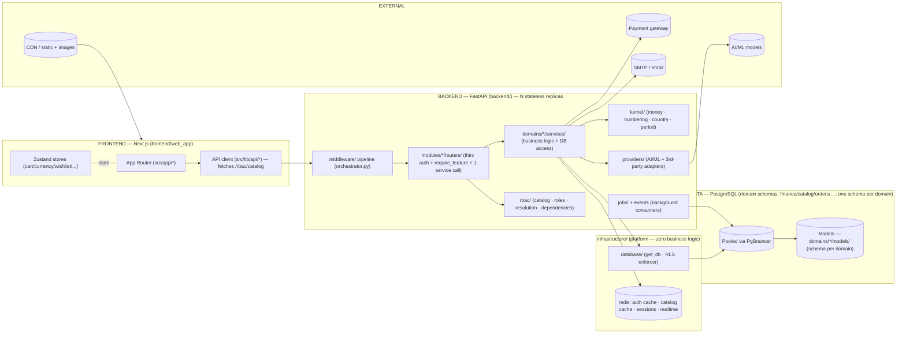
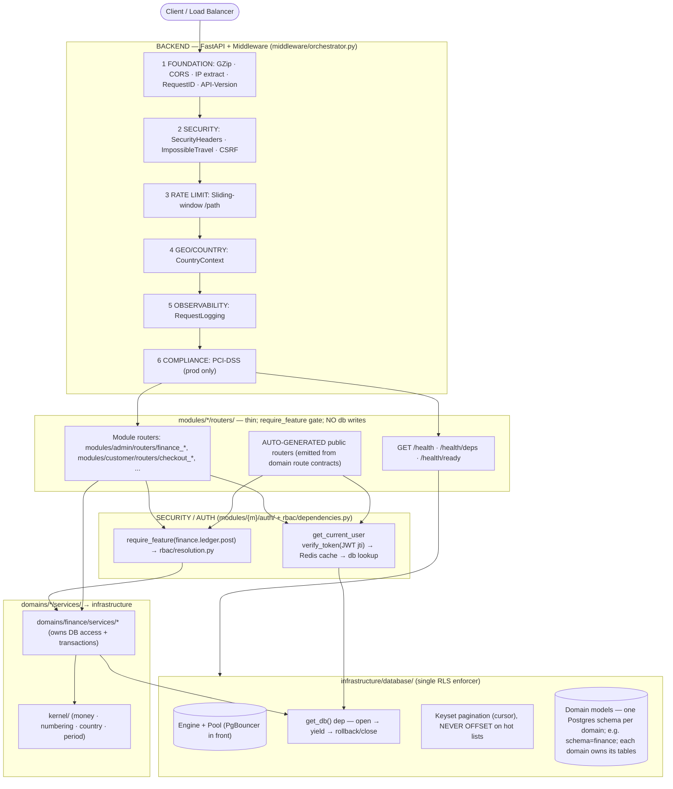
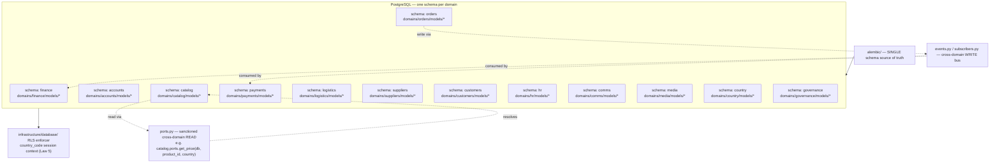
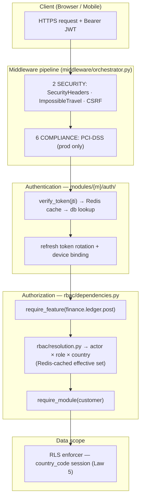
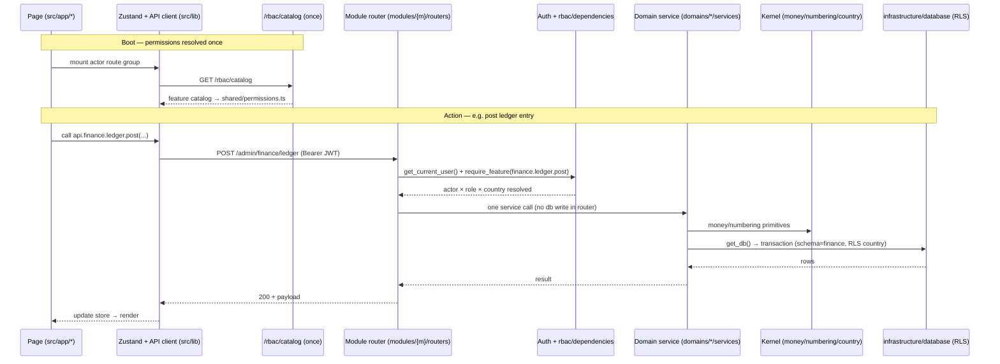

# ZOZI System Audit Report (target-contract aligned)

> **Generated:** 2026-08-23T01:02:48.254386+00:00  
> **Repo:** `D:\Projects\10- E-COMMERCE WEBSITE\zozi`  
> **Result:** 🔴 2116 violations · 🟡 5595 advisories · 🟢 160 info  
> **Architecture Debt Score:** 331611  
**Ephemeral. Add to `.gitignore`.**

---

## 1. The Grid Line (Target Layer Contract — ARCHITECTURE_DIAGRAM.md)

Three orthogonal axes: (1) **Module** `modules/{actor}/`, (2) **Domain** `domains/{domain}/`, (3) **Feature** `rbac/` via `require_feature()`.

| Layer (axis) | May import | Must NOT (law) |
|---|---|---|
| modules/* (AXIS 1) | domains/*/services, rbac (require_feature) | other modules (compose, don't reach in); infrastructure/DB access (law 2: thin routers, delegate to domains/*/services); abolished root layers (controllers/ routers/ services/ models/ db/ utils/) |
| domains/* (AXIS 2) | infrastructure (read-only), kernel, providers, events, subscribers, ports (cross-domain only via ports/events) | modules/* (law 1: arrows point DOWN, never import rbac); other domains except via ports/events (law 3) |
| rbac/* (AXIS 3) | kernel, infrastructure, domains (catalog aggregates domains/*/features.py) | modules/*, providers, jobs, middleware (imported BY modules+middleware only; Law 1 arrows down) |
| infrastructure/* | (none - platform leaf; imports nothing above it, Law 1) | modules/*, domains/*, rbac/*, kernel, providers, jobs, middleware |
| kernel/* | (nothing above) | any app layer |
| providers/* | providers._base, infrastructure, kernel | modules/*, domains/* |
| jobs/* | domains/*, infrastructure, providers | routers, main |
| middleware/* | infrastructure(read-only), kernel, rbac | modules/*, domains/*, routers (law: middleware imports downward only; may import rbac per diagram) |
| frontend/src/lib/api/* | backend /api/v1/* only | direct DB; raw fetch from pages; abolished root layers |

**Seven Laws:** (1) modules→domains→infrastructure, arrows down only; (2) routers delegate to ONE domains/*/services call (thin routers; no DB writes); (3) cross-domain only via `ports.py`/`events.py`/`subscribers.py`; (4) `require_feature()` is the single source of truth for capabilities; (5) middleware/providers/infrastructure never import upward; (6) domain models declare `__table_args__ = {'schema': '<domain>'}`; (7) `DOMAIN_ALLOWLIST.yaml` may only shrink (allowlist rule).
Abolished flat root layers (controllers/, routers/, services/, models/, db/, utils/) are **violations**, not targets.

---

## 2. Target Architecture (from ARCHITECTURE_DIAGRAM.md)

# ZOZI Platform — System Architecture Diagram

> Companion to `documents/TECHNOLOGY_USED.md` and the architecture rules.
> This document is the visual and organizational description of the backend.
> The rules and laws are maintained with it; the technology stack lives in
> `documents/TECHNOLOGY_USED.md`. All stay in lock-step.
>
> The codebase is organized around three orthogonal axes — **Modules, Domains,
> Features**. Every package, dependency arrow and naming rule below is the single
> organization the code follows. Code that does not fit this picture violates the
> dependency laws and is reported by the architecture audit.

---

## 1 · Technology Stack (from `documents/TECHNOLOGY_USED.md`)

### Backend — FastAPI / Python
| Concern | Technology |
|---|---|
| Framework / runtime | FastAPI `0.115.2`, Python `3.11` (Docker) / `3.10` (dev), Uvicorn `0.51.0`, Gunicorn `26.0.0` |
| Database / ORM | PostgreSQL `15` (prod) / SQLite (dev), SQLAlchemy `2.0.51` (async), Alembic `1.18.5`, asyncpg `0.31.0`, psycopg2-binary `2.9.12`, pg8000 `1.31.5`, DuckDB `1.5.5` + duckdb-engine `0.17.0` |
| Auth / security | python-jose `3.5.0` (JWT, `jti` blacklist), bcrypt `5.0.0`, pyotp `2.10.0` (TOTP), cryptography `49.0.0`, slowapi `0.1.10` (rate limit, limits `5.8.0`), CSRF + security-headers + PCI-DSS middleware |
| Cache / sessions | Redis `8.0.1` (auth cache, catalog cache, sessions, realtime, rate-limit) |
| Jobs | APScheduler `3.11.3` + custom background workers (`jobs/`) |
| Payments / APIs | Stripe `15.3.1` + Stripe Connect, httpx `0.28.1`, requests `2.34.2` |
| Observability | structlog `26.1.0`, OpenTelemetry (api / sdk / otlp, fastapi / asgi / sqlalchemy instrumentation), Prometheus (`prometheus-client` + `prometheus-fastapi-instrumentator`), Sentry (`sentry-sdk[fastapi]`) |
| Media / AI | aiofiles `25.1.0`, Pillow `12.3.0`, python-magic `0.4.27`, rembg `2.0.69`, opencv-python `5.0.0`, onnxruntime `1.23.2` |
| Email / comms | SMTP (stdlib) + `email-validator` `2.3.0`, Twilio (SMS), WebSockets `16.1.1` |
| Validation / utils | Pydantic `2.13.4`, python-dotenv `1.2.2`, python-slugify `8.0.4`, pytz `2026.3`, tzlocal `5.4.4`, babel `2.18.0`, phonenumbers `9.0.35`, numpy / scipy / scikit-image, python-docx `1.2.0`, openpyxl `3.1.5`, feedparser `6.0.12` |
| Testing | pytest `9.1.1` + pytest-asyncio `1.4.0`, httpx |

### Frontend — Next.js / React
| Concern | Technology |
|---|---|
| Framework | Next.js `16.3.1` (App Router, RSC), React `18.3.1`, TypeScript `5.8.2` (strict) |
| Styling | Tailwind CSS `3.4.19` + design tokens, class-variance-authority `0.7.1`, clsx `2.1.1`, tailwind-merge `3.5.0`, lucide-react `1.25.0`, framer-motion `11.5.6` |
| State | Zustand `5.0.11` |
| Forms | React Hook Form + Zod |
| Payments | `@stripe/react-stripe-js` `5.6.0`, `@stripe/stripe-js` `8.7.0` |
| Charts | chart.js `4.5.1` + react-chartjs-2 `5.3.1` |
| Maps | leaflet `1.9.4` + react-leaflet `5.0.0` |
| Utilities | jose `6.2.9` (browser JWT), dompurify `3.3.3` (XSS), qrcode `1.5.4`, jspdf `4.1.0`, @zxing/library `0.21.3` |
| Quality | ESLint `9` + typescript-eslint `8.62.0`, Prettier `3.3.3`, eslint-config-next `15.4.5`, Playwright `1.61.1`, jest `29.7.0` + ts-jest + RTL `16.3.0` + jest-axe `10.0.0` |
| Build / deploy | Node.js `20` (Alpine), multi-stage Docker, Next.js rewrites for API proxying |

### Infrastructure / DevOps
- Docker Compose (local), multi-stage Dockerfiles
- Railway (backend), Vercel (frontend)
- Alembic multi-schema migrations (public, analytics, audit, commerce, …)
- `.env` (compose) / `backend/.env` / `frontend/web_app/.env.local` / `.env.example` (source of truth)
- Monorepo `root/`: `docker-compose.yml`, `Makefile`, `pnpm-workspace.yaml`,
  `.github/workflows/*` (`ci.yml` · `import-lint.yml` · `schema-drift.yml` · `e2e.yml`),
  `_extra_files/` (temporary audit / migration working files)

### Key Architectural Patterns
| Layer | Technology | Purpose |
|-------|------------|---------|
| API | FastAPI + auto-discovered routers | RESTful endpoints with versioning |
| Auth | JWT (HS256) + refresh tokens + `jti` blacklisting | Stateless auth with revocation |
| Middleware | 6-layer pipeline (Foundation → Security → Rate Limit → Geo → Observability → Compliance) | Cross-cutting concerns |
| Database | SQLAlchemy `2.0` + RLS (Row Level Security) | Multi-tenant data isolation |
| Caching | Redis + in-memory | Performance |
| Real-time | WebSockets (native + custom manager) | Live updates |
| Observability | OpenTelemetry + Prometheus + Sentry + structlog | Full-stack monitoring |

### Shared Package
- `@zozi/shared` (`frontend/shared`) — TS types / utils shared between web and mobile;
  `permissions.ts` is **generated** from `GET /rbac/catalog`.

---

## 2 · The Three Orthogonal Axes

A folder tree can only express **one** axis. The other two live in **naming +
registration + configuration**. The three axes map to three different mechanisms:

| Axis | What it is | Where it lives | Mechanism |
|---|---|---|---|
| **Module** (customer, supplier, logistics, admin, employee) | *Who* is acting — login, session, route prefix, UI shell | `modules/{module}/` | Separate auth + thin API surface |
| **Domain** (finance, accounts, catalog, orders, payments, logistics, suppliers, customers, hr, comms, media, country, governance, …) | *What* the business does — logic + data | `domains/{domain}/` | Services, models, schemas, policies, events |
| **Feature** (`finance.ledger`, `finance.reporting`, …) | *What may be done* — permission atoms | `rbac/` + `domains/*/features.py` | Data/config, enforced by `require_feature()` |

**The rule that makes it coherent:** Modules compose. Domains own. Features gate.

---

## 3 · Backend Package Layout

```
backend/
├── main.py                     # boots app; registers module routers per actor prefix
├── config.py                   # settings, env, feature gates
├── DOMAIN_ALLOWLIST.yaml       # temporary cross-domain imports (may only shrink)
│
├── modules/                    # AXIS 1 — MODULE (who)
│   ├── customer/  supplier/  logistics/  admin/  employee/
│   │     ├── auth/             # per-actor login/OTP/social → that actor's own tables; sessions; device binding
│   │     ├── routers/          # THIN per-actor routers (auth + require_feature + ONE service call)
│   │     │                     #   modules/{m}/routers/__init__.py lists routers/public_routers for main.py
│   │     └── serializers/      # per-actor view models (customer-facing response shaping)
│   │
├── domains/                    # AXIS 2 — DOMAIN (what)
│   ├── finance/  accounts/  catalog/  orders/  payments/  logistics/  suppliers/
│   ├── customers/  hr/  comms/  media/  country/  governance/   # the 13 domains
│   │     ├── services/  models/  schemas/  policies/   # heavy domains may instead slice:
│   │     ├── events.py  subscribers.py                  #   ledger/ payouts/ treasury/ … (one sub-capability = one folder)
│   │     ├── ports.py        # SANCTIONED cross-domain READ path (the only thing another domain may import)
│   │     ├── read_models/    # CQRS-lite projections for this domain's own dashboards
│   │     └── features.py      # AXIS 3 seed: this domain's permission atoms
│   │
├── rbac/                       # AXIS 3 — FEATURE (may)
│   ├── catalog.py               # aggregates domains/*/features.py → single source of truth
│   ├── roles.py                 # (module, role) → feature sets
│   ├── resolution.py            # actor × role × country → effective set (Redis-cached)
│   ├── dependencies.py          # require_feature(...), require_module(...)
│   ├── service.py               # grant/revoke, delegation, maker-checker
│   └── models.py                # permission_categories, role_permission_assignments, user_permission_overrides
│
├── infrastructure/             # PLATFORM — zero business logic; imports nothing above it
│   ├── database/               # base.py · database.py (get_db/get_read_db) · session.py · transaction.py
│   │                           #   security.py ← ONE canonical RLS enforcer · seeds/ · create_tables.py (dev-only)
│   ├── redis/                  # client · cache · token blacklist · pub/sub
│   ├── storage/                # S3/R2 adapters · presigned URLs (media blobs never in Postgres)
│   ├── messaging/              # event_bus (in-proc → Redis later) · ws_manager · webhook ingress
│   ├── observability/          # structlog · OTEL · Prometheus · Sentry
│   ├── security/               # JWT · hashing · field encryption (KMS) · zero-trust primitives
│   └── utils/                  # pure technical helpers: pagination.py · datetime_utils · variant_key
├── kernel/                     # SHARED KERNEL — pure business primitives: money, currency, numbering, country, period
│                             #   import rule: domains → kernel → (nothing); kernel may use platform primitives only
├── providers/                  # 3rd-party/AI adapters (called ONLY by services/jobs; never by modules/domains directly)
│   ├── ai/  analytics/  auth/  automation/  comms/  finance/  geography/
│   ├── image/  media/  news/  payments/  security/  voice/
│   └── _base.py                # BaseProvider / BaseAIProvider + health_check()
├── jobs/                        # background workers/consumers (→ domains → infrastructure)
│   ├── fraud_monitoring.py  ghost_order_detector.py  data_retention.py
│   ├── payroll_run.py  payout_sweep.py  reconciliation_cron.py  bank_statement_importer.py
│   ├── fx_revaluation.py  accrual_reversal.py  threat_feed_updater.py  mcp_server.py
│   └── background_tasks.py
├── middleware/                  # flat; orchestrator.py orders the pipeline BEFORE module routers
│   └── orchestrator.py · api_version · country_context · csrf · database_security · device_binding
│       · impossible_travel · ip_extraction · logging · pci_dss_compliance · rate_limit
│       · request_id · rls_dependency · security_headers · webhook_ip_whitelist
│       · webhook_verification · zero_trust_auth
├── alembic/                     # SINGLE schema source of truth
├── scripts/                     # analyze_tables.py, rewrite_imports.py, seed helpers (dev)
└── tests/
    ├── architecture/            # test_import_laws.py (layer direction + cross-domain ban), test_feature_catalog.py
    └── domains/                 # per-domain unit/integration tests
```

> **Shared kernel (`kernel/`).** Business primitives used by *every* domain — `money`
> (Decimal, never float), `currency`, `numbering` (centralized ORD-/INV-/PAY-/BATCH-),
> `country`, `period` — live here as first-class residents so they are not smuggled into
> `infrastructure/utils/` or duplicated per domain. **Dependency rule: `domains → kernel → (nothing)`.**
> `kernel/` must not import `modules/`, `domains/`, `rbac/`, `providers/`, `jobs/`, or `middleware/`.
> It may import `infrastructure/` platform primitives only.

> **Canonical top-level packages.** The backend root contains **only**:
> `main.py`, `config.py`, `DOMAIN_ALLOWLIST.yaml`, `modules/`, `domains/`,
> `rbac/`, `kernel/`, `infrastructure/`, `providers/`, `jobs/`, `middleware/`,
> `alembic/`, `scripts/`, `tests/`. A root-level `utils/` is **forbidden** — its
> contents split into `infrastructure/utils/` (technical: pagination, datetime,
> variant keys, slugs) and `kernel/` (business primitives: money, currency,
> numbering, country, period). Likewise `routers/`, `controllers/`, `services/`,
> `models/`, `db/` are **not** top-level packages; they live inside `modules/`,
> `domains/`, or `infrastructure/` as shown above.

> **Cross-domain contract (Law 3).** Writes across domains go *only* through `events.py`/`subscribers.py`.
> Reads across domains go *only* through the publishing domain's `ports.py` (e.g.
> `domains/catalog/ports.py → get_price(db, product_id, country)`). `read_models/` hold each domain's
> own CQRS-lite projections; cross-domain dashboards live in `domains/governance/read_models/`.
> `DOMAIN_ALLOWLIST.yaml` tracks the *temporary* cross-domain imports still permitted and must only shrink.

> **Deployment model.** Shipped initially as a **modular monolith** (one deployable, one Postgres
> ecosystem, shared Redis) — modules and domains are boundaries inside one process, not separate servers.
> Module boundaries make later extraction to independent services possible *without* redesigning domains.

### Frontend layout
```
frontend/
├── web_app/                     # Next.js 16.3.1 (App Router, RSC)
│   ├── src/app/                 # route tree: (customer), auth/, admin/*, supplier/*, logistics-partner/*,
│   │                             #   employee/*, wishlist/, profile/, chatbot/, tracking/; app/api/ = Next server routes
│   ├── src/components/          # ui/ (design system), admin/, auth/, chat/, comms/, country/, ems/, map/, supplier/
│   ├── src/hooks/               # useApi, useAuth, WebSocket hooks
│   ├── src/lib/                 # api/ (client.ts, auth.ts, country.ts, errors.ts), rbac.ts (fetches /rbac/catalog)
│   ├── src/services/            # localizationService, crossBorderService, addressFormatService
│   ├── src/theme/  src/styles/  src/types/  src/utils/
│   ├── tests/  e2e/             # mocks + Playwright
│   └── root/                    # next.config.ts (rewrites), middleware.ts, tailwind.config, playwright.config
├── mobile_app/                  # Expo RN
│   ├── app/                     # Expo Router: (auth)/(tabs) + admin/ supplier/ logistics/ employee/ tracking/ returns/
│   ├── components/ui/           # design-system
│   ├── lib/                     # api.ts, Zustand stores, authPrompt, countryContext, geo, paymentService,
│   │                             #   expoSecureStorage, errorReporter
│   └── theme/  assets/  android/  mocks/  e2e/  scripts/  root/
└── shared/                      # cross-platform TS, imported by BOTH apps
    └── src/                     # api-core.ts (apiFetch), money.ts, i18n.ts, cart/checkout/order/product/returns/
                                  #   wishlist/notification helpers, statusColors.ts, requestCache.ts, realtime.ts,
                                  #   chatbot.ts, types.ts, theme.ts + theme.native.ts,
                                  #   permissions.ts  ← GENERATED from backend /rbac/catalog
```

---

## 4 · The Seven Laws (enforced by the audit)

1. **Arrows point down only:** `modules → domains → infrastructure`.
   Domains never import modules. `rbac` is imported by modules + middleware only.
   `infrastructure` / `kernel` import nothing above them. `providers ← services/jobs`.
2. **Module routers stay thin:** auth context + `require_feature(...)` + one domain-service call.
   No DB writes, no business rules.
3. **Cross-domain writes only via events** (`events.py`/`subscribers.py`);
   cross-domain *reads* only via `ports.py` / `read_models/`.
4. **Features single-sourced** in `domains/*/features.py`; aggregated by `rbac/catalog.py`;
   CI fails on any `require_feature("…")` literal not in the catalog.
5. **Country is the orthogonal scope axis:** RLS session context + `country_staff_assignments`
   — independent of the feature check.
6. **Schema discipline:** every table in a domain Postgres schema; Alembic is the only
   schema source; naming lint (`snake_case`, plural, `<thing>_id`, `created_at/updated_at`,
   `country_code`, `is_deleted`).
7. **Allowlist rule:** temporary cross-domain imports are tracked in `DOMAIN_ALLOWLIST.yaml`
   and may only shrink; direct cross-domain writes outside `events.py` are forbidden.

---

## 5 · System Context



---

## 6 · Backend Circuit (request lifecycle)



---

## 7 · RBAC / Feature axis (AXIS 3)

- Feature atoms are **defined once** in `domains/{domain}/features.py` (e.g.
  `finance.ledger.post`, `finance.reporting.read`).
- `rbac/catalog.py` aggregates every domain's `features.py` via package scan →
  single source of truth. It is served to the frontend at `GET /rbac/catalog`.
- `rbac/roles.py` grants per **(module, role)**; `rbac/resolution.py` resolves
  `actor × role × country → effective feature set` (Redis-cached).
- `rbac/dependencies.py` provides `require_feature(...)` / `require_module(...)`
  gates used by every module router.
- Frontend `shared/src/permissions.ts` is **generated** from `/rbac/catalog` so
  UI gating and backend gating share one source.

---

## 8 · Schema discipline (Law 6)

- Every ORM model declares `__table_args__ = {"schema": "<domain>"}`
  (slice tables use the parent domain's schema).
- Alembic is the only schema source (`create_all` is dev-only).
- Naming lint: `snake_case`, plural tables, `<thing>_id` FKs,
  `created_at`/`updated_at`, `country_code`, `is_deleted`.
- Forbidden schemas: `core` / `platform` / `identity` — every actor's `user`
  table lives in its own domain schema (e.g. `customer.user`, `supplier.user`).

---

## 9 · Database organization (Law 6)

Every domain owns one Postgres schema; the model classes live in
`domains/{domain}/models/`. Cross-domain **writes** travel only through
`events.py` / `subscribers.py`; cross-domain **reads** travel only through the
owning domain's `ports.py` (or `read_models/`). The country scope is enforced by
RLS on every schema.



---

## 10 · Security architecture

Authentication and authorization follow the axes: **modules** carry the actor
(who), **features** gate the action (may), and **country RLS** scopes the data.
The 6-layer middleware pipeline runs before any module router.



---

## 11 · End-to-end flow (frontend ↔ backend)

The frontend route tree under `frontend/web_app/src/app/*` is grouped per actor
(module). On boot it fetches `GET /rbac/catalog` once to build
`shared/src/permissions.ts`; every later action calls a thin module router that
authenticates, gates on a feature, and delegates to one domain service.



---

## 3. AI File Placement Contract

## AI File Placement Contract (ZOZI ARCHITECTURE_DIAGRAM.md)

> **Rule for AI:** Before creating or moving ANY backend file, use this contract.
> The three axes are: **Module = `modules/` (who)**, **Domain = `domains/` (what)**,
> **Feature = `rbac/` + `domains/*/features.py` (may)**. Platform = `infrastructure/`,
> shared kernel = `kernel/`, adapters = `providers/`, workers = `jobs/`,
> HTTP pipeline = `middleware/`.

### Canonical layer rules (ARCHITECTURE_DIAGRAM structure)

| Axis / Layer | Structure | Correct examples |
|---|---|---|
| `backend/modules/{module}/` (AXIS 1) | auth/ + routers/ per actor | `modules/admin/auth/`, `modules/admin/routers/finance_ledger_router.py`, `modules/customer/routers/checkout_router.py` |
| `backend/modules/{module}/routers/` | **thin**: auth ctx + `require_feature(...)` + one domain-service call | `modules/admin/routers/finance_reports_router.py`, `modules/supplier/routers/payouts_router.py` |
| `backend/domains/{domain}/` (AXIS 2) | services/ models/ schemas/ policies/ events.py subscribers.py features.py | `domains/finance/services/ledger_service.py`, `domains/finance/models/ledger.py` |
| `backend/domains/{domain}/services/` | orchestration + transactions (NO HTTP) | `domains/orders/services/checkout_service.py` |
| `backend/domains/{domain}/models/` | ORM only; flat per domain; `__table_args__={'schema': '<domain>'}` | `domains/catalog/models/products.py` |
| `backend/domains/{domain}/features.py` | AXIS 3 seed: permission atoms | `domains/finance/features.py` (finance.ledger, finance.reporting, ...) |
| `backend/rbac/` (AXIS 3) | catalog.py roles.py resolution.py dependencies.py service.py | `rbac/catalog.py`, `rbac/dependencies.py` |
| `backend/infrastructure/` | platform: database redis storage messaging observability security utils | `infrastructure/database/database.py`, `kernel/money.py` |
| `backend/kernel/` | business primitives: money numbering country period | `kernel/money.py`, `kernel/numbering.py` |
| `backend/providers/` | 3rd-party/AI adapters; called ONLY by services/ and jobs/ | `providers/ai/image_analysis_provider.py` |
| `backend/jobs/` | background workers/consumers (off-request only) | `jobs/finance/payout_sweep.py` |
| `backend/middleware/` | flat HTTP pipeline; orchestrator.py orders it | `middleware/orchestrator.py`, `middleware/rate_limit.py` |

### The seven laws (any violation = report it)

1. Arrows point DOWN only: `modules → domains → infrastructure`; `jobs → domains → infrastructure`; `providers ← services/jobs`; `middleware → infrastructure`; `domains → kernel → (nothing)`. Domains NEVER import modules; `rbac` is imported by modules/middleware only (domains enforce policies, not permissions).
2. Module routers stay THIN: auth ctx + `require_feature(...)` + one domain-service call. No DB writes, no business rules. Module routers NEVER import `providers/` directly (the domain service calls the provider).
3. Cross-domain WRITES only via `events.py`/`subscribers.py`. Cross-domain READS only via the publishing domain's `ports.py` (or `read_models/`); direct `from domains.X.(services|models|repositories|schemas|policies)` outside `domains/X` is a build failure. `DOMAIN_ALLOWLIST.yaml` tracks the temporary exceptions (must shrink).
4. Features are single-sourced in `domains/*/features.py`; aggregated by `rbac/catalog.py`. Any `require_feature("...")` literal not in the catalog is a build failure.
5. Country is the orthogonal scope axis (RLS + `country_staff_assignments`); independent of the feature check.
6. Schema discipline: every table lives in a Postgres schema (`__table_args__={'schema': '<domain>'}`); Alembic is the only schema source; snake_case/plural naming lints apply.
7. Allowlist rule (Law 7): `DOMAIN_ALLOWLIST.yaml` lists the temporary cross-domain imports still permitted and may only shrink.

### ABOLISHED flat root layers — FORBIDDEN (do NOT create; these are violations)

The following root layers are abolished (per ARCHITECTURE_DIAGRAM.md). Creating or leaving a file under any of them is a RED violation. There is no prescribed re-export/`_legacy` shim layer; abolished code must be split into the canonical locations and the originals merged/retired.

```text
backend/controllers/      # ABOLISHED — split into modules/*/routers/ + domains/*/services/
backend/routers/          # ABOLISHED flat — re-home per actor under modules/*/routers/
backend/services/         # ABOLISHED flat — move into domains/*/services/
backend/models/           # ABOLISHED flat — move into domains/*/models/
backend/db/               # ABOLISHED — move into infrastructure/database/
backend/utils/            # ABOLISHED flat — split into infrastructure/utils/ + kernel/
backend/core/             # ABOLISHED — move into domains/*/services/ or infrastructure/
backend/dependencies/     # ABOLISHED — move into domains/*/ or infrastructure/
```

### Domain keyword routing (→ the NEW home is a domain folder)

| Domain | Put business logic here (AXIS 2) | Keywords |
|---|---|---|
| `finance` | `backend/domains/finance/services/`, `backend/domains/finance/models/`, `backend/domains/finance/features.py` | accounting, auto_payout, bank, budget, cash, cash_flow, commission, commission_write, credit_control, erp, finance, finance_automation, finance_erp, financial |
| `accounts` | `backend/domains/accounts/services/`, `backend/domains/accounts/models/`, `backend/domains/accounts/features.py` | account, accounts, chart_of_accounts, gl_account |
| `catalog` | `backend/domains/catalog/services/`, `backend/domains/catalog/models/`, `backend/domains/catalog/features.py` | advanced_filter, advanced_search, autocomplete, catalog, categories, category, filter, filters, inventory, moderation, product, product_moderation, product_verification, products |
| `orders` | `backend/domains/orders/services/`, `backend/domains/orders/models/`, `backend/domains/orders/features.py` | banner, banners, campaign, cart, checkout, commerce, coupon, coupons, discount, discounts, dispute, disputes, flash_sale, fulfillment |
| `payments` | `backend/domains/payments/services/`, `backend/domains/payments/models/`, `backend/domains/payments/features.py` | billing, billing_cycle, billing_cycles, charge, charges, checkout_gateway, gateway, logistic_payments, payment, payment_adapter, payment_gateway, payment_processor, payment_provider, payments |
| `logistics` | `backend/domains/logistics/services/`, `backend/domains/logistics/models/`, `backend/domains/logistics/features.py` | carrier, carrier_config, carrier_configs, delivery, dispatch, fleet, geo_fence, geofence, live_tracking, logistics, map, parcel, pod, route |
| `suppliers` | `backend/domains/suppliers/services/`, `backend/domains/suppliers/models/`, `backend/domains/suppliers/features.py` | badge, contract, kyc, onboarding, storefront, supplier, supplier_badge, supplier_health, supplier_inventory, supplier_onboarding, supplier_products, supplier_profile, suppliers, vendor |
| `customers` | `backend/domains/customers/services/`, `backend/domains/customers/models/`, `backend/domains/customers/features.py` | address, addresses, customer, customer_health, customers, point, points, preferences, profile, rating, ratings, review, review_moderation, review_response |
| `hr` | `backend/domains/hr/services/`, `backend/domains/hr/models/`, `backend/domains/hr/features.py` | attendance, background, background_check, coi, dei, employee, employees, handover, hr, hse, leave, lms, offboarding, payroll |
| `comms` | `backend/domains/comms/services/`, `backend/domains/comms/models/`, `backend/domains/comms/features.py` | chat, comm, comms, communication, email, email_template, fix_chat, meeting, message, messages, notification, notification_template, notification_templates, notifications |
| `media` | `backend/domains/media/services/`, `backend/domains/media/models/`, `backend/domains/media/features.py` | asset, assets, attachment, attachments, cdn, certificate, certificates, contract_document, document, documents, file, free_image, image, images |
| `country` | `backend/domains/country/services/`, `backend/domains/country/models/`, `backend/domains/country/features.py` | border, cities, city, countries, country, country_detection, country_research, cross_border, cross_border_tracker, currency, economics, geo, geography, localization |
| `governance` | `backend/domains/governance/services/`, `backend/domains/governance/models/`, `backend/domains/governance/features.py` | access_control, audit, audit_log, audit_trail, auditor, communication_audit, compliance, compliance_engine, event_log, event_subscription, event_subscriptions, events, export, exports |

### If domain is unclear

If a file does not clearly belong to a domain, create the domain skeleton first:

```text
backend/domains/<new_domain>/services/  models/  schemas/  policies/  events.py  subscribers.py  features.py
```

Then add the surface where needed under `backend/modules/<module>/routers/`. Never drop it into an abolished flat root layer.


---

## 4. Scorecard

| Code | Count | Sev | Meaning |
|---|---:|---|---|
| A1 | 41 | 🟡 ADVISORY | architecture hotspot (high coupling / instability) |
| API101 | 277 | 🟡 ADVISORY | endpoint missing response_model |
| API2 | 100 | 🟡 ADVISORY | internal symbol exposed outside its module boundary |
| AS1 | 15 | 🟡 ADVISORY | route prefix does not align with surface |
| AS2 | 5 | 🟡 ADVISORY | OpenAPI tag does not align with domain |
| CA1 | 17 | 🟡 ADVISORY | file name does not match file content (operations mismatch) |
| CA2 | 100 | 🟡 ADVISORY | file contains operations from multiple domains (split candidate) |
| CFG3 | 11 | 🟡 ADVISORY | malformed or contradictory policy rule |
| CG1 | 108 | 🔴 VIOLATION | call graph violation: function calls across forbidden layer boundary |
| CG2 | 192 | 🔴 VIOLATION | call chain violates circuit direction (upward call) |
| CIR1 | 9 | 🔴 VIOLATION | circuit violation: import is outside the allowed layer circuit |
| CIR2 | 36 | 🟡 ADVISORY | circuit bypass: import skips the preferred layer (migration warning) |
| D1 | 6 | 🟡 ADVISORY | duplicate module basename within backend (import-shadow) |
| D3 | 150 | 🟡 ADVISORY | duplicate class name across modules |
| DBA01 | 14 | 🟡 ADVISORY | model declares a forbidden (core/platform/identity) PostgreSQL schema= argument |
| DBA02 | 13 | 🟡 ADVISORY | Base.metadata.create_all not safely dev-gated |
| DBA03 | 227 | 🟡 ADVISORY | mandatory column set / mixin missing |
| DBA04 | 1 | 🟡 ADVISORY | country_code width mismatch |
| DBA05 | 2 | 🔴 VIOLATION | RLS coverage missing or weak (ONE canonical enforcer: infrastructure/database/security.py) |
| DBA06 | 188 | 🔴 VIOLATION | forbidden schema-prefixed FK (core/platform/identity); use a domain schema e.g. customer.user.id |
| DBA07 | 346 | 🟡 ADVISORY | unsafe or missing FK cascade rule |
| DBA08 | 237 | 🟡 ADVISORY | FK column missing index |
| DBA09 | 61 | 🟡 ADVISORY | JSONB column missing GIN index signal |
| DBA11 | 27 | 🟡 ADVISORY | database naming convention violation |
| DBA12 | 18 | 🟡 ADVISORY | migration governance missing or unsafe |
| DBA13 | 2 | 🔴 VIOLATION | migration head / ORM-only table drift |
| DBA18 | 1 | 🟡 ADVISORY | audit log taxonomy missing or fragmented |
| DBA23 | 1 | 🟡 ADVISORY | partition strategy missing for hot append-only tables |
| DBA26 | 15 | 🔴 VIOLATION | ORM model outside domains/*/models/ |
| DBA27 | 1 | 🔴 VIOLATION | broken or suspicious migration file (ADR-018 risk) |
| DBA31 | 37 | 🟡 ADVISORY | required composite index signal missing |
| DBA32 | 150 | 🟡 ADVISORY | unsafe pagination/query pattern (OFFSET on hot list; use keyset/cursor pagination) |
| DG | 157 | 🔴 VIOLATION | forbidden dependency-graph edge (layer contract violated) |
| DG2 | 45 | 🟡 ADVISORY | circular dependency detected |
| DG4 | 3 | 🟡 ADVISORY | dynamic import edge detected |
| DG5 | 34 | 🟡 ADVISORY | dynamic execution obscures dependency graph |
| DOM6 | 4 | 🟢 INFO | new domain candidate auto-detected |
| DP103 | 1 | 🟡 ADVISORY | missing env var validation at startup |
| DP104 | 1 | 🟡 ADVISORY | missing graceful shutdown handler |
| DP105 | 1 | 🟡 ADVISORY | missing .dockerignore |
| DS01 | 60 | 🟡 ADVISORY | hardcoded CSS: inline style={{...}} object in component |
| DS02 | 4 | 🔴 VIOLATION | hardcoded CSS: <style> </style> tag inside a component file |
| DS03 | 30 | 🟡 ADVISORY | raw/off-palette color literal (bypasses design tokens) |
| DS04 | 14 | 🟡 ADVISORY | color theme drift: near-duplicate colors used as if different |
| DS07 | 2 | 🟡 ADVISORY | hardcoded typography (font size / family literal) |
| DS08 | 1 | 🟡 ADVISORY | hardcoded spacing/dimension (raw px) |
| DS09 | 1 | 🟡 ADVISORY | inconsistent border-radius values |
| DS11 | 1 | 🟡 ADVISORY | inconsistent box-shadow values |
| DS16 | 1 | 🟡 ADVISORY | inconsistent motion durations (transition/animation) |
| F1 | 11 | 🟡 ADVISORY | scratch/debug script (relocate; ops scripts -> scripts/maintenance|validation) |
| F2 | 29 | 🟡 ADVISORY | hardcoded developer-local absolute path in source |
| F4 | 43 | 🟡 ADVISORY | committed cache/build/artifact present (bloat) |
| F5 | 2 | 🔴 VIOLATION | secret material on disk (security) |
| F8 | 3 | 🟡 ADVISORY | non-document artifact at documents/ root |
| F9 | 7 | 🟡 ADVISORY | repo-root note outside allow-list / banned dir |
| FEH101 | 58 | 🟡 ADVISORY | oversized frontend file/component |
| FEH201 | 74 | 🟡 ADVISORY | console/debugger in frontend code |
| FEH301 | 13 | 🟡 ADVISORY | missing React error boundary |
| FEH401 | 9 | 🟡 ADVISORY | too many inline JSX handlers |
| FEH402 | 114 | 🟡 ADVISORY | list key uses array index |
| FEH501 | 157 | 🟡 ADVISORY | data fetching inside useEffect |
| FEH502 | 1 | 🟡 ADVISORY | heavy frontend import (lazy-load) |
| FEH503 | 72 | 🟡 ADVISORY | direct DOM access in React |
| FEH504 | 1 | 🟡 ADVISORY | large list rendering (virtualization) |
| FEH601 | 7 | 🟡 ADVISORY | large component without memoization |
| FEH701 | 4 | 🟡 ADVISORY | heavy client-side transformation |
| FEH801 | 29 | 🟡 ADVISORY | missing Suspense/lazy for code splitting |
| FEH802 | 30 | 🟡 ADVISORY | raw  without next/image |
| FT1 | 7 | 🟡 ADVISORY | flow-type violation: operation not allowed for this surface×domain flow |
| H1 | 9 | 🟡 ADVISORY | sys.path.insert/append (import-resolution footgun) |
| HL101 | 62 | 🟡 ADVISORY | oversized Python file |
| HL102 | 122 | 🟡 ADVISORY | oversized Python function |
| HL110 | 1 | 🟡 ADVISORY | missing docstring on public domain-service / module function |
| HL201 | 19 | 🟡 ADVISORY | print() used instead of structured logging |
| HL203 | 19 | 🟡 ADVISORY | logging.basicConfig() should be configured centrally |
| HL204 | 26 | 🟡 ADVISORY | possible secret/token value in log/print statement |
| HL301 | 2 | 🟡 ADVISORY | bare except hides failures |
| HL302 | 344 | 🟡 ADVISORY | swallowed exception (except + pass / no logging) |
| HL303 | 74 | 🟡 ADVISORY | broad except Exception should be narrowed or logged |
| HL401 | 1 | 🟡 ADVISORY | blocking sleep in request-path code |
| HL403 | 2 | 🟡 ADVISORY | sync file/OS I/O inside async function |
| HL501 | 18 | 🟡 ADVISORY | heavy top-level import in web path (lazy-load recommended) |
| HL502 | 28 | 🟡 ADVISORY | star import (from x import *) pollutes namespace |
| HL601 | 10 | 🟡 ADVISORY | sequential external calls (concurrency opportunity) |
| HL602 | 13 | 🟡 ADVISORY | missing timeout on external call |
| HL801 | 260 | 🟡 ADVISORY | function needs timing/metrics instrumentation |
| HL901 | 1 | 🟡 ADVISORY | high count of TODO/FIXME comment markers (debt threshold exceeded) |
| HL902 | 1 | 🟡 ADVISORY | commented-out code lines (dead code) |
| I1 | 1 | 🟢 INFO | structure summary |
| I2 | 1 | 🟢 INFO | rules source (yaml vs embedded fallback) |
| I3 | 1 | 🟢 INFO | architecture metric summary |
| L1 | 1 | 🟡 ADVISORY | multiple RLS enforcers (fail-open risk) — consolidate to ONE canonical enforcer at infrastructure/database/security.py |
| MET1 | 1 | 🟢 INFO | architecture debt score |
| MR101 | 1 | 🟡 ADVISORY | nested list comprehension (use generator) |
| MR104 | 39 | 🟡 ADVISORY | global mutable state (breaks scaling) |
| MW2 | 1 | 🟡 ADVISORY | required middleware missing (diagram §3 list: api_version · country_context · csrf · database_security · device_binding · impossible_travel · ip_extraction · logging · pci_dss_compliance · rate_limit · request_id · rls_dependency · security_headers · webhook_ip_whitelist · webhook_verification · zero_trust_auth) |
| NM | 6 | 🟢 INFO | node_modules present (confirm gitignored) |
| NS0 | 1 | 🟢 INFO | ARCHITECTURE_DIAGRAM.md compliance gate active (authoritative target) |
| NS12 | 16 | 🔴 VIOLATION | consumer import still binds to an abolished flat layer (services/controllers/routers/root models) from a non-_legacy file — runtime still depends on abolished code; migration claim is FALSE (P0) |
| NS14 | 16 | 🟢 INFO | ARCHITECTURE_DIAGRAM.md adoption ratio below target (measured over backend imports) |
| NS15 | 1 | 🔴 VIOLATION | feature atom used via require_feature() literal but not registered in domains/*/features.py (Law 4 single-source, P0) |
| NS16 | 120 | 🟢 INFO | rbac/catalog.py does not aggregate domains/*/features.py via package scan — catalog is hand-maintained and drifts from domains (Law 4 single-source, P0) |
| NS18 | 79 | 🟡 ADVISORY | thin-router violation: router module carries business logic instead of delegating to ONE domain-service call in domains/*/services (Law 2, P1) |
| NS20 | 61 | 🔴 VIOLATION | inverted dependency arrow: middleware/providers/infrastructure import upward application layers (Law 1, P0) |
| NS22 | 2 | 🟡 ADVISORY | schema discipline violation: domain model table lacks __table_args__ schema='<domain>' (Law 6, P1) |
| NS31 | 1 | 🔴 VIOLATION | non-canonical venv/ at backend root — tooling, not app structure; gitignore and relocate out of repo (archive) (closed root set, P2) |
| NS33 | 288 | 🟡 ADVISORY | module router gates with a pre-ARCHITECTURE_DIAGRAM per-module auth helper (require_admin/require_finance_permission/...) instead of rbac.dependencies.require_feature — Feature axis (Law 4) not wired (P2) |
| NS34 | 1 | 🔴 VIOLATION | kernel/ imports a layer above it (modules/domains/rbac/providers/jobs/middleware); kernel is a pure shared kernel: domains -> kernel -> infrastructure primitives only (Law 1, P1) |
| NS35 | 2 | 🔴 VIOLATION | module router imports providers/ directly; providers are called only by services/jobs, never by thin module routers (Law 1, P0) |
| NS36 | 26 | 🔴 VIOLATION | domain imports rbac/; rbac is imported by modules/middleware only — domains enforce policies, not permissions (Law 4, P0) |
| NS38 | 1 | 🔴 VIOLATION | backend root entry outside the closed set defined by ARCHITECTURE_DIAGRAM.md §3 (main.py · config.py · DOMAIN_ALLOWLIST.yaml · modules/ domains/ rbac/ kernel/ infrastructure/ providers/ jobs/ middleware/ alembic/ scripts/ tests/) (P1) |
| NS39 | 1 | 🔴 VIOLATION | domain folder missing features.py — every domain seeds its permission atoms (Law 4 single-source, P0) |
| NS6 | 50 | 🔴 VIOLATION | domain imports a module layer (Law 1: arrows point down only) |
| NS7 | 124 | 🔴 VIOLATION | infrastructure imports an application/domain layer (Law 1 violation) |
| NS8 | 776 | 🔴 VIOLATION | cross-domain import bypasses ports.py/events.py/read_models (Law 3 violation) |
| OB101 | 8 | 🟡 ADVISORY | module missing structured logger |
| OB102 | 8 | 🟡 ADVISORY | missing request_id / correlation_id |
| P1 | 2 | 🟡 ADVISORY | scratch script at backend root (relocate / merge into scripts/) |
| P3 | 3 | 🟡 ADVISORY | abolished flat root layer package present (controllers/ routers/ services/ models/ db/ utils/ core/ dependencies/) |
| P4 | 6 | 🟡 ADVISORY | missing expected backend package |
| P5 | 9 | 🟡 ADVISORY | python package missing __init__.py |
| PF1 | 1 | 🟢 INFO | required project file missing |
| PF2 | 9 | 🟡 ADVISORY | required scope document missing |
| PG102 | 49 | 🟡 ADVISORY | WebSocket in Python (consider Node.js gateway) |
| PG103 | 10 | 🟡 ADVISORY | CPU-bound work in request path (offload to worker) |
| PG201 | 1 | 🟡 ADVISORY | frontend main-thread CPU work (use Web Worker) |
| PL100 | 1 | 🟢 INFO | pipeline component present |
| PL101 | 1 | 🟡 ADVISORY | pipeline component missing (diagram §1 CI: ci.yml · import-lint.yml · schema-drift.yml · e2e.yml) |
| PRV1 | 7 | 🟡 ADVISORY | provider class does not subclass BaseProvider/BaseAIProvider (providers/_base.py) |
| Q1 | 648 | 🟡 ADVISORY | module router reads via db.query (delegate to domain service) |
| QUAL3 | 414 | 🟡 ADVISORY | oversized file or function (scaling/maintainability risk) |
| SC1 | 1 | 🟡 ADVISORY | DB pool_size exceeds PgBouncer-safe limit (pool_size=5, max_overflow=10 behind PgBouncer) |
| SC101 | 41 | 🟡 ADVISORY | list endpoint missing pagination |
| SC2 | 2 | 🟡 ADVISORY | hot path uses sync-only SQLAlchemy — blocks the event loop at scale (stack target: SQLAlchemy 2.0 async + asyncpg) |
| SC3 | 4 | 🟡 ADVISORY | in-process WebSocket fan-out won't scale past one replica (move to Redis pub/sub — infrastructure/messaging/) |
| SC501 | 10 | 🟡 ADVISORY | heavy operation in request path (background job) |
| SEC101 | 8 | 🔴 VIOLATION | raw SQL string concatenation (injection risk) |
| SEC4 | 1 | 🟡 ADVISORY | insecure runtime setting (debug/cors wildcard with credentials) |
| SYM1 | 100 | 🟡 ADVISORY | symbol defined but never used (dead symbol) |
| SYM2 | 100 | 🟡 ADVISORY | duplicate symbol definition across modules |
| W1 | 358 | 🔴 VIOLATION | module router writes to DB (must be a domain service) |

---

## 5. 🔥 Damage Hotlist (fix these first)

| Sev | Rule | Domain | Location | Problem | Fix |
|---|---|---|---|---|---|
| 🔴 | CG1 | backend | `backend\modules\supplier\routers\supplier_orders.py:372` | forbidden call: modules.verify_parcel_proof() → providers.verify_parcel_photo() | modules must not call providers directly |
| 🔴 | CG1 | backend | `backend\modules\supplier\routers\supplier_orders.py:386` | forbidden call: modules.verify_parcel_proof() → providers.verify_parcel_fast() | modules must not call providers directly |
| 🔴 | CG1 | backend | `backend\modules\supplier\routers\supplier_orders_verify.py:262` | forbidden call: modules.verify_parcel_proof() → providers.verify_parcel_photo() | modules must not call providers directly |
| 🔴 | CG1 | backend | `backend\modules\supplier\routers\supplier_orders_verify.py:276` | forbidden call: modules.verify_parcel_proof() → providers.verify_parcel_fast() | modules must not call providers directly |
| 🔴 | CG1 | backend | `backend\middleware\country_context.py:372` | forbidden call: middleware.check_coi_before_approval() → domains.check_approval_blocked() | middleware must not call domains directly |
| 🔴 | CG1 | backend | `backend\middleware\country_context.py:66` | forbidden call: middleware._get_country_detection_service() → domains.CountryDetectionService() | middleware must not call domains directly |
| 🔴 | CG1 | backend | `backend\middleware\country_context.py:322` | forbidden call: middleware._lookup_country_from_ip() → providers.detect_country_from_ip() | middleware must not call providers directly |
| 🔴 | CG1 | backend | `backend\middleware\country_context.py:216` | forbidden call: middleware.dispatch() → domains.get_user_by_id() | middleware must not call domains directly |
| 🔴 | CG1 | backend | `backend\middleware\country_context.py:218` | forbidden call: middleware.dispatch() → domains.resolve_user_country_scope() | middleware must not call domains directly |
| 🔴 | CG1 | backend | `backend\middleware\impossible_travel_middleware.py:121` | forbidden call: middleware._get_coordinates() → providers.lookup_coordinates() | middleware must not call providers directly |
| 🔴 | CG1 | backend | `backend\middleware\impossible_travel_middleware.py:157` | forbidden call: middleware._lock_session() → domains.log_impossible_travel_lock() | middleware must not call domains directly |
| 🔴 | CG1 | backend | `backend\middleware\impossible_travel_middleware.py:352` | forbidden call: middleware.dispatch() → domains.FraudScoringEngine() | middleware must not call domains directly |
| 🔴 | CG1 | backend | `backend\middleware\dependencies\country_detection.py:24` | forbidden call: middleware._get_service() → domains.CountryDetectionService() | middleware must not call domains directly |
| 🔴 | CG1 | backend | `backend\infrastructure\lifespan.py:121` | forbidden call: infrastructure._startup_register_event_listeners() → domains.FulfillmentService() | infrastructure must not call domains directly |
| 🔴 | CG1 | backend | `backend\infrastructure\lifespan.py:133` | forbidden call: infrastructure._startup_register_event_listeners() → domains.register_listener() | infrastructure must not call domains directly |
| 🔴 | CG1 | backend | `backend\infrastructure\lifespan.py:92` | forbidden call: infrastructure._startup_load_role_permissions() → domains.load_role_permission_settings() | infrastructure must not call domains directly |
| 🔴 | CG1 | backend | `backend\infrastructure\utils\asset_tracking.py:32` | forbidden call: infrastructure.assign_asset() → domains.EmployeeAsset() | infrastructure must not call domains directly |
| 🔴 | CG1 | backend | `backend\infrastructure\utils\asset_tracking.py:62` | forbidden call: infrastructure.track_condition() → domains.AuditLog() | infrastructure must not call domains directly |
| 🔴 | CG1 | backend | `backend\infrastructure\utils\command_center_background.py:47` | forbidden call: infrastructure.<module>() → providers.create_scheduler() | infrastructure must not call providers directly |
| 🔴 | CG1 | backend | `backend\infrastructure\utils\command_center_background.py:713` | forbidden call: infrastructure._run_finance_cycle_job() → domains.run_scheduled_finance_cycle() | infrastructure must not call domains directly |
| 🔴 | CG1 | backend | `backend\infrastructure\utils\command_center_background.py:741` | forbidden call: infrastructure._run_reconciliation_cycle_job() → domains.run_scheduled_reconciliation_cycle() | infrastructure must not call domains directly |
| 🔴 | CG1 | backend | `backend\infrastructure\utils\command_center_background.py:763` | forbidden call: infrastructure.start_background_jobs() → providers.IntervalTrigger() | infrastructure must not call providers directly |
| 🔴 | CG1 | backend | `backend\infrastructure\utils\command_center_background.py:779` | forbidden call: infrastructure.start_background_jobs() → providers.IntervalTrigger() | infrastructure must not call providers directly |
| 🔴 | CG1 | backend | `backend\infrastructure\utils\command_center_background.py:793` | forbidden call: infrastructure.start_background_jobs() → providers.IntervalTrigger() | infrastructure must not call providers directly |
| 🔴 | CG1 | backend | `backend\infrastructure\utils\command_center_service.py:244` | forbidden call: infrastructure._log_health_event() → domains.SystemHealthEvent() | infrastructure must not call domains directly |
| 🔴 | CG1 | backend | `backend\infrastructure\utils\command_center_service.py:505` | forbidden call: infrastructure.run_commission_simulation() → domains.PredictiveSimulation() | infrastructure must not call domains directly |
| 🔴 | CG1 | backend | `backend\infrastructure\utils\command_center_service.py:526` | forbidden call: infrastructure.run_sla_simulation() → domains.PredictiveSimulation() | infrastructure must not call domains directly |
| 🔴 | CG1 | backend | `backend\infrastructure\utils\command_center_service.py:100` | forbidden call: infrastructure._fetch_rss() → providers.fetch_rss_entries() | infrastructure must not call providers directly |
| 🔴 | CG1 | backend | `backend\infrastructure\utils\command_center_service.py:133` | forbidden call: infrastructure._fetch_rss() → domains.NewsArticle() | infrastructure must not call domains directly |
| 🔴 | CG1 | backend | `backend\infrastructure\utils\command_center_service.py:160` | forbidden call: infrastructure._fetch_api() → providers.fetch_api_payload() | infrastructure must not call providers directly |
| 🔴 | CG1 | backend | `backend\infrastructure\utils\command_center_service.py:194` | forbidden call: infrastructure._process_api_response() → domains.NewsArticle() | infrastructure must not call domains directly |
| 🔴 | CG1 | backend | `backend\infrastructure\utils\config.py:388` | forbidden call: infrastructure._load_field_encryption_key_from_aws_ssm() → providers.create_ssm_client() | infrastructure must not call providers directly |
| 🔴 | CG1 | backend | `backend\infrastructure\utils\country_detection_middleware.py:35` | forbidden call: infrastructure._detect_country() → domains.CountryDetectionService() | infrastructure must not call domains directly |
| 🔴 | CG1 | backend | `backend\infrastructure\utils\currency.py:141` | forbidden call: infrastructure.refresh_rate_cache() → providers.reset_rate_cache() | infrastructure must not call providers directly |
| 🔴 | CG1 | backend | `backend\infrastructure\utils\currency.py:142` | forbidden call: infrastructure.refresh_rate_cache() → providers.fetch_rates() | infrastructure must not call providers directly |
| 🔴 | CG1 | backend | `backend\infrastructure\utils\currency.py:151` | forbidden call: infrastructure.currency_for_country() → providers._normalize_country_key() | infrastructure must not call providers directly |
| 🔴 | CG1 | backend | `backend\infrastructure\utils\currency.py:156` | forbidden call: infrastructure.currency_for_country() → providers.lookup_currency_from_wikidata() | infrastructure must not call providers directly |
| 🔴 | CG1 | backend | `backend\infrastructure\utils\currency.py:163` | forbidden call: infrastructure.get_currency_metadata() → providers.normalize_currency_code() | infrastructure must not call providers directly |
| 🔴 | CG1 | backend | `backend\infrastructure\utils\currency.py:176` | forbidden call: infrastructure.get_rate_from_aed() → providers.normalize_currency_code() | infrastructure must not call providers directly |
| 🔴 | CG1 | backend | `backend\infrastructure\utils\currency.py:177` | forbidden call: infrastructure.get_rate_from_aed() → providers.fetch_rates() | infrastructure must not call providers directly |
| 🔴 | CG1 | backend | `backend\infrastructure\utils\currency.py:191` | forbidden call: infrastructure.convert_from_aed() → providers.normalize_currency_code() | infrastructure must not call providers directly |
| 🔴 | CG1 | backend | `backend\infrastructure\utils\currency.py:198` | forbidden call: infrastructure.convert_between_currencies() → providers.normalize_currency_code() | infrastructure must not call providers directly |
| 🔴 | CG1 | backend | `backend\infrastructure\utils\currency.py:199` | forbidden call: infrastructure.convert_between_currencies() → providers.normalize_currency_code() | infrastructure must not call providers directly |
| 🔴 | CG1 | backend | `backend\infrastructure\utils\currency.py:214` | forbidden call: infrastructure.money_to_minor_units_for_currency() → providers.normalize_currency_code() | infrastructure must not call providers directly |
| 🔴 | CG1 | backend | `backend\infrastructure\utils\currency.py:146` | forbidden call: infrastructure.refresh_rate_cache() → providers.rate_cache_expiry() | infrastructure must not call providers directly |
| 🔴 | CG1 | backend | `backend\infrastructure\utils\currency.py:228` | forbidden call: infrastructure.get_currency_context() → providers.normalize_currency_code() | infrastructure must not call providers directly |
| 🔴 | CG1 | backend | `backend\infrastructure\utils\dependencies.py:147` | forbidden call: infrastructure._checker() → domains.check_permission() | infrastructure must not call domains directly |
| 🔴 | CG1 | backend | `backend\infrastructure\utils\email_service.py:343` | forbidden call: infrastructure._send_via_resend() → providers.deliver_email() | infrastructure must not call providers directly |
| 🔴 | CG1 | backend | `backend\infrastructure\utils\email_service.py:351` | forbidden call: infrastructure._send_via_smtp() → providers.deliver_email() | infrastructure must not call providers directly |
| 🔴 | CG1 | backend | `backend\infrastructure\utils\email_service.py:374` | forbidden call: infrastructure.send_email() → domains.is_email_suppressed() | infrastructure must not call domains directly |
| 🔴 | CG1 | backend | `backend\infrastructure\utils\email_service.py:402` | forbidden call: infrastructure.send_email() → domains.record_email_delivery_event() | infrastructure must not call domains directly |
| 🔴 | CG1 | backend | `backend\infrastructure\utils\email_service.py:376` | forbidden call: infrastructure.send_email() → domains.record_email_delivery_event() | infrastructure must not call domains directly |
| 🔴 | CG1 | backend | `backend\infrastructure\utils\email_service.py:391` | forbidden call: infrastructure.send_email() → providers.deliver_email() | infrastructure must not call providers directly |
| 🔴 | CG1 | backend | `backend\infrastructure\utils\email_service_stubs.py:20` | forbidden call: infrastructure.is_email_suppressed() → domains.record_email_delivery_event() | infrastructure must not call domains directly |
| 🔴 | CG1 | backend | `backend\infrastructure\utils\email_service_stubs.py:33` | forbidden call: infrastructure.record_email_delivery_event() → domains.record_email_delivery_event() | infrastructure must not call domains directly |
| 🔴 | CG1 | backend | `backend\infrastructure\utils\entity_messaging.py:30` | forbidden call: infrastructure.create_message() → domains.Message() | infrastructure must not call domains directly |
| 🔴 | CG1 | backend | `backend\infrastructure\utils\entity_messaging.py:105` | forbidden call: infrastructure.create_shift_handover() → domains.ShiftHandoverLog() | infrastructure must not call domains directly |
| 🔴 | CG1 | backend | `backend\infrastructure\utils\image_ai_service.py:171` | forbidden call: infrastructure._get_rembg_session() → providers.create_rembg_session() | infrastructure must not call providers directly |
| 🔴 | CG1 | backend | `backend\infrastructure\utils\image_ai_service.py:295` | forbidden call: infrastructure._composite_white() → providers.new() | infrastructure must not call providers directly |
| 🔴 | CG1 | backend | `backend\infrastructure\utils\image_ai_service.py:309` | forbidden call: infrastructure._split_grid() → providers.open() | infrastructure must not call providers directly |
| 🔴 | CG1 | backend | `backend\infrastructure\utils\image_ai_service.py:178` | forbidden call: infrastructure._remove_with_rembg() → providers.rembg_remove_bytes() | infrastructure must not call providers directly |
| 🔴 | CG1 | backend | `backend\infrastructure\utils\image_ai_service.py:278` | forbidden call: infrastructure._resize_if_needed() → providers.open() | infrastructure must not call providers directly |
| 🔴 | CG1 | backend | `backend\infrastructure\utils\image_ai_service.py:379` | forbidden call: infrastructure._generate_pil_angle_views() → providers.new() | infrastructure must not call providers directly |
| 🔴 | CG1 | backend | `backend\infrastructure\utils\image_ai_service.py:392` | forbidden call: infrastructure._generate_pil_angle_views() → providers.mirror() | infrastructure must not call providers directly |
| 🔴 | CG1 | backend | `backend\infrastructure\utils\image_ai_service.py:177` | forbidden call: infrastructure._remove_with_rembg() → providers.rembg_remove_bytes() | infrastructure must not call providers directly |
| 🔴 | CG1 | backend | `backend\infrastructure\utils\image_ai_service.py:294` | forbidden call: infrastructure._composite_white() → providers.open() | infrastructure must not call providers directly |
| 🔴 | CG1 | backend | `backend\infrastructure\utils\image_ai_service.py:414` | forbidden call: infrastructure._generate_pil_angle_views() → providers.UnsharpMask() | infrastructure must not call providers directly |
| 🔴 | CG1 | backend | `backend\infrastructure\utils\image_ai_service.py:377` | forbidden call: infrastructure._generate_pil_angle_views() → providers.open() | infrastructure must not call providers directly |
| 🔴 | CG1 | backend | `backend\infrastructure\utils\image_ai_service.py:261` | forbidden call: infrastructure._extract_views_from_preview_video() → providers.fromarray() | infrastructure must not call providers directly |
| 🔴 | CG1 | backend | `backend\infrastructure\utils\import_service.py:129` | forbidden call: infrastructure.create_import_shipment() → domains.ImportShipment() | infrastructure must not call domains directly |
| 🔴 | CG1 | backend | `backend\infrastructure\utils\import_service.py:309` | forbidden call: infrastructure._create_cost_allocation() → domains.LandedCostAllocation() | infrastructure must not call domains directly |
| 🔴 | CG1 | backend | `backend\infrastructure\utils\import_service.py:401` | forbidden call: infrastructure.record_customs_entry() → domains.CustomsEntry() | infrastructure must not call domains directly |
| 🔴 | CG1 | backend | `backend\infrastructure\utils\import_service.py:586` | forbidden call: infrastructure.create_cost_template() → domains.ImportCostTemplate() | infrastructure must not call domains directly |
| 🔴 | CG1 | backend | `backend\infrastructure\utils\import_service.py:150` | forbidden call: infrastructure.create_import_shipment() → domains.ImportShipmentLine() | infrastructure must not call domains directly |
| 🔴 | CG1 | backend | `backend\infrastructure\utils\import_service.py:199` | forbidden call: infrastructure._post_goods_in_transit_journal() → domains.create_journal_entry() | infrastructure must not call domains directly |
| 🔴 | CG1 | backend | `backend\infrastructure\utils\import_service.py:48` | forbidden call: infrastructure._ensure_import_accounts() → domains.Account() | infrastructure must not call domains directly |
| 🔴 | CG1 | backend | `backend\infrastructure\utils\import_service.py:51` | forbidden call: infrastructure._ensure_import_accounts() → domains.Account() | infrastructure must not call domains directly |
| 🔴 | CG1 | backend | `backend\infrastructure\utils\import_service.py:54` | forbidden call: infrastructure._ensure_import_accounts() → domains.Account() | infrastructure must not call domains directly |
| 🔴 | CG1 | backend | `backend\infrastructure\utils\import_service.py:59` | forbidden call: infrastructure._ensure_import_accounts() → domains.AccountBalance() | infrastructure must not call domains directly |
| 🔴 | CG1 | backend | `backend\infrastructure\utils\import_service.py:356` | forbidden call: infrastructure._post_landed_cost_journals() → domains.create_journal_entry() | infrastructure must not call domains directly |
| 🔴 | CG1 | backend | `backend\infrastructure\utils\import_service.py:427` | forbidden call: infrastructure.record_customs_entry() → domains.create_journal_entry() | infrastructure must not call domains directly |
| 🔴 | CG1 | backend | `backend\infrastructure\utils\import_service.py:485` | forbidden call: infrastructure.finalize_landed_cost() → domains.create_journal_entry() | infrastructure must not call domains directly |
| 🔴 | CG1 | backend | `backend\infrastructure\utils\import_service.py:538` | forbidden call: infrastructure.run_fx_revaluation() → domains.create_journal_entry() | infrastructure must not call domains directly |
| 🔴 | CG1 | backend | `backend\infrastructure\utils\media_service.py:102` | forbidden call: infrastructure.save_product_media() → domains.MediaAsset() | infrastructure must not call domains directly |
| 🔴 | CG1 | backend | `backend\infrastructure\utils\media_service.py:158` | forbidden call: infrastructure.save_supplier_media() → domains.MediaAsset() | infrastructure must not call domains directly |
| 🔴 | CG1 | backend | `backend\infrastructure\utils\media_storage.py:69` | forbidden call: infrastructure.create_upload_session() → domains.MediaUploadSession() | infrastructure must not call domains directly |
| 🔴 | CG1 | backend | `backend\infrastructure\utils\media_storage.py:98` | forbidden call: infrastructure.complete_upload_session() → domains.MediaAsset() | infrastructure must not call domains directly |
| 🔴 | CG1 | backend | `backend\infrastructure\utils\media_storage.py:134` | forbidden call: infrastructure.generate_variants() → domains.MediaAsset() | infrastructure must not call domains directly |
| 🔴 | CG1 | backend | `backend\infrastructure\utils\middleware_helpers.py:92` | forbidden call: infrastructure.wrapper() → kernel._build_problem_response() | infrastructure must not call kernel directly |
| 🔴 | CG1 | backend | `backend\infrastructure\utils\storage.py:157` | forbidden call: infrastructure.client() → providers.create_s3_client() | infrastructure must not call providers directly |
| 🔴 | CG1 | backend | `backend\infrastructure\utils\upload_job_service.py:54` | forbidden call: infrastructure.create_job() → domains.UploadJob() | infrastructure must not call domains directly |
| 🔴 | CG1 | backend | `backend\infrastructure\utils\workflow_engine.py:41` | forbidden call: infrastructure.create_workflow() → domains.SystemSetting() | infrastructure must not call domains directly |
| 🔴 | CG1 | backend | `backend\infrastructure\storage\storage.py:157` | forbidden call: infrastructure.client() → providers.create_s3_client() | infrastructure must not call providers directly |
| 🔴 | CG1 | backend | `backend\infrastructure\search\routers\search_controller.py:32` | forbidden call: infrastructure.smart_search() → domains.smart_search() | infrastructure must not call domains directly |
| 🔴 | CG1 | backend | `backend\infrastructure\search\routers\search_controller.py:42` | forbidden call: infrastructure.get_recommendations() → domains.get_recommendations() | infrastructure must not call domains directly |
| 🔴 | CG1 | backend | `backend\infrastructure\database\seed.py:342` | forbidden call: infrastructure._ensure_demo_pickup_ready_shipment() → domains.quote_shipping_for_destination() | infrastructure must not call domains directly |
| 🔴 | CG1 | backend | `backend\infrastructure\database\seed.py:71` | forbidden call: infrastructure._ensure_demo_user() → domains.User() | infrastructure must not call domains directly |
| 🔴 | CG1 | backend | `backend\infrastructure\database\seed.py:131` | forbidden call: infrastructure._ensure_demo_supplier_profile() → domains.SupplierProfile() | infrastructure must not call domains directly |
| 🔴 | CG1 | backend | `backend\infrastructure\database\seed.py:211` | forbidden call: infrastructure._ensure_demo_service_area() → domains.LogisticsPartnerServiceArea() | infrastructure must not call domains directly |
| 🔴 | CG1 | backend | `backend\infrastructure\database\seed.py:257` | forbidden call: infrastructure._ensure_demo_pricing_profile() → domains.LogisticsPricingProfile() | infrastructure must not call domains directly |
| 🔴 | CG1 | backend | `backend\infrastructure\database\seed.py:299` | forbidden call: infrastructure._ensure_demo_vehicle_rule() → domains.LogisticsVehicleRule() | infrastructure must not call domains directly |
| 🔴 | CG1 | backend | `backend\infrastructure\database\seed.py:366` | forbidden call: infrastructure._ensure_demo_pickup_ready_shipment() → domains.Order() | infrastructure must not call domains directly |
| 🔴 | CG1 | backend | `backend\infrastructure\database\seed.py:423` | forbidden call: infrastructure._ensure_demo_pickup_ready_shipment() → domains.OrderItem() | infrastructure must not call domains directly |
| 🔴 | CG1 | backend | `backend\infrastructure\database\seed.py:438` | forbidden call: infrastructure._ensure_demo_pickup_ready_shipment() → domains.Shipment() | infrastructure must not call domains directly |
| 🔴 | CG1 | backend | `backend\infrastructure\database\seed.py:478` | forbidden call: infrastructure._ensure_demo_pickup_ready_shipment() → domains.OrderLogisticsAllocation() | infrastructure must not call domains directly |
| 🔴 | CG1 | backend | `backend\infrastructure\database\seed.py:516` | forbidden call: infrastructure._ensure_demo_pickup_ready_shipment() → domains.ShipmentEvent() | infrastructure must not call domains directly |
| 🔴 | CG1 | backend | `backend\infrastructure\database\seed.py:1183` | forbidden call: infrastructure._seed_countries() → domains.CountryConfig() | infrastructure must not call domains directly |
| 🔴 | CG1 | backend | `backend\infrastructure\database\seed.py:1218` | forbidden call: infrastructure._seed_employee_data() → domains.Office() | infrastructure must not call domains directly |
| 🔴 | CG2 | backend | `backend\_extra_files\_compute_namespaces.py:37` | upward call: _extra_files.<module>() → rbac.all_features() | calls must flow downward in the circuit; extract shared logic to a lower layer |
| 🔴 | CG2 | backend | `backend\_extra_files\_compute_namespaces.py:37` | upward call: _extra_files.<module>() → domains.keys() | calls must flow downward in the circuit; extract shared logic to a lower layer |
| 🔴 | CG2 | backend | `backend\providers\payments\config.py:547` | upward call: providers.update_payment_provider_runtime_config() → domains.PaymentProviderConfig() | calls must flow downward in the circuit; extract shared logic to a lower layer |
| 🔴 | CG2 | backend | `backend\providers\payments\config.py:923` | upward call: providers.upsert_payment_gateway_connection() → domains.PaymentGatewayConnection() | calls must flow downward in the circuit; extract shared logic to a lower layer |
| 🔴 | CG2 | backend | `backend\providers\payments\config.py:971` | upward call: providers.test_payment_gateway_connection() → domains.PaymentGatewayConnection() | calls must flow downward in the circuit; extract shared logic to a lower layer |
| 🔴 | CG2 | backend | `backend\providers\payments\gateway_auto_enable.py:77` | upward call: providers.calculate_gateway_rankings() → domains.items() | calls must flow downward in the circuit; extract shared logic to a lower layer |
| 🔴 | CG2 | backend | `backend\providers\payments\gateway_auto_enable.py:121` | upward call: providers.enable_gateways_for_country() → domains.CountryGatewayCredentials() | calls must flow downward in the circuit; extract shared logic to a lower layer |
| 🔴 | CG2 | backend | `backend\providers\payments\gateway_reconciliation_service.py:137` | upward call: providers._auto_post_gateway_settlement() → domains.create_journal_entry() | calls must flow downward in the circuit; extract shared logic to a lower layer |
| 🔴 | CG2 | backend | `backend\providers\payments\gateway_reconciliation_service.py:172` | upward call: providers.reconcile_cod_deposit() → domains.create_journal_entry() | calls must flow downward in the circuit; extract shared logic to a lower layer |
| 🔴 | CG2 | backend | `backend\providers\payments\gateway_reconciliation_service.py:251` | upward call: providers.reconcile_all_cod_deposits() → domains.create_journal_entry() | calls must flow downward in the circuit; extract shared logic to a lower layer |
| 🔴 | CG2 | backend | `backend\providers\payments\gateway_reconciliation_service.py:264` | upward call: providers._log_reconciliation() → domains.FinanceAutomationLog() | calls must flow downward in the circuit; extract shared logic to a lower layer |
| 🔴 | CG2 | backend | `backend\providers\payments\gateway_reconciliation_service.py:267` | upward call: providers._log_reconciliation() → domains.FinanceAuditLog() | calls must flow downward in the circuit; extract shared logic to a lower layer |
| 🔴 | CG2 | backend | `backend\providers\payments\generic.py:80` | upward call: providers.create_generic_gateway_payment() → domains.Payment() | calls must flow downward in the circuit; extract shared logic to a lower layer |
| 🔴 | CG2 | backend | `backend\providers\payments\generic.py:165` | upward call: providers.handle_generic_gateway_callback() → domains.ProcessedWebhookEvent() | calls must flow downward in the circuit; extract shared logic to a lower layer |
| 🔴 | CG2 | backend | `backend\providers\payments\generic.py:155` | upward call: providers.handle_generic_gateway_callback() → domains.ProcessedWebhookEvent() | calls must flow downward in the circuit; extract shared logic to a lower layer |
| 🔴 | CG2 | backend | `backend\providers\payments\generic.py:161` | upward call: providers.handle_generic_gateway_callback() → domains.ProcessedWebhookEvent() | calls must flow downward in the circuit; extract shared logic to a lower layer |
| 🔴 | CG2 | backend | `backend\providers\payments\payments.py:2196` | upward call: providers.update_payment_provider_runtime_config() → domains.PaymentProviderConfig() | calls must flow downward in the circuit; extract shared logic to a lower layer |
| 🔴 | CG2 | backend | `backend\providers\payments\payments.py:2948` | upward call: providers.upsert_payment_gateway_connection() → domains.PaymentGatewayConnection() | calls must flow downward in the circuit; extract shared logic to a lower layer |
| 🔴 | CG2 | backend | `backend\providers\payments\payments.py:3044` | upward call: providers.test_payment_gateway_connection() → domains.PaymentGatewayConnection() | calls must flow downward in the circuit; extract shared logic to a lower layer |
| 🔴 | CG2 | backend | `backend\providers\payments\payments.py:4313` | upward call: providers._confirm_order() → domains.create_ledger_entries_for_order() | calls must flow downward in the circuit; extract shared logic to a lower layer |
| 🔴 | CG2 | backend | `backend\providers\payments\payments.py:4329` | upward call: providers._confirm_order() → domains.Notification() | calls must flow downward in the circuit; extract shared logic to a lower layer |
| 🔴 | CG2 | backend | `backend\providers\payments\payments.py:4375` | upward call: providers._apply_successful_payment() → domains.post_order_payment_journal() | calls must flow downward in the circuit; extract shared logic to a lower layer |
| 🔴 | CG2 | backend | `backend\providers\payments\payments.py:6447` | upward call: providers.handle_tap_webhook() → domains.ProcessedWebhookEvent() | calls must flow downward in the circuit; extract shared logic to a lower layer |
| 🔴 | CG2 | backend | `backend\providers\payments\payments.py:6561` | upward call: providers.handle_paytabs_callback() → domains.ProcessedWebhookEvent() | calls must flow downward in the circuit; extract shared logic to a lower layer |
| 🔴 | CG2 | backend | `backend\providers\payments\payments.py:8519` | upward call: providers.create_generic_gateway_payment() → domains.Payment() | calls must flow downward in the circuit; extract shared logic to a lower layer |
| 🔴 | CG2 | backend | `backend\providers\payments\payments.py:8799` | upward call: providers.handle_generic_gateway_callback() → domains.ProcessedWebhookEvent() | calls must flow downward in the circuit; extract shared logic to a lower layer |
| 🔴 | CG2 | backend | `backend\providers\payments\payments.py:4104` | upward call: providers._finalize_inventory_for_paid_order() → domains.Notification() | calls must flow downward in the circuit; extract shared logic to a lower layer |
| 🔴 | CG2 | backend | `backend\providers\payments\payments.py:4218` | upward call: providers.apply_order_status_change() → domains.create_refund_ledger_entry() | calls must flow downward in the circuit; extract shared logic to a lower layer |
| 🔴 | CG2 | backend | `backend\providers\payments\payments.py:4262` | upward call: providers._confirm_order() → domains.Notification() | calls must flow downward in the circuit; extract shared logic to a lower layer |
| 🔴 | CG2 | backend | `backend\providers\payments\payments.py:4319` | upward call: providers._confirm_order() → domains.log_card_payment_received() | calls must flow downward in the circuit; extract shared logic to a lower layer |
| 🔴 | CG2 | backend | `backend\providers\payments\payments.py:5421` | upward call: providers.handle_stripe_webhook() → domains.ProcessedWebhookEvent() | calls must flow downward in the circuit; extract shared logic to a lower layer |
| 🔴 | CG2 | backend | `backend\providers\payments\payments.py:7225` | upward call: providers.handle_paypal_webhook() → domains.ProcessedWebhookEvent() | calls must flow downward in the circuit; extract shared logic to a lower layer |
| 🔴 | CG2 | backend | `backend\providers\payments\payments.py:7655` | upward call: providers.handle_thawani_webhook() → domains.ProcessedWebhookEvent() | calls must flow downward in the circuit; extract shared logic to a lower layer |
| 🔴 | CG2 | backend | `backend\providers\payments\payments.py:8779` | upward call: providers.handle_generic_gateway_callback() → domains.ProcessedWebhookEvent() | calls must flow downward in the circuit; extract shared logic to a lower layer |
| 🔴 | CG2 | backend | `backend\providers\payments\payments.py:8791` | upward call: providers.handle_generic_gateway_callback() → domains.ProcessedWebhookEvent() | calls must flow downward in the circuit; extract shared logic to a lower layer |
| 🔴 | CG2 | backend | `backend\providers\payments\payments.py:5675` | upward call: providers._finalize_tap_charge_status() → domains.enqueue_payment_confirmed_email() | calls must flow downward in the circuit; extract shared logic to a lower layer |
| 🔴 | CG2 | backend | `backend\providers\payments\payments.py:5709` | upward call: providers._finalize_tap_charge_status() → domains.Notification() | calls must flow downward in the circuit; extract shared logic to a lower layer |
| 🔴 | CG2 | backend | `backend\providers\payments\payments.py:5733` | upward call: providers._finalize_tap_charge_status() → domains.enqueue_payment_failed_email() | calls must flow downward in the circuit; extract shared logic to a lower layer |
| 🔴 | CG2 | backend | `backend\providers\payments\payments.py:5771` | upward call: providers._finalize_tap_charge_status() → domains.log_refund_bank_transaction() | calls must flow downward in the circuit; extract shared logic to a lower layer |
| 🔴 | CG2 | backend | `backend\providers\payments\payments.py:5793` | upward call: providers._finalize_tap_charge_status() → domains.Notification() | calls must flow downward in the circuit; extract shared logic to a lower layer |
| 🔴 | CG2 | backend | `backend\providers\payments\payments.py:5817` | upward call: providers._finalize_tap_charge_status() → domains.enqueue_refund_processed_email() | calls must flow downward in the circuit; extract shared logic to a lower layer |
| 🔴 | CG2 | backend | `backend\providers\payments\payments.py:6027` | upward call: providers._finalize_paytabs_transaction() → domains.enqueue_payment_confirmed_email() | calls must flow downward in the circuit; extract shared logic to a lower layer |
| 🔴 | CG2 | backend | `backend\providers\payments\payments.py:6061` | upward call: providers._finalize_paytabs_transaction() → domains.Notification() | calls must flow downward in the circuit; extract shared logic to a lower layer |
| 🔴 | CG2 | backend | `backend\providers\payments\payments.py:6085` | upward call: providers._finalize_paytabs_transaction() → domains.enqueue_payment_failed_email() | calls must flow downward in the circuit; extract shared logic to a lower layer |
| 🔴 | CG2 | backend | `backend\providers\payments\payments.py:6833` | upward call: providers.capture_paypal_order() → domains.enqueue_payment_confirmed_email() | calls must flow downward in the circuit; extract shared logic to a lower layer |
| 🔴 | CG2 | backend | `backend\providers\payments\payments.py:7573` | upward call: providers.handle_thawani_webhook() → domains.enqueue_payment_confirmed_email() | calls must flow downward in the circuit; extract shared logic to a lower layer |
| 🔴 | CG2 | backend | `backend\providers\payments\payments.py:7827` | upward call: providers.confirm_thawani_payment() → domains.enqueue_payment_confirmed_email() | calls must flow downward in the circuit; extract shared logic to a lower layer |
| 🔴 | CG2 | backend | `backend\providers\payments\payments.py:4076` | upward call: providers._finalize_inventory_for_paid_order() → domains.Notification() | calls must flow downward in the circuit; extract shared logic to a lower layer |
| 🔴 | CG2 | backend | `backend\providers\payments\payments.py:6875` | upward call: providers.capture_paypal_order() → domains.Notification() | calls must flow downward in the circuit; extract shared logic to a lower layer |
| 🔴 | CG2 | backend | `backend\providers\payments\payments.py:7091` | upward call: providers.handle_paypal_webhook() → domains.enqueue_payment_confirmed_email() | calls must flow downward in the circuit; extract shared logic to a lower layer |
| 🔴 | CG2 | backend | `backend\providers\payments\payments.py:7611` | upward call: providers.handle_thawani_webhook() → domains.enqueue_payment_confirmed_email() | calls must flow downward in the circuit; extract shared logic to a lower layer |
| 🔴 | CG2 | backend | `backend\providers\payments\payments.py:7113` | upward call: providers.handle_paypal_webhook() → domains.Notification() | calls must flow downward in the circuit; extract shared logic to a lower layer |
| 🔴 | CG2 | backend | `backend\providers\payments\payments.py:7163` | upward call: providers.handle_paypal_webhook() → domains.log_refund_bank_transaction() | calls must flow downward in the circuit; extract shared logic to a lower layer |
| 🔴 | CG2 | backend | `backend\providers\payments\payments.py:7185` | upward call: providers.handle_paypal_webhook() → domains.Notification() | calls must flow downward in the circuit; extract shared logic to a lower layer |
| 🔴 | CG2 | backend | `backend\providers\payments\payments.py:7209` | upward call: providers.handle_paypal_webhook() → domains.enqueue_refund_processed_email() | calls must flow downward in the circuit; extract shared logic to a lower layer |
| 🔴 | CG2 | backend | `backend\providers\payments\payments.py:7627` | upward call: providers.handle_thawani_webhook() → domains.Notification() | calls must flow downward in the circuit; extract shared logic to a lower layer |
| 🔴 | CG2 | backend | `backend\providers\payments\payments.py:5199` | upward call: providers.handle_stripe_webhook() → domains.enqueue_payment_confirmed_email() | calls must flow downward in the circuit; extract shared logic to a lower layer |
| 🔴 | CG2 | backend | `backend\providers\payments\payments.py:5291` | upward call: providers.handle_stripe_webhook() → domains.Notification() | calls must flow downward in the circuit; extract shared logic to a lower layer |
| 🔴 | CG2 | backend | `backend\providers\payments\payments.py:5315` | upward call: providers.handle_stripe_webhook() → domains.enqueue_payment_failed_email() | calls must flow downward in the circuit; extract shared logic to a lower layer |
| 🔴 | CG2 | backend | `backend\providers\payments\payments.py:5347` | upward call: providers.handle_stripe_webhook() → domains.log_refund_bank_transaction() | calls must flow downward in the circuit; extract shared logic to a lower layer |
| 🔴 | CG2 | backend | `backend\providers\payments\payments.py:5369` | upward call: providers.handle_stripe_webhook() → domains.Notification() | calls must flow downward in the circuit; extract shared logic to a lower layer |
| 🔴 | CG2 | backend | `backend\providers\payments\payments.py:5393` | upward call: providers.handle_stripe_webhook() → domains.enqueue_refund_processed_email() | calls must flow downward in the circuit; extract shared logic to a lower layer |
| 🔴 | CG2 | backend | `backend\providers\payments\payments_write_service.py:40` | upward call: providers.create_payment() → domains.Payment() | calls must flow downward in the circuit; extract shared logic to a lower layer |
| 🔴 | CG2 | backend | `backend\providers\payments\payments_write_service.py:76` | upward call: providers.create_payment_provider_config() → domains.PaymentProviderConfig() | calls must flow downward in the circuit; extract shared logic to a lower layer |
| 🔴 | CG2 | backend | `backend\providers\payments\payments_write_service.py:130` | upward call: providers.create_or_update_gateway_connection() → domains.PaymentGatewayConnection() | calls must flow downward in the circuit; extract shared logic to a lower layer |
| 🔴 | CG2 | backend | `backend\providers\payments\payments_write_service.py:161` | upward call: providers.add_processed_webhook_event() → domains.ProcessedWebhookEvent() | calls must flow downward in the circuit; extract shared logic to a lower layer |
| 🔴 | CG2 | backend | `backend\providers\payments\payments_write_service.py:193` | upward call: providers.add_notification() → domains.Notification() | calls must flow downward in the circuit; extract shared logic to a lower layer |
| 🔴 | CG2 | backend | `backend\providers\payments\payment_event_handlers.py:108` | upward call: providers.handle_payment_confirmed() → domains.create_ledger_entries_for_order() | calls must flow downward in the circuit; extract shared logic to a lower layer |
| 🔴 | CG2 | backend | `backend\providers\payments\payment_event_handlers.py:164` | upward call: providers.handle_payment_confirmed() → domains.enqueue_payment_confirmed_email() | calls must flow downward in the circuit; extract shared logic to a lower layer |
| 🔴 | CG2 | backend | `backend\providers\payments\payment_event_handlers.py:188` | upward call: providers.handle_payment_failed() → domains.enqueue_payment_failed_email() | calls must flow downward in the circuit; extract shared logic to a lower layer |
| 🔴 | CG2 | backend | `backend\providers\payments\payment_event_handlers.py:236` | upward call: providers.handle_payment_refunded() → domains.create_refund_ledger_entry() | calls must flow downward in the circuit; extract shared logic to a lower layer |
| 🔴 | CG2 | backend | `backend\providers\payments\payment_event_handlers.py:254` | upward call: providers.handle_payment_refunded() → domains.log_refund_bank_transaction() | calls must flow downward in the circuit; extract shared logic to a lower layer |
| 🔴 | CG2 | backend | `backend\providers\payments\payment_event_handlers.py:278` | upward call: providers.handle_payment_refunded() → domains.enqueue_refund_processed_email() | calls must flow downward in the circuit; extract shared logic to a lower layer |
| 🔴 | CG2 | backend | `backend\providers\payments\payment_event_handlers.py:122` | upward call: providers.handle_payment_confirmed() → domains.log_card_payment_received() | calls must flow downward in the circuit; extract shared logic to a lower layer |
| 🔴 | CG2 | backend | `backend\providers\payments\payment_event_handlers.py:130` | upward call: providers.handle_payment_confirmed() → domains.post_order_payment_journal() | calls must flow downward in the circuit; extract shared logic to a lower layer |
| 🔴 | CG2 | backend | `backend\providers\payments\payment_persistence.py:65` | upward call: providers.record_webhook_event() → domains.ProcessedWebhookEvent() | calls must flow downward in the circuit; extract shared logic to a lower layer |
| 🔴 | CG2 | backend | `backend\providers\payments\payment_persistence.py:72` | upward call: providers.record_webhook_event() → domains.ProcessedWebhookEvent() | calls must flow downward in the circuit; extract shared logic to a lower layer |
| 🔴 | CG2 | backend | `backend\providers\payments\paypal.py:374` | upward call: providers.handle_paypal_webhook() → domains.ProcessedWebhookEvent() | calls must flow downward in the circuit; extract shared logic to a lower layer |
| 🔴 | CG2 | backend | `backend\providers\payments\paypal.py:191` | upward call: providers.capture_paypal_order() → domains.Notification() | calls must flow downward in the circuit; extract shared logic to a lower layer |
| 🔴 | CG2 | backend | `backend\providers\payments\paypal.py:317` | upward call: providers.handle_paypal_webhook() → domains.Notification() | calls must flow downward in the circuit; extract shared logic to a lower layer |
| 🔴 | CG2 | backend | `backend\providers\payments\paypal.py:360` | upward call: providers.handle_paypal_webhook() → domains.Notification() | calls must flow downward in the circuit; extract shared logic to a lower layer |
| 🔴 | CG2 | backend | `backend\providers\payments\paytabs.py:193` | upward call: providers.handle_paytabs_callback() → domains.ProcessedWebhookEvent() | calls must flow downward in the circuit; extract shared logic to a lower layer |
| 🔴 | CG2 | backend | `backend\providers\payments\paytabs.py:248` | upward call: providers._finalize_paytabs_transaction() → domains.Notification() | calls must flow downward in the circuit; extract shared logic to a lower layer |
| 🔴 | CG2 | backend | `backend\providers\payments\stripe.py:538` | upward call: providers.handle_stripe_webhook() → domains.ProcessedWebhookEvent() | calls must flow downward in the circuit; extract shared logic to a lower layer |
| 🔴 | CG2 | backend | `backend\providers\payments\stripe.py:480` | upward call: providers.handle_stripe_webhook() → domains.Notification() | calls must flow downward in the circuit; extract shared logic to a lower layer |
| 🔴 | CG2 | backend | `backend\providers\payments\stripe.py:518` | upward call: providers.handle_stripe_webhook() → domains.Notification() | calls must flow downward in the circuit; extract shared logic to a lower layer |
| 🔴 | CG2 | backend | `backend\providers\payments\tap.py:378` | upward call: providers.handle_tap_webhook() → domains.ProcessedWebhookEvent() | calls must flow downward in the circuit; extract shared logic to a lower layer |
| 🔴 | CG2 | backend | `backend\providers\payments\tap.py:211` | upward call: providers._finalize_tap_charge_status() → domains.Notification() | calls must flow downward in the circuit; extract shared logic to a lower layer |
| 🔴 | CG2 | backend | `backend\providers\payments\tap.py:254` | upward call: providers._finalize_tap_charge_status() → domains.Notification() | calls must flow downward in the circuit; extract shared logic to a lower layer |
| 🔴 | CG2 | backend | `backend\providers\payments\thawani.py:254` | upward call: providers.handle_thawani_webhook() → domains.ProcessedWebhookEvent() | calls must flow downward in the circuit; extract shared logic to a lower layer |
| 🔴 | CG2 | backend | `backend\providers\payments\thawani.py:230` | upward call: providers.handle_thawani_webhook() → domains.Notification() | calls must flow downward in the circuit; extract shared logic to a lower layer |
| 🔴 | CG2 | backend | `backend\providers\payments\webhook_processor.py:40` | upward call: providers._get_adapter() → domains.get() | calls must flow downward in the circuit; extract shared logic to a lower layer |
| 🔴 | CG2 | backend | `backend\providers\payments\webhook_processor.py:71` | upward call: providers._store_normalized_event() → domains.NormalizedWebhookEvent() | calls must flow downward in the circuit; extract shared logic to a lower layer |
| 🔴 | CG2 | backend | `backend\providers\payments\webhook_processor.py:61` | upward call: providers._record_processed_event() → domains.ProcessedWebhookEvent() | calls must flow downward in the circuit; extract shared logic to a lower layer |
| 🔴 | CG2 | backend | `backend\providers\payments\_order.py:323` | upward call: providers._confirm_order() → domains.Notification() | calls must flow downward in the circuit; extract shared logic to a lower layer |
| 🔴 | CG2 | backend | `backend\providers\payments\_order.py:208` | upward call: providers._finalize_inventory_for_paid_order() → domains.Notification() | calls must flow downward in the circuit; extract shared logic to a lower layer |
| 🔴 | CG2 | backend | `backend\providers\payments\_order.py:300` | upward call: providers._confirm_order() → domains.Notification() | calls must flow downward in the circuit; extract shared logic to a lower layer |
| 🔴 | CG2 | backend | `backend\providers\payments\_order.py:194` | upward call: providers._finalize_inventory_for_paid_order() → domains.Notification() | calls must flow downward in the circuit; extract shared logic to a lower layer |
| 🔴 | CG2 | backend | `backend\infrastructure\lifespan.py:121` | upward call: infrastructure._startup_register_event_listeners() → domains.FulfillmentService() | calls must flow downward in the circuit; extract shared logic to a lower layer |
| 🔴 | CG2 | backend | `backend\infrastructure\lifespan.py:133` | upward call: infrastructure._startup_register_event_listeners() → domains.register_listener() | calls must flow downward in the circuit; extract shared logic to a lower layer |
| 🔴 | CG2 | backend | `backend\infrastructure\lifespan.py:92` | upward call: infrastructure._startup_load_role_permissions() → domains.load_role_permission_settings() | calls must flow downward in the circuit; extract shared logic to a lower layer |
| 🔴 | CG2 | backend | `backend\infrastructure\utils\asset_tracking.py:32` | upward call: infrastructure.assign_asset() → domains.EmployeeAsset() | calls must flow downward in the circuit; extract shared logic to a lower layer |
| 🔴 | CG2 | backend | `backend\infrastructure\utils\asset_tracking.py:62` | upward call: infrastructure.track_condition() → domains.AuditLog() | calls must flow downward in the circuit; extract shared logic to a lower layer |
| 🔴 | CG2 | backend | `backend\infrastructure\utils\command_center_background.py:47` | upward call: infrastructure.<module>() → providers.create_scheduler() | calls must flow downward in the circuit; extract shared logic to a lower layer |
| 🔴 | CG2 | backend | `backend\infrastructure\utils\command_center_background.py:713` | upward call: infrastructure._run_finance_cycle_job() → domains.run_scheduled_finance_cycle() | calls must flow downward in the circuit; extract shared logic to a lower layer |
| 🔴 | CG2 | backend | `backend\infrastructure\utils\command_center_background.py:741` | upward call: infrastructure._run_reconciliation_cycle_job() → domains.run_scheduled_reconciliation_cycle() | calls must flow downward in the circuit; extract shared logic to a lower layer |
| 🔴 | CG2 | backend | `backend\infrastructure\utils\command_center_background.py:763` | upward call: infrastructure.start_background_jobs() → providers.IntervalTrigger() | calls must flow downward in the circuit; extract shared logic to a lower layer |
| 🔴 | CG2 | backend | `backend\infrastructure\utils\command_center_background.py:779` | upward call: infrastructure.start_background_jobs() → providers.IntervalTrigger() | calls must flow downward in the circuit; extract shared logic to a lower layer |
| 🔴 | CG2 | backend | `backend\infrastructure\utils\command_center_background.py:793` | upward call: infrastructure.start_background_jobs() → providers.IntervalTrigger() | calls must flow downward in the circuit; extract shared logic to a lower layer |
| 🔴 | CG2 | backend | `backend\infrastructure\utils\command_center_service.py:244` | upward call: infrastructure._log_health_event() → domains.SystemHealthEvent() | calls must flow downward in the circuit; extract shared logic to a lower layer |
| 🔴 | CG2 | backend | `backend\infrastructure\utils\command_center_service.py:505` | upward call: infrastructure.run_commission_simulation() → domains.PredictiveSimulation() | calls must flow downward in the circuit; extract shared logic to a lower layer |
| 🔴 | CG2 | backend | `backend\infrastructure\utils\command_center_service.py:526` | upward call: infrastructure.run_sla_simulation() → domains.PredictiveSimulation() | calls must flow downward in the circuit; extract shared logic to a lower layer |
| 🔴 | CG2 | backend | `backend\infrastructure\utils\command_center_service.py:100` | upward call: infrastructure._fetch_rss() → providers.fetch_rss_entries() | calls must flow downward in the circuit; extract shared logic to a lower layer |
| 🔴 | CG2 | backend | `backend\infrastructure\utils\command_center_service.py:133` | upward call: infrastructure._fetch_rss() → domains.NewsArticle() | calls must flow downward in the circuit; extract shared logic to a lower layer |
| 🔴 | CG2 | backend | `backend\infrastructure\utils\command_center_service.py:160` | upward call: infrastructure._fetch_api() → providers.fetch_api_payload() | calls must flow downward in the circuit; extract shared logic to a lower layer |
| 🔴 | CG2 | backend | `backend\infrastructure\utils\command_center_service.py:194` | upward call: infrastructure._process_api_response() → domains.NewsArticle() | calls must flow downward in the circuit; extract shared logic to a lower layer |
| 🔴 | CG2 | backend | `backend\infrastructure\utils\config.py:388` | upward call: infrastructure._load_field_encryption_key_from_aws_ssm() → providers.create_ssm_client() | calls must flow downward in the circuit; extract shared logic to a lower layer |
| 🔴 | CG2 | backend | `backend\infrastructure\utils\country_detection_middleware.py:35` | upward call: infrastructure._detect_country() → domains.CountryDetectionService() | calls must flow downward in the circuit; extract shared logic to a lower layer |
| 🔴 | CG2 | backend | `backend\infrastructure\utils\currency.py:141` | upward call: infrastructure.refresh_rate_cache() → providers.reset_rate_cache() | calls must flow downward in the circuit; extract shared logic to a lower layer |
| 🔴 | CG2 | backend | `backend\infrastructure\utils\currency.py:142` | upward call: infrastructure.refresh_rate_cache() → providers.fetch_rates() | calls must flow downward in the circuit; extract shared logic to a lower layer |
| 🔴 | CG2 | backend | `backend\infrastructure\utils\currency.py:151` | upward call: infrastructure.currency_for_country() → providers._normalize_country_key() | calls must flow downward in the circuit; extract shared logic to a lower layer |
| 🔴 | CG2 | backend | `backend\infrastructure\utils\currency.py:156` | upward call: infrastructure.currency_for_country() → providers.lookup_currency_from_wikidata() | calls must flow downward in the circuit; extract shared logic to a lower layer |
| 🔴 | CG2 | backend | `backend\infrastructure\utils\currency.py:163` | upward call: infrastructure.get_currency_metadata() → providers.normalize_currency_code() | calls must flow downward in the circuit; extract shared logic to a lower layer |
| 🔴 | CG2 | backend | `backend\infrastructure\utils\currency.py:176` | upward call: infrastructure.get_rate_from_aed() → providers.normalize_currency_code() | calls must flow downward in the circuit; extract shared logic to a lower layer |
| 🔴 | CG2 | backend | `backend\infrastructure\utils\currency.py:177` | upward call: infrastructure.get_rate_from_aed() → providers.fetch_rates() | calls must flow downward in the circuit; extract shared logic to a lower layer |
| 🔴 | CG2 | backend | `backend\infrastructure\utils\currency.py:191` | upward call: infrastructure.convert_from_aed() → providers.normalize_currency_code() | calls must flow downward in the circuit; extract shared logic to a lower layer |
| 🔴 | CG2 | backend | `backend\infrastructure\utils\currency.py:198` | upward call: infrastructure.convert_between_currencies() → providers.normalize_currency_code() | calls must flow downward in the circuit; extract shared logic to a lower layer |
| 🔴 | CG2 | backend | `backend\infrastructure\utils\currency.py:199` | upward call: infrastructure.convert_between_currencies() → providers.normalize_currency_code() | calls must flow downward in the circuit; extract shared logic to a lower layer |
| 🔴 | CG2 | backend | `backend\infrastructure\utils\currency.py:214` | upward call: infrastructure.money_to_minor_units_for_currency() → providers.normalize_currency_code() | calls must flow downward in the circuit; extract shared logic to a lower layer |
| 🔴 | CG2 | backend | `backend\infrastructure\utils\currency.py:146` | upward call: infrastructure.refresh_rate_cache() → providers.rate_cache_expiry() | calls must flow downward in the circuit; extract shared logic to a lower layer |
| 🔴 | CG2 | backend | `backend\infrastructure\utils\currency.py:228` | upward call: infrastructure.get_currency_context() → providers.normalize_currency_code() | calls must flow downward in the circuit; extract shared logic to a lower layer |
| 🔴 | CG2 | backend | `backend\infrastructure\utils\dependencies.py:147` | upward call: infrastructure._checker() → domains.check_permission() | calls must flow downward in the circuit; extract shared logic to a lower layer |
| 🔴 | CG2 | backend | `backend\infrastructure\utils\email_service.py:343` | upward call: infrastructure._send_via_resend() → providers.deliver_email() | calls must flow downward in the circuit; extract shared logic to a lower layer |
| 🔴 | CG2 | backend | `backend\infrastructure\utils\email_service.py:351` | upward call: infrastructure._send_via_smtp() → providers.deliver_email() | calls must flow downward in the circuit; extract shared logic to a lower layer |
| 🔴 | CG2 | backend | `backend\infrastructure\utils\email_service.py:374` | upward call: infrastructure.send_email() → domains.is_email_suppressed() | calls must flow downward in the circuit; extract shared logic to a lower layer |
| 🔴 | CG2 | backend | `backend\infrastructure\utils\email_service.py:402` | upward call: infrastructure.send_email() → domains.record_email_delivery_event() | calls must flow downward in the circuit; extract shared logic to a lower layer |
| 🔴 | CG2 | backend | `backend\infrastructure\utils\email_service.py:376` | upward call: infrastructure.send_email() → domains.record_email_delivery_event() | calls must flow downward in the circuit; extract shared logic to a lower layer |
| 🔴 | CG2 | backend | `backend\infrastructure\utils\email_service.py:391` | upward call: infrastructure.send_email() → providers.deliver_email() | calls must flow downward in the circuit; extract shared logic to a lower layer |
| 🔴 | CG2 | backend | `backend\infrastructure\utils\email_service_stubs.py:20` | upward call: infrastructure.is_email_suppressed() → domains.record_email_delivery_event() | calls must flow downward in the circuit; extract shared logic to a lower layer |
| 🔴 | CG2 | backend | `backend\infrastructure\utils\email_service_stubs.py:33` | upward call: infrastructure.record_email_delivery_event() → domains.record_email_delivery_event() | calls must flow downward in the circuit; extract shared logic to a lower layer |
| 🔴 | CG2 | backend | `backend\infrastructure\utils\entity_messaging.py:30` | upward call: infrastructure.create_message() → domains.Message() | calls must flow downward in the circuit; extract shared logic to a lower layer |
| 🔴 | CG2 | backend | `backend\infrastructure\utils\entity_messaging.py:105` | upward call: infrastructure.create_shift_handover() → domains.ShiftHandoverLog() | calls must flow downward in the circuit; extract shared logic to a lower layer |
| 🔴 | CG2 | backend | `backend\infrastructure\utils\image_ai_service.py:171` | upward call: infrastructure._get_rembg_session() → providers.create_rembg_session() | calls must flow downward in the circuit; extract shared logic to a lower layer |
| 🔴 | CG2 | backend | `backend\infrastructure\utils\image_ai_service.py:295` | upward call: infrastructure._composite_white() → providers.new() | calls must flow downward in the circuit; extract shared logic to a lower layer |
| 🔴 | CG2 | backend | `backend\infrastructure\utils\image_ai_service.py:309` | upward call: infrastructure._split_grid() → providers.open() | calls must flow downward in the circuit; extract shared logic to a lower layer |
| 🔴 | CG2 | backend | `backend\infrastructure\utils\image_ai_service.py:178` | upward call: infrastructure._remove_with_rembg() → providers.rembg_remove_bytes() | calls must flow downward in the circuit; extract shared logic to a lower layer |
| 🔴 | CG2 | backend | `backend\infrastructure\utils\image_ai_service.py:278` | upward call: infrastructure._resize_if_needed() → providers.open() | calls must flow downward in the circuit; extract shared logic to a lower layer |
| 🔴 | CG2 | backend | `backend\infrastructure\utils\image_ai_service.py:379` | upward call: infrastructure._generate_pil_angle_views() → providers.new() | calls must flow downward in the circuit; extract shared logic to a lower layer |
| 🔴 | CG2 | backend | `backend\infrastructure\utils\image_ai_service.py:392` | upward call: infrastructure._generate_pil_angle_views() → providers.mirror() | calls must flow downward in the circuit; extract shared logic to a lower layer |
| 🔴 | CG2 | backend | `backend\infrastructure\utils\image_ai_service.py:177` | upward call: infrastructure._remove_with_rembg() → providers.rembg_remove_bytes() | calls must flow downward in the circuit; extract shared logic to a lower layer |
| 🔴 | CG2 | backend | `backend\infrastructure\utils\image_ai_service.py:294` | upward call: infrastructure._composite_white() → providers.open() | calls must flow downward in the circuit; extract shared logic to a lower layer |
| 🔴 | CG2 | backend | `backend\infrastructure\utils\image_ai_service.py:414` | upward call: infrastructure._generate_pil_angle_views() → providers.UnsharpMask() | calls must flow downward in the circuit; extract shared logic to a lower layer |
| 🔴 | CG2 | backend | `backend\infrastructure\utils\image_ai_service.py:377` | upward call: infrastructure._generate_pil_angle_views() → providers.open() | calls must flow downward in the circuit; extract shared logic to a lower layer |
| 🔴 | CG2 | backend | `backend\infrastructure\utils\image_ai_service.py:261` | upward call: infrastructure._extract_views_from_preview_video() → providers.fromarray() | calls must flow downward in the circuit; extract shared logic to a lower layer |
| 🔴 | CG2 | backend | `backend\infrastructure\utils\import_service.py:129` | upward call: infrastructure.create_import_shipment() → domains.ImportShipment() | calls must flow downward in the circuit; extract shared logic to a lower layer |
| 🔴 | CG2 | backend | `backend\infrastructure\utils\import_service.py:309` | upward call: infrastructure._create_cost_allocation() → domains.LandedCostAllocation() | calls must flow downward in the circuit; extract shared logic to a lower layer |
| 🔴 | CG2 | backend | `backend\infrastructure\utils\import_service.py:401` | upward call: infrastructure.record_customs_entry() → domains.CustomsEntry() | calls must flow downward in the circuit; extract shared logic to a lower layer |
| 🔴 | CG2 | backend | `backend\infrastructure\utils\import_service.py:586` | upward call: infrastructure.create_cost_template() → domains.ImportCostTemplate() | calls must flow downward in the circuit; extract shared logic to a lower layer |
| 🔴 | CG2 | backend | `backend\infrastructure\utils\import_service.py:150` | upward call: infrastructure.create_import_shipment() → domains.ImportShipmentLine() | calls must flow downward in the circuit; extract shared logic to a lower layer |
| 🔴 | CG2 | backend | `backend\infrastructure\utils\import_service.py:199` | upward call: infrastructure._post_goods_in_transit_journal() → domains.create_journal_entry() | calls must flow downward in the circuit; extract shared logic to a lower layer |
| 🔴 | CG2 | backend | `backend\infrastructure\utils\import_service.py:48` | upward call: infrastructure._ensure_import_accounts() → domains.Account() | calls must flow downward in the circuit; extract shared logic to a lower layer |
| 🔴 | CG2 | backend | `backend\infrastructure\utils\import_service.py:51` | upward call: infrastructure._ensure_import_accounts() → domains.Account() | calls must flow downward in the circuit; extract shared logic to a lower layer |
| 🔴 | CG2 | backend | `backend\infrastructure\utils\import_service.py:54` | upward call: infrastructure._ensure_import_accounts() → domains.Account() | calls must flow downward in the circuit; extract shared logic to a lower layer |
| 🔴 | CG2 | backend | `backend\infrastructure\utils\import_service.py:59` | upward call: infrastructure._ensure_import_accounts() → domains.AccountBalance() | calls must flow downward in the circuit; extract shared logic to a lower layer |
| 🔴 | CG2 | backend | `backend\infrastructure\utils\import_service.py:356` | upward call: infrastructure._post_landed_cost_journals() → domains.create_journal_entry() | calls must flow downward in the circuit; extract shared logic to a lower layer |
| 🔴 | CG2 | backend | `backend\infrastructure\utils\import_service.py:427` | upward call: infrastructure.record_customs_entry() → domains.create_journal_entry() | calls must flow downward in the circuit; extract shared logic to a lower layer |
| 🔴 | CG2 | backend | `backend\infrastructure\utils\import_service.py:485` | upward call: infrastructure.finalize_landed_cost() → domains.create_journal_entry() | calls must flow downward in the circuit; extract shared logic to a lower layer |
| 🔴 | CG2 | backend | `backend\infrastructure\utils\import_service.py:538` | upward call: infrastructure.run_fx_revaluation() → domains.create_journal_entry() | calls must flow downward in the circuit; extract shared logic to a lower layer |
| 🔴 | CG2 | backend | `backend\infrastructure\utils\media_service.py:102` | upward call: infrastructure.save_product_media() → domains.MediaAsset() | calls must flow downward in the circuit; extract shared logic to a lower layer |
| 🔴 | CG2 | backend | `backend\infrastructure\utils\media_service.py:158` | upward call: infrastructure.save_supplier_media() → domains.MediaAsset() | calls must flow downward in the circuit; extract shared logic to a lower layer |
| 🔴 | CG2 | backend | `backend\infrastructure\utils\media_storage.py:69` | upward call: infrastructure.create_upload_session() → domains.MediaUploadSession() | calls must flow downward in the circuit; extract shared logic to a lower layer |
| 🔴 | CG2 | backend | `backend\infrastructure\utils\media_storage.py:98` | upward call: infrastructure.complete_upload_session() → domains.MediaAsset() | calls must flow downward in the circuit; extract shared logic to a lower layer |
| 🔴 | CG2 | backend | `backend\infrastructure\utils\media_storage.py:134` | upward call: infrastructure.generate_variants() → domains.MediaAsset() | calls must flow downward in the circuit; extract shared logic to a lower layer |
| 🔴 | CG2 | backend | `backend\infrastructure\utils\storage.py:157` | upward call: infrastructure.client() → providers.create_s3_client() | calls must flow downward in the circuit; extract shared logic to a lower layer |
| 🔴 | CG2 | backend | `backend\infrastructure\utils\upload_job_service.py:54` | upward call: infrastructure.create_job() → domains.UploadJob() | calls must flow downward in the circuit; extract shared logic to a lower layer |
| 🔴 | CG2 | backend | `backend\infrastructure\utils\workflow_engine.py:41` | upward call: infrastructure.create_workflow() → domains.SystemSetting() | calls must flow downward in the circuit; extract shared logic to a lower layer |
| 🔴 | CG2 | backend | `backend\infrastructure\storage\storage.py:157` | upward call: infrastructure.client() → providers.create_s3_client() | calls must flow downward in the circuit; extract shared logic to a lower layer |
| 🔴 | CG2 | backend | `backend\infrastructure\search\routers\search_controller.py:32` | upward call: infrastructure.smart_search() → domains.smart_search() | calls must flow downward in the circuit; extract shared logic to a lower layer |
| 🔴 | CG2 | backend | `backend\infrastructure\search\routers\search_controller.py:42` | upward call: infrastructure.get_recommendations() → domains.get_recommendations() | calls must flow downward in the circuit; extract shared logic to a lower layer |
| 🔴 | CG2 | backend | `backend\infrastructure\database\seed.py:342` | upward call: infrastructure._ensure_demo_pickup_ready_shipment() → domains.quote_shipping_for_destination() | calls must flow downward in the circuit; extract shared logic to a lower layer |
| 🔴 | CG2 | backend | `backend\infrastructure\database\seed.py:71` | upward call: infrastructure._ensure_demo_user() → domains.User() | calls must flow downward in the circuit; extract shared logic to a lower layer |
| 🔴 | CG2 | backend | `backend\infrastructure\database\seed.py:131` | upward call: infrastructure._ensure_demo_supplier_profile() → domains.SupplierProfile() | calls must flow downward in the circuit; extract shared logic to a lower layer |
| 🔴 | CG2 | backend | `backend\infrastructure\database\seed.py:211` | upward call: infrastructure._ensure_demo_service_area() → domains.LogisticsPartnerServiceArea() | calls must flow downward in the circuit; extract shared logic to a lower layer |
| 🔴 | CG2 | backend | `backend\infrastructure\database\seed.py:257` | upward call: infrastructure._ensure_demo_pricing_profile() → domains.LogisticsPricingProfile() | calls must flow downward in the circuit; extract shared logic to a lower layer |
| 🔴 | CG2 | backend | `backend\infrastructure\database\seed.py:299` | upward call: infrastructure._ensure_demo_vehicle_rule() → domains.LogisticsVehicleRule() | calls must flow downward in the circuit; extract shared logic to a lower layer |
| 🔴 | CG2 | backend | `backend\infrastructure\database\seed.py:366` | upward call: infrastructure._ensure_demo_pickup_ready_shipment() → domains.Order() | calls must flow downward in the circuit; extract shared logic to a lower layer |
| 🔴 | CG2 | backend | `backend\infrastructure\database\seed.py:423` | upward call: infrastructure._ensure_demo_pickup_ready_shipment() → domains.OrderItem() | calls must flow downward in the circuit; extract shared logic to a lower layer |
| 🔴 | CG2 | backend | `backend\infrastructure\database\seed.py:438` | upward call: infrastructure._ensure_demo_pickup_ready_shipment() → domains.Shipment() | calls must flow downward in the circuit; extract shared logic to a lower layer |
| 🔴 | CG2 | backend | `backend\infrastructure\database\seed.py:478` | upward call: infrastructure._ensure_demo_pickup_ready_shipment() → domains.OrderLogisticsAllocation() | calls must flow downward in the circuit; extract shared logic to a lower layer |
| 🔴 | CG2 | backend | `backend\infrastructure\database\seed.py:516` | upward call: infrastructure._ensure_demo_pickup_ready_shipment() → domains.ShipmentEvent() | calls must flow downward in the circuit; extract shared logic to a lower layer |
| 🔴 | CG2 | backend | `backend\infrastructure\database\seed.py:1183` | upward call: infrastructure._seed_countries() → domains.CountryConfig() | calls must flow downward in the circuit; extract shared logic to a lower layer |
| 🔴 | CG2 | backend | `backend\infrastructure\database\seed.py:1218` | upward call: infrastructure._seed_employee_data() → domains.Office() | calls must flow downward in the circuit; extract shared logic to a lower layer |
| 🔴 | CIR1 | backend | `backend\domains\comms\services\shared\admin\unified_inbox_service.py:68` | circuit violation: domains -> jobs (jobs.seed_all) is outside the allowed circuit | domains may import only: infrastructure, kernel, providers |
| 🔴 | CIR1 | backend | `backend\domains\comms\services\shared\notification\payout_notification_service.py:43` | circuit violation: domains -> config (config) is outside the allowed circuit | domains may import only: infrastructure, kernel, providers |
| 🔴 | CIR1 | backend | `backend\domains\country\services\auth_service.py:43` | circuit violation: domains -> middleware (middleware.csrf_middleware) is outside the allowed circuit | domains may import only: infrastructure, kernel, providers |
| 🔴 | CIR1 | backend | `backend\domains\country\services\public_geography_configuration_service.py:28` | circuit violation: domains -> middleware (middleware.country_context) is outside the allowed circuit | domains may import only: infrastructure, kernel, providers |
| 🔴 | CIR1 | backend | `backend\domains\governance\services\security\flat_admin_security_registration_service.py:21` | circuit violation: domains -> middleware (middleware.csrf_middleware) is outside the allowed circuit | domains may import only: infrastructure, kernel, providers |
| 🔴 | CIR1 | backend | `backend\domains\governance\services\security\public_security_registration_service.py:21` | circuit violation: domains -> middleware (middleware.csrf_middleware) is outside the allowed circuit | domains may import only: infrastructure, kernel, providers |
| 🔴 | CIR1 | backend | `backend\domains\governance\services\settings\public_geography_configuration_service.py:28` | circuit violation: domains -> middleware (middleware.country_context) is outside the allowed circuit | domains may import only: infrastructure, kernel, providers |
| 🔴 | CIR1 | backend | `backend\domains\security\services\public_security_registration_service.py:21` | circuit violation: domains -> middleware (middleware.csrf_middleware) is outside the allowed circuit | domains may import only: infrastructure, kernel, providers |
| 🔴 | CIR1 | backend | `backend\main.py:54` | circuit violation: main -> lifespan (lifespan) is outside the allowed circuit | main may import only: config, domains, infrastructure, jobs, kernel, middleware, modules, providers, rbac |
| 🔴 | DBA02 | dev | `backend\tests\test_search_endpoints.py:26` | create_all present without visible dev gate | gate behind APP_ENV=development |
| 🔴 | DBA02 | dev | `backend\tests\domains\test_search_endpoints.py:26` | create_all present without visible dev gate | gate behind APP_ENV=development |
| 🔴 | DBA02 | dev | `backend\tests\architecture\test_keyset_pagination.py:80` | create_all present without visible dev gate | gate behind APP_ENV=development |
| 🔴 | DBA02 | dev | `backend\scripts\test_create_all.py:4` | create_all present without visible dev gate | gate behind APP_ENV=development |
| 🔴 | DBA02 | dev | `backend\infrastructure\database\init_db.py:45` | create_all present without visible dev gate | gate behind APP_ENV=development |
| 🔴 | DBA02 | dev | `backend\domains\orders\services\promotion_service.py:26` | create_all present without visible dev gate | gate behind APP_ENV=development |
| 🔴 | DBA02 | dev | `backend\domains\catalog\services\promotion_service.py:26` | create_all present without visible dev gate | gate behind APP_ENV=development |
| 🔴 | DBA02 | dev | `backend\domains\catalog\services\promotions\promotion_service.py:26` | create_all present without visible dev gate | gate behind APP_ENV=development |
| 🔴 | DBA02 | dev | `backend\alembic\versions\2026_07_26_16_09-b81bfc888610_baseline_canonical_orm_schema_clean.py:23` | create_all present without visible dev gate | gate behind APP_ENV=development |
| 🔴 | DBA05 | security | `backend/infrastructure/database/security.py` | country-scoped models exist but no RLS enforcer found | add ONE canonical RLS enforcer (e.g. backend/infrastructure/database/security.py) and enable RLS uniformly via a session hook / shared auth dependency |
| 🔴 | DBA05 | security | `backend/middleware/` | no middleware signal setting app.current_country_code | set RLS context per request; fail closed |
| 🔴 | DBA06 | database | `D:\Projects\10- E-COMMERCE WEBSITE\zozi\backend\rbac\models\permissions.py:50` | forbidden schema-prefixed FK: role_permission_assignments.granted_by → core.users.id. The 'core' schema is forbidden; use a domain schema instead (e.g. customer.user.id). | use a domain schema (customer/supplier/logistics/admin/employee/…), not core/platform/identity |
| 🔴 | DBA06 | database | `D:\Projects\10- E-COMMERCE WEBSITE\zozi\backend\rbac\models\permissions.py:64` | forbidden schema-prefixed FK: user_permission_overrides.user_id → core.users.id. The 'core' schema is forbidden; use a domain schema instead (e.g. customer.user.id). | use a domain schema (customer/supplier/logistics/admin/employee/…), not core/platform/identity |
| 🔴 | DBA06 | database | `D:\Projects\10- E-COMMERCE WEBSITE\zozi\backend\rbac\models\permissions.py:64` | forbidden schema-prefixed FK: user_permission_overrides.granted_by → core.users.id. The 'core' schema is forbidden; use a domain schema instead (e.g. customer.user.id). | use a domain schema (customer/supplier/logistics/admin/employee/…), not core/platform/identity |
| 🔴 | DBA06 | database | `D:\Projects\10- E-COMMERCE WEBSITE\zozi\backend\rbac\models\permissions.py:78` | forbidden schema-prefixed FK: permission_audit_log.actor_id → core.users.id. The 'core' schema is forbidden; use a domain schema instead (e.g. customer.user.id). | use a domain schema (customer/supplier/logistics/admin/employee/…), not core/platform/identity |
| 🔴 | DBA06 | database | `D:\Projects\10- E-COMMERCE WEBSITE\zozi\backend\rbac\models\permissions.py:78` | forbidden schema-prefixed FK: permission_audit_log.target_user_id → core.users.id. The 'core' schema is forbidden; use a domain schema instead (e.g. customer.user.id). | use a domain schema (customer/supplier/logistics/admin/employee/…), not core/platform/identity |
| 🔴 | DBA06 | database | `D:\Projects\10- E-COMMERCE WEBSITE\zozi\backend\rbac\models\permission_entities.py:54` | forbidden schema-prefixed FK: role_permission_assignments.granted_by → core.users.id. The 'core' schema is forbidden; use a domain schema instead (e.g. customer.user.id). | use a domain schema (customer/supplier/logistics/admin/employee/…), not core/platform/identity |
| 🔴 | DBA06 | database | `D:\Projects\10- E-COMMERCE WEBSITE\zozi\backend\rbac\models\permission_entities.py:73` | forbidden schema-prefixed FK: user_permission_overrides.user_id → core.users.id. The 'core' schema is forbidden; use a domain schema instead (e.g. customer.user.id). | use a domain schema (customer/supplier/logistics/admin/employee/…), not core/platform/identity |
| 🔴 | DBA06 | database | `D:\Projects\10- E-COMMERCE WEBSITE\zozi\backend\rbac\models\permission_entities.py:73` | forbidden schema-prefixed FK: user_permission_overrides.granted_by → core.users.id. The 'core' schema is forbidden; use a domain schema instead (e.g. customer.user.id). | use a domain schema (customer/supplier/logistics/admin/employee/…), not core/platform/identity |
| 🔴 | DBA06 | database | `D:\Projects\10- E-COMMERCE WEBSITE\zozi\backend\rbac\models\permission_entities.py:93` | forbidden schema-prefixed FK: permission_audit_log.actor_id → core.users.id. The 'core' schema is forbidden; use a domain schema instead (e.g. customer.user.id). | use a domain schema (customer/supplier/logistics/admin/employee/…), not core/platform/identity |
| 🔴 | DBA06 | database | `D:\Projects\10- E-COMMERCE WEBSITE\zozi\backend\rbac\models\permission_entities.py:93` | forbidden schema-prefixed FK: permission_audit_log.target_user_id → core.users.id. The 'core' schema is forbidden; use a domain schema instead (e.g. customer.user.id). | use a domain schema (customer/supplier/logistics/admin/employee/…), not core/platform/identity |
| 🔴 | DBA06 | database | `D:\Projects\10- E-COMMERCE WEBSITE\zozi\backend\domains\payments\models\payments.py:65` | forbidden schema-prefixed FK: coupons.deleted_by_id → core.users.id. The 'core' schema is forbidden; use a domain schema instead (e.g. customer.user.id). | use a domain schema (customer/supplier/logistics/admin/employee/…), not core/platform/identity |
| 🔴 | DBA06 | database | `D:\Projects\10- E-COMMERCE WEBSITE\zozi\backend\domains\payments\models\payments.py:88` | forbidden schema-prefixed FK: banners.deleted_by_id → core.users.id. The 'core' schema is forbidden; use a domain schema instead (e.g. customer.user.id). | use a domain schema (customer/supplier/logistics/admin/employee/…), not core/platform/identity |
| 🔴 | DBA06 | database | `D:\Projects\10- E-COMMERCE WEBSITE\zozi\backend\domains\payments\models\payments.py:88` | forbidden schema-prefixed FK: banners.created_by → core.users.id. The 'core' schema is forbidden; use a domain schema instead (e.g. customer.user.id). | use a domain schema (customer/supplier/logistics/admin/employee/…), not core/platform/identity |
| 🔴 | DBA06 | database | `D:\Projects\10- E-COMMERCE WEBSITE\zozi\backend\domains\payments\models\payments.py:122` | forbidden schema-prefixed FK: payment_gateway_connections.updated_by → core.users.id. The 'core' schema is forbidden; use a domain schema instead (e.g. customer.user.id). | use a domain schema (customer/supplier/logistics/admin/employee/…), not core/platform/identity |
| 🔴 | DBA06 | database | `D:\Projects\10- E-COMMERCE WEBSITE\zozi\backend\domains\payments\models\payments.py:167` | forbidden schema-prefixed FK: payouts.supplier_id → core.users.id. The 'core' schema is forbidden; use a domain schema instead (e.g. customer.user.id). | use a domain schema (customer/supplier/logistics/admin/employee/…), not core/platform/identity |
| 🔴 | DBA06 | database | `D:\Projects\10- E-COMMERCE WEBSITE\zozi\backend\domains\orders\models\orders.py:14` | forbidden schema-prefixed FK: orders.customer_id → core.users.id. The 'core' schema is forbidden; use a domain schema instead (e.g. customer.user.id). | use a domain schema (customer/supplier/logistics/admin/employee/…), not core/platform/identity |
| 🔴 | DBA06 | database | `D:\Projects\10- E-COMMERCE WEBSITE\zozi\backend\domains\orders\models\orders.py:14` | forbidden schema-prefixed FK: orders.user_id → core.users.id. The 'core' schema is forbidden; use a domain schema instead (e.g. customer.user.id). | use a domain schema (customer/supplier/logistics/admin/employee/…), not core/platform/identity |
| 🔴 | DBA06 | database | `D:\Projects\10- E-COMMERCE WEBSITE\zozi\backend\domains\orders\models\orders.py:97` | forbidden schema-prefixed FK: order_logistics_allocations.supplier_id → core.users.id. The 'core' schema is forbidden; use a domain schema instead (e.g. customer.user.id). | use a domain schema (customer/supplier/logistics/admin/employee/…), not core/platform/identity |
| 🔴 | DBA06 | database | `D:\Projects\10- E-COMMERCE WEBSITE\zozi\backend\domains\orders\models\orders.py:132` | forbidden schema-prefixed FK: return_requests.customer_id → core.users.id. The 'core' schema is forbidden; use a domain schema instead (e.g. customer.user.id). | use a domain schema (customer/supplier/logistics/admin/employee/…), not core/platform/identity |
| 🔴 | DBA06 | database | `D:\Projects\10- E-COMMERCE WEBSITE\zozi\backend\domains\orders\models\order_entities.py:10` | forbidden schema-prefixed FK: orders.customer_id → core.users.id. The 'core' schema is forbidden; use a domain schema instead (e.g. customer.user.id). | use a domain schema (customer/supplier/logistics/admin/employee/…), not core/platform/identity |
| 🔴 | DBA06 | database | `D:\Projects\10- E-COMMERCE WEBSITE\zozi\backend\domains\orders\models\order_entities.py:10` | forbidden schema-prefixed FK: orders.user_id → core.users.id. The 'core' schema is forbidden; use a domain schema instead (e.g. customer.user.id). | use a domain schema (customer/supplier/logistics/admin/employee/…), not core/platform/identity |
| 🔴 | DBA06 | database | `D:\Projects\10- E-COMMERCE WEBSITE\zozi\backend\domains\orders\models\order_entities.py:99` | forbidden schema-prefixed FK: order_logistics_allocations.supplier_id → core.users.id. The 'core' schema is forbidden; use a domain schema instead (e.g. customer.user.id). | use a domain schema (customer/supplier/logistics/admin/employee/…), not core/platform/identity |
| 🔴 | DBA06 | database | `D:\Projects\10- E-COMMERCE WEBSITE\zozi\backend\domains\orders\models\order_entities.py:140` | forbidden schema-prefixed FK: return_requests.customer_id → core.users.id. The 'core' schema is forbidden; use a domain schema instead (e.g. customer.user.id). | use a domain schema (customer/supplier/logistics/admin/employee/…), not core/platform/identity |
| 🔴 | DBA06 | database | `D:\Projects\10- E-COMMERCE WEBSITE\zozi\backend\domains\orders\models\order_entities.py:174` | forbidden schema-prefixed FK: order_notifications.user_id → core.users.id. The 'core' schema is forbidden; use a domain schema instead (e.g. customer.user.id). | use a domain schema (customer/supplier/logistics/admin/employee/…), not core/platform/identity |
| 🔴 | DBA06 | database | `D:\Projects\10- E-COMMERCE WEBSITE\zozi\backend\domains\media\models\ai_upload.py:49` | forbidden schema-prefixed FK: ai_upload_jobs.supplier_id → core.users.id. The 'core' schema is forbidden; use a domain schema instead (e.g. customer.user.id). | use a domain schema (customer/supplier/logistics/admin/employee/…), not core/platform/identity |
| 🔴 | DBA06 | database | `D:\Projects\10- E-COMMERCE WEBSITE\zozi\backend\domains\media\models\media_models.py:9` | forbidden schema-prefixed FK: media_assets.supplier_id → core.users.id. The 'core' schema is forbidden; use a domain schema instead (e.g. customer.user.id). | use a domain schema (customer/supplier/logistics/admin/employee/…), not core/platform/identity |
| 🔴 | DBA06 | database | `D:\Projects\10- E-COMMERCE WEBSITE\zozi\backend\domains\media\models\media_models.py:9` | forbidden schema-prefixed FK: media_assets.uploaded_by → core.users.id. The 'core' schema is forbidden; use a domain schema instead (e.g. customer.user.id). | use a domain schema (customer/supplier/logistics/admin/employee/…), not core/platform/identity |
| 🔴 | DBA06 | database | `D:\Projects\10- E-COMMERCE WEBSITE\zozi\backend\domains\media\models\media_models.py:46` | forbidden schema-prefixed FK: media_upload_sessions.created_by → core.users.id. The 'core' schema is forbidden; use a domain schema instead (e.g. customer.user.id). | use a domain schema (customer/supplier/logistics/admin/employee/…), not core/platform/identity |
| 🔴 | DBA06 | database | `D:\Projects\10- E-COMMERCE WEBSITE\zozi\backend\domains\logistics\models\logistics.py:14` | forbidden schema-prefixed FK: logistics_partners.user_id → core.users.id. The 'core' schema is forbidden; use a domain schema instead (e.g. customer.user.id). | use a domain schema (customer/supplier/logistics/admin/employee/…), not core/platform/identity |
| 🔴 | DBA06 | database | `D:\Projects\10- E-COMMERCE WEBSITE\zozi\backend\domains\logistics\models\logistics.py:112` | forbidden schema-prefixed FK: logistics_pricing_profiles.reviewed_by → core.users.id. The 'core' schema is forbidden; use a domain schema instead (e.g. customer.user.id). | use a domain schema (customer/supplier/logistics/admin/employee/…), not core/platform/identity |
| 🔴 | DBA06 | database | `D:\Projects\10- E-COMMERCE WEBSITE\zozi\backend\domains\logistics\models\logistics.py:141` | forbidden schema-prefixed FK: logistics_vehicle_rules.reviewed_by → core.users.id. The 'core' schema is forbidden; use a domain schema instead (e.g. customer.user.id). | use a domain schema (customer/supplier/logistics/admin/employee/…), not core/platform/identity |
| 🔴 | DBA06 | database | `D:\Projects\10- E-COMMERCE WEBSITE\zozi\backend\domains\logistics\models\logistics.py:165` | forbidden schema-prefixed FK: logistics_category_pricing_rules.reviewed_by → core.users.id. The 'core' schema is forbidden; use a domain schema instead (e.g. customer.user.id). | use a domain schema (customer/supplier/logistics/admin/employee/…), not core/platform/identity |
| 🔴 | DBA06 | database | `D:\Projects\10- E-COMMERCE WEBSITE\zozi\backend\domains\logistics\models\logistics.py:187` | forbidden schema-prefixed FK: shipments.supplier_id → core.users.id. The 'core' schema is forbidden; use a domain schema instead (e.g. customer.user.id). | use a domain schema (customer/supplier/logistics/admin/employee/…), not core/platform/identity |
| 🔴 | DBA06 | database | `D:\Projects\10- E-COMMERCE WEBSITE\zozi\backend\domains\logistics\models\logistics.py:229` | forbidden schema-prefixed FK: shipment_events.supplier_id → core.users.id. The 'core' schema is forbidden; use a domain schema instead (e.g. customer.user.id). | use a domain schema (customer/supplier/logistics/admin/employee/…), not core/platform/identity |
| 🔴 | DBA06 | database | `D:\Projects\10- E-COMMERCE WEBSITE\zozi\backend\domains\logistics\models\logistics.py:229` | forbidden schema-prefixed FK: shipment_events.actor_user_id → core.users.id. The 'core' schema is forbidden; use a domain schema instead (e.g. customer.user.id). | use a domain schema (customer/supplier/logistics/admin/employee/…), not core/platform/identity |
| 🔴 | DBA06 | database | `D:\Projects\10- E-COMMERCE WEBSITE\zozi\backend\domains\logistics\models\logistics_entities.py:10` | forbidden schema-prefixed FK: logistics_partners.user_id → core.users.id. The 'core' schema is forbidden; use a domain schema instead (e.g. customer.user.id). | use a domain schema (customer/supplier/logistics/admin/employee/…), not core/platform/identity |
| 🔴 | DBA06 | database | `D:\Projects\10- E-COMMERCE WEBSITE\zozi\backend\domains\logistics\models\logistics_entities.py:126` | forbidden schema-prefixed FK: logistics_pricing_profiles.reviewed_by → core.users.id. The 'core' schema is forbidden; use a domain schema instead (e.g. customer.user.id). | use a domain schema (customer/supplier/logistics/admin/employee/…), not core/platform/identity |
| 🔴 | DBA06 | database | `D:\Projects\10- E-COMMERCE WEBSITE\zozi\backend\domains\logistics\models\logistics_entities.py:161` | forbidden schema-prefixed FK: logistics_vehicle_rules.reviewed_by → core.users.id. The 'core' schema is forbidden; use a domain schema instead (e.g. customer.user.id). | use a domain schema (customer/supplier/logistics/admin/employee/…), not core/platform/identity |
| 🔴 | DBA06 | database | `D:\Projects\10- E-COMMERCE WEBSITE\zozi\backend\domains\logistics\models\logistics_entities.py:191` | forbidden schema-prefixed FK: logistics_category_pricing_rules.reviewed_by → core.users.id. The 'core' schema is forbidden; use a domain schema instead (e.g. customer.user.id). | use a domain schema (customer/supplier/logistics/admin/employee/…), not core/platform/identity |
| 🔴 | DBA06 | database | `D:\Projects\10- E-COMMERCE WEBSITE\zozi\backend\domains\logistics\models\logistics_entities.py:219` | forbidden schema-prefixed FK: shipments.supplier_id → core.users.id. The 'core' schema is forbidden; use a domain schema instead (e.g. customer.user.id). | use a domain schema (customer/supplier/logistics/admin/employee/…), not core/platform/identity |
| 🔴 | DBA06 | database | `D:\Projects\10- E-COMMERCE WEBSITE\zozi\backend\domains\logistics\models\logistics_entities.py:265` | forbidden schema-prefixed FK: shipment_events.supplier_id → core.users.id. The 'core' schema is forbidden; use a domain schema instead (e.g. customer.user.id). | use a domain schema (customer/supplier/logistics/admin/employee/…), not core/platform/identity |
| 🔴 | DBA06 | database | `D:\Projects\10- E-COMMERCE WEBSITE\zozi\backend\domains\logistics\models\logistics_entities.py:265` | forbidden schema-prefixed FK: shipment_events.actor_user_id → core.users.id. The 'core' schema is forbidden; use a domain schema instead (e.g. customer.user.id). | use a domain schema (customer/supplier/logistics/admin/employee/…), not core/platform/identity |
| 🔴 | DBA06 | database | `D:\Projects\10- E-COMMERCE WEBSITE\zozi\backend\domains\hr\models\employee_models.py:131` | forbidden schema-prefixed FK: employees.user_id → core.users.id. The 'core' schema is forbidden; use a domain schema instead (e.g. customer.user.id). | use a domain schema (customer/supplier/logistics/admin/employee/…), not core/platform/identity |
| 🔴 | DBA06 | database | `D:\Projects\10- E-COMMERCE WEBSITE\zozi\backend\domains\hr\models\employee_models.py:131` | forbidden schema-prefixed FK: employees.hiring_manager_id → core.users.id. The 'core' schema is forbidden; use a domain schema instead (e.g. customer.user.id). | use a domain schema (customer/supplier/logistics/admin/employee/…), not core/platform/identity |
| 🔴 | DBA06 | database | `D:\Projects\10- E-COMMERCE WEBSITE\zozi\backend\domains\hr\models\employee_models.py:225` | forbidden schema-prefixed FK: employee_leave_requests.approved_by → core.users.id. The 'core' schema is forbidden; use a domain schema instead (e.g. customer.user.id). | use a domain schema (customer/supplier/logistics/admin/employee/…), not core/platform/identity |
| 🔴 | DBA06 | database | `D:\Projects\10- E-COMMERCE WEBSITE\zozi\backend\domains\hr\models\employee_models.py:317` | forbidden schema-prefixed FK: employee_documents.verified_by → core.users.id. The 'core' schema is forbidden; use a domain schema instead (e.g. customer.user.id). | use a domain schema (customer/supplier/logistics/admin/employee/…), not core/platform/identity |
| 🔴 | DBA06 | database | `D:\Projects\10- E-COMMERCE WEBSITE\zozi\backend\domains\hr\models\employee_models.py:387` | forbidden schema-prefixed FK: coi_reports.approved_by → core.users.id. The 'core' schema is forbidden; use a domain schema instead (e.g. customer.user.id). | use a domain schema (customer/supplier/logistics/admin/employee/…), not core/platform/identity |
| 🔴 | DBA06 | database | `D:\Projects\10- E-COMMERCE WEBSITE\zozi\backend\domains\hr\models\employee_models.py:407` | forbidden schema-prefixed FK: employee_travel_requests.approved_by → core.users.id. The 'core' schema is forbidden; use a domain schema instead (e.g. customer.user.id). | use a domain schema (customer/supplier/logistics/admin/employee/…), not core/platform/identity |
| 🔴 | DBA06 | database | `D:\Projects\10- E-COMMERCE WEBSITE\zozi\backend\domains\hr\models\employee_models.py:560` | forbidden schema-prefixed FK: shift_handover_tasks.assigned_to → core.users.id. The 'core' schema is forbidden; use a domain schema instead (e.g. customer.user.id). | use a domain schema (customer/supplier/logistics/admin/employee/…), not core/platform/identity |
| 🔴 | DBA06 | database | `D:\Projects\10- E-COMMERCE WEBSITE\zozi\backend\domains\governance\models\admin.py:54` | forbidden schema-prefixed FK: system_alerts.acknowledged_by → core.users.id. The 'core' schema is forbidden; use a domain schema instead (e.g. customer.user.id). | use a domain schema (customer/supplier/logistics/admin/employee/…), not core/platform/identity |
| 🔴 | DBA06 | database | `D:\Projects\10- E-COMMERCE WEBSITE\zozi\backend\domains\governance\models\admin.py:69` | forbidden schema-prefixed FK: admin_change_audit_logs.admin_id → core.users.id. The 'core' schema is forbidden; use a domain schema instead (e.g. customer.user.id). | use a domain schema (customer/supplier/logistics/admin/employee/…), not core/platform/identity |
| 🔴 | DBA06 | database | `D:\Projects\10- E-COMMERCE WEBSITE\zozi\backend\domains\governance\models\admin.py:86` | forbidden schema-prefixed FK: admin_activity_logs.admin_id → core.users.id. The 'core' schema is forbidden; use a domain schema instead (e.g. customer.user.id). | use a domain schema (customer/supplier/logistics/admin/employee/…), not core/platform/identity |
| 🔴 | DBA06 | database | `D:\Projects\10- E-COMMERCE WEBSITE\zozi\backend\domains\governance\models\admin.py:111` | forbidden schema-prefixed FK: api_keys.created_by → core.users.id. The 'core' schema is forbidden; use a domain schema instead (e.g. customer.user.id). | use a domain schema (customer/supplier/logistics/admin/employee/…), not core/platform/identity |
| 🔴 | DBA06 | database | `D:\Projects\10- E-COMMERCE WEBSITE\zozi\backend\domains\governance\models\admin.py:125` | forbidden schema-prefixed FK: badge_billing_records.user_id → core.users.id. The 'core' schema is forbidden; use a domain schema instead (e.g. customer.user.id). | use a domain schema (customer/supplier/logistics/admin/employee/…), not core/platform/identity |
| 🔴 | DBA06 | database | `D:\Projects\10- E-COMMERCE WEBSITE\zozi\backend\domains\governance\models\admin.py:125` | forbidden schema-prefixed FK: badge_billing_records.supplier_id → core.users.id. The 'core' schema is forbidden; use a domain schema instead (e.g. customer.user.id). | use a domain schema (customer/supplier/logistics/admin/employee/…), not core/platform/identity |
| 🔴 | DBA06 | database | `D:\Projects\10- E-COMMERCE WEBSITE\zozi\backend\domains\governance\models\admin.py:155` | forbidden schema-prefixed FK: badge_transactions.user_id → core.users.id. The 'core' schema is forbidden; use a domain schema instead (e.g. customer.user.id). | use a domain schema (customer/supplier/logistics/admin/employee/…), not core/platform/identity |
| 🔴 | DBA06 | database | `D:\Projects\10- E-COMMERCE WEBSITE\zozi\backend\domains\governance\models\admin.py:178` | forbidden schema-prefixed FK: commission_badge_tiers.updated_by → core.users.id. The 'core' schema is forbidden; use a domain schema instead (e.g. customer.user.id). | use a domain schema (customer/supplier/logistics/admin/employee/…), not core/platform/identity |
| 🔴 | DBA06 | database | `D:\Projects\10- E-COMMERCE WEBSITE\zozi\backend\domains\governance\models\admin.py:199` | forbidden schema-prefixed FK: commission_global_configs.updated_by → core.users.id. The 'core' schema is forbidden; use a domain schema instead (e.g. customer.user.id). | use a domain schema (customer/supplier/logistics/admin/employee/…), not core/platform/identity |
| 🔴 | DBA06 | database | `D:\Projects\10- E-COMMERCE WEBSITE\zozi\backend\domains\governance\models\admin.py:215` | forbidden schema-prefixed FK: ticket_replies.sender_id → core.users.id. The 'core' schema is forbidden; use a domain schema instead (e.g. customer.user.id). | use a domain schema (customer/supplier/logistics/admin/employee/…), not core/platform/identity |
| 🔴 | DBA06 | database | `D:\Projects\10- E-COMMERCE WEBSITE\zozi\backend\domains\governance\models\admin.py:226` | forbidden schema-prefixed FK: coupon_usage.user_id → core.users.id. The 'core' schema is forbidden; use a domain schema instead (e.g. customer.user.id). | use a domain schema (customer/supplier/logistics/admin/employee/…), not core/platform/identity |
| 🔴 | DBA06 | database | `D:\Projects\10- E-COMMERCE WEBSITE\zozi\backend\domains\governance\models\admin.py:242` | forbidden schema-prefixed FK: payment_provider_configs.updated_by → core.users.id. The 'core' schema is forbidden; use a domain schema instead (e.g. customer.user.id). | use a domain schema (customer/supplier/logistics/admin/employee/…), not core/platform/identity |
| 🔴 | DBA06 | database | `D:\Projects\10- E-COMMERCE WEBSITE\zozi\backend\domains\governance\models\admin.py:255` | forbidden schema-prefixed FK: email_provider_configs.updated_by → core.users.id. The 'core' schema is forbidden; use a domain schema instead (e.g. customer.user.id). | use a domain schema (customer/supplier/logistics/admin/employee/…), not core/platform/identity |
| 🔴 | DBA06 | database | `D:\Projects\10- E-COMMERCE WEBSITE\zozi\backend\domains\governance\models\admin.py:284` | forbidden schema-prefixed FK: shipping_carriers.supplier_id → core.users.id. The 'core' schema is forbidden; use a domain schema instead (e.g. customer.user.id). | use a domain schema (customer/supplier/logistics/admin/employee/…), not core/platform/identity |
| 🔴 | DBA06 | database | `D:\Projects\10- E-COMMERCE WEBSITE\zozi\backend\domains\governance\models\admin.py:297` | forbidden schema-prefixed FK: shipping_zones.supplier_id → core.users.id. The 'core' schema is forbidden; use a domain schema instead (e.g. customer.user.id). | use a domain schema (customer/supplier/logistics/admin/employee/…), not core/platform/identity |
| 🔴 | DBA06 | database | `D:\Projects\10- E-COMMERCE WEBSITE\zozi\backend\domains\governance\models\admin.py:310` | forbidden schema-prefixed FK: finance_bank_accounts.created_by → core.users.id. The 'core' schema is forbidden; use a domain schema instead (e.g. customer.user.id). | use a domain schema (customer/supplier/logistics/admin/employee/…), not core/platform/identity |
| 🔴 | DBA06 | database | `D:\Projects\10- E-COMMERCE WEBSITE\zozi\backend\domains\governance\models\admin.py:310` | forbidden schema-prefixed FK: finance_bank_accounts.updated_by → core.users.id. The 'core' schema is forbidden; use a domain schema instead (e.g. customer.user.id). | use a domain schema (customer/supplier/logistics/admin/employee/…), not core/platform/identity |
| 🔴 | DBA06 | database | `D:\Projects\10- E-COMMERCE WEBSITE\zozi\backend\domains\governance\models\admin.py:336` | forbidden schema-prefixed FK: promotion_engine_configs.updated_by → core.users.id. The 'core' schema is forbidden; use a domain schema instead (e.g. customer.user.id). | use a domain schema (customer/supplier/logistics/admin/employee/…), not core/platform/identity |
| 🔴 | DBA06 | database | `D:\Projects\10- E-COMMERCE WEBSITE\zozi\backend\domains\governance\models\admin.py:368` | forbidden schema-prefixed FK: promotion_ledger_entries.user_id → core.users.id. The 'core' schema is forbidden; use a domain schema instead (e.g. customer.user.id). | use a domain schema (customer/supplier/logistics/admin/employee/…), not core/platform/identity |
| 🔴 | DBA06 | database | `D:\Projects\10- E-COMMERCE WEBSITE\zozi\backend\domains\governance\models\admin.py:380` | forbidden schema-prefixed FK: promotion_order_tiers.updated_by → core.users.id. The 'core' schema is forbidden; use a domain schema instead (e.g. customer.user.id). | use a domain schema (customer/supplier/logistics/admin/employee/…), not core/platform/identity |
| 🔴 | DBA06 | database | `D:\Projects\10- E-COMMERCE WEBSITE\zozi\backend\domains\governance\models\admin.py:401` | forbidden schema-prefixed FK: logistics_cod_remittance_receipts.reviewed_by → core.users.id. The 'core' schema is forbidden; use a domain schema instead (e.g. customer.user.id). | use a domain schema (customer/supplier/logistics/admin/employee/…), not core/platform/identity |
| 🔴 | DBA06 | database | `D:\Projects\10- E-COMMERCE WEBSITE\zozi\backend\domains\governance\models\admin.py:422` | forbidden schema-prefixed FK: logistics_partner_bank_accounts.verified_by → core.users.id. The 'core' schema is forbidden; use a domain schema instead (e.g. customer.user.id). | use a domain schema (customer/supplier/logistics/admin/employee/…), not core/platform/identity |
| 🔴 | DBA06 | database | `D:\Projects\10- E-COMMERCE WEBSITE\zozi\backend\domains\governance\models\admin.py:450` | forbidden schema-prefixed FK: logistics_partner_documents.reviewed_by → core.users.id. The 'core' schema is forbidden; use a domain schema instead (e.g. customer.user.id). | use a domain schema (customer/supplier/logistics/admin/employee/…), not core/platform/identity |
| 🔴 | DBA06 | database | `D:\Projects\10- E-COMMERCE WEBSITE\zozi\backend\domains\governance\models\admin.py:489` | forbidden schema-prefixed FK: shipment_confirmations.supplier_id → core.users.id. The 'core' schema is forbidden; use a domain schema instead (e.g. customer.user.id). | use a domain schema (customer/supplier/logistics/admin/employee/…), not core/platform/identity |
| 🔴 | DBA06 | database | `D:\Projects\10- E-COMMERCE WEBSITE\zozi\backend\domains\governance\models\admin.py:489` | forbidden schema-prefixed FK: shipment_confirmations.requester_user_id → core.users.id. The 'core' schema is forbidden; use a domain schema instead (e.g. customer.user.id). | use a domain schema (customer/supplier/logistics/admin/employee/…), not core/platform/identity |
| 🔴 | DBA06 | database | `D:\Projects\10- E-COMMERCE WEBSITE\zozi\backend\domains\governance\models\admin.py:489` | forbidden schema-prefixed FK: shipment_confirmations.target_user_id → core.users.id. The 'core' schema is forbidden; use a domain schema instead (e.g. customer.user.id). | use a domain schema (customer/supplier/logistics/admin/employee/…), not core/platform/identity |
| 🔴 | DBA06 | database | `D:\Projects\10- E-COMMERCE WEBSITE\zozi\backend\domains\governance\models\admin.py:518` | forbidden schema-prefixed FK: chatbot_query_events.user_id → core.users.id. The 'core' schema is forbidden; use a domain schema instead (e.g. customer.user.id). | use a domain schema (customer/supplier/logistics/admin/employee/…), not core/platform/identity |
| 🔴 | DBA06 | database | `D:\Projects\10- E-COMMERCE WEBSITE\zozi\backend\domains\governance\models\admin.py:549` | forbidden schema-prefixed FK: push_notification_tokens.user_id → core.users.id. The 'core' schema is forbidden; use a domain schema instead (e.g. customer.user.id). | use a domain schema (customer/supplier/logistics/admin/employee/…), not core/platform/identity |
| 🔴 | DBA06 | database | `D:\Projects\10- E-COMMERCE WEBSITE\zozi\backend\domains\governance\models\admin.py:560` | forbidden schema-prefixed FK: product_verifications.verified_by → core.users.id. The 'core' schema is forbidden; use a domain schema instead (e.g. customer.user.id). | use a domain schema (customer/supplier/logistics/admin/employee/…), not core/platform/identity |
| 🔴 | DBA06 | database | `D:\Projects\10- E-COMMERCE WEBSITE\zozi\backend\domains\governance\models\admin.py:581` | forbidden schema-prefixed FK: supplier_bank_accounts.supplier_id → core.users.id. The 'core' schema is forbidden; use a domain schema instead (e.g. customer.user.id). | use a domain schema (customer/supplier/logistics/admin/employee/…), not core/platform/identity |
| 🔴 | DBA06 | database | `D:\Projects\10- E-COMMERCE WEBSITE\zozi\backend\domains\governance\models\admin.py:581` | forbidden schema-prefixed FK: supplier_bank_accounts.verified_by → core.users.id. The 'core' schema is forbidden; use a domain schema instead (e.g. customer.user.id). | use a domain schema (customer/supplier/logistics/admin/employee/…), not core/platform/identity |
| 🔴 | DBA06 | database | `D:\Projects\10- E-COMMERCE WEBSITE\zozi\backend\domains\governance\models\admin.py:656` | forbidden schema-prefixed FK: employee_expenses.approved_by → core.users.id. The 'core' schema is forbidden; use a domain schema instead (e.g. customer.user.id). | use a domain schema (customer/supplier/logistics/admin/employee/…), not core/platform/identity |
| 🔴 | DBA06 | database | `D:\Projects\10- E-COMMERCE WEBSITE\zozi\backend\domains\governance\models\admin.py:675` | forbidden schema-prefixed FK: supplier_disputes.supplier_id → core.users.id. The 'core' schema is forbidden; use a domain schema instead (e.g. customer.user.id). | use a domain schema (customer/supplier/logistics/admin/employee/…), not core/platform/identity |
| 🔴 | DBA06 | database | `D:\Projects\10- E-COMMERCE WEBSITE\zozi\backend\domains\governance\models\admin.py:675` | forbidden schema-prefixed FK: supplier_disputes.created_by → core.users.id. The 'core' schema is forbidden; use a domain schema instead (e.g. customer.user.id). | use a domain schema (customer/supplier/logistics/admin/employee/…), not core/platform/identity |
| 🔴 | DBA06 | database | `D:\Projects\10- E-COMMERCE WEBSITE\zozi\backend\domains\governance\models\admin.py:675` | forbidden schema-prefixed FK: supplier_disputes.resolved_by → core.users.id. The 'core' schema is forbidden; use a domain schema instead (e.g. customer.user.id). | use a domain schema (customer/supplier/logistics/admin/employee/…), not core/platform/identity |
| 🔴 | DBA06 | database | `D:\Projects\10- E-COMMERCE WEBSITE\zozi\backend\domains\governance\models\admin.py:704` | forbidden schema-prefixed FK: supplier_country_commissions.supplier_id → core.users.id. The 'core' schema is forbidden; use a domain schema instead (e.g. customer.user.id). | use a domain schema (customer/supplier/logistics/admin/employee/…), not core/platform/identity |
| 🔴 | DBA06 | database | `D:\Projects\10- E-COMMERCE WEBSITE\zozi\backend\domains\governance\models\core.py:21` | forbidden schema-prefixed FK: addresses.user_id → core.users.id. The 'core' schema is forbidden; use a domain schema instead (e.g. customer.user.id). | use a domain schema (customer/supplier/logistics/admin/employee/…), not core/platform/identity |
| 🔴 | DBA06 | database | `D:\Projects\10- E-COMMERCE WEBSITE\zozi\backend\domains\governance\models\core.py:41` | forbidden schema-prefixed FK: carts.user_id → core.users.id. The 'core' schema is forbidden; use a domain schema instead (e.g. customer.user.id). | use a domain schema (customer/supplier/logistics/admin/employee/…), not core/platform/identity |
| 🔴 | DBA06 | database | `D:\Projects\10- E-COMMERCE WEBSITE\zozi\backend\domains\governance\models\core.py:52` | forbidden schema-prefixed FK: cart_items.user_id → core.users.id. The 'core' schema is forbidden; use a domain schema instead (e.g. customer.user.id). | use a domain schema (customer/supplier/logistics/admin/employee/…), not core/platform/identity |
| 🔴 | DBA06 | database | `D:\Projects\10- E-COMMERCE WEBSITE\zozi\backend\domains\governance\models\core.py:68` | forbidden schema-prefixed FK: audit_logs.user_id → core.users.id. The 'core' schema is forbidden; use a domain schema instead (e.g. customer.user.id). | use a domain schema (customer/supplier/logistics/admin/employee/…), not core/platform/identity |
| 🔴 | DBA06 | database | `D:\Projects\10- E-COMMERCE WEBSITE\zozi\backend\domains\governance\models\core.py:83` | forbidden schema-prefixed FK: support_tickets.user_id → core.users.id. The 'core' schema is forbidden; use a domain schema instead (e.g. customer.user.id). | use a domain schema (customer/supplier/logistics/admin/employee/…), not core/platform/identity |
| 🔴 | DBA06 | database | `D:\Projects\10- E-COMMERCE WEBSITE\zozi\backend\domains\governance\models\core.py:99` | forbidden schema-prefixed FK: support_ticket_replies.sender_id → core.users.id. The 'core' schema is forbidden; use a domain schema instead (e.g. customer.user.id). | use a domain schema (customer/supplier/logistics/admin/employee/…), not core/platform/identity |
| 🔴 | DBA06 | database | `D:\Projects\10- E-COMMERCE WEBSITE\zozi\backend\domains\governance\models\core.py:125` | forbidden schema-prefixed FK: city_distance_matrix.created_by → core.users.id. The 'core' schema is forbidden; use a domain schema instead (e.g. customer.user.id). | use a domain schema (customer/supplier/logistics/admin/employee/…), not core/platform/identity |
| 🔴 | DBA06 | database | `D:\Projects\10- E-COMMERCE WEBSITE\zozi\backend\domains\governance\models\core.py:125` | forbidden schema-prefixed FK: city_distance_matrix.updated_by → core.users.id. The 'core' schema is forbidden; use a domain schema instead (e.g. customer.user.id). | use a domain schema (customer/supplier/logistics/admin/employee/…), not core/platform/identity |
| 🔴 | DBA06 | database | `D:\Projects\10- E-COMMERCE WEBSITE\zozi\backend\domains\governance\models\core.py:157` | forbidden schema-prefixed FK: user_browsing_history.user_id → core.users.id. The 'core' schema is forbidden; use a domain schema instead (e.g. customer.user.id). | use a domain schema (customer/supplier/logistics/admin/employee/…), not core/platform/identity |
| 🔴 | DBA06 | database | `D:\Projects\10- E-COMMERCE WEBSITE\zozi\backend\domains\governance\models\core.py:178` | forbidden schema-prefixed FK: user_sessions.user_id → core.users.id. The 'core' schema is forbidden; use a domain schema instead (e.g. customer.user.id). | use a domain schema (customer/supplier/logistics/admin/employee/…), not core/platform/identity |
| 🔴 | DBA06 | database | `D:\Projects\10- E-COMMERCE WEBSITE\zozi\backend\domains\governance\models\core.py:192` | forbidden schema-prefixed FK: command_center_views.user_id → core.users.id. The 'core' schema is forbidden; use a domain schema instead (e.g. customer.user.id). | use a domain schema (customer/supplier/logistics/admin/employee/…), not core/platform/identity |
| 🔴 | DBA06 | database | `D:\Projects\10- E-COMMERCE WEBSITE\zozi\backend\domains\governance\models\fraud.py:16` | forbidden schema-prefixed FK: fraud_events.user_id → core.users.id. The 'core' schema is forbidden; use a domain schema instead (e.g. customer.user.id). | use a domain schema (customer/supplier/logistics/admin/employee/…), not core/platform/identity |
| 🔴 | DBA06 | database | `D:\Projects\10- E-COMMERCE WEBSITE\zozi\backend\domains\governance\models\fraud.py:16` | forbidden schema-prefixed FK: fraud_events.reviewed_by → core.users.id. The 'core' schema is forbidden; use a domain schema instead (e.g. customer.user.id). | use a domain schema (customer/supplier/logistics/admin/employee/…), not core/platform/identity |
| 🔴 | DBA06 | database | `D:\Projects\10- E-COMMERCE WEBSITE\zozi\backend\domains\governance\models\fraud.py:77` | forbidden schema-prefixed FK: manual_review_queue.assigned_to → core.users.id. The 'core' schema is forbidden; use a domain schema instead (e.g. customer.user.id). | use a domain schema (customer/supplier/logistics/admin/employee/…), not core/platform/identity |
| 🔴 | DBA06 | database | `D:\Projects\10- E-COMMERCE WEBSITE\zozi\backend\domains\governance\models\fraud.py:116` | forbidden schema-prefixed FK: device_fingerprints.user_id → core.users.id. The 'core' schema is forbidden; use a domain schema instead (e.g. customer.user.id). | use a domain schema (customer/supplier/logistics/admin/employee/…), not core/platform/identity |
| 🔴 | DBA06 | database | `D:\Projects\10- E-COMMERCE WEBSITE\zozi\backend\domains\governance\models\fraud.py:148` | forbidden schema-prefixed FK: return_abuse_patterns.user_id → core.users.id. The 'core' schema is forbidden; use a domain schema instead (e.g. customer.user.id). | use a domain schema (customer/supplier/logistics/admin/employee/…), not core/platform/identity |
| 🔴 | DBA06 | database | `D:\Projects\10- E-COMMERCE WEBSITE\zozi\backend\domains\governance\models\fraud.py:162` | forbidden schema-prefixed FK: supplier_fraud_indicators.supplier_id → core.users.id. The 'core' schema is forbidden; use a domain schema instead (e.g. customer.user.id). | use a domain schema (customer/supplier/logistics/admin/employee/…), not core/platform/identity |
| 🔴 | DBA06 | database | `D:\Projects\10- E-COMMERCE WEBSITE\zozi\backend\domains\governance\models\fraud.py:203` | forbidden schema-prefixed FK: ip_account_linkages.user_id → core.users.id. The 'core' schema is forbidden; use a domain schema instead (e.g. customer.user.id). | use a domain schema (customer/supplier/logistics/admin/employee/…), not core/platform/identity |
| 🔴 | DBA06 | database | `D:\Projects\10- E-COMMERCE WEBSITE\zozi\backend\domains\governance\models\fraud.py:232` | forbidden schema-prefixed FK: fraud_scoring_logs.user_id → core.users.id. The 'core' schema is forbidden; use a domain schema instead (e.g. customer.user.id). | use a domain schema (customer/supplier/logistics/admin/employee/…), not core/platform/identity |
| 🔴 | DBA06 | database | `D:\Projects\10- E-COMMERCE WEBSITE\zozi\backend\domains\governance\models\fraud.py:255` | forbidden schema-prefixed FK: fraud_cases.assigned_to → core.users.id. The 'core' schema is forbidden; use a domain schema instead (e.g. customer.user.id). | use a domain schema (customer/supplier/logistics/admin/employee/…), not core/platform/identity |
| 🔴 | DBA06 | database | `D:\Projects\10- E-COMMERCE WEBSITE\zozi\backend\domains\governance\models\fraud.py:255` | forbidden schema-prefixed FK: fraud_cases.created_by → core.users.id. The 'core' schema is forbidden; use a domain schema instead (e.g. customer.user.id). | use a domain schema (customer/supplier/logistics/admin/employee/…), not core/platform/identity |
| 🔴 | DBA06 | database | `D:\Projects\10- E-COMMERCE WEBSITE\zozi\backend\domains\governance\models\fraud.py:282` | forbidden schema-prefixed FK: fraud_case_assignments.assigned_to → core.users.id. The 'core' schema is forbidden; use a domain schema instead (e.g. customer.user.id). | use a domain schema (customer/supplier/logistics/admin/employee/…), not core/platform/identity |
| 🔴 | DBA06 | database | `D:\Projects\10- E-COMMERCE WEBSITE\zozi\backend\domains\governance\models\fraud.py:282` | forbidden schema-prefixed FK: fraud_case_assignments.assigned_by → core.users.id. The 'core' schema is forbidden; use a domain schema instead (e.g. customer.user.id). | use a domain schema (customer/supplier/logistics/admin/employee/…), not core/platform/identity |
| 🔴 | DBA06 | database | `D:\Projects\10- E-COMMERCE WEBSITE\zozi\backend\domains\governance\models\fraud.py:299` | forbidden schema-prefixed FK: dlp_violations.sender_id → core.users.id. The 'core' schema is forbidden; use a domain schema instead (e.g. customer.user.id). | use a domain schema (customer/supplier/logistics/admin/employee/…), not core/platform/identity |
| 🔴 | DBA06 | database | `D:\Projects\10- E-COMMERCE WEBSITE\zozi\backend\domains\governance\models\fraud.py:299` | forbidden schema-prefixed FK: dlp_violations.reviewed_by → core.users.id. The 'core' schema is forbidden; use a domain schema instead (e.g. customer.user.id). | use a domain schema (customer/supplier/logistics/admin/employee/…), not core/platform/identity |
| 🔴 | DBA06 | database | `D:\Projects\10- E-COMMERCE WEBSITE\zozi\backend\domains\governance\models\fraud.py:336` | forbidden schema-prefixed FK: meeting_action_items.assigned_to → core.users.id. The 'core' schema is forbidden; use a domain schema instead (e.g. customer.user.id). | use a domain schema (customer/supplier/logistics/admin/employee/…), not core/platform/identity |
| 🔴 | DBA06 | database | `D:\Projects\10- E-COMMERCE WEBSITE\zozi\backend\domains\governance\models\fraud.py:357` | forbidden schema-prefixed FK: meeting_recordings.started_by → core.users.id. The 'core' schema is forbidden; use a domain schema instead (e.g. customer.user.id). | use a domain schema (customer/supplier/logistics/admin/employee/…), not core/platform/identity |
| 🔴 | DBA06 | database | `D:\Projects\10- E-COMMERCE WEBSITE\zozi\backend\domains\governance\models\incident.py:11` | forbidden schema-prefixed FK: incident_war_rooms.created_by → core.users.id. The 'core' schema is forbidden; use a domain schema instead (e.g. customer.user.id). | use a domain schema (customer/supplier/logistics/admin/employee/…), not core/platform/identity |
| 🔴 | DBA06 | database | `D:\Projects\10- E-COMMERCE WEBSITE\zozi\backend\domains\governance\models\incident.py:29` | forbidden schema-prefixed FK: incident_threads.participant_id → core.users.id. The 'core' schema is forbidden; use a domain schema instead (e.g. customer.user.id). | use a domain schema (customer/supplier/logistics/admin/employee/…), not core/platform/identity |
| 🔴 | DBA06 | database | `D:\Projects\10- E-COMMERCE WEBSITE\zozi\backend\domains\governance\models\incident.py:41` | forbidden schema-prefixed FK: incident_action_items.assignee_id → core.users.id. The 'core' schema is forbidden; use a domain schema instead (e.g. customer.user.id). | use a domain schema (customer/supplier/logistics/admin/employee/…), not core/platform/identity |
| 🔴 | DBA06 | database | `D:\Projects\10- E-COMMERCE WEBSITE\zozi\backend\domains\governance\models\onboarding.py:11` | forbidden schema-prefixed FK: onboarding_pipelines.user_id → core.users.id. The 'core' schema is forbidden; use a domain schema instead (e.g. customer.user.id). | use a domain schema (customer/supplier/logistics/admin/employee/…), not core/platform/identity |
| 🔴 | DBA06 | database | `D:\Projects\10- E-COMMERCE WEBSITE\zozi\backend\domains\governance\models\onboarding.py:40` | forbidden schema-prefixed FK: document_verifications.verifier_id → core.users.id. The 'core' schema is forbidden; use a domain schema instead (e.g. customer.user.id). | use a domain schema (customer/supplier/logistics/admin/employee/…), not core/platform/identity |
| 🔴 | DBA06 | database | `D:\Projects\10- E-COMMERCE WEBSITE\zozi\backend\domains\governance\models\onboarding.py:66` | forbidden schema-prefixed FK: kyc_verifications.user_id → core.users.id. The 'core' schema is forbidden; use a domain schema instead (e.g. customer.user.id). | use a domain schema (customer/supplier/logistics/admin/employee/…), not core/platform/identity |
| 🔴 | DBA06 | database | `D:\Projects\10- E-COMMERCE WEBSITE\zozi\backend\domains\governance\models\onboarding.py:66` | forbidden schema-prefixed FK: kyc_verifications.reviewer_id → core.users.id. The 'core' schema is forbidden; use a domain schema instead (e.g. customer.user.id). | use a domain schema (customer/supplier/logistics/admin/employee/…), not core/platform/identity |
| 🔴 | DBA06 | database | `D:\Projects\10- E-COMMERCE WEBSITE\zozi\backend\domains\governance\models\user.py:16` | forbidden schema-prefixed FK: users.referred_by_user_id → core.users.id. The 'core' schema is forbidden; use a domain schema instead (e.g. customer.user.id). | use a domain schema (customer/supplier/logistics/admin/employee/…), not core/platform/identity |
| 🔴 | DBA06 | database | `D:\Projects\10- E-COMMERCE WEBSITE\zozi\backend\domains\governance\models\user.py:77` | forbidden schema-prefixed FK: user_login_history.user_id → core.users.id. The 'core' schema is forbidden; use a domain schema instead (e.g. customer.user.id). | use a domain schema (customer/supplier/logistics/admin/employee/…), not core/platform/identity |
| 🔴 | DBA06 | database | `D:\Projects\10- E-COMMERCE WEBSITE\zozi\backend\domains\governance\models\user.py:91` | forbidden schema-prefixed FK: user_devices.user_id → core.users.id. The 'core' schema is forbidden; use a domain schema instead (e.g. customer.user.id). | use a domain schema (customer/supplier/logistics/admin/employee/…), not core/platform/identity |
| 🔴 | DBA06 | database | `D:\Projects\10- E-COMMERCE WEBSITE\zozi\backend\domains\governance\models\user.py:107` | forbidden schema-prefixed FK: referrals.referrer_id → core.users.id. The 'core' schema is forbidden; use a domain schema instead (e.g. customer.user.id). | use a domain schema (customer/supplier/logistics/admin/employee/…), not core/platform/identity |
| 🔴 | DBA06 | database | `D:\Projects\10- E-COMMERCE WEBSITE\zozi\backend\domains\governance\models\user.py:107` | forbidden schema-prefixed FK: referrals.referred_id → core.users.id. The 'core' schema is forbidden; use a domain schema instead (e.g. customer.user.id). | use a domain schema (customer/supplier/logistics/admin/employee/…), not core/platform/identity |
| 🔴 | DBA06 | database | `D:\Projects\10- E-COMMERCE WEBSITE\zozi\backend\domains\governance\models\user.py:123` | forbidden schema-prefixed FK: referral_point_events.user_id → core.users.id. The 'core' schema is forbidden; use a domain schema instead (e.g. customer.user.id). | use a domain schema (customer/supplier/logistics/admin/employee/…), not core/platform/identity |
| 🔴 | DBA06 | database | `D:\Projects\10- E-COMMERCE WEBSITE\zozi\backend\domains\governance\models\user.py:123` | forbidden schema-prefixed FK: referral_point_events.referred_user_id → core.users.id. The 'core' schema is forbidden; use a domain schema instead (e.g. customer.user.id). | use a domain schema (customer/supplier/logistics/admin/employee/…), not core/platform/identity |
| 🔴 | DBA06 | database | `D:\Projects\10- E-COMMERCE WEBSITE\zozi\backend\domains\governance\models\user.py:138` | forbidden schema-prefixed FK: password_reset_tokens.user_id → core.users.id. The 'core' schema is forbidden; use a domain schema instead (e.g. customer.user.id). | use a domain schema (customer/supplier/logistics/admin/employee/…), not core/platform/identity |
| 🔴 | DBA06 | database | `D:\Projects\10- E-COMMERCE WEBSITE\zozi\backend\domains\governance\models\user.py:152` | forbidden schema-prefixed FK: email_verification_tokens.user_id → core.users.id. The 'core' schema is forbidden; use a domain schema instead (e.g. customer.user.id). | use a domain schema (customer/supplier/logistics/admin/employee/…), not core/platform/identity |
| 🔴 | DBA06 | database | `D:\Projects\10- E-COMMERCE WEBSITE\zozi\backend\domains\governance\models\user.py:166` | forbidden schema-prefixed FK: revoked_tokens.user_id → core.users.id. The 'core' schema is forbidden; use a domain schema instead (e.g. customer.user.id). | use a domain schema (customer/supplier/logistics/admin/employee/…), not core/platform/identity |
| 🔴 | DBA06 | database | `D:\Projects\10- E-COMMERCE WEBSITE\zozi\backend\domains\finance\models\commission.py:11` | forbidden schema-prefixed FK: commission_agreements.supplier_id → core.users.id. The 'core' schema is forbidden; use a domain schema instead (e.g. customer.user.id). | use a domain schema (customer/supplier/logistics/admin/employee/…), not core/platform/identity |
| 🔴 | DBA06 | database | `D:\Projects\10- E-COMMERCE WEBSITE\zozi\backend\domains\finance\models\commission.py:11` | forbidden schema-prefixed FK: commission_agreements.set_by_admin_id → core.users.id. The 'core' schema is forbidden; use a domain schema instead (e.g. customer.user.id). | use a domain schema (customer/supplier/logistics/admin/employee/…), not core/platform/identity |
| 🔴 | DBA06 | database | `D:\Projects\10- E-COMMERCE WEBSITE\zozi\backend\domains\finance\models\commission.py:27` | forbidden schema-prefixed FK: product_commission_overrides.supplier_id → core.users.id. The 'core' schema is forbidden; use a domain schema instead (e.g. customer.user.id). | use a domain schema (customer/supplier/logistics/admin/employee/…), not core/platform/identity |
| 🔴 | DBA06 | database | `D:\Projects\10- E-COMMERCE WEBSITE\zozi\backend\domains\finance\models\commission.py:27` | forbidden schema-prefixed FK: product_commission_overrides.set_by_admin_id → core.users.id. The 'core' schema is forbidden; use a domain schema instead (e.g. customer.user.id). | use a domain schema (customer/supplier/logistics/admin/employee/…), not core/platform/identity |
| 🔴 | DBA06 | database | `D:\Projects\10- E-COMMERCE WEBSITE\zozi\backend\domains\finance\models\commission.py:40` | forbidden schema-prefixed FK: commission_ledger_entries.supplier_id → core.users.id. The 'core' schema is forbidden; use a domain schema instead (e.g. customer.user.id). | use a domain schema (customer/supplier/logistics/admin/employee/…), not core/platform/identity |
| 🔴 | DBA06 | database | `D:\Projects\10- E-COMMERCE WEBSITE\zozi\backend\domains\finance\models\commission.py:40` | forbidden schema-prefixed FK: commission_ledger_entries.adjusted_by → core.users.id. The 'core' schema is forbidden; use a domain schema instead (e.g. customer.user.id). | use a domain schema (customer/supplier/logistics/admin/employee/…), not core/platform/identity |
| 🔴 | DBA06 | database | `D:\Projects\10- E-COMMERCE WEBSITE\zozi\backend\domains\finance\models\erp.py:39` | forbidden schema-prefixed FK: purchase_orders.created_by → core.users.id. The 'core' schema is forbidden; use a domain schema instead (e.g. customer.user.id). | use a domain schema (customer/supplier/logistics/admin/employee/…), not core/platform/identity |
| 🔴 | DBA06 | database | `D:\Projects\10- E-COMMERCE WEBSITE\zozi\backend\domains\finance\models\erp.py:106` | forbidden schema-prefixed FK: goods_receipt_notes.received_by → core.users.id. The 'core' schema is forbidden; use a domain schema instead (e.g. customer.user.id). | use a domain schema (customer/supplier/logistics/admin/employee/…), not core/platform/identity |
| 🔴 | DBA06 | database | `D:\Projects\10- E-COMMERCE WEBSITE\zozi\backend\domains\finance\models\erp.py:161` | forbidden schema-prefixed FK: sales_orders.created_by → core.users.id. The 'core' schema is forbidden; use a domain schema instead (e.g. customer.user.id). | use a domain schema (customer/supplier/logistics/admin/employee/…), not core/platform/identity |
| 🔴 | DBA06 | database | `D:\Projects\10- E-COMMERCE WEBSITE\zozi\backend\domains\finance\models\erp.py:229` | forbidden schema-prefixed FK: stock_movements.created_by → core.users.id. The 'core' schema is forbidden; use a domain schema instead (e.g. customer.user.id). | use a domain schema (customer/supplier/logistics/admin/employee/…), not core/platform/identity |
| 🔴 | DBA06 | database | `D:\Projects\10- E-COMMERCE WEBSITE\zozi\backend\domains\finance\models\erp.py:255` | forbidden schema-prefixed FK: import_shipments.created_by → core.users.id. The 'core' schema is forbidden; use a domain schema instead (e.g. customer.user.id). | use a domain schema (customer/supplier/logistics/admin/employee/…), not core/platform/identity |
| 🔴 | DBA06 | database | `D:\Projects\10- E-COMMERCE WEBSITE\zozi\backend\domains\finance\models\general_ledger.py:10` | forbidden schema-prefixed FK: fiscal_periods.closed_by → core.users.id. The 'core' schema is forbidden; use a domain schema instead (e.g. customer.user.id). | use a domain schema (customer/supplier/logistics/admin/employee/…), not core/platform/identity |
| 🔴 | DBA06 | database | `D:\Projects\10- E-COMMERCE WEBSITE\zozi\backend\domains\finance\models\general_ledger.py:35` | forbidden schema-prefixed FK: transaction_ledgers.user_id → core.users.id. The 'core' schema is forbidden; use a domain schema instead (e.g. customer.user.id). | use a domain schema (customer/supplier/logistics/admin/employee/…), not core/platform/identity |
| 🔴 | DBA06 | database | `D:\Projects\10- E-COMMERCE WEBSITE\zozi\backend\domains\finance\models\general_ledger.py:35` | forbidden schema-prefixed FK: transaction_ledgers.supplier_id → core.users.id. The 'core' schema is forbidden; use a domain schema instead (e.g. customer.user.id). | use a domain schema (customer/supplier/logistics/admin/employee/…), not core/platform/identity |
| 🔴 | DBA06 | database | `D:\Projects\10- E-COMMERCE WEBSITE\zozi\backend\domains\finance\models\general_ledger.py:77` | forbidden schema-prefixed FK: supplier_settlements.supplier_id → core.users.id. The 'core' schema is forbidden; use a domain schema instead (e.g. customer.user.id). | use a domain schema (customer/supplier/logistics/admin/employee/…), not core/platform/identity |
| 🔴 | DBA06 | database | `D:\Projects\10- E-COMMERCE WEBSITE\zozi\backend\domains\finance\models\general_ledger.py:77` | forbidden schema-prefixed FK: supplier_settlements.deleted_by → core.users.id. The 'core' schema is forbidden; use a domain schema instead (e.g. customer.user.id). | use a domain schema (customer/supplier/logistics/admin/employee/…), not core/platform/identity |
| 🔴 | DBA06 | database | `D:\Projects\10- E-COMMERCE WEBSITE\zozi\backend\domains\finance\models\general_ledger.py:108` | forbidden schema-prefixed FK: journal_entries.created_by → core.users.id. The 'core' schema is forbidden; use a domain schema instead (e.g. customer.user.id). | use a domain schema (customer/supplier/logistics/admin/employee/…), not core/platform/identity |
| 🔴 | DBA06 | database | `D:\Projects\10- E-COMMERCE WEBSITE\zozi\backend\domains\finance\models\general_ledger.py:108` | forbidden schema-prefixed FK: journal_entries.deleted_by → core.users.id. The 'core' schema is forbidden; use a domain schema instead (e.g. customer.user.id). | use a domain schema (customer/supplier/logistics/admin/employee/…), not core/platform/identity |
| 🔴 | DBA06 | database | `D:\Projects\10- E-COMMERCE WEBSITE\zozi\backend\domains\finance\models\general_ledger.py:207` | forbidden schema-prefixed FK: account_balances.user_id → core.users.id. The 'core' schema is forbidden; use a domain schema instead (e.g. customer.user.id). | use a domain schema (customer/supplier/logistics/admin/employee/…), not core/platform/identity |
| 🔴 | DBA06 | database | `D:\Projects\10- E-COMMERCE WEBSITE\zozi\backend\domains\finance\models\general_ledger.py:231` | forbidden schema-prefixed FK: ar_ledger_entries.customer_id → core.users.id. The 'core' schema is forbidden; use a domain schema instead (e.g. customer.user.id). | use a domain schema (customer/supplier/logistics/admin/employee/…), not core/platform/identity |
| 🔴 | DBA06 | database | `D:\Projects\10- E-COMMERCE WEBSITE\zozi\backend\domains\finance\models\general_ledger.py:231` | forbidden schema-prefixed FK: ar_ledger_entries.created_by → core.users.id. The 'core' schema is forbidden; use a domain schema instead (e.g. customer.user.id). | use a domain schema (customer/supplier/logistics/admin/employee/…), not core/platform/identity |
| 🔴 | DBA06 | database | `D:\Projects\10- E-COMMERCE WEBSITE\zozi\backend\domains\finance\models\general_ledger.py:261` | forbidden schema-prefixed FK: ap_ledger_entries.supplier_id → core.users.id. The 'core' schema is forbidden; use a domain schema instead (e.g. customer.user.id). | use a domain schema (customer/supplier/logistics/admin/employee/…), not core/platform/identity |
| 🔴 | DBA06 | database | `D:\Projects\10- E-COMMERCE WEBSITE\zozi\backend\domains\finance\models\general_ledger.py:261` | forbidden schema-prefixed FK: ap_ledger_entries.created_by → core.users.id. The 'core' schema is forbidden; use a domain schema instead (e.g. customer.user.id). | use a domain schema (customer/supplier/logistics/admin/employee/…), not core/platform/identity |
| 🔴 | DBA06 | database | `D:\Projects\10- E-COMMERCE WEBSITE\zozi\backend\domains\finance\models\general_ledger.py:313` | forbidden schema-prefixed FK: invoices.supplier_id → core.users.id. The 'core' schema is forbidden; use a domain schema instead (e.g. customer.user.id). | use a domain schema (customer/supplier/logistics/admin/employee/…), not core/platform/identity |
| 🔴 | DBA06 | database | `D:\Projects\10- E-COMMERCE WEBSITE\zozi\backend\domains\finance\models\general_ledger.py:313` | forbidden schema-prefixed FK: invoices.deleted_by → core.users.id. The 'core' schema is forbidden; use a domain schema instead (e.g. customer.user.id). | use a domain schema (customer/supplier/logistics/admin/employee/…), not core/platform/identity |
| 🔴 | DBA06 | database | `D:\Projects\10- E-COMMERCE WEBSITE\zozi\backend\domains\finance\models\general_ledger.py:373` | forbidden schema-prefixed FK: refund_ledger.performed_by → core.users.id. The 'core' schema is forbidden; use a domain schema instead (e.g. customer.user.id). | use a domain schema (customer/supplier/logistics/admin/employee/…), not core/platform/identity |
| 🔴 | DBA06 | database | `D:\Projects\10- E-COMMERCE WEBSITE\zozi\backend\domains\finance\models\general_ledger.py:373` | forbidden schema-prefixed FK: refund_ledger.deleted_by → core.users.id. The 'core' schema is forbidden; use a domain schema instead (e.g. customer.user.id). | use a domain schema (customer/supplier/logistics/admin/employee/…), not core/platform/identity |
| 🔴 | DBA06 | database | `D:\Projects\10- E-COMMERCE WEBSITE\zozi\backend\domains\finance\models\general_ledger.py:406` | forbidden schema-prefixed FK: bank_transactions.linked_supplier_id → core.users.id. The 'core' schema is forbidden; use a domain schema instead (e.g. customer.user.id). | use a domain schema (customer/supplier/logistics/admin/employee/…), not core/platform/identity |
| 🔴 | DBA06 | database | `D:\Projects\10- E-COMMERCE WEBSITE\zozi\backend\domains\finance\models\general_ledger.py:406` | forbidden schema-prefixed FK: bank_transactions.reconciled_by → core.users.id. The 'core' schema is forbidden; use a domain schema instead (e.g. customer.user.id). | use a domain schema (customer/supplier/logistics/admin/employee/…), not core/platform/identity |
| 🔴 | DBA06 | database | `D:\Projects\10- E-COMMERCE WEBSITE\zozi\backend\domains\finance\models\general_ledger.py:440` | forbidden schema-prefixed FK: vat_remittances.remitted_by → core.users.id. The 'core' schema is forbidden; use a domain schema instead (e.g. customer.user.id). | use a domain schema (customer/supplier/logistics/admin/employee/…), not core/platform/identity |
| 🔴 | DBA06 | database | `D:\Projects\10- E-COMMERCE WEBSITE\zozi\backend\domains\finance\models\general_ledger.py:468` | forbidden schema-prefixed FK: cash_accounts.created_by → core.users.id. The 'core' schema is forbidden; use a domain schema instead (e.g. customer.user.id). | use a domain schema (customer/supplier/logistics/admin/employee/…), not core/platform/identity |
| 🔴 | DBA06 | database | `D:\Projects\10- E-COMMERCE WEBSITE\zozi\backend\domains\finance\models\general_ledger.py:489` | forbidden schema-prefixed FK: cash_transactions.performed_by → core.users.id. The 'core' schema is forbidden; use a domain schema instead (e.g. customer.user.id). | use a domain schema (customer/supplier/logistics/admin/employee/…), not core/platform/identity |
| 🔴 | DBA06 | database | `D:\Projects\10- E-COMMERCE WEBSITE\zozi\backend\domains\finance\models\general_ledger.py:620` | forbidden schema-prefixed FK: pending_journal_entries.created_by → core.users.id. The 'core' schema is forbidden; use a domain schema instead (e.g. customer.user.id). | use a domain schema (customer/supplier/logistics/admin/employee/…), not core/platform/identity |
| 🔴 | DBA06 | database | `D:\Projects\10- E-COMMERCE WEBSITE\zozi\backend\domains\finance\models\general_ledger.py:620` | forbidden schema-prefixed FK: pending_journal_entries.approved_by → core.users.id. The 'core' schema is forbidden; use a domain schema instead (e.g. customer.user.id). | use a domain schema (customer/supplier/logistics/admin/employee/…), not core/platform/identity |
| 🔴 | DBA06 | database | `D:\Projects\10- E-COMMERCE WEBSITE\zozi\backend\domains\finance\models\general_ledger.py:620` | forbidden schema-prefixed FK: pending_journal_entries.rejected_by → core.users.id. The 'core' schema is forbidden; use a domain schema instead (e.g. customer.user.id). | use a domain schema (customer/supplier/logistics/admin/employee/…), not core/platform/identity |
| 🔴 | DBA06 | database | `D:\Projects\10- E-COMMERCE WEBSITE\zozi\backend\domains\finance\models\general_ledger.py:649` | forbidden schema-prefixed FK: payout_batches.created_by → core.users.id. The 'core' schema is forbidden; use a domain schema instead (e.g. customer.user.id). | use a domain schema (customer/supplier/logistics/admin/employee/…), not core/platform/identity |
| 🔴 | DBA06 | database | `D:\Projects\10- E-COMMERCE WEBSITE\zozi\backend\domains\finance\models\general_ledger.py:649` | forbidden schema-prefixed FK: payout_batches.approved_by → core.users.id. The 'core' schema is forbidden; use a domain schema instead (e.g. customer.user.id). | use a domain schema (customer/supplier/logistics/admin/employee/…), not core/platform/identity |
| 🔴 | DBA06 | database | `D:\Projects\10- E-COMMERCE WEBSITE\zozi\backend\domains\finance\models\general_ledger.py:699` | forbidden schema-prefixed FK: bank_mapping_rules.created_by → core.users.id. The 'core' schema is forbidden; use a domain schema instead (e.g. customer.user.id). | use a domain schema (customer/supplier/logistics/admin/employee/…), not core/platform/identity |
| 🔴 | DBA06 | database | `D:\Projects\10- E-COMMERCE WEBSITE\zozi\backend\domains\finance\models\general_ledger.py:723` | forbidden schema-prefixed FK: bank_statement_imports.imported_by → core.users.id. The 'core' schema is forbidden; use a domain schema instead (e.g. customer.user.id). | use a domain schema (customer/supplier/logistics/admin/employee/…), not core/platform/identity |
| 🔴 | DBA06 | database | `D:\Projects\10- E-COMMERCE WEBSITE\zozi\backend\domains\finance\models\general_ledger.py:776` | forbidden schema-prefixed FK: fixed_assets.created_by → core.users.id. The 'core' schema is forbidden; use a domain schema instead (e.g. customer.user.id). | use a domain schema (customer/supplier/logistics/admin/employee/…), not core/platform/identity |
| 🔴 | DBA06 | database | `D:\Projects\10- E-COMMERCE WEBSITE\zozi\backend\domains\finance\models\general_ledger.py:805` | forbidden schema-prefixed FK: accruals.created_by → core.users.id. The 'core' schema is forbidden; use a domain schema instead (e.g. customer.user.id). | use a domain schema (customer/supplier/logistics/admin/employee/…), not core/platform/identity |
| 🔴 | DBA06 | database | `D:\Projects\10- E-COMMERCE WEBSITE\zozi\backend\domains\finance\models\general_ledger.py:831` | forbidden schema-prefixed FK: scanned_expenses.reviewed_by → core.users.id. The 'core' schema is forbidden; use a domain schema instead (e.g. customer.user.id). | use a domain schema (customer/supplier/logistics/admin/employee/…), not core/platform/identity |
| 🔴 | DBA06 | database | `D:\Projects\10- E-COMMERCE WEBSITE\zozi\backend\domains\finance\models\general_ledger.py:982` | forbidden schema-prefixed FK: ap_bills.created_by → core.users.id. The 'core' schema is forbidden; use a domain schema instead (e.g. customer.user.id). | use a domain schema (customer/supplier/logistics/admin/employee/…), not core/platform/identity |
| 🔴 | DBA06 | database | `D:\Projects\10- E-COMMERCE WEBSITE\zozi\backend\domains\finance\models\general_ledger.py:1010` | forbidden schema-prefixed FK: ar_invoices.created_by → core.users.id. The 'core' schema is forbidden; use a domain schema instead (e.g. customer.user.id). | use a domain schema (customer/supplier/logistics/admin/employee/…), not core/platform/identity |
| 🔴 | DBA06 | database | `D:\Projects\10- E-COMMERCE WEBSITE\zozi\backend\domains\finance\models\general_ledger.py:1062` | forbidden schema-prefixed FK: budgets.created_by → core.users.id. The 'core' schema is forbidden; use a domain schema instead (e.g. customer.user.id). | use a domain schema (customer/supplier/logistics/admin/employee/…), not core/platform/identity |
| 🔴 | DBA06 | database | `D:\Projects\10- E-COMMERCE WEBSITE\zozi\backend\domains\finance\models\general_ledger.py:1084` | forbidden schema-prefixed FK: bank_reconciliations.matched_by → core.users.id. The 'core' schema is forbidden; use a domain schema instead (e.g. customer.user.id). | use a domain schema (customer/supplier/logistics/admin/employee/…), not core/platform/identity |
| 🔴 | DBA06 | database | `D:\Projects\10- E-COMMERCE WEBSITE\zozi\backend\domains\finance\models\general_ledger.py:1108` | forbidden schema-prefixed FK: recurring_templates.created_by → core.users.id. The 'core' schema is forbidden; use a domain schema instead (e.g. customer.user.id). | use a domain schema (customer/supplier/logistics/admin/employee/…), not core/platform/identity |
| 🔴 | DBA06 | database | `D:\Projects\10- E-COMMERCE WEBSITE\zozi\backend\domains\finance\models\general_ledger.py:1131` | forbidden schema-prefixed FK: finance_audit_logs.actor_id → core.users.id. The 'core' schema is forbidden; use a domain schema instead (e.g. customer.user.id). | use a domain schema (customer/supplier/logistics/admin/employee/…), not core/platform/identity |
| 🔴 | DBA06 | database | `D:\Projects\10- E-COMMERCE WEBSITE\zozi\backend\domains\finance\models\general_ledger.py:1153` | forbidden schema-prefixed FK: finance_automation_logs.run_by → core.users.id. The 'core' schema is forbidden; use a domain schema instead (e.g. customer.user.id). | use a domain schema (customer/supplier/logistics/admin/employee/…), not core/platform/identity |
| 🔴 | DBA06 | database | `D:\Projects\10- E-COMMERCE WEBSITE\zozi\backend\domains\country\models\country_control.py:14` | forbidden schema-prefixed FK: shift_handover_logs.user_id → core.users.id. The 'core' schema is forbidden; use a domain schema instead (e.g. customer.user.id). | use a domain schema (customer/supplier/logistics/admin/employee/…), not core/platform/identity |
| 🔴 | DBA06 | database | `D:\Projects\10- E-COMMERCE WEBSITE\zozi\backend\domains\country\models\country_control.py:14` | forbidden schema-prefixed FK: shift_handover_logs.handover_to_user_id → core.users.id. The 'core' schema is forbidden; use a domain schema instead (e.g. customer.user.id). | use a domain schema (customer/supplier/logistics/admin/employee/…), not core/platform/identity |
| 🔴 | DBA06 | database | `D:\Projects\10- E-COMMERCE WEBSITE\zozi\backend\domains\country\models\country_control.py:57` | forbidden schema-prefixed FK: supplier_onboarding_sync.supplier_id → core.users.id. The 'core' schema is forbidden; use a domain schema instead (e.g. customer.user.id). | use a domain schema (customer/supplier/logistics/admin/employee/…), not core/platform/identity |
| 🔴 | DBA06 | database | `D:\Projects\10- E-COMMERCE WEBSITE\zozi\backend\domains\comms\models\marketing.py:244` | forbidden schema-prefixed FK: points_transactions.user_id → core.users.id. The 'core' schema is forbidden; use a domain schema instead (e.g. customer.user.id). | use a domain schema (customer/supplier/logistics/admin/employee/…), not core/platform/identity |
| 🔴 | DBA06 | database | `D:\Projects\10- E-COMMERCE WEBSITE\zozi\backend\domains\comms\models\marketing.py:265` | forbidden schema-prefixed FK: user_points.user_id → core.users.id. The 'core' schema is forbidden; use a domain schema instead (e.g. customer.user.id). | use a domain schema (customer/supplier/logistics/admin/employee/…), not core/platform/identity |
| 🔴 | DBA06 | database | `D:\Projects\10- E-COMMERCE WEBSITE\zozi\backend\domains\catalog\models\products.py:37` | forbidden schema-prefixed FK: products.supplier_id → core.users.id. The 'core' schema is forbidden; use a domain schema instead (e.g. customer.user.id). | use a domain schema (customer/supplier/logistics/admin/employee/…), not core/platform/identity |
| 🔴 | DBA06 | database | `D:\Projects\10- E-COMMERCE WEBSITE\zozi\backend\domains\catalog\models\products.py:106` | forbidden schema-prefixed FK: reviews.user_id → core.users.id. The 'core' schema is forbidden; use a domain schema instead (e.g. customer.user.id). | use a domain schema (customer/supplier/logistics/admin/employee/…), not core/platform/identity |
| 🔴 | DBA06 | database | `D:\Projects\10- E-COMMERCE WEBSITE\zozi\backend\domains\catalog\models\products.py:125` | forbidden schema-prefixed FK: wishlist_items.user_id → core.users.id. The 'core' schema is forbidden; use a domain schema instead (e.g. customer.user.id). | use a domain schema (customer/supplier/logistics/admin/employee/…), not core/platform/identity |
| 🔴 | DBA06 | database | `D:\Projects\10- E-COMMERCE WEBSITE\zozi\backend\domains\catalog\models\products.py:137` | forbidden schema-prefixed FK: wishlists.user_id → core.users.id. The 'core' schema is forbidden; use a domain schema instead (e.g. customer.user.id). | use a domain schema (customer/supplier/logistics/admin/employee/…), not core/platform/identity |
| 🔴 | DBA06 | database | `D:\Projects\10- E-COMMERCE WEBSITE\zozi\backend\domains\catalog\models\products.py:202` | forbidden schema-prefixed FK: video_analytics.user_id → core.users.id. The 'core' schema is forbidden; use a domain schema instead (e.g. customer.user.id). | use a domain schema (customer/supplier/logistics/admin/employee/…), not core/platform/identity |
| 🔴 | DBA07 | database | `backend\domains\hr\models\employee_models.py:138` | CASCADE into shared reference table: employees.user_id → core.users.id | shared references (users/roles/country) must use RESTRICT — deleting a user must not cascade-delete business data |
| 🔴 | DBA13 | migrations | `backend/alembic/versions/` | multiple Alembic heads: 20260822_governance_out_of_audit_schema, 20260822_pluralize_supplier_table_names | merge to a single head |
| 🔴 | DBA26 | models | `backend\rbac\models.py:17` | ORM model 'PermissionCategory' table 'permission_categories' is outside domains/*/models/ | move ORM models into domains/<domain>/models/ |
| 🔴 | DBA26 | models | `backend\rbac\models.py:34` | ORM model 'Permission' table 'permissions' is outside domains/*/models/ | move ORM models into domains/<domain>/models/ |
| 🔴 | DBA26 | models | `backend\rbac\models.py:50` | ORM model 'RolePermissionAssignment' table 'role_permission_assignments' is outside domains/*/models/ | move ORM models into domains/<domain>/models/ |
| 🔴 | DBA26 | models | `backend\rbac\models.py:64` | ORM model 'UserPermissionOverride' table 'user_permission_overrides' is outside domains/*/models/ | move ORM models into domains/<domain>/models/ |
| 🔴 | DBA26 | models | `backend\rbac\models.py:78` | ORM model 'PermissionAuditLog' table 'permission_audit_log' is outside domains/*/models/ | move ORM models into domains/<domain>/models/ |
| 🔴 | DBA26 | models | `backend\rbac\models\permissions.py:17` | ORM model 'PermissionCategory' table 'permission_categories' is outside domains/*/models/ | move ORM models into domains/<domain>/models/ |
| 🔴 | DBA26 | models | `backend\rbac\models\permissions.py:34` | ORM model 'Permission' table 'permissions' is outside domains/*/models/ | move ORM models into domains/<domain>/models/ |
| 🔴 | DBA26 | models | `backend\rbac\models\permissions.py:50` | ORM model 'RolePermissionAssignment' table 'role_permission_assignments' is outside domains/*/models/ | move ORM models into domains/<domain>/models/ |
| 🔴 | DBA26 | models | `backend\rbac\models\permissions.py:64` | ORM model 'UserPermissionOverride' table 'user_permission_overrides' is outside domains/*/models/ | move ORM models into domains/<domain>/models/ |
| 🔴 | DBA26 | models | `backend\rbac\models\permissions.py:78` | ORM model 'PermissionAuditLog' table 'permission_audit_log' is outside domains/*/models/ | move ORM models into domains/<domain>/models/ |
| 🔴 | DBA26 | models | `backend\rbac\models\permission_entities.py:10` | ORM model 'PermissionCategory' table 'permission_categories' is outside domains/*/models/ | move ORM models into domains/<domain>/models/ |
| 🔴 | DBA26 | models | `backend\rbac\models\permission_entities.py:32` | ORM model 'Permission' table 'permissions' is outside domains/*/models/ | move ORM models into domains/<domain>/models/ |
| 🔴 | DBA26 | models | `backend\rbac\models\permission_entities.py:54` | ORM model 'RolePermissionAssignment' table 'role_permission_assignments' is outside domains/*/models/ | move ORM models into domains/<domain>/models/ |
| 🔴 | DBA26 | models | `backend\rbac\models\permission_entities.py:73` | ORM model 'UserPermissionOverride' table 'user_permission_overrides' is outside domains/*/models/ | move ORM models into domains/<domain>/models/ |
| 🔴 | DBA26 | models | `backend\rbac\models\permission_entities.py:93` | ORM model 'PermissionAuditLog' table 'permission_audit_log' is outside domains/*/models/ | move ORM models into domains/<domain>/models/ |
| 🔴 | DBA27 | migrations | `backend\alembic\versions\2026_08_06_0003-20260806_0003_baseline_sync_orm_tables.py` | migration file is not valid Python (broken head risk) | fix syntax/import error; ADR-018 requires a runnable Alembic chain |
| 🔴 | DG | backend | `backend\domains\catalog\services\admin_categories_service.py:8` | forbidden dependency edge: domains -> modules.admin.routers.admin_controller | layer contract: domains may not depend on modules; route via domains/<domain>/services/ (downward arrow only, Law 1) |
| 🔴 | DG | backend | `backend\domains\catalog\services\admin_products_service.py:8` | forbidden dependency edge: domains -> modules.admin.routers.admin_controller | layer contract: domains may not depend on modules; route via domains/<domain>/services/ (downward arrow only, Law 1) |
| 🔴 | DG | backend | `backend\domains\catalog\services\admin_products_service.py:18` | forbidden dependency edge: domains -> modules.products.routers.products_controller | layer contract: domains may not depend on modules; route via domains/<domain>/services/ (downward arrow only, Law 1) |
| 🔴 | DG | backend | `backend\domains\catalog\services\admin_promotions_routes_service.py:18` | forbidden dependency edge: domains -> modules.commerce.routers.promotion_admin_controller | layer contract: domains may not depend on modules; route via domains/<domain>/services/ (downward arrow only, Law 1) |
| 🔴 | DG | backend | `backend\domains\catalog\services\admin_promotions_service.py:10` | forbidden dependency edge: domains -> modules.admin.routers.admin_controller | layer contract: domains may not depend on modules; route via domains/<domain>/services/ (downward arrow only, Law 1) |
| 🔴 | DG | backend | `backend\domains\catalog\services\category_admin_controller__routers.py:24` | forbidden dependency edge: domains -> modules.admin.routers.admin_controller | layer contract: domains may not depend on modules; route via domains/<domain>/services/ (downward arrow only, Law 1) |
| 🔴 | DG | backend | `backend\domains\country\services\admin_orders_service.py:10` | forbidden dependency edge: domains -> modules.admin.routers.admin_controller | layer contract: domains may not depend on modules; route via domains/<domain>/services/ (downward arrow only, Law 1) |
| 🔴 | DG | backend | `backend\domains\country\services\admin_products_service.py:8` | forbidden dependency edge: domains -> modules.admin.routers.admin_controller | layer contract: domains may not depend on modules; route via domains/<domain>/services/ (downward arrow only, Law 1) |
| 🔴 | DG | backend | `backend\domains\country\services\admin_products_service.py:18` | forbidden dependency edge: domains -> modules.products.routers.products_controller | layer contract: domains may not depend on modules; route via domains/<domain>/services/ (downward arrow only, Law 1) |
| 🔴 | DG | backend | `backend\domains\country\services\admin_promotions_routes_service.py:18` | forbidden dependency edge: domains -> modules.commerce.routers.promotion_admin_controller | layer contract: domains may not depend on modules; route via domains/<domain>/services/ (downward arrow only, Law 1) |
| 🔴 | DG | backend | `backend\domains\country\services\admin_service.py:27` | forbidden dependency edge: domains -> modules.orders.routers | layer contract: domains may not depend on modules; route via domains/<domain>/services/ (downward arrow only, Law 1) |
| 🔴 | DG | backend | `backend\domains\country\services\admin_service.py:28` | forbidden dependency edge: domains -> modules.admin.routers.auth | layer contract: domains may not depend on modules; route via domains/<domain>/services/ (downward arrow only, Law 1) |
| 🔴 | DG | backend | `backend\domains\country\services\admin_service.py:43` | forbidden dependency edge: domains -> modules.commerce.routers.promotion_controller | layer contract: domains may not depend on modules; route via domains/<domain>/services/ (downward arrow only, Law 1) |
| 🔴 | DG | backend | `backend\domains\country\services\admin_service.py:75` | forbidden dependency edge: domains -> modules.commerce.routers.flash_sale_controller | layer contract: domains may not depend on modules; route via domains/<domain>/services/ (downward arrow only, Law 1) |
| 🔴 | DG | backend | `backend\domains\country\services\cash_management_service.py:12` | forbidden dependency edge: domains -> modules.treasury.routers.cash_management_controller | layer contract: domains may not depend on modules; route via domains/<domain>/services/ (downward arrow only, Law 1) |
| 🔴 | DG | backend | `backend\domains\country\services\cash_management_service.py:14` | forbidden dependency edge: domains -> modules.admin.routers.auth | layer contract: domains may not depend on modules; route via domains/<domain>/services/ (downward arrow only, Law 1) |
| 🔴 | DG | backend | `backend\domains\country\services\countries_service.py:18` | forbidden dependency edge: domains -> modules.employee.routers | layer contract: domains may not depend on modules; route via domains/<domain>/services/ (downward arrow only, Law 1) |
| 🔴 | DG | backend | `backend\domains\country\services\employees_service.py:14` | forbidden dependency edge: domains -> modules.employee.routers | layer contract: domains may not depend on modules; route via domains/<domain>/services/ (downward arrow only, Law 1) |
| 🔴 | DG | backend | `backend\domains\country\services\hr_service.py:12` | forbidden dependency edge: domains -> modules.employee.routers.hr_controller | layer contract: domains may not depend on modules; route via domains/<domain>/services/ (downward arrow only, Law 1) |
| 🔴 | DG | backend | `backend\domains\country\services\logistics_partner_service.py:12` | forbidden dependency edge: domains -> modules.orders.routers.logistics_partner_controller | layer contract: domains may not depend on modules; route via domains/<domain>/services/ (downward arrow only, Law 1) |
| 🔴 | DG | backend | `backend\domains\country\services\logistics_service.py:10` | forbidden dependency edge: domains -> modules.orders.routers.logistics_controller | layer contract: domains may not depend on modules; route via domains/<domain>/services/ (downward arrow only, Law 1) |
| 🔴 | DG | backend | `backend\domains\country\services\permissions_service.py:8` | forbidden dependency edge: domains -> modules.admin.routers.auth | layer contract: domains may not depend on modules; route via domains/<domain>/services/ (downward arrow only, Law 1) |
| 🔴 | DG | backend | `backend\domains\country\services\public_geography_configuration_service.py:10` | forbidden dependency edge: domains -> modules.employee.routers | layer contract: domains may not depend on modules; route via domains/<domain>/services/ (downward arrow only, Law 1) |
| 🔴 | DG | backend | `backend\domains\governance\services\analytics\analytics_controller.py:6` | forbidden dependency edge: domains -> modules.admin.routers.admin | layer contract: domains may not depend on modules; route via domains/<domain>/services/ (downward arrow only, Law 1) |
| 🔴 | DG | backend | `backend\domains\governance\services\comms\tickets_controller.py:6` | forbidden dependency edge: domains -> modules.admin.routers.admin | layer contract: domains may not depend on modules; route via domains/<domain>/services/ (downward arrow only, Law 1) |
| 🔴 | DG | backend | `backend\domains\governance\services\country\flat_admin_geography_configuration_service.py:10` | forbidden dependency edge: domains -> modules.employee.routers | layer contract: domains may not depend on modules; route via domains/<domain>/services/ (downward arrow only, Law 1) |
| 🔴 | DG | backend | `backend\domains\governance\services\logistics\flat_admin_logistics_geography_service.py:20` | forbidden dependency edge: domains -> modules.admin.routers.admin_controller | layer contract: domains may not depend on modules; route via domains/<domain>/services/ (downward arrow only, Law 1) |
| 🔴 | DG | backend | `backend\domains\governance\services\permissions\permissions_controller.py:6` | forbidden dependency edge: domains -> modules.admin.routers.admin | layer contract: domains may not depend on modules; route via domains/<domain>/services/ (downward arrow only, Law 1) |
| 🔴 | DG | backend | `backend\domains\governance\services\permissions\permissions_controller.py:7` | forbidden dependency edge: domains -> modules.admin.routers.admin_permissions_validation | layer contract: domains may not depend on modules; route via domains/<domain>/services/ (downward arrow only, Law 1) |
| 🔴 | DG | backend | `backend\domains\governance\services\permissions\public_permissions_validation_service.py:11` | forbidden dependency edge: domains -> modules.admin.routers.admin_controller | layer contract: domains may not depend on modules; route via domains/<domain>/services/ (downward arrow only, Law 1) |
| 🔴 | DG | backend | `backend\domains\governance\services\settings\public_geography_configuration_service.py:10` | forbidden dependency edge: domains -> modules.employee.routers | layer contract: domains may not depend on modules; route via domains/<domain>/services/ (downward arrow only, Law 1) |
| 🔴 | DG | backend | `backend\domains\governance\services\suppliers\suppliers_controller.py:6` | forbidden dependency edge: domains -> modules.admin.routers.admin | layer contract: domains may not depend on modules; route via domains/<domain>/services/ (downward arrow only, Law 1) |
| 🔴 | DG | backend | `backend\domains\governance\services\users\flat_admin_users.py:27` | forbidden dependency edge: domains -> modules.admin.routers | layer contract: domains may not depend on modules; route via domains/<domain>/services/ (downward arrow only, Law 1) |
| 🔴 | DG | backend | `backend\domains\governance\services\users\flat_admin_users_service.py:8` | forbidden dependency edge: domains -> modules.admin.routers.admin_controller | layer contract: domains may not depend on modules; route via domains/<domain>/services/ (downward arrow only, Law 1) |
| 🔴 | DG | backend | `backend\domains\governance\services\users\users_admin_controller.py:6` | forbidden dependency edge: domains -> modules.admin.routers.admin | layer contract: domains may not depend on modules; route via domains/<domain>/services/ (downward arrow only, Law 1) |
| 🔴 | DG | backend | `backend\domains\hr\services\hierarchy_controller.py:19` | forbidden dependency edge: domains -> modules.employee.routers | layer contract: domains may not depend on modules; route via domains/<domain>/services/ (downward arrow only, Law 1) |
| 🔴 | DG | backend | `backend\domains\logistics\services\logistics_logistics_status_service.py:9` | forbidden dependency edge: domains -> modules.admin.routers | layer contract: domains may not depend on modules; route via domains/<domain>/services/ (downward arrow only, Law 1) |
| 🔴 | DG | backend | `backend\domains\logistics\services\logistics_partner_service.py:12` | forbidden dependency edge: domains -> modules.orders.routers.logistics_partner_controller | layer contract: domains may not depend on modules; route via domains/<domain>/services/ (downward arrow only, Law 1) |
| 🔴 | DG | backend | `backend\domains\logistics\services\logistics_partner_verify_service.py:10` | forbidden dependency edge: domains -> modules.admin.routers | layer contract: domains may not depend on modules; route via domains/<domain>/services/ (downward arrow only, Law 1) |
| 🔴 | DG | backend | `backend\domains\orders\services\admin_categories_service.py:8` | forbidden dependency edge: domains -> modules.admin.routers.admin_controller | layer contract: domains may not depend on modules; route via domains/<domain>/services/ (downward arrow only, Law 1) |
| 🔴 | DG | backend | `backend\domains\orders\services\admin_orders_service.py:10` | forbidden dependency edge: domains -> modules.admin.routers.admin_controller | layer contract: domains may not depend on modules; route via domains/<domain>/services/ (downward arrow only, Law 1) |
| 🔴 | DG | backend | `backend\domains\orders\services\customer_coupons_create_service.py:16` | forbidden dependency edge: domains -> modules.commerce.routers.coupons_controller | layer contract: domains may not depend on modules; route via domains/<domain>/services/ (downward arrow only, Law 1) |
| 🔴 | DG | backend | `backend\domains\suppliers\services\admin_suppliers_service.py:10` | forbidden dependency edge: domains -> modules.admin.routers.admin_controller | layer contract: domains may not depend on modules; route via domains/<domain>/services/ (downward arrow only, Law 1) |
| 🔴 | DG | backend | `backend\infrastructure\database\models.py:15` | forbidden dependency edge: infrastructure -> domains | layer contract: infrastructure may not depend on domains; route via domains/<domain>/services/ (downward arrow only, Law 1) |
| 🔴 | DG | backend | `backend\infrastructure\database\permission_service.py:7` | forbidden dependency edge: infrastructure -> domains.governance.services.permissions.permission_service | layer contract: infrastructure may not depend on domains; route via domains/<domain>/services/ (downward arrow only, Law 1) |
| 🔴 | DG | backend | `backend\infrastructure\database\seed.py:12` | forbidden dependency edge: infrastructure -> domains.governance.models.user | layer contract: infrastructure may not depend on domains; route via domains/<domain>/services/ (downward arrow only, Law 1) |
| 🔴 | DG | backend | `backend\infrastructure\database\seed.py:13` | forbidden dependency edge: infrastructure -> domains.catalog.models.products | layer contract: infrastructure may not depend on domains; route via domains/<domain>/services/ (downward arrow only, Law 1) |
| 🔴 | DG | backend | `backend\infrastructure\database\seed.py:15` | forbidden dependency edge: infrastructure -> domains.comms.models.marketing | layer contract: infrastructure may not depend on domains; route via domains/<domain>/services/ (downward arrow only, Law 1) |
| 🔴 | DG | backend | `backend\infrastructure\database\seed.py:16` | forbidden dependency edge: infrastructure -> domains.comms.models.suppliers | layer contract: infrastructure may not depend on domains; route via domains/<domain>/services/ (downward arrow only, Law 1) |
| 🔴 | DG | backend | `backend\infrastructure\database\seed.py:17` | forbidden dependency edge: infrastructure -> domains.country.models.countries | layer contract: infrastructure may not depend on domains; route via domains/<domain>/services/ (downward arrow only, Law 1) |
| 🔴 | DG | backend | `backend\infrastructure\database\seed.py:18` | forbidden dependency edge: infrastructure -> domains.logistics.models.logistics | layer contract: infrastructure may not depend on domains; route via domains/<domain>/services/ (downward arrow only, Law 1) |
| 🔴 | DG | backend | `backend\infrastructure\database\seed.py:24` | forbidden dependency edge: infrastructure -> domains.orders.models.orders | layer contract: infrastructure may not depend on domains; route via domains/<domain>/services/ (downward arrow only, Law 1) |
| 🔴 | DG | backend | `backend\infrastructure\database\seed.py:27` | forbidden dependency edge: infrastructure -> domains.hr.models.employee_models | layer contract: infrastructure may not depend on domains; route via domains/<domain>/services/ (downward arrow only, Law 1) |
| 🔴 | DG | backend | `backend\infrastructure\database\seed.py:32` | forbidden dependency edge: infrastructure -> domains.logistics.services.logistics_partner_pricing | layer contract: infrastructure may not depend on domains; route via domains/<domain>/services/ (downward arrow only, Law 1) |
| 🔴 | DG | backend | `backend\infrastructure\database\treasury_seeder.py:9` | forbidden dependency edge: infrastructure -> domains.finance.models.finance | layer contract: infrastructure may not depend on domains; route via domains/<domain>/services/ (downward arrow only, Law 1) |
| 🔴 | DG | backend | `backend\infrastructure\lifespan.py:87` | forbidden dependency edge: infrastructure -> domains.governance.services.permissions.permissions_service | layer contract: infrastructure may not depend on domains; route via domains/<domain>/services/ (downward arrow only, Law 1) |
| 🔴 | DG | backend | `backend\infrastructure\lifespan.py:109` | forbidden dependency edge: infrastructure -> domains._service_registry | layer contract: infrastructure may not depend on domains; route via domains/<domain>/services/ (downward arrow only, Law 1) |
| 🔴 | DG | backend | `backend\infrastructure\lifespan.py:117` | forbidden dependency edge: infrastructure -> domains.payments.services.payments | layer contract: infrastructure may not depend on domains; route via domains/<domain>/services/ (downward arrow only, Law 1) |
| 🔴 | DG | backend | `backend\infrastructure\lifespan.py:119` | forbidden dependency edge: infrastructure -> domains.logistics.services.fulfillment_service | layer contract: infrastructure may not depend on domains; route via domains/<domain>/services/ (downward arrow only, Law 1) |
| 🔴 | DG | backend | `backend\infrastructure\search\routers\search_controller.py:15` | forbidden dependency edge: infrastructure -> domains.governance.services.search_service | layer contract: infrastructure may not depend on domains; route via domains/<domain>/services/ (downward arrow only, Law 1) |
| 🔴 | DG | backend | `backend\infrastructure\security\dependencies.py:9` | forbidden dependency edge: infrastructure -> domains.governance.services.security_dependencies | layer contract: infrastructure may not depend on domains; route via domains/<domain>/services/ (downward arrow only, Law 1) |
| 🔴 | DG | backend | `backend\infrastructure\security\key_rotation.py:9` | forbidden dependency edge: infrastructure -> domains._key_rotation | layer contract: infrastructure may not depend on domains; route via domains/<domain>/services/ (downward arrow only, Law 1) |
| 🔴 | DG | backend | `backend\infrastructure\security\vault.py:125` | forbidden dependency edge: infrastructure -> domains.payments.models.payments | layer contract: infrastructure may not depend on domains; route via domains/<domain>/services/ (downward arrow only, Law 1) |
| 🔴 | DG | backend | `backend\infrastructure\storage\backup.py:300` | forbidden dependency edge: infrastructure -> providers.storage | layer contract: infrastructure may not depend on providers; route via domains/<domain>/services/ (downward arrow only, Law 1) |
| 🔴 | DG | backend | `backend\infrastructure\storage\storage.py:27` | forbidden dependency edge: infrastructure -> providers.storage | layer contract: infrastructure may not depend on providers; route via domains/<domain>/services/ (downward arrow only, Law 1) |
| 🔴 | DG | backend | `backend\infrastructure\utils\__init__.py:5` | forbidden dependency edge: infrastructure -> kernel | layer contract: infrastructure may not depend on kernel; route via domains/<domain>/services/ (downward arrow only, Law 1) |
| 🔴 | DG | backend | `backend\infrastructure\utils\asset_tracking.py:9` | forbidden dependency edge: infrastructure -> domains.governance.models.core | layer contract: infrastructure may not depend on domains; route via domains/<domain>/services/ (downward arrow only, Law 1) |
| 🔴 | DG | backend | `backend\infrastructure\utils\asset_tracking.py:10` | forbidden dependency edge: infrastructure -> domains.hr.models.employee_models | layer contract: infrastructure may not depend on domains; route via domains/<domain>/services/ (downward arrow only, Law 1) |
| 🔴 | DG | backend | `backend\infrastructure\utils\async_workers.py:9` | forbidden dependency edge: infrastructure -> domains._async_workers | layer contract: infrastructure may not depend on domains; route via domains/<domain>/services/ (downward arrow only, Law 1) |
| 🔴 | DG | backend | `backend\infrastructure\utils\audit.py:33` | forbidden dependency edge: infrastructure -> domains.governance.models.core | layer contract: infrastructure may not depend on domains; route via domains/<domain>/services/ (downward arrow only, Law 1) |
| 🔴 | DG | backend | `backend\infrastructure\utils\backup.py:300` | forbidden dependency edge: infrastructure -> providers.storage | layer contract: infrastructure may not depend on providers; route via domains/<domain>/services/ (downward arrow only, Law 1) |
| 🔴 | DG | backend | `backend\infrastructure\utils\command_center_background.py:19` | forbidden dependency edge: infrastructure -> providers.automation.scheduler | layer contract: infrastructure may not depend on providers; route via domains/<domain>/services/ (downward arrow only, Law 1) |
| 🔴 | DG | backend | `backend\infrastructure\utils\command_center_background.py:25` | forbidden dependency edge: infrastructure -> domains.governance.models.core | layer contract: infrastructure may not depend on domains; route via domains/<domain>/services/ (downward arrow only, Law 1) |
| 🔴 | DG | backend | `backend\infrastructure\utils\command_center_background.py:28` | forbidden dependency edge: infrastructure -> domains.governance.models.user | layer contract: infrastructure may not depend on domains; route via domains/<domain>/services/ (downward arrow only, Law 1) |
| 🔴 | DG | backend | `backend\infrastructure\utils\command_center_background.py:29` | forbidden dependency edge: infrastructure -> domains.country.models.countries | layer contract: infrastructure may not depend on domains; route via domains/<domain>/services/ (downward arrow only, Law 1) |
| 🔴 | DG | backend | `backend\infrastructure\utils\command_center_background.py:30` | forbidden dependency edge: infrastructure -> domains.governance.models.fraud | layer contract: infrastructure may not depend on domains; route via domains/<domain>/services/ (downward arrow only, Law 1) |
| 🔴 | DG | backend | `backend\infrastructure\utils\command_center_background.py:31` | forbidden dependency edge: infrastructure -> domains.hr.models.employee_models | layer contract: infrastructure may not depend on domains; route via domains/<domain>/services/ (downward arrow only, Law 1) |
| 🔴 | DG | backend | `backend\infrastructure\utils\command_center_background.py:32` | forbidden dependency edge: infrastructure -> domains.logistics.models.logistics | layer contract: infrastructure may not depend on domains; route via domains/<domain>/services/ (downward arrow only, Law 1) |
| 🔴 | DG | backend | `backend\infrastructure\utils\command_center_background.py:34` | forbidden dependency edge: infrastructure -> domains.orders.models.orders | layer contract: infrastructure may not depend on domains; route via domains/<domain>/services/ (downward arrow only, Law 1) |
| 🔴 | DG | backend | `backend\infrastructure\utils\command_center_background.py:707` | forbidden dependency edge: infrastructure -> domains.finance.services.treasury.cash_management_service | layer contract: infrastructure may not depend on domains; route via domains/<domain>/services/ (downward arrow only, Law 1) |
| 🔴 | DG | backend | `backend\infrastructure\utils\command_center_service.py:11` | forbidden dependency edge: infrastructure -> domains.governance.models.core | layer contract: infrastructure may not depend on domains; route via domains/<domain>/services/ (downward arrow only, Law 1) |
| 🔴 | DG | backend | `backend\infrastructure\utils\command_center_service.py:18` | forbidden dependency edge: infrastructure -> domains.governance.models.user | layer contract: infrastructure may not depend on domains; route via domains/<domain>/services/ (downward arrow only, Law 1) |
| 🔴 | DG | backend | `backend\infrastructure\utils\command_center_service.py:19` | forbidden dependency edge: infrastructure -> domains.country.models.countries | layer contract: infrastructure may not depend on domains; route via domains/<domain>/services/ (downward arrow only, Law 1) |
| 🔴 | DG | backend | `backend\infrastructure\utils\command_center_service.py:20` | forbidden dependency edge: infrastructure -> domains.governance.models.fraud | layer contract: infrastructure may not depend on domains; route via domains/<domain>/services/ (downward arrow only, Law 1) |
| 🔴 | DG | backend | `backend\infrastructure\utils\command_center_service.py:21` | forbidden dependency edge: infrastructure -> domains.logistics.models.logistics | layer contract: infrastructure may not depend on domains; route via domains/<domain>/services/ (downward arrow only, Law 1) |
| 🔴 | DG | backend | `backend\infrastructure\utils\command_center_service.py:22` | forbidden dependency edge: infrastructure -> domains.orders.models.orders | layer contract: infrastructure may not depend on domains; route via domains/<domain>/services/ (downward arrow only, Law 1) |
| 🔴 | DG | backend | `backend\infrastructure\utils\command_center_service.py:23` | forbidden dependency edge: infrastructure -> domains.hr.models.employee_models | layer contract: infrastructure may not depend on domains; route via domains/<domain>/services/ (downward arrow only, Law 1) |
| 🔴 | DG | backend | `backend\infrastructure\utils\command_center_service.py:98` | forbidden dependency edge: infrastructure -> providers.news | layer contract: infrastructure may not depend on providers; route via domains/<domain>/services/ (downward arrow only, Law 1) |
| 🔴 | DG | backend | `backend\infrastructure\utils\common_asset_tracking.py:3` | forbidden dependency edge: infrastructure -> domains.comms.services.admin.asset_tracking | layer contract: infrastructure may not depend on domains; route via domains/<domain>/services/ (downward arrow only, Law 1) |
| 🔴 | DG | backend | `backend\infrastructure\utils\config.py:386` | forbidden dependency edge: infrastructure -> providers.storage | layer contract: infrastructure may not depend on providers; route via domains/<domain>/services/ (downward arrow only, Law 1) |
| 🔴 | DG | backend | `backend\infrastructure\utils\country_detection_middleware.py:8` | forbidden dependency edge: infrastructure -> domains.country.services.country_detection | layer contract: infrastructure may not depend on domains; route via domains/<domain>/services/ (downward arrow only, Law 1) |
| 🔴 | DG | backend | `backend\infrastructure\utils\csrf_utils.py:10` | forbidden dependency edge: infrastructure -> middleware.csrf_middleware | layer contract: infrastructure may not depend on middleware; route via domains/<domain>/services/ (downward arrow only, Law 1) |
| 🔴 | DG | backend | `backend\infrastructure\utils\currency.py:7` | forbidden dependency edge: infrastructure -> providers.geography.rates | layer contract: infrastructure may not depend on providers; route via domains/<domain>/services/ (downward arrow only, Law 1) |
| 🔴 | DG | backend | `backend\infrastructure\utils\dependencies.py:11` | forbidden dependency edge: infrastructure -> domains.governance.models.user | layer contract: infrastructure may not depend on domains; route via domains/<domain>/services/ (downward arrow only, Law 1) |
| 🔴 | DG | backend | `backend\infrastructure\utils\dependencies.py:137` | forbidden dependency edge: infrastructure -> domains.governance.services.permissions.effective_permissions | layer contract: infrastructure may not depend on domains; route via domains/<domain>/services/ (downward arrow only, Law 1) |
| 🔴 | DG | backend | `backend\infrastructure\utils\downstream_hooks.py:8` | forbidden dependency edge: infrastructure -> domains.country.models.countries | layer contract: infrastructure may not depend on domains; route via domains/<domain>/services/ (downward arrow only, Law 1) |
| 🔴 | DG | backend | `backend\infrastructure\utils\email_service.py:28` | forbidden dependency edge: infrastructure -> providers.comms.email | layer contract: infrastructure may not depend on providers; route via domains/<domain>/services/ (downward arrow only, Law 1) |
| 🔴 | DG | backend | `backend\infrastructure\utils\email_service.py:177` | forbidden dependency edge: infrastructure -> domains.governance.models.admin | layer contract: infrastructure may not depend on domains; route via domains/<domain>/services/ (downward arrow only, Law 1) |
| 🔴 | DG | backend | `backend\infrastructure\utils\email_service.py:368` | forbidden dependency edge: infrastructure -> domains.comms.services.email_event_service | layer contract: infrastructure may not depend on domains; route via domains/<domain>/services/ (downward arrow only, Law 1) |
| 🔴 | DG | backend | `backend\infrastructure\utils\email_service_stubs.py:19` | forbidden dependency edge: infrastructure -> domains.comms.services.email_event_service | layer contract: infrastructure may not depend on domains; route via domains/<domain>/services/ (downward arrow only, Law 1) |
| 🔴 | DG | backend | `backend\infrastructure\utils\entity_messaging.py:9` | forbidden dependency edge: infrastructure -> domains.country.models.countries | layer contract: infrastructure may not depend on domains; route via domains/<domain>/services/ (downward arrow only, Law 1) |
| 🔴 | DG | backend | `backend\infrastructure\utils\entity_messaging.py:10` | forbidden dependency edge: infrastructure -> domains.country.models.country_control | layer contract: infrastructure may not depend on domains; route via domains/<domain>/services/ (downward arrow only, Law 1) |
| 🔴 | DG | backend | `backend\infrastructure\utils\export_read_service.py:15` | forbidden dependency edge: infrastructure -> domains.governance.models.core | layer contract: infrastructure may not depend on domains; route via domains/<domain>/services/ (downward arrow only, Law 1) |
| 🔴 | DG | backend | `backend\infrastructure\utils\export_read_service.py:16` | forbidden dependency edge: infrastructure -> domains.governance.models.user | layer contract: infrastructure may not depend on domains; route via domains/<domain>/services/ (downward arrow only, Law 1) |
| 🔴 | DG | backend | `backend\infrastructure\utils\export_read_service.py:17` | forbidden dependency edge: infrastructure -> domains.catalog.models.products | layer contract: infrastructure may not depend on domains; route via domains/<domain>/services/ (downward arrow only, Law 1) |
| 🔴 | DG | backend | `backend\infrastructure\utils\export_read_service.py:18` | forbidden dependency edge: infrastructure -> domains.orders.models.orders | layer contract: infrastructure may not depend on domains; route via domains/<domain>/services/ (downward arrow only, Law 1) |
| 🔴 | DG | backend | `backend\infrastructure\utils\export_read_service.py:19` | forbidden dependency edge: infrastructure -> domains.payments.models.payments | layer contract: infrastructure may not depend on domains; route via domains/<domain>/services/ (downward arrow only, Law 1) |
| 🔴 | DG | backend | `backend\infrastructure\utils\image_ai_service.py:30` | forbidden dependency edge: infrastructure -> providers.image | layer contract: infrastructure may not depend on providers; route via domains/<domain>/services/ (downward arrow only, Law 1) |
| 🔴 | DG | backend | `backend\infrastructure\utils\image_ai_service.py:32` | forbidden dependency edge: infrastructure -> providers.image.bg_remover | layer contract: infrastructure may not depend on providers; route via domains/<domain>/services/ (downward arrow only, Law 1) |
| 🔴 | DG | backend | `backend\infrastructure\utils\image_ai_service.py:158` | forbidden dependency edge: infrastructure -> providers.ai.huggingface | layer contract: infrastructure may not depend on providers; route via domains/<domain>/services/ (downward arrow only, Law 1) |
| 🔴 | DG | backend | `backend\infrastructure\utils\import_service.py:11` | forbidden dependency edge: infrastructure -> domains.catalog.models.products | layer contract: infrastructure may not depend on domains; route via domains/<domain>/services/ (downward arrow only, Law 1) |
| 🔴 | DG | backend | `backend\infrastructure\utils\import_service.py:12` | forbidden dependency edge: infrastructure -> domains.finance.models.erp | layer contract: infrastructure may not depend on domains; route via domains/<domain>/services/ (downward arrow only, Law 1) |
| 🔴 | DG | backend | `backend\infrastructure\utils\import_service.py:16` | forbidden dependency edge: infrastructure -> domains.finance.models.finance | layer contract: infrastructure may not depend on domains; route via domains/<domain>/services/ (downward arrow only, Law 1) |
| 🔴 | DG | backend | `backend\infrastructure\utils\import_service.py:27` | forbidden dependency edge: infrastructure -> domains.finance.services.finance | layer contract: infrastructure may not depend on domains; route via domains/<domain>/services/ (downward arrow only, Law 1) |
| 🔴 | DG | backend | `backend\infrastructure\utils\key_rotation.py:43` | forbidden dependency edge: infrastructure -> domains.governance.models.user | layer contract: infrastructure may not depend on domains; route via domains/<domain>/services/ (downward arrow only, Law 1) |
| 🔴 | DG | backend | `backend\infrastructure\utils\key_rotation.py:44` | forbidden dependency edge: infrastructure -> domains.comms.models.suppliers | layer contract: infrastructure may not depend on domains; route via domains/<domain>/services/ (downward arrow only, Law 1) |
| 🔴 | DG | backend | `backend\infrastructure\utils\key_rotation.py:45` | forbidden dependency edge: infrastructure -> domains.logistics.models.logistics | layer contract: infrastructure may not depend on domains; route via domains/<domain>/services/ (downward arrow only, Law 1) |
| 🔴 | DG | backend | `backend\infrastructure\utils\key_rotation.py:48` | forbidden dependency edge: infrastructure -> domains.orders.models.orders | layer contract: infrastructure may not depend on domains; route via domains/<domain>/services/ (downward arrow only, Law 1) |
| 🔴 | DG | backend | `backend\infrastructure\utils\media_service.py:21` | forbidden dependency edge: infrastructure -> domains.media.models.media_models | layer contract: infrastructure may not depend on domains; route via domains/<domain>/services/ (downward arrow only, Law 1) |
| 🔴 | DG | backend | `backend\infrastructure\utils\media_storage.py:12` | forbidden dependency edge: infrastructure -> domains.media.models.media_models | layer contract: infrastructure may not depend on domains; route via domains/<domain>/services/ (downward arrow only, Law 1) |
| 🔴 | DG | backend | `backend\infrastructure\utils\middleware_helpers.py:21` | forbidden dependency edge: infrastructure -> kernel.error_handler | layer contract: infrastructure may not depend on kernel; route via domains/<domain>/services/ (downward arrow only, Law 1) |
| 🔴 | DG | backend | `backend\infrastructure\utils\misc_write_service.py:31` | forbidden dependency edge: infrastructure -> domains.governance.models.admin | layer contract: infrastructure may not depend on domains; route via domains/<domain>/services/ (downward arrow only, Law 1) |
| 🔴 | DG | backend | `backend\infrastructure\utils\misc_write_service.py:33` | forbidden dependency edge: infrastructure -> domains.payments.models.payments | layer contract: infrastructure may not depend on domains; route via domains/<domain>/services/ (downward arrow only, Law 1) |
| 🔴 | DG | backend | `backend\infrastructure\utils\misc_write_service.py:37` | forbidden dependency edge: infrastructure -> domains.finance.services.treasury.cash_write_service | layer contract: infrastructure may not depend on domains; route via domains/<domain>/services/ (downward arrow only, Law 1) |
| 🔴 | DG | backend | `backend\infrastructure\utils\qr_service.py:12` | forbidden dependency edge: infrastructure -> domains.hr.models.employee_models | layer contract: infrastructure may not depend on domains; route via domains/<domain>/services/ (downward arrow only, Law 1) |
| 🔴 | DG | backend | `backend\infrastructure\utils\qr_service.py:13` | forbidden dependency edge: infrastructure -> domains.governance.models.user | layer contract: infrastructure may not depend on domains; route via domains/<domain>/services/ (downward arrow only, Law 1) |
| 🔴 | DG | backend | `backend\infrastructure\utils\realtime.py:14` | forbidden dependency edge: infrastructure -> domains.governance.models.core | layer contract: infrastructure may not depend on domains; route via domains/<domain>/services/ (downward arrow only, Law 1) |
| 🔴 | DG | backend | `backend\infrastructure\utils\realtime.py:16` | forbidden dependency edge: infrastructure -> domains.governance.models.user | layer contract: infrastructure may not depend on domains; route via domains/<domain>/services/ (downward arrow only, Law 1) |
| 🔴 | DG | backend | `backend\infrastructure\utils\realtime.py:17` | forbidden dependency edge: infrastructure -> domains.catalog.models.products | layer contract: infrastructure may not depend on domains; route via domains/<domain>/services/ (downward arrow only, Law 1) |
| 🔴 | DG | backend | `backend\infrastructure\utils\realtime.py:18` | forbidden dependency edge: infrastructure -> domains.comms.models.communication | layer contract: infrastructure may not depend on domains; route via domains/<domain>/services/ (downward arrow only, Law 1) |
| 🔴 | DG | backend | `backend\infrastructure\utils\realtime.py:20` | forbidden dependency edge: infrastructure -> domains.comms.models.suppliers | layer contract: infrastructure may not depend on domains; route via domains/<domain>/services/ (downward arrow only, Law 1) |
| 🔴 | DG | backend | `backend\infrastructure\utils\realtime.py:21` | forbidden dependency edge: infrastructure -> domains.governance.models.admin | layer contract: infrastructure may not depend on domains; route via domains/<domain>/services/ (downward arrow only, Law 1) |
| 🔴 | DG | backend | `backend\infrastructure\utils\realtime.py:23` | forbidden dependency edge: infrastructure -> domains.payments.models.payments | layer contract: infrastructure may not depend on domains; route via domains/<domain>/services/ (downward arrow only, Law 1) |
| 🔴 | DG | backend | `backend\infrastructure\utils\rls_middleware.py:24` | forbidden dependency edge: infrastructure -> domains.country.models.country_enhancements | layer contract: infrastructure may not depend on domains; route via domains/<domain>/services/ (downward arrow only, Law 1) |
| 🔴 | DG | backend | `backend\infrastructure\utils\security_audit.py:8` | forbidden dependency edge: infrastructure -> domains.governance.models.core | layer contract: infrastructure may not depend on domains; route via domains/<domain>/services/ (downward arrow only, Law 1) |
| 🔴 | DG | backend | `backend\infrastructure\utils\storage.py:27` | forbidden dependency edge: infrastructure -> providers.storage | layer contract: infrastructure may not depend on providers; route via domains/<domain>/services/ (downward arrow only, Law 1) |
| 🔴 | DG | backend | `backend\infrastructure\utils\upload_job_service.py:20` | forbidden dependency edge: infrastructure -> domains.media.models.upload_job | layer contract: infrastructure may not depend on domains; route via domains/<domain>/services/ (downward arrow only, Law 1) |
| 🔴 | DG | backend | `backend\infrastructure\utils\upload_job_service.py:33` | forbidden dependency edge: infrastructure -> domains.comms.services.websocket_manager | layer contract: infrastructure may not depend on domains; route via domains/<domain>/services/ (downward arrow only, Law 1) |
| 🔴 | DG | backend | `backend\infrastructure\utils\user_context.py:5` | forbidden dependency edge: infrastructure -> domains.governance.models.user | layer contract: infrastructure may not depend on domains; route via domains/<domain>/services/ (downward arrow only, Law 1) |
| 🔴 | DG | backend | `backend\infrastructure\utils\vault.py:125` | forbidden dependency edge: infrastructure -> domains.payments.models.payments | layer contract: infrastructure may not depend on domains; route via domains/<domain>/services/ (downward arrow only, Law 1) |
| 🔴 | DG | backend | `backend\infrastructure\utils\write_help.py:9` | forbidden dependency edge: infrastructure -> domains.comms.services.utility.write_helpers | layer contract: infrastructure may not depend on domains; route via domains/<domain>/services/ (downward arrow only, Law 1) |
| 🔴 | DG | backend | `backend\kernel\rls_context.py:8` | forbidden dependency edge: kernel -> domains.governance.models.user | layer contract: kernel may not depend on domains; route via domains/<domain>/services/ (downward arrow only, Law 1) |
| 🔴 | DG | backend | `backend\middleware\country_context.py:22` | forbidden dependency edge: middleware -> providers.geography.ip | layer contract: middleware may not depend on providers; route via domains/<domain>/services/ (downward arrow only, Law 1) |
| 🔴 | DG | backend | `backend\middleware\country_context.py:33` | forbidden dependency edge: middleware -> domains.country.models.countries | layer contract: middleware may not depend on domains; route via domains/<domain>/services/ (downward arrow only, Law 1) |
| 🔴 | DG | backend | `backend\middleware\country_context.py:39` | forbidden dependency edge: middleware -> domains.hr.services.coi_service | layer contract: middleware may not depend on domains; route via domains/<domain>/services/ (downward arrow only, Law 1) |
| 🔴 | DG | backend | `backend\middleware\country_context.py:40` | forbidden dependency edge: middleware -> domains.governance.services.country.country_context_service | layer contract: middleware may not depend on domains; route via domains/<domain>/services/ (downward arrow only, Law 1) |
| 🔴 | DG | backend | `backend\middleware\country_context.py:65` | forbidden dependency edge: middleware -> domains.country.services.country_detection | layer contract: middleware may not depend on domains; route via domains/<domain>/services/ (downward arrow only, Law 1) |
| 🔴 | DG | backend | `backend\middleware\dependencies\country_detection.py:23` | forbidden dependency edge: middleware -> domains.country.services.country_detection | layer contract: middleware may not depend on domains; route via domains/<domain>/services/ (downward arrow only, Law 1) |
| 🔴 | DG | backend | `backend\middleware\impossible_travel_middleware.py:19` | forbidden dependency edge: middleware -> providers.geography.geoip | layer contract: middleware may not depend on providers; route via domains/<domain>/services/ (downward arrow only, Law 1) |
| 🔴 | DG | backend | `backend\middleware\impossible_travel_middleware.py:22` | forbidden dependency edge: middleware -> domains.governance.models.core | layer contract: middleware may not depend on domains; route via domains/<domain>/services/ (downward arrow only, Law 1) |
| 🔴 | DG | backend | `backend\middleware\impossible_travel_middleware.py:23` | forbidden dependency edge: middleware -> domains.governance.models.user | layer contract: middleware may not depend on domains; route via domains/<domain>/services/ (downward arrow only, Law 1) |
| 🔴 | DG | backend | `backend\middleware\impossible_travel_middleware.py:24` | forbidden dependency edge: middleware -> domains.hr.models.employee_models | layer contract: middleware may not depend on domains; route via domains/<domain>/services/ (downward arrow only, Law 1) |
| 🔴 | DG | backend | `backend\middleware\impossible_travel_middleware.py:156` | forbidden dependency edge: middleware -> domains.governance.services.security.impossible_travel_write_service | layer contract: middleware may not depend on domains; route via domains/<domain>/services/ (downward arrow only, Law 1) |
| 🔴 | DG | backend | `backend\middleware\impossible_travel_middleware.py:349` | forbidden dependency edge: middleware -> domains.governance.services.fraud.fraud_detection_service | layer contract: middleware may not depend on domains; route via domains/<domain>/services/ (downward arrow only, Law 1) |
| 🔴 | DG | backend | `backend\middleware\rls_middleware.py:24` | forbidden dependency edge: middleware -> domains.country.models.country_enhancements | layer contract: middleware may not depend on domains; route via domains/<domain>/services/ (downward arrow only, Law 1) |
| 🔴 | DG | backend | `backend\modules\supplier\routers\supplier_orders.py:365` | forbidden dependency edge: modules -> providers.parcel_verification | layer contract: modules may not depend on providers; route via domains/<domain>/services/ (downward arrow only, Law 1) |
| 🔴 | DG | backend | `backend\modules\supplier\routers\supplier_orders_verify.py:258` | forbidden dependency edge: modules -> providers.parcel_verification | layer contract: modules may not depend on providers; route via domains/<domain>/services/ (downward arrow only, Law 1) |
| 🔴 | DS02 | web_app | `frontend\web_app\src\components\banner-effects.css` | 1 <style> tag(s) inside component | merge into design system; styles belong there |
| 🔴 | DS02 | web_app | `frontend\web_app\src\components\banner-effects.module.css` | 1 <style> tag(s) inside component | merge into design system; styles belong there |
| 🔴 | DS02 | web_app | `frontend\web_app\src\components\admin\commandCenter\hud.css` | 1 <style> tag(s) inside component | merge into design system; styles belong there |
| 🔴 | DS02 | web_app | `frontend\web_app\src\app\supplier\labels\[id]\print.css` | 1 <style> tag(s) inside component | merge into design system; styles belong there |
| 🔴 | F4 | backend | `backend\zozi.db` | must not sit at backend (damages structure/scale) | add to .gitignore (retain locally; ignore only) |
| 🔴 | F5 | security | `.env` | secret/credential material on disk | remove from VCS; load via env/Vault; keep only .env.example |
| 🔴 | F5 | security | `backend\.env` | secret/credential material on disk | remove from VCS; load via env/Vault; keep only .env.example |
| 🔴 | NS12 | backend | `backend/` | 16 import statements still bind to abolished flat layers (services/ controllers/ routers/ root models). The application runtime still depends on abolished-layer code at the import level even though those layers should not exist at backend root. This is hard proof of incomplete migration: directory checks alone are insufficient; the import graph must also be clean. | zero consumers import abolished flat layers; all use domains/*/ or modules/*/ |
| 🔴 | NS15 | backend | `backend/` | 1 require_feature() atom(s) used but NOT registered in any domains/*/features.py (Law 4: single source of truth). Unregistered atoms cannot be enforced by rbac. Examples: customers.customer.read | - |
| 🔴 | NS20 | backend | `backend/` | 61 file(s) with 322 inverted dependency arrow(s): middleware/providers/infrastructure import upward application layers (Law 1). Sanctioned paths (ports/events/read_models/subscribers) are excluded. | - |
| 🔴 | NS31 | backend | `backend/venv/` | backend/venv/ is NOT a target-architecture root layer. ARCHITECTURE_DIAGRAM.md §1 defines a closed set for backend/ root (main.py, config.py, DOMAIN_ALLOWLIST.yaml, modules/, domains/, rbac/, infrastructure/, providers/, jobs/, middleware/, alembic/, scripts/, tests/). | relocate out of the repo (archive); it is tooling, not app structure |
| 🔴 | NS34 | kernel | `D:\Projects\10- E-COMMERCE WEBSITE\zozi\backend\kernel\rls_context.py:8` | kernel imports above it: 'from domains.governance.models.user import ...' (law: domains -> kernel -> nothing; kernel is a pure shared kernel of business primitives: money/numbering/country/period). | kernel imports only stdlib + infrastructure platform primitives |
| 🔴 | NS35 | modules | `D:\Projects\10- E-COMMERCE WEBSITE\zozi\backend\modules\supplier\routers\supplier_orders.py:365` | module imports providers layer: 'from providers.parcel_verification import ...' (law 1: providers are called only by services/jobs, never by thin module routers). | call the domain service; let the service call the provider |
| 🔴 | NS35 | modules | `D:\Projects\10- E-COMMERCE WEBSITE\zozi\backend\modules\supplier\routers\supplier_orders_verify.py:258` | module imports providers layer: 'from providers.parcel_verification import ...' (law 1: providers are called only by services/jobs, never by thin module routers). | call the domain service; let the service call the provider |
| 🔴 | NS36 | domains | `D:\Projects\10- E-COMMERCE WEBSITE\zozi\backend\domains\governance\services\commerce\flat_public_commerce_validation_service.py:6` | domain imports rbac layer: 'from rbac import ...' (law 4: rbac is imported by modules/middleware only; domains enforce policies, not permissions). | domains must not depend on rbac; gating belongs in module routers |
| 🔴 | NS36 | domains | `D:\Projects\10- E-COMMERCE WEBSITE\zozi\backend\domains\governance\services\country\flat_admin_geography_configuration_service.py:7` | domain imports rbac layer: 'from rbac import ...' (law 4: rbac is imported by modules/middleware only; domains enforce policies, not permissions). | domains must not depend on rbac; gating belongs in module routers |
| 🔴 | NS36 | domains | `D:\Projects\10- E-COMMERCE WEBSITE\zozi\backend\domains\governance\services\permissions\flat_effective_permissions.py:25` | domain imports rbac layer: 'from rbac.models.permissions import ...' (law 4: rbac is imported by modules/middleware only; domains enforce policies, not permissions). | domains must not depend on rbac; gating belongs in module routers |
| 🔴 | NS36 | domains | `D:\Projects\10- E-COMMERCE WEBSITE\zozi\backend\domains\governance\services\permissions\flat_effective_permissions.py:26` | domain imports rbac layer: 'from rbac.models.permissions import ...' (law 4: rbac is imported by modules/middleware only; domains enforce policies, not permissions). | domains must not depend on rbac; gating belongs in module routers |
| 🔴 | NS36 | domains | `D:\Projects\10- E-COMMERCE WEBSITE\zozi\backend\domains\governance\services\permissions\flat_effective_permissions.py:27` | domain imports rbac layer: 'from rbac.models.permissions import ...' (law 4: rbac is imported by modules/middleware only; domains enforce policies, not permissions). | domains must not depend on rbac; gating belongs in module routers |
| 🔴 | NS36 | domains | `D:\Projects\10- E-COMMERCE WEBSITE\zozi\backend\domains\governance\services\permissions\flat_effective_permissions.py:575` | domain imports rbac layer: 'from rbac.models.permissions import ...' (law 4: rbac is imported by modules/middleware only; domains enforce policies, not permissions). | domains must not depend on rbac; gating belongs in module routers |
| 🔴 | NS36 | domains | `D:\Projects\10- E-COMMERCE WEBSITE\zozi\backend\domains\governance\services\permissions\flat_permission_service.py:9` | domain imports rbac layer: 'from rbac.models.permissions import ...' (law 4: rbac is imported by modules/middleware only; domains enforce policies, not permissions). | domains must not depend on rbac; gating belongs in module routers |
| 🔴 | NS36 | domains | `D:\Projects\10- E-COMMERCE WEBSITE\zozi\backend\domains\governance\services\permissions\flat_public_permissions_validation_service.py:10` | domain imports rbac layer: 'from rbac import ...' (law 4: rbac is imported by modules/middleware only; domains enforce policies, not permissions). | domains must not depend on rbac; gating belongs in module routers |
| 🔴 | NS36 | domains | `D:\Projects\10- E-COMMERCE WEBSITE\zozi\backend\domains\governance\services\security\flat_admin_security_health_service.py:6` | domain imports rbac layer: 'from rbac import ...' (law 4: rbac is imported by modules/middleware only; domains enforce policies, not permissions). | domains must not depend on rbac; gating belongs in module routers |
| 🔴 | NS36 | domains | `D:\Projects\10- E-COMMERCE WEBSITE\zozi\backend\domains\governance\services\security\flat_admin_security_health_service.py:7` | domain imports rbac layer: 'from rbac import ...' (law 4: rbac is imported by modules/middleware only; domains enforce policies, not permissions). | domains must not depend on rbac; gating belongs in module routers |
| 🔴 | NS36 | domains | `D:\Projects\10- E-COMMERCE WEBSITE\zozi\backend\domains\governance\services\security\flat_admin_security_health_service.py:8` | domain imports rbac layer: 'from rbac import ...' (law 4: rbac is imported by modules/middleware only; domains enforce policies, not permissions). | domains must not depend on rbac; gating belongs in module routers |
| 🔴 | NS36 | domains | `D:\Projects\10- E-COMMERCE WEBSITE\zozi\backend\domains\governance\services\security\flat_admin_security_health_service.py:9` | domain imports rbac layer: 'from rbac import ...' (law 4: rbac is imported by modules/middleware only; domains enforce policies, not permissions). | domains must not depend on rbac; gating belongs in module routers |
| 🔴 | NS36 | domains | `D:\Projects\10- E-COMMERCE WEBSITE\zozi\backend\domains\governance\services\security\flat_admin_security_health_service.py:10` | domain imports rbac layer: 'from rbac import ...' (law 4: rbac is imported by modules/middleware only; domains enforce policies, not permissions). | domains must not depend on rbac; gating belongs in module routers |
| 🔴 | NS36 | domains | `D:\Projects\10- E-COMMERCE WEBSITE\zozi\backend\domains\governance\services\security\flat_admin_security_operations_service.py:12` | domain imports rbac layer: 'from rbac import ...' (law 4: rbac is imported by modules/middleware only; domains enforce policies, not permissions). | domains must not depend on rbac; gating belongs in module routers |
| 🔴 | NS36 | domains | `D:\Projects\10- E-COMMERCE WEBSITE\zozi\backend\domains\governance\services\security\public_security_health_service.py:6` | domain imports rbac layer: 'from rbac import ...' (law 4: rbac is imported by modules/middleware only; domains enforce policies, not permissions). | domains must not depend on rbac; gating belongs in module routers |
| 🔴 | NS36 | domains | `D:\Projects\10- E-COMMERCE WEBSITE\zozi\backend\domains\governance\services\security\public_security_health_service.py:7` | domain imports rbac layer: 'from rbac import ...' (law 4: rbac is imported by modules/middleware only; domains enforce policies, not permissions). | domains must not depend on rbac; gating belongs in module routers |
| 🔴 | NS36 | domains | `D:\Projects\10- E-COMMERCE WEBSITE\zozi\backend\domains\governance\services\security\public_security_health_service.py:8` | domain imports rbac layer: 'from rbac import ...' (law 4: rbac is imported by modules/middleware only; domains enforce policies, not permissions). | domains must not depend on rbac; gating belongs in module routers |
| 🔴 | NS36 | domains | `D:\Projects\10- E-COMMERCE WEBSITE\zozi\backend\domains\governance\services\security\public_security_health_service.py:9` | domain imports rbac layer: 'from rbac import ...' (law 4: rbac is imported by modules/middleware only; domains enforce policies, not permissions). | domains must not depend on rbac; gating belongs in module routers |
| 🔴 | NS36 | domains | `D:\Projects\10- E-COMMERCE WEBSITE\zozi\backend\domains\governance\services\security\public_security_health_service.py:10` | domain imports rbac layer: 'from rbac import ...' (law 4: rbac is imported by modules/middleware only; domains enforce policies, not permissions). | domains must not depend on rbac; gating belongs in module routers |
| 🔴 | NS36 | domains | `D:\Projects\10- E-COMMERCE WEBSITE\zozi\backend\domains\governance\services\security\public_security_operations_service.py:12` | domain imports rbac layer: 'from rbac import ...' (law 4: rbac is imported by modules/middleware only; domains enforce policies, not permissions). | domains must not depend on rbac; gating belongs in module routers |
| 🔴 | NS36 | domains | `D:\Projects\10- E-COMMERCE WEBSITE\zozi\backend\domains\governance\services\settings\flat_governance_package_service.py:15` | domain imports rbac layer: 'from rbac import ...' (law 4: rbac is imported by modules/middleware only; domains enforce policies, not permissions). | domains must not depend on rbac; gating belongs in module routers |
| 🔴 | NS36 | domains | `D:\Projects\10- E-COMMERCE WEBSITE\zozi\backend\domains\governance\services\settings\public_geography_configuration_service.py:7` | domain imports rbac layer: 'from rbac import ...' (law 4: rbac is imported by modules/middleware only; domains enforce policies, not permissions). | domains must not depend on rbac; gating belongs in module routers |
| 🔴 | NS36 | domains | `D:\Projects\10- E-COMMERCE WEBSITE\zozi\backend\domains\governance\services\users\flat_admin_permissions_validation_service.py:10` | domain imports rbac layer: 'from rbac import ...' (law 4: rbac is imported by modules/middleware only; domains enforce policies, not permissions). | domains must not depend on rbac; gating belongs in module routers |
| 🔴 | NS36 | domains | `D:\Projects\10- E-COMMERCE WEBSITE\zozi\backend\domains\hr\services\risk_service.py:51` | domain imports rbac layer: 'from rbac import ...' (law 4: rbac is imported by modules/middleware only; domains enforce policies, not permissions). | domains must not depend on rbac; gating belongs in module routers |
| 🔴 | NS36 | domains | `D:\Projects\10- E-COMMERCE WEBSITE\zozi\backend\domains\logistics\services\logistics_health_list_service.py:8` | domain imports rbac layer: 'from rbac import ...' (law 4: rbac is imported by modules/middleware only; domains enforce policies, not permissions). | domains must not depend on rbac; gating belongs in module routers |
| 🔴 | NS36 | domains | `D:\Projects\10- E-COMMERCE WEBSITE\zozi\backend\domains\logistics\services\logistics_locations_create_service.py:12` | domain imports rbac layer: 'from rbac import ...' (law 4: rbac is imported by modules/middleware only; domains enforce policies, not permissions). | domains must not depend on rbac; gating belongs in module routers |
| 🔴 | NS38 | backend | `backend/chat_system.py` | backend/chat_system.py is a stray root-level file outside the closed set defined by ARCHITECTURE_DIAGRAM.md sec 3 (only main.py . config.py . DOMAIN_ALLOWLIST.yaml are permitted at backend root). | re-home chat_system.py into the target architecture or merge it |
| 🔴 | NS39 | backend | `backend/domains/infrastructure/` | domain backend/domains/infrastructure/ has code but no features.py - every domain must seed its permission atoms (Law 4 single source). | create backend/domains/infrastructure/features.py |
| 🔴 | NS6 | domains | `D:\Projects\10- E-COMMERCE WEBSITE\zozi\backend\domains\catalog\services\admin_categories_service.py:8` | domain imports module layer: 'from modules.admin.routers.admin_controller import ...' (law 1: arrows point down; domains never import modules). | move logic into a domain service; modules compose domains |
| 🔴 | NS6 | domains | `D:\Projects\10- E-COMMERCE WEBSITE\zozi\backend\domains\catalog\services\admin_products_service.py:8` | domain imports module layer: 'from modules.admin.routers.admin_controller import ...' (law 1: arrows point down; domains never import modules). | move logic into a domain service; modules compose domains |
| 🔴 | NS6 | domains | `D:\Projects\10- E-COMMERCE WEBSITE\zozi\backend\domains\catalog\services\admin_products_service.py:18` | domain imports module layer: 'from modules.products.routers.products_controller import ...' (law 1: arrows point down; domains never import modules). | move logic into a domain service; modules compose domains |
| 🔴 | NS6 | domains | `D:\Projects\10- E-COMMERCE WEBSITE\zozi\backend\domains\catalog\services\admin_promotions_routes_service.py:18` | domain imports module layer: 'import modules.commerce.routers.promotion_admin_controller' (law 1). | - |
| 🔴 | NS6 | domains | `D:\Projects\10- E-COMMERCE WEBSITE\zozi\backend\domains\catalog\services\admin_promotions_service.py:10` | domain imports module layer: 'from modules.admin.routers.admin_controller import ...' (law 1: arrows point down; domains never import modules). | move logic into a domain service; modules compose domains |
| 🔴 | NS6 | domains | `D:\Projects\10- E-COMMERCE WEBSITE\zozi\backend\domains\catalog\services\category_admin_controller__routers.py:24` | domain imports module layer: 'from modules.admin.routers.admin_controller import ...' (law 1: arrows point down; domains never import modules). | move logic into a domain service; modules compose domains |
| 🔴 | NS6 | domains | `D:\Projects\10- E-COMMERCE WEBSITE\zozi\backend\domains\country\services\admin_orders_service.py:10` | domain imports module layer: 'from modules.admin.routers.admin_controller import ...' (law 1: arrows point down; domains never import modules). | move logic into a domain service; modules compose domains |
| 🔴 | NS6 | domains | `D:\Projects\10- E-COMMERCE WEBSITE\zozi\backend\domains\country\services\admin_products_service.py:8` | domain imports module layer: 'from modules.admin.routers.admin_controller import ...' (law 1: arrows point down; domains never import modules). | move logic into a domain service; modules compose domains |
| 🔴 | NS6 | domains | `D:\Projects\10- E-COMMERCE WEBSITE\zozi\backend\domains\country\services\admin_products_service.py:18` | domain imports module layer: 'from modules.products.routers.products_controller import ...' (law 1: arrows point down; domains never import modules). | move logic into a domain service; modules compose domains |
| 🔴 | NS6 | domains | `D:\Projects\10- E-COMMERCE WEBSITE\zozi\backend\domains\country\services\admin_promotions_routes_service.py:18` | domain imports module layer: 'import modules.commerce.routers.promotion_admin_controller' (law 1). | - |
| 🔴 | NS6 | domains | `D:\Projects\10- E-COMMERCE WEBSITE\zozi\backend\domains\country\services\admin_service.py:27` | domain imports module layer: 'from modules.orders.routers import ...' (law 1: arrows point down; domains never import modules). | move logic into a domain service; modules compose domains |
| 🔴 | NS6 | domains | `D:\Projects\10- E-COMMERCE WEBSITE\zozi\backend\domains\country\services\admin_service.py:28` | domain imports module layer: 'from modules.admin.routers.auth import ...' (law 1: arrows point down; domains never import modules). | move logic into a domain service; modules compose domains |
| 🔴 | NS6 | domains | `D:\Projects\10- E-COMMERCE WEBSITE\zozi\backend\domains\country\services\admin_service.py:43` | domain imports module layer: 'from modules.commerce.routers.promotion_controller import ...' (law 1: arrows point down; domains never import modules). | move logic into a domain service; modules compose domains |
| 🔴 | NS6 | domains | `D:\Projects\10- E-COMMERCE WEBSITE\zozi\backend\domains\country\services\admin_service.py:75` | domain imports module layer: 'from modules.commerce.routers.flash_sale_controller import ...' (law 1: arrows point down; domains never import modules). | move logic into a domain service; modules compose domains |
| 🔴 | NS6 | domains | `D:\Projects\10- E-COMMERCE WEBSITE\zozi\backend\domains\country\services\cash_management_service.py:12` | domain imports module layer: 'import modules.treasury.routers.cash_management_controller' (law 1). | - |
| 🔴 | NS6 | domains | `D:\Projects\10- E-COMMERCE WEBSITE\zozi\backend\domains\country\services\cash_management_service.py:14` | domain imports module layer: 'from modules.admin.routers.auth import ...' (law 1: arrows point down; domains never import modules). | move logic into a domain service; modules compose domains |
| 🔴 | NS6 | domains | `D:\Projects\10- E-COMMERCE WEBSITE\zozi\backend\domains\country\services\countries_service.py:18` | domain imports module layer: 'from modules.employee.routers import ...' (law 1: arrows point down; domains never import modules). | move logic into a domain service; modules compose domains |
| 🔴 | NS6 | domains | `D:\Projects\10- E-COMMERCE WEBSITE\zozi\backend\domains\country\services\employees_service.py:14` | domain imports module layer: 'from modules.employee.routers import ...' (law 1: arrows point down; domains never import modules). | move logic into a domain service; modules compose domains |
| 🔴 | NS6 | domains | `D:\Projects\10- E-COMMERCE WEBSITE\zozi\backend\domains\country\services\hr_service.py:12` | domain imports module layer: 'from modules.employee.routers.hr_controller import ...' (law 1: arrows point down; domains never import modules). | move logic into a domain service; modules compose domains |
| 🔴 | NS6 | domains | `D:\Projects\10- E-COMMERCE WEBSITE\zozi\backend\domains\country\services\logistics_partner_service.py:12` | domain imports module layer: 'import modules.orders.routers.logistics_partner_controller' (law 1). | - |
| 🔴 | NS6 | domains | `D:\Projects\10- E-COMMERCE WEBSITE\zozi\backend\domains\country\services\logistics_service.py:10` | domain imports module layer: 'import modules.orders.routers.logistics_controller' (law 1). | - |
| 🔴 | NS6 | domains | `D:\Projects\10- E-COMMERCE WEBSITE\zozi\backend\domains\country\services\permissions_service.py:8` | domain imports module layer: 'from modules.admin.routers.auth import ...' (law 1: arrows point down; domains never import modules). | move logic into a domain service; modules compose domains |
| 🔴 | NS6 | domains | `D:\Projects\10- E-COMMERCE WEBSITE\zozi\backend\domains\country\services\public_geography_configuration_service.py:10` | domain imports module layer: 'from modules.employee.routers import ...' (law 1: arrows point down; domains never import modules). | move logic into a domain service; modules compose domains |
| 🔴 | NS6 | domains | `D:\Projects\10- E-COMMERCE WEBSITE\zozi\backend\domains\governance\services\analytics\analytics_controller.py:6` | domain imports module layer: 'from modules.admin.routers.admin import ...' (law 1: arrows point down; domains never import modules). | move logic into a domain service; modules compose domains |
| 🔴 | NS6 | domains | `D:\Projects\10- E-COMMERCE WEBSITE\zozi\backend\domains\governance\services\comms\tickets_controller.py:6` | domain imports module layer: 'from modules.admin.routers.admin import ...' (law 1: arrows point down; domains never import modules). | move logic into a domain service; modules compose domains |
| 🔴 | NS6 | domains | `D:\Projects\10- E-COMMERCE WEBSITE\zozi\backend\domains\governance\services\country\flat_admin_geography_configuration_service.py:10` | domain imports module layer: 'from modules.employee.routers import ...' (law 1: arrows point down; domains never import modules). | move logic into a domain service; modules compose domains |
| 🔴 | NS6 | domains | `D:\Projects\10- E-COMMERCE WEBSITE\zozi\backend\domains\governance\services\logistics\flat_admin_logistics_geography_service.py:20` | domain imports module layer: 'from modules.admin.routers.admin_controller import ...' (law 1: arrows point down; domains never import modules). | move logic into a domain service; modules compose domains |
| 🔴 | NS6 | domains | `D:\Projects\10- E-COMMERCE WEBSITE\zozi\backend\domains\governance\services\permissions\permissions_controller.py:6` | domain imports module layer: 'from modules.admin.routers.admin import ...' (law 1: arrows point down; domains never import modules). | move logic into a domain service; modules compose domains |
| 🔴 | NS6 | domains | `D:\Projects\10- E-COMMERCE WEBSITE\zozi\backend\domains\governance\services\permissions\permissions_controller.py:7` | domain imports module layer: 'from modules.admin.routers.admin_permissions_validation import ...' (law 1: arrows point down; domains never import modules). | move logic into a domain service; modules compose domains |
| 🔴 | NS6 | domains | `D:\Projects\10- E-COMMERCE WEBSITE\zozi\backend\domains\governance\services\permissions\public_permissions_validation_service.py:11` | domain imports module layer: 'from modules.admin.routers.admin_controller import ...' (law 1: arrows point down; domains never import modules). | move logic into a domain service; modules compose domains |
| 🔴 | NS6 | domains | `D:\Projects\10- E-COMMERCE WEBSITE\zozi\backend\domains\governance\services\settings\public_geography_configuration_service.py:10` | domain imports module layer: 'from modules.employee.routers import ...' (law 1: arrows point down; domains never import modules). | move logic into a domain service; modules compose domains |
| 🔴 | NS6 | domains | `D:\Projects\10- E-COMMERCE WEBSITE\zozi\backend\domains\governance\services\suppliers\suppliers_controller.py:6` | domain imports module layer: 'from modules.admin.routers.admin import ...' (law 1: arrows point down; domains never import modules). | move logic into a domain service; modules compose domains |
| 🔴 | NS6 | domains | `D:\Projects\10- E-COMMERCE WEBSITE\zozi\backend\domains\governance\services\users\flat_admin_users.py:27` | domain imports module layer: 'from modules.admin.routers import ...' (law 1: arrows point down; domains never import modules). | move logic into a domain service; modules compose domains |
| 🔴 | NS6 | domains | `D:\Projects\10- E-COMMERCE WEBSITE\zozi\backend\domains\governance\services\users\flat_admin_users.py:28` | domain imports module layer: 'from modules.admin.routers import ...' (law 1: arrows point down; domains never import modules). | move logic into a domain service; modules compose domains |
| 🔴 | NS6 | domains | `D:\Projects\10- E-COMMERCE WEBSITE\zozi\backend\domains\governance\services\users\flat_admin_users.py:29` | domain imports module layer: 'from modules.admin.routers import ...' (law 1: arrows point down; domains never import modules). | move logic into a domain service; modules compose domains |
| 🔴 | NS6 | domains | `D:\Projects\10- E-COMMERCE WEBSITE\zozi\backend\domains\governance\services\users\flat_admin_users.py:30` | domain imports module layer: 'from modules.admin.routers import ...' (law 1: arrows point down; domains never import modules). | move logic into a domain service; modules compose domains |
| 🔴 | NS6 | domains | `D:\Projects\10- E-COMMERCE WEBSITE\zozi\backend\domains\governance\services\users\flat_admin_users.py:31` | domain imports module layer: 'from modules.admin.routers import ...' (law 1: arrows point down; domains never import modules). | move logic into a domain service; modules compose domains |
| 🔴 | NS6 | domains | `D:\Projects\10- E-COMMERCE WEBSITE\zozi\backend\domains\governance\services\users\flat_admin_users.py:32` | domain imports module layer: 'from modules.admin.routers import ...' (law 1: arrows point down; domains never import modules). | move logic into a domain service; modules compose domains |
| 🔴 | NS6 | domains | `D:\Projects\10- E-COMMERCE WEBSITE\zozi\backend\domains\governance\services\users\flat_admin_users.py:33` | domain imports module layer: 'from modules.admin.routers import ...' (law 1: arrows point down; domains never import modules). | move logic into a domain service; modules compose domains |
| 🔴 | NS6 | domains | `D:\Projects\10- E-COMMERCE WEBSITE\zozi\backend\domains\governance\services\users\flat_admin_users.py:34` | domain imports module layer: 'from modules.admin.routers import ...' (law 1: arrows point down; domains never import modules). | move logic into a domain service; modules compose domains |
| 🔴 | NS6 | domains | `D:\Projects\10- E-COMMERCE WEBSITE\zozi\backend\domains\governance\services\users\flat_admin_users_service.py:8` | domain imports module layer: 'from modules.admin.routers.admin_controller import ...' (law 1: arrows point down; domains never import modules). | move logic into a domain service; modules compose domains |
| 🔴 | NS6 | domains | `D:\Projects\10- E-COMMERCE WEBSITE\zozi\backend\domains\governance\services\users\users_admin_controller.py:6` | domain imports module layer: 'from modules.admin.routers.admin import ...' (law 1: arrows point down; domains never import modules). | move logic into a domain service; modules compose domains |
| 🔴 | NS6 | domains | `D:\Projects\10- E-COMMERCE WEBSITE\zozi\backend\domains\hr\services\hierarchy_controller.py:19` | domain imports module layer: 'from modules.employee.routers import ...' (law 1: arrows point down; domains never import modules). | move logic into a domain service; modules compose domains |
| 🔴 | NS6 | domains | `D:\Projects\10- E-COMMERCE WEBSITE\zozi\backend\domains\logistics\services\logistics_logistics_status_service.py:9` | domain imports module layer: 'from modules.admin.routers import ...' (law 1: arrows point down; domains never import modules). | move logic into a domain service; modules compose domains |
| 🔴 | NS6 | domains | `D:\Projects\10- E-COMMERCE WEBSITE\zozi\backend\domains\logistics\services\logistics_partner_service.py:12` | domain imports module layer: 'import modules.orders.routers.logistics_partner_controller' (law 1). | - |
| 🔴 | NS6 | domains | `D:\Projects\10- E-COMMERCE WEBSITE\zozi\backend\domains\logistics\services\logistics_partner_verify_service.py:10` | domain imports module layer: 'from modules.admin.routers import ...' (law 1: arrows point down; domains never import modules). | move logic into a domain service; modules compose domains |
| 🔴 | NS6 | domains | `D:\Projects\10- E-COMMERCE WEBSITE\zozi\backend\domains\orders\services\admin_categories_service.py:8` | domain imports module layer: 'from modules.admin.routers.admin_controller import ...' (law 1: arrows point down; domains never import modules). | move logic into a domain service; modules compose domains |
| 🔴 | NS6 | domains | `D:\Projects\10- E-COMMERCE WEBSITE\zozi\backend\domains\orders\services\admin_orders_service.py:10` | domain imports module layer: 'from modules.admin.routers.admin_controller import ...' (law 1: arrows point down; domains never import modules). | move logic into a domain service; modules compose domains |
| 🔴 | NS6 | domains | `D:\Projects\10- E-COMMERCE WEBSITE\zozi\backend\domains\orders\services\customer_coupons_create_service.py:16` | domain imports module layer: 'from modules.commerce.routers.coupons_controller import ...' (law 1: arrows point down; domains never import modules). | move logic into a domain service; modules compose domains |
| 🔴 | NS6 | domains | `D:\Projects\10- E-COMMERCE WEBSITE\zozi\backend\domains\suppliers\services\admin_suppliers_service.py:10` | domain imports module layer: 'from modules.admin.routers.admin_controller import ...' (law 1: arrows point down; domains never import modules). | move logic into a domain service; modules compose domains |
| 🔴 | NS7 | infrastructure | `D:\Projects\10- E-COMMERCE WEBSITE\zozi\backend\infrastructure\database\models.py:15` | infrastructure imports above it: 'from domains import ...' (law 1: infrastructure imports nothing above it). | infrastructure is platform-only; move business/domain code out |
| 🔴 | NS7 | infrastructure | `D:\Projects\10- E-COMMERCE WEBSITE\zozi\backend\infrastructure\database\permission_service.py:7` | infrastructure imports above it: 'from domains.governance.services.permissions.permission_service import ...' (law 1: infrastructure imports nothing above it). | infrastructure is platform-only; move business/domain code out |
| 🔴 | NS7 | infrastructure | `D:\Projects\10- E-COMMERCE WEBSITE\zozi\backend\infrastructure\database\permission_service.py:8` | infrastructure imports above it: 'from domains.governance.services.permissions.permission_service import ...' (law 1: infrastructure imports nothing above it). | infrastructure is platform-only; move business/domain code out |
| 🔴 | NS7 | infrastructure | `D:\Projects\10- E-COMMERCE WEBSITE\zozi\backend\infrastructure\database\treasury_seeder.py:9` | infrastructure imports above it: 'from domains.finance.models.finance import ...' (law 1: infrastructure imports nothing above it). | infrastructure is platform-only; move business/domain code out |
| 🔴 | NS7 | infrastructure | `D:\Projects\10- E-COMMERCE WEBSITE\zozi\backend\infrastructure\database\treasury_seeder.py:10` | infrastructure imports above it: 'from domains.finance.models.finance import ...' (law 1: infrastructure imports nothing above it). | infrastructure is platform-only; move business/domain code out |
| 🔴 | NS7 | infrastructure | `D:\Projects\10- E-COMMERCE WEBSITE\zozi\backend\infrastructure\database\treasury_seeder.py:11` | infrastructure imports above it: 'from domains.finance.models.finance import ...' (law 1: infrastructure imports nothing above it). | infrastructure is platform-only; move business/domain code out |
| 🔴 | NS7 | infrastructure | `D:\Projects\10- E-COMMERCE WEBSITE\zozi\backend\infrastructure\search\routers\search_controller.py:15` | infrastructure imports above it: 'from domains.governance.services.search_service import ...' (law 1: infrastructure imports nothing above it). | infrastructure is platform-only; move business/domain code out |
| 🔴 | NS7 | infrastructure | `D:\Projects\10- E-COMMERCE WEBSITE\zozi\backend\infrastructure\search\routers\search_controller.py:18` | infrastructure imports above it: 'from domains.governance.services.search_service import ...' (law 1: infrastructure imports nothing above it). | infrastructure is platform-only; move business/domain code out |
| 🔴 | NS7 | infrastructure | `D:\Projects\10- E-COMMERCE WEBSITE\zozi\backend\infrastructure\security\dependencies.py:9` | infrastructure imports above it: 'from domains.governance.services.security_dependencies import ...' (law 1: infrastructure imports nothing above it). | infrastructure is platform-only; move business/domain code out |
| 🔴 | NS7 | infrastructure | `D:\Projects\10- E-COMMERCE WEBSITE\zozi\backend\infrastructure\security\dependencies.py:10` | infrastructure imports above it: 'from domains.governance.services.security_dependencies import ...' (law 1: infrastructure imports nothing above it). | infrastructure is platform-only; move business/domain code out |
| 🔴 | NS7 | infrastructure | `D:\Projects\10- E-COMMERCE WEBSITE\zozi\backend\infrastructure\security\key_rotation.py:9` | infrastructure imports above it: 'from domains._key_rotation import ...' (law 1: infrastructure imports nothing above it). | infrastructure is platform-only; move business/domain code out |
| 🔴 | NS7 | infrastructure | `D:\Projects\10- E-COMMERCE WEBSITE\zozi\backend\infrastructure\security\key_rotation.py:14` | infrastructure imports above it: 'from domains._key_rotation import ...' (law 1: infrastructure imports nothing above it). | infrastructure is platform-only; move business/domain code out |
| 🔴 | NS7 | infrastructure | `D:\Projects\10- E-COMMERCE WEBSITE\zozi\backend\infrastructure\security\vault.py:125` | infrastructure imports above it: 'from domains.payments.models.payments import ...' (law 1: infrastructure imports nothing above it). | infrastructure is platform-only; move business/domain code out |
| 🔴 | NS7 | infrastructure | `D:\Projects\10- E-COMMERCE WEBSITE\zozi\backend\infrastructure\storage\backup.py:300` | infrastructure imports above it: 'from providers.storage import ...' (law 1: infrastructure imports nothing above it). | infrastructure is platform-only; move business/domain code out |
| 🔴 | NS7 | infrastructure | `D:\Projects\10- E-COMMERCE WEBSITE\zozi\backend\infrastructure\storage\storage.py:27` | infrastructure imports above it: 'from providers.storage import ...' (law 1: infrastructure imports nothing above it). | infrastructure is platform-only; move business/domain code out |
| 🔴 | NS7 | infrastructure | `D:\Projects\10- E-COMMERCE WEBSITE\zozi\backend\infrastructure\utils\asset_tracking.py:9` | infrastructure imports above it: 'from domains.governance.models.core import ...' (law 1: infrastructure imports nothing above it). | infrastructure is platform-only; move business/domain code out |
| 🔴 | NS7 | infrastructure | `D:\Projects\10- E-COMMERCE WEBSITE\zozi\backend\infrastructure\utils\asset_tracking.py:10` | infrastructure imports above it: 'from domains.hr.models.employee_models import ...' (law 1: infrastructure imports nothing above it). | infrastructure is platform-only; move business/domain code out |
| 🔴 | NS7 | infrastructure | `D:\Projects\10- E-COMMERCE WEBSITE\zozi\backend\infrastructure\utils\async_workers.py:9` | infrastructure imports above it: 'from domains._async_workers import ...' (law 1: infrastructure imports nothing above it). | infrastructure is platform-only; move business/domain code out |
| 🔴 | NS7 | infrastructure | `D:\Projects\10- E-COMMERCE WEBSITE\zozi\backend\infrastructure\utils\audit.py:33` | infrastructure imports above it: 'from domains.governance.models.core import ...' (law 1: infrastructure imports nothing above it). | infrastructure is platform-only; move business/domain code out |
| 🔴 | NS7 | infrastructure | `D:\Projects\10- E-COMMERCE WEBSITE\zozi\backend\infrastructure\utils\backup.py:300` | infrastructure imports above it: 'from providers.storage import ...' (law 1: infrastructure imports nothing above it). | infrastructure is platform-only; move business/domain code out |
| 🔴 | NS7 | infrastructure | `D:\Projects\10- E-COMMERCE WEBSITE\zozi\backend\infrastructure\utils\command_center_background.py:19` | infrastructure imports above it: 'from providers.automation.scheduler import ...' (law 1: infrastructure imports nothing above it). | infrastructure is platform-only; move business/domain code out |
| 🔴 | NS7 | infrastructure | `D:\Projects\10- E-COMMERCE WEBSITE\zozi\backend\infrastructure\utils\command_center_background.py:22` | infrastructure imports above it: 'from providers.automation.scheduler import ...' (law 1: infrastructure imports nothing above it). | infrastructure is platform-only; move business/domain code out |
| 🔴 | NS7 | infrastructure | `D:\Projects\10- E-COMMERCE WEBSITE\zozi\backend\infrastructure\utils\command_center_background.py:25` | infrastructure imports above it: 'from domains.governance.models.core import ...' (law 1: infrastructure imports nothing above it). | infrastructure is platform-only; move business/domain code out |
| 🔴 | NS7 | infrastructure | `D:\Projects\10- E-COMMERCE WEBSITE\zozi\backend\infrastructure\utils\command_center_background.py:26` | infrastructure imports above it: 'from domains.governance.models.core import ...' (law 1: infrastructure imports nothing above it). | infrastructure is platform-only; move business/domain code out |
| 🔴 | NS7 | infrastructure | `D:\Projects\10- E-COMMERCE WEBSITE\zozi\backend\infrastructure\utils\command_center_background.py:27` | infrastructure imports above it: 'from domains.governance.models.core import ...' (law 1: infrastructure imports nothing above it). | infrastructure is platform-only; move business/domain code out |
| 🔴 | NS7 | infrastructure | `D:\Projects\10- E-COMMERCE WEBSITE\zozi\backend\infrastructure\utils\command_center_background.py:28` | infrastructure imports above it: 'from domains.governance.models.user import ...' (law 1: infrastructure imports nothing above it). | infrastructure is platform-only; move business/domain code out |
| 🔴 | NS7 | infrastructure | `D:\Projects\10- E-COMMERCE WEBSITE\zozi\backend\infrastructure\utils\command_center_background.py:29` | infrastructure imports above it: 'from domains.country.models.countries import ...' (law 1: infrastructure imports nothing above it). | infrastructure is platform-only; move business/domain code out |
| 🔴 | NS7 | infrastructure | `D:\Projects\10- E-COMMERCE WEBSITE\zozi\backend\infrastructure\utils\command_center_background.py:30` | infrastructure imports above it: 'from domains.governance.models.fraud import ...' (law 1: infrastructure imports nothing above it). | infrastructure is platform-only; move business/domain code out |
| 🔴 | NS7 | infrastructure | `D:\Projects\10- E-COMMERCE WEBSITE\zozi\backend\infrastructure\utils\command_center_background.py:31` | infrastructure imports above it: 'from domains.hr.models.employee_models import ...' (law 1: infrastructure imports nothing above it). | infrastructure is platform-only; move business/domain code out |
| 🔴 | NS7 | infrastructure | `D:\Projects\10- E-COMMERCE WEBSITE\zozi\backend\infrastructure\utils\command_center_background.py:32` | infrastructure imports above it: 'from domains.logistics.models.logistics import ...' (law 1: infrastructure imports nothing above it). | infrastructure is platform-only; move business/domain code out |
| 🔴 | NS7 | infrastructure | `D:\Projects\10- E-COMMERCE WEBSITE\zozi\backend\infrastructure\utils\command_center_background.py:33` | infrastructure imports above it: 'from domains.logistics.models.logistics import ...' (law 1: infrastructure imports nothing above it). | infrastructure is platform-only; move business/domain code out |
| 🔴 | NS7 | infrastructure | `D:\Projects\10- E-COMMERCE WEBSITE\zozi\backend\infrastructure\utils\command_center_background.py:34` | infrastructure imports above it: 'from domains.orders.models.orders import ...' (law 1: infrastructure imports nothing above it). | infrastructure is platform-only; move business/domain code out |
| 🔴 | NS7 | infrastructure | `D:\Projects\10- E-COMMERCE WEBSITE\zozi\backend\infrastructure\utils\command_center_background.py:35` | infrastructure imports above it: 'from domains.orders.models.orders import ...' (law 1: infrastructure imports nothing above it). | infrastructure is platform-only; move business/domain code out |
| 🔴 | NS7 | infrastructure | `D:\Projects\10- E-COMMERCE WEBSITE\zozi\backend\infrastructure\utils\command_center_background.py:707` | infrastructure imports above it: 'from domains.finance.services.treasury.cash_management_service import ...' (law 1: infrastructure imports nothing above it). | infrastructure is platform-only; move business/domain code out |
| 🔴 | NS7 | infrastructure | `D:\Projects\10- E-COMMERCE WEBSITE\zozi\backend\infrastructure\utils\command_center_background.py:735` | infrastructure imports above it: 'from domains.finance.services.treasury.cash_management_service import ...' (law 1: infrastructure imports nothing above it). | infrastructure is platform-only; move business/domain code out |
| 🔴 | NS7 | infrastructure | `D:\Projects\10- E-COMMERCE WEBSITE\zozi\backend\infrastructure\utils\command_center_service.py:11` | infrastructure imports above it: 'from domains.governance.models.core import ...' (law 1: infrastructure imports nothing above it). | infrastructure is platform-only; move business/domain code out |
| 🔴 | NS7 | infrastructure | `D:\Projects\10- E-COMMERCE WEBSITE\zozi\backend\infrastructure\utils\command_center_service.py:12` | infrastructure imports above it: 'from domains.governance.models.core import ...' (law 1: infrastructure imports nothing above it). | infrastructure is platform-only; move business/domain code out |
| 🔴 | NS7 | infrastructure | `D:\Projects\10- E-COMMERCE WEBSITE\zozi\backend\infrastructure\utils\command_center_service.py:13` | infrastructure imports above it: 'from domains.governance.models.core import ...' (law 1: infrastructure imports nothing above it). | infrastructure is platform-only; move business/domain code out |
| 🔴 | NS7 | infrastructure | `D:\Projects\10- E-COMMERCE WEBSITE\zozi\backend\infrastructure\utils\command_center_service.py:14` | infrastructure imports above it: 'from domains.governance.models.core import ...' (law 1: infrastructure imports nothing above it). | infrastructure is platform-only; move business/domain code out |
| 🔴 | NS7 | infrastructure | `D:\Projects\10- E-COMMERCE WEBSITE\zozi\backend\infrastructure\utils\command_center_service.py:15` | infrastructure imports above it: 'from domains.governance.models.core import ...' (law 1: infrastructure imports nothing above it). | infrastructure is platform-only; move business/domain code out |
| 🔴 | NS7 | infrastructure | `D:\Projects\10- E-COMMERCE WEBSITE\zozi\backend\infrastructure\utils\command_center_service.py:16` | infrastructure imports above it: 'from domains.governance.models.core import ...' (law 1: infrastructure imports nothing above it). | infrastructure is platform-only; move business/domain code out |
| 🔴 | NS7 | infrastructure | `D:\Projects\10- E-COMMERCE WEBSITE\zozi\backend\infrastructure\utils\command_center_service.py:17` | infrastructure imports above it: 'from domains.governance.models.core import ...' (law 1: infrastructure imports nothing above it). | infrastructure is platform-only; move business/domain code out |
| 🔴 | NS7 | infrastructure | `D:\Projects\10- E-COMMERCE WEBSITE\zozi\backend\infrastructure\utils\command_center_service.py:18` | infrastructure imports above it: 'from domains.governance.models.user import ...' (law 1: infrastructure imports nothing above it). | infrastructure is platform-only; move business/domain code out |
| 🔴 | NS7 | infrastructure | `D:\Projects\10- E-COMMERCE WEBSITE\zozi\backend\infrastructure\utils\command_center_service.py:19` | infrastructure imports above it: 'from domains.country.models.countries import ...' (law 1: infrastructure imports nothing above it). | infrastructure is platform-only; move business/domain code out |
| 🔴 | NS7 | infrastructure | `D:\Projects\10- E-COMMERCE WEBSITE\zozi\backend\infrastructure\utils\command_center_service.py:20` | infrastructure imports above it: 'from domains.governance.models.fraud import ...' (law 1: infrastructure imports nothing above it). | infrastructure is platform-only; move business/domain code out |
| 🔴 | NS7 | infrastructure | `D:\Projects\10- E-COMMERCE WEBSITE\zozi\backend\infrastructure\utils\command_center_service.py:21` | infrastructure imports above it: 'from domains.logistics.models.logistics import ...' (law 1: infrastructure imports nothing above it). | infrastructure is platform-only; move business/domain code out |
| 🔴 | NS7 | infrastructure | `D:\Projects\10- E-COMMERCE WEBSITE\zozi\backend\infrastructure\utils\command_center_service.py:22` | infrastructure imports above it: 'from domains.orders.models.orders import ...' (law 1: infrastructure imports nothing above it). | infrastructure is platform-only; move business/domain code out |
| 🔴 | NS7 | infrastructure | `D:\Projects\10- E-COMMERCE WEBSITE\zozi\backend\infrastructure\utils\command_center_service.py:23` | infrastructure imports above it: 'from domains.hr.models.employee_models import ...' (law 1: infrastructure imports nothing above it). | infrastructure is platform-only; move business/domain code out |
| 🔴 | NS7 | infrastructure | `D:\Projects\10- E-COMMERCE WEBSITE\zozi\backend\infrastructure\utils\command_center_service.py:98` | infrastructure imports above it: 'from providers.news import ...' (law 1: infrastructure imports nothing above it). | infrastructure is platform-only; move business/domain code out |
| 🔴 | NS7 | infrastructure | `D:\Projects\10- E-COMMERCE WEBSITE\zozi\backend\infrastructure\utils\command_center_service.py:154` | infrastructure imports above it: 'from providers.news import ...' (law 1: infrastructure imports nothing above it). | infrastructure is platform-only; move business/domain code out |
| 🔴 | NS7 | infrastructure | `D:\Projects\10- E-COMMERCE WEBSITE\zozi\backend\infrastructure\utils\common_asset_tracking.py:3` | infrastructure imports above it: 'from domains.comms.services.admin.asset_tracking import ...' (law 1: infrastructure imports nothing above it). | infrastructure is platform-only; move business/domain code out |
| 🔴 | NS7 | infrastructure | `D:\Projects\10- E-COMMERCE WEBSITE\zozi\backend\infrastructure\utils\config.py:386` | infrastructure imports above it: 'from providers.storage import ...' (law 1: infrastructure imports nothing above it). | infrastructure is platform-only; move business/domain code out |
| 🔴 | NS7 | infrastructure | `D:\Projects\10- E-COMMERCE WEBSITE\zozi\backend\infrastructure\utils\country_detection_middleware.py:8` | infrastructure imports above it: 'from domains.country.services.country_detection import ...' (law 1: infrastructure imports nothing above it). | infrastructure is platform-only; move business/domain code out |
| 🔴 | NS7 | infrastructure | `D:\Projects\10- E-COMMERCE WEBSITE\zozi\backend\infrastructure\utils\currency.py:7` | infrastructure imports above it: 'from providers.geography.rates import ...' (law 1: infrastructure imports nothing above it). | infrastructure is platform-only; move business/domain code out |
| 🔴 | NS7 | infrastructure | `D:\Projects\10- E-COMMERCE WEBSITE\zozi\backend\infrastructure\utils\dependencies.py:11` | infrastructure imports above it: 'from domains.governance.models.user import ...' (law 1: infrastructure imports nothing above it). | infrastructure is platform-only; move business/domain code out |
| 🔴 | NS7 | infrastructure | `D:\Projects\10- E-COMMERCE WEBSITE\zozi\backend\infrastructure\utils\dependencies.py:137` | infrastructure imports above it: 'from domains.governance.services.permissions.effective_permissions import ...' (law 1: infrastructure imports nothing above it). | infrastructure is platform-only; move business/domain code out |
| 🔴 | NS7 | infrastructure | `D:\Projects\10- E-COMMERCE WEBSITE\zozi\backend\infrastructure\utils\downstream_hooks.py:8` | infrastructure imports above it: 'from domains.country.models.countries import ...' (law 1: infrastructure imports nothing above it). | infrastructure is platform-only; move business/domain code out |
| 🔴 | NS7 | infrastructure | `D:\Projects\10- E-COMMERCE WEBSITE\zozi\backend\infrastructure\utils\email_service.py:28` | infrastructure imports above it: 'from providers.comms.email import ...' (law 1: infrastructure imports nothing above it). | infrastructure is platform-only; move business/domain code out |
| 🔴 | NS7 | infrastructure | `D:\Projects\10- E-COMMERCE WEBSITE\zozi\backend\infrastructure\utils\email_service.py:177` | infrastructure imports above it: 'from domains.governance.models.admin import ...' (law 1: infrastructure imports nothing above it). | infrastructure is platform-only; move business/domain code out |
| 🔴 | NS7 | infrastructure | `D:\Projects\10- E-COMMERCE WEBSITE\zozi\backend\infrastructure\utils\email_service.py:368` | infrastructure imports above it: 'from domains.comms.services.email_event_service import ...' (law 1: infrastructure imports nothing above it). | infrastructure is platform-only; move business/domain code out |
| 🔴 | NS7 | infrastructure | `D:\Projects\10- E-COMMERCE WEBSITE\zozi\backend\infrastructure\utils\email_service_stubs.py:19` | infrastructure imports above it: 'from domains.comms.services.email_event_service import ...' (law 1: infrastructure imports nothing above it). | infrastructure is platform-only; move business/domain code out |
| 🔴 | NS7 | infrastructure | `D:\Projects\10- E-COMMERCE WEBSITE\zozi\backend\infrastructure\utils\email_service_stubs.py:32` | infrastructure imports above it: 'from domains.comms.services.email_event_service import ...' (law 1: infrastructure imports nothing above it). | infrastructure is platform-only; move business/domain code out |
| 🔴 | NS7 | infrastructure | `D:\Projects\10- E-COMMERCE WEBSITE\zozi\backend\infrastructure\utils\entity_messaging.py:9` | infrastructure imports above it: 'from domains.country.models.countries import ...' (law 1: infrastructure imports nothing above it). | infrastructure is platform-only; move business/domain code out |
| 🔴 | NS7 | infrastructure | `D:\Projects\10- E-COMMERCE WEBSITE\zozi\backend\infrastructure\utils\entity_messaging.py:10` | infrastructure imports above it: 'from domains.country.models.country_control import ...' (law 1: infrastructure imports nothing above it). | infrastructure is platform-only; move business/domain code out |
| 🔴 | NS7 | infrastructure | `D:\Projects\10- E-COMMERCE WEBSITE\zozi\backend\infrastructure\utils\export_read_service.py:15` | infrastructure imports above it: 'from domains.governance.models.core import ...' (law 1: infrastructure imports nothing above it). | infrastructure is platform-only; move business/domain code out |
| 🔴 | NS7 | infrastructure | `D:\Projects\10- E-COMMERCE WEBSITE\zozi\backend\infrastructure\utils\export_read_service.py:16` | infrastructure imports above it: 'from domains.governance.models.user import ...' (law 1: infrastructure imports nothing above it). | infrastructure is platform-only; move business/domain code out |
| 🔴 | NS7 | infrastructure | `D:\Projects\10- E-COMMERCE WEBSITE\zozi\backend\infrastructure\utils\export_read_service.py:17` | infrastructure imports above it: 'from domains.catalog.models.products import ...' (law 1: infrastructure imports nothing above it). | infrastructure is platform-only; move business/domain code out |
| 🔴 | NS7 | infrastructure | `D:\Projects\10- E-COMMERCE WEBSITE\zozi\backend\infrastructure\utils\export_read_service.py:18` | infrastructure imports above it: 'from domains.orders.models.orders import ...' (law 1: infrastructure imports nothing above it). | infrastructure is platform-only; move business/domain code out |
| 🔴 | NS7 | infrastructure | `D:\Projects\10- E-COMMERCE WEBSITE\zozi\backend\infrastructure\utils\export_read_service.py:19` | infrastructure imports above it: 'from domains.payments.models.payments import ...' (law 1: infrastructure imports nothing above it). | infrastructure is platform-only; move business/domain code out |
| 🔴 | NS7 | infrastructure | `D:\Projects\10- E-COMMERCE WEBSITE\zozi\backend\infrastructure\utils\image_ai_service.py:30` | infrastructure imports above it: 'from providers.image import ...' (law 1: infrastructure imports nothing above it). | infrastructure is platform-only; move business/domain code out |
| 🔴 | NS7 | infrastructure | `D:\Projects\10- E-COMMERCE WEBSITE\zozi\backend\infrastructure\utils\image_ai_service.py:32` | infrastructure imports above it: 'from providers.image.bg_remover import ...' (law 1: infrastructure imports nothing above it). | infrastructure is platform-only; move business/domain code out |
| 🔴 | NS7 | infrastructure | `D:\Projects\10- E-COMMERCE WEBSITE\zozi\backend\infrastructure\utils\image_ai_service.py:158` | infrastructure imports above it: 'from providers.ai.huggingface import ...' (law 1: infrastructure imports nothing above it). | infrastructure is platform-only; move business/domain code out |
| 🔴 | NS7 | infrastructure | `D:\Projects\10- E-COMMERCE WEBSITE\zozi\backend\infrastructure\utils\image_ai_service.py:374` | infrastructure imports above it: 'from providers.image import ...' (law 1: infrastructure imports nothing above it). | infrastructure is platform-only; move business/domain code out |
| 🔴 | NS7 | infrastructure | `D:\Projects\10- E-COMMERCE WEBSITE\zozi\backend\infrastructure\utils\import_service.py:11` | infrastructure imports above it: 'from domains.catalog.models.products import ...' (law 1: infrastructure imports nothing above it). | infrastructure is platform-only; move business/domain code out |
| 🔴 | NS7 | infrastructure | `D:\Projects\10- E-COMMERCE WEBSITE\zozi\backend\infrastructure\utils\import_service.py:12` | infrastructure imports above it: 'from domains.finance.models.erp import ...' (law 1: infrastructure imports nothing above it). | infrastructure is platform-only; move business/domain code out |
| 🔴 | NS7 | infrastructure | `D:\Projects\10- E-COMMERCE WEBSITE\zozi\backend\infrastructure\utils\import_service.py:13` | infrastructure imports above it: 'from domains.finance.models.erp import ...' (law 1: infrastructure imports nothing above it). | infrastructure is platform-only; move business/domain code out |
| 🔴 | NS7 | infrastructure | `D:\Projects\10- E-COMMERCE WEBSITE\zozi\backend\infrastructure\utils\import_service.py:14` | infrastructure imports above it: 'from domains.finance.models.erp import ...' (law 1: infrastructure imports nothing above it). | infrastructure is platform-only; move business/domain code out |
| 🔴 | NS7 | infrastructure | `D:\Projects\10- E-COMMERCE WEBSITE\zozi\backend\infrastructure\utils\import_service.py:15` | infrastructure imports above it: 'from domains.finance.models.erp import ...' (law 1: infrastructure imports nothing above it). | infrastructure is platform-only; move business/domain code out |
| 🔴 | NS7 | infrastructure | `D:\Projects\10- E-COMMERCE WEBSITE\zozi\backend\infrastructure\utils\import_service.py:16` | infrastructure imports above it: 'from domains.finance.models.finance import ...' (law 1: infrastructure imports nothing above it). | infrastructure is platform-only; move business/domain code out |
| 🔴 | NS7 | infrastructure | `D:\Projects\10- E-COMMERCE WEBSITE\zozi\backend\infrastructure\utils\import_service.py:17` | infrastructure imports above it: 'from domains.finance.models.finance import ...' (law 1: infrastructure imports nothing above it). | infrastructure is platform-only; move business/domain code out |
| 🔴 | NS7 | infrastructure | `D:\Projects\10- E-COMMERCE WEBSITE\zozi\backend\infrastructure\utils\import_service.py:18` | infrastructure imports above it: 'from domains.finance.models.finance import ...' (law 1: infrastructure imports nothing above it). | infrastructure is platform-only; move business/domain code out |
| 🔴 | NS7 | infrastructure | `D:\Projects\10- E-COMMERCE WEBSITE\zozi\backend\infrastructure\utils\import_service.py:19` | infrastructure imports above it: 'from domains.finance.models.finance import ...' (law 1: infrastructure imports nothing above it). | infrastructure is platform-only; move business/domain code out |
| 🔴 | NS7 | infrastructure | `D:\Projects\10- E-COMMERCE WEBSITE\zozi\backend\infrastructure\utils\import_service.py:20` | infrastructure imports above it: 'from domains.finance.models.finance import ...' (law 1: infrastructure imports nothing above it). | infrastructure is platform-only; move business/domain code out |
| 🔴 | NS7 | infrastructure | `D:\Projects\10- E-COMMERCE WEBSITE\zozi\backend\infrastructure\utils\import_service.py:21` | infrastructure imports above it: 'from domains.finance.models.finance import ...' (law 1: infrastructure imports nothing above it). | infrastructure is platform-only; move business/domain code out |
| 🔴 | NS7 | infrastructure | `D:\Projects\10- E-COMMERCE WEBSITE\zozi\backend\infrastructure\utils\import_service.py:22` | infrastructure imports above it: 'from domains.finance.models.erp import ...' (law 1: infrastructure imports nothing above it). | infrastructure is platform-only; move business/domain code out |
| 🔴 | NS7 | infrastructure | `D:\Projects\10- E-COMMERCE WEBSITE\zozi\backend\infrastructure\utils\import_service.py:23` | infrastructure imports above it: 'from domains.finance.models.erp import ...' (law 1: infrastructure imports nothing above it). | infrastructure is platform-only; move business/domain code out |
| 🔴 | NS7 | infrastructure | `D:\Projects\10- E-COMMERCE WEBSITE\zozi\backend\infrastructure\utils\import_service.py:24` | infrastructure imports above it: 'from domains.finance.models.erp import ...' (law 1: infrastructure imports nothing above it). | infrastructure is platform-only; move business/domain code out |
| 🔴 | NS7 | infrastructure | `D:\Projects\10- E-COMMERCE WEBSITE\zozi\backend\infrastructure\utils\import_service.py:25` | infrastructure imports above it: 'from domains.finance.models.erp import ...' (law 1: infrastructure imports nothing above it). | infrastructure is platform-only; move business/domain code out |
| 🔴 | NS7 | infrastructure | `D:\Projects\10- E-COMMERCE WEBSITE\zozi\backend\infrastructure\utils\import_service.py:27` | infrastructure imports above it: 'from domains.finance.services.finance import ...' (law 1: infrastructure imports nothing above it). | infrastructure is platform-only; move business/domain code out |
| 🔴 | NS7 | infrastructure | `D:\Projects\10- E-COMMERCE WEBSITE\zozi\backend\infrastructure\utils\key_rotation.py:43` | infrastructure imports above it: 'from domains.governance.models.user import ...' (law 1: infrastructure imports nothing above it). | infrastructure is platform-only; move business/domain code out |
| 🔴 | NS7 | infrastructure | `D:\Projects\10- E-COMMERCE WEBSITE\zozi\backend\infrastructure\utils\key_rotation.py:44` | infrastructure imports above it: 'from domains.comms.models.suppliers import ...' (law 1: infrastructure imports nothing above it). | infrastructure is platform-only; move business/domain code out |
| 🔴 | NS7 | infrastructure | `D:\Projects\10- E-COMMERCE WEBSITE\zozi\backend\infrastructure\utils\key_rotation.py:45` | infrastructure imports above it: 'from domains.logistics.models.logistics import ...' (law 1: infrastructure imports nothing above it). | infrastructure is platform-only; move business/domain code out |
| 🔴 | NS7 | infrastructure | `D:\Projects\10- E-COMMERCE WEBSITE\zozi\backend\infrastructure\utils\key_rotation.py:46` | infrastructure imports above it: 'from domains.logistics.models.logistics import ...' (law 1: infrastructure imports nothing above it). | infrastructure is platform-only; move business/domain code out |
| 🔴 | NS7 | infrastructure | `D:\Projects\10- E-COMMERCE WEBSITE\zozi\backend\infrastructure\utils\key_rotation.py:47` | infrastructure imports above it: 'from domains.logistics.models.logistics import ...' (law 1: infrastructure imports nothing above it). | infrastructure is platform-only; move business/domain code out |
| 🔴 | NS7 | infrastructure | `D:\Projects\10- E-COMMERCE WEBSITE\zozi\backend\infrastructure\utils\key_rotation.py:48` | infrastructure imports above it: 'from domains.orders.models.orders import ...' (law 1: infrastructure imports nothing above it). | infrastructure is platform-only; move business/domain code out |
| 🔴 | NS7 | infrastructure | `D:\Projects\10- E-COMMERCE WEBSITE\zozi\backend\infrastructure\utils\media_service.py:21` | infrastructure imports above it: 'from domains.media.models.media_models import ...' (law 1: infrastructure imports nothing above it). | infrastructure is platform-only; move business/domain code out |
| 🔴 | NS7 | infrastructure | `D:\Projects\10- E-COMMERCE WEBSITE\zozi\backend\infrastructure\utils\media_storage.py:12` | infrastructure imports above it: 'from domains.media.models.media_models import ...' (law 1: infrastructure imports nothing above it). | infrastructure is platform-only; move business/domain code out |
| 🔴 | NS7 | infrastructure | `D:\Projects\10- E-COMMERCE WEBSITE\zozi\backend\infrastructure\utils\media_storage.py:13` | infrastructure imports above it: 'from domains.media.models.media_models import ...' (law 1: infrastructure imports nothing above it). | infrastructure is platform-only; move business/domain code out |
| 🔴 | NS7 | infrastructure | `D:\Projects\10- E-COMMERCE WEBSITE\zozi\backend\infrastructure\utils\misc_write_service.py:31` | infrastructure imports above it: 'from domains.governance.models.admin import ...' (law 1: infrastructure imports nothing above it). | infrastructure is platform-only; move business/domain code out |
| 🔴 | NS7 | infrastructure | `D:\Projects\10- E-COMMERCE WEBSITE\zozi\backend\infrastructure\utils\misc_write_service.py:32` | infrastructure imports above it: 'from domains.governance.models.admin import ...' (law 1: infrastructure imports nothing above it). | infrastructure is platform-only; move business/domain code out |
| 🔴 | NS7 | infrastructure | `D:\Projects\10- E-COMMERCE WEBSITE\zozi\backend\infrastructure\utils\misc_write_service.py:33` | infrastructure imports above it: 'from domains.payments.models.payments import ...' (law 1: infrastructure imports nothing above it). | infrastructure is platform-only; move business/domain code out |
| 🔴 | NS7 | infrastructure | `D:\Projects\10- E-COMMERCE WEBSITE\zozi\backend\infrastructure\utils\misc_write_service.py:37` | infrastructure imports above it: 'from domains.finance.services.treasury.cash_write_service import ...' (law 1: infrastructure imports nothing above it). | infrastructure is platform-only; move business/domain code out |
| 🔴 | NS7 | infrastructure | `D:\Projects\10- E-COMMERCE WEBSITE\zozi\backend\infrastructure\utils\misc_write_service.py:38` | infrastructure imports above it: 'from domains.finance.services.treasury.cash_write_service import ...' (law 1: infrastructure imports nothing above it). | infrastructure is platform-only; move business/domain code out |
| 🔴 | NS7 | infrastructure | `D:\Projects\10- E-COMMERCE WEBSITE\zozi\backend\infrastructure\utils\qr_service.py:12` | infrastructure imports above it: 'from domains.hr.models.employee_models import ...' (law 1: infrastructure imports nothing above it). | infrastructure is platform-only; move business/domain code out |
| 🔴 | NS7 | infrastructure | `D:\Projects\10- E-COMMERCE WEBSITE\zozi\backend\infrastructure\utils\qr_service.py:13` | infrastructure imports above it: 'from domains.governance.models.user import ...' (law 1: infrastructure imports nothing above it). | infrastructure is platform-only; move business/domain code out |
| 🔴 | NS7 | infrastructure | `D:\Projects\10- E-COMMERCE WEBSITE\zozi\backend\infrastructure\utils\realtime.py:14` | infrastructure imports above it: 'from domains.governance.models.core import ...' (law 1: infrastructure imports nothing above it). | infrastructure is platform-only; move business/domain code out |
| 🔴 | NS7 | infrastructure | `D:\Projects\10- E-COMMERCE WEBSITE\zozi\backend\infrastructure\utils\realtime.py:15` | infrastructure imports above it: 'from domains.governance.models.core import ...' (law 1: infrastructure imports nothing above it). | infrastructure is platform-only; move business/domain code out |
| 🔴 | NS7 | infrastructure | `D:\Projects\10- E-COMMERCE WEBSITE\zozi\backend\infrastructure\utils\realtime.py:16` | infrastructure imports above it: 'from domains.governance.models.user import ...' (law 1: infrastructure imports nothing above it). | infrastructure is platform-only; move business/domain code out |
| 🔴 | NS7 | infrastructure | `D:\Projects\10- E-COMMERCE WEBSITE\zozi\backend\infrastructure\utils\realtime.py:17` | infrastructure imports above it: 'from domains.catalog.models.products import ...' (law 1: infrastructure imports nothing above it). | infrastructure is platform-only; move business/domain code out |
| 🔴 | NS7 | infrastructure | `D:\Projects\10- E-COMMERCE WEBSITE\zozi\backend\infrastructure\utils\realtime.py:18` | infrastructure imports above it: 'from domains.comms.models.communication import ...' (law 1: infrastructure imports nothing above it). | infrastructure is platform-only; move business/domain code out |
| 🔴 | NS7 | infrastructure | `D:\Projects\10- E-COMMERCE WEBSITE\zozi\backend\infrastructure\utils\realtime.py:19` | infrastructure imports above it: 'from domains.comms.models.communication import ...' (law 1: infrastructure imports nothing above it). | infrastructure is platform-only; move business/domain code out |
| 🔴 | NS7 | infrastructure | `D:\Projects\10- E-COMMERCE WEBSITE\zozi\backend\infrastructure\utils\realtime.py:20` | infrastructure imports above it: 'from domains.comms.models.suppliers import ...' (law 1: infrastructure imports nothing above it). | infrastructure is platform-only; move business/domain code out |
| 🔴 | NS7 | infrastructure | `D:\Projects\10- E-COMMERCE WEBSITE\zozi\backend\infrastructure\utils\realtime.py:21` | infrastructure imports above it: 'from domains.governance.models.admin import ...' (law 1: infrastructure imports nothing above it). | infrastructure is platform-only; move business/domain code out |
| 🔴 | NS7 | infrastructure | `D:\Projects\10- E-COMMERCE WEBSITE\zozi\backend\infrastructure\utils\realtime.py:22` | infrastructure imports above it: 'from domains.governance.models.admin import ...' (law 1: infrastructure imports nothing above it). | infrastructure is platform-only; move business/domain code out |
| 🔴 | NS7 | infrastructure | `D:\Projects\10- E-COMMERCE WEBSITE\zozi\backend\infrastructure\utils\realtime.py:23` | infrastructure imports above it: 'from domains.payments.models.payments import ...' (law 1: infrastructure imports nothing above it). | infrastructure is platform-only; move business/domain code out |
| 🔴 | NS7 | infrastructure | `D:\Projects\10- E-COMMERCE WEBSITE\zozi\backend\infrastructure\utils\rls_middleware.py:24` | infrastructure imports above it: 'from domains.country.models.country_enhancements import ...' (law 1: infrastructure imports nothing above it). | infrastructure is platform-only; move business/domain code out |
| 🔴 | NS7 | infrastructure | `D:\Projects\10- E-COMMERCE WEBSITE\zozi\backend\infrastructure\utils\security_audit.py:8` | infrastructure imports above it: 'from domains.governance.models.core import ...' (law 1: infrastructure imports nothing above it). | infrastructure is platform-only; move business/domain code out |
| 🔴 | NS7 | infrastructure | `D:\Projects\10- E-COMMERCE WEBSITE\zozi\backend\infrastructure\utils\storage.py:27` | infrastructure imports above it: 'from providers.storage import ...' (law 1: infrastructure imports nothing above it). | infrastructure is platform-only; move business/domain code out |
| 🔴 | NS7 | infrastructure | `D:\Projects\10- E-COMMERCE WEBSITE\zozi\backend\infrastructure\utils\upload_job_service.py:20` | infrastructure imports above it: 'from domains.media.models.upload_job import ...' (law 1: infrastructure imports nothing above it). | infrastructure is platform-only; move business/domain code out |
| 🔴 | NS7 | infrastructure | `D:\Projects\10- E-COMMERCE WEBSITE\zozi\backend\infrastructure\utils\upload_job_service.py:33` | infrastructure imports above it: 'from domains.comms.services.websocket_manager import ...' (law 1: infrastructure imports nothing above it). | infrastructure is platform-only; move business/domain code out |
| 🔴 | NS7 | infrastructure | `D:\Projects\10- E-COMMERCE WEBSITE\zozi\backend\infrastructure\utils\user_context.py:5` | infrastructure imports above it: 'from domains.governance.models.user import ...' (law 1: infrastructure imports nothing above it). | infrastructure is platform-only; move business/domain code out |
| 🔴 | NS7 | infrastructure | `D:\Projects\10- E-COMMERCE WEBSITE\zozi\backend\infrastructure\utils\vault.py:125` | infrastructure imports above it: 'from domains.payments.models.payments import ...' (law 1: infrastructure imports nothing above it). | infrastructure is platform-only; move business/domain code out |
| 🔴 | NS7 | infrastructure | `D:\Projects\10- E-COMMERCE WEBSITE\zozi\backend\infrastructure\utils\write_help.py:9` | infrastructure imports above it: 'from domains.comms.services.utility.write_helpers import ...' (law 1: infrastructure imports nothing above it). | infrastructure is platform-only; move business/domain code out |
| 🔴 | NS7 | infrastructure | `D:\Projects\10- E-COMMERCE WEBSITE\zozi\backend\infrastructure\utils\write_help.py:10` | infrastructure imports above it: 'from domains.comms.services.utility.write_helpers import ...' (law 1: infrastructure imports nothing above it). | infrastructure is platform-only; move business/domain code out |
| 🔴 | NS8 | domains | `domains/analytics->finance` | 1 file(s) with 2 illegal cross-domain import(s) bypass ports/events: domains/analytics -> domains/finance (law 3). Samples: D:\Projects\10- E-COMMERCE WEBSITE\zozi\backend\domains\analytics\services\command_center_background.py:707; D:\Projects\10- E-COMMERCE WEBSITE\zozi\backend\domains\analytics\services\command_center_background.py:735 | cross-domain reads via domains/<d>/ports.py; writes via events.py/subscribers.py |
| 🔴 | NS8 | domains | `domains/catalog->comms` | 10 file(s) with 14 illegal cross-domain import(s) bypass ports/events: domains/catalog -> domains/comms (law 3). Samples: D:\Projects\10- E-COMMERCE WEBSITE\zozi\backend\domains\catalog\services\admin_promotions_service.py:22; D:\Projects\10- E-COMMERCE WEBSITE\zozi\backend\domains\catalog\services\admin_promotions_write_service.py:16; D:\Projects\10- E-COMMERCE WEBSITE\zozi\backend\domains\catalog\services\products_service.py:27 | cross-domain reads via domains/<d>/ports.py; writes via events.py/subscribers.py |
| 🔴 | NS8 | domains | `domains/catalog->country` | 6 file(s) with 12 illegal cross-domain import(s) bypass ports/events: domains/catalog -> domains/country (law 3). Samples: D:\Projects\10- E-COMMERCE WEBSITE\zozi\backend\domains\catalog\services\country_dropdown_service.py:16; D:\Projects\10- E-COMMERCE WEBSITE\zozi\backend\domains\catalog\services\country_dropdown_service.py:17; D:\Projects\10- E-COMMERCE WEBSITE\zozi\backend\domains\catalog\services\country_dropdown_service.py:51 | cross-domain reads via domains/<d>/ports.py; writes via events.py/subscribers.py |
| 🔴 | NS8 | domains | `domains/catalog->governance` | 18 file(s) with 63 illegal cross-domain import(s) bypass ports/events: domains/catalog -> domains/governance (law 3). Samples: D:\Projects\10- E-COMMERCE WEBSITE\zozi\backend\domains\catalog\services\admin_banners_service.py:22; D:\Projects\10- E-COMMERCE WEBSITE\zozi\backend\domains\catalog\services\admin_banners_service.py:29; D:\Projects\10- E-COMMERCE WEBSITE\zozi\backend\domains\catalog\services\admin_categories_service.py:19 | cross-domain reads via domains/<d>/ports.py; writes via events.py/subscribers.py |
| 🔴 | NS8 | domains | `domains/catalog->logistics` | 4 file(s) with 6 illegal cross-domain import(s) bypass ports/events: domains/catalog -> domains/logistics (law 3). Samples: D:\Projects\10- E-COMMERCE WEBSITE\zozi\backend\domains\catalog\services\products_service.py:360; D:\Projects\10- E-COMMERCE WEBSITE\zozi\backend\domains\catalog\services\products_service.py:559; D:\Projects\10- E-COMMERCE WEBSITE\zozi\backend\domains\catalog\services\product_verification_service.py:17 | cross-domain reads via domains/<d>/ports.py; writes via events.py/subscribers.py |
| 🔴 | NS8 | domains | `domains/catalog->orders` | 4 file(s) with 6 illegal cross-domain import(s) bypass ports/events: domains/catalog -> domains/orders (law 3). Samples: D:\Projects\10- E-COMMERCE WEBSITE\zozi\backend\domains\catalog\services\products_service.py:31; D:\Projects\10- E-COMMERCE WEBSITE\zozi\backend\domains\catalog\services\products_service.py:32; D:\Projects\10- E-COMMERCE WEBSITE\zozi\backend\domains\catalog\services\product_verification_service.py:18 | cross-domain reads via domains/<d>/ports.py; writes via events.py/subscribers.py |
| 🔴 | NS8 | domains | `domains/catalog->payments` | 7 file(s) with 11 illegal cross-domain import(s) bypass ports/events: domains/catalog -> domains/payments (law 3). Samples: D:\Projects\10- E-COMMERCE WEBSITE\zozi\backend\domains\catalog\services\admin_promotions_service.py:25; D:\Projects\10- E-COMMERCE WEBSITE\zozi\backend\domains\catalog\services\admin_promotions_service.py:26; D:\Projects\10- E-COMMERCE WEBSITE\zozi\backend\domains\catalog\services\admin_promotions_write_service.py:19 | cross-domain reads via domains/<d>/ports.py; writes via events.py/subscribers.py |
| 🔴 | NS8 | domains | `domains/comms->catalog` | 1 file(s) with 1 illegal cross-domain import(s) bypass ports/events: domains/comms -> domains/catalog (law 3). Samples: D:\Projects\10- E-COMMERCE WEBSITE\zozi\backend\domains\comms\services\marketing\transactional_email_service.py:215 | cross-domain reads via domains/<d>/ports.py; writes via events.py/subscribers.py |
| 🔴 | NS8 | domains | `domains/comms->finance` | 5 file(s) with 20 illegal cross-domain import(s) bypass ports/events: domains/comms -> domains/finance (law 3). Samples: D:\Projects\10- E-COMMERCE WEBSITE\zozi\backend\domains\comms\services\marketing\transactional_email_service.py:190; D:\Projects\10- E-COMMERCE WEBSITE\zozi\backend\domains\comms\services\marketing\transactional_email_service.py:358; D:\Projects\10- E-COMMERCE WEBSITE\zozi\backend\domains\comms\services\marketing\transactional_email_service.py:359 | cross-domain reads via domains/<d>/ports.py; writes via events.py/subscribers.py |
| 🔴 | NS8 | domains | `domains/comms->governance` | 12 file(s) with 35 illegal cross-domain import(s) bypass ports/events: domains/comms -> domains/governance (law 3). Samples: D:\Projects\10- E-COMMERCE WEBSITE\zozi\backend\domains\comms\services\marketing\email_gateway.py:334; D:\Projects\10- E-COMMERCE WEBSITE\zozi\backend\domains\comms\services\marketing\email_gateway.py:381; D:\Projects\10- E-COMMERCE WEBSITE\zozi\backend\domains\comms\services\marketing\transactional_email_service.py:445 | cross-domain reads via domains/<d>/ports.py; writes via events.py/subscribers.py |
| 🔴 | NS8 | domains | `domains/comms->hr` | 4 file(s) with 5 illegal cross-domain import(s) bypass ports/events: domains/comms -> domains/hr (law 3). Samples: D:\Projects\10- E-COMMERCE WEBSITE\zozi\backend\domains\comms\services\marketing\email_gateway.py:177; D:\Projects\10- E-COMMERCE WEBSITE\zozi\backend\domains\comms\services\marketing\email_service.py:364; D:\Projects\10- E-COMMERCE WEBSITE\zozi\backend\domains\comms\services\messaging\chat\chat_enrichment.py:438 | cross-domain reads via domains/<d>/ports.py; writes via events.py/subscribers.py |
| 🔴 | NS8 | domains | `domains/comms->logistics` | 1 file(s) with 1 illegal cross-domain import(s) bypass ports/events: domains/comms -> domains/logistics (law 3). Samples: D:\Projects\10- E-COMMERCE WEBSITE\zozi\backend\domains\comms\services\shared\notification\payout_notification_service.py:335 | cross-domain reads via domains/<d>/ports.py; writes via events.py/subscribers.py |
| 🔴 | NS8 | domains | `domains/comms->media` | 3 file(s) with 4 illegal cross-domain import(s) bypass ports/events: domains/comms -> domains/media (law 3). Samples: D:\Projects\10- E-COMMERCE WEBSITE\zozi\backend\domains\comms\services\shared\media\media_service.py:21; D:\Projects\10- E-COMMERCE WEBSITE\zozi\backend\domains\comms\services\shared\media\media_storage.py:12; D:\Projects\10- E-COMMERCE WEBSITE\zozi\backend\domains\comms\services\shared\media\media_storage.py:13 | cross-domain reads via domains/<d>/ports.py; writes via events.py/subscribers.py |
| 🔴 | NS8 | domains | `domains/comms->payments` | 1 file(s) with 1 illegal cross-domain import(s) bypass ports/events: domains/comms -> domains/payments (law 3). Samples: D:\Projects\10- E-COMMERCE WEBSITE\zozi\backend\domains\comms\services\shared\utility\misc_write_service.py:33 | cross-domain reads via domains/<d>/ports.py; writes via events.py/subscribers.py |
| 🔴 | NS8 | domains | `domains/comms->suppliers` | 2 file(s) with 2 illegal cross-domain import(s) bypass ports/events: domains/comms -> domains/suppliers (law 3). Samples: D:\Projects\10- E-COMMERCE WEBSITE\zozi\backend\domains\comms\models\suppliers.py:12; D:\Projects\10- E-COMMERCE WEBSITE\zozi\backend\domains\comms\services\messaging\realtime\realtime.py:20 | cross-domain reads via domains/<d>/ports.py; writes via events.py/subscribers.py |
| 🔴 | NS8 | domains | `domains/country->catalog` | 4 file(s) with 9 illegal cross-domain import(s) bypass ports/events: domains/country -> domains/catalog (law 3). Samples: D:\Projects\10- E-COMMERCE WEBSITE\zozi\backend\domains\country\services\admin_products_service.py:24; D:\Projects\10- E-COMMERCE WEBSITE\zozi\backend\domains\country\services\admin_service.py:29; D:\Projects\10- E-COMMERCE WEBSITE\zozi\backend\domains\country\services\admin_service.py:30 | cross-domain reads via domains/<d>/ports.py; writes via events.py/subscribers.py |
| 🔴 | NS8 | domains | `domains/country->comms` | 7 file(s) with 25 illegal cross-domain import(s) bypass ports/events: domains/country -> domains/comms (law 3). Samples: D:\Projects\10- E-COMMERCE WEBSITE\zozi\backend\domains\country\services\admin_cash_service.py:14; D:\Projects\10- E-COMMERCE WEBSITE\zozi\backend\domains\country\services\admin_cash_service.py:15; D:\Projects\10- E-COMMERCE WEBSITE\zozi\backend\domains\country\services\admin_service.py:57 | cross-domain reads via domains/<d>/ports.py; writes via events.py/subscribers.py |
| 🔴 | NS8 | domains | `domains/country->customers` | 1 file(s) with 1 illegal cross-domain import(s) bypass ports/events: domains/country -> domains/customers (law 3). Samples: D:\Projects\10- E-COMMERCE WEBSITE\zozi\backend\domains\country\services\customer_health_service.py:12 | cross-domain reads via domains/<d>/ports.py; writes via events.py/subscribers.py |
| 🔴 | NS8 | domains | `domains/country->finance` | 4 file(s) with 18 illegal cross-domain import(s) bypass ports/events: domains/country -> domains/finance (law 3). Samples: D:\Projects\10- E-COMMERCE WEBSITE\zozi\backend\domains\country\services\admin_cash_service.py:12; D:\Projects\10- E-COMMERCE WEBSITE\zozi\backend\domains\country\services\admin_treasury_service.py:93; D:\Projects\10- E-COMMERCE WEBSITE\zozi\backend\domains\country\services\admin_treasury_service.py:94 | cross-domain reads via domains/<d>/ports.py; writes via events.py/subscribers.py |
| 🔴 | NS8 | domains | `domains/country->governance` | 28 file(s) with 335 illegal cross-domain import(s) bypass ports/events: domains/country -> domains/governance (law 3). Samples: D:\Projects\10- E-COMMERCE WEBSITE\zozi\backend\domains\country\services\addresses_service.py:14; D:\Projects\10- E-COMMERCE WEBSITE\zozi\backend\domains\country\services\admin_orders_service.py:28; D:\Projects\10- E-COMMERCE WEBSITE\zozi\backend\domains\country\services\admin_service.py:3 | cross-domain reads via domains/<d>/ports.py; writes via events.py/subscribers.py |
| 🔴 | NS8 | domains | `domains/country->hr` | 8 file(s) with 14 illegal cross-domain import(s) bypass ports/events: domains/country -> domains/hr (law 3). Samples: D:\Projects\10- E-COMMERCE WEBSITE\zozi\backend\domains\country\services\admin_treasury_service.py:109; D:\Projects\10- E-COMMERCE WEBSITE\zozi\backend\domains\country\services\employees_service.py:20; D:\Projects\10- E-COMMERCE WEBSITE\zozi\backend\domains\country\services\employees_service.py:202 | cross-domain reads via domains/<d>/ports.py; writes via events.py/subscribers.py |
| 🔴 | NS8 | domains | `domains/country->logistics` | 11 file(s) with 18 illegal cross-domain import(s) bypass ports/events: domains/country -> domains/logistics (law 3). Samples: D:\Projects\10- E-COMMERCE WEBSITE\zozi\backend\domains\country\services\admin_logistics_service.py:6; D:\Projects\10- E-COMMERCE WEBSITE\zozi\backend\domains\country\services\admin_service.py:109; D:\Projects\10- E-COMMERCE WEBSITE\zozi\backend\domains\country\services\admin_treasury_service.py:111 | cross-domain reads via domains/<d>/ports.py; writes via events.py/subscribers.py |
| 🔴 | NS8 | domains | `domains/country->orders` | 5 file(s) with 14 illegal cross-domain import(s) bypass ports/events: domains/country -> domains/orders (law 3). Samples: D:\Projects\10- E-COMMERCE WEBSITE\zozi\backend\domains\country\services\addresses_service.py:3; D:\Projects\10- E-COMMERCE WEBSITE\zozi\backend\domains\country\services\addresses_service.py:4; D:\Projects\10- E-COMMERCE WEBSITE\zozi\backend\domains\country\services\addresses_service.py:16 | cross-domain reads via domains/<d>/ports.py; writes via events.py/subscribers.py |
| 🔴 | NS8 | domains | `domains/country->payments` | 4 file(s) with 4 illegal cross-domain import(s) bypass ports/events: domains/country -> domains/payments (law 3). Samples: D:\Projects\10- E-COMMERCE WEBSITE\zozi\backend\domains\country\services\admin_treasury_service.py:115; D:\Projects\10- E-COMMERCE WEBSITE\zozi\backend\domains\country\services\export_service.py:28; D:\Projects\10- E-COMMERCE WEBSITE\zozi\backend\domains\country\services\supplier_finance_service.py:26 | cross-domain reads via domains/<d>/ports.py; writes via events.py/subscribers.py |
| 🔴 | NS8 | domains | `domains/country->suppliers` | 2 file(s) with 2 illegal cross-domain import(s) bypass ports/events: domains/country -> domains/suppliers (law 3). Samples: D:\Projects\10- E-COMMERCE WEBSITE\zozi\backend\domains\country\services\country_admin_service.py:25; D:\Projects\10- E-COMMERCE WEBSITE\zozi\backend\domains\country\services\supplier_health_service.py:12 | cross-domain reads via domains/<d>/ports.py; writes via events.py/subscribers.py |
| 🔴 | NS8 | domains | `domains/customers->catalog` | 8 file(s) with 8 illegal cross-domain import(s) bypass ports/events: domains/customers -> domains/catalog (law 3). Samples: D:\Projects\10- E-COMMERCE WEBSITE\zozi\backend\domains\customers\services\cart_service.py:27; D:\Projects\10- E-COMMERCE WEBSITE\zozi\backend\domains\customers\services\cart_write_service.py:14; D:\Projects\10- E-COMMERCE WEBSITE\zozi\backend\domains\customers\services\coupons_service.py:16 | cross-domain reads via domains/<d>/ports.py; writes via events.py/subscribers.py |
| 🔴 | NS8 | domains | `domains/customers->comms` | 1 file(s) with 2 illegal cross-domain import(s) bypass ports/events: domains/customers -> domains/comms (law 3). Samples: D:\Projects\10- E-COMMERCE WEBSITE\zozi\backend\domains\customers\models\customer_schema_models.py:36; D:\Projects\10- E-COMMERCE WEBSITE\zozi\backend\domains\customers\models\customer_schema_models.py:44 | cross-domain reads via domains/<d>/ports.py; writes via events.py/subscribers.py |
| 🔴 | NS8 | domains | `domains/customers->governance` | 13 file(s) with 15 illegal cross-domain import(s) bypass ports/events: domains/customers -> domains/governance (law 3). Samples: D:\Projects\10- E-COMMERCE WEBSITE\zozi\backend\domains\customers\ports.py:20; D:\Projects\10- E-COMMERCE WEBSITE\zozi\backend\domains\customers\ports.py:21; D:\Projects\10- E-COMMERCE WEBSITE\zozi\backend\domains\customers\models\customer_schema_models.py:32 | cross-domain reads via domains/<d>/ports.py; writes via events.py/subscribers.py |
| 🔴 | NS8 | domains | `domains/customers->hr` | 1 file(s) with 1 illegal cross-domain import(s) bypass ports/events: domains/customers -> domains/hr (law 3). Samples: D:\Projects\10- E-COMMERCE WEBSITE\zozi\backend\domains\customers\models\customer_schema_models.py:45 | cross-domain reads via domains/<d>/ports.py; writes via events.py/subscribers.py |
| 🔴 | NS8 | domains | `domains/customers->orders` | 3 file(s) with 4 illegal cross-domain import(s) bypass ports/events: domains/customers -> domains/orders (law 3). Samples: D:\Projects\10- E-COMMERCE WEBSITE\zozi\backend\domains\customers\services\cart_service.py:292; D:\Projects\10- E-COMMERCE WEBSITE\zozi\backend\domains\customers\services\customer_health_engine.py:11; D:\Projects\10- E-COMMERCE WEBSITE\zozi\backend\domains\customers\services\customer_health_engine.py:12 | cross-domain reads via domains/<d>/ports.py; writes via events.py/subscribers.py |
| 🔴 | NS8 | domains | `domains/customers->payments` | 3 file(s) with 3 illegal cross-domain import(s) bypass ports/events: domains/customers -> domains/payments (law 3). Samples: D:\Projects\10- E-COMMERCE WEBSITE\zozi\backend\domains\customers\services\coupons_read_service.py:18; D:\Projects\10- E-COMMERCE WEBSITE\zozi\backend\domains\customers\services\coupons_service.py:15; D:\Projects\10- E-COMMERCE WEBSITE\zozi\backend\domains\customers\services\coupons_write_service.py:17 | cross-domain reads via domains/<d>/ports.py; writes via events.py/subscribers.py |
| 🔴 | NS8 | domains | `domains/finance->comms` | 15 file(s) with 25 illegal cross-domain import(s) bypass ports/events: domains/finance -> domains/comms (law 3). Samples: D:\Projects\10- E-COMMERCE WEBSITE\zozi\backend\domains\finance\services\accounts\trading_service.py:526; D:\Projects\10- E-COMMERCE WEBSITE\zozi\backend\domains\finance\services\commission\commission_engine.py:26; D:\Projects\10- E-COMMERCE WEBSITE\zozi\backend\domains\finance\services\commission\commission_service.py:22 | cross-domain reads via domains/<d>/ports.py; writes via events.py/subscribers.py |
| 🔴 | NS8 | domains | `domains/finance->country` | 6 file(s) with 12 illegal cross-domain import(s) bypass ports/events: domains/finance -> domains/country (law 3). Samples: D:\Projects\10- E-COMMERCE WEBSITE\zozi\backend\domains\finance\services\commission\commission_engine.py:448; D:\Projects\10- E-COMMERCE WEBSITE\zozi\backend\domains\finance\services\ledger\finance_transfer_service.py:21; D:\Projects\10- E-COMMERCE WEBSITE\zozi\backend\domains\finance\services\payments\payment_engine.py:10 | cross-domain reads via domains/<d>/ports.py; writes via events.py/subscribers.py |
| 🔴 | NS8 | domains | `domains/finance->governance` | 12 file(s) with 23 illegal cross-domain import(s) bypass ports/events: domains/finance -> domains/governance (law 3). Samples: D:\Projects\10- E-COMMERCE WEBSITE\zozi\backend\domains\finance\services\commission\commission_engine.py:30; D:\Projects\10- E-COMMERCE WEBSITE\zozi\backend\domains\finance\services\commission\commission_engine.py:31; D:\Projects\10- E-COMMERCE WEBSITE\zozi\backend\domains\finance\services\commission\commission_geography_service.py:14 | cross-domain reads via domains/<d>/ports.py; writes via events.py/subscribers.py |
| 🔴 | NS8 | domains | `domains/finance->logistics` | 10 file(s) with 12 illegal cross-domain import(s) bypass ports/events: domains/finance -> domains/logistics (law 3). Samples: D:\Projects\10- E-COMMERCE WEBSITE\zozi\backend\domains\finance\services\commission\commission_engine.py:449; D:\Projects\10- E-COMMERCE WEBSITE\zozi\backend\domains\finance\services\country\admin_logistics_fallback_read_service.py:7; D:\Projects\10- E-COMMERCE WEBSITE\zozi\backend\domains\finance\services\country\admin_logistics_fallback_read_service.py:116 | cross-domain reads via domains/<d>/ports.py; writes via events.py/subscribers.py |
| 🔴 | NS8 | domains | `domains/finance->orders` | 7 file(s) with 11 illegal cross-domain import(s) bypass ports/events: domains/finance -> domains/orders (law 3). Samples: D:\Projects\10- E-COMMERCE WEBSITE\zozi\backend\domains\finance\services\accounts\trading_service.py:774; D:\Projects\10- E-COMMERCE WEBSITE\zozi\backend\domains\finance\services\commission\supplier_finance_service.py:25; D:\Projects\10- E-COMMERCE WEBSITE\zozi\backend\domains\finance\services\commission\supplier_finance_service.py:26 | cross-domain reads via domains/<d>/ports.py; writes via events.py/subscribers.py |
| 🔴 | NS8 | domains | `domains/finance->payments` | 19 file(s) with 31 illegal cross-domain import(s) bypass ports/events: domains/finance -> domains/payments (law 3). Samples: D:\Projects\10- E-COMMERCE WEBSITE\zozi\backend\domains\finance\services\commission\supplier_finance_service.py:27; D:\Projects\10- E-COMMERCE WEBSITE\zozi\backend\domains\finance\services\commission\supplier_payouts_service.py:14; D:\Projects\10- E-COMMERCE WEBSITE\zozi\backend\domains\finance\services\country\admin_logistics_fallback_read_service.py:8 | cross-domain reads via domains/<d>/ports.py; writes via events.py/subscribers.py |
| 🔴 | NS8 | domains | `domains/governance->catalog` | 37 file(s) with 76 illegal cross-domain import(s) bypass ports/events: domains/governance -> domains/catalog (law 3). Samples: D:\Projects\10- E-COMMERCE WEBSITE\zozi\backend\domains\governance\services\analytics\admin_analytics_service.py:20; D:\Projects\10- E-COMMERCE WEBSITE\zozi\backend\domains\governance\services\analytics\admin_dashboard_service.py:17; D:\Projects\10- E-COMMERCE WEBSITE\zozi\backend\domains\governance\services\analytics\admin_dashboard_service.py:18 | cross-domain reads via domains/<d>/ports.py; writes via events.py/subscribers.py |
| 🔴 | NS8 | domains | `domains/governance->comms` | 41 file(s) with 104 illegal cross-domain import(s) bypass ports/events: domains/governance -> domains/comms (law 3). Samples: D:\Projects\10- E-COMMERCE WEBSITE\zozi\backend\domains\governance\models\core.py:219; D:\Projects\10- E-COMMERCE WEBSITE\zozi\backend\domains\governance\models\core.py:260; D:\Projects\10- E-COMMERCE WEBSITE\zozi\backend\domains\governance\services\admin_controller.py:7 | cross-domain reads via domains/<d>/ports.py; writes via events.py/subscribers.py |
| 🔴 | NS8 | domains | `domains/governance->country` | 21 file(s) with 71 illegal cross-domain import(s) bypass ports/events: domains/governance -> domains/country (law 3). Samples: D:\Projects\10- E-COMMERCE WEBSITE\zozi\backend\domains\governance\services\audit\audit_trail_service.py:11; D:\Projects\10- E-COMMERCE WEBSITE\zozi\backend\domains\governance\services\audit\data_residency_service.py:11; D:\Projects\10- E-COMMERCE WEBSITE\zozi\backend\domains\governance\services\audit\data_residency_service.py:12 | cross-domain reads via domains/<d>/ports.py; writes via events.py/subscribers.py |
| 🔴 | NS8 | domains | `domains/governance->customers` | 2 file(s) with 7 illegal cross-domain import(s) bypass ports/events: domains/governance -> domains/customers (law 3). Samples: D:\Projects\10- E-COMMERCE WEBSITE\zozi\backend\domains\governance\services\core\export_controller.py:7; D:\Projects\10- E-COMMERCE WEBSITE\zozi\backend\domains\governance\services\core\flat_export_service.py:29; D:\Projects\10- E-COMMERCE WEBSITE\zozi\backend\domains\governance\services\core\flat_export_service.py:30 | cross-domain reads via domains/<d>/ports.py; writes via events.py/subscribers.py |
| 🔴 | NS8 | domains | `domains/governance->finance` | 23 file(s) with 68 illegal cross-domain import(s) bypass ports/events: domains/governance -> domains/finance (law 3). Samples: D:\Projects\10- E-COMMERCE WEBSITE\zozi\backend\domains\governance\services\analytics\admin_dashboard_service.py:19; D:\Projects\10- E-COMMERCE WEBSITE\zozi\backend\domains\governance\services\analytics\admin_dashboard_service.py:20; D:\Projects\10- E-COMMERCE WEBSITE\zozi\backend\domains\governance\services\analytics\analytics_fallback_service.py:18 | cross-domain reads via domains/<d>/ports.py; writes via events.py/subscribers.py |
| 🔴 | NS8 | domains | `domains/governance->hr` | 25 file(s) with 46 illegal cross-domain import(s) bypass ports/events: domains/governance -> domains/hr (law 3). Samples: D:\Projects\10- E-COMMERCE WEBSITE\zozi\backend\domains\governance\ports.py:839; D:\Projects\10- E-COMMERCE WEBSITE\zozi\backend\domains\governance\ports.py:841; D:\Projects\10- E-COMMERCE WEBSITE\zozi\backend\domains\governance\models\core.py:277 | cross-domain reads via domains/<d>/ports.py; writes via events.py/subscribers.py |
| 🔴 | NS8 | domains | `domains/governance->logistics` | 23 file(s) with 52 illegal cross-domain import(s) bypass ports/events: domains/governance -> domains/logistics (law 3). Samples: D:\Projects\10- E-COMMERCE WEBSITE\zozi\backend\domains\governance\services\analytics\admin_dashboard_service.py:25; D:\Projects\10- E-COMMERCE WEBSITE\zozi\backend\domains\governance\services\analytics\flat_admin_dashboard_service.py:25; D:\Projects\10- E-COMMERCE WEBSITE\zozi\backend\domains\governance\services\audit\retention_service.py:13 | cross-domain reads via domains/<d>/ports.py; writes via events.py/subscribers.py |
| 🔴 | NS8 | domains | `domains/governance->orders` | 29 file(s) with 65 illegal cross-domain import(s) bypass ports/events: domains/governance -> domains/orders (law 3). Samples: D:\Projects\10- E-COMMERCE WEBSITE\zozi\backend\domains\governance\services\admin_controller.py:121; D:\Projects\10- E-COMMERCE WEBSITE\zozi\backend\domains\governance\services\analytics\admin_analytics_service.py:22; D:\Projects\10- E-COMMERCE WEBSITE\zozi\backend\domains\governance\services\analytics\admin_analytics_service.py:23 | cross-domain reads via domains/<d>/ports.py; writes via events.py/subscribers.py |
| 🔴 | NS8 | domains | `domains/governance->payments` | 26 file(s) with 53 illegal cross-domain import(s) bypass ports/events: domains/governance -> domains/payments (law 3). Samples: D:\Projects\10- E-COMMERCE WEBSITE\zozi\backend\domains\governance\services\analytics\admin_dashboard_service.py:26; D:\Projects\10- E-COMMERCE WEBSITE\zozi\backend\domains\governance\services\analytics\admin_dashboard_service.py:27; D:\Projects\10- E-COMMERCE WEBSITE\zozi\backend\domains\governance\services\analytics\analytics_fallback_service.py:21 | cross-domain reads via domains/<d>/ports.py; writes via events.py/subscribers.py |
| 🔴 | NS8 | domains | `domains/governance->suppliers` | 6 file(s) with 6 illegal cross-domain import(s) bypass ports/events: domains/governance -> domains/suppliers (law 3). Samples: D:\Projects\10- E-COMMERCE WEBSITE\zozi\backend\domains\governance\services\country\admin_geography_audit_service.py:14; D:\Projects\10- E-COMMERCE WEBSITE\zozi\backend\domains\governance\services\country\country_admin_service.py:25; D:\Projects\10- E-COMMERCE WEBSITE\zozi\backend\domains\governance\services\country\flat_admin_geography_audit_service.py:14 | cross-domain reads via domains/<d>/ports.py; writes via events.py/subscribers.py |
| 🔴 | NS8 | domains | `domains/hr->comms` | 2 file(s) with 3 illegal cross-domain import(s) bypass ports/events: domains/hr -> domains/comms (law 3). Samples: D:\Projects\10- E-COMMERCE WEBSITE\zozi\backend\domains\hr\services\employee_communication_service.py:777; D:\Projects\10- E-COMMERCE WEBSITE\zozi\backend\domains\hr\services\employee_communication_service.py:778; D:\Projects\10- E-COMMERCE WEBSITE\zozi\backend\domains\hr\services\offboarding.py:17 | cross-domain reads via domains/<d>/ports.py; writes via events.py/subscribers.py |
| 🔴 | NS8 | domains | `domains/hr->finance` | 1 file(s) with 1 illegal cross-domain import(s) bypass ports/events: domains/hr -> domains/finance (law 3). Samples: D:\Projects\10- E-COMMERCE WEBSITE\zozi\backend\domains\hr\services\offboarding.py:16 | cross-domain reads via domains/<d>/ports.py; writes via events.py/subscribers.py |
| 🔴 | NS8 | domains | `domains/hr->governance` | 20 file(s) with 38 illegal cross-domain import(s) bypass ports/events: domains/hr -> domains/governance (law 3). Samples: D:\Projects\10- E-COMMERCE WEBSITE\zozi\backend\domains\hr\services\asset_tracking.py:9; D:\Projects\10- E-COMMERCE WEBSITE\zozi\backend\domains\hr\services\attendance_service.py:9; D:\Projects\10- E-COMMERCE WEBSITE\zozi\backend\domains\hr\services\attendance_service__hr.py:9 | cross-domain reads via domains/<d>/ports.py; writes via events.py/subscribers.py |
| 🔴 | NS8 | domains | `domains/infrastructure->governance` | 2 file(s) with 2 illegal cross-domain import(s) bypass ports/events: domains/infrastructure -> domains/governance (law 3). Samples: D:\Projects\10- E-COMMERCE WEBSITE\zozi\backend\domains\infrastructure\services\utils\translate_controller.py:6; D:\Projects\10- E-COMMERCE WEBSITE\zozi\backend\domains\infrastructure\services\utils\workflow_engine.py:10 | cross-domain reads via domains/<d>/ports.py; writes via events.py/subscribers.py |
| 🔴 | NS8 | domains | `domains/logistics->comms` | 4 file(s) with 8 illegal cross-domain import(s) bypass ports/events: domains/logistics -> domains/comms (law 3). Samples: D:\Projects\10- E-COMMERCE WEBSITE\zozi\backend\domains\logistics\services\admin_operations_service.py:14; D:\Projects\10- E-COMMERCE WEBSITE\zozi\backend\domains\logistics\services\admin_operations_service.py:15; D:\Projects\10- E-COMMERCE WEBSITE\zozi\backend\domains\logistics\services\admin_operations_service.py:16 | cross-domain reads via domains/<d>/ports.py; writes via events.py/subscribers.py |
| 🔴 | NS8 | domains | `domains/logistics->country` | 20 file(s) with 94 illegal cross-domain import(s) bypass ports/events: domains/logistics -> domains/country (law 3). Samples: D:\Projects\10- E-COMMERCE WEBSITE\zozi\backend\domains\logistics\services\api_geography_location_service.py:14; D:\Projects\10- E-COMMERCE WEBSITE\zozi\backend\domains\logistics\services\api_geography_location_service.py:15; D:\Projects\10- E-COMMERCE WEBSITE\zozi\backend\domains\logistics\services\country_communication_service.py:7 | cross-domain reads via domains/<d>/ports.py; writes via events.py/subscribers.py |
| 🔴 | NS8 | domains | `domains/logistics->finance` | 3 file(s) with 3 illegal cross-domain import(s) bypass ports/events: domains/logistics -> domains/finance (law 3). Samples: D:\Projects\10- E-COMMERCE WEBSITE\zozi\backend\domains\logistics\services\logistics_partner_write_service.py:27; D:\Projects\10- E-COMMERCE WEBSITE\zozi\backend\domains\logistics\services\logistics_sla_service.py:124; D:\Projects\10- E-COMMERCE WEBSITE\zozi\backend\domains\logistics\services\partner_blocker_service.py:14 | cross-domain reads via domains/<d>/ports.py; writes via events.py/subscribers.py |
| 🔴 | NS8 | domains | `domains/logistics->governance` | 16 file(s) with 26 illegal cross-domain import(s) bypass ports/events: domains/logistics -> domains/governance (law 3). Samples: D:\Projects\10- E-COMMERCE WEBSITE\zozi\backend\domains\logistics\services\admin_operations_service.py:17; D:\Projects\10- E-COMMERCE WEBSITE\zozi\backend\domains\logistics\services\admin_operations_service.py:18; D:\Projects\10- E-COMMERCE WEBSITE\zozi\backend\domains\logistics\services\geo_fence_service.py:85 | cross-domain reads via domains/<d>/ports.py; writes via events.py/subscribers.py |
| 🔴 | NS8 | domains | `domains/logistics->hr` | 2 file(s) with 2 illegal cross-domain import(s) bypass ports/events: domains/logistics -> domains/hr (law 3). Samples: D:\Projects\10- E-COMMERCE WEBSITE\zozi\backend\domains\logistics\services\geo_fence_service.py:39; D:\Projects\10- E-COMMERCE WEBSITE\zozi\backend\domains\logistics\services\geo\geo_fence_service.py:39 | cross-domain reads via domains/<d>/ports.py; writes via events.py/subscribers.py |
| 🔴 | NS8 | domains | `domains/logistics->orders` | 6 file(s) with 14 illegal cross-domain import(s) bypass ports/events: domains/logistics -> domains/orders (law 3). Samples: D:\Projects\10- E-COMMERCE WEBSITE\zozi\backend\domains\logistics\services\logistics_orders_v2_service.py:15; D:\Projects\10- E-COMMERCE WEBSITE\zozi\backend\domains\logistics\services\logistics_orders_v2_service.py:16; D:\Projects\10- E-COMMERCE WEBSITE\zozi\backend\domains\logistics\services\logistics_orders_v2_service.py:17 | cross-domain reads via domains/<d>/ports.py; writes via events.py/subscribers.py |
| 🔴 | NS8 | domains | `domains/logistics->payments` | 6 file(s) with 6 illegal cross-domain import(s) bypass ports/events: domains/logistics -> domains/payments (law 3). Samples: D:\Projects\10- E-COMMERCE WEBSITE\zozi\backend\domains\logistics\services\admin_operations_service.py:20; D:\Projects\10- E-COMMERCE WEBSITE\zozi\backend\domains\logistics\services\logistics_health_engine.py:11; D:\Projects\10- E-COMMERCE WEBSITE\zozi\backend\domains\logistics\services\logistics_partner_write_service.py:42 | cross-domain reads via domains/<d>/ports.py; writes via events.py/subscribers.py |
| 🔴 | NS8 | domains | `domains/media->catalog` | 6 file(s) with 9 illegal cross-domain import(s) bypass ports/events: domains/media -> domains/catalog (law 3). Samples: D:\Projects\10- E-COMMERCE WEBSITE\zozi\backend\domains\media\services\ai_search_service.py:9; D:\Projects\10- E-COMMERCE WEBSITE\zozi\backend\domains\media\services\ai_upload_service.py:25; D:\Projects\10- E-COMMERCE WEBSITE\zozi\backend\domains\media\services\ai_upload_service.py:26 | cross-domain reads via domains/<d>/ports.py; writes via events.py/subscribers.py |
| 🔴 | NS8 | domains | `domains/media->comms` | 5 file(s) with 7 illegal cross-domain import(s) bypass ports/events: domains/media -> domains/comms (law 3). Samples: D:\Projects\10- E-COMMERCE WEBSITE\zozi\backend\domains\media\services\admin_video_service.py:21; D:\Projects\10- E-COMMERCE WEBSITE\zozi\backend\domains\media\services\supplier_products_service.py:17; D:\Projects\10- E-COMMERCE WEBSITE\zozi\backend\domains\media\services\system_ai_messaging_service.py:7 | cross-domain reads via domains/<d>/ports.py; writes via events.py/subscribers.py |
| 🔴 | NS8 | domains | `domains/media->country` | 3 file(s) with 3 illegal cross-domain import(s) bypass ports/events: domains/media -> domains/country (law 3). Samples: D:\Projects\10- E-COMMERCE WEBSITE\zozi\backend\domains\media\services\command_center_background.py:29; D:\Projects\10- E-COMMERCE WEBSITE\zozi\backend\domains\media\services\command_center_service.py:19; D:\Projects\10- E-COMMERCE WEBSITE\zozi\backend\domains\media\services\downstream_hooks.py:8 | cross-domain reads via domains/<d>/ports.py; writes via events.py/subscribers.py |
| 🔴 | NS8 | domains | `domains/media->finance` | 5 file(s) with 31 illegal cross-domain import(s) bypass ports/events: domains/media -> domains/finance (law 3). Samples: D:\Projects\10- E-COMMERCE WEBSITE\zozi\backend\domains\media\services\ai_automation_service.py:12; D:\Projects\10- E-COMMERCE WEBSITE\zozi\backend\domains\media\services\ai_automation_service.py:13; D:\Projects\10- E-COMMERCE WEBSITE\zozi\backend\domains\media\services\ai_automation_service.py:14 | cross-domain reads via domains/<d>/ports.py; writes via events.py/subscribers.py |
| 🔴 | NS8 | domains | `domains/media->governance` | 8 file(s) with 25 illegal cross-domain import(s) bypass ports/events: domains/media -> domains/governance (law 3). Samples: D:\Projects\10- E-COMMERCE WEBSITE\zozi\backend\domains\media\services\admin_video_service.py:3; D:\Projects\10- E-COMMERCE WEBSITE\zozi\backend\domains\media\services\admin_video_service.py:17; D:\Projects\10- E-COMMERCE WEBSITE\zozi\backend\domains\media\services\admin_video_service.py:19 | cross-domain reads via domains/<d>/ports.py; writes via events.py/subscribers.py |
| 🔴 | NS8 | domains | `domains/media->hr` | 4 file(s) with 4 illegal cross-domain import(s) bypass ports/events: domains/media -> domains/hr (law 3). Samples: D:\Projects\10- E-COMMERCE WEBSITE\zozi\backend\domains\media\services\asset_tracking.py:10; D:\Projects\10- E-COMMERCE WEBSITE\zozi\backend\domains\media\services\command_center_background.py:31; D:\Projects\10- E-COMMERCE WEBSITE\zozi\backend\domains\media\services\command_center_service.py:23 | cross-domain reads via domains/<d>/ports.py; writes via events.py/subscribers.py |
| 🔴 | NS8 | domains | `domains/media->logistics` | 2 file(s) with 3 illegal cross-domain import(s) bypass ports/events: domains/media -> domains/logistics (law 3). Samples: D:\Projects\10- E-COMMERCE WEBSITE\zozi\backend\domains\media\services\command_center_background.py:32; D:\Projects\10- E-COMMERCE WEBSITE\zozi\backend\domains\media\services\command_center_background.py:33; D:\Projects\10- E-COMMERCE WEBSITE\zozi\backend\domains\media\services\command_center_service.py:21 | cross-domain reads via domains/<d>/ports.py; writes via events.py/subscribers.py |
| 🔴 | NS8 | domains | `domains/media->orders` | 2 file(s) with 3 illegal cross-domain import(s) bypass ports/events: domains/media -> domains/orders (law 3). Samples: D:\Projects\10- E-COMMERCE WEBSITE\zozi\backend\domains\media\services\command_center_background.py:34; D:\Projects\10- E-COMMERCE WEBSITE\zozi\backend\domains\media\services\command_center_background.py:35; D:\Projects\10- E-COMMERCE WEBSITE\zozi\backend\domains\media\services\command_center_service.py:22 | cross-domain reads via domains/<d>/ports.py; writes via events.py/subscribers.py |
| 🔴 | NS8 | domains | `domains/media->payments` | 1 file(s) with 1 illegal cross-domain import(s) bypass ports/events: domains/media -> domains/payments (law 3). Samples: D:\Projects\10- E-COMMERCE WEBSITE\zozi\backend\domains\media\services\misc_write_service.py:33 | cross-domain reads via domains/<d>/ports.py; writes via events.py/subscribers.py |
| 🔴 | NS8 | domains | `domains/orders->catalog` | 18 file(s) with 37 illegal cross-domain import(s) bypass ports/events: domains/orders -> domains/catalog (law 3). Samples: D:\Projects\10- E-COMMERCE WEBSITE\zozi\backend\domains\orders\ports.py:1464; D:\Projects\10- E-COMMERCE WEBSITE\zozi\backend\domains\orders\ports.py:1485; D:\Projects\10- E-COMMERCE WEBSITE\zozi\backend\domains\orders\ports.py:1511 | cross-domain reads via domains/<d>/ports.py; writes via events.py/subscribers.py |
| 🔴 | NS8 | domains | `domains/orders->comms` | 17 file(s) with 29 illegal cross-domain import(s) bypass ports/events: domains/orders -> domains/comms (law 3). Samples: D:\Projects\10- E-COMMERCE WEBSITE\zozi\backend\domains\orders\services\admin_email_service.py:9; D:\Projects\10- E-COMMERCE WEBSITE\zozi\backend\domains\orders\services\admin_email_service.py:10; D:\Projects\10- E-COMMERCE WEBSITE\zozi\backend\domains\orders\services\admin_email_service.py:11 | cross-domain reads via domains/<d>/ports.py; writes via events.py/subscribers.py |
| 🔴 | NS8 | domains | `domains/orders->country` | 1 file(s) with 1 illegal cross-domain import(s) bypass ports/events: domains/orders -> domains/country (law 3). Samples: D:\Projects\10- E-COMMERCE WEBSITE\zozi\backend\domains\orders\ports.py:1523 | cross-domain reads via domains/<d>/ports.py; writes via events.py/subscribers.py |
| 🔴 | NS8 | domains | `domains/orders->finance` | 5 file(s) with 16 illegal cross-domain import(s) bypass ports/events: domains/orders -> domains/finance (law 3). Samples: D:\Projects\10- E-COMMERCE WEBSITE\zozi\backend\domains\orders\services\ghost_watchdog.py:16; D:\Projects\10- E-COMMERCE WEBSITE\zozi\backend\domains\orders\services\logistics_partner_service.py:25; D:\Projects\10- E-COMMERCE WEBSITE\zozi\backend\domains\orders\services\logistics_partner_service.py:41 | cross-domain reads via domains/<d>/ports.py; writes via events.py/subscribers.py |
| 🔴 | NS8 | domains | `domains/orders->governance` | 35 file(s) with 52 illegal cross-domain import(s) bypass ports/events: domains/orders -> domains/governance (law 3). Samples: D:\Projects\10- E-COMMERCE WEBSITE\zozi\backend\domains\orders\ports.py:1510; D:\Projects\10- E-COMMERCE WEBSITE\zozi\backend\domains\orders\services\admin_categories_service.py:19; D:\Projects\10- E-COMMERCE WEBSITE\zozi\backend\domains\orders\services\admin_orders_service.py:28 | cross-domain reads via domains/<d>/ports.py; writes via events.py/subscribers.py |
| 🔴 | NS8 | domains | `domains/orders->hr` | 1 file(s) with 3 illegal cross-domain import(s) bypass ports/events: domains/orders -> domains/hr (law 3). Samples: D:\Projects\10- E-COMMERCE WEBSITE\zozi\backend\domains\orders\services\ghost_watchdog.py:12; D:\Projects\10- E-COMMERCE WEBSITE\zozi\backend\domains\orders\services\ghost_watchdog.py:13; D:\Projects\10- E-COMMERCE WEBSITE\zozi\backend\domains\orders\services\ghost_watchdog.py:14 | cross-domain reads via domains/<d>/ports.py; writes via events.py/subscribers.py |
| 🔴 | NS8 | domains | `domains/orders->logistics` | 6 file(s) with 26 illegal cross-domain import(s) bypass ports/events: domains/orders -> domains/logistics (law 3). Samples: D:\Projects\10- E-COMMERCE WEBSITE\zozi\backend\domains\orders\services\cart_controller_service.py:13; D:\Projects\10- E-COMMERCE WEBSITE\zozi\backend\domains\orders\services\logistics_partner_service.py:31; D:\Projects\10- E-COMMERCE WEBSITE\zozi\backend\domains\orders\services\logistics_partner_service.py:32 | cross-domain reads via domains/<d>/ports.py; writes via events.py/subscribers.py |
| 🔴 | NS8 | domains | `domains/orders->payments` | 12 file(s) with 16 illegal cross-domain import(s) bypass ports/events: domains/orders -> domains/payments (law 3). Samples: D:\Projects\10- E-COMMERCE WEBSITE\zozi\backend\domains\orders\services\admin_promotions_write_service.py:19; D:\Projects\10- E-COMMERCE WEBSITE\zozi\backend\domains\orders\services\admin_promotions_write_service.py:20; D:\Projects\10- E-COMMERCE WEBSITE\zozi\backend\domains\orders\services\admin_promotion_service.py:23 | cross-domain reads via domains/<d>/ports.py; writes via events.py/subscribers.py |
| 🔴 | NS8 | domains | `domains/payments->comms` | 2 file(s) with 2 illegal cross-domain import(s) bypass ports/events: domains/payments -> domains/comms (law 3). Samples: D:\Projects\10- E-COMMERCE WEBSITE\zozi\backend\domains\payments\services\payments_write_service.py:13; D:\Projects\10- E-COMMERCE WEBSITE\zozi\backend\domains\payments\services\payment_event_handlers.py:59 | cross-domain reads via domains/<d>/ports.py; writes via events.py/subscribers.py |
| 🔴 | NS8 | domains | `domains/payments->country` | 1 file(s) with 3 illegal cross-domain import(s) bypass ports/events: domains/payments -> domains/country (law 3). Samples: D:\Projects\10- E-COMMERCE WEBSITE\zozi\backend\domains\payments\services\gateway_auto_enable.py:14; D:\Projects\10- E-COMMERCE WEBSITE\zozi\backend\domains\payments\services\gateway_auto_enable.py:15; D:\Projects\10- E-COMMERCE WEBSITE\zozi\backend\domains\payments\services\gateway_auto_enable.py:16 | cross-domain reads via domains/<d>/ports.py; writes via events.py/subscribers.py |
| 🔴 | NS8 | domains | `domains/payments->finance` | 3 file(s) with 8 illegal cross-domain import(s) bypass ports/events: domains/payments -> domains/finance (law 3). Samples: D:\Projects\10- E-COMMERCE WEBSITE\zozi\backend\domains\payments\services\gateway_reconciliation_service.py:9; D:\Projects\10- E-COMMERCE WEBSITE\zozi\backend\domains\payments\services\gateway_reconciliation_service.py:10; D:\Projects\10- E-COMMERCE WEBSITE\zozi\backend\domains\payments\services\gateway_reconciliation_service.py:11 | cross-domain reads via domains/<d>/ports.py; writes via events.py/subscribers.py |
| 🔴 | NS8 | domains | `domains/payments->governance` | 3 file(s) with 7 illegal cross-domain import(s) bypass ports/events: domains/payments -> domains/governance (law 3). Samples: D:\Projects\10- E-COMMERCE WEBSITE\zozi\backend\domains\payments\services\payments_write_service.py:12; D:\Projects\10- E-COMMERCE WEBSITE\zozi\backend\domains\payments\services\payments_write_service.py:14; D:\Projects\10- E-COMMERCE WEBSITE\zozi\backend\domains\payments\services\payments_write_service.py:15 | cross-domain reads via domains/<d>/ports.py; writes via events.py/subscribers.py |
| 🔴 | NS8 | domains | `domains/payments->orders` | 2 file(s) with 2 illegal cross-domain import(s) bypass ports/events: domains/payments -> domains/orders (law 3). Samples: D:\Projects\10- E-COMMERCE WEBSITE\zozi\backend\domains\payments\services\gateway_reconciliation_service.py:13; D:\Projects\10- E-COMMERCE WEBSITE\zozi\backend\domains\payments\services\payment_event_handlers.py:51 | cross-domain reads via domains/<d>/ports.py; writes via events.py/subscribers.py |
| 🔴 | NS8 | domains | `domains/security->governance` | 4 file(s) with 14 illegal cross-domain import(s) bypass ports/events: domains/security -> domains/governance (law 3). Samples: D:\Projects\10- E-COMMERCE WEBSITE\zozi\backend\domains\security\services\ess_service.py:16; D:\Projects\10- E-COMMERCE WEBSITE\zozi\backend\domains\security\services\ess_service.py:20; D:\Projects\10- E-COMMERCE WEBSITE\zozi\backend\domains\security\services\public_security_detection_service.py:7 | cross-domain reads via domains/<d>/ports.py; writes via events.py/subscribers.py |
| 🔴 | NS8 | domains | `domains/security->hr` | 1 file(s) with 2 illegal cross-domain import(s) bypass ports/events: domains/security -> domains/hr (law 3). Samples: D:\Projects\10- E-COMMERCE WEBSITE\zozi\backend\domains\security\services\ess_service.py:22; D:\Projects\10- E-COMMERCE WEBSITE\zozi\backend\domains\security\services\ess_service.py:24 | cross-domain reads via domains/<d>/ports.py; writes via events.py/subscribers.py |
| 🔴 | NS8 | domains | `domains/suppliers->catalog` | 4 file(s) with 4 illegal cross-domain import(s) bypass ports/events: domains/suppliers -> domains/catalog (law 3). Samples: D:\Projects\10- E-COMMERCE WEBSITE\zozi\backend\domains\suppliers\services\suppliers_service.py:12; D:\Projects\10- E-COMMERCE WEBSITE\zozi\backend\domains\suppliers\services\supplier_analytics_service.py:11; D:\Projects\10- E-COMMERCE WEBSITE\zozi\backend\domains\suppliers\services\supplier_products_service.py:16 | cross-domain reads via domains/<d>/ports.py; writes via events.py/subscribers.py |
| 🔴 | NS8 | domains | `domains/suppliers->comms` | 19 file(s) with 39 illegal cross-domain import(s) bypass ports/events: domains/suppliers -> domains/comms (law 3). Samples: D:\Projects\10- E-COMMERCE WEBSITE\zozi\backend\domains\suppliers\services\admin_suppliers_service.py:21; D:\Projects\10- E-COMMERCE WEBSITE\zozi\backend\domains\suppliers\services\admin_supplier_review_service.py:18; D:\Projects\10- E-COMMERCE WEBSITE\zozi\backend\domains\suppliers\services\admin_supplier_write_service.py:16 | cross-domain reads via domains/<d>/ports.py; writes via events.py/subscribers.py |
| 🔴 | NS8 | domains | `domains/suppliers->country` | 3 file(s) with 5 illegal cross-domain import(s) bypass ports/events: domains/suppliers -> domains/country (law 3). Samples: D:\Projects\10- E-COMMERCE WEBSITE\zozi\backend\domains\suppliers\services\legal_contract_service.py:18; D:\Projects\10- E-COMMERCE WEBSITE\zozi\backend\domains\suppliers\services\legal_contract_service.py:19; D:\Projects\10- E-COMMERCE WEBSITE\zozi\backend\domains\suppliers\services\suppliers_service.py:384 | cross-domain reads via domains/<d>/ports.py; writes via events.py/subscribers.py |
| 🔴 | NS8 | domains | `domains/suppliers->finance` | 4 file(s) with 9 illegal cross-domain import(s) bypass ports/events: domains/suppliers -> domains/finance (law 3). Samples: D:\Projects\10- E-COMMERCE WEBSITE\zozi\backend\domains\suppliers\services\badge_billing_payment.py:23; D:\Projects\10- E-COMMERCE WEBSITE\zozi\backend\domains\suppliers\services\badge_billing_payment.py:25; D:\Projects\10- E-COMMERCE WEBSITE\zozi\backend\domains\suppliers\services\suppliers_write_service.py:31 | cross-domain reads via domains/<d>/ports.py; writes via events.py/subscribers.py |
| 🔴 | NS8 | domains | `domains/suppliers->governance` | 19 file(s) with 28 illegal cross-domain import(s) bypass ports/events: domains/suppliers -> domains/governance (law 3). Samples: D:\Projects\10- E-COMMERCE WEBSITE\zozi\backend\domains\suppliers\services\admin_suppliers_service.py:20; D:\Projects\10- E-COMMERCE WEBSITE\zozi\backend\domains\suppliers\services\admin_suppliers_service.py:161; D:\Projects\10- E-COMMERCE WEBSITE\zozi\backend\domains\suppliers\services\admin_suppliers_service.py:173 | cross-domain reads via domains/<d>/ports.py; writes via events.py/subscribers.py |
| 🔴 | NS8 | domains | `domains/suppliers->logistics` | 4 file(s) with 5 illegal cross-domain import(s) bypass ports/events: domains/suppliers -> domains/logistics (law 3). Samples: D:\Projects\10- E-COMMERCE WEBSITE\zozi\backend\domains\suppliers\services\product_coordinator_service.py:28; D:\Projects\10- E-COMMERCE WEBSITE\zozi\backend\domains\suppliers\services\suppliers_write_service.py:33; D:\Projects\10- E-COMMERCE WEBSITE\zozi\backend\domains\suppliers\services\suppliers_write_service.py:34 | cross-domain reads via domains/<d>/ports.py; writes via events.py/subscribers.py |
| 🔴 | NS8 | domains | `domains/suppliers->orders` | 7 file(s) with 14 illegal cross-domain import(s) bypass ports/events: domains/suppliers -> domains/orders (law 3). Samples: D:\Projects\10- E-COMMERCE WEBSITE\zozi\backend\domains\suppliers\services\suppliers_service.py:16; D:\Projects\10- E-COMMERCE WEBSITE\zozi\backend\domains\suppliers\services\suppliers_service.py:17; D:\Projects\10- E-COMMERCE WEBSITE\zozi\backend\domains\suppliers\services\supplier_analytics_service.py:12 | cross-domain reads via domains/<d>/ports.py; writes via events.py/subscribers.py |
| 🔴 | NS8 | domains | `domains/suppliers->payments` | 3 file(s) with 3 illegal cross-domain import(s) bypass ports/events: domains/suppliers -> domains/payments (law 3). Samples: D:\Projects\10- E-COMMERCE WEBSITE\zozi\backend\domains\suppliers\services\suppliers_write_service.py:35; D:\Projects\10- E-COMMERCE WEBSITE\zozi\backend\domains\suppliers\services\supplier_finance_service.py:20; D:\Projects\10- E-COMMERCE WEBSITE\zozi\backend\domains\suppliers\services\supplier_payout_service.py:10 | cross-domain reads via domains/<d>/ports.py; writes via events.py/subscribers.py |
| 🔴 | SEC101 | security | `backend\modules\admin\routers\admin_logistics_operations.py` | raw SQL concatenation (lines: 2057) | use parameterized queries / SQLAlchemy ORM |
| 🔴 | SEC101 | security | `backend\middleware\country_context.py` | raw SQL concatenation (lines: 243) | use parameterized queries / SQLAlchemy ORM |
| 🔴 | SEC101 | security | `backend\infrastructure\utils\rls_interceptor.py` | raw SQL concatenation (lines: 424, 426) | use parameterized queries / SQLAlchemy ORM |
| 🔴 | SEC101 | security | `backend\domains\hr\services\employee_activity_logger.py` | raw SQL concatenation (lines: 147, 270, 281) | use parameterized queries / SQLAlchemy ORM |
| 🔴 | SEC101 | security | `backend\domains\hr\services\employee_communication_service.py` | raw SQL concatenation (lines: 1005) | use parameterized queries / SQLAlchemy ORM |
| 🔴 | SEC101 | security | `backend\domains\hr\services\performance_service.py` | raw SQL concatenation (lines: 666) | use parameterized queries / SQLAlchemy ORM |
| 🔴 | SEC101 | security | `backend\domains\governance\services\settings\flat_admin_write_service.py` | raw SQL concatenation (lines: 53) | use parameterized queries / SQLAlchemy ORM |
| 🔴 | SEC101 | security | `backend\domains\governance\services\settings\flat_database_service.py` | raw SQL concatenation (lines: 42) | use parameterized queries / SQLAlchemy ORM |
| 🔴 | W1 | module router | `backend\modules\admin\routers\admin_catalog_operations.py` | 3 session write(s) in this file; move writes into domains/<domain>/services/ (lines: 44, 59, 76) | move this write into domains/<domain>/services/; module routers (modules/*/routers) stay thin — no DB writes |
| 🔴 | W1 | module router | `backend\modules\admin\routers\admin_catalog_orders.py` | 8 session write(s) in this file; move writes into domains/<domain>/services/ (lines: 41, 43, 61, 63, 97, 130) | move this write into domains/<domain>/services/; module routers (modules/*/routers) stay thin — no DB writes |
| 🔴 | W1 | module router | `backend\modules\admin\routers\admin_commerce_configuration.py` | 16 session write(s) in this file; move writes into domains/<domain>/services/ (lines: 53, 111, 112, 195, 196, 232, 356, 357, 431, 452 +6 more) | move this write into domains/<domain>/services/; module routers (modules/*/routers) stay thin — no DB writes |
| 🔴 | W1 | module router | `backend\modules\admin\routers\admin_commission.py` | 6 session write(s) in this file; move writes into domains/<domain>/services/ (lines: 64, 83, 106, 123) | move this write into domains/<domain>/services/; module routers (modules/*/routers) stay thin — no DB writes |
| 🔴 | W1 | module router | `backend\modules\admin\routers\admin_email.py` | 4 session write(s) in this file; move writes into domains/<domain>/services/ (lines: 67, 80) | move this write into domains/<domain>/services/; module routers (modules/*/routers) stay thin — no DB writes |
| 🔴 | W1 | module router | `backend\modules\admin\routers\admin_identity_operations.py` | 2 session write(s) in this file; move writes into domains/<domain>/services/ (lines: 46, 148) | move this write into domains/<domain>/services/; module routers (modules/*/routers) stay thin — no DB writes |
| 🔴 | W1 | module router | `backend\modules\admin\routers\admin_identity_operations_api.py` | 2 session write(s) in this file; move writes into domains/<domain>/services/ (lines: 23, 42) | move this write into domains/<domain>/services/; module routers (modules/*/routers) stay thin — no DB writes |
| 🔴 | W1 | module router | `backend\modules\admin\routers\admin_logistics.py` | 3 session write(s) in this file; move writes into domains/<domain>/services/ (lines: 43, 57, 71) | move this write into domains/<domain>/services/; module routers (modules/*/routers) stay thin — no DB writes |
| 🔴 | W1 | module router | `backend\modules\admin\routers\admin_orders.py` | 1 session write(s) in this file; move writes into domains/<domain>/services/ (lines: 193) | move this write into domains/<domain>/services/; module routers (modules/*/routers) stay thin — no DB writes |
| 🔴 | W1 | module router | `backend\modules\admin\routers\admin_orders_status.py` | 1 session write(s) in this file; move writes into domains/<domain>/services/ (lines: 187) | move this write into domains/<domain>/services/; module routers (modules/*/routers) stay thin — no DB writes |
| 🔴 | W1 | module router | `backend\modules\admin\routers\admin_payouts.py` | 4 session write(s) in this file; move writes into domains/<domain>/services/ (lines: 58, 127, 186) | move this write into domains/<domain>/services/; module routers (modules/*/routers) stay thin — no DB writes |
| 🔴 | W1 | module router | `backend\modules\admin\routers\admin_products.py` | 3 session write(s) in this file; move writes into domains/<domain>/services/ (lines: 45, 60, 77) | move this write into domains/<domain>/services/; module routers (modules/*/routers) stay thin — no DB writes |
| 🔴 | W1 | module router | `backend\modules\admin\routers\admin_promotions.py` | 16 session write(s) in this file; move writes into domains/<domain>/services/ (lines: 52, 110, 111, 194, 195, 231, 355, 356, 430, 451 +6 more) | move this write into domains/<domain>/services/; module routers (modules/*/routers) stay thin — no DB writes |
| 🔴 | W1 | module router | `backend\modules\admin\routers\admin_security_detection.py` | 7 session write(s) in this file; move writes into domains/<domain>/services/ (lines: 128, 129, 140, 167, 168, 198, 217) | move this write into domains/<domain>/services/; module routers (modules/*/routers) stay thin — no DB writes |
| 🔴 | W1 | module router | `backend\modules\admin\routers\admin_security_registration.py` | 5 session write(s) in this file; move writes into domains/<domain>/services/ (lines: 74, 75, 120, 199, 200) | move this write into domains/<domain>/services/; module routers (modules/*/routers) stay thin — no DB writes |
| 🔴 | W1 | module router | `backend\modules\admin\routers\admin_suppliers.py` | 8 session write(s) in this file; move writes into domains/<domain>/services/ (lines: 138, 158, 177, 196, 215, 401, 423, 439) | move this write into domains/<domain>/services/; module routers (modules/*/routers) stay thin — no DB writes |
| 🔴 | W1 | module router | `backend\modules\admin\routers\admin_supplier_reviews.py` | 8 session write(s) in this file; move writes into domains/<domain>/services/ (lines: 140, 160, 179, 198, 217, 403, 425, 441) | move this write into domains/<domain>/services/; module routers (modules/*/routers) stay thin — no DB writes |
| 🔴 | W1 | module router | `backend\modules\admin\routers\admin_treasury.py` | 15 session write(s) in this file; move writes into domains/<domain>/services/ (lines: 237, 238, 248, 250, 282, 316, 445, 446, 1092, 1093 +5 more) | move this write into domains/<domain>/services/; module routers (modules/*/routers) stay thin — no DB writes |
| 🔴 | W1 | module router | `backend\modules\admin\routers\admin_treasury_identity.py` | 4 session write(s) in this file; move writes into domains/<domain>/services/ (lines: 33, 51) | move this write into domains/<domain>/services/; module routers (modules/*/routers) stay thin — no DB writes |
| 🔴 | W1 | module router | `backend\modules\admin\routers\admin_users.py` | 2 session write(s) in this file; move writes into domains/<domain>/services/ (lines: 47, 149) | move this write into domains/<domain>/services/; module routers (modules/*/routers) stay thin — no DB writes |
| 🔴 | W1 | module router | `backend\modules\admin\routers\admin_video.py` | 2 session write(s) in this file; move writes into domains/<domain>/services/ (lines: 87, 165) | move this write into domains/<domain>/services/; module routers (modules/*/routers) stay thin — no DB writes |
| 🔴 | W1 | module router | `backend\modules\admin\routers\ai_upload.py` | 16 session write(s) in this file; move writes into domains/<domain>/services/ (lines: 181, 205, 211, 212, 216, 218, 228, 235, 271, 272 +6 more) | move this write into domains/<domain>/services/; module routers (modules/*/routers) stay thin — no DB writes |
| 🔴 | W1 | module router | `backend\modules\admin\routers\auth.py` | 5 session write(s) in this file; move writes into domains/<domain>/services/ (lines: 74, 75, 120, 199, 200) | move this write into domains/<domain>/services/; module routers (modules/*/routers) stay thin — no DB writes |
| 🔴 | W1 | module router | `backend\modules\admin\routers\categories.py` | 4 session write(s) in this file; move writes into domains/<domain>/services/ (lines: 63, 64, 89, 133) | move this write into domains/<domain>/services/; module routers (modules/*/routers) stay thin — no DB writes |
| 🔴 | W1 | module router | `backend\modules\admin\routers\countries.py` | 21 session write(s) in this file; move writes into domains/<domain>/services/ (lines: 438, 439, 471, 519, 520, 608, 609, 631, 648, 649 +11 more) | move this write into domains/<domain>/services/; module routers (modules/*/routers) stay thin — no DB writes |
| 🔴 | W1 | module router | `backend\modules\admin\routers\country_admin.py` | 12 session write(s) in this file; move writes into domains/<domain>/services/ (lines: 113, 114, 174, 248, 249, 285, 300, 359, 360, 379 +2 more) | move this write into domains/<domain>/services/; module routers (modules/*/routers) stay thin — no DB writes |
| 🔴 | W1 | module router | `backend\modules\admin\routers\country_payouts.py` | 8 session write(s) in this file; move writes into domains/<domain>/services/ (lines: 86, 87, 106, 107, 161, 162, 181, 182) | move this write into domains/<domain>/services/; module routers (modules/*/routers) stay thin — no DB writes |
| 🔴 | W1 | module router | `backend\modules\admin\routers\country_staff.py` | 5 session write(s) in this file; move writes into domains/<domain>/services/ (lines: 128, 140, 141, 174, 198) | move this write into domains/<domain>/services/; module routers (modules/*/routers) stay thin — no DB writes |
| 🔴 | W1 | module router | `backend\modules\admin\routers\email_service_migrated.py` | 12 session write(s) in this file; move writes into domains/<domain>/services/ (lines: 219, 242, 243, 261, 262, 278, 286, 287, 294, 295 +2 more) | move this write into domains/<domain>/services/; module routers (modules/*/routers) stay thin — no DB writes |
| 🔴 | W1 | module router | `backend\modules\admin\routers\public_commerce_validation.py` | 6 session write(s) in this file; move writes into domains/<domain>/services/ (lines: 169, 171, 178, 179, 191, 192) | move this write into domains/<domain>/services/; module routers (modules/*/routers) stay thin — no DB writes |
| 🔴 | W1 | module router | `backend\modules\admin\routers\public_comms_status.py` | 7 session write(s) in this file; move writes into domains/<domain>/services/ (lines: 137, 138, 145, 146, 153, 154, 195) | move this write into domains/<domain>/services/; module routers (modules/*/routers) stay thin — no DB writes |
| 🔴 | W1 | module router | `backend\modules\admin\routers\public_identity_operations.py` | 2 session write(s) in this file; move writes into domains/<domain>/services/ (lines: 23, 42) | move this write into domains/<domain>/services/; module routers (modules/*/routers) stay thin — no DB writes |
| 🔴 | W1 | module router | `backend\modules\admin\routers\public_security_detection.py` | 7 session write(s) in this file; move writes into domains/<domain>/services/ (lines: 124, 125, 136, 163, 164, 194, 213) | move this write into domains/<domain>/services/; module routers (modules/*/routers) stay thin — no DB writes |
| 🔴 | W1 | module router | `backend\modules\admin\routers\public_security_registration.py` | 5 session write(s) in this file; move writes into domains/<domain>/services/ (lines: 74, 75, 120, 199, 200) | move this write into domains/<domain>/services/; module routers (modules/*/routers) stay thin — no DB writes |
| 🔴 | W1 | module router | `backend\modules\admin\routers\public_treasury_payments.py` | 5 session write(s) in this file; move writes into domains/<domain>/services/ (lines: 267, 298, 343, 385, 458) | move this write into domains/<domain>/services/; module routers (modules/*/routers) stay thin — no DB writes |
| 🔴 | W1 | module router | `backend\modules\admin\routers\system_ai_upload.py` | 16 session write(s) in this file; move writes into domains/<domain>/services/ (lines: 175, 199, 205, 206, 210, 212, 222, 229, 265, 266 +6 more) | move this write into domains/<domain>/services/; module routers (modules/*/routers) stay thin — no DB writes |
| 🔴 | W1 | module router | `backend\modules\admin\routers\users.py` | 2 session write(s) in this file; move writes into domains/<domain>/services/ (lines: 25, 44) | move this write into domains/<domain>/services/; module routers (modules/*/routers) stay thin — no DB writes |
| 🔴 | W1 | module router | `backend\modules\customer\routers\cart.py` | 9 session write(s) in this file; move writes into domains/<domain>/services/ (lines: 96, 104, 125, 126, 129, 132, 140, 145) | move this write into domains/<domain>/services/; module routers (modules/*/routers) stay thin — no DB writes |
| 🔴 | W1 | module router | `backend\modules\customer\routers\coupons.py` | 6 session write(s) in this file; move writes into domains/<domain>/services/ (lines: 169, 171, 178, 179, 191, 192) | move this write into domains/<domain>/services/; module routers (modules/*/routers) stay thin — no DB writes |
| 🔴 | W1 | module router | `backend\modules\customer\routers\returns.py` | 1 session write(s) in this file; move writes into domains/<domain>/services/ (lines: 105) | move this write into domains/<domain>/services/; module routers (modules/*/routers) stay thin — no DB writes |
| 🔴 | W1 | module router | `backend\modules\employee\routers\cash_management.py` | 15 session write(s) in this file; move writes into domains/<domain>/services/ (lines: 161, 268, 280, 292, 310, 322, 335, 348, 368, 380 +5 more) | move this write into domains/<domain>/services/; module routers (modules/*/routers) stay thin — no DB writes |
| 🔴 | W1 | module router | `backend\modules\employee\routers\email.py` | 12 session write(s) in this file; move writes into domains/<domain>/services/ (lines: 208, 237, 238, 262, 263, 286, 300, 301, 354, 355 +2 more) | move this write into domains/<domain>/services/; module routers (modules/*/routers) stay thin — no DB writes |
| 🔴 | W1 | module router | `backend\modules\employee\routers\employees.py` | 1 session write(s) in this file; move writes into domains/<domain>/services/ (lines: 578) | move this write into domains/<domain>/services/; module routers (modules/*/routers) stay thin — no DB writes |
| 🔴 | W1 | module router | `backend\modules\employee\routers\ess.py` | 2 session write(s) in this file; move writes into domains/<domain>/services/ (lines: 84, 140) | move this write into domains/<domain>/services/; module routers (modules/*/routers) stay thin — no DB writes |
| 🔴 | W1 | module router | `backend\modules\employee\routers\ess.py` | 1 session write(s) in this file; move writes into domains/<domain>/services/ (lines: 122) | move this write into domains/<domain>/services/; module routers (modules/*/routers) must not mutate data |
| 🔴 | W1 | module router | `backend\modules\employee\routers\hierarchy.py` | 11 session write(s) in this file; move writes into domains/<domain>/services/ (lines: 122, 123, 125, 155, 157, 203, 250, 260, 282, 293 +1 more) | move this write into domains/<domain>/services/; module routers (modules/*/routers) stay thin — no DB writes |
| 🔴 | W1 | module router | `backend\modules\employee\routers\hr.py` | 1 session write(s) in this file; move writes into domains/<domain>/services/ (lines: 136) | move this write into domains/<domain>/services/; module routers (modules/*/routers) must not mutate data |
| 🔴 | W1 | module router | `backend\modules\employee\routers\hr.py` | 1 session write(s) in this file; move writes into domains/<domain>/services/ (lines: 154) | move this write into domains/<domain>/services/; module routers (modules/*/routers) stay thin — no DB writes |
| 🔴 | W1 | module router | `backend\modules\employee\routers\tickets.py` | 8 session write(s) in this file; move writes into domains/<domain>/services/ (lines: 74, 75, 77, 78, 105, 106, 126, 127) | move this write into domains/<domain>/services/; module routers (modules/*/routers) stay thin — no DB writes |
| 🔴 | W1 | module router | `backend\modules\logistics\routers\logistics.py` | 2 session write(s) in this file; move writes into domains/<domain>/services/ (lines: 179, 180) | move this write into domains/<domain>/services/; module routers (modules/*/routers) stay thin — no DB writes |
| 🔴 | W1 | module router | `backend\modules\logistics\routers\logistics_locations.py` | 2 session write(s) in this file; move writes into domains/<domain>/services/ (lines: 81, 82) | move this write into domains/<domain>/services/; module routers (modules/*/routers) stay thin — no DB writes |
| 🔴 | W1 | module router | `backend\modules\logistics\routers\logistics_locations_create.py` | 2 session write(s) in this file; move writes into domains/<domain>/services/ (lines: 81, 82) | move this write into domains/<domain>/services/; module routers (modules/*/routers) stay thin — no DB writes |
| 🔴 | W1 | module router | `backend\modules\logistics\routers\logistics_logistics_status.py` | 2 session write(s) in this file; move writes into domains/<domain>/services/ (lines: 177, 178) | move this write into domains/<domain>/services/; module routers (modules/*/routers) stay thin — no DB writes |
| 🔴 | W1 | module router | `backend\modules\logistics\routers\shipments.py` | 5 session write(s) in this file; move writes into domains/<domain>/services/ (lines: 36, 44, 52) | move this write into domains/<domain>/services/; module routers (modules/*/routers) stay thin — no DB writes |
| 🔴 | W1 | module router | `backend\modules\supplier\routers\products.py` | 4 session write(s) in this file; move writes into domains/<domain>/services/ (lines: 177, 178, 229, 248) | move this write into domains/<domain>/services/; module routers (modules/*/routers) stay thin — no DB writes |
| 🔴 | W1 | module router | `backend\modules\supplier\routers\supplier_documents.py` | 1 session write(s) in this file; move writes into domains/<domain>/services/ (lines: 59) | move this write into domains/<domain>/services/; module routers (modules/*/routers) stay thin — no DB writes |
| 🔴 | W1 | module router | `backend\modules\supplier\routers\supplier_finance.py` | 2 session write(s) in this file; move writes into domains/<domain>/services/ (lines: 376, 385) | move this write into domains/<domain>/services/; module routers (modules/*/routers) stay thin — no DB writes |
| 🔴 | W1 | module router | `backend\modules\supplier\routers\supplier_orders.py` | 1 session write(s) in this file; move writes into domains/<domain>/services/ (lines: 273) | move this write into domains/<domain>/services/; module routers (modules/*/routers) stay thin — no DB writes |
| 🔴 | W1 | module router | `backend\modules\supplier\routers\supplier_payouts.py` | 2 session write(s) in this file; move writes into domains/<domain>/services/ (lines: 56, 57) | move this write into domains/<domain>/services/; module routers (modules/*/routers) stay thin — no DB writes |
| 🔴 | W1 | module router | `backend\modules\supplier\routers\supplier_products.py` | 5 session write(s) in this file; move writes into domains/<domain>/services/ (lines: 80, 104, 165, 224, 244) | move this write into domains/<domain>/services/; module routers (modules/*/routers) stay thin — no DB writes |
| 🔴 | W1 | module router | `backend\modules\supplier\routers\supplier_profile.py` | 4 session write(s) in this file; move writes into domains/<domain>/services/ (lines: 25, 26, 34) | move this write into domains/<domain>/services/; module routers (modules/*/routers) stay thin — no DB writes |
| 🔴 | W1 | module auth | `backend\modules\customer\auth\auth_service.py` | 5 session write(s) in this file; move writes into domains/<domain>/services/ (lines: 87, 88, 132, 210, 211) | move this write into domains/<domain>/services/; module routers (modules/*/routers) stay thin — no DB writes |
| 🟡 | A1 | backend | `backend\domains\catalog\models\products.py` | architecture hotspot: fan_in=137, fan_out=2, instability=0.01 | reduce coupling; split responsibilities or introduce an abstraction layer |
| 🟡 | A1 | backend | `backend\domains\comms\models\communication.py` | architecture hotspot: fan_in=61, fan_out=3, instability=0.05 | reduce coupling; split responsibilities or introduce an abstraction layer |
| 🟡 | A1 | backend | `backend\domains\comms\models\marketing.py` | architecture hotspot: fan_in=40, fan_out=3, instability=0.07 | reduce coupling; split responsibilities or introduce an abstraction layer |
| 🟡 | A1 | backend | `backend\domains\comms\models\suppliers.py` | architecture hotspot: fan_in=63, fan_out=1, instability=0.02 | reduce coupling; split responsibilities or introduce an abstraction layer |
| 🟡 | A1 | backend | `backend\domains\comms\services\__init__.py` | architecture hotspot: fan_in=97, fan_out=0, instability=0.00 | reduce coupling; split responsibilities or introduce an abstraction layer |
| 🟡 | A1 | backend | `backend\domains\country\models\countries.py` | architecture hotspot: fan_in=109, fan_out=3, instability=0.03 | reduce coupling; split responsibilities or introduce an abstraction layer |
| 🟡 | A1 | backend | `backend\domains\country\models\country_enhancements.py` | architecture hotspot: fan_in=47, fan_out=3, instability=0.06 | reduce coupling; split responsibilities or introduce an abstraction layer |
| 🟡 | A1 | backend | `backend\domains\country\utils\country_rls.py` | architecture hotspot: fan_in=98, fan_out=5, instability=0.05 | reduce coupling; split responsibilities or introduce an abstraction layer |
| 🟡 | A1 | backend | `backend\domains\finance\models\finance.py` | architecture hotspot: fan_in=97, fan_out=2, instability=0.02 | reduce coupling; split responsibilities or introduce an abstraction layer |
| 🟡 | A1 | backend | `backend\domains\governance\models\admin.py` | architecture hotspot: fan_in=129, fan_out=2, instability=0.02 | reduce coupling; split responsibilities or introduce an abstraction layer |
| 🟡 | A1 | backend | `backend\domains\governance\models\core.py` | architecture hotspot: fan_in=87, fan_out=5, instability=0.05 | reduce coupling; split responsibilities or introduce an abstraction layer |
| 🟡 | A1 | backend | `backend\domains\governance\models\user.py` | architecture hotspot: fan_in=273, fan_out=3, instability=0.01 | reduce coupling; split responsibilities or introduce an abstraction layer |
| 🟡 | A1 | backend | `backend\domains\governance\ports.py` | architecture hotspot: fan_in=95, fan_out=17, instability=0.15 | reduce coupling; split responsibilities or introduce an abstraction layer |
| 🟡 | A1 | backend | `backend\domains\governance\services\__init__.py` | architecture hotspot: fan_in=37, fan_out=0, instability=0.00 | reduce coupling; split responsibilities or introduce an abstraction layer |
| 🟡 | A1 | backend | `backend\domains\governance\services\settings\flat_admin_service.py` | architecture hotspot: fan_in=0, fan_out=29, instability=1.00 | reduce coupling; split responsibilities or introduce an abstraction layer |
| 🟡 | A1 | backend | `backend\domains\governance\services\settings\misc_service.py` | architecture hotspot: fan_in=34, fan_out=12, instability=0.26 | reduce coupling; split responsibilities or introduce an abstraction layer |
| 🟡 | A1 | backend | `backend\domains\hr\models\employee_models.py` | architecture hotspot: fan_in=103, fan_out=2, instability=0.02 | reduce coupling; split responsibilities or introduce an abstraction layer |
| 🟡 | A1 | backend | `backend\domains\logistics\models\logistics.py` | architecture hotspot: fan_in=110, fan_out=2, instability=0.02 | reduce coupling; split responsibilities or introduce an abstraction layer |
| 🟡 | A1 | backend | `backend\domains\orders\models\orders.py` | architecture hotspot: fan_in=103, fan_out=2, instability=0.02 | reduce coupling; split responsibilities or introduce an abstraction layer |
| 🟡 | A1 | backend | `backend\domains\orders\services\logistics_partner_service.py` | architecture hotspot: fan_in=2, fan_out=20, instability=0.91 | reduce coupling; split responsibilities or introduce an abstraction layer |
| 🟡 | A1 | backend | `backend\domains\payments\models\payments.py` | architecture hotspot: fan_in=119, fan_out=2, instability=0.02 | reduce coupling; split responsibilities or introduce an abstraction layer |
| 🟡 | A1 | backend | `backend\infrastructure\database\base.py` | architecture hotspot: fan_in=49, fan_out=0, instability=0.00 | reduce coupling; split responsibilities or introduce an abstraction layer |
| 🟡 | A1 | backend | `backend\infrastructure\database\database.py` | architecture hotspot: fan_in=458, fan_out=2, instability=0.00 | reduce coupling; split responsibilities or introduce an abstraction layer |
| 🟡 | A1 | backend | `backend\infrastructure\database\schemas.py` | architecture hotspot: fan_in=158, fan_out=0, instability=0.00 | reduce coupling; split responsibilities or introduce an abstraction layer |
| 🟡 | A1 | backend | `backend\infrastructure\routing\route_contract.py` | architecture hotspot: fan_in=34, fan_out=1, instability=0.03 | reduce coupling; split responsibilities or introduce an abstraction layer |
| 🟡 | A1 | backend | `backend\infrastructure\utils\audit.py` | architecture hotspot: fan_in=85, fan_out=2, instability=0.02 | reduce coupling; split responsibilities or introduce an abstraction layer |
| 🟡 | A1 | backend | `backend\infrastructure\utils\auth.py` | architecture hotspot: fan_in=42, fan_out=2, instability=0.05 | reduce coupling; split responsibilities or introduce an abstraction layer |
| 🟡 | A1 | backend | `backend\infrastructure\utils\config.py` | architecture hotspot: fan_in=100, fan_out=1, instability=0.01 | reduce coupling; split responsibilities or introduce an abstraction layer |
| 🟡 | A1 | backend | `backend\infrastructure\utils\datetime_utils.py` | architecture hotspot: fan_in=194, fan_out=0, instability=0.00 | reduce coupling; split responsibilities or introduce an abstraction layer |
| 🟡 | A1 | backend | `backend\infrastructure\utils\dependencies.py` | architecture hotspot: fan_in=228, fan_out=5, instability=0.02 | reduce coupling; split responsibilities or introduce an abstraction layer |
| 🟡 | A1 | backend | `backend\infrastructure\utils\pagination.py` | architecture hotspot: fan_in=85, fan_out=0, instability=0.00 | reduce coupling; split responsibilities or introduce an abstraction layer |
| 🟡 | A1 | backend | `backend\infrastructure\utils\rls_interceptor.py` | architecture hotspot: fan_in=87, fan_out=2, instability=0.02 | reduce coupling; split responsibilities or introduce an abstraction layer |
| 🟡 | A1 | backend | `backend\infrastructure\utils\storage.py` | architecture hotspot: fan_in=31, fan_out=2, instability=0.06 | reduce coupling; split responsibilities or introduce an abstraction layer |
| 🟡 | A1 | backend | `backend\providers\payments\config.py` | architecture hotspot: fan_in=9, fan_out=21, instability=0.70 | reduce coupling; split responsibilities or introduce an abstraction layer |
| 🟡 | A1 | backend | `backend\providers\payments\generic.py` | architecture hotspot: fan_in=9, fan_out=20, instability=0.69 | reduce coupling; split responsibilities or introduce an abstraction layer |
| 🟡 | A1 | backend | `backend\providers\payments\paypal.py` | architecture hotspot: fan_in=9, fan_out=20, instability=0.69 | reduce coupling; split responsibilities or introduce an abstraction layer |
| 🟡 | A1 | backend | `backend\providers\payments\paytabs.py` | architecture hotspot: fan_in=9, fan_out=20, instability=0.69 | reduce coupling; split responsibilities or introduce an abstraction layer |
| 🟡 | A1 | backend | `backend\providers\payments\stripe.py` | architecture hotspot: fan_in=12, fan_out=20, instability=0.62 | reduce coupling; split responsibilities or introduce an abstraction layer |
| 🟡 | A1 | backend | `backend\providers\payments\tap.py` | architecture hotspot: fan_in=10, fan_out=20, instability=0.67 | reduce coupling; split responsibilities or introduce an abstraction layer |
| 🟡 | A1 | backend | `backend\providers\payments\thawani.py` | architecture hotspot: fan_in=9, fan_out=20, instability=0.69 | reduce coupling; split responsibilities or introduce an abstraction layer |
| 🟡 | A1 | backend | `backend\rbac\__init__.py` | architecture hotspot: fan_in=74, fan_out=1, instability=0.01 | reduce coupling; split responsibilities or introduce an abstraction layer |
| 🟡 | API2 | backend | `backend\domains\_parked\search_service.py:28` | private symbol '_ABOVE_PAT' used in 12 external module(s) | make it public (remove _) or keep internal and refactor external usages |
| 🟡 | API2 | backend | `backend\domains\governance\services\core\flat_export_service.py:40` | private symbol '_ADMIN_ROLES' used in 2 external module(s) | make it public (remove _) or keep internal and refactor external usages |
| 🟡 | API2 | backend | `backend\domains\governance\services\analytics\flat_analytics_service.py:427` | private symbol '_ALLOWED_BANK_ACCOUNT_KINDS' used in 6 external module(s) | make it public (remove _) or keep internal and refactor external usages |
| 🟡 | API2 | backend | `backend\domains\payments\services\disputes_service.py:16` | private symbol '_ALLOWED_DISPUTE_TYPES' used in 3 external module(s) | make it public (remove _) or keep internal and refactor external usages |
| 🟡 | API2 | backend | `backend\domains\payments\services\disputes_service.py:17` | private symbol '_ALLOWED_PRIORITIES' used in 9 external module(s) | make it public (remove _) or keep internal and refactor external usages |
| 🟡 | API2 | backend | `backend\domains\orders\services\promotion_service.py:21` | private symbol '_ALLOWED_STACKING_MODES' used in 4 external module(s) | make it public (remove _) or keep internal and refactor external usages |
| 🟡 | API2 | backend | `backend\domains\payments\services\disputes_service.py:18` | private symbol '_ALLOWED_STATUSES' used in 7 external module(s) | make it public (remove _) or keep internal and refactor external usages |
| 🟡 | API2 | backend | `backend\domains\governance\services\command_center\flat_command_center_service.py:29` | private symbol '_ALLOWED_TABLES' used in 4 external module(s) | make it public (remove _) or keep internal and refactor external usages |
| 🟡 | API2 | backend | `backend\domains\media\services\ocr_parser.py:24` | private symbol '_AMOUNT_RE' used in 4 external module(s) | make it public (remove _) or keep internal and refactor external usages |
| 🟡 | API2 | backend | `backend\domains\governance\services\analytics\analytics_service__analytics.py:30` | private symbol '_ANALYTICS_CACHE_TTL_SECONDS' used in 6 external module(s) | make it public (remove _) or keep internal and refactor external usages |
| 🟡 | API2 | backend | `backend\domains\governance\services\analytics\flat_admin_analytics_service.py:27` | private symbol '_ANALYTICS_SNAPSHOT_TTL' used in 2 external module(s) | make it public (remove _) or keep internal and refactor external usages |
| 🟡 | API2 | backend | `backend\domains\media\services\ai_service.py:1051` | private symbol '_ANGLE_PROMPTS' used in 6 external module(s) | make it public (remove _) or keep internal and refactor external usages |
| 🟡 | API2 | backend | `backend\domains\governance\services\core\flat_export_service.py:170` | private symbol '_AUDIT_FIELDS' used in 2 external module(s) | make it public (remove _) or keep internal and refactor external usages |
| 🟡 | API2 | backend | `backend\modules\admin\routers\ai_upload.py:58` | private symbol '_AUTH' used in 10 external module(s) | make it public (remove _) or keep internal and refactor external usages |
| 🟡 | API2 | backend | `backend\tests\test_admin_email_q1_rescue.py:15` | private symbol '_BACKEND_ROOT' used in 132 external module(s) | make it public (remove _) or keep internal and refactor external usages |
| 🟡 | API2 | backend | `backend\domains\catalog\services\banner_service.py:27` | private symbol '_BANNER_CACHE_TTL' used in 2 external module(s) | make it public (remove _) or keep internal and refactor external usages |
| 🟡 | API2 | backend | `backend\tests\test_w2_provider_guard.py:27` | private symbol '_BASELINE' used in 7 external module(s) | make it public (remove _) or keep internal and refactor external usages |
| 🟡 | API2 | backend | `backend\domains\_parked\search_service.py:29` | private symbol '_BETWEEN_PAT' used in 12 external module(s) | make it public (remove _) or keep internal and refactor external usages |
| 🟡 | API2 | backend | `backend\domains\media\services\bg_removal_presets.py:112` | private symbol '_BG_SEMAPHORE' used in 9 external module(s) | make it public (remove _) or keep internal and refactor external usages |
| 🟡 | API2 | backend | `backend\infrastructure\utils\url_security.py:38` | private symbol '_BLOCKED_EXACT_HOSTS' used in 2 external module(s) | make it public (remove _) or keep internal and refactor external usages |
| 🟡 | API2 | backend | `backend\infrastructure\utils\url_security.py:28` | private symbol '_BLOCKED_HOST_SUFFIXES' used in 2 external module(s) | make it public (remove _) or keep internal and refactor external usages |
| 🟡 | API2 | backend | `backend\providers\payments\webhook_models.py:32` | private symbol '_BaseWebhookEvent' used in 3 external module(s) | make it public (remove _) or keep internal and refactor external usages |
| 🟡 | API2 | backend | `backend\domains\_parked\orders_package_service.py:291` | private symbol '_CATEGORY_DETAIL_CACHE_TTL' used in 2 external module(s) | make it public (remove _) or keep internal and refactor external usages |
| 🟡 | API2 | backend | `backend\domains\_parked\orders_package_service.py:290` | private symbol '_CATEGORY_LIST_CACHE_TTL' used in 2 external module(s) | make it public (remove _) or keep internal and refactor external usages |
| 🟡 | API2 | backend | `backend\domains\media\services\ai_variant_config.py:84` | private symbol '_CATEGORY_TO_TYPE' used in 2 external module(s) | make it public (remove _) or keep internal and refactor external usages |
| 🟡 | API2 | backend | `backend\domains\media\services\ai_variant_config.py:462` | private symbol '_COLOR_NAMES' used in 3 external module(s) | make it public (remove _) or keep internal and refactor external usages |
| 🟡 | API2 | backend | `backend\tests\test_w2_provider_guard.py:38` | private symbol '_COMPILED' used in 2 external module(s) | make it public (remove _) or keep internal and refactor external usages |
| 🟡 | API2 | backend | `backend\domains\media\services\ai_variant_config.py:1335` | private symbol '_CONFIG' used in 7 external module(s) | make it public (remove _) or keep internal and refactor external usages |
| 🟡 | API2 | backend | `backend\domains\catalog\services\variant_config_service.py:16` | private symbol '_CONFIG_PATH' used in 2 external module(s) | make it public (remove _) or keep internal and refactor external usages |
| 🟡 | API2 | backend | `backend\domains\media\services\ai_variant_config.py:33` | private symbol '_CONFIG_PATHS' used in 2 external module(s) | make it public (remove _) or keep internal and refactor external usages |
| 🟡 | API2 | backend | `backend\tests\test_cash_management_w1_rescue.py:46` | private symbol '_CONTROLLER_FNS' used in 2 external module(s) | make it public (remove _) or keep internal and refactor external usages |
| 🟡 | API2 | backend | `backend\domains\governance\services\core\flat_export_service.py:156` | private symbol '_COUPON_FIELDS' used in 2 external module(s) | make it public (remove _) or keep internal and refactor external usages |
| 🟡 | API2 | backend | `backend\domains\media\services\ai_variant_config.py:226` | private symbol '_CV_CATEGORY_CLUES' used in 1 external module(s) | make it public (remove _) or keep internal and refactor external usages |
| 🟡 | API2 | backend | `backend\domains\media\services\bg_removal_presets.py:115` | private symbol '_ConcurrencyGate' used in 6 external module(s) | make it public (remove _) or keep internal and refactor external usages |
| 🟡 | API2 | backend | `backend\domains\media\services\ocr_parser.py:26` | private symbol '_DATE_RE' used in 2 external module(s) | make it public (remove _) or keep internal and refactor external usages |
| 🟡 | API2 | backend | `backend\domains\catalog\services\banner_service.py:43` | private symbol '_DEFAULT_BANNERS' used in 3 external module(s) | make it public (remove _) or keep internal and refactor external usages |
| 🟡 | API2 | backend | `backend\infrastructure\utils\file_validation.py:176` | private symbol '_DOCUMENT_EXTENSIONS' used in 3 external module(s) | make it public (remove _) or keep internal and refactor external usages |
| 🟡 | API2 | backend | `backend\infrastructure\utils\email_service.py:35` | private symbol '_EMAIL_PURPOSES' used in 2 external module(s) | make it public (remove _) or keep internal and refactor external usages |
| 🟡 | API2 | backend | `backend\infrastructure\utils\encryption.py:18` | private symbol '_ENCRYPTED_PREFIX' used in 4 external module(s) | make it public (remove _) or keep internal and refactor external usages |
| 🟡 | API2 | backend | `backend\tests\test_ai_upload_w1_rescue.py:18` | private symbol '_EXPECTED_WRITE_VERBS' used in 6 external module(s) | make it public (remove _) or keep internal and refactor external usages |
| 🟡 | API2 | backend | `backend\domains\governance\services\core\flat_export_service.py:41` | private symbol '_EXPORTS_DIR' used in 3 external module(s) | make it public (remove _) or keep internal and refactor external usages |
| 🟡 | API2 | backend | `backend\domains\catalog\services\variant_config_service.py:22` | private symbol '_FALLBACK_PATHS' used in 2 external module(s) | make it public (remove _) or keep internal and refactor external usages |
| 🟡 | API2 | backend | `backend\domains\orders\services\coupons_write_service.py:23` | private symbol '_FIELD_ALIASES' used in 8 external module(s) | make it public (remove _) or keep internal and refactor external usages |
| 🟡 | API2 | backend | `backend\domains\media\services\ai_service.py:104` | private symbol '_FILENAME_ALIAS_PATTERNS' used in 2 external module(s) | make it public (remove _) or keep internal and refactor external usages |
| 🟡 | API2 | backend | `backend\domains\orders\services\flash_sale_controller_service.py:17` | private symbol '_FLASH_SALE_CACHE_TTL' used in 4 external module(s) | make it public (remove _) or keep internal and refactor external usages |
| 🟡 | API2 | backend | `backend\tests\test_admin_email_q1_rescue.py:21` | private symbol '_FORBIDDEN_ATTRS' used in 102 external module(s) | make it public (remove _) or keep internal and refactor external usages |
| 🟡 | API2 | backend | `backend\tests\test_users_write_ops_recovery.py:61` | private symbol '_FakeUser' used in 3 external module(s) | make it public (remove _) or keep internal and refactor external usages |
| 🟡 | API2 | backend | `backend\providers\payments\payments.py:8283` | private symbol '_GENERIC_DEFAULT_SUCCESS_VALUES' used in 2 external module(s) | make it public (remove _) or keep internal and refactor external usages |
| 🟡 | API2 | backend | `backend\domains\media\services\ai_service.py:92` | private symbol '_GENERIC_NAME_WORDS' used in 5 external module(s) | make it public (remove _) or keep internal and refactor external usages |
| 🟡 | API2 | backend | `backend\domains\media\services\ai_service.py:115` | private symbol '_GENERIC_PRODUCT_NAME_PATTERN' used in 2 external module(s) | make it public (remove _) or keep internal and refactor external usages |
| 🟡 | API2 | backend | `backend\domains\media\services\ai_service.py:239` | private symbol '_GENERIC_SUBJECT_PATTERN' used in 2 external module(s) | make it public (remove _) or keep internal and refactor external usages |
| 🟡 | API2 | backend | `backend\domains\media\services\ai_service.py:100` | private symbol '_GENERIC_TAG_WORDS' used in 2 external module(s) | make it public (remove _) or keep internal and refactor external usages |
| 🟡 | API2 | backend | `backend\domains\media\services\ai_service.py:111` | private symbol '_IDENTIFIER_ARTIFACT_PATTERN' used in 2 external module(s) | make it public (remove _) or keep internal and refactor external usages |
| 🟡 | API2 | backend | `backend\tests\_gen_service_provider_baseline.py:30` | private symbol '_IMPORT_RE' used in 2 external module(s) | make it public (remove _) or keep internal and refactor external usages |
| 🟡 | API2 | backend | `backend\domains\media\services\ai_service.py:229` | private symbol '_INTIMATE_FASHION_PATTERN' used in 2 external module(s) | make it public (remove _) or keep internal and refactor external usages |
| 🟡 | API2 | backend | `backend\infrastructure\utils\email_service.py:46` | private symbol '_INVISIBLE_SECRET_CHARS' used in 2 external module(s) | make it public (remove _) or keep internal and refactor external usages |
| 🟡 | API2 | backend | `backend\domains\media\services\ocr_parser.py:27` | private symbol '_INVOICE_RE' used in 3 external module(s) | make it public (remove _) or keep internal and refactor external usages |
| 🟡 | API2 | backend | `backend\domains\media\services\bg_removal_service.py:189` | private symbol '_IOU_WEIGHT' used in 2 external module(s) | make it public (remove _) or keep internal and refactor external usages |
| 🟡 | API2 | backend | `backend\infrastructure\utils\image_ai_service.py:35` | private symbol '_ImageIOMissing' used in 2 external module(s) | make it public (remove _) or keep internal and refactor external usages |
| 🟡 | API2 | backend | `backend\domains\media\services\ai_variant_config.py:203` | private symbol '_JUNK_FILENAME_PATTERNS' used in 2 external module(s) | make it public (remove _) or keep internal and refactor external usages |
| 🟡 | API2 | backend | `backend\tests\test_w1_layer_guard.py:31` | private symbol '_LAYER_DIRS' used in 2 external module(s) | make it public (remove _) or keep internal and refactor external usages |
| 🟡 | API2 | backend | `backend\tests\test_users_write_ops_recovery.py:29` | private symbol '_LAZY_CTRL_NAMES' used in 2 external module(s) | make it public (remove _) or keep internal and refactor external usages |
| 🟡 | API2 | backend | `backend\infrastructure\utils\realtime.py:30` | private symbol '_LOGISTICS_REALTIME_CHANNEL' used in 2 external module(s) | make it public (remove _) or keep internal and refactor external usages |
| 🟡 | API2 | backend | `backend\domains\catalog\services\products_service.py:856` | private symbol '_LOW_STOCK_THRESHOLD' used in 2 external module(s) | make it public (remove _) or keep internal and refactor external usages |
| 🟡 | API2 | backend | `backend\infrastructure\utils\write_helpers.py:16` | private symbol '_M' used in 16 external module(s) | make it public (remove _) or keep internal and refactor external usages |
| 🟡 | API2 | backend | `backend\infrastructure\utils\image_ai_service.py:56` | private symbol '_MAX_DIM' used in 6 external module(s) | make it public (remove _) or keep internal and refactor external usages |
| 🟡 | API2 | backend | `backend\domains\catalog\services\advanced_search_engine.py:14` | private symbol '_MAX_FUZZY_PRODUCTS' used in 2 external module(s) | make it public (remove _) or keep internal and refactor external usages |
| 🟡 | API2 | backend | `backend\domains\governance\services\audit\audit_query_service.py:21` | private symbol '_MAX_PAGE_SIZE' used in 6 external module(s) | make it public (remove _) or keep internal and refactor external usages |
| 🟡 | API2 | backend | `backend\domains\media\services\bg_removal_service.py:179` | private symbol '_METRICS_PATH' used in 7 external module(s) | make it public (remove _) or keep internal and refactor external usages |
| 🟡 | API2 | backend | `backend\domains\media\services\bg_removal_service.py:103` | private symbol '_MODEL_NAME_ALIASES' used in 2 external module(s) | make it public (remove _) or keep internal and refactor external usages |
| 🟡 | API2 | backend | `backend\domains\media\services\ai_service.py:234` | private symbol '_MODEL_SUBJECT_PATTERN' used in 2 external module(s) | make it public (remove _) or keep internal and refactor external usages |
| 🟡 | API2 | backend | `backend\tests\test_admin_email_q1_rescue.py:18` | private symbol '_MODULE' used in 105 external module(s) | make it public (remove _) or keep internal and refactor external usages |
| 🟡 | API2 | backend | `backend\domains\catalog\services\products_service.py:40` | private symbol '_MONEY_QUANT' used in 2 external module(s) | make it public (remove _) or keep internal and refactor external usages |
| 🟡 | API2 | backend | `backend\alembic\versions\2026_08_21_0001-20260821_split_commerce_schema.py:47` | private symbol '_MOVES' used in 10 external module(s) | make it public (remove _) or keep internal and refactor external usages |
| 🟡 | API2 | backend | `backend\domains\media\services\ai_variant_config.py:1261` | private symbol '_NON_VARIANT_KEYS' used in 3 external module(s) | make it public (remove _) or keep internal and refactor external usages |
| 🟡 | API2 | backend | `backend\infrastructure\utils\redis_client.py:57` | private symbol '_NoOpPipeline' used in 1 external module(s) | make it public (remove _) or keep internal and refactor external usages |
| 🟡 | API2 | backend | `backend\infrastructure\utils\redis_client.py:8` | private symbol '_NoOpRedis' used in 5 external module(s) | make it public (remove _) or keep internal and refactor external usages |
| 🟡 | API2 | backend | `backend\tests\test_w1_layer_guard.py:93` | private symbol '_OFFENDERS' used in 4 external module(s) | make it public (remove _) or keep internal and refactor external usages |
| 🟡 | API2 | backend | `backend\domains\media\services\ai_variant_config.py:50` | private symbol '_OLLAMA_ARABIC_MODEL' used in 2 external module(s) | make it public (remove _) or keep internal and refactor external usages |
| 🟡 | API2 | backend | `backend\domains\media\services\ai_variant_config.py:52` | private symbol '_OLLAMA_NUM_CTX' used in 1 external module(s) | make it public (remove _) or keep internal and refactor external usages |
| 🟡 | API2 | backend | `backend\domains\media\services\ai_variant_config.py:53` | private symbol '_OLLAMA_TEMPERATURE' used in 1 external module(s) | make it public (remove _) or keep internal and refactor external usages |
| 🟡 | API2 | backend | `backend\providers\voice\voice_to_text.py:20` | private symbol '_OLLAMA_TEXT_MODEL' used in 9 external module(s) | make it public (remove _) or keep internal and refactor external usages |
| 🟡 | API2 | backend | `backend\providers\ai\text.py:21` | private symbol '_OLLAMA_VISION_MODEL' used in 4 external module(s) | make it public (remove _) or keep internal and refactor external usages |
| 🟡 | API2 | backend | `backend\domains\governance\services\core\flat_export_service.py:122` | private symbol '_ORDER_FIELDS' used in 2 external module(s) | make it public (remove _) or keep internal and refactor external usages |
| 🟡 | API2 | backend | `backend\domains\media\services\ai.py:11` | private symbol '_PACKAGE' used in 4 external module(s) | make it public (remove _) or keep internal and refactor external usages |
| 🟡 | API2 | backend | `backend\domains\governance\services\analytics\admin_analytics_service.py:28` | private symbol '_PERIOD_DAYS' used in 15 external module(s) | make it public (remove _) or keep internal and refactor external usages |
| 🟡 | API2 | backend | `backend\providers\async_workers.py:47` | private symbol '_POOL_SIZE' used in 6 external module(s) | make it public (remove _) or keep internal and refactor external usages |
| 🟡 | API2 | backend | `backend\domains\payments\services\disputes_service.py:20` | private symbol '_PREF_FIELDS' used in 2 external module(s) | make it public (remove _) or keep internal and refactor external usages |
| 🟡 | API2 | backend | `backend\domains\media\services\ai_variant_config.py:75` | private symbol '_PRICE_BY_TYPE' used in 3 external module(s) | make it public (remove _) or keep internal and refactor external usages |
| 🟡 | API2 | backend | `backend\infrastructure\utils\cache.py:168` | private symbol '_PRODUCT_CACHE_VERSION_KEY' used in 6 external module(s) | make it public (remove _) or keep internal and refactor external usages |
| 🟡 | API2 | backend | `backend\domains\catalog\services\products_service.py:42` | private symbol '_PRODUCT_DETAIL_CACHE_TTL' used in 2 external module(s) | make it public (remove _) or keep internal and refactor external usages |
| 🟡 | API2 | backend | `backend\domains\governance\services\core\flat_export_service.py:140` | private symbol '_PRODUCT_FIELDS' used in 2 external module(s) | make it public (remove _) or keep internal and refactor external usages |
| 🟡 | API2 | backend | `backend\domains\catalog\services\products_service.py:41` | private symbol '_PRODUCT_LIST_CACHE_TTL' used in 1 external module(s) | make it public (remove _) or keep internal and refactor external usages |
| 🟡 | API2 | backend | `backend\domains\media\services\ai_service.py:110` | private symbol '_PRODUCT_SNAPSHOT_DIR' used in 2 external module(s) | make it public (remove _) or keep internal and refactor external usages |
| 🟡 | API2 | backend | `backend\domains\media\services\bg_removal_service.py:190` | private symbol '_PSNR_MAX_DB' used in 2 external module(s) | make it public (remove _) or keep internal and refactor external usages |
| 🟡 | API2 | backend | `backend\domains\media\services\bg_removal_service.py:188` | private symbol '_PSNR_WEIGHT' used in 2 external module(s) | make it public (remove _) or keep internal and refactor external usages |
| 🟡 | API2 | backend | `backend\domains\catalog\services\products_service.py:44` | private symbol '_PUBLIC_PRODUCTS_CACHE_CONTROL' used in 2 external module(s) | make it public (remove _) or keep internal and refactor external usages |
| 🟡 | API2 | backend | `backend\infrastructure\utils\realtime.py:27` | private symbol '_REALTIME_EVENTS_KEY' used in 4 external module(s) | make it public (remove _) or keep internal and refactor external usages |
| 🟡 | API2 | backend | `backend\infrastructure\utils\realtime.py:28` | private symbol '_REALTIME_STAFF_CACHE_KEY' used in 4 external module(s) | make it public (remove _) or keep internal and refactor external usages |
| 🟡 | API2 | backend | `backend\tests\test_users_write_ops_recovery.py:17` | private symbol '_RECOVERED_NAMES' used in 3 external module(s) | make it public (remove _) or keep internal and refactor external usages |
| 🟡 | AS1 | routers | `backend\modules\admin\routers\admin_finance_sub_ledger.py` | route prefix '/api/v1' doesn't align with surface 'admin' (expected: /admin, /api/admin, /api/v1/admin) | align route prefix with admin surface |
| 🟡 | AS1 | routers | `backend\modules\admin\routers\admin_geography_country_versioning.py` | route prefix '/api/v1' doesn't align with surface 'admin' (expected: /admin, /api/admin, /api/v1/admin) | align route prefix with admin surface |
| 🟡 | AS1 | routers | `backend\modules\admin\routers\admin_logistics_fallback.py` | route prefix '/api/v1/admin' doesn't align with surface 'logistics' (expected: /logistics, /api/logistics, /api/v1/logistics) | align route prefix with logistics surface |
| 🟡 | AS1 | routers | `backend\modules\admin\routers\admin_logistics_geography.py` | route prefix '/api/v1/admin' doesn't align with surface 'logistics' (expected: /logistics, /api/logistics, /api/v1/logistics) | align route prefix with logistics surface |
| 🟡 | AS1 | routers | `backend\modules\admin\routers\admin_logistics_imports.py` | route prefix '/api/v1/admin' doesn't align with surface 'logistics' (expected: /logistics, /api/logistics, /api/v1/logistics) | align route prefix with logistics surface |
| 🟡 | AS1 | routers | `backend\modules\admin\routers\admin_logistics_operations.py` | route prefix '/api/v1/admin' doesn't align with surface 'logistics' (expected: /logistics, /api/logistics, /api/v1/logistics) | align route prefix with logistics surface |
| 🟡 | AS1 | routers | `backend\modules\admin\routers\admin_logistics_routes.py` | route prefix '/api/v1/admin' doesn't align with surface 'logistics' (expected: /logistics, /api/logistics, /api/v1/logistics) | align route prefix with logistics surface |
| 🟡 | AS1 | routers | `backend\modules\admin\routers\admin_promotions_routes.py` | route prefix '/api/v1/promotions' doesn't align with surface 'admin' (expected: /admin, /api/admin, /api/v1/admin) | align route prefix with admin surface |
| 🟡 | AS1 | routers | `backend\modules\admin\routers\admin_supplier_reviews.py` | route prefix '/api/v1/admin' doesn't align with surface 'supplier' (expected: /supplier, /api/supplier, /api/v1/supplier) | align route prefix with supplier surface |
| 🟡 | AS1 | routers | `backend\modules\admin\routers\admin_supplier_trading.py` | route prefix '/api/v1/admin' doesn't align with surface 'supplier' (expected: /supplier, /api/supplier, /api/v1/supplier) | align route prefix with supplier surface |
| 🟡 | AS1 | routers | `backend\modules\admin\routers\country_admin_routes.py` | route prefix '/api/v1/country-admin' doesn't align with surface 'admin' (expected: /admin, /api/admin, /api/v1/admin) | align route prefix with admin surface |
| 🟡 | AS1 | routers | `backend\modules\customer\routers\customer_coupons_create.py` | route prefix '/api/v1' doesn't align with surface 'customer' (expected: /customer, /api/customer, /api/v1/customer) | align route prefix with customer surface |
| 🟡 | AS1 | routers | `backend\modules\customer\routers\customer_coupons_mgmt.py` | route prefix '/api/v1' doesn't align with surface 'customer' (expected: /customer, /api/customer, /api/v1/customer) | align route prefix with customer surface |
| 🟡 | AS1 | routers | `backend\modules\customer\routers\customer_health_list.py` | route prefix '/api/v1' doesn't align with surface 'customer' (expected: /customer, /api/customer, /api/v1/customer) | align route prefix with customer surface |
| 🟡 | AS1 | routers | `backend\modules\employee\routers\internal_comms_channels.py` | route prefix '/api/v1' doesn't align with surface 'internal' (expected: /internal, /api/internal, /health) | align route prefix with internal surface |
| 🟡 | AS2 | routers | `backend\modules\admin\routers\admin_finance_accounting.py` | OpenAPI tag 'accounting' maps to domain 'finance' but router belongs to surface 'admin' | align OpenAPI tags with the 'admin' domain (or move the route to the correct surface) |
| 🟡 | AS2 | routers | `backend\modules\admin\routers\admin_finance_sub_ledger.py` | OpenAPI tag 'finance' maps to domain 'finance' but router belongs to surface 'admin' | align OpenAPI tags with the 'admin' domain (or move the route to the correct surface) |
| 🟡 | AS2 | routers | `backend\modules\admin\routers\admin_treasury_cash_management_write.py` | OpenAPI tag 'treasury' maps to domain 'finance' but router belongs to surface 'admin' | align OpenAPI tags with the 'admin' domain (or move the route to the correct surface) |
| 🟡 | AS2 | routers | `backend\modules\admin\routers\public_hr.py` | OpenAPI tag 'hr' maps to domain 'hr' but router belongs to surface 'public' | align OpenAPI tags with the 'public' domain (or move the route to the correct surface) |
| 🟡 | AS2 | routers | `backend\modules\customer\routers\customer_orders.py` | OpenAPI tag 'orders' maps to domain 'orders' but router belongs to surface 'customer' | align OpenAPI tags with the 'customer' domain (or move the route to the correct surface) |
| 🟡 | CA1 | providers | `backend\providers\payments\payment_event_handlers.py` | file 'payment_event_handlers.py' content does not match its name (expected operations like: charge, pay, process_payment, refund) | rename the file to match its actual content, or move mismatched functions to appropriate files |
| 🟡 | CA1 | providers | `backend\providers\payments\payment_persistence.py` | file 'payment_persistence.py' content does not match its name (expected operations like: charge, pay, process_payment, refund) | rename the file to match its actual content, or move mismatched functions to appropriate files |
| 🟡 | CA1 | modules | `backend\modules\admin\routers\admin_treasury_cash_management_write.py` | file 'admin_treasury_cash_management_write.py' content does not match its name (expected operations like: create, crud, delete, get, list) | rename the file to match its actual content, or move mismatched functions to appropriate files |
| 🟡 | CA1 | modules | `backend\modules\admin\routers\public_core_ai_upload.py` | file 'public_core_ai_upload.py' content does not match its name (expected operations like: persist, save, store, upload) | rename the file to match its actual content, or move mismatched functions to appropriate files |
| 🟡 | CA1 | infrastructure | `backend\infrastructure\utils\upload_job_service.py` | file 'upload_job_service.py' content does not match its name (expected operations like: persist, save, store, upload) | rename the file to match its actual content, or move mismatched functions to appropriate files |
| 🟡 | CA1 | infrastructure | `backend\infrastructure\messaging\events\payment_events.py` | file 'payment_events.py' content does not match its name (expected operations like: charge, pay, process_payment, refund) | rename the file to match its actual content, or move mismatched functions to appropriate files |
| 🟡 | CA1 | domains | `backend\domains\payments\services\payment_event_handlers.py` | file 'payment_event_handlers.py' content does not match its name (expected operations like: charge, pay, process_payment, refund) | rename the file to match its actual content, or move mismatched functions to appropriate files |
| 🟡 | CA1 | domains | `backend\domains\media\services\upload_job_service.py` | file 'upload_job_service.py' content does not match its name (expected operations like: persist, save, store, upload) | rename the file to match its actual content, or move mismatched functions to appropriate files |
| 🟡 | CA1 | domains | `backend\domains\governance\services\treasury\admin_treasury_reporting_service.py` | file 'admin_treasury_reporting_service.py' content does not match its name (expected operations like: aggregate, export, report, summarize) | rename the file to match its actual content, or move mismatched functions to appropriate files |
| 🟡 | CA1 | domains | `backend\domains\governance\services\analytics\ai_upload_controller.py` | file 'ai_upload_controller.py' content does not match its name (expected operations like: persist, save, store, upload) | rename the file to match its actual content, or move mismatched functions to appropriate files |
| 🟡 | CA1 | domains | `backend\domains\finance\services\payments\payment_orchestrator.py` | file 'payment_orchestrator.py' content does not match its name (expected operations like: charge, pay, process_payment, refund) | rename the file to match its actual content, or move mismatched functions to appropriate files |
| 🟡 | CA1 | domains | `backend\domains\comms\services\shared\utility\upload_job_service.py` | file 'upload_job_service.py' content does not match its name (expected operations like: persist, save, store, upload) | rename the file to match its actual content, or move mismatched functions to appropriate files |
| 🟡 | CA1 | domains | `backend\domains\comms\read_models\notification_read_models.py` | file 'notification_read_models.py' content does not match its name (expected operations like: alert, inform, notify, push, send) | rename the file to match its actual content, or move mismatched functions to appropriate files |
| 🟡 | CA1 | domains | `backend\domains\catalog\services\product_moderation_service.py` | file 'product_moderation_service.py' content does not match its name (expected operations like: approve, flag, moderate, reject, review) | rename the file to match its actual content, or move mismatched functions to appropriate files |
| 🟡 | CA1 | domains | `backend\domains\catalog\services\visual_search_service.py` | file 'visual_search_service.py' content does not match its name (expected operations like: browse, filter, find, query, search) | rename the file to match its actual content, or move mismatched functions to appropriate files |
| 🟡 | CA1 | domains | `backend\domains\catalog\services\search\visual_search_service.py` | file 'visual_search_service.py' content does not match its name (expected operations like: browse, filter, find, query, search) | rename the file to match its actual content, or move mismatched functions to appropriate files |
| 🟡 | CA1 | domains | `backend\domains\catalog\services\products\product_moderation_service.py` | file 'product_moderation_service.py' content does not match its name (expected operations like: approve, flag, moderate, reject, review) | rename the file to match its actual content, or move mismatched functions to appropriate files |
| 🟡 | CA2 | providers | `backend\providers\payments\gateway_reconciliation_service.py` | file contains signals for 3 domains: finance(15), payments(7), orders(3) — consider splitting if sub-domains are independently reusable | split only if a sub-domain is independently reusable; multi-domain orchestration services are normal |
| 🟡 | CA2 | providers | `backend\providers\payments\generic.py` | file contains signals for 3 domains: payments(28), orders(6), country(3) — consider splitting if sub-domains are independently reusable | split only if a sub-domain is independently reusable; multi-domain orchestration services are normal |
| 🟡 | CA2 | providers | `backend\providers\payments\payments.py` | file contains signals for 7 domains: payments(119), orders(26), finance(18), comms(17), country(8), customers(6), logistics(3) — consider splitting if sub-domains are independently reusable | split only if a sub-domain is independently reusable; multi-domain orchestration services are normal |
| 🟡 | CA2 | providers | `backend\providers\payments\payments_write_service.py` | file contains signals for 3 domains: payments(11), governance(3), comms(3) — consider splitting if sub-domains are independently reusable | split only if a sub-domain is independently reusable; multi-domain orchestration services are normal |
| 🟡 | CA2 | providers | `backend\providers\payments\payment_event_handlers.py` | file contains signals for 3 domains: finance(10), comms(6), payments(3) — consider splitting if sub-domains are independently reusable | split only if a sub-domain is independently reusable; multi-domain orchestration services are normal |
| 🟡 | CA2 | providers | `backend\providers\payments\paypal.py` | file contains signals for 3 domains: payments(27), orders(6), country(3) — consider splitting if sub-domains are independently reusable | split only if a sub-domain is independently reusable; multi-domain orchestration services are normal |
| 🟡 | CA2 | providers | `backend\providers\payments\paytabs.py` | file contains signals for 4 domains: payments(34), orders(4), comms(3), country(3) — consider splitting if sub-domains are independently reusable | split only if a sub-domain is independently reusable; multi-domain orchestration services are normal |
| 🟡 | CA2 | providers | `backend\providers\payments\stripe.py` | file contains signals for 3 domains: payments(33), orders(7), country(3) — consider splitting if sub-domains are independently reusable | split only if a sub-domain is independently reusable; multi-domain orchestration services are normal |
| 🟡 | CA2 | providers | `backend\providers\payments\tap.py` | file contains signals for 3 domains: payments(36), orders(5), country(4) — consider splitting if sub-domains are independently reusable | split only if a sub-domain is independently reusable; multi-domain orchestration services are normal |
| 🟡 | CA2 | providers | `backend\providers\payments\thawani.py` | file contains signals for 3 domains: payments(32), orders(5), country(3) — consider splitting if sub-domains are independently reusable | split only if a sub-domain is independently reusable; multi-domain orchestration services are normal |
| 🟡 | CA2 | providers | `backend\providers\payments\webhooks.py` | file contains signals for 3 domains: payments(24), orders(4), country(3) — consider splitting if sub-domains are independently reusable | split only if a sub-domain is independently reusable; multi-domain orchestration services are normal |
| 🟡 | CA2 | providers | `backend\providers\image\bg_remover.py` | file contains signals for 3 domains: media(6), hr(5), catalog(3) — consider splitting if sub-domains are independently reusable | split only if a sub-domain is independently reusable; multi-domain orchestration services are normal |
| 🟡 | CA2 | middleware | `backend\middleware\impossible_travel_middleware.py` | file contains signals for 4 domains: governance(4), hr(4), country(3), logistics(3) — consider splitting if sub-domains are independently reusable | split only if a sub-domain is independently reusable; multi-domain orchestration services are normal |
| 🟡 | CA2 | jobs | `backend\jobs\mcp_server.py` | file contains signals for 3 domains: country(12), media(7), catalog(4) — consider splitting if sub-domains are independently reusable | split only if a sub-domain is independently reusable; multi-domain orchestration services are normal |
| 🟡 | CA2 | infrastructure | `backend\infrastructure\utils\command_center_background.py` | file contains signals for 6 domains: finance(6), governance(5), hr(4), logistics(4), orders(4), country(3) — consider splitting if sub-domains are independently reusable | split only if a sub-domain is independently reusable; multi-domain orchestration services are normal |
| 🟡 | CA2 | infrastructure | `backend\infrastructure\utils\command_center_service.py` | file contains signals for 5 domains: governance(9), finance(6), country(5), logistics(4), orders(3) — consider splitting if sub-domains are independently reusable | split only if a sub-domain is independently reusable; multi-domain orchestration services are normal |
| 🟡 | CA2 | infrastructure | `backend\infrastructure\database\seed.py` | file contains signals for 5 domains: logistics(14), catalog(6), orders(6), country(5), comms(3) — consider splitting if sub-domains are independently reusable | split only if a sub-domain is independently reusable; multi-domain orchestration services are normal |
| 🟡 | CA2 | domains | `backend\domains\_seed.py` | file contains signals for 4 domains: logistics(14), catalog(6), country(5), orders(5) — consider splitting if sub-domains are independently reusable | split only if a sub-domain is independently reusable; multi-domain orchestration services are normal |
| 🟡 | CA2 | domains | `backend\domains\_parked\orders_package_service.py` | file contains signals for 3 domains: catalog(10), customers(6), orders(5) — consider splitting if sub-domains are independently reusable | split only if a sub-domain is independently reusable; multi-domain orchestration services are normal |
| 🟡 | CA2 | domains | `backend\domains\suppliers\services\admin_suppliers_service.py` | file contains signals for 3 domains: suppliers(27), country(4), governance(3) — consider splitting if sub-domains are independently reusable | split only if a sub-domain is independently reusable; multi-domain orchestration services are normal |
| 🟡 | CA2 | domains | `backend\domains\suppliers\services\badge_billing_payment.py` | file contains signals for 3 domains: finance(4), suppliers(4), payments(4) — consider splitting if sub-domains are independently reusable | split only if a sub-domain is independently reusable; multi-domain orchestration services are normal |
| 🟡 | CA2 | domains | `backend\domains\suppliers\services\onboarding_pipeline.py` | file contains signals for 3 domains: suppliers(7), governance(6), media(3) — consider splitting if sub-domains are independently reusable | split only if a sub-domain is independently reusable; multi-domain orchestration services are normal |
| 🟡 | CA2 | domains | `backend\domains\suppliers\services\suppliers_service.py` | file contains signals for 4 domains: suppliers(14), comms(11), orders(4), catalog(3) — consider splitting if sub-domains are independently reusable | split only if a sub-domain is independently reusable; multi-domain orchestration services are normal |
| 🟡 | CA2 | domains | `backend\domains\suppliers\services\suppliers_write_service.py` | file contains signals for 6 domains: suppliers(15), finance(15), logistics(11), comms(8), accounts(3), customers(3) — consider splitting if sub-domains are independently reusable | split only if a sub-domain is independently reusable; multi-domain orchestration services are normal |
| 🟡 | CA2 | domains | `backend\domains\suppliers\services\supplier_finance_service.py` | file contains signals for 4 domains: finance(9), orders(6), suppliers(4), payments(3) — consider splitting if sub-domains are independently reusable | split only if a sub-domain is independently reusable; multi-domain orchestration services are normal |
| 🟡 | CA2 | domains | `backend\domains\suppliers\services\supplier_orders_service.py` | file contains signals for 4 domains: logistics(6), orders(5), media(4), suppliers(3) — consider splitting if sub-domains are independently reusable | split only if a sub-domain is independently reusable; multi-domain orchestration services are normal |
| 🟡 | CA2 | domains | `backend\domains\suppliers\services\supplier_orders_verify_service.py` | file contains signals for 3 domains: suppliers(10), orders(4), media(4) — consider splitting if sub-domains are independently reusable | split only if a sub-domain is independently reusable; multi-domain orchestration services are normal |
| 🟡 | CA2 | domains | `backend\domains\suppliers\services\supplier_order_service.py` | file contains signals for 3 domains: orders(11), suppliers(8), logistics(3) — consider splitting if sub-domains are independently reusable | split only if a sub-domain is independently reusable; multi-domain orchestration services are normal |
| 🟡 | CA2 | domains | `backend\domains\suppliers\services\supplier_products_service.py` | file contains signals for 3 domains: catalog(8), suppliers(5), media(3) — consider splitting if sub-domains are independently reusable | split only if a sub-domain is independently reusable; multi-domain orchestration services are normal |
| 🟡 | CA2 | domains | `backend\domains\suppliers\services\supplier_profile_create_service.py` | file contains signals for 3 domains: suppliers(6), logistics(3), customers(3) — consider splitting if sub-domains are independently reusable | split only if a sub-domain is independently reusable; multi-domain orchestration services are normal |
| 🟡 | CA2 | domains | `backend\domains\payments\ports.py` | file contains signals for 3 domains: payments(27), finance(14), logistics(5) — consider splitting if sub-domains are independently reusable | split only if a sub-domain is independently reusable; multi-domain orchestration services are normal |
| 🟡 | CA2 | domains | `backend\domains\payments\services\disputes_service.py` | file contains signals for 4 domains: orders(8), suppliers(7), customers(4), comms(3) — consider splitting if sub-domains are independently reusable | split only if a sub-domain is independently reusable; multi-domain orchestration services are normal |
| 🟡 | CA2 | domains | `backend\domains\payments\services\disputes_write_service.py` | file contains signals for 3 domains: comms(5), suppliers(4), orders(4) — consider splitting if sub-domains are independently reusable | split only if a sub-domain is independently reusable; multi-domain orchestration services are normal |
| 🟡 | CA2 | domains | `backend\domains\payments\services\gateway_reconciliation_service.py` | file contains signals for 3 domains: finance(14), payments(7), orders(3) — consider splitting if sub-domains are independently reusable | split only if a sub-domain is independently reusable; multi-domain orchestration services are normal |
| 🟡 | CA2 | domains | `backend\domains\payments\services\payments_write_service.py` | file contains signals for 3 domains: payments(11), governance(3), comms(3) — consider splitting if sub-domains are independently reusable | split only if a sub-domain is independently reusable; multi-domain orchestration services are normal |
| 🟡 | CA2 | domains | `backend\domains\orders\ports.py` | file contains signals for 5 domains: orders(100), catalog(34), suppliers(26), logistics(7), payments(3) — consider splitting if sub-domains are independently reusable | split only if a sub-domain is independently reusable; multi-domain orchestration services are normal |
| 🟡 | CA2 | domains | `backend\domains\orders\utils\order_tracking.py` | file contains signals for 3 domains: logistics(21), orders(14), finance(5) — consider splitting if sub-domains are independently reusable | split only if a sub-domain is independently reusable; multi-domain orchestration services are normal |
| 🟡 | CA2 | domains | `backend\domains\orders\services\disputes_service.py` | file contains signals for 4 domains: orders(8), suppliers(7), comms(5), customers(4) — consider splitting if sub-domains are independently reusable | split only if a sub-domain is independently reusable; multi-domain orchestration services are normal |
| 🟡 | CA2 | domains | `backend\domains\orders\services\disputes_write_service.py` | file contains signals for 3 domains: comms(7), suppliers(4), orders(4) — consider splitting if sub-domains are independently reusable | split only if a sub-domain is independently reusable; multi-domain orchestration services are normal |
| 🟡 | CA2 | domains | `backend\domains\orders\services\logistics_partner_service.py` | file contains signals for 10 domains: logistics(47), finance(26), customers(9), governance(8), country(7), orders(6), catalog(6), comms(5), payments(4), media(4) — consider splitting if sub-domains are independently reusable | split only if a sub-domain is independently reusable; multi-domain orchestration services are normal |
| 🟡 | CA2 | domains | `backend\domains\orders\services\logistics_service.py` | file contains signals for 7 domains: logistics(22), orders(7), finance(4), governance(3), comms(3), suppliers(3), country(3) — consider splitting if sub-domains are independently reusable | split only if a sub-domain is independently reusable; multi-domain orchestration services are normal |
| 🟡 | CA2 | domains | `backend\domains\orders\services\package_service.py` | file contains signals for 3 domains: catalog(14), customers(6), orders(4) — consider splitting if sub-domains are independently reusable | split only if a sub-domain is independently reusable; multi-domain orchestration services are normal |
| 🟡 | CA2 | domains | `backend\domains\orders\services\returns_controller_service.py` | file contains signals for 6 domains: orders(22), payments(9), suppliers(9), comms(4), finance(4), logistics(3) — consider splitting if sub-domains are independently reusable | split only if a sub-domain is independently reusable; multi-domain orchestration services are normal |
| 🟡 | CA2 | domains | `backend\domains\media\services\bg_removal_service.py` | file contains signals for 3 domains: media(4), hr(4), catalog(3) — consider splitting if sub-domains are independently reusable | split only if a sub-domain is independently reusable; multi-domain orchestration services are normal |
| 🟡 | CA2 | domains | `backend\domains\media\services\command_center_background.py` | file contains signals for 6 domains: finance(8), governance(5), hr(4), logistics(4), orders(4), country(3) — consider splitting if sub-domains are independently reusable | split only if a sub-domain is independently reusable; multi-domain orchestration services are normal |
| 🟡 | CA2 | domains | `backend\domains\media\services\command_center_service.py` | file contains signals for 5 domains: governance(9), finance(6), country(5), logistics(4), orders(3) — consider splitting if sub-domains are independently reusable | split only if a sub-domain is independently reusable; multi-domain orchestration services are normal |
| 🟡 | CA2 | domains | `backend\domains\media\services\supplier_products_service.py` | file contains signals for 3 domains: catalog(8), suppliers(5), media(3) — consider splitting if sub-domains are independently reusable | split only if a sub-domain is independently reusable; multi-domain orchestration services are normal |
| 🟡 | CA2 | domains | `backend\domains\logistics\services\logistics_partner_pricing.py` | file contains signals for 5 domains: logistics(16), country(8), orders(3), customers(3), catalog(3) — consider splitting if sub-domains are independently reusable | split only if a sub-domain is independently reusable; multi-domain orchestration services are normal |
| 🟡 | CA2 | domains | `backend\domains\logistics\services\logistics_partner_service.py` | file contains signals for 5 domains: logistics(15), customers(9), finance(6), catalog(5), country(4) — consider splitting if sub-domains are independently reusable | split only if a sub-domain is independently reusable; multi-domain orchestration services are normal |
| 🟡 | CA2 | domains | `backend\domains\logistics\services\logistics_partner_service__router_migration.py` | file contains signals for 5 domains: logistics(15), customers(9), finance(6), catalog(5), country(4) — consider splitting if sub-domains are independently reusable | split only if a sub-domain is independently reusable; multi-domain orchestration services are normal |
| 🟡 | CA2 | domains | `backend\domains\logistics\services\logistics_partner_write_service.py` | file contains signals for 9 domains: logistics(36), finance(12), country(7), governance(6), orders(6), comms(3), payments(3), customers(3), accounts(3) — consider splitting if sub-domains are independently reusable | split only if a sub-domain is independently reusable; multi-domain orchestration services are normal |
| 🟡 | CA2 | domains | `backend\domains\logistics\services\partner\logistics_partner_pricing.py` | file contains signals for 5 domains: logistics(17), country(8), customers(3), catalog(3), orders(3) — consider splitting if sub-domains are independently reusable | split only if a sub-domain is independently reusable; multi-domain orchestration services are normal |
| 🟡 | CA2 | domains | `backend\domains\hr\ports.py` | file contains signals for 3 domains: hr(80), country(3), media(3) — consider splitting if sub-domains are independently reusable | split only if a sub-domain is independently reusable; multi-domain orchestration services are normal |
| 🟡 | CA2 | domains | `backend\domains\hr\services\employees_controller_service.py` | file contains signals for 4 domains: hr(39), comms(9), governance(3), country(3) — consider splitting if sub-domains are independently reusable | split only if a sub-domain is independently reusable; multi-domain orchestration services are normal |
| 🟡 | CA2 | domains | `backend\domains\hr\services\offboarding.py` | file contains signals for 3 domains: hr(6), finance(3), comms(3) — consider splitting if sub-domains are independently reusable | split only if a sub-domain is independently reusable; multi-domain orchestration services are normal |
| 🟡 | CA2 | domains | `backend\domains\hr\services\payroll_engine.py` | file contains signals for 3 domains: hr(13), finance(6), accounts(4) — consider splitting if sub-domains are independently reusable | split only if a sub-domain is independently reusable; multi-domain orchestration services are normal |
| 🟡 | CA2 | domains | `backend\domains\governance\events.py` | file contains signals for 4 domains: catalog(7), orders(6), suppliers(5), accounts(5) — consider splitting if sub-domains are independently reusable | split only if a sub-domain is independently reusable; multi-domain orchestration services are normal |
| 🟡 | CA2 | domains | `backend\domains\governance\ports.py` | file contains signals for 11 domains: finance(29), logistics(27), suppliers(25), comms(21), governance(20), accounts(13), payments(11), orders(9), country(5), catalog(5), hr(5) — consider splitting if sub-domains are independently reusable | split only if a sub-domain is independently reusable; multi-domain orchestration services are normal |
| 🟡 | CA2 | domains | `backend\domains\governance\subscribers.py` | file contains signals for 5 domains: governance(31), catalog(12), orders(12), suppliers(9), accounts(6) — consider splitting if sub-domains are independently reusable | split only if a sub-domain is independently reusable; multi-domain orchestration services are normal |
| 🟡 | CA2 | domains | `backend\domains\governance\services\users\flat_users_service.py` | file contains signals for 8 domains: governance(31), finance(21), logistics(14), orders(8), accounts(8), comms(7), payments(6), catalog(4) — consider splitting if sub-domains are independently reusable | split only if a sub-domain is independently reusable; multi-domain orchestration services are normal |
| 🟡 | CA2 | domains | `backend\domains\governance\services\users\users_service.py` | file contains signals for 8 domains: governance(31), finance(21), logistics(14), orders(8), accounts(8), comms(7), payments(6), catalog(4) — consider splitting if sub-domains are independently reusable | split only if a sub-domain is independently reusable; multi-domain orchestration services are normal |
| 🟡 | CA2 | domains | `backend\domains\governance\services\users\user_write_ops.py` | file contains signals for 7 domains: governance(30), finance(10), logistics(7), orders(5), comms(4), catalog(3), payments(3) — consider splitting if sub-domains are independently reusable | split only if a sub-domain is independently reusable; multi-domain orchestration services are normal |
| 🟡 | CA2 | domains | `backend\domains\governance\services\treasury\admin_treasury_payments_service.py` | file contains signals for 3 domains: finance(14), payments(4), logistics(3) — consider splitting if sub-domains are independently reusable | split only if a sub-domain is independently reusable; multi-domain orchestration services are normal |
| 🟡 | CA2 | domains | `backend\domains\governance\services\treasury\admin_treasury_reporting_service.py` | file contains signals for 9 domains: finance(67), payments(23), logistics(17), country(17), orders(12), suppliers(8), governance(3), hr(3), comms(3) — consider splitting if sub-domains are independently reusable | split only if a sub-domain is independently reusable; multi-domain orchestration services are normal |
| 🟡 | CA2 | domains | `backend\domains\governance\services\treasury\public_treasury_payments_service.py` | file contains signals for 3 domains: finance(11), logistics(4), payments(4) — consider splitting if sub-domains are independently reusable | split only if a sub-domain is independently reusable; multi-domain orchestration services are normal |
| 🟡 | CA2 | domains | `backend\domains\governance\services\suppliers\flat_admin_supplier_reviews_service.py` | file contains signals for 3 domains: suppliers(22), governance(6), country(4) — consider splitting if sub-domains are independently reusable | split only if a sub-domain is independently reusable; multi-domain orchestration services are normal |
| 🟡 | CA2 | domains | `backend\domains\governance\services\settings\admin_fallback_service.py` | file contains signals for 5 domains: finance(8), catalog(5), payments(5), governance(4), logistics(4) — consider splitting if sub-domains are independently reusable | split only if a sub-domain is independently reusable; multi-domain orchestration services are normal |
| 🟡 | CA2 | domains | `backend\domains\governance\services\settings\admin_support_service.py` | file contains signals for 4 domains: governance(6), accounts(3), logistics(3), finance(3) — consider splitting if sub-domains are independently reusable | split only if a sub-domain is independently reusable; multi-domain orchestration services are normal |
| 🟡 | CA2 | domains | `backend\domains\governance\services\settings\flat_admin_service.py` | file contains signals for 6 domains: governance(52), logistics(23), comms(9), catalog(6), orders(4), hr(3) — consider splitting if sub-domains are independently reusable | split only if a sub-domain is independently reusable; multi-domain orchestration services are normal |
| 🟡 | CA2 | domains | `backend\domains\governance\services\settings\flat_admin_support_service.py` | file contains signals for 4 domains: governance(6), accounts(3), logistics(3), finance(3) — consider splitting if sub-domains are independently reusable | split only if a sub-domain is independently reusable; multi-domain orchestration services are normal |
| 🟡 | CA2 | domains | `backend\domains\governance\services\settings\misc_service.py` | file contains signals for 6 domains: governance(6), catalog(6), payments(6), logistics(4), orders(4), comms(3) — consider splitting if sub-domains are independently reusable | split only if a sub-domain is independently reusable; multi-domain orchestration services are normal |
| 🟡 | CA2 | domains | `backend\domains\governance\services\products\flat_products_service.py` | file contains signals for 3 domains: catalog(19), governance(4), orders(4) — consider splitting if sub-domains are independently reusable | split only if a sub-domain is independently reusable; multi-domain orchestration services are normal |
| 🟡 | CA2 | domains | `backend\domains\governance\services\products\products_service.py` | file contains signals for 3 domains: catalog(19), governance(4), orders(4) — consider splitting if sub-domains are independently reusable | split only if a sub-domain is independently reusable; multi-domain orchestration services are normal |
| 🟡 | CA2 | domains | `backend\domains\governance\services\orders\flat_orders_service.py` | file contains signals for 5 domains: orders(14), payments(6), logistics(5), governance(4), comms(4) — consider splitting if sub-domains are independently reusable | split only if a sub-domain is independently reusable; multi-domain orchestration services are normal |
| 🟡 | CA2 | domains | `backend\domains\governance\services\orders\orders_service.py` | file contains signals for 5 domains: orders(14), comms(5), logistics(5), governance(4), payments(4) — consider splitting if sub-domains are independently reusable | split only if a sub-domain is independently reusable; multi-domain orchestration services are normal |
| 🟡 | CA2 | domains | `backend\domains\governance\services\media\flat_admin_media_geography_service.py` | file contains signals for 3 domains: media(9), comms(7), governance(3) — consider splitting if sub-domains are independently reusable | split only if a sub-domain is independently reusable; multi-domain orchestration services are normal |
| 🟡 | CA2 | domains | `backend\domains\governance\services\logistics\admin_logistics_fallback_service.py` | file contains signals for 6 domains: finance(13), governance(9), catalog(7), logistics(6), payments(5), orders(4) — consider splitting if sub-domains are independently reusable | split only if a sub-domain is independently reusable; multi-domain orchestration services are normal |
| 🟡 | CA2 | domains | `backend\domains\governance\services\fraud\fraud_detection_service.py` | file contains signals for 4 domains: governance(18), orders(8), accounts(5), logistics(3) — consider splitting if sub-domains are independently reusable | split only if a sub-domain is independently reusable; multi-domain orchestration services are normal |
| 🟡 | CA2 | domains | `backend\domains\governance\services\finance\admin_finance_geography_service.py` | file contains signals for 3 domains: finance(6), logistics(3), suppliers(3) — consider splitting if sub-domains are independently reusable | split only if a sub-domain is independently reusable; multi-domain orchestration services are normal |
| 🟡 | CA2 | domains | `backend\domains\governance\services\country\admin_geography_audit_service.py` | file contains signals for 3 domains: governance(6), country(6), finance(3) — consider splitting if sub-domains are independently reusable | split only if a sub-domain is independently reusable; multi-domain orchestration services are normal |
| 🟡 | CA2 | domains | `backend\domains\governance\services\country\flat_admin_geography_audit_service.py` | file contains signals for 3 domains: country(17), governance(6), finance(3) — consider splitting if sub-domains are independently reusable | split only if a sub-domain is independently reusable; multi-domain orchestration services are normal |
| 🟡 | CA2 | domains | `backend\domains\governance\services\core\bulk_ops_service.py` | file contains signals for 5 domains: catalog(7), payments(6), logistics(4), orders(4), comms(3) — consider splitting if sub-domains are independently reusable | split only if a sub-domain is independently reusable; multi-domain orchestration services are normal |
| 🟡 | CA2 | domains | `backend\domains\governance\services\core\export_service.py` | file contains signals for 4 domains: governance(6), catalog(5), orders(5), logistics(5) — consider splitting if sub-domains are independently reusable | split only if a sub-domain is independently reusable; multi-domain orchestration services are normal |
| 🟡 | CA2 | domains | `backend\domains\governance\services\core\flat_bulk_ops_service.py` | file contains signals for 6 domains: catalog(7), payments(6), logistics(4), orders(4), governance(3), comms(3) — consider splitting if sub-domains are independently reusable | split only if a sub-domain is independently reusable; multi-domain orchestration services are normal |
| 🟡 | CA2 | domains | `backend\domains\governance\services\core\flat_export_service.py` | file contains signals for 5 domains: governance(6), customers(6), catalog(5), orders(5), logistics(5) — consider splitting if sub-domains are independently reusable | split only if a sub-domain is independently reusable; multi-domain orchestration services are normal |
| 🟡 | CA2 | domains | `backend\domains\governance\services\command_center\command_center_service.py` | file contains signals for 3 domains: governance(8), orders(6), logistics(4) — consider splitting if sub-domains are independently reusable | split only if a sub-domain is independently reusable; multi-domain orchestration services are normal |
| 🟡 | CA2 | domains | `backend\domains\governance\services\command_center\flat_command_center_service.py` | file contains signals for 3 domains: governance(8), orders(6), logistics(4) — consider splitting if sub-domains are independently reusable | split only if a sub-domain is independently reusable; multi-domain orchestration services are normal |
| 🟡 | CA2 | domains | `backend\domains\governance\services\auth\auth_controller_service.py` | file contains signals for 6 domains: governance(8), customers(8), comms(5), catalog(5), logistics(4), media(3) — consider splitting if sub-domains are independently reusable | split only if a sub-domain is independently reusable; multi-domain orchestration services are normal |
| 🟡 | CA2 | domains | `backend\domains\governance\services\auth\auth_write_service.py` | file contains signals for 5 domains: comms(7), governance(6), customers(5), catalog(5), logistics(3) — consider splitting if sub-domains are independently reusable | split only if a sub-domain is independently reusable; multi-domain orchestration services are normal |
| 🟡 | CA2 | domains | `backend\domains\governance\services\analytics\admin_dashboard_service.py` | file contains signals for 5 domains: finance(8), payments(5), governance(4), catalog(4), logistics(4) — consider splitting if sub-domains are independently reusable | split only if a sub-domain is independently reusable; multi-domain orchestration services are normal |
| 🟡 | CA2 | domains | `backend\domains\governance\services\analytics\analytics_service.py` | file contains signals for 3 domains: governance(4), catalog(4), orders(4) — consider splitting if sub-domains are independently reusable | split only if a sub-domain is independently reusable; multi-domain orchestration services are normal |
| 🟡 | CA2 | domains | `backend\domains\governance\services\analytics\analytics_service__analytics.py` | file contains signals for 3 domains: governance(8), catalog(4), orders(4) — consider splitting if sub-domains are independently reusable | split only if a sub-domain is independently reusable; multi-domain orchestration services are normal |
| 🟡 | CA2 | domains | `backend\domains\governance\services\analytics\flat_admin_dashboard_service.py` | file contains signals for 6 domains: finance(8), comms(6), payments(5), governance(4), catalog(4), logistics(4) — consider splitting if sub-domains are independently reusable | split only if a sub-domain is independently reusable; multi-domain orchestration services are normal |
| 🟡 | CA2 | domains | `backend\domains\governance\services\analytics\flat_analytics_fallback_service.py` | file contains signals for 3 domains: finance(7), comms(6), payments(4) — consider splitting if sub-domains are independently reusable | split only if a sub-domain is independently reusable; multi-domain orchestration services are normal |
| 🟡 | CA2 | domains | `backend\domains\governance\services\analytics\flat_analytics_service.py` | file contains signals for 3 domains: governance(4), catalog(4), orders(4) — consider splitting if sub-domains are independently reusable | split only if a sub-domain is independently reusable; multi-domain orchestration services are normal |
| 🟡 | CA2 | domains | `backend\domains\governance\services\analytics\flat_analytics_service__analytics.py` | file contains signals for 4 domains: governance(8), catalog(4), orders(4), comms(4) — consider splitting if sub-domains are independently reusable | split only if a sub-domain is independently reusable; multi-domain orchestration services are normal |
| 🟡 | CA2 | domains | `backend\domains\governance\policies\governance_policies.py` | file contains signals for 3 domains: suppliers(3), orders(3), catalog(3) — consider splitting if sub-domains are independently reusable | split only if a sub-domain is independently reusable; multi-domain orchestration services are normal |
| 🟡 | CA2 | domains | `backend\domains\finance\services\treasury\cash_write_service.py` | file contains signals for 3 domains: finance(15), accounts(7), country(3) — consider splitting if sub-domains are independently reusable | split only if a sub-domain is independently reusable; multi-domain orchestration services are normal |
| 🟡 | CA2 | domains | `backend\domains\finance\services\shared\bg_removal_service.py` | file contains signals for 3 domains: media(4), hr(4), catalog(3) — consider splitting if sub-domains are independently reusable | split only if a sub-domain is independently reusable; multi-domain orchestration services are normal |
| 🟡 | CA2 | domains | `backend\domains\finance\services\reporting\admin_treasury_read_service.py` | file contains signals for 4 domains: finance(22), payments(6), logistics(4), orders(4) — consider splitting if sub-domains are independently reusable | split only if a sub-domain is independently reusable; multi-domain orchestration services are normal |
| 🟡 | CFG3 | repo | `governance.yaml` | ownership_layers references unknown backend folder 'services' | remove it or create the expected backend package |
| 🟡 | CFG3 | repo | `governance.yaml` | ownership_layers references unknown backend folder 'models' | remove it or create the expected backend package |
| 🟡 | CFG3 | repo | `governance.yaml` | graph_exempt_layers references unknown backend folder 'monitoring' | remove it or create the expected backend package |
| 🟡 | CFG3 | repo | `governance.yaml` | graph_exempt_layers references unknown backend folder 'tools' | remove it or create the expected backend package |
| 🟡 | CFG3 | repo | `governance.yaml` | graph_exempt_layers references unknown backend folder 'docs' | remove it or create the expected backend package |
| 🟡 | CFG3 | repo | `governance.yaml` | dead_exempt_layers references unknown backend folder 'monitoring' | remove it or create the expected backend package |
| 🟡 | CFG3 | repo | `governance.yaml` | dead_exempt_layers references unknown backend folder 'tools' | remove it or create the expected backend package |
| 🟡 | CFG3 | repo | `governance.yaml` | dead_exempt_layers references unknown backend folder 'docs' | remove it or create the expected backend package |
| 🟡 | CFG3 | repo | `governance.yaml` | no_init_dirs references unknown backend folder 'monitoring' | remove it or create the expected backend package |
| 🟡 | CFG3 | repo | `governance.yaml` | no_init_dirs references unknown backend folder 'tools' | remove it or create the expected backend package |
| 🟡 | CFG3 | repo | `governance.yaml` | no_init_dirs references unknown backend folder 'docs' | remove it or create the expected backend package |
| 🟡 | CIR2 | backend | `backend\domains\governance\services\commerce\flat_public_commerce_validation_service.py:6` | circuit bypass: domains -> rbac (rbac) | rbac is imported by modules/middleware only — domains enforce policies, not permissions |
| 🟡 | CIR2 | backend | `backend\domains\governance\services\country\flat_admin_geography_configuration_service.py:7` | circuit bypass: domains -> rbac (rbac) | rbac is imported by modules/middleware only — domains enforce policies, not permissions |
| 🟡 | CIR2 | backend | `backend\domains\governance\services\permissions\flat_effective_permissions.py:25` | circuit bypass: domains -> rbac (rbac.models.permissions) | rbac is imported by modules/middleware only — domains enforce policies, not permissions |
| 🟡 | CIR2 | backend | `backend\domains\governance\services\permissions\flat_permission_service.py:9` | circuit bypass: domains -> rbac (rbac.models.permissions) | rbac is imported by modules/middleware only — domains enforce policies, not permissions |
| 🟡 | CIR2 | backend | `backend\domains\governance\services\permissions\flat_public_permissions_validation_service.py:10` | circuit bypass: domains -> rbac (rbac) | rbac is imported by modules/middleware only — domains enforce policies, not permissions |
| 🟡 | CIR2 | backend | `backend\domains\governance\services\security\flat_admin_security_health_service.py:6` | circuit bypass: domains -> rbac (rbac) | rbac is imported by modules/middleware only — domains enforce policies, not permissions |
| 🟡 | CIR2 | backend | `backend\domains\governance\services\security\flat_admin_security_operations_service.py:12` | circuit bypass: domains -> rbac (rbac) | rbac is imported by modules/middleware only — domains enforce policies, not permissions |
| 🟡 | CIR2 | backend | `backend\domains\governance\services\security\public_security_health_service.py:6` | circuit bypass: domains -> rbac (rbac) | rbac is imported by modules/middleware only — domains enforce policies, not permissions |
| 🟡 | CIR2 | backend | `backend\domains\governance\services\security\public_security_operations_service.py:12` | circuit bypass: domains -> rbac (rbac) | rbac is imported by modules/middleware only — domains enforce policies, not permissions |
| 🟡 | CIR2 | backend | `backend\domains\governance\services\settings\flat_governance_package_service.py:15` | circuit bypass: domains -> rbac (rbac) | rbac is imported by modules/middleware only — domains enforce policies, not permissions |
| 🟡 | CIR2 | backend | `backend\domains\governance\services\settings\public_geography_configuration_service.py:7` | circuit bypass: domains -> rbac (rbac) | rbac is imported by modules/middleware only — domains enforce policies, not permissions |
| 🟡 | CIR2 | backend | `backend\domains\governance\services\users\flat_admin_permissions_validation_service.py:10` | circuit bypass: domains -> rbac (rbac) | rbac is imported by modules/middleware only — domains enforce policies, not permissions |
| 🟡 | CIR2 | backend | `backend\domains\hr\services\risk_service.py:51` | circuit bypass: domains -> rbac (rbac) | rbac is imported by modules/middleware only — domains enforce policies, not permissions |
| 🟡 | CIR2 | backend | `backend\domains\logistics\services\logistics_health_list_service.py:8` | circuit bypass: domains -> rbac (rbac) | rbac is imported by modules/middleware only — domains enforce policies, not permissions |
| 🟡 | CIR2 | backend | `backend\domains\logistics\services\logistics_locations_create_service.py:12` | circuit bypass: domains -> rbac (rbac) | rbac is imported by modules/middleware only — domains enforce policies, not permissions |
| 🟡 | CIR2 | backend | `backend\modules\admin\routers\admin_permissions_validation.py:16` | circuit bypass: modules -> infrastructure (infrastructure.database) | module routers stay thin (Law 2): routers must not import infrastructure directly — delegate to domains/*/services. Only modules/{actor}/auth may import infrastructure security primitives (JWT/session). |
| 🟡 | CIR2 | backend | `backend\modules\admin\routers\permissions.py:16` | circuit bypass: modules -> infrastructure (infrastructure.database) | module routers stay thin (Law 2): routers must not import infrastructure directly — delegate to domains/*/services. Only modules/{actor}/auth may import infrastructure security primitives (JWT/session). |
| 🟡 | CIR2 | backend | `backend\modules\admin\routers\public_permissions_validation.py:16` | circuit bypass: modules -> infrastructure (infrastructure.database) | module routers stay thin (Law 2): routers must not import infrastructure directly — delegate to domains/*/services. Only modules/{actor}/auth may import infrastructure security primitives (JWT/session). |
| 🟡 | CIR2 | backend | `backend\providers\payments\_common.py:26` | circuit bypass: providers -> domains (domains.catalog.models.products) | providers are imported by services/jobs only — never the reverse |
| 🟡 | CIR2 | backend | `backend\providers\payments\_order.py:14` | circuit bypass: providers -> domains (domains.catalog.models.products) | providers are imported by services/jobs only — never the reverse |
| 🟡 | CIR2 | backend | `backend\providers\payments\config.py:25` | circuit bypass: providers -> domains (domains.catalog.models.products) | providers are imported by services/jobs only — never the reverse |
| 🟡 | CIR2 | backend | `backend\providers\payments\gateway_auto_enable.py:14` | circuit bypass: providers -> domains (domains.country.models.countries) | providers are imported by services/jobs only — never the reverse |
| 🟡 | CIR2 | backend | `backend\providers\payments\gateway_reconciliation_service.py:9` | circuit bypass: providers -> domains (domains.finance.models.finance) | providers are imported by services/jobs only — never the reverse |
| 🟡 | CIR2 | backend | `backend\providers\payments\gateways_gateway_reconciliation_service.py:3` | circuit bypass: providers -> domains (domains.payments.services.gateway_reconciliation_service) | providers are imported by services/jobs only — never the reverse |
| 🟡 | CIR2 | backend | `backend\providers\payments\generic.py:27` | circuit bypass: providers -> domains (domains.catalog.models.products) | providers are imported by services/jobs only — never the reverse |
| 🟡 | CIR2 | backend | `backend\providers\payments\payment_event_handlers.py:51` | circuit bypass: providers -> domains (domains.orders.models.orders) | providers are imported by services/jobs only — never the reverse |
| 🟡 | CIR2 | backend | `backend\providers\payments\payment_persistence.py:19` | circuit bypass: providers -> domains (domains.governance.models.admin) | providers are imported by services/jobs only — never the reverse |
| 🟡 | CIR2 | backend | `backend\providers\payments\payments.py:63` | circuit bypass: providers -> domains (domains.catalog.models.products) | providers are imported by services/jobs only — never the reverse |
| 🟡 | CIR2 | backend | `backend\providers\payments\payments_write_service.py:11` | circuit bypass: providers -> domains (domains.governance.models.user) | providers are imported by services/jobs only — never the reverse |
| 🟡 | CIR2 | backend | `backend\providers\payments\paypal.py:25` | circuit bypass: providers -> domains (domains.catalog.models.products) | providers are imported by services/jobs only — never the reverse |
| 🟡 | CIR2 | backend | `backend\providers\payments\paytabs.py:27` | circuit bypass: providers -> domains (domains.catalog.models.products) | providers are imported by services/jobs only — never the reverse |
| 🟡 | CIR2 | backend | `backend\providers\payments\stripe.py:25` | circuit bypass: providers -> domains (domains.catalog.models.products) | providers are imported by services/jobs only — never the reverse |
| 🟡 | CIR2 | backend | `backend\providers\payments\tap.py:25` | circuit bypass: providers -> domains (domains.catalog.models.products) | providers are imported by services/jobs only — never the reverse |
| 🟡 | CIR2 | backend | `backend\providers\payments\thawani.py:25` | circuit bypass: providers -> domains (domains.catalog.models.products) | providers are imported by services/jobs only — never the reverse |
| 🟡 | CIR2 | backend | `backend\providers\payments\webhook_processor.py:18` | circuit bypass: providers -> domains (domains.governance.models.admin) | providers are imported by services/jobs only — never the reverse |
| 🟡 | CIR2 | backend | `backend\providers\payments\webhooks.py:25` | circuit bypass: providers -> domains (domains.catalog.models.products) | providers are imported by services/jobs only — never the reverse |
| 🟡 | D1 | backend | `config.py` | sensitive module name in 5 dirs (import-shadow): backend\config.py, backend\providers\config.py, backend\providers\payments\config.py, backend\infrastructure\config.py, backend\infrastructure\utils\config.py | keep the canonical copy (config.py); merge the shadows into it |
| 🟡 | D1 | backend | `main.py` | sensitive module name in 4 dirs (import-shadow): backend\main.py, backend\providers\geo\main.py, backend\domains\logistics\services\main.py, backend\domains\country\services\main.py | keep the canonical copy (one canonical package); merge the shadows into it |
| 🟡 | D1 | backend | `base.py` | sensitive module name in 3 dirs (import-shadow): backend\providers\payments\base.py, backend\infrastructure\database\base.py, backend\domains\payments\services\base.py | keep the canonical copy (one canonical package); merge the shadows into it |
| 🟡 | D1 | backend | `auth.py` | sensitive module name in 4 dirs (import-shadow): backend\modules\admin\serializers\auth.py, backend\modules\admin\routers\auth.py, backend\infrastructure\utils\auth.py, backend\infrastructure\security\auth.py | keep the canonical copy (infrastructure/security/auth.py); merge the shadows into it |
| 🟡 | D1 | backend | `schemas.py` | sensitive module name in 2 dirs (import-shadow): backend\modules\admin\auth\schemas.py, backend\infrastructure\database\schemas.py | keep the canonical copy (domains/{domain}/schemas/{name}.py); merge the shadows into it |
| 🟡 | D1 | backend | `email_service.py` | sensitive module name in 2 dirs (import-shadow): backend\infrastructure\utils\email_service.py, backend\domains\comms\services\marketing\email_service.py | keep the canonical copy (infrastructure/utils/email_service.py); merge the shadows into it |
| 🟡 | D3 | backend | `domains.finance.services.shared.ai_search_service, domains.media.services.ai_search_service:12` | class name 'AISearchService' is defined in 2 modules | rename or consolidate; duplicate class names create import/confusion drift |
| 🟡 | D3 | backend | `providers.br_remover.br_11, providers.br_remover.br_12, providers.br_remover.br_13, providers.image.bg_remover:2147` | class name 'AISegmenter' is defined in 4 modules | rename or consolidate; duplicate class names create import/confusion drift |
| 🟡 | D3 | backend | `domains.governance.services.finance.admin_finance_creation_service, domains.governance.services.finance.public_finance_creation_service:63` | class name 'APPayableBody' is defined in 2 modules | rename or consolidate; duplicate class names create import/confusion drift |
| 🟡 | D3 | backend | `domains.governance.services.finance.admin_finance_creation_service, domains.governance.services.finance.public_finance_creation_service:73` | class name 'APPaymentBody' is defined in 2 modules | rename or consolidate; duplicate class names create import/confusion drift |
| 🟡 | D3 | backend | `domains.governance.services.finance.admin_finance_creation_service, domains.governance.services.finance.public_finance_creation_service:44` | class name 'ARInvoiceBody' is defined in 2 modules | rename or consolidate; duplicate class names create import/confusion drift |
| 🟡 | D3 | backend | `domains.governance.services.finance.admin_finance_creation_service, domains.governance.services.finance.public_finance_creation_service:54` | class name 'ARPaymentBody' is defined in 2 modules | rename or consolidate; duplicate class names create import/confusion drift |
| 🟡 | D3 | backend | `domains.finance.services.payments.public_treasury_payments_service, domains.governance.services.treasury.admin_treasury_payments_service, domains.governance.services.treasury.public_treasury_payments_service, modules.admin.routers.public_treasury_payments:44` | class name 'ActionRequest' is defined in 4 modules | rename or consolidate; duplicate class names create import/confusion drift |
| 🟡 | D3 | backend | `domains.catalog.services.advanced_filter_service, domains.catalog.services.search.advanced_filter_service:18` | class name 'AdvancedFilterService' is defined in 2 modules | rename or consolidate; duplicate class names create import/confusion drift |
| 🟡 | D3 | backend | `domains.catalog.services.advanced_search_engine, domains.catalog.services.search.advanced_search_engine, providers.ai.search:34` | class name 'AdvancedSearchEngine' is defined in 3 modules | rename or consolidate; duplicate class names create import/confusion drift |
| 🟡 | D3 | backend | `domains.governance.models.core, domains.security.models.security_schema_models:15` | class name 'AlertEscalationRule' is defined in 2 modules | rename or consolidate; duplicate class names create import/confusion drift |
| 🟡 | D3 | backend | `domains.governance.services.command_center.command_center_service, domains.governance.services.command_center.flat_command_center_service:137` | class name 'AlertResponse' is defined in 2 modules | rename or consolidate; duplicate class names create import/confusion drift |
| 🟡 | D3 | backend | `domains.hr.models.employee_models, domains.hr.services.succession_service:152` | class name 'AlumniNetwork' is defined in 2 modules | rename or consolidate; duplicate class names create import/confusion drift |
| 🟡 | D3 | backend | `infrastructure.observability.error_handler, kernel.error_handler:277` | class name 'AppError' is defined in 2 modules | rename or consolidate; duplicate class names create import/confusion drift |
| 🟡 | D3 | backend | `domains.country.services.hierarchy_service, domains.hr.services.hierarchy_service, modules.employee.routers.hierarchy:72` | class name 'ApprovalChainQuery' is defined in 3 modules | rename or consolidate; duplicate class names create import/confusion drift |
| 🟡 | D3 | backend | `domains.country.services.countries_service, domains.country.services.public_geography_configuration_service, domains.governance.services.country.admin_geography_configuration_service, domains.governance.services.country.flat_admin_geography_configuration_service, domains.governance.services.settings.public_geography_configuration_service:689` | class name 'ArchivePayload' is defined in 8 modules | rename or consolidate; duplicate class names create import/confusion drift |
| 🟡 | D3 | backend | `domains.finance.services.shared.bg_removal_service, domains.media.services.bg_removal_service, providers.br_remover.br_11, providers.image.bg_remover:2352` | class name 'ArtifactIsolator' is defined in 4 modules | rename or consolidate; duplicate class names create import/confusion drift |
| 🟡 | D3 | backend | `domains.comms.services.shared.admin.asset_tracking, domains.hr.services.asset_tracking, domains.media.services.asset_tracking, infrastructure.utils.asset_tracking:16` | class name 'AssetTrackingService' is defined in 4 modules | rename or consolidate; duplicate class names create import/confusion drift |
| 🟡 | D3 | backend | `domains.country.services.countries_service, domains.country.services.public_geography_configuration_service, domains.governance.services.country.admin_geography_configuration_service, domains.governance.services.country.flat_admin_geography_configuration_service, domains.governance.services.settings.public_geography_configuration_service:585` | class name 'AssignStaffBody' is defined in 8 modules | rename or consolidate; duplicate class names create import/confusion drift |
| 🟡 | D3 | backend | `domains.hr.services.attendance_service, domains.hr.services.attendance_service__hr:16` | class name 'AttendanceService' is defined in 2 modules | rename or consolidate; duplicate class names create import/confusion drift |
| 🟡 | D3 | backend | `domains.governance.services.audit.audit_service, infrastructure.observability.audit, infrastructure.utils.audit:41` | class name 'AuditAction' is defined in 3 modules | rename or consolidate; duplicate class names create import/confusion drift |
| 🟡 | D3 | backend | `domains.audit.models.audit_schema_models, domains.governance.models.core:68` | class name 'AuditLog' is defined in 2 modules | rename or consolidate; duplicate class names create import/confusion drift |
| 🟡 | D3 | backend | `domains.comms.mixins, domains.suppliers.mixins, infrastructure.database.mixins:11` | class name 'AuditMixin' is defined in 3 modules | rename or consolidate; duplicate class names create import/confusion drift |
| 🟡 | D3 | backend | `domains.governance.services.logistics.admin_logistics_imports_service, modules.admin.routers.admin_logistics_imports, modules.admin.routers.imports:88` | class name 'AutoAllocateInput' is defined in 3 modules | rename or consolidate; duplicate class names create import/confusion drift |
| 🟡 | D3 | backend | `domains.country.services.countries_service, domains.country.services.public_geography_configuration_service, domains.governance.services.country.admin_geography_configuration_service, domains.governance.services.country.flat_admin_geography_configuration_service, domains.governance.services.settings.public_geography_configuration_service:506` | class name 'AutoPopulateBody' is defined in 8 modules | rename or consolidate; duplicate class names create import/confusion drift |
| 🟡 | D3 | backend | `domains.hr.services.background_check, domains.hr.services.background_check__hr:68` | class name 'BackgroundCheckResult' is defined in 2 modules | rename or consolidate; duplicate class names create import/confusion drift |
| 🟡 | D3 | backend | `providers.br_remover.br_05, providers.br_remover.br_06, providers.image.bg_remover:1364` | class name 'BackgroundRemover' is defined in 3 modules | rename or consolidate; duplicate class names create import/confusion drift |
| 🟡 | D3 | backend | `infrastructure.storage.backup, infrastructure.utils.backup:28` | class name 'BackupManager' is defined in 2 modules | rename or consolidate; duplicate class names create import/confusion drift |
| 🟡 | D3 | backend | `domains.country.services.cash_management_service, modules.employee.routers.cash_management:55` | class name 'BadgeBillingPaymentRequest' is defined in 2 modules | rename or consolidate; duplicate class names create import/confusion drift |
| 🟡 | D3 | backend | `domains.catalog.services.banner_service, domains.catalog.services.banners.banner_service, infrastructure.database.schemas:888` | class name 'BannerCreate' is defined in 3 modules | rename or consolidate; duplicate class names create import/confusion drift |
| 🟡 | D3 | backend | `domains.catalog.services.banner_service, domains.catalog.services.banners.banner_service:159` | class name 'BannerUpdate' is defined in 2 modules | rename or consolidate; duplicate class names create import/confusion drift |
| 🟡 | D3 | backend | `domains.payments.services.base, providers.payments.base:82` | class name 'BasePaymentGateway' is defined in 2 modules | rename or consolidate; duplicate class names create import/confusion drift |
| 🟡 | D3 | backend | `domains.finance.services.shared.bg_removal_presets, domains.finance.services.shared.bg_removal_service, domains.media.services.bg_removal_presets, domains.media.services.bg_removal_service, providers.br_remover.br_12:2454` | class name 'BottomTextEraser' is defined in 7 modules | rename or consolidate; duplicate class names create import/confusion drift |
| 🟡 | D3 | backend | `domains.governance.schemas.governance_schemas, infrastructure.database.schemas:2014` | class name 'BulkActionResponse' is defined in 2 modules | rename or consolidate; duplicate class names create import/confusion drift |
| 🟡 | D3 | backend | `domains.country.services.countries_service, domains.country.services.public_geography_configuration_service, domains.governance.services.country.admin_geography_configuration_service, domains.governance.services.country.flat_admin_geography_configuration_service, domains.governance.services.settings.public_geography_configuration_service:693` | class name 'BulkIdsPayload' is defined in 8 modules | rename or consolidate; duplicate class names create import/confusion drift |
| 🟡 | D3 | backend | `domains.country.services.logistics_partner_service, domains.logistics.services.logistics_partner_service, domains.logistics.services.logistics_partner_service__router_migration, domains.logistics.services.logistics_partner_verify_service, modules.logistics.routers.logistics_partner:350` | class name 'BulkPartnerAdminActionRequest' is defined in 6 modules | rename or consolidate; duplicate class names create import/confusion drift |
| 🟡 | D3 | backend | `domains.country.services.logistics_partner_service, domains.logistics.services.logistics_partner_service, domains.logistics.services.logistics_partner_service__router_migration, domains.logistics.services.logistics_partner_verify_service, modules.logistics.routers.logistics_partner:486` | class name 'BulkShipmentStatusRequest' is defined in 6 modules | rename or consolidate; duplicate class names create import/confusion drift |
| 🟡 | D3 | backend | `domains.logistics.services.logistics_orders_v2_service, modules.logistics.routers.logistics_orders_v2:46` | class name 'CancelPickupRequest' is defined in 2 modules | rename or consolidate; duplicate class names create import/confusion drift |
| 🟡 | D3 | backend | `domains.orders.services.cart_controller_service, infrastructure.database.schemas:2218` | class name 'CartItemIn' is defined in 2 modules | rename or consolidate; duplicate class names create import/confusion drift |
| 🟡 | D3 | backend | `domains.orders.services.cart_controller_service, infrastructure.database.schemas:582` | class name 'CartSyncRequest' is defined in 2 modules | rename or consolidate; duplicate class names create import/confusion drift |
| 🟡 | D3 | backend | `domains.country.services.permissions_service, domains.governance.services.auth.permissions_service, domains.governance.services.permissions.flat_public_permissions_validation_service, domains.governance.services.permissions.public_permissions_validation_service, domains.governance.services.users.admin_permissions_validation_service:22` | class name 'CategoryCreate' is defined in 11 modules | rename or consolidate; duplicate class names create import/confusion drift |
| 🟡 | D3 | backend | `domains.country.schemas, domains.country.services.country_dropdown_service, modules.admin.routers.country_dropdown:35` | class name 'CategoryResponse' is defined in 3 modules | rename or consolidate; duplicate class names create import/confusion drift |
| 🟡 | D3 | backend | `domains.country.services.permissions_service, domains.governance.services.auth.permissions_service, domains.governance.services.permissions.flat_public_permissions_validation_service, domains.governance.services.permissions.public_permissions_validation_service, domains.governance.services.users.admin_permissions_validation_service:30` | class name 'CategoryUpdate' is defined in 11 modules | rename or consolidate; duplicate class names create import/confusion drift |
| 🟡 | D3 | backend | `domains.media.services.system_ai_messaging_service, modules.admin.routers.system_ai_messaging, modules.employee.routers.chatbot:19` | class name 'ChatRequest' is defined in 3 modules | rename or consolidate; duplicate class names create import/confusion drift |
| 🟡 | D3 | backend | `domains.comms.services.messaging.chat._thread, domains.comms.services.messaging.chat.chat_system:23` | class name 'ChatThread' is defined in 2 modules | rename or consolidate; duplicate class names create import/confusion drift |
| 🟡 | D3 | backend | `domains.country.services.employees_service, domains.hr.services.employees_service, modules.employee.routers.employees:85` | class name 'CheckInBody' is defined in 3 modules | rename or consolidate; duplicate class names create import/confusion drift |
| 🟡 | D3 | backend | `domains.country.services.employees_service, domains.hr.services.employees_service, modules.employee.routers.employees:93` | class name 'CheckOutBody' is defined in 3 modules | rename or consolidate; duplicate class names create import/confusion drift |
| 🟡 | D3 | backend | `domains.governance.models.core, domains.logistics.models.logistics_schema_models:26` | class name 'CityDistanceMatrix' is defined in 2 modules | rename or consolidate; duplicate class names create import/confusion drift |
| 🟡 | D3 | backend | `domains.country.schemas, domains.country.services.country_dropdown_service, modules.admin.routers.country_dropdown:18` | class name 'CityResponse' is defined in 3 modules | rename or consolidate; duplicate class names create import/confusion drift |
| 🟡 | D3 | backend | `domains.comms.services.shared.media.free_image_tools, domains.finance.services.shared.bg_removal_presets, domains.finance.services.shared.bg_removal_service, domains.media.services.bg_removal_presets, domains.media.services.bg_removal_service:1323` | class name 'CleanEdgeRefiner' is defined in 7 modules | rename or consolidate; duplicate class names create import/confusion drift |
| 🟡 | D3 | backend | `domains.governance.services.finance.admin_finance_creation_service, domains.governance.services.finance.public_finance_creation_service:35` | class name 'ClosePeriodBody' is defined in 2 modules | rename or consolidate; duplicate class names create import/confusion drift |
| 🟡 | D3 | backend | `domains.country.services.cash_management_service, domains.governance.schemas.governance_schemas, modules.employee.routers.cash_management:51` | class name 'CodRemittanceRequest' is defined in 3 modules | rename or consolidate; duplicate class names create import/confusion drift |
| 🟡 | D3 | backend | `providers.br_remover.br_08, providers.image.bg_remover:1712` | class name 'ColorSpaceUtils' is defined in 2 modules | rename or consolidate; duplicate class names create import/confusion drift |
| 🟡 | D3 | backend | `providers.br_remover.br_05, providers.br_remover.br_06:32` | class name 'ColoredFormatter' is defined in 2 modules | rename or consolidate; duplicate class names create import/confusion drift |
| 🟡 | D3 | backend | `domains.analytics.services.command_center_background, domains.media.services.command_center_background, infrastructure.utils.command_center_background:53` | class name 'CommandCenterCacheJob' is defined in 3 modules | rename or consolidate; duplicate class names create import/confusion drift |
| 🟡 | D3 | backend | `domains.governance.services.command_center.command_center_service, domains.governance.services.command_center.flat_command_center_service:109` | class name 'CommandCenterDashboardResponse' is defined in 2 modules | rename or consolidate; duplicate class names create import/confusion drift |
| 🟡 | D3 | backend | `domains.analytics.services.command_center_service, domains.media.services.command_center_service, infrastructure.utils.command_center_service:255` | class name 'CommandCenterService' is defined in 3 modules | rename or consolidate; duplicate class names create import/confusion drift |
| 🟡 | D3 | backend | `domains.audit.models.audit_schema_models, domains.governance.models.core:192` | class name 'CommandCenterView' is defined in 2 modules | rename or consolidate; duplicate class names create import/confusion drift |
| 🟡 | D3 | backend | `domains.country.services.countries_service, domains.country.services.public_geography_configuration_service, domains.governance.services.country.admin_geography_configuration_service, domains.governance.services.country.flat_admin_geography_configuration_service, domains.governance.services.settings.public_geography_configuration_service:150` | class name 'CommissionDraftBody' is defined in 8 modules | rename or consolidate; duplicate class names create import/confusion drift |
| 🟡 | D3 | backend | `domains.country.services.countries_service, domains.country.services.public_geography_configuration_service, domains.governance.services.country.admin_geography_configuration_service, domains.governance.services.country.flat_admin_geography_configuration_service, domains.governance.services.settings.public_geography_configuration_service:231` | class name 'CommissionTierItem' is defined in 8 modules | rename or consolidate; duplicate class names create import/confusion drift |
| 🟡 | D3 | backend | `domains.country.services.countries_service, domains.country.services.public_geography_configuration_service, domains.governance.services.country.admin_geography_configuration_service, domains.governance.services.country.flat_admin_geography_configuration_service, domains.governance.services.settings.public_geography_configuration_service:238` | class name 'CommissionTiersDraftBody' is defined in 8 modules | rename or consolidate; duplicate class names create import/confusion drift |
| 🟡 | D3 | backend | `domains._async_workers, providers.async_workers:393` | class name 'ConcurrencyManager' is defined in 2 modules | rename or consolidate; duplicate class names create import/confusion drift |
| 🟡 | D3 | backend | `providers.payments._common, providers.payments.payments:255` | class name 'ConfirmCardPaymentRequest' is defined in 2 modules | rename or consolidate; duplicate class names create import/confusion drift |
| 🟡 | D3 | backend | `providers.payments._common, providers.payments.payments:8271` | class name 'ConfirmGenericGatewayRequest' is defined in 2 modules | rename or consolidate; duplicate class names create import/confusion drift |
| 🟡 | D3 | backend | `providers.payments._common, providers.payments.payments:277` | class name 'ConfirmPayTabsPaymentRequest' is defined in 2 modules | rename or consolidate; duplicate class names create import/confusion drift |
| 🟡 | D3 | backend | `providers.payments._common, providers.payments.payments:267` | class name 'ConfirmTapPaymentRequest' is defined in 2 modules | rename or consolidate; duplicate class names create import/confusion drift |
| 🟡 | D3 | backend | `providers.payments._common, providers.payments.payments:7667` | class name 'ConfirmThawaniPaymentRequest' is defined in 2 modules | rename or consolidate; duplicate class names create import/confusion drift |
| 🟡 | D3 | backend | `domains.comms.services.shared.admin.public_comms_status_service, domains.governance.services.command_center.command_center_service, domains.governance.services.command_center.flat_command_center_service, domains.governance.services.comms.public_comms_status_service, modules.admin.routers.public_comms_status:41` | class name 'ConnectionManager' is defined in 6 modules | rename or consolidate; duplicate class names create import/confusion drift |
| 🟡 | D3 | backend | `domains.payments.services.base_models, providers.payments.base_models:15` | class name 'ConnectionTestResult' is defined in 2 modules | rename or consolidate; duplicate class names create import/confusion drift |
| 🟡 | D3 | backend | `domains.governance.services.logistics.admin_logistics_imports_service, modules.admin.routers.admin_logistics_imports, modules.admin.routers.imports:52` | class name 'CostAllocateInput' is defined in 3 modules | rename or consolidate; duplicate class names create import/confusion drift |
| 🟡 | D3 | backend | `domains.finance.services.country.country_ai_research, domains.media.services.country_ai_research:335` | class name 'CountryAIResearchService' is defined in 2 modules | rename or consolidate; duplicate class names create import/confusion drift |
| 🟡 | D3 | backend | `domains.country.services.countries_service, domains.country.services.public_geography_configuration_service, domains.governance.services.country.admin_geography_configuration_service, domains.governance.services.country.flat_admin_geography_configuration_service, domains.governance.services.settings.public_geography_configuration_service:729` | class name 'CountryCommissionRateItem' is defined in 8 modules | rename or consolidate; duplicate class names create import/confusion drift |
| 🟡 | D3 | backend | `domains.country.services.countries_service, domains.country.services.public_geography_configuration_service, domains.governance.services.country.admin_geography_configuration_service, domains.governance.services.country.flat_admin_geography_configuration_service, domains.governance.services.settings.public_geography_configuration_service:45` | class name 'CountryCreateBody' is defined in 8 modules | rename or consolidate; duplicate class names create import/confusion drift |
| 🟡 | D3 | backend | `domains.country.schemas, domains.country.services.country_dropdown_service, modules.admin.routers.country_dropdown:27` | class name 'CountryDropdownResponse' is defined in 3 modules | rename or consolidate; duplicate class names create import/confusion drift |
| 🟡 | D3 | backend | `domains.country.services.countries_service, domains.country.services.public_geography_configuration_service, domains.governance.services.country.admin_geography_configuration_service, domains.governance.services.country.flat_admin_geography_configuration_service, domains.governance.services.settings.public_geography_configuration_service:129` | class name 'CountryIdentityUpdateBody' is defined in 8 modules | rename or consolidate; duplicate class names create import/confusion drift |
| 🟡 | D3 | backend | `jobs.mcp_marketplace_server, providers.ai.zozi_mcp:285` | class name 'CountryListInput' is defined in 2 modules | rename or consolidate; duplicate class names create import/confusion drift |
| 🟡 | D3 | backend | `infrastructure.utils.rls_middleware, middleware.rls_middleware:88` | class name 'CountryScopedRepository' is defined in 2 modules | rename or consolidate; duplicate class names create import/confusion drift |
| 🟡 | D3 | backend | `domains._parked.customer_coupons_create_service, domains.orders.services.customer_coupons_create_service, modules.customer.routers.customer_coupons_create:28` | class name 'CouponValidateBody' is defined in 3 modules | rename or consolidate; duplicate class names create import/confusion drift |
| 🟡 | D3 | backend | `domains._parked.customer_coupons_create_service, domains.orders.services.customer_coupons_create_service, modules.customer.routers.customer_coupons_create:34` | class name 'CouponValidateView' is defined in 3 modules | rename or consolidate; duplicate class names create import/confusion drift |
| 🟡 | D3 | backend | `domains._parked.customer_coupons_create_service, domains.orders.services.customer_coupons_create_service, modules.customer.routers.customer_coupons_create:41` | class name 'CouponView' is defined in 3 modules | rename or consolidate; duplicate class names create import/confusion drift |
| 🟡 | D3 | backend | `domains.country.services.cross_border_service, domains.country.services.cross_border_tracker:137` | class name 'CrossBorderTracker' is defined in 2 modules | rename or consolidate; duplicate class names create import/confusion drift |
| 🟡 | D3 | backend | `domains.governance.services.logistics.admin_logistics_imports_service, modules.admin.routers.admin_logistics_imports, modules.admin.routers.imports:62` | class name 'CustomsInput' is defined in 3 modules | rename or consolidate; duplicate class names create import/confusion drift |
| 🟡 | D3 | backend | `domains.governance.services.audit.audit_trail_service, domains.governance.services.audit.data_residency, domains.governance.services.audit.data_residency_service, domains.governance.services.audit.flat_data_residency_service:121` | class name 'DataResidencyService' is defined in 4 modules | rename or consolidate; duplicate class names create import/confusion drift |
| 🟡 | D3 | backend | `domains.logistics.services.logistics_orders_v2_service, modules.logistics.routers.logistics_orders_v2:41` | class name 'DeliverRequest' is defined in 2 modules | rename or consolidate; duplicate class names create import/confusion drift |
| 🟡 | D3 | backend | `providers.br_remover.br_05, providers.br_remover.br_06:55` | class name 'Deps' is defined in 2 modules | rename or consolidate; duplicate class names create import/confusion drift |
| 🟡 | D3 | backend | `domains.governance.services.auth.iam_service, domains.governance.services.auth.triple_auth, domains.governance.services.security.iam_service__security:58` | class name 'DeviceFingerprinter' is defined in 3 modules | rename or consolidate; duplicate class names create import/confusion drift |
| 🟡 | D3 | backend | `domains.comms.models.chat, domains.comms.models.communication_schema_models:147` | class name 'DirectChatMessage' is defined in 2 modules | rename or consolidate; duplicate class names create import/confusion drift |
| 🟡 | D3 | backend | `domains.governance.services.suppliers.admin_supplier_trading_service, domains.governance.services.suppliers.flat_admin_supplier_trading_service, modules.admin.routers.admin_supplier_trading, modules.employee.routers.trading:126` | class name 'DispatchInput' is defined in 4 modules | rename or consolidate; duplicate class names create import/confusion drift |
| 🟡 | D3 | backend | `domains.governance.models.onboarding, domains.security.models.security_schema_models:27` | class name 'DocumentVerification' is defined in 2 modules | rename or consolidate; duplicate class names create import/confusion drift |
| 🟡 | D3 | backend | `providers.br_remover.br_06, providers.image.bg_remover:1675` | class name 'EdgeRefiner' is defined in 2 modules | rename or consolidate; duplicate class names create import/confusion drift |
| 🟡 | D3 | backend | `domains.finance.services.shared.bg_removal_presets, domains.finance.services.shared.bg_removal_service, domains.media.services.bg_removal_presets, domains.media.services.bg_removal_service, providers.br_remover.br_11:2263` | class name 'EdgeShaver' is defined in 8 modules | rename or consolidate; duplicate class names create import/confusion drift |
| 🟡 | D3 | backend | `domains.comms.schemas.email, infrastructure.database.schemas:1368` | class name 'EmailCampaignCreate' is defined in 2 modules | rename or consolidate; duplicate class names create import/confusion drift |
| 🟡 | D3 | backend | `domains.comms.services.marketing.transactional_email, infrastructure.utils.email_service:55` | class name 'EmailDeliveryDisabledError' is defined in 2 modules | rename or consolidate; duplicate class names create import/confusion drift |
| 🟡 | D3 | backend | `domains.comms.schemas.email, infrastructure.database.schemas:1454` | class name 'EmailTemplateCreate' is defined in 2 modules | rename or consolidate; duplicate class names create import/confusion drift |
| 🟡 | D3 | backend | `domains.country.services.employees_service, domains.hr.services.employees_service, modules.employee.routers.employees:43` | class name 'EmployeeCreate' is defined in 3 modules | rename or consolidate; duplicate class names create import/confusion drift |
| 🟡 | D3 | backend | `domains.country.services.employees_service, domains.hr.services.employees_service, modules.employee.routers.employees:70` | class name 'EmployeeDocumentCreate' is defined in 3 modules | rename or consolidate; duplicate class names create import/confusion drift |
| 🟡 | D3 | backend | `domains.country.services.employees_service, domains.hr.services.employees_service, modules.employee.routers.employees:78` | class name 'EmployeeDocumentUpdate' is defined in 3 modules | rename or consolidate; duplicate class names create import/confusion drift |
| 🟡 | D3 | backend | `domains.country.services.employees_service, domains.hr.services.employees_service, modules.employee.routers.employees:132` | class name 'EmployeeRoleCreate' is defined in 3 modules | rename or consolidate; duplicate class names create import/confusion drift |
| 🟡 | D3 | backend | `domains.country.services.employees_service, domains.hr.services.employees_service, modules.employee.routers.employees:57` | class name 'EmployeeUpdate' is defined in 3 modules | rename or consolidate; duplicate class names create import/confusion drift |
| 🟡 | D3 | backend | `infrastructure.security.encryption, infrastructure.utils.encryption:81` | class name 'EncryptedString' is defined in 2 modules | rename or consolidate; duplicate class names create import/confusion drift |
| 🟡 | D3 | backend | `domains.comms.models.chat, domains.comms.models.communication_schema_models:118` | class name 'EntityChatMessage' is defined in 2 modules | rename or consolidate; duplicate class names create import/confusion drift |
| 🟡 | D3 | backend | `infrastructure.observability.error_handler, kernel.error_handler:31` | class name 'ErrorCategory' is defined in 2 modules | rename or consolidate; duplicate class names create import/confusion drift |
| 🟡 | D3 | backend | `infrastructure.observability.error_handler, kernel.error_handler:43` | class name 'ErrorHandler' is defined in 2 modules | rename or consolidate; duplicate class names create import/confusion drift |
| 🟡 | D3 | backend | `domains.comms.models.communication_schema_models, domains.governance.models.core:283` | class name 'EscalationSLARule' is defined in 2 modules | rename or consolidate; duplicate class names create import/confusion drift |
| 🟡 | D3 | backend | `domains.analytics.models.analytics_schema_models, domains.governance.models.core:140` | class name 'ExecutiveNews' is defined in 2 modules | rename or consolidate; duplicate class names create import/confusion drift |
| 🟡 | D3 | backend | `domains.governance.services.settings.flat_governance_package_service, domains.governance.services.settings.governance_package_service, modules.admin.routers.compliance, modules.admin.routers.governance_package:36` | class name 'ExpenseSubmissionRequest' is defined in 4 modules | rename or consolidate; duplicate class names create import/confusion drift |
| 🟡 | D3 | backend | `providers.br_remover.br_08, providers.br_remover.br_11, providers.br_remover.br_12, providers.br_remover.br_13, providers.image.bg_remover:2498` | class name 'Exporter' is defined in 5 modules | rename or consolidate; duplicate class names create import/confusion drift |
| 🟡 | D3 | backend | `domains.comms.services.marketing.email_service, modules.admin.routers.email_service_migrated, modules.employee.routers.email:438` | class name 'ExternalEmailPayload' is defined in 3 modules | rename or consolidate; duplicate class names create import/confusion drift |
| 🟡 | D3 | backend | `tests.architecture.test_orders_write_facade, tests.domains.test_logistics_audit_repair:126` | class name 'FakeDB' is defined in 2 modules | rename or consolidate; duplicate class names create import/confusion drift |
| 🟡 | D3 | backend | `jobs.mcp_marketplace_server, providers.ai.zozi_mcp:35` | class name 'FastMCP' is defined in 2 modules | rename or consolidate; duplicate class names create import/confusion drift |
| 🟡 | D3 | backend | `infrastructure.security.encryption, infrastructure.utils.encryption:26` | class name 'FieldEncryptor' is defined in 2 modules | rename or consolidate; duplicate class names create import/confusion drift |
| 🟡 | D3 | backend | `domains.governance.services.logistics.admin_logistics_imports_service, modules.admin.routers.admin_logistics_imports, modules.admin.routers.imports:73` | class name 'FinalizeInput' is defined in 3 modules | rename or consolidate; duplicate class names create import/confusion drift |
| 🟡 | D3 | backend | `domains.analytics.models.analytics_schema_models, domains.finance.models.general_ledger:293` | class name 'FinancialReport' is defined in 2 modules | rename or consolidate; duplicate class names create import/confusion drift |
| 🟡 | D3 | backend | `domains.country.services.cash_management_service, modules.employee.routers.cash_management:47` | class name 'FlagRequest' is defined in 2 modules | rename or consolidate; duplicate class names create import/confusion drift |
| 🟡 | D3 | backend | `domains.finance.services.shared.bg_removal_presets, domains.finance.services.shared.bg_removal_service, domains.media.services.bg_removal_presets, domains.media.services.bg_removal_service, providers.br_remover.br_12:2393` | class name 'FloatingArtifactRemover' is defined in 7 modules | rename or consolidate; duplicate class names create import/confusion drift |
| 🟡 | D3 | backend | `domains.governance.services.auth.auth_controller_service, infrastructure.database.schemas:111` | class name 'ForgotPasswordRequest' is defined in 2 modules | rename or consolidate; duplicate class names create import/confusion drift |
| 🟡 | D3 | backend | `domains.governance.services.command_center.command_center_service, domains.governance.services.command_center.flat_command_center_service:117` | class name 'FraudAlertResponse' is defined in 2 modules | rename or consolidate; duplicate class names create import/confusion drift |
| 🟡 | D3 | backend | `domains.logistics.services.fulfillment_service, domains.logistics.services.operations.fulfillment_service, domains.orders.services.fulfillment_service:20` | class name 'FulfillmentService' is defined in 3 modules | rename or consolidate; duplicate class names create import/confusion drift |
| 🟡 | D3 | backend | `domains.governance.services.suppliers.admin_supplier_trading_service, domains.governance.services.suppliers.flat_admin_supplier_trading_service, modules.admin.routers.admin_supplier_trading, modules.employee.routers.trading:63` | class name 'GRNCreate' is defined in 4 modules | rename or consolidate; duplicate class names create import/confusion drift |
| 🟡 | D3 | backend | `domains.governance.services.suppliers.admin_supplier_trading_service, domains.governance.services.suppliers.flat_admin_supplier_trading_service, modules.admin.routers.admin_supplier_trading, modules.employee.routers.trading:54` | class name 'GRNLineInput' is defined in 4 modules | rename or consolidate; duplicate class names create import/confusion drift |
| 🟡 | D3 | backend | `domains.payments.services.gateway_auto_enable, providers.payments.gateway_auto_enable:21` | class name 'GatewayAutoEnableService' is defined in 2 modules | rename or consolidate; duplicate class names create import/confusion drift |
| 🟡 | D3 | backend | `providers.payments._common, providers.payments.payments:651` | class name 'GatewayWizardRequest' is defined in 2 modules | rename or consolidate; duplicate class names create import/confusion drift |
| 🟡 | D3 | backend | `providers.payments._common, providers.payments.payments:693` | class name 'GatewayWizardResponse' is defined in 2 modules | rename or consolidate; duplicate class names create import/confusion drift |
| 🟡 | D3 | backend | `providers.payments._common, providers.payments.payments:8227` | class name 'GenericGatewayCreateRequest' is defined in 2 modules | rename or consolidate; duplicate class names create import/confusion drift |
| 🟡 | D3 | backend | `domains.country.services.employees_service, domains.hr.services.employees_service, modules.employee.routers.employees:97` | class name 'GeoCheckInBody' is defined in 3 modules | rename or consolidate; duplicate class names create import/confusion drift |
| 🟡 | D3 | backend | `domains.logistics.services.geo.geo_fence_service, domains.logistics.services.geo_fence_service:10` | class name 'GeoFenceService' is defined in 2 modules | rename or consolidate; duplicate class names create import/confusion drift |
| 🟡 | D3 | backend | `domains.governance.services.auth.iam_service, domains.governance.services.auth.triple_auth, domains.governance.services.security.iam_service__security:22` | class name 'GeoFenceValidator' is defined in 3 modules | rename or consolidate; duplicate class names create import/confusion drift |
| 🟡 | D3 | backend | `domains.country.services.employees_service, domains.hr.services.employees_service, modules.employee.routers.employees:126` | class name 'GeoValidateBody' is defined in 3 modules | rename or consolidate; duplicate class names create import/confusion drift |
| 🟡 | D3 | backend | `domains.finance.services.shared.bg_removal_presets, domains.finance.services.shared.bg_removal_service, domains.media.services.bg_removal_presets, domains.media.services.bg_removal_service, providers.br_remover.br_11:2294` | class name 'GlobalBackgroundBleeder' is defined in 8 modules | rename or consolidate; duplicate class names create import/confusion drift |
| 🟡 | D3 | backend | `domains.comms.models.chat, domains.comms.models.communication_schema_models:177` | class name 'GroupChatMessage' is defined in 2 modules | rename or consolidate; duplicate class names create import/confusion drift |
| 🟡 | D3 | backend | `domains.comms.models.chat, domains.comms.models.communication_schema_models:161` | class name 'GroupChatRoom' is defined in 2 modules | rename or consolidate; duplicate class names create import/confusion drift |
| 🟡 | D3 | backend | `domains.finance.services.shared.bg_removal_presets, domains.finance.services.shared.bg_removal_service, domains.media.services.bg_removal_presets, domains.media.services.bg_removal_service, providers.br_remover.br_06:1518` | class name 'HandRemover' is defined in 6 modules | rename or consolidate; duplicate class names create import/confusion drift |
| 🟡 | D3 | backend | `domains.finance.services.shared.bg_removal_presets, domains.finance.services.shared.bg_removal_service, domains.media.services.bg_removal_presets, domains.media.services.bg_removal_service, providers.br_remover.br_06:1572` | class name 'HoleFiller' is defined in 7 modules | rename or consolidate; duplicate class names create import/confusion drift |
| 🟡 | D3 | backend | `domains.finance.services.shared.bg_removal_presets, domains.finance.services.shared.bg_removal_service, domains.media.services.bg_removal_presets, domains.media.services.bg_removal_service, providers.br_remover.br_06:1653` | class name 'HumanPreserver' is defined in 6 modules | rename or consolidate; duplicate class names create import/confusion drift |
| 🟡 | D3 | backend | `domains.governance.services.auth.iam_service, domains.governance.services.security.iam_service__security:68` | class name 'IAMService' is defined in 2 modules | rename or consolidate; duplicate class names create import/confusion drift |
| 🟡 | D3 | backend | `providers.br_remover.br_08, providers.image.bg_remover:1747` | class name 'ImageLoader' is defined in 2 modules | rename or consolidate; duplicate class names create import/confusion drift |
| 🟡 | D3 | backend | `domains.country.services.travel_detector, domains.governance.services.security.behavioral_analytics, domains.hr.services.travel_detector:19` | class name 'ImpossibleTravelDetector' is defined in 3 modules | rename or consolidate; duplicate class names create import/confusion drift |
| 🟡 | D3 | backend | `domains.comms.services.marketing.email_service, modules.admin.routers.email_service_migrated, modules.employee.routers.email:430` | class name 'InternalEmailPayload' is defined in 3 modules | rename or consolidate; duplicate class names create import/confusion drift |
| 🟡 | D3 | backend | `domains.comms.models.communication_schema_models, domains.governance.models.core:222` | class name 'InternalNotice' is defined in 2 modules | rename or consolidate; duplicate class names create import/confusion drift |
| 🟡 | D3 | backend | `domains.finance.services.treasury.treasury_service, infrastructure.database.schemas:1203` | class name 'JournalEntryCreate' is defined in 2 modules | rename or consolidate; duplicate class names create import/confusion drift |
| 🟡 | D3 | backend | `infrastructure.security.kms_encryption, infrastructure.utils.kms_encryption:17` | class name 'KMSEncryption' is defined in 2 modules | rename or consolidate; duplicate class names create import/confusion drift |
| 🟡 | D3 | backend | `domains.governance.models.onboarding, domains.security.models.security_schema_models:41` | class name 'KYCVerification' is defined in 2 modules | rename or consolidate; duplicate class names create import/confusion drift |
| 🟡 | D3 | backend | `infrastructure.security.kms_integration, infrastructure.utils.kms_integration:13` | class name 'KmsIntegration' is defined in 2 modules | rename or consolidate; duplicate class names create import/confusion drift |
| 🟡 | D3 | backend | `domains.country.services.performance_service, domains.hr.services.performance_service, modules.employee.routers.performance:39` | class name 'KpiCreate' is defined in 3 modules | rename or consolidate; duplicate class names create import/confusion drift |
| 🟡 | D3 | backend | `domains.hr.services.okr_controller, modules.employee.routers.okr:26` | class name 'KpiEvaluate' is defined in 2 modules | rename or consolidate; duplicate class names create import/confusion drift |
| 🟡 | D3 | backend | `domains.country.services.performance_service, domains.hr.services.performance_service, modules.employee.routers.performance:49` | class name 'KpiValueUpdate' is defined in 3 modules | rename or consolidate; duplicate class names create import/confusion drift |
| 🟡 | D3 | backend | `domains.governance.services.settings.flat_governance_package_service, domains.governance.services.settings.governance_package_service, modules.admin.routers.compliance, modules.admin.routers.governance_package:29` | class name 'LeaveBalanceResponse' is defined in 4 modules | rename or consolidate; duplicate class names create import/confusion drift |
| 🟡 | D3 | backend | `domains.country.services.employees_service, domains.hr.services.employees_service, modules.employee.routers.employees:142` | class name 'LeaveCreate' is defined in 3 modules | rename or consolidate; duplicate class names create import/confusion drift |
| 🟡 | D3 | backend | `domains.country.services.employees_service, domains.hr.services.employees_service, modules.employee.routers.employees:138` | class name 'LeaveStatusUpdate' is defined in 3 modules | rename or consolidate; duplicate class names create import/confusion drift |
| 🟡 | D3 | backend | `domains.country.services.countries_service, domains.country.services.public_geography_configuration_service, domains.governance.services.country.admin_geography_configuration_service, domains.governance.services.country.flat_admin_geography_configuration_service, domains.governance.services.settings.public_geography_configuration_service:197` | class name 'LegalRulesDraftBody' is defined in 8 modules | rename or consolidate; duplicate class names create import/confusion drift |
| 🟡 | D3 | backend | `jobs.mcp_marketplace_server, providers.ai.zozi_mcp:222` | class name 'ListInput' is defined in 2 modules | rename or consolidate; duplicate class names create import/confusion drift |
| 🟡 | DBA02 | dev | `backend\tests\conftest.py:65` | create_all present but appears dev-gated | ensure impossible in production |
| 🟡 | DBA02 | dev | `backend\infrastructure\database\database.py:267` | create_all present but appears dev-gated | ensure impossible in production |
| 🟡 | DBA02 | dev | `backend\domains\_parked\promotion_engine_service.py:41` | create_all present but appears dev-gated | ensure impossible in production |
| 🟡 | DBA02 | dev | `backend\domains\orders\services\promotion_engine_service.py:37` | create_all present but appears dev-gated | ensure impossible in production |
| 🟡 | DBA13 | migrations | `backend/domains/` | 6 model tables not in migrations: bogo_promotions, employee_activity_logs, ko_child, ko_parent, otp_codes, social_identities | verify migrations exist for all ORM tables |
| 🟡 | DG2 | backend | `backend\domains\governance\services\permissions\effective_permissions.py` | circular module dependency: domains.governance.services.permissions.effective_permissions -> infrastructure.utils.dependencies -> domains.governance.services.permissions.effective_permissions | break the cycle by extracting shared logic into a lower layer (infrastructure/ or kernel/ primitive) |
| 🟡 | DG2 | backend | `backend\domains\comms\models\__init__.py` | circular module dependency: domains.comms.models -> domains.comms.models.chat -> domains.comms.models | break the cycle by extracting shared logic into a lower layer (infrastructure/ or kernel/ primitive) |
| 🟡 | DG2 | backend | `backend\domains\comms\models\__init__.py` | circular module dependency: domains.comms.models -> domains.comms.models.news -> domains.comms.models | break the cycle by extracting shared logic into a lower layer (infrastructure/ or kernel/ primitive) |
| 🟡 | DG2 | backend | `backend\domains\governance\ports.py` | circular module dependency: domains.governance.ports -> domains.governance.services.users.identity_admin_service -> domains.governance.ports | break the cycle by extracting shared logic into a lower layer (infrastructure/ or kernel/ primitive) |
| 🟡 | DG2 | backend | `backend\domains\suppliers\models\__init__.py` | circular module dependency: domains.suppliers.models -> domains.suppliers.models.suppliers -> domains.suppliers.models | break the cycle by extracting shared logic into a lower layer (infrastructure/ or kernel/ primitive) |
| 🟡 | DG2 | backend | `backend\domains\catalog\ports.py` | circular module dependency: domains.catalog.ports -> domains.catalog.services.products.products_service -> domains.governance.ports -> domains.governance.services.users.user_write_ops -> domains.catalog.ports | break the cycle by extracting shared logic into a lower layer (infrastructure/ or kernel/ primitive) |
| 🟡 | DG2 | backend | `backend\domains\governance\ports.py` | circular module dependency: domains.governance.ports -> domains.governance.services.users.user_write_ops -> domains.governance.ports | break the cycle by extracting shared logic into a lower layer (infrastructure/ or kernel/ primitive) |
| 🟡 | DG2 | backend | `backend\domains\governance\ports.py` | circular module dependency: domains.governance.ports -> domains.governance.services.core.approval_matrix_service -> domains.governance.ports | break the cycle by extracting shared logic into a lower layer (infrastructure/ or kernel/ primitive) |
| 🟡 | DG2 | backend | `backend\domains\audit\models\__init__.py` | circular module dependency: domains.audit.models -> domains.audit.models.audit_schema_models -> domains.audit.models | break the cycle by extracting shared logic into a lower layer (infrastructure/ or kernel/ primitive) |
| 🟡 | DG2 | backend | `backend\providers\payments\__init__.py` | circular module dependency: providers.payments -> providers.payments.config -> providers.payments | break the cycle by extracting shared logic into a lower layer (infrastructure/ or kernel/ primitive) |
| 🟡 | DG2 | backend | `backend\providers\payments\__init__.py` | circular module dependency: providers.payments -> providers.payments.config -> providers.payments.stripe -> providers.payments | break the cycle by extracting shared logic into a lower layer (infrastructure/ or kernel/ primitive) |
| 🟡 | DG2 | backend | `backend\providers\payments\__init__.py` | circular module dependency: providers.payments -> providers.payments.config -> providers.payments.thawani -> providers.payments | break the cycle by extracting shared logic into a lower layer (infrastructure/ or kernel/ primitive) |
| 🟡 | DG2 | backend | `backend\providers\payments\__init__.py` | circular module dependency: providers.payments -> providers.payments.config -> providers.payments.thawani -> providers.payments.stripe -> providers.payments | break the cycle by extracting shared logic into a lower layer (infrastructure/ or kernel/ primitive) |
| 🟡 | DG2 | backend | `backend\providers\payments\__init__.py` | circular module dependency: providers.payments -> providers.payments.config -> providers.payments.thawani -> providers.payments.generic -> providers.payments | break the cycle by extracting shared logic into a lower layer (infrastructure/ or kernel/ primitive) |
| 🟡 | DG2 | backend | `backend\providers\payments\__init__.py` | circular module dependency: providers.payments -> providers.payments.config -> providers.payments.thawani -> providers.payments.generic -> providers.payments.stripe -> providers.payments | break the cycle by extracting shared logic into a lower layer (infrastructure/ or kernel/ primitive) |
| 🟡 | DG2 | backend | `backend\providers\payments\generic.py` | circular module dependency: providers.payments.generic -> providers.payments.thawani -> providers.payments.generic | break the cycle by extracting shared logic into a lower layer (infrastructure/ or kernel/ primitive) |
| 🟡 | DG2 | backend | `backend\providers\payments\__init__.py` | circular module dependency: providers.payments -> providers.payments.config -> providers.payments.thawani -> providers.payments.generic -> providers.payments.tap -> providers.payments | break the cycle by extracting shared logic into a lower layer (infrastructure/ or kernel/ primitive) |
| 🟡 | DG2 | backend | `backend\providers\payments\__init__.py` | circular module dependency: providers.payments -> providers.payments.config -> providers.payments.thawani -> providers.payments.generic -> providers.payments.tap -> providers.payments.stripe -> providers.payments | break the cycle by extracting shared logic into a lower layer (infrastructure/ or kernel/ primitive) |
| 🟡 | DG2 | backend | `backend\providers\payments\generic.py` | circular module dependency: providers.payments.generic -> providers.payments.tap -> providers.payments.thawani -> providers.payments.generic | break the cycle by extracting shared logic into a lower layer (infrastructure/ or kernel/ primitive) |
| 🟡 | DG2 | backend | `backend\providers\payments\generic.py` | circular module dependency: providers.payments.generic -> providers.payments.tap -> providers.payments.generic | break the cycle by extracting shared logic into a lower layer (infrastructure/ or kernel/ primitive) |
| 🟡 | DG2 | backend | `backend\providers\payments\config.py` | circular module dependency: providers.payments.config -> providers.payments.thawani -> providers.payments.generic -> providers.payments.tap -> providers.payments.config | break the cycle by extracting shared logic into a lower layer (infrastructure/ or kernel/ primitive) |
| 🟡 | DG2 | backend | `backend\providers\payments\config.py` | circular module dependency: providers.payments.config -> providers.payments.thawani -> providers.payments.generic -> providers.payments.config | break the cycle by extracting shared logic into a lower layer (infrastructure/ or kernel/ primitive) |
| 🟡 | DG2 | backend | `backend\providers\payments\__init__.py` | circular module dependency: providers.payments -> providers.payments.config -> providers.payments.thawani -> providers.payments.generic -> providers.payments.paypal -> providers.payments | break the cycle by extracting shared logic into a lower layer (infrastructure/ or kernel/ primitive) |
| 🟡 | DG2 | backend | `backend\providers\payments\__init__.py` | circular module dependency: providers.payments -> providers.payments.config -> providers.payments.thawani -> providers.payments.generic -> providers.payments.paypal -> providers.payments.stripe -> providers.payments | break the cycle by extracting shared logic into a lower layer (infrastructure/ or kernel/ primitive) |
| 🟡 | DG2 | backend | `backend\providers\payments\generic.py` | circular module dependency: providers.payments.generic -> providers.payments.paypal -> providers.payments.thawani -> providers.payments.generic | break the cycle by extracting shared logic into a lower layer (infrastructure/ or kernel/ primitive) |
| 🟡 | DG2 | backend | `backend\providers\payments\generic.py` | circular module dependency: providers.payments.generic -> providers.payments.paypal -> providers.payments.generic | break the cycle by extracting shared logic into a lower layer (infrastructure/ or kernel/ primitive) |
| 🟡 | DG2 | backend | `backend\providers\payments\config.py` | circular module dependency: providers.payments.config -> providers.payments.thawani -> providers.payments.generic -> providers.payments.paypal -> providers.payments.config | break the cycle by extracting shared logic into a lower layer (infrastructure/ or kernel/ primitive) |
| 🟡 | DG2 | backend | `backend\providers\payments\__init__.py` | circular module dependency: providers.payments -> providers.payments.config -> providers.payments.thawani -> providers.payments.generic -> providers.payments.webhooks -> providers.payments.stripe -> providers.payments | break the cycle by extracting shared logic into a lower layer (infrastructure/ or kernel/ primitive) |
| 🟡 | DG2 | backend | `backend\providers\payments\generic.py` | circular module dependency: providers.payments.generic -> providers.payments.webhooks -> providers.payments.thawani -> providers.payments.generic | break the cycle by extracting shared logic into a lower layer (infrastructure/ or kernel/ primitive) |
| 🟡 | DG2 | backend | `backend\providers\payments\generic.py` | circular module dependency: providers.payments.generic -> providers.payments.webhooks -> providers.payments.generic | break the cycle by extracting shared logic into a lower layer (infrastructure/ or kernel/ primitive) |
| 🟡 | DG2 | backend | `backend\providers\payments\config.py` | circular module dependency: providers.payments.config -> providers.payments.thawani -> providers.payments.generic -> providers.payments.webhooks -> providers.payments.config | break the cycle by extracting shared logic into a lower layer (infrastructure/ or kernel/ primitive) |
| 🟡 | DG2 | backend | `backend\providers\payments\_order.py` | circular module dependency: providers.payments._order -> providers.payments.config -> providers.payments.thawani -> providers.payments.generic -> providers.payments._order | break the cycle by extracting shared logic into a lower layer (infrastructure/ or kernel/ primitive) |
| 🟡 | DG2 | backend | `backend\providers\payments\__init__.py` | circular module dependency: providers.payments -> providers.payments.config -> providers.payments.thawani -> providers.payments.generic -> providers.payments._order -> providers.payments | break the cycle by extracting shared logic into a lower layer (infrastructure/ or kernel/ primitive) |
| 🟡 | DG2 | backend | `backend\providers\payments\__init__.py` | circular module dependency: providers.payments -> providers.payments.config -> providers.payments.thawani -> providers.payments.generic -> providers.payments._order -> providers.payments.stripe -> providers.payments | break the cycle by extracting shared logic into a lower layer (infrastructure/ or kernel/ primitive) |
| 🟡 | DG2 | backend | `backend\providers\payments\_order.py` | circular module dependency: providers.payments._order -> providers.payments.thawani -> providers.payments.generic -> providers.payments._order | break the cycle by extracting shared logic into a lower layer (infrastructure/ or kernel/ primitive) |
| 🟡 | DG2 | backend | `backend\providers\payments\_order.py` | circular module dependency: providers.payments._order -> providers.payments.generic -> providers.payments._order | break the cycle by extracting shared logic into a lower layer (infrastructure/ or kernel/ primitive) |
| 🟡 | DG2 | backend | `backend\providers\payments\__init__.py` | circular module dependency: providers.payments -> providers.payments.config -> providers.payments.thawani -> providers.payments.generic -> providers.payments.paytabs -> providers.payments | break the cycle by extracting shared logic into a lower layer (infrastructure/ or kernel/ primitive) |
| 🟡 | DG2 | backend | `backend\providers\payments\__init__.py` | circular module dependency: providers.payments -> providers.payments.config -> providers.payments.thawani -> providers.payments.generic -> providers.payments.paytabs -> providers.payments.stripe -> providers.payments | break the cycle by extracting shared logic into a lower layer (infrastructure/ or kernel/ primitive) |
| 🟡 | DG2 | backend | `backend\providers\payments\generic.py` | circular module dependency: providers.payments.generic -> providers.payments.paytabs -> providers.payments.thawani -> providers.payments.generic | break the cycle by extracting shared logic into a lower layer (infrastructure/ or kernel/ primitive) |
| 🟡 | DG2 | backend | `backend\providers\payments\generic.py` | circular module dependency: providers.payments.generic -> providers.payments.paytabs -> providers.payments.generic | break the cycle by extracting shared logic into a lower layer (infrastructure/ or kernel/ primitive) |
| 🟡 | DG2 | backend | `backend\providers\payments\config.py` | circular module dependency: providers.payments.config -> providers.payments.thawani -> providers.payments.generic -> providers.payments.paytabs -> providers.payments.config | break the cycle by extracting shared logic into a lower layer (infrastructure/ or kernel/ primitive) |
| 🟡 | DG2 | backend | `backend\providers\payments\config.py` | circular module dependency: providers.payments.config -> providers.payments.thawani -> providers.payments.config | break the cycle by extracting shared logic into a lower layer (infrastructure/ or kernel/ primitive) |
| 🟡 | DG2 | backend | `backend\providers\payments\__init__.py` | circular module dependency: providers.payments -> providers.payments.stripe -> providers.payments | break the cycle by extracting shared logic into a lower layer (infrastructure/ or kernel/ primitive) |
| 🟡 | DG2 | backend | `backend\providers\ai\__init__.py` | circular module dependency: providers.ai -> providers.ai.finance_ai -> providers.ai | break the cycle by extracting shared logic into a lower layer (infrastructure/ or kernel/ primitive) |
| 🟡 | DG2 | backend | `backend\domains\security\models\__init__.py` | circular module dependency: domains.security.models -> domains.security.models.security_schema_models -> domains.security.models | break the cycle by extracting shared logic into a lower layer (infrastructure/ or kernel/ primitive) |
| 🟡 | DG4 | backend | `backend\main.py:233` | dynamic import resolves to 'modules.logistics.routers.logistics_partner_verify' (hidden dependency) | prefer explicit static imports for auditable architecture |
| 🟡 | DG4 | backend | `backend\main.py:242` | dynamic import resolves to 'modules.admin.routers.core_countries_routes' (hidden dependency) | prefer explicit static imports for auditable architecture |
| 🟡 | DG4 | backend | `backend\_extra\_find_empty_routes.py:8` | dynamic import resolves to 'modules.admin.routers' (hidden dependency) | prefer explicit static imports for auditable architecture |
| 🟡 | DG5 | backend | `backend\main.py:214` | dynamic execution/import obscures dependency graph (import_module:None) | avoid eval/exec/dynamic import_module for layer-critical code paths |
| 🟡 | DG5 | backend | `backend\_audit_imports.py:25` | dynamic execution/import obscures dependency graph (import_module:None) | avoid eval/exec/dynamic import_module for layer-critical code paths |
| 🟡 | DG5 | backend | `backend\_extra_files\_diagnose_accounts.py:16` | dynamic execution/import obscures dependency graph (import_module:None) | avoid eval/exec/dynamic import_module for layer-critical code paths |
| 🟡 | DG5 | backend | `backend\modules\supplier\routers\__init__.py:37` | dynamic execution/import obscures dependency graph (import_module:None) | avoid eval/exec/dynamic import_module for layer-critical code paths |
| 🟡 | DG5 | backend | `backend\modules\logistics\routers\__init__.py:24` | dynamic execution/import obscures dependency graph (import_module:None) | avoid eval/exec/dynamic import_module for layer-critical code paths |
| 🟡 | DG5 | backend | `backend\modules\employee\routers\__init__.py:61` | dynamic execution/import obscures dependency graph (import_module:None) | avoid eval/exec/dynamic import_module for layer-critical code paths |
| 🟡 | DG5 | backend | `backend\modules\customer\routers\__init__.py:24` | dynamic execution/import obscures dependency graph (import_module:None) | avoid eval/exec/dynamic import_module for layer-critical code paths |
| 🟡 | DG5 | backend | `backend\modules\admin\routers\__init__.py:238` | dynamic execution/import obscures dependency graph (import_module:None) | avoid eval/exec/dynamic import_module for layer-critical code paths |
| 🟡 | DG5 | backend | `backend\infrastructure\database\models.py:23` | dynamic execution/import obscures dependency graph (import_module:None) | avoid eval/exec/dynamic import_module for layer-critical code paths |
| 🟡 | DG5 | backend | `backend\domains\_parked\banner_write_service.py:31` | dynamic execution/import obscures dependency graph (import_module:None) | avoid eval/exec/dynamic import_module for layer-critical code paths |
| 🟡 | DG5 | backend | `backend\domains\suppliers\services\supplier_badge_service.py:51` | dynamic execution/import obscures dependency graph (import_module:None) | avoid eval/exec/dynamic import_module for layer-critical code paths |
| 🟡 | DG5 | backend | `backend\domains\payments\services\disputes_write_service.py:24` | dynamic execution/import obscures dependency graph (import_module:None) | avoid eval/exec/dynamic import_module for layer-critical code paths |
| 🟡 | DG5 | backend | `backend\domains\orders\services\banner_write_service.py:27` | dynamic execution/import obscures dependency graph (import_module:None) | avoid eval/exec/dynamic import_module for layer-critical code paths |
| 🟡 | DG5 | backend | `backend\domains\orders\services\commerce_write_service.py:140` | dynamic execution/import obscures dependency graph (import_module:None) | avoid eval/exec/dynamic import_module for layer-critical code paths |
| 🟡 | DG5 | backend | `backend\domains\orders\services\disputes_write_service.py:24` | dynamic execution/import obscures dependency graph (import_module:None) | avoid eval/exec/dynamic import_module for layer-critical code paths |
| 🟡 | DG5 | backend | `backend\domains\orders\services\returns_write_service.py:22` | dynamic execution/import obscures dependency graph (import_module:None) | avoid eval/exec/dynamic import_module for layer-critical code paths |
| 🟡 | DG5 | backend | `backend\domains\media\services\ai.py:17` | dynamic execution/import obscures dependency graph (import_module:None) | avoid eval/exec/dynamic import_module for layer-critical code paths |
| 🟡 | DG5 | backend | `backend\domains\logistics\services\logistics_partner_write_service.py:60` | dynamic execution/import obscures dependency graph (import_module:None) | avoid eval/exec/dynamic import_module for layer-critical code paths |
| 🟡 | DG5 | backend | `backend\domains\logistics\services\logistics_write_service.py:53` | dynamic execution/import obscures dependency graph (import_module:None) | avoid eval/exec/dynamic import_module for layer-critical code paths |
| 🟡 | DG5 | backend | `backend\domains\hr\services\employee_write_service.py:69` | dynamic execution/import obscures dependency graph (import_module:None) | avoid eval/exec/dynamic import_module for layer-critical code paths |
| 🟡 | DG5 | backend | `backend\domains\hr\services\hr_write_service.py:30` | dynamic execution/import obscures dependency graph (import_module:None) | avoid eval/exec/dynamic import_module for layer-critical code paths |
| 🟡 | DG5 | backend | `backend\domains\governance\ports.py:805` | dynamic execution/import obscures dependency graph (import_module:None) | avoid eval/exec/dynamic import_module for layer-critical code paths |
| 🟡 | DG5 | backend | `backend\domains\governance\services\settings\flat_admin_service.py:221` | dynamic execution/import obscures dependency graph (import_module:None) | avoid eval/exec/dynamic import_module for layer-critical code paths |
| 🟡 | DG5 | backend | `backend\domains\governance\services\permissions\permissions_write_service.py:19` | dynamic execution/import obscures dependency graph (import_module:None) | avoid eval/exec/dynamic import_module for layer-critical code paths |
| 🟡 | DG5 | backend | `backend\domains\finance\services\finance.py:24` | dynamic execution/import obscures dependency graph (import_module:None) | avoid eval/exec/dynamic import_module for layer-critical code paths |
| 🟡 | DG5 | backend | `backend\domains\finance\services\finance.py:32` | dynamic execution/import obscures dependency graph (import_module:None) | avoid eval/exec/dynamic import_module for layer-critical code paths |
| 🟡 | DG5 | backend | `backend\domains\finance\services\shared\bg_removal_service.py:836` | dynamic execution/import obscures dependency graph (import_module:None) | avoid eval/exec/dynamic import_module for layer-critical code paths |
| 🟡 | DG5 | backend | `backend\domains\country\services\admin_service.py:150` | dynamic execution/import obscures dependency graph (import_module:None) | avoid eval/exec/dynamic import_module for layer-critical code paths |
| 🟡 | DG5 | backend | `backend\domains\country\services\country_controller.py:10` | dynamic execution/import obscures dependency graph (import_module:None) | avoid eval/exec/dynamic import_module for layer-critical code paths |
| 🟡 | DG5 | backend | `backend\domains\country\services\permissions_service.py:72` | dynamic execution/import obscures dependency graph (import_module:None) | avoid eval/exec/dynamic import_module for layer-critical code paths |
| 🟡 | DG5 | backend | `backend\domains\comms\services\autobot\chatbot_controller__routers.py:10` | dynamic execution/import obscures dependency graph (import_module:None) | avoid eval/exec/dynamic import_module for layer-critical code paths |
| 🟡 | DG5 | backend | `backend\domains\catalog\services\banner_write_service.py:27` | dynamic execution/import obscures dependency graph (import_module:None) | avoid eval/exec/dynamic import_module for layer-critical code paths |
| 🟡 | DG5 | backend | `backend\domains\catalog\services\products_write_service.py:175` | dynamic execution/import obscures dependency graph (import_module:None) | avoid eval/exec/dynamic import_module for layer-critical code paths |
| 🟡 | DG5 | backend | `backend\domains\catalog\services\products\products_write_service.py:175` | dynamic execution/import obscures dependency graph (import_module:None) | avoid eval/exec/dynamic import_module for layer-critical code paths |
| 🟢 | DOM6 | backend | `backend/services|models/mcp` | new domain candidate auto-detected: 'mcp' | create backend/<layer>/mcp/ and group related files; or merge into nearest existing domain if this is not a real bounded context. Examples: backend\jobs\mcp_marketplace_server.py, backend\jobs\mcp_server.py |
| 🟢 | DOM6 | backend | `backend/services|models/payout` | new domain candidate auto-detected: 'payout' | create backend/<layer>/payout/ and group related files; or merge into nearest existing domain if this is not a real bounded context. Examples: backend\jobs\payout_sweep.py, backend\jobs\payout_tasks.py |
| 🟢 | DOM6 | backend | `backend/services|models/server` | new domain candidate auto-detected: 'server' | create backend/<layer>/server/ and group related files; or merge into nearest existing domain if this is not a real bounded context. Examples: backend\jobs\mcp_marketplace_server.py, backend\jobs\mcp_server.py |
| 🟢 | DOM6 | backend | `backend/services|models/tasks` | new domain candidate auto-detected: 'tasks' | create backend/<layer>/tasks/ and group related files; or merge into nearest existing domain if this is not a real bounded context. Examples: backend\jobs\ai_tasks.py, backend\jobs\background_tasks.py, backend\jobs\email_tasks.py, backend\jobs\payout_tasks.py, backend\jobs\periodic_tasks.py |
| 🟡 | DS03 | design | `frontend/` | off-palette color #2fb43d used 47× | replace with nearest design token |
| 🟡 | DS03 | design | `frontend/` | off-palette color #8b5cf6 used 17× | replace with nearest design token |
| 🟡 | DS03 | design | `frontend/` | off-palette color #fde68a used 15× | replace with nearest design token |
| 🟡 | DS03 | design | `frontend/` | off-palette color #a78bfa used 10× | replace with nearest design token |
| 🟡 | DS03 | design | `frontend/` | off-palette color #a3b3c8 used 8× | replace with nearest design token |
| 🟡 | DS03 | design | `frontend/` | off-palette color #6ae022 used 7× | replace with nearest design token |
| 🟡 | DS03 | design | `frontend/` | off-palette color #d08c00 used 7× | replace with nearest design token |
| 🟡 | DS03 | design | `frontend/` | off-palette color #2dd4bf used 6× | replace with nearest design token |
| 🟡 | DS03 | design | `frontend/` | off-palette color #325a24 used 6× | replace with nearest design token |
| 🟡 | DS03 | design | `frontend/` | off-palette color #7f1d1d used 6× | replace with nearest design token |
| 🟡 | DS03 | design | `frontend/` | off-palette color #cccccc used 6× | replace with nearest design token |
| 🟡 | DS03 | design | `frontend/` | off-palette color #dc2626 used 6× | replace with nearest design token |
| 🟡 | DS03 | design | `frontend/` | off-palette color #1e3a8a used 5× | replace with nearest design token |
| 🟡 | DS03 | design | `frontend/` | off-palette color #22d3ee used 5× | replace with nearest design token |
| 🟡 | DS03 | design | `frontend/` | off-palette color #a86000 used 5× | replace with nearest design token |
| 🟡 | DS03 | design | `frontend/` | off-palette color #f0c800 used 5× | replace with nearest design token |
| 🟡 | DS03 | design | `frontend/` | off-palette color #fff550 used 5× | replace with nearest design token |
| 🟡 | DS03 | design | `frontend/` | off-palette color #00c800 used 4× | replace with nearest design token |
| 🟡 | DS03 | design | `frontend/` | off-palette color #10233e used 4× | replace with nearest design token |
| 🟡 | DS03 | design | `frontend/` | off-palette color #1e1b4b used 4× | replace with nearest design token |
| 🟡 | DS03 | design | `frontend/` | off-palette color #233a61 used 4× | replace with nearest design token |
| 🟡 | DS03 | design | `frontend/` | off-palette color #2828ff used 4× | replace with nearest design token |
| 🟡 | DS03 | design | `frontend/` | off-palette color #3d8018 used 4× | replace with nearest design token |
| 🟡 | DS03 | design | `frontend/` | off-palette color #40542e used 4× | replace with nearest design token |
| 🟡 | DS03 | design | `frontend/` | off-palette color #4f8ef7 used 4× | replace with nearest design token |
| 🟡 | DS03 | design | `frontend/` | off-palette color #60a5fa used 4× | replace with nearest design token |
| 🟡 | DS03 | design | `frontend/` | off-palette color #6fd648 used 4× | replace with nearest design token |
| 🟡 | DS03 | design | `frontend/` | off-palette color #a37e0e used 4× | replace with nearest design token |
| 🟡 | DS03 | design | `frontend/` | off-palette color #b45309 used 4× | replace with nearest design token |
| 🟡 | DS03 | design | `frontend/` | off-palette color #ff2828 used 4× | replace with nearest design token |
| 🟡 | F1 | frontend | `frontend\web_app\debug-postcss.js` | scratch/debug script (one-off; not an ops/maintenance script) | relocate; ops scripts live in scripts/maintenance or scripts/validation |
| 🟡 | F1 | frontend | `frontend\web_app\inspect-playwright.cjs` | scratch/debug script (one-off; not an ops/maintenance script) | relocate; ops scripts live in scripts/maintenance or scripts/validation |
| 🟡 | F1 | frontend | `frontend\web_app\scripts\diag_checkout.cjs` | scratch/debug script (one-off; not an ops/maintenance script) | relocate; ops scripts live in scripts/maintenance or scripts/validation |
| 🟡 | F1 | frontend | `frontend\web_app\scripts\diag_login.cjs` | scratch/debug script (one-off; not an ops/maintenance script) | relocate; ops scripts live in scripts/maintenance or scripts/validation |
| 🟡 | F1 | repo | `scripts\frontend\countDivs.js` | scratch/debug script (one-off; not an ops/maintenance script) | relocate; ops scripts live in scripts/maintenance or scripts/validation |
| 🟡 | F1 | repo | `scripts\frontend\countDivs2.js` | scratch/debug script (one-off; not an ops/maintenance script) | relocate; ops scripts live in scripts/maintenance or scripts/validation |
| 🟡 | F1 | repo | `scripts\frontend\linenums.js` | scratch/debug script (one-off; not an ops/maintenance script) | relocate; ops scripts live in scripts/maintenance or scripts/validation |
| 🟡 | F1 | repo | `scripts\frontend\patch-vars.js` | scratch/debug script (one-off; not an ops/maintenance script) | relocate; ops scripts live in scripts/maintenance or scripts/validation |
| 🟡 | F1 | repo | `scripts\frontend\patch-vars2.js` | scratch/debug script (one-off; not an ops/maintenance script) | relocate; ops scripts live in scripts/maintenance or scripts/validation |
| 🟡 | F1 | repo | `scripts\frontend\printLines.js` | scratch/debug script (one-off; not an ops/maintenance script) | relocate; ops scripts live in scripts/maintenance or scripts/validation |
| 🟡 | F1 | repo | `scripts\frontend\stackDivs.js` | scratch/debug script (one-off; not an ops/maintenance script) | relocate; ops scripts live in scripts/maintenance or scripts/validation |
| 🟡 | F2 | backend | `backend\_extra_files\_compute_namespaces.py:2` | hardcoded developer-local absolute path (portability + leak) | use repo-relative paths / config; never commit C:/d:/F:/home paths |
| 🟡 | F2 | backend | `backend\scripts\check_db_models.py:4` | hardcoded developer-local absolute path (portability + leak) | use repo-relative paths / config; never commit C:/d:/F:/home paths |
| 🟡 | F2 | backend | `backend\scripts\check_remaining.py:6` | hardcoded developer-local absolute path (portability + leak) | use repo-relative paths / config; never commit C:/d:/F:/home paths |
| 🟡 | F2 | backend | `backend\scripts\check_schema_coverage.py:5` | hardcoded developer-local absolute path (portability + leak) | use repo-relative paths / config; never commit C:/d:/F:/home paths |
| 🟡 | F2 | backend | `backend\scripts\comprehensive_schema_check.py:7` | hardcoded developer-local absolute path (portability + leak) | use repo-relative paths / config; never commit C:/d:/F:/home paths |
| 🟡 | F2 | backend | `backend\scripts\debug_bare.py:10` | hardcoded developer-local absolute path (portability + leak) | use repo-relative paths / config; never commit C:/d:/F:/home paths |
| 🟡 | F2 | backend | `backend\scripts\debug_classes.py:4` | hardcoded developer-local absolute path (portability + leak) | use repo-relative paths / config; never commit C:/d:/F:/home paths |
| 🟡 | F2 | backend | `backend\scripts\debug_first_class.py:10` | hardcoded developer-local absolute path (portability + leak) | use repo-relative paths / config; never commit C:/d:/F:/home paths |
| 🟡 | F2 | backend | `backend\scripts\debug_systemalert.py:4` | hardcoded developer-local absolute path (portability + leak) | use repo-relative paths / config; never commit C:/d:/F:/home paths |
| 🟡 | F2 | backend | `backend\scripts\list_no_table_args.py:4` | hardcoded developer-local absolute path (portability + leak) | use repo-relative paths / config; never commit C:/d:/F:/home paths |
| 🟡 | F2 | backend | `backend\scripts\migrate_router.py:410` | hardcoded developer-local absolute path (portability + leak) | use repo-relative paths / config; never commit C:/d:/F:/home paths |
| 🟡 | F2 | backend | `backend\scripts\verify_syntax.py:5` | hardcoded developer-local absolute path (portability + leak) | use repo-relative paths / config; never commit C:/d:/F:/home paths |
| 🟡 | F2 | backend | `backend\scripts\_audit_tmp.py:2` | hardcoded developer-local absolute path (portability + leak) | use repo-relative paths / config; never commit C:/d:/F:/home paths |
| 🟡 | F2 | backend | `backend\scripts\_patch_rewriter.py:2` | hardcoded developer-local absolute path (portability + leak) | use repo-relative paths / config; never commit C:/d:/F:/home paths |
| 🟡 | F2 | backend | `backend\infrastructure\database\seed.py:707` | hardcoded developer-local absolute path (portability + leak) | use repo-relative paths / config; never commit C:/d:/F:/home paths |
| 🟡 | F2 | backend | `backend\domains\_seed.py:715` | hardcoded developer-local absolute path (portability + leak) | use repo-relative paths / config; never commit C:/d:/F:/home paths |
| 🟡 | F2 | frontend | `frontend\web_app\_extra_files\gcss_proto\audit_report.py:4` | hardcoded developer-local absolute path (portability + leak) | use repo-relative paths / config; never commit C:/d:/F:/home paths |
| 🟡 | F2 | frontend | `frontend\web_app\_extra_files\gcss_proto\authored_metrics.py:4` | hardcoded developer-local absolute path (portability + leak) | use repo-relative paths / config; never commit C:/d:/F:/home paths |
| 🟡 | F2 | frontend | `frontend\web_app\_extra_files\gcss_proto\classify.py:3` | hardcoded developer-local absolute path (portability + leak) | use repo-relative paths / config; never commit C:/d:/F:/home paths |
| 🟡 | F2 | frontend | `frontend\web_app\_extra_files\gcss_proto\classify2.py:4` | hardcoded developer-local absolute path (portability + leak) | use repo-relative paths / config; never commit C:/d:/F:/home paths |
| 🟡 | F2 | frontend | `frontend\web_app\_extra_files\gcss_proto\rebuild.py:3` | hardcoded developer-local absolute path (portability + leak) | use repo-relative paths / config; never commit C:/d:/F:/home paths |
| 🟡 | F2 | frontend | `frontend\web_app\scripts\gen_variant_config.js:2` | hardcoded developer-local absolute path (portability + leak) | use repo-relative paths / config; never commit C:/d:/F:/home paths |
| 🟡 | F2 | repo | `scripts\testing\_batch_ai_test.py:6` | hardcoded developer-local absolute path (portability + leak) | use repo-relative paths / config; never commit C:/d:/F:/home paths |
| 🟡 | F2 | repo | `scripts\testing\_smoke_admin_users.py:4` | hardcoded developer-local absolute path (portability + leak) | use repo-relative paths / config; never commit C:/d:/F:/home paths |
| 🟡 | F2 | repo | `scripts\system_trackers\recovery_rewrite_services.py:15` | hardcoded developer-local absolute path (portability + leak) | use repo-relative paths / config; never commit C:/d:/F:/home paths |
| 🟡 | F2 | repo | `scripts\maintenance\debug_coupon.py:2` | hardcoded developer-local absolute path (portability + leak) | use repo-relative paths / config; never commit C:/d:/F:/home paths |
| 🟡 | F2 | repo | `scripts\maintenance\overwrite_routers.py:4` | hardcoded developer-local absolute path (portability + leak) | use repo-relative paths / config; never commit C:/d:/F:/home paths |
| 🟡 | F2 | repo | `scripts\maintenance\resolve_check.py:15` | hardcoded developer-local absolute path (portability + leak) | use repo-relative paths / config; never commit C:/d:/F:/home paths |
| 🟡 | F2 | repo | `scripts\frontend\patch-vars.js:5` | hardcoded developer-local absolute path (portability + leak) | use repo-relative paths / config; never commit C:/d:/F:/home paths |
| 🟡 | F4 | repo | `.pytest_cache` | cache/build dir '.pytest_cache' present in tree (bloats repo & context) | add to .gitignore (retain locally; ignore only) |
| 🟡 | F4 | frontend | `frontend\web_app\.next` | cache/build dir '.next' present in tree (bloats repo & context) | add to .gitignore (retain locally; ignore only) |
| 🟡 | F4 | frontend | `frontend\web_app\test-results` | cache/build dir 'test-results' present in tree (bloats repo & context) | add to .gitignore (retain locally; ignore only) |
| 🟡 | F4 | frontend | `frontend\mobile_app\playwright-report` | cache/build dir 'playwright-report' present in tree (bloats repo & context) | add to .gitignore (retain locally; ignore only) |
| 🟡 | F4 | frontend | `frontend\mobile_app\test-output` | cache/build dir 'test-output' present in tree (bloats repo & context) | add to .gitignore (retain locally; ignore only) |
| 🟡 | F4 | frontend | `frontend\mobile_app\web-dist` | cache/build dir 'web-dist' present in tree (bloats repo & context) | add to .gitignore (retain locally; ignore only) |
| 🟡 | F4 | frontend | `frontend\web_app\-w` | must not sit at frontend/web_app (damages structure/scale) | relocate per scope/repo_structure.yaml or merge |
| 🟡 | F4 | frontend | `frontend\web_app\audit-logs-fixed.png` | must not sit at frontend/web_app (damages structure/scale) | relocate per scope/repo_structure.yaml or merge |
| 🟡 | F4 | frontend | `frontend\web_app\build_log.txt` | must not sit at frontend/web_app (damages structure/scale) | relocate per scope/repo_structure.yaml or merge |
| 🟡 | F4 | frontend | `frontend\web_app\build_output.txt` | must not sit at frontend/web_app (damages structure/scale) | relocate per scope/repo_structure.yaml or merge |
| 🟡 | F4 | frontend | `frontend\web_app\bulk_test_output.txt` | must not sit at frontend/web_app (damages structure/scale) | relocate per scope/repo_structure.yaml or merge |
| 🟡 | F4 | frontend | `frontend\web_app\bulk_test_verbose.txt` | must not sit at frontend/web_app (damages structure/scale) | relocate per scope/repo_structure.yaml or merge |
| 🟡 | F4 | frontend | `frontend\web_app\command-center-fixed.png` | must not sit at frontend/web_app (damages structure/scale) | relocate per scope/repo_structure.yaml or merge |
| 🟡 | F4 | frontend | `frontend\web_app\inspect-playwright.cjs` | must not sit at frontend/web_app (damages structure/scale) | relocate per scope/repo_structure.yaml or merge |
| 🟡 | F4 | frontend | `frontend\web_app\logistics_test.txt` | must not sit at frontend/web_app (damages structure/scale) | relocate per scope/repo_structure.yaml or merge |
| 🟡 | F4 | frontend | `frontend\web_app\playwright-results.txt` | must not sit at frontend/web_app (damages structure/scale) | add to .gitignore (retain locally; ignore only) |
| 🟡 | F4 | frontend | `frontend\web_app\playwright.config.ts.bak` | must not sit at frontend/web_app (damages structure/scale) | relocate per scope/repo_structure.yaml or merge |
| 🟡 | F4 | frontend | `frontend\web_app\staff_test.txt` | must not sit at frontend/web_app (damages structure/scale) | relocate per scope/repo_structure.yaml or merge |
| 🟡 | F4 | frontend | `frontend\web_app\standalone_test.txt` | must not sit at frontend/web_app (damages structure/scale) | relocate per scope/repo_structure.yaml or merge |
| 🟡 | F4 | frontend | `frontend\web_app\tsconfig.tsbuildinfo` | must not sit at frontend/web_app (damages structure/scale) | add to .gitignore (retain locally; ignore only) |
| 🟡 | F4 | frontend | `frontend\web_app\verify_cart.cjs` | must not sit at frontend/web_app (damages structure/scale) | relocate per scope/repo_structure.yaml or merge |
| 🟡 | F4 | frontend | `frontend\web_app\verify_chatbot.cjs` | must not sit at frontend/web_app (damages structure/scale) | relocate per scope/repo_structure.yaml or merge |
| 🟡 | F4 | frontend | `frontend\web_app\verify_hash.cjs` | must not sit at frontend/web_app (damages structure/scale) | relocate per scope/repo_structure.yaml or merge |
| 🟡 | F4 | frontend | `frontend\web_app\verify_hash_dbg.cjs` | must not sit at frontend/web_app (damages structure/scale) | relocate per scope/repo_structure.yaml or merge |
| 🟡 | F4 | frontend | `frontend\web_app\verify_imgs.cjs` | must not sit at frontend/web_app (damages structure/scale) | relocate per scope/repo_structure.yaml or merge |
| 🟡 | F4 | frontend | `frontend\web_app\verify_pages.cjs` | must not sit at frontend/web_app (damages structure/scale) | relocate per scope/repo_structure.yaml or merge |
| 🟡 | F4 | frontend | `frontend\web_app\verify_style.cjs` | must not sit at frontend/web_app (damages structure/scale) | relocate per scope/repo_structure.yaml or merge |
| 🟡 | F4 | frontend | `frontend\web_app\verify_zero.cjs` | must not sit at frontend/web_app (damages structure/scale) | relocate per scope/repo_structure.yaml or merge |
| 🟡 | F4 | frontend | `frontend\web_app\_audit_ar.cjs` | must not sit at frontend/web_app (damages structure/scale) | relocate per scope/repo_structure.yaml or merge |
| 🟡 | F4 | frontend | `frontend\web_app\_audit_auth.cjs` | must not sit at frontend/web_app (damages structure/scale) | relocate per scope/repo_structure.yaml or merge |
| 🟡 | F4 | frontend | `frontend\web_app\_audit_content.cjs` | must not sit at frontend/web_app (damages structure/scale) | relocate per scope/repo_structure.yaml or merge |
| 🟡 | F4 | frontend | `frontend\web_app\_audit_html.cjs` | must not sit at frontend/web_app (damages structure/scale) | relocate per scope/repo_structure.yaml or merge |
| 🟡 | F4 | frontend | `frontend\web_app\_audit_low.cjs` | must not sit at frontend/web_app (damages structure/scale) | relocate per scope/repo_structure.yaml or merge |
| 🟡 | F4 | frontend | `frontend\web_app\_audit_markers.cjs` | must not sit at frontend/web_app (damages structure/scale) | relocate per scope/repo_structure.yaml or merge |
| 🟡 | F4 | frontend | `frontend\web_app\_audit_net.cjs` | must not sit at frontend/web_app (damages structure/scale) | relocate per scope/repo_structure.yaml or merge |
| 🟡 | F4 | frontend | `frontend\web_app\_audit_panels.cjs` | must not sit at frontend/web_app (damages structure/scale) | relocate per scope/repo_structure.yaml or merge |
| 🟡 | F4 | frontend | `frontend\web_app\_audit_single.cjs` | must not sit at frontend/web_app (damages structure/scale) | relocate per scope/repo_structure.yaml or merge |
| 🟡 | F4 | frontend | `frontend\web_app\_audit_tabs.cjs` | must not sit at frontend/web_app (damages structure/scale) | relocate per scope/repo_structure.yaml or merge |
| 🟡 | F4 | frontend | `frontend\web_app\_audit_treasury.cjs` | must not sit at frontend/web_app (damages structure/scale) | relocate per scope/repo_structure.yaml or merge |
| 🟡 | F4 | frontend | `frontend\web_app\_audit_valid.cjs` | must not sit at frontend/web_app (damages structure/scale) | relocate per scope/repo_structure.yaml or merge |
| 🟡 | F4 | repo | `login_form.yml` | must not sit at . (damages structure/scale) | relocate per scope/repo_structure.yaml or merge |
| 🟡 | F4 | repo | `login_rsp.json` | must not sit at . (damages structure/scale) | relocate per scope/repo_structure.yaml or merge |
| 🟡 | F8 | docs | `documents\FEATURE_CORRECTION.json` | non-document artifact at documents/ root (documents/ is the doc home; this is not a doc) | move this artifact out of documents/ (e.g. archive/); .md/.txt docs are fine here |
| 🟡 | F8 | docs | `documents\FEATURE_IMPLEMENTATION_CHECKER.json` | non-document artifact at documents/ root (documents/ is the doc home; this is not a doc) | move this artifact out of documents/ (e.g. archive/); .md/.txt docs are fine here |
| 🟡 | F8 | docs | `documents\FEATURE_TRACKER.json` | non-document artifact at documents/ root (documents/ is the doc home; this is not a doc) | move this artifact out of documents/ (e.g. archive/); .md/.txt docs are fine here |
| 🟡 | F9 | repo | `_tmp_arch.txt` | design/plan note (.txt) at repo root | move to documents/ (the doc home) or experiments/ (scratch); never commit at root |
| 🟡 | F9 | repo | `feature_definitions.md` | doc at repo root outside the allow-list | move to documents/ (the doc home) or documents/archive/ |
| 🟡 | F9 | repo | `FEATURES.md` | doc at repo root outside the allow-list | move to documents/ (the doc home) or documents/archive/ |
| 🟡 | F9 | repo | `progress.md` | doc at repo root outside the allow-list | move to documents/ (the doc home) or documents/archive/ |
| 🟡 | F9 | repo | `PROMPT_DOMAIN.md` | doc at repo root outside the allow-list | move to documents/ (the doc home) or documents/archive/ |
| 🟡 | F9 | repo | `PROMPT_MODULE.md` | doc at repo root outside the allow-list | move to documents/ (the doc home) or documents/archive/ |
| 🟡 | F9 | repo | `RESOLVER.md` | doc at repo root outside the allow-list | move to documents/ (the doc home) or documents/archive/ |
| 🟡 | FT1 | routers | `backend\modules\admin\routers\admin_logistics.py:36` | oversight operation 'approve_partner' in non-admin surface 'logistics' | oversight operations belong in admin surface |
| 🟡 | FT1 | routers | `backend\modules\admin\routers\admin_logistics.py:50` | oversight operation 'reject_partner' in non-admin surface 'logistics' | oversight operations belong in admin surface |
| 🟡 | FT1 | routers | `backend\modules\admin\routers\admin_logistics_geography.py:34` | oversight operation 'approve_partner_route' in non-admin surface 'logistics' | oversight operations belong in admin surface |
| 🟡 | FT1 | routers | `backend\modules\admin\routers\admin_logistics_geography.py:44` | oversight operation 'reject_partner_route' in non-admin surface 'logistics' | oversight operations belong in admin surface |
| 🟡 | FT1 | routers | `backend\modules\admin\routers\admin_supplier_reviews.py:146` | oversight operation 'approve_supplier_kyc' in non-admin surface 'supplier' | oversight operations belong in admin surface |
| 🟡 | FT1 | routers | `backend\modules\admin\routers\admin_supplier_reviews.py:165` | oversight operation 'reject_supplier_kyc' in non-admin surface 'supplier' | oversight operations belong in admin surface |
| 🟡 | FT1 | routers | `backend\modules\admin\routers\admin_supplier_reviews.py:184` | oversight operation 'suspend_supplier' in non-admin surface 'supplier' | oversight operations belong in admin surface |
| 🟡 | H1 | backend | `backend\main.py:13` | sys.path manipulation detected | remove sys.path.insert/append; fix package structure and use proper imports |
| 🟡 | H1 | backend | `backend\run_server.py:5` | sys.path manipulation detected | remove sys.path.insert/append; fix package structure and use proper imports |
| 🟡 | H1 | backend | `backend\_extra_files\_compute_namespaces.py:2` | sys.path manipulation detected | remove sys.path.insert/append; fix package structure and use proper imports |
| 🟡 | H1 | backend | `backend\_extra_files\_diagnose_accounts.py:3` | sys.path manipulation detected | remove sys.path.insert/append; fix package structure and use proper imports |
| 🟡 | H1 | backend | `backend\_extra\_find_empty_routes.py:5` | sys.path manipulation detected | remove sys.path.insert/append; fix package structure and use proper imports |
| 🟡 | H1 | backend | `backend\jobs\mcp_server.py:25` | sys.path manipulation detected | remove sys.path.insert/append; fix package structure and use proper imports |
| 🟡 | H1 | backend | `backend\infrastructure\database\create_tables.py:19` | sys.path manipulation detected | remove sys.path.insert/append; fix package structure and use proper imports |
| 🟡 | H1 | backend | `backend\infrastructure\database\init_db.py:20` | sys.path manipulation detected | remove sys.path.insert/append; fix package structure and use proper imports |
| 🟡 | H1 | backend | `backend\domains\comms\services\shared\notification\notification_worker.py:28` | sys.path manipulation detected | remove sys.path.insert/append; fix package structure and use proper imports |
| 🟡 | HL401 | performance | `backend\infrastructure\utils\cache.py` | blocking sleep in request path: cache_or_compute:154 | use async sleep, scheduler, or background job |
| 🟡 | HL601 | concurrency | `backend\providers\voice\voice_to_text.py` | sequential external calls: transcribe_audio (2 calls) | use asyncio.gather or ThreadPoolExecutor; add timeout + retry |
| 🟡 | HL601 | concurrency | `backend\providers\security\threat_intel.py` | sequential external calls: fetch_tor_exit_list (2 calls) | use asyncio.gather or ThreadPoolExecutor; add timeout + retry |
| 🟡 | HL601 | concurrency | `backend\providers\payments\config.py` | sequential external calls: test_payment_gateway_connection (4 calls) | use asyncio.gather or ThreadPoolExecutor; add timeout + retry |
| 🟡 | HL601 | concurrency | `backend\providers\payments\payments.py` | sequential external calls: test_payment_gateway_connection (4 calls), create_payment_intent (2 calls), confirm_card_payment (2 calls) | use asyncio.gather or ThreadPoolExecutor; add timeout + retry |
| 🟡 | HL601 | concurrency | `backend\providers\payments\stripe.py` | sequential external calls: create_payment_intent (2 calls), confirm_card_payment (2 calls) | use asyncio.gather or ThreadPoolExecutor; add timeout + retry |
| 🟡 | HL601 | concurrency | `backend\providers\geography\geo.py` | sequential external calls: _lookup_ipapi (2 calls) | use asyncio.gather or ThreadPoolExecutor; add timeout + retry |
| 🟡 | HL601 | concurrency | `backend\providers\geography\map.py` | sequential external calls: resolve_ip (2 calls), reverse_geocode (2 calls) | use asyncio.gather or ThreadPoolExecutor; add timeout + retry |
| 🟡 | HL601 | concurrency | `backend\providers\ai\text.py` | sequential external calls: _ollama_chat (2 calls), _ollama_vision_chat (2 calls), transcribe_audio (2 calls), embed_text (2 calls) | use asyncio.gather or ThreadPoolExecutor; add timeout + retry |
| 🟡 | HL601 | concurrency | `backend\providers\ai\web_search.py` | sequential external calls: duckduckgo_search (2 calls) | use asyncio.gather or ThreadPoolExecutor; add timeout + retry |
| 🟡 | HL601 | concurrency | `backend\domains\country\services\country_data_orchestrator.py` | sequential external calls: __aenter__ (2 calls) | use asyncio.gather or ThreadPoolExecutor; add timeout + retry |
| 🟡 | HL602 | concurrency | `backend\providers\voice\voice_to_text.py` | external call(s) missing timeout: transcribe_audio:58 | always set timeout; add retry + circuit breaker |
| 🟡 | HL602 | concurrency | `backend\providers\security\threat_intel.py` | external call(s) missing timeout: fetch_tor_exit_list:27 | always set timeout; add retry + circuit breaker |
| 🟡 | HL602 | concurrency | `backend\providers\payments\config.py` | external call(s) missing timeout: test_payment_gateway_connection:998 | always set timeout; add retry + circuit breaker |
| 🟡 | HL602 | concurrency | `backend\providers\payments\payments.py` | external call(s) missing timeout: issue_stripe_refund:1147, test_payment_gateway_connection:3098, create_payment_intent:4615, create_payment_intent:4507, create_stripe_checkout_session:4715, confirm_card_payment:4907 | always set timeout; add retry + circuit breaker |
| 🟡 | HL602 | concurrency | `backend\providers\payments\stripe.py` | external call(s) missing timeout: create_payment_intent:134, create_payment_intent:79, create_stripe_checkout_session:185, confirm_card_payment:283, confirm_card_payment:258, handle_stripe_webhook:371 | always set timeout; add retry + circuit breaker |
| 🟡 | HL602 | concurrency | `backend\providers\geography\geo.py` | external call(s) missing timeout: _lookup_ipapi:108 | always set timeout; add retry + circuit breaker |
| 🟡 | HL602 | concurrency | `backend\providers\geography\map.py` | external call(s) missing timeout: resolve_ip:39, reverse_geocode:85 | always set timeout; add retry + circuit breaker |
| 🟡 | HL602 | concurrency | `backend\providers\ai\text.py` | external call(s) missing timeout: _ollama_chat:65, _ollama_vision_chat:104, transcribe_audio:142, embed_text:187 | always set timeout; add retry + circuit breaker |
| 🟡 | HL602 | concurrency | `backend\providers\ai\web_search.py` | external call(s) missing timeout: duckduckgo_search:41 | always set timeout; add retry + circuit breaker |
| 🟡 | HL602 | concurrency | `backend\providers\ai\zozi_mcp.py` | external call(s) missing timeout: app_lifespan:78 | always set timeout; add retry + circuit breaker |
| 🟡 | HL602 | concurrency | `backend\jobs\mcp_marketplace_server.py` | external call(s) missing timeout: app_lifespan:78 | always set timeout; add retry + circuit breaker |
| 🟡 | HL602 | concurrency | `backend\jobs\threat_feed_updater.py` | external call(s) missing timeout: fetch_ip_list:29, update_threat_feeds:48 | always set timeout; add retry + circuit breaker |
| 🟡 | HL602 | concurrency | `backend\domains\country\services\country_data_orchestrator.py` | external call(s) missing timeout: __aenter__:28 | always set timeout; add retry + circuit breaker |
| 🟡 | HL902 | python | `backend\providers\image\bg_remover.py` | 16 commented-out code lines | remove dead code; rely on git history |
| 🟡 | L1 | security | `middleware/ + infrastructure/database/` | 7 RLS-named modules -> two enforcers = fail-open risk | consolidate to ONE canonical RLS enforcer (e.g. backend/infrastructure/database/security.py) applied uniformly via a session hook or shared auth dependency; alias/merge the rest: backend\middleware\rls_dependency.py, backend\middleware\rls_middleware.py, backend\middleware\dependencies\country_rls.py, backend\kernel\rls_context.py, backend\infrastructure\utils\rls_interceptor.py, backend\infrastructure\utils\rls_middleware.py, backend\domains\country\utils\country_rls.py |
| 🟢 | MET1 | repo | `architecture-debt` | UNIFIED debt score = 331611 | - |
| 🟡 | MR101 | memory | `backend\domains\finance\services\payments\auto_payout_scheduler.py` | nested list comprehension: run_auto_payout_sweep:311, run_auto_logistics_payout_sweep:585 | use generator expression for large datasets |
| 🟡 | MW2 | backend | `backend/middleware/` | required middleware 'cors' not found | add cors middleware to backend/middleware/ |
| 🟢 | NM | repo | `tests\playwright\node_modules` | node_modules present (local-only is fine) | CONFIRM gitignored; a COMMITTED node_modules is the #1 bloat source |
| 🟢 | NM | frontend | `frontend\node_modules` | node_modules present (local-only is fine) | CONFIRM gitignored; a COMMITTED node_modules is the #1 bloat source |
| 🟢 | NM | frontend | `frontend\web_app\node_modules` | node_modules present (local-only is fine) | CONFIRM gitignored; a COMMITTED node_modules is the #1 bloat source |
| 🟢 | NM | frontend | `frontend\shared\node_modules` | node_modules present (local-only is fine) | CONFIRM gitignored; a COMMITTED node_modules is the #1 bloat source |
| 🟢 | NM | frontend | `frontend\mobile_app\node_modules` | node_modules present (local-only is fine) | CONFIRM gitignored; a COMMITTED node_modules is the #1 bloat source |
| 🟢 | NM | docs | `documents\archive\snap\Logo\zozi-logo-app\node_modules` | node_modules present (local-only is fine) | CONFIRM gitignored; a COMMITTED node_modules is the #1 bloat source |
| 🟢 | NS0 | backend | `ARCHITECTURE_DIAGRAM.md` | Compliance gate active against authoritative spec ARCHITECTURE_DIAGRAM.md (three axes + seven laws). Abolished layers at backend root are violations; migration claims are verified against the actual tree, not trusted. | - |
| 🟢 | NS14 | backend | `backend/` | ARCHITECTURE_DIAGRAM axis adoption 100% (new=9468, abolished=16). Majority of imports use the ARCHITECTURE_DIAGRAM axes; abolished-layer surface is now the minority. | - |
| 🟢 | NS16 | backend | `backend/domains/` | 120 feature atoms registered in domains/*/features.py and aggregated by rbac/catalog.py (single source of truth per domain, no duplicates). | - |
| 🟡 | NS18 | backend | `backend/modules/` | 79 router module(s) with 382 business logic leak(s) — import an abolished/upward layer (core/db/utils/dependencies/infrastructure/providers/...) or reach past the service layer into domain repositories/models, or perform inline DB writes (Law 2). NOTE: `from domains.<d>.services` is allowed and NOT flagged. | - |
| 🟡 | NS22 | backend | `backend/domains/` | 2 domain model file(s) missing schema discipline: no __table_args__ schema='<domain>' (Law 6). | - |
| 🟡 | NS33 | backend | `backend/modules/` | 288 module router(s) with 288 pre-ARCHITECTURE_DIAGRAM per-module auth helper(s) (require_admin / require_finance_permission / ...) instead of rbac.dependencies.require_feature. The Feature axis (Law 4) is therefore not wired into the routes - a 'claimed but not done' RBAC migration that directory checks cannot catch. Public/webhook routers are exempt. | - |
| 🟡 | P1 | backend | `backend\_verify_routes.py` | scratch/one-off script at backend root | relocate to scripts/ (ops) / tests/ (retain the file) |
| 🟡 | P1 | backend | `backend\run_server.py` | scratch/one-off script at backend root | relocate to scripts/ (ops) / tests/ (retain the file) |
| 🟡 | P3 | backend | `backend\_audit_imports.py` | module at backend root (shadows the canonical home or is mis-placed) | move to a layer package (modules/ domains/ rbac/ infrastructure/ kernel/ providers/ jobs/ middleware/); backend/ root holds only main/lifespan/config/DOMAIN_ALLOWLIST |
| 🟡 | P3 | backend | `backend\_smoke.py` | module at backend root (shadows the canonical home or is mis-placed) | move to a layer package (modules/ domains/ rbac/ infrastructure/ kernel/ providers/ jobs/ middleware/); backend/ root holds only main/lifespan/config/DOMAIN_ALLOWLIST |
| 🟡 | P3 | backend | `backend\chat_system.py` | module at backend root (shadows the canonical home or is mis-placed) | move to a layer package (modules/ domains/ rbac/ infrastructure/ kernel/ providers/ jobs/ middleware/); backend/ root holds only main/lifespan/config/DOMAIN_ALLOWLIST |
| 🟡 | P4 | backend | `backend/domains/__pycache__/events.py` | domain '__pycache__' missing events.py (§7.1) | create domains/{d}/events.py with domain event publishers |
| 🟡 | P4 | backend | `backend/domains/_parked/events.py` | domain '_parked' missing events.py (§7.1) | create domains/{d}/events.py with domain event publishers |
| 🟡 | P4 | backend | `backend/domains/audit/events.py` | domain 'audit' missing events.py (§7.1) | create domains/{d}/events.py with domain event publishers |
| 🟡 | P4 | backend | `backend/domains/infrastructure/events.py` | domain 'infrastructure' missing events.py (§7.1) | create domains/{d}/events.py with domain event publishers |
| 🟡 | P4 | backend | `backend/domains/security/events.py` | domain 'security' missing events.py (§7.1) | create domains/{d}/events.py with domain event publishers |
| 🟡 | P4 | backend | `backend/lifespan.py` | lifespan.py missing startup signal(s): cache_warm (§7.2) | lifespan should boot: migration gate → schema init (dev) → seed → cache warm-up |
| 🟡 | P5 | backend | `backend\domains` | expected package 'domains' has no __init__.py | add __init__.py so imports/package boundaries are explicit |
| 🟡 | P5 | backend | `backend\_extra_files` | folder contains Python files but no __init__.py | make it an explicit package or move the script to scripts/tests |
| 🟡 | P5 | backend | `backend\_extra` | folder contains Python files but no __init__.py | make it an explicit package or move the script to scripts/tests |
| 🟡 | P5 | backend | `backend\infrastructure\database\migrations` | folder contains Python files but no __init__.py | make it an explicit package or move the script to scripts/tests |
| 🟡 | P5 | backend | `backend\domains` | folder contains Python files but no __init__.py | make it an explicit package or move the script to scripts/tests |
| 🟡 | P5 | backend | `backend\domains\_parked` | folder contains Python files but no __init__.py | make it an explicit package or move the script to scripts/tests |
| 🟡 | P5 | backend | `backend\domains\security\services` | folder contains Python files but no __init__.py | make it an explicit package or move the script to scripts/tests |
| 🟡 | P5 | backend | `backend\domains\infrastructure\services\utils` | folder contains Python files but no __init__.py | make it an explicit package or move the script to scripts/tests |
| 🟡 | P5 | backend | `backend\domains\comms\services\channel` | folder contains Python files but no __init__.py | make it an explicit package or move the script to scripts/tests |
| 🟢 | PF1 | repo | `.aiignore` | recommended file '.aiignore' missing (AI tool ignore rules) | consider adding .aiignore |
| 🟡 | PF2 | docs | `documents/scope/00_SCOPE_BINDING.md` | scope document '00_SCOPE_BINDING.md' exists but is empty | add content to documents/scope/00_SCOPE_BINDING.md |
| 🟡 | PF2 | docs | `documents/scope/01_DATABASE.md` | REQUIRED scope document missing: '01_DATABASE.md' (database specification — schema, RLS, tables) | create documents/scope/01_DATABASE.md |
| 🟢 | PF2 | docs | `documents/scope/02_SEARCH.md` | recommended scope document missing: '02_SEARCH.md' (search specification — indexing, queries) | consider adding documents/scope/02_SEARCH.md |
| 🟢 | PF2 | docs | `documents/scope/03_COMMS.md` | recommended scope document missing: '03_COMMS.md' (communication specification — chat, email, SMS) | consider adding documents/scope/03_COMMS.md |
| 🟢 | PF2 | docs | `documents/scope/06_LOGISTICS.md` | recommended scope document missing: '06_LOGISTICS.md' (logistics specification — delivery, tracking) | consider adding documents/scope/06_LOGISTICS.md |
| 🟢 | PF2 | docs | `documents/scope/07_SECURITY.md` | recommended scope document missing: '07_SECURITY.md' (security specification — auth, permissions, RLS) | consider adding documents/scope/07_SECURITY.md |
| 🟡 | PF2 | docs | `documents/scope/repo_structure.yaml` | REQUIRED policy file missing: 'repo_structure.yaml' | create repo_structure.yaml in documents/scope/ or governance/; this file drives the audit rules externally |
| 🟡 | PF2 | docs | `documents/scope/layer_rules.yaml` | REQUIRED policy file missing: 'layer_rules.yaml' | create layer_rules.yaml in documents/scope/ or governance/; this file drives the audit rules externally |
| 🟢 | PF2 | docs | `documents/scope/governance.yaml` | recommended policy file missing: 'governance.yaml' | consider adding governance.yaml for centralized governance |
| 🟡 | PG103 | polyglot | `backend\modules\supplier\routers\supplier_orders.py` | CPU-bound in request path: get_parcel_verification_history | offload to worker (Celery/arq) or Node.js worker thread |
| 🟡 | PG103 | polyglot | `backend\modules\supplier\routers\supplier_orders_verify.py` | CPU-bound in request path: get_parcel_verification_history | offload to worker (Celery/arq) or Node.js worker thread |
| 🟡 | PG103 | polyglot | `backend\modules\employee\routers\comms_unified.py` | CPU-bound in request path: unified_inbox | offload to worker (Celery/arq) or Node.js worker thread |
| 🟡 | PG103 | polyglot | `backend\modules\admin\routers\admin_comms_unified.py` | CPU-bound in request path: unified_inbox | offload to worker (Celery/arq) or Node.js worker thread |
| 🟡 | PG103 | polyglot | `backend\modules\admin\routers\admin_security_detection.py` | CPU-bound in request path: list_fraud_events | offload to worker (Celery/arq) or Node.js worker thread |
| 🟡 | PG103 | polyglot | `backend\modules\admin\routers\ai_upload.py` | CPU-bound in request path: create_ai_upload_job | offload to worker (Celery/arq) or Node.js worker thread |
| 🟡 | PG103 | polyglot | `backend\modules\admin\routers\country_maps.py` | CPU-bound in request path: get_country_map | offload to worker (Celery/arq) or Node.js worker thread |
| 🟡 | PG103 | polyglot | `backend\modules\admin\routers\public_comms_unified.py` | CPU-bound in request path: unified_inbox | offload to worker (Celery/arq) or Node.js worker thread |
| 🟡 | PG103 | polyglot | `backend\modules\admin\routers\public_security_detection.py` | CPU-bound in request path: list_fraud_events | offload to worker (Celery/arq) or Node.js worker thread |
| 🟡 | PG103 | polyglot | `backend\modules\admin\routers\system_ai_upload.py` | CPU-bound in request path: create_ai_upload_job | offload to worker (Celery/arq) or Node.js worker thread |
| 🟡 | Q1 | middleware | `backend\middleware\country_context.py` | 1 DB read(s) via .query() in this file; delegate reads to a service (lines: 242) | if this is a write, move it into domains/<domain>/services/; if a read, delegate to a domain-service method |
| 🟡 | Q1 | middleware | `backend\middleware\impossible_travel_middleware.py` | 6 DB read(s) via .query() in this file; delegate reads to a service (lines: 261, 273, 293, 298, 306, 309) | delegate DB reads to domains/<domain>/services/; module routers stay thin: call one domain-service method |
| 🟡 | Q1 | middleware | `backend\middleware\rls_dependency.py` | 2 DB read(s) via .query() in this file; delegate reads to a service (lines: 58, 74) | delegate DB reads to domains/<domain>/services/; module routers stay thin: call one domain-service method |
| 🟡 | Q1 | middleware | `backend\middleware\rls_middleware.py` | 3 DB read(s) via .query() in this file; delegate reads to a service (lines: 27, 100, 118) | delegate DB reads to domains/<domain>/services/; module routers stay thin: call one domain-service method |
| 🟡 | Q1 | module router | `backend\modules\admin\routers\admin.py` | 13 DB read(s) via .query() in this file; delegate reads to a service (lines: 1309, 1331, 1335, 1340, 1343, 1346, 1353, 1358, 1401, 1406 +3 more) | delegate DB reads to domains/<domain>/services/; module routers stay thin: call one domain-service method |
| 🟡 | Q1 | module router | `backend\modules\admin\routers\admin_cash.py` | 2 DB read(s) via .query() in this file; delegate reads to a service (lines: 30, 53) | delegate DB reads to domains/<domain>/services/; module routers stay thin: call one domain-service method |
| 🟡 | Q1 | module router | `backend\modules\admin\routers\admin_catalog_operations.py` | 4 DB read(s) via .query() in this file; delegate reads to a service (lines: 28, 41, 56, 71) | delegate DB reads to domains/<domain>/services/; module routers stay thin: call one domain-service method |
| 🟡 | Q1 | module router | `backend\modules\admin\routers\admin_catalog_orders.py` | 4 DB read(s) via .query() in this file; delegate reads to a service (lines: 26, 54, 95, 128) | delegate DB reads to domains/<domain>/services/; module routers stay thin: call one domain-service method |
| 🟡 | Q1 | module router | `backend\modules\admin\routers\admin_categories.py` | 3 DB read(s) via .query() in this file; delegate reads to a service (lines: 30, 64, 135) | delegate DB reads to domains/<domain>/services/; module routers stay thin: call one domain-service method |
| 🟡 | Q1 | module router | `backend\modules\admin\routers\admin_chat.py` | 2 DB read(s) via .query() in this file; delegate reads to a service (lines: 107, 108) | delegate DB reads to domains/<domain>/services/; module routers stay thin: call one domain-service method |
| 🟡 | Q1 | module router | `backend\modules\admin\routers\admin_commerce_configuration.py` | 16 DB read(s) via .query() in this file; delegate reads to a service (lines: 34, 46, 68, 95, 164, 215, 286, 388, 442, 497 +6 more) | delegate DB reads to domains/<domain>/services/; module routers stay thin: call one domain-service method |
| 🟡 | Q1 | module router | `backend\modules\admin\routers\admin_commission.py` | 4 DB read(s) via .query() in this file; delegate reads to a service (lines: 50, 73, 92, 115) | delegate DB reads to domains/<domain>/services/; module routers stay thin: call one domain-service method |
| 🟡 | Q1 | module router | `backend\modules\admin\routers\admin_comms_messaging.py` | 2 DB read(s) via .query() in this file; delegate reads to a service (lines: 109, 110) | delegate DB reads to domains/<domain>/services/; module routers stay thin: call one domain-service method |
| 🟡 | Q1 | module router | `backend\modules\admin\routers\admin_comms_unified.py` | 1 DB read(s) via .query() in this file; delegate reads to a service (lines: 218) | if this is a write, move it into domains/<domain>/services/; if a read, delegate to a domain-service method |
| 🟡 | Q1 | module router | `backend\modules\admin\routers\admin_email.py` | 5 DB read(s) via .query() in this file; delegate reads to a service (lines: 24, 30, 31, 50, 78) | delegate DB reads to domains/<domain>/services/; module routers stay thin: call one domain-service method |
| 🟡 | Q1 | module router | `backend\modules\admin\routers\admin_fallback.py` | 27 DB read(s) via .query() in this file; delegate reads to a service (lines: 47, 52, 53, 60, 81, 82, 85, 88, 89, 92 +17 more) | delegate DB reads to domains/<domain>/services/; module routers stay thin: call one domain-service method |
| 🟡 | Q1 | module router | `backend\modules\admin\routers\admin_identity_operations.py` | 3 DB read(s) via .query() in this file; delegate reads to a service (lines: 29, 43, 144) | delegate DB reads to domains/<domain>/services/; module routers stay thin: call one domain-service method |
| 🟡 | Q1 | module router | `backend\modules\admin\routers\admin_identity_operations_api.py` | 5 DB read(s) via .query() in this file; delegate reads to a service (lines: 13, 18, 28, 32, 38) | delegate DB reads to domains/<domain>/services/; module routers stay thin: call one domain-service method |
| 🟡 | Q1 | module router | `backend\modules\admin\routers\admin_logistics.py` | 4 DB read(s) via .query() in this file; delegate reads to a service (lines: 26, 40, 54, 68) | delegate DB reads to domains/<domain>/services/; module routers stay thin: call one domain-service method |
| 🟡 | Q1 | module router | `backend\modules\admin\routers\admin_logistics_imports.py` | 1 DB read(s) via .query() in this file; delegate reads to a service (lines: 131) | delegate DB reads to domains/<domain>/services/; module routers stay thin: call one domain-service method |
| 🟡 | Q1 | module router | `backend\modules\admin\routers\admin_orders.py` | 2 DB read(s) via .query() in this file; delegate reads to a service (lines: 45, 189) | delegate DB reads to domains/<domain>/services/; module routers stay thin: call one domain-service method |
| 🟡 | Q1 | module router | `backend\modules\admin\routers\admin_orders_status.py` | 2 DB read(s) via .query() in this file; delegate reads to a service (lines: 39, 183) | delegate DB reads to domains/<domain>/services/; module routers stay thin: call one domain-service method |
| 🟡 | Q1 | module router | `backend\modules\admin\routers\admin_payouts.py` | 6 DB read(s) via .query() in this file; delegate reads to a service (lines: 37, 79, 97, 117, 183, 215) | delegate DB reads to domains/<domain>/services/; module routers stay thin: call one domain-service method |
| 🟡 | Q1 | module router | `backend\modules\admin\routers\admin_products.py` | 4 DB read(s) via .query() in this file; delegate reads to a service (lines: 29, 42, 57, 72) | delegate DB reads to domains/<domain>/services/; module routers stay thin: call one domain-service method |
| 🟡 | Q1 | module router | `backend\modules\admin\routers\admin_promotions.py` | 16 DB read(s) via .query() in this file; delegate reads to a service (lines: 33, 45, 67, 94, 163, 214, 285, 387, 441, 496 +6 more) | delegate DB reads to domains/<domain>/services/; module routers stay thin: call one domain-service method |
| 🟡 | Q1 | module router | `backend\modules\admin\routers\admin_security_detection.py` | 13 DB read(s) via .query() in this file; delegate reads to a service (lines: 68, 102, 115, 136, 151, 180, 194, 210, 230, 246 +3 more) | delegate DB reads to domains/<domain>/services/; module routers stay thin: call one domain-service method |
| 🟡 | Q1 | module router | `backend\modules\admin\routers\admin_security_health.py` | 2 DB read(s) via .query() in this file; delegate reads to a service (lines: 22, 32) | delegate DB reads to domains/<domain>/services/; module routers stay thin: call one domain-service method |
| 🟡 | Q1 | module router | `backend\modules\admin\routers\admin_security_operations.py` | 1 DB read(s) via .query() in this file; delegate reads to a service (lines: 70) | delegate DB reads to domains/<domain>/services/; module routers stay thin: call one domain-service method |
| 🟡 | Q1 | module router | `backend\modules\admin\routers\admin_security_registration.py` | 5 DB read(s) via .query() in this file; delegate reads to a service (lines: 46, 57, 162, 164, 240) | delegate DB reads to domains/<domain>/services/; module routers stay thin: call one domain-service method |
| 🟡 | Q1 | module router | `backend\modules\admin\routers\admin_suppliers.py` | 29 DB read(s) via .query() in this file; delegate reads to a service (lines: 40, 59, 63, 67, 85, 108, 127, 151, 171, 189 +19 more) | delegate DB reads to domains/<domain>/services/; module routers stay thin: call one domain-service method |
| 🟡 | Q1 | module router | `backend\modules\admin\routers\admin_supplier_reviews.py` | 29 DB read(s) via .query() in this file; delegate reads to a service (lines: 42, 61, 65, 69, 87, 110, 129, 153, 173, 191 +19 more) | delegate DB reads to domains/<domain>/services/; module routers stay thin: call one domain-service method |
| 🟡 | Q1 | module router | `backend\modules\admin\routers\admin_supplier_trading.py` | 4 DB read(s) via .query() in this file; delegate reads to a service (lines: 167, 209, 269, 347) | delegate DB reads to domains/<domain>/services/; module routers stay thin: call one domain-service method |
| 🟡 | Q1 | module router | `backend\modules\admin\routers\admin_treasury.py` | 37 DB read(s) via .query() in this file; delegate reads to a service (lines: 69, 70, 98, 485, 486, 487, 488, 503, 524, 534 +27 more) | delegate DB reads to domains/<domain>/services/; module routers stay thin: call one domain-service method |
| 🟡 | Q1 | module router | `backend\modules\admin\routers\admin_treasury.py` | 38 DB read(s) via .query() in this file; delegate reads to a service (lines: 71, 88, 93, 117, 164, 184, 217, 269, 293, 335 +28 more) | if this is a write, move it into domains/<domain>/services/; if a read, delegate to a domain-service method |
| 🟡 | Q1 | module router | `backend\modules\admin\routers\admin_treasury_identity.py` | 2 DB read(s) via .query() in this file; delegate reads to a service (lines: 22, 44) | delegate DB reads to domains/<domain>/services/; module routers stay thin: call one domain-service method |
| 🟡 | Q1 | module router | `backend\modules\admin\routers\admin_users.py` | 3 DB read(s) via .query() in this file; delegate reads to a service (lines: 30, 44, 145) | delegate DB reads to domains/<domain>/services/; module routers stay thin: call one domain-service method |
| 🟡 | Q1 | module router | `backend\modules\admin\routers\admin_video.py` | 8 DB read(s) via .query() in this file; delegate reads to a service (lines: 46, 58, 84, 107, 108, 109, 126, 162) | delegate DB reads to domains/<domain>/services/; module routers stay thin: call one domain-service method |
| 🟡 | Q1 | module router | `backend\modules\admin\routers\ai_upload.py` | 9 DB read(s) via .query() in this file; delegate reads to a service (lines: 172, 231, 274, 361, 364, 365, 406, 412, 431) | delegate DB reads to domains/<domain>/services/; module routers stay thin: call one domain-service method |
| 🟡 | Q1 | module router | `backend\modules\admin\routers\auth.py` | 5 DB read(s) via .query() in this file; delegate reads to a service (lines: 46, 57, 162, 164, 240) | delegate DB reads to domains/<domain>/services/; module routers stay thin: call one domain-service method |
| 🟡 | Q1 | module router | `backend\modules\admin\routers\categories.py` | 8 DB read(s) via .query() in this file; delegate reads to a service (lines: 27, 39, 41, 54, 76, 83, 102, 129) | delegate DB reads to domains/<domain>/services/; module routers stay thin: call one domain-service method |
| 🟡 | Q1 | module router | `backend\modules\admin\routers\countries.py` | 12 DB read(s) via .query() in this file; delegate reads to a service (lines: 455, 513, 596, 625, 645, 771, 822, 837, 850, 878 +2 more) | delegate DB reads to domains/<domain>/services/; module routers stay thin: call one domain-service method |
| 🟡 | Q1 | module router | `backend\modules\admin\routers\country_admin.py` | 10 DB read(s) via .query() in this file; delegate reads to a service (lines: 135, 169, 206, 268, 296, 314, 341, 372, 393, 418) | delegate DB reads to domains/<domain>/services/; module routers stay thin: call one domain-service method |
| 🟡 | Q1 | module router | `backend\modules\admin\routers\country_communications.py` | 4 DB read(s) via .query() in this file; delegate reads to a service (lines: 18, 38, 59, 81) | delegate DB reads to domains/<domain>/services/; module routers stay thin: call one domain-service method |
| 🟡 | Q1 | module router | `backend\modules\admin\routers\country_dropdown.py` | 4 DB read(s) via .query() in this file; delegate reads to a service (lines: 51, 58, 85, 109) | delegate DB reads to domains/<domain>/services/; module routers stay thin: call one domain-service method |
| 🟡 | Q1 | module router | `backend\modules\admin\routers\country_maps.py` | 4 DB read(s) via .query() in this file; delegate reads to a service (lines: 28, 35, 63, 94) | delegate DB reads to domains/<domain>/services/; module routers stay thin: call one domain-service method |
| 🟡 | Q1 | module router | `backend\modules\admin\routers\country_payouts.py` | 6 DB read(s) via .query() in this file; delegate reads to a service (lines: 45, 72, 100, 120, 147, 175) | delegate DB reads to domains/<domain>/services/; module routers stay thin: call one domain-service method |
| 🟡 | Q1 | module router | `backend\modules\admin\routers\country_staff.py` | 10 DB read(s) via .query() in this file; delegate reads to a service (lines: 75, 79, 109, 113, 118, 157, 189, 209, 216, 239) | delegate DB reads to domains/<domain>/services/; module routers stay thin: call one domain-service method |
| 🟡 | Q1 | module router | `backend\modules\admin\routers\email_service_migrated.py` | 8 DB read(s) via .query() in this file; delegate reads to a service (lines: 167, 172, 186, 207, 267, 283, 291, 300) | delegate DB reads to domains/<domain>/services/; module routers stay thin: call one domain-service method |
| 🟡 | Q1 | module router | `backend\modules\admin\routers\export.py` | 1 DB read(s) via .query() in this file; delegate reads to a service (lines: 20) | delegate DB reads to domains/<domain>/services/; module routers stay thin: call one domain-service method |
| 🟡 | Q1 | module router | `backend\modules\admin\routers\geo.py` | 2 DB read(s) via .query() in this file; delegate reads to a service (lines: 40, 56) | delegate DB reads to domains/<domain>/services/; module routers stay thin: call one domain-service method |
| 🟡 | Q1 | module router | `backend\modules\admin\routers\imports.py` | 1 DB read(s) via .query() in this file; delegate reads to a service (lines: 131) | delegate DB reads to domains/<domain>/services/; module routers stay thin: call one domain-service method |
| 🟡 | Q1 | module router | `backend\modules\admin\routers\incident.py` | 1 DB read(s) via .query() in this file; delegate reads to a service (lines: 69) | delegate DB reads to domains/<domain>/services/; module routers stay thin: call one domain-service method |
| 🟡 | Q1 | module router | `backend\modules\admin\routers\public_commerce_validation.py` | 6 DB read(s) via .query() in this file; delegate reads to a service (lines: 72, 119, 120, 135, 186, 189) | delegate DB reads to domains/<domain>/services/; module routers stay thin: call one domain-service method |
| 🟡 | Q1 | module router | `backend\modules\admin\routers\public_comms_status.py` | 10 DB read(s) via .query() in this file; delegate reads to a service (lines: 125, 134, 142, 150, 165, 167, 176, 178, 187, 449) | delegate DB reads to domains/<domain>/services/; module routers stay thin: call one domain-service method |
| 🟡 | Q1 | module router | `backend\modules\admin\routers\public_comms_unified.py` | 1 DB read(s) via .query() in this file; delegate reads to a service (lines: 218) | if this is a write, move it into domains/<domain>/services/; if a read, delegate to a domain-service method |
| 🟡 | Q1 | module router | `backend\modules\admin\routers\public_identity_operations.py` | 5 DB read(s) via .query() in this file; delegate reads to a service (lines: 13, 18, 28, 32, 38) | delegate DB reads to domains/<domain>/services/; module routers stay thin: call one domain-service method |
| 🟡 | Q1 | module router | `backend\modules\admin\routers\public_security_detection.py` | 13 DB read(s) via .query() in this file; delegate reads to a service (lines: 64, 98, 111, 132, 147, 176, 190, 206, 226, 242 +3 more) | delegate DB reads to domains/<domain>/services/; module routers stay thin: call one domain-service method |
| 🟡 | Q1 | module router | `backend\modules\admin\routers\public_security_health.py` | 2 DB read(s) via .query() in this file; delegate reads to a service (lines: 22, 32) | delegate DB reads to domains/<domain>/services/; module routers stay thin: call one domain-service method |
| 🟡 | Q1 | module router | `backend\modules\admin\routers\public_security_operations.py` | 1 DB read(s) via .query() in this file; delegate reads to a service (lines: 70) | delegate DB reads to domains/<domain>/services/; module routers stay thin: call one domain-service method |
| 🟡 | Q1 | module router | `backend\modules\admin\routers\public_security_registration.py` | 5 DB read(s) via .query() in this file; delegate reads to a service (lines: 46, 57, 162, 164, 240) | delegate DB reads to domains/<domain>/services/; module routers stay thin: call one domain-service method |
| 🟡 | Q1 | module router | `backend\modules\admin\routers\public_treasury_payments.py` | 13 DB read(s) via .query() in this file; delegate reads to a service (lines: 98, 106, 141, 159, 178, 202, 255, 286, 321, 363 +3 more) | delegate DB reads to domains/<domain>/services/; module routers stay thin: call one domain-service method |
| 🟡 | Q1 | module router | `backend\modules\admin\routers\system_ai_upload.py` | 9 DB read(s) via .query() in this file; delegate reads to a service (lines: 166, 225, 268, 355, 358, 359, 400, 406, 425) | delegate DB reads to domains/<domain>/services/; module routers stay thin: call one domain-service method |
| 🟡 | Q1 | module router | `backend\modules\admin\routers\users.py` | 5 DB read(s) via .query() in this file; delegate reads to a service (lines: 15, 20, 30, 34, 40) | delegate DB reads to domains/<domain>/services/; module routers stay thin: call one domain-service method |
| 🟡 | Q1 | module router | `backend\modules\customer\routers\cart.py` | 9 DB read(s) via .query() in this file; delegate reads to a service (lines: 74, 84, 87, 117, 119, 121, 136, 138, 144) | delegate DB reads to domains/<domain>/services/; module routers stay thin: call one domain-service method |
| 🟡 | Q1 | module router | `backend\modules\customer\routers\coupons.py` | 6 DB read(s) via .query() in this file; delegate reads to a service (lines: 72, 119, 120, 135, 186, 189) | delegate DB reads to domains/<domain>/services/; module routers stay thin: call one domain-service method |
| 🟡 | Q1 | module router | `backend\modules\customer\routers\customer_health.py` | 1 DB read(s) via .query() in this file; delegate reads to a service (lines: 35) | delegate DB reads to domains/<domain>/services/; module routers stay thin: call one domain-service method |
| 🟡 | Q1 | module router | `backend\modules\customer\routers\customer_health_list.py` | 1 DB read(s) via .query() in this file; delegate reads to a service (lines: 35) | delegate DB reads to domains/<domain>/services/; module routers stay thin: call one domain-service method |
| 🟡 | Q1 | module router | `backend\modules\customer\routers\payments.py` | 1 DB read(s) via .query() in this file; delegate reads to a service (lines: 83) | delegate DB reads to domains/<domain>/services/; module routers stay thin: call one domain-service method |
| 🟡 | Q1 | module router | `backend\modules\customer\routers\returns.py` | 1 DB read(s) via .query() in this file; delegate reads to a service (lines: 101) | delegate DB reads to domains/<domain>/services/; module routers stay thin: call one domain-service method |
| 🟡 | Q1 | module router | `backend\modules\customer\routers\reviews.py` | 1 DB read(s) via .query() in this file; delegate reads to a service (lines: 89) | delegate DB reads to domains/<domain>/services/; module routers stay thin: call one domain-service method |
| 🟡 | Q1 | module router | `backend\modules\employee\routers\cash_management.py` | 3 DB read(s) via .query() in this file; delegate reads to a service (lines: 526, 541, 555) | delegate DB reads to domains/<domain>/services/; module routers stay thin: call one domain-service method |
| 🟡 | Q1 | module router | `backend\modules\employee\routers\comms_unified.py` | 1 DB read(s) via .query() in this file; delegate reads to a service (lines: 218) | if this is a write, move it into domains/<domain>/services/; if a read, delegate to a domain-service method |
| 🟡 | Q1 | module router | `backend\modules\employee\routers\email.py` | 8 DB read(s) via .query() in this file; delegate reads to a service (lines: 141, 148, 168, 196, 275, 297, 351, 366) | delegate DB reads to domains/<domain>/services/; module routers stay thin: call one domain-service method |
| 🟡 | Q1 | module router | `backend\modules\employee\routers\employees.py` | 1 DB read(s) via .query() in this file; delegate reads to a service (lines: 625) | if this is a write, move it into domains/<domain>/services/; if a read, delegate to a domain-service method |
| 🟡 | Q1 | module router | `backend\modules\employee\routers\employees.py` | 6 DB read(s) via .query() in this file; delegate reads to a service (lines: 254, 257, 285, 526, 569, 590) | delegate DB reads to domains/<domain>/services/; module routers stay thin: call one domain-service method |
| 🟡 | Q1 | module router | `backend\modules\employee\routers\entity_chat.py` | 1 DB read(s) via .query() in this file; delegate reads to a service (lines: 42) | delegate DB reads to domains/<domain>/services/; module routers stay thin: call one domain-service method |
| 🟡 | Q1 | module router | `backend\modules\employee\routers\ess.py` | 1 DB read(s) via .query() in this file; delegate reads to a service (lines: 80) | if this is a write, move it into domains/<domain>/services/; if a read, delegate to a domain-service method |
| 🟡 | Q1 | module router | `backend\modules\employee\routers\ess.py` | 11 DB read(s) via .query() in this file; delegate reads to a service (lines: 23, 38, 98, 151, 173, 195, 217, 230, 252, 270 +1 more) | delegate DB reads to domains/<domain>/services/; module routers stay thin: call one domain-service method |
| 🟡 | Q1 | module router | `backend\modules\employee\routers\finance.py` | 12 DB read(s) via .query() in this file; delegate reads to a service (lines: 65, 71, 77, 117, 189, 196, 198, 248, 280, 316 +2 more) | if this is a write, move it into domains/<domain>/services/; if a read, delegate to a domain-service method |
| 🟡 | Q1 | module router | `backend\modules\employee\routers\hierarchy.py` | 8 DB read(s) via .query() in this file; delegate reads to a service (lines: 89, 142, 363, 394, 421, 426, 432, 496) | delegate DB reads to domains/<domain>/services/; module routers stay thin: call one domain-service method |
| 🟡 | Q1 | module router | `backend\modules\employee\routers\hr.py` | 2 DB read(s) via .query() in this file; delegate reads to a service (lines: 85, 107) | delegate DB reads to domains/<domain>/services/; module routers stay thin: call one domain-service method |
| 🟡 | Q1 | module router | `backend\modules\employee\routers\payroll.py` | 1 DB read(s) via .query() in this file; delegate reads to a service (lines: 126) | delegate DB reads to domains/<domain>/services/; module routers stay thin: call one domain-service method |
| 🟡 | Q1 | module router | `backend\modules\employee\routers\performance.py` | 4 DB read(s) via .query() in this file; delegate reads to a service (lines: 259, 268, 287, 301) | delegate DB reads to domains/<domain>/services/; module routers stay thin: call one domain-service method |
| 🟡 | Q1 | module router | `backend\modules\employee\routers\proxy_communication.py` | 3 DB read(s) via .query() in this file; delegate reads to a service (lines: 46, 155, 175) | delegate DB reads to domains/<domain>/services/; module routers stay thin: call one domain-service method |
| 🟡 | Q1 | module router | `backend\modules\employee\routers\risk.py` | 2 DB read(s) via .query() in this file; delegate reads to a service (lines: 22, 32) | delegate DB reads to domains/<domain>/services/; module routers stay thin: call one domain-service method |
| 🟡 | Q1 | module router | `backend\modules\employee\routers\tickets.py` | 5 DB read(s) via .query() in this file; delegate reads to a service (lines: 58, 85, 90, 96, 119) | delegate DB reads to domains/<domain>/services/; module routers stay thin: call one domain-service method |
| 🟡 | Q1 | module router | `backend\modules\employee\routers\trading.py` | 4 DB read(s) via .query() in this file; delegate reads to a service (lines: 166, 208, 268, 346) | delegate DB reads to domains/<domain>/services/; module routers stay thin: call one domain-service method |
| 🟡 | Q1 | module router | `backend\modules\logistics\routers\logistics.py` | 2 DB read(s) via .query() in this file; delegate reads to a service (lines: 127, 160) | delegate DB reads to domains/<domain>/services/; module routers stay thin: call one domain-service method |
| 🟡 | Q1 | module router | `backend\modules\logistics\routers\logistics_health.py` | 2 DB read(s) via .query() in this file; delegate reads to a service (lines: 33, 38) | delegate DB reads to domains/<domain>/services/; module routers stay thin: call one domain-service method |
| 🟡 | Q1 | module router | `backend\modules\logistics\routers\logistics_health_list.py` | 2 DB read(s) via .query() in this file; delegate reads to a service (lines: 33, 38) | delegate DB reads to domains/<domain>/services/; module routers stay thin: call one domain-service method |
| 🟡 | Q1 | module router | `backend\modules\logistics\routers\logistics_locations.py` | 3 DB read(s) via .query() in this file; delegate reads to a service (lines: 28, 60, 68) | delegate DB reads to domains/<domain>/services/; module routers stay thin: call one domain-service method |
| 🟡 | Q1 | module router | `backend\modules\logistics\routers\logistics_locations_create.py` | 3 DB read(s) via .query() in this file; delegate reads to a service (lines: 28, 60, 68) | delegate DB reads to domains/<domain>/services/; module routers stay thin: call one domain-service method |
| 🟡 | Q1 | module router | `backend\modules\logistics\routers\logistics_logistics_status.py` | 2 DB read(s) via .query() in this file; delegate reads to a service (lines: 126, 158) | delegate DB reads to domains/<domain>/services/; module routers stay thin: call one domain-service method |
| 🟡 | Q1 | module router | `backend\modules\logistics\routers\logistics_orders_list.py` | 2 DB read(s) via .query() in this file; delegate reads to a service (lines: 14, 16) | delegate DB reads to domains/<domain>/services/; module routers stay thin: call one domain-service method |
| 🟡 | Q1 | module router | `backend\modules\logistics\routers\logistics_orders_v2.py` | 2 DB read(s) via .query() in this file; delegate reads to a service (lines: 67, 73) | delegate DB reads to domains/<domain>/services/; module routers stay thin: call one domain-service method |
| 🟡 | Q1 | module router | `backend\modules\logistics\routers\shipments.py` | 4 DB read(s) via .query() in this file; delegate reads to a service (lines: 23, 29, 41, 49) | delegate DB reads to domains/<domain>/services/; module routers stay thin: call one domain-service method |
| 🟡 | Q1 | module router | `backend\modules\supplier\routers\onboarding.py` | 3 DB read(s) via .query() in this file; delegate reads to a service (lines: 23, 64, 83) | delegate DB reads to domains/<domain>/services/; module routers stay thin: call one domain-service method |
| 🟡 | Q1 | module router | `backend\modules\supplier\routers\products.py` | 4 DB read(s) via .query() in this file; delegate reads to a service (lines: 30, 118, 191, 241) | delegate DB reads to domains/<domain>/services/; module routers stay thin: call one domain-service method |
| 🟡 | Q1 | module router | `backend\modules\supplier\routers\supplier_analytics.py` | 4 DB read(s) via .query() in this file; delegate reads to a service (lines: 17, 19, 20, 21) | delegate DB reads to domains/<domain>/services/; module routers stay thin: call one domain-service method |
| 🟡 | Q1 | module router | `backend\modules\supplier\routers\supplier_documents.py` | 4 DB read(s) via .query() in this file; delegate reads to a service (lines: 22, 26, 39, 53) | delegate DB reads to domains/<domain>/services/; module routers stay thin: call one domain-service method |
| 🟡 | Q1 | module router | `backend\modules\supplier\routers\supplier_finance.py` | 12 DB read(s) via .query() in this file; delegate reads to a service (lines: 81, 92, 103, 147, 158, 169, 173, 251, 270, 280 +2 more) | delegate DB reads to domains/<domain>/services/; module routers stay thin: call one domain-service method |
| 🟡 | Q1 | module router | `backend\modules\supplier\routers\supplier_health.py` | 2 DB read(s) via .query() in this file; delegate reads to a service (lines: 24, 45) | delegate DB reads to domains/<domain>/services/; module routers stay thin: call one domain-service method |
| 🟡 | Q1 | module router | `backend\modules\supplier\routers\supplier_orders.py` | 17 DB read(s) via .query() in this file; delegate reads to a service (lines: 54, 58, 76, 84, 94, 173, 212, 220, 297, 305 +7 more) | delegate DB reads to domains/<domain>/services/; module routers stay thin: call one domain-service method |
| 🟡 | Q1 | module router | `backend\modules\supplier\routers\supplier_payouts.py` | 3 DB read(s) via .query() in this file; delegate reads to a service (lines: 17, 21, 41) | delegate DB reads to domains/<domain>/services/; module routers stay thin: call one domain-service method |
| 🟡 | Q1 | module router | `backend\modules\supplier\routers\supplier_products.py` | 12 DB read(s) via .query() in this file; delegate reads to a service (lines: 25, 28, 35, 39, 63, 68, 138, 142, 183, 188 +2 more) | delegate DB reads to domains/<domain>/services/; module routers stay thin: call one domain-service method |
| 🟡 | Q1 | module router | `backend\modules\supplier\routers\supplier_profile.py` | 3 DB read(s) via .query() in this file; delegate reads to a service (lines: 16, 22, 31) | delegate DB reads to domains/<domain>/services/; module routers stay thin: call one domain-service method |
| 🟡 | Q1 | module auth | `backend\modules\customer\auth\auth_service.py` | 5 DB read(s) via .query() in this file; delegate reads to a service (lines: 60, 71, 173, 175, 249) | delegate DB reads to domains/<domain>/services/; module routers stay thin: call one domain-service method |
| 🟡 | QUAL3 | backend | `backend/` | 170 oversized Python file(s) (>500 lines) | - |
| 🟡 | QUAL3 | backend | `backend/` | 244 oversized function(s) (>80 lines) | - |
| 🟡 | SC1 | backend | `backend/db/database.py` | no read-replica configuration found (§9.2 Phase A) | configure read replica URL for read-heavy paths |
| 🟡 | SC2 | backend | `backend/db/` | 100% sync SQLAlchemy — blocks the event loop under concurrent load (§9.3 Phase B blocker). Sync drivers serialise all DB I/O. | convert hot read/write paths to AsyncPG + SQLAlchemy 2.0 async sessions (create_async_engine + AsyncSession) |
| 🟡 | SC2 | backend | `backend/db/` | no async SQLAlchemy engine found — sync drivers block the event loop at ~50K+ concurrent (§9.2 Phase B) | convert hot paths to AsyncPG + SQLAlchemy 2.0 async sessions |
| 🟡 | SC3 | backend | `backend\infrastructure\messaging\ws_manager.py` | WebSocket broadcast uses in-process connection dict — only the holding replica can reach those sockets (§9.3). Won't scale past a single replica. | move broadcast fan-out to Redis pub/sub so any replica can publish to any connected socket |
| 🟢 | SC3 | backend | `infrastructure/messaging/` | no Kafka command bus found (§9.2 Phase C — not yet required) | add an infrastructure/messaging Kafka command bus (publish/consume) when throughput modeling justifies Phase C |
| 🟢 | SC3 | backend | `providers/` | no OpenSearch adapter found (§9.2 Phase C — not yet required) | add a providers/ OpenSearch adapter for faceted catalog search at Phase C |
| 🟡 | SC3 | backend | `backend/infrastructure/messaging/` | WebSocket fan-out uses in-process dict without Redis pub/sub bridge (§10.9) — will not scale past one replica | add Redis pub/sub bridge so any replica can publish to any socket |
| 🟡 | SEC4 | backend | `backend/middleware/orchestrator.py` | CSRFMiddleware not gated on production (§4) | CSRF + PCI-DSS should be active in production only |
| 🟡 | SYM1 | domains | `backend\domains\media\services\ai_search_service.py:12` | symbol 'AISearchService' (class) defined but never referenced outside its module | verify usage; merge/consolidate if dead code |
| 🟡 | SYM1 | domains | `backend\domains\finance\services\shared\ai_search_service.py:12` | symbol 'AISearchService' (class) defined but never referenced outside its module | verify usage; merge/consolidate if dead code |
| 🟡 | SYM1 | domains | `backend\domains\suppliers\services\onboarding_pipeline.py:92` | symbol 'AIVerifier' (class) defined but never referenced outside its module | verify usage; merge/consolidate if dead code |
| 🟡 | SYM1 | domains | `backend\domains\governance\services\finance\admin_finance_creation_service.py:63` | symbol 'APPayableBody' (class) defined but never referenced outside its module | verify usage; merge/consolidate if dead code |
| 🟡 | SYM1 | domains | `backend\domains\governance\services\finance\public_finance_creation_service.py:63` | symbol 'APPayableBody' (class) defined but never referenced outside its module | verify usage; merge/consolidate if dead code |
| 🟡 | SYM1 | domains | `backend\domains\governance\services\finance\admin_finance_creation_service.py:73` | symbol 'APPaymentBody' (class) defined but never referenced outside its module | verify usage; merge/consolidate if dead code |
| 🟡 | SYM1 | domains | `backend\domains\governance\services\finance\public_finance_creation_service.py:73` | symbol 'APPaymentBody' (class) defined but never referenced outside its module | verify usage; merge/consolidate if dead code |
| 🟡 | SYM1 | domains | `backend\domains\governance\services\finance\admin_finance_creation_service.py:44` | symbol 'ARInvoiceBody' (class) defined but never referenced outside its module | verify usage; merge/consolidate if dead code |
| 🟡 | SYM1 | domains | `backend\domains\governance\services\finance\public_finance_creation_service.py:44` | symbol 'ARInvoiceBody' (class) defined but never referenced outside its module | verify usage; merge/consolidate if dead code |
| 🟡 | SYM1 | domains | `backend\domains\governance\services\finance\admin_finance_creation_service.py:54` | symbol 'ARPaymentBody' (class) defined but never referenced outside its module | verify usage; merge/consolidate if dead code |
| 🟡 | SYM1 | domains | `backend\domains\governance\services\finance\public_finance_creation_service.py:54` | symbol 'ARPaymentBody' (class) defined but never referenced outside its module | verify usage; merge/consolidate if dead code |
| 🟡 | SYM1 | domains | `backend\domains\governance\events.py:499` | symbol 'AccountsEvent' (class) defined but never referenced outside its module | verify usage; merge/consolidate if dead code |
| 🟡 | SYM1 | domains | `backend\domains\governance\events.py:593` | symbol 'AddressBookChanged' (class) defined but never referenced outside its module | verify usage; merge/consolidate if dead code |
| 🟡 | SYM1 | domains | `backend\domains\country\services\cross_border_service.py:58` | symbol 'AddressFormatService' (class) defined but never referenced outside its module | verify usage; merge/consolidate if dead code |
| 🟡 | SYM1 | infrastructure | `backend\infrastructure\database\schemas.py:250` | symbol 'AddressOut' (class) defined but never referenced outside its module | verify usage; merge/consolidate if dead code |
| 🟡 | SYM1 | modules | `backend\modules\admin\routers\admin.py:976` | symbol 'AdminDisputeBulkActionBody' (class) defined but never referenced outside its module | verify usage; merge/consolidate if dead code |
| 🟡 | SYM1 | domains | `backend\domains\catalog\services\advanced_filter_service.py:18` | symbol 'AdvancedFilterService' (class) defined but never referenced outside its module | verify usage; merge/consolidate if dead code |
| 🟡 | SYM1 | domains | `backend\domains\catalog\services\search\advanced_filter_service.py:18` | symbol 'AdvancedFilterService' (class) defined but never referenced outside its module | verify usage; merge/consolidate if dead code |
| 🟡 | SYM1 | infrastructure | `backend\infrastructure\utils\schema_audit.py:128` | symbol 'AlembicInfo' (class) defined but never referenced outside its module | verify usage; merge/consolidate if dead code |
| 🟡 | SYM1 | domains | `backend\domains\governance\services\security\behavioral_analytics.py:36` | symbol 'AnomalyDetector' (class) defined but never referenced outside its module | verify usage; merge/consolidate if dead code |
| 🟡 | SYM1 | middleware | `backend\middleware\api_version_middleware.py:16` | symbol 'ApiVersionMiddleware' (class) defined but never referenced outside its module | verify usage; merge/consolidate if dead code |
| 🟡 | SYM1 | domains | `backend\domains\hr\services\offboarding.py:23` | symbol 'AssetRecoveryTask' (class) defined but never referenced outside its module | verify usage; merge/consolidate if dead code |
| 🟡 | SYM1 | domains | `backend\domains\hr\services\attendance_service.py:16` | symbol 'AttendanceService' (class) defined but never referenced outside its module | verify usage; merge/consolidate if dead code |
| 🟡 | SYM1 | domains | `backend\domains\hr\services\attendance_service__hr.py:16` | symbol 'AttendanceService' (class) defined but never referenced outside its module | verify usage; merge/consolidate if dead code |
| 🟡 | SYM1 | infrastructure | `backend\infrastructure\database\schemas.py:1710` | symbol 'AuditLogSchema' (class) defined but never referenced outside its module | verify usage; merge/consolidate if dead code |
| 🟡 | SYM1 | infrastructure | `backend\infrastructure\database\mixins.py:11` | symbol 'AuditMixin' (class) defined but never referenced outside its module | verify usage; merge/consolidate if dead code |
| 🟡 | SYM1 | domains | `backend\domains\suppliers\mixins.py:34` | symbol 'AuditMixin' (class) defined but never referenced outside its module | verify usage; merge/consolidate if dead code |
| 🟡 | SYM1 | domains | `backend\domains\comms\mixins.py:11` | symbol 'AuditMixin' (class) defined but never referenced outside its module | verify usage; merge/consolidate if dead code |
| 🟡 | SYM1 | infrastructure | `backend\infrastructure\utils\schema_audit.py:165` | symbol 'AuditReport' (class) defined but never referenced outside its module | verify usage; merge/consolidate if dead code |
| 🟡 | SYM1 | domains | `backend\domains\governance\services\audit\audit_service.py:12` | symbol 'AuditService' (class) defined but never referenced outside its module | verify usage; merge/consolidate if dead code |
| 🟡 | SYM1 | domains | `backend\domains\finance\services\commission\commission_service.py:909` | symbol 'BadgeTierBody' (class) defined but never referenced outside its module | verify usage; merge/consolidate if dead code |
| 🟡 | SYM1 | domains | `backend\domains\finance\services\reporting\financial_reports_service.py:93` | symbol 'BalanceSheetLine' (class) defined but never referenced outside its module | verify usage; merge/consolidate if dead code |
| 🟡 | SYM1 | domains | `backend\domains\finance\services\reporting\financial_reports_service.py:101` | symbol 'BalanceSheetReport' (class) defined but never referenced outside its module | verify usage; merge/consolidate if dead code |
| 🟡 | SYM1 | domains | `backend\domains\finance\models\general_ledger.py:1038` | symbol 'BankAccount' (class) defined but never referenced outside its module | verify usage; merge/consolidate if dead code |
| 🟡 | SYM1 | domains | `backend\domains\finance\models\general_ledger.py:723` | symbol 'BankStatementImport' (class) defined but never referenced outside its module | verify usage; merge/consolidate if dead code |
| 🟡 | SYM1 | infrastructure | `backend\infrastructure\database\schemas.py:900` | symbol 'BannerOut' (class) defined but never referenced outside its module | verify usage; merge/consolidate if dead code |
| 🟡 | SYM1 | domains | `backend\domains\comms\services\shared\media\free_image_tools.py:727` | symbol 'BatchResult' (class) defined but never referenced outside its module | verify usage; merge/consolidate if dead code |
| 🟡 | SYM1 | domains | `backend\domains\governance\services\security\behavioral_analytics.py:24` | symbol 'BehaviorProfile' (class) defined but never referenced outside its module | verify usage; merge/consolidate if dead code |
| 🟡 | SYM1 | domains | `backend\domains\governance\services\security\behavioral_analytics.py:140` | symbol 'BehavioralAnalyzer' (class) defined but never referenced outside its module | verify usage; merge/consolidate if dead code |
| 🟡 | SYM1 | domains | `backend\domains\hr\services\succession_service.py:18` | symbol 'BenchStrengthScore' (class) defined but never referenced outside its module | verify usage; merge/consolidate if dead code |
| 🟡 | SYM1 | domains | `backend\domains\comms\services\shared\admin\package_service.py:31` | symbol 'BiometricLoginRequest' (class) defined but never referenced outside its module | verify usage; merge/consolidate if dead code |
| 🟡 | SYM1 | domains | `backend\domains\governance\services\auth\triple_auth.py:78` | symbol 'BiometricValidator' (class) defined but never referenced outside its module | verify usage; merge/consolidate if dead code |
| 🟡 | SYM1 | infrastructure | `backend\infrastructure\database\schemas.py:2008` | symbol 'BulkArchiveRestoreResponse' (class) defined but never referenced outside its module | verify usage; merge/consolidate if dead code |
| 🟡 | SYM1 | modules | `backend\modules\admin\routers\admin.py:173` | symbol 'BulkDeleteUsersBody' (class) defined but never referenced outside its module | verify usage; merge/consolidate if dead code |
| 🟡 | SYM1 | modules | `backend\modules\admin\routers\admin.py:377` | symbol 'BulkOrderDeleteBody' (class) defined but never referenced outside its module | verify usage; merge/consolidate if dead code |
| 🟡 | SYM1 | modules | `backend\modules\admin\routers\admin.py:355` | symbol 'BulkOrderStatusBody' (class) defined but never referenced outside its module | verify usage; merge/consolidate if dead code |
| 🟡 | SYM1 | modules | `backend\modules\admin\routers\admin.py:453` | symbol 'BulkProductDeleteBody' (class) defined but never referenced outside its module | verify usage; merge/consolidate if dead code |
| 🟡 | SYM1 | modules | `backend\modules\admin\routers\admin.py:483` | symbol 'BulkProductModerationBody' (class) defined but never referenced outside its module | verify usage; merge/consolidate if dead code |
| 🟡 | SYM1 | modules | `backend\modules\customer\routers\returns.py:22` | symbol 'BulkReturnStatusUpdateBody' (class) defined but never referenced outside its module | verify usage; merge/consolidate if dead code |
| 🟡 | SYM1 | modules | `backend\modules\admin\routers\admin.py:529` | symbol 'BulkSupplierLifecycleBody' (class) defined but never referenced outside its module | verify usage; merge/consolidate if dead code |
| 🟡 | SYM1 | modules | `backend\modules\admin\routers\admin.py:506` | symbol 'BulkSupplierVerifyBody' (class) defined but never referenced outside its module | verify usage; merge/consolidate if dead code |
| 🟡 | SYM1 | modules | `backend\modules\admin\routers\admin.py:194` | symbol 'BulkToggleActiveBody' (class) defined but never referenced outside its module | verify usage; merge/consolidate if dead code |
| 🟡 | SYM1 | modules | `backend\modules\admin\routers\admin.py:216` | symbol 'BulkUserRoleBody' (class) defined but never referenced outside its module | verify usage; merge/consolidate if dead code |
| 🟡 | SYM1 | domains | `backend\domains\hr\services\coi_engine.py:28` | symbol 'COIEngine' (class) defined but never referenced outside its module | verify usage; merge/consolidate if dead code |
| 🟡 | SYM1 | domains | `backend\domains\hr\services\coi_service.py:18` | symbol 'COIService' (class) defined but never referenced outside its module | verify usage; merge/consolidate if dead code |
| 🟡 | SYM1 | infrastructure | `backend\infrastructure\database\schemas.py:1612` | symbol 'CampaignAnalytics' (class) defined but never referenced outside its module | verify usage; merge/consolidate if dead code |
| 🟡 | SYM1 | infrastructure | `backend\infrastructure\database\schemas.py:1804` | symbol 'CampaignRecipientSchema' (class) defined but never referenced outside its module | verify usage; merge/consolidate if dead code |
| 🟡 | SYM1 | modules | `backend\modules\logistics\routers\logistics_orders_v2.py:46` | symbol 'CancelPickupRequest' (class) defined but never referenced outside its module | verify usage; merge/consolidate if dead code |
| 🟡 | SYM1 | domains | `backend\domains\governance\models\core.py:41` | symbol 'Cart' (class) defined but never referenced outside its module | verify usage; merge/consolidate if dead code |
| 🟡 | SYM1 | infrastructure | `backend\infrastructure\database\schemas.py:565` | symbol 'CartItemOut' (class) defined but never referenced outside its module | verify usage; merge/consolidate if dead code |
| 🟡 | SYM1 | modules | `backend\modules\customer\routers\cart.py:18` | symbol 'CartItemUpdate' (class) defined but never referenced outside its module | verify usage; merge/consolidate if dead code |
| 🟡 | SYM1 | infrastructure | `backend\infrastructure\database\schemas.py:595` | symbol 'CartItemViewOut' (class) defined but never referenced outside its module | verify usage; merge/consolidate if dead code |
| 🟡 | SYM1 | infrastructure | `backend\infrastructure\database\schemas.py:576` | symbol 'CartOut' (class) defined but never referenced outside its module | verify usage; merge/consolidate if dead code |
| 🟡 | SYM1 | infrastructure | `backend\infrastructure\database\schemas.py:1272` | symbol 'CashFlowForecastCreate' (class) defined but never referenced outside its module | verify usage; merge/consolidate if dead code |
| 🟡 | SYM1 | infrastructure | `backend\infrastructure\database\schemas.py:1329` | symbol 'CashFlowForecastOut' (class) defined but never referenced outside its module | verify usage; merge/consolidate if dead code |
| 🟡 | SYM1 | domains | `backend\domains\finance\services\reporting\financial_reports_service.py:166` | symbol 'CashFlowLine' (class) defined but never referenced outside its module | verify usage; merge/consolidate if dead code |
| 🟡 | SYM1 | domains | `backend\domains\finance\services\reporting\financial_reports_service.py:173` | symbol 'CashFlowSection' (class) defined but never referenced outside its module | verify usage; merge/consolidate if dead code |
| 🟡 | SYM1 | domains | `backend\domains\finance\services\reporting\financial_reports_service.py:179` | symbol 'CashFlowStatementReport' (class) defined but never referenced outside its module | verify usage; merge/consolidate if dead code |
| 🟡 | SYM1 | infrastructure | `backend\infrastructure\database\schemas.py:1312` | symbol 'CashPositionSnapshotOut' (class) defined but never referenced outside its module | verify usage; merge/consolidate if dead code |
| 🟡 | SYM1 | domains | `backend\domains\finance\services\commission\commission_service.py:932` | symbol 'CategoryRateBody' (class) defined but never referenced outside its module | verify usage; merge/consolidate if dead code |
| 🟡 | SYM1 | modules | `backend\modules\admin\routers\country_dropdown.py:35` | symbol 'CategoryResponse' (class) defined but never referenced outside its module | verify usage; merge/consolidate if dead code |
| 🟡 | SYM1 | domains | `backend\domains\comms\services\messaging\channel\internal_communication.py:19` | symbol 'ChannelMember' (class) defined but never referenced outside its module | verify usage; merge/consolidate if dead code |
| 🟡 | SYM1 | domains | `backend\domains\comms\services\messaging\chat\chat_system.py:23` | symbol 'ChatThread' (class) defined but never referenced outside its module | verify usage; merge/consolidate if dead code |
| 🟡 | SYM1 | domains | `backend\domains\comms\services\messaging\chat\_thread.py:27` | symbol 'ChatThread' (class) defined but never referenced outside its module | verify usage; merge/consolidate if dead code |
| 🟡 | SYM1 | domains | `backend\domains\comms\services\shared\utility\translation_service.py:65` | symbol 'ChatTranslationMiddleware' (class) defined but never referenced outside its module | verify usage; merge/consolidate if dead code |
| 🟡 | SYM1 | domains | `backend\domains\comms\services\shared\admin\package_service.py:36` | symbol 'CheckInRequest' (class) defined but never referenced outside its module | verify usage; merge/consolidate if dead code |
| 🟡 | SYM1 | infrastructure | `backend\infrastructure\utils\circuit_breaker.py:353` | symbol 'CircuitBreakerWithRetry' (class) defined but never referenced outside its module | verify usage; merge/consolidate if dead code |
| 🟡 | SYM1 | infrastructure | `backend\infrastructure\utils\circuit_breaker.py:27` | symbol 'CircuitStats' (class) defined but never referenced outside its module | verify usage; merge/consolidate if dead code |
| 🟡 | SYM1 | modules | `backend\modules\admin\routers\country_dropdown.py:18` | symbol 'CityResponse' (class) defined but never referenced outside its module | verify usage; merge/consolidate if dead code |
| 🟡 | SYM1 | domains | `backend\domains\governance\services\finance\admin_finance_creation_service.py:35` | symbol 'ClosePeriodBody' (class) defined but never referenced outside its module | verify usage; merge/consolidate if dead code |
| 🟡 | SYM1 | domains | `backend\domains\governance\services\finance\public_finance_creation_service.py:35` | symbol 'ClosePeriodBody' (class) defined but never referenced outside its module | verify usage; merge/consolidate if dead code |
| 🟡 | SYM1 | domains | `backend\domains\finance\events.py:154` | symbol 'CommissionAccrued' (class) defined but never referenced outside its module | verify usage; merge/consolidate if dead code |
| 🟡 | SYM1 | domains | `backend\domains\finance\services\commission\commission_service.py:945` | symbol 'CommissionRateBody' (class) defined but never referenced outside its module | verify usage; merge/consolidate if dead code |
| 🟡 | SYM1 | domains | `backend\domains\finance\services\commission\commission_engine.py:339` | symbol 'CommissionResult' (class) defined but never referenced outside its module | verify usage; merge/consolidate if dead code |
| 🟡 | SYM1 | domains | `backend\domains\comms\features.py:20` | symbol 'CommsFeature' (class) defined but never referenced outside its module | verify usage; merge/consolidate if dead code |
| 🟡 | SYM1 | domains | `backend\domains\comms\services\shared\admin\communication_audit.py:17` | symbol 'CommunicationAuditService' (class) defined but never referenced outside its module | verify usage; merge/consolidate if dead code |
| 🟡 | SYM1 | domains | `backend\domains\governance\services\security\confidence_scoring.py:8` | symbol 'ConfidenceScoringEngine' (class) defined but never referenced outside its module | verify usage; merge/consolidate if dead code |
| 🟡 | SYM1 | domains | `backend\domains\finance\services\ledger\finance_transfer_service.py:729` | symbol 'ConfiguredBankApiTransferProvider' (class) defined but never referenced outside its module | verify usage; merge/consolidate if dead code |
| 🟡 | SYM1 | domains | `backend\domains\finance\models\general_ledger.py:963` | symbol 'CostCenter' (class) defined but never referenced outside its module | verify usage; merge/consolidate if dead code |
| 🟡 | SYM1 | domains | `backend\domains\media\services\country_ai_research.py:335` | symbol 'CountryAIResearchService' (class) defined but never referenced outside its module | verify usage; merge/consolidate if dead code |
| 🟡 | SYM1 | domains | `backend\domains\finance\services\country\country_ai_research.py:335` | symbol 'CountryAIResearchService' (class) defined but never referenced outside its module | verify usage; merge/consolidate if dead code |
| 🟡 | SYM1 | infrastructure | `backend\infrastructure\security\country_access.py:16` | symbol 'CountryAccessScope' (class) defined but never referenced outside its module | verify usage; merge/consolidate if dead code |
| 🟡 | SYM1 | domains | `backend\domains\country\models\country_basics.py:11` | symbol 'CountryBasics' (class) defined but never referenced outside its module | verify usage; merge/consolidate if dead code |
| 🟡 | SYM1 | domains | `backend\domains\country\models\country_enhancements.py:378` | symbol 'CountryCommissionRateHistory' (class) defined but never referenced outside its module | verify usage; merge/consolidate if dead code |
| 🟡 | SYM1 | domains | `backend\domains\country\models\country_enhancements.py:357` | symbol 'CountryCommunicationThread' (class) defined but never referenced outside its module | verify usage; merge/consolidate if dead code |
| 🟡 | SYM1 | domains | `backend\domains\country\schemas\country_config.py:8` | symbol 'CountryConfigCreate' (class) defined but never referenced outside its module | verify usage; merge/consolidate if dead code |
| 🟡 | SYM1 | domains | `backend\domains\country\events.py:32` | symbol 'CountryConfigDraftCreated' (class) defined but never referenced outside its module | verify usage; merge/consolidate if dead code |
| 🟡 | SYM1 | domains | `backend\domains\country\schemas\country_config.py:21` | symbol 'CountryConfigUpdate' (class) defined but never referenced outside its module | verify usage; merge/consolidate if dead code |
| 🟡 | SYM1 | domains | `backend\domains\country\read_models\country_dashboard.py:13` | symbol 'CountryDashboardProjection' (class) defined but never referenced outside its module | verify usage; merge/consolidate if dead code |
| 🟡 | SYM1 | infrastructure | `backend\infrastructure\utils\country_detection_middleware.py:17` | symbol 'CountryDetectionMiddleware' (class) defined but never referenced outside its module | verify usage; merge/consolidate if dead code |
| 🟡 | SYM2 | backend | `domains.media.services.ai_search_service:12, domains.finance.services.shared.ai_search_service:12` | class 'AISearchService' defined in 2 modules | consolidate into one canonical definition |
| 🟡 | SYM2 | backend | `providers.image.bg_remover:2147, providers.br_remover.br_11:54, providers.br_remover.br_12:52, providers.br_remover.br_13:47` | class 'AISegmenter' defined in 4 modules | consolidate into one canonical definition |
| 🟡 | SYM2 | backend | `domains.governance.services.finance.admin_finance_creation_service:63, domains.governance.services.finance.public_finance_creation_service:63` | class 'APPayableBody' defined in 2 modules | consolidate into one canonical definition |
| 🟡 | SYM2 | backend | `domains.governance.services.finance.admin_finance_creation_service:73, domains.governance.services.finance.public_finance_creation_service:73` | class 'APPaymentBody' defined in 2 modules | consolidate into one canonical definition |
| 🟡 | SYM2 | backend | `domains.governance.services.finance.admin_finance_creation_service:44, domains.governance.services.finance.public_finance_creation_service:44` | class 'ARInvoiceBody' defined in 2 modules | consolidate into one canonical definition |
| 🟡 | SYM2 | backend | `domains.governance.services.finance.admin_finance_creation_service:54, domains.governance.services.finance.public_finance_creation_service:54` | class 'ARPaymentBody' defined in 2 modules | consolidate into one canonical definition |
| 🟡 | SYM2 | backend | `modules.admin.routers.public_treasury_payments:44, domains.governance.services.treasury.admin_treasury_payments_service:41, domains.governance.services.treasury.public_treasury_payments_service:36, domains.finance.services.payments.public_treasury_payments_service:36` | class 'ActionRequest' defined in 4 modules | consolidate into one canonical definition |
| 🟡 | SYM2 | backend | `domains.catalog.services.advanced_filter_service:18, domains.catalog.services.search.advanced_filter_service:18` | class 'AdvancedFilterService' defined in 2 modules | consolidate into one canonical definition |
| 🟡 | SYM2 | backend | `providers.ai.search:34, domains.catalog.services.advanced_search_engine:17, domains.catalog.services.search.advanced_search_engine:17` | class 'AdvancedSearchEngine' defined in 3 modules | consolidate into one canonical definition |
| 🟡 | SYM2 | backend | `domains.security.models.security_schema_models:15, domains.governance.models.core:245` | class 'AlertEscalationRule' defined in 2 modules | consolidate into one canonical definition |
| 🟡 | SYM2 | backend | `domains.governance.services.command_center.command_center_service:137, domains.governance.services.command_center.flat_command_center_service:137` | class 'AlertResponse' defined in 2 modules | consolidate into one canonical definition |
| 🟡 | SYM2 | backend | `domains.hr.services.succession_service:152, domains.hr.models.employee_models:428` | class 'AlumniNetwork' defined in 2 modules | consolidate into one canonical definition |
| 🟡 | SYM2 | backend | `kernel.error_handler:277, infrastructure.observability.error_handler:277` | class 'AppError' defined in 2 modules | consolidate into one canonical definition |
| 🟡 | SYM2 | backend | `modules.employee.routers.hierarchy:72, domains.hr.services.hierarchy_service:742, domains.country.services.hierarchy_service:69` | class 'ApprovalChainQuery' defined in 3 modules | consolidate into one canonical definition |
| 🟡 | SYM2 | backend | `modules.admin.routers.admin_geography_configuration:689, modules.admin.routers.countries:779, modules.admin.routers.public_geography_configuration:690, domains.governance.services.settings.public_geography_configuration_service:233, domains.governance.services.country.admin_geography_configuration_service:229` | class 'ArchivePayload' defined in 8 modules | consolidate into one canonical definition |
| 🟡 | SYM2 | backend | `providers.image.bg_remover:2352, providers.br_remover.br_11:192, domains.media.services.bg_removal_service:693, domains.finance.services.shared.bg_removal_service:495` | class 'ArtifactIsolator' defined in 4 modules | consolidate into one canonical definition |
| 🟡 | SYM2 | backend | `infrastructure.utils.asset_tracking:16, domains.media.services.asset_tracking:16, domains.hr.services.asset_tracking:16, domains.comms.services.shared.admin.asset_tracking:16` | class 'AssetTrackingService' defined in 4 modules | consolidate into one canonical definition |
| 🟡 | SYM2 | backend | `modules.admin.routers.admin_geography_configuration:585, modules.admin.routers.countries:667, modules.admin.routers.public_geography_configuration:586, domains.governance.services.settings.public_geography_configuration_service:212, domains.governance.services.country.admin_geography_configuration_service:208` | class 'AssignStaffBody' defined in 8 modules | consolidate into one canonical definition |
| 🟡 | SYM2 | backend | `domains.hr.services.attendance_service:16, domains.hr.services.attendance_service__hr:16` | class 'AttendanceService' defined in 2 modules | consolidate into one canonical definition |
| 🟡 | SYM2 | backend | `infrastructure.utils.audit:41, infrastructure.observability.audit:41, domains.governance.services.audit.audit_service:113` | class 'AuditAction' defined in 3 modules | consolidate into one canonical definition |
| 🟡 | SYM2 | backend | `domains.governance.models.core:68, domains.audit.models.audit_schema_models:12` | class 'AuditLog' defined in 2 modules | consolidate into one canonical definition |
| 🟡 | SYM2 | backend | `infrastructure.database.mixins:11, domains.suppliers.mixins:34, domains.comms.mixins:11` | class 'AuditMixin' defined in 3 modules | consolidate into one canonical definition |
| 🟡 | SYM2 | backend | `modules.admin.routers.admin_logistics_imports:88, modules.admin.routers.imports:88, domains.governance.services.logistics.admin_logistics_imports_service:73` | class 'AutoAllocateInput' defined in 3 modules | consolidate into one canonical definition |
| 🟡 | SYM2 | backend | `modules.admin.routers.admin_geography_configuration:506, modules.admin.routers.countries:555, modules.admin.routers.public_geography_configuration:507, domains.governance.services.settings.public_geography_configuration_service:209, domains.governance.services.country.admin_geography_configuration_service:205` | class 'AutoPopulateBody' defined in 8 modules | consolidate into one canonical definition |
| 🟡 | SYM2 | backend | `domains.hr.services.background_check:68, domains.hr.services.background_check__hr:68` | class 'BackgroundCheckResult' defined in 2 modules | consolidate into one canonical definition |
| 🟡 | SYM2 | backend | `providers.image.bg_remover:1364, providers.br_remover.br_05:152, providers.br_remover.br_06:280` | class 'BackgroundRemover' defined in 3 modules | consolidate into one canonical definition |
| 🟡 | SYM2 | backend | `infrastructure.utils.backup:28, infrastructure.storage.backup:28` | class 'BackupManager' defined in 2 modules | consolidate into one canonical definition |
| 🟡 | SYM2 | backend | `modules.employee.routers.cash_management:55, domains.country.services.cash_management_service:47` | class 'BadgeBillingPaymentRequest' defined in 2 modules | consolidate into one canonical definition |
| 🟡 | SYM2 | backend | `infrastructure.database.schemas:888, domains.catalog.services.banner_service:133, domains.catalog.services.banners.banner_service:133` | class 'BannerCreate' defined in 3 modules | consolidate into one canonical definition |
| 🟡 | SYM2 | backend | `domains.catalog.services.banner_service:159, domains.catalog.services.banners.banner_service:159` | class 'BannerUpdate' defined in 2 modules | consolidate into one canonical definition |
| 🟡 | SYM2 | backend | `providers.payments.base:82, domains.payments.services.base:17` | class 'BasePaymentGateway' defined in 2 modules | consolidate into one canonical definition |
| 🟡 | SYM2 | backend | `providers.image.bg_remover:2454, providers.br_remover.br_12:194, providers.br_remover.br_13:210, domains.media.services.bg_removal_presets:480, domains.media.services.bg_removal_service:737` | class 'BottomTextEraser' defined in 7 modules | consolidate into one canonical definition |
| 🟡 | SYM2 | backend | `infrastructure.database.schemas:2014, domains.governance.schemas.governance_schemas:223` | class 'BulkActionResponse' defined in 2 modules | consolidate into one canonical definition |
| 🟡 | SYM2 | backend | `modules.admin.routers.admin_geography_configuration:693, modules.admin.routers.countries:783, modules.admin.routers.public_geography_configuration:694, domains.governance.services.settings.public_geography_configuration_service:236, domains.governance.services.country.admin_geography_configuration_service:232` | class 'BulkIdsPayload' defined in 8 modules | consolidate into one canonical definition |
| 🟡 | SYM2 | backend | `modules.logistics.routers.logistics_partner:350, modules.logistics.routers.logistics_partner_verify:349, domains.logistics.services.logistics_partner_service:18, domains.logistics.services.logistics_partner_service__router_migration:18, domains.logistics.services.logistics_partner_verify_service:13` | class 'BulkPartnerAdminActionRequest' defined in 6 modules | consolidate into one canonical definition |
| 🟡 | SYM2 | backend | `modules.logistics.routers.logistics_partner:486, modules.logistics.routers.logistics_partner_verify:485, domains.logistics.services.logistics_partner_service:23, domains.logistics.services.logistics_partner_service__router_migration:23, domains.logistics.services.logistics_partner_verify_service:18` | class 'BulkShipmentStatusRequest' defined in 6 modules | consolidate into one canonical definition |
| 🟡 | SYM2 | backend | `modules.logistics.routers.logistics_orders_v2:46, domains.logistics.services.logistics_orders_v2_service:38` | class 'CancelPickupRequest' defined in 2 modules | consolidate into one canonical definition |
| 🟡 | SYM2 | backend | `infrastructure.database.schemas:2218, domains.orders.services.cart_controller_service:19` | class 'CartItemIn' defined in 2 modules | consolidate into one canonical definition |
| 🟡 | SYM2 | backend | `infrastructure.database.schemas:582, domains.orders.services.cart_controller_service:26` | class 'CartSyncRequest' defined in 2 modules | consolidate into one canonical definition |
| 🟡 | SYM2 | backend | `modules.admin.routers.admin_permissions_validation:22, modules.admin.routers.permissions:21, modules.admin.routers.public_permissions_validation:22, modules.admin.routers._permissions_validation_endpoints:29, infrastructure.database.schemas:267` | class 'CategoryCreate' defined in 11 modules | consolidate into one canonical definition |
| 🟡 | SYM2 | backend | `modules.admin.routers.country_dropdown:35, domains.country.services.country_dropdown_service:103, domains.country.schemas:31` | class 'CategoryResponse' defined in 3 modules | consolidate into one canonical definition |
| 🟡 | SYM2 | backend | `modules.admin.routers.admin_permissions_validation:30, modules.admin.routers.permissions:29, modules.admin.routers.public_permissions_validation:30, modules.admin.routers._permissions_validation_endpoints:37, infrastructure.database.schemas:281` | class 'CategoryUpdate' defined in 11 modules | consolidate into one canonical definition |
| 🟡 | SYM2 | backend | `modules.employee.routers.chatbot:19, modules.admin.routers.system_ai_messaging:19, domains.media.services.system_ai_messaging_service:13` | class 'ChatRequest' defined in 3 modules | consolidate into one canonical definition |
| 🟡 | SYM2 | backend | `domains.comms.services.messaging.chat.chat_system:23, domains.comms.services.messaging.chat._thread:27` | class 'ChatThread' defined in 2 modules | consolidate into one canonical definition |
| 🟡 | SYM2 | backend | `modules.employee.routers.employees:85, domains.hr.services.employees_service:182, domains.country.services.employees_service:86` | class 'CheckInBody' defined in 3 modules | consolidate into one canonical definition |
| 🟡 | SYM2 | backend | `modules.employee.routers.employees:93, domains.hr.services.employees_service:197, domains.country.services.employees_service:93` | class 'CheckOutBody' defined in 3 modules | consolidate into one canonical definition |
| 🟡 | SYM2 | backend | `domains.logistics.models.logistics_schema_models:26, domains.governance.models.core:125` | class 'CityDistanceMatrix' defined in 2 modules | consolidate into one canonical definition |
| 🟡 | SYM2 | backend | `modules.admin.routers.country_dropdown:18, domains.country.services.country_dropdown_service:116, domains.country.schemas:14` | class 'CityResponse' defined in 3 modules | consolidate into one canonical definition |
| 🟡 | SYM2 | backend | `providers.image.bg_remover:1323, providers.br_remover.br_05:104, domains.media.services.bg_removal_presets:504, domains.media.services.bg_removal_service:540, domains.finance.services.shared.bg_removal_presets:504` | class 'CleanEdgeRefiner' defined in 7 modules | consolidate into one canonical definition |
| 🟡 | SYM2 | backend | `domains.governance.services.finance.admin_finance_creation_service:35, domains.governance.services.finance.public_finance_creation_service:35` | class 'ClosePeriodBody' defined in 2 modules | consolidate into one canonical definition |
| 🟡 | SYM2 | backend | `modules.employee.routers.cash_management:51, domains.governance.schemas.governance_schemas:173, domains.country.services.cash_management_service:44` | class 'CodRemittanceRequest' defined in 3 modules | consolidate into one canonical definition |
| 🟡 | SYM2 | backend | `providers.image.bg_remover:1712, providers.br_remover.br_08:99` | class 'ColorSpaceUtils' defined in 2 modules | consolidate into one canonical definition |
| 🟡 | SYM2 | backend | `providers.br_remover.br_05:32, providers.br_remover.br_06:32` | class 'ColoredFormatter' defined in 2 modules | consolidate into one canonical definition |
| 🟡 | SYM2 | backend | `infrastructure.utils.command_center_background:53, domains.media.services.command_center_background:53, domains.analytics.services.command_center_background:53` | class 'CommandCenterCacheJob' defined in 3 modules | consolidate into one canonical definition |
| 🟡 | SYM2 | backend | `domains.governance.services.command_center.command_center_service:109, domains.governance.services.command_center.flat_command_center_service:109` | class 'CommandCenterDashboardResponse' defined in 2 modules | consolidate into one canonical definition |
| 🟡 | SYM2 | backend | `infrastructure.utils.command_center_service:255, domains.media.services.command_center_service:255, domains.analytics.services.command_center_service:256` | class 'CommandCenterService' defined in 3 modules | consolidate into one canonical definition |
| 🟡 | SYM2 | backend | `domains.governance.models.core:192, domains.audit.models.audit_schema_models:27` | class 'CommandCenterView' defined in 2 modules | consolidate into one canonical definition |
| 🟡 | SYM2 | backend | `modules.admin.routers.admin_geography_configuration:150, modules.admin.routers.countries:134, modules.admin.routers.public_geography_configuration:151, domains.governance.services.settings.public_geography_configuration_service:128, domains.governance.services.country.admin_geography_configuration_service:124` | class 'CommissionDraftBody' defined in 8 modules | consolidate into one canonical definition |
| 🟡 | SYM2 | backend | `modules.admin.routers.admin_geography_configuration:231, modules.admin.routers.countries:215, modules.admin.routers.countries:234, modules.admin.routers.public_geography_configuration:232, domains.governance.services.settings.public_geography_configuration_service:197` | class 'CommissionTierItem' defined in 10 modules | consolidate into one canonical definition |
| 🟡 | SYM2 | backend | `modules.admin.routers.admin_geography_configuration:238, modules.admin.routers.countries:222, modules.admin.routers.countries:241, modules.admin.routers.public_geography_configuration:239, domains.governance.services.settings.public_geography_configuration_service:203` | class 'CommissionTiersDraftBody' defined in 10 modules | consolidate into one canonical definition |
| 🟡 | SYM2 | backend | `providers.async_workers:393, domains._async_workers:397` | class 'ConcurrencyManager' defined in 2 modules | consolidate into one canonical definition |
| 🟡 | SYM2 | backend | `providers.br_remover.br_05:95, providers.br_remover.br_06:89, domains.orders.services.wishlist_controller:39, domains.orders.services.wishlist_controller__routers:43` | class 'Config' defined in 4 modules | consolidate into one canonical definition |
| 🟡 | SYM2 | backend | `providers.payments.payments:255, providers.payments._common:156` | class 'ConfirmCardPaymentRequest' defined in 2 modules | consolidate into one canonical definition |
| 🟡 | SYM2 | backend | `providers.payments.payments:8271, providers.payments._common:441` | class 'ConfirmGenericGatewayRequest' defined in 2 modules | consolidate into one canonical definition |
| 🟡 | SYM2 | backend | `providers.payments.payments:277, providers.payments._common:167` | class 'ConfirmPayTabsPaymentRequest' defined in 2 modules | consolidate into one canonical definition |
| 🟡 | SYM2 | backend | `providers.payments.payments:267, providers.payments._common:162` | class 'ConfirmTapPaymentRequest' defined in 2 modules | consolidate into one canonical definition |
| 🟡 | SYM2 | backend | `providers.payments.payments:7667, providers.payments._common:415` | class 'ConfirmThawaniPaymentRequest' defined in 2 modules | consolidate into one canonical definition |
| 🟡 | SYM2 | backend | `modules.admin.routers.public_comms_status:41, modules.admin.routers.system_comms_status:36, domains.governance.services.comms.public_comms_status_service:25, domains.governance.services.command_center.command_center_service:155, domains.governance.services.command_center.flat_command_center_service:155` | class 'ConnectionManager' defined in 6 modules | consolidate into one canonical definition |
| 🟡 | SYM2 | backend | `providers.payments.base_models:15, domains.payments.services.base_models:15` | class 'ConnectionTestResult' defined in 2 modules | consolidate into one canonical definition |
| 🟡 | SYM2 | backend | `modules.admin.routers.admin_logistics_imports:52, modules.admin.routers.imports:52, domains.governance.services.logistics.admin_logistics_imports_service:41` | class 'CostAllocateInput' defined in 3 modules | consolidate into one canonical definition |
| 🟡 | SYM2 | backend | `domains.media.services.country_ai_research:335, domains.finance.services.country.country_ai_research:335` | class 'CountryAIResearchService' defined in 2 modules | consolidate into one canonical definition |
| 🟡 | SYM2 | backend | `modules.admin.routers.admin_geography_configuration:729, modules.admin.routers.countries:864, modules.admin.routers.public_geography_configuration:730, domains.governance.services.settings.public_geography_configuration_service:240, domains.governance.services.country.admin_geography_configuration_service:236` | class 'CountryCommissionRateItem' defined in 8 modules | consolidate into one canonical definition |
| 🟡 | SYM2 | backend | `modules.admin.routers.admin_geography_configuration:45, modules.admin.routers.countries:29, modules.admin.routers.public_geography_configuration:46, domains.governance.services.settings.public_geography_configuration_service:39, domains.governance.services.country.admin_geography_configuration_service:35` | class 'CountryCreateBody' defined in 8 modules | consolidate into one canonical definition |
| 🟡 | SYM2 | backend | `modules.admin.routers.country_dropdown:27, domains.country.services.country_dropdown_service:133, domains.country.schemas:23` | class 'CountryDropdownResponse' defined in 3 modules | consolidate into one canonical definition |
| 🟡 | SYM2 | backend | `modules.admin.routers.admin_geography_configuration:129, modules.admin.routers.countries:113, modules.admin.routers.public_geography_configuration:130, domains.governance.services.settings.public_geography_configuration_service:109, domains.governance.services.country.admin_geography_configuration_service:105` | class 'CountryIdentityUpdateBody' defined in 8 modules | consolidate into one canonical definition |
| 🟡 | SYM2 | backend | `providers.ai.zozi_mcp:285, jobs.mcp_marketplace_server:285` | class 'CountryListInput' defined in 2 modules | consolidate into one canonical definition |
| 🟡 | SYM2 | backend | `middleware.rls_middleware:88, infrastructure.utils.rls_middleware:88` | class 'CountryScopedRepository' defined in 2 modules | consolidate into one canonical definition |
| 🟡 | SYM2 | backend | `modules.customer.routers.customer_coupons_create:28, domains._parked.customer_coupons_create_service:28, domains.orders.services.customer_coupons_create_service:27` | class 'CouponValidateBody' defined in 3 modules | consolidate into one canonical definition |
| 🟡 | SYM2 | backend | `modules.customer.routers.customer_coupons_create:34, domains._parked.customer_coupons_create_service:33, domains.orders.services.customer_coupons_create_service:32` | class 'CouponValidateView' defined in 3 modules | consolidate into one canonical definition |
| 🟡 | SYM2 | backend | `modules.customer.routers.customer_coupons_create:41, domains._parked.customer_coupons_create_service:39, domains.orders.services.customer_coupons_create_service:38` | class 'CouponView' defined in 3 modules | consolidate into one canonical definition |
| 🟡 | SYM2 | backend | `domains.country.services.cross_border_service:137, domains.country.services.cross_border_tracker:15` | class 'CrossBorderTracker' defined in 2 modules | consolidate into one canonical definition |
| 🟡 | SYM2 | backend | `modules.admin.routers.admin_logistics_imports:62, modules.admin.routers.imports:62, domains.governance.services.logistics.admin_logistics_imports_service:50` | class 'CustomsInput' defined in 3 modules | consolidate into one canonical definition |
| 🟡 | SYM2 | backend | `domains.governance.services.audit.audit_trail_service:121, domains.governance.services.audit.data_residency:16, domains.governance.services.audit.data_residency_service:17, domains.governance.services.audit.flat_data_residency_service:17` | class 'DataResidencyService' defined in 4 modules | consolidate into one canonical definition |
| 🟡 | SYM2 | backend | `modules.logistics.routers.logistics_orders_v2:41, domains.logistics.services.logistics_orders_v2_service:33` | class 'DeliverRequest' defined in 2 modules | consolidate into one canonical definition |
| 🟡 | SYM2 | backend | `providers.br_remover.br_05:55, providers.br_remover.br_06:52` | class 'Deps' defined in 2 modules | consolidate into one canonical definition |
| 🟡 | SYM2 | backend | `domains.governance.services.security.iam_service__security:58, domains.governance.services.auth.iam_service:57, domains.governance.services.auth.triple_auth:68` | class 'DeviceFingerprinter' defined in 3 modules | consolidate into one canonical definition |
| 🟡 | SYM2 | backend | `domains.comms.models.chat:147, domains.comms.models.communication_schema_models:112` | class 'DirectChatMessage' defined in 2 modules | consolidate into one canonical definition |
| 🟡 | SYM2 | backend | `modules.employee.routers.trading:126, modules.admin.routers.admin_supplier_trading:127, domains.governance.services.suppliers.admin_supplier_trading_service:108, domains.governance.services.suppliers.flat_admin_supplier_trading_service:108` | class 'DispatchInput' defined in 4 modules | consolidate into one canonical definition |
| 🟡 | SYM2 | backend | `domains.security.models.security_schema_models:27, domains.governance.models.onboarding:40` | class 'DocumentVerification' defined in 2 modules | consolidate into one canonical definition |
| 🟡 | SYM2 | backend | `domains.catalog.services.product_moderation_service:31, domains.catalog.services.products.product_moderation_service:31` | public function 'EMPTY_RESTRICTIONS' defined in 2 modules | consolidate or rename to avoid confusion |
| 🟡 | SYM2 | backend | `providers.image.bg_remover:1675, providers.br_remover.br_06:242` | class 'EdgeRefiner' defined in 2 modules | consolidate into one canonical definition |
| 🟡 | SYM2 | backend | `providers.image.bg_remover:2263, providers.br_remover.br_11:126, providers.br_remover.br_12:236, providers.br_remover.br_13:132, domains.media.services.bg_removal_presets:356` | class 'EdgeShaver' defined in 8 modules | consolidate into one canonical definition |
| 🟡 | SYM2 | backend | `infrastructure.database.schemas:1368, domains.comms.schemas.email:17` | class 'EmailCampaignCreate' defined in 2 modules | consolidate into one canonical definition |
| 🟡 | SYM2 | backend | `infrastructure.utils.email_service:55, domains.comms.services.marketing.transactional_email:55` | class 'EmailDeliveryDisabledError' defined in 2 modules | consolidate into one canonical definition |
| 🟡 | SYM2 | backend | `infrastructure.database.schemas:1454, domains.comms.schemas.email:34` | class 'EmailTemplateCreate' defined in 2 modules | consolidate into one canonical definition |
| 🟡 | SYM2 | backend | `modules.employee.routers.employees:43, domains.hr.services.employees_service:204, domains.country.services.employees_service:48` | class 'EmployeeCreate' defined in 3 modules | consolidate into one canonical definition |
| 🟡 | SYM2 | backend | `modules.employee.routers.employees:70, domains.hr.services.employees_service:231, domains.country.services.employees_service:73` | class 'EmployeeDocumentCreate' defined in 3 modules | consolidate into one canonical definition |
| 🟡 | SYM2 | backend | `modules.employee.routers.employees:78, domains.hr.services.employees_service:246, domains.country.services.employees_service:80` | class 'EmployeeDocumentUpdate' defined in 3 modules | consolidate into one canonical definition |
| 🟡 | SYM2 | backend | `modules.employee.routers.employees:132, domains.hr.services.employees_service:259, domains.country.services.employees_service:125` | class 'EmployeeRoleCreate' defined in 3 modules | consolidate into one canonical definition |
| 🟡 | SYM2 | backend | `modules.employee.routers.employees:57, domains.hr.services.employees_service:270, domains.country.services.employees_service:61` | class 'EmployeeUpdate' defined in 3 modules | consolidate into one canonical definition |

---

## 6. All Findings by Domain

### REPO (41 findings)

- 🟡 **F4** `.pytest_cache` — cache/build dir '.pytest_cache' present in tree (bloats repo & context) → *add to .gitignore (retain locally; ignore only)*
- 🟢 **NM** `tests\playwright\node_modules` — node_modules present (local-only is fine) → *CONFIRM gitignored; a COMMITTED node_modules is the #1 bloat source*
- 🟡 **F2** `scripts\testing\_batch_ai_test.py:6` — hardcoded developer-local absolute path (portability + leak) → *use repo-relative paths / config; never commit C:/d:/F:/home paths*
- 🟡 **F2** `scripts\testing\_smoke_admin_users.py:4` — hardcoded developer-local absolute path (portability + leak) → *use repo-relative paths / config; never commit C:/d:/F:/home paths*
- 🟡 **F2** `scripts\system_trackers\recovery_rewrite_services.py:15` — hardcoded developer-local absolute path (portability + leak) → *use repo-relative paths / config; never commit C:/d:/F:/home paths*
- 🟡 **F2** `scripts\maintenance\debug_coupon.py:2` — hardcoded developer-local absolute path (portability + leak) → *use repo-relative paths / config; never commit C:/d:/F:/home paths*
- 🟡 **F2** `scripts\maintenance\overwrite_routers.py:4` — hardcoded developer-local absolute path (portability + leak) → *use repo-relative paths / config; never commit C:/d:/F:/home paths*
- 🟡 **F2** `scripts\maintenance\resolve_check.py:15` — hardcoded developer-local absolute path (portability + leak) → *use repo-relative paths / config; never commit C:/d:/F:/home paths*
- 🟡 **F2** `scripts\frontend\patch-vars.js:5` — hardcoded developer-local absolute path (portability + leak) → *use repo-relative paths / config; never commit C:/d:/F:/home paths*
- 🟡 **F4** `login_form.yml` — must not sit at . (damages structure/scale) → *relocate per scope/repo_structure.yaml or merge*
- 🟡 **F4** `login_rsp.json` — must not sit at . (damages structure/scale) → *relocate per scope/repo_structure.yaml or merge*
- 🟡 **F1** `scripts\frontend\countDivs.js` — scratch/debug script (one-off; not an ops/maintenance script) → *relocate; ops scripts live in scripts/maintenance or scripts/validation*
- 🟡 **F1** `scripts\frontend\countDivs2.js` — scratch/debug script (one-off; not an ops/maintenance script) → *relocate; ops scripts live in scripts/maintenance or scripts/validation*
- 🟡 **F1** `scripts\frontend\linenums.js` — scratch/debug script (one-off; not an ops/maintenance script) → *relocate; ops scripts live in scripts/maintenance or scripts/validation*
- 🟡 **F1** `scripts\frontend\patch-vars.js` — scratch/debug script (one-off; not an ops/maintenance script) → *relocate; ops scripts live in scripts/maintenance or scripts/validation*
- 🟡 **F1** `scripts\frontend\patch-vars2.js` — scratch/debug script (one-off; not an ops/maintenance script) → *relocate; ops scripts live in scripts/maintenance or scripts/validation*
- 🟡 **F1** `scripts\frontend\printLines.js` — scratch/debug script (one-off; not an ops/maintenance script) → *relocate; ops scripts live in scripts/maintenance or scripts/validation*
- 🟡 **F1** `scripts\frontend\stackDivs.js` — scratch/debug script (one-off; not an ops/maintenance script) → *relocate; ops scripts live in scripts/maintenance or scripts/validation*
- 🟡 **F9** `_tmp_arch.txt` — design/plan note (.txt) at repo root → *move to documents/ (the doc home) or experiments/ (scratch); never commit at root*
- 🟡 **F9** `feature_definitions.md` — doc at repo root outside the allow-list → *move to documents/ (the doc home) or documents/archive/*
- 🟡 **F9** `FEATURES.md` — doc at repo root outside the allow-list → *move to documents/ (the doc home) or documents/archive/*
- 🟡 **F9** `progress.md` — doc at repo root outside the allow-list → *move to documents/ (the doc home) or documents/archive/*
- 🟡 **F9** `PROMPT_DOMAIN.md` — doc at repo root outside the allow-list → *move to documents/ (the doc home) or documents/archive/*
- 🟡 **F9** `PROMPT_MODULE.md` — doc at repo root outside the allow-list → *move to documents/ (the doc home) or documents/archive/*
- 🟡 **F9** `RESOLVER.md` — doc at repo root outside the allow-list → *move to documents/ (the doc home) or documents/archive/*
- 🟢 **PF1** `.aiignore` — recommended file '.aiignore' missing (AI tool ignore rules) → *consider adding .aiignore*
- 🟡 **CFG3** `governance.yaml` — ownership_layers references unknown backend folder 'services' → *remove it or create the expected backend package*
- 🟡 **CFG3** `governance.yaml` — ownership_layers references unknown backend folder 'models' → *remove it or create the expected backend package*
- 🟡 **CFG3** `governance.yaml` — graph_exempt_layers references unknown backend folder 'monitoring' → *remove it or create the expected backend package*
- 🟡 **CFG3** `governance.yaml` — graph_exempt_layers references unknown backend folder 'tools' → *remove it or create the expected backend package*
- 🟡 **CFG3** `governance.yaml` — graph_exempt_layers references unknown backend folder 'docs' → *remove it or create the expected backend package*
- 🟡 **CFG3** `governance.yaml` — dead_exempt_layers references unknown backend folder 'monitoring' → *remove it or create the expected backend package*
- 🟡 **CFG3** `governance.yaml` — dead_exempt_layers references unknown backend folder 'tools' → *remove it or create the expected backend package*
- 🟡 **CFG3** `governance.yaml` — dead_exempt_layers references unknown backend folder 'docs' → *remove it or create the expected backend package*
- 🟡 **CFG3** `governance.yaml` — no_init_dirs references unknown backend folder 'monitoring' → *remove it or create the expected backend package*
- 🟡 **CFG3** `governance.yaml` — no_init_dirs references unknown backend folder 'tools' → *remove it or create the expected backend package*
- 🟡 **CFG3** `governance.yaml` — no_init_dirs references unknown backend folder 'docs' → *remove it or create the expected backend package*
- 🟢 **I1** `.` — ARCHITECTURE_DIAGRAM layers -> modules=385  domains=1220  rbac=10  infrastructure=161  kernel=8  providers=92  jobs=21  middleware=27;   no abolished flat root layers present.
- 🟢 **I2** `documents/scope/` — rules loaded from: embedded defaults
- 🟢 **I3** `backend/` — module graph: modules=2258, edges=5492, classes=1241
- 🟢 **MET1** `architecture-debt` — UNIFIED debt score = 331611

### BACKEND (1211 findings)

- 🟢 **DOM6** `backend/services|models/mcp` — new domain candidate auto-detected: 'mcp' → *create backend/<layer>/mcp/ and group related files; or merge into nearest existing domain if this is not a real bounded context. Examples: backend\jobs\mcp_marketplace_server.py, backend\jobs\mcp_server.py*
- 🟢 **DOM6** `backend/services|models/payout` — new domain candidate auto-detected: 'payout' → *create backend/<layer>/payout/ and group related files; or merge into nearest existing domain if this is not a real bounded context. Examples: backend\jobs\payout_sweep.py, backend\jobs\payout_tasks.py*
- 🟢 **DOM6** `backend/services|models/server` — new domain candidate auto-detected: 'server' → *create backend/<layer>/server/ and group related files; or merge into nearest existing domain if this is not a real bounded context. Examples: backend\jobs\mcp_marketplace_server.py, backend\jobs\mcp_server.py*
- 🟢 **DOM6** `backend/services|models/tasks` — new domain candidate auto-detected: 'tasks' → *create backend/<layer>/tasks/ and group related files; or merge into nearest existing domain if this is not a real bounded context. Examples: backend\jobs\ai_tasks.py, backend\jobs\background_tasks.py, backend\jobs\email_tasks.py, backend\jobs\payout_tasks.py, backend\jobs\periodic_tasks.py*
- 🟡 **F2** `backend\_extra_files\_compute_namespaces.py:2` — hardcoded developer-local absolute path (portability + leak) → *use repo-relative paths / config; never commit C:/d:/F:/home paths*
- 🟡 **F2** `backend\scripts\check_db_models.py:4` — hardcoded developer-local absolute path (portability + leak) → *use repo-relative paths / config; never commit C:/d:/F:/home paths*
- 🟡 **F2** `backend\scripts\check_remaining.py:6` — hardcoded developer-local absolute path (portability + leak) → *use repo-relative paths / config; never commit C:/d:/F:/home paths*
- 🟡 **F2** `backend\scripts\check_schema_coverage.py:5` — hardcoded developer-local absolute path (portability + leak) → *use repo-relative paths / config; never commit C:/d:/F:/home paths*
- 🟡 **F2** `backend\scripts\comprehensive_schema_check.py:7` — hardcoded developer-local absolute path (portability + leak) → *use repo-relative paths / config; never commit C:/d:/F:/home paths*
- 🟡 **F2** `backend\scripts\debug_bare.py:10` — hardcoded developer-local absolute path (portability + leak) → *use repo-relative paths / config; never commit C:/d:/F:/home paths*
- 🟡 **F2** `backend\scripts\debug_classes.py:4` — hardcoded developer-local absolute path (portability + leak) → *use repo-relative paths / config; never commit C:/d:/F:/home paths*
- 🟡 **F2** `backend\scripts\debug_first_class.py:10` — hardcoded developer-local absolute path (portability + leak) → *use repo-relative paths / config; never commit C:/d:/F:/home paths*
- 🟡 **F2** `backend\scripts\debug_systemalert.py:4` — hardcoded developer-local absolute path (portability + leak) → *use repo-relative paths / config; never commit C:/d:/F:/home paths*
- 🟡 **F2** `backend\scripts\list_no_table_args.py:4` — hardcoded developer-local absolute path (portability + leak) → *use repo-relative paths / config; never commit C:/d:/F:/home paths*
- 🟡 **F2** `backend\scripts\migrate_router.py:410` — hardcoded developer-local absolute path (portability + leak) → *use repo-relative paths / config; never commit C:/d:/F:/home paths*
- 🟡 **F2** `backend\scripts\verify_syntax.py:5` — hardcoded developer-local absolute path (portability + leak) → *use repo-relative paths / config; never commit C:/d:/F:/home paths*
- 🟡 **F2** `backend\scripts\_audit_tmp.py:2` — hardcoded developer-local absolute path (portability + leak) → *use repo-relative paths / config; never commit C:/d:/F:/home paths*
- 🟡 **F2** `backend\scripts\_patch_rewriter.py:2` — hardcoded developer-local absolute path (portability + leak) → *use repo-relative paths / config; never commit C:/d:/F:/home paths*
- 🟡 **F2** `backend\infrastructure\database\seed.py:707` — hardcoded developer-local absolute path (portability + leak) → *use repo-relative paths / config; never commit C:/d:/F:/home paths*
- 🟡 **F2** `backend\domains\_seed.py:715` — hardcoded developer-local absolute path (portability + leak) → *use repo-relative paths / config; never commit C:/d:/F:/home paths*
- 🟡 **D1** `config.py` — sensitive module name in 5 dirs (import-shadow): backend\config.py, backend\providers\config.py, backend\providers\payments\config.py, backend\infrastructure\config.py, backend\infrastructure\utils\config.py → *keep the canonical copy (config.py); merge the shadows into it*
- 🟡 **D1** `main.py` — sensitive module name in 4 dirs (import-shadow): backend\main.py, backend\providers\geo\main.py, backend\domains\logistics\services\main.py, backend\domains\country\services\main.py → *keep the canonical copy (one canonical package); merge the shadows into it*
- 🟡 **D1** `base.py` — sensitive module name in 3 dirs (import-shadow): backend\providers\payments\base.py, backend\infrastructure\database\base.py, backend\domains\payments\services\base.py → *keep the canonical copy (one canonical package); merge the shadows into it*
- 🟡 **D1** `auth.py` — sensitive module name in 4 dirs (import-shadow): backend\modules\admin\serializers\auth.py, backend\modules\admin\routers\auth.py, backend\infrastructure\utils\auth.py, backend\infrastructure\security\auth.py → *keep the canonical copy (infrastructure/security/auth.py); merge the shadows into it*
- 🟡 **D1** `schemas.py` — sensitive module name in 2 dirs (import-shadow): backend\modules\admin\auth\schemas.py, backend\infrastructure\database\schemas.py → *keep the canonical copy (domains/{domain}/schemas/{name}.py); merge the shadows into it*
- 🟡 **D1** `email_service.py` — sensitive module name in 2 dirs (import-shadow): backend\infrastructure\utils\email_service.py, backend\domains\comms\services\marketing\email_service.py → *keep the canonical copy (infrastructure/utils/email_service.py); merge the shadows into it*
- 🔴 **F4** `backend\zozi.db` — must not sit at backend (damages structure/scale) → *add to .gitignore (retain locally; ignore only)*
- 🟡 **P3** `backend\_audit_imports.py` — module at backend root (shadows the canonical home or is mis-placed) → *move to a layer package (modules/ domains/ rbac/ infrastructure/ kernel/ providers/ jobs/ middleware/); backend/ root holds only main/lifespan/config/DOMAIN_ALLOWLIST*
- 🟡 **P3** `backend\_smoke.py` — module at backend root (shadows the canonical home or is mis-placed) → *move to a layer package (modules/ domains/ rbac/ infrastructure/ kernel/ providers/ jobs/ middleware/); backend/ root holds only main/lifespan/config/DOMAIN_ALLOWLIST*
- 🟡 **P1** `backend\_verify_routes.py` — scratch/one-off script at backend root → *relocate to scripts/ (ops) / tests/ (retain the file)*
- 🟡 **P3** `backend\chat_system.py` — module at backend root (shadows the canonical home or is mis-placed) → *move to a layer package (modules/ domains/ rbac/ infrastructure/ kernel/ providers/ jobs/ middleware/); backend/ root holds only main/lifespan/config/DOMAIN_ALLOWLIST*
- 🟡 **P1** `backend\run_server.py` — scratch/one-off script at backend root → *relocate to scripts/ (ops) / tests/ (retain the file)*
- 🟡 **P5** `backend\domains` — expected package 'domains' has no __init__.py → *add __init__.py so imports/package boundaries are explicit*
- 🟡 **P5** `backend\_extra_files` — folder contains Python files but no __init__.py → *make it an explicit package or move the script to scripts/tests*
- 🟡 **P5** `backend\_extra` — folder contains Python files but no __init__.py → *make it an explicit package or move the script to scripts/tests*
- 🟡 **P5** `backend\infrastructure\database\migrations` — folder contains Python files but no __init__.py → *make it an explicit package or move the script to scripts/tests*
- 🟡 **P5** `backend\domains` — folder contains Python files but no __init__.py → *make it an explicit package or move the script to scripts/tests*
- 🟡 **P5** `backend\domains\_parked` — folder contains Python files but no __init__.py → *make it an explicit package or move the script to scripts/tests*
- 🟡 **P5** `backend\domains\security\services` — folder contains Python files but no __init__.py → *make it an explicit package or move the script to scripts/tests*
- 🟡 **P5** `backend\domains\infrastructure\services\utils` — folder contains Python files but no __init__.py → *make it an explicit package or move the script to scripts/tests*
- 🟡 **P5** `backend\domains\comms\services\channel` — folder contains Python files but no __init__.py → *make it an explicit package or move the script to scripts/tests*
- 🟢 **NS0** `ARCHITECTURE_DIAGRAM.md` — Compliance gate active against authoritative spec ARCHITECTURE_DIAGRAM.md (three axes + seven laws). Abolished layers at backend root are violations; migration claims are verified against the actual tree, not trusted.
- 🔴 **NS31** `backend/venv/` — backend/venv/ is NOT a target-architecture root layer. ARCHITECTURE_DIAGRAM.md §1 defines a closed set for backend/ root (main.py, config.py, DOMAIN_ALLOWLIST.yaml, modules/, domains/, rbac/, infrastructure/, providers/, jobs/, middleware/, alembic/, scripts/, tests/). → *relocate out of the repo (archive); it is tooling, not app structure*
- 🔴 **NS38** `backend/chat_system.py` — backend/chat_system.py is a stray root-level file outside the closed set defined by ARCHITECTURE_DIAGRAM.md sec 3 (only main.py . config.py . DOMAIN_ALLOWLIST.yaml are permitted at backend root). → *re-home chat_system.py into the target architecture or merge it*
- 🔴 **NS12** `backend/` — 16 import statements still bind to abolished flat layers (services/ controllers/ routers/ root models). The application runtime still depends on abolished-layer code at the import level even though those layers should not exist at backend root. This is hard proof of incomplete migration: directory checks alone are insufficient; the import graph must also be clean. → *zero consumers import abolished flat layers; all use domains/*/ or modules/*/*
- 🟢 **NS14** `backend/` — ARCHITECTURE_DIAGRAM axis adoption 100% (new=9468, abolished=16). Majority of imports use the ARCHITECTURE_DIAGRAM axes; abolished-layer surface is now the minority.
- 🔴 **NS15** `backend/` — 1 require_feature() atom(s) used but NOT registered in any domains/*/features.py (Law 4: single source of truth). Unregistered atoms cannot be enforced by rbac. Examples: customers.customer.read
- 🟢 **NS16** `backend/domains/` — 120 feature atoms registered in domains/*/features.py and aggregated by rbac/catalog.py (single source of truth per domain, no duplicates).
- 🟡 **NS18** `backend/modules/` — 79 router module(s) with 382 business logic leak(s) — import an abolished/upward layer (core/db/utils/dependencies/infrastructure/providers/...) or reach past the service layer into domain repositories/models, or perform inline DB writes (Law 2). NOTE: `from domains.<d>.services` is allowed and NOT flagged.
- 🟡 **NS33** `backend/modules/` — 288 module router(s) with 288 pre-ARCHITECTURE_DIAGRAM per-module auth helper(s) (require_admin / require_finance_permission / ...) instead of rbac.dependencies.require_feature. The Feature axis (Law 4) is therefore not wired into the routes - a 'claimed but not done' RBAC migration that directory checks cannot catch. Public/webhook routers are exempt.
- 🔴 **NS20** `backend/` — 61 file(s) with 322 inverted dependency arrow(s): middleware/providers/infrastructure import upward application layers (Law 1). Sanctioned paths (ports/events/read_models/subscribers) are excluded.
- 🔴 **NS39** `backend/domains/infrastructure/` — domain backend/domains/infrastructure/ has code but no features.py - every domain must seed its permission atoms (Law 4 single source). → *create backend/domains/infrastructure/features.py*
- 🟡 **NS22** `backend/domains/` — 2 domain model file(s) missing schema discipline: no __table_args__ schema='<domain>' (Law 6).
- 🟡 **MW2** `backend/middleware/` — required middleware 'cors' not found → *add cors middleware to backend/middleware/*
- 🟡 **SC2** `backend/db/` — 100% sync SQLAlchemy — blocks the event loop under concurrent load (§9.3 Phase B blocker). Sync drivers serialise all DB I/O. → *convert hot read/write paths to AsyncPG + SQLAlchemy 2.0 async sessions (create_async_engine + AsyncSession)*
- 🟡 **SC3** `backend\infrastructure\messaging\ws_manager.py` — WebSocket broadcast uses in-process connection dict — only the holding replica can reach those sockets (§9.3). Won't scale past a single replica. → *move broadcast fan-out to Redis pub/sub so any replica can publish to any connected socket*
- 🟡 **SC1** `backend/db/database.py` — no read-replica configuration found (§9.2 Phase A) → *configure read replica URL for read-heavy paths*
- 🟡 **SC2** `backend/db/` — no async SQLAlchemy engine found — sync drivers block the event loop at ~50K+ concurrent (§9.2 Phase B) → *convert hot paths to AsyncPG + SQLAlchemy 2.0 async sessions*
- 🟢 **SC3** `infrastructure/messaging/` — no Kafka command bus found (§9.2 Phase C — not yet required) → *add an infrastructure/messaging Kafka command bus (publish/consume) when throughput modeling justifies Phase C*
- 🟢 **SC3** `providers/` — no OpenSearch adapter found (§9.2 Phase C — not yet required) → *add a providers/ OpenSearch adapter for faceted catalog search at Phase C*
- 🟡 **SC3** `backend/infrastructure/messaging/` — WebSocket fan-out uses in-process dict without Redis pub/sub bridge (§10.9) — will not scale past one replica → *add Redis pub/sub bridge so any replica can publish to any socket*
- 🟡 **P4** `backend/domains/__pycache__/events.py` — domain '__pycache__' missing events.py (§7.1) → *create domains/{d}/events.py with domain event publishers*
- 🟡 **P4** `backend/domains/_parked/events.py` — domain '_parked' missing events.py (§7.1) → *create domains/{d}/events.py with domain event publishers*
- 🟡 **P4** `backend/domains/audit/events.py` — domain 'audit' missing events.py (§7.1) → *create domains/{d}/events.py with domain event publishers*
- 🟡 **P4** `backend/domains/infrastructure/events.py` — domain 'infrastructure' missing events.py (§7.1) → *create domains/{d}/events.py with domain event publishers*
- 🟡 **P4** `backend/domains/security/events.py` — domain 'security' missing events.py (§7.1) → *create domains/{d}/events.py with domain event publishers*
- 🟡 **PRV1** `backend\providers\image\bg_remover.py:1472` — class 'SceneAnalyzer' in providers/ does not subclass BaseProvider/BaseAIProvider → *subclass the provider base so health/availability is uniform*
- 🟡 **PRV1** `backend\providers\image\bg_remover.py:1518` — class 'HandRemover' in providers/ does not subclass BaseProvider/BaseAIProvider → *subclass the provider base so health/availability is uniform*
- 🟡 **PRV1** `backend\providers\image\bg_remover.py:1768` — class 'QualityAnalyzer' in providers/ does not subclass BaseProvider/BaseAIProvider → *subclass the provider base so health/availability is uniform*
- 🟡 **PRV1** `backend\providers\image\bg_remover.py:2019` — class 'WoodBackgroundRemover' in providers/ does not subclass BaseProvider/BaseAIProvider → *subclass the provider base so health/availability is uniform*
- 🟡 **PRV1** `backend\providers\image\bg_remover.py:2393` — class 'FloatingArtifactRemover' in providers/ does not subclass BaseProvider/BaseAIProvider → *subclass the provider base so health/availability is uniform*
- 🟡 **PRV1** `backend\providers\br_remover\br_08.py:144` — class 'QualityAnalyzer' in providers/ does not subclass BaseProvider/BaseAIProvider → *subclass the provider base so health/availability is uniform*
- 🟡 **PRV1** `backend\providers\br_remover\br_08.py:406` — class 'WoodBackgroundRemover' in providers/ does not subclass BaseProvider/BaseAIProvider → *subclass the provider base so health/availability is uniform*
- 🔴 **DG** `backend\domains\catalog\services\admin_categories_service.py:8` — forbidden dependency edge: domains -> modules.admin.routers.admin_controller → *layer contract: domains may not depend on modules; route via domains/<domain>/services/ (downward arrow only, Law 1)*
- 🔴 **DG** `backend\domains\catalog\services\admin_products_service.py:8` — forbidden dependency edge: domains -> modules.admin.routers.admin_controller → *layer contract: domains may not depend on modules; route via domains/<domain>/services/ (downward arrow only, Law 1)*
- 🔴 **DG** `backend\domains\catalog\services\admin_products_service.py:18` — forbidden dependency edge: domains -> modules.products.routers.products_controller → *layer contract: domains may not depend on modules; route via domains/<domain>/services/ (downward arrow only, Law 1)*
- 🔴 **DG** `backend\domains\catalog\services\admin_promotions_routes_service.py:18` — forbidden dependency edge: domains -> modules.commerce.routers.promotion_admin_controller → *layer contract: domains may not depend on modules; route via domains/<domain>/services/ (downward arrow only, Law 1)*
- 🔴 **DG** `backend\domains\catalog\services\admin_promotions_service.py:10` — forbidden dependency edge: domains -> modules.admin.routers.admin_controller → *layer contract: domains may not depend on modules; route via domains/<domain>/services/ (downward arrow only, Law 1)*
- 🔴 **DG** `backend\domains\catalog\services\category_admin_controller__routers.py:24` — forbidden dependency edge: domains -> modules.admin.routers.admin_controller → *layer contract: domains may not depend on modules; route via domains/<domain>/services/ (downward arrow only, Law 1)*
- 🔴 **DG** `backend\domains\country\services\admin_orders_service.py:10` — forbidden dependency edge: domains -> modules.admin.routers.admin_controller → *layer contract: domains may not depend on modules; route via domains/<domain>/services/ (downward arrow only, Law 1)*
- 🔴 **DG** `backend\domains\country\services\admin_products_service.py:8` — forbidden dependency edge: domains -> modules.admin.routers.admin_controller → *layer contract: domains may not depend on modules; route via domains/<domain>/services/ (downward arrow only, Law 1)*
- 🔴 **DG** `backend\domains\country\services\admin_products_service.py:18` — forbidden dependency edge: domains -> modules.products.routers.products_controller → *layer contract: domains may not depend on modules; route via domains/<domain>/services/ (downward arrow only, Law 1)*
- 🔴 **DG** `backend\domains\country\services\admin_promotions_routes_service.py:18` — forbidden dependency edge: domains -> modules.commerce.routers.promotion_admin_controller → *layer contract: domains may not depend on modules; route via domains/<domain>/services/ (downward arrow only, Law 1)*
- 🔴 **DG** `backend\domains\country\services\admin_service.py:27` — forbidden dependency edge: domains -> modules.orders.routers → *layer contract: domains may not depend on modules; route via domains/<domain>/services/ (downward arrow only, Law 1)*
- 🔴 **DG** `backend\domains\country\services\admin_service.py:28` — forbidden dependency edge: domains -> modules.admin.routers.auth → *layer contract: domains may not depend on modules; route via domains/<domain>/services/ (downward arrow only, Law 1)*
- 🔴 **DG** `backend\domains\country\services\admin_service.py:43` — forbidden dependency edge: domains -> modules.commerce.routers.promotion_controller → *layer contract: domains may not depend on modules; route via domains/<domain>/services/ (downward arrow only, Law 1)*
- 🔴 **DG** `backend\domains\country\services\admin_service.py:75` — forbidden dependency edge: domains -> modules.commerce.routers.flash_sale_controller → *layer contract: domains may not depend on modules; route via domains/<domain>/services/ (downward arrow only, Law 1)*
- 🔴 **DG** `backend\domains\country\services\cash_management_service.py:12` — forbidden dependency edge: domains -> modules.treasury.routers.cash_management_controller → *layer contract: domains may not depend on modules; route via domains/<domain>/services/ (downward arrow only, Law 1)*
- 🔴 **DG** `backend\domains\country\services\cash_management_service.py:14` — forbidden dependency edge: domains -> modules.admin.routers.auth → *layer contract: domains may not depend on modules; route via domains/<domain>/services/ (downward arrow only, Law 1)*
- 🔴 **DG** `backend\domains\country\services\countries_service.py:18` — forbidden dependency edge: domains -> modules.employee.routers → *layer contract: domains may not depend on modules; route via domains/<domain>/services/ (downward arrow only, Law 1)*
- 🔴 **DG** `backend\domains\country\services\employees_service.py:14` — forbidden dependency edge: domains -> modules.employee.routers → *layer contract: domains may not depend on modules; route via domains/<domain>/services/ (downward arrow only, Law 1)*
- 🔴 **DG** `backend\domains\country\services\hr_service.py:12` — forbidden dependency edge: domains -> modules.employee.routers.hr_controller → *layer contract: domains may not depend on modules; route via domains/<domain>/services/ (downward arrow only, Law 1)*
- 🔴 **DG** `backend\domains\country\services\logistics_partner_service.py:12` — forbidden dependency edge: domains -> modules.orders.routers.logistics_partner_controller → *layer contract: domains may not depend on modules; route via domains/<domain>/services/ (downward arrow only, Law 1)*
- 🔴 **DG** `backend\domains\country\services\logistics_service.py:10` — forbidden dependency edge: domains -> modules.orders.routers.logistics_controller → *layer contract: domains may not depend on modules; route via domains/<domain>/services/ (downward arrow only, Law 1)*
- 🔴 **DG** `backend\domains\country\services\permissions_service.py:8` — forbidden dependency edge: domains -> modules.admin.routers.auth → *layer contract: domains may not depend on modules; route via domains/<domain>/services/ (downward arrow only, Law 1)*
- 🔴 **DG** `backend\domains\country\services\public_geography_configuration_service.py:10` — forbidden dependency edge: domains -> modules.employee.routers → *layer contract: domains may not depend on modules; route via domains/<domain>/services/ (downward arrow only, Law 1)*
- 🔴 **DG** `backend\domains\governance\services\analytics\analytics_controller.py:6` — forbidden dependency edge: domains -> modules.admin.routers.admin → *layer contract: domains may not depend on modules; route via domains/<domain>/services/ (downward arrow only, Law 1)*
- 🔴 **DG** `backend\domains\governance\services\comms\tickets_controller.py:6` — forbidden dependency edge: domains -> modules.admin.routers.admin → *layer contract: domains may not depend on modules; route via domains/<domain>/services/ (downward arrow only, Law 1)*
- 🔴 **DG** `backend\domains\governance\services\country\flat_admin_geography_configuration_service.py:10` — forbidden dependency edge: domains -> modules.employee.routers → *layer contract: domains may not depend on modules; route via domains/<domain>/services/ (downward arrow only, Law 1)*
- 🔴 **DG** `backend\domains\governance\services\logistics\flat_admin_logistics_geography_service.py:20` — forbidden dependency edge: domains -> modules.admin.routers.admin_controller → *layer contract: domains may not depend on modules; route via domains/<domain>/services/ (downward arrow only, Law 1)*
- 🔴 **DG** `backend\domains\governance\services\permissions\permissions_controller.py:6` — forbidden dependency edge: domains -> modules.admin.routers.admin → *layer contract: domains may not depend on modules; route via domains/<domain>/services/ (downward arrow only, Law 1)*
- 🔴 **DG** `backend\domains\governance\services\permissions\permissions_controller.py:7` — forbidden dependency edge: domains -> modules.admin.routers.admin_permissions_validation → *layer contract: domains may not depend on modules; route via domains/<domain>/services/ (downward arrow only, Law 1)*
- 🔴 **DG** `backend\domains\governance\services\permissions\public_permissions_validation_service.py:11` — forbidden dependency edge: domains -> modules.admin.routers.admin_controller → *layer contract: domains may not depend on modules; route via domains/<domain>/services/ (downward arrow only, Law 1)*
- 🔴 **DG** `backend\domains\governance\services\settings\public_geography_configuration_service.py:10` — forbidden dependency edge: domains -> modules.employee.routers → *layer contract: domains may not depend on modules; route via domains/<domain>/services/ (downward arrow only, Law 1)*
- 🔴 **DG** `backend\domains\governance\services\suppliers\suppliers_controller.py:6` — forbidden dependency edge: domains -> modules.admin.routers.admin → *layer contract: domains may not depend on modules; route via domains/<domain>/services/ (downward arrow only, Law 1)*
- 🔴 **DG** `backend\domains\governance\services\users\flat_admin_users.py:27` — forbidden dependency edge: domains -> modules.admin.routers → *layer contract: domains may not depend on modules; route via domains/<domain>/services/ (downward arrow only, Law 1)*
- 🔴 **DG** `backend\domains\governance\services\users\flat_admin_users_service.py:8` — forbidden dependency edge: domains -> modules.admin.routers.admin_controller → *layer contract: domains may not depend on modules; route via domains/<domain>/services/ (downward arrow only, Law 1)*
- 🔴 **DG** `backend\domains\governance\services\users\users_admin_controller.py:6` — forbidden dependency edge: domains -> modules.admin.routers.admin → *layer contract: domains may not depend on modules; route via domains/<domain>/services/ (downward arrow only, Law 1)*
- 🔴 **DG** `backend\domains\hr\services\hierarchy_controller.py:19` — forbidden dependency edge: domains -> modules.employee.routers → *layer contract: domains may not depend on modules; route via domains/<domain>/services/ (downward arrow only, Law 1)*
- 🔴 **DG** `backend\domains\logistics\services\logistics_logistics_status_service.py:9` — forbidden dependency edge: domains -> modules.admin.routers → *layer contract: domains may not depend on modules; route via domains/<domain>/services/ (downward arrow only, Law 1)*
- 🔴 **DG** `backend\domains\logistics\services\logistics_partner_service.py:12` — forbidden dependency edge: domains -> modules.orders.routers.logistics_partner_controller → *layer contract: domains may not depend on modules; route via domains/<domain>/services/ (downward arrow only, Law 1)*
- 🔴 **DG** `backend\domains\logistics\services\logistics_partner_verify_service.py:10` — forbidden dependency edge: domains -> modules.admin.routers → *layer contract: domains may not depend on modules; route via domains/<domain>/services/ (downward arrow only, Law 1)*
- 🔴 **DG** `backend\domains\orders\services\admin_categories_service.py:8` — forbidden dependency edge: domains -> modules.admin.routers.admin_controller → *layer contract: domains may not depend on modules; route via domains/<domain>/services/ (downward arrow only, Law 1)*
- 🔴 **DG** `backend\domains\orders\services\admin_orders_service.py:10` — forbidden dependency edge: domains -> modules.admin.routers.admin_controller → *layer contract: domains may not depend on modules; route via domains/<domain>/services/ (downward arrow only, Law 1)*
- 🔴 **DG** `backend\domains\orders\services\customer_coupons_create_service.py:16` — forbidden dependency edge: domains -> modules.commerce.routers.coupons_controller → *layer contract: domains may not depend on modules; route via domains/<domain>/services/ (downward arrow only, Law 1)*
- 🔴 **DG** `backend\domains\suppliers\services\admin_suppliers_service.py:10` — forbidden dependency edge: domains -> modules.admin.routers.admin_controller → *layer contract: domains may not depend on modules; route via domains/<domain>/services/ (downward arrow only, Law 1)*
- 🔴 **DG** `backend\infrastructure\database\models.py:15` — forbidden dependency edge: infrastructure -> domains → *layer contract: infrastructure may not depend on domains; route via domains/<domain>/services/ (downward arrow only, Law 1)*
- 🔴 **DG** `backend\infrastructure\database\permission_service.py:7` — forbidden dependency edge: infrastructure -> domains.governance.services.permissions.permission_service → *layer contract: infrastructure may not depend on domains; route via domains/<domain>/services/ (downward arrow only, Law 1)*
- 🔴 **DG** `backend\infrastructure\database\seed.py:12` — forbidden dependency edge: infrastructure -> domains.governance.models.user → *layer contract: infrastructure may not depend on domains; route via domains/<domain>/services/ (downward arrow only, Law 1)*
- 🔴 **DG** `backend\infrastructure\database\seed.py:13` — forbidden dependency edge: infrastructure -> domains.catalog.models.products → *layer contract: infrastructure may not depend on domains; route via domains/<domain>/services/ (downward arrow only, Law 1)*
- 🔴 **DG** `backend\infrastructure\database\seed.py:15` — forbidden dependency edge: infrastructure -> domains.comms.models.marketing → *layer contract: infrastructure may not depend on domains; route via domains/<domain>/services/ (downward arrow only, Law 1)*
- 🔴 **DG** `backend\infrastructure\database\seed.py:16` — forbidden dependency edge: infrastructure -> domains.comms.models.suppliers → *layer contract: infrastructure may not depend on domains; route via domains/<domain>/services/ (downward arrow only, Law 1)*
- 🔴 **DG** `backend\infrastructure\database\seed.py:17` — forbidden dependency edge: infrastructure -> domains.country.models.countries → *layer contract: infrastructure may not depend on domains; route via domains/<domain>/services/ (downward arrow only, Law 1)*
- 🔴 **DG** `backend\infrastructure\database\seed.py:18` — forbidden dependency edge: infrastructure -> domains.logistics.models.logistics → *layer contract: infrastructure may not depend on domains; route via domains/<domain>/services/ (downward arrow only, Law 1)*
- 🔴 **DG** `backend\infrastructure\database\seed.py:24` — forbidden dependency edge: infrastructure -> domains.orders.models.orders → *layer contract: infrastructure may not depend on domains; route via domains/<domain>/services/ (downward arrow only, Law 1)*
- 🔴 **DG** `backend\infrastructure\database\seed.py:27` — forbidden dependency edge: infrastructure -> domains.hr.models.employee_models → *layer contract: infrastructure may not depend on domains; route via domains/<domain>/services/ (downward arrow only, Law 1)*
- 🔴 **DG** `backend\infrastructure\database\seed.py:32` — forbidden dependency edge: infrastructure -> domains.logistics.services.logistics_partner_pricing → *layer contract: infrastructure may not depend on domains; route via domains/<domain>/services/ (downward arrow only, Law 1)*
- 🔴 **DG** `backend\infrastructure\database\treasury_seeder.py:9` — forbidden dependency edge: infrastructure -> domains.finance.models.finance → *layer contract: infrastructure may not depend on domains; route via domains/<domain>/services/ (downward arrow only, Law 1)*
- 🔴 **DG** `backend\infrastructure\lifespan.py:87` — forbidden dependency edge: infrastructure -> domains.governance.services.permissions.permissions_service → *layer contract: infrastructure may not depend on domains; route via domains/<domain>/services/ (downward arrow only, Law 1)*
- 🔴 **DG** `backend\infrastructure\lifespan.py:109` — forbidden dependency edge: infrastructure -> domains._service_registry → *layer contract: infrastructure may not depend on domains; route via domains/<domain>/services/ (downward arrow only, Law 1)*
- 🔴 **DG** `backend\infrastructure\lifespan.py:117` — forbidden dependency edge: infrastructure -> domains.payments.services.payments → *layer contract: infrastructure may not depend on domains; route via domains/<domain>/services/ (downward arrow only, Law 1)*
- 🔴 **DG** `backend\infrastructure\lifespan.py:119` — forbidden dependency edge: infrastructure -> domains.logistics.services.fulfillment_service → *layer contract: infrastructure may not depend on domains; route via domains/<domain>/services/ (downward arrow only, Law 1)*
- 🔴 **DG** `backend\infrastructure\search\routers\search_controller.py:15` — forbidden dependency edge: infrastructure -> domains.governance.services.search_service → *layer contract: infrastructure may not depend on domains; route via domains/<domain>/services/ (downward arrow only, Law 1)*
- 🔴 **DG** `backend\infrastructure\security\dependencies.py:9` — forbidden dependency edge: infrastructure -> domains.governance.services.security_dependencies → *layer contract: infrastructure may not depend on domains; route via domains/<domain>/services/ (downward arrow only, Law 1)*
- 🔴 **DG** `backend\infrastructure\security\key_rotation.py:9` — forbidden dependency edge: infrastructure -> domains._key_rotation → *layer contract: infrastructure may not depend on domains; route via domains/<domain>/services/ (downward arrow only, Law 1)*
- 🔴 **DG** `backend\infrastructure\security\vault.py:125` — forbidden dependency edge: infrastructure -> domains.payments.models.payments → *layer contract: infrastructure may not depend on domains; route via domains/<domain>/services/ (downward arrow only, Law 1)*
- 🔴 **DG** `backend\infrastructure\storage\backup.py:300` — forbidden dependency edge: infrastructure -> providers.storage → *layer contract: infrastructure may not depend on providers; route via domains/<domain>/services/ (downward arrow only, Law 1)*
- 🔴 **DG** `backend\infrastructure\storage\storage.py:27` — forbidden dependency edge: infrastructure -> providers.storage → *layer contract: infrastructure may not depend on providers; route via domains/<domain>/services/ (downward arrow only, Law 1)*
- 🔴 **DG** `backend\infrastructure\utils\__init__.py:5` — forbidden dependency edge: infrastructure -> kernel → *layer contract: infrastructure may not depend on kernel; route via domains/<domain>/services/ (downward arrow only, Law 1)*
- 🔴 **DG** `backend\infrastructure\utils\asset_tracking.py:9` — forbidden dependency edge: infrastructure -> domains.governance.models.core → *layer contract: infrastructure may not depend on domains; route via domains/<domain>/services/ (downward arrow only, Law 1)*
- 🔴 **DG** `backend\infrastructure\utils\asset_tracking.py:10` — forbidden dependency edge: infrastructure -> domains.hr.models.employee_models → *layer contract: infrastructure may not depend on domains; route via domains/<domain>/services/ (downward arrow only, Law 1)*
- 🔴 **DG** `backend\infrastructure\utils\async_workers.py:9` — forbidden dependency edge: infrastructure -> domains._async_workers → *layer contract: infrastructure may not depend on domains; route via domains/<domain>/services/ (downward arrow only, Law 1)*
- 🔴 **DG** `backend\infrastructure\utils\audit.py:33` — forbidden dependency edge: infrastructure -> domains.governance.models.core → *layer contract: infrastructure may not depend on domains; route via domains/<domain>/services/ (downward arrow only, Law 1)*
- 🔴 **DG** `backend\infrastructure\utils\backup.py:300` — forbidden dependency edge: infrastructure -> providers.storage → *layer contract: infrastructure may not depend on providers; route via domains/<domain>/services/ (downward arrow only, Law 1)*
- 🔴 **DG** `backend\infrastructure\utils\command_center_background.py:19` — forbidden dependency edge: infrastructure -> providers.automation.scheduler → *layer contract: infrastructure may not depend on providers; route via domains/<domain>/services/ (downward arrow only, Law 1)*
- 🔴 **DG** `backend\infrastructure\utils\command_center_background.py:25` — forbidden dependency edge: infrastructure -> domains.governance.models.core → *layer contract: infrastructure may not depend on domains; route via domains/<domain>/services/ (downward arrow only, Law 1)*
- 🔴 **DG** `backend\infrastructure\utils\command_center_background.py:28` — forbidden dependency edge: infrastructure -> domains.governance.models.user → *layer contract: infrastructure may not depend on domains; route via domains/<domain>/services/ (downward arrow only, Law 1)*
- 🔴 **DG** `backend\infrastructure\utils\command_center_background.py:29` — forbidden dependency edge: infrastructure -> domains.country.models.countries → *layer contract: infrastructure may not depend on domains; route via domains/<domain>/services/ (downward arrow only, Law 1)*
- 🔴 **DG** `backend\infrastructure\utils\command_center_background.py:30` — forbidden dependency edge: infrastructure -> domains.governance.models.fraud → *layer contract: infrastructure may not depend on domains; route via domains/<domain>/services/ (downward arrow only, Law 1)*
- 🔴 **DG** `backend\infrastructure\utils\command_center_background.py:31` — forbidden dependency edge: infrastructure -> domains.hr.models.employee_models → *layer contract: infrastructure may not depend on domains; route via domains/<domain>/services/ (downward arrow only, Law 1)*
- 🔴 **DG** `backend\infrastructure\utils\command_center_background.py:32` — forbidden dependency edge: infrastructure -> domains.logistics.models.logistics → *layer contract: infrastructure may not depend on domains; route via domains/<domain>/services/ (downward arrow only, Law 1)*
- 🔴 **DG** `backend\infrastructure\utils\command_center_background.py:34` — forbidden dependency edge: infrastructure -> domains.orders.models.orders → *layer contract: infrastructure may not depend on domains; route via domains/<domain>/services/ (downward arrow only, Law 1)*
- 🔴 **DG** `backend\infrastructure\utils\command_center_background.py:707` — forbidden dependency edge: infrastructure -> domains.finance.services.treasury.cash_management_service → *layer contract: infrastructure may not depend on domains; route via domains/<domain>/services/ (downward arrow only, Law 1)*
- 🔴 **DG** `backend\infrastructure\utils\command_center_service.py:11` — forbidden dependency edge: infrastructure -> domains.governance.models.core → *layer contract: infrastructure may not depend on domains; route via domains/<domain>/services/ (downward arrow only, Law 1)*
- 🔴 **DG** `backend\infrastructure\utils\command_center_service.py:18` — forbidden dependency edge: infrastructure -> domains.governance.models.user → *layer contract: infrastructure may not depend on domains; route via domains/<domain>/services/ (downward arrow only, Law 1)*
- 🔴 **DG** `backend\infrastructure\utils\command_center_service.py:19` — forbidden dependency edge: infrastructure -> domains.country.models.countries → *layer contract: infrastructure may not depend on domains; route via domains/<domain>/services/ (downward arrow only, Law 1)*
- 🔴 **DG** `backend\infrastructure\utils\command_center_service.py:20` — forbidden dependency edge: infrastructure -> domains.governance.models.fraud → *layer contract: infrastructure may not depend on domains; route via domains/<domain>/services/ (downward arrow only, Law 1)*
- 🔴 **DG** `backend\infrastructure\utils\command_center_service.py:21` — forbidden dependency edge: infrastructure -> domains.logistics.models.logistics → *layer contract: infrastructure may not depend on domains; route via domains/<domain>/services/ (downward arrow only, Law 1)*
- 🔴 **DG** `backend\infrastructure\utils\command_center_service.py:22` — forbidden dependency edge: infrastructure -> domains.orders.models.orders → *layer contract: infrastructure may not depend on domains; route via domains/<domain>/services/ (downward arrow only, Law 1)*
- 🔴 **DG** `backend\infrastructure\utils\command_center_service.py:23` — forbidden dependency edge: infrastructure -> domains.hr.models.employee_models → *layer contract: infrastructure may not depend on domains; route via domains/<domain>/services/ (downward arrow only, Law 1)*
- 🔴 **DG** `backend\infrastructure\utils\command_center_service.py:98` — forbidden dependency edge: infrastructure -> providers.news → *layer contract: infrastructure may not depend on providers; route via domains/<domain>/services/ (downward arrow only, Law 1)*
- 🔴 **DG** `backend\infrastructure\utils\common_asset_tracking.py:3` — forbidden dependency edge: infrastructure -> domains.comms.services.admin.asset_tracking → *layer contract: infrastructure may not depend on domains; route via domains/<domain>/services/ (downward arrow only, Law 1)*
- 🔴 **DG** `backend\infrastructure\utils\config.py:386` — forbidden dependency edge: infrastructure -> providers.storage → *layer contract: infrastructure may not depend on providers; route via domains/<domain>/services/ (downward arrow only, Law 1)*
- 🔴 **DG** `backend\infrastructure\utils\country_detection_middleware.py:8` — forbidden dependency edge: infrastructure -> domains.country.services.country_detection → *layer contract: infrastructure may not depend on domains; route via domains/<domain>/services/ (downward arrow only, Law 1)*
- 🔴 **DG** `backend\infrastructure\utils\csrf_utils.py:10` — forbidden dependency edge: infrastructure -> middleware.csrf_middleware → *layer contract: infrastructure may not depend on middleware; route via domains/<domain>/services/ (downward arrow only, Law 1)*
- 🔴 **DG** `backend\infrastructure\utils\currency.py:7` — forbidden dependency edge: infrastructure -> providers.geography.rates → *layer contract: infrastructure may not depend on providers; route via domains/<domain>/services/ (downward arrow only, Law 1)*
- 🔴 **DG** `backend\infrastructure\utils\dependencies.py:11` — forbidden dependency edge: infrastructure -> domains.governance.models.user → *layer contract: infrastructure may not depend on domains; route via domains/<domain>/services/ (downward arrow only, Law 1)*
- 🔴 **DG** `backend\infrastructure\utils\dependencies.py:137` — forbidden dependency edge: infrastructure -> domains.governance.services.permissions.effective_permissions → *layer contract: infrastructure may not depend on domains; route via domains/<domain>/services/ (downward arrow only, Law 1)*
- 🔴 **DG** `backend\infrastructure\utils\downstream_hooks.py:8` — forbidden dependency edge: infrastructure -> domains.country.models.countries → *layer contract: infrastructure may not depend on domains; route via domains/<domain>/services/ (downward arrow only, Law 1)*
- 🔴 **DG** `backend\infrastructure\utils\email_service.py:28` — forbidden dependency edge: infrastructure -> providers.comms.email → *layer contract: infrastructure may not depend on providers; route via domains/<domain>/services/ (downward arrow only, Law 1)*
- 🔴 **DG** `backend\infrastructure\utils\email_service.py:177` — forbidden dependency edge: infrastructure -> domains.governance.models.admin → *layer contract: infrastructure may not depend on domains; route via domains/<domain>/services/ (downward arrow only, Law 1)*
- 🔴 **DG** `backend\infrastructure\utils\email_service.py:368` — forbidden dependency edge: infrastructure -> domains.comms.services.email_event_service → *layer contract: infrastructure may not depend on domains; route via domains/<domain>/services/ (downward arrow only, Law 1)*
- 🔴 **DG** `backend\infrastructure\utils\email_service_stubs.py:19` — forbidden dependency edge: infrastructure -> domains.comms.services.email_event_service → *layer contract: infrastructure may not depend on domains; route via domains/<domain>/services/ (downward arrow only, Law 1)*
- 🔴 **DG** `backend\infrastructure\utils\entity_messaging.py:9` — forbidden dependency edge: infrastructure -> domains.country.models.countries → *layer contract: infrastructure may not depend on domains; route via domains/<domain>/services/ (downward arrow only, Law 1)*
- 🔴 **DG** `backend\infrastructure\utils\entity_messaging.py:10` — forbidden dependency edge: infrastructure -> domains.country.models.country_control → *layer contract: infrastructure may not depend on domains; route via domains/<domain>/services/ (downward arrow only, Law 1)*
- 🔴 **DG** `backend\infrastructure\utils\export_read_service.py:15` — forbidden dependency edge: infrastructure -> domains.governance.models.core → *layer contract: infrastructure may not depend on domains; route via domains/<domain>/services/ (downward arrow only, Law 1)*
- 🔴 **DG** `backend\infrastructure\utils\export_read_service.py:16` — forbidden dependency edge: infrastructure -> domains.governance.models.user → *layer contract: infrastructure may not depend on domains; route via domains/<domain>/services/ (downward arrow only, Law 1)*
- 🔴 **DG** `backend\infrastructure\utils\export_read_service.py:17` — forbidden dependency edge: infrastructure -> domains.catalog.models.products → *layer contract: infrastructure may not depend on domains; route via domains/<domain>/services/ (downward arrow only, Law 1)*
- 🔴 **DG** `backend\infrastructure\utils\export_read_service.py:18` — forbidden dependency edge: infrastructure -> domains.orders.models.orders → *layer contract: infrastructure may not depend on domains; route via domains/<domain>/services/ (downward arrow only, Law 1)*
- 🔴 **DG** `backend\infrastructure\utils\export_read_service.py:19` — forbidden dependency edge: infrastructure -> domains.payments.models.payments → *layer contract: infrastructure may not depend on domains; route via domains/<domain>/services/ (downward arrow only, Law 1)*
- 🔴 **DG** `backend\infrastructure\utils\image_ai_service.py:30` — forbidden dependency edge: infrastructure -> providers.image → *layer contract: infrastructure may not depend on providers; route via domains/<domain>/services/ (downward arrow only, Law 1)*
- 🔴 **DG** `backend\infrastructure\utils\image_ai_service.py:32` — forbidden dependency edge: infrastructure -> providers.image.bg_remover → *layer contract: infrastructure may not depend on providers; route via domains/<domain>/services/ (downward arrow only, Law 1)*
- 🔴 **DG** `backend\infrastructure\utils\image_ai_service.py:158` — forbidden dependency edge: infrastructure -> providers.ai.huggingface → *layer contract: infrastructure may not depend on providers; route via domains/<domain>/services/ (downward arrow only, Law 1)*
- 🔴 **DG** `backend\infrastructure\utils\import_service.py:11` — forbidden dependency edge: infrastructure -> domains.catalog.models.products → *layer contract: infrastructure may not depend on domains; route via domains/<domain>/services/ (downward arrow only, Law 1)*
- 🔴 **DG** `backend\infrastructure\utils\import_service.py:12` — forbidden dependency edge: infrastructure -> domains.finance.models.erp → *layer contract: infrastructure may not depend on domains; route via domains/<domain>/services/ (downward arrow only, Law 1)*
- 🔴 **DG** `backend\infrastructure\utils\import_service.py:16` — forbidden dependency edge: infrastructure -> domains.finance.models.finance → *layer contract: infrastructure may not depend on domains; route via domains/<domain>/services/ (downward arrow only, Law 1)*
- 🔴 **DG** `backend\infrastructure\utils\import_service.py:27` — forbidden dependency edge: infrastructure -> domains.finance.services.finance → *layer contract: infrastructure may not depend on domains; route via domains/<domain>/services/ (downward arrow only, Law 1)*
- 🔴 **DG** `backend\infrastructure\utils\key_rotation.py:43` — forbidden dependency edge: infrastructure -> domains.governance.models.user → *layer contract: infrastructure may not depend on domains; route via domains/<domain>/services/ (downward arrow only, Law 1)*
- 🔴 **DG** `backend\infrastructure\utils\key_rotation.py:44` — forbidden dependency edge: infrastructure -> domains.comms.models.suppliers → *layer contract: infrastructure may not depend on domains; route via domains/<domain>/services/ (downward arrow only, Law 1)*
- 🔴 **DG** `backend\infrastructure\utils\key_rotation.py:45` — forbidden dependency edge: infrastructure -> domains.logistics.models.logistics → *layer contract: infrastructure may not depend on domains; route via domains/<domain>/services/ (downward arrow only, Law 1)*
- 🔴 **DG** `backend\infrastructure\utils\key_rotation.py:48` — forbidden dependency edge: infrastructure -> domains.orders.models.orders → *layer contract: infrastructure may not depend on domains; route via domains/<domain>/services/ (downward arrow only, Law 1)*
- 🔴 **DG** `backend\infrastructure\utils\media_service.py:21` — forbidden dependency edge: infrastructure -> domains.media.models.media_models → *layer contract: infrastructure may not depend on domains; route via domains/<domain>/services/ (downward arrow only, Law 1)*
- 🔴 **DG** `backend\infrastructure\utils\media_storage.py:12` — forbidden dependency edge: infrastructure -> domains.media.models.media_models → *layer contract: infrastructure may not depend on domains; route via domains/<domain>/services/ (downward arrow only, Law 1)*
- 🔴 **DG** `backend\infrastructure\utils\middleware_helpers.py:21` — forbidden dependency edge: infrastructure -> kernel.error_handler → *layer contract: infrastructure may not depend on kernel; route via domains/<domain>/services/ (downward arrow only, Law 1)*
- 🔴 **DG** `backend\infrastructure\utils\misc_write_service.py:31` — forbidden dependency edge: infrastructure -> domains.governance.models.admin → *layer contract: infrastructure may not depend on domains; route via domains/<domain>/services/ (downward arrow only, Law 1)*
- 🔴 **DG** `backend\infrastructure\utils\misc_write_service.py:33` — forbidden dependency edge: infrastructure -> domains.payments.models.payments → *layer contract: infrastructure may not depend on domains; route via domains/<domain>/services/ (downward arrow only, Law 1)*
- 🔴 **DG** `backend\infrastructure\utils\misc_write_service.py:37` — forbidden dependency edge: infrastructure -> domains.finance.services.treasury.cash_write_service → *layer contract: infrastructure may not depend on domains; route via domains/<domain>/services/ (downward arrow only, Law 1)*
- 🔴 **DG** `backend\infrastructure\utils\qr_service.py:12` — forbidden dependency edge: infrastructure -> domains.hr.models.employee_models → *layer contract: infrastructure may not depend on domains; route via domains/<domain>/services/ (downward arrow only, Law 1)*
- 🔴 **DG** `backend\infrastructure\utils\qr_service.py:13` — forbidden dependency edge: infrastructure -> domains.governance.models.user → *layer contract: infrastructure may not depend on domains; route via domains/<domain>/services/ (downward arrow only, Law 1)*
- 🔴 **DG** `backend\infrastructure\utils\realtime.py:14` — forbidden dependency edge: infrastructure -> domains.governance.models.core → *layer contract: infrastructure may not depend on domains; route via domains/<domain>/services/ (downward arrow only, Law 1)*
- 🔴 **DG** `backend\infrastructure\utils\realtime.py:16` — forbidden dependency edge: infrastructure -> domains.governance.models.user → *layer contract: infrastructure may not depend on domains; route via domains/<domain>/services/ (downward arrow only, Law 1)*
- 🔴 **DG** `backend\infrastructure\utils\realtime.py:17` — forbidden dependency edge: infrastructure -> domains.catalog.models.products → *layer contract: infrastructure may not depend on domains; route via domains/<domain>/services/ (downward arrow only, Law 1)*
- 🔴 **DG** `backend\infrastructure\utils\realtime.py:18` — forbidden dependency edge: infrastructure -> domains.comms.models.communication → *layer contract: infrastructure may not depend on domains; route via domains/<domain>/services/ (downward arrow only, Law 1)*
- 🔴 **DG** `backend\infrastructure\utils\realtime.py:20` — forbidden dependency edge: infrastructure -> domains.comms.models.suppliers → *layer contract: infrastructure may not depend on domains; route via domains/<domain>/services/ (downward arrow only, Law 1)*
- 🔴 **DG** `backend\infrastructure\utils\realtime.py:21` — forbidden dependency edge: infrastructure -> domains.governance.models.admin → *layer contract: infrastructure may not depend on domains; route via domains/<domain>/services/ (downward arrow only, Law 1)*
- 🔴 **DG** `backend\infrastructure\utils\realtime.py:23` — forbidden dependency edge: infrastructure -> domains.payments.models.payments → *layer contract: infrastructure may not depend on domains; route via domains/<domain>/services/ (downward arrow only, Law 1)*
- 🔴 **DG** `backend\infrastructure\utils\rls_middleware.py:24` — forbidden dependency edge: infrastructure -> domains.country.models.country_enhancements → *layer contract: infrastructure may not depend on domains; route via domains/<domain>/services/ (downward arrow only, Law 1)*
- 🔴 **DG** `backend\infrastructure\utils\security_audit.py:8` — forbidden dependency edge: infrastructure -> domains.governance.models.core → *layer contract: infrastructure may not depend on domains; route via domains/<domain>/services/ (downward arrow only, Law 1)*
- 🔴 **DG** `backend\infrastructure\utils\storage.py:27` — forbidden dependency edge: infrastructure -> providers.storage → *layer contract: infrastructure may not depend on providers; route via domains/<domain>/services/ (downward arrow only, Law 1)*
- 🔴 **DG** `backend\infrastructure\utils\upload_job_service.py:20` — forbidden dependency edge: infrastructure -> domains.media.models.upload_job → *layer contract: infrastructure may not depend on domains; route via domains/<domain>/services/ (downward arrow only, Law 1)*
- 🔴 **DG** `backend\infrastructure\utils\upload_job_service.py:33` — forbidden dependency edge: infrastructure -> domains.comms.services.websocket_manager → *layer contract: infrastructure may not depend on domains; route via domains/<domain>/services/ (downward arrow only, Law 1)*
- 🔴 **DG** `backend\infrastructure\utils\user_context.py:5` — forbidden dependency edge: infrastructure -> domains.governance.models.user → *layer contract: infrastructure may not depend on domains; route via domains/<domain>/services/ (downward arrow only, Law 1)*
- 🔴 **DG** `backend\infrastructure\utils\vault.py:125` — forbidden dependency edge: infrastructure -> domains.payments.models.payments → *layer contract: infrastructure may not depend on domains; route via domains/<domain>/services/ (downward arrow only, Law 1)*
- 🔴 **DG** `backend\infrastructure\utils\write_help.py:9` — forbidden dependency edge: infrastructure -> domains.comms.services.utility.write_helpers → *layer contract: infrastructure may not depend on domains; route via domains/<domain>/services/ (downward arrow only, Law 1)*
- 🔴 **DG** `backend\kernel\rls_context.py:8` — forbidden dependency edge: kernel -> domains.governance.models.user → *layer contract: kernel may not depend on domains; route via domains/<domain>/services/ (downward arrow only, Law 1)*
- 🔴 **DG** `backend\middleware\country_context.py:22` — forbidden dependency edge: middleware -> providers.geography.ip → *layer contract: middleware may not depend on providers; route via domains/<domain>/services/ (downward arrow only, Law 1)*
- 🔴 **DG** `backend\middleware\country_context.py:33` — forbidden dependency edge: middleware -> domains.country.models.countries → *layer contract: middleware may not depend on domains; route via domains/<domain>/services/ (downward arrow only, Law 1)*
- 🔴 **DG** `backend\middleware\country_context.py:39` — forbidden dependency edge: middleware -> domains.hr.services.coi_service → *layer contract: middleware may not depend on domains; route via domains/<domain>/services/ (downward arrow only, Law 1)*
- 🔴 **DG** `backend\middleware\country_context.py:40` — forbidden dependency edge: middleware -> domains.governance.services.country.country_context_service → *layer contract: middleware may not depend on domains; route via domains/<domain>/services/ (downward arrow only, Law 1)*
- 🔴 **DG** `backend\middleware\country_context.py:65` — forbidden dependency edge: middleware -> domains.country.services.country_detection → *layer contract: middleware may not depend on domains; route via domains/<domain>/services/ (downward arrow only, Law 1)*
- 🔴 **DG** `backend\middleware\dependencies\country_detection.py:23` — forbidden dependency edge: middleware -> domains.country.services.country_detection → *layer contract: middleware may not depend on domains; route via domains/<domain>/services/ (downward arrow only, Law 1)*
- 🔴 **DG** `backend\middleware\impossible_travel_middleware.py:19` — forbidden dependency edge: middleware -> providers.geography.geoip → *layer contract: middleware may not depend on providers; route via domains/<domain>/services/ (downward arrow only, Law 1)*
- 🔴 **DG** `backend\middleware\impossible_travel_middleware.py:22` — forbidden dependency edge: middleware -> domains.governance.models.core → *layer contract: middleware may not depend on domains; route via domains/<domain>/services/ (downward arrow only, Law 1)*
- 🔴 **DG** `backend\middleware\impossible_travel_middleware.py:23` — forbidden dependency edge: middleware -> domains.governance.models.user → *layer contract: middleware may not depend on domains; route via domains/<domain>/services/ (downward arrow only, Law 1)*
- 🔴 **DG** `backend\middleware\impossible_travel_middleware.py:24` — forbidden dependency edge: middleware -> domains.hr.models.employee_models → *layer contract: middleware may not depend on domains; route via domains/<domain>/services/ (downward arrow only, Law 1)*
- 🔴 **DG** `backend\middleware\impossible_travel_middleware.py:156` — forbidden dependency edge: middleware -> domains.governance.services.security.impossible_travel_write_service → *layer contract: middleware may not depend on domains; route via domains/<domain>/services/ (downward arrow only, Law 1)*
- 🔴 **DG** `backend\middleware\impossible_travel_middleware.py:349` — forbidden dependency edge: middleware -> domains.governance.services.fraud.fraud_detection_service → *layer contract: middleware may not depend on domains; route via domains/<domain>/services/ (downward arrow only, Law 1)*
- 🔴 **DG** `backend\middleware\rls_middleware.py:24` — forbidden dependency edge: middleware -> domains.country.models.country_enhancements → *layer contract: middleware may not depend on domains; route via domains/<domain>/services/ (downward arrow only, Law 1)*
- 🔴 **DG** `backend\modules\supplier\routers\supplier_orders.py:365` — forbidden dependency edge: modules -> providers.parcel_verification → *layer contract: modules may not depend on providers; route via domains/<domain>/services/ (downward arrow only, Law 1)*
- 🔴 **DG** `backend\modules\supplier\routers\supplier_orders_verify.py:258` — forbidden dependency edge: modules -> providers.parcel_verification → *layer contract: modules may not depend on providers; route via domains/<domain>/services/ (downward arrow only, Law 1)*
- 🔴 **CIR1** `backend\domains\comms\services\shared\admin\unified_inbox_service.py:68` — circuit violation: domains -> jobs (jobs.seed_all) is outside the allowed circuit → *domains may import only: infrastructure, kernel, providers*
- 🔴 **CIR1** `backend\domains\comms\services\shared\notification\payout_notification_service.py:43` — circuit violation: domains -> config (config) is outside the allowed circuit → *domains may import only: infrastructure, kernel, providers*
- 🔴 **CIR1** `backend\domains\country\services\auth_service.py:43` — circuit violation: domains -> middleware (middleware.csrf_middleware) is outside the allowed circuit → *domains may import only: infrastructure, kernel, providers*
- 🔴 **CIR1** `backend\domains\country\services\public_geography_configuration_service.py:28` — circuit violation: domains -> middleware (middleware.country_context) is outside the allowed circuit → *domains may import only: infrastructure, kernel, providers*
- 🟡 **CIR2** `backend\domains\governance\services\commerce\flat_public_commerce_validation_service.py:6` — circuit bypass: domains -> rbac (rbac) → *rbac is imported by modules/middleware only — domains enforce policies, not permissions*
- 🟡 **CIR2** `backend\domains\governance\services\country\flat_admin_geography_configuration_service.py:7` — circuit bypass: domains -> rbac (rbac) → *rbac is imported by modules/middleware only — domains enforce policies, not permissions*
- 🟡 **CIR2** `backend\domains\governance\services\permissions\flat_effective_permissions.py:25` — circuit bypass: domains -> rbac (rbac.models.permissions) → *rbac is imported by modules/middleware only — domains enforce policies, not permissions*
- 🟡 **CIR2** `backend\domains\governance\services\permissions\flat_permission_service.py:9` — circuit bypass: domains -> rbac (rbac.models.permissions) → *rbac is imported by modules/middleware only — domains enforce policies, not permissions*
- 🟡 **CIR2** `backend\domains\governance\services\permissions\flat_public_permissions_validation_service.py:10` — circuit bypass: domains -> rbac (rbac) → *rbac is imported by modules/middleware only — domains enforce policies, not permissions*
- 🟡 **CIR2** `backend\domains\governance\services\security\flat_admin_security_health_service.py:6` — circuit bypass: domains -> rbac (rbac) → *rbac is imported by modules/middleware only — domains enforce policies, not permissions*
- 🟡 **CIR2** `backend\domains\governance\services\security\flat_admin_security_operations_service.py:12` — circuit bypass: domains -> rbac (rbac) → *rbac is imported by modules/middleware only — domains enforce policies, not permissions*
- 🔴 **CIR1** `backend\domains\governance\services\security\flat_admin_security_registration_service.py:21` — circuit violation: domains -> middleware (middleware.csrf_middleware) is outside the allowed circuit → *domains may import only: infrastructure, kernel, providers*
- 🟡 **CIR2** `backend\domains\governance\services\security\public_security_health_service.py:6` — circuit bypass: domains -> rbac (rbac) → *rbac is imported by modules/middleware only — domains enforce policies, not permissions*
- 🟡 **CIR2** `backend\domains\governance\services\security\public_security_operations_service.py:12` — circuit bypass: domains -> rbac (rbac) → *rbac is imported by modules/middleware only — domains enforce policies, not permissions*
- 🔴 **CIR1** `backend\domains\governance\services\security\public_security_registration_service.py:21` — circuit violation: domains -> middleware (middleware.csrf_middleware) is outside the allowed circuit → *domains may import only: infrastructure, kernel, providers*
- 🟡 **CIR2** `backend\domains\governance\services\settings\flat_governance_package_service.py:15` — circuit bypass: domains -> rbac (rbac) → *rbac is imported by modules/middleware only — domains enforce policies, not permissions*
- 🟡 **CIR2** `backend\domains\governance\services\settings\public_geography_configuration_service.py:7` — circuit bypass: domains -> rbac (rbac) → *rbac is imported by modules/middleware only — domains enforce policies, not permissions*
- 🔴 **CIR1** `backend\domains\governance\services\settings\public_geography_configuration_service.py:28` — circuit violation: domains -> middleware (middleware.country_context) is outside the allowed circuit → *domains may import only: infrastructure, kernel, providers*
- 🟡 **CIR2** `backend\domains\governance\services\users\flat_admin_permissions_validation_service.py:10` — circuit bypass: domains -> rbac (rbac) → *rbac is imported by modules/middleware only — domains enforce policies, not permissions*
- 🟡 **CIR2** `backend\domains\hr\services\risk_service.py:51` — circuit bypass: domains -> rbac (rbac) → *rbac is imported by modules/middleware only — domains enforce policies, not permissions*
- 🟡 **CIR2** `backend\domains\logistics\services\logistics_health_list_service.py:8` — circuit bypass: domains -> rbac (rbac) → *rbac is imported by modules/middleware only — domains enforce policies, not permissions*
- 🟡 **CIR2** `backend\domains\logistics\services\logistics_locations_create_service.py:12` — circuit bypass: domains -> rbac (rbac) → *rbac is imported by modules/middleware only — domains enforce policies, not permissions*
- 🔴 **CIR1** `backend\domains\security\services\public_security_registration_service.py:21` — circuit violation: domains -> middleware (middleware.csrf_middleware) is outside the allowed circuit → *domains may import only: infrastructure, kernel, providers*
- 🔴 **CIR1** `backend\main.py:54` — circuit violation: main -> lifespan (lifespan) is outside the allowed circuit → *main may import only: config, domains, infrastructure, jobs, kernel, middleware, modules, providers, rbac*
- 🟡 **CIR2** `backend\modules\admin\routers\admin_permissions_validation.py:16` — circuit bypass: modules -> infrastructure (infrastructure.database) → *module routers stay thin (Law 2): routers must not import infrastructure directly — delegate to domains/*/services. Only modules/{actor}/auth may import infrastructure security primitives (JWT/session).*
- 🟡 **CIR2** `backend\modules\admin\routers\permissions.py:16` — circuit bypass: modules -> infrastructure (infrastructure.database) → *module routers stay thin (Law 2): routers must not import infrastructure directly — delegate to domains/*/services. Only modules/{actor}/auth may import infrastructure security primitives (JWT/session).*
- 🟡 **CIR2** `backend\modules\admin\routers\public_permissions_validation.py:16` — circuit bypass: modules -> infrastructure (infrastructure.database) → *module routers stay thin (Law 2): routers must not import infrastructure directly — delegate to domains/*/services. Only modules/{actor}/auth may import infrastructure security primitives (JWT/session).*
- 🟡 **CIR2** `backend\providers\payments\_common.py:26` — circuit bypass: providers -> domains (domains.catalog.models.products) → *providers are imported by services/jobs only — never the reverse*
- 🟡 **CIR2** `backend\providers\payments\_order.py:14` — circuit bypass: providers -> domains (domains.catalog.models.products) → *providers are imported by services/jobs only — never the reverse*
- 🟡 **CIR2** `backend\providers\payments\config.py:25` — circuit bypass: providers -> domains (domains.catalog.models.products) → *providers are imported by services/jobs only — never the reverse*
- 🟡 **CIR2** `backend\providers\payments\gateway_auto_enable.py:14` — circuit bypass: providers -> domains (domains.country.models.countries) → *providers are imported by services/jobs only — never the reverse*
- 🟡 **CIR2** `backend\providers\payments\gateway_reconciliation_service.py:9` — circuit bypass: providers -> domains (domains.finance.models.finance) → *providers are imported by services/jobs only — never the reverse*
- 🟡 **CIR2** `backend\providers\payments\gateways_gateway_reconciliation_service.py:3` — circuit bypass: providers -> domains (domains.payments.services.gateway_reconciliation_service) → *providers are imported by services/jobs only — never the reverse*
- 🟡 **CIR2** `backend\providers\payments\generic.py:27` — circuit bypass: providers -> domains (domains.catalog.models.products) → *providers are imported by services/jobs only — never the reverse*
- 🟡 **CIR2** `backend\providers\payments\payment_event_handlers.py:51` — circuit bypass: providers -> domains (domains.orders.models.orders) → *providers are imported by services/jobs only — never the reverse*
- 🟡 **CIR2** `backend\providers\payments\payment_persistence.py:19` — circuit bypass: providers -> domains (domains.governance.models.admin) → *providers are imported by services/jobs only — never the reverse*
- 🟡 **CIR2** `backend\providers\payments\payments.py:63` — circuit bypass: providers -> domains (domains.catalog.models.products) → *providers are imported by services/jobs only — never the reverse*
- 🟡 **CIR2** `backend\providers\payments\payments_write_service.py:11` — circuit bypass: providers -> domains (domains.governance.models.user) → *providers are imported by services/jobs only — never the reverse*
- 🟡 **CIR2** `backend\providers\payments\paypal.py:25` — circuit bypass: providers -> domains (domains.catalog.models.products) → *providers are imported by services/jobs only — never the reverse*
- 🟡 **CIR2** `backend\providers\payments\paytabs.py:27` — circuit bypass: providers -> domains (domains.catalog.models.products) → *providers are imported by services/jobs only — never the reverse*
- 🟡 **CIR2** `backend\providers\payments\stripe.py:25` — circuit bypass: providers -> domains (domains.catalog.models.products) → *providers are imported by services/jobs only — never the reverse*
- 🟡 **CIR2** `backend\providers\payments\tap.py:25` — circuit bypass: providers -> domains (domains.catalog.models.products) → *providers are imported by services/jobs only — never the reverse*
- 🟡 **CIR2** `backend\providers\payments\thawani.py:25` — circuit bypass: providers -> domains (domains.catalog.models.products) → *providers are imported by services/jobs only — never the reverse*
- 🟡 **CIR2** `backend\providers\payments\webhook_processor.py:18` — circuit bypass: providers -> domains (domains.governance.models.admin) → *providers are imported by services/jobs only — never the reverse*
- 🟡 **CIR2** `backend\providers\payments\webhooks.py:25` — circuit bypass: providers -> domains (domains.catalog.models.products) → *providers are imported by services/jobs only — never the reverse*
- 🟡 **DG2** `backend\domains\governance\services\permissions\effective_permissions.py` — circular module dependency: domains.governance.services.permissions.effective_permissions -> infrastructure.utils.dependencies -> domains.governance.services.permissions.effective_permissions → *break the cycle by extracting shared logic into a lower layer (infrastructure/ or kernel/ primitive)*
- 🟡 **DG2** `backend\domains\comms\models\__init__.py` — circular module dependency: domains.comms.models -> domains.comms.models.chat -> domains.comms.models → *break the cycle by extracting shared logic into a lower layer (infrastructure/ or kernel/ primitive)*
- 🟡 **DG2** `backend\domains\comms\models\__init__.py` — circular module dependency: domains.comms.models -> domains.comms.models.news -> domains.comms.models → *break the cycle by extracting shared logic into a lower layer (infrastructure/ or kernel/ primitive)*
- 🟡 **DG2** `backend\domains\governance\ports.py` — circular module dependency: domains.governance.ports -> domains.governance.services.users.identity_admin_service -> domains.governance.ports → *break the cycle by extracting shared logic into a lower layer (infrastructure/ or kernel/ primitive)*
- 🟡 **DG2** `backend\domains\suppliers\models\__init__.py` — circular module dependency: domains.suppliers.models -> domains.suppliers.models.suppliers -> domains.suppliers.models → *break the cycle by extracting shared logic into a lower layer (infrastructure/ or kernel/ primitive)*
- 🟡 **DG2** `backend\domains\catalog\ports.py` — circular module dependency: domains.catalog.ports -> domains.catalog.services.products.products_service -> domains.governance.ports -> domains.governance.services.users.user_write_ops -> domains.catalog.ports → *break the cycle by extracting shared logic into a lower layer (infrastructure/ or kernel/ primitive)*
- 🟡 **DG2** `backend\domains\governance\ports.py` — circular module dependency: domains.governance.ports -> domains.governance.services.users.user_write_ops -> domains.governance.ports → *break the cycle by extracting shared logic into a lower layer (infrastructure/ or kernel/ primitive)*
- 🟡 **DG2** `backend\domains\governance\ports.py` — circular module dependency: domains.governance.ports -> domains.governance.services.core.approval_matrix_service -> domains.governance.ports → *break the cycle by extracting shared logic into a lower layer (infrastructure/ or kernel/ primitive)*
- 🟡 **DG2** `backend\domains\audit\models\__init__.py` — circular module dependency: domains.audit.models -> domains.audit.models.audit_schema_models -> domains.audit.models → *break the cycle by extracting shared logic into a lower layer (infrastructure/ or kernel/ primitive)*
- 🟡 **DG2** `backend\providers\payments\__init__.py` — circular module dependency: providers.payments -> providers.payments.config -> providers.payments → *break the cycle by extracting shared logic into a lower layer (infrastructure/ or kernel/ primitive)*
- 🟡 **DG2** `backend\providers\payments\__init__.py` — circular module dependency: providers.payments -> providers.payments.config -> providers.payments.stripe -> providers.payments → *break the cycle by extracting shared logic into a lower layer (infrastructure/ or kernel/ primitive)*
- 🟡 **DG2** `backend\providers\payments\__init__.py` — circular module dependency: providers.payments -> providers.payments.config -> providers.payments.thawani -> providers.payments → *break the cycle by extracting shared logic into a lower layer (infrastructure/ or kernel/ primitive)*
- 🟡 **DG2** `backend\providers\payments\__init__.py` — circular module dependency: providers.payments -> providers.payments.config -> providers.payments.thawani -> providers.payments.stripe -> providers.payments → *break the cycle by extracting shared logic into a lower layer (infrastructure/ or kernel/ primitive)*
- 🟡 **DG2** `backend\providers\payments\__init__.py` — circular module dependency: providers.payments -> providers.payments.config -> providers.payments.thawani -> providers.payments.generic -> providers.payments → *break the cycle by extracting shared logic into a lower layer (infrastructure/ or kernel/ primitive)*
- 🟡 **DG2** `backend\providers\payments\__init__.py` — circular module dependency: providers.payments -> providers.payments.config -> providers.payments.thawani -> providers.payments.generic -> providers.payments.stripe -> providers.payments → *break the cycle by extracting shared logic into a lower layer (infrastructure/ or kernel/ primitive)*
- 🟡 **DG2** `backend\providers\payments\generic.py` — circular module dependency: providers.payments.generic -> providers.payments.thawani -> providers.payments.generic → *break the cycle by extracting shared logic into a lower layer (infrastructure/ or kernel/ primitive)*
- 🟡 **DG2** `backend\providers\payments\__init__.py` — circular module dependency: providers.payments -> providers.payments.config -> providers.payments.thawani -> providers.payments.generic -> providers.payments.tap -> providers.payments → *break the cycle by extracting shared logic into a lower layer (infrastructure/ or kernel/ primitive)*
- 🟡 **DG2** `backend\providers\payments\__init__.py` — circular module dependency: providers.payments -> providers.payments.config -> providers.payments.thawani -> providers.payments.generic -> providers.payments.tap -> providers.payments.stripe -> providers.payments → *break the cycle by extracting shared logic into a lower layer (infrastructure/ or kernel/ primitive)*
- 🟡 **DG2** `backend\providers\payments\generic.py` — circular module dependency: providers.payments.generic -> providers.payments.tap -> providers.payments.thawani -> providers.payments.generic → *break the cycle by extracting shared logic into a lower layer (infrastructure/ or kernel/ primitive)*
- 🟡 **DG2** `backend\providers\payments\generic.py` — circular module dependency: providers.payments.generic -> providers.payments.tap -> providers.payments.generic → *break the cycle by extracting shared logic into a lower layer (infrastructure/ or kernel/ primitive)*
- 🟡 **DG2** `backend\providers\payments\config.py` — circular module dependency: providers.payments.config -> providers.payments.thawani -> providers.payments.generic -> providers.payments.tap -> providers.payments.config → *break the cycle by extracting shared logic into a lower layer (infrastructure/ or kernel/ primitive)*
- 🟡 **DG2** `backend\providers\payments\config.py` — circular module dependency: providers.payments.config -> providers.payments.thawani -> providers.payments.generic -> providers.payments.config → *break the cycle by extracting shared logic into a lower layer (infrastructure/ or kernel/ primitive)*
- 🟡 **DG2** `backend\providers\payments\__init__.py` — circular module dependency: providers.payments -> providers.payments.config -> providers.payments.thawani -> providers.payments.generic -> providers.payments.paypal -> providers.payments → *break the cycle by extracting shared logic into a lower layer (infrastructure/ or kernel/ primitive)*
- 🟡 **DG2** `backend\providers\payments\__init__.py` — circular module dependency: providers.payments -> providers.payments.config -> providers.payments.thawani -> providers.payments.generic -> providers.payments.paypal -> providers.payments.stripe -> providers.payments → *break the cycle by extracting shared logic into a lower layer (infrastructure/ or kernel/ primitive)*
- 🟡 **DG2** `backend\providers\payments\generic.py` — circular module dependency: providers.payments.generic -> providers.payments.paypal -> providers.payments.thawani -> providers.payments.generic → *break the cycle by extracting shared logic into a lower layer (infrastructure/ or kernel/ primitive)*
- 🟡 **DG2** `backend\providers\payments\generic.py` — circular module dependency: providers.payments.generic -> providers.payments.paypal -> providers.payments.generic → *break the cycle by extracting shared logic into a lower layer (infrastructure/ or kernel/ primitive)*
- 🟡 **DG2** `backend\providers\payments\config.py` — circular module dependency: providers.payments.config -> providers.payments.thawani -> providers.payments.generic -> providers.payments.paypal -> providers.payments.config → *break the cycle by extracting shared logic into a lower layer (infrastructure/ or kernel/ primitive)*
- 🟡 **DG2** `backend\providers\payments\__init__.py` — circular module dependency: providers.payments -> providers.payments.config -> providers.payments.thawani -> providers.payments.generic -> providers.payments.webhooks -> providers.payments.stripe -> providers.payments → *break the cycle by extracting shared logic into a lower layer (infrastructure/ or kernel/ primitive)*
- 🟡 **DG2** `backend\providers\payments\generic.py` — circular module dependency: providers.payments.generic -> providers.payments.webhooks -> providers.payments.thawani -> providers.payments.generic → *break the cycle by extracting shared logic into a lower layer (infrastructure/ or kernel/ primitive)*
- 🟡 **DG2** `backend\providers\payments\generic.py` — circular module dependency: providers.payments.generic -> providers.payments.webhooks -> providers.payments.generic → *break the cycle by extracting shared logic into a lower layer (infrastructure/ or kernel/ primitive)*
- 🟡 **DG2** `backend\providers\payments\config.py` — circular module dependency: providers.payments.config -> providers.payments.thawani -> providers.payments.generic -> providers.payments.webhooks -> providers.payments.config → *break the cycle by extracting shared logic into a lower layer (infrastructure/ or kernel/ primitive)*
- 🟡 **DG2** `backend\providers\payments\_order.py` — circular module dependency: providers.payments._order -> providers.payments.config -> providers.payments.thawani -> providers.payments.generic -> providers.payments._order → *break the cycle by extracting shared logic into a lower layer (infrastructure/ or kernel/ primitive)*
- 🟡 **DG2** `backend\providers\payments\__init__.py` — circular module dependency: providers.payments -> providers.payments.config -> providers.payments.thawani -> providers.payments.generic -> providers.payments._order -> providers.payments → *break the cycle by extracting shared logic into a lower layer (infrastructure/ or kernel/ primitive)*
- 🟡 **DG2** `backend\providers\payments\__init__.py` — circular module dependency: providers.payments -> providers.payments.config -> providers.payments.thawani -> providers.payments.generic -> providers.payments._order -> providers.payments.stripe -> providers.payments → *break the cycle by extracting shared logic into a lower layer (infrastructure/ or kernel/ primitive)*
- 🟡 **DG2** `backend\providers\payments\_order.py` — circular module dependency: providers.payments._order -> providers.payments.thawani -> providers.payments.generic -> providers.payments._order → *break the cycle by extracting shared logic into a lower layer (infrastructure/ or kernel/ primitive)*
- 🟡 **DG2** `backend\providers\payments\_order.py` — circular module dependency: providers.payments._order -> providers.payments.generic -> providers.payments._order → *break the cycle by extracting shared logic into a lower layer (infrastructure/ or kernel/ primitive)*
- 🟡 **DG2** `backend\providers\payments\__init__.py` — circular module dependency: providers.payments -> providers.payments.config -> providers.payments.thawani -> providers.payments.generic -> providers.payments.paytabs -> providers.payments → *break the cycle by extracting shared logic into a lower layer (infrastructure/ or kernel/ primitive)*
- 🟡 **DG2** `backend\providers\payments\__init__.py` — circular module dependency: providers.payments -> providers.payments.config -> providers.payments.thawani -> providers.payments.generic -> providers.payments.paytabs -> providers.payments.stripe -> providers.payments → *break the cycle by extracting shared logic into a lower layer (infrastructure/ or kernel/ primitive)*
- 🟡 **DG2** `backend\providers\payments\generic.py` — circular module dependency: providers.payments.generic -> providers.payments.paytabs -> providers.payments.thawani -> providers.payments.generic → *break the cycle by extracting shared logic into a lower layer (infrastructure/ or kernel/ primitive)*
- 🟡 **DG2** `backend\providers\payments\generic.py` — circular module dependency: providers.payments.generic -> providers.payments.paytabs -> providers.payments.generic → *break the cycle by extracting shared logic into a lower layer (infrastructure/ or kernel/ primitive)*
- 🟡 **DG2** `backend\providers\payments\config.py` — circular module dependency: providers.payments.config -> providers.payments.thawani -> providers.payments.generic -> providers.payments.paytabs -> providers.payments.config → *break the cycle by extracting shared logic into a lower layer (infrastructure/ or kernel/ primitive)*
- 🟡 **DG2** `backend\providers\payments\config.py` — circular module dependency: providers.payments.config -> providers.payments.thawani -> providers.payments.config → *break the cycle by extracting shared logic into a lower layer (infrastructure/ or kernel/ primitive)*
- 🟡 **DG2** `backend\providers\payments\__init__.py` — circular module dependency: providers.payments -> providers.payments.stripe -> providers.payments → *break the cycle by extracting shared logic into a lower layer (infrastructure/ or kernel/ primitive)*
- 🟡 **DG2** `backend\providers\ai\__init__.py` — circular module dependency: providers.ai -> providers.ai.finance_ai -> providers.ai → *break the cycle by extracting shared logic into a lower layer (infrastructure/ or kernel/ primitive)*
- 🟡 **DG2** `backend\domains\security\models\__init__.py` — circular module dependency: domains.security.models -> domains.security.models.security_schema_models -> domains.security.models → *break the cycle by extracting shared logic into a lower layer (infrastructure/ or kernel/ primitive)*
- 🟡 **A1** `backend\domains\catalog\models\products.py` — architecture hotspot: fan_in=137, fan_out=2, instability=0.01 → *reduce coupling; split responsibilities or introduce an abstraction layer*
- 🟡 **A1** `backend\domains\comms\models\communication.py` — architecture hotspot: fan_in=61, fan_out=3, instability=0.05 → *reduce coupling; split responsibilities or introduce an abstraction layer*
- 🟡 **A1** `backend\domains\comms\models\marketing.py` — architecture hotspot: fan_in=40, fan_out=3, instability=0.07 → *reduce coupling; split responsibilities or introduce an abstraction layer*
- 🟡 **A1** `backend\domains\comms\models\suppliers.py` — architecture hotspot: fan_in=63, fan_out=1, instability=0.02 → *reduce coupling; split responsibilities or introduce an abstraction layer*
- 🟡 **A1** `backend\domains\comms\services\__init__.py` — architecture hotspot: fan_in=97, fan_out=0, instability=0.00 → *reduce coupling; split responsibilities or introduce an abstraction layer*
- 🟡 **A1** `backend\domains\country\models\countries.py` — architecture hotspot: fan_in=109, fan_out=3, instability=0.03 → *reduce coupling; split responsibilities or introduce an abstraction layer*
- 🟡 **A1** `backend\domains\country\models\country_enhancements.py` — architecture hotspot: fan_in=47, fan_out=3, instability=0.06 → *reduce coupling; split responsibilities or introduce an abstraction layer*
- 🟡 **A1** `backend\domains\country\utils\country_rls.py` — architecture hotspot: fan_in=98, fan_out=5, instability=0.05 → *reduce coupling; split responsibilities or introduce an abstraction layer*
- 🟡 **A1** `backend\domains\finance\models\finance.py` — architecture hotspot: fan_in=97, fan_out=2, instability=0.02 → *reduce coupling; split responsibilities or introduce an abstraction layer*
- 🟡 **A1** `backend\domains\governance\models\admin.py` — architecture hotspot: fan_in=129, fan_out=2, instability=0.02 → *reduce coupling; split responsibilities or introduce an abstraction layer*
- 🟡 **A1** `backend\domains\governance\models\core.py` — architecture hotspot: fan_in=87, fan_out=5, instability=0.05 → *reduce coupling; split responsibilities or introduce an abstraction layer*
- 🟡 **A1** `backend\domains\governance\models\user.py` — architecture hotspot: fan_in=273, fan_out=3, instability=0.01 → *reduce coupling; split responsibilities or introduce an abstraction layer*
- 🟡 **A1** `backend\domains\governance\ports.py` — architecture hotspot: fan_in=95, fan_out=17, instability=0.15 → *reduce coupling; split responsibilities or introduce an abstraction layer*
- 🟡 **A1** `backend\domains\governance\services\__init__.py` — architecture hotspot: fan_in=37, fan_out=0, instability=0.00 → *reduce coupling; split responsibilities or introduce an abstraction layer*
- 🟡 **A1** `backend\domains\governance\services\settings\flat_admin_service.py` — architecture hotspot: fan_in=0, fan_out=29, instability=1.00 → *reduce coupling; split responsibilities or introduce an abstraction layer*
- 🟡 **A1** `backend\domains\governance\services\settings\misc_service.py` — architecture hotspot: fan_in=34, fan_out=12, instability=0.26 → *reduce coupling; split responsibilities or introduce an abstraction layer*
- 🟡 **A1** `backend\domains\hr\models\employee_models.py` — architecture hotspot: fan_in=103, fan_out=2, instability=0.02 → *reduce coupling; split responsibilities or introduce an abstraction layer*
- 🟡 **A1** `backend\domains\logistics\models\logistics.py` — architecture hotspot: fan_in=110, fan_out=2, instability=0.02 → *reduce coupling; split responsibilities or introduce an abstraction layer*
- 🟡 **A1** `backend\domains\orders\models\orders.py` — architecture hotspot: fan_in=103, fan_out=2, instability=0.02 → *reduce coupling; split responsibilities or introduce an abstraction layer*
- 🟡 **A1** `backend\domains\orders\services\logistics_partner_service.py` — architecture hotspot: fan_in=2, fan_out=20, instability=0.91 → *reduce coupling; split responsibilities or introduce an abstraction layer*
- 🟡 **A1** `backend\domains\payments\models\payments.py` — architecture hotspot: fan_in=119, fan_out=2, instability=0.02 → *reduce coupling; split responsibilities or introduce an abstraction layer*
- 🟡 **A1** `backend\infrastructure\database\base.py` — architecture hotspot: fan_in=49, fan_out=0, instability=0.00 → *reduce coupling; split responsibilities or introduce an abstraction layer*
- 🟡 **A1** `backend\infrastructure\database\database.py` — architecture hotspot: fan_in=458, fan_out=2, instability=0.00 → *reduce coupling; split responsibilities or introduce an abstraction layer*
- 🟡 **A1** `backend\infrastructure\database\schemas.py` — architecture hotspot: fan_in=158, fan_out=0, instability=0.00 → *reduce coupling; split responsibilities or introduce an abstraction layer*
- 🟡 **A1** `backend\infrastructure\routing\route_contract.py` — architecture hotspot: fan_in=34, fan_out=1, instability=0.03 → *reduce coupling; split responsibilities or introduce an abstraction layer*
- 🟡 **A1** `backend\infrastructure\utils\audit.py` — architecture hotspot: fan_in=85, fan_out=2, instability=0.02 → *reduce coupling; split responsibilities or introduce an abstraction layer*
- 🟡 **A1** `backend\infrastructure\utils\auth.py` — architecture hotspot: fan_in=42, fan_out=2, instability=0.05 → *reduce coupling; split responsibilities or introduce an abstraction layer*
- 🟡 **A1** `backend\infrastructure\utils\config.py` — architecture hotspot: fan_in=100, fan_out=1, instability=0.01 → *reduce coupling; split responsibilities or introduce an abstraction layer*
- 🟡 **A1** `backend\infrastructure\utils\datetime_utils.py` — architecture hotspot: fan_in=194, fan_out=0, instability=0.00 → *reduce coupling; split responsibilities or introduce an abstraction layer*
- 🟡 **A1** `backend\infrastructure\utils\dependencies.py` — architecture hotspot: fan_in=228, fan_out=5, instability=0.02 → *reduce coupling; split responsibilities or introduce an abstraction layer*
- 🟡 **A1** `backend\infrastructure\utils\pagination.py` — architecture hotspot: fan_in=85, fan_out=0, instability=0.00 → *reduce coupling; split responsibilities or introduce an abstraction layer*
- 🟡 **A1** `backend\infrastructure\utils\rls_interceptor.py` — architecture hotspot: fan_in=87, fan_out=2, instability=0.02 → *reduce coupling; split responsibilities or introduce an abstraction layer*
- 🟡 **A1** `backend\infrastructure\utils\storage.py` — architecture hotspot: fan_in=31, fan_out=2, instability=0.06 → *reduce coupling; split responsibilities or introduce an abstraction layer*
- 🟡 **A1** `backend\providers\payments\config.py` — architecture hotspot: fan_in=9, fan_out=21, instability=0.70 → *reduce coupling; split responsibilities or introduce an abstraction layer*
- 🟡 **A1** `backend\providers\payments\generic.py` — architecture hotspot: fan_in=9, fan_out=20, instability=0.69 → *reduce coupling; split responsibilities or introduce an abstraction layer*
- 🟡 **A1** `backend\providers\payments\paypal.py` — architecture hotspot: fan_in=9, fan_out=20, instability=0.69 → *reduce coupling; split responsibilities or introduce an abstraction layer*
- 🟡 **A1** `backend\providers\payments\paytabs.py` — architecture hotspot: fan_in=9, fan_out=20, instability=0.69 → *reduce coupling; split responsibilities or introduce an abstraction layer*
- 🟡 **A1** `backend\providers\payments\stripe.py` — architecture hotspot: fan_in=12, fan_out=20, instability=0.62 → *reduce coupling; split responsibilities or introduce an abstraction layer*
- 🟡 **A1** `backend\providers\payments\tap.py` — architecture hotspot: fan_in=10, fan_out=20, instability=0.67 → *reduce coupling; split responsibilities or introduce an abstraction layer*
- 🟡 **A1** `backend\providers\payments\thawani.py` — architecture hotspot: fan_in=9, fan_out=20, instability=0.69 → *reduce coupling; split responsibilities or introduce an abstraction layer*
- 🟡 **A1** `backend\rbac\__init__.py` — architecture hotspot: fan_in=74, fan_out=1, instability=0.01 → *reduce coupling; split responsibilities or introduce an abstraction layer*
- 🟡 **D3** `domains.finance.services.shared.ai_search_service, domains.media.services.ai_search_service:12` — class name 'AISearchService' is defined in 2 modules → *rename or consolidate; duplicate class names create import/confusion drift*
- 🟡 **D3** `providers.br_remover.br_11, providers.br_remover.br_12, providers.br_remover.br_13, providers.image.bg_remover:2147` — class name 'AISegmenter' is defined in 4 modules → *rename or consolidate; duplicate class names create import/confusion drift*
- 🟡 **D3** `domains.governance.services.finance.admin_finance_creation_service, domains.governance.services.finance.public_finance_creation_service:63` — class name 'APPayableBody' is defined in 2 modules → *rename or consolidate; duplicate class names create import/confusion drift*
- 🟡 **D3** `domains.governance.services.finance.admin_finance_creation_service, domains.governance.services.finance.public_finance_creation_service:73` — class name 'APPaymentBody' is defined in 2 modules → *rename or consolidate; duplicate class names create import/confusion drift*
- 🟡 **D3** `domains.governance.services.finance.admin_finance_creation_service, domains.governance.services.finance.public_finance_creation_service:44` — class name 'ARInvoiceBody' is defined in 2 modules → *rename or consolidate; duplicate class names create import/confusion drift*
- 🟡 **D3** `domains.governance.services.finance.admin_finance_creation_service, domains.governance.services.finance.public_finance_creation_service:54` — class name 'ARPaymentBody' is defined in 2 modules → *rename or consolidate; duplicate class names create import/confusion drift*
- 🟡 **D3** `domains.finance.services.payments.public_treasury_payments_service, domains.governance.services.treasury.admin_treasury_payments_service, domains.governance.services.treasury.public_treasury_payments_service, modules.admin.routers.public_treasury_payments:44` — class name 'ActionRequest' is defined in 4 modules → *rename or consolidate; duplicate class names create import/confusion drift*
- 🟡 **D3** `domains.catalog.services.advanced_filter_service, domains.catalog.services.search.advanced_filter_service:18` — class name 'AdvancedFilterService' is defined in 2 modules → *rename or consolidate; duplicate class names create import/confusion drift*
- 🟡 **D3** `domains.catalog.services.advanced_search_engine, domains.catalog.services.search.advanced_search_engine, providers.ai.search:34` — class name 'AdvancedSearchEngine' is defined in 3 modules → *rename or consolidate; duplicate class names create import/confusion drift*
- 🟡 **D3** `domains.governance.models.core, domains.security.models.security_schema_models:15` — class name 'AlertEscalationRule' is defined in 2 modules → *rename or consolidate; duplicate class names create import/confusion drift*
- 🟡 **D3** `domains.governance.services.command_center.command_center_service, domains.governance.services.command_center.flat_command_center_service:137` — class name 'AlertResponse' is defined in 2 modules → *rename or consolidate; duplicate class names create import/confusion drift*
- 🟡 **D3** `domains.hr.models.employee_models, domains.hr.services.succession_service:152` — class name 'AlumniNetwork' is defined in 2 modules → *rename or consolidate; duplicate class names create import/confusion drift*
- 🟡 **D3** `infrastructure.observability.error_handler, kernel.error_handler:277` — class name 'AppError' is defined in 2 modules → *rename or consolidate; duplicate class names create import/confusion drift*
- 🟡 **D3** `domains.country.services.hierarchy_service, domains.hr.services.hierarchy_service, modules.employee.routers.hierarchy:72` — class name 'ApprovalChainQuery' is defined in 3 modules → *rename or consolidate; duplicate class names create import/confusion drift*
- 🟡 **D3** `domains.country.services.countries_service, domains.country.services.public_geography_configuration_service, domains.governance.services.country.admin_geography_configuration_service, domains.governance.services.country.flat_admin_geography_configuration_service, domains.governance.services.settings.public_geography_configuration_service:689` — class name 'ArchivePayload' is defined in 8 modules → *rename or consolidate; duplicate class names create import/confusion drift*
- 🟡 **D3** `domains.finance.services.shared.bg_removal_service, domains.media.services.bg_removal_service, providers.br_remover.br_11, providers.image.bg_remover:2352` — class name 'ArtifactIsolator' is defined in 4 modules → *rename or consolidate; duplicate class names create import/confusion drift*
- 🟡 **D3** `domains.comms.services.shared.admin.asset_tracking, domains.hr.services.asset_tracking, domains.media.services.asset_tracking, infrastructure.utils.asset_tracking:16` — class name 'AssetTrackingService' is defined in 4 modules → *rename or consolidate; duplicate class names create import/confusion drift*
- 🟡 **D3** `domains.country.services.countries_service, domains.country.services.public_geography_configuration_service, domains.governance.services.country.admin_geography_configuration_service, domains.governance.services.country.flat_admin_geography_configuration_service, domains.governance.services.settings.public_geography_configuration_service:585` — class name 'AssignStaffBody' is defined in 8 modules → *rename or consolidate; duplicate class names create import/confusion drift*
- 🟡 **D3** `domains.hr.services.attendance_service, domains.hr.services.attendance_service__hr:16` — class name 'AttendanceService' is defined in 2 modules → *rename or consolidate; duplicate class names create import/confusion drift*
- 🟡 **D3** `domains.governance.services.audit.audit_service, infrastructure.observability.audit, infrastructure.utils.audit:41` — class name 'AuditAction' is defined in 3 modules → *rename or consolidate; duplicate class names create import/confusion drift*
- 🟡 **D3** `domains.audit.models.audit_schema_models, domains.governance.models.core:68` — class name 'AuditLog' is defined in 2 modules → *rename or consolidate; duplicate class names create import/confusion drift*
- 🟡 **D3** `domains.comms.mixins, domains.suppliers.mixins, infrastructure.database.mixins:11` — class name 'AuditMixin' is defined in 3 modules → *rename or consolidate; duplicate class names create import/confusion drift*
- 🟡 **D3** `domains.governance.services.logistics.admin_logistics_imports_service, modules.admin.routers.admin_logistics_imports, modules.admin.routers.imports:88` — class name 'AutoAllocateInput' is defined in 3 modules → *rename or consolidate; duplicate class names create import/confusion drift*
- 🟡 **D3** `domains.country.services.countries_service, domains.country.services.public_geography_configuration_service, domains.governance.services.country.admin_geography_configuration_service, domains.governance.services.country.flat_admin_geography_configuration_service, domains.governance.services.settings.public_geography_configuration_service:506` — class name 'AutoPopulateBody' is defined in 8 modules → *rename or consolidate; duplicate class names create import/confusion drift*
- 🟡 **D3** `domains.hr.services.background_check, domains.hr.services.background_check__hr:68` — class name 'BackgroundCheckResult' is defined in 2 modules → *rename or consolidate; duplicate class names create import/confusion drift*
- 🟡 **D3** `providers.br_remover.br_05, providers.br_remover.br_06, providers.image.bg_remover:1364` — class name 'BackgroundRemover' is defined in 3 modules → *rename or consolidate; duplicate class names create import/confusion drift*
- 🟡 **D3** `infrastructure.storage.backup, infrastructure.utils.backup:28` — class name 'BackupManager' is defined in 2 modules → *rename or consolidate; duplicate class names create import/confusion drift*
- 🟡 **D3** `domains.country.services.cash_management_service, modules.employee.routers.cash_management:55` — class name 'BadgeBillingPaymentRequest' is defined in 2 modules → *rename or consolidate; duplicate class names create import/confusion drift*
- 🟡 **D3** `domains.catalog.services.banner_service, domains.catalog.services.banners.banner_service, infrastructure.database.schemas:888` — class name 'BannerCreate' is defined in 3 modules → *rename or consolidate; duplicate class names create import/confusion drift*
- 🟡 **D3** `domains.catalog.services.banner_service, domains.catalog.services.banners.banner_service:159` — class name 'BannerUpdate' is defined in 2 modules → *rename or consolidate; duplicate class names create import/confusion drift*
- 🟡 **D3** `domains.payments.services.base, providers.payments.base:82` — class name 'BasePaymentGateway' is defined in 2 modules → *rename or consolidate; duplicate class names create import/confusion drift*
- 🟡 **D3** `domains.finance.services.shared.bg_removal_presets, domains.finance.services.shared.bg_removal_service, domains.media.services.bg_removal_presets, domains.media.services.bg_removal_service, providers.br_remover.br_12:2454` — class name 'BottomTextEraser' is defined in 7 modules → *rename or consolidate; duplicate class names create import/confusion drift*
- 🟡 **D3** `domains.governance.schemas.governance_schemas, infrastructure.database.schemas:2014` — class name 'BulkActionResponse' is defined in 2 modules → *rename or consolidate; duplicate class names create import/confusion drift*
- 🟡 **D3** `domains.country.services.countries_service, domains.country.services.public_geography_configuration_service, domains.governance.services.country.admin_geography_configuration_service, domains.governance.services.country.flat_admin_geography_configuration_service, domains.governance.services.settings.public_geography_configuration_service:693` — class name 'BulkIdsPayload' is defined in 8 modules → *rename or consolidate; duplicate class names create import/confusion drift*
- 🟡 **D3** `domains.country.services.logistics_partner_service, domains.logistics.services.logistics_partner_service, domains.logistics.services.logistics_partner_service__router_migration, domains.logistics.services.logistics_partner_verify_service, modules.logistics.routers.logistics_partner:350` — class name 'BulkPartnerAdminActionRequest' is defined in 6 modules → *rename or consolidate; duplicate class names create import/confusion drift*
- 🟡 **D3** `domains.country.services.logistics_partner_service, domains.logistics.services.logistics_partner_service, domains.logistics.services.logistics_partner_service__router_migration, domains.logistics.services.logistics_partner_verify_service, modules.logistics.routers.logistics_partner:486` — class name 'BulkShipmentStatusRequest' is defined in 6 modules → *rename or consolidate; duplicate class names create import/confusion drift*
- 🟡 **D3** `domains.logistics.services.logistics_orders_v2_service, modules.logistics.routers.logistics_orders_v2:46` — class name 'CancelPickupRequest' is defined in 2 modules → *rename or consolidate; duplicate class names create import/confusion drift*
- 🟡 **D3** `domains.orders.services.cart_controller_service, infrastructure.database.schemas:2218` — class name 'CartItemIn' is defined in 2 modules → *rename or consolidate; duplicate class names create import/confusion drift*
- 🟡 **D3** `domains.orders.services.cart_controller_service, infrastructure.database.schemas:582` — class name 'CartSyncRequest' is defined in 2 modules → *rename or consolidate; duplicate class names create import/confusion drift*
- 🟡 **D3** `domains.country.services.permissions_service, domains.governance.services.auth.permissions_service, domains.governance.services.permissions.flat_public_permissions_validation_service, domains.governance.services.permissions.public_permissions_validation_service, domains.governance.services.users.admin_permissions_validation_service:22` — class name 'CategoryCreate' is defined in 11 modules → *rename or consolidate; duplicate class names create import/confusion drift*
- 🟡 **D3** `domains.country.schemas, domains.country.services.country_dropdown_service, modules.admin.routers.country_dropdown:35` — class name 'CategoryResponse' is defined in 3 modules → *rename or consolidate; duplicate class names create import/confusion drift*
- 🟡 **D3** `domains.country.services.permissions_service, domains.governance.services.auth.permissions_service, domains.governance.services.permissions.flat_public_permissions_validation_service, domains.governance.services.permissions.public_permissions_validation_service, domains.governance.services.users.admin_permissions_validation_service:30` — class name 'CategoryUpdate' is defined in 11 modules → *rename or consolidate; duplicate class names create import/confusion drift*
- 🟡 **D3** `domains.media.services.system_ai_messaging_service, modules.admin.routers.system_ai_messaging, modules.employee.routers.chatbot:19` — class name 'ChatRequest' is defined in 3 modules → *rename or consolidate; duplicate class names create import/confusion drift*
- 🟡 **D3** `domains.comms.services.messaging.chat._thread, domains.comms.services.messaging.chat.chat_system:23` — class name 'ChatThread' is defined in 2 modules → *rename or consolidate; duplicate class names create import/confusion drift*
- 🟡 **D3** `domains.country.services.employees_service, domains.hr.services.employees_service, modules.employee.routers.employees:85` — class name 'CheckInBody' is defined in 3 modules → *rename or consolidate; duplicate class names create import/confusion drift*
- 🟡 **D3** `domains.country.services.employees_service, domains.hr.services.employees_service, modules.employee.routers.employees:93` — class name 'CheckOutBody' is defined in 3 modules → *rename or consolidate; duplicate class names create import/confusion drift*
- 🟡 **D3** `domains.governance.models.core, domains.logistics.models.logistics_schema_models:26` — class name 'CityDistanceMatrix' is defined in 2 modules → *rename or consolidate; duplicate class names create import/confusion drift*
- 🟡 **D3** `domains.country.schemas, domains.country.services.country_dropdown_service, modules.admin.routers.country_dropdown:18` — class name 'CityResponse' is defined in 3 modules → *rename or consolidate; duplicate class names create import/confusion drift*
- 🟡 **D3** `domains.comms.services.shared.media.free_image_tools, domains.finance.services.shared.bg_removal_presets, domains.finance.services.shared.bg_removal_service, domains.media.services.bg_removal_presets, domains.media.services.bg_removal_service:1323` — class name 'CleanEdgeRefiner' is defined in 7 modules → *rename or consolidate; duplicate class names create import/confusion drift*
- 🟡 **D3** `domains.governance.services.finance.admin_finance_creation_service, domains.governance.services.finance.public_finance_creation_service:35` — class name 'ClosePeriodBody' is defined in 2 modules → *rename or consolidate; duplicate class names create import/confusion drift*
- 🟡 **D3** `domains.country.services.cash_management_service, domains.governance.schemas.governance_schemas, modules.employee.routers.cash_management:51` — class name 'CodRemittanceRequest' is defined in 3 modules → *rename or consolidate; duplicate class names create import/confusion drift*
- 🟡 **D3** `providers.br_remover.br_08, providers.image.bg_remover:1712` — class name 'ColorSpaceUtils' is defined in 2 modules → *rename or consolidate; duplicate class names create import/confusion drift*
- 🟡 **D3** `providers.br_remover.br_05, providers.br_remover.br_06:32` — class name 'ColoredFormatter' is defined in 2 modules → *rename or consolidate; duplicate class names create import/confusion drift*
- 🟡 **D3** `domains.analytics.services.command_center_background, domains.media.services.command_center_background, infrastructure.utils.command_center_background:53` — class name 'CommandCenterCacheJob' is defined in 3 modules → *rename or consolidate; duplicate class names create import/confusion drift*
- 🟡 **D3** `domains.governance.services.command_center.command_center_service, domains.governance.services.command_center.flat_command_center_service:109` — class name 'CommandCenterDashboardResponse' is defined in 2 modules → *rename or consolidate; duplicate class names create import/confusion drift*
- 🟡 **D3** `domains.analytics.services.command_center_service, domains.media.services.command_center_service, infrastructure.utils.command_center_service:255` — class name 'CommandCenterService' is defined in 3 modules → *rename or consolidate; duplicate class names create import/confusion drift*
- 🟡 **D3** `domains.audit.models.audit_schema_models, domains.governance.models.core:192` — class name 'CommandCenterView' is defined in 2 modules → *rename or consolidate; duplicate class names create import/confusion drift*
- 🟡 **D3** `domains.country.services.countries_service, domains.country.services.public_geography_configuration_service, domains.governance.services.country.admin_geography_configuration_service, domains.governance.services.country.flat_admin_geography_configuration_service, domains.governance.services.settings.public_geography_configuration_service:150` — class name 'CommissionDraftBody' is defined in 8 modules → *rename or consolidate; duplicate class names create import/confusion drift*
- 🟡 **D3** `domains.country.services.countries_service, domains.country.services.public_geography_configuration_service, domains.governance.services.country.admin_geography_configuration_service, domains.governance.services.country.flat_admin_geography_configuration_service, domains.governance.services.settings.public_geography_configuration_service:231` — class name 'CommissionTierItem' is defined in 8 modules → *rename or consolidate; duplicate class names create import/confusion drift*
- 🟡 **D3** `domains.country.services.countries_service, domains.country.services.public_geography_configuration_service, domains.governance.services.country.admin_geography_configuration_service, domains.governance.services.country.flat_admin_geography_configuration_service, domains.governance.services.settings.public_geography_configuration_service:238` — class name 'CommissionTiersDraftBody' is defined in 8 modules → *rename or consolidate; duplicate class names create import/confusion drift*
- 🟡 **D3** `domains._async_workers, providers.async_workers:393` — class name 'ConcurrencyManager' is defined in 2 modules → *rename or consolidate; duplicate class names create import/confusion drift*
- 🟡 **D3** `providers.payments._common, providers.payments.payments:255` — class name 'ConfirmCardPaymentRequest' is defined in 2 modules → *rename or consolidate; duplicate class names create import/confusion drift*
- 🟡 **D3** `providers.payments._common, providers.payments.payments:8271` — class name 'ConfirmGenericGatewayRequest' is defined in 2 modules → *rename or consolidate; duplicate class names create import/confusion drift*
- 🟡 **D3** `providers.payments._common, providers.payments.payments:277` — class name 'ConfirmPayTabsPaymentRequest' is defined in 2 modules → *rename or consolidate; duplicate class names create import/confusion drift*
- 🟡 **D3** `providers.payments._common, providers.payments.payments:267` — class name 'ConfirmTapPaymentRequest' is defined in 2 modules → *rename or consolidate; duplicate class names create import/confusion drift*
- 🟡 **D3** `providers.payments._common, providers.payments.payments:7667` — class name 'ConfirmThawaniPaymentRequest' is defined in 2 modules → *rename or consolidate; duplicate class names create import/confusion drift*
- 🟡 **D3** `domains.comms.services.shared.admin.public_comms_status_service, domains.governance.services.command_center.command_center_service, domains.governance.services.command_center.flat_command_center_service, domains.governance.services.comms.public_comms_status_service, modules.admin.routers.public_comms_status:41` — class name 'ConnectionManager' is defined in 6 modules → *rename or consolidate; duplicate class names create import/confusion drift*
- 🟡 **D3** `domains.payments.services.base_models, providers.payments.base_models:15` — class name 'ConnectionTestResult' is defined in 2 modules → *rename or consolidate; duplicate class names create import/confusion drift*
- 🟡 **D3** `domains.governance.services.logistics.admin_logistics_imports_service, modules.admin.routers.admin_logistics_imports, modules.admin.routers.imports:52` — class name 'CostAllocateInput' is defined in 3 modules → *rename or consolidate; duplicate class names create import/confusion drift*
- 🟡 **D3** `domains.finance.services.country.country_ai_research, domains.media.services.country_ai_research:335` — class name 'CountryAIResearchService' is defined in 2 modules → *rename or consolidate; duplicate class names create import/confusion drift*
- 🟡 **D3** `domains.country.services.countries_service, domains.country.services.public_geography_configuration_service, domains.governance.services.country.admin_geography_configuration_service, domains.governance.services.country.flat_admin_geography_configuration_service, domains.governance.services.settings.public_geography_configuration_service:729` — class name 'CountryCommissionRateItem' is defined in 8 modules → *rename or consolidate; duplicate class names create import/confusion drift*
- 🟡 **D3** `domains.country.services.countries_service, domains.country.services.public_geography_configuration_service, domains.governance.services.country.admin_geography_configuration_service, domains.governance.services.country.flat_admin_geography_configuration_service, domains.governance.services.settings.public_geography_configuration_service:45` — class name 'CountryCreateBody' is defined in 8 modules → *rename or consolidate; duplicate class names create import/confusion drift*
- 🟡 **D3** `domains.country.schemas, domains.country.services.country_dropdown_service, modules.admin.routers.country_dropdown:27` — class name 'CountryDropdownResponse' is defined in 3 modules → *rename or consolidate; duplicate class names create import/confusion drift*
- 🟡 **D3** `domains.country.services.countries_service, domains.country.services.public_geography_configuration_service, domains.governance.services.country.admin_geography_configuration_service, domains.governance.services.country.flat_admin_geography_configuration_service, domains.governance.services.settings.public_geography_configuration_service:129` — class name 'CountryIdentityUpdateBody' is defined in 8 modules → *rename or consolidate; duplicate class names create import/confusion drift*
- 🟡 **D3** `jobs.mcp_marketplace_server, providers.ai.zozi_mcp:285` — class name 'CountryListInput' is defined in 2 modules → *rename or consolidate; duplicate class names create import/confusion drift*
- 🟡 **D3** `infrastructure.utils.rls_middleware, middleware.rls_middleware:88` — class name 'CountryScopedRepository' is defined in 2 modules → *rename or consolidate; duplicate class names create import/confusion drift*
- 🟡 **D3** `domains._parked.customer_coupons_create_service, domains.orders.services.customer_coupons_create_service, modules.customer.routers.customer_coupons_create:28` — class name 'CouponValidateBody' is defined in 3 modules → *rename or consolidate; duplicate class names create import/confusion drift*
- 🟡 **D3** `domains._parked.customer_coupons_create_service, domains.orders.services.customer_coupons_create_service, modules.customer.routers.customer_coupons_create:34` — class name 'CouponValidateView' is defined in 3 modules → *rename or consolidate; duplicate class names create import/confusion drift*
- 🟡 **D3** `domains._parked.customer_coupons_create_service, domains.orders.services.customer_coupons_create_service, modules.customer.routers.customer_coupons_create:41` — class name 'CouponView' is defined in 3 modules → *rename or consolidate; duplicate class names create import/confusion drift*
- 🟡 **D3** `domains.country.services.cross_border_service, domains.country.services.cross_border_tracker:137` — class name 'CrossBorderTracker' is defined in 2 modules → *rename or consolidate; duplicate class names create import/confusion drift*
- 🟡 **D3** `domains.governance.services.logistics.admin_logistics_imports_service, modules.admin.routers.admin_logistics_imports, modules.admin.routers.imports:62` — class name 'CustomsInput' is defined in 3 modules → *rename or consolidate; duplicate class names create import/confusion drift*
- 🟡 **D3** `domains.governance.services.audit.audit_trail_service, domains.governance.services.audit.data_residency, domains.governance.services.audit.data_residency_service, domains.governance.services.audit.flat_data_residency_service:121` — class name 'DataResidencyService' is defined in 4 modules → *rename or consolidate; duplicate class names create import/confusion drift*
- 🟡 **D3** `domains.logistics.services.logistics_orders_v2_service, modules.logistics.routers.logistics_orders_v2:41` — class name 'DeliverRequest' is defined in 2 modules → *rename or consolidate; duplicate class names create import/confusion drift*
- 🟡 **D3** `providers.br_remover.br_05, providers.br_remover.br_06:55` — class name 'Deps' is defined in 2 modules → *rename or consolidate; duplicate class names create import/confusion drift*
- 🟡 **D3** `domains.governance.services.auth.iam_service, domains.governance.services.auth.triple_auth, domains.governance.services.security.iam_service__security:58` — class name 'DeviceFingerprinter' is defined in 3 modules → *rename or consolidate; duplicate class names create import/confusion drift*
- 🟡 **D3** `domains.comms.models.chat, domains.comms.models.communication_schema_models:147` — class name 'DirectChatMessage' is defined in 2 modules → *rename or consolidate; duplicate class names create import/confusion drift*
- 🟡 **D3** `domains.governance.services.suppliers.admin_supplier_trading_service, domains.governance.services.suppliers.flat_admin_supplier_trading_service, modules.admin.routers.admin_supplier_trading, modules.employee.routers.trading:126` — class name 'DispatchInput' is defined in 4 modules → *rename or consolidate; duplicate class names create import/confusion drift*
- 🟡 **D3** `domains.governance.models.onboarding, domains.security.models.security_schema_models:27` — class name 'DocumentVerification' is defined in 2 modules → *rename or consolidate; duplicate class names create import/confusion drift*
- 🟡 **D3** `providers.br_remover.br_06, providers.image.bg_remover:1675` — class name 'EdgeRefiner' is defined in 2 modules → *rename or consolidate; duplicate class names create import/confusion drift*
- 🟡 **D3** `domains.finance.services.shared.bg_removal_presets, domains.finance.services.shared.bg_removal_service, domains.media.services.bg_removal_presets, domains.media.services.bg_removal_service, providers.br_remover.br_11:2263` — class name 'EdgeShaver' is defined in 8 modules → *rename or consolidate; duplicate class names create import/confusion drift*
- 🟡 **D3** `domains.comms.schemas.email, infrastructure.database.schemas:1368` — class name 'EmailCampaignCreate' is defined in 2 modules → *rename or consolidate; duplicate class names create import/confusion drift*
- 🟡 **D3** `domains.comms.services.marketing.transactional_email, infrastructure.utils.email_service:55` — class name 'EmailDeliveryDisabledError' is defined in 2 modules → *rename or consolidate; duplicate class names create import/confusion drift*
- 🟡 **D3** `domains.comms.schemas.email, infrastructure.database.schemas:1454` — class name 'EmailTemplateCreate' is defined in 2 modules → *rename or consolidate; duplicate class names create import/confusion drift*
- 🟡 **D3** `domains.country.services.employees_service, domains.hr.services.employees_service, modules.employee.routers.employees:43` — class name 'EmployeeCreate' is defined in 3 modules → *rename or consolidate; duplicate class names create import/confusion drift*
- 🟡 **D3** `domains.country.services.employees_service, domains.hr.services.employees_service, modules.employee.routers.employees:70` — class name 'EmployeeDocumentCreate' is defined in 3 modules → *rename or consolidate; duplicate class names create import/confusion drift*
- 🟡 **D3** `domains.country.services.employees_service, domains.hr.services.employees_service, modules.employee.routers.employees:78` — class name 'EmployeeDocumentUpdate' is defined in 3 modules → *rename or consolidate; duplicate class names create import/confusion drift*
- 🟡 **D3** `domains.country.services.employees_service, domains.hr.services.employees_service, modules.employee.routers.employees:132` — class name 'EmployeeRoleCreate' is defined in 3 modules → *rename or consolidate; duplicate class names create import/confusion drift*
- 🟡 **D3** `domains.country.services.employees_service, domains.hr.services.employees_service, modules.employee.routers.employees:57` — class name 'EmployeeUpdate' is defined in 3 modules → *rename or consolidate; duplicate class names create import/confusion drift*
- 🟡 **D3** `infrastructure.security.encryption, infrastructure.utils.encryption:81` — class name 'EncryptedString' is defined in 2 modules → *rename or consolidate; duplicate class names create import/confusion drift*
- 🟡 **D3** `domains.comms.models.chat, domains.comms.models.communication_schema_models:118` — class name 'EntityChatMessage' is defined in 2 modules → *rename or consolidate; duplicate class names create import/confusion drift*
- 🟡 **D3** `infrastructure.observability.error_handler, kernel.error_handler:31` — class name 'ErrorCategory' is defined in 2 modules → *rename or consolidate; duplicate class names create import/confusion drift*
- 🟡 **D3** `infrastructure.observability.error_handler, kernel.error_handler:43` — class name 'ErrorHandler' is defined in 2 modules → *rename or consolidate; duplicate class names create import/confusion drift*
- 🟡 **D3** `domains.comms.models.communication_schema_models, domains.governance.models.core:283` — class name 'EscalationSLARule' is defined in 2 modules → *rename or consolidate; duplicate class names create import/confusion drift*
- 🟡 **D3** `domains.analytics.models.analytics_schema_models, domains.governance.models.core:140` — class name 'ExecutiveNews' is defined in 2 modules → *rename or consolidate; duplicate class names create import/confusion drift*
- 🟡 **D3** `domains.governance.services.settings.flat_governance_package_service, domains.governance.services.settings.governance_package_service, modules.admin.routers.compliance, modules.admin.routers.governance_package:36` — class name 'ExpenseSubmissionRequest' is defined in 4 modules → *rename or consolidate; duplicate class names create import/confusion drift*
- 🟡 **D3** `providers.br_remover.br_08, providers.br_remover.br_11, providers.br_remover.br_12, providers.br_remover.br_13, providers.image.bg_remover:2498` — class name 'Exporter' is defined in 5 modules → *rename or consolidate; duplicate class names create import/confusion drift*
- 🟡 **D3** `domains.comms.services.marketing.email_service, modules.admin.routers.email_service_migrated, modules.employee.routers.email:438` — class name 'ExternalEmailPayload' is defined in 3 modules → *rename or consolidate; duplicate class names create import/confusion drift*
- 🟡 **D3** `tests.architecture.test_orders_write_facade, tests.domains.test_logistics_audit_repair:126` — class name 'FakeDB' is defined in 2 modules → *rename or consolidate; duplicate class names create import/confusion drift*
- 🟡 **D3** `jobs.mcp_marketplace_server, providers.ai.zozi_mcp:35` — class name 'FastMCP' is defined in 2 modules → *rename or consolidate; duplicate class names create import/confusion drift*
- 🟡 **D3** `infrastructure.security.encryption, infrastructure.utils.encryption:26` — class name 'FieldEncryptor' is defined in 2 modules → *rename or consolidate; duplicate class names create import/confusion drift*
- 🟡 **D3** `domains.governance.services.logistics.admin_logistics_imports_service, modules.admin.routers.admin_logistics_imports, modules.admin.routers.imports:73` — class name 'FinalizeInput' is defined in 3 modules → *rename or consolidate; duplicate class names create import/confusion drift*
- 🟡 **D3** `domains.analytics.models.analytics_schema_models, domains.finance.models.general_ledger:293` — class name 'FinancialReport' is defined in 2 modules → *rename or consolidate; duplicate class names create import/confusion drift*
- 🟡 **D3** `domains.country.services.cash_management_service, modules.employee.routers.cash_management:47` — class name 'FlagRequest' is defined in 2 modules → *rename or consolidate; duplicate class names create import/confusion drift*
- 🟡 **D3** `domains.finance.services.shared.bg_removal_presets, domains.finance.services.shared.bg_removal_service, domains.media.services.bg_removal_presets, domains.media.services.bg_removal_service, providers.br_remover.br_12:2393` — class name 'FloatingArtifactRemover' is defined in 7 modules → *rename or consolidate; duplicate class names create import/confusion drift*
- 🟡 **D3** `domains.governance.services.auth.auth_controller_service, infrastructure.database.schemas:111` — class name 'ForgotPasswordRequest' is defined in 2 modules → *rename or consolidate; duplicate class names create import/confusion drift*
- 🟡 **D3** `domains.governance.services.command_center.command_center_service, domains.governance.services.command_center.flat_command_center_service:117` — class name 'FraudAlertResponse' is defined in 2 modules → *rename or consolidate; duplicate class names create import/confusion drift*
- 🟡 **D3** `domains.logistics.services.fulfillment_service, domains.logistics.services.operations.fulfillment_service, domains.orders.services.fulfillment_service:20` — class name 'FulfillmentService' is defined in 3 modules → *rename or consolidate; duplicate class names create import/confusion drift*
- 🟡 **D3** `domains.governance.services.suppliers.admin_supplier_trading_service, domains.governance.services.suppliers.flat_admin_supplier_trading_service, modules.admin.routers.admin_supplier_trading, modules.employee.routers.trading:63` — class name 'GRNCreate' is defined in 4 modules → *rename or consolidate; duplicate class names create import/confusion drift*
- 🟡 **D3** `domains.governance.services.suppliers.admin_supplier_trading_service, domains.governance.services.suppliers.flat_admin_supplier_trading_service, modules.admin.routers.admin_supplier_trading, modules.employee.routers.trading:54` — class name 'GRNLineInput' is defined in 4 modules → *rename or consolidate; duplicate class names create import/confusion drift*
- 🟡 **D3** `domains.payments.services.gateway_auto_enable, providers.payments.gateway_auto_enable:21` — class name 'GatewayAutoEnableService' is defined in 2 modules → *rename or consolidate; duplicate class names create import/confusion drift*
- 🟡 **D3** `providers.payments._common, providers.payments.payments:651` — class name 'GatewayWizardRequest' is defined in 2 modules → *rename or consolidate; duplicate class names create import/confusion drift*
- 🟡 **D3** `providers.payments._common, providers.payments.payments:693` — class name 'GatewayWizardResponse' is defined in 2 modules → *rename or consolidate; duplicate class names create import/confusion drift*
- 🟡 **D3** `providers.payments._common, providers.payments.payments:8227` — class name 'GenericGatewayCreateRequest' is defined in 2 modules → *rename or consolidate; duplicate class names create import/confusion drift*
- 🟡 **D3** `domains.country.services.employees_service, domains.hr.services.employees_service, modules.employee.routers.employees:97` — class name 'GeoCheckInBody' is defined in 3 modules → *rename or consolidate; duplicate class names create import/confusion drift*
- 🟡 **D3** `domains.logistics.services.geo.geo_fence_service, domains.logistics.services.geo_fence_service:10` — class name 'GeoFenceService' is defined in 2 modules → *rename or consolidate; duplicate class names create import/confusion drift*
- 🟡 **D3** `domains.governance.services.auth.iam_service, domains.governance.services.auth.triple_auth, domains.governance.services.security.iam_service__security:22` — class name 'GeoFenceValidator' is defined in 3 modules → *rename or consolidate; duplicate class names create import/confusion drift*
- 🟡 **D3** `domains.country.services.employees_service, domains.hr.services.employees_service, modules.employee.routers.employees:126` — class name 'GeoValidateBody' is defined in 3 modules → *rename or consolidate; duplicate class names create import/confusion drift*
- 🟡 **D3** `domains.finance.services.shared.bg_removal_presets, domains.finance.services.shared.bg_removal_service, domains.media.services.bg_removal_presets, domains.media.services.bg_removal_service, providers.br_remover.br_11:2294` — class name 'GlobalBackgroundBleeder' is defined in 8 modules → *rename or consolidate; duplicate class names create import/confusion drift*
- 🟡 **D3** `domains.comms.models.chat, domains.comms.models.communication_schema_models:177` — class name 'GroupChatMessage' is defined in 2 modules → *rename or consolidate; duplicate class names create import/confusion drift*
- 🟡 **D3** `domains.comms.models.chat, domains.comms.models.communication_schema_models:161` — class name 'GroupChatRoom' is defined in 2 modules → *rename or consolidate; duplicate class names create import/confusion drift*
- 🟡 **D3** `domains.finance.services.shared.bg_removal_presets, domains.finance.services.shared.bg_removal_service, domains.media.services.bg_removal_presets, domains.media.services.bg_removal_service, providers.br_remover.br_06:1518` — class name 'HandRemover' is defined in 6 modules → *rename or consolidate; duplicate class names create import/confusion drift*
- 🟡 **D3** `domains.finance.services.shared.bg_removal_presets, domains.finance.services.shared.bg_removal_service, domains.media.services.bg_removal_presets, domains.media.services.bg_removal_service, providers.br_remover.br_06:1572` — class name 'HoleFiller' is defined in 7 modules → *rename or consolidate; duplicate class names create import/confusion drift*
- 🟡 **D3** `domains.finance.services.shared.bg_removal_presets, domains.finance.services.shared.bg_removal_service, domains.media.services.bg_removal_presets, domains.media.services.bg_removal_service, providers.br_remover.br_06:1653` — class name 'HumanPreserver' is defined in 6 modules → *rename or consolidate; duplicate class names create import/confusion drift*
- 🟡 **D3** `domains.governance.services.auth.iam_service, domains.governance.services.security.iam_service__security:68` — class name 'IAMService' is defined in 2 modules → *rename or consolidate; duplicate class names create import/confusion drift*
- 🟡 **D3** `providers.br_remover.br_08, providers.image.bg_remover:1747` — class name 'ImageLoader' is defined in 2 modules → *rename or consolidate; duplicate class names create import/confusion drift*
- 🟡 **D3** `domains.country.services.travel_detector, domains.governance.services.security.behavioral_analytics, domains.hr.services.travel_detector:19` — class name 'ImpossibleTravelDetector' is defined in 3 modules → *rename or consolidate; duplicate class names create import/confusion drift*
- 🟡 **D3** `domains.comms.services.marketing.email_service, modules.admin.routers.email_service_migrated, modules.employee.routers.email:430` — class name 'InternalEmailPayload' is defined in 3 modules → *rename or consolidate; duplicate class names create import/confusion drift*
- 🟡 **D3** `domains.comms.models.communication_schema_models, domains.governance.models.core:222` — class name 'InternalNotice' is defined in 2 modules → *rename or consolidate; duplicate class names create import/confusion drift*
- 🟡 **D3** `domains.finance.services.treasury.treasury_service, infrastructure.database.schemas:1203` — class name 'JournalEntryCreate' is defined in 2 modules → *rename or consolidate; duplicate class names create import/confusion drift*
- 🟡 **D3** `infrastructure.security.kms_encryption, infrastructure.utils.kms_encryption:17` — class name 'KMSEncryption' is defined in 2 modules → *rename or consolidate; duplicate class names create import/confusion drift*
- 🟡 **D3** `domains.governance.models.onboarding, domains.security.models.security_schema_models:41` — class name 'KYCVerification' is defined in 2 modules → *rename or consolidate; duplicate class names create import/confusion drift*
- 🟡 **D3** `infrastructure.security.kms_integration, infrastructure.utils.kms_integration:13` — class name 'KmsIntegration' is defined in 2 modules → *rename or consolidate; duplicate class names create import/confusion drift*
- 🟡 **D3** `domains.country.services.performance_service, domains.hr.services.performance_service, modules.employee.routers.performance:39` — class name 'KpiCreate' is defined in 3 modules → *rename or consolidate; duplicate class names create import/confusion drift*
- 🟡 **D3** `domains.hr.services.okr_controller, modules.employee.routers.okr:26` — class name 'KpiEvaluate' is defined in 2 modules → *rename or consolidate; duplicate class names create import/confusion drift*
- 🟡 **D3** `domains.country.services.performance_service, domains.hr.services.performance_service, modules.employee.routers.performance:49` — class name 'KpiValueUpdate' is defined in 3 modules → *rename or consolidate; duplicate class names create import/confusion drift*
- 🟡 **D3** `domains.governance.services.settings.flat_governance_package_service, domains.governance.services.settings.governance_package_service, modules.admin.routers.compliance, modules.admin.routers.governance_package:29` — class name 'LeaveBalanceResponse' is defined in 4 modules → *rename or consolidate; duplicate class names create import/confusion drift*
- 🟡 **D3** `domains.country.services.employees_service, domains.hr.services.employees_service, modules.employee.routers.employees:142` — class name 'LeaveCreate' is defined in 3 modules → *rename or consolidate; duplicate class names create import/confusion drift*
- 🟡 **D3** `domains.country.services.employees_service, domains.hr.services.employees_service, modules.employee.routers.employees:138` — class name 'LeaveStatusUpdate' is defined in 3 modules → *rename or consolidate; duplicate class names create import/confusion drift*
- 🟡 **D3** `domains.country.services.countries_service, domains.country.services.public_geography_configuration_service, domains.governance.services.country.admin_geography_configuration_service, domains.governance.services.country.flat_admin_geography_configuration_service, domains.governance.services.settings.public_geography_configuration_service:197` — class name 'LegalRulesDraftBody' is defined in 8 modules → *rename or consolidate; duplicate class names create import/confusion drift*
- 🟡 **D3** `jobs.mcp_marketplace_server, providers.ai.zozi_mcp:222` — class name 'ListInput' is defined in 2 modules → *rename or consolidate; duplicate class names create import/confusion drift*
- 🟡 **H1** `backend\main.py:13` — sys.path manipulation detected → *remove sys.path.insert/append; fix package structure and use proper imports*
- 🟡 **H1** `backend\run_server.py:5` — sys.path manipulation detected → *remove sys.path.insert/append; fix package structure and use proper imports*
- 🟡 **H1** `backend\_extra_files\_compute_namespaces.py:2` — sys.path manipulation detected → *remove sys.path.insert/append; fix package structure and use proper imports*
- 🟡 **H1** `backend\_extra_files\_diagnose_accounts.py:3` — sys.path manipulation detected → *remove sys.path.insert/append; fix package structure and use proper imports*
- 🟡 **H1** `backend\_extra\_find_empty_routes.py:5` — sys.path manipulation detected → *remove sys.path.insert/append; fix package structure and use proper imports*
- 🟡 **H1** `backend\jobs\mcp_server.py:25` — sys.path manipulation detected → *remove sys.path.insert/append; fix package structure and use proper imports*
- 🟡 **H1** `backend\infrastructure\database\create_tables.py:19` — sys.path manipulation detected → *remove sys.path.insert/append; fix package structure and use proper imports*
- 🟡 **H1** `backend\infrastructure\database\init_db.py:20` — sys.path manipulation detected → *remove sys.path.insert/append; fix package structure and use proper imports*
- 🟡 **H1** `backend\domains\comms\services\shared\notification\notification_worker.py:28` — sys.path manipulation detected → *remove sys.path.insert/append; fix package structure and use proper imports*
- 🟡 **SYM2** `domains.media.services.ai_search_service:12, domains.finance.services.shared.ai_search_service:12` — class 'AISearchService' defined in 2 modules → *consolidate into one canonical definition*
- 🟡 **SYM2** `providers.image.bg_remover:2147, providers.br_remover.br_11:54, providers.br_remover.br_12:52, providers.br_remover.br_13:47` — class 'AISegmenter' defined in 4 modules → *consolidate into one canonical definition*
- 🟡 **SYM2** `domains.governance.services.finance.admin_finance_creation_service:63, domains.governance.services.finance.public_finance_creation_service:63` — class 'APPayableBody' defined in 2 modules → *consolidate into one canonical definition*
- 🟡 **SYM2** `domains.governance.services.finance.admin_finance_creation_service:73, domains.governance.services.finance.public_finance_creation_service:73` — class 'APPaymentBody' defined in 2 modules → *consolidate into one canonical definition*
- 🟡 **SYM2** `domains.governance.services.finance.admin_finance_creation_service:44, domains.governance.services.finance.public_finance_creation_service:44` — class 'ARInvoiceBody' defined in 2 modules → *consolidate into one canonical definition*
- 🟡 **SYM2** `domains.governance.services.finance.admin_finance_creation_service:54, domains.governance.services.finance.public_finance_creation_service:54` — class 'ARPaymentBody' defined in 2 modules → *consolidate into one canonical definition*
- 🟡 **SYM2** `modules.admin.routers.public_treasury_payments:44, domains.governance.services.treasury.admin_treasury_payments_service:41, domains.governance.services.treasury.public_treasury_payments_service:36, domains.finance.services.payments.public_treasury_payments_service:36` — class 'ActionRequest' defined in 4 modules → *consolidate into one canonical definition*
- 🟡 **SYM2** `domains.catalog.services.advanced_filter_service:18, domains.catalog.services.search.advanced_filter_service:18` — class 'AdvancedFilterService' defined in 2 modules → *consolidate into one canonical definition*
- 🟡 **SYM2** `providers.ai.search:34, domains.catalog.services.advanced_search_engine:17, domains.catalog.services.search.advanced_search_engine:17` — class 'AdvancedSearchEngine' defined in 3 modules → *consolidate into one canonical definition*
- 🟡 **SYM2** `domains.security.models.security_schema_models:15, domains.governance.models.core:245` — class 'AlertEscalationRule' defined in 2 modules → *consolidate into one canonical definition*
- 🟡 **SYM2** `domains.governance.services.command_center.command_center_service:137, domains.governance.services.command_center.flat_command_center_service:137` — class 'AlertResponse' defined in 2 modules → *consolidate into one canonical definition*
- 🟡 **SYM2** `domains.hr.services.succession_service:152, domains.hr.models.employee_models:428` — class 'AlumniNetwork' defined in 2 modules → *consolidate into one canonical definition*
- 🟡 **SYM2** `kernel.error_handler:277, infrastructure.observability.error_handler:277` — class 'AppError' defined in 2 modules → *consolidate into one canonical definition*
- 🟡 **SYM2** `modules.employee.routers.hierarchy:72, domains.hr.services.hierarchy_service:742, domains.country.services.hierarchy_service:69` — class 'ApprovalChainQuery' defined in 3 modules → *consolidate into one canonical definition*
- 🟡 **SYM2** `modules.admin.routers.admin_geography_configuration:689, modules.admin.routers.countries:779, modules.admin.routers.public_geography_configuration:690, domains.governance.services.settings.public_geography_configuration_service:233, domains.governance.services.country.admin_geography_configuration_service:229` — class 'ArchivePayload' defined in 8 modules → *consolidate into one canonical definition*
- 🟡 **SYM2** `providers.image.bg_remover:2352, providers.br_remover.br_11:192, domains.media.services.bg_removal_service:693, domains.finance.services.shared.bg_removal_service:495` — class 'ArtifactIsolator' defined in 4 modules → *consolidate into one canonical definition*
- 🟡 **SYM2** `infrastructure.utils.asset_tracking:16, domains.media.services.asset_tracking:16, domains.hr.services.asset_tracking:16, domains.comms.services.shared.admin.asset_tracking:16` — class 'AssetTrackingService' defined in 4 modules → *consolidate into one canonical definition*
- 🟡 **SYM2** `modules.admin.routers.admin_geography_configuration:585, modules.admin.routers.countries:667, modules.admin.routers.public_geography_configuration:586, domains.governance.services.settings.public_geography_configuration_service:212, domains.governance.services.country.admin_geography_configuration_service:208` — class 'AssignStaffBody' defined in 8 modules → *consolidate into one canonical definition*
- 🟡 **SYM2** `domains.hr.services.attendance_service:16, domains.hr.services.attendance_service__hr:16` — class 'AttendanceService' defined in 2 modules → *consolidate into one canonical definition*
- 🟡 **SYM2** `infrastructure.utils.audit:41, infrastructure.observability.audit:41, domains.governance.services.audit.audit_service:113` — class 'AuditAction' defined in 3 modules → *consolidate into one canonical definition*
- 🟡 **SYM2** `domains.governance.models.core:68, domains.audit.models.audit_schema_models:12` — class 'AuditLog' defined in 2 modules → *consolidate into one canonical definition*
- 🟡 **SYM2** `infrastructure.database.mixins:11, domains.suppliers.mixins:34, domains.comms.mixins:11` — class 'AuditMixin' defined in 3 modules → *consolidate into one canonical definition*
- 🟡 **SYM2** `modules.admin.routers.admin_logistics_imports:88, modules.admin.routers.imports:88, domains.governance.services.logistics.admin_logistics_imports_service:73` — class 'AutoAllocateInput' defined in 3 modules → *consolidate into one canonical definition*
- 🟡 **SYM2** `modules.admin.routers.admin_geography_configuration:506, modules.admin.routers.countries:555, modules.admin.routers.public_geography_configuration:507, domains.governance.services.settings.public_geography_configuration_service:209, domains.governance.services.country.admin_geography_configuration_service:205` — class 'AutoPopulateBody' defined in 8 modules → *consolidate into one canonical definition*
- 🟡 **SYM2** `domains.hr.services.background_check:68, domains.hr.services.background_check__hr:68` — class 'BackgroundCheckResult' defined in 2 modules → *consolidate into one canonical definition*
- 🟡 **SYM2** `providers.image.bg_remover:1364, providers.br_remover.br_05:152, providers.br_remover.br_06:280` — class 'BackgroundRemover' defined in 3 modules → *consolidate into one canonical definition*
- 🟡 **SYM2** `infrastructure.utils.backup:28, infrastructure.storage.backup:28` — class 'BackupManager' defined in 2 modules → *consolidate into one canonical definition*
- 🟡 **SYM2** `modules.employee.routers.cash_management:55, domains.country.services.cash_management_service:47` — class 'BadgeBillingPaymentRequest' defined in 2 modules → *consolidate into one canonical definition*
- 🟡 **SYM2** `infrastructure.database.schemas:888, domains.catalog.services.banner_service:133, domains.catalog.services.banners.banner_service:133` — class 'BannerCreate' defined in 3 modules → *consolidate into one canonical definition*
- 🟡 **SYM2** `domains.catalog.services.banner_service:159, domains.catalog.services.banners.banner_service:159` — class 'BannerUpdate' defined in 2 modules → *consolidate into one canonical definition*
- 🟡 **SYM2** `providers.payments.base:82, domains.payments.services.base:17` — class 'BasePaymentGateway' defined in 2 modules → *consolidate into one canonical definition*
- 🟡 **SYM2** `providers.image.bg_remover:2454, providers.br_remover.br_12:194, providers.br_remover.br_13:210, domains.media.services.bg_removal_presets:480, domains.media.services.bg_removal_service:737` — class 'BottomTextEraser' defined in 7 modules → *consolidate into one canonical definition*
- 🟡 **SYM2** `infrastructure.database.schemas:2014, domains.governance.schemas.governance_schemas:223` — class 'BulkActionResponse' defined in 2 modules → *consolidate into one canonical definition*
- 🟡 **SYM2** `modules.admin.routers.admin_geography_configuration:693, modules.admin.routers.countries:783, modules.admin.routers.public_geography_configuration:694, domains.governance.services.settings.public_geography_configuration_service:236, domains.governance.services.country.admin_geography_configuration_service:232` — class 'BulkIdsPayload' defined in 8 modules → *consolidate into one canonical definition*
- 🟡 **SYM2** `modules.logistics.routers.logistics_partner:350, modules.logistics.routers.logistics_partner_verify:349, domains.logistics.services.logistics_partner_service:18, domains.logistics.services.logistics_partner_service__router_migration:18, domains.logistics.services.logistics_partner_verify_service:13` — class 'BulkPartnerAdminActionRequest' defined in 6 modules → *consolidate into one canonical definition*
- 🟡 **SYM2** `modules.logistics.routers.logistics_partner:486, modules.logistics.routers.logistics_partner_verify:485, domains.logistics.services.logistics_partner_service:23, domains.logistics.services.logistics_partner_service__router_migration:23, domains.logistics.services.logistics_partner_verify_service:18` — class 'BulkShipmentStatusRequest' defined in 6 modules → *consolidate into one canonical definition*
- 🟡 **SYM2** `modules.logistics.routers.logistics_orders_v2:46, domains.logistics.services.logistics_orders_v2_service:38` — class 'CancelPickupRequest' defined in 2 modules → *consolidate into one canonical definition*
- 🟡 **SYM2** `infrastructure.database.schemas:2218, domains.orders.services.cart_controller_service:19` — class 'CartItemIn' defined in 2 modules → *consolidate into one canonical definition*
- 🟡 **SYM2** `infrastructure.database.schemas:582, domains.orders.services.cart_controller_service:26` — class 'CartSyncRequest' defined in 2 modules → *consolidate into one canonical definition*
- 🟡 **SYM2** `modules.admin.routers.admin_permissions_validation:22, modules.admin.routers.permissions:21, modules.admin.routers.public_permissions_validation:22, modules.admin.routers._permissions_validation_endpoints:29, infrastructure.database.schemas:267` — class 'CategoryCreate' defined in 11 modules → *consolidate into one canonical definition*
- 🟡 **SYM2** `modules.admin.routers.country_dropdown:35, domains.country.services.country_dropdown_service:103, domains.country.schemas:31` — class 'CategoryResponse' defined in 3 modules → *consolidate into one canonical definition*
- 🟡 **SYM2** `modules.admin.routers.admin_permissions_validation:30, modules.admin.routers.permissions:29, modules.admin.routers.public_permissions_validation:30, modules.admin.routers._permissions_validation_endpoints:37, infrastructure.database.schemas:281` — class 'CategoryUpdate' defined in 11 modules → *consolidate into one canonical definition*
- 🟡 **SYM2** `modules.employee.routers.chatbot:19, modules.admin.routers.system_ai_messaging:19, domains.media.services.system_ai_messaging_service:13` — class 'ChatRequest' defined in 3 modules → *consolidate into one canonical definition*
- 🟡 **SYM2** `domains.comms.services.messaging.chat.chat_system:23, domains.comms.services.messaging.chat._thread:27` — class 'ChatThread' defined in 2 modules → *consolidate into one canonical definition*
- 🟡 **SYM2** `modules.employee.routers.employees:85, domains.hr.services.employees_service:182, domains.country.services.employees_service:86` — class 'CheckInBody' defined in 3 modules → *consolidate into one canonical definition*
- 🟡 **SYM2** `modules.employee.routers.employees:93, domains.hr.services.employees_service:197, domains.country.services.employees_service:93` — class 'CheckOutBody' defined in 3 modules → *consolidate into one canonical definition*
- 🟡 **SYM2** `domains.logistics.models.logistics_schema_models:26, domains.governance.models.core:125` — class 'CityDistanceMatrix' defined in 2 modules → *consolidate into one canonical definition*
- 🟡 **SYM2** `modules.admin.routers.country_dropdown:18, domains.country.services.country_dropdown_service:116, domains.country.schemas:14` — class 'CityResponse' defined in 3 modules → *consolidate into one canonical definition*
- 🟡 **SYM2** `providers.image.bg_remover:1323, providers.br_remover.br_05:104, domains.media.services.bg_removal_presets:504, domains.media.services.bg_removal_service:540, domains.finance.services.shared.bg_removal_presets:504` — class 'CleanEdgeRefiner' defined in 7 modules → *consolidate into one canonical definition*
- 🟡 **SYM2** `domains.governance.services.finance.admin_finance_creation_service:35, domains.governance.services.finance.public_finance_creation_service:35` — class 'ClosePeriodBody' defined in 2 modules → *consolidate into one canonical definition*
- 🟡 **SYM2** `modules.employee.routers.cash_management:51, domains.governance.schemas.governance_schemas:173, domains.country.services.cash_management_service:44` — class 'CodRemittanceRequest' defined in 3 modules → *consolidate into one canonical definition*
- 🟡 **SYM2** `providers.image.bg_remover:1712, providers.br_remover.br_08:99` — class 'ColorSpaceUtils' defined in 2 modules → *consolidate into one canonical definition*
- 🟡 **SYM2** `providers.br_remover.br_05:32, providers.br_remover.br_06:32` — class 'ColoredFormatter' defined in 2 modules → *consolidate into one canonical definition*
- 🟡 **SYM2** `infrastructure.utils.command_center_background:53, domains.media.services.command_center_background:53, domains.analytics.services.command_center_background:53` — class 'CommandCenterCacheJob' defined in 3 modules → *consolidate into one canonical definition*
- 🟡 **SYM2** `domains.governance.services.command_center.command_center_service:109, domains.governance.services.command_center.flat_command_center_service:109` — class 'CommandCenterDashboardResponse' defined in 2 modules → *consolidate into one canonical definition*
- 🟡 **SYM2** `infrastructure.utils.command_center_service:255, domains.media.services.command_center_service:255, domains.analytics.services.command_center_service:256` — class 'CommandCenterService' defined in 3 modules → *consolidate into one canonical definition*
- 🟡 **SYM2** `domains.governance.models.core:192, domains.audit.models.audit_schema_models:27` — class 'CommandCenterView' defined in 2 modules → *consolidate into one canonical definition*
- 🟡 **SYM2** `modules.admin.routers.admin_geography_configuration:150, modules.admin.routers.countries:134, modules.admin.routers.public_geography_configuration:151, domains.governance.services.settings.public_geography_configuration_service:128, domains.governance.services.country.admin_geography_configuration_service:124` — class 'CommissionDraftBody' defined in 8 modules → *consolidate into one canonical definition*
- 🟡 **SYM2** `modules.admin.routers.admin_geography_configuration:231, modules.admin.routers.countries:215, modules.admin.routers.countries:234, modules.admin.routers.public_geography_configuration:232, domains.governance.services.settings.public_geography_configuration_service:197` — class 'CommissionTierItem' defined in 10 modules → *consolidate into one canonical definition*
- 🟡 **SYM2** `modules.admin.routers.admin_geography_configuration:238, modules.admin.routers.countries:222, modules.admin.routers.countries:241, modules.admin.routers.public_geography_configuration:239, domains.governance.services.settings.public_geography_configuration_service:203` — class 'CommissionTiersDraftBody' defined in 10 modules → *consolidate into one canonical definition*
- 🟡 **SYM2** `providers.async_workers:393, domains._async_workers:397` — class 'ConcurrencyManager' defined in 2 modules → *consolidate into one canonical definition*
- 🟡 **SYM2** `providers.br_remover.br_05:95, providers.br_remover.br_06:89, domains.orders.services.wishlist_controller:39, domains.orders.services.wishlist_controller__routers:43` — class 'Config' defined in 4 modules → *consolidate into one canonical definition*
- 🟡 **SYM2** `providers.payments.payments:255, providers.payments._common:156` — class 'ConfirmCardPaymentRequest' defined in 2 modules → *consolidate into one canonical definition*
- 🟡 **SYM2** `providers.payments.payments:8271, providers.payments._common:441` — class 'ConfirmGenericGatewayRequest' defined in 2 modules → *consolidate into one canonical definition*
- 🟡 **SYM2** `providers.payments.payments:277, providers.payments._common:167` — class 'ConfirmPayTabsPaymentRequest' defined in 2 modules → *consolidate into one canonical definition*
- 🟡 **SYM2** `providers.payments.payments:267, providers.payments._common:162` — class 'ConfirmTapPaymentRequest' defined in 2 modules → *consolidate into one canonical definition*
- 🟡 **SYM2** `providers.payments.payments:7667, providers.payments._common:415` — class 'ConfirmThawaniPaymentRequest' defined in 2 modules → *consolidate into one canonical definition*
- 🟡 **SYM2** `modules.admin.routers.public_comms_status:41, modules.admin.routers.system_comms_status:36, domains.governance.services.comms.public_comms_status_service:25, domains.governance.services.command_center.command_center_service:155, domains.governance.services.command_center.flat_command_center_service:155` — class 'ConnectionManager' defined in 6 modules → *consolidate into one canonical definition*
- 🟡 **SYM2** `providers.payments.base_models:15, domains.payments.services.base_models:15` — class 'ConnectionTestResult' defined in 2 modules → *consolidate into one canonical definition*
- 🟡 **SYM2** `modules.admin.routers.admin_logistics_imports:52, modules.admin.routers.imports:52, domains.governance.services.logistics.admin_logistics_imports_service:41` — class 'CostAllocateInput' defined in 3 modules → *consolidate into one canonical definition*
- 🟡 **SYM2** `domains.media.services.country_ai_research:335, domains.finance.services.country.country_ai_research:335` — class 'CountryAIResearchService' defined in 2 modules → *consolidate into one canonical definition*
- 🟡 **SYM2** `modules.admin.routers.admin_geography_configuration:729, modules.admin.routers.countries:864, modules.admin.routers.public_geography_configuration:730, domains.governance.services.settings.public_geography_configuration_service:240, domains.governance.services.country.admin_geography_configuration_service:236` — class 'CountryCommissionRateItem' defined in 8 modules → *consolidate into one canonical definition*
- 🟡 **SYM2** `modules.admin.routers.admin_geography_configuration:45, modules.admin.routers.countries:29, modules.admin.routers.public_geography_configuration:46, domains.governance.services.settings.public_geography_configuration_service:39, domains.governance.services.country.admin_geography_configuration_service:35` — class 'CountryCreateBody' defined in 8 modules → *consolidate into one canonical definition*
- 🟡 **SYM2** `modules.admin.routers.country_dropdown:27, domains.country.services.country_dropdown_service:133, domains.country.schemas:23` — class 'CountryDropdownResponse' defined in 3 modules → *consolidate into one canonical definition*
- 🟡 **SYM2** `modules.admin.routers.admin_geography_configuration:129, modules.admin.routers.countries:113, modules.admin.routers.public_geography_configuration:130, domains.governance.services.settings.public_geography_configuration_service:109, domains.governance.services.country.admin_geography_configuration_service:105` — class 'CountryIdentityUpdateBody' defined in 8 modules → *consolidate into one canonical definition*
- 🟡 **SYM2** `providers.ai.zozi_mcp:285, jobs.mcp_marketplace_server:285` — class 'CountryListInput' defined in 2 modules → *consolidate into one canonical definition*
- 🟡 **SYM2** `middleware.rls_middleware:88, infrastructure.utils.rls_middleware:88` — class 'CountryScopedRepository' defined in 2 modules → *consolidate into one canonical definition*
- 🟡 **SYM2** `modules.customer.routers.customer_coupons_create:28, domains._parked.customer_coupons_create_service:28, domains.orders.services.customer_coupons_create_service:27` — class 'CouponValidateBody' defined in 3 modules → *consolidate into one canonical definition*
- 🟡 **SYM2** `modules.customer.routers.customer_coupons_create:34, domains._parked.customer_coupons_create_service:33, domains.orders.services.customer_coupons_create_service:32` — class 'CouponValidateView' defined in 3 modules → *consolidate into one canonical definition*
- 🟡 **SYM2** `modules.customer.routers.customer_coupons_create:41, domains._parked.customer_coupons_create_service:39, domains.orders.services.customer_coupons_create_service:38` — class 'CouponView' defined in 3 modules → *consolidate into one canonical definition*
- 🟡 **SYM2** `domains.country.services.cross_border_service:137, domains.country.services.cross_border_tracker:15` — class 'CrossBorderTracker' defined in 2 modules → *consolidate into one canonical definition*
- 🟡 **SYM2** `modules.admin.routers.admin_logistics_imports:62, modules.admin.routers.imports:62, domains.governance.services.logistics.admin_logistics_imports_service:50` — class 'CustomsInput' defined in 3 modules → *consolidate into one canonical definition*
- 🟡 **SYM2** `domains.governance.services.audit.audit_trail_service:121, domains.governance.services.audit.data_residency:16, domains.governance.services.audit.data_residency_service:17, domains.governance.services.audit.flat_data_residency_service:17` — class 'DataResidencyService' defined in 4 modules → *consolidate into one canonical definition*
- 🟡 **SYM2** `modules.logistics.routers.logistics_orders_v2:41, domains.logistics.services.logistics_orders_v2_service:33` — class 'DeliverRequest' defined in 2 modules → *consolidate into one canonical definition*
- 🟡 **SYM2** `providers.br_remover.br_05:55, providers.br_remover.br_06:52` — class 'Deps' defined in 2 modules → *consolidate into one canonical definition*
- 🟡 **SYM2** `domains.governance.services.security.iam_service__security:58, domains.governance.services.auth.iam_service:57, domains.governance.services.auth.triple_auth:68` — class 'DeviceFingerprinter' defined in 3 modules → *consolidate into one canonical definition*
- 🟡 **SYM2** `domains.comms.models.chat:147, domains.comms.models.communication_schema_models:112` — class 'DirectChatMessage' defined in 2 modules → *consolidate into one canonical definition*
- 🟡 **SYM2** `modules.employee.routers.trading:126, modules.admin.routers.admin_supplier_trading:127, domains.governance.services.suppliers.admin_supplier_trading_service:108, domains.governance.services.suppliers.flat_admin_supplier_trading_service:108` — class 'DispatchInput' defined in 4 modules → *consolidate into one canonical definition*
- 🟡 **SYM2** `domains.security.models.security_schema_models:27, domains.governance.models.onboarding:40` — class 'DocumentVerification' defined in 2 modules → *consolidate into one canonical definition*
- 🟡 **SYM2** `domains.catalog.services.product_moderation_service:31, domains.catalog.services.products.product_moderation_service:31` — public function 'EMPTY_RESTRICTIONS' defined in 2 modules → *consolidate or rename to avoid confusion*
- 🟡 **SYM2** `providers.image.bg_remover:1675, providers.br_remover.br_06:242` — class 'EdgeRefiner' defined in 2 modules → *consolidate into one canonical definition*
- 🟡 **SYM2** `providers.image.bg_remover:2263, providers.br_remover.br_11:126, providers.br_remover.br_12:236, providers.br_remover.br_13:132, domains.media.services.bg_removal_presets:356` — class 'EdgeShaver' defined in 8 modules → *consolidate into one canonical definition*
- 🟡 **SYM2** `infrastructure.database.schemas:1368, domains.comms.schemas.email:17` — class 'EmailCampaignCreate' defined in 2 modules → *consolidate into one canonical definition*
- 🟡 **SYM2** `infrastructure.utils.email_service:55, domains.comms.services.marketing.transactional_email:55` — class 'EmailDeliveryDisabledError' defined in 2 modules → *consolidate into one canonical definition*
- 🟡 **SYM2** `infrastructure.database.schemas:1454, domains.comms.schemas.email:34` — class 'EmailTemplateCreate' defined in 2 modules → *consolidate into one canonical definition*
- 🟡 **SYM2** `modules.employee.routers.employees:43, domains.hr.services.employees_service:204, domains.country.services.employees_service:48` — class 'EmployeeCreate' defined in 3 modules → *consolidate into one canonical definition*
- 🟡 **SYM2** `modules.employee.routers.employees:70, domains.hr.services.employees_service:231, domains.country.services.employees_service:73` — class 'EmployeeDocumentCreate' defined in 3 modules → *consolidate into one canonical definition*
- 🟡 **SYM2** `modules.employee.routers.employees:78, domains.hr.services.employees_service:246, domains.country.services.employees_service:80` — class 'EmployeeDocumentUpdate' defined in 3 modules → *consolidate into one canonical definition*
- 🟡 **SYM2** `modules.employee.routers.employees:132, domains.hr.services.employees_service:259, domains.country.services.employees_service:125` — class 'EmployeeRoleCreate' defined in 3 modules → *consolidate into one canonical definition*
- 🟡 **SYM2** `modules.employee.routers.employees:57, domains.hr.services.employees_service:270, domains.country.services.employees_service:61` — class 'EmployeeUpdate' defined in 3 modules → *consolidate into one canonical definition*
- 🔴 **CG2** `backend\_extra_files\_compute_namespaces.py:37` — upward call: _extra_files.<module>() → rbac.all_features() → *calls must flow downward in the circuit; extract shared logic to a lower layer*
- 🔴 **CG2** `backend\_extra_files\_compute_namespaces.py:37` — upward call: _extra_files.<module>() → domains.keys() → *calls must flow downward in the circuit; extract shared logic to a lower layer*
- 🔴 **CG2** `backend\providers\payments\config.py:547` — upward call: providers.update_payment_provider_runtime_config() → domains.PaymentProviderConfig() → *calls must flow downward in the circuit; extract shared logic to a lower layer*
- 🔴 **CG2** `backend\providers\payments\config.py:923` — upward call: providers.upsert_payment_gateway_connection() → domains.PaymentGatewayConnection() → *calls must flow downward in the circuit; extract shared logic to a lower layer*
- 🔴 **CG2** `backend\providers\payments\config.py:971` — upward call: providers.test_payment_gateway_connection() → domains.PaymentGatewayConnection() → *calls must flow downward in the circuit; extract shared logic to a lower layer*
- 🔴 **CG2** `backend\providers\payments\gateway_auto_enable.py:77` — upward call: providers.calculate_gateway_rankings() → domains.items() → *calls must flow downward in the circuit; extract shared logic to a lower layer*
- 🔴 **CG2** `backend\providers\payments\gateway_auto_enable.py:121` — upward call: providers.enable_gateways_for_country() → domains.CountryGatewayCredentials() → *calls must flow downward in the circuit; extract shared logic to a lower layer*
- 🔴 **CG2** `backend\providers\payments\gateway_reconciliation_service.py:137` — upward call: providers._auto_post_gateway_settlement() → domains.create_journal_entry() → *calls must flow downward in the circuit; extract shared logic to a lower layer*
- 🔴 **CG2** `backend\providers\payments\gateway_reconciliation_service.py:172` — upward call: providers.reconcile_cod_deposit() → domains.create_journal_entry() → *calls must flow downward in the circuit; extract shared logic to a lower layer*
- 🔴 **CG2** `backend\providers\payments\gateway_reconciliation_service.py:251` — upward call: providers.reconcile_all_cod_deposits() → domains.create_journal_entry() → *calls must flow downward in the circuit; extract shared logic to a lower layer*
- 🔴 **CG2** `backend\providers\payments\gateway_reconciliation_service.py:264` — upward call: providers._log_reconciliation() → domains.FinanceAutomationLog() → *calls must flow downward in the circuit; extract shared logic to a lower layer*
- 🔴 **CG2** `backend\providers\payments\gateway_reconciliation_service.py:267` — upward call: providers._log_reconciliation() → domains.FinanceAuditLog() → *calls must flow downward in the circuit; extract shared logic to a lower layer*
- 🔴 **CG2** `backend\providers\payments\generic.py:80` — upward call: providers.create_generic_gateway_payment() → domains.Payment() → *calls must flow downward in the circuit; extract shared logic to a lower layer*
- 🔴 **CG2** `backend\providers\payments\generic.py:165` — upward call: providers.handle_generic_gateway_callback() → domains.ProcessedWebhookEvent() → *calls must flow downward in the circuit; extract shared logic to a lower layer*
- 🔴 **CG2** `backend\providers\payments\generic.py:155` — upward call: providers.handle_generic_gateway_callback() → domains.ProcessedWebhookEvent() → *calls must flow downward in the circuit; extract shared logic to a lower layer*
- 🔴 **CG2** `backend\providers\payments\generic.py:161` — upward call: providers.handle_generic_gateway_callback() → domains.ProcessedWebhookEvent() → *calls must flow downward in the circuit; extract shared logic to a lower layer*
- 🔴 **CG2** `backend\providers\payments\payments.py:2196` — upward call: providers.update_payment_provider_runtime_config() → domains.PaymentProviderConfig() → *calls must flow downward in the circuit; extract shared logic to a lower layer*
- 🔴 **CG2** `backend\providers\payments\payments.py:2948` — upward call: providers.upsert_payment_gateway_connection() → domains.PaymentGatewayConnection() → *calls must flow downward in the circuit; extract shared logic to a lower layer*
- 🔴 **CG2** `backend\providers\payments\payments.py:3044` — upward call: providers.test_payment_gateway_connection() → domains.PaymentGatewayConnection() → *calls must flow downward in the circuit; extract shared logic to a lower layer*
- 🔴 **CG2** `backend\providers\payments\payments.py:4313` — upward call: providers._confirm_order() → domains.create_ledger_entries_for_order() → *calls must flow downward in the circuit; extract shared logic to a lower layer*
- 🔴 **CG2** `backend\providers\payments\payments.py:4329` — upward call: providers._confirm_order() → domains.Notification() → *calls must flow downward in the circuit; extract shared logic to a lower layer*
- 🔴 **CG2** `backend\providers\payments\payments.py:4375` — upward call: providers._apply_successful_payment() → domains.post_order_payment_journal() → *calls must flow downward in the circuit; extract shared logic to a lower layer*
- 🔴 **CG2** `backend\providers\payments\payments.py:6447` — upward call: providers.handle_tap_webhook() → domains.ProcessedWebhookEvent() → *calls must flow downward in the circuit; extract shared logic to a lower layer*
- 🔴 **CG2** `backend\providers\payments\payments.py:6561` — upward call: providers.handle_paytabs_callback() → domains.ProcessedWebhookEvent() → *calls must flow downward in the circuit; extract shared logic to a lower layer*
- 🔴 **CG2** `backend\providers\payments\payments.py:8519` — upward call: providers.create_generic_gateway_payment() → domains.Payment() → *calls must flow downward in the circuit; extract shared logic to a lower layer*
- 🔴 **CG2** `backend\providers\payments\payments.py:8799` — upward call: providers.handle_generic_gateway_callback() → domains.ProcessedWebhookEvent() → *calls must flow downward in the circuit; extract shared logic to a lower layer*
- 🔴 **CG2** `backend\providers\payments\payments.py:4104` — upward call: providers._finalize_inventory_for_paid_order() → domains.Notification() → *calls must flow downward in the circuit; extract shared logic to a lower layer*
- 🔴 **CG2** `backend\providers\payments\payments.py:4218` — upward call: providers.apply_order_status_change() → domains.create_refund_ledger_entry() → *calls must flow downward in the circuit; extract shared logic to a lower layer*
- 🔴 **CG2** `backend\providers\payments\payments.py:4262` — upward call: providers._confirm_order() → domains.Notification() → *calls must flow downward in the circuit; extract shared logic to a lower layer*
- 🔴 **CG2** `backend\providers\payments\payments.py:4319` — upward call: providers._confirm_order() → domains.log_card_payment_received() → *calls must flow downward in the circuit; extract shared logic to a lower layer*
- 🔴 **CG2** `backend\providers\payments\payments.py:5421` — upward call: providers.handle_stripe_webhook() → domains.ProcessedWebhookEvent() → *calls must flow downward in the circuit; extract shared logic to a lower layer*
- 🔴 **CG2** `backend\providers\payments\payments.py:7225` — upward call: providers.handle_paypal_webhook() → domains.ProcessedWebhookEvent() → *calls must flow downward in the circuit; extract shared logic to a lower layer*
- 🔴 **CG2** `backend\providers\payments\payments.py:7655` — upward call: providers.handle_thawani_webhook() → domains.ProcessedWebhookEvent() → *calls must flow downward in the circuit; extract shared logic to a lower layer*
- 🔴 **CG2** `backend\providers\payments\payments.py:8779` — upward call: providers.handle_generic_gateway_callback() → domains.ProcessedWebhookEvent() → *calls must flow downward in the circuit; extract shared logic to a lower layer*
- 🔴 **CG2** `backend\providers\payments\payments.py:8791` — upward call: providers.handle_generic_gateway_callback() → domains.ProcessedWebhookEvent() → *calls must flow downward in the circuit; extract shared logic to a lower layer*
- 🔴 **CG2** `backend\providers\payments\payments.py:5675` — upward call: providers._finalize_tap_charge_status() → domains.enqueue_payment_confirmed_email() → *calls must flow downward in the circuit; extract shared logic to a lower layer*
- 🔴 **CG2** `backend\providers\payments\payments.py:5709` — upward call: providers._finalize_tap_charge_status() → domains.Notification() → *calls must flow downward in the circuit; extract shared logic to a lower layer*
- 🔴 **CG2** `backend\providers\payments\payments.py:5733` — upward call: providers._finalize_tap_charge_status() → domains.enqueue_payment_failed_email() → *calls must flow downward in the circuit; extract shared logic to a lower layer*
- 🔴 **CG2** `backend\providers\payments\payments.py:5771` — upward call: providers._finalize_tap_charge_status() → domains.log_refund_bank_transaction() → *calls must flow downward in the circuit; extract shared logic to a lower layer*
- 🔴 **CG2** `backend\providers\payments\payments.py:5793` — upward call: providers._finalize_tap_charge_status() → domains.Notification() → *calls must flow downward in the circuit; extract shared logic to a lower layer*
- 🔴 **CG2** `backend\providers\payments\payments.py:5817` — upward call: providers._finalize_tap_charge_status() → domains.enqueue_refund_processed_email() → *calls must flow downward in the circuit; extract shared logic to a lower layer*
- 🔴 **CG2** `backend\providers\payments\payments.py:6027` — upward call: providers._finalize_paytabs_transaction() → domains.enqueue_payment_confirmed_email() → *calls must flow downward in the circuit; extract shared logic to a lower layer*
- 🔴 **CG2** `backend\providers\payments\payments.py:6061` — upward call: providers._finalize_paytabs_transaction() → domains.Notification() → *calls must flow downward in the circuit; extract shared logic to a lower layer*
- 🔴 **CG2** `backend\providers\payments\payments.py:6085` — upward call: providers._finalize_paytabs_transaction() → domains.enqueue_payment_failed_email() → *calls must flow downward in the circuit; extract shared logic to a lower layer*
- 🔴 **CG2** `backend\providers\payments\payments.py:6833` — upward call: providers.capture_paypal_order() → domains.enqueue_payment_confirmed_email() → *calls must flow downward in the circuit; extract shared logic to a lower layer*
- 🔴 **CG2** `backend\providers\payments\payments.py:7573` — upward call: providers.handle_thawani_webhook() → domains.enqueue_payment_confirmed_email() → *calls must flow downward in the circuit; extract shared logic to a lower layer*
- 🔴 **CG2** `backend\providers\payments\payments.py:7827` — upward call: providers.confirm_thawani_payment() → domains.enqueue_payment_confirmed_email() → *calls must flow downward in the circuit; extract shared logic to a lower layer*
- 🔴 **CG2** `backend\providers\payments\payments.py:4076` — upward call: providers._finalize_inventory_for_paid_order() → domains.Notification() → *calls must flow downward in the circuit; extract shared logic to a lower layer*
- 🔴 **CG2** `backend\providers\payments\payments.py:6875` — upward call: providers.capture_paypal_order() → domains.Notification() → *calls must flow downward in the circuit; extract shared logic to a lower layer*
- 🔴 **CG2** `backend\providers\payments\payments.py:7091` — upward call: providers.handle_paypal_webhook() → domains.enqueue_payment_confirmed_email() → *calls must flow downward in the circuit; extract shared logic to a lower layer*
- 🔴 **CG2** `backend\providers\payments\payments.py:7611` — upward call: providers.handle_thawani_webhook() → domains.enqueue_payment_confirmed_email() → *calls must flow downward in the circuit; extract shared logic to a lower layer*
- 🔴 **CG2** `backend\providers\payments\payments.py:7113` — upward call: providers.handle_paypal_webhook() → domains.Notification() → *calls must flow downward in the circuit; extract shared logic to a lower layer*
- 🔴 **CG2** `backend\providers\payments\payments.py:7163` — upward call: providers.handle_paypal_webhook() → domains.log_refund_bank_transaction() → *calls must flow downward in the circuit; extract shared logic to a lower layer*
- 🔴 **CG2** `backend\providers\payments\payments.py:7185` — upward call: providers.handle_paypal_webhook() → domains.Notification() → *calls must flow downward in the circuit; extract shared logic to a lower layer*
- 🔴 **CG2** `backend\providers\payments\payments.py:7209` — upward call: providers.handle_paypal_webhook() → domains.enqueue_refund_processed_email() → *calls must flow downward in the circuit; extract shared logic to a lower layer*
- 🔴 **CG2** `backend\providers\payments\payments.py:7627` — upward call: providers.handle_thawani_webhook() → domains.Notification() → *calls must flow downward in the circuit; extract shared logic to a lower layer*
- 🔴 **CG2** `backend\providers\payments\payments.py:5199` — upward call: providers.handle_stripe_webhook() → domains.enqueue_payment_confirmed_email() → *calls must flow downward in the circuit; extract shared logic to a lower layer*
- 🔴 **CG2** `backend\providers\payments\payments.py:5291` — upward call: providers.handle_stripe_webhook() → domains.Notification() → *calls must flow downward in the circuit; extract shared logic to a lower layer*
- 🔴 **CG2** `backend\providers\payments\payments.py:5315` — upward call: providers.handle_stripe_webhook() → domains.enqueue_payment_failed_email() → *calls must flow downward in the circuit; extract shared logic to a lower layer*
- 🔴 **CG2** `backend\providers\payments\payments.py:5347` — upward call: providers.handle_stripe_webhook() → domains.log_refund_bank_transaction() → *calls must flow downward in the circuit; extract shared logic to a lower layer*
- 🔴 **CG2** `backend\providers\payments\payments.py:5369` — upward call: providers.handle_stripe_webhook() → domains.Notification() → *calls must flow downward in the circuit; extract shared logic to a lower layer*
- 🔴 **CG2** `backend\providers\payments\payments.py:5393` — upward call: providers.handle_stripe_webhook() → domains.enqueue_refund_processed_email() → *calls must flow downward in the circuit; extract shared logic to a lower layer*
- 🔴 **CG2** `backend\providers\payments\payments_write_service.py:40` — upward call: providers.create_payment() → domains.Payment() → *calls must flow downward in the circuit; extract shared logic to a lower layer*
- 🔴 **CG2** `backend\providers\payments\payments_write_service.py:76` — upward call: providers.create_payment_provider_config() → domains.PaymentProviderConfig() → *calls must flow downward in the circuit; extract shared logic to a lower layer*
- 🔴 **CG2** `backend\providers\payments\payments_write_service.py:130` — upward call: providers.create_or_update_gateway_connection() → domains.PaymentGatewayConnection() → *calls must flow downward in the circuit; extract shared logic to a lower layer*
- 🔴 **CG2** `backend\providers\payments\payments_write_service.py:161` — upward call: providers.add_processed_webhook_event() → domains.ProcessedWebhookEvent() → *calls must flow downward in the circuit; extract shared logic to a lower layer*
- 🔴 **CG2** `backend\providers\payments\payments_write_service.py:193` — upward call: providers.add_notification() → domains.Notification() → *calls must flow downward in the circuit; extract shared logic to a lower layer*
- 🔴 **CG2** `backend\providers\payments\payment_event_handlers.py:108` — upward call: providers.handle_payment_confirmed() → domains.create_ledger_entries_for_order() → *calls must flow downward in the circuit; extract shared logic to a lower layer*
- 🔴 **CG2** `backend\providers\payments\payment_event_handlers.py:164` — upward call: providers.handle_payment_confirmed() → domains.enqueue_payment_confirmed_email() → *calls must flow downward in the circuit; extract shared logic to a lower layer*
- 🔴 **CG2** `backend\providers\payments\payment_event_handlers.py:188` — upward call: providers.handle_payment_failed() → domains.enqueue_payment_failed_email() → *calls must flow downward in the circuit; extract shared logic to a lower layer*
- 🔴 **CG2** `backend\providers\payments\payment_event_handlers.py:236` — upward call: providers.handle_payment_refunded() → domains.create_refund_ledger_entry() → *calls must flow downward in the circuit; extract shared logic to a lower layer*
- 🔴 **CG2** `backend\providers\payments\payment_event_handlers.py:254` — upward call: providers.handle_payment_refunded() → domains.log_refund_bank_transaction() → *calls must flow downward in the circuit; extract shared logic to a lower layer*
- 🔴 **CG2** `backend\providers\payments\payment_event_handlers.py:278` — upward call: providers.handle_payment_refunded() → domains.enqueue_refund_processed_email() → *calls must flow downward in the circuit; extract shared logic to a lower layer*
- 🔴 **CG2** `backend\providers\payments\payment_event_handlers.py:122` — upward call: providers.handle_payment_confirmed() → domains.log_card_payment_received() → *calls must flow downward in the circuit; extract shared logic to a lower layer*
- 🔴 **CG2** `backend\providers\payments\payment_event_handlers.py:130` — upward call: providers.handle_payment_confirmed() → domains.post_order_payment_journal() → *calls must flow downward in the circuit; extract shared logic to a lower layer*
- 🔴 **CG2** `backend\providers\payments\payment_persistence.py:65` — upward call: providers.record_webhook_event() → domains.ProcessedWebhookEvent() → *calls must flow downward in the circuit; extract shared logic to a lower layer*
- 🔴 **CG2** `backend\providers\payments\payment_persistence.py:72` — upward call: providers.record_webhook_event() → domains.ProcessedWebhookEvent() → *calls must flow downward in the circuit; extract shared logic to a lower layer*
- 🔴 **CG2** `backend\providers\payments\paypal.py:374` — upward call: providers.handle_paypal_webhook() → domains.ProcessedWebhookEvent() → *calls must flow downward in the circuit; extract shared logic to a lower layer*
- 🔴 **CG2** `backend\providers\payments\paypal.py:191` — upward call: providers.capture_paypal_order() → domains.Notification() → *calls must flow downward in the circuit; extract shared logic to a lower layer*
- 🔴 **CG2** `backend\providers\payments\paypal.py:317` — upward call: providers.handle_paypal_webhook() → domains.Notification() → *calls must flow downward in the circuit; extract shared logic to a lower layer*
- 🔴 **CG2** `backend\providers\payments\paypal.py:360` — upward call: providers.handle_paypal_webhook() → domains.Notification() → *calls must flow downward in the circuit; extract shared logic to a lower layer*
- 🔴 **CG2** `backend\providers\payments\paytabs.py:193` — upward call: providers.handle_paytabs_callback() → domains.ProcessedWebhookEvent() → *calls must flow downward in the circuit; extract shared logic to a lower layer*
- 🔴 **CG2** `backend\providers\payments\paytabs.py:248` — upward call: providers._finalize_paytabs_transaction() → domains.Notification() → *calls must flow downward in the circuit; extract shared logic to a lower layer*
- 🔴 **CG2** `backend\providers\payments\stripe.py:538` — upward call: providers.handle_stripe_webhook() → domains.ProcessedWebhookEvent() → *calls must flow downward in the circuit; extract shared logic to a lower layer*
- 🔴 **CG2** `backend\providers\payments\stripe.py:480` — upward call: providers.handle_stripe_webhook() → domains.Notification() → *calls must flow downward in the circuit; extract shared logic to a lower layer*
- 🔴 **CG2** `backend\providers\payments\stripe.py:518` — upward call: providers.handle_stripe_webhook() → domains.Notification() → *calls must flow downward in the circuit; extract shared logic to a lower layer*
- 🔴 **CG2** `backend\providers\payments\tap.py:378` — upward call: providers.handle_tap_webhook() → domains.ProcessedWebhookEvent() → *calls must flow downward in the circuit; extract shared logic to a lower layer*
- 🔴 **CG2** `backend\providers\payments\tap.py:211` — upward call: providers._finalize_tap_charge_status() → domains.Notification() → *calls must flow downward in the circuit; extract shared logic to a lower layer*
- 🔴 **CG2** `backend\providers\payments\tap.py:254` — upward call: providers._finalize_tap_charge_status() → domains.Notification() → *calls must flow downward in the circuit; extract shared logic to a lower layer*
- 🔴 **CG2** `backend\providers\payments\thawani.py:254` — upward call: providers.handle_thawani_webhook() → domains.ProcessedWebhookEvent() → *calls must flow downward in the circuit; extract shared logic to a lower layer*
- 🔴 **CG2** `backend\providers\payments\thawani.py:230` — upward call: providers.handle_thawani_webhook() → domains.Notification() → *calls must flow downward in the circuit; extract shared logic to a lower layer*
- 🔴 **CG2** `backend\providers\payments\webhook_processor.py:40` — upward call: providers._get_adapter() → domains.get() → *calls must flow downward in the circuit; extract shared logic to a lower layer*
- 🔴 **CG2** `backend\providers\payments\webhook_processor.py:71` — upward call: providers._store_normalized_event() → domains.NormalizedWebhookEvent() → *calls must flow downward in the circuit; extract shared logic to a lower layer*
- 🔴 **CG2** `backend\providers\payments\webhook_processor.py:61` — upward call: providers._record_processed_event() → domains.ProcessedWebhookEvent() → *calls must flow downward in the circuit; extract shared logic to a lower layer*
- 🔴 **CG2** `backend\providers\payments\_order.py:323` — upward call: providers._confirm_order() → domains.Notification() → *calls must flow downward in the circuit; extract shared logic to a lower layer*
- 🔴 **CG2** `backend\providers\payments\_order.py:208` — upward call: providers._finalize_inventory_for_paid_order() → domains.Notification() → *calls must flow downward in the circuit; extract shared logic to a lower layer*
- 🔴 **CG2** `backend\providers\payments\_order.py:300` — upward call: providers._confirm_order() → domains.Notification() → *calls must flow downward in the circuit; extract shared logic to a lower layer*
- 🔴 **CG2** `backend\providers\payments\_order.py:194` — upward call: providers._finalize_inventory_for_paid_order() → domains.Notification() → *calls must flow downward in the circuit; extract shared logic to a lower layer*
- 🔴 **CG1** `backend\modules\supplier\routers\supplier_orders.py:372` — forbidden call: modules.verify_parcel_proof() → providers.verify_parcel_photo() → *modules must not call providers directly*
- 🔴 **CG1** `backend\modules\supplier\routers\supplier_orders.py:386` — forbidden call: modules.verify_parcel_proof() → providers.verify_parcel_fast() → *modules must not call providers directly*
- 🔴 **CG1** `backend\modules\supplier\routers\supplier_orders_verify.py:262` — forbidden call: modules.verify_parcel_proof() → providers.verify_parcel_photo() → *modules must not call providers directly*
- 🔴 **CG1** `backend\modules\supplier\routers\supplier_orders_verify.py:276` — forbidden call: modules.verify_parcel_proof() → providers.verify_parcel_fast() → *modules must not call providers directly*
- 🔴 **CG1** `backend\middleware\country_context.py:372` — forbidden call: middleware.check_coi_before_approval() → domains.check_approval_blocked() → *middleware must not call domains directly*
- 🔴 **CG1** `backend\middleware\country_context.py:66` — forbidden call: middleware._get_country_detection_service() → domains.CountryDetectionService() → *middleware must not call domains directly*
- 🔴 **CG1** `backend\middleware\country_context.py:322` — forbidden call: middleware._lookup_country_from_ip() → providers.detect_country_from_ip() → *middleware must not call providers directly*
- 🔴 **CG1** `backend\middleware\country_context.py:216` — forbidden call: middleware.dispatch() → domains.get_user_by_id() → *middleware must not call domains directly*
- 🔴 **CG1** `backend\middleware\country_context.py:218` — forbidden call: middleware.dispatch() → domains.resolve_user_country_scope() → *middleware must not call domains directly*
- 🔴 **CG1** `backend\middleware\impossible_travel_middleware.py:121` — forbidden call: middleware._get_coordinates() → providers.lookup_coordinates() → *middleware must not call providers directly*
- 🔴 **CG1** `backend\middleware\impossible_travel_middleware.py:157` — forbidden call: middleware._lock_session() → domains.log_impossible_travel_lock() → *middleware must not call domains directly*
- 🔴 **CG1** `backend\middleware\impossible_travel_middleware.py:352` — forbidden call: middleware.dispatch() → domains.FraudScoringEngine() → *middleware must not call domains directly*
- 🔴 **CG1** `backend\middleware\dependencies\country_detection.py:24` — forbidden call: middleware._get_service() → domains.CountryDetectionService() → *middleware must not call domains directly*
- 🔴 **CG2** `backend\infrastructure\lifespan.py:121` — upward call: infrastructure._startup_register_event_listeners() → domains.FulfillmentService() → *calls must flow downward in the circuit; extract shared logic to a lower layer*
- 🔴 **CG1** `backend\infrastructure\lifespan.py:121` — forbidden call: infrastructure._startup_register_event_listeners() → domains.FulfillmentService() → *infrastructure must not call domains directly*
- 🔴 **CG2** `backend\infrastructure\lifespan.py:133` — upward call: infrastructure._startup_register_event_listeners() → domains.register_listener() → *calls must flow downward in the circuit; extract shared logic to a lower layer*
- 🔴 **CG1** `backend\infrastructure\lifespan.py:133` — forbidden call: infrastructure._startup_register_event_listeners() → domains.register_listener() → *infrastructure must not call domains directly*
- 🔴 **CG2** `backend\infrastructure\lifespan.py:92` — upward call: infrastructure._startup_load_role_permissions() → domains.load_role_permission_settings() → *calls must flow downward in the circuit; extract shared logic to a lower layer*
- 🔴 **CG1** `backend\infrastructure\lifespan.py:92` — forbidden call: infrastructure._startup_load_role_permissions() → domains.load_role_permission_settings() → *infrastructure must not call domains directly*
- 🔴 **CG2** `backend\infrastructure\utils\asset_tracking.py:32` — upward call: infrastructure.assign_asset() → domains.EmployeeAsset() → *calls must flow downward in the circuit; extract shared logic to a lower layer*
- 🔴 **CG1** `backend\infrastructure\utils\asset_tracking.py:32` — forbidden call: infrastructure.assign_asset() → domains.EmployeeAsset() → *infrastructure must not call domains directly*
- 🔴 **CG2** `backend\infrastructure\utils\asset_tracking.py:62` — upward call: infrastructure.track_condition() → domains.AuditLog() → *calls must flow downward in the circuit; extract shared logic to a lower layer*
- 🔴 **CG1** `backend\infrastructure\utils\asset_tracking.py:62` — forbidden call: infrastructure.track_condition() → domains.AuditLog() → *infrastructure must not call domains directly*
- 🔴 **CG2** `backend\infrastructure\utils\command_center_background.py:47` — upward call: infrastructure.<module>() → providers.create_scheduler() → *calls must flow downward in the circuit; extract shared logic to a lower layer*
- 🔴 **CG1** `backend\infrastructure\utils\command_center_background.py:47` — forbidden call: infrastructure.<module>() → providers.create_scheduler() → *infrastructure must not call providers directly*
- 🔴 **CG2** `backend\infrastructure\utils\command_center_background.py:713` — upward call: infrastructure._run_finance_cycle_job() → domains.run_scheduled_finance_cycle() → *calls must flow downward in the circuit; extract shared logic to a lower layer*
- 🔴 **CG1** `backend\infrastructure\utils\command_center_background.py:713` — forbidden call: infrastructure._run_finance_cycle_job() → domains.run_scheduled_finance_cycle() → *infrastructure must not call domains directly*
- 🔴 **CG2** `backend\infrastructure\utils\command_center_background.py:741` — upward call: infrastructure._run_reconciliation_cycle_job() → domains.run_scheduled_reconciliation_cycle() → *calls must flow downward in the circuit; extract shared logic to a lower layer*
- 🔴 **CG1** `backend\infrastructure\utils\command_center_background.py:741` — forbidden call: infrastructure._run_reconciliation_cycle_job() → domains.run_scheduled_reconciliation_cycle() → *infrastructure must not call domains directly*
- 🔴 **CG2** `backend\infrastructure\utils\command_center_background.py:763` — upward call: infrastructure.start_background_jobs() → providers.IntervalTrigger() → *calls must flow downward in the circuit; extract shared logic to a lower layer*
- 🔴 **CG1** `backend\infrastructure\utils\command_center_background.py:763` — forbidden call: infrastructure.start_background_jobs() → providers.IntervalTrigger() → *infrastructure must not call providers directly*
- 🔴 **CG2** `backend\infrastructure\utils\command_center_background.py:779` — upward call: infrastructure.start_background_jobs() → providers.IntervalTrigger() → *calls must flow downward in the circuit; extract shared logic to a lower layer*
- 🔴 **CG1** `backend\infrastructure\utils\command_center_background.py:779` — forbidden call: infrastructure.start_background_jobs() → providers.IntervalTrigger() → *infrastructure must not call providers directly*
- 🔴 **CG2** `backend\infrastructure\utils\command_center_background.py:793` — upward call: infrastructure.start_background_jobs() → providers.IntervalTrigger() → *calls must flow downward in the circuit; extract shared logic to a lower layer*
- 🔴 **CG1** `backend\infrastructure\utils\command_center_background.py:793` — forbidden call: infrastructure.start_background_jobs() → providers.IntervalTrigger() → *infrastructure must not call providers directly*
- 🔴 **CG2** `backend\infrastructure\utils\command_center_service.py:244` — upward call: infrastructure._log_health_event() → domains.SystemHealthEvent() → *calls must flow downward in the circuit; extract shared logic to a lower layer*
- 🔴 **CG1** `backend\infrastructure\utils\command_center_service.py:244` — forbidden call: infrastructure._log_health_event() → domains.SystemHealthEvent() → *infrastructure must not call domains directly*
- 🔴 **CG2** `backend\infrastructure\utils\command_center_service.py:505` — upward call: infrastructure.run_commission_simulation() → domains.PredictiveSimulation() → *calls must flow downward in the circuit; extract shared logic to a lower layer*
- 🔴 **CG1** `backend\infrastructure\utils\command_center_service.py:505` — forbidden call: infrastructure.run_commission_simulation() → domains.PredictiveSimulation() → *infrastructure must not call domains directly*
- 🔴 **CG2** `backend\infrastructure\utils\command_center_service.py:526` — upward call: infrastructure.run_sla_simulation() → domains.PredictiveSimulation() → *calls must flow downward in the circuit; extract shared logic to a lower layer*
- 🔴 **CG1** `backend\infrastructure\utils\command_center_service.py:526` — forbidden call: infrastructure.run_sla_simulation() → domains.PredictiveSimulation() → *infrastructure must not call domains directly*
- 🔴 **CG2** `backend\infrastructure\utils\command_center_service.py:100` — upward call: infrastructure._fetch_rss() → providers.fetch_rss_entries() → *calls must flow downward in the circuit; extract shared logic to a lower layer*
- 🔴 **CG1** `backend\infrastructure\utils\command_center_service.py:100` — forbidden call: infrastructure._fetch_rss() → providers.fetch_rss_entries() → *infrastructure must not call providers directly*
- 🔴 **CG2** `backend\infrastructure\utils\command_center_service.py:133` — upward call: infrastructure._fetch_rss() → domains.NewsArticle() → *calls must flow downward in the circuit; extract shared logic to a lower layer*
- 🔴 **CG1** `backend\infrastructure\utils\command_center_service.py:133` — forbidden call: infrastructure._fetch_rss() → domains.NewsArticle() → *infrastructure must not call domains directly*
- 🔴 **CG2** `backend\infrastructure\utils\command_center_service.py:160` — upward call: infrastructure._fetch_api() → providers.fetch_api_payload() → *calls must flow downward in the circuit; extract shared logic to a lower layer*
- 🔴 **CG1** `backend\infrastructure\utils\command_center_service.py:160` — forbidden call: infrastructure._fetch_api() → providers.fetch_api_payload() → *infrastructure must not call providers directly*
- 🔴 **CG2** `backend\infrastructure\utils\command_center_service.py:194` — upward call: infrastructure._process_api_response() → domains.NewsArticle() → *calls must flow downward in the circuit; extract shared logic to a lower layer*
- 🔴 **CG1** `backend\infrastructure\utils\command_center_service.py:194` — forbidden call: infrastructure._process_api_response() → domains.NewsArticle() → *infrastructure must not call domains directly*
- 🔴 **CG2** `backend\infrastructure\utils\config.py:388` — upward call: infrastructure._load_field_encryption_key_from_aws_ssm() → providers.create_ssm_client() → *calls must flow downward in the circuit; extract shared logic to a lower layer*
- 🔴 **CG1** `backend\infrastructure\utils\config.py:388` — forbidden call: infrastructure._load_field_encryption_key_from_aws_ssm() → providers.create_ssm_client() → *infrastructure must not call providers directly*
- 🔴 **CG2** `backend\infrastructure\utils\country_detection_middleware.py:35` — upward call: infrastructure._detect_country() → domains.CountryDetectionService() → *calls must flow downward in the circuit; extract shared logic to a lower layer*
- 🔴 **CG1** `backend\infrastructure\utils\country_detection_middleware.py:35` — forbidden call: infrastructure._detect_country() → domains.CountryDetectionService() → *infrastructure must not call domains directly*
- 🔴 **CG2** `backend\infrastructure\utils\currency.py:141` — upward call: infrastructure.refresh_rate_cache() → providers.reset_rate_cache() → *calls must flow downward in the circuit; extract shared logic to a lower layer*
- 🔴 **CG1** `backend\infrastructure\utils\currency.py:141` — forbidden call: infrastructure.refresh_rate_cache() → providers.reset_rate_cache() → *infrastructure must not call providers directly*
- 🔴 **CG2** `backend\infrastructure\utils\currency.py:142` — upward call: infrastructure.refresh_rate_cache() → providers.fetch_rates() → *calls must flow downward in the circuit; extract shared logic to a lower layer*
- 🔴 **CG1** `backend\infrastructure\utils\currency.py:142` — forbidden call: infrastructure.refresh_rate_cache() → providers.fetch_rates() → *infrastructure must not call providers directly*
- 🔴 **CG2** `backend\infrastructure\utils\currency.py:151` — upward call: infrastructure.currency_for_country() → providers._normalize_country_key() → *calls must flow downward in the circuit; extract shared logic to a lower layer*
- 🔴 **CG1** `backend\infrastructure\utils\currency.py:151` — forbidden call: infrastructure.currency_for_country() → providers._normalize_country_key() → *infrastructure must not call providers directly*
- 🔴 **CG2** `backend\infrastructure\utils\currency.py:156` — upward call: infrastructure.currency_for_country() → providers.lookup_currency_from_wikidata() → *calls must flow downward in the circuit; extract shared logic to a lower layer*
- 🔴 **CG1** `backend\infrastructure\utils\currency.py:156` — forbidden call: infrastructure.currency_for_country() → providers.lookup_currency_from_wikidata() → *infrastructure must not call providers directly*
- 🔴 **CG2** `backend\infrastructure\utils\currency.py:163` — upward call: infrastructure.get_currency_metadata() → providers.normalize_currency_code() → *calls must flow downward in the circuit; extract shared logic to a lower layer*
- 🔴 **CG1** `backend\infrastructure\utils\currency.py:163` — forbidden call: infrastructure.get_currency_metadata() → providers.normalize_currency_code() → *infrastructure must not call providers directly*
- 🔴 **CG2** `backend\infrastructure\utils\currency.py:176` — upward call: infrastructure.get_rate_from_aed() → providers.normalize_currency_code() → *calls must flow downward in the circuit; extract shared logic to a lower layer*
- 🔴 **CG1** `backend\infrastructure\utils\currency.py:176` — forbidden call: infrastructure.get_rate_from_aed() → providers.normalize_currency_code() → *infrastructure must not call providers directly*
- 🔴 **CG2** `backend\infrastructure\utils\currency.py:177` — upward call: infrastructure.get_rate_from_aed() → providers.fetch_rates() → *calls must flow downward in the circuit; extract shared logic to a lower layer*
- 🔴 **CG1** `backend\infrastructure\utils\currency.py:177` — forbidden call: infrastructure.get_rate_from_aed() → providers.fetch_rates() → *infrastructure must not call providers directly*
- 🔴 **CG2** `backend\infrastructure\utils\currency.py:191` — upward call: infrastructure.convert_from_aed() → providers.normalize_currency_code() → *calls must flow downward in the circuit; extract shared logic to a lower layer*
- 🔴 **CG1** `backend\infrastructure\utils\currency.py:191` — forbidden call: infrastructure.convert_from_aed() → providers.normalize_currency_code() → *infrastructure must not call providers directly*
- 🔴 **CG2** `backend\infrastructure\utils\currency.py:198` — upward call: infrastructure.convert_between_currencies() → providers.normalize_currency_code() → *calls must flow downward in the circuit; extract shared logic to a lower layer*
- 🔴 **CG1** `backend\infrastructure\utils\currency.py:198` — forbidden call: infrastructure.convert_between_currencies() → providers.normalize_currency_code() → *infrastructure must not call providers directly*
- 🔴 **CG2** `backend\infrastructure\utils\currency.py:199` — upward call: infrastructure.convert_between_currencies() → providers.normalize_currency_code() → *calls must flow downward in the circuit; extract shared logic to a lower layer*
- 🔴 **CG1** `backend\infrastructure\utils\currency.py:199` — forbidden call: infrastructure.convert_between_currencies() → providers.normalize_currency_code() → *infrastructure must not call providers directly*
- 🔴 **CG2** `backend\infrastructure\utils\currency.py:214` — upward call: infrastructure.money_to_minor_units_for_currency() → providers.normalize_currency_code() → *calls must flow downward in the circuit; extract shared logic to a lower layer*
- 🔴 **CG1** `backend\infrastructure\utils\currency.py:214` — forbidden call: infrastructure.money_to_minor_units_for_currency() → providers.normalize_currency_code() → *infrastructure must not call providers directly*
- 🔴 **CG2** `backend\infrastructure\utils\currency.py:146` — upward call: infrastructure.refresh_rate_cache() → providers.rate_cache_expiry() → *calls must flow downward in the circuit; extract shared logic to a lower layer*
- 🔴 **CG1** `backend\infrastructure\utils\currency.py:146` — forbidden call: infrastructure.refresh_rate_cache() → providers.rate_cache_expiry() → *infrastructure must not call providers directly*
- 🔴 **CG2** `backend\infrastructure\utils\currency.py:228` — upward call: infrastructure.get_currency_context() → providers.normalize_currency_code() → *calls must flow downward in the circuit; extract shared logic to a lower layer*
- 🔴 **CG1** `backend\infrastructure\utils\currency.py:228` — forbidden call: infrastructure.get_currency_context() → providers.normalize_currency_code() → *infrastructure must not call providers directly*
- 🔴 **CG2** `backend\infrastructure\utils\dependencies.py:147` — upward call: infrastructure._checker() → domains.check_permission() → *calls must flow downward in the circuit; extract shared logic to a lower layer*
- 🔴 **CG1** `backend\infrastructure\utils\dependencies.py:147` — forbidden call: infrastructure._checker() → domains.check_permission() → *infrastructure must not call domains directly*
- 🔴 **CG2** `backend\infrastructure\utils\email_service.py:343` — upward call: infrastructure._send_via_resend() → providers.deliver_email() → *calls must flow downward in the circuit; extract shared logic to a lower layer*
- 🔴 **CG1** `backend\infrastructure\utils\email_service.py:343` — forbidden call: infrastructure._send_via_resend() → providers.deliver_email() → *infrastructure must not call providers directly*
- 🔴 **CG2** `backend\infrastructure\utils\email_service.py:351` — upward call: infrastructure._send_via_smtp() → providers.deliver_email() → *calls must flow downward in the circuit; extract shared logic to a lower layer*
- 🔴 **CG1** `backend\infrastructure\utils\email_service.py:351` — forbidden call: infrastructure._send_via_smtp() → providers.deliver_email() → *infrastructure must not call providers directly*
- 🔴 **CG2** `backend\infrastructure\utils\email_service.py:374` — upward call: infrastructure.send_email() → domains.is_email_suppressed() → *calls must flow downward in the circuit; extract shared logic to a lower layer*
- 🔴 **CG1** `backend\infrastructure\utils\email_service.py:374` — forbidden call: infrastructure.send_email() → domains.is_email_suppressed() → *infrastructure must not call domains directly*
- 🔴 **CG2** `backend\infrastructure\utils\email_service.py:402` — upward call: infrastructure.send_email() → domains.record_email_delivery_event() → *calls must flow downward in the circuit; extract shared logic to a lower layer*
- 🔴 **CG1** `backend\infrastructure\utils\email_service.py:402` — forbidden call: infrastructure.send_email() → domains.record_email_delivery_event() → *infrastructure must not call domains directly*
- 🔴 **CG2** `backend\infrastructure\utils\email_service.py:376` — upward call: infrastructure.send_email() → domains.record_email_delivery_event() → *calls must flow downward in the circuit; extract shared logic to a lower layer*
- 🔴 **CG1** `backend\infrastructure\utils\email_service.py:376` — forbidden call: infrastructure.send_email() → domains.record_email_delivery_event() → *infrastructure must not call domains directly*
- 🔴 **CG2** `backend\infrastructure\utils\email_service.py:391` — upward call: infrastructure.send_email() → providers.deliver_email() → *calls must flow downward in the circuit; extract shared logic to a lower layer*
- 🔴 **CG1** `backend\infrastructure\utils\email_service.py:391` — forbidden call: infrastructure.send_email() → providers.deliver_email() → *infrastructure must not call providers directly*
- 🔴 **CG2** `backend\infrastructure\utils\email_service_stubs.py:20` — upward call: infrastructure.is_email_suppressed() → domains.record_email_delivery_event() → *calls must flow downward in the circuit; extract shared logic to a lower layer*
- 🔴 **CG1** `backend\infrastructure\utils\email_service_stubs.py:20` — forbidden call: infrastructure.is_email_suppressed() → domains.record_email_delivery_event() → *infrastructure must not call domains directly*
- 🔴 **CG2** `backend\infrastructure\utils\email_service_stubs.py:33` — upward call: infrastructure.record_email_delivery_event() → domains.record_email_delivery_event() → *calls must flow downward in the circuit; extract shared logic to a lower layer*
- 🔴 **CG1** `backend\infrastructure\utils\email_service_stubs.py:33` — forbidden call: infrastructure.record_email_delivery_event() → domains.record_email_delivery_event() → *infrastructure must not call domains directly*
- 🔴 **CG2** `backend\infrastructure\utils\entity_messaging.py:30` — upward call: infrastructure.create_message() → domains.Message() → *calls must flow downward in the circuit; extract shared logic to a lower layer*
- 🔴 **CG1** `backend\infrastructure\utils\entity_messaging.py:30` — forbidden call: infrastructure.create_message() → domains.Message() → *infrastructure must not call domains directly*
- 🔴 **CG2** `backend\infrastructure\utils\entity_messaging.py:105` — upward call: infrastructure.create_shift_handover() → domains.ShiftHandoverLog() → *calls must flow downward in the circuit; extract shared logic to a lower layer*
- 🔴 **CG1** `backend\infrastructure\utils\entity_messaging.py:105` — forbidden call: infrastructure.create_shift_handover() → domains.ShiftHandoverLog() → *infrastructure must not call domains directly*
- 🔴 **CG2** `backend\infrastructure\utils\image_ai_service.py:171` — upward call: infrastructure._get_rembg_session() → providers.create_rembg_session() → *calls must flow downward in the circuit; extract shared logic to a lower layer*
- 🔴 **CG1** `backend\infrastructure\utils\image_ai_service.py:171` — forbidden call: infrastructure._get_rembg_session() → providers.create_rembg_session() → *infrastructure must not call providers directly*
- 🔴 **CG2** `backend\infrastructure\utils\image_ai_service.py:295` — upward call: infrastructure._composite_white() → providers.new() → *calls must flow downward in the circuit; extract shared logic to a lower layer*
- 🔴 **CG1** `backend\infrastructure\utils\image_ai_service.py:295` — forbidden call: infrastructure._composite_white() → providers.new() → *infrastructure must not call providers directly*
- 🔴 **CG2** `backend\infrastructure\utils\image_ai_service.py:309` — upward call: infrastructure._split_grid() → providers.open() → *calls must flow downward in the circuit; extract shared logic to a lower layer*
- 🔴 **CG1** `backend\infrastructure\utils\image_ai_service.py:309` — forbidden call: infrastructure._split_grid() → providers.open() → *infrastructure must not call providers directly*
- 🔴 **CG2** `backend\infrastructure\utils\image_ai_service.py:178` — upward call: infrastructure._remove_with_rembg() → providers.rembg_remove_bytes() → *calls must flow downward in the circuit; extract shared logic to a lower layer*
- 🔴 **CG1** `backend\infrastructure\utils\image_ai_service.py:178` — forbidden call: infrastructure._remove_with_rembg() → providers.rembg_remove_bytes() → *infrastructure must not call providers directly*
- 🔴 **CG2** `backend\infrastructure\utils\image_ai_service.py:278` — upward call: infrastructure._resize_if_needed() → providers.open() → *calls must flow downward in the circuit; extract shared logic to a lower layer*
- 🔴 **CG1** `backend\infrastructure\utils\image_ai_service.py:278` — forbidden call: infrastructure._resize_if_needed() → providers.open() → *infrastructure must not call providers directly*
- 🔴 **CG2** `backend\infrastructure\utils\image_ai_service.py:379` — upward call: infrastructure._generate_pil_angle_views() → providers.new() → *calls must flow downward in the circuit; extract shared logic to a lower layer*
- 🔴 **CG1** `backend\infrastructure\utils\image_ai_service.py:379` — forbidden call: infrastructure._generate_pil_angle_views() → providers.new() → *infrastructure must not call providers directly*
- 🔴 **CG2** `backend\infrastructure\utils\image_ai_service.py:392` — upward call: infrastructure._generate_pil_angle_views() → providers.mirror() → *calls must flow downward in the circuit; extract shared logic to a lower layer*
- 🔴 **CG1** `backend\infrastructure\utils\image_ai_service.py:392` — forbidden call: infrastructure._generate_pil_angle_views() → providers.mirror() → *infrastructure must not call providers directly*
- 🔴 **CG2** `backend\infrastructure\utils\image_ai_service.py:177` — upward call: infrastructure._remove_with_rembg() → providers.rembg_remove_bytes() → *calls must flow downward in the circuit; extract shared logic to a lower layer*
- 🔴 **CG1** `backend\infrastructure\utils\image_ai_service.py:177` — forbidden call: infrastructure._remove_with_rembg() → providers.rembg_remove_bytes() → *infrastructure must not call providers directly*
- 🔴 **CG2** `backend\infrastructure\utils\image_ai_service.py:294` — upward call: infrastructure._composite_white() → providers.open() → *calls must flow downward in the circuit; extract shared logic to a lower layer*
- 🔴 **CG1** `backend\infrastructure\utils\image_ai_service.py:294` — forbidden call: infrastructure._composite_white() → providers.open() → *infrastructure must not call providers directly*
- 🔴 **CG2** `backend\infrastructure\utils\image_ai_service.py:414` — upward call: infrastructure._generate_pil_angle_views() → providers.UnsharpMask() → *calls must flow downward in the circuit; extract shared logic to a lower layer*
- 🔴 **CG1** `backend\infrastructure\utils\image_ai_service.py:414` — forbidden call: infrastructure._generate_pil_angle_views() → providers.UnsharpMask() → *infrastructure must not call providers directly*
- 🔴 **CG2** `backend\infrastructure\utils\image_ai_service.py:377` — upward call: infrastructure._generate_pil_angle_views() → providers.open() → *calls must flow downward in the circuit; extract shared logic to a lower layer*
- 🔴 **CG1** `backend\infrastructure\utils\image_ai_service.py:377` — forbidden call: infrastructure._generate_pil_angle_views() → providers.open() → *infrastructure must not call providers directly*
- 🔴 **CG2** `backend\infrastructure\utils\image_ai_service.py:261` — upward call: infrastructure._extract_views_from_preview_video() → providers.fromarray() → *calls must flow downward in the circuit; extract shared logic to a lower layer*
- 🔴 **CG1** `backend\infrastructure\utils\image_ai_service.py:261` — forbidden call: infrastructure._extract_views_from_preview_video() → providers.fromarray() → *infrastructure must not call providers directly*
- 🔴 **CG2** `backend\infrastructure\utils\import_service.py:129` — upward call: infrastructure.create_import_shipment() → domains.ImportShipment() → *calls must flow downward in the circuit; extract shared logic to a lower layer*
- 🔴 **CG1** `backend\infrastructure\utils\import_service.py:129` — forbidden call: infrastructure.create_import_shipment() → domains.ImportShipment() → *infrastructure must not call domains directly*
- 🔴 **CG2** `backend\infrastructure\utils\import_service.py:309` — upward call: infrastructure._create_cost_allocation() → domains.LandedCostAllocation() → *calls must flow downward in the circuit; extract shared logic to a lower layer*
- 🔴 **CG1** `backend\infrastructure\utils\import_service.py:309` — forbidden call: infrastructure._create_cost_allocation() → domains.LandedCostAllocation() → *infrastructure must not call domains directly*
- 🔴 **CG2** `backend\infrastructure\utils\import_service.py:401` — upward call: infrastructure.record_customs_entry() → domains.CustomsEntry() → *calls must flow downward in the circuit; extract shared logic to a lower layer*
- 🔴 **CG1** `backend\infrastructure\utils\import_service.py:401` — forbidden call: infrastructure.record_customs_entry() → domains.CustomsEntry() → *infrastructure must not call domains directly*
- 🔴 **CG2** `backend\infrastructure\utils\import_service.py:586` — upward call: infrastructure.create_cost_template() → domains.ImportCostTemplate() → *calls must flow downward in the circuit; extract shared logic to a lower layer*
- 🔴 **CG1** `backend\infrastructure\utils\import_service.py:586` — forbidden call: infrastructure.create_cost_template() → domains.ImportCostTemplate() → *infrastructure must not call domains directly*
- 🔴 **CG2** `backend\infrastructure\utils\import_service.py:150` — upward call: infrastructure.create_import_shipment() → domains.ImportShipmentLine() → *calls must flow downward in the circuit; extract shared logic to a lower layer*
- 🔴 **CG1** `backend\infrastructure\utils\import_service.py:150` — forbidden call: infrastructure.create_import_shipment() → domains.ImportShipmentLine() → *infrastructure must not call domains directly*
- 🔴 **CG2** `backend\infrastructure\utils\import_service.py:199` — upward call: infrastructure._post_goods_in_transit_journal() → domains.create_journal_entry() → *calls must flow downward in the circuit; extract shared logic to a lower layer*
- 🔴 **CG1** `backend\infrastructure\utils\import_service.py:199` — forbidden call: infrastructure._post_goods_in_transit_journal() → domains.create_journal_entry() → *infrastructure must not call domains directly*
- 🔴 **CG2** `backend\infrastructure\utils\import_service.py:48` — upward call: infrastructure._ensure_import_accounts() → domains.Account() → *calls must flow downward in the circuit; extract shared logic to a lower layer*
- 🔴 **CG1** `backend\infrastructure\utils\import_service.py:48` — forbidden call: infrastructure._ensure_import_accounts() → domains.Account() → *infrastructure must not call domains directly*
- 🔴 **CG2** `backend\infrastructure\utils\import_service.py:51` — upward call: infrastructure._ensure_import_accounts() → domains.Account() → *calls must flow downward in the circuit; extract shared logic to a lower layer*
- 🔴 **CG1** `backend\infrastructure\utils\import_service.py:51` — forbidden call: infrastructure._ensure_import_accounts() → domains.Account() → *infrastructure must not call domains directly*
- 🔴 **CG2** `backend\infrastructure\utils\import_service.py:54` — upward call: infrastructure._ensure_import_accounts() → domains.Account() → *calls must flow downward in the circuit; extract shared logic to a lower layer*
- 🔴 **CG1** `backend\infrastructure\utils\import_service.py:54` — forbidden call: infrastructure._ensure_import_accounts() → domains.Account() → *infrastructure must not call domains directly*
- 🔴 **CG2** `backend\infrastructure\utils\import_service.py:59` — upward call: infrastructure._ensure_import_accounts() → domains.AccountBalance() → *calls must flow downward in the circuit; extract shared logic to a lower layer*
- 🔴 **CG1** `backend\infrastructure\utils\import_service.py:59` — forbidden call: infrastructure._ensure_import_accounts() → domains.AccountBalance() → *infrastructure must not call domains directly*
- 🔴 **CG2** `backend\infrastructure\utils\import_service.py:356` — upward call: infrastructure._post_landed_cost_journals() → domains.create_journal_entry() → *calls must flow downward in the circuit; extract shared logic to a lower layer*
- 🔴 **CG1** `backend\infrastructure\utils\import_service.py:356` — forbidden call: infrastructure._post_landed_cost_journals() → domains.create_journal_entry() → *infrastructure must not call domains directly*
- 🔴 **CG2** `backend\infrastructure\utils\import_service.py:427` — upward call: infrastructure.record_customs_entry() → domains.create_journal_entry() → *calls must flow downward in the circuit; extract shared logic to a lower layer*
- 🔴 **CG1** `backend\infrastructure\utils\import_service.py:427` — forbidden call: infrastructure.record_customs_entry() → domains.create_journal_entry() → *infrastructure must not call domains directly*
- 🔴 **CG2** `backend\infrastructure\utils\import_service.py:485` — upward call: infrastructure.finalize_landed_cost() → domains.create_journal_entry() → *calls must flow downward in the circuit; extract shared logic to a lower layer*
- 🔴 **CG1** `backend\infrastructure\utils\import_service.py:485` — forbidden call: infrastructure.finalize_landed_cost() → domains.create_journal_entry() → *infrastructure must not call domains directly*
- 🔴 **CG2** `backend\infrastructure\utils\import_service.py:538` — upward call: infrastructure.run_fx_revaluation() → domains.create_journal_entry() → *calls must flow downward in the circuit; extract shared logic to a lower layer*
- 🔴 **CG1** `backend\infrastructure\utils\import_service.py:538` — forbidden call: infrastructure.run_fx_revaluation() → domains.create_journal_entry() → *infrastructure must not call domains directly*
- 🔴 **CG2** `backend\infrastructure\utils\media_service.py:102` — upward call: infrastructure.save_product_media() → domains.MediaAsset() → *calls must flow downward in the circuit; extract shared logic to a lower layer*
- 🔴 **CG1** `backend\infrastructure\utils\media_service.py:102` — forbidden call: infrastructure.save_product_media() → domains.MediaAsset() → *infrastructure must not call domains directly*
- 🔴 **CG2** `backend\infrastructure\utils\media_service.py:158` — upward call: infrastructure.save_supplier_media() → domains.MediaAsset() → *calls must flow downward in the circuit; extract shared logic to a lower layer*
- 🔴 **CG1** `backend\infrastructure\utils\media_service.py:158` — forbidden call: infrastructure.save_supplier_media() → domains.MediaAsset() → *infrastructure must not call domains directly*
- 🔴 **CG2** `backend\infrastructure\utils\media_storage.py:69` — upward call: infrastructure.create_upload_session() → domains.MediaUploadSession() → *calls must flow downward in the circuit; extract shared logic to a lower layer*
- 🔴 **CG1** `backend\infrastructure\utils\media_storage.py:69` — forbidden call: infrastructure.create_upload_session() → domains.MediaUploadSession() → *infrastructure must not call domains directly*
- 🔴 **CG2** `backend\infrastructure\utils\media_storage.py:98` — upward call: infrastructure.complete_upload_session() → domains.MediaAsset() → *calls must flow downward in the circuit; extract shared logic to a lower layer*
- 🔴 **CG1** `backend\infrastructure\utils\media_storage.py:98` — forbidden call: infrastructure.complete_upload_session() → domains.MediaAsset() → *infrastructure must not call domains directly*
- 🔴 **CG2** `backend\infrastructure\utils\media_storage.py:134` — upward call: infrastructure.generate_variants() → domains.MediaAsset() → *calls must flow downward in the circuit; extract shared logic to a lower layer*
- 🔴 **CG1** `backend\infrastructure\utils\media_storage.py:134` — forbidden call: infrastructure.generate_variants() → domains.MediaAsset() → *infrastructure must not call domains directly*
- 🔴 **CG1** `backend\infrastructure\utils\middleware_helpers.py:92` — forbidden call: infrastructure.wrapper() → kernel._build_problem_response() → *infrastructure must not call kernel directly*
- 🔴 **CG2** `backend\infrastructure\utils\storage.py:157` — upward call: infrastructure.client() → providers.create_s3_client() → *calls must flow downward in the circuit; extract shared logic to a lower layer*
- 🔴 **CG1** `backend\infrastructure\utils\storage.py:157` — forbidden call: infrastructure.client() → providers.create_s3_client() → *infrastructure must not call providers directly*
- 🔴 **CG2** `backend\infrastructure\utils\upload_job_service.py:54` — upward call: infrastructure.create_job() → domains.UploadJob() → *calls must flow downward in the circuit; extract shared logic to a lower layer*
- 🔴 **CG1** `backend\infrastructure\utils\upload_job_service.py:54` — forbidden call: infrastructure.create_job() → domains.UploadJob() → *infrastructure must not call domains directly*
- 🔴 **CG2** `backend\infrastructure\utils\workflow_engine.py:41` — upward call: infrastructure.create_workflow() → domains.SystemSetting() → *calls must flow downward in the circuit; extract shared logic to a lower layer*
- 🔴 **CG1** `backend\infrastructure\utils\workflow_engine.py:41` — forbidden call: infrastructure.create_workflow() → domains.SystemSetting() → *infrastructure must not call domains directly*
- 🔴 **CG2** `backend\infrastructure\storage\storage.py:157` — upward call: infrastructure.client() → providers.create_s3_client() → *calls must flow downward in the circuit; extract shared logic to a lower layer*
- 🔴 **CG1** `backend\infrastructure\storage\storage.py:157` — forbidden call: infrastructure.client() → providers.create_s3_client() → *infrastructure must not call providers directly*
- 🔴 **CG2** `backend\infrastructure\search\routers\search_controller.py:32` — upward call: infrastructure.smart_search() → domains.smart_search() → *calls must flow downward in the circuit; extract shared logic to a lower layer*
- 🔴 **CG1** `backend\infrastructure\search\routers\search_controller.py:32` — forbidden call: infrastructure.smart_search() → domains.smart_search() → *infrastructure must not call domains directly*
- 🔴 **CG2** `backend\infrastructure\search\routers\search_controller.py:42` — upward call: infrastructure.get_recommendations() → domains.get_recommendations() → *calls must flow downward in the circuit; extract shared logic to a lower layer*
- 🔴 **CG1** `backend\infrastructure\search\routers\search_controller.py:42` — forbidden call: infrastructure.get_recommendations() → domains.get_recommendations() → *infrastructure must not call domains directly*
- 🔴 **CG2** `backend\infrastructure\database\seed.py:342` — upward call: infrastructure._ensure_demo_pickup_ready_shipment() → domains.quote_shipping_for_destination() → *calls must flow downward in the circuit; extract shared logic to a lower layer*
- 🔴 **CG1** `backend\infrastructure\database\seed.py:342` — forbidden call: infrastructure._ensure_demo_pickup_ready_shipment() → domains.quote_shipping_for_destination() → *infrastructure must not call domains directly*
- 🔴 **CG2** `backend\infrastructure\database\seed.py:71` — upward call: infrastructure._ensure_demo_user() → domains.User() → *calls must flow downward in the circuit; extract shared logic to a lower layer*
- 🔴 **CG1** `backend\infrastructure\database\seed.py:71` — forbidden call: infrastructure._ensure_demo_user() → domains.User() → *infrastructure must not call domains directly*
- 🔴 **CG2** `backend\infrastructure\database\seed.py:131` — upward call: infrastructure._ensure_demo_supplier_profile() → domains.SupplierProfile() → *calls must flow downward in the circuit; extract shared logic to a lower layer*
- 🔴 **CG1** `backend\infrastructure\database\seed.py:131` — forbidden call: infrastructure._ensure_demo_supplier_profile() → domains.SupplierProfile() → *infrastructure must not call domains directly*
- 🔴 **CG2** `backend\infrastructure\database\seed.py:211` — upward call: infrastructure._ensure_demo_service_area() → domains.LogisticsPartnerServiceArea() → *calls must flow downward in the circuit; extract shared logic to a lower layer*
- 🔴 **CG1** `backend\infrastructure\database\seed.py:211` — forbidden call: infrastructure._ensure_demo_service_area() → domains.LogisticsPartnerServiceArea() → *infrastructure must not call domains directly*
- 🔴 **CG2** `backend\infrastructure\database\seed.py:257` — upward call: infrastructure._ensure_demo_pricing_profile() → domains.LogisticsPricingProfile() → *calls must flow downward in the circuit; extract shared logic to a lower layer*
- 🔴 **CG1** `backend\infrastructure\database\seed.py:257` — forbidden call: infrastructure._ensure_demo_pricing_profile() → domains.LogisticsPricingProfile() → *infrastructure must not call domains directly*
- 🔴 **CG2** `backend\infrastructure\database\seed.py:299` — upward call: infrastructure._ensure_demo_vehicle_rule() → domains.LogisticsVehicleRule() → *calls must flow downward in the circuit; extract shared logic to a lower layer*
- 🔴 **CG1** `backend\infrastructure\database\seed.py:299` — forbidden call: infrastructure._ensure_demo_vehicle_rule() → domains.LogisticsVehicleRule() → *infrastructure must not call domains directly*
- 🔴 **CG2** `backend\infrastructure\database\seed.py:366` — upward call: infrastructure._ensure_demo_pickup_ready_shipment() → domains.Order() → *calls must flow downward in the circuit; extract shared logic to a lower layer*
- 🔴 **CG1** `backend\infrastructure\database\seed.py:366` — forbidden call: infrastructure._ensure_demo_pickup_ready_shipment() → domains.Order() → *infrastructure must not call domains directly*
- 🔴 **CG2** `backend\infrastructure\database\seed.py:423` — upward call: infrastructure._ensure_demo_pickup_ready_shipment() → domains.OrderItem() → *calls must flow downward in the circuit; extract shared logic to a lower layer*
- 🔴 **CG1** `backend\infrastructure\database\seed.py:423` — forbidden call: infrastructure._ensure_demo_pickup_ready_shipment() → domains.OrderItem() → *infrastructure must not call domains directly*
- 🔴 **CG2** `backend\infrastructure\database\seed.py:438` — upward call: infrastructure._ensure_demo_pickup_ready_shipment() → domains.Shipment() → *calls must flow downward in the circuit; extract shared logic to a lower layer*
- 🔴 **CG1** `backend\infrastructure\database\seed.py:438` — forbidden call: infrastructure._ensure_demo_pickup_ready_shipment() → domains.Shipment() → *infrastructure must not call domains directly*
- 🔴 **CG2** `backend\infrastructure\database\seed.py:478` — upward call: infrastructure._ensure_demo_pickup_ready_shipment() → domains.OrderLogisticsAllocation() → *calls must flow downward in the circuit; extract shared logic to a lower layer*
- 🔴 **CG1** `backend\infrastructure\database\seed.py:478` — forbidden call: infrastructure._ensure_demo_pickup_ready_shipment() → domains.OrderLogisticsAllocation() → *infrastructure must not call domains directly*
- 🔴 **CG2** `backend\infrastructure\database\seed.py:516` — upward call: infrastructure._ensure_demo_pickup_ready_shipment() → domains.ShipmentEvent() → *calls must flow downward in the circuit; extract shared logic to a lower layer*
- 🔴 **CG1** `backend\infrastructure\database\seed.py:516` — forbidden call: infrastructure._ensure_demo_pickup_ready_shipment() → domains.ShipmentEvent() → *infrastructure must not call domains directly*
- 🔴 **CG2** `backend\infrastructure\database\seed.py:1183` — upward call: infrastructure._seed_countries() → domains.CountryConfig() → *calls must flow downward in the circuit; extract shared logic to a lower layer*
- 🔴 **CG1** `backend\infrastructure\database\seed.py:1183` — forbidden call: infrastructure._seed_countries() → domains.CountryConfig() → *infrastructure must not call domains directly*
- 🔴 **CG2** `backend\infrastructure\database\seed.py:1218` — upward call: infrastructure._seed_employee_data() → domains.Office() → *calls must flow downward in the circuit; extract shared logic to a lower layer*
- 🔴 **CG1** `backend\infrastructure\database\seed.py:1218` — forbidden call: infrastructure._seed_employee_data() → domains.Office() → *infrastructure must not call domains directly*
- 🟡 **API2** `backend\domains\_parked\search_service.py:28` — private symbol '_ABOVE_PAT' used in 12 external module(s) → *make it public (remove _) or keep internal and refactor external usages*
- 🟡 **API2** `backend\domains\governance\services\core\flat_export_service.py:40` — private symbol '_ADMIN_ROLES' used in 2 external module(s) → *make it public (remove _) or keep internal and refactor external usages*
- 🟡 **API2** `backend\domains\governance\services\analytics\flat_analytics_service.py:427` — private symbol '_ALLOWED_BANK_ACCOUNT_KINDS' used in 6 external module(s) → *make it public (remove _) or keep internal and refactor external usages*
- 🟡 **API2** `backend\domains\payments\services\disputes_service.py:16` — private symbol '_ALLOWED_DISPUTE_TYPES' used in 3 external module(s) → *make it public (remove _) or keep internal and refactor external usages*
- 🟡 **API2** `backend\domains\payments\services\disputes_service.py:17` — private symbol '_ALLOWED_PRIORITIES' used in 9 external module(s) → *make it public (remove _) or keep internal and refactor external usages*
- 🟡 **API2** `backend\domains\orders\services\promotion_service.py:21` — private symbol '_ALLOWED_STACKING_MODES' used in 4 external module(s) → *make it public (remove _) or keep internal and refactor external usages*
- 🟡 **API2** `backend\domains\payments\services\disputes_service.py:18` — private symbol '_ALLOWED_STATUSES' used in 7 external module(s) → *make it public (remove _) or keep internal and refactor external usages*
- 🟡 **API2** `backend\domains\governance\services\command_center\flat_command_center_service.py:29` — private symbol '_ALLOWED_TABLES' used in 4 external module(s) → *make it public (remove _) or keep internal and refactor external usages*
- 🟡 **API2** `backend\domains\media\services\ocr_parser.py:24` — private symbol '_AMOUNT_RE' used in 4 external module(s) → *make it public (remove _) or keep internal and refactor external usages*
- 🟡 **API2** `backend\domains\governance\services\analytics\analytics_service__analytics.py:30` — private symbol '_ANALYTICS_CACHE_TTL_SECONDS' used in 6 external module(s) → *make it public (remove _) or keep internal and refactor external usages*
- 🟡 **API2** `backend\domains\governance\services\analytics\flat_admin_analytics_service.py:27` — private symbol '_ANALYTICS_SNAPSHOT_TTL' used in 2 external module(s) → *make it public (remove _) or keep internal and refactor external usages*
- 🟡 **API2** `backend\domains\media\services\ai_service.py:1051` — private symbol '_ANGLE_PROMPTS' used in 6 external module(s) → *make it public (remove _) or keep internal and refactor external usages*
- 🟡 **API2** `backend\domains\governance\services\core\flat_export_service.py:170` — private symbol '_AUDIT_FIELDS' used in 2 external module(s) → *make it public (remove _) or keep internal and refactor external usages*
- 🟡 **API2** `backend\modules\admin\routers\ai_upload.py:58` — private symbol '_AUTH' used in 10 external module(s) → *make it public (remove _) or keep internal and refactor external usages*
- 🟡 **API2** `backend\tests\test_admin_email_q1_rescue.py:15` — private symbol '_BACKEND_ROOT' used in 132 external module(s) → *make it public (remove _) or keep internal and refactor external usages*
- 🟡 **API2** `backend\domains\catalog\services\banner_service.py:27` — private symbol '_BANNER_CACHE_TTL' used in 2 external module(s) → *make it public (remove _) or keep internal and refactor external usages*
- 🟡 **API2** `backend\tests\test_w2_provider_guard.py:27` — private symbol '_BASELINE' used in 7 external module(s) → *make it public (remove _) or keep internal and refactor external usages*
- 🟡 **API2** `backend\domains\_parked\search_service.py:29` — private symbol '_BETWEEN_PAT' used in 12 external module(s) → *make it public (remove _) or keep internal and refactor external usages*
- 🟡 **API2** `backend\domains\media\services\bg_removal_presets.py:112` — private symbol '_BG_SEMAPHORE' used in 9 external module(s) → *make it public (remove _) or keep internal and refactor external usages*
- 🟡 **API2** `backend\infrastructure\utils\url_security.py:38` — private symbol '_BLOCKED_EXACT_HOSTS' used in 2 external module(s) → *make it public (remove _) or keep internal and refactor external usages*
- 🟡 **API2** `backend\infrastructure\utils\url_security.py:28` — private symbol '_BLOCKED_HOST_SUFFIXES' used in 2 external module(s) → *make it public (remove _) or keep internal and refactor external usages*
- 🟡 **API2** `backend\providers\payments\webhook_models.py:32` — private symbol '_BaseWebhookEvent' used in 3 external module(s) → *make it public (remove _) or keep internal and refactor external usages*
- 🟡 **API2** `backend\domains\_parked\orders_package_service.py:291` — private symbol '_CATEGORY_DETAIL_CACHE_TTL' used in 2 external module(s) → *make it public (remove _) or keep internal and refactor external usages*
- 🟡 **API2** `backend\domains\_parked\orders_package_service.py:290` — private symbol '_CATEGORY_LIST_CACHE_TTL' used in 2 external module(s) → *make it public (remove _) or keep internal and refactor external usages*
- 🟡 **API2** `backend\domains\media\services\ai_variant_config.py:84` — private symbol '_CATEGORY_TO_TYPE' used in 2 external module(s) → *make it public (remove _) or keep internal and refactor external usages*
- 🟡 **API2** `backend\domains\media\services\ai_variant_config.py:462` — private symbol '_COLOR_NAMES' used in 3 external module(s) → *make it public (remove _) or keep internal and refactor external usages*
- 🟡 **API2** `backend\tests\test_w2_provider_guard.py:38` — private symbol '_COMPILED' used in 2 external module(s) → *make it public (remove _) or keep internal and refactor external usages*
- 🟡 **API2** `backend\domains\media\services\ai_variant_config.py:1335` — private symbol '_CONFIG' used in 7 external module(s) → *make it public (remove _) or keep internal and refactor external usages*
- 🟡 **API2** `backend\domains\catalog\services\variant_config_service.py:16` — private symbol '_CONFIG_PATH' used in 2 external module(s) → *make it public (remove _) or keep internal and refactor external usages*
- 🟡 **API2** `backend\domains\media\services\ai_variant_config.py:33` — private symbol '_CONFIG_PATHS' used in 2 external module(s) → *make it public (remove _) or keep internal and refactor external usages*
- 🟡 **API2** `backend\tests\test_cash_management_w1_rescue.py:46` — private symbol '_CONTROLLER_FNS' used in 2 external module(s) → *make it public (remove _) or keep internal and refactor external usages*
- 🟡 **API2** `backend\domains\governance\services\core\flat_export_service.py:156` — private symbol '_COUPON_FIELDS' used in 2 external module(s) → *make it public (remove _) or keep internal and refactor external usages*
- 🟡 **API2** `backend\domains\media\services\ai_variant_config.py:226` — private symbol '_CV_CATEGORY_CLUES' used in 1 external module(s) → *make it public (remove _) or keep internal and refactor external usages*
- 🟡 **API2** `backend\domains\media\services\bg_removal_presets.py:115` — private symbol '_ConcurrencyGate' used in 6 external module(s) → *make it public (remove _) or keep internal and refactor external usages*
- 🟡 **API2** `backend\domains\media\services\ocr_parser.py:26` — private symbol '_DATE_RE' used in 2 external module(s) → *make it public (remove _) or keep internal and refactor external usages*
- 🟡 **API2** `backend\domains\catalog\services\banner_service.py:43` — private symbol '_DEFAULT_BANNERS' used in 3 external module(s) → *make it public (remove _) or keep internal and refactor external usages*
- 🟡 **API2** `backend\infrastructure\utils\file_validation.py:176` — private symbol '_DOCUMENT_EXTENSIONS' used in 3 external module(s) → *make it public (remove _) or keep internal and refactor external usages*
- 🟡 **API2** `backend\infrastructure\utils\email_service.py:35` — private symbol '_EMAIL_PURPOSES' used in 2 external module(s) → *make it public (remove _) or keep internal and refactor external usages*
- 🟡 **API2** `backend\infrastructure\utils\encryption.py:18` — private symbol '_ENCRYPTED_PREFIX' used in 4 external module(s) → *make it public (remove _) or keep internal and refactor external usages*
- 🟡 **API2** `backend\tests\test_ai_upload_w1_rescue.py:18` — private symbol '_EXPECTED_WRITE_VERBS' used in 6 external module(s) → *make it public (remove _) or keep internal and refactor external usages*
- 🟡 **API2** `backend\domains\governance\services\core\flat_export_service.py:41` — private symbol '_EXPORTS_DIR' used in 3 external module(s) → *make it public (remove _) or keep internal and refactor external usages*
- 🟡 **API2** `backend\domains\catalog\services\variant_config_service.py:22` — private symbol '_FALLBACK_PATHS' used in 2 external module(s) → *make it public (remove _) or keep internal and refactor external usages*
- 🟡 **API2** `backend\domains\orders\services\coupons_write_service.py:23` — private symbol '_FIELD_ALIASES' used in 8 external module(s) → *make it public (remove _) or keep internal and refactor external usages*
- 🟡 **API2** `backend\domains\media\services\ai_service.py:104` — private symbol '_FILENAME_ALIAS_PATTERNS' used in 2 external module(s) → *make it public (remove _) or keep internal and refactor external usages*
- 🟡 **API2** `backend\domains\orders\services\flash_sale_controller_service.py:17` — private symbol '_FLASH_SALE_CACHE_TTL' used in 4 external module(s) → *make it public (remove _) or keep internal and refactor external usages*
- 🟡 **API2** `backend\tests\test_admin_email_q1_rescue.py:21` — private symbol '_FORBIDDEN_ATTRS' used in 102 external module(s) → *make it public (remove _) or keep internal and refactor external usages*
- 🟡 **API2** `backend\tests\test_users_write_ops_recovery.py:61` — private symbol '_FakeUser' used in 3 external module(s) → *make it public (remove _) or keep internal and refactor external usages*
- 🟡 **API2** `backend\providers\payments\payments.py:8283` — private symbol '_GENERIC_DEFAULT_SUCCESS_VALUES' used in 2 external module(s) → *make it public (remove _) or keep internal and refactor external usages*
- 🟡 **API2** `backend\domains\media\services\ai_service.py:92` — private symbol '_GENERIC_NAME_WORDS' used in 5 external module(s) → *make it public (remove _) or keep internal and refactor external usages*
- 🟡 **API2** `backend\domains\media\services\ai_service.py:115` — private symbol '_GENERIC_PRODUCT_NAME_PATTERN' used in 2 external module(s) → *make it public (remove _) or keep internal and refactor external usages*
- 🟡 **API2** `backend\domains\media\services\ai_service.py:239` — private symbol '_GENERIC_SUBJECT_PATTERN' used in 2 external module(s) → *make it public (remove _) or keep internal and refactor external usages*
- 🟡 **API2** `backend\domains\media\services\ai_service.py:100` — private symbol '_GENERIC_TAG_WORDS' used in 2 external module(s) → *make it public (remove _) or keep internal and refactor external usages*
- 🟡 **API2** `backend\domains\media\services\ai_service.py:111` — private symbol '_IDENTIFIER_ARTIFACT_PATTERN' used in 2 external module(s) → *make it public (remove _) or keep internal and refactor external usages*
- 🟡 **API2** `backend\tests\_gen_service_provider_baseline.py:30` — private symbol '_IMPORT_RE' used in 2 external module(s) → *make it public (remove _) or keep internal and refactor external usages*
- 🟡 **API2** `backend\domains\media\services\ai_service.py:229` — private symbol '_INTIMATE_FASHION_PATTERN' used in 2 external module(s) → *make it public (remove _) or keep internal and refactor external usages*
- 🟡 **API2** `backend\infrastructure\utils\email_service.py:46` — private symbol '_INVISIBLE_SECRET_CHARS' used in 2 external module(s) → *make it public (remove _) or keep internal and refactor external usages*
- 🟡 **API2** `backend\domains\media\services\ocr_parser.py:27` — private symbol '_INVOICE_RE' used in 3 external module(s) → *make it public (remove _) or keep internal and refactor external usages*
- 🟡 **API2** `backend\domains\media\services\bg_removal_service.py:189` — private symbol '_IOU_WEIGHT' used in 2 external module(s) → *make it public (remove _) or keep internal and refactor external usages*
- 🟡 **API2** `backend\infrastructure\utils\image_ai_service.py:35` — private symbol '_ImageIOMissing' used in 2 external module(s) → *make it public (remove _) or keep internal and refactor external usages*
- 🟡 **API2** `backend\domains\media\services\ai_variant_config.py:203` — private symbol '_JUNK_FILENAME_PATTERNS' used in 2 external module(s) → *make it public (remove _) or keep internal and refactor external usages*
- 🟡 **API2** `backend\tests\test_w1_layer_guard.py:31` — private symbol '_LAYER_DIRS' used in 2 external module(s) → *make it public (remove _) or keep internal and refactor external usages*
- 🟡 **API2** `backend\tests\test_users_write_ops_recovery.py:29` — private symbol '_LAZY_CTRL_NAMES' used in 2 external module(s) → *make it public (remove _) or keep internal and refactor external usages*
- 🟡 **API2** `backend\infrastructure\utils\realtime.py:30` — private symbol '_LOGISTICS_REALTIME_CHANNEL' used in 2 external module(s) → *make it public (remove _) or keep internal and refactor external usages*
- 🟡 **API2** `backend\domains\catalog\services\products_service.py:856` — private symbol '_LOW_STOCK_THRESHOLD' used in 2 external module(s) → *make it public (remove _) or keep internal and refactor external usages*
- 🟡 **API2** `backend\infrastructure\utils\write_helpers.py:16` — private symbol '_M' used in 16 external module(s) → *make it public (remove _) or keep internal and refactor external usages*
- 🟡 **API2** `backend\infrastructure\utils\image_ai_service.py:56` — private symbol '_MAX_DIM' used in 6 external module(s) → *make it public (remove _) or keep internal and refactor external usages*
- 🟡 **API2** `backend\domains\catalog\services\advanced_search_engine.py:14` — private symbol '_MAX_FUZZY_PRODUCTS' used in 2 external module(s) → *make it public (remove _) or keep internal and refactor external usages*
- 🟡 **API2** `backend\domains\governance\services\audit\audit_query_service.py:21` — private symbol '_MAX_PAGE_SIZE' used in 6 external module(s) → *make it public (remove _) or keep internal and refactor external usages*
- 🟡 **API2** `backend\domains\media\services\bg_removal_service.py:179` — private symbol '_METRICS_PATH' used in 7 external module(s) → *make it public (remove _) or keep internal and refactor external usages*
- 🟡 **API2** `backend\domains\media\services\bg_removal_service.py:103` — private symbol '_MODEL_NAME_ALIASES' used in 2 external module(s) → *make it public (remove _) or keep internal and refactor external usages*
- 🟡 **API2** `backend\domains\media\services\ai_service.py:234` — private symbol '_MODEL_SUBJECT_PATTERN' used in 2 external module(s) → *make it public (remove _) or keep internal and refactor external usages*
- 🟡 **API2** `backend\tests\test_admin_email_q1_rescue.py:18` — private symbol '_MODULE' used in 105 external module(s) → *make it public (remove _) or keep internal and refactor external usages*
- 🟡 **API2** `backend\domains\catalog\services\products_service.py:40` — private symbol '_MONEY_QUANT' used in 2 external module(s) → *make it public (remove _) or keep internal and refactor external usages*
- 🟡 **API2** `backend\alembic\versions\2026_08_21_0001-20260821_split_commerce_schema.py:47` — private symbol '_MOVES' used in 10 external module(s) → *make it public (remove _) or keep internal and refactor external usages*
- 🟡 **API2** `backend\domains\media\services\ai_variant_config.py:1261` — private symbol '_NON_VARIANT_KEYS' used in 3 external module(s) → *make it public (remove _) or keep internal and refactor external usages*
- 🟡 **API2** `backend\infrastructure\utils\redis_client.py:57` — private symbol '_NoOpPipeline' used in 1 external module(s) → *make it public (remove _) or keep internal and refactor external usages*
- 🟡 **API2** `backend\infrastructure\utils\redis_client.py:8` — private symbol '_NoOpRedis' used in 5 external module(s) → *make it public (remove _) or keep internal and refactor external usages*
- 🟡 **API2** `backend\tests\test_w1_layer_guard.py:93` — private symbol '_OFFENDERS' used in 4 external module(s) → *make it public (remove _) or keep internal and refactor external usages*
- 🟡 **API2** `backend\domains\media\services\ai_variant_config.py:50` — private symbol '_OLLAMA_ARABIC_MODEL' used in 2 external module(s) → *make it public (remove _) or keep internal and refactor external usages*
- 🟡 **API2** `backend\domains\media\services\ai_variant_config.py:52` — private symbol '_OLLAMA_NUM_CTX' used in 1 external module(s) → *make it public (remove _) or keep internal and refactor external usages*
- 🟡 **API2** `backend\domains\media\services\ai_variant_config.py:53` — private symbol '_OLLAMA_TEMPERATURE' used in 1 external module(s) → *make it public (remove _) or keep internal and refactor external usages*
- 🟡 **API2** `backend\providers\voice\voice_to_text.py:20` — private symbol '_OLLAMA_TEXT_MODEL' used in 9 external module(s) → *make it public (remove _) or keep internal and refactor external usages*
- 🟡 **API2** `backend\providers\ai\text.py:21` — private symbol '_OLLAMA_VISION_MODEL' used in 4 external module(s) → *make it public (remove _) or keep internal and refactor external usages*
- 🟡 **API2** `backend\domains\governance\services\core\flat_export_service.py:122` — private symbol '_ORDER_FIELDS' used in 2 external module(s) → *make it public (remove _) or keep internal and refactor external usages*
- 🟡 **API2** `backend\domains\media\services\ai.py:11` — private symbol '_PACKAGE' used in 4 external module(s) → *make it public (remove _) or keep internal and refactor external usages*
- 🟡 **API2** `backend\domains\governance\services\analytics\admin_analytics_service.py:28` — private symbol '_PERIOD_DAYS' used in 15 external module(s) → *make it public (remove _) or keep internal and refactor external usages*
- 🟡 **API2** `backend\providers\async_workers.py:47` — private symbol '_POOL_SIZE' used in 6 external module(s) → *make it public (remove _) or keep internal and refactor external usages*
- 🟡 **API2** `backend\domains\payments\services\disputes_service.py:20` — private symbol '_PREF_FIELDS' used in 2 external module(s) → *make it public (remove _) or keep internal and refactor external usages*
- 🟡 **API2** `backend\domains\media\services\ai_variant_config.py:75` — private symbol '_PRICE_BY_TYPE' used in 3 external module(s) → *make it public (remove _) or keep internal and refactor external usages*
- 🟡 **API2** `backend\infrastructure\utils\cache.py:168` — private symbol '_PRODUCT_CACHE_VERSION_KEY' used in 6 external module(s) → *make it public (remove _) or keep internal and refactor external usages*
- 🟡 **API2** `backend\domains\catalog\services\products_service.py:42` — private symbol '_PRODUCT_DETAIL_CACHE_TTL' used in 2 external module(s) → *make it public (remove _) or keep internal and refactor external usages*
- 🟡 **API2** `backend\domains\governance\services\core\flat_export_service.py:140` — private symbol '_PRODUCT_FIELDS' used in 2 external module(s) → *make it public (remove _) or keep internal and refactor external usages*
- 🟡 **API2** `backend\domains\catalog\services\products_service.py:41` — private symbol '_PRODUCT_LIST_CACHE_TTL' used in 1 external module(s) → *make it public (remove _) or keep internal and refactor external usages*
- 🟡 **API2** `backend\domains\media\services\ai_service.py:110` — private symbol '_PRODUCT_SNAPSHOT_DIR' used in 2 external module(s) → *make it public (remove _) or keep internal and refactor external usages*
- 🟡 **API2** `backend\domains\media\services\bg_removal_service.py:190` — private symbol '_PSNR_MAX_DB' used in 2 external module(s) → *make it public (remove _) or keep internal and refactor external usages*
- 🟡 **API2** `backend\domains\media\services\bg_removal_service.py:188` — private symbol '_PSNR_WEIGHT' used in 2 external module(s) → *make it public (remove _) or keep internal and refactor external usages*
- 🟡 **API2** `backend\domains\catalog\services\products_service.py:44` — private symbol '_PUBLIC_PRODUCTS_CACHE_CONTROL' used in 2 external module(s) → *make it public (remove _) or keep internal and refactor external usages*
- 🟡 **API2** `backend\infrastructure\utils\realtime.py:27` — private symbol '_REALTIME_EVENTS_KEY' used in 4 external module(s) → *make it public (remove _) or keep internal and refactor external usages*
- 🟡 **API2** `backend\infrastructure\utils\realtime.py:28` — private symbol '_REALTIME_STAFF_CACHE_KEY' used in 4 external module(s) → *make it public (remove _) or keep internal and refactor external usages*
- 🟡 **API2** `backend\tests\test_users_write_ops_recovery.py:17` — private symbol '_RECOVERED_NAMES' used in 3 external module(s) → *make it public (remove _) or keep internal and refactor external usages*
- 🟡 **QUAL3** `backend/` — 170 oversized Python file(s) (>500 lines)
- 🟡 **QUAL3** `backend/` — 244 oversized function(s) (>80 lines)
- 🟡 **DG4** `backend\main.py:233` — dynamic import resolves to 'modules.logistics.routers.logistics_partner_verify' (hidden dependency) → *prefer explicit static imports for auditable architecture*
- 🟡 **DG4** `backend\main.py:242` — dynamic import resolves to 'modules.admin.routers.core_countries_routes' (hidden dependency) → *prefer explicit static imports for auditable architecture*
- 🟡 **DG4** `backend\_extra\_find_empty_routes.py:8` — dynamic import resolves to 'modules.admin.routers' (hidden dependency) → *prefer explicit static imports for auditable architecture*
- 🟡 **DG5** `backend\main.py:214` — dynamic execution/import obscures dependency graph (import_module:None) → *avoid eval/exec/dynamic import_module for layer-critical code paths*
- 🟡 **DG5** `backend\_audit_imports.py:25` — dynamic execution/import obscures dependency graph (import_module:None) → *avoid eval/exec/dynamic import_module for layer-critical code paths*
- 🟡 **DG5** `backend\_extra_files\_diagnose_accounts.py:16` — dynamic execution/import obscures dependency graph (import_module:None) → *avoid eval/exec/dynamic import_module for layer-critical code paths*
- 🟡 **DG5** `backend\modules\supplier\routers\__init__.py:37` — dynamic execution/import obscures dependency graph (import_module:None) → *avoid eval/exec/dynamic import_module for layer-critical code paths*
- 🟡 **DG5** `backend\modules\logistics\routers\__init__.py:24` — dynamic execution/import obscures dependency graph (import_module:None) → *avoid eval/exec/dynamic import_module for layer-critical code paths*
- 🟡 **DG5** `backend\modules\employee\routers\__init__.py:61` — dynamic execution/import obscures dependency graph (import_module:None) → *avoid eval/exec/dynamic import_module for layer-critical code paths*
- 🟡 **DG5** `backend\modules\customer\routers\__init__.py:24` — dynamic execution/import obscures dependency graph (import_module:None) → *avoid eval/exec/dynamic import_module for layer-critical code paths*
- 🟡 **DG5** `backend\modules\admin\routers\__init__.py:238` — dynamic execution/import obscures dependency graph (import_module:None) → *avoid eval/exec/dynamic import_module for layer-critical code paths*
- 🟡 **DG5** `backend\infrastructure\database\models.py:23` — dynamic execution/import obscures dependency graph (import_module:None) → *avoid eval/exec/dynamic import_module for layer-critical code paths*
- 🟡 **DG5** `backend\domains\_parked\banner_write_service.py:31` — dynamic execution/import obscures dependency graph (import_module:None) → *avoid eval/exec/dynamic import_module for layer-critical code paths*
- 🟡 **DG5** `backend\domains\suppliers\services\supplier_badge_service.py:51` — dynamic execution/import obscures dependency graph (import_module:None) → *avoid eval/exec/dynamic import_module for layer-critical code paths*
- 🟡 **DG5** `backend\domains\payments\services\disputes_write_service.py:24` — dynamic execution/import obscures dependency graph (import_module:None) → *avoid eval/exec/dynamic import_module for layer-critical code paths*
- 🟡 **DG5** `backend\domains\orders\services\banner_write_service.py:27` — dynamic execution/import obscures dependency graph (import_module:None) → *avoid eval/exec/dynamic import_module for layer-critical code paths*
- 🟡 **DG5** `backend\domains\orders\services\commerce_write_service.py:140` — dynamic execution/import obscures dependency graph (import_module:None) → *avoid eval/exec/dynamic import_module for layer-critical code paths*
- 🟡 **DG5** `backend\domains\orders\services\disputes_write_service.py:24` — dynamic execution/import obscures dependency graph (import_module:None) → *avoid eval/exec/dynamic import_module for layer-critical code paths*
- 🟡 **DG5** `backend\domains\orders\services\returns_write_service.py:22` — dynamic execution/import obscures dependency graph (import_module:None) → *avoid eval/exec/dynamic import_module for layer-critical code paths*
- 🟡 **DG5** `backend\domains\media\services\ai.py:17` — dynamic execution/import obscures dependency graph (import_module:None) → *avoid eval/exec/dynamic import_module for layer-critical code paths*
- 🟡 **DG5** `backend\domains\logistics\services\logistics_partner_write_service.py:60` — dynamic execution/import obscures dependency graph (import_module:None) → *avoid eval/exec/dynamic import_module for layer-critical code paths*
- 🟡 **DG5** `backend\domains\logistics\services\logistics_write_service.py:53` — dynamic execution/import obscures dependency graph (import_module:None) → *avoid eval/exec/dynamic import_module for layer-critical code paths*
- 🟡 **DG5** `backend\domains\hr\services\employee_write_service.py:69` — dynamic execution/import obscures dependency graph (import_module:None) → *avoid eval/exec/dynamic import_module for layer-critical code paths*
- 🟡 **DG5** `backend\domains\hr\services\hr_write_service.py:30` — dynamic execution/import obscures dependency graph (import_module:None) → *avoid eval/exec/dynamic import_module for layer-critical code paths*
- 🟡 **DG5** `backend\domains\governance\ports.py:805` — dynamic execution/import obscures dependency graph (import_module:None) → *avoid eval/exec/dynamic import_module for layer-critical code paths*
- 🟡 **DG5** `backend\domains\governance\services\settings\flat_admin_service.py:221` — dynamic execution/import obscures dependency graph (import_module:None) → *avoid eval/exec/dynamic import_module for layer-critical code paths*
- 🟡 **DG5** `backend\domains\governance\services\permissions\permissions_write_service.py:19` — dynamic execution/import obscures dependency graph (import_module:None) → *avoid eval/exec/dynamic import_module for layer-critical code paths*
- 🟡 **DG5** `backend\domains\finance\services\finance.py:24` — dynamic execution/import obscures dependency graph (import_module:None) → *avoid eval/exec/dynamic import_module for layer-critical code paths*
- 🟡 **DG5** `backend\domains\finance\services\finance.py:32` — dynamic execution/import obscures dependency graph (import_module:None) → *avoid eval/exec/dynamic import_module for layer-critical code paths*
- 🟡 **DG5** `backend\domains\finance\services\shared\bg_removal_service.py:836` — dynamic execution/import obscures dependency graph (import_module:None) → *avoid eval/exec/dynamic import_module for layer-critical code paths*
- 🟡 **DG5** `backend\domains\country\services\admin_service.py:150` — dynamic execution/import obscures dependency graph (import_module:None) → *avoid eval/exec/dynamic import_module for layer-critical code paths*
- 🟡 **DG5** `backend\domains\country\services\country_controller.py:10` — dynamic execution/import obscures dependency graph (import_module:None) → *avoid eval/exec/dynamic import_module for layer-critical code paths*
- 🟡 **DG5** `backend\domains\country\services\permissions_service.py:72` — dynamic execution/import obscures dependency graph (import_module:None) → *avoid eval/exec/dynamic import_module for layer-critical code paths*
- 🟡 **DG5** `backend\domains\comms\services\autobot\chatbot_controller__routers.py:10` — dynamic execution/import obscures dependency graph (import_module:None) → *avoid eval/exec/dynamic import_module for layer-critical code paths*
- 🟡 **DG5** `backend\domains\catalog\services\banner_write_service.py:27` — dynamic execution/import obscures dependency graph (import_module:None) → *avoid eval/exec/dynamic import_module for layer-critical code paths*
- 🟡 **DG5** `backend\domains\catalog\services\products_write_service.py:175` — dynamic execution/import obscures dependency graph (import_module:None) → *avoid eval/exec/dynamic import_module for layer-critical code paths*
- 🟡 **DG5** `backend\domains\catalog\services\products\products_write_service.py:175` — dynamic execution/import obscures dependency graph (import_module:None) → *avoid eval/exec/dynamic import_module for layer-critical code paths*
- 🟡 **P4** `backend/lifespan.py` — lifespan.py missing startup signal(s): cache_warm (§7.2) → *lifespan should boot: migration gate → schema init (dev) → seed → cache warm-up*
- 🟡 **SEC4** `backend/middleware/orchestrator.py` — CSRFMiddleware not gated on production (§4) → *CSRF + PCI-DSS should be active in production only*
- 🟡 **DBA32** `backend\modules\admin\routers\admin.py:144` — OFFSET pagination on hot table detected → *use cursor-based (keyset) pagination for hot lists*
- 🟡 **DBA32** `backend\modules\admin\routers\admin_analytics_fallback_dashboard.py:129` — OFFSET pagination on hot table detected → *use cursor-based (keyset) pagination for hot lists*
- 🟡 **DBA32** `backend\modules\admin\routers\admin_banners_router.py:674` — OFFSET pagination on hot table detected → *use cursor-based (keyset) pagination for hot lists*
- 🟡 **DBA32** `backend\modules\admin\routers\admin_catalog_orders.py:29` — OFFSET pagination on hot table detected → *use cursor-based (keyset) pagination for hot lists*
- 🟡 **DBA32** `backend\modules\admin\routers\admin_categories.py:33` — OFFSET pagination on hot table detected → *use cursor-based (keyset) pagination for hot lists*
- 🟡 **DBA32** `backend\modules\admin\routers\admin_commerce_configuration.py:292` — OFFSET pagination on hot table detected → *use cursor-based (keyset) pagination for hot lists*
- 🟡 **DBA32** `backend\modules\admin\routers\admin_commission.py:52` — OFFSET pagination on hot table detected → *use cursor-based (keyset) pagination for hot lists*
- 🟡 **DBA32** `backend\modules\admin\routers\admin_email.py:52` — OFFSET pagination on hot table detected → *use cursor-based (keyset) pagination for hot lists*
- 🟡 **DBA32** `backend\modules\admin\routers\admin_fallback.py:135` — OFFSET pagination on hot table detected → *use cursor-based (keyset) pagination for hot lists*
- 🟡 **DBA32** `backend\modules\admin\routers\admin_flash_sales_router.py:662` — OFFSET pagination on hot table detected → *use cursor-based (keyset) pagination for hot lists*
- 🟡 **DBA32** `backend\modules\admin\routers\admin_identity_operations_api.py:28` — OFFSET pagination on hot table detected → *use cursor-based (keyset) pagination for hot lists*
- 🟡 **DBA32** `backend\modules\admin\routers\admin_logistics.py:29` — OFFSET pagination on hot table detected → *use cursor-based (keyset) pagination for hot lists*
- 🟡 **DBA32** `backend\modules\admin\routers\admin_logistics_fallback.py:136` — OFFSET pagination on hot table detected → *use cursor-based (keyset) pagination for hot lists*
- 🟡 **DBA32** `backend\modules\admin\routers\admin_logistics_imports.py:122` — OFFSET pagination on hot table detected → *use cursor-based (keyset) pagination for hot lists*
- 🟡 **DBA32** `backend\modules\admin\routers\admin_logistics_operations.py:146` — OFFSET pagination on hot table detected → *use cursor-based (keyset) pagination for hot lists*
- 🟡 **DBA32** `backend\modules\admin\routers\admin_orders.py:51` — OFFSET pagination on hot table detected → *use cursor-based (keyset) pagination for hot lists*
- 🟡 **DBA32** `backend\modules\admin\routers\admin_orders_router.py:668` — OFFSET pagination on hot table detected → *use cursor-based (keyset) pagination for hot lists*
- 🟡 **DBA32** `backend\modules\admin\routers\admin_orders_status.py:45` — OFFSET pagination on hot table detected → *use cursor-based (keyset) pagination for hot lists*
- 🟡 **DBA32** `backend\modules\admin\routers\admin_payouts.py:39` — OFFSET pagination on hot table detected → *use cursor-based (keyset) pagination for hot lists*
- 🟡 **DBA32** `backend\modules\admin\routers\admin_payouts_router.py:662` — OFFSET pagination on hot table detected → *use cursor-based (keyset) pagination for hot lists*
- 🟡 **DBA32** `backend\modules\admin\routers\admin_products_router.py:667` — OFFSET pagination on hot table detected → *use cursor-based (keyset) pagination for hot lists*
- 🟡 **DBA32** `backend\modules\admin\routers\admin_promotions.py:291` — OFFSET pagination on hot table detected → *use cursor-based (keyset) pagination for hot lists*
- 🟡 **DBA32** `backend\modules\admin\routers\admin_security_detection.py:76` — OFFSET pagination on hot table detected → *use cursor-based (keyset) pagination for hot lists*
- 🟡 **DBA32** `backend\modules\admin\routers\admin_suppliers.py:51` — OFFSET pagination on hot table detected → *use cursor-based (keyset) pagination for hot lists*
- 🟡 **DBA32** `backend\modules\admin\routers\admin_suppliers_router.py:724` — OFFSET pagination on hot table detected → *use cursor-based (keyset) pagination for hot lists*
- 🟡 **DBA32** `backend\modules\admin\routers\admin_supplier_reviews.py:53` — OFFSET pagination on hot table detected → *use cursor-based (keyset) pagination for hot lists*
- 🟡 **DBA32** `backend\modules\admin\routers\admin_supplier_trading.py:158` — OFFSET pagination on hot table detected → *use cursor-based (keyset) pagination for hot lists*
- 🟡 **DBA32** `backend\modules\admin\routers\admin_system_router.py:885` — OFFSET pagination on hot table detected → *use cursor-based (keyset) pagination for hot lists*
- 🟡 **DBA32** `backend\modules\admin\routers\admin_tickets_router.py:674` — OFFSET pagination on hot table detected → *use cursor-based (keyset) pagination for hot lists*
- 🟡 **DBA32** `backend\modules\admin\routers\admin_treasury.py:526` — OFFSET pagination on hot table detected → *use cursor-based (keyset) pagination for hot lists*
- 🟡 **DBA32** `backend\modules\admin\routers\admin_treasury_payments.py:141` — OFFSET pagination on hot table detected → *use cursor-based (keyset) pagination for hot lists*
- 🟡 **DBA32** `backend\modules\admin\routers\admin_treasury_reporting.py:527` — OFFSET pagination on hot table detected → *use cursor-based (keyset) pagination for hot lists*
- 🟡 **DBA32** `backend\modules\admin\routers\admin_treasury_status.py:38` — OFFSET pagination on hot table detected → *use cursor-based (keyset) pagination for hot lists*
- 🟡 **DBA32** `backend\modules\admin\routers\admin_users_router.py:668` — OFFSET pagination on hot table detected → *use cursor-based (keyset) pagination for hot lists*
- 🟡 **DBA32** `backend\modules\admin\routers\categories.py:33` — OFFSET pagination on hot table detected → *use cursor-based (keyset) pagination for hot lists*
- 🟡 **DBA32** `backend\modules\admin\routers\email_service_migrated.py:366` — OFFSET pagination on hot table detected → *use cursor-based (keyset) pagination for hot lists*
- 🟡 **DBA32** `backend\modules\admin\routers\imports.py:122` — OFFSET pagination on hot table detected → *use cursor-based (keyset) pagination for hot lists*
- 🟡 **DBA32** `backend\modules\admin\routers\public_commerce_validation.py:120` — OFFSET pagination on hot table detected → *use cursor-based (keyset) pagination for hot lists*
- 🟡 **DBA32** `backend\modules\admin\routers\public_identity_operations.py:28` — OFFSET pagination on hot table detected → *use cursor-based (keyset) pagination for hot lists*
- 🟡 **DBA32** `backend\modules\admin\routers\public_security_detection.py:72` — OFFSET pagination on hot table detected → *use cursor-based (keyset) pagination for hot lists*
- 🟡 **DBA32** `backend\modules\admin\routers\public_suppliers.py:25` — OFFSET pagination on hot table detected → *use cursor-based (keyset) pagination for hot lists*
- 🟡 **DBA32** `backend\modules\admin\routers\public_treasury_payments.py:143` — OFFSET pagination on hot table detected → *use cursor-based (keyset) pagination for hot lists*
- 🟡 **DBA32** `backend\modules\admin\routers\search.py:155` — OFFSET pagination on hot table detected → *use cursor-based (keyset) pagination for hot lists*
- 🟡 **DBA32** `backend\modules\admin\routers\users.py:30` — OFFSET pagination on hot table detected → *use cursor-based (keyset) pagination for hot lists*
- 🟡 **DBA32** `backend\modules\customer\routers\addresses.py:65` — OFFSET pagination on hot table detected → *use cursor-based (keyset) pagination for hot lists*
- 🟡 **DBA32** `backend\modules\customer\routers\coupons.py:120` — OFFSET pagination on hot table detected → *use cursor-based (keyset) pagination for hot lists*
- 🟡 **DBA32** `backend\modules\customer\routers\payments.py:87` — OFFSET pagination on hot table detected → *use cursor-based (keyset) pagination for hot lists*
- 🟡 **DBA32** `backend\modules\customer\routers\wishlist.py:21` — OFFSET pagination on hot table detected → *use cursor-based (keyset) pagination for hot lists*
- 🟡 **DBA32** `backend\modules\employee\routers\email.py:466` — OFFSET pagination on hot table detected → *use cursor-based (keyset) pagination for hot lists*
- 🟡 **DBA32** `backend\modules\employee\routers\entity_chat.py:60` — OFFSET pagination on hot table detected → *use cursor-based (keyset) pagination for hot lists*
- 🟡 **DBA32** `backend\modules\employee\routers\entity_communication.py:55` — OFFSET pagination on hot table detected → *use cursor-based (keyset) pagination for hot lists*
- 🟡 **DBA32** `backend\modules\employee\routers\internal_channels.py:92` — OFFSET pagination on hot table detected → *use cursor-based (keyset) pagination for hot lists*
- 🟡 **DBA32** `backend\modules\employee\routers\internal_comms_channels.py:92` — OFFSET pagination on hot table detected → *use cursor-based (keyset) pagination for hot lists*
- 🟡 **DBA32** `backend\modules\employee\routers\tickets.py:62` — OFFSET pagination on hot table detected → *use cursor-based (keyset) pagination for hot lists*
- 🟡 **DBA32** `backend\modules\employee\routers\trading.py:157` — OFFSET pagination on hot table detected → *use cursor-based (keyset) pagination for hot lists*
- 🟡 **DBA32** `backend\modules\logistics\routers\logistics.py:99` — OFFSET pagination on hot table detected → *use cursor-based (keyset) pagination for hot lists*
- 🟡 **DBA32** `backend\modules\logistics\routers\logistics_logistics_status.py:98` — OFFSET pagination on hot table detected → *use cursor-based (keyset) pagination for hot lists*
- 🟡 **DBA32** `backend\modules\supplier\routers\commission.py:95` — OFFSET pagination on hot table detected → *use cursor-based (keyset) pagination for hot lists*
- 🟡 **DBA32** `backend\modules\supplier\routers\products.py:63` — OFFSET pagination on hot table detected → *use cursor-based (keyset) pagination for hot lists*
- 🟡 **DBA32** `backend\modules\supplier\routers\supplier.py:37` — OFFSET pagination on hot table detected → *use cursor-based (keyset) pagination for hot lists*
- 🟡 **DBA32** `backend\modules\supplier\routers\supplier_finance.py:261` — OFFSET pagination on hot table detected → *use cursor-based (keyset) pagination for hot lists*
- 🟡 **DBA32** `backend\modules\supplier\routers\supplier_supplier_sync.py:24` — OFFSET pagination on hot table detected → *use cursor-based (keyset) pagination for hot lists*
- 🟡 **DBA32** `backend\domains\catalog\services\admin_categories_service.py:44` — OFFSET pagination on hot table detected → *use cursor-based (keyset) pagination for hot lists*
- 🟡 **DBA32** `backend\domains\catalog\services\admin_promotions_write_service.py:351` — OFFSET pagination on hot table detected → *use cursor-based (keyset) pagination for hot lists*
- 🟡 **DBA32** `backend\domains\catalog\services\advanced_filter_service.py:185` — OFFSET pagination on hot table detected → *use cursor-based (keyset) pagination for hot lists*
- 🟡 **DBA32** `backend\domains\catalog\services\advanced_search_engine.py:161` — OFFSET pagination on hot table detected → *use cursor-based (keyset) pagination for hot lists*
- 🟡 **DBA32** `backend\domains\catalog\services\banner_service.py:30` — OFFSET pagination on hot table detected → *use cursor-based (keyset) pagination for hot lists*
- 🟡 **DBA32** `backend\domains\catalog\services\categories_service.py:30` — OFFSET pagination on hot table detected → *use cursor-based (keyset) pagination for hot lists*
- 🟡 **DBA32** `backend\domains\catalog\services\category_admin_read_service.py:26` — OFFSET pagination on hot table detected → *use cursor-based (keyset) pagination for hot lists*
- 🟡 **DBA32** `backend\domains\catalog\services\coupons_read_service.py:87` — OFFSET pagination on hot table detected → *use cursor-based (keyset) pagination for hot lists*
- 🟡 **DBA32** `backend\domains\catalog\services\coupons_write_service.py:159` — OFFSET pagination on hot table detected → *use cursor-based (keyset) pagination for hot lists*
- 🟡 **DBA32** `backend\domains\catalog\services\flash_sale_controller_service.py:20` — OFFSET pagination on hot table detected → *use cursor-based (keyset) pagination for hot lists*
- 🟡 **DBA32** `backend\domains\catalog\services\points_service.py:297` — OFFSET pagination on hot table detected → *use cursor-based (keyset) pagination for hot lists*
- 🟡 **DBA32** `backend\domains\catalog\services\products_service.py:408` — OFFSET pagination on hot table detected → *use cursor-based (keyset) pagination for hot lists*
- 🟡 **DBA32** `backend\domains\catalog\services\product_verification_service.py:83` — OFFSET pagination on hot table detected → *use cursor-based (keyset) pagination for hot lists*
- 🟡 **DBA32** `backend\domains\catalog\services\search\advanced_filter_service.py:185` — OFFSET pagination on hot table detected → *use cursor-based (keyset) pagination for hot lists*
- 🟡 **DBA32** `backend\domains\catalog\services\search\advanced_search_engine.py:161` — OFFSET pagination on hot table detected → *use cursor-based (keyset) pagination for hot lists*
- 🟡 **DBA32** `backend\domains\catalog\services\promotions\admin_promotions_write_service.py:351` — OFFSET pagination on hot table detected → *use cursor-based (keyset) pagination for hot lists*
- 🟡 **DBA32** `backend\domains\catalog\services\promotions\flash_sale_controller_service.py:20` — OFFSET pagination on hot table detected → *use cursor-based (keyset) pagination for hot lists*
- 🟡 **DBA32** `backend\domains\catalog\services\promotions\points_service.py:292` — OFFSET pagination on hot table detected → *use cursor-based (keyset) pagination for hot lists*
- 🟡 **DBA32** `backend\domains\catalog\services\products\products_service.py:408` — OFFSET pagination on hot table detected → *use cursor-based (keyset) pagination for hot lists*
- 🟡 **DBA32** `backend\domains\catalog\services\products\product_verification_service.py:83` — OFFSET pagination on hot table detected → *use cursor-based (keyset) pagination for hot lists*
- 🟡 **DBA32** `backend\domains\catalog\services\categories\category_admin_read_service.py:26` — OFFSET pagination on hot table detected → *use cursor-based (keyset) pagination for hot lists*
- 🟡 **DBA32** `backend\domains\catalog\services\banners\banner_service.py:30` — OFFSET pagination on hot table detected → *use cursor-based (keyset) pagination for hot lists*
- 🟡 **DBA32** `backend\domains\comms\services\shared\utility\upload_job_service.py:117` — OFFSET pagination on hot table detected → *use cursor-based (keyset) pagination for hot lists*
- 🟡 **DBA32** `backend\domains\comms\services\shared\ticket\tickets_service.py:60` — OFFSET pagination on hot table detected → *use cursor-based (keyset) pagination for hot lists*
- 🟡 **DBA32** `backend\domains\comms\services\shared\ticket\tickets_write_service.py:53` — OFFSET pagination on hot table detected → *use cursor-based (keyset) pagination for hot lists*
- 🟡 **DBA32** `backend\domains\comms\services\shared\security\proxy_communication.py:87` — OFFSET pagination on hot table detected → *use cursor-based (keyset) pagination for hot lists*
- 🟡 **DBA32** `backend\domains\comms\services\shared\admin\admin_email_service.py:45` — OFFSET pagination on hot table detected → *use cursor-based (keyset) pagination for hot lists*
- 🟡 **DBA32** `backend\domains\comms\services\shared\admin\import_service.py:636` — OFFSET pagination on hot table detected → *use cursor-based (keyset) pagination for hot lists*
- 🟡 **DBA32** `backend\domains\comms\services\messaging\chat\chat_read_service.py:80` — OFFSET pagination on hot table detected → *use cursor-based (keyset) pagination for hot lists*
- 🟡 **DBA32** `backend\domains\comms\services\messaging\chat\entity_chat_service.py:52` — OFFSET pagination on hot table detected → *use cursor-based (keyset) pagination for hot lists*
- 🟡 **DBA32** `backend\domains\comms\services\messaging\chat\entity_messaging.py:55` — OFFSET pagination on hot table detected → *use cursor-based (keyset) pagination for hot lists*
- 🟡 **DBA32** `backend\domains\comms\services\messaging\channel\internal_channels_service.py:54` — OFFSET pagination on hot table detected → *use cursor-based (keyset) pagination for hot lists*
- 🟡 **DBA32** `backend\domains\comms\services\messaging\channel\internal_communication.py:251` — OFFSET pagination on hot table detected → *use cursor-based (keyset) pagination for hot lists*
- 🟡 **DBA32** `backend\domains\comms\services\marketing\admin_email_service.py:151` — OFFSET pagination on hot table detected → *use cursor-based (keyset) pagination for hot lists*
- 🟡 **DBA32** `backend\domains\comms\services\marketing\campaign_geography_service.py:46` — OFFSET pagination on hot table detected → *use cursor-based (keyset) pagination for hot lists*
- 🟡 **DBA32** `backend\domains\comms\services\marketing\email_gateway.py:332` — OFFSET pagination on hot table detected → *use cursor-based (keyset) pagination for hot lists*
- 🟡 **DBA32** `backend\domains\comms\services\marketing\email_management_service.py:73` — OFFSET pagination on hot table detected → *use cursor-based (keyset) pagination for hot lists*
- 🟡 **DBA32** `backend\domains\comms\services\marketing\email_service.py:362` — OFFSET pagination on hot table detected → *use cursor-based (keyset) pagination for hot lists*
- 🟡 **DBA32** `backend\domains\comms\services\marketing\email_write_service.py:182` — OFFSET pagination on hot table detected → *use cursor-based (keyset) pagination for hot lists*
- 🟡 **DBA32** `backend\domains\comms\services\channel\internal_comms_channels_service.py:52` — OFFSET pagination on hot table detected → *use cursor-based (keyset) pagination for hot lists*
- 🟡 **DBA32** `backend\domains\country\services\addresses_service.py:30` — OFFSET pagination on hot table detected → *use cursor-based (keyset) pagination for hot lists*
- 🟡 **DBA32** `backend\domains\country\services\admin_logistics_service.py:20` — OFFSET pagination on hot table detected → *use cursor-based (keyset) pagination for hot lists*
- 🟡 **DBA32** `backend\domains\country\services\admin_orders_service.py:50` — OFFSET pagination on hot table detected → *use cursor-based (keyset) pagination for hot lists*
- 🟡 **DBA32** `backend\domains\country\services\admin_service.py:124` — OFFSET pagination on hot table detected → *use cursor-based (keyset) pagination for hot lists*
- 🟡 **DBA32** `backend\domains\country\services\commission_service.py:65` — OFFSET pagination on hot table detected → *use cursor-based (keyset) pagination for hot lists*
- 🟡 **DBA32** `backend\domains\country\services\entity_messaging.py:54` — OFFSET pagination on hot table detected → *use cursor-based (keyset) pagination for hot lists*
- 🟡 **DBA32** `backend\domains\country\services\internal_channels_service.py:54` — OFFSET pagination on hot table detected → *use cursor-based (keyset) pagination for hot lists*
- 🟡 **DBA32** `backend\domains\country\services\logistics_service.py:41` — OFFSET pagination on hot table detected → *use cursor-based (keyset) pagination for hot lists*
- 🟡 **DBA32** `backend\domains\country\services\supplier_finance_service.py:219` — OFFSET pagination on hot table detected → *use cursor-based (keyset) pagination for hot lists*
- 🟡 **DBA32** `backend\domains\customers\services\commerce_read_service.py:14` — OFFSET pagination on hot table detected → *use cursor-based (keyset) pagination for hot lists*
- 🟡 **DBA32** `backend\domains\customers\services\coupons_read_service.py:85` — OFFSET pagination on hot table detected → *use cursor-based (keyset) pagination for hot lists*
- 🟡 **DBA32** `backend\domains\customers\services\coupons_write_service.py:156` — OFFSET pagination on hot table detected → *use cursor-based (keyset) pagination for hot lists*
- 🟡 **DBA32** `backend\domains\customers\services\customer_router_service.py:67` — OFFSET pagination on hot table detected → *use cursor-based (keyset) pagination for hot lists*
- 🟡 **DBA32** `backend\domains\finance\services\treasury\cash_management_controller_service.py:475` — OFFSET pagination on hot table detected → *use cursor-based (keyset) pagination for hot lists*
- 🟡 **DBA32** `backend\domains\finance\services\treasury\cash_management_service.py:1139` — OFFSET pagination on hot table detected → *use cursor-based (keyset) pagination for hot lists*
- 🟡 **DBA32** `backend\domains\finance\services\treasury\cash_write_service.py:99` — OFFSET pagination on hot table detected → *use cursor-based (keyset) pagination for hot lists*
- 🟡 **DBA32** `backend\domains\finance\services\treasury\treasury_router_service.py:24` — OFFSET pagination on hot table detected → *use cursor-based (keyset) pagination for hot lists*
- 🟡 **DBA32** `backend\domains\finance\services\shared\ai_search_service.py:119` — OFFSET pagination on hot table detected → *use cursor-based (keyset) pagination for hot lists*
- 🟡 **DBA32** `backend\domains\finance\services\shared\automation_read_service.py:25` — OFFSET pagination on hot table detected → *use cursor-based (keyset) pagination for hot lists*
- 🟡 **DBA32** `backend\domains\finance\services\shared\import_service.py:638` — OFFSET pagination on hot table detected → *use cursor-based (keyset) pagination for hot lists*
- 🟡 **DBA32** `backend\domains\finance\services\reporting\admin_reporting_service.py:484` — OFFSET pagination on hot table detected → *use cursor-based (keyset) pagination for hot lists*
- 🟡 **DBA32** `backend\domains\finance\services\reporting\admin_treasury_read_service.py:77` — OFFSET pagination on hot table detected → *use cursor-based (keyset) pagination for hot lists*
- 🟡 **DBA32** `backend\domains\finance\services\reporting\admin_treasury_reporting_read_service.py:293` — OFFSET pagination on hot table detected → *use cursor-based (keyset) pagination for hot lists*
- 🟡 **DBA32** `backend\domains\finance\services\reporting\admin_treasury_service.py:442` — OFFSET pagination on hot table detected → *use cursor-based (keyset) pagination for hot lists*
- 🟡 **DBA32** `backend\domains\finance\services\reporting\reporting_service.py:180` — OFFSET pagination on hot table detected → *use cursor-based (keyset) pagination for hot lists*
- 🟡 **DBA32** `backend\domains\finance\services\payments\badge_billing_payment.py:130` — OFFSET pagination on hot table detected → *use cursor-based (keyset) pagination for hot lists*
- 🟡 **DBA32** `backend\domains\finance\services\payments\payout_admin_service.py:26` — OFFSET pagination on hot table detected → *use cursor-based (keyset) pagination for hot lists*
- 🟡 **DBA32** `backend\domains\finance\services\payments\payout_approval_read_service.py:105` — OFFSET pagination on hot table detected → *use cursor-based (keyset) pagination for hot lists*
- 🟡 **DBA32** `backend\domains\finance\services\payments\payout_status_service.py:1` — OFFSET pagination on hot table detected → *use cursor-based (keyset) pagination for hot lists*
- 🟡 **DBA32** `backend\domains\finance\services\payments\public_treasury_payments_service.py:49` — OFFSET pagination on hot table detected → *use cursor-based (keyset) pagination for hot lists*
- 🟡 **DBA32** `backend\domains\finance\services\ledger\general_ledger_service.py:467` — OFFSET pagination on hot table detected → *use cursor-based (keyset) pagination for hot lists*
- 🟡 **DBA32** `backend\domains\finance\services\ledger\invoice_service.py:102` — OFFSET pagination on hot table detected → *use cursor-based (keyset) pagination for hot lists*
- 🟡 **DBA32** `backend\domains\finance\services\country\admin_commission_service.py:46` — OFFSET pagination on hot table detected → *use cursor-based (keyset) pagination for hot lists*
- 🟡 **DBA32** `backend\domains\finance\services\country\admin_logistics_fallback_read_service.py:71` — OFFSET pagination on hot table detected → *use cursor-based (keyset) pagination for hot lists*
- 🟡 **DBA32** `backend\domains\finance\services\commission\commission_geography_service.py:45` — OFFSET pagination on hot table detected → *use cursor-based (keyset) pagination for hot lists*
- 🟡 **DBA32** `backend\domains\finance\services\commission\commission_service.py:33` — OFFSET pagination on hot table detected → *use cursor-based (keyset) pagination for hot lists*
- 🟡 **DBA32** `backend\domains\finance\services\commission\supplier_finance_service.py:64` — OFFSET pagination on hot table detected → *use cursor-based (keyset) pagination for hot lists*
- 🟡 **DBA32** `backend\domains\finance\services\accounts\trading_read_service.py:38` — OFFSET pagination on hot table detected → *use cursor-based (keyset) pagination for hot lists*
- 🟡 **DBA32** `backend\domains\finance\services\accounts\trading_service.py:626` — OFFSET pagination on hot table detected → *use cursor-based (keyset) pagination for hot lists*
- 🟡 **DBA32** `backend\domains\governance\services\users\addresses_service.py:30` — OFFSET pagination on hot table detected → *use cursor-based (keyset) pagination for hot lists*
- 🟡 **DBA32** `backend\domains\governance\services\users\admin_identity_operations_api_service.py:23` — OFFSET pagination on hot table detected → *use cursor-based (keyset) pagination for hot lists*
- 🟡 **DBA32** `backend\domains\governance\services\users\flat_users_service.py:79` — OFFSET pagination on hot table detected → *use cursor-based (keyset) pagination for hot lists*
- 🟡 **DBA32** `backend\domains\governance\services\users\identity_admin_service.py:90` — OFFSET pagination on hot table detected → *use cursor-based (keyset) pagination for hot lists*
- 🟡 **DBA32** `backend\domains\governance\services\users\identity_service.py:36` — OFFSET pagination on hot table detected → *use cursor-based (keyset) pagination for hot lists*
- 🟡 **DBA32** `backend\domains\governance\services\users\public_identity_operations_service.py:23` — OFFSET pagination on hot table detected → *use cursor-based (keyset) pagination for hot lists*
- 🟡 **DBA32** `backend\domains\governance\services\users\users_service.py:84` — OFFSET pagination on hot table detected → *use cursor-based (keyset) pagination for hot lists*
- 🟡 **DBA32** `backend\domains\governance\services\treasury\admin_treasury_payments_service.py:54` — OFFSET pagination on hot table detected → *use cursor-based (keyset) pagination for hot lists*
- 🟡 **DBA32** `backend\domains\governance\services\treasury\admin_treasury_reporting_service.py:193` — OFFSET pagination on hot table detected → *use cursor-based (keyset) pagination for hot lists*

### DATABASE (871 findings)

- 🟡 **DBA04** `backend/domains/` — country_code width mismatch (10: 166 tables; 3: 114 tables) → *unify country_code width in one migration*
- 🟡 **DBA08** `backend\tests\architecture\test_keyset_pagination.py:234` — FK column 'ko_child.parent_id' has no explicit index signal → *every FK should have an explicit index*
- 🟡 **DBA07** `backend\tests\architecture\test_keyset_pagination.py:234` — FK 'ko_child.parent_id' missing ON DELETE rule → *default RESTRICT; CASCADE only for composition*
- 🟡 **DBA08** `backend\rbac\models.py:38` — FK column 'permissions.category_id' has no explicit index signal → *every FK should have an explicit index*
- 🟡 **DBA07** `backend\rbac\models.py:38` — FK 'permissions.category_id' missing ON DELETE rule → *default RESTRICT; CASCADE only for composition*
- 🟡 **DBA07** `backend\rbac\models.py:56` — FK 'role_permission_assignments.permission_id' missing ON DELETE rule → *default RESTRICT; CASCADE only for composition*
- 🟡 **DBA07** `backend\rbac\models.py:57` — FK 'role_permission_assignments.country_code' missing ON DELETE rule → *default RESTRICT; CASCADE only for composition*
- 🟡 **DBA08** `backend\rbac\models.py:58` — FK column 'role_permission_assignments.granted_by' has no explicit index signal → *every FK should have an explicit index*
- 🟡 **DBA07** `backend\rbac\models.py:58` — FK 'role_permission_assignments.granted_by' missing ON DELETE rule → *default RESTRICT; CASCADE only for composition*
- 🟡 **DBA07** `backend\rbac\models.py:69` — FK 'user_permission_overrides.user_id' missing ON DELETE rule → *default RESTRICT; CASCADE only for composition*
- 🟡 **DBA07** `backend\rbac\models.py:70` — FK 'user_permission_overrides.permission_id' missing ON DELETE rule → *default RESTRICT; CASCADE only for composition*
- 🟡 **DBA07** `backend\rbac\models.py:71` — FK 'user_permission_overrides.country_code' missing ON DELETE rule → *default RESTRICT; CASCADE only for composition*
- 🟡 **DBA08** `backend\rbac\models.py:73` — FK column 'user_permission_overrides.granted_by' has no explicit index signal → *every FK should have an explicit index*
- 🟡 **DBA07** `backend\rbac\models.py:73` — FK 'user_permission_overrides.granted_by' missing ON DELETE rule → *default RESTRICT; CASCADE only for composition*
- 🟡 **DBA08** `backend\rbac\models.py:82` — FK column 'permission_audit_log.actor_id' has no explicit index signal → *every FK should have an explicit index*
- 🟡 **DBA07** `backend\rbac\models.py:82` — FK 'permission_audit_log.actor_id' missing ON DELETE rule → *default RESTRICT; CASCADE only for composition*
- 🟡 **DBA08** `backend\rbac\models.py:84` — FK column 'permission_audit_log.target_user_id' has no explicit index signal → *every FK should have an explicit index*
- 🟡 **DBA07** `backend\rbac\models.py:84` — FK 'permission_audit_log.target_user_id' missing ON DELETE rule → *default RESTRICT; CASCADE only for composition*
- 🟡 **DBA08** `backend\rbac\models.py:86` — FK column 'permission_audit_log.permission_id' has no explicit index signal → *every FK should have an explicit index*
- 🟡 **DBA07** `backend\rbac\models.py:86` — FK 'permission_audit_log.permission_id' missing ON DELETE rule → *default RESTRICT; CASCADE only for composition*
- 🟡 **DBA08** `backend\rbac\models\permissions.py:38` — FK column 'permissions.category_id' has no explicit index signal → *every FK should have an explicit index*
- 🟡 **DBA07** `backend\rbac\models\permissions.py:38` — FK 'permissions.category_id' missing ON DELETE rule → *default RESTRICT; CASCADE only for composition*
- 🟡 **DBA07** `backend\rbac\models\permissions.py:56` — FK 'role_permission_assignments.permission_id' missing ON DELETE rule → *default RESTRICT; CASCADE only for composition*
- 🟡 **DBA07** `backend\rbac\models\permissions.py:57` — FK 'role_permission_assignments.country_code' missing ON DELETE rule → *default RESTRICT; CASCADE only for composition*
- 🟡 **DBA08** `backend\rbac\models\permissions.py:58` — FK column 'role_permission_assignments.granted_by' has no explicit index signal → *every FK should have an explicit index*
- 🟡 **DBA07** `backend\rbac\models\permissions.py:58` — FK 'role_permission_assignments.granted_by' missing ON DELETE rule → *default RESTRICT; CASCADE only for composition*
- 🟡 **DBA07** `backend\rbac\models\permissions.py:69` — FK 'user_permission_overrides.user_id' missing ON DELETE rule → *default RESTRICT; CASCADE only for composition*
- 🟡 **DBA07** `backend\rbac\models\permissions.py:70` — FK 'user_permission_overrides.permission_id' missing ON DELETE rule → *default RESTRICT; CASCADE only for composition*
- 🟡 **DBA07** `backend\rbac\models\permissions.py:71` — FK 'user_permission_overrides.country_code' missing ON DELETE rule → *default RESTRICT; CASCADE only for composition*
- 🟡 **DBA08** `backend\rbac\models\permissions.py:73` — FK column 'user_permission_overrides.granted_by' has no explicit index signal → *every FK should have an explicit index*
- 🟡 **DBA07** `backend\rbac\models\permissions.py:73` — FK 'user_permission_overrides.granted_by' missing ON DELETE rule → *default RESTRICT; CASCADE only for composition*
- 🟡 **DBA08** `backend\rbac\models\permissions.py:82` — FK column 'permission_audit_log.actor_id' has no explicit index signal → *every FK should have an explicit index*
- 🟡 **DBA07** `backend\rbac\models\permissions.py:82` — FK 'permission_audit_log.actor_id' missing ON DELETE rule → *default RESTRICT; CASCADE only for composition*
- 🟡 **DBA08** `backend\rbac\models\permissions.py:84` — FK column 'permission_audit_log.target_user_id' has no explicit index signal → *every FK should have an explicit index*
- 🟡 **DBA07** `backend\rbac\models\permissions.py:84` — FK 'permission_audit_log.target_user_id' missing ON DELETE rule → *default RESTRICT; CASCADE only for composition*
- 🟡 **DBA08** `backend\rbac\models\permissions.py:86` — FK column 'permission_audit_log.permission_id' has no explicit index signal → *every FK should have an explicit index*
- 🟡 **DBA07** `backend\rbac\models\permissions.py:86` — FK 'permission_audit_log.permission_id' missing ON DELETE rule → *default RESTRICT; CASCADE only for composition*
- 🟡 **DBA08** `backend\domains\security\models\security_schema_models.py:31` — FK column 'document_verifications.pipeline_id' has no explicit index signal → *every FK should have an explicit index*
- 🟡 **DBA07** `backend\domains\security\models\security_schema_models.py:31` — FK 'document_verifications.pipeline_id' missing ON DELETE rule → *default RESTRICT; CASCADE only for composition*
- 🟡 **DBA08** `backend\domains\security\models\security_schema_models.py:36` — FK column 'document_verifications.verifier_id' has no explicit index signal → *every FK should have an explicit index*
- 🟡 **DBA07** `backend\domains\security\models\security_schema_models.py:36` — FK 'document_verifications.verifier_id' missing ON DELETE rule → *default RESTRICT; CASCADE only for composition*
- 🟡 **DBA07** `backend\domains\security\models\security_schema_models.py:45` — FK 'kyc_verifications.user_id' missing ON DELETE rule → *default RESTRICT; CASCADE only for composition*
- 🟡 **DBA08** `backend\domains\security\models\security_schema_models.py:52` — FK column 'kyc_verifications.reviewer_id' has no explicit index signal → *every FK should have an explicit index*
- 🟡 **DBA07** `backend\domains\security\models\security_schema_models.py:52` — FK 'kyc_verifications.reviewer_id' missing ON DELETE rule → *default RESTRICT; CASCADE only for composition*
- 🟡 **DBA07** `backend\domains\payments\models\payments.py:32` — FK 'payments.order_id' missing ON DELETE rule → *default RESTRICT; CASCADE only for composition*
- 🟡 **DBA07** `backend\domains\payments\models\payments.py:39` — FK 'payments.country_code' missing ON DELETE rule → *default RESTRICT; CASCADE only for composition*
- 🟡 **DBA08** `backend\domains\payments\models\payments.py:81` — FK column 'coupons.deleted_by_id' has no explicit index signal → *every FK should have an explicit index*
- 🟡 **DBA07** `backend\domains\payments\models\payments.py:81` — FK 'coupons.deleted_by_id' missing ON DELETE rule → *default RESTRICT; CASCADE only for composition*
- 🟡 **DBA07** `backend\domains\payments\models\payments.py:82` — FK 'coupons.country_code' missing ON DELETE rule → *default RESTRICT; CASCADE only for composition*
- 🟡 **DBA08** `backend\domains\payments\models\payments.py:100` — FK column 'banners.deleted_by_id' has no explicit index signal → *every FK should have an explicit index*
- 🟡 **DBA07** `backend\domains\payments\models\payments.py:100` — FK 'banners.deleted_by_id' missing ON DELETE rule → *default RESTRICT; CASCADE only for composition*
- 🟡 **DBA08** `backend\domains\payments\models\payments.py:115` — FK column 'banners.created_by' has no explicit index signal → *every FK should have an explicit index*
- 🟡 **DBA07** `backend\domains\payments\models\payments.py:115` — FK 'banners.created_by' missing ON DELETE rule → *default RESTRICT; CASCADE only for composition*
- 🟡 **DBA07** `backend\domains\payments\models\payments.py:116` — FK 'banners.country_code' missing ON DELETE rule → *default RESTRICT; CASCADE only for composition*
- 🟡 **DBA08** `backend\domains\payments\models\payments.py:163` — FK column 'payment_gateway_connections.updated_by' has no explicit index signal → *every FK should have an explicit index*
- 🟡 **DBA07** `backend\domains\payments\models\payments.py:163` — FK 'payment_gateway_connections.updated_by' missing ON DELETE rule → *default RESTRICT; CASCADE only for composition*
- 🟡 **DBA08** `backend\domains\payments\models\payments.py:172` — FK column 'payouts.order_id' has no explicit index signal → *every FK should have an explicit index*
- 🟡 **DBA07** `backend\domains\payments\models\payments.py:172` — FK 'payouts.order_id' missing ON DELETE rule → *default RESTRICT; CASCADE only for composition*
- 🟡 **DBA08** `backend\domains\payments\models\payments.py:173` — FK column 'payouts.supplier_id' has no explicit index signal → *every FK should have an explicit index*
- 🟡 **DBA07** `backend\domains\payments\models\payments.py:173` — FK 'payouts.supplier_id' missing ON DELETE rule → *default RESTRICT; CASCADE only for composition*
- 🟡 **DBA07** `backend\domains\payments\models\payments.py:186` — FK 'payouts.country_code' missing ON DELETE rule → *default RESTRICT; CASCADE only for composition*
- 🟡 **DBA08** `backend\domains\payments\models\payments.py:197` — FK column 'logistics_partner_payouts.partner_id' has no explicit index signal → *every FK should have an explicit index*
- 🟡 **DBA07** `backend\domains\payments\models\payments.py:197` — FK 'logistics_partner_payouts.partner_id' missing ON DELETE rule → *default RESTRICT; CASCADE only for composition*
- 🟡 **DBA07** `backend\domains\payments\models\payments.py:205` — FK 'logistics_partner_payouts.country_code' missing ON DELETE rule → *default RESTRICT; CASCADE only for composition*
- 🟡 **DBA07** `backend\domains\orders\models\orders.py:22` — FK 'orders.customer_id' missing ON DELETE rule → *default RESTRICT; CASCADE only for composition*
- 🟡 **DBA07** `backend\domains\orders\models\orders.py:23` — FK 'orders.user_id' missing ON DELETE rule → *default RESTRICT; CASCADE only for composition*
- 🟡 **DBA07** `backend\domains\orders\models\orders.py:60` — FK 'orders.country_code' missing ON DELETE rule → *default RESTRICT; CASCADE only for composition*
- 🟡 **DBA07** `backend\domains\orders\models\orders.py:78` — FK 'order_items.order_id' missing ON DELETE rule → *default RESTRICT; CASCADE only for composition*
- 🟡 **DBA07** `backend\domains\orders\models\orders.py:79` — FK 'order_items.product_id' missing ON DELETE rule → *default RESTRICT; CASCADE only for composition*
- 🟡 **DBA07** `backend\domains\orders\models\orders.py:91` — FK 'order_items.country_code' missing ON DELETE rule → *default RESTRICT; CASCADE only for composition*
- 🟡 **DBA08** `backend\domains\orders\models\orders.py:101` — FK column 'order_logistics_allocations.order_id' has no explicit index signal → *every FK should have an explicit index*
- 🟡 **DBA07** `backend\domains\orders\models\orders.py:101` — FK 'order_logistics_allocations.order_id' missing ON DELETE rule → *default RESTRICT; CASCADE only for composition*
- 🟡 **DBA08** `backend\domains\orders\models\orders.py:102` — FK column 'order_logistics_allocations.supplier_id' has no explicit index signal → *every FK should have an explicit index*
- 🟡 **DBA07** `backend\domains\orders\models\orders.py:102` — FK 'order_logistics_allocations.supplier_id' missing ON DELETE rule → *default RESTRICT; CASCADE only for composition*
- 🟡 **DBA08** `backend\domains\orders\models\orders.py:103` — FK column 'order_logistics_allocations.shipment_id' has no explicit index signal → *every FK should have an explicit index*
- 🟡 **DBA07** `backend\domains\orders\models\orders.py:103` — FK 'order_logistics_allocations.shipment_id' missing ON DELETE rule → *default RESTRICT; CASCADE only for composition*
- 🟡 **DBA08** `backend\domains\orders\models\orders.py:104` — FK column 'order_logistics_allocations.partner_id' has no explicit index signal → *every FK should have an explicit index*
- 🟡 **DBA07** `backend\domains\orders\models\orders.py:104` — FK 'order_logistics_allocations.partner_id' missing ON DELETE rule → *default RESTRICT; CASCADE only for composition*
- 🟡 **DBA08** `backend\domains\orders\models\orders.py:105` — FK column 'order_logistics_allocations.service_area_id' has no explicit index signal → *every FK should have an explicit index*
- 🟡 **DBA07** `backend\domains\orders\models\orders.py:105` — FK 'order_logistics_allocations.service_area_id' missing ON DELETE rule → *default RESTRICT; CASCADE only for composition*
- 🟡 **DBA07** `backend\domains\orders\models\orders.py:126` — FK 'order_logistics_allocations.country_code' missing ON DELETE rule → *default RESTRICT; CASCADE only for composition*
- 🟡 **DBA08** `backend\domains\orders\models\orders.py:136` — FK column 'return_requests.order_id' has no explicit index signal → *every FK should have an explicit index*
- 🟡 **DBA07** `backend\domains\orders\models\orders.py:136` — FK 'return_requests.order_id' missing ON DELETE rule → *default RESTRICT; CASCADE only for composition*
- 🟡 **DBA08** `backend\domains\orders\models\orders.py:138` — FK column 'return_requests.customer_id' has no explicit index signal → *every FK should have an explicit index*
- 🟡 **DBA07** `backend\domains\orders\models\orders.py:138` — FK 'return_requests.customer_id' missing ON DELETE rule → *default RESTRICT; CASCADE only for composition*
- 🟡 **DBA07** `backend\domains\orders\models\orders.py:153` — FK 'return_requests.country_code' missing ON DELETE rule → *default RESTRICT; CASCADE only for composition*
- 🟡 **DBA07** `backend\domains\media\models\ai_upload.py:55` — FK 'ai_upload_jobs.supplier_id' missing ON DELETE rule → *default RESTRICT; CASCADE only for composition*
- 🟡 **DBA08** `backend\domains\media\models\ai_upload.py:61` — FK column 'ai_upload_jobs.created_product_id' has no explicit index signal → *every FK should have an explicit index*
- 🟡 **DBA07** `backend\domains\media\models\ai_upload.py:61` — FK 'ai_upload_jobs.created_product_id' missing ON DELETE rule → *default RESTRICT; CASCADE only for composition*
- 🟡 **DBA07** `backend\domains\media\models\ai_upload.py:79` — FK 'ai_staging_products.job_id' missing ON DELETE rule → *default RESTRICT; CASCADE only for composition*
- 🟡 **DBA08** `backend\domains\media\models\ai_upload.py:80` — FK column 'ai_staging_products.product_id' has no explicit index signal → *every FK should have an explicit index*
- 🟡 **DBA07** `backend\domains\media\models\ai_upload.py:80` — FK 'ai_staging_products.product_id' missing ON DELETE rule → *default RESTRICT; CASCADE only for composition*
- 🟡 **DBA07** `backend\domains\media\models\ai_upload.py:115` — FK 'ai_staging_variants.job_id' missing ON DELETE rule → *default RESTRICT; CASCADE only for composition*
- 🟡 **DBA07** `backend\domains\media\models\ai_upload.py:116` — FK 'ai_staging_variants.staging_product_id' missing ON DELETE rule → *default RESTRICT; CASCADE only for composition*
- 🟡 **DBA07** `backend\domains\media\models\ai_upload.py:144` — FK 'ai_generation_logs.job_id' missing ON DELETE rule → *default RESTRICT; CASCADE only for composition*
- 🟡 **DBA07** `backend\domains\media\models\media_models.py:18` — FK 'media_assets.supplier_id' missing ON DELETE rule → *default RESTRICT; CASCADE only for composition*
- 🟡 **DBA07** `backend\domains\media\models\media_models.py:19` — FK 'media_assets.product_id' missing ON DELETE rule → *default RESTRICT; CASCADE only for composition*
- 🟡 **DBA08** `backend\domains\media\models\media_models.py:36` — FK column 'media_assets.uploaded_by' has no explicit index signal → *every FK should have an explicit index*
- 🟡 **DBA07** `backend\domains\media\models\media_models.py:36` — FK 'media_assets.uploaded_by' missing ON DELETE rule → *default RESTRICT; CASCADE only for composition*
- 🟡 **DBA08** `backend\domains\media\models\media_models.py:63` — FK column 'media_upload_sessions.created_by' has no explicit index signal → *every FK should have an explicit index*
- 🟡 **DBA07** `backend\domains\media\models\media_models.py:63` — FK 'media_upload_sessions.created_by' missing ON DELETE rule → *default RESTRICT; CASCADE only for composition*
- 🟡 **DBA08** `backend\domains\media\models\media_schema_models.py:31` — FK column 'video_room_recordings.room_id' has no explicit index signal → *every FK should have an explicit index*
- 🟡 **DBA07** `backend\domains\media\models\media_schema_models.py:31` — FK 'video_room_recordings.room_id' missing ON DELETE rule → *default RESTRICT; CASCADE only for composition*
- 🟡 **DBA08** `backend\domains\media\models\media_schema_models.py:32` — FK column 'video_room_recordings.started_by' has no explicit index signal → *every FK should have an explicit index*
- 🟡 **DBA07** `backend\domains\media\models\media_schema_models.py:32` — FK 'video_room_recordings.started_by' missing ON DELETE rule → *default RESTRICT; CASCADE only for composition*
- 🟡 **DBA07** `backend\domains\media\models\media_schema_models.py:46` — FK 'ocr_results.document_verification_id' missing ON DELETE rule → *default RESTRICT; CASCADE only for composition*
- 🟡 **DBA08** `backend\domains\logistics\models\logistics.py:18` — FK column 'logistics_partners.user_id' has no explicit index signal → *every FK should have an explicit index*
- 🟡 **DBA07** `backend\domains\logistics\models\logistics.py:18` — FK 'logistics_partners.user_id' missing ON DELETE rule → *default RESTRICT; CASCADE only for composition*
- 🟡 **DBA07** `backend\domains\logistics\models\logistics.py:32` — FK 'logistics_partners.country_code' missing ON DELETE rule → *default RESTRICT; CASCADE only for composition*
- 🟡 **DBA07** `backend\domains\logistics\models\logistics.py:64` — FK 'logistics_partner_profiles.partner_id' missing ON DELETE rule → *default RESTRICT; CASCADE only for composition*
- 🟡 **DBA07** `backend\domains\logistics\models\logistics.py:74` — FK 'logistics_partner_profiles.country_code' missing ON DELETE rule → *default RESTRICT; CASCADE only for composition*
- 🟡 **DBA08** `backend\domains\logistics\models\logistics.py:84` — FK column 'logistics_partner_service_areas.partner_id' has no explicit index signal → *every FK should have an explicit index*
- 🟡 **DBA07** `backend\domains\logistics\models\logistics.py:84` — FK 'logistics_partner_service_areas.partner_id' missing ON DELETE rule → *default RESTRICT; CASCADE only for composition*
- 🟡 **DBA08** `backend\domains\logistics\models\logistics.py:116` — FK column 'logistics_pricing_profiles.partner_id' has no explicit index signal → *every FK should have an explicit index*
- 🟡 **DBA07** `backend\domains\logistics\models\logistics.py:116` — FK 'logistics_pricing_profiles.partner_id' missing ON DELETE rule → *default RESTRICT; CASCADE only for composition*
- 🟡 **DBA08** `backend\domains\logistics\models\logistics.py:117` — FK column 'logistics_pricing_profiles.service_area_id' has no explicit index signal → *every FK should have an explicit index*
- 🟡 **DBA07** `backend\domains\logistics\models\logistics.py:117` — FK 'logistics_pricing_profiles.service_area_id' missing ON DELETE rule → *default RESTRICT; CASCADE only for composition*
- 🟡 **DBA08** `backend\domains\logistics\models\logistics.py:132` — FK column 'logistics_pricing_profiles.reviewed_by' has no explicit index signal → *every FK should have an explicit index*
- 🟡 **DBA07** `backend\domains\logistics\models\logistics.py:132` — FK 'logistics_pricing_profiles.reviewed_by' missing ON DELETE rule → *default RESTRICT; CASCADE only for composition*
- 🟡 **DBA08** `backend\domains\logistics\models\logistics.py:145` — FK column 'logistics_vehicle_rules.partner_id' has no explicit index signal → *every FK should have an explicit index*
- 🟡 **DBA07** `backend\domains\logistics\models\logistics.py:145` — FK 'logistics_vehicle_rules.partner_id' missing ON DELETE rule → *default RESTRICT; CASCADE only for composition*
- 🟡 **DBA08** `backend\domains\logistics\models\logistics.py:146` — FK column 'logistics_vehicle_rules.service_area_id' has no explicit index signal → *every FK should have an explicit index*
- 🟡 **DBA07** `backend\domains\logistics\models\logistics.py:146` — FK 'logistics_vehicle_rules.service_area_id' missing ON DELETE rule → *default RESTRICT; CASCADE only for composition*
- 🟡 **DBA08** `backend\domains\logistics\models\logistics.py:156` — FK column 'logistics_vehicle_rules.reviewed_by' has no explicit index signal → *every FK should have an explicit index*
- 🟡 **DBA07** `backend\domains\logistics\models\logistics.py:156` — FK 'logistics_vehicle_rules.reviewed_by' missing ON DELETE rule → *default RESTRICT; CASCADE only for composition*
- 🟡 **DBA08** `backend\domains\logistics\models\logistics.py:169` — FK column 'logistics_category_pricing_rules.partner_id' has no explicit index signal → *every FK should have an explicit index*
- 🟡 **DBA07** `backend\domains\logistics\models\logistics.py:169` — FK 'logistics_category_pricing_rules.partner_id' missing ON DELETE rule → *default RESTRICT; CASCADE only for composition*
- 🟡 **DBA08** `backend\domains\logistics\models\logistics.py:170` — FK column 'logistics_category_pricing_rules.service_area_id' has no explicit index signal → *every FK should have an explicit index*
- 🟡 **DBA07** `backend\domains\logistics\models\logistics.py:170` — FK 'logistics_category_pricing_rules.service_area_id' missing ON DELETE rule → *default RESTRICT; CASCADE only for composition*
- 🟡 **DBA08** `backend\domains\logistics\models\logistics.py:178` — FK column 'logistics_category_pricing_rules.reviewed_by' has no explicit index signal → *every FK should have an explicit index*
- 🟡 **DBA07** `backend\domains\logistics\models\logistics.py:178` — FK 'logistics_category_pricing_rules.reviewed_by' missing ON DELETE rule → *default RESTRICT; CASCADE only for composition*
- 🟡 **DBA07** `backend\domains\logistics\models\logistics.py:192` — FK 'shipments.order_id' missing ON DELETE rule → *default RESTRICT; CASCADE only for composition*
- 🟡 **DBA08** `backend\domains\logistics\models\logistics.py:193` — FK column 'shipments.supplier_id' has no explicit index signal → *every FK should have an explicit index*
- 🟡 **DBA07** `backend\domains\logistics\models\logistics.py:193` — FK 'shipments.supplier_id' missing ON DELETE rule → *default RESTRICT; CASCADE only for composition*
- 🟡 **DBA08** `backend\domains\logistics\models\logistics.py:194` — FK column 'shipments.assigned_partner_id' has no explicit index signal → *every FK should have an explicit index*
- 🟡 **DBA07** `backend\domains\logistics\models\logistics.py:194` — FK 'shipments.assigned_partner_id' missing ON DELETE rule → *default RESTRICT; CASCADE only for composition*
- 🟡 **DBA08** `backend\domains\logistics\models\logistics.py:195` — FK column 'shipments.carrier_id' has no explicit index signal → *every FK should have an explicit index*
- 🟡 **DBA07** `backend\domains\logistics\models\logistics.py:195` — FK 'shipments.carrier_id' missing ON DELETE rule → *default RESTRICT; CASCADE only for composition*
- 🟡 **DBA07** `backend\domains\logistics\models\logistics.py:235` — FK 'shipment_events.shipment_id' missing ON DELETE rule → *default RESTRICT; CASCADE only for composition*
- 🟡 **DBA07** `backend\domains\logistics\models\logistics.py:236` — FK 'shipment_events.order_id' missing ON DELETE rule → *default RESTRICT; CASCADE only for composition*
- 🟡 **DBA08** `backend\domains\logistics\models\logistics.py:237` — FK column 'shipment_events.supplier_id' has no explicit index signal → *every FK should have an explicit index*
- 🟡 **DBA07** `backend\domains\logistics\models\logistics.py:237` — FK 'shipment_events.supplier_id' missing ON DELETE rule → *default RESTRICT; CASCADE only for composition*
- 🟡 **DBA08** `backend\domains\logistics\models\logistics.py:238` — FK column 'shipment_events.actor_user_id' has no explicit index signal → *every FK should have an explicit index*
- 🟡 **DBA07** `backend\domains\logistics\models\logistics.py:238` — FK 'shipment_events.actor_user_id' missing ON DELETE rule → *default RESTRICT; CASCADE only for composition*
- 🟡 **DBA08** `backend\domains\logistics\models\logistics_schema_models.py:36` — FK column 'city_distance_matrix.created_by' has no explicit index signal → *every FK should have an explicit index*
- 🟡 **DBA07** `backend\domains\logistics\models\logistics_schema_models.py:36` — FK 'city_distance_matrix.created_by' missing ON DELETE rule → *default RESTRICT; CASCADE only for composition*
- 🟡 **DBA08** `backend\domains\logistics\models\logistics_schema_models.py:37` — FK column 'city_distance_matrix.updated_by' has no explicit index signal → *every FK should have an explicit index*
- 🟡 **DBA07** `backend\domains\logistics\models\logistics_schema_models.py:37` — FK 'city_distance_matrix.updated_by' missing ON DELETE rule → *default RESTRICT; CASCADE only for composition*
- 🟡 **DBA07** `backend\domains\hr\models\employee_models.py:45` — FK 'physical_id_cards.employee_id' missing ON DELETE rule → *default RESTRICT; CASCADE only for composition*
- 🟡 **DBA07** `backend\domains\hr\models\employee_models.py:60` — FK 'dynamic_qr_sessions.employee_id' missing ON DELETE rule → *default RESTRICT; CASCADE only for composition*
- 🟡 **DBA07** `backend\domains\hr\models\employee_models.py:78` — FK 'employee_biometrics.employee_id' missing ON DELETE rule → *default RESTRICT; CASCADE only for composition*
- 🟡 **DBA08** `backend\domains\hr\models\employee_models.py:93` — FK column 'geo_fence_logs.employee_id' has no explicit index signal → *every FK should have an explicit index*
- 🟡 **DBA07** `backend\domains\hr\models\employee_models.py:93` — FK 'geo_fence_logs.employee_id' missing ON DELETE rule → *default RESTRICT; CASCADE only for composition*
- 🟡 **DBA08** `backend\domains\hr\models\employee_models.py:122` — FK column 'org_units.parent_id' has no explicit index signal → *every FK should have an explicit index*
- 🟡 **DBA07** `backend\domains\hr\models\employee_models.py:122` — FK 'org_units.parent_id' missing ON DELETE rule → *default RESTRICT; CASCADE only for composition*
- 🔴 **DBA07** `backend\domains\hr\models\employee_models.py:138` — CASCADE into shared reference table: employees.user_id → core.users.id → *shared references (users/roles/country) must use RESTRICT — deleting a user must not cascade-delete business data*
- 🟡 **DBA08** `backend\domains\hr\models\employee_models.py:147` — FK column 'employees.country_code' has no explicit index signal → *every FK should have an explicit index*
- 🟡 **DBA07** `backend\domains\hr\models\employee_models.py:147` — FK 'employees.country_code' missing ON DELETE rule → *default RESTRICT; CASCADE only for composition*
- 🟡 **DBA08** `backend\domains\hr\models\employee_models.py:156` — FK column 'employees.reporting_manager_id' has no explicit index signal → *every FK should have an explicit index*
- 🟡 **DBA07** `backend\domains\hr\models\employee_models.py:156` — FK 'employees.reporting_manager_id' missing ON DELETE rule → *default RESTRICT; CASCADE only for composition*
- 🟡 **DBA08** `backend\domains\hr\models\employee_models.py:157` — FK column 'employees.hiring_manager_id' has no explicit index signal → *every FK should have an explicit index*
- 🟡 **DBA07** `backend\domains\hr\models\employee_models.py:157` — FK 'employees.hiring_manager_id' missing ON DELETE rule → *default RESTRICT; CASCADE only for composition*
- 🟡 **DBA08** `backend\domains\hr\models\employee_models.py:159` — FK column 'employees.org_unit_id' has no explicit index signal → *every FK should have an explicit index*
- 🟡 **DBA07** `backend\domains\hr\models\employee_models.py:159` — FK 'employees.org_unit_id' missing ON DELETE rule → *default RESTRICT; CASCADE only for composition*
- 🟡 **DBA08** `backend\domains\hr\models\employee_models.py:235` — FK column 'employee_leave_requests.approved_by' has no explicit index signal → *every FK should have an explicit index*
- 🟡 **DBA07** `backend\domains\hr\models\employee_models.py:235` — FK 'employee_leave_requests.approved_by' missing ON DELETE rule → *default RESTRICT; CASCADE only for composition*
- 🟡 **DBA08** `backend\domains\hr\models\employee_models.py:325` — FK column 'employee_documents.verified_by' has no explicit index signal → *every FK should have an explicit index*
- 🟡 **DBA07** `backend\domains\hr\models\employee_models.py:325` — FK 'employee_documents.verified_by' missing ON DELETE rule → *default RESTRICT; CASCADE only for composition*
- 🟡 **DBA08** `backend\domains\hr\models\employee_models.py:359` — FK column 'employee_relations.internal_employee_id' has no explicit index signal → *every FK should have an explicit index*
- 🟡 **DBA07** `backend\domains\hr\models\employee_models.py:359` — FK 'employee_relations.internal_employee_id' missing ON DELETE rule → *default RESTRICT; CASCADE only for composition*
- 🟡 **DBA08** `backend\domains\hr\models\employee_models.py:378` — FK column 'employee_addresses.country_code' has no explicit index signal → *every FK should have an explicit index*
- 🟡 **DBA07** `backend\domains\hr\models\employee_models.py:378` — FK 'employee_addresses.country_code' missing ON DELETE rule → *default RESTRICT; CASCADE only for composition*
- 🟡 **DBA08** `backend\domains\hr\models\employee_models.py:391` — FK column 'coi_reports.employee_id' has no explicit index signal → *every FK should have an explicit index*
- 🟡 **DBA07** `backend\domains\hr\models\employee_models.py:391` — FK 'coi_reports.employee_id' missing ON DELETE rule → *default RESTRICT; CASCADE only for composition*
- 🟡 **DBA08** `backend\domains\hr\models\employee_models.py:395` — FK column 'coi_reports.internal_employee_id' has no explicit index signal → *every FK should have an explicit index*
- 🟡 **DBA07** `backend\domains\hr\models\employee_models.py:395` — FK 'coi_reports.internal_employee_id' missing ON DELETE rule → *default RESTRICT; CASCADE only for composition*
- 🟡 **DBA08** `backend\domains\hr\models\employee_models.py:398` — FK column 'coi_reports.approved_by' has no explicit index signal → *every FK should have an explicit index*
- 🟡 **DBA07** `backend\domains\hr\models\employee_models.py:398` — FK 'coi_reports.approved_by' missing ON DELETE rule → *default RESTRICT; CASCADE only for composition*
- 🟡 **DBA08** `backend\domains\hr\models\employee_models.py:411` — FK column 'employee_travel_requests.employee_id' has no explicit index signal → *every FK should have an explicit index*
- 🟡 **DBA07** `backend\domains\hr\models\employee_models.py:411` — FK 'employee_travel_requests.employee_id' missing ON DELETE rule → *default RESTRICT; CASCADE only for composition*
- 🟡 **DBA08** `backend\domains\hr\models\employee_models.py:417` — FK column 'employee_travel_requests.approved_by' has no explicit index signal → *every FK should have an explicit index*
- 🟡 **DBA07** `backend\domains\hr\models\employee_models.py:417` — FK 'employee_travel_requests.approved_by' missing ON DELETE rule → *default RESTRICT; CASCADE only for composition*
- 🟡 **DBA07** `backend\domains\hr\models\employee_models.py:432` — FK 'alumni_network.employee_id' missing ON DELETE rule → *default RESTRICT; CASCADE only for composition*
- 🟡 **DBA07** `backend\domains\hr\models\employee_models.py:446` — FK 'disciplinary_cases.employee_id' missing ON DELETE rule → *default RESTRICT; CASCADE only for composition*
- 🟡 **DBA07** `backend\domains\hr\models\employee_models.py:461` — FK 'offboarding_cases.employee_id' missing ON DELETE rule → *default RESTRICT; CASCADE only for composition*
- 🟡 **DBA07** `backend\domains\hr\models\employee_models.py:477` — FK 'employee_risk_scores.employee_id' missing ON DELETE rule → *default RESTRICT; CASCADE only for composition*
- 🟡 **DBA08** `backend\domains\hr\models\employee_models.py:491` — FK column 'payroll_records.employee_id' has no explicit index signal → *every FK should have an explicit index*
- 🟡 **DBA07** `backend\domains\hr\models\employee_models.py:491` — FK 'payroll_records.employee_id' missing ON DELETE rule → *default RESTRICT; CASCADE only for composition*
- 🟡 **DBA07** `backend\domains\hr\models\employee_models.py:511` — FK 'employee_trainings.employee_id' missing ON DELETE rule → *default RESTRICT; CASCADE only for composition*
- 🟡 **DBA08** `backend\domains\hr\models\employee_models.py:512` — FK column 'employee_trainings.module_id' has no explicit index signal → *every FK should have an explicit index*
- 🟡 **DBA07** `backend\domains\hr\models\employee_models.py:512` — FK 'employee_trainings.module_id' missing ON DELETE rule → *default RESTRICT; CASCADE only for composition*
- 🟡 **DBA07** `backend\domains\hr\models\employee_models.py:528` — FK 'employee_activity_logs.actor_employee_id' missing ON DELETE rule → *default RESTRICT; CASCADE only for composition*
- 🟡 **DBA08** `backend\domains\hr\models\employee_models.py:548` — FK column 'shift_handover_sessions.country_code' has no explicit index signal → *every FK should have an explicit index*
- 🟡 **DBA07** `backend\domains\hr\models\employee_models.py:548` — FK 'shift_handover_sessions.country_code' missing ON DELETE rule → *default RESTRICT; CASCADE only for composition*
- 🟡 **DBA07** `backend\domains\hr\models\employee_models.py:549` — FK 'shift_handover_sessions.outgoing_employee_id' missing ON DELETE rule → *default RESTRICT; CASCADE only for composition*
- 🟡 **DBA07** `backend\domains\hr\models\employee_models.py:550` — FK 'shift_handover_sessions.incoming_employee_id' missing ON DELETE rule → *default RESTRICT; CASCADE only for composition*
- 🟡 **DBA08** `backend\domains\hr\models\employee_models.py:564` — FK column 'shift_handover_tasks.session_id' has no explicit index signal → *every FK should have an explicit index*
- 🟡 **DBA07** `backend\domains\hr\models\employee_models.py:564` — FK 'shift_handover_tasks.session_id' missing ON DELETE rule → *default RESTRICT; CASCADE only for composition*
- 🟡 **DBA08** `backend\domains\hr\models\employee_models.py:568` — FK column 'shift_handover_tasks.assigned_to' has no explicit index signal → *every FK should have an explicit index*
- 🟡 **DBA07** `backend\domains\hr\models\employee_models.py:568` — FK 'shift_handover_tasks.assigned_to' missing ON DELETE rule → *default RESTRICT; CASCADE only for composition*
- 🟡 **DBA08** `backend\domains\hr\models\hr_schema_models.py:25` — FK column 'shift_handover_tasks.session_id' has no explicit index signal → *every FK should have an explicit index*
- 🟡 **DBA07** `backend\domains\hr\models\hr_schema_models.py:25` — FK 'shift_handover_tasks.session_id' missing ON DELETE rule → *default RESTRICT; CASCADE only for composition*
- 🟡 **DBA08** `backend\domains\hr\models\hr_schema_models.py:29` — FK column 'shift_handover_tasks.assigned_to' has no explicit index signal → *every FK should have an explicit index*
- 🟡 **DBA07** `backend\domains\hr\models\hr_schema_models.py:29` — FK 'shift_handover_tasks.assigned_to' missing ON DELETE rule → *default RESTRICT; CASCADE only for composition*
- 🟡 **DBA07** `backend\domains\hr\models\hr_schema_models.py:38` — FK 'onboarding_pipelines.user_id' missing ON DELETE rule → *default RESTRICT; CASCADE only for composition*
- 🟡 **DBA08** `backend\domains\hr\models\hr_schema_models.py:54` — FK column 'onboarding_steps.pipeline_id' has no explicit index signal → *every FK should have an explicit index*
- 🟡 **DBA07** `backend\domains\hr\models\hr_schema_models.py:54` — FK 'onboarding_steps.pipeline_id' missing ON DELETE rule → *default RESTRICT; CASCADE only for composition*
- 🟡 **DBA08** `backend\domains\governance\models\admin.py:63` — FK column 'system_alerts.acknowledged_by' has no explicit index signal → *every FK should have an explicit index*
- 🟡 **DBA07** `backend\domains\governance\models\admin.py:63` — FK 'system_alerts.acknowledged_by' missing ON DELETE rule → *default RESTRICT; CASCADE only for composition*
- 🟡 **DBA08** `backend\domains\governance\models\admin.py:73` — FK column 'admin_change_audit_logs.admin_id' has no explicit index signal → *every FK should have an explicit index*
- 🟡 **DBA07** `backend\domains\governance\models\admin.py:73` — FK 'admin_change_audit_logs.admin_id' missing ON DELETE rule → *default RESTRICT; CASCADE only for composition*
- 🟡 **DBA08** `backend\domains\governance\models\admin.py:90` — FK column 'admin_activity_logs.admin_id' has no explicit index signal → *every FK should have an explicit index*
- 🟡 **DBA07** `backend\domains\governance\models\admin.py:90` — FK 'admin_activity_logs.admin_id' missing ON DELETE rule → *default RESTRICT; CASCADE only for composition*
- 🟡 **DBA08** `backend\domains\governance\models\admin.py:120` — FK column 'api_keys.created_by' has no explicit index signal → *every FK should have an explicit index*
- 🟡 **DBA07** `backend\domains\governance\models\admin.py:120` — FK 'api_keys.created_by' missing ON DELETE rule → *default RESTRICT; CASCADE only for composition*
- 🟡 **DBA08** `backend\domains\governance\models\admin.py:129` — FK column 'badge_billing_records.user_id' has no explicit index signal → *every FK should have an explicit index*
- 🟡 **DBA07** `backend\domains\governance\models\admin.py:129` — FK 'badge_billing_records.user_id' missing ON DELETE rule → *default RESTRICT; CASCADE only for composition*
- 🟡 **DBA08** `backend\domains\governance\models\admin.py:130` — FK column 'badge_billing_records.supplier_id' has no explicit index signal → *every FK should have an explicit index*
- 🟡 **DBA07** `backend\domains\governance\models\admin.py:130` — FK 'badge_billing_records.supplier_id' missing ON DELETE rule → *default RESTRICT; CASCADE only for composition*
- 🟡 **DBA08** `backend\domains\governance\models\admin.py:147` — FK column 'badge_billing_records.bank_transaction_id' has no explicit index signal → *every FK should have an explicit index*
- 🟡 **DBA07** `backend\domains\governance\models\admin.py:147` — FK 'badge_billing_records.bank_transaction_id' missing ON DELETE rule → *default RESTRICT; CASCADE only for composition*
- 🟡 **DBA08** `backend\domains\governance\models\admin.py:159` — FK column 'badge_transactions.user_id' has no explicit index signal → *every FK should have an explicit index*
- 🟡 **DBA07** `backend\domains\governance\models\admin.py:159` — FK 'badge_transactions.user_id' missing ON DELETE rule → *default RESTRICT; CASCADE only for composition*
- 🟡 **DBA08** `backend\domains\governance\models\admin.py:193` — FK column 'commission_badge_tiers.updated_by' has no explicit index signal → *every FK should have an explicit index*
- 🟡 **DBA07** `backend\domains\governance\models\admin.py:193` — FK 'commission_badge_tiers.updated_by' missing ON DELETE rule → *default RESTRICT; CASCADE only for composition*
- 🟡 **DBA08** `backend\domains\governance\models\admin.py:209` — FK column 'commission_global_configs.updated_by' has no explicit index signal → *every FK should have an explicit index*
- 🟡 **DBA07** `backend\domains\governance\models\admin.py:209` — FK 'commission_global_configs.updated_by' missing ON DELETE rule → *default RESTRICT; CASCADE only for composition*
- 🟡 **DBA08** `backend\domains\governance\models\admin.py:219` — FK column 'ticket_replies.ticket_id' has no explicit index signal → *every FK should have an explicit index*
- 🟡 **DBA07** `backend\domains\governance\models\admin.py:219` — FK 'ticket_replies.ticket_id' missing ON DELETE rule → *default RESTRICT; CASCADE only for composition*
- 🟡 **DBA08** `backend\domains\governance\models\admin.py:220` — FK column 'ticket_replies.sender_id' has no explicit index signal → *every FK should have an explicit index*
- 🟡 **DBA07** `backend\domains\governance\models\admin.py:220` — FK 'ticket_replies.sender_id' missing ON DELETE rule → *default RESTRICT; CASCADE only for composition*
- 🟡 **DBA08** `backend\domains\governance\models\admin.py:230` — FK column 'coupon_usage.coupon_id' has no explicit index signal → *every FK should have an explicit index*
- 🟡 **DBA07** `backend\domains\governance\models\admin.py:230` — FK 'coupon_usage.coupon_id' missing ON DELETE rule → *default RESTRICT; CASCADE only for composition*
- 🟡 **DBA08** `backend\domains\governance\models\admin.py:231` — FK column 'coupon_usage.user_id' has no explicit index signal → *every FK should have an explicit index*
- 🟡 **DBA07** `backend\domains\governance\models\admin.py:231` — FK 'coupon_usage.user_id' missing ON DELETE rule → *default RESTRICT; CASCADE only for composition*
- 🟡 **DBA08** `backend\domains\governance\models\admin.py:232` — FK column 'coupon_usage.order_id' has no explicit index signal → *every FK should have an explicit index*
- 🟡 **DBA07** `backend\domains\governance\models\admin.py:232` — FK 'coupon_usage.order_id' missing ON DELETE rule → *default RESTRICT; CASCADE only for composition*
- 🟡 **DBA07** `backend\domains\governance\models\admin.py:233` — FK 'coupon_usage.country_code' missing ON DELETE rule → *default RESTRICT; CASCADE only for composition*
- 🟡 **DBA08** `backend\domains\governance\models\admin.py:249` — FK column 'payment_provider_configs.updated_by' has no explicit index signal → *every FK should have an explicit index*
- 🟡 **DBA07** `backend\domains\governance\models\admin.py:249` — FK 'payment_provider_configs.updated_by' missing ON DELETE rule → *default RESTRICT; CASCADE only for composition*
- 🟡 **DBA08** `backend\domains\governance\models\admin.py:261` — FK column 'email_provider_configs.updated_by' has no explicit index signal → *every FK should have an explicit index*
- 🟡 **DBA07** `backend\domains\governance\models\admin.py:261` — FK 'email_provider_configs.updated_by' missing ON DELETE rule → *default RESTRICT; CASCADE only for composition*
- 🟡 **DBA08** `backend\domains\governance\models\admin.py:288` — FK column 'shipping_carriers.supplier_id' has no explicit index signal → *every FK should have an explicit index*
- 🟡 **DBA07** `backend\domains\governance\models\admin.py:288` — FK 'shipping_carriers.supplier_id' missing ON DELETE rule → *default RESTRICT; CASCADE only for composition*
- 🟡 **DBA08** `backend\domains\governance\models\admin.py:301` — FK column 'shipping_zones.supplier_id' has no explicit index signal → *every FK should have an explicit index*
- 🟡 **DBA07** `backend\domains\governance\models\admin.py:301` — FK 'shipping_zones.supplier_id' missing ON DELETE rule → *default RESTRICT; CASCADE only for composition*
- 🟡 **DBA08** `backend\domains\governance\models\admin.py:329` — FK column 'finance_bank_accounts.created_by' has no explicit index signal → *every FK should have an explicit index*
- 🟡 **DBA07** `backend\domains\governance\models\admin.py:329` — FK 'finance_bank_accounts.created_by' missing ON DELETE rule → *default RESTRICT; CASCADE only for composition*
- 🟡 **DBA08** `backend\domains\governance\models\admin.py:330` — FK column 'finance_bank_accounts.updated_by' has no explicit index signal → *every FK should have an explicit index*
- 🟡 **DBA07** `backend\domains\governance\models\admin.py:330` — FK 'finance_bank_accounts.updated_by' missing ON DELETE rule → *default RESTRICT; CASCADE only for composition*
- 🟡 **DBA07** `backend\domains\governance\models\admin.py:340` — FK 'promotion_engine_configs.country_code' missing ON DELETE rule → *default RESTRICT; CASCADE only for composition*
- 🟡 **DBA08** `backend\domains\governance\models\admin.py:361` — FK column 'promotion_engine_configs.updated_by' has no explicit index signal → *every FK should have an explicit index*
- 🟡 **DBA07** `backend\domains\governance\models\admin.py:361` — FK 'promotion_engine_configs.updated_by' missing ON DELETE rule → *default RESTRICT; CASCADE only for composition*
- 🟡 **DBA08** `backend\domains\governance\models\admin.py:373` — FK column 'promotion_ledger_entries.user_id' has no explicit index signal → *every FK should have an explicit index*
- 🟡 **DBA07** `backend\domains\governance\models\admin.py:373` — FK 'promotion_ledger_entries.user_id' missing ON DELETE rule → *default RESTRICT; CASCADE only for composition*
- 🟡 **DBA08** `backend\domains\governance\models\admin.py:394` — FK column 'promotion_order_tiers.updated_by' has no explicit index signal → *every FK should have an explicit index*
- 🟡 **DBA07** `backend\domains\governance\models\admin.py:394` — FK 'promotion_order_tiers.updated_by' missing ON DELETE rule → *default RESTRICT; CASCADE only for composition*
- 🟡 **DBA07** `backend\domains\governance\models\admin.py:395` — FK 'promotion_order_tiers.country_code' missing ON DELETE rule → *default RESTRICT; CASCADE only for composition*
- 🟡 **DBA08** `backend\domains\governance\models\admin.py:405` — FK column 'logistics_cod_remittance_receipts.partner_id' has no explicit index signal → *every FK should have an explicit index*
- 🟡 **DBA07** `backend\domains\governance\models\admin.py:405` — FK 'logistics_cod_remittance_receipts.partner_id' missing ON DELETE rule → *default RESTRICT; CASCADE only for composition*
- 🟡 **DBA08** `backend\domains\governance\models\admin.py:406` — FK column 'logistics_cod_remittance_receipts.shipment_id' has no explicit index signal → *every FK should have an explicit index*
- 🟡 **DBA07** `backend\domains\governance\models\admin.py:406` — FK 'logistics_cod_remittance_receipts.shipment_id' missing ON DELETE rule → *default RESTRICT; CASCADE only for composition*
- 🟡 **DBA08** `backend\domains\governance\models\admin.py:407` — FK column 'logistics_cod_remittance_receipts.settlement_id' has no explicit index signal → *every FK should have an explicit index*
- 🟡 **DBA07** `backend\domains\governance\models\admin.py:407` — FK 'logistics_cod_remittance_receipts.settlement_id' missing ON DELETE rule → *default RESTRICT; CASCADE only for composition*
- 🟡 **DBA08** `backend\domains\governance\models\admin.py:413` — FK column 'logistics_cod_remittance_receipts.reviewed_by' has no explicit index signal → *every FK should have an explicit index*
- 🟡 **DBA07** `backend\domains\governance\models\admin.py:413` — FK 'logistics_cod_remittance_receipts.reviewed_by' missing ON DELETE rule → *default RESTRICT; CASCADE only for composition*
- 🟡 **DBA08** `backend\domains\governance\models\admin.py:426` — FK column 'logistics_partner_bank_accounts.partner_id' has no explicit index signal → *every FK should have an explicit index*
- 🟡 **DBA07** `backend\domains\governance\models\admin.py:426` — FK 'logistics_partner_bank_accounts.partner_id' missing ON DELETE rule → *default RESTRICT; CASCADE only for composition*
- 🟡 **DBA08** `backend\domains\governance\models\admin.py:443` — FK column 'logistics_partner_bank_accounts.verified_by' has no explicit index signal → *every FK should have an explicit index*
- 🟡 **DBA07** `backend\domains\governance\models\admin.py:443` — FK 'logistics_partner_bank_accounts.verified_by' missing ON DELETE rule → *default RESTRICT; CASCADE only for composition*
- 🟡 **DBA08** `backend\domains\governance\models\admin.py:454` — FK column 'logistics_partner_documents.partner_id' has no explicit index signal → *every FK should have an explicit index*
- 🟡 **DBA07** `backend\domains\governance\models\admin.py:454` — FK 'logistics_partner_documents.partner_id' missing ON DELETE rule → *default RESTRICT; CASCADE only for composition*
- 🟡 **DBA08** `backend\domains\governance\models\admin.py:457` — FK column 'logistics_partner_documents.reviewed_by' has no explicit index signal → *every FK should have an explicit index*
- 🟡 **DBA07** `backend\domains\governance\models\admin.py:457` — FK 'logistics_partner_documents.reviewed_by' missing ON DELETE rule → *default RESTRICT; CASCADE only for composition*
- 🟡 **DBA08** `backend\domains\governance\models\admin.py:468` — FK column 'logistics_settlements.partner_id' has no explicit index signal → *every FK should have an explicit index*
- 🟡 **DBA07** `backend\domains\governance\models\admin.py:468` — FK 'logistics_settlements.partner_id' missing ON DELETE rule → *default RESTRICT; CASCADE only for composition*
- 🟡 **DBA08** `backend\domains\governance\models\admin.py:469` — FK column 'logistics_settlements.order_id' has no explicit index signal → *every FK should have an explicit index*
- 🟡 **DBA07** `backend\domains\governance\models\admin.py:469` — FK 'logistics_settlements.order_id' missing ON DELETE rule → *default RESTRICT; CASCADE only for composition*
- 🟡 **DBA08** `backend\domains\governance\models\admin.py:471` — FK column 'logistics_settlements.shipment_id' has no explicit index signal → *every FK should have an explicit index*
- 🟡 **DBA07** `backend\domains\governance\models\admin.py:471` — FK 'logistics_settlements.shipment_id' missing ON DELETE rule → *default RESTRICT; CASCADE only for composition*
- 🟡 **DBA08** `backend\domains\governance\models\admin.py:483` — FK column 'logistics_settlements.payout_id' has no explicit index signal → *every FK should have an explicit index*
- 🟡 **DBA07** `backend\domains\governance\models\admin.py:483` — FK 'logistics_settlements.payout_id' missing ON DELETE rule → *default RESTRICT; CASCADE only for composition*
- 🟡 **DBA08** `backend\domains\governance\models\admin.py:493` — FK column 'shipment_confirmations.shipment_id' has no explicit index signal → *every FK should have an explicit index*
- 🟡 **DBA07** `backend\domains\governance\models\admin.py:493` — FK 'shipment_confirmations.shipment_id' missing ON DELETE rule → *default RESTRICT; CASCADE only for composition*
- 🟡 **DBA08** `backend\domains\governance\models\admin.py:494` — FK column 'shipment_confirmations.order_id' has no explicit index signal → *every FK should have an explicit index*
- 🟡 **DBA07** `backend\domains\governance\models\admin.py:494` — FK 'shipment_confirmations.order_id' missing ON DELETE rule → *default RESTRICT; CASCADE only for composition*
- 🟡 **DBA08** `backend\domains\governance\models\admin.py:495` — FK column 'shipment_confirmations.supplier_id' has no explicit index signal → *every FK should have an explicit index*
- 🟡 **DBA07** `backend\domains\governance\models\admin.py:495` — FK 'shipment_confirmations.supplier_id' missing ON DELETE rule → *default RESTRICT; CASCADE only for composition*
- 🟡 **DBA08** `backend\domains\governance\models\admin.py:496` — FK column 'shipment_confirmations.requester_user_id' has no explicit index signal → *every FK should have an explicit index*
- 🟡 **DBA07** `backend\domains\governance\models\admin.py:496` — FK 'shipment_confirmations.requester_user_id' missing ON DELETE rule → *default RESTRICT; CASCADE only for composition*
- 🟡 **DBA08** `backend\domains\governance\models\admin.py:498` — FK column 'shipment_confirmations.target_user_id' has no explicit index signal → *every FK should have an explicit index*
- 🟡 **DBA07** `backend\domains\governance\models\admin.py:498` — FK 'shipment_confirmations.target_user_id' missing ON DELETE rule → *default RESTRICT; CASCADE only for composition*
- 🟡 **DBA07** `backend\domains\governance\models\admin.py:531` — FK 'chatbot_query_events.user_id' missing ON DELETE rule → *default RESTRICT; CASCADE only for composition*
- 🟡 **DBA07** `backend\domains\governance\models\admin.py:540` — FK 'chatbot_query_events.clicked_product_id' missing ON DELETE rule → *default RESTRICT; CASCADE only for composition*
- 🟡 **DBA08** `backend\domains\governance\models\admin.py:553` — FK column 'push_notification_tokens.user_id' has no explicit index signal → *every FK should have an explicit index*
- 🟡 **DBA07** `backend\domains\governance\models\admin.py:553` — FK 'push_notification_tokens.user_id' missing ON DELETE rule → *default RESTRICT; CASCADE only for composition*
- 🟡 **DBA08** `backend\domains\governance\models\admin.py:564` — FK column 'product_verifications.product_id' has no explicit index signal → *every FK should have an explicit index*
- 🟡 **DBA07** `backend\domains\governance\models\admin.py:564` — FK 'product_verifications.product_id' missing ON DELETE rule → *default RESTRICT; CASCADE only for composition*
- 🟡 **DBA08** `backend\domains\governance\models\admin.py:566` — FK column 'product_verifications.verified_by' has no explicit index signal → *every FK should have an explicit index*
- 🟡 **DBA07** `backend\domains\governance\models\admin.py:566` — FK 'product_verifications.verified_by' missing ON DELETE rule → *default RESTRICT; CASCADE only for composition*
- 🟡 **DBA08** `backend\domains\governance\models\admin.py:567` — FK column 'product_verifications.shipment_id' has no explicit index signal → *every FK should have an explicit index*
- 🟡 **DBA07** `backend\domains\governance\models\admin.py:567` — FK 'product_verifications.shipment_id' missing ON DELETE rule → *default RESTRICT; CASCADE only for composition*
- 🟡 **DBA08** `backend\domains\governance\models\admin.py:577` — FK column 'product_verifications.order_id' has no explicit index signal → *every FK should have an explicit index*
- 🟡 **DBA07** `backend\domains\governance\models\admin.py:577` — FK 'product_verifications.order_id' missing ON DELETE rule → *default RESTRICT; CASCADE only for composition*
- 🟡 **DBA08** `backend\domains\governance\models\admin.py:585` — FK column 'supplier_bank_accounts.supplier_id' has no explicit index signal → *every FK should have an explicit index*
- 🟡 **DBA07** `backend\domains\governance\models\admin.py:585` — FK 'supplier_bank_accounts.supplier_id' missing ON DELETE rule → *default RESTRICT; CASCADE only for composition*
- 🟡 **DBA08** `backend\domains\governance\models\admin.py:602` — FK column 'supplier_bank_accounts.verified_by' has no explicit index signal → *every FK should have an explicit index*
- 🟡 **DBA07** `backend\domains\governance\models\admin.py:602` — FK 'supplier_bank_accounts.verified_by' missing ON DELETE rule → *default RESTRICT; CASCADE only for composition*
- 🟡 **DBA07** `backend\domains\governance\models\admin.py:660` — FK 'employee_expenses.employee_id' missing ON DELETE rule → *default RESTRICT; CASCADE only for composition*
- 🟡 **DBA08** `backend\domains\governance\models\admin.py:665` — FK column 'employee_expenses.approved_by' has no explicit index signal → *every FK should have an explicit index*
- 🟡 **DBA07** `backend\domains\governance\models\admin.py:665` — FK 'employee_expenses.approved_by' missing ON DELETE rule → *default RESTRICT; CASCADE only for composition*
- 🟡 **DBA08** `backend\domains\governance\models\admin.py:679` — FK column 'supplier_disputes.supplier_id' has no explicit index signal → *every FK should have an explicit index*
- 🟡 **DBA07** `backend\domains\governance\models\admin.py:679` — FK 'supplier_disputes.supplier_id' missing ON DELETE rule → *default RESTRICT; CASCADE only for composition*
- 🟡 **DBA08** `backend\domains\governance\models\admin.py:680` — FK column 'supplier_disputes.order_id' has no explicit index signal → *every FK should have an explicit index*
- 🟡 **DBA07** `backend\domains\governance\models\admin.py:680` — FK 'supplier_disputes.order_id' missing ON DELETE rule → *default RESTRICT; CASCADE only for composition*
- 🟡 **DBA08** `backend\domains\governance\models\admin.py:685` — FK column 'supplier_disputes.return_request_id' has no explicit index signal → *every FK should have an explicit index*
- 🟡 **DBA07** `backend\domains\governance\models\admin.py:685` — FK 'supplier_disputes.return_request_id' missing ON DELETE rule → *default RESTRICT; CASCADE only for composition*
- 🟡 **DBA08** `backend\domains\governance\models\admin.py:693` — FK column 'supplier_disputes.created_by' has no explicit index signal → *every FK should have an explicit index*
- 🟡 **DBA07** `backend\domains\governance\models\admin.py:693` — FK 'supplier_disputes.created_by' missing ON DELETE rule → *default RESTRICT; CASCADE only for composition*
- 🟡 **DBA08** `backend\domains\governance\models\admin.py:696` — FK column 'supplier_disputes.resolved_by' has no explicit index signal → *every FK should have an explicit index*
- 🟡 **DBA07** `backend\domains\governance\models\admin.py:696` — FK 'supplier_disputes.resolved_by' missing ON DELETE rule → *default RESTRICT; CASCADE only for composition*
- 🟡 **DBA08** `backend\domains\governance\models\admin.py:708` — FK column 'supplier_country_commissions.supplier_id' has no explicit index signal → *every FK should have an explicit index*
- 🟡 **DBA07** `backend\domains\governance\models\admin.py:708` — FK 'supplier_country_commissions.supplier_id' missing ON DELETE rule → *default RESTRICT; CASCADE only for composition*
- 🟡 **DBA08** `backend\domains\governance\models\core.py:25` — FK column 'addresses.user_id' has no explicit index signal → *every FK should have an explicit index*
- 🟡 **DBA07** `backend\domains\governance\models\core.py:25` — FK 'addresses.user_id' missing ON DELETE rule → *default RESTRICT; CASCADE only for composition*
- 🟡 **DBA08** `backend\domains\governance\models\core.py:45` — FK column 'carts.user_id' has no explicit index signal → *every FK should have an explicit index*
- 🟡 **DBA07** `backend\domains\governance\models\core.py:45` — FK 'carts.user_id' missing ON DELETE rule → *default RESTRICT; CASCADE only for composition*
- 🟡 **DBA08** `backend\domains\governance\models\core.py:56` — FK column 'cart_items.user_id' has no explicit index signal → *every FK should have an explicit index*
- 🟡 **DBA07** `backend\domains\governance\models\core.py:56` — FK 'cart_items.user_id' missing ON DELETE rule → *default RESTRICT; CASCADE only for composition*
- 🟡 **DBA08** `backend\domains\governance\models\core.py:57` — FK column 'cart_items.product_id' has no explicit index signal → *every FK should have an explicit index*
- 🟡 **DBA07** `backend\domains\governance\models\core.py:57` — FK 'cart_items.product_id' missing ON DELETE rule → *default RESTRICT; CASCADE only for composition*
- 🟡 **DBA08** `backend\domains\governance\models\core.py:75` — FK column 'audit_logs.user_id' has no explicit index signal → *every FK should have an explicit index*
- 🟡 **DBA07** `backend\domains\governance\models\core.py:75` — FK 'audit_logs.user_id' missing ON DELETE rule → *default RESTRICT; CASCADE only for composition*
- 🟡 **DBA08** `backend\domains\governance\models\core.py:87` — FK column 'support_tickets.user_id' has no explicit index signal → *every FK should have an explicit index*
- 🟡 **DBA07** `backend\domains\governance\models\core.py:87` — FK 'support_tickets.user_id' missing ON DELETE rule → *default RESTRICT; CASCADE only for composition*
- 🟡 **DBA08** `backend\domains\governance\models\core.py:103` — FK column 'support_ticket_replies.ticket_id' has no explicit index signal → *every FK should have an explicit index*
- 🟡 **DBA07** `backend\domains\governance\models\core.py:103` — FK 'support_ticket_replies.ticket_id' missing ON DELETE rule → *default RESTRICT; CASCADE only for composition*
- 🟡 **DBA08** `backend\domains\governance\models\core.py:104` — FK column 'support_ticket_replies.sender_id' has no explicit index signal → *every FK should have an explicit index*
- 🟡 **DBA07** `backend\domains\governance\models\core.py:104` — FK 'support_ticket_replies.sender_id' missing ON DELETE rule → *default RESTRICT; CASCADE only for composition*
- 🟡 **DBA08** `backend\domains\governance\models\core.py:116` — FK column 'ticket_attachments.ticket_reply_id' has no explicit index signal → *every FK should have an explicit index*
- 🟡 **DBA07** `backend\domains\governance\models\core.py:116` — FK 'ticket_attachments.ticket_reply_id' missing ON DELETE rule → *default RESTRICT; CASCADE only for composition*
- 🟡 **DBA08** `backend\domains\governance\models\core.py:117` — FK column 'ticket_attachments.ticket_id' has no explicit index signal → *every FK should have an explicit index*
- 🟡 **DBA07** `backend\domains\governance\models\core.py:117` — FK 'ticket_attachments.ticket_id' missing ON DELETE rule → *default RESTRICT; CASCADE only for composition*
- 🟡 **DBA08** `backend\domains\governance\models\core.py:135` — FK column 'city_distance_matrix.created_by' has no explicit index signal → *every FK should have an explicit index*
- 🟡 **DBA07** `backend\domains\governance\models\core.py:135` — FK 'city_distance_matrix.created_by' missing ON DELETE rule → *default RESTRICT; CASCADE only for composition*
- 🟡 **DBA08** `backend\domains\governance\models\core.py:136` — FK column 'city_distance_matrix.updated_by' has no explicit index signal → *every FK should have an explicit index*
- 🟡 **DBA07** `backend\domains\governance\models\core.py:136` — FK 'city_distance_matrix.updated_by' missing ON DELETE rule → *default RESTRICT; CASCADE only for composition*
- 🟡 **DBA07** `backend\domains\governance\models\core.py:161` — FK 'user_browsing_history.user_id' missing ON DELETE rule → *default RESTRICT; CASCADE only for composition*
- 🟡 **DBA07** `backend\domains\governance\models\core.py:162` — FK 'user_browsing_history.product_id' missing ON DELETE rule → *default RESTRICT; CASCADE only for composition*
- 🟡 **DBA07** `backend\domains\governance\models\core.py:181` — FK 'user_sessions.user_id' missing ON DELETE rule → *default RESTRICT; CASCADE only for composition*
- 🟡 **DBA08** `backend\domains\governance\models\core.py:196` — FK column 'command_center_views.user_id' has no explicit index signal → *every FK should have an explicit index*
- 🟡 **DBA07** `backend\domains\governance\models\core.py:196` — FK 'command_center_views.user_id' missing ON DELETE rule → *default RESTRICT; CASCADE only for composition*
- 🟡 **DBA08** `backend\domains\governance\models\core.py:287` — FK column 'escalation_sla_rules.country_code' has no explicit index signal → *every FK should have an explicit index*
- 🟡 **DBA07** `backend\domains\governance\models\core.py:287` — FK 'escalation_sla_rules.country_code' missing ON DELETE rule → *default RESTRICT; CASCADE only for composition*
- 🟡 **DBA07** `backend\domains\governance\models\fraud.py:24` — FK 'fraud_events.user_id' missing ON DELETE rule → *default RESTRICT; CASCADE only for composition*
- 🟡 **DBA08** `backend\domains\governance\models\fraud.py:25` — FK column 'fraud_events.order_id' has no explicit index signal → *every FK should have an explicit index*
- 🟡 **DBA07** `backend\domains\governance\models\fraud.py:25` — FK 'fraud_events.order_id' missing ON DELETE rule → *default RESTRICT; CASCADE only for composition*
- 🟡 **DBA08** `backend\domains\governance\models\fraud.py:35` — FK column 'fraud_events.reviewed_by' has no explicit index signal → *every FK should have an explicit index*
- 🟡 **DBA07** `backend\domains\governance\models\fraud.py:35` — FK 'fraud_events.reviewed_by' missing ON DELETE rule → *default RESTRICT; CASCADE only for composition*
- 🟡 **DBA08** `backend\domains\governance\models\fraud.py:90` — FK column 'manual_review_queue.assigned_to' has no explicit index signal → *every FK should have an explicit index*
- 🟡 **DBA07** `backend\domains\governance\models\fraud.py:90` — FK 'manual_review_queue.assigned_to' missing ON DELETE rule → *default RESTRICT; CASCADE only for composition*
- 🟡 **DBA08** `backend\domains\governance\models\fraud.py:121` — FK column 'device_fingerprints.user_id' has no explicit index signal → *every FK should have an explicit index*
- 🟡 **DBA07** `backend\domains\governance\models\fraud.py:121` — FK 'device_fingerprints.user_id' missing ON DELETE rule → *default RESTRICT; CASCADE only for composition*
- 🟡 **DBA08** `backend\domains\governance\models\fraud.py:152` — FK column 'return_abuse_patterns.user_id' has no explicit index signal → *every FK should have an explicit index*
- 🟡 **DBA07** `backend\domains\governance\models\fraud.py:152` — FK 'return_abuse_patterns.user_id' missing ON DELETE rule → *default RESTRICT; CASCADE only for composition*
- 🟡 **DBA08** `backend\domains\governance\models\fraud.py:166` — FK column 'supplier_fraud_indicators.supplier_id' has no explicit index signal → *every FK should have an explicit index*
- 🟡 **DBA07** `backend\domains\governance\models\fraud.py:166` — FK 'supplier_fraud_indicators.supplier_id' missing ON DELETE rule → *default RESTRICT; CASCADE only for composition*
- 🟡 **DBA08** `backend\domains\governance\models\fraud.py:178` — FK column 'logistics_fraud_indicators.partner_id' has no explicit index signal → *every FK should have an explicit index*
- 🟡 **DBA07** `backend\domains\governance\models\fraud.py:178` — FK 'logistics_fraud_indicators.partner_id' missing ON DELETE rule → *default RESTRICT; CASCADE only for composition*
- 🟡 **DBA08** `backend\domains\governance\models\fraud.py:208` — FK column 'ip_account_linkages.user_id' has no explicit index signal → *every FK should have an explicit index*
- 🟡 **DBA07** `backend\domains\governance\models\fraud.py:208` — FK 'ip_account_linkages.user_id' missing ON DELETE rule → *default RESTRICT; CASCADE only for composition*
- 🟡 **DBA08** `backend\domains\governance\models\fraud.py:240` — FK column 'fraud_scoring_logs.user_id' has no explicit index signal → *every FK should have an explicit index*
- 🟡 **DBA07** `backend\domains\governance\models\fraud.py:240` — FK 'fraud_scoring_logs.user_id' missing ON DELETE rule → *default RESTRICT; CASCADE only for composition*
- 🟡 **DBA08** `backend\domains\governance\models\fraud.py:241` — FK column 'fraud_scoring_logs.order_id' has no explicit index signal → *every FK should have an explicit index*
- 🟡 **DBA07** `backend\domains\governance\models\fraud.py:241` — FK 'fraud_scoring_logs.order_id' missing ON DELETE rule → *default RESTRICT; CASCADE only for composition*
- 🟡 **DBA08** `backend\domains\governance\models\fraud.py:270` — FK column 'fraud_cases.assigned_to' has no explicit index signal → *every FK should have an explicit index*
- 🟡 **DBA07** `backend\domains\governance\models\fraud.py:270` — FK 'fraud_cases.assigned_to' missing ON DELETE rule → *default RESTRICT; CASCADE only for composition*
- 🟡 **DBA08** `backend\domains\governance\models\fraud.py:271` — FK column 'fraud_cases.created_by' has no explicit index signal → *every FK should have an explicit index*
- 🟡 **DBA07** `backend\domains\governance\models\fraud.py:271` — FK 'fraud_cases.created_by' missing ON DELETE rule → *default RESTRICT; CASCADE only for composition*
- 🟡 **DBA08** `backend\domains\governance\models\fraud.py:288` — FK column 'fraud_case_assignments.case_id' has no explicit index signal → *every FK should have an explicit index*
- 🟡 **DBA07** `backend\domains\governance\models\fraud.py:288` — FK 'fraud_case_assignments.case_id' missing ON DELETE rule → *default RESTRICT; CASCADE only for composition*
- 🟡 **DBA08** `backend\domains\governance\models\fraud.py:289` — FK column 'fraud_case_assignments.assigned_to' has no explicit index signal → *every FK should have an explicit index*
- 🟡 **DBA07** `backend\domains\governance\models\fraud.py:289` — FK 'fraud_case_assignments.assigned_to' missing ON DELETE rule → *default RESTRICT; CASCADE only for composition*
- 🟡 **DBA08** `backend\domains\governance\models\fraud.py:290` — FK column 'fraud_case_assignments.assigned_by' has no explicit index signal → *every FK should have an explicit index*
- 🟡 **DBA07** `backend\domains\governance\models\fraud.py:290` — FK 'fraud_case_assignments.assigned_by' missing ON DELETE rule → *default RESTRICT; CASCADE only for composition*
- 🟡 **DBA08** `backend\domains\governance\models\fraud.py:308` — FK column 'dlp_violations.sender_id' has no explicit index signal → *every FK should have an explicit index*
- 🟡 **DBA07** `backend\domains\governance\models\fraud.py:308` — FK 'dlp_violations.sender_id' missing ON DELETE rule → *default RESTRICT; CASCADE only for composition*
- 🟡 **DBA08** `backend\domains\governance\models\fraud.py:313` — FK column 'dlp_violations.reviewed_by' has no explicit index signal → *every FK should have an explicit index*
- 🟡 **DBA07** `backend\domains\governance\models\fraud.py:313` — FK 'dlp_violations.reviewed_by' missing ON DELETE rule → *default RESTRICT; CASCADE only for composition*
- 🟡 **DBA07** `backend\domains\governance\models\fraud.py:343` — FK 'meeting_action_items.meeting_id' missing ON DELETE rule → *default RESTRICT; CASCADE only for composition*
- 🟡 **DBA08** `backend\domains\governance\models\fraud.py:349` — FK column 'meeting_action_items.assigned_to' has no explicit index signal → *every FK should have an explicit index*
- 🟡 **DBA07** `backend\domains\governance\models\fraud.py:349` — FK 'meeting_action_items.assigned_to' missing ON DELETE rule → *default RESTRICT; CASCADE only for composition*
- 🟡 **DBA08** `backend\domains\governance\models\fraud.py:364` — FK column 'meeting_recordings.started_by' has no explicit index signal → *every FK should have an explicit index*
- 🟡 **DBA07** `backend\domains\governance\models\fraud.py:364` — FK 'meeting_recordings.started_by' missing ON DELETE rule → *default RESTRICT; CASCADE only for composition*
- 🟡 **DBA08** `backend\domains\governance\models\incident.py:19` — FK column 'incident_war_rooms.created_by' has no explicit index signal → *every FK should have an explicit index*
- 🟡 **DBA07** `backend\domains\governance\models\incident.py:19` — FK 'incident_war_rooms.created_by' missing ON DELETE rule → *default RESTRICT; CASCADE only for composition*
- 🟡 **DBA08** `backend\domains\governance\models\incident.py:33` — FK column 'incident_threads.war_room_id' has no explicit index signal → *every FK should have an explicit index*
- 🟡 **DBA07** `backend\domains\governance\models\incident.py:33` — FK 'incident_threads.war_room_id' missing ON DELETE rule → *default RESTRICT; CASCADE only for composition*
- 🟡 **DBA08** `backend\domains\governance\models\incident.py:34` — FK column 'incident_threads.participant_id' has no explicit index signal → *every FK should have an explicit index*
- 🟡 **DBA07** `backend\domains\governance\models\incident.py:34` — FK 'incident_threads.participant_id' missing ON DELETE rule → *default RESTRICT; CASCADE only for composition*
- 🟡 **DBA08** `backend\domains\governance\models\incident.py:45` — FK column 'incident_action_items.war_room_id' has no explicit index signal → *every FK should have an explicit index*
- 🟡 **DBA07** `backend\domains\governance\models\incident.py:45` — FK 'incident_action_items.war_room_id' missing ON DELETE rule → *default RESTRICT; CASCADE only for composition*
- 🟡 **DBA08** `backend\domains\governance\models\incident.py:46` — FK column 'incident_action_items.assignee_id' has no explicit index signal → *every FK should have an explicit index*
- 🟡 **DBA07** `backend\domains\governance\models\incident.py:46` — FK 'incident_action_items.assignee_id' missing ON DELETE rule → *default RESTRICT; CASCADE only for composition*
- 🟡 **DBA07** `backend\domains\governance\models\onboarding.py:15` — FK 'onboarding_pipelines.user_id' missing ON DELETE rule → *default RESTRICT; CASCADE only for composition*
- 🟡 **DBA08** `backend\domains\governance\models\onboarding.py:31` — FK column 'onboarding_steps.pipeline_id' has no explicit index signal → *every FK should have an explicit index*
- 🟡 **DBA07** `backend\domains\governance\models\onboarding.py:31` — FK 'onboarding_steps.pipeline_id' missing ON DELETE rule → *default RESTRICT; CASCADE only for composition*
- 🟡 **DBA08** `backend\domains\governance\models\onboarding.py:44` — FK column 'document_verifications.pipeline_id' has no explicit index signal → *every FK should have an explicit index*
- 🟡 **DBA07** `backend\domains\governance\models\onboarding.py:44` — FK 'document_verifications.pipeline_id' missing ON DELETE rule → *default RESTRICT; CASCADE only for composition*
- 🟡 **DBA08** `backend\domains\governance\models\onboarding.py:49` — FK column 'document_verifications.verifier_id' has no explicit index signal → *every FK should have an explicit index*
- 🟡 **DBA07** `backend\domains\governance\models\onboarding.py:49` — FK 'document_verifications.verifier_id' missing ON DELETE rule → *default RESTRICT; CASCADE only for composition*
- 🟡 **DBA07** `backend\domains\governance\models\onboarding.py:58` — FK 'ocr_results.document_verification_id' missing ON DELETE rule → *default RESTRICT; CASCADE only for composition*
- 🟡 **DBA07** `backend\domains\governance\models\onboarding.py:70` — FK 'kyc_verifications.user_id' missing ON DELETE rule → *default RESTRICT; CASCADE only for composition*
- 🟡 **DBA08** `backend\domains\governance\models\onboarding.py:77` — FK column 'kyc_verifications.reviewer_id' has no explicit index signal → *every FK should have an explicit index*
- 🟡 **DBA07** `backend\domains\governance\models\onboarding.py:77` — FK 'kyc_verifications.reviewer_id' missing ON DELETE rule → *default RESTRICT; CASCADE only for composition*
- 🟡 **DBA07** `backend\domains\governance\models\otp.py:18` — FK 'otp_codes.user_id' missing ON DELETE rule → *default RESTRICT; CASCADE only for composition*
- 🟡 **DBA08** `backend\domains\governance\models\otp.py:26` — FK column 'otp_codes.country_code' has no explicit index signal → *every FK should have an explicit index*
- 🟡 **DBA07** `backend\domains\governance\models\otp.py:26` — FK 'otp_codes.country_code' missing ON DELETE rule → *default RESTRICT; CASCADE only for composition*
- 🟡 **DBA08** `backend\domains\governance\models\permissions.py:38` — FK column 'permissions.category_id' has no explicit index signal → *every FK should have an explicit index*
- 🟡 **DBA07** `backend\domains\governance\models\permissions.py:38` — FK 'permissions.category_id' missing ON DELETE rule → *default RESTRICT; CASCADE only for composition*
- 🟡 **DBA07** `backend\domains\governance\models\permissions.py:58` — FK 'role_permission_assignments.permission_id' missing ON DELETE rule → *default RESTRICT; CASCADE only for composition*
- 🟡 **DBA07** `backend\domains\governance\models\permissions.py:59` — FK 'role_permission_assignments.country_code' missing ON DELETE rule → *default RESTRICT; CASCADE only for composition*
- 🟡 **DBA08** `backend\domains\governance\models\permissions.py:60` — FK column 'role_permission_assignments.granted_by' has no explicit index signal → *every FK should have an explicit index*
- 🟡 **DBA07** `backend\domains\governance\models\permissions.py:60` — FK 'role_permission_assignments.granted_by' missing ON DELETE rule → *default RESTRICT; CASCADE only for composition*
- 🟡 **DBA07** `backend\domains\governance\models\permissions.py:73` — FK 'user_permission_overrides.user_id' missing ON DELETE rule → *default RESTRICT; CASCADE only for composition*
- 🟡 **DBA07** `backend\domains\governance\models\permissions.py:74` — FK 'user_permission_overrides.permission_id' missing ON DELETE rule → *default RESTRICT; CASCADE only for composition*
- 🟡 **DBA07** `backend\domains\governance\models\permissions.py:75` — FK 'user_permission_overrides.country_code' missing ON DELETE rule → *default RESTRICT; CASCADE only for composition*
- 🟡 **DBA08** `backend\domains\governance\models\permissions.py:77` — FK column 'user_permission_overrides.granted_by' has no explicit index signal → *every FK should have an explicit index*
- 🟡 **DBA07** `backend\domains\governance\models\permissions.py:77` — FK 'user_permission_overrides.granted_by' missing ON DELETE rule → *default RESTRICT; CASCADE only for composition*
- 🟡 **DBA08** `backend\domains\governance\models\permissions.py:86` — FK column 'permission_audit_log.actor_id' has no explicit index signal → *every FK should have an explicit index*
- 🟡 **DBA07** `backend\domains\governance\models\permissions.py:86` — FK 'permission_audit_log.actor_id' missing ON DELETE rule → *default RESTRICT; CASCADE only for composition*
- 🟡 **DBA08** `backend\domains\governance\models\permissions.py:88` — FK column 'permission_audit_log.target_user_id' has no explicit index signal → *every FK should have an explicit index*
- 🟡 **DBA07** `backend\domains\governance\models\permissions.py:88` — FK 'permission_audit_log.target_user_id' missing ON DELETE rule → *default RESTRICT; CASCADE only for composition*
- 🟡 **DBA08** `backend\domains\governance\models\permissions.py:90` — FK column 'permission_audit_log.permission_id' has no explicit index signal → *every FK should have an explicit index*
- 🟡 **DBA07** `backend\domains\governance\models\permissions.py:90` — FK 'permission_audit_log.permission_id' missing ON DELETE rule → *default RESTRICT; CASCADE only for composition*
- 🟡 **DBA07** `backend\domains\governance\models\social.py:21` — FK 'social_identities.user_id' missing ON DELETE rule → *default RESTRICT; CASCADE only for composition*
- 🟡 **DBA08** `backend\domains\governance\models\user.py:51` — FK column 'users.referred_by_user_id' has no explicit index signal → *every FK should have an explicit index*
- 🟡 **DBA07** `backend\domains\governance\models\user.py:51` — FK 'users.referred_by_user_id' missing ON DELETE rule → *default RESTRICT; CASCADE only for composition*
- 🟡 **DBA07** `backend\domains\governance\models\user.py:60` — FK 'users.country_code' missing ON DELETE rule → *default RESTRICT; CASCADE only for composition*
- 🟡 **DBA07** `backend\domains\governance\models\user.py:81` — FK 'user_login_history.user_id' missing ON DELETE rule → *default RESTRICT; CASCADE only for composition*
- 🟡 **DBA07** `backend\domains\governance\models\user.py:95` — FK 'user_devices.user_id' missing ON DELETE rule → *default RESTRICT; CASCADE only for composition*
- 🟡 **DBA07** `backend\domains\governance\models\user.py:111` — FK 'referrals.referrer_id' missing ON DELETE rule → *default RESTRICT; CASCADE only for composition*
- 🟡 **DBA07** `backend\domains\governance\models\user.py:112` — FK 'referrals.referred_id' missing ON DELETE rule → *default RESTRICT; CASCADE only for composition*
- 🟡 **DBA07** `backend\domains\governance\models\user.py:127` — FK 'referral_point_events.user_id' missing ON DELETE rule → *default RESTRICT; CASCADE only for composition*
- 🟡 **DBA08** `backend\domains\governance\models\user.py:130` — FK column 'referral_point_events.referred_user_id' has no explicit index signal → *every FK should have an explicit index*
- 🟡 **DBA07** `backend\domains\governance\models\user.py:130` — FK 'referral_point_events.referred_user_id' missing ON DELETE rule → *default RESTRICT; CASCADE only for composition*
- 🟡 **DBA07** `backend\domains\governance\models\user.py:142` — FK 'password_reset_tokens.user_id' missing ON DELETE rule → *default RESTRICT; CASCADE only for composition*
- 🟡 **DBA07** `backend\domains\governance\models\user.py:156` — FK 'email_verification_tokens.user_id' missing ON DELETE rule → *default RESTRICT; CASCADE only for composition*
- 🟡 **DBA08** `backend\domains\governance\models\user.py:171` — FK column 'revoked_tokens.user_id' has no explicit index signal → *every FK should have an explicit index*
- 🟡 **DBA07** `backend\domains\governance\models\user.py:171` — FK 'revoked_tokens.user_id' missing ON DELETE rule → *default RESTRICT; CASCADE only for composition*
- 🟡 **DBA08** `backend\domains\finance\models\commission.py:15` — FK column 'commission_agreements.supplier_id' has no explicit index signal → *every FK should have an explicit index*
- 🟡 **DBA07** `backend\domains\finance\models\commission.py:15` — FK 'commission_agreements.supplier_id' missing ON DELETE rule → *default RESTRICT; CASCADE only for composition*
- 🟡 **DBA08** `backend\domains\finance\models\commission.py:19` — FK column 'commission_agreements.set_by_admin_id' has no explicit index signal → *every FK should have an explicit index*
- 🟡 **DBA07** `backend\domains\finance\models\commission.py:19` — FK 'commission_agreements.set_by_admin_id' missing ON DELETE rule → *default RESTRICT; CASCADE only for composition*
- 🟡 **DBA08** `backend\domains\finance\models\commission.py:31` — FK column 'product_commission_overrides.product_id' has no explicit index signal → *every FK should have an explicit index*
- 🟡 **DBA07** `backend\domains\finance\models\commission.py:31` — FK 'product_commission_overrides.product_id' missing ON DELETE rule → *default RESTRICT; CASCADE only for composition*
- 🟡 **DBA08** `backend\domains\finance\models\commission.py:32` — FK column 'product_commission_overrides.supplier_id' has no explicit index signal → *every FK should have an explicit index*
- 🟡 **DBA07** `backend\domains\finance\models\commission.py:32` — FK 'product_commission_overrides.supplier_id' missing ON DELETE rule → *default RESTRICT; CASCADE only for composition*
- 🟡 **DBA08** `backend\domains\finance\models\commission.py:34` — FK column 'product_commission_overrides.set_by_admin_id' has no explicit index signal → *every FK should have an explicit index*
- 🟡 **DBA07** `backend\domains\finance\models\commission.py:34` — FK 'product_commission_overrides.set_by_admin_id' missing ON DELETE rule → *default RESTRICT; CASCADE only for composition*
- 🟡 **DBA08** `backend\domains\finance\models\commission.py:44` — FK column 'commission_ledger_entries.supplier_id' has no explicit index signal → *every FK should have an explicit index*
- 🟡 **DBA07** `backend\domains\finance\models\commission.py:44` — FK 'commission_ledger_entries.supplier_id' missing ON DELETE rule → *default RESTRICT; CASCADE only for composition*
- 🟡 **DBA08** `backend\domains\finance\models\commission.py:45` — FK column 'commission_ledger_entries.order_id' has no explicit index signal → *every FK should have an explicit index*
- 🟡 **DBA07** `backend\domains\finance\models\commission.py:45` — FK 'commission_ledger_entries.order_id' missing ON DELETE rule → *default RESTRICT; CASCADE only for composition*
- 🟡 **DBA08** `backend\domains\finance\models\commission.py:46` — FK column 'commission_ledger_entries.order_item_id' has no explicit index signal → *every FK should have an explicit index*
- 🟡 **DBA07** `backend\domains\finance\models\commission.py:46` — FK 'commission_ledger_entries.order_item_id' missing ON DELETE rule → *default RESTRICT; CASCADE only for composition*
- 🟡 **DBA08** `backend\domains\finance\models\commission.py:47` — FK column 'commission_ledger_entries.product_id' has no explicit index signal → *every FK should have an explicit index*
- 🟡 **DBA07** `backend\domains\finance\models\commission.py:47` — FK 'commission_ledger_entries.product_id' missing ON DELETE rule → *default RESTRICT; CASCADE only for composition*
- 🟡 **DBA08** `backend\domains\finance\models\commission.py:66` — FK column 'commission_ledger_entries.adjusted_by' has no explicit index signal → *every FK should have an explicit index*
- 🟡 **DBA07** `backend\domains\finance\models\commission.py:66` — FK 'commission_ledger_entries.adjusted_by' missing ON DELETE rule → *default RESTRICT; CASCADE only for composition*
- 🟡 **DBA07** `backend\domains\finance\models\commission.py:78` — FK 'commission_category_rates.category_id' missing ON DELETE rule → *default RESTRICT; CASCADE only for composition*
- 🟡 **DBA08** `backend\domains\finance\models\commission.py:81` — FK column 'commission_category_rates.country_code' has no explicit index signal → *every FK should have an explicit index*
- 🟡 **DBA07** `backend\domains\finance\models\commission.py:81` — FK 'commission_category_rates.country_code' missing ON DELETE rule → *default RESTRICT; CASCADE only for composition*
- 🟡 **DBA07** `backend\domains\country\models\country_control.py:20` — FK 'shift_handover_logs.user_id' missing ON DELETE rule → *default RESTRICT; CASCADE only for composition*
- 🟡 **DBA07** `backend\domains\country\models\country_control.py:21` — FK 'shift_handover_logs.country_code' missing ON DELETE rule → *default RESTRICT; CASCADE only for composition*
- 🟡 **DBA08** `backend\domains\country\models\country_control.py:25` — FK column 'shift_handover_logs.handover_to_user_id' has no explicit index signal → *every FK should have an explicit index*
- 🟡 **DBA07** `backend\domains\country\models\country_control.py:25` — FK 'shift_handover_logs.handover_to_user_id' missing ON DELETE rule → *default RESTRICT; CASCADE only for composition*
- 🟡 **DBA07** `backend\domains\country\models\country_control.py:41` — FK 'payment_orchestrator_sync.country_code' missing ON DELETE rule → *default RESTRICT; CASCADE only for composition*
- 🟡 **DBA07** `backend\domains\country\models\country_control.py:64` — FK 'supplier_onboarding_sync.country_code' missing ON DELETE rule → *default RESTRICT; CASCADE only for composition*
- 🟡 **DBA07** `backend\domains\country\models\country_control.py:65` — FK 'supplier_onboarding_sync.supplier_id' missing ON DELETE rule → *default RESTRICT; CASCADE only for composition*
- 🟡 **DBA07** `backend\domains\country\models\country_control.py:86` — FK 'legal_contract_templates.country_code' missing ON DELETE rule → *default RESTRICT; CASCADE only for composition*
- 🟡 **DBA07** `backend\domains\country\models\country_control.py:104` — FK 'data_residency_records.country_code' missing ON DELETE rule → *default RESTRICT; CASCADE only for composition*
- 🟡 **DBA07** `backend\domains\country\models\country_control.py:123` — FK 'country_map_configs.country_code' missing ON DELETE rule → *default RESTRICT; CASCADE only for composition*
- 🟡 **DBA07** `backend\domains\country\models\country_control.py:141` — FK 'shop_warehouse_locations.country_code' missing ON DELETE rule → *default RESTRICT; CASCADE only for composition*
- 🟡 **DBA07** `backend\domains\country\models\country_control.py:159` — FK 'logistics_partner_locations.partner_id' missing ON DELETE rule → *default RESTRICT; CASCADE only for composition*
- 🟡 **DBA07** `backend\domains\country\models\country_control.py:160` — FK 'logistics_partner_locations.country_code' missing ON DELETE rule → *default RESTRICT; CASCADE only for composition*
- 🟡 **DBA07** `backend\domains\country\models\country_control.py:179` — FK 'parcel_location_trackers.parcel_id' missing ON DELETE rule → *default RESTRICT; CASCADE only for composition*
- 🟡 **DBA07** `backend\domains\country\models\country_control.py:180` — FK 'parcel_location_trackers.country_code' missing ON DELETE rule → *default RESTRICT; CASCADE only for composition*
- 🟡 **DBA08** `backend\domains\comms\models\chat.py:41` — FK column 'video_rooms.country_code' has no explicit index signal → *every FK should have an explicit index*
- 🟡 **DBA07** `backend\domains\comms\models\chat.py:41` — FK 'video_rooms.country_code' missing ON DELETE rule → *default RESTRICT; CASCADE only for composition*
- 🟡 **DBA08** `backend\domains\comms\models\chat.py:42` — FK column 'video_rooms.created_by' has no explicit index signal → *every FK should have an explicit index*
- 🟡 **DBA07** `backend\domains\comms\models\chat.py:42` — FK 'video_rooms.created_by' missing ON DELETE rule → *default RESTRICT; CASCADE only for composition*
- 🟡 **DBA07** `backend\domains\comms\models\chat.py:63` — FK 'video_room_participants.room_id' missing ON DELETE rule → *default RESTRICT; CASCADE only for composition*
- 🟡 **DBA07** `backend\domains\comms\models\chat.py:64` — FK 'video_room_participants.user_id' missing ON DELETE rule → *default RESTRICT; CASCADE only for composition*
- 🟡 **DBA07** `backend\domains\comms\models\chat.py:76` — FK 'direct_chat_rooms.participant_one' missing ON DELETE rule → *default RESTRICT; CASCADE only for composition*
- 🟡 **DBA07** `backend\domains\comms\models\chat.py:77` — FK 'direct_chat_rooms.participant_two' missing ON DELETE rule → *default RESTRICT; CASCADE only for composition*
- 🟡 **DBA08** `backend\domains\comms\models\chat.py:78` — FK column 'direct_chat_rooms.country_code' has no explicit index signal → *every FK should have an explicit index*
- 🟡 **DBA07** `backend\domains\comms\models\chat.py:78` — FK 'direct_chat_rooms.country_code' missing ON DELETE rule → *default RESTRICT; CASCADE only for composition*
- 🟡 **DBA07** `backend\domains\comms\models\chat.py:91` — FK 'group_chat_members.room_id' missing ON DELETE rule → *default RESTRICT; CASCADE only for composition*
- 🟡 **DBA07** `backend\domains\comms\models\chat.py:92` — FK 'group_chat_members.user_id' missing ON DELETE rule → *default RESTRICT; CASCADE only for composition*
- 🟡 **DBA08** `backend\domains\comms\models\chat.py:107` — FK column 'escalation_sla_logs.original_recipient_id' has no explicit index signal → *every FK should have an explicit index*
- 🟡 **DBA07** `backend\domains\comms\models\chat.py:107` — FK 'escalation_sla_logs.original_recipient_id' missing ON DELETE rule → *default RESTRICT; CASCADE only for composition*
- 🟡 **DBA08** `backend\domains\comms\models\chat.py:108` — FK column 'escalation_sla_logs.escalated_to_user_id' has no explicit index signal → *every FK should have an explicit index*
- 🟡 **DBA07** `backend\domains\comms\models\chat.py:108` — FK 'escalation_sla_logs.escalated_to_user_id' missing ON DELETE rule → *default RESTRICT; CASCADE only for composition*
- 🟡 **DBA08** `backend\domains\comms\models\chat.py:122` — FK column 'entity_chat_messages.thread_id' has no explicit index signal → *every FK should have an explicit index*
- 🟡 **DBA07** `backend\domains\comms\models\chat.py:122` — FK 'entity_chat_messages.thread_id' missing ON DELETE rule → *default RESTRICT; CASCADE only for composition*
- 🟡 **DBA08** `backend\domains\comms\models\chat.py:123` — FK column 'entity_chat_messages.sender_id' has no explicit index signal → *every FK should have an explicit index*
- 🟡 **DBA07** `backend\domains\comms\models\chat.py:123` — FK 'entity_chat_messages.sender_id' missing ON DELETE rule → *default RESTRICT; CASCADE only for composition*
- 🟡 **DBA08** `backend\domains\comms\models\chat.py:136` — FK column 'video_room_recordings.room_id' has no explicit index signal → *every FK should have an explicit index*
- 🟡 **DBA07** `backend\domains\comms\models\chat.py:136` — FK 'video_room_recordings.room_id' missing ON DELETE rule → *default RESTRICT; CASCADE only for composition*
- 🟡 **DBA08** `backend\domains\comms\models\chat.py:137` — FK column 'video_room_recordings.started_by' has no explicit index signal → *every FK should have an explicit index*
- 🟡 **DBA07** `backend\domains\comms\models\chat.py:137` — FK 'video_room_recordings.started_by' missing ON DELETE rule → *default RESTRICT; CASCADE only for composition*
- 🟡 **DBA08** `backend\domains\comms\models\chat.py:151` — FK column 'direct_chat_messages.room_id' has no explicit index signal → *every FK should have an explicit index*
- 🟡 **DBA07** `backend\domains\comms\models\chat.py:151` — FK 'direct_chat_messages.room_id' missing ON DELETE rule → *default RESTRICT; CASCADE only for composition*
- 🟡 **DBA08** `backend\domains\comms\models\chat.py:152` — FK column 'direct_chat_messages.sender_id' has no explicit index signal → *every FK should have an explicit index*
- 🟡 **DBA07** `backend\domains\comms\models\chat.py:152` — FK 'direct_chat_messages.sender_id' missing ON DELETE rule → *default RESTRICT; CASCADE only for composition*
- 🟡 **DBA08** `backend\domains\comms\models\chat.py:167` — FK column 'group_chat_rooms.country_code' has no explicit index signal → *every FK should have an explicit index*
- 🟡 **DBA07** `backend\domains\comms\models\chat.py:167` — FK 'group_chat_rooms.country_code' missing ON DELETE rule → *default RESTRICT; CASCADE only for composition*
- 🟡 **DBA08** `backend\domains\comms\models\chat.py:170` — FK column 'group_chat_rooms.created_by' has no explicit index signal → *every FK should have an explicit index*
- 🟡 **DBA07** `backend\domains\comms\models\chat.py:170` — FK 'group_chat_rooms.created_by' missing ON DELETE rule → *default RESTRICT; CASCADE only for composition*
- 🟡 **DBA08** `backend\domains\comms\models\chat.py:181` — FK column 'group_chat_messages.room_id' has no explicit index signal → *every FK should have an explicit index*
- 🟡 **DBA07** `backend\domains\comms\models\chat.py:181` — FK 'group_chat_messages.room_id' missing ON DELETE rule → *default RESTRICT; CASCADE only for composition*
- 🟡 **DBA08** `backend\domains\comms\models\chat.py:182` — FK column 'group_chat_messages.sender_id' has no explicit index signal → *every FK should have an explicit index*
- 🟡 **DBA07** `backend\domains\comms\models\chat.py:182` — FK 'group_chat_messages.sender_id' missing ON DELETE rule → *default RESTRICT; CASCADE only for composition*
- 🟡 **DBA08** `backend\domains\comms\models\communication_schema_models.py:34` — FK column 'support_tickets.user_id' has no explicit index signal → *every FK should have an explicit index*
- 🟡 **DBA07** `backend\domains\comms\models\communication_schema_models.py:34` — FK 'support_tickets.user_id' missing ON DELETE rule → *default RESTRICT; CASCADE only for composition*
- 🟡 **DBA08** `backend\domains\comms\models\communication_schema_models.py:50` — FK column 'support_ticket_replies.ticket_id' has no explicit index signal → *every FK should have an explicit index*
- 🟡 **DBA07** `backend\domains\comms\models\communication_schema_models.py:50` — FK 'support_ticket_replies.ticket_id' missing ON DELETE rule → *default RESTRICT; CASCADE only for composition*
- 🟡 **DBA08** `backend\domains\comms\models\communication_schema_models.py:51` — FK column 'support_ticket_replies.sender_id' has no explicit index signal → *every FK should have an explicit index*
- 🟡 **DBA07** `backend\domains\comms\models\communication_schema_models.py:51` — FK 'support_ticket_replies.sender_id' missing ON DELETE rule → *default RESTRICT; CASCADE only for composition*
- 🟡 **DBA08** `backend\domains\comms\models\communication_schema_models.py:63` — FK column 'ticket_attachments.ticket_reply_id' has no explicit index signal → *every FK should have an explicit index*
- 🟡 **DBA07** `backend\domains\comms\models\communication_schema_models.py:63` — FK 'ticket_attachments.ticket_reply_id' missing ON DELETE rule → *default RESTRICT; CASCADE only for composition*
- 🟡 **DBA08** `backend\domains\comms\models\communication_schema_models.py:64` — FK column 'ticket_attachments.ticket_id' has no explicit index signal → *every FK should have an explicit index*
- 🟡 **DBA07** `backend\domains\comms\models\communication_schema_models.py:64` — FK 'ticket_attachments.ticket_id' missing ON DELETE rule → *default RESTRICT; CASCADE only for composition*
- 🟡 **DBA08** `backend\domains\comms\models\communication_schema_models.py:102` — FK column 'entity_chat_messages.thread_id' has no explicit index signal → *every FK should have an explicit index*
- 🟡 **DBA07** `backend\domains\comms\models\communication_schema_models.py:102` — FK 'entity_chat_messages.thread_id' missing ON DELETE rule → *default RESTRICT; CASCADE only for composition*
- 🟡 **DBA08** `backend\domains\comms\models\communication_schema_models.py:103` — FK column 'entity_chat_messages.sender_id' has no explicit index signal → *every FK should have an explicit index*
- 🟡 **DBA07** `backend\domains\comms\models\communication_schema_models.py:103` — FK 'entity_chat_messages.sender_id' missing ON DELETE rule → *default RESTRICT; CASCADE only for composition*
- 🟡 **DBA08** `backend\domains\comms\models\communication_schema_models.py:116` — FK column 'direct_chat_messages.room_id' has no explicit index signal → *every FK should have an explicit index*
- 🟡 **DBA07** `backend\domains\comms\models\communication_schema_models.py:116` — FK 'direct_chat_messages.room_id' missing ON DELETE rule → *default RESTRICT; CASCADE only for composition*
- 🟡 **DBA08** `backend\domains\comms\models\communication_schema_models.py:117` — FK column 'direct_chat_messages.sender_id' has no explicit index signal → *every FK should have an explicit index*
- 🟡 **DBA07** `backend\domains\comms\models\communication_schema_models.py:117` — FK 'direct_chat_messages.sender_id' missing ON DELETE rule → *default RESTRICT; CASCADE only for composition*
- 🟡 **DBA08** `backend\domains\comms\models\communication_schema_models.py:132` — FK column 'group_chat_rooms.country_code' has no explicit index signal → *every FK should have an explicit index*
- 🟡 **DBA07** `backend\domains\comms\models\communication_schema_models.py:132` — FK 'group_chat_rooms.country_code' missing ON DELETE rule → *default RESTRICT; CASCADE only for composition*
- 🟡 **DBA08** `backend\domains\comms\models\communication_schema_models.py:135` — FK column 'group_chat_rooms.created_by' has no explicit index signal → *every FK should have an explicit index*
- 🟡 **DBA07** `backend\domains\comms\models\communication_schema_models.py:135` — FK 'group_chat_rooms.created_by' missing ON DELETE rule → *default RESTRICT; CASCADE only for composition*
- 🟡 **DBA08** `backend\domains\comms\models\communication_schema_models.py:146` — FK column 'group_chat_messages.room_id' has no explicit index signal → *every FK should have an explicit index*
- 🟡 **DBA07** `backend\domains\comms\models\communication_schema_models.py:146` — FK 'group_chat_messages.room_id' missing ON DELETE rule → *default RESTRICT; CASCADE only for composition*
- 🟡 **DBA08** `backend\domains\comms\models\communication_schema_models.py:147` — FK column 'group_chat_messages.sender_id' has no explicit index signal → *every FK should have an explicit index*
- 🟡 **DBA07** `backend\domains\comms\models\communication_schema_models.py:147` — FK 'group_chat_messages.sender_id' missing ON DELETE rule → *default RESTRICT; CASCADE only for composition*
- 🟡 **DBA08** `backend\domains\comms\models\communication_schema_models.py:160` — FK column 'escalation_sla_rules.country_code' has no explicit index signal → *every FK should have an explicit index*
- 🟡 **DBA07** `backend\domains\comms\models\communication_schema_models.py:160` — FK 'escalation_sla_rules.country_code' missing ON DELETE rule → *default RESTRICT; CASCADE only for composition*
- 🟡 **DBA08** `backend\domains\comms\models\news.py:23` — FK column 'news_articles.source_id' has no explicit index signal → *every FK should have an explicit index*
- 🟡 **DBA07** `backend\domains\comms\models\news.py:23` — FK 'news_articles.source_id' missing ON DELETE rule → *default RESTRICT; CASCADE only for composition*
- 🟡 **DBA08** `backend\domains\catalog\models\products.py:18` — FK column 'categories.parent_id' has no explicit index signal → *every FK should have an explicit index*
- 🟡 **DBA07** `backend\domains\catalog\models\products.py:18` — FK 'categories.parent_id' missing ON DELETE rule → *default RESTRICT; CASCADE only for composition*
- 🟡 **DBA08** `backend\domains\catalog\models\products.py:59` — FK column 'products.category_id' has no explicit index signal → *every FK should have an explicit index*
- 🟡 **DBA07** `backend\domains\catalog\models\products.py:59` — FK 'products.category_id' missing ON DELETE rule → *default RESTRICT; CASCADE only for composition*
- 🟡 **DBA08** `backend\domains\catalog\models\products.py:62` — FK column 'products.supplier_id' has no explicit index signal → *every FK should have an explicit index*
- 🟡 **DBA07** `backend\domains\catalog\models\products.py:62` — FK 'products.supplier_id' missing ON DELETE rule → *default RESTRICT; CASCADE only for composition*
- 🟡 **DBA07** `backend\domains\catalog\models\products.py:63` — FK 'products.country_code' missing ON DELETE rule → *default RESTRICT; CASCADE only for composition*
- 🟡 **DBA08** `backend\domains\catalog\models\products.py:110` — FK column 'reviews.product_id' has no explicit index signal → *every FK should have an explicit index*
- 🟡 **DBA07** `backend\domains\catalog\models\products.py:110` — FK 'reviews.product_id' missing ON DELETE rule → *default RESTRICT; CASCADE only for composition*
- 🟡 **DBA08** `backend\domains\catalog\models\products.py:111` — FK column 'reviews.user_id' has no explicit index signal → *every FK should have an explicit index*
- 🟡 **DBA07** `backend\domains\catalog\models\products.py:111` — FK 'reviews.user_id' missing ON DELETE rule → *default RESTRICT; CASCADE only for composition*
- 🟡 **DBA08** `backend\domains\catalog\models\products.py:129` — FK column 'wishlist_items.user_id' has no explicit index signal → *every FK should have an explicit index*
- 🟡 **DBA07** `backend\domains\catalog\models\products.py:129` — FK 'wishlist_items.user_id' missing ON DELETE rule → *default RESTRICT; CASCADE only for composition*
- 🟡 **DBA08** `backend\domains\catalog\models\products.py:130` — FK column 'wishlist_items.product_id' has no explicit index signal → *every FK should have an explicit index*
- 🟡 **DBA07** `backend\domains\catalog\models\products.py:130` — FK 'wishlist_items.product_id' missing ON DELETE rule → *default RESTRICT; CASCADE only for composition*
- 🟡 **DBA08** `backend\domains\catalog\models\products.py:141` — FK column 'wishlists.user_id' has no explicit index signal → *every FK should have an explicit index*
- 🟡 **DBA07** `backend\domains\catalog\models\products.py:141` — FK 'wishlists.user_id' missing ON DELETE rule → *default RESTRICT; CASCADE only for composition*
- 🟡 **DBA08** `backend\domains\catalog\models\products.py:142` — FK column 'wishlists.product_id' has no explicit index signal → *every FK should have an explicit index*
- 🟡 **DBA07** `backend\domains\catalog\models\products.py:142` — FK 'wishlists.product_id' missing ON DELETE rule → *default RESTRICT; CASCADE only for composition*
- 🟡 **DBA07** `backend\domains\catalog\models\products.py:152` — FK 'product_variants.product_id' missing ON DELETE rule → *default RESTRICT; CASCADE only for composition*
- 🟡 **DBA07** `backend\domains\catalog\models\products.py:170` — FK 'product_variants.country_code' missing ON DELETE rule → *default RESTRICT; CASCADE only for composition*
- 🟡 **DBA07** `backend\domains\catalog\models\products.py:186` — FK 'product_videos.product_id' missing ON DELETE rule → *default RESTRICT; CASCADE only for composition*
- 🟡 **DBA07** `backend\domains\catalog\models\products.py:206` — FK 'video_analytics.video_id' missing ON DELETE rule → *default RESTRICT; CASCADE only for composition*
- 🟡 **DBA07** `backend\domains\catalog\models\products.py:207` — FK 'video_analytics.user_id' missing ON DELETE rule → *default RESTRICT; CASCADE only for composition*
- 🟡 **DBA07** `backend\domains\catalog\models\products.py:219` — FK 'product_filter_metadata.category_id' missing ON DELETE rule → *default RESTRICT; CASCADE only for composition*
- 🟡 **DBA07** `backend\domains\catalog\models\products.py:234` — FK 'product_filter_options.filter_metadata_id' missing ON DELETE rule → *default RESTRICT; CASCADE only for composition*
- 🟡 **DBA08** `backend\domains\audit\models\audit_schema_models.py:19` — FK column 'audit_logs.user_id' has no explicit index signal → *every FK should have an explicit index*
- 🟡 **DBA07** `backend\domains\audit\models\audit_schema_models.py:19` — FK 'audit_logs.user_id' missing ON DELETE rule → *default RESTRICT; CASCADE only for composition*
- 🟡 **DBA08** `backend\domains\audit\models\audit_schema_models.py:31` — FK column 'command_center_views.user_id' has no explicit index signal → *every FK should have an explicit index*
- 🟡 **DBA07** `backend\domains\audit\models\audit_schema_models.py:31` — FK 'command_center_views.user_id' missing ON DELETE rule → *default RESTRICT; CASCADE only for composition*
- 🟡 **DBA09** `backend\domains\security\models\security_schema_models.py:33` — JSONB column 'document_verifications.document_data' has no GIN index signal → *add GIN index for JSONB filters/facets*
- 🟡 **DBA09** `backend\domains\security\models\security_schema_models.py:48` — JSONB column 'kyc_verifications.verification_data' has no GIN index signal → *add GIN index for JSONB filters/facets*
- 🟡 **DBA09** `backend\domains\security\models\security_schema_models.py:49` — JSONB column 'kyc_verifications.document_types' has no GIN index signal → *add GIN index for JSONB filters/facets*
- 🟡 **DBA09** `backend\domains\payments\models\payments.py:131` — JSONB column 'payment_gateway_connections.credentials' has no GIN index signal → *add GIN index for JSONB filters/facets*
- 🟡 **DBA09** `backend\domains\payments\models\payments.py:132` — JSONB column 'payment_gateway_connections.fee_config' has no GIN index signal → *add GIN index for JSONB filters/facets*
- 🟡 **DBA09** `backend\domains\payments\models\payments.py:133` — JSONB column 'payment_gateway_connections.supported_methods' has no GIN index signal → *add GIN index for JSONB filters/facets*
- 🟡 **DBA09** `backend\domains\media\models\ai_upload.py:89` — JSONB column 'ai_staging_products.tags' has no GIN index signal → *add GIN index for JSONB filters/facets*
- 🟡 **DBA09** `backend\domains\media\models\ai_upload.py:90` — JSONB column 'ai_staging_products.sizes' has no GIN index signal → *add GIN index for JSONB filters/facets*
- 🟡 **DBA09** `backend\domains\media\models\ai_upload.py:91` — JSONB column 'ai_staging_products.materials' has no GIN index signal → *add GIN index for JSONB filters/facets*
- 🟡 **DBA09** `backend\domains\media\models\ai_upload.py:93` — JSONB column 'ai_staging_products.additional_media' has no GIN index signal → *add GIN index for JSONB filters/facets*
- 🟡 **DBA09** `backend\domains\media\models\ai_upload.py:95` — JSONB column 'ai_staging_products.variant_axes' has no GIN index signal → *add GIN index for JSONB filters/facets*
- 🟡 **DBA09** `backend\domains\media\models\ai_upload.py:96` — JSONB column 'ai_staging_products.attributes' has no GIN index signal → *add GIN index for JSONB filters/facets*
- 🟡 **DBA09** `backend\domains\media\models\media_schema_models.py:49` — JSONB column 'ocr_results.fields' has no GIN index signal → *add GIN index for JSONB filters/facets*
- 🟡 **DBA09** `backend\domains\logistics\models\logistics.py:25` — JSONB column 'logistics_partners.coverage_regions' has no GIN index signal → *add GIN index for JSONB filters/facets*
- 🟡 **DBA09** `backend\domains\logistics\models\logistics.py:26` — JSONB column 'logistics_partners.service_types' has no GIN index signal → *add GIN index for JSONB filters/facets*
- 🟡 **DBA09** `backend\domains\logistics\models\logistics.py:46` — JSONB column 'logistics_partners.social_links' has no GIN index signal → *add GIN index for JSONB filters/facets*
- 🟡 **DBA09** `backend\domains\hr\models\employee_models.py:109` — JSONB column 'employee_roles.permissions' has no GIN index signal → *add GIN index for JSONB filters/facets*
- 🟡 **DBA09** `backend\domains\hr\models\employee_models.py:419` — JSONB column 'employee_travel_requests.per_diem_json' has no GIN index signal → *add GIN index for JSONB filters/facets*
- 🟡 **DBA09** `backend\domains\hr\models\employee_models.py:481` — JSONB column 'employee_risk_scores.factors' has no GIN index signal → *add GIN index for JSONB filters/facets*
- 🟡 **DBA09** `backend\domains\hr\models\employee_models.py:532` — JSONB column 'employee_activity_logs.metadata_json' has no GIN index signal → *add GIN index for JSONB filters/facets*
- 🟡 **DBA09** `backend\domains\hr\models\hr_schema_models.py:42` — JSONB column 'onboarding_pipelines.steps_data' has no GIN index signal → *add GIN index for JSONB filters/facets*
- 🟡 **DBA09** `backend\domains\hr\models\hr_schema_models.py:57` — JSONB column 'onboarding_steps.data' has no GIN index signal → *add GIN index for JSONB filters/facets*
- 🟡 **DBA09** `backend\domains\governance\models\admin.py:49` — JSONB column 'role_permission_settings.permissions_json' has no GIN index signal → *add GIN index for JSONB filters/facets*
- 🟡 **DBA09** `backend\domains\governance\models\admin.py:92` — JSONB column 'admin_activity_logs.details' has no GIN index signal → *add GIN index for JSONB filters/facets*
- 🟡 **DBA09** `backend\domains\governance\models\admin.py:117` — JSONB column 'api_keys.permissions' has no GIN index signal → *add GIN index for JSONB filters/facets*
- 🟡 **DBA09** `backend\domains\governance\models\admin.py:173` — JSONB column 'badge_tiers.benefits' has no GIN index signal → *add GIN index for JSONB filters/facets*
- 🟡 **DBA09** `backend\domains\governance\models\admin.py:247` — JSONB column 'payment_provider_configs.config' has no GIN index signal → *add GIN index for JSONB filters/facets*
- 🟡 **DBA09** `backend\domains\governance\models\admin.py:303` — JSONB column 'shipping_zones.countries' has no GIN index signal → *add GIN index for JSONB filters/facets*
- 🟡 **DBA09** `backend\domains\governance\models\admin.py:689` — JSONB column 'supplier_disputes.evidence_urls' has no GIN index signal → *add GIN index for JSONB filters/facets*
- 🟡 **DBA09** `backend\domains\governance\models\admin.py:690` — JSONB column 'supplier_disputes.metadata_json' has no GIN index signal → *add GIN index for JSONB filters/facets*
- 🟡 **DBA09** `backend\domains\governance\models\core.py:78` — JSONB column 'audit_logs.details' has no GIN index signal → *add GIN index for JSONB filters/facets*
- 🟡 **DBA09** `backend\domains\governance\models\core.py:198` — JSONB column 'command_center_views.config' has no GIN index signal → *add GIN index for JSONB filters/facets*
- 🟡 **DBA09** `backend\domains\governance\models\fraud.py:32` — JSONB column 'fraud_events.details' has no GIN index signal → *add GIN index for JSONB filters/facets*
- 🟡 **DBA09** `backend\domains\governance\models\fraud.py:246` — JSONB column 'fraud_scoring_logs.triggered_rules' has no GIN index signal → *add GIN index for JSONB filters/facets*
- 🟡 **DBA09** `backend\domains\governance\models\fraud.py:247` — JSONB column 'fraud_scoring_logs.metadata_json' has no GIN index signal → *add GIN index for JSONB filters/facets*
- 🟡 **DBA09** `backend\domains\governance\models\fraud.py:328` — JSONB column 'meeting_transcripts.segments' has no GIN index signal → *add GIN index for JSONB filters/facets*
- 🟡 **DBA09** `backend\domains\governance\models\fraud.py:329` — JSONB column 'meeting_transcripts.action_items' has no GIN index signal → *add GIN index for JSONB filters/facets*
- 🟡 **DBA09** `backend\domains\governance\models\fraud.py:347` — JSONB column 'meeting_action_items.metadata_json' has no GIN index signal → *add GIN index for JSONB filters/facets*
- 🟡 **DBA09** `backend\domains\governance\models\incident.py:23` — JSONB column 'incident_war_rooms.context_data' has no GIN index signal → *add GIN index for JSONB filters/facets*
- 🟡 **DBA09** `backend\domains\governance\models\incident.py:65` — JSONB column 'war_room_templates.template_data' has no GIN index signal → *add GIN index for JSONB filters/facets*
- 🟡 **DBA09** `backend\domains\governance\models\onboarding.py:19` — JSONB column 'onboarding_pipelines.steps_data' has no GIN index signal → *add GIN index for JSONB filters/facets*
- 🟡 **DBA09** `backend\domains\governance\models\onboarding.py:34` — JSONB column 'onboarding_steps.data' has no GIN index signal → *add GIN index for JSONB filters/facets*
- 🟡 **DBA09** `backend\domains\governance\models\onboarding.py:46` — JSONB column 'document_verifications.document_data' has no GIN index signal → *add GIN index for JSONB filters/facets*
- 🟡 **DBA09** `backend\domains\governance\models\onboarding.py:61` — JSONB column 'ocr_results.fields' has no GIN index signal → *add GIN index for JSONB filters/facets*
- 🟡 **DBA09** `backend\domains\governance\models\onboarding.py:73` — JSONB column 'kyc_verifications.verification_data' has no GIN index signal → *add GIN index for JSONB filters/facets*
- 🟡 **DBA09** `backend\domains\governance\models\onboarding.py:74` — JSONB column 'kyc_verifications.document_types' has no GIN index signal → *add GIN index for JSONB filters/facets*
- 🟡 **DBA09** `backend\domains\governance\models\social.py:26` — JSONB column 'social_identities.raw_data' has no GIN index signal → *add GIN index for JSONB filters/facets*
- 🟡 **DBA09** `backend\domains\governance\models\user.py:45` — JSONB column 'users.staff_assigned_tasks' has no GIN index signal → *add GIN index for JSONB filters/facets*
- 🟡 **DBA09** `backend\domains\governance\models\user.py:46` — JSONB column 'users.staff_assigned_projects' has no GIN index signal → *add GIN index for JSONB filters/facets*
- 🟡 **DBA09** `backend\domains\comms\models\news.py:34` — JSONB column 'news_articles.ai_tags' has no GIN index signal → *add GIN index for JSONB filters/facets*
- 🟡 **DBA09** `backend\domains\catalog\models\products.py:55` — JSONB column 'products.materials' has no GIN index signal → *add GIN index for JSONB filters/facets*
- 🟡 **DBA09** `backend\domains\catalog\models\products.py:57` — JSONB column 'products.images' has no GIN index signal → *add GIN index for JSONB filters/facets*
- 🟡 **DBA09** `backend\domains\catalog\models\products.py:60` — JSONB column 'products.tags' has no GIN index signal → *add GIN index for JSONB filters/facets*
- 🟡 **DBA09** `backend\domains\catalog\models\products.py:61` — JSONB column 'products.attributes' has no GIN index signal → *add GIN index for JSONB filters/facets*
- 🟡 **DBA09** `backend\domains\catalog\models\products.py:71` — JSONB column 'products.sizes' has no GIN index signal → *add GIN index for JSONB filters/facets*
- 🟡 **DBA09** `backend\domains\catalog\models\products.py:82` — JSONB column 'products.filter_attributes' has no GIN index signal → *add GIN index for JSONB filters/facets*
- 🟡 **DBA09** `backend\domains\catalog\models\products.py:83` — JSONB column 'products.search_vector' has no GIN index signal → *add GIN index for JSONB filters/facets*
- 🟡 **DBA09** `backend\domains\catalog\models\products.py:85` — JSONB column 'products.variant_axes' has no GIN index signal → *add GIN index for JSONB filters/facets*
- 🟡 **DBA09** `backend\domains\audit\models\audit_schema_models.py:22` — JSONB column 'audit_logs.details' has no GIN index signal → *add GIN index for JSONB filters/facets*
- 🟡 **DBA09** `backend\domains\audit\models\audit_schema_models.py:33` — JSONB column 'command_center_views.config' has no GIN index signal → *add GIN index for JSONB filters/facets*
- 🟡 **DBA09** `backend\domains\analytics\models\analytics_schema_models.py:34` — JSONB column 'financial_reports.data' has no GIN index signal → *add GIN index for JSONB filters/facets*
- 🟡 **DBA31** `backend\rbac\models.py:17` — table 'permission_categories' has country_code + created_at but no composite index → *add composite index (country_code, created_at)*
- 🟡 **DBA31** `backend\rbac\models.py:34` — table 'permissions' has country_code + created_at but no composite index → *add composite index (country_code, created_at)*
- 🟡 **DBA31** `backend\rbac\models.py:50` — table 'role_permission_assignments' has country_code + created_at but no composite index → *add composite index (country_code, created_at)*
- 🟡 **DBA31** `backend\rbac\models.py:64` — table 'user_permission_overrides' has country_code + created_at but no composite index → *add composite index (country_code, created_at)*
- 🟡 **DBA31** `backend\rbac\models.py:78` — table 'permission_audit_log' has country_code + created_at but no composite index → *add composite index (country_code, created_at)*
- 🟡 **DBA31** `backend\rbac\models\permissions.py:17` — table 'permission_categories' has country_code + created_at but no composite index → *add composite index (country_code, created_at)*
- 🟡 **DBA31** `backend\rbac\models\permissions.py:34` — table 'permissions' has country_code + created_at but no composite index → *add composite index (country_code, created_at)*
- 🟡 **DBA31** `backend\rbac\models\permissions.py:50` — table 'role_permission_assignments' has country_code + created_at but no composite index → *add composite index (country_code, created_at)*
- 🟡 **DBA31** `backend\rbac\models\permissions.py:64` — table 'user_permission_overrides' has country_code + created_at but no composite index → *add composite index (country_code, created_at)*
- 🟡 **DBA31** `backend\rbac\models\permissions.py:78` — table 'permission_audit_log' has country_code + created_at but no composite index → *add composite index (country_code, created_at)*
- 🟡 **DBA31** `backend\domains\payments\models\payments.py:122` — table 'payment_gateway_connections' has country_code + created_at but no composite index → *add composite index (country_code, created_at)*
- 🟡 **DBA31** `backend\domains\media\models\media_models.py:46` — table 'media_upload_sessions' has country_code + created_at but no composite index → *add composite index (country_code, created_at)*
- 🟡 **DBA31** `backend\domains\logistics\models\logistics.py:80` — table 'logistics_partner_service_areas' has country_code + created_at but no composite index → *add composite index (country_code, created_at)*
- 🟡 **DBA31** `backend\domains\hr\models\employee_models.py:117` — table 'org_units' has country_code + created_at but no composite index → *add composite index (country_code, created_at)*
- 🟡 **DBA31** `backend\domains\hr\models\employee_models.py:131` — table 'employees' has country_code + created_at but no composite index → *add composite index (country_code, created_at)*
- 🟡 **DBA31** `backend\domains\hr\models\employee_models.py:368` — table 'employee_addresses' has country_code + created_at but no composite index → *add composite index (country_code, created_at)*
- 🟡 **DBA31** `backend\domains\hr\models\employee_models.py:474` — table 'employee_risk_scores' has country_code + created_at but no composite index → *add composite index (country_code, created_at)*
- 🟡 **DBA31** `backend\domains\hr\models\employee_models.py:541` — table 'shift_handover_sessions' has country_code + created_at but no composite index → *add composite index (country_code, created_at)*
- 🟡 **DBA31** `backend\domains\governance\models\admin.py:704` — table 'supplier_country_commissions' has country_code + created_at but no composite index → *add composite index (country_code, created_at)*
- 🟡 **DBA31** `backend\domains\governance\models\core.py:140` — table 'executive_news' has country_code + created_at but no composite index → *add composite index (country_code, created_at)*
- 🟡 **DBA31** `backend\domains\governance\models\core.py:283` — table 'escalation_sla_rules' has country_code + created_at but no composite index → *add composite index (country_code, created_at)*
- 🟡 **DBA31** `backend\domains\governance\models\fraud.py:60` — table 'fraud_rules' has country_code + created_at but no composite index → *add composite index (country_code, created_at)*
- 🟡 **DBA31** `backend\domains\governance\models\fraud.py:97` — table 'ip_reputations' has country_code + created_at but no composite index → *add composite index (country_code, created_at)*
- 🟡 **DBA31** `backend\domains\governance\models\otp.py:11` — table 'otp_codes' has country_code + created_at but no composite index → *add composite index (country_code, created_at)*
- 🟡 **DBA31** `backend\domains\governance\models\permissions.py:17` — table 'permission_categories' has country_code + created_at but no composite index → *add composite index (country_code, created_at)*
- 🟡 **DBA31** `backend\domains\governance\models\permissions.py:34` — table 'permissions' has country_code + created_at but no composite index → *add composite index (country_code, created_at)*
- 🟡 **DBA31** `backend\domains\governance\models\permissions.py:50` — table 'role_permission_assignments' has country_code + created_at but no composite index → *add composite index (country_code, created_at)*
- 🟡 **DBA31** `backend\domains\governance\models\permissions.py:66` — table 'user_permission_overrides' has country_code + created_at but no composite index → *add composite index (country_code, created_at)*
- 🟡 **DBA31** `backend\domains\governance\models\permissions.py:82` — table 'permission_audit_log' has country_code + created_at but no composite index → *add composite index (country_code, created_at)*
- 🟡 **DBA31** `backend\domains\finance\models\commission.py:11` — table 'commission_agreements' has country_code + created_at but no composite index → *add composite index (country_code, created_at)*
- 🟡 **DBA31** `backend\domains\finance\models\commission.py:73` — table 'commission_category_rates' has country_code + created_at but no composite index → *add composite index (country_code, created_at)*
- 🟡 **DBA31** `backend\domains\comms\models\chat.py:32` — table 'video_rooms' has country_code + created_at but no composite index → *add composite index (country_code, created_at)*
- 🟡 **DBA31** `backend\domains\comms\models\chat.py:72` — table 'direct_chat_rooms' has country_code + created_at but no composite index → *add composite index (country_code, created_at)*
- 🟡 **DBA31** `backend\domains\comms\models\chat.py:161` — table 'group_chat_rooms' has country_code + created_at but no composite index → *add composite index (country_code, created_at)*
- 🟡 **DBA31** `backend\domains\comms\models\communication_schema_models.py:126` — table 'group_chat_rooms' has country_code + created_at but no composite index → *add composite index (country_code, created_at)*
- 🟡 **DBA31** `backend\domains\comms\models\communication_schema_models.py:156` — table 'escalation_sla_rules' has country_code + created_at but no composite index → *add composite index (country_code, created_at)*
- 🟡 **DBA31** `backend\domains\comms\models\news.py:18` — table 'news_articles' has country_code + created_at but no composite index → *add composite index (country_code, created_at)*
- 🟡 **DBA18** `backend\domains\governance\models\core.py:68` — audit_logs model missing expected columns: log_type, actor, entity, country_code, old/new_value_json → *audit_logs should have log_type, actor, entity, old/new_value_json, country_code*
- 🔴 **DBA06** `D:\Projects\10- E-COMMERCE WEBSITE\zozi\backend\rbac\models\permissions.py:50` — forbidden schema-prefixed FK: role_permission_assignments.granted_by → core.users.id. The 'core' schema is forbidden; use a domain schema instead (e.g. customer.user.id). → *use a domain schema (customer/supplier/logistics/admin/employee/…), not core/platform/identity*
- 🔴 **DBA06** `D:\Projects\10- E-COMMERCE WEBSITE\zozi\backend\rbac\models\permissions.py:64` — forbidden schema-prefixed FK: user_permission_overrides.user_id → core.users.id. The 'core' schema is forbidden; use a domain schema instead (e.g. customer.user.id). → *use a domain schema (customer/supplier/logistics/admin/employee/…), not core/platform/identity*
- 🔴 **DBA06** `D:\Projects\10- E-COMMERCE WEBSITE\zozi\backend\rbac\models\permissions.py:64` — forbidden schema-prefixed FK: user_permission_overrides.granted_by → core.users.id. The 'core' schema is forbidden; use a domain schema instead (e.g. customer.user.id). → *use a domain schema (customer/supplier/logistics/admin/employee/…), not core/platform/identity*
- 🔴 **DBA06** `D:\Projects\10- E-COMMERCE WEBSITE\zozi\backend\rbac\models\permissions.py:78` — forbidden schema-prefixed FK: permission_audit_log.actor_id → core.users.id. The 'core' schema is forbidden; use a domain schema instead (e.g. customer.user.id). → *use a domain schema (customer/supplier/logistics/admin/employee/…), not core/platform/identity*
- 🔴 **DBA06** `D:\Projects\10- E-COMMERCE WEBSITE\zozi\backend\rbac\models\permissions.py:78` — forbidden schema-prefixed FK: permission_audit_log.target_user_id → core.users.id. The 'core' schema is forbidden; use a domain schema instead (e.g. customer.user.id). → *use a domain schema (customer/supplier/logistics/admin/employee/…), not core/platform/identity*
- 🔴 **DBA06** `D:\Projects\10- E-COMMERCE WEBSITE\zozi\backend\rbac\models\permission_entities.py:54` — forbidden schema-prefixed FK: role_permission_assignments.granted_by → core.users.id. The 'core' schema is forbidden; use a domain schema instead (e.g. customer.user.id). → *use a domain schema (customer/supplier/logistics/admin/employee/…), not core/platform/identity*
- 🔴 **DBA06** `D:\Projects\10- E-COMMERCE WEBSITE\zozi\backend\rbac\models\permission_entities.py:73` — forbidden schema-prefixed FK: user_permission_overrides.user_id → core.users.id. The 'core' schema is forbidden; use a domain schema instead (e.g. customer.user.id). → *use a domain schema (customer/supplier/logistics/admin/employee/…), not core/platform/identity*
- 🔴 **DBA06** `D:\Projects\10- E-COMMERCE WEBSITE\zozi\backend\rbac\models\permission_entities.py:73` — forbidden schema-prefixed FK: user_permission_overrides.granted_by → core.users.id. The 'core' schema is forbidden; use a domain schema instead (e.g. customer.user.id). → *use a domain schema (customer/supplier/logistics/admin/employee/…), not core/platform/identity*
- 🔴 **DBA06** `D:\Projects\10- E-COMMERCE WEBSITE\zozi\backend\rbac\models\permission_entities.py:93` — forbidden schema-prefixed FK: permission_audit_log.actor_id → core.users.id. The 'core' schema is forbidden; use a domain schema instead (e.g. customer.user.id). → *use a domain schema (customer/supplier/logistics/admin/employee/…), not core/platform/identity*
- 🔴 **DBA06** `D:\Projects\10- E-COMMERCE WEBSITE\zozi\backend\rbac\models\permission_entities.py:93` — forbidden schema-prefixed FK: permission_audit_log.target_user_id → core.users.id. The 'core' schema is forbidden; use a domain schema instead (e.g. customer.user.id). → *use a domain schema (customer/supplier/logistics/admin/employee/…), not core/platform/identity*
- 🔴 **DBA06** `D:\Projects\10- E-COMMERCE WEBSITE\zozi\backend\domains\payments\models\payments.py:65` — forbidden schema-prefixed FK: coupons.deleted_by_id → core.users.id. The 'core' schema is forbidden; use a domain schema instead (e.g. customer.user.id). → *use a domain schema (customer/supplier/logistics/admin/employee/…), not core/platform/identity*
- 🔴 **DBA06** `D:\Projects\10- E-COMMERCE WEBSITE\zozi\backend\domains\payments\models\payments.py:88` — forbidden schema-prefixed FK: banners.deleted_by_id → core.users.id. The 'core' schema is forbidden; use a domain schema instead (e.g. customer.user.id). → *use a domain schema (customer/supplier/logistics/admin/employee/…), not core/platform/identity*
- 🔴 **DBA06** `D:\Projects\10- E-COMMERCE WEBSITE\zozi\backend\domains\payments\models\payments.py:88` — forbidden schema-prefixed FK: banners.created_by → core.users.id. The 'core' schema is forbidden; use a domain schema instead (e.g. customer.user.id). → *use a domain schema (customer/supplier/logistics/admin/employee/…), not core/platform/identity*
- 🔴 **DBA06** `D:\Projects\10- E-COMMERCE WEBSITE\zozi\backend\domains\payments\models\payments.py:122` — forbidden schema-prefixed FK: payment_gateway_connections.updated_by → core.users.id. The 'core' schema is forbidden; use a domain schema instead (e.g. customer.user.id). → *use a domain schema (customer/supplier/logistics/admin/employee/…), not core/platform/identity*
- 🔴 **DBA06** `D:\Projects\10- E-COMMERCE WEBSITE\zozi\backend\domains\payments\models\payments.py:167` — forbidden schema-prefixed FK: payouts.supplier_id → core.users.id. The 'core' schema is forbidden; use a domain schema instead (e.g. customer.user.id). → *use a domain schema (customer/supplier/logistics/admin/employee/…), not core/platform/identity*
- 🔴 **DBA06** `D:\Projects\10- E-COMMERCE WEBSITE\zozi\backend\domains\orders\models\orders.py:14` — forbidden schema-prefixed FK: orders.customer_id → core.users.id. The 'core' schema is forbidden; use a domain schema instead (e.g. customer.user.id). → *use a domain schema (customer/supplier/logistics/admin/employee/…), not core/platform/identity*
- 🔴 **DBA06** `D:\Projects\10- E-COMMERCE WEBSITE\zozi\backend\domains\orders\models\orders.py:14` — forbidden schema-prefixed FK: orders.user_id → core.users.id. The 'core' schema is forbidden; use a domain schema instead (e.g. customer.user.id). → *use a domain schema (customer/supplier/logistics/admin/employee/…), not core/platform/identity*
- 🔴 **DBA06** `D:\Projects\10- E-COMMERCE WEBSITE\zozi\backend\domains\orders\models\orders.py:97` — forbidden schema-prefixed FK: order_logistics_allocations.supplier_id → core.users.id. The 'core' schema is forbidden; use a domain schema instead (e.g. customer.user.id). → *use a domain schema (customer/supplier/logistics/admin/employee/…), not core/platform/identity*
- 🔴 **DBA06** `D:\Projects\10- E-COMMERCE WEBSITE\zozi\backend\domains\orders\models\orders.py:132` — forbidden schema-prefixed FK: return_requests.customer_id → core.users.id. The 'core' schema is forbidden; use a domain schema instead (e.g. customer.user.id). → *use a domain schema (customer/supplier/logistics/admin/employee/…), not core/platform/identity*
- 🔴 **DBA06** `D:\Projects\10- E-COMMERCE WEBSITE\zozi\backend\domains\orders\models\order_entities.py:10` — forbidden schema-prefixed FK: orders.customer_id → core.users.id. The 'core' schema is forbidden; use a domain schema instead (e.g. customer.user.id). → *use a domain schema (customer/supplier/logistics/admin/employee/…), not core/platform/identity*
- 🔴 **DBA06** `D:\Projects\10- E-COMMERCE WEBSITE\zozi\backend\domains\orders\models\order_entities.py:10` — forbidden schema-prefixed FK: orders.user_id → core.users.id. The 'core' schema is forbidden; use a domain schema instead (e.g. customer.user.id). → *use a domain schema (customer/supplier/logistics/admin/employee/…), not core/platform/identity*
- 🔴 **DBA06** `D:\Projects\10- E-COMMERCE WEBSITE\zozi\backend\domains\orders\models\order_entities.py:99` — forbidden schema-prefixed FK: order_logistics_allocations.supplier_id → core.users.id. The 'core' schema is forbidden; use a domain schema instead (e.g. customer.user.id). → *use a domain schema (customer/supplier/logistics/admin/employee/…), not core/platform/identity*
- 🔴 **DBA06** `D:\Projects\10- E-COMMERCE WEBSITE\zozi\backend\domains\orders\models\order_entities.py:140` — forbidden schema-prefixed FK: return_requests.customer_id → core.users.id. The 'core' schema is forbidden; use a domain schema instead (e.g. customer.user.id). → *use a domain schema (customer/supplier/logistics/admin/employee/…), not core/platform/identity*
- 🔴 **DBA06** `D:\Projects\10- E-COMMERCE WEBSITE\zozi\backend\domains\orders\models\order_entities.py:174` — forbidden schema-prefixed FK: order_notifications.user_id → core.users.id. The 'core' schema is forbidden; use a domain schema instead (e.g. customer.user.id). → *use a domain schema (customer/supplier/logistics/admin/employee/…), not core/platform/identity*
- 🔴 **DBA06** `D:\Projects\10- E-COMMERCE WEBSITE\zozi\backend\domains\media\models\ai_upload.py:49` — forbidden schema-prefixed FK: ai_upload_jobs.supplier_id → core.users.id. The 'core' schema is forbidden; use a domain schema instead (e.g. customer.user.id). → *use a domain schema (customer/supplier/logistics/admin/employee/…), not core/platform/identity*
- 🔴 **DBA06** `D:\Projects\10- E-COMMERCE WEBSITE\zozi\backend\domains\media\models\media_models.py:9` — forbidden schema-prefixed FK: media_assets.supplier_id → core.users.id. The 'core' schema is forbidden; use a domain schema instead (e.g. customer.user.id). → *use a domain schema (customer/supplier/logistics/admin/employee/…), not core/platform/identity*
- 🔴 **DBA06** `D:\Projects\10- E-COMMERCE WEBSITE\zozi\backend\domains\media\models\media_models.py:9` — forbidden schema-prefixed FK: media_assets.uploaded_by → core.users.id. The 'core' schema is forbidden; use a domain schema instead (e.g. customer.user.id). → *use a domain schema (customer/supplier/logistics/admin/employee/…), not core/platform/identity*
- 🔴 **DBA06** `D:\Projects\10- E-COMMERCE WEBSITE\zozi\backend\domains\media\models\media_models.py:46` — forbidden schema-prefixed FK: media_upload_sessions.created_by → core.users.id. The 'core' schema is forbidden; use a domain schema instead (e.g. customer.user.id). → *use a domain schema (customer/supplier/logistics/admin/employee/…), not core/platform/identity*
- 🔴 **DBA06** `D:\Projects\10- E-COMMERCE WEBSITE\zozi\backend\domains\logistics\models\logistics.py:14` — forbidden schema-prefixed FK: logistics_partners.user_id → core.users.id. The 'core' schema is forbidden; use a domain schema instead (e.g. customer.user.id). → *use a domain schema (customer/supplier/logistics/admin/employee/…), not core/platform/identity*
- 🔴 **DBA06** `D:\Projects\10- E-COMMERCE WEBSITE\zozi\backend\domains\logistics\models\logistics.py:112` — forbidden schema-prefixed FK: logistics_pricing_profiles.reviewed_by → core.users.id. The 'core' schema is forbidden; use a domain schema instead (e.g. customer.user.id). → *use a domain schema (customer/supplier/logistics/admin/employee/…), not core/platform/identity*
- 🔴 **DBA06** `D:\Projects\10- E-COMMERCE WEBSITE\zozi\backend\domains\logistics\models\logistics.py:141` — forbidden schema-prefixed FK: logistics_vehicle_rules.reviewed_by → core.users.id. The 'core' schema is forbidden; use a domain schema instead (e.g. customer.user.id). → *use a domain schema (customer/supplier/logistics/admin/employee/…), not core/platform/identity*
- 🔴 **DBA06** `D:\Projects\10- E-COMMERCE WEBSITE\zozi\backend\domains\logistics\models\logistics.py:165` — forbidden schema-prefixed FK: logistics_category_pricing_rules.reviewed_by → core.users.id. The 'core' schema is forbidden; use a domain schema instead (e.g. customer.user.id). → *use a domain schema (customer/supplier/logistics/admin/employee/…), not core/platform/identity*
- 🔴 **DBA06** `D:\Projects\10- E-COMMERCE WEBSITE\zozi\backend\domains\logistics\models\logistics.py:187` — forbidden schema-prefixed FK: shipments.supplier_id → core.users.id. The 'core' schema is forbidden; use a domain schema instead (e.g. customer.user.id). → *use a domain schema (customer/supplier/logistics/admin/employee/…), not core/platform/identity*
- 🔴 **DBA06** `D:\Projects\10- E-COMMERCE WEBSITE\zozi\backend\domains\logistics\models\logistics.py:229` — forbidden schema-prefixed FK: shipment_events.supplier_id → core.users.id. The 'core' schema is forbidden; use a domain schema instead (e.g. customer.user.id). → *use a domain schema (customer/supplier/logistics/admin/employee/…), not core/platform/identity*
- 🔴 **DBA06** `D:\Projects\10- E-COMMERCE WEBSITE\zozi\backend\domains\logistics\models\logistics.py:229` — forbidden schema-prefixed FK: shipment_events.actor_user_id → core.users.id. The 'core' schema is forbidden; use a domain schema instead (e.g. customer.user.id). → *use a domain schema (customer/supplier/logistics/admin/employee/…), not core/platform/identity*
- 🔴 **DBA06** `D:\Projects\10- E-COMMERCE WEBSITE\zozi\backend\domains\logistics\models\logistics_entities.py:10` — forbidden schema-prefixed FK: logistics_partners.user_id → core.users.id. The 'core' schema is forbidden; use a domain schema instead (e.g. customer.user.id). → *use a domain schema (customer/supplier/logistics/admin/employee/…), not core/platform/identity*
- 🔴 **DBA06** `D:\Projects\10- E-COMMERCE WEBSITE\zozi\backend\domains\logistics\models\logistics_entities.py:126` — forbidden schema-prefixed FK: logistics_pricing_profiles.reviewed_by → core.users.id. The 'core' schema is forbidden; use a domain schema instead (e.g. customer.user.id). → *use a domain schema (customer/supplier/logistics/admin/employee/…), not core/platform/identity*
- 🔴 **DBA06** `D:\Projects\10- E-COMMERCE WEBSITE\zozi\backend\domains\logistics\models\logistics_entities.py:161` — forbidden schema-prefixed FK: logistics_vehicle_rules.reviewed_by → core.users.id. The 'core' schema is forbidden; use a domain schema instead (e.g. customer.user.id). → *use a domain schema (customer/supplier/logistics/admin/employee/…), not core/platform/identity*
- 🔴 **DBA06** `D:\Projects\10- E-COMMERCE WEBSITE\zozi\backend\domains\logistics\models\logistics_entities.py:191` — forbidden schema-prefixed FK: logistics_category_pricing_rules.reviewed_by → core.users.id. The 'core' schema is forbidden; use a domain schema instead (e.g. customer.user.id). → *use a domain schema (customer/supplier/logistics/admin/employee/…), not core/platform/identity*
- 🔴 **DBA06** `D:\Projects\10- E-COMMERCE WEBSITE\zozi\backend\domains\logistics\models\logistics_entities.py:219` — forbidden schema-prefixed FK: shipments.supplier_id → core.users.id. The 'core' schema is forbidden; use a domain schema instead (e.g. customer.user.id). → *use a domain schema (customer/supplier/logistics/admin/employee/…), not core/platform/identity*
- 🔴 **DBA06** `D:\Projects\10- E-COMMERCE WEBSITE\zozi\backend\domains\logistics\models\logistics_entities.py:265` — forbidden schema-prefixed FK: shipment_events.supplier_id → core.users.id. The 'core' schema is forbidden; use a domain schema instead (e.g. customer.user.id). → *use a domain schema (customer/supplier/logistics/admin/employee/…), not core/platform/identity*
- 🔴 **DBA06** `D:\Projects\10- E-COMMERCE WEBSITE\zozi\backend\domains\logistics\models\logistics_entities.py:265` — forbidden schema-prefixed FK: shipment_events.actor_user_id → core.users.id. The 'core' schema is forbidden; use a domain schema instead (e.g. customer.user.id). → *use a domain schema (customer/supplier/logistics/admin/employee/…), not core/platform/identity*
- 🔴 **DBA06** `D:\Projects\10- E-COMMERCE WEBSITE\zozi\backend\domains\hr\models\employee_models.py:131` — forbidden schema-prefixed FK: employees.user_id → core.users.id. The 'core' schema is forbidden; use a domain schema instead (e.g. customer.user.id). → *use a domain schema (customer/supplier/logistics/admin/employee/…), not core/platform/identity*
- 🔴 **DBA06** `D:\Projects\10- E-COMMERCE WEBSITE\zozi\backend\domains\hr\models\employee_models.py:131` — forbidden schema-prefixed FK: employees.hiring_manager_id → core.users.id. The 'core' schema is forbidden; use a domain schema instead (e.g. customer.user.id). → *use a domain schema (customer/supplier/logistics/admin/employee/…), not core/platform/identity*
- 🔴 **DBA06** `D:\Projects\10- E-COMMERCE WEBSITE\zozi\backend\domains\hr\models\employee_models.py:225` — forbidden schema-prefixed FK: employee_leave_requests.approved_by → core.users.id. The 'core' schema is forbidden; use a domain schema instead (e.g. customer.user.id). → *use a domain schema (customer/supplier/logistics/admin/employee/…), not core/platform/identity*
- 🔴 **DBA06** `D:\Projects\10- E-COMMERCE WEBSITE\zozi\backend\domains\hr\models\employee_models.py:317` — forbidden schema-prefixed FK: employee_documents.verified_by → core.users.id. The 'core' schema is forbidden; use a domain schema instead (e.g. customer.user.id). → *use a domain schema (customer/supplier/logistics/admin/employee/…), not core/platform/identity*
- 🔴 **DBA06** `D:\Projects\10- E-COMMERCE WEBSITE\zozi\backend\domains\hr\models\employee_models.py:387` — forbidden schema-prefixed FK: coi_reports.approved_by → core.users.id. The 'core' schema is forbidden; use a domain schema instead (e.g. customer.user.id). → *use a domain schema (customer/supplier/logistics/admin/employee/…), not core/platform/identity*
- 🔴 **DBA06** `D:\Projects\10- E-COMMERCE WEBSITE\zozi\backend\domains\hr\models\employee_models.py:407` — forbidden schema-prefixed FK: employee_travel_requests.approved_by → core.users.id. The 'core' schema is forbidden; use a domain schema instead (e.g. customer.user.id). → *use a domain schema (customer/supplier/logistics/admin/employee/…), not core/platform/identity*
- 🔴 **DBA06** `D:\Projects\10- E-COMMERCE WEBSITE\zozi\backend\domains\hr\models\employee_models.py:560` — forbidden schema-prefixed FK: shift_handover_tasks.assigned_to → core.users.id. The 'core' schema is forbidden; use a domain schema instead (e.g. customer.user.id). → *use a domain schema (customer/supplier/logistics/admin/employee/…), not core/platform/identity*
- 🔴 **DBA06** `D:\Projects\10- E-COMMERCE WEBSITE\zozi\backend\domains\governance\models\admin.py:54` — forbidden schema-prefixed FK: system_alerts.acknowledged_by → core.users.id. The 'core' schema is forbidden; use a domain schema instead (e.g. customer.user.id). → *use a domain schema (customer/supplier/logistics/admin/employee/…), not core/platform/identity*
- 🔴 **DBA06** `D:\Projects\10- E-COMMERCE WEBSITE\zozi\backend\domains\governance\models\admin.py:69` — forbidden schema-prefixed FK: admin_change_audit_logs.admin_id → core.users.id. The 'core' schema is forbidden; use a domain schema instead (e.g. customer.user.id). → *use a domain schema (customer/supplier/logistics/admin/employee/…), not core/platform/identity*
- 🔴 **DBA06** `D:\Projects\10- E-COMMERCE WEBSITE\zozi\backend\domains\governance\models\admin.py:86` — forbidden schema-prefixed FK: admin_activity_logs.admin_id → core.users.id. The 'core' schema is forbidden; use a domain schema instead (e.g. customer.user.id). → *use a domain schema (customer/supplier/logistics/admin/employee/…), not core/platform/identity*
- 🔴 **DBA06** `D:\Projects\10- E-COMMERCE WEBSITE\zozi\backend\domains\governance\models\admin.py:111` — forbidden schema-prefixed FK: api_keys.created_by → core.users.id. The 'core' schema is forbidden; use a domain schema instead (e.g. customer.user.id). → *use a domain schema (customer/supplier/logistics/admin/employee/…), not core/platform/identity*
- 🔴 **DBA06** `D:\Projects\10- E-COMMERCE WEBSITE\zozi\backend\domains\governance\models\admin.py:125` — forbidden schema-prefixed FK: badge_billing_records.user_id → core.users.id. The 'core' schema is forbidden; use a domain schema instead (e.g. customer.user.id). → *use a domain schema (customer/supplier/logistics/admin/employee/…), not core/platform/identity*
- 🔴 **DBA06** `D:\Projects\10- E-COMMERCE WEBSITE\zozi\backend\domains\governance\models\admin.py:125` — forbidden schema-prefixed FK: badge_billing_records.supplier_id → core.users.id. The 'core' schema is forbidden; use a domain schema instead (e.g. customer.user.id). → *use a domain schema (customer/supplier/logistics/admin/employee/…), not core/platform/identity*
- 🔴 **DBA06** `D:\Projects\10- E-COMMERCE WEBSITE\zozi\backend\domains\governance\models\admin.py:155` — forbidden schema-prefixed FK: badge_transactions.user_id → core.users.id. The 'core' schema is forbidden; use a domain schema instead (e.g. customer.user.id). → *use a domain schema (customer/supplier/logistics/admin/employee/…), not core/platform/identity*
- 🔴 **DBA06** `D:\Projects\10- E-COMMERCE WEBSITE\zozi\backend\domains\governance\models\admin.py:178` — forbidden schema-prefixed FK: commission_badge_tiers.updated_by → core.users.id. The 'core' schema is forbidden; use a domain schema instead (e.g. customer.user.id). → *use a domain schema (customer/supplier/logistics/admin/employee/…), not core/platform/identity*
- 🔴 **DBA06** `D:\Projects\10- E-COMMERCE WEBSITE\zozi\backend\domains\governance\models\admin.py:199` — forbidden schema-prefixed FK: commission_global_configs.updated_by → core.users.id. The 'core' schema is forbidden; use a domain schema instead (e.g. customer.user.id). → *use a domain schema (customer/supplier/logistics/admin/employee/…), not core/platform/identity*
- 🔴 **DBA06** `D:\Projects\10- E-COMMERCE WEBSITE\zozi\backend\domains\governance\models\admin.py:215` — forbidden schema-prefixed FK: ticket_replies.sender_id → core.users.id. The 'core' schema is forbidden; use a domain schema instead (e.g. customer.user.id). → *use a domain schema (customer/supplier/logistics/admin/employee/…), not core/platform/identity*
- 🔴 **DBA06** `D:\Projects\10- E-COMMERCE WEBSITE\zozi\backend\domains\governance\models\admin.py:226` — forbidden schema-prefixed FK: coupon_usage.user_id → core.users.id. The 'core' schema is forbidden; use a domain schema instead (e.g. customer.user.id). → *use a domain schema (customer/supplier/logistics/admin/employee/…), not core/platform/identity*
- 🔴 **DBA06** `D:\Projects\10- E-COMMERCE WEBSITE\zozi\backend\domains\governance\models\admin.py:242` — forbidden schema-prefixed FK: payment_provider_configs.updated_by → core.users.id. The 'core' schema is forbidden; use a domain schema instead (e.g. customer.user.id). → *use a domain schema (customer/supplier/logistics/admin/employee/…), not core/platform/identity*
- 🔴 **DBA06** `D:\Projects\10- E-COMMERCE WEBSITE\zozi\backend\domains\governance\models\admin.py:255` — forbidden schema-prefixed FK: email_provider_configs.updated_by → core.users.id. The 'core' schema is forbidden; use a domain schema instead (e.g. customer.user.id). → *use a domain schema (customer/supplier/logistics/admin/employee/…), not core/platform/identity*
- 🔴 **DBA06** `D:\Projects\10- E-COMMERCE WEBSITE\zozi\backend\domains\governance\models\admin.py:284` — forbidden schema-prefixed FK: shipping_carriers.supplier_id → core.users.id. The 'core' schema is forbidden; use a domain schema instead (e.g. customer.user.id). → *use a domain schema (customer/supplier/logistics/admin/employee/…), not core/platform/identity*
- 🔴 **DBA06** `D:\Projects\10- E-COMMERCE WEBSITE\zozi\backend\domains\governance\models\admin.py:297` — forbidden schema-prefixed FK: shipping_zones.supplier_id → core.users.id. The 'core' schema is forbidden; use a domain schema instead (e.g. customer.user.id). → *use a domain schema (customer/supplier/logistics/admin/employee/…), not core/platform/identity*
- 🔴 **DBA06** `D:\Projects\10- E-COMMERCE WEBSITE\zozi\backend\domains\governance\models\admin.py:310` — forbidden schema-prefixed FK: finance_bank_accounts.created_by → core.users.id. The 'core' schema is forbidden; use a domain schema instead (e.g. customer.user.id). → *use a domain schema (customer/supplier/logistics/admin/employee/…), not core/platform/identity*
- 🔴 **DBA06** `D:\Projects\10- E-COMMERCE WEBSITE\zozi\backend\domains\governance\models\admin.py:310` — forbidden schema-prefixed FK: finance_bank_accounts.updated_by → core.users.id. The 'core' schema is forbidden; use a domain schema instead (e.g. customer.user.id). → *use a domain schema (customer/supplier/logistics/admin/employee/…), not core/platform/identity*
- 🔴 **DBA06** `D:\Projects\10- E-COMMERCE WEBSITE\zozi\backend\domains\governance\models\admin.py:336` — forbidden schema-prefixed FK: promotion_engine_configs.updated_by → core.users.id. The 'core' schema is forbidden; use a domain schema instead (e.g. customer.user.id). → *use a domain schema (customer/supplier/logistics/admin/employee/…), not core/platform/identity*
- 🔴 **DBA06** `D:\Projects\10- E-COMMERCE WEBSITE\zozi\backend\domains\governance\models\admin.py:368` — forbidden schema-prefixed FK: promotion_ledger_entries.user_id → core.users.id. The 'core' schema is forbidden; use a domain schema instead (e.g. customer.user.id). → *use a domain schema (customer/supplier/logistics/admin/employee/…), not core/platform/identity*
- 🔴 **DBA06** `D:\Projects\10- E-COMMERCE WEBSITE\zozi\backend\domains\governance\models\admin.py:380` — forbidden schema-prefixed FK: promotion_order_tiers.updated_by → core.users.id. The 'core' schema is forbidden; use a domain schema instead (e.g. customer.user.id). → *use a domain schema (customer/supplier/logistics/admin/employee/…), not core/platform/identity*
- 🔴 **DBA06** `D:\Projects\10- E-COMMERCE WEBSITE\zozi\backend\domains\governance\models\admin.py:401` — forbidden schema-prefixed FK: logistics_cod_remittance_receipts.reviewed_by → core.users.id. The 'core' schema is forbidden; use a domain schema instead (e.g. customer.user.id). → *use a domain schema (customer/supplier/logistics/admin/employee/…), not core/platform/identity*
- 🔴 **DBA06** `D:\Projects\10- E-COMMERCE WEBSITE\zozi\backend\domains\governance\models\admin.py:422` — forbidden schema-prefixed FK: logistics_partner_bank_accounts.verified_by → core.users.id. The 'core' schema is forbidden; use a domain schema instead (e.g. customer.user.id). → *use a domain schema (customer/supplier/logistics/admin/employee/…), not core/platform/identity*
- 🔴 **DBA06** `D:\Projects\10- E-COMMERCE WEBSITE\zozi\backend\domains\governance\models\admin.py:450` — forbidden schema-prefixed FK: logistics_partner_documents.reviewed_by → core.users.id. The 'core' schema is forbidden; use a domain schema instead (e.g. customer.user.id). → *use a domain schema (customer/supplier/logistics/admin/employee/…), not core/platform/identity*
- 🔴 **DBA06** `D:\Projects\10- E-COMMERCE WEBSITE\zozi\backend\domains\governance\models\admin.py:489` — forbidden schema-prefixed FK: shipment_confirmations.supplier_id → core.users.id. The 'core' schema is forbidden; use a domain schema instead (e.g. customer.user.id). → *use a domain schema (customer/supplier/logistics/admin/employee/…), not core/platform/identity*
- 🔴 **DBA06** `D:\Projects\10- E-COMMERCE WEBSITE\zozi\backend\domains\governance\models\admin.py:489` — forbidden schema-prefixed FK: shipment_confirmations.requester_user_id → core.users.id. The 'core' schema is forbidden; use a domain schema instead (e.g. customer.user.id). → *use a domain schema (customer/supplier/logistics/admin/employee/…), not core/platform/identity*
- 🔴 **DBA06** `D:\Projects\10- E-COMMERCE WEBSITE\zozi\backend\domains\governance\models\admin.py:489` — forbidden schema-prefixed FK: shipment_confirmations.target_user_id → core.users.id. The 'core' schema is forbidden; use a domain schema instead (e.g. customer.user.id). → *use a domain schema (customer/supplier/logistics/admin/employee/…), not core/platform/identity*
- 🔴 **DBA06** `D:\Projects\10- E-COMMERCE WEBSITE\zozi\backend\domains\governance\models\admin.py:518` — forbidden schema-prefixed FK: chatbot_query_events.user_id → core.users.id. The 'core' schema is forbidden; use a domain schema instead (e.g. customer.user.id). → *use a domain schema (customer/supplier/logistics/admin/employee/…), not core/platform/identity*
- 🔴 **DBA06** `D:\Projects\10- E-COMMERCE WEBSITE\zozi\backend\domains\governance\models\admin.py:549` — forbidden schema-prefixed FK: push_notification_tokens.user_id → core.users.id. The 'core' schema is forbidden; use a domain schema instead (e.g. customer.user.id). → *use a domain schema (customer/supplier/logistics/admin/employee/…), not core/platform/identity*
- 🔴 **DBA06** `D:\Projects\10- E-COMMERCE WEBSITE\zozi\backend\domains\governance\models\admin.py:560` — forbidden schema-prefixed FK: product_verifications.verified_by → core.users.id. The 'core' schema is forbidden; use a domain schema instead (e.g. customer.user.id). → *use a domain schema (customer/supplier/logistics/admin/employee/…), not core/platform/identity*
- 🔴 **DBA06** `D:\Projects\10- E-COMMERCE WEBSITE\zozi\backend\domains\governance\models\admin.py:581` — forbidden schema-prefixed FK: supplier_bank_accounts.supplier_id → core.users.id. The 'core' schema is forbidden; use a domain schema instead (e.g. customer.user.id). → *use a domain schema (customer/supplier/logistics/admin/employee/…), not core/platform/identity*
- 🔴 **DBA06** `D:\Projects\10- E-COMMERCE WEBSITE\zozi\backend\domains\governance\models\admin.py:581` — forbidden schema-prefixed FK: supplier_bank_accounts.verified_by → core.users.id. The 'core' schema is forbidden; use a domain schema instead (e.g. customer.user.id). → *use a domain schema (customer/supplier/logistics/admin/employee/…), not core/platform/identity*
- 🔴 **DBA06** `D:\Projects\10- E-COMMERCE WEBSITE\zozi\backend\domains\governance\models\admin.py:656` — forbidden schema-prefixed FK: employee_expenses.approved_by → core.users.id. The 'core' schema is forbidden; use a domain schema instead (e.g. customer.user.id). → *use a domain schema (customer/supplier/logistics/admin/employee/…), not core/platform/identity*
- 🔴 **DBA06** `D:\Projects\10- E-COMMERCE WEBSITE\zozi\backend\domains\governance\models\admin.py:675` — forbidden schema-prefixed FK: supplier_disputes.supplier_id → core.users.id. The 'core' schema is forbidden; use a domain schema instead (e.g. customer.user.id). → *use a domain schema (customer/supplier/logistics/admin/employee/…), not core/platform/identity*
- 🔴 **DBA06** `D:\Projects\10- E-COMMERCE WEBSITE\zozi\backend\domains\governance\models\admin.py:675` — forbidden schema-prefixed FK: supplier_disputes.created_by → core.users.id. The 'core' schema is forbidden; use a domain schema instead (e.g. customer.user.id). → *use a domain schema (customer/supplier/logistics/admin/employee/…), not core/platform/identity*
- 🔴 **DBA06** `D:\Projects\10- E-COMMERCE WEBSITE\zozi\backend\domains\governance\models\admin.py:675` — forbidden schema-prefixed FK: supplier_disputes.resolved_by → core.users.id. The 'core' schema is forbidden; use a domain schema instead (e.g. customer.user.id). → *use a domain schema (customer/supplier/logistics/admin/employee/…), not core/platform/identity*
- 🔴 **DBA06** `D:\Projects\10- E-COMMERCE WEBSITE\zozi\backend\domains\governance\models\admin.py:704` — forbidden schema-prefixed FK: supplier_country_commissions.supplier_id → core.users.id. The 'core' schema is forbidden; use a domain schema instead (e.g. customer.user.id). → *use a domain schema (customer/supplier/logistics/admin/employee/…), not core/platform/identity*
- 🔴 **DBA06** `D:\Projects\10- E-COMMERCE WEBSITE\zozi\backend\domains\governance\models\core.py:21` — forbidden schema-prefixed FK: addresses.user_id → core.users.id. The 'core' schema is forbidden; use a domain schema instead (e.g. customer.user.id). → *use a domain schema (customer/supplier/logistics/admin/employee/…), not core/platform/identity*
- 🔴 **DBA06** `D:\Projects\10- E-COMMERCE WEBSITE\zozi\backend\domains\governance\models\core.py:41` — forbidden schema-prefixed FK: carts.user_id → core.users.id. The 'core' schema is forbidden; use a domain schema instead (e.g. customer.user.id). → *use a domain schema (customer/supplier/logistics/admin/employee/…), not core/platform/identity*
- 🔴 **DBA06** `D:\Projects\10- E-COMMERCE WEBSITE\zozi\backend\domains\governance\models\core.py:52` — forbidden schema-prefixed FK: cart_items.user_id → core.users.id. The 'core' schema is forbidden; use a domain schema instead (e.g. customer.user.id). → *use a domain schema (customer/supplier/logistics/admin/employee/…), not core/platform/identity*
- 🔴 **DBA06** `D:\Projects\10- E-COMMERCE WEBSITE\zozi\backend\domains\governance\models\core.py:68` — forbidden schema-prefixed FK: audit_logs.user_id → core.users.id. The 'core' schema is forbidden; use a domain schema instead (e.g. customer.user.id). → *use a domain schema (customer/supplier/logistics/admin/employee/…), not core/platform/identity*
- 🔴 **DBA06** `D:\Projects\10- E-COMMERCE WEBSITE\zozi\backend\domains\governance\models\core.py:83` — forbidden schema-prefixed FK: support_tickets.user_id → core.users.id. The 'core' schema is forbidden; use a domain schema instead (e.g. customer.user.id). → *use a domain schema (customer/supplier/logistics/admin/employee/…), not core/platform/identity*
- 🔴 **DBA06** `D:\Projects\10- E-COMMERCE WEBSITE\zozi\backend\domains\governance\models\core.py:99` — forbidden schema-prefixed FK: support_ticket_replies.sender_id → core.users.id. The 'core' schema is forbidden; use a domain schema instead (e.g. customer.user.id). → *use a domain schema (customer/supplier/logistics/admin/employee/…), not core/platform/identity*
- 🔴 **DBA06** `D:\Projects\10- E-COMMERCE WEBSITE\zozi\backend\domains\governance\models\core.py:125` — forbidden schema-prefixed FK: city_distance_matrix.created_by → core.users.id. The 'core' schema is forbidden; use a domain schema instead (e.g. customer.user.id). → *use a domain schema (customer/supplier/logistics/admin/employee/…), not core/platform/identity*
- 🔴 **DBA06** `D:\Projects\10- E-COMMERCE WEBSITE\zozi\backend\domains\governance\models\core.py:125` — forbidden schema-prefixed FK: city_distance_matrix.updated_by → core.users.id. The 'core' schema is forbidden; use a domain schema instead (e.g. customer.user.id). → *use a domain schema (customer/supplier/logistics/admin/employee/…), not core/platform/identity*
- 🔴 **DBA06** `D:\Projects\10- E-COMMERCE WEBSITE\zozi\backend\domains\governance\models\core.py:157` — forbidden schema-prefixed FK: user_browsing_history.user_id → core.users.id. The 'core' schema is forbidden; use a domain schema instead (e.g. customer.user.id). → *use a domain schema (customer/supplier/logistics/admin/employee/…), not core/platform/identity*
- 🔴 **DBA06** `D:\Projects\10- E-COMMERCE WEBSITE\zozi\backend\domains\governance\models\core.py:178` — forbidden schema-prefixed FK: user_sessions.user_id → core.users.id. The 'core' schema is forbidden; use a domain schema instead (e.g. customer.user.id). → *use a domain schema (customer/supplier/logistics/admin/employee/…), not core/platform/identity*
- 🔴 **DBA06** `D:\Projects\10- E-COMMERCE WEBSITE\zozi\backend\domains\governance\models\core.py:192` — forbidden schema-prefixed FK: command_center_views.user_id → core.users.id. The 'core' schema is forbidden; use a domain schema instead (e.g. customer.user.id). → *use a domain schema (customer/supplier/logistics/admin/employee/…), not core/platform/identity*
- 🔴 **DBA06** `D:\Projects\10- E-COMMERCE WEBSITE\zozi\backend\domains\governance\models\fraud.py:16` — forbidden schema-prefixed FK: fraud_events.user_id → core.users.id. The 'core' schema is forbidden; use a domain schema instead (e.g. customer.user.id). → *use a domain schema (customer/supplier/logistics/admin/employee/…), not core/platform/identity*
- 🔴 **DBA06** `D:\Projects\10- E-COMMERCE WEBSITE\zozi\backend\domains\governance\models\fraud.py:16` — forbidden schema-prefixed FK: fraud_events.reviewed_by → core.users.id. The 'core' schema is forbidden; use a domain schema instead (e.g. customer.user.id). → *use a domain schema (customer/supplier/logistics/admin/employee/…), not core/platform/identity*
- 🔴 **DBA06** `D:\Projects\10- E-COMMERCE WEBSITE\zozi\backend\domains\governance\models\fraud.py:77` — forbidden schema-prefixed FK: manual_review_queue.assigned_to → core.users.id. The 'core' schema is forbidden; use a domain schema instead (e.g. customer.user.id). → *use a domain schema (customer/supplier/logistics/admin/employee/…), not core/platform/identity*
- 🔴 **DBA06** `D:\Projects\10- E-COMMERCE WEBSITE\zozi\backend\domains\governance\models\fraud.py:116` — forbidden schema-prefixed FK: device_fingerprints.user_id → core.users.id. The 'core' schema is forbidden; use a domain schema instead (e.g. customer.user.id). → *use a domain schema (customer/supplier/logistics/admin/employee/…), not core/platform/identity*
- 🔴 **DBA06** `D:\Projects\10- E-COMMERCE WEBSITE\zozi\backend\domains\governance\models\fraud.py:148` — forbidden schema-prefixed FK: return_abuse_patterns.user_id → core.users.id. The 'core' schema is forbidden; use a domain schema instead (e.g. customer.user.id). → *use a domain schema (customer/supplier/logistics/admin/employee/…), not core/platform/identity*
- 🔴 **DBA06** `D:\Projects\10- E-COMMERCE WEBSITE\zozi\backend\domains\governance\models\fraud.py:162` — forbidden schema-prefixed FK: supplier_fraud_indicators.supplier_id → core.users.id. The 'core' schema is forbidden; use a domain schema instead (e.g. customer.user.id). → *use a domain schema (customer/supplier/logistics/admin/employee/…), not core/platform/identity*
- 🔴 **DBA06** `D:\Projects\10- E-COMMERCE WEBSITE\zozi\backend\domains\governance\models\fraud.py:203` — forbidden schema-prefixed FK: ip_account_linkages.user_id → core.users.id. The 'core' schema is forbidden; use a domain schema instead (e.g. customer.user.id). → *use a domain schema (customer/supplier/logistics/admin/employee/…), not core/platform/identity*
- 🔴 **DBA06** `D:\Projects\10- E-COMMERCE WEBSITE\zozi\backend\domains\governance\models\fraud.py:232` — forbidden schema-prefixed FK: fraud_scoring_logs.user_id → core.users.id. The 'core' schema is forbidden; use a domain schema instead (e.g. customer.user.id). → *use a domain schema (customer/supplier/logistics/admin/employee/…), not core/platform/identity*
- 🔴 **DBA06** `D:\Projects\10- E-COMMERCE WEBSITE\zozi\backend\domains\governance\models\fraud.py:255` — forbidden schema-prefixed FK: fraud_cases.assigned_to → core.users.id. The 'core' schema is forbidden; use a domain schema instead (e.g. customer.user.id). → *use a domain schema (customer/supplier/logistics/admin/employee/…), not core/platform/identity*
- 🔴 **DBA06** `D:\Projects\10- E-COMMERCE WEBSITE\zozi\backend\domains\governance\models\fraud.py:255` — forbidden schema-prefixed FK: fraud_cases.created_by → core.users.id. The 'core' schema is forbidden; use a domain schema instead (e.g. customer.user.id). → *use a domain schema (customer/supplier/logistics/admin/employee/…), not core/platform/identity*
- 🔴 **DBA06** `D:\Projects\10- E-COMMERCE WEBSITE\zozi\backend\domains\governance\models\fraud.py:282` — forbidden schema-prefixed FK: fraud_case_assignments.assigned_to → core.users.id. The 'core' schema is forbidden; use a domain schema instead (e.g. customer.user.id). → *use a domain schema (customer/supplier/logistics/admin/employee/…), not core/platform/identity*
- 🔴 **DBA06** `D:\Projects\10- E-COMMERCE WEBSITE\zozi\backend\domains\governance\models\fraud.py:282` — forbidden schema-prefixed FK: fraud_case_assignments.assigned_by → core.users.id. The 'core' schema is forbidden; use a domain schema instead (e.g. customer.user.id). → *use a domain schema (customer/supplier/logistics/admin/employee/…), not core/platform/identity*
- 🔴 **DBA06** `D:\Projects\10- E-COMMERCE WEBSITE\zozi\backend\domains\governance\models\fraud.py:299` — forbidden schema-prefixed FK: dlp_violations.sender_id → core.users.id. The 'core' schema is forbidden; use a domain schema instead (e.g. customer.user.id). → *use a domain schema (customer/supplier/logistics/admin/employee/…), not core/platform/identity*
- 🔴 **DBA06** `D:\Projects\10- E-COMMERCE WEBSITE\zozi\backend\domains\governance\models\fraud.py:299` — forbidden schema-prefixed FK: dlp_violations.reviewed_by → core.users.id. The 'core' schema is forbidden; use a domain schema instead (e.g. customer.user.id). → *use a domain schema (customer/supplier/logistics/admin/employee/…), not core/platform/identity*
- 🔴 **DBA06** `D:\Projects\10- E-COMMERCE WEBSITE\zozi\backend\domains\governance\models\fraud.py:336` — forbidden schema-prefixed FK: meeting_action_items.assigned_to → core.users.id. The 'core' schema is forbidden; use a domain schema instead (e.g. customer.user.id). → *use a domain schema (customer/supplier/logistics/admin/employee/…), not core/platform/identity*
- 🔴 **DBA06** `D:\Projects\10- E-COMMERCE WEBSITE\zozi\backend\domains\governance\models\fraud.py:357` — forbidden schema-prefixed FK: meeting_recordings.started_by → core.users.id. The 'core' schema is forbidden; use a domain schema instead (e.g. customer.user.id). → *use a domain schema (customer/supplier/logistics/admin/employee/…), not core/platform/identity*
- 🔴 **DBA06** `D:\Projects\10- E-COMMERCE WEBSITE\zozi\backend\domains\governance\models\incident.py:11` — forbidden schema-prefixed FK: incident_war_rooms.created_by → core.users.id. The 'core' schema is forbidden; use a domain schema instead (e.g. customer.user.id). → *use a domain schema (customer/supplier/logistics/admin/employee/…), not core/platform/identity*
- 🔴 **DBA06** `D:\Projects\10- E-COMMERCE WEBSITE\zozi\backend\domains\governance\models\incident.py:29` — forbidden schema-prefixed FK: incident_threads.participant_id → core.users.id. The 'core' schema is forbidden; use a domain schema instead (e.g. customer.user.id). → *use a domain schema (customer/supplier/logistics/admin/employee/…), not core/platform/identity*
- 🔴 **DBA06** `D:\Projects\10- E-COMMERCE WEBSITE\zozi\backend\domains\governance\models\incident.py:41` — forbidden schema-prefixed FK: incident_action_items.assignee_id → core.users.id. The 'core' schema is forbidden; use a domain schema instead (e.g. customer.user.id). → *use a domain schema (customer/supplier/logistics/admin/employee/…), not core/platform/identity*
- 🔴 **DBA06** `D:\Projects\10- E-COMMERCE WEBSITE\zozi\backend\domains\governance\models\onboarding.py:11` — forbidden schema-prefixed FK: onboarding_pipelines.user_id → core.users.id. The 'core' schema is forbidden; use a domain schema instead (e.g. customer.user.id). → *use a domain schema (customer/supplier/logistics/admin/employee/…), not core/platform/identity*
- 🔴 **DBA06** `D:\Projects\10- E-COMMERCE WEBSITE\zozi\backend\domains\governance\models\onboarding.py:40` — forbidden schema-prefixed FK: document_verifications.verifier_id → core.users.id. The 'core' schema is forbidden; use a domain schema instead (e.g. customer.user.id). → *use a domain schema (customer/supplier/logistics/admin/employee/…), not core/platform/identity*
- 🔴 **DBA06** `D:\Projects\10- E-COMMERCE WEBSITE\zozi\backend\domains\governance\models\onboarding.py:66` — forbidden schema-prefixed FK: kyc_verifications.user_id → core.users.id. The 'core' schema is forbidden; use a domain schema instead (e.g. customer.user.id). → *use a domain schema (customer/supplier/logistics/admin/employee/…), not core/platform/identity*
- 🔴 **DBA06** `D:\Projects\10- E-COMMERCE WEBSITE\zozi\backend\domains\governance\models\onboarding.py:66` — forbidden schema-prefixed FK: kyc_verifications.reviewer_id → core.users.id. The 'core' schema is forbidden; use a domain schema instead (e.g. customer.user.id). → *use a domain schema (customer/supplier/logistics/admin/employee/…), not core/platform/identity*
- 🔴 **DBA06** `D:\Projects\10- E-COMMERCE WEBSITE\zozi\backend\domains\governance\models\user.py:16` — forbidden schema-prefixed FK: users.referred_by_user_id → core.users.id. The 'core' schema is forbidden; use a domain schema instead (e.g. customer.user.id). → *use a domain schema (customer/supplier/logistics/admin/employee/…), not core/platform/identity*
- 🔴 **DBA06** `D:\Projects\10- E-COMMERCE WEBSITE\zozi\backend\domains\governance\models\user.py:77` — forbidden schema-prefixed FK: user_login_history.user_id → core.users.id. The 'core' schema is forbidden; use a domain schema instead (e.g. customer.user.id). → *use a domain schema (customer/supplier/logistics/admin/employee/…), not core/platform/identity*
- 🔴 **DBA06** `D:\Projects\10- E-COMMERCE WEBSITE\zozi\backend\domains\governance\models\user.py:91` — forbidden schema-prefixed FK: user_devices.user_id → core.users.id. The 'core' schema is forbidden; use a domain schema instead (e.g. customer.user.id). → *use a domain schema (customer/supplier/logistics/admin/employee/…), not core/platform/identity*
- 🔴 **DBA06** `D:\Projects\10- E-COMMERCE WEBSITE\zozi\backend\domains\governance\models\user.py:107` — forbidden schema-prefixed FK: referrals.referrer_id → core.users.id. The 'core' schema is forbidden; use a domain schema instead (e.g. customer.user.id). → *use a domain schema (customer/supplier/logistics/admin/employee/…), not core/platform/identity*
- 🔴 **DBA06** `D:\Projects\10- E-COMMERCE WEBSITE\zozi\backend\domains\governance\models\user.py:107` — forbidden schema-prefixed FK: referrals.referred_id → core.users.id. The 'core' schema is forbidden; use a domain schema instead (e.g. customer.user.id). → *use a domain schema (customer/supplier/logistics/admin/employee/…), not core/platform/identity*
- 🔴 **DBA06** `D:\Projects\10- E-COMMERCE WEBSITE\zozi\backend\domains\governance\models\user.py:123` — forbidden schema-prefixed FK: referral_point_events.user_id → core.users.id. The 'core' schema is forbidden; use a domain schema instead (e.g. customer.user.id). → *use a domain schema (customer/supplier/logistics/admin/employee/…), not core/platform/identity*
- 🔴 **DBA06** `D:\Projects\10- E-COMMERCE WEBSITE\zozi\backend\domains\governance\models\user.py:123` — forbidden schema-prefixed FK: referral_point_events.referred_user_id → core.users.id. The 'core' schema is forbidden; use a domain schema instead (e.g. customer.user.id). → *use a domain schema (customer/supplier/logistics/admin/employee/…), not core/platform/identity*
- 🔴 **DBA06** `D:\Projects\10- E-COMMERCE WEBSITE\zozi\backend\domains\governance\models\user.py:138` — forbidden schema-prefixed FK: password_reset_tokens.user_id → core.users.id. The 'core' schema is forbidden; use a domain schema instead (e.g. customer.user.id). → *use a domain schema (customer/supplier/logistics/admin/employee/…), not core/platform/identity*
- 🔴 **DBA06** `D:\Projects\10- E-COMMERCE WEBSITE\zozi\backend\domains\governance\models\user.py:152` — forbidden schema-prefixed FK: email_verification_tokens.user_id → core.users.id. The 'core' schema is forbidden; use a domain schema instead (e.g. customer.user.id). → *use a domain schema (customer/supplier/logistics/admin/employee/…), not core/platform/identity*
- 🔴 **DBA06** `D:\Projects\10- E-COMMERCE WEBSITE\zozi\backend\domains\governance\models\user.py:166` — forbidden schema-prefixed FK: revoked_tokens.user_id → core.users.id. The 'core' schema is forbidden; use a domain schema instead (e.g. customer.user.id). → *use a domain schema (customer/supplier/logistics/admin/employee/…), not core/platform/identity*
- 🔴 **DBA06** `D:\Projects\10- E-COMMERCE WEBSITE\zozi\backend\domains\finance\models\commission.py:11` — forbidden schema-prefixed FK: commission_agreements.supplier_id → core.users.id. The 'core' schema is forbidden; use a domain schema instead (e.g. customer.user.id). → *use a domain schema (customer/supplier/logistics/admin/employee/…), not core/platform/identity*
- 🔴 **DBA06** `D:\Projects\10- E-COMMERCE WEBSITE\zozi\backend\domains\finance\models\commission.py:11` — forbidden schema-prefixed FK: commission_agreements.set_by_admin_id → core.users.id. The 'core' schema is forbidden; use a domain schema instead (e.g. customer.user.id). → *use a domain schema (customer/supplier/logistics/admin/employee/…), not core/platform/identity*
- 🔴 **DBA06** `D:\Projects\10- E-COMMERCE WEBSITE\zozi\backend\domains\finance\models\commission.py:27` — forbidden schema-prefixed FK: product_commission_overrides.supplier_id → core.users.id. The 'core' schema is forbidden; use a domain schema instead (e.g. customer.user.id). → *use a domain schema (customer/supplier/logistics/admin/employee/…), not core/platform/identity*
- 🔴 **DBA06** `D:\Projects\10- E-COMMERCE WEBSITE\zozi\backend\domains\finance\models\commission.py:27` — forbidden schema-prefixed FK: product_commission_overrides.set_by_admin_id → core.users.id. The 'core' schema is forbidden; use a domain schema instead (e.g. customer.user.id). → *use a domain schema (customer/supplier/logistics/admin/employee/…), not core/platform/identity*
- 🔴 **DBA06** `D:\Projects\10- E-COMMERCE WEBSITE\zozi\backend\domains\finance\models\commission.py:40` — forbidden schema-prefixed FK: commission_ledger_entries.supplier_id → core.users.id. The 'core' schema is forbidden; use a domain schema instead (e.g. customer.user.id). → *use a domain schema (customer/supplier/logistics/admin/employee/…), not core/platform/identity*
- 🔴 **DBA06** `D:\Projects\10- E-COMMERCE WEBSITE\zozi\backend\domains\finance\models\commission.py:40` — forbidden schema-prefixed FK: commission_ledger_entries.adjusted_by → core.users.id. The 'core' schema is forbidden; use a domain schema instead (e.g. customer.user.id). → *use a domain schema (customer/supplier/logistics/admin/employee/…), not core/platform/identity*
- 🔴 **DBA06** `D:\Projects\10- E-COMMERCE WEBSITE\zozi\backend\domains\finance\models\erp.py:39` — forbidden schema-prefixed FK: purchase_orders.created_by → core.users.id. The 'core' schema is forbidden; use a domain schema instead (e.g. customer.user.id). → *use a domain schema (customer/supplier/logistics/admin/employee/…), not core/platform/identity*
- 🔴 **DBA06** `D:\Projects\10- E-COMMERCE WEBSITE\zozi\backend\domains\finance\models\erp.py:106` — forbidden schema-prefixed FK: goods_receipt_notes.received_by → core.users.id. The 'core' schema is forbidden; use a domain schema instead (e.g. customer.user.id). → *use a domain schema (customer/supplier/logistics/admin/employee/…), not core/platform/identity*
- 🔴 **DBA06** `D:\Projects\10- E-COMMERCE WEBSITE\zozi\backend\domains\finance\models\erp.py:161` — forbidden schema-prefixed FK: sales_orders.created_by → core.users.id. The 'core' schema is forbidden; use a domain schema instead (e.g. customer.user.id). → *use a domain schema (customer/supplier/logistics/admin/employee/…), not core/platform/identity*
- 🔴 **DBA06** `D:\Projects\10- E-COMMERCE WEBSITE\zozi\backend\domains\finance\models\erp.py:229` — forbidden schema-prefixed FK: stock_movements.created_by → core.users.id. The 'core' schema is forbidden; use a domain schema instead (e.g. customer.user.id). → *use a domain schema (customer/supplier/logistics/admin/employee/…), not core/platform/identity*
- 🔴 **DBA06** `D:\Projects\10- E-COMMERCE WEBSITE\zozi\backend\domains\finance\models\erp.py:255` — forbidden schema-prefixed FK: import_shipments.created_by → core.users.id. The 'core' schema is forbidden; use a domain schema instead (e.g. customer.user.id). → *use a domain schema (customer/supplier/logistics/admin/employee/…), not core/platform/identity*
- 🔴 **DBA06** `D:\Projects\10- E-COMMERCE WEBSITE\zozi\backend\domains\finance\models\general_ledger.py:10` — forbidden schema-prefixed FK: fiscal_periods.closed_by → core.users.id. The 'core' schema is forbidden; use a domain schema instead (e.g. customer.user.id). → *use a domain schema (customer/supplier/logistics/admin/employee/…), not core/platform/identity*
- 🔴 **DBA06** `D:\Projects\10- E-COMMERCE WEBSITE\zozi\backend\domains\finance\models\general_ledger.py:35` — forbidden schema-prefixed FK: transaction_ledgers.user_id → core.users.id. The 'core' schema is forbidden; use a domain schema instead (e.g. customer.user.id). → *use a domain schema (customer/supplier/logistics/admin/employee/…), not core/platform/identity*
- 🔴 **DBA06** `D:\Projects\10- E-COMMERCE WEBSITE\zozi\backend\domains\finance\models\general_ledger.py:35` — forbidden schema-prefixed FK: transaction_ledgers.supplier_id → core.users.id. The 'core' schema is forbidden; use a domain schema instead (e.g. customer.user.id). → *use a domain schema (customer/supplier/logistics/admin/employee/…), not core/platform/identity*
- 🔴 **DBA06** `D:\Projects\10- E-COMMERCE WEBSITE\zozi\backend\domains\finance\models\general_ledger.py:77` — forbidden schema-prefixed FK: supplier_settlements.supplier_id → core.users.id. The 'core' schema is forbidden; use a domain schema instead (e.g. customer.user.id). → *use a domain schema (customer/supplier/logistics/admin/employee/…), not core/platform/identity*
- 🔴 **DBA06** `D:\Projects\10- E-COMMERCE WEBSITE\zozi\backend\domains\finance\models\general_ledger.py:77` — forbidden schema-prefixed FK: supplier_settlements.deleted_by → core.users.id. The 'core' schema is forbidden; use a domain schema instead (e.g. customer.user.id). → *use a domain schema (customer/supplier/logistics/admin/employee/…), not core/platform/identity*
- 🔴 **DBA06** `D:\Projects\10- E-COMMERCE WEBSITE\zozi\backend\domains\finance\models\general_ledger.py:108` — forbidden schema-prefixed FK: journal_entries.created_by → core.users.id. The 'core' schema is forbidden; use a domain schema instead (e.g. customer.user.id). → *use a domain schema (customer/supplier/logistics/admin/employee/…), not core/platform/identity*
- 🔴 **DBA06** `D:\Projects\10- E-COMMERCE WEBSITE\zozi\backend\domains\finance\models\general_ledger.py:108` — forbidden schema-prefixed FK: journal_entries.deleted_by → core.users.id. The 'core' schema is forbidden; use a domain schema instead (e.g. customer.user.id). → *use a domain schema (customer/supplier/logistics/admin/employee/…), not core/platform/identity*
- 🔴 **DBA06** `D:\Projects\10- E-COMMERCE WEBSITE\zozi\backend\domains\finance\models\general_ledger.py:207` — forbidden schema-prefixed FK: account_balances.user_id → core.users.id. The 'core' schema is forbidden; use a domain schema instead (e.g. customer.user.id). → *use a domain schema (customer/supplier/logistics/admin/employee/…), not core/platform/identity*
- 🔴 **DBA06** `D:\Projects\10- E-COMMERCE WEBSITE\zozi\backend\domains\finance\models\general_ledger.py:231` — forbidden schema-prefixed FK: ar_ledger_entries.customer_id → core.users.id. The 'core' schema is forbidden; use a domain schema instead (e.g. customer.user.id). → *use a domain schema (customer/supplier/logistics/admin/employee/…), not core/platform/identity*
- 🔴 **DBA06** `D:\Projects\10- E-COMMERCE WEBSITE\zozi\backend\domains\finance\models\general_ledger.py:231` — forbidden schema-prefixed FK: ar_ledger_entries.created_by → core.users.id. The 'core' schema is forbidden; use a domain schema instead (e.g. customer.user.id). → *use a domain schema (customer/supplier/logistics/admin/employee/…), not core/platform/identity*
- 🔴 **DBA06** `D:\Projects\10- E-COMMERCE WEBSITE\zozi\backend\domains\finance\models\general_ledger.py:261` — forbidden schema-prefixed FK: ap_ledger_entries.supplier_id → core.users.id. The 'core' schema is forbidden; use a domain schema instead (e.g. customer.user.id). → *use a domain schema (customer/supplier/logistics/admin/employee/…), not core/platform/identity*
- 🔴 **DBA06** `D:\Projects\10- E-COMMERCE WEBSITE\zozi\backend\domains\finance\models\general_ledger.py:261` — forbidden schema-prefixed FK: ap_ledger_entries.created_by → core.users.id. The 'core' schema is forbidden; use a domain schema instead (e.g. customer.user.id). → *use a domain schema (customer/supplier/logistics/admin/employee/…), not core/platform/identity*
- 🔴 **DBA06** `D:\Projects\10- E-COMMERCE WEBSITE\zozi\backend\domains\finance\models\general_ledger.py:313` — forbidden schema-prefixed FK: invoices.supplier_id → core.users.id. The 'core' schema is forbidden; use a domain schema instead (e.g. customer.user.id). → *use a domain schema (customer/supplier/logistics/admin/employee/…), not core/platform/identity*
- 🔴 **DBA06** `D:\Projects\10- E-COMMERCE WEBSITE\zozi\backend\domains\finance\models\general_ledger.py:313` — forbidden schema-prefixed FK: invoices.deleted_by → core.users.id. The 'core' schema is forbidden; use a domain schema instead (e.g. customer.user.id). → *use a domain schema (customer/supplier/logistics/admin/employee/…), not core/platform/identity*
- 🔴 **DBA06** `D:\Projects\10- E-COMMERCE WEBSITE\zozi\backend\domains\finance\models\general_ledger.py:373` — forbidden schema-prefixed FK: refund_ledger.performed_by → core.users.id. The 'core' schema is forbidden; use a domain schema instead (e.g. customer.user.id). → *use a domain schema (customer/supplier/logistics/admin/employee/…), not core/platform/identity*
- 🔴 **DBA06** `D:\Projects\10- E-COMMERCE WEBSITE\zozi\backend\domains\finance\models\general_ledger.py:373` — forbidden schema-prefixed FK: refund_ledger.deleted_by → core.users.id. The 'core' schema is forbidden; use a domain schema instead (e.g. customer.user.id). → *use a domain schema (customer/supplier/logistics/admin/employee/…), not core/platform/identity*
- 🔴 **DBA06** `D:\Projects\10- E-COMMERCE WEBSITE\zozi\backend\domains\finance\models\general_ledger.py:406` — forbidden schema-prefixed FK: bank_transactions.linked_supplier_id → core.users.id. The 'core' schema is forbidden; use a domain schema instead (e.g. customer.user.id). → *use a domain schema (customer/supplier/logistics/admin/employee/…), not core/platform/identity*
- 🔴 **DBA06** `D:\Projects\10- E-COMMERCE WEBSITE\zozi\backend\domains\finance\models\general_ledger.py:406` — forbidden schema-prefixed FK: bank_transactions.reconciled_by → core.users.id. The 'core' schema is forbidden; use a domain schema instead (e.g. customer.user.id). → *use a domain schema (customer/supplier/logistics/admin/employee/…), not core/platform/identity*
- 🔴 **DBA06** `D:\Projects\10- E-COMMERCE WEBSITE\zozi\backend\domains\finance\models\general_ledger.py:440` — forbidden schema-prefixed FK: vat_remittances.remitted_by → core.users.id. The 'core' schema is forbidden; use a domain schema instead (e.g. customer.user.id). → *use a domain schema (customer/supplier/logistics/admin/employee/…), not core/platform/identity*
- 🔴 **DBA06** `D:\Projects\10- E-COMMERCE WEBSITE\zozi\backend\domains\finance\models\general_ledger.py:468` — forbidden schema-prefixed FK: cash_accounts.created_by → core.users.id. The 'core' schema is forbidden; use a domain schema instead (e.g. customer.user.id). → *use a domain schema (customer/supplier/logistics/admin/employee/…), not core/platform/identity*
- 🔴 **DBA06** `D:\Projects\10- E-COMMERCE WEBSITE\zozi\backend\domains\finance\models\general_ledger.py:489` — forbidden schema-prefixed FK: cash_transactions.performed_by → core.users.id. The 'core' schema is forbidden; use a domain schema instead (e.g. customer.user.id). → *use a domain schema (customer/supplier/logistics/admin/employee/…), not core/platform/identity*
- 🔴 **DBA06** `D:\Projects\10- E-COMMERCE WEBSITE\zozi\backend\domains\finance\models\general_ledger.py:620` — forbidden schema-prefixed FK: pending_journal_entries.created_by → core.users.id. The 'core' schema is forbidden; use a domain schema instead (e.g. customer.user.id). → *use a domain schema (customer/supplier/logistics/admin/employee/…), not core/platform/identity*
- 🔴 **DBA06** `D:\Projects\10- E-COMMERCE WEBSITE\zozi\backend\domains\finance\models\general_ledger.py:620` — forbidden schema-prefixed FK: pending_journal_entries.approved_by → core.users.id. The 'core' schema is forbidden; use a domain schema instead (e.g. customer.user.id). → *use a domain schema (customer/supplier/logistics/admin/employee/…), not core/platform/identity*
- 🔴 **DBA06** `D:\Projects\10- E-COMMERCE WEBSITE\zozi\backend\domains\finance\models\general_ledger.py:620` — forbidden schema-prefixed FK: pending_journal_entries.rejected_by → core.users.id. The 'core' schema is forbidden; use a domain schema instead (e.g. customer.user.id). → *use a domain schema (customer/supplier/logistics/admin/employee/…), not core/platform/identity*
- 🔴 **DBA06** `D:\Projects\10- E-COMMERCE WEBSITE\zozi\backend\domains\finance\models\general_ledger.py:649` — forbidden schema-prefixed FK: payout_batches.created_by → core.users.id. The 'core' schema is forbidden; use a domain schema instead (e.g. customer.user.id). → *use a domain schema (customer/supplier/logistics/admin/employee/…), not core/platform/identity*
- 🔴 **DBA06** `D:\Projects\10- E-COMMERCE WEBSITE\zozi\backend\domains\finance\models\general_ledger.py:649` — forbidden schema-prefixed FK: payout_batches.approved_by → core.users.id. The 'core' schema is forbidden; use a domain schema instead (e.g. customer.user.id). → *use a domain schema (customer/supplier/logistics/admin/employee/…), not core/platform/identity*
- 🔴 **DBA06** `D:\Projects\10- E-COMMERCE WEBSITE\zozi\backend\domains\finance\models\general_ledger.py:699` — forbidden schema-prefixed FK: bank_mapping_rules.created_by → core.users.id. The 'core' schema is forbidden; use a domain schema instead (e.g. customer.user.id). → *use a domain schema (customer/supplier/logistics/admin/employee/…), not core/platform/identity*
- 🔴 **DBA06** `D:\Projects\10- E-COMMERCE WEBSITE\zozi\backend\domains\finance\models\general_ledger.py:723` — forbidden schema-prefixed FK: bank_statement_imports.imported_by → core.users.id. The 'core' schema is forbidden; use a domain schema instead (e.g. customer.user.id). → *use a domain schema (customer/supplier/logistics/admin/employee/…), not core/platform/identity*
- 🔴 **DBA06** `D:\Projects\10- E-COMMERCE WEBSITE\zozi\backend\domains\finance\models\general_ledger.py:776` — forbidden schema-prefixed FK: fixed_assets.created_by → core.users.id. The 'core' schema is forbidden; use a domain schema instead (e.g. customer.user.id). → *use a domain schema (customer/supplier/logistics/admin/employee/…), not core/platform/identity*
- 🔴 **DBA06** `D:\Projects\10- E-COMMERCE WEBSITE\zozi\backend\domains\finance\models\general_ledger.py:805` — forbidden schema-prefixed FK: accruals.created_by → core.users.id. The 'core' schema is forbidden; use a domain schema instead (e.g. customer.user.id). → *use a domain schema (customer/supplier/logistics/admin/employee/…), not core/platform/identity*
- 🔴 **DBA06** `D:\Projects\10- E-COMMERCE WEBSITE\zozi\backend\domains\finance\models\general_ledger.py:831` — forbidden schema-prefixed FK: scanned_expenses.reviewed_by → core.users.id. The 'core' schema is forbidden; use a domain schema instead (e.g. customer.user.id). → *use a domain schema (customer/supplier/logistics/admin/employee/…), not core/platform/identity*
- 🔴 **DBA06** `D:\Projects\10- E-COMMERCE WEBSITE\zozi\backend\domains\finance\models\general_ledger.py:982` — forbidden schema-prefixed FK: ap_bills.created_by → core.users.id. The 'core' schema is forbidden; use a domain schema instead (e.g. customer.user.id). → *use a domain schema (customer/supplier/logistics/admin/employee/…), not core/platform/identity*
- 🔴 **DBA06** `D:\Projects\10- E-COMMERCE WEBSITE\zozi\backend\domains\finance\models\general_ledger.py:1010` — forbidden schema-prefixed FK: ar_invoices.created_by → core.users.id. The 'core' schema is forbidden; use a domain schema instead (e.g. customer.user.id). → *use a domain schema (customer/supplier/logistics/admin/employee/…), not core/platform/identity*
- 🔴 **DBA06** `D:\Projects\10- E-COMMERCE WEBSITE\zozi\backend\domains\finance\models\general_ledger.py:1062` — forbidden schema-prefixed FK: budgets.created_by → core.users.id. The 'core' schema is forbidden; use a domain schema instead (e.g. customer.user.id). → *use a domain schema (customer/supplier/logistics/admin/employee/…), not core/platform/identity*
- 🔴 **DBA06** `D:\Projects\10- E-COMMERCE WEBSITE\zozi\backend\domains\finance\models\general_ledger.py:1084` — forbidden schema-prefixed FK: bank_reconciliations.matched_by → core.users.id. The 'core' schema is forbidden; use a domain schema instead (e.g. customer.user.id). → *use a domain schema (customer/supplier/logistics/admin/employee/…), not core/platform/identity*
- 🔴 **DBA06** `D:\Projects\10- E-COMMERCE WEBSITE\zozi\backend\domains\finance\models\general_ledger.py:1108` — forbidden schema-prefixed FK: recurring_templates.created_by → core.users.id. The 'core' schema is forbidden; use a domain schema instead (e.g. customer.user.id). → *use a domain schema (customer/supplier/logistics/admin/employee/…), not core/platform/identity*
- 🔴 **DBA06** `D:\Projects\10- E-COMMERCE WEBSITE\zozi\backend\domains\finance\models\general_ledger.py:1131` — forbidden schema-prefixed FK: finance_audit_logs.actor_id → core.users.id. The 'core' schema is forbidden; use a domain schema instead (e.g. customer.user.id). → *use a domain schema (customer/supplier/logistics/admin/employee/…), not core/platform/identity*
- 🔴 **DBA06** `D:\Projects\10- E-COMMERCE WEBSITE\zozi\backend\domains\finance\models\general_ledger.py:1153` — forbidden schema-prefixed FK: finance_automation_logs.run_by → core.users.id. The 'core' schema is forbidden; use a domain schema instead (e.g. customer.user.id). → *use a domain schema (customer/supplier/logistics/admin/employee/…), not core/platform/identity*
- 🔴 **DBA06** `D:\Projects\10- E-COMMERCE WEBSITE\zozi\backend\domains\country\models\country_control.py:14` — forbidden schema-prefixed FK: shift_handover_logs.user_id → core.users.id. The 'core' schema is forbidden; use a domain schema instead (e.g. customer.user.id). → *use a domain schema (customer/supplier/logistics/admin/employee/…), not core/platform/identity*
- 🔴 **DBA06** `D:\Projects\10- E-COMMERCE WEBSITE\zozi\backend\domains\country\models\country_control.py:14` — forbidden schema-prefixed FK: shift_handover_logs.handover_to_user_id → core.users.id. The 'core' schema is forbidden; use a domain schema instead (e.g. customer.user.id). → *use a domain schema (customer/supplier/logistics/admin/employee/…), not core/platform/identity*
- 🔴 **DBA06** `D:\Projects\10- E-COMMERCE WEBSITE\zozi\backend\domains\country\models\country_control.py:57` — forbidden schema-prefixed FK: supplier_onboarding_sync.supplier_id → core.users.id. The 'core' schema is forbidden; use a domain schema instead (e.g. customer.user.id). → *use a domain schema (customer/supplier/logistics/admin/employee/…), not core/platform/identity*
- 🔴 **DBA06** `D:\Projects\10- E-COMMERCE WEBSITE\zozi\backend\domains\comms\models\marketing.py:244` — forbidden schema-prefixed FK: points_transactions.user_id → core.users.id. The 'core' schema is forbidden; use a domain schema instead (e.g. customer.user.id). → *use a domain schema (customer/supplier/logistics/admin/employee/…), not core/platform/identity*
- 🔴 **DBA06** `D:\Projects\10- E-COMMERCE WEBSITE\zozi\backend\domains\comms\models\marketing.py:265` — forbidden schema-prefixed FK: user_points.user_id → core.users.id. The 'core' schema is forbidden; use a domain schema instead (e.g. customer.user.id). → *use a domain schema (customer/supplier/logistics/admin/employee/…), not core/platform/identity*
- 🔴 **DBA06** `D:\Projects\10- E-COMMERCE WEBSITE\zozi\backend\domains\catalog\models\products.py:37` — forbidden schema-prefixed FK: products.supplier_id → core.users.id. The 'core' schema is forbidden; use a domain schema instead (e.g. customer.user.id). → *use a domain schema (customer/supplier/logistics/admin/employee/…), not core/platform/identity*
- 🔴 **DBA06** `D:\Projects\10- E-COMMERCE WEBSITE\zozi\backend\domains\catalog\models\products.py:106` — forbidden schema-prefixed FK: reviews.user_id → core.users.id. The 'core' schema is forbidden; use a domain schema instead (e.g. customer.user.id). → *use a domain schema (customer/supplier/logistics/admin/employee/…), not core/platform/identity*
- 🔴 **DBA06** `D:\Projects\10- E-COMMERCE WEBSITE\zozi\backend\domains\catalog\models\products.py:125` — forbidden schema-prefixed FK: wishlist_items.user_id → core.users.id. The 'core' schema is forbidden; use a domain schema instead (e.g. customer.user.id). → *use a domain schema (customer/supplier/logistics/admin/employee/…), not core/platform/identity*
- 🔴 **DBA06** `D:\Projects\10- E-COMMERCE WEBSITE\zozi\backend\domains\catalog\models\products.py:137` — forbidden schema-prefixed FK: wishlists.user_id → core.users.id. The 'core' schema is forbidden; use a domain schema instead (e.g. customer.user.id). → *use a domain schema (customer/supplier/logistics/admin/employee/…), not core/platform/identity*
- 🔴 **DBA06** `D:\Projects\10- E-COMMERCE WEBSITE\zozi\backend\domains\catalog\models\products.py:202` — forbidden schema-prefixed FK: video_analytics.user_id → core.users.id. The 'core' schema is forbidden; use a domain schema instead (e.g. customer.user.id). → *use a domain schema (customer/supplier/logistics/admin/employee/…), not core/platform/identity*

### FRONTEND (55 findings)

- 🟡 **F4** `frontend\web_app\.next` — cache/build dir '.next' present in tree (bloats repo & context) → *add to .gitignore (retain locally; ignore only)*
- 🟡 **F4** `frontend\web_app\test-results` — cache/build dir 'test-results' present in tree (bloats repo & context) → *add to .gitignore (retain locally; ignore only)*
- 🟡 **F4** `frontend\mobile_app\playwright-report` — cache/build dir 'playwright-report' present in tree (bloats repo & context) → *add to .gitignore (retain locally; ignore only)*
- 🟡 **F4** `frontend\mobile_app\test-output` — cache/build dir 'test-output' present in tree (bloats repo & context) → *add to .gitignore (retain locally; ignore only)*
- 🟡 **F4** `frontend\mobile_app\web-dist` — cache/build dir 'web-dist' present in tree (bloats repo & context) → *add to .gitignore (retain locally; ignore only)*
- 🟢 **NM** `frontend\node_modules` — node_modules present (local-only is fine) → *CONFIRM gitignored; a COMMITTED node_modules is the #1 bloat source*
- 🟢 **NM** `frontend\web_app\node_modules` — node_modules present (local-only is fine) → *CONFIRM gitignored; a COMMITTED node_modules is the #1 bloat source*
- 🟢 **NM** `frontend\shared\node_modules` — node_modules present (local-only is fine) → *CONFIRM gitignored; a COMMITTED node_modules is the #1 bloat source*
- 🟢 **NM** `frontend\mobile_app\node_modules` — node_modules present (local-only is fine) → *CONFIRM gitignored; a COMMITTED node_modules is the #1 bloat source*
- 🟡 **F2** `frontend\web_app\_extra_files\gcss_proto\audit_report.py:4` — hardcoded developer-local absolute path (portability + leak) → *use repo-relative paths / config; never commit C:/d:/F:/home paths*
- 🟡 **F2** `frontend\web_app\_extra_files\gcss_proto\authored_metrics.py:4` — hardcoded developer-local absolute path (portability + leak) → *use repo-relative paths / config; never commit C:/d:/F:/home paths*
- 🟡 **F2** `frontend\web_app\_extra_files\gcss_proto\classify.py:3` — hardcoded developer-local absolute path (portability + leak) → *use repo-relative paths / config; never commit C:/d:/F:/home paths*
- 🟡 **F2** `frontend\web_app\_extra_files\gcss_proto\classify2.py:4` — hardcoded developer-local absolute path (portability + leak) → *use repo-relative paths / config; never commit C:/d:/F:/home paths*
- 🟡 **F2** `frontend\web_app\_extra_files\gcss_proto\rebuild.py:3` — hardcoded developer-local absolute path (portability + leak) → *use repo-relative paths / config; never commit C:/d:/F:/home paths*
- 🟡 **F2** `frontend\web_app\scripts\gen_variant_config.js:2` — hardcoded developer-local absolute path (portability + leak) → *use repo-relative paths / config; never commit C:/d:/F:/home paths*
- 🟡 **F4** `frontend\web_app\-w` — must not sit at frontend/web_app (damages structure/scale) → *relocate per scope/repo_structure.yaml or merge*
- 🟡 **F4** `frontend\web_app\audit-logs-fixed.png` — must not sit at frontend/web_app (damages structure/scale) → *relocate per scope/repo_structure.yaml or merge*
- 🟡 **F4** `frontend\web_app\build_log.txt` — must not sit at frontend/web_app (damages structure/scale) → *relocate per scope/repo_structure.yaml or merge*
- 🟡 **F4** `frontend\web_app\build_output.txt` — must not sit at frontend/web_app (damages structure/scale) → *relocate per scope/repo_structure.yaml or merge*
- 🟡 **F4** `frontend\web_app\bulk_test_output.txt` — must not sit at frontend/web_app (damages structure/scale) → *relocate per scope/repo_structure.yaml or merge*
- 🟡 **F4** `frontend\web_app\bulk_test_verbose.txt` — must not sit at frontend/web_app (damages structure/scale) → *relocate per scope/repo_structure.yaml or merge*
- 🟡 **F4** `frontend\web_app\command-center-fixed.png` — must not sit at frontend/web_app (damages structure/scale) → *relocate per scope/repo_structure.yaml or merge*
- 🟡 **F4** `frontend\web_app\inspect-playwright.cjs` — must not sit at frontend/web_app (damages structure/scale) → *relocate per scope/repo_structure.yaml or merge*
- 🟡 **F4** `frontend\web_app\logistics_test.txt` — must not sit at frontend/web_app (damages structure/scale) → *relocate per scope/repo_structure.yaml or merge*
- 🟡 **F4** `frontend\web_app\playwright-results.txt` — must not sit at frontend/web_app (damages structure/scale) → *add to .gitignore (retain locally; ignore only)*
- 🟡 **F4** `frontend\web_app\playwright.config.ts.bak` — must not sit at frontend/web_app (damages structure/scale) → *relocate per scope/repo_structure.yaml or merge*
- 🟡 **F4** `frontend\web_app\staff_test.txt` — must not sit at frontend/web_app (damages structure/scale) → *relocate per scope/repo_structure.yaml or merge*
- 🟡 **F4** `frontend\web_app\standalone_test.txt` — must not sit at frontend/web_app (damages structure/scale) → *relocate per scope/repo_structure.yaml or merge*
- 🟡 **F4** `frontend\web_app\tsconfig.tsbuildinfo` — must not sit at frontend/web_app (damages structure/scale) → *add to .gitignore (retain locally; ignore only)*
- 🟡 **F4** `frontend\web_app\verify_cart.cjs` — must not sit at frontend/web_app (damages structure/scale) → *relocate per scope/repo_structure.yaml or merge*
- 🟡 **F4** `frontend\web_app\verify_chatbot.cjs` — must not sit at frontend/web_app (damages structure/scale) → *relocate per scope/repo_structure.yaml or merge*
- 🟡 **F4** `frontend\web_app\verify_hash.cjs` — must not sit at frontend/web_app (damages structure/scale) → *relocate per scope/repo_structure.yaml or merge*
- 🟡 **F4** `frontend\web_app\verify_hash_dbg.cjs` — must not sit at frontend/web_app (damages structure/scale) → *relocate per scope/repo_structure.yaml or merge*
- 🟡 **F4** `frontend\web_app\verify_imgs.cjs` — must not sit at frontend/web_app (damages structure/scale) → *relocate per scope/repo_structure.yaml or merge*
- 🟡 **F4** `frontend\web_app\verify_pages.cjs` — must not sit at frontend/web_app (damages structure/scale) → *relocate per scope/repo_structure.yaml or merge*
- 🟡 **F4** `frontend\web_app\verify_style.cjs` — must not sit at frontend/web_app (damages structure/scale) → *relocate per scope/repo_structure.yaml or merge*
- 🟡 **F4** `frontend\web_app\verify_zero.cjs` — must not sit at frontend/web_app (damages structure/scale) → *relocate per scope/repo_structure.yaml or merge*
- 🟡 **F4** `frontend\web_app\_audit_ar.cjs` — must not sit at frontend/web_app (damages structure/scale) → *relocate per scope/repo_structure.yaml or merge*
- 🟡 **F4** `frontend\web_app\_audit_auth.cjs` — must not sit at frontend/web_app (damages structure/scale) → *relocate per scope/repo_structure.yaml or merge*
- 🟡 **F4** `frontend\web_app\_audit_content.cjs` — must not sit at frontend/web_app (damages structure/scale) → *relocate per scope/repo_structure.yaml or merge*
- 🟡 **F4** `frontend\web_app\_audit_html.cjs` — must not sit at frontend/web_app (damages structure/scale) → *relocate per scope/repo_structure.yaml or merge*
- 🟡 **F4** `frontend\web_app\_audit_low.cjs` — must not sit at frontend/web_app (damages structure/scale) → *relocate per scope/repo_structure.yaml or merge*
- 🟡 **F4** `frontend\web_app\_audit_markers.cjs` — must not sit at frontend/web_app (damages structure/scale) → *relocate per scope/repo_structure.yaml or merge*
- 🟡 **F4** `frontend\web_app\_audit_net.cjs` — must not sit at frontend/web_app (damages structure/scale) → *relocate per scope/repo_structure.yaml or merge*
- 🟡 **F4** `frontend\web_app\_audit_panels.cjs` — must not sit at frontend/web_app (damages structure/scale) → *relocate per scope/repo_structure.yaml or merge*
- 🟡 **F4** `frontend\web_app\_audit_single.cjs` — must not sit at frontend/web_app (damages structure/scale) → *relocate per scope/repo_structure.yaml or merge*
- 🟡 **F4** `frontend\web_app\_audit_tabs.cjs` — must not sit at frontend/web_app (damages structure/scale) → *relocate per scope/repo_structure.yaml or merge*
- 🟡 **F4** `frontend\web_app\_audit_treasury.cjs` — must not sit at frontend/web_app (damages structure/scale) → *relocate per scope/repo_structure.yaml or merge*
- 🟡 **F4** `frontend\web_app\_audit_valid.cjs` — must not sit at frontend/web_app (damages structure/scale) → *relocate per scope/repo_structure.yaml or merge*
- 🟡 **F1** `frontend\web_app\debug-postcss.js` — scratch/debug script (one-off; not an ops/maintenance script) → *relocate; ops scripts live in scripts/maintenance or scripts/validation*
- 🟡 **F1** `frontend\web_app\inspect-playwright.cjs` — scratch/debug script (one-off; not an ops/maintenance script) → *relocate; ops scripts live in scripts/maintenance or scripts/validation*
- 🟡 **F1** `frontend\web_app\scripts\diag_checkout.cjs` — scratch/debug script (one-off; not an ops/maintenance script) → *relocate; ops scripts live in scripts/maintenance or scripts/validation*
- 🟡 **F1** `frontend\web_app\scripts\diag_login.cjs` — scratch/debug script (one-off; not an ops/maintenance script) → *relocate; ops scripts live in scripts/maintenance or scripts/validation*
- 🟡 **FEH201** `frontend/` — 74 files have console/debugger statements → *Remove before merge; use structured logger. Top: frontend\web_app\debug-postcss.js, frontend\web_app\inspect-playwright.cjs, frontend\web_app\verify_cart.cjs, frontend\web_app\verify_chatbot.cjs, frontend\web_app\verify_hash.cjs +69 more*
- 🟡 **FEH802** `frontend/` — 30 files use raw  without next/image → *Use next/image for lazy loading + WebP. Top: frontend\web_app\src\components\BannerCanvasEditor.tsx, frontend\web_app\src\components\UnifiedSearchBar.tsx, frontend\web_app\src\components\supplier\AIResultsModal.tsx, frontend\web_app\src\components\supplier\ParcelAuditWidget.tsx, frontend\web_app\src\components\supplier\PhotoEditorModal.tsx +25 more*

### SECURITY (39 findings)

- 🔴 **F5** `.env` — secret/credential material on disk → *remove from VCS; load via env/Vault; keep only .env.example*
- 🔴 **F5** `backend\.env` — secret/credential material on disk → *remove from VCS; load via env/Vault; keep only .env.example*
- 🟡 **L1** `middleware/ + infrastructure/database/` — 7 RLS-named modules -> two enforcers = fail-open risk → *consolidate to ONE canonical RLS enforcer (e.g. backend/infrastructure/database/security.py) applied uniformly via a session hook or shared auth dependency; alias/merge the rest: backend\middleware\rls_dependency.py, backend\middleware\rls_middleware.py, backend\middleware\dependencies\country_rls.py, backend\kernel\rls_context.py, backend\infrastructure\utils\rls_interceptor.py, backend\infrastructure\utils\rls_middleware.py, backend\domains\country\utils\country_rls.py*
- 🔴 **DBA05** `backend/infrastructure/database/security.py` — country-scoped models exist but no RLS enforcer found → *add ONE canonical RLS enforcer (e.g. backend/infrastructure/database/security.py) and enable RLS uniformly via a session hook / shared auth dependency*
- 🔴 **DBA05** `backend/middleware/` — no middleware signal setting app.current_country_code → *set RLS context per request; fail closed*
- 🟡 **HL204** `backend\providers\payments\payments.py` — possible secret in log (lines: 1720) → *never log secrets; log only IDs/status*
- 🟡 **HL204** `backend\providers\payments\paypal.py` — possible secret in log (lines: 390) → *never log secrets; log only IDs/status*
- 🔴 **SEC101** `backend\modules\admin\routers\admin_logistics_operations.py` — raw SQL concatenation (lines: 2057) → *use parameterized queries / SQLAlchemy ORM*
- 🔴 **SEC101** `backend\middleware\country_context.py` — raw SQL concatenation (lines: 243) → *use parameterized queries / SQLAlchemy ORM*
- 🟡 **HL204** `backend\middleware\country_context.py` — possible secret in log (lines: 90) → *never log secrets; log only IDs/status*
- 🟡 **HL204** `backend\jobs\data_retention.py` — possible secret in log (lines: 69) → *never log secrets; log only IDs/status*
- 🟡 **HL204** `backend\jobs\email_tasks.py` — possible secret in log (lines: 153) → *never log secrets; log only IDs/status*
- 🟡 **HL204** `backend\jobs\periodic_tasks.py` — possible secret in log (lines: 301) → *never log secrets; log only IDs/status*
- 🟡 **HL204** `backend\infrastructure\utils\auth.py` — possible secret in log (lines: 88, 91) → *never log secrets; log only IDs/status*
- 🟡 **HL204** `backend\infrastructure\utils\constant_time.py` — possible secret in log (lines: 35) → *never log secrets; log only IDs/status*
- 🟡 **HL204** `backend\infrastructure\utils\multi_secret_webhook.py` — possible secret in log (lines: 99, 105) → *never log secrets; log only IDs/status*
- 🔴 **SEC101** `backend\infrastructure\utils\rls_interceptor.py` — raw SQL concatenation (lines: 424, 426) → *use parameterized queries / SQLAlchemy ORM*
- 🟡 **HL204** `backend\infrastructure\utils\secrets_manager.py` — possible secret in log (lines: 67) → *never log secrets; log only IDs/status*
- 🟡 **HL204** `backend\infrastructure\security\auth.py` — possible secret in log (lines: 88, 91) → *never log secrets; log only IDs/status*
- 🟡 **HL204** `backend\infrastructure\security\constant_time.py` — possible secret in log (lines: 35) → *never log secrets; log only IDs/status*
- 🟡 **HL204** `backend\infrastructure\security\multi_secret_webhook.py` — possible secret in log (lines: 99, 105) → *never log secrets; log only IDs/status*
- 🟡 **HL204** `backend\infrastructure\security\secrets_manager.py` — possible secret in log (lines: 67) → *never log secrets; log only IDs/status*
- 🟡 **HL204** `backend\domains\security\services\public_security_registration_service.py` — possible secret in log (lines: 103) → *never log secrets; log only IDs/status*
- 🟡 **HL204** `backend\domains\payments\services\payments.py` — possible secret in log (lines: 1712) → *never log secrets; log only IDs/status*
- 🔴 **SEC101** `backend\domains\hr\services\employee_activity_logger.py` — raw SQL concatenation (lines: 147, 270, 281) → *use parameterized queries / SQLAlchemy ORM*
- 🔴 **SEC101** `backend\domains\hr\services\employee_communication_service.py` — raw SQL concatenation (lines: 1005) → *use parameterized queries / SQLAlchemy ORM*
- 🔴 **SEC101** `backend\domains\hr\services\performance_service.py` — raw SQL concatenation (lines: 666) → *use parameterized queries / SQLAlchemy ORM*
- 🟡 **HL204** `backend\domains\governance\events.py` — possible secret in log (lines: 198) → *never log secrets; log only IDs/status*
- 🟡 **HL204** `backend\domains\governance\subscribers.py` — possible secret in log (lines: 439) → *never log secrets; log only IDs/status*
- 🔴 **SEC101** `backend\domains\governance\services\settings\flat_admin_write_service.py` — raw SQL concatenation (lines: 53) → *use parameterized queries / SQLAlchemy ORM*
- 🔴 **SEC101** `backend\domains\governance\services\settings\flat_database_service.py` — raw SQL concatenation (lines: 42) → *use parameterized queries / SQLAlchemy ORM*
- 🟡 **HL204** `backend\domains\governance\services\security\admin_security_registration_service.py` — possible secret in log (lines: 102) → *never log secrets; log only IDs/status*
- 🟡 **HL204** `backend\domains\governance\services\security\flat_admin_security_registration_service.py` — possible secret in log (lines: 103) → *never log secrets; log only IDs/status*
- 🟡 **HL204** `backend\domains\governance\services\security\public_security_registration_service.py` — possible secret in log (lines: 103) → *never log secrets; log only IDs/status*
- 🟡 **HL204** `backend\domains\governance\services\auth\auth_controller.py` — possible secret in log (lines: 112) → *never log secrets; log only IDs/status*
- 🟡 **HL204** `backend\domains\governance\services\auth\auth_controller_service.py` — possible secret in log (lines: 777, 1669) → *never log secrets; log only IDs/status*
- 🟡 **HL204** `backend\domains\governance\services\auth\biometric_auth.py` — possible secret in log (lines: 51, 52) → *never log secrets; log only IDs/status*
- 🟡 **HL204** `backend\domains\governance\services\auth\flat_auth_controller.py` — possible secret in log (lines: 112) → *never log secrets; log only IDs/status*
- 🟡 **HL204** `backend\domains\comms\services\shared\admin\public_comms_status_service.py` — possible secret in log (lines: 180) → *never log secrets; log only IDs/status*

### DOCS (13 findings)

- 🟢 **NM** `documents\archive\snap\Logo\zozi-logo-app\node_modules` — node_modules present (local-only is fine) → *CONFIRM gitignored; a COMMITTED node_modules is the #1 bloat source*
- 🟡 **F8** `documents\FEATURE_CORRECTION.json` — non-document artifact at documents/ root (documents/ is the doc home; this is not a doc) → *move this artifact out of documents/ (e.g. archive/); .md/.txt docs are fine here*
- 🟡 **F8** `documents\FEATURE_IMPLEMENTATION_CHECKER.json` — non-document artifact at documents/ root (documents/ is the doc home; this is not a doc) → *move this artifact out of documents/ (e.g. archive/); .md/.txt docs are fine here*
- 🟡 **F8** `documents\FEATURE_TRACKER.json` — non-document artifact at documents/ root (documents/ is the doc home; this is not a doc) → *move this artifact out of documents/ (e.g. archive/); .md/.txt docs are fine here*
- 🟡 **PF2** `documents/scope/00_SCOPE_BINDING.md` — scope document '00_SCOPE_BINDING.md' exists but is empty → *add content to documents/scope/00_SCOPE_BINDING.md*
- 🟡 **PF2** `documents/scope/01_DATABASE.md` — REQUIRED scope document missing: '01_DATABASE.md' (database specification — schema, RLS, tables) → *create documents/scope/01_DATABASE.md*
- 🟢 **PF2** `documents/scope/02_SEARCH.md` — recommended scope document missing: '02_SEARCH.md' (search specification — indexing, queries) → *consider adding documents/scope/02_SEARCH.md*
- 🟢 **PF2** `documents/scope/03_COMMS.md` — recommended scope document missing: '03_COMMS.md' (communication specification — chat, email, SMS) → *consider adding documents/scope/03_COMMS.md*
- 🟢 **PF2** `documents/scope/06_LOGISTICS.md` — recommended scope document missing: '06_LOGISTICS.md' (logistics specification — delivery, tracking) → *consider adding documents/scope/06_LOGISTICS.md*
- 🟢 **PF2** `documents/scope/07_SECURITY.md` — recommended scope document missing: '07_SECURITY.md' (security specification — auth, permissions, RLS) → *consider adding documents/scope/07_SECURITY.md*
- 🟡 **PF2** `documents/scope/repo_structure.yaml` — REQUIRED policy file missing: 'repo_structure.yaml' → *create repo_structure.yaml in documents/scope/ or governance/; this file drives the audit rules externally*
- 🟡 **PF2** `documents/scope/layer_rules.yaml` — REQUIRED policy file missing: 'layer_rules.yaml' → *create layer_rules.yaml in documents/scope/ or governance/; this file drives the audit rules externally*
- 🟢 **PF2** `documents/scope/governance.yaml` — recommended policy file missing: 'governance.yaml' → *consider adding governance.yaml for centralized governance*

### API-HEALTH (277 findings)

- 🟡 **API101** `backend\main.py` — endpoint(s) missing response_model: health_check, health_deps, health_ready → *add response_model for type safety and docs*
- 🟡 **API101** `backend\tests\test_rbac_enforcement.py` — endpoint(s) missing response_model: x, y → *add response_model for type safety and docs*
- 🟡 **API101** `backend\tests\domains\test_error_handling.py` — endpoint(s) missing response_model: test_endpoint, error_endpoint, unhandled_endpoint → *add response_model for type safety and docs*
- 🟡 **API101** `backend\providers\geo\main.py` — endpoint(s) missing response_model: health, geo_from_ip, geo_locate, geo_reverse, geo_resolve → *add response_model for type safety and docs*
- 🟡 **API101** `backend\modules\supplier\routers\products.py` — endpoint(s) missing response_model: list_products, list_product_suppliers, get_product_by_barcode, get_product, get_product_by_hash, create_product → *add response_model for type safety and docs*
- 🟡 **API101** `backend\modules\supplier\routers\product_moderation.py` — endpoint(s) missing response_model: health → *add response_model for type safety and docs*
- 🟡 **API101** `backend\modules\supplier\routers\product_verification.py` — endpoint(s) missing response_model: health → *add response_model for type safety and docs*
- 🟡 **API101** `backend\modules\supplier\routers\product_videos.py` — endpoint(s) missing response_model: health → *add response_model for type safety and docs*
- 🟡 **API101** `backend\modules\supplier\routers\supplier_analytics.py` — endpoint(s) missing response_model: analytics_summary → *add response_model for type safety and docs*
- 🟡 **API101** `backend\modules\supplier\routers\supplier_analytics_analytics.py` — endpoint(s) missing response_model: analytics_summary → *add response_model for type safety and docs*
- 🟡 **API101** `backend\modules\supplier\routers\supplier_bg_ab_test.py` — endpoint(s) missing response_model: health → *add response_model for type safety and docs*
- 🟡 **API101** `backend\modules\supplier\routers\supplier_core_routes.py` — endpoint(s) missing response_model: health → *add response_model for type safety and docs*
- 🟡 **API101** `backend\modules\supplier\routers\supplier_documents.py` — endpoint(s) missing response_model: review_document → *add response_model for type safety and docs*
- 🟡 **API101** `backend\modules\supplier\routers\supplier_documents_review.py` — endpoint(s) missing response_model: review_document → *add response_model for type safety and docs*
- 🟡 **API101** `backend\modules\supplier\routers\supplier_finance.py` — endpoint(s) missing response_model: get_supplier_payout_summary, get_order_payment_status, list_supplier_orders_with_payout_status, get_supplier_bank_account, upsert_supplier_bank_account → *add response_model for type safety and docs*
- 🟡 **API101** `backend\modules\supplier\routers\supplier_finance_status.py` — endpoint(s) missing response_model: get_supplier_payout_summary, get_order_payment_status_route, list_supplier_orders_with_payout_status_route, get_supplier_bank_account_route, upsert_supplier_bank_account_route → *add response_model for type safety and docs*
- 🟡 **API101** `backend\modules\supplier\routers\supplier_health.py` — endpoint(s) missing response_model: get_supplier_health, list_supplier_health → *add response_model for type safety and docs*
- 🟡 **API101** `backend\modules\supplier\routers\supplier_health_list.py` — endpoint(s) missing response_model: get_supplier_health, list_supplier_health → *add response_model for type safety and docs*
- 🟡 **API101** `backend\modules\supplier\routers\supplier_orders.py` — endpoint(s) missing response_model: list_supplier_orders, get_supplier_label, upload_parcel_proof, verify_parcel_proof, replace_reference_image, get_reference_image → *add response_model for type safety and docs*
- 🟡 **API101** `backend\modules\supplier\routers\supplier_orders_verify.py` — endpoint(s) missing response_model: list_supplier_orders, get_supplier_label, upload_parcel_proof, verify_parcel_proof, replace_reference_image, get_reference_image → *add response_model for type safety and docs*
- 🟡 **API101** `backend\modules\supplier\routers\supplier_payouts.py` — endpoint(s) missing response_model: request_payout → *add response_model for type safety and docs*
- 🟡 **API101** `backend\modules\supplier\routers\supplier_payouts_pay.py` — endpoint(s) missing response_model: request_payout → *add response_model for type safety and docs*
- 🟡 **API101** `backend\modules\supplier\routers\supplier_products.py` — endpoint(s) missing response_model: list_my_products, get_supplier_product, update_product_discount, update_supplier_product, upload_supplier_product_image, delete_supplier_product → *add response_model for type safety and docs*
- 🟡 **API101** `backend\modules\supplier\routers\supplier_products_upload.py` — endpoint(s) missing response_model: list_my_products, get_supplier_product_route, update_product_discount_route, update_supplier_product_route, upload_supplier_product_image_route, delete_supplier_product_route → *add response_model for type safety and docs*
- 🟡 **API101** `backend\modules\supplier\routers\supplier_supplier_supplier_health.py` — endpoint(s) missing response_model: get_supplier_health_route, list_supplier_health_route → *add response_model for type safety and docs*
- 🟡 **API101** `backend\modules\logistics\routers\logistics.py` — endpoint(s) missing response_model: get_logistics_summary, get_carriers, create_carrier, delete_carrier, get_shipping_zones, upsert_shipping_zone → *add response_model for type safety and docs*
- 🟡 **API101** `backend\modules\logistics\routers\logistics_health.py` — endpoint(s) missing response_model: get_logistics_health, list_logistics_health → *add response_model for type safety and docs*
- 🟡 **API101** `backend\modules\logistics\routers\logistics_health_list.py` — endpoint(s) missing response_model: get_logistics_health, list_logistics_health → *add response_model for type safety and docs*
- 🟡 **API101** `backend\modules\logistics\routers\logistics_logistics_status.py` — endpoint(s) missing response_model: get_logistics_summary, get_carriers, create_carrier, delete_carrier, get_shipping_zones, upsert_shipping_zone → *add response_model for type safety and docs*
- 🟡 **API101** `backend\modules\logistics\routers\logistics_orders_list.py` — endpoint(s) missing response_model: list_assigned_shipments → *add response_model for type safety and docs*
- 🟡 **API101** `backend\modules\logistics\routers\logistics_orders_v2.py` — endpoint(s) missing response_model: list_available_orders, list_my_pickups, confirm_pickup, scan_and_receive, update_transit, deliver_order → *add response_model for type safety and docs*
- 🟡 **API101** `backend\modules\logistics\routers\logistics_partner.py` — endpoint(s) missing response_model: list_public_logistics_partners, get_public_logistics_partner, get_partner_profile, update_partner_profile, accept_partner_profile_terms, submit_partner_profile_review → *add response_model for type safety and docs*
- 🟡 **API101** `backend\modules\logistics\routers\logistics_partner_verify.py` — endpoint(s) missing response_model: list_public_logistics_partners, get_public_logistics_partner, get_partner_profile, update_partner_profile, accept_partner_profile_terms, submit_partner_profile_review → *add response_model for type safety and docs*
- 🟡 **API101** `backend\modules\logistics\routers\parcel_tracking.py` — endpoint(s) missing response_model: health → *add response_model for type safety and docs*
- 🟡 **API101** `backend\modules\employee\routers\cash_management.py` — endpoint(s) missing response_model: admin_list_transfer_providers, admin_import_bank_transactions, admin_auto_reconcile_transactions, admin_trigger_supplier_payouts, admin_trigger_logistics_payouts, admin_dispatch_payouts → *add response_model for type safety and docs*
- 🟡 **API101** `backend\modules\employee\routers\chatbot.py` — endpoint(s) missing response_model: chat_message, chat_message_root, chat_record_click → *add response_model for type safety and docs*
- 🟡 **API101** `backend\modules\employee\routers\chat_enrichment.py` — endpoint(s) missing response_model: api_add_reaction, api_remove_reaction, api_get_reactions, api_edit_message, api_delete_message, api_apply_legal_hold → *add response_model for type safety and docs*
- 🟡 **API101** `backend\modules\employee\routers\comm.py` — endpoint(s) missing response_model: create_room, create_thread, send_message, create_incident, comm_metrics → *add response_model for type safety and docs*
- 🟡 **API101** `backend\modules\employee\routers\comms_chat.py` — endpoint(s) missing response_model: create_direct_chat, create_group_chat, send_message, get_history, list_threads, create_thread → *add response_model for type safety and docs*
- 🟡 **API101** `backend\modules\employee\routers\comms_unified.py` — endpoint(s) missing response_model: reset_unified_inbox, unified_inbox → *add response_model for type safety and docs*
- 🟡 **API101** `backend\modules\employee\routers\comms_video.py` — endpoint(s) missing response_model: create_room, list_rooms, generate_token, start_recording, end_room, get_room_details → *add response_model for type safety and docs*
- 🟡 **API101** `backend\modules\employee\routers\email.py` — endpoint(s) missing response_model: resend_webhook, send_email, send_transactional, send_from_alias, send_bulk, list_templates → *add response_model for type safety and docs*
- 🟡 **API101** `backend\modules\employee\routers\email_controller.py` — endpoint(s) missing response_model: health → *add response_model for type safety and docs*
- 🟡 **API101** `backend\modules\employee\routers\email_enrichment.py` — endpoint(s) missing response_model: api_resolve_address, api_resolve_recipients, api_dlp_scan, api_send_notification → *add response_model for type safety and docs*
- 🟡 **API101** `backend\modules\employee\routers\employees.py` — endpoint(s) missing response_model: list_offices, create_office, update_office, delete_office, list_employees, create_employee → *add response_model for type safety and docs*
- 🟡 **API101** `backend\modules\employee\routers\ess.py` — endpoint(s) missing response_model: ess_get_profile, ess_update_profile, ess_leave_balance, ess_request_leave, ess_leave_history, ess_payslips → *add response_model for type safety and docs*
- 🟡 **API101** `backend\modules\employee\routers\finance.py` — endpoint(s) missing response_model: seed_coa, get_dashboard_metrics, get_ledger, create_journal_entry, get_trial_balance, get_vat_liability → *add response_model for type safety and docs*
- 🟡 **API101** `backend\modules\employee\routers\finance_automation.py` — endpoint(s) missing response_model: health → *add response_model for type safety and docs*
- 🟡 **API101** `backend\modules\employee\routers\finance_erp.py` — endpoint(s) missing response_model: health → *add response_model for type safety and docs*
- 🟡 **API101** `backend\modules\employee\routers\hierarchy.py` — endpoint(s) missing response_model: create_org_unit, update_org_unit, org_chart, org_unit_subtree, org_unit_ancestor_path, employees_in_subtree → *add response_model for type safety and docs*
- 🟡 **API101** `backend\modules\employee\routers\hr.py` — endpoint(s) missing response_model: add_address, add_dependent, check_coi, create_coi, check_compliance, get_graph → *add response_model for type safety and docs*
- 🟡 **API101** `backend\modules\employee\routers\hr_dashboard.py` — endpoint(s) missing response_model: health → *add response_model for type safety and docs*
- 🟡 **API101** `backend\modules\employee\routers\internal_channels.py` — endpoint(s) missing response_model: create_channel, list_channels, get_channel, add_member, remove_member, send_message → *add response_model for type safety and docs*
- 🟡 **API101** `backend\modules\employee\routers\internal_comms_channels.py` — endpoint(s) missing response_model: create_channel, list_channels, get_channel, add_member, remove_member, send_message → *add response_model for type safety and docs*
- 🟡 **API101** `backend\modules\employee\routers\invoices.py` — endpoint(s) missing response_model: list_invoices, invoice_overview, get_invoice_html, get_invoice_pdf, get_invoice, create_invoice → *add response_model for type safety and docs*
- 🟡 **API101** `backend\modules\employee\routers\jobs.py` — endpoint(s) missing response_model: get_job_status → *add response_model for type safety and docs*
- 🟡 **API101** `backend\modules\employee\routers\lms.py` — endpoint(s) missing response_model: create_module, assign_training, complete_training, check_lock, training_progress → *add response_model for type safety and docs*
- 🟡 **API101** `backend\modules\employee\routers\notifications.py` — endpoint(s) missing response_model: send_notification, send_bulk_notifications, get_notifications, mark_notification_read → *add response_model for type safety and docs*
- 🟡 **API101** `backend\modules\employee\routers\payroll.py` — endpoint(s) missing response_model: calculate_employee_payroll, process_payroll_batch, approve_payroll_batch, get_employee_payslips, employee_bank_accounts, verify_bank_account → *add response_model for type safety and docs*
- 🟡 **API101** `backend\modules\employee\routers\performance.py` — endpoint(s) missing response_model: create_objective_endpoint, get_objective_tree_endpoint, update_objective_progress_endpoint, create_kpi_endpoint, record_kpi_value_endpoint, get_kpi_dashboard_endpoint → *add response_model for type safety and docs*
- 🟡 **API101** `backend\modules\employee\routers\push_notifications.py` — endpoint(s) missing response_model: health → *add response_model for type safety and docs*
- 🟡 **API101** `backend\modules\employee\routers\risk.py` — endpoint(s) missing response_model: get_risk_score, ghost_employees, impossible_travel, update_risk, team_health, audit_timeline → *add response_model for type safety and docs*
- 🟡 **API101** `backend\modules\employee\routers\shift_handover.py` — endpoint(s) missing response_model: health → *add response_model for type safety and docs*
- 🟡 **API101** `backend\modules\employee\routers\tickets.py` — endpoint(s) missing response_model: list_tickets, create_ticket, get_ticket, reply_to_ticket, add_message → *add response_model for type safety and docs*
- 🟡 **API101** `backend\modules\employee\routers\trading.py` — endpoint(s) missing response_model: create_po, list_pos, get_po, confirm_po, receive_po, list_grns → *add response_model for type safety and docs*
- 🟡 **API101** `backend\modules\employee\routers\treasury.py` — endpoint(s) missing response_model: treasury_metrics, cash_position, vat_liability, supplier_payables → *add response_model for type safety and docs*
- 🟡 **API101** `backend\modules\employee\routers\video.py` — endpoint(s) missing response_model: create_room, list_rooms, generate_token, start_recording, end_room, get_room_details → *add response_model for type safety and docs*
- 🟡 **API101** `backend\modules\employee\routers\video_controller.py` — endpoint(s) missing response_model: create_room, list_rooms, get_room, generate_token, start_recording, end_recording → *add response_model for type safety and docs*
- 🟡 **API101** `backend\modules\employee\routers\ws_chat.py` — endpoint(s) missing response_model: health → *add response_model for type safety and docs*
- 🟡 **API101** `backend\modules\customer\routers\addresses.py` — endpoint(s) missing response_model: list_addresses, create_address, update_address, delete_address, set_default_address → *add response_model for type safety and docs*
- 🟡 **API101** `backend\modules\customer\routers\cart.py` — endpoint(s) missing response_model: get_cart, add_to_cart, sync_cart, update_cart_item, remove_from_cart, clear_cart → *add response_model for type safety and docs*
- 🟡 **API101** `backend\modules\customer\routers\coupons.py` — endpoint(s) missing response_model: validate_coupon, list_coupons, create_coupon, delete_coupon → *add response_model for type safety and docs*
- 🟡 **API101** `backend\modules\customer\routers\customer_coupons_mgmt.py` — endpoint(s) missing response_model: validate_coupon, list_coupons, create_coupon, delete_coupon → *add response_model for type safety and docs*
- 🟡 **API101** `backend\modules\customer\routers\customer_health.py` — endpoint(s) missing response_model: get_customer_health, list_customer_health → *add response_model for type safety and docs*
- 🟡 **API101** `backend\modules\customer\routers\customer_health_list.py` — endpoint(s) missing response_model: get_customer_health, list_customer_health → *add response_model for type safety and docs*
- 🟡 **API101** `backend\modules\customer\routers\customer_orders.py` — endpoint(s) missing response_model: create_order_route, get_orders_route, get_order_route, get_order_invoice_route, get_order_tracking_route, confirm_order_scan_receipt_route → *add response_model for type safety and docs*
- 🟡 **API101** `backend\modules\customer\routers\health.py` — endpoint(s) missing response_model: get_customer_health, list_customer_health → *add response_model for type safety and docs*
- 🟡 **API101** `backend\modules\customer\routers\orders.py` — endpoint(s) missing response_model: list_orders, get_order, get_order_tracking, get_order_invoice, confirm_order_scan_receipt, create_order → *add response_model for type safety and docs*
- 🟡 **API101** `backend\modules\customer\routers\payments.py` — endpoint(s) missing response_model: list_payments, payment_methods, payment_runtime_config, update_runtime_config, list_gateway_connections, save_gateway_connection → *add response_model for type safety and docs*
- 🟡 **API101** `backend\modules\customer\routers\referrals.py` — endpoint(s) missing response_model: referral_config, get_referral_code → *add response_model for type safety and docs*
- 🟡 **API101** `backend\modules\customer\routers\returns.py` — endpoint(s) missing response_model: bulk_update_returns, update_return_status → *add response_model for type safety and docs*
- 🟡 **API101** `backend\modules\customer\routers\reviews.py` — endpoint(s) missing response_model: list_reviews, get_product_reviews_route, create_product_review, create_review_route, delete_review → *add response_model for type safety and docs*
- 🟡 **API101** `backend\modules\customer\routers\wishlist.py` — endpoint(s) missing response_model: get_wishlist, add_to_wishlist, remove_from_wishlist → *add response_model for type safety and docs*
- 🟡 **API101** `backend\modules\admin\routers\admin.py` — endpoint(s) missing response_model: set_user_role, toggle_user_status, bulk_delete_users, bulk_toggle_users_active_route, bulk_update_users_role_route, delete_user → *add response_model for type safety and docs*
- 🟡 **API101** `backend\modules\admin\routers\admin_admin_analytics.py` — endpoint(s) missing response_model: analytics_overview_route, analytics_timeseries_route, analytics_customers_route, analytics_top_products_route, analytics_user_growth_route, analytics_chatbot_route → *add response_model for type safety and docs*
- 🟡 **API101** `backend\modules\admin\routers\admin_admin_audit.py` — endpoint(s) missing response_model: audit_log_page_route, audit_actions_route → *add response_model for type safety and docs*
- 🟡 **API101** `backend\modules\admin\routers\admin_admin_bank_accounts.py` — endpoint(s) missing response_model: list_pending_bank_accounts_route_route, verify_bank_account_route_route, delete_bank_account_route_route → *add response_model for type safety and docs*
- 🟡 **API101** `backend\modules\admin\routers\admin_admin_coupons.py` — endpoint(s) missing response_model: list_coupons_route_route, create_coupon_route_route, update_coupon_route_route, delete_coupon_route_route → *add response_model for type safety and docs*
- 🟡 **API101** `backend\modules\admin\routers\admin_admin_misc.py` — endpoint(s) missing response_model: database_overview_route → *add response_model for type safety and docs*
- 🟡 **API101** `backend\modules\admin\routers\admin_admin_orders.py` — endpoint(s) missing response_model: refund_order_route_route, update_order_tracking_route_route, bulk_delete_orders_route_route → *add response_model for type safety and docs*
- 🟡 **API101** `backend\modules\admin\routers\admin_admin_payouts.py` — endpoint(s) missing response_model: list_pending_payouts_route_route, verify_payout_route_route → *add response_model for type safety and docs*
- 🟡 **API101** `backend\modules\admin\routers\admin_admin_permissions.py` — endpoint(s) missing response_model: permission_catalog_route, permission_hierarchy_route, update_role_permissions_route_route → *add response_model for type safety and docs*
- 🟡 **API101** `backend\modules\admin\routers\admin_admin_products.py` — endpoint(s) missing response_model: list_pending_products_route, approve_product_route_route, reject_product_route_route, toggle_product_badge_route_route, bulk_delete_products_route_route, unarchive_product_route_route → *add response_model for type safety and docs*
- 🟡 **API101** `backend\modules\admin\routers\admin_admin_suppliers.py` — endpoint(s) missing response_model: list_suppliers_route, list_pending_suppliers_route, verify_supplier_route_route, reject_supplier_route_route, bulk_verify_suppliers_route_route, bulk_manage_suppliers_route_route → *add response_model for type safety and docs*
- 🟡 **API101** `backend\modules\admin\routers\admin_admin_tickets.py` — endpoint(s) missing response_model: list_tickets_route_route, ticket_detail_route, reply_ticket_route, update_ticket_status_route_route → *add response_model for type safety and docs*
- 🟡 **API101** `backend\modules\admin\routers\admin_admin_users_admin.py` — endpoint(s) missing response_model: list_staff_route, update_user_role_route_route, bulk_toggle_users_active_route_route, bulk_update_users_role_route_route, create_staff_account_route_route, update_staff_account_route_route → *add response_model for type safety and docs*
- 🟡 **API101** `backend\modules\admin\routers\admin_analytics_routes.py` — endpoint(s) missing response_model: health → *add response_model for type safety and docs*
- 🟡 **API101** `backend\modules\admin\routers\admin_banners.py` — endpoint(s) missing response_model: list_banners, list_all_banners, create_banner, update_banner, upload_image, delete_banner → *add response_model for type safety and docs*
- 🟡 **API101** `backend\modules\admin\routers\admin_banners_routes.py` — endpoint(s) missing response_model: health → *add response_model for type safety and docs*
- 🟡 **API101** `backend\modules\admin\routers\admin_cash_routes.py` — endpoint(s) missing response_model: health → *add response_model for type safety and docs*
- 🟡 **API101** `backend\modules\admin\routers\admin_catalog_category_admin.py` — endpoint(s) missing response_model: list_categories_route, create_category_route, update_category_route, archive_category_route, restore_category_route, reorder_categories_route → *add response_model for type safety and docs*
- 🟡 **API101** `backend\modules\admin\routers\admin_catalog_operations.py` — endpoint(s) missing response_model: list_all_products, approve_product, reject_product, update_product_badge, bulk_archive_products, bulk_restore_products → *add response_model for type safety and docs*
- 🟡 **API101** `backend\modules\admin\routers\admin_catalog_orders.py` — endpoint(s) missing response_model: list_categories, create_category, update_category, archive_category, restore_category, reorder_categories → *add response_model for type safety and docs*
- 🟡 **API101** `backend\modules\admin\routers\admin_categories.py` — endpoint(s) missing response_model: list_categories, create_category, update_category, archive_category, restore_category, reorder_categories → *add response_model for type safety and docs*
- 🟡 **API101** `backend\modules\admin\routers\admin_categories_routes.py` — endpoint(s) missing response_model: health, status → *add response_model for type safety and docs*
- 🟡 **API101** `backend\modules\admin\routers\admin_chat.py` — endpoint(s) missing response_model: admin_list_all_threads, admin_list_chat_threads, admin_get_chat_thread_messages, admin_send_chat_thread_message, admin_create_direct_chat, admin_create_group_chat → *add response_model for type safety and docs*
- 🟡 **API101** `backend\modules\admin\routers\admin_chat_routes.py` — endpoint(s) missing response_model: health, status → *add response_model for type safety and docs*
- 🟡 **API101** `backend\modules\admin\routers\admin_commerce_configuration.py` — endpoint(s) missing response_model: get_promotion_config, update_promotion_config, list_coupons, create_coupon, archive_coupon, restore_coupon → *add response_model for type safety and docs*
- 🟡 **API101** `backend\modules\admin\routers\admin_commerce_geography.py` — endpoint(s) missing response_model: list_banners, list_all_banners, create_banner, update_banner, upload_image, delete_banner → *add response_model for type safety and docs*
- 🟡 **API101** `backend\modules\admin\routers\admin_commerce_promotion_admin.py` — endpoint(s) missing response_model: update_config_route, create_coupon_route, create_coupon_by_country_route, create_flash_sale_route, update_flash_sale_route, create_banner_route → *add response_model for type safety and docs*
- 🟡 **API101** `backend\modules\admin\routers\admin_commission.py` — endpoint(s) missing response_model: list_rates, list_badge_tiers → *add response_model for type safety and docs*
- 🟡 **API101** `backend\modules\admin\routers\admin_comms_geography.py` — endpoint(s) missing response_model: admin_email_metrics, list_campaigns_route, delete_campaign_route → *add response_model for type safety and docs*
- 🟡 **API101** `backend\modules\admin\routers\admin_comms_messaging.py` — endpoint(s) missing response_model: admin_list_all_threads, admin_list_chat_threads, admin_get_chat_thread_messages, admin_send_chat_thread_message, admin_create_direct_chat, admin_create_group_chat → *add response_model for type safety and docs*
- 🟡 **API101** `backend\modules\admin\routers\admin_comms_unified.py` — endpoint(s) missing response_model: reset_unified_inbox, unified_inbox → *add response_model for type safety and docs*
- 🟡 **API101** `backend\modules\admin\routers\admin_configuration_operations.py` — endpoint(s) missing response_model: get_settings → *add response_model for type safety and docs*
- 🟡 **API101** `backend\modules\admin\routers\admin_core_routes.py` — endpoint(s) missing response_model: health → *add response_model for type safety and docs*
- 🟡 **API101** `backend\modules\admin\routers\admin_email.py` — endpoint(s) missing response_model: admin_email_metrics, list_campaigns, delete_campaign → *add response_model for type safety and docs*
- 🟡 **API101** `backend\modules\admin\routers\admin_email_routes.py` — endpoint(s) missing response_model: health → *add response_model for type safety and docs*
- 🟡 **API101** `backend\modules\admin\routers\admin_fallback.py` — endpoint(s) missing response_model: admin_dashboard_fallback, admin_stats_fallback, admin_suppliers_fallback, admin_payouts_fallback, admin_categories_fallback, admin_commission_fallback → *add response_model for type safety and docs*
- 🟡 **API101** `backend\modules\admin\routers\admin_fallback_routes.py` — endpoint(s) missing response_model: health → *add response_model for type safety and docs*
- 🟡 **API101** `backend\modules\admin\routers\admin_finance_accounting.py` — endpoint(s) missing response_model: seed_chart_of_accounts_route, list_accounts_route, get_account_route, create_journal_entry_route, get_journal_entry_route, list_journal_entries_route → *add response_model for type safety and docs*
- 🟡 **API101** `backend\modules\admin\routers\admin_finance_sub_ledger.py` — endpoint(s) missing response_model: controller_get_ar_summary_route, controller_get_ap_summary_route, controller_post_ar_invoice_route, controller_post_ar_payment_route, controller_post_ap_payable_route, controller_post_ap_payment_route → *add response_model for type safety and docs*
- 🟡 **API101** `backend\modules\admin\routers\admin_geography_audit.py` — endpoint(s) missing response_model: generate_legal_contract, log_financial_change, send_country_communication, list_communications, mark_communication_read, get_data_residency → *add response_model for type safety and docs*
- 🟡 **API101** `backend\modules\admin\routers\admin_geography_configuration.py` — endpoint(s) missing response_model: list_public_countries, get_public_country_config, list_public_country_employees, create_admin_country, get_admin_country, update_admin_country_identity → *add response_model for type safety and docs*
- 🟡 **API101** `backend\modules\admin\routers\admin_geography_country_versioning.py` — endpoint(s) missing response_model: list_config_versions_route, list_config_versions_public_route, get_config_version_route, get_config_version_public_route, create_config_version_route, create_config_version_public_route → *add response_model for type safety and docs*
- 🟡 **API101** `backend\modules\admin\routers\admin_governance_command_center.py` — endpoint(s) missing response_model: heartbeat_route_route, system_metrics_route_route, treasury_metrics_route_route, dashboard_route_route, fraud_alerts_route_route, news_route_route → *add response_model for type safety and docs*
- 🟡 **API101** `backend\modules\admin\routers\admin_identity_operations.py` — endpoint(s) missing response_model: list_users, archive_user, restore_user, toggle_user_active_route, reset_user_password, bulk_archive_users → *add response_model for type safety and docs*
- 🟡 **API101** `backend\modules\admin\routers\admin_logistics.py` — endpoint(s) missing response_model: list_partners, approve_partner, reject_partner, toggle_partner_active, archive_partner, restore_partner → *add response_model for type safety and docs*
- 🟡 **API101** `backend\modules\admin\routers\admin_logistics_geography.py` — endpoint(s) missing response_model: list_partners_route, approve_partner_route, reject_partner_route, toggle_partner_active_route, archive_partner, restore_partner → *add response_model for type safety and docs*
- 🟡 **API101** `backend\modules\admin\routers\admin_logistics_imports.py` — endpoint(s) missing response_model: create_shipment, list_shipments, get_shipment, confirm_shipment, allocate_costs, auto_allocate → *add response_model for type safety and docs*
- 🟡 **API101** `backend\modules\admin\routers\admin_logistics_routes.py` — endpoint(s) missing response_model: health, status → *add response_model for type safety and docs*
- 🟡 **API101** `backend\modules\admin\routers\admin_media_geography.py` — endpoint(s) missing response_model: admin_list_all_rooms, admin_list_video_rooms, admin_create_video_room, admin_video_metrics, admin_list_rooms, admin_create_room → *add response_model for type safety and docs*
- 🟡 **API101** `backend\modules\admin\routers\admin_orders.py` — endpoint(s) missing response_model: list_all_orders, update_status, archive_order, restore_order, bulk_archive_orders, bulk_restore_orders → *add response_model for type safety and docs*
- 🟡 **API101** `backend\modules\admin\routers\admin_orders_routes.py` — endpoint(s) missing response_model: health, status → *add response_model for type safety and docs*
- 🟡 **API101** `backend\modules\admin\routers\admin_orders_status.py` — endpoint(s) missing response_model: list_all_orders, update_status, archive_order, restore_order, bulk_archive_orders, bulk_restore_orders → *add response_model for type safety and docs*
- 🟡 **API101** `backend\modules\admin\routers\admin_payouts.py` — endpoint(s) missing response_model: list_payouts, list_pending_payouts, list_pending_payouts_by_country, verify_payout, run_auto_payout_sweep, process_payout → *add response_model for type safety and docs*
- 🟡 **API101** `backend\modules\admin\routers\admin_payouts_routes.py` — endpoint(s) missing response_model: health → *add response_model for type safety and docs*
- 🟡 **API101** `backend\modules\admin\routers\admin_permissions_validation.py` — endpoint(s) missing response_model: list_categories, create_category, update_category, delete_category, list_permissions, create_permission → *add response_model for type safety and docs*
- 🟡 **API101** `backend\modules\admin\routers\admin_products.py` — endpoint(s) missing response_model: list_all_products, approve_product, reject_product, update_product_badge, bulk_archive_products, bulk_restore_products → *add response_model for type safety and docs*
- 🟡 **API101** `backend\modules\admin\routers\admin_products_routes.py` — endpoint(s) missing response_model: health, status → *add response_model for type safety and docs*
- 🟡 **API101** `backend\modules\admin\routers\admin_promotions.py` — endpoint(s) missing response_model: get_promotion_config, update_promotion_config, list_coupons, create_coupon, archive_coupon, restore_coupon → *add response_model for type safety and docs*
- 🟡 **API101** `backend\modules\admin\routers\admin_promotions_routes.py` — endpoint(s) missing response_model: health, status, create_coupon_for_country, create_banner_for_country, update_banner_for_country, delete_banner_for_country → *add response_model for type safety and docs*
- 🟡 **API101** `backend\modules\admin\routers\admin_security_detection.py` — endpoint(s) missing response_model: remove_from_blacklist, assign_review, resolve_review, update_threat_feeds → *add response_model for type safety and docs*
- 🟡 **API101** `backend\modules\admin\routers\admin_security_health.py` — endpoint(s) missing response_model: get_risk_score, ghost_employees, impossible_travel, update_risk, team_health, audit_timeline → *add response_model for type safety and docs*
- 🟡 **API101** `backend\modules\admin\routers\admin_security_registration.py` — endpoint(s) missing response_model: csrf_token, logout → *add response_model for type safety and docs*
- 🟡 **API101** `backend\modules\admin\routers\admin_settings.py` — endpoint(s) missing response_model: get_settings → *add response_model for type safety and docs*
- 🟡 **API101** `backend\modules\admin\routers\admin_settings_routes.py` — endpoint(s) missing response_model: health → *add response_model for type safety and docs*
- 🟡 **API101** `backend\modules\admin\routers\admin_suppliers.py` — endpoint(s) missing response_model: list_suppliers_by_country, list_pending_kyc_suppliers, get_supplier_by_country, update_supplier_by_country, approve_supplier_kyc, reject_supplier_kyc → *add response_model for type safety and docs*
- 🟡 **API101** `backend\modules\admin\routers\admin_suppliers_routes.py` — endpoint(s) missing response_model: health → *add response_model for type safety and docs*
- 🟡 **API101** `backend\modules\admin\routers\admin_supplier_reviews.py` — endpoint(s) missing response_model: list_suppliers_by_country, list_pending_kyc_suppliers, get_supplier_by_country, update_supplier_by_country, approve_supplier_kyc, reject_supplier_kyc → *add response_model for type safety and docs*
- 🟡 **API101** `backend\modules\admin\routers\admin_supplier_trading.py` — endpoint(s) missing response_model: create_po, list_pos, get_po, confirm_po, receive_po, list_grns → *add response_model for type safety and docs*
- 🟡 **API101** `backend\modules\admin\routers\admin_treasury.py` — endpoint(s) missing response_model: admin_treasury_root, admin_treasury_metrics, admin_treasury_ledger, admin_trial_balance, admin_cash_position, admin_payout_batches → *add response_model for type safety and docs*
- 🟡 **API101** `backend\modules\admin\routers\admin_treasury_cash_management_write.py` — endpoint(s) missing response_model: record_badge_billing_payment_route, upsert_bank_settings_route, record_vat_remittance_route, create_bank_transaction_route, import_bank_transactions_route, reconcile_transaction_route → *add response_model for type safety and docs*
- 🟡 **API101** `backend\modules\admin\routers\admin_treasury_cash_position.py` — endpoint(s) missing response_model: treasury_metrics, cash_position, vat_liability, supplier_payables → *add response_model for type safety and docs*
- 🟡 **API101** `backend\modules\admin\routers\admin_treasury_routes.py` — endpoint(s) missing response_model: health → *add response_model for type safety and docs*
- 🟡 **API101** `backend\modules\admin\routers\admin_users.py` — endpoint(s) missing response_model: list_users, archive_user, restore_user, toggle_user_active_route, reset_user_password, bulk_archive_users → *add response_model for type safety and docs*
- 🟡 **API101** `backend\modules\admin\routers\admin_users_routes.py` — endpoint(s) missing response_model: health → *add response_model for type safety and docs*
- 🟡 **API101** `backend\modules\admin\routers\admin_video.py` — endpoint(s) missing response_model: admin_list_all_rooms, admin_list_video_rooms, admin_create_video_room, admin_video_metrics, admin_list_rooms, admin_create_room → *add response_model for type safety and docs*
- 🟡 **API101** `backend\modules\admin\routers\admin_video_routes.py` — endpoint(s) missing response_model: health, status → *add response_model for type safety and docs*
- 🟡 **API101** `backend\modules\admin\routers\ai.py` — endpoint(s) missing response_model: ai_suggest, ai_suggest_async, ai_suggest_text_only, ai_suggest_text_only_async, generate_product_angles, generate_product_angles_async → *add response_model for type safety and docs*
- 🟡 **API101** `backend\modules\admin\routers\ai_image.py` — endpoint(s) missing response_model: analyze_image → *add response_model for type safety and docs*
- 🟡 **API101** `backend\modules\admin\routers\ai_research.py` — endpoint(s) missing response_model: health → *add response_model for type safety and docs*
- 🟡 **API101** `backend\modules\admin\routers\ai_upload.py` — endpoint(s) missing response_model: create_ai_upload_job, get_ai_upload_job, publish_ai_upload_job, cancel_ai_upload_job → *add response_model for type safety and docs*
- 🟡 **API101** `backend\modules\admin\routers\api_geography_location.py` — endpoint(s) missing response_model: geo_from_ip, geo_locate, geo_reverse, geo_resolve → *add response_model for type safety and docs*
- 🟡 **API101** `backend\modules\admin\routers\audit.py` — endpoint(s) missing response_model: get_audit_trail, export_for_ediscovery → *add response_model for type safety and docs*
- 🟡 **API101** `backend\modules\admin\routers\auth.py` — endpoint(s) missing response_model: csrf_token, logout → *add response_model for type safety and docs*
- 🟡 **API101** `backend\modules\admin\routers\banners.py` — endpoint(s) missing response_model: delete_banner → *add response_model for type safety and docs*
- 🟡 **API101** `backend\modules\admin\routers\batch_upload.py` — endpoint(s) missing response_model: health → *add response_model for type safety and docs*
- 🟡 **API101** `backend\modules\admin\routers\categories.py` — endpoint(s) missing response_model: list_categories, list_categories_flat → *add response_model for type safety and docs*
- 🟡 **API101** `backend\modules\admin\routers\compliance.py` — endpoint(s) missing response_model: submit_expense, assign_asset, check_work_hours, get_report, calculate_overtime → *add response_model for type safety and docs*
- 🟡 **API101** `backend\modules\admin\routers\contact.py` — endpoint(s) missing response_model: submit_contact_form → *add response_model for type safety and docs*
- 🟡 **API101** `backend\modules\admin\routers\core_accounting_routes.py` — endpoint(s) missing response_model: health, status → *add response_model for type safety and docs*
- 🟡 **API101** `backend\modules\admin\routers\core_addresses_routes.py` — endpoint(s) missing response_model: health → *add response_model for type safety and docs*
- 🟡 **API101** `backend\modules\admin\routers\core_ai_routes.py` — endpoint(s) missing response_model: health, status → *add response_model for type safety and docs*
- 🟡 **API101** `backend\modules\admin\routers\core_automation_routes.py` — endpoint(s) missing response_model: health → *add response_model for type safety and docs*
- 🟡 **API101** `backend\modules\admin\routers\core_chatbot_routes.py` — endpoint(s) missing response_model: health, status → *add response_model for type safety and docs*
- 🟡 **API101** `backend\modules\admin\routers\core_comm_routes.py` — endpoint(s) missing response_model: health, status → *add response_model for type safety and docs*
- 🟡 **API101** `backend\modules\admin\routers\core_compliance_routes.py` — endpoint(s) missing response_model: health, status → *add response_model for type safety and docs*
- 🟡 **API101** `backend\modules\admin\routers\core_countries_routes.py` — endpoint(s) missing response_model: health → *add response_model for type safety and docs*
- 🟡 **API101** `backend\modules\admin\routers\core_ediscovery_routes.py` — endpoint(s) missing response_model: health → *add response_model for type safety and docs*
- 🟡 **API101** `backend\modules\admin\routers\core_email_routes.py` — endpoint(s) missing response_model: health → *add response_model for type safety and docs*
- 🟡 **API101** `backend\modules\admin\routers\core_ess_routes.py` — endpoint(s) missing response_model: health → *add response_model for type safety and docs*
- 🟡 **API101** `backend\modules\admin\routers\core_export_routes.py` — endpoint(s) missing response_model: health, status → *add response_model for type safety and docs*
- 🟡 **API101** `backend\modules\admin\routers\core_hierarchy_routes.py` — endpoint(s) missing response_model: health, status → *add response_model for type safety and docs*
- 🟡 **API101** `backend\modules\admin\routers\core_iam_routes.py` — endpoint(s) missing response_model: health, status → *add response_model for type safety and docs*
- 🟡 **API101** `backend\modules\admin\routers\core_imports_routes.py` — endpoint(s) missing response_model: health → *add response_model for type safety and docs*
- 🟡 **API101** `backend\modules\admin\routers\core_incident_routes.py` — endpoint(s) missing response_model: health → *add response_model for type safety and docs*
- 🟡 **API101** `backend\modules\admin\routers\core_invoices_routes.py` — endpoint(s) missing response_model: health → *add response_model for type safety and docs*
- 🟡 **API101** `backend\modules\admin\routers\core_jobs_routes.py` — endpoint(s) missing response_model: health → *add response_model for type safety and docs*
- 🟡 **API101** `backend\modules\admin\routers\core_lms_routes.py` — endpoint(s) missing response_model: health, status → *add response_model for type safety and docs*
- 🟡 **API101** `backend\modules\admin\routers\core_messaging_routes.py` — endpoint(s) missing response_model: health → *add response_model for type safety and docs*
- 🟡 **API101** `backend\modules\admin\routers\core_okr_routes.py` — endpoint(s) missing response_model: health → *add response_model for type safety and docs*
- 🟡 **API101** `backend\modules\admin\routers\core_onboarding_routes.py` — endpoint(s) missing response_model: health → *add response_model for type safety and docs*
- 🟡 **API101** `backend\modules\admin\routers\core_payroll_routes.py` — endpoint(s) missing response_model: health → *add response_model for type safety and docs*
- 🟡 **API101** `backend\modules\admin\routers\core_performance_routes.py` — endpoint(s) missing response_model: health → *add response_model for type safety and docs*
- 🟡 **API101** `backend\modules\admin\routers\core_permissions_routes.py` — endpoint(s) missing response_model: health → *add response_model for type safety and docs*
- 🟡 **API101** `backend\modules\admin\routers\core_risk_routes.py` — endpoint(s) missing response_model: health, status → *add response_model for type safety and docs*
- 🟡 **API101** `backend\modules\admin\routers\core_succession_routes.py` — endpoint(s) missing response_model: health → *add response_model for type safety and docs*
- 🟡 **API101** `backend\modules\admin\routers\core_tickets_routes.py` — endpoint(s) missing response_model: health → *add response_model for type safety and docs*
- 🟡 **API101** `backend\modules\admin\routers\core_trading_routes.py` — endpoint(s) missing response_model: health → *add response_model for type safety and docs*
- 🟡 **API101** `backend\modules\admin\routers\core_travel_routes.py` — endpoint(s) missing response_model: health → *add response_model for type safety and docs*
- 🟡 **API101** `backend\modules\admin\routers\core_treasury_routes.py` — endpoint(s) missing response_model: health → *add response_model for type safety and docs*
- 🟡 **API101** `backend\modules\admin\routers\core_upload_routes.py` — endpoint(s) missing response_model: health → *add response_model for type safety and docs*
- 🟡 **API101** `backend\modules\admin\routers\core_users_routes.py` — endpoint(s) missing response_model: health → *add response_model for type safety and docs*
- 🟡 **API101** `backend\modules\admin\routers\core_video_routes.py` — endpoint(s) missing response_model: health, status → *add response_model for type safety and docs*
- 🟡 **API101** `backend\modules\admin\routers\core_workflows_routes.py` — endpoint(s) missing response_model: health → *add response_model for type safety and docs*
- 🟡 **API101** `backend\modules\admin\routers\countries.py` — endpoint(s) missing response_model: list_public_countries, get_public_country_config, list_public_country_employees, create_admin_country, get_admin_country, update_admin_country_identity → *add response_model for type safety and docs*
- 🟡 **API101** `backend\modules\admin\routers\country_admin.py` — endpoint(s) missing response_model: generate_legal_contract, log_financial_change, send_country_communication, list_communications, mark_communication_read, get_data_residency → *add response_model for type safety and docs*
- 🟡 **API101** `backend\modules\admin\routers\country_admin_routes.py` — endpoint(s) missing response_model: health, status → *add response_model for type safety and docs*
- 🟡 **API101** `backend\modules\admin\routers\country_auto_populate.py` — endpoint(s) missing response_model: health → *add response_model for type safety and docs*
- 🟡 **API101** `backend\modules\admin\routers\country_communications.py` — endpoint(s) missing response_model: list_cross_border_sessions, list_legal_contracts, list_warehouses, list_partner_locations → *add response_model for type safety and docs*
- 🟡 **API101** `backend\modules\admin\routers\country_maps.py` — endpoint(s) missing response_model: get_country_map, get_country_map_config → *add response_model for type safety and docs*
- 🟡 **API101** `backend\modules\admin\routers\country_payouts.py` — endpoint(s) missing response_model: list_payout_rule_categories, create_payout_rule_category, delete_payout_rule_category, list_payout_rule_products, create_payout_rule_product, delete_payout_rule_product → *add response_model for type safety and docs*
- 🟡 **API101** `backend\modules\admin\routers\country_payouts_routes.py` — endpoint(s) missing response_model: health → *add response_model for type safety and docs*
- 🟡 **API101** `backend\modules\admin\routers\country_research.py` — endpoint(s) missing response_model: get_country_research → *add response_model for type safety and docs*
- 🟡 **API101** `backend\modules\admin\routers\country_staff.py` — endpoint(s) missing response_model: list_country_staff, assign_staff_to_country, update_staff_assignment, remove_staff_from_country, get_my_assigned_countries, list_all_staff_assignments → *add response_model for type safety and docs*
- 🟡 **API101** `backend\modules\admin\routers\country_staff_routes.py` — endpoint(s) missing response_model: health → *add response_model for type safety and docs*
- 🟡 **API101** `backend\modules\admin\routers\cross_border.py` — endpoint(s) missing response_model: health → *add response_model for type safety and docs*
- 🟡 **API101** `backend\modules\admin\routers\csp_reporting.py` — endpoint(s) missing response_model: health → *add response_model for type safety and docs*
- 🟡 **API101** `backend\modules\admin\routers\currency.py` — endpoint(s) missing response_model: currency_context, currency_rates, refresh_currency_rates → *add response_model for type safety and docs*
- 🟡 **API101** `backend\modules\admin\routers\ediscovery.py` — endpoint(s) missing response_model: search_audit_trail, get_entity_timeline, export_for_legal → *add response_model for type safety and docs*
- 🟡 **API101** `backend\modules\admin\routers\escalation.py` — endpoint(s) missing response_model: track_message, check_escalations, acknowledge_escalation → *add response_model for type safety and docs*
- 🟡 **API101** `backend\modules\admin\routers\export.py` — endpoint(s) missing response_model: export_pay_equity → *add response_model for type safety and docs*
- 🟡 **API101** `backend\modules\admin\routers\flash_sales.py` — endpoint(s) missing response_model: health → *add response_model for type safety and docs*
- 🟡 **API101** `backend\modules\admin\routers\fraud_detection.py` — endpoint(s) missing response_model: health → *add response_model for type safety and docs*
- 🟡 **API101** `backend\modules\admin\routers\frontend_errors.py` — endpoint(s) missing response_model: health → *add response_model for type safety and docs*
- 🟡 **API101** `backend\modules\admin\routers\geo.py` — endpoint(s) missing response_model: get_geo_info, list_geo_countries → *add response_model for type safety and docs*
- 🟡 **API101** `backend\modules\admin\routers\governance_package.py` — endpoint(s) missing response_model: submit_expense, assign_asset, check_work_hours, get_report, calculate_overtime → *add response_model for type safety and docs*
- 🟡 **API101** `backend\modules\admin\routers\iam.py` — endpoint(s) missing response_model: create_card, enroll_bio, validate_geo, log_geo, get_qr, qr_login → *add response_model for type safety and docs*
- 🟡 **API101** `backend\modules\admin\routers\imports.py` — endpoint(s) missing response_model: create_shipment, list_shipments, get_shipment, confirm_shipment, allocate_costs, auto_allocate → *add response_model for type safety and docs*
- 🟡 **API101** `backend\modules\admin\routers\location_api.py` — endpoint(s) missing response_model: geo_from_ip, geo_locate, geo_reverse, geo_resolve → *add response_model for type safety and docs*
- 🟡 **API101** `backend\modules\admin\routers\payout_approval.py` — endpoint(s) missing response_model: health → *add response_model for type safety and docs*
- 🟡 **API101** `backend\modules\admin\routers\permissions.py` — endpoint(s) missing response_model: list_categories, create_category, update_category, delete_category, list_permissions, create_permission → *add response_model for type safety and docs*
- 🟡 **API101** `backend\modules\admin\routers\public_auth_access.py` — endpoint(s) missing response_model: health → *add response_model for type safety and docs*
- 🟡 **API101** `backend\modules\admin\routers\public_commerce_referrals.py` — endpoint(s) missing response_model: get_referral_config_route, get_referral_code_route → *add response_model for type safety and docs*
- 🟡 **API101** `backend\modules\admin\routers\public_commerce_validation.py` — endpoint(s) missing response_model: validate_coupon, list_coupons, create_coupon, delete_coupon → *add response_model for type safety and docs*
- 🟡 **API101** `backend\modules\admin\routers\public_comms_status.py` — endpoint(s) missing response_model: get_online_users, get_user_status → *add response_model for type safety and docs*
- 🟡 **API101** `backend\modules\admin\routers\public_comms_unified.py` — endpoint(s) missing response_model: reset_unified_inbox, unified_inbox → *add response_model for type safety and docs*
- 🟡 **API101** `backend\modules\admin\routers\public_core_ai_upload.py` — endpoint(s) missing response_model: create_job_route, publish_job_route, cancel_job_route, process_job_route → *add response_model for type safety and docs*
- 🟡 **API101** `backend\modules\admin\routers\public_core_export.py` — endpoint(s) missing response_model: export_pay_equity_route → *add response_model for type safety and docs*
- 🟡 **API101** `backend\modules\admin\routers\public_effective_permissions_access.py` — endpoint(s) missing response_model: health → *add response_model for type safety and docs*
- 🟡 **API101** `backend\modules\admin\routers\public_geography_configuration.py` — endpoint(s) missing response_model: list_public_countries, get_public_country_config, list_public_country_employees, create_admin_country, get_admin_country, update_admin_country_identity → *add response_model for type safety and docs*
- 🟡 **API101** `backend\modules\admin\routers\public_hr.py` — endpoint(s) missing response_model: register_address_route, register_dependent_route, check_coi_conflict_route, create_coi_report_route, validate_gcc_compliance_route, get_employee_graph_route → *add response_model for type safety and docs*
- 🟡 **API101** `backend\modules\admin\routers\public_hr_hierarchy.py` — endpoint(s) missing response_model: create_org_unit_route, update_org_unit_route, rebuild_org_unit_paths_route, reassign_employee_manager_route, refresh_authority_levels_route, assign_matrix_route → *add response_model for type safety and docs*
- 🟡 **API101** `backend\modules\admin\routers\public_permissions_validation.py` — endpoint(s) missing response_model: list_categories, create_category, update_category, delete_category, list_permissions, create_permission → *add response_model for type safety and docs*
- 🟡 **API101** `backend\modules\admin\routers\public_permission_primitives_access.py` — endpoint(s) missing response_model: health → *add response_model for type safety and docs*
- 🟡 **API101** `backend\modules\admin\routers\public_security_detection.py` — endpoint(s) missing response_model: remove_from_blacklist, assign_review, resolve_review, update_threat_feeds → *add response_model for type safety and docs*
- 🟡 **API101** `backend\modules\admin\routers\public_security_health.py` — endpoint(s) missing response_model: get_risk_score, ghost_employees, impossible_travel, update_risk, team_health, audit_timeline → *add response_model for type safety and docs*
- 🟡 **API101** `backend\modules\admin\routers\public_security_registration.py` — endpoint(s) missing response_model: csrf_token, logout → *add response_model for type safety and docs*
- 🟡 **API101** `backend\modules\admin\routers\public_suppliers.py` — endpoint(s) missing response_model: list_public_suppliers, resolve_public_supplier_slug, get_public_supplier, get_supplier_products_public → *add response_model for type safety and docs*
- 🟡 **API101** `backend\modules\admin\routers\public_suppliers_routes.py` — endpoint(s) missing response_model: health → *add response_model for type safety and docs*
- 🟡 **API101** `backend\modules\admin\routers\public_treasury_api_access.py` — endpoint(s) missing response_model: health → *add response_model for type safety and docs*
- 🟡 **API101** `backend\modules\admin\routers\public_treasury_cash_position.py` — endpoint(s) missing response_model: treasury_metrics, cash_position, vat_liability, supplier_payables → *add response_model for type safety and docs*
- 🟡 **API101** `backend\modules\admin\routers\public_treasury_payments.py` — endpoint(s) missing response_model: get_pending_payouts, approve_payout, reject_payout, approve_batch, reject_batch, dispatch_batch → *add response_model for type safety and docs*
- 🟡 **API101** `backend\modules\admin\routers\shop_locations.py` — endpoint(s) missing response_model: health → *add response_model for type safety and docs*
- 🟡 **API101** `backend\modules\admin\routers\store_banners_routes.py` — endpoint(s) missing response_model: health → *add response_model for type safety and docs*
- 🟡 **API101** `backend\modules\admin\routers\store_cart_routes.py` — endpoint(s) missing response_model: health, status → *add response_model for type safety and docs*
- 🟡 **API101** `backend\modules\admin\routers\store_currency_routes.py` — endpoint(s) missing response_model: health → *add response_model for type safety and docs*
- 🟡 **API101** `backend\modules\admin\routers\store_orders_routes.py` — endpoint(s) missing response_model: health, status → *add response_model for type safety and docs*
- 🟡 **API101** `backend\modules\admin\routers\store_payments_routes.py` — endpoint(s) missing response_model: health, status → *add response_model for type safety and docs*
- 🟡 **API101** `backend\modules\admin\routers\store_products_routes.py` — endpoint(s) missing response_model: health, status → *add response_model for type safety and docs*
- 🟡 **API101** `backend\modules\admin\routers\store_referrals_routes.py` — endpoint(s) missing response_model: health, status → *add response_model for type safety and docs*
- 🟡 **API101** `backend\modules\admin\routers\store_returns_routes.py` — endpoint(s) missing response_model: health, status → *add response_model for type safety and docs*
- 🟡 **API101** `backend\modules\admin\routers\store_shipments_routes.py` — endpoint(s) missing response_model: health → *add response_model for type safety and docs*
- 🟡 **API101** `backend\modules\admin\routers\system_ai_media.py` — endpoint(s) missing response_model: analyze_image → *add response_model for type safety and docs*
- 🟡 **API101** `backend\modules\admin\routers\system_ai_messaging.py` — endpoint(s) missing response_model: chat_message, chat_message_root, chat_record_click → *add response_model for type safety and docs*
- 🟡 **API101** `backend\modules\admin\routers\system_ai_sync.py` — endpoint(s) missing response_model: ai_suggest, ai_suggest_async, ai_suggest_text_only, ai_suggest_text_only_async, generate_product_angles, generate_product_angles_async → *add response_model for type safety and docs*
- 🟡 **API101** `backend\modules\admin\routers\system_ai_upload.py` — endpoint(s) missing response_model: create_ai_upload_job, get_ai_upload_job, publish_ai_upload_job, cancel_ai_upload_job → *add response_model for type safety and docs*
- 🟡 **API101** `backend\modules\admin\routers\system_comms_status.py` — endpoint(s) missing response_model: get_online_users, get_user_status → *add response_model for type safety and docs*
- 🟡 **API101** `backend\modules\admin\routers\upload.py` — endpoint(s) missing response_model: upload_file → *add response_model for type safety and docs*
- 🟡 **API101** `backend\modules\admin\routers\upload_jobs.py` — endpoint(s) missing response_model: health → *add response_model for type safety and docs*
- 🟡 **API101** `backend\modules\admin\routers\workflows.py` — endpoint(s) missing response_model: create_workflow, execute_workflow → *add response_model for type safety and docs*
- 🟡 **API101** `backend\modules\admin\routers\_permissions_validation_endpoints.py` — endpoint(s) missing response_model: list_categories, create_category, update_category, delete_category, list_permissions, create_permission → *add response_model for type safety and docs*
- 🟡 **API101** `backend\modules\admin\auth\otp.py` — endpoint(s) missing response_model: start_otp_challenge, verify_otp_challenge → *add response_model for type safety and docs*
- 🟡 **API101** `backend\modules\admin\auth\social.py` — endpoint(s) missing response_model: social_login → *add response_model for type safety and docs*
- 🟡 **API101** `backend\domains\logistics\services\main.py` — endpoint(s) missing response_model: health, geo_from_ip, geo_locate, geo_reverse, geo_resolve → *add response_model for type safety and docs*
- 🟡 **API101** `backend\domains\country\services\main.py` — endpoint(s) missing response_model: health, geo_from_ip, geo_locate, geo_reverse, geo_resolve → *add response_model for type safety and docs*

### CONCURRENCY (23 findings)

- 🟡 **HL601** `backend\providers\voice\voice_to_text.py` — sequential external calls: transcribe_audio (2 calls) → *use asyncio.gather or ThreadPoolExecutor; add timeout + retry*
- 🟡 **HL602** `backend\providers\voice\voice_to_text.py` — external call(s) missing timeout: transcribe_audio:58 → *always set timeout; add retry + circuit breaker*
- 🟡 **HL601** `backend\providers\security\threat_intel.py` — sequential external calls: fetch_tor_exit_list (2 calls) → *use asyncio.gather or ThreadPoolExecutor; add timeout + retry*
- 🟡 **HL602** `backend\providers\security\threat_intel.py` — external call(s) missing timeout: fetch_tor_exit_list:27 → *always set timeout; add retry + circuit breaker*
- 🟡 **HL601** `backend\providers\payments\config.py` — sequential external calls: test_payment_gateway_connection (4 calls) → *use asyncio.gather or ThreadPoolExecutor; add timeout + retry*
- 🟡 **HL602** `backend\providers\payments\config.py` — external call(s) missing timeout: test_payment_gateway_connection:998 → *always set timeout; add retry + circuit breaker*
- 🟡 **HL601** `backend\providers\payments\payments.py` — sequential external calls: test_payment_gateway_connection (4 calls), create_payment_intent (2 calls), confirm_card_payment (2 calls) → *use asyncio.gather or ThreadPoolExecutor; add timeout + retry*
- 🟡 **HL602** `backend\providers\payments\payments.py` — external call(s) missing timeout: issue_stripe_refund:1147, test_payment_gateway_connection:3098, create_payment_intent:4615, create_payment_intent:4507, create_stripe_checkout_session:4715, confirm_card_payment:4907 → *always set timeout; add retry + circuit breaker*
- 🟡 **HL601** `backend\providers\payments\stripe.py` — sequential external calls: create_payment_intent (2 calls), confirm_card_payment (2 calls) → *use asyncio.gather or ThreadPoolExecutor; add timeout + retry*
- 🟡 **HL602** `backend\providers\payments\stripe.py` — external call(s) missing timeout: create_payment_intent:134, create_payment_intent:79, create_stripe_checkout_session:185, confirm_card_payment:283, confirm_card_payment:258, handle_stripe_webhook:371 → *always set timeout; add retry + circuit breaker*
- 🟡 **HL601** `backend\providers\geography\geo.py` — sequential external calls: _lookup_ipapi (2 calls) → *use asyncio.gather or ThreadPoolExecutor; add timeout + retry*
- 🟡 **HL602** `backend\providers\geography\geo.py` — external call(s) missing timeout: _lookup_ipapi:108 → *always set timeout; add retry + circuit breaker*
- 🟡 **HL601** `backend\providers\geography\map.py` — sequential external calls: resolve_ip (2 calls), reverse_geocode (2 calls) → *use asyncio.gather or ThreadPoolExecutor; add timeout + retry*
- 🟡 **HL602** `backend\providers\geography\map.py` — external call(s) missing timeout: resolve_ip:39, reverse_geocode:85 → *always set timeout; add retry + circuit breaker*
- 🟡 **HL601** `backend\providers\ai\text.py` — sequential external calls: _ollama_chat (2 calls), _ollama_vision_chat (2 calls), transcribe_audio (2 calls), embed_text (2 calls) → *use asyncio.gather or ThreadPoolExecutor; add timeout + retry*
- 🟡 **HL602** `backend\providers\ai\text.py` — external call(s) missing timeout: _ollama_chat:65, _ollama_vision_chat:104, transcribe_audio:142, embed_text:187 → *always set timeout; add retry + circuit breaker*
- 🟡 **HL601** `backend\providers\ai\web_search.py` — sequential external calls: duckduckgo_search (2 calls) → *use asyncio.gather or ThreadPoolExecutor; add timeout + retry*
- 🟡 **HL602** `backend\providers\ai\web_search.py` — external call(s) missing timeout: duckduckgo_search:41 → *always set timeout; add retry + circuit breaker*
- 🟡 **HL602** `backend\providers\ai\zozi_mcp.py` — external call(s) missing timeout: app_lifespan:78 → *always set timeout; add retry + circuit breaker*
- 🟡 **HL602** `backend\jobs\mcp_marketplace_server.py` — external call(s) missing timeout: app_lifespan:78 → *always set timeout; add retry + circuit breaker*
- 🟡 **HL602** `backend\jobs\threat_feed_updater.py` — external call(s) missing timeout: fetch_ip_list:29, update_threat_feeds:48 → *always set timeout; add retry + circuit breaker*
- 🟡 **HL601** `backend\domains\country\services\country_data_orchestrator.py` — sequential external calls: __aenter__ (2 calls) → *use asyncio.gather or ThreadPoolExecutor; add timeout + retry*
- 🟡 **HL602** `backend\domains\country\services\country_data_orchestrator.py` — external call(s) missing timeout: __aenter__:28 → *always set timeout; add retry + circuit breaker*

### DEPLOYMENT (3 findings)

- 🟡 **DP105** `repo` — missing .dockerignore → *exclude .git, node_modules, __pycache__, .venv, uploads*
- 🟡 **DP104** `backend/main.py` — no graceful shutdown handler → *handle SIGTERM/SIGINT; drain connections; flush logs*
- 🟡 **DP103** `backend/` — no env var validation at startup → *use pydantic BaseSettings; fail fast on missing vars*

### DESIGN (50 findings)

- 🟡 **DS03** `frontend/` — off-palette color #2fb43d used 47× → *replace with nearest design token*
- 🟡 **DS03** `frontend/` — off-palette color #8b5cf6 used 17× → *replace with nearest design token*
- 🟡 **DS03** `frontend/` — off-palette color #fde68a used 15× → *replace with nearest design token*
- 🟡 **DS03** `frontend/` — off-palette color #a78bfa used 10× → *replace with nearest design token*
- 🟡 **DS03** `frontend/` — off-palette color #a3b3c8 used 8× → *replace with nearest design token*
- 🟡 **DS03** `frontend/` — off-palette color #6ae022 used 7× → *replace with nearest design token*
- 🟡 **DS03** `frontend/` — off-palette color #d08c00 used 7× → *replace with nearest design token*
- 🟡 **DS03** `frontend/` — off-palette color #2dd4bf used 6× → *replace with nearest design token*
- 🟡 **DS03** `frontend/` — off-palette color #325a24 used 6× → *replace with nearest design token*
- 🟡 **DS03** `frontend/` — off-palette color #7f1d1d used 6× → *replace with nearest design token*
- 🟡 **DS03** `frontend/` — off-palette color #cccccc used 6× → *replace with nearest design token*
- 🟡 **DS03** `frontend/` — off-palette color #dc2626 used 6× → *replace with nearest design token*
- 🟡 **DS03** `frontend/` — off-palette color #1e3a8a used 5× → *replace with nearest design token*
- 🟡 **DS03** `frontend/` — off-palette color #22d3ee used 5× → *replace with nearest design token*
- 🟡 **DS03** `frontend/` — off-palette color #a86000 used 5× → *replace with nearest design token*
- 🟡 **DS03** `frontend/` — off-palette color #f0c800 used 5× → *replace with nearest design token*
- 🟡 **DS03** `frontend/` — off-palette color #fff550 used 5× → *replace with nearest design token*
- 🟡 **DS03** `frontend/` — off-palette color #00c800 used 4× → *replace with nearest design token*
- 🟡 **DS03** `frontend/` — off-palette color #10233e used 4× → *replace with nearest design token*
- 🟡 **DS03** `frontend/` — off-palette color #1e1b4b used 4× → *replace with nearest design token*
- 🟡 **DS03** `frontend/` — off-palette color #233a61 used 4× → *replace with nearest design token*
- 🟡 **DS03** `frontend/` — off-palette color #2828ff used 4× → *replace with nearest design token*
- 🟡 **DS03** `frontend/` — off-palette color #3d8018 used 4× → *replace with nearest design token*
- 🟡 **DS03** `frontend/` — off-palette color #40542e used 4× → *replace with nearest design token*
- 🟡 **DS03** `frontend/` — off-palette color #4f8ef7 used 4× → *replace with nearest design token*
- 🟡 **DS03** `frontend/` — off-palette color #60a5fa used 4× → *replace with nearest design token*
- 🟡 **DS03** `frontend/` — off-palette color #6fd648 used 4× → *replace with nearest design token*
- 🟡 **DS03** `frontend/` — off-palette color #a37e0e used 4× → *replace with nearest design token*
- 🟡 **DS03** `frontend/` — off-palette color #b45309 used 4× → *replace with nearest design token*
- 🟡 **DS03** `frontend/` — off-palette color #ff2828 used 4× → *replace with nearest design token*
- 🟡 **DS04** `frontend/` — color drift (12× total): #060e1c (×4) ≈ #080d18 (×7) ≈ #080d1a (×1) → *pick ONE token; these are visually the same color*
- 🟡 **DS04** `frontend/` — color drift (96× total): #0f172a (×93) ≈ #111827 (×3) → *pick ONE token; these are visually the same color*
- 🟡 **DS04** `frontend/` — color drift (20× total): #1a1a1a (×14) ≈ #1c1917 (×6) → *pick ONE token; these are visually the same color*
- 🟡 **DS04** `frontend/` — color drift (9× total): #475569 (×6) ≈ #4b5563 (×3) → *pick ONE token; these are visually the same color*
- 🟡 **DS04** `frontend/` — color drift (20× total): #cbd5e1 (×11) ≈ #d1d5db (×9) → *pick ONE token; these are visually the same color*
- 🟡 **DS04** `frontend/` — color drift (6× total): #e3e9d8 (×3) ≈ #e6ebdd (×3) → *pick ONE token; these are visually the same color*
- 🟡 **DS04** `frontend/` — color drift (6× total): #edf1e5 (×3) ≈ #eef3e6 (×3) → *pick ONE token; these are visually the same color*
- 🟡 **DS04** `frontend/` — color drift (12× total): #f0fdf0 (×4) ≈ #f3f8ee (×2) ≈ #f4f8ee (×2) ≈ #f5f9ef (×2) ≈ #f5faf0 (×2) → *pick ONE token; these are visually the same color*
- 🟡 **DS04** `frontend/` — color drift (14× total): #f1f5f9 (×11) ≈ #f5f5f5 (×3) → *pick ONE token; these are visually the same color*
- 🟡 **DS04** `frontend/` — color drift (12× total): #f3f6ee (×3) ≈ #f5f7ef (×3) ≈ #f7faf3 (×6) → *pick ONE token; these are visually the same color*
- 🟡 **DS04** `frontend/` — color drift (51× total): #f8faf5 (×2) ≈ #f8fafc (×21) ≈ #f8fbf4 (×6) ≈ #f8fcf3 (×2) ≈ #f8fcf4 (×2) ≈ #f9fbf5 (×4) ≈ #fafcf6 (×2) ≈ #fbfcf8 (×12) → *pick ONE token; these are visually the same color*
- 🟡 **DS04** `frontend/` — color drift (4× total): #fef2f2 (×3) ≈ #fff7ed (×1) → *pick ONE token; these are visually the same color*
- 🟡 **DS04** `frontend/` — color drift (10× total): #fef3c7 (×7) ≈ #fff7bf (×3) → *pick ONE token; these are visually the same color*
- 🟡 **DS04** `frontend/` — color drift (13× total): #ffd440 (×4) ≈ #ffd740 (×9) → *pick ONE token; these are visually the same color*
- 🟡 **DS07** `frontend/` — 58 distinct hardcoded font sizes → *collapse onto a type scale; max ~8 steps*
- 🟡 **DS07** `frontend/` — 14 distinct font families → *one brand family + one mono; reference from theme token*
- 🟡 **DS08** `frontend/` — 3783 raw px values across files → *use the spacing scale (p-2/gap-4...) or design tokens*
- 🟡 **DS09** `frontend/` — 63 distinct border-radius values → *standardize on 3-4 radii tokens (sm/md/lg/full)*
- 🟡 **DS11** `frontend/` — 103 distinct shadow definitions — no elevation system → *define 3 elevation tokens (shadow-sm/md/lg) and reuse them*
- 🟡 **DS16** `frontend/` — 9 distinct animation durations → *standardize on 2-3 motion tokens (150ms/250ms/400ms)*

### DEV (13 findings)

- 🟡 **DBA02** `backend\tests\conftest.py:65` — create_all present but appears dev-gated → *ensure impossible in production*
- 🔴 **DBA02** `backend\tests\test_search_endpoints.py:26` — create_all present without visible dev gate → *gate behind APP_ENV=development*
- 🔴 **DBA02** `backend\tests\domains\test_search_endpoints.py:26` — create_all present without visible dev gate → *gate behind APP_ENV=development*
- 🔴 **DBA02** `backend\tests\architecture\test_keyset_pagination.py:80` — create_all present without visible dev gate → *gate behind APP_ENV=development*
- 🔴 **DBA02** `backend\scripts\test_create_all.py:4` — create_all present without visible dev gate → *gate behind APP_ENV=development*
- 🟡 **DBA02** `backend\infrastructure\database\database.py:267` — create_all present but appears dev-gated → *ensure impossible in production*
- 🔴 **DBA02** `backend\infrastructure\database\init_db.py:45` — create_all present without visible dev gate → *gate behind APP_ENV=development*
- 🟡 **DBA02** `backend\domains\_parked\promotion_engine_service.py:41` — create_all present but appears dev-gated → *ensure impossible in production*
- 🟡 **DBA02** `backend\domains\orders\services\promotion_engine_service.py:37` — create_all present but appears dev-gated → *ensure impossible in production*
- 🔴 **DBA02** `backend\domains\orders\services\promotion_service.py:26` — create_all present without visible dev gate → *gate behind APP_ENV=development*
- 🔴 **DBA02** `backend\domains\catalog\services\promotion_service.py:26` — create_all present without visible dev gate → *gate behind APP_ENV=development*
- 🔴 **DBA02** `backend\domains\catalog\services\promotions\promotion_service.py:26` — create_all present without visible dev gate → *gate behind APP_ENV=development*
- 🔴 **DBA02** `backend\alembic\versions\2026_07_26_16_09-b81bfc888610_baseline_canonical_orm_schema_clean.py:23` — create_all present without visible dev gate → *gate behind APP_ENV=development*

### DOCUMENTATION (1 findings)

- 🟡 **HL110** `backend/` — 5129 public functions missing docstrings across 692 files → *By layer: domains/ (3366), modules/ (1554), providers/ (200), jobs/ (9). Top: _base.py, base.py, config.py, gateway_reconciliation_service.py, generic.py +687 more*

### DOMAINS (325 findings)

- 🔴 **NS6** `D:\Projects\10- E-COMMERCE WEBSITE\zozi\backend\domains\catalog\services\admin_categories_service.py:8` — domain imports module layer: 'from modules.admin.routers.admin_controller import ...' (law 1: arrows point down; domains never import modules). → *move logic into a domain service; modules compose domains*
- 🔴 **NS6** `D:\Projects\10- E-COMMERCE WEBSITE\zozi\backend\domains\catalog\services\admin_products_service.py:8` — domain imports module layer: 'from modules.admin.routers.admin_controller import ...' (law 1: arrows point down; domains never import modules). → *move logic into a domain service; modules compose domains*
- 🔴 **NS6** `D:\Projects\10- E-COMMERCE WEBSITE\zozi\backend\domains\catalog\services\admin_products_service.py:18` — domain imports module layer: 'from modules.products.routers.products_controller import ...' (law 1: arrows point down; domains never import modules). → *move logic into a domain service; modules compose domains*
- 🔴 **NS6** `D:\Projects\10- E-COMMERCE WEBSITE\zozi\backend\domains\catalog\services\admin_promotions_routes_service.py:18` — domain imports module layer: 'import modules.commerce.routers.promotion_admin_controller' (law 1).
- 🔴 **NS6** `D:\Projects\10- E-COMMERCE WEBSITE\zozi\backend\domains\catalog\services\admin_promotions_service.py:10` — domain imports module layer: 'from modules.admin.routers.admin_controller import ...' (law 1: arrows point down; domains never import modules). → *move logic into a domain service; modules compose domains*
- 🔴 **NS6** `D:\Projects\10- E-COMMERCE WEBSITE\zozi\backend\domains\catalog\services\category_admin_controller__routers.py:24` — domain imports module layer: 'from modules.admin.routers.admin_controller import ...' (law 1: arrows point down; domains never import modules). → *move logic into a domain service; modules compose domains*
- 🔴 **NS6** `D:\Projects\10- E-COMMERCE WEBSITE\zozi\backend\domains\country\services\admin_orders_service.py:10` — domain imports module layer: 'from modules.admin.routers.admin_controller import ...' (law 1: arrows point down; domains never import modules). → *move logic into a domain service; modules compose domains*
- 🔴 **NS6** `D:\Projects\10- E-COMMERCE WEBSITE\zozi\backend\domains\country\services\admin_products_service.py:8` — domain imports module layer: 'from modules.admin.routers.admin_controller import ...' (law 1: arrows point down; domains never import modules). → *move logic into a domain service; modules compose domains*
- 🔴 **NS6** `D:\Projects\10- E-COMMERCE WEBSITE\zozi\backend\domains\country\services\admin_products_service.py:18` — domain imports module layer: 'from modules.products.routers.products_controller import ...' (law 1: arrows point down; domains never import modules). → *move logic into a domain service; modules compose domains*
- 🔴 **NS6** `D:\Projects\10- E-COMMERCE WEBSITE\zozi\backend\domains\country\services\admin_promotions_routes_service.py:18` — domain imports module layer: 'import modules.commerce.routers.promotion_admin_controller' (law 1).
- 🔴 **NS6** `D:\Projects\10- E-COMMERCE WEBSITE\zozi\backend\domains\country\services\admin_service.py:27` — domain imports module layer: 'from modules.orders.routers import ...' (law 1: arrows point down; domains never import modules). → *move logic into a domain service; modules compose domains*
- 🔴 **NS6** `D:\Projects\10- E-COMMERCE WEBSITE\zozi\backend\domains\country\services\admin_service.py:28` — domain imports module layer: 'from modules.admin.routers.auth import ...' (law 1: arrows point down; domains never import modules). → *move logic into a domain service; modules compose domains*
- 🔴 **NS6** `D:\Projects\10- E-COMMERCE WEBSITE\zozi\backend\domains\country\services\admin_service.py:43` — domain imports module layer: 'from modules.commerce.routers.promotion_controller import ...' (law 1: arrows point down; domains never import modules). → *move logic into a domain service; modules compose domains*
- 🔴 **NS6** `D:\Projects\10- E-COMMERCE WEBSITE\zozi\backend\domains\country\services\admin_service.py:75` — domain imports module layer: 'from modules.commerce.routers.flash_sale_controller import ...' (law 1: arrows point down; domains never import modules). → *move logic into a domain service; modules compose domains*
- 🔴 **NS6** `D:\Projects\10- E-COMMERCE WEBSITE\zozi\backend\domains\country\services\cash_management_service.py:12` — domain imports module layer: 'import modules.treasury.routers.cash_management_controller' (law 1).
- 🔴 **NS6** `D:\Projects\10- E-COMMERCE WEBSITE\zozi\backend\domains\country\services\cash_management_service.py:14` — domain imports module layer: 'from modules.admin.routers.auth import ...' (law 1: arrows point down; domains never import modules). → *move logic into a domain service; modules compose domains*
- 🔴 **NS6** `D:\Projects\10- E-COMMERCE WEBSITE\zozi\backend\domains\country\services\countries_service.py:18` — domain imports module layer: 'from modules.employee.routers import ...' (law 1: arrows point down; domains never import modules). → *move logic into a domain service; modules compose domains*
- 🔴 **NS6** `D:\Projects\10- E-COMMERCE WEBSITE\zozi\backend\domains\country\services\employees_service.py:14` — domain imports module layer: 'from modules.employee.routers import ...' (law 1: arrows point down; domains never import modules). → *move logic into a domain service; modules compose domains*
- 🔴 **NS6** `D:\Projects\10- E-COMMERCE WEBSITE\zozi\backend\domains\country\services\hr_service.py:12` — domain imports module layer: 'from modules.employee.routers.hr_controller import ...' (law 1: arrows point down; domains never import modules). → *move logic into a domain service; modules compose domains*
- 🔴 **NS6** `D:\Projects\10- E-COMMERCE WEBSITE\zozi\backend\domains\country\services\logistics_partner_service.py:12` — domain imports module layer: 'import modules.orders.routers.logistics_partner_controller' (law 1).
- 🔴 **NS6** `D:\Projects\10- E-COMMERCE WEBSITE\zozi\backend\domains\country\services\logistics_service.py:10` — domain imports module layer: 'import modules.orders.routers.logistics_controller' (law 1).
- 🔴 **NS6** `D:\Projects\10- E-COMMERCE WEBSITE\zozi\backend\domains\country\services\permissions_service.py:8` — domain imports module layer: 'from modules.admin.routers.auth import ...' (law 1: arrows point down; domains never import modules). → *move logic into a domain service; modules compose domains*
- 🔴 **NS6** `D:\Projects\10- E-COMMERCE WEBSITE\zozi\backend\domains\country\services\public_geography_configuration_service.py:10` — domain imports module layer: 'from modules.employee.routers import ...' (law 1: arrows point down; domains never import modules). → *move logic into a domain service; modules compose domains*
- 🔴 **NS6** `D:\Projects\10- E-COMMERCE WEBSITE\zozi\backend\domains\governance\services\analytics\analytics_controller.py:6` — domain imports module layer: 'from modules.admin.routers.admin import ...' (law 1: arrows point down; domains never import modules). → *move logic into a domain service; modules compose domains*
- 🔴 **NS36** `D:\Projects\10- E-COMMERCE WEBSITE\zozi\backend\domains\governance\services\commerce\flat_public_commerce_validation_service.py:6` — domain imports rbac layer: 'from rbac import ...' (law 4: rbac is imported by modules/middleware only; domains enforce policies, not permissions). → *domains must not depend on rbac; gating belongs in module routers*
- 🔴 **NS6** `D:\Projects\10- E-COMMERCE WEBSITE\zozi\backend\domains\governance\services\comms\tickets_controller.py:6` — domain imports module layer: 'from modules.admin.routers.admin import ...' (law 1: arrows point down; domains never import modules). → *move logic into a domain service; modules compose domains*
- 🔴 **NS36** `D:\Projects\10- E-COMMERCE WEBSITE\zozi\backend\domains\governance\services\country\flat_admin_geography_configuration_service.py:7` — domain imports rbac layer: 'from rbac import ...' (law 4: rbac is imported by modules/middleware only; domains enforce policies, not permissions). → *domains must not depend on rbac; gating belongs in module routers*
- 🔴 **NS6** `D:\Projects\10- E-COMMERCE WEBSITE\zozi\backend\domains\governance\services\country\flat_admin_geography_configuration_service.py:10` — domain imports module layer: 'from modules.employee.routers import ...' (law 1: arrows point down; domains never import modules). → *move logic into a domain service; modules compose domains*
- 🔴 **NS6** `D:\Projects\10- E-COMMERCE WEBSITE\zozi\backend\domains\governance\services\logistics\flat_admin_logistics_geography_service.py:20` — domain imports module layer: 'from modules.admin.routers.admin_controller import ...' (law 1: arrows point down; domains never import modules). → *move logic into a domain service; modules compose domains*
- 🔴 **NS36** `D:\Projects\10- E-COMMERCE WEBSITE\zozi\backend\domains\governance\services\permissions\flat_effective_permissions.py:25` — domain imports rbac layer: 'from rbac.models.permissions import ...' (law 4: rbac is imported by modules/middleware only; domains enforce policies, not permissions). → *domains must not depend on rbac; gating belongs in module routers*
- 🔴 **NS36** `D:\Projects\10- E-COMMERCE WEBSITE\zozi\backend\domains\governance\services\permissions\flat_effective_permissions.py:26` — domain imports rbac layer: 'from rbac.models.permissions import ...' (law 4: rbac is imported by modules/middleware only; domains enforce policies, not permissions). → *domains must not depend on rbac; gating belongs in module routers*
- 🔴 **NS36** `D:\Projects\10- E-COMMERCE WEBSITE\zozi\backend\domains\governance\services\permissions\flat_effective_permissions.py:27` — domain imports rbac layer: 'from rbac.models.permissions import ...' (law 4: rbac is imported by modules/middleware only; domains enforce policies, not permissions). → *domains must not depend on rbac; gating belongs in module routers*
- 🔴 **NS36** `D:\Projects\10- E-COMMERCE WEBSITE\zozi\backend\domains\governance\services\permissions\flat_effective_permissions.py:575` — domain imports rbac layer: 'from rbac.models.permissions import ...' (law 4: rbac is imported by modules/middleware only; domains enforce policies, not permissions). → *domains must not depend on rbac; gating belongs in module routers*
- 🔴 **NS36** `D:\Projects\10- E-COMMERCE WEBSITE\zozi\backend\domains\governance\services\permissions\flat_permission_service.py:9` — domain imports rbac layer: 'from rbac.models.permissions import ...' (law 4: rbac is imported by modules/middleware only; domains enforce policies, not permissions). → *domains must not depend on rbac; gating belongs in module routers*
- 🔴 **NS36** `D:\Projects\10- E-COMMERCE WEBSITE\zozi\backend\domains\governance\services\permissions\flat_public_permissions_validation_service.py:10` — domain imports rbac layer: 'from rbac import ...' (law 4: rbac is imported by modules/middleware only; domains enforce policies, not permissions). → *domains must not depend on rbac; gating belongs in module routers*
- 🔴 **NS6** `D:\Projects\10- E-COMMERCE WEBSITE\zozi\backend\domains\governance\services\permissions\permissions_controller.py:6` — domain imports module layer: 'from modules.admin.routers.admin import ...' (law 1: arrows point down; domains never import modules). → *move logic into a domain service; modules compose domains*
- 🔴 **NS6** `D:\Projects\10- E-COMMERCE WEBSITE\zozi\backend\domains\governance\services\permissions\permissions_controller.py:7` — domain imports module layer: 'from modules.admin.routers.admin_permissions_validation import ...' (law 1: arrows point down; domains never import modules). → *move logic into a domain service; modules compose domains*
- 🔴 **NS6** `D:\Projects\10- E-COMMERCE WEBSITE\zozi\backend\domains\governance\services\permissions\public_permissions_validation_service.py:11` — domain imports module layer: 'from modules.admin.routers.admin_controller import ...' (law 1: arrows point down; domains never import modules). → *move logic into a domain service; modules compose domains*
- 🔴 **NS36** `D:\Projects\10- E-COMMERCE WEBSITE\zozi\backend\domains\governance\services\security\flat_admin_security_health_service.py:6` — domain imports rbac layer: 'from rbac import ...' (law 4: rbac is imported by modules/middleware only; domains enforce policies, not permissions). → *domains must not depend on rbac; gating belongs in module routers*
- 🔴 **NS36** `D:\Projects\10- E-COMMERCE WEBSITE\zozi\backend\domains\governance\services\security\flat_admin_security_health_service.py:7` — domain imports rbac layer: 'from rbac import ...' (law 4: rbac is imported by modules/middleware only; domains enforce policies, not permissions). → *domains must not depend on rbac; gating belongs in module routers*
- 🔴 **NS36** `D:\Projects\10- E-COMMERCE WEBSITE\zozi\backend\domains\governance\services\security\flat_admin_security_health_service.py:8` — domain imports rbac layer: 'from rbac import ...' (law 4: rbac is imported by modules/middleware only; domains enforce policies, not permissions). → *domains must not depend on rbac; gating belongs in module routers*
- 🔴 **NS36** `D:\Projects\10- E-COMMERCE WEBSITE\zozi\backend\domains\governance\services\security\flat_admin_security_health_service.py:9` — domain imports rbac layer: 'from rbac import ...' (law 4: rbac is imported by modules/middleware only; domains enforce policies, not permissions). → *domains must not depend on rbac; gating belongs in module routers*
- 🔴 **NS36** `D:\Projects\10- E-COMMERCE WEBSITE\zozi\backend\domains\governance\services\security\flat_admin_security_health_service.py:10` — domain imports rbac layer: 'from rbac import ...' (law 4: rbac is imported by modules/middleware only; domains enforce policies, not permissions). → *domains must not depend on rbac; gating belongs in module routers*
- 🔴 **NS36** `D:\Projects\10- E-COMMERCE WEBSITE\zozi\backend\domains\governance\services\security\flat_admin_security_operations_service.py:12` — domain imports rbac layer: 'from rbac import ...' (law 4: rbac is imported by modules/middleware only; domains enforce policies, not permissions). → *domains must not depend on rbac; gating belongs in module routers*
- 🔴 **NS36** `D:\Projects\10- E-COMMERCE WEBSITE\zozi\backend\domains\governance\services\security\public_security_health_service.py:6` — domain imports rbac layer: 'from rbac import ...' (law 4: rbac is imported by modules/middleware only; domains enforce policies, not permissions). → *domains must not depend on rbac; gating belongs in module routers*
- 🔴 **NS36** `D:\Projects\10- E-COMMERCE WEBSITE\zozi\backend\domains\governance\services\security\public_security_health_service.py:7` — domain imports rbac layer: 'from rbac import ...' (law 4: rbac is imported by modules/middleware only; domains enforce policies, not permissions). → *domains must not depend on rbac; gating belongs in module routers*
- 🔴 **NS36** `D:\Projects\10- E-COMMERCE WEBSITE\zozi\backend\domains\governance\services\security\public_security_health_service.py:8` — domain imports rbac layer: 'from rbac import ...' (law 4: rbac is imported by modules/middleware only; domains enforce policies, not permissions). → *domains must not depend on rbac; gating belongs in module routers*
- 🔴 **NS36** `D:\Projects\10- E-COMMERCE WEBSITE\zozi\backend\domains\governance\services\security\public_security_health_service.py:9` — domain imports rbac layer: 'from rbac import ...' (law 4: rbac is imported by modules/middleware only; domains enforce policies, not permissions). → *domains must not depend on rbac; gating belongs in module routers*
- 🔴 **NS36** `D:\Projects\10- E-COMMERCE WEBSITE\zozi\backend\domains\governance\services\security\public_security_health_service.py:10` — domain imports rbac layer: 'from rbac import ...' (law 4: rbac is imported by modules/middleware only; domains enforce policies, not permissions). → *domains must not depend on rbac; gating belongs in module routers*
- 🔴 **NS36** `D:\Projects\10- E-COMMERCE WEBSITE\zozi\backend\domains\governance\services\security\public_security_operations_service.py:12` — domain imports rbac layer: 'from rbac import ...' (law 4: rbac is imported by modules/middleware only; domains enforce policies, not permissions). → *domains must not depend on rbac; gating belongs in module routers*
- 🔴 **NS36** `D:\Projects\10- E-COMMERCE WEBSITE\zozi\backend\domains\governance\services\settings\flat_governance_package_service.py:15` — domain imports rbac layer: 'from rbac import ...' (law 4: rbac is imported by modules/middleware only; domains enforce policies, not permissions). → *domains must not depend on rbac; gating belongs in module routers*
- 🔴 **NS36** `D:\Projects\10- E-COMMERCE WEBSITE\zozi\backend\domains\governance\services\settings\public_geography_configuration_service.py:7` — domain imports rbac layer: 'from rbac import ...' (law 4: rbac is imported by modules/middleware only; domains enforce policies, not permissions). → *domains must not depend on rbac; gating belongs in module routers*
- 🔴 **NS6** `D:\Projects\10- E-COMMERCE WEBSITE\zozi\backend\domains\governance\services\settings\public_geography_configuration_service.py:10` — domain imports module layer: 'from modules.employee.routers import ...' (law 1: arrows point down; domains never import modules). → *move logic into a domain service; modules compose domains*
- 🔴 **NS6** `D:\Projects\10- E-COMMERCE WEBSITE\zozi\backend\domains\governance\services\suppliers\suppliers_controller.py:6` — domain imports module layer: 'from modules.admin.routers.admin import ...' (law 1: arrows point down; domains never import modules). → *move logic into a domain service; modules compose domains*
- 🔴 **NS36** `D:\Projects\10- E-COMMERCE WEBSITE\zozi\backend\domains\governance\services\users\flat_admin_permissions_validation_service.py:10` — domain imports rbac layer: 'from rbac import ...' (law 4: rbac is imported by modules/middleware only; domains enforce policies, not permissions). → *domains must not depend on rbac; gating belongs in module routers*
- 🔴 **NS6** `D:\Projects\10- E-COMMERCE WEBSITE\zozi\backend\domains\governance\services\users\flat_admin_users.py:27` — domain imports module layer: 'from modules.admin.routers import ...' (law 1: arrows point down; domains never import modules). → *move logic into a domain service; modules compose domains*
- 🔴 **NS6** `D:\Projects\10- E-COMMERCE WEBSITE\zozi\backend\domains\governance\services\users\flat_admin_users.py:28` — domain imports module layer: 'from modules.admin.routers import ...' (law 1: arrows point down; domains never import modules). → *move logic into a domain service; modules compose domains*
- 🔴 **NS6** `D:\Projects\10- E-COMMERCE WEBSITE\zozi\backend\domains\governance\services\users\flat_admin_users.py:29` — domain imports module layer: 'from modules.admin.routers import ...' (law 1: arrows point down; domains never import modules). → *move logic into a domain service; modules compose domains*
- 🔴 **NS6** `D:\Projects\10- E-COMMERCE WEBSITE\zozi\backend\domains\governance\services\users\flat_admin_users.py:30` — domain imports module layer: 'from modules.admin.routers import ...' (law 1: arrows point down; domains never import modules). → *move logic into a domain service; modules compose domains*
- 🔴 **NS6** `D:\Projects\10- E-COMMERCE WEBSITE\zozi\backend\domains\governance\services\users\flat_admin_users.py:31` — domain imports module layer: 'from modules.admin.routers import ...' (law 1: arrows point down; domains never import modules). → *move logic into a domain service; modules compose domains*
- 🔴 **NS6** `D:\Projects\10- E-COMMERCE WEBSITE\zozi\backend\domains\governance\services\users\flat_admin_users.py:32` — domain imports module layer: 'from modules.admin.routers import ...' (law 1: arrows point down; domains never import modules). → *move logic into a domain service; modules compose domains*
- 🔴 **NS6** `D:\Projects\10- E-COMMERCE WEBSITE\zozi\backend\domains\governance\services\users\flat_admin_users.py:33` — domain imports module layer: 'from modules.admin.routers import ...' (law 1: arrows point down; domains never import modules). → *move logic into a domain service; modules compose domains*
- 🔴 **NS6** `D:\Projects\10- E-COMMERCE WEBSITE\zozi\backend\domains\governance\services\users\flat_admin_users.py:34` — domain imports module layer: 'from modules.admin.routers import ...' (law 1: arrows point down; domains never import modules). → *move logic into a domain service; modules compose domains*
- 🔴 **NS6** `D:\Projects\10- E-COMMERCE WEBSITE\zozi\backend\domains\governance\services\users\flat_admin_users_service.py:8` — domain imports module layer: 'from modules.admin.routers.admin_controller import ...' (law 1: arrows point down; domains never import modules). → *move logic into a domain service; modules compose domains*
- 🔴 **NS6** `D:\Projects\10- E-COMMERCE WEBSITE\zozi\backend\domains\governance\services\users\users_admin_controller.py:6` — domain imports module layer: 'from modules.admin.routers.admin import ...' (law 1: arrows point down; domains never import modules). → *move logic into a domain service; modules compose domains*
- 🔴 **NS6** `D:\Projects\10- E-COMMERCE WEBSITE\zozi\backend\domains\hr\services\hierarchy_controller.py:19` — domain imports module layer: 'from modules.employee.routers import ...' (law 1: arrows point down; domains never import modules). → *move logic into a domain service; modules compose domains*
- 🔴 **NS36** `D:\Projects\10- E-COMMERCE WEBSITE\zozi\backend\domains\hr\services\risk_service.py:51` — domain imports rbac layer: 'from rbac import ...' (law 4: rbac is imported by modules/middleware only; domains enforce policies, not permissions). → *domains must not depend on rbac; gating belongs in module routers*
- 🔴 **NS36** `D:\Projects\10- E-COMMERCE WEBSITE\zozi\backend\domains\logistics\services\logistics_health_list_service.py:8` — domain imports rbac layer: 'from rbac import ...' (law 4: rbac is imported by modules/middleware only; domains enforce policies, not permissions). → *domains must not depend on rbac; gating belongs in module routers*
- 🔴 **NS36** `D:\Projects\10- E-COMMERCE WEBSITE\zozi\backend\domains\logistics\services\logistics_locations_create_service.py:12` — domain imports rbac layer: 'from rbac import ...' (law 4: rbac is imported by modules/middleware only; domains enforce policies, not permissions). → *domains must not depend on rbac; gating belongs in module routers*
- 🔴 **NS6** `D:\Projects\10- E-COMMERCE WEBSITE\zozi\backend\domains\logistics\services\logistics_logistics_status_service.py:9` — domain imports module layer: 'from modules.admin.routers import ...' (law 1: arrows point down; domains never import modules). → *move logic into a domain service; modules compose domains*
- 🔴 **NS6** `D:\Projects\10- E-COMMERCE WEBSITE\zozi\backend\domains\logistics\services\logistics_partner_service.py:12` — domain imports module layer: 'import modules.orders.routers.logistics_partner_controller' (law 1).
- 🔴 **NS6** `D:\Projects\10- E-COMMERCE WEBSITE\zozi\backend\domains\logistics\services\logistics_partner_verify_service.py:10` — domain imports module layer: 'from modules.admin.routers import ...' (law 1: arrows point down; domains never import modules). → *move logic into a domain service; modules compose domains*
- 🔴 **NS6** `D:\Projects\10- E-COMMERCE WEBSITE\zozi\backend\domains\orders\services\admin_categories_service.py:8` — domain imports module layer: 'from modules.admin.routers.admin_controller import ...' (law 1: arrows point down; domains never import modules). → *move logic into a domain service; modules compose domains*
- 🔴 **NS6** `D:\Projects\10- E-COMMERCE WEBSITE\zozi\backend\domains\orders\services\admin_orders_service.py:10` — domain imports module layer: 'from modules.admin.routers.admin_controller import ...' (law 1: arrows point down; domains never import modules). → *move logic into a domain service; modules compose domains*
- 🔴 **NS6** `D:\Projects\10- E-COMMERCE WEBSITE\zozi\backend\domains\orders\services\customer_coupons_create_service.py:16` — domain imports module layer: 'from modules.commerce.routers.coupons_controller import ...' (law 1: arrows point down; domains never import modules). → *move logic into a domain service; modules compose domains*
- 🔴 **NS6** `D:\Projects\10- E-COMMERCE WEBSITE\zozi\backend\domains\suppliers\services\admin_suppliers_service.py:10` — domain imports module layer: 'from modules.admin.routers.admin_controller import ...' (law 1: arrows point down; domains never import modules). → *move logic into a domain service; modules compose domains*
- 🔴 **NS8** `domains/analytics->finance` — 1 file(s) with 2 illegal cross-domain import(s) bypass ports/events: domains/analytics -> domains/finance (law 3). Samples: D:\Projects\10- E-COMMERCE WEBSITE\zozi\backend\domains\analytics\services\command_center_background.py:707; D:\Projects\10- E-COMMERCE WEBSITE\zozi\backend\domains\analytics\services\command_center_background.py:735 → *cross-domain reads via domains/<d>/ports.py; writes via events.py/subscribers.py*
- 🔴 **NS8** `domains/catalog->comms` — 10 file(s) with 14 illegal cross-domain import(s) bypass ports/events: domains/catalog -> domains/comms (law 3). Samples: D:\Projects\10- E-COMMERCE WEBSITE\zozi\backend\domains\catalog\services\admin_promotions_service.py:22; D:\Projects\10- E-COMMERCE WEBSITE\zozi\backend\domains\catalog\services\admin_promotions_write_service.py:16; D:\Projects\10- E-COMMERCE WEBSITE\zozi\backend\domains\catalog\services\products_service.py:27 → *cross-domain reads via domains/<d>/ports.py; writes via events.py/subscribers.py*
- 🔴 **NS8** `domains/catalog->country` — 6 file(s) with 12 illegal cross-domain import(s) bypass ports/events: domains/catalog -> domains/country (law 3). Samples: D:\Projects\10- E-COMMERCE WEBSITE\zozi\backend\domains\catalog\services\country_dropdown_service.py:16; D:\Projects\10- E-COMMERCE WEBSITE\zozi\backend\domains\catalog\services\country_dropdown_service.py:17; D:\Projects\10- E-COMMERCE WEBSITE\zozi\backend\domains\catalog\services\country_dropdown_service.py:51 → *cross-domain reads via domains/<d>/ports.py; writes via events.py/subscribers.py*
- 🔴 **NS8** `domains/catalog->governance` — 18 file(s) with 63 illegal cross-domain import(s) bypass ports/events: domains/catalog -> domains/governance (law 3). Samples: D:\Projects\10- E-COMMERCE WEBSITE\zozi\backend\domains\catalog\services\admin_banners_service.py:22; D:\Projects\10- E-COMMERCE WEBSITE\zozi\backend\domains\catalog\services\admin_banners_service.py:29; D:\Projects\10- E-COMMERCE WEBSITE\zozi\backend\domains\catalog\services\admin_categories_service.py:19 → *cross-domain reads via domains/<d>/ports.py; writes via events.py/subscribers.py*
- 🔴 **NS8** `domains/catalog->logistics` — 4 file(s) with 6 illegal cross-domain import(s) bypass ports/events: domains/catalog -> domains/logistics (law 3). Samples: D:\Projects\10- E-COMMERCE WEBSITE\zozi\backend\domains\catalog\services\products_service.py:360; D:\Projects\10- E-COMMERCE WEBSITE\zozi\backend\domains\catalog\services\products_service.py:559; D:\Projects\10- E-COMMERCE WEBSITE\zozi\backend\domains\catalog\services\product_verification_service.py:17 → *cross-domain reads via domains/<d>/ports.py; writes via events.py/subscribers.py*
- 🔴 **NS8** `domains/catalog->orders` — 4 file(s) with 6 illegal cross-domain import(s) bypass ports/events: domains/catalog -> domains/orders (law 3). Samples: D:\Projects\10- E-COMMERCE WEBSITE\zozi\backend\domains\catalog\services\products_service.py:31; D:\Projects\10- E-COMMERCE WEBSITE\zozi\backend\domains\catalog\services\products_service.py:32; D:\Projects\10- E-COMMERCE WEBSITE\zozi\backend\domains\catalog\services\product_verification_service.py:18 → *cross-domain reads via domains/<d>/ports.py; writes via events.py/subscribers.py*
- 🔴 **NS8** `domains/catalog->payments` — 7 file(s) with 11 illegal cross-domain import(s) bypass ports/events: domains/catalog -> domains/payments (law 3). Samples: D:\Projects\10- E-COMMERCE WEBSITE\zozi\backend\domains\catalog\services\admin_promotions_service.py:25; D:\Projects\10- E-COMMERCE WEBSITE\zozi\backend\domains\catalog\services\admin_promotions_service.py:26; D:\Projects\10- E-COMMERCE WEBSITE\zozi\backend\domains\catalog\services\admin_promotions_write_service.py:19 → *cross-domain reads via domains/<d>/ports.py; writes via events.py/subscribers.py*
- 🔴 **NS8** `domains/comms->catalog` — 1 file(s) with 1 illegal cross-domain import(s) bypass ports/events: domains/comms -> domains/catalog (law 3). Samples: D:\Projects\10- E-COMMERCE WEBSITE\zozi\backend\domains\comms\services\marketing\transactional_email_service.py:215 → *cross-domain reads via domains/<d>/ports.py; writes via events.py/subscribers.py*
- 🔴 **NS8** `domains/comms->finance` — 5 file(s) with 20 illegal cross-domain import(s) bypass ports/events: domains/comms -> domains/finance (law 3). Samples: D:\Projects\10- E-COMMERCE WEBSITE\zozi\backend\domains\comms\services\marketing\transactional_email_service.py:190; D:\Projects\10- E-COMMERCE WEBSITE\zozi\backend\domains\comms\services\marketing\transactional_email_service.py:358; D:\Projects\10- E-COMMERCE WEBSITE\zozi\backend\domains\comms\services\marketing\transactional_email_service.py:359 → *cross-domain reads via domains/<d>/ports.py; writes via events.py/subscribers.py*
- 🔴 **NS8** `domains/comms->governance` — 12 file(s) with 35 illegal cross-domain import(s) bypass ports/events: domains/comms -> domains/governance (law 3). Samples: D:\Projects\10- E-COMMERCE WEBSITE\zozi\backend\domains\comms\services\marketing\email_gateway.py:334; D:\Projects\10- E-COMMERCE WEBSITE\zozi\backend\domains\comms\services\marketing\email_gateway.py:381; D:\Projects\10- E-COMMERCE WEBSITE\zozi\backend\domains\comms\services\marketing\transactional_email_service.py:445 → *cross-domain reads via domains/<d>/ports.py; writes via events.py/subscribers.py*
- 🔴 **NS8** `domains/comms->hr` — 4 file(s) with 5 illegal cross-domain import(s) bypass ports/events: domains/comms -> domains/hr (law 3). Samples: D:\Projects\10- E-COMMERCE WEBSITE\zozi\backend\domains\comms\services\marketing\email_gateway.py:177; D:\Projects\10- E-COMMERCE WEBSITE\zozi\backend\domains\comms\services\marketing\email_service.py:364; D:\Projects\10- E-COMMERCE WEBSITE\zozi\backend\domains\comms\services\messaging\chat\chat_enrichment.py:438 → *cross-domain reads via domains/<d>/ports.py; writes via events.py/subscribers.py*
- 🔴 **NS8** `domains/comms->logistics` — 1 file(s) with 1 illegal cross-domain import(s) bypass ports/events: domains/comms -> domains/logistics (law 3). Samples: D:\Projects\10- E-COMMERCE WEBSITE\zozi\backend\domains\comms\services\shared\notification\payout_notification_service.py:335 → *cross-domain reads via domains/<d>/ports.py; writes via events.py/subscribers.py*
- 🔴 **NS8** `domains/comms->media` — 3 file(s) with 4 illegal cross-domain import(s) bypass ports/events: domains/comms -> domains/media (law 3). Samples: D:\Projects\10- E-COMMERCE WEBSITE\zozi\backend\domains\comms\services\shared\media\media_service.py:21; D:\Projects\10- E-COMMERCE WEBSITE\zozi\backend\domains\comms\services\shared\media\media_storage.py:12; D:\Projects\10- E-COMMERCE WEBSITE\zozi\backend\domains\comms\services\shared\media\media_storage.py:13 → *cross-domain reads via domains/<d>/ports.py; writes via events.py/subscribers.py*
- 🔴 **NS8** `domains/comms->payments` — 1 file(s) with 1 illegal cross-domain import(s) bypass ports/events: domains/comms -> domains/payments (law 3). Samples: D:\Projects\10- E-COMMERCE WEBSITE\zozi\backend\domains\comms\services\shared\utility\misc_write_service.py:33 → *cross-domain reads via domains/<d>/ports.py; writes via events.py/subscribers.py*
- 🔴 **NS8** `domains/comms->suppliers` — 2 file(s) with 2 illegal cross-domain import(s) bypass ports/events: domains/comms -> domains/suppliers (law 3). Samples: D:\Projects\10- E-COMMERCE WEBSITE\zozi\backend\domains\comms\models\suppliers.py:12; D:\Projects\10- E-COMMERCE WEBSITE\zozi\backend\domains\comms\services\messaging\realtime\realtime.py:20 → *cross-domain reads via domains/<d>/ports.py; writes via events.py/subscribers.py*
- 🔴 **NS8** `domains/country->catalog` — 4 file(s) with 9 illegal cross-domain import(s) bypass ports/events: domains/country -> domains/catalog (law 3). Samples: D:\Projects\10- E-COMMERCE WEBSITE\zozi\backend\domains\country\services\admin_products_service.py:24; D:\Projects\10- E-COMMERCE WEBSITE\zozi\backend\domains\country\services\admin_service.py:29; D:\Projects\10- E-COMMERCE WEBSITE\zozi\backend\domains\country\services\admin_service.py:30 → *cross-domain reads via domains/<d>/ports.py; writes via events.py/subscribers.py*
- 🔴 **NS8** `domains/country->comms` — 7 file(s) with 25 illegal cross-domain import(s) bypass ports/events: domains/country -> domains/comms (law 3). Samples: D:\Projects\10- E-COMMERCE WEBSITE\zozi\backend\domains\country\services\admin_cash_service.py:14; D:\Projects\10- E-COMMERCE WEBSITE\zozi\backend\domains\country\services\admin_cash_service.py:15; D:\Projects\10- E-COMMERCE WEBSITE\zozi\backend\domains\country\services\admin_service.py:57 → *cross-domain reads via domains/<d>/ports.py; writes via events.py/subscribers.py*
- 🔴 **NS8** `domains/country->customers` — 1 file(s) with 1 illegal cross-domain import(s) bypass ports/events: domains/country -> domains/customers (law 3). Samples: D:\Projects\10- E-COMMERCE WEBSITE\zozi\backend\domains\country\services\customer_health_service.py:12 → *cross-domain reads via domains/<d>/ports.py; writes via events.py/subscribers.py*
- 🔴 **NS8** `domains/country->finance` — 4 file(s) with 18 illegal cross-domain import(s) bypass ports/events: domains/country -> domains/finance (law 3). Samples: D:\Projects\10- E-COMMERCE WEBSITE\zozi\backend\domains\country\services\admin_cash_service.py:12; D:\Projects\10- E-COMMERCE WEBSITE\zozi\backend\domains\country\services\admin_treasury_service.py:93; D:\Projects\10- E-COMMERCE WEBSITE\zozi\backend\domains\country\services\admin_treasury_service.py:94 → *cross-domain reads via domains/<d>/ports.py; writes via events.py/subscribers.py*
- 🔴 **NS8** `domains/country->governance` — 28 file(s) with 335 illegal cross-domain import(s) bypass ports/events: domains/country -> domains/governance (law 3). Samples: D:\Projects\10- E-COMMERCE WEBSITE\zozi\backend\domains\country\services\addresses_service.py:14; D:\Projects\10- E-COMMERCE WEBSITE\zozi\backend\domains\country\services\admin_orders_service.py:28; D:\Projects\10- E-COMMERCE WEBSITE\zozi\backend\domains\country\services\admin_service.py:3 → *cross-domain reads via domains/<d>/ports.py; writes via events.py/subscribers.py*
- 🔴 **NS8** `domains/country->hr` — 8 file(s) with 14 illegal cross-domain import(s) bypass ports/events: domains/country -> domains/hr (law 3). Samples: D:\Projects\10- E-COMMERCE WEBSITE\zozi\backend\domains\country\services\admin_treasury_service.py:109; D:\Projects\10- E-COMMERCE WEBSITE\zozi\backend\domains\country\services\employees_service.py:20; D:\Projects\10- E-COMMERCE WEBSITE\zozi\backend\domains\country\services\employees_service.py:202 → *cross-domain reads via domains/<d>/ports.py; writes via events.py/subscribers.py*
- 🔴 **NS8** `domains/country->logistics` — 11 file(s) with 18 illegal cross-domain import(s) bypass ports/events: domains/country -> domains/logistics (law 3). Samples: D:\Projects\10- E-COMMERCE WEBSITE\zozi\backend\domains\country\services\admin_logistics_service.py:6; D:\Projects\10- E-COMMERCE WEBSITE\zozi\backend\domains\country\services\admin_service.py:109; D:\Projects\10- E-COMMERCE WEBSITE\zozi\backend\domains\country\services\admin_treasury_service.py:111 → *cross-domain reads via domains/<d>/ports.py; writes via events.py/subscribers.py*
- 🔴 **NS8** `domains/country->orders` — 5 file(s) with 14 illegal cross-domain import(s) bypass ports/events: domains/country -> domains/orders (law 3). Samples: D:\Projects\10- E-COMMERCE WEBSITE\zozi\backend\domains\country\services\addresses_service.py:3; D:\Projects\10- E-COMMERCE WEBSITE\zozi\backend\domains\country\services\addresses_service.py:4; D:\Projects\10- E-COMMERCE WEBSITE\zozi\backend\domains\country\services\addresses_service.py:16 → *cross-domain reads via domains/<d>/ports.py; writes via events.py/subscribers.py*
- 🔴 **NS8** `domains/country->payments` — 4 file(s) with 4 illegal cross-domain import(s) bypass ports/events: domains/country -> domains/payments (law 3). Samples: D:\Projects\10- E-COMMERCE WEBSITE\zozi\backend\domains\country\services\admin_treasury_service.py:115; D:\Projects\10- E-COMMERCE WEBSITE\zozi\backend\domains\country\services\export_service.py:28; D:\Projects\10- E-COMMERCE WEBSITE\zozi\backend\domains\country\services\supplier_finance_service.py:26 → *cross-domain reads via domains/<d>/ports.py; writes via events.py/subscribers.py*
- 🔴 **NS8** `domains/country->suppliers` — 2 file(s) with 2 illegal cross-domain import(s) bypass ports/events: domains/country -> domains/suppliers (law 3). Samples: D:\Projects\10- E-COMMERCE WEBSITE\zozi\backend\domains\country\services\country_admin_service.py:25; D:\Projects\10- E-COMMERCE WEBSITE\zozi\backend\domains\country\services\supplier_health_service.py:12 → *cross-domain reads via domains/<d>/ports.py; writes via events.py/subscribers.py*
- 🔴 **NS8** `domains/customers->catalog` — 8 file(s) with 8 illegal cross-domain import(s) bypass ports/events: domains/customers -> domains/catalog (law 3). Samples: D:\Projects\10- E-COMMERCE WEBSITE\zozi\backend\domains\customers\services\cart_service.py:27; D:\Projects\10- E-COMMERCE WEBSITE\zozi\backend\domains\customers\services\cart_write_service.py:14; D:\Projects\10- E-COMMERCE WEBSITE\zozi\backend\domains\customers\services\coupons_service.py:16 → *cross-domain reads via domains/<d>/ports.py; writes via events.py/subscribers.py*
- 🔴 **NS8** `domains/customers->comms` — 1 file(s) with 2 illegal cross-domain import(s) bypass ports/events: domains/customers -> domains/comms (law 3). Samples: D:\Projects\10- E-COMMERCE WEBSITE\zozi\backend\domains\customers\models\customer_schema_models.py:36; D:\Projects\10- E-COMMERCE WEBSITE\zozi\backend\domains\customers\models\customer_schema_models.py:44 → *cross-domain reads via domains/<d>/ports.py; writes via events.py/subscribers.py*
- 🔴 **NS8** `domains/customers->governance` — 13 file(s) with 15 illegal cross-domain import(s) bypass ports/events: domains/customers -> domains/governance (law 3). Samples: D:\Projects\10- E-COMMERCE WEBSITE\zozi\backend\domains\customers\ports.py:20; D:\Projects\10- E-COMMERCE WEBSITE\zozi\backend\domains\customers\ports.py:21; D:\Projects\10- E-COMMERCE WEBSITE\zozi\backend\domains\customers\models\customer_schema_models.py:32 → *cross-domain reads via domains/<d>/ports.py; writes via events.py/subscribers.py*
- 🔴 **NS8** `domains/customers->hr` — 1 file(s) with 1 illegal cross-domain import(s) bypass ports/events: domains/customers -> domains/hr (law 3). Samples: D:\Projects\10- E-COMMERCE WEBSITE\zozi\backend\domains\customers\models\customer_schema_models.py:45 → *cross-domain reads via domains/<d>/ports.py; writes via events.py/subscribers.py*
- 🔴 **NS8** `domains/customers->orders` — 3 file(s) with 4 illegal cross-domain import(s) bypass ports/events: domains/customers -> domains/orders (law 3). Samples: D:\Projects\10- E-COMMERCE WEBSITE\zozi\backend\domains\customers\services\cart_service.py:292; D:\Projects\10- E-COMMERCE WEBSITE\zozi\backend\domains\customers\services\customer_health_engine.py:11; D:\Projects\10- E-COMMERCE WEBSITE\zozi\backend\domains\customers\services\customer_health_engine.py:12 → *cross-domain reads via domains/<d>/ports.py; writes via events.py/subscribers.py*
- 🔴 **NS8** `domains/customers->payments` — 3 file(s) with 3 illegal cross-domain import(s) bypass ports/events: domains/customers -> domains/payments (law 3). Samples: D:\Projects\10- E-COMMERCE WEBSITE\zozi\backend\domains\customers\services\coupons_read_service.py:18; D:\Projects\10- E-COMMERCE WEBSITE\zozi\backend\domains\customers\services\coupons_service.py:15; D:\Projects\10- E-COMMERCE WEBSITE\zozi\backend\domains\customers\services\coupons_write_service.py:17 → *cross-domain reads via domains/<d>/ports.py; writes via events.py/subscribers.py*
- 🔴 **NS8** `domains/finance->comms` — 15 file(s) with 25 illegal cross-domain import(s) bypass ports/events: domains/finance -> domains/comms (law 3). Samples: D:\Projects\10- E-COMMERCE WEBSITE\zozi\backend\domains\finance\services\accounts\trading_service.py:526; D:\Projects\10- E-COMMERCE WEBSITE\zozi\backend\domains\finance\services\commission\commission_engine.py:26; D:\Projects\10- E-COMMERCE WEBSITE\zozi\backend\domains\finance\services\commission\commission_service.py:22 → *cross-domain reads via domains/<d>/ports.py; writes via events.py/subscribers.py*
- 🔴 **NS8** `domains/finance->country` — 6 file(s) with 12 illegal cross-domain import(s) bypass ports/events: domains/finance -> domains/country (law 3). Samples: D:\Projects\10- E-COMMERCE WEBSITE\zozi\backend\domains\finance\services\commission\commission_engine.py:448; D:\Projects\10- E-COMMERCE WEBSITE\zozi\backend\domains\finance\services\ledger\finance_transfer_service.py:21; D:\Projects\10- E-COMMERCE WEBSITE\zozi\backend\domains\finance\services\payments\payment_engine.py:10 → *cross-domain reads via domains/<d>/ports.py; writes via events.py/subscribers.py*
- 🔴 **NS8** `domains/finance->governance` — 12 file(s) with 23 illegal cross-domain import(s) bypass ports/events: domains/finance -> domains/governance (law 3). Samples: D:\Projects\10- E-COMMERCE WEBSITE\zozi\backend\domains\finance\services\commission\commission_engine.py:30; D:\Projects\10- E-COMMERCE WEBSITE\zozi\backend\domains\finance\services\commission\commission_engine.py:31; D:\Projects\10- E-COMMERCE WEBSITE\zozi\backend\domains\finance\services\commission\commission_geography_service.py:14 → *cross-domain reads via domains/<d>/ports.py; writes via events.py/subscribers.py*
- 🔴 **NS8** `domains/finance->logistics` — 10 file(s) with 12 illegal cross-domain import(s) bypass ports/events: domains/finance -> domains/logistics (law 3). Samples: D:\Projects\10- E-COMMERCE WEBSITE\zozi\backend\domains\finance\services\commission\commission_engine.py:449; D:\Projects\10- E-COMMERCE WEBSITE\zozi\backend\domains\finance\services\country\admin_logistics_fallback_read_service.py:7; D:\Projects\10- E-COMMERCE WEBSITE\zozi\backend\domains\finance\services\country\admin_logistics_fallback_read_service.py:116 → *cross-domain reads via domains/<d>/ports.py; writes via events.py/subscribers.py*
- 🔴 **NS8** `domains/finance->orders` — 7 file(s) with 11 illegal cross-domain import(s) bypass ports/events: domains/finance -> domains/orders (law 3). Samples: D:\Projects\10- E-COMMERCE WEBSITE\zozi\backend\domains\finance\services\accounts\trading_service.py:774; D:\Projects\10- E-COMMERCE WEBSITE\zozi\backend\domains\finance\services\commission\supplier_finance_service.py:25; D:\Projects\10- E-COMMERCE WEBSITE\zozi\backend\domains\finance\services\commission\supplier_finance_service.py:26 → *cross-domain reads via domains/<d>/ports.py; writes via events.py/subscribers.py*
- 🔴 **NS8** `domains/finance->payments` — 19 file(s) with 31 illegal cross-domain import(s) bypass ports/events: domains/finance -> domains/payments (law 3). Samples: D:\Projects\10- E-COMMERCE WEBSITE\zozi\backend\domains\finance\services\commission\supplier_finance_service.py:27; D:\Projects\10- E-COMMERCE WEBSITE\zozi\backend\domains\finance\services\commission\supplier_payouts_service.py:14; D:\Projects\10- E-COMMERCE WEBSITE\zozi\backend\domains\finance\services\country\admin_logistics_fallback_read_service.py:8 → *cross-domain reads via domains/<d>/ports.py; writes via events.py/subscribers.py*
- 🔴 **NS8** `domains/governance->catalog` — 37 file(s) with 76 illegal cross-domain import(s) bypass ports/events: domains/governance -> domains/catalog (law 3). Samples: D:\Projects\10- E-COMMERCE WEBSITE\zozi\backend\domains\governance\services\analytics\admin_analytics_service.py:20; D:\Projects\10- E-COMMERCE WEBSITE\zozi\backend\domains\governance\services\analytics\admin_dashboard_service.py:17; D:\Projects\10- E-COMMERCE WEBSITE\zozi\backend\domains\governance\services\analytics\admin_dashboard_service.py:18 → *cross-domain reads via domains/<d>/ports.py; writes via events.py/subscribers.py*
- 🔴 **NS8** `domains/governance->comms` — 41 file(s) with 104 illegal cross-domain import(s) bypass ports/events: domains/governance -> domains/comms (law 3). Samples: D:\Projects\10- E-COMMERCE WEBSITE\zozi\backend\domains\governance\models\core.py:219; D:\Projects\10- E-COMMERCE WEBSITE\zozi\backend\domains\governance\models\core.py:260; D:\Projects\10- E-COMMERCE WEBSITE\zozi\backend\domains\governance\services\admin_controller.py:7 → *cross-domain reads via domains/<d>/ports.py; writes via events.py/subscribers.py*
- 🔴 **NS8** `domains/governance->country` — 21 file(s) with 71 illegal cross-domain import(s) bypass ports/events: domains/governance -> domains/country (law 3). Samples: D:\Projects\10- E-COMMERCE WEBSITE\zozi\backend\domains\governance\services\audit\audit_trail_service.py:11; D:\Projects\10- E-COMMERCE WEBSITE\zozi\backend\domains\governance\services\audit\data_residency_service.py:11; D:\Projects\10- E-COMMERCE WEBSITE\zozi\backend\domains\governance\services\audit\data_residency_service.py:12 → *cross-domain reads via domains/<d>/ports.py; writes via events.py/subscribers.py*
- 🔴 **NS8** `domains/governance->customers` — 2 file(s) with 7 illegal cross-domain import(s) bypass ports/events: domains/governance -> domains/customers (law 3). Samples: D:\Projects\10- E-COMMERCE WEBSITE\zozi\backend\domains\governance\services\core\export_controller.py:7; D:\Projects\10- E-COMMERCE WEBSITE\zozi\backend\domains\governance\services\core\flat_export_service.py:29; D:\Projects\10- E-COMMERCE WEBSITE\zozi\backend\domains\governance\services\core\flat_export_service.py:30 → *cross-domain reads via domains/<d>/ports.py; writes via events.py/subscribers.py*
- 🔴 **NS8** `domains/governance->finance` — 23 file(s) with 68 illegal cross-domain import(s) bypass ports/events: domains/governance -> domains/finance (law 3). Samples: D:\Projects\10- E-COMMERCE WEBSITE\zozi\backend\domains\governance\services\analytics\admin_dashboard_service.py:19; D:\Projects\10- E-COMMERCE WEBSITE\zozi\backend\domains\governance\services\analytics\admin_dashboard_service.py:20; D:\Projects\10- E-COMMERCE WEBSITE\zozi\backend\domains\governance\services\analytics\analytics_fallback_service.py:18 → *cross-domain reads via domains/<d>/ports.py; writes via events.py/subscribers.py*
- 🔴 **NS8** `domains/governance->hr` — 25 file(s) with 46 illegal cross-domain import(s) bypass ports/events: domains/governance -> domains/hr (law 3). Samples: D:\Projects\10- E-COMMERCE WEBSITE\zozi\backend\domains\governance\ports.py:839; D:\Projects\10- E-COMMERCE WEBSITE\zozi\backend\domains\governance\ports.py:841; D:\Projects\10- E-COMMERCE WEBSITE\zozi\backend\domains\governance\models\core.py:277 → *cross-domain reads via domains/<d>/ports.py; writes via events.py/subscribers.py*
- 🔴 **NS8** `domains/governance->logistics` — 23 file(s) with 52 illegal cross-domain import(s) bypass ports/events: domains/governance -> domains/logistics (law 3). Samples: D:\Projects\10- E-COMMERCE WEBSITE\zozi\backend\domains\governance\services\analytics\admin_dashboard_service.py:25; D:\Projects\10- E-COMMERCE WEBSITE\zozi\backend\domains\governance\services\analytics\flat_admin_dashboard_service.py:25; D:\Projects\10- E-COMMERCE WEBSITE\zozi\backend\domains\governance\services\audit\retention_service.py:13 → *cross-domain reads via domains/<d>/ports.py; writes via events.py/subscribers.py*
- 🔴 **NS8** `domains/governance->orders` — 29 file(s) with 65 illegal cross-domain import(s) bypass ports/events: domains/governance -> domains/orders (law 3). Samples: D:\Projects\10- E-COMMERCE WEBSITE\zozi\backend\domains\governance\services\admin_controller.py:121; D:\Projects\10- E-COMMERCE WEBSITE\zozi\backend\domains\governance\services\analytics\admin_analytics_service.py:22; D:\Projects\10- E-COMMERCE WEBSITE\zozi\backend\domains\governance\services\analytics\admin_analytics_service.py:23 → *cross-domain reads via domains/<d>/ports.py; writes via events.py/subscribers.py*
- 🔴 **NS8** `domains/governance->payments` — 26 file(s) with 53 illegal cross-domain import(s) bypass ports/events: domains/governance -> domains/payments (law 3). Samples: D:\Projects\10- E-COMMERCE WEBSITE\zozi\backend\domains\governance\services\analytics\admin_dashboard_service.py:26; D:\Projects\10- E-COMMERCE WEBSITE\zozi\backend\domains\governance\services\analytics\admin_dashboard_service.py:27; D:\Projects\10- E-COMMERCE WEBSITE\zozi\backend\domains\governance\services\analytics\analytics_fallback_service.py:21 → *cross-domain reads via domains/<d>/ports.py; writes via events.py/subscribers.py*
- 🔴 **NS8** `domains/governance->suppliers` — 6 file(s) with 6 illegal cross-domain import(s) bypass ports/events: domains/governance -> domains/suppliers (law 3). Samples: D:\Projects\10- E-COMMERCE WEBSITE\zozi\backend\domains\governance\services\country\admin_geography_audit_service.py:14; D:\Projects\10- E-COMMERCE WEBSITE\zozi\backend\domains\governance\services\country\country_admin_service.py:25; D:\Projects\10- E-COMMERCE WEBSITE\zozi\backend\domains\governance\services\country\flat_admin_geography_audit_service.py:14 → *cross-domain reads via domains/<d>/ports.py; writes via events.py/subscribers.py*
- 🔴 **NS8** `domains/hr->comms` — 2 file(s) with 3 illegal cross-domain import(s) bypass ports/events: domains/hr -> domains/comms (law 3). Samples: D:\Projects\10- E-COMMERCE WEBSITE\zozi\backend\domains\hr\services\employee_communication_service.py:777; D:\Projects\10- E-COMMERCE WEBSITE\zozi\backend\domains\hr\services\employee_communication_service.py:778; D:\Projects\10- E-COMMERCE WEBSITE\zozi\backend\domains\hr\services\offboarding.py:17 → *cross-domain reads via domains/<d>/ports.py; writes via events.py/subscribers.py*
- 🔴 **NS8** `domains/hr->finance` — 1 file(s) with 1 illegal cross-domain import(s) bypass ports/events: domains/hr -> domains/finance (law 3). Samples: D:\Projects\10- E-COMMERCE WEBSITE\zozi\backend\domains\hr\services\offboarding.py:16 → *cross-domain reads via domains/<d>/ports.py; writes via events.py/subscribers.py*
- 🔴 **NS8** `domains/hr->governance` — 20 file(s) with 38 illegal cross-domain import(s) bypass ports/events: domains/hr -> domains/governance (law 3). Samples: D:\Projects\10- E-COMMERCE WEBSITE\zozi\backend\domains\hr\services\asset_tracking.py:9; D:\Projects\10- E-COMMERCE WEBSITE\zozi\backend\domains\hr\services\attendance_service.py:9; D:\Projects\10- E-COMMERCE WEBSITE\zozi\backend\domains\hr\services\attendance_service__hr.py:9 → *cross-domain reads via domains/<d>/ports.py; writes via events.py/subscribers.py*
- 🔴 **NS8** `domains/infrastructure->governance` — 2 file(s) with 2 illegal cross-domain import(s) bypass ports/events: domains/infrastructure -> domains/governance (law 3). Samples: D:\Projects\10- E-COMMERCE WEBSITE\zozi\backend\domains\infrastructure\services\utils\translate_controller.py:6; D:\Projects\10- E-COMMERCE WEBSITE\zozi\backend\domains\infrastructure\services\utils\workflow_engine.py:10 → *cross-domain reads via domains/<d>/ports.py; writes via events.py/subscribers.py*
- 🔴 **NS8** `domains/logistics->comms` — 4 file(s) with 8 illegal cross-domain import(s) bypass ports/events: domains/logistics -> domains/comms (law 3). Samples: D:\Projects\10- E-COMMERCE WEBSITE\zozi\backend\domains\logistics\services\admin_operations_service.py:14; D:\Projects\10- E-COMMERCE WEBSITE\zozi\backend\domains\logistics\services\admin_operations_service.py:15; D:\Projects\10- E-COMMERCE WEBSITE\zozi\backend\domains\logistics\services\admin_operations_service.py:16 → *cross-domain reads via domains/<d>/ports.py; writes via events.py/subscribers.py*
- 🔴 **NS8** `domains/logistics->country` — 20 file(s) with 94 illegal cross-domain import(s) bypass ports/events: domains/logistics -> domains/country (law 3). Samples: D:\Projects\10- E-COMMERCE WEBSITE\zozi\backend\domains\logistics\services\api_geography_location_service.py:14; D:\Projects\10- E-COMMERCE WEBSITE\zozi\backend\domains\logistics\services\api_geography_location_service.py:15; D:\Projects\10- E-COMMERCE WEBSITE\zozi\backend\domains\logistics\services\country_communication_service.py:7 → *cross-domain reads via domains/<d>/ports.py; writes via events.py/subscribers.py*
- 🔴 **NS8** `domains/logistics->finance` — 3 file(s) with 3 illegal cross-domain import(s) bypass ports/events: domains/logistics -> domains/finance (law 3). Samples: D:\Projects\10- E-COMMERCE WEBSITE\zozi\backend\domains\logistics\services\logistics_partner_write_service.py:27; D:\Projects\10- E-COMMERCE WEBSITE\zozi\backend\domains\logistics\services\logistics_sla_service.py:124; D:\Projects\10- E-COMMERCE WEBSITE\zozi\backend\domains\logistics\services\partner_blocker_service.py:14 → *cross-domain reads via domains/<d>/ports.py; writes via events.py/subscribers.py*
- 🔴 **NS8** `domains/logistics->governance` — 16 file(s) with 26 illegal cross-domain import(s) bypass ports/events: domains/logistics -> domains/governance (law 3). Samples: D:\Projects\10- E-COMMERCE WEBSITE\zozi\backend\domains\logistics\services\admin_operations_service.py:17; D:\Projects\10- E-COMMERCE WEBSITE\zozi\backend\domains\logistics\services\admin_operations_service.py:18; D:\Projects\10- E-COMMERCE WEBSITE\zozi\backend\domains\logistics\services\geo_fence_service.py:85 → *cross-domain reads via domains/<d>/ports.py; writes via events.py/subscribers.py*
- 🔴 **NS8** `domains/logistics->hr` — 2 file(s) with 2 illegal cross-domain import(s) bypass ports/events: domains/logistics -> domains/hr (law 3). Samples: D:\Projects\10- E-COMMERCE WEBSITE\zozi\backend\domains\logistics\services\geo_fence_service.py:39; D:\Projects\10- E-COMMERCE WEBSITE\zozi\backend\domains\logistics\services\geo\geo_fence_service.py:39 → *cross-domain reads via domains/<d>/ports.py; writes via events.py/subscribers.py*
- 🔴 **NS8** `domains/logistics->orders` — 6 file(s) with 14 illegal cross-domain import(s) bypass ports/events: domains/logistics -> domains/orders (law 3). Samples: D:\Projects\10- E-COMMERCE WEBSITE\zozi\backend\domains\logistics\services\logistics_orders_v2_service.py:15; D:\Projects\10- E-COMMERCE WEBSITE\zozi\backend\domains\logistics\services\logistics_orders_v2_service.py:16; D:\Projects\10- E-COMMERCE WEBSITE\zozi\backend\domains\logistics\services\logistics_orders_v2_service.py:17 → *cross-domain reads via domains/<d>/ports.py; writes via events.py/subscribers.py*
- 🔴 **NS8** `domains/logistics->payments` — 6 file(s) with 6 illegal cross-domain import(s) bypass ports/events: domains/logistics -> domains/payments (law 3). Samples: D:\Projects\10- E-COMMERCE WEBSITE\zozi\backend\domains\logistics\services\admin_operations_service.py:20; D:\Projects\10- E-COMMERCE WEBSITE\zozi\backend\domains\logistics\services\logistics_health_engine.py:11; D:\Projects\10- E-COMMERCE WEBSITE\zozi\backend\domains\logistics\services\logistics_partner_write_service.py:42 → *cross-domain reads via domains/<d>/ports.py; writes via events.py/subscribers.py*
- 🔴 **NS8** `domains/media->catalog` — 6 file(s) with 9 illegal cross-domain import(s) bypass ports/events: domains/media -> domains/catalog (law 3). Samples: D:\Projects\10- E-COMMERCE WEBSITE\zozi\backend\domains\media\services\ai_search_service.py:9; D:\Projects\10- E-COMMERCE WEBSITE\zozi\backend\domains\media\services\ai_upload_service.py:25; D:\Projects\10- E-COMMERCE WEBSITE\zozi\backend\domains\media\services\ai_upload_service.py:26 → *cross-domain reads via domains/<d>/ports.py; writes via events.py/subscribers.py*
- 🔴 **NS8** `domains/media->comms` — 5 file(s) with 7 illegal cross-domain import(s) bypass ports/events: domains/media -> domains/comms (law 3). Samples: D:\Projects\10- E-COMMERCE WEBSITE\zozi\backend\domains\media\services\admin_video_service.py:21; D:\Projects\10- E-COMMERCE WEBSITE\zozi\backend\domains\media\services\supplier_products_service.py:17; D:\Projects\10- E-COMMERCE WEBSITE\zozi\backend\domains\media\services\system_ai_messaging_service.py:7 → *cross-domain reads via domains/<d>/ports.py; writes via events.py/subscribers.py*
- 🔴 **NS8** `domains/media->country` — 3 file(s) with 3 illegal cross-domain import(s) bypass ports/events: domains/media -> domains/country (law 3). Samples: D:\Projects\10- E-COMMERCE WEBSITE\zozi\backend\domains\media\services\command_center_background.py:29; D:\Projects\10- E-COMMERCE WEBSITE\zozi\backend\domains\media\services\command_center_service.py:19; D:\Projects\10- E-COMMERCE WEBSITE\zozi\backend\domains\media\services\downstream_hooks.py:8 → *cross-domain reads via domains/<d>/ports.py; writes via events.py/subscribers.py*
- 🔴 **NS8** `domains/media->finance` — 5 file(s) with 31 illegal cross-domain import(s) bypass ports/events: domains/media -> domains/finance (law 3). Samples: D:\Projects\10- E-COMMERCE WEBSITE\zozi\backend\domains\media\services\ai_automation_service.py:12; D:\Projects\10- E-COMMERCE WEBSITE\zozi\backend\domains\media\services\ai_automation_service.py:13; D:\Projects\10- E-COMMERCE WEBSITE\zozi\backend\domains\media\services\ai_automation_service.py:14 → *cross-domain reads via domains/<d>/ports.py; writes via events.py/subscribers.py*
- 🔴 **NS8** `domains/media->governance` — 8 file(s) with 25 illegal cross-domain import(s) bypass ports/events: domains/media -> domains/governance (law 3). Samples: D:\Projects\10- E-COMMERCE WEBSITE\zozi\backend\domains\media\services\admin_video_service.py:3; D:\Projects\10- E-COMMERCE WEBSITE\zozi\backend\domains\media\services\admin_video_service.py:17; D:\Projects\10- E-COMMERCE WEBSITE\zozi\backend\domains\media\services\admin_video_service.py:19 → *cross-domain reads via domains/<d>/ports.py; writes via events.py/subscribers.py*
- 🔴 **NS8** `domains/media->hr` — 4 file(s) with 4 illegal cross-domain import(s) bypass ports/events: domains/media -> domains/hr (law 3). Samples: D:\Projects\10- E-COMMERCE WEBSITE\zozi\backend\domains\media\services\asset_tracking.py:10; D:\Projects\10- E-COMMERCE WEBSITE\zozi\backend\domains\media\services\command_center_background.py:31; D:\Projects\10- E-COMMERCE WEBSITE\zozi\backend\domains\media\services\command_center_service.py:23 → *cross-domain reads via domains/<d>/ports.py; writes via events.py/subscribers.py*
- 🔴 **NS8** `domains/media->logistics` — 2 file(s) with 3 illegal cross-domain import(s) bypass ports/events: domains/media -> domains/logistics (law 3). Samples: D:\Projects\10- E-COMMERCE WEBSITE\zozi\backend\domains\media\services\command_center_background.py:32; D:\Projects\10- E-COMMERCE WEBSITE\zozi\backend\domains\media\services\command_center_background.py:33; D:\Projects\10- E-COMMERCE WEBSITE\zozi\backend\domains\media\services\command_center_service.py:21 → *cross-domain reads via domains/<d>/ports.py; writes via events.py/subscribers.py*
- 🔴 **NS8** `domains/media->orders` — 2 file(s) with 3 illegal cross-domain import(s) bypass ports/events: domains/media -> domains/orders (law 3). Samples: D:\Projects\10- E-COMMERCE WEBSITE\zozi\backend\domains\media\services\command_center_background.py:34; D:\Projects\10- E-COMMERCE WEBSITE\zozi\backend\domains\media\services\command_center_background.py:35; D:\Projects\10- E-COMMERCE WEBSITE\zozi\backend\domains\media\services\command_center_service.py:22 → *cross-domain reads via domains/<d>/ports.py; writes via events.py/subscribers.py*
- 🔴 **NS8** `domains/media->payments` — 1 file(s) with 1 illegal cross-domain import(s) bypass ports/events: domains/media -> domains/payments (law 3). Samples: D:\Projects\10- E-COMMERCE WEBSITE\zozi\backend\domains\media\services\misc_write_service.py:33 → *cross-domain reads via domains/<d>/ports.py; writes via events.py/subscribers.py*
- 🔴 **NS8** `domains/orders->catalog` — 18 file(s) with 37 illegal cross-domain import(s) bypass ports/events: domains/orders -> domains/catalog (law 3). Samples: D:\Projects\10- E-COMMERCE WEBSITE\zozi\backend\domains\orders\ports.py:1464; D:\Projects\10- E-COMMERCE WEBSITE\zozi\backend\domains\orders\ports.py:1485; D:\Projects\10- E-COMMERCE WEBSITE\zozi\backend\domains\orders\ports.py:1511 → *cross-domain reads via domains/<d>/ports.py; writes via events.py/subscribers.py*
- 🔴 **NS8** `domains/orders->comms` — 17 file(s) with 29 illegal cross-domain import(s) bypass ports/events: domains/orders -> domains/comms (law 3). Samples: D:\Projects\10- E-COMMERCE WEBSITE\zozi\backend\domains\orders\services\admin_email_service.py:9; D:\Projects\10- E-COMMERCE WEBSITE\zozi\backend\domains\orders\services\admin_email_service.py:10; D:\Projects\10- E-COMMERCE WEBSITE\zozi\backend\domains\orders\services\admin_email_service.py:11 → *cross-domain reads via domains/<d>/ports.py; writes via events.py/subscribers.py*
- 🔴 **NS8** `domains/orders->country` — 1 file(s) with 1 illegal cross-domain import(s) bypass ports/events: domains/orders -> domains/country (law 3). Samples: D:\Projects\10- E-COMMERCE WEBSITE\zozi\backend\domains\orders\ports.py:1523 → *cross-domain reads via domains/<d>/ports.py; writes via events.py/subscribers.py*
- 🔴 **NS8** `domains/orders->finance` — 5 file(s) with 16 illegal cross-domain import(s) bypass ports/events: domains/orders -> domains/finance (law 3). Samples: D:\Projects\10- E-COMMERCE WEBSITE\zozi\backend\domains\orders\services\ghost_watchdog.py:16; D:\Projects\10- E-COMMERCE WEBSITE\zozi\backend\domains\orders\services\logistics_partner_service.py:25; D:\Projects\10- E-COMMERCE WEBSITE\zozi\backend\domains\orders\services\logistics_partner_service.py:41 → *cross-domain reads via domains/<d>/ports.py; writes via events.py/subscribers.py*
- 🔴 **NS8** `domains/orders->governance` — 35 file(s) with 52 illegal cross-domain import(s) bypass ports/events: domains/orders -> domains/governance (law 3). Samples: D:\Projects\10- E-COMMERCE WEBSITE\zozi\backend\domains\orders\ports.py:1510; D:\Projects\10- E-COMMERCE WEBSITE\zozi\backend\domains\orders\services\admin_categories_service.py:19; D:\Projects\10- E-COMMERCE WEBSITE\zozi\backend\domains\orders\services\admin_orders_service.py:28 → *cross-domain reads via domains/<d>/ports.py; writes via events.py/subscribers.py*
- 🔴 **NS8** `domains/orders->hr` — 1 file(s) with 3 illegal cross-domain import(s) bypass ports/events: domains/orders -> domains/hr (law 3). Samples: D:\Projects\10- E-COMMERCE WEBSITE\zozi\backend\domains\orders\services\ghost_watchdog.py:12; D:\Projects\10- E-COMMERCE WEBSITE\zozi\backend\domains\orders\services\ghost_watchdog.py:13; D:\Projects\10- E-COMMERCE WEBSITE\zozi\backend\domains\orders\services\ghost_watchdog.py:14 → *cross-domain reads via domains/<d>/ports.py; writes via events.py/subscribers.py*
- 🔴 **NS8** `domains/orders->logistics` — 6 file(s) with 26 illegal cross-domain import(s) bypass ports/events: domains/orders -> domains/logistics (law 3). Samples: D:\Projects\10- E-COMMERCE WEBSITE\zozi\backend\domains\orders\services\cart_controller_service.py:13; D:\Projects\10- E-COMMERCE WEBSITE\zozi\backend\domains\orders\services\logistics_partner_service.py:31; D:\Projects\10- E-COMMERCE WEBSITE\zozi\backend\domains\orders\services\logistics_partner_service.py:32 → *cross-domain reads via domains/<d>/ports.py; writes via events.py/subscribers.py*
- 🔴 **NS8** `domains/orders->payments` — 12 file(s) with 16 illegal cross-domain import(s) bypass ports/events: domains/orders -> domains/payments (law 3). Samples: D:\Projects\10- E-COMMERCE WEBSITE\zozi\backend\domains\orders\services\admin_promotions_write_service.py:19; D:\Projects\10- E-COMMERCE WEBSITE\zozi\backend\domains\orders\services\admin_promotions_write_service.py:20; D:\Projects\10- E-COMMERCE WEBSITE\zozi\backend\domains\orders\services\admin_promotion_service.py:23 → *cross-domain reads via domains/<d>/ports.py; writes via events.py/subscribers.py*
- 🔴 **NS8** `domains/payments->comms` — 2 file(s) with 2 illegal cross-domain import(s) bypass ports/events: domains/payments -> domains/comms (law 3). Samples: D:\Projects\10- E-COMMERCE WEBSITE\zozi\backend\domains\payments\services\payments_write_service.py:13; D:\Projects\10- E-COMMERCE WEBSITE\zozi\backend\domains\payments\services\payment_event_handlers.py:59 → *cross-domain reads via domains/<d>/ports.py; writes via events.py/subscribers.py*
- 🔴 **NS8** `domains/payments->country` — 1 file(s) with 3 illegal cross-domain import(s) bypass ports/events: domains/payments -> domains/country (law 3). Samples: D:\Projects\10- E-COMMERCE WEBSITE\zozi\backend\domains\payments\services\gateway_auto_enable.py:14; D:\Projects\10- E-COMMERCE WEBSITE\zozi\backend\domains\payments\services\gateway_auto_enable.py:15; D:\Projects\10- E-COMMERCE WEBSITE\zozi\backend\domains\payments\services\gateway_auto_enable.py:16 → *cross-domain reads via domains/<d>/ports.py; writes via events.py/subscribers.py*
- 🔴 **NS8** `domains/payments->finance` — 3 file(s) with 8 illegal cross-domain import(s) bypass ports/events: domains/payments -> domains/finance (law 3). Samples: D:\Projects\10- E-COMMERCE WEBSITE\zozi\backend\domains\payments\services\gateway_reconciliation_service.py:9; D:\Projects\10- E-COMMERCE WEBSITE\zozi\backend\domains\payments\services\gateway_reconciliation_service.py:10; D:\Projects\10- E-COMMERCE WEBSITE\zozi\backend\domains\payments\services\gateway_reconciliation_service.py:11 → *cross-domain reads via domains/<d>/ports.py; writes via events.py/subscribers.py*
- 🔴 **NS8** `domains/payments->governance` — 3 file(s) with 7 illegal cross-domain import(s) bypass ports/events: domains/payments -> domains/governance (law 3). Samples: D:\Projects\10- E-COMMERCE WEBSITE\zozi\backend\domains\payments\services\payments_write_service.py:12; D:\Projects\10- E-COMMERCE WEBSITE\zozi\backend\domains\payments\services\payments_write_service.py:14; D:\Projects\10- E-COMMERCE WEBSITE\zozi\backend\domains\payments\services\payments_write_service.py:15 → *cross-domain reads via domains/<d>/ports.py; writes via events.py/subscribers.py*
- 🔴 **NS8** `domains/payments->orders` — 2 file(s) with 2 illegal cross-domain import(s) bypass ports/events: domains/payments -> domains/orders (law 3). Samples: D:\Projects\10- E-COMMERCE WEBSITE\zozi\backend\domains\payments\services\gateway_reconciliation_service.py:13; D:\Projects\10- E-COMMERCE WEBSITE\zozi\backend\domains\payments\services\payment_event_handlers.py:51 → *cross-domain reads via domains/<d>/ports.py; writes via events.py/subscribers.py*
- 🔴 **NS8** `domains/security->governance` — 4 file(s) with 14 illegal cross-domain import(s) bypass ports/events: domains/security -> domains/governance (law 3). Samples: D:\Projects\10- E-COMMERCE WEBSITE\zozi\backend\domains\security\services\ess_service.py:16; D:\Projects\10- E-COMMERCE WEBSITE\zozi\backend\domains\security\services\ess_service.py:20; D:\Projects\10- E-COMMERCE WEBSITE\zozi\backend\domains\security\services\public_security_detection_service.py:7 → *cross-domain reads via domains/<d>/ports.py; writes via events.py/subscribers.py*
- 🔴 **NS8** `domains/security->hr` — 1 file(s) with 2 illegal cross-domain import(s) bypass ports/events: domains/security -> domains/hr (law 3). Samples: D:\Projects\10- E-COMMERCE WEBSITE\zozi\backend\domains\security\services\ess_service.py:22; D:\Projects\10- E-COMMERCE WEBSITE\zozi\backend\domains\security\services\ess_service.py:24 → *cross-domain reads via domains/<d>/ports.py; writes via events.py/subscribers.py*
- 🔴 **NS8** `domains/suppliers->catalog` — 4 file(s) with 4 illegal cross-domain import(s) bypass ports/events: domains/suppliers -> domains/catalog (law 3). Samples: D:\Projects\10- E-COMMERCE WEBSITE\zozi\backend\domains\suppliers\services\suppliers_service.py:12; D:\Projects\10- E-COMMERCE WEBSITE\zozi\backend\domains\suppliers\services\supplier_analytics_service.py:11; D:\Projects\10- E-COMMERCE WEBSITE\zozi\backend\domains\suppliers\services\supplier_products_service.py:16 → *cross-domain reads via domains/<d>/ports.py; writes via events.py/subscribers.py*
- 🔴 **NS8** `domains/suppliers->comms` — 19 file(s) with 39 illegal cross-domain import(s) bypass ports/events: domains/suppliers -> domains/comms (law 3). Samples: D:\Projects\10- E-COMMERCE WEBSITE\zozi\backend\domains\suppliers\services\admin_suppliers_service.py:21; D:\Projects\10- E-COMMERCE WEBSITE\zozi\backend\domains\suppliers\services\admin_supplier_review_service.py:18; D:\Projects\10- E-COMMERCE WEBSITE\zozi\backend\domains\suppliers\services\admin_supplier_write_service.py:16 → *cross-domain reads via domains/<d>/ports.py; writes via events.py/subscribers.py*
- 🔴 **NS8** `domains/suppliers->country` — 3 file(s) with 5 illegal cross-domain import(s) bypass ports/events: domains/suppliers -> domains/country (law 3). Samples: D:\Projects\10- E-COMMERCE WEBSITE\zozi\backend\domains\suppliers\services\legal_contract_service.py:18; D:\Projects\10- E-COMMERCE WEBSITE\zozi\backend\domains\suppliers\services\legal_contract_service.py:19; D:\Projects\10- E-COMMERCE WEBSITE\zozi\backend\domains\suppliers\services\suppliers_service.py:384 → *cross-domain reads via domains/<d>/ports.py; writes via events.py/subscribers.py*
- 🔴 **NS8** `domains/suppliers->finance` — 4 file(s) with 9 illegal cross-domain import(s) bypass ports/events: domains/suppliers -> domains/finance (law 3). Samples: D:\Projects\10- E-COMMERCE WEBSITE\zozi\backend\domains\suppliers\services\badge_billing_payment.py:23; D:\Projects\10- E-COMMERCE WEBSITE\zozi\backend\domains\suppliers\services\badge_billing_payment.py:25; D:\Projects\10- E-COMMERCE WEBSITE\zozi\backend\domains\suppliers\services\suppliers_write_service.py:31 → *cross-domain reads via domains/<d>/ports.py; writes via events.py/subscribers.py*
- 🔴 **NS8** `domains/suppliers->governance` — 19 file(s) with 28 illegal cross-domain import(s) bypass ports/events: domains/suppliers -> domains/governance (law 3). Samples: D:\Projects\10- E-COMMERCE WEBSITE\zozi\backend\domains\suppliers\services\admin_suppliers_service.py:20; D:\Projects\10- E-COMMERCE WEBSITE\zozi\backend\domains\suppliers\services\admin_suppliers_service.py:161; D:\Projects\10- E-COMMERCE WEBSITE\zozi\backend\domains\suppliers\services\admin_suppliers_service.py:173 → *cross-domain reads via domains/<d>/ports.py; writes via events.py/subscribers.py*
- 🔴 **NS8** `domains/suppliers->logistics` — 4 file(s) with 5 illegal cross-domain import(s) bypass ports/events: domains/suppliers -> domains/logistics (law 3). Samples: D:\Projects\10- E-COMMERCE WEBSITE\zozi\backend\domains\suppliers\services\product_coordinator_service.py:28; D:\Projects\10- E-COMMERCE WEBSITE\zozi\backend\domains\suppliers\services\suppliers_write_service.py:33; D:\Projects\10- E-COMMERCE WEBSITE\zozi\backend\domains\suppliers\services\suppliers_write_service.py:34 → *cross-domain reads via domains/<d>/ports.py; writes via events.py/subscribers.py*
- 🔴 **NS8** `domains/suppliers->orders` — 7 file(s) with 14 illegal cross-domain import(s) bypass ports/events: domains/suppliers -> domains/orders (law 3). Samples: D:\Projects\10- E-COMMERCE WEBSITE\zozi\backend\domains\suppliers\services\suppliers_service.py:16; D:\Projects\10- E-COMMERCE WEBSITE\zozi\backend\domains\suppliers\services\suppliers_service.py:17; D:\Projects\10- E-COMMERCE WEBSITE\zozi\backend\domains\suppliers\services\supplier_analytics_service.py:12 → *cross-domain reads via domains/<d>/ports.py; writes via events.py/subscribers.py*
- 🔴 **NS8** `domains/suppliers->payments` — 3 file(s) with 3 illegal cross-domain import(s) bypass ports/events: domains/suppliers -> domains/payments (law 3). Samples: D:\Projects\10- E-COMMERCE WEBSITE\zozi\backend\domains\suppliers\services\suppliers_write_service.py:35; D:\Projects\10- E-COMMERCE WEBSITE\zozi\backend\domains\suppliers\services\supplier_finance_service.py:20; D:\Projects\10- E-COMMERCE WEBSITE\zozi\backend\domains\suppliers\services\supplier_payout_service.py:10 → *cross-domain reads via domains/<d>/ports.py; writes via events.py/subscribers.py*
- 🟡 **SYM1** `backend\domains\media\services\ai_search_service.py:12` — symbol 'AISearchService' (class) defined but never referenced outside its module → *verify usage; merge/consolidate if dead code*
- 🟡 **SYM1** `backend\domains\finance\services\shared\ai_search_service.py:12` — symbol 'AISearchService' (class) defined but never referenced outside its module → *verify usage; merge/consolidate if dead code*
- 🟡 **SYM1** `backend\domains\suppliers\services\onboarding_pipeline.py:92` — symbol 'AIVerifier' (class) defined but never referenced outside its module → *verify usage; merge/consolidate if dead code*
- 🟡 **SYM1** `backend\domains\governance\services\finance\admin_finance_creation_service.py:63` — symbol 'APPayableBody' (class) defined but never referenced outside its module → *verify usage; merge/consolidate if dead code*
- 🟡 **SYM1** `backend\domains\governance\services\finance\public_finance_creation_service.py:63` — symbol 'APPayableBody' (class) defined but never referenced outside its module → *verify usage; merge/consolidate if dead code*
- 🟡 **SYM1** `backend\domains\governance\services\finance\admin_finance_creation_service.py:73` — symbol 'APPaymentBody' (class) defined but never referenced outside its module → *verify usage; merge/consolidate if dead code*
- 🟡 **SYM1** `backend\domains\governance\services\finance\public_finance_creation_service.py:73` — symbol 'APPaymentBody' (class) defined but never referenced outside its module → *verify usage; merge/consolidate if dead code*
- 🟡 **SYM1** `backend\domains\governance\services\finance\admin_finance_creation_service.py:44` — symbol 'ARInvoiceBody' (class) defined but never referenced outside its module → *verify usage; merge/consolidate if dead code*
- 🟡 **SYM1** `backend\domains\governance\services\finance\public_finance_creation_service.py:44` — symbol 'ARInvoiceBody' (class) defined but never referenced outside its module → *verify usage; merge/consolidate if dead code*
- 🟡 **SYM1** `backend\domains\governance\services\finance\admin_finance_creation_service.py:54` — symbol 'ARPaymentBody' (class) defined but never referenced outside its module → *verify usage; merge/consolidate if dead code*
- 🟡 **SYM1** `backend\domains\governance\services\finance\public_finance_creation_service.py:54` — symbol 'ARPaymentBody' (class) defined but never referenced outside its module → *verify usage; merge/consolidate if dead code*
- 🟡 **SYM1** `backend\domains\governance\events.py:499` — symbol 'AccountsEvent' (class) defined but never referenced outside its module → *verify usage; merge/consolidate if dead code*
- 🟡 **SYM1** `backend\domains\governance\events.py:593` — symbol 'AddressBookChanged' (class) defined but never referenced outside its module → *verify usage; merge/consolidate if dead code*
- 🟡 **SYM1** `backend\domains\country\services\cross_border_service.py:58` — symbol 'AddressFormatService' (class) defined but never referenced outside its module → *verify usage; merge/consolidate if dead code*
- 🟡 **SYM1** `backend\domains\catalog\services\advanced_filter_service.py:18` — symbol 'AdvancedFilterService' (class) defined but never referenced outside its module → *verify usage; merge/consolidate if dead code*
- 🟡 **SYM1** `backend\domains\catalog\services\search\advanced_filter_service.py:18` — symbol 'AdvancedFilterService' (class) defined but never referenced outside its module → *verify usage; merge/consolidate if dead code*
- 🟡 **SYM1** `backend\domains\governance\services\security\behavioral_analytics.py:36` — symbol 'AnomalyDetector' (class) defined but never referenced outside its module → *verify usage; merge/consolidate if dead code*
- 🟡 **SYM1** `backend\domains\hr\services\offboarding.py:23` — symbol 'AssetRecoveryTask' (class) defined but never referenced outside its module → *verify usage; merge/consolidate if dead code*
- 🟡 **SYM1** `backend\domains\hr\services\attendance_service.py:16` — symbol 'AttendanceService' (class) defined but never referenced outside its module → *verify usage; merge/consolidate if dead code*
- 🟡 **SYM1** `backend\domains\hr\services\attendance_service__hr.py:16` — symbol 'AttendanceService' (class) defined but never referenced outside its module → *verify usage; merge/consolidate if dead code*
- 🟡 **SYM1** `backend\domains\suppliers\mixins.py:34` — symbol 'AuditMixin' (class) defined but never referenced outside its module → *verify usage; merge/consolidate if dead code*
- 🟡 **SYM1** `backend\domains\comms\mixins.py:11` — symbol 'AuditMixin' (class) defined but never referenced outside its module → *verify usage; merge/consolidate if dead code*
- 🟡 **SYM1** `backend\domains\governance\services\audit\audit_service.py:12` — symbol 'AuditService' (class) defined but never referenced outside its module → *verify usage; merge/consolidate if dead code*
- 🟡 **SYM1** `backend\domains\finance\services\commission\commission_service.py:909` — symbol 'BadgeTierBody' (class) defined but never referenced outside its module → *verify usage; merge/consolidate if dead code*
- 🟡 **SYM1** `backend\domains\finance\services\reporting\financial_reports_service.py:93` — symbol 'BalanceSheetLine' (class) defined but never referenced outside its module → *verify usage; merge/consolidate if dead code*
- 🟡 **SYM1** `backend\domains\finance\services\reporting\financial_reports_service.py:101` — symbol 'BalanceSheetReport' (class) defined but never referenced outside its module → *verify usage; merge/consolidate if dead code*
- 🟡 **SYM1** `backend\domains\finance\models\general_ledger.py:1038` — symbol 'BankAccount' (class) defined but never referenced outside its module → *verify usage; merge/consolidate if dead code*
- 🟡 **SYM1** `backend\domains\finance\models\general_ledger.py:723` — symbol 'BankStatementImport' (class) defined but never referenced outside its module → *verify usage; merge/consolidate if dead code*
- 🟡 **SYM1** `backend\domains\comms\services\shared\media\free_image_tools.py:727` — symbol 'BatchResult' (class) defined but never referenced outside its module → *verify usage; merge/consolidate if dead code*
- 🟡 **SYM1** `backend\domains\governance\services\security\behavioral_analytics.py:24` — symbol 'BehaviorProfile' (class) defined but never referenced outside its module → *verify usage; merge/consolidate if dead code*
- 🟡 **SYM1** `backend\domains\governance\services\security\behavioral_analytics.py:140` — symbol 'BehavioralAnalyzer' (class) defined but never referenced outside its module → *verify usage; merge/consolidate if dead code*
- 🟡 **SYM1** `backend\domains\hr\services\succession_service.py:18` — symbol 'BenchStrengthScore' (class) defined but never referenced outside its module → *verify usage; merge/consolidate if dead code*
- 🟡 **SYM1** `backend\domains\comms\services\shared\admin\package_service.py:31` — symbol 'BiometricLoginRequest' (class) defined but never referenced outside its module → *verify usage; merge/consolidate if dead code*
- 🟡 **SYM1** `backend\domains\governance\services\auth\triple_auth.py:78` — symbol 'BiometricValidator' (class) defined but never referenced outside its module → *verify usage; merge/consolidate if dead code*
- 🟡 **SYM1** `backend\domains\hr\services\coi_engine.py:28` — symbol 'COIEngine' (class) defined but never referenced outside its module → *verify usage; merge/consolidate if dead code*
- 🟡 **SYM1** `backend\domains\hr\services\coi_service.py:18` — symbol 'COIService' (class) defined but never referenced outside its module → *verify usage; merge/consolidate if dead code*
- 🟡 **SYM1** `backend\domains\governance\models\core.py:41` — symbol 'Cart' (class) defined but never referenced outside its module → *verify usage; merge/consolidate if dead code*
- 🟡 **SYM1** `backend\domains\finance\services\reporting\financial_reports_service.py:166` — symbol 'CashFlowLine' (class) defined but never referenced outside its module → *verify usage; merge/consolidate if dead code*
- 🟡 **SYM1** `backend\domains\finance\services\reporting\financial_reports_service.py:173` — symbol 'CashFlowSection' (class) defined but never referenced outside its module → *verify usage; merge/consolidate if dead code*
- 🟡 **SYM1** `backend\domains\finance\services\reporting\financial_reports_service.py:179` — symbol 'CashFlowStatementReport' (class) defined but never referenced outside its module → *verify usage; merge/consolidate if dead code*
- 🟡 **SYM1** `backend\domains\finance\services\commission\commission_service.py:932` — symbol 'CategoryRateBody' (class) defined but never referenced outside its module → *verify usage; merge/consolidate if dead code*
- 🟡 **SYM1** `backend\domains\comms\services\messaging\channel\internal_communication.py:19` — symbol 'ChannelMember' (class) defined but never referenced outside its module → *verify usage; merge/consolidate if dead code*
- 🟡 **SYM1** `backend\domains\comms\services\messaging\chat\chat_system.py:23` — symbol 'ChatThread' (class) defined but never referenced outside its module → *verify usage; merge/consolidate if dead code*
- 🟡 **SYM1** `backend\domains\comms\services\messaging\chat\_thread.py:27` — symbol 'ChatThread' (class) defined but never referenced outside its module → *verify usage; merge/consolidate if dead code*
- 🟡 **SYM1** `backend\domains\comms\services\shared\utility\translation_service.py:65` — symbol 'ChatTranslationMiddleware' (class) defined but never referenced outside its module → *verify usage; merge/consolidate if dead code*
- 🟡 **SYM1** `backend\domains\comms\services\shared\admin\package_service.py:36` — symbol 'CheckInRequest' (class) defined but never referenced outside its module → *verify usage; merge/consolidate if dead code*
- 🟡 **SYM1** `backend\domains\governance\services\finance\admin_finance_creation_service.py:35` — symbol 'ClosePeriodBody' (class) defined but never referenced outside its module → *verify usage; merge/consolidate if dead code*
- 🟡 **SYM1** `backend\domains\governance\services\finance\public_finance_creation_service.py:35` — symbol 'ClosePeriodBody' (class) defined but never referenced outside its module → *verify usage; merge/consolidate if dead code*
- 🟡 **SYM1** `backend\domains\finance\events.py:154` — symbol 'CommissionAccrued' (class) defined but never referenced outside its module → *verify usage; merge/consolidate if dead code*
- 🟡 **SYM1** `backend\domains\finance\services\commission\commission_service.py:945` — symbol 'CommissionRateBody' (class) defined but never referenced outside its module → *verify usage; merge/consolidate if dead code*
- 🟡 **SYM1** `backend\domains\finance\services\commission\commission_engine.py:339` — symbol 'CommissionResult' (class) defined but never referenced outside its module → *verify usage; merge/consolidate if dead code*
- 🟡 **SYM1** `backend\domains\comms\features.py:20` — symbol 'CommsFeature' (class) defined but never referenced outside its module → *verify usage; merge/consolidate if dead code*
- 🟡 **SYM1** `backend\domains\comms\services\shared\admin\communication_audit.py:17` — symbol 'CommunicationAuditService' (class) defined but never referenced outside its module → *verify usage; merge/consolidate if dead code*
- 🟡 **SYM1** `backend\domains\governance\services\security\confidence_scoring.py:8` — symbol 'ConfidenceScoringEngine' (class) defined but never referenced outside its module → *verify usage; merge/consolidate if dead code*
- 🟡 **SYM1** `backend\domains\finance\services\ledger\finance_transfer_service.py:729` — symbol 'ConfiguredBankApiTransferProvider' (class) defined but never referenced outside its module → *verify usage; merge/consolidate if dead code*
- 🟡 **SYM1** `backend\domains\finance\models\general_ledger.py:963` — symbol 'CostCenter' (class) defined but never referenced outside its module → *verify usage; merge/consolidate if dead code*
- 🟡 **SYM1** `backend\domains\media\services\country_ai_research.py:335` — symbol 'CountryAIResearchService' (class) defined but never referenced outside its module → *verify usage; merge/consolidate if dead code*
- 🟡 **SYM1** `backend\domains\finance\services\country\country_ai_research.py:335` — symbol 'CountryAIResearchService' (class) defined but never referenced outside its module → *verify usage; merge/consolidate if dead code*
- 🟡 **SYM1** `backend\domains\country\models\country_basics.py:11` — symbol 'CountryBasics' (class) defined but never referenced outside its module → *verify usage; merge/consolidate if dead code*
- 🟡 **SYM1** `backend\domains\country\models\country_enhancements.py:378` — symbol 'CountryCommissionRateHistory' (class) defined but never referenced outside its module → *verify usage; merge/consolidate if dead code*
- 🟡 **SYM1** `backend\domains\country\models\country_enhancements.py:357` — symbol 'CountryCommunicationThread' (class) defined but never referenced outside its module → *verify usage; merge/consolidate if dead code*
- 🟡 **SYM1** `backend\domains\country\schemas\country_config.py:8` — symbol 'CountryConfigCreate' (class) defined but never referenced outside its module → *verify usage; merge/consolidate if dead code*
- 🟡 **SYM1** `backend\domains\country\events.py:32` — symbol 'CountryConfigDraftCreated' (class) defined but never referenced outside its module → *verify usage; merge/consolidate if dead code*
- 🟡 **SYM1** `backend\domains\country\schemas\country_config.py:21` — symbol 'CountryConfigUpdate' (class) defined but never referenced outside its module → *verify usage; merge/consolidate if dead code*
- 🟡 **SYM1** `backend\domains\country\read_models\country_dashboard.py:13` — symbol 'CountryDashboardProjection' (class) defined but never referenced outside its module → *verify usage; merge/consolidate if dead code*
- 🟡 **CA1** `backend\domains\payments\services\payment_event_handlers.py` — file 'payment_event_handlers.py' content does not match its name (expected operations like: charge, pay, process_payment, refund) → *rename the file to match its actual content, or move mismatched functions to appropriate files*
- 🟡 **CA1** `backend\domains\media\services\upload_job_service.py` — file 'upload_job_service.py' content does not match its name (expected operations like: persist, save, store, upload) → *rename the file to match its actual content, or move mismatched functions to appropriate files*
- 🟡 **CA1** `backend\domains\governance\services\treasury\admin_treasury_reporting_service.py` — file 'admin_treasury_reporting_service.py' content does not match its name (expected operations like: aggregate, export, report, summarize) → *rename the file to match its actual content, or move mismatched functions to appropriate files*
- 🟡 **CA1** `backend\domains\governance\services\analytics\ai_upload_controller.py` — file 'ai_upload_controller.py' content does not match its name (expected operations like: persist, save, store, upload) → *rename the file to match its actual content, or move mismatched functions to appropriate files*
- 🟡 **CA1** `backend\domains\finance\services\payments\payment_orchestrator.py` — file 'payment_orchestrator.py' content does not match its name (expected operations like: charge, pay, process_payment, refund) → *rename the file to match its actual content, or move mismatched functions to appropriate files*
- 🟡 **CA1** `backend\domains\comms\services\shared\utility\upload_job_service.py` — file 'upload_job_service.py' content does not match its name (expected operations like: persist, save, store, upload) → *rename the file to match its actual content, or move mismatched functions to appropriate files*
- 🟡 **CA1** `backend\domains\comms\read_models\notification_read_models.py` — file 'notification_read_models.py' content does not match its name (expected operations like: alert, inform, notify, push, send) → *rename the file to match its actual content, or move mismatched functions to appropriate files*
- 🟡 **CA1** `backend\domains\catalog\services\product_moderation_service.py` — file 'product_moderation_service.py' content does not match its name (expected operations like: approve, flag, moderate, reject, review) → *rename the file to match its actual content, or move mismatched functions to appropriate files*
- 🟡 **CA1** `backend\domains\catalog\services\visual_search_service.py` — file 'visual_search_service.py' content does not match its name (expected operations like: browse, filter, find, query, search) → *rename the file to match its actual content, or move mismatched functions to appropriate files*
- 🟡 **CA1** `backend\domains\catalog\services\search\visual_search_service.py` — file 'visual_search_service.py' content does not match its name (expected operations like: browse, filter, find, query, search) → *rename the file to match its actual content, or move mismatched functions to appropriate files*
- 🟡 **CA1** `backend\domains\catalog\services\products\product_moderation_service.py` — file 'product_moderation_service.py' content does not match its name (expected operations like: approve, flag, moderate, reject, review) → *rename the file to match its actual content, or move mismatched functions to appropriate files*
- 🟡 **CA2** `backend\domains\_seed.py` — file contains signals for 4 domains: logistics(14), catalog(6), country(5), orders(5) — consider splitting if sub-domains are independently reusable → *split only if a sub-domain is independently reusable; multi-domain orchestration services are normal*
- 🟡 **CA2** `backend\domains\_parked\orders_package_service.py` — file contains signals for 3 domains: catalog(10), customers(6), orders(5) — consider splitting if sub-domains are independently reusable → *split only if a sub-domain is independently reusable; multi-domain orchestration services are normal*
- 🟡 **CA2** `backend\domains\suppliers\services\admin_suppliers_service.py` — file contains signals for 3 domains: suppliers(27), country(4), governance(3) — consider splitting if sub-domains are independently reusable → *split only if a sub-domain is independently reusable; multi-domain orchestration services are normal*
- 🟡 **CA2** `backend\domains\suppliers\services\badge_billing_payment.py` — file contains signals for 3 domains: finance(4), suppliers(4), payments(4) — consider splitting if sub-domains are independently reusable → *split only if a sub-domain is independently reusable; multi-domain orchestration services are normal*
- 🟡 **CA2** `backend\domains\suppliers\services\onboarding_pipeline.py` — file contains signals for 3 domains: suppliers(7), governance(6), media(3) — consider splitting if sub-domains are independently reusable → *split only if a sub-domain is independently reusable; multi-domain orchestration services are normal*
- 🟡 **CA2** `backend\domains\suppliers\services\suppliers_service.py` — file contains signals for 4 domains: suppliers(14), comms(11), orders(4), catalog(3) — consider splitting if sub-domains are independently reusable → *split only if a sub-domain is independently reusable; multi-domain orchestration services are normal*
- 🟡 **CA2** `backend\domains\suppliers\services\suppliers_write_service.py` — file contains signals for 6 domains: suppliers(15), finance(15), logistics(11), comms(8), accounts(3), customers(3) — consider splitting if sub-domains are independently reusable → *split only if a sub-domain is independently reusable; multi-domain orchestration services are normal*
- 🟡 **CA2** `backend\domains\suppliers\services\supplier_finance_service.py` — file contains signals for 4 domains: finance(9), orders(6), suppliers(4), payments(3) — consider splitting if sub-domains are independently reusable → *split only if a sub-domain is independently reusable; multi-domain orchestration services are normal*
- 🟡 **CA2** `backend\domains\suppliers\services\supplier_orders_service.py` — file contains signals for 4 domains: logistics(6), orders(5), media(4), suppliers(3) — consider splitting if sub-domains are independently reusable → *split only if a sub-domain is independently reusable; multi-domain orchestration services are normal*
- 🟡 **CA2** `backend\domains\suppliers\services\supplier_orders_verify_service.py` — file contains signals for 3 domains: suppliers(10), orders(4), media(4) — consider splitting if sub-domains are independently reusable → *split only if a sub-domain is independently reusable; multi-domain orchestration services are normal*
- 🟡 **CA2** `backend\domains\suppliers\services\supplier_order_service.py` — file contains signals for 3 domains: orders(11), suppliers(8), logistics(3) — consider splitting if sub-domains are independently reusable → *split only if a sub-domain is independently reusable; multi-domain orchestration services are normal*
- 🟡 **CA2** `backend\domains\suppliers\services\supplier_products_service.py` — file contains signals for 3 domains: catalog(8), suppliers(5), media(3) — consider splitting if sub-domains are independently reusable → *split only if a sub-domain is independently reusable; multi-domain orchestration services are normal*
- 🟡 **CA2** `backend\domains\suppliers\services\supplier_profile_create_service.py` — file contains signals for 3 domains: suppliers(6), logistics(3), customers(3) — consider splitting if sub-domains are independently reusable → *split only if a sub-domain is independently reusable; multi-domain orchestration services are normal*
- 🟡 **CA2** `backend\domains\payments\ports.py` — file contains signals for 3 domains: payments(27), finance(14), logistics(5) — consider splitting if sub-domains are independently reusable → *split only if a sub-domain is independently reusable; multi-domain orchestration services are normal*
- 🟡 **CA2** `backend\domains\payments\services\disputes_service.py` — file contains signals for 4 domains: orders(8), suppliers(7), customers(4), comms(3) — consider splitting if sub-domains are independently reusable → *split only if a sub-domain is independently reusable; multi-domain orchestration services are normal*
- 🟡 **CA2** `backend\domains\payments\services\disputes_write_service.py` — file contains signals for 3 domains: comms(5), suppliers(4), orders(4) — consider splitting if sub-domains are independently reusable → *split only if a sub-domain is independently reusable; multi-domain orchestration services are normal*
- 🟡 **CA2** `backend\domains\payments\services\gateway_reconciliation_service.py` — file contains signals for 3 domains: finance(14), payments(7), orders(3) — consider splitting if sub-domains are independently reusable → *split only if a sub-domain is independently reusable; multi-domain orchestration services are normal*
- 🟡 **CA2** `backend\domains\payments\services\payments_write_service.py` — file contains signals for 3 domains: payments(11), governance(3), comms(3) — consider splitting if sub-domains are independently reusable → *split only if a sub-domain is independently reusable; multi-domain orchestration services are normal*
- 🟡 **CA2** `backend\domains\orders\ports.py` — file contains signals for 5 domains: orders(100), catalog(34), suppliers(26), logistics(7), payments(3) — consider splitting if sub-domains are independently reusable → *split only if a sub-domain is independently reusable; multi-domain orchestration services are normal*
- 🟡 **CA2** `backend\domains\orders\utils\order_tracking.py` — file contains signals for 3 domains: logistics(21), orders(14), finance(5) — consider splitting if sub-domains are independently reusable → *split only if a sub-domain is independently reusable; multi-domain orchestration services are normal*
- 🟡 **CA2** `backend\domains\orders\services\disputes_service.py` — file contains signals for 4 domains: orders(8), suppliers(7), comms(5), customers(4) — consider splitting if sub-domains are independently reusable → *split only if a sub-domain is independently reusable; multi-domain orchestration services are normal*
- 🟡 **CA2** `backend\domains\orders\services\disputes_write_service.py` — file contains signals for 3 domains: comms(7), suppliers(4), orders(4) — consider splitting if sub-domains are independently reusable → *split only if a sub-domain is independently reusable; multi-domain orchestration services are normal*
- 🟡 **CA2** `backend\domains\orders\services\logistics_partner_service.py` — file contains signals for 10 domains: logistics(47), finance(26), customers(9), governance(8), country(7), orders(6), catalog(6), comms(5), payments(4), media(4) — consider splitting if sub-domains are independently reusable → *split only if a sub-domain is independently reusable; multi-domain orchestration services are normal*
- 🟡 **CA2** `backend\domains\orders\services\logistics_service.py` — file contains signals for 7 domains: logistics(22), orders(7), finance(4), governance(3), comms(3), suppliers(3), country(3) — consider splitting if sub-domains are independently reusable → *split only if a sub-domain is independently reusable; multi-domain orchestration services are normal*
- 🟡 **CA2** `backend\domains\orders\services\package_service.py` — file contains signals for 3 domains: catalog(14), customers(6), orders(4) — consider splitting if sub-domains are independently reusable → *split only if a sub-domain is independently reusable; multi-domain orchestration services are normal*
- 🟡 **CA2** `backend\domains\orders\services\returns_controller_service.py` — file contains signals for 6 domains: orders(22), payments(9), suppliers(9), comms(4), finance(4), logistics(3) — consider splitting if sub-domains are independently reusable → *split only if a sub-domain is independently reusable; multi-domain orchestration services are normal*
- 🟡 **CA2** `backend\domains\media\services\bg_removal_service.py` — file contains signals for 3 domains: media(4), hr(4), catalog(3) — consider splitting if sub-domains are independently reusable → *split only if a sub-domain is independently reusable; multi-domain orchestration services are normal*
- 🟡 **CA2** `backend\domains\media\services\command_center_background.py` — file contains signals for 6 domains: finance(8), governance(5), hr(4), logistics(4), orders(4), country(3) — consider splitting if sub-domains are independently reusable → *split only if a sub-domain is independently reusable; multi-domain orchestration services are normal*
- 🟡 **CA2** `backend\domains\media\services\command_center_service.py` — file contains signals for 5 domains: governance(9), finance(6), country(5), logistics(4), orders(3) — consider splitting if sub-domains are independently reusable → *split only if a sub-domain is independently reusable; multi-domain orchestration services are normal*
- 🟡 **CA2** `backend\domains\media\services\supplier_products_service.py` — file contains signals for 3 domains: catalog(8), suppliers(5), media(3) — consider splitting if sub-domains are independently reusable → *split only if a sub-domain is independently reusable; multi-domain orchestration services are normal*
- 🟡 **CA2** `backend\domains\logistics\services\logistics_partner_pricing.py` — file contains signals for 5 domains: logistics(16), country(8), orders(3), customers(3), catalog(3) — consider splitting if sub-domains are independently reusable → *split only if a sub-domain is independently reusable; multi-domain orchestration services are normal*
- 🟡 **CA2** `backend\domains\logistics\services\logistics_partner_service.py` — file contains signals for 5 domains: logistics(15), customers(9), finance(6), catalog(5), country(4) — consider splitting if sub-domains are independently reusable → *split only if a sub-domain is independently reusable; multi-domain orchestration services are normal*
- 🟡 **CA2** `backend\domains\logistics\services\logistics_partner_service__router_migration.py` — file contains signals for 5 domains: logistics(15), customers(9), finance(6), catalog(5), country(4) — consider splitting if sub-domains are independently reusable → *split only if a sub-domain is independently reusable; multi-domain orchestration services are normal*
- 🟡 **CA2** `backend\domains\logistics\services\logistics_partner_write_service.py` — file contains signals for 9 domains: logistics(36), finance(12), country(7), governance(6), orders(6), comms(3), payments(3), customers(3), accounts(3) — consider splitting if sub-domains are independently reusable → *split only if a sub-domain is independently reusable; multi-domain orchestration services are normal*
- 🟡 **CA2** `backend\domains\logistics\services\partner\logistics_partner_pricing.py` — file contains signals for 5 domains: logistics(17), country(8), customers(3), catalog(3), orders(3) — consider splitting if sub-domains are independently reusable → *split only if a sub-domain is independently reusable; multi-domain orchestration services are normal*
- 🟡 **CA2** `backend\domains\hr\ports.py` — file contains signals for 3 domains: hr(80), country(3), media(3) — consider splitting if sub-domains are independently reusable → *split only if a sub-domain is independently reusable; multi-domain orchestration services are normal*
- 🟡 **CA2** `backend\domains\hr\services\employees_controller_service.py` — file contains signals for 4 domains: hr(39), comms(9), governance(3), country(3) — consider splitting if sub-domains are independently reusable → *split only if a sub-domain is independently reusable; multi-domain orchestration services are normal*
- 🟡 **CA2** `backend\domains\hr\services\offboarding.py` — file contains signals for 3 domains: hr(6), finance(3), comms(3) — consider splitting if sub-domains are independently reusable → *split only if a sub-domain is independently reusable; multi-domain orchestration services are normal*
- 🟡 **CA2** `backend\domains\hr\services\payroll_engine.py` — file contains signals for 3 domains: hr(13), finance(6), accounts(4) — consider splitting if sub-domains are independently reusable → *split only if a sub-domain is independently reusable; multi-domain orchestration services are normal*
- 🟡 **CA2** `backend\domains\governance\events.py` — file contains signals for 4 domains: catalog(7), orders(6), suppliers(5), accounts(5) — consider splitting if sub-domains are independently reusable → *split only if a sub-domain is independently reusable; multi-domain orchestration services are normal*
- 🟡 **CA2** `backend\domains\governance\ports.py` — file contains signals for 11 domains: finance(29), logistics(27), suppliers(25), comms(21), governance(20), accounts(13), payments(11), orders(9), country(5), catalog(5), hr(5) — consider splitting if sub-domains are independently reusable → *split only if a sub-domain is independently reusable; multi-domain orchestration services are normal*
- 🟡 **CA2** `backend\domains\governance\subscribers.py` — file contains signals for 5 domains: governance(31), catalog(12), orders(12), suppliers(9), accounts(6) — consider splitting if sub-domains are independently reusable → *split only if a sub-domain is independently reusable; multi-domain orchestration services are normal*
- 🟡 **CA2** `backend\domains\governance\services\users\flat_users_service.py` — file contains signals for 8 domains: governance(31), finance(21), logistics(14), orders(8), accounts(8), comms(7), payments(6), catalog(4) — consider splitting if sub-domains are independently reusable → *split only if a sub-domain is independently reusable; multi-domain orchestration services are normal*
- 🟡 **CA2** `backend\domains\governance\services\users\users_service.py` — file contains signals for 8 domains: governance(31), finance(21), logistics(14), orders(8), accounts(8), comms(7), payments(6), catalog(4) — consider splitting if sub-domains are independently reusable → *split only if a sub-domain is independently reusable; multi-domain orchestration services are normal*
- 🟡 **CA2** `backend\domains\governance\services\users\user_write_ops.py` — file contains signals for 7 domains: governance(30), finance(10), logistics(7), orders(5), comms(4), catalog(3), payments(3) — consider splitting if sub-domains are independently reusable → *split only if a sub-domain is independently reusable; multi-domain orchestration services are normal*
- 🟡 **CA2** `backend\domains\governance\services\treasury\admin_treasury_payments_service.py` — file contains signals for 3 domains: finance(14), payments(4), logistics(3) — consider splitting if sub-domains are independently reusable → *split only if a sub-domain is independently reusable; multi-domain orchestration services are normal*
- 🟡 **CA2** `backend\domains\governance\services\treasury\admin_treasury_reporting_service.py` — file contains signals for 9 domains: finance(67), payments(23), logistics(17), country(17), orders(12), suppliers(8), governance(3), hr(3), comms(3) — consider splitting if sub-domains are independently reusable → *split only if a sub-domain is independently reusable; multi-domain orchestration services are normal*
- 🟡 **CA2** `backend\domains\governance\services\treasury\public_treasury_payments_service.py` — file contains signals for 3 domains: finance(11), logistics(4), payments(4) — consider splitting if sub-domains are independently reusable → *split only if a sub-domain is independently reusable; multi-domain orchestration services are normal*
- 🟡 **CA2** `backend\domains\governance\services\suppliers\flat_admin_supplier_reviews_service.py` — file contains signals for 3 domains: suppliers(22), governance(6), country(4) — consider splitting if sub-domains are independently reusable → *split only if a sub-domain is independently reusable; multi-domain orchestration services are normal*
- 🟡 **CA2** `backend\domains\governance\services\settings\admin_fallback_service.py` — file contains signals for 5 domains: finance(8), catalog(5), payments(5), governance(4), logistics(4) — consider splitting if sub-domains are independently reusable → *split only if a sub-domain is independently reusable; multi-domain orchestration services are normal*
- 🟡 **CA2** `backend\domains\governance\services\settings\admin_support_service.py` — file contains signals for 4 domains: governance(6), accounts(3), logistics(3), finance(3) — consider splitting if sub-domains are independently reusable → *split only if a sub-domain is independently reusable; multi-domain orchestration services are normal*
- 🟡 **CA2** `backend\domains\governance\services\settings\flat_admin_service.py` — file contains signals for 6 domains: governance(52), logistics(23), comms(9), catalog(6), orders(4), hr(3) — consider splitting if sub-domains are independently reusable → *split only if a sub-domain is independently reusable; multi-domain orchestration services are normal*
- 🟡 **CA2** `backend\domains\governance\services\settings\flat_admin_support_service.py` — file contains signals for 4 domains: governance(6), accounts(3), logistics(3), finance(3) — consider splitting if sub-domains are independently reusable → *split only if a sub-domain is independently reusable; multi-domain orchestration services are normal*
- 🟡 **CA2** `backend\domains\governance\services\settings\misc_service.py` — file contains signals for 6 domains: governance(6), catalog(6), payments(6), logistics(4), orders(4), comms(3) — consider splitting if sub-domains are independently reusable → *split only if a sub-domain is independently reusable; multi-domain orchestration services are normal*
- 🟡 **CA2** `backend\domains\governance\services\products\flat_products_service.py` — file contains signals for 3 domains: catalog(19), governance(4), orders(4) — consider splitting if sub-domains are independently reusable → *split only if a sub-domain is independently reusable; multi-domain orchestration services are normal*
- 🟡 **CA2** `backend\domains\governance\services\products\products_service.py` — file contains signals for 3 domains: catalog(19), governance(4), orders(4) — consider splitting if sub-domains are independently reusable → *split only if a sub-domain is independently reusable; multi-domain orchestration services are normal*
- 🟡 **CA2** `backend\domains\governance\services\orders\flat_orders_service.py` — file contains signals for 5 domains: orders(14), payments(6), logistics(5), governance(4), comms(4) — consider splitting if sub-domains are independently reusable → *split only if a sub-domain is independently reusable; multi-domain orchestration services are normal*
- 🟡 **CA2** `backend\domains\governance\services\orders\orders_service.py` — file contains signals for 5 domains: orders(14), comms(5), logistics(5), governance(4), payments(4) — consider splitting if sub-domains are independently reusable → *split only if a sub-domain is independently reusable; multi-domain orchestration services are normal*
- 🟡 **CA2** `backend\domains\governance\services\media\flat_admin_media_geography_service.py` — file contains signals for 3 domains: media(9), comms(7), governance(3) — consider splitting if sub-domains are independently reusable → *split only if a sub-domain is independently reusable; multi-domain orchestration services are normal*
- 🟡 **CA2** `backend\domains\governance\services\logistics\admin_logistics_fallback_service.py` — file contains signals for 6 domains: finance(13), governance(9), catalog(7), logistics(6), payments(5), orders(4) — consider splitting if sub-domains are independently reusable → *split only if a sub-domain is independently reusable; multi-domain orchestration services are normal*
- 🟡 **CA2** `backend\domains\governance\services\fraud\fraud_detection_service.py` — file contains signals for 4 domains: governance(18), orders(8), accounts(5), logistics(3) — consider splitting if sub-domains are independently reusable → *split only if a sub-domain is independently reusable; multi-domain orchestration services are normal*
- 🟡 **CA2** `backend\domains\governance\services\finance\admin_finance_geography_service.py` — file contains signals for 3 domains: finance(6), logistics(3), suppliers(3) — consider splitting if sub-domains are independently reusable → *split only if a sub-domain is independently reusable; multi-domain orchestration services are normal*
- 🟡 **CA2** `backend\domains\governance\services\country\admin_geography_audit_service.py` — file contains signals for 3 domains: governance(6), country(6), finance(3) — consider splitting if sub-domains are independently reusable → *split only if a sub-domain is independently reusable; multi-domain orchestration services are normal*
- 🟡 **CA2** `backend\domains\governance\services\country\flat_admin_geography_audit_service.py` — file contains signals for 3 domains: country(17), governance(6), finance(3) — consider splitting if sub-domains are independently reusable → *split only if a sub-domain is independently reusable; multi-domain orchestration services are normal*
- 🟡 **CA2** `backend\domains\governance\services\core\bulk_ops_service.py` — file contains signals for 5 domains: catalog(7), payments(6), logistics(4), orders(4), comms(3) — consider splitting if sub-domains are independently reusable → *split only if a sub-domain is independently reusable; multi-domain orchestration services are normal*
- 🟡 **CA2** `backend\domains\governance\services\core\export_service.py` — file contains signals for 4 domains: governance(6), catalog(5), orders(5), logistics(5) — consider splitting if sub-domains are independently reusable → *split only if a sub-domain is independently reusable; multi-domain orchestration services are normal*
- 🟡 **CA2** `backend\domains\governance\services\core\flat_bulk_ops_service.py` — file contains signals for 6 domains: catalog(7), payments(6), logistics(4), orders(4), governance(3), comms(3) — consider splitting if sub-domains are independently reusable → *split only if a sub-domain is independently reusable; multi-domain orchestration services are normal*
- 🟡 **CA2** `backend\domains\governance\services\core\flat_export_service.py` — file contains signals for 5 domains: governance(6), customers(6), catalog(5), orders(5), logistics(5) — consider splitting if sub-domains are independently reusable → *split only if a sub-domain is independently reusable; multi-domain orchestration services are normal*
- 🟡 **CA2** `backend\domains\governance\services\command_center\command_center_service.py` — file contains signals for 3 domains: governance(8), orders(6), logistics(4) — consider splitting if sub-domains are independently reusable → *split only if a sub-domain is independently reusable; multi-domain orchestration services are normal*
- 🟡 **CA2** `backend\domains\governance\services\command_center\flat_command_center_service.py` — file contains signals for 3 domains: governance(8), orders(6), logistics(4) — consider splitting if sub-domains are independently reusable → *split only if a sub-domain is independently reusable; multi-domain orchestration services are normal*
- 🟡 **CA2** `backend\domains\governance\services\auth\auth_controller_service.py` — file contains signals for 6 domains: governance(8), customers(8), comms(5), catalog(5), logistics(4), media(3) — consider splitting if sub-domains are independently reusable → *split only if a sub-domain is independently reusable; multi-domain orchestration services are normal*
- 🟡 **CA2** `backend\domains\governance\services\auth\auth_write_service.py` — file contains signals for 5 domains: comms(7), governance(6), customers(5), catalog(5), logistics(3) — consider splitting if sub-domains are independently reusable → *split only if a sub-domain is independently reusable; multi-domain orchestration services are normal*
- 🟡 **CA2** `backend\domains\governance\services\analytics\admin_dashboard_service.py` — file contains signals for 5 domains: finance(8), payments(5), governance(4), catalog(4), logistics(4) — consider splitting if sub-domains are independently reusable → *split only if a sub-domain is independently reusable; multi-domain orchestration services are normal*
- 🟡 **CA2** `backend\domains\governance\services\analytics\analytics_service.py` — file contains signals for 3 domains: governance(4), catalog(4), orders(4) — consider splitting if sub-domains are independently reusable → *split only if a sub-domain is independently reusable; multi-domain orchestration services are normal*
- 🟡 **CA2** `backend\domains\governance\services\analytics\analytics_service__analytics.py` — file contains signals for 3 domains: governance(8), catalog(4), orders(4) — consider splitting if sub-domains are independently reusable → *split only if a sub-domain is independently reusable; multi-domain orchestration services are normal*
- 🟡 **CA2** `backend\domains\governance\services\analytics\flat_admin_dashboard_service.py` — file contains signals for 6 domains: finance(8), comms(6), payments(5), governance(4), catalog(4), logistics(4) — consider splitting if sub-domains are independently reusable → *split only if a sub-domain is independently reusable; multi-domain orchestration services are normal*
- 🟡 **CA2** `backend\domains\governance\services\analytics\flat_analytics_fallback_service.py` — file contains signals for 3 domains: finance(7), comms(6), payments(4) — consider splitting if sub-domains are independently reusable → *split only if a sub-domain is independently reusable; multi-domain orchestration services are normal*
- 🟡 **CA2** `backend\domains\governance\services\analytics\flat_analytics_service.py` — file contains signals for 3 domains: governance(4), catalog(4), orders(4) — consider splitting if sub-domains are independently reusable → *split only if a sub-domain is independently reusable; multi-domain orchestration services are normal*
- 🟡 **CA2** `backend\domains\governance\services\analytics\flat_analytics_service__analytics.py` — file contains signals for 4 domains: governance(8), catalog(4), orders(4), comms(4) — consider splitting if sub-domains are independently reusable → *split only if a sub-domain is independently reusable; multi-domain orchestration services are normal*
- 🟡 **CA2** `backend\domains\governance\policies\governance_policies.py` — file contains signals for 3 domains: suppliers(3), orders(3), catalog(3) — consider splitting if sub-domains are independently reusable → *split only if a sub-domain is independently reusable; multi-domain orchestration services are normal*
- 🟡 **CA2** `backend\domains\finance\services\treasury\cash_write_service.py` — file contains signals for 3 domains: finance(15), accounts(7), country(3) — consider splitting if sub-domains are independently reusable → *split only if a sub-domain is independently reusable; multi-domain orchestration services are normal*
- 🟡 **CA2** `backend\domains\finance\services\shared\bg_removal_service.py` — file contains signals for 3 domains: media(4), hr(4), catalog(3) — consider splitting if sub-domains are independently reusable → *split only if a sub-domain is independently reusable; multi-domain orchestration services are normal*
- 🟡 **CA2** `backend\domains\finance\services\reporting\admin_treasury_read_service.py` — file contains signals for 4 domains: finance(22), payments(6), logistics(4), orders(4) — consider splitting if sub-domains are independently reusable → *split only if a sub-domain is independently reusable; multi-domain orchestration services are normal*

### ERROR-HANDLING (420 findings)

- 🟡 **HL303** `backend\lifespan.py` — broad except Exception (lines: 38, 53, 95, 111, 135, 150 +5 more) → *narrow exception types; always log with context*
- 🟡 **HL302** `backend\main.py` — swallowed exception (lines: 191, 146) → *log with logger.exception(...); re-raise or return controlled error*
- 🟡 **HL302** `backend\_audit_imports.py` — swallowed exception (lines: 26) → *log with logger.exception(...); re-raise or return controlled error*
- 🟡 **HL302** `backend\_extra_files\_compute_namespaces.py` — swallowed exception (lines: 25) → *log with logger.exception(...); re-raise or return controlled error*
- 🟡 **HL302** `backend\_extra_files\_diagnose_accounts.py` — swallowed exception (lines: 18) → *log with logger.exception(...); re-raise or return controlled error*
- 🟡 **HL302** `backend\tests\test_architecture_gates.py` — swallowed exception (lines: 154, 173, 198) → *log with logger.exception(...); re-raise or return controlled error*
- 🟡 **HL302** `backend\tests\test_controllers_import.py` — swallowed exception (lines: 57) → *log with logger.exception(...); re-raise or return controlled error*
- 🟡 **HL302** `backend\tests\test_keyset_pagination_gate.py` — swallowed exception (lines: 63, 95) → *log with logger.exception(...); re-raise or return controlled error*
- 🟡 **HL302** `backend\tests\test_providers_health.py` — swallowed exception (lines: 40) → *log with logger.exception(...); re-raise or return controlled error*
- 🟡 **HL302** `backend\tests\test_schema_table_args.py` — swallowed exception (lines: 153, 155, 40, 71, 105, 77 +3 more) → *log with logger.exception(...); re-raise or return controlled error*
- 🟡 **HL302** `backend\tests\test_w2_provider_guard.py` — swallowed exception (lines: 47) → *log with logger.exception(...); re-raise or return controlled error*
- 🟡 **HL302** `backend\tests\_gen_router_baseline.py` — swallowed exception (lines: 75, 91) → *log with logger.exception(...); re-raise or return controlled error*
- 🟡 **HL302** `backend\tests\_gen_service_provider_baseline.py` — swallowed exception (lines: 50) → *log with logger.exception(...); re-raise or return controlled error*
- 🟡 **HL302** `backend\tests\domains\test_circuit_breaker.py` — swallowed exception (lines: 214) → *log with logger.exception(...); re-raise or return controlled error*
- 🟡 **HL302** `backend\tests\domains\test_controllers_import.py` — swallowed exception (lines: 57) → *log with logger.exception(...); re-raise or return controlled error*
- 🟡 **HL302** `backend\tests\domains\test_customer_health_q1_rescue.py` — swallowed exception (lines: 81) → *log with logger.exception(...); re-raise or return controlled error*
- 🟡 **HL302** `backend\tests\domains\test_ems_edge_cases.py` — swallowed exception (lines: 1184, 1308, 1441, 1187, 1311, 1444) → *log with logger.exception(...); re-raise or return controlled error*
- 🟡 **HL302** `backend\tests\domains\test_error_handling.py` — swallowed exception (lines: 170, 183) → *log with logger.exception(...); re-raise or return controlled error*
- 🟡 **HL302** `backend\tests\domains\test_providers_health.py` — swallowed exception (lines: 40) → *log with logger.exception(...); re-raise or return controlled error*
- 🟡 **HL302** `backend\tests\domains\test_schema_table_args.py` — swallowed exception (lines: 153, 155, 40, 71, 105, 77 +3 more) → *log with logger.exception(...); re-raise or return controlled error*
- 🟡 **HL302** `backend\tests\domains\test_w1_layer_guard.py` — swallowed exception (lines: 71) → *log with logger.exception(...); re-raise or return controlled error*
- 🟡 **HL302** `backend\tests\domains\test_w2_provider_guard.py` — swallowed exception (lines: 45) → *log with logger.exception(...); re-raise or return controlled error*
- 🟡 **HL302** `backend\tests\architecture\test_architecture_gates.py` — swallowed exception (lines: 166, 185, 210) → *log with logger.exception(...); re-raise or return controlled error*
- 🟡 **HL302** `backend\tests\architecture\test_feature_catalog.py` — swallowed exception (lines: 108) → *log with logger.exception(...); re-raise or return controlled error*
- 🟡 **HL302** `backend\tests\architecture\test_require_feature_namespace_allowlist.py` — swallowed exception (lines: 128, 133, 74, 83) → *log with logger.exception(...); re-raise or return controlled error*
- 🟡 **HL302** `backend\tests\architecture\test_supplier_route_integrity.py` — swallowed exception (lines: 116) → *log with logger.exception(...); re-raise or return controlled error*
- 🟡 **HL302** `backend\tests\architecture\_gen_import_laws_baseline.py` — swallowed exception (lines: 112) → *log with logger.exception(...); re-raise or return controlled error*
- 🟡 **HL302** `backend\tests\architecture\_gen_offset_adoption_baseline.py` — swallowed exception (lines: 52, 91) → *log with logger.exception(...); re-raise or return controlled error*
- 🟡 **HL302** `backend\tests\architecture\_gen_router_baseline.py` — swallowed exception (lines: 148, 164) → *log with logger.exception(...); re-raise or return controlled error*
- 🟡 **HL302** `backend\tests\architecture\_gen_service_provider_baseline.py` — swallowed exception (lines: 62) → *log with logger.exception(...); re-raise or return controlled error*
- 🟡 **HL303** `backend\providers\async_workers.py` — broad except Exception (lines: 209) → *narrow exception types; always log with context*
- 🟡 **HL302** `backend\providers\observability.py` — swallowed exception (lines: 18, 27) → *log with logger.exception(...); re-raise or return controlled error*
- 🟡 **HL302** `backend\providers\voice\voice_to_text.py` — swallowed exception (lines: 166) → *log with logger.exception(...); re-raise or return controlled error*
- 🟡 **HL303** `backend\providers\security\threat_intel.py` — broad except Exception (lines: 32) → *narrow exception types; always log with context*
- 🟡 **HL303** `backend\providers\payments\gateway_reconciliation_service.py` — broad except Exception (lines: 270, 210, 253) → *narrow exception types; always log with context*
- 🟡 **HL302** `backend\providers\payments\payments.py` — swallowed exception (lines: 829, 861, 887, 1636, 3186, 3192 +27 more) → *log with logger.exception(...); re-raise or return controlled error*
- 🟡 **HL302** `backend\providers\payments\stripe_sdk.py` — swallowed exception (lines: 17) → *log with logger.exception(...); re-raise or return controlled error*
- 🟡 **HL303** `backend\providers\payments\webhook_processor.py` — broad except Exception (lines: 112) → *narrow exception types; always log with context*
- 🟡 **HL302** `backend\providers\media\__init__.py` — swallowed exception (lines: 23) → *log with logger.exception(...); re-raise or return controlled error*
- 🟡 **HL302** `backend\providers\image\bg_remover.py` — swallowed exception (lines: 38, 166, 62, 262, 270, 295 +5 more) → *log with logger.exception(...); re-raise or return controlled error*
- 🟡 **HL303** `backend\providers\image\image.py` — broad except Exception (lines: 166) → *narrow exception types; always log with context*
- 🟡 **HL302** `backend\providers\image\ocr.py` — swallowed exception (lines: 23, 76, 164, 217, 232) → *log with logger.exception(...); re-raise or return controlled error*
- 🟡 **HL302** `backend\providers\image\parcel_verification.py` — swallowed exception (lines: 508) → *log with logger.exception(...); re-raise or return controlled error*
- 🟡 **HL302** `backend\providers\geography\country_http.py` — swallowed exception (lines: 44) → *log with logger.exception(...); re-raise or return controlled error*
- 🟡 **HL302** `backend\providers\geography\geo.py` — swallowed exception (lines: 240, 259, 268, 345, 74, 101 +1 more) → *log with logger.exception(...); re-raise or return controlled error*
- 🟡 **HL303** `backend\providers\geography\geoip.py` — broad except Exception (lines: 50, 77, 39, 68) → *narrow exception types; always log with context*
- 🟡 **HL302** `backend\providers\geography\ip.py` — swallowed exception (lines: 36) → *log with logger.exception(...); re-raise or return controlled error*
- 🟡 **HL303** `backend\providers\geography\map.py` — broad except Exception (lines: 102, 53) → *narrow exception types; always log with context*
- 🟡 **HL302** `backend\providers\geo\main.py` — swallowed exception (lines: 65, 79, 88, 103) → *log with logger.exception(...); re-raise or return controlled error*
- 🟡 **HL302** `backend\providers\finance\bank_api.py` — swallowed exception (lines: 56, 105, 111) → *log with logger.exception(...); re-raise or return controlled error*
- 🟡 **HL303** `backend\providers\comms\whatsapp.py` — broad except Exception (lines: 27) → *narrow exception types; always log with context*
- 🟡 **HL301** `backend\providers\br_remover\br_05.py` — bare except (lines: 77) → *catch specific exceptions; log; re-raise or return safe error*
- 🟡 **HL302** `backend\providers\br_remover\br_05.py` — swallowed exception (lines: 135) → *log with logger.exception(...); re-raise or return controlled error*
- 🟡 **HL301** `backend\providers\br_remover\br_06.py` — bare except (lines: 72) → *catch specific exceptions; log; re-raise or return safe error*
- 🟡 **HL302** `backend\providers\br_remover\br_06.py` — swallowed exception (lines: 267) → *log with logger.exception(...); re-raise or return controlled error*
- 🟡 **HL302** `backend\providers\br_remover\br_08.py` — swallowed exception (lines: 40, 48, 655) → *log with logger.exception(...); re-raise or return controlled error*
- 🟡 **HL302** `backend\providers\br_remover\br_11.py` — swallowed exception (lines: 293) → *log with logger.exception(...); re-raise or return controlled error*
- 🟡 **HL302** `backend\providers\br_remover\br_12.py` — swallowed exception (lines: 359) → *log with logger.exception(...); re-raise or return controlled error*
- 🟡 **HL302** `backend\providers\br_remover\br_13.py` — swallowed exception (lines: 319) → *log with logger.exception(...); re-raise or return controlled error*
- 🟡 **HL302** `backend\providers\br_remover\check_BiRefNet.py` — swallowed exception (lines: 29, 37) → *log with logger.exception(...); re-raise or return controlled error*
- 🟡 **HL302** `backend\providers\auth\apple.py` — swallowed exception (lines: 40, 49, 107) → *log with logger.exception(...); re-raise or return controlled error*
- 🟡 **HL302** `backend\providers\auth\oauth.py` — swallowed exception (lines: 39, 48) → *log with logger.exception(...); re-raise or return controlled error*
- 🟡 **HL302** `backend\providers\ai\finance_ai.py` — swallowed exception (lines: 79) → *log with logger.exception(...); re-raise or return controlled error*
- 🟡 **HL302** `backend\providers\ai\text.py` — swallowed exception (lines: 466, 488, 509, 526, 253, 271) → *log with logger.exception(...); re-raise or return controlled error*
- 🟡 **HL303** `backend\providers\ai\web_search.py` — broad except Exception (lines: 60) → *narrow exception types; always log with context*
- 🟡 **HL302** `backend\providers\ai\zozi_mcp.py` — swallowed exception (lines: 34) → *log with logger.exception(...); re-raise or return controlled error*
- 🟡 **HL302** `backend\modules\supplier\routers\supplier_orders.py` — swallowed exception (lines: 450, 650, 516) → *log with logger.exception(...); re-raise or return controlled error*
- 🟡 **HL302** `backend\modules\supplier\routers\supplier_orders_verify.py` — swallowed exception (lines: 339, 471, 385) → *log with logger.exception(...); re-raise or return controlled error*
- 🟡 **HL302** `backend\modules\supplier\routers\supplier_products.py` — swallowed exception (lines: 94, 101, 220) → *log with logger.exception(...); re-raise or return controlled error*
- 🟡 **HL303** `backend\modules\supplier\routers\__init__.py` — broad except Exception (lines: 38) → *narrow exception types; always log with context*
- 🟡 **HL302** `backend\modules\logistics\routers\logistics.py` — swallowed exception (lines: 264) → *log with logger.exception(...); re-raise or return controlled error*
- 🟡 **HL302** `backend\modules\logistics\routers\logistics_logistics_status.py` — swallowed exception (lines: 262) → *log with logger.exception(...); re-raise or return controlled error*
- 🟡 **HL303** `backend\modules\logistics\routers\__init__.py` — broad except Exception (lines: 25) → *narrow exception types; always log with context*
- 🟡 **HL302** `backend\modules\employee\routers\comm.py` — swallowed exception (lines: 50) → *log with logger.exception(...); re-raise or return controlled error*
- 🟡 **HL302** `backend\modules\employee\routers\comms_unified.py` — swallowed exception (lines: 129) → *log with logger.exception(...); re-raise or return controlled error*
- 🟡 **HL302** `backend\modules\employee\routers\email.py` — swallowed exception (lines: 425) → *log with logger.exception(...); re-raise or return controlled error*
- 🟡 **HL302** `backend\modules\employee\routers\employees.py` — swallowed exception (lines: 640) → *log with logger.exception(...); re-raise or return controlled error*
- 🟡 **HL302** `backend\modules\employee\routers\notifications.py` — swallowed exception (lines: 19, 26) → *log with logger.exception(...); re-raise or return controlled error*
- 🟡 **HL302** `backend\modules\employee\routers\performance.py` — swallowed exception (lines: 99, 207) → *log with logger.exception(...); re-raise or return controlled error*
- 🟡 **HL302** `backend\modules\employee\routers\proxy_communication.py` — swallowed exception (lines: 84) → *log with logger.exception(...); re-raise or return controlled error*
- 🟡 **HL302** `backend\modules\employee\routers\trading.py` — swallowed exception (lines: 150, 179, 189, 226, 252, 281 +3 more) → *log with logger.exception(...); re-raise or return controlled error*
- 🟡 **HL303** `backend\modules\employee\routers\__init__.py` — broad except Exception (lines: 62) → *narrow exception types; always log with context*
- 🟡 **HL302** `backend\modules\customer\routers\coupons.py` — swallowed exception (lines: 37, 49, 172) → *log with logger.exception(...); re-raise or return controlled error*
- 🟡 **HL302** `backend\modules\customer\routers\orders.py` — swallowed exception (lines: 30) → *log with logger.exception(...); re-raise or return controlled error*
- 🟡 **HL302** `backend\modules\customer\routers\reviews.py` — swallowed exception (lines: 54) → *log with logger.exception(...); re-raise or return controlled error*
- 🟡 **HL303** `backend\modules\customer\routers\__init__.py` — broad except Exception (lines: 25) → *narrow exception types; always log with context*
- 🟡 **HL302** `backend\modules\customer\auth\auth_service.py` — swallowed exception (lines: 222, 245, 189, 317, 93) → *log with logger.exception(...); re-raise or return controlled error*
- 🟡 **HL302** `backend\modules\admin\routers\admin.py` — swallowed exception (lines: 1834, 1854, 1856, 1858) → *log with logger.exception(...); re-raise or return controlled error*
- 🟡 **HL302** `backend\modules\admin\routers\admin_categories_routes.py` — swallowed exception (lines: 22) → *log with logger.exception(...); re-raise or return controlled error*
- 🟡 **HL303** `backend\modules\admin\routers\admin_chat.py` — broad except Exception (lines: 149) → *narrow exception types; always log with context*
- 🟡 **HL302** `backend\modules\admin\routers\admin_chat_routes.py` — swallowed exception (lines: 22) → *log with logger.exception(...); re-raise or return controlled error*
- 🟡 **HL303** `backend\modules\admin\routers\admin_comms_messaging.py` — broad except Exception (lines: 151) → *narrow exception types; always log with context*
- 🟡 **HL302** `backend\modules\admin\routers\admin_comms_unified.py` — swallowed exception (lines: 129) → *log with logger.exception(...); re-raise or return controlled error*
- 🟡 **HL302** `backend\modules\admin\routers\admin_identity_operations.py` — swallowed exception (lines: 126, 168) → *log with logger.exception(...); re-raise or return controlled error*
- 🟡 **HL302** `backend\modules\admin\routers\admin_logistics_imports.py` — swallowed exception (lines: 115, 144, 165, 179, 200, 212 +1 more) → *log with logger.exception(...); re-raise or return controlled error*
- 🟡 **HL302** `backend\modules\admin\routers\admin_logistics_routes.py` — swallowed exception (lines: 22) → *log with logger.exception(...); re-raise or return controlled error*
- 🟡 **HL302** `backend\modules\admin\routers\admin_orders_routes.py` — swallowed exception (lines: 22) → *log with logger.exception(...); re-raise or return controlled error*
- 🟡 **HL302** `backend\modules\admin\routers\admin_products_routes.py` — swallowed exception (lines: 22) → *log with logger.exception(...); re-raise or return controlled error*
- 🟡 **HL302** `backend\modules\admin\routers\admin_promotions_routes.py` — swallowed exception (lines: 35) → *log with logger.exception(...); re-raise or return controlled error*
- 🟡 **HL302** `backend\modules\admin\routers\admin_security_detection.py` — swallowed exception (lines: 332) → *log with logger.exception(...); re-raise or return controlled error*
- 🟡 **HL302** `backend\modules\admin\routers\admin_security_registration.py` — swallowed exception (lines: 211, 236, 178, 314, 80) → *log with logger.exception(...); re-raise or return controlled error*
- 🟡 **HL302** `backend\modules\admin\routers\admin_supplier_trading.py` — swallowed exception (lines: 151, 180, 190, 227, 253, 282 +3 more) → *log with logger.exception(...); re-raise or return controlled error*
- 🟡 **HL302** `backend\modules\admin\routers\admin_treasury.py` — swallowed exception (lines: 1016) → *log with logger.exception(...); re-raise or return controlled error*
- 🟡 **HL302** `backend\modules\admin\routers\admin_users.py` — swallowed exception (lines: 127, 169) → *log with logger.exception(...); re-raise or return controlled error*
- 🟡 **HL302** `backend\modules\admin\routers\admin_video_routes.py` — swallowed exception (lines: 22) → *log with logger.exception(...); re-raise or return controlled error*
- 🟡 **HL302** `backend\modules\admin\routers\ai_upload.py` — swallowed exception (lines: 186) → *log with logger.exception(...); re-raise or return controlled error*
- 🟡 **HL302** `backend\modules\admin\routers\api_geography_location.py` — swallowed exception (lines: 42, 51, 59, 68) → *log with logger.exception(...); re-raise or return controlled error*
- 🟡 **HL302** `backend\modules\admin\routers\auth.py` — swallowed exception (lines: 211, 236, 178, 314, 80) → *log with logger.exception(...); re-raise or return controlled error*
- 🟡 **HL302** `backend\modules\admin\routers\contact.py` — swallowed exception (lines: 42) → *log with logger.exception(...); re-raise or return controlled error*
- 🟡 **HL302** `backend\modules\admin\routers\core_accounting_routes.py` — swallowed exception (lines: 22) → *log with logger.exception(...); re-raise or return controlled error*
- 🟡 **HL302** `backend\modules\admin\routers\core_ai_routes.py` — swallowed exception (lines: 22) → *log with logger.exception(...); re-raise or return controlled error*
- 🟡 **HL302** `backend\modules\admin\routers\core_chatbot_routes.py` — swallowed exception (lines: 22) → *log with logger.exception(...); re-raise or return controlled error*
- 🟡 **HL302** `backend\modules\admin\routers\core_comm_routes.py` — swallowed exception (lines: 22) → *log with logger.exception(...); re-raise or return controlled error*
- 🟡 **HL302** `backend\modules\admin\routers\core_compliance_routes.py` — swallowed exception (lines: 22) → *log with logger.exception(...); re-raise or return controlled error*
- 🟡 **HL302** `backend\modules\admin\routers\core_export_routes.py` — swallowed exception (lines: 22) → *log with logger.exception(...); re-raise or return controlled error*
- 🟡 **HL302** `backend\modules\admin\routers\core_hierarchy_routes.py` — swallowed exception (lines: 22) → *log with logger.exception(...); re-raise or return controlled error*
- 🟡 **HL302** `backend\modules\admin\routers\core_iam_routes.py` — swallowed exception (lines: 22) → *log with logger.exception(...); re-raise or return controlled error*
- 🟡 **HL302** `backend\modules\admin\routers\core_lms_routes.py` — swallowed exception (lines: 22) → *log with logger.exception(...); re-raise or return controlled error*
- 🟡 **HL302** `backend\modules\admin\routers\core_risk_routes.py` — swallowed exception (lines: 22) → *log with logger.exception(...); re-raise or return controlled error*
- 🟡 **HL302** `backend\modules\admin\routers\core_video_routes.py` — swallowed exception (lines: 22) → *log with logger.exception(...); re-raise or return controlled error*
- 🟡 **HL302** `backend\modules\admin\routers\country_admin_routes.py` — swallowed exception (lines: 22) → *log with logger.exception(...); re-raise or return controlled error*
- 🟡 **HL302** `backend\modules\admin\routers\country_communications.py` — swallowed exception (lines: 127, 145) → *log with logger.exception(...); re-raise or return controlled error*
- 🟡 **HL302** `backend\modules\admin\routers\country_maps.py` — swallowed exception (lines: 59) → *log with logger.exception(...); re-raise or return controlled error*
- 🟡 **HL302** `backend\modules\admin\routers\country_research.py` — swallowed exception (lines: 47) → *log with logger.exception(...); re-raise or return controlled error*
- 🟡 **HL302** `backend\modules\admin\routers\email_service_migrated.py` — swallowed exception (lines: 351) → *log with logger.exception(...); re-raise or return controlled error*
- 🟡 **HL302** `backend\modules\admin\routers\imports.py` — swallowed exception (lines: 115, 144, 165, 179, 200, 212 +1 more) → *log with logger.exception(...); re-raise or return controlled error*
- 🟡 **HL302** `backend\modules\admin\routers\location_api.py` — swallowed exception (lines: 42, 51, 59, 68) → *log with logger.exception(...); re-raise or return controlled error*
- 🟡 **HL302** `backend\modules\admin\routers\public_commerce_validation.py` — swallowed exception (lines: 37, 49, 172) → *log with logger.exception(...); re-raise or return controlled error*
- 🟡 **HL302** `backend\modules\admin\routers\public_comms_status.py` — swallowed exception (lines: 37, 321, 468, 470, 368, 378 +1 more) → *log with logger.exception(...); re-raise or return controlled error*
- 🟡 **HL302** `backend\modules\admin\routers\public_comms_unified.py` — swallowed exception (lines: 129) → *log with logger.exception(...); re-raise or return controlled error*
- 🟡 **HL302** `backend\modules\admin\routers\public_security_detection.py` — swallowed exception (lines: 328) → *log with logger.exception(...); re-raise or return controlled error*
- 🟡 **HL302** `backend\modules\admin\routers\public_security_registration.py` — swallowed exception (lines: 211, 236, 178, 314, 80) → *log with logger.exception(...); re-raise or return controlled error*
- 🟡 **HL302** `backend\modules\admin\routers\store_cart_routes.py` — swallowed exception (lines: 22) → *log with logger.exception(...); re-raise or return controlled error*
- 🟡 **HL302** `backend\modules\admin\routers\store_orders_routes.py` — swallowed exception (lines: 22) → *log with logger.exception(...); re-raise or return controlled error*
- 🟡 **HL302** `backend\modules\admin\routers\store_payments_routes.py` — swallowed exception (lines: 22) → *log with logger.exception(...); re-raise or return controlled error*
- 🟡 **HL302** `backend\modules\admin\routers\store_products_routes.py` — swallowed exception (lines: 22) → *log with logger.exception(...); re-raise or return controlled error*
- 🟡 **HL302** `backend\modules\admin\routers\store_referrals_routes.py` — swallowed exception (lines: 22) → *log with logger.exception(...); re-raise or return controlled error*
- 🟡 **HL302** `backend\modules\admin\routers\store_returns_routes.py` — swallowed exception (lines: 22) → *log with logger.exception(...); re-raise or return controlled error*
- 🟡 **HL302** `backend\modules\admin\routers\system_ai_upload.py` — swallowed exception (lines: 180) → *log with logger.exception(...); re-raise or return controlled error*
- 🟡 **HL302** `backend\modules\admin\routers\system_comms_status.py` — swallowed exception (lines: 32, 255, 362, 364, 302, 312 +1 more) → *log with logger.exception(...); re-raise or return controlled error*
- 🟡 **HL303** `backend\modules\admin\routers\translate.py` — broad except Exception (lines: 66, 56) → *narrow exception types; always log with context*
- 🟡 **HL303** `backend\modules\admin\routers\__init__.py` — broad except Exception (lines: 239) → *narrow exception types; always log with context*
- 🟡 **HL302** `backend\middleware\country_context.py` — swallowed exception (lines: 221, 306, 314) → *log with logger.exception(...); re-raise or return controlled error*
- 🟡 **HL302** `backend\middleware\impossible_travel_middleware.py` — swallowed exception (lines: 218, 118, 126, 138, 146, 153 +1 more) → *log with logger.exception(...); re-raise or return controlled error*
- 🟡 **HL302** `backend\middleware\router_helpers.py` — swallowed exception (lines: 88) → *log with logger.exception(...); re-raise or return controlled error*
- 🟡 **HL302** `backend\middleware\webhook_ip_whitelist.py` — swallowed exception (lines: 416, 424) → *log with logger.exception(...); re-raise or return controlled error*
- 🟡 **HL302** `backend\middleware\dependencies\country_detection.py` — swallowed exception (lines: 41) → *log with logger.exception(...); re-raise or return controlled error*
- 🟡 **HL302** `backend\kernel\error_handler.py` — swallowed exception (lines: 111) → *log with logger.exception(...); re-raise or return controlled error*
- 🟡 **HL303** `backend\jobs\accrual_reversal.py` — broad except Exception (lines: 50) → *narrow exception types; always log with context*
- 🟡 **HL303** `backend\jobs\bank_statement_importer.py` — broad except Exception (lines: 60) → *narrow exception types; always log with context*
- 🟡 **HL303** `backend\jobs\data_retention.py` — broad except Exception (lines: 43, 68) → *narrow exception types; always log with context*
- 🟡 **HL302** `backend\jobs\email_tasks.py` — swallowed exception (lines: 113) → *log with logger.exception(...); re-raise or return controlled error*
- 🟡 **HL303** `backend\jobs\fx_revaluation.py` — broad except Exception (lines: 52) → *narrow exception types; always log with context*
- 🟡 **HL302** `backend\jobs\mcp_marketplace_server.py` — swallowed exception (lines: 34) → *log with logger.exception(...); re-raise or return controlled error*
- 🟡 **HL302** `backend\jobs\payout_tasks.py` — swallowed exception (lines: 141) → *log with logger.exception(...); re-raise or return controlled error*
- 🟡 **HL303** `backend\jobs\payroll_run.py` — broad except Exception (lines: 59) → *narrow exception types; always log with context*
- 🟡 **HL303** `backend\jobs\reconciliation_cron.py` — broad except Exception (lines: 42) → *narrow exception types; always log with context*
- 🟡 **HL303** `backend\jobs\threat_feed_updater.py` — broad except Exception (lines: 40) → *narrow exception types; always log with context*
- 🟡 **HL303** `backend\infrastructure\lifespan.py` — broad except Exception (lines: 38, 53, 95, 111, 135, 150 +5 more) → *narrow exception types; always log with context*
- 🟡 **HL302** `backend\infrastructure\utils\analytics_service.py` — swallowed exception (lines: 57, 70) → *log with logger.exception(...); re-raise or return controlled error*
- 🟡 **HL302** `backend\infrastructure\utils\audit.py` — swallowed exception (lines: 219, 305) → *log with logger.exception(...); re-raise or return controlled error*
- 🟡 **HL302** `backend\infrastructure\utils\auth.py` — swallowed exception (lines: 55, 174, 282, 313, 345, 36 +10 more) → *log with logger.exception(...); re-raise or return controlled error*
- 🟡 **HL302** `backend\infrastructure\utils\background_jobs.py` — swallowed exception (lines: 90, 114, 133, 177, 196, 205) → *log with logger.exception(...); re-raise or return controlled error*
- 🟡 **HL302** `backend\infrastructure\utils\backup.py` — swallowed exception (lines: 124, 160) → *log with logger.exception(...); re-raise or return controlled error*
- 🟡 **HL302** `backend\infrastructure\utils\cache.py` — swallowed exception (lines: 22, 37, 47, 64, 74, 100 +3 more) → *log with logger.exception(...); re-raise or return controlled error*
- 🟡 **HL302** `backend\infrastructure\utils\circuit_breaker.py` — swallowed exception (lines: 145, 185, 441, 453, 390, 404 +1 more) → *log with logger.exception(...); re-raise or return controlled error*
- 🟡 **HL303** `backend\infrastructure\utils\command_center_background.py` — broad except Exception (lines: 717, 745, 93, 181, 291, 413 +3 more) → *narrow exception types; always log with context*
- 🟡 **HL302** `backend\infrastructure\utils\command_center_service.py` — swallowed exception (lines: 646, 666, 678, 43) → *log with logger.exception(...); re-raise or return controlled error*
- 🟡 **HL302** `backend\infrastructure\utils\config.py` — swallowed exception (lines: 18, 274, 357, 393, 336, 294 +1 more) → *log with logger.exception(...); re-raise or return controlled error*
- 🟡 **HL302** `backend\infrastructure\utils\country_detection_middleware.py` — swallowed exception (lines: 45) → *log with logger.exception(...); re-raise or return controlled error*
- 🟡 **HL302** `backend\infrastructure\utils\db_backup.py` — swallowed exception (lines: 31) → *log with logger.exception(...); re-raise or return controlled error*
- 🟡 **HL302** `backend\infrastructure\utils\db_read.py` — swallowed exception (lines: 476) → *log with logger.exception(...); re-raise or return controlled error*
- 🟡 **HL302** `backend\infrastructure\utils\dependencies.py` — swallowed exception (lines: 22, 57) → *log with logger.exception(...); re-raise or return controlled error*
- 🟡 **HL302** `backend\infrastructure\utils\email_service.py` — swallowed exception (lines: 399) → *log with logger.exception(...); re-raise or return controlled error*
- 🟡 **HL302** `backend\infrastructure\utils\email_service_stubs.py` — swallowed exception (lines: 21, 34) → *log with logger.exception(...); re-raise or return controlled error*
- 🟡 **HL303** `backend\infrastructure\utils\event_bus.py` — broad except Exception (lines: 34) → *narrow exception types; always log with context*
- 🟡 **HL302** `backend\infrastructure\utils\image_ai_service.py` — swallowed exception (lines: 43, 288, 240, 355) → *log with logger.exception(...); re-raise or return controlled error*
- 🟡 **HL302** `backend\infrastructure\utils\import_service.py` — swallowed exception (lines: 73) → *log with logger.exception(...); re-raise or return controlled error*
- 🟡 **HL303** `backend\infrastructure\utils\invoice_html.py` — broad except Exception (lines: 226) → *narrow exception types; always log with context*
- 🟡 **HL302** `backend\infrastructure\utils\ip_utils.py` — swallowed exception (lines: 87, 122) → *log with logger.exception(...); re-raise or return controlled error*
- 🟡 **HL303** `backend\infrastructure\utils\key_rotation.py` — broad except Exception (lines: 126, 115) → *narrow exception types; always log with context*
- 🟡 **HL302** `backend\infrastructure\utils\kms_integration.py` — swallowed exception (lines: 26) → *log with logger.exception(...); re-raise or return controlled error*
- 🟡 **HL302** `backend\infrastructure\utils\media_service.py` — swallowed exception (lines: 118, 173) → *log with logger.exception(...); re-raise or return controlled error*
- 🟡 **HL302** `backend\infrastructure\utils\metrics.py` — swallowed exception (lines: 63) → *log with logger.exception(...); re-raise or return controlled error*
- 🟡 **HL302** `backend\infrastructure\utils\middleware_helpers.py` — swallowed exception (lines: 88) → *log with logger.exception(...); re-raise or return controlled error*
- 🟡 **HL302** `backend\infrastructure\utils\money.py` — swallowed exception (lines: 18) → *log with logger.exception(...); re-raise or return controlled error*
- 🟡 **HL302** `backend\infrastructure\utils\pagination.py` — swallowed exception (lines: 142, 227, 31, 243) → *log with logger.exception(...); re-raise or return controlled error*
- 🟡 **HL302** `backend\infrastructure\utils\prometheus_setup.py` — swallowed exception (lines: 11) → *log with logger.exception(...); re-raise or return controlled error*
- 🟡 **HL302** `backend\infrastructure\utils\qr_auth.py` — swallowed exception (lines: 69) → *log with logger.exception(...); re-raise or return controlled error*
- 🟡 **HL302** `backend\infrastructure\utils\qr_service.py` — swallowed exception (lines: 89) → *log with logger.exception(...); re-raise or return controlled error*
- 🟡 **HL302** `backend\infrastructure\utils\realtime.py` — swallowed exception (lines: 51, 309, 87, 176, 271, 130 +1 more) → *log with logger.exception(...); re-raise or return controlled error*
- 🟡 **HL302** `backend\infrastructure\utils\redis_client.py` — swallowed exception (lines: 72, 105, 87) → *log with logger.exception(...); re-raise or return controlled error*
- 🟡 **HL302** `backend\infrastructure\utils\rls_interceptor.py` — swallowed exception (lines: 239, 252, 315) → *log with logger.exception(...); re-raise or return controlled error*
- 🟡 **HL302** `backend\infrastructure\utils\schema_audit.py` — swallowed exception (lines: 55, 497, 335, 346, 362, 555 +4 more) → *log with logger.exception(...); re-raise or return controlled error*
- 🟡 **HL303** `backend\infrastructure\utils\secrets_manager.py` — broad except Exception (lines: 66) → *narrow exception types; always log with context*
- 🟡 **HL303** `backend\infrastructure\utils\security_audit.py` — broad except Exception (lines: 87) → *narrow exception types; always log with context*
- 🟡 **HL302** `backend\infrastructure\utils\soft_delete.py` — swallowed exception (lines: 142, 172) → *log with logger.exception(...); re-raise or return controlled error*
- 🟡 **HL302** `backend\infrastructure\utils\storage.py` — swallowed exception (lines: 108, 207) → *log with logger.exception(...); re-raise or return controlled error*
- 🟡 **HL303** `backend\infrastructure\utils\upload_job_service.py` — broad except Exception (lines: 106, 233) → *narrow exception types; always log with context*
- 🟡 **HL302** `backend\infrastructure\utils\vault.py` — swallowed exception (lines: 155) → *log with logger.exception(...); re-raise or return controlled error*
- 🟡 **HL302** `backend\infrastructure\utils\websocket_manager.py` — swallowed exception (lines: 91, 45) → *log with logger.exception(...); re-raise or return controlled error*
- 🟡 **HL302** `backend\infrastructure\utils\workflow_engine.py` — swallowed exception (lines: 75) → *log with logger.exception(...); re-raise or return controlled error*
- 🟡 **HL302** `backend\infrastructure\storage\backup.py` — swallowed exception (lines: 124, 160) → *log with logger.exception(...); re-raise or return controlled error*
- 🟡 **HL302** `backend\infrastructure\storage\storage.py` — swallowed exception (lines: 108, 207) → *log with logger.exception(...); re-raise or return controlled error*
- 🟡 **HL302** `backend\infrastructure\security\auth.py` — swallowed exception (lines: 55, 174, 282, 313, 345, 36 +10 more) → *log with logger.exception(...); re-raise or return controlled error*
- 🟡 **HL302** `backend\infrastructure\security\ip_utils.py` — swallowed exception (lines: 87, 122) → *log with logger.exception(...); re-raise or return controlled error*
- 🟡 **HL302** `backend\infrastructure\security\kms_integration.py` — swallowed exception (lines: 26) → *log with logger.exception(...); re-raise or return controlled error*
- 🟡 **HL302** `backend\infrastructure\security\qr_auth.py` — swallowed exception (lines: 69) → *log with logger.exception(...); re-raise or return controlled error*
- 🟡 **HL302** `backend\infrastructure\security\qr_service.py` — swallowed exception (lines: 89) → *log with logger.exception(...); re-raise or return controlled error*
- 🟡 **HL303** `backend\infrastructure\security\secrets_manager.py` — broad except Exception (lines: 66) → *narrow exception types; always log with context*
- 🟡 **HL303** `backend\infrastructure\security\security_audit.py` — broad except Exception (lines: 87) → *narrow exception types; always log with context*
- 🟡 **HL302** `backend\infrastructure\security\vault.py` — swallowed exception (lines: 155) → *log with logger.exception(...); re-raise or return controlled error*
- 🟡 **HL302** `backend\infrastructure\routing\auto_router.py` — swallowed exception (lines: 100, 41) → *log with logger.exception(...); re-raise or return controlled error*
- 🟡 **HL302** `backend\infrastructure\redis\client.py` — swallowed exception (lines: 72, 105, 87) → *log with logger.exception(...); re-raise or return controlled error*
- 🟡 **HL302** `backend\infrastructure\observability\audit.py` — swallowed exception (lines: 219, 305) → *log with logger.exception(...); re-raise or return controlled error*
- 🟡 **HL302** `backend\infrastructure\observability\error_handler.py` — swallowed exception (lines: 111) → *log with logger.exception(...); re-raise or return controlled error*
- 🟡 **HL302** `backend\infrastructure\observability\metrics.py` — swallowed exception (lines: 63) → *log with logger.exception(...); re-raise or return controlled error*
- 🟡 **HL302** `backend\infrastructure\observability\prometheus_setup.py` — swallowed exception (lines: 11) → *log with logger.exception(...); re-raise or return controlled error*
- 🟡 **HL302** `backend\infrastructure\observability\provider_observability.py` — swallowed exception (lines: 22, 31) → *log with logger.exception(...); re-raise or return controlled error*
- 🟡 **HL302** `backend\infrastructure\messaging\ws_manager.py` — swallowed exception (lines: 91, 45) → *log with logger.exception(...); re-raise or return controlled error*
- 🟡 **HL303** `backend\infrastructure\messaging\events\event_bus.py` — broad except Exception (lines: 49) → *narrow exception types; always log with context*
- 🟡 **HL303** `backend\infrastructure\messaging\events\event_publisher.py` — broad except Exception (lines: 61) → *narrow exception types; always log with context*
- 🟡 **HL302** `backend\infrastructure\database\database.py` — swallowed exception (lines: 152, 241, 180, 198) → *log with logger.exception(...); re-raise or return controlled error*
- 🟡 **HL302** `backend\infrastructure\database\models.py` — swallowed exception (lines: 24) → *log with logger.exception(...); re-raise or return controlled error*
- 🟡 **HL302** `backend\infrastructure\database\schemas.py` — swallowed exception (lines: 27, 973, 1101, 967, 981) → *log with logger.exception(...); re-raise or return controlled error*
- 🟡 **HL303** `backend\infrastructure\database\seed.py` — broad except Exception (lines: 1120) → *narrow exception types; always log with context*
- 🟡 **HL302** `backend\infrastructure\database\transaction.py` — swallowed exception (lines: 60, 68) → *log with logger.exception(...); re-raise or return controlled error*
- 🟡 **HL303** `backend\domains\_async_workers.py` — broad except Exception (lines: 213) → *narrow exception types; always log with context*
- 🟡 **HL303** `backend\domains\_key_rotation.py` — broad except Exception (lines: 133, 122) → *narrow exception types; always log with context*
- 🟡 **HL303** `backend\domains\_seed.py` — broad except Exception (lines: 1128) → *narrow exception types; always log with context*
- 🟡 **HL302** `backend\domains\_parked\coupons_legacy_write_service.py` — swallowed exception (lines: 83) → *log with logger.exception(...); re-raise or return controlled error*
- 🟡 **HL302** `backend\domains\_parked\search_service.py` — swallowed exception (lines: 202) → *log with logger.exception(...); re-raise or return controlled error*
- 🟡 **HL302** `backend\domains\suppliers\services\legal_contract_service.py` — swallowed exception (lines: 176) → *log with logger.exception(...); re-raise or return controlled error*
- 🟡 **HL302** `backend\domains\suppliers\services\onboarding_pipeline.py` — swallowed exception (lines: 21) → *log with logger.exception(...); re-raise or return controlled error*
- 🟡 **HL302** `backend\domains\suppliers\services\supplier_document_controller_service.py` — swallowed exception (lines: 112, 166, 274) → *log with logger.exception(...); re-raise or return controlled error*
- 🟡 **HL302** `backend\domains\suppliers\services\supplier_onboarding_service.py` — swallowed exception (lines: 36) → *log with logger.exception(...); re-raise or return controlled error*
- 🟡 **HL302** `backend\domains\suppliers\services\supplier_orders_service.py` — swallowed exception (lines: 518, 499, 402) → *log with logger.exception(...); re-raise or return controlled error*
- 🟡 **HL302** `backend\domains\suppliers\services\supplier_orders_verify_service.py` — swallowed exception (lines: 149, 57) → *log with logger.exception(...); re-raise or return controlled error*
- 🟡 **HL303** `backend\domains\suppliers\services\supplier_order_service.py` — broad except Exception (lines: 122) → *narrow exception types; always log with context*
- 🟡 **HL302** `backend\domains\suppliers\services\supplier_products_service.py` — swallowed exception (lines: 92, 99, 204) → *log with logger.exception(...); re-raise or return controlled error*
- 🟡 **HL302** `backend\domains\suppliers\services\supplier_products_upload_service.py` — swallowed exception (lines: 80, 87, 180) → *log with logger.exception(...); re-raise or return controlled error*
- 🟡 **HL302** `backend\domains\security\services\public_security_registration_service.py` — swallowed exception (lines: 112, 128, 99, 45) → *log with logger.exception(...); re-raise or return controlled error*
- 🟡 **HL302** `backend\domains\payments\services\disputes_service.py` — swallowed exception (lines: 38, 59) → *log with logger.exception(...); re-raise or return controlled error*
- 🟡 **HL303** `backend\domains\payments\services\gateway_reconciliation_service.py` — broad except Exception (lines: 270, 210, 253) → *narrow exception types; always log with context*
- 🟡 **HL302** `backend\domains\payments\services\public_commerce_validation_service.py` — swallowed exception (lines: 25, 41, 109) → *log with logger.exception(...); re-raise or return controlled error*
- 🟡 **HL303** `backend\domains\payments\services\webhook_processor.py` — broad except Exception (lines: 110) → *narrow exception types; always log with context*
- 🟡 **HL302** `backend\domains\orders\utils\order_tracking.py` — swallowed exception (lines: 302) → *log with logger.exception(...); re-raise or return controlled error*
- 🟡 **HL302** `backend\domains\orders\services\coupons_legacy_write_service.py` — swallowed exception (lines: 79) → *log with logger.exception(...); re-raise or return controlled error*
- 🟡 **HL302** `backend\domains\orders\services\coupons_read_service.py` — swallowed exception (lines: 28, 35) → *log with logger.exception(...); re-raise or return controlled error*
- 🟡 **HL302** `backend\domains\orders\services\coupons_service.py` — swallowed exception (lines: 164) → *log with logger.exception(...); re-raise or return controlled error*
- 🟡 **HL302** `backend\domains\orders\services\coupons_write_service.py` — swallowed exception (lines: 86, 98, 201) → *log with logger.exception(...); re-raise or return controlled error*
- 🟡 **HL302** `backend\domains\orders\services\disputes_service.py` — swallowed exception (lines: 37, 58) → *log with logger.exception(...); re-raise or return controlled error*
- 🟡 **HL302** `backend\domains\orders\services\logistics_partner_service.py` — swallowed exception (lines: 111, 115, 119, 204, 254, 269 +26 more) → *log with logger.exception(...); re-raise or return controlled error*
- 🟡 **HL302** `backend\domains\orders\services\logistics_service.py` — swallowed exception (lines: 53, 65, 79, 138, 333) → *log with logger.exception(...); re-raise or return controlled error*
- 🟡 **HL302** `backend\domains\orders\services\orders_write_service.py` — swallowed exception (lines: 104) → *log with logger.exception(...); re-raise or return controlled error*
- 🟡 **HL302** `backend\domains\orders\services\order_tracking_service.py` — swallowed exception (lines: 119) → *log with logger.exception(...); re-raise or return controlled error*
- 🟡 **HL302** `backend\domains\orders\services\promotion_service.py` — swallowed exception (lines: 400, 241) → *log with logger.exception(...); re-raise or return controlled error*
- 🟡 **HL302** `backend\domains\orders\services\public_commerce_validation_service.py` — swallowed exception (lines: 25, 41, 109) → *log with logger.exception(...); re-raise or return controlled error*
- 🟡 **HL302** `backend\domains\orders\services\returns_controller_service.py` — swallowed exception (lines: 56, 203, 539, 456) → *log with logger.exception(...); re-raise or return controlled error*
- 🟡 **HL302** `backend\domains\orders\services\search_service.py` — swallowed exception (lines: 198) → *log with logger.exception(...); re-raise or return controlled error*
- 🟡 **HL302** `backend\domains\media\services\ai_automation_service.py` — swallowed exception (lines: 254) → *log with logger.exception(...); re-raise or return controlled error*
- 🟡 **HL302** `backend\domains\media\services\ai_service.py` — swallowed exception (lines: 762, 788) → *log with logger.exception(...); re-raise or return controlled error*
- 🟡 **HL302** `backend\domains\media\services\ai_upload_service.py` — swallowed exception (lines: 159) → *log with logger.exception(...); re-raise or return controlled error*
- 🟡 **HL302** `backend\domains\media\services\ai_variant_config.py` — swallowed exception (lines: 45, 658, 668, 681) → *log with logger.exception(...); re-raise or return controlled error*
- 🟡 **HL302** `backend\domains\media\services\bg_removal_presets.py` — swallowed exception (lines: 99, 388, 523) → *log with logger.exception(...); re-raise or return controlled error*
- 🟡 **HL302** `backend\domains\media\services\bg_removal_service.py` — swallowed exception (lines: 235, 272, 296, 680, 1099, 559) → *log with logger.exception(...); re-raise or return controlled error*
- 🟡 **HL303** `backend\domains\media\services\command_center_background.py` — broad except Exception (lines: 716, 743, 93, 181, 291, 413 +3 more) → *narrow exception types; always log with context*
- 🟡 **HL302** `backend\domains\media\services\command_center_service.py` — swallowed exception (lines: 646, 666, 678, 43) → *log with logger.exception(...); re-raise or return controlled error*
- 🟡 **HL302** `backend\domains\media\services\country_ai_research.py` — swallowed exception (lines: 481, 435, 486) → *log with logger.exception(...); re-raise or return controlled error*
- 🟡 **HL302** `backend\domains\media\services\db_read.py` — swallowed exception (lines: 476) → *log with logger.exception(...); re-raise or return controlled error*
- 🟡 **HL303** `backend\domains\media\services\event_bus.py` — broad except Exception (lines: 34) → *narrow exception types; always log with context*
- 🟡 **HL302** `backend\domains\media\services\image_ai_service.py` — swallowed exception (lines: 43, 288, 240, 355) → *log with logger.exception(...); re-raise or return controlled error*
- 🟡 **HL302** `backend\domains\media\services\import_service.py` — swallowed exception (lines: 73) → *log with logger.exception(...); re-raise or return controlled error*
- 🟡 **HL302** `backend\domains\media\services\media_service.py` — swallowed exception (lines: 118, 173) → *log with logger.exception(...); re-raise or return controlled error*
- 🟡 **HL302** `backend\domains\media\services\ocr_parser.py` — swallowed exception (lines: 34, 42) → *log with logger.exception(...); re-raise or return controlled error*
- 🟡 **HL302** `backend\domains\media\services\qr_service.py` — swallowed exception (lines: 89) → *log with logger.exception(...); re-raise or return controlled error*
- 🟡 **HL302** `backend\domains\media\services\storage.py` — swallowed exception (lines: 108, 207) → *log with logger.exception(...); re-raise or return controlled error*
- 🟡 **HL302** `backend\domains\media\services\supplier_products_service.py` — swallowed exception (lines: 92, 99, 204) → *log with logger.exception(...); re-raise or return controlled error*
- 🟡 **HL302** `backend\domains\media\services\system_ai_upload_service__system.py` — swallowed exception (lines: 63) → *log with logger.exception(...); re-raise or return controlled error*
- 🟡 **HL303** `backend\domains\media\services\upload_job_service.py` — broad except Exception (lines: 106, 233) → *narrow exception types; always log with context*
- 🟡 **HL302** `backend\domains\logistics\services\logistics_engine.py` — swallowed exception (lines: 129, 180) → *log with logger.exception(...); re-raise or return controlled error*
- 🟡 **HL302** `backend\domains\logistics\services\logistics_partner_pricing.py` — swallowed exception (lines: 232) → *log with logger.exception(...); re-raise or return controlled error*
- 🟡 **HL302** `backend\domains\logistics\services\logistics_service.py` — swallowed exception (lines: 240) → *log with logger.exception(...); re-raise or return controlled error*
- 🟡 **HL302** `backend\domains\logistics\services\logistics_sla_service.py` — swallowed exception (lines: 34, 50) → *log with logger.exception(...); re-raise or return controlled error*
- 🟡 **HL302** `backend\domains\logistics\services\main.py` — swallowed exception (lines: 77, 91, 100, 115) → *log with logger.exception(...); re-raise or return controlled error*
- 🟡 **HL302** `backend\domains\logistics\services\shipping_tier.py` — swallowed exception (lines: 33) → *log with logger.exception(...); re-raise or return controlled error*
- 🟡 **HL302** `backend\domains\logistics\services\shipments\shipping_tier.py` — swallowed exception (lines: 33) → *log with logger.exception(...); re-raise or return controlled error*
- 🟡 **HL302** `backend\domains\logistics\services\partner\logistics_partner_pricing.py` — swallowed exception (lines: 234) → *log with logger.exception(...); re-raise or return controlled error*
- 🟡 **HL302** `backend\domains\logistics\services\operations\logistics_engine.py` — swallowed exception (lines: 129, 180) → *log with logger.exception(...); re-raise or return controlled error*
- 🟡 **HL302** `backend\domains\logistics\services\operations\logistics_sla_service.py` — swallowed exception (lines: 34, 50) → *log with logger.exception(...); re-raise or return controlled error*
- 🟡 **HL302** `backend\domains\logistics\services\operations\logistics_write_service.py` — swallowed exception (lines: 66, 96, 114, 136, 154) → *log with logger.exception(...); re-raise or return controlled error*
- 🟡 **HL302** `backend\domains\infrastructure\services\utils\workflow_engine.py` — swallowed exception (lines: 71) → *log with logger.exception(...); re-raise or return controlled error*
- 🟡 **HL302** `backend\domains\hr\services\dei_auditor.py` — swallowed exception (lines: 88) → *log with logger.exception(...); re-raise or return controlled error*
- 🟡 **HL302** `backend\domains\hr\services\employees_service.py` — swallowed exception (lines: 754) → *log with logger.exception(...); re-raise or return controlled error*
- 🟡 **HL302** `backend\domains\hr\services\employee_activity_logger.py` — swallowed exception (lines: 110) → *log with logger.exception(...); re-raise or return controlled error*
- 🟡 **HL302** `backend\domains\hr\services\employee_communication_service.py` — swallowed exception (lines: 577) → *log with logger.exception(...); re-raise or return controlled error*
- 🟡 **HL303** `backend\domains\hr\services\employee_lifecycle_service.py` — broad except Exception (lines: 282) → *narrow exception types; always log with context*
- 🟡 **HL302** `backend\domains\hr\services\okr_engine.py` — swallowed exception (lines: 27) → *log with logger.exception(...); re-raise or return controlled error*
- 🟡 **HL303** `backend\domains\hr\services\payroll_engine.py` — broad except Exception (lines: 660, 852, 908, 978) → *narrow exception types; always log with context*
- 🟡 **HL302** `backend\domains\hr\services\payroll_service.py` — swallowed exception (lines: 101) → *log with logger.exception(...); re-raise or return controlled error*
- 🟡 **HL302** `backend\domains\hr\services\performance_service.py` — swallowed exception (lines: 286, 856, 1576, 1676) → *log with logger.exception(...); re-raise or return controlled error*
- 🟡 **HL302** `backend\domains\governance\services\users\flat_users_service.py` — swallowed exception (lines: 414) → *log with logger.exception(...); re-raise or return controlled error*
- 🟡 **HL302** `backend\domains\governance\services\users\users_service.py` — swallowed exception (lines: 350, 356, 459) → *log with logger.exception(...); re-raise or return controlled error*
- 🟡 **HL302** `backend\domains\governance\services\treasury\admin_treasury_reporting_service.py` — swallowed exception (lines: 332) → *log with logger.exception(...); re-raise or return controlled error*
- 🟡 **HL302** `backend\domains\governance\services\suppliers\suppliers_service.py` — swallowed exception (lines: 401) → *log with logger.exception(...); re-raise or return controlled error*
- 🟡 **HL302** `backend\domains\governance\services\settings\admin_write_service.py` — swallowed exception (lines: 71, 58) → *log with logger.exception(...); re-raise or return controlled error*
- 🟡 **HL302** `backend\domains\governance\services\settings\database_service.py` — swallowed exception (lines: 24, 44, 185) → *log with logger.exception(...); re-raise or return controlled error*
- 🟡 **HL302** `backend\domains\governance\services\settings\flat_admin_write_service.py` — swallowed exception (lines: 68, 55) → *log with logger.exception(...); re-raise or return controlled error*
- 🟡 **HL302** `backend\domains\governance\services\settings\flat_database_service.py` — swallowed exception (lines: 24, 44, 185) → *log with logger.exception(...); re-raise or return controlled error*
- 🟡 **HL302** `backend\domains\governance\services\security\admin_security_registration_service.py` — swallowed exception (lines: 111, 127, 98, 44) → *log with logger.exception(...); re-raise or return controlled error*
- 🟡 **HL302** `backend\domains\governance\services\security\behavioral_analytics.py` — swallowed exception (lines: 80, 91) → *log with logger.exception(...); re-raise or return controlled error*
- 🟡 **HL302** `backend\domains\governance\services\security\flat_admin_security_registration_service.py` — swallowed exception (lines: 112, 128, 99, 45) → *log with logger.exception(...); re-raise or return controlled error*
- 🟡 **HL302** `backend\domains\governance\services\security\public_security_registration_service.py` — swallowed exception (lines: 112, 128, 99, 45) → *log with logger.exception(...); re-raise or return controlled error*
- 🟡 **HL303** `backend\domains\governance\services\security\siem_engine.py` — broad except Exception (lines: 110) → *narrow exception types; always log with context*
- 🟡 **HL302** `backend\domains\governance\services\permissions\effective_permissions.py` — swallowed exception (lines: 152, 169, 180, 196, 212) → *log with logger.exception(...); re-raise or return controlled error*
- 🟡 **HL302** `backend\domains\governance\services\permissions\flat_effective_permissions.py` — swallowed exception (lines: 151, 168, 179, 195, 211) → *log with logger.exception(...); re-raise or return controlled error*
- 🟡 **HL302** `backend\domains\governance\services\permissions\permissions_service.py` — swallowed exception (lines: 64) → *log with logger.exception(...); re-raise or return controlled error*
- 🟡 **HL303** `backend\domains\governance\services\orders\flat_orders_service.py` — broad except Exception (lines: 395, 484, 453, 469) → *narrow exception types; always log with context*
- 🟡 **HL303** `backend\domains\governance\services\orders\orders_service.py` — broad except Exception (lines: 396, 480, 450, 465) → *narrow exception types; always log with context*
- 🟡 **HL302** `backend\domains\governance\services\fraud\fraud_detection_service.py` — swallowed exception (lines: 137, 153, 656, 61, 766, 943 +5 more) → *log with logger.exception(...); re-raise or return controlled error*
- 🟡 **HL302** `backend\domains\governance\services\comms\admin_comms_unified_service.py` — swallowed exception (lines: 40) → *log with logger.exception(...); re-raise or return controlled error*
- 🟡 **HL302** `backend\domains\governance\services\comms\public_comms_status_service.py` — swallowed exception (lines: 181, 281, 317, 319, 125, 135 +1 more) → *log with logger.exception(...); re-raise or return controlled error*
- 🟡 **HL302** `backend\domains\governance\services\commerce\flat_public_commerce_validation_service.py` — swallowed exception (lines: 25, 41, 109) → *log with logger.exception(...); re-raise or return controlled error*
- 🟡 **HL302** `backend\domains\governance\services\commerce\public_commerce_validation_service.py` — swallowed exception (lines: 25, 41, 109) → *log with logger.exception(...); re-raise or return controlled error*
- 🟡 **HL302** `backend\domains\governance\services\command_center\command_center_service.py` — swallowed exception (lines: 48, 56, 199, 267, 172, 537) → *log with logger.exception(...); re-raise or return controlled error*
- 🟡 **HL302** `backend\domains\governance\services\command_center\flat_command_center_service.py` — swallowed exception (lines: 48, 56, 199, 267, 172, 536) → *log with logger.exception(...); re-raise or return controlled error*
- 🟡 **HL302** `backend\domains\governance\services\auth\auth_controller_service.py` — swallowed exception (lines: 190, 437, 494, 821, 872, 1304 +5 more) → *log with logger.exception(...); re-raise or return controlled error*
- 🟡 **HL302** `backend\domains\governance\services\auth\auth_router_service.py` — swallowed exception (lines: 52) → *log with logger.exception(...); re-raise or return controlled error*
- 🟡 **HL302** `backend\domains\governance\services\auth\auth_service.py` — swallowed exception (lines: 75, 599, 826, 239) → *log with logger.exception(...); re-raise or return controlled error*
- 🟡 **HL302** `backend\domains\governance\services\auth\auth_service_accounts.py` — swallowed exception (lines: 222, 245, 189, 317, 93) → *log with logger.exception(...); re-raise or return controlled error*
- 🟡 **HL302** `backend\domains\governance\services\auth\iam_service_accounts.py` — swallowed exception (lines: 126) → *log with logger.exception(...); re-raise or return controlled error*
- 🟡 **HL302** `backend\domains\governance\services\auth\kms_encryption.py` — swallowed exception (lines: 78) → *log with logger.exception(...); re-raise or return controlled error*
- 🟡 **HL302** `backend\domains\governance\services\auth\otp_service.py` — swallowed exception (lines: 27) → *log with logger.exception(...); re-raise or return controlled error*
- 🟡 **HL302** `backend\domains\governance\services\auth\security_dependencies.py` — swallowed exception (lines: 32, 69) → *log with logger.exception(...); re-raise or return controlled error*
- 🟡 **HL302** `backend\domains\governance\services\audit\audit_service.py` — swallowed exception (lines: 432) → *log with logger.exception(...); re-raise or return controlled error*
- 🟡 **HL303** `backend\domains\governance\services\audit\data_residency_service.py` — broad except Exception (lines: 67) → *narrow exception types; always log with context*
- 🟡 **HL303** `backend\domains\governance\services\audit\flat_data_residency_service.py` — broad except Exception (lines: 67) → *narrow exception types; always log with context*
- 🟡 **HL302** `backend\domains\governance\services\analytics\analytics_service.py` — swallowed exception (lines: 38) → *log with logger.exception(...); re-raise or return controlled error*
- 🟡 **HL302** `backend\domains\governance\services\analytics\flat_analytics_service.py` — swallowed exception (lines: 38) → *log with logger.exception(...); re-raise or return controlled error*
- 🟡 **HL302** `backend\domains\finance\services\finance.py` — swallowed exception (lines: 27, 35) → *log with logger.exception(...); re-raise or return controlled error*
- 🟡 **HL302** `backend\domains\finance\services\treasury.py` — swallowed exception (lines: 25, 32) → *log with logger.exception(...); re-raise or return controlled error*
- 🟡 **HL303** `backend\domains\finance\services\treasury\treasury_adapter.py` — broad except Exception (lines: 83) → *narrow exception types; always log with context*
- 🟡 **HL302** `backend\domains\finance\services\tax\tax_service.py` — swallowed exception (lines: 20, 32) → *log with logger.exception(...); re-raise or return controlled error*
- 🟡 **HL302** `backend\domains\finance\services\shared\ai_service.py` — swallowed exception (lines: 762, 788) → *log with logger.exception(...); re-raise or return controlled error*
- 🟡 **HL302** `backend\domains\finance\services\shared\ai_upload_service.py` — swallowed exception (lines: 139) → *log with logger.exception(...); re-raise or return controlled error*
- 🟡 **HL302** `backend\domains\finance\services\shared\ai_variant_config.py` — swallowed exception (lines: 45, 658, 668, 681) → *log with logger.exception(...); re-raise or return controlled error*
- 🟡 **HL302** `backend\domains\finance\services\shared\bg_removal_presets.py` — swallowed exception (lines: 99, 388, 523) → *log with logger.exception(...); re-raise or return controlled error*
- 🟡 **HL302** `backend\domains\finance\services\shared\bg_removal_service.py` — swallowed exception (lines: 112, 132, 149, 483, 771, 364) → *log with logger.exception(...); re-raise or return controlled error*
- 🟡 **HL303** `backend\domains\finance\services\shared\erp_finance_service.py` — broad except Exception (lines: 45) → *narrow exception types; always log with context*
- 🟡 **HL302** `backend\domains\finance\services\shared\import_service.py` — swallowed exception (lines: 75) → *log with logger.exception(...); re-raise or return controlled error*
- 🟡 **HL302** `backend\domains\finance\services\shared\ocr_parser.py` — swallowed exception (lines: 34, 42) → *log with logger.exception(...); re-raise or return controlled error*
- 🟡 **HL303** `backend\domains\finance\services\payments\auto_payout_scheduler.py` — broad except Exception (lines: 327, 601, 729, 834, 145, 293 +2 more) → *narrow exception types; always log with context*
- 🟡 **HL302** `backend\domains\finance\services\payments\payment_engine.py` — swallowed exception (lines: 162) → *log with logger.exception(...); re-raise or return controlled error*
- 🟡 **HL302** `backend\domains\finance\services\payments\payment_orchestrator.py` — swallowed exception (lines: 34, 53) → *log with logger.exception(...); re-raise or return controlled error*
- 🟡 **HL303** `backend\domains\finance\services\payments\payout_batch_service.py` — broad except Exception (lines: 315, 107) → *narrow exception types; always log with context*
- 🟡 **HL302** `backend\domains\finance\services\payments\payout_engine.py` — swallowed exception (lines: 88, 117) → *log with logger.exception(...); re-raise or return controlled error*
- 🟡 **HL302** `backend\domains\finance\services\payments\payout_status_service.py` — swallowed exception (lines: 27) → *log with logger.exception(...); re-raise or return controlled error*
- 🟡 **HL303** `backend\domains\finance\services\payments\refund_posting_service.py` — broad except Exception (lines: 245) → *narrow exception types; always log with context*
- 🟡 **HL302** `backend\domains\finance\services\ledger\finance_transfer_service.py` — swallowed exception (lines: 1110, 813, 1011) → *log with logger.exception(...); re-raise or return controlled error*
- 🟡 **HL303** `backend\domains\finance\services\ledger\invoice_service.py` — broad except Exception (lines: 233, 288) → *narrow exception types; always log with context*
- 🟡 **HL302** `backend\domains\finance\services\country\country_ai_research.py` — swallowed exception (lines: 481, 435, 486) → *log with logger.exception(...); re-raise or return controlled error*
- 🟡 **HL302** `backend\domains\finance\services\commission\commission_engine.py` — swallowed exception (lines: 476) → *log with logger.exception(...); re-raise or return controlled error*
- 🟡 **HL302** `backend\domains\finance\services\commission\commission_service.py` — swallowed exception (lines: 785) → *log with logger.exception(...); re-raise or return controlled error*
- 🟡 **HL303** `backend\domains\finance\services\accounts\credit_control_service.py` — broad except Exception (lines: 311, 328) → *narrow exception types; always log with context*
- 🟡 **HL302** `backend\domains\finance\services\accounts\trading_service.py` — swallowed exception (lines: 51) → *log with logger.exception(...); re-raise or return controlled error*
- 🟡 **HL302** `backend\domains\customers\services\coupons_read_service.py` — swallowed exception (lines: 28, 35) → *log with logger.exception(...); re-raise or return controlled error*
- 🟡 **HL302** `backend\domains\customers\services\coupons_service.py` — swallowed exception (lines: 163) → *log with logger.exception(...); re-raise or return controlled error*
- 🟡 **HL302** `backend\domains\customers\services\coupons_write_service.py` — swallowed exception (lines: 86, 98, 201) → *log with logger.exception(...); re-raise or return controlled error*
- 🟡 **HL302** `backend\domains\customers\services\search_service.py` — swallowed exception (lines: 199) → *log with logger.exception(...); re-raise or return controlled error*
- 🟡 **HL302** `backend\domains\country\ports.py` — swallowed exception (lines: 46) → *log with logger.exception(...); re-raise or return controlled error*
- 🟡 **HL302** `backend\domains\country\services\country_detection.py` — swallowed exception (lines: 58, 91, 110) → *log with logger.exception(...); re-raise or return controlled error*
- 🟡 **HL302** `backend\domains\country\services\country_versioning_service.py` — swallowed exception (lines: 44) → *log with logger.exception(...); re-raise or return controlled error*
- 🟡 **HL302** `backend\domains\country\services\cross_border_service.py` — swallowed exception (lines: 69) → *log with logger.exception(...); re-raise or return controlled error*
- 🟡 **HL302** `backend\domains\country\services\employees_service.py` — swallowed exception (lines: 380) → *log with logger.exception(...); re-raise or return controlled error*
- 🟡 **HL302** `backend\domains\country\services\logistics_service.py` — swallowed exception (lines: 136) → *log with logger.exception(...); re-raise or return controlled error*
- 🟡 **HL302** `backend\domains\country\services\main.py` — swallowed exception (lines: 77, 91, 100, 115) → *log with logger.exception(...); re-raise or return controlled error*
- 🟡 **HL302** `backend\domains\country\services\performance_service.py` — swallowed exception (lines: 80, 140) → *log with logger.exception(...); re-raise or return controlled error*
- 🟡 **HL303** `backend\domains\country\services\translation_service.py` — broad except Exception (lines: 54, 46) → *narrow exception types; always log with context*
- 🟡 **HL302** `backend\domains\country\policies\config_policies.py` — swallowed exception (lines: 25, 35) → *log with logger.exception(...); re-raise or return controlled error*
- 🟡 **HL303** `backend\domains\comms\subscribers.py` — broad except Exception (lines: 99, 58, 104) → *narrow exception types; always log with context*
- 🟡 **HL302** `backend\domains\comms\services\shared\utility\db_read.py` — swallowed exception (lines: 476) → *log with logger.exception(...); re-raise or return controlled error*
- 🟡 **HL303** `backend\domains\comms\services\shared\utility\event_bus.py` — broad except Exception (lines: 34) → *narrow exception types; always log with context*
- 🟡 **HL303** `backend\domains\comms\services\shared\utility\translation_service.py` — broad except Exception (lines: 60) → *narrow exception types; always log with context*
- 🟡 **HL303** `backend\domains\comms\services\shared\utility\upload_job_service.py` — broad except Exception (lines: 106, 233) → *narrow exception types; always log with context*
- 🟡 **HL302** `backend\domains\comms\services\shared\security\qr_service.py` — swallowed exception (lines: 89) → *log with logger.exception(...); re-raise or return controlled error*
- 🟡 **HL302** `backend\domains\comms\services\shared\notification\notification_controller.py` — swallowed exception (lines: 25, 31) → *log with logger.exception(...); re-raise or return controlled error*
- 🟡 **HL302** `backend\domains\comms\services\shared\media\free_image_tools.py` — swallowed exception (lines: 788, 846) → *log with logger.exception(...); re-raise or return controlled error*
- 🟡 **HL302** `backend\domains\comms\services\shared\media\image_ai_service.py` — swallowed exception (lines: 43, 240, 356) → *log with logger.exception(...); re-raise or return controlled error*
- 🟡 **HL302** `backend\domains\comms\services\shared\media\media_service.py` — swallowed exception (lines: 118, 173) → *log with logger.exception(...); re-raise or return controlled error*
- 🟡 **HL302** `backend\domains\comms\services\shared\media\storage.py` — swallowed exception (lines: 108) → *log with logger.exception(...); re-raise or return controlled error*
- 🟡 **HL303** `backend\domains\comms\services\shared\admin\comms_unified_service.py` — broad except Exception (lines: 57) → *narrow exception types; always log with context*
- 🟡 **HL302** `backend\domains\comms\services\shared\admin\import_service.py` — swallowed exception (lines: 73) → *log with logger.exception(...); re-raise or return controlled error*
- 🟡 **HL302** `backend\domains\comms\services\shared\admin\public_comms_status_service.py` — swallowed exception (lines: 280, 316) → *log with logger.exception(...); re-raise or return controlled error*
- 🟡 **HL303** `backend\domains\comms\services\shared\admin\public_comms_unified_service.py` — broad except Exception (lines: 40) → *narrow exception types; always log with context*
- 🟡 **HL302** `backend\domains\comms\services\shared\admin\system_comms_status_service.py` — swallowed exception (lines: 88) → *log with logger.exception(...); re-raise or return controlled error*
- 🟡 **HL302** `backend\domains\comms\services\messaging\realtime\realtime.py` — swallowed exception (lines: 313) → *log with logger.exception(...); re-raise or return controlled error*
- 🟡 **HL303** `backend\domains\comms\services\marketing\email_service.py` — broad except Exception (lines: 115, 347) → *narrow exception types; always log with context*
- 🟡 **HL302** `backend\domains\comms\services\marketing\transactional_email.py` — swallowed exception (lines: 399) → *log with logger.exception(...); re-raise or return controlled error*
- 🟡 **HL302** `backend\domains\comms\services\autobot\chatbot_service.py` — swallowed exception (lines: 272) → *log with logger.exception(...); re-raise or return controlled error*
- 🟡 **HL302** `backend\domains\catalog\services\advanced_filter_service.py` — swallowed exception (lines: 122, 127, 138, 144) → *log with logger.exception(...); re-raise or return controlled error*
- 🟡 **HL302** `backend\domains\catalog\services\coupons_read_service.py` — swallowed exception (lines: 31, 38) → *log with logger.exception(...); re-raise or return controlled error*
- 🟡 **HL302** `backend\domains\catalog\services\coupons_service.py` — swallowed exception (lines: 164) → *log with logger.exception(...); re-raise or return controlled error*
- 🟡 **HL302** `backend\domains\catalog\services\coupons_write_service.py` — swallowed exception (lines: 89, 101, 204) → *log with logger.exception(...); re-raise or return controlled error*
- 🟡 **HL302** `backend\domains\catalog\services\products_service.py` — swallowed exception (lines: 143, 158, 168, 184, 273, 376 +6 more) → *log with logger.exception(...); re-raise or return controlled error*
- 🟡 **HL302** `backend\domains\catalog\services\product_verification_service.py` — swallowed exception (lines: 31) → *log with logger.exception(...); re-raise or return controlled error*
- 🟡 **HL302** `backend\domains\catalog\services\promotion_service.py` — swallowed exception (lines: 400, 241) → *log with logger.exception(...); re-raise or return controlled error*
- 🟡 **HL302** `backend\domains\catalog\services\search_service.py` — swallowed exception (lines: 198) → *log with logger.exception(...); re-raise or return controlled error*
- 🟡 **HL302** `backend\domains\catalog\services\supplier_products_service.py` — swallowed exception (lines: 92, 99, 204) → *log with logger.exception(...); re-raise or return controlled error*
- 🟡 **HL303** `backend\domains\catalog\services\visual_search_service.py` — broad except Exception (lines: 54) → *narrow exception types; always log with context*
- 🟡 **HL302** `backend\domains\catalog\services\search\advanced_filter_service.py` — swallowed exception (lines: 122, 127, 138, 144) → *log with logger.exception(...); re-raise or return controlled error*
- 🟡 **HL302** `backend\domains\catalog\services\search\search_service.py` — swallowed exception (lines: 198) → *log with logger.exception(...); re-raise or return controlled error*
- 🟡 **HL303** `backend\domains\catalog\services\search\visual_search_service.py` — broad except Exception (lines: 54) → *narrow exception types; always log with context*
- 🟡 **HL302** `backend\domains\catalog\services\promotions\promotion_service.py` — swallowed exception (lines: 400, 241) → *log with logger.exception(...); re-raise or return controlled error*
- 🟡 **HL302** `backend\domains\catalog\services\products\products_service.py` — swallowed exception (lines: 143, 158, 168, 184, 273, 376 +6 more) → *log with logger.exception(...); re-raise or return controlled error*
- 🟡 **HL302** `backend\domains\catalog\services\products\product_verification_service.py` — swallowed exception (lines: 31) → *log with logger.exception(...); re-raise or return controlled error*
- 🟡 **HL302** `backend\domains\catalog\services\products\supplier_products_service.py` — swallowed exception (lines: 92, 99, 204) → *log with logger.exception(...); re-raise or return controlled error*
- 🟡 **HL302** `backend\domains\catalog\services\coupons\coupons_service.py` — swallowed exception (lines: 165) → *log with logger.exception(...); re-raise or return controlled error*
- 🟡 **HL303** `backend\domains\analytics\services\command_center_background.py` — broad except Exception (lines: 717, 745, 93, 181, 291, 413 +3 more) → *narrow exception types; always log with context*
- 🟡 **HL303** `backend\domains\analytics\services\command_center_service.py` — broad except Exception (lines: 94, 647, 668, 681, 43) → *narrow exception types; always log with context*
- 🟡 **HL303** `backend\alembic\versions\2026_07_29_10_28-9ff24a0683dd_schema_drift_check.py` — broad except Exception (lines: 54) → *narrow exception types; always log with context*

### FRONTEND/(TABS) (3 findings)

- 🟡 **FEH101** `frontend\mobile_app\app\(tabs)\profile.tsx` — oversized frontend file (697 lines) → *split into smaller components/hooks/features*
- 🟡 **FEH601** `frontend\mobile_app\app\(tabs)\profile.tsx` — large component without memoization → *use useMemo/useCallback/React.memo where measured*
- 🟡 **FEH601** `frontend\mobile_app\app\(tabs)\_layout.tsx` — large component without memoization → *use useMemo/useCallback/React.memo where measured*

### FRONTEND/(TABS)/ORDERS (1 findings)

- 🟡 **FEH301** `frontend\mobile_app\app\(tabs)\orders\index.tsx` — app/layout entry has no ErrorBoundary → *wrap app/routes in ErrorBoundary*

### FRONTEND/(TABS)/PRODUCTS (5 findings)

- 🟡 **FEH101** `frontend\mobile_app\app\(tabs)\products\index.tsx` — oversized frontend file (853 lines) → *split into smaller components/hooks/features*
- 🟡 **FEH401** `frontend\mobile_app\app\(tabs)\products\index.tsx` — 45 inline JSX handler(s) → *extract handlers; use useCallback/React.memo*
- 🟡 **FEH301** `frontend\mobile_app\app\(tabs)\products\index.tsx` — app/layout entry has no ErrorBoundary → *wrap app/routes in ErrorBoundary*
- 🟡 **FEH101** `frontend\mobile_app\app\(tabs)\products\[id].tsx` — oversized frontend file (905 lines) → *split into smaller components/hooks/features*
- 🟡 **FEH601** `frontend\mobile_app\app\(tabs)\products\[id].tsx` — large component without memoization → *use useMemo/useCallback/React.memo where measured*

### FRONTEND/ADMIN (3 findings)

- 🟡 **FEH301** `frontend\web_app\src\app\admin\layout.tsx` — app/layout entry has no ErrorBoundary → *wrap app/routes in ErrorBoundary*
- 🟡 **FEH101** `frontend\mobile_app\app\admin\dashboard.tsx` — oversized frontend file (1630 lines) → *split into smaller components/hooks/features*
- 🟡 **FEH101** `frontend\mobile_app\app\admin\email.tsx` — oversized frontend file (880 lines) → *split into smaller components/hooks/features*

### FRONTEND/ADMIN/COMMAND-CENTER (1 findings)

- 🟡 **FEH801** `frontend\web_app\src\app\admin\command-center\page.tsx` — route/page without Suspense/lazy loading → *use React.lazy + Suspense or next/dynamic*

### FRONTEND/ADMIN/COMMISSION (1 findings)

- 🟡 **FEH801** `frontend\web_app\src\app\admin\commission\page.tsx` — route/page without Suspense/lazy loading → *use React.lazy + Suspense or next/dynamic*

### FRONTEND/ADMIN/COUNTRIES (4 findings)

- 🟡 **FEH101** `frontend\web_app\src\app\admin\countries\page.tsx` — oversized frontend file (1276 lines) → *split into smaller components/hooks/features*
- 🟡 **FEH701** `frontend\web_app\src\app\admin\countries\page.tsx` — heavy client-side transformation (14 JSON ops) → *move to Web Worker / WASM / server*
- 🟡 **FEH801** `frontend\web_app\src\app\admin\countries\page.tsx` — route/page without Suspense/lazy loading → *use React.lazy + Suspense or next/dynamic*
- 🟡 **FEH801** `frontend\web_app\src\app\admin\countries\[code]\staff\page.tsx` — route/page without Suspense/lazy loading → *use React.lazy + Suspense or next/dynamic*

### FRONTEND/ADMIN/DASHBOARD (1 findings)

- 🟡 **FEH101** `frontend\web_app\src\app\admin\dashboard\_components\ExportsPanel.tsx` — oversized frontend file (1167 lines) → *split into smaller components/hooks/features*

### FRONTEND/ADMIN/EMPLOYEES (1 findings)

- 🟡 **FEH101** `frontend\web_app\src\app\admin\employees\_components\employees-content.tsx` — oversized frontend file (1415 lines) → *split into smaller components/hooks/features*

### FRONTEND/ADMIN/ESS (1 findings)

- 🟡 **FEH801** `frontend\web_app\src\app\admin\ess\page.tsx` — route/page without Suspense/lazy loading → *use React.lazy + Suspense or next/dynamic*

### FRONTEND/ADMIN/FINANCE (1 findings)

- 🟡 **FEH101** `frontend\web_app\src\app\admin\finance\_components\ErpPanels.tsx` — oversized frontend file (724 lines) → *split into smaller components/hooks/features*

### FRONTEND/ADMIN/HR (2 findings)

- 🟡 **FEH101** `frontend\web_app\src\app\admin\hr\page.tsx` — oversized frontend file (615 lines) → *split into smaller components/hooks/features*
- 🟡 **FEH801** `frontend\web_app\src\app\admin\hr\page.tsx` — route/page without Suspense/lazy loading → *use React.lazy + Suspense or next/dynamic*

### FRONTEND/ADMIN/LOGISTICS (3 findings)

- 🟡 **FEH101** `frontend\web_app\src\app\admin\logistics\_components\LogisticsPartnersPanel.tsx` — oversized frontend file (1528 lines) → *split into smaller components/hooks/features*
- 🟡 **FEH401** `frontend\web_app\src\app\admin\logistics\_components\LogisticsPartnersPanel.tsx` — 29 inline JSX handler(s) → *extract handlers; use useCallback/React.memo*
- 🟡 **FEH701** `frontend\web_app\src\app\admin\logistics\_components\LogisticsPartnersPanel.tsx` — heavy client-side transformation (13 JSON ops) → *move to Web Worker / WASM / server*

### FRONTEND/ADMIN/ORDERS (1 findings)

- 🟡 **FEH101** `frontend\web_app\src\app\admin\orders\page.tsx` — oversized frontend file (1004 lines) → *split into smaller components/hooks/features*

### FRONTEND/ADMIN/PAYMENTS (2 findings)

- 🟡 **FEH101** `frontend\web_app\src\app\admin\payments\page.tsx` — oversized frontend file (984 lines) → *split into smaller components/hooks/features*
- 🟡 **FEH801** `frontend\web_app\src\app\admin\payments\page.tsx` — route/page without Suspense/lazy loading → *use React.lazy + Suspense or next/dynamic*

### FRONTEND/ADMIN/PAYOUTS (3 findings)

- 🟡 **FEH101** `frontend\web_app\src\app\admin\payouts\page.tsx` — oversized frontend file (614 lines) → *split into smaller components/hooks/features*
- 🟡 **FEH801** `frontend\web_app\src\app\admin\payouts\page.tsx` — route/page without Suspense/lazy loading → *use React.lazy + Suspense or next/dynamic*
- 🟡 **FEH801** `frontend\web_app\src\app\admin\payouts\background-jobs\page.tsx` — route/page without Suspense/lazy loading → *use React.lazy + Suspense or next/dynamic*

### FRONTEND/ADMIN/PERMISSIONS (1 findings)

- 🟡 **FEH101** `frontend\web_app\src\app\admin\permissions\_components\permissions-content.tsx` — oversized frontend file (722 lines) → *split into smaller components/hooks/features*

### FRONTEND/ADMIN/PROMOTIONS (2 findings)

- 🟡 **FEH701** `frontend\web_app\src\app\admin\promotions\_components\BannersPanel.tsx` — heavy client-side transformation (11 JSON ops) → *move to Web Worker / WASM / server*
- 🟡 **FEH101** `frontend\web_app\src\app\admin\promotions\_components\PromotionBuilderPanel.tsx` — oversized frontend file (750 lines) → *split into smaller components/hooks/features*

### FRONTEND/ADMIN/STAFF (1 findings)

- 🟡 **FEH101** `frontend\web_app\src\app\admin\staff\_components\staff-content.tsx` — oversized frontend file (1381 lines) → *split into smaller components/hooks/features*

### FRONTEND/ADMIN/SUPPLIERS (2 findings)

- 🟡 **FEH101** `frontend\web_app\src\app\admin\suppliers\page.tsx` — oversized frontend file (1542 lines) → *split into smaller components/hooks/features*
- 🟡 **FEH401** `frontend\web_app\src\app\admin\suppliers\page.tsx` — 38 inline JSX handler(s) → *extract handlers; use useCallback/React.memo*

### FRONTEND/ADMIN/TREASURY (2 findings)

- 🟡 **FEH101** `frontend\web_app\src\app\admin\treasury\_components\treasury-content.tsx` — oversized frontend file (2300 lines) → *split into smaller components/hooks/features*
- 🟡 **FEH401** `frontend\web_app\src\app\admin\treasury\_components\treasury-content.tsx` — 27 inline JSX handler(s) → *extract handlers; use useCallback/React.memo*

### FRONTEND/ADMIN/USERS (1 findings)

- 🟡 **FEH801** `frontend\web_app\src\app\admin\users\page.tsx` — route/page without Suspense/lazy loading → *use React.lazy + Suspense or next/dynamic*

### FRONTEND/APP (5 findings)

- 🟡 **FEH301** `frontend\web_app\src\app\layout.tsx` — app/layout entry has no ErrorBoundary → *wrap app/routes in ErrorBoundary*
- 🟡 **FEH601** `frontend\mobile_app\app\barcode-scan.tsx` — large component without memoization → *use useMemo/useCallback/React.memo where measured*
- 🟡 **FEH101** `frontend\mobile_app\app\checkout.tsx` — oversized frontend file (1376 lines) → *split into smaller components/hooks/features*
- 🟡 **FEH301** `frontend\mobile_app\app\index.tsx` — app/layout entry has no ErrorBoundary → *wrap app/routes in ErrorBoundary*
- 🟡 **FEH101** `frontend\mobile_app\app\offers.tsx` — oversized frontend file (665 lines) → *split into smaller components/hooks/features*

### FRONTEND/CHECKOUT (1 findings)

- 🟡 **FEH101** `frontend\web_app\src\app\checkout\page.tsx` — oversized frontend file (768 lines) → *split into smaller components/hooks/features*

### FRONTEND/COMPONENTS (13 findings)

- 🟡 **FEH101** `frontend\web_app\src\components\BannerCanvasEditor.tsx` — oversized frontend file (1770 lines) → *split into smaller components/hooks/features*
- 🟡 **FEH401** `frontend\web_app\src\components\BannerCanvasEditor.tsx` — 34 inline JSX handler(s) → *extract handlers; use useCallback/React.memo*
- 🟡 **FEH504** `frontend\web_app\src\components\BannerCanvasEditor.tsx` — large list rendering (44 .map calls) → *use virtualization, pagination, or server-driven lists*
- 🟡 **FEH502** `frontend\web_app\src\components\ChartComponents.tsx` — heavy import(s): chart.js → *use modular imports / dynamic import / next dynamic*
- 🟡 **FEH101** `frontend\web_app\src\components\FilterSearchBar.tsx` — oversized frontend file (921 lines) → *split into smaller components/hooks/features*
- 🟡 **FEH101** `frontend\web_app\src\components\Header.tsx` — oversized frontend file (967 lines) → *split into smaller components/hooks/features*
- 🟡 **FEH401** `frontend\web_app\src\components\Header.tsx` — 30 inline JSX handler(s) → *extract handlers; use useCallback/React.memo*
- 🟡 **FEH101** `frontend\web_app\src\components\HeaderSearchBar.tsx` — oversized frontend file (606 lines) → *split into smaller components/hooks/features*
- 🟡 **FEH101** `frontend\web_app\src\components\MobileSearchOverlay.tsx` — oversized frontend file (615 lines) → *split into smaller components/hooks/features*
- 🟡 **FEH101** `frontend\web_app\src\components\PanelPage.tsx` — oversized frontend file (759 lines) → *split into smaller components/hooks/features*
- 🟡 **FEH801** `frontend\web_app\src\components\PanelPage.tsx` — route/page without Suspense/lazy loading → *use React.lazy + Suspense or next/dynamic*
- 🟡 **FEH801** `frontend\mobile_app\components\AddressesScreen.tsx` — route/page without Suspense/lazy loading → *use React.lazy + Suspense or next/dynamic*
- 🟡 **FEH101** `frontend\mobile_app\components\QuickViewModal.tsx` — oversized frontend file (718 lines) → *split into smaller components/hooks/features*

### FRONTEND/COMPONENTS/ADMIN (2 findings)

- 🟡 **FEH101** `frontend\web_app\src\components\admin\AdminChatPanel.tsx` — oversized frontend file (806 lines) → *split into smaller components/hooks/features*
- 🟡 **FEH401** `frontend\web_app\src\components\admin\AdminChatPanel.tsx` — 21 inline JSX handler(s) → *extract handlers; use useCallback/React.memo*

### FRONTEND/COMPONENTS/SUPPLIER (1 findings)

- 🟡 **FEH101** `frontend\web_app\src\components\supplier\ParcelAuditWidget.tsx` — oversized frontend file (804 lines) → *split into smaller components/hooks/features*

### FRONTEND/EMPLOYEE (1 findings)

- 🟡 **FEH301** `frontend\web_app\src\app\employee\layout.tsx` — app/layout entry has no ErrorBoundary → *wrap app/routes in ErrorBoundary*

### FRONTEND/LIB (3 findings)

- 🟡 **FEH101** `frontend\web_app\src\lib\variantConfig.ts` — oversized frontend file (2998 lines) → *split into smaller components/hooks/features*
- 🟡 **FEH101** `frontend\mobile_app\lib\api.ts` — oversized frontend file (2333 lines) → *split into smaller components/hooks/features*
- 🟡 **FEH701** `frontend\mobile_app\lib\api.ts` — heavy client-side transformation (32 JSON ops) → *move to Web Worker / WASM / server*

### FRONTEND/LOGISTICS-PARTNER (4 findings)

- 🟡 **FEH301** `frontend\web_app\src\app\logistics-partner\layout.tsx` — app/layout entry has no ErrorBoundary → *wrap app/routes in ErrorBoundary*
- 🟡 **FEH101** `frontend\mobile_app\app\logistics-partner\profile.tsx` — oversized frontend file (1378 lines) → *split into smaller components/hooks/features*
- 🟡 **FEH101** `frontend\mobile_app\app\logistics-partner\scan.tsx` — oversized frontend file (713 lines) → *split into smaller components/hooks/features*
- 🟡 **FEH101** `frontend\mobile_app\app\logistics-partner\shipments.tsx` — oversized frontend file (651 lines) → *split into smaller components/hooks/features*

### FRONTEND/LOGISTICS-PARTNER/(AUTH) (1 findings)

- 🟡 **FEH301** `frontend\web_app\src\app\logistics-partner\(auth)\layout.tsx` — app/layout entry has no ErrorBoundary → *wrap app/routes in ErrorBoundary*

### FRONTEND/LOGISTICS-PARTNER/PAYOUTS (1 findings)

- 🟡 **FEH801** `frontend\web_app\src\app\logistics-partner\payouts\page.tsx` — route/page without Suspense/lazy loading → *use React.lazy + Suspense or next/dynamic*

### FRONTEND/LOGISTICS-PARTNER/PROFILE (2 findings)

- 🟡 **FEH101** `frontend\web_app\src\app\logistics-partner\profile\page.tsx` — oversized frontend file (2273 lines) → *split into smaller components/hooks/features*
- 🟡 **FEH801** `frontend\web_app\src\app\logistics-partner\profile\page.tsx` — route/page without Suspense/lazy loading → *use React.lazy + Suspense or next/dynamic*

### FRONTEND/LOGISTICS-PARTNER/SHIPMENTS (1 findings)

- 🟡 **FEH101** `frontend\web_app\src\app\logistics-partner\shipments\page.tsx` — oversized frontend file (617 lines) → *split into smaller components/hooks/features*

### FRONTEND/LOGISTICS-PARTNERS (1 findings)

- 🟡 **FEH301** `frontend\mobile_app\app\logistics-partners\index.tsx` — app/layout entry has no ErrorBoundary → *wrap app/routes in ErrorBoundary*

### FRONTEND/ORDERS/[ID] (1 findings)

- 🟡 **FEH101** `frontend\web_app\src\app\orders\[id]\page.tsx` — oversized frontend file (624 lines) → *split into smaller components/hooks/features*

### FRONTEND/PRODUCTS (2 findings)

- 🟡 **FEH101** `frontend\web_app\src\app\products\page.tsx` — oversized frontend file (1075 lines) → *split into smaller components/hooks/features*
- 🟡 **FEH301** `frontend\mobile_app\app\products\index.tsx` — app/layout entry has no ErrorBoundary → *wrap app/routes in ErrorBoundary*

### FRONTEND/PRODUCTS/[ID] (3 findings)

- 🟡 **FEH101** `frontend\web_app\src\app\products\[id]\page.tsx` — oversized frontend file (1140 lines) → *split into smaller components/hooks/features*
- 🟡 **FEH601** `frontend\web_app\src\app\products\[id]\page.tsx` — large component without memoization → *use useMemo/useCallback/React.memo where measured*
- 🟡 **FEH801** `frontend\web_app\src\app\products\[id]\page.tsx` — route/page without Suspense/lazy loading → *use React.lazy + Suspense or next/dynamic*

### FRONTEND/PROFILE (2 findings)

- 🟡 **FEH101** `frontend\web_app\src\app\profile\page.tsx` — oversized frontend file (660 lines) → *split into smaller components/hooks/features*
- 🟡 **FEH801** `frontend\web_app\src\app\profile\page.tsx` — route/page without Suspense/lazy loading → *use React.lazy + Suspense or next/dynamic*

### FRONTEND/SHARED (2 findings)

- 🟡 **FEH101** `frontend\shared\src\i18n.ts` — oversized frontend file (827 lines) → *split into smaller components/hooks/features*
- 🟡 **FEH101** `frontend\shared\src\types.ts` — oversized frontend file (776 lines) → *split into smaller components/hooks/features*

### FRONTEND/SUPPLIER (3 findings)

- 🟡 **FEH301** `frontend\web_app\src\app\supplier\layout.tsx` — app/layout entry has no ErrorBoundary → *wrap app/routes in ErrorBoundary*
- 🟡 **FEH101** `frontend\mobile_app\app\supplier\logistics.tsx` — oversized frontend file (613 lines) → *split into smaller components/hooks/features*
- 🟡 **FEH101** `frontend\mobile_app\app\supplier\profile.tsx` — oversized frontend file (1038 lines) → *split into smaller components/hooks/features*

### FRONTEND/SUPPLIER/(AUTH) (1 findings)

- 🟡 **FEH301** `frontend\web_app\src\app\supplier\(auth)\layout.tsx` — app/layout entry has no ErrorBoundary → *wrap app/routes in ErrorBoundary*

### FRONTEND/SUPPLIER/ANALYTICS (1 findings)

- 🟡 **FEH801** `frontend\web_app\src\app\supplier\analytics\page.tsx` — route/page without Suspense/lazy loading → *use React.lazy + Suspense or next/dynamic*

### FRONTEND/SUPPLIER/BATCH-UPLOAD (3 findings)

- 🟡 **FEH101** `frontend\web_app\src\app\supplier\batch-upload\page.tsx` — oversized frontend file (2077 lines) → *split into smaller components/hooks/features*
- 🟡 **FEH401** `frontend\web_app\src\app\supplier\batch-upload\page.tsx` — 23 inline JSX handler(s) → *extract handlers; use useCallback/React.memo*
- 🟡 **FEH801** `frontend\web_app\src\app\supplier\batch-upload\page.tsx` — route/page without Suspense/lazy loading → *use React.lazy + Suspense or next/dynamic*

### FRONTEND/SUPPLIER/BULK (3 findings)

- 🟡 **FEH101** `frontend\web_app\src\app\supplier\bulk\page.tsx` — oversized frontend file (629 lines) → *split into smaller components/hooks/features*
- 🟡 **FEH801** `frontend\web_app\src\app\supplier\bulk\page.tsx` — route/page without Suspense/lazy loading → *use React.lazy + Suspense or next/dynamic*
- 🟡 **FEH101** `frontend\web_app\src\app\supplier\bulk\components\ProductDraftCard.tsx` — oversized frontend file (638 lines) → *split into smaller components/hooks/features*

### FRONTEND/SUPPLIER/LABELS (1 findings)

- 🟡 **FEH801** `frontend\web_app\src\app\supplier\labels\[id]\page.tsx` — route/page without Suspense/lazy loading → *use React.lazy + Suspense or next/dynamic*

### FRONTEND/SUPPLIER/ORDERS (3 findings)

- 🟡 **FEH801** `frontend\web_app\src\app\supplier\orders\page.tsx` — route/page without Suspense/lazy loading → *use React.lazy + Suspense or next/dynamic*
- 🟡 **FEH101** `frontend\web_app\src\app\supplier\orders\SupplierOrdersList.tsx` — oversized frontend file (980 lines) → *split into smaller components/hooks/features*
- 🟡 **FEH601** `frontend\web_app\src\app\supplier\orders\SupplierOrdersList.tsx` — large component without memoization → *use useMemo/useCallback/React.memo where measured*

### FRONTEND/SUPPLIER/PAYOUTS (1 findings)

- 🟡 **FEH801** `frontend\web_app\src\app\supplier\payouts\page.tsx` — route/page without Suspense/lazy loading → *use React.lazy + Suspense or next/dynamic*

### FRONTEND/SUPPLIER/PRODUCTS (7 findings)

- 🟡 **FEH101** `frontend\web_app\src\app\supplier\products\[id]\page.tsx` — oversized frontend file (616 lines) → *split into smaller components/hooks/features*
- 🟡 **FEH801** `frontend\web_app\src\app\supplier\products\[id]\page.tsx` — route/page without Suspense/lazy loading → *use React.lazy + Suspense or next/dynamic*
- 🟡 **FEH101** `frontend\web_app\src\app\supplier\products\add\page.tsx` — oversized frontend file (2140 lines) → *split into smaller components/hooks/features*
- 🟡 **FEH401** `frontend\web_app\src\app\supplier\products\add\page.tsx` — 68 inline JSX handler(s) → *extract handlers; use useCallback/React.memo*
- 🟡 **FEH801** `frontend\web_app\src\app\supplier\products\add\page.tsx` — route/page without Suspense/lazy loading → *use React.lazy + Suspense or next/dynamic*
- 🟡 **FEH301** `frontend\mobile_app\app\supplier\products\index.tsx` — app/layout entry has no ErrorBoundary → *wrap app/routes in ErrorBoundary*
- 🟡 **FEH101** `frontend\mobile_app\app\supplier\products\new.tsx` — oversized frontend file (721 lines) → *split into smaller components/hooks/features*

### FRONTEND/SUPPLIER/PROFILE (2 findings)

- 🟡 **FEH101** `frontend\web_app\src\app\supplier\profile\page.tsx` — oversized frontend file (1797 lines) → *split into smaller components/hooks/features*
- 🟡 **FEH601** `frontend\web_app\src\app\supplier\profile\page.tsx` — large component without memoization → *use useMemo/useCallback/React.memo where measured*

### FRONTEND/SUPPLIER/REPORTS (1 findings)

- 🟡 **FEH801** `frontend\web_app\src\app\supplier\reports\page.tsx` — route/page without Suspense/lazy loading → *use React.lazy + Suspense or next/dynamic*

### FRONTEND/SUPPLIER/UPLOAD (2 findings)

- 🟡 **FEH101** `frontend\web_app\src\app\supplier\upload\bg-compare\page.tsx` — oversized frontend file (764 lines) → *split into smaller components/hooks/features*
- 🟡 **FEH801** `frontend\web_app\src\app\supplier\upload\bg-compare\page.tsx` — route/page without Suspense/lazy loading → *use React.lazy + Suspense or next/dynamic*

### FRONTEND/SUPPLIERS (1 findings)

- 🟡 **FEH101** `frontend\mobile_app\app\suppliers\[id].tsx` — oversized frontend file (722 lines) → *split into smaller components/hooks/features*

### FRONTEND/SUPPLIERS/[ID] (2 findings)

- 🟡 **FEH101** `frontend\web_app\src\app\suppliers\[id]\page.tsx` — oversized frontend file (1062 lines) → *split into smaller components/hooks/features*
- 🟡 **FEH801** `frontend\web_app\src\app\suppliers\[id]\page.tsx` — route/page without Suspense/lazy loading → *use React.lazy + Suspense or next/dynamic*

### FRONTEND/TICKETS/[ID] (1 findings)

- 🟡 **FEH801** `frontend\web_app\src\app\tickets\[id]\page.tsx` — route/page without Suspense/lazy loading → *use React.lazy + Suspense or next/dynamic*

### FRONTEND/TRACKING (1 findings)

- 🟡 **FEH101** `frontend\mobile_app\app\tracking\[id].tsx` — oversized frontend file (608 lines) → *split into smaller components/hooks/features*

### FRONTEND/TRACKING/[ID] (1 findings)

- 🟡 **FEH801** `frontend\web_app\src\app\tracking\[id]\page.tsx` — route/page without Suspense/lazy loading → *use React.lazy + Suspense or next/dynamic*

### INFRASTRUCTURE (148 findings)

- 🔴 **NS7** `D:\Projects\10- E-COMMERCE WEBSITE\zozi\backend\infrastructure\database\models.py:15` — infrastructure imports above it: 'from domains import ...' (law 1: infrastructure imports nothing above it). → *infrastructure is platform-only; move business/domain code out*
- 🔴 **NS7** `D:\Projects\10- E-COMMERCE WEBSITE\zozi\backend\infrastructure\database\permission_service.py:7` — infrastructure imports above it: 'from domains.governance.services.permissions.permission_service import ...' (law 1: infrastructure imports nothing above it). → *infrastructure is platform-only; move business/domain code out*
- 🔴 **NS7** `D:\Projects\10- E-COMMERCE WEBSITE\zozi\backend\infrastructure\database\permission_service.py:8` — infrastructure imports above it: 'from domains.governance.services.permissions.permission_service import ...' (law 1: infrastructure imports nothing above it). → *infrastructure is platform-only; move business/domain code out*
- 🔴 **NS7** `D:\Projects\10- E-COMMERCE WEBSITE\zozi\backend\infrastructure\database\treasury_seeder.py:9` — infrastructure imports above it: 'from domains.finance.models.finance import ...' (law 1: infrastructure imports nothing above it). → *infrastructure is platform-only; move business/domain code out*
- 🔴 **NS7** `D:\Projects\10- E-COMMERCE WEBSITE\zozi\backend\infrastructure\database\treasury_seeder.py:10` — infrastructure imports above it: 'from domains.finance.models.finance import ...' (law 1: infrastructure imports nothing above it). → *infrastructure is platform-only; move business/domain code out*
- 🔴 **NS7** `D:\Projects\10- E-COMMERCE WEBSITE\zozi\backend\infrastructure\database\treasury_seeder.py:11` — infrastructure imports above it: 'from domains.finance.models.finance import ...' (law 1: infrastructure imports nothing above it). → *infrastructure is platform-only; move business/domain code out*
- 🔴 **NS7** `D:\Projects\10- E-COMMERCE WEBSITE\zozi\backend\infrastructure\search\routers\search_controller.py:15` — infrastructure imports above it: 'from domains.governance.services.search_service import ...' (law 1: infrastructure imports nothing above it). → *infrastructure is platform-only; move business/domain code out*
- 🔴 **NS7** `D:\Projects\10- E-COMMERCE WEBSITE\zozi\backend\infrastructure\search\routers\search_controller.py:18` — infrastructure imports above it: 'from domains.governance.services.search_service import ...' (law 1: infrastructure imports nothing above it). → *infrastructure is platform-only; move business/domain code out*
- 🔴 **NS7** `D:\Projects\10- E-COMMERCE WEBSITE\zozi\backend\infrastructure\security\dependencies.py:9` — infrastructure imports above it: 'from domains.governance.services.security_dependencies import ...' (law 1: infrastructure imports nothing above it). → *infrastructure is platform-only; move business/domain code out*
- 🔴 **NS7** `D:\Projects\10- E-COMMERCE WEBSITE\zozi\backend\infrastructure\security\dependencies.py:10` — infrastructure imports above it: 'from domains.governance.services.security_dependencies import ...' (law 1: infrastructure imports nothing above it). → *infrastructure is platform-only; move business/domain code out*
- 🔴 **NS7** `D:\Projects\10- E-COMMERCE WEBSITE\zozi\backend\infrastructure\security\key_rotation.py:9` — infrastructure imports above it: 'from domains._key_rotation import ...' (law 1: infrastructure imports nothing above it). → *infrastructure is platform-only; move business/domain code out*
- 🔴 **NS7** `D:\Projects\10- E-COMMERCE WEBSITE\zozi\backend\infrastructure\security\key_rotation.py:14` — infrastructure imports above it: 'from domains._key_rotation import ...' (law 1: infrastructure imports nothing above it). → *infrastructure is platform-only; move business/domain code out*
- 🔴 **NS7** `D:\Projects\10- E-COMMERCE WEBSITE\zozi\backend\infrastructure\security\vault.py:125` — infrastructure imports above it: 'from domains.payments.models.payments import ...' (law 1: infrastructure imports nothing above it). → *infrastructure is platform-only; move business/domain code out*
- 🔴 **NS7** `D:\Projects\10- E-COMMERCE WEBSITE\zozi\backend\infrastructure\storage\backup.py:300` — infrastructure imports above it: 'from providers.storage import ...' (law 1: infrastructure imports nothing above it). → *infrastructure is platform-only; move business/domain code out*
- 🔴 **NS7** `D:\Projects\10- E-COMMERCE WEBSITE\zozi\backend\infrastructure\storage\storage.py:27` — infrastructure imports above it: 'from providers.storage import ...' (law 1: infrastructure imports nothing above it). → *infrastructure is platform-only; move business/domain code out*
- 🔴 **NS7** `D:\Projects\10- E-COMMERCE WEBSITE\zozi\backend\infrastructure\utils\asset_tracking.py:9` — infrastructure imports above it: 'from domains.governance.models.core import ...' (law 1: infrastructure imports nothing above it). → *infrastructure is platform-only; move business/domain code out*
- 🔴 **NS7** `D:\Projects\10- E-COMMERCE WEBSITE\zozi\backend\infrastructure\utils\asset_tracking.py:10` — infrastructure imports above it: 'from domains.hr.models.employee_models import ...' (law 1: infrastructure imports nothing above it). → *infrastructure is platform-only; move business/domain code out*
- 🔴 **NS7** `D:\Projects\10- E-COMMERCE WEBSITE\zozi\backend\infrastructure\utils\async_workers.py:9` — infrastructure imports above it: 'from domains._async_workers import ...' (law 1: infrastructure imports nothing above it). → *infrastructure is platform-only; move business/domain code out*
- 🔴 **NS7** `D:\Projects\10- E-COMMERCE WEBSITE\zozi\backend\infrastructure\utils\audit.py:33` — infrastructure imports above it: 'from domains.governance.models.core import ...' (law 1: infrastructure imports nothing above it). → *infrastructure is platform-only; move business/domain code out*
- 🔴 **NS7** `D:\Projects\10- E-COMMERCE WEBSITE\zozi\backend\infrastructure\utils\backup.py:300` — infrastructure imports above it: 'from providers.storage import ...' (law 1: infrastructure imports nothing above it). → *infrastructure is platform-only; move business/domain code out*
- 🔴 **NS7** `D:\Projects\10- E-COMMERCE WEBSITE\zozi\backend\infrastructure\utils\command_center_background.py:19` — infrastructure imports above it: 'from providers.automation.scheduler import ...' (law 1: infrastructure imports nothing above it). → *infrastructure is platform-only; move business/domain code out*
- 🔴 **NS7** `D:\Projects\10- E-COMMERCE WEBSITE\zozi\backend\infrastructure\utils\command_center_background.py:22` — infrastructure imports above it: 'from providers.automation.scheduler import ...' (law 1: infrastructure imports nothing above it). → *infrastructure is platform-only; move business/domain code out*
- 🔴 **NS7** `D:\Projects\10- E-COMMERCE WEBSITE\zozi\backend\infrastructure\utils\command_center_background.py:25` — infrastructure imports above it: 'from domains.governance.models.core import ...' (law 1: infrastructure imports nothing above it). → *infrastructure is platform-only; move business/domain code out*
- 🔴 **NS7** `D:\Projects\10- E-COMMERCE WEBSITE\zozi\backend\infrastructure\utils\command_center_background.py:26` — infrastructure imports above it: 'from domains.governance.models.core import ...' (law 1: infrastructure imports nothing above it). → *infrastructure is platform-only; move business/domain code out*
- 🔴 **NS7** `D:\Projects\10- E-COMMERCE WEBSITE\zozi\backend\infrastructure\utils\command_center_background.py:27` — infrastructure imports above it: 'from domains.governance.models.core import ...' (law 1: infrastructure imports nothing above it). → *infrastructure is platform-only; move business/domain code out*
- 🔴 **NS7** `D:\Projects\10- E-COMMERCE WEBSITE\zozi\backend\infrastructure\utils\command_center_background.py:28` — infrastructure imports above it: 'from domains.governance.models.user import ...' (law 1: infrastructure imports nothing above it). → *infrastructure is platform-only; move business/domain code out*
- 🔴 **NS7** `D:\Projects\10- E-COMMERCE WEBSITE\zozi\backend\infrastructure\utils\command_center_background.py:29` — infrastructure imports above it: 'from domains.country.models.countries import ...' (law 1: infrastructure imports nothing above it). → *infrastructure is platform-only; move business/domain code out*
- 🔴 **NS7** `D:\Projects\10- E-COMMERCE WEBSITE\zozi\backend\infrastructure\utils\command_center_background.py:30` — infrastructure imports above it: 'from domains.governance.models.fraud import ...' (law 1: infrastructure imports nothing above it). → *infrastructure is platform-only; move business/domain code out*
- 🔴 **NS7** `D:\Projects\10- E-COMMERCE WEBSITE\zozi\backend\infrastructure\utils\command_center_background.py:31` — infrastructure imports above it: 'from domains.hr.models.employee_models import ...' (law 1: infrastructure imports nothing above it). → *infrastructure is platform-only; move business/domain code out*
- 🔴 **NS7** `D:\Projects\10- E-COMMERCE WEBSITE\zozi\backend\infrastructure\utils\command_center_background.py:32` — infrastructure imports above it: 'from domains.logistics.models.logistics import ...' (law 1: infrastructure imports nothing above it). → *infrastructure is platform-only; move business/domain code out*
- 🔴 **NS7** `D:\Projects\10- E-COMMERCE WEBSITE\zozi\backend\infrastructure\utils\command_center_background.py:33` — infrastructure imports above it: 'from domains.logistics.models.logistics import ...' (law 1: infrastructure imports nothing above it). → *infrastructure is platform-only; move business/domain code out*
- 🔴 **NS7** `D:\Projects\10- E-COMMERCE WEBSITE\zozi\backend\infrastructure\utils\command_center_background.py:34` — infrastructure imports above it: 'from domains.orders.models.orders import ...' (law 1: infrastructure imports nothing above it). → *infrastructure is platform-only; move business/domain code out*
- 🔴 **NS7** `D:\Projects\10- E-COMMERCE WEBSITE\zozi\backend\infrastructure\utils\command_center_background.py:35` — infrastructure imports above it: 'from domains.orders.models.orders import ...' (law 1: infrastructure imports nothing above it). → *infrastructure is platform-only; move business/domain code out*
- 🔴 **NS7** `D:\Projects\10- E-COMMERCE WEBSITE\zozi\backend\infrastructure\utils\command_center_background.py:707` — infrastructure imports above it: 'from domains.finance.services.treasury.cash_management_service import ...' (law 1: infrastructure imports nothing above it). → *infrastructure is platform-only; move business/domain code out*
- 🔴 **NS7** `D:\Projects\10- E-COMMERCE WEBSITE\zozi\backend\infrastructure\utils\command_center_background.py:735` — infrastructure imports above it: 'from domains.finance.services.treasury.cash_management_service import ...' (law 1: infrastructure imports nothing above it). → *infrastructure is platform-only; move business/domain code out*
- 🔴 **NS7** `D:\Projects\10- E-COMMERCE WEBSITE\zozi\backend\infrastructure\utils\command_center_service.py:11` — infrastructure imports above it: 'from domains.governance.models.core import ...' (law 1: infrastructure imports nothing above it). → *infrastructure is platform-only; move business/domain code out*
- 🔴 **NS7** `D:\Projects\10- E-COMMERCE WEBSITE\zozi\backend\infrastructure\utils\command_center_service.py:12` — infrastructure imports above it: 'from domains.governance.models.core import ...' (law 1: infrastructure imports nothing above it). → *infrastructure is platform-only; move business/domain code out*
- 🔴 **NS7** `D:\Projects\10- E-COMMERCE WEBSITE\zozi\backend\infrastructure\utils\command_center_service.py:13` — infrastructure imports above it: 'from domains.governance.models.core import ...' (law 1: infrastructure imports nothing above it). → *infrastructure is platform-only; move business/domain code out*
- 🔴 **NS7** `D:\Projects\10- E-COMMERCE WEBSITE\zozi\backend\infrastructure\utils\command_center_service.py:14` — infrastructure imports above it: 'from domains.governance.models.core import ...' (law 1: infrastructure imports nothing above it). → *infrastructure is platform-only; move business/domain code out*
- 🔴 **NS7** `D:\Projects\10- E-COMMERCE WEBSITE\zozi\backend\infrastructure\utils\command_center_service.py:15` — infrastructure imports above it: 'from domains.governance.models.core import ...' (law 1: infrastructure imports nothing above it). → *infrastructure is platform-only; move business/domain code out*
- 🔴 **NS7** `D:\Projects\10- E-COMMERCE WEBSITE\zozi\backend\infrastructure\utils\command_center_service.py:16` — infrastructure imports above it: 'from domains.governance.models.core import ...' (law 1: infrastructure imports nothing above it). → *infrastructure is platform-only; move business/domain code out*
- 🔴 **NS7** `D:\Projects\10- E-COMMERCE WEBSITE\zozi\backend\infrastructure\utils\command_center_service.py:17` — infrastructure imports above it: 'from domains.governance.models.core import ...' (law 1: infrastructure imports nothing above it). → *infrastructure is platform-only; move business/domain code out*
- 🔴 **NS7** `D:\Projects\10- E-COMMERCE WEBSITE\zozi\backend\infrastructure\utils\command_center_service.py:18` — infrastructure imports above it: 'from domains.governance.models.user import ...' (law 1: infrastructure imports nothing above it). → *infrastructure is platform-only; move business/domain code out*
- 🔴 **NS7** `D:\Projects\10- E-COMMERCE WEBSITE\zozi\backend\infrastructure\utils\command_center_service.py:19` — infrastructure imports above it: 'from domains.country.models.countries import ...' (law 1: infrastructure imports nothing above it). → *infrastructure is platform-only; move business/domain code out*
- 🔴 **NS7** `D:\Projects\10- E-COMMERCE WEBSITE\zozi\backend\infrastructure\utils\command_center_service.py:20` — infrastructure imports above it: 'from domains.governance.models.fraud import ...' (law 1: infrastructure imports nothing above it). → *infrastructure is platform-only; move business/domain code out*
- 🔴 **NS7** `D:\Projects\10- E-COMMERCE WEBSITE\zozi\backend\infrastructure\utils\command_center_service.py:21` — infrastructure imports above it: 'from domains.logistics.models.logistics import ...' (law 1: infrastructure imports nothing above it). → *infrastructure is platform-only; move business/domain code out*
- 🔴 **NS7** `D:\Projects\10- E-COMMERCE WEBSITE\zozi\backend\infrastructure\utils\command_center_service.py:22` — infrastructure imports above it: 'from domains.orders.models.orders import ...' (law 1: infrastructure imports nothing above it). → *infrastructure is platform-only; move business/domain code out*
- 🔴 **NS7** `D:\Projects\10- E-COMMERCE WEBSITE\zozi\backend\infrastructure\utils\command_center_service.py:23` — infrastructure imports above it: 'from domains.hr.models.employee_models import ...' (law 1: infrastructure imports nothing above it). → *infrastructure is platform-only; move business/domain code out*
- 🔴 **NS7** `D:\Projects\10- E-COMMERCE WEBSITE\zozi\backend\infrastructure\utils\command_center_service.py:98` — infrastructure imports above it: 'from providers.news import ...' (law 1: infrastructure imports nothing above it). → *infrastructure is platform-only; move business/domain code out*
- 🔴 **NS7** `D:\Projects\10- E-COMMERCE WEBSITE\zozi\backend\infrastructure\utils\command_center_service.py:154` — infrastructure imports above it: 'from providers.news import ...' (law 1: infrastructure imports nothing above it). → *infrastructure is platform-only; move business/domain code out*
- 🔴 **NS7** `D:\Projects\10- E-COMMERCE WEBSITE\zozi\backend\infrastructure\utils\common_asset_tracking.py:3` — infrastructure imports above it: 'from domains.comms.services.admin.asset_tracking import ...' (law 1: infrastructure imports nothing above it). → *infrastructure is platform-only; move business/domain code out*
- 🔴 **NS7** `D:\Projects\10- E-COMMERCE WEBSITE\zozi\backend\infrastructure\utils\config.py:386` — infrastructure imports above it: 'from providers.storage import ...' (law 1: infrastructure imports nothing above it). → *infrastructure is platform-only; move business/domain code out*
- 🔴 **NS7** `D:\Projects\10- E-COMMERCE WEBSITE\zozi\backend\infrastructure\utils\country_detection_middleware.py:8` — infrastructure imports above it: 'from domains.country.services.country_detection import ...' (law 1: infrastructure imports nothing above it). → *infrastructure is platform-only; move business/domain code out*
- 🔴 **NS7** `D:\Projects\10- E-COMMERCE WEBSITE\zozi\backend\infrastructure\utils\currency.py:7` — infrastructure imports above it: 'from providers.geography.rates import ...' (law 1: infrastructure imports nothing above it). → *infrastructure is platform-only; move business/domain code out*
- 🔴 **NS7** `D:\Projects\10- E-COMMERCE WEBSITE\zozi\backend\infrastructure\utils\dependencies.py:11` — infrastructure imports above it: 'from domains.governance.models.user import ...' (law 1: infrastructure imports nothing above it). → *infrastructure is platform-only; move business/domain code out*
- 🔴 **NS7** `D:\Projects\10- E-COMMERCE WEBSITE\zozi\backend\infrastructure\utils\dependencies.py:137` — infrastructure imports above it: 'from domains.governance.services.permissions.effective_permissions import ...' (law 1: infrastructure imports nothing above it). → *infrastructure is platform-only; move business/domain code out*
- 🔴 **NS7** `D:\Projects\10- E-COMMERCE WEBSITE\zozi\backend\infrastructure\utils\downstream_hooks.py:8` — infrastructure imports above it: 'from domains.country.models.countries import ...' (law 1: infrastructure imports nothing above it). → *infrastructure is platform-only; move business/domain code out*
- 🔴 **NS7** `D:\Projects\10- E-COMMERCE WEBSITE\zozi\backend\infrastructure\utils\email_service.py:28` — infrastructure imports above it: 'from providers.comms.email import ...' (law 1: infrastructure imports nothing above it). → *infrastructure is platform-only; move business/domain code out*
- 🔴 **NS7** `D:\Projects\10- E-COMMERCE WEBSITE\zozi\backend\infrastructure\utils\email_service.py:177` — infrastructure imports above it: 'from domains.governance.models.admin import ...' (law 1: infrastructure imports nothing above it). → *infrastructure is platform-only; move business/domain code out*
- 🔴 **NS7** `D:\Projects\10- E-COMMERCE WEBSITE\zozi\backend\infrastructure\utils\email_service.py:368` — infrastructure imports above it: 'from domains.comms.services.email_event_service import ...' (law 1: infrastructure imports nothing above it). → *infrastructure is platform-only; move business/domain code out*
- 🔴 **NS7** `D:\Projects\10- E-COMMERCE WEBSITE\zozi\backend\infrastructure\utils\email_service_stubs.py:19` — infrastructure imports above it: 'from domains.comms.services.email_event_service import ...' (law 1: infrastructure imports nothing above it). → *infrastructure is platform-only; move business/domain code out*
- 🔴 **NS7** `D:\Projects\10- E-COMMERCE WEBSITE\zozi\backend\infrastructure\utils\email_service_stubs.py:32` — infrastructure imports above it: 'from domains.comms.services.email_event_service import ...' (law 1: infrastructure imports nothing above it). → *infrastructure is platform-only; move business/domain code out*
- 🔴 **NS7** `D:\Projects\10- E-COMMERCE WEBSITE\zozi\backend\infrastructure\utils\entity_messaging.py:9` — infrastructure imports above it: 'from domains.country.models.countries import ...' (law 1: infrastructure imports nothing above it). → *infrastructure is platform-only; move business/domain code out*
- 🔴 **NS7** `D:\Projects\10- E-COMMERCE WEBSITE\zozi\backend\infrastructure\utils\entity_messaging.py:10` — infrastructure imports above it: 'from domains.country.models.country_control import ...' (law 1: infrastructure imports nothing above it). → *infrastructure is platform-only; move business/domain code out*
- 🔴 **NS7** `D:\Projects\10- E-COMMERCE WEBSITE\zozi\backend\infrastructure\utils\export_read_service.py:15` — infrastructure imports above it: 'from domains.governance.models.core import ...' (law 1: infrastructure imports nothing above it). → *infrastructure is platform-only; move business/domain code out*
- 🔴 **NS7** `D:\Projects\10- E-COMMERCE WEBSITE\zozi\backend\infrastructure\utils\export_read_service.py:16` — infrastructure imports above it: 'from domains.governance.models.user import ...' (law 1: infrastructure imports nothing above it). → *infrastructure is platform-only; move business/domain code out*
- 🔴 **NS7** `D:\Projects\10- E-COMMERCE WEBSITE\zozi\backend\infrastructure\utils\export_read_service.py:17` — infrastructure imports above it: 'from domains.catalog.models.products import ...' (law 1: infrastructure imports nothing above it). → *infrastructure is platform-only; move business/domain code out*
- 🔴 **NS7** `D:\Projects\10- E-COMMERCE WEBSITE\zozi\backend\infrastructure\utils\export_read_service.py:18` — infrastructure imports above it: 'from domains.orders.models.orders import ...' (law 1: infrastructure imports nothing above it). → *infrastructure is platform-only; move business/domain code out*
- 🔴 **NS7** `D:\Projects\10- E-COMMERCE WEBSITE\zozi\backend\infrastructure\utils\export_read_service.py:19` — infrastructure imports above it: 'from domains.payments.models.payments import ...' (law 1: infrastructure imports nothing above it). → *infrastructure is platform-only; move business/domain code out*
- 🔴 **NS7** `D:\Projects\10- E-COMMERCE WEBSITE\zozi\backend\infrastructure\utils\image_ai_service.py:30` — infrastructure imports above it: 'from providers.image import ...' (law 1: infrastructure imports nothing above it). → *infrastructure is platform-only; move business/domain code out*
- 🔴 **NS7** `D:\Projects\10- E-COMMERCE WEBSITE\zozi\backend\infrastructure\utils\image_ai_service.py:32` — infrastructure imports above it: 'from providers.image.bg_remover import ...' (law 1: infrastructure imports nothing above it). → *infrastructure is platform-only; move business/domain code out*
- 🔴 **NS7** `D:\Projects\10- E-COMMERCE WEBSITE\zozi\backend\infrastructure\utils\image_ai_service.py:158` — infrastructure imports above it: 'from providers.ai.huggingface import ...' (law 1: infrastructure imports nothing above it). → *infrastructure is platform-only; move business/domain code out*
- 🔴 **NS7** `D:\Projects\10- E-COMMERCE WEBSITE\zozi\backend\infrastructure\utils\image_ai_service.py:374` — infrastructure imports above it: 'from providers.image import ...' (law 1: infrastructure imports nothing above it). → *infrastructure is platform-only; move business/domain code out*
- 🔴 **NS7** `D:\Projects\10- E-COMMERCE WEBSITE\zozi\backend\infrastructure\utils\import_service.py:11` — infrastructure imports above it: 'from domains.catalog.models.products import ...' (law 1: infrastructure imports nothing above it). → *infrastructure is platform-only; move business/domain code out*
- 🔴 **NS7** `D:\Projects\10- E-COMMERCE WEBSITE\zozi\backend\infrastructure\utils\import_service.py:12` — infrastructure imports above it: 'from domains.finance.models.erp import ...' (law 1: infrastructure imports nothing above it). → *infrastructure is platform-only; move business/domain code out*
- 🔴 **NS7** `D:\Projects\10- E-COMMERCE WEBSITE\zozi\backend\infrastructure\utils\import_service.py:13` — infrastructure imports above it: 'from domains.finance.models.erp import ...' (law 1: infrastructure imports nothing above it). → *infrastructure is platform-only; move business/domain code out*
- 🔴 **NS7** `D:\Projects\10- E-COMMERCE WEBSITE\zozi\backend\infrastructure\utils\import_service.py:14` — infrastructure imports above it: 'from domains.finance.models.erp import ...' (law 1: infrastructure imports nothing above it). → *infrastructure is platform-only; move business/domain code out*
- 🔴 **NS7** `D:\Projects\10- E-COMMERCE WEBSITE\zozi\backend\infrastructure\utils\import_service.py:15` — infrastructure imports above it: 'from domains.finance.models.erp import ...' (law 1: infrastructure imports nothing above it). → *infrastructure is platform-only; move business/domain code out*
- 🔴 **NS7** `D:\Projects\10- E-COMMERCE WEBSITE\zozi\backend\infrastructure\utils\import_service.py:16` — infrastructure imports above it: 'from domains.finance.models.finance import ...' (law 1: infrastructure imports nothing above it). → *infrastructure is platform-only; move business/domain code out*
- 🔴 **NS7** `D:\Projects\10- E-COMMERCE WEBSITE\zozi\backend\infrastructure\utils\import_service.py:17` — infrastructure imports above it: 'from domains.finance.models.finance import ...' (law 1: infrastructure imports nothing above it). → *infrastructure is platform-only; move business/domain code out*
- 🔴 **NS7** `D:\Projects\10- E-COMMERCE WEBSITE\zozi\backend\infrastructure\utils\import_service.py:18` — infrastructure imports above it: 'from domains.finance.models.finance import ...' (law 1: infrastructure imports nothing above it). → *infrastructure is platform-only; move business/domain code out*
- 🔴 **NS7** `D:\Projects\10- E-COMMERCE WEBSITE\zozi\backend\infrastructure\utils\import_service.py:19` — infrastructure imports above it: 'from domains.finance.models.finance import ...' (law 1: infrastructure imports nothing above it). → *infrastructure is platform-only; move business/domain code out*
- 🔴 **NS7** `D:\Projects\10- E-COMMERCE WEBSITE\zozi\backend\infrastructure\utils\import_service.py:20` — infrastructure imports above it: 'from domains.finance.models.finance import ...' (law 1: infrastructure imports nothing above it). → *infrastructure is platform-only; move business/domain code out*
- 🔴 **NS7** `D:\Projects\10- E-COMMERCE WEBSITE\zozi\backend\infrastructure\utils\import_service.py:21` — infrastructure imports above it: 'from domains.finance.models.finance import ...' (law 1: infrastructure imports nothing above it). → *infrastructure is platform-only; move business/domain code out*
- 🔴 **NS7** `D:\Projects\10- E-COMMERCE WEBSITE\zozi\backend\infrastructure\utils\import_service.py:22` — infrastructure imports above it: 'from domains.finance.models.erp import ...' (law 1: infrastructure imports nothing above it). → *infrastructure is platform-only; move business/domain code out*
- 🔴 **NS7** `D:\Projects\10- E-COMMERCE WEBSITE\zozi\backend\infrastructure\utils\import_service.py:23` — infrastructure imports above it: 'from domains.finance.models.erp import ...' (law 1: infrastructure imports nothing above it). → *infrastructure is platform-only; move business/domain code out*
- 🔴 **NS7** `D:\Projects\10- E-COMMERCE WEBSITE\zozi\backend\infrastructure\utils\import_service.py:24` — infrastructure imports above it: 'from domains.finance.models.erp import ...' (law 1: infrastructure imports nothing above it). → *infrastructure is platform-only; move business/domain code out*
- 🔴 **NS7** `D:\Projects\10- E-COMMERCE WEBSITE\zozi\backend\infrastructure\utils\import_service.py:25` — infrastructure imports above it: 'from domains.finance.models.erp import ...' (law 1: infrastructure imports nothing above it). → *infrastructure is platform-only; move business/domain code out*
- 🔴 **NS7** `D:\Projects\10- E-COMMERCE WEBSITE\zozi\backend\infrastructure\utils\import_service.py:27` — infrastructure imports above it: 'from domains.finance.services.finance import ...' (law 1: infrastructure imports nothing above it). → *infrastructure is platform-only; move business/domain code out*
- 🔴 **NS7** `D:\Projects\10- E-COMMERCE WEBSITE\zozi\backend\infrastructure\utils\key_rotation.py:43` — infrastructure imports above it: 'from domains.governance.models.user import ...' (law 1: infrastructure imports nothing above it). → *infrastructure is platform-only; move business/domain code out*
- 🔴 **NS7** `D:\Projects\10- E-COMMERCE WEBSITE\zozi\backend\infrastructure\utils\key_rotation.py:44` — infrastructure imports above it: 'from domains.comms.models.suppliers import ...' (law 1: infrastructure imports nothing above it). → *infrastructure is platform-only; move business/domain code out*
- 🔴 **NS7** `D:\Projects\10- E-COMMERCE WEBSITE\zozi\backend\infrastructure\utils\key_rotation.py:45` — infrastructure imports above it: 'from domains.logistics.models.logistics import ...' (law 1: infrastructure imports nothing above it). → *infrastructure is platform-only; move business/domain code out*
- 🔴 **NS7** `D:\Projects\10- E-COMMERCE WEBSITE\zozi\backend\infrastructure\utils\key_rotation.py:46` — infrastructure imports above it: 'from domains.logistics.models.logistics import ...' (law 1: infrastructure imports nothing above it). → *infrastructure is platform-only; move business/domain code out*
- 🔴 **NS7** `D:\Projects\10- E-COMMERCE WEBSITE\zozi\backend\infrastructure\utils\key_rotation.py:47` — infrastructure imports above it: 'from domains.logistics.models.logistics import ...' (law 1: infrastructure imports nothing above it). → *infrastructure is platform-only; move business/domain code out*
- 🔴 **NS7** `D:\Projects\10- E-COMMERCE WEBSITE\zozi\backend\infrastructure\utils\key_rotation.py:48` — infrastructure imports above it: 'from domains.orders.models.orders import ...' (law 1: infrastructure imports nothing above it). → *infrastructure is platform-only; move business/domain code out*
- 🔴 **NS7** `D:\Projects\10- E-COMMERCE WEBSITE\zozi\backend\infrastructure\utils\media_service.py:21` — infrastructure imports above it: 'from domains.media.models.media_models import ...' (law 1: infrastructure imports nothing above it). → *infrastructure is platform-only; move business/domain code out*
- 🔴 **NS7** `D:\Projects\10- E-COMMERCE WEBSITE\zozi\backend\infrastructure\utils\media_storage.py:12` — infrastructure imports above it: 'from domains.media.models.media_models import ...' (law 1: infrastructure imports nothing above it). → *infrastructure is platform-only; move business/domain code out*
- 🔴 **NS7** `D:\Projects\10- E-COMMERCE WEBSITE\zozi\backend\infrastructure\utils\media_storage.py:13` — infrastructure imports above it: 'from domains.media.models.media_models import ...' (law 1: infrastructure imports nothing above it). → *infrastructure is platform-only; move business/domain code out*
- 🔴 **NS7** `D:\Projects\10- E-COMMERCE WEBSITE\zozi\backend\infrastructure\utils\misc_write_service.py:31` — infrastructure imports above it: 'from domains.governance.models.admin import ...' (law 1: infrastructure imports nothing above it). → *infrastructure is platform-only; move business/domain code out*
- 🔴 **NS7** `D:\Projects\10- E-COMMERCE WEBSITE\zozi\backend\infrastructure\utils\misc_write_service.py:32` — infrastructure imports above it: 'from domains.governance.models.admin import ...' (law 1: infrastructure imports nothing above it). → *infrastructure is platform-only; move business/domain code out*
- 🔴 **NS7** `D:\Projects\10- E-COMMERCE WEBSITE\zozi\backend\infrastructure\utils\misc_write_service.py:33` — infrastructure imports above it: 'from domains.payments.models.payments import ...' (law 1: infrastructure imports nothing above it). → *infrastructure is platform-only; move business/domain code out*
- 🔴 **NS7** `D:\Projects\10- E-COMMERCE WEBSITE\zozi\backend\infrastructure\utils\misc_write_service.py:37` — infrastructure imports above it: 'from domains.finance.services.treasury.cash_write_service import ...' (law 1: infrastructure imports nothing above it). → *infrastructure is platform-only; move business/domain code out*
- 🔴 **NS7** `D:\Projects\10- E-COMMERCE WEBSITE\zozi\backend\infrastructure\utils\misc_write_service.py:38` — infrastructure imports above it: 'from domains.finance.services.treasury.cash_write_service import ...' (law 1: infrastructure imports nothing above it). → *infrastructure is platform-only; move business/domain code out*
- 🔴 **NS7** `D:\Projects\10- E-COMMERCE WEBSITE\zozi\backend\infrastructure\utils\qr_service.py:12` — infrastructure imports above it: 'from domains.hr.models.employee_models import ...' (law 1: infrastructure imports nothing above it). → *infrastructure is platform-only; move business/domain code out*
- 🔴 **NS7** `D:\Projects\10- E-COMMERCE WEBSITE\zozi\backend\infrastructure\utils\qr_service.py:13` — infrastructure imports above it: 'from domains.governance.models.user import ...' (law 1: infrastructure imports nothing above it). → *infrastructure is platform-only; move business/domain code out*
- 🔴 **NS7** `D:\Projects\10- E-COMMERCE WEBSITE\zozi\backend\infrastructure\utils\realtime.py:14` — infrastructure imports above it: 'from domains.governance.models.core import ...' (law 1: infrastructure imports nothing above it). → *infrastructure is platform-only; move business/domain code out*
- 🔴 **NS7** `D:\Projects\10- E-COMMERCE WEBSITE\zozi\backend\infrastructure\utils\realtime.py:15` — infrastructure imports above it: 'from domains.governance.models.core import ...' (law 1: infrastructure imports nothing above it). → *infrastructure is platform-only; move business/domain code out*
- 🔴 **NS7** `D:\Projects\10- E-COMMERCE WEBSITE\zozi\backend\infrastructure\utils\realtime.py:16` — infrastructure imports above it: 'from domains.governance.models.user import ...' (law 1: infrastructure imports nothing above it). → *infrastructure is platform-only; move business/domain code out*
- 🔴 **NS7** `D:\Projects\10- E-COMMERCE WEBSITE\zozi\backend\infrastructure\utils\realtime.py:17` — infrastructure imports above it: 'from domains.catalog.models.products import ...' (law 1: infrastructure imports nothing above it). → *infrastructure is platform-only; move business/domain code out*
- 🔴 **NS7** `D:\Projects\10- E-COMMERCE WEBSITE\zozi\backend\infrastructure\utils\realtime.py:18` — infrastructure imports above it: 'from domains.comms.models.communication import ...' (law 1: infrastructure imports nothing above it). → *infrastructure is platform-only; move business/domain code out*
- 🔴 **NS7** `D:\Projects\10- E-COMMERCE WEBSITE\zozi\backend\infrastructure\utils\realtime.py:19` — infrastructure imports above it: 'from domains.comms.models.communication import ...' (law 1: infrastructure imports nothing above it). → *infrastructure is platform-only; move business/domain code out*
- 🔴 **NS7** `D:\Projects\10- E-COMMERCE WEBSITE\zozi\backend\infrastructure\utils\realtime.py:20` — infrastructure imports above it: 'from domains.comms.models.suppliers import ...' (law 1: infrastructure imports nothing above it). → *infrastructure is platform-only; move business/domain code out*
- 🔴 **NS7** `D:\Projects\10- E-COMMERCE WEBSITE\zozi\backend\infrastructure\utils\realtime.py:21` — infrastructure imports above it: 'from domains.governance.models.admin import ...' (law 1: infrastructure imports nothing above it). → *infrastructure is platform-only; move business/domain code out*
- 🔴 **NS7** `D:\Projects\10- E-COMMERCE WEBSITE\zozi\backend\infrastructure\utils\realtime.py:22` — infrastructure imports above it: 'from domains.governance.models.admin import ...' (law 1: infrastructure imports nothing above it). → *infrastructure is platform-only; move business/domain code out*
- 🔴 **NS7** `D:\Projects\10- E-COMMERCE WEBSITE\zozi\backend\infrastructure\utils\realtime.py:23` — infrastructure imports above it: 'from domains.payments.models.payments import ...' (law 1: infrastructure imports nothing above it). → *infrastructure is platform-only; move business/domain code out*
- 🔴 **NS7** `D:\Projects\10- E-COMMERCE WEBSITE\zozi\backend\infrastructure\utils\rls_middleware.py:24` — infrastructure imports above it: 'from domains.country.models.country_enhancements import ...' (law 1: infrastructure imports nothing above it). → *infrastructure is platform-only; move business/domain code out*
- 🔴 **NS7** `D:\Projects\10- E-COMMERCE WEBSITE\zozi\backend\infrastructure\utils\security_audit.py:8` — infrastructure imports above it: 'from domains.governance.models.core import ...' (law 1: infrastructure imports nothing above it). → *infrastructure is platform-only; move business/domain code out*
- 🔴 **NS7** `D:\Projects\10- E-COMMERCE WEBSITE\zozi\backend\infrastructure\utils\storage.py:27` — infrastructure imports above it: 'from providers.storage import ...' (law 1: infrastructure imports nothing above it). → *infrastructure is platform-only; move business/domain code out*
- 🔴 **NS7** `D:\Projects\10- E-COMMERCE WEBSITE\zozi\backend\infrastructure\utils\upload_job_service.py:20` — infrastructure imports above it: 'from domains.media.models.upload_job import ...' (law 1: infrastructure imports nothing above it). → *infrastructure is platform-only; move business/domain code out*
- 🔴 **NS7** `D:\Projects\10- E-COMMERCE WEBSITE\zozi\backend\infrastructure\utils\upload_job_service.py:33` — infrastructure imports above it: 'from domains.comms.services.websocket_manager import ...' (law 1: infrastructure imports nothing above it). → *infrastructure is platform-only; move business/domain code out*
- 🔴 **NS7** `D:\Projects\10- E-COMMERCE WEBSITE\zozi\backend\infrastructure\utils\user_context.py:5` — infrastructure imports above it: 'from domains.governance.models.user import ...' (law 1: infrastructure imports nothing above it). → *infrastructure is platform-only; move business/domain code out*
- 🔴 **NS7** `D:\Projects\10- E-COMMERCE WEBSITE\zozi\backend\infrastructure\utils\vault.py:125` — infrastructure imports above it: 'from domains.payments.models.payments import ...' (law 1: infrastructure imports nothing above it). → *infrastructure is platform-only; move business/domain code out*
- 🔴 **NS7** `D:\Projects\10- E-COMMERCE WEBSITE\zozi\backend\infrastructure\utils\write_help.py:9` — infrastructure imports above it: 'from domains.comms.services.utility.write_helpers import ...' (law 1: infrastructure imports nothing above it). → *infrastructure is platform-only; move business/domain code out*
- 🔴 **NS7** `D:\Projects\10- E-COMMERCE WEBSITE\zozi\backend\infrastructure\utils\write_help.py:10` — infrastructure imports above it: 'from domains.comms.services.utility.write_helpers import ...' (law 1: infrastructure imports nothing above it). → *infrastructure is platform-only; move business/domain code out*
- 🟡 **SYM1** `backend\infrastructure\database\schemas.py:250` — symbol 'AddressOut' (class) defined but never referenced outside its module → *verify usage; merge/consolidate if dead code*
- 🟡 **SYM1** `backend\infrastructure\utils\schema_audit.py:128` — symbol 'AlembicInfo' (class) defined but never referenced outside its module → *verify usage; merge/consolidate if dead code*
- 🟡 **SYM1** `backend\infrastructure\database\schemas.py:1710` — symbol 'AuditLogSchema' (class) defined but never referenced outside its module → *verify usage; merge/consolidate if dead code*
- 🟡 **SYM1** `backend\infrastructure\database\mixins.py:11` — symbol 'AuditMixin' (class) defined but never referenced outside its module → *verify usage; merge/consolidate if dead code*
- 🟡 **SYM1** `backend\infrastructure\utils\schema_audit.py:165` — symbol 'AuditReport' (class) defined but never referenced outside its module → *verify usage; merge/consolidate if dead code*
- 🟡 **SYM1** `backend\infrastructure\database\schemas.py:900` — symbol 'BannerOut' (class) defined but never referenced outside its module → *verify usage; merge/consolidate if dead code*
- 🟡 **SYM1** `backend\infrastructure\database\schemas.py:2008` — symbol 'BulkArchiveRestoreResponse' (class) defined but never referenced outside its module → *verify usage; merge/consolidate if dead code*
- 🟡 **SYM1** `backend\infrastructure\database\schemas.py:1612` — symbol 'CampaignAnalytics' (class) defined but never referenced outside its module → *verify usage; merge/consolidate if dead code*
- 🟡 **SYM1** `backend\infrastructure\database\schemas.py:1804` — symbol 'CampaignRecipientSchema' (class) defined but never referenced outside its module → *verify usage; merge/consolidate if dead code*
- 🟡 **SYM1** `backend\infrastructure\database\schemas.py:565` — symbol 'CartItemOut' (class) defined but never referenced outside its module → *verify usage; merge/consolidate if dead code*
- 🟡 **SYM1** `backend\infrastructure\database\schemas.py:595` — symbol 'CartItemViewOut' (class) defined but never referenced outside its module → *verify usage; merge/consolidate if dead code*
- 🟡 **SYM1** `backend\infrastructure\database\schemas.py:576` — symbol 'CartOut' (class) defined but never referenced outside its module → *verify usage; merge/consolidate if dead code*
- 🟡 **SYM1** `backend\infrastructure\database\schemas.py:1272` — symbol 'CashFlowForecastCreate' (class) defined but never referenced outside its module → *verify usage; merge/consolidate if dead code*
- 🟡 **SYM1** `backend\infrastructure\database\schemas.py:1329` — symbol 'CashFlowForecastOut' (class) defined but never referenced outside its module → *verify usage; merge/consolidate if dead code*
- 🟡 **SYM1** `backend\infrastructure\database\schemas.py:1312` — symbol 'CashPositionSnapshotOut' (class) defined but never referenced outside its module → *verify usage; merge/consolidate if dead code*
- 🟡 **SYM1** `backend\infrastructure\utils\circuit_breaker.py:353` — symbol 'CircuitBreakerWithRetry' (class) defined but never referenced outside its module → *verify usage; merge/consolidate if dead code*
- 🟡 **SYM1** `backend\infrastructure\utils\circuit_breaker.py:27` — symbol 'CircuitStats' (class) defined but never referenced outside its module → *verify usage; merge/consolidate if dead code*
- 🟡 **SYM1** `backend\infrastructure\security\country_access.py:16` — symbol 'CountryAccessScope' (class) defined but never referenced outside its module → *verify usage; merge/consolidate if dead code*
- 🟡 **SYM1** `backend\infrastructure\utils\country_detection_middleware.py:17` — symbol 'CountryDetectionMiddleware' (class) defined but never referenced outside its module → *verify usage; merge/consolidate if dead code*
- 🟡 **CA1** `backend\infrastructure\utils\upload_job_service.py` — file 'upload_job_service.py' content does not match its name (expected operations like: persist, save, store, upload) → *rename the file to match its actual content, or move mismatched functions to appropriate files*
- 🟡 **CA1** `backend\infrastructure\messaging\events\payment_events.py` — file 'payment_events.py' content does not match its name (expected operations like: charge, pay, process_payment, refund) → *rename the file to match its actual content, or move mismatched functions to appropriate files*
- 🟡 **CA2** `backend\infrastructure\utils\command_center_background.py` — file contains signals for 6 domains: finance(6), governance(5), hr(4), logistics(4), orders(4), country(3) — consider splitting if sub-domains are independently reusable → *split only if a sub-domain is independently reusable; multi-domain orchestration services are normal*
- 🟡 **CA2** `backend\infrastructure\utils\command_center_service.py` — file contains signals for 5 domains: governance(9), finance(6), country(5), logistics(4), orders(3) — consider splitting if sub-domains are independently reusable → *split only if a sub-domain is independently reusable; multi-domain orchestration services are normal*
- 🟡 **CA2** `backend\infrastructure\database\seed.py` — file contains signals for 5 domains: logistics(14), catalog(6), orders(6), country(5), comms(3) — consider splitting if sub-domains are independently reusable → *split only if a sub-domain is independently reusable; multi-domain orchestration services are normal*

### JOBS (1 findings)

- 🟡 **CA2** `backend\jobs\mcp_server.py` — file contains signals for 3 domains: country(12), media(7), catalog(4) — consider splitting if sub-domains are independently reusable → *split only if a sub-domain is independently reusable; multi-domain orchestration services are normal*

### KERNEL (1 findings)

- 🔴 **NS34** `D:\Projects\10- E-COMMERCE WEBSITE\zozi\backend\kernel\rls_context.py:8` — kernel imports above it: 'from domains.governance.models.user import ...' (law: domains -> kernel -> nothing; kernel is a pure shared kernel of business primitives: money/numbering/country/period). → *kernel imports only stdlib + infrastructure platform primitives*

### LOGGING (38 findings)

- 🟡 **HL201** `backend\_audit_imports.py` — 3 print() (lines: 21, 29, 28) → *use structured logging with request_id/domain/context*
- 🟡 **HL201** `backend\_extra_files\_compute_namespaces.py` — 8 print() (lines: 40, 41, 42, 43, 44, 45 +2 more) → *use structured logging with request_id/domain/context*
- 🟡 **HL201** `backend\_extra_files\_diagnose_accounts.py` — 6 print() (lines: 21, 22, 42, 47, 44, 46) → *use structured logging with request_id/domain/context*
- 🟡 **HL201** `backend\_extra\_find_empty_routes.py` — 3 print() (lines: 20, 18, 25) → *use structured logging with request_id/domain/context*
- 🟡 **HL203** `backend\scripts\migrate_media_to_s3.py` — logging.basicConfig() in module code → *configure once in main; modules use getLogger()*
- 🟡 **HL203** `backend\providers\geo\main.py` — logging.basicConfig() in module code → *configure once in main; modules use getLogger()*
- 🟡 **HL201** `backend\providers\br_remover\br_05.py` — 10 print() (lines: 287, 288, 289, 290, 291, 292 +4 more) → *use structured logging with request_id/domain/context*
- 🟡 **HL201** `backend\providers\br_remover\br_06.py` — 10 print() (lines: 426, 427, 428, 429, 430, 431 +4 more) → *use structured logging with request_id/domain/context*
- 🟡 **HL203** `backend\providers\br_remover\br_08.py` — logging.basicConfig() in module code → *configure once in main; modules use getLogger()*
- 🟡 **HL201** `backend\providers\br_remover\br_08.py` — 13 print() (lines: 623, 624, 625, 659, 660, 661 +7 more) → *use structured logging with request_id/domain/context*
- 🟡 **HL203** `backend\providers\br_remover\br_11.py` — logging.basicConfig() in module code → *configure once in main; modules use getLogger()*
- 🟡 **HL201** `backend\providers\br_remover\br_11.py` — 6 print() (lines: 279, 299, 276, 283, 291, 294) → *use structured logging with request_id/domain/context*
- 🟡 **HL203** `backend\providers\br_remover\br_12.py` — logging.basicConfig() in module code → *configure once in main; modules use getLogger()*
- 🟡 **HL201** `backend\providers\br_remover\br_12.py` — 7 print() (lines: 344, 345, 365, 341, 349, 357 +1 more) → *use structured logging with request_id/domain/context*
- 🟡 **HL203** `backend\providers\br_remover\br_13.py` — logging.basicConfig() in module code → *configure once in main; modules use getLogger()*
- 🟡 **HL201** `backend\providers\br_remover\br_13.py` — 7 print() (lines: 304, 305, 325, 301, 309, 317 +1 more) → *use structured logging with request_id/domain/context*
- 🟡 **HL201** `backend\providers\br_remover\check_BiRefNet.py` — 4 print() (lines: 28, 36, 30, 38) → *use structured logging with request_id/domain/context*
- 🟡 **HL201** `backend\providers\ai\zozi_mcp.py` — 1 print() (lines: 90) → *use structured logging with request_id/domain/context*
- 🟡 **HL203** `backend\jobs\background_tasks.py` — logging.basicConfig() in module code → *configure once in main; modules use getLogger()*
- 🟡 **HL201** `backend\jobs\mcp_marketplace_server.py` — 1 print() (lines: 90) → *use structured logging with request_id/domain/context*
- 🟡 **HL203** `backend\jobs\mcp_server.py` — logging.basicConfig() in module code → *configure once in main; modules use getLogger()*
- 🟡 **HL203** `backend\jobs\ml_worker.py` — logging.basicConfig() in module code → *configure once in main; modules use getLogger()*
- 🟡 **HL203** `backend\jobs\seed_all.py` — logging.basicConfig() in module code → *configure once in main; modules use getLogger()*
- 🟡 **HL203** `backend\jobs\threat_feed_updater.py` — logging.basicConfig() in module code → *configure once in main; modules use getLogger()*
- 🟡 **HL201** `backend\jobs\threat_feed_updater.py` — 1 print() (lines: 58) → *use structured logging with request_id/domain/context*
- 🟡 **HL203** `backend\infrastructure\utils\logging_config.py` — logging.basicConfig() in module code → *configure once in main; modules use getLogger()*
- 🟡 **HL203** `backend\infrastructure\utils\ml_worker.py` — logging.basicConfig() in module code → *configure once in main; modules use getLogger()*
- 🟡 **HL201** `backend\infrastructure\utils\run_py.py` — 1 print() (lines: 1) → *use structured logging with request_id/domain/context*
- 🟡 **HL201** `backend\infrastructure\utils\schema_audit.py` — 23 print() (lines: 899, 900, 901, 904, 905, 951 +17 more) → *use structured logging with request_id/domain/context*
- 🟡 **HL201** `backend\infrastructure\utils\script1.py` — 1 print() (lines: 2) → *use structured logging with request_id/domain/context*
- 🟡 **HL203** `backend\infrastructure\observability\logging_config.py` — logging.basicConfig() in module code → *configure once in main; modules use getLogger()*
- 🟡 **HL201** `backend\infrastructure\database\create_tables.py` — 1 print() (lines: 26) → *use structured logging with request_id/domain/context*
- 🟡 **HL201** `backend\infrastructure\database\init_db.py` — 4 print() (lines: 46, 69, 61, 63) → *use structured logging with request_id/domain/context*
- 🟡 **HL203** `backend\domains\logistics\services\main.py` — logging.basicConfig() in module code → *configure once in main; modules use getLogger()*
- 🟡 **HL203** `backend\domains\country\services\main.py` — logging.basicConfig() in module code → *configure once in main; modules use getLogger()*
- 🟡 **HL203** `backend\domains\comms\services\shared\notification\notification_worker.py` — logging.basicConfig() in module code → *configure once in main; modules use getLogger()*
- 🟡 **HL203** `scripts\tools\mcp\mcp_server.py` — logging.basicConfig() in module code → *configure once in main; modules use getLogger()*
- 🟡 **HL203** `scripts\system_trackers\system_architecture_audit.py` — logging.basicConfig() in module code → *configure once in main; modules use getLogger()*

### MEMORY (40 findings)

- 🟡 **MR104** `backend\_audit_imports.py` — global mutable state: mods → *use dependency injection / singleton*
- 🟡 **MR104** `backend\_extra_files\_diagnose_accounts.py` — global mutable state: failed → *use dependency injection / singleton*
- 🟡 **MR104** `backend\_extra\_find_empty_routes.py` — global mutable state: empty_routes → *use dependency injection / singleton*
- 🟡 **MR104** `backend\providers\payments\gateway_reconciliation_service.py` — global mutable state: GATEWAY_FEE_RATES → *use dependency injection / singleton*
- 🟡 **MR104** `backend\providers\payments\payments.py` — global mutable state: ORDER_PAYMENT_METHOD_GATEWAY_MAP → *use dependency injection / singleton*
- 🟡 **MR104** `backend\providers\payments\_common.py` — global mutable state: ORDER_PAYMENT_METHOD_GATEWAY_MAP → *use dependency injection / singleton*
- 🟡 **MR104** `backend\providers\geography\geo.py` — global mutable state: IP_GEO_PROVIDERS → *use dependency injection / singleton*
- 🟡 **MR104** `backend\modules\supplier\routers\__init__.py` — global mutable state: routers, public_routers → *use dependency injection / singleton*
- 🟡 **MR104** `backend\modules\logistics\routers\__init__.py` — global mutable state: routers, public_routers → *use dependency injection / singleton*
- 🟡 **MR104** `backend\modules\employee\routers\__init__.py` — global mutable state: routers, public_routers → *use dependency injection / singleton*
- 🟡 **MR104** `backend\modules\customer\routers\__init__.py` — global mutable state: routers, public_routers → *use dependency injection / singleton*
- 🟡 **MR104** `backend\modules\admin\routers\__init__.py` — global mutable state: routers, public_routers → *use dependency injection / singleton*
- 🟡 **MR104** `backend\middleware\country_context.py` — global mutable state: HIGH_RISK_IP_PREFIXES → *use dependency injection / singleton*
- 🟡 **MR104** `backend\infrastructure\utils\ip_utils.py` — global mutable state: IP_HEADER_MAPPING → *use dependency injection / singleton*
- 🟡 **MR104** `backend\infrastructure\utils\logging_config.py` — global mutable state: PII_PATTERNS → *use dependency injection / singleton*
- 🟡 **MR104** `backend\infrastructure\security\ip_utils.py` — global mutable state: IP_HEADER_MAPPING → *use dependency injection / singleton*
- 🟡 **MR104** `backend\infrastructure\observability\logging_config.py` — global mutable state: PII_PATTERNS → *use dependency injection / singleton*
- 🟡 **MR104** `backend\domains\_parked\promotion_points_service.py` — global mutable state: LOYALTY_TIERS → *use dependency injection / singleton*
- 🟡 **MR104** `backend\domains\payments\services\gateway_reconciliation_service.py` — global mutable state: GATEWAY_FEE_RATES → *use dependency injection / singleton*
- 🟡 **MR104** `backend\domains\orders\services\order_tracking_service.py` — global mutable state: ORDER_STATUS_FLOW, LOGISTICS_SUB_STATUSES, FAULT_STATUSES → *use dependency injection / singleton*
- 🟡 **MR104** `backend\domains\orders\services\promotion_points_service.py` — global mutable state: LOYALTY_TIERS → *use dependency injection / singleton*
- 🟡 **MR104** `backend\domains\media\services\ai_service.py` — global mutable state: PRODUCT_CATEGORIES → *use dependency injection / singleton*
- 🟡 **MR104** `backend\domains\media\services\ai_variant_config.py` — global mutable state: CANONICAL_CATEGORIES → *use dependency injection / singleton*
- 🟡 **MR104** `backend\domains\media\services\bg_removal_service.py` — global mutable state: VALID_STRATEGIES, LIGHT_MODELS → *use dependency injection / singleton*
- 🟡 **MR104** `backend\domains\media\services\country_ai_research.py` — global mutable state: QUAL_MODULES, DDG_QUERIES → *use dependency injection / singleton*
- 🟡 **MR104** `backend\domains\logistics\services\logistics_partner_pricing.py` — global mutable state: DEFAULT_VEHICLE_MULTIPLIERS → *use dependency injection / singleton*
- 🟡 **MR104** `backend\domains\logistics\services\partner\logistics_partner_pricing.py` — global mutable state: DEFAULT_VEHICLE_MULTIPLIERS → *use dependency injection / singleton*
- 🟡 **MR104** `backend\domains\hr\services\employee_lifecycle_service.py` — global mutable state: DEFAULT_ONBOARDING_STEPS, DEFAULT_OFFBOARDING_STEPS → *use dependency injection / singleton*
- 🟡 **MR104** `backend\domains\hr\services\performance_service.py` — global mutable state: OKR_CASCADE_LEVELS, REVIEW_TYPES → *use dependency injection / singleton*
- 🟡 **MR104** `backend\domains\governance\services\users\user_write_ops.py` — global mutable state: DELETE_BLOCKING_SUPPLIER_MODELS, NULLABLE_USER_REFERENCE_UPDATES, DELETABLE_USER_OWNED_MODELS → *use dependency injection / singleton*
- 🟡 **MR104** `backend\domains\governance\services\permissions\permissions_service.py` — global mutable state: STAFF_PERMISSION_GROUPS → *use dependency injection / singleton*
- 🟡 **MR104** `backend\domains\governance\services\core\export_service.py` — global mutable state: ORDER_FIELDS, PRODUCT_FIELDS, COUPON_FIELDS, AUDIT_FIELDS → *use dependency injection / singleton*
- 🟡 **MR104** `backend\domains\governance\services\core\maker.py` — global mutable state: lines → *use dependency injection / singleton*
- 🟡 **MR104** `backend\domains\finance\services\shared\ai_service.py` — global mutable state: PRODUCT_CATEGORIES → *use dependency injection / singleton*
- 🟡 **MR104** `backend\domains\finance\services\shared\ai_variant_config.py` — global mutable state: CANONICAL_CATEGORIES → *use dependency injection / singleton*
- 🟡 **MR104** `backend\domains\finance\services\shared\bg_removal_service.py` — global mutable state: VALID_STRATEGIES, LIGHT_MODELS → *use dependency injection / singleton*
- 🟡 **MR101** `backend\domains\finance\services\payments\auto_payout_scheduler.py` — nested list comprehension: run_auto_payout_sweep:311, run_auto_logistics_payout_sweep:585 → *use generator expression for large datasets*
- 🟡 **MR104** `backend\domains\finance\services\country\country_ai_research.py` — global mutable state: QUAL_MODULES, DDG_QUERIES → *use dependency injection / singleton*
- 🟡 **MR104** `backend\domains\country\services\localization_service.py` — global mutable state: GREGORIAN_MONTHS_EN, GREGORIAN_MONTHS_AR, HIJRI_MONTHS_AR → *use dependency injection / singleton*
- 🟡 **MR104** `backend\domains\catalog\services\points_service.py` — global mutable state: LOYALTY_TIERS → *use dependency injection / singleton*

### MIDDLEWARE (6 findings)

- 🟡 **SYM1** `backend\middleware\api_version_middleware.py:16` — symbol 'ApiVersionMiddleware' (class) defined but never referenced outside its module → *verify usage; merge/consolidate if dead code*
- 🟡 **CA2** `backend\middleware\impossible_travel_middleware.py` — file contains signals for 4 domains: governance(4), hr(4), country(3), logistics(3) — consider splitting if sub-domains are independently reusable → *split only if a sub-domain is independently reusable; multi-domain orchestration services are normal*
- 🟡 **Q1** `backend\middleware\country_context.py` — 1 DB read(s) via .query() in this file; delegate reads to a service (lines: 242) → *if this is a write, move it into domains/<domain>/services/; if a read, delegate to a domain-service method*
- 🟡 **Q1** `backend\middleware\impossible_travel_middleware.py` — 6 DB read(s) via .query() in this file; delegate reads to a service (lines: 261, 273, 293, 298, 306, 309) → *delegate DB reads to domains/<domain>/services/; module routers stay thin: call one domain-service method*
- 🟡 **Q1** `backend\middleware\rls_dependency.py` — 2 DB read(s) via .query() in this file; delegate reads to a service (lines: 58, 74) → *delegate DB reads to domains/<domain>/services/; module routers stay thin: call one domain-service method*
- 🟡 **Q1** `backend\middleware\rls_middleware.py` — 3 DB read(s) via .query() in this file; delegate reads to a service (lines: 27, 100, 118) → *delegate DB reads to domains/<domain>/services/; module routers stay thin: call one domain-service method*

### MIGRATIONS (21 findings)

- 🔴 **DBA13** `backend/alembic/versions/` — multiple Alembic heads: 20260822_governance_out_of_audit_schema, 20260822_pluralize_supplier_table_names → *merge to a single head*
- 🟡 **DBA12** `backend\alembic\versions\2026_08_06_0003-20260806_0003_baseline_sync_orm_tables.py` — migration missing usable downgrade() → *every migration must have a real downgrade path*
- 🟡 **DBA12** `backend\alembic\versions\2026_08_08_21_02-02ebc285f66f_merge_divergent_heads_20260806_0009_and_.py (empty downgrade)` — migration missing usable downgrade() → *every migration must have a real downgrade path*
- 🟡 **DBA12** `backend\alembic\versions\2026_08_21_0003-20260821_hr_shift_handover_task.py (empty downgrade)` — migration missing usable downgrade() → *every migration must have a real downgrade path*
- 🟡 **DBA12** `backend\alembic\versions\2026_08_21_0004-20260821_hr_onboarding.py (empty downgrade)` — migration missing usable downgrade() → *every migration must have a real downgrade path*
- 🟡 **DBA12** `backend\alembic\versions\2026_08_21_0005-20260821_crosscutting_domains.py (empty downgrade)` — migration missing usable downgrade() → *every migration must have a real downgrade path*
- 🟡 **DBA12** `backend\alembic\versions\2026_08_21_0006-20260821_customer_comm_logistics_media.py (empty downgrade)` — migration missing usable downgrade() → *every migration must have a real downgrade path*
- 🟡 **DBA12** `backend\alembic\versions\2026_08_21_0007-20260821_user_referral_to_customer.py (empty downgrade)` — migration missing usable downgrade() → *every migration must have a real downgrade path*
- 🟡 **DBA13** `backend/domains/` — 6 model tables not in migrations: bogo_promotions, employee_activity_logs, ko_child, ko_parent, otp_codes, social_identities → *verify migrations exist for all ORM tables*
- 🔴 **DBA27** `backend\alembic\versions\2026_08_06_0003-20260806_0003_baseline_sync_orm_tables.py` — migration file is not valid Python (broken head risk) → *fix syntax/import error; ADR-018 requires a runnable Alembic chain*
- 🟡 **DBA12** `backend\alembic\versions\2026_07_26_21_30_c9e8f7d6a5b4_add_communication_gap_tables.py:281` — destructive migration operation detected → *constitution: keep all tables; drop/rename only via controlled ADR*
- 🟡 **DBA12** `backend\alembic\versions\2026_07_28_0000_employee_hr_tables.py:183` — destructive migration operation detected → *constitution: keep all tables; drop/rename only via controlled ADR*
- 🟡 **DBA12** `backend\alembic\versions\2026_07_30_0001-20260730_0001_create_user_points_table.py:47` — destructive migration operation detected → *constitution: keep all tables; drop/rename only via controlled ADR*
- 🟡 **DBA12** `backend\alembic\versions\2026_07_30_0002-20260730_0002_create_points_transactions_table.py:52` — destructive migration operation detected → *constitution: keep all tables; drop/rename only via controlled ADR*
- 🟡 **DBA12** `backend\alembic\versions\2026_07_30_0003-20260730_0003_create_upload_jobs_table.py:63` — destructive migration operation detected → *constitution: keep all tables; drop/rename only via controlled ADR*
- 🟡 **DBA12** `backend\alembic\versions\2026_07_30_0004-20260730_0004_create_event_tables.py:260` — destructive migration operation detected → *constitution: keep all tables; drop/rename only via controlled ADR*
- 🟡 **DBA12** `backend\alembic\versions\2026_08_06_0006-upload_jobs_table.py:56` — destructive migration operation detected → *constitution: keep all tables; drop/rename only via controlled ADR*
- 🟡 **DBA12** `backend\alembic\versions\2026_08_06_0007_supplier_badge_and_risk_tables.py:153` — destructive migration operation detected → *constitution: keep all tables; drop/rename only via controlled ADR*
- 🟡 **DBA12** `backend\alembic\versions\2026_08_10_1930-20260810_emp_act_log_create_employee_activity_logs.py:98` — destructive migration operation detected → *constitution: keep all tables; drop/rename only via controlled ADR*
- 🟡 **DBA12** `backend\alembic\versions\2026_08_11_0000-20260811_otp_codes.py:56` — destructive migration operation detected → *constitution: keep all tables; drop/rename only via controlled ADR*
- 🟡 **DBA12** `backend\alembic\versions\2026_08_22_0005-20260822_pluralize_supplier_table_names.py:34` — destructive migration operation detected → *constitution: keep all tables; drop/rename only via controlled ADR*

### MOBILE_APP (56 findings)

- 🟡 **DS01** `frontend\mobile_app\app\admin\dashboard.tsx` — 74 inline style object(s) → *move to Tailwind classes / StyleSheet.create*
- 🟡 **DS01** `frontend\mobile_app\app\(tabs)\products\index.tsx` — 52 inline style object(s) → *move to Tailwind classes / StyleSheet.create*
- 🟡 **DS01** `frontend\mobile_app\app\admin\email.tsx` — 51 inline style object(s) → *move to Tailwind classes / StyleSheet.create*
- 🟡 **DS01** `frontend\mobile_app\app\checkout.tsx` — 46 inline style object(s) → *move to Tailwind classes / StyleSheet.create*
- 🟡 **DS01** `frontend\mobile_app\app\logistics-partner\profile.tsx` — 46 inline style object(s) → *move to Tailwind classes / StyleSheet.create*
- 🟡 **DS01** `frontend\mobile_app\app\admin\analytics.tsx` — 40 inline style object(s) → *move to Tailwind classes / StyleSheet.create*
- 🟡 **DS01** `frontend\mobile_app\app\logistics-partner\shipments.tsx` — 38 inline style object(s) → *move to Tailwind classes / StyleSheet.create*
- 🟡 **DS01** `frontend\mobile_app\app\suppliers\[id].tsx` — 36 inline style object(s) → *move to Tailwind classes / StyleSheet.create*
- 🟡 **DS01** `frontend\mobile_app\app\logistics-partners\[id].tsx` — 34 inline style object(s) → *move to Tailwind classes / StyleSheet.create*
- 🟡 **DS01** `frontend\mobile_app\app\invoice.tsx` — 33 inline style object(s) → *move to Tailwind classes / StyleSheet.create*
- 🟡 **DS01** `frontend\mobile_app\app\logistics-partner\dashboard.tsx` — 33 inline style object(s) → *move to Tailwind classes / StyleSheet.create*
- 🟡 **DS01** `frontend\mobile_app\app\supplier\bulk.tsx` — 31 inline style object(s) → *move to Tailwind classes / StyleSheet.create*
- 🟡 **DS01** `frontend\mobile_app\app\admin\coupons.tsx` — 29 inline style object(s) → *move to Tailwind classes / StyleSheet.create*
- 🟡 **DS01** `frontend\mobile_app\app\supplier\documents.tsx` — 28 inline style object(s) → *move to Tailwind classes / StyleSheet.create*
- 🟡 **DS01** `frontend\mobile_app\app\supplier\register.tsx` — 28 inline style object(s) → *move to Tailwind classes / StyleSheet.create*
- 🟡 **DS01** `frontend\mobile_app\app\supplier\dashboard.tsx` — 27 inline style object(s) → *move to Tailwind classes / StyleSheet.create*
- 🟡 **DS01** `frontend\mobile_app\app\admin\flash-sales.tsx` — 26 inline style object(s) → *move to Tailwind classes / StyleSheet.create*
- 🟡 **DS01** `frontend\mobile_app\app\(tabs)\products\[id].tsx` — 26 inline style object(s) → *move to Tailwind classes / StyleSheet.create*
- 🟡 **DS01** `frontend\mobile_app\app\supplier\credibility.tsx` — 25 inline style object(s) → *move to Tailwind classes / StyleSheet.create*
- 🟡 **DS01** `frontend\mobile_app\app\logistics-partner\scan.tsx` — 24 inline style object(s) → *move to Tailwind classes / StyleSheet.create*
- 🟡 **DS01** `frontend\mobile_app\components\MobileSeasonalBanner.tsx` — 23 inline style object(s) → *move to Tailwind classes / StyleSheet.create*
- 🟡 **DS01** `frontend\mobile_app\app\barcode-scan.tsx` — 23 inline style object(s) → *move to Tailwind classes / StyleSheet.create*
- 🟡 **DS01** `frontend\mobile_app\app\supplier\logistics.tsx` — 23 inline style object(s) → *move to Tailwind classes / StyleSheet.create*
- 🟡 **DS01** `frontend\mobile_app\app\tracking\[id].tsx` — 22 inline style object(s) → *move to Tailwind classes / StyleSheet.create*
- 🟡 **DS01** `frontend\mobile_app\app\logistics-partner\payouts.tsx` — 22 inline style object(s) → *move to Tailwind classes / StyleSheet.create*
- 🟡 **DS01** `frontend\mobile_app\app\supplier\reports.tsx` — 21 inline style object(s) → *move to Tailwind classes / StyleSheet.create*
- 🟡 **DS01** `frontend\mobile_app\app\supplier\products\new.tsx` — 21 inline style object(s) → *move to Tailwind classes / StyleSheet.create*
- 🟡 **DS01** `frontend\mobile_app\app\(tabs)\profile.tsx` — 21 inline style object(s) → *move to Tailwind classes / StyleSheet.create*
- 🟡 **DS01** `frontend\mobile_app\app\flash-sales.tsx` — 20 inline style object(s) → *move to Tailwind classes / StyleSheet.create*
- 🟡 **DS01** `frontend\mobile_app\app\ticket-detail.tsx` — 20 inline style object(s) → *move to Tailwind classes / StyleSheet.create*
- 🟡 **DS01** `frontend\mobile_app\app\(tabs)\cart.tsx` — 20 inline style object(s) → *move to Tailwind classes / StyleSheet.create*
- 🟡 **DS01** `frontend\mobile_app\components\BackgroundJobCenter.tsx` — 19 inline style object(s) → *move to Tailwind classes / StyleSheet.create*
- 🟡 **DS01** `frontend\mobile_app\app\supplier\payouts.tsx` — 19 inline style object(s) → *move to Tailwind classes / StyleSheet.create*
- 🟡 **DS01** `frontend\mobile_app\app\settings.tsx` — 17 inline style object(s) → *move to Tailwind classes / StyleSheet.create*
- 🟡 **DS01** `frontend\mobile_app\app\tickets.tsx` — 17 inline style object(s) → *move to Tailwind classes / StyleSheet.create*
- 🟡 **DS01** `frontend\mobile_app\app\returns\[id].tsx` — 17 inline style object(s) → *move to Tailwind classes / StyleSheet.create*
- 🟡 **DS01** `frontend\mobile_app\app\admin\barcode.tsx` — 17 inline style object(s) → *move to Tailwind classes / StyleSheet.create*
- 🟡 **DS01** `frontend\mobile_app\components\AddressesScreen.tsx` — 16 inline style object(s) → *move to Tailwind classes / StyleSheet.create*
- 🟡 **DS01** `frontend\mobile_app\app\offers.tsx` — 16 inline style object(s) → *move to Tailwind classes / StyleSheet.create*
- 🟡 **DS01** `frontend\mobile_app\app\admin\banners.tsx` — 16 inline style object(s) → *move to Tailwind classes / StyleSheet.create*
- 🟡 **DS01** `frontend\mobile_app\app\admin\product-verification.tsx` — 16 inline style object(s) → *move to Tailwind classes / StyleSheet.create*
- 🟡 **DS01** `frontend\mobile_app\app\admin\products.tsx` — 16 inline style object(s) → *move to Tailwind classes / StyleSheet.create*
- 🟡 **DS01** `frontend\mobile_app\components\MobileBackgroundEffect.tsx` — 15 inline style object(s) → *move to Tailwind classes / StyleSheet.create*
- 🟡 **DS01** `frontend\mobile_app\app\supplier\invoices.tsx` — 15 inline style object(s) → *move to Tailwind classes / StyleSheet.create*
- 🟡 **DS01** `frontend\mobile_app\components\ui\ErrorBoundary.tsx` — 14 inline style object(s) → *move to Tailwind classes / StyleSheet.create*
- 🟡 **DS01** `frontend\mobile_app\app\admin\logistics-partners.tsx` — 14 inline style object(s) → *move to Tailwind classes / StyleSheet.create*
- 🟡 **DS01** `frontend\mobile_app\app\admin\users.tsx` — 14 inline style object(s) → *move to Tailwind classes / StyleSheet.create*
- 🟡 **DS01** `frontend\mobile_app\app\admin\audit-logs.tsx` — 13 inline style object(s) → *move to Tailwind classes / StyleSheet.create*
- 🟡 **DS01** `frontend\mobile_app\app\admin\invoices.tsx` — 13 inline style object(s) → *move to Tailwind classes / StyleSheet.create*
- 🟡 **DS01** `frontend\mobile_app\components\NewsletterSignup.tsx` — 12 inline style object(s) → *move to Tailwind classes / StyleSheet.create*
- 🟡 **DS01** `frontend\mobile_app\app\change-password.tsx` — 12 inline style object(s) → *move to Tailwind classes / StyleSheet.create*
- 🟡 **DS01** `frontend\mobile_app\app\help.tsx` — 12 inline style object(s) → *move to Tailwind classes / StyleSheet.create*
- 🟡 **DS01** `frontend\mobile_app\app\supplier\label.tsx` — 12 inline style object(s) → *move to Tailwind classes / StyleSheet.create*
- 🟡 **DS01** `frontend\mobile_app\app\logistics-partners\index.tsx` — 12 inline style object(s) → *move to Tailwind classes / StyleSheet.create*
- 🟡 **DS01** `frontend\mobile_app\app\admin\returns.tsx` — 12 inline style object(s) → *move to Tailwind classes / StyleSheet.create*
- 🟡 **DS01** `frontend\mobile_app\app\admin\suppliers.tsx` — 12 inline style object(s) → *move to Tailwind classes / StyleSheet.create*

### MODELS (283 findings)

- 🔴 **DBA26** `backend\rbac\models.py:17` — ORM model 'PermissionCategory' table 'permission_categories' is outside domains/*/models/ → *move ORM models into domains/<domain>/models/*
- 🔴 **DBA26** `backend\rbac\models.py:34` — ORM model 'Permission' table 'permissions' is outside domains/*/models/ → *move ORM models into domains/<domain>/models/*
- 🔴 **DBA26** `backend\rbac\models.py:50` — ORM model 'RolePermissionAssignment' table 'role_permission_assignments' is outside domains/*/models/ → *move ORM models into domains/<domain>/models/*
- 🔴 **DBA26** `backend\rbac\models.py:64` — ORM model 'UserPermissionOverride' table 'user_permission_overrides' is outside domains/*/models/ → *move ORM models into domains/<domain>/models/*
- 🔴 **DBA26** `backend\rbac\models.py:78` — ORM model 'PermissionAuditLog' table 'permission_audit_log' is outside domains/*/models/ → *move ORM models into domains/<domain>/models/*
- 🔴 **DBA26** `backend\rbac\models\permissions.py:17` — ORM model 'PermissionCategory' table 'permission_categories' is outside domains/*/models/ → *move ORM models into domains/<domain>/models/*
- 🔴 **DBA26** `backend\rbac\models\permissions.py:34` — ORM model 'Permission' table 'permissions' is outside domains/*/models/ → *move ORM models into domains/<domain>/models/*
- 🔴 **DBA26** `backend\rbac\models\permissions.py:50` — ORM model 'RolePermissionAssignment' table 'role_permission_assignments' is outside domains/*/models/ → *move ORM models into domains/<domain>/models/*
- 🔴 **DBA26** `backend\rbac\models\permissions.py:64` — ORM model 'UserPermissionOverride' table 'user_permission_overrides' is outside domains/*/models/ → *move ORM models into domains/<domain>/models/*
- 🔴 **DBA26** `backend\rbac\models\permissions.py:78` — ORM model 'PermissionAuditLog' table 'permission_audit_log' is outside domains/*/models/ → *move ORM models into domains/<domain>/models/*
- 🔴 **DBA26** `backend\rbac\models\permission_entities.py:10` — ORM model 'PermissionCategory' table 'permission_categories' is outside domains/*/models/ → *move ORM models into domains/<domain>/models/*
- 🔴 **DBA26** `backend\rbac\models\permission_entities.py:32` — ORM model 'Permission' table 'permissions' is outside domains/*/models/ → *move ORM models into domains/<domain>/models/*
- 🔴 **DBA26** `backend\rbac\models\permission_entities.py:54` — ORM model 'RolePermissionAssignment' table 'role_permission_assignments' is outside domains/*/models/ → *move ORM models into domains/<domain>/models/*
- 🔴 **DBA26** `backend\rbac\models\permission_entities.py:73` — ORM model 'UserPermissionOverride' table 'user_permission_overrides' is outside domains/*/models/ → *move ORM models into domains/<domain>/models/*
- 🔴 **DBA26** `backend\rbac\models\permission_entities.py:93` — ORM model 'PermissionAuditLog' table 'permission_audit_log' is outside domains/*/models/ → *move ORM models into domains/<domain>/models/*
- 🟡 **DBA01** `backend\rbac\models\permissions.py:17` — model 'PermissionCategory' table 'permission_categories' declares forbidden schema 'core' → *use a domain schema (e.g. schema='customer'); core/platform/identity are forbidden*
- 🟡 **DBA01** `backend\rbac\models\permissions.py:34` — model 'Permission' table 'permissions' declares forbidden schema 'core' → *use a domain schema (e.g. schema='customer'); core/platform/identity are forbidden*
- 🟡 **DBA01** `backend\rbac\models\permissions.py:50` — model 'RolePermissionAssignment' table 'role_permission_assignments' declares forbidden schema 'core' → *use a domain schema (e.g. schema='customer'); core/platform/identity are forbidden*
- 🟡 **DBA01** `backend\rbac\models\permissions.py:64` — model 'UserPermissionOverride' table 'user_permission_overrides' declares forbidden schema 'core' → *use a domain schema (e.g. schema='customer'); core/platform/identity are forbidden*
- 🟡 **DBA01** `backend\rbac\models\permissions.py:78` — model 'PermissionAuditLog' table 'permission_audit_log' declares forbidden schema 'core' → *use a domain schema (e.g. schema='customer'); core/platform/identity are forbidden*
- 🟡 **DBA01** `backend\domains\governance\models\admin.py:44` — model 'RolePermissionSetting' table 'role_permission_settings' declares forbidden schema 'core' → *use a domain schema (e.g. schema='customer'); core/platform/identity are forbidden*
- 🟡 **DBA01** `backend\domains\governance\models\admin.py:111` — model 'APIKey' table 'api_keys' declares forbidden schema 'core' → *use a domain schema (e.g. schema='customer'); core/platform/identity are forbidden*
- 🟡 **DBA01** `backend\domains\governance\models\core.py:157` — model 'UserBrowsingHistory' table 'user_browsing_history' declares forbidden schema 'core' → *use a domain schema (e.g. schema='customer'); core/platform/identity are forbidden*
- 🟡 **DBA01** `backend\domains\governance\models\user.py:16` — model 'User' table 'users' declares forbidden schema 'core' → *use a domain schema (e.g. schema='customer'); core/platform/identity are forbidden*
- 🟡 **DBA01** `backend\domains\governance\models\user.py:77` — model 'UserLoginHistory' table 'user_login_history' declares forbidden schema 'core' → *use a domain schema (e.g. schema='customer'); core/platform/identity are forbidden*
- 🟡 **DBA01** `backend\domains\governance\models\user.py:91` — model 'UserDevice' table 'user_devices' declares forbidden schema 'core' → *use a domain schema (e.g. schema='customer'); core/platform/identity are forbidden*
- 🟡 **DBA01** `backend\domains\governance\models\user.py:138` — model 'PasswordResetToken' table 'password_reset_tokens' declares forbidden schema 'core' → *use a domain schema (e.g. schema='customer'); core/platform/identity are forbidden*
- 🟡 **DBA01** `backend\domains\governance\models\user.py:152` — model 'EmailVerificationToken' table 'email_verification_tokens' declares forbidden schema 'core' → *use a domain schema (e.g. schema='customer'); core/platform/identity are forbidden*
- 🟡 **DBA01** `backend\domains\governance\models\user.py:166` — model 'RevokedToken' table 'revoked_tokens' declares forbidden schema 'core' → *use a domain schema (e.g. schema='customer'); core/platform/identity are forbidden*
- 🟡 **DBA03** `backend\tests\architecture\test_keyset_pagination.py:226` — model '_Par' table 'ko_parent' missing: uuid, created_at/updated_at, soft-delete, version, created_by/updated_by → *use AuditMixin + SoftDeleteMixin + TenantMixin*
- 🟡 **DBA03** `backend\tests\architecture\test_keyset_pagination.py:231` — model '_Chd' table 'ko_child' missing: uuid, created_at/updated_at, soft-delete, version, created_by/updated_by → *use AuditMixin + SoftDeleteMixin + TenantMixin*
- 🟡 **DBA03** `backend\rbac\models.py:17` — model 'PermissionCategory' table 'permission_categories' missing: uuid, soft-delete, version, created_by/updated_by → *use AuditMixin + SoftDeleteMixin + TenantMixin*
- 🟡 **DBA03** `backend\rbac\models.py:34` — model 'Permission' table 'permissions' missing: uuid, created_at/updated_at, soft-delete, version, created_by/updated_by → *use AuditMixin + SoftDeleteMixin + TenantMixin*
- 🟡 **DBA03** `backend\rbac\models.py:50` — model 'RolePermissionAssignment' table 'role_permission_assignments' missing: uuid, soft-delete, version, created_by/updated_by → *use AuditMixin + SoftDeleteMixin + TenantMixin*
- 🟡 **DBA03** `backend\rbac\models.py:64` — model 'UserPermissionOverride' table 'user_permission_overrides' missing: uuid, created_at/updated_at, soft-delete, version, created_by/updated_by → *use AuditMixin + SoftDeleteMixin + TenantMixin*
- 🟡 **DBA03** `backend\rbac\models.py:78` — model 'PermissionAuditLog' table 'permission_audit_log' missing: uuid, created_at/updated_at, soft-delete, version, created_by/updated_by → *use AuditMixin + SoftDeleteMixin + TenantMixin*
- 🟡 **DBA03** `backend\rbac\models\permissions.py:17` — model 'PermissionCategory' table 'permission_categories' missing: uuid, soft-delete, version, created_by/updated_by → *use AuditMixin + SoftDeleteMixin + TenantMixin*
- 🟡 **DBA03** `backend\rbac\models\permissions.py:34` — model 'Permission' table 'permissions' missing: uuid, created_at/updated_at, soft-delete, version, created_by/updated_by → *use AuditMixin + SoftDeleteMixin + TenantMixin*
- 🟡 **DBA03** `backend\rbac\models\permissions.py:50` — model 'RolePermissionAssignment' table 'role_permission_assignments' missing: uuid, soft-delete, version, created_by/updated_by → *use AuditMixin + SoftDeleteMixin + TenantMixin*
- 🟡 **DBA03** `backend\rbac\models\permissions.py:64` — model 'UserPermissionOverride' table 'user_permission_overrides' missing: uuid, created_at/updated_at, soft-delete, version, created_by/updated_by → *use AuditMixin + SoftDeleteMixin + TenantMixin*
- 🟡 **DBA03** `backend\rbac\models\permissions.py:78` — model 'PermissionAuditLog' table 'permission_audit_log' missing: uuid, created_at/updated_at, soft-delete, version, created_by/updated_by → *use AuditMixin + SoftDeleteMixin + TenantMixin*
- 🟡 **DBA03** `backend\domains\security\models\security_schema_models.py:15` — model 'AlertEscalationRule' table 'alert_escalation_rules' missing: uuid, created_at/updated_at, soft-delete, version, created_by/updated_by → *use AuditMixin + SoftDeleteMixin + TenantMixin*
- 🟡 **DBA03** `backend\domains\security\models\security_schema_models.py:27` — model 'DocumentVerification' table 'document_verifications' missing: uuid, created_at/updated_at, soft-delete, version, created_by/updated_by → *use AuditMixin + SoftDeleteMixin + TenantMixin*
- 🟡 **DBA03** `backend\domains\security\models\security_schema_models.py:41` — model 'KYCVerification' table 'kyc_verifications' missing: uuid, created_at/updated_at, soft-delete, version, created_by/updated_by → *use AuditMixin + SoftDeleteMixin + TenantMixin*
- 🟡 **DBA03** `backend\domains\payments\models\payments.py:25` — model 'Payment' table 'payments' missing: uuid, created_at/updated_at, soft-delete, version, created_by/updated_by → *use AuditMixin + SoftDeleteMixin + TenantMixin*
- 🟡 **DBA03** `backend\domains\payments\models\payments.py:46` — model 'PaymentReconciliationRun' table 'payment_reconciliation_runs' missing: uuid, created_at/updated_at, soft-delete, version, created_by/updated_by → *use AuditMixin + SoftDeleteMixin + TenantMixin*
- 🟡 **DBA03** `backend\domains\payments\models\payments.py:65` — model 'Coupon' table 'coupons' missing: uuid, created_at/updated_at, version, created_by/updated_by → *use AuditMixin + SoftDeleteMixin + TenantMixin*
- 🟡 **DBA03** `backend\domains\payments\models\payments.py:88` — model 'Banner' table 'banners' missing: uuid, version, created_by/updated_by → *use AuditMixin + SoftDeleteMixin + TenantMixin*
- 🟡 **DBA03** `backend\domains\payments\models\payments.py:122` — model 'PaymentGatewayConnection' table 'payment_gateway_connections' missing: uuid, soft-delete, version, created_by/updated_by → *use AuditMixin + SoftDeleteMixin + TenantMixin*
- 🟡 **DBA03** `backend\domains\payments\models\payments.py:167` — model 'Payout' table 'payouts' missing: uuid, soft-delete, version, created_by/updated_by → *use AuditMixin + SoftDeleteMixin + TenantMixin*
- 🟡 **DBA03** `backend\domains\payments\models\payments.py:193` — model 'LogisticsPartnerPayout' table 'logistics_partner_payouts' missing: uuid, created_at/updated_at, soft-delete, version, created_by/updated_by → *use AuditMixin + SoftDeleteMixin + TenantMixin*
- 🟡 **DBA03** `backend\domains\orders\models\orders.py:14` — model 'Order' table 'orders' missing: uuid, version, created_by/updated_by → *use AuditMixin + SoftDeleteMixin + TenantMixin*
- 🟡 **DBA03** `backend\domains\orders\models\orders.py:72` — model 'OrderItem' table 'order_items' missing: uuid, created_at/updated_at, soft-delete, version, created_by/updated_by → *use AuditMixin + SoftDeleteMixin + TenantMixin*
- 🟡 **DBA03** `backend\domains\orders\models\orders.py:97` — model 'OrderLogisticsAllocation' table 'order_logistics_allocations' missing: uuid, soft-delete, version, created_by/updated_by → *use AuditMixin + SoftDeleteMixin + TenantMixin*
- 🟡 **DBA03** `backend\domains\orders\models\orders.py:132` — model 'ReturnRequest' table 'return_requests' missing: uuid, soft-delete, version, created_by/updated_by → *use AuditMixin + SoftDeleteMixin + TenantMixin*
- 🟡 **DBA03** `backend\domains\media\models\ai_upload.py:49` — model 'AIUploadJob' table 'ai_upload_jobs' missing: uuid, soft-delete, version, created_by/updated_by → *use AuditMixin + SoftDeleteMixin + TenantMixin*
- 🟡 **DBA03** `backend\domains\media\models\ai_upload.py:73` — model 'AIStagingProduct' table 'ai_staging_products' missing: uuid, created_at/updated_at, soft-delete, version, created_by/updated_by → *use AuditMixin + SoftDeleteMixin + TenantMixin*
- 🟡 **DBA03** `backend\domains\media\models\ai_upload.py:109` — model 'AIStagingVariant' table 'ai_staging_variants' missing: uuid, created_at/updated_at, soft-delete, version, created_by/updated_by → *use AuditMixin + SoftDeleteMixin + TenantMixin*
- 🟡 **DBA03** `backend\domains\media\models\ai_upload.py:138` — model 'AIGenerationLog' table 'ai_generation_logs' missing: uuid, created_at/updated_at, soft-delete, version, created_by/updated_by → *use AuditMixin + SoftDeleteMixin + TenantMixin*
- 🟡 **DBA03** `backend\domains\media\models\media_models.py:9` — model 'MediaAsset' table 'media_assets' missing: uuid, created_at/updated_at, version, created_by/updated_by → *use AuditMixin + SoftDeleteMixin + TenantMixin*
- 🟡 **DBA03** `backend\domains\media\models\media_models.py:46` — model 'MediaUploadSession' table 'media_upload_sessions' missing: uuid, created_at/updated_at, soft-delete, version, created_by/updated_by → *use AuditMixin + SoftDeleteMixin + TenantMixin*
- 🟡 **DBA03** `backend\domains\media\models\media_schema_models.py:27` — model 'VideoRoomRecording' table 'video_room_recordings' missing: uuid, created_at/updated_at, soft-delete, version, created_by/updated_by → *use AuditMixin + SoftDeleteMixin + TenantMixin*
- 🟡 **DBA03** `backend\domains\media\models\media_schema_models.py:42` — model 'OCRResult' table 'ocr_results' missing: uuid, created_at/updated_at, soft-delete, version, created_by/updated_by → *use AuditMixin + SoftDeleteMixin + TenantMixin*
- 🟡 **DBA03** `backend\domains\logistics\models\logistics.py:14` — model 'LogisticsPartner' table 'logistics_partners' missing: uuid, created_at/updated_at, soft-delete, version, created_by/updated_by → *use AuditMixin + SoftDeleteMixin + TenantMixin*
- 🟡 **DBA03** `backend\domains\logistics\models\logistics.py:60` — model 'LogisticsPartnerProfile' table 'logistics_partner_profiles' missing: uuid, soft-delete, version, created_by/updated_by → *use AuditMixin + SoftDeleteMixin + TenantMixin*
- 🟡 **DBA03** `backend\domains\logistics\models\logistics.py:80` — model 'LogisticsPartnerServiceArea' table 'logistics_partner_service_areas' missing: uuid, soft-delete, version, created_by/updated_by → *use AuditMixin + SoftDeleteMixin + TenantMixin*
- 🟡 **DBA03** `backend\domains\logistics\models\logistics.py:112` — model 'LogisticsPricingProfile' table 'logistics_pricing_profiles' missing: uuid, soft-delete, version, created_by/updated_by → *use AuditMixin + SoftDeleteMixin + TenantMixin*
- 🟡 **DBA03** `backend\domains\logistics\models\logistics.py:141` — model 'LogisticsVehicleRule' table 'logistics_vehicle_rules' missing: uuid, soft-delete, version, created_by/updated_by → *use AuditMixin + SoftDeleteMixin + TenantMixin*
- 🟡 **DBA03** `backend\domains\logistics\models\logistics.py:165` — model 'LogisticsCategoryPricingRule' table 'logistics_category_pricing_rules' missing: uuid, soft-delete, version, created_by/updated_by → *use AuditMixin + SoftDeleteMixin + TenantMixin*
- 🟡 **DBA03** `backend\domains\logistics\models\logistics.py:187` — model 'Shipment' table 'shipments' missing: uuid, soft-delete, version, created_by/updated_by → *use AuditMixin + SoftDeleteMixin + TenantMixin*
- 🟡 **DBA03** `backend\domains\logistics\models\logistics.py:229` — model 'ShipmentEvent' table 'shipment_events' missing: uuid, created_at/updated_at, soft-delete, version, created_by/updated_by → *use AuditMixin + SoftDeleteMixin + TenantMixin*
- 🟡 **DBA03** `backend\domains\logistics\models\logistics_schema_models.py:26` — model 'CityDistanceMatrix' table 'city_distance_matrix' missing: uuid, created_at/updated_at, soft-delete, version → *use AuditMixin + SoftDeleteMixin + TenantMixin*
- 🟡 **DBA03** `backend\domains\hr\models\employee_models.py:25` — model 'Office' table 'offices' missing: uuid, created_at/updated_at, soft-delete, version, created_by/updated_by → *use AuditMixin + SoftDeleteMixin + TenantMixin*
- 🟡 **DBA03** `backend\domains\hr\models\employee_models.py:41` — model 'PhysicalIDCard' table 'physical_id_cards' missing: uuid, created_at/updated_at, soft-delete, version, created_by/updated_by → *use AuditMixin + SoftDeleteMixin + TenantMixin*
- 🟡 **DBA03** `backend\domains\hr\models\employee_models.py:57` — model 'DynamicQRSession' table 'dynamic_qr_sessions' missing: uuid, created_at/updated_at, soft-delete, version, created_by/updated_by → *use AuditMixin + SoftDeleteMixin + TenantMixin*
- 🟡 **DBA03** `backend\domains\hr\models\employee_models.py:74` — model 'EmployeeBiometric' table 'employee_biometrics' missing: uuid, created_at/updated_at, soft-delete, version, created_by/updated_by → *use AuditMixin + SoftDeleteMixin + TenantMixin*
- 🟡 **DBA03** `backend\domains\hr\models\employee_models.py:89` — model 'GeoFenceLog' table 'geo_fence_logs' missing: uuid, created_at/updated_at, soft-delete, version, created_by/updated_by → *use AuditMixin + SoftDeleteMixin + TenantMixin*
- 🟡 **DBA03** `backend\domains\hr\models\employee_models.py:104` — model 'EmployeeRole' table 'employee_roles' missing: uuid, created_at/updated_at, soft-delete, version, created_by/updated_by → *use AuditMixin + SoftDeleteMixin + TenantMixin*
- 🟡 **DBA03** `backend\domains\hr\models\employee_models.py:117` — model 'OrgUnit' table 'org_units' missing: uuid, created_at/updated_at, soft-delete, version, created_by/updated_by → *use AuditMixin + SoftDeleteMixin + TenantMixin*
- 🟡 **DBA03** `backend\domains\hr\models\employee_models.py:131` — model 'Employee' table 'employees' missing: uuid, soft-delete, version, created_by/updated_by → *use AuditMixin + SoftDeleteMixin + TenantMixin*
- 🟡 **DBA03** `backend\domains\hr\models\employee_models.py:186` — model 'EmployeeAttendance' table 'employee_attendance' missing: uuid, soft-delete, version, created_by/updated_by → *use AuditMixin + SoftDeleteMixin + TenantMixin*
- 🟡 **DBA03** `backend\domains\hr\models\employee_models.py:208` — model 'EmployeeWorkLog' table 'employee_work_logs' missing: uuid, soft-delete, version, created_by/updated_by → *use AuditMixin + SoftDeleteMixin + TenantMixin*
- 🟡 **DBA03** `backend\domains\hr\models\employee_models.py:225` — model 'EmployeeLeaveRequest' table 'employee_leave_requests' missing: uuid, soft-delete, version, created_by/updated_by → *use AuditMixin + SoftDeleteMixin + TenantMixin*
- 🟡 **DBA03** `backend\domains\hr\models\employee_models.py:246` — model 'EmployeeLeaveLedger' table 'employee_leave_ledgers' missing: uuid, soft-delete, version, created_by/updated_by → *use AuditMixin + SoftDeleteMixin + TenantMixin*
- 🟡 **DBA03** `backend\domains\hr\models\employee_models.py:264` — model 'EmployeeShiftRoster' table 'employee_shift_rosters' missing: uuid, soft-delete, version, created_by/updated_by → *use AuditMixin + SoftDeleteMixin + TenantMixin*
- 🟡 **DBA03** `backend\domains\hr\models\employee_models.py:282` — model 'EmployeeAsset' table 'employee_assets' missing: uuid, soft-delete, version, created_by/updated_by → *use AuditMixin + SoftDeleteMixin + TenantMixin*
- 🟡 **DBA03** `backend\domains\hr\models\employee_models.py:300` — model 'EmployeeCertification' table 'employee_certifications' missing: uuid, soft-delete, version, created_by/updated_by → *use AuditMixin + SoftDeleteMixin + TenantMixin*
- 🟡 **DBA03** `backend\domains\hr\models\employee_models.py:317` — model 'EmployeeDocument' table 'employee_documents' missing: uuid, soft-delete, version, created_by/updated_by → *use AuditMixin + SoftDeleteMixin + TenantMixin*
- 🟡 **DBA03** `backend\domains\hr\models\employee_models.py:335` — model 'EmployeeDependent' table 'employee_dependents' missing: uuid, soft-delete, version, created_by/updated_by → *use AuditMixin + SoftDeleteMixin + TenantMixin*
- 🟡 **DBA03** `backend\domains\hr\models\employee_models.py:351` — model 'EmployeeRelation' table 'employee_relations' missing: uuid, soft-delete, version, created_by/updated_by → *use AuditMixin + SoftDeleteMixin + TenantMixin*
- 🟡 **DBA03** `backend\domains\hr\models\employee_models.py:368` — model 'EmployeeAddress' table 'employee_addresses' missing: uuid, soft-delete, version, created_by/updated_by → *use AuditMixin + SoftDeleteMixin + TenantMixin*
- 🟡 **DBA03** `backend\domains\hr\models\employee_models.py:387` — model 'COIReport' table 'coi_reports' missing: uuid, created_at/updated_at, soft-delete, version, created_by/updated_by → *use AuditMixin + SoftDeleteMixin + TenantMixin*
- 🟡 **DBA03** `backend\domains\hr\models\employee_models.py:407` — model 'TravelRequest' table 'employee_travel_requests' missing: uuid, created_at/updated_at, soft-delete, version, created_by/updated_by → *use AuditMixin + SoftDeleteMixin + TenantMixin*
- 🟡 **DBA03** `backend\domains\hr\models\employee_models.py:428` — model 'AlumniNetwork' table 'alumni_network' missing: uuid, created_at/updated_at, soft-delete, version, created_by/updated_by → *use AuditMixin + SoftDeleteMixin + TenantMixin*
- 🟡 **DBA03** `backend\domains\hr\models\employee_models.py:442` — model 'DisciplinaryCase' table 'disciplinary_cases' missing: uuid, created_at/updated_at, soft-delete, version, created_by/updated_by → *use AuditMixin + SoftDeleteMixin + TenantMixin*
- 🟡 **DBA03** `backend\domains\hr\models\employee_models.py:457` — model 'OffboardingCase' table 'offboarding_cases' missing: uuid, created_at/updated_at, soft-delete, version, created_by/updated_by → *use AuditMixin + SoftDeleteMixin + TenantMixin*
- 🟡 **DBA03** `backend\domains\hr\models\employee_models.py:474` — model 'EmployeeRiskScore' table 'employee_risk_scores' missing: uuid, created_at/updated_at, soft-delete, version, created_by/updated_by → *use AuditMixin + SoftDeleteMixin + TenantMixin*
- 🟡 **DBA03** `backend\domains\hr\models\employee_models.py:487` — model 'PayrollRecord' table 'payroll_records' missing: uuid, created_at/updated_at, soft-delete, version, created_by/updated_by → *use AuditMixin + SoftDeleteMixin + TenantMixin*
- 🟡 **DBA03** `backend\domains\hr\models\employee_models.py:497` — model 'TrainingModule' table 'training_modules' missing: uuid, created_at/updated_at, soft-delete, version, created_by/updated_by → *use AuditMixin + SoftDeleteMixin + TenantMixin*
- 🟡 **DBA03** `backend\domains\hr\models\employee_models.py:508` — model 'EmployeeTraining' table 'employee_trainings' missing: uuid, created_at/updated_at, soft-delete, version, created_by/updated_by → *use AuditMixin + SoftDeleteMixin + TenantMixin*
- 🟡 **DBA03** `backend\domains\hr\models\employee_models.py:519` — model 'EmployeeActivityLog' table 'employee_activity_logs' missing: uuid, created_at/updated_at, soft-delete, version, created_by/updated_by → *use AuditMixin + SoftDeleteMixin + TenantMixin*
- 🟡 **DBA03** `backend\domains\hr\models\employee_models.py:541` — model 'ShiftHandoverSession' table 'shift_handover_sessions' missing: uuid, created_at/updated_at, soft-delete, version, created_by/updated_by → *use AuditMixin + SoftDeleteMixin + TenantMixin*
- 🟡 **DBA03** `backend\domains\hr\models\employee_models.py:560` — model 'ShiftHandoverTask' table 'shift_handover_tasks' missing: uuid, created_at/updated_at, soft-delete, version, created_by/updated_by → *use AuditMixin + SoftDeleteMixin + TenantMixin*
- 🟡 **DBA03** `backend\domains\hr\models\hr_schema_models.py:21` — model 'ShiftHandoverTask' table 'shift_handover_tasks' missing: uuid, created_at/updated_at, soft-delete, version, created_by/updated_by → *use AuditMixin + SoftDeleteMixin + TenantMixin*
- 🟡 **DBA03** `backend\domains\hr\models\hr_schema_models.py:34` — model 'OnboardingPipeline' table 'onboarding_pipelines' missing: uuid, created_at/updated_at, soft-delete, version, created_by/updated_by → *use AuditMixin + SoftDeleteMixin + TenantMixin*
- 🟡 **DBA03** `backend\domains\hr\models\hr_schema_models.py:50` — model 'OnboardingStep' table 'onboarding_steps' missing: uuid, created_at/updated_at, soft-delete, version, created_by/updated_by → *use AuditMixin + SoftDeleteMixin + TenantMixin*
- 🟡 **DBA03** `backend\domains\governance\models\admin.py:28` — model 'AdminAnalyticsSnapshot' table 'admin_analytics_snapshots' missing: uuid, created_at/updated_at, soft-delete, version, created_by/updated_by → *use AuditMixin + SoftDeleteMixin + TenantMixin*
- 🟡 **DBA03** `backend\domains\governance\models\admin.py:44` — model 'RolePermissionSetting' table 'role_permission_settings' missing: uuid, created_at/updated_at, soft-delete, version, created_by/updated_by → *use AuditMixin + SoftDeleteMixin + TenantMixin*
- 🟡 **DBA03** `backend\domains\governance\models\admin.py:54` — model 'SystemAlert' table 'system_alerts' missing: uuid, created_at/updated_at, soft-delete, version, created_by/updated_by → *use AuditMixin + SoftDeleteMixin + TenantMixin*
- 🟡 **DBA03** `backend\domains\governance\models\admin.py:69` — model 'AdminChangeAuditLog' table 'admin_change_audit_logs' missing: uuid, created_at/updated_at, soft-delete, version, created_by/updated_by → *use AuditMixin + SoftDeleteMixin + TenantMixin*
- 🟡 **DBA03** `backend\domains\governance\models\admin.py:86` — model 'AdminActivityLog' table 'admin_activity_logs' missing: uuid, created_at/updated_at, soft-delete, version, created_by/updated_by → *use AuditMixin + SoftDeleteMixin + TenantMixin*
- 🟡 **DBA03** `backend\domains\governance\models\admin.py:98` — model 'SystemSetting' table 'system_settings' missing: uuid, soft-delete, version, created_by/updated_by → *use AuditMixin + SoftDeleteMixin + TenantMixin*
- 🟡 **DBA03** `backend\domains\governance\models\admin.py:111` — model 'APIKey' table 'api_keys' missing: uuid, created_at/updated_at, soft-delete, version, created_by/updated_by → *use AuditMixin + SoftDeleteMixin + TenantMixin*
- 🟡 **DBA03** `backend\domains\governance\models\admin.py:125` — model 'BadgeBillingRecord' table 'badge_billing_records' missing: uuid, soft-delete, version, created_by/updated_by → *use AuditMixin + SoftDeleteMixin + TenantMixin*
- 🟡 **DBA03** `backend\domains\governance\models\admin.py:155` — model 'BadgeTransaction' table 'badge_transactions' missing: uuid, created_at/updated_at, soft-delete, version, created_by/updated_by → *use AuditMixin + SoftDeleteMixin + TenantMixin*
- 🟡 **DBA03** `backend\domains\governance\models\admin.py:167` — model 'BadgeTier' table 'badge_tiers' missing: uuid, created_at/updated_at, soft-delete, version, created_by/updated_by → *use AuditMixin + SoftDeleteMixin + TenantMixin*
- 🟡 **DBA03** `backend\domains\governance\models\admin.py:178` — model 'CommissionBadgeTier' table 'commission_badge_tiers' missing: uuid, soft-delete, version, created_by/updated_by → *use AuditMixin + SoftDeleteMixin + TenantMixin*
- 🟡 **DBA03** `backend\domains\governance\models\admin.py:199` — model 'CommissionGlobalConfig' table 'commission_global_configs' missing: uuid, soft-delete, version, created_by/updated_by → *use AuditMixin + SoftDeleteMixin + TenantMixin*
- 🟡 **DBA03** `backend\domains\governance\models\admin.py:215` — model 'TicketReply' table 'ticket_replies' missing: uuid, created_at/updated_at, soft-delete, version, created_by/updated_by → *use AuditMixin + SoftDeleteMixin + TenantMixin*
- 🟡 **DBA03** `backend\domains\governance\models\admin.py:226` — model 'CouponUsage' table 'coupon_usage' missing: uuid, created_at/updated_at, soft-delete, version, created_by/updated_by → *use AuditMixin + SoftDeleteMixin + TenantMixin*
- 🟡 **DBA03** `backend\domains\governance\models\admin.py:242` — model 'PaymentProviderConfig' table 'payment_provider_configs' missing: uuid, soft-delete, version, created_by/updated_by → *use AuditMixin + SoftDeleteMixin + TenantMixin*
- 🟡 **DBA03** `backend\domains\governance\models\admin.py:255` — model 'EmailProviderConfig' table 'email_provider_configs' missing: uuid, soft-delete, version, created_by/updated_by → *use AuditMixin + SoftDeleteMixin + TenantMixin*
- 🟡 **DBA03** `backend\domains\governance\models\admin.py:284` — model 'ShippingCarrier' table 'shipping_carriers' missing: uuid, soft-delete, version, created_by/updated_by → *use AuditMixin + SoftDeleteMixin + TenantMixin*
- 🟡 **DBA03** `backend\domains\governance\models\admin.py:297` — model 'ShippingZone' table 'shipping_zones' missing: uuid, soft-delete, version, created_by/updated_by → *use AuditMixin + SoftDeleteMixin + TenantMixin*
- 🟡 **DBA03** `backend\domains\governance\models\admin.py:310` — model 'FinanceBankAccount' table 'finance_bank_accounts' missing: uuid, soft-delete, version → *use AuditMixin + SoftDeleteMixin + TenantMixin*
- 🟡 **DBA03** `backend\domains\governance\models\admin.py:336` — model 'PromotionEngineConfig' table 'promotion_engine_configs' missing: uuid, soft-delete, version, created_by/updated_by → *use AuditMixin + SoftDeleteMixin + TenantMixin*
- 🟡 **DBA03** `backend\domains\governance\models\admin.py:368` — model 'PromotionLedgerEntry' table 'promotion_ledger_entries' missing: uuid, created_at/updated_at, soft-delete, version, created_by/updated_by → *use AuditMixin + SoftDeleteMixin + TenantMixin*
- 🟡 **DBA03** `backend\domains\governance\models\admin.py:380` — model 'PromotionOrderTier' table 'promotion_order_tiers' missing: uuid, created_at/updated_at, soft-delete, version, created_by/updated_by → *use AuditMixin + SoftDeleteMixin + TenantMixin*
- 🟡 **DBA03** `backend\domains\governance\models\admin.py:401` — model 'LogisticsCODRemittanceReceipt' table 'logistics_cod_remittance_receipts' missing: uuid, created_at/updated_at, soft-delete, version, created_by/updated_by → *use AuditMixin + SoftDeleteMixin + TenantMixin*
- 🟡 **DBA03** `backend\domains\governance\models\admin.py:422` — model 'LogisticsPartnerBankAccount' table 'logistics_partner_bank_accounts' missing: uuid, soft-delete, version, created_by/updated_by → *use AuditMixin + SoftDeleteMixin + TenantMixin*
- 🟡 **DBA03** `backend\domains\governance\models\admin.py:450` — model 'LogisticsPartnerDocument' table 'logistics_partner_documents' missing: uuid, created_at/updated_at, soft-delete, version, created_by/updated_by → *use AuditMixin + SoftDeleteMixin + TenantMixin*
- 🟡 **DBA03** `backend\domains\governance\models\admin.py:464` — model 'LogisticsSettlement' table 'logistics_settlements' missing: uuid, created_at/updated_at, soft-delete, version, created_by/updated_by → *use AuditMixin + SoftDeleteMixin + TenantMixin*
- 🟡 **DBA03** `backend\domains\governance\models\admin.py:489` — model 'ShipmentConfirmation' table 'shipment_confirmations' missing: uuid, created_at/updated_at, soft-delete, version, created_by/updated_by → *use AuditMixin + SoftDeleteMixin + TenantMixin*
- 🟡 **DBA03** `backend\domains\governance\models\admin.py:518` — model 'ChatbotQueryEvent' table 'chatbot_query_events' missing: uuid, created_at/updated_at, soft-delete, version, created_by/updated_by → *use AuditMixin + SoftDeleteMixin + TenantMixin*
- 🟡 **DBA03** `backend\domains\governance\models\admin.py:549` — model 'PushNotificationToken' table 'push_notification_tokens' missing: uuid, created_at/updated_at, soft-delete, version, created_by/updated_by → *use AuditMixin + SoftDeleteMixin + TenantMixin*
- 🟡 **DBA03** `backend\domains\governance\models\admin.py:560` — model 'ProductVerification' table 'product_verifications' missing: uuid, created_at/updated_at, soft-delete, version, created_by/updated_by → *use AuditMixin + SoftDeleteMixin + TenantMixin*
- 🟡 **DBA03** `backend\domains\governance\models\admin.py:581` — model 'SupplierBankAccount' table 'supplier_bank_accounts' missing: uuid, soft-delete, version, created_by/updated_by → *use AuditMixin + SoftDeleteMixin + TenantMixin*
- 🟡 **DBA03** `backend\domains\governance\models\admin.py:609` — model 'ProcessedWebhookEvent' table 'processed_webhook_events' missing: uuid, created_at/updated_at, soft-delete, version, created_by/updated_by → *use AuditMixin + SoftDeleteMixin + TenantMixin*
- 🟡 **DBA03** `backend\domains\governance\models\admin.py:631` — model 'NormalizedWebhookEvent' table 'normalized_webhook_events' missing: uuid, created_at/updated_at, soft-delete, version, created_by/updated_by → *use AuditMixin + SoftDeleteMixin + TenantMixin*
- 🟡 **DBA03** `backend\domains\governance\models\admin.py:656` — model 'EmployeeExpense' table 'employee_expenses' missing: uuid, soft-delete, version, created_by/updated_by → *use AuditMixin + SoftDeleteMixin + TenantMixin*
- 🟡 **DBA03** `backend\domains\governance\models\admin.py:675` — model 'SupplierDispute' table 'supplier_disputes' missing: uuid, soft-delete, version, created_by/updated_by → *use AuditMixin + SoftDeleteMixin + TenantMixin*
- 🟡 **DBA03** `backend\domains\governance\models\admin.py:704` — model 'SupplierCountryCommission' table 'supplier_country_commissions' missing: uuid, created_at/updated_at, soft-delete, version, created_by/updated_by → *use AuditMixin + SoftDeleteMixin + TenantMixin*
- 🟡 **DBA03** `backend\domains\governance\models\admin.py:717` — model 'RetentionJobRun' table 'retention_job_runs' missing: uuid, created_at/updated_at, soft-delete, version, created_by/updated_by → *use AuditMixin + SoftDeleteMixin + TenantMixin*
- 🟡 **DBA03** `backend\domains\governance\models\core.py:21` — model 'Address' table 'addresses' missing: uuid, created_at/updated_at, soft-delete, version, created_by/updated_by → *use AuditMixin + SoftDeleteMixin + TenantMixin*
- 🟡 **DBA03** `backend\domains\governance\models\core.py:41` — model 'Cart' table 'carts' missing: uuid, soft-delete, version, created_by/updated_by → *use AuditMixin + SoftDeleteMixin + TenantMixin*
- 🟡 **DBA03** `backend\domains\governance\models\core.py:52` — model 'CartItem' table 'cart_items' missing: uuid, created_at/updated_at, soft-delete, version, created_by/updated_by → *use AuditMixin + SoftDeleteMixin + TenantMixin*
- 🟡 **DBA03** `backend\domains\governance\models\core.py:68` — model 'AuditLog' table 'audit_logs' missing: uuid, created_at/updated_at, soft-delete, version, created_by/updated_by → *use AuditMixin + SoftDeleteMixin + TenantMixin*
- 🟡 **DBA03** `backend\domains\governance\models\core.py:83` — model 'SupportTicket' table 'support_tickets' missing: uuid, soft-delete, version, created_by/updated_by → *use AuditMixin + SoftDeleteMixin + TenantMixin*
- 🟡 **DBA03** `backend\domains\governance\models\core.py:99` — model 'SupportTicketReply' table 'support_ticket_replies' missing: uuid, created_at/updated_at, soft-delete, version, created_by/updated_by → *use AuditMixin + SoftDeleteMixin + TenantMixin*
- 🟡 **DBA03** `backend\domains\governance\models\core.py:112` — model 'TicketAttachment' table 'ticket_attachments' missing: uuid, created_at/updated_at, soft-delete, version, created_by/updated_by → *use AuditMixin + SoftDeleteMixin + TenantMixin*
- 🟡 **DBA03** `backend\domains\governance\models\core.py:125` — model 'CityDistanceMatrix' table 'city_distance_matrix' missing: uuid, created_at/updated_at, soft-delete, version → *use AuditMixin + SoftDeleteMixin + TenantMixin*
- 🟡 **DBA03** `backend\domains\governance\models\core.py:140` — model 'ExecutiveNews' table 'executive_news' missing: uuid, created_at/updated_at, soft-delete, version, created_by/updated_by → *use AuditMixin + SoftDeleteMixin + TenantMixin*
- 🟡 **DBA03** `backend\domains\governance\models\core.py:157` — model 'UserBrowsingHistory' table 'user_browsing_history' missing: uuid, created_at/updated_at, soft-delete, version, created_by/updated_by → *use AuditMixin + SoftDeleteMixin + TenantMixin*
- 🟡 **DBA03** `backend\domains\governance\models\core.py:166` — model 'SystemHealthEvent' table 'system_health_events' missing: uuid, created_at/updated_at, soft-delete, version, created_by/updated_by → *use AuditMixin + SoftDeleteMixin + TenantMixin*
- 🟡 **DBA03** `backend\domains\governance\models\core.py:178` — model 'UserSession' table 'user_sessions' missing: uuid, created_at/updated_at, soft-delete, version, created_by/updated_by → *use AuditMixin + SoftDeleteMixin + TenantMixin*
- 🟡 **DBA03** `backend\domains\governance\models\core.py:192` — model 'CommandCenterView' table 'command_center_views' missing: uuid, soft-delete, version, created_by/updated_by → *use AuditMixin + SoftDeleteMixin + TenantMixin*
- 🟡 **DBA03** `backend\domains\governance\models\core.py:204` — model 'NewsSource' table 'news_sources' missing: uuid, created_at/updated_at, soft-delete, version, created_by/updated_by → *use AuditMixin + SoftDeleteMixin + TenantMixin*
- 🟡 **DBA03** `backend\domains\governance\models\core.py:222` — model 'InternalNotice' table 'internal_notices' missing: uuid, created_at/updated_at, soft-delete, version, created_by/updated_by → *use AuditMixin + SoftDeleteMixin + TenantMixin*
- 🟡 **DBA03** `backend\domains\governance\models\core.py:235` — model 'PredictiveSimulation' table 'predictive_simulations' missing: uuid, created_at/updated_at, soft-delete, version, created_by/updated_by → *use AuditMixin + SoftDeleteMixin + TenantMixin*
- 🟡 **DBA03** `backend\domains\governance\models\core.py:245` — model 'AlertEscalationRule' table 'alert_escalation_rules' missing: uuid, created_at/updated_at, soft-delete, version, created_by/updated_by → *use AuditMixin + SoftDeleteMixin + TenantMixin*
- 🟡 **DBA03** `backend\domains\governance\models\core.py:283` — model 'EscalationSLARule' table 'escalation_sla_rules' missing: uuid, created_at/updated_at, soft-delete, version, created_by/updated_by → *use AuditMixin + SoftDeleteMixin + TenantMixin*
- 🟡 **DBA03** `backend\domains\governance\models\fraud.py:16` — model 'FraudEvent' table 'fraud_events' missing: uuid, created_at/updated_at, soft-delete, version, created_by/updated_by → *use AuditMixin + SoftDeleteMixin + TenantMixin*
- 🟡 **DBA03** `backend\domains\governance\models\fraud.py:44` — model 'FraudBlacklist' table 'fraud_blacklist' missing: uuid, created_at/updated_at, soft-delete, version, created_by/updated_by → *use AuditMixin + SoftDeleteMixin + TenantMixin*
- 🟡 **DBA03** `backend\domains\governance\models\fraud.py:60` — model 'FraudRule' table 'fraud_rules' missing: uuid, created_at/updated_at, soft-delete, version, created_by/updated_by → *use AuditMixin + SoftDeleteMixin + TenantMixin*
- 🟡 **DBA03** `backend\domains\governance\models\fraud.py:77` — model 'ManualReviewQueue' table 'manual_review_queue' missing: uuid, soft-delete, version, created_by/updated_by → *use AuditMixin + SoftDeleteMixin + TenantMixin*
- 🟡 **DBA03** `backend\domains\governance\models\fraud.py:97` — model 'IPReputation' table 'ip_reputations' missing: uuid, soft-delete, version, created_by/updated_by → *use AuditMixin + SoftDeleteMixin + TenantMixin*
- 🟡 **DBA03** `backend\domains\governance\models\fraud.py:116` — model 'DeviceFingerprint' table 'device_fingerprints' missing: uuid, created_at/updated_at, soft-delete, version, created_by/updated_by → *use AuditMixin + SoftDeleteMixin + TenantMixin*
- 🟡 **DBA03** `backend\domains\governance\models\fraud.py:136` — model 'CreditCardBin' table 'credit_card_bins' missing: uuid, created_at/updated_at, soft-delete, version, created_by/updated_by → *use AuditMixin + SoftDeleteMixin + TenantMixin*
- 🟡 **DBA03** `backend\domains\governance\models\fraud.py:148` — model 'ReturnAbusePattern' table 'return_abuse_patterns' missing: uuid, created_at/updated_at, soft-delete, version, created_by/updated_by → *use AuditMixin + SoftDeleteMixin + TenantMixin*
- 🟡 **DBA03** `backend\domains\governance\models\fraud.py:162` — model 'SupplierFraudIndicator' table 'supplier_fraud_indicators' missing: uuid, created_at/updated_at, soft-delete, version, created_by/updated_by → *use AuditMixin + SoftDeleteMixin + TenantMixin*
- 🟡 **DBA03** `backend\domains\governance\models\fraud.py:174` — model 'LogisticsFraudIndicator' table 'logistics_fraud_indicators' missing: uuid, created_at/updated_at, soft-delete, version, created_by/updated_by → *use AuditMixin + SoftDeleteMixin + TenantMixin*
- 🟡 **DBA03** `backend\domains\governance\models\fraud.py:186` — model 'FraudAlert' table 'fraud_alerts' missing: uuid, created_at/updated_at, soft-delete, version, created_by/updated_by → *use AuditMixin + SoftDeleteMixin + TenantMixin*
- 🟡 **DBA03** `backend\domains\governance\models\fraud.py:203` — model 'IPAccountLinkage' table 'ip_account_linkages' missing: uuid, created_at/updated_at, soft-delete, version, created_by/updated_by → *use AuditMixin + SoftDeleteMixin + TenantMixin*
- 🟡 **DBA03** `backend\domains\governance\models\fraud.py:218` — model 'VelocityCounter' table 'fraud_velocity_counters' missing: uuid, created_at/updated_at, soft-delete, version, created_by/updated_by → *use AuditMixin + SoftDeleteMixin + TenantMixin*
- 🟡 **DBA03** `backend\domains\governance\models\fraud.py:232` — model 'FraudScoringLog' table 'fraud_scoring_logs' missing: uuid, created_at/updated_at, soft-delete, version, created_by/updated_by → *use AuditMixin + SoftDeleteMixin + TenantMixin*
- 🟡 **DBA03** `backend\domains\governance\models\fraud.py:255` — model 'FraudCase' table 'fraud_cases' missing: uuid, soft-delete, version, created_by/updated_by → *use AuditMixin + SoftDeleteMixin + TenantMixin*
- 🟡 **DBA03** `backend\domains\governance\models\fraud.py:282` — model 'FraudCaseAssignment' table 'fraud_case_assignments' missing: uuid, created_at/updated_at, soft-delete, version, created_by/updated_by → *use AuditMixin + SoftDeleteMixin + TenantMixin*
- 🟡 **DBA03** `backend\domains\governance\models\fraud.py:299` — model 'DLPViolation' table 'dlp_violations' missing: uuid, created_at/updated_at, soft-delete, version, created_by/updated_by → *use AuditMixin + SoftDeleteMixin + TenantMixin*
- 🟡 **DBA03** `backend\domains\governance\models\fraud.py:321` — model 'MeetingTranscript' table 'meeting_transcripts' missing: uuid, created_at/updated_at, soft-delete, version, created_by/updated_by → *use AuditMixin + SoftDeleteMixin + TenantMixin*
- 🟡 **DBA03** `backend\domains\governance\models\fraud.py:336` — model 'MeetingActionItem' table 'meeting_action_items' missing: uuid, created_at/updated_at, soft-delete, version, created_by/updated_by → *use AuditMixin + SoftDeleteMixin + TenantMixin*
- 🟡 **DBA03** `backend\domains\governance\models\fraud.py:357` — model 'MeetingRecording' table 'meeting_recordings' missing: uuid, created_at/updated_at, soft-delete, version, created_by/updated_by → *use AuditMixin + SoftDeleteMixin + TenantMixin*
- 🟡 **DBA03** `backend\domains\governance\models\incident.py:11` — model 'IncidentWarRoom' table 'incident_war_rooms' missing: uuid, created_at/updated_at, soft-delete, version, created_by/updated_by → *use AuditMixin + SoftDeleteMixin + TenantMixin*
- 🟡 **DBA03** `backend\domains\governance\models\incident.py:29` — model 'IncidentThread' table 'incident_threads' missing: uuid, created_at/updated_at, soft-delete, version, created_by/updated_by → *use AuditMixin + SoftDeleteMixin + TenantMixin*
- 🟡 **DBA03** `backend\domains\governance\models\incident.py:41` — model 'IncidentActionItem' table 'incident_action_items' missing: uuid, created_at/updated_at, soft-delete, version, created_by/updated_by → *use AuditMixin + SoftDeleteMixin + TenantMixin*
- 🟡 **DBA03** `backend\domains\governance\models\incident.py:58` — model 'WarRoomTemplate' table 'war_room_templates' missing: uuid, created_at/updated_at, soft-delete, version, created_by/updated_by → *use AuditMixin + SoftDeleteMixin + TenantMixin*
- 🟡 **DBA03** `backend\domains\governance\models\onboarding.py:11` — model 'OnboardingPipeline' table 'onboarding_pipelines' missing: uuid, created_at/updated_at, soft-delete, version, created_by/updated_by → *use AuditMixin + SoftDeleteMixin + TenantMixin*
- 🟡 **DBA03** `backend\domains\governance\models\onboarding.py:27` — model 'OnboardingStep' table 'onboarding_steps' missing: uuid, created_at/updated_at, soft-delete, version, created_by/updated_by → *use AuditMixin + SoftDeleteMixin + TenantMixin*
- 🟡 **DBA03** `backend\domains\governance\models\onboarding.py:40` — model 'DocumentVerification' table 'document_verifications' missing: uuid, created_at/updated_at, soft-delete, version, created_by/updated_by → *use AuditMixin + SoftDeleteMixin + TenantMixin*
- 🟡 **DBA03** `backend\domains\governance\models\onboarding.py:54` — model 'OCRResult' table 'ocr_results' missing: uuid, created_at/updated_at, soft-delete, version, created_by/updated_by → *use AuditMixin + SoftDeleteMixin + TenantMixin*
- 🟡 **DBA03** `backend\domains\governance\models\onboarding.py:66` — model 'KYCVerification' table 'kyc_verifications' missing: uuid, created_at/updated_at, soft-delete, version, created_by/updated_by → *use AuditMixin + SoftDeleteMixin + TenantMixin*
- 🟡 **DBA03** `backend\domains\governance\models\otp.py:11` — model 'OtpCode' table 'otp_codes' missing: uuid, created_at/updated_at, soft-delete, version, created_by/updated_by → *use AuditMixin + SoftDeleteMixin + TenantMixin*
- 🟡 **DBA03** `backend\domains\governance\models\permissions.py:17` — model 'PermissionCategory' table 'permission_categories' missing: uuid, soft-delete, version, created_by/updated_by → *use AuditMixin + SoftDeleteMixin + TenantMixin*
- 🟡 **DBA03** `backend\domains\governance\models\permissions.py:34` — model 'Permission' table 'permissions' missing: uuid, created_at/updated_at, soft-delete, version, created_by/updated_by → *use AuditMixin + SoftDeleteMixin + TenantMixin*
- 🟡 **DBA03** `backend\domains\governance\models\permissions.py:50` — model 'RolePermissionAssignment' table 'role_permission_assignments' missing: uuid, soft-delete, version, created_by/updated_by → *use AuditMixin + SoftDeleteMixin + TenantMixin*
- 🟡 **DBA03** `backend\domains\governance\models\permissions.py:66` — model 'UserPermissionOverride' table 'user_permission_overrides' missing: uuid, created_at/updated_at, soft-delete, version, created_by/updated_by → *use AuditMixin + SoftDeleteMixin + TenantMixin*
- 🟡 **DBA03** `backend\domains\governance\models\permissions.py:82` — model 'PermissionAuditLog' table 'permission_audit_log' missing: uuid, created_at/updated_at, soft-delete, version, created_by/updated_by → *use AuditMixin + SoftDeleteMixin + TenantMixin*
- 🟡 **DBA03** `backend\domains\governance\models\social.py:11` — model 'SocialIdentity' table 'social_identities' missing: uuid, created_at/updated_at, soft-delete, version, created_by/updated_by → *use AuditMixin + SoftDeleteMixin + TenantMixin*
- 🟡 **DBA03** `backend\domains\governance\models\user.py:16` — model 'User' table 'users' missing: uuid, version, created_by/updated_by → *use AuditMixin + SoftDeleteMixin + TenantMixin*
- 🟡 **DBA03** `backend\domains\governance\models\user.py:77` — model 'UserLoginHistory' table 'user_login_history' missing: uuid, created_at/updated_at, soft-delete, version, created_by/updated_by → *use AuditMixin + SoftDeleteMixin + TenantMixin*
- 🟡 **DBA03** `backend\domains\governance\models\user.py:91` — model 'UserDevice' table 'user_devices' missing: uuid, created_at/updated_at, soft-delete, version, created_by/updated_by → *use AuditMixin + SoftDeleteMixin + TenantMixin*
- 🟡 **DBA03** `backend\domains\governance\models\user.py:107` — model 'Referral' table 'referrals' missing: uuid, soft-delete, version, created_by/updated_by → *use AuditMixin + SoftDeleteMixin + TenantMixin*
- 🟡 **DBA03** `backend\domains\governance\models\user.py:123` — model 'ReferralPointEvent' table 'referral_point_events' missing: uuid, created_at/updated_at, soft-delete, version, created_by/updated_by → *use AuditMixin + SoftDeleteMixin + TenantMixin*
- 🟡 **DBA03** `backend\domains\governance\models\user.py:138` — model 'PasswordResetToken' table 'password_reset_tokens' missing: uuid, created_at/updated_at, soft-delete, version, created_by/updated_by → *use AuditMixin + SoftDeleteMixin + TenantMixin*
- 🟡 **DBA03** `backend\domains\governance\models\user.py:152` — model 'EmailVerificationToken' table 'email_verification_tokens' missing: uuid, created_at/updated_at, soft-delete, version, created_by/updated_by → *use AuditMixin + SoftDeleteMixin + TenantMixin*
- 🟡 **DBA03** `backend\domains\governance\models\user.py:166` — model 'RevokedToken' table 'revoked_tokens' missing: uuid, created_at/updated_at, soft-delete, version, created_by/updated_by → *use AuditMixin + SoftDeleteMixin + TenantMixin*
- 🟡 **DBA03** `backend\domains\finance\models\commission.py:11` — model 'CommissionAgreement' table 'commission_agreements' missing: uuid, created_at/updated_at, soft-delete, version, created_by/updated_by → *use AuditMixin + SoftDeleteMixin + TenantMixin*
- 🟡 **DBA03** `backend\domains\finance\models\commission.py:27` — model 'ProductCommissionOverride' table 'product_commission_overrides' missing: uuid, created_at/updated_at, soft-delete, version, created_by/updated_by → *use AuditMixin + SoftDeleteMixin + TenantMixin*
- 🟡 **DBA03** `backend\domains\finance\models\commission.py:40` — model 'CommissionLedgerEntry' table 'commission_ledger_entries' missing: uuid, created_at/updated_at, soft-delete, version, created_by/updated_by → *use AuditMixin + SoftDeleteMixin + TenantMixin*
- 🟡 **DBA03** `backend\domains\finance\models\commission.py:73` — model 'CommissionCategoryRate' table 'commission_category_rates' missing: uuid, created_at/updated_at, soft-delete, version, created_by/updated_by → *use AuditMixin + SoftDeleteMixin + TenantMixin*
- 🟡 **DBA03** `backend\domains\country\models\country_control.py:14` — model 'ShiftHandoverLog' table 'shift_handover_logs' missing: uuid, created_at/updated_at, soft-delete, version, created_by/updated_by → *use AuditMixin + SoftDeleteMixin + TenantMixin*
- 🟡 **DBA03** `backend\domains\country\models\country_control.py:34` — model 'PaymentOrchestratorSync' table 'payment_orchestrator_sync' missing: uuid, soft-delete, version, created_by/updated_by → *use AuditMixin + SoftDeleteMixin + TenantMixin*
- 🟡 **DBA03** `backend\domains\country\models\country_control.py:57` — model 'SupplierOnboardingSync' table 'supplier_onboarding_sync' missing: uuid, soft-delete, version, created_by/updated_by → *use AuditMixin + SoftDeleteMixin + TenantMixin*
- 🟡 **DBA03** `backend\domains\country\models\country_control.py:79` — model 'LegalContractTemplate' table 'legal_contract_templates' missing: uuid, soft-delete, created_by/updated_by → *use AuditMixin + SoftDeleteMixin + TenantMixin*
- 🟡 **DBA03** `backend\domains\country\models\country_control.py:97` — model 'DataResidencyRecord' table 'data_residency_records' missing: uuid, soft-delete, version, created_by/updated_by → *use AuditMixin + SoftDeleteMixin + TenantMixin*
- 🟡 **DBA03** `backend\domains\country\models\country_control.py:117` — model 'CountryMapConfig' table 'country_map_configs' missing: uuid, soft-delete, version, created_by/updated_by → *use AuditMixin + SoftDeleteMixin + TenantMixin*
- 🟡 **DBA03** `backend\domains\country\models\country_control.py:135` — model 'ShopWarehouseLocation' table 'shop_warehouse_locations' missing: uuid, created_at/updated_at, soft-delete, version, created_by/updated_by → *use AuditMixin + SoftDeleteMixin + TenantMixin*
- 🟡 **DBA03** `backend\domains\country\models\country_control.py:153` — model 'LogisticsPartnerLocation' table 'logistics_partner_locations' missing: uuid, created_at/updated_at, soft-delete, version, created_by/updated_by → *use AuditMixin + SoftDeleteMixin + TenantMixin*
- 🟡 **DBA03** `backend\domains\country\models\country_control.py:172` — model 'ParcelLocationTracker' table 'parcel_location_trackers' missing: uuid, created_at/updated_at, soft-delete, version, created_by/updated_by → *use AuditMixin + SoftDeleteMixin + TenantMixin*
- 🟡 **DBA03** `backend\domains\comms\models\chat.py:19` — model 'EntityChatThread' table 'entity_chat_threads' missing: uuid, soft-delete, version, created_by/updated_by → *use AuditMixin + SoftDeleteMixin + TenantMixin*
- 🟡 **DBA03** `backend\domains\comms\models\chat.py:32` — model 'VideoRoom' table 'video_rooms' missing: uuid, soft-delete, version, created_by/updated_by → *use AuditMixin + SoftDeleteMixin + TenantMixin*
- 🟡 **DBA03** `backend\domains\comms\models\chat.py:58` — model 'VideoRoomParticipant' table 'video_room_participants' missing: uuid, created_at/updated_at, soft-delete, version, created_by/updated_by → *use AuditMixin + SoftDeleteMixin + TenantMixin*
- 🟡 **DBA03** `backend\domains\comms\models\chat.py:72` — model 'DirectChatRoom' table 'direct_chat_rooms' missing: uuid, soft-delete, version, created_by/updated_by → *use AuditMixin + SoftDeleteMixin + TenantMixin*
- 🟡 **DBA03** `backend\domains\comms\models\chat.py:87` — model 'GroupChatMember' table 'group_chat_members' missing: uuid, created_at/updated_at, soft-delete, version, created_by/updated_by → *use AuditMixin + SoftDeleteMixin + TenantMixin*
- 🟡 **DBA03** `backend\domains\comms\models\chat.py:99` — model 'EscalationSLALog' table 'escalation_sla_logs' missing: uuid, created_at/updated_at, soft-delete, version, created_by/updated_by → *use AuditMixin + SoftDeleteMixin + TenantMixin*
- 🟡 **DBA03** `backend\domains\comms\models\chat.py:118` — model 'EntityChatMessage' table 'entity_chat_messages' missing: uuid, created_at/updated_at, soft-delete, version, created_by/updated_by → *use AuditMixin + SoftDeleteMixin + TenantMixin*
- 🟡 **DBA03** `backend\domains\comms\models\chat.py:132` — model 'VideoRoomRecording' table 'video_room_recordings' missing: uuid, created_at/updated_at, soft-delete, version, created_by/updated_by → *use AuditMixin + SoftDeleteMixin + TenantMixin*
- 🟡 **DBA03** `backend\domains\comms\models\chat.py:147` — model 'DirectChatMessage' table 'direct_chat_messages' missing: uuid, created_at/updated_at, soft-delete, version, created_by/updated_by → *use AuditMixin + SoftDeleteMixin + TenantMixin*
- 🟡 **DBA03** `backend\domains\comms\models\chat.py:161` — model 'GroupChatRoom' table 'group_chat_rooms' missing: uuid, soft-delete, version, created_by/updated_by → *use AuditMixin + SoftDeleteMixin + TenantMixin*
- 🟡 **DBA03** `backend\domains\comms\models\chat.py:177` — model 'GroupChatMessage' table 'group_chat_messages' missing: uuid, created_at/updated_at, soft-delete, version, created_by/updated_by → *use AuditMixin + SoftDeleteMixin + TenantMixin*
- 🟡 **DBA03** `backend\domains\comms\models\communication_schema_models.py:30` — model 'SupportTicket' table 'support_tickets' missing: uuid, soft-delete, version, created_by/updated_by → *use AuditMixin + SoftDeleteMixin + TenantMixin*
- 🟡 **DBA03** `backend\domains\comms\models\communication_schema_models.py:46` — model 'SupportTicketReply' table 'support_ticket_replies' missing: uuid, created_at/updated_at, soft-delete, version, created_by/updated_by → *use AuditMixin + SoftDeleteMixin + TenantMixin*
- 🟡 **DBA03** `backend\domains\comms\models\communication_schema_models.py:59` — model 'TicketAttachment' table 'ticket_attachments' missing: uuid, created_at/updated_at, soft-delete, version, created_by/updated_by → *use AuditMixin + SoftDeleteMixin + TenantMixin*
- 🟡 **DBA03** `backend\domains\comms\models\communication_schema_models.py:72` — model 'NewsSource' table 'news_sources' missing: uuid, created_at/updated_at, soft-delete, version, created_by/updated_by → *use AuditMixin + SoftDeleteMixin + TenantMixin*
- 🟡 **DBA03** `backend\domains\comms\models\communication_schema_models.py:85` — model 'InternalNotice' table 'internal_notices' missing: uuid, created_at/updated_at, soft-delete, version, created_by/updated_by → *use AuditMixin + SoftDeleteMixin + TenantMixin*
- 🟡 **DBA03** `backend\domains\comms\models\communication_schema_models.py:98` — model 'EntityChatMessage' table 'entity_chat_messages' missing: uuid, created_at/updated_at, soft-delete, version, created_by/updated_by → *use AuditMixin + SoftDeleteMixin + TenantMixin*
- 🟡 **DBA03** `backend\domains\comms\models\communication_schema_models.py:112` — model 'DirectChatMessage' table 'direct_chat_messages' missing: uuid, created_at/updated_at, soft-delete, version, created_by/updated_by → *use AuditMixin + SoftDeleteMixin + TenantMixin*
- 🟡 **DBA03** `backend\domains\comms\models\communication_schema_models.py:126` — model 'GroupChatRoom' table 'group_chat_rooms' missing: uuid, soft-delete, version, created_by/updated_by → *use AuditMixin + SoftDeleteMixin + TenantMixin*
- 🟡 **DBA03** `backend\domains\comms\models\communication_schema_models.py:142` — model 'GroupChatMessage' table 'group_chat_messages' missing: uuid, created_at/updated_at, soft-delete, version, created_by/updated_by → *use AuditMixin + SoftDeleteMixin + TenantMixin*
- 🟡 **DBA03** `backend\domains\comms\models\communication_schema_models.py:156` — model 'EscalationSLARule' table 'escalation_sla_rules' missing: uuid, created_at/updated_at, soft-delete, version, created_by/updated_by → *use AuditMixin + SoftDeleteMixin + TenantMixin*
- 🟡 **DBA03** `backend\domains\comms\models\news.py:18` — model 'NewsArticle' table 'news_articles' missing: uuid, created_at/updated_at, soft-delete, version, created_by/updated_by → *use AuditMixin + SoftDeleteMixin + TenantMixin*
- 🟡 **DBA03** `backend\domains\catalog\models\products.py:11` — model 'Category' table 'categories' missing: uuid, soft-delete, version, created_by/updated_by → *use AuditMixin + SoftDeleteMixin + TenantMixin*
- 🟡 **DBA03** `backend\domains\catalog\models\products.py:37` — model 'Product' table 'products' missing: uuid, version, created_by/updated_by → *use AuditMixin + SoftDeleteMixin + TenantMixin*
- 🟡 **DBA03** `backend\domains\catalog\models\products.py:106` — model 'Review' table 'reviews' missing: uuid, created_at/updated_at, version, created_by/updated_by → *use AuditMixin + SoftDeleteMixin + TenantMixin*
- 🟡 **DBA03** `backend\domains\catalog\models\products.py:125` — model 'WishlistItem' table 'wishlist_items' missing: uuid, created_at/updated_at, soft-delete, version, created_by/updated_by → *use AuditMixin + SoftDeleteMixin + TenantMixin*
- 🟡 **DBA03** `backend\domains\catalog\models\products.py:137` — model 'Wishlist' table 'wishlists' missing: uuid, created_at/updated_at, soft-delete, version, created_by/updated_by → *use AuditMixin + SoftDeleteMixin + TenantMixin*
- 🟡 **DBA03** `backend\domains\catalog\models\products.py:149` — model 'ProductVariant' table 'product_variants' missing: uuid, soft-delete, version, created_by/updated_by → *use AuditMixin + SoftDeleteMixin + TenantMixin*
- 🟡 **DBA03** `backend\domains\catalog\models\products.py:182` — model 'ProductVideo' table 'product_videos' missing: uuid, soft-delete, version, created_by/updated_by → *use AuditMixin + SoftDeleteMixin + TenantMixin*
- 🟡 **DBA03** `backend\domains\catalog\models\products.py:202` — model 'VideoAnalytics' table 'video_analytics' missing: uuid, created_at/updated_at, soft-delete, version, created_by/updated_by → *use AuditMixin + SoftDeleteMixin + TenantMixin*
- 🟡 **DBA03** `backend\domains\catalog\models\products.py:215` — model 'ProductFilterMetadata' table 'product_filter_metadata' missing: uuid, created_at/updated_at, soft-delete, version, created_by/updated_by → *use AuditMixin + SoftDeleteMixin + TenantMixin*
- 🟡 **DBA03** `backend\domains\catalog\models\products.py:230` — model 'ProductFilterOption' table 'product_filter_options' missing: uuid, created_at/updated_at, soft-delete, version, created_by/updated_by → *use AuditMixin + SoftDeleteMixin + TenantMixin*
- 🟡 **DBA03** `backend\domains\catalog\models\promotions.py:14` — model 'BOGOPromotion' table 'bogo_promotions' missing: uuid, soft-delete, version, created_by/updated_by → *use AuditMixin + SoftDeleteMixin + TenantMixin*
- 🟡 **DBA03** `backend\domains\audit\models\audit_schema_models.py:12` — model 'AuditLog' table 'audit_logs' missing: uuid, created_at/updated_at, soft-delete, version, created_by/updated_by → *use AuditMixin + SoftDeleteMixin + TenantMixin*
- 🟡 **DBA03** `backend\domains\audit\models\audit_schema_models.py:27` — model 'CommandCenterView' table 'command_center_views' missing: uuid, soft-delete, version, created_by/updated_by → *use AuditMixin + SoftDeleteMixin + TenantMixin*
- 🟡 **DBA03** `backend\domains\analytics\models\analytics_schema_models.py:20` — model 'FinancialReport' table 'financial_reports' missing: uuid, created_at/updated_at, version, created_by/updated_by → *use AuditMixin + SoftDeleteMixin + TenantMixin*
- 🟡 **DBA03** `backend\domains\analytics\models\analytics_schema_models.py:44` — model 'ExecutiveNews' table 'executive_news' missing: created_by/updated_by → *use AuditMixin + SoftDeleteMixin + TenantMixin*
- 🟡 **DBA03** `backend\domains\analytics\models\analytics_schema_models.py:74` — model 'PredictiveSimulation' table 'predictive_simulations' missing: created_by/updated_by → *use AuditMixin + SoftDeleteMixin + TenantMixin*
- 🟡 **DBA11** `backend\tests\architecture\test_keyset_pagination.py:226` — table 'ko_parent': should be plural → *snake_case plural table names*
- 🟡 **DBA11** `backend\tests\architecture\test_keyset_pagination.py:231` — table 'ko_child': should be plural → *snake_case plural table names*
- 🟡 **DBA11** `backend\rbac\models.py:78` — table 'permission_audit_log': should be plural → *snake_case plural table names*
- 🟡 **DBA11** `backend\rbac\models\permissions.py:78` — table 'permission_audit_log': should be plural → *snake_case plural table names*
- 🟡 **DBA11** `backend\rbac\models\permission_entities.py:93` — table 'permission_audit_log': should be plural → *snake_case plural table names*
- 🟡 **DBA11** `backend\domains\suppliers\models\suppliers.py:109` — table 'supplier_badge_catalog': should be plural → *snake_case plural table names*
- 🟡 **DBA11** `backend\domains\suppliers\models\suppliers.py:174` — table 'supplier_badge_billing_history': should be plural → *snake_case plural table names*
- 🟡 **DBA11** `backend\domains\logistics\models\logistics_schema_models.py:26` — table 'city_distance_matrix': should be plural → *snake_case plural table names*
- 🟡 **DBA11** `backend\domains\hr\models\employee_models.py:186` — table 'employee_attendance': should be plural → *snake_case plural table names*
- 🟡 **DBA11** `backend\domains\hr\models\employee_models.py:428` — table 'alumni_network': should be plural → *snake_case plural table names*
- 🟡 **DBA11** `backend\domains\governance\models\core.py:125` — table 'city_distance_matrix': should be plural → *snake_case plural table names*
- 🟡 **DBA11** `backend\domains\governance\models\core.py:157` — table 'user_browsing_history': should be plural → *snake_case plural table names*
- 🟡 **DBA11** `backend\domains\governance\models\fraud.py:44` — table 'fraud_blacklist': should be plural → *snake_case plural table names*
- 🟡 **DBA11** `backend\domains\governance\models\fraud.py:77` — table 'manual_review_queue': should be plural → *snake_case plural table names*
- 🟡 **DBA11** `backend\domains\governance\models\permissions.py:82` — table 'permission_audit_log': should be plural → *snake_case plural table names*
- 🟡 **DBA11** `backend\domains\governance\models\user.py:77` — table 'user_login_history': should be plural → *snake_case plural table names*
- 🟡 **DBA11** `backend\domains\finance\models\general_ledger.py:373` — table 'refund_ledger': should be plural → *snake_case plural table names*
- 🟡 **DBA11** `backend\domains\country\models\country_control.py:34` — table 'payment_orchestrator_sync': should be plural → *snake_case plural table names*
- 🟡 **DBA11** `backend\domains\country\models\country_control.py:57` — table 'supplier_onboarding_sync': should be plural → *snake_case plural table names*
- 🟡 **DBA11** `backend\domains\country\models\country_enhancements.py:198` — table 'country_localization': should be plural → *snake_case plural table names*
- 🟡 **DBA11** `backend\domains\country\models\country_enhancements.py:378` — table 'country_commission_rate_history': should be plural → *snake_case plural table names*
- 🟡 **DBA11** `backend\domains\country\models\country_legal.py:11` — table 'country_legal': should be plural → *snake_case plural table names*
- 🟡 **DBA11** `backend\domains\country\models\country_tax.py:11` — table 'country_tax': should be plural → *snake_case plural table names*
- 🟡 **DBA11** `backend\domains\comms\models\communication.py:226` — table 'external_contact_masking': should be plural → *snake_case plural table names*
- 🟡 **DBA11** `backend\domains\comms\models\communication.py:246` — table 'communication_audit_trail': should be plural → *snake_case plural table names*
- 🟡 **DBA11** `backend\domains\comms\models\marketing.py:212` — table 'email_runtime_config': should be plural → *snake_case plural table names*
- 🟡 **DBA11** `backend\domains\catalog\models\products.py:215` — table 'product_filter_metadata': should be plural → *snake_case plural table names*

### MODULE AUTH (2 findings)

- 🟡 **Q1** `backend\modules\customer\auth\auth_service.py` — 5 DB read(s) via .query() in this file; delegate reads to a service (lines: 60, 71, 173, 175, 249) → *delegate DB reads to domains/<domain>/services/; module routers stay thin: call one domain-service method*
- 🔴 **W1** `backend\modules\customer\auth\auth_service.py` — 5 session write(s) in this file; move writes into domains/<domain>/services/ (lines: 87, 88, 132, 210, 211) → *move this write into domains/<domain>/services/; module routers (modules/*/routers) stay thin — no DB writes*

### MODULE ROUTER (163 findings)

- 🟡 **Q1** `backend\modules\admin\routers\admin.py` — 13 DB read(s) via .query() in this file; delegate reads to a service (lines: 1309, 1331, 1335, 1340, 1343, 1346, 1353, 1358, 1401, 1406 +3 more) → *delegate DB reads to domains/<domain>/services/; module routers stay thin: call one domain-service method*
- 🟡 **Q1** `backend\modules\admin\routers\admin_cash.py` — 2 DB read(s) via .query() in this file; delegate reads to a service (lines: 30, 53) → *delegate DB reads to domains/<domain>/services/; module routers stay thin: call one domain-service method*
- 🔴 **W1** `backend\modules\admin\routers\admin_catalog_operations.py` — 3 session write(s) in this file; move writes into domains/<domain>/services/ (lines: 44, 59, 76) → *move this write into domains/<domain>/services/; module routers (modules/*/routers) stay thin — no DB writes*
- 🟡 **Q1** `backend\modules\admin\routers\admin_catalog_operations.py` — 4 DB read(s) via .query() in this file; delegate reads to a service (lines: 28, 41, 56, 71) → *delegate DB reads to domains/<domain>/services/; module routers stay thin: call one domain-service method*
- 🔴 **W1** `backend\modules\admin\routers\admin_catalog_orders.py` — 8 session write(s) in this file; move writes into domains/<domain>/services/ (lines: 41, 43, 61, 63, 97, 130) → *move this write into domains/<domain>/services/; module routers (modules/*/routers) stay thin — no DB writes*
- 🟡 **Q1** `backend\modules\admin\routers\admin_catalog_orders.py` — 4 DB read(s) via .query() in this file; delegate reads to a service (lines: 26, 54, 95, 128) → *delegate DB reads to domains/<domain>/services/; module routers stay thin: call one domain-service method*
- 🟡 **Q1** `backend\modules\admin\routers\admin_categories.py` — 3 DB read(s) via .query() in this file; delegate reads to a service (lines: 30, 64, 135) → *delegate DB reads to domains/<domain>/services/; module routers stay thin: call one domain-service method*
- 🟡 **Q1** `backend\modules\admin\routers\admin_chat.py` — 2 DB read(s) via .query() in this file; delegate reads to a service (lines: 107, 108) → *delegate DB reads to domains/<domain>/services/; module routers stay thin: call one domain-service method*
- 🔴 **W1** `backend\modules\admin\routers\admin_commerce_configuration.py` — 16 session write(s) in this file; move writes into domains/<domain>/services/ (lines: 53, 111, 112, 195, 196, 232, 356, 357, 431, 452 +6 more) → *move this write into domains/<domain>/services/; module routers (modules/*/routers) stay thin — no DB writes*
- 🟡 **Q1** `backend\modules\admin\routers\admin_commerce_configuration.py` — 16 DB read(s) via .query() in this file; delegate reads to a service (lines: 34, 46, 68, 95, 164, 215, 286, 388, 442, 497 +6 more) → *delegate DB reads to domains/<domain>/services/; module routers stay thin: call one domain-service method*
- 🔴 **W1** `backend\modules\admin\routers\admin_commission.py` — 6 session write(s) in this file; move writes into domains/<domain>/services/ (lines: 64, 83, 106, 123) → *move this write into domains/<domain>/services/; module routers (modules/*/routers) stay thin — no DB writes*
- 🟡 **Q1** `backend\modules\admin\routers\admin_commission.py` — 4 DB read(s) via .query() in this file; delegate reads to a service (lines: 50, 73, 92, 115) → *delegate DB reads to domains/<domain>/services/; module routers stay thin: call one domain-service method*
- 🟡 **Q1** `backend\modules\admin\routers\admin_comms_messaging.py` — 2 DB read(s) via .query() in this file; delegate reads to a service (lines: 109, 110) → *delegate DB reads to domains/<domain>/services/; module routers stay thin: call one domain-service method*
- 🟡 **Q1** `backend\modules\admin\routers\admin_comms_unified.py` — 1 DB read(s) via .query() in this file; delegate reads to a service (lines: 218) → *if this is a write, move it into domains/<domain>/services/; if a read, delegate to a domain-service method*
- 🔴 **W1** `backend\modules\admin\routers\admin_email.py` — 4 session write(s) in this file; move writes into domains/<domain>/services/ (lines: 67, 80) → *move this write into domains/<domain>/services/; module routers (modules/*/routers) stay thin — no DB writes*
- 🟡 **Q1** `backend\modules\admin\routers\admin_email.py` — 5 DB read(s) via .query() in this file; delegate reads to a service (lines: 24, 30, 31, 50, 78) → *delegate DB reads to domains/<domain>/services/; module routers stay thin: call one domain-service method*
- 🟡 **Q1** `backend\modules\admin\routers\admin_fallback.py` — 27 DB read(s) via .query() in this file; delegate reads to a service (lines: 47, 52, 53, 60, 81, 82, 85, 88, 89, 92 +17 more) → *delegate DB reads to domains/<domain>/services/; module routers stay thin: call one domain-service method*
- 🔴 **W1** `backend\modules\admin\routers\admin_identity_operations.py` — 2 session write(s) in this file; move writes into domains/<domain>/services/ (lines: 46, 148) → *move this write into domains/<domain>/services/; module routers (modules/*/routers) stay thin — no DB writes*
- 🟡 **Q1** `backend\modules\admin\routers\admin_identity_operations.py` — 3 DB read(s) via .query() in this file; delegate reads to a service (lines: 29, 43, 144) → *delegate DB reads to domains/<domain>/services/; module routers stay thin: call one domain-service method*
- 🔴 **W1** `backend\modules\admin\routers\admin_identity_operations_api.py` — 2 session write(s) in this file; move writes into domains/<domain>/services/ (lines: 23, 42) → *move this write into domains/<domain>/services/; module routers (modules/*/routers) stay thin — no DB writes*
- 🟡 **Q1** `backend\modules\admin\routers\admin_identity_operations_api.py` — 5 DB read(s) via .query() in this file; delegate reads to a service (lines: 13, 18, 28, 32, 38) → *delegate DB reads to domains/<domain>/services/; module routers stay thin: call one domain-service method*
- 🔴 **W1** `backend\modules\admin\routers\admin_logistics.py` — 3 session write(s) in this file; move writes into domains/<domain>/services/ (lines: 43, 57, 71) → *move this write into domains/<domain>/services/; module routers (modules/*/routers) stay thin — no DB writes*
- 🟡 **Q1** `backend\modules\admin\routers\admin_logistics.py` — 4 DB read(s) via .query() in this file; delegate reads to a service (lines: 26, 40, 54, 68) → *delegate DB reads to domains/<domain>/services/; module routers stay thin: call one domain-service method*
- 🟡 **Q1** `backend\modules\admin\routers\admin_logistics_imports.py` — 1 DB read(s) via .query() in this file; delegate reads to a service (lines: 131) → *delegate DB reads to domains/<domain>/services/; module routers stay thin: call one domain-service method*
- 🟡 **Q1** `backend\modules\admin\routers\admin_orders.py` — 2 DB read(s) via .query() in this file; delegate reads to a service (lines: 45, 189) → *delegate DB reads to domains/<domain>/services/; module routers stay thin: call one domain-service method*
- 🔴 **W1** `backend\modules\admin\routers\admin_orders.py` — 1 session write(s) in this file; move writes into domains/<domain>/services/ (lines: 193) → *move this write into domains/<domain>/services/; module routers (modules/*/routers) stay thin — no DB writes*
- 🟡 **Q1** `backend\modules\admin\routers\admin_orders_status.py` — 2 DB read(s) via .query() in this file; delegate reads to a service (lines: 39, 183) → *delegate DB reads to domains/<domain>/services/; module routers stay thin: call one domain-service method*
- 🔴 **W1** `backend\modules\admin\routers\admin_orders_status.py` — 1 session write(s) in this file; move writes into domains/<domain>/services/ (lines: 187) → *move this write into domains/<domain>/services/; module routers (modules/*/routers) stay thin — no DB writes*
- 🔴 **W1** `backend\modules\admin\routers\admin_payouts.py` — 4 session write(s) in this file; move writes into domains/<domain>/services/ (lines: 58, 127, 186) → *move this write into domains/<domain>/services/; module routers (modules/*/routers) stay thin — no DB writes*
- 🟡 **Q1** `backend\modules\admin\routers\admin_payouts.py` — 6 DB read(s) via .query() in this file; delegate reads to a service (lines: 37, 79, 97, 117, 183, 215) → *delegate DB reads to domains/<domain>/services/; module routers stay thin: call one domain-service method*
- 🔴 **W1** `backend\modules\admin\routers\admin_products.py` — 3 session write(s) in this file; move writes into domains/<domain>/services/ (lines: 45, 60, 77) → *move this write into domains/<domain>/services/; module routers (modules/*/routers) stay thin — no DB writes*
- 🟡 **Q1** `backend\modules\admin\routers\admin_products.py` — 4 DB read(s) via .query() in this file; delegate reads to a service (lines: 29, 42, 57, 72) → *delegate DB reads to domains/<domain>/services/; module routers stay thin: call one domain-service method*
- 🔴 **W1** `backend\modules\admin\routers\admin_promotions.py` — 16 session write(s) in this file; move writes into domains/<domain>/services/ (lines: 52, 110, 111, 194, 195, 231, 355, 356, 430, 451 +6 more) → *move this write into domains/<domain>/services/; module routers (modules/*/routers) stay thin — no DB writes*
- 🟡 **Q1** `backend\modules\admin\routers\admin_promotions.py` — 16 DB read(s) via .query() in this file; delegate reads to a service (lines: 33, 45, 67, 94, 163, 214, 285, 387, 441, 496 +6 more) → *delegate DB reads to domains/<domain>/services/; module routers stay thin: call one domain-service method*
- 🟡 **Q1** `backend\modules\admin\routers\admin_security_detection.py` — 13 DB read(s) via .query() in this file; delegate reads to a service (lines: 68, 102, 115, 136, 151, 180, 194, 210, 230, 246 +3 more) → *delegate DB reads to domains/<domain>/services/; module routers stay thin: call one domain-service method*
- 🔴 **W1** `backend\modules\admin\routers\admin_security_detection.py` — 7 session write(s) in this file; move writes into domains/<domain>/services/ (lines: 128, 129, 140, 167, 168, 198, 217) → *move this write into domains/<domain>/services/; module routers (modules/*/routers) stay thin — no DB writes*
- 🟡 **Q1** `backend\modules\admin\routers\admin_security_health.py` — 2 DB read(s) via .query() in this file; delegate reads to a service (lines: 22, 32) → *delegate DB reads to domains/<domain>/services/; module routers stay thin: call one domain-service method*
- 🟡 **Q1** `backend\modules\admin\routers\admin_security_operations.py` — 1 DB read(s) via .query() in this file; delegate reads to a service (lines: 70) → *delegate DB reads to domains/<domain>/services/; module routers stay thin: call one domain-service method*
- 🟡 **Q1** `backend\modules\admin\routers\admin_security_registration.py` — 5 DB read(s) via .query() in this file; delegate reads to a service (lines: 46, 57, 162, 164, 240) → *delegate DB reads to domains/<domain>/services/; module routers stay thin: call one domain-service method*
- 🔴 **W1** `backend\modules\admin\routers\admin_security_registration.py` — 5 session write(s) in this file; move writes into domains/<domain>/services/ (lines: 74, 75, 120, 199, 200) → *move this write into domains/<domain>/services/; module routers (modules/*/routers) stay thin — no DB writes*
- 🟡 **Q1** `backend\modules\admin\routers\admin_suppliers.py` — 29 DB read(s) via .query() in this file; delegate reads to a service (lines: 40, 59, 63, 67, 85, 108, 127, 151, 171, 189 +19 more) → *delegate DB reads to domains/<domain>/services/; module routers stay thin: call one domain-service method*
- 🔴 **W1** `backend\modules\admin\routers\admin_suppliers.py` — 8 session write(s) in this file; move writes into domains/<domain>/services/ (lines: 138, 158, 177, 196, 215, 401, 423, 439) → *move this write into domains/<domain>/services/; module routers (modules/*/routers) stay thin — no DB writes*
- 🟡 **Q1** `backend\modules\admin\routers\admin_supplier_reviews.py` — 29 DB read(s) via .query() in this file; delegate reads to a service (lines: 42, 61, 65, 69, 87, 110, 129, 153, 173, 191 +19 more) → *delegate DB reads to domains/<domain>/services/; module routers stay thin: call one domain-service method*
- 🔴 **W1** `backend\modules\admin\routers\admin_supplier_reviews.py` — 8 session write(s) in this file; move writes into domains/<domain>/services/ (lines: 140, 160, 179, 198, 217, 403, 425, 441) → *move this write into domains/<domain>/services/; module routers (modules/*/routers) stay thin — no DB writes*
- 🟡 **Q1** `backend\modules\admin\routers\admin_supplier_trading.py` — 4 DB read(s) via .query() in this file; delegate reads to a service (lines: 167, 209, 269, 347) → *delegate DB reads to domains/<domain>/services/; module routers stay thin: call one domain-service method*
- 🔴 **W1** `backend\modules\admin\routers\admin_treasury.py` — 15 session write(s) in this file; move writes into domains/<domain>/services/ (lines: 237, 238, 248, 250, 282, 316, 445, 446, 1092, 1093 +5 more) → *move this write into domains/<domain>/services/; module routers (modules/*/routers) stay thin — no DB writes*
- 🟡 **Q1** `backend\modules\admin\routers\admin_treasury.py` — 37 DB read(s) via .query() in this file; delegate reads to a service (lines: 69, 70, 98, 485, 486, 487, 488, 503, 524, 534 +27 more) → *delegate DB reads to domains/<domain>/services/; module routers stay thin: call one domain-service method*
- 🟡 **Q1** `backend\modules\admin\routers\admin_treasury.py` — 38 DB read(s) via .query() in this file; delegate reads to a service (lines: 71, 88, 93, 117, 164, 184, 217, 269, 293, 335 +28 more) → *if this is a write, move it into domains/<domain>/services/; if a read, delegate to a domain-service method*
- 🔴 **W1** `backend\modules\admin\routers\admin_treasury_identity.py` — 4 session write(s) in this file; move writes into domains/<domain>/services/ (lines: 33, 51) → *move this write into domains/<domain>/services/; module routers (modules/*/routers) stay thin — no DB writes*
- 🟡 **Q1** `backend\modules\admin\routers\admin_treasury_identity.py` — 2 DB read(s) via .query() in this file; delegate reads to a service (lines: 22, 44) → *delegate DB reads to domains/<domain>/services/; module routers stay thin: call one domain-service method*
- 🔴 **W1** `backend\modules\admin\routers\admin_users.py` — 2 session write(s) in this file; move writes into domains/<domain>/services/ (lines: 47, 149) → *move this write into domains/<domain>/services/; module routers (modules/*/routers) stay thin — no DB writes*
- 🟡 **Q1** `backend\modules\admin\routers\admin_users.py` — 3 DB read(s) via .query() in this file; delegate reads to a service (lines: 30, 44, 145) → *delegate DB reads to domains/<domain>/services/; module routers stay thin: call one domain-service method*
- 🟡 **Q1** `backend\modules\admin\routers\admin_video.py` — 8 DB read(s) via .query() in this file; delegate reads to a service (lines: 46, 58, 84, 107, 108, 109, 126, 162) → *delegate DB reads to domains/<domain>/services/; module routers stay thin: call one domain-service method*
- 🔴 **W1** `backend\modules\admin\routers\admin_video.py` — 2 session write(s) in this file; move writes into domains/<domain>/services/ (lines: 87, 165) → *move this write into domains/<domain>/services/; module routers (modules/*/routers) stay thin — no DB writes*
- 🔴 **W1** `backend\modules\admin\routers\ai_upload.py` — 16 session write(s) in this file; move writes into domains/<domain>/services/ (lines: 181, 205, 211, 212, 216, 218, 228, 235, 271, 272 +6 more) → *move this write into domains/<domain>/services/; module routers (modules/*/routers) stay thin — no DB writes*
- 🟡 **Q1** `backend\modules\admin\routers\ai_upload.py` — 9 DB read(s) via .query() in this file; delegate reads to a service (lines: 172, 231, 274, 361, 364, 365, 406, 412, 431) → *delegate DB reads to domains/<domain>/services/; module routers stay thin: call one domain-service method*
- 🟡 **Q1** `backend\modules\admin\routers\auth.py` — 5 DB read(s) via .query() in this file; delegate reads to a service (lines: 46, 57, 162, 164, 240) → *delegate DB reads to domains/<domain>/services/; module routers stay thin: call one domain-service method*
- 🔴 **W1** `backend\modules\admin\routers\auth.py` — 5 session write(s) in this file; move writes into domains/<domain>/services/ (lines: 74, 75, 120, 199, 200) → *move this write into domains/<domain>/services/; module routers (modules/*/routers) stay thin — no DB writes*
- 🟡 **Q1** `backend\modules\admin\routers\categories.py` — 8 DB read(s) via .query() in this file; delegate reads to a service (lines: 27, 39, 41, 54, 76, 83, 102, 129) → *delegate DB reads to domains/<domain>/services/; module routers stay thin: call one domain-service method*
- 🔴 **W1** `backend\modules\admin\routers\categories.py` — 4 session write(s) in this file; move writes into domains/<domain>/services/ (lines: 63, 64, 89, 133) → *move this write into domains/<domain>/services/; module routers (modules/*/routers) stay thin — no DB writes*
- 🔴 **W1** `backend\modules\admin\routers\countries.py` — 21 session write(s) in this file; move writes into domains/<domain>/services/ (lines: 438, 439, 471, 519, 520, 608, 609, 631, 648, 649 +11 more) → *move this write into domains/<domain>/services/; module routers (modules/*/routers) stay thin — no DB writes*
- 🟡 **Q1** `backend\modules\admin\routers\countries.py` — 12 DB read(s) via .query() in this file; delegate reads to a service (lines: 455, 513, 596, 625, 645, 771, 822, 837, 850, 878 +2 more) → *delegate DB reads to domains/<domain>/services/; module routers stay thin: call one domain-service method*
- 🔴 **W1** `backend\modules\admin\routers\country_admin.py` — 12 session write(s) in this file; move writes into domains/<domain>/services/ (lines: 113, 114, 174, 248, 249, 285, 300, 359, 360, 379 +2 more) → *move this write into domains/<domain>/services/; module routers (modules/*/routers) stay thin — no DB writes*
- 🟡 **Q1** `backend\modules\admin\routers\country_admin.py` — 10 DB read(s) via .query() in this file; delegate reads to a service (lines: 135, 169, 206, 268, 296, 314, 341, 372, 393, 418) → *delegate DB reads to domains/<domain>/services/; module routers stay thin: call one domain-service method*
- 🟡 **Q1** `backend\modules\admin\routers\country_communications.py` — 4 DB read(s) via .query() in this file; delegate reads to a service (lines: 18, 38, 59, 81) → *delegate DB reads to domains/<domain>/services/; module routers stay thin: call one domain-service method*
- 🟡 **Q1** `backend\modules\admin\routers\country_dropdown.py` — 4 DB read(s) via .query() in this file; delegate reads to a service (lines: 51, 58, 85, 109) → *delegate DB reads to domains/<domain>/services/; module routers stay thin: call one domain-service method*
- 🟡 **Q1** `backend\modules\admin\routers\country_maps.py` — 4 DB read(s) via .query() in this file; delegate reads to a service (lines: 28, 35, 63, 94) → *delegate DB reads to domains/<domain>/services/; module routers stay thin: call one domain-service method*
- 🔴 **W1** `backend\modules\admin\routers\country_payouts.py` — 8 session write(s) in this file; move writes into domains/<domain>/services/ (lines: 86, 87, 106, 107, 161, 162, 181, 182) → *move this write into domains/<domain>/services/; module routers (modules/*/routers) stay thin — no DB writes*
- 🟡 **Q1** `backend\modules\admin\routers\country_payouts.py` — 6 DB read(s) via .query() in this file; delegate reads to a service (lines: 45, 72, 100, 120, 147, 175) → *delegate DB reads to domains/<domain>/services/; module routers stay thin: call one domain-service method*
- 🔴 **W1** `backend\modules\admin\routers\country_staff.py` — 5 session write(s) in this file; move writes into domains/<domain>/services/ (lines: 128, 140, 141, 174, 198) → *move this write into domains/<domain>/services/; module routers (modules/*/routers) stay thin — no DB writes*
- 🟡 **Q1** `backend\modules\admin\routers\country_staff.py` — 10 DB read(s) via .query() in this file; delegate reads to a service (lines: 75, 79, 109, 113, 118, 157, 189, 209, 216, 239) → *delegate DB reads to domains/<domain>/services/; module routers stay thin: call one domain-service method*
- 🟡 **Q1** `backend\modules\admin\routers\email_service_migrated.py` — 8 DB read(s) via .query() in this file; delegate reads to a service (lines: 167, 172, 186, 207, 267, 283, 291, 300) → *delegate DB reads to domains/<domain>/services/; module routers stay thin: call one domain-service method*
- 🔴 **W1** `backend\modules\admin\routers\email_service_migrated.py` — 12 session write(s) in this file; move writes into domains/<domain>/services/ (lines: 219, 242, 243, 261, 262, 278, 286, 287, 294, 295 +2 more) → *move this write into domains/<domain>/services/; module routers (modules/*/routers) stay thin — no DB writes*
- 🟡 **Q1** `backend\modules\admin\routers\export.py` — 1 DB read(s) via .query() in this file; delegate reads to a service (lines: 20) → *delegate DB reads to domains/<domain>/services/; module routers stay thin: call one domain-service method*
- 🟡 **Q1** `backend\modules\admin\routers\geo.py` — 2 DB read(s) via .query() in this file; delegate reads to a service (lines: 40, 56) → *delegate DB reads to domains/<domain>/services/; module routers stay thin: call one domain-service method*
- 🟡 **Q1** `backend\modules\admin\routers\imports.py` — 1 DB read(s) via .query() in this file; delegate reads to a service (lines: 131) → *delegate DB reads to domains/<domain>/services/; module routers stay thin: call one domain-service method*
- 🟡 **Q1** `backend\modules\admin\routers\incident.py` — 1 DB read(s) via .query() in this file; delegate reads to a service (lines: 69) → *delegate DB reads to domains/<domain>/services/; module routers stay thin: call one domain-service method*
- 🔴 **W1** `backend\modules\admin\routers\public_commerce_validation.py` — 6 session write(s) in this file; move writes into domains/<domain>/services/ (lines: 169, 171, 178, 179, 191, 192) → *move this write into domains/<domain>/services/; module routers (modules/*/routers) stay thin — no DB writes*
- 🟡 **Q1** `backend\modules\admin\routers\public_commerce_validation.py` — 6 DB read(s) via .query() in this file; delegate reads to a service (lines: 72, 119, 120, 135, 186, 189) → *delegate DB reads to domains/<domain>/services/; module routers stay thin: call one domain-service method*
- 🔴 **W1** `backend\modules\admin\routers\public_comms_status.py` — 7 session write(s) in this file; move writes into domains/<domain>/services/ (lines: 137, 138, 145, 146, 153, 154, 195) → *move this write into domains/<domain>/services/; module routers (modules/*/routers) stay thin — no DB writes*
- 🟡 **Q1** `backend\modules\admin\routers\public_comms_status.py` — 10 DB read(s) via .query() in this file; delegate reads to a service (lines: 125, 134, 142, 150, 165, 167, 176, 178, 187, 449) → *delegate DB reads to domains/<domain>/services/; module routers stay thin: call one domain-service method*
- 🟡 **Q1** `backend\modules\admin\routers\public_comms_unified.py` — 1 DB read(s) via .query() in this file; delegate reads to a service (lines: 218) → *if this is a write, move it into domains/<domain>/services/; if a read, delegate to a domain-service method*
- 🔴 **W1** `backend\modules\admin\routers\public_identity_operations.py` — 2 session write(s) in this file; move writes into domains/<domain>/services/ (lines: 23, 42) → *move this write into domains/<domain>/services/; module routers (modules/*/routers) stay thin — no DB writes*
- 🟡 **Q1** `backend\modules\admin\routers\public_identity_operations.py` — 5 DB read(s) via .query() in this file; delegate reads to a service (lines: 13, 18, 28, 32, 38) → *delegate DB reads to domains/<domain>/services/; module routers stay thin: call one domain-service method*
- 🟡 **Q1** `backend\modules\admin\routers\public_security_detection.py` — 13 DB read(s) via .query() in this file; delegate reads to a service (lines: 64, 98, 111, 132, 147, 176, 190, 206, 226, 242 +3 more) → *delegate DB reads to domains/<domain>/services/; module routers stay thin: call one domain-service method*
- 🔴 **W1** `backend\modules\admin\routers\public_security_detection.py` — 7 session write(s) in this file; move writes into domains/<domain>/services/ (lines: 124, 125, 136, 163, 164, 194, 213) → *move this write into domains/<domain>/services/; module routers (modules/*/routers) stay thin — no DB writes*
- 🟡 **Q1** `backend\modules\admin\routers\public_security_health.py` — 2 DB read(s) via .query() in this file; delegate reads to a service (lines: 22, 32) → *delegate DB reads to domains/<domain>/services/; module routers stay thin: call one domain-service method*
- 🟡 **Q1** `backend\modules\admin\routers\public_security_operations.py` — 1 DB read(s) via .query() in this file; delegate reads to a service (lines: 70) → *delegate DB reads to domains/<domain>/services/; module routers stay thin: call one domain-service method*
- 🟡 **Q1** `backend\modules\admin\routers\public_security_registration.py` — 5 DB read(s) via .query() in this file; delegate reads to a service (lines: 46, 57, 162, 164, 240) → *delegate DB reads to domains/<domain>/services/; module routers stay thin: call one domain-service method*
- 🔴 **W1** `backend\modules\admin\routers\public_security_registration.py` — 5 session write(s) in this file; move writes into domains/<domain>/services/ (lines: 74, 75, 120, 199, 200) → *move this write into domains/<domain>/services/; module routers (modules/*/routers) stay thin — no DB writes*
- 🔴 **W1** `backend\modules\admin\routers\public_treasury_payments.py` — 5 session write(s) in this file; move writes into domains/<domain>/services/ (lines: 267, 298, 343, 385, 458) → *move this write into domains/<domain>/services/; module routers (modules/*/routers) stay thin — no DB writes*
- 🟡 **Q1** `backend\modules\admin\routers\public_treasury_payments.py` — 13 DB read(s) via .query() in this file; delegate reads to a service (lines: 98, 106, 141, 159, 178, 202, 255, 286, 321, 363 +3 more) → *delegate DB reads to domains/<domain>/services/; module routers stay thin: call one domain-service method*
- 🔴 **W1** `backend\modules\admin\routers\system_ai_upload.py` — 16 session write(s) in this file; move writes into domains/<domain>/services/ (lines: 175, 199, 205, 206, 210, 212, 222, 229, 265, 266 +6 more) → *move this write into domains/<domain>/services/; module routers (modules/*/routers) stay thin — no DB writes*
- 🟡 **Q1** `backend\modules\admin\routers\system_ai_upload.py` — 9 DB read(s) via .query() in this file; delegate reads to a service (lines: 166, 225, 268, 355, 358, 359, 400, 406, 425) → *delegate DB reads to domains/<domain>/services/; module routers stay thin: call one domain-service method*
- 🔴 **W1** `backend\modules\admin\routers\users.py` — 2 session write(s) in this file; move writes into domains/<domain>/services/ (lines: 25, 44) → *move this write into domains/<domain>/services/; module routers (modules/*/routers) stay thin — no DB writes*
- 🟡 **Q1** `backend\modules\admin\routers\users.py` — 5 DB read(s) via .query() in this file; delegate reads to a service (lines: 15, 20, 30, 34, 40) → *delegate DB reads to domains/<domain>/services/; module routers stay thin: call one domain-service method*
- 🔴 **W1** `backend\modules\customer\routers\cart.py` — 9 session write(s) in this file; move writes into domains/<domain>/services/ (lines: 96, 104, 125, 126, 129, 132, 140, 145) → *move this write into domains/<domain>/services/; module routers (modules/*/routers) stay thin — no DB writes*
- 🟡 **Q1** `backend\modules\customer\routers\cart.py` — 9 DB read(s) via .query() in this file; delegate reads to a service (lines: 74, 84, 87, 117, 119, 121, 136, 138, 144) → *delegate DB reads to domains/<domain>/services/; module routers stay thin: call one domain-service method*
- 🔴 **W1** `backend\modules\customer\routers\coupons.py` — 6 session write(s) in this file; move writes into domains/<domain>/services/ (lines: 169, 171, 178, 179, 191, 192) → *move this write into domains/<domain>/services/; module routers (modules/*/routers) stay thin — no DB writes*
- 🟡 **Q1** `backend\modules\customer\routers\coupons.py` — 6 DB read(s) via .query() in this file; delegate reads to a service (lines: 72, 119, 120, 135, 186, 189) → *delegate DB reads to domains/<domain>/services/; module routers stay thin: call one domain-service method*
- 🟡 **Q1** `backend\modules\customer\routers\customer_health.py` — 1 DB read(s) via .query() in this file; delegate reads to a service (lines: 35) → *delegate DB reads to domains/<domain>/services/; module routers stay thin: call one domain-service method*
- 🟡 **Q1** `backend\modules\customer\routers\customer_health_list.py` — 1 DB read(s) via .query() in this file; delegate reads to a service (lines: 35) → *delegate DB reads to domains/<domain>/services/; module routers stay thin: call one domain-service method*
- 🟡 **Q1** `backend\modules\customer\routers\payments.py` — 1 DB read(s) via .query() in this file; delegate reads to a service (lines: 83) → *delegate DB reads to domains/<domain>/services/; module routers stay thin: call one domain-service method*
- 🔴 **W1** `backend\modules\customer\routers\returns.py` — 1 session write(s) in this file; move writes into domains/<domain>/services/ (lines: 105) → *move this write into domains/<domain>/services/; module routers (modules/*/routers) stay thin — no DB writes*
- 🟡 **Q1** `backend\modules\customer\routers\returns.py` — 1 DB read(s) via .query() in this file; delegate reads to a service (lines: 101) → *delegate DB reads to domains/<domain>/services/; module routers stay thin: call one domain-service method*
- 🟡 **Q1** `backend\modules\customer\routers\reviews.py` — 1 DB read(s) via .query() in this file; delegate reads to a service (lines: 89) → *delegate DB reads to domains/<domain>/services/; module routers stay thin: call one domain-service method*
- 🔴 **W1** `backend\modules\employee\routers\cash_management.py` — 15 session write(s) in this file; move writes into domains/<domain>/services/ (lines: 161, 268, 280, 292, 310, 322, 335, 348, 368, 380 +5 more) → *move this write into domains/<domain>/services/; module routers (modules/*/routers) stay thin — no DB writes*
- 🟡 **Q1** `backend\modules\employee\routers\cash_management.py` — 3 DB read(s) via .query() in this file; delegate reads to a service (lines: 526, 541, 555) → *delegate DB reads to domains/<domain>/services/; module routers stay thin: call one domain-service method*
- 🟡 **Q1** `backend\modules\employee\routers\comms_unified.py` — 1 DB read(s) via .query() in this file; delegate reads to a service (lines: 218) → *if this is a write, move it into domains/<domain>/services/; if a read, delegate to a domain-service method*
- 🟡 **Q1** `backend\modules\employee\routers\email.py` — 8 DB read(s) via .query() in this file; delegate reads to a service (lines: 141, 148, 168, 196, 275, 297, 351, 366) → *delegate DB reads to domains/<domain>/services/; module routers stay thin: call one domain-service method*
- 🔴 **W1** `backend\modules\employee\routers\email.py` — 12 session write(s) in this file; move writes into domains/<domain>/services/ (lines: 208, 237, 238, 262, 263, 286, 300, 301, 354, 355 +2 more) → *move this write into domains/<domain>/services/; module routers (modules/*/routers) stay thin — no DB writes*
- 🔴 **W1** `backend\modules\employee\routers\employees.py` — 1 session write(s) in this file; move writes into domains/<domain>/services/ (lines: 578) → *move this write into domains/<domain>/services/; module routers (modules/*/routers) stay thin — no DB writes*
- 🟡 **Q1** `backend\modules\employee\routers\employees.py` — 1 DB read(s) via .query() in this file; delegate reads to a service (lines: 625) → *if this is a write, move it into domains/<domain>/services/; if a read, delegate to a domain-service method*
- 🟡 **Q1** `backend\modules\employee\routers\employees.py` — 6 DB read(s) via .query() in this file; delegate reads to a service (lines: 254, 257, 285, 526, 569, 590) → *delegate DB reads to domains/<domain>/services/; module routers stay thin: call one domain-service method*
- 🟡 **Q1** `backend\modules\employee\routers\entity_chat.py` — 1 DB read(s) via .query() in this file; delegate reads to a service (lines: 42) → *delegate DB reads to domains/<domain>/services/; module routers stay thin: call one domain-service method*
- 🟡 **Q1** `backend\modules\employee\routers\ess.py` — 1 DB read(s) via .query() in this file; delegate reads to a service (lines: 80) → *if this is a write, move it into domains/<domain>/services/; if a read, delegate to a domain-service method*
- 🔴 **W1** `backend\modules\employee\routers\ess.py` — 2 session write(s) in this file; move writes into domains/<domain>/services/ (lines: 84, 140) → *move this write into domains/<domain>/services/; module routers (modules/*/routers) stay thin — no DB writes*
- 🔴 **W1** `backend\modules\employee\routers\ess.py` — 1 session write(s) in this file; move writes into domains/<domain>/services/ (lines: 122) → *move this write into domains/<domain>/services/; module routers (modules/*/routers) must not mutate data*
- 🟡 **Q1** `backend\modules\employee\routers\ess.py` — 11 DB read(s) via .query() in this file; delegate reads to a service (lines: 23, 38, 98, 151, 173, 195, 217, 230, 252, 270 +1 more) → *delegate DB reads to domains/<domain>/services/; module routers stay thin: call one domain-service method*
- 🟡 **Q1** `backend\modules\employee\routers\finance.py` — 12 DB read(s) via .query() in this file; delegate reads to a service (lines: 65, 71, 77, 117, 189, 196, 198, 248, 280, 316 +2 more) → *if this is a write, move it into domains/<domain>/services/; if a read, delegate to a domain-service method*
- 🔴 **W1** `backend\modules\employee\routers\hierarchy.py` — 11 session write(s) in this file; move writes into domains/<domain>/services/ (lines: 122, 123, 125, 155, 157, 203, 250, 260, 282, 293 +1 more) → *move this write into domains/<domain>/services/; module routers (modules/*/routers) stay thin — no DB writes*
- 🟡 **Q1** `backend\modules\employee\routers\hierarchy.py` — 8 DB read(s) via .query() in this file; delegate reads to a service (lines: 89, 142, 363, 394, 421, 426, 432, 496) → *delegate DB reads to domains/<domain>/services/; module routers stay thin: call one domain-service method*
- 🔴 **W1** `backend\modules\employee\routers\hr.py` — 1 session write(s) in this file; move writes into domains/<domain>/services/ (lines: 136) → *move this write into domains/<domain>/services/; module routers (modules/*/routers) must not mutate data*
- 🔴 **W1** `backend\modules\employee\routers\hr.py` — 1 session write(s) in this file; move writes into domains/<domain>/services/ (lines: 154) → *move this write into domains/<domain>/services/; module routers (modules/*/routers) stay thin — no DB writes*
- 🟡 **Q1** `backend\modules\employee\routers\hr.py` — 2 DB read(s) via .query() in this file; delegate reads to a service (lines: 85, 107) → *delegate DB reads to domains/<domain>/services/; module routers stay thin: call one domain-service method*
- 🟡 **Q1** `backend\modules\employee\routers\payroll.py` — 1 DB read(s) via .query() in this file; delegate reads to a service (lines: 126) → *delegate DB reads to domains/<domain>/services/; module routers stay thin: call one domain-service method*
- 🟡 **Q1** `backend\modules\employee\routers\performance.py` — 4 DB read(s) via .query() in this file; delegate reads to a service (lines: 259, 268, 287, 301) → *delegate DB reads to domains/<domain>/services/; module routers stay thin: call one domain-service method*
- 🟡 **Q1** `backend\modules\employee\routers\proxy_communication.py` — 3 DB read(s) via .query() in this file; delegate reads to a service (lines: 46, 155, 175) → *delegate DB reads to domains/<domain>/services/; module routers stay thin: call one domain-service method*
- 🟡 **Q1** `backend\modules\employee\routers\risk.py` — 2 DB read(s) via .query() in this file; delegate reads to a service (lines: 22, 32) → *delegate DB reads to domains/<domain>/services/; module routers stay thin: call one domain-service method*
- 🟡 **Q1** `backend\modules\employee\routers\tickets.py` — 5 DB read(s) via .query() in this file; delegate reads to a service (lines: 58, 85, 90, 96, 119) → *delegate DB reads to domains/<domain>/services/; module routers stay thin: call one domain-service method*
- 🔴 **W1** `backend\modules\employee\routers\tickets.py` — 8 session write(s) in this file; move writes into domains/<domain>/services/ (lines: 74, 75, 77, 78, 105, 106, 126, 127) → *move this write into domains/<domain>/services/; module routers (modules/*/routers) stay thin — no DB writes*
- 🟡 **Q1** `backend\modules\employee\routers\trading.py` — 4 DB read(s) via .query() in this file; delegate reads to a service (lines: 166, 208, 268, 346) → *delegate DB reads to domains/<domain>/services/; module routers stay thin: call one domain-service method*
- 🔴 **W1** `backend\modules\logistics\routers\logistics.py` — 2 session write(s) in this file; move writes into domains/<domain>/services/ (lines: 179, 180) → *move this write into domains/<domain>/services/; module routers (modules/*/routers) stay thin — no DB writes*
- 🟡 **Q1** `backend\modules\logistics\routers\logistics.py` — 2 DB read(s) via .query() in this file; delegate reads to a service (lines: 127, 160) → *delegate DB reads to domains/<domain>/services/; module routers stay thin: call one domain-service method*
- 🟡 **Q1** `backend\modules\logistics\routers\logistics_health.py` — 2 DB read(s) via .query() in this file; delegate reads to a service (lines: 33, 38) → *delegate DB reads to domains/<domain>/services/; module routers stay thin: call one domain-service method*
- 🟡 **Q1** `backend\modules\logistics\routers\logistics_health_list.py` — 2 DB read(s) via .query() in this file; delegate reads to a service (lines: 33, 38) → *delegate DB reads to domains/<domain>/services/; module routers stay thin: call one domain-service method*
- 🔴 **W1** `backend\modules\logistics\routers\logistics_locations.py` — 2 session write(s) in this file; move writes into domains/<domain>/services/ (lines: 81, 82) → *move this write into domains/<domain>/services/; module routers (modules/*/routers) stay thin — no DB writes*
- 🟡 **Q1** `backend\modules\logistics\routers\logistics_locations.py` — 3 DB read(s) via .query() in this file; delegate reads to a service (lines: 28, 60, 68) → *delegate DB reads to domains/<domain>/services/; module routers stay thin: call one domain-service method*
- 🔴 **W1** `backend\modules\logistics\routers\logistics_locations_create.py` — 2 session write(s) in this file; move writes into domains/<domain>/services/ (lines: 81, 82) → *move this write into domains/<domain>/services/; module routers (modules/*/routers) stay thin — no DB writes*
- 🟡 **Q1** `backend\modules\logistics\routers\logistics_locations_create.py` — 3 DB read(s) via .query() in this file; delegate reads to a service (lines: 28, 60, 68) → *delegate DB reads to domains/<domain>/services/; module routers stay thin: call one domain-service method*
- 🔴 **W1** `backend\modules\logistics\routers\logistics_logistics_status.py` — 2 session write(s) in this file; move writes into domains/<domain>/services/ (lines: 177, 178) → *move this write into domains/<domain>/services/; module routers (modules/*/routers) stay thin — no DB writes*
- 🟡 **Q1** `backend\modules\logistics\routers\logistics_logistics_status.py` — 2 DB read(s) via .query() in this file; delegate reads to a service (lines: 126, 158) → *delegate DB reads to domains/<domain>/services/; module routers stay thin: call one domain-service method*
- 🟡 **Q1** `backend\modules\logistics\routers\logistics_orders_list.py` — 2 DB read(s) via .query() in this file; delegate reads to a service (lines: 14, 16) → *delegate DB reads to domains/<domain>/services/; module routers stay thin: call one domain-service method*
- 🟡 **Q1** `backend\modules\logistics\routers\logistics_orders_v2.py` — 2 DB read(s) via .query() in this file; delegate reads to a service (lines: 67, 73) → *delegate DB reads to domains/<domain>/services/; module routers stay thin: call one domain-service method*
- 🔴 **W1** `backend\modules\logistics\routers\shipments.py` — 5 session write(s) in this file; move writes into domains/<domain>/services/ (lines: 36, 44, 52) → *move this write into domains/<domain>/services/; module routers (modules/*/routers) stay thin — no DB writes*
- 🟡 **Q1** `backend\modules\logistics\routers\shipments.py` — 4 DB read(s) via .query() in this file; delegate reads to a service (lines: 23, 29, 41, 49) → *delegate DB reads to domains/<domain>/services/; module routers stay thin: call one domain-service method*
- 🟡 **Q1** `backend\modules\supplier\routers\onboarding.py` — 3 DB read(s) via .query() in this file; delegate reads to a service (lines: 23, 64, 83) → *delegate DB reads to domains/<domain>/services/; module routers stay thin: call one domain-service method*
- 🔴 **W1** `backend\modules\supplier\routers\products.py` — 4 session write(s) in this file; move writes into domains/<domain>/services/ (lines: 177, 178, 229, 248) → *move this write into domains/<domain>/services/; module routers (modules/*/routers) stay thin — no DB writes*
- 🟡 **Q1** `backend\modules\supplier\routers\products.py` — 4 DB read(s) via .query() in this file; delegate reads to a service (lines: 30, 118, 191, 241) → *delegate DB reads to domains/<domain>/services/; module routers stay thin: call one domain-service method*
- 🟡 **Q1** `backend\modules\supplier\routers\supplier_analytics.py` — 4 DB read(s) via .query() in this file; delegate reads to a service (lines: 17, 19, 20, 21) → *delegate DB reads to domains/<domain>/services/; module routers stay thin: call one domain-service method*
- 🔴 **W1** `backend\modules\supplier\routers\supplier_documents.py` — 1 session write(s) in this file; move writes into domains/<domain>/services/ (lines: 59) → *move this write into domains/<domain>/services/; module routers (modules/*/routers) stay thin — no DB writes*
- 🟡 **Q1** `backend\modules\supplier\routers\supplier_documents.py` — 4 DB read(s) via .query() in this file; delegate reads to a service (lines: 22, 26, 39, 53) → *delegate DB reads to domains/<domain>/services/; module routers stay thin: call one domain-service method*
- 🔴 **W1** `backend\modules\supplier\routers\supplier_finance.py` — 2 session write(s) in this file; move writes into domains/<domain>/services/ (lines: 376, 385) → *move this write into domains/<domain>/services/; module routers (modules/*/routers) stay thin — no DB writes*
- 🟡 **Q1** `backend\modules\supplier\routers\supplier_finance.py` — 12 DB read(s) via .query() in this file; delegate reads to a service (lines: 81, 92, 103, 147, 158, 169, 173, 251, 270, 280 +2 more) → *delegate DB reads to domains/<domain>/services/; module routers stay thin: call one domain-service method*
- 🟡 **Q1** `backend\modules\supplier\routers\supplier_health.py` — 2 DB read(s) via .query() in this file; delegate reads to a service (lines: 24, 45) → *delegate DB reads to domains/<domain>/services/; module routers stay thin: call one domain-service method*
- 🔴 **W1** `backend\modules\supplier\routers\supplier_orders.py` — 1 session write(s) in this file; move writes into domains/<domain>/services/ (lines: 273) → *move this write into domains/<domain>/services/; module routers (modules/*/routers) stay thin — no DB writes*
- 🟡 **Q1** `backend\modules\supplier\routers\supplier_orders.py` — 17 DB read(s) via .query() in this file; delegate reads to a service (lines: 54, 58, 76, 84, 94, 173, 212, 220, 297, 305 +7 more) → *delegate DB reads to domains/<domain>/services/; module routers stay thin: call one domain-service method*
- 🔴 **W1** `backend\modules\supplier\routers\supplier_payouts.py` — 2 session write(s) in this file; move writes into domains/<domain>/services/ (lines: 56, 57) → *move this write into domains/<domain>/services/; module routers (modules/*/routers) stay thin — no DB writes*
- 🟡 **Q1** `backend\modules\supplier\routers\supplier_payouts.py` — 3 DB read(s) via .query() in this file; delegate reads to a service (lines: 17, 21, 41) → *delegate DB reads to domains/<domain>/services/; module routers stay thin: call one domain-service method*
- 🔴 **W1** `backend\modules\supplier\routers\supplier_products.py` — 5 session write(s) in this file; move writes into domains/<domain>/services/ (lines: 80, 104, 165, 224, 244) → *move this write into domains/<domain>/services/; module routers (modules/*/routers) stay thin — no DB writes*
- 🟡 **Q1** `backend\modules\supplier\routers\supplier_products.py` — 12 DB read(s) via .query() in this file; delegate reads to a service (lines: 25, 28, 35, 39, 63, 68, 138, 142, 183, 188 +2 more) → *delegate DB reads to domains/<domain>/services/; module routers stay thin: call one domain-service method*
- 🔴 **W1** `backend\modules\supplier\routers\supplier_profile.py` — 4 session write(s) in this file; move writes into domains/<domain>/services/ (lines: 25, 26, 34) → *move this write into domains/<domain>/services/; module routers (modules/*/routers) stay thin — no DB writes*
- 🟡 **Q1** `backend\modules\supplier\routers\supplier_profile.py` — 3 DB read(s) via .query() in this file; delegate reads to a service (lines: 16, 22, 31) → *delegate DB reads to domains/<domain>/services/; module routers stay thin: call one domain-service method*

### MODULES (19 findings)

- 🔴 **NS35** `D:\Projects\10- E-COMMERCE WEBSITE\zozi\backend\modules\supplier\routers\supplier_orders.py:365` — module imports providers layer: 'from providers.parcel_verification import ...' (law 1: providers are called only by services/jobs, never by thin module routers). → *call the domain service; let the service call the provider*
- 🔴 **NS35** `D:\Projects\10- E-COMMERCE WEBSITE\zozi\backend\modules\supplier\routers\supplier_orders_verify.py:258` — module imports providers layer: 'from providers.parcel_verification import ...' (law 1: providers are called only by services/jobs, never by thin module routers). → *call the domain service; let the service call the provider*
- 🟡 **SYM1** `backend\modules\admin\routers\admin.py:976` — symbol 'AdminDisputeBulkActionBody' (class) defined but never referenced outside its module → *verify usage; merge/consolidate if dead code*
- 🟡 **SYM1** `backend\modules\admin\routers\admin.py:173` — symbol 'BulkDeleteUsersBody' (class) defined but never referenced outside its module → *verify usage; merge/consolidate if dead code*
- 🟡 **SYM1** `backend\modules\admin\routers\admin.py:377` — symbol 'BulkOrderDeleteBody' (class) defined but never referenced outside its module → *verify usage; merge/consolidate if dead code*
- 🟡 **SYM1** `backend\modules\admin\routers\admin.py:355` — symbol 'BulkOrderStatusBody' (class) defined but never referenced outside its module → *verify usage; merge/consolidate if dead code*
- 🟡 **SYM1** `backend\modules\admin\routers\admin.py:453` — symbol 'BulkProductDeleteBody' (class) defined but never referenced outside its module → *verify usage; merge/consolidate if dead code*
- 🟡 **SYM1** `backend\modules\admin\routers\admin.py:483` — symbol 'BulkProductModerationBody' (class) defined but never referenced outside its module → *verify usage; merge/consolidate if dead code*
- 🟡 **SYM1** `backend\modules\customer\routers\returns.py:22` — symbol 'BulkReturnStatusUpdateBody' (class) defined but never referenced outside its module → *verify usage; merge/consolidate if dead code*
- 🟡 **SYM1** `backend\modules\admin\routers\admin.py:529` — symbol 'BulkSupplierLifecycleBody' (class) defined but never referenced outside its module → *verify usage; merge/consolidate if dead code*
- 🟡 **SYM1** `backend\modules\admin\routers\admin.py:506` — symbol 'BulkSupplierVerifyBody' (class) defined but never referenced outside its module → *verify usage; merge/consolidate if dead code*
- 🟡 **SYM1** `backend\modules\admin\routers\admin.py:194` — symbol 'BulkToggleActiveBody' (class) defined but never referenced outside its module → *verify usage; merge/consolidate if dead code*
- 🟡 **SYM1** `backend\modules\admin\routers\admin.py:216` — symbol 'BulkUserRoleBody' (class) defined but never referenced outside its module → *verify usage; merge/consolidate if dead code*
- 🟡 **SYM1** `backend\modules\logistics\routers\logistics_orders_v2.py:46` — symbol 'CancelPickupRequest' (class) defined but never referenced outside its module → *verify usage; merge/consolidate if dead code*
- 🟡 **SYM1** `backend\modules\customer\routers\cart.py:18` — symbol 'CartItemUpdate' (class) defined but never referenced outside its module → *verify usage; merge/consolidate if dead code*
- 🟡 **SYM1** `backend\modules\admin\routers\country_dropdown.py:35` — symbol 'CategoryResponse' (class) defined but never referenced outside its module → *verify usage; merge/consolidate if dead code*
- 🟡 **SYM1** `backend\modules\admin\routers\country_dropdown.py:18` — symbol 'CityResponse' (class) defined but never referenced outside its module → *verify usage; merge/consolidate if dead code*
- 🟡 **CA1** `backend\modules\admin\routers\admin_treasury_cash_management_write.py` — file 'admin_treasury_cash_management_write.py' content does not match its name (expected operations like: create, crud, delete, get, list) → *rename the file to match its actual content, or move mismatched functions to appropriate files*
- 🟡 **CA1** `backend\modules\admin\routers\public_core_ai_upload.py` — file 'public_core_ai_upload.py' content does not match its name (expected operations like: persist, save, store, upload) → *rename the file to match its actual content, or move mismatched functions to appropriate files*

### OBSERVABILITY (276 findings)

- 🟡 **HL801** `backend\providers\voice\voice_to_text.py` — function(s) need timing/metrics: transcribe_audio (calls=11), process_product_voice_command (calls=27) → *add timing decorator / Prometheus histogram / duration_ms logs*
- 🟡 **HL801** `backend\providers\security\threat_intel.py` — function(s) need timing/metrics: fetch_tor_exit_list (calls=8) → *add timing decorator / Prometheus histogram / duration_ms logs*
- 🟡 **HL801** `backend\providers\payments\config.py` — function(s) need timing/metrics: get_customer_checkout_gateways (calls=25), _serialize_gateway_connection (calls=107), upsert_payment_gateway_connection (calls=39), test_payment_gateway_connection (calls=54), build_payment_finance_quote (calls=44), resolve_gateway_settings (calls=26) → *add timing decorator / Prometheus histogram / duration_ms logs*
- 🟡 **HL801** `backend\providers\payments\gateway_reconciliation_service.py` — function(s) need timing/metrics: match_gateway_settlement (calls=26), reconcile_cod_deposit (calls=25) → *add timing decorator / Prometheus histogram / duration_ms logs*
- 🟡 **HL801** `backend\providers\payments\generic.py` — function(s) need timing/metrics: create_generic_gateway_payment (calls=26), handle_generic_gateway_callback (calls=54), _build_generic_redirect (calls=40) → *add timing decorator / Prometheus histogram / duration_ms logs*
- 🟡 **HL801** `backend\providers\payments\payments.py` — function(s) need timing/metrics: get_customer_checkout_gateways (calls=25), _serialize_gateway_connection (calls=107), upsert_payment_gateway_connection (calls=39), test_payment_gateway_connection (calls=50), build_payment_finance_quote (calls=44), _build_tap_customer (calls=26) → *add timing decorator / Prometheus histogram / duration_ms logs*
- 🟡 **HL801** `backend\providers\payments\paypal.py` — function(s) need timing/metrics: create_paypal_order (calls=35), capture_paypal_order (calls=31), handle_paypal_webhook (calls=94) → *add timing decorator / Prometheus histogram / duration_ms logs*
- 🟡 **HL801** `backend\providers\payments\paytabs.py` — function(s) need timing/metrics: create_paytabs_charge (calls=41), handle_paytabs_callback (calls=42), _paytabs_customer_details (calls=26) → *add timing decorator / Prometheus histogram / duration_ms logs*
- 🟡 **HL801** `backend\providers\payments\stripe.py` — function(s) need timing/metrics: create_payment_intent (calls=57), create_stripe_checkout_session (calls=39), confirm_card_payment (calls=62), handle_stripe_webhook (calls=87) → *add timing decorator / Prometheus histogram / duration_ms logs*
- 🟡 **HL801** `backend\providers\payments\tap.py` — function(s) need timing/metrics: create_tap_charge (calls=48), handle_tap_webhook (calls=27), _build_tap_customer (calls=26) → *add timing decorator / Prometheus histogram / duration_ms logs*
- 🟡 **HL801** `backend\providers\payments\thawani.py` — function(s) need timing/metrics: create_thawani_session (calls=39), handle_thawani_webhook (calls=72) → *add timing decorator / Prometheus histogram / duration_ms logs*
- 🟡 **HL801** `backend\providers\payments\webhooks.py` — function(s) need timing/metrics: _generic_verify_payment (calls=41) → *add timing decorator / Prometheus histogram / duration_ms logs*
- 🟡 **HL801** `backend\providers\payments\_order.py` — function(s) need timing/metrics: _finalize_inventory_for_paid_order (calls=42) → *add timing decorator / Prometheus histogram / duration_ms logs*
- 🟡 **HL801** `backend\providers\image\bg_remover.py` — function(s) need timing/metrics: remove_background (calls=38), process_folder (calls=37), process_file (calls=39), _generate_probability_map (calls=27), remove (calls=29), process (calls=33) → *add timing decorator / Prometheus histogram / duration_ms logs*
- 🟡 **HL801** `backend\providers\image\parcel_verification.py` — function(s) need timing/metrics: _engine_ssim (calls=25), _engine_feature_match (calls=31), _engine_feature_match_homography (calls=67), _engine_vision_ai (calls=33), verify_parcel_photo (calls=25) → *add timing decorator / Prometheus histogram / duration_ms logs*
- 🟡 **HL801** `backend\providers\geography\geo.py` — function(s) need timing/metrics: _lookup_ipapi (calls=8) → *add timing decorator / Prometheus histogram / duration_ms logs*
- 🟡 **HL801** `backend\providers\geography\map.py` — function(s) need timing/metrics: resolve_ip (calls=19), reverse_geocode (calls=21) → *add timing decorator / Prometheus histogram / duration_ms logs*
- 🟡 **HL801** `backend\providers\br_remover\br_05.py` — function(s) need timing/metrics: process_file (calls=36) → *add timing decorator / Prometheus histogram / duration_ms logs*
- 🟡 **HL801** `backend\providers\br_remover\br_06.py` — function(s) need timing/metrics: process_file (calls=45) → *add timing decorator / Prometheus histogram / duration_ms logs*
- 🟡 **HL801** `backend\providers\br_remover\br_08.py` — function(s) need timing/metrics: _generate_probability_map (calls=28), remove (calls=28), process (calls=47) → *add timing decorator / Prometheus histogram / duration_ms logs*
- 🟡 **HL801** `backend\providers\br_remover\br_11.py` — function(s) need timing/metrics: generate_alpha (calls=30) → *add timing decorator / Prometheus histogram / duration_ms logs*
- 🟡 **HL801** `backend\providers\br_remover\br_12.py` — function(s) need timing/metrics: generate_alpha (calls=33) → *add timing decorator / Prometheus histogram / duration_ms logs*
- 🟡 **HL801** `backend\providers\br_remover\br_13.py` — function(s) need timing/metrics: generate_alpha (calls=33) → *add timing decorator / Prometheus histogram / duration_ms logs*
- 🟡 **HL801** `backend\providers\ai\search.py` — function(s) need timing/metrics: parse_query (calls=25) → *add timing decorator / Prometheus histogram / duration_ms logs*
- 🟡 **HL801** `backend\providers\ai\text.py` — function(s) need timing/metrics: _ollama_chat (calls=9), _ollama_vision_chat (calls=11), transcribe_audio (calls=18), embed_text (calls=9) → *add timing decorator / Prometheus histogram / duration_ms logs*
- 🟡 **HL801** `backend\providers\ai\vision.py` — function(s) need timing/metrics: analyze_product_image (calls=28) → *add timing decorator / Prometheus histogram / duration_ms logs*
- 🟡 **HL801** `backend\providers\ai\web_search.py` — function(s) need timing/metrics: duckduckgo_search (calls=5) → *add timing decorator / Prometheus histogram / duration_ms logs*
- 🟡 **HL801** `backend\providers\ai\zozi_mcp.py` — function(s) need timing/metrics: zozi_list_countries (calls=26) → *add timing decorator / Prometheus histogram / duration_ms logs*
- 🟡 **HL801** `backend\modules\supplier\routers\products.py` — function(s) need timing/metrics: create_product (calls=62) → *add timing decorator / Prometheus histogram / duration_ms logs*
- 🟡 **HL801** `backend\modules\supplier\routers\supplier_finance.py` — function(s) need timing/metrics: get_order_payment_status (calls=48), list_supplier_orders_with_payout_status (calls=47) → *add timing decorator / Prometheus histogram / duration_ms logs*
- 🟡 **HL801** `backend\modules\supplier\routers\supplier_orders.py` — function(s) need timing/metrics: get_supplier_label (calls=54), upload_parcel_proof (calls=33), verify_parcel_proof (calls=53), replace_reference_image (calls=27), get_parcel_verification_history (calls=29) → *add timing decorator / Prometheus histogram / duration_ms logs*
- 🟡 **HL801** `backend\modules\supplier\routers\supplier_orders_verify.py` — function(s) need timing/metrics: get_supplier_label (calls=44), upload_parcel_proof (calls=25), verify_parcel_proof (calls=38) → *add timing decorator / Prometheus histogram / duration_ms logs*
- 🟡 **HL801** `backend\modules\supplier\routers\supplier_products.py` — function(s) need timing/metrics: update_product_discount (calls=31), upload_supplier_product_image (calls=30) → *add timing decorator / Prometheus histogram / duration_ms logs*
- 🟡 **HL801** `backend\modules\logistics\routers\logistics_locations.py` — function(s) need timing/metrics: create_logistics_partner_location (calls=25) → *add timing decorator / Prometheus histogram / duration_ms logs*
- 🟡 **HL801** `backend\modules\logistics\routers\logistics_locations_create.py` — function(s) need timing/metrics: create_logistics_partner_location (calls=25) → *add timing decorator / Prometheus histogram / duration_ms logs*
- 🟡 **HL801** `backend\modules\employee\routers\comms_unified.py` — function(s) need timing/metrics: unified_inbox (calls=27) → *add timing decorator / Prometheus histogram / duration_ms logs*
- 🟡 **HL801** `backend\modules\employee\routers\finance.py` — function(s) need timing/metrics: get_dashboard_metrics (calls=40), get_vat_liability (calls=29) → *add timing decorator / Prometheus histogram / duration_ms logs*
- 🟡 **HL801** `backend\modules\customer\routers\coupons.py` — function(s) need timing/metrics: validate_coupon (calls=43), create_coupon (calls=45) → *add timing decorator / Prometheus histogram / duration_ms logs*
- 🟡 **HL801** `backend\modules\customer\routers\orders.py` — function(s) need timing/metrics: _serialize_order (calls=61) → *add timing decorator / Prometheus histogram / duration_ms logs*
- 🟡 **HL801** `backend\modules\customer\auth\auth_service.py` — function(s) need timing/metrics: login (calls=33), register (calls=35), refresh (calls=33) → *add timing decorator / Prometheus histogram / duration_ms logs*
- 🟡 **HL801** `backend\modules\admin\routers\admin.py` — function(s) need timing/metrics: admin_email_stats (calls=47), admin_logistics_overview (calls=31) → *add timing decorator / Prometheus histogram / duration_ms logs*
- 🟡 **HL801** `backend\modules\admin\routers\admin_comms_unified.py` — function(s) need timing/metrics: unified_inbox (calls=27) → *add timing decorator / Prometheus histogram / duration_ms logs*
- 🟡 **HL801** `backend\modules\admin\routers\admin_promotions_routes.py` — function(s) need timing/metrics: create_banner_for_country (calls=27), update_banner_for_country (calls=28) → *add timing decorator / Prometheus histogram / duration_ms logs*
- 🟡 **HL801** `backend\modules\admin\routers\admin_security_registration.py` — function(s) need timing/metrics: login (calls=34), register (calls=36), refresh (calls=34) → *add timing decorator / Prometheus histogram / duration_ms logs*
- 🟡 **HL801** `backend\modules\admin\routers\admin_suppliers.py` — function(s) need timing/metrics: list_suppliers_by_country (calls=34), list_all_suppliers (calls=29), list_all_suppliers_frontend (calls=29) → *add timing decorator / Prometheus histogram / duration_ms logs*
- 🟡 **HL801** `backend\modules\admin\routers\admin_supplier_reviews.py` — function(s) need timing/metrics: list_suppliers_by_country (calls=34), list_all_suppliers (calls=29), list_all_suppliers_frontend (calls=29) → *add timing decorator / Prometheus histogram / duration_ms logs*
- 🟡 **HL801** `backend\modules\admin\routers\admin_treasury.py` — function(s) need timing/metrics: admin_treasury_ledger (calls=26), admin_generate_payout_batch (calls=25), consolidated_reconciliation_pipeline (calls=26), country_treasury_metrics (calls=27), country_treasury_ledger (calls=27), country_vat_liability (calls=25) → *add timing decorator / Prometheus histogram / duration_ms logs*
- 🟡 **HL801** `backend\modules\admin\routers\admin_video.py` — function(s) need timing/metrics: admin_create_room (calls=25) → *add timing decorator / Prometheus histogram / duration_ms logs*
- 🟡 **HL801** `backend\modules\admin\routers\ai_upload.py` — function(s) need timing/metrics: process_ai_upload_job (calls=32), _publish_staging (calls=25), create_ai_upload_job (calls=26) → *add timing decorator / Prometheus histogram / duration_ms logs*
- 🟡 **HL801** `backend\modules\admin\routers\auth.py` — function(s) need timing/metrics: login (calls=34), register (calls=36), refresh (calls=34) → *add timing decorator / Prometheus histogram / duration_ms logs*
- 🟡 **HL801** `backend\modules\admin\routers\countries.py` — function(s) need timing/metrics: add_country_city (calls=28) → *add timing decorator / Prometheus histogram / duration_ms logs*
- 🟡 **HL801** `backend\modules\admin\routers\country_maps.py` — function(s) need timing/metrics: get_country_map (calls=26) → *add timing decorator / Prometheus histogram / duration_ms logs*
- 🟡 **HL801** `backend\modules\admin\routers\country_staff.py` — function(s) need timing/metrics: assign_staff_to_country (calls=30) → *add timing decorator / Prometheus histogram / duration_ms logs*
- 🟡 **HL801** `backend\modules\admin\routers\public_commerce_validation.py` — function(s) need timing/metrics: validate_coupon (calls=43), create_coupon (calls=45) → *add timing decorator / Prometheus histogram / duration_ms logs*
- 🟡 **HL801** `backend\modules\admin\routers\public_comms_status.py` — function(s) need timing/metrics: _persist_message (calls=27), websocket_chat (calls=46) → *add timing decorator / Prometheus histogram / duration_ms logs*
- 🟡 **HL801** `backend\modules\admin\routers\public_comms_unified.py` — function(s) need timing/metrics: unified_inbox (calls=27) → *add timing decorator / Prometheus histogram / duration_ms logs*
- 🟡 **HL801** `backend\modules\admin\routers\public_security_registration.py` — function(s) need timing/metrics: login (calls=34), register (calls=36), refresh (calls=34) → *add timing decorator / Prometheus histogram / duration_ms logs*
- 🟡 **HL801** `backend\modules\admin\routers\public_treasury_payments.py` — function(s) need timing/metrics: get_pending_payouts (calls=35), dispatch_batch (calls=28) → *add timing decorator / Prometheus histogram / duration_ms logs*
- 🟡 **HL801** `backend\modules\admin\routers\system_ai_upload.py` — function(s) need timing/metrics: process_ai_upload_job (calls=32), _publish_staging (calls=25), create_ai_upload_job (calls=26) → *add timing decorator / Prometheus histogram / duration_ms logs*
- 🟡 **HL801** `backend\modules\admin\routers\system_comms_status.py` — function(s) need timing/metrics: websocket_chat (calls=46) → *add timing decorator / Prometheus histogram / duration_ms logs*
- 🟡 **HL801** `backend\middleware\country_context.py` — function(s) need timing/metrics: dispatch (calls=29) → *add timing decorator / Prometheus histogram / duration_ms logs*
- 🟡 **HL801** `backend\kernel\error_handler.py` — function(s) need timing/metrics: global_exception_handler (calls=26) → *add timing decorator / Prometheus histogram / duration_ms logs*
- 🟡 **HL801** `backend\kernel\rls_context.py` — function(s) need timing/metrics: rls_context_for_user (calls=27) → *add timing decorator / Prometheus histogram / duration_ms logs*
- 🟡 **HL801** `backend\jobs\mcp_marketplace_server.py` — function(s) need timing/metrics: zozi_list_countries (calls=26) → *add timing decorator / Prometheus histogram / duration_ms logs*
- 🟡 **HL801** `backend\infrastructure\utils\command_center_service.py` — function(s) need timing/metrics: _fetch_rss (calls=38), _process_api_response (calls=46) → *add timing decorator / Prometheus histogram / duration_ms logs*
- 🟡 **HL801** `backend\infrastructure\utils\config.py` — function(s) need timing/metrics: __init__ (calls=58), _load_field_encryption_key_from_vault (calls=36) → *add timing decorator / Prometheus histogram / duration_ms logs*
- 🟡 **HL801** `backend\infrastructure\utils\email_service.py` — function(s) need timing/metrics: _load_runtime_email_config (calls=44), get_email_delivery_status (calls=26) → *add timing decorator / Prometheus histogram / duration_ms logs*
- 🟡 **HL801** `backend\infrastructure\utils\image_ai_service.py` — function(s) need timing/metrics: _generate_pil_angle_views (calls=33) → *add timing decorator / Prometheus histogram / duration_ms logs*
- 🟡 **HL801** `backend\infrastructure\utils\import_service.py` — function(s) need timing/metrics: create_import_shipment (calls=48), allocate_landed_costs (calls=36), record_customs_entry (calls=31), finalize_landed_cost (calls=27) → *add timing decorator / Prometheus histogram / duration_ms logs*
- 🟡 **HL801** `backend\infrastructure\utils\invoice_html.py` — function(s) need timing/metrics: generate_invoice_html (calls=51), generate_invoice_pdf_bytes (calls=59) → *add timing decorator / Prometheus histogram / duration_ms logs*
- 🟡 **HL801** `backend\infrastructure\utils\misc_write_service.py` — function(s) need timing/metrics: reset_demo_data (calls=29) → *add timing decorator / Prometheus histogram / duration_ms logs*
- 🟡 **HL801** `backend\infrastructure\utils\realtime.py` — function(s) need timing/metrics: _collect_realtime_events (calls=96) → *add timing decorator / Prometheus histogram / duration_ms logs*
- 🟡 **HL801** `backend\infrastructure\utils\upload_job_service.py` — function(s) need timing/metrics: get_job_stats (calls=26) → *add timing decorator / Prometheus histogram / duration_ms logs*
- 🟡 **HL801** `backend\infrastructure\observability\error_handler.py` — function(s) need timing/metrics: global_exception_handler (calls=26) → *add timing decorator / Prometheus histogram / duration_ms logs*
- 🟡 **HL801** `backend\domains\_parked\orders_package_service.py` — function(s) need timing/metrics: create_review (calls=28) → *add timing decorator / Prometheus histogram / duration_ms logs*
- 🟡 **HL801** `backend\domains\_parked\promotion_admin_write_service.py` — function(s) need timing/metrics: _apply_banner_fields (calls=26), create_banner (calls=31) → *add timing decorator / Prometheus histogram / duration_ms logs*
- 🟡 **HL801** `backend\domains\_parked\promotion_bogo_service.py` — function(s) need timing/metrics: calculate_bogo_discount (calls=27) → *add timing decorator / Prometheus histogram / duration_ms logs*
- 🟡 **HL801** `backend\domains\_parked\search_service.py` — function(s) need timing/metrics: _resolve_brand_from_catalog (calls=27), _score_product (calls=57), parse_query (calls=38), smart_search_from_parsed (calls=75), get_recommendations (calls=112), _compute_payload (calls=87) → *add timing decorator / Prometheus histogram / duration_ms logs*
- 🟡 **HL801** `backend\domains\suppliers\services\admin_suppliers_service.py` — function(s) need timing/metrics: list_suppliers_by_country (calls=25) → *add timing decorator / Prometheus histogram / duration_ms logs*
- 🟡 **HL801** `backend\domains\suppliers\services\suppliers_service.py` — function(s) need timing/metrics: bulk_supplier_verification (calls=38), bulk_manage_suppliers (calls=70), get_supplier_comparison (calls=72), verify_supplier (calls=46), get_all_suppliers (calls=112) → *add timing decorator / Prometheus histogram / duration_ms logs*
- 🟡 **HL801** `backend\domains\suppliers\services\suppliers_write_service.py` — function(s) need timing/metrics: create_shipment (calls=70), update_supplier_profile (calls=26) → *add timing decorator / Prometheus histogram / duration_ms logs*
- 🟡 **HL801** `backend\domains\suppliers\services\supplier_document_controller_service.py` — function(s) need timing/metrics: admin_review_document (calls=51) → *add timing decorator / Prometheus histogram / duration_ms logs*
- 🟡 **HL801** `backend\domains\suppliers\services\supplier_finance_service.py` — function(s) need timing/metrics: get_order_payment_status (calls=44), list_supplier_orders_with_payout_status (calls=40) → *add timing decorator / Prometheus histogram / duration_ms logs*
- 🟡 **HL801** `backend\domains\suppliers\services\supplier_health_engine.py` — function(s) need timing/metrics: calculate_health_score (calls=26) → *add timing decorator / Prometheus histogram / duration_ms logs*
- 🟡 **HL801** `backend\domains\suppliers\services\supplier_orders_service.py` — function(s) need timing/metrics: get_supplier_label (calls=48), upload_parcel_proof (calls=27), verify_parcel_proof (calls=52), get_parcel_verification_history (calls=26) → *add timing decorator / Prometheus histogram / duration_ms logs*
- 🟡 **HL801** `backend\domains\suppliers\services\supplier_products_service.py` — function(s) need timing/metrics: update_product_discount (calls=28), upload_supplier_product_image (calls=26) → *add timing decorator / Prometheus histogram / duration_ms logs*
- 🟡 **HL801** `backend\domains\suppliers\services\supplier_products_upload_service.py` — function(s) need timing/metrics: update_product_discount (calls=25) → *add timing decorator / Prometheus histogram / duration_ms logs*
- 🟡 **HL801** `backend\domains\security\services\public_security_registration_service.py` — function(s) need timing/metrics: login (calls=33), register (calls=35), refresh (calls=33) → *add timing decorator / Prometheus histogram / duration_ms logs*
- 🟡 **HL801** `backend\domains\payments\services\disputes_service.py` — function(s) need timing/metrics: create_supplier_dispute (calls=51), update_admin_dispute (calls=33), bulk_update_admin_disputes (calls=26) → *add timing decorator / Prometheus histogram / duration_ms logs*
- 🟡 **HL801** `backend\domains\payments\services\gateway_reconciliation_service.py` — function(s) need timing/metrics: match_gateway_settlement (calls=26), reconcile_cod_deposit (calls=25) → *add timing decorator / Prometheus histogram / duration_ms logs*
- 🟡 **HL801** `backend\domains\payments\services\public_commerce_validation_service.py` — function(s) need timing/metrics: validate_coupon (calls=42), create_coupon (calls=44) → *add timing decorator / Prometheus histogram / duration_ms logs*
- 🟡 **HL801** `backend\domains\orders\utils\order_tracking.py` — function(s) need timing/metrics: _build_order_finance_breakdown (calls=58), serialize_tracking_shipment (calls=44), build_tracking_timeline (calls=68), build_order_tracking_payload (calls=35) → *add timing decorator / Prometheus histogram / duration_ms logs*
- 🟡 **HL801** `backend\domains\orders\services\cart_controller_service.py` — function(s) need timing/metrics: sync_cart (calls=39), upsert_cart_item (calls=25), get_cart_shipping_quote (calls=31) → *add timing decorator / Prometheus histogram / duration_ms logs*
- 🟡 **HL801** `backend\domains\orders\services\coupons_read_service.py` — function(s) need timing/metrics: validate_coupon_code (calls=33) → *add timing decorator / Prometheus histogram / duration_ms logs*
- 🟡 **HL801** `backend\domains\orders\services\coupons_write_service.py` — function(s) need timing/metrics: validate_coupon (calls=35), create_coupon_from_payload (calls=40) → *add timing decorator / Prometheus histogram / duration_ms logs*
- 🟡 **HL801** `backend\domains\orders\services\disputes_service.py` — function(s) need timing/metrics: create_supplier_dispute (calls=51), update_admin_dispute (calls=33), bulk_update_admin_disputes (calls=26) → *add timing decorator / Prometheus histogram / duration_ms logs*
- 🟡 **HL801** `backend\domains\orders\services\flash_sale_controller_service.py` — function(s) need timing/metrics: update_flash_sale (calls=25) → *add timing decorator / Prometheus histogram / duration_ms logs*
- 🟡 **HL801** `backend\domains\orders\services\ghost_watchdog.py` — function(s) need timing/metrics: find_ghost_employees (calls=39) → *add timing decorator / Prometheus histogram / duration_ms logs*
- 🟡 **HL801** `backend\domains\orders\services\logistics_partner_service.py` — function(s) need timing/metrics: _serialize_partner (calls=30), _parse_partner_service_area_payload (calls=50), _parse_pricing_profile_payload (calls=30), _resolve_partner_user_link (calls=28), update_my_partner_profile (calls=41), upsert_my_partner_service_area (calls=35) → *add timing decorator / Prometheus histogram / duration_ms logs*
- 🟡 **HL801** `backend\domains\orders\services\logistics_service.py` — function(s) need timing/metrics: _serialize_shipment (calls=26), update_event_gps (calls=28), create_carrier (calls=25), upsert_shipping_zone (calls=54), get_orders_to_fulfil (calls=35), create_shipment (calls=69) → *add timing decorator / Prometheus histogram / duration_ms logs*
- 🟡 **HL801** `backend\domains\orders\services\package_service.py` — function(s) need timing/metrics: create_review (calls=28) → *add timing decorator / Prometheus histogram / duration_ms logs*
- 🟡 **HL801** `backend\domains\orders\services\promotion_admin_write_service.py` — function(s) need timing/metrics: _apply_banner_fields (calls=26), create_banner (calls=31) → *add timing decorator / Prometheus histogram / duration_ms logs*
- 🟡 **HL801** `backend\domains\orders\services\promotion_bogo_service.py` — function(s) need timing/metrics: calculate_bogo_discount (calls=27) → *add timing decorator / Prometheus histogram / duration_ms logs*
- 🟡 **HL801** `backend\domains\orders\services\promotion_service.py` — function(s) need timing/metrics: _serialize_config (calls=45), update_promotion_config (calls=33), create_promotion_tier (calls=29), update_promotion_tier (calls=44), calculate_order_tier_discount (calls=32) → *add timing decorator / Prometheus histogram / duration_ms logs*
- 🟡 **HL801** `backend\domains\orders\services\public_commerce_validation_service.py` — function(s) need timing/metrics: validate_coupon (calls=42), create_coupon (calls=44) → *add timing decorator / Prometheus histogram / duration_ms logs*
- 🟡 **HL801** `backend\domains\orders\services\returns_controller_service.py` — function(s) need timing/metrics: _return_request_item_summaries (calls=27), _serialize_supplier_return_request (calls=26), create_return_request (calls=40), update_return_request (calls=72), update_supplier_return_request (calls=55) → *add timing decorator / Prometheus histogram / duration_ms logs*
- 🟡 **HL801** `backend\domains\orders\services\search_service.py` — function(s) need timing/metrics: _resolve_brand_from_catalog (calls=27), _score_product (calls=57), parse_query (calls=38), smart_search_from_parsed (calls=75), get_recommendations (calls=112), _compute_payload (calls=87) → *add timing decorator / Prometheus histogram / duration_ms logs*
- 🟡 **HL801** `backend\domains\media\services\ai_automation_service.py` — function(s) need timing/metrics: process_email_invoice (calls=26), process_mobile_scan (calls=35) → *add timing decorator / Prometheus histogram / duration_ms logs*
- 🟡 **HL801** `backend\domains\media\services\ai_service.py` — function(s) need timing/metrics: suggest_tags (calls=28) → *add timing decorator / Prometheus histogram / duration_ms logs*
- 🟡 **HL801** `backend\domains\media\services\ai_upload_service.py` — function(s) need timing/metrics: process_ai_upload_job (calls=32), _publish_staging (calls=25) → *add timing decorator / Prometheus histogram / duration_ms logs*
- 🟡 **HL801** `backend\domains\media\services\ai_upload_write_service.py` — function(s) need timing/metrics: _publish_staging (calls=25), run_ai_upload_job (calls=33) → *add timing decorator / Prometheus histogram / duration_ms logs*
- 🟡 **HL801** `backend\domains\media\services\ai_variant_config.py` — function(s) need timing/metrics: _analyze_photo_cv (calls=40), analyze_product_image (calls=99) → *add timing decorator / Prometheus histogram / duration_ms logs*
- 🟡 **HL801** `backend\domains\media\services\bg_removal_presets.py` — function(s) need timing/metrics: _run_preset (calls=42), remove (calls=27) → *add timing decorator / Prometheus histogram / duration_ms logs*
- 🟡 **HL801** `backend\domains\media\services\bg_removal_service.py` — function(s) need timing/metrics: _generate_alpha (calls=25), _postprocess (calls=34), _compute_quality_score (calls=30), get (calls=25), remove (calls=25) → *add timing decorator / Prometheus histogram / duration_ms logs*
- 🟡 **HL801** `backend\domains\media\services\command_center_service.py` — function(s) need timing/metrics: _fetch_rss (calls=38), _process_api_response (calls=46) → *add timing decorator / Prometheus histogram / duration_ms logs*
- 🟡 **HL801** `backend\domains\media\services\image_ai_service.py` — function(s) need timing/metrics: _generate_pil_angle_views (calls=33) → *add timing decorator / Prometheus histogram / duration_ms logs*
- 🟡 **HL801** `backend\domains\media\services\import_service.py` — function(s) need timing/metrics: create_import_shipment (calls=48), allocate_landed_costs (calls=36), record_customs_entry (calls=31), finalize_landed_cost (calls=27) → *add timing decorator / Prometheus histogram / duration_ms logs*
- 🟡 **HL801** `backend\domains\media\services\misc_write_service.py` — function(s) need timing/metrics: reset_demo_data (calls=29) → *add timing decorator / Prometheus histogram / duration_ms logs*
- 🟡 **HL801** `backend\domains\media\services\ocr_parser.py` — function(s) need timing/metrics: parse_bill_text (calls=30), parse_statement_csv (calls=28) → *add timing decorator / Prometheus histogram / duration_ms logs*
- 🟡 **HL801** `backend\domains\media\services\supplier_products_service.py` — function(s) need timing/metrics: update_product_discount (calls=28), upload_supplier_product_image (calls=26) → *add timing decorator / Prometheus histogram / duration_ms logs*
- 🟡 **HL801** `backend\domains\media\services\system_ai_upload_service__system.py` — function(s) need timing/metrics: process_ai_upload_job (calls=32), _publish_staging (calls=25), create_ai_upload_job (calls=25) → *add timing decorator / Prometheus histogram / duration_ms logs*
- 🟡 **HL801** `backend\domains\media\services\upload_job_service.py` — function(s) need timing/metrics: get_job_stats (calls=26) → *add timing decorator / Prometheus histogram / duration_ms logs*
- 🟡 **HL801** `backend\domains\logistics\services\admin_operations_service.py` — function(s) need timing/metrics: get_email_stats (calls=58), get_logistics_overview (calls=27) → *add timing decorator / Prometheus histogram / duration_ms logs*
- 🟡 **HL801** `backend\domains\logistics\services\logistics_engine.py` — function(s) need timing/metrics: calculate_shipping_cost (calls=25), register_provider (calls=41) → *add timing decorator / Prometheus histogram / duration_ms logs*
- 🟡 **HL801** `backend\domains\logistics\services\logistics_health_engine.py` — function(s) need timing/metrics: calculate_health_score (calls=25) → *add timing decorator / Prometheus histogram / duration_ms logs*
- 🟡 **HL801** `backend\domains\logistics\services\logistics_partner_pricing.py` — function(s) need timing/metrics: serialize_pricing_profile (calls=28), normalize_pricing_breakdown_payload (calls=83), resolve_vehicle_rule_for_area (calls=39), _build_service_area_pricing_breakdown (calls=140), calculate_per_km_delivery (calls=32), calculate_country_per_km_delivery (calls=30) → *add timing decorator / Prometheus histogram / duration_ms logs*
- 🟡 **HL801** `backend\domains\logistics\services\partner\admin_operations_service.py` — function(s) need timing/metrics: get_email_stats (calls=67), get_logistics_overview (calls=27) → *add timing decorator / Prometheus histogram / duration_ms logs*
- 🟡 **HL801** `backend\domains\logistics\services\partner\logistics_partner_pricing.py` — function(s) need timing/metrics: serialize_pricing_profile (calls=28), normalize_pricing_breakdown_payload (calls=83), resolve_vehicle_rule_for_area (calls=39), _build_service_area_pricing_breakdown (calls=140), calculate_per_km_delivery (calls=32), calculate_country_per_km_delivery (calls=30) → *add timing decorator / Prometheus histogram / duration_ms logs*
- 🟡 **HL801** `backend\domains\logistics\services\operations\logistics_engine.py` — function(s) need timing/metrics: calculate_shipping_cost (calls=25), register_provider (calls=41) → *add timing decorator / Prometheus histogram / duration_ms logs*
- 🟡 **HL801** `backend\domains\logistics\services\health\logistics_health_engine.py` — function(s) need timing/metrics: calculate_health_score (calls=25) → *add timing decorator / Prometheus histogram / duration_ms logs*
- 🟡 **HL801** `backend\domains\hr\services\employee_communication_service.py` — function(s) need timing/metrics: send_internal_email (calls=42) → *add timing decorator / Prometheus histogram / duration_ms logs*
- 🟡 **HL801** `backend\domains\hr\services\employee_lifecycle_service.py` — function(s) need timing/metrics: _handle_background_check_step (calls=33) → *add timing decorator / Prometheus histogram / duration_ms logs*
- 🟡 **HL801** `backend\domains\hr\services\hr_dashboard_service.py` — function(s) need timing/metrics: get_hr_dashboard (calls=52) → *add timing decorator / Prometheus histogram / duration_ms logs*
- 🟡 **HL801** `backend\domains\hr\services\payroll_engine.py` — function(s) need timing/metrics: calculate_monthly_payroll (calls=26), process_payroll_batch (calls=29) → *add timing decorator / Prometheus histogram / duration_ms logs*
- 🟡 **HL801** `backend\domains\hr\services\payroll_service.py` — function(s) need timing/metrics: calculate_monthly_payroll (calls=37), generate_payroll_batch (calls=27) → *add timing decorator / Prometheus histogram / duration_ms logs*
- 🟡 **HL801** `backend\domains\hr\services\performance_service.py` — function(s) need timing/metrics: compute_performance_health (calls=29) → *add timing decorator / Prometheus histogram / duration_ms logs*
- 🟡 **HL801** `backend\domains\governance\services\users\admin_users.py` — function(s) need timing/metrics: delete_user_admin (calls=30) → *add timing decorator / Prometheus histogram / duration_ms logs*
- 🟡 **HL801** `backend\domains\governance\services\users\flat_admin_users.py` — function(s) need timing/metrics: delete_user_admin (calls=30) → *add timing decorator / Prometheus histogram / duration_ms logs*
- 🟡 **HL801** `backend\domains\governance\services\users\flat_users_service.py` — function(s) need timing/metrics: _serialize_staff_user (calls=39), get_all_users (calls=50), delete_user_admin (calls=39), bulk_delete_users_admin (calls=27), bulk_update_users_role (calls=33), bulk_toggle_users_active (calls=26) → *add timing decorator / Prometheus histogram / duration_ms logs*
- 🟡 **HL801** `backend\domains\governance\services\users\users_service.py` — function(s) need timing/metrics: _serialize_staff_user (calls=39), get_all_users (calls=50), delete_user_admin (calls=39), bulk_delete_users_admin (calls=27), bulk_update_users_role (calls=33), bulk_toggle_users_active (calls=26) → *add timing decorator / Prometheus histogram / duration_ms logs*
- 🟡 **HL801** `backend\domains\governance\services\treasury\admin_treasury_payments_service.py` — function(s) need timing/metrics: get_pending_payouts (calls=34) → *add timing decorator / Prometheus histogram / duration_ms logs*
- 🟡 **HL801** `backend\domains\governance\services\treasury\admin_treasury_reporting_service.py` — function(s) need timing/metrics: admin_treasury_ledger (calls=25), consolidated_reconciliation_pipeline (calls=25), country_treasury_metrics (calls=26), country_treasury_ledger (calls=26), admin_reconciliation_pipeline (calls=50), admin_record_cod_remittance (calls=29) → *add timing decorator / Prometheus histogram / duration_ms logs*
- 🟡 **HL801** `backend\domains\governance\services\treasury\payouts_service.py` — function(s) need timing/metrics: verify_payout (calls=46) → *add timing decorator / Prometheus histogram / duration_ms logs*
- 🟡 **HL801** `backend\domains\governance\services\treasury\public_treasury_payments_service.py` — function(s) need timing/metrics: get_pending_payouts (calls=34), dispatch_batch (calls=27) → *add timing decorator / Prometheus histogram / duration_ms logs*
- 🟡 **HL801** `backend\domains\governance\services\suppliers\flat_admin_supplier_reviews_service.py` — function(s) need timing/metrics: list_suppliers_by_country (calls=33), list_all_suppliers (calls=28), list_all_suppliers_frontend (calls=28) → *add timing decorator / Prometheus histogram / duration_ms logs*
- 🟡 **HL801** `backend\domains\governance\services\suppliers\suppliers_service.py` — function(s) need timing/metrics: bulk_supplier_verification (calls=43), bulk_manage_suppliers (calls=75), get_supplier_comparison (calls=97), verify_supplier (calls=53), get_all_suppliers (calls=141) → *add timing decorator / Prometheus histogram / duration_ms logs*
- 🟡 **HL801** `backend\domains\governance\services\settings\database_service.py` — function(s) need timing/metrics: get_database_overview (calls=66) → *add timing decorator / Prometheus histogram / duration_ms logs*
- 🟡 **HL801** `backend\domains\governance\services\settings\flat_admin_service.py` — function(s) need timing/metrics: admin_email_stats (calls=44), admin_logistics_overview (calls=28) → *add timing decorator / Prometheus histogram / duration_ms logs*
- 🟡 **HL801** `backend\domains\governance\services\settings\flat_database_service.py` — function(s) need timing/metrics: get_database_overview (calls=66) → *add timing decorator / Prometheus histogram / duration_ms logs*
- 🟡 **HL801** `backend\domains\governance\services\settings\flat_misc_write_service.py` — function(s) need timing/metrics: reset_demo_data (calls=29) → *add timing decorator / Prometheus histogram / duration_ms logs*
- 🟡 **HL801** `backend\domains\governance\services\settings\misc_write_service.py` — function(s) need timing/metrics: reset_demo_data (calls=29) → *add timing decorator / Prometheus histogram / duration_ms logs*
- 🟡 **HL801** `backend\domains\governance\services\security\admin_security_registration_service.py` — function(s) need timing/metrics: login (calls=33), register (calls=35), refresh (calls=33) → *add timing decorator / Prometheus histogram / duration_ms logs*
- 🟡 **HL801** `backend\domains\governance\services\security\confidence_scoring.py` — function(s) need timing/metrics: calculate_confidence_score (calls=56) → *add timing decorator / Prometheus histogram / duration_ms logs*
- 🟡 **HL801** `backend\domains\governance\services\security\flat_admin_security_registration_service.py` — function(s) need timing/metrics: login (calls=33), register (calls=35), refresh (calls=33) → *add timing decorator / Prometheus histogram / duration_ms logs*
- 🟡 **HL801** `backend\domains\governance\services\security\public_security_registration_service.py` — function(s) need timing/metrics: login (calls=33), register (calls=35), refresh (calls=33) → *add timing decorator / Prometheus histogram / duration_ms logs*
- 🟡 **HL801** `backend\domains\governance\services\products\flat_products_service.py` — function(s) need timing/metrics: bulk_delete_products_admin (calls=26), bulk_product_moderation (calls=28), get_all_products (calls=33), delete_product_admin (calls=29), approve_product (calls=25) → *add timing decorator / Prometheus histogram / duration_ms logs*
- 🟡 **HL801** `backend\domains\governance\services\products\products_service.py` — function(s) need timing/metrics: bulk_delete_products_admin (calls=26), bulk_product_moderation (calls=28), get_all_products (calls=31), delete_product_admin (calls=29), approve_product (calls=25) → *add timing decorator / Prometheus histogram / duration_ms logs*
- 🟡 **HL801** `backend\domains\governance\services\orders\flat_orders_service.py` — function(s) need timing/metrics: bulk_update_order_status_admin (calls=25), get_all_orders (calls=99), update_order_status (calls=29), refund_order (calls=39) → *add timing decorator / Prometheus histogram / duration_ms logs*
- 🟡 **HL801** `backend\domains\governance\services\orders\orders_service.py` — function(s) need timing/metrics: bulk_update_order_status_admin (calls=25), get_all_orders (calls=99), update_order_status (calls=29), refund_order (calls=39) → *add timing decorator / Prometheus histogram / duration_ms logs*
- 🟡 **HL801** `backend\domains\governance\services\fraud\fraud_detection_service.py` — function(s) need timing/metrics: check_ip_reputation (calls=31), calculate_score (calls=69) → *add timing decorator / Prometheus histogram / duration_ms logs*
- 🟡 **HL801** `backend\domains\governance\services\comms\admin_comms_unified_service.py` — function(s) need timing/metrics: unified_inbox (calls=26) → *add timing decorator / Prometheus histogram / duration_ms logs*
- 🟡 **HL801** `backend\domains\governance\services\comms\public_comms_status_service.py` — function(s) need timing/metrics: _persist_message (calls=27), websocket_chat (calls=45) → *add timing decorator / Prometheus histogram / duration_ms logs*
- 🟡 **HL801** `backend\domains\governance\services\commerce\flat_public_commerce_validation_service.py` — function(s) need timing/metrics: validate_coupon (calls=42), create_coupon (calls=44) → *add timing decorator / Prometheus histogram / duration_ms logs*
- 🟡 **HL801** `backend\domains\governance\services\commerce\public_commerce_validation_service.py` — function(s) need timing/metrics: validate_coupon (calls=42), create_coupon (calls=44) → *add timing decorator / Prometheus histogram / duration_ms logs*
- 🟡 **HL801** `backend\domains\governance\services\command_center\command_center_service.py` — function(s) need timing/metrics: get_command_center_heartbeat (calls=25), get_dashboard_stats (calls=40), get_comprehensive_dashboard (calls=109) → *add timing decorator / Prometheus histogram / duration_ms logs*
- 🟡 **HL801** `backend\domains\governance\services\command_center\flat_command_center_service.py` — function(s) need timing/metrics: get_command_center_heartbeat (calls=25), get_dashboard_stats (calls=40), get_comprehensive_dashboard (calls=109) → *add timing decorator / Prometheus histogram / duration_ms logs*
- 🟡 **HL801** `backend\domains\governance\services\auth\auth_controller_service.py` — function(s) need timing/metrics: _user_public_payload (calls=28), get_current_user (calls=44), get_optional_user (calls=40), register_user (calls=75), refresh_access_token (calls=28), get_referral_dashboard (calls=28) → *add timing decorator / Prometheus histogram / duration_ms logs*
- 🟡 **HL801** `backend\domains\governance\services\auth\auth_service.py` — function(s) need timing/metrics: authenticate_kiosk_qr (calls=43), authenticate_sso (calls=30) → *add timing decorator / Prometheus histogram / duration_ms logs*
- 🟡 **HL801** `backend\domains\governance\services\auth\auth_service_accounts.py` — function(s) need timing/metrics: login (calls=33), register (calls=35), refresh (calls=33) → *add timing decorator / Prometheus histogram / duration_ms logs*
- 🟡 **HL801** `backend\domains\governance\services\audit\ediscovery.py` — function(s) need timing/metrics: search_communications (calls=45) → *add timing decorator / Prometheus histogram / duration_ms logs*
- 🟡 **HL801** `backend\domains\governance\services\audit\retention_service.py` — function(s) need timing/metrics: run_operational_retention_cycle (calls=35) → *add timing decorator / Prometheus histogram / duration_ms logs*
- 🟡 **HL801** `backend\domains\governance\services\analytics\analytics_service.py` — function(s) need timing/metrics: get_customer_insights (calls=36), get_chatbot_analytics (calls=98) → *add timing decorator / Prometheus histogram / duration_ms logs*
- 🟡 **HL801** `backend\domains\governance\services\analytics\analytics_service__analytics.py` — function(s) need timing/metrics: get_chatbot_analytics (calls=89) → *add timing decorator / Prometheus histogram / duration_ms logs*
- 🟡 **HL801** `backend\domains\governance\services\analytics\flat_analytics_service.py` — function(s) need timing/metrics: get_customer_insights (calls=36), get_chatbot_analytics (calls=98) → *add timing decorator / Prometheus histogram / duration_ms logs*
- 🟡 **HL801** `backend\domains\governance\services\analytics\flat_analytics_service__analytics.py` — function(s) need timing/metrics: get_chatbot_analytics (calls=89) → *add timing decorator / Prometheus histogram / duration_ms logs*
- 🟡 **HL801** `backend\domains\finance\services\treasury\cash_flow_forecast_service.py` — function(s) need timing/metrics: generate_forecast (calls=61) → *add timing decorator / Prometheus histogram / duration_ms logs*
- 🟡 **HL801** `backend\domains\finance\services\treasury\treasury_service.py` — function(s) need timing/metrics: create_journal_entry (calls=25) → *add timing decorator / Prometheus histogram / duration_ms logs*
- 🟡 **HL801** `backend\domains\finance\services\shared\ai_service.py` — function(s) need timing/metrics: suggest_tags (calls=28) → *add timing decorator / Prometheus histogram / duration_ms logs*
- 🟡 **HL801** `backend\domains\finance\services\shared\ai_upload_service.py` — function(s) need timing/metrics: process_ai_upload_job (calls=32), _publish_staging (calls=27) → *add timing decorator / Prometheus histogram / duration_ms logs*
- 🟡 **HL801** `backend\domains\finance\services\shared\ai_upload_write_service.py` — function(s) need timing/metrics: _publish_staging (calls=25), run_ai_upload_job (calls=33) → *add timing decorator / Prometheus histogram / duration_ms logs*
- 🟡 **HL801** `backend\domains\finance\services\shared\ai_variant_config.py` — function(s) need timing/metrics: _analyze_photo_cv (calls=40), analyze_product_image (calls=99) → *add timing decorator / Prometheus histogram / duration_ms logs*
- 🟡 **HL801** `backend\domains\finance\services\shared\bg_removal_presets.py` — function(s) need timing/metrics: _run_preset (calls=42), remove (calls=27) → *add timing decorator / Prometheus histogram / duration_ms logs*
- 🟡 **HL801** `backend\domains\finance\services\shared\bg_removal_service.py` — function(s) need timing/metrics: _generate_alpha (calls=25), _postprocess (calls=34), _compute_quality_score (calls=30), get (calls=25), remove (calls=25) → *add timing decorator / Prometheus histogram / duration_ms logs*
- 🟡 **HL801** `backend\domains\finance\services\shared\import_service.py` — function(s) need timing/metrics: create_import_shipment (calls=48), allocate_landed_costs (calls=36), record_customs_entry (calls=31), finalize_landed_cost (calls=27) → *add timing decorator / Prometheus histogram / duration_ms logs*
- 🟡 **HL801** `backend\domains\finance\services\shared\ocr_parser.py` — function(s) need timing/metrics: parse_bill_text (calls=30), parse_statement_csv (calls=28) → *add timing decorator / Prometheus histogram / duration_ms logs*
- 🟡 **HL801** `backend\domains\finance\services\reporting\finance_dashboard_service.py` — function(s) need timing/metrics: get_dashboard_metrics (calls=31) → *add timing decorator / Prometheus histogram / duration_ms logs*
- 🟡 **HL801** `backend\domains\finance\services\reporting\finance_read_service.py` — function(s) need timing/metrics: get_dashboard_metrics (calls=33) → *add timing decorator / Prometheus histogram / duration_ms logs*
- 🟡 **HL801** `backend\domains\finance\services\reporting\financial_reports_service.py` — function(s) need timing/metrics: generate_cash_flow_statement (calls=57) → *add timing decorator / Prometheus histogram / duration_ms logs*
- 🟡 **HL801** `backend\domains\finance\services\payments\auto_payout_scheduler.py` — function(s) need timing/metrics: run_auto_payout_sweep (calls=105), run_auto_logistics_payout_sweep (calls=104), _run_once_with_retry (calls=36) → *add timing decorator / Prometheus histogram / duration_ms logs*
- 🟡 **HL801** `backend\domains\finance\services\payments\payment_orchestrator.py` — function(s) need timing/metrics: sync_gateways (calls=49) → *add timing decorator / Prometheus histogram / duration_ms logs*
- 🟡 **HL801** `backend\domains\finance\services\payments\payout_approval_read_service.py` — function(s) need timing/metrics: get_pending_payouts (calls=30) → *add timing decorator / Prometheus histogram / duration_ms logs*
- 🟡 **HL801** `backend\domains\finance\services\payments\public_treasury_payments_service.py` — function(s) need timing/metrics: get_pending_payouts (calls=34), dispatch_batch (calls=27) → *add timing decorator / Prometheus histogram / duration_ms logs*
- 🟡 **HL801** `backend\domains\finance\services\payments\refund_posting_service.py` — function(s) need timing/metrics: post_refund_automatically (calls=50) → *add timing decorator / Prometheus histogram / duration_ms logs*
- 🟡 **HL801** `backend\domains\finance\services\ledger\finance_transfer_service.py` — function(s) need timing/metrics: _build_dispatch_manifest (calls=35), get_country_payout_settings (calls=25), _build_supplier_payout_export (calls=29), _build_logistics_payout_export (calls=30), _build_cod_remittance_export (calls=41), execute_transfer_batch (calls=42) → *add timing decorator / Prometheus histogram / duration_ms logs*
- 🟡 **HL801** `backend\domains\finance\services\ledger\general_ledger_service.py` — function(s) need timing/metrics: seed_chart_of_accounts (calls=36), repair_chart_of_accounts (calls=26) → *add timing decorator / Prometheus histogram / duration_ms logs*
- 🟡 **HL801** `backend\domains\finance\services\ledger\invoice_service.py` — function(s) need timing/metrics: create_invoice_from_order (calls=43) → *add timing decorator / Prometheus histogram / duration_ms logs*
- 🟡 **HL801** `backend\domains\finance\services\ledger\invoice_write_service.py` — function(s) need timing/metrics: create_invoice_with_items (calls=50) → *add timing decorator / Prometheus histogram / duration_ms logs*
- 🟡 **HL801** `backend\domains\finance\services\ledger\je_reversal_service.py` — function(s) need timing/metrics: reverse_journal_entry (calls=26) → *add timing decorator / Prometheus histogram / duration_ms logs*
- 🟡 **HL801** `backend\domains\finance\services\commission\commission_engine.py` — function(s) need timing/metrics: seed_defaults (calls=30), get_effective_rate (calls=36) → *add timing decorator / Prometheus histogram / duration_ms logs*
- 🟡 **HL801** `backend\domains\finance\services\commission\commission_service.py` — function(s) need timing/metrics: list_all_supplier_commissions (calls=44), get_supplier_policy_snapshot (calls=30), list_category_rates (calls=26), update_category_rate (calls=25), update_badge_tier (calls=30), _serialize_ledger_entry (calls=48) → *add timing decorator / Prometheus histogram / duration_ms logs*
- 🟡 **HL801** `backend\domains\finance\services\commission\supplier_finance_service.py` — function(s) need timing/metrics: get_order_payment_status (calls=45), list_orders_with_payout_status (calls=38), list_supplier_orders_with_payout_status (calls=41) → *add timing decorator / Prometheus histogram / duration_ms logs*
- 🟡 **HL801** `backend\domains\finance\services\accounts\credit_control_service.py` — function(s) need timing/metrics: check_customer_credit (calls=29) → *add timing decorator / Prometheus histogram / duration_ms logs*
- 🟡 **HL801** `backend\domains\finance\services\accounts\trading_service.py` — function(s) need timing/metrics: create_purchase_order (calls=38), receive_purchase_order (calls=41), three_way_match (calls=25), create_sales_order (calls=50), dispatch_sales_order (calls=25), auto_invoice_ecommerce_orders (calls=28) → *add timing decorator / Prometheus histogram / duration_ms logs*
- 🟡 **HL801** `backend\domains\customers\services\cart_service.py` — function(s) need timing/metrics: sync_cart (calls=25) → *add timing decorator / Prometheus histogram / duration_ms logs*
- 🟡 **HL801** `backend\domains\customers\services\coupons_read_service.py` — function(s) need timing/metrics: validate_coupon_code (calls=33) → *add timing decorator / Prometheus histogram / duration_ms logs*
- 🟡 **HL801** `backend\domains\customers\services\coupons_write_service.py` — function(s) need timing/metrics: validate_coupon (calls=35), create_coupon_from_payload (calls=40) → *add timing decorator / Prometheus histogram / duration_ms logs*
- 🟡 **HL801** `backend\domains\customers\services\search_service.py` — function(s) need timing/metrics: _resolve_brand_from_catalog (calls=27), _score_product (calls=57), parse_query (calls=38), smart_search_from_parsed (calls=75), get_recommendations (calls=112), _compute_payload (calls=87) → *add timing decorator / Prometheus histogram / duration_ms logs*
- 🟡 **HL801** `backend\domains\country\services\admin_service.py` — function(s) need timing/metrics: admin_email_stats (calls=44), admin_logistics_overview (calls=28) → *add timing decorator / Prometheus histogram / duration_ms logs*
- 🟡 **HL801** `backend\domains\country\services\countries_service.py` — function(s) need timing/metrics: add_country_city (calls=25) → *add timing decorator / Prometheus histogram / duration_ms logs*
- 🟡 **HL801** `backend\domains\country\services\country_auto_populate_write_service.py` — function(s) need timing/metrics: save_country_from_suggestion (calls=52) → *add timing decorator / Prometheus histogram / duration_ms logs*
- 🟡 **HL801** `backend\domains\country\services\country_data_orchestrator.py` — function(s) need timing/metrics: auto_populate_country_config (calls=33), __aenter__ (calls=2) → *add timing decorator / Prometheus histogram / duration_ms logs*
- 🟡 **HL801** `backend\domains\country\services\country_maps_service.py` — function(s) need timing/metrics: get_country_map (calls=28) → *add timing decorator / Prometheus histogram / duration_ms logs*
- 🟡 **HL801** `backend\domains\country\services\country_research.py` — function(s) need timing/metrics: build_country_research (calls=87) → *add timing decorator / Prometheus histogram / duration_ms logs*
- 🟡 **HL801** `backend\domains\country\services\country_router_service.py` — function(s) need timing/metrics: save_country_from_suggestion (calls=52) → *add timing decorator / Prometheus histogram / duration_ms logs*
- 🟡 **HL801** `backend\domains\country\services\supplier_finance_service.py` — function(s) need timing/metrics: get_order_payment_status (calls=45), list_supplier_orders_with_payout_status (calls=41) → *add timing decorator / Prometheus histogram / duration_ms logs*
- 🟡 **HL801** `backend\domains\comms\services\shared\utility\misc_write_service.py` — function(s) need timing/metrics: reset_demo_data (calls=29) → *add timing decorator / Prometheus histogram / duration_ms logs*
- 🟡 **HL801** `backend\domains\comms\services\shared\utility\upload_job_service.py` — function(s) need timing/metrics: get_job_stats (calls=26) → *add timing decorator / Prometheus histogram / duration_ms logs*
- 🟡 **HL801** `backend\domains\comms\services\shared\notification\payout_notification_service.py` — function(s) need timing/metrics: notify_suppliers_of_payout (calls=35), notify_logistics_partners_of_payout (calls=48) → *add timing decorator / Prometheus histogram / duration_ms logs*
- 🟡 **HL801** `backend\domains\comms\services\shared\media\free_image_tools.py` — function(s) need timing/metrics: magic_erase (calls=34), smart_crop (calls=30), auto_lighting (calls=32), color_enhance (calls=31), batch_process_folder (calls=34) → *add timing decorator / Prometheus histogram / duration_ms logs*
- 🟡 **HL801** `backend\domains\comms\services\shared\media\image_ai_service.py` — function(s) need timing/metrics: _generate_pil_angle_views (calls=33) → *add timing decorator / Prometheus histogram / duration_ms logs*
- 🟡 **HL801** `backend\domains\comms\services\shared\admin\import_service.py` — function(s) need timing/metrics: create_import_shipment (calls=48), allocate_landed_costs (calls=36), record_customs_entry (calls=31), finalize_landed_cost (calls=27) → *add timing decorator / Prometheus histogram / duration_ms logs*
- 🟡 **HL801** `backend\domains\comms\services\shared\admin\public_comms_status_service.py` — function(s) need timing/metrics: _persist_message (calls=27), websocket_chat (calls=45) → *add timing decorator / Prometheus histogram / duration_ms logs*
- 🟡 **HL801** `backend\domains\comms\services\shared\admin\public_comms_unified_service.py` — function(s) need timing/metrics: unified_inbox (calls=27) → *add timing decorator / Prometheus histogram / duration_ms logs*
- 🟡 **HL801** `backend\domains\comms\services\messaging\realtime\realtime.py` — function(s) need timing/metrics: _collect_realtime_events (calls=96) → *add timing decorator / Prometheus histogram / duration_ms logs*
- 🟡 **HL801** `backend\domains\comms\services\messaging\realtime\realtime_chat_service.py` — function(s) need timing/metrics: persist_message (calls=27) → *add timing decorator / Prometheus histogram / duration_ms logs*
- 🟡 **HL801** `backend\domains\comms\services\messaging\chat\chat_enrichment.py` — function(s) need timing/metrics: edit_message (calls=34), delete_message (calls=36) → *add timing decorator / Prometheus histogram / duration_ms logs*
- 🟡 **HL801** `backend\domains\comms\services\messaging\chat\chat_system.py` — function(s) need timing/metrics: get_chat_history (calls=25), send_message_with_files (calls=37) → *add timing decorator / Prometheus histogram / duration_ms logs*
- 🟡 **HL801** `backend\domains\comms\services\messaging\chat\chat_write_service.py` — function(s) need timing/metrics: persist_message (calls=27) → *add timing decorator / Prometheus histogram / duration_ms logs*
- 🟡 **HL801** `backend\domains\comms\services\messaging\chat\_message_ops.py` — function(s) need timing/metrics: edit_message (calls=34), delete_message (calls=36) → *add timing decorator / Prometheus histogram / duration_ms logs*
- 🟡 **HL801** `backend\domains\comms\services\marketing\email_event_service.py` — function(s) need timing/metrics: verify_resend_webhook_request (calls=28), process_resend_webhook (calls=50) → *add timing decorator / Prometheus histogram / duration_ms logs*
- 🟡 **HL801** `backend\domains\comms\services\marketing\email_gateway.py` — function(s) need timing/metrics: send_internal_email (calls=47) → *add timing decorator / Prometheus histogram / duration_ms logs*
- 🟡 **HL801** `backend\domains\comms\services\marketing\email_management_service.py` — function(s) need timing/metrics: get_email_marketing_stats (calls=41) → *add timing decorator / Prometheus histogram / duration_ms logs*
- 🟡 **HL801** `backend\domains\comms\services\marketing\email_write_service.py` — function(s) need timing/metrics: list_folders_paginated (calls=25) → *add timing decorator / Prometheus histogram / duration_ms logs*
- 🟡 **HL801** `backend\domains\comms\services\marketing\transactional_email.py` — function(s) need timing/metrics: _load_runtime_email_config (calls=44), get_email_delivery_status (calls=26) → *add timing decorator / Prometheus histogram / duration_ms logs*
- 🟡 **HL801** `backend\domains\comms\services\autobot\chatbot_service.py` — function(s) need timing/metrics: get_shopper_profile (calls=48), _style_similarity_score (calls=62), _build_relaxed_product_recommendations (calls=52), _build_follow_up_prompts (calls=42), _product_constraints (calls=28), handle_message (calls=40) → *add timing decorator / Prometheus histogram / duration_ms logs*
- 🟡 **HL801** `backend\domains\catalog\services\advanced_filter_service.py` — function(s) need timing/metrics: apply_filters (calls=44) → *add timing decorator / Prometheus histogram / duration_ms logs*
- 🟡 **HL801** `backend\domains\catalog\services\advanced_search_engine.py` — function(s) need timing/metrics: parse_query (calls=32), search (calls=48), get_autocomplete_suggestions (calls=27), fuzzy_search (calls=32) → *add timing decorator / Prometheus histogram / duration_ms logs*
- 🟡 **HL801** `backend\domains\catalog\services\bogo_service.py` — function(s) need timing/metrics: calculate_bogo_discount (calls=27) → *add timing decorator / Prometheus histogram / duration_ms logs*
- 🟡 **HL801** `backend\domains\catalog\services\coupons_read_service.py` — function(s) need timing/metrics: validate_coupon_code (calls=33) → *add timing decorator / Prometheus histogram / duration_ms logs*
- 🟡 **HL801** `backend\domains\catalog\services\coupons_write_service.py` — function(s) need timing/metrics: validate_coupon (calls=35), create_coupon_from_payload (calls=40) → *add timing decorator / Prometheus histogram / duration_ms logs*
- 🟡 **HL801** `backend\domains\catalog\services\flash_sale_controller_service.py` — function(s) need timing/metrics: update_flash_sale (calls=25) → *add timing decorator / Prometheus histogram / duration_ms logs*
- 🟡 **HL801** `backend\domains\catalog\services\products_service.py` — function(s) need timing/metrics: _apply_live_offer_metadata (calls=43), _list_products_cached (calls=116), delete_product (calls=30), patch_product_stock (calls=26), create_supplier_product_with_upload (calls=29), get_recommended_products (calls=38) → *add timing decorator / Prometheus histogram / duration_ms logs*
- 🟡 **HL801** `backend\domains\catalog\services\product_service.py` — function(s) need timing/metrics: create_product (calls=25) → *add timing decorator / Prometheus histogram / duration_ms logs*
- 🟡 **HL801** `backend\domains\catalog\services\product_verification_service.py` — function(s) need timing/metrics: create_verification (calls=32) → *add timing decorator / Prometheus histogram / duration_ms logs*
- 🟡 **HL801** `backend\domains\catalog\services\promotion_admin_write_service.py` — function(s) need timing/metrics: _apply_banner_fields (calls=26), create_banner (calls=31) → *add timing decorator / Prometheus histogram / duration_ms logs*
- 🟡 **HL801** `backend\domains\catalog\services\promotion_service.py` — function(s) need timing/metrics: _serialize_config (calls=45), update_promotion_config (calls=33), create_promotion_tier (calls=29), update_promotion_tier (calls=44), calculate_order_tier_discount (calls=32) → *add timing decorator / Prometheus histogram / duration_ms logs*
- 🟡 **HL801** `backend\domains\catalog\services\search_service.py` — function(s) need timing/metrics: _resolve_brand_from_catalog (calls=27), _score_product (calls=57), parse_query (calls=38), smart_search_from_parsed (calls=75), get_recommendations (calls=112), _compute_payload (calls=87) → *add timing decorator / Prometheus histogram / duration_ms logs*
- 🟡 **HL801** `backend\domains\catalog\services\supplier_products_service.py` — function(s) need timing/metrics: update_product_discount (calls=28), upload_supplier_product_image (calls=26) → *add timing decorator / Prometheus histogram / duration_ms logs*
- 🟡 **HL801** `backend\domains\catalog\services\search\advanced_filter_service.py` — function(s) need timing/metrics: apply_filters (calls=44) → *add timing decorator / Prometheus histogram / duration_ms logs*
- 🟡 **HL801** `backend\domains\catalog\services\search\advanced_search_engine.py` — function(s) need timing/metrics: parse_query (calls=32), search (calls=48), get_autocomplete_suggestions (calls=27), fuzzy_search (calls=32) → *add timing decorator / Prometheus histogram / duration_ms logs*
- 🟡 **HL801** `backend\domains\catalog\services\search\search_service.py` — function(s) need timing/metrics: _resolve_brand_from_catalog (calls=27), _score_product (calls=57), parse_query (calls=38), smart_search_from_parsed (calls=75), get_recommendations (calls=114), _compute_payload (calls=87) → *add timing decorator / Prometheus histogram / duration_ms logs*
- 🟡 **HL801** `backend\domains\catalog\services\promotions\admin_promotions_write_service.py` — function(s) need timing/metrics: _apply_banner_fields (calls=26) → *add timing decorator / Prometheus histogram / duration_ms logs*
- 🟡 **HL801** `backend\domains\catalog\services\promotions\bogo_service.py` — function(s) need timing/metrics: calculate_bogo_discount (calls=27) → *add timing decorator / Prometheus histogram / duration_ms logs*
- 🟡 **HL801** `backend\domains\catalog\services\promotions\flash_sale_controller_service.py` — function(s) need timing/metrics: update_flash_sale (calls=25) → *add timing decorator / Prometheus histogram / duration_ms logs*
- 🟡 **HL801** `backend\domains\catalog\services\promotions\promotion_service.py` — function(s) need timing/metrics: _serialize_config (calls=45), update_promotion_config (calls=33), create_promotion_tier (calls=29), update_promotion_tier (calls=44), calculate_order_tier_discount (calls=32) → *add timing decorator / Prometheus histogram / duration_ms logs*
- 🟡 **HL801** `backend\domains\catalog\services\products\products_service.py` — function(s) need timing/metrics: _apply_live_offer_metadata (calls=43), _list_products_cached (calls=116), delete_product (calls=30), patch_product_stock (calls=26), create_supplier_product_with_upload (calls=29), get_recommended_products (calls=36) → *add timing decorator / Prometheus histogram / duration_ms logs*
- 🟡 **HL801** `backend\domains\catalog\services\products\product_service.py` — function(s) need timing/metrics: create_product (calls=25) → *add timing decorator / Prometheus histogram / duration_ms logs*
- 🟡 **HL801** `backend\domains\catalog\services\products\product_verification_service.py` — function(s) need timing/metrics: create_verification (calls=32) → *add timing decorator / Prometheus histogram / duration_ms logs*
- 🟡 **HL801** `backend\domains\catalog\services\products\supplier_products_service.py` — function(s) need timing/metrics: update_product_discount (calls=28), upload_supplier_product_image (calls=26) → *add timing decorator / Prometheus histogram / duration_ms logs*
- 🟡 **HL801** `backend\domains\analytics\services\command_center_service.py` — function(s) need timing/metrics: _fetch_rss (calls=38), _process_api_response (calls=46) → *add timing decorator / Prometheus histogram / duration_ms logs*
- 🟡 **OB101** `backend/domains/` — 684 modules missing structured logger → *Add logger = logging.getLogger(__name__). Top: addresses_service.py, admin_categories_service.py, admin_promotion_service.py, cart_controller_service__orders.py, categories_service.py +679 more*
- 🟡 **OB101** `backend/infrastructure/` — 77 modules missing structured logger → *Add logger = logging.getLogger(__name__). Top: config.py, api_docs.py, async_workers.py, cache.py, command_center_service.py +72 more*
- 🟡 **OB101** `backend/jobs/` — 2 modules missing structured logger → *Add logger = logging.getLogger(__name__). Top: celery_app.py, __init__.py*
- 🟡 **OB101** `backend/kernel/` — 5 modules missing structured logger → *Add logger = logging.getLogger(__name__). Top: country.py, currency.py, money.py, numbering.py, period.py*
- 🟡 **OB101** `backend/middleware/` — 8 modules missing structured logger → *Add logger = logging.getLogger(__name__). Top: coi_middleware.py, csrf_utils.py, ip_extraction_middleware.py, rls_dependency.py, __init__.py +3 more*
- 🟡 **OB101** `backend/modules/` — 314 modules missing structured logger → *Add logger = logging.getLogger(__name__). Top: __init__.py, commission.py, onboarding.py, products.py, product_moderation.py +309 more*
- 🟡 **OB101** `backend/providers/` — 32 modules missing structured logger → *Add logger = logging.getLogger(__name__). Top: config.py, http.py, observability.py, storage.py, __init__.py +27 more*
- 🟡 **OB101** `backend/rbac/` — 10 modules missing structured logger → *Add logger = logging.getLogger(__name__). Top: catalog.py, dependencies.py, models.py, resolution.py, roles.py +5 more*
- 🟡 **OB102** `backend/domains/` — 1159 modules missing request_id / correlation_id → *Add X-Request-ID middleware in main.py (fixes all 1159 at once). Top: _async_workers.py, _image_tools.py, _key_rotation.py, _seed.py, _service_registry.py +1154 more*
- 🟡 **OB102** `backend/infrastructure/` — 148 modules missing request_id / correlation_id → *Add X-Request-ID middleware in main.py (fixes all 148 at once). Top: config.py, lifespan.py, admin_shared.py, analytics_service.py, api_docs.py +143 more*
- 🟡 **OB102** `backend/jobs/` — 21 modules missing request_id / correlation_id → *Add X-Request-ID middleware in main.py (fixes all 21 at once). Top: accrual_reversal.py, ai_tasks.py, background_tasks.py, bank_statement_importer.py, celery_app.py +16 more*
- 🟡 **OB102** `backend/kernel/` — 6 modules missing request_id / correlation_id → *Add X-Request-ID middleware in main.py (fixes all 6 at once). Top: country.py, currency.py, money.py, numbering.py, period.py +1 more*
- 🟡 **OB102** `backend/middleware/` — 20 modules missing request_id / correlation_id → *Add X-Request-ID middleware in main.py (fixes all 20 at once). Top: coi_middleware.py, country_context.py, csrf_middleware.py, csrf_utils.py, database_security.py +15 more*
- 🟡 **OB102** `backend/modules/` — 365 modules missing request_id / correlation_id → *Add X-Request-ID middleware in main.py (fixes all 365 at once). Top: __init__.py, commission.py, onboarding.py, products.py, product_moderation.py +360 more*
- 🟡 **OB102** `backend/providers/` — 92 modules missing request_id / correlation_id → *Add X-Request-ID middleware in main.py (fixes all 92 at once). Top: async_workers.py, config.py, http.py, observability.py, parcel_verification.py +87 more*
- 🟡 **OB102** `backend/rbac/` — 10 modules missing request_id / correlation_id → *Add X-Request-ID middleware in main.py (fixes all 10 at once). Top: catalog.py, dependencies.py, models.py, resolution.py, roles.py +5 more*

### PERFORMANCE (21 findings)

- 🟡 **HL403** `backend\providers\async_workers.py` — sync I/O inside async: batch_analyze_images_async:204 (open), _analyze_one:204 (open) → *use aiofiles / async pathlib / run_in_executor*
- 🟡 **HL501** `backend\providers\parcel_verification.py` — heavy top-level import: cv2, numpy → *lazy-import inside the function/job that needs them*
- 🟡 **HL501** `backend\providers\image\bg_remover.py` — heavy top-level import: PIL, numpy → *lazy-import inside the function/job that needs them*
- 🟡 **HL501** `backend\providers\image\image.py` — heavy top-level import: PIL, numpy → *lazy-import inside the function/job that needs them*
- 🟡 **HL501** `backend\providers\image\ocr.py` — heavy top-level import: PIL, numpy → *lazy-import inside the function/job that needs them*
- 🟡 **HL501** `backend\providers\image\parcel_verification.py` — heavy top-level import: numpy → *lazy-import inside the function/job that needs them*
- 🟡 **HL501** `backend\providers\image\__init__.py` — heavy top-level import: PIL → *lazy-import inside the function/job that needs them*
- 🟡 **HL501** `backend\providers\br_remover\br_05.py` — heavy top-level import: PIL, numpy → *lazy-import inside the function/job that needs them*
- 🟡 **HL501** `backend\providers\br_remover\br_06.py` — heavy top-level import: PIL, numpy → *lazy-import inside the function/job that needs them*
- 🟡 **HL501** `backend\providers\br_remover\br_08.py` — heavy top-level import: PIL, numpy → *lazy-import inside the function/job that needs them*
- 🟡 **HL501** `backend\providers\br_remover\br_11.py` — heavy top-level import: PIL, cv2, numpy → *lazy-import inside the function/job that needs them*
- 🟡 **HL501** `backend\providers\br_remover\br_12.py` — heavy top-level import: PIL, cv2, numpy → *lazy-import inside the function/job that needs them*
- 🟡 **HL501** `backend\providers\br_remover\br_13.py` — heavy top-level import: PIL, cv2, numpy → *lazy-import inside the function/job that needs them*
- 🟡 **HL401** `backend\infrastructure\utils\cache.py` — blocking sleep in request path: cache_or_compute:154 → *use async sleep, scheduler, or background job*
- 🟡 **HL403** `backend\domains\_async_workers.py` — sync I/O inside async: batch_analyze_images_async:208 (open), _analyze_one:208 (open) → *use aiofiles / async pathlib / run_in_executor*
- 🟡 **HL501** `backend\domains\media\services\bg_removal_presets.py` — heavy top-level import: numpy → *lazy-import inside the function/job that needs them*
- 🟡 **HL501** `backend\domains\media\services\bg_removal_service.py` — heavy top-level import: numpy → *lazy-import inside the function/job that needs them*
- 🟡 **HL501** `backend\domains\hr\services\dei_auditor.py` — heavy top-level import: numpy → *lazy-import inside the function/job that needs them*
- 🟡 **HL501** `backend\domains\finance\services\shared\bg_removal_presets.py` — heavy top-level import: numpy → *lazy-import inside the function/job that needs them*
- 🟡 **HL501** `backend\domains\finance\services\shared\bg_removal_service.py` — heavy top-level import: numpy → *lazy-import inside the function/job that needs them*
- 🟡 **HL501** `backend\domains\comms\services\shared\media\free_image_tools.py` — heavy top-level import: numpy → *lazy-import inside the function/job that needs them*

### PIPELINE (2 findings)

- 🟢 **PL100** `repo` — present: GitHub Actions, Makefile, docker-compose, backend tests, frontend e2e
- 🟡 **PL101** `repo` — missing: GitLab CI, deploy script, health-check script → *CI: lint → audits → tests → build → security → staging → e2e → canary*

### POLYGLOT (60 findings)

- 🟡 **PG102** `backend\lifespan.py` — WebSocket handler in Python: lifespan → *Python for business logic; Node.js gateway for high-throughput real-time*
- 🟡 **PG102** `backend\main.py` — WebSocket handler in Python: main → *Python for business logic; Node.js gateway for high-throughput real-time*
- 🟡 **PG102** `backend\tests\test_architecture_gates.py` — WebSocket handler in Python: test_architecture_gates → *Python for business logic; Node.js gateway for high-throughput real-time*
- 🟡 **PG102** `backend\tests\test_chat.py` — WebSocket handler in Python: test_chat → *Python for business logic; Node.js gateway for high-throughput real-time*
- 🟡 **PG102** `backend\tests\test_comms_rescue.py` — WebSocket handler in Python: test_comms_rescue → *Python for business logic; Node.js gateway for high-throughput real-time*
- 🟡 **PG102** `backend\tests\domains\test_chat.py` — WebSocket handler in Python: test_chat → *Python for business logic; Node.js gateway for high-throughput real-time*
- 🟡 **PG102** `backend\tests\domains\test_comms_rescue.py` — WebSocket handler in Python: test_comms_rescue → *Python for business logic; Node.js gateway for high-throughput real-time*
- 🟡 **PG102** `backend\tests\architecture\test_architecture_gates.py` — WebSocket handler in Python: test_architecture_gates → *Python for business logic; Node.js gateway for high-throughput real-time*
- 🟡 **PG102** `backend\tests\architecture\_gen_router_baseline.py` — WebSocket handler in Python: _gen_router_baseline → *Python for business logic; Node.js gateway for high-throughput real-time*
- 🟡 **PG103** `backend\modules\supplier\routers\supplier_orders.py` — CPU-bound in request path: get_parcel_verification_history → *offload to worker (Celery/arq) or Node.js worker thread*
- 🟡 **PG103** `backend\modules\supplier\routers\supplier_orders_verify.py` — CPU-bound in request path: get_parcel_verification_history → *offload to worker (Celery/arq) or Node.js worker thread*
- 🟡 **PG102** `backend\modules\employee\routers\comm.py` — WebSocket handler in Python: comm → *Python for business logic; Node.js gateway for high-throughput real-time*
- 🟡 **PG103** `backend\modules\employee\routers\comms_unified.py` — CPU-bound in request path: unified_inbox → *offload to worker (Celery/arq) or Node.js worker thread*
- 🟡 **PG103** `backend\modules\admin\routers\admin_comms_unified.py` — CPU-bound in request path: unified_inbox → *offload to worker (Celery/arq) or Node.js worker thread*
- 🟡 **PG103** `backend\modules\admin\routers\admin_security_detection.py` — CPU-bound in request path: list_fraud_events → *offload to worker (Celery/arq) or Node.js worker thread*
- 🟡 **PG103** `backend\modules\admin\routers\ai_upload.py` — CPU-bound in request path: create_ai_upload_job → *offload to worker (Celery/arq) or Node.js worker thread*
- 🟡 **PG102** `backend\modules\admin\routers\country_communications.py` — WebSocket handler in Python: country_communications → *Python for business logic; Node.js gateway for high-throughput real-time*
- 🟡 **PG103** `backend\modules\admin\routers\country_maps.py` — CPU-bound in request path: get_country_map → *offload to worker (Celery/arq) or Node.js worker thread*
- 🟡 **PG102** `backend\modules\admin\routers\public_comms_status.py` — WebSocket handler in Python: public_comms_status → *Python for business logic; Node.js gateway for high-throughput real-time*
- 🟡 **PG103** `backend\modules\admin\routers\public_comms_unified.py` — CPU-bound in request path: unified_inbox → *offload to worker (Celery/arq) or Node.js worker thread*
- 🟡 **PG103** `backend\modules\admin\routers\public_security_detection.py` — CPU-bound in request path: list_fraud_events → *offload to worker (Celery/arq) or Node.js worker thread*
- 🟡 **PG103** `backend\modules\admin\routers\system_ai_upload.py` — CPU-bound in request path: create_ai_upload_job → *offload to worker (Celery/arq) or Node.js worker thread*
- 🟡 **PG102** `backend\modules\admin\routers\system_comms_status.py` — WebSocket handler in Python: system_comms_status → *Python for business logic; Node.js gateway for high-throughput real-time*
- 🟡 **PG102** `backend\middleware\security_headers.py` — WebSocket handler in Python: security_headers → *Python for business logic; Node.js gateway for high-throughput real-time*
- 🟡 **PG102** `backend\infrastructure\lifespan.py` — WebSocket handler in Python: lifespan → *Python for business logic; Node.js gateway for high-throughput real-time*
- 🟡 **PG102** `backend\infrastructure\utils\command_center_service.py` — WebSocket handler in Python: command_center_service → *Python for business logic; Node.js gateway for high-throughput real-time*
- 🟡 **PG102** `backend\infrastructure\utils\realtime.py` — WebSocket handler in Python: realtime → *Python for business logic; Node.js gateway for high-throughput real-time*
- 🟡 **PG102** `backend\infrastructure\utils\upload_job_service.py` — WebSocket handler in Python: upload_job_service → *Python for business logic; Node.js gateway for high-throughput real-time*
- 🟡 **PG102** `backend\infrastructure\utils\websocket_manager.py` — WebSocket handler in Python: websocket_manager → *Python for business logic; Node.js gateway for high-throughput real-time*
- 🟡 **PG102** `backend\infrastructure\utils\_registry.py` — WebSocket handler in Python: _registry → *Python for business logic; Node.js gateway for high-throughput real-time*
- 🟡 **PG102** `backend\infrastructure\messaging\ws_manager.py` — WebSocket handler in Python: ws_manager → *Python for business logic; Node.js gateway for high-throughput real-time*
- 🟡 **PG102** `backend\infrastructure\database\database.py` — WebSocket handler in Python: database → *Python for business logic; Node.js gateway for high-throughput real-time*
- 🟡 **PG102** `backend\domains\_service_registry.py` — WebSocket handler in Python: _service_registry → *Python for business logic; Node.js gateway for high-throughput real-time*
- 🟡 **PG102** `backend\domains\media\services\command_center_service.py` — WebSocket handler in Python: command_center_service → *Python for business logic; Node.js gateway for high-throughput real-time*
- 🟡 **PG102** `backend\domains\media\services\upload_job_service.py` — WebSocket handler in Python: upload_job_service → *Python for business logic; Node.js gateway for high-throughput real-time*
- 🟡 **PG102** `backend\domains\hr\services\employee_activity_logger.py` — WebSocket handler in Python: employee_activity_logger → *Python for business logic; Node.js gateway for high-throughput real-time*
- 🟡 **PG102** `backend\domains\governance\services\fraud\fraud_detection_service.py` — WebSocket handler in Python: fraud_detection_service → *Python for business logic; Node.js gateway for high-throughput real-time*
- 🟡 **PG102** `backend\domains\governance\services\comms\public_comms_status_service.py` — WebSocket handler in Python: public_comms_status_service → *Python for business logic; Node.js gateway for high-throughput real-time*
- 🟡 **PG102** `backend\domains\governance\services\command_center\command_center_service.py` — WebSocket handler in Python: command_center_service → *Python for business logic; Node.js gateway for high-throughput real-time*
- 🟡 **PG102** `backend\domains\governance\services\command_center\flat_command_center_service.py` — WebSocket handler in Python: flat_command_center_service → *Python for business logic; Node.js gateway for high-throughput real-time*
- 🟡 **PG102** `backend\domains\finance\services\payments\auto_payout_scheduler.py` — WebSocket handler in Python: auto_payout_scheduler → *Python for business logic; Node.js gateway for high-throughput real-time*
- 🟡 **PG102** `backend\domains\country\services\country_communications_service.py` — WebSocket handler in Python: country_communications_service → *Python for business logic; Node.js gateway for high-throughput real-time*
- 🟡 **PG102** `backend\domains\comms\services\__init__.py` — WebSocket handler in Python: __init__ → *Python for business logic; Node.js gateway for high-throughput real-time*
- 🟡 **PG102** `backend\domains\comms\services\shared\utility\upload_job_service.py` — WebSocket handler in Python: upload_job_service → *Python for business logic; Node.js gateway for high-throughput real-time*
- 🟡 **PG102** `backend\domains\comms\services\shared\admin\connection_manager_base.py` — WebSocket handler in Python: connection_manager_base → *Python for business logic; Node.js gateway for high-throughput real-time*
- 🟡 **PG102** `backend\domains\comms\services\shared\admin\public_comms_status_service.py` — WebSocket handler in Python: public_comms_status_service → *Python for business logic; Node.js gateway for high-throughput real-time*
- 🟡 **PG102** `backend\domains\comms\services\shared\admin\system_comms_status_service.py` — WebSocket handler in Python: system_comms_status_service → *Python for business logic; Node.js gateway for high-throughput real-time*
- 🟡 **PG102** `backend\domains\comms\services\messaging\realtime\realtime.py` — WebSocket handler in Python: realtime → *Python for business logic; Node.js gateway for high-throughput real-time*
- 🟡 **PG102** `backend\domains\comms\services\messaging\realtime\realtime_chat_service.py` — WebSocket handler in Python: realtime_chat_service → *Python for business logic; Node.js gateway for high-throughput real-time*
- 🟡 **PG102** `backend\domains\comms\services\messaging\realtime\websocket_chat.py` — WebSocket handler in Python: websocket_chat → *Python for business logic; Node.js gateway for high-throughput real-time*
- 🟡 **PG102** `backend\domains\comms\services\messaging\realtime\websocket_manager.py` — WebSocket handler in Python: websocket_manager → *Python for business logic; Node.js gateway for high-throughput real-time*
- 🟡 **PG102** `backend\domains\comms\services\messaging\chat\chat_enrichment.py` — WebSocket handler in Python: chat_enrichment → *Python for business logic; Node.js gateway for high-throughput real-time*
- 🟡 **PG102** `backend\domains\comms\services\messaging\chat\chat_read_service.py` — WebSocket handler in Python: chat_read_service → *Python for business logic; Node.js gateway for high-throughput real-time*
- 🟡 **PG102** `backend\domains\comms\services\messaging\chat\chat_write_controller.py` — WebSocket handler in Python: chat_write_controller → *Python for business logic; Node.js gateway for high-throughput real-time*
- 🟡 **PG102** `backend\domains\comms\services\messaging\chat\chat_write_controller__routers.py` — WebSocket handler in Python: chat_write_controller__routers → *Python for business logic; Node.js gateway for high-throughput real-time*
- 🟡 **PG102** `backend\domains\comms\services\messaging\chat\chat_write_service.py` — WebSocket handler in Python: chat_write_service → *Python for business logic; Node.js gateway for high-throughput real-time*
- 🟡 **PG102** `backend\domains\comms\services\messaging\chat\_attachments.py` — WebSocket handler in Python: _attachments → *Python for business logic; Node.js gateway for high-throughput real-time*
- 🟡 **PG102** `backend\domains\comms\services\messaging\chat\_message_ops.py` — WebSocket handler in Python: _message_ops → *Python for business logic; Node.js gateway for high-throughput real-time*
- 🟡 **PG102** `backend\domains\analytics\services\command_center_service.py` — WebSocket handler in Python: command_center_service → *Python for business logic; Node.js gateway for high-throughput real-time*
- 🟡 **PG201** `frontend\mobile_app\lib\api.ts` — heavy computation on main thread (32 JSON ops) → *move to Web Worker; keep main thread for rendering*

### PRODUCTION (1 findings)

- 🟡 **DBA23** `backend/alembic/versions/` — no partition signal for expected hot tables: chat_messages, journal_entries → *add monthly range partitioning for journal_entries/audit_logs/chat_messages/shipment_events*

### PROVIDERS (14 findings)

- 🟡 **CA1** `backend\providers\payments\payment_event_handlers.py` — file 'payment_event_handlers.py' content does not match its name (expected operations like: charge, pay, process_payment, refund) → *rename the file to match its actual content, or move mismatched functions to appropriate files*
- 🟡 **CA1** `backend\providers\payments\payment_persistence.py` — file 'payment_persistence.py' content does not match its name (expected operations like: charge, pay, process_payment, refund) → *rename the file to match its actual content, or move mismatched functions to appropriate files*
- 🟡 **CA2** `backend\providers\payments\gateway_reconciliation_service.py` — file contains signals for 3 domains: finance(15), payments(7), orders(3) — consider splitting if sub-domains are independently reusable → *split only if a sub-domain is independently reusable; multi-domain orchestration services are normal*
- 🟡 **CA2** `backend\providers\payments\generic.py` — file contains signals for 3 domains: payments(28), orders(6), country(3) — consider splitting if sub-domains are independently reusable → *split only if a sub-domain is independently reusable; multi-domain orchestration services are normal*
- 🟡 **CA2** `backend\providers\payments\payments.py` — file contains signals for 7 domains: payments(119), orders(26), finance(18), comms(17), country(8), customers(6), logistics(3) — consider splitting if sub-domains are independently reusable → *split only if a sub-domain is independently reusable; multi-domain orchestration services are normal*
- 🟡 **CA2** `backend\providers\payments\payments_write_service.py` — file contains signals for 3 domains: payments(11), governance(3), comms(3) — consider splitting if sub-domains are independently reusable → *split only if a sub-domain is independently reusable; multi-domain orchestration services are normal*
- 🟡 **CA2** `backend\providers\payments\payment_event_handlers.py` — file contains signals for 3 domains: finance(10), comms(6), payments(3) — consider splitting if sub-domains are independently reusable → *split only if a sub-domain is independently reusable; multi-domain orchestration services are normal*
- 🟡 **CA2** `backend\providers\payments\paypal.py` — file contains signals for 3 domains: payments(27), orders(6), country(3) — consider splitting if sub-domains are independently reusable → *split only if a sub-domain is independently reusable; multi-domain orchestration services are normal*
- 🟡 **CA2** `backend\providers\payments\paytabs.py` — file contains signals for 4 domains: payments(34), orders(4), comms(3), country(3) — consider splitting if sub-domains are independently reusable → *split only if a sub-domain is independently reusable; multi-domain orchestration services are normal*
- 🟡 **CA2** `backend\providers\payments\stripe.py` — file contains signals for 3 domains: payments(33), orders(7), country(3) — consider splitting if sub-domains are independently reusable → *split only if a sub-domain is independently reusable; multi-domain orchestration services are normal*
- 🟡 **CA2** `backend\providers\payments\tap.py` — file contains signals for 3 domains: payments(36), orders(5), country(4) — consider splitting if sub-domains are independently reusable → *split only if a sub-domain is independently reusable; multi-domain orchestration services are normal*
- 🟡 **CA2** `backend\providers\payments\thawani.py` — file contains signals for 3 domains: payments(32), orders(5), country(3) — consider splitting if sub-domains are independently reusable → *split only if a sub-domain is independently reusable; multi-domain orchestration services are normal*
- 🟡 **CA2** `backend\providers\payments\webhooks.py` — file contains signals for 3 domains: payments(24), orders(4), country(3) — consider splitting if sub-domains are independently reusable → *split only if a sub-domain is independently reusable; multi-domain orchestration services are normal*
- 🟡 **CA2** `backend\providers\image\bg_remover.py` — file contains signals for 3 domains: media(6), hr(5), catalog(3) — consider splitting if sub-domains are independently reusable → *split only if a sub-domain is independently reusable; multi-domain orchestration services are normal*

### PYTHON (214 findings)

- 🟡 **HL101** `backend\providers\payments\config.py` — oversized file (1436 lines) → *split by responsibility/domain*
- 🟡 **HL502** `backend\providers\payments\config.py` — star import at lines: 1354, 1355, 1356, 1357, 1358, 1359 +4 more → *use explicit imports*
- 🟡 **HL102** `backend\providers\payments\config.py` — oversized function(s): get_payment_methods_status (87L), _built_in_gateway_defaults (214L), _serialize_gateway_connection (108L), test_payment_gateway_connection (93L) → *extract smaller functions*
- 🟡 **HL502** `backend\providers\payments\generic.py` — star import at lines: 344, 345, 346, 347, 348, 349 +4 more → *use explicit imports*
- 🟡 **HL101** `backend\providers\payments\payments.py` — oversized file (8992 lines) → *split by responsibility/domain*
- 🟡 **HL102** `backend\providers\payments\payments.py` — oversized function(s): _payment_provider_runtime_status (89L), get_payment_methods_status (173L), get_customer_checkout_gateways (109L), _built_in_gateway_defaults (427L), _serialize_gateway_connection (215L), upsert_payment_gateway_connection (121L) → *extract smaller functions*
- 🟡 **HL102** `backend\providers\payments\payment_event_handlers.py` — oversized function(s): handle_payment_confirmed (97L), handle_payment_refunded (83L) → *extract smaller functions*
- 🟡 **HL502** `backend\providers\payments\paypal.py` — star import at lines: 411, 412, 413, 414, 415, 416 +4 more → *use explicit imports*
- 🟡 **HL102** `backend\providers\payments\paypal.py` — oversized function(s): create_paypal_order (83L), capture_paypal_order (95L), handle_paypal_webhook (145L) → *extract smaller functions*
- 🟡 **HL502** `backend\providers\payments\paytabs.py` — star import at lines: 337, 338, 339, 340, 341, 342 +4 more → *use explicit imports*
- 🟡 **HL502** `backend\providers\payments\stripe.py` — star import at lines: 661, 662, 663, 664, 665, 666 +4 more → *use explicit imports*
- 🟡 **HL102** `backend\providers\payments\stripe.py` — oversized function(s): create_payment_intent (103L), confirm_card_payment (133L), handle_stripe_webhook (183L) → *extract smaller functions*
- 🟡 **HL502** `backend\providers\payments\tap.py` — star import at lines: 455, 456, 457, 458, 459, 460 +4 more → *use explicit imports*
- 🟡 **HL102** `backend\providers\payments\tap.py` — oversized function(s): create_tap_charge (88L), _finalize_tap_charge_status (99L) → *extract smaller functions*
- 🟡 **HL502** `backend\providers\payments\thawani.py` — star import at lines: 414, 415, 416, 417, 418, 419 +4 more → *use explicit imports*
- 🟡 **HL102** `backend\providers\payments\thawani.py` — oversized function(s): handle_thawani_webhook (125L), confirm_thawani_payment (100L) → *extract smaller functions*
- 🟡 **HL502** `backend\providers\payments\webhooks.py` — star import at lines: 135, 136, 137, 138, 139, 140 +4 more → *use explicit imports*
- 🟡 **HL502** `backend\providers\payments\_order.py` — star import at lines: 30, 384, 385, 386, 387, 388 +5 more → *use explicit imports*
- 🟡 **HL102** `backend\providers\payments\_order.py` — oversized function(s): _finalize_inventory_for_paid_order (90L) → *extract smaller functions*
- 🟡 **HL502** `backend\providers\payments\__init__.py` — star import at lines: 7, 8, 9, 10, 11, 12 +5 more → *use explicit imports*
- 🟡 **HL101** `backend\providers\image\bg_remover.py` — oversized file (2560 lines) → *split by responsibility/domain*
- 🟡 **HL102** `backend\providers\image\bg_remover.py` — oversized function(s): remove_background (118L), process_folder (82L), generate_alpha (83L) → *extract smaller functions*
- 🟡 **HL902** `backend\providers\image\bg_remover.py` — 16 commented-out code lines → *remove dead code; rely on git history*
- 🟡 **HL102** `backend\providers\image\image.py` — oversized function(s): process_image_search (86L) → *extract smaller functions*
- 🟡 **HL102** `backend\providers\image\parcel_verification.py` — oversized function(s): _engine_feature_match (85L), _engine_feature_match_homography (218L), _engine_vision_ai (94L), verify_parcel_photo (138L) → *extract smaller functions*
- 🟡 **HL102** `backend\providers\br_remover\br_06.py` — oversized function(s): process_file (82L) → *extract smaller functions*
- 🟡 **HL102** `backend\providers\br_remover\br_08.py` — oversized function(s): process (91L) → *extract smaller functions*
- 🟡 **HL102** `backend\providers\ai\search.py` — oversized function(s): parse_query (100L) → *extract smaller functions*
- 🟡 **HL102** `backend\providers\ai\vision.py` — oversized function(s): analyze_product_image (103L) → *extract smaller functions*
- 🟡 **HL101** `backend\modules\supplier\routers\supplier.py` — oversized file (1414 lines) → *split by responsibility/domain*
- 🟡 **HL102** `backend\modules\supplier\routers\supplier_finance.py` — oversized function(s): get_order_payment_status (102L), list_supplier_orders_with_payout_status (90L) → *extract smaller functions*
- 🟡 **HL102** `backend\modules\supplier\routers\supplier_orders.py` — oversized function(s): get_supplier_label (95L), verify_parcel_proof (152L) → *extract smaller functions*
- 🟡 **HL102** `backend\modules\supplier\routers\supplier_orders_verify.py` — oversized function(s): verify_parcel_proof (117L) → *extract smaller functions*
- 🟡 **HL101** `backend\modules\supplier\routers\supplier_supplier_sync.py` — oversized file (1392 lines) → *split by responsibility/domain*
- 🟡 **HL502** `backend\modules\supplier\routers\supplier_sync.py` — star import at lines: 9 → *use explicit imports*
- 🟡 **HL502** `backend\modules\supplier\routers\supplier_upload.py` — star import at lines: 9 → *use explicit imports*
- 🟡 **HL102** `backend\modules\employee\routers\comms_unified.py` — oversized function(s): unified_inbox (160L) → *extract smaller functions*
- 🟡 **HL102** `backend\modules\employee\routers\performance.py` — oversized function(s): coi_check_endpoint (82L) → *extract smaller functions*
- 🟡 **HL101** `backend\modules\admin\routers\admin.py` — oversized file (2026 lines) → *split by responsibility/domain*
- 🟡 **HL102** `backend\modules\admin\routers\admin_comms_unified.py` — oversized function(s): unified_inbox (160L) → *extract smaller functions*
- 🟡 **HL502** `backend\modules\admin\routers\admin_controller.py` — star import at lines: 6 → *use explicit imports*
- 🟡 **HL101** `backend\modules\admin\routers\admin_export_router.py` — oversized file (920 lines) → *split by responsibility/domain*
- 🟡 **HL101** `backend\modules\admin\routers\admin_hierarchy_router.py` — oversized file (1037 lines) → *split by responsibility/domain*
- 🟡 **HL101** `backend\modules\admin\routers\admin_logistics_operations.py` — oversized file (2086 lines) → *split by responsibility/domain*
- 🟡 **HL101** `backend\modules\admin\routers\admin_suppliers_router.py` — oversized file (1000 lines) → *split by responsibility/domain*
- 🟡 **HL101** `backend\modules\admin\routers\admin_system_router.py` — oversized file (1151 lines) → *split by responsibility/domain*
- 🟡 **HL101** `backend\modules\admin\routers\admin_treasury.py` — oversized file (1799 lines) → *split by responsibility/domain*
- 🟡 **HL102** `backend\modules\admin\routers\admin_treasury.py` — oversized function(s): admin_reconciliation_pipeline (99L) → *extract smaller functions*
- 🟡 **HL101** `backend\modules\admin\routers\admin_treasury_reporting.py` — oversized file (1803 lines) → *split by responsibility/domain*
- 🟡 **HL101** `backend\modules\admin\routers\countries.py` — oversized file (935 lines) → *split by responsibility/domain*
- 🟡 **HL102** `backend\modules\admin\routers\public_comms_status.py` — oversized function(s): websocket_chat (134L) → *extract smaller functions*
- 🟡 **HL102** `backend\modules\admin\routers\public_comms_unified.py` — oversized function(s): unified_inbox (160L) → *extract smaller functions*
- 🟡 **HL102** `backend\modules\admin\routers\system_comms_status.py` — oversized function(s): websocket_chat (134L) → *extract smaller functions*
- 🟡 **HL502** `backend\infrastructure\config.py` — star import at lines: 7 → *use explicit imports*
- 🟡 **HL502** `backend\infrastructure\utils\async_workers.py` — star import at lines: 9 → *use explicit imports*
- 🟡 **HL102** `backend\infrastructure\utils\audit.py` — oversized function(s): audit_log (84L) → *extract smaller functions*
- 🟡 **HL102** `backend\infrastructure\utils\background_jobs.py` — oversized function(s): enqueue_job (95L) → *extract smaller functions*
- 🟡 **HL102** `backend\infrastructure\utils\command_center_background.py` — oversized function(s): calculate_and_cache_demographics (85L), calculate_and_cache_country_sales (91L), calculate_and_cache_search_trends (119L), calculate_and_cache_employee_metrics (119L) → *extract smaller functions*
- 🟡 **HL102** `backend\infrastructure\utils\email_service.py` — oversized function(s): _load_runtime_email_config (94L) → *extract smaller functions*
- 🟡 **HL101** `backend\infrastructure\utils\free_image_tools.py` — oversized file (964 lines) → *split by responsibility/domain*
- 🟡 **HL102** `backend\infrastructure\utils\invoice_html.py` — oversized function(s): generate_invoice_html (119L) → *extract smaller functions*
- 🟡 **HL102** `backend\infrastructure\utils\key_rotation.py` — oversized function(s): rotate_encryption_key (83L) → *extract smaller functions*
- 🟡 **HL102** `backend\infrastructure\utils\misc_write_service.py` — oversized function(s): reset_demo_data (97L) → *extract smaller functions*
- 🟡 **HL102** `backend\infrastructure\utils\realtime.py` — oversized function(s): _collect_realtime_events (188L) → *extract smaller functions*
- 🟡 **HL101** `backend\infrastructure\utils\schema_audit.py` — oversized file (958 lines) → *split by responsibility/domain*
- 🟡 **HL502** `backend\infrastructure\security\dependencies.py` — star import at lines: 9 → *use explicit imports*
- 🟡 **HL502** `backend\infrastructure\security\key_rotation.py` — star import at lines: 9 → *use explicit imports*
- 🟡 **HL502** `backend\infrastructure\routing\route_contract.py` — star import at lines: 13 → *use explicit imports*
- 🟡 **HL502** `backend\infrastructure\routing\__init__.py` — star import at lines: 6 → *use explicit imports*
- 🟡 **HL502** `backend\infrastructure\redis\cache.py` — star import at lines: 6 → *use explicit imports*
- 🟡 **HL102** `backend\infrastructure\observability\audit.py` — oversized function(s): audit_log (84L) → *extract smaller functions*
- 🟡 **HL502** `backend\infrastructure\database\permission_service.py` — star import at lines: 7 → *use explicit imports*
- 🟡 **HL101** `backend\infrastructure\database\schemas.py` — oversized file (2227 lines) → *split by responsibility/domain*
- 🟡 **HL101** `backend\infrastructure\database\seed.py` — oversized file (1271 lines) → *split by responsibility/domain*
- 🟡 **HL101** `backend\domains\_image_tools.py` — oversized file (964 lines) → *split by responsibility/domain*
- 🟡 **HL102** `backend\domains\_key_rotation.py` — oversized function(s): rotate_encryption_key (83L) → *extract smaller functions*
- 🟡 **HL101** `backend\domains\_seed.py` — oversized file (1279 lines) → *split by responsibility/domain*
- 🟡 **HL102** `backend\domains\_parked\search_service.py` — oversized function(s): parse_query (81L), smart_search_from_parsed (122L), get_recommendations (222L), _compute_payload (158L) → *extract smaller functions*
- 🟡 **HL102** `backend\domains\suppliers\services\suppliers_service.py` — oversized function(s): bulk_manage_suppliers (116L), get_supplier_comparison (126L), get_all_suppliers (231L) → *extract smaller functions*
- 🟡 **HL102** `backend\domains\suppliers\services\suppliers_write_service.py` — oversized function(s): create_shipment (284L), update_supplier_profile (85L) → *extract smaller functions*
- 🟡 **HL102** `backend\domains\suppliers\services\supplier_badge_service.py` — oversized function(s): purchase_supplier_badge (87L) → *extract smaller functions*
- 🟡 **HL102** `backend\domains\suppliers\services\supplier_badge_write_service.py` — oversized function(s): record_badge_billing_payment (97L) → *extract smaller functions*
- 🟡 **HL102** `backend\domains\suppliers\services\supplier_document_controller_service.py` — oversized function(s): admin_review_document (100L) → *extract smaller functions*
- 🟡 **HL102** `backend\domains\suppliers\services\supplier_orders_service.py` — oversized function(s): get_supplier_label (89L), verify_parcel_proof (129L) → *extract smaller functions*
- 🟡 **HL101** `backend\domains\suppliers\services\supplier_service.py` — oversized file (4714 lines) → *split by responsibility/domain*
- 🟡 **HL101** `backend\domains\payments\services\payments.py` — oversized file (8993 lines) → *split by responsibility/domain*
- 🟡 **HL102** `backend\domains\payments\services\payment_event_handlers.py` — oversized function(s): handle_payment_confirmed (97L), handle_payment_refunded (83L) → *extract smaller functions*
- 🟡 **HL101** `backend\domains\orders\ports.py` — oversized file (1539 lines) → *split by responsibility/domain*
- 🟡 **HL102** `backend\domains\orders\utils\order_tracking.py` — oversized function(s): _build_order_finance_breakdown (87L), build_tracking_timeline (138L), build_order_tracking_payload (107L) → *extract smaller functions*
- 🟡 **HL101** `backend\domains\orders\services\logistics_partner_service.py` — oversized file (3861 lines) → *split by responsibility/domain*
- 🟡 **HL102** `backend\domains\orders\services\logistics_partner_service.py` — oversized function(s): _parse_partner_service_area_payload (100L), update_my_partner_profile (106L), bulk_manage_partners (93L), scan_lookup_shipment_partner (160L), get_partner_shipments (125L), create_shipment_confirmation_request_partner (128L) → *extract smaller functions*
- 🟡 **HL101** `backend\domains\orders\services\logistics_service.py` — oversized file (1067 lines) → *split by responsibility/domain*
- 🟡 **HL102** `backend\domains\orders\services\logistics_service.py` — oversized function(s): create_shipment (141L), scan_shipment_event (115L), get_logistics_summary (81L) → *extract smaller functions*
- 🟡 **HL101** `backend\domains\orders\services\orders_service.py` — oversized file (1570 lines) → *split by responsibility/domain*
- 🟡 **HL102** `backend\domains\orders\services\returns_controller_service.py` — oversized function(s): update_return_request (134L), update_supplier_return_request (84L) → *extract smaller functions*
- 🟡 **HL102** `backend\domains\orders\services\search_service.py` — oversized function(s): parse_query (81L), smart_search_from_parsed (122L), get_recommendations (222L), _compute_payload (158L) → *extract smaller functions*
- 🟡 **HL102** `backend\domains\media\services\ai_automation_service.py` — oversized function(s): process_email_invoice (88L), process_mobile_scan (123L) → *extract smaller functions*
- 🟡 **HL101** `backend\domains\media\services\ai_service.py` — oversized file (1118 lines) → *split by responsibility/domain*
- 🟡 **HL102** `backend\domains\media\services\ai_service.py` — oversized function(s): _build_description (104L) → *extract smaller functions*
- 🟡 **HL102** `backend\domains\media\services\ai_upload_write_service.py` — oversized function(s): enrich_one (84L) → *extract smaller functions*
- 🟡 **HL101** `backend\domains\media\services\ai_variant_config.py` — oversized file (1336 lines) → *split by responsibility/domain*
- 🟡 **HL102** `backend\domains\media\services\ai_variant_config.py` — oversized function(s): _analyze_photo_cv (92L), _structure_with_text (82L), analyze_product_image (264L) → *extract smaller functions*
- 🟡 **HL101** `backend\domains\media\services\bg_removal_service.py` — oversized file (1180 lines) → *split by responsibility/domain*
- 🟡 **HL102** `backend\domains\media\services\command_center_background.py` — oversized function(s): calculate_and_cache_demographics (85L), calculate_and_cache_country_sales (91L), calculate_and_cache_search_trends (119L), calculate_and_cache_employee_metrics (119L) → *extract smaller functions*
- 🟡 **HL101** `backend\domains\media\services\free_image_tools.py` — oversized file (964 lines) → *split by responsibility/domain*
- 🟡 **HL102** `backend\domains\media\services\misc_write_service.py` — oversized function(s): reset_demo_data (97L) → *extract smaller functions*
- 🟡 **HL102** `backend\domains\media\services\ocr_parser.py` — oversized function(s): parse_bill_text (82L) → *extract smaller functions*
- 🟡 **HL101** `backend\domains\logistics\services\logistics_partner_pricing.py` — oversized file (1081 lines) → *split by responsibility/domain*
- 🟡 **HL102** `backend\domains\logistics\services\logistics_partner_pricing.py` — oversized function(s): normalize_pricing_breakdown_payload (104L), _build_service_area_pricing_breakdown (191L), quote_shipping_for_destination (88L) → *extract smaller functions*
- 🟡 **HL101** `backend\domains\logistics\services\partner\logistics_partner_pricing.py` — oversized file (1083 lines) → *split by responsibility/domain*
- 🟡 **HL102** `backend\domains\logistics\services\partner\logistics_partner_pricing.py` — oversized function(s): normalize_pricing_breakdown_payload (104L), _build_service_area_pricing_breakdown (191L), quote_shipping_for_destination (88L) → *extract smaller functions*
- 🟡 **HL101** `backend\domains\hr\services\employees_service.py` — oversized file (952 lines) → *split by responsibility/domain*
- 🟡 **HL102** `backend\domains\hr\services\employee_activity_logger.py` — oversized function(s): log_activity (93L) → *extract smaller functions*
- 🟡 **HL101** `backend\domains\hr\services\employee_communication_service.py` — oversized file (1328 lines) → *split by responsibility/domain*
- 🟡 **HL102** `backend\domains\hr\services\employee_communication_service.py` — oversized function(s): send_chat_message (87L), create_channel (133L), send_internal_email (199L), get_inbox (129L), get_employee_directory (83L) → *extract smaller functions*
- 🟡 **HL101** `backend\domains\hr\services\employee_lifecycle_service.py` — oversized file (1401 lines) → *split by responsibility/domain*
- 🟡 **HL102** `backend\domains\hr\services\employee_lifecycle_service.py` — oversized function(s): create_onboarding_pipeline (153L), complete_onboarding_step (183L), initiate_offboarding (113L), complete_offboarding_step (95L), _handle_background_check_step (287L) → *extract smaller functions*
- 🟡 **HL101** `backend\domains\hr\services\hierarchy_service.py` — oversized file (1335 lines) → *split by responsibility/domain*
- 🟡 **HL102** `backend\domains\hr\services\hierarchy_service.py` — oversized function(s): country_localization (81L) → *extract smaller functions*
- 🟡 **HL102** `backend\domains\hr\services\hr_dashboard_service.py` — oversized function(s): get_hr_dashboard (168L) → *extract smaller functions*
- 🟡 **HL101** `backend\domains\hr\services\payroll_engine.py` — oversized file (1127 lines) → *split by responsibility/domain*
- 🟡 **HL102** `backend\domains\hr\services\payroll_engine.py` — oversized function(s): calculate_monthly_payroll (83L), process_payroll_batch (125L), auto_disburse (99L) → *extract smaller functions*
- 🟡 **HL101** `backend\domains\hr\services\performance_service.py` — oversized file (1700 lines) → *split by responsibility/domain*
- 🟡 **HL102** `backend\domains\hr\services\performance_service.py` — oversized function(s): create_objective (213L), update_objective_progress (101L), submit_performance_review (127L), compute_performance_health (171L), coi_check_endpoint (153L) → *extract smaller functions*
- 🟡 **HL101** `backend\domains\governance\services\users\flat_users_service.py` — oversized file (1052 lines) → *split by responsibility/domain*
- 🟡 **HL102** `backend\domains\governance\services\users\flat_users_service.py` — oversized function(s): bulk_update_staff_accounts (110L) → *extract smaller functions*
- 🟡 **HL101** `backend\domains\governance\services\users\users_service.py` — oversized file (1120 lines) → *split by responsibility/domain*
- 🟡 **HL102** `backend\domains\governance\services\users\users_service.py` — oversized function(s): bulk_update_staff_accounts (110L) → *extract smaller functions*
- 🟡 **HL102** `backend\domains\governance\services\suppliers\suppliers_service.py` — oversized function(s): bulk_supplier_verification (82L), bulk_manage_suppliers (117L), get_supplier_comparison (123L), get_all_suppliers (208L) → *extract smaller functions*
- 🟡 **HL102** `backend\domains\governance\services\settings\database_service.py` — oversized function(s): get_database_overview (96L) → *extract smaller functions*
- 🟡 **HL102** `backend\domains\governance\services\settings\flat_database_service.py` — oversized function(s): get_database_overview (96L) → *extract smaller functions*
- 🟡 **HL102** `backend\domains\governance\services\settings\flat_misc_write_service.py` — oversized function(s): reset_demo_data (97L) → *extract smaller functions*
- 🟡 **HL102** `backend\domains\governance\services\settings\misc_write_service.py` — oversized function(s): reset_demo_data (97L) → *extract smaller functions*
- 🟡 **HL102** `backend\domains\governance\services\security\confidence_scoring.py` — oversized function(s): calculate_confidence_score (96L) → *extract smaller functions*
- 🟡 **HL102** `backend\domains\governance\services\orders\flat_orders_service.py` — oversized function(s): get_all_orders (113L) → *extract smaller functions*
- 🟡 **HL102** `backend\domains\governance\services\orders\orders_service.py` — oversized function(s): get_all_orders (113L) → *extract smaller functions*
- 🟡 **HL101** `backend\domains\governance\services\fraud\fraud_detection_service.py` — oversized file (1098 lines) → *split by responsibility/domain*
- 🟡 **HL102** `backend\domains\governance\services\fraud\fraud_detection_service.py` — oversized function(s): calculate_score (149L) → *extract smaller functions*
- 🟡 **HL102** `backend\domains\governance\services\core\approval_matrix_service.py` — oversized function(s): can_approve (107L) → *extract smaller functions*
- 🟡 **HL102** `backend\domains\governance\services\core\flat_approval_matrix_service.py` — oversized function(s): can_approve (107L) → *extract smaller functions*
- 🟡 **HL102** `backend\domains\governance\services\command_center\command_center_service.py` — oversized function(s): get_comprehensive_dashboard (343L) → *extract smaller functions*
- 🟡 **HL102** `backend\domains\governance\services\command_center\flat_command_center_service.py` — oversized function(s): get_comprehensive_dashboard (343L) → *extract smaller functions*
- 🟡 **HL101** `backend\domains\governance\services\auth\auth_controller_service.py` — oversized file (1929 lines) → *split by responsibility/domain*
- 🟡 **HL102** `backend\domains\governance\services\auth\auth_controller_service.py` — oversized function(s): register_user (157L) → *extract smaller functions*
- 🟡 **HL101** `backend\domains\governance\services\auth\auth_service.py` — oversized file (1115 lines) → *split by responsibility/domain*
- 🟡 **HL102** `backend\domains\governance\services\auth\auth_service.py` — oversized function(s): authenticate_biometric (87L), authenticate_kiosk_qr (132L), authenticate_sso (86L), _issue_session (114L) → *extract smaller functions*
- 🟡 **HL102** `backend\domains\governance\services\audit\ediscovery.py` — oversized function(s): search_communications (82L) → *extract smaller functions*
- 🟡 **HL102** `backend\domains\governance\services\analytics\analytics_service.py` — oversized function(s): get_chatbot_analytics (118L) → *extract smaller functions*
- 🟡 **HL102** `backend\domains\governance\services\analytics\analytics_service__analytics.py` — oversized function(s): get_chatbot_analytics (118L) → *extract smaller functions*
- 🟡 **HL102** `backend\domains\governance\services\analytics\flat_analytics_service.py` — oversized function(s): get_chatbot_analytics (118L) → *extract smaller functions*
- 🟡 **HL102** `backend\domains\governance\services\analytics\flat_analytics_service__analytics.py` — oversized function(s): get_chatbot_analytics (118L) → *extract smaller functions*
- 🟡 **HL102** `backend\domains\finance\services\treasury\cash_flow_forecast_service.py` — oversized function(s): generate_forecast (116L) → *extract smaller functions*
- 🟡 **HL101** `backend\domains\finance\services\treasury\cash_management_controller_service.py` — oversized file (989 lines) → *split by responsibility/domain*
- 🟡 **HL101** `backend\domains\finance\services\treasury\cash_management_service.py` — oversized file (2905 lines) → *split by responsibility/domain*
- 🟡 **HL101** `backend\domains\finance\services\shared\ai_service.py` — oversized file (1119 lines) → *split by responsibility/domain*
- 🟡 **HL102** `backend\domains\finance\services\shared\ai_service.py` — oversized function(s): _build_description (104L) → *extract smaller functions*
- 🟡 **HL102** `backend\domains\finance\services\shared\ai_upload_write_service.py` — oversized function(s): enrich_one (84L) → *extract smaller functions*
- 🟡 **HL101** `backend\domains\finance\services\shared\ai_variant_config.py` — oversized file (1337 lines) → *split by responsibility/domain*
- 🟡 **HL102** `backend\domains\finance\services\shared\ai_variant_config.py` — oversized function(s): _analyze_photo_cv (92L), _structure_with_text (82L), analyze_product_image (264L) → *extract smaller functions*
- 🟡 **HL102** `backend\domains\finance\services\shared\ocr_parser.py` — oversized function(s): parse_bill_text (82L) → *extract smaller functions*
- 🟡 **HL101** `backend\domains\finance\services\reporting\admin_reporting_service.py` — oversized file (1265 lines) → *split by responsibility/domain*
- 🟡 **HL101** `backend\domains\finance\services\reporting\admin_treasury_reporting_read_service.py` — oversized file (1036 lines) → *split by responsibility/domain*
- 🟡 **HL101** `backend\domains\finance\services\reporting\admin_treasury_service.py` — oversized file (1443 lines) → *split by responsibility/domain*
- 🟡 **HL102** `backend\domains\finance\services\reporting\financial_reports_service.py` — oversized function(s): _get_account_balances_for_period (93L), generate_cash_flow_statement (123L) → *extract smaller functions*
- 🟡 **HL102** `backend\domains\finance\services\payments\auto_payout_scheduler.py` — oversized function(s): run_auto_payout_sweep (270L), run_auto_logistics_payout_sweep (269L) → *extract smaller functions*
- 🟡 **HL102** `backend\domains\finance\services\payments\payout_batch_service.py` — oversized function(s): generate_supplier_payout_batches (81L) → *extract smaller functions*
- 🟡 **HL102** `backend\domains\finance\services\payments\refund_posting_service.py` — oversized function(s): post_refund_automatically (159L) → *extract smaller functions*
- 🟡 **HL101** `backend\domains\finance\services\ledger\finance_automation.py` — oversized file (1100 lines) → *split by responsibility/domain*
- 🟡 **HL101** `backend\domains\finance\services\ledger\finance_transfer_service.py` — oversized file (1135 lines) → *split by responsibility/domain*
- 🟡 **HL102** `backend\domains\finance\services\ledger\finance_transfer_service.py` — oversized function(s): _build_supplier_payout_export (102L), _build_logistics_payout_export (102L), _build_cod_remittance_export (91L), execute_transfer_batch (90L), execute_transfer_batch (152L) → *extract smaller functions*
- 🟡 **HL101** `backend\domains\finance\services\ledger\general_ledger_service.py` — oversized file (1100 lines) → *split by responsibility/domain*
- 🟡 **HL102** `backend\domains\finance\services\ledger\general_ledger_service.py` — oversized function(s): seed_chart_of_accounts (134L), create_journal_entry (102L), post_delivery_revenue_journal (83L) → *extract smaller functions*
- 🟡 **HL102** `backend\domains\finance\services\ledger\invoice_service.py` — oversized function(s): create_invoice_from_order (99L) → *extract smaller functions*
- 🟡 **HL102** `backend\domains\finance\services\ledger\invoice_write_service.py` — oversized function(s): create_invoice_with_items (84L) → *extract smaller functions*
- 🟡 **HL102** `backend\domains\finance\services\commission\commission_engine.py` — oversized function(s): get_effective_rate (125L) → *extract smaller functions*
- 🟡 **HL101** `backend\domains\finance\services\commission\commission_service.py` — oversized file (1015 lines) → *split by responsibility/domain*
- 🟡 **HL102** `backend\domains\finance\services\commission\commission_service.py` — oversized function(s): get_supplier_policy_snapshot (85L) → *extract smaller functions*
- 🟡 **HL102** `backend\domains\finance\services\commission\supplier_finance_service.py` — oversized function(s): get_order_payment_status (86L), get_supplier_payout_summary (99L), list_supplier_orders_with_payout_status (167L) → *extract smaller functions*
- 🟡 **HL102** `backend\domains\finance\services\accounts\credit_control_service.py` — oversized function(s): check_customer_credit (108L) → *extract smaller functions*
- 🟡 **HL102** `backend\domains\finance\services\accounts\trading_service.py` — oversized function(s): auto_invoice_ecommerce_orders (108L) → *extract smaller functions*
- 🟡 **HL502** `backend\domains\finance\models\finance.py` — star import at lines: 15, 16 → *use explicit imports*
- 🟡 **HL101** `backend\domains\finance\models\general_ledger.py` — oversized file (1172 lines) → *split by responsibility/domain*
- 🟡 **HL102** `backend\domains\customers\services\search_service.py` — oversized function(s): parse_query (81L), smart_search_from_parsed (122L), get_recommendations (222L), _compute_payload (158L) → *extract smaller functions*
- 🟡 **HL101** `backend\domains\country\services\country_auto_populate.py` — oversized file (1400 lines) → *split by responsibility/domain*
- 🟡 **HL102** `backend\domains\country\services\country_research.py` — oversized function(s): build_country_research (186L) → *extract smaller functions*
- 🟡 **HL101** `backend\domains\country\services\country_service.py` — oversized file (1751 lines) → *split by responsibility/domain*
- 🟡 **HL102** `backend\domains\country\services\supplier_finance_service.py` — oversized function(s): get_order_payment_status (98L), list_supplier_orders_with_payout_status (84L) → *extract smaller functions*
- 🟡 **HL102** `backend\domains\comms\services\shared\utility\misc_write_service.py` — oversized function(s): reset_demo_data (97L) → *extract smaller functions*
- 🟡 **HL102** `backend\domains\comms\services\shared\notification\payout_notification_service.py` — oversized function(s): notify_suppliers_of_payout (115L), notify_logistics_partners_of_payout (133L) → *extract smaller functions*
- 🟡 **HL101** `backend\domains\comms\services\shared\media\free_image_tools.py` — oversized file (966 lines) → *split by responsibility/domain*
- 🟡 **HL102** `backend\domains\comms\services\shared\media\free_image_tools.py` — oversized function(s): auto_process_image (82L) → *extract smaller functions*
- 🟡 **HL102** `backend\domains\comms\services\shared\admin\comms_unified_service.py` — oversized function(s): unified_inbox (153L) → *extract smaller functions*
- 🟡 **HL102** `backend\domains\comms\services\shared\admin\unified_inbox_service.py` — oversized function(s): get_unified_inbox (153L) → *extract smaller functions*
- 🟡 **HL102** `backend\domains\comms\services\messaging\realtime\realtime.py` — oversized function(s): _collect_realtime_events (188L) → *extract smaller functions*
- 🟡 **HL102** `backend\domains\comms\services\messaging\chat\chat_system.py` — oversized function(s): send_message_with_files (121L) → *extract smaller functions*
- 🟡 **HL102** `backend\domains\comms\services\marketing\email_gateway.py` — oversized function(s): send_internal_email (97L) → *extract smaller functions*
- 🟡 **HL102** `backend\domains\comms\services\marketing\transactional_email.py` — oversized function(s): _load_runtime_email_config (94L) → *extract smaller functions*
- 🟡 **HL101** `backend\domains\comms\services\autobot\chatbot_service.py` — oversized file (1105 lines) → *split by responsibility/domain*
- 🟡 **HL102** `backend\domains\comms\services\autobot\chatbot_service.py` — oversized function(s): _build_relaxed_product_recommendations (97L), handle_message (134L) → *extract smaller functions*
- 🟡 **HL101** `backend\domains\catalog\services\products_service.py` — oversized file (1133 lines) → *split by responsibility/domain*
- 🟡 **HL102** `backend\domains\catalog\services\products_service.py` — oversized function(s): _list_products_cached (200L), get_products (103L) → *extract smaller functions*
- 🟡 **HL102** `backend\domains\catalog\services\search_service.py` — oversized function(s): parse_query (81L), smart_search_from_parsed (122L), get_recommendations (222L), _compute_payload (158L) → *extract smaller functions*
- 🟡 **HL502** `backend\domains\catalog\services\variants\__init__.py` — star import at lines: 4 → *use explicit imports*
- 🟡 **HL102** `backend\domains\catalog\services\search\search_service.py` — oversized function(s): parse_query (81L), smart_search_from_parsed (122L), get_recommendations (226L), _compute_payload (158L) → *extract smaller functions*
- 🟡 **HL502** `backend\domains\catalog\services\promotions\__init__.py` — star import at lines: 4, 5, 7, 8, 9 → *use explicit imports*
- 🟡 **HL101** `backend\domains\catalog\services\products\products_service.py` — oversized file (1132 lines) → *split by responsibility/domain*
- 🟡 **HL102** `backend\domains\catalog\services\products\products_service.py` — oversized function(s): _list_products_cached (200L), get_products (103L) → *extract smaller functions*
- 🟡 **HL502** `backend\domains\catalog\services\products\__init__.py` — star import at lines: 4, 18, 19 → *use explicit imports*
- 🟡 **HL502** `backend\domains\catalog\services\coupons\__init__.py` — star import at lines: 4 → *use explicit imports*
- 🟡 **HL502** `backend\domains\catalog\services\categories\__init__.py` — star import at lines: 4 → *use explicit imports*
- 🟡 **HL502** `backend\domains\catalog\services\banners\__init__.py` — star import at lines: 4, 5 → *use explicit imports*
- 🟡 **HL102** `backend\domains\analytics\services\command_center_background.py` — oversized function(s): calculate_and_cache_demographics (85L), calculate_and_cache_country_sales (91L), calculate_and_cache_search_trends (119L), calculate_and_cache_employee_metrics (119L) → *extract smaller functions*
- 🟡 **HL101** `backend\alembic\versions\2026_08_06_0003-20260806_0003_baseline_sync_orm_tables.py` — oversized file (6727 lines) → *split by responsibility/domain*
- 🟡 **HL901** `scripts\system_trackers\system_architecture_audit.py` — 7 TODO/FIXME/HACK markers → *convert to tasks/ADRs; archive stale*

### REACT (3 findings)

- 🟡 **FEH402** `frontend/` — 114 files use array index as list key → *Use item.id instead of index. Top: frontend\web_app\src\components\BackgroundEffect.tsx, frontend\web_app\src\components\BannerCanvasEditor.tsx, frontend\web_app\src\components\Breadcrumbs.tsx, frontend\web_app\src\components\Carousel.tsx, frontend\web_app\src\components\Chatbot.tsx +109 more*
- 🟡 **FEH501** `frontend/` — 157 files fetch data inside useEffect → *Migrate to React Query/SWR. Create shared useApiQuery() hook. Top: frontend\web_app\src\lib\authCapabilities.ts, frontend\web_app\src\lib\useAdminCountry.tsx, frontend\web_app\src\lib\useApi.ts, frontend\web_app\src\components\AdvancedFilter.tsx, frontend\web_app\src\components\ApprovalActionModal.tsx +152 more*
- 🟡 **FEH503** `frontend/` — 72 files use direct DOM/window access → *Isolate browser APIs in hooks. Top: frontend\web_app\verify_chatbot.cjs, frontend\web_app\verify_style.cjs, frontend\web_app\_audit_content.cjs, frontend\web_app\_audit_html.cjs, frontend\web_app\_audit_panels.cjs +67 more*

### ROUTERS (27 findings)

- 🟡 **FT1** `backend\modules\admin\routers\admin_logistics.py:36` — oversight operation 'approve_partner' in non-admin surface 'logistics' → *oversight operations belong in admin surface*
- 🟡 **FT1** `backend\modules\admin\routers\admin_logistics.py:50` — oversight operation 'reject_partner' in non-admin surface 'logistics' → *oversight operations belong in admin surface*
- 🟡 **FT1** `backend\modules\admin\routers\admin_logistics_geography.py:34` — oversight operation 'approve_partner_route' in non-admin surface 'logistics' → *oversight operations belong in admin surface*
- 🟡 **FT1** `backend\modules\admin\routers\admin_logistics_geography.py:44` — oversight operation 'reject_partner_route' in non-admin surface 'logistics' → *oversight operations belong in admin surface*
- 🟡 **FT1** `backend\modules\admin\routers\admin_supplier_reviews.py:146` — oversight operation 'approve_supplier_kyc' in non-admin surface 'supplier' → *oversight operations belong in admin surface*
- 🟡 **FT1** `backend\modules\admin\routers\admin_supplier_reviews.py:165` — oversight operation 'reject_supplier_kyc' in non-admin surface 'supplier' → *oversight operations belong in admin surface*
- 🟡 **FT1** `backend\modules\admin\routers\admin_supplier_reviews.py:184` — oversight operation 'suspend_supplier' in non-admin surface 'supplier' → *oversight operations belong in admin surface*
- 🟡 **AS2** `backend\modules\admin\routers\admin_finance_accounting.py` — OpenAPI tag 'accounting' maps to domain 'finance' but router belongs to surface 'admin' → *align OpenAPI tags with the 'admin' domain (or move the route to the correct surface)*
- 🟡 **AS1** `backend\modules\admin\routers\admin_finance_sub_ledger.py` — route prefix '/api/v1' doesn't align with surface 'admin' (expected: /admin, /api/admin, /api/v1/admin) → *align route prefix with admin surface*
- 🟡 **AS2** `backend\modules\admin\routers\admin_finance_sub_ledger.py` — OpenAPI tag 'finance' maps to domain 'finance' but router belongs to surface 'admin' → *align OpenAPI tags with the 'admin' domain (or move the route to the correct surface)*
- 🟡 **AS1** `backend\modules\admin\routers\admin_geography_country_versioning.py` — route prefix '/api/v1' doesn't align with surface 'admin' (expected: /admin, /api/admin, /api/v1/admin) → *align route prefix with admin surface*
- 🟡 **AS1** `backend\modules\admin\routers\admin_logistics_fallback.py` — route prefix '/api/v1/admin' doesn't align with surface 'logistics' (expected: /logistics, /api/logistics, /api/v1/logistics) → *align route prefix with logistics surface*
- 🟡 **AS1** `backend\modules\admin\routers\admin_logistics_geography.py` — route prefix '/api/v1/admin' doesn't align with surface 'logistics' (expected: /logistics, /api/logistics, /api/v1/logistics) → *align route prefix with logistics surface*
- 🟡 **AS1** `backend\modules\admin\routers\admin_logistics_imports.py` — route prefix '/api/v1/admin' doesn't align with surface 'logistics' (expected: /logistics, /api/logistics, /api/v1/logistics) → *align route prefix with logistics surface*
- 🟡 **AS1** `backend\modules\admin\routers\admin_logistics_operations.py` — route prefix '/api/v1/admin' doesn't align with surface 'logistics' (expected: /logistics, /api/logistics, /api/v1/logistics) → *align route prefix with logistics surface*
- 🟡 **AS1** `backend\modules\admin\routers\admin_logistics_routes.py` — route prefix '/api/v1/admin' doesn't align with surface 'logistics' (expected: /logistics, /api/logistics, /api/v1/logistics) → *align route prefix with logistics surface*
- 🟡 **AS1** `backend\modules\admin\routers\admin_promotions_routes.py` — route prefix '/api/v1/promotions' doesn't align with surface 'admin' (expected: /admin, /api/admin, /api/v1/admin) → *align route prefix with admin surface*
- 🟡 **AS1** `backend\modules\admin\routers\admin_supplier_reviews.py` — route prefix '/api/v1/admin' doesn't align with surface 'supplier' (expected: /supplier, /api/supplier, /api/v1/supplier) → *align route prefix with supplier surface*
- 🟡 **AS1** `backend\modules\admin\routers\admin_supplier_trading.py` — route prefix '/api/v1/admin' doesn't align with surface 'supplier' (expected: /supplier, /api/supplier, /api/v1/supplier) → *align route prefix with supplier surface*
- 🟡 **AS2** `backend\modules\admin\routers\admin_treasury_cash_management_write.py` — OpenAPI tag 'treasury' maps to domain 'finance' but router belongs to surface 'admin' → *align OpenAPI tags with the 'admin' domain (or move the route to the correct surface)*
- 🟡 **AS1** `backend\modules\admin\routers\country_admin_routes.py` — route prefix '/api/v1/country-admin' doesn't align with surface 'admin' (expected: /admin, /api/admin, /api/v1/admin) → *align route prefix with admin surface*
- 🟡 **AS2** `backend\modules\admin\routers\public_hr.py` — OpenAPI tag 'hr' maps to domain 'hr' but router belongs to surface 'public' → *align OpenAPI tags with the 'public' domain (or move the route to the correct surface)*
- 🟡 **AS1** `backend\modules\customer\routers\customer_coupons_create.py` — route prefix '/api/v1' doesn't align with surface 'customer' (expected: /customer, /api/customer, /api/v1/customer) → *align route prefix with customer surface*
- 🟡 **AS1** `backend\modules\customer\routers\customer_coupons_mgmt.py` — route prefix '/api/v1' doesn't align with surface 'customer' (expected: /customer, /api/customer, /api/v1/customer) → *align route prefix with customer surface*
- 🟡 **AS1** `backend\modules\customer\routers\customer_health_list.py` — route prefix '/api/v1' doesn't align with surface 'customer' (expected: /customer, /api/customer, /api/v1/customer) → *align route prefix with customer surface*
- 🟡 **AS2** `backend\modules\customer\routers\customer_orders.py` — OpenAPI tag 'orders' maps to domain 'orders' but router belongs to surface 'customer' → *align OpenAPI tags with the 'customer' domain (or move the route to the correct surface)*
- 🟡 **AS1** `backend\modules\employee\routers\internal_comms_channels.py` — route prefix '/api/v1' doesn't align with surface 'internal' (expected: /internal, /api/internal, /health) → *align route prefix with internal surface*

### SCALING (51 findings)

- 🟡 **SC101** `backend\modules\supplier\routers\supplier_documents.py` — list endpoint(s) missing pagination: list_all_documents → *add skip/limit or cursor pagination*
- 🟡 **SC101** `backend\modules\supplier\routers\supplier_finance.py` — list endpoint(s) missing pagination: get_supplier_payout_summary → *add skip/limit or cursor pagination*
- 🟡 **SC101** `backend\modules\supplier\routers\supplier_health.py` — list endpoint(s) missing pagination: list_supplier_health → *add skip/limit or cursor pagination*
- 🟡 **SC101** `backend\modules\supplier\routers\supplier_orders.py` — list endpoint(s) missing pagination: list_supplier_orders, get_supplier_label → *add skip/limit or cursor pagination*
- 🟡 **SC501** `backend\modules\supplier\routers\supplier_orders.py` — heavy operation in request path: get_parcel_verification_history → *offload to background job; return 202 Accepted*
- 🟡 **SC501** `backend\modules\supplier\routers\supplier_orders_verify.py` — heavy operation in request path: get_parcel_verification_history → *offload to background job; return 202 Accepted*
- 🟡 **SC101** `backend\modules\logistics\routers\logistics_health.py` — list endpoint(s) missing pagination: list_logistics_health → *add skip/limit or cursor pagination*
- 🟡 **SC101** `backend\modules\logistics\routers\logistics_health_list.py` — list endpoint(s) missing pagination: list_logistics_health → *add skip/limit or cursor pagination*
- 🟡 **SC101** `backend\modules\logistics\routers\logistics_locations.py` — list endpoint(s) missing pagination: list_logistics_partner_locations → *add skip/limit or cursor pagination*
- 🟡 **SC101** `backend\modules\logistics\routers\logistics_locations_create.py` — list endpoint(s) missing pagination: list_logistics_partner_locations → *add skip/limit or cursor pagination*
- 🟡 **SC101** `backend\modules\logistics\routers\logistics_orders_list.py` — list endpoint(s) missing pagination: list_assigned_shipments → *add skip/limit or cursor pagination*
- 🟡 **SC101** `backend\modules\logistics\routers\logistics_orders_v2.py` — list endpoint(s) missing pagination: list_my_pickups → *add skip/limit or cursor pagination*
- 🟡 **SC501** `backend\modules\employee\routers\comms_unified.py` — heavy operation in request path: unified_inbox → *offload to background job; return 202 Accepted*
- 🟡 **SC101** `backend\modules\employee\routers\email.py` — list endpoint(s) missing pagination: list_templates, list_campaigns, list_suppressions → *add skip/limit or cursor pagination*
- 🟡 **SC101** `backend\modules\employee\routers\employees.py` — list endpoint(s) missing pagination: list_employee_addresses, list_employee_dependents, list_leave_requests, list_shifts → *add skip/limit or cursor pagination*
- 🟡 **SC101** `backend\modules\employee\routers\ess.py` — list endpoint(s) missing pagination: ess_leave_balance, ess_leave_history, ess_payslips, ess_attendance, ess_okrs, ess_org_chart → *add skip/limit or cursor pagination*
- 🟡 **SC101** `backend\modules\employee\routers\finance.py` — list endpoint(s) missing pagination: get_ledger, get_vat_liability, get_payout_batches, get_cash_position, supplier_earnings_report → *add skip/limit or cursor pagination*
- 🟡 **SC101** `backend\modules\employee\routers\hierarchy.py` — list endpoint(s) missing pagination: list_org_units, user_country_scope, country_localization → *add skip/limit or cursor pagination*
- 🟡 **SC101** `backend\modules\employee\routers\hr.py` — list endpoint(s) missing pagination: list_alumni → *add skip/limit or cursor pagination*
- 🟡 **SC101** `backend\modules\employee\routers\payroll.py` — list endpoint(s) missing pagination: get_employee_payslips → *add skip/limit or cursor pagination*
- 🟡 **SC101** `backend\modules\employee\routers\performance.py` — list endpoint(s) missing pagination: coi_check_endpoint → *add skip/limit or cursor pagination*
- 🟡 **SC101** `backend\modules\employee\routers\proxy_communication.py` — list endpoint(s) missing pagination: get_user_channels, admin_list_channels → *add skip/limit or cursor pagination*
- 🟡 **SC101** `backend\modules\employee\routers\tickets.py` — list endpoint(s) missing pagination: get_ticket → *add skip/limit or cursor pagination*
- 🟡 **SC101** `backend\modules\customer\routers\cart.py` — list endpoint(s) missing pagination: get_cart → *add skip/limit or cursor pagination*
- 🟡 **SC101** `backend\modules\admin\routers\admin_cash.py` — list endpoint(s) missing pagination: list_accounts → *add skip/limit or cursor pagination*
- 🟡 **SC101** `backend\modules\admin\routers\admin_commerce_configuration.py` — list endpoint(s) missing pagination: list_coupons, list_flash_sales, list_coupons_by_country, list_flash_sales_by_country → *add skip/limit or cursor pagination*
- 🟡 **SC501** `backend\modules\admin\routers\admin_comms_unified.py` — heavy operation in request path: unified_inbox → *offload to background job; return 202 Accepted*
- 🟡 **SC101** `backend\modules\admin\routers\admin_fallback.py` — list endpoint(s) missing pagination: admin_logistics_fallback, admin_logistics_partners_fallback, admin_treasury_metrics_fallback → *add skip/limit or cursor pagination*
- 🟡 **SC101** `backend\modules\admin\routers\admin_promotions.py` — list endpoint(s) missing pagination: list_coupons, list_flash_sales, list_coupons_by_country, list_flash_sales_by_country → *add skip/limit or cursor pagination*
- 🟡 **SC101** `backend\modules\admin\routers\admin_security_detection.py` — list endpoint(s) missing pagination: list_blacklist, list_rules, list_review_queue → *add skip/limit or cursor pagination*
- 🟡 **SC501** `backend\modules\admin\routers\admin_security_detection.py` — heavy operation in request path: list_fraud_events → *offload to background job; return 202 Accepted*
- 🟡 **SC101** `backend\modules\admin\routers\admin_suppliers.py` — list endpoint(s) missing pagination: list_suppliers_global → *add skip/limit or cursor pagination*
- 🟡 **SC101** `backend\modules\admin\routers\admin_supplier_reviews.py` — list endpoint(s) missing pagination: list_suppliers_global → *add skip/limit or cursor pagination*
- 🟡 **SC101** `backend\modules\admin\routers\admin_treasury.py` — list endpoint(s) missing pagination: admin_cash_position, country_cash_position, admin_supplier_earnings, country_supplier_earnings, payroll_equity, country_payroll → *add skip/limit or cursor pagination*
- 🟡 **SC101** `backend\modules\admin\routers\admin_treasury_identity.py` — list endpoint(s) missing pagination: list_accounts → *add skip/limit or cursor pagination*
- 🟡 **SC101** `backend\modules\admin\routers\ai_upload.py` — list endpoint(s) missing pagination: get_ai_upload_job → *add skip/limit or cursor pagination*
- 🟡 **SC501** `backend\modules\admin\routers\ai_upload.py` — heavy operation in request path: create_ai_upload_job → *offload to background job; return 202 Accepted*
- 🟡 **SC101** `backend\modules\admin\routers\countries.py` — list endpoint(s) missing pagination: list_country_commission_rates → *add skip/limit or cursor pagination*
- 🟡 **SC101** `backend\modules\admin\routers\country_admin.py` — list endpoint(s) missing pagination: list_staff, list_tax_rates → *add skip/limit or cursor pagination*
- 🟡 **SC101** `backend\modules\admin\routers\country_communications.py` — list endpoint(s) missing pagination: list_legal_contracts, list_warehouses, list_partner_locations → *add skip/limit or cursor pagination*
- 🟡 **SC101** `backend\modules\admin\routers\country_dropdown.py` — list endpoint(s) missing pagination: get_countries_dropdown, get_categories_dropdown → *add skip/limit or cursor pagination*
- 🟡 **SC101** `backend\modules\admin\routers\country_maps.py` — list endpoint(s) missing pagination: get_country_map → *add skip/limit or cursor pagination*
- 🟡 **SC501** `backend\modules\admin\routers\country_maps.py` — heavy operation in request path: get_country_map → *offload to background job; return 202 Accepted*
- 🟡 **SC101** `backend\modules\admin\routers\country_payouts.py` — list endpoint(s) missing pagination: list_payout_rule_categories, list_payout_rule_products → *add skip/limit or cursor pagination*
- 🟡 **SC101** `backend\modules\admin\routers\country_staff.py` — list endpoint(s) missing pagination: list_country_staff, get_my_assigned_countries → *add skip/limit or cursor pagination*
- 🟡 **SC101** `backend\modules\admin\routers\geo.py` — list endpoint(s) missing pagination: list_geo_countries → *add skip/limit or cursor pagination*
- 🟡 **SC501** `backend\modules\admin\routers\public_comms_unified.py` — heavy operation in request path: unified_inbox → *offload to background job; return 202 Accepted*
- 🟡 **SC101** `backend\modules\admin\routers\public_security_detection.py` — list endpoint(s) missing pagination: list_blacklist, list_rules, list_review_queue → *add skip/limit or cursor pagination*
- 🟡 **SC501** `backend\modules\admin\routers\public_security_detection.py` — heavy operation in request path: list_fraud_events → *offload to background job; return 202 Accepted*
- 🟡 **SC101** `backend\modules\admin\routers\system_ai_upload.py` — list endpoint(s) missing pagination: get_ai_upload_job → *add skip/limit or cursor pagination*
- 🟡 **SC501** `backend\modules\admin\routers\system_ai_upload.py` — heavy operation in request path: create_ai_upload_job → *offload to background job; return 202 Accepted*

### WEB_APP (8 findings)

- 🟡 **DS01** `frontend\web_app\src\components\admin\commandCenter\hud.tsx` — 62 inline style object(s) → *move to Tailwind classes / StyleSheet.create*
- 🟡 **DS01** `frontend\web_app\src\components\BackgroundEffect.tsx` — 33 inline style object(s) → *move to Tailwind classes / StyleSheet.create*
- 🟡 **DS01** `frontend\web_app\src\components\BannerCanvasEditor.tsx` — 33 inline style object(s) → *move to Tailwind classes / StyleSheet.create*
- 🟡 **DS01** `frontend\web_app\src\app\admin\command-center\page.tsx` — 13 inline style object(s) → *move to Tailwind classes / StyleSheet.create*
- 🔴 **DS02** `frontend\web_app\src\components\banner-effects.css` — 1 <style> tag(s) inside component → *merge into design system; styles belong there*
- 🔴 **DS02** `frontend\web_app\src\components\banner-effects.module.css` — 1 <style> tag(s) inside component → *merge into design system; styles belong there*
- 🔴 **DS02** `frontend\web_app\src\components\admin\commandCenter\hud.css` — 1 <style> tag(s) inside component → *merge into design system; styles belong there*
- 🔴 **DS02** `frontend\web_app\src\app\supplier\labels\[id]\print.css` — 1 <style> tag(s) inside component → *merge into design system; styles belong there*

---

## 7. Problems by Feature (cumulative view)

| Feature | 🔴 | 🟡 | Total | Top codes |
|---|---:|---:|---:|---|
| `d:\` | 391 | 0 | 391 | DBA06, NS34, NS35, NS36, NS6, NS7 |
| `backend/infrastructure` | 290 | 190 | 480 | A1, API2, CA1, CA2, CG1, CG2, DBA02, DBA05 |
| `backend/providers/payments` | 96 | 120 | 216 | A1, API2, CA1, CA2, CG2, CIR2, DG2, HL101 |
| `domains` | 90 | 0 | 90 | NS8 |
| `backend/modules/admin` | 38 | 464 | 502 | API101, API2, AS1, AS2, CA1, CIR2, DBA32, DG5 |
| `backend/middleware` | 24 | 19 | 43 | CA2, CG1, DBA05, DG, HL204, HL302, HL801, MR104 |
| `backend/domains/country` | 19 | 81 | 100 | A1, API101, CIR1, DBA03, DBA07, DBA08, DBA11, DBA32 |
| `backend/domains/governance` | 17 | 626 | 643 | A1, API2, CA1, CA2, CIR1, CIR2, DBA01, DBA03 |
| `backend/rbac` | 15 | 65 | 80 | A1, DBA01, DBA03, DBA07, DBA08, DBA11, DBA26, DBA31 |
| `backend/modules/supplier` | 13 | 62 | 75 | API101, CG1, DBA32, DG, DG5, HL101, HL102, HL302 |
| `backend/modules/employee` | 9 | 88 | 97 | API101, AS1, DBA32, DG5, HL102, HL302, HL303, HL801 |
| `backend/domains/catalog` | 8 | 144 | 152 | A1, API2, CA1, DBA02, DBA03, DBA07, DBA08, DBA09 |
| `backend/domains/hr` | 5 | 151 | 156 | A1, CA2, CIR2, DBA03, DBA07, DBA08, DBA09, DBA11 |
| `backend/modules/logistics` | 5 | 34 | 39 | API101, DBA32, DG5, HL302, HL303, HL801, MR104, Q1 |
| `backend/domains/orders` | 4 | 85 | 89 | A1, API2, CA2, DBA02, DBA03, DBA07, DBA08, DG |
| `backend/modules/customer` | 4 | 43 | 47 | API101, AS1, AS2, DBA32, DG5, HL302, HL303, HL801 |
| `backend/domains/logistics` | 3 | 93 | 96 | A1, API101, CA2, CIR2, DBA03, DBA07, DBA08, DBA09 |
| `backend/tests` | 3 | 54 | 57 | API101, API2, DBA02, DBA03, DBA07, DBA08, DBA11, HL302 |
| `backend/alembic` | 3 | 22 | 25 | API2, DBA02, DBA12, DBA13, DBA23, DBA27, HL101, HL303 |
| `backend` | 3 | 4 | 7 | DP103, HL110, NS12, NS15, NS20, QUAL3 |
| `backend/domains/comms` | 2 | 208 | 210 | A1, CA1, CIR1, DBA03, DBA07, DBA08, DBA09, DBA11 |
| `backend/_extra_files` | 2 | 10 | 12 | CG2, DG5, F2, H1, HL201, HL302, MR104, P5 |
| `backend/domains/suppliers` | 1 | 42 | 43 | CA2, DBA11, DG, DG2, DG5, HL101, HL102, HL302 |
| `frontend/web_app/app/supplier` | 1 | 24 | 25 | DS02, FEH101, FEH301, FEH401, FEH601, FEH801 |
| `backend/domains/security` | 1 | 19 | 20 | CIR1, DBA03, DBA07, DBA08, DBA09, DG2, HL204, HL302 |
| `backend/scripts` | 1 | 14 | 15 | DBA02, F2, HL203 |
| `backend/main.py` | 1 | 8 | 9 | API101, CIR1, DG4, DG5, DP104, H1, HL302, PG102 |
| `backend/kernel` | 1 | 5 | 6 | DG, HL302, HL801, OB101, OB102 |
| `backend/domains/infrastructure` | 1 | 3 | 4 | HL302, NS39, P4, P5 |
| `frontend/web_app/components/admin` | 1 | 3 | 4 | DS01, DS02, FEH101, FEH401 |
| `backend/chat_system.py` | 1 | 1 | 2 | NS38, P3 |
| `.env` | 1 | 0 | 1 | F5 |
| `backend/.env` | 1 | 0 | 1 | F5 |
| `backend/zozi.db` | 1 | 0 | 1 | F4 |
| `backend/venv` | 1 | 0 | 1 | NS31 |
| `frontend/web_app/components/banner-effects.css` | 1 | 0 | 1 | DS02 |
| `frontend/web_app/components/banner-effects.module.css` | 1 | 0 | 1 | DS02 |
| `backend/domains/finance` | 0 | 173 | 173 | A1, CA1, CA2, DBA03, DBA07, DBA08, DBA11, DBA31 |
| `backend/domains/media` | 0 | 130 | 130 | API2, CA1, CA2, DBA03, DBA07, DBA08, DBA09, DBA31 |
| `frontend` | 0 | 55 | 55 | DS03, DS04, DS07, DS08, DS09, DS11, DS16, FEH201 |
| `backend/domains/payments` | 0 | 54 | 54 | A1, API2, CA1, CA2, DBA03, DBA07, DBA08, DBA09 |
| `frontend/web_app` | 0 | 46 | 46 | F1, F2, F4 |
| `backend/providers/br_remover` | 0 | 36 | 36 | HL102, HL201, HL203, HL301, HL302, HL501, HL801, PRV1 |
| `frontend/web_app/app/admin` | 0 | 32 | 32 | DS01, FEH101, FEH301, FEH401, FEH701, FEH801 |
| `backend/providers/image` | 0 | 22 | 22 | CA2, HL101, HL102, HL302, HL303, HL501, HL801, HL902 |
| `backend/providers/ai` | 0 | 19 | 19 | API2, DG2, HL102, HL201, HL302, HL303, HL601, HL602 |
| `scripts` | 0 | 17 | 17 | F1, F2, HL203, HL901 |
| `backend/domains/_parked` | 0 | 17 | 17 | API2, CA2, DBA02, DG5, HL102, HL302, HL801, MR104 |
| `frontend/mobile_app/app/admin` | 0 | 17 | 17 | DS01, FEH101 |
| `frontend/mobile_app/app/supplier` | 0 | 15 | 15 | DS01, FEH101, FEH301 |
| `backend/domains/customers` | 0 | 13 | 13 | DBA32, HL102, HL302, HL801 |
| `frontend/mobile_app/app/(tabs)` | 0 | 13 | 13 | DS01, FEH101, FEH301, FEH401, FEH601 |
| `backend/providers/geography` | 0 | 12 | 12 | HL302, HL303, HL601, HL602, HL801, MR104 |
| `domains.country.services.countries_service, domains.country.services.public_geography_configuration_service, domains.governance.services.country.admin_geography_configuration_service, domains.governance.services.country.flat_admin_geography_configuration_service, domains.governance.services.settings.public_geography_configuration_service` | 0 | 11 | 11 | D3 |
| `domains.country.services.employees_service, domains.hr.services.employees_service, modules.employee.routers.employees` | 0 | 11 | 11 | D3 |
| `governance.yaml` | 0 | 11 | 11 | CFG3 |
| `backend/domains/audit` | 0 | 10 | 10 | DBA03, DBA07, DBA08, DBA09, DG2, P4 |
| `backend/domains/analytics` | 0 | 9 | 9 | DBA03, DBA09, HL102, HL303, HL801, PG102 |
| `providers.payments._common, providers.payments.payments` | 0 | 8 | 8 | D3 |
| `frontend/mobile_app/app/logistics-partner` | 0 | 8 | 8 | DS01, FEH101 |
| `documents` | 0 | 7 | 7 | F8, PF2 |
| `backend/domains` | 0 | 7 | 7 | DBA04, DBA13, NS22, OB101, OB102, P5 |
| `frontend/web_app/app/logistics-partner` | 0 | 6 | 6 | FEH101, FEH301, FEH801 |
| `backend/_audit_imports.py` | 0 | 5 | 5 | DG5, HL201, HL302, MR104, P3 |
| `backend/_extra` | 0 | 5 | 5 | DG4, H1, HL201, MR104, P5 |
| `domains.governance.services.finance.admin_finance_creation_service, domains.governance.services.finance.public_finance_creation_service` | 0 | 5 | 5 | D3 |
| `backend/providers/voice` | 0 | 5 | 5 | API2, HL302, HL601, HL602, HL801 |
| `backend/domains/_seed.py` | 0 | 4 | 4 | CA2, F2, HL101, HL303 |
| `backend/modules` | 0 | 4 | 4 | NS18, NS33, OB101, OB102 |
| `domains.governance.services.logistics.admin_logistics_imports_service, modules.admin.routers.admin_logistics_imports, modules.admin.routers.imports` | 0 | 4 | 4 | D3 |
| `domains.comms.models.chat, domains.comms.models.communication_schema_models` | 0 | 4 | 4 | D3 |
| `frontend/web_app/components/bannercanvaseditor.tsx` | 0 | 4 | 4 | DS01, FEH101, FEH401, FEH504 |
| `backend/providers/security` | 0 | 4 | 4 | HL303, HL601, HL602, HL801 |
| `backend/jobs/mcp_marketplace_server.py` | 0 | 4 | 4 | HL201, HL302, HL602, HL801 |
| `backend/jobs/threat_feed_updater.py` | 0 | 4 | 4 | HL201, HL203, HL303, HL602 |
| `frontend/web_app/app/products` | 0 | 4 | 4 | FEH101, FEH601, FEH801 |
| `frontend/mobile_app` | 0 | 3 | 3 | F4 |
| `backend/db` | 0 | 3 | 3 | SC1, SC2 |
| `domains.governance.services.command_center.command_center_service, domains.governance.services.command_center.flat_command_center_service` | 0 | 3 | 3 | D3 |
| `infrastructure.observability.error_handler, kernel.error_handler` | 0 | 3 | 3 | D3 |
| `domains.country.schemas, domains.country.services.country_dropdown_service, modules.admin.routers.country_dropdown` | 0 | 3 | 3 | D3 |
| `jobs.mcp_marketplace_server, providers.ai.zozi_mcp` | 0 | 3 | 3 | D3 |
| `domains._parked.customer_coupons_create_service, domains.orders.services.customer_coupons_create_service, modules.customer.routers.customer_coupons_create` | 0 | 3 | 3 | D3 |
| `domains.governance.services.suppliers.admin_supplier_trading_service, domains.governance.services.suppliers.flat_admin_supplier_trading_service, modules.admin.routers.admin_supplier_trading, modules.employee.routers.trading` | 0 | 3 | 3 | D3 |
| `domains.finance.services.shared.bg_removal_presets, domains.finance.services.shared.bg_removal_service, domains.media.services.bg_removal_presets, domains.media.services.bg_removal_service, providers.br_remover.br_06` | 0 | 3 | 3 | D3 |
| `backend/jobs/mcp_server.py` | 0 | 3 | 3 | CA2, H1, HL203 |
| `backend/providers/async_workers.py` | 0 | 3 | 3 | API2, HL303, HL403 |
| `backend/lifespan.py` | 0 | 3 | 3 | HL303, P4, PG102 |
| `frontend/mobile_app/app/logistics-partners` | 0 | 3 | 3 | DS01, FEH301 |
| `backend/providers/geo` | 0 | 3 | 3 | API101, HL203, HL302 |
| `frontend/mobile_app/lib` | 0 | 3 | 3 | FEH101, FEH701, PG201 |
| `backend/run_server.py` | 0 | 2 | 2 | H1, P1 |
| `domains.audit.models.audit_schema_models, domains.governance.models.core` | 0 | 2 | 2 | D3 |
| `domains.country.services.cash_management_service, modules.employee.routers.cash_management` | 0 | 2 | 2 | D3 |
| `domains.finance.services.shared.bg_removal_presets, domains.finance.services.shared.bg_removal_service, domains.media.services.bg_removal_presets, domains.media.services.bg_removal_service, providers.br_remover.br_12` | 0 | 2 | 2 | D3 |
| `domains.country.services.logistics_partner_service, domains.logistics.services.logistics_partner_service, domains.logistics.services.logistics_partner_service__router_migration, domains.logistics.services.logistics_partner_verify_service, modules.logistics.routers.logistics_partner` | 0 | 2 | 2 | D3 |
| `domains.logistics.services.logistics_orders_v2_service, modules.logistics.routers.logistics_orders_v2` | 0 | 2 | 2 | D3 |
| `domains.orders.services.cart_controller_service, infrastructure.database.schemas` | 0 | 2 | 2 | D3 |
| `domains.country.services.permissions_service, domains.governance.services.auth.permissions_service, domains.governance.services.permissions.flat_public_permissions_validation_service, domains.governance.services.permissions.public_permissions_validation_service, domains.governance.services.users.admin_permissions_validation_service` | 0 | 2 | 2 | D3 |
| `providers.br_remover.br_08, providers.image.bg_remover` | 0 | 2 | 2 | D3 |
| `providers.br_remover.br_05, providers.br_remover.br_06` | 0 | 2 | 2 | D3 |
| `domains.governance.services.auth.iam_service, domains.governance.services.auth.triple_auth, domains.governance.services.security.iam_service__security` | 0 | 2 | 2 | D3 |
| `domains.governance.models.onboarding, domains.security.models.security_schema_models` | 0 | 2 | 2 | D3 |
| `domains.finance.services.shared.bg_removal_presets, domains.finance.services.shared.bg_removal_service, domains.media.services.bg_removal_presets, domains.media.services.bg_removal_service, providers.br_remover.br_11` | 0 | 2 | 2 | D3 |
| `domains.comms.schemas.email, infrastructure.database.schemas` | 0 | 2 | 2 | D3 |
| `infrastructure.security.encryption, infrastructure.utils.encryption` | 0 | 2 | 2 | D3 |
| `domains.comms.models.communication_schema_models, domains.governance.models.core` | 0 | 2 | 2 | D3 |
| `domains.governance.services.settings.flat_governance_package_service, domains.governance.services.settings.governance_package_service, modules.admin.routers.compliance, modules.admin.routers.governance_package` | 0 | 2 | 2 | D3 |
| `domains.comms.services.marketing.email_service, modules.admin.routers.email_service_migrated, modules.employee.routers.email` | 0 | 2 | 2 | D3 |
| `domains.country.services.performance_service, domains.hr.services.performance_service, modules.employee.routers.performance` | 0 | 2 | 2 | D3 |
| `frontend/mobile_app/app/checkout.tsx` | 0 | 2 | 2 | DS01, FEH101 |
| `frontend/mobile_app/app/suppliers` | 0 | 2 | 2 | DS01, FEH101 |
| `frontend/mobile_app/app/barcode-scan.tsx` | 0 | 2 | 2 | DS01, FEH601 |
| `frontend/mobile_app/app/tracking` | 0 | 2 | 2 | DS01, FEH101 |
| `frontend/mobile_app/components/addressesscreen.tsx` | 0 | 2 | 2 | DS01, FEH801 |
| `frontend/mobile_app/app/offers.tsx` | 0 | 2 | 2 | DS01, FEH101 |
| `backend/providers/auth` | 0 | 2 | 2 | HL302 |
| `backend/jobs/data_retention.py` | 0 | 2 | 2 | HL204, HL303 |
| `backend/jobs/email_tasks.py` | 0 | 2 | 2 | HL204, HL302 |
| `backend/domains/_async_workers.py` | 0 | 2 | 2 | HL303, HL403 |
| `backend/domains/_key_rotation.py` | 0 | 2 | 2 | HL102, HL303 |
| `backend/jobs` | 0 | 2 | 2 | OB101, OB102 |
| `backend/providers` | 0 | 2 | 2 | OB101, OB102 |
| `frontend/web_app/components/header.tsx` | 0 | 2 | 2 | FEH101, FEH401 |
| `frontend/web_app/components/panelpage.tsx` | 0 | 2 | 2 | FEH101, FEH801 |
| `frontend/web_app/app/suppliers` | 0 | 2 | 2 | FEH101, FEH801 |
| `frontend/web_app/app/profile` | 0 | 2 | 2 | FEH101, FEH801 |
| `frontend/shared` | 0 | 2 | 2 | FEH101 |
| `repo` | 0 | 2 | 2 | DP105, PL101 |
| `.pytest_cache` | 0 | 1 | 1 | F4 |
| `config.py` | 0 | 1 | 1 | D1 |
| `main.py` | 0 | 1 | 1 | D1 |
| `base.py` | 0 | 1 | 1 | D1 |
| `auth.py` | 0 | 1 | 1 | D1 |
| `schemas.py` | 0 | 1 | 1 | D1 |
| `email_service.py` | 0 | 1 | 1 | D1 |
| `login_form.yml` | 0 | 1 | 1 | F4 |
| `login_rsp.json` | 0 | 1 | 1 | F4 |
| `backend/_smoke.py` | 0 | 1 | 1 | P3 |
| `backend/_verify_routes.py` | 0 | 1 | 1 | P1 |
| `_tmp_arch.txt` | 0 | 1 | 1 | F9 |
| `feature_definitions.md` | 0 | 1 | 1 | F9 |
| `features.md` | 0 | 1 | 1 | F9 |
| `progress.md` | 0 | 1 | 1 | F9 |
| `prompt_domain.md` | 0 | 1 | 1 | F9 |
| `prompt_module.md` | 0 | 1 | 1 | F9 |
| `resolver.md` | 0 | 1 | 1 | F9 |
| `middleware` | 0 | 1 | 1 | L1 |
| `backend/domains/__pycache__` | 0 | 1 | 1 | P4 |
| `domains.finance.services.shared.ai_search_service, domains.media.services.ai_search_service` | 0 | 1 | 1 | D3 |
| `providers.br_remover.br_11, providers.br_remover.br_12, providers.br_remover.br_13, providers.image.bg_remover` | 0 | 1 | 1 | D3 |
| `domains.finance.services.payments.public_treasury_payments_service, domains.governance.services.treasury.admin_treasury_payments_service, domains.governance.services.treasury.public_treasury_payments_service, modules.admin.routers.public_treasury_payments` | 0 | 1 | 1 | D3 |
| `domains.catalog.services.advanced_filter_service, domains.catalog.services.search.advanced_filter_service` | 0 | 1 | 1 | D3 |
| `domains.catalog.services.advanced_search_engine, domains.catalog.services.search.advanced_search_engine, providers.ai.search` | 0 | 1 | 1 | D3 |
| `domains.governance.models.core, domains.security.models.security_schema_models` | 0 | 1 | 1 | D3 |
| `domains.hr.models.employee_models, domains.hr.services.succession_service` | 0 | 1 | 1 | D3 |
| `domains.country.services.hierarchy_service, domains.hr.services.hierarchy_service, modules.employee.routers.hierarchy` | 0 | 1 | 1 | D3 |
| `domains.finance.services.shared.bg_removal_service, domains.media.services.bg_removal_service, providers.br_remover.br_11, providers.image.bg_remover` | 0 | 1 | 1 | D3 |
| `domains.comms.services.shared.admin.asset_tracking, domains.hr.services.asset_tracking, domains.media.services.asset_tracking, infrastructure.utils.asset_tracking` | 0 | 1 | 1 | D3 |
| `domains.hr.services.attendance_service, domains.hr.services.attendance_service__hr` | 0 | 1 | 1 | D3 |
| `domains.governance.services.audit.audit_service, infrastructure.observability.audit, infrastructure.utils.audit` | 0 | 1 | 1 | D3 |
| `domains.comms.mixins, domains.suppliers.mixins, infrastructure.database.mixins` | 0 | 1 | 1 | D3 |
| `domains.hr.services.background_check, domains.hr.services.background_check__hr` | 0 | 1 | 1 | D3 |
| `providers.br_remover.br_05, providers.br_remover.br_06, providers.image.bg_remover` | 0 | 1 | 1 | D3 |
| `infrastructure.storage.backup, infrastructure.utils.backup` | 0 | 1 | 1 | D3 |
| `domains.catalog.services.banner_service, domains.catalog.services.banners.banner_service, infrastructure.database.schemas` | 0 | 1 | 1 | D3 |
| `domains.catalog.services.banner_service, domains.catalog.services.banners.banner_service` | 0 | 1 | 1 | D3 |
| `domains.payments.services.base, providers.payments.base` | 0 | 1 | 1 | D3 |
| `domains.governance.schemas.governance_schemas, infrastructure.database.schemas` | 0 | 1 | 1 | D3 |
| `domains.media.services.system_ai_messaging_service, modules.admin.routers.system_ai_messaging, modules.employee.routers.chatbot` | 0 | 1 | 1 | D3 |
| `domains.comms.services.messaging.chat._thread, domains.comms.services.messaging.chat.chat_system` | 0 | 1 | 1 | D3 |
| `domains.governance.models.core, domains.logistics.models.logistics_schema_models` | 0 | 1 | 1 | D3 |
| `domains.comms.services.shared.media.free_image_tools, domains.finance.services.shared.bg_removal_presets, domains.finance.services.shared.bg_removal_service, domains.media.services.bg_removal_presets, domains.media.services.bg_removal_service` | 0 | 1 | 1 | D3 |
| `domains.country.services.cash_management_service, domains.governance.schemas.governance_schemas, modules.employee.routers.cash_management` | 0 | 1 | 1 | D3 |
| `domains.analytics.services.command_center_background, domains.media.services.command_center_background, infrastructure.utils.command_center_background` | 0 | 1 | 1 | D3 |
| `domains.analytics.services.command_center_service, domains.media.services.command_center_service, infrastructure.utils.command_center_service` | 0 | 1 | 1 | D3 |
| `domains._async_workers, providers.async_workers` | 0 | 1 | 1 | D3 |
| `domains.comms.services.shared.admin.public_comms_status_service, domains.governance.services.command_center.command_center_service, domains.governance.services.command_center.flat_command_center_service, domains.governance.services.comms.public_comms_status_service, modules.admin.routers.public_comms_status` | 0 | 1 | 1 | D3 |
| `domains.payments.services.base_models, providers.payments.base_models` | 0 | 1 | 1 | D3 |
| `domains.finance.services.country.country_ai_research, domains.media.services.country_ai_research` | 0 | 1 | 1 | D3 |
| `infrastructure.utils.rls_middleware, middleware.rls_middleware` | 0 | 1 | 1 | D3 |
| `domains.country.services.cross_border_service, domains.country.services.cross_border_tracker` | 0 | 1 | 1 | D3 |
| `domains.governance.services.audit.audit_trail_service, domains.governance.services.audit.data_residency, domains.governance.services.audit.data_residency_service, domains.governance.services.audit.flat_data_residency_service` | 0 | 1 | 1 | D3 |
| `providers.br_remover.br_06, providers.image.bg_remover` | 0 | 1 | 1 | D3 |
| `domains.comms.services.marketing.transactional_email, infrastructure.utils.email_service` | 0 | 1 | 1 | D3 |
| `domains.analytics.models.analytics_schema_models, domains.governance.models.core` | 0 | 1 | 1 | D3 |
| `providers.br_remover.br_08, providers.br_remover.br_11, providers.br_remover.br_12, providers.br_remover.br_13, providers.image.bg_remover` | 0 | 1 | 1 | D3 |
| `tests.architecture.test_orders_write_facade, tests.domains.test_logistics_audit_repair` | 0 | 1 | 1 | D3 |
| `domains.analytics.models.analytics_schema_models, domains.finance.models.general_ledger` | 0 | 1 | 1 | D3 |
| `domains.governance.services.auth.auth_controller_service, infrastructure.database.schemas` | 0 | 1 | 1 | D3 |
| `domains.logistics.services.fulfillment_service, domains.logistics.services.operations.fulfillment_service, domains.orders.services.fulfillment_service` | 0 | 1 | 1 | D3 |
| `domains.payments.services.gateway_auto_enable, providers.payments.gateway_auto_enable` | 0 | 1 | 1 | D3 |
| `domains.logistics.services.geo.geo_fence_service, domains.logistics.services.geo_fence_service` | 0 | 1 | 1 | D3 |
| `domains.governance.services.auth.iam_service, domains.governance.services.security.iam_service__security` | 0 | 1 | 1 | D3 |
| `domains.country.services.travel_detector, domains.governance.services.security.behavioral_analytics, domains.hr.services.travel_detector` | 0 | 1 | 1 | D3 |
| `domains.finance.services.treasury.treasury_service, infrastructure.database.schemas` | 0 | 1 | 1 | D3 |
| `infrastructure.security.kms_encryption, infrastructure.utils.kms_encryption` | 0 | 1 | 1 | D3 |
| `infrastructure.security.kms_integration, infrastructure.utils.kms_integration` | 0 | 1 | 1 | D3 |
| `domains.hr.services.okr_controller, modules.employee.routers.okr` | 0 | 1 | 1 | D3 |
| `domains.media.services.ai_search_service:12, domains.finance.services.shared.ai_search_service:12` | 0 | 1 | 1 | SYM2 |
| `providers.image.bg_remover:2147, providers.br_remover.br_11:54, providers.br_remover.br_12:52, providers.br_remover.br_13:47` | 0 | 1 | 1 | SYM2 |
| `domains.governance.services.finance.admin_finance_creation_service:63, domains.governance.services.finance.public_finance_creation_service:63` | 0 | 1 | 1 | SYM2 |
| `domains.governance.services.finance.admin_finance_creation_service:73, domains.governance.services.finance.public_finance_creation_service:73` | 0 | 1 | 1 | SYM2 |
| `domains.governance.services.finance.admin_finance_creation_service:44, domains.governance.services.finance.public_finance_creation_service:44` | 0 | 1 | 1 | SYM2 |
| `domains.governance.services.finance.admin_finance_creation_service:54, domains.governance.services.finance.public_finance_creation_service:54` | 0 | 1 | 1 | SYM2 |
| `modules.admin.routers.public_treasury_payments:44, domains.governance.services.treasury.admin_treasury_payments_service:41, domains.governance.services.treasury.public_treasury_payments_service:36, domains.finance.services.payments.public_treasury_payments_service:36` | 0 | 1 | 1 | SYM2 |
| `domains.catalog.services.advanced_filter_service:18, domains.catalog.services.search.advanced_filter_service:18` | 0 | 1 | 1 | SYM2 |
| `providers.ai.search:34, domains.catalog.services.advanced_search_engine:17, domains.catalog.services.search.advanced_search_engine:17` | 0 | 1 | 1 | SYM2 |
| `domains.security.models.security_schema_models:15, domains.governance.models.core:245` | 0 | 1 | 1 | SYM2 |
| `domains.governance.services.command_center.command_center_service:137, domains.governance.services.command_center.flat_command_center_service:137` | 0 | 1 | 1 | SYM2 |
| `domains.hr.services.succession_service:152, domains.hr.models.employee_models:428` | 0 | 1 | 1 | SYM2 |
| `kernel.error_handler:277, infrastructure.observability.error_handler:277` | 0 | 1 | 1 | SYM2 |
| `modules.employee.routers.hierarchy:72, domains.hr.services.hierarchy_service:742, domains.country.services.hierarchy_service:69` | 0 | 1 | 1 | SYM2 |
| `modules.admin.routers.admin_geography_configuration:689, modules.admin.routers.countries:779, modules.admin.routers.public_geography_configuration:690, domains.governance.services.settings.public_geography_configuration_service:233, domains.governance.services.country.admin_geography_configuration_service:229` | 0 | 1 | 1 | SYM2 |
| `providers.image.bg_remover:2352, providers.br_remover.br_11:192, domains.media.services.bg_removal_service:693, domains.finance.services.shared.bg_removal_service:495` | 0 | 1 | 1 | SYM2 |
| `infrastructure.utils.asset_tracking:16, domains.media.services.asset_tracking:16, domains.hr.services.asset_tracking:16, domains.comms.services.shared.admin.asset_tracking:16` | 0 | 1 | 1 | SYM2 |
| `modules.admin.routers.admin_geography_configuration:585, modules.admin.routers.countries:667, modules.admin.routers.public_geography_configuration:586, domains.governance.services.settings.public_geography_configuration_service:212, domains.governance.services.country.admin_geography_configuration_service:208` | 0 | 1 | 1 | SYM2 |
| `domains.hr.services.attendance_service:16, domains.hr.services.attendance_service__hr:16` | 0 | 1 | 1 | SYM2 |
| `infrastructure.utils.audit:41, infrastructure.observability.audit:41, domains.governance.services.audit.audit_service:113` | 0 | 1 | 1 | SYM2 |
| `domains.governance.models.core:68, domains.audit.models.audit_schema_models:12` | 0 | 1 | 1 | SYM2 |
| `infrastructure.database.mixins:11, domains.suppliers.mixins:34, domains.comms.mixins:11` | 0 | 1 | 1 | SYM2 |
| `modules.admin.routers.admin_logistics_imports:88, modules.admin.routers.imports:88, domains.governance.services.logistics.admin_logistics_imports_service:73` | 0 | 1 | 1 | SYM2 |
| `modules.admin.routers.admin_geography_configuration:506, modules.admin.routers.countries:555, modules.admin.routers.public_geography_configuration:507, domains.governance.services.settings.public_geography_configuration_service:209, domains.governance.services.country.admin_geography_configuration_service:205` | 0 | 1 | 1 | SYM2 |
| `domains.hr.services.background_check:68, domains.hr.services.background_check__hr:68` | 0 | 1 | 1 | SYM2 |
| `providers.image.bg_remover:1364, providers.br_remover.br_05:152, providers.br_remover.br_06:280` | 0 | 1 | 1 | SYM2 |
| `infrastructure.utils.backup:28, infrastructure.storage.backup:28` | 0 | 1 | 1 | SYM2 |
| `modules.employee.routers.cash_management:55, domains.country.services.cash_management_service:47` | 0 | 1 | 1 | SYM2 |
| `infrastructure.database.schemas:888, domains.catalog.services.banner_service:133, domains.catalog.services.banners.banner_service:133` | 0 | 1 | 1 | SYM2 |
| `domains.catalog.services.banner_service:159, domains.catalog.services.banners.banner_service:159` | 0 | 1 | 1 | SYM2 |
| `providers.payments.base:82, domains.payments.services.base:17` | 0 | 1 | 1 | SYM2 |
| `providers.image.bg_remover:2454, providers.br_remover.br_12:194, providers.br_remover.br_13:210, domains.media.services.bg_removal_presets:480, domains.media.services.bg_removal_service:737` | 0 | 1 | 1 | SYM2 |
| `infrastructure.database.schemas:2014, domains.governance.schemas.governance_schemas:223` | 0 | 1 | 1 | SYM2 |
| `modules.admin.routers.admin_geography_configuration:693, modules.admin.routers.countries:783, modules.admin.routers.public_geography_configuration:694, domains.governance.services.settings.public_geography_configuration_service:236, domains.governance.services.country.admin_geography_configuration_service:232` | 0 | 1 | 1 | SYM2 |
| `modules.logistics.routers.logistics_partner:350, modules.logistics.routers.logistics_partner_verify:349, domains.logistics.services.logistics_partner_service:18, domains.logistics.services.logistics_partner_service__router_migration:18, domains.logistics.services.logistics_partner_verify_service:13` | 0 | 1 | 1 | SYM2 |
| `modules.logistics.routers.logistics_partner:486, modules.logistics.routers.logistics_partner_verify:485, domains.logistics.services.logistics_partner_service:23, domains.logistics.services.logistics_partner_service__router_migration:23, domains.logistics.services.logistics_partner_verify_service:18` | 0 | 1 | 1 | SYM2 |
| `modules.logistics.routers.logistics_orders_v2:46, domains.logistics.services.logistics_orders_v2_service:38` | 0 | 1 | 1 | SYM2 |
| `infrastructure.database.schemas:2218, domains.orders.services.cart_controller_service:19` | 0 | 1 | 1 | SYM2 |
| `infrastructure.database.schemas:582, domains.orders.services.cart_controller_service:26` | 0 | 1 | 1 | SYM2 |
| `modules.admin.routers.admin_permissions_validation:22, modules.admin.routers.permissions:21, modules.admin.routers.public_permissions_validation:22, modules.admin.routers._permissions_validation_endpoints:29, infrastructure.database.schemas:267` | 0 | 1 | 1 | SYM2 |
| `modules.admin.routers.country_dropdown:35, domains.country.services.country_dropdown_service:103, domains.country.schemas:31` | 0 | 1 | 1 | SYM2 |
| `modules.admin.routers.admin_permissions_validation:30, modules.admin.routers.permissions:29, modules.admin.routers.public_permissions_validation:30, modules.admin.routers._permissions_validation_endpoints:37, infrastructure.database.schemas:281` | 0 | 1 | 1 | SYM2 |
| `modules.employee.routers.chatbot:19, modules.admin.routers.system_ai_messaging:19, domains.media.services.system_ai_messaging_service:13` | 0 | 1 | 1 | SYM2 |
| `domains.comms.services.messaging.chat.chat_system:23, domains.comms.services.messaging.chat._thread:27` | 0 | 1 | 1 | SYM2 |
| `modules.employee.routers.employees:85, domains.hr.services.employees_service:182, domains.country.services.employees_service:86` | 0 | 1 | 1 | SYM2 |
| `modules.employee.routers.employees:93, domains.hr.services.employees_service:197, domains.country.services.employees_service:93` | 0 | 1 | 1 | SYM2 |
| `domains.logistics.models.logistics_schema_models:26, domains.governance.models.core:125` | 0 | 1 | 1 | SYM2 |
| `modules.admin.routers.country_dropdown:18, domains.country.services.country_dropdown_service:116, domains.country.schemas:14` | 0 | 1 | 1 | SYM2 |
| `providers.image.bg_remover:1323, providers.br_remover.br_05:104, domains.media.services.bg_removal_presets:504, domains.media.services.bg_removal_service:540, domains.finance.services.shared.bg_removal_presets:504` | 0 | 1 | 1 | SYM2 |
| `domains.governance.services.finance.admin_finance_creation_service:35, domains.governance.services.finance.public_finance_creation_service:35` | 0 | 1 | 1 | SYM2 |
| `modules.employee.routers.cash_management:51, domains.governance.schemas.governance_schemas:173, domains.country.services.cash_management_service:44` | 0 | 1 | 1 | SYM2 |
| `providers.image.bg_remover:1712, providers.br_remover.br_08:99` | 0 | 1 | 1 | SYM2 |
| `providers.br_remover.br_05:32, providers.br_remover.br_06:32` | 0 | 1 | 1 | SYM2 |
| `infrastructure.utils.command_center_background:53, domains.media.services.command_center_background:53, domains.analytics.services.command_center_background:53` | 0 | 1 | 1 | SYM2 |
| `domains.governance.services.command_center.command_center_service:109, domains.governance.services.command_center.flat_command_center_service:109` | 0 | 1 | 1 | SYM2 |
| `infrastructure.utils.command_center_service:255, domains.media.services.command_center_service:255, domains.analytics.services.command_center_service:256` | 0 | 1 | 1 | SYM2 |
| `domains.governance.models.core:192, domains.audit.models.audit_schema_models:27` | 0 | 1 | 1 | SYM2 |
| `modules.admin.routers.admin_geography_configuration:150, modules.admin.routers.countries:134, modules.admin.routers.public_geography_configuration:151, domains.governance.services.settings.public_geography_configuration_service:128, domains.governance.services.country.admin_geography_configuration_service:124` | 0 | 1 | 1 | SYM2 |
| `modules.admin.routers.admin_geography_configuration:231, modules.admin.routers.countries:215, modules.admin.routers.countries:234, modules.admin.routers.public_geography_configuration:232, domains.governance.services.settings.public_geography_configuration_service:197` | 0 | 1 | 1 | SYM2 |
| `modules.admin.routers.admin_geography_configuration:238, modules.admin.routers.countries:222, modules.admin.routers.countries:241, modules.admin.routers.public_geography_configuration:239, domains.governance.services.settings.public_geography_configuration_service:203` | 0 | 1 | 1 | SYM2 |
| `providers.async_workers:393, domains._async_workers:397` | 0 | 1 | 1 | SYM2 |
| `providers.br_remover.br_05:95, providers.br_remover.br_06:89, domains.orders.services.wishlist_controller:39, domains.orders.services.wishlist_controller__routers:43` | 0 | 1 | 1 | SYM2 |
| `providers.payments.payments:255, providers.payments._common:156` | 0 | 1 | 1 | SYM2 |
| `providers.payments.payments:8271, providers.payments._common:441` | 0 | 1 | 1 | SYM2 |
| `providers.payments.payments:277, providers.payments._common:167` | 0 | 1 | 1 | SYM2 |
| `providers.payments.payments:267, providers.payments._common:162` | 0 | 1 | 1 | SYM2 |
| `providers.payments.payments:7667, providers.payments._common:415` | 0 | 1 | 1 | SYM2 |
| `modules.admin.routers.public_comms_status:41, modules.admin.routers.system_comms_status:36, domains.governance.services.comms.public_comms_status_service:25, domains.governance.services.command_center.command_center_service:155, domains.governance.services.command_center.flat_command_center_service:155` | 0 | 1 | 1 | SYM2 |
| `providers.payments.base_models:15, domains.payments.services.base_models:15` | 0 | 1 | 1 | SYM2 |
| `modules.admin.routers.admin_logistics_imports:52, modules.admin.routers.imports:52, domains.governance.services.logistics.admin_logistics_imports_service:41` | 0 | 1 | 1 | SYM2 |
| `domains.media.services.country_ai_research:335, domains.finance.services.country.country_ai_research:335` | 0 | 1 | 1 | SYM2 |
| `modules.admin.routers.admin_geography_configuration:729, modules.admin.routers.countries:864, modules.admin.routers.public_geography_configuration:730, domains.governance.services.settings.public_geography_configuration_service:240, domains.governance.services.country.admin_geography_configuration_service:236` | 0 | 1 | 1 | SYM2 |
| `modules.admin.routers.admin_geography_configuration:45, modules.admin.routers.countries:29, modules.admin.routers.public_geography_configuration:46, domains.governance.services.settings.public_geography_configuration_service:39, domains.governance.services.country.admin_geography_configuration_service:35` | 0 | 1 | 1 | SYM2 |
| `modules.admin.routers.country_dropdown:27, domains.country.services.country_dropdown_service:133, domains.country.schemas:23` | 0 | 1 | 1 | SYM2 |
| `modules.admin.routers.admin_geography_configuration:129, modules.admin.routers.countries:113, modules.admin.routers.public_geography_configuration:130, domains.governance.services.settings.public_geography_configuration_service:109, domains.governance.services.country.admin_geography_configuration_service:105` | 0 | 1 | 1 | SYM2 |
| `providers.ai.zozi_mcp:285, jobs.mcp_marketplace_server:285` | 0 | 1 | 1 | SYM2 |
| `middleware.rls_middleware:88, infrastructure.utils.rls_middleware:88` | 0 | 1 | 1 | SYM2 |
| `modules.customer.routers.customer_coupons_create:28, domains._parked.customer_coupons_create_service:28, domains.orders.services.customer_coupons_create_service:27` | 0 | 1 | 1 | SYM2 |
| `modules.customer.routers.customer_coupons_create:34, domains._parked.customer_coupons_create_service:33, domains.orders.services.customer_coupons_create_service:32` | 0 | 1 | 1 | SYM2 |
| `modules.customer.routers.customer_coupons_create:41, domains._parked.customer_coupons_create_service:39, domains.orders.services.customer_coupons_create_service:38` | 0 | 1 | 1 | SYM2 |
| `domains.country.services.cross_border_service:137, domains.country.services.cross_border_tracker:15` | 0 | 1 | 1 | SYM2 |
| `modules.admin.routers.admin_logistics_imports:62, modules.admin.routers.imports:62, domains.governance.services.logistics.admin_logistics_imports_service:50` | 0 | 1 | 1 | SYM2 |
| `domains.governance.services.audit.audit_trail_service:121, domains.governance.services.audit.data_residency:16, domains.governance.services.audit.data_residency_service:17, domains.governance.services.audit.flat_data_residency_service:17` | 0 | 1 | 1 | SYM2 |
| `modules.logistics.routers.logistics_orders_v2:41, domains.logistics.services.logistics_orders_v2_service:33` | 0 | 1 | 1 | SYM2 |
| `providers.br_remover.br_05:55, providers.br_remover.br_06:52` | 0 | 1 | 1 | SYM2 |
| `domains.governance.services.security.iam_service__security:58, domains.governance.services.auth.iam_service:57, domains.governance.services.auth.triple_auth:68` | 0 | 1 | 1 | SYM2 |
| `domains.comms.models.chat:147, domains.comms.models.communication_schema_models:112` | 0 | 1 | 1 | SYM2 |
| `modules.employee.routers.trading:126, modules.admin.routers.admin_supplier_trading:127, domains.governance.services.suppliers.admin_supplier_trading_service:108, domains.governance.services.suppliers.flat_admin_supplier_trading_service:108` | 0 | 1 | 1 | SYM2 |
| `domains.security.models.security_schema_models:27, domains.governance.models.onboarding:40` | 0 | 1 | 1 | SYM2 |
| `domains.catalog.services.product_moderation_service:31, domains.catalog.services.products.product_moderation_service:31` | 0 | 1 | 1 | SYM2 |
| `providers.image.bg_remover:1675, providers.br_remover.br_06:242` | 0 | 1 | 1 | SYM2 |
| `providers.image.bg_remover:2263, providers.br_remover.br_11:126, providers.br_remover.br_12:236, providers.br_remover.br_13:132, domains.media.services.bg_removal_presets:356` | 0 | 1 | 1 | SYM2 |
| `infrastructure.database.schemas:1368, domains.comms.schemas.email:17` | 0 | 1 | 1 | SYM2 |
| `infrastructure.utils.email_service:55, domains.comms.services.marketing.transactional_email:55` | 0 | 1 | 1 | SYM2 |
| `infrastructure.database.schemas:1454, domains.comms.schemas.email:34` | 0 | 1 | 1 | SYM2 |
| `modules.employee.routers.employees:43, domains.hr.services.employees_service:204, domains.country.services.employees_service:48` | 0 | 1 | 1 | SYM2 |
| `modules.employee.routers.employees:70, domains.hr.services.employees_service:231, domains.country.services.employees_service:73` | 0 | 1 | 1 | SYM2 |
| `modules.employee.routers.employees:78, domains.hr.services.employees_service:246, domains.country.services.employees_service:80` | 0 | 1 | 1 | SYM2 |
| `modules.employee.routers.employees:132, domains.hr.services.employees_service:259, domains.country.services.employees_service:125` | 0 | 1 | 1 | SYM2 |
| `modules.employee.routers.employees:57, domains.hr.services.employees_service:270, domains.country.services.employees_service:61` | 0 | 1 | 1 | SYM2 |
| `frontend/web_app/components/backgroundeffect.tsx` | 0 | 1 | 1 | DS01 |
| `frontend/mobile_app/app/invoice.tsx` | 0 | 1 | 1 | DS01 |
| `frontend/mobile_app/components/mobileseasonalbanner.tsx` | 0 | 1 | 1 | DS01 |
| `frontend/mobile_app/app/flash-sales.tsx` | 0 | 1 | 1 | DS01 |
| `frontend/mobile_app/app/ticket-detail.tsx` | 0 | 1 | 1 | DS01 |
| `frontend/mobile_app/components/backgroundjobcenter.tsx` | 0 | 1 | 1 | DS01 |
| `frontend/mobile_app/app/settings.tsx` | 0 | 1 | 1 | DS01 |
| `frontend/mobile_app/app/tickets.tsx` | 0 | 1 | 1 | DS01 |
| `frontend/mobile_app/app/returns` | 0 | 1 | 1 | DS01 |
| `frontend/mobile_app/components/mobilebackgroundeffect.tsx` | 0 | 1 | 1 | DS01 |
| `frontend/mobile_app/components/ui` | 0 | 1 | 1 | DS01 |
| `frontend/mobile_app/components/newslettersignup.tsx` | 0 | 1 | 1 | DS01 |
| `frontend/mobile_app/app/change-password.tsx` | 0 | 1 | 1 | DS01 |
| `frontend/mobile_app/app/help.tsx` | 0 | 1 | 1 | DS01 |
| `backend/providers/observability.py` | 0 | 1 | 1 | HL302 |
| `backend/providers/parcel_verification.py` | 0 | 1 | 1 | HL501 |
| `backend/providers/media` | 0 | 1 | 1 | HL302 |
| `backend/providers/finance` | 0 | 1 | 1 | HL302 |
| `backend/providers/comms` | 0 | 1 | 1 | HL303 |
| `backend/jobs/accrual_reversal.py` | 0 | 1 | 1 | HL303 |
| `backend/jobs/background_tasks.py` | 0 | 1 | 1 | HL203 |
| `backend/jobs/bank_statement_importer.py` | 0 | 1 | 1 | HL303 |
| `backend/jobs/fx_revaluation.py` | 0 | 1 | 1 | HL303 |
| `backend/jobs/ml_worker.py` | 0 | 1 | 1 | HL203 |
| `backend/jobs/payout_tasks.py` | 0 | 1 | 1 | HL302 |
| `backend/jobs/payroll_run.py` | 0 | 1 | 1 | HL303 |
| `backend/jobs/periodic_tasks.py` | 0 | 1 | 1 | HL204 |
| `backend/jobs/reconciliation_cron.py` | 0 | 1 | 1 | HL303 |
| `backend/jobs/seed_all.py` | 0 | 1 | 1 | HL203 |
| `backend/domains/_image_tools.py` | 0 | 1 | 1 | HL101 |
| `backend/domains/_service_registry.py` | 0 | 1 | 1 | PG102 |
| `frontend/web_app/lib` | 0 | 1 | 1 | FEH101 |
| `frontend/web_app/components/chartcomponents.tsx` | 0 | 1 | 1 | FEH502 |
| `frontend/web_app/components/filtersearchbar.tsx` | 0 | 1 | 1 | FEH101 |
| `frontend/web_app/components/headersearchbar.tsx` | 0 | 1 | 1 | FEH101 |
| `frontend/web_app/components/mobilesearchoverlay.tsx` | 0 | 1 | 1 | FEH101 |
| `frontend/web_app/components/supplier` | 0 | 1 | 1 | FEH101 |
| `frontend/web_app/app/layout.tsx` | 0 | 1 | 1 | FEH301 |
| `frontend/web_app/app/tracking` | 0 | 1 | 1 | FEH801 |
| `frontend/web_app/app/tickets` | 0 | 1 | 1 | FEH801 |
| `frontend/web_app/app/orders` | 0 | 1 | 1 | FEH101 |
| `frontend/web_app/app/employee` | 0 | 1 | 1 | FEH301 |
| `frontend/web_app/app/checkout` | 0 | 1 | 1 | FEH101 |
| `frontend/mobile_app/components/quickviewmodal.tsx` | 0 | 1 | 1 | FEH101 |
| `frontend/mobile_app/app/index.tsx` | 0 | 1 | 1 | FEH301 |
| `frontend/mobile_app/app/products` | 0 | 1 | 1 | FEH301 |

---

## 8. Problems by File (worst first)

### `backend\providers\payments\payments.py`  (🔴 46 · 🟡 11)

- 🟡 **CIR2**:63 — circuit bypass: providers -> domains (domains.catalog.models.products) → *providers are imported by services/jobs only — never the reverse*
- 🔴 **CG2**:2196 — upward call: providers.update_payment_provider_runtime_config() → domains.PaymentProviderConfig() → *calls must flow downward in the circuit; extract shared logic to a lower layer*
- 🔴 **CG2**:2948 — upward call: providers.upsert_payment_gateway_connection() → domains.PaymentGatewayConnection() → *calls must flow downward in the circuit; extract shared logic to a lower layer*
- 🔴 **CG2**:3044 — upward call: providers.test_payment_gateway_connection() → domains.PaymentGatewayConnection() → *calls must flow downward in the circuit; extract shared logic to a lower layer*
- 🔴 **CG2**:4313 — upward call: providers._confirm_order() → domains.create_ledger_entries_for_order() → *calls must flow downward in the circuit; extract shared logic to a lower layer*
- 🔴 **CG2**:4329 — upward call: providers._confirm_order() → domains.Notification() → *calls must flow downward in the circuit; extract shared logic to a lower layer*
- 🔴 **CG2**:4375 — upward call: providers._apply_successful_payment() → domains.post_order_payment_journal() → *calls must flow downward in the circuit; extract shared logic to a lower layer*
- 🔴 **CG2**:6447 — upward call: providers.handle_tap_webhook() → domains.ProcessedWebhookEvent() → *calls must flow downward in the circuit; extract shared logic to a lower layer*
- 🔴 **CG2**:6561 — upward call: providers.handle_paytabs_callback() → domains.ProcessedWebhookEvent() → *calls must flow downward in the circuit; extract shared logic to a lower layer*
- 🔴 **CG2**:8519 — upward call: providers.create_generic_gateway_payment() → domains.Payment() → *calls must flow downward in the circuit; extract shared logic to a lower layer*
- 🔴 **CG2**:8799 — upward call: providers.handle_generic_gateway_callback() → domains.ProcessedWebhookEvent() → *calls must flow downward in the circuit; extract shared logic to a lower layer*
- 🔴 **CG2**:4104 — upward call: providers._finalize_inventory_for_paid_order() → domains.Notification() → *calls must flow downward in the circuit; extract shared logic to a lower layer*
- 🔴 **CG2**:4218 — upward call: providers.apply_order_status_change() → domains.create_refund_ledger_entry() → *calls must flow downward in the circuit; extract shared logic to a lower layer*
- 🔴 **CG2**:4262 — upward call: providers._confirm_order() → domains.Notification() → *calls must flow downward in the circuit; extract shared logic to a lower layer*
- 🔴 **CG2**:4319 — upward call: providers._confirm_order() → domains.log_card_payment_received() → *calls must flow downward in the circuit; extract shared logic to a lower layer*
- 🔴 **CG2**:5421 — upward call: providers.handle_stripe_webhook() → domains.ProcessedWebhookEvent() → *calls must flow downward in the circuit; extract shared logic to a lower layer*
- 🔴 **CG2**:7225 — upward call: providers.handle_paypal_webhook() → domains.ProcessedWebhookEvent() → *calls must flow downward in the circuit; extract shared logic to a lower layer*
- 🔴 **CG2**:7655 — upward call: providers.handle_thawani_webhook() → domains.ProcessedWebhookEvent() → *calls must flow downward in the circuit; extract shared logic to a lower layer*
- 🔴 **CG2**:8779 — upward call: providers.handle_generic_gateway_callback() → domains.ProcessedWebhookEvent() → *calls must flow downward in the circuit; extract shared logic to a lower layer*
- 🔴 **CG2**:8791 — upward call: providers.handle_generic_gateway_callback() → domains.ProcessedWebhookEvent() → *calls must flow downward in the circuit; extract shared logic to a lower layer*
- 🔴 **CG2**:5675 — upward call: providers._finalize_tap_charge_status() → domains.enqueue_payment_confirmed_email() → *calls must flow downward in the circuit; extract shared logic to a lower layer*
- 🔴 **CG2**:5709 — upward call: providers._finalize_tap_charge_status() → domains.Notification() → *calls must flow downward in the circuit; extract shared logic to a lower layer*
- 🔴 **CG2**:5733 — upward call: providers._finalize_tap_charge_status() → domains.enqueue_payment_failed_email() → *calls must flow downward in the circuit; extract shared logic to a lower layer*
- 🔴 **CG2**:5771 — upward call: providers._finalize_tap_charge_status() → domains.log_refund_bank_transaction() → *calls must flow downward in the circuit; extract shared logic to a lower layer*
- 🔴 **CG2**:5793 — upward call: providers._finalize_tap_charge_status() → domains.Notification() → *calls must flow downward in the circuit; extract shared logic to a lower layer*
- 🔴 **CG2**:5817 — upward call: providers._finalize_tap_charge_status() → domains.enqueue_refund_processed_email() → *calls must flow downward in the circuit; extract shared logic to a lower layer*
- 🔴 **CG2**:6027 — upward call: providers._finalize_paytabs_transaction() → domains.enqueue_payment_confirmed_email() → *calls must flow downward in the circuit; extract shared logic to a lower layer*
- 🔴 **CG2**:6061 — upward call: providers._finalize_paytabs_transaction() → domains.Notification() → *calls must flow downward in the circuit; extract shared logic to a lower layer*
- 🔴 **CG2**:6085 — upward call: providers._finalize_paytabs_transaction() → domains.enqueue_payment_failed_email() → *calls must flow downward in the circuit; extract shared logic to a lower layer*
- 🔴 **CG2**:6833 — upward call: providers.capture_paypal_order() → domains.enqueue_payment_confirmed_email() → *calls must flow downward in the circuit; extract shared logic to a lower layer*
- 🔴 **CG2**:7573 — upward call: providers.handle_thawani_webhook() → domains.enqueue_payment_confirmed_email() → *calls must flow downward in the circuit; extract shared logic to a lower layer*
- 🔴 **CG2**:7827 — upward call: providers.confirm_thawani_payment() → domains.enqueue_payment_confirmed_email() → *calls must flow downward in the circuit; extract shared logic to a lower layer*
- 🔴 **CG2**:4076 — upward call: providers._finalize_inventory_for_paid_order() → domains.Notification() → *calls must flow downward in the circuit; extract shared logic to a lower layer*
- 🔴 **CG2**:6875 — upward call: providers.capture_paypal_order() → domains.Notification() → *calls must flow downward in the circuit; extract shared logic to a lower layer*
- 🔴 **CG2**:7091 — upward call: providers.handle_paypal_webhook() → domains.enqueue_payment_confirmed_email() → *calls must flow downward in the circuit; extract shared logic to a lower layer*
- 🔴 **CG2**:7611 — upward call: providers.handle_thawani_webhook() → domains.enqueue_payment_confirmed_email() → *calls must flow downward in the circuit; extract shared logic to a lower layer*
- 🔴 **CG2**:7113 — upward call: providers.handle_paypal_webhook() → domains.Notification() → *calls must flow downward in the circuit; extract shared logic to a lower layer*
- 🔴 **CG2**:7163 — upward call: providers.handle_paypal_webhook() → domains.log_refund_bank_transaction() → *calls must flow downward in the circuit; extract shared logic to a lower layer*
- 🔴 **CG2**:7185 — upward call: providers.handle_paypal_webhook() → domains.Notification() → *calls must flow downward in the circuit; extract shared logic to a lower layer*
- 🔴 **CG2**:7209 — upward call: providers.handle_paypal_webhook() → domains.enqueue_refund_processed_email() → *calls must flow downward in the circuit; extract shared logic to a lower layer*
- 🔴 **CG2**:7627 — upward call: providers.handle_thawani_webhook() → domains.Notification() → *calls must flow downward in the circuit; extract shared logic to a lower layer*
- 🔴 **CG2**:5199 — upward call: providers.handle_stripe_webhook() → domains.enqueue_payment_confirmed_email() → *calls must flow downward in the circuit; extract shared logic to a lower layer*
- 🔴 **CG2**:5291 — upward call: providers.handle_stripe_webhook() → domains.Notification() → *calls must flow downward in the circuit; extract shared logic to a lower layer*
- 🔴 **CG2**:5315 — upward call: providers.handle_stripe_webhook() → domains.enqueue_payment_failed_email() → *calls must flow downward in the circuit; extract shared logic to a lower layer*
- 🔴 **CG2**:5347 — upward call: providers.handle_stripe_webhook() → domains.log_refund_bank_transaction() → *calls must flow downward in the circuit; extract shared logic to a lower layer*
- 🔴 **CG2**:5369 — upward call: providers.handle_stripe_webhook() → domains.Notification() → *calls must flow downward in the circuit; extract shared logic to a lower layer*
- 🔴 **CG2**:5393 — upward call: providers.handle_stripe_webhook() → domains.enqueue_refund_processed_email() → *calls must flow downward in the circuit; extract shared logic to a lower layer*
- 🟡 **API2**:8283 — private symbol '_GENERIC_DEFAULT_SUCCESS_VALUES' used in 2 external module(s) → *make it public (remove _) or keep internal and refactor external usages*
- 🟡 **CA2** — file contains signals for 7 domains: payments(119), orders(26), finance(18), comms(17), country(8), customers(6), logistics(3) — consider splitting if sub-domains are independently reusable → *split only if a sub-domain is independently reusable; multi-domain orchestration services are normal*
- 🟡 **HL101** — oversized file (8992 lines) → *split by responsibility/domain*
- 🟡 **HL204** — possible secret in log (lines: 1720) → *never log secrets; log only IDs/status*
- 🟡 **HL302** — swallowed exception (lines: 829, 861, 887, 1636, 3186, 3192 +27 more) → *log with logger.exception(...); re-raise or return controlled error*
- 🟡 **HL102** — oversized function(s): _payment_provider_runtime_status (89L), get_payment_methods_status (173L), get_customer_checkout_gateways (109L), _built_in_gateway_defaults (427L), _serialize_gateway_connection (215L), upsert_payment_gateway_connection (121L) → *extract smaller functions*
- 🟡 **HL601** — sequential external calls: test_payment_gateway_connection (4 calls), create_payment_intent (2 calls), confirm_card_payment (2 calls) → *use asyncio.gather or ThreadPoolExecutor; add timeout + retry*
- 🟡 **HL602** — external call(s) missing timeout: issue_stripe_refund:1147, test_payment_gateway_connection:3098, create_payment_intent:4615, create_payment_intent:4507, create_stripe_checkout_session:4715, confirm_card_payment:4907 → *always set timeout; add retry + circuit breaker*
- 🟡 **MR104** — global mutable state: ORDER_PAYMENT_METHOD_GATEWAY_MAP → *use dependency injection / singleton*
- 🟡 **HL801** — function(s) need timing/metrics: get_customer_checkout_gateways (calls=25), _serialize_gateway_connection (calls=107), upsert_payment_gateway_connection (calls=39), test_payment_gateway_connection (calls=50), build_payment_finance_quote (calls=44), _build_tap_customer (calls=26) → *add timing decorator / Prometheus histogram / duration_ms logs*

### `backend\infrastructure\database\seed.py`  (🔴 35 · 🟡 4)

- 🟡 **F2**:707 — hardcoded developer-local absolute path (portability + leak) → *use repo-relative paths / config; never commit C:/d:/F:/home paths*
- 🔴 **DG**:12 — forbidden dependency edge: infrastructure -> domains.governance.models.user → *layer contract: infrastructure may not depend on domains; route via domains/<domain>/services/ (downward arrow only, Law 1)*
- 🔴 **DG**:13 — forbidden dependency edge: infrastructure -> domains.catalog.models.products → *layer contract: infrastructure may not depend on domains; route via domains/<domain>/services/ (downward arrow only, Law 1)*
- 🔴 **DG**:15 — forbidden dependency edge: infrastructure -> domains.comms.models.marketing → *layer contract: infrastructure may not depend on domains; route via domains/<domain>/services/ (downward arrow only, Law 1)*
- 🔴 **DG**:16 — forbidden dependency edge: infrastructure -> domains.comms.models.suppliers → *layer contract: infrastructure may not depend on domains; route via domains/<domain>/services/ (downward arrow only, Law 1)*
- 🔴 **DG**:17 — forbidden dependency edge: infrastructure -> domains.country.models.countries → *layer contract: infrastructure may not depend on domains; route via domains/<domain>/services/ (downward arrow only, Law 1)*
- 🔴 **DG**:18 — forbidden dependency edge: infrastructure -> domains.logistics.models.logistics → *layer contract: infrastructure may not depend on domains; route via domains/<domain>/services/ (downward arrow only, Law 1)*
- 🔴 **DG**:24 — forbidden dependency edge: infrastructure -> domains.orders.models.orders → *layer contract: infrastructure may not depend on domains; route via domains/<domain>/services/ (downward arrow only, Law 1)*
- 🔴 **DG**:27 — forbidden dependency edge: infrastructure -> domains.hr.models.employee_models → *layer contract: infrastructure may not depend on domains; route via domains/<domain>/services/ (downward arrow only, Law 1)*
- 🔴 **DG**:32 — forbidden dependency edge: infrastructure -> domains.logistics.services.logistics_partner_pricing → *layer contract: infrastructure may not depend on domains; route via domains/<domain>/services/ (downward arrow only, Law 1)*
- 🔴 **CG2**:342 — upward call: infrastructure._ensure_demo_pickup_ready_shipment() → domains.quote_shipping_for_destination() → *calls must flow downward in the circuit; extract shared logic to a lower layer*
- 🔴 **CG1**:342 — forbidden call: infrastructure._ensure_demo_pickup_ready_shipment() → domains.quote_shipping_for_destination() → *infrastructure must not call domains directly*
- 🔴 **CG2**:71 — upward call: infrastructure._ensure_demo_user() → domains.User() → *calls must flow downward in the circuit; extract shared logic to a lower layer*
- 🔴 **CG1**:71 — forbidden call: infrastructure._ensure_demo_user() → domains.User() → *infrastructure must not call domains directly*
- 🔴 **CG2**:131 — upward call: infrastructure._ensure_demo_supplier_profile() → domains.SupplierProfile() → *calls must flow downward in the circuit; extract shared logic to a lower layer*
- 🔴 **CG1**:131 — forbidden call: infrastructure._ensure_demo_supplier_profile() → domains.SupplierProfile() → *infrastructure must not call domains directly*
- 🔴 **CG2**:211 — upward call: infrastructure._ensure_demo_service_area() → domains.LogisticsPartnerServiceArea() → *calls must flow downward in the circuit; extract shared logic to a lower layer*
- 🔴 **CG1**:211 — forbidden call: infrastructure._ensure_demo_service_area() → domains.LogisticsPartnerServiceArea() → *infrastructure must not call domains directly*
- 🔴 **CG2**:257 — upward call: infrastructure._ensure_demo_pricing_profile() → domains.LogisticsPricingProfile() → *calls must flow downward in the circuit; extract shared logic to a lower layer*
- 🔴 **CG1**:257 — forbidden call: infrastructure._ensure_demo_pricing_profile() → domains.LogisticsPricingProfile() → *infrastructure must not call domains directly*
- 🔴 **CG2**:299 — upward call: infrastructure._ensure_demo_vehicle_rule() → domains.LogisticsVehicleRule() → *calls must flow downward in the circuit; extract shared logic to a lower layer*
- 🔴 **CG1**:299 — forbidden call: infrastructure._ensure_demo_vehicle_rule() → domains.LogisticsVehicleRule() → *infrastructure must not call domains directly*
- 🔴 **CG2**:366 — upward call: infrastructure._ensure_demo_pickup_ready_shipment() → domains.Order() → *calls must flow downward in the circuit; extract shared logic to a lower layer*
- 🔴 **CG1**:366 — forbidden call: infrastructure._ensure_demo_pickup_ready_shipment() → domains.Order() → *infrastructure must not call domains directly*
- 🔴 **CG2**:423 — upward call: infrastructure._ensure_demo_pickup_ready_shipment() → domains.OrderItem() → *calls must flow downward in the circuit; extract shared logic to a lower layer*
- 🔴 **CG1**:423 — forbidden call: infrastructure._ensure_demo_pickup_ready_shipment() → domains.OrderItem() → *infrastructure must not call domains directly*
- 🔴 **CG2**:438 — upward call: infrastructure._ensure_demo_pickup_ready_shipment() → domains.Shipment() → *calls must flow downward in the circuit; extract shared logic to a lower layer*
- 🔴 **CG1**:438 — forbidden call: infrastructure._ensure_demo_pickup_ready_shipment() → domains.Shipment() → *infrastructure must not call domains directly*
- 🔴 **CG2**:478 — upward call: infrastructure._ensure_demo_pickup_ready_shipment() → domains.OrderLogisticsAllocation() → *calls must flow downward in the circuit; extract shared logic to a lower layer*
- 🔴 **CG1**:478 — forbidden call: infrastructure._ensure_demo_pickup_ready_shipment() → domains.OrderLogisticsAllocation() → *infrastructure must not call domains directly*
- 🔴 **CG2**:516 — upward call: infrastructure._ensure_demo_pickup_ready_shipment() → domains.ShipmentEvent() → *calls must flow downward in the circuit; extract shared logic to a lower layer*
- 🔴 **CG1**:516 — forbidden call: infrastructure._ensure_demo_pickup_ready_shipment() → domains.ShipmentEvent() → *infrastructure must not call domains directly*
- 🔴 **CG2**:1183 — upward call: infrastructure._seed_countries() → domains.CountryConfig() → *calls must flow downward in the circuit; extract shared logic to a lower layer*
- 🔴 **CG1**:1183 — forbidden call: infrastructure._seed_countries() → domains.CountryConfig() → *infrastructure must not call domains directly*
- 🔴 **CG2**:1218 — upward call: infrastructure._seed_employee_data() → domains.Office() → *calls must flow downward in the circuit; extract shared logic to a lower layer*
- 🔴 **CG1**:1218 — forbidden call: infrastructure._seed_employee_data() → domains.Office() → *infrastructure must not call domains directly*
- 🟡 **CA2** — file contains signals for 5 domains: logistics(14), catalog(6), orders(6), country(5), comms(3) — consider splitting if sub-domains are independently reusable → *split only if a sub-domain is independently reusable; multi-domain orchestration services are normal*
- 🟡 **HL101** — oversized file (1271 lines) → *split by responsibility/domain*
- 🟡 **HL303** — broad except Exception (lines: 1120) → *narrow exception types; always log with context*

### `backend\infrastructure\utils\import_service.py`  (🔴 32 · 🟡 2)

- 🔴 **DG**:11 — forbidden dependency edge: infrastructure -> domains.catalog.models.products → *layer contract: infrastructure may not depend on domains; route via domains/<domain>/services/ (downward arrow only, Law 1)*
- 🔴 **DG**:12 — forbidden dependency edge: infrastructure -> domains.finance.models.erp → *layer contract: infrastructure may not depend on domains; route via domains/<domain>/services/ (downward arrow only, Law 1)*
- 🔴 **DG**:16 — forbidden dependency edge: infrastructure -> domains.finance.models.finance → *layer contract: infrastructure may not depend on domains; route via domains/<domain>/services/ (downward arrow only, Law 1)*
- 🔴 **DG**:27 — forbidden dependency edge: infrastructure -> domains.finance.services.finance → *layer contract: infrastructure may not depend on domains; route via domains/<domain>/services/ (downward arrow only, Law 1)*
- 🔴 **CG2**:129 — upward call: infrastructure.create_import_shipment() → domains.ImportShipment() → *calls must flow downward in the circuit; extract shared logic to a lower layer*
- 🔴 **CG1**:129 — forbidden call: infrastructure.create_import_shipment() → domains.ImportShipment() → *infrastructure must not call domains directly*
- 🔴 **CG2**:309 — upward call: infrastructure._create_cost_allocation() → domains.LandedCostAllocation() → *calls must flow downward in the circuit; extract shared logic to a lower layer*
- 🔴 **CG1**:309 — forbidden call: infrastructure._create_cost_allocation() → domains.LandedCostAllocation() → *infrastructure must not call domains directly*
- 🔴 **CG2**:401 — upward call: infrastructure.record_customs_entry() → domains.CustomsEntry() → *calls must flow downward in the circuit; extract shared logic to a lower layer*
- 🔴 **CG1**:401 — forbidden call: infrastructure.record_customs_entry() → domains.CustomsEntry() → *infrastructure must not call domains directly*
- 🔴 **CG2**:586 — upward call: infrastructure.create_cost_template() → domains.ImportCostTemplate() → *calls must flow downward in the circuit; extract shared logic to a lower layer*
- 🔴 **CG1**:586 — forbidden call: infrastructure.create_cost_template() → domains.ImportCostTemplate() → *infrastructure must not call domains directly*
- 🔴 **CG2**:150 — upward call: infrastructure.create_import_shipment() → domains.ImportShipmentLine() → *calls must flow downward in the circuit; extract shared logic to a lower layer*
- 🔴 **CG1**:150 — forbidden call: infrastructure.create_import_shipment() → domains.ImportShipmentLine() → *infrastructure must not call domains directly*
- 🔴 **CG2**:199 — upward call: infrastructure._post_goods_in_transit_journal() → domains.create_journal_entry() → *calls must flow downward in the circuit; extract shared logic to a lower layer*
- 🔴 **CG1**:199 — forbidden call: infrastructure._post_goods_in_transit_journal() → domains.create_journal_entry() → *infrastructure must not call domains directly*
- 🔴 **CG2**:48 — upward call: infrastructure._ensure_import_accounts() → domains.Account() → *calls must flow downward in the circuit; extract shared logic to a lower layer*
- 🔴 **CG1**:48 — forbidden call: infrastructure._ensure_import_accounts() → domains.Account() → *infrastructure must not call domains directly*
- 🔴 **CG2**:51 — upward call: infrastructure._ensure_import_accounts() → domains.Account() → *calls must flow downward in the circuit; extract shared logic to a lower layer*
- 🔴 **CG1**:51 — forbidden call: infrastructure._ensure_import_accounts() → domains.Account() → *infrastructure must not call domains directly*
- 🔴 **CG2**:54 — upward call: infrastructure._ensure_import_accounts() → domains.Account() → *calls must flow downward in the circuit; extract shared logic to a lower layer*
- 🔴 **CG1**:54 — forbidden call: infrastructure._ensure_import_accounts() → domains.Account() → *infrastructure must not call domains directly*
- 🔴 **CG2**:59 — upward call: infrastructure._ensure_import_accounts() → domains.AccountBalance() → *calls must flow downward in the circuit; extract shared logic to a lower layer*
- 🔴 **CG1**:59 — forbidden call: infrastructure._ensure_import_accounts() → domains.AccountBalance() → *infrastructure must not call domains directly*
- 🔴 **CG2**:356 — upward call: infrastructure._post_landed_cost_journals() → domains.create_journal_entry() → *calls must flow downward in the circuit; extract shared logic to a lower layer*
- 🔴 **CG1**:356 — forbidden call: infrastructure._post_landed_cost_journals() → domains.create_journal_entry() → *infrastructure must not call domains directly*
- 🔴 **CG2**:427 — upward call: infrastructure.record_customs_entry() → domains.create_journal_entry() → *calls must flow downward in the circuit; extract shared logic to a lower layer*
- 🔴 **CG1**:427 — forbidden call: infrastructure.record_customs_entry() → domains.create_journal_entry() → *infrastructure must not call domains directly*
- 🔴 **CG2**:485 — upward call: infrastructure.finalize_landed_cost() → domains.create_journal_entry() → *calls must flow downward in the circuit; extract shared logic to a lower layer*
- 🔴 **CG1**:485 — forbidden call: infrastructure.finalize_landed_cost() → domains.create_journal_entry() → *infrastructure must not call domains directly*
- 🔴 **CG2**:538 — upward call: infrastructure.run_fx_revaluation() → domains.create_journal_entry() → *calls must flow downward in the circuit; extract shared logic to a lower layer*
- 🔴 **CG1**:538 — forbidden call: infrastructure.run_fx_revaluation() → domains.create_journal_entry() → *infrastructure must not call domains directly*
- 🟡 **HL302** — swallowed exception (lines: 73) → *log with logger.exception(...); re-raise or return controlled error*
- 🟡 **HL801** — function(s) need timing/metrics: create_import_shipment (calls=48), allocate_landed_costs (calls=36), record_customs_entry (calls=31), finalize_landed_cost (calls=27) → *add timing decorator / Prometheus histogram / duration_ms logs*

### `backend\infrastructure\utils\image_ai_service.py`  (🔴 27 · 🟡 4)

- 🔴 **DG**:30 — forbidden dependency edge: infrastructure -> providers.image → *layer contract: infrastructure may not depend on providers; route via domains/<domain>/services/ (downward arrow only, Law 1)*
- 🔴 **DG**:32 — forbidden dependency edge: infrastructure -> providers.image.bg_remover → *layer contract: infrastructure may not depend on providers; route via domains/<domain>/services/ (downward arrow only, Law 1)*
- 🔴 **DG**:158 — forbidden dependency edge: infrastructure -> providers.ai.huggingface → *layer contract: infrastructure may not depend on providers; route via domains/<domain>/services/ (downward arrow only, Law 1)*
- 🔴 **CG2**:171 — upward call: infrastructure._get_rembg_session() → providers.create_rembg_session() → *calls must flow downward in the circuit; extract shared logic to a lower layer*
- 🔴 **CG1**:171 — forbidden call: infrastructure._get_rembg_session() → providers.create_rembg_session() → *infrastructure must not call providers directly*
- 🔴 **CG2**:295 — upward call: infrastructure._composite_white() → providers.new() → *calls must flow downward in the circuit; extract shared logic to a lower layer*
- 🔴 **CG1**:295 — forbidden call: infrastructure._composite_white() → providers.new() → *infrastructure must not call providers directly*
- 🔴 **CG2**:309 — upward call: infrastructure._split_grid() → providers.open() → *calls must flow downward in the circuit; extract shared logic to a lower layer*
- 🔴 **CG1**:309 — forbidden call: infrastructure._split_grid() → providers.open() → *infrastructure must not call providers directly*
- 🔴 **CG2**:178 — upward call: infrastructure._remove_with_rembg() → providers.rembg_remove_bytes() → *calls must flow downward in the circuit; extract shared logic to a lower layer*
- 🔴 **CG1**:178 — forbidden call: infrastructure._remove_with_rembg() → providers.rembg_remove_bytes() → *infrastructure must not call providers directly*
- 🔴 **CG2**:278 — upward call: infrastructure._resize_if_needed() → providers.open() → *calls must flow downward in the circuit; extract shared logic to a lower layer*
- 🔴 **CG1**:278 — forbidden call: infrastructure._resize_if_needed() → providers.open() → *infrastructure must not call providers directly*
- 🔴 **CG2**:379 — upward call: infrastructure._generate_pil_angle_views() → providers.new() → *calls must flow downward in the circuit; extract shared logic to a lower layer*
- 🔴 **CG1**:379 — forbidden call: infrastructure._generate_pil_angle_views() → providers.new() → *infrastructure must not call providers directly*
- 🔴 **CG2**:392 — upward call: infrastructure._generate_pil_angle_views() → providers.mirror() → *calls must flow downward in the circuit; extract shared logic to a lower layer*
- 🔴 **CG1**:392 — forbidden call: infrastructure._generate_pil_angle_views() → providers.mirror() → *infrastructure must not call providers directly*
- 🔴 **CG2**:177 — upward call: infrastructure._remove_with_rembg() → providers.rembg_remove_bytes() → *calls must flow downward in the circuit; extract shared logic to a lower layer*
- 🔴 **CG1**:177 — forbidden call: infrastructure._remove_with_rembg() → providers.rembg_remove_bytes() → *infrastructure must not call providers directly*
- 🔴 **CG2**:294 — upward call: infrastructure._composite_white() → providers.open() → *calls must flow downward in the circuit; extract shared logic to a lower layer*
- 🔴 **CG1**:294 — forbidden call: infrastructure._composite_white() → providers.open() → *infrastructure must not call providers directly*
- 🔴 **CG2**:414 — upward call: infrastructure._generate_pil_angle_views() → providers.UnsharpMask() → *calls must flow downward in the circuit; extract shared logic to a lower layer*
- 🔴 **CG1**:414 — forbidden call: infrastructure._generate_pil_angle_views() → providers.UnsharpMask() → *infrastructure must not call providers directly*
- 🔴 **CG2**:377 — upward call: infrastructure._generate_pil_angle_views() → providers.open() → *calls must flow downward in the circuit; extract shared logic to a lower layer*
- 🔴 **CG1**:377 — forbidden call: infrastructure._generate_pil_angle_views() → providers.open() → *infrastructure must not call providers directly*
- 🔴 **CG2**:261 — upward call: infrastructure._extract_views_from_preview_video() → providers.fromarray() → *calls must flow downward in the circuit; extract shared logic to a lower layer*
- 🔴 **CG1**:261 — forbidden call: infrastructure._extract_views_from_preview_video() → providers.fromarray() → *infrastructure must not call providers directly*
- 🟡 **API2**:35 — private symbol '_ImageIOMissing' used in 2 external module(s) → *make it public (remove _) or keep internal and refactor external usages*
- 🟡 **API2**:56 — private symbol '_MAX_DIM' used in 6 external module(s) → *make it public (remove _) or keep internal and refactor external usages*
- 🟡 **HL302** — swallowed exception (lines: 43, 288, 240, 355) → *log with logger.exception(...); re-raise or return controlled error*
- 🟡 **HL801** — function(s) need timing/metrics: _generate_pil_angle_views (calls=33) → *add timing decorator / Prometheus histogram / duration_ms logs*

### `backend\infrastructure\utils\currency.py`  (🔴 27 · 🟡 0)

- 🔴 **DG**:7 — forbidden dependency edge: infrastructure -> providers.geography.rates → *layer contract: infrastructure may not depend on providers; route via domains/<domain>/services/ (downward arrow only, Law 1)*
- 🔴 **CG2**:141 — upward call: infrastructure.refresh_rate_cache() → providers.reset_rate_cache() → *calls must flow downward in the circuit; extract shared logic to a lower layer*
- 🔴 **CG1**:141 — forbidden call: infrastructure.refresh_rate_cache() → providers.reset_rate_cache() → *infrastructure must not call providers directly*
- 🔴 **CG2**:142 — upward call: infrastructure.refresh_rate_cache() → providers.fetch_rates() → *calls must flow downward in the circuit; extract shared logic to a lower layer*
- 🔴 **CG1**:142 — forbidden call: infrastructure.refresh_rate_cache() → providers.fetch_rates() → *infrastructure must not call providers directly*
- 🔴 **CG2**:151 — upward call: infrastructure.currency_for_country() → providers._normalize_country_key() → *calls must flow downward in the circuit; extract shared logic to a lower layer*
- 🔴 **CG1**:151 — forbidden call: infrastructure.currency_for_country() → providers._normalize_country_key() → *infrastructure must not call providers directly*
- 🔴 **CG2**:156 — upward call: infrastructure.currency_for_country() → providers.lookup_currency_from_wikidata() → *calls must flow downward in the circuit; extract shared logic to a lower layer*
- 🔴 **CG1**:156 — forbidden call: infrastructure.currency_for_country() → providers.lookup_currency_from_wikidata() → *infrastructure must not call providers directly*
- 🔴 **CG2**:163 — upward call: infrastructure.get_currency_metadata() → providers.normalize_currency_code() → *calls must flow downward in the circuit; extract shared logic to a lower layer*
- 🔴 **CG1**:163 — forbidden call: infrastructure.get_currency_metadata() → providers.normalize_currency_code() → *infrastructure must not call providers directly*
- 🔴 **CG2**:176 — upward call: infrastructure.get_rate_from_aed() → providers.normalize_currency_code() → *calls must flow downward in the circuit; extract shared logic to a lower layer*
- 🔴 **CG1**:176 — forbidden call: infrastructure.get_rate_from_aed() → providers.normalize_currency_code() → *infrastructure must not call providers directly*
- 🔴 **CG2**:177 — upward call: infrastructure.get_rate_from_aed() → providers.fetch_rates() → *calls must flow downward in the circuit; extract shared logic to a lower layer*
- 🔴 **CG1**:177 — forbidden call: infrastructure.get_rate_from_aed() → providers.fetch_rates() → *infrastructure must not call providers directly*
- 🔴 **CG2**:191 — upward call: infrastructure.convert_from_aed() → providers.normalize_currency_code() → *calls must flow downward in the circuit; extract shared logic to a lower layer*
- 🔴 **CG1**:191 — forbidden call: infrastructure.convert_from_aed() → providers.normalize_currency_code() → *infrastructure must not call providers directly*
- 🔴 **CG2**:198 — upward call: infrastructure.convert_between_currencies() → providers.normalize_currency_code() → *calls must flow downward in the circuit; extract shared logic to a lower layer*
- 🔴 **CG1**:198 — forbidden call: infrastructure.convert_between_currencies() → providers.normalize_currency_code() → *infrastructure must not call providers directly*
- 🔴 **CG2**:199 — upward call: infrastructure.convert_between_currencies() → providers.normalize_currency_code() → *calls must flow downward in the circuit; extract shared logic to a lower layer*
- 🔴 **CG1**:199 — forbidden call: infrastructure.convert_between_currencies() → providers.normalize_currency_code() → *infrastructure must not call providers directly*
- 🔴 **CG2**:214 — upward call: infrastructure.money_to_minor_units_for_currency() → providers.normalize_currency_code() → *calls must flow downward in the circuit; extract shared logic to a lower layer*
- 🔴 **CG1**:214 — forbidden call: infrastructure.money_to_minor_units_for_currency() → providers.normalize_currency_code() → *infrastructure must not call providers directly*
- 🔴 **CG2**:146 — upward call: infrastructure.refresh_rate_cache() → providers.rate_cache_expiry() → *calls must flow downward in the circuit; extract shared logic to a lower layer*
- 🔴 **CG1**:146 — forbidden call: infrastructure.refresh_rate_cache() → providers.rate_cache_expiry() → *infrastructure must not call providers directly*
- 🔴 **CG2**:228 — upward call: infrastructure.get_currency_context() → providers.normalize_currency_code() → *calls must flow downward in the circuit; extract shared logic to a lower layer*
- 🔴 **CG1**:228 — forbidden call: infrastructure.get_currency_context() → providers.normalize_currency_code() → *infrastructure must not call providers directly*

### `backend\infrastructure\utils\command_center_service.py`  (🔴 22 · 🟡 4)

- 🔴 **DG**:11 — forbidden dependency edge: infrastructure -> domains.governance.models.core → *layer contract: infrastructure may not depend on domains; route via domains/<domain>/services/ (downward arrow only, Law 1)*
- 🔴 **DG**:18 — forbidden dependency edge: infrastructure -> domains.governance.models.user → *layer contract: infrastructure may not depend on domains; route via domains/<domain>/services/ (downward arrow only, Law 1)*
- 🔴 **DG**:19 — forbidden dependency edge: infrastructure -> domains.country.models.countries → *layer contract: infrastructure may not depend on domains; route via domains/<domain>/services/ (downward arrow only, Law 1)*
- 🔴 **DG**:20 — forbidden dependency edge: infrastructure -> domains.governance.models.fraud → *layer contract: infrastructure may not depend on domains; route via domains/<domain>/services/ (downward arrow only, Law 1)*
- 🔴 **DG**:21 — forbidden dependency edge: infrastructure -> domains.logistics.models.logistics → *layer contract: infrastructure may not depend on domains; route via domains/<domain>/services/ (downward arrow only, Law 1)*
- 🔴 **DG**:22 — forbidden dependency edge: infrastructure -> domains.orders.models.orders → *layer contract: infrastructure may not depend on domains; route via domains/<domain>/services/ (downward arrow only, Law 1)*
- 🔴 **DG**:23 — forbidden dependency edge: infrastructure -> domains.hr.models.employee_models → *layer contract: infrastructure may not depend on domains; route via domains/<domain>/services/ (downward arrow only, Law 1)*
- 🔴 **DG**:98 — forbidden dependency edge: infrastructure -> providers.news → *layer contract: infrastructure may not depend on providers; route via domains/<domain>/services/ (downward arrow only, Law 1)*
- 🔴 **CG2**:244 — upward call: infrastructure._log_health_event() → domains.SystemHealthEvent() → *calls must flow downward in the circuit; extract shared logic to a lower layer*
- 🔴 **CG1**:244 — forbidden call: infrastructure._log_health_event() → domains.SystemHealthEvent() → *infrastructure must not call domains directly*
- 🔴 **CG2**:505 — upward call: infrastructure.run_commission_simulation() → domains.PredictiveSimulation() → *calls must flow downward in the circuit; extract shared logic to a lower layer*
- 🔴 **CG1**:505 — forbidden call: infrastructure.run_commission_simulation() → domains.PredictiveSimulation() → *infrastructure must not call domains directly*
- 🔴 **CG2**:526 — upward call: infrastructure.run_sla_simulation() → domains.PredictiveSimulation() → *calls must flow downward in the circuit; extract shared logic to a lower layer*
- 🔴 **CG1**:526 — forbidden call: infrastructure.run_sla_simulation() → domains.PredictiveSimulation() → *infrastructure must not call domains directly*
- 🔴 **CG2**:100 — upward call: infrastructure._fetch_rss() → providers.fetch_rss_entries() → *calls must flow downward in the circuit; extract shared logic to a lower layer*
- 🔴 **CG1**:100 — forbidden call: infrastructure._fetch_rss() → providers.fetch_rss_entries() → *infrastructure must not call providers directly*
- 🔴 **CG2**:133 — upward call: infrastructure._fetch_rss() → domains.NewsArticle() → *calls must flow downward in the circuit; extract shared logic to a lower layer*
- 🔴 **CG1**:133 — forbidden call: infrastructure._fetch_rss() → domains.NewsArticle() → *infrastructure must not call domains directly*
- 🔴 **CG2**:160 — upward call: infrastructure._fetch_api() → providers.fetch_api_payload() → *calls must flow downward in the circuit; extract shared logic to a lower layer*
- 🔴 **CG1**:160 — forbidden call: infrastructure._fetch_api() → providers.fetch_api_payload() → *infrastructure must not call providers directly*
- 🔴 **CG2**:194 — upward call: infrastructure._process_api_response() → domains.NewsArticle() → *calls must flow downward in the circuit; extract shared logic to a lower layer*
- 🔴 **CG1**:194 — forbidden call: infrastructure._process_api_response() → domains.NewsArticle() → *infrastructure must not call domains directly*
- 🟡 **CA2** — file contains signals for 5 domains: governance(9), finance(6), country(5), logistics(4), orders(3) — consider splitting if sub-domains are independently reusable → *split only if a sub-domain is independently reusable; multi-domain orchestration services are normal*
- 🟡 **HL302** — swallowed exception (lines: 646, 666, 678, 43) → *log with logger.exception(...); re-raise or return controlled error*
- 🟡 **PG102** — WebSocket handler in Python: command_center_service → *Python for business logic; Node.js gateway for high-throughput real-time*
- 🟡 **HL801** — function(s) need timing/metrics: _fetch_rss (calls=38), _process_api_response (calls=46) → *add timing decorator / Prometheus histogram / duration_ms logs*

### `backend\infrastructure\utils\command_center_background.py`  (🔴 21 · 🟡 3)

- 🔴 **DG**:19 — forbidden dependency edge: infrastructure -> providers.automation.scheduler → *layer contract: infrastructure may not depend on providers; route via domains/<domain>/services/ (downward arrow only, Law 1)*
- 🔴 **DG**:25 — forbidden dependency edge: infrastructure -> domains.governance.models.core → *layer contract: infrastructure may not depend on domains; route via domains/<domain>/services/ (downward arrow only, Law 1)*
- 🔴 **DG**:28 — forbidden dependency edge: infrastructure -> domains.governance.models.user → *layer contract: infrastructure may not depend on domains; route via domains/<domain>/services/ (downward arrow only, Law 1)*
- 🔴 **DG**:29 — forbidden dependency edge: infrastructure -> domains.country.models.countries → *layer contract: infrastructure may not depend on domains; route via domains/<domain>/services/ (downward arrow only, Law 1)*
- 🔴 **DG**:30 — forbidden dependency edge: infrastructure -> domains.governance.models.fraud → *layer contract: infrastructure may not depend on domains; route via domains/<domain>/services/ (downward arrow only, Law 1)*
- 🔴 **DG**:31 — forbidden dependency edge: infrastructure -> domains.hr.models.employee_models → *layer contract: infrastructure may not depend on domains; route via domains/<domain>/services/ (downward arrow only, Law 1)*
- 🔴 **DG**:32 — forbidden dependency edge: infrastructure -> domains.logistics.models.logistics → *layer contract: infrastructure may not depend on domains; route via domains/<domain>/services/ (downward arrow only, Law 1)*
- 🔴 **DG**:34 — forbidden dependency edge: infrastructure -> domains.orders.models.orders → *layer contract: infrastructure may not depend on domains; route via domains/<domain>/services/ (downward arrow only, Law 1)*
- 🔴 **DG**:707 — forbidden dependency edge: infrastructure -> domains.finance.services.treasury.cash_management_service → *layer contract: infrastructure may not depend on domains; route via domains/<domain>/services/ (downward arrow only, Law 1)*
- 🔴 **CG2**:47 — upward call: infrastructure.<module>() → providers.create_scheduler() → *calls must flow downward in the circuit; extract shared logic to a lower layer*
- 🔴 **CG1**:47 — forbidden call: infrastructure.<module>() → providers.create_scheduler() → *infrastructure must not call providers directly*
- 🔴 **CG2**:713 — upward call: infrastructure._run_finance_cycle_job() → domains.run_scheduled_finance_cycle() → *calls must flow downward in the circuit; extract shared logic to a lower layer*
- 🔴 **CG1**:713 — forbidden call: infrastructure._run_finance_cycle_job() → domains.run_scheduled_finance_cycle() → *infrastructure must not call domains directly*
- 🔴 **CG2**:741 — upward call: infrastructure._run_reconciliation_cycle_job() → domains.run_scheduled_reconciliation_cycle() → *calls must flow downward in the circuit; extract shared logic to a lower layer*
- 🔴 **CG1**:741 — forbidden call: infrastructure._run_reconciliation_cycle_job() → domains.run_scheduled_reconciliation_cycle() → *infrastructure must not call domains directly*
- 🔴 **CG2**:763 — upward call: infrastructure.start_background_jobs() → providers.IntervalTrigger() → *calls must flow downward in the circuit; extract shared logic to a lower layer*
- 🔴 **CG1**:763 — forbidden call: infrastructure.start_background_jobs() → providers.IntervalTrigger() → *infrastructure must not call providers directly*
- 🔴 **CG2**:779 — upward call: infrastructure.start_background_jobs() → providers.IntervalTrigger() → *calls must flow downward in the circuit; extract shared logic to a lower layer*
- 🔴 **CG1**:779 — forbidden call: infrastructure.start_background_jobs() → providers.IntervalTrigger() → *infrastructure must not call providers directly*
- 🔴 **CG2**:793 — upward call: infrastructure.start_background_jobs() → providers.IntervalTrigger() → *calls must flow downward in the circuit; extract shared logic to a lower layer*
- 🔴 **CG1**:793 — forbidden call: infrastructure.start_background_jobs() → providers.IntervalTrigger() → *infrastructure must not call providers directly*
- 🟡 **CA2** — file contains signals for 6 domains: finance(6), governance(5), hr(4), logistics(4), orders(4), country(3) — consider splitting if sub-domains are independently reusable → *split only if a sub-domain is independently reusable; multi-domain orchestration services are normal*
- 🟡 **HL303** — broad except Exception (lines: 717, 745, 93, 181, 291, 413 +3 more) → *narrow exception types; always log with context*
- 🟡 **HL102** — oversized function(s): calculate_and_cache_demographics (85L), calculate_and_cache_country_sales (91L), calculate_and_cache_search_trends (119L), calculate_and_cache_employee_metrics (119L) → *extract smaller functions*

### `D:\Projects\10- E-COMMERCE WEBSITE\zozi\backend\infrastructure\utils\import_service.py`  (🔴 16 · 🟡 0)

- 🔴 **NS7**:11 — infrastructure imports above it: 'from domains.catalog.models.products import ...' (law 1: infrastructure imports nothing above it). → *infrastructure is platform-only; move business/domain code out*
- 🔴 **NS7**:12 — infrastructure imports above it: 'from domains.finance.models.erp import ...' (law 1: infrastructure imports nothing above it). → *infrastructure is platform-only; move business/domain code out*
- 🔴 **NS7**:13 — infrastructure imports above it: 'from domains.finance.models.erp import ...' (law 1: infrastructure imports nothing above it). → *infrastructure is platform-only; move business/domain code out*
- 🔴 **NS7**:14 — infrastructure imports above it: 'from domains.finance.models.erp import ...' (law 1: infrastructure imports nothing above it). → *infrastructure is platform-only; move business/domain code out*
- 🔴 **NS7**:15 — infrastructure imports above it: 'from domains.finance.models.erp import ...' (law 1: infrastructure imports nothing above it). → *infrastructure is platform-only; move business/domain code out*
- 🔴 **NS7**:16 — infrastructure imports above it: 'from domains.finance.models.finance import ...' (law 1: infrastructure imports nothing above it). → *infrastructure is platform-only; move business/domain code out*
- 🔴 **NS7**:17 — infrastructure imports above it: 'from domains.finance.models.finance import ...' (law 1: infrastructure imports nothing above it). → *infrastructure is platform-only; move business/domain code out*
- 🔴 **NS7**:18 — infrastructure imports above it: 'from domains.finance.models.finance import ...' (law 1: infrastructure imports nothing above it). → *infrastructure is platform-only; move business/domain code out*
- 🔴 **NS7**:19 — infrastructure imports above it: 'from domains.finance.models.finance import ...' (law 1: infrastructure imports nothing above it). → *infrastructure is platform-only; move business/domain code out*
- 🔴 **NS7**:20 — infrastructure imports above it: 'from domains.finance.models.finance import ...' (law 1: infrastructure imports nothing above it). → *infrastructure is platform-only; move business/domain code out*
- 🔴 **NS7**:21 — infrastructure imports above it: 'from domains.finance.models.finance import ...' (law 1: infrastructure imports nothing above it). → *infrastructure is platform-only; move business/domain code out*
- 🔴 **NS7**:22 — infrastructure imports above it: 'from domains.finance.models.erp import ...' (law 1: infrastructure imports nothing above it). → *infrastructure is platform-only; move business/domain code out*
- 🔴 **NS7**:23 — infrastructure imports above it: 'from domains.finance.models.erp import ...' (law 1: infrastructure imports nothing above it). → *infrastructure is platform-only; move business/domain code out*
- 🔴 **NS7**:24 — infrastructure imports above it: 'from domains.finance.models.erp import ...' (law 1: infrastructure imports nothing above it). → *infrastructure is platform-only; move business/domain code out*
- 🔴 **NS7**:25 — infrastructure imports above it: 'from domains.finance.models.erp import ...' (law 1: infrastructure imports nothing above it). → *infrastructure is platform-only; move business/domain code out*
- 🔴 **NS7**:27 — infrastructure imports above it: 'from domains.finance.services.finance import ...' (law 1: infrastructure imports nothing above it). → *infrastructure is platform-only; move business/domain code out*

### `backend\infrastructure\utils\email_service.py`  (🔴 15 · 🟡 5)

- 🔴 **DG**:28 — forbidden dependency edge: infrastructure -> providers.comms.email → *layer contract: infrastructure may not depend on providers; route via domains/<domain>/services/ (downward arrow only, Law 1)*
- 🔴 **DG**:177 — forbidden dependency edge: infrastructure -> domains.governance.models.admin → *layer contract: infrastructure may not depend on domains; route via domains/<domain>/services/ (downward arrow only, Law 1)*
- 🔴 **DG**:368 — forbidden dependency edge: infrastructure -> domains.comms.services.email_event_service → *layer contract: infrastructure may not depend on domains; route via domains/<domain>/services/ (downward arrow only, Law 1)*
- 🔴 **CG2**:343 — upward call: infrastructure._send_via_resend() → providers.deliver_email() → *calls must flow downward in the circuit; extract shared logic to a lower layer*
- 🔴 **CG1**:343 — forbidden call: infrastructure._send_via_resend() → providers.deliver_email() → *infrastructure must not call providers directly*
- 🔴 **CG2**:351 — upward call: infrastructure._send_via_smtp() → providers.deliver_email() → *calls must flow downward in the circuit; extract shared logic to a lower layer*
- 🔴 **CG1**:351 — forbidden call: infrastructure._send_via_smtp() → providers.deliver_email() → *infrastructure must not call providers directly*
- 🔴 **CG2**:374 — upward call: infrastructure.send_email() → domains.is_email_suppressed() → *calls must flow downward in the circuit; extract shared logic to a lower layer*
- 🔴 **CG1**:374 — forbidden call: infrastructure.send_email() → domains.is_email_suppressed() → *infrastructure must not call domains directly*
- 🔴 **CG2**:402 — upward call: infrastructure.send_email() → domains.record_email_delivery_event() → *calls must flow downward in the circuit; extract shared logic to a lower layer*
- 🔴 **CG1**:402 — forbidden call: infrastructure.send_email() → domains.record_email_delivery_event() → *infrastructure must not call domains directly*
- 🔴 **CG2**:376 — upward call: infrastructure.send_email() → domains.record_email_delivery_event() → *calls must flow downward in the circuit; extract shared logic to a lower layer*
- 🔴 **CG1**:376 — forbidden call: infrastructure.send_email() → domains.record_email_delivery_event() → *infrastructure must not call domains directly*
- 🔴 **CG2**:391 — upward call: infrastructure.send_email() → providers.deliver_email() → *calls must flow downward in the circuit; extract shared logic to a lower layer*
- 🔴 **CG1**:391 — forbidden call: infrastructure.send_email() → providers.deliver_email() → *infrastructure must not call providers directly*
- 🟡 **API2**:35 — private symbol '_EMAIL_PURPOSES' used in 2 external module(s) → *make it public (remove _) or keep internal and refactor external usages*
- 🟡 **API2**:46 — private symbol '_INVISIBLE_SECRET_CHARS' used in 2 external module(s) → *make it public (remove _) or keep internal and refactor external usages*
- 🟡 **HL302** — swallowed exception (lines: 399) → *log with logger.exception(...); re-raise or return controlled error*
- 🟡 **HL102** — oversized function(s): _load_runtime_email_config (94L) → *extract smaller functions*
- 🟡 **HL801** — function(s) need timing/metrics: _load_runtime_email_config (calls=44), get_email_delivery_status (calls=26) → *add timing decorator / Prometheus histogram / duration_ms logs*

### `D:\Projects\10- E-COMMERCE WEBSITE\zozi\backend\infrastructure\utils\command_center_background.py`  (🔴 15 · 🟡 0)

- 🔴 **NS7**:19 — infrastructure imports above it: 'from providers.automation.scheduler import ...' (law 1: infrastructure imports nothing above it). → *infrastructure is platform-only; move business/domain code out*
- 🔴 **NS7**:22 — infrastructure imports above it: 'from providers.automation.scheduler import ...' (law 1: infrastructure imports nothing above it). → *infrastructure is platform-only; move business/domain code out*
- 🔴 **NS7**:25 — infrastructure imports above it: 'from domains.governance.models.core import ...' (law 1: infrastructure imports nothing above it). → *infrastructure is platform-only; move business/domain code out*
- 🔴 **NS7**:26 — infrastructure imports above it: 'from domains.governance.models.core import ...' (law 1: infrastructure imports nothing above it). → *infrastructure is platform-only; move business/domain code out*
- 🔴 **NS7**:27 — infrastructure imports above it: 'from domains.governance.models.core import ...' (law 1: infrastructure imports nothing above it). → *infrastructure is platform-only; move business/domain code out*
- 🔴 **NS7**:28 — infrastructure imports above it: 'from domains.governance.models.user import ...' (law 1: infrastructure imports nothing above it). → *infrastructure is platform-only; move business/domain code out*
- 🔴 **NS7**:29 — infrastructure imports above it: 'from domains.country.models.countries import ...' (law 1: infrastructure imports nothing above it). → *infrastructure is platform-only; move business/domain code out*
- 🔴 **NS7**:30 — infrastructure imports above it: 'from domains.governance.models.fraud import ...' (law 1: infrastructure imports nothing above it). → *infrastructure is platform-only; move business/domain code out*
- 🔴 **NS7**:31 — infrastructure imports above it: 'from domains.hr.models.employee_models import ...' (law 1: infrastructure imports nothing above it). → *infrastructure is platform-only; move business/domain code out*
- 🔴 **NS7**:32 — infrastructure imports above it: 'from domains.logistics.models.logistics import ...' (law 1: infrastructure imports nothing above it). → *infrastructure is platform-only; move business/domain code out*
- 🔴 **NS7**:33 — infrastructure imports above it: 'from domains.logistics.models.logistics import ...' (law 1: infrastructure imports nothing above it). → *infrastructure is platform-only; move business/domain code out*
- 🔴 **NS7**:34 — infrastructure imports above it: 'from domains.orders.models.orders import ...' (law 1: infrastructure imports nothing above it). → *infrastructure is platform-only; move business/domain code out*
- 🔴 **NS7**:35 — infrastructure imports above it: 'from domains.orders.models.orders import ...' (law 1: infrastructure imports nothing above it). → *infrastructure is platform-only; move business/domain code out*
- 🔴 **NS7**:707 — infrastructure imports above it: 'from domains.finance.services.treasury.cash_management_service import ...' (law 1: infrastructure imports nothing above it). → *infrastructure is platform-only; move business/domain code out*
- 🔴 **NS7**:735 — infrastructure imports above it: 'from domains.finance.services.treasury.cash_management_service import ...' (law 1: infrastructure imports nothing above it). → *infrastructure is platform-only; move business/domain code out*

### `D:\Projects\10- E-COMMERCE WEBSITE\zozi\backend\infrastructure\utils\command_center_service.py`  (🔴 15 · 🟡 0)

- 🔴 **NS7**:11 — infrastructure imports above it: 'from domains.governance.models.core import ...' (law 1: infrastructure imports nothing above it). → *infrastructure is platform-only; move business/domain code out*
- 🔴 **NS7**:12 — infrastructure imports above it: 'from domains.governance.models.core import ...' (law 1: infrastructure imports nothing above it). → *infrastructure is platform-only; move business/domain code out*
- 🔴 **NS7**:13 — infrastructure imports above it: 'from domains.governance.models.core import ...' (law 1: infrastructure imports nothing above it). → *infrastructure is platform-only; move business/domain code out*
- 🔴 **NS7**:14 — infrastructure imports above it: 'from domains.governance.models.core import ...' (law 1: infrastructure imports nothing above it). → *infrastructure is platform-only; move business/domain code out*
- 🔴 **NS7**:15 — infrastructure imports above it: 'from domains.governance.models.core import ...' (law 1: infrastructure imports nothing above it). → *infrastructure is platform-only; move business/domain code out*
- 🔴 **NS7**:16 — infrastructure imports above it: 'from domains.governance.models.core import ...' (law 1: infrastructure imports nothing above it). → *infrastructure is platform-only; move business/domain code out*
- 🔴 **NS7**:17 — infrastructure imports above it: 'from domains.governance.models.core import ...' (law 1: infrastructure imports nothing above it). → *infrastructure is platform-only; move business/domain code out*
- 🔴 **NS7**:18 — infrastructure imports above it: 'from domains.governance.models.user import ...' (law 1: infrastructure imports nothing above it). → *infrastructure is platform-only; move business/domain code out*
- 🔴 **NS7**:19 — infrastructure imports above it: 'from domains.country.models.countries import ...' (law 1: infrastructure imports nothing above it). → *infrastructure is platform-only; move business/domain code out*
- 🔴 **NS7**:20 — infrastructure imports above it: 'from domains.governance.models.fraud import ...' (law 1: infrastructure imports nothing above it). → *infrastructure is platform-only; move business/domain code out*
- 🔴 **NS7**:21 — infrastructure imports above it: 'from domains.logistics.models.logistics import ...' (law 1: infrastructure imports nothing above it). → *infrastructure is platform-only; move business/domain code out*
- 🔴 **NS7**:22 — infrastructure imports above it: 'from domains.orders.models.orders import ...' (law 1: infrastructure imports nothing above it). → *infrastructure is platform-only; move business/domain code out*
- 🔴 **NS7**:23 — infrastructure imports above it: 'from domains.hr.models.employee_models import ...' (law 1: infrastructure imports nothing above it). → *infrastructure is platform-only; move business/domain code out*
- 🔴 **NS7**:98 — infrastructure imports above it: 'from providers.news import ...' (law 1: infrastructure imports nothing above it). → *infrastructure is platform-only; move business/domain code out*
- 🔴 **NS7**:154 — infrastructure imports above it: 'from providers.news import ...' (law 1: infrastructure imports nothing above it). → *infrastructure is platform-only; move business/domain code out*

### `backend\middleware\country_context.py`  (🔴 11 · 🟡 5)

- 🔴 **DG**:22 — forbidden dependency edge: middleware -> providers.geography.ip → *layer contract: middleware may not depend on providers; route via domains/<domain>/services/ (downward arrow only, Law 1)*
- 🔴 **DG**:33 — forbidden dependency edge: middleware -> domains.country.models.countries → *layer contract: middleware may not depend on domains; route via domains/<domain>/services/ (downward arrow only, Law 1)*
- 🔴 **DG**:39 — forbidden dependency edge: middleware -> domains.hr.services.coi_service → *layer contract: middleware may not depend on domains; route via domains/<domain>/services/ (downward arrow only, Law 1)*
- 🔴 **DG**:40 — forbidden dependency edge: middleware -> domains.governance.services.country.country_context_service → *layer contract: middleware may not depend on domains; route via domains/<domain>/services/ (downward arrow only, Law 1)*
- 🔴 **DG**:65 — forbidden dependency edge: middleware -> domains.country.services.country_detection → *layer contract: middleware may not depend on domains; route via domains/<domain>/services/ (downward arrow only, Law 1)*
- 🔴 **CG1**:372 — forbidden call: middleware.check_coi_before_approval() → domains.check_approval_blocked() → *middleware must not call domains directly*
- 🔴 **CG1**:66 — forbidden call: middleware._get_country_detection_service() → domains.CountryDetectionService() → *middleware must not call domains directly*
- 🔴 **CG1**:322 — forbidden call: middleware._lookup_country_from_ip() → providers.detect_country_from_ip() → *middleware must not call providers directly*
- 🔴 **CG1**:216 — forbidden call: middleware.dispatch() → domains.get_user_by_id() → *middleware must not call domains directly*
- 🔴 **CG1**:218 — forbidden call: middleware.dispatch() → domains.resolve_user_country_scope() → *middleware must not call domains directly*
- 🔴 **SEC101** — raw SQL concatenation (lines: 243) → *use parameterized queries / SQLAlchemy ORM*
- 🟡 **HL204** — possible secret in log (lines: 90) → *never log secrets; log only IDs/status*
- 🟡 **HL302** — swallowed exception (lines: 221, 306, 314) → *log with logger.exception(...); re-raise or return controlled error*
- 🟡 **MR104** — global mutable state: HIGH_RISK_IP_PREFIXES → *use dependency injection / singleton*
- 🟡 **HL801** — function(s) need timing/metrics: dispatch (calls=29) → *add timing decorator / Prometheus histogram / duration_ms logs*
- 🟡 **Q1** — 1 DB read(s) via .query() in this file; delegate reads to a service (lines: 242) → *if this is a write, move it into domains/<domain>/services/; if a read, delegate to a domain-service method*

### `backend\infrastructure\lifespan.py`  (🔴 10 · 🟡 2)

- 🔴 **DG**:87 — forbidden dependency edge: infrastructure -> domains.governance.services.permissions.permissions_service → *layer contract: infrastructure may not depend on domains; route via domains/<domain>/services/ (downward arrow only, Law 1)*
- 🔴 **DG**:109 — forbidden dependency edge: infrastructure -> domains._service_registry → *layer contract: infrastructure may not depend on domains; route via domains/<domain>/services/ (downward arrow only, Law 1)*
- 🔴 **DG**:117 — forbidden dependency edge: infrastructure -> domains.payments.services.payments → *layer contract: infrastructure may not depend on domains; route via domains/<domain>/services/ (downward arrow only, Law 1)*
- 🔴 **DG**:119 — forbidden dependency edge: infrastructure -> domains.logistics.services.fulfillment_service → *layer contract: infrastructure may not depend on domains; route via domains/<domain>/services/ (downward arrow only, Law 1)*
- 🔴 **CG2**:121 — upward call: infrastructure._startup_register_event_listeners() → domains.FulfillmentService() → *calls must flow downward in the circuit; extract shared logic to a lower layer*
- 🔴 **CG1**:121 — forbidden call: infrastructure._startup_register_event_listeners() → domains.FulfillmentService() → *infrastructure must not call domains directly*
- 🔴 **CG2**:133 — upward call: infrastructure._startup_register_event_listeners() → domains.register_listener() → *calls must flow downward in the circuit; extract shared logic to a lower layer*
- 🔴 **CG1**:133 — forbidden call: infrastructure._startup_register_event_listeners() → domains.register_listener() → *infrastructure must not call domains directly*
- 🔴 **CG2**:92 — upward call: infrastructure._startup_load_role_permissions() → domains.load_role_permission_settings() → *calls must flow downward in the circuit; extract shared logic to a lower layer*
- 🔴 **CG1**:92 — forbidden call: infrastructure._startup_load_role_permissions() → domains.load_role_permission_settings() → *infrastructure must not call domains directly*
- 🟡 **HL303** — broad except Exception (lines: 38, 53, 95, 111, 135, 150 +5 more) → *narrow exception types; always log with context*
- 🟡 **PG102** — WebSocket handler in Python: lifespan → *Python for business logic; Node.js gateway for high-throughput real-time*

### `D:\Projects\10- E-COMMERCE WEBSITE\zozi\backend\infrastructure\utils\realtime.py`  (🔴 10 · 🟡 0)

- 🔴 **NS7**:14 — infrastructure imports above it: 'from domains.governance.models.core import ...' (law 1: infrastructure imports nothing above it). → *infrastructure is platform-only; move business/domain code out*
- 🔴 **NS7**:15 — infrastructure imports above it: 'from domains.governance.models.core import ...' (law 1: infrastructure imports nothing above it). → *infrastructure is platform-only; move business/domain code out*
- 🔴 **NS7**:16 — infrastructure imports above it: 'from domains.governance.models.user import ...' (law 1: infrastructure imports nothing above it). → *infrastructure is platform-only; move business/domain code out*
- 🔴 **NS7**:17 — infrastructure imports above it: 'from domains.catalog.models.products import ...' (law 1: infrastructure imports nothing above it). → *infrastructure is platform-only; move business/domain code out*
- 🔴 **NS7**:18 — infrastructure imports above it: 'from domains.comms.models.communication import ...' (law 1: infrastructure imports nothing above it). → *infrastructure is platform-only; move business/domain code out*
- 🔴 **NS7**:19 — infrastructure imports above it: 'from domains.comms.models.communication import ...' (law 1: infrastructure imports nothing above it). → *infrastructure is platform-only; move business/domain code out*
- 🔴 **NS7**:20 — infrastructure imports above it: 'from domains.comms.models.suppliers import ...' (law 1: infrastructure imports nothing above it). → *infrastructure is platform-only; move business/domain code out*
- 🔴 **NS7**:21 — infrastructure imports above it: 'from domains.governance.models.admin import ...' (law 1: infrastructure imports nothing above it). → *infrastructure is platform-only; move business/domain code out*
- 🔴 **NS7**:22 — infrastructure imports above it: 'from domains.governance.models.admin import ...' (law 1: infrastructure imports nothing above it). → *infrastructure is platform-only; move business/domain code out*
- 🔴 **NS7**:23 — infrastructure imports above it: 'from domains.payments.models.payments import ...' (law 1: infrastructure imports nothing above it). → *infrastructure is platform-only; move business/domain code out*

### `backend\middleware\impossible_travel_middleware.py`  (🔴 9 · 🟡 3)

- 🔴 **DG**:19 — forbidden dependency edge: middleware -> providers.geography.geoip → *layer contract: middleware may not depend on providers; route via domains/<domain>/services/ (downward arrow only, Law 1)*
- 🔴 **DG**:22 — forbidden dependency edge: middleware -> domains.governance.models.core → *layer contract: middleware may not depend on domains; route via domains/<domain>/services/ (downward arrow only, Law 1)*
- 🔴 **DG**:23 — forbidden dependency edge: middleware -> domains.governance.models.user → *layer contract: middleware may not depend on domains; route via domains/<domain>/services/ (downward arrow only, Law 1)*
- 🔴 **DG**:24 — forbidden dependency edge: middleware -> domains.hr.models.employee_models → *layer contract: middleware may not depend on domains; route via domains/<domain>/services/ (downward arrow only, Law 1)*
- 🔴 **DG**:156 — forbidden dependency edge: middleware -> domains.governance.services.security.impossible_travel_write_service → *layer contract: middleware may not depend on domains; route via domains/<domain>/services/ (downward arrow only, Law 1)*
- 🔴 **DG**:349 — forbidden dependency edge: middleware -> domains.governance.services.fraud.fraud_detection_service → *layer contract: middleware may not depend on domains; route via domains/<domain>/services/ (downward arrow only, Law 1)*
- 🔴 **CG1**:121 — forbidden call: middleware._get_coordinates() → providers.lookup_coordinates() → *middleware must not call providers directly*
- 🔴 **CG1**:157 — forbidden call: middleware._lock_session() → domains.log_impossible_travel_lock() → *middleware must not call domains directly*
- 🔴 **CG1**:352 — forbidden call: middleware.dispatch() → domains.FraudScoringEngine() → *middleware must not call domains directly*
- 🟡 **CA2** — file contains signals for 4 domains: governance(4), hr(4), country(3), logistics(3) — consider splitting if sub-domains are independently reusable → *split only if a sub-domain is independently reusable; multi-domain orchestration services are normal*
- 🟡 **HL302** — swallowed exception (lines: 218, 118, 126, 138, 146, 153 +1 more) → *log with logger.exception(...); re-raise or return controlled error*
- 🟡 **Q1** — 6 DB read(s) via .query() in this file; delegate reads to a service (lines: 261, 273, 293, 298, 306, 309) → *delegate DB reads to domains/<domain>/services/; module routers stay thin: call one domain-service method*

### `backend\providers\payments\payment_event_handlers.py`  (🔴 8 · 🟡 4)

- 🟡 **CIR2**:51 — circuit bypass: providers -> domains (domains.orders.models.orders) → *providers are imported by services/jobs only — never the reverse*
- 🔴 **CG2**:108 — upward call: providers.handle_payment_confirmed() → domains.create_ledger_entries_for_order() → *calls must flow downward in the circuit; extract shared logic to a lower layer*
- 🔴 **CG2**:164 — upward call: providers.handle_payment_confirmed() → domains.enqueue_payment_confirmed_email() → *calls must flow downward in the circuit; extract shared logic to a lower layer*
- 🔴 **CG2**:188 — upward call: providers.handle_payment_failed() → domains.enqueue_payment_failed_email() → *calls must flow downward in the circuit; extract shared logic to a lower layer*
- 🔴 **CG2**:236 — upward call: providers.handle_payment_refunded() → domains.create_refund_ledger_entry() → *calls must flow downward in the circuit; extract shared logic to a lower layer*
- 🔴 **CG2**:254 — upward call: providers.handle_payment_refunded() → domains.log_refund_bank_transaction() → *calls must flow downward in the circuit; extract shared logic to a lower layer*
- 🔴 **CG2**:278 — upward call: providers.handle_payment_refunded() → domains.enqueue_refund_processed_email() → *calls must flow downward in the circuit; extract shared logic to a lower layer*
- 🔴 **CG2**:122 — upward call: providers.handle_payment_confirmed() → domains.log_card_payment_received() → *calls must flow downward in the circuit; extract shared logic to a lower layer*
- 🔴 **CG2**:130 — upward call: providers.handle_payment_confirmed() → domains.post_order_payment_journal() → *calls must flow downward in the circuit; extract shared logic to a lower layer*
- 🟡 **CA1** — file 'payment_event_handlers.py' content does not match its name (expected operations like: charge, pay, process_payment, refund) → *rename the file to match its actual content, or move mismatched functions to appropriate files*
- 🟡 **CA2** — file contains signals for 3 domains: finance(10), comms(6), payments(3) — consider splitting if sub-domains are independently reusable → *split only if a sub-domain is independently reusable; multi-domain orchestration services are normal*
- 🟡 **HL102** — oversized function(s): handle_payment_confirmed (97L), handle_payment_refunded (83L) → *extract smaller functions*

### `D:\Projects\10- E-COMMERCE WEBSITE\zozi\backend\domains\governance\services\users\flat_admin_users.py`  (🔴 8 · 🟡 0)

- 🔴 **NS6**:27 — domain imports module layer: 'from modules.admin.routers import ...' (law 1: arrows point down; domains never import modules). → *move logic into a domain service; modules compose domains*
- 🔴 **NS6**:28 — domain imports module layer: 'from modules.admin.routers import ...' (law 1: arrows point down; domains never import modules). → *move logic into a domain service; modules compose domains*
- 🔴 **NS6**:29 — domain imports module layer: 'from modules.admin.routers import ...' (law 1: arrows point down; domains never import modules). → *move logic into a domain service; modules compose domains*
- 🔴 **NS6**:30 — domain imports module layer: 'from modules.admin.routers import ...' (law 1: arrows point down; domains never import modules). → *move logic into a domain service; modules compose domains*
- 🔴 **NS6**:31 — domain imports module layer: 'from modules.admin.routers import ...' (law 1: arrows point down; domains never import modules). → *move logic into a domain service; modules compose domains*
- 🔴 **NS6**:32 — domain imports module layer: 'from modules.admin.routers import ...' (law 1: arrows point down; domains never import modules). → *move logic into a domain service; modules compose domains*
- 🔴 **NS6**:33 — domain imports module layer: 'from modules.admin.routers import ...' (law 1: arrows point down; domains never import modules). → *move logic into a domain service; modules compose domains*
- 🔴 **NS6**:34 — domain imports module layer: 'from modules.admin.routers import ...' (law 1: arrows point down; domains never import modules). → *move logic into a domain service; modules compose domains*

### `backend\infrastructure\utils\realtime.py`  (🔴 7 · 🟡 7)

- 🔴 **DG**:14 — forbidden dependency edge: infrastructure -> domains.governance.models.core → *layer contract: infrastructure may not depend on domains; route via domains/<domain>/services/ (downward arrow only, Law 1)*
- 🔴 **DG**:16 — forbidden dependency edge: infrastructure -> domains.governance.models.user → *layer contract: infrastructure may not depend on domains; route via domains/<domain>/services/ (downward arrow only, Law 1)*
- 🔴 **DG**:17 — forbidden dependency edge: infrastructure -> domains.catalog.models.products → *layer contract: infrastructure may not depend on domains; route via domains/<domain>/services/ (downward arrow only, Law 1)*
- 🔴 **DG**:18 — forbidden dependency edge: infrastructure -> domains.comms.models.communication → *layer contract: infrastructure may not depend on domains; route via domains/<domain>/services/ (downward arrow only, Law 1)*
- 🔴 **DG**:20 — forbidden dependency edge: infrastructure -> domains.comms.models.suppliers → *layer contract: infrastructure may not depend on domains; route via domains/<domain>/services/ (downward arrow only, Law 1)*
- 🔴 **DG**:21 — forbidden dependency edge: infrastructure -> domains.governance.models.admin → *layer contract: infrastructure may not depend on domains; route via domains/<domain>/services/ (downward arrow only, Law 1)*
- 🔴 **DG**:23 — forbidden dependency edge: infrastructure -> domains.payments.models.payments → *layer contract: infrastructure may not depend on domains; route via domains/<domain>/services/ (downward arrow only, Law 1)*
- 🟡 **API2**:30 — private symbol '_LOGISTICS_REALTIME_CHANNEL' used in 2 external module(s) → *make it public (remove _) or keep internal and refactor external usages*
- 🟡 **API2**:27 — private symbol '_REALTIME_EVENTS_KEY' used in 4 external module(s) → *make it public (remove _) or keep internal and refactor external usages*
- 🟡 **API2**:28 — private symbol '_REALTIME_STAFF_CACHE_KEY' used in 4 external module(s) → *make it public (remove _) or keep internal and refactor external usages*
- 🟡 **HL302** — swallowed exception (lines: 51, 309, 87, 176, 271, 130 +1 more) → *log with logger.exception(...); re-raise or return controlled error*
- 🟡 **HL102** — oversized function(s): _collect_realtime_events (188L) → *extract smaller functions*
- 🟡 **PG102** — WebSocket handler in Python: realtime → *Python for business logic; Node.js gateway for high-throughput real-time*
- 🟡 **HL801** — function(s) need timing/metrics: _collect_realtime_events (calls=96) → *add timing decorator / Prometheus histogram / duration_ms logs*

### `backend\infrastructure\utils\media_storage.py`  (🔴 7 · 🟡 0)

- 🔴 **DG**:12 — forbidden dependency edge: infrastructure -> domains.media.models.media_models → *layer contract: infrastructure may not depend on domains; route via domains/<domain>/services/ (downward arrow only, Law 1)*
- 🔴 **CG2**:69 — upward call: infrastructure.create_upload_session() → domains.MediaUploadSession() → *calls must flow downward in the circuit; extract shared logic to a lower layer*
- 🔴 **CG1**:69 — forbidden call: infrastructure.create_upload_session() → domains.MediaUploadSession() → *infrastructure must not call domains directly*
- 🔴 **CG2**:98 — upward call: infrastructure.complete_upload_session() → domains.MediaAsset() → *calls must flow downward in the circuit; extract shared logic to a lower layer*
- 🔴 **CG1**:98 — forbidden call: infrastructure.complete_upload_session() → domains.MediaAsset() → *infrastructure must not call domains directly*
- 🔴 **CG2**:134 — upward call: infrastructure.generate_variants() → domains.MediaAsset() → *calls must flow downward in the circuit; extract shared logic to a lower layer*
- 🔴 **CG1**:134 — forbidden call: infrastructure.generate_variants() → domains.MediaAsset() → *infrastructure must not call domains directly*

### `D:\Projects\10- E-COMMERCE WEBSITE\zozi\backend\infrastructure\utils\key_rotation.py`  (🔴 6 · 🟡 0)

- 🔴 **NS7**:43 — infrastructure imports above it: 'from domains.governance.models.user import ...' (law 1: infrastructure imports nothing above it). → *infrastructure is platform-only; move business/domain code out*
- 🔴 **NS7**:44 — infrastructure imports above it: 'from domains.comms.models.suppliers import ...' (law 1: infrastructure imports nothing above it). → *infrastructure is platform-only; move business/domain code out*
- 🔴 **NS7**:45 — infrastructure imports above it: 'from domains.logistics.models.logistics import ...' (law 1: infrastructure imports nothing above it). → *infrastructure is platform-only; move business/domain code out*
- 🔴 **NS7**:46 — infrastructure imports above it: 'from domains.logistics.models.logistics import ...' (law 1: infrastructure imports nothing above it). → *infrastructure is platform-only; move business/domain code out*
- 🔴 **NS7**:47 — infrastructure imports above it: 'from domains.logistics.models.logistics import ...' (law 1: infrastructure imports nothing above it). → *infrastructure is platform-only; move business/domain code out*
- 🔴 **NS7**:48 — infrastructure imports above it: 'from domains.orders.models.orders import ...' (law 1: infrastructure imports nothing above it). → *infrastructure is platform-only; move business/domain code out*

### `backend\infrastructure\utils\asset_tracking.py`  (🔴 6 · 🟡 0)

- 🔴 **DG**:9 — forbidden dependency edge: infrastructure -> domains.governance.models.core → *layer contract: infrastructure may not depend on domains; route via domains/<domain>/services/ (downward arrow only, Law 1)*
- 🔴 **DG**:10 — forbidden dependency edge: infrastructure -> domains.hr.models.employee_models → *layer contract: infrastructure may not depend on domains; route via domains/<domain>/services/ (downward arrow only, Law 1)*
- 🔴 **CG2**:32 — upward call: infrastructure.assign_asset() → domains.EmployeeAsset() → *calls must flow downward in the circuit; extract shared logic to a lower layer*
- 🔴 **CG1**:32 — forbidden call: infrastructure.assign_asset() → domains.EmployeeAsset() → *infrastructure must not call domains directly*
- 🔴 **CG2**:62 — upward call: infrastructure.track_condition() → domains.AuditLog() → *calls must flow downward in the circuit; extract shared logic to a lower layer*
- 🔴 **CG1**:62 — forbidden call: infrastructure.track_condition() → domains.AuditLog() → *infrastructure must not call domains directly*

### `backend\infrastructure\utils\entity_messaging.py`  (🔴 6 · 🟡 0)

- 🔴 **DG**:9 — forbidden dependency edge: infrastructure -> domains.country.models.countries → *layer contract: infrastructure may not depend on domains; route via domains/<domain>/services/ (downward arrow only, Law 1)*
- 🔴 **DG**:10 — forbidden dependency edge: infrastructure -> domains.country.models.country_control → *layer contract: infrastructure may not depend on domains; route via domains/<domain>/services/ (downward arrow only, Law 1)*
- 🔴 **CG2**:30 — upward call: infrastructure.create_message() → domains.Message() → *calls must flow downward in the circuit; extract shared logic to a lower layer*
- 🔴 **CG1**:30 — forbidden call: infrastructure.create_message() → domains.Message() → *infrastructure must not call domains directly*
- 🔴 **CG2**:105 — upward call: infrastructure.create_shift_handover() → domains.ShiftHandoverLog() → *calls must flow downward in the circuit; extract shared logic to a lower layer*
- 🔴 **CG1**:105 — forbidden call: infrastructure.create_shift_handover() → domains.ShiftHandoverLog() → *infrastructure must not call domains directly*

### `backend\rbac\models\permissions.py`  (🔴 5 · 🟡 33)

- 🔴 **DBA26**:17 — ORM model 'PermissionCategory' table 'permission_categories' is outside domains/*/models/ → *move ORM models into domains/<domain>/models/*
- 🔴 **DBA26**:34 — ORM model 'Permission' table 'permissions' is outside domains/*/models/ → *move ORM models into domains/<domain>/models/*
- 🔴 **DBA26**:50 — ORM model 'RolePermissionAssignment' table 'role_permission_assignments' is outside domains/*/models/ → *move ORM models into domains/<domain>/models/*
- 🔴 **DBA26**:64 — ORM model 'UserPermissionOverride' table 'user_permission_overrides' is outside domains/*/models/ → *move ORM models into domains/<domain>/models/*
- 🔴 **DBA26**:78 — ORM model 'PermissionAuditLog' table 'permission_audit_log' is outside domains/*/models/ → *move ORM models into domains/<domain>/models/*
- 🟡 **DBA01**:17 — model 'PermissionCategory' table 'permission_categories' declares forbidden schema 'core' → *use a domain schema (e.g. schema='customer'); core/platform/identity are forbidden*
- 🟡 **DBA01**:34 — model 'Permission' table 'permissions' declares forbidden schema 'core' → *use a domain schema (e.g. schema='customer'); core/platform/identity are forbidden*
- 🟡 **DBA01**:50 — model 'RolePermissionAssignment' table 'role_permission_assignments' declares forbidden schema 'core' → *use a domain schema (e.g. schema='customer'); core/platform/identity are forbidden*
- 🟡 **DBA01**:64 — model 'UserPermissionOverride' table 'user_permission_overrides' declares forbidden schema 'core' → *use a domain schema (e.g. schema='customer'); core/platform/identity are forbidden*
- 🟡 **DBA01**:78 — model 'PermissionAuditLog' table 'permission_audit_log' declares forbidden schema 'core' → *use a domain schema (e.g. schema='customer'); core/platform/identity are forbidden*
- 🟡 **DBA03**:17 — model 'PermissionCategory' table 'permission_categories' missing: uuid, soft-delete, version, created_by/updated_by → *use AuditMixin + SoftDeleteMixin + TenantMixin*
- 🟡 **DBA03**:34 — model 'Permission' table 'permissions' missing: uuid, created_at/updated_at, soft-delete, version, created_by/updated_by → *use AuditMixin + SoftDeleteMixin + TenantMixin*
- 🟡 **DBA03**:50 — model 'RolePermissionAssignment' table 'role_permission_assignments' missing: uuid, soft-delete, version, created_by/updated_by → *use AuditMixin + SoftDeleteMixin + TenantMixin*
- 🟡 **DBA03**:64 — model 'UserPermissionOverride' table 'user_permission_overrides' missing: uuid, created_at/updated_at, soft-delete, version, created_by/updated_by → *use AuditMixin + SoftDeleteMixin + TenantMixin*
- 🟡 **DBA03**:78 — model 'PermissionAuditLog' table 'permission_audit_log' missing: uuid, created_at/updated_at, soft-delete, version, created_by/updated_by → *use AuditMixin + SoftDeleteMixin + TenantMixin*
- 🟡 **DBA11**:78 — table 'permission_audit_log': should be plural → *snake_case plural table names*
- 🟡 **DBA08**:38 — FK column 'permissions.category_id' has no explicit index signal → *every FK should have an explicit index*
- 🟡 **DBA07**:38 — FK 'permissions.category_id' missing ON DELETE rule → *default RESTRICT; CASCADE only for composition*
- 🟡 **DBA07**:56 — FK 'role_permission_assignments.permission_id' missing ON DELETE rule → *default RESTRICT; CASCADE only for composition*
- 🟡 **DBA07**:57 — FK 'role_permission_assignments.country_code' missing ON DELETE rule → *default RESTRICT; CASCADE only for composition*
- 🟡 **DBA08**:58 — FK column 'role_permission_assignments.granted_by' has no explicit index signal → *every FK should have an explicit index*
- 🟡 **DBA07**:58 — FK 'role_permission_assignments.granted_by' missing ON DELETE rule → *default RESTRICT; CASCADE only for composition*
- 🟡 **DBA07**:69 — FK 'user_permission_overrides.user_id' missing ON DELETE rule → *default RESTRICT; CASCADE only for composition*
- 🟡 **DBA07**:70 — FK 'user_permission_overrides.permission_id' missing ON DELETE rule → *default RESTRICT; CASCADE only for composition*
- 🟡 **DBA07**:71 — FK 'user_permission_overrides.country_code' missing ON DELETE rule → *default RESTRICT; CASCADE only for composition*
- 🟡 **DBA08**:73 — FK column 'user_permission_overrides.granted_by' has no explicit index signal → *every FK should have an explicit index*
- 🟡 **DBA07**:73 — FK 'user_permission_overrides.granted_by' missing ON DELETE rule → *default RESTRICT; CASCADE only for composition*
- 🟡 **DBA08**:82 — FK column 'permission_audit_log.actor_id' has no explicit index signal → *every FK should have an explicit index*
- 🟡 **DBA07**:82 — FK 'permission_audit_log.actor_id' missing ON DELETE rule → *default RESTRICT; CASCADE only for composition*
- 🟡 **DBA08**:84 — FK column 'permission_audit_log.target_user_id' has no explicit index signal → *every FK should have an explicit index*
- 🟡 **DBA07**:84 — FK 'permission_audit_log.target_user_id' missing ON DELETE rule → *default RESTRICT; CASCADE only for composition*
- 🟡 **DBA08**:86 — FK column 'permission_audit_log.permission_id' has no explicit index signal → *every FK should have an explicit index*
- 🟡 **DBA07**:86 — FK 'permission_audit_log.permission_id' missing ON DELETE rule → *default RESTRICT; CASCADE only for composition*
- 🟡 **DBA31**:17 — table 'permission_categories' has country_code + created_at but no composite index → *add composite index (country_code, created_at)*
- 🟡 **DBA31**:34 — table 'permissions' has country_code + created_at but no composite index → *add composite index (country_code, created_at)*
- 🟡 **DBA31**:50 — table 'role_permission_assignments' has country_code + created_at but no composite index → *add composite index (country_code, created_at)*
- 🟡 **DBA31**:64 — table 'user_permission_overrides' has country_code + created_at but no composite index → *add composite index (country_code, created_at)*
- 🟡 **DBA31**:78 — table 'permission_audit_log' has country_code + created_at but no composite index → *add composite index (country_code, created_at)*

### `backend\rbac\models.py`  (🔴 5 · 🟡 28)

- 🔴 **DBA26**:17 — ORM model 'PermissionCategory' table 'permission_categories' is outside domains/*/models/ → *move ORM models into domains/<domain>/models/*
- 🔴 **DBA26**:34 — ORM model 'Permission' table 'permissions' is outside domains/*/models/ → *move ORM models into domains/<domain>/models/*
- 🔴 **DBA26**:50 — ORM model 'RolePermissionAssignment' table 'role_permission_assignments' is outside domains/*/models/ → *move ORM models into domains/<domain>/models/*
- 🔴 **DBA26**:64 — ORM model 'UserPermissionOverride' table 'user_permission_overrides' is outside domains/*/models/ → *move ORM models into domains/<domain>/models/*
- 🔴 **DBA26**:78 — ORM model 'PermissionAuditLog' table 'permission_audit_log' is outside domains/*/models/ → *move ORM models into domains/<domain>/models/*
- 🟡 **DBA03**:17 — model 'PermissionCategory' table 'permission_categories' missing: uuid, soft-delete, version, created_by/updated_by → *use AuditMixin + SoftDeleteMixin + TenantMixin*
- 🟡 **DBA03**:34 — model 'Permission' table 'permissions' missing: uuid, created_at/updated_at, soft-delete, version, created_by/updated_by → *use AuditMixin + SoftDeleteMixin + TenantMixin*
- 🟡 **DBA03**:50 — model 'RolePermissionAssignment' table 'role_permission_assignments' missing: uuid, soft-delete, version, created_by/updated_by → *use AuditMixin + SoftDeleteMixin + TenantMixin*
- 🟡 **DBA03**:64 — model 'UserPermissionOverride' table 'user_permission_overrides' missing: uuid, created_at/updated_at, soft-delete, version, created_by/updated_by → *use AuditMixin + SoftDeleteMixin + TenantMixin*
- 🟡 **DBA03**:78 — model 'PermissionAuditLog' table 'permission_audit_log' missing: uuid, created_at/updated_at, soft-delete, version, created_by/updated_by → *use AuditMixin + SoftDeleteMixin + TenantMixin*
- 🟡 **DBA11**:78 — table 'permission_audit_log': should be plural → *snake_case plural table names*
- 🟡 **DBA08**:38 — FK column 'permissions.category_id' has no explicit index signal → *every FK should have an explicit index*
- 🟡 **DBA07**:38 — FK 'permissions.category_id' missing ON DELETE rule → *default RESTRICT; CASCADE only for composition*
- 🟡 **DBA07**:56 — FK 'role_permission_assignments.permission_id' missing ON DELETE rule → *default RESTRICT; CASCADE only for composition*
- 🟡 **DBA07**:57 — FK 'role_permission_assignments.country_code' missing ON DELETE rule → *default RESTRICT; CASCADE only for composition*
- 🟡 **DBA08**:58 — FK column 'role_permission_assignments.granted_by' has no explicit index signal → *every FK should have an explicit index*
- 🟡 **DBA07**:58 — FK 'role_permission_assignments.granted_by' missing ON DELETE rule → *default RESTRICT; CASCADE only for composition*
- 🟡 **DBA07**:69 — FK 'user_permission_overrides.user_id' missing ON DELETE rule → *default RESTRICT; CASCADE only for composition*
- 🟡 **DBA07**:70 — FK 'user_permission_overrides.permission_id' missing ON DELETE rule → *default RESTRICT; CASCADE only for composition*
- 🟡 **DBA07**:71 — FK 'user_permission_overrides.country_code' missing ON DELETE rule → *default RESTRICT; CASCADE only for composition*
- 🟡 **DBA08**:73 — FK column 'user_permission_overrides.granted_by' has no explicit index signal → *every FK should have an explicit index*
- 🟡 **DBA07**:73 — FK 'user_permission_overrides.granted_by' missing ON DELETE rule → *default RESTRICT; CASCADE only for composition*
- 🟡 **DBA08**:82 — FK column 'permission_audit_log.actor_id' has no explicit index signal → *every FK should have an explicit index*
- 🟡 **DBA07**:82 — FK 'permission_audit_log.actor_id' missing ON DELETE rule → *default RESTRICT; CASCADE only for composition*
- 🟡 **DBA08**:84 — FK column 'permission_audit_log.target_user_id' has no explicit index signal → *every FK should have an explicit index*
- 🟡 **DBA07**:84 — FK 'permission_audit_log.target_user_id' missing ON DELETE rule → *default RESTRICT; CASCADE only for composition*
- 🟡 **DBA08**:86 — FK column 'permission_audit_log.permission_id' has no explicit index signal → *every FK should have an explicit index*
- 🟡 **DBA07**:86 — FK 'permission_audit_log.permission_id' missing ON DELETE rule → *default RESTRICT; CASCADE only for composition*
- 🟡 **DBA31**:17 — table 'permission_categories' has country_code + created_at but no composite index → *add composite index (country_code, created_at)*
- 🟡 **DBA31**:34 — table 'permissions' has country_code + created_at but no composite index → *add composite index (country_code, created_at)*
- 🟡 **DBA31**:50 — table 'role_permission_assignments' has country_code + created_at but no composite index → *add composite index (country_code, created_at)*
- 🟡 **DBA31**:64 — table 'user_permission_overrides' has country_code + created_at but no composite index → *add composite index (country_code, created_at)*
- 🟡 **DBA31**:78 — table 'permission_audit_log' has country_code + created_at but no composite index → *add composite index (country_code, created_at)*

### `backend\providers\payments\gateway_reconciliation_service.py`  (🔴 5 · 🟡 5)

- 🟡 **CIR2**:9 — circuit bypass: providers -> domains (domains.finance.models.finance) → *providers are imported by services/jobs only — never the reverse*
- 🔴 **CG2**:137 — upward call: providers._auto_post_gateway_settlement() → domains.create_journal_entry() → *calls must flow downward in the circuit; extract shared logic to a lower layer*
- 🔴 **CG2**:172 — upward call: providers.reconcile_cod_deposit() → domains.create_journal_entry() → *calls must flow downward in the circuit; extract shared logic to a lower layer*
- 🔴 **CG2**:251 — upward call: providers.reconcile_all_cod_deposits() → domains.create_journal_entry() → *calls must flow downward in the circuit; extract shared logic to a lower layer*
- 🔴 **CG2**:264 — upward call: providers._log_reconciliation() → domains.FinanceAutomationLog() → *calls must flow downward in the circuit; extract shared logic to a lower layer*
- 🔴 **CG2**:267 — upward call: providers._log_reconciliation() → domains.FinanceAuditLog() → *calls must flow downward in the circuit; extract shared logic to a lower layer*
- 🟡 **CA2** — file contains signals for 3 domains: finance(15), payments(7), orders(3) — consider splitting if sub-domains are independently reusable → *split only if a sub-domain is independently reusable; multi-domain orchestration services are normal*
- 🟡 **HL303** — broad except Exception (lines: 270, 210, 253) → *narrow exception types; always log with context*
- 🟡 **MR104** — global mutable state: GATEWAY_FEE_RATES → *use dependency injection / singleton*
- 🟡 **HL801** — function(s) need timing/metrics: match_gateway_settlement (calls=26), reconcile_cod_deposit (calls=25) → *add timing decorator / Prometheus histogram / duration_ms logs*

### `backend\providers\payments\payments_write_service.py`  (🔴 5 · 🟡 2)

- 🟡 **CIR2**:11 — circuit bypass: providers -> domains (domains.governance.models.user) → *providers are imported by services/jobs only — never the reverse*
- 🔴 **CG2**:40 — upward call: providers.create_payment() → domains.Payment() → *calls must flow downward in the circuit; extract shared logic to a lower layer*
- 🔴 **CG2**:76 — upward call: providers.create_payment_provider_config() → domains.PaymentProviderConfig() → *calls must flow downward in the circuit; extract shared logic to a lower layer*
- 🔴 **CG2**:130 — upward call: providers.create_or_update_gateway_connection() → domains.PaymentGatewayConnection() → *calls must flow downward in the circuit; extract shared logic to a lower layer*
- 🔴 **CG2**:161 — upward call: providers.add_processed_webhook_event() → domains.ProcessedWebhookEvent() → *calls must flow downward in the circuit; extract shared logic to a lower layer*
- 🔴 **CG2**:193 — upward call: providers.add_notification() → domains.Notification() → *calls must flow downward in the circuit; extract shared logic to a lower layer*
- 🟡 **CA2** — file contains signals for 3 domains: payments(11), governance(3), comms(3) — consider splitting if sub-domains are independently reusable → *split only if a sub-domain is independently reusable; multi-domain orchestration services are normal*

### `backend\infrastructure\utils\email_service_stubs.py`  (🔴 5 · 🟡 1)

- 🔴 **DG**:19 — forbidden dependency edge: infrastructure -> domains.comms.services.email_event_service → *layer contract: infrastructure may not depend on domains; route via domains/<domain>/services/ (downward arrow only, Law 1)*
- 🔴 **CG2**:20 — upward call: infrastructure.is_email_suppressed() → domains.record_email_delivery_event() → *calls must flow downward in the circuit; extract shared logic to a lower layer*
- 🔴 **CG1**:20 — forbidden call: infrastructure.is_email_suppressed() → domains.record_email_delivery_event() → *infrastructure must not call domains directly*
- 🔴 **CG2**:33 — upward call: infrastructure.record_email_delivery_event() → domains.record_email_delivery_event() → *calls must flow downward in the circuit; extract shared logic to a lower layer*
- 🔴 **CG1**:33 — forbidden call: infrastructure.record_email_delivery_event() → domains.record_email_delivery_event() → *infrastructure must not call domains directly*
- 🟡 **HL302** — swallowed exception (lines: 21, 34) → *log with logger.exception(...); re-raise or return controlled error*

### `backend\infrastructure\utils\media_service.py`  (🔴 5 · 🟡 1)

- 🔴 **DG**:21 — forbidden dependency edge: infrastructure -> domains.media.models.media_models → *layer contract: infrastructure may not depend on domains; route via domains/<domain>/services/ (downward arrow only, Law 1)*
- 🔴 **CG2**:102 — upward call: infrastructure.save_product_media() → domains.MediaAsset() → *calls must flow downward in the circuit; extract shared logic to a lower layer*
- 🔴 **CG1**:102 — forbidden call: infrastructure.save_product_media() → domains.MediaAsset() → *infrastructure must not call domains directly*
- 🔴 **CG2**:158 — upward call: infrastructure.save_supplier_media() → domains.MediaAsset() → *calls must flow downward in the circuit; extract shared logic to a lower layer*
- 🔴 **CG1**:158 — forbidden call: infrastructure.save_supplier_media() → domains.MediaAsset() → *infrastructure must not call domains directly*
- 🟡 **HL302** — swallowed exception (lines: 118, 173) → *log with logger.exception(...); re-raise or return controlled error*

### `backend\rbac\models\permission_entities.py`  (🔴 5 · 🟡 1)

- 🔴 **DBA26**:10 — ORM model 'PermissionCategory' table 'permission_categories' is outside domains/*/models/ → *move ORM models into domains/<domain>/models/*
- 🔴 **DBA26**:32 — ORM model 'Permission' table 'permissions' is outside domains/*/models/ → *move ORM models into domains/<domain>/models/*
- 🔴 **DBA26**:54 — ORM model 'RolePermissionAssignment' table 'role_permission_assignments' is outside domains/*/models/ → *move ORM models into domains/<domain>/models/*
- 🔴 **DBA26**:73 — ORM model 'UserPermissionOverride' table 'user_permission_overrides' is outside domains/*/models/ → *move ORM models into domains/<domain>/models/*
- 🔴 **DBA26**:93 — ORM model 'PermissionAuditLog' table 'permission_audit_log' is outside domains/*/models/ → *move ORM models into domains/<domain>/models/*
- 🟡 **DBA11**:93 — table 'permission_audit_log': should be plural → *snake_case plural table names*

### `D:\Projects\10- E-COMMERCE WEBSITE\zozi\backend\domains\governance\services\security\flat_admin_security_health_service.py`  (🔴 5 · 🟡 0)

- 🔴 **NS36**:6 — domain imports rbac layer: 'from rbac import ...' (law 4: rbac is imported by modules/middleware only; domains enforce policies, not permissions). → *domains must not depend on rbac; gating belongs in module routers*
- 🔴 **NS36**:7 — domain imports rbac layer: 'from rbac import ...' (law 4: rbac is imported by modules/middleware only; domains enforce policies, not permissions). → *domains must not depend on rbac; gating belongs in module routers*
- 🔴 **NS36**:8 — domain imports rbac layer: 'from rbac import ...' (law 4: rbac is imported by modules/middleware only; domains enforce policies, not permissions). → *domains must not depend on rbac; gating belongs in module routers*
- 🔴 **NS36**:9 — domain imports rbac layer: 'from rbac import ...' (law 4: rbac is imported by modules/middleware only; domains enforce policies, not permissions). → *domains must not depend on rbac; gating belongs in module routers*
- 🔴 **NS36**:10 — domain imports rbac layer: 'from rbac import ...' (law 4: rbac is imported by modules/middleware only; domains enforce policies, not permissions). → *domains must not depend on rbac; gating belongs in module routers*

### `D:\Projects\10- E-COMMERCE WEBSITE\zozi\backend\domains\governance\services\security\public_security_health_service.py`  (🔴 5 · 🟡 0)

- 🔴 **NS36**:6 — domain imports rbac layer: 'from rbac import ...' (law 4: rbac is imported by modules/middleware only; domains enforce policies, not permissions). → *domains must not depend on rbac; gating belongs in module routers*
- 🔴 **NS36**:7 — domain imports rbac layer: 'from rbac import ...' (law 4: rbac is imported by modules/middleware only; domains enforce policies, not permissions). → *domains must not depend on rbac; gating belongs in module routers*
- 🔴 **NS36**:8 — domain imports rbac layer: 'from rbac import ...' (law 4: rbac is imported by modules/middleware only; domains enforce policies, not permissions). → *domains must not depend on rbac; gating belongs in module routers*
- 🔴 **NS36**:9 — domain imports rbac layer: 'from rbac import ...' (law 4: rbac is imported by modules/middleware only; domains enforce policies, not permissions). → *domains must not depend on rbac; gating belongs in module routers*
- 🔴 **NS36**:10 — domain imports rbac layer: 'from rbac import ...' (law 4: rbac is imported by modules/middleware only; domains enforce policies, not permissions). → *domains must not depend on rbac; gating belongs in module routers*

### `D:\Projects\10- E-COMMERCE WEBSITE\zozi\backend\infrastructure\utils\export_read_service.py`  (🔴 5 · 🟡 0)

- 🔴 **NS7**:15 — infrastructure imports above it: 'from domains.governance.models.core import ...' (law 1: infrastructure imports nothing above it). → *infrastructure is platform-only; move business/domain code out*
- 🔴 **NS7**:16 — infrastructure imports above it: 'from domains.governance.models.user import ...' (law 1: infrastructure imports nothing above it). → *infrastructure is platform-only; move business/domain code out*
- 🔴 **NS7**:17 — infrastructure imports above it: 'from domains.catalog.models.products import ...' (law 1: infrastructure imports nothing above it). → *infrastructure is platform-only; move business/domain code out*
- 🔴 **NS7**:18 — infrastructure imports above it: 'from domains.orders.models.orders import ...' (law 1: infrastructure imports nothing above it). → *infrastructure is platform-only; move business/domain code out*
- 🔴 **NS7**:19 — infrastructure imports above it: 'from domains.payments.models.payments import ...' (law 1: infrastructure imports nothing above it). → *infrastructure is platform-only; move business/domain code out*

### `D:\Projects\10- E-COMMERCE WEBSITE\zozi\backend\infrastructure\utils\misc_write_service.py`  (🔴 5 · 🟡 0)

- 🔴 **NS7**:31 — infrastructure imports above it: 'from domains.governance.models.admin import ...' (law 1: infrastructure imports nothing above it). → *infrastructure is platform-only; move business/domain code out*
- 🔴 **NS7**:32 — infrastructure imports above it: 'from domains.governance.models.admin import ...' (law 1: infrastructure imports nothing above it). → *infrastructure is platform-only; move business/domain code out*
- 🔴 **NS7**:33 — infrastructure imports above it: 'from domains.payments.models.payments import ...' (law 1: infrastructure imports nothing above it). → *infrastructure is platform-only; move business/domain code out*
- 🔴 **NS7**:37 — infrastructure imports above it: 'from domains.finance.services.treasury.cash_write_service import ...' (law 1: infrastructure imports nothing above it). → *infrastructure is platform-only; move business/domain code out*
- 🔴 **NS7**:38 — infrastructure imports above it: 'from domains.finance.services.treasury.cash_write_service import ...' (law 1: infrastructure imports nothing above it). → *infrastructure is platform-only; move business/domain code out*

### `backend\infrastructure\search\routers\search_controller.py`  (🔴 5 · 🟡 0)

- 🔴 **DG**:15 — forbidden dependency edge: infrastructure -> domains.governance.services.search_service → *layer contract: infrastructure may not depend on domains; route via domains/<domain>/services/ (downward arrow only, Law 1)*
- 🔴 **CG2**:32 — upward call: infrastructure.smart_search() → domains.smart_search() → *calls must flow downward in the circuit; extract shared logic to a lower layer*
- 🔴 **CG1**:32 — forbidden call: infrastructure.smart_search() → domains.smart_search() → *infrastructure must not call domains directly*
- 🔴 **CG2**:42 — upward call: infrastructure.get_recommendations() → domains.get_recommendations() → *calls must flow downward in the circuit; extract shared logic to a lower layer*
- 🔴 **CG1**:42 — forbidden call: infrastructure.get_recommendations() → domains.get_recommendations() → *infrastructure must not call domains directly*

### `backend\infrastructure\utils\export_read_service.py`  (🔴 5 · 🟡 0)

- 🔴 **DG**:15 — forbidden dependency edge: infrastructure -> domains.governance.models.core → *layer contract: infrastructure may not depend on domains; route via domains/<domain>/services/ (downward arrow only, Law 1)*
- 🔴 **DG**:16 — forbidden dependency edge: infrastructure -> domains.governance.models.user → *layer contract: infrastructure may not depend on domains; route via domains/<domain>/services/ (downward arrow only, Law 1)*
- 🔴 **DG**:17 — forbidden dependency edge: infrastructure -> domains.catalog.models.products → *layer contract: infrastructure may not depend on domains; route via domains/<domain>/services/ (downward arrow only, Law 1)*
- 🔴 **DG**:18 — forbidden dependency edge: infrastructure -> domains.orders.models.orders → *layer contract: infrastructure may not depend on domains; route via domains/<domain>/services/ (downward arrow only, Law 1)*
- 🔴 **DG**:19 — forbidden dependency edge: infrastructure -> domains.payments.models.payments → *layer contract: infrastructure may not depend on domains; route via domains/<domain>/services/ (downward arrow only, Law 1)*

### `backend\providers\payments\generic.py`  (🔴 4 · 🟡 14)

- 🟡 **CIR2**:27 — circuit bypass: providers -> domains (domains.catalog.models.products) → *providers are imported by services/jobs only — never the reverse*
- 🟡 **DG2** — circular module dependency: providers.payments.generic -> providers.payments.thawani -> providers.payments.generic → *break the cycle by extracting shared logic into a lower layer (infrastructure/ or kernel/ primitive)*
- 🟡 **DG2** — circular module dependency: providers.payments.generic -> providers.payments.tap -> providers.payments.thawani -> providers.payments.generic → *break the cycle by extracting shared logic into a lower layer (infrastructure/ or kernel/ primitive)*
- 🟡 **DG2** — circular module dependency: providers.payments.generic -> providers.payments.tap -> providers.payments.generic → *break the cycle by extracting shared logic into a lower layer (infrastructure/ or kernel/ primitive)*
- 🟡 **DG2** — circular module dependency: providers.payments.generic -> providers.payments.paypal -> providers.payments.thawani -> providers.payments.generic → *break the cycle by extracting shared logic into a lower layer (infrastructure/ or kernel/ primitive)*
- 🟡 **DG2** — circular module dependency: providers.payments.generic -> providers.payments.paypal -> providers.payments.generic → *break the cycle by extracting shared logic into a lower layer (infrastructure/ or kernel/ primitive)*
- 🟡 **DG2** — circular module dependency: providers.payments.generic -> providers.payments.webhooks -> providers.payments.thawani -> providers.payments.generic → *break the cycle by extracting shared logic into a lower layer (infrastructure/ or kernel/ primitive)*
- 🟡 **DG2** — circular module dependency: providers.payments.generic -> providers.payments.webhooks -> providers.payments.generic → *break the cycle by extracting shared logic into a lower layer (infrastructure/ or kernel/ primitive)*
- 🟡 **DG2** — circular module dependency: providers.payments.generic -> providers.payments.paytabs -> providers.payments.thawani -> providers.payments.generic → *break the cycle by extracting shared logic into a lower layer (infrastructure/ or kernel/ primitive)*
- 🟡 **DG2** — circular module dependency: providers.payments.generic -> providers.payments.paytabs -> providers.payments.generic → *break the cycle by extracting shared logic into a lower layer (infrastructure/ or kernel/ primitive)*
- 🟡 **A1** — architecture hotspot: fan_in=9, fan_out=20, instability=0.69 → *reduce coupling; split responsibilities or introduce an abstraction layer*
- 🔴 **CG2**:80 — upward call: providers.create_generic_gateway_payment() → domains.Payment() → *calls must flow downward in the circuit; extract shared logic to a lower layer*
- 🔴 **CG2**:165 — upward call: providers.handle_generic_gateway_callback() → domains.ProcessedWebhookEvent() → *calls must flow downward in the circuit; extract shared logic to a lower layer*
- 🔴 **CG2**:155 — upward call: providers.handle_generic_gateway_callback() → domains.ProcessedWebhookEvent() → *calls must flow downward in the circuit; extract shared logic to a lower layer*
- 🔴 **CG2**:161 — upward call: providers.handle_generic_gateway_callback() → domains.ProcessedWebhookEvent() → *calls must flow downward in the circuit; extract shared logic to a lower layer*
- 🟡 **CA2** — file contains signals for 3 domains: payments(28), orders(6), country(3) — consider splitting if sub-domains are independently reusable → *split only if a sub-domain is independently reusable; multi-domain orchestration services are normal*
- 🟡 **HL502** — star import at lines: 344, 345, 346, 347, 348, 349 +4 more → *use explicit imports*
- 🟡 **HL801** — function(s) need timing/metrics: create_generic_gateway_payment (calls=26), handle_generic_gateway_callback (calls=54), _build_generic_redirect (calls=40) → *add timing decorator / Prometheus histogram / duration_ms logs*

### `backend\modules\supplier\routers\supplier_orders.py`  (🔴 4 · 🟡 8)

- 🔴 **DG**:365 — forbidden dependency edge: modules -> providers.parcel_verification → *layer contract: modules may not depend on providers; route via domains/<domain>/services/ (downward arrow only, Law 1)*
- 🔴 **CG1**:372 — forbidden call: modules.verify_parcel_proof() → providers.verify_parcel_photo() → *modules must not call providers directly*
- 🔴 **CG1**:386 — forbidden call: modules.verify_parcel_proof() → providers.verify_parcel_fast() → *modules must not call providers directly*
- 🟡 **HL302** — swallowed exception (lines: 450, 650, 516) → *log with logger.exception(...); re-raise or return controlled error*
- 🟡 **HL102** — oversized function(s): get_supplier_label (95L), verify_parcel_proof (152L) → *extract smaller functions*
- 🟡 **PG103** — CPU-bound in request path: get_parcel_verification_history → *offload to worker (Celery/arq) or Node.js worker thread*
- 🟡 **SC101** — list endpoint(s) missing pagination: list_supplier_orders, get_supplier_label → *add skip/limit or cursor pagination*
- 🟡 **SC501** — heavy operation in request path: get_parcel_verification_history → *offload to background job; return 202 Accepted*
- 🟡 **API101** — endpoint(s) missing response_model: list_supplier_orders, get_supplier_label, upload_parcel_proof, verify_parcel_proof, replace_reference_image, get_reference_image → *add response_model for type safety and docs*
- 🟡 **HL801** — function(s) need timing/metrics: get_supplier_label (calls=54), upload_parcel_proof (calls=33), verify_parcel_proof (calls=53), replace_reference_image (calls=27), get_parcel_verification_history (calls=29) → *add timing decorator / Prometheus histogram / duration_ms logs*
- 🔴 **W1** — 1 session write(s) in this file; move writes into domains/<domain>/services/ (lines: 273) → *move this write into domains/<domain>/services/; module routers (modules/*/routers) stay thin — no DB writes*
- 🟡 **Q1** — 17 DB read(s) via .query() in this file; delegate reads to a service (lines: 54, 58, 76, 84, 94, 173, 212, 220, 297, 305 +7 more) → *delegate DB reads to domains/<domain>/services/; module routers stay thin: call one domain-service method*

### `backend\providers\payments\_order.py`  (🔴 4 · 🟡 7)

- 🟡 **CIR2**:14 — circuit bypass: providers -> domains (domains.catalog.models.products) → *providers are imported by services/jobs only — never the reverse*
- 🟡 **DG2** — circular module dependency: providers.payments._order -> providers.payments.config -> providers.payments.thawani -> providers.payments.generic -> providers.payments._order → *break the cycle by extracting shared logic into a lower layer (infrastructure/ or kernel/ primitive)*
- 🟡 **DG2** — circular module dependency: providers.payments._order -> providers.payments.thawani -> providers.payments.generic -> providers.payments._order → *break the cycle by extracting shared logic into a lower layer (infrastructure/ or kernel/ primitive)*
- 🟡 **DG2** — circular module dependency: providers.payments._order -> providers.payments.generic -> providers.payments._order → *break the cycle by extracting shared logic into a lower layer (infrastructure/ or kernel/ primitive)*
- 🔴 **CG2**:323 — upward call: providers._confirm_order() → domains.Notification() → *calls must flow downward in the circuit; extract shared logic to a lower layer*
- 🔴 **CG2**:208 — upward call: providers._finalize_inventory_for_paid_order() → domains.Notification() → *calls must flow downward in the circuit; extract shared logic to a lower layer*
- 🔴 **CG2**:300 — upward call: providers._confirm_order() → domains.Notification() → *calls must flow downward in the circuit; extract shared logic to a lower layer*
- 🔴 **CG2**:194 — upward call: providers._finalize_inventory_for_paid_order() → domains.Notification() → *calls must flow downward in the circuit; extract shared logic to a lower layer*
- 🟡 **HL502** — star import at lines: 30, 384, 385, 386, 387, 388 +5 more → *use explicit imports*
- 🟡 **HL102** — oversized function(s): _finalize_inventory_for_paid_order (90L) → *extract smaller functions*
- 🟡 **HL801** — function(s) need timing/metrics: _finalize_inventory_for_paid_order (calls=42) → *add timing decorator / Prometheus histogram / duration_ms logs*

### `backend\providers\payments\paypal.py`  (🔴 4 · 🟡 7)

- 🟡 **CIR2**:25 — circuit bypass: providers -> domains (domains.catalog.models.products) → *providers are imported by services/jobs only — never the reverse*
- 🟡 **A1** — architecture hotspot: fan_in=9, fan_out=20, instability=0.69 → *reduce coupling; split responsibilities or introduce an abstraction layer*
- 🔴 **CG2**:374 — upward call: providers.handle_paypal_webhook() → domains.ProcessedWebhookEvent() → *calls must flow downward in the circuit; extract shared logic to a lower layer*
- 🔴 **CG2**:191 — upward call: providers.capture_paypal_order() → domains.Notification() → *calls must flow downward in the circuit; extract shared logic to a lower layer*
- 🔴 **CG2**:317 — upward call: providers.handle_paypal_webhook() → domains.Notification() → *calls must flow downward in the circuit; extract shared logic to a lower layer*
- 🔴 **CG2**:360 — upward call: providers.handle_paypal_webhook() → domains.Notification() → *calls must flow downward in the circuit; extract shared logic to a lower layer*
- 🟡 **CA2** — file contains signals for 3 domains: payments(27), orders(6), country(3) — consider splitting if sub-domains are independently reusable → *split only if a sub-domain is independently reusable; multi-domain orchestration services are normal*
- 🟡 **HL502** — star import at lines: 411, 412, 413, 414, 415, 416 +4 more → *use explicit imports*
- 🟡 **HL204** — possible secret in log (lines: 390) → *never log secrets; log only IDs/status*
- 🟡 **HL102** — oversized function(s): create_paypal_order (83L), capture_paypal_order (95L), handle_paypal_webhook (145L) → *extract smaller functions*
- 🟡 **HL801** — function(s) need timing/metrics: create_paypal_order (calls=35), capture_paypal_order (calls=31), handle_paypal_webhook (calls=94) → *add timing decorator / Prometheus histogram / duration_ms logs*

### `backend\infrastructure\utils\upload_job_service.py`  (🔴 4 · 🟡 4)

- 🔴 **DG**:20 — forbidden dependency edge: infrastructure -> domains.media.models.upload_job → *layer contract: infrastructure may not depend on domains; route via domains/<domain>/services/ (downward arrow only, Law 1)*
- 🔴 **DG**:33 — forbidden dependency edge: infrastructure -> domains.comms.services.websocket_manager → *layer contract: infrastructure may not depend on domains; route via domains/<domain>/services/ (downward arrow only, Law 1)*
- 🔴 **CG2**:54 — upward call: infrastructure.create_job() → domains.UploadJob() → *calls must flow downward in the circuit; extract shared logic to a lower layer*
- 🔴 **CG1**:54 — forbidden call: infrastructure.create_job() → domains.UploadJob() → *infrastructure must not call domains directly*
- 🟡 **CA1** — file 'upload_job_service.py' content does not match its name (expected operations like: persist, save, store, upload) → *rename the file to match its actual content, or move mismatched functions to appropriate files*
- 🟡 **HL303** — broad except Exception (lines: 106, 233) → *narrow exception types; always log with context*
- 🟡 **PG102** — WebSocket handler in Python: upload_job_service → *Python for business logic; Node.js gateway for high-throughput real-time*
- 🟡 **HL801** — function(s) need timing/metrics: get_job_stats (calls=26) → *add timing decorator / Prometheus histogram / duration_ms logs*

### `backend\domains\country\services\admin_service.py`  (🔴 4 · 🟡 3)

- 🔴 **DG**:27 — forbidden dependency edge: domains -> modules.orders.routers → *layer contract: domains may not depend on modules; route via domains/<domain>/services/ (downward arrow only, Law 1)*
- 🔴 **DG**:28 — forbidden dependency edge: domains -> modules.admin.routers.auth → *layer contract: domains may not depend on modules; route via domains/<domain>/services/ (downward arrow only, Law 1)*
- 🔴 **DG**:43 — forbidden dependency edge: domains -> modules.commerce.routers.promotion_controller → *layer contract: domains may not depend on modules; route via domains/<domain>/services/ (downward arrow only, Law 1)*
- 🔴 **DG**:75 — forbidden dependency edge: domains -> modules.commerce.routers.flash_sale_controller → *layer contract: domains may not depend on modules; route via domains/<domain>/services/ (downward arrow only, Law 1)*
- 🟡 **DG5**:150 — dynamic execution/import obscures dependency graph (import_module:None) → *avoid eval/exec/dynamic import_module for layer-critical code paths*
- 🟡 **DBA32**:124 — OFFSET pagination on hot table detected → *use cursor-based (keyset) pagination for hot lists*
- 🟡 **HL801** — function(s) need timing/metrics: admin_email_stats (calls=44), admin_logistics_overview (calls=28) → *add timing decorator / Prometheus histogram / duration_ms logs*

### `backend\infrastructure\utils\dependencies.py`  (🔴 4 · 🟡 2)

- 🔴 **DG**:11 — forbidden dependency edge: infrastructure -> domains.governance.models.user → *layer contract: infrastructure may not depend on domains; route via domains/<domain>/services/ (downward arrow only, Law 1)*
- 🔴 **DG**:137 — forbidden dependency edge: infrastructure -> domains.governance.services.permissions.effective_permissions → *layer contract: infrastructure may not depend on domains; route via domains/<domain>/services/ (downward arrow only, Law 1)*
- 🟡 **A1** — architecture hotspot: fan_in=228, fan_out=5, instability=0.02 → *reduce coupling; split responsibilities or introduce an abstraction layer*
- 🔴 **CG2**:147 — upward call: infrastructure._checker() → domains.check_permission() → *calls must flow downward in the circuit; extract shared logic to a lower layer*
- 🔴 **CG1**:147 — forbidden call: infrastructure._checker() → domains.check_permission() → *infrastructure must not call domains directly*
- 🟡 **HL302** — swallowed exception (lines: 22, 57) → *log with logger.exception(...); re-raise or return controlled error*

### `backend\infrastructure\utils\key_rotation.py`  (🔴 4 · 🟡 2)

- 🔴 **DG**:43 — forbidden dependency edge: infrastructure -> domains.governance.models.user → *layer contract: infrastructure may not depend on domains; route via domains/<domain>/services/ (downward arrow only, Law 1)*
- 🔴 **DG**:44 — forbidden dependency edge: infrastructure -> domains.comms.models.suppliers → *layer contract: infrastructure may not depend on domains; route via domains/<domain>/services/ (downward arrow only, Law 1)*
- 🔴 **DG**:45 — forbidden dependency edge: infrastructure -> domains.logistics.models.logistics → *layer contract: infrastructure may not depend on domains; route via domains/<domain>/services/ (downward arrow only, Law 1)*
- 🔴 **DG**:48 — forbidden dependency edge: infrastructure -> domains.orders.models.orders → *layer contract: infrastructure may not depend on domains; route via domains/<domain>/services/ (downward arrow only, Law 1)*
- 🟡 **HL303** — broad except Exception (lines: 126, 115) → *narrow exception types; always log with context*
- 🟡 **HL102** — oversized function(s): rotate_encryption_key (83L) → *extract smaller functions*

### `D:\Projects\10- E-COMMERCE WEBSITE\zozi\backend\domains\country\services\admin_service.py`  (🔴 4 · 🟡 0)

- 🔴 **NS6**:27 — domain imports module layer: 'from modules.orders.routers import ...' (law 1: arrows point down; domains never import modules). → *move logic into a domain service; modules compose domains*
- 🔴 **NS6**:28 — domain imports module layer: 'from modules.admin.routers.auth import ...' (law 1: arrows point down; domains never import modules). → *move logic into a domain service; modules compose domains*
- 🔴 **NS6**:43 — domain imports module layer: 'from modules.commerce.routers.promotion_controller import ...' (law 1: arrows point down; domains never import modules). → *move logic into a domain service; modules compose domains*
- 🔴 **NS6**:75 — domain imports module layer: 'from modules.commerce.routers.flash_sale_controller import ...' (law 1: arrows point down; domains never import modules). → *move logic into a domain service; modules compose domains*

### `D:\Projects\10- E-COMMERCE WEBSITE\zozi\backend\domains\governance\services\permissions\flat_effective_permissions.py`  (🔴 4 · 🟡 0)

- 🔴 **NS36**:25 — domain imports rbac layer: 'from rbac.models.permissions import ...' (law 4: rbac is imported by modules/middleware only; domains enforce policies, not permissions). → *domains must not depend on rbac; gating belongs in module routers*
- 🔴 **NS36**:26 — domain imports rbac layer: 'from rbac.models.permissions import ...' (law 4: rbac is imported by modules/middleware only; domains enforce policies, not permissions). → *domains must not depend on rbac; gating belongs in module routers*
- 🔴 **NS36**:27 — domain imports rbac layer: 'from rbac.models.permissions import ...' (law 4: rbac is imported by modules/middleware only; domains enforce policies, not permissions). → *domains must not depend on rbac; gating belongs in module routers*
- 🔴 **NS36**:575 — domain imports rbac layer: 'from rbac.models.permissions import ...' (law 4: rbac is imported by modules/middleware only; domains enforce policies, not permissions). → *domains must not depend on rbac; gating belongs in module routers*

### `D:\Projects\10- E-COMMERCE WEBSITE\zozi\backend\infrastructure\utils\image_ai_service.py`  (🔴 4 · 🟡 0)

- 🔴 **NS7**:30 — infrastructure imports above it: 'from providers.image import ...' (law 1: infrastructure imports nothing above it). → *infrastructure is platform-only; move business/domain code out*
- 🔴 **NS7**:32 — infrastructure imports above it: 'from providers.image.bg_remover import ...' (law 1: infrastructure imports nothing above it). → *infrastructure is platform-only; move business/domain code out*
- 🔴 **NS7**:158 — infrastructure imports above it: 'from providers.ai.huggingface import ...' (law 1: infrastructure imports nothing above it). → *infrastructure is platform-only; move business/domain code out*
- 🔴 **NS7**:374 — infrastructure imports above it: 'from providers.image import ...' (law 1: infrastructure imports nothing above it). → *infrastructure is platform-only; move business/domain code out*

### `backend\providers\payments\config.py`  (🔴 3 · 🟡 14)

- 🟡 **CIR2**:25 — circuit bypass: providers -> domains (domains.catalog.models.products) → *providers are imported by services/jobs only — never the reverse*
- 🟡 **DG2** — circular module dependency: providers.payments.config -> providers.payments.thawani -> providers.payments.generic -> providers.payments.tap -> providers.payments.config → *break the cycle by extracting shared logic into a lower layer (infrastructure/ or kernel/ primitive)*
- 🟡 **DG2** — circular module dependency: providers.payments.config -> providers.payments.thawani -> providers.payments.generic -> providers.payments.config → *break the cycle by extracting shared logic into a lower layer (infrastructure/ or kernel/ primitive)*
- 🟡 **DG2** — circular module dependency: providers.payments.config -> providers.payments.thawani -> providers.payments.generic -> providers.payments.paypal -> providers.payments.config → *break the cycle by extracting shared logic into a lower layer (infrastructure/ or kernel/ primitive)*
- 🟡 **DG2** — circular module dependency: providers.payments.config -> providers.payments.thawani -> providers.payments.generic -> providers.payments.webhooks -> providers.payments.config → *break the cycle by extracting shared logic into a lower layer (infrastructure/ or kernel/ primitive)*
- 🟡 **DG2** — circular module dependency: providers.payments.config -> providers.payments.thawani -> providers.payments.generic -> providers.payments.paytabs -> providers.payments.config → *break the cycle by extracting shared logic into a lower layer (infrastructure/ or kernel/ primitive)*
- 🟡 **DG2** — circular module dependency: providers.payments.config -> providers.payments.thawani -> providers.payments.config → *break the cycle by extracting shared logic into a lower layer (infrastructure/ or kernel/ primitive)*
- 🟡 **A1** — architecture hotspot: fan_in=9, fan_out=21, instability=0.70 → *reduce coupling; split responsibilities or introduce an abstraction layer*
- 🔴 **CG2**:547 — upward call: providers.update_payment_provider_runtime_config() → domains.PaymentProviderConfig() → *calls must flow downward in the circuit; extract shared logic to a lower layer*
- 🔴 **CG2**:923 — upward call: providers.upsert_payment_gateway_connection() → domains.PaymentGatewayConnection() → *calls must flow downward in the circuit; extract shared logic to a lower layer*
- 🔴 **CG2**:971 — upward call: providers.test_payment_gateway_connection() → domains.PaymentGatewayConnection() → *calls must flow downward in the circuit; extract shared logic to a lower layer*
- 🟡 **HL101** — oversized file (1436 lines) → *split by responsibility/domain*
- 🟡 **HL502** — star import at lines: 1354, 1355, 1356, 1357, 1358, 1359 +4 more → *use explicit imports*
- 🟡 **HL102** — oversized function(s): get_payment_methods_status (87L), _built_in_gateway_defaults (214L), _serialize_gateway_connection (108L), test_payment_gateway_connection (93L) → *extract smaller functions*
- 🟡 **HL601** — sequential external calls: test_payment_gateway_connection (4 calls) → *use asyncio.gather or ThreadPoolExecutor; add timeout + retry*
- 🟡 **HL602** — external call(s) missing timeout: test_payment_gateway_connection:998 → *always set timeout; add retry + circuit breaker*
- 🟡 **HL801** — function(s) need timing/metrics: get_customer_checkout_gateways (calls=25), _serialize_gateway_connection (calls=107), upsert_payment_gateway_connection (calls=39), test_payment_gateway_connection (calls=54), build_payment_finance_quote (calls=44), resolve_gateway_settings (calls=26) → *add timing decorator / Prometheus histogram / duration_ms logs*

### `backend\providers\payments\stripe.py`  (🔴 3 · 🟡 8)

- 🟡 **CIR2**:25 — circuit bypass: providers -> domains (domains.catalog.models.products) → *providers are imported by services/jobs only — never the reverse*
- 🟡 **A1** — architecture hotspot: fan_in=12, fan_out=20, instability=0.62 → *reduce coupling; split responsibilities or introduce an abstraction layer*
- 🔴 **CG2**:538 — upward call: providers.handle_stripe_webhook() → domains.ProcessedWebhookEvent() → *calls must flow downward in the circuit; extract shared logic to a lower layer*
- 🔴 **CG2**:480 — upward call: providers.handle_stripe_webhook() → domains.Notification() → *calls must flow downward in the circuit; extract shared logic to a lower layer*
- 🔴 **CG2**:518 — upward call: providers.handle_stripe_webhook() → domains.Notification() → *calls must flow downward in the circuit; extract shared logic to a lower layer*
- 🟡 **CA2** — file contains signals for 3 domains: payments(33), orders(7), country(3) — consider splitting if sub-domains are independently reusable → *split only if a sub-domain is independently reusable; multi-domain orchestration services are normal*
- 🟡 **HL502** — star import at lines: 661, 662, 663, 664, 665, 666 +4 more → *use explicit imports*
- 🟡 **HL102** — oversized function(s): create_payment_intent (103L), confirm_card_payment (133L), handle_stripe_webhook (183L) → *extract smaller functions*
- 🟡 **HL601** — sequential external calls: create_payment_intent (2 calls), confirm_card_payment (2 calls) → *use asyncio.gather or ThreadPoolExecutor; add timeout + retry*
- 🟡 **HL602** — external call(s) missing timeout: create_payment_intent:134, create_payment_intent:79, create_stripe_checkout_session:185, confirm_card_payment:283, confirm_card_payment:258, handle_stripe_webhook:371 → *always set timeout; add retry + circuit breaker*
- 🟡 **HL801** — function(s) need timing/metrics: create_payment_intent (calls=57), create_stripe_checkout_session (calls=39), confirm_card_payment (calls=62), handle_stripe_webhook (calls=87) → *add timing decorator / Prometheus histogram / duration_ms logs*

### `backend\modules\supplier\routers\supplier_orders_verify.py`  (🔴 3 · 🟡 6)

- 🔴 **DG**:258 — forbidden dependency edge: modules -> providers.parcel_verification → *layer contract: modules may not depend on providers; route via domains/<domain>/services/ (downward arrow only, Law 1)*
- 🔴 **CG1**:262 — forbidden call: modules.verify_parcel_proof() → providers.verify_parcel_photo() → *modules must not call providers directly*
- 🔴 **CG1**:276 — forbidden call: modules.verify_parcel_proof() → providers.verify_parcel_fast() → *modules must not call providers directly*
- 🟡 **HL302** — swallowed exception (lines: 339, 471, 385) → *log with logger.exception(...); re-raise or return controlled error*
- 🟡 **HL102** — oversized function(s): verify_parcel_proof (117L) → *extract smaller functions*
- 🟡 **PG103** — CPU-bound in request path: get_parcel_verification_history → *offload to worker (Celery/arq) or Node.js worker thread*
- 🟡 **SC501** — heavy operation in request path: get_parcel_verification_history → *offload to background job; return 202 Accepted*
- 🟡 **API101** — endpoint(s) missing response_model: list_supplier_orders, get_supplier_label, upload_parcel_proof, verify_parcel_proof, replace_reference_image, get_reference_image → *add response_model for type safety and docs*
- 🟡 **HL801** — function(s) need timing/metrics: get_supplier_label (calls=44), upload_parcel_proof (calls=25), verify_parcel_proof (calls=38) → *add timing decorator / Prometheus histogram / duration_ms logs*

### `backend\providers\payments\tap.py`  (🔴 3 · 🟡 6)

- 🟡 **CIR2**:25 — circuit bypass: providers -> domains (domains.catalog.models.products) → *providers are imported by services/jobs only — never the reverse*
- 🟡 **A1** — architecture hotspot: fan_in=10, fan_out=20, instability=0.67 → *reduce coupling; split responsibilities or introduce an abstraction layer*
- 🔴 **CG2**:378 — upward call: providers.handle_tap_webhook() → domains.ProcessedWebhookEvent() → *calls must flow downward in the circuit; extract shared logic to a lower layer*
- 🔴 **CG2**:211 — upward call: providers._finalize_tap_charge_status() → domains.Notification() → *calls must flow downward in the circuit; extract shared logic to a lower layer*
- 🔴 **CG2**:254 — upward call: providers._finalize_tap_charge_status() → domains.Notification() → *calls must flow downward in the circuit; extract shared logic to a lower layer*
- 🟡 **CA2** — file contains signals for 3 domains: payments(36), orders(5), country(4) — consider splitting if sub-domains are independently reusable → *split only if a sub-domain is independently reusable; multi-domain orchestration services are normal*
- 🟡 **HL502** — star import at lines: 455, 456, 457, 458, 459, 460 +4 more → *use explicit imports*
- 🟡 **HL102** — oversized function(s): create_tap_charge (88L), _finalize_tap_charge_status (99L) → *extract smaller functions*
- 🟡 **HL801** — function(s) need timing/metrics: create_tap_charge (calls=48), handle_tap_webhook (calls=27), _build_tap_customer (calls=26) → *add timing decorator / Prometheus histogram / duration_ms logs*

### `backend/`  (🔴 3 · 🟡 4)

- 🔴 **NS12** — 16 import statements still bind to abolished flat layers (services/ controllers/ routers/ root models). The application runtime still depends on abolished-layer code at the import level even though those layers should not exist at backend root. This is hard proof of incomplete migration: directory checks alone are insufficient; the import graph must also be clean. → *zero consumers import abolished flat layers; all use domains/*/ or modules/*/*
- 🔴 **NS15** — 1 require_feature() atom(s) used but NOT registered in any domains/*/features.py (Law 4: single source of truth). Unregistered atoms cannot be enforced by rbac. Examples: customers.customer.read
- 🔴 **NS20** — 61 file(s) with 322 inverted dependency arrow(s): middleware/providers/infrastructure import upward application layers (Law 1). Sanctioned paths (ports/events/read_models/subscribers) are excluded.
- 🟡 **QUAL3** — 170 oversized Python file(s) (>500 lines)
- 🟡 **QUAL3** — 244 oversized function(s) (>80 lines)
- 🟡 **HL110** — 5129 public functions missing docstrings across 692 files → *By layer: domains/ (3366), modules/ (1554), providers/ (200), jobs/ (9). Top: _base.py, base.py, config.py, gateway_reconciliation_service.py, generic.py +687 more*
- 🟡 **DP103** — no env var validation at startup → *use pydantic BaseSettings; fail fast on missing vars*

### `backend\infrastructure\utils\config.py`  (🔴 3 · 🟡 3)

- 🔴 **DG**:386 — forbidden dependency edge: infrastructure -> providers.storage → *layer contract: infrastructure may not depend on providers; route via domains/<domain>/services/ (downward arrow only, Law 1)*
- 🟡 **A1** — architecture hotspot: fan_in=100, fan_out=1, instability=0.01 → *reduce coupling; split responsibilities or introduce an abstraction layer*
- 🔴 **CG2**:388 — upward call: infrastructure._load_field_encryption_key_from_aws_ssm() → providers.create_ssm_client() → *calls must flow downward in the circuit; extract shared logic to a lower layer*
- 🔴 **CG1**:388 — forbidden call: infrastructure._load_field_encryption_key_from_aws_ssm() → providers.create_ssm_client() → *infrastructure must not call providers directly*
- 🟡 **HL302** — swallowed exception (lines: 18, 274, 357, 393, 336, 294 +1 more) → *log with logger.exception(...); re-raise or return controlled error*
- 🟡 **HL801** — function(s) need timing/metrics: __init__ (calls=58), _load_field_encryption_key_from_vault (calls=36) → *add timing decorator / Prometheus histogram / duration_ms logs*

### `backend\infrastructure\utils\country_detection_middleware.py`  (🔴 3 · 🟡 2)

- 🔴 **DG**:8 — forbidden dependency edge: infrastructure -> domains.country.services.country_detection → *layer contract: infrastructure may not depend on domains; route via domains/<domain>/services/ (downward arrow only, Law 1)*
- 🟡 **SYM1**:17 — symbol 'CountryDetectionMiddleware' (class) defined but never referenced outside its module → *verify usage; merge/consolidate if dead code*
- 🔴 **CG2**:35 — upward call: infrastructure._detect_country() → domains.CountryDetectionService() → *calls must flow downward in the circuit; extract shared logic to a lower layer*
- 🔴 **CG1**:35 — forbidden call: infrastructure._detect_country() → domains.CountryDetectionService() → *infrastructure must not call domains directly*
- 🟡 **HL302** — swallowed exception (lines: 45) → *log with logger.exception(...); re-raise or return controlled error*

### `backend\infrastructure\utils\misc_write_service.py`  (🔴 3 · 🟡 2)

- 🔴 **DG**:31 — forbidden dependency edge: infrastructure -> domains.governance.models.admin → *layer contract: infrastructure may not depend on domains; route via domains/<domain>/services/ (downward arrow only, Law 1)*
- 🔴 **DG**:33 — forbidden dependency edge: infrastructure -> domains.payments.models.payments → *layer contract: infrastructure may not depend on domains; route via domains/<domain>/services/ (downward arrow only, Law 1)*
- 🔴 **DG**:37 — forbidden dependency edge: infrastructure -> domains.finance.services.treasury.cash_write_service → *layer contract: infrastructure may not depend on domains; route via domains/<domain>/services/ (downward arrow only, Law 1)*
- 🟡 **HL102** — oversized function(s): reset_demo_data (97L) → *extract smaller functions*
- 🟡 **HL801** — function(s) need timing/metrics: reset_demo_data (calls=29) → *add timing decorator / Prometheus histogram / duration_ms logs*

### `backend\infrastructure\utils\storage.py`  (🔴 3 · 🟡 2)

- 🔴 **DG**:27 — forbidden dependency edge: infrastructure -> providers.storage → *layer contract: infrastructure may not depend on providers; route via domains/<domain>/services/ (downward arrow only, Law 1)*
- 🟡 **A1** — architecture hotspot: fan_in=31, fan_out=2, instability=0.06 → *reduce coupling; split responsibilities or introduce an abstraction layer*
- 🔴 **CG2**:157 — upward call: infrastructure.client() → providers.create_s3_client() → *calls must flow downward in the circuit; extract shared logic to a lower layer*
- 🔴 **CG1**:157 — forbidden call: infrastructure.client() → providers.create_s3_client() → *infrastructure must not call providers directly*
- 🟡 **HL302** — swallowed exception (lines: 108, 207) → *log with logger.exception(...); re-raise or return controlled error*

### `backend\providers\payments\webhook_processor.py`  (🔴 3 · 🟡 2)

- 🟡 **CIR2**:18 — circuit bypass: providers -> domains (domains.governance.models.admin) → *providers are imported by services/jobs only — never the reverse*
- 🔴 **CG2**:40 — upward call: providers._get_adapter() → domains.get() → *calls must flow downward in the circuit; extract shared logic to a lower layer*
- 🔴 **CG2**:71 — upward call: providers._store_normalized_event() → domains.NormalizedWebhookEvent() → *calls must flow downward in the circuit; extract shared logic to a lower layer*
- 🔴 **CG2**:61 — upward call: providers._record_processed_event() → domains.ProcessedWebhookEvent() → *calls must flow downward in the circuit; extract shared logic to a lower layer*
- 🟡 **HL303** — broad except Exception (lines: 112) → *narrow exception types; always log with context*

### `backend\infrastructure\storage\storage.py`  (🔴 3 · 🟡 1)

- 🔴 **DG**:27 — forbidden dependency edge: infrastructure -> providers.storage → *layer contract: infrastructure may not depend on providers; route via domains/<domain>/services/ (downward arrow only, Law 1)*
- 🔴 **CG2**:157 — upward call: infrastructure.client() → providers.create_s3_client() → *calls must flow downward in the circuit; extract shared logic to a lower layer*
- 🔴 **CG1**:157 — forbidden call: infrastructure.client() → providers.create_s3_client() → *infrastructure must not call providers directly*
- 🟡 **HL302** — swallowed exception (lines: 108, 207) → *log with logger.exception(...); re-raise or return controlled error*

### `D:\Projects\10- E-COMMERCE WEBSITE\zozi\backend\infrastructure\database\treasury_seeder.py`  (🔴 3 · 🟡 0)

- 🔴 **NS7**:9 — infrastructure imports above it: 'from domains.finance.models.finance import ...' (law 1: infrastructure imports nothing above it). → *infrastructure is platform-only; move business/domain code out*
- 🔴 **NS7**:10 — infrastructure imports above it: 'from domains.finance.models.finance import ...' (law 1: infrastructure imports nothing above it). → *infrastructure is platform-only; move business/domain code out*
- 🔴 **NS7**:11 — infrastructure imports above it: 'from domains.finance.models.finance import ...' (law 1: infrastructure imports nothing above it). → *infrastructure is platform-only; move business/domain code out*

### `D:\Projects\10- E-COMMERCE WEBSITE\zozi\backend\infrastructure\utils\email_service.py`  (🔴 3 · 🟡 0)

- 🔴 **NS7**:28 — infrastructure imports above it: 'from providers.comms.email import ...' (law 1: infrastructure imports nothing above it). → *infrastructure is platform-only; move business/domain code out*
- 🔴 **NS7**:177 — infrastructure imports above it: 'from domains.governance.models.admin import ...' (law 1: infrastructure imports nothing above it). → *infrastructure is platform-only; move business/domain code out*
- 🔴 **NS7**:368 — infrastructure imports above it: 'from domains.comms.services.email_event_service import ...' (law 1: infrastructure imports nothing above it). → *infrastructure is platform-only; move business/domain code out*

### `D:\Projects\10- E-COMMERCE WEBSITE\zozi\backend\domains\governance\models\admin.py:489`  (🔴 3 · 🟡 0)

- 🔴 **DBA06** — forbidden schema-prefixed FK: shipment_confirmations.supplier_id → core.users.id. The 'core' schema is forbidden; use a domain schema instead (e.g. customer.user.id). → *use a domain schema (customer/supplier/logistics/admin/employee/…), not core/platform/identity*
- 🔴 **DBA06** — forbidden schema-prefixed FK: shipment_confirmations.requester_user_id → core.users.id. The 'core' schema is forbidden; use a domain schema instead (e.g. customer.user.id). → *use a domain schema (customer/supplier/logistics/admin/employee/…), not core/platform/identity*
- 🔴 **DBA06** — forbidden schema-prefixed FK: shipment_confirmations.target_user_id → core.users.id. The 'core' schema is forbidden; use a domain schema instead (e.g. customer.user.id). → *use a domain schema (customer/supplier/logistics/admin/employee/…), not core/platform/identity*

### `D:\Projects\10- E-COMMERCE WEBSITE\zozi\backend\domains\governance\models\admin.py:675`  (🔴 3 · 🟡 0)

- 🔴 **DBA06** — forbidden schema-prefixed FK: supplier_disputes.supplier_id → core.users.id. The 'core' schema is forbidden; use a domain schema instead (e.g. customer.user.id). → *use a domain schema (customer/supplier/logistics/admin/employee/…), not core/platform/identity*
- 🔴 **DBA06** — forbidden schema-prefixed FK: supplier_disputes.created_by → core.users.id. The 'core' schema is forbidden; use a domain schema instead (e.g. customer.user.id). → *use a domain schema (customer/supplier/logistics/admin/employee/…), not core/platform/identity*
- 🔴 **DBA06** — forbidden schema-prefixed FK: supplier_disputes.resolved_by → core.users.id. The 'core' schema is forbidden; use a domain schema instead (e.g. customer.user.id). → *use a domain schema (customer/supplier/logistics/admin/employee/…), not core/platform/identity*

### `D:\Projects\10- E-COMMERCE WEBSITE\zozi\backend\domains\finance\models\general_ledger.py:620`  (🔴 3 · 🟡 0)

- 🔴 **DBA06** — forbidden schema-prefixed FK: pending_journal_entries.created_by → core.users.id. The 'core' schema is forbidden; use a domain schema instead (e.g. customer.user.id). → *use a domain schema (customer/supplier/logistics/admin/employee/…), not core/platform/identity*
- 🔴 **DBA06** — forbidden schema-prefixed FK: pending_journal_entries.approved_by → core.users.id. The 'core' schema is forbidden; use a domain schema instead (e.g. customer.user.id). → *use a domain schema (customer/supplier/logistics/admin/employee/…), not core/platform/identity*
- 🔴 **DBA06** — forbidden schema-prefixed FK: pending_journal_entries.rejected_by → core.users.id. The 'core' schema is forbidden; use a domain schema instead (e.g. customer.user.id). → *use a domain schema (customer/supplier/logistics/admin/employee/…), not core/platform/identity*

### `backend\providers\payments\thawani.py`  (🔴 2 · 🟡 6)

- 🟡 **CIR2**:25 — circuit bypass: providers -> domains (domains.catalog.models.products) → *providers are imported by services/jobs only — never the reverse*
- 🟡 **A1** — architecture hotspot: fan_in=9, fan_out=20, instability=0.69 → *reduce coupling; split responsibilities or introduce an abstraction layer*
- 🔴 **CG2**:254 — upward call: providers.handle_thawani_webhook() → domains.ProcessedWebhookEvent() → *calls must flow downward in the circuit; extract shared logic to a lower layer*
- 🔴 **CG2**:230 — upward call: providers.handle_thawani_webhook() → domains.Notification() → *calls must flow downward in the circuit; extract shared logic to a lower layer*
- 🟡 **CA2** — file contains signals for 3 domains: payments(32), orders(5), country(3) — consider splitting if sub-domains are independently reusable → *split only if a sub-domain is independently reusable; multi-domain orchestration services are normal*
- 🟡 **HL502** — star import at lines: 414, 415, 416, 417, 418, 419 +4 more → *use explicit imports*
- 🟡 **HL102** — oversized function(s): handle_thawani_webhook (125L), confirm_thawani_payment (100L) → *extract smaller functions*
- 🟡 **HL801** — function(s) need timing/metrics: create_thawani_session (calls=39), handle_thawani_webhook (calls=72) → *add timing decorator / Prometheus histogram / duration_ms logs*

### `backend\providers\payments\paytabs.py`  (🔴 2 · 🟡 5)

- 🟡 **CIR2**:27 — circuit bypass: providers -> domains (domains.catalog.models.products) → *providers are imported by services/jobs only — never the reverse*
- 🟡 **A1** — architecture hotspot: fan_in=9, fan_out=20, instability=0.69 → *reduce coupling; split responsibilities or introduce an abstraction layer*
- 🔴 **CG2**:193 — upward call: providers.handle_paytabs_callback() → domains.ProcessedWebhookEvent() → *calls must flow downward in the circuit; extract shared logic to a lower layer*
- 🔴 **CG2**:248 — upward call: providers._finalize_paytabs_transaction() → domains.Notification() → *calls must flow downward in the circuit; extract shared logic to a lower layer*
- 🟡 **CA2** — file contains signals for 4 domains: payments(34), orders(4), comms(3), country(3) — consider splitting if sub-domains are independently reusable → *split only if a sub-domain is independently reusable; multi-domain orchestration services are normal*
- 🟡 **HL502** — star import at lines: 337, 338, 339, 340, 341, 342 +4 more → *use explicit imports*
- 🟡 **HL801** — function(s) need timing/metrics: create_paytabs_charge (calls=41), handle_paytabs_callback (calls=42), _paytabs_customer_details (calls=26) → *add timing decorator / Prometheus histogram / duration_ms logs*

### `backend\_extra_files\_compute_namespaces.py`  (🔴 2 · 🟡 4)

- 🟡 **F2**:2 — hardcoded developer-local absolute path (portability + leak) → *use repo-relative paths / config; never commit C:/d:/F:/home paths*
- 🟡 **H1**:2 — sys.path manipulation detected → *remove sys.path.insert/append; fix package structure and use proper imports*
- 🔴 **CG2**:37 — upward call: _extra_files.<module>() → rbac.all_features() → *calls must flow downward in the circuit; extract shared logic to a lower layer*
- 🔴 **CG2**:37 — upward call: _extra_files.<module>() → domains.keys() → *calls must flow downward in the circuit; extract shared logic to a lower layer*
- 🟡 **HL201** — 8 print() (lines: 40, 41, 42, 43, 44, 45 +2 more) → *use structured logging with request_id/domain/context*
- 🟡 **HL302** — swallowed exception (lines: 25) → *log with logger.exception(...); re-raise or return controlled error*

### `backend\modules\employee\routers\ess.py`  (🔴 2 · 🟡 4)

- 🟡 **SC101** — list endpoint(s) missing pagination: ess_leave_balance, ess_leave_history, ess_payslips, ess_attendance, ess_okrs, ess_org_chart → *add skip/limit or cursor pagination*
- 🟡 **API101** — endpoint(s) missing response_model: ess_get_profile, ess_update_profile, ess_leave_balance, ess_request_leave, ess_leave_history, ess_payslips → *add response_model for type safety and docs*
- 🟡 **Q1** — 1 DB read(s) via .query() in this file; delegate reads to a service (lines: 80) → *if this is a write, move it into domains/<domain>/services/; if a read, delegate to a domain-service method*
- 🔴 **W1** — 2 session write(s) in this file; move writes into domains/<domain>/services/ (lines: 84, 140) → *move this write into domains/<domain>/services/; module routers (modules/*/routers) stay thin — no DB writes*
- 🔴 **W1** — 1 session write(s) in this file; move writes into domains/<domain>/services/ (lines: 122) → *move this write into domains/<domain>/services/; module routers (modules/*/routers) must not mutate data*
- 🟡 **Q1** — 11 DB read(s) via .query() in this file; delegate reads to a service (lines: 23, 38, 98, 151, 173, 195, 217, 230, 252, 270 +1 more) → *delegate DB reads to domains/<domain>/services/; module routers stay thin: call one domain-service method*

### `backend\modules\employee\routers\hr.py`  (🔴 2 · 🟡 3)

- 🟡 **SC101** — list endpoint(s) missing pagination: list_alumni → *add skip/limit or cursor pagination*
- 🟡 **API101** — endpoint(s) missing response_model: add_address, add_dependent, check_coi, create_coi, check_compliance, get_graph → *add response_model for type safety and docs*
- 🔴 **W1** — 1 session write(s) in this file; move writes into domains/<domain>/services/ (lines: 136) → *move this write into domains/<domain>/services/; module routers (modules/*/routers) must not mutate data*
- 🔴 **W1** — 1 session write(s) in this file; move writes into domains/<domain>/services/ (lines: 154) → *move this write into domains/<domain>/services/; module routers (modules/*/routers) stay thin — no DB writes*
- 🟡 **Q1** — 2 DB read(s) via .query() in this file; delegate reads to a service (lines: 85, 107) → *delegate DB reads to domains/<domain>/services/; module routers stay thin: call one domain-service method*

### `backend\providers\payments\payment_persistence.py`  (🔴 2 · 🟡 2)

- 🟡 **CIR2**:19 — circuit bypass: providers -> domains (domains.governance.models.admin) → *providers are imported by services/jobs only — never the reverse*
- 🔴 **CG2**:65 — upward call: providers.record_webhook_event() → domains.ProcessedWebhookEvent() → *calls must flow downward in the circuit; extract shared logic to a lower layer*
- 🔴 **CG2**:72 — upward call: providers.record_webhook_event() → domains.ProcessedWebhookEvent() → *calls must flow downward in the circuit; extract shared logic to a lower layer*
- 🟡 **CA1** — file 'payment_persistence.py' content does not match its name (expected operations like: charge, pay, process_payment, refund) → *rename the file to match its actual content, or move mismatched functions to appropriate files*

### `backend\domains\governance\services\settings\public_geography_configuration_service.py`  (🔴 2 · 🟡 1)

- 🔴 **DG**:10 — forbidden dependency edge: domains -> modules.employee.routers → *layer contract: domains may not depend on modules; route via domains/<domain>/services/ (downward arrow only, Law 1)*
- 🟡 **CIR2**:7 — circuit bypass: domains -> rbac (rbac) → *rbac is imported by modules/middleware only — domains enforce policies, not permissions*
- 🔴 **CIR1**:28 — circuit violation: domains -> middleware (middleware.country_context) is outside the allowed circuit → *domains may import only: infrastructure, kernel, providers*

### `backend\infrastructure\utils\middleware_helpers.py`  (🔴 2 · 🟡 1)

- 🔴 **DG**:21 — forbidden dependency edge: infrastructure -> kernel.error_handler → *layer contract: infrastructure may not depend on kernel; route via domains/<domain>/services/ (downward arrow only, Law 1)*
- 🔴 **CG1**:92 — forbidden call: infrastructure.wrapper() → kernel._build_problem_response() → *infrastructure must not call kernel directly*
- 🟡 **HL302** — swallowed exception (lines: 88) → *log with logger.exception(...); re-raise or return controlled error*

### `backend\infrastructure\utils\qr_service.py`  (🔴 2 · 🟡 1)

- 🔴 **DG**:12 — forbidden dependency edge: infrastructure -> domains.hr.models.employee_models → *layer contract: infrastructure may not depend on domains; route via domains/<domain>/services/ (downward arrow only, Law 1)*
- 🔴 **DG**:13 — forbidden dependency edge: infrastructure -> domains.governance.models.user → *layer contract: infrastructure may not depend on domains; route via domains/<domain>/services/ (downward arrow only, Law 1)*
- 🟡 **HL302** — swallowed exception (lines: 89) → *log with logger.exception(...); re-raise or return controlled error*

### `backend\middleware\dependencies\country_detection.py`  (🔴 2 · 🟡 1)

- 🔴 **DG**:23 — forbidden dependency edge: middleware -> domains.country.services.country_detection → *layer contract: middleware may not depend on domains; route via domains/<domain>/services/ (downward arrow only, Law 1)*
- 🔴 **CG1**:24 — forbidden call: middleware._get_service() → domains.CountryDetectionService() → *middleware must not call domains directly*
- 🟡 **HL302** — swallowed exception (lines: 41) → *log with logger.exception(...); re-raise or return controlled error*

### `backend\providers\payments\gateway_auto_enable.py`  (🔴 2 · 🟡 1)

- 🟡 **CIR2**:14 — circuit bypass: providers -> domains (domains.country.models.countries) → *providers are imported by services/jobs only — never the reverse*
- 🔴 **CG2**:77 — upward call: providers.calculate_gateway_rankings() → domains.items() → *calls must flow downward in the circuit; extract shared logic to a lower layer*
- 🔴 **CG2**:121 — upward call: providers.enable_gateways_for_country() → domains.CountryGatewayCredentials() → *calls must flow downward in the circuit; extract shared logic to a lower layer*

### `backend\infrastructure\utils\workflow_engine.py`  (🔴 2 · 🟡 1)

- 🔴 **CG2**:41 — upward call: infrastructure.create_workflow() → domains.SystemSetting() → *calls must flow downward in the circuit; extract shared logic to a lower layer*
- 🔴 **CG1**:41 — forbidden call: infrastructure.create_workflow() → domains.SystemSetting() → *infrastructure must not call domains directly*
- 🟡 **HL302** — swallowed exception (lines: 75) → *log with logger.exception(...); re-raise or return controlled error*

### `D:\Projects\10- E-COMMERCE WEBSITE\zozi\backend\domains\catalog\services\admin_products_service.py`  (🔴 2 · 🟡 0)

- 🔴 **NS6**:8 — domain imports module layer: 'from modules.admin.routers.admin_controller import ...' (law 1: arrows point down; domains never import modules). → *move logic into a domain service; modules compose domains*
- 🔴 **NS6**:18 — domain imports module layer: 'from modules.products.routers.products_controller import ...' (law 1: arrows point down; domains never import modules). → *move logic into a domain service; modules compose domains*

### `D:\Projects\10- E-COMMERCE WEBSITE\zozi\backend\domains\country\services\admin_products_service.py`  (🔴 2 · 🟡 0)

- 🔴 **NS6**:8 — domain imports module layer: 'from modules.admin.routers.admin_controller import ...' (law 1: arrows point down; domains never import modules). → *move logic into a domain service; modules compose domains*
- 🔴 **NS6**:18 — domain imports module layer: 'from modules.products.routers.products_controller import ...' (law 1: arrows point down; domains never import modules). → *move logic into a domain service; modules compose domains*

### `D:\Projects\10- E-COMMERCE WEBSITE\zozi\backend\domains\country\services\cash_management_service.py`  (🔴 2 · 🟡 0)

- 🔴 **NS6**:12 — domain imports module layer: 'import modules.treasury.routers.cash_management_controller' (law 1).
- 🔴 **NS6**:14 — domain imports module layer: 'from modules.admin.routers.auth import ...' (law 1: arrows point down; domains never import modules). → *move logic into a domain service; modules compose domains*

### `D:\Projects\10- E-COMMERCE WEBSITE\zozi\backend\domains\governance\services\country\flat_admin_geography_configuration_service.py`  (🔴 2 · 🟡 0)

- 🔴 **NS36**:7 — domain imports rbac layer: 'from rbac import ...' (law 4: rbac is imported by modules/middleware only; domains enforce policies, not permissions). → *domains must not depend on rbac; gating belongs in module routers*
- 🔴 **NS6**:10 — domain imports module layer: 'from modules.employee.routers import ...' (law 1: arrows point down; domains never import modules). → *move logic into a domain service; modules compose domains*

### `D:\Projects\10- E-COMMERCE WEBSITE\zozi\backend\domains\governance\services\permissions\permissions_controller.py`  (🔴 2 · 🟡 0)

- 🔴 **NS6**:6 — domain imports module layer: 'from modules.admin.routers.admin import ...' (law 1: arrows point down; domains never import modules). → *move logic into a domain service; modules compose domains*
- 🔴 **NS6**:7 — domain imports module layer: 'from modules.admin.routers.admin_permissions_validation import ...' (law 1: arrows point down; domains never import modules). → *move logic into a domain service; modules compose domains*

### `D:\Projects\10- E-COMMERCE WEBSITE\zozi\backend\domains\governance\services\settings\public_geography_configuration_service.py`  (🔴 2 · 🟡 0)

- 🔴 **NS36**:7 — domain imports rbac layer: 'from rbac import ...' (law 4: rbac is imported by modules/middleware only; domains enforce policies, not permissions). → *domains must not depend on rbac; gating belongs in module routers*
- 🔴 **NS6**:10 — domain imports module layer: 'from modules.employee.routers import ...' (law 1: arrows point down; domains never import modules). → *move logic into a domain service; modules compose domains*

### `D:\Projects\10- E-COMMERCE WEBSITE\zozi\backend\infrastructure\database\permission_service.py`  (🔴 2 · 🟡 0)

- 🔴 **NS7**:7 — infrastructure imports above it: 'from domains.governance.services.permissions.permission_service import ...' (law 1: infrastructure imports nothing above it). → *infrastructure is platform-only; move business/domain code out*
- 🔴 **NS7**:8 — infrastructure imports above it: 'from domains.governance.services.permissions.permission_service import ...' (law 1: infrastructure imports nothing above it). → *infrastructure is platform-only; move business/domain code out*

### `D:\Projects\10- E-COMMERCE WEBSITE\zozi\backend\infrastructure\search\routers\search_controller.py`  (🔴 2 · 🟡 0)

- 🔴 **NS7**:15 — infrastructure imports above it: 'from domains.governance.services.search_service import ...' (law 1: infrastructure imports nothing above it). → *infrastructure is platform-only; move business/domain code out*
- 🔴 **NS7**:18 — infrastructure imports above it: 'from domains.governance.services.search_service import ...' (law 1: infrastructure imports nothing above it). → *infrastructure is platform-only; move business/domain code out*

### `D:\Projects\10- E-COMMERCE WEBSITE\zozi\backend\infrastructure\security\dependencies.py`  (🔴 2 · 🟡 0)

- 🔴 **NS7**:9 — infrastructure imports above it: 'from domains.governance.services.security_dependencies import ...' (law 1: infrastructure imports nothing above it). → *infrastructure is platform-only; move business/domain code out*
- 🔴 **NS7**:10 — infrastructure imports above it: 'from domains.governance.services.security_dependencies import ...' (law 1: infrastructure imports nothing above it). → *infrastructure is platform-only; move business/domain code out*

### `D:\Projects\10- E-COMMERCE WEBSITE\zozi\backend\infrastructure\security\key_rotation.py`  (🔴 2 · 🟡 0)

- 🔴 **NS7**:9 — infrastructure imports above it: 'from domains._key_rotation import ...' (law 1: infrastructure imports nothing above it). → *infrastructure is platform-only; move business/domain code out*
- 🔴 **NS7**:14 — infrastructure imports above it: 'from domains._key_rotation import ...' (law 1: infrastructure imports nothing above it). → *infrastructure is platform-only; move business/domain code out*

### `D:\Projects\10- E-COMMERCE WEBSITE\zozi\backend\infrastructure\utils\asset_tracking.py`  (🔴 2 · 🟡 0)

- 🔴 **NS7**:9 — infrastructure imports above it: 'from domains.governance.models.core import ...' (law 1: infrastructure imports nothing above it). → *infrastructure is platform-only; move business/domain code out*
- 🔴 **NS7**:10 — infrastructure imports above it: 'from domains.hr.models.employee_models import ...' (law 1: infrastructure imports nothing above it). → *infrastructure is platform-only; move business/domain code out*

### `D:\Projects\10- E-COMMERCE WEBSITE\zozi\backend\infrastructure\utils\dependencies.py`  (🔴 2 · 🟡 0)

- 🔴 **NS7**:11 — infrastructure imports above it: 'from domains.governance.models.user import ...' (law 1: infrastructure imports nothing above it). → *infrastructure is platform-only; move business/domain code out*
- 🔴 **NS7**:137 — infrastructure imports above it: 'from domains.governance.services.permissions.effective_permissions import ...' (law 1: infrastructure imports nothing above it). → *infrastructure is platform-only; move business/domain code out*

### `D:\Projects\10- E-COMMERCE WEBSITE\zozi\backend\infrastructure\utils\email_service_stubs.py`  (🔴 2 · 🟡 0)

- 🔴 **NS7**:19 — infrastructure imports above it: 'from domains.comms.services.email_event_service import ...' (law 1: infrastructure imports nothing above it). → *infrastructure is platform-only; move business/domain code out*
- 🔴 **NS7**:32 — infrastructure imports above it: 'from domains.comms.services.email_event_service import ...' (law 1: infrastructure imports nothing above it). → *infrastructure is platform-only; move business/domain code out*

### `D:\Projects\10- E-COMMERCE WEBSITE\zozi\backend\infrastructure\utils\entity_messaging.py`  (🔴 2 · 🟡 0)

- 🔴 **NS7**:9 — infrastructure imports above it: 'from domains.country.models.countries import ...' (law 1: infrastructure imports nothing above it). → *infrastructure is platform-only; move business/domain code out*
- 🔴 **NS7**:10 — infrastructure imports above it: 'from domains.country.models.country_control import ...' (law 1: infrastructure imports nothing above it). → *infrastructure is platform-only; move business/domain code out*

### `D:\Projects\10- E-COMMERCE WEBSITE\zozi\backend\infrastructure\utils\media_storage.py`  (🔴 2 · 🟡 0)

- 🔴 **NS7**:12 — infrastructure imports above it: 'from domains.media.models.media_models import ...' (law 1: infrastructure imports nothing above it). → *infrastructure is platform-only; move business/domain code out*
- 🔴 **NS7**:13 — infrastructure imports above it: 'from domains.media.models.media_models import ...' (law 1: infrastructure imports nothing above it). → *infrastructure is platform-only; move business/domain code out*

### `D:\Projects\10- E-COMMERCE WEBSITE\zozi\backend\infrastructure\utils\qr_service.py`  (🔴 2 · 🟡 0)

- 🔴 **NS7**:12 — infrastructure imports above it: 'from domains.hr.models.employee_models import ...' (law 1: infrastructure imports nothing above it). → *infrastructure is platform-only; move business/domain code out*
- 🔴 **NS7**:13 — infrastructure imports above it: 'from domains.governance.models.user import ...' (law 1: infrastructure imports nothing above it). → *infrastructure is platform-only; move business/domain code out*

### `D:\Projects\10- E-COMMERCE WEBSITE\zozi\backend\infrastructure\utils\upload_job_service.py`  (🔴 2 · 🟡 0)

- 🔴 **NS7**:20 — infrastructure imports above it: 'from domains.media.models.upload_job import ...' (law 1: infrastructure imports nothing above it). → *infrastructure is platform-only; move business/domain code out*
- 🔴 **NS7**:33 — infrastructure imports above it: 'from domains.comms.services.websocket_manager import ...' (law 1: infrastructure imports nothing above it). → *infrastructure is platform-only; move business/domain code out*

### `D:\Projects\10- E-COMMERCE WEBSITE\zozi\backend\infrastructure\utils\write_help.py`  (🔴 2 · 🟡 0)

- 🔴 **NS7**:9 — infrastructure imports above it: 'from domains.comms.services.utility.write_helpers import ...' (law 1: infrastructure imports nothing above it). → *infrastructure is platform-only; move business/domain code out*
- 🔴 **NS7**:10 — infrastructure imports above it: 'from domains.comms.services.utility.write_helpers import ...' (law 1: infrastructure imports nothing above it). → *infrastructure is platform-only; move business/domain code out*

### `backend\domains\catalog\services\admin_products_service.py`  (🔴 2 · 🟡 0)

- 🔴 **DG**:8 — forbidden dependency edge: domains -> modules.admin.routers.admin_controller → *layer contract: domains may not depend on modules; route via domains/<domain>/services/ (downward arrow only, Law 1)*
- 🔴 **DG**:18 — forbidden dependency edge: domains -> modules.products.routers.products_controller → *layer contract: domains may not depend on modules; route via domains/<domain>/services/ (downward arrow only, Law 1)*

### `backend\domains\country\services\admin_products_service.py`  (🔴 2 · 🟡 0)

- 🔴 **DG**:8 — forbidden dependency edge: domains -> modules.admin.routers.admin_controller → *layer contract: domains may not depend on modules; route via domains/<domain>/services/ (downward arrow only, Law 1)*
- 🔴 **DG**:18 — forbidden dependency edge: domains -> modules.products.routers.products_controller → *layer contract: domains may not depend on modules; route via domains/<domain>/services/ (downward arrow only, Law 1)*

### `backend\domains\country\services\cash_management_service.py`  (🔴 2 · 🟡 0)

- 🔴 **DG**:12 — forbidden dependency edge: domains -> modules.treasury.routers.cash_management_controller → *layer contract: domains may not depend on modules; route via domains/<domain>/services/ (downward arrow only, Law 1)*
- 🔴 **DG**:14 — forbidden dependency edge: domains -> modules.admin.routers.auth → *layer contract: domains may not depend on modules; route via domains/<domain>/services/ (downward arrow only, Law 1)*

### `backend\domains\country\services\public_geography_configuration_service.py`  (🔴 2 · 🟡 0)

- 🔴 **DG**:10 — forbidden dependency edge: domains -> modules.employee.routers → *layer contract: domains may not depend on modules; route via domains/<domain>/services/ (downward arrow only, Law 1)*
- 🔴 **CIR1**:28 — circuit violation: domains -> middleware (middleware.country_context) is outside the allowed circuit → *domains may import only: infrastructure, kernel, providers*

### `backend\domains\governance\services\permissions\permissions_controller.py`  (🔴 2 · 🟡 0)

- 🔴 **DG**:6 — forbidden dependency edge: domains -> modules.admin.routers.admin → *layer contract: domains may not depend on modules; route via domains/<domain>/services/ (downward arrow only, Law 1)*
- 🔴 **DG**:7 — forbidden dependency edge: domains -> modules.admin.routers.admin_permissions_validation → *layer contract: domains may not depend on modules; route via domains/<domain>/services/ (downward arrow only, Law 1)*

### `D:\Projects\10- E-COMMERCE WEBSITE\zozi\backend\rbac\models\permissions.py:64`  (🔴 2 · 🟡 0)

- 🔴 **DBA06** — forbidden schema-prefixed FK: user_permission_overrides.user_id → core.users.id. The 'core' schema is forbidden; use a domain schema instead (e.g. customer.user.id). → *use a domain schema (customer/supplier/logistics/admin/employee/…), not core/platform/identity*
- 🔴 **DBA06** — forbidden schema-prefixed FK: user_permission_overrides.granted_by → core.users.id. The 'core' schema is forbidden; use a domain schema instead (e.g. customer.user.id). → *use a domain schema (customer/supplier/logistics/admin/employee/…), not core/platform/identity*

### `D:\Projects\10- E-COMMERCE WEBSITE\zozi\backend\rbac\models\permissions.py:78`  (🔴 2 · 🟡 0)

- 🔴 **DBA06** — forbidden schema-prefixed FK: permission_audit_log.actor_id → core.users.id. The 'core' schema is forbidden; use a domain schema instead (e.g. customer.user.id). → *use a domain schema (customer/supplier/logistics/admin/employee/…), not core/platform/identity*
- 🔴 **DBA06** — forbidden schema-prefixed FK: permission_audit_log.target_user_id → core.users.id. The 'core' schema is forbidden; use a domain schema instead (e.g. customer.user.id). → *use a domain schema (customer/supplier/logistics/admin/employee/…), not core/platform/identity*

### `D:\Projects\10- E-COMMERCE WEBSITE\zozi\backend\rbac\models\permission_entities.py:73`  (🔴 2 · 🟡 0)

- 🔴 **DBA06** — forbidden schema-prefixed FK: user_permission_overrides.user_id → core.users.id. The 'core' schema is forbidden; use a domain schema instead (e.g. customer.user.id). → *use a domain schema (customer/supplier/logistics/admin/employee/…), not core/platform/identity*
- 🔴 **DBA06** — forbidden schema-prefixed FK: user_permission_overrides.granted_by → core.users.id. The 'core' schema is forbidden; use a domain schema instead (e.g. customer.user.id). → *use a domain schema (customer/supplier/logistics/admin/employee/…), not core/platform/identity*

---

## 10. Architecture Metrics

- **Debt Score:** 331611
- **Modules:** 2258
- **Edges:** 5492
- **Classes:** 1241

### Top Fan-In

| Module | Fan-In |
|---|---:|
| `infrastructure.database.database` | 458 |
| `domains.governance.models.user` | 273 |
| `infrastructure.utils.dependencies` | 228 |
| `infrastructure.utils.datetime_utils` | 194 |
| `infrastructure.database.schemas` | 158 |
| `domains.catalog.models.products` | 137 |
| `domains.governance.models.admin` | 129 |
| `domains.payments.models.payments` | 119 |
| `domains.logistics.models.logistics` | 110 |
| `domains.country.models.countries` | 109 |

---

## 11. Auto-Discovery Summary

- Domains: 15 · Features: 1221 ·  FE features: 7 · Cross-domain edges: 0

## 12. Database Audit Summary

- Models: 374 · Tables: 323 ·  Heads: 20260822_governance_out_of_audit_schema, 20260822_pluralize_supplier_table_names · RLS tables: 0

---

## 13. Design Audit Summary

- Palette tokens: 103 · Coverage: 88.1%

---

## 14. Health & Scaling Summary

**Health Score: 20/100 (F)**

## Executive Summary

**Health Score: 20/100 (F)**

| Priority | Count | Action |
|---|---:|---|
| 🔴 P0 (fix today) | 1907 | Production / security risk |
| 🟠 P1 (fix this sprint) | 357 | Scaling / performance risk |
| 🟡 P2 (fix this month) | 3779 | Maintainability / structure |
| 🟢 P3 (fix when convenient) | 1828 | Hygiene / style |

### Top 20 Unhealthiest Files

| # | File | Weight | Issues |
|---|---|---:|---|
| 1 | `backend/modules/` | 981 | NS18, NS33, OB101, OB102 |
| 2 | `backend\providers\payments\payments.py` | 488 | API2, CA2, CG2, CIR2, HL101, HL102, HL204, HL302, HL601, HL602, HL801, MR104 |
| 3 | `domains/governance->comms` | 410 | NS8 |
| 4 | `domains/governance->catalog` | 370 | NS8 |
| 5 | `backend\infrastructure\database\seed.py` | 356 | CA2, CG1, CG2, DG, F2, HL101, HL303 |
| 6 | `domains/orders->governance` | 350 | NS8 |
| 7 | `backend\domains\governance\models\admin.py` | 329 | A1, DBA01, DBA03, DBA07, DBA08, DBA09, DBA31 |
| 8 | `backend\infrastructure\utils\import_service.py` | 322 | CG1, CG2, DG, HL302, HL801 |
| 9 | `backend\modules\admin\routers\admin_treasury.py` | 314 | API101, DBA32, HL101, HL102, HL302, HL801, Q1, SC101, W1 |
| 10 | `domains/governance->orders` | 290 | NS8 |
| 11 | `domains/country->governance` | 280 | NS8 |
| 12 | `backend\infrastructure\utils\image_ai_service.py` | 276 | API2, CG1, CG2, DG, HL302, HL801 |
| 13 | `backend\infrastructure\utils\currency.py` | 270 | CG1, CG2, DG |
| 14 | `domains/governance->payments` | 260 | NS8 |
| 15 | `domains/governance->hr` | 250 | NS8 |
| 16 | `backend\modules\admin\routers\countries.py` | 244 | API101, HL101, HL801, Q1, SC101, W1 |
| 17 | `domains/governance->finance` | 230 | NS8 |
| 18 | `domains/governance->logistics` | 230 | NS8 |
| 19 | `backend\infrastructure\utils\command_center_service.py` | 229 | CA2, CG1, CG2, DG, HL302, HL801, PG102 |
| 20 | `backend\infrastructure\utils\command_center_background.py` | 215 | CA2, CG1, CG2, DG, HL102, HL303 |

---


## AI Health & Scaling Objective Contract

### Python + JS Polyglot Strategy (NOT Python vs JS)

Python and JS **together** are faster than either alone:

| Workload | Best Tool | Why |
|---|---|---|
| Business logic / orchestration | **Python** (FastAPI) | Readability, DB, ecosystem |
| Database operations | **Python** (SQLAlchemy) | ORM, migrations, RLS |
| ML / AI inference | **Python** (PyTorch) | Model ecosystem |
| File / media processing | **Python worker** (Celery/arq) | Background, not request path |
| High-throughput JSON | **Python + orjson** or **Node.js sidecar** | 3-10x faster than stdlib |
| Real-time WebSocket gateway | **Node.js** gateway + Python backend | Node handles 100k+ connections |
| Edge / CDN functions | **Node.js** (Cloudflare/Vercel) | Cold start < 5ms |
| Frontend rendering | **React / Next.js** | Component model, SSR/SSG |
| Client-side CPU work | **Web Worker** or **WASM** | Keep main thread free |

### Scaling Rules
- Every list endpoint must have pagination.
- Never do N individual DB ops in a loop — use bulk/batch.
- Add caching for repeated expensive reads.
- Add rate limiting on public endpoints.
- Offload heavy operations to background jobs (return 202).
- Use streaming for large responses.
- Always set timeout + retry + circuit breaker on external calls.

### Logging & Observability
- No `print()` in backend application code.
- Use structured logging with request_id, domain, duration_ms.
- Never log secrets/tokens/passwords.
- Every caught error: `logger.exception(...)` with context.

### Error Handling
- No bare `except:`. No swallowed exceptions.
- DB writes must roll back on failure.
- API endpoints return controlled errors, not stack traces.

### React Rules
- No `console.log` / `debugger` in production.
- Stable keys for lists (never index).
- React Query/SWR for data fetching.
- Error boundaries at app and route level.
- `next/image` for all images.
- `React.lazy` + `Suspense` for route-level code splitting.
- Virtualization for lists > 100 items.
- Web Workers for CPU-heavy transforms.

### Deployment Rules
- Dockerfile with multi-stage build.
- Healthcheck in docker-compose.
- Validate env vars at startup (pydantic BaseSettings).
- Handle SIGTERM for graceful shutdown.


---

## Recommended Pipeline


    ```mermaid
    graph TD
    PR["Pull Request"] --> LINT["Lint / Format"]
    LINT --> ARCH["architecture_audit"]
    ARCH --> DB["database_audit"]
    DB --> DESIGN["design_audit"]
    DESIGN --> HEALTH["health_audit"]
    HEALTH --> UNIT["Unit Tests"]
    UNIT --> INTEGRATION["Integration Tests"]
    INTEGRATION --> BUILD["Build BE + FE"]
    BUILD --> SECURITY["Security Scan"]
    SECURITY --> STAGE["Deploy Staging"]
    STAGE --> E2E["E2E Tests"]
    E2E --> CANARY["Canary"]
    CANARY --> PROD["Production"]


---

## Fix Patterns (Before → After)

### FEH501: data fetching inside useEffect

**Before:**
```
useEffect(() => { fetch("/api/data").then(r => r.json()).then(setData) }, [])
```
**After:**
```
const { data, isLoading, error } = useQuery({ queryKey: ["data"], queryFn: () => api.get("/data") })
```
**Action:** Create shared hook: frontend/web_app/src/lib/hooks/useApiQuery.ts. Migrate all files in one PR.

### FEH402: list key uses array index

**Before:**
```
{items.map((item, index) => <Card key={index} />)}
```
**After:**
```
{items.map((item) => <Card key={item.id} />)}
```
**Action:** Ensure API responses include stable `id` fields. Fix all files in one PR.

### FEH503: direct DOM access in React

**Before:**
```
document.getElementById('modal').style.display = 'block'
```
**After:**
```
const ref = useRef<HTMLDivElement>(null); useEffect(() => { ref.current.style.display = 'block' })
```
**Action:** Isolate browser APIs in hooks (useDomEffect, useWindowSize). Prefer React state/refs.

### HL402: blocking call inside async function

**Before:**
```
async def handler(): time.sleep(5)  # blocks event loop
```
**After:**
```
async def handler(): await asyncio.sleep(5)  # or: await loop.run_in_executor(None, blocking_fn)
```
**Action:** Replace sync calls with async equivalents. Use run_in_executor for unavoidable sync code.

### HL601: sequential external calls (concurrency opportunity)

**Before:**
```
r1 = requests.get(url1); r2 = requests.get(url2)  # sequential
```
**After:**
```
r1, r2 = await asyncio.gather(fetch(url1), fetch(url2))  # concurrent
```
**Action:** Use asyncio.gather for async I/O. Use ThreadPoolExecutor for sync I/O. Add timeout.

### HL602: missing timeout on external call

**Before:**
```
requests.get(url)  # no timeout — can hang forever
```
**After:**
```
requests.get(url, timeout=30)  # always set timeout
```
**Action:** Add timeout to ALL external calls. Add retry + circuit breaker for critical paths.

### SC102: loop of individual DB operations (N+1)

**Before:**
```
for item in items: db.add(Order(**item)); db.flush()  # N+1
```
**After:**
```
db.bulk_save_objects([Order(**item) for item in items])  # batch
```
**Action:** Use bulk operations, joinedload, or subqueryload. Never individual DB ops in a loop.

### PG101: heavy JSON serialization (use orjson or Node.js sidecar)

**Before:**
```
json.dumps(large_dict)  # stdlib json is slow
```
**After:**
```
orjson.dumps(large_dict)  # 3-10x faster; or offload to Node.js sidecar
```
**Action:** Install orjson. For very high throughput, add Node.js JSON sidecar service.


---

> **Single source of truth:** this report validates the codebase against ARCHITECTURE_DIAGRAM.md (target).
> Fix RED first, then YELLOW. Work file-by-file using §8.

## 15. AI-Safe Edit Plan (validated & ordered — safe to feed an AI)

No checks have been validated as AI-safe yet. This report contains 4919 findings; ALL require human review before an AI may act on them. Do not feed raw intended= text to an agent.

---

