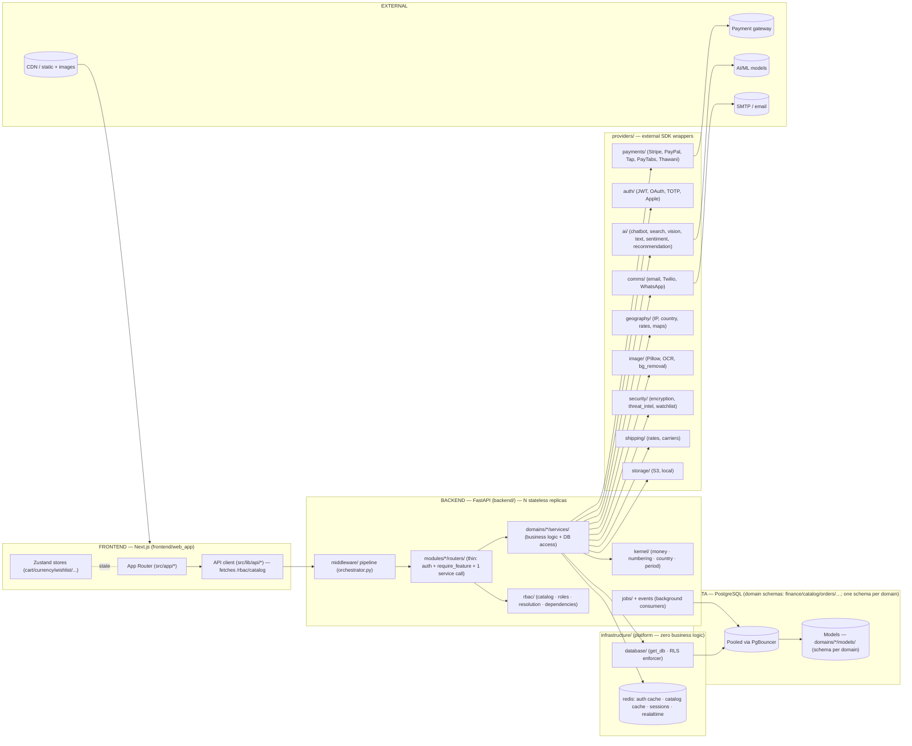
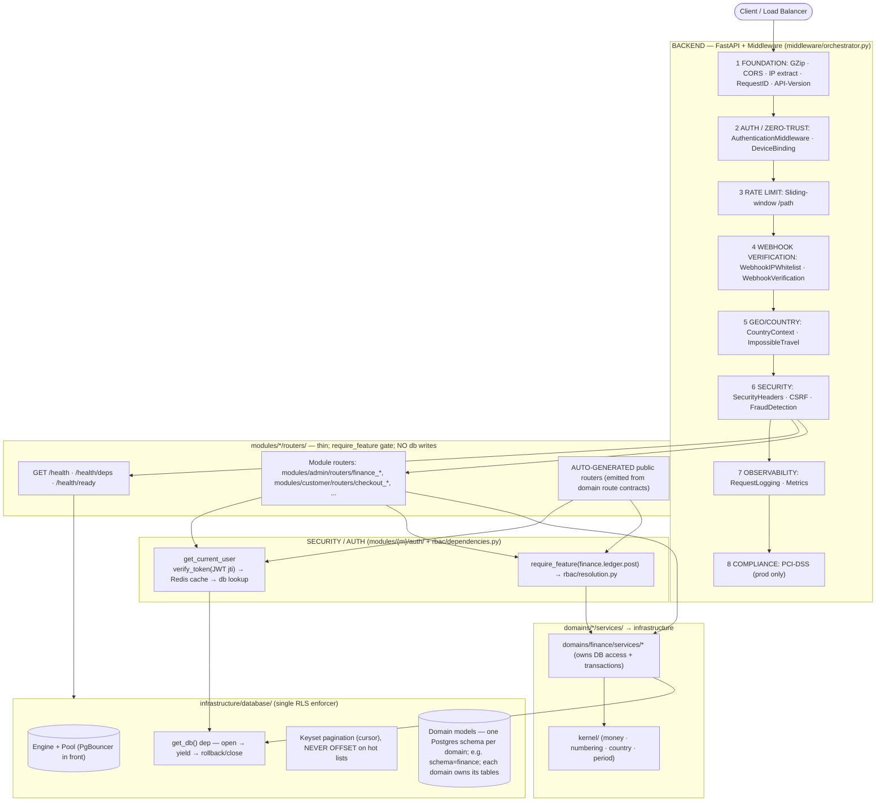
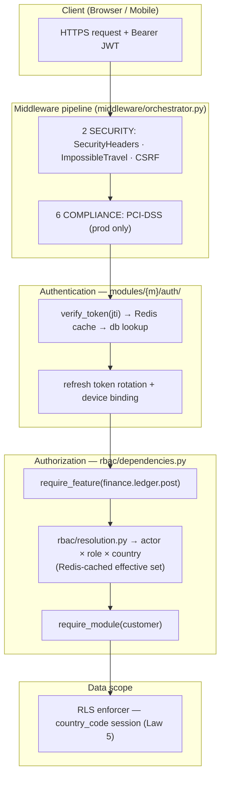
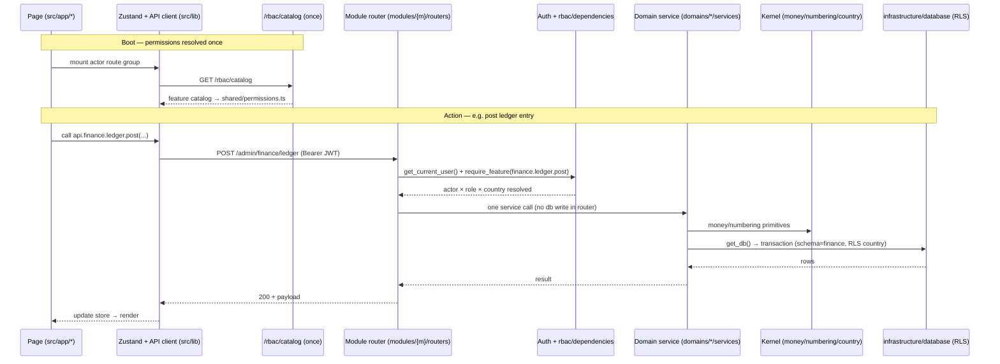

# ZOZI System Audit Report (target-contract aligned)

> **Generated:** 2026-08-28T21:02:05.838673+00:00  
> **Repo:** `D:\Projects\10- E-COMMERCE WEBSITE\zozi`  
> **Result:** 🔴 569 violations · 🟡 3342 advisories · 🟢 385 info  
> **Architecture Debt Score:** 133048  
**Ephemeral. Add to `.gitignore`.**

---

## 1. The Grid Line (Target Layer Contract — ARCHITECTURE_DIAGRAM.md)

Three orthogonal axes: (1) **Module** `modules/{actor}/`, (2) **Domain** `domains/{domain}/`, (3) **Feature** `rbac/` via `require_feature()`.

| Layer (axis) | May import | Must NOT (law) |
|---|---|---|
| modules/* (AXIS 1) | domains/*/services, rbac (require_feature) | other modules (compose, don't reach in); infrastructure/DB access (law 2: thin routers, delegate to domains/*/services); abolished root layers (controllers/ routers/ services/ models/ db/ utils/) |
| domains/* (AXIS 2) | infrastructure (read-only), kernel, providers, events, subscribers, ports (cross-domain only via ports/events) | modules/* (law 1: arrows point DOWN, never import rbac); other domains except via ports/events (law 3) |
| rbac/* (AXIS 3) | kernel, infrastructure, domains (catalog aggregates domains/*/features.py) | modules/*, providers, jobs, middleware (imported BY modules+middleware only; Law 1 arrows down) |
| infrastructure/* | (none - platform leaf; imports nothing above it, Law 1) | modules/*, domains/*, rbac/*, kernel, providers, jobs, middleware |
| kernel/* | (nothing above) | any app layer |
| providers/* | providers._base, infrastructure, kernel | modules/*, domains/* |
| jobs/* | domains/*, infrastructure, providers | routers, main |
| middleware/* | infrastructure(read-only), kernel, rbac | modules/*, domains/*, routers (law: middleware imports downward only; may import rbac per diagram) |
| frontend/src/lib/api/* | backend /api/v1/* only | direct DB; raw fetch from pages; abolished root layers |

**Seven Laws:** (1) modules→domains→infrastructure, arrows down only; (2) routers delegate to ONE domains/*/services call (thin routers; no DB writes); (3) cross-domain only via `ports.py`/`events.py`/`subscribers.py`; (4) `require_feature()` is the single source of truth for capabilities; (5) middleware/providers/infrastructure never import upward; (6) domain models declare `__table_args__ = {'schema': '<domain>'}`; (7) `DOMAIN_ALLOWLIST.yaml` may only shrink (allowlist rule).
Abolished flat root layers (controllers/, routers/, services/, models/, db/, utils/) are **violations**, not targets.

---

## 2. Target Architecture (from ARCHITECTURE_DIAGRAM.md)

# ZOZI Platform — System Architecture Diagram

> Companion to `documents/TECHNOLOGY_USED.md` and the architecture rules.
> This document is the visual and organizational description of the backend.
> The rules and laws are maintained with it; the technology stack lives in
> `documents/TECHNOLOGY_USED.md`. All stay in lock-step.
>
> The codebase is organized around three orthogonal axes — **Modules, Domains,
> Features**. Every package, dependency arrow and naming rule below is the single
> organization the code follows. Code that does not fit this picture violates the
> dependency laws and is reported by the architecture audit.

---

## 1 · Technology Stack (from `documents/TECHNOLOGY_USED.md`)

### Backend — FastAPI / Python
| Concern | Technology |
|---|---|
| Framework / runtime | FastAPI `0.115.2`, Python `3.11` (Docker) / `3.10` (dev), Uvicorn `0.51.0`, Gunicorn `26.0.0` |
| Database / ORM | PostgreSQL `15` (prod) / SQLite (dev), SQLAlchemy `2.0.51` (async), Alembic `1.18.5`, asyncpg `0.31.0`, psycopg2-binary `2.9.12`, pg8000 `1.31.5`, DuckDB `1.5.5` + duckdb-engine `0.17.0` |
| Auth / security | python-jose `3.5.0` (JWT, `jti` blacklist), bcrypt `5.0.0`, pyotp `2.10.0` (TOTP), cryptography `49.0.0`, slowapi `0.1.10` (rate limit, limits `5.8.0`), CSRF + security-headers + PCI-DSS middleware |
| Cache / sessions | Redis `8.0.1` (auth cache, catalog cache, sessions, realtime, rate-limit) |
| Jobs | APScheduler `3.11.3` + custom background workers (`jobs/`) |
| Payments / APIs | Stripe `15.3.1` + Stripe Connect, httpx `0.28.1`, requests `2.34.2` |
| Observability | structlog `26.1.0`, OpenTelemetry (api / sdk / otlp, fastapi / asgi / sqlalchemy instrumentation), Prometheus (`prometheus-client` + `prometheus-fastapi-instrumentator`), Sentry (`sentry-sdk[fastapi]`) |
| Media / AI | aiofiles `25.1.0`, Pillow `12.3.0`, python-magic `0.4.27`, rembg `2.0.69`, opencv-python `5.0.0`, onnxruntime `1.23.2` |
| Email / comms | SMTP (stdlib) + `email-validator` `2.3.0`, Twilio (SMS), WebSockets `16.1.1` |
| Validation / utils | Pydantic `2.13.4`, python-dotenv `1.2.2`, python-slugify `8.0.4`, pytz `2026.3`, tzlocal `5.4.4`, babel `2.18.0`, phonenumbers `9.0.35`, numpy / scipy / scikit-image, python-docx `1.2.0`, openpyxl `3.1.5`, feedparser `6.0.12` |
| Testing | pytest `9.1.1` + pytest-asyncio `1.4.0`, httpx |

### Frontend — Next.js / React
| Concern | Technology |
|---|---|
| Framework | Next.js `16.3.1` (App Router, RSC), React `18.3.1`, TypeScript `5.8.2` (strict) |
| Styling | Tailwind CSS `3.4.19` + design tokens, class-variance-authority `0.7.1`, clsx `2.1.1`, tailwind-merge `3.5.0`, lucide-react `1.25.0`, framer-motion `11.5.6` |
| State | Zustand `5.0.11` |
| Forms | React Hook Form + Zod |
| Payments | `@stripe/react-stripe-js` `5.6.0`, `@stripe/stripe-js` `8.7.0` |
| Charts | chart.js `4.5.1` + react-chartjs-2 `5.3.1` |
| Maps | leaflet `1.9.4` + react-leaflet `5.0.0` |
| Utilities | jose `6.2.9` (browser JWT), dompurify `3.3.3` (XSS), qrcode `1.5.4`, jspdf `4.1.0`, @zxing/library `0.21.3` |
| Quality | ESLint `9` + typescript-eslint `8.62.0`, Prettier `3.3.3`, eslint-config-next `15.4.5`, Playwright `1.61.1`, jest `29.7.0` + ts-jest + RTL `16.3.0` + jest-axe `10.0.0` |
| Build / deploy | Node.js `20` (Alpine), multi-stage Docker, Next.js rewrites for API proxying |

### Infrastructure / DevOps
- Docker Compose (local), multi-stage Dockerfiles
- Railway (backend), Vercel (frontend)
- Alembic multi-schema migrations (public, analytics, audit, commerce, …)
- `.env` (compose) / `backend/.env` / `frontend/web_app/.env.local` / `.env.example` (source of truth)
- Monorepo `root/`: `docker-compose.yml`, `Makefile`, `pnpm-workspace.yaml`,
  `.github/workflows/*` (`ci.yml` · `import-lint.yml` · `schema-drift.yml` · `e2e.yml`),
  `_extra_files/` (temporary audit / migration working files)

### Key Architectural Patterns
| Layer | Technology | Purpose |
|-------|------------|---------|
| API | FastAPI + auto-discovered routers | RESTful endpoints with versioning |
| Auth | JWT (HS256) + refresh tokens + `jti` blacklisting | Stateless auth with revocation |
| Middleware | 8-layer pipeline (Foundation → Auth → Rate → Webhook → Geo → Security → Observe → Compliance) | Cross-cutting concerns |
| Database | SQLAlchemy `2.0` + RLS (Row Level Security) | Multi-tenant data isolation |
| Caching | Redis + in-memory | Performance |
| Real-time | WebSockets (native + custom manager) | Live updates |
| Observability | OpenTelemetry + Prometheus + Sentry + structlog | Full-stack monitoring |

### Shared Package
- `@zozi/shared` (`frontend/shared`) — TS types / utils shared between web and mobile;
  `permissions.ts` is **generated** from `GET /rbac/catalog`.

---

## 2 · The Three Orthogonal Axes

A folder tree can only express **one** axis. The other two live in **naming +
registration + configuration**. The three axes map to three different mechanisms:

| Axis | What it is | Where it lives | Mechanism |
|---|---|---|---|
| **Module** (customer, supplier, logistics, admin, employee) | *Who* is acting — login, session, route prefix, UI shell | `modules/{module}/` | Separate auth + thin API surface |
| **Domain** (finance, accounts, catalog, orders, logistics, suppliers, customers, hr, comms, country, governance, analytics, audit, security, promotions) | *What* the business does — logic + data | `domains/{domain}/` | Services, models, schemas, policies, events |
| **Feature** (`finance.ledger`, `finance.reporting`, …) | *What may be done* — permission atoms | `rbac/` + `domains/*/features.py` | Data/config, enforced by `require_feature()` |

**The rule that makes it coherent:** Modules compose. Domains own. Features gate.

---

## 3 · Backend Package Layout

```
backend/
├── main.py                     # boots app; registers module routers per actor prefix
├── config.py                   # settings, env, feature gates
├── DOMAIN_ALLOWLIST.yaml       # temporary cross-domain imports (may only shrink)
│
├── modules/                    # AXIS 1 — MODULE (who)
│   ├── customer/  supplier/  logistics/  admin/  employee/
│   │     ├── auth/             # per-actor login/OTP/social → that actor's own tables; sessions; device binding
│   │     ├── routers/          # THIN per-actor routers (auth + require_feature + ONE service call)
│   │     │                     #   modules/{m}/routers/{d}.py — one file per domain (15 files per module)
│   │     │                     #   modules/{m}/routers/__init__.py lists routers/public_routers for main.py
│   │     └── serializers/      # per-actor view models (customer-facing response shaping)
│   │
├── domains/                    # AXIS 2 — DOMAIN (what)
│   ├── finance/  accounts/  catalog/  orders/  logistics/  suppliers/
│   ├── customers/  hr/  comms/  analytics/  audit/  country/  governance/  security/  promotions/
│   │     ├── services/  models/  schemas/  policies/   # heavy domains may instead slice:
│   │     ├── events.py  subscribers.py                  #   ledger/ payouts/ treasury/ … (one sub-capability = one folder)
│   │     ├── ports.py        # SANCTIONED cross-domain READ path (the only thing another domain may import)
│   │     ├── read_models/    # CQRS-lite projections for this domain's own dashboards
│   │     └── features.py      # AXIS 3 seed: this domain's permission atoms
│   │
├── rbac/                       # AXIS 3 — FEATURE (may)
│   ├── catalog.py               # aggregates domains/*/features.py → single source of truth
│   ├── roles.py                 # (module, role) → feature sets
│   ├── resolution.py            # actor × role × country → effective set (Redis-cached)
│   ├── dependencies.py          # require_feature(...), require_module(...)
│   ├── service.py               # grant/revoke, delegation, maker-checker
│   └── models.py                # permission_categories, role_permission_assignments, user_permission_overrides
│
├── infrastructure/             # PLATFORM — zero business logic; imports nothing above it
│   ├── database/               # base.py · database.py (get_db/get_read_db) · session.py · transaction.py
│   │                           #   security.py ← ONE canonical RLS enforcer · seeds/ · create_tables.py (dev-only)
│   ├── redis/                  # client · cache · token blacklist · pub/sub
│   ├── storage/                # S3/R2 adapters · presigned URLs (media blobs never in Postgres)
│   ├── messaging/              # event_bus (in-proc → Redis later) · ws_manager · webhook ingress
│   ├── observability/          # structlog · OTEL · Prometheus · Sentry
│   ├── security/               # JWT · hashing · field encryption (KMS) · zero-trust primitives
│   └── utils/                  # pure technical helpers: pagination.py · datetime_utils · variant_key
├── kernel/                     # SHARED KERNEL — pure business primitives: money, currency, numbering, country, period
│                             #   import rule: domains → kernel → (nothing); kernel may use platform primitives only
├── providers/                  # 3rd-party/AI adapters (called ONLY by services/jobs; never by modules directly)
│   ├── ai/                      # AI/ML: chatbot, search, vision, text, sentiment, recommendation, price_intelligence, image_similarity, finance_ai
│   ├── analytics/               # Admin analytics dashboards
│   ├── auth/                    # JWT, OAuth, TOTP, Apple Auth
│   ├── automation/              # Job scheduler (APScheduler)
│   ├── barcode/                 # EAN/UPC/Code128 generation
│   ├── bg_removal/              # AI background removal (rembg + OpenCV)
│   ├── comms/                   # Email, Twilio, WhatsApp
│   ├── finance/                 # Bank API integration
│   ├── geo/                     # Geo utilities
│   ├── geography/               # IP geolocation, country, maps, currency rates
│   ├── image/                   # Pillow processing, OCR, bg_remover, parcel verification
│   ├── media/                   # Media AI services
│   ├── news/                    # RSS feed parsing
│   ├── ocr/                     # Document OCR parsing
│   ├── payments/                # Stripe, PayPal, Tap, PayTabs, Thawani, webhooks, registry, connect
│   ├── qr/                      # QR generation, parcel verification
│   ├── scanner/                 # QR/barcode scanning from images
│   ├── security/                # Encryption, threat intel, watchlist
│   ├── shipping/                # Rate calculator, carrier comparison
│   ├── storage/                 # S3/local storage backends, S3 client
│   ├── voice/                   # Speech-to-text, voice commands
│   ├── async_workers/           # Thread/process pool executors for CPU-bound work
│   ├── observability/           # Provider health monitoring
│   └── _base.py                 # BaseProvider / BaseAIProvider + health_check()
├── jobs/                        # background workers/consumers (→ domains → infrastructure)
│   ├── fraud_monitoring.py  ghost_order_detector.py  data_retention.py
│   ├── payroll_run.py  payout_sweep.py  reconciliation_cron.py  bank_statement_importer.py
│   ├── fx_revaluation.py  accrual_reversal.py  threat_feed_updater.py  mcp_server.py
│   └── background_tasks.py
├── middleware/                  # flat; orchestrator.py orders the pipeline BEFORE module routers
│   └── orchestrator.py · api_version · country_context · csrf · database_security · device_binding
│       · impossible_travel · ip_extraction · logging · pci_dss_compliance · rate_limit
│       · request_id · rls_dependency · security_headers · webhook_ip_whitelist
│       · webhook_verification · zero_trust_auth
├── alembic/                     # SINGLE schema source of truth
├── scripts/                     # analyze_tables.py, rewrite_imports.py, seed helpers (dev)
└── tests/
    ├── architecture/            # test_import_laws.py (layer direction + cross-domain ban), test_feature_catalog.py
    └── domains/                 # per-domain unit/integration tests
```

> **Provider Availability Flags.** All providers expose `HAS_<SDK>` boolean flags (e.g., `HAS_STRIPE`, `HAS_TWILIO`, `HAS_OPENCV`, `HAS_REMBG`). Domains must gracefully degrade when a provider SDK is not installed — never crash.

> **Provider-to-Domain Wiring.** Providers are wired into domain services via direct function calls (never via imports from domains into providers). Each provider tool serves specific domains:

| Provider Tool | Served Domains | Use Case |
|---|---|---|
| `ai/chatbot` | Analytics | Intent classification, session management |
| `ai/search` + `ai/text` (embeddings) | Catalog, Customers | Semantic product search, autocomplete |
| `ai/vision` + `ai/image_similarity` | Catalog | Product image analysis, duplicate detection |
| `ai/sentiment` | Reviews, Security, Analytics | Review moderation, fraud signals |
| `ai/recommendation` | Customers, Promotions, Analytics | Personalized product feeds |
| `ai/price_intelligence` | Promotions, Analytics | Dynamic pricing, competitor tracking |
| `ai/finance_ai` | Finance | Transaction categorization |
| `ai/huggingface` | Catalog | Fallback ML inference |
| `analytics/analytics` | Analytics | Dashboard metrics, sales trends |
| `auth/jwt` + `auth/oauth` + `auth/totp` + `auth/apple` | Security, Accounts | Session management, 2FA, social login |
| `automation/scheduler` | Finance, Logistics, Promotions, Governance, Audit, Analytics | Recurring jobs, flash sale timing |
| `barcode/` + `qr/` + `scanner/` | Logistics, Catalog, Suppliers | Shipping labels, SKU barcodes, parcel verification |
| `bg_removal/` + `image/` + `ocr/` | Catalog, Reviews, Finance, Accounts, Suppliers, Audit | Image preprocessing, document extraction |
| `comms/email` + `comms/twilio` + `comms/whatsapp` | Orders, Comms, Promotions, Accounts, HR, Suppliers, Logistics | Transactional messaging, notifications |
| `finance/bank_api` | Finance, Orders, Suppliers | Bank verification, payouts |
| `geography/` (ip, country, rates, maps) | Orders, Logistics, Country, Security, Accounts, Analytics | Localization, tax rules, shipping eligibility |
| `news/` | Governance, Audit | Regulatory monitoring |
| `payments/` (stripe, paypal, tap, paytabs, thawani, connect, registry) | Orders, Finance | Multi-PSP payment processing |
| `security/encryption` + `security/threat_intel` + `security/watchlist` | Security, Accounts, HR, Governance, Audit, Comms | PII protection, AML screening, fraud feeds |
| `shipping/` | Orders, Customers (cart), Logistics | Rate calculation, carrier comparison |
| `storage/` + `storage/s3_client` | Catalog, Audit, Analytics, Suppliers | File persistence, audit archival |
| `voice/` | *(future use)* | Speech-to-text, voice commands |

> **Wiring Pattern.** Domain services import providers at the top of the service file, call provider functions with primitive parameters, and handle results. Example:
> ```python
> # Inside domains/catalog/services/ai_upload_service.py
> from providers.media.services.ai import ai_service
> from providers.image.free_image_tools import magic_erase, HAS_REMBG
>
> def process_upload(img_bytes: bytes) -> bytes:
>     if HAS_REMBG:
>         img_bytes = magic_erase(img_bytes)
>     name = ai_service.infer_product_name(image_bytes=img_bytes)
>     return img_bytes
> ```

> **Async Provider Calls.** CPU-bound provider work (image processing, embedding generation) runs through `providers.async_workers`:
> ```python
> from providers.async_workers import remove_background_async, embed_text_async
>
> async def process_image(img_bytes: bytes) -> bytes:
>     return await remove_background_async(img_bytes, strategy="auto")
> ```

---

## 2.1 · Shared kernel (`kernel/`)
> (Decimal, never float), `currency`, `numbering` (centralized ORD-/INV-/PAY-/BATCH-),
> `country`, `period` — live here as first-class residents so they are not smuggled into
> `infrastructure/utils/` or duplicated per domain. **Dependency rule: `domains → kernel → (nothing)`.**
> `kernel/` must not import `modules/`, `domains/`, `rbac/`, `providers/`, `jobs/`, or `middleware/`.
> It may import `infrastructure/` platform primitives only.

> **Canonical top-level packages.** The backend root contains **only**:
> `main.py`, `config.py`, `DOMAIN_ALLOWLIST.yaml`, `modules/`, `domains/`,
> `rbac/`, `kernel/`, `infrastructure/`, `providers/`, `jobs/`, `middleware/`,
> `alembic/`, `scripts/`, `tests/`. A root-level `utils/` is **forbidden** — its
> contents split into `infrastructure/utils/` (technical: pagination, datetime,
> variant keys, slugs) and `kernel/` (business primitives: money, currency,
> numbering, country, period). Likewise `routers/`, `controllers/`, `services/`,
> `models/`, `db/` are **not** top-level packages; they live inside `modules/`,
> `domains/`, or `infrastructure/` as shown above.

> **Cross-domain contract (Law 3).** Writes across domains go *only* through `events.py`/`subscribers.py`.
> Reads across domains go *only* through the publishing domain's `ports.py` (e.g.
> `domains/catalog/ports.py → get_price(db, product_id, country)`). `read_models/` hold each domain's
> own CQRS-lite projections; cross-domain dashboards live in `domains/governance/read_models/`.
> `DOMAIN_ALLOWLIST.yaml` tracks the *temporary* cross-domain imports still permitted and must only shrink.

> **Deployment model.** Shipped initially as a **modular monolith** (one deployable, one Postgres
> ecosystem, shared Redis) — modules and domains are boundaries inside one process, not separate servers.
> Module boundaries make later extraction to independent services possible *without* redesigning domains.

### Frontend layout
```
frontend/
├── web_app/                     # Next.js 16.3.1 (App Router, RSC)
│   ├── src/app/                 # route tree: (customer), auth/, admin/*, supplier/*, logistics-partner/*,
│   │                             #   employee/*, wishlist/, profile/, chatbot/, tracking/; app/api/ = Next server routes
│   ├── src/components/          # ui/ (design system), admin/, auth/, chat/, comms/, country/, ems/, map/, supplier/
│   ├── src/hooks/               # useApi, useAuth, WebSocket hooks
│   ├── src/lib/                 # api/ (client.ts, auth.ts, country.ts, errors.ts), rbac.ts (fetches /rbac/catalog)
│   ├── src/services/            # localizationService, crossBorderService, addressFormatService
│   ├── src/theme/  src/styles/  src/types/  src/utils/
│   ├── tests/  e2e/             # mocks + Playwright
│   └── root/                    # next.config.ts (rewrites), middleware.ts, tailwind.config, playwright.config
├── mobile_app/                  # Expo RN
│   ├── app/                     # Expo Router: (auth)/(tabs) + admin/ supplier/ logistics/ employee/ tracking/ returns/
│   ├── components/ui/           # design-system
│   ├── lib/                     # api.ts, Zustand stores, authPrompt, countryContext, geo, paymentService,
│   │                             #   expoSecureStorage, errorReporter
│   └── theme/  assets/  android/  mocks/  e2e/  scripts/  root/
└── shared/                      # cross-platform TS, imported by BOTH apps
    └── src/                     # api-core.ts (apiFetch), money.ts, i18n.ts, cart/checkout/order/product/returns/
                                  #   wishlist/notification helpers, statusColors.ts, requestCache.ts, realtime.ts,
                                  #   chatbot.ts, types.ts, theme.ts + theme.native.ts,
                                  #   permissions.ts  ← GENERATED from backend /rbac/catalog
```

---

## 4 · The Laws (325 total, enforced by the audit)

The laws are organized into 17 sections (�12.1��12.13, �14��17). Each law is numbered for reference in audit findings and CI failures.

### 4.1 Architecture Laws (Laws 1–7)

1. **Arrows point down only:** `modules → domains → infrastructure`.
   Domains never import modules. `rbac` is imported by modules + middleware only.
   `infrastructure` / `kernel` import nothing above them. `providers ← services/jobs`.
2. **Module routers stay thin:** auth context + `require_feature(...)` + one domain-service call.
   No DB writes, no business rules.
3. **Cross-domain writes only via events** (`events.py`/`subscribers.py`);
   cross-domain *reads* only via `ports.py` / `read_models/`.
4. **Features single-sourced** in `domains/*/features.py`; aggregated by `rbac/catalog.py`;
   CI fails on any `require_feature("…")` literal not in the catalog.
5. **Country is the orthogonal scope axis:** RLS session context + `country_staff_assignments`
   — independent of the feature check.
6. **Schema discipline:** every table in a domain Postgres schema; Alembic is the only
   schema source; naming lint (`snake_case`, plural, `<thing>_id`, `created_at/updated_at`,
   `country_code`, `is_deleted`).
7. **Allowlist rule:** temporary cross-domain imports are tracked in `DOMAIN_ALLOWLIST.yaml`
   and may only shrink; direct cross-domain writes outside `events.py` are forbidden.

---

## 5 · System Context



> **Provider-to-Domain Connection Map.** The diagram above shows providers as a separate subgraph. Domain services call providers via function calls (arrows from `BEDOM` to `PROV_*`). Providers never import from domains — data flows through parameters and return values only.

---

## 6 · Backend Circuit (request lifecycle)



---

## 7 · RBAC / Feature axis (AXIS 3)

- Feature atoms are **defined once** in `domains/{domain}/features.py` (e.g.
  `finance.ledger.post`, `finance.reporting.read`).
- `rbac/catalog.py` aggregates every domain's `features.py` via package scan →
  single source of truth. It is served to the frontend at `GET /rbac/catalog`.
- `rbac/roles.py` grants per **(module, role)**; `rbac/resolution.py` resolves
  `actor × role × country → effective feature set` (Redis-cached).
- `rbac/dependencies.py` provides `require_feature(...)` / `require_module(...)`
  gates used by every module router.
- Frontend `shared/src/permissions.ts` is **generated** from `/rbac/catalog` so
  UI gating and backend gating share one source.

---

## 8 · Schema discipline (Law 6)

- Every ORM model declares `__table_args__ = {"schema": "<domain>"}`
  (slice tables use the parent domain's schema).
- Alembic is the only schema source (`create_all` is dev-only).
- Naming lint: `snake_case`, plural tables, `<thing>_id` FKs,
  `created_at`/`updated_at`, `country_code`, `is_deleted`.
- Forbidden schemas: `core` / `platform` / `identity` — every actor's `user`
  table lives in its own domain schema (e.g. `customer.user`, `supplier.user`).

---

## 9 · Database organization (Law 6)

Every domain owns one Postgres schema; the model classes live in
`domains/{domain}/models/`. Cross-domain **writes** travel only through
`events.py` / `subscribers.py`; cross-domain **reads** travel only through the
owning domain's `ports.py` (or `read_models/`). The country scope is enforced by
RLS on every schema.

```mermaid
flowchart TD
    ALE["alembic/ — SINGLE schema source of truth"]
    subgraph SCHEMAS["PostgreSQL — one schema per domain"]
        direction LR
        SF["schema: finance<br/>domains/finance/models/*"]
        SA["schema: accounts<br/>domains/accounts/models/*"]
        SC["schema: catalog<br/>domains/catalog/models/*"]
        SO["schema: orders<br/>domains/orders/models/*"]
        SL["schema: logistics<br/>domains/logistics/models/*"]
        SS["schema: suppliers<br/>domains/suppliers/models/*"]
        SCU["schema: customers<br/>domains/customers/models/*"]
        SH["schema: hr<br/>domains/hr/models/*"]
        SCO["schema: comms<br/>domains/comms/models/*"]
        SCA["schema: analytics<br/>domains/analytics/models/*"]
        SCN["schema: country<br/>domains/country/models/*"]
        SG["schema: governance<br/>domains/governance/models/*"]
        SE["schema: security<br/>domains/security/models/*"]
        SP["schema: promotions<br/>domains/promotions/models/*"]
        SAU["schema: audit<br/>domains/audit/models/*"]
    end
    RLS["infrastructure/database/ RLS enforcer<br/>country_code session context (Law 5)"]
    PORTS["ports.py — sanctioned cross-domain READ<br/>e.g. catalog.ports.get_price(db, product_id, country)"]
    EVT["events.py / subscribers.py — cross-domain WRITE bus"]
    ALE --> SCHEMAS
    SCHEMAS --> RLS
    SC -. read via .-> PORTS
    PORTS -. resolves .-> SC
    SO -. write via .-> EVT
    EVT -. consumed by .-> SF
    EVT -. consumed by .-> SP
```



---

## 10 · Security architecture

Authentication and authorization follow the axes: **modules** carry the actor
(who), **features** gate the action (may), and **country RLS** scopes the data.
The 8-layer middleware pipeline runs before any module router.



---

## 11 · End-to-end flow (frontend ↔ backend)

The frontend route tree under `frontend/web_app/src/app/*` is grouped per actor
(module). On boot it fetches `GET /rbac/catalog` once to build
`shared/src/permissions.ts`; every later action calls a thin module router that
authenticates, gates on a feature, and delegates to one domain service.



---


## 12 — Project Rules & Decisions (Laws 1-325)

> All 325 laws in a single scannable matrix. Each law appears **once**.

| Law | Category | Rule | Description | Why |
|-----|----------|------|-------------|-----|
| 1 | Architecture | Arrows point down | Dependencies flow: modules → domains → infrastructure → kernel. Reverse imports FORBIDDEN. | Prevents circular dependencies and unmaintainable coupling between layers. |
| 2 | Architecture | Thin routers | Router = auth context + require_feature + ONE service call + serialization. No DB writes, no business logic. | Keeps API layer a thin HTTP shim over domain logic. Easy to test and maintain. |
| 3 | Architecture | Cross-domain events/ports | Cross-domain WRITES via events.py/subscribers.py. Cross-domain READS via ports.py only. | Keeps domains decoupled and independently deployable. |
| 4 | Architecture | Features single-sourced | Permission atoms defined once in domains/*/features.py. Aggregated by rbac/catalog.py. | Prevents permission drift. Frontend and backend share one permission model. |
| 5 | Architecture | Country is orthogonal | Every data access scoped by country_code via RLS. Independent of feature check. | Ensures multi-tenant data isolation at the database level. |
| 6 | Architecture | Schema discipline | Every table in a domain Postgres schema. Alembic is the only schema source. | Naming consistency and single source of truth for schema changes. |
| 7 | Architecture | Allowlist only shrinks | DOMAIN_ALLOWLIST.yaml tracks temporary cross-domain imports. May only shrink. | Ensures migration toward clean domain boundaries makes forward progress. |
| 8 | Structure | Router structure | modules/{m}/routers/{d}.py — one file per domain per module (15 per module). | Makes endpoints discoverable by actor+domain combination. |
| 9 | Structure | Tools in providers | All tools code in providers/ai, providers/image. | tools is an external concern, not a business domain. |
| 10 | Structure | Kernel is pure | kernel/ contains ONLY pure business primitives. No imports from domains/modules/rbac. | Ensures business primitives are consistent and reusable across all domains. |
| 11 | Structure | Providers wrap SDKs | A provider wraps exactly one external SDK. No business logic, no domain imports. | External dependencies are isolated and swappable. |
| 12 | Structure | 15 domains | Fixed set: accounts, analytics, audit, catalog, comms, country, customers, finance, governance, hr, logistics, orders, promotions, security, suppliers. | Prevents domain sprawl and ensures clear ownership boundaries. |
| 13 | Structure | 5 modules | Fixed set: admin, customer, employee, logistics, supplier. | Ensures the actor model stays coherent and manageable. |
| 14 | File Placement | Business logic → domains/ | All business logic in domain services/services/. No logic in routers or modules. | Business logic is colocated with the data it operates on (DDD). |
| 15 | File Placement | API endpoints → modules/routers/ | Every HTTP endpoint in a module router file named after the domain. | Endpoints grouped by business capability, not CRUD operation. |
| 16 | File Placement | SDK wrappers → providers/ | Every third-party integration under providers/{category}/. | Trivial to find every external dependency and swap implementations. |
| 17 | File Placement | Cross-domain → events/ports only | events.py (writes) and ports.py (reads) are the ONLY sanctioned cross-domain channels. | Creates a clear, auditable boundary contract between domains. |
| 18 | File Placement | Root forbidden folders | utils/, routers/, controllers/, services/, models/, db/ FORBIDDEN at backend/ root. | Prevents the 'god directory' anti-pattern. |
| 19 | Code Quality | No float for money | Monetary values MUST use Decimal or Numeric. Float FORBIDDEN for money. | Floating-point arithmetic introduces rounding errors causing financial discrepancies. |
| 20 | Code Quality | country_code = String(2) | Always String(2) following ISO 3166-1 alpha-2. | Consistency across all 15 domains simplifies joins, indexes, and RLS filtering. |
| 21 | Code Quality | Timestamps = server_default | created_at/updated_at use server_default=func.now() (DB-side), not Python-side. | Timestamps survive clock skew and are consistent in the database. |
| 22 | Code Quality | FK have ondelete | Every ForeignKey MUST declare explicit ondelete behavior. | Prevents unpredictable behavior across PostgreSQL versions. |
| 23 | Code Quality | Audit columns | Every model MUST include created_at, updated_at, country_code, is_deleted. | Required for RLS, debugging, compliance, and data recovery. |
| 24 | Code Quality | No forbidden schemas | core, platform, identity are FORBIDDEN as Postgres schema names. | Prevents monolithic shared-schema architecture. |
| 25 | Migration | Shift files first | All files to correct domains before reorganization. Never replace working code with stubs. | Ensures agents have complete file context for each domain. |
| 26 | Migration | Backward-compat shims | Temporary re-exports in infrastructure/utils/ for relocated files. | Enables gradual migration without breaking existing imports. |
| 27 | Migration | Delete temp scripts | Root-level fix_*.py, debug_*.py should be removed after use. | Keeps root clean and architecture clear. |
| 28 | Migration | _auto_stubs ≠ architecture | _auto_stubs.py are migration scaffolding, not architecture components. | Distinguishes temporary scaffolding from permanent architecture. |
| 29 | Migration | registry.py ≠ architecture | Service Registry and auto_wire.py were removed from architecture. | Prevents confusion about what is permanent architecture. |
| 30 | Provider | Graceful degradation | Domains handle missing SDKs via HAS_<SDK> flags. Never crash. | System runs in development without all production dependencies. |
| 31 | Provider | No domain imports | Providers MUST NOT import from domains, modules, rbac, jobs, middleware. | Data flows through parameters only. Ensures providers remain pure wrappers. |
| 32 | Security | No hardcoded secrets | JWT keys, API keys, passwords from env vars or secrets manager only. | Attackers can clone repo. Committed secrets = token forgery. |
| 33 | Security | Token type verification | All JWT decoders MUST verify the type claim (access vs refresh). | Prevents refresh tokens from being used as access tokens. |
| 34 | Security | Parameterized SQL | Use SQLAlchemy text() with bound parameters or ORM. No f-string interpolation. | Prevents SQL injection attacks. |
| 35 | Security | CSRF active | CSRF middleware MUST be active in all environments. | Prevents CSRF attacks in misconfigured deployments. |
| 36 | Security | Security headers | CSP, HSTS, X-Frame-Options, X-Content-Type-Options, Referrer-Policy in production. | Prevents XSS, clickjacking, and other browser-based attacks. |
| 37 | Security | Rate limit fails closed | Redis unreachable = deny requests (not allow all). | Prevents brute-force and DoS when Redis is down. |
| 38 | Security | Password handling | Passwords >72 bytes rejected with error, never truncated. | bcrypt's 72-byte limit. Silent truncation creates security holes. |
| 39 | Security | No duplicate auth | Auth logic in exactly one canonical location. | Duplicate implementations with divergent behavior create security holes. |
| 40 | Security | CORS origin validation | Origin header validated against allowlist before reflection. | Prevents arbitrary websites from making authenticated requests. |
| 41 | Security | WebSocket auth | WebSocket connections MUST verify JWT type claim equals access. | Prevents stolen refresh tokens from opening WebSocket connections. |
| 42 | Security | Input validation | All public endpoints use Pydantic schemas. No raw dicts in router signatures. | Prevents malformed data from reaching domain services. |
| 43 | Security | Security event logging | Auth failures, 403s, rate-limit triggers logged at WARNING+. | Silent security events prevent incident detection. |
| 44 | Security | Dependency scanning | All deps scanned for CVEs in CI. High/critical block deployment. | Prevents supply-chain attacks via compromised dependencies. |
| 45 | Database | No N+1 queries | All relationships declare lazy=selectin or joined. Default lazy=select FORBIDDEN. | N+1 queries bring the database to its knees at 100K+ users. |
| 46 | Database | No SELECT * | Application queries MUST select explicit columns. | Wastes memory/I/O. Prevents covering indexes. Breaks on column reorder. |
| 47 | Database | Connection pool sizing | pool_size ≥ 10, max_overflow ≥ 20. Environment-configurable. | Connection exhaustion causes cascading failures under load. |
| 48 | Database | Read replica separation | Replica connections use independent pool settings. Read-heavy uses get_read_db(). | Without replicas, every read competes with writes for connections. |
| 49 | Database | Linear migration history | Alembic history MUST remain linear. Resolve divergent heads immediately. | Divergent heads break alembic upgrade head and cause deployment failures. |
| 50 | Database | Explicit transactions | All writes use explicit transaction management. Autocommit FORBIDDEN. | Ensures multi-step operations can roll back on failure. |
| 51 | Database | Single table ownership | Each table defined in exactly one domain. Duplicate __tablename__ FORBIDDEN. | Duplicate tables cause MetaData conflicts and runtime crashes. |
| 52 | Database | FK constraints | All FK columns have explicit ForeignKey with ondelete. | Prevents orphan rows and ensures referential integrity. |
| 53 | Database | Index FK columns | All FK columns have explicit index. PostgreSQL does NOT auto-index FKs. | Without indexes, JOINs degrade to sequential scans. |
| 54 | Database | Soft delete | All user-facing tables use is_deleted (boolean, default false). | Enables data recovery, audit trails, and safe cascading. |
| 55 | Database | Schema-per-domain | Every model declares __table_args__ = {schema: <domain>}. | Tables without schema land in public, breaking multi-tenant isolation. |
| 56 | Database | No forbidden schemas | core, platform, identity FORBIDDEN as schema names. | Prevents accidental coupling through shared schema namespace. |
| 57 | Database | Migration safety | Destructive migrations include backward-compatible strategy (expand-contract). | Enables zero-downtime rollback. |
| 58 | Code Quality | No print() in production | print() FORBIDDEN in production code. Use structlog logger. | print() bypasses log formatting and cannot be filtered by level. |
| 59 | Code Quality | No silent exceptions | All except blocks MUST log at minimum DEBUG level. | Silent exception swallowing makes debugging impossible. |
| 60 | Code Quality | No blocking in async | Async functions MUST NOT call blocking I/O. Use asyncio.sleep, httpx. | Blocking calls freeze the event loop, preventing other requests. |
| 61 | Code Quality | Bounded caches | All in-memory caches have max size and/or TTL. Unbounded dict FORBIDDEN. | Unbounded caches cause OOM at scale. |
| 62 | Code Quality | TODO/FIXME hygiene | TODO/FIXME must include ticket reference and expiration date. | Ensures technical debt is tracked and doesn't accumulate invisibly. |
| 63 | Code Quality | Type hints required | All public function signatures MUST have type hints. | Enables static analysis, IDE autocompletion, inline documentation. |
| 64 | Code Quality | Function length ≤50 | Functions SHOULD NOT exceed 50 lines (excl. docstrings/blanks). | Long functions are hard to test, debug, and reason about. |
| 65 | Code Quality | Indentation ≤4 levels | Maximum 4 levels of indentation per function. | Deeper nesting signals complex control flow needing refactoring. |
| 66 | Code Quality | No magic numbers | Numeric constants MUST be named constants or config values. | Named constants make business rules self-documenting and easy to change. |
| 67 | Code Quality | DRY principle | Duplicate code blocks (>5 lines) MUST be extracted into shared functions. | Copy-paste creates maintenance nightmares. |
| 68 | Code Quality | Consistent errors | All service functions use consistent error pattern (exceptions or Result). | Mixed patterns make error handling unpredictable for callers. |
| 69 | Testing | Domain smoke tests | Every domain MUST have at least one smoke test. | Catches circular imports, missing deps, broken __init__.py, syntax errors. |
| 70 | Testing | Architecture law tests | Every statically checkable law MUST have a corresponding test. | Ensures laws are actually enforced, not just documented. |
| 71 | Testing | No broken tests in CI | Collection-time failures MUST block CI. Fix within 24h. | Broken tests hide real failures. |
| 72 | Testing | Cross-domain integration | Cross-domain flows MUST have integration tests. | Unit tests verify single services; integration tests verify wiring. |
| 73 | Testing | Performance regression | Critical paths MUST have perf regression tests. Fail on >20% latency. | Prevents slow queries or missing indexes from shipping to production. |
| 74 | Testing | Test isolation | All tests use transaction-rolled-back sessions. No data leaks. | Each test is independent and order-independent. |
| 75 | Infrastructure | Graceful degradation | External failures MUST degrade gracefully AND log WARNING. | Silent fallbacks hide degradation from ops. |
| 76 | Infrastructure | Session lifecycle | Sessions managed via FastAPI dependency injection only. | Ensures sessions are properly closed even on exceptions. |
| 77 | Infrastructure | Async resource safety | Async resources use asyncio.Lock for init and disposal. | Prevents race conditions that create multiple engines. |
| 78 | Infrastructure | Middleware ordering | Pipeline order FIXED: Foundation → Auth → Rate → Webhook → Geo → Security → Observe → Compliance. | Reordering changes security posture. |
| 79 | Infrastructure | Global exception handler | Catches all uncaught exceptions. Returns structured response. No stack traces in prod. | Prevents stack trace leakage and ensures consistent error format. |
| 80 | Infrastructure | Graceful shutdown | Shutdown disposes DB engine, Redis, workers via lifespan.py. | Prevents connection leaks on restart. |
| 81 | Infrastructure | Health checks | /health, /health/deps, /health/ready verify all critical dependencies. | Load balancers use these for routing decisions. |
| 82 | Config | No default credentials | Config fallbacks MUST NOT contain real credentials. Empty/null default. | Prevents accidental use of dev credentials in production. |
| 83 | Config | Environment validation | Required env vars validated at startup. Missing = immediate failure. | Prevents silent fallbacks to development defaults in production. |
| 84 | Config | Typed feature flags | Flags use pydantic-settings. Raw os.getenv() FORBIDDEN. | String 'false' is truthy in Python. Typed coercion prevents bugs. |
| 85 | Config | Secret rotation | Secrets rotatable without deployment via env var updates. | Enables response to credential leaks without full redeployment. |
| 86 | Config | Env-specific configs | Prod, staging, dev have separate config profiles. No inheritance. | Prevents prod from inheriting dev defaults like debug=True. |
| 87 | Router | Auth on protected endpoints | All non-public endpoints MUST use get_current_user or equivalent. | Prevents accidental exposure of sensitive endpoints. |
| 88 | Router | Feature gate on protected | All non-public endpoints MUST use require_feature() or require_module(). | Ensures every protected endpoint has explicit authorization. |
| 89 | Router | Response serialization | Routers return serialized responses (Pydantic/dicts), never raw ORM models. | Prevents accidental exposure of internal model fields. |
| 90 | Router | No business logic | Routers contain ONLY: auth, gate, parsing, ONE service call, serialization. | Keeps API layer a thin HTTP shim. |
| 91 | Router | Documentation | All endpoints MUST have OpenAPI-compatible docstrings. | The OpenAPI spec is the API contract. |
| 92 | Observability | Structured logging | All logs use structlog with context (user_id, request_id, domain, action). | Enables log aggregation, filtering by field, cross-service correlation. |
| 93 | Observability | Request tracing | All requests carry request_id propagated through service calls. | Enables end-to-end request tracing for debugging. |
| 94 | Observability | Metrics emission | Critical paths emit Prometheus metrics (latency, error rate, throughput). | Unmonitored critical paths hide degradation. |
| 95 | Observability | Error tracking | Unhandled exceptions reported to Sentry with fallback to logger. | Prevents silent exception swallowing in production. |
| 96 | Observability | Audit trail | State-changing operations write to domains/audit/. | WORM audit log enables compliance investigations. |
| 97 | Wiring | Import direction | Imports MUST follow modules → domains → infrastructure → kernel. | Prevents reverse dependencies. |
| 98 | Wiring | No circular imports | Circular chains between any two packages FORBIDDEN. | Circular imports cause ImportError at module load time. |
| 99 | Wiring | No layer crossing | Modules don't import infrastructure directly. Domains don't import modules. | Prevents tight coupling across layers. |
| 100 | Wiring | Provider isolation | Providers don't import from domains/modules/rbac/jobs/middleware. | Ensures providers remain pure wrappers. |
| 101 | Wiring | Kernel isolation | kernel/ doesn't import from domains/modules/rbac/providers/jobs/middleware. | Kernel is the universal foundation layer. |
| 102 | Wiring | Infrastructure isolation | infrastructure/ doesn't import from domains/modules/rbac/providers. | Provides platform primitives to all layers. |
| 103 | Wiring | Job wiring | Jobs import from domains/ + infrastructure/ only. | Jobs are decoupled from HTTP layer. |
| 104 | Wiring | Middleware wiring | Middleware imports from infrastructure/ + rbac/ only. | Middleware operates at HTTP layer, needs only platform primitives. |
| 105 | Wiring | Shared package wiring | @zozi/shared doesn't import from web_app or mobile_app. | Shared is consumed BY apps, never imports FROM them. |
| 106 | Wiring | Frontend-backend wiring | Frontend communicates via API proxy only. No direct backend imports. | Ensures frontend and backend are decoupled deployables. |
| 107 | Technology | PostgreSQL in prod | Production uses PostgreSQL 15. SQLite for dev/test only. | PostgreSQL provides RLS, proper concurrency, JSONB, full-text search. |
| 108 | Technology | SQLite in dev | SQLite for zero-config startup. File in .gitignore. | Enables fast local development without DB server. |
| 109 | Technology | Redis usage | Sessions, catalog cache, rate limiting, blacklist, pub/sub, Celery. | Redis is an ephemeral cache, not a primary data store. |
| 110 | Technology | Redis failure handling | Sessions→DB fallback, caching pass-through, rate limit fails closed. | System degrades gracefully when Redis is unreachable. |
| 111 | Technology | Next.js App Router | Web uses Next.js App Router, not Pages Router. | Different routing and rendering models. |
| 112 | Technology | React Server Components | Data-fetching = Server Components. Client = interactivity/hooks. | RSC reduces JS bundle and enables server-side data access. |
| 113 | Technology | Expo Router | Mobile uses Expo Router with file-based routing. | Native navigation with deep linking. |
| 114 | Technology | WebSocket for realtime | WebSocket only for real-time (notifications, chat, tracking). | All other communication uses REST. |
| 115 | Technology | Celery for jobs | CPU-bound and async jobs use Celery with Redis broker. | Request handlers never block on CPU-bound work. |
| 116 | Technology | Email via SMTP | Transactional email via providers/comms/email.py. Async sending. | Prevents SMTP latency from blocking request handlers. |
| 117 | Technology | SMS via Twilio | SMS and WhatsApp via Twilio. Async sending. | Prevents SMS latency from blocking request handlers. |
| 118 | Technology | Payment gateways | Stripe, Tap, PayPal, PayTabs, Thawani. Each implements BasePaymentGateway. | Multi-PSP enables per-country payment methods. |
| 119 | Technology | AI/ML backends | Ollama, OpenAI, HuggingFace via providers/ai/. CPU via async_workers. | Isolates AI dependencies and prevents event loop blocking. |
| 120 | Technology | S3 storage | S3 (prod) or local (dev). Media blobs never in PostgreSQL. | Presigned URLs for direct upload/download. DB stays small. |
| 121 | Technology | Image processing | Pillow, rembg, OpenCV. Heavy processing via async_workers. | Prevents image processing from blocking the event loop. |
| 122 | Technology | Leaflet maps | Leaflet + react-leaflet. Geocoding via providers/geography/. | Map tiles from CDN, not bundled. |
| 123 | Provider | Single SDK per provider | Each provider wraps exactly one external SDK or service. | Makes providers independently testable and swappable. |
| 124 | Provider | HAS_ flags | Every provider exposes HAS_<SDK> boolean flags. | Enables graceful degradation when SDK is absent. |
| 125 | Provider | Degrade gracefully | When HAS_<SDK> = False, return defaults. Never crash. | System runs without all production dependencies. |
| 126 | Provider | No business logic | Providers contain ONLY SDK wrapping: auth, formatting, parsing, error mapping. | Business rules belong in domain services, not providers. |
| 127 | Provider | Config in providers/ | API keys, endpoints, timeouts in providers/config.py. | Enables per-environment config without code changes. |
| 128 | Provider | Async workers for CPU | CPU-bound provider work via providers/async_workers. | Prevents blocking the event loop. |
| 129 | Provider | Health checks | All providers expose health_check() via BaseProvider. | Enables /health/deps to verify external dependency health. |
| 130 | Provider | Error mapping | SDK errors mapped to domain exceptions. Raw SDK errors don't leak. | Decouples API from specific SDK error types. |
| 131 | Provider | Mock in tests | Provider tests mock the external SDK. No real API calls. | Tests are fast, reliable, and don't depend on external services. |
| 132 | Module | Module structure | modules/{name}/ with auth/, routers/, serializers/. | Each module is a complete actor context. |
| 133 | Module | Per-module auth | Each module has its own auth dependency in auth/dependencies.py. | Different actors may need different auth strategies. |
| 134 | Module | Router file naming | modules/{module}/routers/{domain}.py — one file per domain. | Makes endpoints discoverable by actor+domain. |
| 135 | Module | Router registration | All router files listed in routers/__init__.py. | Unregistered routers are invisible to FastAPI (dead code). |
| 136 | Module | Public vs protected | public_routers (no auth) vs routers (auth required). | Enables unauthenticated access to specific endpoints. |
| 137 | Module | Serializers location | Response serializers in modules/{module}/serializers/. | Different actors may serialize the same model differently. |
| 138 | Module | 5 modules fixed | admin, customer, employee, logistics, supplier. New requires review. | Prevents module sprawl. |
| 139 | Module | Route prefixes | /admin/*, /customer/*, /employee/*, /logistics-partner/*, /supplier/*. | Prevents route collisions between modules. |
| 140 | Infrastructure | 7 subpackages | database/, redis/, storage/, messaging/, observability/, security/, utils/. | Each subpackage has a single responsibility. |
| 141 | Infrastructure | Database infra | Base, get_db/get_read_db, sessions, RLS, transactions, seeds. | Single place for DB engine and session management. |
| 142 | Infrastructure | Redis infra | Client singleton, cache abstraction, blacklist, pub/sub. | Prevents connection proliferation. |
| 143 | Infrastructure | Storage infra | Abstraction interface + backup utilities. | Backends in providers/storage/. |
| 144 | Infrastructure | Messaging infra | WS manager, realtime, email wrappers, event bus. | Currently in-process; future: Redis pub/sub. |
| 145 | Infrastructure | Observability infra | OTEL, Prometheus, structlog, Sentry, circuit breaker. | Wires observability into the app at startup. |
| 146 | Infrastructure | Security infra | JWT, bcrypt, KMS encryption, rate limiting, CSRF, country access. | Canonical location for auth-related code. |
| 147 | Infrastructure | Utils infra | Pure technical helpers: pagination, datetime, config, caching, HTTP. | Business primitives belong in kernel/, not here. |
| 148 | Infrastructure | Canonical Base | infrastructure.database.base.Base is THE base. Others FORBIDDEN. | Multiple bases cause MetaData conflicts and migration failures. |
| 149 | Infrastructure | Session lifecycle | Sessions via FastAPI Depends(get_db) only. | Ensures sessions are closed even on exceptions. |
| 150 | Domain | Domain structure | services/, models/, schemas/, events.py, subscribers.py, ports.py, features.py, read_models/, policies/. | Standardized structure across all 15 domains. |
| 151 | Domain | Service patterns | Services take primitives, own DB access and transactions. | Services are the entry point for business logic. |
| 152 | Domain | Model patterns | __tablename__ + __table_args__ = {schema: <domain>}. Canonical Base. | Every model knows its schema and inherits from one base. |
| 153 | Domain | Schema patterns | Pydantic models for validation. Used by routers (in) and serializers (out). | Schemas are NOT ORM models — different purposes. |
| 154 | Domain | Event patterns | Named {domain}.{entity}.{action}. Minimal data (IDs, not objects). | Minimizes coupling between event publisher and subscribers. |
| 155 | Domain | Port patterns | Sanctioned cross-domain READ path. Take db + primitives, return results. | Ports are the ONLY importable thing from another domain. |
| 156 | Domain | Subscriber patterns | Handle events from other domains. Resolve context, call services. | Subscribers MUST NOT import from other domains directly. |
| 157 | Domain | Feature patterns | FEATURES = {key: description}. Consistent format across domains. | Enables rbac/catalog.py to aggregate all features. |
| 158 | Domain | Read model patterns | CQRS-lite projections for this domain's dashboards. | Cross-domain dashboards live in governance/read_models/. |
| 159 | Domain | Policy patterns | Authorization policies. Enforced by require_feature() and service checks. | Policies are business rules about access, distinct from auth. |
| 160 | Domain | 15 domains fixed | New domains require architecture review. | Prevents domain sprawl. |
| 161 | RBAC | Catalog single source | Aggregates all features.py via package scan. | CI fails on any require_feature() literal not in catalog. |
| 162 | RBAC | Role definitions | (module, role) → feature sets. Static code, not DB-driven. | Enables code review of permission grants. |
| 163 | RBAC | Resolution | actor × role × country → effective set. Redis-cached. | Fast permission checks on every request. |
| 164 | RBAC | Dependencies | require_feature(...) and require_module(...) FastAPI dependencies. | The gates used by every module router. |
| 165 | RBAC | Service | Grant/revoke, delegation, maker-checker. All changes audited. | Runtime permission management with full audit trail. |
| 166 | RBAC | Permission models | Categories, permissions, assignments, overrides, audit log. | Stored in security Postgres schema. |
| 167 | RBAC | Frontend permissions | permissions.ts GENERATED from GET /rbac/catalog. | UI gating and backend gating share one source. |
| 168 | Frontend | Monorepo | web_app/ (Next.js), mobile_app/ (Expo), shared/ (cross-platform). | Code sharing while keeping platform-specific code separate. |
| 169 | Frontend | Next.js version | 16.3.1+ with App Router. | Specific CSS processing requirements. |
| 170 | Frontend | TypeScript strict | strict: true. any requires justification. | Catches null/undefined errors and missing properties at compile time. |
| 171 | Frontend | State management | Zustand (global), React (local), Query/SWR (server). | Clear separation of state concerns. |
| 172 | Frontend | Data fetching | Server Components fetch directly. Client Components use API client. | Frontend knows backend only through the API. |
| 173 | Frontend | API proxy | Next.js rewrites /api/*, /admin/*, etc. to NEXT_PUBLIC_API_URL. | All API traffic through Next.js server routes. No CORS. |
| 174 | Frontend | Styling | Tailwind CSS + CVA + tailwind-merge + clsx. | Consistent, type-safe styling with design tokens. |
| 175 | Frontend | Forms | React Hook Form + Zod. | Server validation authoritative; client for UX. |
| 176 | Frontend | Error handling | API errors → toasts/boundaries. Unhandled → console (dev) / Sentry (prod). | Users never see raw error objects. |
| 177 | Frontend | Route groups | Organized by actor: (customer), auth/, admin/*, supplier/*, etc. | Each group has its own layout. |
| 178 | Web App | Route structure | page.tsx, layout.tsx, loading.tsx, error.tsx per route. | Next.js App Router convention. |
| 179 | Web App | Component structure | ui/ (design system), admin/, auth/, chat/, comms/, country/, etc. | Organized by area for discoverability. |
| 180 | Web App | Hook patterns | useXxx prefix. No JSX in hooks. | Hooks encapsulate logic; components render UI. |
| 181 | Web App | Lib patterns | api/ (client, auth, country, errors), rbac.ts. | Pure functions and utilities. |
| 182 | Web App | Service patterns | localizationService, crossBorderService, addressFormatService. | Client-side services are NOT backend domain services. |
| 183 | Web App | Theme/styling | Design tokens, Tailwind config, global CSS. | Consistent theme across the app. |
| 184 | Web App | Types | From @zozi/shared + local definitions. | Shared types prevent drift between frontend and backend. |
| 185 | Web App | Utils | Pure utility functions. | Business logic belongs in services or hooks. |
| 186 | Web App | Build | next build passes with no errors. | Build failures block deployment. |
| 187 | Mobile | Expo SDK 51+ | Expo Router with file-based routing. | Native navigation with deep linking. |
| 188 | Mobile | Route groups | (auth), (tabs), admin/, supplier/, logistics/, employee/. | Each group has its own layout and navigation. |
| 189 | Mobile | Components | components/ui/ design system. Shared from @zozi/shared. | Consistent design system across platforms. |
| 190 | Mobile | Lib patterns | api, stores, authPrompt, countryContext, geo, payment, secureStorage. | Same patterns as web where possible. |
| 191 | Mobile | Platform-specific | .native.ts (RN) / .ts (web) suffixes. | Enables sharing logic while customizing per-platform. |
| 192 | Mobile | State | Zustand (same stores as web). | Consistent state management across platforms. |
| 193 | Mobile | Storage | expo-secure-storage for secrets. AsyncStorage for non-sensitive. | Never store secrets in plain AsyncStorage. |
| 194 | Mobile | Build | EAS Build. Expo Go for dev. App stores for production. | Automated build and submission pipeline. |
| 195 | Shared | Structure | api-core, money, i18n, domain helpers, statusColors, requestCache, etc. | Cross-platform TypeScript consumed by both apps. |
| 196 | Shared | No app imports | MUST NOT import from web_app/ or mobile_app/. | Prevents circular dependency. |
| 197 | Shared | Permissions generated | permissions.ts GENERATED from backend /rbac/catalog. | UI and backend gating share one source. |
| 198 | Shared | Cross-platform types | Platform-agnostic. .native.ts for platform adaptations. | Type safety across web and mobile. |
| 199 | Shared | API core | apiFetch base client with auth, errors, retry. | Consistent API client across platforms. |
| 200 | Shared | Money formatting | Intl.NumberFormat with locale support. | Consistent monetary display across platforms. |
| 201 | Config | Env hierarchy | .env.example → .env → backend/.env → frontend/.env.local. | Each environment has its own file. |
| 202 | Config | Required vars | SECRET_KEY, DATABASE_URL, REDIS_URL MUST be set in prod. | Missing vars cause immediate startup failure. |
| 203 | Config | Typed flags | pydantic-settings. No raw os.getenv(). | String 'false' is truthy. Typed coercion prevents bugs. |
| 204 | Config | Secrets manager | AWS Secrets Manager / HashiCorp Vault in production. | .env files are for development only. |
| 205 | Config | APP_ENV detection | development, test, staging, production. | Behavior changes based on environment. |
| 206 | Config | CORS allowlist | Comma-separated list. No wildcard in production. | Prevents arbitrary websites from making authenticated requests. |
| 207 | Testing | pytest framework | pytest + pytest-asyncio. Files in tests/domains/ and tests/architecture/. | Standard Python testing stack. |
| 208 | Testing | Fixtures | db_session, client/admin_client/supplier_client/customer_client, JWT tokens. | Pre-authenticated test clients speed up test writing. |
| 209 | Testing | Demo users | admin@zozi.com, supplier@zozi.com, customer@zozi.com. | Consistent test users across environments. |
| 210 | Testing | Test environment | APP_ENV=test. CSRF/rate disabled. SQLite. | Optimized for speed, not production fidelity. |
| 211 | Testing | Frontend tests | Jest + RTL. E2E: Playwright. | Standard React testing stack. |
| 212 | Testing | Architecture tests | test_import_laws.py (Laws 1,4,W1,W2), test_feature_catalog.py (Law 4). | Ensures laws are actually enforced. |
| 213 | Testing | Coverage | Per-domain smoke tests. Per-law tests. CI-enforced. | Minimum viable test coverage. |
| 214 | Testing | Isolation | Transaction-rolled-back. No leaks. Independent. | Tests don't affect each other. |
| 215 | Deployment | Docker Compose | db, redis, backend, frontend, Celery workers, beat. | Local development mirrors production architecture. |
| 216 | Deployment | Production targets | Backend: Railway. Frontend: Vercel. Mobile: EAS Build. | Each platform has its own deployment pipeline. |
| 217 | Deployment | Migration on deploy | alembic upgrade head automatic before serving traffic. | Schema is always up-to-date before traffic arrives. |
| 218 | Deployment | Health checks | /health, /health/deps, /health/ready return 200. | Load balancers use these for routing. |
| 219 | Deployment | Rollback | MUST support rollback. Migrations backward-compatible. | Zero-downtime rollback on failure. |
| 220 | Deployment | Env promotion | development → staging → production. | Each environment has its own config and database. |
| 221 | Performance | Caching strategy | Redis with TTL. Event-driven invalidation. | Stale cache preferable to cache stampede. |
| 222 | Performance | Keyset pagination | cursor_paginate_asc. OFFSET FORBIDDEN on hot lists. | OFFSET degrades to O(n) on large tables. |
| 223 | Performance | Connection pooling | pool_size ≥ 10, max_overflow ≥ 20. PgBouncer. | Connection exhaustion causes cascading failures. |
| 224 | Performance | Query optimization | Indexes on queried columns. No N+1. No SELECT *. | Slow queries are logged and reviewed. |
| 225 | Performance | CDN | Static assets, images via CDN. Presigned URLs. | Reduces origin bandwidth by 40-60%. |
| 226 | Performance | Async processing | CPU-bound work to Celery. Request handlers never block. | Event loop stays responsive under load. |
| 227 | Data | RLS enforcement | set_rls_context() sets country_code. All queries filtered. | Data isolation at the database level. |
| 228 | Data | Soft delete | is_deleted (boolean, default false). Queries filter by default. | Enables data recovery and audit trails. |
| 229 | Data | Audit columns | created_at/updated_at via TimestampMixin. DB-side defaults. | Required for debugging and compliance. |
| 230 | Data | Audit trail | WORM log. Actor, action, entity, timestamp, before/after. | Forensic integrity for compliance investigations. |
| 231 | Data | Data residency | MAY shard by country_code. | Enables compliance with country-specific data laws. |
| 232 | Data | Backup & recovery | Daily backups. Tested for recovery. PITR. 30-day retention. | Disaster recovery capability. |
| 233 | API | REST conventions | GET (list/detail), POST (create), PUT (update), DELETE. | Standard REST mapping. |
| 234 | API | Versioning | URL prefix /api/v1/. Breaking = new version. Old deprecated. | Enables API evolution without breaking clients. |
| 235 | API | JSON format | Request/response JSON. Pydantic validation. Serializer output. | Consistent, validated, serialized. |
| 236 | API | RFC 7807 errors | Problem Details. No stack traces in production. | Standard error format enables client-side handling. |
| 237 | API | Pagination format | items + next_cursor + has_more. No count on hot lists. | Count is expensive on large tables. |
| 238 | API | Filtering/sorting | filter[field]=value, sort=-created_at. Complex: POST body. | Flexible querying without endpoint proliferation. |
| 239 | API | Idempotency | Idempotency-Key header. 24h expiry. | Duplicate requests don't cause duplicate operations. |
| 240 | Git | Branching | main, feature/*, fix/*, release/*, hotfix/*. | Git Flow convention. |
| 241 | Git | Conventional Commits | type(scope): description. feat, fix, refactor, docs, test, chore, perf, security. | Automated changelog generation. |
| 242 | Git | PR process | All via PR. CI + review. No direct main pushes. | Code review catches issues before merge. |
| 243 | Git | Hooks | Pre-commit: ruff. Pre-push: architecture tests. | Automated quality gates. |
| 244 | Git | Worktrees | Agent Manager uses worktrees. Cleaned up after merge. | Parallel work without branch switching. |
| 245 | Docs | Architecture docs | ARCHITECTURE_DIAGRAM.md is authoritative. Lock-step with code. | Single source of truth for architecture. |
| 246 | Docs | Agent docs | AGENTS.md quick reference. Not the full architecture. | Agent onboarding without overwhelming detail. |
| 247 | Docs | API docs | FastAPI auto-generates at /docs and /redoc. | Always up-to-date with code. |
| 248 | Docs | Runbooks | docs/runbooks/. Deployment, rollback, incident response. | Tested in staging quarterly. |
| 249 | Docs | Code comments | Docstrings + WHY comments. Outdated removed. | Comments explain why, not what. |
| 250 | Docs | Changelog | CHANGELOG.md. Per-release: features, breaking changes, fixes. | User-facing, plain language. |
| 251 | Scalability | Horizontal scaling | N stateless replicas. Sessions in Redis. | Add replicas to handle more traffic. |
| 252 | Scalability | Auto-scaling | CPU > 70% scale up. Min 2, max 20. | Handles traffic spikes without manual intervention. |
| 253 | Scalability | Partitioning | Range partition by created_at (monthly). | Query time constant as data grows. |
| 254 | Scalability | CQRS | Commands write. Events update read models. | Prevents write contention from slowing reads. |
| 255 | Scalability | Write-behind cache | Buffer in Redis, flush async. | 10-100x reduction in DB write pressure. |
| 256 | Scalability | Tenant quotas | Per-country limits. 429 on exceed. | Prevents one tenant from monopolizing resources. |
| 257 | Scalability | Full-text search | Elasticsearch/OpenSearch for catalog. | Sub-100ms search across millions of products. |
| 258 | Scalability | Image pipeline | Async resize, WebP, metadata strip. | 60-80% bandwidth reduction. |
| 259 | Scalability | API caching | ETag, Last-Modified, Cache-Control. CDN. | 40-60% origin load reduction. |
| 260 | Scalability | PgBouncer | Transaction pooling. max_client_conn=10000. | Multiplexes thousands of client connections. |
| 261 | Scalability | Read replicas | Auto-route reads. Fallback if lag > 1s. | Offloads primary. Automatic failover. |
| 262 | Scalability | Archiving | Old data to S3 Glacier. | Keeps operational tables small and fast. |
| 263 | Scalability | Write buffering | Celery queue for bursty writes. | Prevents DB overload during spikes. |
| 264 | Scalability | Static assets | Minify, compress, hash, CDN. | Reduces bandwidth and improves cache hit rate. |
| 265 | Scalability | DB monitoring | Alerts on connections, lag, deadlocks, slow queries. | Early warning of capacity issues. |
| 266 | Scalability | Synthetic monitoring | Every 60s from multiple regions. | Detects issues before users report them. |
| 267 | Scalability | Endpoint limits | Max body (10MB), query (100 items), time (30s). | Prevents resource exhaustion. |
| 268 | Scalability | Load shedding | Shed non-critical first. | Critical paths always served under load. |
| 269 | Scalability | Cost optimization | Right-size, spot instances, coalescing. | Efficient resource usage at scale. |
| 270 | Scalability | Chaos engineering | Regular failure experiments. | Validates resilience assumptions. |
| 271 | Security | AI-agent security | Prompt injection prevention. | AI endpoints are new attack surface. |
| 272 | Security | Data exfiltration | Per-user export limits. | Prevents AI agents from bulk-extracting data. |
| 273 | Security | Model poisoning | ML input validation before training. | Prevents adversarial training data. |
| 274 | Security | Adversarial detection | Signature + anomaly detection. | Catches known and novel attack patterns. |
| 275 | Security | Encryption at rest | AES-256. KMS. TDE. | Protects data if storage is compromised. |
| 276 | Security | Encryption in transit | TLS 1.3. Certificate pinning. | Protects data from interception. |
| 277 | Security | Key rotation | Every 90 days. Zero-downtime. | Limits exposure window of compromised keys. |
| 278 | Security | WORM audit | Write Once Read Many. Tamper-proof. | Forensic integrity for compliance. |
| 279 | Security | Session binding | Device fingerprint. Concurrent limits. | Prevents session hijacking and abuse. |
| 280 | Security | Brute force DB level | 5 fails = lock. 10 = admin. | Database-level enforcement beyond app. |
| 281 | Security | Bot detection | Score + block/CAPTCHA. | Prevents automated abuse. |
| 282 | Security | PII masking | In logs, errors, non-admin responses. | Prevents PII leakage to unauthorized viewers. |
| 283 | Security | MFA | TOTP for admin/employee. | Second factor prevents credential abuse. |
| 284 | Security | Zero-trust | mTLS service-to-service. | No implicit trust based on network location. |
| 285 | Security | CSP | Strict + nonces. | Prevents XSS via injected scripts. |
| 286 | Security | SRI | Integrity hashes. | Prevents CDN compromise from injecting code. |
| 287 | Security | All headers | Permissions-Policy, COOP, CORP. | Defense in depth against browser attacks. |
| 288 | Security | Disclosure process | SECURITY.md. 24h SLA for critical. | Enables responsible vulnerability reporting. |
| 289 | Security | Pen testing | Annual third-party. OWASP + logic. | Independent security validation. |
| 290 | Security | Dep pinning | Exact + hashes. | Prevents supply chain attacks via dep substitution. |
| 291 | Security | SBOM | For every release. | Know what's in the software. |
| 292 | Security | License compliance | CI-enforced. | Prevents legal issues from incompatible licenses. |
| 293 | Security | Incident automation | Auto-isolate, revoke, capture. | Fast response limits blast radius. |
| 294 | Security | Training | Annual. OWASP + social engineering. | Developers are the first line of defense. |
| 295 | Security | Supply chain | Image scanning + signing. | Prevents compromised containers. |
| 296 | Resilience | Circuit breaker | All external calls wrapped. | Prevents cascade failures. |
| 297 | Resilience | Retry + backoff | 1-2-4-8s. Jitter. Max 5. | Handles transient failures without thundering herd. |
| 298 | Resilience | Dead letter queue | Failed events to DLQ. Replayable. | No event silently dropped. |
| 299 | Resilience | Feature health | Per-feature in /health/deps. | Granular health visibility. |
| 300 | Resilience | Per-feature fallback | Each feature defines degradation. | Users always see a usable UI. |
| 301 | Resilience | Error budget | Exhaustion = freeze. | Balances velocity and reliability. |
| 302 | Resilience | On-call | PagerDuty/Opsgenie. 5min SLA. | Fast human response to critical issues. |
| 303 | Resilience | Runbooks | Per-alert. Tested quarterly. | Reduces MTTR for known issues. |
| 304 | Resilience | DR | RPO=5min, RTO=1hr. Multi-region. | Survives regional failures. |
| 305 | Resilience | DB failover | 30s promotion. | Minimal data loss on primary failure. |
| 306 | Resilience | Multi-region | ≥2 regions. Cross-region replication. | Survives regional failures. |
| 307 | Resilience | Backup verify | Daily restore test. | A backup that can't be restored is worthless. |
| 308 | Resilience | Drift detection | IaC daily checks. | Prevents configuration surprises. |
| 309 | Resilience | Dep monitoring | External status pages. Auto-fallback. | Fast response to external degradation. |
| 310 | Resilience | Post-incident reviews | Blameless. Action items tracked. | Prevents repeat incidents. |
| 311 | Operations | Feature flags | Gradual rollout. Instant rollback. | Decouples deployment from release. |
| 312 | Operations | A/B testing | Hash-based. Sticky. | Data-driven feature decisions. |
| 313 | Operations | Compliance | GDPR. PCI-DSS via Stripe Elements. | Automated compliance reduces legal risk. |
| 314 | Operations | IaC | Terraform/Pulumi. Manual FORBIDDEN. | Reproducible, auditable infrastructure. |
| 315 | Operations | Log aggregation | ELK/Loki. 30d hot, 1y cold. | Centralized visibility. |
| 316 | Operations | Dashboards | Grafana. p50/p95/p99. | Real-time system health visibility. |
| 317 | Operations | Alerting tiers | P1/P2/P3. | Right urgency for right issues. |
| 318 | Operations | Capacity planning | Monthly. 3-month projection. | Prevents surprises. |
| 319 | Operations | Release mgmt | Canary → full. Rollback < 5min. | Safe, fast deployments. |
| 320 | Operations | DevX | < 10min setup. Hot reload. | Fast onboarding and iteration. |
| 321 | Operations | Doc freshness | Quarterly reviews. | Outdated docs are worse than no docs. |
| 322 | Operations | Cost allocation | By domain/team via tagging. | Visibility into cost drivers. |
| 323 | Operations | Human access | Least-privilege. 24h offboarding. | Limits blast radius of compromised accounts. |
| 324 | Operations | Change mgmt | All via PR + CI. | Auditable, reviewable changes. |
| 325 | Operations | Sustainability | Right-size. Carbon tracking. | Environmental responsibility. |

---
## 13 — Law Quick-Reference Index

| Range | Category | Rows |
|-------|----------|------|
| 1-7 | Architecture | 1-7 |
| 8-13 | Structure | 8-13 |
| 14-18 | File Placement | 14-18 |
| 19-24 | Code Quality | 19-24 |
| 25-29 | Migration | 25-29 |
| 30-31 | Provider | 30-31 |
| 32-44 | Security | 32-44 |
| 45-57 | Database | 45-57 |
| 58-68 | Code Quality | 58-68 |
| 69-74 | Testing | 69-74 |
| 75-81 | Infrastructure | 75-81 |
| 82-86 | Config | 82-86 |
| 87-91 | Router | 87-91 |
| 92-96 | Observability | 92-96 |
| 97-106 | Wiring | 97-106 |
| 107-122 | Technology | 107-122 |
| 123-131 | Provider Laws | 123-131 |
| 132-139 | Module Laws | 132-139 |
| 140-149 | Infrastructure Laws | 140-149 |
| 150-160 | Domain Laws | 150-160 |
| 161-167 | RBAC | 161-167 |
| 168-177 | Frontend | 168-177 |
| 178-186 | Web App | 178-186 |
| 187-194 | Mobile | 187-194 |
| 195-200 | Shared | 195-200 |
| 201-206 | Config | 201-206 |
| 207-214 | Testing | 207-214 |
| 215-220 | Deployment | 215-220 |
| 221-226 | Performance | 221-226 |
| 227-232 | Data | 227-232 |
| 233-239 | API | 233-239 |
| 240-244 | Git | 240-244 |
| 245-250 | Documentation | 245-250 |
| 251-270 | Scalability | 251-270 |
| 271-295 | Security Hardening | 271-295 |
| 296-310 | Resilience | 296-310 |
| 311-325 | Operations | 311-325 |

---

*End of ARCHITECTURE_DIAGRAM.md — 325 laws, each defined once in section 12.*

---

## 3. AI File Placement Contract

## AI File Placement Contract (ZOZI ARCHITECTURE_DIAGRAM.md)

> **Rule for AI:** Before creating or moving ANY backend file, use this contract.
> The three axes are: **Module = `modules/` (who)**, **Domain = `domains/` (what)**,
> **Feature = `rbac/` + `domains/*/features.py` (may)**. Platform = `infrastructure/`,
> shared kernel = `kernel/`, adapters = `providers/`, workers = `jobs/`,
> HTTP pipeline = `middleware/`.

### Canonical layer rules (ARCHITECTURE_DIAGRAM structure)

| Axis / Layer | Structure | Correct examples |
|---|---|---|
| `backend/modules/{module}/` (AXIS 1) | auth/ + routers/ per actor | `modules/admin/auth/`, `modules/admin/routers/finance_ledger_router.py`, `modules/customer/routers/checkout_router.py` |
| `backend/modules/{module}/routers/` | **thin**: auth ctx + `require_feature(...)` + one domain-service call | `modules/admin/routers/finance_reports_router.py`, `modules/supplier/routers/payouts_router.py` |
| `backend/domains/{domain}/` (AXIS 2) | services/ models/ schemas/ policies/ events.py subscribers.py features.py | `domains/finance/services/ledger_service.py`, `domains/finance/models/ledger.py` |
| `backend/domains/{domain}/services/` | orchestration + transactions (NO HTTP) | `domains/orders/services/checkout_service.py` |
| `backend/domains/{domain}/models/` | ORM only; flat per domain; `__table_args__={'schema': '<domain>'}` | `domains/catalog/models/products.py` |
| `backend/domains/{domain}/features.py` | AXIS 3 seed: permission atoms | `domains/finance/features.py` (finance.ledger, finance.reporting, ...) |
| `backend/rbac/` (AXIS 3) | catalog.py roles.py resolution.py dependencies.py service.py | `rbac/catalog.py`, `rbac/dependencies.py` |
| `backend/infrastructure/` | platform: database redis storage messaging observability security utils | `infrastructure/database/database.py`, `kernel/money.py` |
| `backend/kernel/` | business primitives: money numbering country period | `kernel/money.py`, `kernel/numbering.py` |
| `backend/providers/` | 3rd-party/AI adapters; called ONLY by services/ and jobs/ | `providers/ai/image_analysis_provider.py` |
| `backend/jobs/` | background workers/consumers (off-request only) | `jobs/finance/payout_sweep.py` |
| `backend/middleware/` | flat HTTP pipeline; orchestrator.py orders it | `middleware/orchestrator.py`, `middleware/rate_limit.py` |

### The seven laws (any violation = report it)

1. Arrows point DOWN only: `modules → domains → infrastructure`; `jobs → domains → infrastructure`; `providers ← services/jobs`; `middleware → infrastructure`; `domains → kernel → (nothing)`. Domains NEVER import modules; `rbac` is imported by modules/middleware only (domains enforce policies, not permissions).
2. Module routers stay THIN: auth ctx + `require_feature(...)` + one domain-service call. No DB writes, no business rules. Module routers NEVER import `providers/` directly (the domain service calls the provider).
3. Cross-domain WRITES only via `events.py`/`subscribers.py`. Cross-domain READS only via the publishing domain's `ports.py` (or `read_models/`); direct `from domains.X.(services|models|repositories|schemas|policies)` outside `domains/X` is a build failure. `DOMAIN_ALLOWLIST.yaml` tracks the temporary exceptions (must shrink).
4. Features are single-sourced in `domains/*/features.py`; aggregated by `rbac/catalog.py`. Any `require_feature("...")` literal not in the catalog is a build failure.
5. Country is the orthogonal scope axis (RLS + `country_staff_assignments`); independent of the feature check.
6. Schema discipline: every table lives in a Postgres schema (`__table_args__={'schema': '<domain>'}`); Alembic is the only schema source; snake_case/plural naming lints apply.
7. Allowlist rule (Law 7): `DOMAIN_ALLOWLIST.yaml` lists the temporary cross-domain imports still permitted and may only shrink.

### ABOLISHED flat root layers — FORBIDDEN (do NOT create; these are violations)

The following root layers are abolished (per ARCHITECTURE_DIAGRAM.md). Creating or leaving a file under any of them is a RED violation. There is no prescribed re-export/`_legacy` shim layer; abolished code must be split into the canonical locations and the originals merged/retired.

```text
backend/controllers/      # ABOLISHED — split into modules/*/routers/ + domains/*/services/
backend/routers/          # ABOLISHED flat — re-home per actor under modules/*/routers/
backend/services/         # ABOLISHED flat — move into domains/*/services/
backend/models/           # ABOLISHED flat — move into domains/*/models/
backend/db/               # ABOLISHED — move into infrastructure/database/
backend/utils/            # ABOLISHED flat — split into infrastructure/utils/ + kernel/
backend/core/             # ABOLISHED — move into domains/*/services/ or infrastructure/
backend/dependencies/     # ABOLISHED — move into domains/*/ or infrastructure/
```

### Domain keyword routing (→ the NEW home is a domain folder)

| Domain | Put business logic here (AXIS 2) | Keywords |
|---|---|---|
| `finance` | `backend/domains/finance/services/`, `backend/domains/finance/models/`, `backend/domains/finance/features.py` | accounting, auto_payout, bank, budget, cash, cash_flow, commission, commission_write, credit_control, erp, finance, finance_automation, finance_erp, financial |
| `accounts` | `backend/domains/accounts/services/`, `backend/domains/accounts/models/`, `backend/domains/accounts/features.py` | account, accounts, chart_of_accounts, gl_account |
| `catalog` | `backend/domains/catalog/services/`, `backend/domains/catalog/models/`, `backend/domains/catalog/features.py` | advanced_filter, advanced_search, autocomplete, catalog, categories, category, filter, filters, inventory, moderation, product, product_moderation, product_verification, products |
| `orders` | `backend/domains/orders/services/`, `backend/domains/orders/models/`, `backend/domains/orders/features.py` | cart, checkout, dispute, disputes, fulfillment, ghost, order, orders, purchase, purchases, return, returns |
| `logistics` | `backend/domains/logistics/services/`, `backend/domains/logistics/models/`, `backend/domains/logistics/features.py` | carrier, carrier_config, carrier_configs, delivery, dispatch, fleet, geo_fence, geofence, live_tracking, logistics, map, parcel, pod, route |
| `suppliers` | `backend/domains/suppliers/services/`, `backend/domains/suppliers/models/`, `backend/domains/suppliers/features.py` | badge, contract, kyc, onboarding, storefront, supplier, supplier_badge, supplier_health, supplier_inventory, supplier_onboarding, supplier_products, supplier_profile, suppliers, vendor |
| `customers` | `backend/domains/customers/services/`, `backend/domains/customers/models/`, `backend/domains/customers/features.py` | address, addresses, customer, customer_health, customers, point, points, preferences, profile, rating, ratings, review, review_moderation, review_response |
| `hr` | `backend/domains/hr/services/`, `backend/domains/hr/models/`, `backend/domains/hr/features.py` | attendance, background, background_check, coi, dei, employee, employees, handover, hr, hse, leave, lms, offboarding, payroll |
| `comms` | `backend/domains/comms/services/`, `backend/domains/comms/models/`, `backend/domains/comms/features.py` | chat, comm, comms, email, email_template, meeting, message, messages, notification, notification_template, notification_templates, notifications, push, push_token |
| `analytics` | `backend/domains/analytics/services/`, `backend/domains/analytics/models/`, `backend/domains/analytics/features.py` | analytics, chart, charts, command_center, customer_analytics, dashboard, dashboards, data_pipeline, data_warehouse, etl, executive_dashboard, forecast, insight, insights |
| `audit` | `backend/domains/audit/services/`, `backend/domains/audit/models/`, `backend/domains/audit/features.py` | audit, audit_event, audit_events, audit_log, audit_plan, audit_plans, audit_report, audit_reports, audit_trail, auditor, chain_of_custody, communication_audit, compliance_audit, compliance_log |
| `country` | `backend/domains/country/services/`, `backend/domains/country/models/`, `backend/domains/country/features.py` | border, cities, city, countries, country, country_detection, country_research, cross_border, cross_border_tracker, currency, economics, geo, geography, localization |
| `governance` | `backend/domains/governance/services/`, `backend/domains/governance/models/`, `backend/domains/governance/features.py` | access_control, compliance, event_log, event_subscription, event_subscriptions, events, export, exports, gdpr, governance, governance_engine, outbox, outbox_events, permission_grant |
| `security` | `backend/domains/security/services/`, `backend/domains/security/models/`, `backend/domains/security/features.py` | account_takeover, anomaly_detection, behavioral_analytics, blacklist, bot_detection, brute_force, csrf, ddos, device_fingerprint, fraud, fraud_detection, fraud_event, fraud_events, ids |
| `promotions` | `backend/domains/promotions/services/`, `backend/domains/promotions/models/`, `backend/domains/promotions/features.py` | banner, banners, bogo, campaign, campaigns, coupon, coupons, deal, deals, discount, discounts, flash_sale, flash_sales, loyalty |
| `media` | `backend/domains/media/services/`, `backend/domains/media/models/`, `backend/domains/media/features.py` | asset, assets, attachment, attachments, cdn, certificate, certificates, contract_document, document, documents, file, free_image, image, images |

### If domain is unclear

If a file does not clearly belong to a domain, create the domain skeleton first:

```text
backend/domains/<new_domain>/services/  models/  schemas/  policies/  events.py  subscribers.py  features.py
```

Then add the surface where needed under `backend/modules/<module>/routers/`. Never drop it into an abolished flat root layer.


---

## 4. Scorecard

| Code | Count | Sev | Meaning |
|---|---:|---|---|
| A1 | 34 | 🟡 ADVISORY | architecture hotspot (high coupling / instability) |
| API101 | 60 | 🟡 ADVISORY | endpoint missing response_model |
| API2 | 100 | 🟡 ADVISORY | internal symbol exposed outside its module boundary |
| AS1 | 4 | 🟡 ADVISORY | route prefix does not align with surface |
| AS2 | 3 | 🟡 ADVISORY | OpenAPI tag does not align with domain |
| BF02 | 1 | 🔴 VIOLATION | API proxy /admin/* missing /api/v1 prefix — frontend /admin/* calls have no backend route |
| BF17 | 1 | 🔴 VIOLATION | WebSocket route /ws/user not registered — realtime updates broken |
| BF24 | 1 | 🔴 VIOLATION | /rbac/catalog endpoint does not return feature catalog JSON |
| CA1 | 12 | 🟡 ADVISORY | file name does not match file content (operations mismatch) |
| CA2 | 94 | 🟡 ADVISORY | file contains operations from multiple domains (split candidate) |
| CFG3 | 11 | 🟡 ADVISORY | malformed or contradictory policy rule |
| CG1 | 25 | 🔴 VIOLATION | call graph violation: function calls across forbidden layer boundary |
| CG2 | 19 | 🔴 VIOLATION | call chain violates circuit direction (upward call) |
| CIR1 | 4 | 🔴 VIOLATION | circuit violation: import is outside the allowed layer circuit |
| CIR2 | 7 | 🟡 ADVISORY | circuit bypass: import skips the preferred layer (migration warning) |
| D1 | 4 | 🟡 ADVISORY | duplicate module basename within backend (import-shadow) |
| D3 | 150 | 🟡 ADVISORY | duplicate class name across modules |
| DBA02 | 9 | 🟡 ADVISORY | Base.metadata.create_all not safely dev-gated |
| DBA03 | 240 | 🟡 ADVISORY | mandatory column set / mixin missing |
| DBA04 | 1 | 🟡 ADVISORY | country_code width mismatch (must be String(2) per Rule 20) |
| DBA05 | 2 | 🔴 VIOLATION | RLS coverage missing or weak (ONE canonical enforcer: infrastructure/database/security.py) |
| DBA07 | 126 | 🟡 ADVISORY | unsafe or missing FK cascade rule (must have ondelete per Rule 22) |
| DBA08 | 143 | 🟡 ADVISORY | FK column missing index |
| DBA09 | 48 | 🟡 ADVISORY | JSONB column missing GIN index signal |
| DBA11 | 7 | 🟡 ADVISORY | database naming convention violation |
| DBA12 | 17 | 🟡 ADVISORY | migration governance missing or unsafe |
| DBA13 | 2 | 🔴 VIOLATION | migration head / ORM-only table drift |
| DBA18 | 1 | 🟡 ADVISORY | audit log taxonomy missing or fragmented |
| DBA23 | 1 | 🟡 ADVISORY | partition strategy missing for hot append-only tables |
| DBA24 | 1 | 🟡 ADVISORY | production checklist gap |
| DBA26 | 5 | 🔴 VIOLATION | ORM model outside domains/*/models/ |
| DBA28 | 1 | 🟡 ADVISORY | migration contract-test harness missing |
| DBA31 | 16 | 🟡 ADVISORY | required composite index signal missing |
| DBA32 | 87 | 🟡 ADVISORY | unsafe pagination/query pattern (OFFSET on hot list; use keyset/cursor pagination) |
| DBA39 | 20 | 🟡 ADVISORY | missing updated_at column (Rule 23: all models must have created_at/updated_at) |
| DG | 24 | 🔴 VIOLATION | forbidden dependency-graph edge (layer contract violated) |
| DG2 | 31 | 🟡 ADVISORY | circular dependency detected |
| DG4 | 9 | 🟡 ADVISORY | dynamic import edge detected |
| DG5 | 70 | 🟡 ADVISORY | dynamic execution obscures dependency graph |
| DOM6 | 4 | 🟢 INFO | new domain candidate auto-detected |
| DP103 | 1 | 🟡 ADVISORY | missing env var validation at startup |
| DP104 | 1 | 🟡 ADVISORY | missing graceful shutdown handler |
| DP105 | 1 | 🟡 ADVISORY | missing .dockerignore |
| DS01 | 60 | 🟡 ADVISORY | hardcoded CSS: inline style={{...}} object in component |
| DS02 | 4 | 🔴 VIOLATION | hardcoded CSS: <style> </style> tag inside a component file |
| DS03 | 30 | 🟡 ADVISORY | raw/off-palette color literal (bypasses design tokens) |
| DS04 | 14 | 🟡 ADVISORY | color theme drift: near-duplicate colors used as if different |
| DS07 | 2 | 🟡 ADVISORY | hardcoded typography (font size / family literal) |
| DS08 | 1 | 🟡 ADVISORY | hardcoded spacing/dimension (raw px) |
| DS09 | 1 | 🟡 ADVISORY | inconsistent border-radius values |
| DS11 | 1 | 🟡 ADVISORY | inconsistent box-shadow values |
| DS16 | 1 | 🟡 ADVISORY | inconsistent motion durations (transition/animation) |
| F1 | 8 | 🟡 ADVISORY | scratch/debug script (relocate; ops scripts -> scripts/maintenance|validation) |
| F2 | 21 | 🟡 ADVISORY | hardcoded developer-local absolute path in source |
| F4 | 21 | 🟡 ADVISORY | committed cache/build/artifact present (bloat) |
| F5 | 2 | 🔴 VIOLATION | secret material on disk (security) |
| F9 | 9 | 🟡 ADVISORY | repo-root note outside allow-list / banned dir |
| FEH101 | 58 | 🟡 ADVISORY | oversized frontend file/component |
| FEH201 | 52 | 🟡 ADVISORY | console/debugger in frontend code |
| FEH301 | 11 | 🟡 ADVISORY | missing React error boundary |
| FEH401 | 9 | 🟡 ADVISORY | too many inline JSX handlers |
| FEH402 | 114 | 🟡 ADVISORY | list key uses array index |
| FEH501 | 157 | 🟡 ADVISORY | data fetching inside useEffect |
| FEH502 | 1 | 🟡 ADVISORY | heavy frontend import (lazy-load) |
| FEH503 | 67 | 🟡 ADVISORY | direct DOM access in React |
| FEH504 | 1 | 🟡 ADVISORY | large list rendering (virtualization) |
| FEH601 | 7 | 🟡 ADVISORY | large component without memoization |
| FEH701 | 4 | 🟡 ADVISORY | heavy client-side transformation |
| FEH801 | 29 | 🟡 ADVISORY | missing Suspense/lazy for code splitting |
| FEH802 | 30 | 🟡 ADVISORY | raw  without next/image |
| FT1 | 4 | 🟡 ADVISORY | flow-type violation: operation not allowed for this surface×domain flow |
| H1 | 7 | 🟡 ADVISORY | sys.path.insert/append (import-resolution footgun) |
| HL101 | 36 | 🟡 ADVISORY | oversized Python file |
| HL102 | 81 | 🟡 ADVISORY | oversized Python function |
| HL110 | 1 | 🟡 ADVISORY | missing docstring on public domain-service / module function |
| HL201 | 1 | 🟡 ADVISORY | print() used instead of structured logging |
| HL203 | 11 | 🟡 ADVISORY | logging.basicConfig() should be configured centrally |
| HL204 | 16 | 🟡 ADVISORY | possible secret/token value in log/print statement |
| HL302 | 260 | 🟡 ADVISORY | swallowed exception (except + pass / no logging) |
| HL303 | 88 | 🟡 ADVISORY | broad except Exception should be narrowed or logged |
| HL401 | 1 | 🟡 ADVISORY | blocking sleep in request-path code |
| HL403 | 1 | 🟡 ADVISORY | sync file/OS I/O inside async function |
| HL501 | 17 | 🟡 ADVISORY | heavy top-level import in web path (lazy-load recommended) |
| HL502 | 111 | 🟡 ADVISORY | star import (from x import *) pollutes namespace |
| HL601 | 10 | 🟡 ADVISORY | sequential external calls (concurrency opportunity) |
| HL602 | 17 | 🟡 ADVISORY | missing timeout on external call |
| HL801 | 138 | 🟡 ADVISORY | function needs timing/metrics instrumentation |
| HL901 | 15 | 🟡 ADVISORY | high count of TODO/FIXME comment markers (debt threshold exceeded) |
| HL902 | 8 | 🟡 ADVISORY | commented-out code lines (dead code) |
| I1 | 1 | 🟢 INFO | structure summary |
| I2 | 1 | 🟢 INFO | rules source (yaml vs embedded fallback) |
| I3 | 1 | 🟢 INFO | architecture metric summary |
| L1 | 1 | 🟡 ADVISORY | multiple RLS enforcers (fail-open risk) — consolidate to ONE canonical enforcer at infrastructure/database/security.py |
| MET1 | 1 | 🟢 INFO | architecture debt score |
| MR101 | 5 | 🟡 ADVISORY | nested list comprehension (use generator) |
| MR104 | 25 | 🟡 ADVISORY | global mutable state (breaks scaling) |
| MW2 | 2 | 🟡 ADVISORY | required middleware missing (diagram §3 list: api_version · country_context · csrf · database_security · device_binding · impossible_travel · ip_extraction · logging · pci_dss_compliance · rate_limit · request_id · rls_dependency · security_headers · webhook_ip_whitelist · webhook_verification · zero_trust_auth) |
| NM | 4 | 🟢 INFO | node_modules present (confirm gitignored) |
| NS0 | 1 | 🟢 INFO | ARCHITECTURE_DIAGRAM.md compliance gate active (authoritative target) |
| NS12 | 1 | 🔴 VIOLATION | consumer import still binds to an abolished flat layer (services/controllers/routers/root models) from a non-_legacy file — runtime still depends on abolished code; migration claim is FALSE (P0) |
| NS14 | 1 | 🟢 INFO | ARCHITECTURE_DIAGRAM.md adoption ratio below target (measured over backend imports) |
| NS15 | 1 | 🔴 VIOLATION | feature atom used via require_feature() literal but not registered in domains/*/features.py (Law 4 single-source, P0) |
| NS16 | 360 | 🟢 INFO | rbac/catalog.py does not aggregate domains/*/features.py via package scan — catalog is hand-maintained and drifts from domains (Law 4 single-source, P0) |
| NS20 | 4 | 🔴 VIOLATION | inverted dependency arrow: middleware/providers/infrastructure import upward application layers (Law 1, P0) |
| NS31 | 1 | 🔴 VIOLATION | non-canonical venv/ at backend root — tooling, not app structure; gitignore and relocate out of repo (archive) (closed root set, P2) |
| NS36 | 3 | 🔴 VIOLATION | domain imports rbac/; rbac is imported by modules/middleware only — domains enforce policies, not permissions (Law 4, P0) |
| NS37 | 24 | 🟡 ADVISORY | DOMAIN_ALLOWLIST.yaml missing, or contains a phantom cross-domain entry that matches no real import (allowlist rule, Law 7, P2) |
| NS38 | 3 | 🔴 VIOLATION | backend root entry outside the closed set defined by ARCHITECTURE_DIAGRAM.md §3 (main.py · config.py · DOMAIN_ALLOWLIST.yaml · modules/ domains/ rbac/ kernel/ infrastructure/ providers/ jobs/ middleware/ alembic/ scripts/ tests/) (P1) |
| NS7 | 15 | 🔴 VIOLATION | infrastructure imports an application/domain layer (Law 1 violation) |
| NS8 | 330 | 🔴 VIOLATION | cross-domain import bypasses ports.py/events.py/read_models (Law 3 violation) |
| OB101 | 11 | 🟡 ADVISORY | module missing structured logger |
| OB102 | 11 | 🟡 ADVISORY | missing request_id / correlation_id |
| P1 | 1 | 🟡 ADVISORY | scratch script at backend root (relocate / merge into scripts/) |
| P4 | 1 | 🟡 ADVISORY | missing expected backend package |
| P5 | 7 | 🟡 ADVISORY | python package missing __init__.py |
| PF1 | 1 | 🟢 INFO | required project file missing |
| PF2 | 12 | 🟡 ADVISORY | required scope document missing |
| PG102 | 26 | 🟡 ADVISORY | WebSocket in Python (consider Node.js gateway) |
| PG201 | 1 | 🟡 ADVISORY | frontend main-thread CPU work (use Web Worker) |
| PL100 | 1 | 🟢 INFO | pipeline component present |
| PL101 | 1 | 🟡 ADVISORY | pipeline component missing (diagram §1 CI: ci.yml · import-lint.yml · schema-drift.yml · e2e.yml) |
| PRV1 | 6 | 🟡 ADVISORY | provider class does not subclass BaseProvider/BaseAIProvider (providers/_base.py) |
| Q1 | 1 | 🟡 ADVISORY | module router reads via db.query (delegate to domain service) |
| QUAL3 | 287 | 🟡 ADVISORY | oversized file or function (scaling/maintainability risk) |
| SC3 | 3 | 🟢 INFO | in-process WebSocket fan-out won't scale past one replica (move to Redis pub/sub — infrastructure/messaging/) |
| SEC101 | 3 | 🔴 VIOLATION | raw SQL string concatenation (injection risk) |
| SEC4 | 2 | 🟡 ADVISORY | insecure runtime setting (debug/cors wildcard with credentials) |
| SYM1 | 100 | 🟡 ADVISORY | symbol defined but never used (dead symbol) |
| SYM2 | 100 | 🟡 ADVISORY | duplicate symbol definition across modules |

---

## 5. 🔥 Damage Hotlist (fix these first)

| Sev | Rule | Domain | Location | Problem | Fix |
|---|---|---|---|---|---|
| 🔴 | BF02 | frontend | `frontend/web_app/next.config.ts` | /admin/:path* rewrite missing /api/v1 prefix | add rewrite: source: '/admin/:path*', destination: ${apiUrl}/api/v1/admin/:path* |
| 🔴 | BF17 | backend | `backend/` | No WebSocket route (@router.websocket) registered | register /ws/user WebSocket route |
| 🔴 | BF24 | backend | `backend/rbac/` | GET /rbac/catalog endpoint not found — permission sync broken | add @router.get('/rbac/catalog') endpoint returning FEATURE_CATALOG |
| 🔴 | CG1 | backend | `backend\middleware\impossible_travel_middleware.py:113` | forbidden call: middleware._get_coordinates() → providers.lookup_coordinates() | middleware must not call providers directly |
| 🔴 | CG1 | backend | `backend\infrastructure\utils\config.py:401` | forbidden call: infrastructure._load_field_encryption_key_from_aws_ssm() → providers.create_ssm_client() | infrastructure must not call providers directly |
| 🔴 | CG1 | backend | `backend\infrastructure\utils\currency_service.py:147` | forbidden call: infrastructure.refresh_rate_cache() → providers.reset_rate_cache() | infrastructure must not call providers directly |
| 🔴 | CG1 | backend | `backend\infrastructure\utils\currency_service.py:148` | forbidden call: infrastructure.refresh_rate_cache() → providers.fetch_rates() | infrastructure must not call providers directly |
| 🔴 | CG1 | backend | `backend\infrastructure\utils\currency_service.py:157` | forbidden call: infrastructure.currency_for_country() → providers._normalize_country_key() | infrastructure must not call providers directly |
| 🔴 | CG1 | backend | `backend\infrastructure\utils\currency_service.py:162` | forbidden call: infrastructure.currency_for_country() → providers.lookup_currency_from_wikidata() | infrastructure must not call providers directly |
| 🔴 | CG1 | backend | `backend\infrastructure\utils\currency_service.py:169` | forbidden call: infrastructure.get_currency_metadata() → providers.normalize_currency_code() | infrastructure must not call providers directly |
| 🔴 | CG1 | backend | `backend\infrastructure\utils\currency_service.py:182` | forbidden call: infrastructure.get_rate_from_aed() → providers.normalize_currency_code() | infrastructure must not call providers directly |
| 🔴 | CG1 | backend | `backend\infrastructure\utils\currency_service.py:183` | forbidden call: infrastructure.get_rate_from_aed() → providers.fetch_rates() | infrastructure must not call providers directly |
| 🔴 | CG1 | backend | `backend\infrastructure\utils\currency_service.py:197` | forbidden call: infrastructure.convert_from_aed() → providers.normalize_currency_code() | infrastructure must not call providers directly |
| 🔴 | CG1 | backend | `backend\infrastructure\utils\currency_service.py:204` | forbidden call: infrastructure.convert_between_currencies() → providers.normalize_currency_code() | infrastructure must not call providers directly |
| 🔴 | CG1 | backend | `backend\infrastructure\utils\currency_service.py:205` | forbidden call: infrastructure.convert_between_currencies() → providers.normalize_currency_code() | infrastructure must not call providers directly |
| 🔴 | CG1 | backend | `backend\infrastructure\utils\currency_service.py:220` | forbidden call: infrastructure.money_to_minor_units_for_currency() → providers.normalize_currency_code() | infrastructure must not call providers directly |
| 🔴 | CG1 | backend | `backend\infrastructure\utils\currency_service.py:152` | forbidden call: infrastructure.refresh_rate_cache() → providers.rate_cache_expiry() | infrastructure must not call providers directly |
| 🔴 | CG1 | backend | `backend\infrastructure\utils\currency_service.py:188` | forbidden call: infrastructure.get_rate_from_aed() → kernel.to_decimal() | infrastructure must not call kernel directly |
| 🔴 | CG1 | backend | `backend\infrastructure\utils\currency_service.py:199` | forbidden call: infrastructure.convert_from_aed() → kernel.to_decimal() | infrastructure must not call kernel directly |
| 🔴 | CG1 | backend | `backend\infrastructure\utils\currency_service.py:212` | forbidden call: infrastructure.convert_between_currencies() → kernel.to_decimal() | infrastructure must not call kernel directly |
| 🔴 | CG1 | backend | `backend\infrastructure\utils\currency_service.py:234` | forbidden call: infrastructure.get_currency_context() → providers.normalize_currency_code() | infrastructure must not call providers directly |
| 🔴 | CG1 | backend | `backend\infrastructure\utils\currency_service.py:207` | forbidden call: infrastructure.convert_between_currencies() → kernel.to_decimal() | infrastructure must not call kernel directly |
| 🔴 | CG1 | backend | `backend\infrastructure\storage\storage.py:157` | forbidden call: infrastructure.client() → providers.create_s3_client() | infrastructure must not call providers directly |
| 🔴 | CG1 | backend | `backend\infrastructure\ml\worker.py:55` | forbidden call: infrastructure._warmup_models() → providers.create_rembg_session() | infrastructure must not call providers directly |
| 🔴 | CG1 | backend | `backend\infrastructure\messaging\downstream_wiring.py:121` | forbidden call: infrastructure.calculate_order_totals_with_country() → kernel.to_decimal() | infrastructure must not call kernel directly |
| 🔴 | CG1 | backend | `backend\infrastructure\messaging\email_service.py:360` | forbidden call: infrastructure._send_via_resend() → providers.deliver_email() | infrastructure must not call providers directly |
| 🔴 | CG1 | backend | `backend\infrastructure\messaging\email_service.py:368` | forbidden call: infrastructure._send_via_smtp() → providers.deliver_email() | infrastructure must not call providers directly |
| 🔴 | CG1 | backend | `backend\infrastructure\messaging\email_service.py:459` | forbidden call: infrastructure.send_email() → providers.deliver_email() | infrastructure must not call providers directly |
| 🔴 | CG2 | backend | `backend\infrastructure\utils\config.py:401` | upward call: infrastructure._load_field_encryption_key_from_aws_ssm() → providers.create_ssm_client() | calls must flow downward in the circuit; extract shared logic to a lower layer |
| 🔴 | CG2 | backend | `backend\infrastructure\utils\currency_service.py:147` | upward call: infrastructure.refresh_rate_cache() → providers.reset_rate_cache() | calls must flow downward in the circuit; extract shared logic to a lower layer |
| 🔴 | CG2 | backend | `backend\infrastructure\utils\currency_service.py:148` | upward call: infrastructure.refresh_rate_cache() → providers.fetch_rates() | calls must flow downward in the circuit; extract shared logic to a lower layer |
| 🔴 | CG2 | backend | `backend\infrastructure\utils\currency_service.py:157` | upward call: infrastructure.currency_for_country() → providers._normalize_country_key() | calls must flow downward in the circuit; extract shared logic to a lower layer |
| 🔴 | CG2 | backend | `backend\infrastructure\utils\currency_service.py:162` | upward call: infrastructure.currency_for_country() → providers.lookup_currency_from_wikidata() | calls must flow downward in the circuit; extract shared logic to a lower layer |
| 🔴 | CG2 | backend | `backend\infrastructure\utils\currency_service.py:169` | upward call: infrastructure.get_currency_metadata() → providers.normalize_currency_code() | calls must flow downward in the circuit; extract shared logic to a lower layer |
| 🔴 | CG2 | backend | `backend\infrastructure\utils\currency_service.py:182` | upward call: infrastructure.get_rate_from_aed() → providers.normalize_currency_code() | calls must flow downward in the circuit; extract shared logic to a lower layer |
| 🔴 | CG2 | backend | `backend\infrastructure\utils\currency_service.py:183` | upward call: infrastructure.get_rate_from_aed() → providers.fetch_rates() | calls must flow downward in the circuit; extract shared logic to a lower layer |
| 🔴 | CG2 | backend | `backend\infrastructure\utils\currency_service.py:197` | upward call: infrastructure.convert_from_aed() → providers.normalize_currency_code() | calls must flow downward in the circuit; extract shared logic to a lower layer |
| 🔴 | CG2 | backend | `backend\infrastructure\utils\currency_service.py:204` | upward call: infrastructure.convert_between_currencies() → providers.normalize_currency_code() | calls must flow downward in the circuit; extract shared logic to a lower layer |
| 🔴 | CG2 | backend | `backend\infrastructure\utils\currency_service.py:205` | upward call: infrastructure.convert_between_currencies() → providers.normalize_currency_code() | calls must flow downward in the circuit; extract shared logic to a lower layer |
| 🔴 | CG2 | backend | `backend\infrastructure\utils\currency_service.py:220` | upward call: infrastructure.money_to_minor_units_for_currency() → providers.normalize_currency_code() | calls must flow downward in the circuit; extract shared logic to a lower layer |
| 🔴 | CG2 | backend | `backend\infrastructure\utils\currency_service.py:152` | upward call: infrastructure.refresh_rate_cache() → providers.rate_cache_expiry() | calls must flow downward in the circuit; extract shared logic to a lower layer |
| 🔴 | CG2 | backend | `backend\infrastructure\utils\currency_service.py:234` | upward call: infrastructure.get_currency_context() → providers.normalize_currency_code() | calls must flow downward in the circuit; extract shared logic to a lower layer |
| 🔴 | CG2 | backend | `backend\infrastructure\storage\storage.py:157` | upward call: infrastructure.client() → providers.create_s3_client() | calls must flow downward in the circuit; extract shared logic to a lower layer |
| 🔴 | CG2 | backend | `backend\infrastructure\ml\worker.py:55` | upward call: infrastructure._warmup_models() → providers.create_rembg_session() | calls must flow downward in the circuit; extract shared logic to a lower layer |
| 🔴 | CG2 | backend | `backend\infrastructure\messaging\email_service.py:360` | upward call: infrastructure._send_via_resend() → providers.deliver_email() | calls must flow downward in the circuit; extract shared logic to a lower layer |
| 🔴 | CG2 | backend | `backend\infrastructure\messaging\email_service.py:368` | upward call: infrastructure._send_via_smtp() → providers.deliver_email() | calls must flow downward in the circuit; extract shared logic to a lower layer |
| 🔴 | CG2 | backend | `backend\infrastructure\messaging\email_service.py:459` | upward call: infrastructure.send_email() → providers.deliver_email() | calls must flow downward in the circuit; extract shared logic to a lower layer |
| 🔴 | CIR1 | backend | `backend\config.py:7` | circuit violation: config -> infrastructure (infrastructure.utils.config) is outside the allowed circuit | config may import only: none |
| 🔴 | CIR1 | backend | `backend\domains\accounts\services\auth\public_security_registration_service.py:20` | circuit violation: domains -> middleware (middleware.csrf_middleware) is outside the allowed circuit | domains may import only: infrastructure, kernel, providers |
| 🔴 | CIR1 | backend | `backend\domains\finance\services\payouts\payout_batch_service.py:1906` | circuit violation: domains -> config (config) is outside the allowed circuit | domains may import only: infrastructure, kernel, providers |
| 🔴 | CIR1 | backend | `backend\main.py:64` | circuit violation: main -> lifespan (lifespan) is outside the allowed circuit | main may import only: config, domains, infrastructure, jobs, kernel, middleware, modules, providers, rbac |
| 🔴 | DBA02 | dev | `backend\tests\domains\test_search_endpoints.py:26` | create_all present without visible dev gate | gate behind APP_ENV=development |
| 🔴 | DBA02 | dev | `backend\tests\architecture\test_keyset_pagination.py:80` | create_all present without visible dev gate | gate behind APP_ENV=development |
| 🔴 | DBA02 | dev | `backend\infrastructure\database\init_db.py:48` | create_all present without visible dev gate | gate behind APP_ENV=development |
| 🔴 | DBA02 | dev | `backend\domains\promotions\services\engine\promotion_service.py:26` | create_all present without visible dev gate | gate behind APP_ENV=development |
| 🔴 | DBA02 | dev | `backend\alembic\versions\2026_07_26_16_09-b81bfc888610_baseline_canonical_orm_schema_clean.py:23` | create_all present without visible dev gate | gate behind APP_ENV=development |
| 🔴 | DBA05 | security | `backend/infrastructure/database/security.py` | country-scoped models exist but no RLS enforcer found | add ONE canonical RLS enforcer (e.g. backend/infrastructure/database/security.py) and enable RLS uniformly via a session hook / shared auth dependency |
| 🔴 | DBA05 | security | `backend/middleware/` | no middleware signal setting app.current_country_code | set RLS context per request; fail closed |
| 🔴 | DBA07 | database | `backend\domains\suppliers\models\fraud_indicators.py:14` | SET NULL on NOT NULL FK: supplier_fraud_indicators.supplier_id — will raise IntegrityError at runtime | either make the column nullable or use RESTRICT / CASCADE |
| 🔴 | DBA07 | database | `backend\domains\security\models\fraud.py:27` | dangerous CASCADE into protected table: fraud_events.order_id → orders.orders.id | never CASCADE into finance/audit/security/identity/orders/hr — use RESTRICT |
| 🔴 | DBA07 | database | `backend\domains\security\models\fraud.py:167` | SET NULL on NOT NULL FK: return_abuse_patterns.user_id — will raise IntegrityError at runtime | either make the column nullable or use RESTRICT / CASCADE |
| 🔴 | DBA07 | database | `backend\domains\security\models\fraud.py:214` | SET NULL on NOT NULL FK: ip_account_linkages.user_id — will raise IntegrityError at runtime | either make the column nullable or use RESTRICT / CASCADE |
| 🔴 | DBA07 | database | `backend\domains\security\models\fraud.py:250` | dangerous CASCADE into protected table: fraud_scoring_logs.order_id → orders.orders.id | never CASCADE into finance/audit/security/identity/orders/hr — use RESTRICT |
| 🔴 | DBA07 | database | `backend\domains\security\models\fraud.py:301` | dangerous CASCADE into protected table: fraud_case_assignments.case_id → security.fraud_cases.id | never CASCADE into finance/audit/security/identity/orders/hr — use RESTRICT |
| 🔴 | DBA07 | database | `backend\domains\security\models\fraud.py:302` | SET NULL on NOT NULL FK: fraud_case_assignments.assigned_to_id — will raise IntegrityError at runtime | either make the column nullable or use RESTRICT / CASCADE |
| 🔴 | DBA07 | database | `backend\domains\security\models\fraud.py:366` | dangerous CASCADE into protected table: meeting_action_items.meeting_id → security.meeting_transcripts.id | never CASCADE into finance/audit/security/identity/orders/hr — use RESTRICT |
| 🔴 | DBA07 | database | `backend\domains\security\models\security_schema_models.py:52` | SET NULL on NOT NULL FK: kyc_verifications.user_id — will raise IntegrityError at runtime | either make the column nullable or use RESTRICT / CASCADE |
| 🔴 | DBA07 | database | `backend\domains\promotions\models\loyalty_points.py:14` | CASCADE into shared reference table: user_points.user_id → accounts.users.id | shared references (users/roles/country) must use RESTRICT — deleting a user must not cascade-delete business data |
| 🔴 | DBA07 | database | `backend\domains\promotions\models\loyalty_points.py:31` | CASCADE into shared reference table: points_transactions.user_id → accounts.users.id | shared references (users/roles/country) must use RESTRICT — deleting a user must not cascade-delete business data |
| 🔴 | DBA07 | database | `backend\domains\hr\models\employee_models.py:47` | SET NULL on NOT NULL FK: physical_id_cards.employee_id — will raise IntegrityError at runtime | either make the column nullable or use RESTRICT / CASCADE |
| 🔴 | DBA07 | database | `backend\domains\hr\models\employee_models.py:65` | SET NULL on NOT NULL FK: dynamic_qr_sessions.employee_id — will raise IntegrityError at runtime | either make the column nullable or use RESTRICT / CASCADE |
| 🔴 | DBA07 | database | `backend\domains\hr\models\employee_models.py:85` | SET NULL on NOT NULL FK: employee_biometrics.employee_id — will raise IntegrityError at runtime | either make the column nullable or use RESTRICT / CASCADE |
| 🔴 | DBA07 | database | `backend\domains\hr\models\employee_models.py:101` | SET NULL on NOT NULL FK: geo_fence_logs.employee_id — will raise IntegrityError at runtime | either make the column nullable or use RESTRICT / CASCADE |
| 🔴 | DBA07 | database | `backend\domains\hr\models\employee_models.py:152` | CASCADE into shared reference table: employees.user_id → accounts.users.id | shared references (users/roles/country) must use RESTRICT — deleting a user must not cascade-delete business data |
| 🔴 | DBA07 | database | `backend\domains\hr\models\employee_models.py:205` | dangerous CASCADE into protected table: employee_attendances.employee_id → hr.employees.id | never CASCADE into finance/audit/security/identity/orders/hr — use RESTRICT |
| 🔴 | DBA07 | database | `backend\domains\hr\models\employee_models.py:229` | dangerous CASCADE into protected table: employee_work_logs.employee_id → hr.employees.id | never CASCADE into finance/audit/security/identity/orders/hr — use RESTRICT |
| 🔴 | DBA07 | database | `backend\domains\hr\models\employee_models.py:247` | dangerous CASCADE into protected table: employee_leave_requests.employee_id → hr.employees.id | never CASCADE into finance/audit/security/identity/orders/hr — use RESTRICT |
| 🔴 | DBA07 | database | `backend\domains\hr\models\employee_models.py:272` | dangerous CASCADE into protected table: employee_leave_ledgers.employee_id → hr.employees.id | never CASCADE into finance/audit/security/identity/orders/hr — use RESTRICT |
| 🔴 | DBA07 | database | `backend\domains\hr\models\employee_models.py:290` | dangerous CASCADE into protected table: employee_shift_rosters.employee_id → hr.employees.id | never CASCADE into finance/audit/security/identity/orders/hr — use RESTRICT |
| 🔴 | DBA07 | database | `backend\domains\hr\models\employee_models.py:310` | dangerous CASCADE into protected table: employee_assets.employee_id → hr.employees.id | never CASCADE into finance/audit/security/identity/orders/hr — use RESTRICT |
| 🔴 | DBA07 | database | `backend\domains\hr\models\employee_models.py:331` | dangerous CASCADE into protected table: employee_certifications.employee_id → hr.employees.id | never CASCADE into finance/audit/security/identity/orders/hr — use RESTRICT |
| 🔴 | DBA07 | database | `backend\domains\hr\models\employee_models.py:349` | dangerous CASCADE into protected table: employee_documents.employee_id → hr.employees.id | never CASCADE into finance/audit/security/identity/orders/hr — use RESTRICT |
| 🔴 | DBA07 | database | `backend\domains\hr\models\employee_models.py:368` | dangerous CASCADE into protected table: employee_dependents.employee_id → hr.employees.id | never CASCADE into finance/audit/security/identity/orders/hr — use RESTRICT |
| 🔴 | DBA07 | database | `backend\domains\hr\models\employee_models.py:385` | dangerous CASCADE into protected table: employee_relations.employee_id → hr.employees.id | never CASCADE into finance/audit/security/identity/orders/hr — use RESTRICT |
| 🔴 | DBA07 | database | `backend\domains\hr\models\employee_models.py:403` | dangerous CASCADE into protected table: employee_addresses.employee_id → hr.employees.id | never CASCADE into finance/audit/security/identity/orders/hr — use RESTRICT |
| 🔴 | DBA07 | database | `backend\domains\hr\models\employee_models.py:409` | SET NULL on NOT NULL FK: employee_addresses.country_code — will raise IntegrityError at runtime | either make the column nullable or use RESTRICT / CASCADE |
| 🔴 | DBA07 | database | `backend\domains\hr\models\employee_models.py:423` | SET NULL on NOT NULL FK: coi_reports.employee_id — will raise IntegrityError at runtime | either make the column nullable or use RESTRICT / CASCADE |
| 🔴 | DBA07 | database | `backend\domains\hr\models\employee_models.py:445` | SET NULL on NOT NULL FK: employee_travel_requests.employee_id — will raise IntegrityError at runtime | either make the column nullable or use RESTRICT / CASCADE |
| 🔴 | DBA07 | database | `backend\domains\hr\models\employee_models.py:470` | SET NULL on NOT NULL FK: alumni_networks.employee_id — will raise IntegrityError at runtime | either make the column nullable or use RESTRICT / CASCADE |
| 🔴 | DBA07 | database | `backend\domains\hr\models\employee_models.py:488` | SET NULL on NOT NULL FK: disciplinary_cases.employee_id — will raise IntegrityError at runtime | either make the column nullable or use RESTRICT / CASCADE |
| 🔴 | DBA07 | database | `backend\domains\hr\models\employee_models.py:507` | SET NULL on NOT NULL FK: offboarding_cases.employee_id — will raise IntegrityError at runtime | either make the column nullable or use RESTRICT / CASCADE |
| 🔴 | DBA07 | database | `backend\domains\hr\models\employee_models.py:528` | SET NULL on NOT NULL FK: employee_risk_scores.employee_id — will raise IntegrityError at runtime | either make the column nullable or use RESTRICT / CASCADE |
| 🔴 | DBA07 | database | `backend\domains\hr\models\employee_models.py:574` | SET NULL on NOT NULL FK: employee_trainings.employee_id — will raise IntegrityError at runtime | either make the column nullable or use RESTRICT / CASCADE |
| 🔴 | DBA07 | database | `backend\domains\hr\models\employee_models.py:575` | SET NULL on NOT NULL FK: employee_trainings.module_id — will raise IntegrityError at runtime | either make the column nullable or use RESTRICT / CASCADE |
| 🔴 | DBA07 | database | `backend\domains\hr\models\employee_models.py:597` | SET NULL on NOT NULL FK: employee_activity_logs.actor_employee_id — will raise IntegrityError at runtime | either make the column nullable or use RESTRICT / CASCADE |
| 🔴 | DBA07 | database | `backend\domains\hr\models\employee_models.py:621` | SET NULL on NOT NULL FK: shift_handover_sessions.outgoing_employee_id — will raise IntegrityError at runtime | either make the column nullable or use RESTRICT / CASCADE |
| 🔴 | DBA07 | database | `backend\domains\hr\models\employee_models.py:640` | SET NULL on NOT NULL FK: shift_handover_tasks.session_id — will raise IntegrityError at runtime | either make the column nullable or use RESTRICT / CASCADE |
| 🔴 | DBA07 | database | `backend\domains\governance\models\admin.py:86` | SET NULL on NOT NULL FK: admin_change_audit_logs.admin_id — will raise IntegrityError at runtime | either make the column nullable or use RESTRICT / CASCADE |
| 🔴 | DBA07 | database | `backend\domains\governance\models\admin.py:105` | SET NULL on NOT NULL FK: admin_activity_logs.admin_id — will raise IntegrityError at runtime | either make the column nullable or use RESTRICT / CASCADE |
| 🔴 | DBA07 | database | `backend\domains\governance\models\admin.py:180` | SET NULL on NOT NULL FK: badge_transactions.user_id — will raise IntegrityError at runtime | either make the column nullable or use RESTRICT / CASCADE |
| 🔴 | DBA07 | database | `backend\domains\governance\models\admin.py:246` | SET NULL on NOT NULL FK: ticket_replies.ticket_id — will raise IntegrityError at runtime | either make the column nullable or use RESTRICT / CASCADE |
| 🔴 | DBA07 | database | `backend\domains\governance\models\admin.py:247` | SET NULL on NOT NULL FK: ticket_replies.sender_id — will raise IntegrityError at runtime | either make the column nullable or use RESTRICT / CASCADE |
| 🔴 | DBA07 | database | `backend\domains\governance\models\admin.py:404` | SET NULL on NOT NULL FK: logistics_partner_documents.partner_id — will raise IntegrityError at runtime | either make the column nullable or use RESTRICT / CASCADE |
| 🔴 | DBA07 | database | `backend\domains\governance\models\admin.py:420` | SET NULL on NOT NULL FK: logistics_settlements.partner_id — will raise IntegrityError at runtime | either make the column nullable or use RESTRICT / CASCADE |
| 🔴 | DBA07 | database | `backend\domains\governance\models\admin.py:447` | SET NULL on NOT NULL FK: shipment_confirmations.shipment_id — will raise IntegrityError at runtime | either make the column nullable or use RESTRICT / CASCADE |
| 🔴 | DBA07 | database | `backend\domains\governance\models\admin.py:512` | SET NULL on NOT NULL FK: push_notification_tokens.user_id — will raise IntegrityError at runtime | either make the column nullable or use RESTRICT / CASCADE |
| 🔴 | DBA07 | database | `backend\domains\governance\models\admin.py:525` | SET NULL on NOT NULL FK: product_verifications.product_id — will raise IntegrityError at runtime | either make the column nullable or use RESTRICT / CASCADE |
| 🔴 | DBA07 | database | `backend\domains\governance\models\admin.py:599` | SET NULL on NOT NULL FK: employee_expenses.employee_id — will raise IntegrityError at runtime | either make the column nullable or use RESTRICT / CASCADE |
| 🔴 | DBA07 | database | `backend\domains\governance\models\admin.py:619` | SET NULL on NOT NULL FK: supplier_country_commissions.supplier_id — will raise IntegrityError at runtime | either make the column nullable or use RESTRICT / CASCADE |
| 🔴 | DBA07 | database | `backend\domains\governance\models\core.py:49` | CASCADE into shared reference table: user_browsing_histories.user_id → accounts.users.id | shared references (users/roles/country) must use RESTRICT — deleting a user must not cascade-delete business data |
| 🔴 | DBA07 | database | `backend\domains\governance\models\legal_contract_template.py:26` | SET NULL on NOT NULL FK: legal_contract_templates.country_code — will raise IntegrityError at runtime | either make the column nullable or use RESTRICT / CASCADE |
| 🔴 | DBA07 | database | `backend\domains\finance\models\commission.py:22` | SET NULL on NOT NULL FK: commission_agreements.supplier_id — will raise IntegrityError at runtime | either make the column nullable or use RESTRICT / CASCADE |
| 🔴 | DBA07 | database | `backend\domains\finance\models\commission.py:46` | SET NULL on NOT NULL FK: product_commission_overrides.product_id — will raise IntegrityError at runtime | either make the column nullable or use RESTRICT / CASCADE |
| 🔴 | DBA07 | database | `backend\domains\finance\models\commission.py:47` | SET NULL on NOT NULL FK: product_commission_overrides.supplier_id — will raise IntegrityError at runtime | either make the column nullable or use RESTRICT / CASCADE |
| 🔴 | DBA07 | database | `backend\domains\finance\models\commission.py:67` | SET NULL on NOT NULL FK: commission_ledger_entries.supplier_id — will raise IntegrityError at runtime | either make the column nullable or use RESTRICT / CASCADE |
| 🔴 | DBA07 | database | `backend\domains\finance\models\payments.py:49` | dangerous CASCADE into protected table: payments.order_id → orders.orders.id | never CASCADE into finance/audit/security/identity/orders/hr — use RESTRICT |
| 🔴 | DBA07 | database | `backend\domains\customers\models\customer_schema_models.py:31` | SET NULL on NOT NULL FK: referrals.referrer_id — will raise IntegrityError at runtime | either make the column nullable or use RESTRICT / CASCADE |
| 🔴 | DBA07 | database | `backend\domains\customers\models\customer_schema_models.py:32` | SET NULL on NOT NULL FK: referrals.referred_id — will raise IntegrityError at runtime | either make the column nullable or use RESTRICT / CASCADE |
| 🔴 | DBA07 | database | `backend\domains\customers\models\customer_schema_models.py:52` | SET NULL on NOT NULL FK: referral_point_events.user_id — will raise IntegrityError at runtime | either make the column nullable or use RESTRICT / CASCADE |
| 🔴 | DBA07 | database | `backend\domains\country\models\country_control.py:20` | SET NULL on NOT NULL FK: shift_handover_logs.country_code — will raise IntegrityError at runtime | either make the column nullable or use RESTRICT / CASCADE |
| 🔴 | DBA07 | database | `backend\domains\country\models\country_control.py:27` | SET NULL on NOT NULL FK: shift_handover_logs.country_code — will raise IntegrityError at runtime | either make the column nullable or use RESTRICT / CASCADE |
| 🔴 | DBA07 | database | `backend\domains\country\models\country_control.py:43` | SET NULL on NOT NULL FK: payment_orchestrator_syncs.country_code — will raise IntegrityError at runtime | either make the column nullable or use RESTRICT / CASCADE |
| 🔴 | DBA07 | database | `backend\domains\country\models\country_control.py:67` | SET NULL on NOT NULL FK: supplier_onboarding_syncs.country_code — will raise IntegrityError at runtime | either make the column nullable or use RESTRICT / CASCADE |
| 🔴 | DBA07 | database | `backend\domains\country\models\country_control.py:90` | SET NULL on NOT NULL FK: data_residency_records.country_code — will raise IntegrityError at runtime | either make the column nullable or use RESTRICT / CASCADE |
| 🔴 | DBA07 | database | `backend\domains\country\models\country_control.py:110` | CASCADE into shared reference table: country_map_configs.country_code → country.country_configs.code | shared references (users/roles/country) must use RESTRICT — deleting a user must not cascade-delete business data |
| 🔴 | DBA07 | database | `backend\domains\country\models\country_control.py:129` | SET NULL on NOT NULL FK: shop_warehouse_locations.country_code — will raise IntegrityError at runtime | either make the column nullable or use RESTRICT / CASCADE |
| 🔴 | DBA07 | database | `backend\domains\country\models\country_control.py:149` | SET NULL on NOT NULL FK: logistics_partner_locations.partner_id — will raise IntegrityError at runtime | either make the column nullable or use RESTRICT / CASCADE |
| 🔴 | DBA07 | database | `backend\domains\country\models\country_control.py:150` | SET NULL on NOT NULL FK: logistics_partner_locations.country_code — will raise IntegrityError at runtime | either make the column nullable or use RESTRICT / CASCADE |
| 🔴 | DBA07 | database | `backend\domains\country\models\country_control.py:171` | SET NULL on NOT NULL FK: parcel_location_trackers.parcel_id — will raise IntegrityError at runtime | either make the column nullable or use RESTRICT / CASCADE |
| 🔴 | DBA07 | database | `backend\domains\country\models\country_control.py:172` | SET NULL on NOT NULL FK: parcel_location_trackers.country_code — will raise IntegrityError at runtime | either make the column nullable or use RESTRICT / CASCADE |
| 🔴 | DBA07 | database | `backend\domains\comms\models\chat.py:67` | SET NULL on NOT NULL FK: video_room_participants.user_id — will raise IntegrityError at runtime | either make the column nullable or use RESTRICT / CASCADE |
| 🔴 | DBA07 | database | `backend\domains\comms\models\chat.py:81` | SET NULL on NOT NULL FK: direct_chat_rooms.participant_one_id — will raise IntegrityError at runtime | either make the column nullable or use RESTRICT / CASCADE |
| 🔴 | DBA07 | database | `backend\domains\comms\models\chat.py:82` | SET NULL on NOT NULL FK: direct_chat_rooms.participant_two_id — will raise IntegrityError at runtime | either make the column nullable or use RESTRICT / CASCADE |
| 🔴 | DBA07 | database | `backend\domains\comms\models\chat.py:98` | SET NULL on NOT NULL FK: group_chat_members.user_id — will raise IntegrityError at runtime | either make the column nullable or use RESTRICT / CASCADE |
| 🔴 | DBA07 | database | `backend\domains\comms\models\chat.py:131` | SET NULL on NOT NULL FK: entity_chat_messages.sender_id — will raise IntegrityError at runtime | either make the column nullable or use RESTRICT / CASCADE |
| 🔴 | DBA07 | database | `backend\domains\comms\models\chat.py:146` | SET NULL on NOT NULL FK: video_room_recordings.started_by_id — will raise IntegrityError at runtime | either make the column nullable or use RESTRICT / CASCADE |
| 🔴 | DBA07 | database | `backend\domains\comms\models\chat.py:162` | SET NULL on NOT NULL FK: direct_chat_messages.sender_id — will raise IntegrityError at runtime | either make the column nullable or use RESTRICT / CASCADE |
| 🔴 | DBA07 | database | `backend\domains\comms\models\chat.py:181` | SET NULL on NOT NULL FK: group_chat_rooms.created_by_id — will raise IntegrityError at runtime | either make the column nullable or use RESTRICT / CASCADE |
| 🔴 | DBA07 | database | `backend\domains\comms\models\chat.py:194` | SET NULL on NOT NULL FK: group_chat_messages.sender_id — will raise IntegrityError at runtime | either make the column nullable or use RESTRICT / CASCADE |
| 🔴 | DBA07 | database | `backend\domains\comms\models\communication_schema_models.py:40` | SET NULL on NOT NULL FK: support_tickets.user_id — will raise IntegrityError at runtime | either make the column nullable or use RESTRICT / CASCADE |
| 🔴 | DBA07 | database | `backend\domains\comms\models\communication_schema_models.py:56` | SET NULL on NOT NULL FK: support_ticket_replies.ticket_id — will raise IntegrityError at runtime | either make the column nullable or use RESTRICT / CASCADE |
| 🔴 | DBA07 | database | `backend\domains\comms\models\communication_schema_models.py:57` | SET NULL on NOT NULL FK: support_ticket_replies.sender_id — will raise IntegrityError at runtime | either make the column nullable or use RESTRICT / CASCADE |
| 🔴 | DBA07 | database | `backend\domains\comms\models\fraud.py:22` | SET NULL on NOT NULL FK: meeting_recordings.started_by_id — will raise IntegrityError at runtime | either make the column nullable or use RESTRICT / CASCADE |
| 🔴 | DBA07 | database | `backend\domains\comms\models\incident.py:19` | SET NULL on NOT NULL FK: incident_war_rooms.created_by_id — will raise IntegrityError at runtime | either make the column nullable or use RESTRICT / CASCADE |
| 🔴 | DBA07 | database | `backend\domains\comms\models\incident.py:35` | SET NULL on NOT NULL FK: incident_threads.war_room_id — will raise IntegrityError at runtime | either make the column nullable or use RESTRICT / CASCADE |
| 🔴 | DBA07 | database | `backend\domains\comms\models\incident.py:36` | SET NULL on NOT NULL FK: incident_threads.participant_id — will raise IntegrityError at runtime | either make the column nullable or use RESTRICT / CASCADE |
| 🔴 | DBA07 | database | `backend\domains\comms\models\incident.py:49` | SET NULL on NOT NULL FK: incident_action_items.war_room_id — will raise IntegrityError at runtime | either make the column nullable or use RESTRICT / CASCADE |
| 🔴 | DBA07 | database | `backend\domains\catalog\models\products.py:118` | SET NULL on NOT NULL FK: reviews.user_id — will raise IntegrityError at runtime | either make the column nullable or use RESTRICT / CASCADE |
| 🔴 | DBA07 | database | `backend\domains\catalog\models\products.py:137` | SET NULL on NOT NULL FK: wishlist_items.user_id — will raise IntegrityError at runtime | either make the column nullable or use RESTRICT / CASCADE |
| 🔴 | DBA07 | database | `backend\domains\catalog\models\products.py:151` | SET NULL on NOT NULL FK: wishlists.user_id — will raise IntegrityError at runtime | either make the column nullable or use RESTRICT / CASCADE |
| 🔴 | DBA07 | database | `backend\domains\audit\models\audit_schema_models.py:34` | SET NULL on NOT NULL FK: command_center_views.user_id — will raise IntegrityError at runtime | either make the column nullable or use RESTRICT / CASCADE |
| 🔴 | DBA07 | database | `backend\domains\accounts\models\banking.py:24` | SET NULL on NOT NULL FK: supplier_bank_accounts.supplier_id — will raise IntegrityError at runtime | either make the column nullable or use RESTRICT / CASCADE |
| 🔴 | DBA07 | database | `backend\domains\accounts\models\banking.py:54` | SET NULL on NOT NULL FK: logistics_partner_bank_accounts.partner_id — will raise IntegrityError at runtime | either make the column nullable or use RESTRICT / CASCADE |
| 🔴 | DBA07 | database | `backend\domains\accounts\models\core.py:61` | SET NULL on NOT NULL FK: addresses.user_id — will raise IntegrityError at runtime | either make the column nullable or use RESTRICT / CASCADE |
| 🔴 | DBA07 | database | `backend\domains\accounts\models\core.py:86` | SET NULL on NOT NULL FK: carts.user_id — will raise IntegrityError at runtime | either make the column nullable or use RESTRICT / CASCADE |
| 🔴 | DBA07 | database | `backend\domains\accounts\models\core.py:105` | SET NULL on NOT NULL FK: cart_items.user_id — will raise IntegrityError at runtime | either make the column nullable or use RESTRICT / CASCADE |
| 🔴 | DBA07 | database | `backend\domains\accounts\models\mfa_factor.py:36` | CASCADE into shared reference table: mfa_factors.user_id → accounts.users.id | shared references (users/roles/country) must use RESTRICT — deleting a user must not cascade-delete business data |
| 🔴 | DBA07 | database | `backend\domains\accounts\models\onboarding.py:21` | SET NULL on NOT NULL FK: onboarding_pipelines.user_id — will raise IntegrityError at runtime | either make the column nullable or use RESTRICT / CASCADE |
| 🔴 | DBA07 | database | `backend\domains\accounts\models\onboarding.py:64` | dangerous CASCADE into protected table: ocr_results.document_verification_id → security.document_verifications.id | never CASCADE into finance/audit/security/identity/orders/hr — use RESTRICT |
| 🔴 | DBA07 | database | `backend\domains\accounts\models\otp.py:20` | SET NULL on NOT NULL FK: otp_codes.user_id — will raise IntegrityError at runtime | either make the column nullable or use RESTRICT / CASCADE |
| 🔴 | DBA07 | database | `backend\domains\accounts\models\password_history.py:25` | CASCADE into shared reference table: password_histories.user_id → accounts.users.id | shared references (users/roles/country) must use RESTRICT — deleting a user must not cascade-delete business data |
| 🔴 | DBA07 | database | `backend\domains\accounts\models\refresh_token_family.py:63` | CASCADE into shared reference table: refresh_token_families.user_id → accounts.users.id | shared references (users/roles/country) must use RESTRICT — deleting a user must not cascade-delete business data |
| 🔴 | DBA07 | database | `backend\domains\accounts\models\social.py:23` | SET NULL on NOT NULL FK: social_identities.user_id — will raise IntegrityError at runtime | either make the column nullable or use RESTRICT / CASCADE |
| 🔴 | DBA07 | database | `backend\domains\accounts\models\user.py:82` | CASCADE into shared reference table: user_sessions.user_id → accounts.users.id | shared references (users/roles/country) must use RESTRICT — deleting a user must not cascade-delete business data |
| 🔴 | DBA07 | database | `backend\domains\accounts\models\user.py:116` | CASCADE into shared reference table: user_login_histories.user_id → accounts.users.id | shared references (users/roles/country) must use RESTRICT — deleting a user must not cascade-delete business data |
| 🔴 | DBA07 | database | `backend\domains\accounts\models\user.py:146` | CASCADE into shared reference table: user_devices.user_id → accounts.users.id | shared references (users/roles/country) must use RESTRICT — deleting a user must not cascade-delete business data |
| 🔴 | DBA07 | database | `backend\domains\accounts\models\user.py:176` | CASCADE into shared reference table: password_reset_tokens.user_id → accounts.users.id | shared references (users/roles/country) must use RESTRICT — deleting a user must not cascade-delete business data |
| 🔴 | DBA07 | database | `backend\domains\accounts\models\user.py:205` | CASCADE into shared reference table: email_verification_tokens.user_id → accounts.users.id | shared references (users/roles/country) must use RESTRICT — deleting a user must not cascade-delete business data |
| 🔴 | DBA07 | database | `backend\domains\accounts\models\user.py:234` | CASCADE into shared reference table: revoked_tokens.user_id → accounts.users.id | shared references (users/roles/country) must use RESTRICT — deleting a user must not cascade-delete business data |
| 🔴 | DBA07 | database | `backend\domains\accounts\models\user_consent.py:29` | CASCADE into shared reference table: user_consents.user_id → accounts.users.id | shared references (users/roles/country) must use RESTRICT — deleting a user must not cascade-delete business data |
| 🔴 | DBA07 | database | `backend\domains\accounts\models\user_preference.py:25` | CASCADE into shared reference table: user_preferences.user_id → accounts.users.id | shared references (users/roles/country) must use RESTRICT — deleting a user must not cascade-delete business data |
| 🔴 | DBA13 | migrations | `backend/alembic/versions/` | multiple Alembic heads: 20260822_governance_out_of_audit_schema, 20260822_pluralize_supplier_table_names, 20260827_audit_logs_worm_hash | merge to a single head |
| 🔴 | DBA26 | models | `backend\rbac\models\permission_entities.py:10` | ORM model 'PermissionCategory' table 'permission_categories' is outside domains/*/models/ | move ORM models into domains/<domain>/models/ |
| 🔴 | DBA26 | models | `backend\rbac\models\permission_entities.py:32` | ORM model 'Permission' table 'permissions' is outside domains/*/models/ | move ORM models into domains/<domain>/models/ |
| 🔴 | DBA26 | models | `backend\rbac\models\permission_entities.py:54` | ORM model 'RolePermissionAssignment' table 'role_permission_assignments' is outside domains/*/models/ | move ORM models into domains/<domain>/models/ |
| 🔴 | DBA26 | models | `backend\rbac\models\permission_entities.py:73` | ORM model 'UserPermissionOverride' table 'user_permission_overrides' is outside domains/*/models/ | move ORM models into domains/<domain>/models/ |
| 🔴 | DBA26 | models | `backend\rbac\models\permission_entities.py:93` | ORM model 'PermissionAuditLog' table 'permission_audit_log' is outside domains/*/models/ | move ORM models into domains/<domain>/models/ |
| 🔴 | DG | backend | `backend\infrastructure\messaging\downstream_wiring.py:119` | forbidden dependency edge: infrastructure -> kernel.money | layer contract: infrastructure may not depend on kernel; route via domains/<domain>/services/ (downward arrow only, Law 1) |
| 🔴 | DG | backend | `backend\infrastructure\messaging\email_service.py:28` | forbidden dependency edge: infrastructure -> providers.comms.email | layer contract: infrastructure may not depend on providers; route via domains/<domain>/services/ (downward arrow only, Law 1) |
| 🔴 | DG | backend | `backend\infrastructure\ml\worker.py:52` | forbidden dependency edge: infrastructure -> providers.image.bg_remover | layer contract: infrastructure may not depend on providers; route via domains/<domain>/services/ (downward arrow only, Law 1) |
| 🔴 | DG | backend | `backend\infrastructure\security\audit_log.py:53` | forbidden dependency edge: infrastructure -> domains.audit.models.audit_schema_models | layer contract: infrastructure may not depend on domains; route via domains/<domain>/services/ (downward arrow only, Law 1) |
| 🔴 | DG | backend | `backend\infrastructure\storage\backup.py:300` | forbidden dependency edge: infrastructure -> providers.storage | layer contract: infrastructure may not depend on providers; route via domains/<domain>/services/ (downward arrow only, Law 1) |
| 🔴 | DG | backend | `backend\infrastructure\storage\storage.py:25` | forbidden dependency edge: infrastructure -> providers.storage | layer contract: infrastructure may not depend on providers; route via domains/<domain>/services/ (downward arrow only, Law 1) |
| 🔴 | DG | backend | `backend\infrastructure\utils\audit.py:10` | forbidden dependency edge: infrastructure -> domains.audit.services.logs.audit_service | layer contract: infrastructure may not depend on domains; route via domains/<domain>/services/ (downward arrow only, Law 1) |
| 🔴 | DG | backend | `backend\infrastructure\utils\category_tree.py:21` | forbidden dependency edge: infrastructure -> domains.catalog.models.products | layer contract: infrastructure may not depend on domains; route via domains/<domain>/services/ (downward arrow only, Law 1) |
| 🔴 | DG | backend | `backend\infrastructure\utils\config.py:399` | forbidden dependency edge: infrastructure -> providers.storage | layer contract: infrastructure may not depend on providers; route via domains/<domain>/services/ (downward arrow only, Law 1) |
| 🔴 | DG | backend | `backend\infrastructure\utils\country_detection_middleware.py:2` | forbidden dependency edge: infrastructure -> middleware.country_context | layer contract: infrastructure may not depend on middleware; route via domains/<domain>/services/ (downward arrow only, Law 1) |
| 🔴 | DG | backend | `backend\infrastructure\utils\country_rls.py:10` | forbidden dependency edge: infrastructure -> domains.country.models.countries | layer contract: infrastructure may not depend on domains; route via domains/<domain>/services/ (downward arrow only, Law 1) |
| 🔴 | DG | backend | `backend\infrastructure\utils\country_rls.py:11` | forbidden dependency edge: infrastructure -> domains.country.models.country_enhancements | layer contract: infrastructure may not depend on domains; route via domains/<domain>/services/ (downward arrow only, Law 1) |
| 🔴 | DG | backend | `backend\infrastructure\utils\csrf_utils.py:10` | forbidden dependency edge: infrastructure -> middleware.csrf_middleware | layer contract: infrastructure may not depend on middleware; route via domains/<domain>/services/ (downward arrow only, Law 1) |
| 🔴 | DG | backend | `backend\infrastructure\utils\currency_service.py:12` | forbidden dependency edge: infrastructure -> providers.geography.rates | layer contract: infrastructure may not depend on providers; route via domains/<domain>/services/ (downward arrow only, Law 1) |
| 🔴 | DG | backend | `backend\infrastructure\utils\currency_service.py:21` | forbidden dependency edge: infrastructure -> kernel.money | layer contract: infrastructure may not depend on kernel; route via domains/<domain>/services/ (downward arrow only, Law 1) |
| 🔴 | DG | backend | `backend\infrastructure\utils\dependencies.py:6` | forbidden dependency edge: infrastructure -> domains.accounts.services.auth | layer contract: infrastructure may not depend on domains; route via domains/<domain>/services/ (downward arrow only, Law 1) |
| 🔴 | DG | backend | `backend\infrastructure\utils\free_image_tools.py:2` | forbidden dependency edge: infrastructure -> providers.image.free_image_tools | layer contract: infrastructure may not depend on providers; route via domains/<domain>/services/ (downward arrow only, Law 1) |
| 🔴 | DG | backend | `backend\infrastructure\utils\image_ai_service.py:2` | forbidden dependency edge: infrastructure -> providers.ai.image_ai_service | layer contract: infrastructure may not depend on providers; route via domains/<domain>/services/ (downward arrow only, Law 1) |
| 🔴 | DG | backend | `backend\infrastructure\utils\import_service.py:4` | forbidden dependency edge: infrastructure -> domains.logistics.models.erp | layer contract: infrastructure may not depend on domains; route via domains/<domain>/services/ (downward arrow only, Law 1) |
| 🔴 | DG | backend | `backend\infrastructure\utils\media_service.py:2` | forbidden dependency edge: infrastructure -> providers.storage.storage_backend | layer contract: infrastructure may not depend on providers; route via domains/<domain>/services/ (downward arrow only, Law 1) |
| 🔴 | DG | backend | `backend\infrastructure\utils\media_storage.py:2` | forbidden dependency edge: infrastructure -> providers.storage.storage_backend | layer contract: infrastructure may not depend on providers; route via domains/<domain>/services/ (downward arrow only, Law 1) |
| 🔴 | DG | backend | `backend\middleware\country_context.py:18` | forbidden dependency edge: middleware -> providers.geography.ip | layer contract: middleware may not depend on providers; route via domains/<domain>/services/ (downward arrow only, Law 1) |
| 🔴 | DG | backend | `backend\middleware\dependencies\country_detection.py:34` | forbidden dependency edge: middleware -> providers.geography.ip | layer contract: middleware may not depend on providers; route via domains/<domain>/services/ (downward arrow only, Law 1) |
| 🔴 | DG | backend | `backend\middleware\impossible_travel_middleware.py:16` | forbidden dependency edge: middleware -> providers.geography.geoip | layer contract: middleware may not depend on providers; route via domains/<domain>/services/ (downward arrow only, Law 1) |
| 🔴 | DS02 | web_app | `frontend\web_app\src\components\banner-effects.css` | 1 <style> tag(s) inside component | merge into design system; styles belong there |
| 🔴 | DS02 | web_app | `frontend\web_app\src\components\banner-effects.module.css` | 1 <style> tag(s) inside component | merge into design system; styles belong there |
| 🔴 | DS02 | web_app | `frontend\web_app\src\components\admin\commandCenter\hud.css` | 1 <style> tag(s) inside component | merge into design system; styles belong there |
| 🔴 | DS02 | web_app | `frontend\web_app\src\app\supplier\labels\[id]\print.css` | 1 <style> tag(s) inside component | merge into design system; styles belong there |
| 🔴 | F4 | backend | `backend\zozi.db` | must not sit at backend (damages structure/scale) | add to .gitignore (retain locally; ignore only) |
| 🔴 | F5 | security | `.env` | secret/credential material on disk | remove from VCS; load via env/Vault; keep only .env.example |
| 🔴 | F5 | security | `backend\.env` | secret/credential material on disk | remove from VCS; load via env/Vault; keep only .env.example |
| 🔴 | NS12 | backend | `backend/` | 1 import statements still bind to abolished flat layers (services/ controllers/ routers/ root models). The application runtime still depends on abolished-layer code at the import level even though those layers should not exist at backend root. This is hard proof of incomplete migration: directory checks alone are insufficient; the import graph must also be clean. | zero consumers import abolished flat layers; all use domains/*/ or modules/*/ |
| 🔴 | NS15 | backend | `backend/` | 1 require_feature() atom(s) used but NOT registered in any domains/*/features.py (Law 4: single source of truth). Unregistered atoms cannot be enforced by rbac. Examples: x | - |
| 🔴 | NS20 | backend | `backend/` | 4 file(s) with 5 inverted dependency arrow(s): middleware/providers/infrastructure import upward application layers (Law 1). Sanctioned paths (ports/events/read_models/subscribers) are excluded. | - |
| 🔴 | NS31 | backend | `backend/venv/` | backend/venv/ is NOT a target-architecture root layer. ARCHITECTURE_DIAGRAM.md §1 defines a closed set for backend/ root (main.py, config.py, DOMAIN_ALLOWLIST.yaml, modules/, domains/, rbac/, infrastructure/, providers/, jobs/, middleware/, alembic/, scripts/, tests/). | relocate out of the repo (archive); it is tooling, not app structure |
| 🔴 | NS36 | domains | `D:\Projects\10- E-COMMERCE WEBSITE\zozi\backend\domains\accounts\services\auth\auth_service.py:1727` | domain imports rbac layer: 'from rbac.dependencies import ...' (law 4: rbac is imported by modules/middleware only; domains enforce policies, not permissions). | domains must not depend on rbac; gating belongs in module routers |
| 🔴 | NS36 | domains | `D:\Projects\10- E-COMMERCE WEBSITE\zozi\backend\domains\accounts\services\permissions\permission_service.py:451` | domain imports rbac layer: 'from rbac.dependencies import ...' (law 4: rbac is imported by modules/middleware only; domains enforce policies, not permissions). | domains must not depend on rbac; gating belongs in module routers |
| 🔴 | NS36 | domains | `D:\Projects\10- E-COMMERCE WEBSITE\zozi\backend\domains\accounts\services\users\user_management_service.py:122` | domain imports rbac layer: 'from rbac.dependencies import ...' (law 4: rbac is imported by modules/middleware only; domains enforce policies, not permissions). | domains must not depend on rbac; gating belongs in module routers |
| 🔴 | NS38 | backend | `backend/check_order_engine.py` | backend/check_order_engine.py is a stray root-level file outside the closed set defined by ARCHITECTURE_DIAGRAM.md sec 3 (only main.py . config.py . DOMAIN_ALLOWLIST.yaml are permitted at backend root). | re-home check_order_engine.py into the target architecture or merge it |
| 🔴 | NS38 | backend | `backend/database/` | backend/database/ is outside the closed root set defined by ARCHITECTURE_DIAGRAM.md sec 3 (main.py . config.py . DOMAIN_ALLOWLIST.yaml . modules/ domains/ rbac/ kernel/ infrastructure/ providers/ jobs/ middleware/ alembic/ scripts/ tests/). | re-home backend/database/ into the target architecture or merge it |
| 🔴 | NS38 | backend | `backend/lifespan.py` | backend/lifespan.py is a stray root-level file outside the closed set defined by ARCHITECTURE_DIAGRAM.md sec 3 (only main.py . config.py . DOMAIN_ALLOWLIST.yaml are permitted at backend root). | re-home lifespan.py into the target architecture or merge it |
| 🔴 | NS7 | infrastructure | `D:\Projects\10- E-COMMERCE WEBSITE\zozi\backend\infrastructure\messaging\email_service.py:28` | infrastructure imports above it: 'from providers.comms.email import ...' (law 1: infrastructure imports nothing above it). | infrastructure is platform-only; move business/domain code out |
| 🔴 | NS7 | infrastructure | `D:\Projects\10- E-COMMERCE WEBSITE\zozi\backend\infrastructure\ml\worker.py:52` | infrastructure imports above it: 'from providers.image.bg_remover import ...' (law 1: infrastructure imports nothing above it). | infrastructure is platform-only; move business/domain code out |
| 🔴 | NS7 | infrastructure | `D:\Projects\10- E-COMMERCE WEBSITE\zozi\backend\infrastructure\storage\backup.py:300` | infrastructure imports above it: 'from providers.storage import ...' (law 1: infrastructure imports nothing above it). | infrastructure is platform-only; move business/domain code out |
| 🔴 | NS7 | infrastructure | `D:\Projects\10- E-COMMERCE WEBSITE\zozi\backend\infrastructure\storage\storage.py:25` | infrastructure imports above it: 'from providers.storage import ...' (law 1: infrastructure imports nothing above it). | infrastructure is platform-only; move business/domain code out |
| 🔴 | NS7 | infrastructure | `D:\Projects\10- E-COMMERCE WEBSITE\zozi\backend\infrastructure\utils\category_tree.py:21` | infrastructure imports above it: 'from domains.catalog.models.products import ...' (law 1: infrastructure imports nothing above it). | infrastructure is platform-only; move business/domain code out |
| 🔴 | NS7 | infrastructure | `D:\Projects\10- E-COMMERCE WEBSITE\zozi\backend\infrastructure\utils\config.py:399` | infrastructure imports above it: 'from providers.storage import ...' (law 1: infrastructure imports nothing above it). | infrastructure is platform-only; move business/domain code out |
| 🔴 | NS7 | infrastructure | `D:\Projects\10- E-COMMERCE WEBSITE\zozi\backend\infrastructure\utils\country_rls.py:10` | infrastructure imports above it: 'from domains.country.models.countries import ...' (law 1: infrastructure imports nothing above it). | infrastructure is platform-only; move business/domain code out |
| 🔴 | NS7 | infrastructure | `D:\Projects\10- E-COMMERCE WEBSITE\zozi\backend\infrastructure\utils\country_rls.py:11` | infrastructure imports above it: 'from domains.country.models.country_enhancements import ...' (law 1: infrastructure imports nothing above it). | infrastructure is platform-only; move business/domain code out |
| 🔴 | NS7 | infrastructure | `D:\Projects\10- E-COMMERCE WEBSITE\zozi\backend\infrastructure\utils\currency_service.py:12` | infrastructure imports above it: 'from providers.geography.rates import ...' (law 1: infrastructure imports nothing above it). | infrastructure is platform-only; move business/domain code out |
| 🔴 | NS7 | infrastructure | `D:\Projects\10- E-COMMERCE WEBSITE\zozi\backend\infrastructure\utils\dependencies.py:6` | infrastructure imports above it: 'from domains.accounts.services.auth import ...' (law 1: infrastructure imports nothing above it). | infrastructure is platform-only; move business/domain code out |
| 🔴 | NS7 | infrastructure | `D:\Projects\10- E-COMMERCE WEBSITE\zozi\backend\infrastructure\utils\free_image_tools.py:2` | infrastructure imports above it: 'from providers.image.free_image_tools import ...' (law 1: infrastructure imports nothing above it). | infrastructure is platform-only; move business/domain code out |
| 🔴 | NS7 | infrastructure | `D:\Projects\10- E-COMMERCE WEBSITE\zozi\backend\infrastructure\utils\image_ai_service.py:2` | infrastructure imports above it: 'from providers.ai.image_ai_service import ...' (law 1: infrastructure imports nothing above it). | infrastructure is platform-only; move business/domain code out |
| 🔴 | NS7 | infrastructure | `D:\Projects\10- E-COMMERCE WEBSITE\zozi\backend\infrastructure\utils\import_service.py:4` | infrastructure imports above it: 'from domains.logistics.models.erp import ...' (law 1: infrastructure imports nothing above it). | infrastructure is platform-only; move business/domain code out |
| 🔴 | NS7 | infrastructure | `D:\Projects\10- E-COMMERCE WEBSITE\zozi\backend\infrastructure\utils\media_service.py:2` | infrastructure imports above it: 'from providers.storage.storage_backend import ...' (law 1: infrastructure imports nothing above it). | infrastructure is platform-only; move business/domain code out |
| 🔴 | NS7 | infrastructure | `D:\Projects\10- E-COMMERCE WEBSITE\zozi\backend\infrastructure\utils\media_storage.py:2` | infrastructure imports above it: 'from providers.storage.storage_backend import ...' (law 1: infrastructure imports nothing above it). | infrastructure is platform-only; move business/domain code out |
| 🔴 | NS8 | domains | `domains/accounts->customers` | 1 file(s) with 2 illegal cross-domain import(s) bypass ports/events: domains/accounts -> domains/customers (law 3). Samples: D:\Projects\10- E-COMMERCE WEBSITE\zozi\backend\domains\accounts\services\auth\auth_service.py:1522; D:\Projects\10- E-COMMERCE WEBSITE\zozi\backend\domains\accounts\services\auth\auth_service.py:3844 | cross-domain reads via domains/<d>/ports.py; writes via events.py/subscribers.py |
| 🔴 | NS8 | domains | `domains/accounts->promotions` | 1 file(s) with 1 illegal cross-domain import(s) bypass ports/events: domains/accounts -> domains/promotions (law 3). Samples: D:\Projects\10- E-COMMERCE WEBSITE\zozi\backend\domains\accounts\services\users\user_management_service.py:86 | cross-domain reads via domains/<d>/ports.py; writes via events.py/subscribers.py |
| 🔴 | NS8 | domains | `domains/analytics->finance` | 1 file(s) with 1 illegal cross-domain import(s) bypass ports/events: domains/analytics -> domains/finance (law 3). Samples: D:\Projects\10- E-COMMERCE WEBSITE\zozi\backend\domains\analytics\models\analytics_schema_models.py:86 | cross-domain reads via domains/<d>/ports.py; writes via events.py/subscribers.py |
| 🔴 | NS8 | domains | `domains/audit->accounts` | 1 file(s) with 1 illegal cross-domain import(s) bypass ports/events: domains/audit -> domains/accounts (law 3). Samples: D:\Projects\10- E-COMMERCE WEBSITE\zozi\backend\domains\audit\services\compliance_engine.py:16 | cross-domain reads via domains/<d>/ports.py; writes via events.py/subscribers.py |
| 🔴 | NS8 | domains | `domains/audit->country` | 3 file(s) with 5 illegal cross-domain import(s) bypass ports/events: domains/audit -> domains/country (law 3). Samples: D:\Projects\10- E-COMMERCE WEBSITE\zozi\backend\domains\audit\services\data_residency_service.py:11; D:\Projects\10- E-COMMERCE WEBSITE\zozi\backend\domains\audit\services\data_residency_service.py:12; D:\Projects\10- E-COMMERCE WEBSITE\zozi\backend\domains\audit\services\flat_data_residency_service.py:11 | cross-domain reads via domains/<d>/ports.py; writes via events.py/subscribers.py |
| 🔴 | NS8 | domains | `domains/audit->finance` | 1 file(s) with 1 illegal cross-domain import(s) bypass ports/events: domains/audit -> domains/finance (law 3). Samples: D:\Projects\10- E-COMMERCE WEBSITE\zozi\backend\domains\audit\services\ediscovery.py:171 | cross-domain reads via domains/<d>/ports.py; writes via events.py/subscribers.py |
| 🔴 | NS8 | domains | `domains/audit->governance` | 1 file(s) with 1 illegal cross-domain import(s) bypass ports/events: domains/audit -> domains/governance (law 3). Samples: D:\Projects\10- E-COMMERCE WEBSITE\zozi\backend\domains\audit\services\logs\audit_query_service.py:17 | cross-domain reads via domains/<d>/ports.py; writes via events.py/subscribers.py |
| 🔴 | NS8 | domains | `domains/audit->hr` | 1 file(s) with 3 illegal cross-domain import(s) bypass ports/events: domains/audit -> domains/hr (law 3). Samples: D:\Projects\10- E-COMMERCE WEBSITE\zozi\backend\domains\audit\services\compliance_engine.py:13; D:\Projects\10- E-COMMERCE WEBSITE\zozi\backend\domains\audit\services\compliance_engine.py:14; D:\Projects\10- E-COMMERCE WEBSITE\zozi\backend\domains\audit\services\compliance_engine.py:15 | cross-domain reads via domains/<d>/ports.py; writes via events.py/subscribers.py |
| 🔴 | NS8 | domains | `domains/catalog->comms` | 1 file(s) with 1 illegal cross-domain import(s) bypass ports/events: domains/catalog -> domains/comms (law 3). Samples: D:\Projects\10- E-COMMERCE WEBSITE\zozi\backend\domains\catalog\services\products\admin_products_service.py:401 | cross-domain reads via domains/<d>/ports.py; writes via events.py/subscribers.py |
| 🔴 | NS8 | domains | `domains/catalog->governance` | 1 file(s) with 1 illegal cross-domain import(s) bypass ports/events: domains/catalog -> domains/governance (law 3). Samples: D:\Projects\10- E-COMMERCE WEBSITE\zozi\backend\domains\catalog\services\products\admin_products_service.py:399 | cross-domain reads via domains/<d>/ports.py; writes via events.py/subscribers.py |
| 🔴 | NS8 | domains | `domains/catalog->promotions` | 2 file(s) with 2 illegal cross-domain import(s) bypass ports/events: domains/catalog -> domains/promotions (law 3). Samples: D:\Projects\10- E-COMMERCE WEBSITE\zozi\backend\domains\catalog\ports.py:27; D:\Projects\10- E-COMMERCE WEBSITE\zozi\backend\domains\catalog\services\promotions\promotions_service.py:11 | cross-domain reads via domains/<d>/ports.py; writes via events.py/subscribers.py |
| 🔴 | NS8 | domains | `domains/comms->accounts` | 2 file(s) with 2 illegal cross-domain import(s) bypass ports/events: domains/comms -> domains/accounts (law 3). Samples: D:\Projects\10- E-COMMERCE WEBSITE\zozi\backend\domains\comms\services\messaging\chat_service.py:459; D:\Projects\10- E-COMMERCE WEBSITE\zozi\backend\domains\comms\services\messaging\websocket_handlers.py:18 | cross-domain reads via domains/<d>/ports.py; writes via events.py/subscribers.py |
| 🔴 | NS8 | domains | `domains/comms->catalog` | 1 file(s) with 1 illegal cross-domain import(s) bypass ports/events: domains/comms -> domains/catalog (law 3). Samples: D:\Projects\10- E-COMMERCE WEBSITE\zozi\backend\domains\comms\services\shared\utility\shared_utils.py:251 | cross-domain reads via domains/<d>/ports.py; writes via events.py/subscribers.py |
| 🔴 | NS8 | domains | `domains/comms->country` | 1 file(s) with 1 illegal cross-domain import(s) bypass ports/events: domains/comms -> domains/country (law 3). Samples: D:\Projects\10- E-COMMERCE WEBSITE\zozi\backend\domains\comms\services\messaging\chat_service.py:574 | cross-domain reads via domains/<d>/ports.py; writes via events.py/subscribers.py |
| 🔴 | NS8 | domains | `domains/comms->finance` | 1 file(s) with 1 illegal cross-domain import(s) bypass ports/events: domains/comms -> domains/finance (law 3). Samples: D:\Projects\10- E-COMMERCE WEBSITE\zozi\backend\domains\comms\services\tickets\tickets_service.py:2 | cross-domain reads via domains/<d>/ports.py; writes via events.py/subscribers.py |
| 🔴 | NS8 | domains | `domains/comms->governance` | 2 file(s) with 19 illegal cross-domain import(s) bypass ports/events: domains/comms -> domains/governance (law 3). Samples: D:\Projects\10- E-COMMERCE WEBSITE\zozi\backend\domains\comms\services\messaging\chat_service.py:562; D:\Projects\10- E-COMMERCE WEBSITE\zozi\backend\domains\comms\services\messaging\chat_service.py:563; D:\Projects\10- E-COMMERCE WEBSITE\zozi\backend\domains\comms\services\messaging\chat_service.py:428 | cross-domain reads via domains/<d>/ports.py; writes via events.py/subscribers.py |
| 🔴 | NS8 | domains | `domains/comms->promotions` | 2 file(s) with 3 illegal cross-domain import(s) bypass ports/events: domains/comms -> domains/promotions (law 3). Samples: D:\Projects\10- E-COMMERCE WEBSITE\zozi\backend\domains\comms\ports.py:50; D:\Projects\10- E-COMMERCE WEBSITE\zozi\backend\domains\comms\ports.py:51; D:\Projects\10- E-COMMERCE WEBSITE\zozi\backend\domains\comms\services\shared\utility\shared_utils.py:179 | cross-domain reads via domains/<d>/ports.py; writes via events.py/subscribers.py |
| 🔴 | NS8 | domains | `domains/comms->suppliers` | 1 file(s) with 1 illegal cross-domain import(s) bypass ports/events: domains/comms -> domains/suppliers (law 3). Samples: D:\Projects\10- E-COMMERCE WEBSITE\zozi\backend\domains\comms\models\suppliers.py:12 | cross-domain reads via domains/<d>/ports.py; writes via events.py/subscribers.py |
| 🔴 | NS8 | domains | `domains/country->customers` | 1 file(s) with 1 illegal cross-domain import(s) bypass ports/events: domains/country -> domains/customers (law 3). Samples: D:\Projects\10- E-COMMERCE WEBSITE\zozi\backend\domains\country\services\core\country_service.py:1792 | cross-domain reads via domains/<d>/ports.py; writes via events.py/subscribers.py |
| 🔴 | NS8 | domains | `domains/country->finance` | 2 file(s) with 3 illegal cross-domain import(s) bypass ports/events: domains/country -> domains/finance (law 3). Samples: D:\Projects\10- E-COMMERCE WEBSITE\zozi\backend\domains\country\ports.py:23; D:\Projects\10- E-COMMERCE WEBSITE\zozi\backend\domains\country\services\payout\country_payout_write_service.py:15; D:\Projects\10- E-COMMERCE WEBSITE\zozi\backend\domains\country\services\payout\country_payout_write_service.py:16 | cross-domain reads via domains/<d>/ports.py; writes via events.py/subscribers.py |
| 🔴 | NS8 | domains | `domains/country->governance` | 2 file(s) with 2 illegal cross-domain import(s) bypass ports/events: domains/country -> domains/governance (law 3). Samples: D:\Projects\10- E-COMMERCE WEBSITE\zozi\backend\domains\country\services\core\country_service.py:1789; D:\Projects\10- E-COMMERCE WEBSITE\zozi\backend\domains\country\services\geo\country_detection.py:195 | cross-domain reads via domains/<d>/ports.py; writes via events.py/subscribers.py |
| 🔴 | NS8 | domains | `domains/country->hr` | 1 file(s) with 1 illegal cross-domain import(s) bypass ports/events: domains/country -> domains/hr (law 3). Samples: D:\Projects\10- E-COMMERCE WEBSITE\zozi\backend\domains\country\services\geo\country_detection.py:149 | cross-domain reads via domains/<d>/ports.py; writes via events.py/subscribers.py |
| 🔴 | NS8 | domains | `domains/customers->accounts` | 9 file(s) with 9 illegal cross-domain import(s) bypass ports/events: domains/customers -> domains/accounts (law 3). Samples: D:\Projects\10- E-COMMERCE WEBSITE\zozi\backend\domains\customers\services\cart_service.py:23; D:\Projects\10- E-COMMERCE WEBSITE\zozi\backend\domains\customers\services\cart_write_service.py:13; D:\Projects\10- E-COMMERCE WEBSITE\zozi\backend\domains\customers\services\commerce_read_service.py:11 | cross-domain reads via domains/<d>/ports.py; writes via events.py/subscribers.py |
| 🔴 | NS8 | domains | `domains/customers->catalog` | 4 file(s) with 5 illegal cross-domain import(s) bypass ports/events: domains/customers -> domains/catalog (law 3). Samples: D:\Projects\10- E-COMMERCE WEBSITE\zozi\backend\domains\customers\services\cart_service.py:24; D:\Projects\10- E-COMMERCE WEBSITE\zozi\backend\domains\customers\services\cart_write_service.py:14; D:\Projects\10- E-COMMERCE WEBSITE\zozi\backend\domains\customers\services\coupons_service.py:16 | cross-domain reads via domains/<d>/ports.py; writes via events.py/subscribers.py |
| 🔴 | NS8 | domains | `domains/customers->orders` | 2 file(s) with 3 illegal cross-domain import(s) bypass ports/events: domains/customers -> domains/orders (law 3). Samples: D:\Projects\10- E-COMMERCE WEBSITE\zozi\backend\domains\customers\services\customer_health_engine.py:11; D:\Projects\10- E-COMMERCE WEBSITE\zozi\backend\domains\customers\services\customer_health_engine.py:12; D:\Projects\10- E-COMMERCE WEBSITE\zozi\backend\domains\customers\services\customer_health_service.py:23 | cross-domain reads via domains/<d>/ports.py; writes via events.py/subscribers.py |
| 🔴 | NS8 | domains | `domains/customers->promotions` | 3 file(s) with 6 illegal cross-domain import(s) bypass ports/events: domains/customers -> domains/promotions (law 3). Samples: D:\Projects\10- E-COMMERCE WEBSITE\zozi\backend\domains\customers\services\coupons_read_service.py:17; D:\Projects\10- E-COMMERCE WEBSITE\zozi\backend\domains\customers\services\coupons_read_service.py:18; D:\Projects\10- E-COMMERCE WEBSITE\zozi\backend\domains\customers\services\coupons_service.py:14 | cross-domain reads via domains/<d>/ports.py; writes via events.py/subscribers.py |
| 🔴 | NS8 | domains | `domains/finance->accounts` | 4 file(s) with 9 illegal cross-domain import(s) bypass ports/events: domains/finance -> domains/accounts (law 3). Samples: D:\Projects\10- E-COMMERCE WEBSITE\zozi\backend\domains\finance\services\finance_service.py:500; D:\Projects\10- E-COMMERCE WEBSITE\zozi\backend\domains\finance\services\country\supplier_finance_service.py:19; D:\Projects\10- E-COMMERCE WEBSITE\zozi\backend\domains\finance\services\country\supplier_finance_service.py:22 | cross-domain reads via domains/<d>/ports.py; writes via events.py/subscribers.py |
| 🔴 | NS8 | domains | `domains/finance->catalog` | 2 file(s) with 2 illegal cross-domain import(s) bypass ports/events: domains/finance -> domains/catalog (law 3). Samples: D:\Projects\10- E-COMMERCE WEBSITE\zozi\backend\domains\finance\services\data_import_service.py:11; D:\Projects\10- E-COMMERCE WEBSITE\zozi\backend\domains\finance\services\payments\payment_engine.py:79 | cross-domain reads via domains/<d>/ports.py; writes via events.py/subscribers.py |
| 🔴 | NS8 | domains | `domains/finance->comms` | 2 file(s) with 4 illegal cross-domain import(s) bypass ports/events: domains/finance -> domains/comms (law 3). Samples: D:\Projects\10- E-COMMERCE WEBSITE\zozi\backend\domains\finance\services\ledger\general_ledger_service.py:3008; D:\Projects\10- E-COMMERCE WEBSITE\zozi\backend\domains\finance\services\ledger\general_ledger_service.py:5075; D:\Projects\10- E-COMMERCE WEBSITE\zozi\backend\domains\finance\services\ledger\general_ledger_service.py:5220 | cross-domain reads via domains/<d>/ports.py; writes via events.py/subscribers.py |
| 🔴 | NS8 | domains | `domains/finance->country` | 3 file(s) with 5 illegal cross-domain import(s) bypass ports/events: domains/finance -> domains/country (law 3). Samples: D:\Projects\10- E-COMMERCE WEBSITE\zozi\backend\domains\finance\services\ledger\general_ledger_service.py:1442; D:\Projects\10- E-COMMERCE WEBSITE\zozi\backend\domains\finance\services\ledger\general_ledger_service.py:5638; D:\Projects\10- E-COMMERCE WEBSITE\zozi\backend\domains\finance\services\payments\payment_engine.py:81 | cross-domain reads via domains/<d>/ports.py; writes via events.py/subscribers.py |
| 🔴 | NS8 | domains | `domains/finance->governance` | 5 file(s) with 17 illegal cross-domain import(s) bypass ports/events: domains/finance -> domains/governance (law 3). Samples: D:\Projects\10- E-COMMERCE WEBSITE\zozi\backend\domains\finance\services\country\admin_commission_service.py:11; D:\Projects\10- E-COMMERCE WEBSITE\zozi\backend\domains\finance\services\ledger\general_ledger_service.py:1443; D:\Projects\10- E-COMMERCE WEBSITE\zozi\backend\domains\finance\services\ledger\general_ledger_service.py:1445 | cross-domain reads via domains/<d>/ports.py; writes via events.py/subscribers.py |
| 🔴 | NS8 | domains | `domains/finance->logistics` | 5 file(s) with 19 illegal cross-domain import(s) bypass ports/events: domains/finance -> domains/logistics (law 3). Samples: D:\Projects\10- E-COMMERCE WEBSITE\zozi\backend\domains\finance\ports.py:44; D:\Projects\10- E-COMMERCE WEBSITE\zozi\backend\domains\finance\services\data_import_service.py:15; D:\Projects\10- E-COMMERCE WEBSITE\zozi\backend\domains\finance\services\data_import_service.py:22 | cross-domain reads via domains/<d>/ports.py; writes via events.py/subscribers.py |
| 🔴 | NS8 | domains | `domains/finance->orders` | 4 file(s) with 15 illegal cross-domain import(s) bypass ports/events: domains/finance -> domains/orders (law 3). Samples: D:\Projects\10- E-COMMERCE WEBSITE\zozi\backend\domains\finance\services\country\supplier_finance_service.py:23; D:\Projects\10- E-COMMERCE WEBSITE\zozi\backend\domains\finance\services\country\supplier_finance_service.py:24; D:\Projects\10- E-COMMERCE WEBSITE\zozi\backend\domains\finance\services\ledger\general_ledger_service.py:2671 | cross-domain reads via domains/<d>/ports.py; writes via events.py/subscribers.py |
| 🔴 | NS8 | domains | `domains/finance->promotions` | 1 file(s) with 1 illegal cross-domain import(s) bypass ports/events: domains/finance -> domains/promotions (law 3). Samples: D:\Projects\10- E-COMMERCE WEBSITE\zozi\backend\domains\finance\services\payments\payment_engine.py:87 | cross-domain reads via domains/<d>/ports.py; writes via events.py/subscribers.py |
| 🔴 | NS8 | domains | `domains/governance->accounts` | 11 file(s) with 19 illegal cross-domain import(s) bypass ports/events: domains/governance -> domains/accounts (law 3). Samples: D:\Projects\10- E-COMMERCE WEBSITE\zozi\backend\domains\governance\ports.py:40; D:\Projects\10- E-COMMERCE WEBSITE\zozi\backend\domains\governance\ports.py:45; D:\Projects\10- E-COMMERCE WEBSITE\zozi\backend\domains\governance\ports.py:802 | cross-domain reads via domains/<d>/ports.py; writes via events.py/subscribers.py |
| 🔴 | NS8 | domains | `domains/governance->audit` | 1 file(s) with 2 illegal cross-domain import(s) bypass ports/events: domains/governance -> domains/audit (law 3). Samples: D:\Projects\10- E-COMMERCE WEBSITE\zozi\backend\domains\governance\services\audit\__init__.py:2; D:\Projects\10- E-COMMERCE WEBSITE\zozi\backend\domains\governance\services\audit\__init__.py:3 | cross-domain reads via domains/<d>/ports.py; writes via events.py/subscribers.py |
| 🔴 | NS8 | domains | `domains/governance->catalog` | 6 file(s) with 10 illegal cross-domain import(s) bypass ports/events: domains/governance -> domains/catalog (law 3). Samples: D:\Projects\10- E-COMMERCE WEBSITE\zozi\backend\domains\governance\services\export_read_service.py:15; D:\Projects\10- E-COMMERCE WEBSITE\zozi\backend\domains\governance\services\operations.py:25; D:\Projects\10- E-COMMERCE WEBSITE\zozi\backend\domains\governance\services\products_service.py:6 | cross-domain reads via domains/<d>/ports.py; writes via events.py/subscribers.py |
| 🔴 | NS8 | domains | `domains/governance->comms` | 10 file(s) with 23 illegal cross-domain import(s) bypass ports/events: domains/governance -> domains/comms (law 3). Samples: D:\Projects\10- E-COMMERCE WEBSITE\zozi\backend\domains\governance\ports.py:54; D:\Projects\10- E-COMMERCE WEBSITE\zozi\backend\domains\governance\ports.py:55; D:\Projects\10- E-COMMERCE WEBSITE\zozi\backend\domains\governance\ports.py:989 | cross-domain reads via domains/<d>/ports.py; writes via events.py/subscribers.py |
| 🔴 | NS8 | domains | `domains/governance->country` | 5 file(s) with 5 illegal cross-domain import(s) bypass ports/events: domains/governance -> domains/country (law 3). Samples: D:\Projects\10- E-COMMERCE WEBSITE\zozi\backend\domains\governance\services\admin\bulk_ops_service.py:17; D:\Projects\10- E-COMMERCE WEBSITE\zozi\backend\domains\governance\services\command_center\background.py:29; D:\Projects\10- E-COMMERCE WEBSITE\zozi\backend\domains\governance\services\command_center\command_center_service.py:20 | cross-domain reads via domains/<d>/ports.py; writes via events.py/subscribers.py |
| 🔴 | NS8 | domains | `domains/governance->customers` | 1 file(s) with 1 illegal cross-domain import(s) bypass ports/events: domains/governance -> domains/customers (law 3). Samples: D:\Projects\10- E-COMMERCE WEBSITE\zozi\backend\domains\governance\ports.py:51 | cross-domain reads via domains/<d>/ports.py; writes via events.py/subscribers.py |
| 🔴 | NS8 | domains | `domains/governance->finance` | 2 file(s) with 4 illegal cross-domain import(s) bypass ports/events: domains/governance -> domains/finance (law 3). Samples: D:\Projects\10- E-COMMERCE WEBSITE\zozi\backend\domains\governance\services\admin\bulk_ops_service.py:18; D:\Projects\10- E-COMMERCE WEBSITE\zozi\backend\domains\governance\services\admin\bulk_ops_service.py:25; D:\Projects\10- E-COMMERCE WEBSITE\zozi\backend\domains\governance\services\settings\misc_service.py:21 | cross-domain reads via domains/<d>/ports.py; writes via events.py/subscribers.py |
| 🔴 | NS8 | domains | `domains/governance->hr` | 4 file(s) with 5 illegal cross-domain import(s) bypass ports/events: domains/governance -> domains/hr (law 3). Samples: D:\Projects\10- E-COMMERCE WEBSITE\zozi\backend\domains\governance\services\approval\approval_matrix_service.py:17; D:\Projects\10- E-COMMERCE WEBSITE\zozi\backend\domains\governance\services\command_center\background.py:31; D:\Projects\10- E-COMMERCE WEBSITE\zozi\backend\domains\governance\services\command_center\service.py:23 | cross-domain reads via domains/<d>/ports.py; writes via events.py/subscribers.py |
| 🔴 | NS8 | domains | `domains/governance->logistics` | 8 file(s) with 12 illegal cross-domain import(s) bypass ports/events: domains/governance -> domains/logistics (law 3). Samples: D:\Projects\10- E-COMMERCE WEBSITE\zozi\backend\domains\governance\services\users_service.py:10; D:\Projects\10- E-COMMERCE WEBSITE\zozi\backend\domains\governance\services\admin\admin_service.py:133; D:\Projects\10- E-COMMERCE WEBSITE\zozi\backend\domains\governance\services\admin\bulk_ops_service.py:19 | cross-domain reads via domains/<d>/ports.py; writes via events.py/subscribers.py |
| 🔴 | NS8 | domains | `domains/governance->orders` | 7 file(s) with 12 illegal cross-domain import(s) bypass ports/events: domains/governance -> domains/orders (law 3). Samples: D:\Projects\10- E-COMMERCE WEBSITE\zozi\backend\domains\governance\services\export_read_service.py:16; D:\Projects\10- E-COMMERCE WEBSITE\zozi\backend\domains\governance\services\operations.py:26; D:\Projects\10- E-COMMERCE WEBSITE\zozi\backend\domains\governance\services\admin\bulk_ops_service.py:21 | cross-domain reads via domains/<d>/ports.py; writes via events.py/subscribers.py |
| 🔴 | NS8 | domains | `domains/governance->promotions` | 6 file(s) with 15 illegal cross-domain import(s) bypass ports/events: domains/governance -> domains/promotions (law 3). Samples: D:\Projects\10- E-COMMERCE WEBSITE\zozi\backend\domains\governance\ports.py:42; D:\Projects\10- E-COMMERCE WEBSITE\zozi\backend\domains\governance\ports.py:43; D:\Projects\10- E-COMMERCE WEBSITE\zozi\backend\domains\governance\ports.py:44 | cross-domain reads via domains/<d>/ports.py; writes via events.py/subscribers.py |
| 🔴 | NS8 | domains | `domains/governance->security` | 5 file(s) with 5 illegal cross-domain import(s) bypass ports/events: domains/governance -> domains/security (law 3). Samples: D:\Projects\10- E-COMMERCE WEBSITE\zozi\backend\domains\governance\ports.py:52; D:\Projects\10- E-COMMERCE WEBSITE\zozi\backend\domains\governance\models\fraud.py:4; D:\Projects\10- E-COMMERCE WEBSITE\zozi\backend\domains\governance\services\command_center\background.py:30 | cross-domain reads via domains/<d>/ports.py; writes via events.py/subscribers.py |
| 🔴 | NS8 | domains | `domains/governance->suppliers` | 4 file(s) with 6 illegal cross-domain import(s) bypass ports/events: domains/governance -> domains/suppliers (law 3). Samples: D:\Projects\10- E-COMMERCE WEBSITE\zozi\backend\domains\governance\ports.py:41; D:\Projects\10- E-COMMERCE WEBSITE\zozi\backend\domains\governance\ports.py:53; D:\Projects\10- E-COMMERCE WEBSITE\zozi\backend\domains\governance\ports.py:803 | cross-domain reads via domains/<d>/ports.py; writes via events.py/subscribers.py |
| 🔴 | NS8 | domains | `domains/hr->accounts` | 5 file(s) with 5 illegal cross-domain import(s) bypass ports/events: domains/hr -> domains/accounts (law 3). Samples: D:\Projects\10- E-COMMERCE WEBSITE\zozi\backend\domains\hr\services\compliance_engine.py:16; D:\Projects\10- E-COMMERCE WEBSITE\zozi\backend\domains\hr\services\hr_employee_service.py:20; D:\Projects\10- E-COMMERCE WEBSITE\zozi\backend\domains\hr\services\ess\ess_service.py:19 | cross-domain reads via domains/<d>/ports.py; writes via events.py/subscribers.py |
| 🔴 | NS8 | domains | `domains/hr->country` | 3 file(s) with 7 illegal cross-domain import(s) bypass ports/events: domains/hr -> domains/country (law 3). Samples: D:\Projects\10- E-COMMERCE WEBSITE\zozi\backend\domains\hr\services\hr_employee_service.py:21; D:\Projects\10- E-COMMERCE WEBSITE\zozi\backend\domains\hr\services\hr_employee_service.py:22; D:\Projects\10- E-COMMERCE WEBSITE\zozi\backend\domains\hr\services\hierarchy\hierarchy_service.py:18 | cross-domain reads via domains/<d>/ports.py; writes via events.py/subscribers.py |
| 🔴 | NS8 | domains | `domains/hr->finance` | 1 file(s) with 1 illegal cross-domain import(s) bypass ports/events: domains/hr -> domains/finance (law 3). Samples: D:\Projects\10- E-COMMERCE WEBSITE\zozi\backend\domains\hr\services\employees\hr_service.py:678 | cross-domain reads via domains/<d>/ports.py; writes via events.py/subscribers.py |
| 🔴 | NS8 | domains | `domains/hr->governance` | 3 file(s) with 3 illegal cross-domain import(s) bypass ports/events: domains/hr -> domains/governance (law 3). Samples: D:\Projects\10- E-COMMERCE WEBSITE\zozi\backend\domains\hr\services\employees\coi_service.py:19; D:\Projects\10- E-COMMERCE WEBSITE\zozi\backend\domains\hr\services\payroll\payroll_engine.py:47; D:\Projects\10- E-COMMERCE WEBSITE\zozi\backend\domains\hr\services\shift\shift_roster_service.py:10 | cross-domain reads via domains/<d>/ports.py; writes via events.py/subscribers.py |
| 🔴 | NS8 | domains | `domains/logistics->accounts` | 15 file(s) with 27 illegal cross-domain import(s) bypass ports/events: domains/logistics -> domains/accounts (law 3). Samples: D:\Projects\10- E-COMMERCE WEBSITE\zozi\backend\domains\logistics\models\logistics_schema_models.py:50; D:\Projects\10- E-COMMERCE WEBSITE\zozi\backend\domains\logistics\services\core\admin_logistics_fallback_service.py:34; D:\Projects\10- E-COMMERCE WEBSITE\zozi\backend\domains\logistics\services\core\admin_logistics_fallback_service.py:45 | cross-domain reads via domains/<d>/ports.py; writes via events.py/subscribers.py |
| 🔴 | NS8 | domains | `domains/logistics->catalog` | 3 file(s) with 10 illegal cross-domain import(s) bypass ports/events: domains/logistics -> domains/catalog (law 3). Samples: D:\Projects\10- E-COMMERCE WEBSITE\zozi\backend\domains\logistics\services\core\admin_logistics_fallback_service.py:22; D:\Projects\10- E-COMMERCE WEBSITE\zozi\backend\domains\logistics\services\core\admin_logistics_fallback_service.py:35; D:\Projects\10- E-COMMERCE WEBSITE\zozi\backend\domains\logistics\services\core\admin_logistics_fallback_service.py:46 | cross-domain reads via domains/<d>/ports.py; writes via events.py/subscribers.py |
| 🔴 | NS8 | domains | `domains/logistics->comms` | 6 file(s) with 19 illegal cross-domain import(s) bypass ports/events: domains/logistics -> domains/comms (law 3). Samples: D:\Projects\10- E-COMMERCE WEBSITE\zozi\backend\domains\logistics\services\core\admin_logistics_operations_service.py:8; D:\Projects\10- E-COMMERCE WEBSITE\zozi\backend\domains\logistics\services\core\service.py:1531; D:\Projects\10- E-COMMERCE WEBSITE\zozi\backend\domains\logistics\services\core\service.py:1532 | cross-domain reads via domains/<d>/ports.py; writes via events.py/subscribers.py |
| 🔴 | NS8 | domains | `domains/logistics->country` | 16 file(s) with 49 illegal cross-domain import(s) bypass ports/events: domains/logistics -> domains/country (law 3). Samples: D:\Projects\10- E-COMMERCE WEBSITE\zozi\backend\domains\logistics\ports.py:193; D:\Projects\10- E-COMMERCE WEBSITE\zozi\backend\domains\logistics\models\logistics_country_sync.py:10; D:\Projects\10- E-COMMERCE WEBSITE\zozi\backend\domains\logistics\models\logistics_country_sync.py:11 | cross-domain reads via domains/<d>/ports.py; writes via events.py/subscribers.py |
| 🔴 | NS8 | domains | `domains/logistics->customers` | 2 file(s) with 2 illegal cross-domain import(s) bypass ports/events: domains/logistics -> domains/customers (law 3). Samples: D:\Projects\10- E-COMMERCE WEBSITE\zozi\backend\domains\logistics\services\core\country_communication_service.py:13; D:\Projects\10- E-COMMERCE WEBSITE\zozi\backend\domains\logistics\services\core\service.py:2510 | cross-domain reads via domains/<d>/ports.py; writes via events.py/subscribers.py |
| 🔴 | NS8 | domains | `domains/logistics->finance` | 13 file(s) with 46 illegal cross-domain import(s) bypass ports/events: domains/logistics -> domains/finance (law 3). Samples: D:\Projects\10- E-COMMERCE WEBSITE\zozi\backend\domains\logistics\services\core\admin_logistics_fallback_service.py:28; D:\Projects\10- E-COMMERCE WEBSITE\zozi\backend\domains\logistics\services\core\admin_logistics_fallback_service.py:29; D:\Projects\10- E-COMMERCE WEBSITE\zozi\backend\domains\logistics\services\core\admin_logistics_fallback_service.py:100 | cross-domain reads via domains/<d>/ports.py; writes via events.py/subscribers.py |
| 🔴 | NS8 | domains | `domains/logistics->governance` | 22 file(s) with 61 illegal cross-domain import(s) bypass ports/events: domains/logistics -> domains/governance (law 3). Samples: D:\Projects\10- E-COMMERCE WEBSITE\zozi\backend\domains\logistics\services\core\admin_logistics_fallback_service.py:23; D:\Projects\10- E-COMMERCE WEBSITE\zozi\backend\domains\logistics\services\core\admin_logistics_fallback_service.py:24; D:\Projects\10- E-COMMERCE WEBSITE\zozi\backend\domains\logistics\services\core\admin_logistics_fallback_service.py:25 | cross-domain reads via domains/<d>/ports.py; writes via events.py/subscribers.py |
| 🔴 | NS8 | domains | `domains/logistics->hr` | 4 file(s) with 5 illegal cross-domain import(s) bypass ports/events: domains/logistics -> domains/hr (law 3). Samples: D:\Projects\10- E-COMMERCE WEBSITE\zozi\backend\domains\logistics\services\core\admin_logistics_fallback_service.py:26; D:\Projects\10- E-COMMERCE WEBSITE\zozi\backend\domains\logistics\services\core\service.py:816; D:\Projects\10- E-COMMERCE WEBSITE\zozi\backend\domains\logistics\services\core\service.py:1701 | cross-domain reads via domains/<d>/ports.py; writes via events.py/subscribers.py |
| 🔴 | NS8 | domains | `domains/logistics->orders` | 9 file(s) with 18 illegal cross-domain import(s) bypass ports/events: domains/logistics -> domains/orders (law 3). Samples: D:\Projects\10- E-COMMERCE WEBSITE\zozi\backend\domains\logistics\services\core\admin_logistics_fallback_service.py:36; D:\Projects\10- E-COMMERCE WEBSITE\zozi\backend\domains\logistics\services\core\admin_logistics_fallback_service.py:47; D:\Projects\10- E-COMMERCE WEBSITE\zozi\backend\domains\logistics\services\core\admin_service.py:23 | cross-domain reads via domains/<d>/ports.py; writes via events.py/subscribers.py |
| 🔴 | NS8 | domains | `domains/logistics->security` | 1 file(s) with 2 illegal cross-domain import(s) bypass ports/events: domains/logistics -> domains/security (law 3). Samples: D:\Projects\10- E-COMMERCE WEBSITE\zozi\backend\domains\logistics\services\health\service.py:114; D:\Projects\10- E-COMMERCE WEBSITE\zozi\backend\domains\logistics\services\health\service.py:344 | cross-domain reads via domains/<d>/ports.py; writes via events.py/subscribers.py |
| 🔴 | NS8 | domains | `domains/logistics->suppliers` | 1 file(s) with 1 illegal cross-domain import(s) bypass ports/events: domains/logistics -> domains/suppliers (law 3). Samples: D:\Projects\10- E-COMMERCE WEBSITE\zozi\backend\domains\logistics\services\core\shipment_service.py:16 | cross-domain reads via domains/<d>/ports.py; writes via events.py/subscribers.py |
| 🔴 | NS8 | domains | `domains/orders->accounts` | 9 file(s) with 12 illegal cross-domain import(s) bypass ports/events: domains/orders -> domains/accounts (law 3). Samples: D:\Projects\10- E-COMMERCE WEBSITE\zozi\backend\domains\orders\ports.py:1538; D:\Projects\10- E-COMMERCE WEBSITE\zozi\backend\domains\orders\services\admin_catalog_orders_service.py:5; D:\Projects\10- E-COMMERCE WEBSITE\zozi\backend\domains\orders\services\admin_orders_service.py:23 | cross-domain reads via domains/<d>/ports.py; writes via events.py/subscribers.py |
| 🔴 | NS8 | domains | `domains/orders->audit` | 1 file(s) with 1 illegal cross-domain import(s) bypass ports/events: domains/orders -> domains/audit (law 3). Samples: D:\Projects\10- E-COMMERCE WEBSITE\zozi\backend\domains\orders\services\core\order_engine.py:49 | cross-domain reads via domains/<d>/ports.py; writes via events.py/subscribers.py |
| 🔴 | NS8 | domains | `domains/orders->catalog` | 7 file(s) with 10 illegal cross-domain import(s) bypass ports/events: domains/orders -> domains/catalog (law 3). Samples: D:\Projects\10- E-COMMERCE WEBSITE\zozi\backend\domains\orders\ports.py:1491; D:\Projects\10- E-COMMERCE WEBSITE\zozi\backend\domains\orders\ports.py:1513; D:\Projects\10- E-COMMERCE WEBSITE\zozi\backend\domains\orders\ports.py:1539 | cross-domain reads via domains/<d>/ports.py; writes via events.py/subscribers.py |
| 🔴 | NS8 | domains | `domains/orders->comms` | 5 file(s) with 14 illegal cross-domain import(s) bypass ports/events: domains/orders -> domains/comms (law 3). Samples: D:\Projects\10- E-COMMERCE WEBSITE\zozi\backend\domains\orders\services\core\admin_extra.py:146; D:\Projects\10- E-COMMERCE WEBSITE\zozi\backend\domains\orders\services\core\admin_extra.py:147; D:\Projects\10- E-COMMERCE WEBSITE\zozi\backend\domains\orders\services\core\admin_extra.py:148 | cross-domain reads via domains/<d>/ports.py; writes via events.py/subscribers.py |
| 🔴 | NS8 | domains | `domains/orders->customers` | 1 file(s) with 1 illegal cross-domain import(s) bypass ports/events: domains/orders -> domains/customers (law 3). Samples: D:\Projects\10- E-COMMERCE WEBSITE\zozi\backend\domains\orders\services\core\order_engine.py:27 | cross-domain reads via domains/<d>/ports.py; writes via events.py/subscribers.py |
| 🔴 | NS8 | domains | `domains/orders->finance` | 3 file(s) with 10 illegal cross-domain import(s) bypass ports/events: domains/orders -> domains/finance (law 3). Samples: D:\Projects\10- E-COMMERCE WEBSITE\zozi\backend\domains\orders\services\core\logistics.py:19; D:\Projects\10- E-COMMERCE WEBSITE\zozi\backend\domains\orders\services\core\logistics.py:210; D:\Projects\10- E-COMMERCE WEBSITE\zozi\backend\domains\orders\services\core\logistics.py:225 | cross-domain reads via domains/<d>/ports.py; writes via events.py/subscribers.py |
| 🔴 | NS8 | domains | `domains/orders->governance` | 5 file(s) with 12 illegal cross-domain import(s) bypass ports/events: domains/orders -> domains/governance (law 3). Samples: D:\Projects\10- E-COMMERCE WEBSITE\zozi\backend\domains\orders\services\cart\service.py:30; D:\Projects\10- E-COMMERCE WEBSITE\zozi\backend\domains\orders\services\core\admin_extra.py:235; D:\Projects\10- E-COMMERCE WEBSITE\zozi\backend\domains\orders\services\core\logistics.py:206 | cross-domain reads via domains/<d>/ports.py; writes via events.py/subscribers.py |
| 🔴 | NS8 | domains | `domains/orders->hr` | 1 file(s) with 3 illegal cross-domain import(s) bypass ports/events: domains/orders -> domains/hr (law 3). Samples: D:\Projects\10- E-COMMERCE WEBSITE\zozi\backend\domains\orders\services\core\misc.py:370; D:\Projects\10- E-COMMERCE WEBSITE\zozi\backend\domains\orders\services\core\misc.py:371; D:\Projects\10- E-COMMERCE WEBSITE\zozi\backend\domains\orders\services\core\misc.py:372 | cross-domain reads via domains/<d>/ports.py; writes via events.py/subscribers.py |
| 🔴 | NS8 | domains | `domains/orders->logistics` | 3 file(s) with 33 illegal cross-domain import(s) bypass ports/events: domains/orders -> domains/logistics (law 3). Samples: D:\Projects\10- E-COMMERCE WEBSITE\zozi\backend\domains\orders\services\logistics_service.py:16; D:\Projects\10- E-COMMERCE WEBSITE\zozi\backend\domains\orders\services\logistics_service.py:22; D:\Projects\10- E-COMMERCE WEBSITE\zozi\backend\domains\orders\services\logistics_service.py:28 | cross-domain reads via domains/<d>/ports.py; writes via events.py/subscribers.py |
| 🔴 | NS8 | domains | `domains/orders->promotions` | 4 file(s) with 6 illegal cross-domain import(s) bypass ports/events: domains/orders -> domains/promotions (law 3). Samples: D:\Projects\10- E-COMMERCE WEBSITE\zozi\backend\domains\orders\ports.py:1601; D:\Projects\10- E-COMMERCE WEBSITE\zozi\backend\domains\orders\services\checkout\service.py:16; D:\Projects\10- E-COMMERCE WEBSITE\zozi\backend\domains\orders\services\checkout\service.py:17 | cross-domain reads via domains/<d>/ports.py; writes via events.py/subscribers.py |
| 🔴 | NS8 | domains | `domains/orders->suppliers` | 1 file(s) with 1 illegal cross-domain import(s) bypass ports/events: domains/orders -> domains/suppliers (law 3). Samples: D:\Projects\10- E-COMMERCE WEBSITE\zozi\backend\domains\orders\services\disputes\service.py:16 | cross-domain reads via domains/<d>/ports.py; writes via events.py/subscribers.py |
| 🔴 | NS8 | domains | `domains/promotions->accounts` | 2 file(s) with 2 illegal cross-domain import(s) bypass ports/events: domains/promotions -> domains/accounts (law 3). Samples: D:\Projects\10- E-COMMERCE WEBSITE\zozi\backend\domains\promotions\services\engine\admin_commerce_configuration_service.py:6; D:\Projects\10- E-COMMERCE WEBSITE\zozi\backend\domains\promotions\services\engine\admin_commerce_geography_service.py:10 | cross-domain reads via domains/<d>/ports.py; writes via events.py/subscribers.py |
| 🔴 | NS8 | domains | `domains/promotions->catalog` | 1 file(s) with 1 illegal cross-domain import(s) bypass ports/events: domains/promotions -> domains/catalog (law 3). Samples: D:\Projects\10- E-COMMERCE WEBSITE\zozi\backend\domains\promotions\services\coupons\coupon_service.py:47 | cross-domain reads via domains/<d>/ports.py; writes via events.py/subscribers.py |
| 🔴 | NS8 | domains | `domains/promotions->governance` | 2 file(s) with 2 illegal cross-domain import(s) bypass ports/events: domains/promotions -> domains/governance (law 3). Samples: D:\Projects\10- E-COMMERCE WEBSITE\zozi\backend\domains\promotions\services\engine\admin_commerce_configuration_service.py:9; D:\Projects\10- E-COMMERCE WEBSITE\zozi\backend\domains\promotions\services\engine\admin_promotions_write_service.py:18 | cross-domain reads via domains/<d>/ports.py; writes via events.py/subscribers.py |
| 🔴 | NS8 | domains | `domains/security->accounts` | 3 file(s) with 3 illegal cross-domain import(s) bypass ports/events: domains/security -> domains/accounts (law 3). Samples: D:\Projects\10- E-COMMERCE WEBSITE\zozi\backend\domains\security\services\detection\public_security_detection_service.py:7; D:\Projects\10- E-COMMERCE WEBSITE\zozi\backend\domains\security\services\fraud\fraud_service.py:9; D:\Projects\10- E-COMMERCE WEBSITE\zozi\backend\domains\security\services\iam\__init__.py:4 | cross-domain reads via domains/<d>/ports.py; writes via events.py/subscribers.py |
| 🔴 | NS8 | domains | `domains/security->hr` | 1 file(s) with 1 illegal cross-domain import(s) bypass ports/events: domains/security -> domains/hr (law 3). Samples: D:\Projects\10- E-COMMERCE WEBSITE\zozi\backend\domains\security\services\health\flat_risk_service.py:10 | cross-domain reads via domains/<d>/ports.py; writes via events.py/subscribers.py |
| 🔴 | NS8 | domains | `domains/security->suppliers` | 2 file(s) with 2 illegal cross-domain import(s) bypass ports/events: domains/security -> domains/suppliers (law 3). Samples: D:\Projects\10- E-COMMERCE WEBSITE\zozi\backend\domains\security\services\fraud\fraud_detection_service.py:30; D:\Projects\10- E-COMMERCE WEBSITE\zozi\backend\domains\security\services\fraud\fraud_service.py:18 | cross-domain reads via domains/<d>/ports.py; writes via events.py/subscribers.py |
| 🔴 | NS8 | domains | `domains/suppliers->accounts` | 5 file(s) with 5 illegal cross-domain import(s) bypass ports/events: domains/suppliers -> domains/accounts (law 3). Samples: D:\Projects\10- E-COMMERCE WEBSITE\zozi\backend\domains\suppliers\models\suppliers.py:248; D:\Projects\10- E-COMMERCE WEBSITE\zozi\backend\domains\suppliers\services\bank_account_service.py:6; D:\Projects\10- E-COMMERCE WEBSITE\zozi\backend\domains\suppliers\services\governance\admin_suppliers_service.py:21 | cross-domain reads via domains/<d>/ports.py; writes via events.py/subscribers.py |
| 🔴 | NS8 | domains | `domains/suppliers->catalog` | 5 file(s) with 5 illegal cross-domain import(s) bypass ports/events: domains/suppliers -> domains/catalog (law 3). Samples: D:\Projects\10- E-COMMERCE WEBSITE\zozi\backend\domains\suppliers\services\analytics\supplier_analytics_service.py:12; D:\Projects\10- E-COMMERCE WEBSITE\zozi\backend\domains\suppliers\services\governance\admin_suppliers_service.py:410; D:\Projects\10- E-COMMERCE WEBSITE\zozi\backend\domains\suppliers\services\products\supplier_products.py:11 | cross-domain reads via domains/<d>/ports.py; writes via events.py/subscribers.py |
| 🔴 | NS8 | domains | `domains/suppliers->comms` | 11 file(s) with 16 illegal cross-domain import(s) bypass ports/events: domains/suppliers -> domains/comms (law 3). Samples: D:\Projects\10- E-COMMERCE WEBSITE\zozi\backend\domains\suppliers\services\disputes_service.py:14; D:\Projects\10- E-COMMERCE WEBSITE\zozi\backend\domains\suppliers\services\analytics\supplier_analytics_service.py:13; D:\Projects\10- E-COMMERCE WEBSITE\zozi\backend\domains\suppliers\services\badges\badge_service.py:69 | cross-domain reads via domains/<d>/ports.py; writes via events.py/subscribers.py |
| 🔴 | NS8 | domains | `domains/suppliers->country` | 2 file(s) with 2 illegal cross-domain import(s) bypass ports/events: domains/suppliers -> domains/country (law 3). Samples: D:\Projects\10- E-COMMERCE WEBSITE\zozi\backend\domains\suppliers\services\contract\contract_service.py:15; D:\Projects\10- E-COMMERCE WEBSITE\zozi\backend\domains\suppliers\services\contracts\legal_contract_service.py:18 | cross-domain reads via domains/<d>/ports.py; writes via events.py/subscribers.py |
| 🔴 | NS8 | domains | `domains/suppliers->finance` | 1 file(s) with 1 illegal cross-domain import(s) bypass ports/events: domains/suppliers -> domains/finance (law 3). Samples: D:\Projects\10- E-COMMERCE WEBSITE\zozi\backend\domains\suppliers\services\badges\badge_write_service.py:31 | cross-domain reads via domains/<d>/ports.py; writes via events.py/subscribers.py |
| 🔴 | NS8 | domains | `domains/suppliers->governance` | 2 file(s) with 2 illegal cross-domain import(s) bypass ports/events: domains/suppliers -> domains/governance (law 3). Samples: D:\Projects\10- E-COMMERCE WEBSITE\zozi\backend\domains\suppliers\services\badges\badge_write_service.py:29; D:\Projects\10- E-COMMERCE WEBSITE\zozi\backend\domains\suppliers\services\health\supplier_health_engine.py:12 | cross-domain reads via domains/<d>/ports.py; writes via events.py/subscribers.py |
| 🔴 | NS8 | domains | `domains/suppliers->logistics` | 1 file(s) with 2 illegal cross-domain import(s) bypass ports/events: domains/suppliers -> domains/logistics (law 3). Samples: D:\Projects\10- E-COMMERCE WEBSITE\zozi\backend\domains\suppliers\services\orders\supplier_orders_service.py:144; D:\Projects\10- E-COMMERCE WEBSITE\zozi\backend\domains\suppliers\services\orders\supplier_orders_service.py:625 | cross-domain reads via domains/<d>/ports.py; writes via events.py/subscribers.py |
| 🔴 | NS8 | domains | `domains/suppliers->orders` | 4 file(s) with 8 illegal cross-domain import(s) bypass ports/events: domains/suppliers -> domains/orders (law 3). Samples: D:\Projects\10- E-COMMERCE WEBSITE\zozi\backend\domains\suppliers\services\analytics\supplier_analytics_service.py:14; D:\Projects\10- E-COMMERCE WEBSITE\zozi\backend\domains\suppliers\services\health\supplier_health_engine.py:13; D:\Projects\10- E-COMMERCE WEBSITE\zozi\backend\domains\suppliers\services\health\supplier_health_engine.py:75 | cross-domain reads via domains/<d>/ports.py; writes via events.py/subscribers.py |
| 🔴 | SEC101 | security | `backend\jobs\seed_all.py` | raw SQL concatenation (lines: 312) | use parameterized queries / SQLAlchemy ORM |
| 🔴 | SEC101 | security | `backend\infrastructure\security\key_rotation.py` | raw SQL concatenation (lines: 150) | use parameterized queries / SQLAlchemy ORM |
| 🔴 | SEC101 | security | `backend\infrastructure\database\rls_interceptor.py` | raw SQL concatenation (lines: 272, 274) | use parameterized queries / SQLAlchemy ORM |
| 🟡 | A1 | backend | `backend\domains\accounts\models\user.py` | architecture hotspot: fan_in=68, fan_out=2, instability=0.03 | reduce coupling; split responsibilities or introduce an abstraction layer |
| 🟡 | A1 | backend | `backend\domains\accounts\ports.py` | architecture hotspot: fan_in=31, fan_out=9, instability=0.23 | reduce coupling; split responsibilities or introduce an abstraction layer |
| 🟡 | A1 | backend | `backend\domains\accounts\services\auth\auth_service.py` | architecture hotspot: fan_in=8, fan_out=29, instability=0.78 | reduce coupling; split responsibilities or introduce an abstraction layer |
| 🟡 | A1 | backend | `backend\domains\catalog\models\products.py` | architecture hotspot: fan_in=45, fan_out=2, instability=0.04 | reduce coupling; split responsibilities or introduce an abstraction layer |
| 🟡 | A1 | backend | `backend\domains\catalog\ports.py` | architecture hotspot: fan_in=45, fan_out=3, instability=0.06 | reduce coupling; split responsibilities or introduce an abstraction layer |
| 🟡 | A1 | backend | `backend\domains\comms\ports.py` | architecture hotspot: fan_in=34, fan_out=10, instability=0.23 | reduce coupling; split responsibilities or introduce an abstraction layer |
| 🟡 | A1 | backend | `backend\domains\country\models\countries.py` | architecture hotspot: fan_in=42, fan_out=2, instability=0.05 | reduce coupling; split responsibilities or introduce an abstraction layer |
| 🟡 | A1 | backend | `backend\domains\finance\ports.py` | architecture hotspot: fan_in=33, fan_out=10, instability=0.23 | reduce coupling; split responsibilities or introduce an abstraction layer |
| 🟡 | A1 | backend | `backend\domains\finance\services\ledger\general_ledger_service.py` | architecture hotspot: fan_in=9, fan_out=32, instability=0.78 | reduce coupling; split responsibilities or introduce an abstraction layer |
| 🟡 | A1 | backend | `backend\domains\finance\services\payments\payment_engine.py` | architecture hotspot: fan_in=8, fan_out=22, instability=0.73 | reduce coupling; split responsibilities or introduce an abstraction layer |
| 🟡 | A1 | backend | `backend\domains\finance\services\payouts\payout_batch_service.py` | architecture hotspot: fan_in=1, fan_out=22, instability=0.96 | reduce coupling; split responsibilities or introduce an abstraction layer |
| 🟡 | A1 | backend | `backend\domains\governance\models\admin.py` | architecture hotspot: fan_in=37, fan_out=3, instability=0.07 | reduce coupling; split responsibilities or introduce an abstraction layer |
| 🟡 | A1 | backend | `backend\domains\governance\ports.py` | architecture hotspot: fan_in=77, fan_out=16, instability=0.17 | reduce coupling; split responsibilities or introduce an abstraction layer |
| 🟡 | A1 | backend | `backend\domains\hr\models\employee_models.py` | architecture hotspot: fan_in=40, fan_out=2, instability=0.05 | reduce coupling; split responsibilities or introduce an abstraction layer |
| 🟡 | A1 | backend | `backend\domains\logistics\models\logistics.py` | architecture hotspot: fan_in=52, fan_out=1, instability=0.02 | reduce coupling; split responsibilities or introduce an abstraction layer |
| 🟡 | A1 | backend | `backend\domains\logistics\services\core\service.py` | architecture hotspot: fan_in=1, fan_out=36, instability=0.97 | reduce coupling; split responsibilities or introduce an abstraction layer |
| 🟡 | A1 | backend | `backend\domains\orders\models\orders.py` | architecture hotspot: fan_in=33, fan_out=0, instability=0.00 | reduce coupling; split responsibilities or introduce an abstraction layer |
| 🟡 | A1 | backend | `backend\domains\orders\ports.py` | architecture hotspot: fan_in=38, fan_out=7, instability=0.16 | reduce coupling; split responsibilities or introduce an abstraction layer |
| 🟡 | A1 | backend | `backend\domains\orders\services\core\logistics.py` | architecture hotspot: fan_in=1, fan_out=24, instability=0.96 | reduce coupling; split responsibilities or introduce an abstraction layer |
| 🟡 | A1 | backend | `backend\domains\orders\services\core\order_engine.py` | architecture hotspot: fan_in=5, fan_out=23, instability=0.82 | reduce coupling; split responsibilities or introduce an abstraction layer |
| 🟡 | A1 | backend | `backend\infrastructure\database\base.py` | architecture hotspot: fan_in=47, fan_out=0, instability=0.00 | reduce coupling; split responsibilities or introduce an abstraction layer |
| 🟡 | A1 | backend | `backend\infrastructure\database\database.py` | architecture hotspot: fan_in=210, fan_out=2, instability=0.01 | reduce coupling; split responsibilities or introduce an abstraction layer |
| 🟡 | A1 | backend | `backend\infrastructure\database\rls_interceptor.py` | architecture hotspot: fan_in=31, fan_out=2, instability=0.06 | reduce coupling; split responsibilities or introduce an abstraction layer |
| 🟡 | A1 | backend | `backend\infrastructure\database\schemas.py` | architecture hotspot: fan_in=62, fan_out=0, instability=0.00 | reduce coupling; split responsibilities or introduce an abstraction layer |
| 🟡 | A1 | backend | `backend\infrastructure\security\dependencies.py` | architecture hotspot: fan_in=62, fan_out=0, instability=0.00 | reduce coupling; split responsibilities or introduce an abstraction layer |
| 🟡 | A1 | backend | `backend\infrastructure\utils\auth.py` | architecture hotspot: fan_in=41, fan_out=2, instability=0.05 | reduce coupling; split responsibilities or introduce an abstraction layer |
| 🟡 | A1 | backend | `backend\infrastructure\utils\config.py` | architecture hotspot: fan_in=69, fan_out=1, instability=0.01 | reduce coupling; split responsibilities or introduce an abstraction layer |
| 🟡 | A1 | backend | `backend\infrastructure\utils\country_rls.py` | architecture hotspot: fan_in=32, fan_out=4, instability=0.11 | reduce coupling; split responsibilities or introduce an abstraction layer |
| 🟡 | A1 | backend | `backend\infrastructure\utils\datetime_utils.py` | architecture hotspot: fan_in=116, fan_out=0, instability=0.00 | reduce coupling; split responsibilities or introduce an abstraction layer |
| 🟡 | A1 | backend | `backend\infrastructure\utils\dependencies.py` | architecture hotspot: fan_in=45, fan_out=1, instability=0.02 | reduce coupling; split responsibilities or introduce an abstraction layer |
| 🟡 | A1 | backend | `backend\infrastructure\utils\pagination.py` | architecture hotspot: fan_in=62, fan_out=0, instability=0.00 | reduce coupling; split responsibilities or introduce an abstraction layer |
| 🟡 | A1 | backend | `backend\rbac\dependencies.py` | architecture hotspot: fan_in=83, fan_out=3, instability=0.03 | reduce coupling; split responsibilities or introduce an abstraction layer |
| 🟡 | A1 | backend | `backend\tests\providers\test_functional_providers.py` | architecture hotspot: fan_in=0, fan_out=32, instability=1.00 | reduce coupling; split responsibilities or introduce an abstraction layer |
| 🟡 | A1 | backend | `backend\tests\providers\test_provider_health.py` | architecture hotspot: fan_in=0, fan_out=29, instability=1.00 | reduce coupling; split responsibilities or introduce an abstraction layer |
| 🟡 | API2 | backend | `backend\domains\customers\services\search_service.py:58` | private symbol '_ABOVE_PAT' used in 3 external module(s) | make it public (remove _) or keep internal and refactor external usages |
| 🟡 | API2 | backend | `backend\domains\analytics\services\dashboards\analytics_service.py:307` | private symbol '_ALLOWED_BANK_ACCOUNT_KINDS' used in 6 external module(s) | make it public (remove _) or keep internal and refactor external usages |
| 🟡 | API2 | backend | `backend\domains\suppliers\services\disputes_service.py:21` | private symbol '_ALLOWED_DISPUTE_TYPES' used in 3 external module(s) | make it public (remove _) or keep internal and refactor external usages |
| 🟡 | API2 | backend | `backend\domains\suppliers\services\disputes_service.py:22` | private symbol '_ALLOWED_PRIORITIES' used in 9 external module(s) | make it public (remove _) or keep internal and refactor external usages |
| 🟡 | API2 | backend | `backend\domains\suppliers\services\disputes_service.py:23` | private symbol '_ALLOWED_STATUSES' used in 7 external module(s) | make it public (remove _) or keep internal and refactor external usages |
| 🟡 | API2 | backend | `backend\tests\architecture\test_law7_allowlist_shrink.py:17` | private symbol '_ALLOWLIST_PATH' used in 6 external module(s) | make it public (remove _) or keep internal and refactor external usages |
| 🟡 | API2 | backend | `backend\domains\analytics\services\dashboards\admin_analytics_service.py:26` | private symbol '_ANALYTICS_SNAPSHOT_TTL' used in 1 external module(s) | make it public (remove _) or keep internal and refactor external usages |
| 🟡 | API2 | backend | `backend\tests\system\test_feature_single_source.py:19` | private symbol '_BACKEND' used in 14 external module(s) | make it public (remove _) or keep internal and refactor external usages |
| 🟡 | API2 | backend | `backend\tests\conftest.py:38` | private symbol '_BACKEND_ROOT' used in 238 external module(s) | make it public (remove _) or keep internal and refactor external usages |
| 🟡 | API2 | backend | `backend\domains\suppliers\services\profile\supplier_bank_account_service.py:16` | private symbol '_BANK_FIELDS' used in 3 external module(s) | make it public (remove _) or keep internal and refactor external usages |
| 🟡 | API2 | backend | `backend\domains\customers\services\search_service.py:59` | private symbol '_BETWEEN_PAT' used in 3 external module(s) | make it public (remove _) or keep internal and refactor external usages |
| 🟡 | API2 | backend | `backend\domains\governance\services\command_center\command_center_service.py:46` | private symbol '_BLOCKED_KEYWORDS' used in 2 external module(s) | make it public (remove _) or keep internal and refactor external usages |
| 🟡 | API2 | backend | `backend\domains\orders\models\orders.py:10` | private symbol '_CANONICAL_EXPORTS' used in 3 external module(s) | make it public (remove _) or keep internal and refactor external usages |
| 🟡 | API2 | backend | `backend\providers\ai\ai_variant_config.py:970` | private symbol '_CONFIG' used in 2 external module(s) | make it public (remove _) or keep internal and refactor external usages |
| 🟡 | API2 | backend | `backend\providers\geography\geo.py:203` | private symbol '_Cache' used in 3 external module(s) | make it public (remove _) or keep internal and refactor external usages |
| 🟡 | API2 | backend | `backend\providers\news\rss_provider.py:28` | private symbol '_DEFAULT_TIMEOUT' used in 2 external module(s) | make it public (remove _) or keep internal and refactor external usages |
| 🟡 | API2 | backend | `backend\tests\architecture\test_law19_through_law31.py:23` | private symbol '_DOMAINS_DIR' used in 48 external module(s) | make it public (remove _) or keep internal and refactor external usages |
| 🟡 | API2 | backend | `backend\tests\architecture\test_parked_no_regrow.py:37` | private symbol '_EXCLUDES' used in 2 external module(s) | make it public (remove _) or keep internal and refactor external usages |
| 🟡 | API2 | backend | `backend\tests\architecture\test_law6_schema_discipline.py:20` | private symbol '_EXCLUDE_TABLES' used in 6 external module(s) | make it public (remove _) or keep internal and refactor external usages |
| 🟡 | API2 | backend | `backend\tests\test_ai_upload_w1.py:18` | private symbol '_EXPECTED_WRITE_VERBS' used in 2 external module(s) | make it public (remove _) or keep internal and refactor external usages |
| 🟡 | API2 | backend | `backend\domains\promotions\services\coupons\coupon_service.py:62` | private symbol '_FIELD_ALIASES' used in 4 external module(s) | make it public (remove _) or keep internal and refactor external usages |
| 🟡 | API2 | backend | `backend\tests\domains\test_customer_health_q1.py:21` | private symbol '_FORBIDDEN_ATTRS' used in 2 external module(s) | make it public (remove _) or keep internal and refactor external usages |
| 🟡 | API2 | backend | `backend\providers\image\bg_remover\rembg_lazy_load.py:5` | private symbol '_HAS_REMBG' used in 7 external module(s) | make it public (remove _) or keep internal and refactor external usages |
| 🟡 | API2 | backend | `backend\providers\image\bg_remover\__header__.py:45` | private symbol '_HEAVY_MODELS' used in 1 external module(s) | make it public (remove _) or keep internal and refactor external usages |
| 🟡 | API2 | backend | `backend\domains\promotions\services\coupons\coupon_service.py:57` | private symbol '_IDEMPOTENCY_TTL' used in 2 external module(s) | make it public (remove _) or keep internal and refactor external usages |
| 🟡 | API2 | backend | `backend\tests\architecture\test_law271_through_law295.py:27` | private symbol '_INFRASTRUCTURE_DIR' used in 9 external module(s) | make it public (remove _) or keep internal and refactor external usages |
| 🟡 | API2 | backend | `backend\infrastructure\database\database.py:50` | private symbol '_IS_SQLITE' used in 4 external module(s) | make it public (remove _) or keep internal and refactor external usages |
| 🟡 | API2 | backend | `backend\domains\governance\services\command_center\command_center_service.py:50` | private symbol '_KEYWORD_PATTERN' used in 2 external module(s) | make it public (remove _) or keep internal and refactor external usages |
| 🟡 | API2 | backend | `backend\tests\providers\test_provider_health.py:25` | private symbol '_LAWS_PATH' used in 2 external module(s) | make it public (remove _) or keep internal and refactor external usages |
| 🟡 | API2 | backend | `backend\infrastructure\utils\cache.py:17` | private symbol '_LOCK_TTL' used in 2 external module(s) | make it public (remove _) or keep internal and refactor external usages |
| 🟡 | API2 | backend | `backend\infrastructure\utils\write_helpers.py:16` | private symbol '_M' used in 7 external module(s) | make it public (remove _) or keep internal and refactor external usages |
| 🟡 | API2 | backend | `backend\domains\catalog\services\search\search_service.py:1016` | private symbol '_MAX_PAGE_SIZE' used in 2 external module(s) | make it public (remove _) or keep internal and refactor external usages |
| 🟡 | API2 | backend | `backend\tests\architecture\test_law271_through_law295.py:26` | private symbol '_MIDDLEWARE_DIR' used in 12 external module(s) | make it public (remove _) or keep internal and refactor external usages |
| 🟡 | API2 | backend | `backend\tests\architecture\test_law19_through_law31.py:25` | private symbol '_MIGRATIONS_DIR' used in 3 external module(s) | make it public (remove _) or keep internal and refactor external usages |
| 🟡 | API2 | backend | `backend\tests\domains\test_customer_health_q1.py:18` | private symbol '_MODULE' used in 6 external module(s) | make it public (remove _) or keep internal and refactor external usages |
| 🟡 | API2 | backend | `backend\tests\system\test_feature_single_source.py:20` | private symbol '_MODULES_DIR' used in 5 external module(s) | make it public (remove _) or keep internal and refactor external usages |
| 🟡 | API2 | backend | `backend\alembic\versions\2026_08_21_0001-20260821_split_commerce_schema.py:47` | private symbol '_MOVES' used in 10 external module(s) | make it public (remove _) or keep internal and refactor external usages |
| 🟡 | API2 | backend | `backend\infrastructure\database\redis_client.py:57` | private symbol '_NoOpPipeline' used in 5 external module(s) | make it public (remove _) or keep internal and refactor external usages |
| 🟡 | API2 | backend | `backend\infrastructure\database\redis_client.py:8` | private symbol '_NoOpRedis' used in 13 external module(s) | make it public (remove _) or keep internal and refactor external usages |
| 🟡 | API2 | backend | `backend\providers\voice\voice_to_text.py:22` | private symbol '_OLLAMA_TEXT_MODEL' used in 7 external module(s) | make it public (remove _) or keep internal and refactor external usages |
| 🟡 | API2 | backend | `backend\providers\ai\ai_variant_config.py:54` | private symbol '_OLLAMA_VISION_MODEL' used in 2 external module(s) | make it public (remove _) or keep internal and refactor external usages |
| 🟡 | API2 | backend | `backend\providers\voice\voice_to_text.py:21` | private symbol '_OLLAMA_WHISPER_MODEL' used in 2 external module(s) | make it public (remove _) or keep internal and refactor external usages |
| 🟡 | API2 | backend | `backend\domains\suppliers\services\health\supplier_health.py:2130` | private symbol '_PERIOD_DAYS' used in 5 external module(s) | make it public (remove _) or keep internal and refactor external usages |
| 🟡 | API2 | backend | `backend\infrastructure\database\permission_service.py:19` | private symbol '_PERMISSION_CACHE_TTL' used in 2 external module(s) | make it public (remove _) or keep internal and refactor external usages |
| 🟡 | API2 | backend | `backend\domains\suppliers\services\disputes_service.py:25` | private symbol '_PREF_FIELDS' used in 2 external module(s) | make it public (remove _) or keep internal and refactor external usages |
| 🟡 | API2 | backend | `backend\domains\suppliers\services\supplier_shared.py:67` | private symbol '_PROFILE_JSON_ARRAY_FIELDS' used in 1 external module(s) | make it public (remove _) or keep internal and refactor external usages |
| 🟡 | API2 | backend | `backend\domains\suppliers\services\supplier_shared.py:68` | private symbol '_PROFILE_JSON_OBJECT_FIELDS' used in 1 external module(s) | make it public (remove _) or keep internal and refactor external usages |
| 🟡 | API2 | backend | `backend\tests\architecture\test_law19_through_law31.py:24` | private symbol '_PROVIDERS_DIR' used in 6 external module(s) | make it public (remove _) or keep internal and refactor external usages |
| 🟡 | API2 | backend | `backend\domains\suppliers\services\supplier_shared.py:69` | private symbol '_PUBLIC_SUPPLIER_CACHE_TTL' used in 4 external module(s) | make it public (remove _) or keep internal and refactor external usages |
| 🟡 | API2 | backend | `backend\domains\governance\services\auth\iam_service_accounts.py:5` | private symbol '_QR_SECRET_KEY' used in 5 external module(s) | make it public (remove _) or keep internal and refactor external usages |
| 🟡 | API2 | backend | `backend\providers\security\threat_intel.py:20` | private symbol '_REQUEST_TIMEOUT' used in 3 external module(s) | make it public (remove _) or keep internal and refactor external usages |
| 🟡 | API2 | backend | `backend\infrastructure\database\permission_service.py:20` | private symbol '_ROLE_PERMISSIONS_CACHE_TTL' used in 2 external module(s) | make it public (remove _) or keep internal and refactor external usages |
| 🟡 | API2 | backend | `backend\tests\architecture\test_parked_no_regrow.py:25` | private symbol '_ROOT' used in 16 external module(s) | make it public (remove _) or keep internal and refactor external usages |
| 🟡 | API2 | backend | `backend\tests\domains\test_customer_health_q1.py:16` | private symbol '_ROUTER_NAME' used in 5 external module(s) | make it public (remove _) or keep internal and refactor external usages |
| 🟡 | API2 | backend | `backend\tests\domains\test_customer_health_q1.py:17` | private symbol '_ROUTER_PATH' used in 2 external module(s) | make it public (remove _) or keep internal and refactor external usages |
| 🟡 | API2 | backend | `backend\tests\conftest.py:169` | private symbol '_RollbackSession' used in 2 external module(s) | make it public (remove _) or keep internal and refactor external usages |
| 🟡 | API2 | backend | `backend\alembic\versions\2026_08_10_1930-20260810_emp_act_log_create_employee_activity_logs.py:38` | private symbol '_SCHEMA' used in 5 external module(s) | make it public (remove _) or keep internal and refactor external usages |
| 🟡 | API2 | backend | `backend\tests\system\test_security_findings.py:23` | private symbol '_SECRET_PATTERNS' used in 2 external module(s) | make it public (remove _) or keep internal and refactor external usages |
| 🟡 | API2 | backend | `backend\tests\test_ai_upload_w1.py:32` | private symbol '_SESSION_NAMES' used in 10 external module(s) | make it public (remove _) or keep internal and refactor external usages |
| 🟡 | API2 | backend | `backend\providers\image\bg_remover\session_management.py:7` | private symbol '_SessionManager' used in 46 external module(s) | make it public (remove _) or keep internal and refactor external usages |
| 🟡 | API2 | backend | `backend\alembic\versions\2026_08_10_1930-20260810_emp_act_log_create_employee_activity_logs.py:37` | private symbol '_TABLE' used in 5 external module(s) | make it public (remove _) or keep internal and refactor external usages |
| 🟡 | API2 | backend | `backend\tests\system\conftest.py:8` | private symbol '_TESTS_DIR' used in 49 external module(s) | make it public (remove _) or keep internal and refactor external usages |
| 🟡 | API2 | backend | `backend\providers\auth\apple.py:32` | private symbol '_TIMEOUT' used in 3 external module(s) | make it public (remove _) or keep internal and refactor external usages |
| 🟡 | API2 | backend | `backend\domains\customers\services\search_service.py:57` | private symbol '_UNDER_PAT' used in 3 external module(s) | make it public (remove _) or keep internal and refactor external usages |
| 🟡 | API2 | backend | `backend\domains\suppliers\services\supplier_shared.py:66` | private symbol '_UNSET' used in 15 external module(s) | make it public (remove _) or keep internal and refactor external usages |
| 🟡 | API2 | backend | `backend\tests\domains\test_w1_layer_guard.py:74` | private symbol '_WRITE_VERBS' used in 2 external module(s) | make it public (remove _) or keep internal and refactor external usages |
| 🟡 | API2 | backend | `backend\infrastructure\observability\circuit_breaker.py:185` | private symbol '__aenter__' used in 31 external module(s) | make it public (remove _) or keep internal and refactor external usages |
| 🟡 | API2 | backend | `backend\infrastructure\observability\circuit_breaker.py:188` | private symbol '__aexit__' used in 31 external module(s) | make it public (remove _) or keep internal and refactor external usages |
| 🟡 | API2 | backend | `backend\infrastructure\utils\context.py:24` | private symbol '__enter__' used in 30 external module(s) | make it public (remove _) or keep internal and refactor external usages |
| 🟡 | API2 | backend | `backend\infrastructure\utils\context.py:32` | private symbol '__exit__' used in 31 external module(s) | make it public (remove _) or keep internal and refactor external usages |
| 🟡 | API2 | backend | `backend\tests\domains\test_wiring_catalog_orders_customers.py:24` | private symbol '__getattr__' used in 1 external module(s) | make it public (remove _) or keep internal and refactor external usages |
| 🟡 | API2 | backend | `backend\tests\providers\test_payments_providers.py:625` | private symbol '__init__' used in 29 external module(s) | make it public (remove _) or keep internal and refactor external usages |
| 🟡 | API2 | backend | `backend\domains\security\services\fraud\fraud_detection_service.py:1009` | private symbol '__new__' used in 7 external module(s) | make it public (remove _) or keep internal and refactor external usages |
| 🟡 | API2 | backend | `backend\infrastructure\observability\circuit_breaker.py:94` | private symbol '_acquire_lock' used in 1 external module(s) | make it public (remove _) or keep internal and refactor external usages |
| 🟡 | API2 | backend | `backend\providers\image\bg_remover\image_helpers.py:22` | private symbol '_adaptive_max_rembg_dimension' used in 2 external module(s) | make it public (remove _) or keep internal and refactor external usages |
| 🟡 | API2 | backend | `backend\alembic\versions\2026_08_06_0001_add_analytics_audit_columns.py:77` | private symbol '_add_columns' used in 2 external module(s) | make it public (remove _) or keep internal and refactor external usages |
| 🟡 | API2 | backend | `backend\infrastructure\observability\logging_config.py:94` | private symbol '_add_context' used in 1 external module(s) | make it public (remove _) or keep internal and refactor external usages |
| 🟡 | API2 | backend | `backend\domains\orders\services\core\logistics.py:4264` | private symbol '_allowed_scan_codes' used in 1 external module(s) | make it public (remove _) or keep internal and refactor external usages |
| 🟡 | API2 | backend | `backend\domains\logistics\services\partners\service.py:1725` | private symbol '_apply' used in 17 external module(s) | make it public (remove _) or keep internal and refactor external usages |
| 🟡 | API2 | backend | `backend\domains\promotions\services\admin_promotion_service.py:181` | private symbol '_apply_banner_fields' used in 1 external module(s) | make it public (remove _) or keep internal and refactor external usages |
| 🟡 | API2 | backend | `backend\domains\suppliers\services\disputes_service.py:77` | private symbol '_apply_changes' used in 16 external module(s) | make it public (remove _) or keep internal and refactor external usages |
| 🟡 | API2 | backend | `backend\domains\orders\services\core\logistics.py:4120` | private symbol '_apply_package_metadata' used in 2 external module(s) | make it public (remove _) or keep internal and refactor external usages |
| 🟡 | API2 | backend | `backend\domains\finance\services\payments\payment_engine.py:1278` | private symbol '_apply_stripe_runtime_key' used in 5 external module(s) | make it public (remove _) or keep internal and refactor external usages |
| 🟡 | API2 | backend | `backend\domains\finance\services\payments\payment_engine.py:4559` | private symbol '_apply_successful_payment' used in 13 external module(s) | make it public (remove _) or keep internal and refactor external usages |
| 🟡 | API2 | backend | `backend\domains\audit\services\logs\audit_service.py:414` | private symbol '_as_entity_id' used in 1 external module(s) | make it public (remove _) or keep internal and refactor external usages |
| 🟡 | API2 | backend | `backend\domains\suppliers\services\disputes_service.py:40` | private symbol '_as_int' used in 9 external module(s) | make it public (remove _) or keep internal and refactor external usages |
| 🟡 | API2 | backend | `backend\domains\finance\services\payouts\payout_batch_service.py:3240` | private symbol '_audit' used in 5 external module(s) | make it public (remove _) or keep internal and refactor external usages |
| 🟡 | API2 | backend | `backend\rbac\service.py:114` | private symbol '_audit_log' used in 1 external module(s) | make it public (remove _) or keep internal and refactor external usages |
| 🟡 | API2 | backend | `backend\domains\promotions\services\admin_promotion_service.py:31` | private symbol '_banner_to_dict' used in 13 external module(s) | make it public (remove _) or keep internal and refactor external usages |
| 🟡 | API2 | backend | `backend\infrastructure\observability\error_handler.py:81` | private symbol '_before_send' used in 2 external module(s) | make it public (remove _) or keep internal and refactor external usages |
| 🟡 | API2 | backend | `backend\domains\accounts\services\auth\auth_service.py:3887` | private symbol '_bind' used in 4 external module(s) | make it public (remove _) or keep internal and refactor external usages |
| 🟡 | API2 | backend | `backend\infrastructure\utils\websocket_manager.py:77` | private symbol '_broadcast_to_room' used in 2 external module(s) | make it public (remove _) or keep internal and refactor external usages |
| 🟡 | API2 | backend | `backend\domains\suppliers\services\supplier_shared.py:286` | private symbol '_build_bulk_upload_error' used in 8 external module(s) | make it public (remove _) or keep internal and refactor external usages |
| 🟡 | API2 | backend | `backend\domains\suppliers\services\supplier_shared.py:54` | private symbol '_build_list_page_payload' used in 11 external module(s) | make it public (remove _) or keep internal and refactor external usages |
| 🟡 | API2 | backend | `backend\domains\orders\services\core\logistics.py:344` | private symbol '_build_partner_delete_blocker' used in 2 external module(s) | make it public (remove _) or keep internal and refactor external usages |
| 🟡 | API2 | backend | `backend\domains\customers\services\search_service.py:147` | private symbol '_build_postgres_search_document' used in 1 external module(s) | make it public (remove _) or keep internal and refactor external usages |
| 🟡 | API2 | backend | `backend\domains\customers\services\search_service.py:151` | private symbol '_build_postgres_tsquery' used in 1 external module(s) | make it public (remove _) or keep internal and refactor external usages |
| 🟡 | API2 | backend | `backend\infrastructure\observability\error_handler.py:191` | private symbol '_build_problem_response' used in 2 external module(s) | make it public (remove _) or keep internal and refactor external usages |
| 🟡 | API2 | backend | `backend\domains\suppliers\services\supplier_shared.py:72` | private symbol '_build_public_supplier_cache_key' used in 4 external module(s) | make it public (remove _) or keep internal and refactor external usages |
| 🟡 | API2 | backend | `backend\domains\suppliers\services\supplier_shared.py:810` | private symbol '_build_supplier_product_payload' used in 4 external module(s) | make it public (remove _) or keep internal and refactor external usages |
| 🟡 | AS1 | routers | `backend\modules\admin\routers\logistics.py` | route prefix '/api/v1/admin/logistics' doesn't align with surface 'logistics' (expected: /logistics, /api/logistics, /api/v1/logistics) | align route prefix with logistics surface |
| 🟡 | AS1 | routers | `backend\modules\customer\routers\logistics.py` | route prefix '/api/v1/customer/logistics' doesn't align with surface 'logistics' (expected: /logistics, /api/logistics, /api/v1/logistics) | align route prefix with logistics surface |
| 🟡 | AS1 | routers | `backend\modules\employee\routers\logistics.py` | route prefix '/api/v1/employee/logistics' doesn't align with surface 'logistics' (expected: /logistics, /api/logistics, /api/v1/logistics) | align route prefix with logistics surface |
| 🟡 | AS1 | routers | `backend\modules\supplier\routers\logistics.py` | route prefix '/supplier/logistics' doesn't align with surface 'logistics' (expected: /logistics, /api/logistics, /api/v1/logistics) | align route prefix with logistics surface |
| 🟡 | AS2 | routers | `backend\modules\customer\routers\logistics.py` | OpenAPI tag 'customer' maps to domain 'customers' but router belongs to surface 'logistics' | align OpenAPI tags with the 'logistics' domain (or move the route to the correct surface) |
| 🟡 | AS2 | routers | `backend\modules\employee\routers\logistics.py` | OpenAPI tag 'employee' maps to domain 'hr' but router belongs to surface 'logistics' | align OpenAPI tags with the 'logistics' domain (or move the route to the correct surface) |
| 🟡 | AS2 | routers | `backend\modules\supplier\routers\logistics.py` | OpenAPI tag 'supplier' maps to domain 'suppliers' but router belongs to surface 'logistics' | align OpenAPI tags with the 'logistics' domain (or move the route to the correct surface) |
| 🟡 | CA1 | tests | `backend\tests\test_ai_upload_w1.py` | file 'test_ai_upload_w1.py' content does not match its name (expected operations like: persist, save, store, upload) | rename the file to match its actual content, or move mismatched functions to appropriate files |
| 🟡 | CA1 | tests | `backend\tests\test_cash_management_w1.py` | file 'test_cash_management_w1.py' content does not match its name (expected operations like: create, crud, delete, get, list) | rename the file to match its actual content, or move mismatched functions to appropriate files |
| 🟡 | CA1 | tests | `backend\tests\security\test_input_validation.py` | file 'test_input_validation.py' content does not match its name (expected operations like: check, ensure, validate, verify) | rename the file to match its actual content, or move mismatched functions to appropriate files |
| 🟡 | CA1 | providers | `backend\providers\image\bg_remover\memory_management__br_08_.py` | file 'memory_management__br_08_.py' content does not match its name (expected operations like: create, crud, delete, get, list) | rename the file to match its actual content, or move mismatched functions to appropriate files |
| 🟡 | CA1 | providers | `backend\providers\image\bg_remover\session_management.py` | file 'session_management.py' content does not match its name (expected operations like: create, crud, delete, get, list) | rename the file to match its actual content, or move mismatched functions to appropriate files |
| 🟡 | CA1 | infrastructure | `backend\infrastructure\messaging\events\payment_events.py` | file 'payment_events.py' content does not match its name (expected operations like: charge, pay, process_payment, refund) | rename the file to match its actual content, or move mismatched functions to appropriate files |
| 🟡 | CA1 | domains | `backend\domains\suppliers\services\products\supplier_supplier_upload_service.py` | file 'supplier_supplier_upload_service.py' content does not match its name (expected operations like: persist, save, store, upload) | rename the file to match its actual content, or move mismatched functions to appropriate files |
| 🟡 | CA1 | domains | `backend\domains\suppliers\services\onboarding\onboarding_workflow.py` | file 'onboarding_workflow.py' content does not match its name (expected operations like: enroll, kyc, onboard, register, verify) | rename the file to match its actual content, or move mismatched functions to appropriate files |
| 🟡 | CA1 | domains | `backend\domains\customers\services\notification_preferences_service.py` | file 'notification_preferences_service.py' content does not match its name (expected operations like: alert, inform, notify, push, send) | rename the file to match its actual content, or move mismatched functions to appropriate files |
| 🟡 | CA1 | domains | `backend\domains\comms\services\shared\notification\notification_service.py` | file 'notification_service.py' content does not match its name (expected operations like: alert, inform, notify, push, send) | rename the file to match its actual content, or move mismatched functions to appropriate files |
| 🟡 | CA1 | domains | `backend\domains\comms\read_models\notification_read_models.py` | file 'notification_read_models.py' content does not match its name (expected operations like: alert, inform, notify, push, send) | rename the file to match its actual content, or move mismatched functions to appropriate files |
| 🟡 | CA1 | domains | `backend\domains\catalog\services\products\product_moderation_service.py` | file 'product_moderation_service.py' content does not match its name (expected operations like: approve, flag, moderate, reject, review) | rename the file to match its actual content, or move mismatched functions to appropriate files |
| 🟡 | CA2 | tests | `backend\tests\conftest.py` | file contains signals for 3 domains: accounts(3), suppliers(3), customers(3) — consider splitting if sub-domains are independently reusable | split only if a sub-domain is independently reusable; multi-domain orchestration services are normal |
| 🟡 | CA2 | tests | `backend\tests\test_kernel.py` | file contains signals for 3 domains: country(13), finance(6), orders(4) — consider splitting if sub-domains are independently reusable | split only if a sub-domain is independently reusable; multi-domain orchestration services are normal |
| 🟡 | CA2 | tests | `backend\tests\security\test_rbac_enforcement.py` | file contains signals for 4 domains: catalog(20), customers(10), orders(7), suppliers(3) — consider splitting if sub-domains are independently reusable | split only if a sub-domain is independently reusable; multi-domain orchestration services are normal |
| 🟡 | CA2 | tests | `backend\tests\rbac\test_rbac.py` | file contains signals for 3 domains: catalog(14), orders(4), customers(4) — consider splitting if sub-domains are independently reusable | split only if a sub-domain is independently reusable; multi-domain orchestration services are normal |
| 🟡 | CA2 | tests | `backend\tests\providers\test_comms_security_voice_providers.py` | file contains signals for 4 domains: comms(69), security(47), catalog(8), orders(7) — consider splitting if sub-domains are independently reusable | split only if a sub-domain is independently reusable; multi-domain orchestration services are normal |
| 🟡 | CA2 | tests | `backend\tests\providers\test_critical_tools.py` | file contains signals for 3 domains: catalog(16), orders(5), finance(3) — consider splitting if sub-domains are independently reusable | split only if a sub-domain is independently reusable; multi-domain orchestration services are normal |
| 🟡 | CA2 | tests | `backend\tests\providers\test_functional_providers.py` | file contains signals for 9 domains: media(42), country(32), orders(18), analytics(12), catalog(9), comms(8), security(7), finance(3), logistics(3) — consider splitting if sub-domains are independently reusable | split only if a sub-domain is independently reusable; multi-domain orchestration services are normal |
| 🟡 | CA2 | tests | `backend\tests\providers\test_geography_providers.py` | file contains signals for 4 domains: country(219), orders(3), customers(3), logistics(3) — consider splitting if sub-domains are independently reusable | split only if a sub-domain is independently reusable; multi-domain orchestration services are normal |
| 🟡 | CA2 | tests | `backend\tests\providers\test_image_providers.py` | file contains signals for 5 domains: media(194), orders(43), logistics(18), hr(13), catalog(7) — consider splitting if sub-domains are independently reusable | split only if a sub-domain is independently reusable; multi-domain orchestration services are normal |
| 🟡 | CA2 | tests | `backend\tests\providers\test_provider_health.py` | file contains signals for 6 domains: security(10), media(5), finance(5), comms(4), analytics(3), country(3) — consider splitting if sub-domains are independently reusable | split only if a sub-domain is independently reusable; multi-domain orchestration services are normal |
| 🟡 | CA2 | tests | `backend\tests\providers\test_provider_isolation.py` | file contains signals for 3 domains: security(8), media(5), comms(4) — consider splitting if sub-domains are independently reusable | split only if a sub-domain is independently reusable; multi-domain orchestration services are normal |
| 🟡 | CA2 | tests | `backend\tests\kernel\test_kernel.py` | file contains signals for 3 domains: country(10), finance(6), orders(3) — consider splitting if sub-domains are independently reusable | split only if a sub-domain is independently reusable; multi-domain orchestration services are normal |
| 🟡 | CA2 | tests | `backend\tests\integration\test_cross_domain_flows.py` | file contains signals for 7 domains: orders(44), catalog(7), country(6), suppliers(5), logistics(5), finance(4), customers(4) — consider splitting if sub-domains are independently reusable | split only if a sub-domain is independently reusable; multi-domain orchestration services are normal |
| 🟡 | CA2 | tests | `backend\tests\integration\test_e2e_flows.py` | file contains signals for 4 domains: country(14), hr(9), customers(8), suppliers(8) — consider splitting if sub-domains are independently reusable | split only if a sub-domain is independently reusable; multi-domain orchestration services are normal |
| 🟡 | CA2 | tests | `backend\tests\domains\test_shipping_quote.py` | file contains signals for 3 domains: logistics(7), catalog(3), suppliers(3) — consider splitting if sub-domains are independently reusable | split only if a sub-domain is independently reusable; multi-domain orchestration services are normal |
| 🟡 | CA2 | tests | `backend\tests\domains\test_wiring_catalog_orders_customers.py` | file contains signals for 4 domains: customers(8), catalog(7), orders(6), logistics(3) — consider splitting if sub-domains are independently reusable | split only if a sub-domain is independently reusable; multi-domain orchestration services are normal |
| 🟡 | CA2 | tests | `backend\tests\architecture\test_keyset_pagination.py` | file contains signals for 3 domains: governance(5), catalog(4), suppliers(4) — consider splitting if sub-domains are independently reusable | split only if a sub-domain is independently reusable; multi-domain orchestration services are normal |
| 🟡 | CA2 | providers | `backend\providers\bg_removal\bg_removal_service.py` | file contains signals for 3 domains: media(4), hr(4), catalog(3) — consider splitting if sub-domains are independently reusable | split only if a sub-domain is independently reusable; multi-domain orchestration services are normal |
| 🟡 | CA2 | middleware | `backend\middleware\impossible_travel_middleware.py` | file contains signals for 4 domains: security(5), country(3), logistics(3), hr(3) — consider splitting if sub-domains are independently reusable | split only if a sub-domain is independently reusable; multi-domain orchestration services are normal |
| 🟡 | CA2 | jobs | `backend\jobs\mcp_server.py` | file contains signals for 4 domains: country(12), media(7), catalog(4), analytics(3) — consider splitting if sub-domains are independently reusable | split only if a sub-domain is independently reusable; multi-domain orchestration services are normal |
| 🟡 | CA2 | infrastructure | `backend\infrastructure\utils\performance_cache.py` | file contains signals for 4 domains: catalog(3), country(3), customers(3), orders(3) — consider splitting if sub-domains are independently reusable | split only if a sub-domain is independently reusable; multi-domain orchestration services are normal |
| 🟡 | CA2 | domains | `backend\domains\suppliers\services\disputes_service.py` | file contains signals for 4 domains: suppliers(13), orders(12), comms(7), customers(4) — consider splitting if sub-domains are independently reusable | split only if a sub-domain is independently reusable; multi-domain orchestration services are normal |
| 🟡 | CA2 | domains | `backend\domains\suppliers\services\supplier_shared.py` | file contains signals for 7 domains: catalog(23), suppliers(10), orders(6), customers(5), logistics(4), audit(4), media(3) — consider splitting if sub-domains are independently reusable | split only if a sub-domain is independently reusable; multi-domain orchestration services are normal |
| 🟡 | CA2 | domains | `backend\domains\suppliers\services\profile\supplier_bank_account_service.py` | file contains signals for 3 domains: finance(3), suppliers(3), accounts(3) — consider splitting if sub-domains are independently reusable | split only if a sub-domain is independently reusable; multi-domain orchestration services are normal |
| 🟡 | CA2 | domains | `backend\domains\suppliers\services\profile\supplier_profile.py` | file contains signals for 4 domains: suppliers(6), orders(4), catalog(3), comms(3) — consider splitting if sub-domains are independently reusable | split only if a sub-domain is independently reusable; multi-domain orchestration services are normal |
| 🟡 | CA2 | domains | `backend\domains\suppliers\services\products\supplier_products.py` | file contains signals for 3 domains: catalog(9), suppliers(8), media(7) — consider splitting if sub-domains are independently reusable | split only if a sub-domain is independently reusable; multi-domain orchestration services are normal |
| 🟡 | CA2 | domains | `backend\domains\suppliers\services\products\supplier_products_service.py` | file contains signals for 3 domains: catalog(8), suppliers(5), media(3) — consider splitting if sub-domains are independently reusable | split only if a sub-domain is independently reusable; multi-domain orchestration services are normal |
| 🟡 | CA2 | domains | `backend\domains\suppliers\services\orders\supplier_orders_service.py` | file contains signals for 4 domains: orders(12), suppliers(10), logistics(9), media(4) — consider splitting if sub-domains are independently reusable | split only if a sub-domain is independently reusable; multi-domain orchestration services are normal |
| 🟡 | CA2 | domains | `backend\domains\suppliers\services\health\supplier_health.py` | file contains signals for 8 domains: suppliers(54), comms(16), catalog(12), customers(8), media(6), analytics(5), finance(5), orders(3) — consider splitting if sub-domains are independently reusable | split only if a sub-domain is independently reusable; multi-domain orchestration services are normal |
| 🟡 | CA2 | domains | `backend\domains\suppliers\services\governance\admin_suppliers_service.py` | file contains signals for 3 domains: suppliers(27), country(3), catalog(3) — consider splitting if sub-domains are independently reusable | split only if a sub-domain is independently reusable; multi-domain orchestration services are normal |
| 🟡 | CA2 | domains | `backend\domains\security\services\fraud\fraud_detection_service.py` | file contains signals for 3 domains: security(31), accounts(5), governance(4) — consider splitting if sub-domains are independently reusable | split only if a sub-domain is independently reusable; multi-domain orchestration services are normal |
| 🟡 | CA2 | domains | `backend\domains\promotions\services\promotions_write_service.py` | file contains signals for 3 domains: promotions(5), governance(3), orders(3) — consider splitting if sub-domains are independently reusable | split only if a sub-domain is independently reusable; multi-domain orchestration services are normal |
| 🟡 | CA2 | domains | `backend\domains\promotions\services\engine\promotion_service.py` | file contains signals for 3 domains: promotions(9), governance(3), orders(3) — consider splitting if sub-domains are independently reusable | split only if a sub-domain is independently reusable; multi-domain orchestration services are normal |
| 🟡 | CA2 | domains | `backend\domains\promotions\services\banners\banner_service.py` | file contains signals for 3 domains: promotions(19), country(5), media(4) — consider splitting if sub-domains are independently reusable | split only if a sub-domain is independently reusable; multi-domain orchestration services are normal |
| 🟡 | CA2 | domains | `backend\domains\orders\ports.py` | file contains signals for 5 domains: orders(89), catalog(34), suppliers(26), security(11), logistics(8) — consider splitting if sub-domains are independently reusable | split only if a sub-domain is independently reusable; multi-domain orchestration services are normal |
| 🟡 | CA2 | domains | `backend\domains\orders\services\orders_package_service.py` | file contains signals for 3 domains: catalog(10), customers(6), orders(5) — consider splitting if sub-domains are independently reusable | split only if a sub-domain is independently reusable; multi-domain orchestration services are normal |
| 🟡 | CA2 | domains | `backend\domains\orders\services\orders_service.py` | file contains signals for 4 domains: orders(16), logistics(5), governance(3), comms(3) — consider splitting if sub-domains are independently reusable | split only if a sub-domain is independently reusable; multi-domain orchestration services are normal |
| 🟡 | CA2 | domains | `backend\domains\orders\services\returns\service.py` | file contains signals for 3 domains: orders(24), suppliers(9), comms(3) — consider splitting if sub-domains are independently reusable | split only if a sub-domain is independently reusable; multi-domain orchestration services are normal |
| 🟡 | CA2 | domains | `backend\domains\orders\services\disputes\service.py` | file contains signals for 4 domains: suppliers(12), orders(12), comms(8), customers(4) — consider splitting if sub-domains are independently reusable | split only if a sub-domain is independently reusable; multi-domain orchestration services are normal |
| 🟡 | CA2 | domains | `backend\domains\orders\services\core\admin_extra.py` | file contains signals for 4 domains: catalog(12), customers(7), comms(4), promotions(4) — consider splitting if sub-domains are independently reusable | split only if a sub-domain is independently reusable; multi-domain orchestration services are normal |
| 🟡 | CA2 | domains | `backend\domains\orders\services\core\logistics.py` | file contains signals for 12 domains: logistics(64), orders(19), finance(15), country(10), customers(9), catalog(8), governance(7), analytics(7), comms(6), accounts(4), suppliers(4), media(4) — consider splitting if sub-domains are independently reusable | split only if a sub-domain is independently reusable; multi-domain orchestration services are normal |
| 🟡 | CA2 | domains | `backend\domains\orders\services\core\misc.py` | file contains signals for 6 domains: customers(9), catalog(8), promotions(5), hr(4), accounts(3), orders(3) — consider splitting if sub-domains are independently reusable | split only if a sub-domain is independently reusable; multi-domain orchestration services are normal |
| 🟡 | CA2 | domains | `backend\domains\orders\services\core\order_engine.py` | file contains signals for 8 domains: orders(21), logistics(20), finance(6), catalog(5), suppliers(5), country(5), customers(4), comms(3) — consider splitting if sub-domains are independently reusable | split only if a sub-domain is independently reusable; multi-domain orchestration services are normal |
| 🟡 | CA2 | domains | `backend\domains\logistics\services\bank_account_service.py` | file contains signals for 3 domains: logistics(5), finance(4), accounts(4) — consider splitting if sub-domains are independently reusable | split only if a sub-domain is independently reusable; multi-domain orchestration services are normal |
| 🟡 | CA2 | domains | `backend\domains\logistics\services\partners\admin_logistics_operations_service.py` | file contains signals for 6 domains: governance(22), orders(11), catalog(7), logistics(5), comms(4), finance(3) — consider splitting if sub-domains are independently reusable | split only if a sub-domain is independently reusable; multi-domain orchestration services are normal |
| 🟡 | CA2 | domains | `backend\domains\logistics\services\partners\logistics_partner_service.py` | file contains signals for 6 domains: logistics(18), customers(9), finance(6), catalog(5), country(4), analytics(3) — consider splitting if sub-domains are independently reusable | split only if a sub-domain is independently reusable; multi-domain orchestration services are normal |
| 🟡 | CA2 | domains | `backend\domains\logistics\services\partners\logistics_pricing_service.py` | file contains signals for 3 domains: logistics(12), catalog(4), customers(3) — consider splitting if sub-domains are independently reusable | split only if a sub-domain is independently reusable; multi-domain orchestration services are normal |
| 🟡 | CA2 | domains | `backend\domains\logistics\services\partners\partner_service.py` | file contains signals for 3 domains: logistics(3), finance(3), customers(3) — consider splitting if sub-domains are independently reusable | split only if a sub-domain is independently reusable; multi-domain orchestration services are normal |
| 🟡 | CA2 | domains | `backend\domains\logistics\services\partners\pricing_service.py` | file contains signals for 4 domains: logistics(10), country(5), catalog(3), customers(3) — consider splitting if sub-domains are independently reusable | split only if a sub-domain is independently reusable; multi-domain orchestration services are normal |
| 🟡 | CA2 | domains | `backend\domains\logistics\services\partners\service.py` | file contains signals for 11 domains: logistics(114), country(31), finance(30), customers(27), catalog(17), orders(16), governance(10), accounts(9), analytics(6), comms(6), media(4) — consider splitting if sub-domains are independently reusable | split only if a sub-domain is independently reusable; multi-domain orchestration services are normal |
| 🟡 | CA2 | domains | `backend\domains\logistics\services\partners\write_service.py` | file contains signals for 7 domains: logistics(35), finance(13), country(6), governance(5), accounts(4), orders(3), customers(3) — consider splitting if sub-domains are independently reusable | split only if a sub-domain is independently reusable; multi-domain orchestration services are normal |
| 🟡 | CA2 | domains | `backend\domains\logistics\services\country\admin_logistics_fallback_read_service.py` | file contains signals for 4 domains: finance(14), governance(7), logistics(6), catalog(4) — consider splitting if sub-domains are independently reusable | split only if a sub-domain is independently reusable; multi-domain orchestration services are normal |
| 🟡 | CA2 | domains | `backend\domains\logistics\services\core\admin_logistics_fallback_service.py` | file contains signals for 6 domains: finance(15), catalog(7), logistics(6), governance(4), orders(4), accounts(3) — consider splitting if sub-domains are independently reusable | split only if a sub-domain is independently reusable; multi-domain orchestration services are normal |
| 🟡 | CA2 | domains | `backend\domains\logistics\services\core\service.py` | file contains signals for 11 domains: logistics(120), governance(39), finance(36), country(35), orders(21), catalog(21), comms(12), accounts(9), hr(6), analytics(5), promotions(4) — consider splitting if sub-domains are independently reusable | split only if a sub-domain is independently reusable; multi-domain orchestration services are normal |
| 🟡 | CA2 | domains | `backend\domains\logistics\services\core\shipment_service.py` | file contains signals for 4 domains: logistics(12), suppliers(4), orders(3), finance(3) — consider splitting if sub-domains are independently reusable | split only if a sub-domain is independently reusable; multi-domain orchestration services are normal |
| 🟡 | CA2 | domains | `backend\domains\hr\ports.py` | file contains signals for 7 domains: hr(109), suppliers(6), customers(5), country(4), analytics(4), media(3), governance(3) — consider splitting if sub-domains are independently reusable | split only if a sub-domain is independently reusable; multi-domain orchestration services are normal |
| 🟡 | CA2 | domains | `backend\domains\hr\services\payroll\payroll_engine.py` | file contains signals for 3 domains: hr(12), finance(6), accounts(4) — consider splitting if sub-domains are independently reusable | split only if a sub-domain is independently reusable; multi-domain orchestration services are normal |
| 🟡 | CA2 | domains | `backend\domains\hr\services\hierarchy\hierarchy_service.py` | file contains signals for 3 domains: country(9), hr(9), analytics(3) — consider splitting if sub-domains are independently reusable | split only if a sub-domain is independently reusable; multi-domain orchestration services are normal |
| 🟡 | CA2 | domains | `backend\domains\hr\services\employees\employee_service.py` | file contains signals for 3 domains: hr(39), comms(6), country(3) — consider splitting if sub-domains are independently reusable | split only if a sub-domain is independently reusable; multi-domain orchestration services are normal |
| 🟡 | CA2 | domains | `backend\domains\hr\services\employees\hr_service.py` | file contains signals for 5 domains: hr(26), orders(4), analytics(3), customers(3), governance(3) — consider splitting if sub-domains are independently reusable | split only if a sub-domain is independently reusable; multi-domain orchestration services are normal |
| 🟡 | CA2 | domains | `backend\domains\governance\events.py` | file contains signals for 4 domains: catalog(7), orders(6), suppliers(5), accounts(5) — consider splitting if sub-domains are independently reusable | split only if a sub-domain is independently reusable; multi-domain orchestration services are normal |
| 🟡 | CA2 | domains | `backend\domains\governance\ports.py` | file contains signals for 14 domains: suppliers(32), security(31), finance(30), logistics(27), promotions(25), comms(25), accounts(22), orders(9), country(4), catalog(4), governance(3), analytics(3), audit(3), hr(3) — consider splitting if sub-domains are independently reusable | split only if a sub-domain is independently reusable; multi-domain orchestration services are normal |
| 🟡 | CA2 | domains | `backend\domains\governance\subscribers.py` | file contains signals for 5 domains: catalog(7), accounts(6), orders(6), suppliers(5), governance(5) — consider splitting if sub-domains are independently reusable | split only if a sub-domain is independently reusable; multi-domain orchestration services are normal |
| 🟡 | CA2 | domains | `backend\domains\governance\services\export_read_service.py` | file contains signals for 3 domains: catalog(6), orders(6), promotions(6) — consider splitting if sub-domains are independently reusable | split only if a sub-domain is independently reusable; multi-domain orchestration services are normal |
| 🟡 | CA2 | domains | `backend\domains\governance\services\operations.py` | file contains signals for 7 domains: governance(11), comms(7), catalog(5), orders(5), promotions(5), logistics(5), audit(4) — consider splitting if sub-domains are independently reusable | split only if a sub-domain is independently reusable; multi-domain orchestration services are normal |
| 🟡 | CA2 | domains | `backend\domains\governance\services\settings\admin_service.py` | file contains signals for 3 domains: governance(5), comms(4), logistics(4) — consider splitting if sub-domains are independently reusable | split only if a sub-domain is independently reusable; multi-domain orchestration services are normal |
| 🟡 | CA2 | domains | `backend\domains\governance\services\settings\misc_service.py` | file contains signals for 8 domains: catalog(6), promotions(6), logistics(4), orders(4), comms(3), governance(3), finance(3), audit(3) — consider splitting if sub-domains are independently reusable | split only if a sub-domain is independently reusable; multi-domain orchestration services are normal |
| 🟡 | CA2 | domains | `backend\domains\governance\services\command_center\background.py` | file contains signals for 7 domains: hr(4), logistics(4), orders(4), country(3), security(3), finance(3), analytics(3) — consider splitting if sub-domains are independently reusable | split only if a sub-domain is independently reusable; multi-domain orchestration services are normal |
| 🟡 | CA2 | domains | `backend\domains\governance\services\command_center\command_center_service.py` | file contains signals for 5 domains: orders(6), analytics(6), governance(4), logistics(4), security(3) — consider splitting if sub-domains are independently reusable | split only if a sub-domain is independently reusable; multi-domain orchestration services are normal |
| 🟡 | CA2 | domains | `backend\domains\governance\services\command_center\service.py` | file contains signals for 7 domains: governance(7), finance(6), country(5), security(5), logistics(4), analytics(4), orders(3) — consider splitting if sub-domains are independently reusable | split only if a sub-domain is independently reusable; multi-domain orchestration services are normal |
| 🟡 | CA2 | domains | `backend\domains\governance\services\admin\bulk_ops_service.py` | file contains signals for 6 domains: catalog(7), promotions(6), logistics(4), orders(4), comms(3), finance(3) — consider splitting if sub-domains are independently reusable | split only if a sub-domain is independently reusable; multi-domain orchestration services are normal |
| 🟡 | CA2 | domains | `backend\domains\governance\policies\governance_policies.py` | file contains signals for 3 domains: suppliers(3), orders(3), catalog(3) — consider splitting if sub-domains are independently reusable | split only if a sub-domain is independently reusable; multi-domain orchestration services are normal |
| 🟡 | CA2 | domains | `backend\domains\finance\ports.py` | file contains signals for 9 domains: finance(120), orders(18), accounts(18), logistics(7), catalog(6), suppliers(6), media(3), customers(3), audit(3) — consider splitting if sub-domains are independently reusable | split only if a sub-domain is independently reusable; multi-domain orchestration services are normal |
| 🟡 | CA2 | domains | `backend\domains\finance\services\finance_service.py` | file contains signals for 4 domains: finance(45), suppliers(16), logistics(15), catalog(6) — consider splitting if sub-domains are independently reusable | split only if a sub-domain is independently reusable; multi-domain orchestration services are normal |
| 🟡 | CA2 | domains | `backend\domains\finance\services\trading_service.py` | file contains signals for 3 domains: orders(16), logistics(5), finance(5) — consider splitting if sub-domains are independently reusable | split only if a sub-domain is independently reusable; multi-domain orchestration services are normal |
| 🟡 | CA2 | domains | `backend\domains\finance\services\payouts\payout_batch_service.py` | file contains signals for 9 domains: finance(153), country(18), logistics(16), suppliers(12), governance(9), orders(8), comms(8), hr(6), audit(3) — consider splitting if sub-domains are independently reusable | split only if a sub-domain is independently reusable; multi-domain orchestration services are normal |
| 🟡 | CA2 | domains | `backend\domains\finance\services\payments\gateway_tap.py` | file contains signals for 3 domains: finance(7), comms(5), governance(3) — consider splitting if sub-domains are independently reusable | split only if a sub-domain is independently reusable; multi-domain orchestration services are normal |
| 🟡 | CA2 | domains | `backend\domains\finance\services\payments\payment_engine.py` | file contains signals for 6 domains: finance(23), orders(23), country(8), customers(6), promotions(3), logistics(3) — consider splitting if sub-domains are independently reusable | split only if a sub-domain is independently reusable; multi-domain orchestration services are normal |
| 🟡 | CA2 | domains | `backend\domains\finance\services\ledger\general_ledger_service.py` | file contains signals for 9 domains: finance(274), suppliers(33), logistics(24), catalog(24), accounts(23), orders(23), governance(18), country(7), comms(4) — consider splitting if sub-domains are independently reusable | split only if a sub-domain is independently reusable; multi-domain orchestration services are normal |
| 🟡 | CA2 | domains | `backend\domains\finance\services\country\supplier_finance_service.py` | file contains signals for 4 domains: finance(10), orders(6), accounts(4), suppliers(4) — consider splitting if sub-domains are independently reusable | split only if a sub-domain is independently reusable; multi-domain orchestration services are normal |
| 🟡 | CA2 | domains | `backend\domains\customers\services\cart_service.py` | file contains signals for 3 domains: orders(8), customers(7), catalog(6) — consider splitting if sub-domains are independently reusable | split only if a sub-domain is independently reusable; multi-domain orchestration services are normal |
| 🟡 | CA2 | domains | `backend\domains\country\ports.py` | file contains signals for 3 domains: country(23), finance(6), catalog(4) — consider splitting if sub-domains are independently reusable | split only if a sub-domain is independently reusable; multi-domain orchestration services are normal |
| 🟡 | CA2 | domains | `backend\domains\country\services\tax\country_tax_service.py` | file contains signals for 3 domains: finance(5), catalog(5), country(3) — consider splitting if sub-domains are independently reusable | split only if a sub-domain is independently reusable; multi-domain orchestration services are normal |
| 🟡 | CA2 | domains | `backend\domains\country\services\core\country_service.py` | file contains signals for 6 domains: country(58), finance(12), catalog(6), logistics(5), governance(5), suppliers(3) — consider splitting if sub-domains are independently reusable | split only if a sub-domain is independently reusable; multi-domain orchestration services are normal |
| 🟡 | CA2 | domains | `backend\domains\comms\ports.py` | file contains signals for 7 domains: comms(79), suppliers(26), promotions(17), customers(9), hr(3), audit(3), logistics(3) — consider splitting if sub-domains are independently reusable | split only if a sub-domain is independently reusable; multi-domain orchestration services are normal |
| 🟡 | CA2 | domains | `backend\domains\comms\services\tickets\tickets_service.py` | file contains signals for 3 domains: comms(12), finance(11), orders(4) — consider splitting if sub-domains are independently reusable | split only if a sub-domain is independently reusable; multi-domain orchestration services are normal |
| 🟡 | CA2 | domains | `backend\domains\comms\services\shared\notification\notification_engine.py` | file contains signals for 3 domains: comms(5), suppliers(4), finance(4) — consider splitting if sub-domains are independently reusable | split only if a sub-domain is independently reusable; multi-domain orchestration services are normal |
| 🟡 | CA2 | domains | `backend\domains\comms\services\email\transactional.py` | file contains signals for 4 domains: comms(32), orders(16), logistics(5), finance(5) — consider splitting if sub-domains are independently reusable | split only if a sub-domain is independently reusable; multi-domain orchestration services are normal |
| 🟡 | CA2 | domains | `backend\domains\catalog\ports.py` | file contains signals for 3 domains: catalog(28), promotions(5), media(4) — consider splitting if sub-domains are independently reusable | split only if a sub-domain is independently reusable; multi-domain orchestration services are normal |
| 🟡 | CA2 | domains | `backend\domains\catalog\services\products\admin_products_service.py` | file contains signals for 3 domains: catalog(34), logistics(6), suppliers(3) — consider splitting if sub-domains are independently reusable | split only if a sub-domain is independently reusable; multi-domain orchestration services are normal |
| 🟡 | CA2 | domains | `backend\domains\catalog\services\products\products_service.py` | file contains signals for 6 domains: catalog(65), suppliers(13), comms(7), country(5), promotions(4), governance(4) — consider splitting if sub-domains are independently reusable | split only if a sub-domain is independently reusable; multi-domain orchestration services are normal |
| 🟡 | CA2 | domains | `backend\domains\analytics\services\aggregation\command_center_service.py` | file contains signals for 5 domains: finance(6), analytics(5), country(4), security(4), logistics(3) — consider splitting if sub-domains are independently reusable | split only if a sub-domain is independently reusable; multi-domain orchestration services are normal |
| 🟡 | CA2 | domains | `backend\domains\accounts\ports.py` | file contains signals for 10 domains: comms(41), hr(12), media(9), accounts(8), promotions(7), customers(6), orders(4), audit(3), country(3), catalog(3) — consider splitting if sub-domains are independently reusable | split only if a sub-domain is independently reusable; multi-domain orchestration services are normal |
| 🟡 | CA2 | domains | `backend\domains\accounts\services\auth\auth_service.py` | file contains signals for 8 domains: accounts(20), comms(17), customers(15), promotions(12), catalog(11), logistics(5), hr(3), media(3) — consider splitting if sub-domains are independently reusable | split only if a sub-domain is independently reusable; multi-domain orchestration services are normal |
| 🟡 | CFG3 | repo | `governance.yaml` | ownership_layers references unknown backend folder 'services' | remove it or create the expected backend package |
| 🟡 | CFG3 | repo | `governance.yaml` | ownership_layers references unknown backend folder 'models' | remove it or create the expected backend package |
| 🟡 | CFG3 | repo | `governance.yaml` | graph_exempt_layers references unknown backend folder 'tools' | remove it or create the expected backend package |
| 🟡 | CFG3 | repo | `governance.yaml` | graph_exempt_layers references unknown backend folder 'monitoring' | remove it or create the expected backend package |
| 🟡 | CFG3 | repo | `governance.yaml` | graph_exempt_layers references unknown backend folder 'docs' | remove it or create the expected backend package |
| 🟡 | CFG3 | repo | `governance.yaml` | dead_exempt_layers references unknown backend folder 'tools' | remove it or create the expected backend package |
| 🟡 | CFG3 | repo | `governance.yaml` | dead_exempt_layers references unknown backend folder 'monitoring' | remove it or create the expected backend package |
| 🟡 | CFG3 | repo | `governance.yaml` | dead_exempt_layers references unknown backend folder 'docs' | remove it or create the expected backend package |
| 🟡 | CFG3 | repo | `governance.yaml` | no_init_dirs references unknown backend folder 'tools' | remove it or create the expected backend package |
| 🟡 | CFG3 | repo | `governance.yaml` | no_init_dirs references unknown backend folder 'monitoring' | remove it or create the expected backend package |
| 🟡 | CFG3 | repo | `governance.yaml` | no_init_dirs references unknown backend folder 'docs' | remove it or create the expected backend package |
| 🟡 | CIR2 | backend | `backend\domains\accounts\services\auth\auth_service.py:1727` | circuit bypass: domains -> rbac (rbac.dependencies) | rbac is imported by modules/middleware only — domains enforce policies, not permissions |
| 🟡 | CIR2 | backend | `backend\domains\accounts\services\permissions\permission_service.py:451` | circuit bypass: domains -> rbac (rbac.dependencies) | rbac is imported by modules/middleware only — domains enforce policies, not permissions |
| 🟡 | CIR2 | backend | `backend\domains\accounts\services\users\user_management_service.py:122` | circuit bypass: domains -> rbac (rbac.dependencies) | rbac is imported by modules/middleware only — domains enforce policies, not permissions |
| 🟡 | CIR2 | backend | `backend\modules\admin\routers\accounts.py:56` | circuit bypass: modules -> infrastructure (infrastructure.security.rate_limiter) | module routers stay thin (Law 2): routers must not import infrastructure directly — delegate to domains/*/services. Only modules/{actor}/auth may import infrastructure security primitives (JWT/session). |
| 🟡 | CIR2 | backend | `backend\modules\admin\routers\comms.py:10` | circuit bypass: modules -> infrastructure (infrastructure.messaging.ws_manager) | module routers stay thin (Law 2): routers must not import infrastructure directly — delegate to domains/*/services. Only modules/{actor}/auth may import infrastructure security primitives (JWT/session). |
| 🟡 | CIR2 | backend | `backend\modules\admin\routers\logistics.py:13` | circuit bypass: modules -> infrastructure (infrastructure.database.rls_interceptor) | module routers stay thin (Law 2): routers must not import infrastructure directly — delegate to domains/*/services. Only modules/{actor}/auth may import infrastructure security primitives (JWT/session). |
| 🟡 | CIR2 | backend | `backend\modules\admin\routers\promotions.py:24` | circuit bypass: modules -> infrastructure (infrastructure.database.rls_interceptor) | module routers stay thin (Law 2): routers must not import infrastructure directly — delegate to domains/*/services. Only modules/{actor}/auth may import infrastructure security primitives (JWT/session). |
| 🟡 | D1 | backend | `config.py` | sensitive module name in 5 dirs (import-shadow): backend\config.py, backend\providers\config.py, backend\providers\payments\config.py, backend\infrastructure\config.py, backend\infrastructure\utils\config.py | keep the canonical copy (config.py); merge the shadows into it |
| 🟡 | D1 | backend | `base.py` | sensitive module name in 2 dirs (import-shadow): backend\providers\payments\base.py, backend\infrastructure\database\base.py | keep the canonical copy (one canonical package); merge the shadows into it |
| 🟡 | D1 | backend | `email_service.py` | sensitive module name in 2 dirs (import-shadow): backend\infrastructure\utils\email_service.py, backend\infrastructure\messaging\email_service.py | keep the canonical copy (infrastructure/messaging/email_service.py); merge the shadows into it |
| 🟡 | D1 | backend | `realtime.py` | sensitive module name in 2 dirs (import-shadow): backend\infrastructure\utils\realtime.py, backend\infrastructure\messaging\realtime.py | keep the canonical copy (infrastructure/messaging/realtime.py); merge the shadows into it |
| 🟡 | D3 | backend | `domains.finance.services.ledger.general_ledger_service, modules.employee.routers.finance:541` | class name 'APPayableBody' is defined in 2 modules | rename or consolidate; duplicate class names create import/confusion drift |
| 🟡 | D3 | backend | `domains.finance.services.ledger.general_ledger_service, modules.employee.routers.finance:563` | class name 'APPaymentBody' is defined in 2 modules | rename or consolidate; duplicate class names create import/confusion drift |
| 🟡 | D3 | backend | `domains.finance.services.ledger.general_ledger_service, modules.employee.routers.finance:464` | class name 'ARInvoiceBody' is defined in 2 modules | rename or consolidate; duplicate class names create import/confusion drift |
| 🟡 | D3 | backend | `domains.finance.services.ledger.general_ledger_service, modules.employee.routers.finance:486` | class name 'ARPaymentBody' is defined in 2 modules | rename or consolidate; duplicate class names create import/confusion drift |
| 🟡 | D3 | backend | `infrastructure.database.schemas, modules.customer.routers.accounts:75` | class name 'AddressCreate' is defined in 2 modules | rename or consolidate; duplicate class names create import/confusion drift |
| 🟡 | D3 | backend | `infrastructure.database.schemas, modules.customer.routers.accounts:81` | class name 'AddressUpdate' is defined in 2 modules | rename or consolidate; duplicate class names create import/confusion drift |
| 🟡 | D3 | backend | `domains.logistics.services.core.service, domains.logistics.services.partners.admin_logistics_operations_service:313` | class name 'AdminDisputeBulkActionBody' is defined in 2 modules | rename or consolidate; duplicate class names create import/confusion drift |
| 🟡 | D3 | backend | `domains.catalog.services.search.search_service, providers.ai.search:38` | class name 'AdvancedSearchEngine' is defined in 2 modules | rename or consolidate; duplicate class names create import/confusion drift |
| 🟡 | D3 | backend | `domains.hr.models.employee_models, domains.hr.services.succession.succession_service:152` | class name 'AlumniNetwork' is defined in 2 modules | rename or consolidate; duplicate class names create import/confusion drift |
| 🟡 | D3 | backend | `domains.hr.services.hierarchy.hierarchy_service, modules.employee.routers.hr:299` | class name 'ApprovalChainQuery' is defined in 2 modules | rename or consolidate; duplicate class names create import/confusion drift |
| 🟡 | D3 | backend | `providers.bg_removal.bg_removal_service, providers.image.bg_remover.br_11_12_13__ultimate_pipeline_classes:216` | class name 'ArtifactIsolator' is defined in 2 modules | rename or consolidate; duplicate class names create import/confusion drift |
| 🟡 | D3 | backend | `domains.audit.services.logs.audit_service, infrastructure.observability.audit:42` | class name 'AuditAction' is defined in 2 modules | rename or consolidate; duplicate class names create import/confusion drift |
| 🟡 | D3 | backend | `domains.audit.schemas.audit_schemas, domains.governance.schemas.governance_schemas:184` | class name 'AuditLogResponse' is defined in 2 modules | rename or consolidate; duplicate class names create import/confusion drift |
| 🟡 | D3 | backend | `domains.logistics.services.core.admin_logistics_imports_service, domains.logistics.services.core.service:73` | class name 'AutoAllocateInput' is defined in 2 modules | rename or consolidate; duplicate class names create import/confusion drift |
| 🟡 | D3 | backend | `domains.finance.services.finance_service, modules.employee.routers.finance:636` | class name 'BadgeBillingPaymentRequest' is defined in 2 modules | rename or consolidate; duplicate class names create import/confusion drift |
| 🟡 | D3 | backend | `domains.finance.services.finance_service, domains.finance.services.ledger.general_ledger_service:352` | class name 'BadgeTierBody' is defined in 2 modules | rename or consolidate; duplicate class names create import/confusion drift |
| 🟡 | D3 | backend | `modules.logistics.routers.accounts, modules.supplier.routers.accounts, modules.supplier.routers.finance:66` | class name 'BankAccountRequest' is defined in 3 modules | rename or consolidate; duplicate class names create import/confusion drift |
| 🟡 | D3 | backend | `domains.promotions.services.banners.banner_service, infrastructure.database.schemas:891` | class name 'BannerCreate' is defined in 2 modules | rename or consolidate; duplicate class names create import/confusion drift |
| 🟡 | D3 | backend | `providers.bg_removal.bg_removal_service, providers.image.bg_remover.br_11_12_13__ultimate_pipeline_classes:318` | class name 'BottomTextEraser' is defined in 2 modules | rename or consolidate; duplicate class names create import/confusion drift |
| 🟡 | D3 | backend | `domains.governance.schemas.governance_schemas, infrastructure.database.schemas:2017` | class name 'BulkActionResponse' is defined in 2 modules | rename or consolidate; duplicate class names create import/confusion drift |
| 🟡 | D3 | backend | `domains.logistics.services.core.service, domains.logistics.services.partners.admin_logistics_operations_service:164` | class name 'BulkDeleteUsersBody' is defined in 2 modules | rename or consolidate; duplicate class names create import/confusion drift |
| 🟡 | D3 | backend | `domains.logistics.services.core.service, domains.logistics.services.partners.admin_logistics_operations_service:210` | class name 'BulkOrderDeleteBody' is defined in 2 modules | rename or consolidate; duplicate class names create import/confusion drift |
| 🟡 | D3 | backend | `domains.logistics.services.core.service, domains.logistics.services.partners.admin_logistics_operations_service:199` | class name 'BulkOrderStatusBody' is defined in 2 modules | rename or consolidate; duplicate class names create import/confusion drift |
| 🟡 | D3 | backend | `domains.logistics.services.partners.logistics_partner_service, domains.logistics.services.partners.service, modules.logistics.routers.logistics:829` | class name 'BulkPartnerAdminActionRequest' is defined in 3 modules | rename or consolidate; duplicate class names create import/confusion drift |
| 🟡 | D3 | backend | `domains.logistics.services.core.service, domains.logistics.services.partners.admin_logistics_operations_service:220` | class name 'BulkProductDeleteBody' is defined in 2 modules | rename or consolidate; duplicate class names create import/confusion drift |
| 🟡 | D3 | backend | `domains.logistics.services.core.service, domains.logistics.services.partners.admin_logistics_operations_service:230` | class name 'BulkProductModerationBody' is defined in 2 modules | rename or consolidate; duplicate class names create import/confusion drift |
| 🟡 | D3 | backend | `domains.logistics.services.partners.logistics_partner_service, domains.logistics.services.partners.service, modules.logistics.routers.logistics:955` | class name 'BulkShipmentStatusRequest' is defined in 3 modules | rename or consolidate; duplicate class names create import/confusion drift |
| 🟡 | D3 | backend | `domains.logistics.services.core.service, domains.logistics.services.partners.admin_logistics_operations_service:254` | class name 'BulkSupplierLifecycleBody' is defined in 2 modules | rename or consolidate; duplicate class names create import/confusion drift |
| 🟡 | D3 | backend | `domains.logistics.services.core.service, domains.logistics.services.partners.admin_logistics_operations_service:242` | class name 'BulkSupplierVerifyBody' is defined in 2 modules | rename or consolidate; duplicate class names create import/confusion drift |
| 🟡 | D3 | backend | `domains.logistics.services.core.service, domains.logistics.services.partners.admin_logistics_operations_service:174` | class name 'BulkToggleActiveBody' is defined in 2 modules | rename or consolidate; duplicate class names create import/confusion drift |
| 🟡 | D3 | backend | `domains.logistics.services.core.service, domains.logistics.services.partners.admin_logistics_operations_service:185` | class name 'BulkUserRoleBody' is defined in 2 modules | rename or consolidate; duplicate class names create import/confusion drift |
| 🟡 | D3 | backend | `domains.logistics.services.tracking.service, modules.logistics.routers.logistics:341` | class name 'CancelPickupRequest' is defined in 2 modules | rename or consolidate; duplicate class names create import/confusion drift |
| 🟡 | D3 | backend | `domains.finance.services.finance_service, domains.finance.services.ledger.general_ledger_service:346` | class name 'CategoryRateBody' is defined in 2 modules | rename or consolidate; duplicate class names create import/confusion drift |
| 🟡 | D3 | backend | `domains.country.schemas, domains.country.services.geo.country_maps_service:317` | class name 'CategoryResponse' is defined in 2 modules | rename or consolidate; duplicate class names create import/confusion drift |
| 🟡 | D3 | backend | `infrastructure.observability.circuit_breaker, infrastructure.utils.circuit_breaker:44` | class name 'CircuitBreaker' is defined in 2 modules | rename or consolidate; duplicate class names create import/confusion drift |
| 🟡 | D3 | backend | `domains.country.schemas, domains.country.services.geo.country_maps_service:330` | class name 'CityResponse' is defined in 2 modules | rename or consolidate; duplicate class names create import/confusion drift |
| 🟡 | D3 | backend | `providers.bg_removal.bg_removal_service, providers.image.bg_remover.br_05__clean_edge_refiner:8` | class name 'CleanEdgeRefiner' is defined in 2 modules | rename or consolidate; duplicate class names create import/confusion drift |
| 🟡 | D3 | backend | `domains.finance.services.ledger.general_ledger_service, modules.employee.routers.finance:270` | class name 'ClosePeriodBody' is defined in 2 modules | rename or consolidate; duplicate class names create import/confusion drift |
| 🟡 | D3 | backend | `domains.finance.services.finance_service, domains.governance.schemas.governance_schemas, modules.employee.routers.finance:632` | class name 'CodRemittanceRequest' is defined in 3 modules | rename or consolidate; duplicate class names create import/confusion drift |
| 🟡 | D3 | backend | `domains.analytics.services.aggregation.command_center_service, domains.governance.services.command_center.service:255` | class name 'CommandCenterService' is defined in 2 modules | rename or consolidate; duplicate class names create import/confusion drift |
| 🟡 | D3 | backend | `domains.finance.services.finance_service, domains.finance.services.ledger.general_ledger_service:334` | class name 'CommissionRateBody' is defined in 2 modules | rename or consolidate; duplicate class names create import/confusion drift |
| 🟡 | D3 | backend | `domains.audit.read_models.audit_read_models, modules.employee.routers.audit:43` | class name 'ComplianceStatus' is defined in 2 modules | rename or consolidate; duplicate class names create import/confusion drift |
| 🟡 | D3 | backend | `domains.comms.services.messaging.websocket_handlers, domains.comms.services.public_comms_status_service, domains.customers.services.public_comms_status_service, domains.governance.services.command_center.command_center_service:194` | class name 'ConnectionManager' is defined in 4 modules | rename or consolidate; duplicate class names create import/confusion drift |
| 🟡 | D3 | backend | `domains.logistics.services.core.admin_logistics_imports_service, domains.logistics.services.core.service:41` | class name 'CostAllocateInput' is defined in 2 modules | rename or consolidate; duplicate class names create import/confusion drift |
| 🟡 | D3 | backend | `domains.country.schemas, domains.country.services.geo.country_maps_service:347` | class name 'CountryDropdownResponse' is defined in 2 modules | rename or consolidate; duplicate class names create import/confusion drift |
| 🟡 | D3 | backend | `jobs.mcp_marketplace_server, providers.ai.zozi_mcp:286` | class name 'CountryListInput' is defined in 2 modules | rename or consolidate; duplicate class names create import/confusion drift |
| 🟡 | D3 | backend | `domains.promotions.services.coupons.customer_coupons_create_service, modules.customer.routers.promotions:146` | class name 'CouponValidateBody' is defined in 2 modules | rename or consolidate; duplicate class names create import/confusion drift |
| 🟡 | D3 | backend | `domains.promotions.services.coupons.customer_coupons_create_service, modules.customer.routers.promotions:152` | class name 'CouponValidateView' is defined in 2 modules | rename or consolidate; duplicate class names create import/confusion drift |
| 🟡 | D3 | backend | `domains.promotions.services.coupons.customer_coupons_create_service, modules.customer.routers.promotions:159` | class name 'CouponView' is defined in 2 modules | rename or consolidate; duplicate class names create import/confusion drift |
| 🟡 | D3 | backend | `domains.logistics.services.core.admin_logistics_imports_service, domains.logistics.services.core.service:50` | class name 'CustomsInput' is defined in 2 modules | rename or consolidate; duplicate class names create import/confusion drift |
| 🟡 | D3 | backend | `domains.audit.services.data_residency, domains.audit.services.data_residency_service, domains.audit.services.flat_data_residency_service:16` | class name 'DataResidencyService' is defined in 3 modules | rename or consolidate; duplicate class names create import/confusion drift |
| 🟡 | D3 | backend | `domains.logistics.services.tracking.service, modules.logistics.routers.logistics:336` | class name 'DeliverRequest' is defined in 2 modules | rename or consolidate; duplicate class names create import/confusion drift |
| 🟡 | D3 | backend | `domains.accounts.services.auth.auth_service, domains.security.services.iam.iam_service:85` | class name 'DeviceFingerprinter' is defined in 2 modules | rename or consolidate; duplicate class names create import/confusion drift |
| 🟡 | D3 | backend | `providers.bg_removal.bg_removal_service, providers.image.bg_remover.br_11_12_13__ultimate_pipeline_classes:127` | class name 'EdgeShaver' is defined in 2 modules | rename or consolidate; duplicate class names create import/confusion drift |
| 🟡 | D3 | backend | `domains.comms.schemas, infrastructure.database.schemas:1371` | class name 'EmailCampaignCreate' is defined in 2 modules | rename or consolidate; duplicate class names create import/confusion drift |
| 🟡 | D3 | backend | `domains.comms.schemas, infrastructure.database.schemas:1457` | class name 'EmailTemplateCreate' is defined in 2 modules | rename or consolidate; duplicate class names create import/confusion drift |
| 🟡 | D3 | backend | `domains.finance.exceptions, domains.finance.services.exceptions, domains.governance.exceptions, domains.governance.services.exceptions:14` | class name 'EntityNotFoundError' is defined in 4 modules | rename or consolidate; duplicate class names create import/confusion drift |
| 🟡 | D3 | backend | `jobs.mcp_marketplace_server, providers.ai.zozi_mcp:37` | class name 'FastMCP' is defined in 2 modules | rename or consolidate; duplicate class names create import/confusion drift |
| 🟡 | D3 | backend | `domains.logistics.services.core.admin_logistics_imports_service, domains.logistics.services.core.service:60` | class name 'FinalizeInput' is defined in 2 modules | rename or consolidate; duplicate class names create import/confusion drift |
| 🟡 | D3 | backend | `domains.finance.exceptions, domains.finance.services.exceptions, domains.finance.services.ledger.general_ledger_service:9` | class name 'FinanceDomainError' is defined in 3 modules | rename or consolidate; duplicate class names create import/confusion drift |
| 🟡 | D3 | backend | `domains.finance.services.finance_service, modules.employee.routers.finance:628` | class name 'FlagRequest' is defined in 2 modules | rename or consolidate; duplicate class names create import/confusion drift |
| 🟡 | D3 | backend | `providers.bg_removal.bg_removal_service, providers.image.bg_remover.br_11_12_13__ultimate_pipeline_classes:257` | class name 'FloatingArtifactRemover' is defined in 2 modules | rename or consolidate; duplicate class names create import/confusion drift |
| 🟡 | D3 | backend | `domains.accounts.services.auth.auth_service, infrastructure.database.schemas:111` | class name 'ForgotPasswordRequest' is defined in 2 modules | rename or consolidate; duplicate class names create import/confusion drift |
| 🟡 | D3 | backend | `infrastructure.database.schemas, modules.admin.routers.security:92` | class name 'FraudScoreRequest' is defined in 2 modules | rename or consolidate; duplicate class names create import/confusion drift |
| 🟡 | D3 | backend | `domains.logistics.services.fulfillment.service, domains.orders.services.core.logistics:27` | class name 'FulfillmentService' is defined in 2 modules | rename or consolidate; duplicate class names create import/confusion drift |
| 🟡 | D3 | backend | `domains.audit.services.compliance_engine, domains.hr.services.compliance_engine:22` | class name 'GCCComplianceEngine' is defined in 2 modules | rename or consolidate; duplicate class names create import/confusion drift |
| 🟡 | D3 | backend | `domains.finance.exceptions, domains.finance.services.exceptions:55` | class name 'GatewayConnectionError' is defined in 2 modules | rename or consolidate; duplicate class names create import/confusion drift |
| 🟡 | D3 | backend | `domains.country.services.geo.country_detection, domains.logistics.services.geo.geo_fence_service, domains.logistics.services.geo.service:12` | class name 'GeoFenceService' is defined in 3 modules | rename or consolidate; duplicate class names create import/confusion drift |
| 🟡 | D3 | backend | `domains.accounts.services.auth.auth_service, domains.security.services.iam.iam_service:49` | class name 'GeoFenceValidator' is defined in 2 modules | rename or consolidate; duplicate class names create import/confusion drift |
| 🟡 | D3 | backend | `domains.hr.services.employees.hr_service, domains.orders.services.core.misc:379` | class name 'GhostEmployeeWatchdog' is defined in 2 modules | rename or consolidate; duplicate class names create import/confusion drift |
| 🟡 | D3 | backend | `providers.bg_removal.bg_removal_service, providers.image.bg_remover.br_11_12_13__ultimate_pipeline_classes:158` | class name 'GlobalBackgroundBleeder' is defined in 2 modules | rename or consolidate; duplicate class names create import/confusion drift |
| 🟡 | D3 | backend | `domains.finance.services.finance_service, domains.finance.services.ledger.general_ledger_service:338` | class name 'GlobalConfigBody' is defined in 2 modules | rename or consolidate; duplicate class names create import/confusion drift |
| 🟡 | D3 | backend | `domains.governance.exceptions, domains.governance.services.exceptions:9` | class name 'GovernanceDomainError' is defined in 2 modules | rename or consolidate; duplicate class names create import/confusion drift |
| 🟡 | D3 | backend | `providers.bg_removal.bg_removal_service, providers.image.bg_remover.br_06__precision_geometry_classes:57` | class name 'HandRemover' is defined in 2 modules | rename or consolidate; duplicate class names create import/confusion drift |
| 🟡 | D3 | backend | `providers.bg_removal.bg_removal_service, providers.image.bg_remover.br_06__precision_geometry_classes:111` | class name 'HoleFiller' is defined in 2 modules | rename or consolidate; duplicate class names create import/confusion drift |
| 🟡 | D3 | backend | `providers.bg_removal.bg_removal_service, providers.image.bg_remover.br_06__precision_geometry_classes:192` | class name 'HumanPreserver' is defined in 2 modules | rename or consolidate; duplicate class names create import/confusion drift |
| 🟡 | D3 | backend | `domains.hr.services.travel.travel_service, domains.security.services.threat.behavioral_analytics:221` | class name 'ImpossibleTravelDetector' is defined in 2 modules | rename or consolidate; duplicate class names create import/confusion drift |
| 🟡 | D3 | backend | `domains.finance.exceptions, domains.finance.services.exceptions:25` | class name 'InsufficientFundsError' is defined in 2 modules | rename or consolidate; duplicate class names create import/confusion drift |
| 🟡 | D3 | backend | `domains.governance.exceptions, domains.governance.services.exceptions:41` | class name 'InvalidExportParameterError' is defined in 2 modules | rename or consolidate; duplicate class names create import/confusion drift |
| 🟡 | D3 | backend | `domains.finance.exceptions, domains.finance.services.exceptions:37` | class name 'InvalidStateTransitionError' is defined in 2 modules | rename or consolidate; duplicate class names create import/confusion drift |
| 🟡 | D3 | backend | `infrastructure.security.kms_encryption, infrastructure.utils.kms_encryption:16` | class name 'KMSEncryption' is defined in 2 modules | rename or consolidate; duplicate class names create import/confusion drift |
| 🟡 | D3 | backend | `domains.hr.services.performance.endpoints, modules.employee.routers.hr:243` | class name 'KpiCreate' is defined in 2 modules | rename or consolidate; duplicate class names create import/confusion drift |
| 🟡 | D3 | backend | `domains.hr.services.performance.endpoints, modules.employee.routers.hr:253` | class name 'KpiValueUpdate' is defined in 2 modules | rename or consolidate; duplicate class names create import/confusion drift |
| 🟡 | D3 | backend | `domains.finance.services.finance_service, domains.finance.services.ledger.general_ledger_service:363` | class name 'LedgerAdjustmentBody' is defined in 2 modules | rename or consolidate; duplicate class names create import/confusion drift |
| 🟡 | D3 | backend | `jobs.mcp_marketplace_server, providers.ai.zozi_mcp:223` | class name 'ListInput' is defined in 2 modules | rename or consolidate; duplicate class names create import/confusion drift |
| 🟡 | D3 | backend | `jobs.mcp_marketplace_server, providers.ai.zozi_mcp:203` | class name 'LoginInput' is defined in 2 modules | rename or consolidate; duplicate class names create import/confusion drift |
| 🟡 | D3 | backend | `domains.accounts.services.auth.auth_service, domains.accounts.services.auth.public_security_registration_service, infrastructure.database.schemas:82` | class name 'LoginRequest' is defined in 3 modules | rename or consolidate; duplicate class names create import/confusion drift |
| 🟡 | D3 | backend | `domains.logistics.services.core.logistics_engine, domains.logistics.services.core.service:20` | class name 'LogisticsEngine' is defined in 2 modules | rename or consolidate; duplicate class names create import/confusion drift |
| 🟡 | D3 | backend | `domains.hr.services.hierarchy.hierarchy_service, modules.employee.routers.hr:287` | class name 'ManagerReassign' is defined in 2 modules | rename or consolidate; duplicate class names create import/confusion drift |
| 🟡 | D3 | backend | `domains.logistics.services.geo.map_service, domains.logistics.services.geo.service, domains.logistics.services.shipping.service:221` | class name 'MapService' is defined in 3 modules | rename or consolidate; duplicate class names create import/confusion drift |
| 🟡 | D3 | backend | `domains.hr.services.hierarchy.hierarchy_service, modules.employee.routers.hr:292` | class name 'MatrixAssign' is defined in 2 modules | rename or consolidate; duplicate class names create import/confusion drift |
| 🟡 | D3 | backend | `domains.analytics.services.aggregation.command_center_service, domains.governance.services.command_center.service:74` | class name 'NewsAggregatorService' is defined in 2 modules | rename or consolidate; duplicate class names create import/confusion drift |
| 🟡 | D3 | backend | `domains.comms.services.comms_service, domains.comms.services.shared.notification.notification_models:19` | class name 'NotificationChannel' is defined in 2 modules | rename or consolidate; duplicate class names create import/confusion drift |
| 🟡 | D3 | backend | `domains.comms.services.comms_service, domains.comms.services.shared.notification.notification_models:25` | class name 'NotificationPriority' is defined in 2 modules | rename or consolidate; duplicate class names create import/confusion drift |
| 🟡 | D3 | backend | `domains.comms.services.messaging.chat_service, domains.comms.services.shared.notification.notification_service:24` | class name 'NotificationService' is defined in 2 modules | rename or consolidate; duplicate class names create import/confusion drift |
| 🟡 | D3 | backend | `domains.hr.services.performance.endpoints, modules.employee.routers.hr:230` | class name 'ObjectiveCreate' is defined in 2 modules | rename or consolidate; duplicate class names create import/confusion drift |
| 🟡 | D3 | backend | `domains.hr.services.performance.endpoints, modules.employee.routers.hr:268` | class name 'ObjectiveProgressUpdate' is defined in 2 modules | rename or consolidate; duplicate class names create import/confusion drift |
| 🟡 | D3 | backend | `jobs.mcp_marketplace_server, providers.ai.zozi_mcp:269` | class name 'OrderCancelInput' is defined in 2 modules | rename or consolidate; duplicate class names create import/confusion drift |
| 🟡 | D3 | backend | `jobs.mcp_marketplace_server, providers.ai.zozi_mcp:261` | class name 'OrderGetInput' is defined in 2 modules | rename or consolidate; duplicate class names create import/confusion drift |
| 🟡 | D3 | backend | `jobs.mcp_marketplace_server, providers.ai.zozi_mcp:252` | class name 'OrderListInput' is defined in 2 modules | rename or consolidate; duplicate class names create import/confusion drift |
| 🟡 | D3 | backend | `domains.governance.schemas.governance_schemas, infrastructure.database.schemas:665` | class name 'OrderStatusUpdate' is defined in 2 modules | rename or consolidate; duplicate class names create import/confusion drift |
| 🟡 | D3 | backend | `domains.hr.services.hierarchy.hierarchy_service, modules.employee.routers.hr:273` | class name 'OrgUnitCreate' is defined in 2 modules | rename or consolidate; duplicate class names create import/confusion drift |
| 🟡 | D3 | backend | `domains.hr.services.hierarchy.hierarchy_service, modules.employee.routers.hr:280` | class name 'OrgUnitUpdate' is defined in 2 modules | rename or consolidate; duplicate class names create import/confusion drift |
| 🟡 | D3 | backend | `domains.accounts.schemas.user_schemas, infrastructure.database.schemas:39` | class name 'OrmBase' is defined in 2 modules | rename or consolidate; duplicate class names create import/confusion drift |
| 🟡 | D3 | backend | `domains.accounts.schemas.user_schemas, modules.admin.serializers.admin_serializers:21` | class name 'OtpRequest' is defined in 2 modules | rename or consolidate; duplicate class names create import/confusion drift |
| 🟡 | D3 | backend | `infrastructure.database.schemas, modules.supplier.routers.analytics:46` | class name 'PaginatedResponse' is defined in 2 modules | rename or consolidate; duplicate class names create import/confusion drift |
| 🟡 | D3 | backend | `domains.country.services.research.country_heuristic_engine, providers.payments.registry:16` | class name 'PaymentGatewayRegistry' is defined in 2 modules | rename or consolidate; duplicate class names create import/confusion drift |
| 🟡 | D3 | backend | `domains.finance.schemas.finance_schemas, infrastructure.database.schemas:1131` | class name 'PayoutCreate' is defined in 2 modules | rename or consolidate; duplicate class names create import/confusion drift |
| 🟡 | D3 | backend | `domains.finance.services.finance_service, modules.employee.routers.finance:642` | class name 'PayoutProcessRequest' is defined in 2 modules | rename or consolidate; duplicate class names create import/confusion drift |
| 🟡 | D3 | backend | `domains.finance.services.payouts.payout_batch_service, domains.governance.schemas.governance_schemas:169` | class name 'PayoutVerifyRequest' is defined in 2 modules | rename or consolidate; duplicate class names create import/confusion drift |
| 🟡 | D3 | backend | `domains.hr.services.payroll.payroll_service, modules.employee.routers.hr:305` | class name 'PayrollApproveBody' is defined in 2 modules | rename or consolidate; duplicate class names create import/confusion drift |
| 🟡 | D3 | backend | `domains.finance.exceptions, domains.finance.services.exceptions:48` | class name 'PeriodClosedError' is defined in 2 modules | rename or consolidate; duplicate class names create import/confusion drift |
| 🟡 | D3 | backend | `domains.finance.services.finance_service, domains.finance.services.ledger.general_ledger_service:367` | class name 'PreviewBody' is defined in 2 modules | rename or consolidate; duplicate class names create import/confusion drift |
| 🟡 | D3 | backend | `jobs.mcp_marketplace_server, providers.ai.zozi_mcp:243` | class name 'ProductGetInput' is defined in 2 modules | rename or consolidate; duplicate class names create import/confusion drift |
| 🟡 | D3 | backend | `jobs.mcp_marketplace_server, providers.ai.zozi_mcp:233` | class name 'ProductListInput' is defined in 2 modules | rename or consolidate; duplicate class names create import/confusion drift |
| 🟡 | D3 | backend | `modules.logistics.routers.accounts, modules.supplier.routers.accounts:43` | class name 'ProfileUpdateRequest' is defined in 2 modules | rename or consolidate; duplicate class names create import/confusion drift |
| 🟡 | D3 | backend | `domains.logistics.services.core.service, domains.logistics.services.partners.admin_logistics_operations_service:267` | class name 'PromotionConfigBody' is defined in 2 modules | rename or consolidate; duplicate class names create import/confusion drift |
| 🟡 | D3 | backend | `domains.logistics.services.core.service, domains.logistics.services.partners.admin_logistics_operations_service:309` | class name 'PromotionPreviewBody' is defined in 2 modules | rename or consolidate; duplicate class names create import/confusion drift |
| 🟡 | D3 | backend | `domains.logistics.services.core.service, domains.logistics.services.partners.admin_logistics_operations_service:289` | class name 'PromotionTierBody' is defined in 2 modules | rename or consolidate; duplicate class names create import/confusion drift |
| 🟡 | D3 | backend | `domains.logistics.services.core.service, domains.logistics.services.partners.admin_logistics_operations_service:299` | class name 'PromotionTierUpdateBody' is defined in 2 modules | rename or consolidate; duplicate class names create import/confusion drift |
| 🟡 | D3 | backend | `domains.accounts.services.permissions.permission_service, rbac.service:18` | class name 'RBACService' is defined in 2 modules | rename or consolidate; duplicate class names create import/confusion drift |
| 🟡 | D3 | backend | `domains.logistics.services.core.service, domains.logistics.services.partners.admin_logistics_operations_service:328` | class name 'ReassignManagerBody' is defined in 2 modules | rename or consolidate; duplicate class names create import/confusion drift |
| 🟡 | D3 | backend | `domains.finance.services.finance_service, modules.employee.routers.finance:646` | class name 'ReceiptReviewRequest' is defined in 2 modules | rename or consolidate; duplicate class names create import/confusion drift |
| 🟡 | D3 | backend | `domains.customers.models.customer_schema_models, tests.rbac.conftest, tests.rbac.test_rbac:21` | class name 'ReferralPointEvent' is defined in 3 modules | rename or consolidate; duplicate class names create import/confusion drift |
| 🟡 | D3 | backend | `domains.accounts.services.auth.public_security_registration_service, infrastructure.database.schemas:108` | class name 'RefreshRequest' is defined in 2 modules | rename or consolidate; duplicate class names create import/confusion drift |
| 🟡 | D3 | backend | `domains.accounts.schemas.user_schemas, infrastructure.database.schemas:87` | class name 'RegisterRequest' is defined in 2 modules | rename or consolidate; duplicate class names create import/confusion drift |
| 🟡 | D3 | backend | `domains.finance.services.ledger.general_ledger_service, modules.employee.routers.finance:31` | class name 'ReportPeriod' is defined in 2 modules | rename or consolidate; duplicate class names create import/confusion drift |
| 🟡 | D3 | backend | `domains.logistics.services.core.service, domains.logistics.services.partners.admin_logistics_operations_service:196` | class name 'ResetPasswordBody' is defined in 2 modules | rename or consolidate; duplicate class names create import/confusion drift |
| 🟡 | D3 | backend | `domains.accounts.services.auth.auth_service, infrastructure.database.schemas:114` | class name 'ResetPasswordRequest' is defined in 2 modules | rename or consolidate; duplicate class names create import/confusion drift |
| 🟡 | D3 | backend | `domains.logistics.services.core.service, domains.logistics.services.geo.service:585` | class name 'ResolveRequest' is defined in 2 modules | rename or consolidate; duplicate class names create import/confusion drift |
| 🟡 | D3 | backend | `domains.logistics.services.core.service, domains.logistics.services.partners.admin_logistics_operations_service:332` | class name 'ResourceApprovalCheckIn' is defined in 2 modules | rename or consolidate; duplicate class names create import/confusion drift |
| 🟡 | D3 | backend | `jobs.mcp_marketplace_server, providers.ai.zozi_mcp:196` | class name 'ResponseFormat' is defined in 2 modules | rename or consolidate; duplicate class names create import/confusion drift |
| 🟡 | D3 | backend | `domains.finance.services.ledger.general_ledger_service, modules.employee.routers.finance:384` | class name 'ReversalBody' is defined in 2 modules | rename or consolidate; duplicate class names create import/confusion drift |
| 🟡 | D3 | backend | `domains.logistics.services.core.service, domains.logistics.services.geo.service:581` | class name 'ReverseRequest' is defined in 2 modules | rename or consolidate; duplicate class names create import/confusion drift |
| 🟡 | D3 | backend | `domains.hr.services.performance.endpoints, modules.employee.routers.hr:258` | class name 'ReviewSubmit' is defined in 2 modules | rename or consolidate; duplicate class names create import/confusion drift |
| 🟡 | D3 | backend | `domains.logistics.services.tracking.service, modules.logistics.routers.logistics:327` | class name 'ScanReceiveRequest' is defined in 2 modules | rename or consolidate; duplicate class names create import/confusion drift |
| 🟡 | D3 | backend | `providers.bg_removal.bg_removal_service, providers.image.bg_remover.br_06__precision_geometry_classes:11` | class name 'SceneAnalyzer' is defined in 2 modules | rename or consolidate; duplicate class names create import/confusion drift |
| 🟡 | D3 | backend | `domains.security.events, domains.security.services.threat.siem_engine:60` | class name 'SecurityEvent' is defined in 2 modules | rename or consolidate; duplicate class names create import/confusion drift |
| 🟡 | D3 | backend | `domains.security.services.core.security_metrics, infrastructure.security.security_metrics:14` | class name 'SecurityMetricsCollector' is defined in 2 modules | rename or consolidate; duplicate class names create import/confusion drift |
| 🟡 | D3 | backend | `domains.logistics.services.core.admin_logistics_imports_service, domains.logistics.services.core.service, infrastructure.database.schemas:743` | class name 'ShipmentCreate' is defined in 3 modules | rename or consolidate; duplicate class names create import/confusion drift |
| 🟡 | D3 | backend | `domains.logistics.services.core.admin_logistics_imports_service, domains.logistics.services.core.service:12` | class name 'ShipmentLineInput' is defined in 2 modules | rename or consolidate; duplicate class names create import/confusion drift |
| 🟡 | D3 | backend | `domains.accounts.services.auth.auth_service, modules.admin.serializers.admin_serializers:38` | class name 'SocialLoginRequest' is defined in 2 modules | rename or consolidate; duplicate class names create import/confusion drift |
| 🟡 | D3 | backend | `domains.logistics.services.core.admin_logistics_imports_service, domains.logistics.services.core.service:63` | class name 'TemplateCreate' is defined in 2 modules | rename or consolidate; duplicate class names create import/confusion drift |
| 🟡 | D3 | backend | `tests.infrastructure.test_redis_integration, tests.security.test_authentication:350` | class name 'TestAccountLockout' is defined in 2 modules | rename or consolidate; duplicate class names create import/confusion drift |
| 🟡 | D3 | backend | `tests.architecture.test_architecture_gates, tests.test_architecture_gates:292` | class name 'TestAppBoot' is defined in 2 modules | rename or consolidate; duplicate class names create import/confusion drift |
| 🟡 | D3 | backend | `tests.infrastructure.test_middleware_pipeline, tests.security.test_middleware_pipeline:192` | class name 'TestAuthenticationMiddleware' is defined in 2 modules | rename or consolidate; duplicate class names create import/confusion drift |
| 🟡 | D3 | backend | `tests.architecture.test_architecture_gates, tests.test_architecture_gates:168` | class name 'TestControllersUseNoFastAPIRouters' is defined in 2 modules | rename or consolidate; duplicate class names create import/confusion drift |
| 🟡 | D3 | backend | `tests.architecture.test_architecture_gates, tests.test_architecture_gates:188` | class name 'TestControllersWriteNoDB' is defined in 2 modules | rename or consolidate; duplicate class names create import/confusion drift |
| 🟡 | D3 | backend | `tests.kernel.test_kernel, tests.test_kernel:143` | class name 'TestCountryPrimitives' is defined in 2 modules | rename or consolidate; duplicate class names create import/confusion drift |
| 🟡 | D3 | backend | `tests.architecture.test_law3_cross_domain, tests.integration.test_cross_domain_flows:190` | class name 'TestCrossDomainWritesViaEvents' is defined in 2 modules | rename or consolidate; duplicate class names create import/confusion drift |
| 🟡 | DBA02 | dev | `backend\tests\conftest.py:70` | create_all present but appears dev-gated | ensure impossible in production |
| 🟡 | DBA02 | dev | `backend\infrastructure\database\database.py:549` | create_all present but appears dev-gated | ensure impossible in production |
| 🟡 | DBA02 | dev | `backend\domains\promotions\services\engine\promotion_engine_service.py:41` | create_all present but appears dev-gated | ensure impossible in production |
| 🟡 | DBA02 | backend | `backend\infrastructure\database\database.py` | 3 sessionmaker() calls in backend\infrastructure\database\database.py — multiple session sources (§3) | use exactly one sessionmaker bound to get_db() |
| 🟡 | DBA13 | migrations | `backend/domains/` | 31 model tables not in migrations: alumni_networks, bogo_promotions, city_distance_matrices, communication_audit_trails, country_commission_rate_histories, country_legals, country_localizations, country_taxes, coupon_usages, email_runtime_configs, employee_activity_logs, employee_attendances, external_contact_maskings, fraud_blacklists, ko_child, ko_parent, manual_review_queues, mfa_factors, otp_codes, partner_performance_projections | verify migrations exist for all ORM tables |
| 🟡 | DG2 | backend | `backend\domains\accounts\models\__init__.py` | circular module dependency: domains.accounts.models -> domains.accounts.models.core -> domains.accounts.models | break the cycle by extracting shared logic into a lower layer (infrastructure/ or kernel/ primitive) |
| 🟡 | DG2 | backend | `backend\domains\accounts\models\__init__.py` | circular module dependency: domains.accounts.models -> domains.accounts.models.user_preference -> domains.accounts.models | break the cycle by extracting shared logic into a lower layer (infrastructure/ or kernel/ primitive) |
| 🟡 | DG2 | backend | `backend\domains\accounts\models\__init__.py` | circular module dependency: domains.accounts.models -> domains.accounts.models.user_consent -> domains.accounts.models | break the cycle by extracting shared logic into a lower layer (infrastructure/ or kernel/ primitive) |
| 🟡 | DG2 | backend | `backend\domains\accounts\models\__init__.py` | circular module dependency: domains.accounts.models -> domains.accounts.models.user -> domains.accounts.models | break the cycle by extracting shared logic into a lower layer (infrastructure/ or kernel/ primitive) |
| 🟡 | DG2 | backend | `backend\domains\accounts\models\__init__.py` | circular module dependency: domains.accounts.models -> domains.accounts.models.social -> domains.accounts.models | break the cycle by extracting shared logic into a lower layer (infrastructure/ or kernel/ primitive) |
| 🟡 | DG2 | backend | `backend\domains\accounts\models\__init__.py` | circular module dependency: domains.accounts.models -> domains.accounts.models.onboarding -> domains.accounts.models | break the cycle by extracting shared logic into a lower layer (infrastructure/ or kernel/ primitive) |
| 🟡 | DG2 | backend | `backend\domains\security\models\__init__.py` | circular module dependency: domains.security.models -> domains.security.models.security_schema_models -> domains.security.models | break the cycle by extracting shared logic into a lower layer (infrastructure/ or kernel/ primitive) |
| 🟡 | DG2 | backend | `backend\domains\accounts\models\__init__.py` | circular module dependency: domains.accounts.models -> domains.accounts.models.otp -> domains.accounts.models | break the cycle by extracting shared logic into a lower layer (infrastructure/ or kernel/ primitive) |
| 🟡 | DG2 | backend | `backend\domains\accounts\models\__init__.py` | circular module dependency: domains.accounts.models -> domains.accounts.models.mfa_factor -> domains.accounts.models | break the cycle by extracting shared logic into a lower layer (infrastructure/ or kernel/ primitive) |
| 🟡 | DG2 | backend | `backend\domains\accounts\models\__init__.py` | circular module dependency: domains.accounts.models -> domains.accounts.models.refresh_token_family -> domains.accounts.models | break the cycle by extracting shared logic into a lower layer (infrastructure/ or kernel/ primitive) |
| 🟡 | DG2 | backend | `backend\domains\accounts\models\__init__.py` | circular module dependency: domains.accounts.models -> domains.accounts.models.password_history -> domains.accounts.models | break the cycle by extracting shared logic into a lower layer (infrastructure/ or kernel/ primitive) |
| 🟡 | DG2 | backend | `backend\domains\accounts\services\auth\__init__.py` | circular module dependency: domains.accounts.services.auth -> domains.accounts.services.auth.auth_service -> domains.logistics.ports -> domains.logistics.services.partners.logistics_partner_service -> infrastructure.utils.dependencies -> domains.accounts.services.auth | break the cycle by extracting shared logic into a lower layer (infrastructure/ or kernel/ primitive) |
| 🟡 | DG2 | backend | `backend\domains\accounts\ports.py` | circular module dependency: domains.accounts.ports -> domains.accounts.services.auth.auth_service -> domains.accounts.ports | break the cycle by extracting shared logic into a lower layer (infrastructure/ or kernel/ primitive) |
| 🟡 | DG2 | backend | `backend\domains\audit\models\__init__.py` | circular module dependency: domains.audit.models -> domains.audit.models.audit_schema_models -> domains.audit.models | break the cycle by extracting shared logic into a lower layer (infrastructure/ or kernel/ primitive) |
| 🟡 | DG2 | backend | `backend\domains\comms\ports.py` | circular module dependency: domains.comms.ports -> domains.comms.services.email.email_management -> domains.orders.ports -> domains.orders.services.tracking.service -> domains.finance.ports -> domains.finance.services.ledger.je_reversal_service -> domains.finance.services.ledger.general_ledger_service -> domains.comms.ports | break the cycle by extracting shared logic into a lower layer (infrastructure/ or kernel/ primitive) |
| 🟡 | DG2 | backend | `backend\domains\finance\ports.py` | circular module dependency: domains.finance.ports -> domains.finance.services.ledger.je_reversal_service -> domains.finance.services.ledger.general_ledger_service -> domains.finance.ports | break the cycle by extracting shared logic into a lower layer (infrastructure/ or kernel/ primitive) |
| 🟡 | DG2 | backend | `backend\domains\finance\services\finance_service.py` | circular module dependency: domains.finance.services.finance_service -> domains.finance.services.ledger.general_ledger_service -> domains.finance.services.finance_service | break the cycle by extracting shared logic into a lower layer (infrastructure/ or kernel/ primitive) |
| 🟡 | DG2 | backend | `backend\domains\finance\services\ledger\general_ledger_service.py` | circular module dependency: domains.finance.services.ledger.general_ledger_service -> domains.finance.services.ledger.je_reversal_service -> domains.finance.services.ledger.general_ledger_service | break the cycle by extracting shared logic into a lower layer (infrastructure/ or kernel/ primitive) |
| 🟡 | DG2 | backend | `backend\domains\comms\ports.py` | circular module dependency: domains.comms.ports -> domains.comms.services.email.email_management -> domains.orders.ports -> domains.orders.services.tracking.service -> domains.comms.ports | break the cycle by extracting shared logic into a lower layer (infrastructure/ or kernel/ primitive) |
| 🟡 | DG2 | backend | `backend\domains\comms\models\__init__.py` | circular module dependency: domains.comms.models -> domains.comms.models.communication_schema_models -> domains.comms.models.chat -> domains.comms.models | break the cycle by extracting shared logic into a lower layer (infrastructure/ or kernel/ primitive) |
| 🟡 | DG2 | backend | `backend\domains\comms\models\__init__.py` | circular module dependency: domains.comms.models -> domains.comms.models.communication_schema_models -> domains.comms.models | break the cycle by extracting shared logic into a lower layer (infrastructure/ or kernel/ primitive) |
| 🟡 | DG2 | backend | `backend\domains\comms\models\__init__.py` | circular module dependency: domains.comms.models -> domains.comms.models.news -> domains.comms.models | break the cycle by extracting shared logic into a lower layer (infrastructure/ or kernel/ primitive) |
| 🟡 | DG2 | backend | `backend\domains\comms\models\__init__.py` | circular module dependency: domains.comms.models -> domains.comms.models.marketing -> domains.comms.models | break the cycle by extracting shared logic into a lower layer (infrastructure/ or kernel/ primitive) |
| 🟡 | DG2 | backend | `backend\domains\comms\models\__init__.py` | circular module dependency: domains.comms.models -> domains.comms.models.communication -> domains.comms.models | break the cycle by extracting shared logic into a lower layer (infrastructure/ or kernel/ primitive) |
| 🟡 | DG2 | backend | `backend\providers\ai\__init__.py` | circular module dependency: providers.ai -> providers.ai.finance_ai -> providers.ai | break the cycle by extracting shared logic into a lower layer (infrastructure/ or kernel/ primitive) |
| 🟡 | DG2 | backend | `backend\providers\image\bg_remover\__init__.py` | circular module dependency: providers.image.bg_remover -> providers.image.bg_remover.core_i_o -> providers.image.bg_remover | break the cycle by extracting shared logic into a lower layer (infrastructure/ or kernel/ primitive) |
| 🟡 | DG2 | backend | `backend\domains\suppliers\models\__init__.py` | circular module dependency: domains.suppliers.models -> domains.suppliers.models.suppliers -> domains.suppliers.models | break the cycle by extracting shared logic into a lower layer (infrastructure/ or kernel/ primitive) |
| 🟡 | DG2 | backend | `backend\domains\governance\services\settings\__init__.py` | circular module dependency: domains.governance.services.settings -> domains.governance.services.settings.admin_service -> domains.governance.services.settings | break the cycle by extracting shared logic into a lower layer (infrastructure/ or kernel/ primitive) |
| 🟡 | DG2 | backend | `backend\domains\logistics\services\core\__init__.py` | circular module dependency: domains.logistics.services.core -> domains.logistics.services.core.service -> domains.logistics.services.core | break the cycle by extracting shared logic into a lower layer (infrastructure/ or kernel/ primitive) |
| 🟡 | DG2 | backend | `backend\domains\logistics\services\health\__init__.py` | circular module dependency: domains.logistics.services.health -> domains.logistics.services.health.service -> domains.logistics.services.health | break the cycle by extracting shared logic into a lower layer (infrastructure/ or kernel/ primitive) |
| 🟡 | DG2 | backend | `backend\domains\logistics\services\health\logistics_health_service.py` | circular module dependency: domains.logistics.services.health.logistics_health_service -> domains.logistics.services.health.service -> domains.logistics.services.health.logistics_health_service | break the cycle by extracting shared logic into a lower layer (infrastructure/ or kernel/ primitive) |
| 🟡 | DG4 | backend | `backend\infrastructure\utils\audit.py:10` | dynamic import resolves to 'domains.audit.services.logs.audit_service' (hidden dependency) | prefer explicit static imports for auditable architecture |
| 🟡 | DG4 | backend | `backend\infrastructure\security\audit_log.py:53` | dynamic import resolves to 'domains.audit.models.audit_schema_models' (hidden dependency) | prefer explicit static imports for auditable architecture |
| 🟡 | DG4 | backend | `backend\domains\logistics\services\geo\logistics_locations_service.py:85` | dynamic import resolves to 'domains.logistics.models.logistics' (hidden dependency) | prefer explicit static imports for auditable architecture |
| 🟡 | DG4 | backend | `backend\domains\logistics\services\geo\logistics_locations_service.py:106` | dynamic import resolves to 'domains.logistics.models.logistics' (hidden dependency) | prefer explicit static imports for auditable architecture |
| 🟡 | DG4 | backend | `backend\domains\logistics\services\geo\logistics_locations_service.py:82` | dynamic import resolves to 'domains.logistics.models.logistics' (hidden dependency) | prefer explicit static imports for auditable architecture |
| 🟡 | DG4 | backend | `backend\domains\logistics\services\geo\logistics_locations_service.py:83` | dynamic import resolves to 'domains.logistics.models.logistics' (hidden dependency) | prefer explicit static imports for auditable architecture |
| 🟡 | DG4 | backend | `backend\domains\finance\ports.py:74` | dynamic import resolves to 'domains.finance.models.general_ledger' (hidden dependency) | prefer explicit static imports for auditable architecture |
| 🟡 | DG4 | backend | `backend\domains\audit\services\audit_service.py:13` | dynamic import resolves to 'domains.governance.services.settings.misc_service' (hidden dependency) | prefer explicit static imports for auditable architecture |
| 🟡 | DG4 | backend | `backend\domains\audit\services\audit_service.py:18` | dynamic import resolves to 'domains.governance.services.settings.misc_service' (hidden dependency) | prefer explicit static imports for auditable architecture |
| 🟡 | DG5 | backend | `backend\main.py:248` | dynamic execution/import obscures dependency graph (import_module:None) | avoid eval/exec/dynamic import_module for layer-critical code paths |
| 🟡 | DG5 | backend | `backend\rbac\catalog.py:32` | dynamic execution/import obscures dependency graph (import_module:None) | avoid eval/exec/dynamic import_module for layer-critical code paths |
| 🟡 | DG5 | backend | `backend\modules\supplier\__init__.py:28` | dynamic execution/import obscures dependency graph (import_module:None) | avoid eval/exec/dynamic import_module for layer-critical code paths |
| 🟡 | DG5 | backend | `backend\modules\supplier\routers\__init__.py:30` | dynamic execution/import obscures dependency graph (import_module:None) | avoid eval/exec/dynamic import_module for layer-critical code paths |
| 🟡 | DG5 | backend | `backend\modules\logistics\__init__.py:21` | dynamic execution/import obscures dependency graph (import_module:None) | avoid eval/exec/dynamic import_module for layer-critical code paths |
| 🟡 | DG5 | backend | `backend\modules\logistics\routers\__init__.py:27` | dynamic execution/import obscures dependency graph (import_module:None) | avoid eval/exec/dynamic import_module for layer-critical code paths |
| 🟡 | DG5 | backend | `backend\modules\employee\__init__.py:29` | dynamic execution/import obscures dependency graph (import_module:None) | avoid eval/exec/dynamic import_module for layer-critical code paths |
| 🟡 | DG5 | backend | `backend\modules\employee\routers\__init__.py:27` | dynamic execution/import obscures dependency graph (import_module:None) | avoid eval/exec/dynamic import_module for layer-critical code paths |
| 🟡 | DG5 | backend | `backend\modules\customer\__init__.py:26` | dynamic execution/import obscures dependency graph (import_module:None) | avoid eval/exec/dynamic import_module for layer-critical code paths |
| 🟡 | DG5 | backend | `backend\modules\customer\routers\__init__.py:27` | dynamic execution/import obscures dependency graph (import_module:None) | avoid eval/exec/dynamic import_module for layer-critical code paths |
| 🟡 | DG5 | backend | `backend\modules\admin\__init__.py:35` | dynamic execution/import obscures dependency graph (import_module:None) | avoid eval/exec/dynamic import_module for layer-critical code paths |
| 🟡 | DG5 | backend | `backend\modules\admin\routers\__init__.py:30` | dynamic execution/import obscures dependency graph (import_module:None) | avoid eval/exec/dynamic import_module for layer-critical code paths |
| 🟡 | DG5 | backend | `backend\infrastructure\utils\router_loader.py:43` | dynamic execution/import obscures dependency graph (import_module:None) | avoid eval/exec/dynamic import_module for layer-critical code paths |
| 🟡 | DG5 | backend | `backend\infrastructure\security\dependencies.py:16` | dynamic execution/import obscures dependency graph (import_module:None) | avoid eval/exec/dynamic import_module for layer-critical code paths |
| 🟡 | DG5 | backend | `backend\infrastructure\database\permission_service.py:50` | dynamic execution/import obscures dependency graph (import_module:None) | avoid eval/exec/dynamic import_module for layer-critical code paths |
| 🟡 | DG5 | backend | `backend\infrastructure\database\treasury_seeder.py:84` | dynamic execution/import obscures dependency graph (import_module:None) | avoid eval/exec/dynamic import_module for layer-critical code paths |
| 🟡 | DG5 | backend | `backend\infrastructure\database\seed\models.py:49` | dynamic execution/import obscures dependency graph (import_module:None) | avoid eval/exec/dynamic import_module for layer-critical code paths |
| 🟡 | DG5 | backend | `backend\domains\suppliers\__init__.py:36` | dynamic execution/import obscures dependency graph (import_module:None) | avoid eval/exec/dynamic import_module for layer-critical code paths |
| 🟡 | DG5 | backend | `backend\domains\suppliers\services\badges\badge_service.py:51` | dynamic execution/import obscures dependency graph (import_module:None) | avoid eval/exec/dynamic import_module for layer-critical code paths |
| 🟡 | DG5 | backend | `backend\domains\security\ports.py:123` | dynamic execution/import obscures dependency graph (import_module:None) | avoid eval/exec/dynamic import_module for layer-critical code paths |
| 🟡 | DG5 | backend | `backend\domains\security\__init__.py:31` | dynamic execution/import obscures dependency graph (import_module:None) | avoid eval/exec/dynamic import_module for layer-critical code paths |
| 🟡 | DG5 | backend | `backend\domains\security\services\iam\iam_service.py:34` | dynamic execution/import obscures dependency graph (import_module:None) | avoid eval/exec/dynamic import_module for layer-critical code paths |
| 🟡 | DG5 | backend | `backend\domains\security\services\fraud\fraud_detection_service.py:55` | dynamic execution/import obscures dependency graph (import_module:None) | avoid eval/exec/dynamic import_module for layer-critical code paths |
| 🟡 | DG5 | backend | `backend\domains\promotions\ports.py:139` | dynamic execution/import obscures dependency graph (import_module:None) | avoid eval/exec/dynamic import_module for layer-critical code paths |
| 🟡 | DG5 | backend | `backend\domains\promotions\__init__.py:41` | dynamic execution/import obscures dependency graph (import_module:None) | avoid eval/exec/dynamic import_module for layer-critical code paths |
| 🟡 | DG5 | backend | `backend\domains\promotions\__init__.py:36` | dynamic execution/import obscures dependency graph (import_module:None) | avoid eval/exec/dynamic import_module for layer-critical code paths |
| 🟡 | DG5 | backend | `backend\domains\promotions\services\banners\banner_write_service.py:31` | dynamic execution/import obscures dependency graph (import_module:None) | avoid eval/exec/dynamic import_module for layer-critical code paths |
| 🟡 | DG5 | backend | `backend\domains\orders\ports.py:1591` | dynamic execution/import obscures dependency graph (import_module:None) | avoid eval/exec/dynamic import_module for layer-critical code paths |
| 🟡 | DG5 | backend | `backend\domains\orders\__init__.py:34` | dynamic execution/import obscures dependency graph (import_module:None) | avoid eval/exec/dynamic import_module for layer-critical code paths |
| 🟡 | DG5 | backend | `backend\domains\orders\services\core\misc.py:32` | dynamic execution/import obscures dependency graph (import_module:None) | avoid eval/exec/dynamic import_module for layer-critical code paths |
| 🟡 | DG5 | backend | `backend\domains\orders\services\checkout\service.py:340` | dynamic execution/import obscures dependency graph (import_module:None) | avoid eval/exec/dynamic import_module for layer-critical code paths |
| 🟡 | DG5 | backend | `backend\domains\orders\models\orders.py:27` | dynamic execution/import obscures dependency graph (import_module:None) | avoid eval/exec/dynamic import_module for layer-critical code paths |
| 🟡 | DG5 | backend | `backend\domains\logistics\ports.py:258` | dynamic execution/import obscures dependency graph (import_module:None) | avoid eval/exec/dynamic import_module for layer-critical code paths |
| 🟡 | DG5 | backend | `backend\domains\logistics\__init__.py:42` | dynamic execution/import obscures dependency graph (import_module:None) | avoid eval/exec/dynamic import_module for layer-critical code paths |
| 🟡 | DG5 | backend | `backend\domains\logistics\services\partners\service.py:1692` | dynamic execution/import obscures dependency graph (import_module:None) | avoid eval/exec/dynamic import_module for layer-critical code paths |
| 🟡 | DG5 | backend | `backend\domains\logistics\services\core\service.py:390` | dynamic execution/import obscures dependency graph (import_module:None) | avoid eval/exec/dynamic import_module for layer-critical code paths |
| 🟡 | DG5 | backend | `backend\domains\logistics\models\logistics.py:43` | dynamic execution/import obscures dependency graph (import_module:None) | avoid eval/exec/dynamic import_module for layer-critical code paths |
| 🟡 | DG5 | backend | `backend\domains\hr\ports.py:618` | dynamic execution/import obscures dependency graph (import_module:None) | avoid eval/exec/dynamic import_module for layer-critical code paths |
| 🟡 | DG5 | backend | `backend\domains\hr\__init__.py:36` | dynamic execution/import obscures dependency graph (import_module:None) | avoid eval/exec/dynamic import_module for layer-critical code paths |
| 🟡 | DG5 | backend | `backend\domains\hr\models\hr_schema_models.py:39` | dynamic execution/import obscures dependency graph (import_module:None) | avoid eval/exec/dynamic import_module for layer-critical code paths |
| 🟡 | DG5 | backend | `backend\domains\governance\ports.py:895` | dynamic execution/import obscures dependency graph (import_module:None) | avoid eval/exec/dynamic import_module for layer-critical code paths |
| 🟡 | DG5 | backend | `backend\domains\governance\__init__.py:35` | dynamic execution/import obscures dependency graph (import_module:None) | avoid eval/exec/dynamic import_module for layer-critical code paths |
| 🟡 | DG5 | backend | `backend\domains\governance\services\settings\admin_service.py:104` | dynamic execution/import obscures dependency graph (import_module:None) | avoid eval/exec/dynamic import_module for layer-critical code paths |
| 🟡 | DG5 | backend | `backend\domains\governance\services\risk\flat_risk_service.py:31` | dynamic execution/import obscures dependency graph (import_module:None) | avoid eval/exec/dynamic import_module for layer-critical code paths |
| 🟡 | DG5 | backend | `backend\domains\governance\services\admin\admin_service.py:174` | dynamic execution/import obscures dependency graph (import_module:None) | avoid eval/exec/dynamic import_module for layer-critical code paths |
| 🟡 | DG5 | backend | `backend\domains\governance\models\core.py:120` | dynamic execution/import obscures dependency graph (import_module:None) | avoid eval/exec/dynamic import_module for layer-critical code paths |
| 🟡 | DG5 | backend | `backend\domains\finance\ports.py:72` | dynamic execution/import obscures dependency graph (import_module:None) | avoid eval/exec/dynamic import_module for layer-critical code paths |
| 🟡 | DG5 | backend | `backend\domains\finance\ports.py:951` | dynamic execution/import obscures dependency graph (import_module:None) | avoid eval/exec/dynamic import_module for layer-critical code paths |
| 🟡 | DG5 | backend | `backend\domains\finance\__init__.py:34` | dynamic execution/import obscures dependency graph (import_module:None) | avoid eval/exec/dynamic import_module for layer-critical code paths |
| 🟡 | DG5 | backend | `backend\domains\finance\models\erp.py:43` | dynamic execution/import obscures dependency graph (import_module:None) | avoid eval/exec/dynamic import_module for layer-critical code paths |
| 🟡 | DG5 | backend | `backend\domains\customers\ports.py:192` | dynamic execution/import obscures dependency graph (import_module:None) | avoid eval/exec/dynamic import_module for layer-critical code paths |
| 🟡 | DG5 | backend | `backend\domains\customers\__init__.py:39` | dynamic execution/import obscures dependency graph (import_module:None) | avoid eval/exec/dynamic import_module for layer-critical code paths |
| 🟡 | DG5 | backend | `backend\domains\country\ports.py:175` | dynamic execution/import obscures dependency graph (import_module:None) | avoid eval/exec/dynamic import_module for layer-critical code paths |
| 🟡 | DG5 | backend | `backend\domains\country\__init__.py:36` | dynamic execution/import obscures dependency graph (import_module:None) | avoid eval/exec/dynamic import_module for layer-critical code paths |
| 🟡 | DG5 | backend | `backend\domains\country\models\country_enhancements.py:451` | dynamic execution/import obscures dependency graph (import_module:None) | avoid eval/exec/dynamic import_module for layer-critical code paths |
| 🟡 | DG5 | backend | `backend\domains\comms\ports.py:615` | dynamic execution/import obscures dependency graph (import_module:None) | avoid eval/exec/dynamic import_module for layer-critical code paths |
| 🟡 | DG5 | backend | `backend\domains\comms\ports.py:689` | dynamic execution/import obscures dependency graph (import_module:None) | avoid eval/exec/dynamic import_module for layer-critical code paths |
| 🟡 | DG5 | backend | `backend\domains\comms\__init__.py:33` | dynamic execution/import obscures dependency graph (import_module:None) | avoid eval/exec/dynamic import_module for layer-critical code paths |
| 🟡 | DG5 | backend | `backend\domains\comms\models\marketing.py:239` | dynamic execution/import obscures dependency graph (import_module:None) | avoid eval/exec/dynamic import_module for layer-critical code paths |
| 🟡 | DG5 | backend | `backend\domains\catalog\ports.py:258` | dynamic execution/import obscures dependency graph (import_module:None) | avoid eval/exec/dynamic import_module for layer-critical code paths |
| 🟡 | DG5 | backend | `backend\domains\catalog\__init__.py:37` | dynamic execution/import obscures dependency graph (import_module:None) | avoid eval/exec/dynamic import_module for layer-critical code paths |
| 🟡 | DG5 | backend | `backend\domains\audit\ports.py:37` | dynamic execution/import obscures dependency graph (import_module:None) | avoid eval/exec/dynamic import_module for layer-critical code paths |
| 🟡 | DG5 | backend | `backend\domains\audit\__init__.py:33` | dynamic execution/import obscures dependency graph (import_module:None) | avoid eval/exec/dynamic import_module for layer-critical code paths |
| 🟡 | DG5 | backend | `backend\domains\analytics\__init__.py:31` | dynamic execution/import obscures dependency graph (import_module:None) | avoid eval/exec/dynamic import_module for layer-critical code paths |
| 🟡 | DG5 | backend | `backend\domains\accounts\ports.py:1032` | dynamic execution/import obscures dependency graph (import_module:None) | avoid eval/exec/dynamic import_module for layer-critical code paths |
| 🟡 | DG5 | backend | `backend\domains\accounts\__init__.py:45` | dynamic execution/import obscures dependency graph (import_module:None) | avoid eval/exec/dynamic import_module for layer-critical code paths |
| 🟡 | DG5 | backend | `backend\domains\accounts\services\permissions\permission_service.py:27` | dynamic execution/import obscures dependency graph (import_module:None) | avoid eval/exec/dynamic import_module for layer-critical code paths |
| 🟡 | DG5 | backend | `backend\domains\accounts\services\auth\public_security_registration_service.py:40` | dynamic execution/import obscures dependency graph (import_module:None) | avoid eval/exec/dynamic import_module for layer-critical code paths |
| 🟡 | DG5 | backend | `backend\domains\accounts\models\core.py:190` | dynamic execution/import obscures dependency graph (import_module:None) | avoid eval/exec/dynamic import_module for layer-critical code paths |
| 🟡 | DG5 | backend | `backend\domains\accounts\models\core.py:200` | dynamic execution/import obscures dependency graph (import_module:None) | avoid eval/exec/dynamic import_module for layer-critical code paths |
| 🟢 | DOM6 | backend | `backend/services|models/mcp` | new domain candidate auto-detected: 'mcp' | create backend/<layer>/mcp/ and group related files; or merge into nearest existing domain if this is not a real bounded context. Examples: backend\jobs\mcp_marketplace_server.py, backend\jobs\mcp_server.py |
| 🟢 | DOM6 | backend | `backend/services|models/payout` | new domain candidate auto-detected: 'payout' | create backend/<layer>/payout/ and group related files; or merge into nearest existing domain if this is not a real bounded context. Examples: backend\jobs\payout_sweep.py, backend\jobs\payout_tasks.py |
| 🟢 | DOM6 | backend | `backend/services|models/server` | new domain candidate auto-detected: 'server' | create backend/<layer>/server/ and group related files; or merge into nearest existing domain if this is not a real bounded context. Examples: backend\jobs\mcp_marketplace_server.py, backend\jobs\mcp_server.py |
| 🟢 | DOM6 | backend | `backend/services|models/tasks` | new domain candidate auto-detected: 'tasks' | create backend/<layer>/tasks/ and group related files; or merge into nearest existing domain if this is not a real bounded context. Examples: backend\jobs\ai_tasks.py, backend\jobs\background_tasks.py, backend\jobs\email_tasks.py, backend\jobs\payout_tasks.py, backend\jobs\periodic_tasks.py |
| 🟡 | DS03 | design | `frontend/` | off-palette color #2fb43d used 47× | replace with nearest design token |
| 🟡 | DS03 | design | `frontend/` | off-palette color #8b5cf6 used 17× | replace with nearest design token |
| 🟡 | DS03 | design | `frontend/` | off-palette color #fde68a used 15× | replace with nearest design token |
| 🟡 | DS03 | design | `frontend/` | off-palette color #a78bfa used 10× | replace with nearest design token |
| 🟡 | DS03 | design | `frontend/` | off-palette color #a3b3c8 used 8× | replace with nearest design token |
| 🟡 | DS03 | design | `frontend/` | off-palette color #6ae022 used 7× | replace with nearest design token |
| 🟡 | DS03 | design | `frontend/` | off-palette color #d08c00 used 7× | replace with nearest design token |
| 🟡 | DS03 | design | `frontend/` | off-palette color #2dd4bf used 6× | replace with nearest design token |
| 🟡 | DS03 | design | `frontend/` | off-palette color #325a24 used 6× | replace with nearest design token |
| 🟡 | DS03 | design | `frontend/` | off-palette color #7f1d1d used 6× | replace with nearest design token |
| 🟡 | DS03 | design | `frontend/` | off-palette color #cccccc used 6× | replace with nearest design token |
| 🟡 | DS03 | design | `frontend/` | off-palette color #dc2626 used 6× | replace with nearest design token |
| 🟡 | DS03 | design | `frontend/` | off-palette color #1e3a8a used 5× | replace with nearest design token |
| 🟡 | DS03 | design | `frontend/` | off-palette color #22d3ee used 5× | replace with nearest design token |
| 🟡 | DS03 | design | `frontend/` | off-palette color #a86000 used 5× | replace with nearest design token |
| 🟡 | DS03 | design | `frontend/` | off-palette color #f0c800 used 5× | replace with nearest design token |
| 🟡 | DS03 | design | `frontend/` | off-palette color #fff550 used 5× | replace with nearest design token |
| 🟡 | DS03 | design | `frontend/` | off-palette color #00c800 used 4× | replace with nearest design token |
| 🟡 | DS03 | design | `frontend/` | off-palette color #10233e used 4× | replace with nearest design token |
| 🟡 | DS03 | design | `frontend/` | off-palette color #1e1b4b used 4× | replace with nearest design token |
| 🟡 | DS03 | design | `frontend/` | off-palette color #233a61 used 4× | replace with nearest design token |
| 🟡 | DS03 | design | `frontend/` | off-palette color #2828ff used 4× | replace with nearest design token |
| 🟡 | DS03 | design | `frontend/` | off-palette color #3d8018 used 4× | replace with nearest design token |
| 🟡 | DS03 | design | `frontend/` | off-palette color #40542e used 4× | replace with nearest design token |
| 🟡 | DS03 | design | `frontend/` | off-palette color #4f8ef7 used 4× | replace with nearest design token |
| 🟡 | DS03 | design | `frontend/` | off-palette color #60a5fa used 4× | replace with nearest design token |
| 🟡 | DS03 | design | `frontend/` | off-palette color #6fd648 used 4× | replace with nearest design token |
| 🟡 | DS03 | design | `frontend/` | off-palette color #a37e0e used 4× | replace with nearest design token |
| 🟡 | DS03 | design | `frontend/` | off-palette color #b45309 used 4× | replace with nearest design token |
| 🟡 | DS03 | design | `frontend/` | off-palette color #ff2828 used 4× | replace with nearest design token |
| 🟡 | F1 | frontend | `frontend\web_app\inspect-playwright.cjs` | scratch/debug script (one-off; not an ops/maintenance script) | relocate; ops scripts live in scripts/maintenance or scripts/validation |
| 🟡 | F1 | repo | `scripts\frontend\countDivs.js` | scratch/debug script (one-off; not an ops/maintenance script) | relocate; ops scripts live in scripts/maintenance or scripts/validation |
| 🟡 | F1 | repo | `scripts\frontend\countDivs2.js` | scratch/debug script (one-off; not an ops/maintenance script) | relocate; ops scripts live in scripts/maintenance or scripts/validation |
| 🟡 | F1 | repo | `scripts\frontend\linenums.js` | scratch/debug script (one-off; not an ops/maintenance script) | relocate; ops scripts live in scripts/maintenance or scripts/validation |
| 🟡 | F1 | repo | `scripts\frontend\patch-vars.js` | scratch/debug script (one-off; not an ops/maintenance script) | relocate; ops scripts live in scripts/maintenance or scripts/validation |
| 🟡 | F1 | repo | `scripts\frontend\patch-vars2.js` | scratch/debug script (one-off; not an ops/maintenance script) | relocate; ops scripts live in scripts/maintenance or scripts/validation |
| 🟡 | F1 | repo | `scripts\frontend\printLines.js` | scratch/debug script (one-off; not an ops/maintenance script) | relocate; ops scripts live in scripts/maintenance or scripts/validation |
| 🟡 | F1 | repo | `scripts\frontend\stackDivs.js` | scratch/debug script (one-off; not an ops/maintenance script) | relocate; ops scripts live in scripts/maintenance or scripts/validation |
| 🟡 | F2 | backend | `backend\scripts\check_broken.py:94` | hardcoded developer-local absolute path (portability + leak) | use repo-relative paths / config; never commit C:/d:/F:/home paths |
| 🟡 | F2 | backend | `backend\scripts\check_law6.py:6` | hardcoded developer-local absolute path (portability + leak) | use repo-relative paths / config; never commit C:/d:/F:/home paths |
| 🟡 | F2 | backend | `backend\scripts\check_logistics.py:93` | hardcoded developer-local absolute path (portability + leak) | use repo-relative paths / config; never commit C:/d:/F:/home paths |
| 🟡 | F2 | backend | `backend\scripts\fix_misplaced.py:75` | hardcoded developer-local absolute path (portability + leak) | use repo-relative paths / config; never commit C:/d:/F:/home paths |
| 🟡 | F2 | backend | `backend\scripts\reconstruct_functions.py:124` | hardcoded developer-local absolute path (portability + leak) | use repo-relative paths / config; never commit C:/d:/F:/home paths |
| 🟡 | F2 | backend | `backend\scripts\undo_changes.py:36` | hardcoded developer-local absolute path (portability + leak) | use repo-relative paths / config; never commit C:/d:/F:/home paths |
| 🟡 | F2 | backend | `backend\infrastructure\database\seed\_common.py:826` | hardcoded developer-local absolute path (portability + leak) | use repo-relative paths / config; never commit C:/d:/F:/home paths |
| 🟡 | F2 | frontend | `frontend\web_app\_extra_files\gcss_proto\audit_report.py:4` | hardcoded developer-local absolute path (portability + leak) | use repo-relative paths / config; never commit C:/d:/F:/home paths |
| 🟡 | F2 | frontend | `frontend\web_app\_extra_files\gcss_proto\authored_metrics.py:4` | hardcoded developer-local absolute path (portability + leak) | use repo-relative paths / config; never commit C:/d:/F:/home paths |
| 🟡 | F2 | frontend | `frontend\web_app\_extra_files\gcss_proto\classify.py:3` | hardcoded developer-local absolute path (portability + leak) | use repo-relative paths / config; never commit C:/d:/F:/home paths |
| 🟡 | F2 | frontend | `frontend\web_app\_extra_files\gcss_proto\classify2.py:4` | hardcoded developer-local absolute path (portability + leak) | use repo-relative paths / config; never commit C:/d:/F:/home paths |
| 🟡 | F2 | frontend | `frontend\web_app\_extra_files\gcss_proto\rebuild.py:3` | hardcoded developer-local absolute path (portability + leak) | use repo-relative paths / config; never commit C:/d:/F:/home paths |
| 🟡 | F2 | frontend | `frontend\web_app\scripts\gen_variant_config.js:2` | hardcoded developer-local absolute path (portability + leak) | use repo-relative paths / config; never commit C:/d:/F:/home paths |
| 🟡 | F2 | repo | `scripts\verify_waves.py:6` | hardcoded developer-local absolute path (portability + leak) | use repo-relative paths / config; never commit C:/d:/F:/home paths |
| 🟡 | F2 | repo | `scripts\testing\_batch_ai_test.py:6` | hardcoded developer-local absolute path (portability + leak) | use repo-relative paths / config; never commit C:/d:/F:/home paths |
| 🟡 | F2 | repo | `scripts\testing\_smoke_admin_users.py:4` | hardcoded developer-local absolute path (portability + leak) | use repo-relative paths / config; never commit C:/d:/F:/home paths |
| 🟡 | F2 | repo | `scripts\system_trackers\recovery_rewrite_services.py:15` | hardcoded developer-local absolute path (portability + leak) | use repo-relative paths / config; never commit C:/d:/F:/home paths |
| 🟡 | F2 | repo | `scripts\maintenance\debug_coupon.py:2` | hardcoded developer-local absolute path (portability + leak) | use repo-relative paths / config; never commit C:/d:/F:/home paths |
| 🟡 | F2 | repo | `scripts\maintenance\overwrite_routers.py:4` | hardcoded developer-local absolute path (portability + leak) | use repo-relative paths / config; never commit C:/d:/F:/home paths |
| 🟡 | F2 | repo | `scripts\maintenance\resolve_check.py:15` | hardcoded developer-local absolute path (portability + leak) | use repo-relative paths / config; never commit C:/d:/F:/home paths |
| 🟡 | F2 | repo | `scripts\frontend\patch-vars.js:5` | hardcoded developer-local absolute path (portability + leak) | use repo-relative paths / config; never commit C:/d:/F:/home paths |
| 🟡 | F4 | repo | `.pytest_cache` | cache/build dir '.pytest_cache' present in tree (bloats repo & context) | add to .gitignore (retain locally; ignore only) |
| 🟡 | F4 | repo | `.ruff_cache` | cache/build dir '.ruff_cache' present in tree (bloats repo & context) | add to .gitignore (retain locally; ignore only) |
| 🟡 | F4 | frontend | `frontend\web_app\.next` | cache/build dir '.next' present in tree (bloats repo & context) | add to .gitignore (retain locally; ignore only) |
| 🟡 | F4 | frontend | `frontend\web_app\test-results` | cache/build dir 'test-results' present in tree (bloats repo & context) | add to .gitignore (retain locally; ignore only) |
| 🟡 | F4 | frontend | `frontend\mobile_app\playwright-report` | cache/build dir 'playwright-report' present in tree (bloats repo & context) | add to .gitignore (retain locally; ignore only) |
| 🟡 | F4 | frontend | `frontend\mobile_app\test-output` | cache/build dir 'test-output' present in tree (bloats repo & context) | add to .gitignore (retain locally; ignore only) |
| 🟡 | F4 | frontend | `frontend\mobile_app\web-dist` | cache/build dir 'web-dist' present in tree (bloats repo & context) | add to .gitignore (retain locally; ignore only) |
| 🟡 | F4 | frontend | `frontend\web_app\-w` | must not sit at frontend/web_app (damages structure/scale) | relocate per scope/repo_structure.yaml or merge |
| 🟡 | F4 | frontend | `frontend\web_app\audit-logs-fixed.png` | must not sit at frontend/web_app (damages structure/scale) | relocate per scope/repo_structure.yaml or merge |
| 🟡 | F4 | frontend | `frontend\web_app\build_log.txt` | must not sit at frontend/web_app (damages structure/scale) | relocate per scope/repo_structure.yaml or merge |
| 🟡 | F4 | frontend | `frontend\web_app\build_output.txt` | must not sit at frontend/web_app (damages structure/scale) | relocate per scope/repo_structure.yaml or merge |
| 🟡 | F4 | frontend | `frontend\web_app\bulk_test_output.txt` | must not sit at frontend/web_app (damages structure/scale) | relocate per scope/repo_structure.yaml or merge |
| 🟡 | F4 | frontend | `frontend\web_app\bulk_test_verbose.txt` | must not sit at frontend/web_app (damages structure/scale) | relocate per scope/repo_structure.yaml or merge |
| 🟡 | F4 | frontend | `frontend\web_app\command-center-fixed.png` | must not sit at frontend/web_app (damages structure/scale) | relocate per scope/repo_structure.yaml or merge |
| 🟡 | F4 | frontend | `frontend\web_app\inspect-playwright.cjs` | must not sit at frontend/web_app (damages structure/scale) | relocate per scope/repo_structure.yaml or merge |
| 🟡 | F4 | frontend | `frontend\web_app\logistics_test.txt` | must not sit at frontend/web_app (damages structure/scale) | relocate per scope/repo_structure.yaml or merge |
| 🟡 | F4 | frontend | `frontend\web_app\playwright-results.txt` | must not sit at frontend/web_app (damages structure/scale) | add to .gitignore (retain locally; ignore only) |
| 🟡 | F4 | frontend | `frontend\web_app\staff_test.txt` | must not sit at frontend/web_app (damages structure/scale) | relocate per scope/repo_structure.yaml or merge |
| 🟡 | F4 | frontend | `frontend\web_app\standalone_test.txt` | must not sit at frontend/web_app (damages structure/scale) | relocate per scope/repo_structure.yaml or merge |
| 🟡 | F4 | frontend | `frontend\web_app\tsconfig.tsbuildinfo` | must not sit at frontend/web_app (damages structure/scale) | add to .gitignore (retain locally; ignore only) |
| 🟡 | F9 | repo | `_LAW_TABLE.md` | doc at repo root outside the allow-list | move to documents/ (the doc home) or documents/archive/ |
| 🟡 | F9 | repo | `COMPLETE_BACKEND_AUDIT_REPORT.md` | doc at repo root outside the allow-list | move to documents/ (the doc home) or documents/archive/ |
| 🟡 | F9 | repo | `COMPLETE_BACKEND_AUDIT_REPORT_FRESH.md` | doc at repo root outside the allow-list | move to documents/ (the doc home) or documents/archive/ |
| 🟡 | F9 | repo | `CONNECTION_REPORT.md` | doc at repo root outside the allow-list | move to documents/ (the doc home) or documents/archive/ |
| 🟡 | F9 | repo | `feature_definitions.md` | doc at repo root outside the allow-list | move to documents/ (the doc home) or documents/archive/ |
| 🟡 | F9 | repo | `FEATURES.md` | doc at repo root outside the allow-list | move to documents/ (the doc home) or documents/archive/ |
| 🟡 | F9 | repo | `INVESTIGATION_REPORT.md` | doc at repo root outside the allow-list | move to documents/ (the doc home) or documents/archive/ |
| 🟡 | F9 | repo | `PROMPT_DOMAIN.md` | doc at repo root outside the allow-list | move to documents/ (the doc home) or documents/archive/ |
| 🟡 | F9 | repo | `PROMPT_MODULE.md` | doc at repo root outside the allow-list | move to documents/ (the doc home) or documents/archive/ |
| 🟡 | FT1 | routers | `backend\modules\admin\routers\logistics.py:44` | oversight operation 'approve_partner_route' in non-admin surface 'logistics' | oversight operations belong in admin surface |
| 🟡 | FT1 | routers | `backend\modules\admin\routers\logistics.py:60` | oversight operation 'reject_partner_route' in non-admin surface 'logistics' | oversight operations belong in admin surface |
| 🟡 | FT1 | routers | `backend\modules\employee\routers\logistics.py:83` | oversight operation 'approve_partner' in non-admin surface 'logistics' | oversight operations belong in admin surface |
| 🟡 | FT1 | routers | `backend\modules\employee\routers\logistics.py:95` | oversight operation 'reject_partner' in non-admin surface 'logistics' | oversight operations belong in admin surface |
| 🟡 | H1 | backend | `backend\main.py:13` | sys.path manipulation detected | remove sys.path.insert/append; fix package structure and use proper imports |
| 🟡 | H1 | backend | `backend\jobs\mcp_server.py:25` | sys.path manipulation detected | remove sys.path.insert/append; fix package structure and use proper imports |
| 🟡 | H1 | backend | `backend\jobs\ml_worker.py:28` | sys.path manipulation detected | remove sys.path.insert/append; fix package structure and use proper imports |
| 🟡 | H1 | backend | `backend\jobs\seed_all.py:23` | sys.path manipulation detected | remove sys.path.insert/append; fix package structure and use proper imports |
| 🟡 | H1 | backend | `backend\infrastructure\ml\worker.py:28` | sys.path manipulation detected | remove sys.path.insert/append; fix package structure and use proper imports |
| 🟡 | H1 | backend | `backend\infrastructure\database\create_tables.py:22` | sys.path manipulation detected | remove sys.path.insert/append; fix package structure and use proper imports |
| 🟡 | H1 | backend | `backend\infrastructure\database\init_db.py:23` | sys.path manipulation detected | remove sys.path.insert/append; fix package structure and use proper imports |
| 🟡 | HL401 | performance | `backend\infrastructure\database\connection_monitor.py` | blocking sleep in request path: _monitor_loop:157 | use async sleep, scheduler, or background job |
| 🟡 | HL601 | concurrency | `backend\providers\voice\voice_to_text.py` | sequential external calls: transcribe_audio (2 calls) | use asyncio.gather or ThreadPoolExecutor; add timeout + retry |
| 🟡 | HL601 | concurrency | `backend\providers\security\threat_intel.py` | sequential external calls: fetch_tor_exit_list (2 calls) | use asyncio.gather or ThreadPoolExecutor; add timeout + retry |
| 🟡 | HL601 | concurrency | `backend\providers\security\watchlist.py` | sequential external calls: screen_watchlist (2 calls) | use asyncio.gather or ThreadPoolExecutor; add timeout + retry |
| 🟡 | HL601 | concurrency | `backend\providers\geography\geo.py` | sequential external calls: _lookup_ipapi (2 calls) | use asyncio.gather or ThreadPoolExecutor; add timeout + retry |
| 🟡 | HL601 | concurrency | `backend\providers\geography\map.py` | sequential external calls: resolve_ip (2 calls), reverse_geocode (2 calls) | use asyncio.gather or ThreadPoolExecutor; add timeout + retry |
| 🟡 | HL601 | concurrency | `backend\providers\comms\email.py` | sequential external calls: _send_via_resend (2 calls), _send_via_smtp (2 calls) | use asyncio.gather or ThreadPoolExecutor; add timeout + retry |
| 🟡 | HL601 | concurrency | `backend\providers\ai\text.py` | sequential external calls: _ollama_chat (2 calls), _ollama_vision_chat (2 calls), transcribe_audio (2 calls), embed_text (2 calls) | use asyncio.gather or ThreadPoolExecutor; add timeout + retry |
| 🟡 | HL601 | concurrency | `backend\providers\ai\web_search.py` | sequential external calls: duckduckgo_search (2 calls) | use asyncio.gather or ThreadPoolExecutor; add timeout + retry |
| 🟡 | HL601 | concurrency | `backend\domains\finance\services\payments\gateway_stripe.py` | sequential external calls: _create_payment_intent_inner (2 calls), confirm_card_payment (2 calls) | use asyncio.gather or ThreadPoolExecutor; add timeout + retry |
| 🟡 | HL601 | concurrency | `backend\domains\finance\services\payments\payment_engine.py` | sequential external calls: test_payment_gateway_connection (4 calls) | use asyncio.gather or ThreadPoolExecutor; add timeout + retry |
| 🟡 | HL602 | concurrency | `backend\providers\voice\voice_to_text.py` | external call(s) missing timeout: transcribe_audio:60 | always set timeout; add retry + circuit breaker |
| 🟡 | HL602 | concurrency | `backend\providers\storage\s3_client.py` | external call(s) missing timeout: create_s3_client:26 | always set timeout; add retry + circuit breaker |
| 🟡 | HL602 | concurrency | `backend\providers\storage\__init__.py` | external call(s) missing timeout: create_s3_client:32, create_ssm_client:49 | always set timeout; add retry + circuit breaker |
| 🟡 | HL602 | concurrency | `backend\providers\security\threat_intel.py` | external call(s) missing timeout: fetch_tor_exit_list:30 | always set timeout; add retry + circuit breaker |
| 🟡 | HL602 | concurrency | `backend\providers\security\watchlist.py` | external call(s) missing timeout: screen_watchlist:52 | always set timeout; add retry + circuit breaker |
| 🟡 | HL602 | concurrency | `backend\providers\payments\connect.py` | external call(s) missing timeout: create_connect_account:30, modify_connect_account:34, create_connect_transfer:38 | always set timeout; add retry + circuit breaker |
| 🟡 | HL602 | concurrency | `backend\providers\payments\stripe_sdk.py` | external call(s) missing timeout: refund_payment_intent:31 | always set timeout; add retry + circuit breaker |
| 🟡 | HL602 | concurrency | `backend\providers\geography\geo.py` | external call(s) missing timeout: _lookup_ipapi:118 | always set timeout; add retry + circuit breaker |
| 🟡 | HL602 | concurrency | `backend\providers\geography\map.py` | external call(s) missing timeout: resolve_ip:41, reverse_geocode:87 | always set timeout; add retry + circuit breaker |
| 🟡 | HL602 | concurrency | `backend\providers\comms\email.py` | external call(s) missing timeout: _send_via_resend:44 | always set timeout; add retry + circuit breaker |
| 🟡 | HL602 | concurrency | `backend\providers\ai\text.py` | external call(s) missing timeout: _ollama_chat:84, _ollama_vision_chat:123, transcribe_audio:161, embed_text:206 | always set timeout; add retry + circuit breaker |
| 🟡 | HL602 | concurrency | `backend\providers\ai\web_search.py` | external call(s) missing timeout: duckduckgo_search:48 | always set timeout; add retry + circuit breaker |
| 🟡 | HL602 | concurrency | `backend\providers\ai\zozi_mcp.py` | external call(s) missing timeout: app_lifespan:80 | always set timeout; add retry + circuit breaker |
| 🟡 | HL602 | concurrency | `backend\jobs\mcp_marketplace_server.py` | external call(s) missing timeout: app_lifespan:78 | always set timeout; add retry + circuit breaker |
| 🟡 | HL602 | concurrency | `backend\jobs\threat_feed_updater.py` | external call(s) missing timeout: fetch_ip_list:28, update_threat_feeds:47 | always set timeout; add retry + circuit breaker |
| 🟡 | HL602 | concurrency | `backend\domains\finance\services\payments\gateway_stripe.py` | external call(s) missing timeout: _create_payment_intent_inner:127, _create_payment_intent_inner:236, create_stripe_checkout_session:342, confirm_card_payment:518, confirm_card_payment:470, handle_stripe_webhook:676 | always set timeout; add retry + circuit breaker |
| 🟡 | HL602 | concurrency | `backend\domains\finance\services\payments\payment_engine.py` | external call(s) missing timeout: issue_stripe_refund:1312, test_payment_gateway_connection:3292 | always set timeout; add retry + circuit breaker |
| 🟡 | HL902 | python | `backend\domains\logistics\services\partners\admin_logistics_operations_service.py` | 52 commented-out code lines | remove dead code; rely on git history |
| 🟡 | HL902 | python | `backend\domains\logistics\services\core\service.py` | 140 commented-out code lines | remove dead code; rely on git history |
| 🟡 | HL902 | python | `backend\domains\governance\subscribers.py` | 25 commented-out code lines | remove dead code; rely on git history |
| 🟡 | HL902 | python | `backend\domains\governance\services\admin\admin_service.py` | 163 commented-out code lines | remove dead code; rely on git history |
| 🟡 | HL902 | python | `backend\domains\finance\ports.py` | 20 commented-out code lines | remove dead code; rely on git history |
| 🟡 | HL902 | python | `backend\domains\finance\services\payouts\payout_batch_service.py` | 48 commented-out code lines | remove dead code; rely on git history |
| 🟡 | HL902 | python | `backend\domains\finance\services\ledger\general_ledger_service.py` | 34 commented-out code lines | remove dead code; rely on git history |
| 🟡 | HL902 | python | `backend\domains\catalog\services\products\products_service.py` | 18 commented-out code lines | remove dead code; rely on git history |
| 🟡 | L1 | security | `middleware/ + infrastructure/database/` | 2 RLS-named modules -> two enforcers = fail-open risk | consolidate to ONE canonical RLS enforcer (e.g. backend/infrastructure/database/security.py) applied uniformly via a session hook or shared auth dependency; alias/merge the rest: backend\infrastructure\utils\country_rls.py, backend\infrastructure\database\rls_interceptor.py |
| 🟢 | MET1 | repo | `architecture-debt` | UNIFIED debt score = 133048 | - |
| 🟡 | MR101 | memory | `backend\domains\suppliers\services\orders\supplier_orders.py` | nested list comprehension: get_supplier_orders:52 | use generator expression for large datasets |
| 🟡 | MR101 | memory | `backend\domains\orders\services\core\order_engine.py` | nested list comprehension: get_orders:1013 | use generator expression for large datasets |
| 🟡 | MR101 | memory | `backend\domains\finance\services\payouts\payout_batch_service.py` | nested list comprehension: run_auto_payout_sweep:1104, run_auto_logistics_payout_sweep:1377 | use generator expression for large datasets |
| 🟡 | MR101 | memory | `backend\domains\customers\services\customer_health_engine.py` | nested list comprehension: list_customer_health:222 | use generator expression for large datasets |
| 🟡 | MR101 | memory | `backend\domains\customers\services\customer_health_service.py` | nested list comprehension: list_customer_health:68 | use generator expression for large datasets |
| 🟡 | MW2 | backend | `backend/middleware/` | required middleware 'cors' not found | add cors middleware to backend/middleware/ |
| 🟡 | MW2 | backend | `backend/middleware/` | required middleware 'rls_dependency' not found | add rls_dependency middleware to backend/middleware/ |
| 🟢 | NM | frontend | `frontend\node_modules` | node_modules present (local-only is fine) | CONFIRM gitignored; a COMMITTED node_modules is the #1 bloat source |
| 🟢 | NM | frontend | `frontend\web_app\node_modules` | node_modules present (local-only is fine) | CONFIRM gitignored; a COMMITTED node_modules is the #1 bloat source |
| 🟢 | NM | frontend | `frontend\shared\node_modules` | node_modules present (local-only is fine) | CONFIRM gitignored; a COMMITTED node_modules is the #1 bloat source |
| 🟢 | NM | frontend | `frontend\mobile_app\node_modules` | node_modules present (local-only is fine) | CONFIRM gitignored; a COMMITTED node_modules is the #1 bloat source |
| 🟢 | NS0 | backend | `ARCHITECTURE_DIAGRAM.md` | Compliance gate active against authoritative spec ARCHITECTURE_DIAGRAM.md (three axes + seven laws). Abolished layers at backend root are violations; migration claims are verified against the actual tree, not trusted. | - |
| 🟢 | NS14 | backend | `backend/` | ARCHITECTURE_DIAGRAM axis adoption 100% (new=4132, abolished=1). Majority of imports use the ARCHITECTURE_DIAGRAM axes; abolished-layer surface is now the minority. | - |
| 🟢 | NS16 | backend | `backend/domains/` | 360 feature atoms registered in domains/*/features.py and aggregated by rbac/catalog.py (single source of truth per domain, no duplicates). | - |
| 🟡 | NS37 | backend | `backend/DOMAIN_ALLOWLIST.yaml` | allowlist entry 'domains.finance.services.*>domains.comms.services.shared.utility.* (db_read, write_helpers, misc_write)' references no actual cross-domain import in the code (DOMAIN_ALLOWLIST.yaml must track REAL debt and shrink to zero; a phantom entry cannot pre-empt NS8). | remove phantom entries; only list imports that exist |
| 🟡 | NS37 | backend | `backend/DOMAIN_ALLOWLIST.yaml` | allowlist entry 'domains.finance.services.*>domains.governance.services.treasury.* (payout operations)' references no actual cross-domain import in the code (DOMAIN_ALLOWLIST.yaml must track REAL debt and shrink to zero; a phantom entry cannot pre-empt NS8). | remove phantom entries; only list imports that exist |
| 🟡 | NS37 | backend | `backend/DOMAIN_ALLOWLIST.yaml` | allowlist entry 'domains.finance.services.*>domains.logistics.services.logistics_partner_pricing (pricing functions)' references no actual cross-domain import in the code (DOMAIN_ALLOWLIST.yaml must track REAL debt and shrink to zero; a phantom entry cannot pre-empt NS8). | remove phantom entries; only list imports that exist |
| 🟡 | NS37 | backend | `backend/DOMAIN_ALLOWLIST.yaml` | allowlist entry 'domains.finance.services.*>domains.suppliers.services.suppliers_write_service (create_payout)' references no actual cross-domain import in the code (DOMAIN_ALLOWLIST.yaml must track REAL debt and shrink to zero; a phantom entry cannot pre-empt NS8). | remove phantom entries; only list imports that exist |
| 🟡 | NS37 | backend | `backend/DOMAIN_ALLOWLIST.yaml` | allowlist entry 'domains.finance.services.*.all()>multiple files (add pagination)' references no actual cross-domain import in the code (DOMAIN_ALLOWLIST.yaml must track REAL debt and shrink to zero; a phantom entry cannot pre-empt NS8). | remove phantom entries; only list imports that exist |
| 🟡 | NS37 | backend | `backend/DOMAIN_ALLOWLIST.yaml` | allowlist entry 'domains.finance.services.cash_management_service>fastapi (HTTPException, Depends, Query)' references no actual cross-domain import in the code (DOMAIN_ALLOWLIST.yaml must track REAL debt and shrink to zero; a phantom entry cannot pre-empt NS8). | remove phantom entries; only list imports that exist |
| 🟡 | NS37 | backend | `backend/DOMAIN_ALLOWLIST.yaml` | allowlist entry 'domains.finance.services.cash_management_service>modules.admin.routers.auth (require_admin, require_permission)' references no actual cross-domain import in the code (DOMAIN_ALLOWLIST.yaml must track REAL debt and shrink to zero; a phantom entry cannot pre-empt NS8). | remove phantom entries; only list imports that exist |
| 🟡 | NS37 | backend | `backend/DOMAIN_ALLOWLIST.yaml` | allowlist entry 'domains.finance.services.commission.commission_controller>domains.finance.services.commission.commission_service (_require_admin)' references no actual cross-domain import in the code (DOMAIN_ALLOWLIST.yaml must track REAL debt and shrink to zero; a phantom entry cannot pre-empt NS8). | remove phantom entries; only list imports that exist |
| 🟡 | NS37 | backend | `backend/DOMAIN_ALLOWLIST.yaml` | allowlist entry 'domains.finance.services.commission.commission_engine>domains.comms.models.suppliers (SupplierProfile)' references no actual cross-domain import in the code (DOMAIN_ALLOWLIST.yaml must track REAL debt and shrink to zero; a phantom entry cannot pre-empt NS8). | remove phantom entries; only list imports that exist |
| 🟡 | NS37 | backend | `backend/DOMAIN_ALLOWLIST.yaml` | allowlist entry 'domains.finance.services.commission.commission_engine>domains.governance.models.admin (CommissionBadgeTier, CommissionGlobalConfig)' references no actual cross-domain import in the code (DOMAIN_ALLOWLIST.yaml must track REAL debt and shrink to zero; a phantom entry cannot pre-empt NS8). | remove phantom entries; only list imports that exist |
| 🟡 | NS37 | backend | `backend/DOMAIN_ALLOWLIST.yaml` | allowlist entry 'domains.finance.services.commission.commission_geography_service>OFFSET pagination' references no actual cross-domain import in the code (DOMAIN_ALLOWLIST.yaml must track REAL debt and shrink to zero; a phantom entry cannot pre-empt NS8). | remove phantom entries; only list imports that exist |
| 🟡 | NS37 | backend | `backend/DOMAIN_ALLOWLIST.yaml` | allowlist entry 'domains.finance.services.commission.commission_service>domains.catalog.ports (Product)' references no actual cross-domain import in the code (DOMAIN_ALLOWLIST.yaml must track REAL debt and shrink to zero; a phantom entry cannot pre-empt NS8). | remove phantom entries; only list imports that exist |
| 🟡 | NS37 | backend | `backend/DOMAIN_ALLOWLIST.yaml` | allowlist entry 'domains.finance.services.commission.commission_service>domains.comms.models.suppliers (SupplierProfile)' references no actual cross-domain import in the code (DOMAIN_ALLOWLIST.yaml must track REAL debt and shrink to zero; a phantom entry cannot pre-empt NS8). | remove phantom entries; only list imports that exist |
| 🟡 | NS37 | backend | `backend/DOMAIN_ALLOWLIST.yaml` | allowlist entry 'domains.finance.services.commission.commission_service>domains.governance.models.admin (CommissionBadgeTier, CommissionGlobalConfig)' references no actual cross-domain import in the code (DOMAIN_ALLOWLIST.yaml must track REAL debt and shrink to zero; a phantom entry cannot pre-empt NS8). | remove phantom entries; only list imports that exist |
| 🟡 | NS37 | backend | `backend/DOMAIN_ALLOWLIST.yaml` | allowlist entry 'domains.finance.services.commission.commission_service>domains.governance.ports (User)' references no actual cross-domain import in the code (DOMAIN_ALLOWLIST.yaml must track REAL debt and shrink to zero; a phantom entry cannot pre-empt NS8). | remove phantom entries; only list imports that exist |
| 🟡 | NS37 | backend | `backend/DOMAIN_ALLOWLIST.yaml` | allowlist entry 'domains.finance.services.commission.commission_service>fastapi (HTTPException)' references no actual cross-domain import in the code (DOMAIN_ALLOWLIST.yaml must track REAL debt and shrink to zero; a phantom entry cannot pre-empt NS8). | remove phantom entries; only list imports that exist |
| 🟡 | NS37 | backend | `backend/DOMAIN_ALLOWLIST.yaml` | allowlist entry 'domains.finance.services.commission.commission_service>modules.admin.routers.auth (require_admin)' references no actual cross-domain import in the code (DOMAIN_ALLOWLIST.yaml must track REAL debt and shrink to zero; a phantom entry cannot pre-empt NS8). | remove phantom entries; only list imports that exist |
| 🟡 | NS37 | backend | `backend/DOMAIN_ALLOWLIST.yaml` | allowlist entry 'domains.finance.services.country.admin_payouts_service>infrastructure.utils.dependencies (require_admin)' references no actual cross-domain import in the code (DOMAIN_ALLOWLIST.yaml must track REAL debt and shrink to zero; a phantom entry cannot pre-empt NS8). | remove phantom entries; only list imports that exist |
| 🟡 | NS37 | backend | `backend/DOMAIN_ALLOWLIST.yaml` | allowlist entry 'domains.finance.services.payments.payout_approval_read_service>OFFSET pagination' references no actual cross-domain import in the code (DOMAIN_ALLOWLIST.yaml must track REAL debt and shrink to zero; a phantom entry cannot pre-empt NS8). | remove phantom entries; only list imports that exist |
| 🟡 | NS37 | backend | `backend/DOMAIN_ALLOWLIST.yaml` | allowlist entry 'domains.finance.services.payments.public_treasury_payments_service>infrastructure.utils.dependencies (require_admin)' references no actual cross-domain import in the code (DOMAIN_ALLOWLIST.yaml must track REAL debt and shrink to zero; a phantom entry cannot pre-empt NS8). | remove phantom entries; only list imports that exist |
| 🟡 | NS37 | backend | `backend/DOMAIN_ALLOWLIST.yaml` | allowlist entry 'domains.finance.services.treasury.cash_management_service>fastapi (HTTPException, Depends, Query)' references no actual cross-domain import in the code (DOMAIN_ALLOWLIST.yaml must track REAL debt and shrink to zero; a phantom entry cannot pre-empt NS8). | remove phantom entries; only list imports that exist |
| 🟡 | NS37 | backend | `backend/DOMAIN_ALLOWLIST.yaml` | allowlist entry 'domains.finance.services.treasury.cash_management_service>modules.admin.routers.auth (require_admin, require_permission)' references no actual cross-domain import in the code (DOMAIN_ALLOWLIST.yaml must track REAL debt and shrink to zero; a phantom entry cannot pre-empt NS8). | remove phantom entries; only list imports that exist |
| 🟡 | NS37 | backend | `backend/DOMAIN_ALLOWLIST.yaml` | allowlist entry 'domains.governance.models.fraud>domains.comms.models.fraud (MeetingRecording)' references no actual cross-domain import in the code (DOMAIN_ALLOWLIST.yaml must track REAL debt and shrink to zero; a phantom entry cannot pre-empt NS8). | remove phantom entries; only list imports that exist |
| 🟡 | NS37 | backend | `backend/DOMAIN_ALLOWLIST.yaml` | allowlist entry 'domains.governance.models.fraud>domains.security.models.fraud (CreditCardBin, DLPViolation, DeviceFingerprint, FraudAlert, FraudBlacklist, FraudCase, FraudCaseAssignment, FraudEvent, FraudRule, FraudScoringLog, IPAccountLinkage, IPReputation, LogisticsFraudIndicator, ManualReviewQueue, MeetingActionItem, MeetingTranscript, ReturnAbusePattern, SupplierFraudIndicator, VelocityCounter)' references no actual cross-domain import in the code (DOMAIN_ALLOWLIST.yaml must track REAL debt and shrink to zero; a phantom entry cannot pre-empt NS8). | remove phantom entries; only list imports that exist |
| 🟡 | P1 | backend | `backend\check_order_engine.py` | scratch/one-off script at backend root | relocate to scripts/ (ops) / tests/ (retain the file) |
| 🟡 | P4 | backend | `backend/domains/__pycache__/events.py` | domain '__pycache__' missing events.py (§7.1) | create domains/{d}/events.py with domain event publishers |
| 🟡 | P5 | backend | `backend\infrastructure\ml` | folder contains Python files but no __init__.py | make it an explicit package or move the script to scripts/tests |
| 🟡 | P5 | backend | `backend\infrastructure\http` | folder contains Python files but no __init__.py | make it an explicit package or move the script to scripts/tests |
| 🟡 | P5 | backend | `backend\infrastructure\database\migrations` | folder contains Python files but no __init__.py | make it an explicit package or move the script to scripts/tests |
| 🟡 | P5 | backend | `backend\domains\suppliers\services\governance` | folder contains Python files but no __init__.py | make it an explicit package or move the script to scripts/tests |
| 🟡 | P5 | backend | `backend\domains\suppliers\services\analytics` | folder contains Python files but no __init__.py | make it an explicit package or move the script to scripts/tests |
| 🟡 | P5 | backend | `backend\domains\logistics\services\country` | folder contains Python files but no __init__.py | make it an explicit package or move the script to scripts/tests |
| 🟡 | P5 | backend | `backend\domains\finance\services\payroll` | folder contains Python files but no __init__.py | make it an explicit package or move the script to scripts/tests |
| 🟢 | PF1 | repo | `.aiignore` | recommended file '.aiignore' missing (AI tool ignore rules) | consider adding .aiignore |
| 🟡 | PF2 | docs | `documents/scope/00_SCOPE_BINDING.md` | REQUIRED scope document missing: '00_SCOPE_BINDING.md' (scope binding document — defines what this project IS) | create documents/scope/00_SCOPE_BINDING.md |
| 🟡 | PF2 | docs | `documents/scope/01_DATABASE.md` | REQUIRED scope document missing: '01_DATABASE.md' (database specification — schema, RLS, tables) | create documents/scope/01_DATABASE.md |
| 🟡 | PF2 | docs | `documents/scope/00_REPO_STRUCTURE.md` | REQUIRED scope document missing: '00_REPO_STRUCTURE.md' (repository structure spec — target folder layout) | create documents/scope/00_REPO_STRUCTURE.md |
| 🟢 | PF2 | docs | `documents/scope/02_SEARCH.md` | recommended scope document missing: '02_SEARCH.md' (search specification — indexing, queries) | consider adding documents/scope/02_SEARCH.md |
| 🟢 | PF2 | docs | `documents/scope/03_COMMS.md` | recommended scope document missing: '03_COMMS.md' (communication specification — chat, email, SMS) | consider adding documents/scope/03_COMMS.md |
| 🟢 | PF2 | docs | `documents/scope/04_FINANCE.md` | recommended scope document missing: '04_FINANCE.md' (finance specification — ledger, payments, payouts) | consider adding documents/scope/04_FINANCE.md |
| 🟢 | PF2 | docs | `documents/scope/05_ORDERS.md` | recommended scope document missing: '05_ORDERS.md' (orders specification — lifecycle, fulfillment) | consider adding documents/scope/05_ORDERS.md |
| 🟢 | PF2 | docs | `documents/scope/06_LOGISTICS.md` | recommended scope document missing: '06_LOGISTICS.md' (logistics specification — delivery, tracking) | consider adding documents/scope/06_LOGISTICS.md |
| 🟢 | PF2 | docs | `documents/scope/07_SECURITY.md` | recommended scope document missing: '07_SECURITY.md' (security specification — auth, permissions, RLS) | consider adding documents/scope/07_SECURITY.md |
| 🟡 | PF2 | docs | `documents/scope/repo_structure.yaml` | REQUIRED policy file missing: 'repo_structure.yaml' | create repo_structure.yaml in documents/scope/ or governance/; this file drives the audit rules externally |
| 🟡 | PF2 | docs | `documents/scope/layer_rules.yaml` | REQUIRED policy file missing: 'layer_rules.yaml' | create layer_rules.yaml in documents/scope/ or governance/; this file drives the audit rules externally |
| 🟢 | PF2 | docs | `documents/scope/governance.yaml` | recommended policy file missing: 'governance.yaml' | consider adding governance.yaml for centralized governance |
| 🟡 | Q1 | middleware | `backend\middleware\country_context.py` | 1 DB read(s) via .query() in this file; delegate reads to a service (lines: 271) | if this is a write, move it into domains/<domain>/services/; if a read, delegate to a domain-service method |
| 🟡 | QUAL3 | backend | `backend/` | 90 oversized Python file(s) (>500 lines) | - |
| 🟡 | QUAL3 | backend | `backend/` | 197 oversized function(s) (>80 lines) | - |
| 🟢 | SC3 | backend | `infrastructure/messaging/` | no Kafka command bus found (§9.2 Phase C — not yet required) | add an infrastructure/messaging Kafka command bus (publish/consume) when throughput modeling justifies Phase C |
| 🟢 | SC3 | backend | `providers/` | no OpenSearch adapter found (§9.2 Phase C — not yet required) | add a providers/ OpenSearch adapter for faceted catalog search at Phase C |
| 🟡 | SC3 | backend | `backend/infrastructure/messaging/` | WebSocket fan-out uses in-process dict without Redis pub/sub bridge (§10.9) — will not scale past one replica | add Redis pub/sub bridge so any replica can publish to any socket |
| 🟡 | SEC4 | backend | `backend/infrastructure/security/auth.py` | no JWT jti blacklist signal found (§4) | validate JWT with jti claim + Redis blacklist |
| 🟡 | SEC4 | backend | `backend/middleware/orchestrator.py` | CSRFMiddleware not gated on production (§4) | CSRF + PCI-DSS should be active in production only |
| 🟡 | SYM1 | domains | `backend\domains\catalog\services\search\ai_search_service.py:12` | symbol 'AISearchService' (class) defined but never referenced outside its module | verify usage; merge/consolidate if dead code |
| 🟡 | SYM1 | providers | `backend\providers\ai\ai_service.py:19` | symbol 'AIService' (class) defined but never referenced outside its module | verify usage; merge/consolidate if dead code |
| 🟡 | SYM1 | modules | `backend\modules\employee\routers\finance.py:541` | symbol 'APPayableBody' (class) defined but never referenced outside its module | verify usage; merge/consolidate if dead code |
| 🟡 | SYM1 | modules | `backend\modules\employee\routers\finance.py:563` | symbol 'APPaymentBody' (class) defined but never referenced outside its module | verify usage; merge/consolidate if dead code |
| 🟡 | SYM1 | modules | `backend\modules\employee\routers\finance.py:464` | symbol 'ARInvoiceBody' (class) defined but never referenced outside its module | verify usage; merge/consolidate if dead code |
| 🟡 | SYM1 | modules | `backend\modules\employee\routers\finance.py:486` | symbol 'ARPaymentBody' (class) defined but never referenced outside its module | verify usage; merge/consolidate if dead code |
| 🟡 | SYM1 | domains | `backend\domains\finance\services\payouts\payout_batch_service.py:4019` | symbol 'ActionRequest' (class) defined but never referenced outside its module | verify usage; merge/consolidate if dead code |
| 🟡 | SYM1 | modules | `backend\modules\customer\routers\accounts.py:61` | symbol 'AddressBase' (class) defined but never referenced outside its module | verify usage; merge/consolidate if dead code |
| 🟡 | SYM1 | domains | `backend\domains\country\services\cross_border\cross_border_service.py:59` | symbol 'AddressFormatService' (class) defined but never referenced outside its module | verify usage; merge/consolidate if dead code |
| 🟡 | SYM1 | infrastructure | `backend\infrastructure\database\schemas.py:250` | symbol 'AddressOut' (class) defined but never referenced outside its module | verify usage; merge/consolidate if dead code |
| 🟡 | SYM1 | modules | `backend\modules\admin\routers\hr.py:39` | symbol 'AddressRequest' (class) defined but never referenced outside its module | verify usage; merge/consolidate if dead code |
| 🟡 | SYM1 | domains | `backend\domains\customers\services\address_verification_service.py:44` | symbol 'AddressVerificationService' (class) defined but never referenced outside its module | verify usage; merge/consolidate if dead code |
| 🟡 | SYM1 | domains | `backend\domains\logistics\services\partners\admin_logistics_operations_service.py:313` | symbol 'AdminDisputeBulkActionBody' (class) defined but never referenced outside its module | verify usage; merge/consolidate if dead code |
| 🟡 | SYM1 | domains | `backend\domains\logistics\services\core\service.py:1410` | symbol 'AdminDisputeBulkActionBody' (class) defined but never referenced outside its module | verify usage; merge/consolidate if dead code |
| 🟡 | SYM1 | domains | `backend\domains\logistics\services\core\service.py:2238` | symbol 'AdminDisputeBulkActionBody' (class) defined but never referenced outside its module | verify usage; merge/consolidate if dead code |
| 🟡 | SYM1 | domains | `backend\domains\logistics\services\core\service.py:2477` | symbol 'AdminDisputeBulkActionBody' (class) defined but never referenced outside its module | verify usage; merge/consolidate if dead code |
| 🟡 | SYM1 | modules | `backend\modules\admin\serializers\admin_serializers.py:16` | symbol 'AdminRoleCheckRequest' (class) defined but never referenced outside its module | verify usage; merge/consolidate if dead code |
| 🟡 | SYM1 | domains | `backend\domains\catalog\services\search\search_service.py:869` | symbol 'AdvancedFilterService' (class) defined but never referenced outside its module | verify usage; merge/consolidate if dead code |
| 🟡 | SYM1 | infrastructure | `backend\infrastructure\utils\schema_audit.py:140` | symbol 'AlembicInfo' (class) defined but never referenced outside its module | verify usage; merge/consolidate if dead code |
| 🟡 | SYM1 | domains | `backend\domains\security\schemas\security_schemas.py:38` | symbol 'AlertEscalationRuleResponse' (class) defined but never referenced outside its module | verify usage; merge/consolidate if dead code |
| 🟡 | SYM1 | domains | `backend\domains\governance\services\command_center\command_center_service.py:176` | symbol 'AlertResponse' (class) defined but never referenced outside its module | verify usage; merge/consolidate if dead code |
| 🟡 | SYM1 | modules | `backend\modules\supplier\routers\analytics.py:39` | symbol 'AnalyticsSummaryResponse' (class) defined but never referenced outside its module | verify usage; merge/consolidate if dead code |
| 🟡 | SYM1 | domains | `backend\domains\audit\events.py:76` | symbol 'AnomalyDetected' (class) defined but never referenced outside its module | verify usage; merge/consolidate if dead code |
| 🟡 | SYM1 | domains | `backend\domains\security\services\threat\behavioral_analytics.py:34` | symbol 'AnomalyDetector' (class) defined but never referenced outside its module | verify usage; merge/consolidate if dead code |
| 🟡 | SYM1 | domains | `backend\domains\hr\services\hierarchy\hierarchy_service.py:49` | symbol 'ApprovalChainQuery' (class) defined but never referenced outside its module | verify usage; merge/consolidate if dead code |
| 🟡 | SYM1 | domains | `backend\domains\country\services\core\country_config_admin_service.py:482` | symbol 'ArchivePayload' (class) defined but never referenced outside its module | verify usage; merge/consolidate if dead code |
| 🟡 | SYM1 | domains | `backend\domains\country\services\core\country_config_admin_service.py:461` | symbol 'AssignStaffBody' (class) defined but never referenced outside its module | verify usage; merge/consolidate if dead code |
| 🟡 | SYM1 | domains | `backend\domains\audit\events.py:60` | symbol 'AuditEvent' (class) defined but never referenced outside its module | verify usage; merge/consolidate if dead code |
| 🟡 | SYM1 | domains | `backend\domains\audit\schemas\audit_schemas.py:10` | symbol 'AuditLogCreate' (class) defined but never referenced outside its module | verify usage; merge/consolidate if dead code |
| 🟡 | SYM1 | infrastructure | `backend\infrastructure\database\schemas.py:1725` | symbol 'AuditLogPage' (class) defined but never referenced outside its module | verify usage; merge/consolidate if dead code |
| 🟡 | SYM1 | infrastructure | `backend\infrastructure\database\schemas.py:1713` | symbol 'AuditLogSchema' (class) defined but never referenced outside its module | verify usage; merge/consolidate if dead code |
| 🟡 | SYM1 | domains | `backend\domains\audit\events.py:83` | symbol 'AuditLogged' (class) defined but never referenced outside its module | verify usage; merge/consolidate if dead code |
| 🟡 | SYM1 | infrastructure | `backend\infrastructure\utils\schema_audit.py:177` | symbol 'AuditReport' (class) defined but never referenced outside its module | verify usage; merge/consolidate if dead code |
| 🟡 | SYM1 | domains | `backend\domains\audit\services\logs\audit_service.py:12` | symbol 'AuditService' (class) defined but never referenced outside its module | verify usage; merge/consolidate if dead code |
| 🟡 | SYM1 | domains | `backend\domains\audit\read_models\audit_read_models.py:10` | symbol 'AuditTrailSummary' (class) defined but never referenced outside its module | verify usage; merge/consolidate if dead code |
| 🟡 | SYM1 | domains | `backend\domains\logistics\services\core\admin_logistics_imports_service.py:73` | symbol 'AutoAllocateInput' (class) defined but never referenced outside its module | verify usage; merge/consolidate if dead code |
| 🟡 | SYM1 | domains | `backend\domains\logistics\services\core\service.py:1083` | symbol 'AutoAllocateInput' (class) defined but never referenced outside its module | verify usage; merge/consolidate if dead code |
| 🟡 | SYM1 | domains | `backend\domains\country\services\core\country_config_admin_service.py:458` | symbol 'AutoPopulateBody' (class) defined but never referenced outside its module | verify usage; merge/consolidate if dead code |
| 🟡 | SYM1 | infrastructure | `backend\infrastructure\database\schemas.py:2208` | symbol 'BINCheck' (class) defined but never referenced outside its module | verify usage; merge/consolidate if dead code |
| 🟡 | SYM1 | infrastructure | `backend\infrastructure\storage\backup.py:28` | symbol 'BackupManager' (class) defined but never referenced outside its module | verify usage; merge/consolidate if dead code |
| 🟡 | SYM1 | domains | `backend\domains\finance\services\finance_service.py:352` | symbol 'BadgeTierBody' (class) defined but never referenced outside its module | verify usage; merge/consolidate if dead code |
| 🟡 | SYM1 | infrastructure | `backend\infrastructure\database\schemas.py:903` | symbol 'BannerOut' (class) defined but never referenced outside its module | verify usage; merge/consolidate if dead code |
| 🟡 | SYM1 | providers | `backend\providers\image\free_image_tools.py:647` | symbol 'BatchResult' (class) defined but never referenced outside its module | verify usage; merge/consolidate if dead code |
| 🟡 | SYM1 | domains | `backend\domains\security\services\threat\behavioral_analytics.py:22` | symbol 'BehaviorProfile' (class) defined but never referenced outside its module | verify usage; merge/consolidate if dead code |
| 🟡 | SYM1 | domains | `backend\domains\security\services\threat\behavioral_analytics.py:136` | symbol 'BehavioralAnalyzer' (class) defined but never referenced outside its module | verify usage; merge/consolidate if dead code |
| 🟡 | SYM1 | domains | `backend\domains\hr\services\succession\succession_service.py:18` | symbol 'BenchStrengthScore' (class) defined but never referenced outside its module | verify usage; merge/consolidate if dead code |
| 🟡 | SYM1 | domains | `backend\domains\accounts\services\auth\auth_service.py:3403` | symbol 'BiometricAuthService' (class) defined but never referenced outside its module | verify usage; merge/consolidate if dead code |
| 🟡 | SYM1 | domains | `backend\domains\accounts\services\auth\auth_service.py:3703` | symbol 'BiometricValidator' (class) defined but never referenced outside its module | verify usage; merge/consolidate if dead code |
| 🟡 | SYM1 | modules | `backend\modules\admin\routers\security.py:101` | symbol 'BlacklistCreateRequest' (class) defined but never referenced outside its module | verify usage; merge/consolidate if dead code |
| 🟡 | SYM1 | infrastructure | `backend\infrastructure\database\schemas.py:2011` | symbol 'BulkArchiveRestoreResponse' (class) defined but never referenced outside its module | verify usage; merge/consolidate if dead code |
| 🟡 | SYM1 | domains | `backend\domains\logistics\services\partners\admin_logistics_operations_service.py:164` | symbol 'BulkDeleteUsersBody' (class) defined but never referenced outside its module | verify usage; merge/consolidate if dead code |
| 🟡 | SYM1 | domains | `backend\domains\logistics\services\core\service.py:1261` | symbol 'BulkDeleteUsersBody' (class) defined but never referenced outside its module | verify usage; merge/consolidate if dead code |
| 🟡 | SYM1 | domains | `backend\domains\logistics\services\core\service.py:2089` | symbol 'BulkDeleteUsersBody' (class) defined but never referenced outside its module | verify usage; merge/consolidate if dead code |
| 🟡 | SYM1 | domains | `backend\domains\logistics\services\core\service.py:2342` | symbol 'BulkDeleteUsersBody' (class) defined but never referenced outside its module | verify usage; merge/consolidate if dead code |
| 🟡 | SYM1 | domains | `backend\domains\country\services\core\country_config_admin_service.py:485` | symbol 'BulkIdsPayload' (class) defined but never referenced outside its module | verify usage; merge/consolidate if dead code |
| 🟡 | SYM1 | domains | `backend\domains\logistics\services\partners\admin_logistics_operations_service.py:210` | symbol 'BulkOrderDeleteBody' (class) defined but never referenced outside its module | verify usage; merge/consolidate if dead code |
| 🟡 | SYM1 | domains | `backend\domains\logistics\services\core\service.py:1307` | symbol 'BulkOrderDeleteBody' (class) defined but never referenced outside its module | verify usage; merge/consolidate if dead code |
| 🟡 | SYM1 | domains | `backend\domains\logistics\services\core\service.py:2135` | symbol 'BulkOrderDeleteBody' (class) defined but never referenced outside its module | verify usage; merge/consolidate if dead code |
| 🟡 | SYM1 | domains | `backend\domains\logistics\services\core\service.py:2383` | symbol 'BulkOrderDeleteBody' (class) defined but never referenced outside its module | verify usage; merge/consolidate if dead code |
| 🟡 | SYM1 | domains | `backend\domains\logistics\services\partners\admin_logistics_operations_service.py:199` | symbol 'BulkOrderStatusBody' (class) defined but never referenced outside its module | verify usage; merge/consolidate if dead code |
| 🟡 | SYM1 | domains | `backend\domains\logistics\services\core\service.py:1296` | symbol 'BulkOrderStatusBody' (class) defined but never referenced outside its module | verify usage; merge/consolidate if dead code |
| 🟡 | SYM1 | domains | `backend\domains\logistics\services\core\service.py:2124` | symbol 'BulkOrderStatusBody' (class) defined but never referenced outside its module | verify usage; merge/consolidate if dead code |
| 🟡 | SYM1 | domains | `backend\domains\logistics\services\core\service.py:2373` | symbol 'BulkOrderStatusBody' (class) defined but never referenced outside its module | verify usage; merge/consolidate if dead code |
| 🟡 | SYM1 | domains | `backend\domains\logistics\services\partners\admin_logistics_operations_service.py:220` | symbol 'BulkProductDeleteBody' (class) defined but never referenced outside its module | verify usage; merge/consolidate if dead code |
| 🟡 | SYM1 | domains | `backend\domains\logistics\services\core\service.py:1317` | symbol 'BulkProductDeleteBody' (class) defined but never referenced outside its module | verify usage; merge/consolidate if dead code |
| 🟡 | SYM1 | domains | `backend\domains\logistics\services\core\service.py:2145` | symbol 'BulkProductDeleteBody' (class) defined but never referenced outside its module | verify usage; merge/consolidate if dead code |
| 🟡 | SYM1 | domains | `backend\domains\logistics\services\core\service.py:2392` | symbol 'BulkProductDeleteBody' (class) defined but never referenced outside its module | verify usage; merge/consolidate if dead code |
| 🟡 | SYM1 | domains | `backend\domains\logistics\services\partners\admin_logistics_operations_service.py:230` | symbol 'BulkProductModerationBody' (class) defined but never referenced outside its module | verify usage; merge/consolidate if dead code |
| 🟡 | SYM1 | domains | `backend\domains\logistics\services\core\service.py:1327` | symbol 'BulkProductModerationBody' (class) defined but never referenced outside its module | verify usage; merge/consolidate if dead code |
| 🟡 | SYM1 | domains | `backend\domains\logistics\services\core\service.py:2155` | symbol 'BulkProductModerationBody' (class) defined but never referenced outside its module | verify usage; merge/consolidate if dead code |
| 🟡 | SYM1 | domains | `backend\domains\logistics\services\core\service.py:2401` | symbol 'BulkProductModerationBody' (class) defined but never referenced outside its module | verify usage; merge/consolidate if dead code |
| 🟡 | SYM1 | modules | `backend\modules\customer\routers\orders.py:207` | symbol 'BulkReturnStatusUpdateBody' (class) defined but never referenced outside its module | verify usage; merge/consolidate if dead code |
| 🟡 | SYM1 | domains | `backend\domains\logistics\services\partners\admin_logistics_operations_service.py:254` | symbol 'BulkSupplierLifecycleBody' (class) defined but never referenced outside its module | verify usage; merge/consolidate if dead code |
| 🟡 | SYM1 | domains | `backend\domains\logistics\services\core\service.py:1351` | symbol 'BulkSupplierLifecycleBody' (class) defined but never referenced outside its module | verify usage; merge/consolidate if dead code |
| 🟡 | SYM1 | domains | `backend\domains\logistics\services\core\service.py:2179` | symbol 'BulkSupplierLifecycleBody' (class) defined but never referenced outside its module | verify usage; merge/consolidate if dead code |
| 🟡 | SYM1 | domains | `backend\domains\logistics\services\core\service.py:2423` | symbol 'BulkSupplierLifecycleBody' (class) defined but never referenced outside its module | verify usage; merge/consolidate if dead code |
| 🟡 | SYM1 | domains | `backend\domains\logistics\services\partners\admin_logistics_operations_service.py:242` | symbol 'BulkSupplierVerifyBody' (class) defined but never referenced outside its module | verify usage; merge/consolidate if dead code |
| 🟡 | SYM1 | domains | `backend\domains\logistics\services\core\service.py:1339` | symbol 'BulkSupplierVerifyBody' (class) defined but never referenced outside its module | verify usage; merge/consolidate if dead code |
| 🟡 | SYM1 | domains | `backend\domains\logistics\services\core\service.py:2167` | symbol 'BulkSupplierVerifyBody' (class) defined but never referenced outside its module | verify usage; merge/consolidate if dead code |
| 🟡 | SYM1 | domains | `backend\domains\logistics\services\core\service.py:2412` | symbol 'BulkSupplierVerifyBody' (class) defined but never referenced outside its module | verify usage; merge/consolidate if dead code |
| 🟡 | SYM1 | domains | `backend\domains\logistics\services\partners\admin_logistics_operations_service.py:174` | symbol 'BulkToggleActiveBody' (class) defined but never referenced outside its module | verify usage; merge/consolidate if dead code |
| 🟡 | SYM1 | domains | `backend\domains\logistics\services\core\service.py:1271` | symbol 'BulkToggleActiveBody' (class) defined but never referenced outside its module | verify usage; merge/consolidate if dead code |
| 🟡 | SYM1 | domains | `backend\domains\logistics\services\core\service.py:2099` | symbol 'BulkToggleActiveBody' (class) defined but never referenced outside its module | verify usage; merge/consolidate if dead code |
| 🟡 | SYM1 | domains | `backend\domains\logistics\services\core\service.py:2351` | symbol 'BulkToggleActiveBody' (class) defined but never referenced outside its module | verify usage; merge/consolidate if dead code |
| 🟡 | SYM1 | domains | `backend\domains\logistics\services\partners\admin_logistics_operations_service.py:185` | symbol 'BulkUserRoleBody' (class) defined but never referenced outside its module | verify usage; merge/consolidate if dead code |
| 🟡 | SYM1 | domains | `backend\domains\logistics\services\core\service.py:1282` | symbol 'BulkUserRoleBody' (class) defined but never referenced outside its module | verify usage; merge/consolidate if dead code |
| 🟡 | SYM1 | domains | `backend\domains\logistics\services\core\service.py:2110` | symbol 'BulkUserRoleBody' (class) defined but never referenced outside its module | verify usage; merge/consolidate if dead code |
| 🟡 | SYM1 | domains | `backend\domains\logistics\services\core\service.py:2361` | symbol 'BulkUserRoleBody' (class) defined but never referenced outside its module | verify usage; merge/consolidate if dead code |
| 🟡 | SYM1 | domains | `backend\domains\hr\services\employees\coi_service.py:39` | symbol 'COIEngine' (class) defined but never referenced outside its module | verify usage; merge/consolidate if dead code |
| 🟡 | SYM1 | modules | `backend\modules\admin\routers\hr.py:54` | symbol 'COIReportRequest' (class) defined but never referenced outside its module | verify usage; merge/consolidate if dead code |
| 🟡 | SYM1 | domains | `backend\domains\hr\services\employees\coi_service.py:147` | symbol 'COIService' (class) defined but never referenced outside its module | verify usage; merge/consolidate if dead code |
| 🟡 | SYM1 | infrastructure | `backend\infrastructure\database\schemas.py:1615` | symbol 'CampaignAnalytics' (class) defined but never referenced outside its module | verify usage; merge/consolidate if dead code |
| 🟡 | SYM1 | infrastructure | `backend\infrastructure\database\schemas.py:1807` | symbol 'CampaignRecipientSchema' (class) defined but never referenced outside its module | verify usage; merge/consolidate if dead code |
| 🟡 | SYM1 | modules | `backend\modules\logistics\routers\logistics.py:341` | symbol 'CancelPickupRequest' (class) defined but never referenced outside its module | verify usage; merge/consolidate if dead code |
| 🟡 | SYM1 | infrastructure | `backend\infrastructure\database\schemas.py:568` | symbol 'CartItemOut' (class) defined but never referenced outside its module | verify usage; merge/consolidate if dead code |
| 🟡 | SYM1 | modules | `backend\modules\customer\serializers\customer_serializers.py:34` | symbol 'CartItemResponse' (class) defined but never referenced outside its module | verify usage; merge/consolidate if dead code |
| 🟡 | SYM1 | modules | `backend\modules\customer\routers\orders.py:46` | symbol 'CartItemUpdate' (class) defined but never referenced outside its module | verify usage; merge/consolidate if dead code |
| 🟡 | SYM1 | infrastructure | `backend\infrastructure\database\schemas.py:598` | symbol 'CartItemViewOut' (class) defined but never referenced outside its module | verify usage; merge/consolidate if dead code |
| 🟡 | SYM1 | infrastructure | `backend\infrastructure\database\schemas.py:579` | symbol 'CartOut' (class) defined but never referenced outside its module | verify usage; merge/consolidate if dead code |
| 🟡 | SYM1 | infrastructure | `backend\infrastructure\database\schemas.py:1275` | symbol 'CashFlowForecastCreate' (class) defined but never referenced outside its module | verify usage; merge/consolidate if dead code |
| 🟡 | SYM2 | backend | `modules.employee.routers.finance:541, domains.finance.services.ledger.general_ledger_service:2619` | class 'APPayableBody' defined in 2 modules | consolidate into one canonical definition |
| 🟡 | SYM2 | backend | `modules.employee.routers.finance:563, domains.finance.services.ledger.general_ledger_service:2629` | class 'APPaymentBody' defined in 2 modules | consolidate into one canonical definition |
| 🟡 | SYM2 | backend | `modules.employee.routers.finance:464, domains.finance.services.ledger.general_ledger_service:2600` | class 'ARInvoiceBody' defined in 2 modules | consolidate into one canonical definition |
| 🟡 | SYM2 | backend | `modules.employee.routers.finance:486, domains.finance.services.ledger.general_ledger_service:2610` | class 'ARPaymentBody' defined in 2 modules | consolidate into one canonical definition |
| 🟡 | SYM2 | backend | `modules.customer.routers.accounts:75, infrastructure.database.schemas:238` | class 'AddressCreate' defined in 2 modules | consolidate into one canonical definition |
| 🟡 | SYM2 | backend | `modules.customer.routers.accounts:81, infrastructure.database.schemas:1687` | class 'AddressUpdate' defined in 2 modules | consolidate into one canonical definition |
| 🟡 | SYM2 | backend | `domains.logistics.services.partners.admin_logistics_operations_service:313, domains.logistics.services.core.service:1410, domains.logistics.services.core.service:2238, domains.logistics.services.core.service:2477` | class 'AdminDisputeBulkActionBody' defined in 4 modules | consolidate into one canonical definition |
| 🟡 | SYM2 | backend | `providers.ai.search:38, domains.catalog.services.search.search_service:1020` | class 'AdvancedSearchEngine' defined in 2 modules | consolidate into one canonical definition |
| 🟡 | SYM2 | backend | `domains.hr.services.succession.succession_service:152, domains.hr.models.employee_models:466` | class 'AlumniNetwork' defined in 2 modules | consolidate into one canonical definition |
| 🟡 | SYM2 | backend | `modules.employee.routers.hr:299, domains.hr.services.hierarchy.hierarchy_service:49` | class 'ApprovalChainQuery' defined in 2 modules | consolidate into one canonical definition |
| 🟡 | SYM2 | backend | `providers.image.bg_remover.br_11_12_13__ultimate_pipeline_classes:216, providers.bg_removal.bg_removal_service:505` | class 'ArtifactIsolator' defined in 2 modules | consolidate into one canonical definition |
| 🟡 | SYM2 | backend | `infrastructure.observability.audit:42, domains.audit.services.logs.audit_service:113` | class 'AuditAction' defined in 2 modules | consolidate into one canonical definition |
| 🟡 | SYM2 | backend | `domains.governance.schemas.governance_schemas:184, domains.audit.schemas.audit_schemas:22` | class 'AuditLogResponse' defined in 2 modules | consolidate into one canonical definition |
| 🟡 | SYM2 | backend | `domains.logistics.services.core.admin_logistics_imports_service:73, domains.logistics.services.core.service:1083` | class 'AutoAllocateInput' defined in 2 modules | consolidate into one canonical definition |
| 🟡 | SYM2 | backend | `modules.employee.routers.finance:636, domains.finance.services.finance_service:70` | class 'BadgeBillingPaymentRequest' defined in 2 modules | consolidate into one canonical definition |
| 🟡 | SYM2 | backend | `domains.finance.services.finance_service:352, domains.finance.services.ledger.general_ledger_service:3901` | class 'BadgeTierBody' defined in 2 modules | consolidate into one canonical definition |
| 🟡 | SYM2 | backend | `modules.supplier.routers.accounts:66, modules.supplier.routers.finance:61, modules.logistics.routers.accounts:71` | class 'BankAccountRequest' defined in 3 modules | consolidate into one canonical definition |
| 🟡 | SYM2 | backend | `infrastructure.database.schemas:891, domains.promotions.services.banners.banner_service:45` | class 'BannerCreate' defined in 2 modules | consolidate into one canonical definition |
| 🟡 | SYM2 | backend | `providers.image.bg_remover.br_11_12_13__ultimate_pipeline_classes:318, providers.bg_removal.bg_removal_service:549` | class 'BottomTextEraser' defined in 2 modules | consolidate into one canonical definition |
| 🟡 | SYM2 | backend | `infrastructure.database.schemas:2017, domains.governance.schemas.governance_schemas:223` | class 'BulkActionResponse' defined in 2 modules | consolidate into one canonical definition |
| 🟡 | SYM2 | backend | `domains.logistics.services.partners.admin_logistics_operations_service:164, domains.logistics.services.core.service:1261, domains.logistics.services.core.service:2089, domains.logistics.services.core.service:2342` | class 'BulkDeleteUsersBody' defined in 4 modules | consolidate into one canonical definition |
| 🟡 | SYM2 | backend | `domains.logistics.services.partners.admin_logistics_operations_service:210, domains.logistics.services.core.service:1307, domains.logistics.services.core.service:2135, domains.logistics.services.core.service:2383` | class 'BulkOrderDeleteBody' defined in 4 modules | consolidate into one canonical definition |
| 🟡 | SYM2 | backend | `domains.logistics.services.partners.admin_logistics_operations_service:199, domains.logistics.services.core.service:1296, domains.logistics.services.core.service:2124, domains.logistics.services.core.service:2373` | class 'BulkOrderStatusBody' defined in 4 modules | consolidate into one canonical definition |
| 🟡 | SYM2 | backend | `modules.logistics.routers.logistics:829, domains.logistics.services.partners.logistics_partner_service:26, domains.logistics.services.partners.service:23, domains.logistics.services.partners.service:294, domains.logistics.services.partners.service:2197` | class 'BulkPartnerAdminActionRequest' defined in 5 modules | consolidate into one canonical definition |
| 🟡 | SYM2 | backend | `domains.logistics.services.partners.admin_logistics_operations_service:220, domains.logistics.services.core.service:1317, domains.logistics.services.core.service:2145, domains.logistics.services.core.service:2392` | class 'BulkProductDeleteBody' defined in 4 modules | consolidate into one canonical definition |
| 🟡 | SYM2 | backend | `domains.logistics.services.partners.admin_logistics_operations_service:230, domains.logistics.services.core.service:1327, domains.logistics.services.core.service:2155, domains.logistics.services.core.service:2401` | class 'BulkProductModerationBody' defined in 4 modules | consolidate into one canonical definition |
| 🟡 | SYM2 | backend | `modules.logistics.routers.logistics:955, domains.logistics.services.partners.logistics_partner_service:31, domains.logistics.services.partners.service:28, domains.logistics.services.partners.service:299, domains.logistics.services.partners.service:2202` | class 'BulkShipmentStatusRequest' defined in 5 modules | consolidate into one canonical definition |
| 🟡 | SYM2 | backend | `domains.logistics.services.partners.admin_logistics_operations_service:254, domains.logistics.services.core.service:1351, domains.logistics.services.core.service:2179, domains.logistics.services.core.service:2423` | class 'BulkSupplierLifecycleBody' defined in 4 modules | consolidate into one canonical definition |
| 🟡 | SYM2 | backend | `domains.logistics.services.partners.admin_logistics_operations_service:242, domains.logistics.services.core.service:1339, domains.logistics.services.core.service:2167, domains.logistics.services.core.service:2412` | class 'BulkSupplierVerifyBody' defined in 4 modules | consolidate into one canonical definition |
| 🟡 | SYM2 | backend | `domains.logistics.services.partners.admin_logistics_operations_service:174, domains.logistics.services.core.service:1271, domains.logistics.services.core.service:2099, domains.logistics.services.core.service:2351` | class 'BulkToggleActiveBody' defined in 4 modules | consolidate into one canonical definition |
| 🟡 | SYM2 | backend | `domains.logistics.services.partners.admin_logistics_operations_service:185, domains.logistics.services.core.service:1282, domains.logistics.services.core.service:2110, domains.logistics.services.core.service:2361` | class 'BulkUserRoleBody' defined in 4 modules | consolidate into one canonical definition |
| 🟡 | SYM2 | backend | `modules.logistics.routers.logistics:341, domains.logistics.services.tracking.service:468` | class 'CancelPickupRequest' defined in 2 modules | consolidate into one canonical definition |
| 🟡 | SYM2 | backend | `domains.finance.services.finance_service:346, domains.finance.services.ledger.general_ledger_service:3924` | class 'CategoryRateBody' defined in 2 modules | consolidate into one canonical definition |
| 🟡 | SYM2 | backend | `domains.country.services.geo.country_maps_service:317, domains.country.schemas:31` | class 'CategoryResponse' defined in 2 modules | consolidate into one canonical definition |
| 🟡 | SYM2 | backend | `infrastructure.utils.circuit_breaker:44, infrastructure.observability.circuit_breaker:39` | class 'CircuitBreaker' defined in 2 modules | consolidate into one canonical definition |
| 🟡 | SYM2 | backend | `domains.country.services.geo.country_maps_service:330, domains.country.schemas:14` | class 'CityResponse' defined in 2 modules | consolidate into one canonical definition |
| 🟡 | SYM2 | backend | `providers.image.bg_remover.br_05__clean_edge_refiner:8, providers.bg_removal.bg_removal_service:355` | class 'CleanEdgeRefiner' defined in 2 modules | consolidate into one canonical definition |
| 🟡 | SYM2 | backend | `modules.employee.routers.finance:270, domains.finance.services.ledger.general_ledger_service:2591` | class 'ClosePeriodBody' defined in 2 modules | consolidate into one canonical definition |
| 🟡 | SYM2 | backend | `modules.employee.routers.finance:632, domains.governance.schemas.governance_schemas:173, domains.finance.services.finance_service:67` | class 'CodRemittanceRequest' defined in 3 modules | consolidate into one canonical definition |
| 🟡 | SYM2 | backend | `domains.governance.services.command_center.service:255, domains.analytics.services.aggregation.command_center_service:263` | class 'CommandCenterService' defined in 2 modules | consolidate into one canonical definition |
| 🟡 | SYM2 | backend | `domains.finance.services.finance_service:334, domains.finance.services.ledger.general_ledger_service:3937` | class 'CommissionRateBody' defined in 2 modules | consolidate into one canonical definition |
| 🟡 | SYM2 | backend | `modules.employee.routers.audit:43, domains.audit.read_models.audit_read_models:18` | class 'ComplianceStatus' defined in 2 modules | consolidate into one canonical definition |
| 🟡 | SYM2 | backend | `tests.providers.test_payments_providers:407, tests.providers.test_payments_providers:418, tests.providers.test_payments_providers:429, tests.providers.test_payments_providers:442, tests.providers.test_payments_providers:455` | class 'ConcreteGateway' defined in 7 modules | consolidate into one canonical definition |
| 🟡 | SYM2 | backend | `domains.security.schemas.security_schemas:20, domains.security.schemas.security_schemas:34, domains.security.schemas.security_schemas:48, domains.audit.schemas.audit_schemas:35` | class 'Config' defined in 4 modules | consolidate into one canonical definition |
| 🟡 | SYM2 | backend | `domains.governance.services.command_center.command_center_service:194, domains.customers.services.public_comms_status_service:20, domains.comms.services.public_comms_status_service:27, domains.comms.services.messaging.websocket_handlers:25` | class 'ConnectionManager' defined in 4 modules | consolidate into one canonical definition |
| 🟡 | SYM2 | backend | `domains.logistics.services.core.admin_logistics_imports_service:41, domains.logistics.services.core.service:1051` | class 'CostAllocateInput' defined in 2 modules | consolidate into one canonical definition |
| 🟡 | SYM2 | backend | `domains.country.services.geo.country_maps_service:347, domains.country.schemas:23` | class 'CountryDropdownResponse' defined in 2 modules | consolidate into one canonical definition |
| 🟡 | SYM2 | backend | `providers.ai.zozi_mcp:286, jobs.mcp_marketplace_server:271` | class 'CountryListInput' defined in 2 modules | consolidate into one canonical definition |
| 🟡 | SYM2 | backend | `modules.customer.routers.promotions:146, domains.promotions.services.coupons.customer_coupons_create_service:27` | class 'CouponValidateBody' defined in 2 modules | consolidate into one canonical definition |
| 🟡 | SYM2 | backend | `modules.customer.routers.promotions:152, domains.promotions.services.coupons.customer_coupons_create_service:32` | class 'CouponValidateView' defined in 2 modules | consolidate into one canonical definition |
| 🟡 | SYM2 | backend | `modules.customer.routers.promotions:159, domains.promotions.services.coupons.customer_coupons_create_service:38` | class 'CouponView' defined in 2 modules | consolidate into one canonical definition |
| 🟡 | SYM2 | backend | `domains.logistics.services.core.admin_logistics_imports_service:50, domains.logistics.services.core.service:1060` | class 'CustomsInput' defined in 2 modules | consolidate into one canonical definition |
| 🟡 | SYM2 | backend | `domains.audit.services.data_residency:16, domains.audit.services.data_residency_service:17, domains.audit.services.flat_data_residency_service:17` | class 'DataResidencyService' defined in 3 modules | consolidate into one canonical definition |
| 🟡 | SYM2 | backend | `modules.logistics.routers.logistics:336, domains.logistics.services.tracking.service:463` | class 'DeliverRequest' defined in 2 modules | consolidate into one canonical definition |
| 🟡 | SYM2 | backend | `domains.security.services.iam.iam_service:85, domains.accounts.services.auth.auth_service:3693` | class 'DeviceFingerprinter' defined in 2 modules | consolidate into one canonical definition |
| 🟡 | SYM2 | backend | `providers.image.bg_remover.br_11_12_13__ultimate_pipeline_classes:127, providers.bg_removal.bg_removal_service:464` | class 'EdgeShaver' defined in 2 modules | consolidate into one canonical definition |
| 🟡 | SYM2 | backend | `infrastructure.database.schemas:1371, domains.comms.schemas:71` | class 'EmailCampaignCreate' defined in 2 modules | consolidate into one canonical definition |
| 🟡 | SYM2 | backend | `infrastructure.database.schemas:1457, domains.comms.schemas:86` | class 'EmailTemplateCreate' defined in 2 modules | consolidate into one canonical definition |
| 🟡 | SYM2 | backend | `domains.governance.exceptions:14, domains.governance.services.exceptions:14, domains.finance.exceptions:14, domains.finance.services.exceptions:14` | class 'EntityNotFoundError' defined in 4 modules | consolidate into one canonical definition |
| 🟡 | SYM2 | backend | `providers.ai.zozi_mcp:37, jobs.mcp_marketplace_server:35` | class 'FastMCP' defined in 2 modules | consolidate into one canonical definition |
| 🟡 | SYM2 | backend | `domains.logistics.services.core.admin_logistics_imports_service:60, domains.logistics.services.core.service:1070` | class 'FinalizeInput' defined in 2 modules | consolidate into one canonical definition |
| 🟡 | SYM2 | backend | `domains.finance.exceptions:9, domains.finance.services.exceptions:9, domains.finance.services.ledger.general_ledger_service:4262` | class 'FinanceDomainError' defined in 3 modules | consolidate into one canonical definition |
| 🟡 | SYM2 | backend | `modules.employee.routers.finance:628, domains.finance.services.finance_service:64` | class 'FlagRequest' defined in 2 modules | consolidate into one canonical definition |
| 🟡 | SYM2 | backend | `providers.image.bg_remover.br_11_12_13__ultimate_pipeline_classes:257, providers.bg_removal.bg_removal_service:523` | class 'FloatingArtifactRemover' defined in 2 modules | consolidate into one canonical definition |
| 🟡 | SYM2 | backend | `infrastructure.database.schemas:111, domains.accounts.services.auth.auth_service:1606` | class 'ForgotPasswordRequest' defined in 2 modules | consolidate into one canonical definition |
| 🟡 | SYM2 | backend | `modules.admin.routers.security:92, infrastructure.database.schemas:2025, infrastructure.database.schemas:2183` | class 'FraudScoreRequest' defined in 3 modules | consolidate into one canonical definition |
| 🟡 | SYM2 | backend | `infrastructure.database.schemas:2034, infrastructure.database.schemas:2193` | class 'FraudScoreResponse' defined in 2 modules | consolidate into one canonical definition |
| 🟡 | SYM2 | backend | `domains.orders.services.core.logistics:27, domains.logistics.services.fulfillment.service:28, domains.logistics.services.fulfillment.service:166` | class 'FulfillmentService' defined in 3 modules | consolidate into one canonical definition |
| 🟡 | SYM2 | backend | `domains.hr.services.compliance_engine:22, domains.audit.services.compliance_engine:21` | class 'GCCComplianceEngine' defined in 2 modules | consolidate into one canonical definition |
| 🟡 | SYM2 | backend | `domains.finance.exceptions:55, domains.finance.services.exceptions:55` | class 'GatewayConnectionError' defined in 2 modules | consolidate into one canonical definition |
| 🟡 | SYM2 | backend | `domains.logistics.services.geo.geo_fence_service:12, domains.logistics.services.geo.service:15, domains.country.services.geo.country_detection:120` | class 'GeoFenceService' defined in 3 modules | consolidate into one canonical definition |
| 🟡 | SYM2 | backend | `domains.security.services.iam.iam_service:49, domains.accounts.services.auth.auth_service:3645` | class 'GeoFenceValidator' defined in 2 modules | consolidate into one canonical definition |
| 🟡 | SYM2 | backend | `domains.orders.services.core.misc:379, domains.hr.services.employees.hr_service:667` | class 'GhostEmployeeWatchdog' defined in 2 modules | consolidate into one canonical definition |
| 🟡 | SYM2 | backend | `providers.image.bg_remover.br_11_12_13__ultimate_pipeline_classes:158, providers.bg_removal.bg_removal_service:476` | class 'GlobalBackgroundBleeder' defined in 2 modules | consolidate into one canonical definition |
| 🟡 | SYM2 | backend | `domains.finance.services.finance_service:338, domains.finance.services.ledger.general_ledger_service:3946` | class 'GlobalConfigBody' defined in 2 modules | consolidate into one canonical definition |
| 🟡 | SYM2 | backend | `domains.governance.exceptions:9, domains.governance.services.exceptions:9` | class 'GovernanceDomainError' defined in 2 modules | consolidate into one canonical definition |
| 🟡 | SYM2 | backend | `providers.image.bg_remover.br_06__precision_geometry_classes:57, providers.bg_removal.bg_removal_service:391` | class 'HandRemover' defined in 2 modules | consolidate into one canonical definition |
| 🟡 | SYM2 | backend | `providers.image.bg_remover.br_06__precision_geometry_classes:111, providers.bg_removal.bg_removal_service:420` | class 'HoleFiller' defined in 2 modules | consolidate into one canonical definition |
| 🟡 | SYM2 | backend | `providers.image.bg_remover.br_06__precision_geometry_classes:192, providers.bg_removal.bg_removal_service:450` | class 'HumanPreserver' defined in 2 modules | consolidate into one canonical definition |
| 🟡 | SYM2 | backend | `domains.security.services.threat.behavioral_analytics:221, domains.hr.services.travel.travel_service:196` | class 'ImpossibleTravelDetector' defined in 2 modules | consolidate into one canonical definition |
| 🟡 | SYM2 | backend | `domains.finance.exceptions:25, domains.finance.services.exceptions:25` | class 'InsufficientFundsError' defined in 2 modules | consolidate into one canonical definition |
| 🟡 | SYM2 | backend | `domains.governance.exceptions:41, domains.governance.services.exceptions:41` | class 'InvalidExportParameterError' defined in 2 modules | consolidate into one canonical definition |
| 🟡 | SYM2 | backend | `domains.finance.exceptions:37, domains.finance.services.exceptions:37` | class 'InvalidStateTransitionError' defined in 2 modules | consolidate into one canonical definition |
| 🟡 | SYM2 | backend | `infrastructure.utils.kms_encryption:16, infrastructure.security.kms_encryption:16` | class 'KMSEncryption' defined in 2 modules | consolidate into one canonical definition |
| 🟡 | SYM2 | backend | `modules.employee.routers.hr:243, domains.hr.services.performance.endpoints:12` | class 'KpiCreate' defined in 2 modules | consolidate into one canonical definition |
| 🟡 | SYM2 | backend | `modules.employee.routers.hr:253, domains.hr.services.performance.endpoints:22` | class 'KpiValueUpdate' defined in 2 modules | consolidate into one canonical definition |
| 🟡 | SYM2 | backend | `domains.finance.services.finance_service:363, domains.finance.services.ledger.general_ledger_service:3963` | class 'LedgerAdjustmentBody' defined in 2 modules | consolidate into one canonical definition |
| 🟡 | SYM2 | backend | `providers.ai.zozi_mcp:223, jobs.mcp_marketplace_server:208` | class 'ListInput' defined in 2 modules | consolidate into one canonical definition |
| 🟡 | SYM2 | backend | `domains.logistics.services.tracking.service:28, domains.logistics.services.tracking.service:227` | class 'LiveTrackingService' defined in 2 modules | consolidate into one canonical definition |
| 🟡 | SYM2 | backend | `providers.ai.zozi_mcp:203, jobs.mcp_marketplace_server:188` | class 'LoginInput' defined in 2 modules | consolidate into one canonical definition |
| 🟡 | SYM2 | backend | `infrastructure.database.schemas:82, domains.accounts.services.auth.auth_service:1628, domains.accounts.services.auth.public_security_registration_service:48` | class 'LoginRequest' defined in 3 modules | consolidate into one canonical definition |
| 🟡 | SYM2 | backend | `domains.logistics.services.core.logistics_engine:20, domains.logistics.services.core.service:163, domains.logistics.services.core.service:3094` | class 'LogisticsEngine' defined in 3 modules | consolidate into one canonical definition |
| 🟡 | SYM2 | backend | `domains.logistics.services.health.service:19, domains.logistics.services.health.service:249` | class 'LogisticsHealthEngine' defined in 2 modules | consolidate into one canonical definition |
| 🟡 | SYM2 | backend | `domains.logistics.services.sla.service:21, domains.logistics.services.sla.service:158` | class 'LogisticsSLAService' defined in 2 modules | consolidate into one canonical definition |
| 🟡 | SYM2 | backend | `modules.employee.routers.hr:287, domains.hr.services.hierarchy.hierarchy_service:39` | class 'ManagerReassign' defined in 2 modules | consolidate into one canonical definition |
| 🟡 | SYM2 | backend | `domains.logistics.services.shipping.service:221, domains.logistics.services.geo.map_service:16, domains.logistics.services.geo.service:336` | class 'MapService' defined in 3 modules | consolidate into one canonical definition |
| 🟡 | SYM2 | backend | `modules.employee.routers.hr:292, domains.hr.services.hierarchy.hierarchy_service:43` | class 'MatrixAssign' defined in 2 modules | consolidate into one canonical definition |
| 🟡 | SYM2 | backend | `tests.providers.test_payments_providers:513, tests.providers.test_payments_providers:524, tests.providers.test_payments_providers:538, tests.providers.test_payments_providers:574, tests.providers.test_payments_providers:589` | class 'MyGw' defined in 8 modules | consolidate into one canonical definition |
| 🟡 | SYM2 | backend | `domains.governance.services.command_center.service:74, domains.analytics.services.aggregation.command_center_service:82` | class 'NewsAggregatorService' defined in 2 modules | consolidate into one canonical definition |
| 🟡 | SYM2 | backend | `domains.comms.services.comms_service:19, domains.comms.services.shared.notification.notification_models:13` | class 'NotificationChannel' defined in 2 modules | consolidate into one canonical definition |

---

## 6. All Findings by Domain

### REPO (42 findings)

- 🟡 **F4** `.pytest_cache` — cache/build dir '.pytest_cache' present in tree (bloats repo & context) → *add to .gitignore (retain locally; ignore only)*
- 🟡 **F4** `.ruff_cache` — cache/build dir '.ruff_cache' present in tree (bloats repo & context) → *add to .gitignore (retain locally; ignore only)*
- 🟡 **F2** `scripts\verify_waves.py:6` — hardcoded developer-local absolute path (portability + leak) → *use repo-relative paths / config; never commit C:/d:/F:/home paths*
- 🟡 **F2** `scripts\testing\_batch_ai_test.py:6` — hardcoded developer-local absolute path (portability + leak) → *use repo-relative paths / config; never commit C:/d:/F:/home paths*
- 🟡 **F2** `scripts\testing\_smoke_admin_users.py:4` — hardcoded developer-local absolute path (portability + leak) → *use repo-relative paths / config; never commit C:/d:/F:/home paths*
- 🟡 **F2** `scripts\system_trackers\recovery_rewrite_services.py:15` — hardcoded developer-local absolute path (portability + leak) → *use repo-relative paths / config; never commit C:/d:/F:/home paths*
- 🟡 **F2** `scripts\maintenance\debug_coupon.py:2` — hardcoded developer-local absolute path (portability + leak) → *use repo-relative paths / config; never commit C:/d:/F:/home paths*
- 🟡 **F2** `scripts\maintenance\overwrite_routers.py:4` — hardcoded developer-local absolute path (portability + leak) → *use repo-relative paths / config; never commit C:/d:/F:/home paths*
- 🟡 **F2** `scripts\maintenance\resolve_check.py:15` — hardcoded developer-local absolute path (portability + leak) → *use repo-relative paths / config; never commit C:/d:/F:/home paths*
- 🟡 **F2** `scripts\frontend\patch-vars.js:5` — hardcoded developer-local absolute path (portability + leak) → *use repo-relative paths / config; never commit C:/d:/F:/home paths*
- 🟡 **F1** `scripts\frontend\countDivs.js` — scratch/debug script (one-off; not an ops/maintenance script) → *relocate; ops scripts live in scripts/maintenance or scripts/validation*
- 🟡 **F1** `scripts\frontend\countDivs2.js` — scratch/debug script (one-off; not an ops/maintenance script) → *relocate; ops scripts live in scripts/maintenance or scripts/validation*
- 🟡 **F1** `scripts\frontend\linenums.js` — scratch/debug script (one-off; not an ops/maintenance script) → *relocate; ops scripts live in scripts/maintenance or scripts/validation*
- 🟡 **F1** `scripts\frontend\patch-vars.js` — scratch/debug script (one-off; not an ops/maintenance script) → *relocate; ops scripts live in scripts/maintenance or scripts/validation*
- 🟡 **F1** `scripts\frontend\patch-vars2.js` — scratch/debug script (one-off; not an ops/maintenance script) → *relocate; ops scripts live in scripts/maintenance or scripts/validation*
- 🟡 **F1** `scripts\frontend\printLines.js` — scratch/debug script (one-off; not an ops/maintenance script) → *relocate; ops scripts live in scripts/maintenance or scripts/validation*
- 🟡 **F1** `scripts\frontend\stackDivs.js` — scratch/debug script (one-off; not an ops/maintenance script) → *relocate; ops scripts live in scripts/maintenance or scripts/validation*
- 🟡 **F9** `_LAW_TABLE.md` — doc at repo root outside the allow-list → *move to documents/ (the doc home) or documents/archive/*
- 🟡 **F9** `COMPLETE_BACKEND_AUDIT_REPORT.md` — doc at repo root outside the allow-list → *move to documents/ (the doc home) or documents/archive/*
- 🟡 **F9** `COMPLETE_BACKEND_AUDIT_REPORT_FRESH.md` — doc at repo root outside the allow-list → *move to documents/ (the doc home) or documents/archive/*
- 🟡 **F9** `CONNECTION_REPORT.md` — doc at repo root outside the allow-list → *move to documents/ (the doc home) or documents/archive/*
- 🟡 **F9** `feature_definitions.md` — doc at repo root outside the allow-list → *move to documents/ (the doc home) or documents/archive/*
- 🟡 **F9** `FEATURES.md` — doc at repo root outside the allow-list → *move to documents/ (the doc home) or documents/archive/*
- 🟡 **F9** `INVESTIGATION_REPORT.md` — doc at repo root outside the allow-list → *move to documents/ (the doc home) or documents/archive/*
- 🟡 **F9** `PROMPT_DOMAIN.md` — doc at repo root outside the allow-list → *move to documents/ (the doc home) or documents/archive/*
- 🟡 **F9** `PROMPT_MODULE.md` — doc at repo root outside the allow-list → *move to documents/ (the doc home) or documents/archive/*
- 🟢 **PF1** `.aiignore` — recommended file '.aiignore' missing (AI tool ignore rules) → *consider adding .aiignore*
- 🟡 **CFG3** `governance.yaml` — ownership_layers references unknown backend folder 'services' → *remove it or create the expected backend package*
- 🟡 **CFG3** `governance.yaml` — ownership_layers references unknown backend folder 'models' → *remove it or create the expected backend package*
- 🟡 **CFG3** `governance.yaml` — graph_exempt_layers references unknown backend folder 'tools' → *remove it or create the expected backend package*
- 🟡 **CFG3** `governance.yaml` — graph_exempt_layers references unknown backend folder 'monitoring' → *remove it or create the expected backend package*
- 🟡 **CFG3** `governance.yaml` — graph_exempt_layers references unknown backend folder 'docs' → *remove it or create the expected backend package*
- 🟡 **CFG3** `governance.yaml` — dead_exempt_layers references unknown backend folder 'tools' → *remove it or create the expected backend package*
- 🟡 **CFG3** `governance.yaml` — dead_exempt_layers references unknown backend folder 'monitoring' → *remove it or create the expected backend package*
- 🟡 **CFG3** `governance.yaml` — dead_exempt_layers references unknown backend folder 'docs' → *remove it or create the expected backend package*
- 🟡 **CFG3** `governance.yaml` — no_init_dirs references unknown backend folder 'tools' → *remove it or create the expected backend package*
- 🟡 **CFG3** `governance.yaml` — no_init_dirs references unknown backend folder 'monitoring' → *remove it or create the expected backend package*
- 🟡 **CFG3** `governance.yaml` — no_init_dirs references unknown backend folder 'docs' → *remove it or create the expected backend package*
- 🟢 **I1** `.` — ARCHITECTURE_DIAGRAM layers -> modules=106  domains=694  rbac=8  infrastructure=138  kernel=6  providers=111  jobs=21  middleware=26;   no abolished flat root layers present.
- 🟢 **I2** `documents/scope/` — rules loaded from: embedded defaults
- 🟢 **I3** `backend/` — module graph: modules=1347, edges=3566, classes=1890
- 🟢 **MET1** `architecture-debt` — UNIFIED debt score = 133048

### BACKEND (744 findings)

- 🟢 **DOM6** `backend/services|models/mcp` — new domain candidate auto-detected: 'mcp' → *create backend/<layer>/mcp/ and group related files; or merge into nearest existing domain if this is not a real bounded context. Examples: backend\jobs\mcp_marketplace_server.py, backend\jobs\mcp_server.py*
- 🟢 **DOM6** `backend/services|models/payout` — new domain candidate auto-detected: 'payout' → *create backend/<layer>/payout/ and group related files; or merge into nearest existing domain if this is not a real bounded context. Examples: backend\jobs\payout_sweep.py, backend\jobs\payout_tasks.py*
- 🟢 **DOM6** `backend/services|models/server` — new domain candidate auto-detected: 'server' → *create backend/<layer>/server/ and group related files; or merge into nearest existing domain if this is not a real bounded context. Examples: backend\jobs\mcp_marketplace_server.py, backend\jobs\mcp_server.py*
- 🟢 **DOM6** `backend/services|models/tasks` — new domain candidate auto-detected: 'tasks' → *create backend/<layer>/tasks/ and group related files; or merge into nearest existing domain if this is not a real bounded context. Examples: backend\jobs\ai_tasks.py, backend\jobs\background_tasks.py, backend\jobs\email_tasks.py, backend\jobs\payout_tasks.py, backend\jobs\periodic_tasks.py*
- 🟡 **F2** `backend\scripts\check_broken.py:94` — hardcoded developer-local absolute path (portability + leak) → *use repo-relative paths / config; never commit C:/d:/F:/home paths*
- 🟡 **F2** `backend\scripts\check_law6.py:6` — hardcoded developer-local absolute path (portability + leak) → *use repo-relative paths / config; never commit C:/d:/F:/home paths*
- 🟡 **F2** `backend\scripts\check_logistics.py:93` — hardcoded developer-local absolute path (portability + leak) → *use repo-relative paths / config; never commit C:/d:/F:/home paths*
- 🟡 **F2** `backend\scripts\fix_misplaced.py:75` — hardcoded developer-local absolute path (portability + leak) → *use repo-relative paths / config; never commit C:/d:/F:/home paths*
- 🟡 **F2** `backend\scripts\reconstruct_functions.py:124` — hardcoded developer-local absolute path (portability + leak) → *use repo-relative paths / config; never commit C:/d:/F:/home paths*
- 🟡 **F2** `backend\scripts\undo_changes.py:36` — hardcoded developer-local absolute path (portability + leak) → *use repo-relative paths / config; never commit C:/d:/F:/home paths*
- 🟡 **F2** `backend\infrastructure\database\seed\_common.py:826` — hardcoded developer-local absolute path (portability + leak) → *use repo-relative paths / config; never commit C:/d:/F:/home paths*
- 🟡 **D1** `config.py` — sensitive module name in 5 dirs (import-shadow): backend\config.py, backend\providers\config.py, backend\providers\payments\config.py, backend\infrastructure\config.py, backend\infrastructure\utils\config.py → *keep the canonical copy (config.py); merge the shadows into it*
- 🟡 **D1** `base.py` — sensitive module name in 2 dirs (import-shadow): backend\providers\payments\base.py, backend\infrastructure\database\base.py → *keep the canonical copy (one canonical package); merge the shadows into it*
- 🟡 **D1** `email_service.py` — sensitive module name in 2 dirs (import-shadow): backend\infrastructure\utils\email_service.py, backend\infrastructure\messaging\email_service.py → *keep the canonical copy (infrastructure/messaging/email_service.py); merge the shadows into it*
- 🟡 **D1** `realtime.py` — sensitive module name in 2 dirs (import-shadow): backend\infrastructure\utils\realtime.py, backend\infrastructure\messaging\realtime.py → *keep the canonical copy (infrastructure/messaging/realtime.py); merge the shadows into it*
- 🔴 **F4** `backend\zozi.db` — must not sit at backend (damages structure/scale) → *add to .gitignore (retain locally; ignore only)*
- 🟡 **P1** `backend\check_order_engine.py` — scratch/one-off script at backend root → *relocate to scripts/ (ops) / tests/ (retain the file)*
- 🟡 **P5** `backend\infrastructure\ml` — folder contains Python files but no __init__.py → *make it an explicit package or move the script to scripts/tests*
- 🟡 **P5** `backend\infrastructure\http` — folder contains Python files but no __init__.py → *make it an explicit package or move the script to scripts/tests*
- 🟡 **P5** `backend\infrastructure\database\migrations` — folder contains Python files but no __init__.py → *make it an explicit package or move the script to scripts/tests*
- 🟡 **P5** `backend\domains\suppliers\services\governance` — folder contains Python files but no __init__.py → *make it an explicit package or move the script to scripts/tests*
- 🟡 **P5** `backend\domains\suppliers\services\analytics` — folder contains Python files but no __init__.py → *make it an explicit package or move the script to scripts/tests*
- 🟡 **P5** `backend\domains\logistics\services\country` — folder contains Python files but no __init__.py → *make it an explicit package or move the script to scripts/tests*
- 🟡 **P5** `backend\domains\finance\services\payroll` — folder contains Python files but no __init__.py → *make it an explicit package or move the script to scripts/tests*
- 🟢 **NS0** `ARCHITECTURE_DIAGRAM.md` — Compliance gate active against authoritative spec ARCHITECTURE_DIAGRAM.md (three axes + seven laws). Abolished layers at backend root are violations; migration claims are verified against the actual tree, not trusted.
- 🔴 **NS31** `backend/venv/` — backend/venv/ is NOT a target-architecture root layer. ARCHITECTURE_DIAGRAM.md §1 defines a closed set for backend/ root (main.py, config.py, DOMAIN_ALLOWLIST.yaml, modules/, domains/, rbac/, infrastructure/, providers/, jobs/, middleware/, alembic/, scripts/, tests/). → *relocate out of the repo (archive); it is tooling, not app structure*
- 🔴 **NS38** `backend/check_order_engine.py` — backend/check_order_engine.py is a stray root-level file outside the closed set defined by ARCHITECTURE_DIAGRAM.md sec 3 (only main.py . config.py . DOMAIN_ALLOWLIST.yaml are permitted at backend root). → *re-home check_order_engine.py into the target architecture or merge it*
- 🔴 **NS38** `backend/database/` — backend/database/ is outside the closed root set defined by ARCHITECTURE_DIAGRAM.md sec 3 (main.py . config.py . DOMAIN_ALLOWLIST.yaml . modules/ domains/ rbac/ kernel/ infrastructure/ providers/ jobs/ middleware/ alembic/ scripts/ tests/). → *re-home backend/database/ into the target architecture or merge it*
- 🔴 **NS38** `backend/lifespan.py` — backend/lifespan.py is a stray root-level file outside the closed set defined by ARCHITECTURE_DIAGRAM.md sec 3 (only main.py . config.py . DOMAIN_ALLOWLIST.yaml are permitted at backend root). → *re-home lifespan.py into the target architecture or merge it*
- 🟡 **NS37** `backend/DOMAIN_ALLOWLIST.yaml` — allowlist entry 'domains.finance.services.*>domains.comms.services.shared.utility.* (db_read, write_helpers, misc_write)' references no actual cross-domain import in the code (DOMAIN_ALLOWLIST.yaml must track REAL debt and shrink to zero; a phantom entry cannot pre-empt NS8). → *remove phantom entries; only list imports that exist*
- 🟡 **NS37** `backend/DOMAIN_ALLOWLIST.yaml` — allowlist entry 'domains.finance.services.*>domains.governance.services.treasury.* (payout operations)' references no actual cross-domain import in the code (DOMAIN_ALLOWLIST.yaml must track REAL debt and shrink to zero; a phantom entry cannot pre-empt NS8). → *remove phantom entries; only list imports that exist*
- 🟡 **NS37** `backend/DOMAIN_ALLOWLIST.yaml` — allowlist entry 'domains.finance.services.*>domains.logistics.services.logistics_partner_pricing (pricing functions)' references no actual cross-domain import in the code (DOMAIN_ALLOWLIST.yaml must track REAL debt and shrink to zero; a phantom entry cannot pre-empt NS8). → *remove phantom entries; only list imports that exist*
- 🟡 **NS37** `backend/DOMAIN_ALLOWLIST.yaml` — allowlist entry 'domains.finance.services.*>domains.suppliers.services.suppliers_write_service (create_payout)' references no actual cross-domain import in the code (DOMAIN_ALLOWLIST.yaml must track REAL debt and shrink to zero; a phantom entry cannot pre-empt NS8). → *remove phantom entries; only list imports that exist*
- 🟡 **NS37** `backend/DOMAIN_ALLOWLIST.yaml` — allowlist entry 'domains.finance.services.*.all()>multiple files (add pagination)' references no actual cross-domain import in the code (DOMAIN_ALLOWLIST.yaml must track REAL debt and shrink to zero; a phantom entry cannot pre-empt NS8). → *remove phantom entries; only list imports that exist*
- 🟡 **NS37** `backend/DOMAIN_ALLOWLIST.yaml` — allowlist entry 'domains.finance.services.cash_management_service>fastapi (HTTPException, Depends, Query)' references no actual cross-domain import in the code (DOMAIN_ALLOWLIST.yaml must track REAL debt and shrink to zero; a phantom entry cannot pre-empt NS8). → *remove phantom entries; only list imports that exist*
- 🟡 **NS37** `backend/DOMAIN_ALLOWLIST.yaml` — allowlist entry 'domains.finance.services.cash_management_service>modules.admin.routers.auth (require_admin, require_permission)' references no actual cross-domain import in the code (DOMAIN_ALLOWLIST.yaml must track REAL debt and shrink to zero; a phantom entry cannot pre-empt NS8). → *remove phantom entries; only list imports that exist*
- 🟡 **NS37** `backend/DOMAIN_ALLOWLIST.yaml` — allowlist entry 'domains.finance.services.commission.commission_controller>domains.finance.services.commission.commission_service (_require_admin)' references no actual cross-domain import in the code (DOMAIN_ALLOWLIST.yaml must track REAL debt and shrink to zero; a phantom entry cannot pre-empt NS8). → *remove phantom entries; only list imports that exist*
- 🟡 **NS37** `backend/DOMAIN_ALLOWLIST.yaml` — allowlist entry 'domains.finance.services.commission.commission_engine>domains.comms.models.suppliers (SupplierProfile)' references no actual cross-domain import in the code (DOMAIN_ALLOWLIST.yaml must track REAL debt and shrink to zero; a phantom entry cannot pre-empt NS8). → *remove phantom entries; only list imports that exist*
- 🟡 **NS37** `backend/DOMAIN_ALLOWLIST.yaml` — allowlist entry 'domains.finance.services.commission.commission_engine>domains.governance.models.admin (CommissionBadgeTier, CommissionGlobalConfig)' references no actual cross-domain import in the code (DOMAIN_ALLOWLIST.yaml must track REAL debt and shrink to zero; a phantom entry cannot pre-empt NS8). → *remove phantom entries; only list imports that exist*
- 🟡 **NS37** `backend/DOMAIN_ALLOWLIST.yaml` — allowlist entry 'domains.finance.services.commission.commission_geography_service>OFFSET pagination' references no actual cross-domain import in the code (DOMAIN_ALLOWLIST.yaml must track REAL debt and shrink to zero; a phantom entry cannot pre-empt NS8). → *remove phantom entries; only list imports that exist*
- 🟡 **NS37** `backend/DOMAIN_ALLOWLIST.yaml` — allowlist entry 'domains.finance.services.commission.commission_service>domains.catalog.ports (Product)' references no actual cross-domain import in the code (DOMAIN_ALLOWLIST.yaml must track REAL debt and shrink to zero; a phantom entry cannot pre-empt NS8). → *remove phantom entries; only list imports that exist*
- 🟡 **NS37** `backend/DOMAIN_ALLOWLIST.yaml` — allowlist entry 'domains.finance.services.commission.commission_service>domains.comms.models.suppliers (SupplierProfile)' references no actual cross-domain import in the code (DOMAIN_ALLOWLIST.yaml must track REAL debt and shrink to zero; a phantom entry cannot pre-empt NS8). → *remove phantom entries; only list imports that exist*
- 🟡 **NS37** `backend/DOMAIN_ALLOWLIST.yaml` — allowlist entry 'domains.finance.services.commission.commission_service>domains.governance.models.admin (CommissionBadgeTier, CommissionGlobalConfig)' references no actual cross-domain import in the code (DOMAIN_ALLOWLIST.yaml must track REAL debt and shrink to zero; a phantom entry cannot pre-empt NS8). → *remove phantom entries; only list imports that exist*
- 🟡 **NS37** `backend/DOMAIN_ALLOWLIST.yaml` — allowlist entry 'domains.finance.services.commission.commission_service>domains.governance.ports (User)' references no actual cross-domain import in the code (DOMAIN_ALLOWLIST.yaml must track REAL debt and shrink to zero; a phantom entry cannot pre-empt NS8). → *remove phantom entries; only list imports that exist*
- 🟡 **NS37** `backend/DOMAIN_ALLOWLIST.yaml` — allowlist entry 'domains.finance.services.commission.commission_service>fastapi (HTTPException)' references no actual cross-domain import in the code (DOMAIN_ALLOWLIST.yaml must track REAL debt and shrink to zero; a phantom entry cannot pre-empt NS8). → *remove phantom entries; only list imports that exist*
- 🟡 **NS37** `backend/DOMAIN_ALLOWLIST.yaml` — allowlist entry 'domains.finance.services.commission.commission_service>modules.admin.routers.auth (require_admin)' references no actual cross-domain import in the code (DOMAIN_ALLOWLIST.yaml must track REAL debt and shrink to zero; a phantom entry cannot pre-empt NS8). → *remove phantom entries; only list imports that exist*
- 🟡 **NS37** `backend/DOMAIN_ALLOWLIST.yaml` — allowlist entry 'domains.finance.services.country.admin_payouts_service>infrastructure.utils.dependencies (require_admin)' references no actual cross-domain import in the code (DOMAIN_ALLOWLIST.yaml must track REAL debt and shrink to zero; a phantom entry cannot pre-empt NS8). → *remove phantom entries; only list imports that exist*
- 🟡 **NS37** `backend/DOMAIN_ALLOWLIST.yaml` — allowlist entry 'domains.finance.services.payments.payout_approval_read_service>OFFSET pagination' references no actual cross-domain import in the code (DOMAIN_ALLOWLIST.yaml must track REAL debt and shrink to zero; a phantom entry cannot pre-empt NS8). → *remove phantom entries; only list imports that exist*
- 🟡 **NS37** `backend/DOMAIN_ALLOWLIST.yaml` — allowlist entry 'domains.finance.services.payments.public_treasury_payments_service>infrastructure.utils.dependencies (require_admin)' references no actual cross-domain import in the code (DOMAIN_ALLOWLIST.yaml must track REAL debt and shrink to zero; a phantom entry cannot pre-empt NS8). → *remove phantom entries; only list imports that exist*
- 🟡 **NS37** `backend/DOMAIN_ALLOWLIST.yaml` — allowlist entry 'domains.finance.services.treasury.cash_management_service>fastapi (HTTPException, Depends, Query)' references no actual cross-domain import in the code (DOMAIN_ALLOWLIST.yaml must track REAL debt and shrink to zero; a phantom entry cannot pre-empt NS8). → *remove phantom entries; only list imports that exist*
- 🟡 **NS37** `backend/DOMAIN_ALLOWLIST.yaml` — allowlist entry 'domains.finance.services.treasury.cash_management_service>modules.admin.routers.auth (require_admin, require_permission)' references no actual cross-domain import in the code (DOMAIN_ALLOWLIST.yaml must track REAL debt and shrink to zero; a phantom entry cannot pre-empt NS8). → *remove phantom entries; only list imports that exist*
- 🟡 **NS37** `backend/DOMAIN_ALLOWLIST.yaml` — allowlist entry 'domains.governance.models.fraud>domains.comms.models.fraud (MeetingRecording)' references no actual cross-domain import in the code (DOMAIN_ALLOWLIST.yaml must track REAL debt and shrink to zero; a phantom entry cannot pre-empt NS8). → *remove phantom entries; only list imports that exist*
- 🟡 **NS37** `backend/DOMAIN_ALLOWLIST.yaml` — allowlist entry 'domains.governance.models.fraud>domains.security.models.fraud (CreditCardBin, DLPViolation, DeviceFingerprint, FraudAlert, FraudBlacklist, FraudCase, FraudCaseAssignment, FraudEvent, FraudRule, FraudScoringLog, IPAccountLinkage, IPReputation, LogisticsFraudIndicator, ManualReviewQueue, MeetingActionItem, MeetingTranscript, ReturnAbusePattern, SupplierFraudIndicator, VelocityCounter)' references no actual cross-domain import in the code (DOMAIN_ALLOWLIST.yaml must track REAL debt and shrink to zero; a phantom entry cannot pre-empt NS8). → *remove phantom entries; only list imports that exist*
- 🔴 **NS12** `backend/` — 1 import statements still bind to abolished flat layers (services/ controllers/ routers/ root models). The application runtime still depends on abolished-layer code at the import level even though those layers should not exist at backend root. This is hard proof of incomplete migration: directory checks alone are insufficient; the import graph must also be clean. → *zero consumers import abolished flat layers; all use domains/*/ or modules/*/*
- 🟢 **NS14** `backend/` — ARCHITECTURE_DIAGRAM axis adoption 100% (new=4132, abolished=1). Majority of imports use the ARCHITECTURE_DIAGRAM axes; abolished-layer surface is now the minority.
- 🔴 **NS15** `backend/` — 1 require_feature() atom(s) used but NOT registered in any domains/*/features.py (Law 4: single source of truth). Unregistered atoms cannot be enforced by rbac. Examples: x
- 🟢 **NS16** `backend/domains/` — 360 feature atoms registered in domains/*/features.py and aggregated by rbac/catalog.py (single source of truth per domain, no duplicates).
- 🔴 **NS20** `backend/` — 4 file(s) with 5 inverted dependency arrow(s): middleware/providers/infrastructure import upward application layers (Law 1). Sanctioned paths (ports/events/read_models/subscribers) are excluded.
- 🟡 **MW2** `backend/middleware/` — required middleware 'cors' not found → *add cors middleware to backend/middleware/*
- 🟡 **MW2** `backend/middleware/` — required middleware 'rls_dependency' not found → *add rls_dependency middleware to backend/middleware/*
- 🟢 **SC3** `infrastructure/messaging/` — no Kafka command bus found (§9.2 Phase C — not yet required) → *add an infrastructure/messaging Kafka command bus (publish/consume) when throughput modeling justifies Phase C*
- 🟢 **SC3** `providers/` — no OpenSearch adapter found (§9.2 Phase C — not yet required) → *add a providers/ OpenSearch adapter for faceted catalog search at Phase C*
- 🟡 **SC3** `backend/infrastructure/messaging/` — WebSocket fan-out uses in-process dict without Redis pub/sub bridge (§10.9) — will not scale past one replica → *add Redis pub/sub bridge so any replica can publish to any socket*
- 🟡 **P4** `backend/domains/__pycache__/events.py` — domain '__pycache__' missing events.py (§7.1) → *create domains/{d}/events.py with domain event publishers*
- 🟡 **PRV1** `backend\providers\image\bg_remover\br_06__precision_geometry_classes.py:11` — class 'SceneAnalyzer' in providers/ does not subclass BaseProvider/BaseAIProvider → *subclass the provider base so health/availability is uniform*
- 🟡 **PRV1** `backend\providers\image\bg_remover\br_06__precision_geometry_classes.py:57` — class 'HandRemover' in providers/ does not subclass BaseProvider/BaseAIProvider → *subclass the provider base so health/availability is uniform*
- 🟡 **PRV1** `backend\providers\image\bg_remover\br_08__production_pipeline_classes.py:66` — class 'QualityAnalyzer' in providers/ does not subclass BaseProvider/BaseAIProvider → *subclass the provider base so health/availability is uniform*
- 🟡 **PRV1** `backend\providers\image\bg_remover\br_08__production_pipeline_classes.py:317` — class 'WoodBackgroundRemover' in providers/ does not subclass BaseProvider/BaseAIProvider → *subclass the provider base so health/availability is uniform*
- 🟡 **PRV1** `backend\providers\image\bg_remover\br_11_12_13__ultimate_pipeline_classes.py:257` — class 'FloatingArtifactRemover' in providers/ does not subclass BaseProvider/BaseAIProvider → *subclass the provider base so health/availability is uniform*
- 🟡 **PRV1** `backend\providers\bg_removal\bg_removal_service.py:569` — class 'WoodBackgroundRemover' in providers/ does not subclass BaseProvider/BaseAIProvider → *subclass the provider base so health/availability is uniform*
- 🔴 **DG** `backend\infrastructure\messaging\downstream_wiring.py:119` — forbidden dependency edge: infrastructure -> kernel.money → *layer contract: infrastructure may not depend on kernel; route via domains/<domain>/services/ (downward arrow only, Law 1)*
- 🔴 **DG** `backend\infrastructure\messaging\email_service.py:28` — forbidden dependency edge: infrastructure -> providers.comms.email → *layer contract: infrastructure may not depend on providers; route via domains/<domain>/services/ (downward arrow only, Law 1)*
- 🔴 **DG** `backend\infrastructure\ml\worker.py:52` — forbidden dependency edge: infrastructure -> providers.image.bg_remover → *layer contract: infrastructure may not depend on providers; route via domains/<domain>/services/ (downward arrow only, Law 1)*
- 🔴 **DG** `backend\infrastructure\security\audit_log.py:53` — forbidden dependency edge: infrastructure -> domains.audit.models.audit_schema_models → *layer contract: infrastructure may not depend on domains; route via domains/<domain>/services/ (downward arrow only, Law 1)*
- 🔴 **DG** `backend\infrastructure\storage\backup.py:300` — forbidden dependency edge: infrastructure -> providers.storage → *layer contract: infrastructure may not depend on providers; route via domains/<domain>/services/ (downward arrow only, Law 1)*
- 🔴 **DG** `backend\infrastructure\storage\storage.py:25` — forbidden dependency edge: infrastructure -> providers.storage → *layer contract: infrastructure may not depend on providers; route via domains/<domain>/services/ (downward arrow only, Law 1)*
- 🔴 **DG** `backend\infrastructure\utils\audit.py:10` — forbidden dependency edge: infrastructure -> domains.audit.services.logs.audit_service → *layer contract: infrastructure may not depend on domains; route via domains/<domain>/services/ (downward arrow only, Law 1)*
- 🔴 **DG** `backend\infrastructure\utils\category_tree.py:21` — forbidden dependency edge: infrastructure -> domains.catalog.models.products → *layer contract: infrastructure may not depend on domains; route via domains/<domain>/services/ (downward arrow only, Law 1)*
- 🔴 **DG** `backend\infrastructure\utils\config.py:399` — forbidden dependency edge: infrastructure -> providers.storage → *layer contract: infrastructure may not depend on providers; route via domains/<domain>/services/ (downward arrow only, Law 1)*
- 🔴 **DG** `backend\infrastructure\utils\country_detection_middleware.py:2` — forbidden dependency edge: infrastructure -> middleware.country_context → *layer contract: infrastructure may not depend on middleware; route via domains/<domain>/services/ (downward arrow only, Law 1)*
- 🔴 **DG** `backend\infrastructure\utils\country_rls.py:10` — forbidden dependency edge: infrastructure -> domains.country.models.countries → *layer contract: infrastructure may not depend on domains; route via domains/<domain>/services/ (downward arrow only, Law 1)*
- 🔴 **DG** `backend\infrastructure\utils\country_rls.py:11` — forbidden dependency edge: infrastructure -> domains.country.models.country_enhancements → *layer contract: infrastructure may not depend on domains; route via domains/<domain>/services/ (downward arrow only, Law 1)*
- 🔴 **DG** `backend\infrastructure\utils\csrf_utils.py:10` — forbidden dependency edge: infrastructure -> middleware.csrf_middleware → *layer contract: infrastructure may not depend on middleware; route via domains/<domain>/services/ (downward arrow only, Law 1)*
- 🔴 **DG** `backend\infrastructure\utils\currency_service.py:12` — forbidden dependency edge: infrastructure -> providers.geography.rates → *layer contract: infrastructure may not depend on providers; route via domains/<domain>/services/ (downward arrow only, Law 1)*
- 🔴 **DG** `backend\infrastructure\utils\currency_service.py:21` — forbidden dependency edge: infrastructure -> kernel.money → *layer contract: infrastructure may not depend on kernel; route via domains/<domain>/services/ (downward arrow only, Law 1)*
- 🔴 **DG** `backend\infrastructure\utils\dependencies.py:6` — forbidden dependency edge: infrastructure -> domains.accounts.services.auth → *layer contract: infrastructure may not depend on domains; route via domains/<domain>/services/ (downward arrow only, Law 1)*
- 🔴 **DG** `backend\infrastructure\utils\free_image_tools.py:2` — forbidden dependency edge: infrastructure -> providers.image.free_image_tools → *layer contract: infrastructure may not depend on providers; route via domains/<domain>/services/ (downward arrow only, Law 1)*
- 🔴 **DG** `backend\infrastructure\utils\image_ai_service.py:2` — forbidden dependency edge: infrastructure -> providers.ai.image_ai_service → *layer contract: infrastructure may not depend on providers; route via domains/<domain>/services/ (downward arrow only, Law 1)*
- 🔴 **DG** `backend\infrastructure\utils\import_service.py:4` — forbidden dependency edge: infrastructure -> domains.logistics.models.erp → *layer contract: infrastructure may not depend on domains; route via domains/<domain>/services/ (downward arrow only, Law 1)*
- 🔴 **DG** `backend\infrastructure\utils\media_service.py:2` — forbidden dependency edge: infrastructure -> providers.storage.storage_backend → *layer contract: infrastructure may not depend on providers; route via domains/<domain>/services/ (downward arrow only, Law 1)*
- 🔴 **DG** `backend\infrastructure\utils\media_storage.py:2` — forbidden dependency edge: infrastructure -> providers.storage.storage_backend → *layer contract: infrastructure may not depend on providers; route via domains/<domain>/services/ (downward arrow only, Law 1)*
- 🔴 **DG** `backend\middleware\country_context.py:18` — forbidden dependency edge: middleware -> providers.geography.ip → *layer contract: middleware may not depend on providers; route via domains/<domain>/services/ (downward arrow only, Law 1)*
- 🔴 **DG** `backend\middleware\dependencies\country_detection.py:34` — forbidden dependency edge: middleware -> providers.geography.ip → *layer contract: middleware may not depend on providers; route via domains/<domain>/services/ (downward arrow only, Law 1)*
- 🔴 **DG** `backend\middleware\impossible_travel_middleware.py:16` — forbidden dependency edge: middleware -> providers.geography.geoip → *layer contract: middleware may not depend on providers; route via domains/<domain>/services/ (downward arrow only, Law 1)*
- 🔴 **CIR1** `backend\config.py:7` — circuit violation: config -> infrastructure (infrastructure.utils.config) is outside the allowed circuit → *config may import only: none*
- 🟡 **CIR2** `backend\domains\accounts\services\auth\auth_service.py:1727` — circuit bypass: domains -> rbac (rbac.dependencies) → *rbac is imported by modules/middleware only — domains enforce policies, not permissions*
- 🔴 **CIR1** `backend\domains\accounts\services\auth\public_security_registration_service.py:20` — circuit violation: domains -> middleware (middleware.csrf_middleware) is outside the allowed circuit → *domains may import only: infrastructure, kernel, providers*
- 🟡 **CIR2** `backend\domains\accounts\services\permissions\permission_service.py:451` — circuit bypass: domains -> rbac (rbac.dependencies) → *rbac is imported by modules/middleware only — domains enforce policies, not permissions*
- 🟡 **CIR2** `backend\domains\accounts\services\users\user_management_service.py:122` — circuit bypass: domains -> rbac (rbac.dependencies) → *rbac is imported by modules/middleware only — domains enforce policies, not permissions*
- 🔴 **CIR1** `backend\domains\finance\services\payouts\payout_batch_service.py:1906` — circuit violation: domains -> config (config) is outside the allowed circuit → *domains may import only: infrastructure, kernel, providers*
- 🔴 **CIR1** `backend\main.py:64` — circuit violation: main -> lifespan (lifespan) is outside the allowed circuit → *main may import only: config, domains, infrastructure, jobs, kernel, middleware, modules, providers, rbac*
- 🟡 **CIR2** `backend\modules\admin\routers\accounts.py:56` — circuit bypass: modules -> infrastructure (infrastructure.security.rate_limiter) → *module routers stay thin (Law 2): routers must not import infrastructure directly — delegate to domains/*/services. Only modules/{actor}/auth may import infrastructure security primitives (JWT/session).*
- 🟡 **CIR2** `backend\modules\admin\routers\comms.py:10` — circuit bypass: modules -> infrastructure (infrastructure.messaging.ws_manager) → *module routers stay thin (Law 2): routers must not import infrastructure directly — delegate to domains/*/services. Only modules/{actor}/auth may import infrastructure security primitives (JWT/session).*
- 🟡 **CIR2** `backend\modules\admin\routers\logistics.py:13` — circuit bypass: modules -> infrastructure (infrastructure.database.rls_interceptor) → *module routers stay thin (Law 2): routers must not import infrastructure directly — delegate to domains/*/services. Only modules/{actor}/auth may import infrastructure security primitives (JWT/session).*
- 🟡 **CIR2** `backend\modules\admin\routers\promotions.py:24` — circuit bypass: modules -> infrastructure (infrastructure.database.rls_interceptor) → *module routers stay thin (Law 2): routers must not import infrastructure directly — delegate to domains/*/services. Only modules/{actor}/auth may import infrastructure security primitives (JWT/session).*
- 🟡 **DG2** `backend\domains\accounts\models\__init__.py` — circular module dependency: domains.accounts.models -> domains.accounts.models.core -> domains.accounts.models → *break the cycle by extracting shared logic into a lower layer (infrastructure/ or kernel/ primitive)*
- 🟡 **DG2** `backend\domains\accounts\models\__init__.py` — circular module dependency: domains.accounts.models -> domains.accounts.models.user_preference -> domains.accounts.models → *break the cycle by extracting shared logic into a lower layer (infrastructure/ or kernel/ primitive)*
- 🟡 **DG2** `backend\domains\accounts\models\__init__.py` — circular module dependency: domains.accounts.models -> domains.accounts.models.user_consent -> domains.accounts.models → *break the cycle by extracting shared logic into a lower layer (infrastructure/ or kernel/ primitive)*
- 🟡 **DG2** `backend\domains\accounts\models\__init__.py` — circular module dependency: domains.accounts.models -> domains.accounts.models.user -> domains.accounts.models → *break the cycle by extracting shared logic into a lower layer (infrastructure/ or kernel/ primitive)*
- 🟡 **DG2** `backend\domains\accounts\models\__init__.py` — circular module dependency: domains.accounts.models -> domains.accounts.models.social -> domains.accounts.models → *break the cycle by extracting shared logic into a lower layer (infrastructure/ or kernel/ primitive)*
- 🟡 **DG2** `backend\domains\accounts\models\__init__.py` — circular module dependency: domains.accounts.models -> domains.accounts.models.onboarding -> domains.accounts.models → *break the cycle by extracting shared logic into a lower layer (infrastructure/ or kernel/ primitive)*
- 🟡 **DG2** `backend\domains\security\models\__init__.py` — circular module dependency: domains.security.models -> domains.security.models.security_schema_models -> domains.security.models → *break the cycle by extracting shared logic into a lower layer (infrastructure/ or kernel/ primitive)*
- 🟡 **DG2** `backend\domains\accounts\models\__init__.py` — circular module dependency: domains.accounts.models -> domains.accounts.models.otp -> domains.accounts.models → *break the cycle by extracting shared logic into a lower layer (infrastructure/ or kernel/ primitive)*
- 🟡 **DG2** `backend\domains\accounts\models\__init__.py` — circular module dependency: domains.accounts.models -> domains.accounts.models.mfa_factor -> domains.accounts.models → *break the cycle by extracting shared logic into a lower layer (infrastructure/ or kernel/ primitive)*
- 🟡 **DG2** `backend\domains\accounts\models\__init__.py` — circular module dependency: domains.accounts.models -> domains.accounts.models.refresh_token_family -> domains.accounts.models → *break the cycle by extracting shared logic into a lower layer (infrastructure/ or kernel/ primitive)*
- 🟡 **DG2** `backend\domains\accounts\models\__init__.py` — circular module dependency: domains.accounts.models -> domains.accounts.models.password_history -> domains.accounts.models → *break the cycle by extracting shared logic into a lower layer (infrastructure/ or kernel/ primitive)*
- 🟡 **DG2** `backend\domains\accounts\services\auth\__init__.py` — circular module dependency: domains.accounts.services.auth -> domains.accounts.services.auth.auth_service -> domains.logistics.ports -> domains.logistics.services.partners.logistics_partner_service -> infrastructure.utils.dependencies -> domains.accounts.services.auth → *break the cycle by extracting shared logic into a lower layer (infrastructure/ or kernel/ primitive)*
- 🟡 **DG2** `backend\domains\accounts\ports.py` — circular module dependency: domains.accounts.ports -> domains.accounts.services.auth.auth_service -> domains.accounts.ports → *break the cycle by extracting shared logic into a lower layer (infrastructure/ or kernel/ primitive)*
- 🟡 **DG2** `backend\domains\audit\models\__init__.py` — circular module dependency: domains.audit.models -> domains.audit.models.audit_schema_models -> domains.audit.models → *break the cycle by extracting shared logic into a lower layer (infrastructure/ or kernel/ primitive)*
- 🟡 **DG2** `backend\domains\comms\ports.py` — circular module dependency: domains.comms.ports -> domains.comms.services.email.email_management -> domains.orders.ports -> domains.orders.services.tracking.service -> domains.finance.ports -> domains.finance.services.ledger.je_reversal_service -> domains.finance.services.ledger.general_ledger_service -> domains.comms.ports → *break the cycle by extracting shared logic into a lower layer (infrastructure/ or kernel/ primitive)*
- 🟡 **DG2** `backend\domains\finance\ports.py` — circular module dependency: domains.finance.ports -> domains.finance.services.ledger.je_reversal_service -> domains.finance.services.ledger.general_ledger_service -> domains.finance.ports → *break the cycle by extracting shared logic into a lower layer (infrastructure/ or kernel/ primitive)*
- 🟡 **DG2** `backend\domains\finance\services\finance_service.py` — circular module dependency: domains.finance.services.finance_service -> domains.finance.services.ledger.general_ledger_service -> domains.finance.services.finance_service → *break the cycle by extracting shared logic into a lower layer (infrastructure/ or kernel/ primitive)*
- 🟡 **DG2** `backend\domains\finance\services\ledger\general_ledger_service.py` — circular module dependency: domains.finance.services.ledger.general_ledger_service -> domains.finance.services.ledger.je_reversal_service -> domains.finance.services.ledger.general_ledger_service → *break the cycle by extracting shared logic into a lower layer (infrastructure/ or kernel/ primitive)*
- 🟡 **DG2** `backend\domains\comms\ports.py` — circular module dependency: domains.comms.ports -> domains.comms.services.email.email_management -> domains.orders.ports -> domains.orders.services.tracking.service -> domains.comms.ports → *break the cycle by extracting shared logic into a lower layer (infrastructure/ or kernel/ primitive)*
- 🟡 **DG2** `backend\domains\comms\models\__init__.py` — circular module dependency: domains.comms.models -> domains.comms.models.communication_schema_models -> domains.comms.models.chat -> domains.comms.models → *break the cycle by extracting shared logic into a lower layer (infrastructure/ or kernel/ primitive)*
- 🟡 **DG2** `backend\domains\comms\models\__init__.py` — circular module dependency: domains.comms.models -> domains.comms.models.communication_schema_models -> domains.comms.models → *break the cycle by extracting shared logic into a lower layer (infrastructure/ or kernel/ primitive)*
- 🟡 **DG2** `backend\domains\comms\models\__init__.py` — circular module dependency: domains.comms.models -> domains.comms.models.news -> domains.comms.models → *break the cycle by extracting shared logic into a lower layer (infrastructure/ or kernel/ primitive)*
- 🟡 **DG2** `backend\domains\comms\models\__init__.py` — circular module dependency: domains.comms.models -> domains.comms.models.marketing -> domains.comms.models → *break the cycle by extracting shared logic into a lower layer (infrastructure/ or kernel/ primitive)*
- 🟡 **DG2** `backend\domains\comms\models\__init__.py` — circular module dependency: domains.comms.models -> domains.comms.models.communication -> domains.comms.models → *break the cycle by extracting shared logic into a lower layer (infrastructure/ or kernel/ primitive)*
- 🟡 **DG2** `backend\providers\ai\__init__.py` — circular module dependency: providers.ai -> providers.ai.finance_ai -> providers.ai → *break the cycle by extracting shared logic into a lower layer (infrastructure/ or kernel/ primitive)*
- 🟡 **DG2** `backend\providers\image\bg_remover\__init__.py` — circular module dependency: providers.image.bg_remover -> providers.image.bg_remover.core_i_o -> providers.image.bg_remover → *break the cycle by extracting shared logic into a lower layer (infrastructure/ or kernel/ primitive)*
- 🟡 **DG2** `backend\domains\suppliers\models\__init__.py` — circular module dependency: domains.suppliers.models -> domains.suppliers.models.suppliers -> domains.suppliers.models → *break the cycle by extracting shared logic into a lower layer (infrastructure/ or kernel/ primitive)*
- 🟡 **DG2** `backend\domains\governance\services\settings\__init__.py` — circular module dependency: domains.governance.services.settings -> domains.governance.services.settings.admin_service -> domains.governance.services.settings → *break the cycle by extracting shared logic into a lower layer (infrastructure/ or kernel/ primitive)*
- 🟡 **DG2** `backend\domains\logistics\services\core\__init__.py` — circular module dependency: domains.logistics.services.core -> domains.logistics.services.core.service -> domains.logistics.services.core → *break the cycle by extracting shared logic into a lower layer (infrastructure/ or kernel/ primitive)*
- 🟡 **DG2** `backend\domains\logistics\services\health\__init__.py` — circular module dependency: domains.logistics.services.health -> domains.logistics.services.health.service -> domains.logistics.services.health → *break the cycle by extracting shared logic into a lower layer (infrastructure/ or kernel/ primitive)*
- 🟡 **DG2** `backend\domains\logistics\services\health\logistics_health_service.py` — circular module dependency: domains.logistics.services.health.logistics_health_service -> domains.logistics.services.health.service -> domains.logistics.services.health.logistics_health_service → *break the cycle by extracting shared logic into a lower layer (infrastructure/ or kernel/ primitive)*
- 🟡 **A1** `backend\domains\accounts\models\user.py` — architecture hotspot: fan_in=68, fan_out=2, instability=0.03 → *reduce coupling; split responsibilities or introduce an abstraction layer*
- 🟡 **A1** `backend\domains\accounts\ports.py` — architecture hotspot: fan_in=31, fan_out=9, instability=0.23 → *reduce coupling; split responsibilities or introduce an abstraction layer*
- 🟡 **A1** `backend\domains\accounts\services\auth\auth_service.py` — architecture hotspot: fan_in=8, fan_out=29, instability=0.78 → *reduce coupling; split responsibilities or introduce an abstraction layer*
- 🟡 **A1** `backend\domains\catalog\models\products.py` — architecture hotspot: fan_in=45, fan_out=2, instability=0.04 → *reduce coupling; split responsibilities or introduce an abstraction layer*
- 🟡 **A1** `backend\domains\catalog\ports.py` — architecture hotspot: fan_in=45, fan_out=3, instability=0.06 → *reduce coupling; split responsibilities or introduce an abstraction layer*
- 🟡 **A1** `backend\domains\comms\ports.py` — architecture hotspot: fan_in=34, fan_out=10, instability=0.23 → *reduce coupling; split responsibilities or introduce an abstraction layer*
- 🟡 **A1** `backend\domains\country\models\countries.py` — architecture hotspot: fan_in=42, fan_out=2, instability=0.05 → *reduce coupling; split responsibilities or introduce an abstraction layer*
- 🟡 **A1** `backend\domains\finance\ports.py` — architecture hotspot: fan_in=33, fan_out=10, instability=0.23 → *reduce coupling; split responsibilities or introduce an abstraction layer*
- 🟡 **A1** `backend\domains\finance\services\ledger\general_ledger_service.py` — architecture hotspot: fan_in=9, fan_out=32, instability=0.78 → *reduce coupling; split responsibilities or introduce an abstraction layer*
- 🟡 **A1** `backend\domains\finance\services\payments\payment_engine.py` — architecture hotspot: fan_in=8, fan_out=22, instability=0.73 → *reduce coupling; split responsibilities or introduce an abstraction layer*
- 🟡 **A1** `backend\domains\finance\services\payouts\payout_batch_service.py` — architecture hotspot: fan_in=1, fan_out=22, instability=0.96 → *reduce coupling; split responsibilities or introduce an abstraction layer*
- 🟡 **A1** `backend\domains\governance\models\admin.py` — architecture hotspot: fan_in=37, fan_out=3, instability=0.07 → *reduce coupling; split responsibilities or introduce an abstraction layer*
- 🟡 **A1** `backend\domains\governance\ports.py` — architecture hotspot: fan_in=77, fan_out=16, instability=0.17 → *reduce coupling; split responsibilities or introduce an abstraction layer*
- 🟡 **A1** `backend\domains\hr\models\employee_models.py` — architecture hotspot: fan_in=40, fan_out=2, instability=0.05 → *reduce coupling; split responsibilities or introduce an abstraction layer*
- 🟡 **A1** `backend\domains\logistics\models\logistics.py` — architecture hotspot: fan_in=52, fan_out=1, instability=0.02 → *reduce coupling; split responsibilities or introduce an abstraction layer*
- 🟡 **A1** `backend\domains\logistics\services\core\service.py` — architecture hotspot: fan_in=1, fan_out=36, instability=0.97 → *reduce coupling; split responsibilities or introduce an abstraction layer*
- 🟡 **A1** `backend\domains\orders\models\orders.py` — architecture hotspot: fan_in=33, fan_out=0, instability=0.00 → *reduce coupling; split responsibilities or introduce an abstraction layer*
- 🟡 **A1** `backend\domains\orders\ports.py` — architecture hotspot: fan_in=38, fan_out=7, instability=0.16 → *reduce coupling; split responsibilities or introduce an abstraction layer*
- 🟡 **A1** `backend\domains\orders\services\core\logistics.py` — architecture hotspot: fan_in=1, fan_out=24, instability=0.96 → *reduce coupling; split responsibilities or introduce an abstraction layer*
- 🟡 **A1** `backend\domains\orders\services\core\order_engine.py` — architecture hotspot: fan_in=5, fan_out=23, instability=0.82 → *reduce coupling; split responsibilities or introduce an abstraction layer*
- 🟡 **A1** `backend\infrastructure\database\base.py` — architecture hotspot: fan_in=47, fan_out=0, instability=0.00 → *reduce coupling; split responsibilities or introduce an abstraction layer*
- 🟡 **A1** `backend\infrastructure\database\database.py` — architecture hotspot: fan_in=210, fan_out=2, instability=0.01 → *reduce coupling; split responsibilities or introduce an abstraction layer*
- 🟡 **A1** `backend\infrastructure\database\rls_interceptor.py` — architecture hotspot: fan_in=31, fan_out=2, instability=0.06 → *reduce coupling; split responsibilities or introduce an abstraction layer*
- 🟡 **A1** `backend\infrastructure\database\schemas.py` — architecture hotspot: fan_in=62, fan_out=0, instability=0.00 → *reduce coupling; split responsibilities or introduce an abstraction layer*
- 🟡 **A1** `backend\infrastructure\security\dependencies.py` — architecture hotspot: fan_in=62, fan_out=0, instability=0.00 → *reduce coupling; split responsibilities or introduce an abstraction layer*
- 🟡 **A1** `backend\infrastructure\utils\auth.py` — architecture hotspot: fan_in=41, fan_out=2, instability=0.05 → *reduce coupling; split responsibilities or introduce an abstraction layer*
- 🟡 **A1** `backend\infrastructure\utils\config.py` — architecture hotspot: fan_in=69, fan_out=1, instability=0.01 → *reduce coupling; split responsibilities or introduce an abstraction layer*
- 🟡 **A1** `backend\infrastructure\utils\country_rls.py` — architecture hotspot: fan_in=32, fan_out=4, instability=0.11 → *reduce coupling; split responsibilities or introduce an abstraction layer*
- 🟡 **A1** `backend\infrastructure\utils\datetime_utils.py` — architecture hotspot: fan_in=116, fan_out=0, instability=0.00 → *reduce coupling; split responsibilities or introduce an abstraction layer*
- 🟡 **A1** `backend\infrastructure\utils\dependencies.py` — architecture hotspot: fan_in=45, fan_out=1, instability=0.02 → *reduce coupling; split responsibilities or introduce an abstraction layer*
- 🟡 **A1** `backend\infrastructure\utils\pagination.py` — architecture hotspot: fan_in=62, fan_out=0, instability=0.00 → *reduce coupling; split responsibilities or introduce an abstraction layer*
- 🟡 **A1** `backend\rbac\dependencies.py` — architecture hotspot: fan_in=83, fan_out=3, instability=0.03 → *reduce coupling; split responsibilities or introduce an abstraction layer*
- 🟡 **A1** `backend\tests\providers\test_functional_providers.py` — architecture hotspot: fan_in=0, fan_out=32, instability=1.00 → *reduce coupling; split responsibilities or introduce an abstraction layer*
- 🟡 **A1** `backend\tests\providers\test_provider_health.py` — architecture hotspot: fan_in=0, fan_out=29, instability=1.00 → *reduce coupling; split responsibilities or introduce an abstraction layer*
- 🟡 **D3** `domains.finance.services.ledger.general_ledger_service, modules.employee.routers.finance:541` — class name 'APPayableBody' is defined in 2 modules → *rename or consolidate; duplicate class names create import/confusion drift*
- 🟡 **D3** `domains.finance.services.ledger.general_ledger_service, modules.employee.routers.finance:563` — class name 'APPaymentBody' is defined in 2 modules → *rename or consolidate; duplicate class names create import/confusion drift*
- 🟡 **D3** `domains.finance.services.ledger.general_ledger_service, modules.employee.routers.finance:464` — class name 'ARInvoiceBody' is defined in 2 modules → *rename or consolidate; duplicate class names create import/confusion drift*
- 🟡 **D3** `domains.finance.services.ledger.general_ledger_service, modules.employee.routers.finance:486` — class name 'ARPaymentBody' is defined in 2 modules → *rename or consolidate; duplicate class names create import/confusion drift*
- 🟡 **D3** `infrastructure.database.schemas, modules.customer.routers.accounts:75` — class name 'AddressCreate' is defined in 2 modules → *rename or consolidate; duplicate class names create import/confusion drift*
- 🟡 **D3** `infrastructure.database.schemas, modules.customer.routers.accounts:81` — class name 'AddressUpdate' is defined in 2 modules → *rename or consolidate; duplicate class names create import/confusion drift*
- 🟡 **D3** `domains.logistics.services.core.service, domains.logistics.services.partners.admin_logistics_operations_service:313` — class name 'AdminDisputeBulkActionBody' is defined in 2 modules → *rename or consolidate; duplicate class names create import/confusion drift*
- 🟡 **D3** `domains.catalog.services.search.search_service, providers.ai.search:38` — class name 'AdvancedSearchEngine' is defined in 2 modules → *rename or consolidate; duplicate class names create import/confusion drift*
- 🟡 **D3** `domains.hr.models.employee_models, domains.hr.services.succession.succession_service:152` — class name 'AlumniNetwork' is defined in 2 modules → *rename or consolidate; duplicate class names create import/confusion drift*
- 🟡 **D3** `domains.hr.services.hierarchy.hierarchy_service, modules.employee.routers.hr:299` — class name 'ApprovalChainQuery' is defined in 2 modules → *rename or consolidate; duplicate class names create import/confusion drift*
- 🟡 **D3** `providers.bg_removal.bg_removal_service, providers.image.bg_remover.br_11_12_13__ultimate_pipeline_classes:216` — class name 'ArtifactIsolator' is defined in 2 modules → *rename or consolidate; duplicate class names create import/confusion drift*
- 🟡 **D3** `domains.audit.services.logs.audit_service, infrastructure.observability.audit:42` — class name 'AuditAction' is defined in 2 modules → *rename or consolidate; duplicate class names create import/confusion drift*
- 🟡 **D3** `domains.audit.schemas.audit_schemas, domains.governance.schemas.governance_schemas:184` — class name 'AuditLogResponse' is defined in 2 modules → *rename or consolidate; duplicate class names create import/confusion drift*
- 🟡 **D3** `domains.logistics.services.core.admin_logistics_imports_service, domains.logistics.services.core.service:73` — class name 'AutoAllocateInput' is defined in 2 modules → *rename or consolidate; duplicate class names create import/confusion drift*
- 🟡 **D3** `domains.finance.services.finance_service, modules.employee.routers.finance:636` — class name 'BadgeBillingPaymentRequest' is defined in 2 modules → *rename or consolidate; duplicate class names create import/confusion drift*
- 🟡 **D3** `domains.finance.services.finance_service, domains.finance.services.ledger.general_ledger_service:352` — class name 'BadgeTierBody' is defined in 2 modules → *rename or consolidate; duplicate class names create import/confusion drift*
- 🟡 **D3** `modules.logistics.routers.accounts, modules.supplier.routers.accounts, modules.supplier.routers.finance:66` — class name 'BankAccountRequest' is defined in 3 modules → *rename or consolidate; duplicate class names create import/confusion drift*
- 🟡 **D3** `domains.promotions.services.banners.banner_service, infrastructure.database.schemas:891` — class name 'BannerCreate' is defined in 2 modules → *rename or consolidate; duplicate class names create import/confusion drift*
- 🟡 **D3** `providers.bg_removal.bg_removal_service, providers.image.bg_remover.br_11_12_13__ultimate_pipeline_classes:318` — class name 'BottomTextEraser' is defined in 2 modules → *rename or consolidate; duplicate class names create import/confusion drift*
- 🟡 **D3** `domains.governance.schemas.governance_schemas, infrastructure.database.schemas:2017` — class name 'BulkActionResponse' is defined in 2 modules → *rename or consolidate; duplicate class names create import/confusion drift*
- 🟡 **D3** `domains.logistics.services.core.service, domains.logistics.services.partners.admin_logistics_operations_service:164` — class name 'BulkDeleteUsersBody' is defined in 2 modules → *rename or consolidate; duplicate class names create import/confusion drift*
- 🟡 **D3** `domains.logistics.services.core.service, domains.logistics.services.partners.admin_logistics_operations_service:210` — class name 'BulkOrderDeleteBody' is defined in 2 modules → *rename or consolidate; duplicate class names create import/confusion drift*
- 🟡 **D3** `domains.logistics.services.core.service, domains.logistics.services.partners.admin_logistics_operations_service:199` — class name 'BulkOrderStatusBody' is defined in 2 modules → *rename or consolidate; duplicate class names create import/confusion drift*
- 🟡 **D3** `domains.logistics.services.partners.logistics_partner_service, domains.logistics.services.partners.service, modules.logistics.routers.logistics:829` — class name 'BulkPartnerAdminActionRequest' is defined in 3 modules → *rename or consolidate; duplicate class names create import/confusion drift*
- 🟡 **D3** `domains.logistics.services.core.service, domains.logistics.services.partners.admin_logistics_operations_service:220` — class name 'BulkProductDeleteBody' is defined in 2 modules → *rename or consolidate; duplicate class names create import/confusion drift*
- 🟡 **D3** `domains.logistics.services.core.service, domains.logistics.services.partners.admin_logistics_operations_service:230` — class name 'BulkProductModerationBody' is defined in 2 modules → *rename or consolidate; duplicate class names create import/confusion drift*
- 🟡 **D3** `domains.logistics.services.partners.logistics_partner_service, domains.logistics.services.partners.service, modules.logistics.routers.logistics:955` — class name 'BulkShipmentStatusRequest' is defined in 3 modules → *rename or consolidate; duplicate class names create import/confusion drift*
- 🟡 **D3** `domains.logistics.services.core.service, domains.logistics.services.partners.admin_logistics_operations_service:254` — class name 'BulkSupplierLifecycleBody' is defined in 2 modules → *rename or consolidate; duplicate class names create import/confusion drift*
- 🟡 **D3** `domains.logistics.services.core.service, domains.logistics.services.partners.admin_logistics_operations_service:242` — class name 'BulkSupplierVerifyBody' is defined in 2 modules → *rename or consolidate; duplicate class names create import/confusion drift*
- 🟡 **D3** `domains.logistics.services.core.service, domains.logistics.services.partners.admin_logistics_operations_service:174` — class name 'BulkToggleActiveBody' is defined in 2 modules → *rename or consolidate; duplicate class names create import/confusion drift*
- 🟡 **D3** `domains.logistics.services.core.service, domains.logistics.services.partners.admin_logistics_operations_service:185` — class name 'BulkUserRoleBody' is defined in 2 modules → *rename or consolidate; duplicate class names create import/confusion drift*
- 🟡 **D3** `domains.logistics.services.tracking.service, modules.logistics.routers.logistics:341` — class name 'CancelPickupRequest' is defined in 2 modules → *rename or consolidate; duplicate class names create import/confusion drift*
- 🟡 **D3** `domains.finance.services.finance_service, domains.finance.services.ledger.general_ledger_service:346` — class name 'CategoryRateBody' is defined in 2 modules → *rename or consolidate; duplicate class names create import/confusion drift*
- 🟡 **D3** `domains.country.schemas, domains.country.services.geo.country_maps_service:317` — class name 'CategoryResponse' is defined in 2 modules → *rename or consolidate; duplicate class names create import/confusion drift*
- 🟡 **D3** `infrastructure.observability.circuit_breaker, infrastructure.utils.circuit_breaker:44` — class name 'CircuitBreaker' is defined in 2 modules → *rename or consolidate; duplicate class names create import/confusion drift*
- 🟡 **D3** `domains.country.schemas, domains.country.services.geo.country_maps_service:330` — class name 'CityResponse' is defined in 2 modules → *rename or consolidate; duplicate class names create import/confusion drift*
- 🟡 **D3** `providers.bg_removal.bg_removal_service, providers.image.bg_remover.br_05__clean_edge_refiner:8` — class name 'CleanEdgeRefiner' is defined in 2 modules → *rename or consolidate; duplicate class names create import/confusion drift*
- 🟡 **D3** `domains.finance.services.ledger.general_ledger_service, modules.employee.routers.finance:270` — class name 'ClosePeriodBody' is defined in 2 modules → *rename or consolidate; duplicate class names create import/confusion drift*
- 🟡 **D3** `domains.finance.services.finance_service, domains.governance.schemas.governance_schemas, modules.employee.routers.finance:632` — class name 'CodRemittanceRequest' is defined in 3 modules → *rename or consolidate; duplicate class names create import/confusion drift*
- 🟡 **D3** `domains.analytics.services.aggregation.command_center_service, domains.governance.services.command_center.service:255` — class name 'CommandCenterService' is defined in 2 modules → *rename or consolidate; duplicate class names create import/confusion drift*
- 🟡 **D3** `domains.finance.services.finance_service, domains.finance.services.ledger.general_ledger_service:334` — class name 'CommissionRateBody' is defined in 2 modules → *rename or consolidate; duplicate class names create import/confusion drift*
- 🟡 **D3** `domains.audit.read_models.audit_read_models, modules.employee.routers.audit:43` — class name 'ComplianceStatus' is defined in 2 modules → *rename or consolidate; duplicate class names create import/confusion drift*
- 🟡 **D3** `domains.comms.services.messaging.websocket_handlers, domains.comms.services.public_comms_status_service, domains.customers.services.public_comms_status_service, domains.governance.services.command_center.command_center_service:194` — class name 'ConnectionManager' is defined in 4 modules → *rename or consolidate; duplicate class names create import/confusion drift*
- 🟡 **D3** `domains.logistics.services.core.admin_logistics_imports_service, domains.logistics.services.core.service:41` — class name 'CostAllocateInput' is defined in 2 modules → *rename or consolidate; duplicate class names create import/confusion drift*
- 🟡 **D3** `domains.country.schemas, domains.country.services.geo.country_maps_service:347` — class name 'CountryDropdownResponse' is defined in 2 modules → *rename or consolidate; duplicate class names create import/confusion drift*
- 🟡 **D3** `jobs.mcp_marketplace_server, providers.ai.zozi_mcp:286` — class name 'CountryListInput' is defined in 2 modules → *rename or consolidate; duplicate class names create import/confusion drift*
- 🟡 **D3** `domains.promotions.services.coupons.customer_coupons_create_service, modules.customer.routers.promotions:146` — class name 'CouponValidateBody' is defined in 2 modules → *rename or consolidate; duplicate class names create import/confusion drift*
- 🟡 **D3** `domains.promotions.services.coupons.customer_coupons_create_service, modules.customer.routers.promotions:152` — class name 'CouponValidateView' is defined in 2 modules → *rename or consolidate; duplicate class names create import/confusion drift*
- 🟡 **D3** `domains.promotions.services.coupons.customer_coupons_create_service, modules.customer.routers.promotions:159` — class name 'CouponView' is defined in 2 modules → *rename or consolidate; duplicate class names create import/confusion drift*
- 🟡 **D3** `domains.logistics.services.core.admin_logistics_imports_service, domains.logistics.services.core.service:50` — class name 'CustomsInput' is defined in 2 modules → *rename or consolidate; duplicate class names create import/confusion drift*
- 🟡 **D3** `domains.audit.services.data_residency, domains.audit.services.data_residency_service, domains.audit.services.flat_data_residency_service:16` — class name 'DataResidencyService' is defined in 3 modules → *rename or consolidate; duplicate class names create import/confusion drift*
- 🟡 **D3** `domains.logistics.services.tracking.service, modules.logistics.routers.logistics:336` — class name 'DeliverRequest' is defined in 2 modules → *rename or consolidate; duplicate class names create import/confusion drift*
- 🟡 **D3** `domains.accounts.services.auth.auth_service, domains.security.services.iam.iam_service:85` — class name 'DeviceFingerprinter' is defined in 2 modules → *rename or consolidate; duplicate class names create import/confusion drift*
- 🟡 **D3** `providers.bg_removal.bg_removal_service, providers.image.bg_remover.br_11_12_13__ultimate_pipeline_classes:127` — class name 'EdgeShaver' is defined in 2 modules → *rename or consolidate; duplicate class names create import/confusion drift*
- 🟡 **D3** `domains.comms.schemas, infrastructure.database.schemas:1371` — class name 'EmailCampaignCreate' is defined in 2 modules → *rename or consolidate; duplicate class names create import/confusion drift*
- 🟡 **D3** `domains.comms.schemas, infrastructure.database.schemas:1457` — class name 'EmailTemplateCreate' is defined in 2 modules → *rename or consolidate; duplicate class names create import/confusion drift*
- 🟡 **D3** `domains.finance.exceptions, domains.finance.services.exceptions, domains.governance.exceptions, domains.governance.services.exceptions:14` — class name 'EntityNotFoundError' is defined in 4 modules → *rename or consolidate; duplicate class names create import/confusion drift*
- 🟡 **D3** `jobs.mcp_marketplace_server, providers.ai.zozi_mcp:37` — class name 'FastMCP' is defined in 2 modules → *rename or consolidate; duplicate class names create import/confusion drift*
- 🟡 **D3** `domains.logistics.services.core.admin_logistics_imports_service, domains.logistics.services.core.service:60` — class name 'FinalizeInput' is defined in 2 modules → *rename or consolidate; duplicate class names create import/confusion drift*
- 🟡 **D3** `domains.finance.exceptions, domains.finance.services.exceptions, domains.finance.services.ledger.general_ledger_service:9` — class name 'FinanceDomainError' is defined in 3 modules → *rename or consolidate; duplicate class names create import/confusion drift*
- 🟡 **D3** `domains.finance.services.finance_service, modules.employee.routers.finance:628` — class name 'FlagRequest' is defined in 2 modules → *rename or consolidate; duplicate class names create import/confusion drift*
- 🟡 **D3** `providers.bg_removal.bg_removal_service, providers.image.bg_remover.br_11_12_13__ultimate_pipeline_classes:257` — class name 'FloatingArtifactRemover' is defined in 2 modules → *rename or consolidate; duplicate class names create import/confusion drift*
- 🟡 **D3** `domains.accounts.services.auth.auth_service, infrastructure.database.schemas:111` — class name 'ForgotPasswordRequest' is defined in 2 modules → *rename or consolidate; duplicate class names create import/confusion drift*
- 🟡 **D3** `infrastructure.database.schemas, modules.admin.routers.security:92` — class name 'FraudScoreRequest' is defined in 2 modules → *rename or consolidate; duplicate class names create import/confusion drift*
- 🟡 **D3** `domains.logistics.services.fulfillment.service, domains.orders.services.core.logistics:27` — class name 'FulfillmentService' is defined in 2 modules → *rename or consolidate; duplicate class names create import/confusion drift*
- 🟡 **D3** `domains.audit.services.compliance_engine, domains.hr.services.compliance_engine:22` — class name 'GCCComplianceEngine' is defined in 2 modules → *rename or consolidate; duplicate class names create import/confusion drift*
- 🟡 **D3** `domains.finance.exceptions, domains.finance.services.exceptions:55` — class name 'GatewayConnectionError' is defined in 2 modules → *rename or consolidate; duplicate class names create import/confusion drift*
- 🟡 **D3** `domains.country.services.geo.country_detection, domains.logistics.services.geo.geo_fence_service, domains.logistics.services.geo.service:12` — class name 'GeoFenceService' is defined in 3 modules → *rename or consolidate; duplicate class names create import/confusion drift*
- 🟡 **D3** `domains.accounts.services.auth.auth_service, domains.security.services.iam.iam_service:49` — class name 'GeoFenceValidator' is defined in 2 modules → *rename or consolidate; duplicate class names create import/confusion drift*
- 🟡 **D3** `domains.hr.services.employees.hr_service, domains.orders.services.core.misc:379` — class name 'GhostEmployeeWatchdog' is defined in 2 modules → *rename or consolidate; duplicate class names create import/confusion drift*
- 🟡 **D3** `providers.bg_removal.bg_removal_service, providers.image.bg_remover.br_11_12_13__ultimate_pipeline_classes:158` — class name 'GlobalBackgroundBleeder' is defined in 2 modules → *rename or consolidate; duplicate class names create import/confusion drift*
- 🟡 **D3** `domains.finance.services.finance_service, domains.finance.services.ledger.general_ledger_service:338` — class name 'GlobalConfigBody' is defined in 2 modules → *rename or consolidate; duplicate class names create import/confusion drift*
- 🟡 **D3** `domains.governance.exceptions, domains.governance.services.exceptions:9` — class name 'GovernanceDomainError' is defined in 2 modules → *rename or consolidate; duplicate class names create import/confusion drift*
- 🟡 **D3** `providers.bg_removal.bg_removal_service, providers.image.bg_remover.br_06__precision_geometry_classes:57` — class name 'HandRemover' is defined in 2 modules → *rename or consolidate; duplicate class names create import/confusion drift*
- 🟡 **D3** `providers.bg_removal.bg_removal_service, providers.image.bg_remover.br_06__precision_geometry_classes:111` — class name 'HoleFiller' is defined in 2 modules → *rename or consolidate; duplicate class names create import/confusion drift*
- 🟡 **D3** `providers.bg_removal.bg_removal_service, providers.image.bg_remover.br_06__precision_geometry_classes:192` — class name 'HumanPreserver' is defined in 2 modules → *rename or consolidate; duplicate class names create import/confusion drift*
- 🟡 **D3** `domains.hr.services.travel.travel_service, domains.security.services.threat.behavioral_analytics:221` — class name 'ImpossibleTravelDetector' is defined in 2 modules → *rename or consolidate; duplicate class names create import/confusion drift*
- 🟡 **D3** `domains.finance.exceptions, domains.finance.services.exceptions:25` — class name 'InsufficientFundsError' is defined in 2 modules → *rename or consolidate; duplicate class names create import/confusion drift*
- 🟡 **D3** `domains.governance.exceptions, domains.governance.services.exceptions:41` — class name 'InvalidExportParameterError' is defined in 2 modules → *rename or consolidate; duplicate class names create import/confusion drift*
- 🟡 **D3** `domains.finance.exceptions, domains.finance.services.exceptions:37` — class name 'InvalidStateTransitionError' is defined in 2 modules → *rename or consolidate; duplicate class names create import/confusion drift*
- 🟡 **D3** `infrastructure.security.kms_encryption, infrastructure.utils.kms_encryption:16` — class name 'KMSEncryption' is defined in 2 modules → *rename or consolidate; duplicate class names create import/confusion drift*
- 🟡 **D3** `domains.hr.services.performance.endpoints, modules.employee.routers.hr:243` — class name 'KpiCreate' is defined in 2 modules → *rename or consolidate; duplicate class names create import/confusion drift*
- 🟡 **D3** `domains.hr.services.performance.endpoints, modules.employee.routers.hr:253` — class name 'KpiValueUpdate' is defined in 2 modules → *rename or consolidate; duplicate class names create import/confusion drift*
- 🟡 **D3** `domains.finance.services.finance_service, domains.finance.services.ledger.general_ledger_service:363` — class name 'LedgerAdjustmentBody' is defined in 2 modules → *rename or consolidate; duplicate class names create import/confusion drift*
- 🟡 **D3** `jobs.mcp_marketplace_server, providers.ai.zozi_mcp:223` — class name 'ListInput' is defined in 2 modules → *rename or consolidate; duplicate class names create import/confusion drift*
- 🟡 **D3** `jobs.mcp_marketplace_server, providers.ai.zozi_mcp:203` — class name 'LoginInput' is defined in 2 modules → *rename or consolidate; duplicate class names create import/confusion drift*
- 🟡 **D3** `domains.accounts.services.auth.auth_service, domains.accounts.services.auth.public_security_registration_service, infrastructure.database.schemas:82` — class name 'LoginRequest' is defined in 3 modules → *rename or consolidate; duplicate class names create import/confusion drift*
- 🟡 **D3** `domains.logistics.services.core.logistics_engine, domains.logistics.services.core.service:20` — class name 'LogisticsEngine' is defined in 2 modules → *rename or consolidate; duplicate class names create import/confusion drift*
- 🟡 **D3** `domains.hr.services.hierarchy.hierarchy_service, modules.employee.routers.hr:287` — class name 'ManagerReassign' is defined in 2 modules → *rename or consolidate; duplicate class names create import/confusion drift*
- 🟡 **D3** `domains.logistics.services.geo.map_service, domains.logistics.services.geo.service, domains.logistics.services.shipping.service:221` — class name 'MapService' is defined in 3 modules → *rename or consolidate; duplicate class names create import/confusion drift*
- 🟡 **D3** `domains.hr.services.hierarchy.hierarchy_service, modules.employee.routers.hr:292` — class name 'MatrixAssign' is defined in 2 modules → *rename or consolidate; duplicate class names create import/confusion drift*
- 🟡 **D3** `domains.analytics.services.aggregation.command_center_service, domains.governance.services.command_center.service:74` — class name 'NewsAggregatorService' is defined in 2 modules → *rename or consolidate; duplicate class names create import/confusion drift*
- 🟡 **D3** `domains.comms.services.comms_service, domains.comms.services.shared.notification.notification_models:19` — class name 'NotificationChannel' is defined in 2 modules → *rename or consolidate; duplicate class names create import/confusion drift*
- 🟡 **D3** `domains.comms.services.comms_service, domains.comms.services.shared.notification.notification_models:25` — class name 'NotificationPriority' is defined in 2 modules → *rename or consolidate; duplicate class names create import/confusion drift*
- 🟡 **D3** `domains.comms.services.messaging.chat_service, domains.comms.services.shared.notification.notification_service:24` — class name 'NotificationService' is defined in 2 modules → *rename or consolidate; duplicate class names create import/confusion drift*
- 🟡 **D3** `domains.hr.services.performance.endpoints, modules.employee.routers.hr:230` — class name 'ObjectiveCreate' is defined in 2 modules → *rename or consolidate; duplicate class names create import/confusion drift*
- 🟡 **D3** `domains.hr.services.performance.endpoints, modules.employee.routers.hr:268` — class name 'ObjectiveProgressUpdate' is defined in 2 modules → *rename or consolidate; duplicate class names create import/confusion drift*
- 🟡 **D3** `jobs.mcp_marketplace_server, providers.ai.zozi_mcp:269` — class name 'OrderCancelInput' is defined in 2 modules → *rename or consolidate; duplicate class names create import/confusion drift*
- 🟡 **D3** `jobs.mcp_marketplace_server, providers.ai.zozi_mcp:261` — class name 'OrderGetInput' is defined in 2 modules → *rename or consolidate; duplicate class names create import/confusion drift*
- 🟡 **D3** `jobs.mcp_marketplace_server, providers.ai.zozi_mcp:252` — class name 'OrderListInput' is defined in 2 modules → *rename or consolidate; duplicate class names create import/confusion drift*
- 🟡 **D3** `domains.governance.schemas.governance_schemas, infrastructure.database.schemas:665` — class name 'OrderStatusUpdate' is defined in 2 modules → *rename or consolidate; duplicate class names create import/confusion drift*
- 🟡 **D3** `domains.hr.services.hierarchy.hierarchy_service, modules.employee.routers.hr:273` — class name 'OrgUnitCreate' is defined in 2 modules → *rename or consolidate; duplicate class names create import/confusion drift*
- 🟡 **D3** `domains.hr.services.hierarchy.hierarchy_service, modules.employee.routers.hr:280` — class name 'OrgUnitUpdate' is defined in 2 modules → *rename or consolidate; duplicate class names create import/confusion drift*
- 🟡 **D3** `domains.accounts.schemas.user_schemas, infrastructure.database.schemas:39` — class name 'OrmBase' is defined in 2 modules → *rename or consolidate; duplicate class names create import/confusion drift*
- 🟡 **D3** `domains.accounts.schemas.user_schemas, modules.admin.serializers.admin_serializers:21` — class name 'OtpRequest' is defined in 2 modules → *rename or consolidate; duplicate class names create import/confusion drift*
- 🟡 **D3** `infrastructure.database.schemas, modules.supplier.routers.analytics:46` — class name 'PaginatedResponse' is defined in 2 modules → *rename or consolidate; duplicate class names create import/confusion drift*
- 🟡 **D3** `domains.country.services.research.country_heuristic_engine, providers.payments.registry:16` — class name 'PaymentGatewayRegistry' is defined in 2 modules → *rename or consolidate; duplicate class names create import/confusion drift*
- 🟡 **D3** `domains.finance.schemas.finance_schemas, infrastructure.database.schemas:1131` — class name 'PayoutCreate' is defined in 2 modules → *rename or consolidate; duplicate class names create import/confusion drift*
- 🟡 **D3** `domains.finance.services.finance_service, modules.employee.routers.finance:642` — class name 'PayoutProcessRequest' is defined in 2 modules → *rename or consolidate; duplicate class names create import/confusion drift*
- 🟡 **D3** `domains.finance.services.payouts.payout_batch_service, domains.governance.schemas.governance_schemas:169` — class name 'PayoutVerifyRequest' is defined in 2 modules → *rename or consolidate; duplicate class names create import/confusion drift*
- 🟡 **D3** `domains.hr.services.payroll.payroll_service, modules.employee.routers.hr:305` — class name 'PayrollApproveBody' is defined in 2 modules → *rename or consolidate; duplicate class names create import/confusion drift*
- 🟡 **D3** `domains.finance.exceptions, domains.finance.services.exceptions:48` — class name 'PeriodClosedError' is defined in 2 modules → *rename or consolidate; duplicate class names create import/confusion drift*
- 🟡 **D3** `domains.finance.services.finance_service, domains.finance.services.ledger.general_ledger_service:367` — class name 'PreviewBody' is defined in 2 modules → *rename or consolidate; duplicate class names create import/confusion drift*
- 🟡 **D3** `jobs.mcp_marketplace_server, providers.ai.zozi_mcp:243` — class name 'ProductGetInput' is defined in 2 modules → *rename or consolidate; duplicate class names create import/confusion drift*
- 🟡 **D3** `jobs.mcp_marketplace_server, providers.ai.zozi_mcp:233` — class name 'ProductListInput' is defined in 2 modules → *rename or consolidate; duplicate class names create import/confusion drift*
- 🟡 **D3** `modules.logistics.routers.accounts, modules.supplier.routers.accounts:43` — class name 'ProfileUpdateRequest' is defined in 2 modules → *rename or consolidate; duplicate class names create import/confusion drift*
- 🟡 **D3** `domains.logistics.services.core.service, domains.logistics.services.partners.admin_logistics_operations_service:267` — class name 'PromotionConfigBody' is defined in 2 modules → *rename or consolidate; duplicate class names create import/confusion drift*
- 🟡 **D3** `domains.logistics.services.core.service, domains.logistics.services.partners.admin_logistics_operations_service:309` — class name 'PromotionPreviewBody' is defined in 2 modules → *rename or consolidate; duplicate class names create import/confusion drift*
- 🟡 **D3** `domains.logistics.services.core.service, domains.logistics.services.partners.admin_logistics_operations_service:289` — class name 'PromotionTierBody' is defined in 2 modules → *rename or consolidate; duplicate class names create import/confusion drift*
- 🟡 **D3** `domains.logistics.services.core.service, domains.logistics.services.partners.admin_logistics_operations_service:299` — class name 'PromotionTierUpdateBody' is defined in 2 modules → *rename or consolidate; duplicate class names create import/confusion drift*
- 🟡 **D3** `domains.accounts.services.permissions.permission_service, rbac.service:18` — class name 'RBACService' is defined in 2 modules → *rename or consolidate; duplicate class names create import/confusion drift*
- 🟡 **D3** `domains.logistics.services.core.service, domains.logistics.services.partners.admin_logistics_operations_service:328` — class name 'ReassignManagerBody' is defined in 2 modules → *rename or consolidate; duplicate class names create import/confusion drift*
- 🟡 **D3** `domains.finance.services.finance_service, modules.employee.routers.finance:646` — class name 'ReceiptReviewRequest' is defined in 2 modules → *rename or consolidate; duplicate class names create import/confusion drift*
- 🟡 **D3** `domains.customers.models.customer_schema_models, tests.rbac.conftest, tests.rbac.test_rbac:21` — class name 'ReferralPointEvent' is defined in 3 modules → *rename or consolidate; duplicate class names create import/confusion drift*
- 🟡 **D3** `domains.accounts.services.auth.public_security_registration_service, infrastructure.database.schemas:108` — class name 'RefreshRequest' is defined in 2 modules → *rename or consolidate; duplicate class names create import/confusion drift*
- 🟡 **D3** `domains.accounts.schemas.user_schemas, infrastructure.database.schemas:87` — class name 'RegisterRequest' is defined in 2 modules → *rename or consolidate; duplicate class names create import/confusion drift*
- 🟡 **D3** `domains.finance.services.ledger.general_ledger_service, modules.employee.routers.finance:31` — class name 'ReportPeriod' is defined in 2 modules → *rename or consolidate; duplicate class names create import/confusion drift*
- 🟡 **D3** `domains.logistics.services.core.service, domains.logistics.services.partners.admin_logistics_operations_service:196` — class name 'ResetPasswordBody' is defined in 2 modules → *rename or consolidate; duplicate class names create import/confusion drift*
- 🟡 **D3** `domains.accounts.services.auth.auth_service, infrastructure.database.schemas:114` — class name 'ResetPasswordRequest' is defined in 2 modules → *rename or consolidate; duplicate class names create import/confusion drift*
- 🟡 **D3** `domains.logistics.services.core.service, domains.logistics.services.geo.service:585` — class name 'ResolveRequest' is defined in 2 modules → *rename or consolidate; duplicate class names create import/confusion drift*
- 🟡 **D3** `domains.logistics.services.core.service, domains.logistics.services.partners.admin_logistics_operations_service:332` — class name 'ResourceApprovalCheckIn' is defined in 2 modules → *rename or consolidate; duplicate class names create import/confusion drift*
- 🟡 **D3** `jobs.mcp_marketplace_server, providers.ai.zozi_mcp:196` — class name 'ResponseFormat' is defined in 2 modules → *rename or consolidate; duplicate class names create import/confusion drift*
- 🟡 **D3** `domains.finance.services.ledger.general_ledger_service, modules.employee.routers.finance:384` — class name 'ReversalBody' is defined in 2 modules → *rename or consolidate; duplicate class names create import/confusion drift*
- 🟡 **D3** `domains.logistics.services.core.service, domains.logistics.services.geo.service:581` — class name 'ReverseRequest' is defined in 2 modules → *rename or consolidate; duplicate class names create import/confusion drift*
- 🟡 **D3** `domains.hr.services.performance.endpoints, modules.employee.routers.hr:258` — class name 'ReviewSubmit' is defined in 2 modules → *rename or consolidate; duplicate class names create import/confusion drift*
- 🟡 **D3** `domains.logistics.services.tracking.service, modules.logistics.routers.logistics:327` — class name 'ScanReceiveRequest' is defined in 2 modules → *rename or consolidate; duplicate class names create import/confusion drift*
- 🟡 **D3** `providers.bg_removal.bg_removal_service, providers.image.bg_remover.br_06__precision_geometry_classes:11` — class name 'SceneAnalyzer' is defined in 2 modules → *rename or consolidate; duplicate class names create import/confusion drift*
- 🟡 **D3** `domains.security.events, domains.security.services.threat.siem_engine:60` — class name 'SecurityEvent' is defined in 2 modules → *rename or consolidate; duplicate class names create import/confusion drift*
- 🟡 **D3** `domains.security.services.core.security_metrics, infrastructure.security.security_metrics:14` — class name 'SecurityMetricsCollector' is defined in 2 modules → *rename or consolidate; duplicate class names create import/confusion drift*
- 🟡 **D3** `domains.logistics.services.core.admin_logistics_imports_service, domains.logistics.services.core.service, infrastructure.database.schemas:743` — class name 'ShipmentCreate' is defined in 3 modules → *rename or consolidate; duplicate class names create import/confusion drift*
- 🟡 **D3** `domains.logistics.services.core.admin_logistics_imports_service, domains.logistics.services.core.service:12` — class name 'ShipmentLineInput' is defined in 2 modules → *rename or consolidate; duplicate class names create import/confusion drift*
- 🟡 **D3** `domains.accounts.services.auth.auth_service, modules.admin.serializers.admin_serializers:38` — class name 'SocialLoginRequest' is defined in 2 modules → *rename or consolidate; duplicate class names create import/confusion drift*
- 🟡 **D3** `domains.logistics.services.core.admin_logistics_imports_service, domains.logistics.services.core.service:63` — class name 'TemplateCreate' is defined in 2 modules → *rename or consolidate; duplicate class names create import/confusion drift*
- 🟡 **D3** `tests.infrastructure.test_redis_integration, tests.security.test_authentication:350` — class name 'TestAccountLockout' is defined in 2 modules → *rename or consolidate; duplicate class names create import/confusion drift*
- 🟡 **D3** `tests.architecture.test_architecture_gates, tests.test_architecture_gates:292` — class name 'TestAppBoot' is defined in 2 modules → *rename or consolidate; duplicate class names create import/confusion drift*
- 🟡 **D3** `tests.infrastructure.test_middleware_pipeline, tests.security.test_middleware_pipeline:192` — class name 'TestAuthenticationMiddleware' is defined in 2 modules → *rename or consolidate; duplicate class names create import/confusion drift*
- 🟡 **D3** `tests.architecture.test_architecture_gates, tests.test_architecture_gates:168` — class name 'TestControllersUseNoFastAPIRouters' is defined in 2 modules → *rename or consolidate; duplicate class names create import/confusion drift*
- 🟡 **D3** `tests.architecture.test_architecture_gates, tests.test_architecture_gates:188` — class name 'TestControllersWriteNoDB' is defined in 2 modules → *rename or consolidate; duplicate class names create import/confusion drift*
- 🟡 **D3** `tests.kernel.test_kernel, tests.test_kernel:143` — class name 'TestCountryPrimitives' is defined in 2 modules → *rename or consolidate; duplicate class names create import/confusion drift*
- 🟡 **D3** `tests.architecture.test_law3_cross_domain, tests.integration.test_cross_domain_flows:190` — class name 'TestCrossDomainWritesViaEvents' is defined in 2 modules → *rename or consolidate; duplicate class names create import/confusion drift*
- 🟡 **H1** `backend\main.py:13` — sys.path manipulation detected → *remove sys.path.insert/append; fix package structure and use proper imports*
- 🟡 **H1** `backend\jobs\mcp_server.py:25` — sys.path manipulation detected → *remove sys.path.insert/append; fix package structure and use proper imports*
- 🟡 **H1** `backend\jobs\ml_worker.py:28` — sys.path manipulation detected → *remove sys.path.insert/append; fix package structure and use proper imports*
- 🟡 **H1** `backend\jobs\seed_all.py:23` — sys.path manipulation detected → *remove sys.path.insert/append; fix package structure and use proper imports*
- 🟡 **H1** `backend\infrastructure\ml\worker.py:28` — sys.path manipulation detected → *remove sys.path.insert/append; fix package structure and use proper imports*
- 🟡 **H1** `backend\infrastructure\database\create_tables.py:22` — sys.path manipulation detected → *remove sys.path.insert/append; fix package structure and use proper imports*
- 🟡 **H1** `backend\infrastructure\database\init_db.py:23` — sys.path manipulation detected → *remove sys.path.insert/append; fix package structure and use proper imports*
- 🟡 **SYM2** `modules.employee.routers.finance:541, domains.finance.services.ledger.general_ledger_service:2619` — class 'APPayableBody' defined in 2 modules → *consolidate into one canonical definition*
- 🟡 **SYM2** `modules.employee.routers.finance:563, domains.finance.services.ledger.general_ledger_service:2629` — class 'APPaymentBody' defined in 2 modules → *consolidate into one canonical definition*
- 🟡 **SYM2** `modules.employee.routers.finance:464, domains.finance.services.ledger.general_ledger_service:2600` — class 'ARInvoiceBody' defined in 2 modules → *consolidate into one canonical definition*
- 🟡 **SYM2** `modules.employee.routers.finance:486, domains.finance.services.ledger.general_ledger_service:2610` — class 'ARPaymentBody' defined in 2 modules → *consolidate into one canonical definition*
- 🟡 **SYM2** `modules.customer.routers.accounts:75, infrastructure.database.schemas:238` — class 'AddressCreate' defined in 2 modules → *consolidate into one canonical definition*
- 🟡 **SYM2** `modules.customer.routers.accounts:81, infrastructure.database.schemas:1687` — class 'AddressUpdate' defined in 2 modules → *consolidate into one canonical definition*
- 🟡 **SYM2** `domains.logistics.services.partners.admin_logistics_operations_service:313, domains.logistics.services.core.service:1410, domains.logistics.services.core.service:2238, domains.logistics.services.core.service:2477` — class 'AdminDisputeBulkActionBody' defined in 4 modules → *consolidate into one canonical definition*
- 🟡 **SYM2** `providers.ai.search:38, domains.catalog.services.search.search_service:1020` — class 'AdvancedSearchEngine' defined in 2 modules → *consolidate into one canonical definition*
- 🟡 **SYM2** `domains.hr.services.succession.succession_service:152, domains.hr.models.employee_models:466` — class 'AlumniNetwork' defined in 2 modules → *consolidate into one canonical definition*
- 🟡 **SYM2** `modules.employee.routers.hr:299, domains.hr.services.hierarchy.hierarchy_service:49` — class 'ApprovalChainQuery' defined in 2 modules → *consolidate into one canonical definition*
- 🟡 **SYM2** `providers.image.bg_remover.br_11_12_13__ultimate_pipeline_classes:216, providers.bg_removal.bg_removal_service:505` — class 'ArtifactIsolator' defined in 2 modules → *consolidate into one canonical definition*
- 🟡 **SYM2** `infrastructure.observability.audit:42, domains.audit.services.logs.audit_service:113` — class 'AuditAction' defined in 2 modules → *consolidate into one canonical definition*
- 🟡 **SYM2** `domains.governance.schemas.governance_schemas:184, domains.audit.schemas.audit_schemas:22` — class 'AuditLogResponse' defined in 2 modules → *consolidate into one canonical definition*
- 🟡 **SYM2** `domains.logistics.services.core.admin_logistics_imports_service:73, domains.logistics.services.core.service:1083` — class 'AutoAllocateInput' defined in 2 modules → *consolidate into one canonical definition*
- 🟡 **SYM2** `modules.employee.routers.finance:636, domains.finance.services.finance_service:70` — class 'BadgeBillingPaymentRequest' defined in 2 modules → *consolidate into one canonical definition*
- 🟡 **SYM2** `domains.finance.services.finance_service:352, domains.finance.services.ledger.general_ledger_service:3901` — class 'BadgeTierBody' defined in 2 modules → *consolidate into one canonical definition*
- 🟡 **SYM2** `modules.supplier.routers.accounts:66, modules.supplier.routers.finance:61, modules.logistics.routers.accounts:71` — class 'BankAccountRequest' defined in 3 modules → *consolidate into one canonical definition*
- 🟡 **SYM2** `infrastructure.database.schemas:891, domains.promotions.services.banners.banner_service:45` — class 'BannerCreate' defined in 2 modules → *consolidate into one canonical definition*
- 🟡 **SYM2** `providers.image.bg_remover.br_11_12_13__ultimate_pipeline_classes:318, providers.bg_removal.bg_removal_service:549` — class 'BottomTextEraser' defined in 2 modules → *consolidate into one canonical definition*
- 🟡 **SYM2** `infrastructure.database.schemas:2017, domains.governance.schemas.governance_schemas:223` — class 'BulkActionResponse' defined in 2 modules → *consolidate into one canonical definition*
- 🟡 **SYM2** `domains.logistics.services.partners.admin_logistics_operations_service:164, domains.logistics.services.core.service:1261, domains.logistics.services.core.service:2089, domains.logistics.services.core.service:2342` — class 'BulkDeleteUsersBody' defined in 4 modules → *consolidate into one canonical definition*
- 🟡 **SYM2** `domains.logistics.services.partners.admin_logistics_operations_service:210, domains.logistics.services.core.service:1307, domains.logistics.services.core.service:2135, domains.logistics.services.core.service:2383` — class 'BulkOrderDeleteBody' defined in 4 modules → *consolidate into one canonical definition*
- 🟡 **SYM2** `domains.logistics.services.partners.admin_logistics_operations_service:199, domains.logistics.services.core.service:1296, domains.logistics.services.core.service:2124, domains.logistics.services.core.service:2373` — class 'BulkOrderStatusBody' defined in 4 modules → *consolidate into one canonical definition*
- 🟡 **SYM2** `modules.logistics.routers.logistics:829, domains.logistics.services.partners.logistics_partner_service:26, domains.logistics.services.partners.service:23, domains.logistics.services.partners.service:294, domains.logistics.services.partners.service:2197` — class 'BulkPartnerAdminActionRequest' defined in 5 modules → *consolidate into one canonical definition*
- 🟡 **SYM2** `domains.logistics.services.partners.admin_logistics_operations_service:220, domains.logistics.services.core.service:1317, domains.logistics.services.core.service:2145, domains.logistics.services.core.service:2392` — class 'BulkProductDeleteBody' defined in 4 modules → *consolidate into one canonical definition*
- 🟡 **SYM2** `domains.logistics.services.partners.admin_logistics_operations_service:230, domains.logistics.services.core.service:1327, domains.logistics.services.core.service:2155, domains.logistics.services.core.service:2401` — class 'BulkProductModerationBody' defined in 4 modules → *consolidate into one canonical definition*
- 🟡 **SYM2** `modules.logistics.routers.logistics:955, domains.logistics.services.partners.logistics_partner_service:31, domains.logistics.services.partners.service:28, domains.logistics.services.partners.service:299, domains.logistics.services.partners.service:2202` — class 'BulkShipmentStatusRequest' defined in 5 modules → *consolidate into one canonical definition*
- 🟡 **SYM2** `domains.logistics.services.partners.admin_logistics_operations_service:254, domains.logistics.services.core.service:1351, domains.logistics.services.core.service:2179, domains.logistics.services.core.service:2423` — class 'BulkSupplierLifecycleBody' defined in 4 modules → *consolidate into one canonical definition*
- 🟡 **SYM2** `domains.logistics.services.partners.admin_logistics_operations_service:242, domains.logistics.services.core.service:1339, domains.logistics.services.core.service:2167, domains.logistics.services.core.service:2412` — class 'BulkSupplierVerifyBody' defined in 4 modules → *consolidate into one canonical definition*
- 🟡 **SYM2** `domains.logistics.services.partners.admin_logistics_operations_service:174, domains.logistics.services.core.service:1271, domains.logistics.services.core.service:2099, domains.logistics.services.core.service:2351` — class 'BulkToggleActiveBody' defined in 4 modules → *consolidate into one canonical definition*
- 🟡 **SYM2** `domains.logistics.services.partners.admin_logistics_operations_service:185, domains.logistics.services.core.service:1282, domains.logistics.services.core.service:2110, domains.logistics.services.core.service:2361` — class 'BulkUserRoleBody' defined in 4 modules → *consolidate into one canonical definition*
- 🟡 **SYM2** `modules.logistics.routers.logistics:341, domains.logistics.services.tracking.service:468` — class 'CancelPickupRequest' defined in 2 modules → *consolidate into one canonical definition*
- 🟡 **SYM2** `domains.finance.services.finance_service:346, domains.finance.services.ledger.general_ledger_service:3924` — class 'CategoryRateBody' defined in 2 modules → *consolidate into one canonical definition*
- 🟡 **SYM2** `domains.country.services.geo.country_maps_service:317, domains.country.schemas:31` — class 'CategoryResponse' defined in 2 modules → *consolidate into one canonical definition*
- 🟡 **SYM2** `infrastructure.utils.circuit_breaker:44, infrastructure.observability.circuit_breaker:39` — class 'CircuitBreaker' defined in 2 modules → *consolidate into one canonical definition*
- 🟡 **SYM2** `domains.country.services.geo.country_maps_service:330, domains.country.schemas:14` — class 'CityResponse' defined in 2 modules → *consolidate into one canonical definition*
- 🟡 **SYM2** `providers.image.bg_remover.br_05__clean_edge_refiner:8, providers.bg_removal.bg_removal_service:355` — class 'CleanEdgeRefiner' defined in 2 modules → *consolidate into one canonical definition*
- 🟡 **SYM2** `modules.employee.routers.finance:270, domains.finance.services.ledger.general_ledger_service:2591` — class 'ClosePeriodBody' defined in 2 modules → *consolidate into one canonical definition*
- 🟡 **SYM2** `modules.employee.routers.finance:632, domains.governance.schemas.governance_schemas:173, domains.finance.services.finance_service:67` — class 'CodRemittanceRequest' defined in 3 modules → *consolidate into one canonical definition*
- 🟡 **SYM2** `domains.governance.services.command_center.service:255, domains.analytics.services.aggregation.command_center_service:263` — class 'CommandCenterService' defined in 2 modules → *consolidate into one canonical definition*
- 🟡 **SYM2** `domains.finance.services.finance_service:334, domains.finance.services.ledger.general_ledger_service:3937` — class 'CommissionRateBody' defined in 2 modules → *consolidate into one canonical definition*
- 🟡 **SYM2** `modules.employee.routers.audit:43, domains.audit.read_models.audit_read_models:18` — class 'ComplianceStatus' defined in 2 modules → *consolidate into one canonical definition*
- 🟡 **SYM2** `tests.providers.test_payments_providers:407, tests.providers.test_payments_providers:418, tests.providers.test_payments_providers:429, tests.providers.test_payments_providers:442, tests.providers.test_payments_providers:455` — class 'ConcreteGateway' defined in 7 modules → *consolidate into one canonical definition*
- 🟡 **SYM2** `domains.security.schemas.security_schemas:20, domains.security.schemas.security_schemas:34, domains.security.schemas.security_schemas:48, domains.audit.schemas.audit_schemas:35` — class 'Config' defined in 4 modules → *consolidate into one canonical definition*
- 🟡 **SYM2** `domains.governance.services.command_center.command_center_service:194, domains.customers.services.public_comms_status_service:20, domains.comms.services.public_comms_status_service:27, domains.comms.services.messaging.websocket_handlers:25` — class 'ConnectionManager' defined in 4 modules → *consolidate into one canonical definition*
- 🟡 **SYM2** `domains.logistics.services.core.admin_logistics_imports_service:41, domains.logistics.services.core.service:1051` — class 'CostAllocateInput' defined in 2 modules → *consolidate into one canonical definition*
- 🟡 **SYM2** `domains.country.services.geo.country_maps_service:347, domains.country.schemas:23` — class 'CountryDropdownResponse' defined in 2 modules → *consolidate into one canonical definition*
- 🟡 **SYM2** `providers.ai.zozi_mcp:286, jobs.mcp_marketplace_server:271` — class 'CountryListInput' defined in 2 modules → *consolidate into one canonical definition*
- 🟡 **SYM2** `modules.customer.routers.promotions:146, domains.promotions.services.coupons.customer_coupons_create_service:27` — class 'CouponValidateBody' defined in 2 modules → *consolidate into one canonical definition*
- 🟡 **SYM2** `modules.customer.routers.promotions:152, domains.promotions.services.coupons.customer_coupons_create_service:32` — class 'CouponValidateView' defined in 2 modules → *consolidate into one canonical definition*
- 🟡 **SYM2** `modules.customer.routers.promotions:159, domains.promotions.services.coupons.customer_coupons_create_service:38` — class 'CouponView' defined in 2 modules → *consolidate into one canonical definition*
- 🟡 **SYM2** `domains.logistics.services.core.admin_logistics_imports_service:50, domains.logistics.services.core.service:1060` — class 'CustomsInput' defined in 2 modules → *consolidate into one canonical definition*
- 🟡 **SYM2** `domains.audit.services.data_residency:16, domains.audit.services.data_residency_service:17, domains.audit.services.flat_data_residency_service:17` — class 'DataResidencyService' defined in 3 modules → *consolidate into one canonical definition*
- 🟡 **SYM2** `modules.logistics.routers.logistics:336, domains.logistics.services.tracking.service:463` — class 'DeliverRequest' defined in 2 modules → *consolidate into one canonical definition*
- 🟡 **SYM2** `domains.security.services.iam.iam_service:85, domains.accounts.services.auth.auth_service:3693` — class 'DeviceFingerprinter' defined in 2 modules → *consolidate into one canonical definition*
- 🟡 **SYM2** `providers.image.bg_remover.br_11_12_13__ultimate_pipeline_classes:127, providers.bg_removal.bg_removal_service:464` — class 'EdgeShaver' defined in 2 modules → *consolidate into one canonical definition*
- 🟡 **SYM2** `infrastructure.database.schemas:1371, domains.comms.schemas:71` — class 'EmailCampaignCreate' defined in 2 modules → *consolidate into one canonical definition*
- 🟡 **SYM2** `infrastructure.database.schemas:1457, domains.comms.schemas:86` — class 'EmailTemplateCreate' defined in 2 modules → *consolidate into one canonical definition*
- 🟡 **SYM2** `domains.governance.exceptions:14, domains.governance.services.exceptions:14, domains.finance.exceptions:14, domains.finance.services.exceptions:14` — class 'EntityNotFoundError' defined in 4 modules → *consolidate into one canonical definition*
- 🟡 **SYM2** `providers.ai.zozi_mcp:37, jobs.mcp_marketplace_server:35` — class 'FastMCP' defined in 2 modules → *consolidate into one canonical definition*
- 🟡 **SYM2** `domains.logistics.services.core.admin_logistics_imports_service:60, domains.logistics.services.core.service:1070` — class 'FinalizeInput' defined in 2 modules → *consolidate into one canonical definition*
- 🟡 **SYM2** `domains.finance.exceptions:9, domains.finance.services.exceptions:9, domains.finance.services.ledger.general_ledger_service:4262` — class 'FinanceDomainError' defined in 3 modules → *consolidate into one canonical definition*
- 🟡 **SYM2** `modules.employee.routers.finance:628, domains.finance.services.finance_service:64` — class 'FlagRequest' defined in 2 modules → *consolidate into one canonical definition*
- 🟡 **SYM2** `providers.image.bg_remover.br_11_12_13__ultimate_pipeline_classes:257, providers.bg_removal.bg_removal_service:523` — class 'FloatingArtifactRemover' defined in 2 modules → *consolidate into one canonical definition*
- 🟡 **SYM2** `infrastructure.database.schemas:111, domains.accounts.services.auth.auth_service:1606` — class 'ForgotPasswordRequest' defined in 2 modules → *consolidate into one canonical definition*
- 🟡 **SYM2** `modules.admin.routers.security:92, infrastructure.database.schemas:2025, infrastructure.database.schemas:2183` — class 'FraudScoreRequest' defined in 3 modules → *consolidate into one canonical definition*
- 🟡 **SYM2** `infrastructure.database.schemas:2034, infrastructure.database.schemas:2193` — class 'FraudScoreResponse' defined in 2 modules → *consolidate into one canonical definition*
- 🟡 **SYM2** `domains.orders.services.core.logistics:27, domains.logistics.services.fulfillment.service:28, domains.logistics.services.fulfillment.service:166` — class 'FulfillmentService' defined in 3 modules → *consolidate into one canonical definition*
- 🟡 **SYM2** `domains.hr.services.compliance_engine:22, domains.audit.services.compliance_engine:21` — class 'GCCComplianceEngine' defined in 2 modules → *consolidate into one canonical definition*
- 🟡 **SYM2** `domains.finance.exceptions:55, domains.finance.services.exceptions:55` — class 'GatewayConnectionError' defined in 2 modules → *consolidate into one canonical definition*
- 🟡 **SYM2** `domains.logistics.services.geo.geo_fence_service:12, domains.logistics.services.geo.service:15, domains.country.services.geo.country_detection:120` — class 'GeoFenceService' defined in 3 modules → *consolidate into one canonical definition*
- 🟡 **SYM2** `domains.security.services.iam.iam_service:49, domains.accounts.services.auth.auth_service:3645` — class 'GeoFenceValidator' defined in 2 modules → *consolidate into one canonical definition*
- 🟡 **SYM2** `domains.orders.services.core.misc:379, domains.hr.services.employees.hr_service:667` — class 'GhostEmployeeWatchdog' defined in 2 modules → *consolidate into one canonical definition*
- 🟡 **SYM2** `providers.image.bg_remover.br_11_12_13__ultimate_pipeline_classes:158, providers.bg_removal.bg_removal_service:476` — class 'GlobalBackgroundBleeder' defined in 2 modules → *consolidate into one canonical definition*
- 🟡 **SYM2** `domains.finance.services.finance_service:338, domains.finance.services.ledger.general_ledger_service:3946` — class 'GlobalConfigBody' defined in 2 modules → *consolidate into one canonical definition*
- 🟡 **SYM2** `domains.governance.exceptions:9, domains.governance.services.exceptions:9` — class 'GovernanceDomainError' defined in 2 modules → *consolidate into one canonical definition*
- 🟡 **SYM2** `providers.image.bg_remover.br_06__precision_geometry_classes:57, providers.bg_removal.bg_removal_service:391` — class 'HandRemover' defined in 2 modules → *consolidate into one canonical definition*
- 🟡 **SYM2** `providers.image.bg_remover.br_06__precision_geometry_classes:111, providers.bg_removal.bg_removal_service:420` — class 'HoleFiller' defined in 2 modules → *consolidate into one canonical definition*
- 🟡 **SYM2** `providers.image.bg_remover.br_06__precision_geometry_classes:192, providers.bg_removal.bg_removal_service:450` — class 'HumanPreserver' defined in 2 modules → *consolidate into one canonical definition*
- 🟡 **SYM2** `domains.security.services.threat.behavioral_analytics:221, domains.hr.services.travel.travel_service:196` — class 'ImpossibleTravelDetector' defined in 2 modules → *consolidate into one canonical definition*
- 🟡 **SYM2** `domains.finance.exceptions:25, domains.finance.services.exceptions:25` — class 'InsufficientFundsError' defined in 2 modules → *consolidate into one canonical definition*
- 🟡 **SYM2** `domains.governance.exceptions:41, domains.governance.services.exceptions:41` — class 'InvalidExportParameterError' defined in 2 modules → *consolidate into one canonical definition*
- 🟡 **SYM2** `domains.finance.exceptions:37, domains.finance.services.exceptions:37` — class 'InvalidStateTransitionError' defined in 2 modules → *consolidate into one canonical definition*
- 🟡 **SYM2** `infrastructure.utils.kms_encryption:16, infrastructure.security.kms_encryption:16` — class 'KMSEncryption' defined in 2 modules → *consolidate into one canonical definition*
- 🟡 **SYM2** `modules.employee.routers.hr:243, domains.hr.services.performance.endpoints:12` — class 'KpiCreate' defined in 2 modules → *consolidate into one canonical definition*
- 🟡 **SYM2** `modules.employee.routers.hr:253, domains.hr.services.performance.endpoints:22` — class 'KpiValueUpdate' defined in 2 modules → *consolidate into one canonical definition*
- 🟡 **SYM2** `domains.finance.services.finance_service:363, domains.finance.services.ledger.general_ledger_service:3963` — class 'LedgerAdjustmentBody' defined in 2 modules → *consolidate into one canonical definition*
- 🟡 **SYM2** `providers.ai.zozi_mcp:223, jobs.mcp_marketplace_server:208` — class 'ListInput' defined in 2 modules → *consolidate into one canonical definition*
- 🟡 **SYM2** `domains.logistics.services.tracking.service:28, domains.logistics.services.tracking.service:227` — class 'LiveTrackingService' defined in 2 modules → *consolidate into one canonical definition*
- 🟡 **SYM2** `providers.ai.zozi_mcp:203, jobs.mcp_marketplace_server:188` — class 'LoginInput' defined in 2 modules → *consolidate into one canonical definition*
- 🟡 **SYM2** `infrastructure.database.schemas:82, domains.accounts.services.auth.auth_service:1628, domains.accounts.services.auth.public_security_registration_service:48` — class 'LoginRequest' defined in 3 modules → *consolidate into one canonical definition*
- 🟡 **SYM2** `domains.logistics.services.core.logistics_engine:20, domains.logistics.services.core.service:163, domains.logistics.services.core.service:3094` — class 'LogisticsEngine' defined in 3 modules → *consolidate into one canonical definition*
- 🟡 **SYM2** `domains.logistics.services.health.service:19, domains.logistics.services.health.service:249` — class 'LogisticsHealthEngine' defined in 2 modules → *consolidate into one canonical definition*
- 🟡 **SYM2** `domains.logistics.services.sla.service:21, domains.logistics.services.sla.service:158` — class 'LogisticsSLAService' defined in 2 modules → *consolidate into one canonical definition*
- 🟡 **SYM2** `modules.employee.routers.hr:287, domains.hr.services.hierarchy.hierarchy_service:39` — class 'ManagerReassign' defined in 2 modules → *consolidate into one canonical definition*
- 🟡 **SYM2** `domains.logistics.services.shipping.service:221, domains.logistics.services.geo.map_service:16, domains.logistics.services.geo.service:336` — class 'MapService' defined in 3 modules → *consolidate into one canonical definition*
- 🟡 **SYM2** `modules.employee.routers.hr:292, domains.hr.services.hierarchy.hierarchy_service:43` — class 'MatrixAssign' defined in 2 modules → *consolidate into one canonical definition*
- 🟡 **SYM2** `tests.providers.test_payments_providers:513, tests.providers.test_payments_providers:524, tests.providers.test_payments_providers:538, tests.providers.test_payments_providers:574, tests.providers.test_payments_providers:589` — class 'MyGw' defined in 8 modules → *consolidate into one canonical definition*
- 🟡 **SYM2** `domains.governance.services.command_center.service:74, domains.analytics.services.aggregation.command_center_service:82` — class 'NewsAggregatorService' defined in 2 modules → *consolidate into one canonical definition*
- 🟡 **SYM2** `domains.comms.services.comms_service:19, domains.comms.services.shared.notification.notification_models:13` — class 'NotificationChannel' defined in 2 modules → *consolidate into one canonical definition*
- 🔴 **CG1** `backend\middleware\impossible_travel_middleware.py:113` — forbidden call: middleware._get_coordinates() → providers.lookup_coordinates() → *middleware must not call providers directly*
- 🔴 **CG2** `backend\infrastructure\utils\config.py:401` — upward call: infrastructure._load_field_encryption_key_from_aws_ssm() → providers.create_ssm_client() → *calls must flow downward in the circuit; extract shared logic to a lower layer*
- 🔴 **CG1** `backend\infrastructure\utils\config.py:401` — forbidden call: infrastructure._load_field_encryption_key_from_aws_ssm() → providers.create_ssm_client() → *infrastructure must not call providers directly*
- 🔴 **CG2** `backend\infrastructure\utils\currency_service.py:147` — upward call: infrastructure.refresh_rate_cache() → providers.reset_rate_cache() → *calls must flow downward in the circuit; extract shared logic to a lower layer*
- 🔴 **CG1** `backend\infrastructure\utils\currency_service.py:147` — forbidden call: infrastructure.refresh_rate_cache() → providers.reset_rate_cache() → *infrastructure must not call providers directly*
- 🔴 **CG2** `backend\infrastructure\utils\currency_service.py:148` — upward call: infrastructure.refresh_rate_cache() → providers.fetch_rates() → *calls must flow downward in the circuit; extract shared logic to a lower layer*
- 🔴 **CG1** `backend\infrastructure\utils\currency_service.py:148` — forbidden call: infrastructure.refresh_rate_cache() → providers.fetch_rates() → *infrastructure must not call providers directly*
- 🔴 **CG2** `backend\infrastructure\utils\currency_service.py:157` — upward call: infrastructure.currency_for_country() → providers._normalize_country_key() → *calls must flow downward in the circuit; extract shared logic to a lower layer*
- 🔴 **CG1** `backend\infrastructure\utils\currency_service.py:157` — forbidden call: infrastructure.currency_for_country() → providers._normalize_country_key() → *infrastructure must not call providers directly*
- 🔴 **CG2** `backend\infrastructure\utils\currency_service.py:162` — upward call: infrastructure.currency_for_country() → providers.lookup_currency_from_wikidata() → *calls must flow downward in the circuit; extract shared logic to a lower layer*
- 🔴 **CG1** `backend\infrastructure\utils\currency_service.py:162` — forbidden call: infrastructure.currency_for_country() → providers.lookup_currency_from_wikidata() → *infrastructure must not call providers directly*
- 🔴 **CG2** `backend\infrastructure\utils\currency_service.py:169` — upward call: infrastructure.get_currency_metadata() → providers.normalize_currency_code() → *calls must flow downward in the circuit; extract shared logic to a lower layer*
- 🔴 **CG1** `backend\infrastructure\utils\currency_service.py:169` — forbidden call: infrastructure.get_currency_metadata() → providers.normalize_currency_code() → *infrastructure must not call providers directly*
- 🔴 **CG2** `backend\infrastructure\utils\currency_service.py:182` — upward call: infrastructure.get_rate_from_aed() → providers.normalize_currency_code() → *calls must flow downward in the circuit; extract shared logic to a lower layer*
- 🔴 **CG1** `backend\infrastructure\utils\currency_service.py:182` — forbidden call: infrastructure.get_rate_from_aed() → providers.normalize_currency_code() → *infrastructure must not call providers directly*
- 🔴 **CG2** `backend\infrastructure\utils\currency_service.py:183` — upward call: infrastructure.get_rate_from_aed() → providers.fetch_rates() → *calls must flow downward in the circuit; extract shared logic to a lower layer*
- 🔴 **CG1** `backend\infrastructure\utils\currency_service.py:183` — forbidden call: infrastructure.get_rate_from_aed() → providers.fetch_rates() → *infrastructure must not call providers directly*
- 🔴 **CG2** `backend\infrastructure\utils\currency_service.py:197` — upward call: infrastructure.convert_from_aed() → providers.normalize_currency_code() → *calls must flow downward in the circuit; extract shared logic to a lower layer*
- 🔴 **CG1** `backend\infrastructure\utils\currency_service.py:197` — forbidden call: infrastructure.convert_from_aed() → providers.normalize_currency_code() → *infrastructure must not call providers directly*
- 🔴 **CG2** `backend\infrastructure\utils\currency_service.py:204` — upward call: infrastructure.convert_between_currencies() → providers.normalize_currency_code() → *calls must flow downward in the circuit; extract shared logic to a lower layer*
- 🔴 **CG1** `backend\infrastructure\utils\currency_service.py:204` — forbidden call: infrastructure.convert_between_currencies() → providers.normalize_currency_code() → *infrastructure must not call providers directly*
- 🔴 **CG2** `backend\infrastructure\utils\currency_service.py:205` — upward call: infrastructure.convert_between_currencies() → providers.normalize_currency_code() → *calls must flow downward in the circuit; extract shared logic to a lower layer*
- 🔴 **CG1** `backend\infrastructure\utils\currency_service.py:205` — forbidden call: infrastructure.convert_between_currencies() → providers.normalize_currency_code() → *infrastructure must not call providers directly*
- 🔴 **CG2** `backend\infrastructure\utils\currency_service.py:220` — upward call: infrastructure.money_to_minor_units_for_currency() → providers.normalize_currency_code() → *calls must flow downward in the circuit; extract shared logic to a lower layer*
- 🔴 **CG1** `backend\infrastructure\utils\currency_service.py:220` — forbidden call: infrastructure.money_to_minor_units_for_currency() → providers.normalize_currency_code() → *infrastructure must not call providers directly*
- 🔴 **CG2** `backend\infrastructure\utils\currency_service.py:152` — upward call: infrastructure.refresh_rate_cache() → providers.rate_cache_expiry() → *calls must flow downward in the circuit; extract shared logic to a lower layer*
- 🔴 **CG1** `backend\infrastructure\utils\currency_service.py:152` — forbidden call: infrastructure.refresh_rate_cache() → providers.rate_cache_expiry() → *infrastructure must not call providers directly*
- 🔴 **CG1** `backend\infrastructure\utils\currency_service.py:188` — forbidden call: infrastructure.get_rate_from_aed() → kernel.to_decimal() → *infrastructure must not call kernel directly*
- 🔴 **CG1** `backend\infrastructure\utils\currency_service.py:199` — forbidden call: infrastructure.convert_from_aed() → kernel.to_decimal() → *infrastructure must not call kernel directly*
- 🔴 **CG1** `backend\infrastructure\utils\currency_service.py:212` — forbidden call: infrastructure.convert_between_currencies() → kernel.to_decimal() → *infrastructure must not call kernel directly*
- 🔴 **CG2** `backend\infrastructure\utils\currency_service.py:234` — upward call: infrastructure.get_currency_context() → providers.normalize_currency_code() → *calls must flow downward in the circuit; extract shared logic to a lower layer*
- 🔴 **CG1** `backend\infrastructure\utils\currency_service.py:234` — forbidden call: infrastructure.get_currency_context() → providers.normalize_currency_code() → *infrastructure must not call providers directly*
- 🔴 **CG1** `backend\infrastructure\utils\currency_service.py:207` — forbidden call: infrastructure.convert_between_currencies() → kernel.to_decimal() → *infrastructure must not call kernel directly*
- 🔴 **CG2** `backend\infrastructure\storage\storage.py:157` — upward call: infrastructure.client() → providers.create_s3_client() → *calls must flow downward in the circuit; extract shared logic to a lower layer*
- 🔴 **CG1** `backend\infrastructure\storage\storage.py:157` — forbidden call: infrastructure.client() → providers.create_s3_client() → *infrastructure must not call providers directly*
- 🔴 **CG2** `backend\infrastructure\ml\worker.py:55` — upward call: infrastructure._warmup_models() → providers.create_rembg_session() → *calls must flow downward in the circuit; extract shared logic to a lower layer*
- 🔴 **CG1** `backend\infrastructure\ml\worker.py:55` — forbidden call: infrastructure._warmup_models() → providers.create_rembg_session() → *infrastructure must not call providers directly*
- 🔴 **CG1** `backend\infrastructure\messaging\downstream_wiring.py:121` — forbidden call: infrastructure.calculate_order_totals_with_country() → kernel.to_decimal() → *infrastructure must not call kernel directly*
- 🔴 **CG2** `backend\infrastructure\messaging\email_service.py:360` — upward call: infrastructure._send_via_resend() → providers.deliver_email() → *calls must flow downward in the circuit; extract shared logic to a lower layer*
- 🔴 **CG1** `backend\infrastructure\messaging\email_service.py:360` — forbidden call: infrastructure._send_via_resend() → providers.deliver_email() → *infrastructure must not call providers directly*
- 🔴 **CG2** `backend\infrastructure\messaging\email_service.py:368` — upward call: infrastructure._send_via_smtp() → providers.deliver_email() → *calls must flow downward in the circuit; extract shared logic to a lower layer*
- 🔴 **CG1** `backend\infrastructure\messaging\email_service.py:368` — forbidden call: infrastructure._send_via_smtp() → providers.deliver_email() → *infrastructure must not call providers directly*
- 🔴 **CG2** `backend\infrastructure\messaging\email_service.py:459` — upward call: infrastructure.send_email() → providers.deliver_email() → *calls must flow downward in the circuit; extract shared logic to a lower layer*
- 🔴 **CG1** `backend\infrastructure\messaging\email_service.py:459` — forbidden call: infrastructure.send_email() → providers.deliver_email() → *infrastructure must not call providers directly*
- 🟡 **API2** `backend\domains\customers\services\search_service.py:58` — private symbol '_ABOVE_PAT' used in 3 external module(s) → *make it public (remove _) or keep internal and refactor external usages*
- 🟡 **API2** `backend\domains\analytics\services\dashboards\analytics_service.py:307` — private symbol '_ALLOWED_BANK_ACCOUNT_KINDS' used in 6 external module(s) → *make it public (remove _) or keep internal and refactor external usages*
- 🟡 **API2** `backend\domains\suppliers\services\disputes_service.py:21` — private symbol '_ALLOWED_DISPUTE_TYPES' used in 3 external module(s) → *make it public (remove _) or keep internal and refactor external usages*
- 🟡 **API2** `backend\domains\suppliers\services\disputes_service.py:22` — private symbol '_ALLOWED_PRIORITIES' used in 9 external module(s) → *make it public (remove _) or keep internal and refactor external usages*
- 🟡 **API2** `backend\domains\suppliers\services\disputes_service.py:23` — private symbol '_ALLOWED_STATUSES' used in 7 external module(s) → *make it public (remove _) or keep internal and refactor external usages*
- 🟡 **API2** `backend\tests\architecture\test_law7_allowlist_shrink.py:17` — private symbol '_ALLOWLIST_PATH' used in 6 external module(s) → *make it public (remove _) or keep internal and refactor external usages*
- 🟡 **API2** `backend\domains\analytics\services\dashboards\admin_analytics_service.py:26` — private symbol '_ANALYTICS_SNAPSHOT_TTL' used in 1 external module(s) → *make it public (remove _) or keep internal and refactor external usages*
- 🟡 **API2** `backend\tests\system\test_feature_single_source.py:19` — private symbol '_BACKEND' used in 14 external module(s) → *make it public (remove _) or keep internal and refactor external usages*
- 🟡 **API2** `backend\tests\conftest.py:38` — private symbol '_BACKEND_ROOT' used in 238 external module(s) → *make it public (remove _) or keep internal and refactor external usages*
- 🟡 **API2** `backend\domains\suppliers\services\profile\supplier_bank_account_service.py:16` — private symbol '_BANK_FIELDS' used in 3 external module(s) → *make it public (remove _) or keep internal and refactor external usages*
- 🟡 **API2** `backend\domains\customers\services\search_service.py:59` — private symbol '_BETWEEN_PAT' used in 3 external module(s) → *make it public (remove _) or keep internal and refactor external usages*
- 🟡 **API2** `backend\domains\governance\services\command_center\command_center_service.py:46` — private symbol '_BLOCKED_KEYWORDS' used in 2 external module(s) → *make it public (remove _) or keep internal and refactor external usages*
- 🟡 **API2** `backend\domains\orders\models\orders.py:10` — private symbol '_CANONICAL_EXPORTS' used in 3 external module(s) → *make it public (remove _) or keep internal and refactor external usages*
- 🟡 **API2** `backend\providers\ai\ai_variant_config.py:970` — private symbol '_CONFIG' used in 2 external module(s) → *make it public (remove _) or keep internal and refactor external usages*
- 🟡 **API2** `backend\providers\geography\geo.py:203` — private symbol '_Cache' used in 3 external module(s) → *make it public (remove _) or keep internal and refactor external usages*
- 🟡 **API2** `backend\providers\news\rss_provider.py:28` — private symbol '_DEFAULT_TIMEOUT' used in 2 external module(s) → *make it public (remove _) or keep internal and refactor external usages*
- 🟡 **API2** `backend\tests\architecture\test_law19_through_law31.py:23` — private symbol '_DOMAINS_DIR' used in 48 external module(s) → *make it public (remove _) or keep internal and refactor external usages*
- 🟡 **API2** `backend\tests\architecture\test_parked_no_regrow.py:37` — private symbol '_EXCLUDES' used in 2 external module(s) → *make it public (remove _) or keep internal and refactor external usages*
- 🟡 **API2** `backend\tests\architecture\test_law6_schema_discipline.py:20` — private symbol '_EXCLUDE_TABLES' used in 6 external module(s) → *make it public (remove _) or keep internal and refactor external usages*
- 🟡 **API2** `backend\tests\test_ai_upload_w1.py:18` — private symbol '_EXPECTED_WRITE_VERBS' used in 2 external module(s) → *make it public (remove _) or keep internal and refactor external usages*
- 🟡 **API2** `backend\domains\promotions\services\coupons\coupon_service.py:62` — private symbol '_FIELD_ALIASES' used in 4 external module(s) → *make it public (remove _) or keep internal and refactor external usages*
- 🟡 **API2** `backend\tests\domains\test_customer_health_q1.py:21` — private symbol '_FORBIDDEN_ATTRS' used in 2 external module(s) → *make it public (remove _) or keep internal and refactor external usages*
- 🟡 **API2** `backend\providers\image\bg_remover\rembg_lazy_load.py:5` — private symbol '_HAS_REMBG' used in 7 external module(s) → *make it public (remove _) or keep internal and refactor external usages*
- 🟡 **API2** `backend\providers\image\bg_remover\__header__.py:45` — private symbol '_HEAVY_MODELS' used in 1 external module(s) → *make it public (remove _) or keep internal and refactor external usages*
- 🟡 **API2** `backend\domains\promotions\services\coupons\coupon_service.py:57` — private symbol '_IDEMPOTENCY_TTL' used in 2 external module(s) → *make it public (remove _) or keep internal and refactor external usages*
- 🟡 **API2** `backend\tests\architecture\test_law271_through_law295.py:27` — private symbol '_INFRASTRUCTURE_DIR' used in 9 external module(s) → *make it public (remove _) or keep internal and refactor external usages*
- 🟡 **API2** `backend\infrastructure\database\database.py:50` — private symbol '_IS_SQLITE' used in 4 external module(s) → *make it public (remove _) or keep internal and refactor external usages*
- 🟡 **API2** `backend\domains\governance\services\command_center\command_center_service.py:50` — private symbol '_KEYWORD_PATTERN' used in 2 external module(s) → *make it public (remove _) or keep internal and refactor external usages*
- 🟡 **API2** `backend\tests\providers\test_provider_health.py:25` — private symbol '_LAWS_PATH' used in 2 external module(s) → *make it public (remove _) or keep internal and refactor external usages*
- 🟡 **API2** `backend\infrastructure\utils\cache.py:17` — private symbol '_LOCK_TTL' used in 2 external module(s) → *make it public (remove _) or keep internal and refactor external usages*
- 🟡 **API2** `backend\infrastructure\utils\write_helpers.py:16` — private symbol '_M' used in 7 external module(s) → *make it public (remove _) or keep internal and refactor external usages*
- 🟡 **API2** `backend\domains\catalog\services\search\search_service.py:1016` — private symbol '_MAX_PAGE_SIZE' used in 2 external module(s) → *make it public (remove _) or keep internal and refactor external usages*
- 🟡 **API2** `backend\tests\architecture\test_law271_through_law295.py:26` — private symbol '_MIDDLEWARE_DIR' used in 12 external module(s) → *make it public (remove _) or keep internal and refactor external usages*
- 🟡 **API2** `backend\tests\architecture\test_law19_through_law31.py:25` — private symbol '_MIGRATIONS_DIR' used in 3 external module(s) → *make it public (remove _) or keep internal and refactor external usages*
- 🟡 **API2** `backend\tests\domains\test_customer_health_q1.py:18` — private symbol '_MODULE' used in 6 external module(s) → *make it public (remove _) or keep internal and refactor external usages*
- 🟡 **API2** `backend\tests\system\test_feature_single_source.py:20` — private symbol '_MODULES_DIR' used in 5 external module(s) → *make it public (remove _) or keep internal and refactor external usages*
- 🟡 **API2** `backend\alembic\versions\2026_08_21_0001-20260821_split_commerce_schema.py:47` — private symbol '_MOVES' used in 10 external module(s) → *make it public (remove _) or keep internal and refactor external usages*
- 🟡 **API2** `backend\infrastructure\database\redis_client.py:57` — private symbol '_NoOpPipeline' used in 5 external module(s) → *make it public (remove _) or keep internal and refactor external usages*
- 🟡 **API2** `backend\infrastructure\database\redis_client.py:8` — private symbol '_NoOpRedis' used in 13 external module(s) → *make it public (remove _) or keep internal and refactor external usages*
- 🟡 **API2** `backend\providers\voice\voice_to_text.py:22` — private symbol '_OLLAMA_TEXT_MODEL' used in 7 external module(s) → *make it public (remove _) or keep internal and refactor external usages*
- 🟡 **API2** `backend\providers\ai\ai_variant_config.py:54` — private symbol '_OLLAMA_VISION_MODEL' used in 2 external module(s) → *make it public (remove _) or keep internal and refactor external usages*
- 🟡 **API2** `backend\providers\voice\voice_to_text.py:21` — private symbol '_OLLAMA_WHISPER_MODEL' used in 2 external module(s) → *make it public (remove _) or keep internal and refactor external usages*
- 🟡 **API2** `backend\domains\suppliers\services\health\supplier_health.py:2130` — private symbol '_PERIOD_DAYS' used in 5 external module(s) → *make it public (remove _) or keep internal and refactor external usages*
- 🟡 **API2** `backend\infrastructure\database\permission_service.py:19` — private symbol '_PERMISSION_CACHE_TTL' used in 2 external module(s) → *make it public (remove _) or keep internal and refactor external usages*
- 🟡 **API2** `backend\domains\suppliers\services\disputes_service.py:25` — private symbol '_PREF_FIELDS' used in 2 external module(s) → *make it public (remove _) or keep internal and refactor external usages*
- 🟡 **API2** `backend\domains\suppliers\services\supplier_shared.py:67` — private symbol '_PROFILE_JSON_ARRAY_FIELDS' used in 1 external module(s) → *make it public (remove _) or keep internal and refactor external usages*
- 🟡 **API2** `backend\domains\suppliers\services\supplier_shared.py:68` — private symbol '_PROFILE_JSON_OBJECT_FIELDS' used in 1 external module(s) → *make it public (remove _) or keep internal and refactor external usages*
- 🟡 **API2** `backend\tests\architecture\test_law19_through_law31.py:24` — private symbol '_PROVIDERS_DIR' used in 6 external module(s) → *make it public (remove _) or keep internal and refactor external usages*
- 🟡 **API2** `backend\domains\suppliers\services\supplier_shared.py:69` — private symbol '_PUBLIC_SUPPLIER_CACHE_TTL' used in 4 external module(s) → *make it public (remove _) or keep internal and refactor external usages*
- 🟡 **API2** `backend\domains\governance\services\auth\iam_service_accounts.py:5` — private symbol '_QR_SECRET_KEY' used in 5 external module(s) → *make it public (remove _) or keep internal and refactor external usages*
- 🟡 **API2** `backend\providers\security\threat_intel.py:20` — private symbol '_REQUEST_TIMEOUT' used in 3 external module(s) → *make it public (remove _) or keep internal and refactor external usages*
- 🟡 **API2** `backend\infrastructure\database\permission_service.py:20` — private symbol '_ROLE_PERMISSIONS_CACHE_TTL' used in 2 external module(s) → *make it public (remove _) or keep internal and refactor external usages*
- 🟡 **API2** `backend\tests\architecture\test_parked_no_regrow.py:25` — private symbol '_ROOT' used in 16 external module(s) → *make it public (remove _) or keep internal and refactor external usages*
- 🟡 **API2** `backend\tests\domains\test_customer_health_q1.py:16` — private symbol '_ROUTER_NAME' used in 5 external module(s) → *make it public (remove _) or keep internal and refactor external usages*
- 🟡 **API2** `backend\tests\domains\test_customer_health_q1.py:17` — private symbol '_ROUTER_PATH' used in 2 external module(s) → *make it public (remove _) or keep internal and refactor external usages*
- 🟡 **API2** `backend\tests\conftest.py:169` — private symbol '_RollbackSession' used in 2 external module(s) → *make it public (remove _) or keep internal and refactor external usages*
- 🟡 **API2** `backend\alembic\versions\2026_08_10_1930-20260810_emp_act_log_create_employee_activity_logs.py:38` — private symbol '_SCHEMA' used in 5 external module(s) → *make it public (remove _) or keep internal and refactor external usages*
- 🟡 **API2** `backend\tests\system\test_security_findings.py:23` — private symbol '_SECRET_PATTERNS' used in 2 external module(s) → *make it public (remove _) or keep internal and refactor external usages*
- 🟡 **API2** `backend\tests\test_ai_upload_w1.py:32` — private symbol '_SESSION_NAMES' used in 10 external module(s) → *make it public (remove _) or keep internal and refactor external usages*
- 🟡 **API2** `backend\providers\image\bg_remover\session_management.py:7` — private symbol '_SessionManager' used in 46 external module(s) → *make it public (remove _) or keep internal and refactor external usages*
- 🟡 **API2** `backend\alembic\versions\2026_08_10_1930-20260810_emp_act_log_create_employee_activity_logs.py:37` — private symbol '_TABLE' used in 5 external module(s) → *make it public (remove _) or keep internal and refactor external usages*
- 🟡 **API2** `backend\tests\system\conftest.py:8` — private symbol '_TESTS_DIR' used in 49 external module(s) → *make it public (remove _) or keep internal and refactor external usages*
- 🟡 **API2** `backend\providers\auth\apple.py:32` — private symbol '_TIMEOUT' used in 3 external module(s) → *make it public (remove _) or keep internal and refactor external usages*
- 🟡 **API2** `backend\domains\customers\services\search_service.py:57` — private symbol '_UNDER_PAT' used in 3 external module(s) → *make it public (remove _) or keep internal and refactor external usages*
- 🟡 **API2** `backend\domains\suppliers\services\supplier_shared.py:66` — private symbol '_UNSET' used in 15 external module(s) → *make it public (remove _) or keep internal and refactor external usages*
- 🟡 **API2** `backend\tests\domains\test_w1_layer_guard.py:74` — private symbol '_WRITE_VERBS' used in 2 external module(s) → *make it public (remove _) or keep internal and refactor external usages*
- 🟡 **API2** `backend\infrastructure\observability\circuit_breaker.py:185` — private symbol '__aenter__' used in 31 external module(s) → *make it public (remove _) or keep internal and refactor external usages*
- 🟡 **API2** `backend\infrastructure\observability\circuit_breaker.py:188` — private symbol '__aexit__' used in 31 external module(s) → *make it public (remove _) or keep internal and refactor external usages*
- 🟡 **API2** `backend\infrastructure\utils\context.py:24` — private symbol '__enter__' used in 30 external module(s) → *make it public (remove _) or keep internal and refactor external usages*
- 🟡 **API2** `backend\infrastructure\utils\context.py:32` — private symbol '__exit__' used in 31 external module(s) → *make it public (remove _) or keep internal and refactor external usages*
- 🟡 **API2** `backend\tests\domains\test_wiring_catalog_orders_customers.py:24` — private symbol '__getattr__' used in 1 external module(s) → *make it public (remove _) or keep internal and refactor external usages*
- 🟡 **API2** `backend\tests\providers\test_payments_providers.py:625` — private symbol '__init__' used in 29 external module(s) → *make it public (remove _) or keep internal and refactor external usages*
- 🟡 **API2** `backend\domains\security\services\fraud\fraud_detection_service.py:1009` — private symbol '__new__' used in 7 external module(s) → *make it public (remove _) or keep internal and refactor external usages*
- 🟡 **API2** `backend\infrastructure\observability\circuit_breaker.py:94` — private symbol '_acquire_lock' used in 1 external module(s) → *make it public (remove _) or keep internal and refactor external usages*
- 🟡 **API2** `backend\providers\image\bg_remover\image_helpers.py:22` — private symbol '_adaptive_max_rembg_dimension' used in 2 external module(s) → *make it public (remove _) or keep internal and refactor external usages*
- 🟡 **API2** `backend\alembic\versions\2026_08_06_0001_add_analytics_audit_columns.py:77` — private symbol '_add_columns' used in 2 external module(s) → *make it public (remove _) or keep internal and refactor external usages*
- 🟡 **API2** `backend\infrastructure\observability\logging_config.py:94` — private symbol '_add_context' used in 1 external module(s) → *make it public (remove _) or keep internal and refactor external usages*
- 🟡 **API2** `backend\domains\orders\services\core\logistics.py:4264` — private symbol '_allowed_scan_codes' used in 1 external module(s) → *make it public (remove _) or keep internal and refactor external usages*
- 🟡 **API2** `backend\domains\logistics\services\partners\service.py:1725` — private symbol '_apply' used in 17 external module(s) → *make it public (remove _) or keep internal and refactor external usages*
- 🟡 **API2** `backend\domains\promotions\services\admin_promotion_service.py:181` — private symbol '_apply_banner_fields' used in 1 external module(s) → *make it public (remove _) or keep internal and refactor external usages*
- 🟡 **API2** `backend\domains\suppliers\services\disputes_service.py:77` — private symbol '_apply_changes' used in 16 external module(s) → *make it public (remove _) or keep internal and refactor external usages*
- 🟡 **API2** `backend\domains\orders\services\core\logistics.py:4120` — private symbol '_apply_package_metadata' used in 2 external module(s) → *make it public (remove _) or keep internal and refactor external usages*
- 🟡 **API2** `backend\domains\finance\services\payments\payment_engine.py:1278` — private symbol '_apply_stripe_runtime_key' used in 5 external module(s) → *make it public (remove _) or keep internal and refactor external usages*
- 🟡 **API2** `backend\domains\finance\services\payments\payment_engine.py:4559` — private symbol '_apply_successful_payment' used in 13 external module(s) → *make it public (remove _) or keep internal and refactor external usages*
- 🟡 **API2** `backend\domains\audit\services\logs\audit_service.py:414` — private symbol '_as_entity_id' used in 1 external module(s) → *make it public (remove _) or keep internal and refactor external usages*
- 🟡 **API2** `backend\domains\suppliers\services\disputes_service.py:40` — private symbol '_as_int' used in 9 external module(s) → *make it public (remove _) or keep internal and refactor external usages*
- 🟡 **API2** `backend\domains\finance\services\payouts\payout_batch_service.py:3240` — private symbol '_audit' used in 5 external module(s) → *make it public (remove _) or keep internal and refactor external usages*
- 🟡 **API2** `backend\rbac\service.py:114` — private symbol '_audit_log' used in 1 external module(s) → *make it public (remove _) or keep internal and refactor external usages*
- 🟡 **API2** `backend\domains\promotions\services\admin_promotion_service.py:31` — private symbol '_banner_to_dict' used in 13 external module(s) → *make it public (remove _) or keep internal and refactor external usages*
- 🟡 **API2** `backend\infrastructure\observability\error_handler.py:81` — private symbol '_before_send' used in 2 external module(s) → *make it public (remove _) or keep internal and refactor external usages*
- 🟡 **API2** `backend\domains\accounts\services\auth\auth_service.py:3887` — private symbol '_bind' used in 4 external module(s) → *make it public (remove _) or keep internal and refactor external usages*
- 🟡 **API2** `backend\infrastructure\utils\websocket_manager.py:77` — private symbol '_broadcast_to_room' used in 2 external module(s) → *make it public (remove _) or keep internal and refactor external usages*
- 🟡 **API2** `backend\domains\suppliers\services\supplier_shared.py:286` — private symbol '_build_bulk_upload_error' used in 8 external module(s) → *make it public (remove _) or keep internal and refactor external usages*
- 🟡 **API2** `backend\domains\suppliers\services\supplier_shared.py:54` — private symbol '_build_list_page_payload' used in 11 external module(s) → *make it public (remove _) or keep internal and refactor external usages*
- 🟡 **API2** `backend\domains\orders\services\core\logistics.py:344` — private symbol '_build_partner_delete_blocker' used in 2 external module(s) → *make it public (remove _) or keep internal and refactor external usages*
- 🟡 **API2** `backend\domains\customers\services\search_service.py:147` — private symbol '_build_postgres_search_document' used in 1 external module(s) → *make it public (remove _) or keep internal and refactor external usages*
- 🟡 **API2** `backend\domains\customers\services\search_service.py:151` — private symbol '_build_postgres_tsquery' used in 1 external module(s) → *make it public (remove _) or keep internal and refactor external usages*
- 🟡 **API2** `backend\infrastructure\observability\error_handler.py:191` — private symbol '_build_problem_response' used in 2 external module(s) → *make it public (remove _) or keep internal and refactor external usages*
- 🟡 **API2** `backend\domains\suppliers\services\supplier_shared.py:72` — private symbol '_build_public_supplier_cache_key' used in 4 external module(s) → *make it public (remove _) or keep internal and refactor external usages*
- 🟡 **API2** `backend\domains\suppliers\services\supplier_shared.py:810` — private symbol '_build_supplier_product_payload' used in 4 external module(s) → *make it public (remove _) or keep internal and refactor external usages*
- 🟡 **QUAL3** `backend/` — 90 oversized Python file(s) (>500 lines)
- 🟡 **QUAL3** `backend/` — 197 oversized function(s) (>80 lines)
- 🟡 **DG4** `backend\infrastructure\utils\audit.py:10` — dynamic import resolves to 'domains.audit.services.logs.audit_service' (hidden dependency) → *prefer explicit static imports for auditable architecture*
- 🟡 **DG4** `backend\infrastructure\security\audit_log.py:53` — dynamic import resolves to 'domains.audit.models.audit_schema_models' (hidden dependency) → *prefer explicit static imports for auditable architecture*
- 🟡 **DG4** `backend\domains\logistics\services\geo\logistics_locations_service.py:85` — dynamic import resolves to 'domains.logistics.models.logistics' (hidden dependency) → *prefer explicit static imports for auditable architecture*
- 🟡 **DG4** `backend\domains\logistics\services\geo\logistics_locations_service.py:106` — dynamic import resolves to 'domains.logistics.models.logistics' (hidden dependency) → *prefer explicit static imports for auditable architecture*
- 🟡 **DG4** `backend\domains\logistics\services\geo\logistics_locations_service.py:82` — dynamic import resolves to 'domains.logistics.models.logistics' (hidden dependency) → *prefer explicit static imports for auditable architecture*
- 🟡 **DG4** `backend\domains\logistics\services\geo\logistics_locations_service.py:83` — dynamic import resolves to 'domains.logistics.models.logistics' (hidden dependency) → *prefer explicit static imports for auditable architecture*
- 🟡 **DG4** `backend\domains\finance\ports.py:74` — dynamic import resolves to 'domains.finance.models.general_ledger' (hidden dependency) → *prefer explicit static imports for auditable architecture*
- 🟡 **DG4** `backend\domains\audit\services\audit_service.py:13` — dynamic import resolves to 'domains.governance.services.settings.misc_service' (hidden dependency) → *prefer explicit static imports for auditable architecture*
- 🟡 **DG4** `backend\domains\audit\services\audit_service.py:18` — dynamic import resolves to 'domains.governance.services.settings.misc_service' (hidden dependency) → *prefer explicit static imports for auditable architecture*
- 🟡 **DG5** `backend\main.py:248` — dynamic execution/import obscures dependency graph (import_module:None) → *avoid eval/exec/dynamic import_module for layer-critical code paths*
- 🟡 **DG5** `backend\rbac\catalog.py:32` — dynamic execution/import obscures dependency graph (import_module:None) → *avoid eval/exec/dynamic import_module for layer-critical code paths*
- 🟡 **DG5** `backend\modules\supplier\__init__.py:28` — dynamic execution/import obscures dependency graph (import_module:None) → *avoid eval/exec/dynamic import_module for layer-critical code paths*
- 🟡 **DG5** `backend\modules\supplier\routers\__init__.py:30` — dynamic execution/import obscures dependency graph (import_module:None) → *avoid eval/exec/dynamic import_module for layer-critical code paths*
- 🟡 **DG5** `backend\modules\logistics\__init__.py:21` — dynamic execution/import obscures dependency graph (import_module:None) → *avoid eval/exec/dynamic import_module for layer-critical code paths*
- 🟡 **DG5** `backend\modules\logistics\routers\__init__.py:27` — dynamic execution/import obscures dependency graph (import_module:None) → *avoid eval/exec/dynamic import_module for layer-critical code paths*
- 🟡 **DG5** `backend\modules\employee\__init__.py:29` — dynamic execution/import obscures dependency graph (import_module:None) → *avoid eval/exec/dynamic import_module for layer-critical code paths*
- 🟡 **DG5** `backend\modules\employee\routers\__init__.py:27` — dynamic execution/import obscures dependency graph (import_module:None) → *avoid eval/exec/dynamic import_module for layer-critical code paths*
- 🟡 **DG5** `backend\modules\customer\__init__.py:26` — dynamic execution/import obscures dependency graph (import_module:None) → *avoid eval/exec/dynamic import_module for layer-critical code paths*
- 🟡 **DG5** `backend\modules\customer\routers\__init__.py:27` — dynamic execution/import obscures dependency graph (import_module:None) → *avoid eval/exec/dynamic import_module for layer-critical code paths*
- 🟡 **DG5** `backend\modules\admin\__init__.py:35` — dynamic execution/import obscures dependency graph (import_module:None) → *avoid eval/exec/dynamic import_module for layer-critical code paths*
- 🟡 **DG5** `backend\modules\admin\routers\__init__.py:30` — dynamic execution/import obscures dependency graph (import_module:None) → *avoid eval/exec/dynamic import_module for layer-critical code paths*
- 🟡 **DG5** `backend\infrastructure\utils\router_loader.py:43` — dynamic execution/import obscures dependency graph (import_module:None) → *avoid eval/exec/dynamic import_module for layer-critical code paths*
- 🟡 **DG5** `backend\infrastructure\security\dependencies.py:16` — dynamic execution/import obscures dependency graph (import_module:None) → *avoid eval/exec/dynamic import_module for layer-critical code paths*
- 🟡 **DG5** `backend\infrastructure\database\permission_service.py:50` — dynamic execution/import obscures dependency graph (import_module:None) → *avoid eval/exec/dynamic import_module for layer-critical code paths*
- 🟡 **DG5** `backend\infrastructure\database\treasury_seeder.py:84` — dynamic execution/import obscures dependency graph (import_module:None) → *avoid eval/exec/dynamic import_module for layer-critical code paths*
- 🟡 **DG5** `backend\infrastructure\database\seed\models.py:49` — dynamic execution/import obscures dependency graph (import_module:None) → *avoid eval/exec/dynamic import_module for layer-critical code paths*
- 🟡 **DG5** `backend\domains\suppliers\__init__.py:36` — dynamic execution/import obscures dependency graph (import_module:None) → *avoid eval/exec/dynamic import_module for layer-critical code paths*
- 🟡 **DG5** `backend\domains\suppliers\services\badges\badge_service.py:51` — dynamic execution/import obscures dependency graph (import_module:None) → *avoid eval/exec/dynamic import_module for layer-critical code paths*
- 🟡 **DG5** `backend\domains\security\ports.py:123` — dynamic execution/import obscures dependency graph (import_module:None) → *avoid eval/exec/dynamic import_module for layer-critical code paths*
- 🟡 **DG5** `backend\domains\security\__init__.py:31` — dynamic execution/import obscures dependency graph (import_module:None) → *avoid eval/exec/dynamic import_module for layer-critical code paths*
- 🟡 **DG5** `backend\domains\security\services\iam\iam_service.py:34` — dynamic execution/import obscures dependency graph (import_module:None) → *avoid eval/exec/dynamic import_module for layer-critical code paths*
- 🟡 **DG5** `backend\domains\security\services\fraud\fraud_detection_service.py:55` — dynamic execution/import obscures dependency graph (import_module:None) → *avoid eval/exec/dynamic import_module for layer-critical code paths*
- 🟡 **DG5** `backend\domains\promotions\ports.py:139` — dynamic execution/import obscures dependency graph (import_module:None) → *avoid eval/exec/dynamic import_module for layer-critical code paths*
- 🟡 **DG5** `backend\domains\promotions\__init__.py:41` — dynamic execution/import obscures dependency graph (import_module:None) → *avoid eval/exec/dynamic import_module for layer-critical code paths*
- 🟡 **DG5** `backend\domains\promotions\__init__.py:36` — dynamic execution/import obscures dependency graph (import_module:None) → *avoid eval/exec/dynamic import_module for layer-critical code paths*
- 🟡 **DG5** `backend\domains\promotions\services\banners\banner_write_service.py:31` — dynamic execution/import obscures dependency graph (import_module:None) → *avoid eval/exec/dynamic import_module for layer-critical code paths*
- 🟡 **DG5** `backend\domains\orders\ports.py:1591` — dynamic execution/import obscures dependency graph (import_module:None) → *avoid eval/exec/dynamic import_module for layer-critical code paths*
- 🟡 **DG5** `backend\domains\orders\__init__.py:34` — dynamic execution/import obscures dependency graph (import_module:None) → *avoid eval/exec/dynamic import_module for layer-critical code paths*
- 🟡 **DG5** `backend\domains\orders\services\core\misc.py:32` — dynamic execution/import obscures dependency graph (import_module:None) → *avoid eval/exec/dynamic import_module for layer-critical code paths*
- 🟡 **DG5** `backend\domains\orders\services\checkout\service.py:340` — dynamic execution/import obscures dependency graph (import_module:None) → *avoid eval/exec/dynamic import_module for layer-critical code paths*
- 🟡 **DG5** `backend\domains\orders\models\orders.py:27` — dynamic execution/import obscures dependency graph (import_module:None) → *avoid eval/exec/dynamic import_module for layer-critical code paths*
- 🟡 **DG5** `backend\domains\logistics\ports.py:258` — dynamic execution/import obscures dependency graph (import_module:None) → *avoid eval/exec/dynamic import_module for layer-critical code paths*
- 🟡 **DG5** `backend\domains\logistics\__init__.py:42` — dynamic execution/import obscures dependency graph (import_module:None) → *avoid eval/exec/dynamic import_module for layer-critical code paths*
- 🟡 **DG5** `backend\domains\logistics\services\partners\service.py:1692` — dynamic execution/import obscures dependency graph (import_module:None) → *avoid eval/exec/dynamic import_module for layer-critical code paths*
- 🟡 **DG5** `backend\domains\logistics\services\core\service.py:390` — dynamic execution/import obscures dependency graph (import_module:None) → *avoid eval/exec/dynamic import_module for layer-critical code paths*
- 🟡 **DG5** `backend\domains\logistics\models\logistics.py:43` — dynamic execution/import obscures dependency graph (import_module:None) → *avoid eval/exec/dynamic import_module for layer-critical code paths*
- 🟡 **DG5** `backend\domains\hr\ports.py:618` — dynamic execution/import obscures dependency graph (import_module:None) → *avoid eval/exec/dynamic import_module for layer-critical code paths*
- 🟡 **DG5** `backend\domains\hr\__init__.py:36` — dynamic execution/import obscures dependency graph (import_module:None) → *avoid eval/exec/dynamic import_module for layer-critical code paths*
- 🟡 **DG5** `backend\domains\hr\models\hr_schema_models.py:39` — dynamic execution/import obscures dependency graph (import_module:None) → *avoid eval/exec/dynamic import_module for layer-critical code paths*
- 🟡 **DG5** `backend\domains\governance\ports.py:895` — dynamic execution/import obscures dependency graph (import_module:None) → *avoid eval/exec/dynamic import_module for layer-critical code paths*
- 🟡 **DG5** `backend\domains\governance\__init__.py:35` — dynamic execution/import obscures dependency graph (import_module:None) → *avoid eval/exec/dynamic import_module for layer-critical code paths*
- 🟡 **DG5** `backend\domains\governance\services\settings\admin_service.py:104` — dynamic execution/import obscures dependency graph (import_module:None) → *avoid eval/exec/dynamic import_module for layer-critical code paths*
- 🟡 **DG5** `backend\domains\governance\services\risk\flat_risk_service.py:31` — dynamic execution/import obscures dependency graph (import_module:None) → *avoid eval/exec/dynamic import_module for layer-critical code paths*
- 🟡 **DG5** `backend\domains\governance\services\admin\admin_service.py:174` — dynamic execution/import obscures dependency graph (import_module:None) → *avoid eval/exec/dynamic import_module for layer-critical code paths*
- 🟡 **DG5** `backend\domains\governance\models\core.py:120` — dynamic execution/import obscures dependency graph (import_module:None) → *avoid eval/exec/dynamic import_module for layer-critical code paths*
- 🟡 **DG5** `backend\domains\finance\ports.py:72` — dynamic execution/import obscures dependency graph (import_module:None) → *avoid eval/exec/dynamic import_module for layer-critical code paths*
- 🟡 **DG5** `backend\domains\finance\ports.py:951` — dynamic execution/import obscures dependency graph (import_module:None) → *avoid eval/exec/dynamic import_module for layer-critical code paths*
- 🟡 **DG5** `backend\domains\finance\__init__.py:34` — dynamic execution/import obscures dependency graph (import_module:None) → *avoid eval/exec/dynamic import_module for layer-critical code paths*
- 🟡 **DG5** `backend\domains\finance\models\erp.py:43` — dynamic execution/import obscures dependency graph (import_module:None) → *avoid eval/exec/dynamic import_module for layer-critical code paths*
- 🟡 **DG5** `backend\domains\customers\ports.py:192` — dynamic execution/import obscures dependency graph (import_module:None) → *avoid eval/exec/dynamic import_module for layer-critical code paths*
- 🟡 **DG5** `backend\domains\customers\__init__.py:39` — dynamic execution/import obscures dependency graph (import_module:None) → *avoid eval/exec/dynamic import_module for layer-critical code paths*
- 🟡 **DG5** `backend\domains\country\ports.py:175` — dynamic execution/import obscures dependency graph (import_module:None) → *avoid eval/exec/dynamic import_module for layer-critical code paths*
- 🟡 **DG5** `backend\domains\country\__init__.py:36` — dynamic execution/import obscures dependency graph (import_module:None) → *avoid eval/exec/dynamic import_module for layer-critical code paths*
- 🟡 **DG5** `backend\domains\country\models\country_enhancements.py:451` — dynamic execution/import obscures dependency graph (import_module:None) → *avoid eval/exec/dynamic import_module for layer-critical code paths*
- 🟡 **DG5** `backend\domains\comms\ports.py:615` — dynamic execution/import obscures dependency graph (import_module:None) → *avoid eval/exec/dynamic import_module for layer-critical code paths*
- 🟡 **DG5** `backend\domains\comms\ports.py:689` — dynamic execution/import obscures dependency graph (import_module:None) → *avoid eval/exec/dynamic import_module for layer-critical code paths*
- 🟡 **DG5** `backend\domains\comms\__init__.py:33` — dynamic execution/import obscures dependency graph (import_module:None) → *avoid eval/exec/dynamic import_module for layer-critical code paths*
- 🟡 **DG5** `backend\domains\comms\models\marketing.py:239` — dynamic execution/import obscures dependency graph (import_module:None) → *avoid eval/exec/dynamic import_module for layer-critical code paths*
- 🟡 **DG5** `backend\domains\catalog\ports.py:258` — dynamic execution/import obscures dependency graph (import_module:None) → *avoid eval/exec/dynamic import_module for layer-critical code paths*
- 🟡 **DG5** `backend\domains\catalog\__init__.py:37` — dynamic execution/import obscures dependency graph (import_module:None) → *avoid eval/exec/dynamic import_module for layer-critical code paths*
- 🟡 **DG5** `backend\domains\audit\ports.py:37` — dynamic execution/import obscures dependency graph (import_module:None) → *avoid eval/exec/dynamic import_module for layer-critical code paths*
- 🟡 **DG5** `backend\domains\audit\__init__.py:33` — dynamic execution/import obscures dependency graph (import_module:None) → *avoid eval/exec/dynamic import_module for layer-critical code paths*
- 🟡 **DG5** `backend\domains\analytics\__init__.py:31` — dynamic execution/import obscures dependency graph (import_module:None) → *avoid eval/exec/dynamic import_module for layer-critical code paths*
- 🟡 **DG5** `backend\domains\accounts\ports.py:1032` — dynamic execution/import obscures dependency graph (import_module:None) → *avoid eval/exec/dynamic import_module for layer-critical code paths*
- 🟡 **DG5** `backend\domains\accounts\__init__.py:45` — dynamic execution/import obscures dependency graph (import_module:None) → *avoid eval/exec/dynamic import_module for layer-critical code paths*
- 🟡 **DG5** `backend\domains\accounts\services\permissions\permission_service.py:27` — dynamic execution/import obscures dependency graph (import_module:None) → *avoid eval/exec/dynamic import_module for layer-critical code paths*
- 🟡 **DG5** `backend\domains\accounts\services\auth\public_security_registration_service.py:40` — dynamic execution/import obscures dependency graph (import_module:None) → *avoid eval/exec/dynamic import_module for layer-critical code paths*
- 🟡 **DG5** `backend\domains\accounts\models\core.py:190` — dynamic execution/import obscures dependency graph (import_module:None) → *avoid eval/exec/dynamic import_module for layer-critical code paths*
- 🟡 **DG5** `backend\domains\accounts\models\core.py:200` — dynamic execution/import obscures dependency graph (import_module:None) → *avoid eval/exec/dynamic import_module for layer-critical code paths*
- 🟡 **SEC4** `backend/infrastructure/security/auth.py` — no JWT jti blacklist signal found (§4) → *validate JWT with jti claim + Redis blacklist*
- 🟡 **SEC4** `backend/middleware/orchestrator.py` — CSRFMiddleware not gated on production (§4) → *CSRF + PCI-DSS should be active in production only*
- 🔴 **BF17** `backend/` — No WebSocket route (@router.websocket) registered → *register /ws/user WebSocket route*
- 🔴 **BF24** `backend/rbac/` — GET /rbac/catalog endpoint not found — permission sync broken → *add @router.get('/rbac/catalog') endpoint returning FEATURE_CATALOG*
- 🟡 **DBA32** `backend\modules\admin\routers\accounts.py:77` — OFFSET pagination on hot table detected → *use cursor-based (keyset) pagination for hot lists*
- 🟡 **DBA32** `backend\modules\admin\routers\comms.py:96` — OFFSET pagination on hot table detected → *use cursor-based (keyset) pagination for hot lists*
- 🟡 **DBA32** `backend\modules\customer\routers\accounts.py:139` — OFFSET pagination on hot table detected → *use cursor-based (keyset) pagination for hot lists*
- 🟡 **DBA32** `backend\modules\customer\routers\catalog.py:45` — OFFSET pagination on hot table detected → *use cursor-based (keyset) pagination for hot lists*
- 🟡 **DBA32** `backend\modules\employee\routers\catalog.py:52` — OFFSET pagination on hot table detected → *use cursor-based (keyset) pagination for hot lists*
- 🟡 **DBA32** `backend\modules\employee\routers\comms.py:447` — OFFSET pagination on hot table detected → *use cursor-based (keyset) pagination for hot lists*
- 🟡 **DBA32** `backend\modules\employee\routers\orders.py:186` — OFFSET pagination on hot table detected → *use cursor-based (keyset) pagination for hot lists*
- 🟡 **DBA32** `backend\modules\logistics\routers\logistics.py:174` — OFFSET pagination on hot table detected → *use cursor-based (keyset) pagination for hot lists*
- 🟡 **DBA32** `backend\modules\supplier\routers\finance.py:99` — OFFSET pagination on hot table detected → *use cursor-based (keyset) pagination for hot lists*
- 🟡 **DBA32** `backend\domains\accounts\services\users\user_management_service.py:136` — OFFSET pagination on hot table detected → *use cursor-based (keyset) pagination for hot lists*
- 🟡 **DBA32** `backend\domains\accounts\services\auth\auth_service.py:2895` — OFFSET pagination on hot table detected → *use cursor-based (keyset) pagination for hot lists*
- 🟡 **DBA32** `backend\domains\accounts\services\addresses\addresses_service.py:156` — OFFSET pagination on hot table detected → *use cursor-based (keyset) pagination for hot lists*
- 🟡 **DBA32** `backend\domains\analytics\services\dashboards\admin_dashboard_service.py:77` — OFFSET pagination on hot table detected → *use cursor-based (keyset) pagination for hot lists*
- 🟡 **DBA32** `backend\domains\audit\services\logs\audit_query_service.py:78` — OFFSET pagination on hot table detected → *use cursor-based (keyset) pagination for hot lists*
- 🟡 **DBA32** `backend\domains\catalog\services\admin_catalog_orders_service.py:24` — OFFSET pagination on hot table detected → *use cursor-based (keyset) pagination for hot lists*
- 🟡 **DBA32** `backend\domains\catalog\services\search\ai_search_service.py:119` — OFFSET pagination on hot table detected → *use cursor-based (keyset) pagination for hot lists*
- 🟡 **DBA32** `backend\domains\catalog\services\search\search_service.py:951` — OFFSET pagination on hot table detected → *use cursor-based (keyset) pagination for hot lists*
- 🟡 **DBA32** `backend\domains\catalog\services\products\admin_products_service.py:281` — OFFSET pagination on hot table detected → *use cursor-based (keyset) pagination for hot lists*
- 🟡 **DBA32** `backend\domains\catalog\services\products\products_service.py:213` — OFFSET pagination on hot table detected → *use cursor-based (keyset) pagination for hot lists*
- 🟡 **DBA32** `backend\domains\catalog\services\products\product_verification_service.py:81` — OFFSET pagination on hot table detected → *use cursor-based (keyset) pagination for hot lists*
- 🟡 **DBA32** `backend\domains\catalog\services\categories\admin_categories_service.py:44` — OFFSET pagination on hot table detected → *use cursor-based (keyset) pagination for hot lists*
- 🟡 **DBA32** `backend\domains\catalog\services\categories\categories_service.py:29` — OFFSET pagination on hot table detected → *use cursor-based (keyset) pagination for hot lists*
- 🟡 **DBA32** `backend\domains\catalog\services\categories\category_admin_read_service.py:26` — OFFSET pagination on hot table detected → *use cursor-based (keyset) pagination for hot lists*
- 🟡 **DBA32** `backend\domains\comms\services\comms_service.py:481` — OFFSET pagination on hot table detected → *use cursor-based (keyset) pagination for hot lists*
- 🟡 **DBA32** `backend\domains\comms\services\proxy_communication.py:90` — OFFSET pagination on hot table detected → *use cursor-based (keyset) pagination for hot lists*
- 🟡 **DBA32** `backend\domains\comms\services\tickets\tickets_service.py:53` — OFFSET pagination on hot table detected → *use cursor-based (keyset) pagination for hot lists*
- 🟡 **DBA32** `backend\domains\comms\services\shared\utility\shared_utils.py:323` — OFFSET pagination on hot table detected → *use cursor-based (keyset) pagination for hot lists*
- 🟡 **DBA32** `backend\domains\comms\services\messaging\chat_service.py:616` — OFFSET pagination on hot table detected → *use cursor-based (keyset) pagination for hot lists*
- 🟡 **DBA32** `backend\domains\comms\services\email\email_gateway.py:338` — OFFSET pagination on hot table detected → *use cursor-based (keyset) pagination for hot lists*
- 🟡 **DBA32** `backend\domains\comms\services\email\email_management.py:73` — OFFSET pagination on hot table detected → *use cursor-based (keyset) pagination for hot lists*
- 🟡 **DBA32** `backend\domains\customers\services\wishlist_service_from_accounts.py:20` — OFFSET pagination on hot table detected → *use cursor-based (keyset) pagination for hot lists*
- 🟡 **DBA32** `backend\domains\finance\services\data_import_service.py:636` — OFFSET pagination on hot table detected → *use cursor-based (keyset) pagination for hot lists*
- 🟡 **DBA32** `backend\domains\finance\services\finance_service.py:380` — OFFSET pagination on hot table detected → *use cursor-based (keyset) pagination for hot lists*
- 🟡 **DBA32** `backend\domains\finance\services\trading_service.py:96` — OFFSET pagination on hot table detected → *use cursor-based (keyset) pagination for hot lists*
- 🟡 **DBA32** `backend\domains\finance\services\payouts\payout_batch_service.py:2578` — OFFSET pagination on hot table detected → *use cursor-based (keyset) pagination for hot lists*
- 🟡 **DBA32** `backend\domains\finance\services\payments\payment_orchestrator.py:1176` — OFFSET pagination on hot table detected → *use cursor-based (keyset) pagination for hot lists*
- 🟡 **DBA32** `backend\domains\finance\services\ledger\general_ledger_service.py:492` — OFFSET pagination on hot table detected → *use cursor-based (keyset) pagination for hot lists*
- 🟡 **DBA32** `backend\domains\finance\services\country\admin_commission_service.py:46` — OFFSET pagination on hot table detected → *use cursor-based (keyset) pagination for hot lists*
- 🟡 **DBA32** `backend\domains\finance\services\country\supplier_finance_service.py:218` — OFFSET pagination on hot table detected → *use cursor-based (keyset) pagination for hot lists*
- 🟡 **DBA32** `backend\domains\governance\services\operations.py:595` — OFFSET pagination on hot table detected → *use cursor-based (keyset) pagination for hot lists*
- 🟡 **DBA32** `backend\domains\governance\services\products_service.py:12` — OFFSET pagination on hot table detected → *use cursor-based (keyset) pagination for hot lists*
- 🟡 **DBA32** `backend\domains\governance\services\users_service.py:23` — OFFSET pagination on hot table detected → *use cursor-based (keyset) pagination for hot lists*
- 🟡 **DBA32** `backend\domains\governance\services\settings\admin_service.py:73` — OFFSET pagination on hot table detected → *use cursor-based (keyset) pagination for hot lists*
- 🟡 **DBA32** `backend\domains\governance\services\settings\misc_service.py:214` — OFFSET pagination on hot table detected → *use cursor-based (keyset) pagination for hot lists*
- 🟡 **DBA32** `backend\domains\governance\services\admin\admin_service.py:148` — OFFSET pagination on hot table detected → *use cursor-based (keyset) pagination for hot lists*
- 🟡 **DBA32** `backend\domains\hr\services\payroll\payroll_service.py:236` — OFFSET pagination on hot table detected → *use cursor-based (keyset) pagination for hot lists*
- 🟡 **DBA32** `backend\domains\logistics\services\bank_account_service.py:125` — OFFSET pagination on hot table detected → *use cursor-based (keyset) pagination for hot lists*
- 🟡 **DBA32** `backend\domains\logistics\services\partners\geography_service.py:18` — OFFSET pagination on hot table detected → *use cursor-based (keyset) pagination for hot lists*
- 🟡 **DBA32** `backend\domains\logistics\services\partners\service.py:2087` — OFFSET pagination on hot table detected → *use cursor-based (keyset) pagination for hot lists*
- 🟡 **DBA32** `backend\domains\logistics\services\geo\service.py:221` — OFFSET pagination on hot table detected → *use cursor-based (keyset) pagination for hot lists*
- 🟡 **DBA32** `backend\domains\logistics\services\country\admin_logistics_fallback_read_service.py:71` — OFFSET pagination on hot table detected → *use cursor-based (keyset) pagination for hot lists*
- 🟡 **DBA32** `backend\domains\logistics\services\core\admin_logistics_fallback_service.py:53` — OFFSET pagination on hot table detected → *use cursor-based (keyset) pagination for hot lists*
- 🟡 **DBA32** `backend\domains\logistics\services\core\admin_logistics_service.py:21` — OFFSET pagination on hot table detected → *use cursor-based (keyset) pagination for hot lists*
- 🟡 **DBA32** `backend\domains\logistics\services\core\location_service.py:72` — OFFSET pagination on hot table detected → *use cursor-based (keyset) pagination for hot lists*
- 🟡 **DBA32** `backend\domains\logistics\services\core\logistics_service.py:41` — OFFSET pagination on hot table detected → *use cursor-based (keyset) pagination for hot lists*
- 🟡 **DBA32** `backend\domains\logistics\services\core\service.py:42` — OFFSET pagination on hot table detected → *use cursor-based (keyset) pagination for hot lists*
- 🟡 **DBA32** `backend\domains\logistics\services\core\shipment_service.py:305` — OFFSET pagination on hot table detected → *use cursor-based (keyset) pagination for hot lists*
- 🟡 **DBA32** `backend\domains\orders\services\admin_catalog_orders_service.py:24` — OFFSET pagination on hot table detected → *use cursor-based (keyset) pagination for hot lists*
- 🟡 **DBA32** `backend\domains\orders\services\admin_orders_service.py:45` — OFFSET pagination on hot table detected → *use cursor-based (keyset) pagination for hot lists*
- 🟡 **DBA32** `backend\domains\orders\services\admin_orders_status_service.py:32` — OFFSET pagination on hot table detected → *use cursor-based (keyset) pagination for hot lists*
- 🟡 **DBA32** `backend\domains\orders\services\logistics_service.py:60` — OFFSET pagination on hot table detected → *use cursor-based (keyset) pagination for hot lists*
- 🟡 **DBA32** `backend\domains\orders\services\orders_package_service.py:30` — OFFSET pagination on hot table detected → *use cursor-based (keyset) pagination for hot lists*
- 🟡 **DBA32** `backend\domains\orders\services\orders_service.py:31` — OFFSET pagination on hot table detected → *use cursor-based (keyset) pagination for hot lists*
- 🟡 **DBA32** `backend\domains\orders\services\returns\service.py:43` — OFFSET pagination on hot table detected → *use cursor-based (keyset) pagination for hot lists*
- 🟡 **DBA32** `backend\domains\orders\services\disputes\service.py:272` — OFFSET pagination on hot table detected → *use cursor-based (keyset) pagination for hot lists*
- 🟡 **DBA32** `backend\domains\orders\services\core\admin.py:53` — OFFSET pagination on hot table detected → *use cursor-based (keyset) pagination for hot lists*
- 🟡 **DBA32** `backend\domains\orders\services\core\admin_extra.py:39` — OFFSET pagination on hot table detected → *use cursor-based (keyset) pagination for hot lists*
- 🟡 **DBA32** `backend\domains\orders\services\core\logistics.py:3951` — OFFSET pagination on hot table detected → *use cursor-based (keyset) pagination for hot lists*
- 🟡 **DBA32** `backend\domains\orders\services\core\misc.py:144` — OFFSET pagination on hot table detected → *use cursor-based (keyset) pagination for hot lists*
- 🟡 **DBA32** `backend\domains\orders\services\core\order_engine.py:1009` — OFFSET pagination on hot table detected → *use cursor-based (keyset) pagination for hot lists*
- 🟡 **DBA32** `backend\domains\orders\services\checkout\service.py:29` — OFFSET pagination on hot table detected → *use cursor-based (keyset) pagination for hot lists*
- 🟡 **DBA32** `backend\domains\promotions\services\admin_promotion_service.py:274` — OFFSET pagination on hot table detected → *use cursor-based (keyset) pagination for hot lists*
- 🟡 **DBA32** `backend\domains\promotions\services\engine\admin_commerce_configuration_service.py:109` — OFFSET pagination on hot table detected → *use cursor-based (keyset) pagination for hot lists*
- 🟡 **DBA32** `backend\domains\promotions\services\engine\admin_promotions_write_service.py:351` — OFFSET pagination on hot table detected → *use cursor-based (keyset) pagination for hot lists*
- 🟡 **DBA32** `backend\domains\promotions\services\coins\coin_service.py:253` — OFFSET pagination on hot table detected → *use cursor-based (keyset) pagination for hot lists*
- 🟡 **DBA32** `backend\domains\promotions\services\coins\promotion_points_service.py:293` — OFFSET pagination on hot table detected → *use cursor-based (keyset) pagination for hot lists*
- 🟡 **DBA32** `backend\domains\promotions\services\banners\banner_service.py:173` — OFFSET pagination on hot table detected → *use cursor-based (keyset) pagination for hot lists*
- 🟡 **DBA32** `backend\domains\security\services\fraud\fraud_service.py:197` — OFFSET pagination on hot table detected → *use cursor-based (keyset) pagination for hot lists*
- 🟡 **DBA32** `backend\domains\security\services\detection\public_security_detection_service.py:33` — OFFSET pagination on hot table detected → *use cursor-based (keyset) pagination for hot lists*
- 🟡 **DBA32** `backend\domains\security\services\core\security_service.py:57` — OFFSET pagination on hot table detected → *use cursor-based (keyset) pagination for hot lists*
- 🟡 **DBA32** `backend\domains\suppliers\services\disputes_service.py:272` — OFFSET pagination on hot table detected → *use cursor-based (keyset) pagination for hot lists*
- 🟡 **DBA32** `backend\domains\suppliers\services\supplier_kyc_service.py:14` — OFFSET pagination on hot table detected → *use cursor-based (keyset) pagination for hot lists*
- 🟡 **DBA32** `backend\domains\suppliers\services\supplier_shared.py:54` — OFFSET pagination on hot table detected → *use cursor-based (keyset) pagination for hot lists*
- 🟡 **DBA32** `backend\domains\suppliers\services\products\supplier_products.py:25` — OFFSET pagination on hot table detected → *use cursor-based (keyset) pagination for hot lists*
- 🟡 **DBA32** `backend\domains\suppliers\services\orders\supplier_orders.py:9` — OFFSET pagination on hot table detected → *use cursor-based (keyset) pagination for hot lists*
- 🟡 **DBA32** `backend\domains\suppliers\services\health\supplier_health.py:2335` — OFFSET pagination on hot table detected → *use cursor-based (keyset) pagination for hot lists*
- 🟡 **DBA32** `backend\domains\suppliers\services\governance\admin_suppliers_service.py:68` — OFFSET pagination on hot table detected → *use cursor-based (keyset) pagination for hot lists*
- 🟡 **DBA02** `backend\infrastructure\database\database.py` — 3 sessionmaker() calls in backend\infrastructure\database\database.py — multiple session sources (§3) → *use exactly one sessionmaker bound to get_db()*

### DATABASE (335 findings)

- 🟡 **DBA04** `backend/domains/` — country_code width mismatch (10: 5 tables; 2: 264 tables) → *unify all country_code columns to String(2) per Rule 20 (ISO 3166-1 alpha-2)*
- 🟡 **DBA08** `backend\tests\rbac\conftest.py:25` — FK column 'referral_point_events.user_id' has no explicit index signal → *every FK should have an explicit index*
- 🟡 **DBA07** `backend\tests\rbac\conftest.py:25` — FK 'referral_point_events.user_id' missing ON DELETE rule → *default RESTRICT; CASCADE only for composition*
- 🟡 **DBA08** `backend\tests\rbac\test_rbac.py:32` — FK column 'referral_point_events.user_id' has no explicit index signal → *every FK should have an explicit index*
- 🟡 **DBA07** `backend\tests\rbac\test_rbac.py:32` — FK 'referral_point_events.user_id' missing ON DELETE rule → *default RESTRICT; CASCADE only for composition*
- 🟡 **DBA08** `backend\tests\architecture\test_keyset_pagination.py:234` — FK column 'ko_child.parent_id' has no explicit index signal → *every FK should have an explicit index*
- 🟡 **DBA07** `backend\tests\architecture\test_keyset_pagination.py:234` — FK 'ko_child.parent_id' missing ON DELETE rule → *default RESTRICT; CASCADE only for composition*
- 🟡 **DBA08** `backend\domains\suppliers\models\fraud_indicators.py:14` — FK column 'supplier_fraud_indicators.supplier_id' has no explicit index signal → *every FK should have an explicit index*
- 🔴 **DBA07** `backend\domains\suppliers\models\fraud_indicators.py:14` — SET NULL on NOT NULL FK: supplier_fraud_indicators.supplier_id — will raise IntegrityError at runtime → *either make the column nullable or use RESTRICT / CASCADE*
- 🟡 **DBA08** `backend\domains\security\models\fraud.py:27` — FK column 'fraud_events.order_id' has no explicit index signal → *every FK should have an explicit index*
- 🔴 **DBA07** `backend\domains\security\models\fraud.py:27` — dangerous CASCADE into protected table: fraud_events.order_id → orders.orders.id → *never CASCADE into finance/audit/security/identity/orders/hr — use RESTRICT*
- 🟡 **DBA08** `backend\domains\security\models\fraud.py:37` — FK column 'fraud_events.reviewed_by_id' has no explicit index signal → *every FK should have an explicit index*
- 🟡 **DBA08** `backend\domains\security\models\fraud.py:100` — FK column 'manual_review_queues.assigned_to_id' has no explicit index signal → *every FK should have an explicit index*
- 🟡 **DBA08** `backend\domains\security\models\fraud.py:133` — FK column 'device_fingerprints.user_id' has no explicit index signal → *every FK should have an explicit index*
- 🟡 **DBA08** `backend\domains\security\models\fraud.py:167` — FK column 'return_abuse_patterns.user_id' has no explicit index signal → *every FK should have an explicit index*
- 🔴 **DBA07** `backend\domains\security\models\fraud.py:167` — SET NULL on NOT NULL FK: return_abuse_patterns.user_id — will raise IntegrityError at runtime → *either make the column nullable or use RESTRICT / CASCADE*
- 🟡 **DBA08** `backend\domains\security\models\fraud.py:182` — FK column 'logistics_fraud_indicators.partner_id' has no explicit index signal → *every FK should have an explicit index*
- 🟡 **DBA08** `backend\domains\security\models\fraud.py:214` — FK column 'ip_account_linkages.user_id' has no explicit index signal → *every FK should have an explicit index*
- 🔴 **DBA07** `backend\domains\security\models\fraud.py:214` — SET NULL on NOT NULL FK: ip_account_linkages.user_id — will raise IntegrityError at runtime → *either make the column nullable or use RESTRICT / CASCADE*
- 🟡 **DBA08** `backend\domains\security\models\fraud.py:249` — FK column 'fraud_scoring_logs.user_id' has no explicit index signal → *every FK should have an explicit index*
- 🟡 **DBA08** `backend\domains\security\models\fraud.py:250` — FK column 'fraud_scoring_logs.order_id' has no explicit index signal → *every FK should have an explicit index*
- 🔴 **DBA07** `backend\domains\security\models\fraud.py:250` — dangerous CASCADE into protected table: fraud_scoring_logs.order_id → orders.orders.id → *never CASCADE into finance/audit/security/identity/orders/hr — use RESTRICT*
- 🟡 **DBA08** `backend\domains\security\models\fraud.py:282` — FK column 'fraud_cases.assigned_to_id' has no explicit index signal → *every FK should have an explicit index*
- 🟡 **DBA08** `backend\domains\security\models\fraud.py:283` — FK column 'fraud_cases.created_by_id' has no explicit index signal → *every FK should have an explicit index*
- 🟡 **DBA08** `backend\domains\security\models\fraud.py:301` — FK column 'fraud_case_assignments.case_id' has no explicit index signal → *every FK should have an explicit index*
- 🔴 **DBA07** `backend\domains\security\models\fraud.py:301` — dangerous CASCADE into protected table: fraud_case_assignments.case_id → security.fraud_cases.id → *never CASCADE into finance/audit/security/identity/orders/hr — use RESTRICT*
- 🟡 **DBA08** `backend\domains\security\models\fraud.py:302` — FK column 'fraud_case_assignments.assigned_to_id' has no explicit index signal → *every FK should have an explicit index*
- 🔴 **DBA07** `backend\domains\security\models\fraud.py:302` — SET NULL on NOT NULL FK: fraud_case_assignments.assigned_to_id — will raise IntegrityError at runtime → *either make the column nullable or use RESTRICT / CASCADE*
- 🟡 **DBA08** `backend\domains\security\models\fraud.py:303` — FK column 'fraud_case_assignments.assigned_by_id' has no explicit index signal → *every FK should have an explicit index*
- 🟡 **DBA08** `backend\domains\security\models\fraud.py:325` — FK column 'dlp_violations.sender_id' has no explicit index signal → *every FK should have an explicit index*
- 🟡 **DBA08** `backend\domains\security\models\fraud.py:330` — FK column 'dlp_violations.reviewed_by_id' has no explicit index signal → *every FK should have an explicit index*
- 🔴 **DBA07** `backend\domains\security\models\fraud.py:366` — dangerous CASCADE into protected table: meeting_action_items.meeting_id → security.meeting_transcripts.id → *never CASCADE into finance/audit/security/identity/orders/hr — use RESTRICT*
- 🟡 **DBA08** `backend\domains\security\models\fraud.py:372` — FK column 'meeting_action_items.assigned_to_id' has no explicit index signal → *every FK should have an explicit index*
- 🟡 **DBA07** `backend\domains\security\models\security_schema_models.py:25` — FK 'alert_escalation_rules.country_code' missing ON DELETE rule → *default RESTRICT; CASCADE only for composition*
- 🟡 **DBA08** `backend\domains\security\models\security_schema_models.py:34` — FK column 'document_verifications.pipeline_id' has no explicit index signal → *every FK should have an explicit index*
- 🟡 **DBA08** `backend\domains\security\models\security_schema_models.py:39` — FK column 'document_verifications.verifier_id' has no explicit index signal → *every FK should have an explicit index*
- 🟡 **DBA07** `backend\domains\security\models\security_schema_models.py:41` — FK 'document_verifications.country_code' missing ON DELETE rule → *default RESTRICT; CASCADE only for composition*
- 🔴 **DBA07** `backend\domains\security\models\security_schema_models.py:52` — SET NULL on NOT NULL FK: kyc_verifications.user_id — will raise IntegrityError at runtime → *either make the column nullable or use RESTRICT / CASCADE*
- 🟡 **DBA08** `backend\domains\security\models\security_schema_models.py:59` — FK column 'kyc_verifications.reviewer_id' has no explicit index signal → *every FK should have an explicit index*
- 🟡 **DBA07** `backend\domains\security\models\security_schema_models.py:61` — FK 'kyc_verifications.country_code' missing ON DELETE rule → *default RESTRICT; CASCADE only for composition*
- 🔴 **DBA07** `backend\domains\promotions\models\loyalty_points.py:14` — CASCADE into shared reference table: user_points.user_id → accounts.users.id → *shared references (users/roles/country) must use RESTRICT — deleting a user must not cascade-delete business data*
- 🟡 **DBA08** `backend\domains\promotions\models\loyalty_points.py:31` — FK column 'points_transactions.user_id' has no explicit index signal → *every FK should have an explicit index*
- 🔴 **DBA07** `backend\domains\promotions\models\loyalty_points.py:31` — CASCADE into shared reference table: points_transactions.user_id → accounts.users.id → *shared references (users/roles/country) must use RESTRICT — deleting a user must not cascade-delete business data*
- 🟡 **DBA08** `backend\domains\promotions\models\promotions.py:39` — FK column 'coupons.deleted_by_id' has no explicit index signal → *every FK should have an explicit index*
- 🟡 **DBA08** `backend\domains\promotions\models\promotions.py:58` — FK column 'banners.deleted_by_id' has no explicit index signal → *every FK should have an explicit index*
- 🟡 **DBA08** `backend\domains\promotions\models\promotions.py:73` — FK column 'banners.created_by_id' has no explicit index signal → *every FK should have an explicit index*
- 🟡 **DBA08** `backend\domains\promotions\models\promotion_ledger.py:16` — FK column 'promotion_ledger_entries.user_id' has no explicit index signal → *every FK should have an explicit index*
- 🟡 **DBA08** `backend\domains\logistics\models\logistics_schema_models.py:36` — FK column 'city_distance_matrices.created_by_id' has no explicit index signal → *every FK should have an explicit index*
- 🟡 **DBA08** `backend\domains\logistics\models\logistics_schema_models.py:37` — FK column 'city_distance_matrices.updated_by_id' has no explicit index signal → *every FK should have an explicit index*
- 🟡 **DBA07** `backend\domains\logistics\models\logistics_schema_models.py:39` — FK 'city_distance_matrices.country_code' missing ON DELETE rule → *default RESTRICT; CASCADE only for composition*
- 🟡 **DBA08** `backend\domains\logistics\models\read_models\__init__.py:29` — FK column 'shipment_tracking_projections.shipment_id' has no explicit index signal → *every FK should have an explicit index*
- 🔴 **DBA07** `backend\domains\hr\models\employee_models.py:47` — SET NULL on NOT NULL FK: physical_id_cards.employee_id — will raise IntegrityError at runtime → *either make the column nullable or use RESTRICT / CASCADE*
- 🔴 **DBA07** `backend\domains\hr\models\employee_models.py:65` — SET NULL on NOT NULL FK: dynamic_qr_sessions.employee_id — will raise IntegrityError at runtime → *either make the column nullable or use RESTRICT / CASCADE*
- 🔴 **DBA07** `backend\domains\hr\models\employee_models.py:85` — SET NULL on NOT NULL FK: employee_biometrics.employee_id — will raise IntegrityError at runtime → *either make the column nullable or use RESTRICT / CASCADE*
- 🟡 **DBA08** `backend\domains\hr\models\employee_models.py:101` — FK column 'geo_fence_logs.employee_id' has no explicit index signal → *every FK should have an explicit index*
- 🔴 **DBA07** `backend\domains\hr\models\employee_models.py:101` — SET NULL on NOT NULL FK: geo_fence_logs.employee_id — will raise IntegrityError at runtime → *either make the column nullable or use RESTRICT / CASCADE*
- 🟡 **DBA08** `backend\domains\hr\models\employee_models.py:134` — FK column 'org_units.parent_id' has no explicit index signal → *every FK should have an explicit index*
- 🔴 **DBA07** `backend\domains\hr\models\employee_models.py:152` — CASCADE into shared reference table: employees.user_id → accounts.users.id → *shared references (users/roles/country) must use RESTRICT — deleting a user must not cascade-delete business data*
- 🟡 **DBA08** `backend\domains\hr\models\employee_models.py:161` — FK column 'employees.country_code' has no explicit index signal → *every FK should have an explicit index*
- 🟡 **DBA08** `backend\domains\hr\models\employee_models.py:170` — FK column 'employees.reporting_manager_id' has no explicit index signal → *every FK should have an explicit index*
- 🟡 **DBA08** `backend\domains\hr\models\employee_models.py:171` — FK column 'employees.hiring_manager_id' has no explicit index signal → *every FK should have an explicit index*
- 🟡 **DBA08** `backend\domains\hr\models\employee_models.py:173` — FK column 'employees.org_unit_id' has no explicit index signal → *every FK should have an explicit index*
- 🔴 **DBA07** `backend\domains\hr\models\employee_models.py:205` — dangerous CASCADE into protected table: employee_attendances.employee_id → hr.employees.id → *never CASCADE into finance/audit/security/identity/orders/hr — use RESTRICT*
- 🔴 **DBA07** `backend\domains\hr\models\employee_models.py:229` — dangerous CASCADE into protected table: employee_work_logs.employee_id → hr.employees.id → *never CASCADE into finance/audit/security/identity/orders/hr — use RESTRICT*
- 🔴 **DBA07** `backend\domains\hr\models\employee_models.py:247` — dangerous CASCADE into protected table: employee_leave_requests.employee_id → hr.employees.id → *never CASCADE into finance/audit/security/identity/orders/hr — use RESTRICT*
- 🟡 **DBA08** `backend\domains\hr\models\employee_models.py:253` — FK column 'employee_leave_requests.approved_by_id' has no explicit index signal → *every FK should have an explicit index*
- 🔴 **DBA07** `backend\domains\hr\models\employee_models.py:272` — dangerous CASCADE into protected table: employee_leave_ledgers.employee_id → hr.employees.id → *never CASCADE into finance/audit/security/identity/orders/hr — use RESTRICT*
- 🔴 **DBA07** `backend\domains\hr\models\employee_models.py:290` — dangerous CASCADE into protected table: employee_shift_rosters.employee_id → hr.employees.id → *never CASCADE into finance/audit/security/identity/orders/hr — use RESTRICT*
- 🔴 **DBA07** `backend\domains\hr\models\employee_models.py:310` — dangerous CASCADE into protected table: employee_assets.employee_id → hr.employees.id → *never CASCADE into finance/audit/security/identity/orders/hr — use RESTRICT*
- 🔴 **DBA07** `backend\domains\hr\models\employee_models.py:331` — dangerous CASCADE into protected table: employee_certifications.employee_id → hr.employees.id → *never CASCADE into finance/audit/security/identity/orders/hr — use RESTRICT*
- 🔴 **DBA07** `backend\domains\hr\models\employee_models.py:349` — dangerous CASCADE into protected table: employee_documents.employee_id → hr.employees.id → *never CASCADE into finance/audit/security/identity/orders/hr — use RESTRICT*
- 🟡 **DBA08** `backend\domains\hr\models\employee_models.py:353` — FK column 'employee_documents.verified_by_id' has no explicit index signal → *every FK should have an explicit index*
- 🔴 **DBA07** `backend\domains\hr\models\employee_models.py:368` — dangerous CASCADE into protected table: employee_dependents.employee_id → hr.employees.id → *never CASCADE into finance/audit/security/identity/orders/hr — use RESTRICT*
- 🔴 **DBA07** `backend\domains\hr\models\employee_models.py:385` — dangerous CASCADE into protected table: employee_relations.employee_id → hr.employees.id → *never CASCADE into finance/audit/security/identity/orders/hr — use RESTRICT*
- 🟡 **DBA08** `backend\domains\hr\models\employee_models.py:389` — FK column 'employee_relations.internal_employee_id' has no explicit index signal → *every FK should have an explicit index*
- 🔴 **DBA07** `backend\domains\hr\models\employee_models.py:403` — dangerous CASCADE into protected table: employee_addresses.employee_id → hr.employees.id → *never CASCADE into finance/audit/security/identity/orders/hr — use RESTRICT*
- 🟡 **DBA08** `backend\domains\hr\models\employee_models.py:409` — FK column 'employee_addresses.country_code' has no explicit index signal → *every FK should have an explicit index*
- 🔴 **DBA07** `backend\domains\hr\models\employee_models.py:409` — SET NULL on NOT NULL FK: employee_addresses.country_code — will raise IntegrityError at runtime → *either make the column nullable or use RESTRICT / CASCADE*
- 🟡 **DBA08** `backend\domains\hr\models\employee_models.py:423` — FK column 'coi_reports.employee_id' has no explicit index signal → *every FK should have an explicit index*
- 🔴 **DBA07** `backend\domains\hr\models\employee_models.py:423` — SET NULL on NOT NULL FK: coi_reports.employee_id — will raise IntegrityError at runtime → *either make the column nullable or use RESTRICT / CASCADE*
- 🟡 **DBA08** `backend\domains\hr\models\employee_models.py:427` — FK column 'coi_reports.internal_employee_id' has no explicit index signal → *every FK should have an explicit index*
- 🟡 **DBA08** `backend\domains\hr\models\employee_models.py:430` — FK column 'coi_reports.approved_by_id' has no explicit index signal → *every FK should have an explicit index*
- 🟡 **DBA08** `backend\domains\hr\models\employee_models.py:445` — FK column 'employee_travel_requests.employee_id' has no explicit index signal → *every FK should have an explicit index*
- 🔴 **DBA07** `backend\domains\hr\models\employee_models.py:445` — SET NULL on NOT NULL FK: employee_travel_requests.employee_id — will raise IntegrityError at runtime → *either make the column nullable or use RESTRICT / CASCADE*
- 🟡 **DBA08** `backend\domains\hr\models\employee_models.py:451` — FK column 'employee_travel_requests.approved_by_id' has no explicit index signal → *every FK should have an explicit index*
- 🔴 **DBA07** `backend\domains\hr\models\employee_models.py:470` — SET NULL on NOT NULL FK: alumni_networks.employee_id — will raise IntegrityError at runtime → *either make the column nullable or use RESTRICT / CASCADE*
- 🔴 **DBA07** `backend\domains\hr\models\employee_models.py:488` — SET NULL on NOT NULL FK: disciplinary_cases.employee_id — will raise IntegrityError at runtime → *either make the column nullable or use RESTRICT / CASCADE*
- 🔴 **DBA07** `backend\domains\hr\models\employee_models.py:507` — SET NULL on NOT NULL FK: offboarding_cases.employee_id — will raise IntegrityError at runtime → *either make the column nullable or use RESTRICT / CASCADE*
- 🔴 **DBA07** `backend\domains\hr\models\employee_models.py:528` — SET NULL on NOT NULL FK: employee_risk_scores.employee_id — will raise IntegrityError at runtime → *either make the column nullable or use RESTRICT / CASCADE*
- 🟡 **DBA08** `backend\domains\hr\models\employee_models.py:545` — FK column 'payroll_records.employee_id' has no explicit index signal → *every FK should have an explicit index*
- 🔴 **DBA07** `backend\domains\hr\models\employee_models.py:574` — SET NULL on NOT NULL FK: employee_trainings.employee_id — will raise IntegrityError at runtime → *either make the column nullable or use RESTRICT / CASCADE*
- 🟡 **DBA08** `backend\domains\hr\models\employee_models.py:575` — FK column 'employee_trainings.module_id' has no explicit index signal → *every FK should have an explicit index*
- 🔴 **DBA07** `backend\domains\hr\models\employee_models.py:575` — SET NULL on NOT NULL FK: employee_trainings.module_id — will raise IntegrityError at runtime → *either make the column nullable or use RESTRICT / CASCADE*
- 🔴 **DBA07** `backend\domains\hr\models\employee_models.py:597` — SET NULL on NOT NULL FK: employee_activity_logs.actor_employee_id — will raise IntegrityError at runtime → *either make the column nullable or use RESTRICT / CASCADE*
- 🟡 **DBA08** `backend\domains\hr\models\employee_models.py:620` — FK column 'shift_handover_sessions.country_code' has no explicit index signal → *every FK should have an explicit index*
- 🔴 **DBA07** `backend\domains\hr\models\employee_models.py:621` — SET NULL on NOT NULL FK: shift_handover_sessions.outgoing_employee_id — will raise IntegrityError at runtime → *either make the column nullable or use RESTRICT / CASCADE*
- 🟡 **DBA08** `backend\domains\hr\models\employee_models.py:640` — FK column 'shift_handover_tasks.session_id' has no explicit index signal → *every FK should have an explicit index*
- 🔴 **DBA07** `backend\domains\hr\models\employee_models.py:640` — SET NULL on NOT NULL FK: shift_handover_tasks.session_id — will raise IntegrityError at runtime → *either make the column nullable or use RESTRICT / CASCADE*
- 🟡 **DBA08** `backend\domains\hr\models\employee_models.py:644` — FK column 'shift_handover_tasks.assigned_to_id' has no explicit index signal → *every FK should have an explicit index*
- 🟡 **DBA08** `backend\domains\governance\models\admin.py:74` — FK column 'system_alerts.acknowledged_by_id' has no explicit index signal → *every FK should have an explicit index*
- 🟡 **DBA08** `backend\domains\governance\models\admin.py:86` — FK column 'admin_change_audit_logs.admin_id' has no explicit index signal → *every FK should have an explicit index*
- 🔴 **DBA07** `backend\domains\governance\models\admin.py:86` — SET NULL on NOT NULL FK: admin_change_audit_logs.admin_id — will raise IntegrityError at runtime → *either make the column nullable or use RESTRICT / CASCADE*
- 🟡 **DBA08** `backend\domains\governance\models\admin.py:105` — FK column 'admin_activity_logs.admin_id' has no explicit index signal → *every FK should have an explicit index*
- 🔴 **DBA07** `backend\domains\governance\models\admin.py:105` — SET NULL on NOT NULL FK: admin_activity_logs.admin_id — will raise IntegrityError at runtime → *either make the column nullable or use RESTRICT / CASCADE*
- 🟡 **DBA08** `backend\domains\governance\models\admin.py:138` — FK column 'api_keys.created_by_id' has no explicit index signal → *every FK should have an explicit index*
- 🟡 **DBA08** `backend\domains\governance\models\admin.py:149` — FK column 'badge_billing_records.user_id' has no explicit index signal → *every FK should have an explicit index*
- 🟡 **DBA08** `backend\domains\governance\models\admin.py:150` — FK column 'badge_billing_records.supplier_id' has no explicit index signal → *every FK should have an explicit index*
- 🟡 **DBA08** `backend\domains\governance\models\admin.py:167` — FK column 'badge_billing_records.bank_transaction_id' has no explicit index signal → *every FK should have an explicit index*
- 🟡 **DBA08** `backend\domains\governance\models\admin.py:180` — FK column 'badge_transactions.user_id' has no explicit index signal → *every FK should have an explicit index*
- 🔴 **DBA07** `backend\domains\governance\models\admin.py:180` — SET NULL on NOT NULL FK: badge_transactions.user_id — will raise IntegrityError at runtime → *either make the column nullable or use RESTRICT / CASCADE*
- 🟡 **DBA08** `backend\domains\governance\models\admin.py:219` — FK column 'commission_badge_tiers.updated_by_id' has no explicit index signal → *every FK should have an explicit index*
- 🟡 **DBA08** `backend\domains\governance\models\admin.py:236` — FK column 'commission_global_configs.updated_by_id' has no explicit index signal → *every FK should have an explicit index*
- 🟡 **DBA08** `backend\domains\governance\models\admin.py:246` — FK column 'ticket_replies.ticket_id' has no explicit index signal → *every FK should have an explicit index*
- 🔴 **DBA07** `backend\domains\governance\models\admin.py:246` — SET NULL on NOT NULL FK: ticket_replies.ticket_id — will raise IntegrityError at runtime → *either make the column nullable or use RESTRICT / CASCADE*
- 🟡 **DBA08** `backend\domains\governance\models\admin.py:247` — FK column 'ticket_replies.sender_id' has no explicit index signal → *every FK should have an explicit index*
- 🔴 **DBA07** `backend\domains\governance\models\admin.py:247` — SET NULL on NOT NULL FK: ticket_replies.sender_id — will raise IntegrityError at runtime → *either make the column nullable or use RESTRICT / CASCADE*
- 🟡 **DBA08** `backend\domains\governance\models\admin.py:263` — FK column 'payment_provider_configs.updated_by_id' has no explicit index signal → *every FK should have an explicit index*
- 🟡 **DBA08** `backend\domains\governance\models\admin.py:275` — FK column 'email_provider_configs.updated_by_id' has no explicit index signal → *every FK should have an explicit index*
- 🟡 **DBA08** `backend\domains\governance\models\admin.py:303` — FK column 'shipping_carriers.supplier_id' has no explicit index signal → *every FK should have an explicit index*
- 🟡 **DBA08** `backend\domains\governance\models\admin.py:317` — FK column 'shipping_zones.supplier_id' has no explicit index signal → *every FK should have an explicit index*
- 🟡 **DBA08** `backend\domains\governance\models\admin.py:346` — FK column 'finance_bank_accounts.created_by_id' has no explicit index signal → *every FK should have an explicit index*
- 🟡 **DBA08** `backend\domains\governance\models\admin.py:347` — FK column 'finance_bank_accounts.updated_by_id' has no explicit index signal → *every FK should have an explicit index*
- 🟡 **DBA08** `backend\domains\governance\models\admin.py:368` — FK column 'promotion_order_tiers.updated_by_id' has no explicit index signal → *every FK should have an explicit index*
- 🟡 **DBA08** `backend\domains\governance\models\admin.py:381` — FK column 'logistics_cod_remittance_receipts.partner_id' has no explicit index signal → *every FK should have an explicit index*
- 🟡 **DBA08** `backend\domains\governance\models\admin.py:382` — FK column 'logistics_cod_remittance_receipts.shipment_id' has no explicit index signal → *every FK should have an explicit index*
- 🟡 **DBA08** `backend\domains\governance\models\admin.py:383` — FK column 'logistics_cod_remittance_receipts.settlement_id' has no explicit index signal → *every FK should have an explicit index*
- 🟡 **DBA08** `backend\domains\governance\models\admin.py:389` — FK column 'logistics_cod_remittance_receipts.reviewed_by_id' has no explicit index signal → *every FK should have an explicit index*
- 🟡 **DBA08** `backend\domains\governance\models\admin.py:404` — FK column 'logistics_partner_documents.partner_id' has no explicit index signal → *every FK should have an explicit index*
- 🔴 **DBA07** `backend\domains\governance\models\admin.py:404` — SET NULL on NOT NULL FK: logistics_partner_documents.partner_id — will raise IntegrityError at runtime → *either make the column nullable or use RESTRICT / CASCADE*
- 🟡 **DBA08** `backend\domains\governance\models\admin.py:407` — FK column 'logistics_partner_documents.reviewed_by_id' has no explicit index signal → *every FK should have an explicit index*
- 🟡 **DBA08** `backend\domains\governance\models\admin.py:420` — FK column 'logistics_settlements.partner_id' has no explicit index signal → *every FK should have an explicit index*
- 🔴 **DBA07** `backend\domains\governance\models\admin.py:420` — SET NULL on NOT NULL FK: logistics_settlements.partner_id — will raise IntegrityError at runtime → *either make the column nullable or use RESTRICT / CASCADE*
- 🟡 **DBA08** `backend\domains\governance\models\admin.py:421` — FK column 'logistics_settlements.order_id' has no explicit index signal → *every FK should have an explicit index*
- 🟡 **DBA08** `backend\domains\governance\models\admin.py:423` — FK column 'logistics_settlements.shipment_id' has no explicit index signal → *every FK should have an explicit index*
- 🟡 **DBA08** `backend\domains\governance\models\admin.py:436` — FK column 'logistics_settlements.payout_id' has no explicit index signal → *every FK should have an explicit index*
- 🟡 **DBA08** `backend\domains\governance\models\admin.py:447` — FK column 'shipment_confirmations.shipment_id' has no explicit index signal → *every FK should have an explicit index*
- 🔴 **DBA07** `backend\domains\governance\models\admin.py:447` — SET NULL on NOT NULL FK: shipment_confirmations.shipment_id — will raise IntegrityError at runtime → *either make the column nullable or use RESTRICT / CASCADE*
- 🟡 **DBA08** `backend\domains\governance\models\admin.py:448` — FK column 'shipment_confirmations.order_id' has no explicit index signal → *every FK should have an explicit index*
- 🟡 **DBA08** `backend\domains\governance\models\admin.py:449` — FK column 'shipment_confirmations.supplier_id' has no explicit index signal → *every FK should have an explicit index*
- 🟡 **DBA08** `backend\domains\governance\models\admin.py:450` — FK column 'shipment_confirmations.requester_user_id' has no explicit index signal → *every FK should have an explicit index*
- 🟡 **DBA08** `backend\domains\governance\models\admin.py:452` — FK column 'shipment_confirmations.target_user_id' has no explicit index signal → *every FK should have an explicit index*
- 🟡 **DBA08** `backend\domains\governance\models\admin.py:512` — FK column 'push_notification_tokens.user_id' has no explicit index signal → *every FK should have an explicit index*
- 🔴 **DBA07** `backend\domains\governance\models\admin.py:512` — SET NULL on NOT NULL FK: push_notification_tokens.user_id — will raise IntegrityError at runtime → *either make the column nullable or use RESTRICT / CASCADE*
- 🟡 **DBA08** `backend\domains\governance\models\admin.py:525` — FK column 'product_verifications.product_id' has no explicit index signal → *every FK should have an explicit index*
- 🔴 **DBA07** `backend\domains\governance\models\admin.py:525` — SET NULL on NOT NULL FK: product_verifications.product_id — will raise IntegrityError at runtime → *either make the column nullable or use RESTRICT / CASCADE*
- 🟡 **DBA08** `backend\domains\governance\models\admin.py:527` — FK column 'product_verifications.verified_by_id' has no explicit index signal → *every FK should have an explicit index*
- 🟡 **DBA08** `backend\domains\governance\models\admin.py:528` — FK column 'product_verifications.shipment_id' has no explicit index signal → *every FK should have an explicit index*
- 🟡 **DBA08** `backend\domains\governance\models\admin.py:539` — FK column 'product_verifications.order_id' has no explicit index signal → *every FK should have an explicit index*
- 🔴 **DBA07** `backend\domains\governance\models\admin.py:599` — SET NULL on NOT NULL FK: employee_expenses.employee_id — will raise IntegrityError at runtime → *either make the column nullable or use RESTRICT / CASCADE*
- 🟡 **DBA08** `backend\domains\governance\models\admin.py:604` — FK column 'employee_expenses.approved_by_id' has no explicit index signal → *every FK should have an explicit index*
- 🟡 **DBA08** `backend\domains\governance\models\admin.py:619` — FK column 'supplier_country_commissions.supplier_id' has no explicit index signal → *every FK should have an explicit index*
- 🔴 **DBA07** `backend\domains\governance\models\admin.py:619` — SET NULL on NOT NULL FK: supplier_country_commissions.supplier_id — will raise IntegrityError at runtime → *either make the column nullable or use RESTRICT / CASCADE*
- 🔴 **DBA07** `backend\domains\governance\models\core.py:49` — CASCADE into shared reference table: user_browsing_histories.user_id → accounts.users.id → *shared references (users/roles/country) must use RESTRICT — deleting a user must not cascade-delete business data*
- 🟡 **DBA07** `backend\domains\governance\models\core.py:53` — FK 'user_browsing_histories.country_code' missing ON DELETE rule → *default RESTRICT; CASCADE only for composition*
- 🟡 **DBA07** `backend\domains\governance\models\core.py:69` — FK 'system_health_events.country_code' missing ON DELETE rule → *default RESTRICT; CASCADE only for composition*
- 🔴 **DBA07** `backend\domains\governance\models\legal_contract_template.py:26` — SET NULL on NOT NULL FK: legal_contract_templates.country_code — will raise IntegrityError at runtime → *either make the column nullable or use RESTRICT / CASCADE*
- 🔴 **DBA07** `backend\domains\finance\models\commission.py:22` — SET NULL on NOT NULL FK: commission_agreements.supplier_id — will raise IntegrityError at runtime → *either make the column nullable or use RESTRICT / CASCADE*
- 🔴 **DBA07** `backend\domains\finance\models\commission.py:46` — SET NULL on NOT NULL FK: product_commission_overrides.product_id — will raise IntegrityError at runtime → *either make the column nullable or use RESTRICT / CASCADE*
- 🔴 **DBA07** `backend\domains\finance\models\commission.py:47` — SET NULL on NOT NULL FK: product_commission_overrides.supplier_id — will raise IntegrityError at runtime → *either make the column nullable or use RESTRICT / CASCADE*
- 🔴 **DBA07** `backend\domains\finance\models\commission.py:67` — SET NULL on NOT NULL FK: commission_ledger_entries.supplier_id — will raise IntegrityError at runtime → *either make the column nullable or use RESTRICT / CASCADE*
- 🔴 **DBA07** `backend\domains\finance\models\payments.py:49` — dangerous CASCADE into protected table: payments.order_id → orders.orders.id → *never CASCADE into finance/audit/security/identity/orders/hr — use RESTRICT*
- 🟡 **DBA08** `backend\domains\finance\models\payments.py:122` — FK column 'payment_gateway_connections.updated_by_id' has no explicit index signal → *every FK should have an explicit index*
- 🟡 **DBA08** `backend\domains\finance\models\payments.py:134` — FK column 'payouts.order_id' has no explicit index signal → *every FK should have an explicit index*
- 🟡 **DBA08** `backend\domains\finance\models\payments.py:135` — FK column 'payouts.supplier_id' has no explicit index signal → *every FK should have an explicit index*
- 🟡 **DBA08** `backend\domains\finance\models\payments.py:160` — FK column 'logistics_partner_payouts.partner_id' has no explicit index signal → *every FK should have an explicit index*
- 🔴 **DBA07** `backend\domains\customers\models\customer_schema_models.py:31` — SET NULL on NOT NULL FK: referrals.referrer_id — will raise IntegrityError at runtime → *either make the column nullable or use RESTRICT / CASCADE*
- 🔴 **DBA07** `backend\domains\customers\models\customer_schema_models.py:32` — SET NULL on NOT NULL FK: referrals.referred_id — will raise IntegrityError at runtime → *either make the column nullable or use RESTRICT / CASCADE*
- 🔴 **DBA07** `backend\domains\customers\models\customer_schema_models.py:52` — SET NULL on NOT NULL FK: referral_point_events.user_id — will raise IntegrityError at runtime → *either make the column nullable or use RESTRICT / CASCADE*
- 🟡 **DBA08** `backend\domains\customers\models\customer_schema_models.py:55` — FK column 'referral_point_events.referred_user_id' has no explicit index signal → *every FK should have an explicit index*
- 🟡 **DBA07** `backend\domains\country\models\country_basics.py:32` — FK 'country_basics.country_code' missing ON DELETE rule → *default RESTRICT; CASCADE only for composition*
- 🔴 **DBA07** `backend\domains\country\models\country_control.py:20` — SET NULL on NOT NULL FK: shift_handover_logs.country_code — will raise IntegrityError at runtime → *either make the column nullable or use RESTRICT / CASCADE*
- 🔴 **DBA07** `backend\domains\country\models\country_control.py:27` — SET NULL on NOT NULL FK: shift_handover_logs.country_code — will raise IntegrityError at runtime → *either make the column nullable or use RESTRICT / CASCADE*
- 🔴 **DBA07** `backend\domains\country\models\country_control.py:43` — SET NULL on NOT NULL FK: payment_orchestrator_syncs.country_code — will raise IntegrityError at runtime → *either make the column nullable or use RESTRICT / CASCADE*
- 🔴 **DBA07** `backend\domains\country\models\country_control.py:67` — SET NULL on NOT NULL FK: supplier_onboarding_syncs.country_code — will raise IntegrityError at runtime → *either make the column nullable or use RESTRICT / CASCADE*
- 🔴 **DBA07** `backend\domains\country\models\country_control.py:90` — SET NULL on NOT NULL FK: data_residency_records.country_code — will raise IntegrityError at runtime → *either make the column nullable or use RESTRICT / CASCADE*
- 🔴 **DBA07** `backend\domains\country\models\country_control.py:110` — CASCADE into shared reference table: country_map_configs.country_code → country.country_configs.code → *shared references (users/roles/country) must use RESTRICT — deleting a user must not cascade-delete business data*
- 🔴 **DBA07** `backend\domains\country\models\country_control.py:129` — SET NULL on NOT NULL FK: shop_warehouse_locations.country_code — will raise IntegrityError at runtime → *either make the column nullable or use RESTRICT / CASCADE*
- 🔴 **DBA07** `backend\domains\country\models\country_control.py:149` — SET NULL on NOT NULL FK: logistics_partner_locations.partner_id — will raise IntegrityError at runtime → *either make the column nullable or use RESTRICT / CASCADE*
- 🔴 **DBA07** `backend\domains\country\models\country_control.py:150` — SET NULL on NOT NULL FK: logistics_partner_locations.country_code — will raise IntegrityError at runtime → *either make the column nullable or use RESTRICT / CASCADE*
- 🔴 **DBA07** `backend\domains\country\models\country_control.py:171` — SET NULL on NOT NULL FK: parcel_location_trackers.parcel_id — will raise IntegrityError at runtime → *either make the column nullable or use RESTRICT / CASCADE*
- 🔴 **DBA07** `backend\domains\country\models\country_control.py:172` — SET NULL on NOT NULL FK: parcel_location_trackers.country_code — will raise IntegrityError at runtime → *either make the column nullable or use RESTRICT / CASCADE*
- 🟡 **DBA08** `backend\domains\comms\models\chat.py:43` — FK column 'video_rooms.country_code' has no explicit index signal → *every FK should have an explicit index*
- 🟡 **DBA08** `backend\domains\comms\models\chat.py:44` — FK column 'video_rooms.created_by_id' has no explicit index signal → *every FK should have an explicit index*
- 🔴 **DBA07** `backend\domains\comms\models\chat.py:67` — SET NULL on NOT NULL FK: video_room_participants.user_id — will raise IntegrityError at runtime → *either make the column nullable or use RESTRICT / CASCADE*
- 🔴 **DBA07** `backend\domains\comms\models\chat.py:81` — SET NULL on NOT NULL FK: direct_chat_rooms.participant_one_id — will raise IntegrityError at runtime → *either make the column nullable or use RESTRICT / CASCADE*
- 🔴 **DBA07** `backend\domains\comms\models\chat.py:82` — SET NULL on NOT NULL FK: direct_chat_rooms.participant_two_id — will raise IntegrityError at runtime → *either make the column nullable or use RESTRICT / CASCADE*
- 🟡 **DBA08** `backend\domains\comms\models\chat.py:83` — FK column 'direct_chat_rooms.country_code' has no explicit index signal → *every FK should have an explicit index*
- 🔴 **DBA07** `backend\domains\comms\models\chat.py:98` — SET NULL on NOT NULL FK: group_chat_members.user_id — will raise IntegrityError at runtime → *either make the column nullable or use RESTRICT / CASCADE*
- 🟡 **DBA08** `backend\domains\comms\models\chat.py:114` — FK column 'escalation_sla_logs.original_recipient_id' has no explicit index signal → *every FK should have an explicit index*
- 🟡 **DBA08** `backend\domains\comms\models\chat.py:115` — FK column 'escalation_sla_logs.escalated_to_user_id' has no explicit index signal → *every FK should have an explicit index*
- 🟡 **DBA08** `backend\domains\comms\models\chat.py:130` — FK column 'entity_chat_messages.thread_id' has no explicit index signal → *every FK should have an explicit index*
- 🟡 **DBA08** `backend\domains\comms\models\chat.py:131` — FK column 'entity_chat_messages.sender_id' has no explicit index signal → *every FK should have an explicit index*
- 🔴 **DBA07** `backend\domains\comms\models\chat.py:131` — SET NULL on NOT NULL FK: entity_chat_messages.sender_id — will raise IntegrityError at runtime → *either make the column nullable or use RESTRICT / CASCADE*
- 🟡 **DBA08** `backend\domains\comms\models\chat.py:145` — FK column 'video_room_recordings.room_id' has no explicit index signal → *every FK should have an explicit index*
- 🟡 **DBA08** `backend\domains\comms\models\chat.py:146` — FK column 'video_room_recordings.started_by_id' has no explicit index signal → *every FK should have an explicit index*
- 🔴 **DBA07** `backend\domains\comms\models\chat.py:146` — SET NULL on NOT NULL FK: video_room_recordings.started_by_id — will raise IntegrityError at runtime → *either make the column nullable or use RESTRICT / CASCADE*
- 🟡 **DBA08** `backend\domains\comms\models\chat.py:161` — FK column 'direct_chat_messages.room_id' has no explicit index signal → *every FK should have an explicit index*
- 🟡 **DBA08** `backend\domains\comms\models\chat.py:162` — FK column 'direct_chat_messages.sender_id' has no explicit index signal → *every FK should have an explicit index*
- 🔴 **DBA07** `backend\domains\comms\models\chat.py:162` — SET NULL on NOT NULL FK: direct_chat_messages.sender_id — will raise IntegrityError at runtime → *either make the column nullable or use RESTRICT / CASCADE*
- 🟡 **DBA08** `backend\domains\comms\models\chat.py:178` — FK column 'group_chat_rooms.country_code' has no explicit index signal → *every FK should have an explicit index*
- 🟡 **DBA08** `backend\domains\comms\models\chat.py:181` — FK column 'group_chat_rooms.created_by_id' has no explicit index signal → *every FK should have an explicit index*
- 🔴 **DBA07** `backend\domains\comms\models\chat.py:181` — SET NULL on NOT NULL FK: group_chat_rooms.created_by_id — will raise IntegrityError at runtime → *either make the column nullable or use RESTRICT / CASCADE*
- 🟡 **DBA08** `backend\domains\comms\models\chat.py:193` — FK column 'group_chat_messages.room_id' has no explicit index signal → *every FK should have an explicit index*
- 🟡 **DBA08** `backend\domains\comms\models\chat.py:194` — FK column 'group_chat_messages.sender_id' has no explicit index signal → *every FK should have an explicit index*
- 🔴 **DBA07** `backend\domains\comms\models\chat.py:194` — SET NULL on NOT NULL FK: group_chat_messages.sender_id — will raise IntegrityError at runtime → *either make the column nullable or use RESTRICT / CASCADE*
- 🟡 **DBA08** `backend\domains\comms\models\communication_schema_models.py:40` — FK column 'support_tickets.user_id' has no explicit index signal → *every FK should have an explicit index*
- 🔴 **DBA07** `backend\domains\comms\models\communication_schema_models.py:40` — SET NULL on NOT NULL FK: support_tickets.user_id — will raise IntegrityError at runtime → *either make the column nullable or use RESTRICT / CASCADE*
- 🟡 **DBA08** `backend\domains\comms\models\communication_schema_models.py:56` — FK column 'support_ticket_replies.ticket_id' has no explicit index signal → *every FK should have an explicit index*
- 🔴 **DBA07** `backend\domains\comms\models\communication_schema_models.py:56` — SET NULL on NOT NULL FK: support_ticket_replies.ticket_id — will raise IntegrityError at runtime → *either make the column nullable or use RESTRICT / CASCADE*
- 🟡 **DBA08** `backend\domains\comms\models\communication_schema_models.py:57` — FK column 'support_ticket_replies.sender_id' has no explicit index signal → *every FK should have an explicit index*
- 🔴 **DBA07** `backend\domains\comms\models\communication_schema_models.py:57` — SET NULL on NOT NULL FK: support_ticket_replies.sender_id — will raise IntegrityError at runtime → *either make the column nullable or use RESTRICT / CASCADE*
- 🟡 **DBA08** `backend\domains\comms\models\communication_schema_models.py:69` — FK column 'ticket_attachments.ticket_reply_id' has no explicit index signal → *every FK should have an explicit index*
- 🟡 **DBA08** `backend\domains\comms\models\communication_schema_models.py:70` — FK column 'ticket_attachments.ticket_id' has no explicit index signal → *every FK should have an explicit index*
- 🟡 **DBA08** `backend\domains\comms\models\communication_schema_models.py:108` — FK column 'escalation_sla_rules.country_code' has no explicit index signal → *every FK should have an explicit index*
- 🟡 **DBA08** `backend\domains\comms\models\fraud.py:22` — FK column 'meeting_recordings.started_by_id' has no explicit index signal → *every FK should have an explicit index*
- 🔴 **DBA07** `backend\domains\comms\models\fraud.py:22` — SET NULL on NOT NULL FK: meeting_recordings.started_by_id — will raise IntegrityError at runtime → *either make the column nullable or use RESTRICT / CASCADE*
- 🟡 **DBA08** `backend\domains\comms\models\incident.py:19` — FK column 'incident_war_rooms.created_by_id' has no explicit index signal → *every FK should have an explicit index*
- 🔴 **DBA07** `backend\domains\comms\models\incident.py:19` — SET NULL on NOT NULL FK: incident_war_rooms.created_by_id — will raise IntegrityError at runtime → *either make the column nullable or use RESTRICT / CASCADE*
- 🟡 **DBA08** `backend\domains\comms\models\incident.py:35` — FK column 'incident_threads.war_room_id' has no explicit index signal → *every FK should have an explicit index*
- 🔴 **DBA07** `backend\domains\comms\models\incident.py:35` — SET NULL on NOT NULL FK: incident_threads.war_room_id — will raise IntegrityError at runtime → *either make the column nullable or use RESTRICT / CASCADE*
- 🟡 **DBA08** `backend\domains\comms\models\incident.py:36` — FK column 'incident_threads.participant_id' has no explicit index signal → *every FK should have an explicit index*
- 🔴 **DBA07** `backend\domains\comms\models\incident.py:36` — SET NULL on NOT NULL FK: incident_threads.participant_id — will raise IntegrityError at runtime → *either make the column nullable or use RESTRICT / CASCADE*
- 🟡 **DBA08** `backend\domains\comms\models\incident.py:49` — FK column 'incident_action_items.war_room_id' has no explicit index signal → *every FK should have an explicit index*
- 🔴 **DBA07** `backend\domains\comms\models\incident.py:49` — SET NULL on NOT NULL FK: incident_action_items.war_room_id — will raise IntegrityError at runtime → *either make the column nullable or use RESTRICT / CASCADE*
- 🟡 **DBA08** `backend\domains\comms\models\incident.py:50` — FK column 'incident_action_items.assignee_id' has no explicit index signal → *every FK should have an explicit index*
- 🟡 **DBA08** `backend\domains\comms\models\news.py:23` — FK column 'news_articles.source_id' has no explicit index signal → *every FK should have an explicit index*
- 🟡 **DBA08** `backend\domains\catalog\models\ai_upload.py:58` — FK column 'ai_upload_jobs.created_product_id' has no explicit index signal → *every FK should have an explicit index*
- 🟡 **DBA08** `backend\domains\catalog\models\ai_upload.py:77` — FK column 'ai_staging_products.product_id' has no explicit index signal → *every FK should have an explicit index*
- 🟡 **DBA08** `backend\domains\catalog\models\products.py:18` — FK column 'categories.parent_id' has no explicit index signal → *every FK should have an explicit index*
- 🟡 **DBA07** `backend\domains\catalog\models\products.py:18` — self-referencing CASCADE: categories.parent_id → categories.id — deleting a root row cascades the entire subtree → *use SET NULL or soft-delete for hierarchical tables*
- 🟡 **DBA08** `backend\domains\catalog\models\products.py:66` — FK column 'products.category_id' has no explicit index signal → *every FK should have an explicit index*
- 🟡 **DBA08** `backend\domains\catalog\models\products.py:117` — FK column 'reviews.product_id' has no explicit index signal → *every FK should have an explicit index*
- 🟡 **DBA08** `backend\domains\catalog\models\products.py:118` — FK column 'reviews.user_id' has no explicit index signal → *every FK should have an explicit index*
- 🔴 **DBA07** `backend\domains\catalog\models\products.py:118` — SET NULL on NOT NULL FK: reviews.user_id — will raise IntegrityError at runtime → *either make the column nullable or use RESTRICT / CASCADE*
- 🟡 **DBA08** `backend\domains\catalog\models\products.py:137` — FK column 'wishlist_items.user_id' has no explicit index signal → *every FK should have an explicit index*
- 🔴 **DBA07** `backend\domains\catalog\models\products.py:137` — SET NULL on NOT NULL FK: wishlist_items.user_id — will raise IntegrityError at runtime → *either make the column nullable or use RESTRICT / CASCADE*
- 🟡 **DBA08** `backend\domains\catalog\models\products.py:138` — FK column 'wishlist_items.product_id' has no explicit index signal → *every FK should have an explicit index*
- 🟡 **DBA08** `backend\domains\catalog\models\products.py:151` — FK column 'wishlists.user_id' has no explicit index signal → *every FK should have an explicit index*
- 🔴 **DBA07** `backend\domains\catalog\models\products.py:151` — SET NULL on NOT NULL FK: wishlists.user_id — will raise IntegrityError at runtime → *either make the column nullable or use RESTRICT / CASCADE*
- 🟡 **DBA08** `backend\domains\catalog\models\products.py:152` — FK column 'wishlists.product_id' has no explicit index signal → *every FK should have an explicit index*
- 🟡 **DBA08** `backend\domains\audit\models\audit_schema_models.py:19` — FK column 'audit_logs.user_id' has no explicit index signal → *every FK should have an explicit index*
- 🟡 **DBA07** `backend\domains\audit\models\audit_schema_models.py:25` — FK 'audit_logs.country_code' missing ON DELETE rule → *default RESTRICT; CASCADE only for composition*
- 🟡 **DBA08** `backend\domains\audit\models\audit_schema_models.py:34` — FK column 'command_center_views.user_id' has no explicit index signal → *every FK should have an explicit index*
- 🔴 **DBA07** `backend\domains\audit\models\audit_schema_models.py:34` — SET NULL on NOT NULL FK: command_center_views.user_id — will raise IntegrityError at runtime → *either make the column nullable or use RESTRICT / CASCADE*
- 🟡 **DBA07** `backend\domains\audit\models\audit_schema_models.py:39` — FK 'command_center_views.country_code' missing ON DELETE rule → *default RESTRICT; CASCADE only for composition*
- 🟡 **DBA08** `backend\domains\accounts\models\banking.py:24` — FK column 'supplier_bank_accounts.supplier_id' has no explicit index signal → *every FK should have an explicit index*
- 🔴 **DBA07** `backend\domains\accounts\models\banking.py:24` — SET NULL on NOT NULL FK: supplier_bank_accounts.supplier_id — will raise IntegrityError at runtime → *either make the column nullable or use RESTRICT / CASCADE*
- 🟡 **DBA08** `backend\domains\accounts\models\banking.py:41` — FK column 'supplier_bank_accounts.verified_by_id' has no explicit index signal → *every FK should have an explicit index*
- 🟡 **DBA08** `backend\domains\accounts\models\banking.py:54` — FK column 'logistics_partner_bank_accounts.partner_id' has no explicit index signal → *every FK should have an explicit index*
- 🔴 **DBA07** `backend\domains\accounts\models\banking.py:54` — SET NULL on NOT NULL FK: logistics_partner_bank_accounts.partner_id — will raise IntegrityError at runtime → *either make the column nullable or use RESTRICT / CASCADE*
- 🟡 **DBA08** `backend\domains\accounts\models\banking.py:71` — FK column 'logistics_partner_bank_accounts.verified_by_id' has no explicit index signal → *every FK should have an explicit index*
- 🔴 **DBA07** `backend\domains\accounts\models\core.py:61` — SET NULL on NOT NULL FK: addresses.user_id — will raise IntegrityError at runtime → *either make the column nullable or use RESTRICT / CASCADE*
- 🔴 **DBA07** `backend\domains\accounts\models\core.py:86` — SET NULL on NOT NULL FK: carts.user_id — will raise IntegrityError at runtime → *either make the column nullable or use RESTRICT / CASCADE*
- 🔴 **DBA07** `backend\domains\accounts\models\core.py:105` — SET NULL on NOT NULL FK: cart_items.user_id — will raise IntegrityError at runtime → *either make the column nullable or use RESTRICT / CASCADE*
- 🔴 **DBA07** `backend\domains\accounts\models\mfa_factor.py:36` — CASCADE into shared reference table: mfa_factors.user_id → accounts.users.id → *shared references (users/roles/country) must use RESTRICT — deleting a user must not cascade-delete business data*
- 🔴 **DBA07** `backend\domains\accounts\models\onboarding.py:21` — SET NULL on NOT NULL FK: onboarding_pipelines.user_id — will raise IntegrityError at runtime → *either make the column nullable or use RESTRICT / CASCADE*
- 🔴 **DBA07** `backend\domains\accounts\models\onboarding.py:64` — dangerous CASCADE into protected table: ocr_results.document_verification_id → security.document_verifications.id → *never CASCADE into finance/audit/security/identity/orders/hr — use RESTRICT*
- 🔴 **DBA07** `backend\domains\accounts\models\otp.py:20` — SET NULL on NOT NULL FK: otp_codes.user_id — will raise IntegrityError at runtime → *either make the column nullable or use RESTRICT / CASCADE*
- 🔴 **DBA07** `backend\domains\accounts\models\password_history.py:25` — CASCADE into shared reference table: password_histories.user_id → accounts.users.id → *shared references (users/roles/country) must use RESTRICT — deleting a user must not cascade-delete business data*
- 🔴 **DBA07** `backend\domains\accounts\models\refresh_token_family.py:63` — CASCADE into shared reference table: refresh_token_families.user_id → accounts.users.id → *shared references (users/roles/country) must use RESTRICT — deleting a user must not cascade-delete business data*
- 🔴 **DBA07** `backend\domains\accounts\models\social.py:23` — SET NULL on NOT NULL FK: social_identities.user_id — will raise IntegrityError at runtime → *either make the column nullable or use RESTRICT / CASCADE*
- 🟡 **DBA08** `backend\domains\accounts\models\user.py:39` — FK column 'users.referred_by_user_id' has no explicit index signal → *every FK should have an explicit index*
- 🔴 **DBA07** `backend\domains\accounts\models\user.py:82` — CASCADE into shared reference table: user_sessions.user_id → accounts.users.id → *shared references (users/roles/country) must use RESTRICT — deleting a user must not cascade-delete business data*
- 🔴 **DBA07** `backend\domains\accounts\models\user.py:116` — CASCADE into shared reference table: user_login_histories.user_id → accounts.users.id → *shared references (users/roles/country) must use RESTRICT — deleting a user must not cascade-delete business data*
- 🔴 **DBA07** `backend\domains\accounts\models\user.py:146` — CASCADE into shared reference table: user_devices.user_id → accounts.users.id → *shared references (users/roles/country) must use RESTRICT — deleting a user must not cascade-delete business data*
- 🔴 **DBA07** `backend\domains\accounts\models\user.py:176` — CASCADE into shared reference table: password_reset_tokens.user_id → accounts.users.id → *shared references (users/roles/country) must use RESTRICT — deleting a user must not cascade-delete business data*
- 🔴 **DBA07** `backend\domains\accounts\models\user.py:205` — CASCADE into shared reference table: email_verification_tokens.user_id → accounts.users.id → *shared references (users/roles/country) must use RESTRICT — deleting a user must not cascade-delete business data*
- 🔴 **DBA07** `backend\domains\accounts\models\user.py:234` — CASCADE into shared reference table: revoked_tokens.user_id → accounts.users.id → *shared references (users/roles/country) must use RESTRICT — deleting a user must not cascade-delete business data*
- 🔴 **DBA07** `backend\domains\accounts\models\user_consent.py:29` — CASCADE into shared reference table: user_consents.user_id → accounts.users.id → *shared references (users/roles/country) must use RESTRICT — deleting a user must not cascade-delete business data*
- 🔴 **DBA07** `backend\domains\accounts\models\user_preference.py:25` — CASCADE into shared reference table: user_preferences.user_id → accounts.users.id → *shared references (users/roles/country) must use RESTRICT — deleting a user must not cascade-delete business data*
- 🟡 **DBA09** `backend\domains\security\models\fraud.py:34` — JSONB column 'fraud_events.details' has no GIN index signal → *add GIN index for JSONB filters/facets*
- 🟡 **DBA09** `backend\domains\security\models\fraud.py:255` — JSONB column 'fraud_scoring_logs.triggered_rules' has no GIN index signal → *add GIN index for JSONB filters/facets*
- 🟡 **DBA09** `backend\domains\security\models\fraud.py:256` — JSONB column 'fraud_scoring_logs.metadata_json' has no GIN index signal → *add GIN index for JSONB filters/facets*
- 🟡 **DBA09** `backend\domains\security\models\fraud.py:347` — JSONB column 'meeting_transcripts.segments' has no GIN index signal → *add GIN index for JSONB filters/facets*
- 🟡 **DBA09** `backend\domains\security\models\fraud.py:348` — JSONB column 'meeting_transcripts.action_items' has no GIN index signal → *add GIN index for JSONB filters/facets*
- 🟡 **DBA09** `backend\domains\security\models\fraud.py:370` — JSONB column 'meeting_action_items.metadata_json' has no GIN index signal → *add GIN index for JSONB filters/facets*
- 🟡 **DBA09** `backend\domains\security\models\security_schema_models.py:36` — JSONB column 'document_verifications.document_data' has no GIN index signal → *add GIN index for JSONB filters/facets*
- 🟡 **DBA09** `backend\domains\security\models\security_schema_models.py:55` — JSONB column 'kyc_verifications.verification_data' has no GIN index signal → *add GIN index for JSONB filters/facets*
- 🟡 **DBA09** `backend\domains\security\models\security_schema_models.py:56` — JSONB column 'kyc_verifications.document_types' has no GIN index signal → *add GIN index for JSONB filters/facets*
- 🟡 **DBA09** `backend\domains\logistics\models\read_models\__init__.py:37` — JSONB column 'shipment_tracking_projections.event_log' has no GIN index signal → *add GIN index for JSONB filters/facets*
- 🟡 **DBA09** `backend\domains\hr\models\employee_models.py:118` — JSONB column 'employee_roles.permissions' has no GIN index signal → *add GIN index for JSONB filters/facets*
- 🟡 **DBA09** `backend\domains\hr\models\employee_models.py:453` — JSONB column 'employee_travel_requests.per_diem_json' has no GIN index signal → *add GIN index for JSONB filters/facets*
- 🟡 **DBA09** `backend\domains\hr\models\employee_models.py:532` — JSONB column 'employee_risk_scores.factors' has no GIN index signal → *add GIN index for JSONB filters/facets*
- 🟡 **DBA09** `backend\domains\hr\models\employee_models.py:601` — JSONB column 'employee_activity_logs.metadata_json' has no GIN index signal → *add GIN index for JSONB filters/facets*
- 🟡 **DBA09** `backend\domains\governance\models\admin.py:58` — JSONB column 'role_permission_settings.permissions_json' has no GIN index signal → *add GIN index for JSONB filters/facets*
- 🟡 **DBA09** `backend\domains\governance\models\admin.py:107` — JSONB column 'admin_activity_logs.details' has no GIN index signal → *add GIN index for JSONB filters/facets*
- 🟡 **DBA09** `backend\domains\governance\models\admin.py:135` — JSONB column 'api_keys.permissions' has no GIN index signal → *add GIN index for JSONB filters/facets*
- 🟡 **DBA09** `backend\domains\governance\models\admin.py:196` — JSONB column 'badge_tiers.benefits' has no GIN index signal → *add GIN index for JSONB filters/facets*
- 🟡 **DBA09** `backend\domains\governance\models\admin.py:260` — JSONB column 'payment_provider_configs.config' has no GIN index signal → *add GIN index for JSONB filters/facets*
- 🟡 **DBA09** `backend\domains\governance\models\admin.py:319` — JSONB column 'shipping_zones.countries' has no GIN index signal → *add GIN index for JSONB filters/facets*
- 🟡 **DBA09** `backend\domains\finance\models\payments.py:93` — JSONB column 'payment_gateway_connections.credentials' has no GIN index signal → *add GIN index for JSONB filters/facets*
- 🟡 **DBA09** `backend\domains\finance\models\payments.py:94` — JSONB column 'payment_gateway_connections.fee_config' has no GIN index signal → *add GIN index for JSONB filters/facets*
- 🟡 **DBA09** `backend\domains\finance\models\payments.py:95` — JSONB column 'payment_gateway_connections.supported_methods' has no GIN index signal → *add GIN index for JSONB filters/facets*
- 🟡 **DBA09** `backend\domains\comms\models\incident.py:23` — JSONB column 'incident_war_rooms.context_data' has no GIN index signal → *add GIN index for JSONB filters/facets*
- 🟡 **DBA09** `backend\domains\comms\models\incident.py:71` — JSONB column 'war_room_templates.template_data' has no GIN index signal → *add GIN index for JSONB filters/facets*
- 🟡 **DBA09** `backend\domains\comms\models\news.py:34` — JSONB column 'news_articles.ai_tags' has no GIN index signal → *add GIN index for JSONB filters/facets*
- 🟡 **DBA09** `backend\domains\catalog\models\ai_upload.py:86` — JSONB column 'ai_staging_products.tags' has no GIN index signal → *add GIN index for JSONB filters/facets*
- 🟡 **DBA09** `backend\domains\catalog\models\ai_upload.py:87` — JSONB column 'ai_staging_products.sizes' has no GIN index signal → *add GIN index for JSONB filters/facets*
- 🟡 **DBA09** `backend\domains\catalog\models\ai_upload.py:88` — JSONB column 'ai_staging_products.materials' has no GIN index signal → *add GIN index for JSONB filters/facets*
- 🟡 **DBA09** `backend\domains\catalog\models\ai_upload.py:90` — JSONB column 'ai_staging_products.additional_media' has no GIN index signal → *add GIN index for JSONB filters/facets*
- 🟡 **DBA09** `backend\domains\catalog\models\ai_upload.py:92` — JSONB column 'ai_staging_products.variant_axes' has no GIN index signal → *add GIN index for JSONB filters/facets*
- 🟡 **DBA09** `backend\domains\catalog\models\ai_upload.py:93` — JSONB column 'ai_staging_products.attributes' has no GIN index signal → *add GIN index for JSONB filters/facets*
- 🟡 **DBA09** `backend\domains\catalog\models\products.py:62` — JSONB column 'products.materials' has no GIN index signal → *add GIN index for JSONB filters/facets*
- 🟡 **DBA09** `backend\domains\catalog\models\products.py:64` — JSONB column 'products.images' has no GIN index signal → *add GIN index for JSONB filters/facets*
- 🟡 **DBA09** `backend\domains\catalog\models\products.py:67` — JSONB column 'products.tags' has no GIN index signal → *add GIN index for JSONB filters/facets*
- 🟡 **DBA09** `backend\domains\catalog\models\products.py:68` — JSONB column 'products.attributes' has no GIN index signal → *add GIN index for JSONB filters/facets*
- 🟡 **DBA09** `backend\domains\catalog\models\products.py:78` — JSONB column 'products.sizes' has no GIN index signal → *add GIN index for JSONB filters/facets*
- 🟡 **DBA09** `backend\domains\catalog\models\products.py:89` — JSONB column 'products.filter_attributes' has no GIN index signal → *add GIN index for JSONB filters/facets*
- 🟡 **DBA09** `backend\domains\catalog\models\products.py:90` — JSONB column 'products.search_vector' has no GIN index signal → *add GIN index for JSONB filters/facets*
- 🟡 **DBA09** `backend\domains\catalog\models\products.py:92` — JSONB column 'products.variant_axes' has no GIN index signal → *add GIN index for JSONB filters/facets*
- 🟡 **DBA09** `backend\domains\audit\models\audit_schema_models.py:22` — JSONB column 'audit_logs.details' has no GIN index signal → *add GIN index for JSONB filters/facets*
- 🟡 **DBA09** `backend\domains\audit\models\audit_schema_models.py:36` — JSONB column 'command_center_views.config' has no GIN index signal → *add GIN index for JSONB filters/facets*
- 🟡 **DBA09** `backend\domains\accounts\models\mfa_factor.py:49` — JSONB column 'mfa_factors.backup_codes' has no GIN index signal → *add GIN index for JSONB filters/facets*
- 🟡 **DBA09** `backend\domains\accounts\models\onboarding.py:25` — JSONB column 'onboarding_pipelines.steps_data' has no GIN index signal → *add GIN index for JSONB filters/facets*
- 🟡 **DBA09** `backend\domains\accounts\models\onboarding.py:45` — JSONB column 'onboarding_steps.data' has no GIN index signal → *add GIN index for JSONB filters/facets*
- 🟡 **DBA09** `backend\domains\accounts\models\onboarding.py:68` — JSONB column 'ocr_results.fields' has no GIN index signal → *add GIN index for JSONB filters/facets*
- 🟡 **DBA09** `backend\domains\accounts\models\social.py:30` — JSONB column 'social_identities.raw_data' has no GIN index signal → *add GIN index for JSONB filters/facets*
- 🟡 **DBA09** `backend\domains\accounts\models\user_preference.py:31` — JSONB column 'user_preferences.value' has no GIN index signal → *add GIN index for JSONB filters/facets*
- 🟡 **DBA31** `backend\domains\security\models\fraud.py:66` — table 'fraud_rules' has country_code + created_at but no composite index → *add composite index (country_code, created_at)*
- 🟡 **DBA31** `backend\domains\security\models\fraud.py:108` — table 'ip_reputations' has country_code + created_at but no composite index → *add composite index (country_code, created_at)*
- 🟡 **DBA31** `backend\domains\logistics\models\read_models\__init__.py:43` — table 'partner_performance_projections' has country_code + created_at but no composite index → *add composite index (country_code, created_at)*
- 🟡 **DBA31** `backend\domains\hr\models\employee_models.py:129` — table 'org_units' has country_code + created_at but no composite index → *add composite index (country_code, created_at)*
- 🟡 **DBA31** `backend\domains\hr\models\employee_models.py:145` — table 'employees' has country_code + created_at but no composite index → *add composite index (country_code, created_at)*
- 🟡 **DBA31** `backend\domains\hr\models\employee_models.py:399` — table 'employee_addresses' has country_code + created_at but no composite index → *add composite index (country_code, created_at)*
- 🟡 **DBA31** `backend\domains\hr\models\employee_models.py:524` — table 'employee_risk_scores' has country_code + created_at but no composite index → *add composite index (country_code, created_at)*
- 🟡 **DBA31** `backend\domains\hr\models\employee_models.py:612` — table 'shift_handover_sessions' has country_code + created_at but no composite index → *add composite index (country_code, created_at)*
- 🟡 **DBA31** `backend\domains\governance\models\admin.py:615` — table 'supplier_country_commissions' has country_code + created_at but no composite index → *add composite index (country_code, created_at)*
- 🟡 **DBA31** `backend\domains\finance\models\payments.py:83` — table 'payment_gateway_connections' has country_code + created_at but no composite index → *add composite index (country_code, created_at)*
- 🟡 **DBA31** `backend\domains\comms\models\chat.py:34` — table 'video_rooms' has country_code + created_at but no composite index → *add composite index (country_code, created_at)*
- 🟡 **DBA31** `backend\domains\comms\models\chat.py:76` — table 'direct_chat_rooms' has country_code + created_at but no composite index → *add composite index (country_code, created_at)*
- 🟡 **DBA31** `backend\domains\comms\models\chat.py:172` — table 'group_chat_rooms' has country_code + created_at but no composite index → *add composite index (country_code, created_at)*
- 🟡 **DBA31** `backend\domains\comms\models\communication_schema_models.py:104` — table 'escalation_sla_rules' has country_code + created_at but no composite index → *add composite index (country_code, created_at)*
- 🟡 **DBA31** `backend\domains\comms\models\news.py:18` — table 'news_articles' has country_code + created_at but no composite index → *add composite index (country_code, created_at)*
- 🟡 **DBA31** `backend\domains\accounts\models\user.py:21` — table 'users' has country_code + created_at but no composite index → *add composite index (country_code, created_at)*
- 🟡 **DBA18** `backend\domains\audit\models\audit_schema_models.py:12` — audit_logs model missing expected columns: log_type, actor, entity, old/new_value_json → *audit_logs should have log_type, actor, entity, old/new_value_json, country_code*

### FRONTEND (32 findings)

- 🟡 **F4** `frontend\web_app\.next` — cache/build dir '.next' present in tree (bloats repo & context) → *add to .gitignore (retain locally; ignore only)*
- 🟡 **F4** `frontend\web_app\test-results` — cache/build dir 'test-results' present in tree (bloats repo & context) → *add to .gitignore (retain locally; ignore only)*
- 🟡 **F4** `frontend\mobile_app\playwright-report` — cache/build dir 'playwright-report' present in tree (bloats repo & context) → *add to .gitignore (retain locally; ignore only)*
- 🟡 **F4** `frontend\mobile_app\test-output` — cache/build dir 'test-output' present in tree (bloats repo & context) → *add to .gitignore (retain locally; ignore only)*
- 🟡 **F4** `frontend\mobile_app\web-dist` — cache/build dir 'web-dist' present in tree (bloats repo & context) → *add to .gitignore (retain locally; ignore only)*
- 🟢 **NM** `frontend\node_modules` — node_modules present (local-only is fine) → *CONFIRM gitignored; a COMMITTED node_modules is the #1 bloat source*
- 🟢 **NM** `frontend\web_app\node_modules` — node_modules present (local-only is fine) → *CONFIRM gitignored; a COMMITTED node_modules is the #1 bloat source*
- 🟢 **NM** `frontend\shared\node_modules` — node_modules present (local-only is fine) → *CONFIRM gitignored; a COMMITTED node_modules is the #1 bloat source*
- 🟢 **NM** `frontend\mobile_app\node_modules` — node_modules present (local-only is fine) → *CONFIRM gitignored; a COMMITTED node_modules is the #1 bloat source*
- 🟡 **F2** `frontend\web_app\_extra_files\gcss_proto\audit_report.py:4` — hardcoded developer-local absolute path (portability + leak) → *use repo-relative paths / config; never commit C:/d:/F:/home paths*
- 🟡 **F2** `frontend\web_app\_extra_files\gcss_proto\authored_metrics.py:4` — hardcoded developer-local absolute path (portability + leak) → *use repo-relative paths / config; never commit C:/d:/F:/home paths*
- 🟡 **F2** `frontend\web_app\_extra_files\gcss_proto\classify.py:3` — hardcoded developer-local absolute path (portability + leak) → *use repo-relative paths / config; never commit C:/d:/F:/home paths*
- 🟡 **F2** `frontend\web_app\_extra_files\gcss_proto\classify2.py:4` — hardcoded developer-local absolute path (portability + leak) → *use repo-relative paths / config; never commit C:/d:/F:/home paths*
- 🟡 **F2** `frontend\web_app\_extra_files\gcss_proto\rebuild.py:3` — hardcoded developer-local absolute path (portability + leak) → *use repo-relative paths / config; never commit C:/d:/F:/home paths*
- 🟡 **F2** `frontend\web_app\scripts\gen_variant_config.js:2` — hardcoded developer-local absolute path (portability + leak) → *use repo-relative paths / config; never commit C:/d:/F:/home paths*
- 🟡 **F4** `frontend\web_app\-w` — must not sit at frontend/web_app (damages structure/scale) → *relocate per scope/repo_structure.yaml or merge*
- 🟡 **F4** `frontend\web_app\audit-logs-fixed.png` — must not sit at frontend/web_app (damages structure/scale) → *relocate per scope/repo_structure.yaml or merge*
- 🟡 **F4** `frontend\web_app\build_log.txt` — must not sit at frontend/web_app (damages structure/scale) → *relocate per scope/repo_structure.yaml or merge*
- 🟡 **F4** `frontend\web_app\build_output.txt` — must not sit at frontend/web_app (damages structure/scale) → *relocate per scope/repo_structure.yaml or merge*
- 🟡 **F4** `frontend\web_app\bulk_test_output.txt` — must not sit at frontend/web_app (damages structure/scale) → *relocate per scope/repo_structure.yaml or merge*
- 🟡 **F4** `frontend\web_app\bulk_test_verbose.txt` — must not sit at frontend/web_app (damages structure/scale) → *relocate per scope/repo_structure.yaml or merge*
- 🟡 **F4** `frontend\web_app\command-center-fixed.png` — must not sit at frontend/web_app (damages structure/scale) → *relocate per scope/repo_structure.yaml or merge*
- 🟡 **F4** `frontend\web_app\inspect-playwright.cjs` — must not sit at frontend/web_app (damages structure/scale) → *relocate per scope/repo_structure.yaml or merge*
- 🟡 **F4** `frontend\web_app\logistics_test.txt` — must not sit at frontend/web_app (damages structure/scale) → *relocate per scope/repo_structure.yaml or merge*
- 🟡 **F4** `frontend\web_app\playwright-results.txt` — must not sit at frontend/web_app (damages structure/scale) → *add to .gitignore (retain locally; ignore only)*
- 🟡 **F4** `frontend\web_app\staff_test.txt` — must not sit at frontend/web_app (damages structure/scale) → *relocate per scope/repo_structure.yaml or merge*
- 🟡 **F4** `frontend\web_app\standalone_test.txt` — must not sit at frontend/web_app (damages structure/scale) → *relocate per scope/repo_structure.yaml or merge*
- 🟡 **F4** `frontend\web_app\tsconfig.tsbuildinfo` — must not sit at frontend/web_app (damages structure/scale) → *add to .gitignore (retain locally; ignore only)*
- 🟡 **F1** `frontend\web_app\inspect-playwright.cjs` — scratch/debug script (one-off; not an ops/maintenance script) → *relocate; ops scripts live in scripts/maintenance or scripts/validation*
- 🔴 **BF02** `frontend/web_app/next.config.ts` — /admin/:path* rewrite missing /api/v1 prefix → *add rewrite: source: '/admin/:path*', destination: ${apiUrl}/api/v1/admin/:path**
- 🟡 **FEH201** `frontend/` — 52 files have console/debugger statements → *Remove before merge; use structured logger. Top: frontend\web_app\inspect-playwright.cjs, frontend\web_app\_collect_icons.cjs, frontend\web_app\_gen_lucide.cjs, frontend\web_app\src\lib\crossBorderService.ts, frontend\web_app\src\lib\logger.ts +47 more*
- 🟡 **FEH802** `frontend/` — 30 files use raw  without next/image → *Use next/image for lazy loading + WebP. Top: frontend\web_app\src\components\BannerCanvasEditor.tsx, frontend\web_app\src\components\UnifiedSearchBar.tsx, frontend\web_app\src\components\supplier\AIResultsModal.tsx, frontend\web_app\src\components\supplier\ParcelAuditWidget.tsx, frontend\web_app\src\components\supplier\PhotoEditorModal.tsx +25 more*

### SECURITY (24 findings)

- 🔴 **F5** `.env` — secret/credential material on disk → *remove from VCS; load via env/Vault; keep only .env.example*
- 🔴 **F5** `backend\.env` — secret/credential material on disk → *remove from VCS; load via env/Vault; keep only .env.example*
- 🟡 **L1** `middleware/ + infrastructure/database/` — 2 RLS-named modules -> two enforcers = fail-open risk → *consolidate to ONE canonical RLS enforcer (e.g. backend/infrastructure/database/security.py) applied uniformly via a session hook or shared auth dependency; alias/merge the rest: backend\infrastructure\utils\country_rls.py, backend\infrastructure\database\rls_interceptor.py*
- 🔴 **DBA05** `backend/infrastructure/database/security.py` — country-scoped models exist but no RLS enforcer found → *add ONE canonical RLS enforcer (e.g. backend/infrastructure/database/security.py) and enable RLS uniformly via a session hook / shared auth dependency*
- 🔴 **DBA05** `backend/middleware/` — no middleware signal setting app.current_country_code → *set RLS context per request; fail closed*
- 🟡 **HL204** `backend\middleware\authentication_middleware.py` — possible secret in log (lines: 64) → *never log secrets; log only IDs/status*
- 🟡 **HL204** `backend\middleware\country_context.py` — possible secret in log (lines: 115) → *never log secrets; log only IDs/status*
- 🟡 **HL204** `backend\middleware\rate_limit_middleware.py` — possible secret in log (lines: 247) → *never log secrets; log only IDs/status*
- 🟡 **HL204** `backend\jobs\data_retention.py` — possible secret in log (lines: 69) → *never log secrets; log only IDs/status*
- 🟡 **HL204** `backend\jobs\email_tasks.py` — possible secret in log (lines: 153) → *never log secrets; log only IDs/status*
- 🟡 **HL204** `backend\jobs\periodic_tasks.py` — possible secret in log (lines: 301) → *never log secrets; log only IDs/status*
- 🔴 **SEC101** `backend\jobs\seed_all.py` — raw SQL concatenation (lines: 312) → *use parameterized queries / SQLAlchemy ORM*
- 🟡 **HL204** `backend\jobs\seed_all.py` — possible secret in log (lines: 346) → *never log secrets; log only IDs/status*
- 🟡 **HL204** `backend\infrastructure\utils\auth.py` — possible secret in log (lines: 86, 90, 93, 104, 108, 182 +2 more) → *never log secrets; log only IDs/status*
- 🟡 **HL204** `backend\infrastructure\utils\config.py` — possible secret in log (lines: 223) → *never log secrets; log only IDs/status*
- 🟡 **HL204** `backend\infrastructure\security\constant_time.py` — possible secret in log (lines: 35) → *never log secrets; log only IDs/status*
- 🔴 **SEC101** `backend\infrastructure\security\key_rotation.py` — raw SQL concatenation (lines: 150) → *use parameterized queries / SQLAlchemy ORM*
- 🟡 **HL204** `backend\infrastructure\security\multi_secret_webhook.py` — possible secret in log (lines: 99, 105) → *never log secrets; log only IDs/status*
- 🟡 **HL204** `backend\infrastructure\security\secrets_manager.py` — possible secret in log (lines: 67) → *never log secrets; log only IDs/status*
- 🔴 **SEC101** `backend\infrastructure\database\rls_interceptor.py` — raw SQL concatenation (lines: 272, 274) → *use parameterized queries / SQLAlchemy ORM*
- 🟡 **HL204** `backend\domains\governance\events.py` — possible secret in log (lines: 196) → *never log secrets; log only IDs/status*
- 🟡 **HL204** `backend\domains\finance\services\payments\payment_engine.py` — possible secret in log (lines: 1885) → *never log secrets; log only IDs/status*
- 🟡 **HL204** `backend\domains\accounts\services\auth\auth_service.py` — possible secret in log (lines: 1019, 2240, 3132, 3448, 3452) → *never log secrets; log only IDs/status*
- 🟡 **HL204** `backend\domains\accounts\services\auth\public_security_registration_service.py` — possible secret in log (lines: 136) → *never log secrets; log only IDs/status*

### DOCS (12 findings)

- 🟡 **PF2** `documents/scope/00_SCOPE_BINDING.md` — REQUIRED scope document missing: '00_SCOPE_BINDING.md' (scope binding document — defines what this project IS) → *create documents/scope/00_SCOPE_BINDING.md*
- 🟡 **PF2** `documents/scope/01_DATABASE.md` — REQUIRED scope document missing: '01_DATABASE.md' (database specification — schema, RLS, tables) → *create documents/scope/01_DATABASE.md*
- 🟡 **PF2** `documents/scope/00_REPO_STRUCTURE.md` — REQUIRED scope document missing: '00_REPO_STRUCTURE.md' (repository structure spec — target folder layout) → *create documents/scope/00_REPO_STRUCTURE.md*
- 🟢 **PF2** `documents/scope/02_SEARCH.md` — recommended scope document missing: '02_SEARCH.md' (search specification — indexing, queries) → *consider adding documents/scope/02_SEARCH.md*
- 🟢 **PF2** `documents/scope/03_COMMS.md` — recommended scope document missing: '03_COMMS.md' (communication specification — chat, email, SMS) → *consider adding documents/scope/03_COMMS.md*
- 🟢 **PF2** `documents/scope/04_FINANCE.md` — recommended scope document missing: '04_FINANCE.md' (finance specification — ledger, payments, payouts) → *consider adding documents/scope/04_FINANCE.md*
- 🟢 **PF2** `documents/scope/05_ORDERS.md` — recommended scope document missing: '05_ORDERS.md' (orders specification — lifecycle, fulfillment) → *consider adding documents/scope/05_ORDERS.md*
- 🟢 **PF2** `documents/scope/06_LOGISTICS.md` — recommended scope document missing: '06_LOGISTICS.md' (logistics specification — delivery, tracking) → *consider adding documents/scope/06_LOGISTICS.md*
- 🟢 **PF2** `documents/scope/07_SECURITY.md` — recommended scope document missing: '07_SECURITY.md' (security specification — auth, permissions, RLS) → *consider adding documents/scope/07_SECURITY.md*
- 🟡 **PF2** `documents/scope/repo_structure.yaml` — REQUIRED policy file missing: 'repo_structure.yaml' → *create repo_structure.yaml in documents/scope/ or governance/; this file drives the audit rules externally*
- 🟡 **PF2** `documents/scope/layer_rules.yaml` — REQUIRED policy file missing: 'layer_rules.yaml' → *create layer_rules.yaml in documents/scope/ or governance/; this file drives the audit rules externally*
- 🟢 **PF2** `documents/scope/governance.yaml` — recommended policy file missing: 'governance.yaml' → *consider adding governance.yaml for centralized governance*

### API-HEALTH (60 findings)

- 🟡 **API101** `backend\main.py` — endpoint(s) missing response_model: health_check, health_deps, health_ready → *add response_model for type safety and docs*
- 🟡 **API101** `backend\tests\domains\test_error_handling.py` — endpoint(s) missing response_model: test_endpoint, error_endpoint, unhandled_endpoint → *add response_model for type safety and docs*
- 🟡 **API101** `backend\modules\supplier\routers\accounts.py` — endpoint(s) missing response_model: get_profile_route, update_profile_route, change_password_route, totp_status_route, totp_setup_route, totp_enable_route → *add response_model for type safety and docs*
- 🟡 **API101** `backend\modules\supplier\routers\audit.py` — endpoint(s) missing response_model: my_recent_timeline → *add response_model for type safety and docs*
- 🟡 **API101** `backend\modules\supplier\routers\catalog.py` — endpoint(s) missing response_model: list_my_products_route, get_supplier_product_route, update_supplier_product_route, update_product_discount_route, upload_product_image_route, delete_product_route → *add response_model for type safety and docs*
- 🟡 **API101** `backend\modules\supplier\routers\comms.py` — endpoint(s) missing response_model: list_my_notifications, mark_notification_read, list_my_tickets, create_ticket, get_ticket, reply_to_ticket → *add response_model for type safety and docs*
- 🟡 **API101** `backend\modules\supplier\routers\customers.py` — endpoint(s) missing response_model: list_product_reviews → *add response_model for type safety and docs*
- 🟡 **API101** `backend\modules\supplier\routers\finance.py` — endpoint(s) missing response_model: get_global_config_route, update_global_config_route, update_category_rate_route, list_ledger_entries_route, preview_commission_route, get_supplier_commission_route → *add response_model for type safety and docs*
- 🟡 **API101** `backend\modules\supplier\routers\governance.py` — endpoint(s) missing response_model: get_compliance_status, list_incidents, list_disputes → *add response_model for type safety and docs*
- 🟡 **API101** `backend\modules\supplier\routers\logistics.py` — endpoint(s) missing response_model: list_carriers, create_carrier, delete_carrier, list_zones, create_zone, update_zone → *add response_model for type safety and docs*
- 🟡 **API101** `backend\modules\supplier\routers\orders.py` — endpoint(s) missing response_model: list_supplier_orders_route, get_supplier_label_route, upload_parcel_proof_route, verify_parcel_proof_route, replace_reference_image_route, get_reference_image_route → *add response_model for type safety and docs*
- 🟡 **API101** `backend\modules\supplier\routers\suppliers.py` — endpoint(s) missing response_model: create_pipeline, upload_document, create_kyc_verification, get_onboarding_status, complete_step, review_document → *add response_model for type safety and docs*
- 🟡 **API101** `backend\modules\logistics\routers\accounts.py` — endpoint(s) missing response_model: get_profile_route, update_profile_route, change_password_route, totp_status_route, totp_setup_route, totp_enable_route → *add response_model for type safety and docs*
- 🟡 **API101** `backend\modules\logistics\routers\analytics.py` — endpoint(s) missing response_model: health, get_my_summary, get_delivery_performance, get_shipment_analytics, get_provider_summary → *add response_model for type safety and docs*
- 🟡 **API101** `backend\modules\logistics\routers\audit.py` — endpoint(s) missing response_model: my_recent_timeline → *add response_model for type safety and docs*
- 🟡 **API101** `backend\modules\logistics\routers\comms.py` — endpoint(s) missing response_model: list_my_notifications, mark_notification_read, list_my_tickets, create_ticket, get_ticket, reply_to_ticket → *add response_model for type safety and docs*
- 🟡 **API101** `backend\modules\logistics\routers\customers.py` — endpoint(s) missing response_model: get_customer_delivery_addresses → *add response_model for type safety and docs*
- 🟡 **API101** `backend\modules\logistics\routers\finance.py` — endpoint(s) missing response_model: logistics_financial_summary_route, logistics_list_settlements_route, logistics_list_ledger_route, logistics_cod_remittances, health → *add response_model for type safety and docs*
- 🟡 **API101** `backend\modules\logistics\routers\governance.py` — endpoint(s) missing response_model: list_fraud_alerts, get_compliance_status, list_incidents → *add response_model for type safety and docs*
- 🟡 **API101** `backend\modules\logistics\routers\logistics.py` — endpoint(s) missing response_model: get_logistics_health, list_logistics_health, get_logistics_summary, get_carriers, create_carrier, delete_carrier → *add response_model for type safety and docs*
- 🟡 **API101** `backend\modules\employee\routers\accounts.py` — endpoint(s) missing response_model: ess_get_profile, ess_update_profile, ess_leave_balance, ess_request_leave, ess_leave_history, ess_payslips → *add response_model for type safety and docs*
- 🟡 **API101** `backend\modules\employee\routers\analytics.py` — endpoint(s) missing response_model: health, get_my_summary, get_my_performance, get_team_analytics, get_okr_progress, get_provider_summary → *add response_model for type safety and docs*
- 🟡 **API101** `backend\modules\employee\routers\audit.py` — endpoint(s) missing response_model: my_recent_timeline → *add response_model for type safety and docs*
- 🟡 **API101** `backend\modules\employee\routers\catalog.py` — endpoint(s) missing response_model: list_products, get_product_detail, list_categories_route, catalog_health → *add response_model for type safety and docs*
- 🟡 **API101** `backend\modules\employee\routers\comms.py` — endpoint(s) missing response_model: push_notifications_health, ws_chat_health, email_controller_health, create_direct_chat, create_group_chat, send_chat_message → *add response_model for type safety and docs*
- 🟡 **API101** `backend\modules\employee\routers\customers.py` — endpoint(s) missing response_model: list_customer_health, get_customer_health, list_product_reviews → *add response_model for type safety and docs*
- 🟡 **API101** `backend\modules\employee\routers\finance.py` — endpoint(s) missing response_model: seed_chart_of_accounts, list_accounts, get_account, create_journal_entry, list_journal_entries, get_journal_entry → *add response_model for type safety and docs*
- 🟡 **API101** `backend\modules\employee\routers\governance.py` — endpoint(s) missing response_model: get_compliance_status, list_incidents, get_access_review → *add response_model for type safety and docs*
- 🟡 **API101** `backend\modules\employee\routers\hr.py` — endpoint(s) missing response_model: list_offices, create_office, update_office, delete_office, list_employees, create_employee → *add response_model for type safety and docs*
- 🟡 **API101** `backend\modules\employee\routers\logistics.py` — endpoint(s) missing response_model: list_partners, create_partner, update_partner, approve_partner, reject_partner, toggle_partner_active → *add response_model for type safety and docs*
- 🟡 **API101** `backend\modules\employee\routers\orders.py` — endpoint(s) missing response_model: get_job_status, create_po, list_pos, get_po, confirm_po, receive_po → *add response_model for type safety and docs*
- 🟡 **API101** `backend\modules\employee\routers\security.py` — endpoint(s) missing response_model: get_risk_score, ghost_employees, impossible_travel, update_risk, team_health, audit_timeline → *add response_model for type safety and docs*
- 🟡 **API101** `backend\modules\employee\routers\suppliers.py` — endpoint(s) missing response_model: list_tickets, create_ticket, get_ticket, reply_to_ticket, add_message, health → *add response_model for type safety and docs*
- 🟡 **API101** `backend\modules\customer\routers\accounts.py` — endpoint(s) missing response_model: list_addresses, create_address, update_address, delete_address, set_default_address, login → *add response_model for type safety and docs*
- 🟡 **API101** `backend\modules\customer\routers\analytics.py` — endpoint(s) missing response_model: get_my_analytics_summary, get_my_recommendations, get_my_last_seen, get_provider_summary → *add response_model for type safety and docs*
- 🟡 **API101** `backend\modules\customer\routers\audit.py` — endpoint(s) missing response_model: my_recent_timeline → *add response_model for type safety and docs*
- 🟡 **API101** `backend\modules\customer\routers\catalog.py` — endpoint(s) missing response_model: list_products, get_product_detail, list_categories_route, search_products_route, autocomplete, recommended → *add response_model for type safety and docs*
- 🟡 **API101** `backend\modules\customer\routers\comms.py` — endpoint(s) missing response_model: chat_translate, chat_format_currency → *add response_model for type safety and docs*
- 🟡 **API101** `backend\modules\customer\routers\customers.py` — endpoint(s) missing response_model: get_customer_health, list_customer_health → *add response_model for type safety and docs*
- 🟡 **API101** `backend\modules\customer\routers\finance.py` — endpoint(s) missing response_model: list_payments, payment_methods, payment_runtime_config, update_runtime_config, list_gateway_connections, save_gateway_connection → *add response_model for type safety and docs*
- 🟡 **API101** `backend\modules\customer\routers\governance.py` — endpoint(s) missing response_model: get_referral_config, request_data_export, get_consent → *add response_model for type safety and docs*
- 🟡 **API101** `backend\modules\customer\routers\logistics.py` — endpoint(s) missing response_model: list_public_partners, get_public_partner, get_shipping_quote → *add response_model for type safety and docs*
- 🟡 **API101** `backend\modules\customer\routers\orders.py` — endpoint(s) missing response_model: get_cart, add_to_cart, sync_cart, update_cart_item, remove_from_cart, clear_cart → *add response_model for type safety and docs*
- 🟡 **API101** `backend\modules\customer\routers\promotions.py` — endpoint(s) missing response_model: validate_coupon, list_coupons, create_coupon, delete_coupon, get_product_reviews_route, create_product_review → *add response_model for type safety and docs*
- 🟡 **API101** `backend\modules\admin\routers\accounts.py` — endpoint(s) missing response_model: list_pending_bank_accounts_route, verify_bank_account_route, delete_bank_account_route, list_users_by_country_route, get_user_in_country_route, list_all_users_route → *add response_model for type safety and docs*
- 🟡 **API101** `backend\modules\admin\routers\analytics.py` — endpoint(s) missing response_model: health, get_dashboard_summary, get_stats, get_payouts, get_commission, get_employees → *add response_model for type safety and docs*
- 🟡 **API101** `backend\modules\admin\routers\audit.py` — endpoint(s) missing response_model: search_audit_trail, get_entity_timeline, export_for_legal → *add response_model for type safety and docs*
- 🟡 **API101** `backend\modules\admin\routers\catalog.py` — endpoint(s) missing response_model: list_products, list_pending_products_route, approve_product_route, reject_product_route, update_product_badge_route, bulk_archive_products_route → *add response_model for type safety and docs*
- 🟡 **API101** `backend\modules\admin\routers\comms.py` — endpoint(s) missing response_model: list_all_campaigns_route, admin_email_metrics_route, list_campaigns_route, create_campaign_route, delete_campaign_route, get_communication_audit_trail_route → *add response_model for type safety and docs*
- 🟡 **API101** `backend\modules\admin\routers\country.py` — endpoint(s) missing response_model: list_public_countries_route, get_public_country_config_route, create_admin_country_route, get_admin_country_route, update_admin_country_identity, list_cities → *add response_model for type safety and docs*
- 🟡 **API101** `backend\modules\admin\routers\customers.py` — endpoint(s) missing response_model: get_referral_config_route, get_product_reviews_route, list_reviews_route, update_review_route, get_wishlist_route, add_to_wishlist_route → *add response_model for type safety and docs*
- 🟡 **API101** `backend\modules\admin\routers\finance.py` — endpoint(s) missing response_model: list_rates, create_rate, update_rate, list_badge_tiers_route, create_badge_tier_route, update_badge_tier_route → *add response_model for type safety and docs*
- 🟡 **API101** `backend\modules\admin\routers\governance.py` — endpoint(s) missing response_model: get_checkout_config, heartbeat_route, system_metrics_route, treasury_metrics_route, dashboard_route, fraud_alerts_route → *add response_model for type safety and docs*
- 🟡 **API101** `backend\modules\admin\routers\hr.py` — endpoint(s) missing response_model: get_leave_balance_route, submit_expense_route, assign_asset_route, check_work_hours, get_report, calculate_overtime → *add response_model for type safety and docs*
- 🟡 **API101** `backend\modules\admin\routers\logistics.py` — endpoint(s) missing response_model: health, list_partners_route, approve_partner_route, reject_partner_route, toggle_partner_active_route, archive_partner → *add response_model for type safety and docs*
- 🟡 **API101** `backend\modules\admin\routers\orders.py` — endpoint(s) missing response_model: list_all_campaigns_route, admin_email_metrics, list_campaigns_route, create_campaign_route, delete_campaign_route, health → *add response_model for type safety and docs*
- 🟡 **API101** `backend\modules\admin\routers\promotions.py` — endpoint(s) missing response_model: list_banners, list_all_banners, create_banner, update_banner, delete_banner, health → *add response_model for type safety and docs*
- 🟡 **API101** `backend\modules\admin\routers\security.py` — endpoint(s) missing response_model: calculate_fraud_score, list_fraud_events_route, list_blacklist_route, add_to_blacklist_route, remove_from_blacklist_route, list_rules_route → *add response_model for type safety and docs*
- 🟡 **API101** `backend\modules\admin\routers\suppliers.py` — endpoint(s) missing response_model: health, list_public_suppliers, resolve_public_supplier_slug, get_public_supplier, get_supplier_products_public, health_public → *add response_model for type safety and docs*
- 🟡 **API101** `backend\domains\logistics\services\core\service.py` — endpoint(s) missing response_model: health, geo_from_ip, geo_locate, geo_reverse, geo_resolve → *add response_model for type safety and docs*

### CONCURRENCY (27 findings)

- 🟡 **HL601** `backend\providers\voice\voice_to_text.py` — sequential external calls: transcribe_audio (2 calls) → *use asyncio.gather or ThreadPoolExecutor; add timeout + retry*
- 🟡 **HL602** `backend\providers\voice\voice_to_text.py` — external call(s) missing timeout: transcribe_audio:60 → *always set timeout; add retry + circuit breaker*
- 🟡 **HL602** `backend\providers\storage\s3_client.py` — external call(s) missing timeout: create_s3_client:26 → *always set timeout; add retry + circuit breaker*
- 🟡 **HL602** `backend\providers\storage\__init__.py` — external call(s) missing timeout: create_s3_client:32, create_ssm_client:49 → *always set timeout; add retry + circuit breaker*
- 🟡 **HL601** `backend\providers\security\threat_intel.py` — sequential external calls: fetch_tor_exit_list (2 calls) → *use asyncio.gather or ThreadPoolExecutor; add timeout + retry*
- 🟡 **HL602** `backend\providers\security\threat_intel.py` — external call(s) missing timeout: fetch_tor_exit_list:30 → *always set timeout; add retry + circuit breaker*
- 🟡 **HL601** `backend\providers\security\watchlist.py` — sequential external calls: screen_watchlist (2 calls) → *use asyncio.gather or ThreadPoolExecutor; add timeout + retry*
- 🟡 **HL602** `backend\providers\security\watchlist.py` — external call(s) missing timeout: screen_watchlist:52 → *always set timeout; add retry + circuit breaker*
- 🟡 **HL602** `backend\providers\payments\connect.py` — external call(s) missing timeout: create_connect_account:30, modify_connect_account:34, create_connect_transfer:38 → *always set timeout; add retry + circuit breaker*
- 🟡 **HL602** `backend\providers\payments\stripe_sdk.py` — external call(s) missing timeout: refund_payment_intent:31 → *always set timeout; add retry + circuit breaker*
- 🟡 **HL601** `backend\providers\geography\geo.py` — sequential external calls: _lookup_ipapi (2 calls) → *use asyncio.gather or ThreadPoolExecutor; add timeout + retry*
- 🟡 **HL602** `backend\providers\geography\geo.py` — external call(s) missing timeout: _lookup_ipapi:118 → *always set timeout; add retry + circuit breaker*
- 🟡 **HL601** `backend\providers\geography\map.py` — sequential external calls: resolve_ip (2 calls), reverse_geocode (2 calls) → *use asyncio.gather or ThreadPoolExecutor; add timeout + retry*
- 🟡 **HL602** `backend\providers\geography\map.py` — external call(s) missing timeout: resolve_ip:41, reverse_geocode:87 → *always set timeout; add retry + circuit breaker*
- 🟡 **HL601** `backend\providers\comms\email.py` — sequential external calls: _send_via_resend (2 calls), _send_via_smtp (2 calls) → *use asyncio.gather or ThreadPoolExecutor; add timeout + retry*
- 🟡 **HL602** `backend\providers\comms\email.py` — external call(s) missing timeout: _send_via_resend:44 → *always set timeout; add retry + circuit breaker*
- 🟡 **HL601** `backend\providers\ai\text.py` — sequential external calls: _ollama_chat (2 calls), _ollama_vision_chat (2 calls), transcribe_audio (2 calls), embed_text (2 calls) → *use asyncio.gather or ThreadPoolExecutor; add timeout + retry*
- 🟡 **HL602** `backend\providers\ai\text.py` — external call(s) missing timeout: _ollama_chat:84, _ollama_vision_chat:123, transcribe_audio:161, embed_text:206 → *always set timeout; add retry + circuit breaker*
- 🟡 **HL601** `backend\providers\ai\web_search.py` — sequential external calls: duckduckgo_search (2 calls) → *use asyncio.gather or ThreadPoolExecutor; add timeout + retry*
- 🟡 **HL602** `backend\providers\ai\web_search.py` — external call(s) missing timeout: duckduckgo_search:48 → *always set timeout; add retry + circuit breaker*
- 🟡 **HL602** `backend\providers\ai\zozi_mcp.py` — external call(s) missing timeout: app_lifespan:80 → *always set timeout; add retry + circuit breaker*
- 🟡 **HL602** `backend\jobs\mcp_marketplace_server.py` — external call(s) missing timeout: app_lifespan:78 → *always set timeout; add retry + circuit breaker*
- 🟡 **HL602** `backend\jobs\threat_feed_updater.py` — external call(s) missing timeout: fetch_ip_list:28, update_threat_feeds:47 → *always set timeout; add retry + circuit breaker*
- 🟡 **HL601** `backend\domains\finance\services\payments\gateway_stripe.py` — sequential external calls: _create_payment_intent_inner (2 calls), confirm_card_payment (2 calls) → *use asyncio.gather or ThreadPoolExecutor; add timeout + retry*
- 🟡 **HL602** `backend\domains\finance\services\payments\gateway_stripe.py` — external call(s) missing timeout: _create_payment_intent_inner:127, _create_payment_intent_inner:236, create_stripe_checkout_session:342, confirm_card_payment:518, confirm_card_payment:470, handle_stripe_webhook:676 → *always set timeout; add retry + circuit breaker*
- 🟡 **HL601** `backend\domains\finance\services\payments\payment_engine.py` — sequential external calls: test_payment_gateway_connection (4 calls) → *use asyncio.gather or ThreadPoolExecutor; add timeout + retry*
- 🟡 **HL602** `backend\domains\finance\services\payments\payment_engine.py` — external call(s) missing timeout: issue_stripe_refund:1312, test_payment_gateway_connection:3292 → *always set timeout; add retry + circuit breaker*

### DEPLOYMENT (3 findings)

- 🟡 **DP105** `repo` — missing .dockerignore → *exclude .git, node_modules, __pycache__, .venv, uploads*
- 🟡 **DP104** `backend/main.py` — no graceful shutdown handler → *handle SIGTERM/SIGINT; drain connections; flush logs*
- 🟡 **DP103** `backend/` — no env var validation at startup → *use pydantic BaseSettings; fail fast on missing vars*

### DESIGN (50 findings)

- 🟡 **DS03** `frontend/` — off-palette color #2fb43d used 47× → *replace with nearest design token*
- 🟡 **DS03** `frontend/` — off-palette color #8b5cf6 used 17× → *replace with nearest design token*
- 🟡 **DS03** `frontend/` — off-palette color #fde68a used 15× → *replace with nearest design token*
- 🟡 **DS03** `frontend/` — off-palette color #a78bfa used 10× → *replace with nearest design token*
- 🟡 **DS03** `frontend/` — off-palette color #a3b3c8 used 8× → *replace with nearest design token*
- 🟡 **DS03** `frontend/` — off-palette color #6ae022 used 7× → *replace with nearest design token*
- 🟡 **DS03** `frontend/` — off-palette color #d08c00 used 7× → *replace with nearest design token*
- 🟡 **DS03** `frontend/` — off-palette color #2dd4bf used 6× → *replace with nearest design token*
- 🟡 **DS03** `frontend/` — off-palette color #325a24 used 6× → *replace with nearest design token*
- 🟡 **DS03** `frontend/` — off-palette color #7f1d1d used 6× → *replace with nearest design token*
- 🟡 **DS03** `frontend/` — off-palette color #cccccc used 6× → *replace with nearest design token*
- 🟡 **DS03** `frontend/` — off-palette color #dc2626 used 6× → *replace with nearest design token*
- 🟡 **DS03** `frontend/` — off-palette color #1e3a8a used 5× → *replace with nearest design token*
- 🟡 **DS03** `frontend/` — off-palette color #22d3ee used 5× → *replace with nearest design token*
- 🟡 **DS03** `frontend/` — off-palette color #a86000 used 5× → *replace with nearest design token*
- 🟡 **DS03** `frontend/` — off-palette color #f0c800 used 5× → *replace with nearest design token*
- 🟡 **DS03** `frontend/` — off-palette color #fff550 used 5× → *replace with nearest design token*
- 🟡 **DS03** `frontend/` — off-palette color #00c800 used 4× → *replace with nearest design token*
- 🟡 **DS03** `frontend/` — off-palette color #10233e used 4× → *replace with nearest design token*
- 🟡 **DS03** `frontend/` — off-palette color #1e1b4b used 4× → *replace with nearest design token*
- 🟡 **DS03** `frontend/` — off-palette color #233a61 used 4× → *replace with nearest design token*
- 🟡 **DS03** `frontend/` — off-palette color #2828ff used 4× → *replace with nearest design token*
- 🟡 **DS03** `frontend/` — off-palette color #3d8018 used 4× → *replace with nearest design token*
- 🟡 **DS03** `frontend/` — off-palette color #40542e used 4× → *replace with nearest design token*
- 🟡 **DS03** `frontend/` — off-palette color #4f8ef7 used 4× → *replace with nearest design token*
- 🟡 **DS03** `frontend/` — off-palette color #60a5fa used 4× → *replace with nearest design token*
- 🟡 **DS03** `frontend/` — off-palette color #6fd648 used 4× → *replace with nearest design token*
- 🟡 **DS03** `frontend/` — off-palette color #a37e0e used 4× → *replace with nearest design token*
- 🟡 **DS03** `frontend/` — off-palette color #b45309 used 4× → *replace with nearest design token*
- 🟡 **DS03** `frontend/` — off-palette color #ff2828 used 4× → *replace with nearest design token*
- 🟡 **DS04** `frontend/` — color drift (12× total): #060e1c (×4) ≈ #080d18 (×7) ≈ #080d1a (×1) → *pick ONE token; these are visually the same color*
- 🟡 **DS04** `frontend/` — color drift (96× total): #0f172a (×93) ≈ #111827 (×3) → *pick ONE token; these are visually the same color*
- 🟡 **DS04** `frontend/` — color drift (20× total): #1a1a1a (×14) ≈ #1c1917 (×6) → *pick ONE token; these are visually the same color*
- 🟡 **DS04** `frontend/` — color drift (9× total): #475569 (×6) ≈ #4b5563 (×3) → *pick ONE token; these are visually the same color*
- 🟡 **DS04** `frontend/` — color drift (20× total): #cbd5e1 (×11) ≈ #d1d5db (×9) → *pick ONE token; these are visually the same color*
- 🟡 **DS04** `frontend/` — color drift (6× total): #e3e9d8 (×3) ≈ #e6ebdd (×3) → *pick ONE token; these are visually the same color*
- 🟡 **DS04** `frontend/` — color drift (6× total): #edf1e5 (×3) ≈ #eef3e6 (×3) → *pick ONE token; these are visually the same color*
- 🟡 **DS04** `frontend/` — color drift (12× total): #f0fdf0 (×4) ≈ #f3f8ee (×2) ≈ #f4f8ee (×2) ≈ #f5f9ef (×2) ≈ #f5faf0 (×2) → *pick ONE token; these are visually the same color*
- 🟡 **DS04** `frontend/` — color drift (14× total): #f1f5f9 (×11) ≈ #f5f5f5 (×3) → *pick ONE token; these are visually the same color*
- 🟡 **DS04** `frontend/` — color drift (12× total): #f3f6ee (×3) ≈ #f5f7ef (×3) ≈ #f7faf3 (×6) → *pick ONE token; these are visually the same color*
- 🟡 **DS04** `frontend/` — color drift (51× total): #f8faf5 (×2) ≈ #f8fafc (×21) ≈ #f8fbf4 (×6) ≈ #f8fcf3 (×2) ≈ #f8fcf4 (×2) ≈ #f9fbf5 (×4) ≈ #fafcf6 (×2) ≈ #fbfcf8 (×12) → *pick ONE token; these are visually the same color*
- 🟡 **DS04** `frontend/` — color drift (4× total): #fef2f2 (×3) ≈ #fff7ed (×1) → *pick ONE token; these are visually the same color*
- 🟡 **DS04** `frontend/` — color drift (10× total): #fef3c7 (×7) ≈ #fff7bf (×3) → *pick ONE token; these are visually the same color*
- 🟡 **DS04** `frontend/` — color drift (13× total): #ffd440 (×4) ≈ #ffd740 (×9) → *pick ONE token; these are visually the same color*
- 🟡 **DS07** `frontend/` — 58 distinct hardcoded font sizes → *collapse onto a type scale; max ~8 steps*
- 🟡 **DS07** `frontend/` — 14 distinct font families → *one brand family + one mono; reference from theme token*
- 🟡 **DS08** `frontend/` — 3783 raw px values across files → *use the spacing scale (p-2/gap-4...) or design tokens*
- 🟡 **DS09** `frontend/` — 63 distinct border-radius values → *standardize on 3-4 radii tokens (sm/md/lg/full)*
- 🟡 **DS11** `frontend/` — 103 distinct shadow definitions — no elevation system → *define 3 elevation tokens (shadow-sm/md/lg) and reuse them*
- 🟡 **DS16** `frontend/` — 9 distinct animation durations → *standardize on 2-3 motion tokens (150ms/250ms/400ms)*

### DEV (8 findings)

- 🟡 **DBA02** `backend\tests\conftest.py:70` — create_all present but appears dev-gated → *ensure impossible in production*
- 🔴 **DBA02** `backend\tests\domains\test_search_endpoints.py:26` — create_all present without visible dev gate → *gate behind APP_ENV=development*
- 🔴 **DBA02** `backend\tests\architecture\test_keyset_pagination.py:80` — create_all present without visible dev gate → *gate behind APP_ENV=development*
- 🟡 **DBA02** `backend\infrastructure\database\database.py:549` — create_all present but appears dev-gated → *ensure impossible in production*
- 🔴 **DBA02** `backend\infrastructure\database\init_db.py:48` — create_all present without visible dev gate → *gate behind APP_ENV=development*
- 🟡 **DBA02** `backend\domains\promotions\services\engine\promotion_engine_service.py:41` — create_all present but appears dev-gated → *ensure impossible in production*
- 🔴 **DBA02** `backend\domains\promotions\services\engine\promotion_service.py:26` — create_all present without visible dev gate → *gate behind APP_ENV=development*
- 🔴 **DBA02** `backend\alembic\versions\2026_07_26_16_09-b81bfc888610_baseline_canonical_orm_schema_clean.py:23` — create_all present without visible dev gate → *gate behind APP_ENV=development*

### DOCUMENTATION (1 findings)

- 🟡 **HL110** `backend/` — 3144 public functions missing docstrings across 296 files → *By layer: domains/ (2267), modules/ (721), providers/ (145), jobs/ (11). Top: _base.py, scanner.py, parcel_verification_service.py, base.py, config.py +291 more*

### DOMAINS (238 findings)

- 🔴 **NS36** `D:\Projects\10- E-COMMERCE WEBSITE\zozi\backend\domains\accounts\services\auth\auth_service.py:1727` — domain imports rbac layer: 'from rbac.dependencies import ...' (law 4: rbac is imported by modules/middleware only; domains enforce policies, not permissions). → *domains must not depend on rbac; gating belongs in module routers*
- 🔴 **NS36** `D:\Projects\10- E-COMMERCE WEBSITE\zozi\backend\domains\accounts\services\permissions\permission_service.py:451` — domain imports rbac layer: 'from rbac.dependencies import ...' (law 4: rbac is imported by modules/middleware only; domains enforce policies, not permissions). → *domains must not depend on rbac; gating belongs in module routers*
- 🔴 **NS36** `D:\Projects\10- E-COMMERCE WEBSITE\zozi\backend\domains\accounts\services\users\user_management_service.py:122` — domain imports rbac layer: 'from rbac.dependencies import ...' (law 4: rbac is imported by modules/middleware only; domains enforce policies, not permissions). → *domains must not depend on rbac; gating belongs in module routers*
- 🔴 **NS8** `domains/accounts->customers` — 1 file(s) with 2 illegal cross-domain import(s) bypass ports/events: domains/accounts -> domains/customers (law 3). Samples: D:\Projects\10- E-COMMERCE WEBSITE\zozi\backend\domains\accounts\services\auth\auth_service.py:1522; D:\Projects\10- E-COMMERCE WEBSITE\zozi\backend\domains\accounts\services\auth\auth_service.py:3844 → *cross-domain reads via domains/<d>/ports.py; writes via events.py/subscribers.py*
- 🔴 **NS8** `domains/accounts->promotions` — 1 file(s) with 1 illegal cross-domain import(s) bypass ports/events: domains/accounts -> domains/promotions (law 3). Samples: D:\Projects\10- E-COMMERCE WEBSITE\zozi\backend\domains\accounts\services\users\user_management_service.py:86 → *cross-domain reads via domains/<d>/ports.py; writes via events.py/subscribers.py*
- 🔴 **NS8** `domains/analytics->finance` — 1 file(s) with 1 illegal cross-domain import(s) bypass ports/events: domains/analytics -> domains/finance (law 3). Samples: D:\Projects\10- E-COMMERCE WEBSITE\zozi\backend\domains\analytics\models\analytics_schema_models.py:86 → *cross-domain reads via domains/<d>/ports.py; writes via events.py/subscribers.py*
- 🔴 **NS8** `domains/audit->accounts` — 1 file(s) with 1 illegal cross-domain import(s) bypass ports/events: domains/audit -> domains/accounts (law 3). Samples: D:\Projects\10- E-COMMERCE WEBSITE\zozi\backend\domains\audit\services\compliance_engine.py:16 → *cross-domain reads via domains/<d>/ports.py; writes via events.py/subscribers.py*
- 🔴 **NS8** `domains/audit->country` — 3 file(s) with 5 illegal cross-domain import(s) bypass ports/events: domains/audit -> domains/country (law 3). Samples: D:\Projects\10- E-COMMERCE WEBSITE\zozi\backend\domains\audit\services\data_residency_service.py:11; D:\Projects\10- E-COMMERCE WEBSITE\zozi\backend\domains\audit\services\data_residency_service.py:12; D:\Projects\10- E-COMMERCE WEBSITE\zozi\backend\domains\audit\services\flat_data_residency_service.py:11 → *cross-domain reads via domains/<d>/ports.py; writes via events.py/subscribers.py*
- 🔴 **NS8** `domains/audit->finance` — 1 file(s) with 1 illegal cross-domain import(s) bypass ports/events: domains/audit -> domains/finance (law 3). Samples: D:\Projects\10- E-COMMERCE WEBSITE\zozi\backend\domains\audit\services\ediscovery.py:171 → *cross-domain reads via domains/<d>/ports.py; writes via events.py/subscribers.py*
- 🔴 **NS8** `domains/audit->governance` — 1 file(s) with 1 illegal cross-domain import(s) bypass ports/events: domains/audit -> domains/governance (law 3). Samples: D:\Projects\10- E-COMMERCE WEBSITE\zozi\backend\domains\audit\services\logs\audit_query_service.py:17 → *cross-domain reads via domains/<d>/ports.py; writes via events.py/subscribers.py*
- 🔴 **NS8** `domains/audit->hr` — 1 file(s) with 3 illegal cross-domain import(s) bypass ports/events: domains/audit -> domains/hr (law 3). Samples: D:\Projects\10- E-COMMERCE WEBSITE\zozi\backend\domains\audit\services\compliance_engine.py:13; D:\Projects\10- E-COMMERCE WEBSITE\zozi\backend\domains\audit\services\compliance_engine.py:14; D:\Projects\10- E-COMMERCE WEBSITE\zozi\backend\domains\audit\services\compliance_engine.py:15 → *cross-domain reads via domains/<d>/ports.py; writes via events.py/subscribers.py*
- 🔴 **NS8** `domains/catalog->comms` — 1 file(s) with 1 illegal cross-domain import(s) bypass ports/events: domains/catalog -> domains/comms (law 3). Samples: D:\Projects\10- E-COMMERCE WEBSITE\zozi\backend\domains\catalog\services\products\admin_products_service.py:401 → *cross-domain reads via domains/<d>/ports.py; writes via events.py/subscribers.py*
- 🔴 **NS8** `domains/catalog->governance` — 1 file(s) with 1 illegal cross-domain import(s) bypass ports/events: domains/catalog -> domains/governance (law 3). Samples: D:\Projects\10- E-COMMERCE WEBSITE\zozi\backend\domains\catalog\services\products\admin_products_service.py:399 → *cross-domain reads via domains/<d>/ports.py; writes via events.py/subscribers.py*
- 🔴 **NS8** `domains/catalog->promotions` — 2 file(s) with 2 illegal cross-domain import(s) bypass ports/events: domains/catalog -> domains/promotions (law 3). Samples: D:\Projects\10- E-COMMERCE WEBSITE\zozi\backend\domains\catalog\ports.py:27; D:\Projects\10- E-COMMERCE WEBSITE\zozi\backend\domains\catalog\services\promotions\promotions_service.py:11 → *cross-domain reads via domains/<d>/ports.py; writes via events.py/subscribers.py*
- 🔴 **NS8** `domains/comms->accounts` — 2 file(s) with 2 illegal cross-domain import(s) bypass ports/events: domains/comms -> domains/accounts (law 3). Samples: D:\Projects\10- E-COMMERCE WEBSITE\zozi\backend\domains\comms\services\messaging\chat_service.py:459; D:\Projects\10- E-COMMERCE WEBSITE\zozi\backend\domains\comms\services\messaging\websocket_handlers.py:18 → *cross-domain reads via domains/<d>/ports.py; writes via events.py/subscribers.py*
- 🔴 **NS8** `domains/comms->catalog` — 1 file(s) with 1 illegal cross-domain import(s) bypass ports/events: domains/comms -> domains/catalog (law 3). Samples: D:\Projects\10- E-COMMERCE WEBSITE\zozi\backend\domains\comms\services\shared\utility\shared_utils.py:251 → *cross-domain reads via domains/<d>/ports.py; writes via events.py/subscribers.py*
- 🔴 **NS8** `domains/comms->country` — 1 file(s) with 1 illegal cross-domain import(s) bypass ports/events: domains/comms -> domains/country (law 3). Samples: D:\Projects\10- E-COMMERCE WEBSITE\zozi\backend\domains\comms\services\messaging\chat_service.py:574 → *cross-domain reads via domains/<d>/ports.py; writes via events.py/subscribers.py*
- 🔴 **NS8** `domains/comms->finance` — 1 file(s) with 1 illegal cross-domain import(s) bypass ports/events: domains/comms -> domains/finance (law 3). Samples: D:\Projects\10- E-COMMERCE WEBSITE\zozi\backend\domains\comms\services\tickets\tickets_service.py:2 → *cross-domain reads via domains/<d>/ports.py; writes via events.py/subscribers.py*
- 🔴 **NS8** `domains/comms->governance` — 2 file(s) with 19 illegal cross-domain import(s) bypass ports/events: domains/comms -> domains/governance (law 3). Samples: D:\Projects\10- E-COMMERCE WEBSITE\zozi\backend\domains\comms\services\messaging\chat_service.py:562; D:\Projects\10- E-COMMERCE WEBSITE\zozi\backend\domains\comms\services\messaging\chat_service.py:563; D:\Projects\10- E-COMMERCE WEBSITE\zozi\backend\domains\comms\services\messaging\chat_service.py:428 → *cross-domain reads via domains/<d>/ports.py; writes via events.py/subscribers.py*
- 🔴 **NS8** `domains/comms->promotions` — 2 file(s) with 3 illegal cross-domain import(s) bypass ports/events: domains/comms -> domains/promotions (law 3). Samples: D:\Projects\10- E-COMMERCE WEBSITE\zozi\backend\domains\comms\ports.py:50; D:\Projects\10- E-COMMERCE WEBSITE\zozi\backend\domains\comms\ports.py:51; D:\Projects\10- E-COMMERCE WEBSITE\zozi\backend\domains\comms\services\shared\utility\shared_utils.py:179 → *cross-domain reads via domains/<d>/ports.py; writes via events.py/subscribers.py*
- 🔴 **NS8** `domains/comms->suppliers` — 1 file(s) with 1 illegal cross-domain import(s) bypass ports/events: domains/comms -> domains/suppliers (law 3). Samples: D:\Projects\10- E-COMMERCE WEBSITE\zozi\backend\domains\comms\models\suppliers.py:12 → *cross-domain reads via domains/<d>/ports.py; writes via events.py/subscribers.py*
- 🔴 **NS8** `domains/country->customers` — 1 file(s) with 1 illegal cross-domain import(s) bypass ports/events: domains/country -> domains/customers (law 3). Samples: D:\Projects\10- E-COMMERCE WEBSITE\zozi\backend\domains\country\services\core\country_service.py:1792 → *cross-domain reads via domains/<d>/ports.py; writes via events.py/subscribers.py*
- 🔴 **NS8** `domains/country->finance` — 2 file(s) with 3 illegal cross-domain import(s) bypass ports/events: domains/country -> domains/finance (law 3). Samples: D:\Projects\10- E-COMMERCE WEBSITE\zozi\backend\domains\country\ports.py:23; D:\Projects\10- E-COMMERCE WEBSITE\zozi\backend\domains\country\services\payout\country_payout_write_service.py:15; D:\Projects\10- E-COMMERCE WEBSITE\zozi\backend\domains\country\services\payout\country_payout_write_service.py:16 → *cross-domain reads via domains/<d>/ports.py; writes via events.py/subscribers.py*
- 🔴 **NS8** `domains/country->governance` — 2 file(s) with 2 illegal cross-domain import(s) bypass ports/events: domains/country -> domains/governance (law 3). Samples: D:\Projects\10- E-COMMERCE WEBSITE\zozi\backend\domains\country\services\core\country_service.py:1789; D:\Projects\10- E-COMMERCE WEBSITE\zozi\backend\domains\country\services\geo\country_detection.py:195 → *cross-domain reads via domains/<d>/ports.py; writes via events.py/subscribers.py*
- 🔴 **NS8** `domains/country->hr` — 1 file(s) with 1 illegal cross-domain import(s) bypass ports/events: domains/country -> domains/hr (law 3). Samples: D:\Projects\10- E-COMMERCE WEBSITE\zozi\backend\domains\country\services\geo\country_detection.py:149 → *cross-domain reads via domains/<d>/ports.py; writes via events.py/subscribers.py*
- 🔴 **NS8** `domains/customers->accounts` — 9 file(s) with 9 illegal cross-domain import(s) bypass ports/events: domains/customers -> domains/accounts (law 3). Samples: D:\Projects\10- E-COMMERCE WEBSITE\zozi\backend\domains\customers\services\cart_service.py:23; D:\Projects\10- E-COMMERCE WEBSITE\zozi\backend\domains\customers\services\cart_write_service.py:13; D:\Projects\10- E-COMMERCE WEBSITE\zozi\backend\domains\customers\services\commerce_read_service.py:11 → *cross-domain reads via domains/<d>/ports.py; writes via events.py/subscribers.py*
- 🔴 **NS8** `domains/customers->catalog` — 4 file(s) with 5 illegal cross-domain import(s) bypass ports/events: domains/customers -> domains/catalog (law 3). Samples: D:\Projects\10- E-COMMERCE WEBSITE\zozi\backend\domains\customers\services\cart_service.py:24; D:\Projects\10- E-COMMERCE WEBSITE\zozi\backend\domains\customers\services\cart_write_service.py:14; D:\Projects\10- E-COMMERCE WEBSITE\zozi\backend\domains\customers\services\coupons_service.py:16 → *cross-domain reads via domains/<d>/ports.py; writes via events.py/subscribers.py*
- 🔴 **NS8** `domains/customers->orders` — 2 file(s) with 3 illegal cross-domain import(s) bypass ports/events: domains/customers -> domains/orders (law 3). Samples: D:\Projects\10- E-COMMERCE WEBSITE\zozi\backend\domains\customers\services\customer_health_engine.py:11; D:\Projects\10- E-COMMERCE WEBSITE\zozi\backend\domains\customers\services\customer_health_engine.py:12; D:\Projects\10- E-COMMERCE WEBSITE\zozi\backend\domains\customers\services\customer_health_service.py:23 → *cross-domain reads via domains/<d>/ports.py; writes via events.py/subscribers.py*
- 🔴 **NS8** `domains/customers->promotions` — 3 file(s) with 6 illegal cross-domain import(s) bypass ports/events: domains/customers -> domains/promotions (law 3). Samples: D:\Projects\10- E-COMMERCE WEBSITE\zozi\backend\domains\customers\services\coupons_read_service.py:17; D:\Projects\10- E-COMMERCE WEBSITE\zozi\backend\domains\customers\services\coupons_read_service.py:18; D:\Projects\10- E-COMMERCE WEBSITE\zozi\backend\domains\customers\services\coupons_service.py:14 → *cross-domain reads via domains/<d>/ports.py; writes via events.py/subscribers.py*
- 🔴 **NS8** `domains/finance->accounts` — 4 file(s) with 9 illegal cross-domain import(s) bypass ports/events: domains/finance -> domains/accounts (law 3). Samples: D:\Projects\10- E-COMMERCE WEBSITE\zozi\backend\domains\finance\services\finance_service.py:500; D:\Projects\10- E-COMMERCE WEBSITE\zozi\backend\domains\finance\services\country\supplier_finance_service.py:19; D:\Projects\10- E-COMMERCE WEBSITE\zozi\backend\domains\finance\services\country\supplier_finance_service.py:22 → *cross-domain reads via domains/<d>/ports.py; writes via events.py/subscribers.py*
- 🔴 **NS8** `domains/finance->catalog` — 2 file(s) with 2 illegal cross-domain import(s) bypass ports/events: domains/finance -> domains/catalog (law 3). Samples: D:\Projects\10- E-COMMERCE WEBSITE\zozi\backend\domains\finance\services\data_import_service.py:11; D:\Projects\10- E-COMMERCE WEBSITE\zozi\backend\domains\finance\services\payments\payment_engine.py:79 → *cross-domain reads via domains/<d>/ports.py; writes via events.py/subscribers.py*
- 🔴 **NS8** `domains/finance->comms` — 2 file(s) with 4 illegal cross-domain import(s) bypass ports/events: domains/finance -> domains/comms (law 3). Samples: D:\Projects\10- E-COMMERCE WEBSITE\zozi\backend\domains\finance\services\ledger\general_ledger_service.py:3008; D:\Projects\10- E-COMMERCE WEBSITE\zozi\backend\domains\finance\services\ledger\general_ledger_service.py:5075; D:\Projects\10- E-COMMERCE WEBSITE\zozi\backend\domains\finance\services\ledger\general_ledger_service.py:5220 → *cross-domain reads via domains/<d>/ports.py; writes via events.py/subscribers.py*
- 🔴 **NS8** `domains/finance->country` — 3 file(s) with 5 illegal cross-domain import(s) bypass ports/events: domains/finance -> domains/country (law 3). Samples: D:\Projects\10- E-COMMERCE WEBSITE\zozi\backend\domains\finance\services\ledger\general_ledger_service.py:1442; D:\Projects\10- E-COMMERCE WEBSITE\zozi\backend\domains\finance\services\ledger\general_ledger_service.py:5638; D:\Projects\10- E-COMMERCE WEBSITE\zozi\backend\domains\finance\services\payments\payment_engine.py:81 → *cross-domain reads via domains/<d>/ports.py; writes via events.py/subscribers.py*
- 🔴 **NS8** `domains/finance->governance` — 5 file(s) with 17 illegal cross-domain import(s) bypass ports/events: domains/finance -> domains/governance (law 3). Samples: D:\Projects\10- E-COMMERCE WEBSITE\zozi\backend\domains\finance\services\country\admin_commission_service.py:11; D:\Projects\10- E-COMMERCE WEBSITE\zozi\backend\domains\finance\services\ledger\general_ledger_service.py:1443; D:\Projects\10- E-COMMERCE WEBSITE\zozi\backend\domains\finance\services\ledger\general_ledger_service.py:1445 → *cross-domain reads via domains/<d>/ports.py; writes via events.py/subscribers.py*
- 🔴 **NS8** `domains/finance->logistics` — 5 file(s) with 19 illegal cross-domain import(s) bypass ports/events: domains/finance -> domains/logistics (law 3). Samples: D:\Projects\10- E-COMMERCE WEBSITE\zozi\backend\domains\finance\ports.py:44; D:\Projects\10- E-COMMERCE WEBSITE\zozi\backend\domains\finance\services\data_import_service.py:15; D:\Projects\10- E-COMMERCE WEBSITE\zozi\backend\domains\finance\services\data_import_service.py:22 → *cross-domain reads via domains/<d>/ports.py; writes via events.py/subscribers.py*
- 🔴 **NS8** `domains/finance->orders` — 4 file(s) with 15 illegal cross-domain import(s) bypass ports/events: domains/finance -> domains/orders (law 3). Samples: D:\Projects\10- E-COMMERCE WEBSITE\zozi\backend\domains\finance\services\country\supplier_finance_service.py:23; D:\Projects\10- E-COMMERCE WEBSITE\zozi\backend\domains\finance\services\country\supplier_finance_service.py:24; D:\Projects\10- E-COMMERCE WEBSITE\zozi\backend\domains\finance\services\ledger\general_ledger_service.py:2671 → *cross-domain reads via domains/<d>/ports.py; writes via events.py/subscribers.py*
- 🔴 **NS8** `domains/finance->promotions` — 1 file(s) with 1 illegal cross-domain import(s) bypass ports/events: domains/finance -> domains/promotions (law 3). Samples: D:\Projects\10- E-COMMERCE WEBSITE\zozi\backend\domains\finance\services\payments\payment_engine.py:87 → *cross-domain reads via domains/<d>/ports.py; writes via events.py/subscribers.py*
- 🔴 **NS8** `domains/governance->accounts` — 11 file(s) with 19 illegal cross-domain import(s) bypass ports/events: domains/governance -> domains/accounts (law 3). Samples: D:\Projects\10- E-COMMERCE WEBSITE\zozi\backend\domains\governance\ports.py:40; D:\Projects\10- E-COMMERCE WEBSITE\zozi\backend\domains\governance\ports.py:45; D:\Projects\10- E-COMMERCE WEBSITE\zozi\backend\domains\governance\ports.py:802 → *cross-domain reads via domains/<d>/ports.py; writes via events.py/subscribers.py*
- 🔴 **NS8** `domains/governance->audit` — 1 file(s) with 2 illegal cross-domain import(s) bypass ports/events: domains/governance -> domains/audit (law 3). Samples: D:\Projects\10- E-COMMERCE WEBSITE\zozi\backend\domains\governance\services\audit\__init__.py:2; D:\Projects\10- E-COMMERCE WEBSITE\zozi\backend\domains\governance\services\audit\__init__.py:3 → *cross-domain reads via domains/<d>/ports.py; writes via events.py/subscribers.py*
- 🔴 **NS8** `domains/governance->catalog` — 6 file(s) with 10 illegal cross-domain import(s) bypass ports/events: domains/governance -> domains/catalog (law 3). Samples: D:\Projects\10- E-COMMERCE WEBSITE\zozi\backend\domains\governance\services\export_read_service.py:15; D:\Projects\10- E-COMMERCE WEBSITE\zozi\backend\domains\governance\services\operations.py:25; D:\Projects\10- E-COMMERCE WEBSITE\zozi\backend\domains\governance\services\products_service.py:6 → *cross-domain reads via domains/<d>/ports.py; writes via events.py/subscribers.py*
- 🔴 **NS8** `domains/governance->comms` — 10 file(s) with 23 illegal cross-domain import(s) bypass ports/events: domains/governance -> domains/comms (law 3). Samples: D:\Projects\10- E-COMMERCE WEBSITE\zozi\backend\domains\governance\ports.py:54; D:\Projects\10- E-COMMERCE WEBSITE\zozi\backend\domains\governance\ports.py:55; D:\Projects\10- E-COMMERCE WEBSITE\zozi\backend\domains\governance\ports.py:989 → *cross-domain reads via domains/<d>/ports.py; writes via events.py/subscribers.py*
- 🔴 **NS8** `domains/governance->country` — 5 file(s) with 5 illegal cross-domain import(s) bypass ports/events: domains/governance -> domains/country (law 3). Samples: D:\Projects\10- E-COMMERCE WEBSITE\zozi\backend\domains\governance\services\admin\bulk_ops_service.py:17; D:\Projects\10- E-COMMERCE WEBSITE\zozi\backend\domains\governance\services\command_center\background.py:29; D:\Projects\10- E-COMMERCE WEBSITE\zozi\backend\domains\governance\services\command_center\command_center_service.py:20 → *cross-domain reads via domains/<d>/ports.py; writes via events.py/subscribers.py*
- 🔴 **NS8** `domains/governance->customers` — 1 file(s) with 1 illegal cross-domain import(s) bypass ports/events: domains/governance -> domains/customers (law 3). Samples: D:\Projects\10- E-COMMERCE WEBSITE\zozi\backend\domains\governance\ports.py:51 → *cross-domain reads via domains/<d>/ports.py; writes via events.py/subscribers.py*
- 🔴 **NS8** `domains/governance->finance` — 2 file(s) with 4 illegal cross-domain import(s) bypass ports/events: domains/governance -> domains/finance (law 3). Samples: D:\Projects\10- E-COMMERCE WEBSITE\zozi\backend\domains\governance\services\admin\bulk_ops_service.py:18; D:\Projects\10- E-COMMERCE WEBSITE\zozi\backend\domains\governance\services\admin\bulk_ops_service.py:25; D:\Projects\10- E-COMMERCE WEBSITE\zozi\backend\domains\governance\services\settings\misc_service.py:21 → *cross-domain reads via domains/<d>/ports.py; writes via events.py/subscribers.py*
- 🔴 **NS8** `domains/governance->hr` — 4 file(s) with 5 illegal cross-domain import(s) bypass ports/events: domains/governance -> domains/hr (law 3). Samples: D:\Projects\10- E-COMMERCE WEBSITE\zozi\backend\domains\governance\services\approval\approval_matrix_service.py:17; D:\Projects\10- E-COMMERCE WEBSITE\zozi\backend\domains\governance\services\command_center\background.py:31; D:\Projects\10- E-COMMERCE WEBSITE\zozi\backend\domains\governance\services\command_center\service.py:23 → *cross-domain reads via domains/<d>/ports.py; writes via events.py/subscribers.py*
- 🔴 **NS8** `domains/governance->logistics` — 8 file(s) with 12 illegal cross-domain import(s) bypass ports/events: domains/governance -> domains/logistics (law 3). Samples: D:\Projects\10- E-COMMERCE WEBSITE\zozi\backend\domains\governance\services\users_service.py:10; D:\Projects\10- E-COMMERCE WEBSITE\zozi\backend\domains\governance\services\admin\admin_service.py:133; D:\Projects\10- E-COMMERCE WEBSITE\zozi\backend\domains\governance\services\admin\bulk_ops_service.py:19 → *cross-domain reads via domains/<d>/ports.py; writes via events.py/subscribers.py*
- 🔴 **NS8** `domains/governance->orders` — 7 file(s) with 12 illegal cross-domain import(s) bypass ports/events: domains/governance -> domains/orders (law 3). Samples: D:\Projects\10- E-COMMERCE WEBSITE\zozi\backend\domains\governance\services\export_read_service.py:16; D:\Projects\10- E-COMMERCE WEBSITE\zozi\backend\domains\governance\services\operations.py:26; D:\Projects\10- E-COMMERCE WEBSITE\zozi\backend\domains\governance\services\admin\bulk_ops_service.py:21 → *cross-domain reads via domains/<d>/ports.py; writes via events.py/subscribers.py*
- 🔴 **NS8** `domains/governance->promotions` — 6 file(s) with 15 illegal cross-domain import(s) bypass ports/events: domains/governance -> domains/promotions (law 3). Samples: D:\Projects\10- E-COMMERCE WEBSITE\zozi\backend\domains\governance\ports.py:42; D:\Projects\10- E-COMMERCE WEBSITE\zozi\backend\domains\governance\ports.py:43; D:\Projects\10- E-COMMERCE WEBSITE\zozi\backend\domains\governance\ports.py:44 → *cross-domain reads via domains/<d>/ports.py; writes via events.py/subscribers.py*
- 🔴 **NS8** `domains/governance->security` — 5 file(s) with 5 illegal cross-domain import(s) bypass ports/events: domains/governance -> domains/security (law 3). Samples: D:\Projects\10- E-COMMERCE WEBSITE\zozi\backend\domains\governance\ports.py:52; D:\Projects\10- E-COMMERCE WEBSITE\zozi\backend\domains\governance\models\fraud.py:4; D:\Projects\10- E-COMMERCE WEBSITE\zozi\backend\domains\governance\services\command_center\background.py:30 → *cross-domain reads via domains/<d>/ports.py; writes via events.py/subscribers.py*
- 🔴 **NS8** `domains/governance->suppliers` — 4 file(s) with 6 illegal cross-domain import(s) bypass ports/events: domains/governance -> domains/suppliers (law 3). Samples: D:\Projects\10- E-COMMERCE WEBSITE\zozi\backend\domains\governance\ports.py:41; D:\Projects\10- E-COMMERCE WEBSITE\zozi\backend\domains\governance\ports.py:53; D:\Projects\10- E-COMMERCE WEBSITE\zozi\backend\domains\governance\ports.py:803 → *cross-domain reads via domains/<d>/ports.py; writes via events.py/subscribers.py*
- 🔴 **NS8** `domains/hr->accounts` — 5 file(s) with 5 illegal cross-domain import(s) bypass ports/events: domains/hr -> domains/accounts (law 3). Samples: D:\Projects\10- E-COMMERCE WEBSITE\zozi\backend\domains\hr\services\compliance_engine.py:16; D:\Projects\10- E-COMMERCE WEBSITE\zozi\backend\domains\hr\services\hr_employee_service.py:20; D:\Projects\10- E-COMMERCE WEBSITE\zozi\backend\domains\hr\services\ess\ess_service.py:19 → *cross-domain reads via domains/<d>/ports.py; writes via events.py/subscribers.py*
- 🔴 **NS8** `domains/hr->country` — 3 file(s) with 7 illegal cross-domain import(s) bypass ports/events: domains/hr -> domains/country (law 3). Samples: D:\Projects\10- E-COMMERCE WEBSITE\zozi\backend\domains\hr\services\hr_employee_service.py:21; D:\Projects\10- E-COMMERCE WEBSITE\zozi\backend\domains\hr\services\hr_employee_service.py:22; D:\Projects\10- E-COMMERCE WEBSITE\zozi\backend\domains\hr\services\hierarchy\hierarchy_service.py:18 → *cross-domain reads via domains/<d>/ports.py; writes via events.py/subscribers.py*
- 🔴 **NS8** `domains/hr->finance` — 1 file(s) with 1 illegal cross-domain import(s) bypass ports/events: domains/hr -> domains/finance (law 3). Samples: D:\Projects\10- E-COMMERCE WEBSITE\zozi\backend\domains\hr\services\employees\hr_service.py:678 → *cross-domain reads via domains/<d>/ports.py; writes via events.py/subscribers.py*
- 🔴 **NS8** `domains/hr->governance` — 3 file(s) with 3 illegal cross-domain import(s) bypass ports/events: domains/hr -> domains/governance (law 3). Samples: D:\Projects\10- E-COMMERCE WEBSITE\zozi\backend\domains\hr\services\employees\coi_service.py:19; D:\Projects\10- E-COMMERCE WEBSITE\zozi\backend\domains\hr\services\payroll\payroll_engine.py:47; D:\Projects\10- E-COMMERCE WEBSITE\zozi\backend\domains\hr\services\shift\shift_roster_service.py:10 → *cross-domain reads via domains/<d>/ports.py; writes via events.py/subscribers.py*
- 🔴 **NS8** `domains/logistics->accounts` — 15 file(s) with 27 illegal cross-domain import(s) bypass ports/events: domains/logistics -> domains/accounts (law 3). Samples: D:\Projects\10- E-COMMERCE WEBSITE\zozi\backend\domains\logistics\models\logistics_schema_models.py:50; D:\Projects\10- E-COMMERCE WEBSITE\zozi\backend\domains\logistics\services\core\admin_logistics_fallback_service.py:34; D:\Projects\10- E-COMMERCE WEBSITE\zozi\backend\domains\logistics\services\core\admin_logistics_fallback_service.py:45 → *cross-domain reads via domains/<d>/ports.py; writes via events.py/subscribers.py*
- 🔴 **NS8** `domains/logistics->catalog` — 3 file(s) with 10 illegal cross-domain import(s) bypass ports/events: domains/logistics -> domains/catalog (law 3). Samples: D:\Projects\10- E-COMMERCE WEBSITE\zozi\backend\domains\logistics\services\core\admin_logistics_fallback_service.py:22; D:\Projects\10- E-COMMERCE WEBSITE\zozi\backend\domains\logistics\services\core\admin_logistics_fallback_service.py:35; D:\Projects\10- E-COMMERCE WEBSITE\zozi\backend\domains\logistics\services\core\admin_logistics_fallback_service.py:46 → *cross-domain reads via domains/<d>/ports.py; writes via events.py/subscribers.py*
- 🔴 **NS8** `domains/logistics->comms` — 6 file(s) with 19 illegal cross-domain import(s) bypass ports/events: domains/logistics -> domains/comms (law 3). Samples: D:\Projects\10- E-COMMERCE WEBSITE\zozi\backend\domains\logistics\services\core\admin_logistics_operations_service.py:8; D:\Projects\10- E-COMMERCE WEBSITE\zozi\backend\domains\logistics\services\core\service.py:1531; D:\Projects\10- E-COMMERCE WEBSITE\zozi\backend\domains\logistics\services\core\service.py:1532 → *cross-domain reads via domains/<d>/ports.py; writes via events.py/subscribers.py*
- 🔴 **NS8** `domains/logistics->country` — 16 file(s) with 49 illegal cross-domain import(s) bypass ports/events: domains/logistics -> domains/country (law 3). Samples: D:\Projects\10- E-COMMERCE WEBSITE\zozi\backend\domains\logistics\ports.py:193; D:\Projects\10- E-COMMERCE WEBSITE\zozi\backend\domains\logistics\models\logistics_country_sync.py:10; D:\Projects\10- E-COMMERCE WEBSITE\zozi\backend\domains\logistics\models\logistics_country_sync.py:11 → *cross-domain reads via domains/<d>/ports.py; writes via events.py/subscribers.py*
- 🔴 **NS8** `domains/logistics->customers` — 2 file(s) with 2 illegal cross-domain import(s) bypass ports/events: domains/logistics -> domains/customers (law 3). Samples: D:\Projects\10- E-COMMERCE WEBSITE\zozi\backend\domains\logistics\services\core\country_communication_service.py:13; D:\Projects\10- E-COMMERCE WEBSITE\zozi\backend\domains\logistics\services\core\service.py:2510 → *cross-domain reads via domains/<d>/ports.py; writes via events.py/subscribers.py*
- 🔴 **NS8** `domains/logistics->finance` — 13 file(s) with 46 illegal cross-domain import(s) bypass ports/events: domains/logistics -> domains/finance (law 3). Samples: D:\Projects\10- E-COMMERCE WEBSITE\zozi\backend\domains\logistics\services\core\admin_logistics_fallback_service.py:28; D:\Projects\10- E-COMMERCE WEBSITE\zozi\backend\domains\logistics\services\core\admin_logistics_fallback_service.py:29; D:\Projects\10- E-COMMERCE WEBSITE\zozi\backend\domains\logistics\services\core\admin_logistics_fallback_service.py:100 → *cross-domain reads via domains/<d>/ports.py; writes via events.py/subscribers.py*
- 🔴 **NS8** `domains/logistics->governance` — 22 file(s) with 61 illegal cross-domain import(s) bypass ports/events: domains/logistics -> domains/governance (law 3). Samples: D:\Projects\10- E-COMMERCE WEBSITE\zozi\backend\domains\logistics\services\core\admin_logistics_fallback_service.py:23; D:\Projects\10- E-COMMERCE WEBSITE\zozi\backend\domains\logistics\services\core\admin_logistics_fallback_service.py:24; D:\Projects\10- E-COMMERCE WEBSITE\zozi\backend\domains\logistics\services\core\admin_logistics_fallback_service.py:25 → *cross-domain reads via domains/<d>/ports.py; writes via events.py/subscribers.py*
- 🔴 **NS8** `domains/logistics->hr` — 4 file(s) with 5 illegal cross-domain import(s) bypass ports/events: domains/logistics -> domains/hr (law 3). Samples: D:\Projects\10- E-COMMERCE WEBSITE\zozi\backend\domains\logistics\services\core\admin_logistics_fallback_service.py:26; D:\Projects\10- E-COMMERCE WEBSITE\zozi\backend\domains\logistics\services\core\service.py:816; D:\Projects\10- E-COMMERCE WEBSITE\zozi\backend\domains\logistics\services\core\service.py:1701 → *cross-domain reads via domains/<d>/ports.py; writes via events.py/subscribers.py*
- 🔴 **NS8** `domains/logistics->orders` — 9 file(s) with 18 illegal cross-domain import(s) bypass ports/events: domains/logistics -> domains/orders (law 3). Samples: D:\Projects\10- E-COMMERCE WEBSITE\zozi\backend\domains\logistics\services\core\admin_logistics_fallback_service.py:36; D:\Projects\10- E-COMMERCE WEBSITE\zozi\backend\domains\logistics\services\core\admin_logistics_fallback_service.py:47; D:\Projects\10- E-COMMERCE WEBSITE\zozi\backend\domains\logistics\services\core\admin_service.py:23 → *cross-domain reads via domains/<d>/ports.py; writes via events.py/subscribers.py*
- 🔴 **NS8** `domains/logistics->security` — 1 file(s) with 2 illegal cross-domain import(s) bypass ports/events: domains/logistics -> domains/security (law 3). Samples: D:\Projects\10- E-COMMERCE WEBSITE\zozi\backend\domains\logistics\services\health\service.py:114; D:\Projects\10- E-COMMERCE WEBSITE\zozi\backend\domains\logistics\services\health\service.py:344 → *cross-domain reads via domains/<d>/ports.py; writes via events.py/subscribers.py*
- 🔴 **NS8** `domains/logistics->suppliers` — 1 file(s) with 1 illegal cross-domain import(s) bypass ports/events: domains/logistics -> domains/suppliers (law 3). Samples: D:\Projects\10- E-COMMERCE WEBSITE\zozi\backend\domains\logistics\services\core\shipment_service.py:16 → *cross-domain reads via domains/<d>/ports.py; writes via events.py/subscribers.py*
- 🔴 **NS8** `domains/orders->accounts` — 9 file(s) with 12 illegal cross-domain import(s) bypass ports/events: domains/orders -> domains/accounts (law 3). Samples: D:\Projects\10- E-COMMERCE WEBSITE\zozi\backend\domains\orders\ports.py:1538; D:\Projects\10- E-COMMERCE WEBSITE\zozi\backend\domains\orders\services\admin_catalog_orders_service.py:5; D:\Projects\10- E-COMMERCE WEBSITE\zozi\backend\domains\orders\services\admin_orders_service.py:23 → *cross-domain reads via domains/<d>/ports.py; writes via events.py/subscribers.py*
- 🔴 **NS8** `domains/orders->audit` — 1 file(s) with 1 illegal cross-domain import(s) bypass ports/events: domains/orders -> domains/audit (law 3). Samples: D:\Projects\10- E-COMMERCE WEBSITE\zozi\backend\domains\orders\services\core\order_engine.py:49 → *cross-domain reads via domains/<d>/ports.py; writes via events.py/subscribers.py*
- 🔴 **NS8** `domains/orders->catalog` — 7 file(s) with 10 illegal cross-domain import(s) bypass ports/events: domains/orders -> domains/catalog (law 3). Samples: D:\Projects\10- E-COMMERCE WEBSITE\zozi\backend\domains\orders\ports.py:1491; D:\Projects\10- E-COMMERCE WEBSITE\zozi\backend\domains\orders\ports.py:1513; D:\Projects\10- E-COMMERCE WEBSITE\zozi\backend\domains\orders\ports.py:1539 → *cross-domain reads via domains/<d>/ports.py; writes via events.py/subscribers.py*
- 🔴 **NS8** `domains/orders->comms` — 5 file(s) with 14 illegal cross-domain import(s) bypass ports/events: domains/orders -> domains/comms (law 3). Samples: D:\Projects\10- E-COMMERCE WEBSITE\zozi\backend\domains\orders\services\core\admin_extra.py:146; D:\Projects\10- E-COMMERCE WEBSITE\zozi\backend\domains\orders\services\core\admin_extra.py:147; D:\Projects\10- E-COMMERCE WEBSITE\zozi\backend\domains\orders\services\core\admin_extra.py:148 → *cross-domain reads via domains/<d>/ports.py; writes via events.py/subscribers.py*
- 🔴 **NS8** `domains/orders->customers` — 1 file(s) with 1 illegal cross-domain import(s) bypass ports/events: domains/orders -> domains/customers (law 3). Samples: D:\Projects\10- E-COMMERCE WEBSITE\zozi\backend\domains\orders\services\core\order_engine.py:27 → *cross-domain reads via domains/<d>/ports.py; writes via events.py/subscribers.py*
- 🔴 **NS8** `domains/orders->finance` — 3 file(s) with 10 illegal cross-domain import(s) bypass ports/events: domains/orders -> domains/finance (law 3). Samples: D:\Projects\10- E-COMMERCE WEBSITE\zozi\backend\domains\orders\services\core\logistics.py:19; D:\Projects\10- E-COMMERCE WEBSITE\zozi\backend\domains\orders\services\core\logistics.py:210; D:\Projects\10- E-COMMERCE WEBSITE\zozi\backend\domains\orders\services\core\logistics.py:225 → *cross-domain reads via domains/<d>/ports.py; writes via events.py/subscribers.py*
- 🔴 **NS8** `domains/orders->governance` — 5 file(s) with 12 illegal cross-domain import(s) bypass ports/events: domains/orders -> domains/governance (law 3). Samples: D:\Projects\10- E-COMMERCE WEBSITE\zozi\backend\domains\orders\services\cart\service.py:30; D:\Projects\10- E-COMMERCE WEBSITE\zozi\backend\domains\orders\services\core\admin_extra.py:235; D:\Projects\10- E-COMMERCE WEBSITE\zozi\backend\domains\orders\services\core\logistics.py:206 → *cross-domain reads via domains/<d>/ports.py; writes via events.py/subscribers.py*
- 🔴 **NS8** `domains/orders->hr` — 1 file(s) with 3 illegal cross-domain import(s) bypass ports/events: domains/orders -> domains/hr (law 3). Samples: D:\Projects\10- E-COMMERCE WEBSITE\zozi\backend\domains\orders\services\core\misc.py:370; D:\Projects\10- E-COMMERCE WEBSITE\zozi\backend\domains\orders\services\core\misc.py:371; D:\Projects\10- E-COMMERCE WEBSITE\zozi\backend\domains\orders\services\core\misc.py:372 → *cross-domain reads via domains/<d>/ports.py; writes via events.py/subscribers.py*
- 🔴 **NS8** `domains/orders->logistics` — 3 file(s) with 33 illegal cross-domain import(s) bypass ports/events: domains/orders -> domains/logistics (law 3). Samples: D:\Projects\10- E-COMMERCE WEBSITE\zozi\backend\domains\orders\services\logistics_service.py:16; D:\Projects\10- E-COMMERCE WEBSITE\zozi\backend\domains\orders\services\logistics_service.py:22; D:\Projects\10- E-COMMERCE WEBSITE\zozi\backend\domains\orders\services\logistics_service.py:28 → *cross-domain reads via domains/<d>/ports.py; writes via events.py/subscribers.py*
- 🔴 **NS8** `domains/orders->promotions` — 4 file(s) with 6 illegal cross-domain import(s) bypass ports/events: domains/orders -> domains/promotions (law 3). Samples: D:\Projects\10- E-COMMERCE WEBSITE\zozi\backend\domains\orders\ports.py:1601; D:\Projects\10- E-COMMERCE WEBSITE\zozi\backend\domains\orders\services\checkout\service.py:16; D:\Projects\10- E-COMMERCE WEBSITE\zozi\backend\domains\orders\services\checkout\service.py:17 → *cross-domain reads via domains/<d>/ports.py; writes via events.py/subscribers.py*
- 🔴 **NS8** `domains/orders->suppliers` — 1 file(s) with 1 illegal cross-domain import(s) bypass ports/events: domains/orders -> domains/suppliers (law 3). Samples: D:\Projects\10- E-COMMERCE WEBSITE\zozi\backend\domains\orders\services\disputes\service.py:16 → *cross-domain reads via domains/<d>/ports.py; writes via events.py/subscribers.py*
- 🔴 **NS8** `domains/promotions->accounts` — 2 file(s) with 2 illegal cross-domain import(s) bypass ports/events: domains/promotions -> domains/accounts (law 3). Samples: D:\Projects\10- E-COMMERCE WEBSITE\zozi\backend\domains\promotions\services\engine\admin_commerce_configuration_service.py:6; D:\Projects\10- E-COMMERCE WEBSITE\zozi\backend\domains\promotions\services\engine\admin_commerce_geography_service.py:10 → *cross-domain reads via domains/<d>/ports.py; writes via events.py/subscribers.py*
- 🔴 **NS8** `domains/promotions->catalog` — 1 file(s) with 1 illegal cross-domain import(s) bypass ports/events: domains/promotions -> domains/catalog (law 3). Samples: D:\Projects\10- E-COMMERCE WEBSITE\zozi\backend\domains\promotions\services\coupons\coupon_service.py:47 → *cross-domain reads via domains/<d>/ports.py; writes via events.py/subscribers.py*
- 🔴 **NS8** `domains/promotions->governance` — 2 file(s) with 2 illegal cross-domain import(s) bypass ports/events: domains/promotions -> domains/governance (law 3). Samples: D:\Projects\10- E-COMMERCE WEBSITE\zozi\backend\domains\promotions\services\engine\admin_commerce_configuration_service.py:9; D:\Projects\10- E-COMMERCE WEBSITE\zozi\backend\domains\promotions\services\engine\admin_promotions_write_service.py:18 → *cross-domain reads via domains/<d>/ports.py; writes via events.py/subscribers.py*
- 🔴 **NS8** `domains/security->accounts` — 3 file(s) with 3 illegal cross-domain import(s) bypass ports/events: domains/security -> domains/accounts (law 3). Samples: D:\Projects\10- E-COMMERCE WEBSITE\zozi\backend\domains\security\services\detection\public_security_detection_service.py:7; D:\Projects\10- E-COMMERCE WEBSITE\zozi\backend\domains\security\services\fraud\fraud_service.py:9; D:\Projects\10- E-COMMERCE WEBSITE\zozi\backend\domains\security\services\iam\__init__.py:4 → *cross-domain reads via domains/<d>/ports.py; writes via events.py/subscribers.py*
- 🔴 **NS8** `domains/security->hr` — 1 file(s) with 1 illegal cross-domain import(s) bypass ports/events: domains/security -> domains/hr (law 3). Samples: D:\Projects\10- E-COMMERCE WEBSITE\zozi\backend\domains\security\services\health\flat_risk_service.py:10 → *cross-domain reads via domains/<d>/ports.py; writes via events.py/subscribers.py*
- 🔴 **NS8** `domains/security->suppliers` — 2 file(s) with 2 illegal cross-domain import(s) bypass ports/events: domains/security -> domains/suppliers (law 3). Samples: D:\Projects\10- E-COMMERCE WEBSITE\zozi\backend\domains\security\services\fraud\fraud_detection_service.py:30; D:\Projects\10- E-COMMERCE WEBSITE\zozi\backend\domains\security\services\fraud\fraud_service.py:18 → *cross-domain reads via domains/<d>/ports.py; writes via events.py/subscribers.py*
- 🔴 **NS8** `domains/suppliers->accounts` — 5 file(s) with 5 illegal cross-domain import(s) bypass ports/events: domains/suppliers -> domains/accounts (law 3). Samples: D:\Projects\10- E-COMMERCE WEBSITE\zozi\backend\domains\suppliers\models\suppliers.py:248; D:\Projects\10- E-COMMERCE WEBSITE\zozi\backend\domains\suppliers\services\bank_account_service.py:6; D:\Projects\10- E-COMMERCE WEBSITE\zozi\backend\domains\suppliers\services\governance\admin_suppliers_service.py:21 → *cross-domain reads via domains/<d>/ports.py; writes via events.py/subscribers.py*
- 🔴 **NS8** `domains/suppliers->catalog` — 5 file(s) with 5 illegal cross-domain import(s) bypass ports/events: domains/suppliers -> domains/catalog (law 3). Samples: D:\Projects\10- E-COMMERCE WEBSITE\zozi\backend\domains\suppliers\services\analytics\supplier_analytics_service.py:12; D:\Projects\10- E-COMMERCE WEBSITE\zozi\backend\domains\suppliers\services\governance\admin_suppliers_service.py:410; D:\Projects\10- E-COMMERCE WEBSITE\zozi\backend\domains\suppliers\services\products\supplier_products.py:11 → *cross-domain reads via domains/<d>/ports.py; writes via events.py/subscribers.py*
- 🔴 **NS8** `domains/suppliers->comms` — 11 file(s) with 16 illegal cross-domain import(s) bypass ports/events: domains/suppliers -> domains/comms (law 3). Samples: D:\Projects\10- E-COMMERCE WEBSITE\zozi\backend\domains\suppliers\services\disputes_service.py:14; D:\Projects\10- E-COMMERCE WEBSITE\zozi\backend\domains\suppliers\services\analytics\supplier_analytics_service.py:13; D:\Projects\10- E-COMMERCE WEBSITE\zozi\backend\domains\suppliers\services\badges\badge_service.py:69 → *cross-domain reads via domains/<d>/ports.py; writes via events.py/subscribers.py*
- 🔴 **NS8** `domains/suppliers->country` — 2 file(s) with 2 illegal cross-domain import(s) bypass ports/events: domains/suppliers -> domains/country (law 3). Samples: D:\Projects\10- E-COMMERCE WEBSITE\zozi\backend\domains\suppliers\services\contract\contract_service.py:15; D:\Projects\10- E-COMMERCE WEBSITE\zozi\backend\domains\suppliers\services\contracts\legal_contract_service.py:18 → *cross-domain reads via domains/<d>/ports.py; writes via events.py/subscribers.py*
- 🔴 **NS8** `domains/suppliers->finance` — 1 file(s) with 1 illegal cross-domain import(s) bypass ports/events: domains/suppliers -> domains/finance (law 3). Samples: D:\Projects\10- E-COMMERCE WEBSITE\zozi\backend\domains\suppliers\services\badges\badge_write_service.py:31 → *cross-domain reads via domains/<d>/ports.py; writes via events.py/subscribers.py*
- 🔴 **NS8** `domains/suppliers->governance` — 2 file(s) with 2 illegal cross-domain import(s) bypass ports/events: domains/suppliers -> domains/governance (law 3). Samples: D:\Projects\10- E-COMMERCE WEBSITE\zozi\backend\domains\suppliers\services\badges\badge_write_service.py:29; D:\Projects\10- E-COMMERCE WEBSITE\zozi\backend\domains\suppliers\services\health\supplier_health_engine.py:12 → *cross-domain reads via domains/<d>/ports.py; writes via events.py/subscribers.py*
- 🔴 **NS8** `domains/suppliers->logistics` — 1 file(s) with 2 illegal cross-domain import(s) bypass ports/events: domains/suppliers -> domains/logistics (law 3). Samples: D:\Projects\10- E-COMMERCE WEBSITE\zozi\backend\domains\suppliers\services\orders\supplier_orders_service.py:144; D:\Projects\10- E-COMMERCE WEBSITE\zozi\backend\domains\suppliers\services\orders\supplier_orders_service.py:625 → *cross-domain reads via domains/<d>/ports.py; writes via events.py/subscribers.py*
- 🔴 **NS8** `domains/suppliers->orders` — 4 file(s) with 8 illegal cross-domain import(s) bypass ports/events: domains/suppliers -> domains/orders (law 3). Samples: D:\Projects\10- E-COMMERCE WEBSITE\zozi\backend\domains\suppliers\services\analytics\supplier_analytics_service.py:14; D:\Projects\10- E-COMMERCE WEBSITE\zozi\backend\domains\suppliers\services\health\supplier_health_engine.py:13; D:\Projects\10- E-COMMERCE WEBSITE\zozi\backend\domains\suppliers\services\health\supplier_health_engine.py:75 → *cross-domain reads via domains/<d>/ports.py; writes via events.py/subscribers.py*
- 🟡 **SYM1** `backend\domains\catalog\services\search\ai_search_service.py:12` — symbol 'AISearchService' (class) defined but never referenced outside its module → *verify usage; merge/consolidate if dead code*
- 🟡 **SYM1** `backend\domains\finance\services\payouts\payout_batch_service.py:4019` — symbol 'ActionRequest' (class) defined but never referenced outside its module → *verify usage; merge/consolidate if dead code*
- 🟡 **SYM1** `backend\domains\country\services\cross_border\cross_border_service.py:59` — symbol 'AddressFormatService' (class) defined but never referenced outside its module → *verify usage; merge/consolidate if dead code*
- 🟡 **SYM1** `backend\domains\customers\services\address_verification_service.py:44` — symbol 'AddressVerificationService' (class) defined but never referenced outside its module → *verify usage; merge/consolidate if dead code*
- 🟡 **SYM1** `backend\domains\logistics\services\partners\admin_logistics_operations_service.py:313` — symbol 'AdminDisputeBulkActionBody' (class) defined but never referenced outside its module → *verify usage; merge/consolidate if dead code*
- 🟡 **SYM1** `backend\domains\logistics\services\core\service.py:1410` — symbol 'AdminDisputeBulkActionBody' (class) defined but never referenced outside its module → *verify usage; merge/consolidate if dead code*
- 🟡 **SYM1** `backend\domains\logistics\services\core\service.py:2238` — symbol 'AdminDisputeBulkActionBody' (class) defined but never referenced outside its module → *verify usage; merge/consolidate if dead code*
- 🟡 **SYM1** `backend\domains\logistics\services\core\service.py:2477` — symbol 'AdminDisputeBulkActionBody' (class) defined but never referenced outside its module → *verify usage; merge/consolidate if dead code*
- 🟡 **SYM1** `backend\domains\catalog\services\search\search_service.py:869` — symbol 'AdvancedFilterService' (class) defined but never referenced outside its module → *verify usage; merge/consolidate if dead code*
- 🟡 **SYM1** `backend\domains\security\schemas\security_schemas.py:38` — symbol 'AlertEscalationRuleResponse' (class) defined but never referenced outside its module → *verify usage; merge/consolidate if dead code*
- 🟡 **SYM1** `backend\domains\governance\services\command_center\command_center_service.py:176` — symbol 'AlertResponse' (class) defined but never referenced outside its module → *verify usage; merge/consolidate if dead code*
- 🟡 **SYM1** `backend\domains\audit\events.py:76` — symbol 'AnomalyDetected' (class) defined but never referenced outside its module → *verify usage; merge/consolidate if dead code*
- 🟡 **SYM1** `backend\domains\security\services\threat\behavioral_analytics.py:34` — symbol 'AnomalyDetector' (class) defined but never referenced outside its module → *verify usage; merge/consolidate if dead code*
- 🟡 **SYM1** `backend\domains\hr\services\hierarchy\hierarchy_service.py:49` — symbol 'ApprovalChainQuery' (class) defined but never referenced outside its module → *verify usage; merge/consolidate if dead code*
- 🟡 **SYM1** `backend\domains\country\services\core\country_config_admin_service.py:482` — symbol 'ArchivePayload' (class) defined but never referenced outside its module → *verify usage; merge/consolidate if dead code*
- 🟡 **SYM1** `backend\domains\country\services\core\country_config_admin_service.py:461` — symbol 'AssignStaffBody' (class) defined but never referenced outside its module → *verify usage; merge/consolidate if dead code*
- 🟡 **SYM1** `backend\domains\audit\events.py:60` — symbol 'AuditEvent' (class) defined but never referenced outside its module → *verify usage; merge/consolidate if dead code*
- 🟡 **SYM1** `backend\domains\audit\schemas\audit_schemas.py:10` — symbol 'AuditLogCreate' (class) defined but never referenced outside its module → *verify usage; merge/consolidate if dead code*
- 🟡 **SYM1** `backend\domains\audit\events.py:83` — symbol 'AuditLogged' (class) defined but never referenced outside its module → *verify usage; merge/consolidate if dead code*
- 🟡 **SYM1** `backend\domains\audit\services\logs\audit_service.py:12` — symbol 'AuditService' (class) defined but never referenced outside its module → *verify usage; merge/consolidate if dead code*
- 🟡 **SYM1** `backend\domains\audit\read_models\audit_read_models.py:10` — symbol 'AuditTrailSummary' (class) defined but never referenced outside its module → *verify usage; merge/consolidate if dead code*
- 🟡 **SYM1** `backend\domains\logistics\services\core\admin_logistics_imports_service.py:73` — symbol 'AutoAllocateInput' (class) defined but never referenced outside its module → *verify usage; merge/consolidate if dead code*
- 🟡 **SYM1** `backend\domains\logistics\services\core\service.py:1083` — symbol 'AutoAllocateInput' (class) defined but never referenced outside its module → *verify usage; merge/consolidate if dead code*
- 🟡 **SYM1** `backend\domains\country\services\core\country_config_admin_service.py:458` — symbol 'AutoPopulateBody' (class) defined but never referenced outside its module → *verify usage; merge/consolidate if dead code*
- 🟡 **SYM1** `backend\domains\finance\services\finance_service.py:352` — symbol 'BadgeTierBody' (class) defined but never referenced outside its module → *verify usage; merge/consolidate if dead code*
- 🟡 **SYM1** `backend\domains\security\services\threat\behavioral_analytics.py:22` — symbol 'BehaviorProfile' (class) defined but never referenced outside its module → *verify usage; merge/consolidate if dead code*
- 🟡 **SYM1** `backend\domains\security\services\threat\behavioral_analytics.py:136` — symbol 'BehavioralAnalyzer' (class) defined but never referenced outside its module → *verify usage; merge/consolidate if dead code*
- 🟡 **SYM1** `backend\domains\hr\services\succession\succession_service.py:18` — symbol 'BenchStrengthScore' (class) defined but never referenced outside its module → *verify usage; merge/consolidate if dead code*
- 🟡 **SYM1** `backend\domains\accounts\services\auth\auth_service.py:3403` — symbol 'BiometricAuthService' (class) defined but never referenced outside its module → *verify usage; merge/consolidate if dead code*
- 🟡 **SYM1** `backend\domains\accounts\services\auth\auth_service.py:3703` — symbol 'BiometricValidator' (class) defined but never referenced outside its module → *verify usage; merge/consolidate if dead code*
- 🟡 **SYM1** `backend\domains\logistics\services\partners\admin_logistics_operations_service.py:164` — symbol 'BulkDeleteUsersBody' (class) defined but never referenced outside its module → *verify usage; merge/consolidate if dead code*
- 🟡 **SYM1** `backend\domains\logistics\services\core\service.py:1261` — symbol 'BulkDeleteUsersBody' (class) defined but never referenced outside its module → *verify usage; merge/consolidate if dead code*
- 🟡 **SYM1** `backend\domains\logistics\services\core\service.py:2089` — symbol 'BulkDeleteUsersBody' (class) defined but never referenced outside its module → *verify usage; merge/consolidate if dead code*
- 🟡 **SYM1** `backend\domains\logistics\services\core\service.py:2342` — symbol 'BulkDeleteUsersBody' (class) defined but never referenced outside its module → *verify usage; merge/consolidate if dead code*
- 🟡 **SYM1** `backend\domains\country\services\core\country_config_admin_service.py:485` — symbol 'BulkIdsPayload' (class) defined but never referenced outside its module → *verify usage; merge/consolidate if dead code*
- 🟡 **SYM1** `backend\domains\logistics\services\partners\admin_logistics_operations_service.py:210` — symbol 'BulkOrderDeleteBody' (class) defined but never referenced outside its module → *verify usage; merge/consolidate if dead code*
- 🟡 **SYM1** `backend\domains\logistics\services\core\service.py:1307` — symbol 'BulkOrderDeleteBody' (class) defined but never referenced outside its module → *verify usage; merge/consolidate if dead code*
- 🟡 **SYM1** `backend\domains\logistics\services\core\service.py:2135` — symbol 'BulkOrderDeleteBody' (class) defined but never referenced outside its module → *verify usage; merge/consolidate if dead code*
- 🟡 **SYM1** `backend\domains\logistics\services\core\service.py:2383` — symbol 'BulkOrderDeleteBody' (class) defined but never referenced outside its module → *verify usage; merge/consolidate if dead code*
- 🟡 **SYM1** `backend\domains\logistics\services\partners\admin_logistics_operations_service.py:199` — symbol 'BulkOrderStatusBody' (class) defined but never referenced outside its module → *verify usage; merge/consolidate if dead code*
- 🟡 **SYM1** `backend\domains\logistics\services\core\service.py:1296` — symbol 'BulkOrderStatusBody' (class) defined but never referenced outside its module → *verify usage; merge/consolidate if dead code*
- 🟡 **SYM1** `backend\domains\logistics\services\core\service.py:2124` — symbol 'BulkOrderStatusBody' (class) defined but never referenced outside its module → *verify usage; merge/consolidate if dead code*
- 🟡 **SYM1** `backend\domains\logistics\services\core\service.py:2373` — symbol 'BulkOrderStatusBody' (class) defined but never referenced outside its module → *verify usage; merge/consolidate if dead code*
- 🟡 **SYM1** `backend\domains\logistics\services\partners\admin_logistics_operations_service.py:220` — symbol 'BulkProductDeleteBody' (class) defined but never referenced outside its module → *verify usage; merge/consolidate if dead code*
- 🟡 **SYM1** `backend\domains\logistics\services\core\service.py:1317` — symbol 'BulkProductDeleteBody' (class) defined but never referenced outside its module → *verify usage; merge/consolidate if dead code*
- 🟡 **SYM1** `backend\domains\logistics\services\core\service.py:2145` — symbol 'BulkProductDeleteBody' (class) defined but never referenced outside its module → *verify usage; merge/consolidate if dead code*
- 🟡 **SYM1** `backend\domains\logistics\services\core\service.py:2392` — symbol 'BulkProductDeleteBody' (class) defined but never referenced outside its module → *verify usage; merge/consolidate if dead code*
- 🟡 **SYM1** `backend\domains\logistics\services\partners\admin_logistics_operations_service.py:230` — symbol 'BulkProductModerationBody' (class) defined but never referenced outside its module → *verify usage; merge/consolidate if dead code*
- 🟡 **SYM1** `backend\domains\logistics\services\core\service.py:1327` — symbol 'BulkProductModerationBody' (class) defined but never referenced outside its module → *verify usage; merge/consolidate if dead code*
- 🟡 **SYM1** `backend\domains\logistics\services\core\service.py:2155` — symbol 'BulkProductModerationBody' (class) defined but never referenced outside its module → *verify usage; merge/consolidate if dead code*
- 🟡 **SYM1** `backend\domains\logistics\services\core\service.py:2401` — symbol 'BulkProductModerationBody' (class) defined but never referenced outside its module → *verify usage; merge/consolidate if dead code*
- 🟡 **SYM1** `backend\domains\logistics\services\partners\admin_logistics_operations_service.py:254` — symbol 'BulkSupplierLifecycleBody' (class) defined but never referenced outside its module → *verify usage; merge/consolidate if dead code*
- 🟡 **SYM1** `backend\domains\logistics\services\core\service.py:1351` — symbol 'BulkSupplierLifecycleBody' (class) defined but never referenced outside its module → *verify usage; merge/consolidate if dead code*
- 🟡 **SYM1** `backend\domains\logistics\services\core\service.py:2179` — symbol 'BulkSupplierLifecycleBody' (class) defined but never referenced outside its module → *verify usage; merge/consolidate if dead code*
- 🟡 **SYM1** `backend\domains\logistics\services\core\service.py:2423` — symbol 'BulkSupplierLifecycleBody' (class) defined but never referenced outside its module → *verify usage; merge/consolidate if dead code*
- 🟡 **SYM1** `backend\domains\logistics\services\partners\admin_logistics_operations_service.py:242` — symbol 'BulkSupplierVerifyBody' (class) defined but never referenced outside its module → *verify usage; merge/consolidate if dead code*
- 🟡 **SYM1** `backend\domains\logistics\services\core\service.py:1339` — symbol 'BulkSupplierVerifyBody' (class) defined but never referenced outside its module → *verify usage; merge/consolidate if dead code*
- 🟡 **SYM1** `backend\domains\logistics\services\core\service.py:2167` — symbol 'BulkSupplierVerifyBody' (class) defined but never referenced outside its module → *verify usage; merge/consolidate if dead code*
- 🟡 **SYM1** `backend\domains\logistics\services\core\service.py:2412` — symbol 'BulkSupplierVerifyBody' (class) defined but never referenced outside its module → *verify usage; merge/consolidate if dead code*
- 🟡 **SYM1** `backend\domains\logistics\services\partners\admin_logistics_operations_service.py:174` — symbol 'BulkToggleActiveBody' (class) defined but never referenced outside its module → *verify usage; merge/consolidate if dead code*
- 🟡 **SYM1** `backend\domains\logistics\services\core\service.py:1271` — symbol 'BulkToggleActiveBody' (class) defined but never referenced outside its module → *verify usage; merge/consolidate if dead code*
- 🟡 **SYM1** `backend\domains\logistics\services\core\service.py:2099` — symbol 'BulkToggleActiveBody' (class) defined but never referenced outside its module → *verify usage; merge/consolidate if dead code*
- 🟡 **SYM1** `backend\domains\logistics\services\core\service.py:2351` — symbol 'BulkToggleActiveBody' (class) defined but never referenced outside its module → *verify usage; merge/consolidate if dead code*
- 🟡 **SYM1** `backend\domains\logistics\services\partners\admin_logistics_operations_service.py:185` — symbol 'BulkUserRoleBody' (class) defined but never referenced outside its module → *verify usage; merge/consolidate if dead code*
- 🟡 **SYM1** `backend\domains\logistics\services\core\service.py:1282` — symbol 'BulkUserRoleBody' (class) defined but never referenced outside its module → *verify usage; merge/consolidate if dead code*
- 🟡 **SYM1** `backend\domains\logistics\services\core\service.py:2110` — symbol 'BulkUserRoleBody' (class) defined but never referenced outside its module → *verify usage; merge/consolidate if dead code*
- 🟡 **SYM1** `backend\domains\logistics\services\core\service.py:2361` — symbol 'BulkUserRoleBody' (class) defined but never referenced outside its module → *verify usage; merge/consolidate if dead code*
- 🟡 **SYM1** `backend\domains\hr\services\employees\coi_service.py:39` — symbol 'COIEngine' (class) defined but never referenced outside its module → *verify usage; merge/consolidate if dead code*
- 🟡 **SYM1** `backend\domains\hr\services\employees\coi_service.py:147` — symbol 'COIService' (class) defined but never referenced outside its module → *verify usage; merge/consolidate if dead code*
- 🟡 **CA1** `backend\domains\suppliers\services\products\supplier_supplier_upload_service.py` — file 'supplier_supplier_upload_service.py' content does not match its name (expected operations like: persist, save, store, upload) → *rename the file to match its actual content, or move mismatched functions to appropriate files*
- 🟡 **CA1** `backend\domains\suppliers\services\onboarding\onboarding_workflow.py` — file 'onboarding_workflow.py' content does not match its name (expected operations like: enroll, kyc, onboard, register, verify) → *rename the file to match its actual content, or move mismatched functions to appropriate files*
- 🟡 **CA1** `backend\domains\customers\services\notification_preferences_service.py` — file 'notification_preferences_service.py' content does not match its name (expected operations like: alert, inform, notify, push, send) → *rename the file to match its actual content, or move mismatched functions to appropriate files*
- 🟡 **CA1** `backend\domains\comms\services\shared\notification\notification_service.py` — file 'notification_service.py' content does not match its name (expected operations like: alert, inform, notify, push, send) → *rename the file to match its actual content, or move mismatched functions to appropriate files*
- 🟡 **CA1** `backend\domains\comms\read_models\notification_read_models.py` — file 'notification_read_models.py' content does not match its name (expected operations like: alert, inform, notify, push, send) → *rename the file to match its actual content, or move mismatched functions to appropriate files*
- 🟡 **CA1** `backend\domains\catalog\services\products\product_moderation_service.py` — file 'product_moderation_service.py' content does not match its name (expected operations like: approve, flag, moderate, reject, review) → *rename the file to match its actual content, or move mismatched functions to appropriate files*
- 🟡 **CA2** `backend\domains\suppliers\services\disputes_service.py` — file contains signals for 4 domains: suppliers(13), orders(12), comms(7), customers(4) — consider splitting if sub-domains are independently reusable → *split only if a sub-domain is independently reusable; multi-domain orchestration services are normal*
- 🟡 **CA2** `backend\domains\suppliers\services\supplier_shared.py` — file contains signals for 7 domains: catalog(23), suppliers(10), orders(6), customers(5), logistics(4), audit(4), media(3) — consider splitting if sub-domains are independently reusable → *split only if a sub-domain is independently reusable; multi-domain orchestration services are normal*
- 🟡 **CA2** `backend\domains\suppliers\services\profile\supplier_bank_account_service.py` — file contains signals for 3 domains: finance(3), suppliers(3), accounts(3) — consider splitting if sub-domains are independently reusable → *split only if a sub-domain is independently reusable; multi-domain orchestration services are normal*
- 🟡 **CA2** `backend\domains\suppliers\services\profile\supplier_profile.py` — file contains signals for 4 domains: suppliers(6), orders(4), catalog(3), comms(3) — consider splitting if sub-domains are independently reusable → *split only if a sub-domain is independently reusable; multi-domain orchestration services are normal*
- 🟡 **CA2** `backend\domains\suppliers\services\products\supplier_products.py` — file contains signals for 3 domains: catalog(9), suppliers(8), media(7) — consider splitting if sub-domains are independently reusable → *split only if a sub-domain is independently reusable; multi-domain orchestration services are normal*
- 🟡 **CA2** `backend\domains\suppliers\services\products\supplier_products_service.py` — file contains signals for 3 domains: catalog(8), suppliers(5), media(3) — consider splitting if sub-domains are independently reusable → *split only if a sub-domain is independently reusable; multi-domain orchestration services are normal*
- 🟡 **CA2** `backend\domains\suppliers\services\orders\supplier_orders_service.py` — file contains signals for 4 domains: orders(12), suppliers(10), logistics(9), media(4) — consider splitting if sub-domains are independently reusable → *split only if a sub-domain is independently reusable; multi-domain orchestration services are normal*
- 🟡 **CA2** `backend\domains\suppliers\services\health\supplier_health.py` — file contains signals for 8 domains: suppliers(54), comms(16), catalog(12), customers(8), media(6), analytics(5), finance(5), orders(3) — consider splitting if sub-domains are independently reusable → *split only if a sub-domain is independently reusable; multi-domain orchestration services are normal*
- 🟡 **CA2** `backend\domains\suppliers\services\governance\admin_suppliers_service.py` — file contains signals for 3 domains: suppliers(27), country(3), catalog(3) — consider splitting if sub-domains are independently reusable → *split only if a sub-domain is independently reusable; multi-domain orchestration services are normal*
- 🟡 **CA2** `backend\domains\security\services\fraud\fraud_detection_service.py` — file contains signals for 3 domains: security(31), accounts(5), governance(4) — consider splitting if sub-domains are independently reusable → *split only if a sub-domain is independently reusable; multi-domain orchestration services are normal*
- 🟡 **CA2** `backend\domains\promotions\services\promotions_write_service.py` — file contains signals for 3 domains: promotions(5), governance(3), orders(3) — consider splitting if sub-domains are independently reusable → *split only if a sub-domain is independently reusable; multi-domain orchestration services are normal*
- 🟡 **CA2** `backend\domains\promotions\services\engine\promotion_service.py` — file contains signals for 3 domains: promotions(9), governance(3), orders(3) — consider splitting if sub-domains are independently reusable → *split only if a sub-domain is independently reusable; multi-domain orchestration services are normal*
- 🟡 **CA2** `backend\domains\promotions\services\banners\banner_service.py` — file contains signals for 3 domains: promotions(19), country(5), media(4) — consider splitting if sub-domains are independently reusable → *split only if a sub-domain is independently reusable; multi-domain orchestration services are normal*
- 🟡 **CA2** `backend\domains\orders\ports.py` — file contains signals for 5 domains: orders(89), catalog(34), suppliers(26), security(11), logistics(8) — consider splitting if sub-domains are independently reusable → *split only if a sub-domain is independently reusable; multi-domain orchestration services are normal*
- 🟡 **CA2** `backend\domains\orders\services\orders_package_service.py` — file contains signals for 3 domains: catalog(10), customers(6), orders(5) — consider splitting if sub-domains are independently reusable → *split only if a sub-domain is independently reusable; multi-domain orchestration services are normal*
- 🟡 **CA2** `backend\domains\orders\services\orders_service.py` — file contains signals for 4 domains: orders(16), logistics(5), governance(3), comms(3) — consider splitting if sub-domains are independently reusable → *split only if a sub-domain is independently reusable; multi-domain orchestration services are normal*
- 🟡 **CA2** `backend\domains\orders\services\returns\service.py` — file contains signals for 3 domains: orders(24), suppliers(9), comms(3) — consider splitting if sub-domains are independently reusable → *split only if a sub-domain is independently reusable; multi-domain orchestration services are normal*
- 🟡 **CA2** `backend\domains\orders\services\disputes\service.py` — file contains signals for 4 domains: suppliers(12), orders(12), comms(8), customers(4) — consider splitting if sub-domains are independently reusable → *split only if a sub-domain is independently reusable; multi-domain orchestration services are normal*
- 🟡 **CA2** `backend\domains\orders\services\core\admin_extra.py` — file contains signals for 4 domains: catalog(12), customers(7), comms(4), promotions(4) — consider splitting if sub-domains are independently reusable → *split only if a sub-domain is independently reusable; multi-domain orchestration services are normal*
- 🟡 **CA2** `backend\domains\orders\services\core\logistics.py` — file contains signals for 12 domains: logistics(64), orders(19), finance(15), country(10), customers(9), catalog(8), governance(7), analytics(7), comms(6), accounts(4), suppliers(4), media(4) — consider splitting if sub-domains are independently reusable → *split only if a sub-domain is independently reusable; multi-domain orchestration services are normal*
- 🟡 **CA2** `backend\domains\orders\services\core\misc.py` — file contains signals for 6 domains: customers(9), catalog(8), promotions(5), hr(4), accounts(3), orders(3) — consider splitting if sub-domains are independently reusable → *split only if a sub-domain is independently reusable; multi-domain orchestration services are normal*
- 🟡 **CA2** `backend\domains\orders\services\core\order_engine.py` — file contains signals for 8 domains: orders(21), logistics(20), finance(6), catalog(5), suppliers(5), country(5), customers(4), comms(3) — consider splitting if sub-domains are independently reusable → *split only if a sub-domain is independently reusable; multi-domain orchestration services are normal*
- 🟡 **CA2** `backend\domains\logistics\services\bank_account_service.py` — file contains signals for 3 domains: logistics(5), finance(4), accounts(4) — consider splitting if sub-domains are independently reusable → *split only if a sub-domain is independently reusable; multi-domain orchestration services are normal*
- 🟡 **CA2** `backend\domains\logistics\services\partners\admin_logistics_operations_service.py` — file contains signals for 6 domains: governance(22), orders(11), catalog(7), logistics(5), comms(4), finance(3) — consider splitting if sub-domains are independently reusable → *split only if a sub-domain is independently reusable; multi-domain orchestration services are normal*
- 🟡 **CA2** `backend\domains\logistics\services\partners\logistics_partner_service.py` — file contains signals for 6 domains: logistics(18), customers(9), finance(6), catalog(5), country(4), analytics(3) — consider splitting if sub-domains are independently reusable → *split only if a sub-domain is independently reusable; multi-domain orchestration services are normal*
- 🟡 **CA2** `backend\domains\logistics\services\partners\logistics_pricing_service.py` — file contains signals for 3 domains: logistics(12), catalog(4), customers(3) — consider splitting if sub-domains are independently reusable → *split only if a sub-domain is independently reusable; multi-domain orchestration services are normal*
- 🟡 **CA2** `backend\domains\logistics\services\partners\partner_service.py` — file contains signals for 3 domains: logistics(3), finance(3), customers(3) — consider splitting if sub-domains are independently reusable → *split only if a sub-domain is independently reusable; multi-domain orchestration services are normal*
- 🟡 **CA2** `backend\domains\logistics\services\partners\pricing_service.py` — file contains signals for 4 domains: logistics(10), country(5), catalog(3), customers(3) — consider splitting if sub-domains are independently reusable → *split only if a sub-domain is independently reusable; multi-domain orchestration services are normal*
- 🟡 **CA2** `backend\domains\logistics\services\partners\service.py` — file contains signals for 11 domains: logistics(114), country(31), finance(30), customers(27), catalog(17), orders(16), governance(10), accounts(9), analytics(6), comms(6), media(4) — consider splitting if sub-domains are independently reusable → *split only if a sub-domain is independently reusable; multi-domain orchestration services are normal*
- 🟡 **CA2** `backend\domains\logistics\services\partners\write_service.py` — file contains signals for 7 domains: logistics(35), finance(13), country(6), governance(5), accounts(4), orders(3), customers(3) — consider splitting if sub-domains are independently reusable → *split only if a sub-domain is independently reusable; multi-domain orchestration services are normal*
- 🟡 **CA2** `backend\domains\logistics\services\country\admin_logistics_fallback_read_service.py` — file contains signals for 4 domains: finance(14), governance(7), logistics(6), catalog(4) — consider splitting if sub-domains are independently reusable → *split only if a sub-domain is independently reusable; multi-domain orchestration services are normal*
- 🟡 **CA2** `backend\domains\logistics\services\core\admin_logistics_fallback_service.py` — file contains signals for 6 domains: finance(15), catalog(7), logistics(6), governance(4), orders(4), accounts(3) — consider splitting if sub-domains are independently reusable → *split only if a sub-domain is independently reusable; multi-domain orchestration services are normal*
- 🟡 **CA2** `backend\domains\logistics\services\core\service.py` — file contains signals for 11 domains: logistics(120), governance(39), finance(36), country(35), orders(21), catalog(21), comms(12), accounts(9), hr(6), analytics(5), promotions(4) — consider splitting if sub-domains are independently reusable → *split only if a sub-domain is independently reusable; multi-domain orchestration services are normal*
- 🟡 **CA2** `backend\domains\logistics\services\core\shipment_service.py` — file contains signals for 4 domains: logistics(12), suppliers(4), orders(3), finance(3) — consider splitting if sub-domains are independently reusable → *split only if a sub-domain is independently reusable; multi-domain orchestration services are normal*
- 🟡 **CA2** `backend\domains\hr\ports.py` — file contains signals for 7 domains: hr(109), suppliers(6), customers(5), country(4), analytics(4), media(3), governance(3) — consider splitting if sub-domains are independently reusable → *split only if a sub-domain is independently reusable; multi-domain orchestration services are normal*
- 🟡 **CA2** `backend\domains\hr\services\payroll\payroll_engine.py` — file contains signals for 3 domains: hr(12), finance(6), accounts(4) — consider splitting if sub-domains are independently reusable → *split only if a sub-domain is independently reusable; multi-domain orchestration services are normal*
- 🟡 **CA2** `backend\domains\hr\services\hierarchy\hierarchy_service.py` — file contains signals for 3 domains: country(9), hr(9), analytics(3) — consider splitting if sub-domains are independently reusable → *split only if a sub-domain is independently reusable; multi-domain orchestration services are normal*
- 🟡 **CA2** `backend\domains\hr\services\employees\employee_service.py` — file contains signals for 3 domains: hr(39), comms(6), country(3) — consider splitting if sub-domains are independently reusable → *split only if a sub-domain is independently reusable; multi-domain orchestration services are normal*
- 🟡 **CA2** `backend\domains\hr\services\employees\hr_service.py` — file contains signals for 5 domains: hr(26), orders(4), analytics(3), customers(3), governance(3) — consider splitting if sub-domains are independently reusable → *split only if a sub-domain is independently reusable; multi-domain orchestration services are normal*
- 🟡 **CA2** `backend\domains\governance\events.py` — file contains signals for 4 domains: catalog(7), orders(6), suppliers(5), accounts(5) — consider splitting if sub-domains are independently reusable → *split only if a sub-domain is independently reusable; multi-domain orchestration services are normal*
- 🟡 **CA2** `backend\domains\governance\ports.py` — file contains signals for 14 domains: suppliers(32), security(31), finance(30), logistics(27), promotions(25), comms(25), accounts(22), orders(9), country(4), catalog(4), governance(3), analytics(3), audit(3), hr(3) — consider splitting if sub-domains are independently reusable → *split only if a sub-domain is independently reusable; multi-domain orchestration services are normal*
- 🟡 **CA2** `backend\domains\governance\subscribers.py` — file contains signals for 5 domains: catalog(7), accounts(6), orders(6), suppliers(5), governance(5) — consider splitting if sub-domains are independently reusable → *split only if a sub-domain is independently reusable; multi-domain orchestration services are normal*
- 🟡 **CA2** `backend\domains\governance\services\export_read_service.py` — file contains signals for 3 domains: catalog(6), orders(6), promotions(6) — consider splitting if sub-domains are independently reusable → *split only if a sub-domain is independently reusable; multi-domain orchestration services are normal*
- 🟡 **CA2** `backend\domains\governance\services\operations.py` — file contains signals for 7 domains: governance(11), comms(7), catalog(5), orders(5), promotions(5), logistics(5), audit(4) — consider splitting if sub-domains are independently reusable → *split only if a sub-domain is independently reusable; multi-domain orchestration services are normal*
- 🟡 **CA2** `backend\domains\governance\services\settings\admin_service.py` — file contains signals for 3 domains: governance(5), comms(4), logistics(4) — consider splitting if sub-domains are independently reusable → *split only if a sub-domain is independently reusable; multi-domain orchestration services are normal*
- 🟡 **CA2** `backend\domains\governance\services\settings\misc_service.py` — file contains signals for 8 domains: catalog(6), promotions(6), logistics(4), orders(4), comms(3), governance(3), finance(3), audit(3) — consider splitting if sub-domains are independently reusable → *split only if a sub-domain is independently reusable; multi-domain orchestration services are normal*
- 🟡 **CA2** `backend\domains\governance\services\command_center\background.py` — file contains signals for 7 domains: hr(4), logistics(4), orders(4), country(3), security(3), finance(3), analytics(3) — consider splitting if sub-domains are independently reusable → *split only if a sub-domain is independently reusable; multi-domain orchestration services are normal*
- 🟡 **CA2** `backend\domains\governance\services\command_center\command_center_service.py` — file contains signals for 5 domains: orders(6), analytics(6), governance(4), logistics(4), security(3) — consider splitting if sub-domains are independently reusable → *split only if a sub-domain is independently reusable; multi-domain orchestration services are normal*
- 🟡 **CA2** `backend\domains\governance\services\command_center\service.py` — file contains signals for 7 domains: governance(7), finance(6), country(5), security(5), logistics(4), analytics(4), orders(3) — consider splitting if sub-domains are independently reusable → *split only if a sub-domain is independently reusable; multi-domain orchestration services are normal*
- 🟡 **CA2** `backend\domains\governance\services\admin\bulk_ops_service.py` — file contains signals for 6 domains: catalog(7), promotions(6), logistics(4), orders(4), comms(3), finance(3) — consider splitting if sub-domains are independently reusable → *split only if a sub-domain is independently reusable; multi-domain orchestration services are normal*
- 🟡 **CA2** `backend\domains\governance\policies\governance_policies.py` — file contains signals for 3 domains: suppliers(3), orders(3), catalog(3) — consider splitting if sub-domains are independently reusable → *split only if a sub-domain is independently reusable; multi-domain orchestration services are normal*
- 🟡 **CA2** `backend\domains\finance\ports.py` — file contains signals for 9 domains: finance(120), orders(18), accounts(18), logistics(7), catalog(6), suppliers(6), media(3), customers(3), audit(3) — consider splitting if sub-domains are independently reusable → *split only if a sub-domain is independently reusable; multi-domain orchestration services are normal*
- 🟡 **CA2** `backend\domains\finance\services\finance_service.py` — file contains signals for 4 domains: finance(45), suppliers(16), logistics(15), catalog(6) — consider splitting if sub-domains are independently reusable → *split only if a sub-domain is independently reusable; multi-domain orchestration services are normal*
- 🟡 **CA2** `backend\domains\finance\services\trading_service.py` — file contains signals for 3 domains: orders(16), logistics(5), finance(5) — consider splitting if sub-domains are independently reusable → *split only if a sub-domain is independently reusable; multi-domain orchestration services are normal*
- 🟡 **CA2** `backend\domains\finance\services\payouts\payout_batch_service.py` — file contains signals for 9 domains: finance(153), country(18), logistics(16), suppliers(12), governance(9), orders(8), comms(8), hr(6), audit(3) — consider splitting if sub-domains are independently reusable → *split only if a sub-domain is independently reusable; multi-domain orchestration services are normal*
- 🟡 **CA2** `backend\domains\finance\services\payments\gateway_tap.py` — file contains signals for 3 domains: finance(7), comms(5), governance(3) — consider splitting if sub-domains are independently reusable → *split only if a sub-domain is independently reusable; multi-domain orchestration services are normal*
- 🟡 **CA2** `backend\domains\finance\services\payments\payment_engine.py` — file contains signals for 6 domains: finance(23), orders(23), country(8), customers(6), promotions(3), logistics(3) — consider splitting if sub-domains are independently reusable → *split only if a sub-domain is independently reusable; multi-domain orchestration services are normal*
- 🟡 **CA2** `backend\domains\finance\services\ledger\general_ledger_service.py` — file contains signals for 9 domains: finance(274), suppliers(33), logistics(24), catalog(24), accounts(23), orders(23), governance(18), country(7), comms(4) — consider splitting if sub-domains are independently reusable → *split only if a sub-domain is independently reusable; multi-domain orchestration services are normal*
- 🟡 **CA2** `backend\domains\finance\services\country\supplier_finance_service.py` — file contains signals for 4 domains: finance(10), orders(6), accounts(4), suppliers(4) — consider splitting if sub-domains are independently reusable → *split only if a sub-domain is independently reusable; multi-domain orchestration services are normal*
- 🟡 **CA2** `backend\domains\customers\services\cart_service.py` — file contains signals for 3 domains: orders(8), customers(7), catalog(6) — consider splitting if sub-domains are independently reusable → *split only if a sub-domain is independently reusable; multi-domain orchestration services are normal*
- 🟡 **CA2** `backend\domains\country\ports.py` — file contains signals for 3 domains: country(23), finance(6), catalog(4) — consider splitting if sub-domains are independently reusable → *split only if a sub-domain is independently reusable; multi-domain orchestration services are normal*
- 🟡 **CA2** `backend\domains\country\services\tax\country_tax_service.py` — file contains signals for 3 domains: finance(5), catalog(5), country(3) — consider splitting if sub-domains are independently reusable → *split only if a sub-domain is independently reusable; multi-domain orchestration services are normal*
- 🟡 **CA2** `backend\domains\country\services\core\country_service.py` — file contains signals for 6 domains: country(58), finance(12), catalog(6), logistics(5), governance(5), suppliers(3) — consider splitting if sub-domains are independently reusable → *split only if a sub-domain is independently reusable; multi-domain orchestration services are normal*
- 🟡 **CA2** `backend\domains\comms\ports.py` — file contains signals for 7 domains: comms(79), suppliers(26), promotions(17), customers(9), hr(3), audit(3), logistics(3) — consider splitting if sub-domains are independently reusable → *split only if a sub-domain is independently reusable; multi-domain orchestration services are normal*
- 🟡 **CA2** `backend\domains\comms\services\tickets\tickets_service.py` — file contains signals for 3 domains: comms(12), finance(11), orders(4) — consider splitting if sub-domains are independently reusable → *split only if a sub-domain is independently reusable; multi-domain orchestration services are normal*
- 🟡 **CA2** `backend\domains\comms\services\shared\notification\notification_engine.py` — file contains signals for 3 domains: comms(5), suppliers(4), finance(4) — consider splitting if sub-domains are independently reusable → *split only if a sub-domain is independently reusable; multi-domain orchestration services are normal*
- 🟡 **CA2** `backend\domains\comms\services\email\transactional.py` — file contains signals for 4 domains: comms(32), orders(16), logistics(5), finance(5) — consider splitting if sub-domains are independently reusable → *split only if a sub-domain is independently reusable; multi-domain orchestration services are normal*
- 🟡 **CA2** `backend\domains\catalog\ports.py` — file contains signals for 3 domains: catalog(28), promotions(5), media(4) — consider splitting if sub-domains are independently reusable → *split only if a sub-domain is independently reusable; multi-domain orchestration services are normal*
- 🟡 **CA2** `backend\domains\catalog\services\products\admin_products_service.py` — file contains signals for 3 domains: catalog(34), logistics(6), suppliers(3) — consider splitting if sub-domains are independently reusable → *split only if a sub-domain is independently reusable; multi-domain orchestration services are normal*
- 🟡 **CA2** `backend\domains\catalog\services\products\products_service.py` — file contains signals for 6 domains: catalog(65), suppliers(13), comms(7), country(5), promotions(4), governance(4) — consider splitting if sub-domains are independently reusable → *split only if a sub-domain is independently reusable; multi-domain orchestration services are normal*
- 🟡 **CA2** `backend\domains\analytics\services\aggregation\command_center_service.py` — file contains signals for 5 domains: finance(6), analytics(5), country(4), security(4), logistics(3) — consider splitting if sub-domains are independently reusable → *split only if a sub-domain is independently reusable; multi-domain orchestration services are normal*
- 🟡 **CA2** `backend\domains\accounts\ports.py` — file contains signals for 10 domains: comms(41), hr(12), media(9), accounts(8), promotions(7), customers(6), orders(4), audit(3), country(3), catalog(3) — consider splitting if sub-domains are independently reusable → *split only if a sub-domain is independently reusable; multi-domain orchestration services are normal*
- 🟡 **CA2** `backend\domains\accounts\services\auth\auth_service.py` — file contains signals for 8 domains: accounts(20), comms(17), customers(15), promotions(12), catalog(11), logistics(5), hr(3), media(3) — consider splitting if sub-domains are independently reusable → *split only if a sub-domain is independently reusable; multi-domain orchestration services are normal*

### ERROR-HANDLING (348 findings)

- 🟡 **HL303** `backend\lifespan.py` — broad except Exception (lines: 44, 58, 113, 132, 160, 179 +7 more) → *narrow exception types; always log with context*
- 🟡 **HL302** `backend\main.py` — swallowed exception (lines: 201, 156) → *log with logger.exception(...); re-raise or return controlled error*
- 🟡 **HL302** `backend\tests\conftest.py` — swallowed exception (lines: 123, 347, 160, 150) → *log with logger.exception(...); re-raise or return controlled error*
- 🟡 **HL302** `backend\tests\test_architecture_gates.py` — swallowed exception (lines: 155, 174, 199) → *log with logger.exception(...); re-raise or return controlled error*
- 🟡 **HL302** `backend\tests\test_controllers_import.py` — swallowed exception (lines: 55) → *log with logger.exception(...); re-raise or return controlled error*
- 🟡 **HL302** `backend\tests\test_keyset_pagination_gate.py` — swallowed exception (lines: 63, 95) → *log with logger.exception(...); re-raise or return controlled error*
- 🟡 **HL302** `backend\tests\_support\laws.py` — swallowed exception (lines: 130) → *log with logger.exception(...); re-raise or return controlled error*
- 🟡 **HL302** `backend\tests\system\test_database_alignment.py` — swallowed exception (lines: 24) → *log with logger.exception(...); re-raise or return controlled error*
- 🟡 **HL302** `backend\tests\system\test_feature_single_source.py` — swallowed exception (lines: 43, 67, 108) → *log with logger.exception(...); re-raise or return controlled error*
- 🟡 **HL302** `backend\tests\system\test_import_direction_all_packages.py` — swallowed exception (lines: 652, 672) → *log with logger.exception(...); re-raise or return controlled error*
- 🟡 **HL302** `backend\tests\system\test_schema_discipline_all_models.py` — swallowed exception (lines: 91, 52, 74) → *log with logger.exception(...); re-raise or return controlled error*
- 🟡 **HL302** `backend\tests\system\test_security_findings.py` — swallowed exception (lines: 68, 172, 110) → *log with logger.exception(...); re-raise or return controlled error*
- 🟡 **HL302** `backend\tests\security\test_data_protection.py` — swallowed exception (lines: 395) → *log with logger.exception(...); re-raise or return controlled error*
- 🟡 **HL302** `backend\tests\rbac\conftest.py` — swallowed exception (lines: 31) → *log with logger.exception(...); re-raise or return controlled error*
- 🟡 **HL302** `backend\tests\rbac\test_rbac.py` — swallowed exception (lines: 38) → *log with logger.exception(...); re-raise or return controlled error*
- 🟡 **HL302** `backend\tests\providers\test_functional_providers.py` — swallowed exception (lines: 37, 54, 344, 580) → *log with logger.exception(...); re-raise or return controlled error*
- 🟡 **HL302** `backend\tests\providers\test_news_analytics_automation_finance_base_providers.py` — swallowed exception (lines: 438, 449, 460, 474) → *log with logger.exception(...); re-raise or return controlled error*
- 🟡 **HL302** `backend\tests\providers\test_providers.py` — swallowed exception (lines: 93) → *log with logger.exception(...); re-raise or return controlled error*
- 🟡 **HL302** `backend\tests\providers\test_provider_health.py` — swallowed exception (lines: 270, 448, 507) → *log with logger.exception(...); re-raise or return controlled error*
- 🟡 **HL302** `backend\tests\providers\test_provider_isolation.py` — swallowed exception (lines: 257, 290, 144, 455, 520) → *log with logger.exception(...); re-raise or return controlled error*
- 🟡 **HL302** `backend\tests\kernel\test_kernel.py` — swallowed exception (lines: 62) → *log with logger.exception(...); re-raise or return controlled error*
- 🟡 **HL303** `backend\tests\integration\test_error_handling.py` — broad except Exception (lines: 234) → *narrow exception types; always log with context*
- 🟡 **HL302** `backend\tests\infrastructure\test_database_integrity.py` — swallowed exception (lines: 240, 70) → *log with logger.exception(...); re-raise or return controlled error*
- 🟡 **HL302** `backend\tests\infrastructure\test_infrastructure_isolation.py` — swallowed exception (lines: 61, 110, 130) → *log with logger.exception(...); re-raise or return controlled error*
- 🟡 **HL302** `backend\tests\domains\test_circuit_breaker.py` — swallowed exception (lines: 214) → *log with logger.exception(...); re-raise or return controlled error*
- 🟡 **HL302** `backend\tests\domains\test_customer_health_q1.py` — swallowed exception (lines: 81) → *log with logger.exception(...); re-raise or return controlled error*
- 🟡 **HL302** `backend\tests\domains\test_error_handling.py` — swallowed exception (lines: 170, 183) → *log with logger.exception(...); re-raise or return controlled error*
- 🟡 **HL302** `backend\tests\domains\test_providers_health.py` — swallowed exception (lines: 40) → *log with logger.exception(...); re-raise or return controlled error*
- 🟡 **HL302** `backend\tests\domains\test_schema_table_args.py` — swallowed exception (lines: 167, 169, 54, 85, 119, 91 +3 more) → *log with logger.exception(...); re-raise or return controlled error*
- 🟡 **HL302** `backend\tests\domains\test_w1_layer_guard.py` — swallowed exception (lines: 71) → *log with logger.exception(...); re-raise or return controlled error*
- 🟡 **HL302** `backend\tests\domains\test_w2_provider_guard.py` — swallowed exception (lines: 45) → *log with logger.exception(...); re-raise or return controlled error*
- 🟡 **HL302** `backend\tests\domains\promotions\test_promotions_architecture.py` — swallowed exception (lines: 46, 66) → *log with logger.exception(...); re-raise or return controlled error*
- 🟡 **HL302** `backend\tests\domains\orders\test_orders_architecture.py` — swallowed exception (lines: 45, 65) → *log with logger.exception(...); re-raise or return controlled error*
- 🟡 **HL302** `backend\tests\domains\finance\test_finance_architecture.py` — swallowed exception (lines: 45, 65, 117) → *log with logger.exception(...); re-raise or return controlled error*
- 🟡 **HL302** `backend\tests\domains\catalog\test_catalog_architecture.py` — swallowed exception (lines: 46, 66) → *log with logger.exception(...); re-raise or return controlled error*
- 🟡 **HL302** `backend\tests\architecture\test_architecture_gates.py` — swallowed exception (lines: 167, 186, 211) → *log with logger.exception(...); re-raise or return controlled error*
- 🟡 **HL302** `backend\tests\architecture\test_feature_catalog.py` — swallowed exception (lines: 108) → *log with logger.exception(...); re-raise or return controlled error*
- 🟡 **HL302** `backend\tests\architecture\test_law19_through_law31.py` — swallowed exception (lines: 65, 105, 146, 183, 223, 265 +4 more) → *log with logger.exception(...); re-raise or return controlled error*
- 🟡 **HL302** `backend\tests\architecture\test_law271_through_law295.py` — swallowed exception (lines: 58, 76, 96, 117, 139, 173 +9 more) → *log with logger.exception(...); re-raise or return controlled error*
- 🟡 **HL302** `backend\tests\architecture\test_law296_through_law325.py` — swallowed exception (lines: 55, 76, 90, 111, 131, 148 +10 more) → *log with logger.exception(...); re-raise or return controlled error*
- 🟡 **HL302** `backend\tests\architecture\test_law32_through_law57.py` — swallowed exception (lines: 87, 122, 148, 239, 295, 320 +9 more) → *log with logger.exception(...); re-raise or return controlled error*
- 🟡 **HL302** `backend\tests\architecture\test_law3_cross_domain.py` — swallowed exception (lines: 34) → *log with logger.exception(...); re-raise or return controlled error*
- 🟡 **HL302** `backend\tests\architecture\test_law58_through_law74.py` — swallowed exception (lines: 71, 93, 125, 163, 234) → *log with logger.exception(...); re-raise or return controlled error*
- 🟡 **HL302** `backend\tests\architecture\test_law7_allowlist_shrink.py` — swallowed exception (lines: 107, 110) → *log with logger.exception(...); re-raise or return controlled error*
- 🟡 **HL302** `backend\tests\architecture\test_laws_complete.py` — swallowed exception (lines: 72, 99, 119, 177, 235, 275 +3 more) → *log with logger.exception(...); re-raise or return controlled error*
- 🟡 **HL302** `backend\tests\architecture\test_parked_no_regrow.py` — swallowed exception (lines: 83) → *log with logger.exception(...); re-raise or return controlled error*
- 🟡 **HL302** `backend\tests\architecture\test_require_feature_no_star.py` — swallowed exception (lines: 43) → *log with logger.exception(...); re-raise or return controlled error*
- 🟡 **HL302** `backend\tests\architecture\test_supplier_route_integrity.py` — swallowed exception (lines: 116) → *log with logger.exception(...); re-raise or return controlled error*
- 🟡 **HL302** `backend\rbac\catalog.py` — swallowed exception (lines: 33) → *log with logger.exception(...); re-raise or return controlled error*
- 🟡 **HL303** `backend\providers\async_workers.py` — broad except Exception (lines: 210) → *narrow exception types; always log with context*
- 🟡 **HL302** `backend\providers\http.py` — swallowed exception (lines: 10) → *log with logger.exception(...); re-raise or return controlled error*
- 🟡 **HL302** `backend\providers\observability.py` — swallowed exception (lines: 15, 24, 33) → *log with logger.exception(...); re-raise or return controlled error*
- 🟡 **HL303** `backend\providers\voice\voice_to_text.py` — broad except Exception (lines: 65) → *narrow exception types; always log with context*
- 🟡 **HL302** `backend\providers\storage\s3_client.py` — swallowed exception (lines: 11) → *log with logger.exception(...); re-raise or return controlled error*
- 🟡 **HL302** `backend\providers\storage\__init__.py` — swallowed exception (lines: 13) → *log with logger.exception(...); re-raise or return controlled error*
- 🟡 **HL302** `backend\providers\security\encryption.py` — swallowed exception (lines: 12) → *log with logger.exception(...); re-raise or return controlled error*
- 🟡 **HL302** `backend\providers\security\watchlist.py` — swallowed exception (lines: 60) → *log with logger.exception(...); re-raise or return controlled error*
- 🟡 **HL302** `backend\providers\scanner\scanner.py` — swallowed exception (lines: 20, 29, 48, 95, 124, 64) → *log with logger.exception(...); re-raise or return controlled error*
- 🟡 **HL302** `backend\providers\qr\qr_generator.py` — swallowed exception (lines: 20) → *log with logger.exception(...); re-raise or return controlled error*
- 🟡 **HL302** `backend\providers\payments\generic.py` — swallowed exception (lines: 25, 29) → *log with logger.exception(...); re-raise or return controlled error*
- 🟡 **HL302** `backend\providers\payments\paypal.py` — swallowed exception (lines: 30, 151, 35) → *log with logger.exception(...); re-raise or return controlled error*
- 🟡 **HL302** `backend\providers\payments\stripe_sdk.py` — swallowed exception (lines: 21) → *log with logger.exception(...); re-raise or return controlled error*
- 🟡 **HL302** `backend\providers\ocr\ocr_parser.py` — swallowed exception (lines: 37, 44) → *log with logger.exception(...); re-raise or return controlled error*
- 🟡 **HL302** `backend\providers\news\rss_provider.py` — swallowed exception (lines: 15, 22) → *log with logger.exception(...); re-raise or return controlled error*
- 🟡 **HL302** `backend\providers\image\free_image_tools.py` — swallowed exception (lines: 707, 764, 288) → *log with logger.exception(...); re-raise or return controlled error*
- 🟡 **HL302** `backend\providers\image\image.py` — swallowed exception (lines: 17) → *log with logger.exception(...); re-raise or return controlled error*
- 🟡 **HL302** `backend\providers\image\ocr.py` — swallowed exception (lines: 23, 76, 164, 217, 232) → *log with logger.exception(...); re-raise or return controlled error*
- 🟡 **HL302** `backend\providers\image\parcel_verification.py` — swallowed exception (lines: 510) → *log with logger.exception(...); re-raise or return controlled error*
- 🟡 **HL302** `backend\providers\image\__init__.py` — swallowed exception (lines: 20) → *log with logger.exception(...); re-raise or return controlled error*
- 🟡 **HL302** `backend\providers\image\bg_remover\br_05__clean_edge_refiner.py` — swallowed exception (lines: 35) → *log with logger.exception(...); re-raise or return controlled error*
- 🟡 **HL302** `backend\providers\image\bg_remover\br_06__precision_geometry_classes.py` — swallowed exception (lines: 237) → *log with logger.exception(...); re-raise or return controlled error*
- 🟡 **HL303** `backend\providers\image\bg_remover\br_08__production_pipeline_classes.py` — broad except Exception (lines: 107, 177, 246, 191) → *narrow exception types; always log with context*
- 🟡 **HL303** `backend\providers\image\bg_remover\br_11_12_13__ultimate_pipeline_classes.py` — broad except Exception (lines: 119, 35) → *narrow exception types; always log with context*
- 🟡 **HL302** `backend\providers\image\bg_remover\core_i_o.py` — swallowed exception (lines: 145, 155, 170) → *log with logger.exception(...); re-raise or return controlled error*
- 🟡 **HL302** `backend\providers\image\bg_remover\memory_management__br_08_.py` — swallowed exception (lines: 19, 27) → *log with logger.exception(...); re-raise or return controlled error*
- 🟡 **HL302** `backend\providers\image\bg_remover\public_api.py` — swallowed exception (lines: 302) → *log with logger.exception(...); re-raise or return controlled error*
- 🟡 **HL302** `backend\providers\image\bg_remover\rembg_lazy_load.py` — swallowed exception (lines: 18) → *log with logger.exception(...); re-raise or return controlled error*
- 🟡 **HL303** `backend\providers\image\bg_remover\removal_strategy_runners.py` — broad except Exception (lines: 45, 93, 153, 216, 265, 317 +8 more) → *narrow exception types; always log with context*
- 🟡 **HL302** `backend\providers\image\bg_remover\session_management.py` — swallowed exception (lines: 26, 113) → *log with logger.exception(...); re-raise or return controlled error*
- 🟡 **HL302** `backend\providers\image\bg_remover\__header__.py` — swallowed exception (lines: 37) → *log with logger.exception(...); re-raise or return controlled error*
- 🟡 **HL302** `backend\providers\geography\country_http.py` — swallowed exception (lines: 19, 50) → *log with logger.exception(...); re-raise or return controlled error*
- 🟡 **HL302** `backend\providers\geography\external_data.py` — swallowed exception (lines: 17) → *log with logger.exception(...); re-raise or return controlled error*
- 🟡 **HL302** `backend\providers\geography\geo.py` — swallowed exception (lines: 22, 243, 262, 271, 348, 84 +2 more) → *log with logger.exception(...); re-raise or return controlled error*
- 🟡 **HL303** `backend\providers\geography\geoip.py` — broad except Exception (lines: 52, 79, 41, 70) → *narrow exception types; always log with context*
- 🟡 **HL302** `backend\providers\geography\ip.py` — swallowed exception (lines: 17, 41) → *log with logger.exception(...); re-raise or return controlled error*
- 🟡 **HL303** `backend\providers\geography\map.py` — broad except Exception (lines: 104, 55) → *narrow exception types; always log with context*
- 🟡 **HL302** `backend\providers\geography\rates.py` — swallowed exception (lines: 19) → *log with logger.exception(...); re-raise or return controlled error*
- 🟡 **HL302** `backend\providers\finance\bank_api.py` — swallowed exception (lines: 16, 61, 110, 116) → *log with logger.exception(...); re-raise or return controlled error*
- 🟡 **HL303** `backend\providers\finance\fx_rates.py` — broad except Exception (lines: 46) → *narrow exception types; always log with context*
- 🟡 **HL303** `backend\providers\comms\whatsapp.py` — broad except Exception (lines: 27) → *narrow exception types; always log with context*
- 🟡 **HL302** `backend\providers\bg_removal\bg_removal_service.py` — swallowed exception (lines: 46, 142, 493) → *log with logger.exception(...); re-raise or return controlled error*
- 🟡 **HL302** `backend\providers\barcode\barcode_generator.py` — swallowed exception (lines: 20, 40) → *log with logger.exception(...); re-raise or return controlled error*
- 🟡 **HL302** `backend\providers\automation\scheduler.py` — swallowed exception (lines: 16) → *log with logger.exception(...); re-raise or return controlled error*
- 🟡 **HL302** `backend\providers\auth\apple.py` — swallowed exception (lines: 39, 48, 104) → *log with logger.exception(...); re-raise or return controlled error*
- 🟡 **HL302** `backend\providers\auth\jwt.py` — swallowed exception (lines: 11) → *log with logger.exception(...); re-raise or return controlled error*
- 🟡 **HL302** `backend\providers\auth\oauth.py` — swallowed exception (lines: 19, 44, 53) → *log with logger.exception(...); re-raise or return controlled error*
- 🟡 **HL302** `backend\providers\auth\totp.py` — swallowed exception (lines: 13) → *log with logger.exception(...); re-raise or return controlled error*
- 🟡 **HL302** `backend\providers\ai\ai_service.py` — swallowed exception (lines: 39, 47, 57) → *log with logger.exception(...); re-raise or return controlled error*
- 🟡 **HL302** `backend\providers\ai\ai_variant_config.py` — swallowed exception (lines: 657) → *log with logger.exception(...); re-raise or return controlled error*
- 🟡 **HL302** `backend\providers\ai\finance_ai.py` — swallowed exception (lines: 88) → *log with logger.exception(...); re-raise or return controlled error*
- 🟡 **HL302** `backend\providers\ai\huggingface.py` — swallowed exception (lines: 19, 68) → *log with logger.exception(...); re-raise or return controlled error*
- 🟡 **HL302** `backend\providers\ai\image_ai_service.py` — swallowed exception (lines: 44, 276, 230, 338) → *log with logger.exception(...); re-raise or return controlled error*
- 🟡 **HL302** `backend\providers\ai\image_similarity.py` — swallowed exception (lines: 32, 42, 65) → *log with logger.exception(...); re-raise or return controlled error*
- 🟡 **HL302** `backend\providers\ai\openai_client.py` — swallowed exception (lines: 15) → *log with logger.exception(...); re-raise or return controlled error*
- 🟡 **HL302** `backend\providers\ai\sentiment.py` — swallowed exception (lines: 31) → *log with logger.exception(...); re-raise or return controlled error*
- 🟡 **HL302** `backend\providers\ai\text.py` — swallowed exception (lines: 485, 507, 528, 545, 272, 290) → *log with logger.exception(...); re-raise or return controlled error*
- 🟡 **HL302** `backend\providers\ai\web_search.py` — swallowed exception (lines: 18) → *log with logger.exception(...); re-raise or return controlled error*
- 🟡 **HL302** `backend\providers\ai\zozi_mcp.py` — swallowed exception (lines: 35) → *log with logger.exception(...); re-raise or return controlled error*
- 🟡 **HL302** `backend\modules\supplier\routers\audit.py` — swallowed exception (lines: 78, 101, 126) → *log with logger.exception(...); re-raise or return controlled error*
- 🟡 **HL303** `backend\modules\supplier\routers\customers.py` — broad except Exception (lines: 38) → *narrow exception types; always log with context*
- 🟡 **HL303** `backend\modules\supplier\routers\__init__.py` — broad except Exception (lines: 31) → *narrow exception types; always log with context*
- 🟡 **HL302** `backend\modules\logistics\routers\audit.py` — swallowed exception (lines: 69, 92) → *log with logger.exception(...); re-raise or return controlled error*
- 🟡 **HL303** `backend\modules\logistics\routers\customers.py` — broad except Exception (lines: 51) → *narrow exception types; always log with context*
- 🟡 **HL302** `backend\modules\logistics\routers\logistics.py` — swallowed exception (lines: 297) → *log with logger.exception(...); re-raise or return controlled error*
- 🟡 **HL303** `backend\modules\logistics\routers\__init__.py` — broad except Exception (lines: 28) → *narrow exception types; always log with context*
- 🟡 **HL302** `backend\modules\employee\routers\accounts.py` — swallowed exception (lines: 66, 88) → *log with logger.exception(...); re-raise or return controlled error*
- 🟡 **HL302** `backend\modules\employee\routers\audit.py` — swallowed exception (lines: 77, 100, 125) → *log with logger.exception(...); re-raise or return controlled error*
- 🟡 **HL302** `backend\modules\employee\routers\comms.py` — swallowed exception (lines: 320, 333, 379, 496, 503, 760) → *log with logger.exception(...); re-raise or return controlled error*
- 🟡 **HL303** `backend\modules\employee\routers\customers.py` — broad except Exception (lines: 39, 54, 71) → *narrow exception types; always log with context*
- 🟡 **HL302** `backend\modules\employee\routers\hr.py` — swallowed exception (lines: 689, 1091, 1141) → *log with logger.exception(...); re-raise or return controlled error*
- 🟡 **HL302** `backend\modules\employee\routers\orders.py` — swallowed exception (lines: 179, 212, 224, 265, 293, 326 +3 more) → *log with logger.exception(...); re-raise or return controlled error*
- 🟡 **HL303** `backend\modules\employee\routers\__init__.py` — broad except Exception (lines: 28) → *narrow exception types; always log with context*
- 🟡 **HL302** `backend\modules\customer\routers\audit.py` — swallowed exception (lines: 85, 108, 146) → *log with logger.exception(...); re-raise or return controlled error*
- 🟡 **HL302** `backend\modules\customer\routers\promotions.py` — swallowed exception (lines: 69, 81, 221) → *log with logger.exception(...); re-raise or return controlled error*
- 🟡 **HL303** `backend\modules\customer\routers\__init__.py` — broad except Exception (lines: 28) → *narrow exception types; always log with context*
- 🟡 **HL302** `backend\modules\admin\routers\comms.py` — swallowed exception (lines: 150, 147) → *log with logger.exception(...); re-raise or return controlled error*
- 🟡 **HL302** `backend\modules\admin\routers\security.py` — swallowed exception (lines: 80, 82) → *log with logger.exception(...); re-raise or return controlled error*
- 🟡 **HL303** `backend\modules\admin\routers\__init__.py` — broad except Exception (lines: 31) → *narrow exception types; always log with context*
- 🟡 **HL302** `backend\middleware\authentication_middleware.py` — swallowed exception (lines: 60) → *log with logger.exception(...); re-raise or return controlled error*
- 🟡 **HL302** `backend\middleware\country_context.py` — swallowed exception (lines: 74, 245, 336, 344) → *log with logger.exception(...); re-raise or return controlled error*
- 🟡 **HL303** `backend\middleware\database_security.py` — broad except Exception (lines: 212) → *narrow exception types; always log with context*
- 🟡 **HL302** `backend\middleware\impossible_travel_middleware.py` — swallowed exception (lines: 202) → *log with logger.exception(...); re-raise or return controlled error*
- 🟡 **HL302** `backend\middleware\logging_middleware.py` — swallowed exception (lines: 50) → *log with logger.exception(...); re-raise or return controlled error*
- 🟡 **HL303** `backend\middleware\rate_limit_middleware.py` — broad except Exception (lines: 246, 169) → *narrow exception types; always log with context*
- 🟡 **HL302** `backend\middleware\router_helpers.py` — swallowed exception (lines: 88) → *log with logger.exception(...); re-raise or return controlled error*
- 🟡 **HL302** `backend\middleware\webhook_ip_whitelist.py` — swallowed exception (lines: 416, 424) → *log with logger.exception(...); re-raise or return controlled error*
- 🟡 **HL302** `backend\middleware\webhook_verification.py` — swallowed exception (lines: 242, 166, 177, 190, 280) → *log with logger.exception(...); re-raise or return controlled error*
- 🟡 **HL302** `backend\middleware\dependencies\country_detection.py` — swallowed exception (lines: 36, 54) → *log with logger.exception(...); re-raise or return controlled error*
- 🟡 **HL302** `backend\kernel\money.py` — swallowed exception (lines: 18) → *log with logger.exception(...); re-raise or return controlled error*
- 🟡 **HL303** `backend\jobs\accrual_reversal.py` — broad except Exception (lines: 50) → *narrow exception types; always log with context*
- 🟡 **HL303** `backend\jobs\ai_tasks.py` — broad except Exception (lines: 80, 131, 190, 259, 228) → *narrow exception types; always log with context*
- 🟡 **HL303** `backend\jobs\bank_statement_importer.py` — broad except Exception (lines: 60) → *narrow exception types; always log with context*
- 🟡 **HL303** `backend\jobs\data_retention.py` — broad except Exception (lines: 43, 68) → *narrow exception types; always log with context*
- 🟡 **HL302** `backend\jobs\email_tasks.py` — swallowed exception (lines: 113) → *log with logger.exception(...); re-raise or return controlled error*
- 🟡 **HL303** `backend\jobs\fx_revaluation.py` — broad except Exception (lines: 52) → *narrow exception types; always log with context*
- 🟡 **HL303** `backend\jobs\ghost_order_detector.py` — broad except Exception (lines: 73) → *narrow exception types; always log with context*
- 🟡 **HL302** `backend\jobs\mcp_marketplace_server.py` — swallowed exception (lines: 34) → *log with logger.exception(...); re-raise or return controlled error*
- 🟡 **HL303** `backend\jobs\ml_worker.py` — broad except Exception (lines: 50, 114, 85) → *narrow exception types; always log with context*
- 🟡 **HL303** `backend\jobs\payout_sweep.py` — broad except Exception (lines: 63) → *narrow exception types; always log with context*
- 🟡 **HL302** `backend\jobs\payout_tasks.py` — swallowed exception (lines: 141) → *log with logger.exception(...); re-raise or return controlled error*
- 🟡 **HL303** `backend\jobs\payroll_run.py` — broad except Exception (lines: 59) → *narrow exception types; always log with context*
- 🟡 **HL303** `backend\jobs\periodic_tasks.py` — broad except Exception (lines: 58, 87, 127, 167, 207, 236 +2 more) → *narrow exception types; always log with context*
- 🟡 **HL303** `backend\jobs\reconciliation_cron.py` — broad except Exception (lines: 42) → *narrow exception types; always log with context*
- 🟡 **HL303** `backend\jobs\threat_feed_updater.py` — broad except Exception (lines: 39) → *narrow exception types; always log with context*
- 🟡 **HL302** `backend\infrastructure\utils\analytics.py` — swallowed exception (lines: 57, 70) → *log with logger.exception(...); re-raise or return controlled error*
- 🟡 **HL302** `backend\infrastructure\utils\auth.py` — swallowed exception (lines: 57, 290, 315, 347) → *log with logger.exception(...); re-raise or return controlled error*
- 🟡 **HL303** `backend\infrastructure\utils\background_jobs.py` — broad except Exception (lines: 90, 115, 134, 178, 197, 206 +1 more) → *narrow exception types; always log with context*
- 🟡 **HL302** `backend\infrastructure\utils\cache.py` — swallowed exception (lines: 25, 105) → *log with logger.exception(...); re-raise or return controlled error*
- 🟡 **HL302** `backend\infrastructure\utils\circuit_breaker.py` — swallowed exception (lines: 145, 185, 441, 453, 390, 404 +1 more) → *log with logger.exception(...); re-raise or return controlled error*
- 🟡 **HL302** `backend\infrastructure\utils\config.py` — swallowed exception (lines: 19, 287, 370, 406, 349, 307 +1 more) → *log with logger.exception(...); re-raise or return controlled error*
- 🟡 **HL302** `backend\infrastructure\utils\db_backup.py` — swallowed exception (lines: 31) → *log with logger.exception(...); re-raise or return controlled error*
- 🟡 **HL302** `backend\infrastructure\utils\encryption.py` — swallowed exception (lines: 41) → *log with logger.exception(...); re-raise or return controlled error*
- 🟡 **HL303** `backend\infrastructure\utils\event_bus.py` — broad except Exception (lines: 34) → *narrow exception types; always log with context*
- 🟡 **HL303** `backend\infrastructure\utils\invoice_html.py` — broad except Exception (lines: 227) → *narrow exception types; always log with context*
- 🟡 **HL302** `backend\infrastructure\utils\ip_utils.py` — swallowed exception (lines: 119, 154) → *log with logger.exception(...); re-raise or return controlled error*
- 🟡 **HL302** `backend\infrastructure\utils\middleware_helpers.py` — swallowed exception (lines: 88) → *log with logger.exception(...); re-raise or return controlled error*
- 🟡 **HL302** `backend\infrastructure\utils\pagination.py` — swallowed exception (lines: 142, 227, 31, 243) → *log with logger.exception(...); re-raise or return controlled error*
- 🟡 **HL302** `backend\infrastructure\utils\performance_cache.py` — swallowed exception (lines: 47, 294) → *log with logger.exception(...); re-raise or return controlled error*
- 🟡 **HL303** `backend\infrastructure\utils\router_loader.py` — broad except Exception (lines: 44) → *narrow exception types; always log with context*
- 🟡 **HL302** `backend\infrastructure\utils\schema_audit.py` — swallowed exception (lines: 67, 515, 353, 364, 380, 573 +3 more) → *log with logger.exception(...); re-raise or return controlled error*
- 🟡 **HL302** `backend\infrastructure\utils\soft_delete.py` — swallowed exception (lines: 142, 172) → *log with logger.exception(...); re-raise or return controlled error*
- 🟡 **HL302** `backend\infrastructure\utils\websocket_manager.py` — swallowed exception (lines: 91, 45) → *log with logger.exception(...); re-raise or return controlled error*
- 🟡 **HL302** `backend\infrastructure\storage\backup.py` — swallowed exception (lines: 124, 160) → *log with logger.exception(...); re-raise or return controlled error*
- 🟡 **HL302** `backend\infrastructure\storage\storage.py` — swallowed exception (lines: 108) → *log with logger.exception(...); re-raise or return controlled error*
- 🟡 **HL303** `backend\infrastructure\security\audit_log.py` — broad except Exception (lines: 91) → *narrow exception types; always log with context*
- 🟡 **HL302** `backend\infrastructure\security\ip_utils.py` — swallowed exception (lines: 87, 122) → *log with logger.exception(...); re-raise or return controlled error*
- 🟡 **HL303** `backend\infrastructure\security\key_rotation.py` — broad except Exception (lines: 157, 139) → *narrow exception types; always log with context*
- 🟡 **HL302** `backend\infrastructure\security\kms_integration.py` — swallowed exception (lines: 26) → *log with logger.exception(...); re-raise or return controlled error*
- 🟡 **HL302** `backend\infrastructure\security\qr_auth.py` — swallowed exception (lines: 68) → *log with logger.exception(...); re-raise or return controlled error*
- 🟡 **HL302** `backend\infrastructure\security\qr_service.py` — swallowed exception (lines: 119) → *log with logger.exception(...); re-raise or return controlled error*
- 🟡 **HL302** `backend\infrastructure\security\rate_limit_helpers.py` — swallowed exception (lines: 47) → *log with logger.exception(...); re-raise or return controlled error*
- 🟡 **HL303** `backend\infrastructure\security\secrets_manager.py` — broad except Exception (lines: 66) → *narrow exception types; always log with context*
- 🟡 **HL302** `backend\infrastructure\security\vault.py` — swallowed exception (lines: 172) → *log with logger.exception(...); re-raise or return controlled error*
- 🟡 **HL302** `backend\infrastructure\observability\audit.py` — swallowed exception (lines: 224, 323) → *log with logger.exception(...); re-raise or return controlled error*
- 🟡 **HL302** `backend\infrastructure\observability\circuit_breaker.py` — swallowed exception (lines: 97, 148, 122) → *log with logger.exception(...); re-raise or return controlled error*
- 🟡 **HL302** `backend\infrastructure\observability\error_handler.py` — swallowed exception (lines: 113) → *log with logger.exception(...); re-raise or return controlled error*
- 🟡 **HL302** `backend\infrastructure\observability\metrics.py` — swallowed exception (lines: 7, 76) → *log with logger.exception(...); re-raise or return controlled error*
- 🟡 **HL302** `backend\infrastructure\observability\prometheus_setup.py` — swallowed exception (lines: 11) → *log with logger.exception(...); re-raise or return controlled error*
- 🟡 **HL302** `backend\infrastructure\observability\provider_observability.py` — swallowed exception (lines: 22, 31) → *log with logger.exception(...); re-raise or return controlled error*
- 🟡 **HL302** `backend\infrastructure\observability\service_observability.py` — swallowed exception (lines: 132) → *log with logger.exception(...); re-raise or return controlled error*
- 🟡 **HL302** `backend\infrastructure\ml\worker.py` — swallowed exception (lines: 92) → *log with logger.exception(...); re-raise or return controlled error*
- 🟡 **HL302** `backend\infrastructure\messaging\downstream_hooks.py` — swallowed exception (lines: 37, 57, 76) → *log with logger.exception(...); re-raise or return controlled error*
- 🟡 **HL302** `backend\infrastructure\messaging\downstream_wiring.py` — swallowed exception (lines: 51, 71, 90, 102, 194, 206 +1 more) → *log with logger.exception(...); re-raise or return controlled error*
- 🟡 **HL302** `backend\infrastructure\messaging\email_service.py` — swallowed exception (lines: 467) → *log with logger.exception(...); re-raise or return controlled error*
- 🟡 **HL302** `backend\infrastructure\messaging\realtime.py` — swallowed exception (lines: 52, 310, 88, 177, 272, 601) → *log with logger.exception(...); re-raise or return controlled error*
- 🟡 **HL302** `backend\infrastructure\messaging\ws_manager.py` — swallowed exception (lines: 91, 45) → *log with logger.exception(...); re-raise or return controlled error*
- 🟡 **HL303** `backend\infrastructure\messaging\events\event_bus.py` — broad except Exception (lines: 49) → *narrow exception types; always log with context*
- 🟡 **HL303** `backend\infrastructure\messaging\events\event_publisher.py` — broad except Exception (lines: 61) → *narrow exception types; always log with context*
- 🟡 **HL303** `backend\infrastructure\database\connection_monitor.py` — broad except Exception (lines: 36, 60, 155, 40) → *narrow exception types; always log with context*
- 🟡 **HL302** `backend\infrastructure\database\database.py` — swallowed exception (lines: 21, 244, 356, 384, 490, 498 +4 more) → *log with logger.exception(...); re-raise or return controlled error*
- 🟡 **HL302** `backend\infrastructure\database\database_service.py` — swallowed exception (lines: 24, 47, 188) → *log with logger.exception(...); re-raise or return controlled error*
- 🟡 **HL302** `backend\infrastructure\database\db_read.py` — swallowed exception (lines: 476) → *log with logger.exception(...); re-raise or return controlled error*
- 🟡 **HL302** `backend\infrastructure\database\permission_service.py` — swallowed exception (lines: 381) → *log with logger.exception(...); re-raise or return controlled error*
- 🟡 **HL302** `backend\infrastructure\database\redis_client.py` — swallowed exception (lines: 72, 88, 108) → *log with logger.exception(...); re-raise or return controlled error*
- 🟡 **HL302** `backend\infrastructure\database\rls_interceptor.py` — swallowed exception (lines: 80, 93, 156) → *log with logger.exception(...); re-raise or return controlled error*
- 🟡 **HL302** `backend\infrastructure\database\schemas.py` — swallowed exception (lines: 27, 976, 1104, 970, 984) → *log with logger.exception(...); re-raise or return controlled error*
- 🟡 **HL302** `backend\infrastructure\database\transaction.py` — swallowed exception (lines: 60, 68) → *log with logger.exception(...); re-raise or return controlled error*
- 🟡 **HL303** `backend\infrastructure\database\seed\_common.py` — broad except Exception (lines: 1006) → *narrow exception types; always log with context*
- 🟡 **HL302** `backend\domains\suppliers\services\disputes_service.py` — swallowed exception (lines: 45, 66) → *log with logger.exception(...); re-raise or return controlled error*
- 🟡 **HL302** `backend\domains\suppliers\services\supplier_service.py` — swallowed exception (lines: 78) → *log with logger.exception(...); re-raise or return controlled error*
- 🟡 **HL302** `backend\domains\suppliers\services\supplier_shared.py` — swallowed exception (lines: 119, 386, 399, 739, 781, 94 +7 more) → *log with logger.exception(...); re-raise or return controlled error*
- 🟡 **HL302** `backend\domains\suppliers\services\profile\supplier_profile.py` — swallowed exception (lines: 90) → *log with logger.exception(...); re-raise or return controlled error*
- 🟡 **HL302** `backend\domains\suppliers\services\products\supplier_products.py` — swallowed exception (lines: 268, 391, 480, 264, 388) → *log with logger.exception(...); re-raise or return controlled error*
- 🟡 **HL302** `backend\domains\suppliers\services\products\supplier_products_service.py` — swallowed exception (lines: 91, 98, 203) → *log with logger.exception(...); re-raise or return controlled error*
- 🟡 **HL302** `backend\domains\suppliers\services\products\supplier_supplier_upload_service.py` — swallowed exception (lines: 129) → *log with logger.exception(...); re-raise or return controlled error*
- 🟡 **HL302** `backend\domains\suppliers\services\orders\supplier_orders_service.py` — swallowed exception (lines: 518, 499, 402) → *log with logger.exception(...); re-raise or return controlled error*
- 🟡 **HL302** `backend\domains\suppliers\services\orders\supplier_orders_verify_service.py` — swallowed exception (lines: 161, 69) → *log with logger.exception(...); re-raise or return controlled error*
- 🟡 **HL302** `backend\domains\suppliers\services\onboarding\supplier_onboarding_service.py` — swallowed exception (lines: 36) → *log with logger.exception(...); re-raise or return controlled error*
- 🟡 **HL302** `backend\domains\suppliers\services\health\supplier_health.py` — swallowed exception (lines: 886, 1362, 587, 710, 712, 943 +12 more) → *log with logger.exception(...); re-raise or return controlled error*
- 🟡 **HL302** `backend\domains\suppliers\services\contracts\legal_contract_service.py` — swallowed exception (lines: 176) → *log with logger.exception(...); re-raise or return controlled error*
- 🟡 **HL303** `backend\domains\suppliers\services\compliance\compliance_service.py` — broad except Exception (lines: 119) → *narrow exception types; always log with context*
- 🟡 **HL303** `backend\domains\security\events.py` — broad except Exception (lines: 104, 112, 120) → *narrow exception types; always log with context*
- 🟡 **HL302** `backend\domains\security\services\security_provider_helpers.py` — swallowed exception (lines: 84, 30) → *log with logger.exception(...); re-raise or return controlled error*
- 🟡 **HL302** `backend\domains\security\services\threat\behavioral_analytics.py` — swallowed exception (lines: 78, 89) → *log with logger.exception(...); re-raise or return controlled error*
- 🟡 **HL303** `backend\domains\security\services\threat\siem_engine.py` — broad except Exception (lines: 106) → *narrow exception types; always log with context*
- 🟡 **HL302** `backend\domains\security\services\iam\iam_service.py` — swallowed exception (lines: 45) → *log with logger.exception(...); re-raise or return controlled error*
- 🟡 **HL302** `backend\domains\security\services\fraud\fraud_detection_service.py` — swallowed exception (lines: 66, 161, 177, 678, 85, 788 +6 more) → *log with logger.exception(...); re-raise or return controlled error*
- 🟡 **HL302** `backend\domains\security\services\core\kms_encryption.py` — swallowed exception (lines: 78) → *log with logger.exception(...); re-raise or return controlled error*
- 🟡 **HL302** `backend\domains\promotions\services\engine\promotion_service.py` — swallowed exception (lines: 401, 241) → *log with logger.exception(...); re-raise or return controlled error*
- 🟡 **HL302** `backend\domains\promotions\services\coupons\coupon_service.py` — swallowed exception (lines: 88, 100, 200, 380, 513, 527) → *log with logger.exception(...); re-raise or return controlled error*
- 🟡 **HL303** `backend\domains\orders\customer_coupons_create_service.py` — broad except Exception (lines: 34) → *narrow exception types; always log with context*
- 🟡 **HL303** `backend\domains\orders\events.py` — broad except Exception (lines: 90, 99, 108, 117, 126) → *narrow exception types; always log with context*
- 🟡 **HL302** `backend\domains\orders\ports.py` — swallowed exception (lines: 1605) → *log with logger.exception(...); re-raise or return controlled error*
- 🟡 **HL303** `backend\domains\orders\services\orders_service.py` — broad except Exception (lines: 75, 435, 519, 490, 504) → *narrow exception types; always log with context*
- 🟡 **HL302** `backend\domains\orders\services\tracking\service.py` — swallowed exception (lines: 362, 941) → *log with logger.exception(...); re-raise or return controlled error*
- 🟡 **HL302** `backend\domains\orders\services\returns\service.py` — swallowed exception (lines: 67, 184, 546, 436) → *log with logger.exception(...); re-raise or return controlled error*
- 🟡 **HL302** `backend\domains\orders\services\packing\service.py` — swallowed exception (lines: 78) → *log with logger.exception(...); re-raise or return controlled error*
- 🟡 **HL302** `backend\domains\orders\services\disputes\service.py` — swallowed exception (lines: 45, 66) → *log with logger.exception(...); re-raise or return controlled error*
- 🟡 **HL302** `backend\domains\orders\services\core\logistics.py` — swallowed exception (lines: 284, 288, 292, 377, 427, 442 +31 more) → *log with logger.exception(...); re-raise or return controlled error*
- 🟡 **HL303** `backend\domains\orders\services\core\order_admin.py` — broad except Exception (lines: 265, 229) → *narrow exception types; always log with context*
- 🟡 **HL302** `backend\domains\orders\services\core\order_engine.py` — swallowed exception (lines: 211, 297, 698, 955, 962, 846 +2 more) → *log with logger.exception(...); re-raise or return controlled error*
- 🟡 **HL302** `backend\domains\orders\services\core\write_service.py` — swallowed exception (lines: 104) → *log with logger.exception(...); re-raise or return controlled error*
- 🟡 **HL302** `backend\domains\orders\services\checkout\service.py` — swallowed exception (lines: 188, 206, 250) → *log with logger.exception(...); re-raise or return controlled error*
- 🟡 **HL303** `backend\domains\logistics\events.py` — broad except Exception (lines: 79, 88, 97) → *narrow exception types; always log with context*
- 🟡 **HL303** `backend\domains\logistics\services\logistics_sla_service.py` — broad except Exception (lines: 32) → *narrow exception types; always log with context*
- 🟡 **HL302** `backend\domains\logistics\services\shipping_label.py` — swallowed exception (lines: 30, 34, 38) → *log with logger.exception(...); re-raise or return controlled error*
- 🟡 **HL302** `backend\domains\logistics\services\sla\service.py` — swallowed exception (lines: 39, 176, 55, 192) → *log with logger.exception(...); re-raise or return controlled error*
- 🟡 **HL302** `backend\domains\logistics\services\partners\admin_logistics_operations_service.py` — swallowed exception (lines: 411, 405) → *log with logger.exception(...); re-raise or return controlled error*
- 🟡 **HL302** `backend\domains\logistics\services\partners\contract_service.py` — swallowed exception (lines: 168) → *log with logger.exception(...); re-raise or return controlled error*
- 🟡 **HL302** `backend\domains\logistics\services\partners\logistics_pricing_service.py` — swallowed exception (lines: 32, 63, 113, 128, 74, 99 +11 more) → *log with logger.exception(...); re-raise or return controlled error*
- 🟡 **HL302** `backend\domains\logistics\services\partners\partner_service.py` — swallowed exception (lines: 73, 77, 81, 207, 296, 306) → *log with logger.exception(...); re-raise or return controlled error*
- 🟡 **HL302** `backend\domains\logistics\services\partners\service.py` — swallowed exception (lines: 779, 2662) → *log with logger.exception(...); re-raise or return controlled error*
- 🟡 **HL302** `backend\domains\logistics\services\partners\settlement_service.py` — swallowed exception (lines: 71, 177) → *log with logger.exception(...); re-raise or return controlled error*
- 🟡 **HL302** `backend\domains\logistics\services\core\admin_service.py` — swallowed exception (lines: 221, 294) → *log with logger.exception(...); re-raise or return controlled error*
- 🟡 **HL302** `backend\domains\logistics\services\core\location_service.py` — swallowed exception (lines: 89, 132) → *log with logger.exception(...); re-raise or return controlled error*
- 🟡 **HL302** `backend\domains\logistics\services\core\logistics_engine.py` — swallowed exception (lines: 126, 175) → *log with logger.exception(...); re-raise or return controlled error*
- 🟡 **HL302** `backend\domains\logistics\services\core\logistics_service.py` — swallowed exception (lines: 136) → *log with logger.exception(...); re-raise or return controlled error*
- 🟡 **HL302** `backend\domains\logistics\services\core\service.py` — swallowed exception (lines: 137, 1507, 2335, 2998, 3027, 3042 +13 more) → *log with logger.exception(...); re-raise or return controlled error*
- 🟡 **HL302** `backend\domains\logistics\services\core\shipment_service.py` — swallowed exception (lines: 61, 73, 87, 294) → *log with logger.exception(...); re-raise or return controlled error*
- 🟡 **HL302** `backend\domains\logistics\services\core\zone_service.py` — swallowed exception (lines: 28) → *log with logger.exception(...); re-raise or return controlled error*
- 🟡 **HL303** `backend\domains\hr\events.py` — broad except Exception (lines: 92, 101, 110, 119) → *narrow exception types; always log with context*
- 🟡 **HL303** `backend\domains\hr\services\employee_activity_logger.py` — broad except Exception (lines: 54) → *narrow exception types; always log with context*
- 🟡 **HL303** `backend\domains\hr\services\hr_employee_service.py` — broad except Exception (lines: 568) → *narrow exception types; always log with context*
- 🟡 **HL303** `backend\domains\hr\services\hr_permissions.py` — broad except Exception (lines: 23) → *narrow exception types; always log with context*
- 🟡 **HL302** `backend\domains\hr\services\performance\dei_auditor.py` — swallowed exception (lines: 88) → *log with logger.exception(...); re-raise or return controlled error*
- 🟡 **HL302** `backend\domains\hr\services\performance\endpoints.py` — swallowed exception (lines: 161, 214) → *log with logger.exception(...); re-raise or return controlled error*
- 🟡 **HL302** `backend\domains\hr\services\performance\okr.py` — swallowed exception (lines: 120) → *log with logger.exception(...); re-raise or return controlled error*
- 🟡 **HL302** `backend\domains\hr\services\performance\reviews.py` — swallowed exception (lines: 85) → *log with logger.exception(...); re-raise or return controlled error*
- 🟡 **HL303** `backend\domains\hr\services\payroll\payroll_engine.py` — broad except Exception (lines: 661, 853, 909, 979) → *narrow exception types; always log with context*
- 🟡 **HL302** `backend\domains\hr\services\payroll\payroll_service.py` — swallowed exception (lines: 42, 66, 85, 97, 109, 39) → *log with logger.exception(...); re-raise or return controlled error*
- 🟡 **HL302** `backend\domains\hr\services\hierarchy\hierarchy_service.py` — swallowed exception (lines: 630, 645) → *log with logger.exception(...); re-raise or return controlled error*
- 🟡 **HL302** `backend\domains\hr\services\employees\hr_service.py` — swallowed exception (lines: 663) → *log with logger.exception(...); re-raise or return controlled error*
- 🟡 **HL302** `backend\domains\hr\models\hr_schema_models.py` — swallowed exception (lines: 50) → *log with logger.exception(...); re-raise or return controlled error*
- 🟡 **HL302** `backend\domains\governance\ports.py` — swallowed exception (lines: 992) → *log with logger.exception(...); re-raise or return controlled error*
- 🟡 **HL302** `backend\domains\governance\services\workflow_engine.py` — swallowed exception (lines: 75) → *log with logger.exception(...); re-raise or return controlled error*
- 🟡 **HL303** `backend\domains\governance\services\command_center\background.py` — broad except Exception (lines: 713, 739, 93, 181, 291, 413 +3 more) → *narrow exception types; always log with context*
- 🟡 **HL302** `backend\domains\governance\services\command_center\command_center_service.py` — swallowed exception (lines: 86, 94, 238, 306, 211, 576) → *log with logger.exception(...); re-raise or return controlled error*
- 🟡 **HL302** `backend\domains\governance\services\command_center\service.py` — swallowed exception (lines: 646, 666, 678, 43) → *log with logger.exception(...); re-raise or return controlled error*
- 🟡 **HL303** `backend\domains\finance\events.py` — broad except Exception (lines: 213, 221, 229, 237) → *narrow exception types; always log with context*
- 🟡 **HL302** `backend\domains\finance\services\data_import_service.py` — swallowed exception (lines: 73) → *log with logger.exception(...); re-raise or return controlled error*
- 🟡 **HL302** `backend\domains\finance\services\finance_service.py` — swallowed exception (lines: 577, 596) → *log with logger.exception(...); re-raise or return controlled error*
- 🟡 **HL302** `backend\domains\finance\services\treasury\cash_management_service.py` — swallowed exception (lines: 254) → *log with logger.exception(...); re-raise or return controlled error*
- 🟡 **HL302** `backend\domains\finance\services\payouts\payout_batch_service.py` — swallowed exception (lines: 3566, 623, 413, 442, 697, 716) → *log with logger.exception(...); re-raise or return controlled error*
- 🟡 **HL302** `backend\domains\finance\services\payments\gateway_paypal.py` — swallowed exception (lines: 193, 374, 402, 484) → *log with logger.exception(...); re-raise or return controlled error*
- 🟡 **HL302** `backend\domains\finance\services\payments\gateway_stripe.py` — swallowed exception (lines: 271, 390, 520, 678, 682, 57 +2 more) → *log with logger.exception(...); re-raise or return controlled error*
- 🟡 **HL302** `backend\domains\finance\services\payments\gateway_tap.py` — swallowed exception (lines: 245, 566, 873, 1013, 1353, 1431 +2 more) → *log with logger.exception(...); re-raise or return controlled error*
- 🟡 **HL302** `backend\domains\finance\services\payments\payment_engine.py` — swallowed exception (lines: 119, 134, 260, 994, 1026, 1052 +7 more) → *log with logger.exception(...); re-raise or return controlled error*
- 🟡 **HL302** `backend\domains\finance\services\payments\payment_orchestrator.py` — swallowed exception (lines: 257, 783, 549, 691, 699) → *log with logger.exception(...); re-raise or return controlled error*
- 🟡 **HL302** `backend\domains\finance\services\ledger\general_ledger_service.py` — swallowed exception (lines: 2531, 5665, 5736, 5748, 8016, 2234 +6 more) → *log with logger.exception(...); re-raise or return controlled error*
- 🟡 **HL303** `backend\domains\customers\events.py` — broad except Exception (lines: 136, 144, 152) → *narrow exception types; always log with context*
- 🟡 **HL303** `backend\domains\customers\services\address_verification_service.py` — broad except Exception (lines: 66) → *narrow exception types; always log with context*
- 🟡 **HL303** `backend\domains\customers\services\compliance_service.py` — broad except Exception (lines: 165, 203) → *narrow exception types; always log with context*
- 🟡 **HL302** `backend\domains\customers\services\coupons_read_service.py` — swallowed exception (lines: 28, 35) → *log with logger.exception(...); re-raise or return controlled error*
- 🟡 **HL302** `backend\domains\customers\services\coupons_service.py` — swallowed exception (lines: 163) → *log with logger.exception(...); re-raise or return controlled error*
- 🟡 **HL302** `backend\domains\customers\services\coupons_write_service.py` — swallowed exception (lines: 86, 98, 199) → *log with logger.exception(...); re-raise or return controlled error*
- 🟡 **HL303** `backend\domains\customers\services\loyalty_service.py` — broad except Exception (lines: 87) → *narrow exception types; always log with context*
- 🟡 **HL303** `backend\domains\customers\services\notification_preferences_service.py` — broad except Exception (lines: 132) → *narrow exception types; always log with context*
- 🟡 **HL303** `backend\domains\customers\services\preferences_service.py` — broad except Exception (lines: 92) → *narrow exception types; always log with context*
- 🟡 **HL303** `backend\domains\customers\services\profile_service.py` — broad except Exception (lines: 78) → *narrow exception types; always log with context*
- 🟡 **HL302** `backend\domains\customers\services\public_comms_status_service.py` — swallowed exception (lines: 176, 276, 312, 314, 120, 130 +1 more) → *log with logger.exception(...); re-raise or return controlled error*
- 🟡 **HL303** `backend\domains\customers\services\reviews_service.py` — broad except Exception (lines: 195) → *narrow exception types; always log with context*
- 🟡 **HL302** `backend\domains\customers\services\search_service.py` — swallowed exception (lines: 232) → *log with logger.exception(...); re-raise or return controlled error*
- 🟡 **HL303** `backend\domains\customers\services\security_service.py` — broad except Exception (lines: 117) → *narrow exception types; always log with context*
- 🟡 **HL303** `backend\domains\customers\services\segmentation_service.py` — broad except Exception (lines: 146) → *narrow exception types; always log with context*
- 🟡 **HL302** `backend\domains\customers\services\coins\zozi_coins_service.py` — swallowed exception (lines: 120, 130, 146, 160, 240, 242) → *log with logger.exception(...); re-raise or return controlled error*
- 🟡 **HL303** `backend\domains\country\events.py` — broad except Exception (lines: 82, 90, 98) → *narrow exception types; always log with context*
- 🟡 **HL302** `backend\domains\country\ports.py` — swallowed exception (lines: 53) → *log with logger.exception(...); re-raise or return controlled error*
- 🟡 **HL302** `backend\domains\country\services\staff\country_staff_write_service.py` — swallowed exception (lines: 174) → *log with logger.exception(...); re-raise or return controlled error*
- 🟡 **HL302** `backend\domains\country\services\research\country_ai_research.py` — swallowed exception (lines: 480, 434, 485) → *log with logger.exception(...); re-raise or return controlled error*
- 🟡 **HL303** `backend\domains\country\services\research\country_auto_populate.py` — broad except Exception (lines: 87, 118, 423, 503, 553, 595 +4 more) → *narrow exception types; always log with context*
- 🟡 **HL302** `backend\domains\country\services\research\country_heuristic_engine.py` — swallowed exception (lines: 22) → *log with logger.exception(...); re-raise or return controlled error*
- 🟡 **HL302** `backend\domains\country\services\localization\localization_service.py` — swallowed exception (lines: 149, 151) → *log with logger.exception(...); re-raise or return controlled error*
- 🟡 **HL303** `backend\domains\country\services\localization\translation_service.py` — broad except Exception (lines: 54, 46) → *narrow exception types; always log with context*
- 🟡 **HL302** `backend\domains\country\services\geo\country_detection.py` — swallowed exception (lines: 58) → *log with logger.exception(...); re-raise or return controlled error*
- 🟡 **HL302** `backend\domains\country\services\cross_border\cross_border_service.py` — swallowed exception (lines: 70) → *log with logger.exception(...); re-raise or return controlled error*
- 🟡 **HL302** `backend\domains\country\services\core\country_service.py` — swallowed exception (lines: 77, 122, 1630, 191) → *log with logger.exception(...); re-raise or return controlled error*
- 🟡 **HL302** `backend\domains\country\policies\config_policies.py` — swallowed exception (lines: 25, 35) → *log with logger.exception(...); re-raise or return controlled error*
- 🟡 **HL303** `backend\domains\comms\events.py` — broad except Exception (lines: 102, 111, 120, 129, 138, 147 +3 more) → *narrow exception types; always log with context*
- 🟡 **HL303** `backend\domains\comms\subscribers.py` — broad except Exception (lines: 58, 198, 63) → *narrow exception types; always log with context*
- 🟡 **HL302** `backend\domains\comms\services\comms_service.py` — swallowed exception (lines: 39, 46) → *log with logger.exception(...); re-raise or return controlled error*
- 🟡 **HL302** `backend\domains\comms\services\proxy_communication.py` — swallowed exception (lines: 547, 549, 574, 576) → *log with logger.exception(...); re-raise or return controlled error*
- 🟡 **HL302** `backend\domains\comms\services\public_comms_status_service.py` — swallowed exception (lines: 183, 283, 319, 321, 127, 137 +1 more) → *log with logger.exception(...); re-raise or return controlled error*
- 🟡 **HL302** `backend\domains\comms\services\system_comms_status_service.py` — swallowed exception (lines: 86, 88) → *log with logger.exception(...); re-raise or return controlled error*
- 🟡 **HL303** `backend\domains\comms\services\shared\chat_threads_query.py` — broad except Exception (lines: 148) → *narrow exception types; always log with context*
- 🟡 **HL303** `backend\domains\comms\services\shared\utility\shared_utils.py` — broad except Exception (lines: 241, 315, 379, 132, 226) → *narrow exception types; always log with context*
- 🟡 **HL302** `backend\domains\comms\services\messaging\websocket_handlers.py` — swallowed exception (lines: 181, 281, 317, 319, 125, 135 +1 more) → *log with logger.exception(...); re-raise or return controlled error*
- 🟡 **HL302** `backend\domains\comms\services\email\email_management.py` — swallowed exception (lines: 454) → *log with logger.exception(...); re-raise or return controlled error*
- 🟡 **HL303** `backend\domains\catalog\services\ai_upload_service.py` — broad except Exception (lines: 51, 335, 398, 257, 309) → *narrow exception types; always log with context*
- 🟡 **HL303** `backend\domains\catalog\services\search_service.py` — broad except Exception (lines: 20, 32) → *narrow exception types; always log with context*
- 🟡 **HL302** `backend\domains\catalog\services\search\search_service.py` — swallowed exception (lines: 1195, 205, 922, 925, 930, 933) → *log with logger.exception(...); re-raise or return controlled error*
- 🟡 **HL303** `backend\domains\catalog\services\products\ai_upload_service.py` — broad except Exception (lines: 48) → *narrow exception types; always log with context*
- 🟡 **HL302** `backend\domains\catalog\services\products\products_service.py` — swallowed exception (lines: 118, 248) → *log with logger.exception(...); re-raise or return controlled error*
- 🟡 **HL302** `backend\domains\catalog\services\products\product_verification_service.py` — swallowed exception (lines: 29) → *log with logger.exception(...); re-raise or return controlled error*
- 🟡 **HL303** `backend\domains\audit\events.py` — broad except Exception (lines: 105, 113, 121) → *narrow exception types; always log with context*
- 🟡 **HL303** `backend\domains\audit\services\data_residency_service.py` — broad except Exception (lines: 67) → *narrow exception types; always log with context*
- 🟡 **HL303** `backend\domains\audit\services\flat_data_residency_service.py` — broad except Exception (lines: 67) → *narrow exception types; always log with context*
- 🟡 **HL303** `backend\domains\audit\services\security_audit.py` — broad except Exception (lines: 86) → *narrow exception types; always log with context*
- 🟡 **HL302** `backend\domains\audit\services\logs\audit_service.py` — swallowed exception (lines: 432) → *log with logger.exception(...); re-raise or return controlled error*
- 🟡 **HL302** `backend\domains\analytics\services\dashboards\analytics_service.py` — swallowed exception (lines: 47, 320) → *log with logger.exception(...); re-raise or return controlled error*
- 🟡 **HL303** `backend\domains\analytics\services\aggregation\command_center_service.py` — broad except Exception (lines: 101, 654, 675, 688, 50) → *narrow exception types; always log with context*
- 🟡 **HL303** `backend\domains\accounts\services\gdpr_service.py` — broad except Exception (lines: 373) → *narrow exception types; always log with context*
- 🟡 **HL302** `backend\domains\accounts\services\users\user_management_service.py` — swallowed exception (lines: 1078) → *log with logger.exception(...); re-raise or return controlled error*
- 🟡 **HL303** `backend\domains\accounts\services\sessions\session_service.py` — broad except Exception (lines: 67, 37, 90, 116) → *narrow exception types; always log with context*
- 🟡 **HL302** `backend\domains\accounts\services\permissions\permission_service.py` — swallowed exception (lines: 38) → *log with logger.exception(...); re-raise or return controlled error*
- 🟡 **HL302** `backend\domains\accounts\services\auth\auth_service.py` — swallowed exception (lines: 92, 136, 737, 1016, 1338, 1678 +14 more) → *log with logger.exception(...); re-raise or return controlled error*
- 🟡 **HL302** `backend\domains\accounts\services\auth\public_security_registration_service.py` — swallowed exception (lines: 146, 162, 132, 69) → *log with logger.exception(...); re-raise or return controlled error*
- 🟡 **HL302** `backend\domains\accounts\services\auth\security_dependencies.py` — swallowed exception (lines: 31, 68) → *log with logger.exception(...); re-raise or return controlled error*
- 🟡 **HL303** `backend\alembic\versions\2026_07_29_10_28-9ff24a0683dd_schema_drift_check.py` — broad except Exception (lines: 54) → *narrow exception types; always log with context*

### FRONTEND/(TABS) (3 findings)

- 🟡 **FEH101** `frontend\mobile_app\app\(tabs)\profile.tsx` — oversized frontend file (697 lines) → *split into smaller components/hooks/features*
- 🟡 **FEH601** `frontend\mobile_app\app\(tabs)\profile.tsx` — large component without memoization → *use useMemo/useCallback/React.memo where measured*
- 🟡 **FEH601** `frontend\mobile_app\app\(tabs)\_layout.tsx` — large component without memoization → *use useMemo/useCallback/React.memo where measured*

### FRONTEND/(TABS)/ORDERS (1 findings)

- 🟡 **FEH301** `frontend\mobile_app\app\(tabs)\orders\index.tsx` — app/layout entry has no ErrorBoundary → *wrap app/routes in ErrorBoundary*

### FRONTEND/(TABS)/PRODUCTS (5 findings)

- 🟡 **FEH101** `frontend\mobile_app\app\(tabs)\products\index.tsx` — oversized frontend file (853 lines) → *split into smaller components/hooks/features*
- 🟡 **FEH401** `frontend\mobile_app\app\(tabs)\products\index.tsx` — 45 inline JSX handler(s) → *extract handlers; use useCallback/React.memo*
- 🟡 **FEH301** `frontend\mobile_app\app\(tabs)\products\index.tsx` — app/layout entry has no ErrorBoundary → *wrap app/routes in ErrorBoundary*
- 🟡 **FEH101** `frontend\mobile_app\app\(tabs)\products\[id].tsx` — oversized frontend file (905 lines) → *split into smaller components/hooks/features*
- 🟡 **FEH601** `frontend\mobile_app\app\(tabs)\products\[id].tsx` — large component without memoization → *use useMemo/useCallback/React.memo where measured*

### FRONTEND/ADMIN (2 findings)

- 🟡 **FEH101** `frontend\mobile_app\app\admin\dashboard.tsx` — oversized frontend file (1630 lines) → *split into smaller components/hooks/features*
- 🟡 **FEH101** `frontend\mobile_app\app\admin\email.tsx` — oversized frontend file (880 lines) → *split into smaller components/hooks/features*

### FRONTEND/ADMIN/COMMAND-CENTER (1 findings)

- 🟡 **FEH801** `frontend\web_app\src\app\admin\command-center\page.tsx` — route/page without Suspense/lazy loading → *use React.lazy + Suspense or next/dynamic*

### FRONTEND/ADMIN/COMMISSION (1 findings)

- 🟡 **FEH801** `frontend\web_app\src\app\admin\commission\page.tsx` — route/page without Suspense/lazy loading → *use React.lazy + Suspense or next/dynamic*

### FRONTEND/ADMIN/COUNTRIES (4 findings)

- 🟡 **FEH101** `frontend\web_app\src\app\admin\countries\page.tsx` — oversized frontend file (1276 lines) → *split into smaller components/hooks/features*
- 🟡 **FEH701** `frontend\web_app\src\app\admin\countries\page.tsx` — heavy client-side transformation (14 JSON ops) → *move to Web Worker / WASM / server*
- 🟡 **FEH801** `frontend\web_app\src\app\admin\countries\page.tsx` — route/page without Suspense/lazy loading → *use React.lazy + Suspense or next/dynamic*
- 🟡 **FEH801** `frontend\web_app\src\app\admin\countries\[code]\staff\page.tsx` — route/page without Suspense/lazy loading → *use React.lazy + Suspense or next/dynamic*

### FRONTEND/ADMIN/DASHBOARD (1 findings)

- 🟡 **FEH101** `frontend\web_app\src\app\admin\dashboard\_components\ExportsPanel.tsx` — oversized frontend file (1167 lines) → *split into smaller components/hooks/features*

### FRONTEND/ADMIN/EMPLOYEES (1 findings)

- 🟡 **FEH101** `frontend\web_app\src\app\admin\employees\_components\employees-content.tsx` — oversized frontend file (1415 lines) → *split into smaller components/hooks/features*

### FRONTEND/ADMIN/ESS (1 findings)

- 🟡 **FEH801** `frontend\web_app\src\app\admin\ess\page.tsx` — route/page without Suspense/lazy loading → *use React.lazy + Suspense or next/dynamic*

### FRONTEND/ADMIN/FINANCE (1 findings)

- 🟡 **FEH101** `frontend\web_app\src\app\admin\finance\_components\ErpPanels.tsx` — oversized frontend file (724 lines) → *split into smaller components/hooks/features*

### FRONTEND/ADMIN/HR (2 findings)

- 🟡 **FEH101** `frontend\web_app\src\app\admin\hr\page.tsx` — oversized frontend file (615 lines) → *split into smaller components/hooks/features*
- 🟡 **FEH801** `frontend\web_app\src\app\admin\hr\page.tsx` — route/page without Suspense/lazy loading → *use React.lazy + Suspense or next/dynamic*

### FRONTEND/ADMIN/LOGISTICS (3 findings)

- 🟡 **FEH101** `frontend\web_app\src\app\admin\logistics\_components\LogisticsPartnersPanel.tsx` — oversized frontend file (1528 lines) → *split into smaller components/hooks/features*
- 🟡 **FEH401** `frontend\web_app\src\app\admin\logistics\_components\LogisticsPartnersPanel.tsx` — 29 inline JSX handler(s) → *extract handlers; use useCallback/React.memo*
- 🟡 **FEH701** `frontend\web_app\src\app\admin\logistics\_components\LogisticsPartnersPanel.tsx` — heavy client-side transformation (13 JSON ops) → *move to Web Worker / WASM / server*

### FRONTEND/ADMIN/ORDERS (1 findings)

- 🟡 **FEH101** `frontend\web_app\src\app\admin\orders\page.tsx` — oversized frontend file (1004 lines) → *split into smaller components/hooks/features*

### FRONTEND/ADMIN/PAYMENTS (2 findings)

- 🟡 **FEH101** `frontend\web_app\src\app\admin\payments\page.tsx` — oversized frontend file (984 lines) → *split into smaller components/hooks/features*
- 🟡 **FEH801** `frontend\web_app\src\app\admin\payments\page.tsx` — route/page without Suspense/lazy loading → *use React.lazy + Suspense or next/dynamic*

### FRONTEND/ADMIN/PAYOUTS (3 findings)

- 🟡 **FEH101** `frontend\web_app\src\app\admin\payouts\page.tsx` — oversized frontend file (614 lines) → *split into smaller components/hooks/features*
- 🟡 **FEH801** `frontend\web_app\src\app\admin\payouts\page.tsx` — route/page without Suspense/lazy loading → *use React.lazy + Suspense or next/dynamic*
- 🟡 **FEH801** `frontend\web_app\src\app\admin\payouts\background-jobs\page.tsx` — route/page without Suspense/lazy loading → *use React.lazy + Suspense or next/dynamic*

### FRONTEND/ADMIN/PERMISSIONS (1 findings)

- 🟡 **FEH101** `frontend\web_app\src\app\admin\permissions\_components\permissions-content.tsx` — oversized frontend file (722 lines) → *split into smaller components/hooks/features*

### FRONTEND/ADMIN/PROMOTIONS (2 findings)

- 🟡 **FEH701** `frontend\web_app\src\app\admin\promotions\_components\BannersPanel.tsx` — heavy client-side transformation (11 JSON ops) → *move to Web Worker / WASM / server*
- 🟡 **FEH101** `frontend\web_app\src\app\admin\promotions\_components\PromotionBuilderPanel.tsx` — oversized frontend file (750 lines) → *split into smaller components/hooks/features*

### FRONTEND/ADMIN/STAFF (1 findings)

- 🟡 **FEH101** `frontend\web_app\src\app\admin\staff\_components\staff-content.tsx` — oversized frontend file (1381 lines) → *split into smaller components/hooks/features*

### FRONTEND/ADMIN/SUPPLIERS (2 findings)

- 🟡 **FEH101** `frontend\web_app\src\app\admin\suppliers\page.tsx` — oversized frontend file (1542 lines) → *split into smaller components/hooks/features*
- 🟡 **FEH401** `frontend\web_app\src\app\admin\suppliers\page.tsx` — 38 inline JSX handler(s) → *extract handlers; use useCallback/React.memo*

### FRONTEND/ADMIN/TREASURY (2 findings)

- 🟡 **FEH101** `frontend\web_app\src\app\admin\treasury\_components\treasury-content.tsx` — oversized frontend file (2300 lines) → *split into smaller components/hooks/features*
- 🟡 **FEH401** `frontend\web_app\src\app\admin\treasury\_components\treasury-content.tsx` — 27 inline JSX handler(s) → *extract handlers; use useCallback/React.memo*

### FRONTEND/ADMIN/USERS (1 findings)

- 🟡 **FEH801** `frontend\web_app\src\app\admin\users\page.tsx` — route/page without Suspense/lazy loading → *use React.lazy + Suspense or next/dynamic*

### FRONTEND/APP (5 findings)

- 🟡 **FEH301** `frontend\web_app\src\app\layout.tsx` — app/layout entry has no ErrorBoundary → *wrap app/routes in ErrorBoundary*
- 🟡 **FEH601** `frontend\mobile_app\app\barcode-scan.tsx` — large component without memoization → *use useMemo/useCallback/React.memo where measured*
- 🟡 **FEH101** `frontend\mobile_app\app\checkout.tsx` — oversized frontend file (1376 lines) → *split into smaller components/hooks/features*
- 🟡 **FEH301** `frontend\mobile_app\app\index.tsx` — app/layout entry has no ErrorBoundary → *wrap app/routes in ErrorBoundary*
- 🟡 **FEH101** `frontend\mobile_app\app\offers.tsx` — oversized frontend file (665 lines) → *split into smaller components/hooks/features*

### FRONTEND/CHECKOUT (1 findings)

- 🟡 **FEH101** `frontend\web_app\src\app\checkout\page.tsx` — oversized frontend file (771 lines) → *split into smaller components/hooks/features*

### FRONTEND/COMPONENTS (13 findings)

- 🟡 **FEH101** `frontend\web_app\src\components\BannerCanvasEditor.tsx` — oversized frontend file (1770 lines) → *split into smaller components/hooks/features*
- 🟡 **FEH401** `frontend\web_app\src\components\BannerCanvasEditor.tsx` — 34 inline JSX handler(s) → *extract handlers; use useCallback/React.memo*
- 🟡 **FEH504** `frontend\web_app\src\components\BannerCanvasEditor.tsx` — large list rendering (44 .map calls) → *use virtualization, pagination, or server-driven lists*
- 🟡 **FEH502** `frontend\web_app\src\components\ChartComponents.tsx` — heavy import(s): chart.js → *use modular imports / dynamic import / next dynamic*
- 🟡 **FEH101** `frontend\web_app\src\components\FilterSearchBar.tsx` — oversized frontend file (921 lines) → *split into smaller components/hooks/features*
- 🟡 **FEH101** `frontend\web_app\src\components\Header.tsx` — oversized frontend file (967 lines) → *split into smaller components/hooks/features*
- 🟡 **FEH401** `frontend\web_app\src\components\Header.tsx` — 30 inline JSX handler(s) → *extract handlers; use useCallback/React.memo*
- 🟡 **FEH101** `frontend\web_app\src\components\HeaderSearchBar.tsx` — oversized frontend file (606 lines) → *split into smaller components/hooks/features*
- 🟡 **FEH101** `frontend\web_app\src\components\MobileSearchOverlay.tsx` — oversized frontend file (615 lines) → *split into smaller components/hooks/features*
- 🟡 **FEH101** `frontend\web_app\src\components\PanelPage.tsx` — oversized frontend file (759 lines) → *split into smaller components/hooks/features*
- 🟡 **FEH801** `frontend\web_app\src\components\PanelPage.tsx` — route/page without Suspense/lazy loading → *use React.lazy + Suspense or next/dynamic*
- 🟡 **FEH801** `frontend\mobile_app\components\AddressesScreen.tsx` — route/page without Suspense/lazy loading → *use React.lazy + Suspense or next/dynamic*
- 🟡 **FEH101** `frontend\mobile_app\components\QuickViewModal.tsx` — oversized frontend file (718 lines) → *split into smaller components/hooks/features*

### FRONTEND/COMPONENTS/ADMIN (2 findings)

- 🟡 **FEH101** `frontend\web_app\src\components\admin\AdminChatPanel.tsx` — oversized frontend file (806 lines) → *split into smaller components/hooks/features*
- 🟡 **FEH401** `frontend\web_app\src\components\admin\AdminChatPanel.tsx` — 21 inline JSX handler(s) → *extract handlers; use useCallback/React.memo*

### FRONTEND/COMPONENTS/SUPPLIER (1 findings)

- 🟡 **FEH101** `frontend\web_app\src\components\supplier\ParcelAuditWidget.tsx` — oversized frontend file (804 lines) → *split into smaller components/hooks/features*

### FRONTEND/EMPLOYEE (1 findings)

- 🟡 **FEH301** `frontend\web_app\src\app\employee\layout.tsx` — app/layout entry has no ErrorBoundary → *wrap app/routes in ErrorBoundary*

### FRONTEND/LIB (3 findings)

- 🟡 **FEH101** `frontend\web_app\src\lib\variantConfig.ts` — oversized frontend file (2998 lines) → *split into smaller components/hooks/features*
- 🟡 **FEH101** `frontend\mobile_app\lib\api.ts` — oversized frontend file (2333 lines) → *split into smaller components/hooks/features*
- 🟡 **FEH701** `frontend\mobile_app\lib\api.ts` — heavy client-side transformation (32 JSON ops) → *move to Web Worker / WASM / server*

### FRONTEND/LOGISTICS-PARTNER (4 findings)

- 🟡 **FEH301** `frontend\web_app\src\app\logistics-partner\layout.tsx` — app/layout entry has no ErrorBoundary → *wrap app/routes in ErrorBoundary*
- 🟡 **FEH101** `frontend\mobile_app\app\logistics-partner\profile.tsx` — oversized frontend file (1378 lines) → *split into smaller components/hooks/features*
- 🟡 **FEH101** `frontend\mobile_app\app\logistics-partner\scan.tsx` — oversized frontend file (713 lines) → *split into smaller components/hooks/features*
- 🟡 **FEH101** `frontend\mobile_app\app\logistics-partner\shipments.tsx` — oversized frontend file (651 lines) → *split into smaller components/hooks/features*

### FRONTEND/LOGISTICS-PARTNER/(AUTH) (1 findings)

- 🟡 **FEH301** `frontend\web_app\src\app\logistics-partner\(auth)\layout.tsx` — app/layout entry has no ErrorBoundary → *wrap app/routes in ErrorBoundary*

### FRONTEND/LOGISTICS-PARTNER/PAYOUTS (1 findings)

- 🟡 **FEH801** `frontend\web_app\src\app\logistics-partner\payouts\page.tsx` — route/page without Suspense/lazy loading → *use React.lazy + Suspense or next/dynamic*

### FRONTEND/LOGISTICS-PARTNER/PROFILE (2 findings)

- 🟡 **FEH101** `frontend\web_app\src\app\logistics-partner\profile\page.tsx` — oversized frontend file (2273 lines) → *split into smaller components/hooks/features*
- 🟡 **FEH801** `frontend\web_app\src\app\logistics-partner\profile\page.tsx` — route/page without Suspense/lazy loading → *use React.lazy + Suspense or next/dynamic*

### FRONTEND/LOGISTICS-PARTNER/SHIPMENTS (1 findings)

- 🟡 **FEH101** `frontend\web_app\src\app\logistics-partner\shipments\page.tsx` — oversized frontend file (617 lines) → *split into smaller components/hooks/features*

### FRONTEND/LOGISTICS-PARTNERS (1 findings)

- 🟡 **FEH301** `frontend\mobile_app\app\logistics-partners\index.tsx` — app/layout entry has no ErrorBoundary → *wrap app/routes in ErrorBoundary*

### FRONTEND/ORDERS/[ID] (1 findings)

- 🟡 **FEH101** `frontend\web_app\src\app\orders\[id]\page.tsx` — oversized frontend file (624 lines) → *split into smaller components/hooks/features*

### FRONTEND/PRODUCTS (2 findings)

- 🟡 **FEH101** `frontend\web_app\src\app\products\page.tsx` — oversized frontend file (1075 lines) → *split into smaller components/hooks/features*
- 🟡 **FEH301** `frontend\mobile_app\app\products\index.tsx` — app/layout entry has no ErrorBoundary → *wrap app/routes in ErrorBoundary*

### FRONTEND/PRODUCTS/[ID] (3 findings)

- 🟡 **FEH101** `frontend\web_app\src\app\products\[id]\page.tsx` — oversized frontend file (1140 lines) → *split into smaller components/hooks/features*
- 🟡 **FEH601** `frontend\web_app\src\app\products\[id]\page.tsx` — large component without memoization → *use useMemo/useCallback/React.memo where measured*
- 🟡 **FEH801** `frontend\web_app\src\app\products\[id]\page.tsx` — route/page without Suspense/lazy loading → *use React.lazy + Suspense or next/dynamic*

### FRONTEND/PROFILE (2 findings)

- 🟡 **FEH101** `frontend\web_app\src\app\profile\page.tsx` — oversized frontend file (660 lines) → *split into smaller components/hooks/features*
- 🟡 **FEH801** `frontend\web_app\src\app\profile\page.tsx` — route/page without Suspense/lazy loading → *use React.lazy + Suspense or next/dynamic*

### FRONTEND/SHARED (2 findings)

- 🟡 **FEH101** `frontend\shared\src\i18n.ts` — oversized frontend file (827 lines) → *split into smaller components/hooks/features*
- 🟡 **FEH101** `frontend\shared\src\types.ts` — oversized frontend file (776 lines) → *split into smaller components/hooks/features*

### FRONTEND/SUPPLIER (2 findings)

- 🟡 **FEH101** `frontend\mobile_app\app\supplier\logistics.tsx` — oversized frontend file (613 lines) → *split into smaller components/hooks/features*
- 🟡 **FEH101** `frontend\mobile_app\app\supplier\profile.tsx` — oversized frontend file (1038 lines) → *split into smaller components/hooks/features*

### FRONTEND/SUPPLIER/(AUTH) (1 findings)

- 🟡 **FEH301** `frontend\web_app\src\app\supplier\(auth)\layout.tsx` — app/layout entry has no ErrorBoundary → *wrap app/routes in ErrorBoundary*

### FRONTEND/SUPPLIER/ANALYTICS (1 findings)

- 🟡 **FEH801** `frontend\web_app\src\app\supplier\analytics\page.tsx` — route/page without Suspense/lazy loading → *use React.lazy + Suspense or next/dynamic*

### FRONTEND/SUPPLIER/BATCH-UPLOAD (3 findings)

- 🟡 **FEH101** `frontend\web_app\src\app\supplier\batch-upload\page.tsx` — oversized frontend file (2077 lines) → *split into smaller components/hooks/features*
- 🟡 **FEH401** `frontend\web_app\src\app\supplier\batch-upload\page.tsx` — 23 inline JSX handler(s) → *extract handlers; use useCallback/React.memo*
- 🟡 **FEH801** `frontend\web_app\src\app\supplier\batch-upload\page.tsx` — route/page without Suspense/lazy loading → *use React.lazy + Suspense or next/dynamic*

### FRONTEND/SUPPLIER/BULK (3 findings)

- 🟡 **FEH101** `frontend\web_app\src\app\supplier\bulk\page.tsx` — oversized frontend file (629 lines) → *split into smaller components/hooks/features*
- 🟡 **FEH801** `frontend\web_app\src\app\supplier\bulk\page.tsx` — route/page without Suspense/lazy loading → *use React.lazy + Suspense or next/dynamic*
- 🟡 **FEH101** `frontend\web_app\src\app\supplier\bulk\components\ProductDraftCard.tsx` — oversized frontend file (638 lines) → *split into smaller components/hooks/features*

### FRONTEND/SUPPLIER/LABELS (1 findings)

- 🟡 **FEH801** `frontend\web_app\src\app\supplier\labels\[id]\page.tsx` — route/page without Suspense/lazy loading → *use React.lazy + Suspense or next/dynamic*

### FRONTEND/SUPPLIER/ORDERS (3 findings)

- 🟡 **FEH801** `frontend\web_app\src\app\supplier\orders\page.tsx` — route/page without Suspense/lazy loading → *use React.lazy + Suspense or next/dynamic*
- 🟡 **FEH101** `frontend\web_app\src\app\supplier\orders\SupplierOrdersList.tsx` — oversized frontend file (980 lines) → *split into smaller components/hooks/features*
- 🟡 **FEH601** `frontend\web_app\src\app\supplier\orders\SupplierOrdersList.tsx` — large component without memoization → *use useMemo/useCallback/React.memo where measured*

### FRONTEND/SUPPLIER/PAYOUTS (1 findings)

- 🟡 **FEH801** `frontend\web_app\src\app\supplier\payouts\page.tsx` — route/page without Suspense/lazy loading → *use React.lazy + Suspense or next/dynamic*

### FRONTEND/SUPPLIER/PRODUCTS (7 findings)

- 🟡 **FEH101** `frontend\web_app\src\app\supplier\products\[id]\page.tsx` — oversized frontend file (616 lines) → *split into smaller components/hooks/features*
- 🟡 **FEH801** `frontend\web_app\src\app\supplier\products\[id]\page.tsx` — route/page without Suspense/lazy loading → *use React.lazy + Suspense or next/dynamic*
- 🟡 **FEH101** `frontend\web_app\src\app\supplier\products\add\page.tsx` — oversized frontend file (2140 lines) → *split into smaller components/hooks/features*
- 🟡 **FEH401** `frontend\web_app\src\app\supplier\products\add\page.tsx` — 68 inline JSX handler(s) → *extract handlers; use useCallback/React.memo*
- 🟡 **FEH801** `frontend\web_app\src\app\supplier\products\add\page.tsx` — route/page without Suspense/lazy loading → *use React.lazy + Suspense or next/dynamic*
- 🟡 **FEH301** `frontend\mobile_app\app\supplier\products\index.tsx` — app/layout entry has no ErrorBoundary → *wrap app/routes in ErrorBoundary*
- 🟡 **FEH101** `frontend\mobile_app\app\supplier\products\new.tsx` — oversized frontend file (721 lines) → *split into smaller components/hooks/features*

### FRONTEND/SUPPLIER/PROFILE (2 findings)

- 🟡 **FEH101** `frontend\web_app\src\app\supplier\profile\page.tsx` — oversized frontend file (1797 lines) → *split into smaller components/hooks/features*
- 🟡 **FEH601** `frontend\web_app\src\app\supplier\profile\page.tsx` — large component without memoization → *use useMemo/useCallback/React.memo where measured*

### FRONTEND/SUPPLIER/REPORTS (1 findings)

- 🟡 **FEH801** `frontend\web_app\src\app\supplier\reports\page.tsx` — route/page without Suspense/lazy loading → *use React.lazy + Suspense or next/dynamic*

### FRONTEND/SUPPLIER/UPLOAD (2 findings)

- 🟡 **FEH101** `frontend\web_app\src\app\supplier\upload\bg-compare\page.tsx` — oversized frontend file (764 lines) → *split into smaller components/hooks/features*
- 🟡 **FEH801** `frontend\web_app\src\app\supplier\upload\bg-compare\page.tsx` — route/page without Suspense/lazy loading → *use React.lazy + Suspense or next/dynamic*

### FRONTEND/SUPPLIERS (1 findings)

- 🟡 **FEH101** `frontend\mobile_app\app\suppliers\[id].tsx` — oversized frontend file (722 lines) → *split into smaller components/hooks/features*

### FRONTEND/SUPPLIERS/[ID] (2 findings)

- 🟡 **FEH101** `frontend\web_app\src\app\suppliers\[id]\page.tsx` — oversized frontend file (1062 lines) → *split into smaller components/hooks/features*
- 🟡 **FEH801** `frontend\web_app\src\app\suppliers\[id]\page.tsx` — route/page without Suspense/lazy loading → *use React.lazy + Suspense or next/dynamic*

### FRONTEND/TICKETS/[ID] (1 findings)

- 🟡 **FEH801** `frontend\web_app\src\app\tickets\[id]\page.tsx` — route/page without Suspense/lazy loading → *use React.lazy + Suspense or next/dynamic*

### FRONTEND/TRACKING (1 findings)

- 🟡 **FEH101** `frontend\mobile_app\app\tracking\[id].tsx` — oversized frontend file (608 lines) → *split into smaller components/hooks/features*

### FRONTEND/TRACKING/[ID] (1 findings)

- 🟡 **FEH801** `frontend\web_app\src\app\tracking\[id]\page.tsx` — route/page without Suspense/lazy loading → *use React.lazy + Suspense or next/dynamic*

### INFRASTRUCTURE (32 findings)

- 🔴 **NS7** `D:\Projects\10- E-COMMERCE WEBSITE\zozi\backend\infrastructure\messaging\email_service.py:28` — infrastructure imports above it: 'from providers.comms.email import ...' (law 1: infrastructure imports nothing above it). → *infrastructure is platform-only; move business/domain code out*
- 🔴 **NS7** `D:\Projects\10- E-COMMERCE WEBSITE\zozi\backend\infrastructure\ml\worker.py:52` — infrastructure imports above it: 'from providers.image.bg_remover import ...' (law 1: infrastructure imports nothing above it). → *infrastructure is platform-only; move business/domain code out*
- 🔴 **NS7** `D:\Projects\10- E-COMMERCE WEBSITE\zozi\backend\infrastructure\storage\backup.py:300` — infrastructure imports above it: 'from providers.storage import ...' (law 1: infrastructure imports nothing above it). → *infrastructure is platform-only; move business/domain code out*
- 🔴 **NS7** `D:\Projects\10- E-COMMERCE WEBSITE\zozi\backend\infrastructure\storage\storage.py:25` — infrastructure imports above it: 'from providers.storage import ...' (law 1: infrastructure imports nothing above it). → *infrastructure is platform-only; move business/domain code out*
- 🔴 **NS7** `D:\Projects\10- E-COMMERCE WEBSITE\zozi\backend\infrastructure\utils\category_tree.py:21` — infrastructure imports above it: 'from domains.catalog.models.products import ...' (law 1: infrastructure imports nothing above it). → *infrastructure is platform-only; move business/domain code out*
- 🔴 **NS7** `D:\Projects\10- E-COMMERCE WEBSITE\zozi\backend\infrastructure\utils\config.py:399` — infrastructure imports above it: 'from providers.storage import ...' (law 1: infrastructure imports nothing above it). → *infrastructure is platform-only; move business/domain code out*
- 🔴 **NS7** `D:\Projects\10- E-COMMERCE WEBSITE\zozi\backend\infrastructure\utils\country_rls.py:10` — infrastructure imports above it: 'from domains.country.models.countries import ...' (law 1: infrastructure imports nothing above it). → *infrastructure is platform-only; move business/domain code out*
- 🔴 **NS7** `D:\Projects\10- E-COMMERCE WEBSITE\zozi\backend\infrastructure\utils\country_rls.py:11` — infrastructure imports above it: 'from domains.country.models.country_enhancements import ...' (law 1: infrastructure imports nothing above it). → *infrastructure is platform-only; move business/domain code out*
- 🔴 **NS7** `D:\Projects\10- E-COMMERCE WEBSITE\zozi\backend\infrastructure\utils\currency_service.py:12` — infrastructure imports above it: 'from providers.geography.rates import ...' (law 1: infrastructure imports nothing above it). → *infrastructure is platform-only; move business/domain code out*
- 🔴 **NS7** `D:\Projects\10- E-COMMERCE WEBSITE\zozi\backend\infrastructure\utils\dependencies.py:6` — infrastructure imports above it: 'from domains.accounts.services.auth import ...' (law 1: infrastructure imports nothing above it). → *infrastructure is platform-only; move business/domain code out*
- 🔴 **NS7** `D:\Projects\10- E-COMMERCE WEBSITE\zozi\backend\infrastructure\utils\free_image_tools.py:2` — infrastructure imports above it: 'from providers.image.free_image_tools import ...' (law 1: infrastructure imports nothing above it). → *infrastructure is platform-only; move business/domain code out*
- 🔴 **NS7** `D:\Projects\10- E-COMMERCE WEBSITE\zozi\backend\infrastructure\utils\image_ai_service.py:2` — infrastructure imports above it: 'from providers.ai.image_ai_service import ...' (law 1: infrastructure imports nothing above it). → *infrastructure is platform-only; move business/domain code out*
- 🔴 **NS7** `D:\Projects\10- E-COMMERCE WEBSITE\zozi\backend\infrastructure\utils\import_service.py:4` — infrastructure imports above it: 'from domains.logistics.models.erp import ...' (law 1: infrastructure imports nothing above it). → *infrastructure is platform-only; move business/domain code out*
- 🔴 **NS7** `D:\Projects\10- E-COMMERCE WEBSITE\zozi\backend\infrastructure\utils\media_service.py:2` — infrastructure imports above it: 'from providers.storage.storage_backend import ...' (law 1: infrastructure imports nothing above it). → *infrastructure is platform-only; move business/domain code out*
- 🔴 **NS7** `D:\Projects\10- E-COMMERCE WEBSITE\zozi\backend\infrastructure\utils\media_storage.py:2` — infrastructure imports above it: 'from providers.storage.storage_backend import ...' (law 1: infrastructure imports nothing above it). → *infrastructure is platform-only; move business/domain code out*
- 🟡 **SYM1** `backend\infrastructure\database\schemas.py:250` — symbol 'AddressOut' (class) defined but never referenced outside its module → *verify usage; merge/consolidate if dead code*
- 🟡 **SYM1** `backend\infrastructure\utils\schema_audit.py:140` — symbol 'AlembicInfo' (class) defined but never referenced outside its module → *verify usage; merge/consolidate if dead code*
- 🟡 **SYM1** `backend\infrastructure\database\schemas.py:1725` — symbol 'AuditLogPage' (class) defined but never referenced outside its module → *verify usage; merge/consolidate if dead code*
- 🟡 **SYM1** `backend\infrastructure\database\schemas.py:1713` — symbol 'AuditLogSchema' (class) defined but never referenced outside its module → *verify usage; merge/consolidate if dead code*
- 🟡 **SYM1** `backend\infrastructure\utils\schema_audit.py:177` — symbol 'AuditReport' (class) defined but never referenced outside its module → *verify usage; merge/consolidate if dead code*
- 🟡 **SYM1** `backend\infrastructure\database\schemas.py:2208` — symbol 'BINCheck' (class) defined but never referenced outside its module → *verify usage; merge/consolidate if dead code*
- 🟡 **SYM1** `backend\infrastructure\storage\backup.py:28` — symbol 'BackupManager' (class) defined but never referenced outside its module → *verify usage; merge/consolidate if dead code*
- 🟡 **SYM1** `backend\infrastructure\database\schemas.py:903` — symbol 'BannerOut' (class) defined but never referenced outside its module → *verify usage; merge/consolidate if dead code*
- 🟡 **SYM1** `backend\infrastructure\database\schemas.py:2011` — symbol 'BulkArchiveRestoreResponse' (class) defined but never referenced outside its module → *verify usage; merge/consolidate if dead code*
- 🟡 **SYM1** `backend\infrastructure\database\schemas.py:1615` — symbol 'CampaignAnalytics' (class) defined but never referenced outside its module → *verify usage; merge/consolidate if dead code*
- 🟡 **SYM1** `backend\infrastructure\database\schemas.py:1807` — symbol 'CampaignRecipientSchema' (class) defined but never referenced outside its module → *verify usage; merge/consolidate if dead code*
- 🟡 **SYM1** `backend\infrastructure\database\schemas.py:568` — symbol 'CartItemOut' (class) defined but never referenced outside its module → *verify usage; merge/consolidate if dead code*
- 🟡 **SYM1** `backend\infrastructure\database\schemas.py:598` — symbol 'CartItemViewOut' (class) defined but never referenced outside its module → *verify usage; merge/consolidate if dead code*
- 🟡 **SYM1** `backend\infrastructure\database\schemas.py:579` — symbol 'CartOut' (class) defined but never referenced outside its module → *verify usage; merge/consolidate if dead code*
- 🟡 **SYM1** `backend\infrastructure\database\schemas.py:1275` — symbol 'CashFlowForecastCreate' (class) defined but never referenced outside its module → *verify usage; merge/consolidate if dead code*
- 🟡 **CA1** `backend\infrastructure\messaging\events\payment_events.py` — file 'payment_events.py' content does not match its name (expected operations like: charge, pay, process_payment, refund) → *rename the file to match its actual content, or move mismatched functions to appropriate files*
- 🟡 **CA2** `backend\infrastructure\utils\performance_cache.py` — file contains signals for 4 domains: catalog(3), country(3), customers(3), orders(3) — consider splitting if sub-domains are independently reusable → *split only if a sub-domain is independently reusable; multi-domain orchestration services are normal*

### JOBS (1 findings)

- 🟡 **CA2** `backend\jobs\mcp_server.py` — file contains signals for 4 domains: country(12), media(7), catalog(4), analytics(3) — consider splitting if sub-domains are independently reusable → *split only if a sub-domain is independently reusable; multi-domain orchestration services are normal*

### LOGGING (12 findings)

- 🟡 **HL201** `backend\check_order_engine.py` — 3 print() (lines: 27, 26, 29) → *use structured logging with request_id/domain/context*
- 🟡 **HL203** `backend\jobs\background_tasks.py` — logging.basicConfig() in module code → *configure once in main; modules use getLogger()*
- 🟡 **HL203** `backend\jobs\mcp_server.py` — logging.basicConfig() in module code → *configure once in main; modules use getLogger()*
- 🟡 **HL203** `backend\jobs\ml_worker.py` — logging.basicConfig() in module code → *configure once in main; modules use getLogger()*
- 🟡 **HL203** `backend\jobs\seed_all.py` — logging.basicConfig() in module code → *configure once in main; modules use getLogger()*
- 🟡 **HL203** `backend\jobs\threat_feed_updater.py` — logging.basicConfig() in module code → *configure once in main; modules use getLogger()*
- 🟡 **HL203** `backend\infrastructure\observability\logging_config.py` — logging.basicConfig() in module code → *configure once in main; modules use getLogger()*
- 🟡 **HL203** `backend\infrastructure\ml\worker.py` — logging.basicConfig() in module code → *configure once in main; modules use getLogger()*
- 🟡 **HL203** `backend\domains\logistics\services\core\service.py` — logging.basicConfig() in module code → *configure once in main; modules use getLogger()*
- 🟡 **HL203** `backend\domains\analytics\services\aggregation\command_center_service.py` — logging.basicConfig() in module code → *configure once in main; modules use getLogger()*
- 🟡 **HL203** `scripts\tools\mcp\mcp_server.py` — logging.basicConfig() in module code → *configure once in main; modules use getLogger()*
- 🟡 **HL203** `scripts\system_trackers\system_architecture_audit.py` — logging.basicConfig() in module code → *configure once in main; modules use getLogger()*

### MEMORY (30 findings)

- 🟡 **MR104** `backend\providers\geography\geo.py` — global mutable state: IP_GEO_PROVIDERS → *use dependency injection / singleton*
- 🟡 **MR104** `backend\providers\bg_removal\bg_removal_service.py` — global mutable state: VALID_STRATEGIES, LIGHT_MODELS → *use dependency injection / singleton*
- 🟡 **MR104** `backend\providers\ai\ai_variant_config.py` — global mutable state: CANONICAL_CATEGORIES → *use dependency injection / singleton*
- 🟡 **MR104** `backend\modules\supplier\routers\__init__.py` — global mutable state: routers, public_routers → *use dependency injection / singleton*
- 🟡 **MR104** `backend\modules\logistics\routers\__init__.py` — global mutable state: routers, public_routers → *use dependency injection / singleton*
- 🟡 **MR104** `backend\modules\employee\routers\__init__.py` — global mutable state: routers, public_routers → *use dependency injection / singleton*
- 🟡 **MR104** `backend\modules\customer\routers\__init__.py` — global mutable state: routers, public_routers → *use dependency injection / singleton*
- 🟡 **MR104** `backend\modules\admin\routers\__init__.py` — global mutable state: routers, public_routers → *use dependency injection / singleton*
- 🟡 **MR104** `backend\middleware\country_context.py` — global mutable state: HIGH_RISK_IP_PREFIXES → *use dependency injection / singleton*
- 🟡 **MR104** `backend\infrastructure\utils\ip_utils.py` — global mutable state: IP_HEADER_MAPPING → *use dependency injection / singleton*
- 🟡 **MR104** `backend\infrastructure\security\ip_utils.py` — global mutable state: IP_HEADER_MAPPING → *use dependency injection / singleton*
- 🟡 **MR104** `backend\infrastructure\observability\logging_config.py` — global mutable state: PII_PATTERNS → *use dependency injection / singleton*
- 🟡 **MR104** `backend\domains\suppliers\services\tier\tier_service.py` — global mutable state: TIER_ORDER → *use dependency injection / singleton*
- 🟡 **MR104** `backend\domains\suppliers\services\products\supplier_supplier_upload_service.py` — global mutable state: AB_TEST_STRATEGIES → *use dependency injection / singleton*
- 🟡 **MR101** `backend\domains\suppliers\services\orders\supplier_orders.py` — nested list comprehension: get_supplier_orders:52 → *use generator expression for large datasets*
- 🟡 **MR104** `backend\domains\promotions\services\coins\coin_service.py` — global mutable state: LOYALTY_TIERS → *use dependency injection / singleton*
- 🟡 **MR104** `backend\domains\promotions\services\coins\promotion_points_service.py` — global mutable state: LOYALTY_TIERS → *use dependency injection / singleton*
- 🟡 **MR104** `backend\domains\orders\services\tracking\service.py` — global mutable state: ORDER_STATUS_FLOW, LOGISTICS_SUB_STATUSES, FAULT_STATUSES → *use dependency injection / singleton*
- 🟡 **MR101** `backend\domains\orders\services\core\order_engine.py` — nested list comprehension: get_orders:1013 → *use generator expression for large datasets*
- 🟡 **MR104** `backend\domains\logistics\services\partners\pricing_service.py` — global mutable state: DEFAULT_VEHICLE_MULTIPLIERS → *use dependency injection / singleton*
- 🟡 **MR104** `backend\domains\logistics\services\partners\service.py` — global mutable state: DEFAULT_VEHICLE_MULTIPLIERS, DEFAULT_VEHICLE_MULTIPLIERS → *use dependency injection / singleton*
- 🟡 **MR104** `backend\domains\hr\services\performance\okr.py` — global mutable state: OKR_CASCADE_LEVELS → *use dependency injection / singleton*
- 🟡 **MR104** `backend\domains\hr\services\performance\reviews.py` — global mutable state: REVIEW_TYPES → *use dependency injection / singleton*
- 🟡 **MR101** `backend\domains\finance\services\payouts\payout_batch_service.py` — nested list comprehension: run_auto_payout_sweep:1104, run_auto_logistics_payout_sweep:1377 → *use generator expression for large datasets*
- 🟡 **MR104** `backend\domains\finance\services\payments\payment_engine.py` — global mutable state: ORDER_PAYMENT_METHOD_GATEWAY_MAP → *use dependency injection / singleton*
- 🟡 **MR104** `backend\domains\finance\services\payments\payment_orchestrator.py` — global mutable state: GATEWAY_FEE_RATES → *use dependency injection / singleton*
- 🟡 **MR101** `backend\domains\customers\services\customer_health_engine.py` — nested list comprehension: list_customer_health:222 → *use generator expression for large datasets*
- 🟡 **MR101** `backend\domains\customers\services\customer_health_service.py` — nested list comprehension: list_customer_health:68 → *use generator expression for large datasets*
- 🟡 **MR104** `backend\domains\country\services\research\country_ai_research.py` — global mutable state: QUAL_MODULES, DDG_QUERIES → *use dependency injection / singleton*
- 🟡 **MR104** `backend\domains\country\services\localization\localization_service.py` — global mutable state: GREGORIAN_MONTHS_EN, GREGORIAN_MONTHS_AR, HIJRI_MONTHS_AR → *use dependency injection / singleton*

### MIDDLEWARE (2 findings)

- 🟡 **CA2** `backend\middleware\impossible_travel_middleware.py` — file contains signals for 4 domains: security(5), country(3), logistics(3), hr(3) — consider splitting if sub-domains are independently reusable → *split only if a sub-domain is independently reusable; multi-domain orchestration services are normal*
- 🟡 **Q1** `backend\middleware\country_context.py` — 1 DB read(s) via .query() in this file; delegate reads to a service (lines: 271) → *if this is a write, move it into domains/<domain>/services/; if a read, delegate to a domain-service method*

### MIGRATIONS (20 findings)

- 🔴 **DBA13** `backend/alembic/versions/` — multiple Alembic heads: 20260822_governance_out_of_audit_schema, 20260822_pluralize_supplier_table_names, 20260827_audit_logs_worm_hash → *merge to a single head*
- 🟡 **DBA12** `backend\alembic\versions\2026_08_08_21_02-02ebc285f66f_merge_divergent_heads_20260806_0009_and_.py (empty downgrade)` — migration missing usable downgrade() → *every migration must have a real downgrade path*
- 🟡 **DBA12** `backend\alembic\versions\2026_08_21_0003-20260821_hr_shift_handover_task.py (empty downgrade)` — migration missing usable downgrade() → *every migration must have a real downgrade path*
- 🟡 **DBA12** `backend\alembic\versions\2026_08_21_0004-20260821_hr_onboarding.py (empty downgrade)` — migration missing usable downgrade() → *every migration must have a real downgrade path*
- 🟡 **DBA12** `backend\alembic\versions\2026_08_21_0005-20260821_crosscutting_domains.py (empty downgrade)` — migration missing usable downgrade() → *every migration must have a real downgrade path*
- 🟡 **DBA12** `backend\alembic\versions\2026_08_21_0006-20260821_customer_comm_logistics_media.py (empty downgrade)` — migration missing usable downgrade() → *every migration must have a real downgrade path*
- 🟡 **DBA12** `backend\alembic\versions\2026_08_21_0007-20260821_user_referral_to_customer.py (empty downgrade)` — migration missing usable downgrade() → *every migration must have a real downgrade path*
- 🟡 **DBA13** `backend/domains/` — 31 model tables not in migrations: alumni_networks, bogo_promotions, city_distance_matrices, communication_audit_trails, country_commission_rate_histories, country_legals, country_localizations, country_taxes, coupon_usages, email_runtime_configs, employee_activity_logs, employee_attendances, external_contact_maskings, fraud_blacklists, ko_child, ko_parent, manual_review_queues, mfa_factors, otp_codes, partner_performance_projections → *verify migrations exist for all ORM tables*
- 🟡 **DBA12** `backend\alembic\versions\2026_07_26_21_30_c9e8f7d6a5b4_add_communication_gap_tables.py:281` — destructive migration operation detected → *constitution: keep all tables; drop/rename only via controlled ADR*
- 🟡 **DBA12** `backend\alembic\versions\2026_07_28_0000_employee_hr_tables.py:183` — destructive migration operation detected → *constitution: keep all tables; drop/rename only via controlled ADR*
- 🟡 **DBA12** `backend\alembic\versions\2026_07_30_0001-20260730_0001_create_user_points_table.py:47` — destructive migration operation detected → *constitution: keep all tables; drop/rename only via controlled ADR*
- 🟡 **DBA12** `backend\alembic\versions\2026_07_30_0002-20260730_0002_create_points_transactions_table.py:52` — destructive migration operation detected → *constitution: keep all tables; drop/rename only via controlled ADR*
- 🟡 **DBA12** `backend\alembic\versions\2026_07_30_0003-20260730_0003_create_upload_jobs_table.py:63` — destructive migration operation detected → *constitution: keep all tables; drop/rename only via controlled ADR*
- 🟡 **DBA12** `backend\alembic\versions\2026_07_30_0004-20260730_0004_create_event_tables.py:260` — destructive migration operation detected → *constitution: keep all tables; drop/rename only via controlled ADR*
- 🟡 **DBA12** `backend\alembic\versions\2026_08_06_0006-upload_jobs_table.py:56` — destructive migration operation detected → *constitution: keep all tables; drop/rename only via controlled ADR*
- 🟡 **DBA12** `backend\alembic\versions\2026_08_06_0007_supplier_badge_and_risk_tables.py:153` — destructive migration operation detected → *constitution: keep all tables; drop/rename only via controlled ADR*
- 🟡 **DBA12** `backend\alembic\versions\2026_08_10_1930-20260810_emp_act_log_create_employee_activity_logs.py:98` — destructive migration operation detected → *constitution: keep all tables; drop/rename only via controlled ADR*
- 🟡 **DBA12** `backend\alembic\versions\2026_08_11_0000-20260811_otp_codes.py:56` — destructive migration operation detected → *constitution: keep all tables; drop/rename only via controlled ADR*
- 🟡 **DBA12** `backend\alembic\versions\2026_08_22_0005-20260822_pluralize_supplier_table_names.py:34` — destructive migration operation detected → *constitution: keep all tables; drop/rename only via controlled ADR*
- 🟡 **DBA28** `backend/tests/` — no migration/contract test file detected → *every migration should have a contract test*

### MOBILE_APP (56 findings)

- 🟡 **DS01** `frontend\mobile_app\app\admin\dashboard.tsx` — 74 inline style object(s) → *move to Tailwind classes / StyleSheet.create*
- 🟡 **DS01** `frontend\mobile_app\app\(tabs)\products\index.tsx` — 52 inline style object(s) → *move to Tailwind classes / StyleSheet.create*
- 🟡 **DS01** `frontend\mobile_app\app\admin\email.tsx` — 51 inline style object(s) → *move to Tailwind classes / StyleSheet.create*
- 🟡 **DS01** `frontend\mobile_app\app\checkout.tsx` — 46 inline style object(s) → *move to Tailwind classes / StyleSheet.create*
- 🟡 **DS01** `frontend\mobile_app\app\logistics-partner\profile.tsx` — 46 inline style object(s) → *move to Tailwind classes / StyleSheet.create*
- 🟡 **DS01** `frontend\mobile_app\app\admin\analytics.tsx` — 40 inline style object(s) → *move to Tailwind classes / StyleSheet.create*
- 🟡 **DS01** `frontend\mobile_app\app\logistics-partner\shipments.tsx` — 38 inline style object(s) → *move to Tailwind classes / StyleSheet.create*
- 🟡 **DS01** `frontend\mobile_app\app\suppliers\[id].tsx` — 36 inline style object(s) → *move to Tailwind classes / StyleSheet.create*
- 🟡 **DS01** `frontend\mobile_app\app\logistics-partners\[id].tsx` — 34 inline style object(s) → *move to Tailwind classes / StyleSheet.create*
- 🟡 **DS01** `frontend\mobile_app\app\invoice.tsx` — 33 inline style object(s) → *move to Tailwind classes / StyleSheet.create*
- 🟡 **DS01** `frontend\mobile_app\app\logistics-partner\dashboard.tsx` — 33 inline style object(s) → *move to Tailwind classes / StyleSheet.create*
- 🟡 **DS01** `frontend\mobile_app\app\supplier\bulk.tsx` — 31 inline style object(s) → *move to Tailwind classes / StyleSheet.create*
- 🟡 **DS01** `frontend\mobile_app\app\admin\coupons.tsx` — 29 inline style object(s) → *move to Tailwind classes / StyleSheet.create*
- 🟡 **DS01** `frontend\mobile_app\app\supplier\documents.tsx` — 28 inline style object(s) → *move to Tailwind classes / StyleSheet.create*
- 🟡 **DS01** `frontend\mobile_app\app\supplier\register.tsx` — 28 inline style object(s) → *move to Tailwind classes / StyleSheet.create*
- 🟡 **DS01** `frontend\mobile_app\app\supplier\dashboard.tsx` — 27 inline style object(s) → *move to Tailwind classes / StyleSheet.create*
- 🟡 **DS01** `frontend\mobile_app\app\admin\flash-sales.tsx` — 26 inline style object(s) → *move to Tailwind classes / StyleSheet.create*
- 🟡 **DS01** `frontend\mobile_app\app\(tabs)\products\[id].tsx` — 26 inline style object(s) → *move to Tailwind classes / StyleSheet.create*
- 🟡 **DS01** `frontend\mobile_app\app\supplier\credibility.tsx` — 25 inline style object(s) → *move to Tailwind classes / StyleSheet.create*
- 🟡 **DS01** `frontend\mobile_app\app\logistics-partner\scan.tsx` — 24 inline style object(s) → *move to Tailwind classes / StyleSheet.create*
- 🟡 **DS01** `frontend\mobile_app\components\MobileSeasonalBanner.tsx` — 23 inline style object(s) → *move to Tailwind classes / StyleSheet.create*
- 🟡 **DS01** `frontend\mobile_app\app\barcode-scan.tsx` — 23 inline style object(s) → *move to Tailwind classes / StyleSheet.create*
- 🟡 **DS01** `frontend\mobile_app\app\supplier\logistics.tsx` — 23 inline style object(s) → *move to Tailwind classes / StyleSheet.create*
- 🟡 **DS01** `frontend\mobile_app\app\tracking\[id].tsx` — 22 inline style object(s) → *move to Tailwind classes / StyleSheet.create*
- 🟡 **DS01** `frontend\mobile_app\app\logistics-partner\payouts.tsx` — 22 inline style object(s) → *move to Tailwind classes / StyleSheet.create*
- 🟡 **DS01** `frontend\mobile_app\app\supplier\reports.tsx` — 21 inline style object(s) → *move to Tailwind classes / StyleSheet.create*
- 🟡 **DS01** `frontend\mobile_app\app\supplier\products\new.tsx` — 21 inline style object(s) → *move to Tailwind classes / StyleSheet.create*
- 🟡 **DS01** `frontend\mobile_app\app\(tabs)\profile.tsx` — 21 inline style object(s) → *move to Tailwind classes / StyleSheet.create*
- 🟡 **DS01** `frontend\mobile_app\app\flash-sales.tsx` — 20 inline style object(s) → *move to Tailwind classes / StyleSheet.create*
- 🟡 **DS01** `frontend\mobile_app\app\ticket-detail.tsx` — 20 inline style object(s) → *move to Tailwind classes / StyleSheet.create*
- 🟡 **DS01** `frontend\mobile_app\app\(tabs)\cart.tsx` — 20 inline style object(s) → *move to Tailwind classes / StyleSheet.create*
- 🟡 **DS01** `frontend\mobile_app\components\BackgroundJobCenter.tsx` — 19 inline style object(s) → *move to Tailwind classes / StyleSheet.create*
- 🟡 **DS01** `frontend\mobile_app\app\supplier\payouts.tsx` — 19 inline style object(s) → *move to Tailwind classes / StyleSheet.create*
- 🟡 **DS01** `frontend\mobile_app\app\settings.tsx` — 17 inline style object(s) → *move to Tailwind classes / StyleSheet.create*
- 🟡 **DS01** `frontend\mobile_app\app\tickets.tsx` — 17 inline style object(s) → *move to Tailwind classes / StyleSheet.create*
- 🟡 **DS01** `frontend\mobile_app\app\returns\[id].tsx` — 17 inline style object(s) → *move to Tailwind classes / StyleSheet.create*
- 🟡 **DS01** `frontend\mobile_app\app\admin\barcode.tsx` — 17 inline style object(s) → *move to Tailwind classes / StyleSheet.create*
- 🟡 **DS01** `frontend\mobile_app\components\AddressesScreen.tsx` — 16 inline style object(s) → *move to Tailwind classes / StyleSheet.create*
- 🟡 **DS01** `frontend\mobile_app\app\offers.tsx` — 16 inline style object(s) → *move to Tailwind classes / StyleSheet.create*
- 🟡 **DS01** `frontend\mobile_app\app\admin\banners.tsx` — 16 inline style object(s) → *move to Tailwind classes / StyleSheet.create*
- 🟡 **DS01** `frontend\mobile_app\app\admin\product-verification.tsx` — 16 inline style object(s) → *move to Tailwind classes / StyleSheet.create*
- 🟡 **DS01** `frontend\mobile_app\app\admin\products.tsx` — 16 inline style object(s) → *move to Tailwind classes / StyleSheet.create*
- 🟡 **DS01** `frontend\mobile_app\components\MobileBackgroundEffect.tsx` — 15 inline style object(s) → *move to Tailwind classes / StyleSheet.create*
- 🟡 **DS01** `frontend\mobile_app\app\supplier\invoices.tsx` — 15 inline style object(s) → *move to Tailwind classes / StyleSheet.create*
- 🟡 **DS01** `frontend\mobile_app\components\ui\ErrorBoundary.tsx` — 14 inline style object(s) → *move to Tailwind classes / StyleSheet.create*
- 🟡 **DS01** `frontend\mobile_app\app\admin\logistics-partners.tsx` — 14 inline style object(s) → *move to Tailwind classes / StyleSheet.create*
- 🟡 **DS01** `frontend\mobile_app\app\admin\users.tsx` — 14 inline style object(s) → *move to Tailwind classes / StyleSheet.create*
- 🟡 **DS01** `frontend\mobile_app\app\admin\audit-logs.tsx` — 13 inline style object(s) → *move to Tailwind classes / StyleSheet.create*
- 🟡 **DS01** `frontend\mobile_app\app\admin\invoices.tsx` — 13 inline style object(s) → *move to Tailwind classes / StyleSheet.create*
- 🟡 **DS01** `frontend\mobile_app\components\NewsletterSignup.tsx` — 12 inline style object(s) → *move to Tailwind classes / StyleSheet.create*
- 🟡 **DS01** `frontend\mobile_app\app\change-password.tsx` — 12 inline style object(s) → *move to Tailwind classes / StyleSheet.create*
- 🟡 **DS01** `frontend\mobile_app\app\help.tsx` — 12 inline style object(s) → *move to Tailwind classes / StyleSheet.create*
- 🟡 **DS01** `frontend\mobile_app\app\supplier\label.tsx` — 12 inline style object(s) → *move to Tailwind classes / StyleSheet.create*
- 🟡 **DS01** `frontend\mobile_app\app\logistics-partners\index.tsx` — 12 inline style object(s) → *move to Tailwind classes / StyleSheet.create*
- 🟡 **DS01** `frontend\mobile_app\app\admin\returns.tsx` — 12 inline style object(s) → *move to Tailwind classes / StyleSheet.create*
- 🟡 **DS01** `frontend\mobile_app\app\admin\suppliers.tsx` — 12 inline style object(s) → *move to Tailwind classes / StyleSheet.create*

### MODELS (272 findings)

- 🔴 **DBA26** `backend\rbac\models\permission_entities.py:10` — ORM model 'PermissionCategory' table 'permission_categories' is outside domains/*/models/ → *move ORM models into domains/<domain>/models/*
- 🔴 **DBA26** `backend\rbac\models\permission_entities.py:32` — ORM model 'Permission' table 'permissions' is outside domains/*/models/ → *move ORM models into domains/<domain>/models/*
- 🔴 **DBA26** `backend\rbac\models\permission_entities.py:54` — ORM model 'RolePermissionAssignment' table 'role_permission_assignments' is outside domains/*/models/ → *move ORM models into domains/<domain>/models/*
- 🔴 **DBA26** `backend\rbac\models\permission_entities.py:73` — ORM model 'UserPermissionOverride' table 'user_permission_overrides' is outside domains/*/models/ → *move ORM models into domains/<domain>/models/*
- 🔴 **DBA26** `backend\rbac\models\permission_entities.py:93` — ORM model 'PermissionAuditLog' table 'permission_audit_log' is outside domains/*/models/ → *move ORM models into domains/<domain>/models/*
- 🟡 **DBA03** `backend\tests\rbac\conftest.py:21` — model 'ReferralPointEvent' table 'referral_point_events' missing: uuid, created_at/updated_at, soft-delete, version, created_by/updated_by → *use AuditMixin + SoftDeleteMixin + TenantMixin*
- 🟡 **DBA03** `backend\tests\rbac\test_rbac.py:28` — model 'ReferralPointEvent' table 'referral_point_events' missing: uuid, created_at/updated_at, soft-delete, version, created_by/updated_by → *use AuditMixin + SoftDeleteMixin + TenantMixin*
- 🟡 **DBA03** `backend\tests\architecture\test_keyset_pagination.py:226` — model '_Par' table 'ko_parent' missing: uuid, created_at/updated_at, soft-delete, version, created_by/updated_by → *use AuditMixin + SoftDeleteMixin + TenantMixin*
- 🟡 **DBA03** `backend\tests\architecture\test_keyset_pagination.py:231` — model '_Chd' table 'ko_child' missing: uuid, created_at/updated_at, soft-delete, version, created_by/updated_by → *use AuditMixin + SoftDeleteMixin + TenantMixin*
- 🟡 **DBA03** `backend\domains\suppliers\models\fraud_indicators.py:10` — model 'SupplierFraudIndicator' table 'supplier_fraud_indicators' missing: uuid, version, created_by/updated_by → *use AuditMixin + SoftDeleteMixin + TenantMixin*
- 🟡 **DBA03** `backend\domains\suppliers\models\suppliers.py:262` — model 'SupplierDispute' table 'supplier_disputes' missing: uuid, created_at/updated_at, soft-delete, version, created_by/updated_by → *use AuditMixin + SoftDeleteMixin + TenantMixin*
- 🟡 **DBA03** `backend\domains\security\models\fraud.py:16` — model 'FraudEvent' table 'fraud_events' missing: uuid, created_at/updated_at, version, created_by/updated_by → *use AuditMixin + SoftDeleteMixin + TenantMixin*
- 🟡 **DBA03** `backend\domains\security\models\fraud.py:47` — model 'FraudBlacklist' table 'fraud_blacklists' missing: uuid, created_at/updated_at, version, created_by/updated_by → *use AuditMixin + SoftDeleteMixin + TenantMixin*
- 🟡 **DBA03** `backend\domains\security\models\fraud.py:66` — model 'FraudRule' table 'fraud_rules' missing: uuid, version, created_by/updated_by → *use AuditMixin + SoftDeleteMixin + TenantMixin*
- 🟡 **DBA03** `backend\domains\security\models\fraud.py:85` — model 'ManualReviewQueue' table 'manual_review_queues' missing: uuid, version, created_by/updated_by → *use AuditMixin + SoftDeleteMixin + TenantMixin*
- 🟡 **DBA03** `backend\domains\security\models\fraud.py:108` — model 'IPReputation' table 'ip_reputations' missing: uuid, version, created_by/updated_by → *use AuditMixin + SoftDeleteMixin + TenantMixin*
- 🟡 **DBA03** `backend\domains\security\models\fraud.py:128` — model 'DeviceFingerprint' table 'device_fingerprints' missing: uuid, created_at/updated_at, version, created_by/updated_by → *use AuditMixin + SoftDeleteMixin + TenantMixin*
- 🟡 **DBA03** `backend\domains\security\models\fraud.py:149` — model 'CreditCardBin' table 'credit_card_bins' missing: uuid, version, created_by/updated_by → *use AuditMixin + SoftDeleteMixin + TenantMixin*
- 🟡 **DBA03** `backend\domains\security\models\fraud.py:163` — model 'ReturnAbusePattern' table 'return_abuse_patterns' missing: uuid, created_at/updated_at, version, created_by/updated_by → *use AuditMixin + SoftDeleteMixin + TenantMixin*
- 🟡 **DBA03** `backend\domains\security\models\fraud.py:178` — model 'LogisticsFraudIndicator' table 'logistics_fraud_indicators' missing: uuid, created_at/updated_at, version, created_by/updated_by → *use AuditMixin + SoftDeleteMixin + TenantMixin*
- 🟡 **DBA03** `backend\domains\security\models\fraud.py:191` — model 'FraudAlert' table 'fraud_alerts' missing: uuid, created_at/updated_at, version, created_by/updated_by → *use AuditMixin + SoftDeleteMixin + TenantMixin*
- 🟡 **DBA03** `backend\domains\security\models\fraud.py:209` — model 'IPAccountLinkage' table 'ip_account_linkages' missing: uuid, created_at/updated_at, version, created_by/updated_by → *use AuditMixin + SoftDeleteMixin + TenantMixin*
- 🟡 **DBA03** `backend\domains\security\models\fraud.py:225` — model 'VelocityCounter' table 'fraud_velocity_counters' missing: uuid, version, created_by/updated_by → *use AuditMixin + SoftDeleteMixin + TenantMixin*
- 🟡 **DBA03** `backend\domains\security\models\fraud.py:241` — model 'FraudScoringLog' table 'fraud_scoring_logs' missing: uuid, created_at/updated_at, version, created_by/updated_by → *use AuditMixin + SoftDeleteMixin + TenantMixin*
- 🟡 **DBA03** `backend\domains\security\models\fraud.py:265` — model 'FraudCase' table 'fraud_cases' missing: uuid, version, created_by/updated_by → *use AuditMixin + SoftDeleteMixin + TenantMixin*
- 🟡 **DBA03** `backend\domains\security\models\fraud.py:295` — model 'FraudCaseAssignment' table 'fraud_case_assignments' missing: uuid, version, created_by/updated_by → *use AuditMixin + SoftDeleteMixin + TenantMixin*
- 🟡 **DBA03** `backend\domains\security\models\fraud.py:314` — model 'DLPViolation' table 'dlp_violations' missing: uuid, version, created_by/updated_by → *use AuditMixin + SoftDeleteMixin + TenantMixin*
- 🟡 **DBA03** `backend\domains\security\models\fraud.py:340` — model 'MeetingTranscript' table 'meeting_transcripts' missing: uuid, version, created_by/updated_by → *use AuditMixin + SoftDeleteMixin + TenantMixin*
- 🟡 **DBA03** `backend\domains\security\models\fraud.py:357` — model 'MeetingActionItem' table 'meeting_action_items' missing: uuid, created_at/updated_at, version, created_by/updated_by → *use AuditMixin + SoftDeleteMixin + TenantMixin*
- 🟡 **DBA03** `backend\domains\security\models\security_schema_models.py:15` — model 'AlertEscalationRule' table 'alert_escalation_rules' missing: uuid, version, created_by/updated_by → *use AuditMixin + SoftDeleteMixin + TenantMixin*
- 🟡 **DBA03** `backend\domains\security\models\security_schema_models.py:30` — model 'DocumentVerification' table 'document_verifications' missing: uuid, version, created_by/updated_by → *use AuditMixin + SoftDeleteMixin + TenantMixin*
- 🟡 **DBA03** `backend\domains\security\models\security_schema_models.py:48` — model 'KYCVerification' table 'kyc_verifications' missing: uuid, version, created_by/updated_by → *use AuditMixin + SoftDeleteMixin + TenantMixin*
- 🟡 **DBA03** `backend\domains\promotions\models\coupon_usage.py:11` — model 'CouponUsage' table 'coupon_usages' missing: uuid, version, created_by/updated_by → *use AuditMixin + SoftDeleteMixin + TenantMixin*
- 🟡 **DBA03** `backend\domains\promotions\models\loyalty_points.py:9` — model 'UserPoints' table 'user_points' missing: uuid, version, created_by/updated_by → *use AuditMixin + SoftDeleteMixin + TenantMixin*
- 🟡 **DBA03** `backend\domains\promotions\models\loyalty_points.py:26` — model 'PointsTransaction' table 'points_transactions' missing: uuid, version, created_by/updated_by → *use AuditMixin + SoftDeleteMixin + TenantMixin*
- 🟡 **DBA03** `backend\domains\promotions\models\promotions.py:23` — model 'Coupon' table 'coupons' missing: uuid, version, created_by/updated_by → *use AuditMixin + SoftDeleteMixin + TenantMixin*
- 🟡 **DBA03** `backend\domains\promotions\models\promotions.py:46` — model 'Banner' table 'banners' missing: uuid, version, created_by/updated_by → *use AuditMixin + SoftDeleteMixin + TenantMixin*
- 🟡 **DBA03** `backend\domains\promotions\models\promotions.py:80` — model 'BOGOPromotion' table 'bogo_promotions' missing: uuid, version, created_by/updated_by → *use AuditMixin + SoftDeleteMixin + TenantMixin*
- 🟡 **DBA03** `backend\domains\promotions\models\promotions.py:103` — model 'FlashSale' table 'flash_sales' missing: uuid, version, created_by/updated_by → *use AuditMixin + SoftDeleteMixin + TenantMixin*
- 🟡 **DBA03** `backend\domains\promotions\models\promotion_config.py:12` — model 'PromotionEngineConfig' table 'promotion_engine_configs' missing: uuid, version, created_by/updated_by → *use AuditMixin + SoftDeleteMixin + TenantMixin*
- 🟡 **DBA03** `backend\domains\promotions\models\promotion_ledger.py:9` — model 'PromotionLedgerEntry' table 'promotion_ledger_entries' missing: uuid, version, created_by/updated_by → *use AuditMixin + SoftDeleteMixin + TenantMixin*
- 🟡 **DBA03** `backend\domains\logistics\models\erp.py:27` — model 'Warehouse' table 'warehouses' missing: created_by/updated_by → *use AuditMixin + SoftDeleteMixin + TenantMixin*
- 🟡 **DBA03** `backend\domains\logistics\models\erp.py:49` — model 'PurchaseOrder' table 'purchase_orders' missing: created_by/updated_by → *use AuditMixin + SoftDeleteMixin + TenantMixin*
- 🟡 **DBA03** `backend\domains\logistics\models\erp.py:84` — model 'PurchaseOrderLine' table 'purchase_order_lines' missing: created_by/updated_by → *use AuditMixin + SoftDeleteMixin + TenantMixin*
- 🟡 **DBA03** `backend\domains\logistics\models\erp.py:116` — model 'GoodsReceiptNote' table 'goods_receipt_notes' missing: created_by/updated_by → *use AuditMixin + SoftDeleteMixin + TenantMixin*
- 🟡 **DBA03** `backend\domains\logistics\models\erp.py:142` — model 'GoodsReceiptLine' table 'goods_receipt_lines' missing: created_by/updated_by → *use AuditMixin + SoftDeleteMixin + TenantMixin*
- 🟡 **DBA03** `backend\domains\logistics\models\erp.py:171` — model 'SalesOrder' table 'sales_orders' missing: created_by/updated_by → *use AuditMixin + SoftDeleteMixin + TenantMixin*
- 🟡 **DBA03** `backend\domains\logistics\models\erp.py:207` — model 'SalesOrderLine' table 'sales_order_lines' missing: created_by/updated_by → *use AuditMixin + SoftDeleteMixin + TenantMixin*
- 🟡 **DBA03** `backend\domains\logistics\models\erp.py:239` — model 'StockMovement' table 'stock_movements' missing: created_by/updated_by → *use AuditMixin + SoftDeleteMixin + TenantMixin*
- 🟡 **DBA03** `backend\domains\logistics\models\erp.py:265` — model 'ImportShipment' table 'import_shipments' missing: created_by/updated_by → *use AuditMixin + SoftDeleteMixin + TenantMixin*
- 🟡 **DBA03** `backend\domains\logistics\models\erp.py:310` — model 'ImportShipmentLine' table 'import_shipment_lines' missing: created_by/updated_by → *use AuditMixin + SoftDeleteMixin + TenantMixin*
- 🟡 **DBA03** `backend\domains\logistics\models\erp.py:345` — model 'LandedCostAllocation' table 'landed_cost_allocations' missing: created_by/updated_by → *use AuditMixin + SoftDeleteMixin + TenantMixin*
- 🟡 **DBA03** `backend\domains\logistics\models\erp.py:370` — model 'CustomsEntry' table 'customs_entries' missing: created_by/updated_by → *use AuditMixin + SoftDeleteMixin + TenantMixin*
- 🟡 **DBA03** `backend\domains\logistics\models\erp.py:398` — model 'ImportCostTemplate' table 'import_cost_templates' missing: created_by/updated_by → *use AuditMixin + SoftDeleteMixin + TenantMixin*
- 🟡 **DBA03** `backend\domains\logistics\models\logistics_schema_models.py:26` — model 'CityDistanceMatrix' table 'city_distance_matrices' missing: uuid, version, created_by/updated_by → *use AuditMixin + SoftDeleteMixin + TenantMixin*
- 🟡 **DBA03** `backend\domains\logistics\models\read_models\__init__.py:20` — model 'ShipmentTrackingProjection' table 'shipment_tracking_projections' missing: uuid, soft-delete, version, created_by/updated_by → *use AuditMixin + SoftDeleteMixin + TenantMixin*
- 🟡 **DBA03** `backend\domains\logistics\models\read_models\__init__.py:43` — model 'PartnerPerformanceProjection' table 'partner_performance_projections' missing: uuid, soft-delete, version, created_by/updated_by → *use AuditMixin + SoftDeleteMixin + TenantMixin*
- 🟡 **DBA03** `backend\domains\hr\models\employee_models.py:23` — model 'Office' table 'offices' missing: uuid, version, created_by/updated_by → *use AuditMixin + SoftDeleteMixin + TenantMixin*
- 🟡 **DBA03** `backend\domains\hr\models\employee_models.py:43` — model 'PhysicalIDCard' table 'physical_id_cards' missing: uuid, version, created_by/updated_by → *use AuditMixin + SoftDeleteMixin + TenantMixin*
- 🟡 **DBA03** `backend\domains\hr\models\employee_models.py:61` — model 'DynamicQRSession' table 'dynamic_qr_sessions' missing: uuid, version, created_by/updated_by → *use AuditMixin + SoftDeleteMixin + TenantMixin*
- 🟡 **DBA03** `backend\domains\hr\models\employee_models.py:81` — model 'EmployeeBiometric' table 'employee_biometrics' missing: uuid, created_at/updated_at, version, created_by/updated_by → *use AuditMixin + SoftDeleteMixin + TenantMixin*
- 🟡 **DBA03** `backend\domains\hr\models\employee_models.py:97` — model 'GeoFenceLog' table 'geo_fence_logs' missing: uuid, created_at/updated_at, version, created_by/updated_by → *use AuditMixin + SoftDeleteMixin + TenantMixin*
- 🟡 **DBA03** `backend\domains\hr\models\employee_models.py:113` — model 'EmployeeRole' table 'employee_roles' missing: uuid, version, created_by/updated_by → *use AuditMixin + SoftDeleteMixin + TenantMixin*
- 🟡 **DBA03** `backend\domains\hr\models\employee_models.py:129` — model 'OrgUnit' table 'org_units' missing: uuid, version, created_by/updated_by → *use AuditMixin + SoftDeleteMixin + TenantMixin*
- 🟡 **DBA03** `backend\domains\hr\models\employee_models.py:145` — model 'Employee' table 'employees' missing: uuid, version, created_by/updated_by → *use AuditMixin + SoftDeleteMixin + TenantMixin*
- 🟡 **DBA03** `backend\domains\hr\models\employee_models.py:201` — model 'EmployeeAttendance' table 'employee_attendances' missing: uuid, version, created_by/updated_by → *use AuditMixin + SoftDeleteMixin + TenantMixin*
- 🟡 **DBA03** `backend\domains\hr\models\employee_models.py:225` — model 'EmployeeWorkLog' table 'employee_work_logs' missing: uuid, version, created_by/updated_by → *use AuditMixin + SoftDeleteMixin + TenantMixin*
- 🟡 **DBA03** `backend\domains\hr\models\employee_models.py:243` — model 'EmployeeLeaveRequest' table 'employee_leave_requests' missing: uuid, version, created_by/updated_by → *use AuditMixin + SoftDeleteMixin + TenantMixin*
- 🟡 **DBA03** `backend\domains\hr\models\employee_models.py:267` — model 'EmployeeLeaveLedger' table 'employee_leave_ledgers' missing: uuid, version, created_by/updated_by → *use AuditMixin + SoftDeleteMixin + TenantMixin*
- 🟡 **DBA03** `backend\domains\hr\models\employee_models.py:286` — model 'EmployeeShiftRoster' table 'employee_shift_rosters' missing: uuid, version, created_by/updated_by → *use AuditMixin + SoftDeleteMixin + TenantMixin*
- 🟡 **DBA03** `backend\domains\hr\models\employee_models.py:306` — model 'EmployeeAsset' table 'employee_assets' missing: uuid, version, created_by/updated_by → *use AuditMixin + SoftDeleteMixin + TenantMixin*
- 🟡 **DBA03** `backend\domains\hr\models\employee_models.py:327` — model 'EmployeeCertification' table 'employee_certifications' missing: uuid, version, created_by/updated_by → *use AuditMixin + SoftDeleteMixin + TenantMixin*
- 🟡 **DBA03** `backend\domains\hr\models\employee_models.py:345` — model 'EmployeeDocument' table 'employee_documents' missing: uuid, version, created_by/updated_by → *use AuditMixin + SoftDeleteMixin + TenantMixin*
- 🟡 **DBA03** `backend\domains\hr\models\employee_models.py:364` — model 'EmployeeDependent' table 'employee_dependents' missing: uuid, version, created_by/updated_by → *use AuditMixin + SoftDeleteMixin + TenantMixin*
- 🟡 **DBA03** `backend\domains\hr\models\employee_models.py:381` — model 'EmployeeRelation' table 'employee_relations' missing: uuid, version, created_by/updated_by → *use AuditMixin + SoftDeleteMixin + TenantMixin*
- 🟡 **DBA03** `backend\domains\hr\models\employee_models.py:399` — model 'EmployeeAddress' table 'employee_addresses' missing: uuid, version, created_by/updated_by → *use AuditMixin + SoftDeleteMixin + TenantMixin*
- 🟡 **DBA03** `backend\domains\hr\models\employee_models.py:419` — model 'COIReport' table 'coi_reports' missing: uuid, version, created_by/updated_by → *use AuditMixin + SoftDeleteMixin + TenantMixin*
- 🟡 **DBA03** `backend\domains\hr\models\employee_models.py:441` — model 'TravelRequest' table 'employee_travel_requests' missing: uuid, version, created_by/updated_by → *use AuditMixin + SoftDeleteMixin + TenantMixin*
- 🟡 **DBA03** `backend\domains\hr\models\employee_models.py:466` — model 'AlumniNetwork' table 'alumni_networks' missing: uuid, version, created_by/updated_by → *use AuditMixin + SoftDeleteMixin + TenantMixin*
- 🟡 **DBA03** `backend\domains\hr\models\employee_models.py:484` — model 'DisciplinaryCase' table 'disciplinary_cases' missing: uuid, version, created_by/updated_by → *use AuditMixin + SoftDeleteMixin + TenantMixin*
- 🟡 **DBA03** `backend\domains\hr\models\employee_models.py:503` — model 'OffboardingCase' table 'offboarding_cases' missing: uuid, version, created_by/updated_by → *use AuditMixin + SoftDeleteMixin + TenantMixin*
- 🟡 **DBA03** `backend\domains\hr\models\employee_models.py:524` — model 'EmployeeRiskScore' table 'employee_risk_scores' missing: uuid, version, created_by/updated_by → *use AuditMixin + SoftDeleteMixin + TenantMixin*
- 🟡 **DBA03** `backend\domains\hr\models\employee_models.py:540` — model 'PayrollRecord' table 'payroll_records' missing: uuid, version, created_by/updated_by → *use AuditMixin + SoftDeleteMixin + TenantMixin*
- 🟡 **DBA03** `backend\domains\hr\models\employee_models.py:556` — model 'TrainingModule' table 'training_modules' missing: uuid, version, created_by/updated_by → *use AuditMixin + SoftDeleteMixin + TenantMixin*
- 🟡 **DBA03** `backend\domains\hr\models\employee_models.py:570` — model 'EmployeeTraining' table 'employee_trainings' missing: uuid, version, created_by/updated_by → *use AuditMixin + SoftDeleteMixin + TenantMixin*
- 🟡 **DBA03** `backend\domains\hr\models\employee_models.py:587` — model 'EmployeeActivityLog' table 'employee_activity_logs' missing: uuid, version, created_by/updated_by → *use AuditMixin + SoftDeleteMixin + TenantMixin*
- 🟡 **DBA03** `backend\domains\hr\models\employee_models.py:612` — model 'ShiftHandoverSession' table 'shift_handover_sessions' missing: uuid, version, created_by/updated_by → *use AuditMixin + SoftDeleteMixin + TenantMixin*
- 🟡 **DBA03** `backend\domains\hr\models\employee_models.py:634` — model 'ShiftHandoverTask' table 'shift_handover_tasks' missing: uuid, version, created_by/updated_by → *use AuditMixin + SoftDeleteMixin + TenantMixin*
- 🟡 **DBA03** `backend\domains\governance\models\admin.py:36` — model 'AdminAnalyticsSnapshot' table 'admin_analytics_snapshots' missing: uuid, created_at/updated_at, version, created_by/updated_by → *use AuditMixin + SoftDeleteMixin + TenantMixin*
- 🟡 **DBA03** `backend\domains\governance\models\admin.py:53` — model 'RolePermissionSetting' table 'role_permission_settings' missing: uuid, version, created_by/updated_by → *use AuditMixin + SoftDeleteMixin + TenantMixin*
- 🟡 **DBA03** `backend\domains\governance\models\admin.py:65` — model 'SystemAlert' table 'system_alerts' missing: uuid, version, created_by/updated_by → *use AuditMixin + SoftDeleteMixin + TenantMixin*
- 🟡 **DBA03** `backend\domains\governance\models\admin.py:82` — model 'AdminChangeAuditLog' table 'admin_change_audit_logs' missing: uuid, version, created_by/updated_by → *use AuditMixin + SoftDeleteMixin + TenantMixin*
- 🟡 **DBA03** `backend\domains\governance\models\admin.py:101` — model 'AdminActivityLog' table 'admin_activity_logs' missing: uuid, version, created_by/updated_by → *use AuditMixin + SoftDeleteMixin + TenantMixin*
- 🟡 **DBA03** `backend\domains\governance\models\admin.py:115` — model 'SystemSetting' table 'system_settings' missing: uuid, version, created_by/updated_by → *use AuditMixin + SoftDeleteMixin + TenantMixin*
- 🟡 **DBA03** `backend\domains\governance\models\admin.py:129` — model 'APIKey' table 'api_keys' missing: uuid, version, created_by/updated_by → *use AuditMixin + SoftDeleteMixin + TenantMixin*
- 🟡 **DBA03** `backend\domains\governance\models\admin.py:145` — model 'BadgeBillingRecord' table 'badge_billing_records' missing: uuid, version, created_by/updated_by → *use AuditMixin + SoftDeleteMixin + TenantMixin*
- 🟡 **DBA03** `backend\domains\governance\models\admin.py:176` — model 'BadgeTransaction' table 'badge_transactions' missing: uuid, version, created_by/updated_by → *use AuditMixin + SoftDeleteMixin + TenantMixin*
- 🟡 **DBA03** `backend\domains\governance\models\admin.py:190` — model 'BadgeTier' table 'badge_tiers' missing: uuid, version, created_by/updated_by → *use AuditMixin + SoftDeleteMixin + TenantMixin*
- 🟡 **DBA03** `backend\domains\governance\models\admin.py:203` — model 'CommissionBadgeTier' table 'commission_badge_tiers' missing: uuid, version, created_by/updated_by → *use AuditMixin + SoftDeleteMixin + TenantMixin*
- 🟡 **DBA03** `backend\domains\governance\models\admin.py:225` — model 'CommissionGlobalConfig' table 'commission_global_configs' missing: uuid, version, created_by/updated_by → *use AuditMixin + SoftDeleteMixin + TenantMixin*
- 🟡 **DBA03** `backend\domains\governance\models\admin.py:242` — model 'TicketReply' table 'ticket_replies' missing: uuid, version, created_by/updated_by → *use AuditMixin + SoftDeleteMixin + TenantMixin*
- 🟡 **DBA03** `backend\domains\governance\models\admin.py:255` — model 'PaymentProviderConfig' table 'payment_provider_configs' missing: uuid, version, created_by/updated_by → *use AuditMixin + SoftDeleteMixin + TenantMixin*
- 🟡 **DBA03** `backend\domains\governance\models\admin.py:269` — model 'EmailProviderConfig' table 'email_provider_configs' missing: uuid, version, created_by/updated_by → *use AuditMixin + SoftDeleteMixin + TenantMixin*
- 🟡 **DBA03** `backend\domains\governance\models\admin.py:299` — model 'ShippingCarrier' table 'shipping_carriers' missing: uuid, version, created_by/updated_by → *use AuditMixin + SoftDeleteMixin + TenantMixin*
- 🟡 **DBA03** `backend\domains\governance\models\admin.py:313` — model 'ShippingZone' table 'shipping_zones' missing: uuid, version, created_by/updated_by → *use AuditMixin + SoftDeleteMixin + TenantMixin*
- 🟡 **DBA03** `backend\domains\governance\models\admin.py:327` — model 'FinanceBankAccount' table 'finance_bank_accounts' missing: uuid, version, created_by/updated_by → *use AuditMixin + SoftDeleteMixin + TenantMixin*
- 🟡 **DBA03** `backend\domains\governance\models\admin.py:354` — model 'PromotionOrderTier' table 'promotion_order_tiers' missing: uuid, version, created_by/updated_by → *use AuditMixin + SoftDeleteMixin + TenantMixin*
- 🟡 **DBA03** `backend\domains\governance\models\admin.py:377` — model 'LogisticsCODRemittanceReceipt' table 'logistics_cod_remittance_receipts' missing: uuid, version, created_by/updated_by → *use AuditMixin + SoftDeleteMixin + TenantMixin*
- 🟡 **DBA03** `backend\domains\governance\models\admin.py:400` — model 'LogisticsPartnerDocument' table 'logistics_partner_documents' missing: uuid, version, created_by/updated_by → *use AuditMixin + SoftDeleteMixin + TenantMixin*
- 🟡 **DBA03** `backend\domains\governance\models\admin.py:416` — model 'LogisticsSettlement' table 'logistics_settlements' missing: uuid, version, created_by/updated_by → *use AuditMixin + SoftDeleteMixin + TenantMixin*
- 🟡 **DBA03** `backend\domains\governance\models\admin.py:443` — model 'ShipmentConfirmation' table 'shipment_confirmations' missing: uuid, version, created_by/updated_by → *use AuditMixin + SoftDeleteMixin + TenantMixin*
- 🟡 **DBA03** `backend\domains\governance\models\admin.py:474` — model 'ChatbotQueryEvent' table 'chatbot_query_events' missing: uuid, version, created_by/updated_by → *use AuditMixin + SoftDeleteMixin + TenantMixin*
- 🟡 **DBA03** `backend\domains\governance\models\admin.py:508` — model 'PushNotificationToken' table 'push_notification_tokens' missing: uuid, version, created_by/updated_by → *use AuditMixin + SoftDeleteMixin + TenantMixin*
- 🟡 **DBA03** `backend\domains\governance\models\admin.py:521` — model 'ProductVerification' table 'product_verifications' missing: uuid, version, created_by/updated_by → *use AuditMixin + SoftDeleteMixin + TenantMixin*
- 🟡 **DBA03** `backend\domains\governance\models\admin.py:544` — model 'ProcessedWebhookEvent' table 'processed_webhook_events' missing: uuid, version, created_by/updated_by → *use AuditMixin + SoftDeleteMixin + TenantMixin*
- 🟡 **DBA03** `backend\domains\governance\models\admin.py:568` — model 'NormalizedWebhookEvent' table 'normalized_webhook_events' missing: uuid, version, created_by/updated_by → *use AuditMixin + SoftDeleteMixin + TenantMixin*
- 🟡 **DBA03** `backend\domains\governance\models\admin.py:595` — model 'EmployeeExpense' table 'employee_expenses' missing: uuid, version, created_by/updated_by → *use AuditMixin + SoftDeleteMixin + TenantMixin*
- 🟡 **DBA03** `backend\domains\governance\models\admin.py:615` — model 'SupplierCountryCommission' table 'supplier_country_commissions' missing: uuid, version, created_by/updated_by → *use AuditMixin + SoftDeleteMixin + TenantMixin*
- 🟡 **DBA03** `backend\domains\governance\models\admin.py:630` — model 'RetentionJobRun' table 'retention_job_runs' missing: uuid, version, created_by/updated_by → *use AuditMixin + SoftDeleteMixin + TenantMixin*
- 🟡 **DBA03** `backend\domains\governance\models\core.py:45` — model 'UserBrowsingHistory' table 'user_browsing_histories' missing: uuid, version, created_by/updated_by → *use AuditMixin + SoftDeleteMixin + TenantMixin*
- 🟡 **DBA03** `backend\domains\governance\models\core.py:58` — model 'SystemHealthEvent' table 'system_health_events' missing: uuid, version, created_by/updated_by → *use AuditMixin + SoftDeleteMixin + TenantMixin*
- 🟡 **DBA03** `backend\domains\governance\models\legal_contract_template.py:17` — model 'LegalContractTemplate' table 'legal_contract_templates' missing: uuid, created_by/updated_by → *use AuditMixin + SoftDeleteMixin + TenantMixin*
- 🟡 **DBA03** `backend\domains\finance\models\general_ledger.py:10` — model 'FiscalPeriod' table 'fiscal_periods' missing: created_by/updated_by → *use AuditMixin + SoftDeleteMixin + TenantMixin*
- 🟡 **DBA03** `backend\domains\finance\models\general_ledger.py:36` — model 'TransactionLedger' table 'transaction_ledgers' missing: created_by/updated_by → *use AuditMixin + SoftDeleteMixin + TenantMixin*
- 🟡 **DBA03** `backend\domains\finance\models\general_ledger.py:79` — model 'SupplierSettlement' table 'supplier_settlements' missing: created_by/updated_by → *use AuditMixin + SoftDeleteMixin + TenantMixin*
- 🟡 **DBA03** `backend\domains\finance\models\general_ledger.py:111` — model 'JournalEntry' table 'journal_entries' missing: created_by/updated_by → *use AuditMixin + SoftDeleteMixin + TenantMixin*
- 🟡 **DBA03** `backend\domains\finance\models\general_ledger.py:140` — model 'JournalEntryLine' table 'journal_entry_lines' missing: created_by/updated_by → *use AuditMixin + SoftDeleteMixin + TenantMixin*
- 🟡 **DBA03** `backend\domains\finance\models\general_ledger.py:166` — model 'Account' table 'accounts' missing: created_by/updated_by → *use AuditMixin + SoftDeleteMixin + TenantMixin*
- 🟡 **DBA03** `backend\domains\finance\models\general_ledger.py:191` — model 'AccountGroup' table 'account_groups' missing: created_by/updated_by → *use AuditMixin + SoftDeleteMixin + TenantMixin*
- 🟡 **DBA03** `backend\domains\finance\models\general_ledger.py:214` — model 'AccountBalance' table 'account_balances' missing: created_by/updated_by → *use AuditMixin + SoftDeleteMixin + TenantMixin*
- 🟡 **DBA03** `backend\domains\finance\models\general_ledger.py:239` — model 'ARLedgerEntry' table 'ar_ledger_entries' missing: created_by/updated_by → *use AuditMixin + SoftDeleteMixin + TenantMixin*
- 🟡 **DBA03** `backend\domains\finance\models\general_ledger.py:270` — model 'APLedger' table 'ap_ledger_entries' missing: created_by/updated_by → *use AuditMixin + SoftDeleteMixin + TenantMixin*
- 🟡 **DBA03** `backend\domains\finance\models\general_ledger.py:303` — model 'FinancialReport' table 'financial_reports' missing: created_by/updated_by → *use AuditMixin + SoftDeleteMixin + TenantMixin*
- 🟡 **DBA03** `backend\domains\finance\models\general_ledger.py:324` — model 'Invoice' table 'invoices' missing: created_by/updated_by → *use AuditMixin + SoftDeleteMixin + TenantMixin*
- 🟡 **DBA03** `backend\domains\finance\models\general_ledger.py:360` — model 'InvoiceItem' table 'invoice_items' missing: created_by/updated_by → *use AuditMixin + SoftDeleteMixin + TenantMixin*
- 🟡 **DBA03** `backend\domains\finance\models\general_ledger.py:385` — model 'RefundLedger' table 'refund_ledgers' missing: created_by/updated_by → *use AuditMixin + SoftDeleteMixin + TenantMixin*
- 🟡 **DBA03** `backend\domains\finance\models\general_ledger.py:419` — model 'BankTransaction' table 'bank_transactions' missing: created_by/updated_by → *use AuditMixin + SoftDeleteMixin + TenantMixin*
- 🟡 **DBA03** `backend\domains\finance\models\general_ledger.py:454` — model 'VATRemittance' table 'vat_remittances' missing: created_by/updated_by → *use AuditMixin + SoftDeleteMixin + TenantMixin*
- 🟡 **DBA03** `backend\domains\finance\models\general_ledger.py:483` — model 'CashAccount' table 'cash_accounts' missing: created_by/updated_by → *use AuditMixin + SoftDeleteMixin + TenantMixin*
- 🟡 **DBA03** `backend\domains\finance\models\general_ledger.py:505` — model 'CashTransaction' table 'cash_transactions' missing: created_by/updated_by → *use AuditMixin + SoftDeleteMixin + TenantMixin*
- 🟡 **DBA03** `backend\domains\finance\models\general_ledger.py:529` — model 'TreasuryAccount' table 'treasury_accounts' missing: created_by/updated_by → *use AuditMixin + SoftDeleteMixin + TenantMixin*
- 🟡 **DBA03** `backend\domains\finance\models\general_ledger.py:554` — model 'TreasuryTransaction' table 'treasury_transactions' missing: created_by/updated_by → *use AuditMixin + SoftDeleteMixin + TenantMixin*
- 🟡 **DBA03** `backend\domains\finance\models\general_ledger.py:579` — model 'CashFlowForecast' table 'cash_flow_forecasts' missing: created_by/updated_by → *use AuditMixin + SoftDeleteMixin + TenantMixin*
- 🟡 **DBA03** `backend\domains\finance\models\general_ledger.py:601` — model 'CashPositionSnapshot' table 'cash_position_snapshots' missing: created_by/updated_by → *use AuditMixin + SoftDeleteMixin + TenantMixin*
- 🟡 **DBA03** `backend\domains\finance\models\general_ledger.py:621` — model 'GatewaySettlementSchedule' table 'gateway_settlement_schedules' missing: created_by/updated_by → *use AuditMixin + SoftDeleteMixin + TenantMixin*
- 🟡 **DBA03** `backend\domains\finance\models\general_ledger.py:642` — model 'PendingJournalEntry' table 'pending_journal_entries' missing: created_by/updated_by → *use AuditMixin + SoftDeleteMixin + TenantMixin*
- 🟡 **DBA03** `backend\domains\finance\models\general_ledger.py:672` — model 'PayoutBatch' table 'payout_batches' missing: created_by/updated_by → *use AuditMixin + SoftDeleteMixin + TenantMixin*
- 🟡 **DBA03** `backend\domains\finance\models\general_ledger.py:700` — model 'PayoutBatchItem' table 'payout_batch_items' missing: created_by/updated_by → *use AuditMixin + SoftDeleteMixin + TenantMixin*
- 🟡 **DBA03** `backend\domains\finance\models\general_ledger.py:724` — model 'BankMappingRule' table 'bank_mapping_rules' missing: created_by/updated_by → *use AuditMixin + SoftDeleteMixin + TenantMixin*
- 🟡 **DBA03** `backend\domains\finance\models\general_ledger.py:749` — model 'BankStatementImport' table 'bank_statement_imports' missing: created_by/updated_by → *use AuditMixin + SoftDeleteMixin + TenantMixin*
- 🟡 **DBA03** `backend\domains\finance\models\general_ledger.py:776` — model 'BankStatementLine' table 'bank_statement_lines' missing: created_by/updated_by → *use AuditMixin + SoftDeleteMixin + TenantMixin*
- 🟡 **DBA03** `backend\domains\finance\models\general_ledger.py:804` — model 'FixedAsset' table 'fixed_assets' missing: created_by/updated_by → *use AuditMixin + SoftDeleteMixin + TenantMixin*
- 🟡 **DBA03** `backend\domains\finance\models\general_ledger.py:834` — model 'Accrual' table 'accruals' missing: created_by/updated_by → *use AuditMixin + SoftDeleteMixin + TenantMixin*
- 🟡 **DBA03** `backend\domains\finance\models\general_ledger.py:861` — model 'ScannedExpense' table 'scanned_expenses' missing: created_by/updated_by → *use AuditMixin + SoftDeleteMixin + TenantMixin*
- 🟡 **DBA03** `backend\domains\finance\models\general_ledger.py:895` — model 'AutomationRule' table 'automation_rules' missing: created_by/updated_by → *use AuditMixin + SoftDeleteMixin + TenantMixin*
- 🟡 **DBA03** `backend\domains\finance\models\general_ledger.py:924` — model 'AutomationLog' table 'automation_logs' missing: created_by/updated_by → *use AuditMixin + SoftDeleteMixin + TenantMixin*
- 🟡 **DBA03** `backend\domains\finance\models\general_ledger.py:951` — model 'Vendor' table 'vendors' missing: created_by/updated_by → *use AuditMixin + SoftDeleteMixin + TenantMixin*
- 🟡 **DBA03** `backend\domains\finance\models\general_ledger.py:974` — model 'Customer' table 'customers' missing: created_by/updated_by → *use AuditMixin + SoftDeleteMixin + TenantMixin*
- 🟡 **DBA03** `backend\domains\finance\models\general_ledger.py:998` — model 'CostCenter' table 'cost_centers' missing: created_by/updated_by → *use AuditMixin + SoftDeleteMixin + TenantMixin*
- 🟡 **DBA03** `backend\domains\finance\models\general_ledger.py:1018` — model 'APBill' table 'ap_bills' missing: created_by/updated_by → *use AuditMixin + SoftDeleteMixin + TenantMixin*
- 🟡 **DBA03** `backend\domains\finance\models\general_ledger.py:1047` — model 'ARInvoice' table 'ar_invoices' missing: created_by/updated_by → *use AuditMixin + SoftDeleteMixin + TenantMixin*
- 🟡 **DBA03** `backend\domains\finance\models\general_ledger.py:1076` — model 'BankAccount' table 'bank_accounts' missing: created_by/updated_by → *use AuditMixin + SoftDeleteMixin + TenantMixin*
- 🟡 **DBA03** `backend\domains\finance\models\general_ledger.py:1101` — model 'Budget' table 'budgets' missing: created_by/updated_by → *use AuditMixin + SoftDeleteMixin + TenantMixin*
- 🟡 **DBA03** `backend\domains\finance\models\general_ledger.py:1124` — model 'BankReconciliation' table 'bank_reconciliations' missing: created_by/updated_by → *use AuditMixin + SoftDeleteMixin + TenantMixin*
- 🟡 **DBA03** `backend\domains\finance\models\general_ledger.py:1149` — model 'RecurringTemplate' table 'recurring_templates' missing: created_by/updated_by → *use AuditMixin + SoftDeleteMixin + TenantMixin*
- 🟡 **DBA03** `backend\domains\finance\models\general_ledger.py:1173` — model 'FinanceAuditLog' table 'finance_audit_logs' missing: created_by/updated_by → *use AuditMixin + SoftDeleteMixin + TenantMixin*
- 🟡 **DBA03** `backend\domains\finance\models\general_ledger.py:1196` — model 'FinanceAutomationLog' table 'finance_automation_logs' missing: created_by/updated_by → *use AuditMixin + SoftDeleteMixin + TenantMixin*
- 🟡 **DBA03** `backend\domains\finance\models\payments.py:38` — model 'Payment' table 'payments' missing: uuid, version, created_by/updated_by → *use AuditMixin + SoftDeleteMixin + TenantMixin*
- 🟡 **DBA03** `backend\domains\finance\models\payments.py:62` — model 'PaymentReconciliationRun' table 'payment_reconciliation_runs' missing: uuid, version, created_by/updated_by → *use AuditMixin + SoftDeleteMixin + TenantMixin*
- 🟡 **DBA03** `backend\domains\finance\models\payments.py:83` — model 'PaymentGatewayConnection' table 'payment_gateway_connections' missing: uuid, version, created_by/updated_by → *use AuditMixin + SoftDeleteMixin + TenantMixin*
- 🟡 **DBA03** `backend\domains\finance\models\payments.py:128` — model 'Payout' table 'payouts' missing: uuid, version, created_by/updated_by → *use AuditMixin + SoftDeleteMixin + TenantMixin*
- 🟡 **DBA03** `backend\domains\finance\models\payments.py:155` — model 'LogisticsPartnerPayout' table 'logistics_partner_payouts' missing: uuid, version, created_by/updated_by → *use AuditMixin + SoftDeleteMixin + TenantMixin*
- 🟡 **DBA03** `backend\domains\customers\models\customer_schema_models.py:22` — model 'Referral' table 'referrals' missing: uuid, version, created_by/updated_by → *use AuditMixin + SoftDeleteMixin + TenantMixin*
- 🟡 **DBA03** `backend\domains\customers\models\customer_schema_models.py:44` — model 'ReferralPointEvent' table 'referral_point_events' missing: uuid, version, created_by/updated_by → *use AuditMixin + SoftDeleteMixin + TenantMixin*
- 🟡 **DBA03** `backend\domains\country\models\country_control.py:13` — model 'ShiftHandoverLog' table 'shift_handover_logs' missing: uuid, version, created_by/updated_by → *use AuditMixin + SoftDeleteMixin + TenantMixin*
- 🟡 **DBA03** `backend\domains\country\models\country_control.py:36` — model 'PaymentOrchestratorSync' table 'payment_orchestrator_syncs' missing: uuid, version, created_by/updated_by → *use AuditMixin + SoftDeleteMixin + TenantMixin*
- 🟡 **DBA03** `backend\domains\country\models\country_control.py:60` — model 'SupplierOnboardingSync' table 'supplier_onboarding_syncs' missing: uuid, version, created_by/updated_by → *use AuditMixin + SoftDeleteMixin + TenantMixin*
- 🟡 **DBA03** `backend\domains\country\models\country_control.py:83` — model 'DataResidencyRecord' table 'data_residency_records' missing: uuid, version, created_by/updated_by → *use AuditMixin + SoftDeleteMixin + TenantMixin*
- 🟡 **DBA03** `backend\domains\country\models\country_control.py:104` — model 'CountryMapConfig' table 'country_map_configs' missing: uuid, version, created_by/updated_by → *use AuditMixin + SoftDeleteMixin + TenantMixin*
- 🟡 **DBA03** `backend\domains\country\models\country_control.py:123` — model 'ShopWarehouseLocation' table 'shop_warehouse_locations' missing: uuid, version, created_by/updated_by → *use AuditMixin + SoftDeleteMixin + TenantMixin*
- 🟡 **DBA03** `backend\domains\country\models\country_control.py:143` — model 'LogisticsPartnerLocation' table 'logistics_partner_locations' missing: uuid, version, created_by/updated_by → *use AuditMixin + SoftDeleteMixin + TenantMixin*
- 🟡 **DBA03** `backend\domains\country\models\country_control.py:164` — model 'ParcelLocationTracker' table 'parcel_location_trackers' missing: uuid, version, created_by/updated_by → *use AuditMixin + SoftDeleteMixin + TenantMixin*
- 🟡 **DBA03** `backend\domains\comms\models\chat.py:19` — model 'EntityChatThread' table 'entity_chat_threads' missing: uuid, version, created_by/updated_by → *use AuditMixin + SoftDeleteMixin + TenantMixin*
- 🟡 **DBA03** `backend\domains\comms\models\chat.py:34` — model 'VideoRoom' table 'video_rooms' missing: uuid, version, created_by/updated_by → *use AuditMixin + SoftDeleteMixin + TenantMixin*
- 🟡 **DBA03** `backend\domains\comms\models\chat.py:61` — model 'VideoRoomParticipant' table 'video_room_participants' missing: uuid, created_at/updated_at, version, created_by/updated_by → *use AuditMixin + SoftDeleteMixin + TenantMixin*
- 🟡 **DBA03** `backend\domains\comms\models\chat.py:76` — model 'DirectChatRoom' table 'direct_chat_rooms' missing: uuid, version, created_by/updated_by → *use AuditMixin + SoftDeleteMixin + TenantMixin*
- 🟡 **DBA03** `backend\domains\comms\models\chat.py:93` — model 'GroupChatMember' table 'group_chat_members' missing: uuid, created_at/updated_at, version, created_by/updated_by → *use AuditMixin + SoftDeleteMixin + TenantMixin*
- 🟡 **DBA03** `backend\domains\comms\models\chat.py:106` — model 'EscalationSLALog' table 'escalation_sla_logs' missing: uuid, created_at/updated_at, version, created_by/updated_by → *use AuditMixin + SoftDeleteMixin + TenantMixin*
- 🟡 **DBA03** `backend\domains\comms\models\chat.py:126` — model 'EntityChatMessage' table 'entity_chat_messages' missing: uuid, created_at/updated_at, version, created_by/updated_by → *use AuditMixin + SoftDeleteMixin + TenantMixin*
- 🟡 **DBA03** `backend\domains\comms\models\chat.py:141` — model 'VideoRoomRecording' table 'video_room_recordings' missing: uuid, created_at/updated_at, version, created_by/updated_by → *use AuditMixin + SoftDeleteMixin + TenantMixin*
- 🟡 **DBA03** `backend\domains\comms\models\chat.py:157` — model 'DirectChatMessage' table 'direct_chat_messages' missing: uuid, created_at/updated_at, version, created_by/updated_by → *use AuditMixin + SoftDeleteMixin + TenantMixin*
- 🟡 **DBA03** `backend\domains\comms\models\chat.py:172` — model 'GroupChatRoom' table 'group_chat_rooms' missing: uuid, version, created_by/updated_by → *use AuditMixin + SoftDeleteMixin + TenantMixin*
- 🟡 **DBA03** `backend\domains\comms\models\chat.py:189` — model 'GroupChatMessage' table 'group_chat_messages' missing: uuid, created_at/updated_at, version, created_by/updated_by → *use AuditMixin + SoftDeleteMixin + TenantMixin*
- 🟡 **DBA03** `backend\domains\comms\models\communication_schema_models.py:36` — model 'SupportTicket' table 'support_tickets' missing: uuid, soft-delete, version, created_by/updated_by → *use AuditMixin + SoftDeleteMixin + TenantMixin*
- 🟡 **DBA03** `backend\domains\comms\models\communication_schema_models.py:52` — model 'SupportTicketReply' table 'support_ticket_replies' missing: uuid, created_at/updated_at, soft-delete, version, created_by/updated_by → *use AuditMixin + SoftDeleteMixin + TenantMixin*
- 🟡 **DBA03** `backend\domains\comms\models\communication_schema_models.py:65` — model 'TicketAttachment' table 'ticket_attachments' missing: uuid, created_at/updated_at, soft-delete, version, created_by/updated_by → *use AuditMixin + SoftDeleteMixin + TenantMixin*
- 🟡 **DBA03** `backend\domains\comms\models\communication_schema_models.py:78` — model 'NewsSource' table 'news_sources' missing: uuid, created_at/updated_at, soft-delete, version, created_by/updated_by → *use AuditMixin + SoftDeleteMixin + TenantMixin*
- 🟡 **DBA03** `backend\domains\comms\models\communication_schema_models.py:91` — model 'InternalNotice' table 'internal_notices' missing: uuid, created_at/updated_at, soft-delete, version, created_by/updated_by → *use AuditMixin + SoftDeleteMixin + TenantMixin*
- 🟡 **DBA03** `backend\domains\comms\models\communication_schema_models.py:104` — model 'EscalationSLARule' table 'escalation_sla_rules' missing: uuid, created_at/updated_at, soft-delete, version, created_by/updated_by → *use AuditMixin + SoftDeleteMixin + TenantMixin*
- 🟡 **DBA03** `backend\domains\comms\models\fraud.py:12` — model 'MeetingRecording' table 'meeting_recordings' missing: uuid, soft-delete, version, created_by/updated_by → *use AuditMixin + SoftDeleteMixin + TenantMixin*
- 🟡 **DBA03** `backend\domains\comms\models\incident.py:11` — model 'IncidentWarRoom' table 'incident_war_rooms' missing: uuid, created_at/updated_at, version, created_by/updated_by → *use AuditMixin + SoftDeleteMixin + TenantMixin*
- 🟡 **DBA03** `backend\domains\comms\models\incident.py:31` — model 'IncidentThread' table 'incident_threads' missing: uuid, version, created_by/updated_by → *use AuditMixin + SoftDeleteMixin + TenantMixin*
- 🟡 **DBA03** `backend\domains\comms\models\incident.py:45` — model 'IncidentActionItem' table 'incident_action_items' missing: uuid, version, created_by/updated_by → *use AuditMixin + SoftDeleteMixin + TenantMixin*
- 🟡 **DBA03** `backend\domains\comms\models\incident.py:64` — model 'WarRoomTemplate' table 'war_room_templates' missing: uuid, created_at/updated_at, version, created_by/updated_by → *use AuditMixin + SoftDeleteMixin + TenantMixin*
- 🟡 **DBA03** `backend\domains\comms\models\news.py:18` — model 'NewsArticle' table 'news_articles' missing: uuid, soft-delete, version, created_by/updated_by → *use AuditMixin + SoftDeleteMixin + TenantMixin*
- 🟡 **DBA03** `backend\domains\catalog\models\ai_upload.py:46` — model 'AIUploadJob' table 'ai_upload_jobs' missing: uuid, version, created_by/updated_by → *use AuditMixin + SoftDeleteMixin + TenantMixin*
- 🟡 **DBA03** `backend\domains\catalog\models\ai_upload.py:70` — model 'AIStagingProduct' table 'ai_staging_products' missing: uuid, version, created_by/updated_by → *use AuditMixin + SoftDeleteMixin + TenantMixin*
- 🟡 **DBA03** `backend\domains\catalog\models\ai_upload.py:107` — model 'AIStagingVariant' table 'ai_staging_variants' missing: uuid, version, created_by/updated_by → *use AuditMixin + SoftDeleteMixin + TenantMixin*
- 🟡 **DBA03** `backend\domains\catalog\models\ai_upload.py:138` — model 'AIGenerationLog' table 'ai_generation_logs' missing: uuid, version, created_by/updated_by → *use AuditMixin + SoftDeleteMixin + TenantMixin*
- 🟡 **DBA03** `backend\domains\catalog\models\products.py:11` — model 'Category' table 'categories' missing: uuid, version, created_by/updated_by → *use AuditMixin + SoftDeleteMixin + TenantMixin*
- 🟡 **DBA03** `backend\domains\catalog\models\products.py:38` — model 'Product' table 'products' missing: uuid, version, created_by/updated_by → *use AuditMixin + SoftDeleteMixin + TenantMixin*
- 🟡 **DBA03** `backend\domains\catalog\models\products.py:113` — model 'Review' table 'reviews' missing: uuid, version, created_by/updated_by → *use AuditMixin + SoftDeleteMixin + TenantMixin*
- 🟡 **DBA03** `backend\domains\catalog\models\products.py:133` — model 'WishlistItem' table 'wishlist_items' missing: uuid, version, created_by/updated_by → *use AuditMixin + SoftDeleteMixin + TenantMixin*
- 🟡 **DBA03** `backend\domains\catalog\models\products.py:147` — model 'Wishlist' table 'wishlists' missing: uuid, version, created_by/updated_by → *use AuditMixin + SoftDeleteMixin + TenantMixin*
- 🟡 **DBA03** `backend\domains\catalog\models\products.py:161` — model 'ProductVariant' table 'product_variants' missing: uuid, version, created_by/updated_by → *use AuditMixin + SoftDeleteMixin + TenantMixin*
- 🟡 **DBA03** `backend\domains\catalog\models\products.py:196` — model 'ProductVideo' table 'product_videos' missing: uuid, version, created_by/updated_by → *use AuditMixin + SoftDeleteMixin + TenantMixin*
- 🟡 **DBA03** `backend\domains\catalog\models\products.py:217` — model 'VideoAnalytics' table 'video_analytics' missing: uuid, version, created_by/updated_by → *use AuditMixin + SoftDeleteMixin + TenantMixin*
- 🟡 **DBA03** `backend\domains\catalog\models\products.py:232` — model 'ProductFilterMetadata' table 'product_filter_metadatas' missing: uuid, version, created_by/updated_by → *use AuditMixin + SoftDeleteMixin + TenantMixin*
- 🟡 **DBA03** `backend\domains\catalog\models\products.py:249` — model 'ProductFilterOption' table 'product_filter_options' missing: uuid, version, created_by/updated_by → *use AuditMixin + SoftDeleteMixin + TenantMixin*
- 🟡 **DBA03** `backend\domains\audit\models\audit_schema_models.py:12` — model 'AuditLog' table 'audit_logs' missing: uuid, version, created_by/updated_by → *use AuditMixin + SoftDeleteMixin + TenantMixin*
- 🟡 **DBA03** `backend\domains\audit\models\audit_schema_models.py:30` — model 'CommandCenterView' table 'command_center_views' missing: uuid, version, created_by/updated_by → *use AuditMixin + SoftDeleteMixin + TenantMixin*
- 🟡 **DBA03** `backend\domains\analytics\models\analytics_schema_models.py:28` — model 'ExecutiveNews' table 'executive_news' missing: created_by/updated_by → *use AuditMixin + SoftDeleteMixin + TenantMixin*
- 🟡 **DBA03** `backend\domains\analytics\models\analytics_schema_models.py:59` — model 'PredictiveSimulation' table 'predictive_simulations' missing: created_by/updated_by → *use AuditMixin + SoftDeleteMixin + TenantMixin*
- 🟡 **DBA03** `backend\domains\accounts\models\banking.py:19` — model 'SupplierBankAccount' table 'supplier_bank_accounts' missing: uuid, version, created_by/updated_by → *use AuditMixin + SoftDeleteMixin + TenantMixin*
- 🟡 **DBA03** `backend\domains\accounts\models\banking.py:49` — model 'LogisticsPartnerBankAccount' table 'logistics_partner_bank_accounts' missing: uuid, version, created_by/updated_by → *use AuditMixin + SoftDeleteMixin + TenantMixin*
- 🟡 **DBA03** `backend\domains\accounts\models\core.py:54` — model 'Address' table 'addresses' missing: uuid, version, created_by/updated_by → *use AuditMixin + SoftDeleteMixin + TenantMixin*
- 🟡 **DBA03** `backend\domains\accounts\models\core.py:80` — model 'Cart' table 'carts' missing: uuid, version, created_by/updated_by → *use AuditMixin + SoftDeleteMixin + TenantMixin*
- 🟡 **DBA03** `backend\domains\accounts\models\core.py:95` — model 'CartItem' table 'cart_items' missing: uuid, version, created_by/updated_by → *use AuditMixin + SoftDeleteMixin + TenantMixin*
- 🟡 **DBA03** `backend\domains\accounts\models\mfa_factor.py:25` — model 'MfaFactor' table 'mfa_factors' missing: uuid, version, created_by/updated_by → *use AuditMixin + SoftDeleteMixin + TenantMixin*
- 🟡 **DBA03** `backend\domains\accounts\models\onboarding.py:15` — model 'OnboardingPipeline' table 'onboarding_pipelines' missing: uuid, version, created_by/updated_by → *use AuditMixin + SoftDeleteMixin + TenantMixin*
- 🟡 **DBA03** `backend\domains\accounts\models\onboarding.py:38` — model 'OnboardingStep' table 'onboarding_steps' missing: uuid, version, created_by/updated_by → *use AuditMixin + SoftDeleteMixin + TenantMixin*
- 🟡 **DBA03** `backend\domains\accounts\models\onboarding.py:56` — model 'OCRResult' table 'ocr_results' missing: uuid, version, created_by/updated_by → *use AuditMixin + SoftDeleteMixin + TenantMixin*
- 🟡 **DBA03** `backend\domains\accounts\models\otp.py:11` — model 'OtpCode' table 'otp_codes' missing: uuid, version, created_by/updated_by → *use AuditMixin + SoftDeleteMixin + TenantMixin*
- 🟡 **DBA03** `backend\domains\accounts\models\password_history.py:15` — model 'PasswordHistory' table 'password_histories' missing: uuid, version, created_by/updated_by → *use AuditMixin + SoftDeleteMixin + TenantMixin*
- 🟡 **DBA03** `backend\domains\accounts\models\refresh_token_family.py:46` — model 'RefreshTokenFamily' table 'refresh_token_families' missing: uuid, version, created_by/updated_by → *use AuditMixin + SoftDeleteMixin + TenantMixin*
- 🟡 **DBA03** `backend\domains\accounts\models\social.py:11` — model 'SocialIdentity' table 'social_identities' missing: uuid, version, created_by/updated_by → *use AuditMixin + SoftDeleteMixin + TenantMixin*
- 🟡 **DBA03** `backend\domains\accounts\models\user.py:21` — model 'User' table 'users' missing: uuid, version, created_by/updated_by → *use AuditMixin + SoftDeleteMixin + TenantMixin*
- 🟡 **DBA03** `backend\domains\accounts\models\user.py:73` — model 'UserSession' table 'user_sessions' missing: uuid, version, created_by/updated_by → *use AuditMixin + SoftDeleteMixin + TenantMixin*
- 🟡 **DBA03** `backend\domains\accounts\models\user.py:107` — model 'UserLoginHistory' table 'user_login_histories' missing: uuid, version, created_by/updated_by → *use AuditMixin + SoftDeleteMixin + TenantMixin*
- 🟡 **DBA03** `backend\domains\accounts\models\user.py:137` — model 'UserDevice' table 'user_devices' missing: uuid, version, created_by/updated_by → *use AuditMixin + SoftDeleteMixin + TenantMixin*
- 🟡 **DBA03** `backend\domains\accounts\models\user.py:168` — model 'PasswordResetToken' table 'password_reset_tokens' missing: uuid, version, created_by/updated_by → *use AuditMixin + SoftDeleteMixin + TenantMixin*
- 🟡 **DBA03** `backend\domains\accounts\models\user.py:197` — model 'EmailVerificationToken' table 'email_verification_tokens' missing: uuid, version, created_by/updated_by → *use AuditMixin + SoftDeleteMixin + TenantMixin*
- 🟡 **DBA03** `backend\domains\accounts\models\user.py:226` — model 'RevokedToken' table 'revoked_tokens' missing: uuid, created_at/updated_at, version, created_by/updated_by → *use AuditMixin + SoftDeleteMixin + TenantMixin*
- 🟡 **DBA03** `backend\domains\accounts\models\user_consent.py:14` — model 'UserConsent' table 'user_consents' missing: uuid, version, created_by/updated_by → *use AuditMixin + SoftDeleteMixin + TenantMixin*
- 🟡 **DBA03** `backend\domains\accounts\models\user_preference.py:15` — model 'UserPreference' table 'user_preferences' missing: uuid, version, created_by/updated_by → *use AuditMixin + SoftDeleteMixin + TenantMixin*
- 🟡 **DBA39** `backend\tests\rbac\conftest.py:21` — model 'ReferralPointEvent' table 'referral_point_events' has created_at but missing updated_at → *add updated_at = Column(DateTime, server_default=func.now(), onupdate=func.now())*
- 🟡 **DBA39** `backend\tests\rbac\test_rbac.py:28` — model 'ReferralPointEvent' table 'referral_point_events' has created_at but missing updated_at → *add updated_at = Column(DateTime, server_default=func.now(), onupdate=func.now())*
- 🟡 **DBA39** `backend\tests\architecture\test_keyset_pagination.py:226` — model '_Par' table 'ko_parent' has created_at but missing updated_at → *add updated_at = Column(DateTime, server_default=func.now(), onupdate=func.now())*
- 🟡 **DBA39** `backend\domains\suppliers\models\suppliers.py:262` — model 'SupplierDispute' table 'supplier_disputes' has created_at but missing updated_at → *add updated_at = Column(DateTime, server_default=func.now(), onupdate=func.now())*
- 🟡 **DBA39** `backend\domains\security\models\fraud.py:16` — model 'FraudEvent' table 'fraud_events' has created_at but missing updated_at → *add updated_at = Column(DateTime, server_default=func.now(), onupdate=func.now())*
- 🟡 **DBA39** `backend\domains\security\models\fraud.py:47` — model 'FraudBlacklist' table 'fraud_blacklists' has created_at but missing updated_at → *add updated_at = Column(DateTime, server_default=func.now(), onupdate=func.now())*
- 🟡 **DBA39** `backend\domains\security\models\fraud.py:178` — model 'LogisticsFraudIndicator' table 'logistics_fraud_indicators' has created_at but missing updated_at → *add updated_at = Column(DateTime, server_default=func.now(), onupdate=func.now())*
- 🟡 **DBA39** `backend\domains\security\models\fraud.py:191` — model 'FraudAlert' table 'fraud_alerts' has created_at but missing updated_at → *add updated_at = Column(DateTime, server_default=func.now(), onupdate=func.now())*
- 🟡 **DBA39** `backend\domains\security\models\fraud.py:241` — model 'FraudScoringLog' table 'fraud_scoring_logs' has created_at but missing updated_at → *add updated_at = Column(DateTime, server_default=func.now(), onupdate=func.now())*
- 🟡 **DBA39** `backend\domains\security\models\fraud.py:357` — model 'MeetingActionItem' table 'meeting_action_items' has created_at but missing updated_at → *add updated_at = Column(DateTime, server_default=func.now(), onupdate=func.now())*
- 🟡 **DBA39** `backend\domains\comms\models\chat.py:106` — model 'EscalationSLALog' table 'escalation_sla_logs' has created_at but missing updated_at → *add updated_at = Column(DateTime, server_default=func.now(), onupdate=func.now())*
- 🟡 **DBA39** `backend\domains\comms\models\chat.py:126` — model 'EntityChatMessage' table 'entity_chat_messages' has created_at but missing updated_at → *add updated_at = Column(DateTime, server_default=func.now(), onupdate=func.now())*
- 🟡 **DBA39** `backend\domains\comms\models\chat.py:157` — model 'DirectChatMessage' table 'direct_chat_messages' has created_at but missing updated_at → *add updated_at = Column(DateTime, server_default=func.now(), onupdate=func.now())*
- 🟡 **DBA39** `backend\domains\comms\models\chat.py:189` — model 'GroupChatMessage' table 'group_chat_messages' has created_at but missing updated_at → *add updated_at = Column(DateTime, server_default=func.now(), onupdate=func.now())*
- 🟡 **DBA39** `backend\domains\comms\models\communication_schema_models.py:52` — model 'SupportTicketReply' table 'support_ticket_replies' has created_at but missing updated_at → *add updated_at = Column(DateTime, server_default=func.now(), onupdate=func.now())*
- 🟡 **DBA39** `backend\domains\comms\models\communication_schema_models.py:65` — model 'TicketAttachment' table 'ticket_attachments' has created_at but missing updated_at → *add updated_at = Column(DateTime, server_default=func.now(), onupdate=func.now())*
- 🟡 **DBA39** `backend\domains\comms\models\communication_schema_models.py:78` — model 'NewsSource' table 'news_sources' has created_at but missing updated_at → *add updated_at = Column(DateTime, server_default=func.now(), onupdate=func.now())*
- 🟡 **DBA39** `backend\domains\comms\models\communication_schema_models.py:91` — model 'InternalNotice' table 'internal_notices' has created_at but missing updated_at → *add updated_at = Column(DateTime, server_default=func.now(), onupdate=func.now())*
- 🟡 **DBA39** `backend\domains\comms\models\communication_schema_models.py:104` — model 'EscalationSLARule' table 'escalation_sla_rules' has created_at but missing updated_at → *add updated_at = Column(DateTime, server_default=func.now(), onupdate=func.now())*
- 🟡 **DBA39** `backend\domains\comms\models\incident.py:64` — model 'WarRoomTemplate' table 'war_room_templates' has created_at but missing updated_at → *add updated_at = Column(DateTime, server_default=func.now(), onupdate=func.now())*
- 🟡 **DBA11** `backend\tests\architecture\test_keyset_pagination.py:226` — table 'ko_parent': should be plural → *snake_case plural table names*
- 🟡 **DBA11** `backend\tests\architecture\test_keyset_pagination.py:231` — table 'ko_child': should be plural → *snake_case plural table names*
- 🟡 **DBA11** `backend\rbac\models\permission_entities.py:93` — table 'permission_audit_log': should be plural → *snake_case plural table names*
- 🟡 **DBA11** `backend\domains\logistics\models\read_models\__init__.py:20` — table 'shipment_tracking_projections' column issues: event_log JSON should follow JSON naming → *follow naming conventions*
- 🟡 **DBA11** `backend\domains\accounts\models\mfa_factor.py:25` — table 'mfa_factors' column issues: backup_codes JSON should follow JSON naming → *follow naming conventions*
- 🟡 **DBA11** `backend\domains\accounts\models\user_consent.py:14` — table 'user_consents' column issues: granted boolean should follow boolean naming → *follow naming conventions*
- 🟡 **DBA11** `backend\domains\accounts\models\user_preference.py:15` — table 'user_preferences' column issues: value JSON should follow JSON naming → *follow naming conventions*

### MODULES (14 findings)

- 🟡 **SYM1** `backend\modules\employee\routers\finance.py:541` — symbol 'APPayableBody' (class) defined but never referenced outside its module → *verify usage; merge/consolidate if dead code*
- 🟡 **SYM1** `backend\modules\employee\routers\finance.py:563` — symbol 'APPaymentBody' (class) defined but never referenced outside its module → *verify usage; merge/consolidate if dead code*
- 🟡 **SYM1** `backend\modules\employee\routers\finance.py:464` — symbol 'ARInvoiceBody' (class) defined but never referenced outside its module → *verify usage; merge/consolidate if dead code*
- 🟡 **SYM1** `backend\modules\employee\routers\finance.py:486` — symbol 'ARPaymentBody' (class) defined but never referenced outside its module → *verify usage; merge/consolidate if dead code*
- 🟡 **SYM1** `backend\modules\customer\routers\accounts.py:61` — symbol 'AddressBase' (class) defined but never referenced outside its module → *verify usage; merge/consolidate if dead code*
- 🟡 **SYM1** `backend\modules\admin\routers\hr.py:39` — symbol 'AddressRequest' (class) defined but never referenced outside its module → *verify usage; merge/consolidate if dead code*
- 🟡 **SYM1** `backend\modules\admin\serializers\admin_serializers.py:16` — symbol 'AdminRoleCheckRequest' (class) defined but never referenced outside its module → *verify usage; merge/consolidate if dead code*
- 🟡 **SYM1** `backend\modules\supplier\routers\analytics.py:39` — symbol 'AnalyticsSummaryResponse' (class) defined but never referenced outside its module → *verify usage; merge/consolidate if dead code*
- 🟡 **SYM1** `backend\modules\admin\routers\security.py:101` — symbol 'BlacklistCreateRequest' (class) defined but never referenced outside its module → *verify usage; merge/consolidate if dead code*
- 🟡 **SYM1** `backend\modules\customer\routers\orders.py:207` — symbol 'BulkReturnStatusUpdateBody' (class) defined but never referenced outside its module → *verify usage; merge/consolidate if dead code*
- 🟡 **SYM1** `backend\modules\admin\routers\hr.py:54` — symbol 'COIReportRequest' (class) defined but never referenced outside its module → *verify usage; merge/consolidate if dead code*
- 🟡 **SYM1** `backend\modules\logistics\routers\logistics.py:341` — symbol 'CancelPickupRequest' (class) defined but never referenced outside its module → *verify usage; merge/consolidate if dead code*
- 🟡 **SYM1** `backend\modules\customer\serializers\customer_serializers.py:34` — symbol 'CartItemResponse' (class) defined but never referenced outside its module → *verify usage; merge/consolidate if dead code*
- 🟡 **SYM1** `backend\modules\customer\routers\orders.py:46` — symbol 'CartItemUpdate' (class) defined but never referenced outside its module → *verify usage; merge/consolidate if dead code*

### OBSERVABILITY (160 findings)

- 🟡 **HL801** `backend\providers\voice\voice_to_text.py` — function(s) need timing/metrics: transcribe_audio (calls=11), process_product_voice_command (calls=27) → *add timing decorator / Prometheus histogram / duration_ms logs*
- 🟡 **HL801** `backend\providers\shipping\shipping_calculator.py` — function(s) need timing/metrics: calculate_shipping_rate (calls=26), compare_shipping_options (calls=26) → *add timing decorator / Prometheus histogram / duration_ms logs*
- 🟡 **HL801** `backend\providers\security\threat_intel.py` — function(s) need timing/metrics: fetch_tor_exit_list (calls=8) → *add timing decorator / Prometheus histogram / duration_ms logs*
- 🟡 **HL801** `backend\providers\security\watchlist.py` — function(s) need timing/metrics: screen_watchlist (calls=21) → *add timing decorator / Prometheus histogram / duration_ms logs*
- 🟡 **HL801** `backend\providers\ocr\ocr_parser.py` — function(s) need timing/metrics: parse_bill_text (calls=30), parse_statement_csv (calls=28) → *add timing decorator / Prometheus histogram / duration_ms logs*
- 🟡 **HL801** `backend\providers\image\free_image_tools.py` — function(s) need timing/metrics: magic_erase (calls=32), smart_crop (calls=30), auto_lighting (calls=31), color_enhance (calls=31), batch_process_folder (calls=34) → *add timing decorator / Prometheus histogram / duration_ms logs*
- 🟡 **HL801** `backend\providers\image\parcel_verification.py` — function(s) need timing/metrics: _engine_ssim (calls=25), _engine_feature_match (calls=31), _engine_feature_match_homography (calls=67), _engine_vision_ai (calls=33), verify_parcel_photo (calls=25) → *add timing decorator / Prometheus histogram / duration_ms logs*
- 🟡 **HL801** `backend\providers\image\bg_remover\br_08__production_pipeline_classes.py` — function(s) need timing/metrics: _generate_probability_map (calls=27), remove (calls=29), process (calls=33) → *add timing decorator / Prometheus histogram / duration_ms logs*
- 🟡 **HL801** `backend\providers\image\bg_remover\br_11_12_13__ultimate_pipeline_classes.py` — function(s) need timing/metrics: generate_alpha (calls=37) → *add timing decorator / Prometheus histogram / duration_ms logs*
- 🟡 **HL801** `backend\providers\image\bg_remover\public_api.py` — function(s) need timing/metrics: remove_background (calls=38), process_folder (calls=37) → *add timing decorator / Prometheus histogram / duration_ms logs*
- 🟡 **HL801** `backend\providers\geography\geo.py` — function(s) need timing/metrics: _lookup_ipapi (calls=8) → *add timing decorator / Prometheus histogram / duration_ms logs*
- 🟡 **HL801** `backend\providers\geography\map.py` — function(s) need timing/metrics: resolve_ip (calls=19), reverse_geocode (calls=21) → *add timing decorator / Prometheus histogram / duration_ms logs*
- 🟡 **HL801** `backend\providers\geography\rates.py` — function(s) need timing/metrics: lookup_currency_from_wikidata (calls=34) → *add timing decorator / Prometheus histogram / duration_ms logs*
- 🟡 **HL801** `backend\providers\comms\email.py` — function(s) need timing/metrics: _send_via_resend (calls=13), _send_via_smtp (calls=13) → *add timing decorator / Prometheus histogram / duration_ms logs*
- 🟡 **HL801** `backend\providers\bg_removal\bg_removal_service.py` — function(s) need timing/metrics: _get_category_recommendations (calls=25), _generate_alpha (calls=25), _postprocess (calls=34), _compute_quality_score (calls=30), get (calls=25), remove (calls=25) → *add timing decorator / Prometheus histogram / duration_ms logs*
- 🟡 **HL801** `backend\providers\ai\ai_variant_config.py` — function(s) need timing/metrics: _analyze_photo_cv (calls=40) → *add timing decorator / Prometheus histogram / duration_ms logs*
- 🟡 **HL801** `backend\providers\ai\image_ai_service.py` — function(s) need timing/metrics: _generate_pil_angle_views (calls=33) → *add timing decorator / Prometheus histogram / duration_ms logs*
- 🟡 **HL801** `backend\providers\ai\image_similarity.py` — function(s) need timing/metrics: _texture_features (calls=44) → *add timing decorator / Prometheus histogram / duration_ms logs*
- 🟡 **HL801** `backend\providers\ai\recommendation.py` — function(s) need timing/metrics: get_product_recommendations (calls=27) → *add timing decorator / Prometheus histogram / duration_ms logs*
- 🟡 **HL801** `backend\providers\ai\search.py` — function(s) need timing/metrics: parse_query (calls=25) → *add timing decorator / Prometheus histogram / duration_ms logs*
- 🟡 **HL801** `backend\providers\ai\text.py` — function(s) need timing/metrics: _ollama_chat (calls=9), _ollama_vision_chat (calls=11), transcribe_audio (calls=18), embed_text (calls=9) → *add timing decorator / Prometheus histogram / duration_ms logs*
- 🟡 **HL801** `backend\providers\ai\vision.py` — function(s) need timing/metrics: analyze_product_image (calls=28) → *add timing decorator / Prometheus histogram / duration_ms logs*
- 🟡 **HL801** `backend\providers\ai\web_search.py` — function(s) need timing/metrics: duckduckgo_search (calls=5) → *add timing decorator / Prometheus histogram / duration_ms logs*
- 🟡 **HL801** `backend\providers\ai\zozi_mcp.py` — function(s) need timing/metrics: zozi_list_countries (calls=26) → *add timing decorator / Prometheus histogram / duration_ms logs*
- 🟡 **HL801** `backend\modules\customer\routers\audit.py` — function(s) need timing/metrics: request_data_export (calls=27) → *add timing decorator / Prometheus histogram / duration_ms logs*
- 🟡 **HL801** `backend\middleware\country_context.py` — function(s) need timing/metrics: dispatch (calls=29) → *add timing decorator / Prometheus histogram / duration_ms logs*
- 🟡 **HL801** `backend\middleware\rate_limit_middleware.py` — function(s) need timing/metrics: dispatch (calls=35) → *add timing decorator / Prometheus histogram / duration_ms logs*
- 🟡 **HL801** `backend\jobs\ghost_order_detector.py` — function(s) need timing/metrics: detect_ghost_orders (calls=33) → *add timing decorator / Prometheus histogram / duration_ms logs*
- 🟡 **HL801** `backend\jobs\mcp_marketplace_server.py` — function(s) need timing/metrics: zozi_list_countries (calls=26) → *add timing decorator / Prometheus histogram / duration_ms logs*
- 🟡 **HL801** `backend\infrastructure\utils\config.py` — function(s) need timing/metrics: __init__ (calls=60), _load_field_encryption_key_from_vault (calls=36) → *add timing decorator / Prometheus histogram / duration_ms logs*
- 🟡 **HL801** `backend\infrastructure\utils\invoice_html.py` — function(s) need timing/metrics: generate_invoice_html (calls=58), generate_invoice_pdf_bytes (calls=66) → *add timing decorator / Prometheus histogram / duration_ms logs*
- 🟡 **HL801** `backend\infrastructure\security\key_rotation.py` — function(s) need timing/metrics: rotate_encryption_key (calls=28) → *add timing decorator / Prometheus histogram / duration_ms logs*
- 🟡 **HL801** `backend\infrastructure\observability\error_handler.py` — function(s) need timing/metrics: global_exception_handler (calls=26) → *add timing decorator / Prometheus histogram / duration_ms logs*
- 🟡 **HL801** `backend\infrastructure\messaging\email_service.py` — function(s) need timing/metrics: _load_runtime_email_config (calls=71), get_email_delivery_status (calls=26) → *add timing decorator / Prometheus histogram / duration_ms logs*
- 🟡 **HL801** `backend\infrastructure\messaging\realtime.py` — function(s) need timing/metrics: _handle_new_obj (calls=64), _handle_dirty_obj (calls=32) → *add timing decorator / Prometheus histogram / duration_ms logs*
- 🟡 **HL801** `backend\infrastructure\database\database_service.py` — function(s) need timing/metrics: get_database_overview (calls=66) → *add timing decorator / Prometheus histogram / duration_ms logs*
- 🟡 **HL801** `backend\domains\suppliers\services\disputes_service.py` — function(s) need timing/metrics: create_supplier_dispute (calls=51), update_admin_dispute (calls=33), bulk_update_admin_disputes (calls=26) → *add timing decorator / Prometheus histogram / duration_ms logs*
- 🟡 **HL801** `backend\domains\suppliers\services\supplier_shared.py` — function(s) need timing/metrics: _persist_supplier_product (calls=30), _load_supplier_ai_audit_summary (calls=37), _parse_product_variants_payload (calls=54) → *add timing decorator / Prometheus histogram / duration_ms logs*
- 🟡 **HL801** `backend\domains\suppliers\services\quality\quality_control_service.py` — function(s) need timing/metrics: get_returns_qc (calls=26) → *add timing decorator / Prometheus histogram / duration_ms logs*
- 🟡 **HL801** `backend\domains\suppliers\services\profile\supplier_profile.py` — function(s) need timing/metrics: get_supplier_profile (calls=25), update_supplier_profile (calls=25) → *add timing decorator / Prometheus histogram / duration_ms logs*
- 🟡 **HL801** `backend\domains\suppliers\services\products\supplier_products.py` — function(s) need timing/metrics: get_supplier_products (calls=28), create_supplier_product_upload (calls=34), create_supplier_product (calls=26), update_supplier_product (calls=30) → *add timing decorator / Prometheus histogram / duration_ms logs*
- 🟡 **HL801** `backend\domains\suppliers\services\products\supplier_products_service.py` — function(s) need timing/metrics: update_product_discount (calls=28), upload_supplier_product_image (calls=26) → *add timing decorator / Prometheus histogram / duration_ms logs*
- 🟡 **HL801** `backend\domains\suppliers\services\products\supplier_supplier_upload_service.py` — function(s) need timing/metrics: ab_test_bg_strategies (calls=38), _run_ab_test (calls=26) → *add timing decorator / Prometheus histogram / duration_ms logs*
- 🟡 **HL801** `backend\domains\suppliers\services\orders\supplier_orders.py` — function(s) need timing/metrics: get_supplier_orders (calls=97), get_supplier_order_detail (calls=26), get_supplier_label_payload (calls=76), upload_supplier_parcel_proof (calls=80) → *add timing decorator / Prometheus histogram / duration_ms logs*
- 🟡 **HL801** `backend\domains\suppliers\services\orders\supplier_orders_service.py` — function(s) need timing/metrics: get_supplier_label (calls=48), upload_parcel_proof (calls=27), verify_parcel_proof (calls=52), get_parcel_verification_history (calls=26) → *add timing decorator / Prometheus histogram / duration_ms logs*
- 🟡 **HL801** `backend\domains\suppliers\services\health\supplier_health.py` — function(s) need timing/metrics: get_supplier_analytics (calls=79), get_supplier_profile (calls=25), update_supplier_profile (calls=25), execute_bulk_operation (calls=36), bulk_inventory_adjust (calls=35), import_products_csv (calls=37) → *add timing decorator / Prometheus histogram / duration_ms logs*
- 🟡 **HL801** `backend\domains\suppliers\services\health\supplier_health_engine.py` — function(s) need timing/metrics: calculate_health_score (calls=26) → *add timing decorator / Prometheus histogram / duration_ms logs*
- 🟡 **HL801** `backend\domains\suppliers\services\compliance\compliance_service.py` — function(s) need timing/metrics: get_audit_trail (calls=26) → *add timing decorator / Prometheus histogram / duration_ms logs*
- 🟡 **HL801** `backend\domains\suppliers\services\analytics\supplier_analytics_service.py` — function(s) need timing/metrics: get_supplier_analytics_summary (calls=35) → *add timing decorator / Prometheus histogram / duration_ms logs*
- 🟡 **HL801** `backend\domains\security\services\fraud\fraud_detection_service.py` — function(s) need timing/metrics: check_ip_reputation (calls=31), calculate_score (calls=69) → *add timing decorator / Prometheus histogram / duration_ms logs*
- 🟡 **HL801** `backend\domains\security\services\detection\confidence_scoring.py` — function(s) need timing/metrics: calculate_confidence_score (calls=56) → *add timing decorator / Prometheus histogram / duration_ms logs*
- 🟡 **HL801** `backend\domains\promotions\services\promotion_admin_write_service.py` — function(s) need timing/metrics: _apply_banner_fields (calls=26), create_banner (calls=31) → *add timing decorator / Prometheus histogram / duration_ms logs*
- 🟡 **HL801** `backend\domains\promotions\services\engine\admin_promotions_write_service.py` — function(s) need timing/metrics: _apply_banner_fields (calls=26) → *add timing decorator / Prometheus histogram / duration_ms logs*
- 🟡 **HL801** `backend\domains\promotions\services\engine\promotion_service.py` — function(s) need timing/metrics: _serialize_config (calls=45), update_promotion_config (calls=33), create_promotion_tier (calls=29), update_promotion_tier (calls=44), calculate_order_tier_discount (calls=32) → *add timing decorator / Prometheus histogram / duration_ms logs*
- 🟡 **HL801** `backend\domains\promotions\services\coupons\coupon_service.py` — function(s) need timing/metrics: validate_coupon_code (calls=36), create_coupon_from_payload (calls=40), redeem_coupon_atomic (calls=33) → *add timing decorator / Prometheus histogram / duration_ms logs*
- 🟡 **HL801** `backend\domains\promotions\services\bogo\bogo_service.py` — function(s) need timing/metrics: calculate_bogo_discount (calls=27) → *add timing decorator / Prometheus histogram / duration_ms logs*
- 🟡 **HL801** `backend\domains\promotions\services\bogo\promotion_bogo_service.py` — function(s) need timing/metrics: calculate_bogo_discount (calls=27) → *add timing decorator / Prometheus histogram / duration_ms logs*
- 🟡 **HL801** `backend\domains\orders\services\orders_package_service.py` — function(s) need timing/metrics: create_review (calls=28) → *add timing decorator / Prometheus histogram / duration_ms logs*
- 🟡 **HL801** `backend\domains\orders\services\orders_service.py` — function(s) need timing/metrics: bulk_update_order_status_admin (calls=25), get_all_orders (calls=100), update_order_status (calls=29), refund_order (calls=39) → *add timing decorator / Prometheus histogram / duration_ms logs*
- 🟡 **HL801** `backend\domains\orders\services\tracking\service.py` — function(s) need timing/metrics: derive_order_financials (calls=30), _build_order_finance_breakdown (calls=70), serialize_tracking_shipment (calls=44), build_tracking_timeline (calls=68), build_order_tracking_payload (calls=36), get_order_shipment_label (calls=28) → *add timing decorator / Prometheus histogram / duration_ms logs*
- 🟡 **HL801** `backend\domains\orders\services\returns\service.py` — function(s) need timing/metrics: _return_request_item_summaries (calls=28), _serialize_supplier_return_request (calls=26), create_return_request (calls=40), update_return_request (calls=73), update_supplier_return_request (calls=55) → *add timing decorator / Prometheus histogram / duration_ms logs*
- 🟡 **HL801** `backend\domains\orders\services\disputes\service.py` — function(s) need timing/metrics: create_supplier_dispute (calls=51), update_admin_dispute (calls=33), bulk_update_admin_disputes (calls=26) → *add timing decorator / Prometheus histogram / duration_ms logs*
- 🟡 **HL801** `backend\domains\orders\services\core\logistics.py` — function(s) need timing/metrics: _serialize_partner (calls=30), _parse_partner_service_area_payload (calls=50), _parse_pricing_profile_payload (calls=30), _resolve_partner_user_link (calls=28), update_my_partner_profile (calls=41), upsert_my_partner_service_area (calls=35) → *add timing decorator / Prometheus histogram / duration_ms logs*
- 🟡 **HL801** `backend\domains\orders\services\core\misc.py` — function(s) need timing/metrics: find_ghost_employees (calls=39) → *add timing decorator / Prometheus histogram / duration_ms logs*
- 🟡 **HL801** `backend\domains\orders\services\core\order_admin.py` — function(s) need timing/metrics: confirm_order_scan_receipt (calls=36), get_order_tracking (calls=38), respond_to_shipment_confirmation (calls=60), confirm_order_receipt_scan (calls=34) → *add timing decorator / Prometheus histogram / duration_ms logs*
- 🟡 **HL801** `backend\domains\orders\services\core\order_engine.py` — function(s) need timing/metrics: _load_products_for_order (calls=32), _group_supplier_totals (calls=44), _quote_supplier_groups (calls=84), _calculate_order_amounts (calls=47), create_order (calls=88), preview_order (calls=35) → *add timing decorator / Prometheus histogram / duration_ms logs*
- 🟡 **HL801** `backend\domains\orders\services\checkout\service.py` — function(s) need timing/metrics: validate_coupon (calls=44), create_coupon (calls=47) → *add timing decorator / Prometheus histogram / duration_ms logs*
- 🟡 **HL801** `backend\domains\orders\services\cart\service.py` — function(s) need timing/metrics: get_cart_shipping_quote (calls=30) → *add timing decorator / Prometheus histogram / duration_ms logs*
- 🟡 **HL801** `backend\domains\logistics\services\partners\admin_logistics_operations_service.py` — function(s) need timing/metrics: admin_email_stats (calls=46), admin_logistics_overview (calls=30) → *add timing decorator / Prometheus histogram / duration_ms logs*
- 🟡 **HL801** `backend\domains\logistics\services\partners\logistics_pricing_service.py` — function(s) need timing/metrics: _parse_partner_service_area_payload (calls=50), _parse_pricing_profile_payload (calls=30), upsert_my_partner_service_area (calls=35), upsert_my_partner_pricing_profile (calls=38), upsert_my_partner_category_rule (calls=38), upsert_my_partner_vehicle_rule (calls=38) → *add timing decorator / Prometheus histogram / duration_ms logs*
- 🟡 **HL801** `backend\domains\logistics\services\partners\partner_service.py` — function(s) need timing/metrics: _serialize_partner (calls=30), _resolve_partner_user_link (calls=28), update_my_partner_profile (calls=41), list_public_partners (calls=28) → *add timing decorator / Prometheus histogram / duration_ms logs*
- 🟡 **HL801** `backend\domains\logistics\services\partners\pricing_service.py` — function(s) need timing/metrics: serialize_pricing_profile (calls=28), serialize_service_area (calls=34), resolve_vehicle_rule_for_area (calls=39) → *add timing decorator / Prometheus histogram / duration_ms logs*
- 🟡 **HL801** `backend\domains\logistics\services\partners\service.py` — function(s) need timing/metrics: serialize_pricing_profile (calls=28), normalize_pricing_breakdown_payload (calls=83), resolve_vehicle_rule_for_area (calls=39), _build_service_area_pricing_breakdown (calls=140), calculate_per_km_delivery (calls=32), calculate_country_per_km_delivery (calls=30) → *add timing decorator / Prometheus histogram / duration_ms logs*
- 🟡 **HL801** `backend\domains\logistics\services\health\service.py` — function(s) need timing/metrics: calculate_health_score (calls=25), calculate_health_score (calls=25) → *add timing decorator / Prometheus histogram / duration_ms logs*
- 🟡 **HL801** `backend\domains\logistics\services\geo\routing_service.py` — function(s) need timing/metrics: build_route_plan (calls=25) → *add timing decorator / Prometheus histogram / duration_ms logs*
- 🟡 **HL801** `backend\domains\logistics\services\core\admin_logistics_operations_service.py` — function(s) need timing/metrics: get_email_stats (calls=58), get_logistics_overview (calls=27) → *add timing decorator / Prometheus histogram / duration_ms logs*
- 🟡 **HL801** `backend\domains\logistics\services\core\admin_service.py` — function(s) need timing/metrics: create_partner (calls=90), update_partner (calls=38), bulk_manage_partners (calls=47) → *add timing decorator / Prometheus histogram / duration_ms logs*
- 🟡 **HL801** `backend\domains\logistics\services\core\carrier_service.py` — function(s) need timing/metrics: create_carrier (calls=25) → *add timing decorator / Prometheus histogram / duration_ms logs*
- 🟡 **HL801** `backend\domains\logistics\services\core\location_service.py` — function(s) need timing/metrics: create_city_distance (calls=35) → *add timing decorator / Prometheus histogram / duration_ms logs*
- 🟡 **HL801** `backend\domains\logistics\services\core\logistics_engine.py` — function(s) need timing/metrics: calculate_shipping_cost (calls=25), register_provider (calls=41) → *add timing decorator / Prometheus histogram / duration_ms logs*
- 🟡 **HL801** `backend\domains\logistics\services\core\service.py` — function(s) need timing/metrics: admin_email_stats (calls=46), admin_logistics_overview (calls=30), get_email_stats (calls=58), get_logistics_overview (calls=27), admin_email_stats (calls=46), admin_logistics_overview (calls=30) → *add timing decorator / Prometheus histogram / duration_ms logs*
- 🟡 **HL801** `backend\domains\logistics\services\core\shipment_service.py` — function(s) need timing/metrics: _serialize_shipment (calls=26), update_event_gps (calls=28), get_orders_to_fulfil (calls=34), create_shipment (calls=69), scan_shipment_event (calls=78), update_shipment_status (calls=46) → *add timing decorator / Prometheus histogram / duration_ms logs*
- 🟡 **HL801** `backend\domains\logistics\services\core\zone_service.py` — function(s) need timing/metrics: upsert_shipping_zone (calls=54) → *add timing decorator / Prometheus histogram / duration_ms logs*
- 🟡 **HL801** `backend\domains\hr\services\performance\health.py` — function(s) need timing/metrics: compute_performance_health (calls=29) → *add timing decorator / Prometheus histogram / duration_ms logs*
- 🟡 **HL801** `backend\domains\hr\services\payroll\payroll_engine.py` — function(s) need timing/metrics: calculate_monthly_payroll (calls=26), process_payroll_batch (calls=29) → *add timing decorator / Prometheus histogram / duration_ms logs*
- 🟡 **HL801** `backend\domains\hr\services\employees\hr_service.py` — function(s) need timing/metrics: get_hr_dashboard (calls=53), find_ghost_employees (calls=39) → *add timing decorator / Prometheus histogram / duration_ms logs*
- 🟡 **HL801** `backend\domains\governance\subscribers.py` — function(s) need timing/metrics: register_governance_subscribers (calls=31) → *add timing decorator / Prometheus histogram / duration_ms logs*
- 🟡 **HL801** `backend\domains\governance\services\misc_write_service.py` — function(s) need timing/metrics: reset_demo_data (calls=29) → *add timing decorator / Prometheus histogram / duration_ms logs*
- 🟡 **HL801** `backend\domains\governance\services\settings\admin_service.py` — function(s) need timing/metrics: admin_email_stats (calls=44), admin_logistics_overview (calls=28) → *add timing decorator / Prometheus histogram / duration_ms logs*
- 🟡 **HL801** `backend\domains\governance\services\command_center\command_center_service.py` — function(s) need timing/metrics: get_command_center_heartbeat (calls=25), get_dashboard_stats (calls=40), get_comprehensive_dashboard (calls=109) → *add timing decorator / Prometheus histogram / duration_ms logs*
- 🟡 **HL801** `backend\domains\governance\services\command_center\service.py` — function(s) need timing/metrics: _fetch_rss (calls=38), _process_api_response (calls=46) → *add timing decorator / Prometheus histogram / duration_ms logs*
- 🟡 **HL801** `backend\domains\governance\services\admin\admin_service.py` — function(s) need timing/metrics: admin_email_stats (calls=44), admin_logistics_overview (calls=28) → *add timing decorator / Prometheus histogram / duration_ms logs*
- 🟡 **HL801** `backend\domains\finance\services\data_import_service.py` — function(s) need timing/metrics: create_import_shipment (calls=48), allocate_landed_costs (calls=36), record_customs_entry (calls=31), finalize_landed_cost (calls=27) → *add timing decorator / Prometheus histogram / duration_ms logs*
- 🟡 **HL801** `backend\domains\finance\services\trading_service.py` — function(s) need timing/metrics: create_purchase_order (calls=25), receive_purchase_order (calls=25), create_sales_order (calls=25) → *add timing decorator / Prometheus histogram / duration_ms logs*
- 🟡 **HL801** `backend\domains\finance\services\treasury\cash_management_service.py` — function(s) need timing/metrics: create_settlements_on_delivery (calls=40) → *add timing decorator / Prometheus histogram / duration_ms logs*
- 🟡 **HL801** `backend\domains\finance\services\payouts\payout_batch_service.py` — function(s) need timing/metrics: run_auto_payout_sweep (calls=105), run_auto_logistics_payout_sweep (calls=104), _run_once_with_retry (calls=36), notify_suppliers_of_payout (calls=35), notify_logistics_partners_of_payout (calls=48), verify_payout (calls=46) → *add timing decorator / Prometheus histogram / duration_ms logs*
- 🟡 **HL801** `backend\domains\finance\services\payments\gateway_paypal.py` — function(s) need timing/metrics: create_paypal_order (calls=33), capture_paypal_order (calls=29), handle_paypal_webhook (calls=94) → *add timing decorator / Prometheus histogram / duration_ms logs*
- 🟡 **HL801** `backend\domains\finance\services\payments\gateway_stripe.py` — function(s) need timing/metrics: _create_payment_intent_inner (calls=59), create_stripe_checkout_session (calls=38), confirm_card_payment (calls=55), handle_stripe_webhook (calls=93) → *add timing decorator / Prometheus histogram / duration_ms logs*
- 🟡 **HL801** `backend\domains\finance\services\payments\gateway_tap.py` — function(s) need timing/metrics: create_tap_charge (calls=46), _finalize_tap_charge_status (calls=32), create_paytabs_charge (calls=39), handle_paytabs_callback (calls=37), create_thawani_session (calls=37), handle_thawani_webhook (calls=72) → *add timing decorator / Prometheus histogram / duration_ms logs*
- 🟡 **HL801** `backend\domains\finance\services\payments\payment_engine.py` — function(s) need timing/metrics: get_customer_checkout_gateways (calls=26), _serialize_gateway_connection (calls=107), upsert_payment_gateway_connection (calls=39), test_payment_gateway_connection (calls=50), build_payment_finance_quote (calls=44), _build_tap_customer (calls=26) → *add timing decorator / Prometheus histogram / duration_ms logs*
- 🟡 **HL801** `backend\domains\finance\services\payments\payment_orchestrator.py` — function(s) need timing/metrics: _build_generic_redirect (calls=38), create_generic_gateway_payment (calls=26), handle_generic_gateway_callback (calls=54), _generic_verify_payment (calls=41), match_gateway_settlement (calls=26), reconcile_cod_deposit (calls=25) → *add timing decorator / Prometheus histogram / duration_ms logs*
- 🟡 **HL801** `backend\domains\finance\services\ledger\general_ledger_service.py` — function(s) need timing/metrics: seed_chart_of_accounts (calls=40), repair_chart_of_accounts (calls=28), create_journal_entry (calls=25), _transfer_pnl_to_retained_earnings (calls=35), _build_dispatch_manifest (calls=35), get_country_payout_settings (calls=25) → *add timing decorator / Prometheus histogram / duration_ms logs*
- 🟡 **HL801** `backend\domains\finance\services\ledger\je_reversal_service.py` — function(s) need timing/metrics: reverse_journal_entry (calls=26) → *add timing decorator / Prometheus histogram / duration_ms logs*
- 🟡 **HL801** `backend\domains\finance\services\country\supplier_finance_service.py` — function(s) need timing/metrics: get_order_payment_status (calls=45), list_supplier_orders_with_payout_status (calls=41) → *add timing decorator / Prometheus histogram / duration_ms logs*
- 🟡 **HL801** `backend\domains\customers\services\cart_service.py` — function(s) need timing/metrics: sync_cart (calls=25) → *add timing decorator / Prometheus histogram / duration_ms logs*
- 🟡 **HL801** `backend\domains\customers\services\compliance_service.py` — function(s) need timing/metrics: export_user_data (calls=34), anonymize_user_id (calls=31), delete_user_data (calls=33) → *add timing decorator / Prometheus histogram / duration_ms logs*
- 🟡 **HL801** `backend\domains\customers\services\coupons_read_service.py` — function(s) need timing/metrics: validate_coupon_code (calls=34) → *add timing decorator / Prometheus histogram / duration_ms logs*
- 🟡 **HL801** `backend\domains\customers\services\coupons_write_service.py` — function(s) need timing/metrics: validate_coupon (calls=36), create_coupon_from_payload (calls=36) → *add timing decorator / Prometheus histogram / duration_ms logs*
- 🟡 **HL801** `backend\domains\customers\services\customer_health_engine.py` — function(s) need timing/metrics: list_customer_health (calls=26) → *add timing decorator / Prometheus histogram / duration_ms logs*
- 🟡 **HL801** `backend\domains\customers\services\customer_health_service.py` — function(s) need timing/metrics: list_customer_health (calls=28) → *add timing decorator / Prometheus histogram / duration_ms logs*
- 🟡 **HL801** `backend\domains\customers\services\public_comms_status_service.py` — function(s) need timing/metrics: _persist_message (calls=27), websocket_chat (calls=45) → *add timing decorator / Prometheus histogram / duration_ms logs*
- 🟡 **HL801** `backend\domains\customers\services\search_service.py` — function(s) need timing/metrics: _resolve_brand_from_catalog (calls=30), _score_product (calls=57), parse_query (calls=38), smart_search_from_parsed (calls=76), get_recommendations (calls=130), _compute_payload (calls=101) → *add timing decorator / Prometheus histogram / duration_ms logs*
- 🟡 **HL801** `backend\domains\customers\services\recommendations\recommendation_service.py` — function(s) need timing/metrics: _compute_may_you_like (calls=100) → *add timing decorator / Prometheus histogram / duration_ms logs*
- 🟡 **HL801** `backend\domains\country\services\research\country_ai_research.py` — function(s) need timing/metrics: build_country_research (calls=87) → *add timing decorator / Prometheus histogram / duration_ms logs*
- 🟡 **HL801** `backend\domains\country\services\research\country_auto_populate.py` — function(s) need timing/metrics: _normalize_rest_country (calls=31), auto_populate_country (calls=85) → *add timing decorator / Prometheus histogram / duration_ms logs*
- 🟡 **HL801** `backend\domains\country\services\geo\country_maps_service.py` — function(s) need timing/metrics: get_country_map (calls=28) → *add timing decorator / Prometheus histogram / duration_ms logs*
- 🟡 **HL801** `backend\domains\country\services\core\country_service.py` — function(s) need timing/metrics: auto_populate_async (calls=36), _country_public_payload (calls=51), create_admin_country (calls=212), create_tax_draft (calls=25), create_logistics_draft (calls=33), create_commission_draft (calls=25) → *add timing decorator / Prometheus histogram / duration_ms logs*
- 🟡 **HL801** `backend\domains\comms\services\comms_service.py` — function(s) need timing/metrics: get_unified_inbox (calls=27) → *add timing decorator / Prometheus histogram / duration_ms logs*
- 🟡 **HL801** `backend\domains\comms\services\public_comms_status_service.py` — function(s) need timing/metrics: _persist_message (calls=27), websocket_chat (calls=45) → *add timing decorator / Prometheus histogram / duration_ms logs*
- 🟡 **HL801** `backend\domains\comms\services\shared\chat_threads_query.py` — function(s) need timing/metrics: execute_unified_inbox_query (calls=26) → *add timing decorator / Prometheus histogram / duration_ms logs*
- 🟡 **HL801** `backend\domains\comms\services\shared\utility\shared_utils.py` — function(s) need timing/metrics: reset_demo_data (calls=29), get_job_stats (calls=26) → *add timing decorator / Prometheus histogram / duration_ms logs*
- 🟡 **HL801** `backend\domains\comms\services\messaging\chat_service.py` — function(s) need timing/metrics: get_chat_history (calls=25), send_message_with_files (calls=37), mark_read (calls=28) → *add timing decorator / Prometheus histogram / duration_ms logs*
- 🟡 **HL801** `backend\domains\comms\services\messaging\websocket_handlers.py` — function(s) need timing/metrics: _persist_message (calls=27), websocket_chat (calls=45) → *add timing decorator / Prometheus histogram / duration_ms logs*
- 🟡 **HL801** `backend\domains\comms\services\email\email_gateway.py` — function(s) need timing/metrics: send_internal_email (calls=47) → *add timing decorator / Prometheus histogram / duration_ms logs*
- 🟡 **HL801** `backend\domains\comms\services\email\email_management.py` — function(s) need timing/metrics: get_email_marketing_stats (calls=41) → *add timing decorator / Prometheus histogram / duration_ms logs*
- 🟡 **HL801** `backend\domains\catalog\services\ai_upload_service.py` — function(s) need timing/metrics: _publish_staging (calls=25), run_ai_upload_job (calls=33) → *add timing decorator / Prometheus histogram / duration_ms logs*
- 🟡 **HL801** `backend\domains\catalog\services\search\search_service.py` — function(s) need timing/metrics: _resolve_brand_from_catalog (calls=27), _score_product (calls=57), parse_query (calls=38), smart_search_from_parsed (calls=75), get_recommendations (calls=114), _compute_payload (calls=87) → *add timing decorator / Prometheus histogram / duration_ms logs*
- 🟡 **HL801** `backend\domains\catalog\services\products\admin_products_service.py` — function(s) need timing/metrics: get_all_products (calls=33) → *add timing decorator / Prometheus histogram / duration_ms logs*
- 🟡 **HL801** `backend\domains\catalog\services\products\products_service.py` — function(s) need timing/metrics: get_products (calls=40), _compute (calls=38) → *add timing decorator / Prometheus histogram / duration_ms logs*
- 🟡 **HL801** `backend\domains\catalog\services\products\product_verification_service.py` — function(s) need timing/metrics: create_verification (calls=32) → *add timing decorator / Prometheus histogram / duration_ms logs*
- 🟡 **HL801** `backend\domains\audit\services\ediscovery.py` — function(s) need timing/metrics: search_communications (calls=45) → *add timing decorator / Prometheus histogram / duration_ms logs*
- 🟡 **HL801** `backend\domains\audit\services\retention_service.py` — function(s) need timing/metrics: run_operational_retention_cycle (calls=35) → *add timing decorator / Prometheus histogram / duration_ms logs*
- 🟡 **HL801** `backend\domains\analytics\services\dashboards\analytics_service.py` — function(s) need timing/metrics: get_customer_insights (calls=37), get_chatbot_analytics (calls=98) → *add timing decorator / Prometheus histogram / duration_ms logs*
- 🟡 **HL801** `backend\domains\analytics\services\aggregation\command_center_service.py` — function(s) need timing/metrics: _fetch_rss (calls=38), _process_api_response (calls=46), get_treasury_metrics (calls=29) → *add timing decorator / Prometheus histogram / duration_ms logs*
- 🟡 **HL801** `backend\domains\accounts\services\gdpr_service.py` — function(s) need timing/metrics: export_user_data (calls=42), anonymize_user_data (calls=26) → *add timing decorator / Prometheus histogram / duration_ms logs*
- 🟡 **HL801** `backend\domains\accounts\services\users\user_management_service.py` — function(s) need timing/metrics: _serialize_staff_user (calls=39), get_all_users (calls=44), create_staff_account (calls=25), update_staff_account (calls=56), bulk_update_users_role (calls=39), bulk_toggle_users_active (calls=36) → *add timing decorator / Prometheus histogram / duration_ms logs*
- 🟡 **HL801** `backend\domains\accounts\services\auth\auth_service.py` — function(s) need timing/metrics: authenticate_biometric (calls=26), authenticate_kiosk_qr (calls=44), _verify_sso_token (calls=41), authenticate_sso (calls=31), _user_public_payload (calls=28), get_optional_user (calls=40) → *add timing decorator / Prometheus histogram / duration_ms logs*
- 🟡 **HL801** `backend\domains\accounts\services\auth\public_security_registration_service.py` — function(s) need timing/metrics: login (calls=33), register (calls=34), refresh (calls=40) → *add timing decorator / Prometheus histogram / duration_ms logs*
- 🟡 **OB101** `backend/alembic/` — 49 modules missing structured logger → *Add logger = logging.getLogger(__name__). Top: env.py, migration_helpers.py, 2026_07_26_16_09-b81bfc888610_baseline_canonical_orm_schema_clean.py, 2026_07_26_20_27-837e1e29bd49_add_banner_layout_json.py, 2026_07_26_21_30_c9e8f7d6a5b4_add_communication_gap_tables.py +44 more*
- 🟡 **OB101** `backend/domains/` — 457 modules missing structured logger → *Add logger = logging.getLogger(__name__). Top: __init__.py, events.py, features.py, ports.py, __init__.py +452 more*
- 🟡 **OB101** `backend/infrastructure/` — 69 modules missing structured logger → *Add logger = logging.getLogger(__name__). Top: config.py, api_docs.py, audit.py, backup.py, category_tree.py +64 more*
- 🟡 **OB101** `backend/jobs/` — 2 modules missing structured logger → *Add logger = logging.getLogger(__name__). Top: celery_app.py, __init__.py*
- 🟡 **OB101** `backend/kernel/` — 5 modules missing structured logger → *Add logger = logging.getLogger(__name__). Top: country.py, currency.py, money.py, numbering.py, period.py*
- 🟡 **OB101** `backend/middleware/` — 6 modules missing structured logger → *Add logger = logging.getLogger(__name__). Top: coi_middleware.py, csrf_utils.py, ip_extraction_middleware.py, __init__.py, country_detection.py +1 more*
- 🟡 **OB101** `backend/modules/` — 76 modules missing structured logger → *Add logger = logging.getLogger(__name__). Top: __init__.py, __init__.py, supplier_serializers.py, accounts.py, analytics.py +71 more*
- 🟡 **OB101** `backend/providers/` — 51 modules missing structured logger → *Add logger = logging.getLogger(__name__). Top: config.py, http.py, observability.py, __init__.py, __init__.py +46 more*
- 🟡 **OB101** `backend/rbac/` — 7 modules missing structured logger → *Add logger = logging.getLogger(__name__). Top: catalog.py, dependencies.py, resolution.py, roles.py, __init__.py +2 more*
- 🟡 **OB101** `backend/scripts/` — 13 modules missing structured logger → *Add logger = logging.getLogger(__name__). Top: check_broken.py, check_law6.py, check_logistics.py, debug_import.py, fix_law6.py +8 more*
- 🟡 **OB101** `backend/tests/` — 142 modules missing structured logger → *Add logger = logging.getLogger(__name__). Top: conftest.py, test_ai_upload_w1.py, test_architecture_gates.py, test_cash_management_w1.py, test_controllers_import.py +137 more*
- 🟡 **OB102** `backend/alembic/` — 49 modules missing request_id / correlation_id → *Add X-Request-ID middleware in main.py (fixes all 49 at once). Top: env.py, migration_helpers.py, 2026_07_26_16_09-b81bfc888610_baseline_canonical_orm_schema_clean.py, 2026_07_26_20_27-837e1e29bd49_add_banner_layout_json.py, 2026_07_26_21_30_c9e8f7d6a5b4_add_communication_gap_tables.py +44 more*
- 🟡 **OB102** `backend/domains/` — 656 modules missing request_id / correlation_id → *Add X-Request-ID middleware in main.py (fixes all 656 at once). Top: __init__.py, events.py, features.py, ports.py, subscribers.py +651 more*
- 🟡 **OB102** `backend/infrastructure/` — 126 modules missing request_id / correlation_id → *Add X-Request-ID middleware in main.py (fixes all 126 at once). Top: config.py, admin_shared.py, analytics.py, api_docs.py, async_services.py +121 more*
- 🟡 **OB102** `backend/jobs/` — 21 modules missing request_id / correlation_id → *Add X-Request-ID middleware in main.py (fixes all 21 at once). Top: accrual_reversal.py, ai_tasks.py, background_tasks.py, bank_statement_importer.py, celery_app.py +16 more*
- 🟡 **OB102** `backend/kernel/` — 5 modules missing request_id / correlation_id → *Add X-Request-ID middleware in main.py (fixes all 5 at once). Top: country.py, currency.py, money.py, numbering.py, period.py*
- 🟡 **OB102** `backend/middleware/` — 19 modules missing request_id / correlation_id → *Add X-Request-ID middleware in main.py (fixes all 19 at once). Top: authentication_middleware.py, coi_middleware.py, country_context.py, csrf_middleware.py, csrf_utils.py +14 more*
- 🟡 **OB102** `backend/modules/` — 94 modules missing request_id / correlation_id → *Add X-Request-ID middleware in main.py (fixes all 94 at once). Top: __init__.py, __init__.py, supplier_serializers.py, accounts.py, analytics.py +89 more*
- 🟡 **OB102** `backend/providers/` — 111 modules missing request_id / correlation_id → *Add X-Request-ID middleware in main.py (fixes all 111 at once). Top: async_workers.py, config.py, http.py, observability.py, _base.py +106 more*
- 🟡 **OB102** `backend/rbac/` — 8 modules missing request_id / correlation_id → *Add X-Request-ID middleware in main.py (fixes all 8 at once). Top: catalog.py, dependencies.py, resolution.py, roles.py, service.py +3 more*
- 🟡 **OB102** `backend/scripts/` — 14 modules missing request_id / correlation_id → *Add X-Request-ID middleware in main.py (fixes all 14 at once). Top: check_broken.py, check_law6.py, check_logistics.py, debug_import.py, fix_law6.py +9 more*
- 🟡 **OB102** `backend/tests/` — 145 modules missing request_id / correlation_id → *Add X-Request-ID middleware in main.py (fixes all 145 at once). Top: conftest.py, test_ai_upload_w1.py, test_architecture_gates.py, test_cash_management_w1.py, test_controllers_import.py +140 more*

### PERFORMANCE (19 findings)

- 🟡 **HL403** `backend\providers\async_workers.py` — sync I/O inside async: batch_analyze_images_async:205 (open), _analyze_one:205 (open) → *use aiofiles / async pathlib / run_in_executor*
- 🟡 **HL501** `backend\providers\image\free_image_tools.py` — heavy top-level import: numpy → *lazy-import inside the function/job that needs them*
- 🟡 **HL501** `backend\providers\image\ocr.py` — heavy top-level import: PIL, numpy → *lazy-import inside the function/job that needs them*
- 🟡 **HL501** `backend\providers\image\parcel_verification.py` — heavy top-level import: numpy → *lazy-import inside the function/job that needs them*
- 🟡 **HL501** `backend\providers\image\__init__.py` — heavy top-level import: PIL → *lazy-import inside the function/job that needs them*
- 🟡 **HL501** `backend\providers\image\bg_remover\br_05__clean_edge_refiner.py` — heavy top-level import: numpy → *lazy-import inside the function/job that needs them*
- 🟡 **HL501** `backend\providers\image\bg_remover\br_06__precision_geometry_classes.py` — heavy top-level import: PIL, numpy → *lazy-import inside the function/job that needs them*
- 🟡 **HL501** `backend\providers\image\bg_remover\br_08__production_pipeline_classes.py` — heavy top-level import: PIL, numpy → *lazy-import inside the function/job that needs them*
- 🟡 **HL501** `backend\providers\image\bg_remover\br_08___br_11___br_12___br_13__exporters.py` — heavy top-level import: PIL, numpy → *lazy-import inside the function/job that needs them*
- 🟡 **HL501** `backend\providers\image\bg_remover\br_11_12_13__ultimate_pipeline_classes.py` — heavy top-level import: PIL, numpy → *lazy-import inside the function/job that needs them*
- 🟡 **HL501** `backend\providers\image\bg_remover\core_i_o.py` — heavy top-level import: PIL → *lazy-import inside the function/job that needs them*
- 🟡 **HL501** `backend\providers\image\bg_remover\image_helpers.py` — heavy top-level import: PIL, numpy → *lazy-import inside the function/job that needs them*
- 🟡 **HL501** `backend\providers\image\bg_remover\public_api.py` — heavy top-level import: PIL, numpy → *lazy-import inside the function/job that needs them*
- 🟡 **HL501** `backend\providers\image\bg_remover\removal_strategy_runners.py` — heavy top-level import: PIL, numpy → *lazy-import inside the function/job that needs them*
- 🟡 **HL501** `backend\providers\image\bg_remover\__header__.py` — heavy top-level import: PIL, numpy → *lazy-import inside the function/job that needs them*
- 🟡 **HL501** `backend\providers\bg_removal\bg_removal_service.py` — heavy top-level import: numpy → *lazy-import inside the function/job that needs them*
- 🟡 **HL401** `backend\infrastructure\database\connection_monitor.py` — blocking sleep in request path: _monitor_loop:157 → *use async sleep, scheduler, or background job*
- 🟡 **HL501** `backend\domains\suppliers\services\products\supplier_supplier_upload_service.py` — heavy top-level import: numpy → *lazy-import inside the function/job that needs them*
- 🟡 **HL501** `backend\domains\hr\services\performance\dei_auditor.py` — heavy top-level import: numpy → *lazy-import inside the function/job that needs them*

### PIPELINE (2 findings)

- 🟢 **PL100** `repo` — present: GitHub Actions, Makefile, docker-compose, backend tests, frontend e2e
- 🟡 **PL101** `repo` — missing: GitLab CI, deploy script, health-check script → *CI: lint → audits → tests → build → security → staging → e2e → canary*

### POLYGLOT (27 findings)

- 🟡 **PG102** `backend\lifespan.py` — WebSocket handler in Python: lifespan → *Python for business logic; Node.js gateway for high-throughput real-time*
- 🟡 **PG102** `backend\main.py` — WebSocket handler in Python: main → *Python for business logic; Node.js gateway for high-throughput real-time*
- 🟡 **PG102** `backend\tests\test_architecture_gates.py` — WebSocket handler in Python: test_architecture_gates → *Python for business logic; Node.js gateway for high-throughput real-time*
- 🟡 **PG102** `backend\tests\system\test_import_direction_all_packages.py` — WebSocket handler in Python: test_import_direction_all_packages → *Python for business logic; Node.js gateway for high-throughput real-time*
- 🟡 **PG102** `backend\tests\integration\test_e2e_flows.py` — WebSocket handler in Python: test_e2e_flows → *Python for business logic; Node.js gateway for high-throughput real-time*
- 🟡 **PG102** `backend\tests\domains\test_chat.py` — WebSocket handler in Python: test_chat → *Python for business logic; Node.js gateway for high-throughput real-time*
- 🟡 **PG102** `backend\tests\domains\test_comms.py` — WebSocket handler in Python: test_comms → *Python for business logic; Node.js gateway for high-throughput real-time*
- 🟡 **PG102** `backend\tests\architecture\test_architecture_gates.py` — WebSocket handler in Python: test_architecture_gates → *Python for business logic; Node.js gateway for high-throughput real-time*
- 🟡 **PG102** `backend\modules\employee\routers\comms.py` — WebSocket handler in Python: comms → *Python for business logic; Node.js gateway for high-throughput real-time*
- 🟡 **PG102** `backend\modules\admin\routers\comms.py` — WebSocket handler in Python: comms → *Python for business logic; Node.js gateway for high-throughput real-time*
- 🟡 **PG102** `backend\middleware\security_headers.py` — WebSocket handler in Python: security_headers → *Python for business logic; Node.js gateway for high-throughput real-time*
- 🟡 **PG102** `backend\infrastructure\utils\websocket_manager.py` — WebSocket handler in Python: websocket_manager → *Python for business logic; Node.js gateway for high-throughput real-time*
- 🟡 **PG102** `backend\infrastructure\messaging\realtime.py` — WebSocket handler in Python: realtime → *Python for business logic; Node.js gateway for high-throughput real-time*
- 🟡 **PG102** `backend\infrastructure\messaging\ws_manager.py` — WebSocket handler in Python: ws_manager → *Python for business logic; Node.js gateway for high-throughput real-time*
- 🟡 **PG102** `backend\infrastructure\database\database.py` — WebSocket handler in Python: database → *Python for business logic; Node.js gateway for high-throughput real-time*
- 🟡 **PG102** `backend\domains\security\services\fraud\fraud_detection_service.py` — WebSocket handler in Python: fraud_detection_service → *Python for business logic; Node.js gateway for high-throughput real-time*
- 🟡 **PG102** `backend\domains\governance\services\command_center\command_center_service.py` — WebSocket handler in Python: command_center_service → *Python for business logic; Node.js gateway for high-throughput real-time*
- 🟡 **PG102** `backend\domains\governance\services\command_center\service.py` — WebSocket handler in Python: service → *Python for business logic; Node.js gateway for high-throughput real-time*
- 🟡 **PG102** `backend\domains\finance\services\payouts\payout_batch_service.py` — WebSocket handler in Python: payout_batch_service → *Python for business logic; Node.js gateway for high-throughput real-time*
- 🟡 **PG102** `backend\domains\customers\ports.py` — WebSocket handler in Python: ports → *Python for business logic; Node.js gateway for high-throughput real-time*
- 🟡 **PG102** `backend\domains\customers\services\public_comms_status_service.py` — WebSocket handler in Python: public_comms_status_service → *Python for business logic; Node.js gateway for high-throughput real-time*
- 🟡 **PG102** `backend\domains\comms\services\public_comms_status_service.py` — WebSocket handler in Python: public_comms_status_service → *Python for business logic; Node.js gateway for high-throughput real-time*
- 🟡 **PG102** `backend\domains\comms\services\system_comms_status_service.py` — WebSocket handler in Python: system_comms_status_service → *Python for business logic; Node.js gateway for high-throughput real-time*
- 🟡 **PG102** `backend\domains\comms\services\shared\utility\shared_utils.py` — WebSocket handler in Python: shared_utils → *Python for business logic; Node.js gateway for high-throughput real-time*
- 🟡 **PG102** `backend\domains\comms\services\messaging\websocket_handlers.py` — WebSocket handler in Python: websocket_handlers → *Python for business logic; Node.js gateway for high-throughput real-time*
- 🟡 **PG102** `backend\domains\analytics\services\aggregation\command_center_service.py` — WebSocket handler in Python: command_center_service → *Python for business logic; Node.js gateway for high-throughput real-time*
- 🟡 **PG201** `frontend\mobile_app\lib\api.ts` — heavy computation on main thread (32 JSON ops) → *move to Web Worker; keep main thread for rendering*

### PRODUCTION (2 findings)

- 🟡 **DBA23** `backend/alembic/versions/` — no partition signal for expected hot tables: chat_messages, journal_entries → *add monthly range partitioning for journal_entries/audit_logs/chat_messages/shipment_events*
- 🟡 **DBA24** `backend/scripts/generate_data_dictionary.py` — data dictionary generator not found → *add backend/scripts/generate_data_dictionary.py*

### PROVIDERS (5 findings)

- 🟡 **SYM1** `backend\providers\ai\ai_service.py:19` — symbol 'AIService' (class) defined but never referenced outside its module → *verify usage; merge/consolidate if dead code*
- 🟡 **SYM1** `backend\providers\image\free_image_tools.py:647` — symbol 'BatchResult' (class) defined but never referenced outside its module → *verify usage; merge/consolidate if dead code*
- 🟡 **CA1** `backend\providers\image\bg_remover\memory_management__br_08_.py` — file 'memory_management__br_08_.py' content does not match its name (expected operations like: create, crud, delete, get, list) → *rename the file to match its actual content, or move mismatched functions to appropriate files*
- 🟡 **CA1** `backend\providers\image\bg_remover\session_management.py` — file 'session_management.py' content does not match its name (expected operations like: create, crud, delete, get, list) → *rename the file to match its actual content, or move mismatched functions to appropriate files*
- 🟡 **CA2** `backend\providers\bg_removal\bg_removal_service.py` — file contains signals for 3 domains: media(4), hr(4), catalog(3) — consider splitting if sub-domains are independently reusable → *split only if a sub-domain is independently reusable; multi-domain orchestration services are normal*

### PYTHON (251 findings)

- 🟡 **HL502** `backend\config.py` — star import at lines: 7 → *use explicit imports*
- 🟡 **HL102** `backend\providers\shipping\shipping_calculator.py` — oversized function(s): calculate_shipping_rate (109L) → *extract smaller functions*
- 🟡 **HL102** `backend\providers\payments\paytabs.py` — oversized function(s): create_payment_page (88L) → *extract smaller functions*
- 🟡 **HL102** `backend\providers\payments\tap.py` — oversized function(s): create_charge (95L) → *extract smaller functions*
- 🟡 **HL102** `backend\providers\payments\thawani.py` — oversized function(s): create_session (92L) → *extract smaller functions*
- 🟡 **HL502** `backend\providers\payments\__init__.py` — star import at lines: 9, 10, 11, 12 → *use explicit imports*
- 🟡 **HL102** `backend\providers\ocr\ocr_parser.py` — oversized function(s): parse_bill_text (82L) → *extract smaller functions*
- 🟡 **HL102** `backend\providers\image\free_image_tools.py` — oversized function(s): auto_process_image (82L) → *extract smaller functions*
- 🟡 **HL102** `backend\providers\image\parcel_verification.py` — oversized function(s): _engine_feature_match (85L), _engine_feature_match_homography (218L), _engine_vision_ai (94L), verify_parcel_photo (138L) → *extract smaller functions*
- 🟡 **HL102** `backend\providers\image\bg_remover\br_11_12_13__ultimate_pipeline_classes.py` — oversized function(s): generate_alpha (83L) → *extract smaller functions*
- 🟡 **HL102** `backend\providers\image\bg_remover\public_api.py` — oversized function(s): remove_background (118L), process_folder (82L) → *extract smaller functions*
- 🟡 **HL502** `backend\providers\image\bg_remover\__init__.py` — star import at lines: 7, 8, 10, 12, 13, 14 +9 more → *use explicit imports*
- 🟡 **HL102** `backend\providers\geography\rates.py` — oversized function(s): lookup_currency_from_wikidata (86L) → *extract smaller functions*
- 🟡 **HL101** `backend\providers\ai\ai_variant_config.py` — oversized file (972 lines) → *split by responsibility/domain*
- 🟡 **HL102** `backend\providers\ai\ai_variant_config.py` — oversized function(s): _analyze_photo_cv (92L), _structure_with_text (82L) → *extract smaller functions*
- 🟡 **HL102** `backend\providers\ai\image_similarity.py` — oversized function(s): _texture_features (99L) → *extract smaller functions*
- 🟡 **HL102** `backend\providers\ai\price_intelligence.py` — oversized function(s): analyze_price (106L) → *extract smaller functions*
- 🟡 **HL102** `backend\providers\ai\recommendation.py` — oversized function(s): get_product_recommendations (85L) → *extract smaller functions*
- 🟡 **HL102** `backend\providers\ai\search.py` — oversized function(s): parse_query (100L) → *extract smaller functions*
- 🟡 **HL102** `backend\providers\ai\sentiment.py` — oversized function(s): extract_review_insights (91L) → *extract smaller functions*
- 🟡 **HL102** `backend\providers\ai\vision.py` — oversized function(s): analyze_product_image (103L) → *extract smaller functions*
- 🟡 **HL101** `backend\modules\logistics\routers\logistics.py` — oversized file (1138 lines) → *split by responsibility/domain*
- 🟡 **HL101** `backend\modules\employee\routers\comms.py` — oversized file (923 lines) → *split by responsibility/domain*
- 🟡 **HL101** `backend\modules\employee\routers\finance.py` — oversized file (1553 lines) → *split by responsibility/domain*
- 🟡 **HL101** `backend\modules\employee\routers\hr.py` — oversized file (1230 lines) → *split by responsibility/domain*
- 🟡 **HL101** `backend\jobs\seed_all.py` — oversized file (907 lines) → *split by responsibility/domain*
- 🟡 **HL502** `backend\infrastructure\config.py` — star import at lines: 7 → *use explicit imports*
- 🟡 **HL102** `backend\infrastructure\utils\background_jobs.py` — oversized function(s): enqueue_job (95L) → *extract smaller functions*
- 🟡 **HL502** `backend\infrastructure\utils\country_detection_middleware.py` — star import at lines: 2 → *use explicit imports*
- 🟡 **HL502** `backend\infrastructure\utils\email_service.py` — star import at lines: 2 → *use explicit imports*
- 🟡 **HL502** `backend\infrastructure\utils\free_image_tools.py` — star import at lines: 2 → *use explicit imports*
- 🟡 **HL502** `backend\infrastructure\utils\http_client.py` — star import at lines: 2 → *use explicit imports*
- 🟡 **HL502** `backend\infrastructure\utils\image_ai_service.py` — star import at lines: 2 → *use explicit imports*
- 🟡 **HL102** `backend\infrastructure\utils\invoice_html.py` — oversized function(s): generate_invoice_html (119L) → *extract smaller functions*
- 🟡 **HL502** `backend\infrastructure\utils\key_rotation.py` — star import at lines: 2 → *use explicit imports*
- 🟡 **HL502** `backend\infrastructure\utils\media_service.py` — star import at lines: 2 → *use explicit imports*
- 🟡 **HL502** `backend\infrastructure\utils\media_storage.py` — star import at lines: 2 → *use explicit imports*
- 🟡 **HL502** `backend\infrastructure\utils\migrations.py` — star import at lines: 2 → *use explicit imports*
- 🟡 **HL502** `backend\infrastructure\utils\ml_worker.py` — star import at lines: 2 → *use explicit imports*
- 🟡 **HL502** `backend\infrastructure\utils\realtime.py` — star import at lines: 2 → *use explicit imports*
- 🟡 **HL502** `backend\infrastructure\utils\redis_client.py` — star import at lines: 2 → *use explicit imports*
- 🟡 **HL101** `backend\infrastructure\utils\schema_audit.py` — oversized file (977 lines) → *split by responsibility/domain*
- 🟡 **HL102** `backend\infrastructure\security\key_rotation.py` — oversized function(s): rotate_encryption_key (105L) → *extract smaller functions*
- 🟡 **HL502** `backend\infrastructure\redis\cache.py` — star import at lines: 6 → *use explicit imports*
- 🟡 **HL502** `backend\infrastructure\redis\client.py` — star import at lines: 3 → *use explicit imports*
- 🟡 **HL102** `backend\infrastructure\observability\audit.py` — oversized function(s): audit_log (97L) → *extract smaller functions*
- 🟡 **HL102** `backend\infrastructure\observability\retry.py` — oversized function(s): with_retry (89L) → *extract smaller functions*
- 🟡 **HL102** `backend\infrastructure\messaging\email_service.py` — oversized function(s): _load_runtime_email_config (111L) → *extract smaller functions*
- 🟡 **HL102** `backend\infrastructure\messaging\realtime.py` — oversized function(s): _handle_new_obj (142L) → *extract smaller functions*
- 🟡 **HL102** `backend\infrastructure\database\database_service.py` — oversized function(s): get_database_overview (96L) → *extract smaller functions*
- 🟡 **HL101** `backend\infrastructure\database\schemas.py` — oversized file (2230 lines) → *split by responsibility/domain*
- 🟡 **HL502** `backend\infrastructure\database\seed\seed_part1.py` — star import at lines: 8 → *use explicit imports*
- 🟡 **HL502** `backend\infrastructure\database\seed\seed_part2.py` — star import at lines: 8 → *use explicit imports*
- 🟡 **HL502** `backend\infrastructure\database\seed\seed_part3.py` — star import at lines: 8 → *use explicit imports*
- 🟡 **HL101** `backend\infrastructure\database\seed\_common.py` — oversized file (1011 lines) → *split by responsibility/domain*
- 🟡 **HL502** `backend\domains\suppliers\services\supplier_service.py` — star import at lines: 10, 11, 12, 13, 14 → *use explicit imports*
- 🟡 **HL102** `backend\domains\suppliers\services\supplier_shared.py` — oversized function(s): _persist_supplier_product (98L), _parse_product_variants_payload (83L) → *extract smaller functions*
- 🟡 **HL502** `backend\domains\suppliers\services\__init__.py` — star import at lines: 11, 12, 13, 14, 15, 16 → *use explicit imports*
- 🟡 **HL102** `backend\domains\suppliers\services\products\supplier_products.py` — oversized function(s): create_supplier_product_upload (133L), create_supplier_product (105L), update_supplier_product (108L) → *extract smaller functions*
- 🟡 **HL502** `backend\domains\suppliers\services\orders\supplier_orders.py` — star import at lines: 3 → *use explicit imports*
- 🟡 **HL102** `backend\domains\suppliers\services\orders\supplier_orders.py` — oversized function(s): get_supplier_orders (148L), get_supplier_label_payload (143L), upload_supplier_parcel_proof (161L) → *extract smaller functions*
- 🟡 **HL102** `backend\domains\suppliers\services\orders\supplier_orders_service.py` — oversized function(s): get_supplier_label (89L), verify_parcel_proof (129L) → *extract smaller functions*
- 🟡 **HL901** `backend\domains\suppliers\services\orders\supplier_orders_verify_service.py` — 13 TODO/FIXME/HACK markers → *convert to tasks/ADRs; archive stale*
- 🟡 **HL101** `backend\domains\suppliers\services\health\supplier_health.py` — oversized file (2720 lines) → *split by responsibility/domain*
- 🟡 **HL502** `backend\domains\suppliers\services\health\supplier_health.py` — star import at lines: 3 → *use explicit imports*
- 🟡 **HL102** `backend\domains\suppliers\services\health\supplier_health.py` — oversized function(s): get_supplier_analytics (121L), bulk_inventory_adjust (92L), get_supplier_reports (130L), bulk_upload_products (304L), purchase_supplier_badge (91L), list_public_suppliers (88L) → *extract smaller functions*
- 🟡 **HL102** `backend\domains\suppliers\services\badges\badge_service.py` — oversized function(s): purchase_supplier_badge (87L) → *extract smaller functions*
- 🟡 **HL102** `backend\domains\suppliers\services\badges\badge_write_service.py` — oversized function(s): record_badge_billing_payment (97L) → *extract smaller functions*
- 🟡 **HL502** `backend\domains\security\services\__init__.py` — star import at lines: 4, 5, 6, 7, 8, 9 +4 more → *use explicit imports*
- 🟡 **HL502** `backend\domains\security\services\threat\__init__.py` — star import at lines: 4, 5 → *use explicit imports*
- 🟡 **HL502** `backend\domains\security\services\iam\__init__.py` — star import at lines: 4, 5 → *use explicit imports*
- 🟡 **HL502** `backend\domains\security\services\health\__init__.py` — star import at lines: 4 → *use explicit imports*
- 🟡 **HL101** `backend\domains\security\services\fraud\fraud_detection_service.py` — oversized file (1119 lines) → *split by responsibility/domain*
- 🟡 **HL102** `backend\domains\security\services\fraud\fraud_detection_service.py` — oversized function(s): calculate_score (149L) → *extract smaller functions*
- 🟡 **HL502** `backend\domains\security\services\fraud\__init__.py` — star import at lines: 4, 5, 6, 7 → *use explicit imports*
- 🟡 **HL102** `backend\domains\security\services\detection\confidence_scoring.py` — oversized function(s): calculate_confidence_score (96L) → *extract smaller functions*
- 🟡 **HL502** `backend\domains\security\services\detection\__init__.py` — star import at lines: 4, 5 → *use explicit imports*
- 🟡 **HL502** `backend\domains\security\services\core\__init__.py` — star import at lines: 4, 5, 6 → *use explicit imports*
- 🟡 **HL502** `backend\domains\promotions\services\__init__.py` — star import at lines: 4 → *use explicit imports*
- 🟡 **HL102** `backend\domains\promotions\services\coupons\coupon_service.py` — oversized function(s): redeem_coupon_atomic (108L) → *extract smaller functions*
- 🟡 **HL502** `backend\domains\promotions\services\coupons\__init__.py` — star import at lines: 4, 5, 6, 7, 8 → *use explicit imports*
- 🟡 **HL101** `backend\domains\orders\ports.py` — oversized file (1607 lines) → *split by responsibility/domain*
- 🟡 **HL502** `backend\domains\orders\services\cart_legacy_service.py` — star import at lines: 9 → *use explicit imports*
- 🟡 **HL102** `backend\domains\orders\services\orders_service.py` — oversized function(s): get_all_orders (116L) → *extract smaller functions*
- 🟡 **HL101** `backend\domains\orders\services\tracking\service.py` — oversized file (1633 lines) → *split by responsibility/domain*
- 🟡 **HL102** `backend\domains\orders\services\tracking\service.py` — oversized function(s): _build_order_finance_breakdown (87L), build_tracking_timeline (138L), build_order_tracking_payload (107L) → *extract smaller functions*
- 🟡 **HL502** `backend\domains\orders\services\tracking\__init__.py` — star import at lines: 2 → *use explicit imports*
- 🟡 **HL102** `backend\domains\orders\services\returns\service.py` — oversized function(s): update_return_request (129L), update_supplier_return_request (84L) → *extract smaller functions*
- 🟡 **HL502** `backend\domains\orders\services\returns\__init__.py` — star import at lines: 2 → *use explicit imports*
- 🟡 **HL502** `backend\domains\orders\services\packing\__init__.py` — star import at lines: 2 → *use explicit imports*
- 🟡 **HL502** `backend\domains\orders\services\disputes\__init__.py` — star import at lines: 2 → *use explicit imports*
- 🟡 **HL101** `backend\domains\orders\services\core\logistics.py` — oversized file (5104 lines) → *split by responsibility/domain*
- 🟡 **HL102** `backend\domains\orders\services\core\logistics.py` — oversized function(s): _parse_partner_service_area_payload (100L), update_my_partner_profile (106L), bulk_manage_partners (93L), scan_lookup_shipment_partner (160L), get_partner_shipments (125L), create_shipment_confirmation_request_partner (128L) → *extract smaller functions*
- 🟡 **HL502** `backend\domains\orders\services\core\order_admin.py` — star import at lines: 3 → *use explicit imports*
- 🟡 **HL102** `backend\domains\orders\services\core\order_admin.py` — oversized function(s): respond_to_shipment_confirmation (136L) → *extract smaller functions*
- 🟡 **HL502** `backend\domains\orders\services\core\order_dtos.py` — star import at lines: 8 → *use explicit imports*
- 🟡 **HL101** `backend\domains\orders\services\core\order_engine.py` — oversized file (1274 lines) → *split by responsibility/domain*
- 🟡 **HL102** `backend\domains\orders\services\core\order_engine.py` — oversized function(s): _quote_supplier_groups (163L), _calculate_order_amounts (123L), create_order (191L), _build_supply_chain_timeline (90L), get_order_invoice (112L) → *extract smaller functions*
- 🟡 **HL502** `backend\domains\orders\services\core\service.py` — star import at lines: 9, 10, 11, 12 → *use explicit imports*
- 🟡 **HL502** `backend\domains\orders\services\core\__init__.py` — star import at lines: 2, 3, 4, 5, 6, 7 +5 more → *use explicit imports*
- 🟡 **HL502** `backend\domains\orders\services\checkout\__init__.py` — star import at lines: 2 → *use explicit imports*
- 🟡 **HL901** `backend\domains\orders\services\cart\cart_service__orders.py` — 7 TODO/FIXME/HACK markers → *convert to tasks/ADRs; archive stale*
- 🟡 **HL102** `backend\domains\orders\services\cart\service.py` — oversized function(s): get_cart_shipping_quote (84L) → *extract smaller functions*
- 🟡 **HL502** `backend\domains\orders\services\cart\__init__.py` — star import at lines: 2 → *use explicit imports*
- 🟡 **HL502** `backend\domains\logistics\services\__init__.py` — star import at lines: 4 → *use explicit imports*
- 🟡 **HL901** `backend\domains\logistics\services\tracking\service.py` — 7 TODO/FIXME/HACK markers → *convert to tasks/ADRs; archive stale*
- 🟡 **HL502** `backend\domains\logistics\services\tracking\__init__.py` — star import at lines: 2 → *use explicit imports*
- 🟡 **HL502** `backend\domains\logistics\services\sla\__init__.py` — star import at lines: 2 → *use explicit imports*
- 🟡 **HL502** `backend\domains\logistics\services\shipping\__init__.py` — star import at lines: 2 → *use explicit imports*
- 🟡 **HL901** `backend\domains\logistics\services\partners\admin_logistics_operations_service.py` — 55 TODO/FIXME/HACK markers → *convert to tasks/ADRs; archive stale*
- 🟡 **HL902** `backend\domains\logistics\services\partners\admin_logistics_operations_service.py` — 52 commented-out code lines → *remove dead code; rely on git history*
- 🟡 **HL102** `backend\domains\logistics\services\partners\logistics_pricing_service.py` — oversized function(s): _parse_partner_service_area_payload (100L) → *extract smaller functions*
- 🟡 **HL102** `backend\domains\logistics\services\partners\partner_service.py` — oversized function(s): update_my_partner_profile (106L) → *extract smaller functions*
- 🟡 **HL101** `backend\domains\logistics\services\partners\service.py` — oversized file (3574 lines) → *split by responsibility/domain*
- 🟡 **HL102** `backend\domains\logistics\services\partners\service.py` — oversized function(s): normalize_pricing_breakdown_payload (104L), _build_service_area_pricing_breakdown (191L), quote_shipping_for_destination (88L), normalize_pricing_breakdown_payload (104L), _build_service_area_pricing_breakdown (191L), quote_shipping_for_destination (88L) → *extract smaller functions*
- 🟡 **HL502** `backend\domains\logistics\services\partners\__init__.py` — star import at lines: 2 → *use explicit imports*
- 🟡 **HL502** `backend\domains\logistics\services\health\__init__.py` — star import at lines: 2 → *use explicit imports*
- 🟡 **HL502** `backend\domains\logistics\services\geo\__init__.py` — star import at lines: 2 → *use explicit imports*
- 🟡 **HL502** `backend\domains\logistics\services\fulfillment\__init__.py` — star import at lines: 2 → *use explicit imports*
- 🟡 **HL102** `backend\domains\logistics\services\core\admin_service.py` — oversized function(s): bulk_manage_partners (93L) → *extract smaller functions*
- 🟡 **HL101** `backend\domains\logistics\services\core\service.py` — oversized file (3431 lines) → *split by responsibility/domain*
- 🟡 **HL901** `backend\domains\logistics\services\core\service.py` — 173 TODO/FIXME/HACK markers → *convert to tasks/ADRs; archive stale*
- 🟡 **HL902** `backend\domains\logistics\services\core\service.py` — 140 commented-out code lines → *remove dead code; rely on git history*
- 🟡 **HL102** `backend\domains\logistics\services\core\shipment_service.py` — oversized function(s): create_shipment (137L), scan_shipment_event (115L) → *extract smaller functions*
- 🟡 **HL502** `backend\domains\logistics\services\core\__init__.py` — star import at lines: 2 → *use explicit imports*
- 🟡 **HL502** `backend\domains\hr\services\__init__.py` — star import at lines: 10 → *use explicit imports*
- 🟡 **HL901** `backend\domains\hr\services\__init__.py` — 10 TODO/FIXME/HACK markers → *convert to tasks/ADRs; archive stale*
- 🟡 **HL502** `backend\domains\hr\services\travel\__init__.py` — star import at lines: 4 → *use explicit imports*
- 🟡 **HL502** `backend\domains\hr\services\succession\__init__.py` — star import at lines: 4 → *use explicit imports*
- 🟡 **HL502** `backend\domains\hr\services\shift\__init__.py` — star import at lines: 4 → *use explicit imports*
- 🟡 **HL102** `backend\domains\hr\services\performance\health.py` — oversized function(s): compute_performance_health (83L) → *extract smaller functions*
- 🟡 **HL102** `backend\domains\hr\services\performance\okr.py` — oversized function(s): create_objective (104L) → *extract smaller functions*
- 🟡 **HL502** `backend\domains\hr\services\performance\__init__.py` — star import at lines: 4, 5, 6, 8, 9, 10 → *use explicit imports*
- 🟡 **HL101** `backend\domains\hr\services\payroll\payroll_engine.py` — oversized file (1128 lines) → *split by responsibility/domain*
- 🟡 **HL102** `backend\domains\hr\services\payroll\payroll_engine.py` — oversized function(s): calculate_monthly_payroll (83L), process_payroll_batch (125L), auto_disburse (99L) → *extract smaller functions*
- 🟡 **HL502** `backend\domains\hr\services\payroll\__init__.py` — star import at lines: 4, 5 → *use explicit imports*
- 🟡 **HL502** `backend\domains\hr\services\learning\__init__.py` — star import at lines: 4 → *use explicit imports*
- 🟡 **HL502** `backend\domains\hr\services\hierarchy\__init__.py` — star import at lines: 4 → *use explicit imports*
- 🟡 **HL502** `backend\domains\hr\services\ess\__init__.py` — star import at lines: 4 → *use explicit imports*
- 🟡 **HL102** `backend\domains\hr\services\employees\hr_service.py` — oversized function(s): get_hr_dashboard (169L), find_ghost_employees (89L) → *extract smaller functions*
- 🟡 **HL502** `backend\domains\hr\services\employees\__init__.py` — star import at lines: 4, 5, 6, 7, 8 → *use explicit imports*
- 🟡 **HL101** `backend\domains\governance\ports.py` — oversized file (993 lines) → *split by responsibility/domain*
- 🟡 **HL901** `backend\domains\governance\subscribers.py` — 25 TODO/FIXME/HACK markers → *convert to tasks/ADRs; archive stale*
- 🟡 **HL902** `backend\domains\governance\subscribers.py` — 25 commented-out code lines → *remove dead code; rely on git history*
- 🟡 **HL502** `backend\domains\governance\services\__init__.py` — star import at lines: 4, 5, 6, 8, 9, 10 +1 more → *use explicit imports*
- 🟡 **HL502** `backend\domains\governance\services\settings\__init__.py` — star import at lines: 4, 5, 6 → *use explicit imports*
- 🟡 **HL502** `backend\domains\governance\services\risk\__init__.py` — star import at lines: 4 → *use explicit imports*
- 🟡 **HL502** `backend\domains\governance\services\incident\__init__.py` — star import at lines: 4 → *use explicit imports*
- 🟡 **HL102** `backend\domains\governance\services\command_center\background.py` — oversized function(s): calculate_and_cache_demographics (85L), calculate_and_cache_country_sales (91L), calculate_and_cache_search_trends (119L), calculate_and_cache_employee_metrics (119L) → *extract smaller functions*
- 🟡 **HL102** `backend\domains\governance\services\command_center\command_center_service.py` — oversized function(s): get_comprehensive_dashboard (343L) → *extract smaller functions*
- 🟡 **HL502** `backend\domains\governance\services\command_center\__init__.py` — star import at lines: 4, 5, 6 → *use explicit imports*
- 🟡 **HL502** `backend\domains\governance\services\auth\__init__.py` — star import at lines: 4 → *use explicit imports*
- 🟡 **HL502** `backend\domains\governance\services\audit\__init__.py` — star import at lines: 2, 3 → *use explicit imports*
- 🟡 **HL102** `backend\domains\governance\services\approval\approval_matrix_service.py` — oversized function(s): can_approve (107L) → *extract smaller functions*
- 🟡 **HL502** `backend\domains\governance\services\approval\__init__.py` — star import at lines: 4 → *use explicit imports*
- 🟡 **HL901** `backend\domains\governance\services\admin\admin_service.py` — 151 TODO/FIXME/HACK markers → *convert to tasks/ADRs; archive stale*
- 🟡 **HL902** `backend\domains\governance\services\admin\admin_service.py` — 163 commented-out code lines → *remove dead code; rely on git history*
- 🟡 **HL502** `backend\domains\governance\services\admin\__init__.py` — star import at lines: 4, 5 → *use explicit imports*
- 🟡 **HL101** `backend\domains\finance\ports.py` — oversized file (961 lines) → *split by responsibility/domain*
- 🟡 **HL901** `backend\domains\finance\ports.py` — 19 TODO/FIXME/HACK markers → *convert to tasks/ADRs; archive stale*
- 🟡 **HL902** `backend\domains\finance\ports.py` — 20 commented-out code lines → *remove dead code; rely on git history*
- 🟡 **HL901** `backend\domains\finance\services\finance_service.py` — 6 TODO/FIXME/HACK markers → *convert to tasks/ADRs; archive stale*
- 🟡 **HL502** `backend\domains\finance\services\__init__.py` — star import at lines: 4, 5, 6 → *use explicit imports*
- 🟡 **HL502** `backend\domains\finance\services\treasury\cash_management_controller.py` — star import at lines: 9 → *use explicit imports*
- 🟡 **HL502** `backend\domains\finance\services\treasury\__init__.py` — star import at lines: 4, 5 → *use explicit imports*
- 🟡 **HL101** `backend\domains\finance\services\payouts\payout_batch_service.py` — oversized file (4278 lines) → *split by responsibility/domain*
- 🟡 **HL102** `backend\domains\finance\services\payouts\payout_batch_service.py` — oversized function(s): generate_supplier_payout_batches (81L), run_auto_payout_sweep (269L), run_auto_logistics_payout_sweep (268L), notify_suppliers_of_payout (115L), notify_logistics_partners_of_payout (133L), post_refund_automatically (159L) → *extract smaller functions*
- 🟡 **HL901** `backend\domains\finance\services\payouts\payout_batch_service.py` — 29 TODO/FIXME/HACK markers → *convert to tasks/ADRs; archive stale*
- 🟡 **HL902** `backend\domains\finance\services\payouts\payout_batch_service.py` — 48 commented-out code lines → *remove dead code; rely on git history*
- 🟡 **HL502** `backend\domains\finance\services\payouts\__init__.py` — star import at lines: 4 → *use explicit imports*
- 🟡 **HL102** `backend\domains\finance\services\payments\gateway_paypal.py` — oversized function(s): create_paypal_order (163L), capture_paypal_order (176L), handle_paypal_webhook (283L) → *extract smaller functions*
- 🟡 **HL101** `backend\domains\finance\services\payments\gateway_stripe.py` — oversized file (1034 lines) → *split by responsibility/domain*
- 🟡 **HL102** `backend\domains\finance\services\payments\gateway_stripe.py` — oversized function(s): _create_payment_intent_inner (214L), create_stripe_checkout_session (114L), confirm_card_payment (241L), handle_stripe_webhook (374L) → *extract smaller functions*
- 🟡 **HL101** `backend\domains\finance\services\payments\gateway_tap.py` — oversized file (1858 lines) → *split by responsibility/domain*
- 🟡 **HL102** `backend\domains\finance\services\payments\gateway_tap.py` — oversized function(s): create_tap_charge (173L), _finalize_tap_charge_status (204L), confirm_tap_payment (83L), _finalize_paytabs_transaction (120L), create_paytabs_charge (129L), handle_tap_webhook (107L) → *extract smaller functions*
- 🟡 **HL101** `backend\domains\finance\services\payments\payment_engine.py` — oversized file (4690 lines) → *split by responsibility/domain*
- 🟡 **HL102** `backend\domains\finance\services\payments\payment_engine.py` — oversized function(s): _payment_provider_runtime_status (89L), get_payment_methods_status (183L), get_customer_checkout_gateways (110L), _built_in_gateway_defaults (427L), _serialize_gateway_connection (215L), upsert_payment_gateway_connection (121L) → *extract smaller functions*
- 🟡 **HL101** `backend\domains\finance\services\payments\payment_orchestrator.py` — oversized file (1773 lines) → *split by responsibility/domain*
- 🟡 **HL102** `backend\domains\finance\services\payments\payment_orchestrator.py` — oversized function(s): _build_generic_redirect (129L), create_generic_gateway_payment (93L), handle_generic_gateway_callback (131L), _generic_verify_payment (101L) → *extract smaller functions*
- 🟡 **HL101** `backend\domains\finance\services\ledger\general_ledger_service.py` — oversized file (8884 lines) → *split by responsibility/domain*
- 🟡 **HL102** `backend\domains\finance\services\ledger\general_ledger_service.py` — oversized function(s): seed_chart_of_accounts (134L), create_journal_entry (102L), post_delivery_revenue_journal (84L), _transfer_pnl_to_retained_earnings (114L), get_supplier_policy_snapshot (85L), get_order_payment_status (86L) → *extract smaller functions*
- 🟡 **HL901** `backend\domains\finance\services\ledger\general_ledger_service.py` — 7 TODO/FIXME/HACK markers → *convert to tasks/ADRs; archive stale*
- 🟡 **HL902** `backend\domains\finance\services\ledger\general_ledger_service.py` — 34 commented-out code lines → *remove dead code; rely on git history*
- 🟡 **HL502** `backend\domains\finance\services\ledger\__init__.py` — star import at lines: 4 → *use explicit imports*
- 🟡 **HL102** `backend\domains\finance\services\country\supplier_finance_service.py` — oversized function(s): get_order_payment_status (98L), list_supplier_orders_with_payout_status (84L) → *extract smaller functions*
- 🟡 **HL502** `backend\domains\finance\services\country\__init__.py` — star import at lines: 4, 5, 6, 7 → *use explicit imports*
- 🟡 **HL502** `backend\domains\finance\models\finance.py` — star import at lines: 16, 17, 18 → *use explicit imports*
- 🟡 **HL101** `backend\domains\finance\models\general_ledger.py` — oversized file (1218 lines) → *split by responsibility/domain*
- 🟡 **HL102** `backend\domains\customers\services\search_service.py` — oversized function(s): parse_query (81L), smart_search_from_parsed (122L), get_recommendations (222L), _compute_payload (158L) → *extract smaller functions*
- 🟡 **HL502** `backend\domains\customers\services\__init__.py` — star import at lines: 4, 5, 6, 7, 8, 9 +4 more → *use explicit imports*
- 🟡 **HL102** `backend\domains\customers\services\recommendations\recommendation_service.py` — oversized function(s): _compute_may_you_like (160L) → *extract smaller functions*
- 🟡 **HL102** `backend\domains\customers\services\coins\zozi_coins_service.py` — oversized function(s): redeem_coins (83L) → *extract smaller functions*
- 🟡 **HL502** `backend\domains\country\services\__init__.py` — star import at lines: 4, 5, 6, 7, 8, 9 +3 more → *use explicit imports*
- 🟡 **HL502** `backend\domains\country\services\tax\__init__.py` — star import at lines: 4 → *use explicit imports*
- 🟡 **HL502** `backend\domains\country\services\staff\__init__.py` — star import at lines: 4, 5 → *use explicit imports*
- 🟡 **HL502** `backend\domains\country\services\restriction\__init__.py` — star import at lines: 4 → *use explicit imports*
- 🟡 **HL101** `backend\domains\country\services\research\country_ai_research.py` — oversized file (1017 lines) → *split by responsibility/domain*
- 🟡 **HL102** `backend\domains\country\services\research\country_ai_research.py` — oversized function(s): build_country_research (186L) → *extract smaller functions*
- 🟡 **HL101** `backend\domains\country\services\research\country_auto_populate.py` — oversized file (1400 lines) → *split by responsibility/domain*
- 🟡 **HL102** `backend\domains\country\services\research\country_auto_populate.py` — oversized function(s): auto_populate_country (531L) → *extract smaller functions*
- 🟡 **HL502** `backend\domains\country\services\research\__init__.py` — star import at lines: 4, 5, 6 → *use explicit imports*
- 🟡 **HL502** `backend\domains\country\services\payout\__init__.py` — star import at lines: 4 → *use explicit imports*
- 🟡 **HL502** `backend\domains\country\services\localization\__init__.py` — star import at lines: 4, 5 → *use explicit imports*
- 🟡 **HL502** `backend\domains\country\services\geo\__init__.py` — star import at lines: 4, 5 → *use explicit imports*
- 🟡 **HL502** `backend\domains\country\services\cross_border\__init__.py` — star import at lines: 4 → *use explicit imports*
- 🟡 **HL101** `backend\domains\country\services\core\country_service.py` — oversized file (1970 lines) → *split by responsibility/domain*
- 🟡 **HL102** `backend\domains\country\services\core\country_service.py` — oversized function(s): _country_public_payload (83L), create_admin_country (177L), _apply_version_payload (148L), update_country_identity (94L) → *extract smaller functions*
- 🟡 **HL502** `backend\domains\country\services\core\__init__.py` — star import at lines: 4, 5, 6 → *use explicit imports*
- 🟡 **HL102** `backend\domains\comms\services\comms_service.py` — oversized function(s): get_unified_inbox (142L) → *extract smaller functions*
- 🟡 **HL102** `backend\domains\comms\services\shared\chat_threads_query.py` — oversized function(s): build_unified_inbox_sql (87L), execute_unified_inbox_query (82L) → *extract smaller functions*
- 🟡 **HL102** `backend\domains\comms\services\messaging\chat_service.py` — oversized function(s): send_message_with_files (117L) → *extract smaller functions*
- 🟡 **HL102** `backend\domains\comms\services\email\email_gateway.py` — oversized function(s): send_internal_email (97L) → *extract smaller functions*
- 🟡 **HL102** `backend\domains\comms\services\email\email_management.py` — oversized function(s): get_unified_inbox (154L) → *extract smaller functions*
- 🟡 **HL102** `backend\domains\catalog\services\ai_upload_service.py` — oversized function(s): _enrich_one (82L) → *extract smaller functions*
- 🟡 **HL502** `backend\domains\catalog\services\variants\__init__.py` — star import at lines: 4 → *use explicit imports*
- 🟡 **HL101** `backend\domains\catalog\services\search\search_service.py` — oversized file (1196 lines) → *split by responsibility/domain*
- 🟡 **HL102** `backend\domains\catalog\services\search\search_service.py` — oversized function(s): parse_query (81L), smart_search_from_parsed (122L), get_recommendations (226L), _compute_payload (158L) → *extract smaller functions*
- 🟡 **HL101** `backend\domains\catalog\services\products\products_service.py` — oversized file (908 lines) → *split by responsibility/domain*
- 🟡 **HL102** `backend\domains\catalog\services\products\products_service.py` — oversized function(s): get_products (92L) → *extract smaller functions*
- 🟡 **HL902** `backend\domains\catalog\services\products\products_service.py` — 18 commented-out code lines → *remove dead code; rely on git history*
- 🟡 **HL502** `backend\domains\catalog\services\products\__init__.py` — star import at lines: 4, 16, 17 → *use explicit imports*
- 🟡 **HL502** `backend\domains\catalog\services\categories\__init__.py` — star import at lines: 4 → *use explicit imports*
- 🟡 **HL502** `backend\domains\audit\services\audit.py` — star import at lines: 4 → *use explicit imports*
- 🟡 **HL102** `backend\domains\audit\services\ediscovery.py` — oversized function(s): search_communications (86L) → *extract smaller functions*
- 🟡 **HL502** `backend\domains\audit\services\__init__.py` — star import at lines: 4, 5, 6, 7, 8, 9 +5 more → *use explicit imports*
- 🟡 **HL502** `backend\domains\audit\services\logs\__init__.py` — star import at lines: 4, 5, 6, 7 → *use explicit imports*
- 🟡 **HL502** `backend\domains\audit\services\data\service.py` — star import at lines: 4, 5, 6, 7 → *use explicit imports*
- 🟡 **HL502** `backend\domains\audit\services\data\__init__.py` — star import at lines: 4 → *use explicit imports*
- 🟡 **HL502** `backend\domains\audit\services\compliance\audit_service.py` — star import at lines: 4 → *use explicit imports*
- 🟡 **HL502** `backend\domains\audit\services\compliance\__init__.py` — star import at lines: 4 → *use explicit imports*
- 🟡 **HL502** `backend\domains\analytics\services\__init__.py` — star import at lines: 4, 5, 6 → *use explicit imports*
- 🟡 **HL102** `backend\domains\analytics\services\dashboards\analytics_service.py` — oversized function(s): get_chatbot_analytics (118L) → *extract smaller functions*
- 🟡 **HL502** `backend\domains\analytics\services\dashboards\__init__.py` — star import at lines: 4, 5, 6 → *use explicit imports*
- 🟡 **HL502** `backend\domains\analytics\services\aggregation\__init__.py` — star import at lines: 4, 5 → *use explicit imports*
- 🟡 **HL101** `backend\domains\accounts\ports.py` — oversized file (1037 lines) → *split by responsibility/domain*
- 🟡 **HL102** `backend\domains\accounts\services\gdpr_service.py` — oversized function(s): export_user_data (86L) → *extract smaller functions*
- 🟡 **HL101** `backend\domains\accounts\services\users\user_management_service.py` — oversized file (1424 lines) → *split by responsibility/domain*
- 🟡 **HL102** `backend\domains\accounts\services\users\user_management_service.py` — oversized function(s): update_staff_account (81L), bulk_update_users_role (84L), bulk_update_staff_accounts (103L) → *extract smaller functions*
- 🟡 **HL502** `backend\domains\accounts\services\users\__init__.py` — star import at lines: 4 → *use explicit imports*
- 🟡 **HL502** `backend\domains\accounts\services\tracker\__init__.py` — star import at lines: 4 → *use explicit imports*
- 🟡 **HL502** `backend\domains\accounts\services\sessions\__init__.py` — star import at lines: 4 → *use explicit imports*
- 🟡 **HL502** `backend\domains\accounts\services\permissions\__init__.py` — star import at lines: 4 → *use explicit imports*
- 🟡 **HL502** `backend\domains\accounts\services\identity\__init__.py` — star import at lines: 4 → *use explicit imports*
- 🟡 **HL101** `backend\domains\accounts\services\auth\auth_service.py` — oversized file (4461 lines) → *split by responsibility/domain*
- 🟡 **HL102** `backend\domains\accounts\services\auth\auth_service.py` — oversized function(s): authenticate_biometric (89L), authenticate_kiosk_qr (134L), _verify_sso_token (89L), authenticate_sso (88L), _issue_session (117L), register_user (159L) → *extract smaller functions*
- 🟡 **HL901** `backend\domains\accounts\services\auth\auth_service.py` — 8 TODO/FIXME/HACK markers → *convert to tasks/ADRs; archive stale*
- 🟡 **HL502** `backend\domains\accounts\services\auth\__init__.py` — star import at lines: 4 → *use explicit imports*
- 🟡 **HL502** `backend\domains\accounts\services\addresses\__init__.py` — star import at lines: 4 → *use explicit imports*
- 🟡 **HL101** `backend\alembic\versions\2026_08_06_0003-20260806_0003_baseline_sync_orm_tables.py` — oversized file (6727 lines) → *split by responsibility/domain*
- 🟡 **HL901** `scripts\system_trackers\system_architecture_audit.py` — 7 TODO/FIXME/HACK markers → *convert to tasks/ADRs; archive stale*
- 🟡 **HL901** `scripts\audit\full_system_audit.py` — 7 TODO/FIXME/HACK markers → *convert to tasks/ADRs; archive stale*

### REACT (3 findings)

- 🟡 **FEH402** `frontend/` — 114 files use array index as list key → *Use item.id instead of index. Top: frontend\web_app\src\components\BackgroundEffect.tsx, frontend\web_app\src\components\BannerCanvasEditor.tsx, frontend\web_app\src\components\Breadcrumbs.tsx, frontend\web_app\src\components\Carousel.tsx, frontend\web_app\src\components\Chatbot.tsx +109 more*
- 🟡 **FEH501** `frontend/` — 157 files fetch data inside useEffect → *Migrate to React Query/SWR. Create shared useApiQuery() hook. Top: frontend\web_app\src\lib\authCapabilities.ts, frontend\web_app\src\lib\useAdminCountry.tsx, frontend\web_app\src\lib\useApi.ts, frontend\web_app\src\components\AdvancedFilter.tsx, frontend\web_app\src\components\ApprovalActionModal.tsx +152 more*
- 🟡 **FEH503** `frontend/` — 67 files use direct DOM/window access → *Isolate browser APIs in hooks. Top: frontend\web_app\src\lib\errorReporter.ts, frontend\web_app\src\lib\globalErrorHandler.ts, frontend\web_app\src\lib\themeStore.ts, frontend\web_app\src\lib\useAdminCountry.tsx, frontend\web_app\src\lib\useAuth.tsx +62 more*

### ROUTERS (11 findings)

- 🟡 **FT1** `backend\modules\admin\routers\logistics.py:44` — oversight operation 'approve_partner_route' in non-admin surface 'logistics' → *oversight operations belong in admin surface*
- 🟡 **FT1** `backend\modules\admin\routers\logistics.py:60` — oversight operation 'reject_partner_route' in non-admin surface 'logistics' → *oversight operations belong in admin surface*
- 🟡 **FT1** `backend\modules\employee\routers\logistics.py:83` — oversight operation 'approve_partner' in non-admin surface 'logistics' → *oversight operations belong in admin surface*
- 🟡 **FT1** `backend\modules\employee\routers\logistics.py:95` — oversight operation 'reject_partner' in non-admin surface 'logistics' → *oversight operations belong in admin surface*
- 🟡 **AS1** `backend\modules\admin\routers\logistics.py` — route prefix '/api/v1/admin/logistics' doesn't align with surface 'logistics' (expected: /logistics, /api/logistics, /api/v1/logistics) → *align route prefix with logistics surface*
- 🟡 **AS1** `backend\modules\customer\routers\logistics.py` — route prefix '/api/v1/customer/logistics' doesn't align with surface 'logistics' (expected: /logistics, /api/logistics, /api/v1/logistics) → *align route prefix with logistics surface*
- 🟡 **AS2** `backend\modules\customer\routers\logistics.py` — OpenAPI tag 'customer' maps to domain 'customers' but router belongs to surface 'logistics' → *align OpenAPI tags with the 'logistics' domain (or move the route to the correct surface)*
- 🟡 **AS1** `backend\modules\employee\routers\logistics.py` — route prefix '/api/v1/employee/logistics' doesn't align with surface 'logistics' (expected: /logistics, /api/logistics, /api/v1/logistics) → *align route prefix with logistics surface*
- 🟡 **AS2** `backend\modules\employee\routers\logistics.py` — OpenAPI tag 'employee' maps to domain 'hr' but router belongs to surface 'logistics' → *align OpenAPI tags with the 'logistics' domain (or move the route to the correct surface)*
- 🟡 **AS1** `backend\modules\supplier\routers\logistics.py` — route prefix '/supplier/logistics' doesn't align with surface 'logistics' (expected: /logistics, /api/logistics, /api/v1/logistics) → *align route prefix with logistics surface*
- 🟡 **AS2** `backend\modules\supplier\routers\logistics.py` — OpenAPI tag 'supplier' maps to domain 'suppliers' but router belongs to surface 'logistics' → *align OpenAPI tags with the 'logistics' domain (or move the route to the correct surface)*

### TESTS (20 findings)

- 🟡 **CA1** `backend\tests\test_ai_upload_w1.py` — file 'test_ai_upload_w1.py' content does not match its name (expected operations like: persist, save, store, upload) → *rename the file to match its actual content, or move mismatched functions to appropriate files*
- 🟡 **CA1** `backend\tests\test_cash_management_w1.py` — file 'test_cash_management_w1.py' content does not match its name (expected operations like: create, crud, delete, get, list) → *rename the file to match its actual content, or move mismatched functions to appropriate files*
- 🟡 **CA1** `backend\tests\security\test_input_validation.py` — file 'test_input_validation.py' content does not match its name (expected operations like: check, ensure, validate, verify) → *rename the file to match its actual content, or move mismatched functions to appropriate files*
- 🟡 **CA2** `backend\tests\conftest.py` — file contains signals for 3 domains: accounts(3), suppliers(3), customers(3) — consider splitting if sub-domains are independently reusable → *split only if a sub-domain is independently reusable; multi-domain orchestration services are normal*
- 🟡 **CA2** `backend\tests\test_kernel.py` — file contains signals for 3 domains: country(13), finance(6), orders(4) — consider splitting if sub-domains are independently reusable → *split only if a sub-domain is independently reusable; multi-domain orchestration services are normal*
- 🟡 **CA2** `backend\tests\security\test_rbac_enforcement.py` — file contains signals for 4 domains: catalog(20), customers(10), orders(7), suppliers(3) — consider splitting if sub-domains are independently reusable → *split only if a sub-domain is independently reusable; multi-domain orchestration services are normal*
- 🟡 **CA2** `backend\tests\rbac\test_rbac.py` — file contains signals for 3 domains: catalog(14), orders(4), customers(4) — consider splitting if sub-domains are independently reusable → *split only if a sub-domain is independently reusable; multi-domain orchestration services are normal*
- 🟡 **CA2** `backend\tests\providers\test_comms_security_voice_providers.py` — file contains signals for 4 domains: comms(69), security(47), catalog(8), orders(7) — consider splitting if sub-domains are independently reusable → *split only if a sub-domain is independently reusable; multi-domain orchestration services are normal*
- 🟡 **CA2** `backend\tests\providers\test_critical_tools.py` — file contains signals for 3 domains: catalog(16), orders(5), finance(3) — consider splitting if sub-domains are independently reusable → *split only if a sub-domain is independently reusable; multi-domain orchestration services are normal*
- 🟡 **CA2** `backend\tests\providers\test_functional_providers.py` — file contains signals for 9 domains: media(42), country(32), orders(18), analytics(12), catalog(9), comms(8), security(7), finance(3), logistics(3) — consider splitting if sub-domains are independently reusable → *split only if a sub-domain is independently reusable; multi-domain orchestration services are normal*
- 🟡 **CA2** `backend\tests\providers\test_geography_providers.py` — file contains signals for 4 domains: country(219), orders(3), customers(3), logistics(3) — consider splitting if sub-domains are independently reusable → *split only if a sub-domain is independently reusable; multi-domain orchestration services are normal*
- 🟡 **CA2** `backend\tests\providers\test_image_providers.py` — file contains signals for 5 domains: media(194), orders(43), logistics(18), hr(13), catalog(7) — consider splitting if sub-domains are independently reusable → *split only if a sub-domain is independently reusable; multi-domain orchestration services are normal*
- 🟡 **CA2** `backend\tests\providers\test_provider_health.py` — file contains signals for 6 domains: security(10), media(5), finance(5), comms(4), analytics(3), country(3) — consider splitting if sub-domains are independently reusable → *split only if a sub-domain is independently reusable; multi-domain orchestration services are normal*
- 🟡 **CA2** `backend\tests\providers\test_provider_isolation.py` — file contains signals for 3 domains: security(8), media(5), comms(4) — consider splitting if sub-domains are independently reusable → *split only if a sub-domain is independently reusable; multi-domain orchestration services are normal*
- 🟡 **CA2** `backend\tests\kernel\test_kernel.py` — file contains signals for 3 domains: country(10), finance(6), orders(3) — consider splitting if sub-domains are independently reusable → *split only if a sub-domain is independently reusable; multi-domain orchestration services are normal*
- 🟡 **CA2** `backend\tests\integration\test_cross_domain_flows.py` — file contains signals for 7 domains: orders(44), catalog(7), country(6), suppliers(5), logistics(5), finance(4), customers(4) — consider splitting if sub-domains are independently reusable → *split only if a sub-domain is independently reusable; multi-domain orchestration services are normal*
- 🟡 **CA2** `backend\tests\integration\test_e2e_flows.py` — file contains signals for 4 domains: country(14), hr(9), customers(8), suppliers(8) — consider splitting if sub-domains are independently reusable → *split only if a sub-domain is independently reusable; multi-domain orchestration services are normal*
- 🟡 **CA2** `backend\tests\domains\test_shipping_quote.py` — file contains signals for 3 domains: logistics(7), catalog(3), suppliers(3) — consider splitting if sub-domains are independently reusable → *split only if a sub-domain is independently reusable; multi-domain orchestration services are normal*
- 🟡 **CA2** `backend\tests\domains\test_wiring_catalog_orders_customers.py` — file contains signals for 4 domains: customers(8), catalog(7), orders(6), logistics(3) — consider splitting if sub-domains are independently reusable → *split only if a sub-domain is independently reusable; multi-domain orchestration services are normal*
- 🟡 **CA2** `backend\tests\architecture\test_keyset_pagination.py` — file contains signals for 3 domains: governance(5), catalog(4), suppliers(4) — consider splitting if sub-domains are independently reusable → *split only if a sub-domain is independently reusable; multi-domain orchestration services are normal*

### WEB_APP (8 findings)

- 🟡 **DS01** `frontend\web_app\src\components\admin\commandCenter\hud.tsx` — 62 inline style object(s) → *move to Tailwind classes / StyleSheet.create*
- 🟡 **DS01** `frontend\web_app\src\components\BackgroundEffect.tsx` — 33 inline style object(s) → *move to Tailwind classes / StyleSheet.create*
- 🟡 **DS01** `frontend\web_app\src\components\BannerCanvasEditor.tsx` — 33 inline style object(s) → *move to Tailwind classes / StyleSheet.create*
- 🟡 **DS01** `frontend\web_app\src\app\admin\command-center\page.tsx` — 13 inline style object(s) → *move to Tailwind classes / StyleSheet.create*
- 🔴 **DS02** `frontend\web_app\src\components\banner-effects.css` — 1 <style> tag(s) inside component → *merge into design system; styles belong there*
- 🔴 **DS02** `frontend\web_app\src\components\banner-effects.module.css` — 1 <style> tag(s) inside component → *merge into design system; styles belong there*
- 🔴 **DS02** `frontend\web_app\src\components\admin\commandCenter\hud.css` — 1 <style> tag(s) inside component → *merge into design system; styles belong there*
- 🔴 **DS02** `frontend\web_app\src\app\supplier\labels\[id]\print.css` — 1 <style> tag(s) inside component → *merge into design system; styles belong there*

---

## 7. Problems by Feature (cumulative view)

| Feature | 🔴 | 🟡 | Total | Top codes |
|---|---:|---:|---:|---|
| `domains` | 87 | 0 | 87 | NS8 |
| `backend/infrastructure` | 68 | 169 | 237 | A1, API2, CA1, CA2, CG1, CG2, DBA02, DBA05 |
| `backend/domains/hr` | 28 | 109 | 137 | A1, CA2, DBA03, DBA07, DBA08, DBA09, DBA31, DBA32 |
| `backend/domains/accounts` | 21 | 96 | 117 | A1, API2, CA2, CIR1, CIR2, DBA03, DBA07, DBA08 |
| `d:\` | 18 | 0 | 18 | NS36, NS7 |
| `backend/domains/comms` | 17 | 121 | 138 | A1, CA1, CA2, DBA03, DBA07, DBA08, DBA09, DBA31 |
| `backend/domains/governance` | 14 | 146 | 160 | A1, API2, CA2, DBA03, DBA07, DBA08, DBA09, DBA31 |
| `backend/domains/country` | 11 | 55 | 66 | A1, CA2, DBA03, DBA07, DG5, HL101, HL102, HL302 |
| `backend/domains/security` | 8 | 95 | 103 | API2, CA2, DBA03, DBA07, DBA08, DBA09, DBA31, DBA32 |
| `backend/domains/finance` | 6 | 154 | 160 | A1, API2, CA2, CIR1, DBA03, DBA07, DBA08, DBA09 |
| `backend/rbac` | 6 | 7 | 13 | A1, API2, BF24, DBA11, DBA26, DG5, HL302, OB101 |
| `backend/middleware` | 5 | 24 | 29 | CA2, CG1, DBA05, DG, HL204, HL302, HL303, HL801 |
| `backend` | 4 | 4 | 8 | BF17, DP103, HL110, NS12, NS15, NS20, QUAL3 |
| `backend/domains/catalog` | 3 | 79 | 82 | A1, API2, CA1, CA2, DBA03, DBA07, DBA08, DBA09 |
| `backend/domains/customers` | 3 | 47 | 50 | API2, CA1, CA2, DBA03, DBA07, DBA08, DBA32, DG5 |
| `backend/domains/promotions` | 3 | 45 | 48 | API2, CA2, DBA02, DBA03, DBA07, DBA08, DBA32, DG5 |
| `backend/tests` | 2 | 119 | 121 | A1, API101, API2, CA1, CA2, DBA02, DBA03, DBA07 |
| `backend/alembic` | 2 | 26 | 28 | API2, DBA02, DBA12, DBA13, DBA23, HL101, HL303, OB101 |
| `backend/domains/suppliers` | 1 | 86 | 87 | API2, CA1, CA2, DBA03, DBA07, DBA08, DBA32, DBA39 |
| `backend/domains/audit` | 1 | 37 | 38 | API2, DBA03, DBA07, DBA08, DBA09, DBA18, DBA32, DG2 |
| `frontend/web_app/app/supplier` | 1 | 23 | 24 | DS02, FEH101, FEH301, FEH401, FEH601, FEH801 |
| `frontend/web_app` | 1 | 22 | 23 | BF02, F1, F2, F4 |
| `backend/main.py` | 1 | 6 | 7 | API101, CIR1, DG5, DP104, H1, HL302, PG102 |
| `backend/jobs/seed_all.py` | 1 | 4 | 5 | H1, HL101, HL203, HL204, SEC101 |
| `frontend/web_app/components/admin` | 1 | 3 | 4 | DS01, DS02, FEH101, FEH401 |
| `backend/check_order_engine.py` | 1 | 2 | 3 | HL201, NS38, P1 |
| `backend/lifespan.py` | 1 | 2 | 3 | HL303, NS38, PG102 |
| `backend/config.py` | 1 | 1 | 2 | CIR1, HL502 |
| `.env` | 1 | 0 | 1 | F5 |
| `backend/.env` | 1 | 0 | 1 | F5 |
| `backend/zozi.db` | 1 | 0 | 1 | F4 |
| `backend/venv` | 1 | 0 | 1 | NS31 |
| `backend/database` | 1 | 0 | 1 | NS38 |
| `frontend/web_app/components/banner-effects.css` | 1 | 0 | 1 | DS02 |
| `frontend/web_app/components/banner-effects.module.css` | 1 | 0 | 1 | DS02 |
| `backend/domains/logistics` | 0 | 161 | 161 | A1, API101, API2, CA2, DBA03, DBA07, DBA08, DBA09 |
| `backend/domains/orders` | 0 | 85 | 85 | A1, API2, CA2, DBA32, DG5, HL101, HL102, HL302 |
| `frontend` | 0 | 55 | 55 | DS03, DS04, DS07, DS08, DS09, DS11, DS16, FEH201 |
| `backend/providers/image` | 0 | 53 | 53 | API2, CA1, DG2, HL102, HL302, HL303, HL501, HL502 |
| `backend/providers/ai` | 0 | 38 | 38 | API2, DG2, HL101, HL102, HL302, HL601, HL602, HL801 |
| `backend/modules/employee` | 0 | 38 | 38 | API101, AS1, AS2, DBA32, DG5, FT1, HL101, HL302 |
| `backend/modules/admin` | 0 | 35 | 35 | API101, AS1, CIR2, DBA32, DG5, FT1, HL302, HL303 |
| `frontend/web_app/app/admin` | 0 | 31 | 31 | DS01, FEH101, FEH401, FEH701, FEH801 |
| `backend/modules/customer` | 0 | 26 | 26 | API101, AS1, AS2, DBA32, DG5, HL302, HL303, HL801 |
| `backend/domain_allowlist.yaml` | 0 | 24 | 24 | NS37 |
| `backend/modules/supplier` | 0 | 20 | 20 | API101, AS1, AS2, DBA32, DG5, HL302, HL303, MR104 |
| `scripts` | 0 | 19 | 19 | F1, F2, HL203, HL901 |
| `backend/modules/logistics` | 0 | 18 | 18 | API101, DBA32, DG5, HL101, HL302, HL303, MR104, SYM1 |
| `domains.logistics.services.core.service, domains.logistics.services.partners.admin_logistics_operations_service` | 0 | 17 | 17 | D3 |
| `backend/domains/analytics` | 0 | 17 | 17 | API2, CA2, DBA03, DBA32, DG5, HL102, HL203, HL302 |
| `backend/providers/geography` | 0 | 17 | 17 | API2, HL102, HL302, HL303, HL601, HL602, HL801, MR104 |
| `frontend/mobile_app/app/admin` | 0 | 17 | 17 | DS01, FEH101 |
| `frontend/mobile_app/app/supplier` | 0 | 15 | 15 | DS01, FEH101, FEH301 |
| `frontend/mobile_app/app/(tabs)` | 0 | 13 | 13 | DS01, FEH101, FEH301, FEH401, FEH601 |
| `governance.yaml` | 0 | 11 | 11 | CFG3 |
| `jobs.mcp_marketplace_server, providers.ai.zozi_mcp` | 0 | 10 | 10 | D3 |
| `backend/scripts` | 0 | 9 | 9 | DBA24, F2, OB101, OB102 |
| `backend/providers/security` | 0 | 9 | 9 | API2, HL302, HL601, HL602, HL801 |
| `backend/providers/payments` | 0 | 9 | 9 | HL102, HL302, HL502, HL602 |
| `frontend/mobile_app/app/logistics-partner` | 0 | 8 | 8 | DS01, FEH101 |
| `domains.finance.services.ledger.general_ledger_service, modules.employee.routers.finance` | 0 | 7 | 7 | D3 |
| `backend/providers/bg_removal` | 0 | 6 | 6 | CA2, HL302, HL501, HL801, MR104, PRV1 |
| `domains.logistics.services.core.admin_logistics_imports_service, domains.logistics.services.core.service` | 0 | 6 | 6 | D3 |
| `domains.finance.services.finance_service, domains.finance.services.ledger.general_ledger_service` | 0 | 6 | 6 | D3 |
| `backend/providers/voice` | 0 | 6 | 6 | API2, HL303, HL601, HL602, HL801 |
| `frontend/web_app/app/logistics-partner` | 0 | 6 | 6 | FEH101, FEH301, FEH801 |
| `domains.hr.services.hierarchy.hierarchy_service, modules.employee.routers.hr` | 0 | 5 | 5 | D3 |
| `providers.bg_removal.bg_removal_service, providers.image.bg_remover.br_11_12_13__ultimate_pipeline_classes` | 0 | 5 | 5 | D3 |
| `domains.hr.services.performance.endpoints, modules.employee.routers.hr` | 0 | 5 | 5 | D3 |
| `backend/providers/auth` | 0 | 5 | 5 | API2, HL302 |
| `documents` | 0 | 5 | 5 | PF2 |
| `domains.finance.services.finance_service, modules.employee.routers.finance` | 0 | 4 | 4 | D3 |
| `domains.finance.exceptions, domains.finance.services.exceptions` | 0 | 4 | 4 | D3 |
| `providers.bg_removal.bg_removal_service, providers.image.bg_remover.br_06__precision_geometry_classes` | 0 | 4 | 4 | D3 |
| `backend/domains` | 0 | 4 | 4 | DBA04, DBA13, OB101, OB102 |
| `frontend/web_app/components/bannercanvaseditor.tsx` | 0 | 4 | 4 | DS01, FEH101, FEH401, FEH504 |
| `backend/providers/storage` | 0 | 4 | 4 | HL302, HL602 |
| `backend/providers/comms` | 0 | 4 | 4 | HL303, HL601, HL602, HL801 |
| `frontend/web_app/app/products` | 0 | 4 | 4 | FEH101, FEH601, FEH801 |
| `frontend/mobile_app` | 0 | 3 | 3 | F4 |
| `domains.logistics.services.tracking.service, modules.logistics.routers.logistics` | 0 | 3 | 3 | D3 |
| `domains.country.schemas, domains.country.services.geo.country_maps_service` | 0 | 3 | 3 | D3 |
| `domains.promotions.services.coupons.customer_coupons_create_service, modules.customer.routers.promotions` | 0 | 3 | 3 | D3 |
| `tests.architecture.test_architecture_gates, tests.test_architecture_gates` | 0 | 3 | 3 | D3 |
| `backend/jobs/mcp_server.py` | 0 | 3 | 3 | CA2, H1, HL203 |
| `backend/jobs/ml_worker.py` | 0 | 3 | 3 | H1, HL203, HL303 |
| `frontend/mobile_app/app/logistics-partners` | 0 | 3 | 3 | DS01, FEH301 |
| `backend/providers/ocr` | 0 | 3 | 3 | HL102, HL302, HL801 |
| `backend/kernel` | 0 | 3 | 3 | HL302, OB101, OB102 |
| `backend/jobs/mcp_marketplace_server.py` | 0 | 3 | 3 | HL302, HL602, HL801 |
| `backend/jobs/threat_feed_updater.py` | 0 | 3 | 3 | HL203, HL303, HL602 |
| `frontend/mobile_app/lib` | 0 | 3 | 3 | FEH101, FEH701, PG201 |
| `infrastructure.database.schemas, modules.customer.routers.accounts` | 0 | 2 | 2 | D3 |
| `domains.governance.schemas.governance_schemas, infrastructure.database.schemas` | 0 | 2 | 2 | D3 |
| `domains.logistics.services.partners.logistics_partner_service, domains.logistics.services.partners.service, modules.logistics.routers.logistics` | 0 | 2 | 2 | D3 |
| `domains.analytics.services.aggregation.command_center_service, domains.governance.services.command_center.service` | 0 | 2 | 2 | D3 |
| `domains.accounts.services.auth.auth_service, domains.security.services.iam.iam_service` | 0 | 2 | 2 | D3 |
| `domains.comms.schemas, infrastructure.database.schemas` | 0 | 2 | 2 | D3 |
| `domains.accounts.services.auth.auth_service, infrastructure.database.schemas` | 0 | 2 | 2 | D3 |
| `domains.governance.exceptions, domains.governance.services.exceptions` | 0 | 2 | 2 | D3 |
| `domains.comms.services.comms_service, domains.comms.services.shared.notification.notification_models` | 0 | 2 | 2 | D3 |
| `domains.accounts.schemas.user_schemas, infrastructure.database.schemas` | 0 | 2 | 2 | D3 |
| `domains.logistics.services.core.service, domains.logistics.services.geo.service` | 0 | 2 | 2 | D3 |
| `backend/providers/news` | 0 | 2 | 2 | API2, HL302 |
| `frontend/mobile_app/app/checkout.tsx` | 0 | 2 | 2 | DS01, FEH101 |
| `frontend/mobile_app/app/suppliers` | 0 | 2 | 2 | DS01, FEH101 |
| `frontend/mobile_app/app/barcode-scan.tsx` | 0 | 2 | 2 | DS01, FEH601 |
| `frontend/mobile_app/app/tracking` | 0 | 2 | 2 | DS01, FEH101 |
| `frontend/mobile_app/components/addressesscreen.tsx` | 0 | 2 | 2 | DS01, FEH801 |
| `frontend/mobile_app/app/offers.tsx` | 0 | 2 | 2 | DS01, FEH101 |
| `backend/providers/async_workers.py` | 0 | 2 | 2 | HL303, HL403 |
| `backend/providers/shipping` | 0 | 2 | 2 | HL102, HL801 |
| `backend/providers/finance` | 0 | 2 | 2 | HL302, HL303 |
| `backend/jobs/data_retention.py` | 0 | 2 | 2 | HL204, HL303 |
| `backend/jobs/email_tasks.py` | 0 | 2 | 2 | HL204, HL302 |
| `backend/jobs/ghost_order_detector.py` | 0 | 2 | 2 | HL303, HL801 |
| `backend/jobs/periodic_tasks.py` | 0 | 2 | 2 | HL204, HL303 |
| `backend/jobs` | 0 | 2 | 2 | OB101, OB102 |
| `backend/modules` | 0 | 2 | 2 | OB101, OB102 |
| `backend/providers` | 0 | 2 | 2 | OB101, OB102 |
| `frontend/web_app/components/header.tsx` | 0 | 2 | 2 | FEH101, FEH401 |
| `frontend/web_app/components/panelpage.tsx` | 0 | 2 | 2 | FEH101, FEH801 |
| `frontend/web_app/app/suppliers` | 0 | 2 | 2 | FEH101, FEH801 |
| `frontend/web_app/app/profile` | 0 | 2 | 2 | FEH101, FEH801 |
| `frontend/shared` | 0 | 2 | 2 | FEH101 |
| `repo` | 0 | 2 | 2 | DP105, PL101 |
| `.pytest_cache` | 0 | 1 | 1 | F4 |
| `.ruff_cache` | 0 | 1 | 1 | F4 |
| `config.py` | 0 | 1 | 1 | D1 |
| `base.py` | 0 | 1 | 1 | D1 |
| `email_service.py` | 0 | 1 | 1 | D1 |
| `realtime.py` | 0 | 1 | 1 | D1 |
| `_law_table.md` | 0 | 1 | 1 | F9 |
| `complete_backend_audit_report.md` | 0 | 1 | 1 | F9 |
| `complete_backend_audit_report_fresh.md` | 0 | 1 | 1 | F9 |
| `connection_report.md` | 0 | 1 | 1 | F9 |
| `feature_definitions.md` | 0 | 1 | 1 | F9 |
| `features.md` | 0 | 1 | 1 | F9 |
| `investigation_report.md` | 0 | 1 | 1 | F9 |
| `prompt_domain.md` | 0 | 1 | 1 | F9 |
| `prompt_module.md` | 0 | 1 | 1 | F9 |
| `middleware` | 0 | 1 | 1 | L1 |
| `backend/domains/__pycache__` | 0 | 1 | 1 | P4 |
| `domains.catalog.services.search.search_service, providers.ai.search` | 0 | 1 | 1 | D3 |
| `domains.hr.models.employee_models, domains.hr.services.succession.succession_service` | 0 | 1 | 1 | D3 |
| `domains.audit.services.logs.audit_service, infrastructure.observability.audit` | 0 | 1 | 1 | D3 |
| `domains.audit.schemas.audit_schemas, domains.governance.schemas.governance_schemas` | 0 | 1 | 1 | D3 |
| `modules.logistics.routers.accounts, modules.supplier.routers.accounts, modules.supplier.routers.finance` | 0 | 1 | 1 | D3 |
| `domains.promotions.services.banners.banner_service, infrastructure.database.schemas` | 0 | 1 | 1 | D3 |
| `infrastructure.observability.circuit_breaker, infrastructure.utils.circuit_breaker` | 0 | 1 | 1 | D3 |
| `providers.bg_removal.bg_removal_service, providers.image.bg_remover.br_05__clean_edge_refiner` | 0 | 1 | 1 | D3 |
| `domains.finance.services.finance_service, domains.governance.schemas.governance_schemas, modules.employee.routers.finance` | 0 | 1 | 1 | D3 |
| `domains.audit.read_models.audit_read_models, modules.employee.routers.audit` | 0 | 1 | 1 | D3 |
| `domains.comms.services.messaging.websocket_handlers, domains.comms.services.public_comms_status_service, domains.customers.services.public_comms_status_service, domains.governance.services.command_center.command_center_service` | 0 | 1 | 1 | D3 |
| `domains.audit.services.data_residency, domains.audit.services.data_residency_service, domains.audit.services.flat_data_residency_service` | 0 | 1 | 1 | D3 |
| `domains.finance.exceptions, domains.finance.services.exceptions, domains.governance.exceptions, domains.governance.services.exceptions` | 0 | 1 | 1 | D3 |
| `domains.finance.exceptions, domains.finance.services.exceptions, domains.finance.services.ledger.general_ledger_service` | 0 | 1 | 1 | D3 |
| `infrastructure.database.schemas, modules.admin.routers.security` | 0 | 1 | 1 | D3 |
| `domains.logistics.services.fulfillment.service, domains.orders.services.core.logistics` | 0 | 1 | 1 | D3 |
| `domains.audit.services.compliance_engine, domains.hr.services.compliance_engine` | 0 | 1 | 1 | D3 |
| `domains.country.services.geo.country_detection, domains.logistics.services.geo.geo_fence_service, domains.logistics.services.geo.service` | 0 | 1 | 1 | D3 |
| `domains.hr.services.employees.hr_service, domains.orders.services.core.misc` | 0 | 1 | 1 | D3 |
| `domains.hr.services.travel.travel_service, domains.security.services.threat.behavioral_analytics` | 0 | 1 | 1 | D3 |
| `infrastructure.security.kms_encryption, infrastructure.utils.kms_encryption` | 0 | 1 | 1 | D3 |
| `domains.accounts.services.auth.auth_service, domains.accounts.services.auth.public_security_registration_service, infrastructure.database.schemas` | 0 | 1 | 1 | D3 |
| `domains.logistics.services.core.logistics_engine, domains.logistics.services.core.service` | 0 | 1 | 1 | D3 |
| `domains.logistics.services.geo.map_service, domains.logistics.services.geo.service, domains.logistics.services.shipping.service` | 0 | 1 | 1 | D3 |
| `domains.comms.services.messaging.chat_service, domains.comms.services.shared.notification.notification_service` | 0 | 1 | 1 | D3 |
| `domains.accounts.schemas.user_schemas, modules.admin.serializers.admin_serializers` | 0 | 1 | 1 | D3 |
| `infrastructure.database.schemas, modules.supplier.routers.analytics` | 0 | 1 | 1 | D3 |
| `domains.country.services.research.country_heuristic_engine, providers.payments.registry` | 0 | 1 | 1 | D3 |
| `domains.finance.schemas.finance_schemas, infrastructure.database.schemas` | 0 | 1 | 1 | D3 |
| `domains.finance.services.payouts.payout_batch_service, domains.governance.schemas.governance_schemas` | 0 | 1 | 1 | D3 |
| `domains.hr.services.payroll.payroll_service, modules.employee.routers.hr` | 0 | 1 | 1 | D3 |
| `modules.logistics.routers.accounts, modules.supplier.routers.accounts` | 0 | 1 | 1 | D3 |
| `domains.accounts.services.permissions.permission_service, rbac.service` | 0 | 1 | 1 | D3 |
| `domains.customers.models.customer_schema_models, tests.rbac.conftest, tests.rbac.test_rbac` | 0 | 1 | 1 | D3 |
| `domains.accounts.services.auth.public_security_registration_service, infrastructure.database.schemas` | 0 | 1 | 1 | D3 |
| `domains.security.events, domains.security.services.threat.siem_engine` | 0 | 1 | 1 | D3 |
| `domains.security.services.core.security_metrics, infrastructure.security.security_metrics` | 0 | 1 | 1 | D3 |
| `domains.logistics.services.core.admin_logistics_imports_service, domains.logistics.services.core.service, infrastructure.database.schemas` | 0 | 1 | 1 | D3 |
| `domains.accounts.services.auth.auth_service, modules.admin.serializers.admin_serializers` | 0 | 1 | 1 | D3 |
| `tests.infrastructure.test_redis_integration, tests.security.test_authentication` | 0 | 1 | 1 | D3 |
| `tests.infrastructure.test_middleware_pipeline, tests.security.test_middleware_pipeline` | 0 | 1 | 1 | D3 |
| `tests.kernel.test_kernel, tests.test_kernel` | 0 | 1 | 1 | D3 |
| `tests.architecture.test_law3_cross_domain, tests.integration.test_cross_domain_flows` | 0 | 1 | 1 | D3 |
| `modules.employee.routers.finance:541, domains.finance.services.ledger.general_ledger_service:2619` | 0 | 1 | 1 | SYM2 |
| `modules.employee.routers.finance:563, domains.finance.services.ledger.general_ledger_service:2629` | 0 | 1 | 1 | SYM2 |
| `modules.employee.routers.finance:464, domains.finance.services.ledger.general_ledger_service:2600` | 0 | 1 | 1 | SYM2 |
| `modules.employee.routers.finance:486, domains.finance.services.ledger.general_ledger_service:2610` | 0 | 1 | 1 | SYM2 |
| `modules.customer.routers.accounts:75, infrastructure.database.schemas:238` | 0 | 1 | 1 | SYM2 |
| `modules.customer.routers.accounts:81, infrastructure.database.schemas:1687` | 0 | 1 | 1 | SYM2 |
| `domains.logistics.services.partners.admin_logistics_operations_service:313, domains.logistics.services.core.service:1410, domains.logistics.services.core.service:2238, domains.logistics.services.core.service:2477` | 0 | 1 | 1 | SYM2 |
| `providers.ai.search:38, domains.catalog.services.search.search_service:1020` | 0 | 1 | 1 | SYM2 |
| `domains.hr.services.succession.succession_service:152, domains.hr.models.employee_models:466` | 0 | 1 | 1 | SYM2 |
| `modules.employee.routers.hr:299, domains.hr.services.hierarchy.hierarchy_service:49` | 0 | 1 | 1 | SYM2 |
| `providers.image.bg_remover.br_11_12_13__ultimate_pipeline_classes:216, providers.bg_removal.bg_removal_service:505` | 0 | 1 | 1 | SYM2 |
| `infrastructure.observability.audit:42, domains.audit.services.logs.audit_service:113` | 0 | 1 | 1 | SYM2 |
| `domains.governance.schemas.governance_schemas:184, domains.audit.schemas.audit_schemas:22` | 0 | 1 | 1 | SYM2 |
| `domains.logistics.services.core.admin_logistics_imports_service:73, domains.logistics.services.core.service:1083` | 0 | 1 | 1 | SYM2 |
| `modules.employee.routers.finance:636, domains.finance.services.finance_service:70` | 0 | 1 | 1 | SYM2 |
| `domains.finance.services.finance_service:352, domains.finance.services.ledger.general_ledger_service:3901` | 0 | 1 | 1 | SYM2 |
| `modules.supplier.routers.accounts:66, modules.supplier.routers.finance:61, modules.logistics.routers.accounts:71` | 0 | 1 | 1 | SYM2 |
| `infrastructure.database.schemas:891, domains.promotions.services.banners.banner_service:45` | 0 | 1 | 1 | SYM2 |
| `providers.image.bg_remover.br_11_12_13__ultimate_pipeline_classes:318, providers.bg_removal.bg_removal_service:549` | 0 | 1 | 1 | SYM2 |
| `infrastructure.database.schemas:2017, domains.governance.schemas.governance_schemas:223` | 0 | 1 | 1 | SYM2 |
| `domains.logistics.services.partners.admin_logistics_operations_service:164, domains.logistics.services.core.service:1261, domains.logistics.services.core.service:2089, domains.logistics.services.core.service:2342` | 0 | 1 | 1 | SYM2 |
| `domains.logistics.services.partners.admin_logistics_operations_service:210, domains.logistics.services.core.service:1307, domains.logistics.services.core.service:2135, domains.logistics.services.core.service:2383` | 0 | 1 | 1 | SYM2 |
| `domains.logistics.services.partners.admin_logistics_operations_service:199, domains.logistics.services.core.service:1296, domains.logistics.services.core.service:2124, domains.logistics.services.core.service:2373` | 0 | 1 | 1 | SYM2 |
| `modules.logistics.routers.logistics:829, domains.logistics.services.partners.logistics_partner_service:26, domains.logistics.services.partners.service:23, domains.logistics.services.partners.service:294, domains.logistics.services.partners.service:2197` | 0 | 1 | 1 | SYM2 |
| `domains.logistics.services.partners.admin_logistics_operations_service:220, domains.logistics.services.core.service:1317, domains.logistics.services.core.service:2145, domains.logistics.services.core.service:2392` | 0 | 1 | 1 | SYM2 |
| `domains.logistics.services.partners.admin_logistics_operations_service:230, domains.logistics.services.core.service:1327, domains.logistics.services.core.service:2155, domains.logistics.services.core.service:2401` | 0 | 1 | 1 | SYM2 |
| `modules.logistics.routers.logistics:955, domains.logistics.services.partners.logistics_partner_service:31, domains.logistics.services.partners.service:28, domains.logistics.services.partners.service:299, domains.logistics.services.partners.service:2202` | 0 | 1 | 1 | SYM2 |
| `domains.logistics.services.partners.admin_logistics_operations_service:254, domains.logistics.services.core.service:1351, domains.logistics.services.core.service:2179, domains.logistics.services.core.service:2423` | 0 | 1 | 1 | SYM2 |
| `domains.logistics.services.partners.admin_logistics_operations_service:242, domains.logistics.services.core.service:1339, domains.logistics.services.core.service:2167, domains.logistics.services.core.service:2412` | 0 | 1 | 1 | SYM2 |
| `domains.logistics.services.partners.admin_logistics_operations_service:174, domains.logistics.services.core.service:1271, domains.logistics.services.core.service:2099, domains.logistics.services.core.service:2351` | 0 | 1 | 1 | SYM2 |
| `domains.logistics.services.partners.admin_logistics_operations_service:185, domains.logistics.services.core.service:1282, domains.logistics.services.core.service:2110, domains.logistics.services.core.service:2361` | 0 | 1 | 1 | SYM2 |
| `modules.logistics.routers.logistics:341, domains.logistics.services.tracking.service:468` | 0 | 1 | 1 | SYM2 |
| `domains.finance.services.finance_service:346, domains.finance.services.ledger.general_ledger_service:3924` | 0 | 1 | 1 | SYM2 |
| `domains.country.services.geo.country_maps_service:317, domains.country.schemas:31` | 0 | 1 | 1 | SYM2 |
| `infrastructure.utils.circuit_breaker:44, infrastructure.observability.circuit_breaker:39` | 0 | 1 | 1 | SYM2 |
| `domains.country.services.geo.country_maps_service:330, domains.country.schemas:14` | 0 | 1 | 1 | SYM2 |
| `providers.image.bg_remover.br_05__clean_edge_refiner:8, providers.bg_removal.bg_removal_service:355` | 0 | 1 | 1 | SYM2 |
| `modules.employee.routers.finance:270, domains.finance.services.ledger.general_ledger_service:2591` | 0 | 1 | 1 | SYM2 |
| `modules.employee.routers.finance:632, domains.governance.schemas.governance_schemas:173, domains.finance.services.finance_service:67` | 0 | 1 | 1 | SYM2 |
| `domains.governance.services.command_center.service:255, domains.analytics.services.aggregation.command_center_service:263` | 0 | 1 | 1 | SYM2 |
| `domains.finance.services.finance_service:334, domains.finance.services.ledger.general_ledger_service:3937` | 0 | 1 | 1 | SYM2 |
| `modules.employee.routers.audit:43, domains.audit.read_models.audit_read_models:18` | 0 | 1 | 1 | SYM2 |
| `tests.providers.test_payments_providers:407, tests.providers.test_payments_providers:418, tests.providers.test_payments_providers:429, tests.providers.test_payments_providers:442, tests.providers.test_payments_providers:455` | 0 | 1 | 1 | SYM2 |
| `domains.security.schemas.security_schemas:20, domains.security.schemas.security_schemas:34, domains.security.schemas.security_schemas:48, domains.audit.schemas.audit_schemas:35` | 0 | 1 | 1 | SYM2 |
| `domains.governance.services.command_center.command_center_service:194, domains.customers.services.public_comms_status_service:20, domains.comms.services.public_comms_status_service:27, domains.comms.services.messaging.websocket_handlers:25` | 0 | 1 | 1 | SYM2 |
| `domains.logistics.services.core.admin_logistics_imports_service:41, domains.logistics.services.core.service:1051` | 0 | 1 | 1 | SYM2 |
| `domains.country.services.geo.country_maps_service:347, domains.country.schemas:23` | 0 | 1 | 1 | SYM2 |
| `providers.ai.zozi_mcp:286, jobs.mcp_marketplace_server:271` | 0 | 1 | 1 | SYM2 |
| `modules.customer.routers.promotions:146, domains.promotions.services.coupons.customer_coupons_create_service:27` | 0 | 1 | 1 | SYM2 |
| `modules.customer.routers.promotions:152, domains.promotions.services.coupons.customer_coupons_create_service:32` | 0 | 1 | 1 | SYM2 |
| `modules.customer.routers.promotions:159, domains.promotions.services.coupons.customer_coupons_create_service:38` | 0 | 1 | 1 | SYM2 |
| `domains.logistics.services.core.admin_logistics_imports_service:50, domains.logistics.services.core.service:1060` | 0 | 1 | 1 | SYM2 |
| `domains.audit.services.data_residency:16, domains.audit.services.data_residency_service:17, domains.audit.services.flat_data_residency_service:17` | 0 | 1 | 1 | SYM2 |
| `modules.logistics.routers.logistics:336, domains.logistics.services.tracking.service:463` | 0 | 1 | 1 | SYM2 |
| `domains.security.services.iam.iam_service:85, domains.accounts.services.auth.auth_service:3693` | 0 | 1 | 1 | SYM2 |
| `providers.image.bg_remover.br_11_12_13__ultimate_pipeline_classes:127, providers.bg_removal.bg_removal_service:464` | 0 | 1 | 1 | SYM2 |
| `infrastructure.database.schemas:1371, domains.comms.schemas:71` | 0 | 1 | 1 | SYM2 |
| `infrastructure.database.schemas:1457, domains.comms.schemas:86` | 0 | 1 | 1 | SYM2 |
| `domains.governance.exceptions:14, domains.governance.services.exceptions:14, domains.finance.exceptions:14, domains.finance.services.exceptions:14` | 0 | 1 | 1 | SYM2 |
| `providers.ai.zozi_mcp:37, jobs.mcp_marketplace_server:35` | 0 | 1 | 1 | SYM2 |
| `domains.logistics.services.core.admin_logistics_imports_service:60, domains.logistics.services.core.service:1070` | 0 | 1 | 1 | SYM2 |
| `domains.finance.exceptions:9, domains.finance.services.exceptions:9, domains.finance.services.ledger.general_ledger_service:4262` | 0 | 1 | 1 | SYM2 |
| `modules.employee.routers.finance:628, domains.finance.services.finance_service:64` | 0 | 1 | 1 | SYM2 |
| `providers.image.bg_remover.br_11_12_13__ultimate_pipeline_classes:257, providers.bg_removal.bg_removal_service:523` | 0 | 1 | 1 | SYM2 |
| `infrastructure.database.schemas:111, domains.accounts.services.auth.auth_service:1606` | 0 | 1 | 1 | SYM2 |
| `modules.admin.routers.security:92, infrastructure.database.schemas:2025, infrastructure.database.schemas:2183` | 0 | 1 | 1 | SYM2 |
| `infrastructure.database.schemas:2034, infrastructure.database.schemas:2193` | 0 | 1 | 1 | SYM2 |
| `domains.orders.services.core.logistics:27, domains.logistics.services.fulfillment.service:28, domains.logistics.services.fulfillment.service:166` | 0 | 1 | 1 | SYM2 |
| `domains.hr.services.compliance_engine:22, domains.audit.services.compliance_engine:21` | 0 | 1 | 1 | SYM2 |
| `domains.finance.exceptions:55, domains.finance.services.exceptions:55` | 0 | 1 | 1 | SYM2 |
| `domains.logistics.services.geo.geo_fence_service:12, domains.logistics.services.geo.service:15, domains.country.services.geo.country_detection:120` | 0 | 1 | 1 | SYM2 |
| `domains.security.services.iam.iam_service:49, domains.accounts.services.auth.auth_service:3645` | 0 | 1 | 1 | SYM2 |
| `domains.orders.services.core.misc:379, domains.hr.services.employees.hr_service:667` | 0 | 1 | 1 | SYM2 |
| `providers.image.bg_remover.br_11_12_13__ultimate_pipeline_classes:158, providers.bg_removal.bg_removal_service:476` | 0 | 1 | 1 | SYM2 |
| `domains.finance.services.finance_service:338, domains.finance.services.ledger.general_ledger_service:3946` | 0 | 1 | 1 | SYM2 |
| `domains.governance.exceptions:9, domains.governance.services.exceptions:9` | 0 | 1 | 1 | SYM2 |
| `providers.image.bg_remover.br_06__precision_geometry_classes:57, providers.bg_removal.bg_removal_service:391` | 0 | 1 | 1 | SYM2 |
| `providers.image.bg_remover.br_06__precision_geometry_classes:111, providers.bg_removal.bg_removal_service:420` | 0 | 1 | 1 | SYM2 |
| `providers.image.bg_remover.br_06__precision_geometry_classes:192, providers.bg_removal.bg_removal_service:450` | 0 | 1 | 1 | SYM2 |
| `domains.security.services.threat.behavioral_analytics:221, domains.hr.services.travel.travel_service:196` | 0 | 1 | 1 | SYM2 |
| `domains.finance.exceptions:25, domains.finance.services.exceptions:25` | 0 | 1 | 1 | SYM2 |
| `domains.governance.exceptions:41, domains.governance.services.exceptions:41` | 0 | 1 | 1 | SYM2 |
| `domains.finance.exceptions:37, domains.finance.services.exceptions:37` | 0 | 1 | 1 | SYM2 |
| `infrastructure.utils.kms_encryption:16, infrastructure.security.kms_encryption:16` | 0 | 1 | 1 | SYM2 |
| `modules.employee.routers.hr:243, domains.hr.services.performance.endpoints:12` | 0 | 1 | 1 | SYM2 |
| `modules.employee.routers.hr:253, domains.hr.services.performance.endpoints:22` | 0 | 1 | 1 | SYM2 |
| `domains.finance.services.finance_service:363, domains.finance.services.ledger.general_ledger_service:3963` | 0 | 1 | 1 | SYM2 |
| `providers.ai.zozi_mcp:223, jobs.mcp_marketplace_server:208` | 0 | 1 | 1 | SYM2 |
| `domains.logistics.services.tracking.service:28, domains.logistics.services.tracking.service:227` | 0 | 1 | 1 | SYM2 |
| `providers.ai.zozi_mcp:203, jobs.mcp_marketplace_server:188` | 0 | 1 | 1 | SYM2 |
| `infrastructure.database.schemas:82, domains.accounts.services.auth.auth_service:1628, domains.accounts.services.auth.public_security_registration_service:48` | 0 | 1 | 1 | SYM2 |
| `domains.logistics.services.core.logistics_engine:20, domains.logistics.services.core.service:163, domains.logistics.services.core.service:3094` | 0 | 1 | 1 | SYM2 |
| `domains.logistics.services.health.service:19, domains.logistics.services.health.service:249` | 0 | 1 | 1 | SYM2 |
| `domains.logistics.services.sla.service:21, domains.logistics.services.sla.service:158` | 0 | 1 | 1 | SYM2 |
| `modules.employee.routers.hr:287, domains.hr.services.hierarchy.hierarchy_service:39` | 0 | 1 | 1 | SYM2 |
| `domains.logistics.services.shipping.service:221, domains.logistics.services.geo.map_service:16, domains.logistics.services.geo.service:336` | 0 | 1 | 1 | SYM2 |
| `modules.employee.routers.hr:292, domains.hr.services.hierarchy.hierarchy_service:43` | 0 | 1 | 1 | SYM2 |
| `tests.providers.test_payments_providers:513, tests.providers.test_payments_providers:524, tests.providers.test_payments_providers:538, tests.providers.test_payments_providers:574, tests.providers.test_payments_providers:589` | 0 | 1 | 1 | SYM2 |
| `domains.governance.services.command_center.service:74, domains.analytics.services.aggregation.command_center_service:82` | 0 | 1 | 1 | SYM2 |
| `domains.comms.services.comms_service:19, domains.comms.services.shared.notification.notification_models:13` | 0 | 1 | 1 | SYM2 |
| `frontend/web_app/components/backgroundeffect.tsx` | 0 | 1 | 1 | DS01 |
| `frontend/mobile_app/app/invoice.tsx` | 0 | 1 | 1 | DS01 |
| `frontend/mobile_app/components/mobileseasonalbanner.tsx` | 0 | 1 | 1 | DS01 |
| `frontend/mobile_app/app/flash-sales.tsx` | 0 | 1 | 1 | DS01 |
| `frontend/mobile_app/app/ticket-detail.tsx` | 0 | 1 | 1 | DS01 |
| `frontend/mobile_app/components/backgroundjobcenter.tsx` | 0 | 1 | 1 | DS01 |
| `frontend/mobile_app/app/settings.tsx` | 0 | 1 | 1 | DS01 |
| `frontend/mobile_app/app/tickets.tsx` | 0 | 1 | 1 | DS01 |
| `frontend/mobile_app/app/returns` | 0 | 1 | 1 | DS01 |
| `frontend/mobile_app/components/mobilebackgroundeffect.tsx` | 0 | 1 | 1 | DS01 |
| `frontend/mobile_app/components/ui` | 0 | 1 | 1 | DS01 |
| `frontend/mobile_app/components/newslettersignup.tsx` | 0 | 1 | 1 | DS01 |
| `frontend/mobile_app/app/change-password.tsx` | 0 | 1 | 1 | DS01 |
| `frontend/mobile_app/app/help.tsx` | 0 | 1 | 1 | DS01 |
| `backend/providers/http.py` | 0 | 1 | 1 | HL302 |
| `backend/providers/observability.py` | 0 | 1 | 1 | HL302 |
| `backend/providers/scanner` | 0 | 1 | 1 | HL302 |
| `backend/providers/qr` | 0 | 1 | 1 | HL302 |
| `backend/providers/barcode` | 0 | 1 | 1 | HL302 |
| `backend/providers/automation` | 0 | 1 | 1 | HL302 |
| `backend/jobs/accrual_reversal.py` | 0 | 1 | 1 | HL303 |
| `backend/jobs/ai_tasks.py` | 0 | 1 | 1 | HL303 |
| `backend/jobs/background_tasks.py` | 0 | 1 | 1 | HL203 |
| `backend/jobs/bank_statement_importer.py` | 0 | 1 | 1 | HL303 |
| `backend/jobs/fx_revaluation.py` | 0 | 1 | 1 | HL303 |
| `backend/jobs/payout_sweep.py` | 0 | 1 | 1 | HL303 |
| `backend/jobs/payout_tasks.py` | 0 | 1 | 1 | HL302 |
| `backend/jobs/payroll_run.py` | 0 | 1 | 1 | HL303 |
| `backend/jobs/reconciliation_cron.py` | 0 | 1 | 1 | HL303 |
| `frontend/web_app/lib` | 0 | 1 | 1 | FEH101 |
| `frontend/web_app/components/chartcomponents.tsx` | 0 | 1 | 1 | FEH502 |
| `frontend/web_app/components/filtersearchbar.tsx` | 0 | 1 | 1 | FEH101 |
| `frontend/web_app/components/headersearchbar.tsx` | 0 | 1 | 1 | FEH101 |
| `frontend/web_app/components/mobilesearchoverlay.tsx` | 0 | 1 | 1 | FEH101 |
| `frontend/web_app/components/supplier` | 0 | 1 | 1 | FEH101 |
| `frontend/web_app/app/layout.tsx` | 0 | 1 | 1 | FEH301 |
| `frontend/web_app/app/tracking` | 0 | 1 | 1 | FEH801 |
| `frontend/web_app/app/tickets` | 0 | 1 | 1 | FEH801 |
| `frontend/web_app/app/orders` | 0 | 1 | 1 | FEH101 |
| `frontend/web_app/app/employee` | 0 | 1 | 1 | FEH301 |
| `frontend/web_app/app/checkout` | 0 | 1 | 1 | FEH101 |
| `frontend/mobile_app/components/quickviewmodal.tsx` | 0 | 1 | 1 | FEH101 |
| `frontend/mobile_app/app/index.tsx` | 0 | 1 | 1 | FEH301 |
| `frontend/mobile_app/app/products` | 0 | 1 | 1 | FEH301 |

---

## 8. Problems by File (worst first)

### `backend\infrastructure\utils\currency_service.py`  (🔴 32 · 🟡 0)

- 🔴 **DG**:12 — forbidden dependency edge: infrastructure -> providers.geography.rates → *layer contract: infrastructure may not depend on providers; route via domains/<domain>/services/ (downward arrow only, Law 1)*
- 🔴 **DG**:21 — forbidden dependency edge: infrastructure -> kernel.money → *layer contract: infrastructure may not depend on kernel; route via domains/<domain>/services/ (downward arrow only, Law 1)*
- 🔴 **CG2**:147 — upward call: infrastructure.refresh_rate_cache() → providers.reset_rate_cache() → *calls must flow downward in the circuit; extract shared logic to a lower layer*
- 🔴 **CG1**:147 — forbidden call: infrastructure.refresh_rate_cache() → providers.reset_rate_cache() → *infrastructure must not call providers directly*
- 🔴 **CG2**:148 — upward call: infrastructure.refresh_rate_cache() → providers.fetch_rates() → *calls must flow downward in the circuit; extract shared logic to a lower layer*
- 🔴 **CG1**:148 — forbidden call: infrastructure.refresh_rate_cache() → providers.fetch_rates() → *infrastructure must not call providers directly*
- 🔴 **CG2**:157 — upward call: infrastructure.currency_for_country() → providers._normalize_country_key() → *calls must flow downward in the circuit; extract shared logic to a lower layer*
- 🔴 **CG1**:157 — forbidden call: infrastructure.currency_for_country() → providers._normalize_country_key() → *infrastructure must not call providers directly*
- 🔴 **CG2**:162 — upward call: infrastructure.currency_for_country() → providers.lookup_currency_from_wikidata() → *calls must flow downward in the circuit; extract shared logic to a lower layer*
- 🔴 **CG1**:162 — forbidden call: infrastructure.currency_for_country() → providers.lookup_currency_from_wikidata() → *infrastructure must not call providers directly*
- 🔴 **CG2**:169 — upward call: infrastructure.get_currency_metadata() → providers.normalize_currency_code() → *calls must flow downward in the circuit; extract shared logic to a lower layer*
- 🔴 **CG1**:169 — forbidden call: infrastructure.get_currency_metadata() → providers.normalize_currency_code() → *infrastructure must not call providers directly*
- 🔴 **CG2**:182 — upward call: infrastructure.get_rate_from_aed() → providers.normalize_currency_code() → *calls must flow downward in the circuit; extract shared logic to a lower layer*
- 🔴 **CG1**:182 — forbidden call: infrastructure.get_rate_from_aed() → providers.normalize_currency_code() → *infrastructure must not call providers directly*
- 🔴 **CG2**:183 — upward call: infrastructure.get_rate_from_aed() → providers.fetch_rates() → *calls must flow downward in the circuit; extract shared logic to a lower layer*
- 🔴 **CG1**:183 — forbidden call: infrastructure.get_rate_from_aed() → providers.fetch_rates() → *infrastructure must not call providers directly*
- 🔴 **CG2**:197 — upward call: infrastructure.convert_from_aed() → providers.normalize_currency_code() → *calls must flow downward in the circuit; extract shared logic to a lower layer*
- 🔴 **CG1**:197 — forbidden call: infrastructure.convert_from_aed() → providers.normalize_currency_code() → *infrastructure must not call providers directly*
- 🔴 **CG2**:204 — upward call: infrastructure.convert_between_currencies() → providers.normalize_currency_code() → *calls must flow downward in the circuit; extract shared logic to a lower layer*
- 🔴 **CG1**:204 — forbidden call: infrastructure.convert_between_currencies() → providers.normalize_currency_code() → *infrastructure must not call providers directly*
- 🔴 **CG2**:205 — upward call: infrastructure.convert_between_currencies() → providers.normalize_currency_code() → *calls must flow downward in the circuit; extract shared logic to a lower layer*
- 🔴 **CG1**:205 — forbidden call: infrastructure.convert_between_currencies() → providers.normalize_currency_code() → *infrastructure must not call providers directly*
- 🔴 **CG2**:220 — upward call: infrastructure.money_to_minor_units_for_currency() → providers.normalize_currency_code() → *calls must flow downward in the circuit; extract shared logic to a lower layer*
- 🔴 **CG1**:220 — forbidden call: infrastructure.money_to_minor_units_for_currency() → providers.normalize_currency_code() → *infrastructure must not call providers directly*
- 🔴 **CG2**:152 — upward call: infrastructure.refresh_rate_cache() → providers.rate_cache_expiry() → *calls must flow downward in the circuit; extract shared logic to a lower layer*
- 🔴 **CG1**:152 — forbidden call: infrastructure.refresh_rate_cache() → providers.rate_cache_expiry() → *infrastructure must not call providers directly*
- 🔴 **CG1**:188 — forbidden call: infrastructure.get_rate_from_aed() → kernel.to_decimal() → *infrastructure must not call kernel directly*
- 🔴 **CG1**:199 — forbidden call: infrastructure.convert_from_aed() → kernel.to_decimal() → *infrastructure must not call kernel directly*
- 🔴 **CG1**:212 — forbidden call: infrastructure.convert_between_currencies() → kernel.to_decimal() → *infrastructure must not call kernel directly*
- 🔴 **CG2**:234 — upward call: infrastructure.get_currency_context() → providers.normalize_currency_code() → *calls must flow downward in the circuit; extract shared logic to a lower layer*
- 🔴 **CG1**:234 — forbidden call: infrastructure.get_currency_context() → providers.normalize_currency_code() → *infrastructure must not call providers directly*
- 🔴 **CG1**:207 — forbidden call: infrastructure.convert_between_currencies() → kernel.to_decimal() → *infrastructure must not call kernel directly*

### `backend\domains\hr\models\employee_models.py`  (🔴 28 · 🟡 61)

- 🟡 **A1** — architecture hotspot: fan_in=40, fan_out=2, instability=0.05 → *reduce coupling; split responsibilities or introduce an abstraction layer*
- 🟡 **DBA03**:23 — model 'Office' table 'offices' missing: uuid, version, created_by/updated_by → *use AuditMixin + SoftDeleteMixin + TenantMixin*
- 🟡 **DBA03**:43 — model 'PhysicalIDCard' table 'physical_id_cards' missing: uuid, version, created_by/updated_by → *use AuditMixin + SoftDeleteMixin + TenantMixin*
- 🟡 **DBA03**:61 — model 'DynamicQRSession' table 'dynamic_qr_sessions' missing: uuid, version, created_by/updated_by → *use AuditMixin + SoftDeleteMixin + TenantMixin*
- 🟡 **DBA03**:81 — model 'EmployeeBiometric' table 'employee_biometrics' missing: uuid, created_at/updated_at, version, created_by/updated_by → *use AuditMixin + SoftDeleteMixin + TenantMixin*
- 🟡 **DBA03**:97 — model 'GeoFenceLog' table 'geo_fence_logs' missing: uuid, created_at/updated_at, version, created_by/updated_by → *use AuditMixin + SoftDeleteMixin + TenantMixin*
- 🟡 **DBA03**:113 — model 'EmployeeRole' table 'employee_roles' missing: uuid, version, created_by/updated_by → *use AuditMixin + SoftDeleteMixin + TenantMixin*
- 🟡 **DBA03**:129 — model 'OrgUnit' table 'org_units' missing: uuid, version, created_by/updated_by → *use AuditMixin + SoftDeleteMixin + TenantMixin*
- 🟡 **DBA03**:145 — model 'Employee' table 'employees' missing: uuid, version, created_by/updated_by → *use AuditMixin + SoftDeleteMixin + TenantMixin*
- 🟡 **DBA03**:201 — model 'EmployeeAttendance' table 'employee_attendances' missing: uuid, version, created_by/updated_by → *use AuditMixin + SoftDeleteMixin + TenantMixin*
- 🟡 **DBA03**:225 — model 'EmployeeWorkLog' table 'employee_work_logs' missing: uuid, version, created_by/updated_by → *use AuditMixin + SoftDeleteMixin + TenantMixin*
- 🟡 **DBA03**:243 — model 'EmployeeLeaveRequest' table 'employee_leave_requests' missing: uuid, version, created_by/updated_by → *use AuditMixin + SoftDeleteMixin + TenantMixin*
- 🟡 **DBA03**:267 — model 'EmployeeLeaveLedger' table 'employee_leave_ledgers' missing: uuid, version, created_by/updated_by → *use AuditMixin + SoftDeleteMixin + TenantMixin*
- 🟡 **DBA03**:286 — model 'EmployeeShiftRoster' table 'employee_shift_rosters' missing: uuid, version, created_by/updated_by → *use AuditMixin + SoftDeleteMixin + TenantMixin*
- 🟡 **DBA03**:306 — model 'EmployeeAsset' table 'employee_assets' missing: uuid, version, created_by/updated_by → *use AuditMixin + SoftDeleteMixin + TenantMixin*
- 🟡 **DBA03**:327 — model 'EmployeeCertification' table 'employee_certifications' missing: uuid, version, created_by/updated_by → *use AuditMixin + SoftDeleteMixin + TenantMixin*
- 🟡 **DBA03**:345 — model 'EmployeeDocument' table 'employee_documents' missing: uuid, version, created_by/updated_by → *use AuditMixin + SoftDeleteMixin + TenantMixin*
- 🟡 **DBA03**:364 — model 'EmployeeDependent' table 'employee_dependents' missing: uuid, version, created_by/updated_by → *use AuditMixin + SoftDeleteMixin + TenantMixin*
- 🟡 **DBA03**:381 — model 'EmployeeRelation' table 'employee_relations' missing: uuid, version, created_by/updated_by → *use AuditMixin + SoftDeleteMixin + TenantMixin*
- 🟡 **DBA03**:399 — model 'EmployeeAddress' table 'employee_addresses' missing: uuid, version, created_by/updated_by → *use AuditMixin + SoftDeleteMixin + TenantMixin*
- 🟡 **DBA03**:419 — model 'COIReport' table 'coi_reports' missing: uuid, version, created_by/updated_by → *use AuditMixin + SoftDeleteMixin + TenantMixin*
- 🟡 **DBA03**:441 — model 'TravelRequest' table 'employee_travel_requests' missing: uuid, version, created_by/updated_by → *use AuditMixin + SoftDeleteMixin + TenantMixin*
- 🟡 **DBA03**:466 — model 'AlumniNetwork' table 'alumni_networks' missing: uuid, version, created_by/updated_by → *use AuditMixin + SoftDeleteMixin + TenantMixin*
- 🟡 **DBA03**:484 — model 'DisciplinaryCase' table 'disciplinary_cases' missing: uuid, version, created_by/updated_by → *use AuditMixin + SoftDeleteMixin + TenantMixin*
- 🟡 **DBA03**:503 — model 'OffboardingCase' table 'offboarding_cases' missing: uuid, version, created_by/updated_by → *use AuditMixin + SoftDeleteMixin + TenantMixin*
- 🟡 **DBA03**:524 — model 'EmployeeRiskScore' table 'employee_risk_scores' missing: uuid, version, created_by/updated_by → *use AuditMixin + SoftDeleteMixin + TenantMixin*
- 🟡 **DBA03**:540 — model 'PayrollRecord' table 'payroll_records' missing: uuid, version, created_by/updated_by → *use AuditMixin + SoftDeleteMixin + TenantMixin*
- 🟡 **DBA03**:556 — model 'TrainingModule' table 'training_modules' missing: uuid, version, created_by/updated_by → *use AuditMixin + SoftDeleteMixin + TenantMixin*
- 🟡 **DBA03**:570 — model 'EmployeeTraining' table 'employee_trainings' missing: uuid, version, created_by/updated_by → *use AuditMixin + SoftDeleteMixin + TenantMixin*
- 🟡 **DBA03**:587 — model 'EmployeeActivityLog' table 'employee_activity_logs' missing: uuid, version, created_by/updated_by → *use AuditMixin + SoftDeleteMixin + TenantMixin*
- 🟡 **DBA03**:612 — model 'ShiftHandoverSession' table 'shift_handover_sessions' missing: uuid, version, created_by/updated_by → *use AuditMixin + SoftDeleteMixin + TenantMixin*
- 🟡 **DBA03**:634 — model 'ShiftHandoverTask' table 'shift_handover_tasks' missing: uuid, version, created_by/updated_by → *use AuditMixin + SoftDeleteMixin + TenantMixin*
- 🔴 **DBA07**:47 — SET NULL on NOT NULL FK: physical_id_cards.employee_id — will raise IntegrityError at runtime → *either make the column nullable or use RESTRICT / CASCADE*
- 🔴 **DBA07**:65 — SET NULL on NOT NULL FK: dynamic_qr_sessions.employee_id — will raise IntegrityError at runtime → *either make the column nullable or use RESTRICT / CASCADE*
- 🔴 **DBA07**:85 — SET NULL on NOT NULL FK: employee_biometrics.employee_id — will raise IntegrityError at runtime → *either make the column nullable or use RESTRICT / CASCADE*
- 🟡 **DBA08**:101 — FK column 'geo_fence_logs.employee_id' has no explicit index signal → *every FK should have an explicit index*
- 🔴 **DBA07**:101 — SET NULL on NOT NULL FK: geo_fence_logs.employee_id — will raise IntegrityError at runtime → *either make the column nullable or use RESTRICT / CASCADE*
- 🟡 **DBA08**:134 — FK column 'org_units.parent_id' has no explicit index signal → *every FK should have an explicit index*
- 🔴 **DBA07**:152 — CASCADE into shared reference table: employees.user_id → accounts.users.id → *shared references (users/roles/country) must use RESTRICT — deleting a user must not cascade-delete business data*
- 🟡 **DBA08**:161 — FK column 'employees.country_code' has no explicit index signal → *every FK should have an explicit index*
- 🟡 **DBA08**:170 — FK column 'employees.reporting_manager_id' has no explicit index signal → *every FK should have an explicit index*
- 🟡 **DBA08**:171 — FK column 'employees.hiring_manager_id' has no explicit index signal → *every FK should have an explicit index*
- 🟡 **DBA08**:173 — FK column 'employees.org_unit_id' has no explicit index signal → *every FK should have an explicit index*
- 🔴 **DBA07**:205 — dangerous CASCADE into protected table: employee_attendances.employee_id → hr.employees.id → *never CASCADE into finance/audit/security/identity/orders/hr — use RESTRICT*
- 🔴 **DBA07**:229 — dangerous CASCADE into protected table: employee_work_logs.employee_id → hr.employees.id → *never CASCADE into finance/audit/security/identity/orders/hr — use RESTRICT*
- 🔴 **DBA07**:247 — dangerous CASCADE into protected table: employee_leave_requests.employee_id → hr.employees.id → *never CASCADE into finance/audit/security/identity/orders/hr — use RESTRICT*
- 🟡 **DBA08**:253 — FK column 'employee_leave_requests.approved_by_id' has no explicit index signal → *every FK should have an explicit index*
- 🔴 **DBA07**:272 — dangerous CASCADE into protected table: employee_leave_ledgers.employee_id → hr.employees.id → *never CASCADE into finance/audit/security/identity/orders/hr — use RESTRICT*
- 🔴 **DBA07**:290 — dangerous CASCADE into protected table: employee_shift_rosters.employee_id → hr.employees.id → *never CASCADE into finance/audit/security/identity/orders/hr — use RESTRICT*
- 🔴 **DBA07**:310 — dangerous CASCADE into protected table: employee_assets.employee_id → hr.employees.id → *never CASCADE into finance/audit/security/identity/orders/hr — use RESTRICT*
- 🔴 **DBA07**:331 — dangerous CASCADE into protected table: employee_certifications.employee_id → hr.employees.id → *never CASCADE into finance/audit/security/identity/orders/hr — use RESTRICT*
- 🔴 **DBA07**:349 — dangerous CASCADE into protected table: employee_documents.employee_id → hr.employees.id → *never CASCADE into finance/audit/security/identity/orders/hr — use RESTRICT*
- 🟡 **DBA08**:353 — FK column 'employee_documents.verified_by_id' has no explicit index signal → *every FK should have an explicit index*
- 🔴 **DBA07**:368 — dangerous CASCADE into protected table: employee_dependents.employee_id → hr.employees.id → *never CASCADE into finance/audit/security/identity/orders/hr — use RESTRICT*
- 🔴 **DBA07**:385 — dangerous CASCADE into protected table: employee_relations.employee_id → hr.employees.id → *never CASCADE into finance/audit/security/identity/orders/hr — use RESTRICT*
- 🟡 **DBA08**:389 — FK column 'employee_relations.internal_employee_id' has no explicit index signal → *every FK should have an explicit index*
- 🔴 **DBA07**:403 — dangerous CASCADE into protected table: employee_addresses.employee_id → hr.employees.id → *never CASCADE into finance/audit/security/identity/orders/hr — use RESTRICT*
- 🟡 **DBA08**:409 — FK column 'employee_addresses.country_code' has no explicit index signal → *every FK should have an explicit index*
- 🔴 **DBA07**:409 — SET NULL on NOT NULL FK: employee_addresses.country_code — will raise IntegrityError at runtime → *either make the column nullable or use RESTRICT / CASCADE*
- 🟡 **DBA08**:423 — FK column 'coi_reports.employee_id' has no explicit index signal → *every FK should have an explicit index*
- 🔴 **DBA07**:423 — SET NULL on NOT NULL FK: coi_reports.employee_id — will raise IntegrityError at runtime → *either make the column nullable or use RESTRICT / CASCADE*
- 🟡 **DBA08**:427 — FK column 'coi_reports.internal_employee_id' has no explicit index signal → *every FK should have an explicit index*
- 🟡 **DBA08**:430 — FK column 'coi_reports.approved_by_id' has no explicit index signal → *every FK should have an explicit index*
- 🟡 **DBA08**:445 — FK column 'employee_travel_requests.employee_id' has no explicit index signal → *every FK should have an explicit index*
- 🔴 **DBA07**:445 — SET NULL on NOT NULL FK: employee_travel_requests.employee_id — will raise IntegrityError at runtime → *either make the column nullable or use RESTRICT / CASCADE*
- 🟡 **DBA08**:451 — FK column 'employee_travel_requests.approved_by_id' has no explicit index signal → *every FK should have an explicit index*
- 🔴 **DBA07**:470 — SET NULL on NOT NULL FK: alumni_networks.employee_id — will raise IntegrityError at runtime → *either make the column nullable or use RESTRICT / CASCADE*
- 🔴 **DBA07**:488 — SET NULL on NOT NULL FK: disciplinary_cases.employee_id — will raise IntegrityError at runtime → *either make the column nullable or use RESTRICT / CASCADE*
- 🔴 **DBA07**:507 — SET NULL on NOT NULL FK: offboarding_cases.employee_id — will raise IntegrityError at runtime → *either make the column nullable or use RESTRICT / CASCADE*
- 🔴 **DBA07**:528 — SET NULL on NOT NULL FK: employee_risk_scores.employee_id — will raise IntegrityError at runtime → *either make the column nullable or use RESTRICT / CASCADE*
- 🟡 **DBA08**:545 — FK column 'payroll_records.employee_id' has no explicit index signal → *every FK should have an explicit index*
- 🔴 **DBA07**:574 — SET NULL on NOT NULL FK: employee_trainings.employee_id — will raise IntegrityError at runtime → *either make the column nullable or use RESTRICT / CASCADE*
- 🟡 **DBA08**:575 — FK column 'employee_trainings.module_id' has no explicit index signal → *every FK should have an explicit index*
- 🔴 **DBA07**:575 — SET NULL on NOT NULL FK: employee_trainings.module_id — will raise IntegrityError at runtime → *either make the column nullable or use RESTRICT / CASCADE*
- 🔴 **DBA07**:597 — SET NULL on NOT NULL FK: employee_activity_logs.actor_employee_id — will raise IntegrityError at runtime → *either make the column nullable or use RESTRICT / CASCADE*
- 🟡 **DBA08**:620 — FK column 'shift_handover_sessions.country_code' has no explicit index signal → *every FK should have an explicit index*
- 🔴 **DBA07**:621 — SET NULL on NOT NULL FK: shift_handover_sessions.outgoing_employee_id — will raise IntegrityError at runtime → *either make the column nullable or use RESTRICT / CASCADE*
- 🟡 **DBA08**:640 — FK column 'shift_handover_tasks.session_id' has no explicit index signal → *every FK should have an explicit index*
- 🔴 **DBA07**:640 — SET NULL on NOT NULL FK: shift_handover_tasks.session_id — will raise IntegrityError at runtime → *either make the column nullable or use RESTRICT / CASCADE*
- 🟡 **DBA08**:644 — FK column 'shift_handover_tasks.assigned_to_id' has no explicit index signal → *every FK should have an explicit index*
- 🟡 **DBA09**:118 — JSONB column 'employee_roles.permissions' has no GIN index signal → *add GIN index for JSONB filters/facets*
- 🟡 **DBA09**:453 — JSONB column 'employee_travel_requests.per_diem_json' has no GIN index signal → *add GIN index for JSONB filters/facets*
- 🟡 **DBA09**:532 — JSONB column 'employee_risk_scores.factors' has no GIN index signal → *add GIN index for JSONB filters/facets*
- 🟡 **DBA09**:601 — JSONB column 'employee_activity_logs.metadata_json' has no GIN index signal → *add GIN index for JSONB filters/facets*
- 🟡 **DBA31**:129 — table 'org_units' has country_code + created_at but no composite index → *add composite index (country_code, created_at)*
- 🟡 **DBA31**:145 — table 'employees' has country_code + created_at but no composite index → *add composite index (country_code, created_at)*
- 🟡 **DBA31**:399 — table 'employee_addresses' has country_code + created_at but no composite index → *add composite index (country_code, created_at)*
- 🟡 **DBA31**:524 — table 'employee_risk_scores' has country_code + created_at but no composite index → *add composite index (country_code, created_at)*
- 🟡 **DBA31**:612 — table 'shift_handover_sessions' has country_code + created_at but no composite index → *add composite index (country_code, created_at)*

### `backend\domains\governance\models\admin.py`  (🔴 12 · 🟡 80)

- 🟡 **A1** — architecture hotspot: fan_in=37, fan_out=3, instability=0.07 → *reduce coupling; split responsibilities or introduce an abstraction layer*
- 🟡 **DBA03**:36 — model 'AdminAnalyticsSnapshot' table 'admin_analytics_snapshots' missing: uuid, created_at/updated_at, version, created_by/updated_by → *use AuditMixin + SoftDeleteMixin + TenantMixin*
- 🟡 **DBA03**:53 — model 'RolePermissionSetting' table 'role_permission_settings' missing: uuid, version, created_by/updated_by → *use AuditMixin + SoftDeleteMixin + TenantMixin*
- 🟡 **DBA03**:65 — model 'SystemAlert' table 'system_alerts' missing: uuid, version, created_by/updated_by → *use AuditMixin + SoftDeleteMixin + TenantMixin*
- 🟡 **DBA03**:82 — model 'AdminChangeAuditLog' table 'admin_change_audit_logs' missing: uuid, version, created_by/updated_by → *use AuditMixin + SoftDeleteMixin + TenantMixin*
- 🟡 **DBA03**:101 — model 'AdminActivityLog' table 'admin_activity_logs' missing: uuid, version, created_by/updated_by → *use AuditMixin + SoftDeleteMixin + TenantMixin*
- 🟡 **DBA03**:115 — model 'SystemSetting' table 'system_settings' missing: uuid, version, created_by/updated_by → *use AuditMixin + SoftDeleteMixin + TenantMixin*
- 🟡 **DBA03**:129 — model 'APIKey' table 'api_keys' missing: uuid, version, created_by/updated_by → *use AuditMixin + SoftDeleteMixin + TenantMixin*
- 🟡 **DBA03**:145 — model 'BadgeBillingRecord' table 'badge_billing_records' missing: uuid, version, created_by/updated_by → *use AuditMixin + SoftDeleteMixin + TenantMixin*
- 🟡 **DBA03**:176 — model 'BadgeTransaction' table 'badge_transactions' missing: uuid, version, created_by/updated_by → *use AuditMixin + SoftDeleteMixin + TenantMixin*
- 🟡 **DBA03**:190 — model 'BadgeTier' table 'badge_tiers' missing: uuid, version, created_by/updated_by → *use AuditMixin + SoftDeleteMixin + TenantMixin*
- 🟡 **DBA03**:203 — model 'CommissionBadgeTier' table 'commission_badge_tiers' missing: uuid, version, created_by/updated_by → *use AuditMixin + SoftDeleteMixin + TenantMixin*
- 🟡 **DBA03**:225 — model 'CommissionGlobalConfig' table 'commission_global_configs' missing: uuid, version, created_by/updated_by → *use AuditMixin + SoftDeleteMixin + TenantMixin*
- 🟡 **DBA03**:242 — model 'TicketReply' table 'ticket_replies' missing: uuid, version, created_by/updated_by → *use AuditMixin + SoftDeleteMixin + TenantMixin*
- 🟡 **DBA03**:255 — model 'PaymentProviderConfig' table 'payment_provider_configs' missing: uuid, version, created_by/updated_by → *use AuditMixin + SoftDeleteMixin + TenantMixin*
- 🟡 **DBA03**:269 — model 'EmailProviderConfig' table 'email_provider_configs' missing: uuid, version, created_by/updated_by → *use AuditMixin + SoftDeleteMixin + TenantMixin*
- 🟡 **DBA03**:299 — model 'ShippingCarrier' table 'shipping_carriers' missing: uuid, version, created_by/updated_by → *use AuditMixin + SoftDeleteMixin + TenantMixin*
- 🟡 **DBA03**:313 — model 'ShippingZone' table 'shipping_zones' missing: uuid, version, created_by/updated_by → *use AuditMixin + SoftDeleteMixin + TenantMixin*
- 🟡 **DBA03**:327 — model 'FinanceBankAccount' table 'finance_bank_accounts' missing: uuid, version, created_by/updated_by → *use AuditMixin + SoftDeleteMixin + TenantMixin*
- 🟡 **DBA03**:354 — model 'PromotionOrderTier' table 'promotion_order_tiers' missing: uuid, version, created_by/updated_by → *use AuditMixin + SoftDeleteMixin + TenantMixin*
- 🟡 **DBA03**:377 — model 'LogisticsCODRemittanceReceipt' table 'logistics_cod_remittance_receipts' missing: uuid, version, created_by/updated_by → *use AuditMixin + SoftDeleteMixin + TenantMixin*
- 🟡 **DBA03**:400 — model 'LogisticsPartnerDocument' table 'logistics_partner_documents' missing: uuid, version, created_by/updated_by → *use AuditMixin + SoftDeleteMixin + TenantMixin*
- 🟡 **DBA03**:416 — model 'LogisticsSettlement' table 'logistics_settlements' missing: uuid, version, created_by/updated_by → *use AuditMixin + SoftDeleteMixin + TenantMixin*
- 🟡 **DBA03**:443 — model 'ShipmentConfirmation' table 'shipment_confirmations' missing: uuid, version, created_by/updated_by → *use AuditMixin + SoftDeleteMixin + TenantMixin*
- 🟡 **DBA03**:474 — model 'ChatbotQueryEvent' table 'chatbot_query_events' missing: uuid, version, created_by/updated_by → *use AuditMixin + SoftDeleteMixin + TenantMixin*
- 🟡 **DBA03**:508 — model 'PushNotificationToken' table 'push_notification_tokens' missing: uuid, version, created_by/updated_by → *use AuditMixin + SoftDeleteMixin + TenantMixin*
- 🟡 **DBA03**:521 — model 'ProductVerification' table 'product_verifications' missing: uuid, version, created_by/updated_by → *use AuditMixin + SoftDeleteMixin + TenantMixin*
- 🟡 **DBA03**:544 — model 'ProcessedWebhookEvent' table 'processed_webhook_events' missing: uuid, version, created_by/updated_by → *use AuditMixin + SoftDeleteMixin + TenantMixin*
- 🟡 **DBA03**:568 — model 'NormalizedWebhookEvent' table 'normalized_webhook_events' missing: uuid, version, created_by/updated_by → *use AuditMixin + SoftDeleteMixin + TenantMixin*
- 🟡 **DBA03**:595 — model 'EmployeeExpense' table 'employee_expenses' missing: uuid, version, created_by/updated_by → *use AuditMixin + SoftDeleteMixin + TenantMixin*
- 🟡 **DBA03**:615 — model 'SupplierCountryCommission' table 'supplier_country_commissions' missing: uuid, version, created_by/updated_by → *use AuditMixin + SoftDeleteMixin + TenantMixin*
- 🟡 **DBA03**:630 — model 'RetentionJobRun' table 'retention_job_runs' missing: uuid, version, created_by/updated_by → *use AuditMixin + SoftDeleteMixin + TenantMixin*
- 🟡 **DBA08**:74 — FK column 'system_alerts.acknowledged_by_id' has no explicit index signal → *every FK should have an explicit index*
- 🟡 **DBA08**:86 — FK column 'admin_change_audit_logs.admin_id' has no explicit index signal → *every FK should have an explicit index*
- 🔴 **DBA07**:86 — SET NULL on NOT NULL FK: admin_change_audit_logs.admin_id — will raise IntegrityError at runtime → *either make the column nullable or use RESTRICT / CASCADE*
- 🟡 **DBA08**:105 — FK column 'admin_activity_logs.admin_id' has no explicit index signal → *every FK should have an explicit index*
- 🔴 **DBA07**:105 — SET NULL on NOT NULL FK: admin_activity_logs.admin_id — will raise IntegrityError at runtime → *either make the column nullable or use RESTRICT / CASCADE*
- 🟡 **DBA08**:138 — FK column 'api_keys.created_by_id' has no explicit index signal → *every FK should have an explicit index*
- 🟡 **DBA08**:149 — FK column 'badge_billing_records.user_id' has no explicit index signal → *every FK should have an explicit index*
- 🟡 **DBA08**:150 — FK column 'badge_billing_records.supplier_id' has no explicit index signal → *every FK should have an explicit index*
- 🟡 **DBA08**:167 — FK column 'badge_billing_records.bank_transaction_id' has no explicit index signal → *every FK should have an explicit index*
- 🟡 **DBA08**:180 — FK column 'badge_transactions.user_id' has no explicit index signal → *every FK should have an explicit index*
- 🔴 **DBA07**:180 — SET NULL on NOT NULL FK: badge_transactions.user_id — will raise IntegrityError at runtime → *either make the column nullable or use RESTRICT / CASCADE*
- 🟡 **DBA08**:219 — FK column 'commission_badge_tiers.updated_by_id' has no explicit index signal → *every FK should have an explicit index*
- 🟡 **DBA08**:236 — FK column 'commission_global_configs.updated_by_id' has no explicit index signal → *every FK should have an explicit index*
- 🟡 **DBA08**:246 — FK column 'ticket_replies.ticket_id' has no explicit index signal → *every FK should have an explicit index*
- 🔴 **DBA07**:246 — SET NULL on NOT NULL FK: ticket_replies.ticket_id — will raise IntegrityError at runtime → *either make the column nullable or use RESTRICT / CASCADE*
- 🟡 **DBA08**:247 — FK column 'ticket_replies.sender_id' has no explicit index signal → *every FK should have an explicit index*
- 🔴 **DBA07**:247 — SET NULL on NOT NULL FK: ticket_replies.sender_id — will raise IntegrityError at runtime → *either make the column nullable or use RESTRICT / CASCADE*
- 🟡 **DBA08**:263 — FK column 'payment_provider_configs.updated_by_id' has no explicit index signal → *every FK should have an explicit index*
- 🟡 **DBA08**:275 — FK column 'email_provider_configs.updated_by_id' has no explicit index signal → *every FK should have an explicit index*
- 🟡 **DBA08**:303 — FK column 'shipping_carriers.supplier_id' has no explicit index signal → *every FK should have an explicit index*
- 🟡 **DBA08**:317 — FK column 'shipping_zones.supplier_id' has no explicit index signal → *every FK should have an explicit index*
- 🟡 **DBA08**:346 — FK column 'finance_bank_accounts.created_by_id' has no explicit index signal → *every FK should have an explicit index*
- 🟡 **DBA08**:347 — FK column 'finance_bank_accounts.updated_by_id' has no explicit index signal → *every FK should have an explicit index*
- 🟡 **DBA08**:368 — FK column 'promotion_order_tiers.updated_by_id' has no explicit index signal → *every FK should have an explicit index*
- 🟡 **DBA08**:381 — FK column 'logistics_cod_remittance_receipts.partner_id' has no explicit index signal → *every FK should have an explicit index*
- 🟡 **DBA08**:382 — FK column 'logistics_cod_remittance_receipts.shipment_id' has no explicit index signal → *every FK should have an explicit index*
- 🟡 **DBA08**:383 — FK column 'logistics_cod_remittance_receipts.settlement_id' has no explicit index signal → *every FK should have an explicit index*
- 🟡 **DBA08**:389 — FK column 'logistics_cod_remittance_receipts.reviewed_by_id' has no explicit index signal → *every FK should have an explicit index*
- 🟡 **DBA08**:404 — FK column 'logistics_partner_documents.partner_id' has no explicit index signal → *every FK should have an explicit index*
- 🔴 **DBA07**:404 — SET NULL on NOT NULL FK: logistics_partner_documents.partner_id — will raise IntegrityError at runtime → *either make the column nullable or use RESTRICT / CASCADE*
- 🟡 **DBA08**:407 — FK column 'logistics_partner_documents.reviewed_by_id' has no explicit index signal → *every FK should have an explicit index*
- 🟡 **DBA08**:420 — FK column 'logistics_settlements.partner_id' has no explicit index signal → *every FK should have an explicit index*
- 🔴 **DBA07**:420 — SET NULL on NOT NULL FK: logistics_settlements.partner_id — will raise IntegrityError at runtime → *either make the column nullable or use RESTRICT / CASCADE*
- 🟡 **DBA08**:421 — FK column 'logistics_settlements.order_id' has no explicit index signal → *every FK should have an explicit index*
- 🟡 **DBA08**:423 — FK column 'logistics_settlements.shipment_id' has no explicit index signal → *every FK should have an explicit index*
- 🟡 **DBA08**:436 — FK column 'logistics_settlements.payout_id' has no explicit index signal → *every FK should have an explicit index*
- 🟡 **DBA08**:447 — FK column 'shipment_confirmations.shipment_id' has no explicit index signal → *every FK should have an explicit index*
- 🔴 **DBA07**:447 — SET NULL on NOT NULL FK: shipment_confirmations.shipment_id — will raise IntegrityError at runtime → *either make the column nullable or use RESTRICT / CASCADE*
- 🟡 **DBA08**:448 — FK column 'shipment_confirmations.order_id' has no explicit index signal → *every FK should have an explicit index*
- 🟡 **DBA08**:449 — FK column 'shipment_confirmations.supplier_id' has no explicit index signal → *every FK should have an explicit index*
- 🟡 **DBA08**:450 — FK column 'shipment_confirmations.requester_user_id' has no explicit index signal → *every FK should have an explicit index*
- 🟡 **DBA08**:452 — FK column 'shipment_confirmations.target_user_id' has no explicit index signal → *every FK should have an explicit index*
- 🟡 **DBA08**:512 — FK column 'push_notification_tokens.user_id' has no explicit index signal → *every FK should have an explicit index*
- 🔴 **DBA07**:512 — SET NULL on NOT NULL FK: push_notification_tokens.user_id — will raise IntegrityError at runtime → *either make the column nullable or use RESTRICT / CASCADE*
- 🟡 **DBA08**:525 — FK column 'product_verifications.product_id' has no explicit index signal → *every FK should have an explicit index*
- 🔴 **DBA07**:525 — SET NULL on NOT NULL FK: product_verifications.product_id — will raise IntegrityError at runtime → *either make the column nullable or use RESTRICT / CASCADE*
- 🟡 **DBA08**:527 — FK column 'product_verifications.verified_by_id' has no explicit index signal → *every FK should have an explicit index*
- 🟡 **DBA08**:528 — FK column 'product_verifications.shipment_id' has no explicit index signal → *every FK should have an explicit index*
- 🟡 **DBA08**:539 — FK column 'product_verifications.order_id' has no explicit index signal → *every FK should have an explicit index*
- 🔴 **DBA07**:599 — SET NULL on NOT NULL FK: employee_expenses.employee_id — will raise IntegrityError at runtime → *either make the column nullable or use RESTRICT / CASCADE*
- 🟡 **DBA08**:604 — FK column 'employee_expenses.approved_by_id' has no explicit index signal → *every FK should have an explicit index*
- 🟡 **DBA08**:619 — FK column 'supplier_country_commissions.supplier_id' has no explicit index signal → *every FK should have an explicit index*
- 🔴 **DBA07**:619 — SET NULL on NOT NULL FK: supplier_country_commissions.supplier_id — will raise IntegrityError at runtime → *either make the column nullable or use RESTRICT / CASCADE*
- 🟡 **DBA09**:58 — JSONB column 'role_permission_settings.permissions_json' has no GIN index signal → *add GIN index for JSONB filters/facets*
- 🟡 **DBA09**:107 — JSONB column 'admin_activity_logs.details' has no GIN index signal → *add GIN index for JSONB filters/facets*
- 🟡 **DBA09**:135 — JSONB column 'api_keys.permissions' has no GIN index signal → *add GIN index for JSONB filters/facets*
- 🟡 **DBA09**:196 — JSONB column 'badge_tiers.benefits' has no GIN index signal → *add GIN index for JSONB filters/facets*
- 🟡 **DBA09**:260 — JSONB column 'payment_provider_configs.config' has no GIN index signal → *add GIN index for JSONB filters/facets*
- 🟡 **DBA09**:319 — JSONB column 'shipping_zones.countries' has no GIN index signal → *add GIN index for JSONB filters/facets*
- 🟡 **DBA31**:615 — table 'supplier_country_commissions' has country_code + created_at but no composite index → *add composite index (country_code, created_at)*

### `backend\domains\country\models\country_control.py`  (🔴 11 · 🟡 8)

- 🟡 **DBA03**:13 — model 'ShiftHandoverLog' table 'shift_handover_logs' missing: uuid, version, created_by/updated_by → *use AuditMixin + SoftDeleteMixin + TenantMixin*
- 🟡 **DBA03**:36 — model 'PaymentOrchestratorSync' table 'payment_orchestrator_syncs' missing: uuid, version, created_by/updated_by → *use AuditMixin + SoftDeleteMixin + TenantMixin*
- 🟡 **DBA03**:60 — model 'SupplierOnboardingSync' table 'supplier_onboarding_syncs' missing: uuid, version, created_by/updated_by → *use AuditMixin + SoftDeleteMixin + TenantMixin*
- 🟡 **DBA03**:83 — model 'DataResidencyRecord' table 'data_residency_records' missing: uuid, version, created_by/updated_by → *use AuditMixin + SoftDeleteMixin + TenantMixin*
- 🟡 **DBA03**:104 — model 'CountryMapConfig' table 'country_map_configs' missing: uuid, version, created_by/updated_by → *use AuditMixin + SoftDeleteMixin + TenantMixin*
- 🟡 **DBA03**:123 — model 'ShopWarehouseLocation' table 'shop_warehouse_locations' missing: uuid, version, created_by/updated_by → *use AuditMixin + SoftDeleteMixin + TenantMixin*
- 🟡 **DBA03**:143 — model 'LogisticsPartnerLocation' table 'logistics_partner_locations' missing: uuid, version, created_by/updated_by → *use AuditMixin + SoftDeleteMixin + TenantMixin*
- 🟡 **DBA03**:164 — model 'ParcelLocationTracker' table 'parcel_location_trackers' missing: uuid, version, created_by/updated_by → *use AuditMixin + SoftDeleteMixin + TenantMixin*
- 🔴 **DBA07**:20 — SET NULL on NOT NULL FK: shift_handover_logs.country_code — will raise IntegrityError at runtime → *either make the column nullable or use RESTRICT / CASCADE*
- 🔴 **DBA07**:27 — SET NULL on NOT NULL FK: shift_handover_logs.country_code — will raise IntegrityError at runtime → *either make the column nullable or use RESTRICT / CASCADE*
- 🔴 **DBA07**:43 — SET NULL on NOT NULL FK: payment_orchestrator_syncs.country_code — will raise IntegrityError at runtime → *either make the column nullable or use RESTRICT / CASCADE*
- 🔴 **DBA07**:67 — SET NULL on NOT NULL FK: supplier_onboarding_syncs.country_code — will raise IntegrityError at runtime → *either make the column nullable or use RESTRICT / CASCADE*
- 🔴 **DBA07**:90 — SET NULL on NOT NULL FK: data_residency_records.country_code — will raise IntegrityError at runtime → *either make the column nullable or use RESTRICT / CASCADE*
- 🔴 **DBA07**:110 — CASCADE into shared reference table: country_map_configs.country_code → country.country_configs.code → *shared references (users/roles/country) must use RESTRICT — deleting a user must not cascade-delete business data*
- 🔴 **DBA07**:129 — SET NULL on NOT NULL FK: shop_warehouse_locations.country_code — will raise IntegrityError at runtime → *either make the column nullable or use RESTRICT / CASCADE*
- 🔴 **DBA07**:149 — SET NULL on NOT NULL FK: logistics_partner_locations.partner_id — will raise IntegrityError at runtime → *either make the column nullable or use RESTRICT / CASCADE*
- 🔴 **DBA07**:150 — SET NULL on NOT NULL FK: logistics_partner_locations.country_code — will raise IntegrityError at runtime → *either make the column nullable or use RESTRICT / CASCADE*
- 🔴 **DBA07**:171 — SET NULL on NOT NULL FK: parcel_location_trackers.parcel_id — will raise IntegrityError at runtime → *either make the column nullable or use RESTRICT / CASCADE*
- 🔴 **DBA07**:172 — SET NULL on NOT NULL FK: parcel_location_trackers.country_code — will raise IntegrityError at runtime → *either make the column nullable or use RESTRICT / CASCADE*

### `backend\domains\comms\models\chat.py`  (🔴 9 · 🟡 33)

- 🟡 **DBA03**:19 — model 'EntityChatThread' table 'entity_chat_threads' missing: uuid, version, created_by/updated_by → *use AuditMixin + SoftDeleteMixin + TenantMixin*
- 🟡 **DBA03**:34 — model 'VideoRoom' table 'video_rooms' missing: uuid, version, created_by/updated_by → *use AuditMixin + SoftDeleteMixin + TenantMixin*
- 🟡 **DBA03**:61 — model 'VideoRoomParticipant' table 'video_room_participants' missing: uuid, created_at/updated_at, version, created_by/updated_by → *use AuditMixin + SoftDeleteMixin + TenantMixin*
- 🟡 **DBA03**:76 — model 'DirectChatRoom' table 'direct_chat_rooms' missing: uuid, version, created_by/updated_by → *use AuditMixin + SoftDeleteMixin + TenantMixin*
- 🟡 **DBA03**:93 — model 'GroupChatMember' table 'group_chat_members' missing: uuid, created_at/updated_at, version, created_by/updated_by → *use AuditMixin + SoftDeleteMixin + TenantMixin*
- 🟡 **DBA03**:106 — model 'EscalationSLALog' table 'escalation_sla_logs' missing: uuid, created_at/updated_at, version, created_by/updated_by → *use AuditMixin + SoftDeleteMixin + TenantMixin*
- 🟡 **DBA03**:126 — model 'EntityChatMessage' table 'entity_chat_messages' missing: uuid, created_at/updated_at, version, created_by/updated_by → *use AuditMixin + SoftDeleteMixin + TenantMixin*
- 🟡 **DBA03**:141 — model 'VideoRoomRecording' table 'video_room_recordings' missing: uuid, created_at/updated_at, version, created_by/updated_by → *use AuditMixin + SoftDeleteMixin + TenantMixin*
- 🟡 **DBA03**:157 — model 'DirectChatMessage' table 'direct_chat_messages' missing: uuid, created_at/updated_at, version, created_by/updated_by → *use AuditMixin + SoftDeleteMixin + TenantMixin*
- 🟡 **DBA03**:172 — model 'GroupChatRoom' table 'group_chat_rooms' missing: uuid, version, created_by/updated_by → *use AuditMixin + SoftDeleteMixin + TenantMixin*
- 🟡 **DBA03**:189 — model 'GroupChatMessage' table 'group_chat_messages' missing: uuid, created_at/updated_at, version, created_by/updated_by → *use AuditMixin + SoftDeleteMixin + TenantMixin*
- 🟡 **DBA39**:106 — model 'EscalationSLALog' table 'escalation_sla_logs' has created_at but missing updated_at → *add updated_at = Column(DateTime, server_default=func.now(), onupdate=func.now())*
- 🟡 **DBA39**:126 — model 'EntityChatMessage' table 'entity_chat_messages' has created_at but missing updated_at → *add updated_at = Column(DateTime, server_default=func.now(), onupdate=func.now())*
- 🟡 **DBA39**:157 — model 'DirectChatMessage' table 'direct_chat_messages' has created_at but missing updated_at → *add updated_at = Column(DateTime, server_default=func.now(), onupdate=func.now())*
- 🟡 **DBA39**:189 — model 'GroupChatMessage' table 'group_chat_messages' has created_at but missing updated_at → *add updated_at = Column(DateTime, server_default=func.now(), onupdate=func.now())*
- 🟡 **DBA08**:43 — FK column 'video_rooms.country_code' has no explicit index signal → *every FK should have an explicit index*
- 🟡 **DBA08**:44 — FK column 'video_rooms.created_by_id' has no explicit index signal → *every FK should have an explicit index*
- 🔴 **DBA07**:67 — SET NULL on NOT NULL FK: video_room_participants.user_id — will raise IntegrityError at runtime → *either make the column nullable or use RESTRICT / CASCADE*
- 🔴 **DBA07**:81 — SET NULL on NOT NULL FK: direct_chat_rooms.participant_one_id — will raise IntegrityError at runtime → *either make the column nullable or use RESTRICT / CASCADE*
- 🔴 **DBA07**:82 — SET NULL on NOT NULL FK: direct_chat_rooms.participant_two_id — will raise IntegrityError at runtime → *either make the column nullable or use RESTRICT / CASCADE*
- 🟡 **DBA08**:83 — FK column 'direct_chat_rooms.country_code' has no explicit index signal → *every FK should have an explicit index*
- 🔴 **DBA07**:98 — SET NULL on NOT NULL FK: group_chat_members.user_id — will raise IntegrityError at runtime → *either make the column nullable or use RESTRICT / CASCADE*
- 🟡 **DBA08**:114 — FK column 'escalation_sla_logs.original_recipient_id' has no explicit index signal → *every FK should have an explicit index*
- 🟡 **DBA08**:115 — FK column 'escalation_sla_logs.escalated_to_user_id' has no explicit index signal → *every FK should have an explicit index*
- 🟡 **DBA08**:130 — FK column 'entity_chat_messages.thread_id' has no explicit index signal → *every FK should have an explicit index*
- 🟡 **DBA08**:131 — FK column 'entity_chat_messages.sender_id' has no explicit index signal → *every FK should have an explicit index*
- 🔴 **DBA07**:131 — SET NULL on NOT NULL FK: entity_chat_messages.sender_id — will raise IntegrityError at runtime → *either make the column nullable or use RESTRICT / CASCADE*
- 🟡 **DBA08**:145 — FK column 'video_room_recordings.room_id' has no explicit index signal → *every FK should have an explicit index*
- 🟡 **DBA08**:146 — FK column 'video_room_recordings.started_by_id' has no explicit index signal → *every FK should have an explicit index*
- 🔴 **DBA07**:146 — SET NULL on NOT NULL FK: video_room_recordings.started_by_id — will raise IntegrityError at runtime → *either make the column nullable or use RESTRICT / CASCADE*
- 🟡 **DBA08**:161 — FK column 'direct_chat_messages.room_id' has no explicit index signal → *every FK should have an explicit index*
- 🟡 **DBA08**:162 — FK column 'direct_chat_messages.sender_id' has no explicit index signal → *every FK should have an explicit index*
- 🔴 **DBA07**:162 — SET NULL on NOT NULL FK: direct_chat_messages.sender_id — will raise IntegrityError at runtime → *either make the column nullable or use RESTRICT / CASCADE*
- 🟡 **DBA08**:178 — FK column 'group_chat_rooms.country_code' has no explicit index signal → *every FK should have an explicit index*
- 🟡 **DBA08**:181 — FK column 'group_chat_rooms.created_by_id' has no explicit index signal → *every FK should have an explicit index*
- 🔴 **DBA07**:181 — SET NULL on NOT NULL FK: group_chat_rooms.created_by_id — will raise IntegrityError at runtime → *either make the column nullable or use RESTRICT / CASCADE*
- 🟡 **DBA08**:193 — FK column 'group_chat_messages.room_id' has no explicit index signal → *every FK should have an explicit index*
- 🟡 **DBA08**:194 — FK column 'group_chat_messages.sender_id' has no explicit index signal → *every FK should have an explicit index*
- 🔴 **DBA07**:194 — SET NULL on NOT NULL FK: group_chat_messages.sender_id — will raise IntegrityError at runtime → *either make the column nullable or use RESTRICT / CASCADE*
- 🟡 **DBA31**:34 — table 'video_rooms' has country_code + created_at but no composite index → *add composite index (country_code, created_at)*
- 🟡 **DBA31**:76 — table 'direct_chat_rooms' has country_code + created_at but no composite index → *add composite index (country_code, created_at)*
- 🟡 **DBA31**:172 — table 'group_chat_rooms' has country_code + created_at but no composite index → *add composite index (country_code, created_at)*

### `backend\domains\security\models\fraud.py`  (🔴 7 · 🟡 49)

- 🟡 **DBA03**:16 — model 'FraudEvent' table 'fraud_events' missing: uuid, created_at/updated_at, version, created_by/updated_by → *use AuditMixin + SoftDeleteMixin + TenantMixin*
- 🟡 **DBA03**:47 — model 'FraudBlacklist' table 'fraud_blacklists' missing: uuid, created_at/updated_at, version, created_by/updated_by → *use AuditMixin + SoftDeleteMixin + TenantMixin*
- 🟡 **DBA03**:66 — model 'FraudRule' table 'fraud_rules' missing: uuid, version, created_by/updated_by → *use AuditMixin + SoftDeleteMixin + TenantMixin*
- 🟡 **DBA03**:85 — model 'ManualReviewQueue' table 'manual_review_queues' missing: uuid, version, created_by/updated_by → *use AuditMixin + SoftDeleteMixin + TenantMixin*
- 🟡 **DBA03**:108 — model 'IPReputation' table 'ip_reputations' missing: uuid, version, created_by/updated_by → *use AuditMixin + SoftDeleteMixin + TenantMixin*
- 🟡 **DBA03**:128 — model 'DeviceFingerprint' table 'device_fingerprints' missing: uuid, created_at/updated_at, version, created_by/updated_by → *use AuditMixin + SoftDeleteMixin + TenantMixin*
- 🟡 **DBA03**:149 — model 'CreditCardBin' table 'credit_card_bins' missing: uuid, version, created_by/updated_by → *use AuditMixin + SoftDeleteMixin + TenantMixin*
- 🟡 **DBA03**:163 — model 'ReturnAbusePattern' table 'return_abuse_patterns' missing: uuid, created_at/updated_at, version, created_by/updated_by → *use AuditMixin + SoftDeleteMixin + TenantMixin*
- 🟡 **DBA03**:178 — model 'LogisticsFraudIndicator' table 'logistics_fraud_indicators' missing: uuid, created_at/updated_at, version, created_by/updated_by → *use AuditMixin + SoftDeleteMixin + TenantMixin*
- 🟡 **DBA03**:191 — model 'FraudAlert' table 'fraud_alerts' missing: uuid, created_at/updated_at, version, created_by/updated_by → *use AuditMixin + SoftDeleteMixin + TenantMixin*
- 🟡 **DBA03**:209 — model 'IPAccountLinkage' table 'ip_account_linkages' missing: uuid, created_at/updated_at, version, created_by/updated_by → *use AuditMixin + SoftDeleteMixin + TenantMixin*
- 🟡 **DBA03**:225 — model 'VelocityCounter' table 'fraud_velocity_counters' missing: uuid, version, created_by/updated_by → *use AuditMixin + SoftDeleteMixin + TenantMixin*
- 🟡 **DBA03**:241 — model 'FraudScoringLog' table 'fraud_scoring_logs' missing: uuid, created_at/updated_at, version, created_by/updated_by → *use AuditMixin + SoftDeleteMixin + TenantMixin*
- 🟡 **DBA03**:265 — model 'FraudCase' table 'fraud_cases' missing: uuid, version, created_by/updated_by → *use AuditMixin + SoftDeleteMixin + TenantMixin*
- 🟡 **DBA03**:295 — model 'FraudCaseAssignment' table 'fraud_case_assignments' missing: uuid, version, created_by/updated_by → *use AuditMixin + SoftDeleteMixin + TenantMixin*
- 🟡 **DBA03**:314 — model 'DLPViolation' table 'dlp_violations' missing: uuid, version, created_by/updated_by → *use AuditMixin + SoftDeleteMixin + TenantMixin*
- 🟡 **DBA03**:340 — model 'MeetingTranscript' table 'meeting_transcripts' missing: uuid, version, created_by/updated_by → *use AuditMixin + SoftDeleteMixin + TenantMixin*
- 🟡 **DBA03**:357 — model 'MeetingActionItem' table 'meeting_action_items' missing: uuid, created_at/updated_at, version, created_by/updated_by → *use AuditMixin + SoftDeleteMixin + TenantMixin*
- 🟡 **DBA39**:16 — model 'FraudEvent' table 'fraud_events' has created_at but missing updated_at → *add updated_at = Column(DateTime, server_default=func.now(), onupdate=func.now())*
- 🟡 **DBA39**:47 — model 'FraudBlacklist' table 'fraud_blacklists' has created_at but missing updated_at → *add updated_at = Column(DateTime, server_default=func.now(), onupdate=func.now())*
- 🟡 **DBA39**:178 — model 'LogisticsFraudIndicator' table 'logistics_fraud_indicators' has created_at but missing updated_at → *add updated_at = Column(DateTime, server_default=func.now(), onupdate=func.now())*
- 🟡 **DBA39**:191 — model 'FraudAlert' table 'fraud_alerts' has created_at but missing updated_at → *add updated_at = Column(DateTime, server_default=func.now(), onupdate=func.now())*
- 🟡 **DBA39**:241 — model 'FraudScoringLog' table 'fraud_scoring_logs' has created_at but missing updated_at → *add updated_at = Column(DateTime, server_default=func.now(), onupdate=func.now())*
- 🟡 **DBA39**:357 — model 'MeetingActionItem' table 'meeting_action_items' has created_at but missing updated_at → *add updated_at = Column(DateTime, server_default=func.now(), onupdate=func.now())*
- 🟡 **DBA08**:27 — FK column 'fraud_events.order_id' has no explicit index signal → *every FK should have an explicit index*
- 🔴 **DBA07**:27 — dangerous CASCADE into protected table: fraud_events.order_id → orders.orders.id → *never CASCADE into finance/audit/security/identity/orders/hr — use RESTRICT*
- 🟡 **DBA08**:37 — FK column 'fraud_events.reviewed_by_id' has no explicit index signal → *every FK should have an explicit index*
- 🟡 **DBA08**:100 — FK column 'manual_review_queues.assigned_to_id' has no explicit index signal → *every FK should have an explicit index*
- 🟡 **DBA08**:133 — FK column 'device_fingerprints.user_id' has no explicit index signal → *every FK should have an explicit index*
- 🟡 **DBA08**:167 — FK column 'return_abuse_patterns.user_id' has no explicit index signal → *every FK should have an explicit index*
- 🔴 **DBA07**:167 — SET NULL on NOT NULL FK: return_abuse_patterns.user_id — will raise IntegrityError at runtime → *either make the column nullable or use RESTRICT / CASCADE*
- 🟡 **DBA08**:182 — FK column 'logistics_fraud_indicators.partner_id' has no explicit index signal → *every FK should have an explicit index*
- 🟡 **DBA08**:214 — FK column 'ip_account_linkages.user_id' has no explicit index signal → *every FK should have an explicit index*
- 🔴 **DBA07**:214 — SET NULL on NOT NULL FK: ip_account_linkages.user_id — will raise IntegrityError at runtime → *either make the column nullable or use RESTRICT / CASCADE*
- 🟡 **DBA08**:249 — FK column 'fraud_scoring_logs.user_id' has no explicit index signal → *every FK should have an explicit index*
- 🟡 **DBA08**:250 — FK column 'fraud_scoring_logs.order_id' has no explicit index signal → *every FK should have an explicit index*
- 🔴 **DBA07**:250 — dangerous CASCADE into protected table: fraud_scoring_logs.order_id → orders.orders.id → *never CASCADE into finance/audit/security/identity/orders/hr — use RESTRICT*
- 🟡 **DBA08**:282 — FK column 'fraud_cases.assigned_to_id' has no explicit index signal → *every FK should have an explicit index*
- 🟡 **DBA08**:283 — FK column 'fraud_cases.created_by_id' has no explicit index signal → *every FK should have an explicit index*
- 🟡 **DBA08**:301 — FK column 'fraud_case_assignments.case_id' has no explicit index signal → *every FK should have an explicit index*
- 🔴 **DBA07**:301 — dangerous CASCADE into protected table: fraud_case_assignments.case_id → security.fraud_cases.id → *never CASCADE into finance/audit/security/identity/orders/hr — use RESTRICT*
- 🟡 **DBA08**:302 — FK column 'fraud_case_assignments.assigned_to_id' has no explicit index signal → *every FK should have an explicit index*
- 🔴 **DBA07**:302 — SET NULL on NOT NULL FK: fraud_case_assignments.assigned_to_id — will raise IntegrityError at runtime → *either make the column nullable or use RESTRICT / CASCADE*
- 🟡 **DBA08**:303 — FK column 'fraud_case_assignments.assigned_by_id' has no explicit index signal → *every FK should have an explicit index*
- 🟡 **DBA08**:325 — FK column 'dlp_violations.sender_id' has no explicit index signal → *every FK should have an explicit index*
- 🟡 **DBA08**:330 — FK column 'dlp_violations.reviewed_by_id' has no explicit index signal → *every FK should have an explicit index*
- 🔴 **DBA07**:366 — dangerous CASCADE into protected table: meeting_action_items.meeting_id → security.meeting_transcripts.id → *never CASCADE into finance/audit/security/identity/orders/hr — use RESTRICT*
- 🟡 **DBA08**:372 — FK column 'meeting_action_items.assigned_to_id' has no explicit index signal → *every FK should have an explicit index*
- 🟡 **DBA09**:34 — JSONB column 'fraud_events.details' has no GIN index signal → *add GIN index for JSONB filters/facets*
- 🟡 **DBA09**:255 — JSONB column 'fraud_scoring_logs.triggered_rules' has no GIN index signal → *add GIN index for JSONB filters/facets*
- 🟡 **DBA09**:256 — JSONB column 'fraud_scoring_logs.metadata_json' has no GIN index signal → *add GIN index for JSONB filters/facets*
- 🟡 **DBA09**:347 — JSONB column 'meeting_transcripts.segments' has no GIN index signal → *add GIN index for JSONB filters/facets*
- 🟡 **DBA09**:348 — JSONB column 'meeting_transcripts.action_items' has no GIN index signal → *add GIN index for JSONB filters/facets*
- 🟡 **DBA09**:370 — JSONB column 'meeting_action_items.metadata_json' has no GIN index signal → *add GIN index for JSONB filters/facets*
- 🟡 **DBA31**:66 — table 'fraud_rules' has country_code + created_at but no composite index → *add composite index (country_code, created_at)*
- 🟡 **DBA31**:108 — table 'ip_reputations' has country_code + created_at but no composite index → *add composite index (country_code, created_at)*

### `backend\infrastructure\messaging\email_service.py`  (🔴 7 · 🟡 3)

- 🔴 **DG**:28 — forbidden dependency edge: infrastructure -> providers.comms.email → *layer contract: infrastructure may not depend on providers; route via domains/<domain>/services/ (downward arrow only, Law 1)*
- 🔴 **CG2**:360 — upward call: infrastructure._send_via_resend() → providers.deliver_email() → *calls must flow downward in the circuit; extract shared logic to a lower layer*
- 🔴 **CG1**:360 — forbidden call: infrastructure._send_via_resend() → providers.deliver_email() → *infrastructure must not call providers directly*
- 🔴 **CG2**:368 — upward call: infrastructure._send_via_smtp() → providers.deliver_email() → *calls must flow downward in the circuit; extract shared logic to a lower layer*
- 🔴 **CG1**:368 — forbidden call: infrastructure._send_via_smtp() → providers.deliver_email() → *infrastructure must not call providers directly*
- 🔴 **CG2**:459 — upward call: infrastructure.send_email() → providers.deliver_email() → *calls must flow downward in the circuit; extract shared logic to a lower layer*
- 🔴 **CG1**:459 — forbidden call: infrastructure.send_email() → providers.deliver_email() → *infrastructure must not call providers directly*
- 🟡 **HL302** — swallowed exception (lines: 467) → *log with logger.exception(...); re-raise or return controlled error*
- 🟡 **HL102** — oversized function(s): _load_runtime_email_config (111L) → *extract smaller functions*
- 🟡 **HL801** — function(s) need timing/metrics: _load_runtime_email_config (calls=71), get_email_delivery_status (calls=26) → *add timing decorator / Prometheus histogram / duration_ms logs*

### `backend\domains\accounts\models\user.py`  (🔴 6 · 🟡 10)

- 🟡 **A1** — architecture hotspot: fan_in=68, fan_out=2, instability=0.03 → *reduce coupling; split responsibilities or introduce an abstraction layer*
- 🟡 **DBA03**:21 — model 'User' table 'users' missing: uuid, version, created_by/updated_by → *use AuditMixin + SoftDeleteMixin + TenantMixin*
- 🟡 **DBA03**:73 — model 'UserSession' table 'user_sessions' missing: uuid, version, created_by/updated_by → *use AuditMixin + SoftDeleteMixin + TenantMixin*
- 🟡 **DBA03**:107 — model 'UserLoginHistory' table 'user_login_histories' missing: uuid, version, created_by/updated_by → *use AuditMixin + SoftDeleteMixin + TenantMixin*
- 🟡 **DBA03**:137 — model 'UserDevice' table 'user_devices' missing: uuid, version, created_by/updated_by → *use AuditMixin + SoftDeleteMixin + TenantMixin*
- 🟡 **DBA03**:168 — model 'PasswordResetToken' table 'password_reset_tokens' missing: uuid, version, created_by/updated_by → *use AuditMixin + SoftDeleteMixin + TenantMixin*
- 🟡 **DBA03**:197 — model 'EmailVerificationToken' table 'email_verification_tokens' missing: uuid, version, created_by/updated_by → *use AuditMixin + SoftDeleteMixin + TenantMixin*
- 🟡 **DBA03**:226 — model 'RevokedToken' table 'revoked_tokens' missing: uuid, created_at/updated_at, version, created_by/updated_by → *use AuditMixin + SoftDeleteMixin + TenantMixin*
- 🟡 **DBA08**:39 — FK column 'users.referred_by_user_id' has no explicit index signal → *every FK should have an explicit index*
- 🔴 **DBA07**:82 — CASCADE into shared reference table: user_sessions.user_id → accounts.users.id → *shared references (users/roles/country) must use RESTRICT — deleting a user must not cascade-delete business data*
- 🔴 **DBA07**:116 — CASCADE into shared reference table: user_login_histories.user_id → accounts.users.id → *shared references (users/roles/country) must use RESTRICT — deleting a user must not cascade-delete business data*
- 🔴 **DBA07**:146 — CASCADE into shared reference table: user_devices.user_id → accounts.users.id → *shared references (users/roles/country) must use RESTRICT — deleting a user must not cascade-delete business data*
- 🔴 **DBA07**:176 — CASCADE into shared reference table: password_reset_tokens.user_id → accounts.users.id → *shared references (users/roles/country) must use RESTRICT — deleting a user must not cascade-delete business data*
- 🔴 **DBA07**:205 — CASCADE into shared reference table: email_verification_tokens.user_id → accounts.users.id → *shared references (users/roles/country) must use RESTRICT — deleting a user must not cascade-delete business data*
- 🔴 **DBA07**:234 — CASCADE into shared reference table: revoked_tokens.user_id → accounts.users.id → *shared references (users/roles/country) must use RESTRICT — deleting a user must not cascade-delete business data*
- 🟡 **DBA31**:21 — table 'users' has country_code + created_at but no composite index → *add composite index (country_code, created_at)*

### `backend\rbac\models\permission_entities.py`  (🔴 5 · 🟡 1)

- 🔴 **DBA26**:10 — ORM model 'PermissionCategory' table 'permission_categories' is outside domains/*/models/ → *move ORM models into domains/<domain>/models/*
- 🔴 **DBA26**:32 — ORM model 'Permission' table 'permissions' is outside domains/*/models/ → *move ORM models into domains/<domain>/models/*
- 🔴 **DBA26**:54 — ORM model 'RolePermissionAssignment' table 'role_permission_assignments' is outside domains/*/models/ → *move ORM models into domains/<domain>/models/*
- 🔴 **DBA26**:73 — ORM model 'UserPermissionOverride' table 'user_permission_overrides' is outside domains/*/models/ → *move ORM models into domains/<domain>/models/*
- 🔴 **DBA26**:93 — ORM model 'PermissionAuditLog' table 'permission_audit_log' is outside domains/*/models/ → *move ORM models into domains/<domain>/models/*
- 🟡 **DBA11**:93 — table 'permission_audit_log': should be plural → *snake_case plural table names*

### `backend\domains\comms\models\incident.py`  (🔴 4 · 🟡 12)

- 🟡 **DBA03**:11 — model 'IncidentWarRoom' table 'incident_war_rooms' missing: uuid, created_at/updated_at, version, created_by/updated_by → *use AuditMixin + SoftDeleteMixin + TenantMixin*
- 🟡 **DBA03**:31 — model 'IncidentThread' table 'incident_threads' missing: uuid, version, created_by/updated_by → *use AuditMixin + SoftDeleteMixin + TenantMixin*
- 🟡 **DBA03**:45 — model 'IncidentActionItem' table 'incident_action_items' missing: uuid, version, created_by/updated_by → *use AuditMixin + SoftDeleteMixin + TenantMixin*
- 🟡 **DBA03**:64 — model 'WarRoomTemplate' table 'war_room_templates' missing: uuid, created_at/updated_at, version, created_by/updated_by → *use AuditMixin + SoftDeleteMixin + TenantMixin*
- 🟡 **DBA39**:64 — model 'WarRoomTemplate' table 'war_room_templates' has created_at but missing updated_at → *add updated_at = Column(DateTime, server_default=func.now(), onupdate=func.now())*
- 🟡 **DBA08**:19 — FK column 'incident_war_rooms.created_by_id' has no explicit index signal → *every FK should have an explicit index*
- 🔴 **DBA07**:19 — SET NULL on NOT NULL FK: incident_war_rooms.created_by_id — will raise IntegrityError at runtime → *either make the column nullable or use RESTRICT / CASCADE*
- 🟡 **DBA08**:35 — FK column 'incident_threads.war_room_id' has no explicit index signal → *every FK should have an explicit index*
- 🔴 **DBA07**:35 — SET NULL on NOT NULL FK: incident_threads.war_room_id — will raise IntegrityError at runtime → *either make the column nullable or use RESTRICT / CASCADE*
- 🟡 **DBA08**:36 — FK column 'incident_threads.participant_id' has no explicit index signal → *every FK should have an explicit index*
- 🔴 **DBA07**:36 — SET NULL on NOT NULL FK: incident_threads.participant_id — will raise IntegrityError at runtime → *either make the column nullable or use RESTRICT / CASCADE*
- 🟡 **DBA08**:49 — FK column 'incident_action_items.war_room_id' has no explicit index signal → *every FK should have an explicit index*
- 🔴 **DBA07**:49 — SET NULL on NOT NULL FK: incident_action_items.war_room_id — will raise IntegrityError at runtime → *either make the column nullable or use RESTRICT / CASCADE*
- 🟡 **DBA08**:50 — FK column 'incident_action_items.assignee_id' has no explicit index signal → *every FK should have an explicit index*
- 🟡 **DBA09**:23 — JSONB column 'incident_war_rooms.context_data' has no GIN index signal → *add GIN index for JSONB filters/facets*
- 🟡 **DBA09**:71 — JSONB column 'war_room_templates.template_data' has no GIN index signal → *add GIN index for JSONB filters/facets*

### `backend/`  (🔴 4 · 🟡 4)

- 🔴 **NS12** — 1 import statements still bind to abolished flat layers (services/ controllers/ routers/ root models). The application runtime still depends on abolished-layer code at the import level even though those layers should not exist at backend root. This is hard proof of incomplete migration: directory checks alone are insufficient; the import graph must also be clean. → *zero consumers import abolished flat layers; all use domains/*/ or modules/*/*
- 🔴 **NS15** — 1 require_feature() atom(s) used but NOT registered in any domains/*/features.py (Law 4: single source of truth). Unregistered atoms cannot be enforced by rbac. Examples: x
- 🔴 **NS20** — 4 file(s) with 5 inverted dependency arrow(s): middleware/providers/infrastructure import upward application layers (Law 1). Sanctioned paths (ports/events/read_models/subscribers) are excluded.
- 🟡 **QUAL3** — 90 oversized Python file(s) (>500 lines)
- 🟡 **QUAL3** — 197 oversized function(s) (>80 lines)
- 🔴 **BF17** — No WebSocket route (@router.websocket) registered → *register /ws/user WebSocket route*
- 🟡 **HL110** — 3144 public functions missing docstrings across 296 files → *By layer: domains/ (2267), modules/ (721), providers/ (145), jobs/ (11). Top: _base.py, scanner.py, parcel_verification_service.py, base.py, config.py +291 more*
- 🟡 **DP103** — no env var validation at startup → *use pydantic BaseSettings; fail fast on missing vars*

### `backend\domains\finance\models\commission.py`  (🔴 4 · 🟡 0)

- 🔴 **DBA07**:22 — SET NULL on NOT NULL FK: commission_agreements.supplier_id — will raise IntegrityError at runtime → *either make the column nullable or use RESTRICT / CASCADE*
- 🔴 **DBA07**:46 — SET NULL on NOT NULL FK: product_commission_overrides.product_id — will raise IntegrityError at runtime → *either make the column nullable or use RESTRICT / CASCADE*
- 🔴 **DBA07**:47 — SET NULL on NOT NULL FK: product_commission_overrides.supplier_id — will raise IntegrityError at runtime → *either make the column nullable or use RESTRICT / CASCADE*
- 🔴 **DBA07**:67 — SET NULL on NOT NULL FK: commission_ledger_entries.supplier_id — will raise IntegrityError at runtime → *either make the column nullable or use RESTRICT / CASCADE*

### `backend\domains\catalog\models\products.py`  (🔴 3 · 🟡 28)

- 🟡 **A1** — architecture hotspot: fan_in=45, fan_out=2, instability=0.04 → *reduce coupling; split responsibilities or introduce an abstraction layer*
- 🟡 **DBA03**:11 — model 'Category' table 'categories' missing: uuid, version, created_by/updated_by → *use AuditMixin + SoftDeleteMixin + TenantMixin*
- 🟡 **DBA03**:38 — model 'Product' table 'products' missing: uuid, version, created_by/updated_by → *use AuditMixin + SoftDeleteMixin + TenantMixin*
- 🟡 **DBA03**:113 — model 'Review' table 'reviews' missing: uuid, version, created_by/updated_by → *use AuditMixin + SoftDeleteMixin + TenantMixin*
- 🟡 **DBA03**:133 — model 'WishlistItem' table 'wishlist_items' missing: uuid, version, created_by/updated_by → *use AuditMixin + SoftDeleteMixin + TenantMixin*
- 🟡 **DBA03**:147 — model 'Wishlist' table 'wishlists' missing: uuid, version, created_by/updated_by → *use AuditMixin + SoftDeleteMixin + TenantMixin*
- 🟡 **DBA03**:161 — model 'ProductVariant' table 'product_variants' missing: uuid, version, created_by/updated_by → *use AuditMixin + SoftDeleteMixin + TenantMixin*
- 🟡 **DBA03**:196 — model 'ProductVideo' table 'product_videos' missing: uuid, version, created_by/updated_by → *use AuditMixin + SoftDeleteMixin + TenantMixin*
- 🟡 **DBA03**:217 — model 'VideoAnalytics' table 'video_analytics' missing: uuid, version, created_by/updated_by → *use AuditMixin + SoftDeleteMixin + TenantMixin*
- 🟡 **DBA03**:232 — model 'ProductFilterMetadata' table 'product_filter_metadatas' missing: uuid, version, created_by/updated_by → *use AuditMixin + SoftDeleteMixin + TenantMixin*
- 🟡 **DBA03**:249 — model 'ProductFilterOption' table 'product_filter_options' missing: uuid, version, created_by/updated_by → *use AuditMixin + SoftDeleteMixin + TenantMixin*
- 🟡 **DBA08**:18 — FK column 'categories.parent_id' has no explicit index signal → *every FK should have an explicit index*
- 🟡 **DBA07**:18 — self-referencing CASCADE: categories.parent_id → categories.id — deleting a root row cascades the entire subtree → *use SET NULL or soft-delete for hierarchical tables*
- 🟡 **DBA08**:66 — FK column 'products.category_id' has no explicit index signal → *every FK should have an explicit index*
- 🟡 **DBA08**:117 — FK column 'reviews.product_id' has no explicit index signal → *every FK should have an explicit index*
- 🟡 **DBA08**:118 — FK column 'reviews.user_id' has no explicit index signal → *every FK should have an explicit index*
- 🔴 **DBA07**:118 — SET NULL on NOT NULL FK: reviews.user_id — will raise IntegrityError at runtime → *either make the column nullable or use RESTRICT / CASCADE*
- 🟡 **DBA08**:137 — FK column 'wishlist_items.user_id' has no explicit index signal → *every FK should have an explicit index*
- 🔴 **DBA07**:137 — SET NULL on NOT NULL FK: wishlist_items.user_id — will raise IntegrityError at runtime → *either make the column nullable or use RESTRICT / CASCADE*
- 🟡 **DBA08**:138 — FK column 'wishlist_items.product_id' has no explicit index signal → *every FK should have an explicit index*
- 🟡 **DBA08**:151 — FK column 'wishlists.user_id' has no explicit index signal → *every FK should have an explicit index*
- 🔴 **DBA07**:151 — SET NULL on NOT NULL FK: wishlists.user_id — will raise IntegrityError at runtime → *either make the column nullable or use RESTRICT / CASCADE*
- 🟡 **DBA08**:152 — FK column 'wishlists.product_id' has no explicit index signal → *every FK should have an explicit index*
- 🟡 **DBA09**:62 — JSONB column 'products.materials' has no GIN index signal → *add GIN index for JSONB filters/facets*
- 🟡 **DBA09**:64 — JSONB column 'products.images' has no GIN index signal → *add GIN index for JSONB filters/facets*
- 🟡 **DBA09**:67 — JSONB column 'products.tags' has no GIN index signal → *add GIN index for JSONB filters/facets*
- 🟡 **DBA09**:68 — JSONB column 'products.attributes' has no GIN index signal → *add GIN index for JSONB filters/facets*
- 🟡 **DBA09**:78 — JSONB column 'products.sizes' has no GIN index signal → *add GIN index for JSONB filters/facets*
- 🟡 **DBA09**:89 — JSONB column 'products.filter_attributes' has no GIN index signal → *add GIN index for JSONB filters/facets*
- 🟡 **DBA09**:90 — JSONB column 'products.search_vector' has no GIN index signal → *add GIN index for JSONB filters/facets*
- 🟡 **DBA09**:92 — JSONB column 'products.variant_axes' has no GIN index signal → *add GIN index for JSONB filters/facets*

### `backend\domains\comms\models\communication_schema_models.py`  (🔴 3 · 🟡 18)

- 🟡 **DBA03**:36 — model 'SupportTicket' table 'support_tickets' missing: uuid, soft-delete, version, created_by/updated_by → *use AuditMixin + SoftDeleteMixin + TenantMixin*
- 🟡 **DBA03**:52 — model 'SupportTicketReply' table 'support_ticket_replies' missing: uuid, created_at/updated_at, soft-delete, version, created_by/updated_by → *use AuditMixin + SoftDeleteMixin + TenantMixin*
- 🟡 **DBA03**:65 — model 'TicketAttachment' table 'ticket_attachments' missing: uuid, created_at/updated_at, soft-delete, version, created_by/updated_by → *use AuditMixin + SoftDeleteMixin + TenantMixin*
- 🟡 **DBA03**:78 — model 'NewsSource' table 'news_sources' missing: uuid, created_at/updated_at, soft-delete, version, created_by/updated_by → *use AuditMixin + SoftDeleteMixin + TenantMixin*
- 🟡 **DBA03**:91 — model 'InternalNotice' table 'internal_notices' missing: uuid, created_at/updated_at, soft-delete, version, created_by/updated_by → *use AuditMixin + SoftDeleteMixin + TenantMixin*
- 🟡 **DBA03**:104 — model 'EscalationSLARule' table 'escalation_sla_rules' missing: uuid, created_at/updated_at, soft-delete, version, created_by/updated_by → *use AuditMixin + SoftDeleteMixin + TenantMixin*
- 🟡 **DBA39**:52 — model 'SupportTicketReply' table 'support_ticket_replies' has created_at but missing updated_at → *add updated_at = Column(DateTime, server_default=func.now(), onupdate=func.now())*
- 🟡 **DBA39**:65 — model 'TicketAttachment' table 'ticket_attachments' has created_at but missing updated_at → *add updated_at = Column(DateTime, server_default=func.now(), onupdate=func.now())*
- 🟡 **DBA39**:78 — model 'NewsSource' table 'news_sources' has created_at but missing updated_at → *add updated_at = Column(DateTime, server_default=func.now(), onupdate=func.now())*
- 🟡 **DBA39**:91 — model 'InternalNotice' table 'internal_notices' has created_at but missing updated_at → *add updated_at = Column(DateTime, server_default=func.now(), onupdate=func.now())*
- 🟡 **DBA39**:104 — model 'EscalationSLARule' table 'escalation_sla_rules' has created_at but missing updated_at → *add updated_at = Column(DateTime, server_default=func.now(), onupdate=func.now())*
- 🟡 **DBA08**:40 — FK column 'support_tickets.user_id' has no explicit index signal → *every FK should have an explicit index*
- 🔴 **DBA07**:40 — SET NULL on NOT NULL FK: support_tickets.user_id — will raise IntegrityError at runtime → *either make the column nullable or use RESTRICT / CASCADE*
- 🟡 **DBA08**:56 — FK column 'support_ticket_replies.ticket_id' has no explicit index signal → *every FK should have an explicit index*
- 🔴 **DBA07**:56 — SET NULL on NOT NULL FK: support_ticket_replies.ticket_id — will raise IntegrityError at runtime → *either make the column nullable or use RESTRICT / CASCADE*
- 🟡 **DBA08**:57 — FK column 'support_ticket_replies.sender_id' has no explicit index signal → *every FK should have an explicit index*
- 🔴 **DBA07**:57 — SET NULL on NOT NULL FK: support_ticket_replies.sender_id — will raise IntegrityError at runtime → *either make the column nullable or use RESTRICT / CASCADE*
- 🟡 **DBA08**:69 — FK column 'ticket_attachments.ticket_reply_id' has no explicit index signal → *every FK should have an explicit index*
- 🟡 **DBA08**:70 — FK column 'ticket_attachments.ticket_id' has no explicit index signal → *every FK should have an explicit index*
- 🟡 **DBA08**:108 — FK column 'escalation_sla_rules.country_code' has no explicit index signal → *every FK should have an explicit index*
- 🟡 **DBA31**:104 — table 'escalation_sla_rules' has country_code + created_at but no composite index → *add composite index (country_code, created_at)*

### `backend\domains\accounts\models\core.py`  (🔴 3 · 🟡 5)

- 🟡 **DG5**:190 — dynamic execution/import obscures dependency graph (import_module:None) → *avoid eval/exec/dynamic import_module for layer-critical code paths*
- 🟡 **DG5**:200 — dynamic execution/import obscures dependency graph (import_module:None) → *avoid eval/exec/dynamic import_module for layer-critical code paths*
- 🟡 **DBA03**:54 — model 'Address' table 'addresses' missing: uuid, version, created_by/updated_by → *use AuditMixin + SoftDeleteMixin + TenantMixin*
- 🟡 **DBA03**:80 — model 'Cart' table 'carts' missing: uuid, version, created_by/updated_by → *use AuditMixin + SoftDeleteMixin + TenantMixin*
- 🟡 **DBA03**:95 — model 'CartItem' table 'cart_items' missing: uuid, version, created_by/updated_by → *use AuditMixin + SoftDeleteMixin + TenantMixin*
- 🔴 **DBA07**:61 — SET NULL on NOT NULL FK: addresses.user_id — will raise IntegrityError at runtime → *either make the column nullable or use RESTRICT / CASCADE*
- 🔴 **DBA07**:86 — SET NULL on NOT NULL FK: carts.user_id — will raise IntegrityError at runtime → *either make the column nullable or use RESTRICT / CASCADE*
- 🔴 **DBA07**:105 — SET NULL on NOT NULL FK: cart_items.user_id — will raise IntegrityError at runtime → *either make the column nullable or use RESTRICT / CASCADE*

### `backend\infrastructure\utils\config.py`  (🔴 3 · 🟡 4)

- 🔴 **DG**:399 — forbidden dependency edge: infrastructure -> providers.storage → *layer contract: infrastructure may not depend on providers; route via domains/<domain>/services/ (downward arrow only, Law 1)*
- 🟡 **A1** — architecture hotspot: fan_in=69, fan_out=1, instability=0.01 → *reduce coupling; split responsibilities or introduce an abstraction layer*
- 🔴 **CG2**:401 — upward call: infrastructure._load_field_encryption_key_from_aws_ssm() → providers.create_ssm_client() → *calls must flow downward in the circuit; extract shared logic to a lower layer*
- 🔴 **CG1**:401 — forbidden call: infrastructure._load_field_encryption_key_from_aws_ssm() → providers.create_ssm_client() → *infrastructure must not call providers directly*
- 🟡 **HL204** — possible secret in log (lines: 223) → *never log secrets; log only IDs/status*
- 🟡 **HL302** — swallowed exception (lines: 19, 287, 370, 406, 349, 307 +1 more) → *log with logger.exception(...); re-raise or return controlled error*
- 🟡 **HL801** — function(s) need timing/metrics: __init__ (calls=60), _load_field_encryption_key_from_vault (calls=36) → *add timing decorator / Prometheus histogram / duration_ms logs*

### `backend\infrastructure\ml\worker.py`  (🔴 3 · 🟡 3)

- 🔴 **DG**:52 — forbidden dependency edge: infrastructure -> providers.image.bg_remover → *layer contract: infrastructure may not depend on providers; route via domains/<domain>/services/ (downward arrow only, Law 1)*
- 🟡 **H1**:28 — sys.path manipulation detected → *remove sys.path.insert/append; fix package structure and use proper imports*
- 🔴 **CG2**:55 — upward call: infrastructure._warmup_models() → providers.create_rembg_session() → *calls must flow downward in the circuit; extract shared logic to a lower layer*
- 🔴 **CG1**:55 — forbidden call: infrastructure._warmup_models() → providers.create_rembg_session() → *infrastructure must not call providers directly*
- 🟡 **HL203** — logging.basicConfig() in module code → *configure once in main; modules use getLogger()*
- 🟡 **HL302** — swallowed exception (lines: 92) → *log with logger.exception(...); re-raise or return controlled error*

### `backend\domains\customers\models\customer_schema_models.py`  (🔴 3 · 🟡 3)

- 🟡 **DBA03**:22 — model 'Referral' table 'referrals' missing: uuid, version, created_by/updated_by → *use AuditMixin + SoftDeleteMixin + TenantMixin*
- 🟡 **DBA03**:44 — model 'ReferralPointEvent' table 'referral_point_events' missing: uuid, version, created_by/updated_by → *use AuditMixin + SoftDeleteMixin + TenantMixin*
- 🔴 **DBA07**:31 — SET NULL on NOT NULL FK: referrals.referrer_id — will raise IntegrityError at runtime → *either make the column nullable or use RESTRICT / CASCADE*
- 🔴 **DBA07**:32 — SET NULL on NOT NULL FK: referrals.referred_id — will raise IntegrityError at runtime → *either make the column nullable or use RESTRICT / CASCADE*
- 🔴 **DBA07**:52 — SET NULL on NOT NULL FK: referral_point_events.user_id — will raise IntegrityError at runtime → *either make the column nullable or use RESTRICT / CASCADE*
- 🟡 **DBA08**:55 — FK column 'referral_point_events.referred_user_id' has no explicit index signal → *every FK should have an explicit index*

### `backend\infrastructure\storage\storage.py`  (🔴 3 · 🟡 1)

- 🔴 **DG**:25 — forbidden dependency edge: infrastructure -> providers.storage → *layer contract: infrastructure may not depend on providers; route via domains/<domain>/services/ (downward arrow only, Law 1)*
- 🔴 **CG2**:157 — upward call: infrastructure.client() → providers.create_s3_client() → *calls must flow downward in the circuit; extract shared logic to a lower layer*
- 🔴 **CG1**:157 — forbidden call: infrastructure.client() → providers.create_s3_client() → *infrastructure must not call providers directly*
- 🟡 **HL302** — swallowed exception (lines: 108) → *log with logger.exception(...); re-raise or return controlled error*

### `backend\domains\accounts\models\banking.py`  (🔴 2 · 🟡 6)

- 🟡 **DBA03**:19 — model 'SupplierBankAccount' table 'supplier_bank_accounts' missing: uuid, version, created_by/updated_by → *use AuditMixin + SoftDeleteMixin + TenantMixin*
- 🟡 **DBA03**:49 — model 'LogisticsPartnerBankAccount' table 'logistics_partner_bank_accounts' missing: uuid, version, created_by/updated_by → *use AuditMixin + SoftDeleteMixin + TenantMixin*
- 🟡 **DBA08**:24 — FK column 'supplier_bank_accounts.supplier_id' has no explicit index signal → *every FK should have an explicit index*
- 🔴 **DBA07**:24 — SET NULL on NOT NULL FK: supplier_bank_accounts.supplier_id — will raise IntegrityError at runtime → *either make the column nullable or use RESTRICT / CASCADE*
- 🟡 **DBA08**:41 — FK column 'supplier_bank_accounts.verified_by_id' has no explicit index signal → *every FK should have an explicit index*
- 🟡 **DBA08**:54 — FK column 'logistics_partner_bank_accounts.partner_id' has no explicit index signal → *every FK should have an explicit index*
- 🔴 **DBA07**:54 — SET NULL on NOT NULL FK: logistics_partner_bank_accounts.partner_id — will raise IntegrityError at runtime → *either make the column nullable or use RESTRICT / CASCADE*
- 🟡 **DBA08**:71 — FK column 'logistics_partner_bank_accounts.verified_by_id' has no explicit index signal → *every FK should have an explicit index*

### `backend\domains\accounts\models\onboarding.py`  (🔴 2 · 🟡 6)

- 🟡 **DBA03**:15 — model 'OnboardingPipeline' table 'onboarding_pipelines' missing: uuid, version, created_by/updated_by → *use AuditMixin + SoftDeleteMixin + TenantMixin*
- 🟡 **DBA03**:38 — model 'OnboardingStep' table 'onboarding_steps' missing: uuid, version, created_by/updated_by → *use AuditMixin + SoftDeleteMixin + TenantMixin*
- 🟡 **DBA03**:56 — model 'OCRResult' table 'ocr_results' missing: uuid, version, created_by/updated_by → *use AuditMixin + SoftDeleteMixin + TenantMixin*
- 🔴 **DBA07**:21 — SET NULL on NOT NULL FK: onboarding_pipelines.user_id — will raise IntegrityError at runtime → *either make the column nullable or use RESTRICT / CASCADE*
- 🔴 **DBA07**:64 — dangerous CASCADE into protected table: ocr_results.document_verification_id → security.document_verifications.id → *never CASCADE into finance/audit/security/identity/orders/hr — use RESTRICT*
- 🟡 **DBA09**:25 — JSONB column 'onboarding_pipelines.steps_data' has no GIN index signal → *add GIN index for JSONB filters/facets*
- 🟡 **DBA09**:45 — JSONB column 'onboarding_steps.data' has no GIN index signal → *add GIN index for JSONB filters/facets*
- 🟡 **DBA09**:68 — JSONB column 'ocr_results.fields' has no GIN index signal → *add GIN index for JSONB filters/facets*

### `backend\domains\promotions\models\loyalty_points.py`  (🔴 2 · 🟡 3)

- 🟡 **DBA03**:9 — model 'UserPoints' table 'user_points' missing: uuid, version, created_by/updated_by → *use AuditMixin + SoftDeleteMixin + TenantMixin*
- 🟡 **DBA03**:26 — model 'PointsTransaction' table 'points_transactions' missing: uuid, version, created_by/updated_by → *use AuditMixin + SoftDeleteMixin + TenantMixin*
- 🔴 **DBA07**:14 — CASCADE into shared reference table: user_points.user_id → accounts.users.id → *shared references (users/roles/country) must use RESTRICT — deleting a user must not cascade-delete business data*
- 🟡 **DBA08**:31 — FK column 'points_transactions.user_id' has no explicit index signal → *every FK should have an explicit index*
- 🔴 **DBA07**:31 — CASCADE into shared reference table: points_transactions.user_id → accounts.users.id → *shared references (users/roles/country) must use RESTRICT — deleting a user must not cascade-delete business data*

### `backend\middleware\impossible_travel_middleware.py`  (🔴 2 · 🟡 2)

- 🔴 **DG**:16 — forbidden dependency edge: middleware -> providers.geography.geoip → *layer contract: middleware may not depend on providers; route via domains/<domain>/services/ (downward arrow only, Law 1)*
- 🔴 **CG1**:113 — forbidden call: middleware._get_coordinates() → providers.lookup_coordinates() → *middleware must not call providers directly*
- 🟡 **CA2** — file contains signals for 4 domains: security(5), country(3), logistics(3), hr(3) — consider splitting if sub-domains are independently reusable → *split only if a sub-domain is independently reusable; multi-domain orchestration services are normal*
- 🟡 **HL302** — swallowed exception (lines: 202) → *log with logger.exception(...); re-raise or return controlled error*

### `backend\infrastructure\messaging\downstream_wiring.py`  (🔴 2 · 🟡 1)

- 🔴 **DG**:119 — forbidden dependency edge: infrastructure -> kernel.money → *layer contract: infrastructure may not depend on kernel; route via domains/<domain>/services/ (downward arrow only, Law 1)*
- 🔴 **CG1**:121 — forbidden call: infrastructure.calculate_order_totals_with_country() → kernel.to_decimal() → *infrastructure must not call kernel directly*
- 🟡 **HL302** — swallowed exception (lines: 51, 71, 90, 102, 194, 206 +1 more) → *log with logger.exception(...); re-raise or return controlled error*

### `backend\infrastructure\utils\country_rls.py`  (🔴 2 · 🟡 1)

- 🔴 **DG**:10 — forbidden dependency edge: infrastructure -> domains.country.models.countries → *layer contract: infrastructure may not depend on domains; route via domains/<domain>/services/ (downward arrow only, Law 1)*
- 🔴 **DG**:11 — forbidden dependency edge: infrastructure -> domains.country.models.country_enhancements → *layer contract: infrastructure may not depend on domains; route via domains/<domain>/services/ (downward arrow only, Law 1)*
- 🟡 **A1** — architecture hotspot: fan_in=32, fan_out=4, instability=0.11 → *reduce coupling; split responsibilities or introduce an abstraction layer*

### `D:\Projects\10- E-COMMERCE WEBSITE\zozi\backend\infrastructure\utils\country_rls.py`  (🔴 2 · 🟡 0)

- 🔴 **NS7**:10 — infrastructure imports above it: 'from domains.country.models.countries import ...' (law 1: infrastructure imports nothing above it). → *infrastructure is platform-only; move business/domain code out*
- 🔴 **NS7**:11 — infrastructure imports above it: 'from domains.country.models.country_enhancements import ...' (law 1: infrastructure imports nothing above it). → *infrastructure is platform-only; move business/domain code out*

### `backend\domains\finance\services\payouts\payout_batch_service.py`  (🔴 1 · 🟡 13)

- 🔴 **CIR1**:1906 — circuit violation: domains -> config (config) is outside the allowed circuit → *domains may import only: infrastructure, kernel, providers*
- 🟡 **A1** — architecture hotspot: fan_in=1, fan_out=22, instability=0.96 → *reduce coupling; split responsibilities or introduce an abstraction layer*
- 🟡 **SYM1**:4019 — symbol 'ActionRequest' (class) defined but never referenced outside its module → *verify usage; merge/consolidate if dead code*
- 🟡 **API2**:3240 — private symbol '_audit' used in 5 external module(s) → *make it public (remove _) or keep internal and refactor external usages*
- 🟡 **CA2** — file contains signals for 9 domains: finance(153), country(18), logistics(16), suppliers(12), governance(9), orders(8), comms(8), hr(6), audit(3) — consider splitting if sub-domains are independently reusable → *split only if a sub-domain is independently reusable; multi-domain orchestration services are normal*
- 🟡 **DBA32**:2578 — OFFSET pagination on hot table detected → *use cursor-based (keyset) pagination for hot lists*
- 🟡 **HL101** — oversized file (4278 lines) → *split by responsibility/domain*
- 🟡 **HL302** — swallowed exception (lines: 3566, 623, 413, 442, 697, 716) → *log with logger.exception(...); re-raise or return controlled error*
- 🟡 **HL102** — oversized function(s): generate_supplier_payout_batches (81L), run_auto_payout_sweep (269L), run_auto_logistics_payout_sweep (268L), notify_suppliers_of_payout (115L), notify_logistics_partners_of_payout (133L), post_refund_automatically (159L) → *extract smaller functions*
- 🟡 **PG102** — WebSocket handler in Python: payout_batch_service → *Python for business logic; Node.js gateway for high-throughput real-time*
- 🟡 **MR101** — nested list comprehension: run_auto_payout_sweep:1104, run_auto_logistics_payout_sweep:1377 → *use generator expression for large datasets*
- 🟡 **HL801** — function(s) need timing/metrics: run_auto_payout_sweep (calls=105), run_auto_logistics_payout_sweep (calls=104), _run_once_with_retry (calls=36), notify_suppliers_of_payout (calls=35), notify_logistics_partners_of_payout (calls=48), verify_payout (calls=46) → *add timing decorator / Prometheus histogram / duration_ms logs*
- 🟡 **HL901** — 29 TODO/FIXME/HACK markers → *convert to tasks/ADRs; archive stale*
- 🟡 **HL902** — 48 commented-out code lines → *remove dead code; rely on git history*

### `backend\domains\finance\models\payments.py`  (🔴 1 · 🟡 13)

- 🟡 **DBA03**:38 — model 'Payment' table 'payments' missing: uuid, version, created_by/updated_by → *use AuditMixin + SoftDeleteMixin + TenantMixin*
- 🟡 **DBA03**:62 — model 'PaymentReconciliationRun' table 'payment_reconciliation_runs' missing: uuid, version, created_by/updated_by → *use AuditMixin + SoftDeleteMixin + TenantMixin*
- 🟡 **DBA03**:83 — model 'PaymentGatewayConnection' table 'payment_gateway_connections' missing: uuid, version, created_by/updated_by → *use AuditMixin + SoftDeleteMixin + TenantMixin*
- 🟡 **DBA03**:128 — model 'Payout' table 'payouts' missing: uuid, version, created_by/updated_by → *use AuditMixin + SoftDeleteMixin + TenantMixin*
- 🟡 **DBA03**:155 — model 'LogisticsPartnerPayout' table 'logistics_partner_payouts' missing: uuid, version, created_by/updated_by → *use AuditMixin + SoftDeleteMixin + TenantMixin*
- 🔴 **DBA07**:49 — dangerous CASCADE into protected table: payments.order_id → orders.orders.id → *never CASCADE into finance/audit/security/identity/orders/hr — use RESTRICT*
- 🟡 **DBA08**:122 — FK column 'payment_gateway_connections.updated_by_id' has no explicit index signal → *every FK should have an explicit index*
- 🟡 **DBA08**:134 — FK column 'payouts.order_id' has no explicit index signal → *every FK should have an explicit index*
- 🟡 **DBA08**:135 — FK column 'payouts.supplier_id' has no explicit index signal → *every FK should have an explicit index*
- 🟡 **DBA08**:160 — FK column 'logistics_partner_payouts.partner_id' has no explicit index signal → *every FK should have an explicit index*
- 🟡 **DBA09**:93 — JSONB column 'payment_gateway_connections.credentials' has no GIN index signal → *add GIN index for JSONB filters/facets*
- 🟡 **DBA09**:94 — JSONB column 'payment_gateway_connections.fee_config' has no GIN index signal → *add GIN index for JSONB filters/facets*
- 🟡 **DBA09**:95 — JSONB column 'payment_gateway_connections.supported_methods' has no GIN index signal → *add GIN index for JSONB filters/facets*
- 🟡 **DBA31**:83 — table 'payment_gateway_connections' has country_code + created_at but no composite index → *add composite index (country_code, created_at)*

### `backend\domains\security\models\security_schema_models.py`  (🔴 1 · 🟡 12)

- 🟡 **DBA03**:15 — model 'AlertEscalationRule' table 'alert_escalation_rules' missing: uuid, version, created_by/updated_by → *use AuditMixin + SoftDeleteMixin + TenantMixin*
- 🟡 **DBA03**:30 — model 'DocumentVerification' table 'document_verifications' missing: uuid, version, created_by/updated_by → *use AuditMixin + SoftDeleteMixin + TenantMixin*
- 🟡 **DBA03**:48 — model 'KYCVerification' table 'kyc_verifications' missing: uuid, version, created_by/updated_by → *use AuditMixin + SoftDeleteMixin + TenantMixin*
- 🟡 **DBA07**:25 — FK 'alert_escalation_rules.country_code' missing ON DELETE rule → *default RESTRICT; CASCADE only for composition*
- 🟡 **DBA08**:34 — FK column 'document_verifications.pipeline_id' has no explicit index signal → *every FK should have an explicit index*
- 🟡 **DBA08**:39 — FK column 'document_verifications.verifier_id' has no explicit index signal → *every FK should have an explicit index*
- 🟡 **DBA07**:41 — FK 'document_verifications.country_code' missing ON DELETE rule → *default RESTRICT; CASCADE only for composition*
- 🔴 **DBA07**:52 — SET NULL on NOT NULL FK: kyc_verifications.user_id — will raise IntegrityError at runtime → *either make the column nullable or use RESTRICT / CASCADE*
- 🟡 **DBA08**:59 — FK column 'kyc_verifications.reviewer_id' has no explicit index signal → *every FK should have an explicit index*
- 🟡 **DBA07**:61 — FK 'kyc_verifications.country_code' missing ON DELETE rule → *default RESTRICT; CASCADE only for composition*
- 🟡 **DBA09**:36 — JSONB column 'document_verifications.document_data' has no GIN index signal → *add GIN index for JSONB filters/facets*
- 🟡 **DBA09**:55 — JSONB column 'kyc_verifications.verification_data' has no GIN index signal → *add GIN index for JSONB filters/facets*
- 🟡 **DBA09**:56 — JSONB column 'kyc_verifications.document_types' has no GIN index signal → *add GIN index for JSONB filters/facets*

### `backend\domains\audit\models\audit_schema_models.py`  (🔴 1 · 🟡 9)

- 🟡 **DBA03**:12 — model 'AuditLog' table 'audit_logs' missing: uuid, version, created_by/updated_by → *use AuditMixin + SoftDeleteMixin + TenantMixin*
- 🟡 **DBA03**:30 — model 'CommandCenterView' table 'command_center_views' missing: uuid, version, created_by/updated_by → *use AuditMixin + SoftDeleteMixin + TenantMixin*
- 🟡 **DBA08**:19 — FK column 'audit_logs.user_id' has no explicit index signal → *every FK should have an explicit index*
- 🟡 **DBA07**:25 — FK 'audit_logs.country_code' missing ON DELETE rule → *default RESTRICT; CASCADE only for composition*
- 🟡 **DBA08**:34 — FK column 'command_center_views.user_id' has no explicit index signal → *every FK should have an explicit index*
- 🔴 **DBA07**:34 — SET NULL on NOT NULL FK: command_center_views.user_id — will raise IntegrityError at runtime → *either make the column nullable or use RESTRICT / CASCADE*
- 🟡 **DBA07**:39 — FK 'command_center_views.country_code' missing ON DELETE rule → *default RESTRICT; CASCADE only for composition*
- 🟡 **DBA09**:22 — JSONB column 'audit_logs.details' has no GIN index signal → *add GIN index for JSONB filters/facets*
- 🟡 **DBA09**:36 — JSONB column 'command_center_views.config' has no GIN index signal → *add GIN index for JSONB filters/facets*
- 🟡 **DBA18**:12 — audit_logs model missing expected columns: log_type, actor, entity, old/new_value_json → *audit_logs should have log_type, actor, entity, old/new_value_json, country_code*

### `backend\tests\architecture\test_keyset_pagination.py`  (🔴 1 · 🟡 8)

- 🟡 **CA2** — file contains signals for 3 domains: governance(5), catalog(4), suppliers(4) — consider splitting if sub-domains are independently reusable → *split only if a sub-domain is independently reusable; multi-domain orchestration services are normal*
- 🟡 **DBA03**:226 — model '_Par' table 'ko_parent' missing: uuid, created_at/updated_at, soft-delete, version, created_by/updated_by → *use AuditMixin + SoftDeleteMixin + TenantMixin*
- 🟡 **DBA03**:231 — model '_Chd' table 'ko_child' missing: uuid, created_at/updated_at, soft-delete, version, created_by/updated_by → *use AuditMixin + SoftDeleteMixin + TenantMixin*
- 🟡 **DBA39**:226 — model '_Par' table 'ko_parent' has created_at but missing updated_at → *add updated_at = Column(DateTime, server_default=func.now(), onupdate=func.now())*
- 🟡 **DBA11**:226 — table 'ko_parent': should be plural → *snake_case plural table names*
- 🟡 **DBA11**:231 — table 'ko_child': should be plural → *snake_case plural table names*
- 🟡 **DBA08**:234 — FK column 'ko_child.parent_id' has no explicit index signal → *every FK should have an explicit index*
- 🟡 **DBA07**:234 — FK 'ko_child.parent_id' missing ON DELETE rule → *default RESTRICT; CASCADE only for composition*
- 🔴 **DBA02**:80 — create_all present without visible dev gate → *gate behind APP_ENV=development*

### `backend\middleware\country_context.py`  (🔴 1 · 🟡 5)

- 🔴 **DG**:18 — forbidden dependency edge: middleware -> providers.geography.ip → *layer contract: middleware may not depend on providers; route via domains/<domain>/services/ (downward arrow only, Law 1)*
- 🟡 **HL204** — possible secret in log (lines: 115) → *never log secrets; log only IDs/status*
- 🟡 **HL302** — swallowed exception (lines: 74, 245, 336, 344) → *log with logger.exception(...); re-raise or return controlled error*
- 🟡 **MR104** — global mutable state: HIGH_RISK_IP_PREFIXES → *use dependency injection / singleton*
- 🟡 **HL801** — function(s) need timing/metrics: dispatch (calls=29) → *add timing decorator / Prometheus histogram / duration_ms logs*
- 🟡 **Q1** — 1 DB read(s) via .query() in this file; delegate reads to a service (lines: 271) → *if this is a write, move it into domains/<domain>/services/; if a read, delegate to a domain-service method*

### `backend\main.py`  (🔴 1 · 🟡 5)

- 🔴 **CIR1**:64 — circuit violation: main -> lifespan (lifespan) is outside the allowed circuit → *main may import only: config, domains, infrastructure, jobs, kernel, middleware, modules, providers, rbac*
- 🟡 **H1**:13 — sys.path manipulation detected → *remove sys.path.insert/append; fix package structure and use proper imports*
- 🟡 **DG5**:248 — dynamic execution/import obscures dependency graph (import_module:None) → *avoid eval/exec/dynamic import_module for layer-critical code paths*
- 🟡 **HL302** — swallowed exception (lines: 201, 156) → *log with logger.exception(...); re-raise or return controlled error*
- 🟡 **PG102** — WebSocket handler in Python: main → *Python for business logic; Node.js gateway for high-throughput real-time*
- 🟡 **API101** — endpoint(s) missing response_model: health_check, health_deps, health_ready → *add response_model for type safety and docs*

### `backend\domains\governance\models\core.py`  (🔴 1 · 🟡 5)

- 🟡 **DG5**:120 — dynamic execution/import obscures dependency graph (import_module:None) → *avoid eval/exec/dynamic import_module for layer-critical code paths*
- 🟡 **DBA03**:45 — model 'UserBrowsingHistory' table 'user_browsing_histories' missing: uuid, version, created_by/updated_by → *use AuditMixin + SoftDeleteMixin + TenantMixin*
- 🟡 **DBA03**:58 — model 'SystemHealthEvent' table 'system_health_events' missing: uuid, version, created_by/updated_by → *use AuditMixin + SoftDeleteMixin + TenantMixin*
- 🔴 **DBA07**:49 — CASCADE into shared reference table: user_browsing_histories.user_id → accounts.users.id → *shared references (users/roles/country) must use RESTRICT — deleting a user must not cascade-delete business data*
- 🟡 **DBA07**:53 — FK 'user_browsing_histories.country_code' missing ON DELETE rule → *default RESTRICT; CASCADE only for composition*
- 🟡 **DBA07**:69 — FK 'system_health_events.country_code' missing ON DELETE rule → *default RESTRICT; CASCADE only for composition*

### `backend/middleware/`  (🔴 1 · 🟡 4)

- 🟡 **MW2** — required middleware 'cors' not found → *add cors middleware to backend/middleware/*
- 🟡 **MW2** — required middleware 'rls_dependency' not found → *add rls_dependency middleware to backend/middleware/*
- 🔴 **DBA05** — no middleware signal setting app.current_country_code → *set RLS context per request; fail closed*
- 🟡 **OB101** — 6 modules missing structured logger → *Add logger = logging.getLogger(__name__). Top: coi_middleware.py, csrf_utils.py, ip_extraction_middleware.py, __init__.py, country_detection.py +1 more*
- 🟡 **OB102** — 19 modules missing request_id / correlation_id → *Add X-Request-ID middleware in main.py (fixes all 19 at once). Top: authentication_middleware.py, coi_middleware.py, country_context.py, csrf_middleware.py, csrf_utils.py +14 more*

### `backend\domains\accounts\services\auth\public_security_registration_service.py`  (🔴 1 · 🟡 4)

- 🔴 **CIR1**:20 — circuit violation: domains -> middleware (middleware.csrf_middleware) is outside the allowed circuit → *domains may import only: infrastructure, kernel, providers*
- 🟡 **DG5**:40 — dynamic execution/import obscures dependency graph (import_module:None) → *avoid eval/exec/dynamic import_module for layer-critical code paths*
- 🟡 **HL204** — possible secret in log (lines: 136) → *never log secrets; log only IDs/status*
- 🟡 **HL302** — swallowed exception (lines: 146, 162, 132, 69) → *log with logger.exception(...); re-raise or return controlled error*
- 🟡 **HL801** — function(s) need timing/metrics: login (calls=33), register (calls=34), refresh (calls=40) → *add timing decorator / Prometheus histogram / duration_ms logs*

### `backend\jobs\seed_all.py`  (🔴 1 · 🟡 4)

- 🟡 **H1**:23 — sys.path manipulation detected → *remove sys.path.insert/append; fix package structure and use proper imports*
- 🟡 **HL101** — oversized file (907 lines) → *split by responsibility/domain*
- 🔴 **SEC101** — raw SQL concatenation (lines: 312) → *use parameterized queries / SQLAlchemy ORM*
- 🟡 **HL203** — logging.basicConfig() in module code → *configure once in main; modules use getLogger()*
- 🟡 **HL204** — possible secret in log (lines: 346) → *never log secrets; log only IDs/status*

### `backend\domains\promotions\services\engine\promotion_service.py`  (🔴 1 · 🟡 3)

- 🟡 **CA2** — file contains signals for 3 domains: promotions(9), governance(3), orders(3) — consider splitting if sub-domains are independently reusable → *split only if a sub-domain is independently reusable; multi-domain orchestration services are normal*
- 🔴 **DBA02**:26 — create_all present without visible dev gate → *gate behind APP_ENV=development*
- 🟡 **HL302** — swallowed exception (lines: 401, 241) → *log with logger.exception(...); re-raise or return controlled error*
- 🟡 **HL801** — function(s) need timing/metrics: _serialize_config (calls=45), update_promotion_config (calls=33), create_promotion_tier (calls=29), update_promotion_tier (calls=44), calculate_order_tier_discount (calls=32) → *add timing decorator / Prometheus histogram / duration_ms logs*

### `backend\domains\accounts\models\mfa_factor.py`  (🔴 1 · 🟡 3)

- 🟡 **DBA03**:25 — model 'MfaFactor' table 'mfa_factors' missing: uuid, version, created_by/updated_by → *use AuditMixin + SoftDeleteMixin + TenantMixin*
- 🟡 **DBA11**:25 — table 'mfa_factors' column issues: backup_codes JSON should follow JSON naming → *follow naming conventions*
- 🔴 **DBA07**:36 — CASCADE into shared reference table: mfa_factors.user_id → accounts.users.id → *shared references (users/roles/country) must use RESTRICT — deleting a user must not cascade-delete business data*
- 🟡 **DBA09**:49 — JSONB column 'mfa_factors.backup_codes' has no GIN index signal → *add GIN index for JSONB filters/facets*

### `backend\domains\accounts\models\user_preference.py`  (🔴 1 · 🟡 3)

- 🟡 **DBA03**:15 — model 'UserPreference' table 'user_preferences' missing: uuid, version, created_by/updated_by → *use AuditMixin + SoftDeleteMixin + TenantMixin*
- 🟡 **DBA11**:15 — table 'user_preferences' column issues: value JSON should follow JSON naming → *follow naming conventions*
- 🔴 **DBA07**:25 — CASCADE into shared reference table: user_preferences.user_id → accounts.users.id → *shared references (users/roles/country) must use RESTRICT — deleting a user must not cascade-delete business data*
- 🟡 **DBA09**:31 — JSONB column 'user_preferences.value' has no GIN index signal → *add GIN index for JSONB filters/facets*

### `backend\infrastructure\security\key_rotation.py`  (🔴 1 · 🟡 3)

- 🔴 **SEC101** — raw SQL concatenation (lines: 150) → *use parameterized queries / SQLAlchemy ORM*
- 🟡 **HL303** — broad except Exception (lines: 157, 139) → *narrow exception types; always log with context*
- 🟡 **HL102** — oversized function(s): rotate_encryption_key (105L) → *extract smaller functions*
- 🟡 **HL801** — function(s) need timing/metrics: rotate_encryption_key (calls=28) → *add timing decorator / Prometheus histogram / duration_ms logs*

### `backend\infrastructure\security\audit_log.py`  (🔴 1 · 🟡 2)

- 🔴 **DG**:53 — forbidden dependency edge: infrastructure -> domains.audit.models.audit_schema_models → *layer contract: infrastructure may not depend on domains; route via domains/<domain>/services/ (downward arrow only, Law 1)*
- 🟡 **DG4**:53 — dynamic import resolves to 'domains.audit.models.audit_schema_models' (hidden dependency) → *prefer explicit static imports for auditable architecture*
- 🟡 **HL303** — broad except Exception (lines: 91) → *narrow exception types; always log with context*

### `backend\infrastructure\storage\backup.py`  (🔴 1 · 🟡 2)

- 🔴 **DG**:300 — forbidden dependency edge: infrastructure -> providers.storage → *layer contract: infrastructure may not depend on providers; route via domains/<domain>/services/ (downward arrow only, Law 1)*
- 🟡 **SYM1**:28 — symbol 'BackupManager' (class) defined but never referenced outside its module → *verify usage; merge/consolidate if dead code*
- 🟡 **HL302** — swallowed exception (lines: 124, 160) → *log with logger.exception(...); re-raise or return controlled error*

### `backend\infrastructure\database\rls_interceptor.py`  (🔴 1 · 🟡 2)

- 🟡 **A1** — architecture hotspot: fan_in=31, fan_out=2, instability=0.06 → *reduce coupling; split responsibilities or introduce an abstraction layer*
- 🔴 **SEC101** — raw SQL concatenation (lines: 272, 274) → *use parameterized queries / SQLAlchemy ORM*
- 🟡 **HL302** — swallowed exception (lines: 80, 93, 156) → *log with logger.exception(...); re-raise or return controlled error*

### `backend/rbac/`  (🔴 1 · 🟡 2)

- 🔴 **BF24** — GET /rbac/catalog endpoint not found — permission sync broken → *add @router.get('/rbac/catalog') endpoint returning FEATURE_CATALOG*
- 🟡 **OB101** — 7 modules missing structured logger → *Add logger = logging.getLogger(__name__). Top: catalog.py, dependencies.py, resolution.py, roles.py, __init__.py +2 more*
- 🟡 **OB102** — 8 modules missing request_id / correlation_id → *Add X-Request-ID middleware in main.py (fixes all 8 at once). Top: catalog.py, dependencies.py, resolution.py, roles.py, service.py +3 more*

### `backend\domains\suppliers\models\fraud_indicators.py`  (🔴 1 · 🟡 2)

- 🟡 **DBA03**:10 — model 'SupplierFraudIndicator' table 'supplier_fraud_indicators' missing: uuid, version, created_by/updated_by → *use AuditMixin + SoftDeleteMixin + TenantMixin*
- 🟡 **DBA08**:14 — FK column 'supplier_fraud_indicators.supplier_id' has no explicit index signal → *every FK should have an explicit index*
- 🔴 **DBA07**:14 — SET NULL on NOT NULL FK: supplier_fraud_indicators.supplier_id — will raise IntegrityError at runtime → *either make the column nullable or use RESTRICT / CASCADE*

### `backend\domains\comms\models\fraud.py`  (🔴 1 · 🟡 2)

- 🟡 **DBA03**:12 — model 'MeetingRecording' table 'meeting_recordings' missing: uuid, soft-delete, version, created_by/updated_by → *use AuditMixin + SoftDeleteMixin + TenantMixin*
- 🟡 **DBA08**:22 — FK column 'meeting_recordings.started_by_id' has no explicit index signal → *every FK should have an explicit index*
- 🔴 **DBA07**:22 — SET NULL on NOT NULL FK: meeting_recordings.started_by_id — will raise IntegrityError at runtime → *either make the column nullable or use RESTRICT / CASCADE*

### `backend\domains\accounts\models\social.py`  (🔴 1 · 🟡 2)

- 🟡 **DBA03**:11 — model 'SocialIdentity' table 'social_identities' missing: uuid, version, created_by/updated_by → *use AuditMixin + SoftDeleteMixin + TenantMixin*
- 🔴 **DBA07**:23 — SET NULL on NOT NULL FK: social_identities.user_id — will raise IntegrityError at runtime → *either make the column nullable or use RESTRICT / CASCADE*
- 🟡 **DBA09**:30 — JSONB column 'social_identities.raw_data' has no GIN index signal → *add GIN index for JSONB filters/facets*

### `backend\domains\accounts\models\user_consent.py`  (🔴 1 · 🟡 2)

- 🟡 **DBA03**:14 — model 'UserConsent' table 'user_consents' missing: uuid, version, created_by/updated_by → *use AuditMixin + SoftDeleteMixin + TenantMixin*
- 🟡 **DBA11**:14 — table 'user_consents' column issues: granted boolean should follow boolean naming → *follow naming conventions*
- 🔴 **DBA07**:29 — CASCADE into shared reference table: user_consents.user_id → accounts.users.id → *shared references (users/roles/country) must use RESTRICT — deleting a user must not cascade-delete business data*

### `backend\infrastructure\utils\audit.py`  (🔴 1 · 🟡 1)

- 🔴 **DG**:10 — forbidden dependency edge: infrastructure -> domains.audit.services.logs.audit_service → *layer contract: infrastructure may not depend on domains; route via domains/<domain>/services/ (downward arrow only, Law 1)*
- 🟡 **DG4**:10 — dynamic import resolves to 'domains.audit.services.logs.audit_service' (hidden dependency) → *prefer explicit static imports for auditable architecture*

### `backend\infrastructure\utils\country_detection_middleware.py`  (🔴 1 · 🟡 1)

- 🔴 **DG**:2 — forbidden dependency edge: infrastructure -> middleware.country_context → *layer contract: infrastructure may not depend on middleware; route via domains/<domain>/services/ (downward arrow only, Law 1)*
- 🟡 **HL502** — star import at lines: 2 → *use explicit imports*

### `backend\infrastructure\utils\dependencies.py`  (🔴 1 · 🟡 1)

- 🔴 **DG**:6 — forbidden dependency edge: infrastructure -> domains.accounts.services.auth → *layer contract: infrastructure may not depend on domains; route via domains/<domain>/services/ (downward arrow only, Law 1)*
- 🟡 **A1** — architecture hotspot: fan_in=45, fan_out=1, instability=0.02 → *reduce coupling; split responsibilities or introduce an abstraction layer*

### `backend\infrastructure\utils\free_image_tools.py`  (🔴 1 · 🟡 1)

- 🔴 **DG**:2 — forbidden dependency edge: infrastructure -> providers.image.free_image_tools → *layer contract: infrastructure may not depend on providers; route via domains/<domain>/services/ (downward arrow only, Law 1)*
- 🟡 **HL502** — star import at lines: 2 → *use explicit imports*

### `backend\infrastructure\utils\image_ai_service.py`  (🔴 1 · 🟡 1)

- 🔴 **DG**:2 — forbidden dependency edge: infrastructure -> providers.ai.image_ai_service → *layer contract: infrastructure may not depend on providers; route via domains/<domain>/services/ (downward arrow only, Law 1)*
- 🟡 **HL502** — star import at lines: 2 → *use explicit imports*

### `backend\infrastructure\utils\media_service.py`  (🔴 1 · 🟡 1)

- 🔴 **DG**:2 — forbidden dependency edge: infrastructure -> providers.storage.storage_backend → *layer contract: infrastructure may not depend on providers; route via domains/<domain>/services/ (downward arrow only, Law 1)*
- 🟡 **HL502** — star import at lines: 2 → *use explicit imports*

### `backend\infrastructure\utils\media_storage.py`  (🔴 1 · 🟡 1)

- 🔴 **DG**:2 — forbidden dependency edge: infrastructure -> providers.storage.storage_backend → *layer contract: infrastructure may not depend on providers; route via domains/<domain>/services/ (downward arrow only, Law 1)*
- 🟡 **HL502** — star import at lines: 2 → *use explicit imports*

### `backend\middleware\dependencies\country_detection.py`  (🔴 1 · 🟡 1)

- 🔴 **DG**:34 — forbidden dependency edge: middleware -> providers.geography.ip → *layer contract: middleware may not depend on providers; route via domains/<domain>/services/ (downward arrow only, Law 1)*
- 🟡 **HL302** — swallowed exception (lines: 36, 54) → *log with logger.exception(...); re-raise or return controlled error*

### `backend\config.py`  (🔴 1 · 🟡 1)

- 🔴 **CIR1**:7 — circuit violation: config -> infrastructure (infrastructure.utils.config) is outside the allowed circuit → *config may import only: none*
- 🟡 **HL502** — star import at lines: 7 → *use explicit imports*

### `backend\infrastructure\database\init_db.py`  (🔴 1 · 🟡 1)

- 🟡 **H1**:23 — sys.path manipulation detected → *remove sys.path.insert/append; fix package structure and use proper imports*
- 🔴 **DBA02**:48 — create_all present without visible dev gate → *gate behind APP_ENV=development*

### `backend\domains\governance\models\legal_contract_template.py`  (🔴 1 · 🟡 1)

- 🟡 **DBA03**:17 — model 'LegalContractTemplate' table 'legal_contract_templates' missing: uuid, created_by/updated_by → *use AuditMixin + SoftDeleteMixin + TenantMixin*
- 🔴 **DBA07**:26 — SET NULL on NOT NULL FK: legal_contract_templates.country_code — will raise IntegrityError at runtime → *either make the column nullable or use RESTRICT / CASCADE*

### `backend\domains\accounts\models\otp.py`  (🔴 1 · 🟡 1)

- 🟡 **DBA03**:11 — model 'OtpCode' table 'otp_codes' missing: uuid, version, created_by/updated_by → *use AuditMixin + SoftDeleteMixin + TenantMixin*
- 🔴 **DBA07**:20 — SET NULL on NOT NULL FK: otp_codes.user_id — will raise IntegrityError at runtime → *either make the column nullable or use RESTRICT / CASCADE*

### `backend\domains\accounts\models\password_history.py`  (🔴 1 · 🟡 1)

- 🟡 **DBA03**:15 — model 'PasswordHistory' table 'password_histories' missing: uuid, version, created_by/updated_by → *use AuditMixin + SoftDeleteMixin + TenantMixin*
- 🔴 **DBA07**:25 — CASCADE into shared reference table: password_histories.user_id → accounts.users.id → *shared references (users/roles/country) must use RESTRICT — deleting a user must not cascade-delete business data*

### `backend\domains\accounts\models\refresh_token_family.py`  (🔴 1 · 🟡 1)

- 🟡 **DBA03**:46 — model 'RefreshTokenFamily' table 'refresh_token_families' missing: uuid, version, created_by/updated_by → *use AuditMixin + SoftDeleteMixin + TenantMixin*
- 🔴 **DBA07**:63 — CASCADE into shared reference table: refresh_token_families.user_id → accounts.users.id → *shared references (users/roles/country) must use RESTRICT — deleting a user must not cascade-delete business data*

### `backend/alembic/versions/`  (🔴 1 · 🟡 1)

- 🔴 **DBA13** — multiple Alembic heads: 20260822_governance_out_of_audit_schema, 20260822_pluralize_supplier_table_names, 20260827_audit_logs_worm_hash → *merge to a single head*
- 🟡 **DBA23** — no partition signal for expected hot tables: chat_messages, journal_entries → *add monthly range partitioning for journal_entries/audit_logs/chat_messages/shipment_events*

### `.env`  (🔴 1 · 🟡 0)

- 🔴 **F5** — secret/credential material on disk → *remove from VCS; load via env/Vault; keep only .env.example*

### `backend\.env`  (🔴 1 · 🟡 0)

- 🔴 **F5** — secret/credential material on disk → *remove from VCS; load via env/Vault; keep only .env.example*

### `backend\zozi.db`  (🔴 1 · 🟡 0)

- 🔴 **F4** — must not sit at backend (damages structure/scale) → *add to .gitignore (retain locally; ignore only)*

### `backend/venv/`  (🔴 1 · 🟡 0)

- 🔴 **NS31** — backend/venv/ is NOT a target-architecture root layer. ARCHITECTURE_DIAGRAM.md §1 defines a closed set for backend/ root (main.py, config.py, DOMAIN_ALLOWLIST.yaml, modules/, domains/, rbac/, infrastructure/, providers/, jobs/, middleware/, alembic/, scripts/, tests/). → *relocate out of the repo (archive); it is tooling, not app structure*

### `backend/check_order_engine.py`  (🔴 1 · 🟡 0)

- 🔴 **NS38** — backend/check_order_engine.py is a stray root-level file outside the closed set defined by ARCHITECTURE_DIAGRAM.md sec 3 (only main.py . config.py . DOMAIN_ALLOWLIST.yaml are permitted at backend root). → *re-home check_order_engine.py into the target architecture or merge it*

### `backend/database/`  (🔴 1 · 🟡 0)

- 🔴 **NS38** — backend/database/ is outside the closed root set defined by ARCHITECTURE_DIAGRAM.md sec 3 (main.py . config.py . DOMAIN_ALLOWLIST.yaml . modules/ domains/ rbac/ kernel/ infrastructure/ providers/ jobs/ middleware/ alembic/ scripts/ tests/). → *re-home backend/database/ into the target architecture or merge it*

### `backend/lifespan.py`  (🔴 1 · 🟡 0)

- 🔴 **NS38** — backend/lifespan.py is a stray root-level file outside the closed set defined by ARCHITECTURE_DIAGRAM.md sec 3 (only main.py . config.py . DOMAIN_ALLOWLIST.yaml are permitted at backend root). → *re-home lifespan.py into the target architecture or merge it*

### `D:\Projects\10- E-COMMERCE WEBSITE\zozi\backend\domains\accounts\services\auth\auth_service.py`  (🔴 1 · 🟡 0)

- 🔴 **NS36**:1727 — domain imports rbac layer: 'from rbac.dependencies import ...' (law 4: rbac is imported by modules/middleware only; domains enforce policies, not permissions). → *domains must not depend on rbac; gating belongs in module routers*

### `D:\Projects\10- E-COMMERCE WEBSITE\zozi\backend\domains\accounts\services\permissions\permission_service.py`  (🔴 1 · 🟡 0)

- 🔴 **NS36**:451 — domain imports rbac layer: 'from rbac.dependencies import ...' (law 4: rbac is imported by modules/middleware only; domains enforce policies, not permissions). → *domains must not depend on rbac; gating belongs in module routers*

### `D:\Projects\10- E-COMMERCE WEBSITE\zozi\backend\domains\accounts\services\users\user_management_service.py`  (🔴 1 · 🟡 0)

- 🔴 **NS36**:122 — domain imports rbac layer: 'from rbac.dependencies import ...' (law 4: rbac is imported by modules/middleware only; domains enforce policies, not permissions). → *domains must not depend on rbac; gating belongs in module routers*

### `domains/accounts->customers`  (🔴 1 · 🟡 0)

- 🔴 **NS8** — 1 file(s) with 2 illegal cross-domain import(s) bypass ports/events: domains/accounts -> domains/customers (law 3). Samples: D:\Projects\10- E-COMMERCE WEBSITE\zozi\backend\domains\accounts\services\auth\auth_service.py:1522; D:\Projects\10- E-COMMERCE WEBSITE\zozi\backend\domains\accounts\services\auth\auth_service.py:3844 → *cross-domain reads via domains/<d>/ports.py; writes via events.py/subscribers.py*

### `domains/accounts->promotions`  (🔴 1 · 🟡 0)

- 🔴 **NS8** — 1 file(s) with 1 illegal cross-domain import(s) bypass ports/events: domains/accounts -> domains/promotions (law 3). Samples: D:\Projects\10- E-COMMERCE WEBSITE\zozi\backend\domains\accounts\services\users\user_management_service.py:86 → *cross-domain reads via domains/<d>/ports.py; writes via events.py/subscribers.py*

### `domains/analytics->finance`  (🔴 1 · 🟡 0)

- 🔴 **NS8** — 1 file(s) with 1 illegal cross-domain import(s) bypass ports/events: domains/analytics -> domains/finance (law 3). Samples: D:\Projects\10- E-COMMERCE WEBSITE\zozi\backend\domains\analytics\models\analytics_schema_models.py:86 → *cross-domain reads via domains/<d>/ports.py; writes via events.py/subscribers.py*

### `domains/audit->accounts`  (🔴 1 · 🟡 0)

- 🔴 **NS8** — 1 file(s) with 1 illegal cross-domain import(s) bypass ports/events: domains/audit -> domains/accounts (law 3). Samples: D:\Projects\10- E-COMMERCE WEBSITE\zozi\backend\domains\audit\services\compliance_engine.py:16 → *cross-domain reads via domains/<d>/ports.py; writes via events.py/subscribers.py*

### `domains/audit->country`  (🔴 1 · 🟡 0)

- 🔴 **NS8** — 3 file(s) with 5 illegal cross-domain import(s) bypass ports/events: domains/audit -> domains/country (law 3). Samples: D:\Projects\10- E-COMMERCE WEBSITE\zozi\backend\domains\audit\services\data_residency_service.py:11; D:\Projects\10- E-COMMERCE WEBSITE\zozi\backend\domains\audit\services\data_residency_service.py:12; D:\Projects\10- E-COMMERCE WEBSITE\zozi\backend\domains\audit\services\flat_data_residency_service.py:11 → *cross-domain reads via domains/<d>/ports.py; writes via events.py/subscribers.py*

### `domains/audit->finance`  (🔴 1 · 🟡 0)

- 🔴 **NS8** — 1 file(s) with 1 illegal cross-domain import(s) bypass ports/events: domains/audit -> domains/finance (law 3). Samples: D:\Projects\10- E-COMMERCE WEBSITE\zozi\backend\domains\audit\services\ediscovery.py:171 → *cross-domain reads via domains/<d>/ports.py; writes via events.py/subscribers.py*

### `domains/audit->governance`  (🔴 1 · 🟡 0)

- 🔴 **NS8** — 1 file(s) with 1 illegal cross-domain import(s) bypass ports/events: domains/audit -> domains/governance (law 3). Samples: D:\Projects\10- E-COMMERCE WEBSITE\zozi\backend\domains\audit\services\logs\audit_query_service.py:17 → *cross-domain reads via domains/<d>/ports.py; writes via events.py/subscribers.py*

### `domains/audit->hr`  (🔴 1 · 🟡 0)

- 🔴 **NS8** — 1 file(s) with 3 illegal cross-domain import(s) bypass ports/events: domains/audit -> domains/hr (law 3). Samples: D:\Projects\10- E-COMMERCE WEBSITE\zozi\backend\domains\audit\services\compliance_engine.py:13; D:\Projects\10- E-COMMERCE WEBSITE\zozi\backend\domains\audit\services\compliance_engine.py:14; D:\Projects\10- E-COMMERCE WEBSITE\zozi\backend\domains\audit\services\compliance_engine.py:15 → *cross-domain reads via domains/<d>/ports.py; writes via events.py/subscribers.py*

### `domains/catalog->comms`  (🔴 1 · 🟡 0)

- 🔴 **NS8** — 1 file(s) with 1 illegal cross-domain import(s) bypass ports/events: domains/catalog -> domains/comms (law 3). Samples: D:\Projects\10- E-COMMERCE WEBSITE\zozi\backend\domains\catalog\services\products\admin_products_service.py:401 → *cross-domain reads via domains/<d>/ports.py; writes via events.py/subscribers.py*

### `domains/catalog->governance`  (🔴 1 · 🟡 0)

- 🔴 **NS8** — 1 file(s) with 1 illegal cross-domain import(s) bypass ports/events: domains/catalog -> domains/governance (law 3). Samples: D:\Projects\10- E-COMMERCE WEBSITE\zozi\backend\domains\catalog\services\products\admin_products_service.py:399 → *cross-domain reads via domains/<d>/ports.py; writes via events.py/subscribers.py*

### `domains/catalog->promotions`  (🔴 1 · 🟡 0)

- 🔴 **NS8** — 2 file(s) with 2 illegal cross-domain import(s) bypass ports/events: domains/catalog -> domains/promotions (law 3). Samples: D:\Projects\10- E-COMMERCE WEBSITE\zozi\backend\domains\catalog\ports.py:27; D:\Projects\10- E-COMMERCE WEBSITE\zozi\backend\domains\catalog\services\promotions\promotions_service.py:11 → *cross-domain reads via domains/<d>/ports.py; writes via events.py/subscribers.py*

### `domains/comms->accounts`  (🔴 1 · 🟡 0)

- 🔴 **NS8** — 2 file(s) with 2 illegal cross-domain import(s) bypass ports/events: domains/comms -> domains/accounts (law 3). Samples: D:\Projects\10- E-COMMERCE WEBSITE\zozi\backend\domains\comms\services\messaging\chat_service.py:459; D:\Projects\10- E-COMMERCE WEBSITE\zozi\backend\domains\comms\services\messaging\websocket_handlers.py:18 → *cross-domain reads via domains/<d>/ports.py; writes via events.py/subscribers.py*

### `domains/comms->catalog`  (🔴 1 · 🟡 0)

- 🔴 **NS8** — 1 file(s) with 1 illegal cross-domain import(s) bypass ports/events: domains/comms -> domains/catalog (law 3). Samples: D:\Projects\10- E-COMMERCE WEBSITE\zozi\backend\domains\comms\services\shared\utility\shared_utils.py:251 → *cross-domain reads via domains/<d>/ports.py; writes via events.py/subscribers.py*

### `domains/comms->country`  (🔴 1 · 🟡 0)

- 🔴 **NS8** — 1 file(s) with 1 illegal cross-domain import(s) bypass ports/events: domains/comms -> domains/country (law 3). Samples: D:\Projects\10- E-COMMERCE WEBSITE\zozi\backend\domains\comms\services\messaging\chat_service.py:574 → *cross-domain reads via domains/<d>/ports.py; writes via events.py/subscribers.py*

### `domains/comms->finance`  (🔴 1 · 🟡 0)

- 🔴 **NS8** — 1 file(s) with 1 illegal cross-domain import(s) bypass ports/events: domains/comms -> domains/finance (law 3). Samples: D:\Projects\10- E-COMMERCE WEBSITE\zozi\backend\domains\comms\services\tickets\tickets_service.py:2 → *cross-domain reads via domains/<d>/ports.py; writes via events.py/subscribers.py*

### `domains/comms->governance`  (🔴 1 · 🟡 0)

- 🔴 **NS8** — 2 file(s) with 19 illegal cross-domain import(s) bypass ports/events: domains/comms -> domains/governance (law 3). Samples: D:\Projects\10- E-COMMERCE WEBSITE\zozi\backend\domains\comms\services\messaging\chat_service.py:562; D:\Projects\10- E-COMMERCE WEBSITE\zozi\backend\domains\comms\services\messaging\chat_service.py:563; D:\Projects\10- E-COMMERCE WEBSITE\zozi\backend\domains\comms\services\messaging\chat_service.py:428 → *cross-domain reads via domains/<d>/ports.py; writes via events.py/subscribers.py*

### `domains/comms->promotions`  (🔴 1 · 🟡 0)

- 🔴 **NS8** — 2 file(s) with 3 illegal cross-domain import(s) bypass ports/events: domains/comms -> domains/promotions (law 3). Samples: D:\Projects\10- E-COMMERCE WEBSITE\zozi\backend\domains\comms\ports.py:50; D:\Projects\10- E-COMMERCE WEBSITE\zozi\backend\domains\comms\ports.py:51; D:\Projects\10- E-COMMERCE WEBSITE\zozi\backend\domains\comms\services\shared\utility\shared_utils.py:179 → *cross-domain reads via domains/<d>/ports.py; writes via events.py/subscribers.py*

### `domains/comms->suppliers`  (🔴 1 · 🟡 0)

- 🔴 **NS8** — 1 file(s) with 1 illegal cross-domain import(s) bypass ports/events: domains/comms -> domains/suppliers (law 3). Samples: D:\Projects\10- E-COMMERCE WEBSITE\zozi\backend\domains\comms\models\suppliers.py:12 → *cross-domain reads via domains/<d>/ports.py; writes via events.py/subscribers.py*

### `domains/country->customers`  (🔴 1 · 🟡 0)

- 🔴 **NS8** — 1 file(s) with 1 illegal cross-domain import(s) bypass ports/events: domains/country -> domains/customers (law 3). Samples: D:\Projects\10- E-COMMERCE WEBSITE\zozi\backend\domains\country\services\core\country_service.py:1792 → *cross-domain reads via domains/<d>/ports.py; writes via events.py/subscribers.py*

### `domains/country->finance`  (🔴 1 · 🟡 0)

- 🔴 **NS8** — 2 file(s) with 3 illegal cross-domain import(s) bypass ports/events: domains/country -> domains/finance (law 3). Samples: D:\Projects\10- E-COMMERCE WEBSITE\zozi\backend\domains\country\ports.py:23; D:\Projects\10- E-COMMERCE WEBSITE\zozi\backend\domains\country\services\payout\country_payout_write_service.py:15; D:\Projects\10- E-COMMERCE WEBSITE\zozi\backend\domains\country\services\payout\country_payout_write_service.py:16 → *cross-domain reads via domains/<d>/ports.py; writes via events.py/subscribers.py*

### `domains/country->governance`  (🔴 1 · 🟡 0)

- 🔴 **NS8** — 2 file(s) with 2 illegal cross-domain import(s) bypass ports/events: domains/country -> domains/governance (law 3). Samples: D:\Projects\10- E-COMMERCE WEBSITE\zozi\backend\domains\country\services\core\country_service.py:1789; D:\Projects\10- E-COMMERCE WEBSITE\zozi\backend\domains\country\services\geo\country_detection.py:195 → *cross-domain reads via domains/<d>/ports.py; writes via events.py/subscribers.py*

### `domains/country->hr`  (🔴 1 · 🟡 0)

- 🔴 **NS8** — 1 file(s) with 1 illegal cross-domain import(s) bypass ports/events: domains/country -> domains/hr (law 3). Samples: D:\Projects\10- E-COMMERCE WEBSITE\zozi\backend\domains\country\services\geo\country_detection.py:149 → *cross-domain reads via domains/<d>/ports.py; writes via events.py/subscribers.py*

### `domains/customers->accounts`  (🔴 1 · 🟡 0)

- 🔴 **NS8** — 9 file(s) with 9 illegal cross-domain import(s) bypass ports/events: domains/customers -> domains/accounts (law 3). Samples: D:\Projects\10- E-COMMERCE WEBSITE\zozi\backend\domains\customers\services\cart_service.py:23; D:\Projects\10- E-COMMERCE WEBSITE\zozi\backend\domains\customers\services\cart_write_service.py:13; D:\Projects\10- E-COMMERCE WEBSITE\zozi\backend\domains\customers\services\commerce_read_service.py:11 → *cross-domain reads via domains/<d>/ports.py; writes via events.py/subscribers.py*

### `domains/customers->catalog`  (🔴 1 · 🟡 0)

- 🔴 **NS8** — 4 file(s) with 5 illegal cross-domain import(s) bypass ports/events: domains/customers -> domains/catalog (law 3). Samples: D:\Projects\10- E-COMMERCE WEBSITE\zozi\backend\domains\customers\services\cart_service.py:24; D:\Projects\10- E-COMMERCE WEBSITE\zozi\backend\domains\customers\services\cart_write_service.py:14; D:\Projects\10- E-COMMERCE WEBSITE\zozi\backend\domains\customers\services\coupons_service.py:16 → *cross-domain reads via domains/<d>/ports.py; writes via events.py/subscribers.py*

### `domains/customers->orders`  (🔴 1 · 🟡 0)

- 🔴 **NS8** — 2 file(s) with 3 illegal cross-domain import(s) bypass ports/events: domains/customers -> domains/orders (law 3). Samples: D:\Projects\10- E-COMMERCE WEBSITE\zozi\backend\domains\customers\services\customer_health_engine.py:11; D:\Projects\10- E-COMMERCE WEBSITE\zozi\backend\domains\customers\services\customer_health_engine.py:12; D:\Projects\10- E-COMMERCE WEBSITE\zozi\backend\domains\customers\services\customer_health_service.py:23 → *cross-domain reads via domains/<d>/ports.py; writes via events.py/subscribers.py*

### `domains/customers->promotions`  (🔴 1 · 🟡 0)

- 🔴 **NS8** — 3 file(s) with 6 illegal cross-domain import(s) bypass ports/events: domains/customers -> domains/promotions (law 3). Samples: D:\Projects\10- E-COMMERCE WEBSITE\zozi\backend\domains\customers\services\coupons_read_service.py:17; D:\Projects\10- E-COMMERCE WEBSITE\zozi\backend\domains\customers\services\coupons_read_service.py:18; D:\Projects\10- E-COMMERCE WEBSITE\zozi\backend\domains\customers\services\coupons_service.py:14 → *cross-domain reads via domains/<d>/ports.py; writes via events.py/subscribers.py*

---

## 10. Architecture Metrics

- **Debt Score:** 133048
- **Modules:** 1347
- **Edges:** 3566
- **Classes:** 1890

### Top Fan-In

| Module | Fan-In |
|---|---:|
| `infrastructure.database.database` | 210 |
| `infrastructure.utils.datetime_utils` | 116 |
| `rbac.dependencies` | 83 |
| `domains.governance.ports` | 77 |
| `infrastructure.utils.config` | 69 |
| `domains.accounts.models.user` | 68 |
| `infrastructure.utils.pagination` | 62 |
| `infrastructure.database.schemas` | 62 |
| `infrastructure.security.dependencies` | 62 |
| `domains.logistics.models.logistics` | 52 |

---

## 11. Auto-Discovery Summary

- Domains: 19 · Features: 749 ·  FE features: 7 · Cross-domain edges: 0

## 12. Database Audit Summary

- Models: 330 · Tables: 328 ·  Heads: 20260822_governance_out_of_audit_schema, 20260822_pluralize_supplier_table_names, 20260827_audit_logs_worm_hash · RLS tables: 0

---

## 13. Design Audit Summary

- Palette tokens: 103 · Coverage: 88.1%

---

## 14. Health & Scaling Summary

**Health Score: 20/100 (F)**

## Executive Summary

**Health Score: 20/100 (F)**

| Priority | Count | Action |
|---|---:|---|
| 🔴 P0 (fix today) | 447 | Production / security risk |
| 🟠 P1 (fix this sprint) | 147 | Scaling / performance risk |
| 🟡 P2 (fix this month) | 2137 | Maintainability / structure |
| 🟢 P3 (fix when convenient) | 1565 | Hygiene / style |

### Top 20 Unhealthiest Files

| # | File | Weight | Issues |
|---|---|---:|---|
| 1 | `backend/domains/` | 376 | DBA04, DBA13, NS16, OB101, OB102 |
| 2 | `backend\infrastructure\utils\currency_service.py` | 320 | CG1, CG2, DG |
| 3 | `domains/logistics->governance` | 220 | NS8 |
| 4 | `backend\domains\governance\models\admin.py` | 183 | A1, DBA03, DBA07, DBA08, DBA09, DBA31 |
| 5 | `backend\domains\hr\models\employee_models.py` | 173 | A1, DBA03, DBA07, DBA08, DBA09, DBA31 |
| 6 | `domains/logistics->country` | 160 | NS8 |
| 7 | `domains/logistics->accounts` | 150 | NS8 |
| 8 | `domains/logistics->finance` | 130 | NS8 |
| 9 | `domains/governance->accounts` | 110 | NS8 |
| 10 | `domains/suppliers->comms` | 110 | NS8 |
| 11 | `backend\domains\security\models\fraud.py` | 110 | DBA03, DBA07, DBA08, DBA09, DBA31, DBA39 |
| 12 | `domains/governance->comms` | 100 | NS8 |
| 13 | `backend\domains\finance\models\general_ledger.py` | 92 | DBA03, HL101 |
| 14 | `domains/customers->accounts` | 90 | NS8 |
| 15 | `domains/logistics->orders` | 90 | NS8 |
| 16 | `domains/orders->accounts` | 90 | NS8 |
| 17 | `backend\domains\comms\models\chat.py` | 81 | DBA03, DBA07, DBA08, DBA31, DBA39 |
| 18 | `domains/governance->logistics` | 80 | NS8 |
| 19 | `backend\infrastructure\messaging\email_service.py` | 74 | CG1, CG2, DG, HL102, HL302, HL801 |
| 20 | `domains/governance->orders` | 70 | NS8 |

---


## AI Health & Scaling Objective Contract

### Python + JS Polyglot Strategy (NOT Python vs JS)

Python and JS **together** are faster than either alone:

| Workload | Best Tool | Why |
|---|---|---|
| Business logic / orchestration | **Python** (FastAPI) | Readability, DB, ecosystem |
| Database operations | **Python** (SQLAlchemy) | ORM, migrations, RLS |
| ML / AI inference | **Python** (PyTorch) | Model ecosystem |
| File / media processing | **Python worker** (Celery/arq) | Background, not request path |
| High-throughput JSON | **Python + orjson** or **Node.js sidecar** | 3-10x faster than stdlib |
| Real-time WebSocket gateway | **Node.js** gateway + Python backend | Node handles 100k+ connections |
| Edge / CDN functions | **Node.js** (Cloudflare/Vercel) | Cold start < 5ms |
| Frontend rendering | **React / Next.js** | Component model, SSR/SSG |
| Client-side CPU work | **Web Worker** or **WASM** | Keep main thread free |

### Scaling Rules
- Every list endpoint must have pagination.
- Never do N individual DB ops in a loop — use bulk/batch.
- Add caching for repeated expensive reads.
- Add rate limiting on public endpoints.
- Offload heavy operations to background jobs (return 202).
- Use streaming for large responses.
- Always set timeout + retry + circuit breaker on external calls.

### Logging & Observability
- No `print()` in backend application code.
- Use structured logging with request_id, domain, duration_ms.
- Never log secrets/tokens/passwords.
- Every caught error: `logger.exception(...)` with context.

### Error Handling
- No bare `except:`. No swallowed exceptions.
- DB writes must roll back on failure.
- API endpoints return controlled errors, not stack traces.

### React Rules
- No `console.log` / `debugger` in production.
- Stable keys for lists (never index).
- React Query/SWR for data fetching.
- Error boundaries at app and route level.
- `next/image` for all images.
- `React.lazy` + `Suspense` for route-level code splitting.
- Virtualization for lists > 100 items.
- Web Workers for CPU-heavy transforms.

### Deployment Rules
- Dockerfile with multi-stage build.
- Healthcheck in docker-compose.
- Validate env vars at startup (pydantic BaseSettings).
- Handle SIGTERM for graceful shutdown.


---

## Recommended Pipeline


    ```mermaid
    graph TD
    PR["Pull Request"] --> LINT["Lint / Format"]
    LINT --> ARCH["architecture_audit"]
    ARCH --> DB["database_audit"]
    DB --> DESIGN["design_audit"]
    DESIGN --> HEALTH["health_audit"]
    HEALTH --> UNIT["Unit Tests"]
    UNIT --> INTEGRATION["Integration Tests"]
    INTEGRATION --> BUILD["Build BE + FE"]
    BUILD --> SECURITY["Security Scan"]
    SECURITY --> STAGE["Deploy Staging"]
    STAGE --> E2E["E2E Tests"]
    E2E --> CANARY["Canary"]
    CANARY --> PROD["Production"]


---

## Fix Patterns (Before → After)

### FEH501: data fetching inside useEffect

**Before:**
```
useEffect(() => { fetch("/api/data").then(r => r.json()).then(setData) }, [])
```
**After:**
```
const { data, isLoading, error } = useQuery({ queryKey: ["data"], queryFn: () => api.get("/data") })
```
**Action:** Create shared hook: frontend/web_app/src/lib/hooks/useApiQuery.ts. Migrate all files in one PR.

### FEH402: list key uses array index

**Before:**
```
{items.map((item, index) => <Card key={index} />)}
```
**After:**
```
{items.map((item) => <Card key={item.id} />)}
```
**Action:** Ensure API responses include stable `id` fields. Fix all files in one PR.

### FEH503: direct DOM access in React

**Before:**
```
document.getElementById('modal').style.display = 'block'
```
**After:**
```
const ref = useRef<HTMLDivElement>(null); useEffect(() => { ref.current.style.display = 'block' })
```
**Action:** Isolate browser APIs in hooks (useDomEffect, useWindowSize). Prefer React state/refs.

### HL402: blocking call inside async function

**Before:**
```
async def handler(): time.sleep(5)  # blocks event loop
```
**After:**
```
async def handler(): await asyncio.sleep(5)  # or: await loop.run_in_executor(None, blocking_fn)
```
**Action:** Replace sync calls with async equivalents. Use run_in_executor for unavoidable sync code.

### HL601: sequential external calls (concurrency opportunity)

**Before:**
```
r1 = requests.get(url1); r2 = requests.get(url2)  # sequential
```
**After:**
```
r1, r2 = await asyncio.gather(fetch(url1), fetch(url2))  # concurrent
```
**Action:** Use asyncio.gather for async I/O. Use ThreadPoolExecutor for sync I/O. Add timeout.

### HL602: missing timeout on external call

**Before:**
```
requests.get(url)  # no timeout — can hang forever
```
**After:**
```
requests.get(url, timeout=30)  # always set timeout
```
**Action:** Add timeout to ALL external calls. Add retry + circuit breaker for critical paths.

### SC102: loop of individual DB operations (N+1)

**Before:**
```
for item in items: db.add(Order(**item)); db.flush()  # N+1
```
**After:**
```
db.bulk_save_objects([Order(**item) for item in items])  # batch
```
**Action:** Use bulk operations, joinedload, or subqueryload. Never individual DB ops in a loop.

### PG101: heavy JSON serialization (use orjson or Node.js sidecar)

**Before:**
```
json.dumps(large_dict)  # stdlib json is slow
```
**After:**
```
orjson.dumps(large_dict)  # 3-10x faster; or offload to Node.js sidecar
```
**Action:** Install orjson. For very high throughput, add Node.js JSON sidecar service.


---

> **Single source of truth:** this report validates the codebase against ARCHITECTURE_DIAGRAM.md (target).
> Fix RED first, then YELLOW. Work file-by-file using §8.

## 15. AI-Safe Edit Plan (validated & ordered — safe to feed an AI)

No checks have been validated as AI-safe yet. This report contains 2991 findings; ALL require human review before an AI may act on them. Do not feed raw intended= text to an agent.

---

