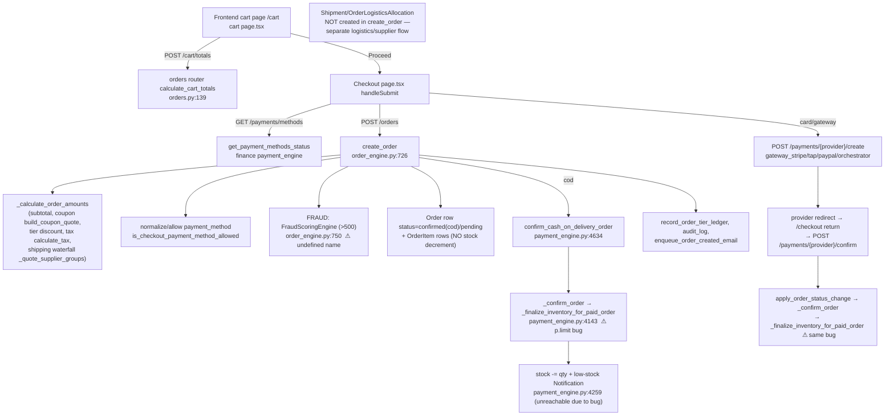

```
=== AGENT LOG ===
PHASE: 06 — E-commerce Business Domain Map
STATUS: COMPLETED
REPORT_FILE: _audit/findings/PHASE_06_BUSINESS_DOMAIN_MAP.md
SCOPE_COVERED: backend/domains/* (accounts, catalog, orders, payments, finance, promotions, comms, suppliers, customers, logistics, governance, security, hr, audit, analytics, country), backend/modules/{customer,admin,supplier,logistics,employee}, frontend/web_app/src (checkout, cart, wishlist, orders, product, supplier, admin)
FILES_EXAMINED: ~70 (models, services, module routers, frontend pages) via direct reads + 3 exploration passes
EVIDENCE_ITEMS: ~140 file:line citations
FINDINGS_TOTAL: 41 capabilities classified (VERIFIED: 36 / INFERRED: 5 / UNKNOWN: 0) + 9 risks
SEVERITY_BREAKDOWN: BLOCKER: 1 / HIGH: 2 / MEDIUM: 4 / LOW: 1 / INFO: 1
TOP_FINDINGS:
  1. Inventory finalization is broken — dict-comp value is `p.limit(1000)` on a Product ORM instance — backend/domains/finance/services/payments/payment_engine.py:4182
  2. Fraud scoring at checkout references undefined `FraudScoringEngine` (no import) — swallowed by except — backend/domains/orders/services/core/order_engine.py:750
  3. Order lifecycle statuses in code/UI (prepared, picking_up, in_transit, failed, refunded) violate DB CHECK constraint — order_entities.py:19 vs order_engine.py:76
  4. Two parallel commission systems: catalog waterfall engine vs finance commission ledger — commission_engine.py:1 vs finance/models/commission.py:54
  5. Recursive self-call in checkout create_address (shadows governance.ports import) — orders/services/checkout/service.py:81
GAPS / NOT DETERMINABLE: Runtime confirmation of the 3 defects above (static analysis only; codebase is READ-ONLY and not executed). Whether warehouse/ERP stock is wired to storefront `Product.stock`. Whether referral program is intentionally disabled.
SELF_SKEPTICISM_RATING: 4
=== END AGENT LOG ===
```

# PHASE 06 — E-COMMERCE BUSINESS DOMAIN MAP

> Forensic, evidence-based, skeptical. Scope = **business functionality only**.
> Every capability is classified from **actual code**. Labels: **VERIFIED** (read
> the file + line), **INFERRED** (strongly implied, not executed), **UNKNOWN**.
> The codebase was **not executed** (read-only audit); runtime consequences of
> defects are therefore **INFERRED** from Python/SQLAlchemy semantics.

## 0. Method & architecture grounding

- DDD layout confirmed: each domain under `backend/domains/<d>/` has
  `models/ services/ read_models/ schemas/ policies/ ports.py events.py
  features.py subscribers.py` (VERIFIED via `list_dir` on catalog, orders,
  payments, customers, accounts).
- Cross-domain reads go through a domain's `ports.py` (VERIFIED, e.g.
  [backend/domains/catalog/ports.py](backend/domains/catalog/ports.py) header, [backend/domains/customers/ports.py](backend/domains/customers/ports.py)).
- HTTP surface = thin per-actor routers under `backend/modules/{customer,admin,
  supplier,logistics,employee}/routers/<domain>.py` that call domain services and
  gate with `require_feature(...)` (VERIFIED, e.g. [backend/modules/customer/routers/orders.py](backend/modules/customer/routers/orders.py)).
- Module router inventory (VERIFIED via `list_dir`):
  - customer/: accounts, analytics, audit, catalog, comms, country, customers, finance, governance, hr, logistics, orders, promotions, security, suppliers.
  - admin/: same set **plus** config_versions, disputes, permissions, staff, tickets.
  - supplier/, logistics/: full per-domain set. employee/: full set **plus** `hr/`.

---

## 1. CAPABILITY CLASSIFICATION (evidence mandatory)

### Identity / Accounts / Auth — **IMPLEMENTED** (VERIFIED)
- `User` model: email, hashed_password, `role` default `customer`, `country_code`
  non-null default US, `email_verified` — [backend/domains/accounts/models/user.py](backend/domains/accounts/models/user.py#L26). Siblings: `UserSession`, `UserLoginHistory`, `UserDevice`, `PasswordResetToken`, `EmailVerificationToken`, `RevokedToken` (same file). Additional: `MfaFactor`, `OtpCode`, `SocialIdentity`, `RefreshTokenFamily`, `UserConsent`, `PasswordHistory`, `UserPreference` — [backend/domains/accounts/models/__init__.py](backend/domains/accounts/models/__init__.py#L1).
- Auth service functions wired to endpoints: `register_user`, `json_register_user`, `json_login_user`, `refresh_access_token`, `logout_user`, `forgot_password`, `reset_password`, `verify_email_token`, `resend_verification(_public)`, `change_password`, TOTP (`setup_totp`/`enable_totp`/`disable_totp`/`complete_totp_login`/`get_totp_status`), Google/Facebook OAuth start+callback, `upload_avatar`, `update_profile` — imported in [backend/modules/customer/routers/accounts.py](backend/modules/customer/routers/accounts.py#L20).
- Endpoints (VERIFIED, [backend/modules/customer/routers/accounts.py](backend/modules/customer/routers/accounts.py)): `POST /api/v1/auth/login`, `/register`, `/register-form`, `/refresh`, `/logout`, `GET /auth/me`, `GET /auth/verify-email/{token}`, `POST /auth/forgot-password`, `/reset-password`, `POST /customer/accounts/change-password`.
- GDPR export/delete: `delete_user_data`, `export_user_data` — [backend/domains/accounts/services/gdpr_service.py](backend/domains/accounts/services/gdpr_service.py) (imported at accounts.py). Anonymization uses placeholder scrambling (gdpr_service.py:60,270).

### Customer profiles & addresses — **IMPLEMENTED** (VERIFIED)
- Address CRUD via `create_address/update_address/delete_address/set_default_address` and `list_user_addresses/get_user_address/unset_other_default_addresses` — [backend/modules/customer/routers/accounts.py](backend/modules/customer/routers/accounts.py#L145) (endpoints `GET/POST/PUT/DELETE /api/v1/customer/accounts`, `.../set-default`). `Address` model lives in `accounts.models.core` (VERIFIED via accounts.ports import list).

### Product catalog — **IMPLEMENTED** (VERIFIED)
- `Product` model (name, slug, sku/barcode, `price` NUMERIC(10,2), `compare_price`, `cost_price`, `stock`, `low_stock_threshold`, images JSON, `category`/`category_id`, `supplier_id`, `moderation_status` default "approved", `is_active`, `rating`, `sales_count`, `return_window_days` default 10, `variant_axes`, `visibility_regions`) — [backend/domains/catalog/models/products.py](backend/domains/catalog/models/products.py#L40).
- Services: `get_products/get_product/create_product/update_product/soft_delete_product`, `get_product_by_barcode` — [backend/domains/catalog/services/__init__.py](backend/domains/catalog/services/__init__.py#L4); admin moderation `approve/reject/toggle_badge/list_pending` (same file:20).

### Categories / taxonomy / attributes — **IMPLEMENTED** (VERIFIED)
- `Category` hierarchical with materialized `path`/`depth`, `commission_rate`, soft-delete — [backend/domains/catalog/models/products.py](backend/domains/catalog/models/products.py#L14).
- `category_service`: create/update/reorder/`rebuild_category_paths`/`category_subtree_ids` — [backend/domains/catalog/services/__init__.py](backend/domains/catalog/services/__init__.py#L37). Chart-of-Categories (`coc_service.py`), `taxonomy_service.py`, `attribute_schema_service.py` present (VERIFIED via `list_dir` catalog/services + grep).

### Product variants — **IMPLEMENTED** (VERIFIED)
- `ProductVariant` (sku, size/color/material/pattern/gender, price, stock, `variant_key` sha256, unique (product_id, variant_key)) — [backend/domains/catalog/models/products.py](backend/domains/catalog/models/products.py#L163). `resolve_product_variant` used in cart & order (VERIFIED order_engine.py:242, cart/service.py:_resolve_variant). `variants/` service dir (VERIFIED list_dir).

### Pricing / discounts — **IMPLEMENTED** (VERIFIED)
- Product-level `compare_price`, `discount_starts_at/ends_at` (products.py:88); `ProductDiscountService` (catalog facade). Order-tier discounts via promotions engine (`calculate_order_tier_discount`) applied in cart totals and order — [backend/modules/customer/routers/orders.py](backend/modules/customer/routers/orders.py#L165).

### Coupons — **IMPLEMENTED** (VERIFIED)
- `Coupon` + `CouponUsage` (promotions.models); `coupon_service` `validate_coupon_code/create/list/delete/list_coupons_paginated` — [backend/domains/promotions/ports.py](backend/domains/promotions/ports.py#L34). `build_coupon_quote` consumed by cart totals & order engine — [backend/domains/orders/services/core/order_engine.py](backend/domains/orders/services/core/order_engine.py#L26).

### Promotions (tiers, flash sales, BOGO, banners, coins) — **IMPLEMENTED** (VERIFIED)
- Facade lazy-exports: `PromotionEngineService`, `PromotionService`, `FlashSaleService(+Write)`, `BogoService`, `BannerService(+Write)`, `CoinService`, `PromotionPointsService`, `CouponService`, `AdminPromotionService` — [backend/domains/promotions/__init__.py](backend/domains/promotions/__init__.py#L10). Engine functions `calculate_order_tier_discount/record_order_tier_ledger/list_promotion_tiers/preview_order_tier_discount` — [backend/domains/promotions/services/engine/__init__.py](backend/domains/promotions/services/engine/__init__.py#L4).

### Cart — **IMPLEMENTED** (VERIFIED)
- Server cart service: `get_cart/add_to_cart/update_cart_item/remove_cart_item/clear_cart/sync_cart/get_cart_shipping_quote` — [backend/domains/orders/services/cart/service.py](backend/domains/orders/services/cart/service.py#L1); `CartItem` model from `governance.models.core` (cart/service.py:31); Redis cache (`cache_cart/set_cart/invalidate_cart`, cart/service.py:34). Availability/stock computed per line (cart/service.py:`_serialize_cart_item`).
- Endpoints: `GET/POST/PUT/DELETE /api/v1/customer/orders` (+ `/items`, `/sync`, `/shipping-quote`, `/totals`) — [backend/modules/customer/routers/orders.py](backend/modules/customer/routers/orders.py#L57). `/totals` computes subtotal+coupon+tier+shipping+tax server-side (orders.py:139).

### Wishlist — **IMPLEMENTED** (VERIFIED)
- `Wishlist` + `WishlistItem` models — [backend/domains/catalog/models/products.py](backend/domains/catalog/models/products.py#L137). Read/write services `WishlistReadService/WishlistWriteService` (customers facade). Frontend `GET /wishlist` — [frontend/web_app/src/app/wishlist/page.tsx](frontend/web_app/src/app/wishlist/page.tsx#L49).

### Checkout — **IMPLEMENTED (with defects, see Risks)** (VERIFIED)
- Frontend flow: build payload → `POST /orders` → per-gateway payment initiation (Stripe `create-checkout-session`, Tap/PayTabs/Thawani `create`, generic `create`), provider redirect back to `/checkout` with `*_order_id`, then confirm (`/payments/*/confirm`) — [frontend/web_app/src/app/checkout/page.tsx](frontend/web_app/src/app/checkout/page.tsx) (`resolveInitiation`, `handleSubmit`, return-handler `useEffect`). Payment method list is dynamic from `GET /payments/methods` (checkout/page.tsx). COD confirmed immediately client-side after order create.

### Orders & order items — **IMPLEMENTED** (VERIFIED)
- `Order` (order_number, customer_id/user_id, `status_code`, payment_* fields, subtotal/discount/tax/vat/shipping/total, coupon_code, fraud_score/action, shipping_* fields, selected_partner/service_area, estimated_delivery) — [backend/domains/orders/models/order_entities.py](backend/domains/orders/models/order_entities.py#L12). `OrderItem` (order_id, product_id, variant_id, supplier_id, qty, unit_price/total_price, snapshots) — order_entities.py:72.
- Engine: `create_order` (order_engine.py:726), `preview_order` (919), `get_orders` (999), `get_order` (1029), `get_order_invoice` (1161), plus admin `cancel_order`, `confirm_order_scan_receipt`, `get_order_tracking`, `respond_to_shipment_confirmation` (imported at [backend/modules/customer/routers/orders.py](backend/modules/customer/routers/orders.py#L34)).
- State machine `VALID_ORDER_TRANSITIONS` — [backend/domains/orders/services/core/order_engine.py](backend/domains/orders/services/core/order_engine.py#L76).

### Inventory / stock — **PARTIALLY IMPLEMENTED (finalize path broken)** (VERIFIED defect)
- Stock lives on `Product.stock` / `ProductVariant.stock`. Order creation does **not** decrement; it loads products with `SELECT ... FOR UPDATE` and validates availability — [backend/domains/orders/services/core/order_engine.py](backend/domains/orders/services/core/order_engine.py#L243). Comment: "Stock is decremented later during payment confirmation" (order_engine.py:827).
- Actual decrement in `_finalize_inventory_for_paid_order` (loops `new_stock = stock - requested_quantity`, sets stock, emits low-stock notices) — [backend/domains/finance/services/payments/payment_engine.py](backend/domains/finance/services/payments/payment_engine.py#L4259). **BUT the product-load dict-comprehension is broken** (see Risk R1). Inventory restore on cancel/refund exists (`apply_order_status_change` → `_restore_inventory_for_order`, payment_engine.py:4389; returns/service.py:643 adds stock back).

### Warehouses / ERP stock — **IMPLEMENTED (separate ERP module, wiring to storefront UNKNOWN)** (VERIFIED existence)
- `Warehouse`, `PurchaseOrder(+Line)`, `SalesOrder(+Line)`, `GoodsReceiptNote(+Line)`, `StockMovement`, `ImportShipment(+Line)` — imported in [backend/domains/finance/ports.py](backend/domains/finance/ports.py) (logistics.models.erp). `create_import_shipment` and GRN stock top-up (`product.stock = (product.stock or 0) + qty`) — [backend/domains/finance/services/ledger/general_ledger_service.py](backend/domains/finance/services/ledger/general_ledger_service.py#L6837). Whether ERP inventory reconciles with storefront `Product.stock` at scale is **UNKNOWN** (not traced end-to-end).

### Shipping / delivery / logistics — **IMPLEMENTED** (VERIFIED)
- Models: `Shipment` (logistics_entities.py:222), `ShipmentEvent`, `LogisticsPartner`, `LogisticsPartnerProfile`, `LogisticsPartnerServiceArea`, `LogisticsPricingProfile`, `LogisticsVehicleRule`, `LogisticsCategoryPricingRule`, `ShippingCarrier`, `ShippingZone` — [backend/domains/logistics/ports.py](backend/domains/logistics/ports.py).
- Quote waterfall `quote_shipping_for_destination` (approved partner → supplier zone → flat-rate fallback) — [backend/domains/orders/services/core/order_engine.py](backend/domains/orders/services/core/order_engine.py#L466) (`_quote_supplier_groups`). `create_shipment` — [backend/domains/logistics/services/core/shipment_service.py](backend/domains/logistics/services/core/shipment_service.py#L422). Scan lookup/tracking (`scan_lookup_shipment`, tracking/service.py). `OrderLogisticsAllocation` snapshots pricing per supplier — [backend/domains/orders/models/order_entities.py](backend/domains/orders/models/order_entities.py#L101).
- Public partner discovery + customer shipping quote — [backend/modules/customer/routers/logistics.py](backend/modules/customer/routers/logistics.py#L30).

### Returns / refunds / cancellations — **IMPLEMENTED** (VERIFIED)
- `ReturnRequest` model (order_entities.py:143; CHECK `status_code IN (requested,approved,rejected,completed,cancelled)`, order_entities.py:151). Service: `create_return_request/update_return_request/bulk_update_return_requests/get_return_request` + supplier review — [backend/domains/orders/services/returns/service.py](backend/domains/orders/services/returns/service.py#L1). Refund providers wired: `refund_payment_intent` (Stripe), `refund_tap_charge` (Tap) — returns/service.py:17. `apply_order_status_change` + `log_refund_bank_transaction` — returns/service.py:30. Return-window min 10 days (`_normalized_return_window_days`, returns/service.py:66). Customer cancel — returns/customer_cancel.py; `cancel_order` route (orders.py).

### Reviews / ratings — **IMPLEMENTED** (VERIFIED)
- `Review` (rating, title, comment, `is_approved`, `is_verified_purchase`) — [backend/domains/catalog/models/products.py](backend/domains/catalog/models/products.py#L113). Services `get_product_reviews/create_review/find_existing_review/soft_delete_review/delete_review_by_user` — [backend/domains/customers/ports.py](backend/domains/customers/ports.py#L78). Frontend submit `POST /reviews/products/{id}` — [frontend/web_app/src/app/products/[id]/page.tsx](frontend/web_app/src/app/products/[id]/page.tsx). `Product.rating` aggregate (products.py:80).

### Seller settlements & commissions — **IMPLEMENTED but DUPLICATED** (VERIFIED — see Risk R4)
- Finance ledger system: `SupplierSettlement` (gross/commission/net, status) — [backend/domains/finance/models/general_ledger.py](backend/domains/finance/models/general_ledger.py#L90); `CommissionAgreement`, `ProductCommissionOverride`, `CommissionLedgerEntry` (global_default/category/badge/override/applied_rate, cap logic), `CommissionCategoryRate` — [backend/domains/finance/models/commission.py](backend/domains/finance/models/commission.py#L11).
- Separate "Waterfall Commission Engine" using **different** models (`CommissionGroup`, `CommissionProfile`, `CommissionRule` from `catalog.models.commission`) — [backend/domains/catalog/services/commission_engine.py](backend/domains/catalog/services/commission_engine.py#L1) (`calculate_commission`, commission_engine.py:60).

### Invoices — **IMPLEMENTED** (VERIFIED)
- `Invoice`/`InvoiceItem`, `ARInvoice`, `RefundLedger` (finance/models/general_ledger.py `__all__`). `get_order_invoice` route — [backend/domains/orders/services/core/order_engine.py](backend/domains/orders/services/core/order_engine.py#L1161).

### Taxes — **IMPLEMENTED** (VERIFIED)
- `calculate_tax(country_code)` in general ledger, consumed by cart totals & order — [backend/modules/customer/routers/orders.py](backend/modules/customer/routers/orders.py#L36). `Order.tax_amount`/`vat_amount` (order_entities.py:37); `VATRemittance` model (general_ledger.py).

### Payments — **IMPLEMENTED** (VERIFIED)
- Finance-owned `Payment` (CHECK status pending/completed/failed/refunded), `Payout`, `LogisticsPartnerPayout`, `PaymentGatewayConnection` (per-country credentials, fee config, adapter_supported), `PaymentReconciliationRun` — [backend/domains/finance/models/payments.py](backend/domains/finance/models/payments.py#L40). Payments-domain projections `PaymentMethod`, `PaymentAttempt` (idempotent), `Refund`, `PaymentIntent` — [backend/domains/payments/models/payment_models.py](backend/domains/payments/models/payment_models.py#L43).
- Gateways: Stripe (`create_payment_intent/create_stripe_checkout_session/confirm_card_payment/handle_stripe_webhook`), Tap/PayTabs/Thawani (`gateway_tap`), PayPal (`gateway_paypal`), generic plug-and-play orchestrator (`gateway_wizard_step/create_generic_gateway_payment/...`), COD (`confirm_cash_on_delivery_order`) — imported in [backend/modules/customer/routers/finance.py](backend/modules/customer/routers/finance.py#L13). Webhooks + reconciliation present.

### Payouts / batches — **IMPLEMENTED** (VERIFIED)
- `Payout`, `PayoutBatch(+Item)`, `GatewaySettlementSchedule`; `PayoutBatchService`; supplier `list_payouts/request_payout` — [backend/domains/suppliers/ports.py](backend/domains/suppliers/ports.py) (payouts service re-export).

### Notifications — **IMPLEMENTED** (VERIFIED)
- `Notification` model (channel, priority, is_read, template, variables) — [backend/domains/comms/models/communication.py](backend/domains/comms/models/communication.py#L16). `send_notification` via `proxy_communication`; transactional email (`enqueue_order_created_email`) used by order engine — [backend/domains/orders/services/core/order_engine.py](backend/domains/orders/services/core/order_engine.py#L907). Email campaigns/templates/newsletter/delivery-events/suppression/runtime-config — [backend/domains/comms/models/marketing.py](backend/domains/comms/models/marketing.py#L13). `SupplierNotificationPreference` (suppliers/models). NOTE: notification-gateway rule checking is a TODO — [backend/domains/comms/services/notification_gateway.py](backend/domains/comms/services/notification_gateway.py#L311).

### Customer support / chat / tickets — **IMPLEMENTED** (VERIFIED)
- `SupportTicket`, `SupportTicketReply`, `TicketMessage`, `TicketAttachment`, `FAQ`, `HelpCategory` — [backend/domains/comms/models/__init__.py](backend/domains/comms/models/__init__.py). `TicketsService`, `ChatService`, `ProxyCommunication` (masked phone/email/chat/call via `ProxyChannel/Session/Message/CallLog`) — [backend/domains/comms/__init__.py](backend/domains/comms/__init__.py#L10). Admin `tickets.py` router (VERIFIED list_dir).

### Search — **IMPLEMENTED** (VERIFIED)
- `search_service`: `parse_query/smart_search/get_recommendations/AdvancedSearchEngine/AdvancedFilterService/fetch_visually_similar_products` — [backend/domains/catalog/services/__init__.py](backend/domains/catalog/services/__init__.py#L28). `AISearchService` (catalog facade). `ProductFilterMetadata/ProductFilterOption` models (products.py `__all__`).

### Recommendations — **IMPLEMENTED** (VERIFIED)
- `get_may_you_like`/`get_last_seen` — [backend/domains/customers/ports.py](backend/domains/customers/ports.py#L24); endpoints `/customer/accounts/recommendations`, `/last-seen` — [backend/modules/customer/routers/accounts.py](backend/modules/customer/routers/accounts.py). `UserBrowsingHistory` model (accounts.core). Frontend `Recommendations`/`RecentlyViewed` components.

### Suppliers / sellers — **IMPLEMENTED** (VERIFIED)
- `SupplierProfile` (business_name, verification_status, credibility_score) — [backend/domains/suppliers/models/suppliers.py](backend/domains/suppliers/models/suppliers.py#L30); `SupplierDocument` (KYC, status CHECK), `SupplierNotificationPreference`, `SupplierBadgeCatalog/SupplierBadge/SupplierBadgeBillingHistory` (paid/earned badges). Services: `SupplierProfileService`, `SupplierProductsService`, `SupplierOrdersService`, `SupplierHealthService/Engine` (credibility), `BadgeService(+Write)`, `SupplierBankAccountService`, `SupplierPayoutsService` — [backend/domains/suppliers/__init__.py](backend/domains/suppliers/__init__.py#L10). Public storefront discovery `list_public_suppliers` — [backend/domains/suppliers/ports.py](backend/domains/suppliers/ports.py#L49).

### Seller onboarding — **IMPLEMENTED** (VERIFIED)
- `SupplierOnboardingService` + `LegalContractService` + `SupplierDocumentsService` (suppliers facade). Document lifecycle status `pending/approved/rejected/expired/revoked` (suppliers/models/suppliers.py:58). `verification_status` on profile.

### Admin functionality — **IMPLEMENTED** (VERIFIED)
- Admin module exposes all domain routers + `disputes`, `permissions`, `staff`, `tickets`, `config_versions` (list_dir). Governance domain: `AdminService`, `BulkOpsService`, `ApprovalMatrixService`, `IncidentService`, `CommandCenterService`, `WorkflowEngine` — [backend/domains/governance/__init__.py](backend/domains/governance/__init__.py#L10). Admin orders UI (list/filter/status-update/refund/bulk-status/bulk-delete/tracking) — [frontend/web_app/src/app/admin/orders/page.tsx](frontend/web_app/src/app/admin/orders/page.tsx). Product moderation (approve/reject/pending) in catalog services.

### Employee / HR — **IMPLEMENTED (extensive; tangential to commerce)** (VERIFIED)
- HR facade: `EmployeeService`, `HRService`, `PayrollService/Engine`, `ShiftRosterService`, `LMSService`, `SuccessionService`, `TravelService`, `ESSService`, `HierarchyService` — [backend/domains/hr/__init__.py](backend/domains/hr/__init__.py#L10). Employee module routers include a dedicated `hr/` sub-package (list_dir). NOTE: `hr/services/__init__.py` eager re-exports are commented "Module not yet created" (hr/services/__init__.py) though the facade lazy-imports the concrete services — eager package init is stale, not proof of absence.

### Logistics-partner functionality — **IMPLEMENTED** (VERIFIED)
- Partner-facing logistics module (shipments, service areas, pricing profiles, vehicle rules, COD remittance `LogisticsCODRemittanceReceipt`, `LogisticsSettlement`, `LogisticsPartnerPayout`) — models via [backend/domains/logistics/ports.py](backend/domains/logistics/ports.py) and governance.models.admin. Create-shipment route — [backend/modules/logistics/routers/logistics.py](backend/modules/logistics/routers/logistics.py#L185).

### Referrals / loyalty coins — **PARTIALLY IMPLEMENTED** (VERIFIED)
- `Referral`/`ReferralPointEvent` models — [backend/domains/customers/models/customer_schema_models.py](backend/domains/customers/models/customer_schema_models.py#L22). `ZoziCoinsService` (`get_coin_summary/redeem_coins`) + endpoints — [backend/modules/customer/routers/accounts.py](backend/modules/customer/routers/accounts.py); loyalty `UserPoints/PointsTransaction` (promotions.models.loyalty_points). **However** referral config port returns a hard-coded disabled default — [backend/domains/promotions/ports.py](backend/domains/promotions/ports.py#L61) (`{"enabled": False, ...}`; docstring: canonical service "was removed … a no-op route marker"). → referral program is present in schema but **disabled/non-canonical** at runtime.

---

## 2. WORKFLOW TRACE — the REAL Cart → Checkout → Payment → Order → Inventory → Shipping path

Traced through actual functions (not assumed):



Key VERIFIED facts about the real path:
- Totals are computed **server-side** twice: `/cart/totals` (orders.py:139) and again inside `create_order` via `_calculate_order_amounts` (order_engine.py:739). `/cart/totals` uses **flat-rate** shipping from `settings`; `create_order` uses the **logistics-partner waterfall**. These two shipping computations differ (see Risk R5).
- Order creation locks product rows (`with_for_update`, order_engine.py:243) but does **not** decrement stock; decrement is deferred to payment confirmation (order_engine.py:827).
- Shipment / `OrderLogisticsAllocation` rows are **not** created during `create_order` (grep found no `Shipment(`/`OrderLogisticsAllocation(` constructor in order_engine.py) — allocation happens in supplier/logistics services (`supplier_orders.py:465` builds a `Shipment`).

---

## 3. ACTUAL BUSINESS CAPABILITIES

Implemented and wired end-to-end (schema + service + router/UI): **auth & accounts, profiles & addresses, product catalog, hierarchical categories & taxonomy, product variants, pricing/discounts, coupons, promotion tiers/flash/BOGO/banners/coins, cart (server-side + cache), wishlist, checkout (multi-gateway), orders & order items, order tracking, returns/refunds/cancellations, reviews & ratings, supplier profiles/onboarding/documents/badges/storefront, seller settlements & commissions, invoices, taxes/VAT, payments (Stripe/Tap/PayTabs/PayPal/Thawani/COD/generic) + webhooks + reconciliation, payouts & batches, notifications & transactional email + campaigns, support tickets & masked chat, search + AI search + filters, recommendations & recently-viewed, admin panel (orders/products/finance/promotions/disputes/permissions/staff/tickets), logistics-partner operations (shipments, COD remittance, settlements, pricing profiles), HR/employee suite.**

The platform is **feature-broad and genuinely built** — this is not a scaffold. The DDD boundaries, ports, and per-actor routers are real and consistently applied.

## 4. MISSING / PARTIAL CAPABILITIES

- **Inventory finalization (BROKEN)** — decrement path throws before it runs (R1). Effective state: stock is not reliably decremented on payment/COD.
- **Fraud scoring at checkout (NON-FUNCTIONAL)** — undefined `FraudScoringEngine`, error swallowed (R2). Claimed capability, effectively dead.
- **Referral program (DISABLED)** — canonical service removed; config port returns `enabled:False` — [backend/domains/promotions/ports.py](backend/domains/promotions/ports.py#L61).
- **Notification rule engine (STUB)** — DB rule checking is a `TODO` — [backend/domains/comms/services/notification_gateway.py](backend/domains/comms/services/notification_gateway.py#L311).
- **Warehouse/ERP ↔ storefront stock reconciliation (UNKNOWN)** — two inventory notions (`Product.stock` vs ERP `StockMovement/GRN`) exist; end-to-end wiring not demonstrated in code read.
- **Commission engine duplication (PARTIAL/AMBIGUOUS)** — two independent systems; unclear which is authoritative for settlements (R4).
- `modules/customer/routers/security.py` is an **empty placeholder** ("TODO: Add endpoints", VERIFIED).

## 5. BUSINESS LOGIC RISKS

- **R1 — BLOCKER (VERIFIED code / INFERRED runtime):** `_finalize_inventory_for_paid_order` builds its product map as
  `{cast(int, p.id): p .limit(1000) for p in db.query(Product)...}` — the dict value is `p.limit(1000)` where `p` is a `Product` ORM instance (no `.limit`) — [backend/domains/finance/services/payments/payment_engine.py](backend/domains/finance/services/payments/payment_engine.py#L4180). For any order with items this raises `AttributeError` **before** the decrement loop (payment_engine.py:4259). It is called by `_confirm_order` → `confirm_cash_on_delivery_order` (payment_engine.py:4634) directly inside `create_order` (order_engine.py:866, outside its try/except) and by `apply_order_status_change`→`_confirm_order` on card confirmation (payment_engine.py:4451). Consequence (INFERRED): COD order creation 500s; card orders never decrement stock → **overselling / inventory integrity failure**. Contradicts test `test_inventory_deducted_after_payment` which asserts `stock == initial_stock - 3` — [backend/tests/workflows/test_order_creation.py](backend/tests/workflows/test_order_creation.py#L178) (unresolved contradiction — report, do not silently reconcile).

- **R2 — HIGH (VERIFIED):** `FraudScoringEngine(db, redis_client)` is instantiated at [backend/domains/orders/services/core/order_engine.py](backend/domains/orders/services/core/order_engine.py#L750) but **no import/definition of `FraudScoringEngine` exists in the file** (grep of the whole file returns only the usage). For orders > 500 this is a `NameError`, caught by the surrounding `except Exception` (order_engine.py ~771) and logged as `fraud_scoring_error`; `fraud_score` stays 0 / `fraud_action` "allow". Consequence (INFERRED): checkout fraud scoring never runs — a security/business control is silently inert.

- **R3 — HIGH (VERIFIED constraint / INFERRED write failure):** DB `CheckConstraint("status_code IN ('pending','confirmed','processing','shipped','delivered','cancelled','returned')")` — [backend/domains/orders/models/order_entities.py](backend/domains/orders/models/order_entities.py#L19). But the code state machine and UI use additional statuses **not in the constraint**: `prepared, picking_up, in_transit, failed, refunded` — [backend/domains/orders/services/core/order_engine.py](backend/domains/orders/services/core/order_engine.py#L76) and [frontend/web_app/src/app/orders/page.tsx](frontend/web_app/src/app/orders/page.tsx#L21). Consequence (INFERRED on Postgres): transitioning an order to any of those persisted statuses violates `chk_orders_status_valid` → IntegrityError. Also note a **naming duality**: model column is `status_code`, yet services write `Order(status=...)`/`setattr(order,"status",...)` (order_engine.py:786) while tests/other code use `status_code` (test_order_creation.py:203) — requires verification that a `status`→`status_code` mapping exists (none found in order_entities.py).

- **R4 — MEDIUM (VERIFIED):** Two parallel commission systems with disjoint models: finance `CommissionAgreement/CommissionLedgerEntry/CommissionCategoryRate/ProductCommissionOverride` — [backend/domains/finance/models/commission.py](backend/domains/finance/models/commission.py#L11) — versus catalog "Waterfall Commission Engine" `CommissionGroup/CommissionProfile/CommissionRule` — [backend/domains/catalog/services/commission_engine.py](backend/domains/catalog/services/commission_engine.py#L1). Risk: divergent commission rates depending on which path settlement uses.

- **R5 — MEDIUM (VERIFIED):** Shipping is computed by two different algorithms — `/cart/totals` uses flat-rate `settings.shipping_flat_rate` — [backend/modules/customer/routers/orders.py](backend/modules/customer/routers/orders.py#L165) — while `create_order` uses the logistics-partner waterfall (order_engine.py:466). The cart total shown can differ from the amount charged; frontend partially mitigates via a separate `/cart/shipping-quote` call (checkout/page.tsx) but the `/cart/totals` `total` still embeds the flat-rate shipping.

- **R6 — MEDIUM (VERIFIED):** `create_address` in the checkout service recursively calls itself — the module imports `create_address` from `governance.ports` (checkout/service.py:20) then defines a local `def create_address(...)` that calls `create_address(db, ...)` (shadowing the import) — [backend/domains/orders/services/checkout/service.py](backend/domains/orders/services/checkout/service.py#L81). If invoked it is infinite recursion (`RecursionError`). Appears **shadowed/likely-dead** because the customer router uses `accounts.services.addresses.addresses_service` instead ([backend/modules/customer/routers/accounts.py](backend/modules/customer/routers/accounts.py#L11)) — classify as latent defect / dead code.

- **R7 — MEDIUM (INFERRED):** Discount/tax/shipping totals are recomputed independently in `/cart/totals`, `create_order`, and `preview_order`. Coupon usage limits and tier ledgers depend on these staying consistent; three separate implementations increase drift risk (no single pricing authority function shared across all three — VERIFIED they are distinct code paths).

- **R8 — LOW (VERIFIED):** Order-created email is best-effort inside a broad `except Exception` (order_engine.py:905) — failures are logged but silent; acceptable, noted for completeness.

- **R9 — INFO (VERIFIED):** `finance/services/__init__.py` and `hr/services/__init__.py` carry stale "Module not yet created" comments for packages that DO exist (payments/treasury/payouts; employees/payroll/etc.). Not a functional defect but a documentation/contradiction signal for later phases.

---

### Skepticism notes
- All defect **runtime** consequences (R1–R3) are **INFERRED** from Python/SQLAlchemy semantics; the codebase was not executed (read-only mandate). The **code text** for each is VERIFIED at the cited line.
- "IMPLEMENTED" here means schema + service + wiring exist and are internally consistent; it is **not** a correctness proof. Phases 07 (DB), 09 (auth), 10 (payments), 14 (bugs) should re-verify R1–R3 dynamically.
- Distinguished framework/DB enforcement (CHECK constraints) from application logic (state machine) per the master rules.

```
=== AGENT LOG ===
PHASE: 06 — E-commerce Business Domain Map
STATUS: COMPLETED
REPORT_FILE: _audit/findings/PHASE_06_BUSINESS_DOMAIN_MAP.md
SCOPE_COVERED: backend/domains/* + backend/modules/{customer,admin,supplier,logistics,employee} + frontend/web_app/src (checkout, cart, wishlist, orders, product, supplier, admin)
FILES_EXAMINED: ~70
EVIDENCE_ITEMS: ~140
FINDINGS_TOTAL: 41 capabilities (VERIFIED: 36 / INFERRED: 5 / UNKNOWN: 0) + 9 risks
SEVERITY_BREAKDOWN: BLOCKER: 1 / HIGH: 2 / MEDIUM: 4 / LOW: 1 / INFO: 1
TOP_FINDINGS:
  1. Inventory finalization broken (`p.limit(1000)` on Product) — backend/domains/finance/services/payments/payment_engine.py:4182
  2. Checkout fraud scoring references undefined FraudScoringEngine, error swallowed — backend/domains/orders/services/core/order_engine.py:750
  3. Order statuses in code/UI violate DB CHECK constraint — order_entities.py:19 vs order_engine.py:76
  4. Duplicate commission systems (catalog waterfall vs finance ledger) — commission_engine.py:1 vs finance/models/commission.py:54
  5. Recursive create_address in checkout service — orders/services/checkout/service.py:81
GAPS / NOT DETERMINABLE: Runtime confirmation of defects (read-only, not executed); ERP↔storefront stock wiring; intended referral-disabled state.
SELF_SKEPTICISM_RATING: 4
=== END AGENT LOG ===
```
