# ZOZI Architecture Governance Audit Report

> **Generated:** 2026-08-06T02:54:25.903828+00:00  
> **Repo:** `D:\Projects\10- E-COMMERCE WEBSITE\zozi`  
> **Result:** 🔴 230 violations · 🟡 3724 advisories · 🟢 49 info  
> **Architecture Debt Score:** **114842**  

---

## 1. The Grid Line (Backend Circuit)

Every file in this project MUST sit inside exactly one of these layers.
Imports flow **downward only**. Any upward import is a violation.

```
HTTP Request
    │
    ▼
┌─────────────────────────────────────────────────────────┐
│ LAYER 0: ENTRY  (main.py, lifespan.py)                  │
│   Only: app creation, middleware registration,          │
│         router mounting                                 │
└─────────────────────────────────────────────────────────┘
    │
    ▼
┌─────────────────────────────────────────────────────────┐
│ LAYER 1: MIDDLEWARE + DEPENDENCIES  (flat, no subdirs)  │
│   Only: request preprocessing, auth, RLS context        │
│   FORBIDDEN: import from services/*, controllers/*      │
└─────────────────────────────────────────────────────────┘
    │
    ▼
┌─────────────────────────────────────────────────────────┐
│ LAYER 2: ROUTERS  — FLAT files                          │
│   filename: {surface}_{domain}_{operation}.py           │
│   Only: endpoint defs, request validation, call ctrl    │
│   FORBIDDEN: session.add/commit/delete, business logic  │
└─────────────────────────────────────────────────────────┘
    │
    ▼
┌─────────────────────────────────────────────────────────┐
│ LAYER 3: CONTROLLERS  — grouped by DOMAIN               │
│   finance/ orders/ catalog/ logistics/ communication/   │
│   Only: orchestrate services, compose responses         │
│   FORBIDDEN: session writes, raw SQL, import routers/   │
└─────────────────────────────────────────────────────────┘
    │
    ▼
┌─────────────────────────────────────────────────────────┐
│ LAYER 4: SERVICES  — grouped by DOMAIN                  │
│   Only: business rules, DB operations, call providers   │
│   FORBIDDEN: import from routers/, controllers/         │
└─────────────────────────────────────────────────────────┘
    │
    ▼
┌─────────────────────────────────────────────────────────┐
│ LAYER 5: PROVIDERS  — grouped by DOMAIN/ADAPTER         │
│   Only: external API adapters (AI, maps, email, pay)    │
│   FORBIDDEN: import from services/, controllers/        │
└─────────────────────────────────────────────────────────┘
    │
    ▼
┌─────────────────────────────────────────────────────────┐
│ LAYER 6: MODELS  — grouped by DOMAIN                    │
│   Only: SQLAlchemy ORM definitions, relationships       │
│   FORBIDDEN: import from ANY other layer                │
└─────────────────────────────────────────────────────────┘
    │
    ▼
┌─────────────────────────────────────────────────────────┐
│ LAYER 7: DB INFRASTRUCTURE  (db/, alembic/)             │
│   Only: engine, session factory, base classes           │
└─────────────────────────────────────────────────────────┘

CROSS-CUTTING:
  utils/     — pure helpers, no state, no DB
  events/    — domain events (grouped by domain)
  jobs/      — background tasks (grouped by domain)
  tests/     — test files (exempt from most rules)
  scripts/   — ops/maintenance scripts (exempt)
```

---

## 2. Current Backend Structure

```mermaid
graph TD
    ROOT["backend/"]
    _triage["_triage/"]
    ROOT --> _triage
    _triage_flat["1 flat .py files"]
    _triage --> _triage_flat
    alembic["alembic/"]
    ROOT --> alembic
    alembic_versions["versions/"]
    alembic --> alembic_versions
    alembic_flat["2 flat .py files"]
    alembic --> alembic_flat
    controllers["controllers/"]
    ROOT --> controllers
    controllers_ai["ai/"]
    controllers --> controllers_ai
    controllers_analytics["analytics/"]
    controllers --> controllers_analytics
    controllers_catalog["catalog/"]
    controllers --> controllers_catalog
    controllers_commerce["commerce/"]
    controllers --> controllers_commerce
    controllers_communication["communication/"]
    controllers --> controllers_communication
    controllers_core["core/"]
    controllers --> controllers_core
    controllers_country["country/"]
    controllers --> controllers_country
    controllers_finance["finance/"]
    controllers --> controllers_finance
    controllers_hr["hr/"]
    controllers --> controllers_hr
    controllers_logistics["logistics/"]
    controllers --> controllers_logistics
    controllers_orders["orders/"]
    controllers --> controllers_orders
    controllers_security["security/"]
    controllers --> controllers_security
    controllers_flat["17 flat .py files"]
    controllers --> controllers_flat
    data["data/"]
    ROOT --> data
    data_flat["83 flat .py files"]
    data --> data_flat
    db["db/"]
    ROOT --> db
    db_sql["sql/"]
    db --> db_sql
    db_flat["9 flat .py files"]
    db --> db_flat
    dependencies["dependencies/"]
    ROOT --> dependencies
    dependencies_flat["2 flat .py files"]
    dependencies --> dependencies_flat
    docs["docs/"]
    ROOT --> docs
    events["events/"]
    ROOT --> events
    events_finance["finance/"]
    events --> events_finance
    jobs["jobs/"]
    ROOT --> jobs
    middleware["middleware/"]
    ROOT --> middleware
    middleware_flat["21 flat .py files"]
    middleware --> middleware_flat
    models["models/"]
    ROOT --> models
    models_ai["ai/"]
    models --> models_ai
    models_analytics["analytics/"]
    models --> models_analytics
    models_audit["audit/"]
    models --> models_audit
    models_catalog["catalog/"]
    models --> models_catalog
    models_communication["communication/"]
    models --> models_communication
    models_core["core/"]
    models --> models_core
    models_country["country/"]
    models --> models_country
    models_finance["finance/"]
    models --> models_finance
    models_hr["hr/"]
    models --> models_hr
    models_logistics["logistics/"]
    models --> models_logistics
    models_media["media/"]
    models --> models_media
    models_orders["orders/"]
    models --> models_orders
    models_flat["4 flat .py files"]
    models --> models_flat
    providers["providers/"]
    ROOT --> providers
    providers_ai["ai/"]
    providers --> providers_ai
    providers_analytics["analytics/"]
    providers --> providers_analytics
    providers_catalog["catalog/"]
    providers --> providers_catalog
    providers_configuration["configuration/"]
    providers --> providers_configuration
    providers_country["country/"]
    providers --> providers_country
    providers_finance["finance/"]
    providers --> providers_finance
    providers_geography["geography/"]
    providers --> providers_geography
    providers_hr["hr/"]
    providers --> providers_hr
    providers_legacy["legacy/"]
    providers --> providers_legacy
    providers_logistics["logistics/"]
    providers --> providers_logistics
    providers_media["media/"]
    providers --> providers_media
    providers_flat["8 flat .py files"]
    providers --> providers_flat
    routers["routers/"]
    ROOT --> routers
    routers_flat["151 flat .py files"]
    routers --> routers_flat
    services["services/"]
    ROOT --> services
    services_ai["ai/"]
    services --> services_ai
    services_analytics["analytics/"]
    services --> services_analytics
    services_audit["audit/"]
    services --> services_audit
    services_catalog["catalog/"]
    services --> services_catalog
    services_commerce["commerce/"]
    services --> services_commerce
    services_communication["communication/"]
    services --> services_communication
    services_core["core/"]
    services --> services_core
    services_country["country/"]
    services --> services_country
    services_customer["customer/"]
    services --> services_customer
    services_finance["finance/"]
    services --> services_finance
    services_geography["geography/"]
    services --> services_geography
    services_hr["hr/"]
    services --> services_hr
    services_flat["6 flat .py files"]
    services --> services_flat
    tasks["tasks/"]
    ROOT --> tasks
    tests["tests/"]
    ROOT --> tests
    tests_playwright["playwright/"]
    tests --> tests_playwright
    tests_scripts["scripts/"]
    tests --> tests_scripts
    tests_flat["60 flat .py files"]
    tests --> tests_flat
    tools["tools/"]
    ROOT --> tools
    utils["utils/"]
    ROOT --> utils
    utils_flat["69 flat .py files"]
    utils --> utils_flat
```



---

## 3. Suggested Backend Structure

```mermaid
graph TD
    ROOT["backend/ (suggested target)"]
    be_triage["_triage/"]
    ROOT --> be_triage
    be_alembic["alembic/"]
    ROOT --> be_alembic
    be_alembic_versions["versions/"]
    be_alembic --> be_alembic_versions
    be_controllers["controllers/"]
    ROOT --> be_controllers
    be_controllers_ai["ai/"]
    be_controllers --> be_controllers_ai
    be_controllers_analytics["analytics/"]
    be_controllers --> be_controllers_analytics
    be_controllers_catalog["catalog/"]
    be_controllers --> be_controllers_catalog
    be_controllers_commerce["commerce/"]
    be_controllers --> be_controllers_commerce
    be_controllers_comms["comms/ ✨"]
    be_controllers --> be_controllers_comms
    be_controllers_communication["communication/"]
    be_controllers --> be_controllers_communication
    be_controllers_core["core/"]
    be_controllers --> be_controllers_core
    be_controllers_country["country/"]
    be_controllers --> be_controllers_country
    be_controllers_finance["finance/"]
    be_controllers --> be_controllers_finance
    be_controllers_geography["geography/ ✨"]
    be_controllers --> be_controllers_geography
    be_controllers_hr["hr/"]
    be_controllers --> be_controllers_hr
    be_controllers_logistics["logistics/"]
    be_controllers --> be_controllers_logistics
    be_controllers_orders["orders/"]
    be_controllers --> be_controllers_orders
    be_controllers_security["security/"]
    be_controllers --> be_controllers_security
    be_controllers_supplier["supplier/"]
    be_controllers --> be_controllers_supplier
    be_controllers_treasury["treasury/"]
    be_controllers --> be_controllers_treasury
    be_data["data/"]
    ROOT --> be_data
    be_db["db/"]
    ROOT --> be_db
    be_db_sql["sql/"]
    be_db --> be_db_sql
    be_dependencies["dependencies/"]
    ROOT --> be_dependencies
    be_docs["docs/"]
    ROOT --> be_docs
    be_events["events/"]
    ROOT --> be_events
    be_events_finance["finance/"]
    be_events --> be_events_finance
    be_jobs["jobs/"]
    ROOT --> be_jobs
    be_middleware["middleware/"]
    ROOT --> be_middleware
    be_models["models/"]
    ROOT --> be_models
    be_models_ai["ai/"]
    be_models --> be_models_ai
    be_models_analytics["analytics/"]
    be_models --> be_models_analytics
    be_models_audit["audit/"]
    be_models --> be_models_audit
    be_models_catalog["catalog/"]
    be_models --> be_models_catalog
    be_models_comms["comms/ ✨"]
    be_models --> be_models_comms
    be_models_communication["communication/"]
    be_models --> be_models_communication
    be_models_core["core/"]
    be_models --> be_models_core
    be_models_country["country/"]
    be_models --> be_models_country
    be_models_finance["finance/"]
    be_models --> be_models_finance
    be_models_geography["geography/ ✨"]
    be_models --> be_models_geography
    be_models_hr["hr/"]
    be_models --> be_models_hr
    be_models_logistics["logistics/"]
    be_models --> be_models_logistics
    be_models_media["media/"]
    be_models --> be_models_media
    be_models_orders["orders/"]
    be_models --> be_models_orders
    be_models_security["security/"]
    be_models --> be_models_security
    be_models_supplier["supplier/"]
    be_models --> be_models_supplier
    be_models_treasury["treasury/"]
    be_models --> be_models_treasury
    be_providers["providers/"]
    ROOT --> be_providers
    be_providers_ai["ai/"]
    be_providers --> be_providers_ai
    be_providers_analytics["analytics/"]
    be_providers --> be_providers_analytics
    be_providers_catalog["catalog/"]
    be_providers --> be_providers_catalog
    be_providers_configuration["configuration/"]
    be_providers --> be_providers_configuration
    be_providers_country["country/"]
    be_providers --> be_providers_country
    be_providers_finance["finance/"]
    be_providers --> be_providers_finance
    be_providers_geography["geography/"]
    be_providers --> be_providers_geography
    be_providers_hr["hr/"]
    be_providers --> be_providers_hr
    be_providers_legacy["legacy/"]
    be_providers --> be_providers_legacy
    be_providers_logistics["logistics/"]
    be_providers --> be_providers_logistics
    be_providers_media["media/"]
    be_providers --> be_providers_media
    be_routers["routers/ (flat: surface_domain_operation.py)"]
    ROOT --> be_routers
    be_routers_admin_analytics_routes_py["admin_analytics_routes.py"]
    be_routers --> be_routers_admin_analytics_routes_py
    be_routers_admin_catalog_routes_py["admin_catalog_routes.py"]
    be_routers --> be_routers_admin_catalog_routes_py
    be_routers_admin_catalog_routes_2_py["admin_catalog_routes_2.py"]
    be_routers --> be_routers_admin_catalog_routes_2_py
    be_routers_admin_commerce_routes_py["admin_commerce_routes.py"]
    be_routers --> be_routers_admin_commerce_routes_py
    be_routers_admin_comms_routes_py["admin_comms_routes.py"]
    be_routers --> be_routers_admin_comms_routes_py
    be_routers_admin_comms_routes_2_py["admin_comms_routes_2.py"]
    be_routers --> be_routers_admin_comms_routes_2_py
    be_routers_admin_comms_routes_3_py["admin_comms_routes_3.py"]
    be_routers --> be_routers_admin_comms_routes_3_py
    be_routers_admin_core_console_py["admin_core_console.py"]
    be_routers --> be_routers_admin_core_console_py
    be_routers_admin_core_fallback_py["admin_core_fallback.py"]
    be_routers --> be_routers_admin_core_fallback_py
    be_routers_admin_core_routes_py["admin_core_routes.py"]
    be_routers --> be_routers_admin_core_routes_py
    be_routers_admin_core_routes_2_py["admin_core_routes_2.py"]
    be_routers --> be_routers_admin_core_routes_2_py
    be_routers_admin_core_routes_3_py["admin_core_routes_3.py"]
    be_routers --> be_routers_admin_core_routes_3_py
    be_services["services/"]
    ROOT --> be_services
    be_services_ai["ai/"]
    be_services --> be_services_ai
    be_services_analytics["analytics/"]
    be_services --> be_services_analytics
    be_services_audit["audit/"]
    be_services --> be_services_audit
    be_services_catalog["catalog/"]
    be_services --> be_services_catalog
    be_services_commerce["commerce/"]
    be_services --> be_services_commerce
    be_services_comms["comms/ ✨"]
    be_services --> be_services_comms
    be_services_communication["communication/"]
    be_services --> be_services_communication
    be_services_core["core/"]
    be_services --> be_services_core
    be_services_country["country/"]
    be_services --> be_services_country
    be_services_customer["customer/"]
    be_services --> be_services_customer
    be_services_finance["finance/"]
    be_services --> be_services_finance
    be_services_geography["geography/"]
    be_services --> be_services_geography
    be_services_hr["hr/"]
    be_services --> be_services_hr
    be_services_location["location/"]
    be_services --> be_services_location
    be_services_logistics["logistics/"]
    be_services --> be_services_logistics
    be_services_media["media/"]
    be_services --> be_services_media
    be_services_orders["orders/"]
    be_services --> be_services_orders
    be_services_security["security/"]
    be_services --> be_services_security
    be_services_supplier["supplier/"]
    be_services --> be_services_supplier
    be_services_suppliers["suppliers/"]
    be_services --> be_services_suppliers
    be_tasks["tasks/"]
    ROOT --> be_tasks
    be_tests["tests/"]
    ROOT --> be_tests
    be_tests_playwright["playwright/"]
    be_tests --> be_tests_playwright
    be_tests_scripts["scripts/"]
    be_tests --> be_tests_scripts
    be_tools["tools/"]
    ROOT --> be_tools
    be_utils["utils/"]
    ROOT --> be_utils
```



---

## 4. Current Frontend Structure

```mermaid
graph TD
    fe_frontend["frontend/"]
    fe_mobile_app["mobile_app/ (10 files)"]
    fe_frontend --> fe_mobile_app
    fe_mobile_app_app["app/ (26 files)"]
    fe_mobile_app --> fe_mobile_app_app
    fe_mobile_app_app_auth["(auth)/ (6 files)"]
    fe_mobile_app_app --> fe_mobile_app_app_auth
    fe_mobile_app_app_tabs["(tabs)/ (3 files)"]
    fe_mobile_app_app --> fe_mobile_app_app_tabs
    fe_mobile_app_app_admin["admin/ (20 files)"]
    fe_mobile_app_app --> fe_mobile_app_app_admin
    fe_mobile_app_app_logistics_partner["logistics-partner/ (9 files)"]
    fe_mobile_app_app --> fe_mobile_app_app_logistics_partner
    fe_mobile_app_app_logistics_partners["logistics-partners/ (2 files)"]
    fe_mobile_app_app --> fe_mobile_app_app_logistics_partners
    fe_mobile_app_app_newsletter["newsletter/ (2 files)"]
    fe_mobile_app_app --> fe_mobile_app_app_newsletter
    fe_mobile_app_app_orders["orders/ (1 files)"]
    fe_mobile_app_app --> fe_mobile_app_app_orders
    fe_mobile_app_app_products["products/ (2 files)"]
    fe_mobile_app_app --> fe_mobile_app_app_products
    fe_mobile_app_app_r["r/ (1 files)"]
    fe_mobile_app_app --> fe_mobile_app_app_r
    fe_mobile_app_app_returns["returns/ (1 files)"]
    fe_mobile_app_app --> fe_mobile_app_app_returns
    fe_mobile_app_assets["assets/"]
    fe_mobile_app --> fe_mobile_app_assets
    fe_mobile_app_components["components/ (20 files)"]
    fe_mobile_app --> fe_mobile_app_components
    fe_mobile_app_components_ui["ui/ (36 files)"]
    fe_mobile_app_components --> fe_mobile_app_components_ui
    fe_mobile_app_lib["lib/ (49 files)"]
    fe_mobile_app --> fe_mobile_app_lib
    fe_mobile_app_mocks["mocks/ (1 files)"]
    fe_mobile_app --> fe_mobile_app_mocks
    fe_mobile_app_scripts["scripts/ (4 files)"]
    fe_mobile_app --> fe_mobile_app_scripts
    fe_mobile_app_theme["theme/ (2 files)"]
    fe_mobile_app --> fe_mobile_app_theme
    fe_shared["shared/ (2 files)"]
    fe_frontend --> fe_shared
    fe_shared_src["src/ (37 files)"]
    fe_shared --> fe_shared_src
    fe_shared_src_components["components/ (3 files)"]
    fe_shared_src --> fe_shared_src_components
    fe_shared_src_logo["logo/ (9 files)"]
    fe_shared_src --> fe_shared_src_logo
    fe_web_app["web_app/ (10 files)"]
    fe_frontend --> fe_web_app
    fe_web_app_e2e_screenshots["e2e-screenshots/"]
    fe_web_app --> fe_web_app_e2e_screenshots
    fe_web_app_public["public/"]
    fe_web_app --> fe_web_app_public
    fe_web_app_scripts["scripts/ (4 files)"]
    fe_web_app --> fe_web_app_scripts
    fe_web_app_src["src/"]
    fe_web_app --> fe_web_app_src
    fe_web_app_src_app["app/ (8 files)"]
    fe_web_app_src --> fe_web_app_src_app
    fe_web_app_src_components["components/ (72 files)"]
    fe_web_app_src --> fe_web_app_src_components
    fe_web_app_src_hooks["hooks/ (13 files)"]
    fe_web_app_src --> fe_web_app_src_hooks
    fe_web_app_src_lib["lib/ (53 files)"]
    fe_web_app_src --> fe_web_app_src_lib
    fe_web_app_src_logo["logo/ (6 files)"]
    fe_web_app_src --> fe_web_app_src_logo
    fe_web_app_src_services["services/ (3 files)"]
    fe_web_app_src --> fe_web_app_src_services
    fe_web_app_src_styles["styles/"]
    fe_web_app_src --> fe_web_app_src_styles
    fe_web_app_src_theme["theme/ (1 files)"]
    fe_web_app_src --> fe_web_app_src_theme
    fe_web_app_src_types["types/ (1 files)"]
    fe_web_app_src --> fe_web_app_src_types
    fe_web_app_src_utils["utils/ (1 files)"]
    fe_web_app_src --> fe_web_app_src_utils
    fe_web_app_test_assets["test-assets/"]
    fe_web_app --> fe_web_app_test_assets
```



---

## 5. Suggested Frontend Structure

```mermaid
graph TD
    ROOT["frontend/ (suggested)"]
    fe_mobile_app["mobile_app/ ✅"]
    ROOT --> fe_mobile_app
    fe_mobile_app_app["app/"]
    fe_mobile_app --> fe_mobile_app_app
    fe_mobile_app_components["components/"]
    fe_mobile_app --> fe_mobile_app_components
    fe_mobile_app_lib["lib/"]
    fe_mobile_app --> fe_mobile_app_lib
    fe_mobile_app_hooks["hooks/"]
    fe_mobile_app --> fe_mobile_app_hooks
    fe_mobile_app_features["features/"]
    fe_mobile_app --> fe_mobile_app_features
    fe_mobile_app_assets["assets/"]
    fe_mobile_app --> fe_mobile_app_assets
    fe_shared["shared/ ✅"]
    ROOT --> fe_shared
    fe_shared_src_components["src/components/"]
    fe_shared --> fe_shared_src_components
    fe_shared_src_lib["src/lib/"]
    fe_shared --> fe_shared_src_lib
    fe_shared_src_types["src/types/"]
    fe_shared --> fe_shared_src_types
    fe_shared_src_hooks["src/hooks/"]
    fe_shared --> fe_shared_src_hooks
    fe_web_app["web_app/ ✅"]
    ROOT --> fe_web_app
    fe_web_app_src_app["src/app/"]
    fe_web_app --> fe_web_app_src_app
    fe_web_app_src_components["src/components/"]
    fe_web_app --> fe_web_app_src_components
    fe_web_app_src_lib["src/lib/"]
    fe_web_app --> fe_web_app_src_lib
    fe_web_app_src_hooks["src/hooks/"]
    fe_web_app --> fe_web_app_src_hooks
    fe_web_app_src_features["src/features/"]
    fe_web_app --> fe_web_app_src_features
    fe_web_app_src_styles["src/styles/"]
    fe_web_app --> fe_web_app_src_styles
```



---

## 6. AI File Placement Contract

## AI File Placement Contract

**Rule for AI:** Before creating or moving any backend file, use this contract.

### Layer rules

| Layer | Structure | Correct examples |
|---|---|---|
| `backend/routers/` | **Flat file**: `{surface}_{domain}_{operation}.py` | `admin_orders_management.py`, `supplier_orders_fulfillment.py`, `customer_orders_tracking.py`, `public_catalog_product_browsing.py` |
| `backend/controllers/` | Domain folder + surface-prefixed controller file | `controllers/orders/admin_order_management_controller.py`, `controllers/catalog/supplier_product_management_controller.py` |
| `backend/services/` | Domain folder | `services/orders/order_management_service.py`, `services/finance/payment_processing_service.py` |
| `backend/models/` | Domain folder | `models/orders/order_entities.py` |
| `backend/providers/` | Domain/adapter folder | `providers/ai/image_analysis_provider.py` |
| `backend/events/` | Domain folder | `events/orders/order_events.py` |
| `backend/jobs/` | Domain folder | `jobs/finance/payout_batch_job.py` |

### Admin CRUD handling

Admin is a **surface**, not a domain.

Do not create:

```text
backend/services/admin/
backend/controllers/admin/
backend/routers/admin/
```

Use this instead:

```text
backend/routers/admin_orders_management.py
backend/controllers/orders/admin_order_management_controller.py
backend/services/orders/order_management_service.py
```

### Forbidden folders

```text
backend/routers/admin/
backend/routers/finance/
backend/routers/catalog/
backend/routers/orders/
backend/controllers/admin/
backend/services/admin/
backend/models/admin/
backend/providers/admin/
backend/events/admin/
backend/jobs/admin/
backend/services/write/
backend/services/common/
backend/services/legacy/
```

### Domain keyword routing

| Domain | Put files here | Keywords |
|---|---|---|
| `ai` | `backend/services/ai/`, `backend/models/ai/`, `backend/controllers/ai/` | ai, automation, bg, bg_removal, chatbot, embedding, embeddings, image_ai, ml, ocr, recommendation, removal, research, text |
| `analytics` | `backend/services/analytics/`, `backend/models/analytics/`, `backend/controllers/analytics/` | analytics, dashboard, insights, kpi, metrics, mv, report, reports, snapshot, snapshots |
| `audit` | `backend/services/audit/`, `backend/models/audit/`, `backend/controllers/audit/` | audit, audit_log, audit_trail, auditor, communication_audit, permission_audit, worm |
| `catalog` | `backend/services/catalog/`, `backend/models/catalog/`, `backend/controllers/catalog/` | advanced_filter, advanced_search, catalog, categories, category, filter, filters, inventory, moderation, product, product_moderation, product_verification, products, search |
| `commerce` | `backend/services/commerce/`, `backend/models/commerce/`, `backend/controllers/commerce/` | commerce, coupon, coupons, discount, discounts, flash_sale, loyalty, promotion, promotions, referral, reviews, wishlist |
| `comms` | `backend/services/comms/`, `backend/models/comms/`, `backend/controllers/comms/` | chat, comm, comms, communication, email, fix_chat, meeting, message, messages, notification, notifications, push, sms, ticket |
| `configuration` | `backend/services/configuration/`, `backend/models/configuration/`, `backend/controllers/configuration/` | config, configuration, feature, feature_flag, flag, rules, toggles |
| `core` | `backend/services/core/`, `backend/models/core/`, `backend/controllers/core/` | approval, approval_matrix, banner, banners, core, customer_health, device, identity, platform, preferences, role, roles, session, settings |
| `customer` | `backend/services/customer/`, `backend/models/customer/`, `backend/controllers/customer/` | address, addresses, customer, customers, point, points, profile |
| `finance` | `backend/services/finance/`, `backend/models/finance/`, `backend/controllers/finance/` | accounting, ap, ar, billing, commission, commission_write, credit_control, erp, finance, finance_automation, finance_erp, financial, financial_reporting, financial_reports |
| `geography` | `backend/services/geography/`, `backend/models/geography/`, `backend/controllers/geography/` | border, cities, city, countries, country, country_detection, country_research, cross, cross_border, cross_border_tracker, currency, economics, geo, geography |
| `hr` | `backend/services/hr/`, `backend/models/hr/`, `backend/controllers/hr/` | attendance, background, background_check, coi, dei, employee, employees, handover, hr, hse, leave, lms, offboarding, payroll |
| `logistics` | `backend/services/logistics/`, `backend/models/logistics/`, `backend/controllers/logistics/` | carrier, delivery, dispatch, fleet, geo, geo_fence, geofence, live_tracking, logistics, map, parcel, pod, route, routes |
| `media` | `backend/services/media/`, `backend/models/media/`, `backend/controllers/media/` | asset, assets, file, free_image, image, images, media, storage, upload, uploads |
| `orders` | `backend/services/orders/`, `backend/models/orders/`, `backend/controllers/orders/` | cart, checkout, dispute, disputes, fulfillment, ghost, order, orders, purchase, purchases, return, returns |
| `security` | `backend/services/security/`, `backend/models/security/`, `backend/controllers/security/` | auth, authentication, authorization, biometric, blacklist, csrf, device_binding, fraud, ghost, ghost_watchdog, iam, incident, mfa, otp |
| `supplier` | `backend/services/supplier/`, `backend/models/supplier/`, `backend/controllers/supplier/` | badge, kyc, onboarding, storefront, supplier, supplier_badge, supplier_health, supplier_inventory, supplier_onboarding, supplier_products, supplier_profile, suppliers, vendor, vendors |
| `treasury` | `backend/services/treasury/`, `backend/models/treasury/`, `backend/controllers/treasury/` | auto_payout, bank, cash, cash_flow, gateway_reconciliation, payment_engine, payment_orchestrator, payout, payout_batch, payouts, reconciliation, settlement, settlements, treasurer |

### If domain is unclear

If a file does not clearly belong to a domain:

```text
backend/_triage/<file>.py
```

Then ask for a domain decision before merging.


---

## 7. Scorecard

| Code | Count | Sev | Meaning |
|---|---:|---|---|
| A1 | 19 | 🟡 ADVISORY | architecture hotspot (high coupling / instability) |
| A2 | 26 | 🟡 ADVISORY | possibly dead/orphan module (no inbound imports; not an entrypoint) |
| API101 | 130 | 🟡 ADVISORY | endpoint missing response_model |
| API2 | 100 | 🟡 ADVISORY | internal symbol exposed outside its module boundary |
| CA1 | 7 | 🟡 ADVISORY | file name does not match file content (operations mismatch) |
| CA2 | 100 | 🟡 ADVISORY | file contains operations from multiple domains (split candidate) |
| CFG3 | 3 | 🟡 ADVISORY | malformed or contradictory policy rule |
| CFG5 | 1 | 🟡 ADVISORY | generated governance artifacts not gitignored |
| CIR2 | 103 | 🟡 ADVISORY | circuit bypass: import skips the preferred layer (migration warning) |
| D1 | 6 | 🟡 ADVISORY | duplicate module basename within backend (import-shadow) |
| D3 | 6 | 🟡 ADVISORY | duplicate class name across modules |
| DBA01 | 18 | 🟡 ADVISORY | bounded-context schema missing or unknown |
| DBA02 | 6 | 🟡 ADVISORY | Base.metadata.create_all not safely dev-gated |
| DBA03 | 344 | 🟡 ADVISORY | mandatory column set / mixin missing |
| DBA05 | 1 | 🟡 ADVISORY | RLS coverage missing or weak |
| DBA06 | 226 | 🔴 VIOLATION | cross-ecosystem foreign key detected |
| DBA07 | 224 | 🟡 ADVISORY | unsafe or missing FK cascade rule |
| DBA08 | 150 | 🟡 ADVISORY | FK column missing index |
| DBA09 | 55 | 🟡 ADVISORY | JSONB column missing GIN index signal |
| DBA11 | 98 | 🟡 ADVISORY | database naming convention violation |
| DBA12 | 4 | 🟡 ADVISORY | migration governance missing or unsafe |
| DBA13 | 1 | 🟡 ADVISORY | migration head / ORM-only table drift |
| DBA15 | 1 | 🟡 ADVISORY | connection pool configuration mismatch |
| DBA18 | 1 | 🟡 ADVISORY | audit log taxonomy missing or fragmented |
| DBA23 | 1 | 🟡 ADVISORY | partition strategy missing for hot append-only tables |
| DBA24 | 1 | 🟡 ADVISORY | production checklist gap |
| DBA31 | 7 | 🟡 ADVISORY | required composite index signal missing |
| DBA32 | 95 | 🟡 ADVISORY | unsafe pagination/query pattern (OFFSET in request path) |
| DG2 | 16 | 🟡 ADVISORY | circular dependency detected |
| DG4 | 2 | 🟡 ADVISORY | dynamic import edge detected |
| DG5 | 7 | 🟡 ADVISORY | dynamic execution obscures dependency graph |
| DOM2 | 9 | 🟡 ADVISORY | file is inside the wrong domain folder |
| DOM6 | 14 | 🟢 INFO | new domain candidate auto-detected |
| DOM7 | 17 | 🟡 ADVISORY | unknown or non-canonical domain folder |
| DOM8 | 1 | 🟢 INFO | correctly placed domain files |
| DP103 | 1 | 🟡 ADVISORY | missing env var validation at startup |
| DP104 | 1 | 🟡 ADVISORY | missing graceful shutdown handler |
| DP105 | 1 | 🟡 ADVISORY | missing .dockerignore |
| DS01 | 60 | 🟡 ADVISORY | hardcoded CSS: inline style={{...}} object in component |
| DS02 | 1 | 🔴 VIOLATION | hardcoded CSS: <style> tag inside a component file |
| DS03 | 30 | 🟡 ADVISORY | raw/off-palette color literal (bypasses design tokens) |
| DS04 | 21 | 🟡 ADVISORY | color theme drift: near-duplicate colors used as if different |
| DS05 | 5 | 🟡 ADVISORY | Tailwind arbitrary value bypassing tokens |
| DS07 | 2 | 🟡 ADVISORY | hardcoded typography (font size / family literal) |
| DS08 | 1 | 🟡 ADVISORY | hardcoded spacing/dimension (raw px) |
| DS09 | 1 | 🟡 ADVISORY | inconsistent border-radius values |
| DS11 | 1 | 🟡 ADVISORY | inconsistent box-shadow values |
| DS16 | 1 | 🟡 ADVISORY | inconsistent motion durations (transition/animation) |
| F4 | 5 | 🟡 ADVISORY | committed cache/build/artifact present (bloat) |
| F5 | 1 | 🔴 VIOLATION | secret material on disk (security) |
| F9 | 1 | 🟡 ADVISORY | repo-root note outside allow-list / banned dir |
| FE3 | 3 | 🟡 ADVISORY | frontend flat folder scaling warning |
| FE6 | 43 | 🟡 ADVISORY | frontend console/debugger statement left in source |
| FE7 | 30 | 🟡 ADVISORY | frontend component in wrong feature folder |
| FEH101 | 58 | 🟡 ADVISORY | oversized frontend file/component |
| FEH201 | 43 | 🟡 ADVISORY | console/debugger in frontend code |
| FEH401 | 9 | 🟡 ADVISORY | too many inline JSX handlers |
| FEH402 | 114 | 🟡 ADVISORY | list key uses array index |
| FEH501 | 157 | 🟡 ADVISORY | data fetching inside useEffect |
| FEH502 | 1 | 🟡 ADVISORY | heavy frontend import (lazy-load) |
| FEH503 | 67 | 🟡 ADVISORY | direct DOM access in React |
| FEH504 | 1 | 🟡 ADVISORY | large list rendering (virtualization) |
| FEH601 | 7 | 🟡 ADVISORY | large component without memoization |
| FEH701 | 4 | 🟡 ADVISORY | heavy client-side transformation |
| FEH801 | 29 | 🟡 ADVISORY | missing Suspense/lazy for code splitting |
| FEH802 | 30 | 🟡 ADVISORY | raw  without next/image |
| FT1 | 7 | 🟡 ADVISORY | flow-type violation: operation not allowed for this surface×domain flow |
| H1 | 10 | 🟡 ADVISORY | sys.path.insert/append (import-resolution footgun) |
| HL101 | 25 | 🟡 ADVISORY | oversized Python file |
| HL102 | 73 | 🟡 ADVISORY | oversized Python function |
| HL110 | 1 | 🟡 ADVISORY | missing docstring on public service/controller function |
| HL201 | 15 | 🟡 ADVISORY | print() used instead of structured logging |
| HL203 | 13 | 🟡 ADVISORY | logging.basicConfig() should be configured centrally |
| HL204 | 8 | 🟡 ADVISORY | possible secret/token value in log/print statement |
| HL301 | 3 | 🟡 ADVISORY | bare except hides failures |
| HL302 | 189 | 🟡 ADVISORY | swallowed exception (except + pass / no logging) |
| HL303 | 48 | 🟡 ADVISORY | broad except Exception should be narrowed or logged |
| HL403 | 1 | 🟡 ADVISORY | sync file/OS I/O inside async function |
| HL501 | 3 | 🟡 ADVISORY | heavy top-level import in web path (lazy-load recommended) |
| HL502 | 28 | 🟡 ADVISORY | star import (from x import *) pollutes namespace |
| HL601 | 13 | 🟡 ADVISORY | sequential external calls (concurrency opportunity) |
| HL602 | 16 | 🟡 ADVISORY | missing timeout on external call |
| HL801 | 123 | 🟡 ADVISORY | function needs timing/metrics instrumentation |
| HL901 | 1 | 🟡 ADVISORY |  |
| HL902 | 1 | 🟡 ADVISORY | commented-out code lines (dead code) |
| I1 | 1 | 🟢 INFO | structure summary |
| I2 | 1 | 🟢 INFO | rules source (yaml vs embedded fallback) |
| I3 | 1 | 🟢 INFO | architecture metric summary |
| I4 | 1 | 🟢 INFO | file move suggestions generated |
| L1 | 1 | 🟡 ADVISORY | multiple RLS enforcers (fail-open risk) |
| MET1 | 1 | 🟢 INFO | architecture debt score |
| MET2 | 15 | 🟡 ADVISORY | module instability exceeds threshold |
| MET3 | 6 | 🟢 INFO | abstractness below threshold (no interfaces) |
| MR101 | 4 | 🟡 ADVISORY | nested list comprehension (use generator) |
| MR104 | 17 | 🟡 ADVISORY | global mutable state (breaks scaling) |
| MV1 | 8 | 🟡 ADVISORY | flat layer file should be moved into its detected domain folder |
| MV2 | 1 | 🟡 ADVISORY | mis-housed / backend-root file should be relocated to canonical layer |
| MW2 | 1 | 🟡 ADVISORY | required middleware missing |
| NM | 6 | 🟢 INFO | node_modules present (confirm gitignored) |
| OB101 | 4 | 🟡 ADVISORY | module missing structured logger |
| OB102 | 3 | 🟡 ADVISORY | missing request_id / correlation_id |
| P1 | 1 | 🟡 ADVISORY | scratch script at backend root (delete / scripts/) |
| P3 | 2 | 🟡 ADVISORY | module at backend root (belongs in a layer package) |
| P4 | 1 | 🟡 ADVISORY | missing expected backend package |
| P5 | 7 | 🟡 ADVISORY | python package missing __init__.py |
| PERF2 | 12 | 🟡 ADVISORY | possible DB query inside loop (N+1 risk) |
| PERF4 | 41 | 🟡 ADVISORY | unbounded query detected (no limit clause) |
| PF1 | 1 | 🟢 INFO | required project file missing |
| PF2 | 9 | 🟡 ADVISORY | required scope document missing |
| PG102 | 24 | 🟡 ADVISORY | WebSocket in Python (consider Node.js gateway) |
| PG103 | 5 | 🟡 ADVISORY | CPU-bound work in request path (offload to worker) |
| PG201 | 1 | 🟡 ADVISORY | frontend main-thread CPU work (use Web Worker) |
| PL100 | 1 | 🟢 INFO | pipeline component present |
| PL101 | 1 | 🟡 ADVISORY | pipeline component missing |
| Q1 | 215 | 🟡 ADVISORY | controller/router reads via db.query (delegate) |
| QUAL1 | 69 | 🟡 ADVISORY | weak exception handling (bare except / swallowed exception) |
| QUAL2 | 4 | 🟡 ADVISORY | TODO/FIXME technical debt marker |
| QUAL3 | 73 | 🟡 ADVISORY | oversized file or function (scaling/maintainability risk) |
| QUAL4 | 98 | 🟡 ADVISORY | print/debug output in application code |
| REG1 | 10 | 🟢 INFO | domain missing from architecture registry |
| RN1 | 1 | 🟡 ADVISORY | router path/name does not match the configured router contract |
| SC101 | 1 | 🟡 ADVISORY | list endpoint missing pagination |
| SC501 | 5 | 🟡 ADVISORY | heavy operation in request path (background job) |
| SYM1 | 100 | 🟡 ADVISORY | symbol defined but never used (dead symbol) |
| SYM2 | 100 | 🟡 ADVISORY | duplicate symbol definition across modules |
| W4 | 43 | 🟡 ADVISORY | controller imports another controller (shared logic -> service/util) |

---

## 8. 🔥 Damage Hotlist (fix these first)

| Sev | Rule | Domain | Location | Problem | Fix |
|---|---|---|---|---|---|
| 🔴 | DBA06 | database | `backend\models\treasury\finance.py:35` | cross-schema FK: fiscal_periods.closed_by -> core.users.id | use services/events, not FKs |
| 🔴 | DBA06 | database | `backend\models\treasury\finance.py:47` | cross-schema FK: transaction_ledgers.user_id -> core.users.id | use services/events, not FKs |
| 🔴 | DBA06 | database | `backend\models\treasury\finance.py:48` | cross-schema FK: transaction_ledgers.supplier_id -> core.users.id | use services/events, not FKs |
| 🔴 | DBA06 | database | `backend\models\treasury\finance.py:49` | cross-schema FK: transaction_ledgers.logistics_partner_id -> logistics.logistics_partners.id | use services/events, not FKs |
| 🔴 | DBA06 | database | `backend\models\treasury\finance.py:50` | cross-schema FK: transaction_ledgers.order_id -> commerce.orders.id | use services/events, not FKs |
| 🔴 | DBA06 | database | `backend\models\treasury\finance.py:51` | cross-schema FK: transaction_ledgers.order_item_id -> commerce.order_items.id | use services/events, not FKs |
| 🔴 | DBA06 | database | `backend\models\treasury\finance.py:52` | cross-schema FK: transaction_ledgers.shipment_id -> logistics.shipments.id | use services/events, not FKs |
| 🔴 | DBA06 | database | `backend\models\treasury\finance.py:84` | cross-schema FK: supplier_settlements.supplier_id -> core.users.id | use services/events, not FKs |
| 🔴 | DBA06 | database | `backend\models\treasury\finance.py:85` | cross-schema FK: supplier_settlements.order_id -> commerce.orders.id | use services/events, not FKs |
| 🔴 | DBA06 | database | `backend\models\treasury\finance.py:87` | cross-schema FK: supplier_settlements.payout_id -> treasury.payouts.id | use services/events, not FKs |
| 🔴 | DBA06 | database | `backend\models\treasury\finance.py:88` | cross-schema FK: supplier_settlements.shipment_id -> logistics.shipments.id | use services/events, not FKs |
| 🔴 | DBA06 | database | `backend\models\treasury\finance.py:104` | cross-schema FK: supplier_settlements.deleted_by -> core.users.id | use services/events, not FKs |
| 🔴 | DBA06 | database | `backend\models\treasury\finance.py:121` | cross-schema FK: journal_entries.created_by -> core.users.id | use services/events, not FKs |
| 🔴 | DBA06 | database | `backend\models\treasury\finance.py:128` | cross-schema FK: journal_entries.deleted_by -> core.users.id | use services/events, not FKs |
| 🔴 | DBA06 | database | `backend\models\treasury\finance.py:188` | cross-schema FK: account_balances.user_id -> core.users.id | use services/events, not FKs |
| 🔴 | DBA06 | database | `backend\models\treasury\finance.py:204` | cross-schema FK: ar_ledger_entries.customer_id -> core.users.id | use services/events, not FKs |
| 🔴 | DBA06 | database | `backend\models\treasury\finance.py:205` | cross-schema FK: ar_ledger_entries.order_id -> commerce.orders.id | use services/events, not FKs |
| 🔴 | DBA06 | database | `backend\models\treasury\finance.py:217` | cross-schema FK: ar_ledger_entries.created_by -> core.users.id | use services/events, not FKs |
| 🔴 | DBA06 | database | `backend\models\treasury\finance.py:231` | cross-schema FK: ap_ledger_entries.supplier_id -> core.users.id | use services/events, not FKs |
| 🔴 | DBA06 | database | `backend\models\treasury\finance.py:232` | cross-schema FK: ap_ledger_entries.order_id -> commerce.orders.id | use services/events, not FKs |
| 🔴 | DBA06 | database | `backend\models\treasury\finance.py:245` | cross-schema FK: ap_ledger_entries.created_by -> core.users.id | use services/events, not FKs |
| 🔴 | DBA06 | database | `backend\models\treasury\finance.py:270` | cross-schema FK: invoices.order_id -> commerce.orders.id | use services/events, not FKs |
| 🔴 | DBA06 | database | `backend\models\treasury\finance.py:271` | cross-schema FK: invoices.shipment_id -> logistics.shipments.id | use services/events, not FKs |
| 🔴 | DBA06 | database | `backend\models\treasury\finance.py:272` | cross-schema FK: invoices.supplier_id -> core.users.id | use services/events, not FKs |
| 🔴 | DBA06 | database | `backend\models\treasury\finance.py:293` | cross-schema FK: invoices.deleted_by -> core.users.id | use services/events, not FKs |
| 🔴 | DBA06 | database | `backend\models\treasury\finance.py:303` | cross-schema FK: invoice_items.product_id -> commerce.products.id | use services/events, not FKs |
| 🔴 | DBA06 | database | `backend\models\treasury\finance.py:318` | cross-schema FK: refund_ledger.order_id -> commerce.orders.id | use services/events, not FKs |
| 🔴 | DBA06 | database | `backend\models\treasury\finance.py:319` | cross-schema FK: refund_ledger.return_request_id -> commerce.return_requests.id | use services/events, not FKs |
| 🔴 | DBA06 | database | `backend\models\treasury\finance.py:332` | cross-schema FK: refund_ledger.performed_by -> core.users.id | use services/events, not FKs |
| 🔴 | DBA06 | database | `backend\models\treasury\finance.py:339` | cross-schema FK: refund_ledger.deleted_by -> core.users.id | use services/events, not FKs |
| 🔴 | DBA06 | database | `backend\models\treasury\finance.py:352` | cross-schema FK: bank_transactions.linked_order_id -> commerce.orders.id | use services/events, not FKs |
| 🔴 | DBA06 | database | `backend\models\treasury\finance.py:353` | cross-schema FK: bank_transactions.linked_supplier_id -> core.users.id | use services/events, not FKs |
| 🔴 | DBA06 | database | `backend\models\treasury\finance.py:358` | cross-schema FK: bank_transactions.reconciled_by -> core.users.id | use services/events, not FKs |
| 🔴 | DBA06 | database | `backend\models\treasury\finance.py:379` | cross-schema FK: vat_remittances.remitted_by -> core.users.id | use services/events, not FKs |
| 🔴 | DBA06 | database | `backend\models\treasury\finance.py:409` | cross-schema FK: cash_transactions.performed_by -> core.users.id | use services/events, not FKs |
| 🔴 | DBA06 | database | `backend\models\treasury\finance.py:422` | cross-schema FK: treasury_accounts.employee_id -> logistics.employees.id | use services/events, not FKs |
| 🔴 | DBA06 | database | `backend\models\treasury\finance.py:483` | cross-schema FK: pending_journal_entries.created_by -> core.users.id | use services/events, not FKs |
| 🔴 | DBA06 | database | `backend\models\treasury\finance.py:484` | cross-schema FK: pending_journal_entries.approved_by -> core.users.id | use services/events, not FKs |
| 🔴 | DBA06 | database | `backend\models\treasury\finance.py:485` | cross-schema FK: pending_journal_entries.rejected_by -> core.users.id | use services/events, not FKs |
| 🔴 | DBA06 | database | `backend\models\treasury\finance.py:505` | cross-schema FK: payout_batches.created_by -> core.users.id | use services/events, not FKs |
| 🔴 | DBA06 | database | `backend\models\treasury\finance.py:506` | cross-schema FK: payout_batches.approved_by -> core.users.id | use services/events, not FKs |
| 🔴 | DBA06 | database | `backend\models\treasury\finance.py:564` | cross-schema FK: bank_statement_imports.imported_by -> core.users.id | use services/events, not FKs |
| 🔴 | DBA06 | database | `backend\models\treasury\finance.py:632` | cross-schema FK: scanned_expenses.employee_id -> logistics.employees.id | use services/events, not FKs |
| 🔴 | DBA06 | database | `backend\models\treasury\finance.py:647` | cross-schema FK: scanned_expenses.reviewed_by -> core.users.id | use services/events, not FKs |
| 🔴 | DBA06 | database | `backend\models\treasury\finance.py:736` | cross-schema FK: ar_invoices.reference_order_id -> commerce.orders.id | use services/events, not FKs |
| 🔴 | DBA06 | database | `backend\models\treasury\finance.py:772` | cross-schema FK: budgets.created_by -> core.users.id | use services/events, not FKs |
| 🔴 | DBA06 | database | `backend\models\treasury\finance.py:790` | cross-schema FK: bank_reconciliations.matched_by -> core.users.id | use services/events, not FKs |
| 🔴 | DBA06 | database | `backend\models\treasury\finance.py:805` | cross-schema FK: recurring_templates.created_by -> core.users.id | use services/events, not FKs |
| 🔴 | DBA06 | database | `backend\models\treasury\finance.py:818` | cross-schema FK: finance_audit_logs.actor_id -> core.users.id | use services/events, not FKs |
| 🔴 | DBA06 | database | `backend\models\treasury\finance.py:834` | cross-schema FK: finance_automation_logs.run_by -> core.users.id | use services/events, not FKs |
| 🔴 | DBA06 | database | `backend\models\treasury\finance.py:846` | cross-schema FK: automation_rules.created_by -> core.users.id | use services/events, not FKs |
| 🔴 | DBA06 | database | `backend\models\supplier\onboarding.py:14` | cross-schema FK: onboarding_pipelines.user_id -> core.users.id | use services/events, not FKs |
| 🔴 | DBA06 | database | `backend\models\supplier\onboarding.py:43` | cross-schema FK: document_verifications.pipeline_id -> hr.onboarding_pipelines.id | use services/events, not FKs |
| 🔴 | DBA06 | database | `backend\models\supplier\onboarding.py:48` | cross-schema FK: document_verifications.verifier_id -> core.users.id | use services/events, not FKs |
| 🔴 | DBA06 | database | `backend\models\supplier\onboarding.py:57` | cross-schema FK: ocr_results.document_verification_id -> security.document_verifications.id | use services/events, not FKs |
| 🔴 | DBA06 | database | `backend\models\supplier\onboarding.py:69` | cross-schema FK: kyc_verifications.user_id -> core.users.id | use services/events, not FKs |
| 🔴 | DBA06 | database | `backend\models\supplier\onboarding.py:76` | cross-schema FK: kyc_verifications.reviewer_id -> core.users.id | use services/events, not FKs |
| 🔴 | DBA06 | database | `backend\models\security\fraud.py:23` | cross-schema FK: fraud_events.user_id -> core.users.id | use services/events, not FKs |
| 🔴 | DBA06 | database | `backend\models\security\fraud.py:24` | cross-schema FK: fraud_events.order_id -> commerce.orders.id | use services/events, not FKs |
| 🔴 | DBA06 | database | `backend\models\security\fraud.py:34` | cross-schema FK: fraud_events.reviewed_by -> core.users.id | use services/events, not FKs |
| 🔴 | DBA06 | database | `backend\models\security\fraud.py:81` | cross-schema FK: manual_review_queue.assigned_to -> core.users.id | use services/events, not FKs |
| 🔴 | DBA06 | database | `backend\models\security\fraud.py:109` | cross-schema FK: device_fingerprints.user_id -> core.users.id | use services/events, not FKs |
| 🔴 | DBA06 | database | `backend\models\security\fraud.py:138` | cross-schema FK: return_abuse_patterns.user_id -> core.users.id | use services/events, not FKs |
| 🔴 | DBA06 | database | `backend\models\security\fraud.py:151` | cross-schema FK: supplier_fraud_indicators.supplier_id -> core.users.id | use services/events, not FKs |
| 🔴 | DBA06 | database | `backend\models\security\fraud.py:183` | cross-schema FK: ip_account_linkages.user_id -> core.users.id | use services/events, not FKs |
| 🔴 | DBA06 | database | `backend\models\security\fraud.py:213` | cross-schema FK: fraud_scoring_logs.user_id -> core.users.id | use services/events, not FKs |
| 🔴 | DBA06 | database | `backend\models\security\fraud.py:214` | cross-schema FK: fraud_scoring_logs.order_id -> commerce.orders.id | use services/events, not FKs |
| 🔴 | DBA06 | database | `backend\models\security\fraud.py:241` | cross-schema FK: fraud_cases.assigned_to -> core.users.id | use services/events, not FKs |
| 🔴 | DBA06 | database | `backend\models\security\fraud.py:242` | cross-schema FK: fraud_cases.created_by -> core.users.id | use services/events, not FKs |
| 🔴 | DBA06 | database | `backend\models\security\fraud.py:258` | cross-schema FK: fraud_case_assignments.assigned_to -> core.users.id | use services/events, not FKs |
| 🔴 | DBA06 | database | `backend\models\security\fraud.py:259` | cross-schema FK: fraud_case_assignments.assigned_by -> core.users.id | use services/events, not FKs |
| 🔴 | DBA06 | database | `backend\models\security\fraud.py:276` | cross-schema FK: dlp_violations.sender_id -> core.users.id | use services/events, not FKs |
| 🔴 | DBA06 | database | `backend\models\security\fraud.py:281` | cross-schema FK: dlp_violations.reviewed_by -> core.users.id | use services/events, not FKs |
| 🔴 | DBA06 | database | `backend\models\security\fraud.py:315` | cross-schema FK: meeting_action_items.assigned_to -> core.users.id | use services/events, not FKs |
| 🔴 | DBA06 | database | `backend\models\security\fraud.py:329` | cross-schema FK: meeting_recordings.started_by -> core.users.id | use services/events, not FKs |
| 🔴 | DBA06 | database | `backend\models\security\incident.py:18` | cross-schema FK: incident_war_rooms.created_by -> core.users.id | use services/events, not FKs |
| 🔴 | DBA06 | database | `backend\models\security\incident.py:33` | cross-schema FK: incident_threads.participant_id -> core.users.id | use services/events, not FKs |
| 🔴 | DBA06 | database | `backend\models\security\incident.py:45` | cross-schema FK: incident_action_items.assignee_id -> core.users.id | use services/events, not FKs |
| 🔴 | DBA06 | database | `backend\models\orders\orders.py:23` | cross-schema FK: orders.customer_id -> core.users.id | use services/events, not FKs |
| 🔴 | DBA06 | database | `backend\models\orders\orders.py:24` | cross-schema FK: orders.user_id -> core.users.id | use services/events, not FKs |
| 🔴 | DBA06 | database | `backend\models\orders\orders.py:61` | cross-schema FK: orders.invoice_id -> finance.ar_invoices.id | use services/events, not FKs |
| 🔴 | DBA06 | database | `backend\models\orders\orders.py:67` | cross-schema FK: orders.country_code -> country.country_configs.code | use services/events, not FKs |
| 🔴 | DBA06 | database | `backend\models\orders\orders.py:109` | cross-schema FK: order_logistics_allocations.supplier_id -> core.users.id | use services/events, not FKs |
| 🔴 | DBA06 | database | `backend\models\orders\orders.py:110` | cross-schema FK: order_logistics_allocations.shipment_id -> logistics.shipments.id | use services/events, not FKs |
| 🔴 | DBA06 | database | `backend\models\orders\orders.py:111` | cross-schema FK: order_logistics_allocations.partner_id -> logistics.logistics_partners.id | use services/events, not FKs |
| 🔴 | DBA06 | database | `backend\models\orders\orders.py:112` | cross-schema FK: order_logistics_allocations.service_area_id -> logistics.logistics_partner_service_areas.id | use services/events, not FKs |
| 🔴 | DBA06 | database | `backend\models\orders\orders.py:134` | cross-schema FK: order_logistics_allocations.country_code -> country.country_configs.code | use services/events, not FKs |
| 🔴 | DBA06 | database | `backend\models\orders\orders.py:147` | cross-schema FK: return_requests.customer_id -> core.users.id | use services/events, not FKs |
| 🔴 | DBA06 | database | `backend\models\orders\orders.py:162` | cross-schema FK: return_requests.country_code -> country.country_configs.code | use services/events, not FKs |
| 🔴 | DBA06 | database | `backend\models\orders\orders.py:174` | cross-schema FK: order_notifications.user_id -> core.users.id | use services/events, not FKs |
| 🔴 | DBA06 | database | `backend\models\media\media_models.py:21` | cross-schema FK: media_assets.product_id -> commerce.products.id | use services/events, not FKs |
| 🔴 | DBA06 | database | `backend\models\media\media_models.py:22` | cross-schema FK: media_assets.supplier_id -> core.users.id | use services/events, not FKs |
| 🔴 | DBA06 | database | `backend\models\media\media_models.py:39` | cross-schema FK: media_assets.uploaded_by -> core.users.id | use services/events, not FKs |
| 🔴 | DBA06 | database | `backend\models\media\media_models.py:65` | cross-schema FK: media_upload_sessions.created_by -> core.users.id | use services/events, not FKs |
| 🔴 | DBA06 | database | `backend\models\media\upload_job.py:24` | cross-schema FK: upload_jobs.supplier_id -> core.users.id | use services/events, not FKs |
| 🔴 | DBA06 | database | `backend\models\media\upload_job.py:31` | cross-schema FK: upload_jobs.product_id -> commerce.products.id | use services/events, not FKs |
| 🔴 | DBA06 | database | `backend\models\logistics\admin.py:58` | cross-schema FK: system_alerts.acknowledged_by -> core.users.id | use services/events, not FKs |
| 🔴 | DBA06 | database | `backend\models\logistics\admin.py:66` | cross-schema FK: admin_change_audit_logs.admin_id -> core.users.id | use services/events, not FKs |
| 🔴 | DBA06 | database | `backend\models\logistics\admin.py:81` | cross-schema FK: admin_activity_logs.admin_id -> core.users.id | use services/events, not FKs |
| 🔴 | DBA06 | database | `backend\models\logistics\admin.py:113` | cross-schema FK: badge_billing_records.user_id -> core.users.id | use services/events, not FKs |
| 🔴 | DBA06 | database | `backend\models\logistics\admin.py:114` | cross-schema FK: badge_billing_records.supplier_id -> core.users.id | use services/events, not FKs |
| 🔴 | DBA06 | database | `backend\models\logistics\admin.py:131` | cross-schema FK: badge_billing_records.bank_transaction_id -> finance.bank_transactions.id | use services/events, not FKs |
| 🔴 | DBA06 | database | `backend\models\logistics\admin.py:141` | cross-schema FK: badge_transactions.user_id -> core.users.id | use services/events, not FKs |
| 🔴 | DBA06 | database | `backend\models\logistics\admin.py:184` | cross-schema FK: commission_global_configs.updated_by -> core.users.id | use services/events, not FKs |
| 🔴 | DBA06 | database | `backend\models\logistics\admin.py:193` | cross-schema FK: ticket_replies.sender_id -> core.users.id | use services/events, not FKs |
| 🔴 | DBA06 | database | `backend\models\logistics\admin.py:202` | cross-schema FK: coupon_usages.user_id -> core.users.id | use services/events, not FKs |
| 🔴 | DBA06 | database | `backend\models\logistics\admin.py:204` | cross-schema FK: coupon_usages.country_code -> country.country_configs.code | use services/events, not FKs |
| 🔴 | DBA06 | database | `backend\models\logistics\admin.py:218` | cross-schema FK: payment_provider_configs.updated_by -> core.users.id | use services/events, not FKs |
| 🔴 | DBA06 | database | `backend\models\logistics\admin.py:228` | cross-schema FK: email_provider_configs.updated_by -> core.users.id | use services/events, not FKs |
| 🔴 | DBA06 | database | `backend\models\logistics\admin.py:254` | cross-schema FK: shipping_carriers.supplier_id -> core.users.id | use services/events, not FKs |
| 🔴 | DBA06 | database | `backend\models\logistics\admin.py:264` | cross-schema FK: shipping_zones.supplier_id -> core.users.id | use services/events, not FKs |
| 🔴 | DBA06 | database | `backend\models\logistics\admin.py:288` | cross-schema FK: finance_bank_accounts.created_by -> core.users.id | use services/events, not FKs |
| 🔴 | DBA06 | database | `backend\models\logistics\admin.py:289` | cross-schema FK: finance_bank_accounts.updated_by -> core.users.id | use services/events, not FKs |
| 🔴 | DBA06 | database | `backend\models\logistics\admin.py:318` | cross-schema FK: promotion_engine_configs.updated_by -> core.users.id | use services/events, not FKs |
| 🔴 | DBA06 | database | `backend\models\logistics\admin.py:320` | cross-schema FK: promotion_engine_configs.country_code -> country.country_configs.code | use services/events, not FKs |
| 🔴 | DBA06 | database | `backend\models\logistics\admin.py:330` | cross-schema FK: promotion_ledger_entries.user_id -> core.users.id | use services/events, not FKs |
| 🔴 | DBA06 | database | `backend\models\logistics\admin.py:349` | cross-schema FK: promotion_order_tiers.country_code -> country.country_configs.code | use services/events, not FKs |
| 🔴 | DBA06 | database | `backend\models\logistics\admin.py:351` | cross-schema FK: promotion_order_tiers.updated_by -> core.users.id | use services/events, not FKs |
| 🔴 | DBA06 | database | `backend\models\logistics\admin.py:367` | cross-schema FK: logistics_cod_remittance_receipts.reviewed_by -> core.users.id | use services/events, not FKs |
| 🔴 | DBA06 | database | `backend\models\logistics\admin.py:395` | cross-schema FK: logistics_partner_bank_accounts.verified_by -> core.users.id | use services/events, not FKs |
| 🔴 | DBA06 | database | `backend\models\logistics\admin.py:406` | cross-schema FK: logistics_partner_documents.reviewed_by -> core.users.id | use services/events, not FKs |
| 🔴 | DBA06 | database | `backend\models\logistics\admin.py:416` | cross-schema FK: logistics_settlements.order_id -> commerce.orders.id | use services/events, not FKs |
| 🔴 | DBA06 | database | `backend\models\logistics\admin.py:430` | cross-schema FK: logistics_settlements.payout_id -> treasury.payouts.id | use services/events, not FKs |
| 🔴 | DBA06 | database | `backend\models\logistics\admin.py:439` | cross-schema FK: shipment_confirmations.order_id -> commerce.orders.id | use services/events, not FKs |
| 🔴 | DBA06 | database | `backend\models\logistics\admin.py:440` | cross-schema FK: shipment_confirmations.supplier_id -> core.users.id | use services/events, not FKs |
| 🔴 | DBA06 | database | `backend\models\logistics\admin.py:441` | cross-schema FK: shipment_confirmations.requester_user_id -> core.users.id | use services/events, not FKs |
| 🔴 | DBA06 | database | `backend\models\logistics\admin.py:443` | cross-schema FK: shipment_confirmations.target_user_id -> core.users.id | use services/events, not FKs |
| 🔴 | DBA06 | database | `backend\models\logistics\admin.py:474` | cross-schema FK: chatbot_query_events.user_id -> core.users.id | use services/events, not FKs |
| 🔴 | DBA06 | database | `backend\models\logistics\admin.py:483` | cross-schema FK: chatbot_query_events.clicked_product_id -> commerce.products.id | use services/events, not FKs |
| 🔴 | DBA06 | database | `backend\models\logistics\admin.py:494` | cross-schema FK: push_notification_tokens.user_id -> core.users.id | use services/events, not FKs |
| 🔴 | DBA06 | database | `backend\models\logistics\admin.py:505` | cross-schema FK: product_verifications.verified_by -> core.users.id | use services/events, not FKs |
| 🔴 | DBA06 | database | `backend\models\logistics\admin.py:506` | cross-schema FK: product_verifications.shipment_id -> logistics.shipments.id | use services/events, not FKs |
| 🔴 | DBA06 | database | `backend\models\logistics\admin.py:522` | cross-schema FK: supplier_bank_accounts.supplier_id -> core.users.id | use services/events, not FKs |
| 🔴 | DBA06 | database | `backend\models\logistics\admin.py:539` | cross-schema FK: supplier_bank_accounts.verified_by -> core.users.id | use services/events, not FKs |
| 🔴 | DBA06 | database | `backend\models\logistics\admin.py:589` | cross-schema FK: employee_expenses.employee_id -> logistics.employees.id | use services/events, not FKs |
| 🔴 | DBA06 | database | `backend\models\logistics\admin.py:594` | cross-schema FK: employee_expenses.approved_by -> core.users.id | use services/events, not FKs |
| 🔴 | DBA06 | database | `backend\models\logistics\admin.py:606` | cross-schema FK: supplier_disputes.supplier_id -> core.users.id | use services/events, not FKs |
| 🔴 | DBA06 | database | `backend\models\logistics\admin.py:607` | cross-schema FK: supplier_disputes.order_id -> commerce.orders.id | use services/events, not FKs |
| 🔴 | DBA06 | database | `backend\models\logistics\admin.py:612` | cross-schema FK: supplier_disputes.return_request_id -> commerce.return_requests.id | use services/events, not FKs |
| 🔴 | DBA06 | database | `backend\models\logistics\admin.py:620` | cross-schema FK: supplier_disputes.created_by -> core.users.id | use services/events, not FKs |
| 🔴 | DBA06 | database | `backend\models\logistics\admin.py:623` | cross-schema FK: supplier_disputes.resolved_by -> core.users.id | use services/events, not FKs |
| 🔴 | DBA06 | database | `backend\models\logistics\admin.py:633` | cross-schema FK: supplier_country_commissions.supplier_id -> core.users.id | use services/events, not FKs |
| 🔴 | DBA06 | database | `backend\models\logistics\country_control.py:20` | cross-schema FK: shift_handover_logs.user_id -> core.users.id | use services/events, not FKs |
| 🔴 | DBA06 | database | `backend\models\logistics\country_control.py:24` | cross-schema FK: shift_handover_logs.handover_to_user_id -> core.users.id | use services/events, not FKs |
| 🔴 | DBA06 | database | `backend\models\logistics\country_control.py:27` | cross-schema FK: shift_handover_logs.country_code -> country.country_configs.code | use services/events, not FKs |
| 🔴 | DBA06 | database | `backend\models\logistics\country_control.py:51` | cross-schema FK: payment_orchestrator_syncs.country_code -> country.country_configs.code | use services/events, not FKs |
| 🔴 | DBA06 | database | `backend\models\logistics\country_control.py:64` | cross-schema FK: supplier_onboarding_syncs.supplier_id -> core.users.id | use services/events, not FKs |
| 🔴 | DBA06 | database | `backend\models\logistics\country_control.py:72` | cross-schema FK: supplier_onboarding_syncs.country_code -> country.country_configs.code | use services/events, not FKs |
| 🔴 | DBA06 | database | `backend\models\logistics\country_control.py:90` | cross-schema FK: legal_contract_templates.country_code -> country.country_configs.code | use services/events, not FKs |
| 🔴 | DBA06 | database | `backend\models\logistics\country_control.py:110` | cross-schema FK: data_residency_records.country_code -> country.country_configs.code | use services/events, not FKs |
| 🔴 | DBA06 | database | `backend\models\logistics\country_control.py:126` | cross-schema FK: country_map_configs.country_code -> country.country_configs.code | use services/events, not FKs |
| 🔴 | DBA06 | database | `backend\models\logistics\country_control.py:140` | cross-schema FK: shop_warehouse_locations.country_code -> country.country_configs.code | use services/events, not FKs |
| 🔴 | DBA06 | database | `backend\models\logistics\country_control.py:154` | cross-schema FK: logistics_partner_locations.country_code -> country.country_configs.code | use services/events, not FKs |
| 🔴 | DBA06 | database | `backend\models\logistics\country_control.py:157` | cross-schema FK: logistics_partner_locations.partner_id -> logistics.logistics_partners.id | use services/events, not FKs |
| 🔴 | DBA06 | database | `backend\models\logistics\country_control.py:171` | cross-schema FK: parcel_location_trackers.country_code -> country.country_configs.code | use services/events, not FKs |
| 🔴 | DBA06 | database | `backend\models\logistics\country_control.py:174` | cross-schema FK: parcel_location_trackers.parcel_id -> logistics.shipments.id | use services/events, not FKs |
| 🔴 | DBA06 | database | `backend\models\logistics\logistics.py:27` | cross-schema FK: logistics_partners.user_id -> core.users.id | use services/events, not FKs |
| 🔴 | DBA06 | database | `backend\models\logistics\logistics.py:59` | cross-schema FK: logistics_partners.country_code -> country.country_configs.code | use services/events, not FKs |
| 🔴 | DBA06 | database | `backend\models\logistics\logistics.py:134` | cross-schema FK: logistics_pricing_profiles.reviewed_by -> core.users.id | use services/events, not FKs |
| 🔴 | DBA06 | database | `backend\models\logistics\logistics.py:156` | cross-schema FK: logistics_vehicle_rules.reviewed_by -> core.users.id | use services/events, not FKs |
| 🔴 | DBA06 | database | `backend\models\logistics\logistics.py:176` | cross-schema FK: logistics_category_pricing_rules.reviewed_by -> core.users.id | use services/events, not FKs |
| 🔴 | DBA06 | database | `backend\models\logistics\logistics.py:189` | cross-schema FK: shipments.order_id -> commerce.orders.id | use services/events, not FKs |
| 🔴 | DBA06 | database | `backend\models\logistics\logistics.py:190` | cross-schema FK: shipments.supplier_id -> core.users.id | use services/events, not FKs |
| 🔴 | DBA06 | database | `backend\models\logistics\logistics.py:233` | cross-schema FK: shipment_events.order_id -> commerce.orders.id | use services/events, not FKs |
| 🔴 | DBA06 | database | `backend\models\logistics\logistics.py:234` | cross-schema FK: shipment_events.supplier_id -> core.users.id | use services/events, not FKs |
| 🔴 | DBA06 | database | `backend\models\logistics\logistics.py:235` | cross-schema FK: shipment_events.actor_user_id -> core.users.id | use services/events, not FKs |
| 🔴 | DBA06 | database | `backend\models\hr\employee_models.py:122` | cross-schema FK: employees.user_id -> core.users.id | use services/events, not FKs |
| 🔴 | DBA06 | database | `backend\models\hr\employee_models.py:140` | cross-schema FK: employees.hiring_manager_id -> core.users.id | use services/events, not FKs |
| 🔴 | DBA06 | database | `backend\models\hr\employee_models.py:145` | cross-schema FK: employees.country_code -> country.country_configs.code | use services/events, not FKs |
| 🔴 | DBA06 | database | `backend\models\hr\employee_models.py:219` | cross-schema FK: employee_leave_requests.approved_by -> core.users.id | use services/events, not FKs |
| 🔴 | DBA06 | database | `backend\models\hr\employee_models.py:298` | cross-schema FK: employee_documents.verified_by -> core.users.id | use services/events, not FKs |
| 🔴 | DBA06 | database | `backend\models\hr\employee_models.py:349` | cross-schema FK: employee_addresses.country_code -> country.country_configs.code | use services/events, not FKs |
| 🔴 | DBA06 | database | `backend\models\hr\employee_models.py:366` | cross-schema FK: coi_reports.approved_by -> core.users.id | use services/events, not FKs |
| 🔴 | DBA06 | database | `backend\models\hr\employee_models.py:383` | cross-schema FK: employee_travel_requests.approved_by -> core.users.id | use services/events, not FKs |
| 🔴 | DBA06 | database | `backend\models\hr\employee_models.py:471` | cross-schema FK: activity_logs.user_id -> core.users.id | use services/events, not FKs |
| 🔴 | DBA06 | database | `backend\models\hr\employee_models.py:485` | cross-schema FK: approval_requests.assignee_id -> core.users.id | use services/events, not FKs |
| 🔴 | DBA06 | database | `backend\models\hr\employee_models.py:486` | cross-schema FK: approval_requests.requester_id -> core.users.id | use services/events, not FKs |
| 🔴 | DBA06 | database | `backend\models\finance\commission.py:71` | cross-schema FK: commission_category_rates.country_code -> country.country_configs.code | use services/events, not FKs |
| 🔴 | DBA06 | database | `backend\models\finance\payments.py:40` | cross-schema FK: payments.country_code -> country.country_configs.code | use services/events, not FKs |
| 🔴 | DBA06 | database | `backend\models\finance\payments.py:84` | cross-schema FK: coupons.country_code -> country.country_configs.code | use services/events, not FKs |
| 🔴 | DBA06 | database | `backend\models\finance\payments.py:118` | cross-schema FK: banners.country_code -> country.country_configs.code | use services/events, not FKs |
| 🔴 | DBA06 | database | `backend\models\finance\payments.py:170` | cross-schema FK: payouts.supplier_id -> core.users.id | use services/events, not FKs |
| 🔴 | DBA06 | database | `backend\models\finance\payments.py:171` | cross-schema FK: payouts.country_code -> country.country_configs.code | use services/events, not FKs |
| 🔴 | DBA06 | database | `backend\models\finance\payments.py:201` | cross-schema FK: logistics_partner_payouts.country_code -> country.country_configs.code | use services/events, not FKs |
| 🔴 | DBA06 | database | `backend\models\country\countries.py:144` | cross-schema FK: country_communications.from_user_id -> core.users.id | use services/events, not FKs |
| 🔴 | DBA06 | database | `backend\models\country\countries.py:145` | cross-schema FK: country_communications.to_user_id -> core.users.id | use services/events, not FKs |
| 🔴 | DBA06 | database | `backend\models\country\countries.py:185` | cross-schema FK: payout_rules.country_code -> country.country_configs.code | use services/events, not FKs |
| 🔴 | DBA06 | database | `backend\models\country\countries.py:217` | cross-schema FK: shipping_rules.country_code -> country.country_configs.code | use services/events, not FKs |
| 🔴 | DBA06 | database | `backend\models\country\countries.py:236` | cross-schema FK: messages.from_user_id -> core.users.id | use services/events, not FKs |
| 🔴 | DBA06 | database | `backend\models\country\countries.py:237` | cross-schema FK: messages.to_user_id -> core.users.id | use services/events, not FKs |
| 🔴 | DBA06 | database | `backend\models\country\countries.py:281` | cross-schema FK: payout_rule_products.product_id -> commerce.products.id | use services/events, not FKs |
| 🔴 | DBA06 | database | `backend\models\country\country_enhancements.py:25` | cross-schema FK: country_feature_flags.country_code -> country.country_configs.code | use services/events, not FKs |
| 🔴 | DBA06 | database | `backend\models\country\country_enhancements.py:47` | cross-schema FK: country_staff_assignments.user_id -> core.users.id | use services/events, not FKs |
| 🔴 | DBA06 | database | `backend\models\country\country_enhancements.py:48` | cross-schema FK: country_staff_assignments.country_code -> country.country_configs.code | use services/events, not FKs |
| 🔴 | DBA06 | database | `backend\models\country\country_enhancements.py:51` | cross-schema FK: country_staff_assignments.assigned_by -> core.users.id | use services/events, not FKs |
| 🔴 | DBA06 | database | `backend\models\country\country_enhancements.py:67` | cross-schema FK: cross_country_customer_sessions.user_id -> core.users.id | use services/events, not FKs |
| 🔴 | DBA06 | database | `backend\models\country\country_enhancements.py:72` | cross-schema FK: cross_country_customer_sessions.order_id -> commerce.orders.id | use services/events, not FKs |
| 🔴 | DBA06 | database | `backend\models\country\country_enhancements.py:110` | cross-schema FK: country_config_versions.country_code -> country.country_configs.code | use services/events, not FKs |
| 🔴 | DBA06 | database | `backend\models\country\country_enhancements.py:115` | cross-schema FK: country_config_versions.draft_by -> core.users.id | use services/events, not FKs |
| 🔴 | DBA06 | database | `backend\models\country\country_enhancements.py:116` | cross-schema FK: country_config_versions.approved_by -> core.users.id | use services/events, not FKs |
| 🔴 | DBA06 | database | `backend\models\country\country_enhancements.py:168` | cross-schema FK: country_commission_rates.country_code -> country.country_configs.code | use services/events, not FKs |
| 🔴 | DBA06 | database | `backend\models\country\country_enhancements.py:185` | cross-schema FK: country_localization.country_code -> country.country_configs.code | use services/events, not FKs |
| 🔴 | DBA06 | database | `backend\models\country\country_enhancements.py:204` | cross-schema FK: country_payment_aliases.country_code -> country.country_configs.code | use services/events, not FKs |
| 🔴 | DBA06 | database | `backend\models\country\country_enhancements.py:221` | cross-schema FK: country_legal_contracts.country_code -> country.country_configs.code | use services/events, not FKs |
| 🔴 | DBA06 | database | `backend\models\country\country_enhancements.py:240` | cross-schema FK: country_category_tax_rates.country_code -> country.country_configs.code | use services/events, not FKs |
| 🔴 | DBA06 | database | `backend\models\country\country_enhancements.py:241` | cross-schema FK: country_category_tax_rates.category_id -> commerce.categories.id | use services/events, not FKs |
| 🔴 | DBA06 | database | `backend\models\country\country_enhancements.py:293` | cross-schema FK: country_holiday_calendars.country_code -> country.country_configs.code | use services/events, not FKs |
| 🔴 | DBA06 | database | `backend\models\country\country_enhancements.py:311` | cross-schema FK: country_gateway_configs.country_code -> country.country_configs.code | use services/events, not FKs |
| 🔴 | DBA06 | database | `backend\models\country\country_enhancements.py:335` | cross-schema FK: country_communication_threads.country_code -> country.country_configs.code | use services/events, not FKs |
| 🔴 | DBA06 | database | `backend\models\country\country_enhancements.py:354` | cross-schema FK: country_commission_rate_history.country_code -> country.country_configs.code | use services/events, not FKs |
| 🔴 | DBA06 | database | `backend\models\country\country_enhancements.py:355` | cross-schema FK: country_commission_rate_history.category_id -> commerce.categories.id | use services/events, not FKs |
| 🔴 | DBA06 | database | `backend\models\country\country_enhancements.py:360` | cross-schema FK: country_commission_rate_history.changed_by -> core.users.id | use services/events, not FKs |
| 🔴 | DBA06 | database | `backend\models\country\country_enhancements.py:376` | cross-schema FK: country_logistics_zones.country_code -> country.country_configs.code | use services/events, not FKs |
| 🔴 | DBA06 | database | `backend\models\country\country_enhancements.py:396` | cross-schema FK: country_payout_rules.country_code -> country.country_configs.code | use services/events, not FKs |
| 🔴 | DBA06 | database | `backend\models\core\user.py:105` | cross-schema FK: referrals.referrer_id -> core.users.id | use services/events, not FKs |
| 🔴 | DBA06 | database | `backend\models\core\user.py:106` | cross-schema FK: referrals.referred_id -> core.users.id | use services/events, not FKs |
| 🔴 | DBA06 | database | `backend\models\core\user.py:119` | cross-schema FK: referral_point_events.user_id -> core.users.id | use services/events, not FKs |
| 🔴 | DBA06 | database | `backend\models\core\user.py:122` | cross-schema FK: referral_point_events.referred_user_id -> core.users.id | use services/events, not FKs |
| 🔴 | DBA06 | database | `backend\models\communication\communication.py:22` | cross-schema FK: notifications.user_id -> core.users.id | use services/events, not FKs |
| 🔴 | DBA06 | database | `backend\models\communication\communication.py:42` | cross-schema FK: ticket_messages.sender_id -> core.users.id | use services/events, not FKs |
| 🔴 | DBA06 | database | `backend\models\communication\communication.py:101` | cross-schema FK: proxy_sessions.participant_one_id -> core.users.id | use services/events, not FKs |
| 🔴 | DBA06 | database | `backend\models\communication\communication.py:102` | cross-schema FK: proxy_sessions.participant_two_id -> core.users.id | use services/events, not FKs |
| 🔴 | DBA06 | database | `backend\models\communication\communication.py:117` | cross-schema FK: proxy_messages.sender_id -> core.users.id | use services/events, not FKs |
| 🔴 | DBA06 | database | `backend\models\communication\communication.py:118` | cross-schema FK: proxy_messages.recipient_id -> core.users.id | use services/events, not FKs |
| 🔴 | DBA06 | database | `backend\models\communication\communication.py:133` | cross-schema FK: proxy_call_logs.caller_id -> core.users.id | use services/events, not FKs |
| 🔴 | DBA06 | database | `backend\models\communication\communication.py:134` | cross-schema FK: proxy_call_logs.callee_id -> core.users.id | use services/events, not FKs |
| 🔴 | DS02 | web_app | `frontend\web_app\src\styles\globals.css` | 1 <style> tag(s) inside component | delete; styles belong in design system |
| 🔴 | F4 | backend | `backend\zozi.db` | must not sit at backend (damages structure/scale) | delete + add to .gitignore |
| 🔴 | F4 | repo | `zozi.db` | must not sit at . (damages structure/scale) | delete + add to .gitignore |
| 🔴 | F5 | security | `backend\.env` | secret/credential material on disk | remove from VCS; load via env/Vault; keep only .env.example |
| 🟡 | A1 | backend | `backend\controllers\supplier\supplier_controller.py` | architecture hotspot: fan_in=3, fan_out=20, instability=0.87 | reduce coupling; split responsibilities or introduce an abstraction layer |
| 🟡 | A1 | backend | `backend\data\db.py` | architecture hotspot: fan_in=189, fan_out=1, instability=0.01 | reduce coupling; split responsibilities or introduce an abstraction layer |
| 🟡 | A1 | backend | `backend\data\dependencies_auth.py` | architecture hotspot: fan_in=64, fan_out=1, instability=0.02 | reduce coupling; split responsibilities or introduce an abstraction layer |
| 🟡 | A1 | backend | `backend\data\models.py` | architecture hotspot: fan_in=320, fan_out=1, instability=0.00 | reduce coupling; split responsibilities or introduce an abstraction layer |
| 🟡 | A1 | backend | `backend\data\models_employee_models.py` | architecture hotspot: fan_in=43, fan_out=1, instability=0.02 | reduce coupling; split responsibilities or introduce an abstraction layer |
| 🟡 | A1 | backend | `backend\data\schemas.py` | architecture hotspot: fan_in=59, fan_out=1, instability=0.02 | reduce coupling; split responsibilities or introduce an abstraction layer |
| 🟡 | A1 | backend | `backend\data\services_write_helpers.py` | architecture hotspot: fan_in=46, fan_out=1, instability=0.02 | reduce coupling; split responsibilities or introduce an abstraction layer |
| 🟡 | A1 | backend | `backend\main.py` | architecture hotspot: fan_in=2, fan_out=43, instability=0.96 | reduce coupling; split responsibilities or introduce an abstraction layer |
| 🟡 | A1 | backend | `backend\models\__init__.py` | architecture hotspot: fan_in=43, fan_out=2, instability=0.04 | reduce coupling; split responsibilities or introduce an abstraction layer |
| 🟡 | A1 | backend | `backend\models\_exports.py` | architecture hotspot: fan_in=1, fan_out=33, instability=0.97 | reduce coupling; split responsibilities or introduce an abstraction layer |
| 🟡 | A1 | backend | `backend\services\__init__.py` | architecture hotspot: fan_in=130, fan_out=1, instability=0.01 | reduce coupling; split responsibilities or introduce an abstraction layer |
| 🟡 | A1 | backend | `backend\services\_registry.py` | architecture hotspot: fan_in=0, fan_out=120, instability=1.00 | reduce coupling; split responsibilities or introduce an abstraction layer |
| 🟡 | A1 | backend | `backend\tests\conftest.py` | architecture hotspot: fan_in=0, fan_out=22, instability=1.00 | reduce coupling; split responsibilities or introduce an abstraction layer |
| 🟡 | A1 | backend | `backend\utils\audit_log.py` | architecture hotspot: fan_in=32, fan_out=1, instability=0.03 | reduce coupling; split responsibilities or introduce an abstraction layer |
| 🟡 | A1 | backend | `backend\utils\auth.py` | architecture hotspot: fan_in=30, fan_out=1, instability=0.03 | reduce coupling; split responsibilities or introduce an abstraction layer |
| 🟡 | A1 | backend | `backend\utils\config.py` | architecture hotspot: fan_in=60, fan_out=0, instability=0.00 | reduce coupling; split responsibilities or introduce an abstraction layer |
| 🟡 | A1 | backend | `backend\utils\datetime_utils.py` | architecture hotspot: fan_in=93, fan_out=0, instability=0.00 | reduce coupling; split responsibilities or introduce an abstraction layer |
| 🟡 | A1 | backend | `backend\utils\dependencies.py` | architecture hotspot: fan_in=64, fan_out=6, instability=0.09 | reduce coupling; split responsibilities or introduce an abstraction layer |
| 🟡 | A1 | backend | `backend\utils\pagination.py` | architecture hotspot: fan_in=155, fan_out=0, instability=0.00 | reduce coupling; split responsibilities or introduce an abstraction layer |
| 🟡 | A2 | backend | `backend\controllers\finance\accounting_controller.py` | module has no inbound imports and is not an obvious entrypoint | verify usage; delete if unused, or wire it through the correct layer |
| 🟡 | A2 | backend | `backend\models\marketing.py` | module has no inbound imports and is not an obvious entrypoint | verify usage; delete if unused, or wire it through the correct layer |
| 🟡 | A2 | backend | `backend\services\_registry.py` | module has no inbound imports and is not an obvious entrypoint | verify usage; delete if unused, or wire it through the correct layer |
| 🟡 | A2 | backend | `backend\services\ai\ai_automation_service.py` | module has no inbound imports and is not an obvious entrypoint | verify usage; delete if unused, or wire it through the correct layer |
| 🟡 | A2 | backend | `backend\services\ai\ai_research_jobs.py` | module has no inbound imports and is not an obvious entrypoint | verify usage; delete if unused, or wire it through the correct layer |
| 🟡 | A2 | backend | `backend\services\ai\bg_removal_service.py` | module has no inbound imports and is not an obvious entrypoint | verify usage; delete if unused, or wire it through the correct layer |
| 🟡 | A2 | backend | `backend\services\ai\ocr_parser.py` | module has no inbound imports and is not an obvious entrypoint | verify usage; delete if unused, or wire it through the correct layer |
| 🟡 | A2 | backend | `backend\services\catalog\advanced_search_engine.py` | module has no inbound imports and is not an obvious entrypoint | verify usage; delete if unused, or wire it through the correct layer |
| 🟡 | A2 | backend | `backend\services\commerce\cart_write_service.py` | module has no inbound imports and is not an obvious entrypoint | verify usage; delete if unused, or wire it through the correct layer |
| 🟡 | A2 | backend | `backend\services\commerce\wishlist_read_service.py` | module has no inbound imports and is not an obvious entrypoint | verify usage; delete if unused, or wire it through the correct layer |
| 🟡 | A2 | backend | `backend\services\core\command_center_service.py` | module has no inbound imports and is not an obvious entrypoint | verify usage; delete if unused, or wire it through the correct layer |
| 🟡 | A2 | backend | `backend\services\core\misc_write_service.py` | module has no inbound imports and is not an obvious entrypoint | verify usage; delete if unused, or wire it through the correct layer |
| 🟡 | A2 | backend | `backend\services\country\country_auto_populate.py` | module has no inbound imports and is not an obvious entrypoint | verify usage; delete if unused, or wire it through the correct layer |
| 🟡 | A2 | backend | `backend\services\country_read_service.py` | module has no inbound imports and is not an obvious entrypoint | verify usage; delete if unused, or wire it through the correct layer |
| 🟡 | A2 | backend | `backend\services\customer\customer_router_service.py` | module has no inbound imports and is not an obvious entrypoint | verify usage; delete if unused, or wire it through the correct layer |
| 🟡 | A2 | backend | `backend\services\finance\automation_read_service.py` | module has no inbound imports and is not an obvious entrypoint | verify usage; delete if unused, or wire it through the correct layer |
| 🟡 | A2 | backend | `backend\services\finance\commission_engine.py` | module has no inbound imports and is not an obvious entrypoint | verify usage; delete if unused, or wire it through the correct layer |
| 🟡 | A2 | backend | `backend\services\geography\cross_border_tracker.py` | module has no inbound imports and is not an obvious entrypoint | verify usage; delete if unused, or wire it through the correct layer |
| 🟡 | A2 | backend | `backend\services\geography\geo_fence_service.py` | module has no inbound imports and is not an obvious entrypoint | verify usage; delete if unused, or wire it through the correct layer |
| 🟡 | A2 | backend | `backend\services\geography\geo_service.py` | module has no inbound imports and is not an obvious entrypoint | verify usage; delete if unused, or wire it through the correct layer |
| 🟡 | A2 | backend | `backend\services\orders\import_service.py` | module has no inbound imports and is not an obvious entrypoint | verify usage; delete if unused, or wire it through the correct layer |
| 🟡 | A2 | backend | `backend\services\orders\order_payment_functions.py` | module has no inbound imports and is not an obvious entrypoint | verify usage; delete if unused, or wire it through the correct layer |
| 🟡 | A2 | backend | `backend\services\orders\trading_service.py` | module has no inbound imports and is not an obvious entrypoint | verify usage; delete if unused, or wire it through the correct layer |
| 🟡 | A2 | backend | `backend\services\treasury\auto_payout_scheduler.py` | module has no inbound imports and is not an obvious entrypoint | verify usage; delete if unused, or wire it through the correct layer |
| 🟡 | A2 | backend | `backend\services\treasury\cash_management_service.py` | module has no inbound imports and is not an obvious entrypoint | verify usage; delete if unused, or wire it through the correct layer |
| 🟡 | A2 | backend | `backend\services\treasury\cash_write_service.py` | module has no inbound imports and is not an obvious entrypoint | verify usage; delete if unused, or wire it through the correct layer |
| 🟡 | API2 | backend | `backend\services\communication\chat_enrichment.py:19` | private symbol '_ALLOWED_TABLES' used in 6 external module(s) | make it public (remove _) or keep internal and refactor external usages |
| 🟡 | API2 | backend | `backend\services\ai\ai_service.py:1137` | private symbol '_ANGLE_PROMPTS' used in 4 external module(s) | make it public (remove _) or keep internal and refactor external usages |
| 🟡 | API2 | backend | `backend\utils\schema_audit.py:48` | private symbol '_BACKEND_ROOT' used in 10 external module(s) | make it public (remove _) or keep internal and refactor external usages |
| 🟡 | API2 | backend | `backend\providers\legacy\br_05.py:96` | private symbol '_Config' used in 2 external module(s) | make it public (remove _) or keep internal and refactor external usages |
| 🟡 | API2 | backend | `backend\services\communication\content_service.py:23` | private symbol '_OLLAMA_TEXT_MODEL' used in 1 external module(s) | make it public (remove _) or keep internal and refactor external usages |
| 🟡 | API2 | backend | `backend\controllers\supplier\supplier_controller.py:3500` | private symbol '_PERIOD_DAYS' used in 4 external module(s) | make it public (remove _) or keep internal and refactor external usages |
| 🟡 | API2 | backend | `backend\services\catalog\product_utils.py:19` | private symbol '_PRODUCT_CACHE_VERSION_KEY' used in 3 external module(s) | make it public (remove _) or keep internal and refactor external usages |
| 🟡 | API2 | backend | `backend\tests\conftest.py:114` | private symbol '_SCHEMA_TRANSLATE_MAP' used in 4 external module(s) | make it public (remove _) or keep internal and refactor external usages |
| 🟡 | API2 | backend | `backend\services\ai\bg_removal_service.py:384` | private symbol '_SessionManager' used in 29 external module(s) | make it public (remove _) or keep internal and refactor external usages |
| 🟡 | API2 | backend | `backend\utils\backup.py:33` | private symbol '__init__' used in 9 external module(s) | make it public (remove _) or keep internal and refactor external usages |
| 🟡 | API2 | backend | `backend\routers\admin_core_routes.py:23` | private symbol '_admin_context' used in 4 external module(s) | make it public (remove _) or keep internal and refactor external usages |
| 🟡 | API2 | backend | `backend\providers\ai\chatbot.py:100` | private symbol '_append_to_session' used in 2 external module(s) | make it public (remove _) or keep internal and refactor external usages |
| 🟡 | API2 | backend | `backend\services\supplier\supplier_countries_service.py:1076` | private symbol '_apply_version_payload' used in 2 external module(s) | make it public (remove _) or keep internal and refactor external usages |
| 🟡 | API2 | backend | `backend\services\orders\orders_router_service.py:75` | private symbol '_as_float' used in 14 external module(s) | make it public (remove _) or keep internal and refactor external usages |
| 🟡 | API2 | backend | `backend\routers\admin_commerce_routes.py:760` | private symbol '_banner_to_dict' used in 6 external module(s) | make it public (remove _) or keep internal and refactor external usages |
| 🟡 | API2 | backend | `backend\services\supplier\supplier_read_service.py:40` | private symbol '_build_list_page_payload' used in 14 external module(s) | make it public (remove _) or keep internal and refactor external usages |
| 🟡 | API2 | backend | `backend\services\catalog\product_utils.py:81` | private symbol '_build_product_cache_key' used in 1 external module(s) | make it public (remove _) or keep internal and refactor external usages |
| 🟡 | API2 | backend | `backend\services\ai\ai_research_jobs.py:27` | private symbol '_cache_get_json' used in 1 external module(s) | make it public (remove _) or keep internal and refactor external usages |
| 🟡 | API2 | backend | `backend\services\security\effective_permissions.py:151` | private symbol '_cache_key' used in 3 external module(s) | make it public (remove _) or keep internal and refactor external usages |
| 🟡 | API2 | backend | `backend\services\ai\ai_research_jobs.py:31` | private symbol '_cache_set_json' used in 1 external module(s) | make it public (remove _) or keep internal and refactor external usages |
| 🟡 | API2 | backend | `backend\services\supplier\supplier_health_engine.py:138` | private symbol '_calculate_dispute_rate' used in 1 external module(s) | make it public (remove _) or keep internal and refactor external usages |
| 🟡 | API2 | backend | `backend\services\logistics\geo_fence_service.py:49` | private symbol '_check_country_fence' used in 1 external module(s) | make it public (remove _) or keep internal and refactor external usages |
| 🟡 | API2 | backend | `backend\providers\legacy\br_08.py:232` | private symbol '_check_model_availability' used in 2 external module(s) | make it public (remove _) or keep internal and refactor external usages |
| 🟡 | API2 | backend | `backend\services\logistics\geo_fence_service.py:33` | private symbol '_check_office_fence' used in 1 external module(s) | make it public (remove _) or keep internal and refactor external usages |
| 🟡 | API2 | backend | `backend\providers\ai\chatbot.py:61` | private symbol '_classify_intent' used in 1 external module(s) | make it public (remove _) or keep internal and refactor external usages |
| 🟡 | API2 | backend | `backend\services\location\main.py:57` | private symbol '_client_meta' used in 3 external module(s) | make it public (remove _) or keep internal and refactor external usages |
| 🟡 | API2 | backend | `backend\services\supplier\supplier_countries_service.py:166` | private symbol '_country_public_payload' used in 10 external module(s) | make it public (remove _) or keep internal and refactor external usages |
| 🟡 | API2 | backend | `backend\tests\test_ems_edge_cases.py:50` | private symbol '_create_test_employee' used in 4 external module(s) | make it public (remove _) or keep internal and refactor external usages |
| 🟡 | API2 | backend | `backend\tests\test_ems_edge_cases.py:33` | private symbol '_create_test_user' used in 8 external module(s) | make it public (remove _) or keep internal and refactor external usages |
| 🟡 | API2 | backend | `backend\utils\kms_encryption.py:29` | private symbol '_derive_key' used in 2 external module(s) | make it public (remove _) or keep internal and refactor external usages |
| 🟡 | API2 | backend | `backend\services\country\country_detection.py:69` | private symbol '_extract_ip' used in 4 external module(s) | make it public (remove _) or keep internal and refactor external usages |
| 🟡 | API2 | backend | `backend\providers\catalog\search.py:24` | private symbol '_extract_json' used in 2 external module(s) | make it public (remove _) or keep internal and refactor external usages |
| 🟡 | API2 | backend | `backend\tests\test_background_jobs.py:28` | private symbol '_failing_func' used in 6 external module(s) | make it public (remove _) or keep internal and refactor external usages |
| 🟡 | API2 | backend | `backend\services\hr\hierarchy_service.py:71` | private symbol '_fetch_employees_by_ids' used in 1 external module(s) | make it public (remove _) or keep internal and refactor external usages |
| 🟡 | API2 | backend | `backend\services\orders\orders_router_service.py:86` | private symbol '_first_non_none' used in 6 external module(s) | make it public (remove _) or keep internal and refactor external usages |
| 🟡 | API2 | backend | `backend\services\supplier\supplier_countries_service.py:58` | private symbol '_from_json' used in 35 external module(s) | make it public (remove _) or keep internal and refactor external usages |
| 🟡 | API2 | backend | `backend\tests\test_finance_audit.py:173` | private symbol '_function_lengths' used in 1 external module(s) | make it public (remove _) or keep internal and refactor external usages |
| 🟡 | API2 | backend | `backend\providers\legacy\br_08.py:275` | private symbol '_generate_probability_map' used in 2 external module(s) | make it public (remove _) or keep internal and refactor external usages |
| 🟡 | API2 | backend | `backend\services\finance\financial_reporting.py:180` | private symbol '_get_account_balances_for_period' used in 2 external module(s) | make it public (remove _) or keep internal and refactor external usages |
| 🟡 | API2 | backend | `backend\services\finance\payment_engine.py:167` | private symbol '_get_adapter' used in 1 external module(s) | make it public (remove _) or keep internal and refactor external usages |
| 🟡 | API2 | backend | `backend\services\supplier\supplier_health_engine.py:123` | private symbol '_get_average_rating' used in 1 external module(s) | make it public (remove _) or keep internal and refactor external usages |
| 🟡 | API2 | backend | `backend\services\logistics\logistics_engine.py:165` | private symbol '_get_country' used in 2 external module(s) | make it public (remove _) or keep internal and refactor external usages |
| 🟡 | API2 | backend | `backend\services\supplier\supplier_countries_service.py:68` | private symbol '_get_country_or_404' used in 28 external module(s) | make it public (remove _) or keep internal and refactor external usages |
| 🟡 | API2 | backend | `backend\utils\encryption.py:59` | private symbol '_get_encryption_key' used in 2 external module(s) | make it public (remove _) or keep internal and refactor external usages |
| 🟡 | API2 | backend | `backend\services\supplier\supplier_health_engine.py:72` | private symbol '_get_orders' used in 2 external module(s) | make it public (remove _) or keep internal and refactor external usages |
| 🟡 | API2 | backend | `backend\utils\background_jobs.py:85` | private symbol '_get_redis_client' used in 4 external module(s) | make it public (remove _) or keep internal and refactor external usages |
| 🟡 | API2 | backend | `backend\providers\legacy\br_08.py:259` | private symbol '_get_session' used in 5 external module(s) | make it public (remove _) or keep internal and refactor external usages |
| 🟡 | API2 | backend | `backend\services\supplier\supplier_health_engine.py:162` | private symbol '_get_status' used in 2 external module(s) | make it public (remove _) or keep internal and refactor external usages |
| 🟡 | API2 | backend | `backend\services\customer\customer_router_service.py:51` | private symbol '_get_user_address' used in 3 external module(s) | make it public (remove _) or keep internal and refactor external usages |
| 🟡 | API2 | backend | `backend\services\security\fraud_detection_service.py:620` | private symbol '_haversine_distance' used in 4 external module(s) | make it public (remove _) or keep internal and refactor external usages |
| 🟡 | API2 | backend | `backend\alembic\versions\2026_07_29_10_17-e281faa0c087_add_orm_models_for_orphaned_employee_.py:26` | private symbol '_index_exists' used in 6 external module(s) | make it public (remove _) or keep internal and refactor external usages |
| 🟡 | API2 | backend | `backend\utils\migration_helpers.py:21` | private symbol '_inspector' used in 2 external module(s) | make it public (remove _) or keep internal and refactor external usages |
| 🟡 | API2 | backend | `backend\alembic\versions\20260731_0012_partition_journal_entries.py:27` | private symbol '_is_postgres' used in 8 external module(s) | make it public (remove _) or keep internal and refactor external usages |
| 🟡 | API2 | backend | `backend\utils\ip_utils.py:79` | private symbol '_is_private_ip' used in 4 external module(s) | make it public (remove _) or keep internal and refactor external usages |
| 🟡 | API2 | backend | `backend\alembic\versions\20260731_0012_partition_journal_entries.py:31` | private symbol '_is_table_partitioned' used in 2 external module(s) | make it public (remove _) or keep internal and refactor external usages |
| 🟡 | API2 | backend | `backend\utils\background_jobs.py:81` | private symbol '_job_key' used in 5 external module(s) | make it public (remove _) or keep internal and refactor external usages |
| 🟡 | API2 | backend | `backend\providers\legacy\br_05.py:160` | private symbol '_load_best_model' used in 2 external module(s) | make it public (remove _) or keep internal and refactor external usages |
| 🟡 | API2 | backend | `backend\controllers\supplier\supplier_controller.py:213` | private symbol '_load_shipments_for_orders' used in 2 external module(s) | make it public (remove _) or keep internal and refactor external usages |
| 🟡 | API2 | backend | `backend\services\country\country_detection.py:85` | private symbol '_lookup_country_by_ip' used in 5 external module(s) | make it public (remove _) or keep internal and refactor external usages |
| 🟡 | API2 | backend | `backend\services\country\country_detection.py:99` | private symbol '_lookup_geoip2' used in 2 external module(s) | make it public (remove _) or keep internal and refactor external usages |
| 🟡 | API2 | backend | `backend\services\country\country_detection.py:112` | private symbol '_lookup_ipapi' used in 2 external module(s) | make it public (remove _) or keep internal and refactor external usages |
| 🟡 | API2 | backend | `backend\alembic\versions\20260731_0012_partition_journal_entries.py:61` | private symbol '_month_bounds' used in 2 external module(s) | make it public (remove _) or keep internal and refactor external usages |
| 🟡 | API2 | backend | `backend\services\orders\import_service.py:56` | private symbol '_next_number' used in 5 external module(s) | make it public (remove _) or keep internal and refactor external usages |
| 🟡 | API2 | backend | `backend\services\supplier\supplier_countries_service.py:547` | private symbol '_next_version' used in 2 external module(s) | make it public (remove _) or keep internal and refactor external usages |
| 🟡 | API2 | backend | `backend\services\customer\customer_router_service.py:10` | private symbol '_normalize_address_payload' used in 2 external module(s) | make it public (remove _) or keep internal and refactor external usages |
| 🟡 | API2 | backend | `backend\db\schemas.py:183` | private symbol '_normalize_image_path' used in 3 external module(s) | make it public (remove _) or keep internal and refactor external usages |
| 🟡 | API2 | backend | `backend\controllers\supplier\supplier_controller.py:173` | private symbol '_normalize_product_visibility_regions' used in 1 external module(s) | make it public (remove _) or keep internal and refactor external usages |
| 🟡 | API2 | backend | `backend\utils\order_tracking.py:290` | private symbol '_normalized_return_window_days' used in 2 external module(s) | make it public (remove _) or keep internal and refactor external usages |
| 🟡 | API2 | backend | `backend\routers\api_comms_realtime.py:322` | private symbol '_notification_payload' used in 3 external module(s) | make it public (remove _) or keep internal and refactor external usages |
| 🟡 | API2 | backend | `backend\providers\catalog\search.py:21` | private symbol '_ollama_chat' used in 2 external module(s) | make it public (remove _) or keep internal and refactor external usages |
| 🟡 | API2 | backend | `backend\services\finance\finance_automation.py:144` | private symbol '_parse_date' used in 2 external module(s) | make it public (remove _) or keep internal and refactor external usages |
| 🟡 | API2 | backend | `backend\services\communication\email_event_service.py:46` | private symbol '_parse_datetime' used in 2 external module(s) | make it public (remove _) or keep internal and refactor external usages |
| 🟡 | API2 | backend | `backend\controllers\supplier\supplier_controller.py:238` | private symbol '_parse_optional_datetime' used in 5 external module(s) | make it public (remove _) or keep internal and refactor external usages |
| 🟡 | API2 | backend | `backend\alembic\versions\20260731_0012_partition_journal_entries.py:75` | private symbol '_partition_months' used in 1 external module(s) | make it public (remove _) or keep internal and refactor external usages |
| 🟡 | API2 | backend | `backend\alembic\versions\20260731_0012_partition_journal_entries.py:71` | private symbol '_partition_name' used in 2 external module(s) | make it public (remove _) or keep internal and refactor external usages |
| 🟡 | API2 | backend | `backend\routers\api_security_routes.py:50` | private symbol '_record_login_history' used in 2 external module(s) | make it public (remove _) or keep internal and refactor external usages |
| 🟡 | API2 | backend | `backend\tests\test_finance_audit.py:18` | private symbol '_repo_root' used in 1 external module(s) | make it public (remove _) or keep internal and refactor external usages |
| 🟡 | API2 | backend | `backend\controllers\country\country_controller.py:96` | private symbol '_require_country_access' used in 3 external module(s) | make it public (remove _) or keep internal and refactor external usages |
| 🟡 | API2 | backend | `backend\routers\admin_comms_routes.py:20` | private symbol '_resolve_country' used in 2 external module(s) | make it public (remove _) or keep internal and refactor external usages |
| 🟡 | API2 | backend | `backend\routers\api_ai_ingestion.py:62` | private symbol '_save_upload' used in 9 external module(s) | make it public (remove _) or keep internal and refactor external usages |
| 🟡 | API2 | backend | `backend\controllers\catalog\product_verification_controller.py:30` | private symbol '_serialize' used in 2 external module(s) | make it public (remove _) or keep internal and refactor external usages |
| 🟡 | API2 | backend | `backend\services\customer\customer_router_service.py:32` | private symbol '_serialize_address' used in 4 external module(s) | make it public (remove _) or keep internal and refactor external usages |
| 🟡 | API2 | backend | `backend\services\commerce\promotion_engine_service.py:147` | private symbol '_serialize_config' used in 2 external module(s) | make it public (remove _) or keep internal and refactor external usages |
| 🟡 | API2 | backend | `backend\services\catalog\advanced_filter_service.py:212` | private symbol '_serialize_product' used in 6 external module(s) | make it public (remove _) or keep internal and refactor external usages |
| 🟡 | API2 | backend | `backend\controllers\ai\chatbot_controller.py:174` | private symbol '_serialize_products' used in 1 external module(s) | make it public (remove _) or keep internal and refactor external usages |
| 🟡 | API2 | backend | `backend\routers\api_ai_ingestion.py:53` | private symbol '_slugify' used in 1 external module(s) | make it public (remove _) or keep internal and refactor external usages |
| 🟡 | API2 | backend | `backend\alembic\versions\20260731_0012_partition_journal_entries.py:46` | private symbol '_table_exists' used in 1 external module(s) | make it public (remove _) or keep internal and refactor external usages |
| 🟡 | API2 | backend | `backend\routers\api_comms_realtime.py:336` | private symbol '_ticket_reply_payload' used in 1 external module(s) | make it public (remove _) or keep internal and refactor external usages |
| 🟡 | API2 | backend | `backend\services\supplier\supplier_countries_service.py:99` | private symbol '_to_decimal' used in 26 external module(s) | make it public (remove _) or keep internal and refactor external usages |
| 🟡 | API2 | backend | `backend\services\location\geo_resolver.py:151` | private symbol '_to_float' used in 18 external module(s) | make it public (remove _) or keep internal and refactor external usages |
| 🟡 | API2 | backend | `backend\services\hr\okr_engine.py:20` | private symbol '_to_iso' used in 16 external module(s) | make it public (remove _) or keep internal and refactor external usages |
| 🟡 | API2 | backend | `backend\services\supplier\supplier_countries_service.py:54` | private symbol '_to_json' used in 48 external module(s) | make it public (remove _) or keep internal and refactor external usages |
| 🟡 | API2 | backend | `backend\services\communication\video_conferencing.py:215` | private symbol '_transcribe_audio' used in 1 external module(s) | make it public (remove _) or keep internal and refactor external usages |
| 🟡 | API2 | backend | `backend\routers\admin_commerce_routes.py:56` | private symbol '_user_ctx' used in 3 external module(s) | make it public (remove _) or keep internal and refactor external usages |
| 🟡 | API2 | backend | `backend\services\communication\push_notifications_service.py:13` | private symbol '_user_id' used in 38 external module(s) | make it public (remove _) or keep internal and refactor external usages |
| 🟡 | API2 | backend | `backend\routers\api_geography_autofill.py:22` | private symbol '_user_role' used in 29 external module(s) | make it public (remove _) or keep internal and refactor external usages |
| 🟡 | API2 | backend | `backend\db\schemas.py:67` | private symbol '_validate_password_complexity' used in 1 external module(s) | make it public (remove _) or keep internal and refactor external usages |
| 🟡 | API2 | backend | `backend\services\communication\chat_enrichment.py:26` | private symbol '_validate_table_name' used in 2 external module(s) | make it public (remove _) or keep internal and refactor external usages |
| 🟡 | API2 | backend | `backend\services\communication\command_center_query_service.py:24` | private symbol '_validate_where_clause' used in 1 external module(s) | make it public (remove _) or keep internal and refactor external usages |
| 🟡 | API2 | backend | `backend\routers\api_finance_automation.py:56` | private symbol '_with_rls' used in 42 external module(s) | make it public (remove _) or keep internal and refactor external usages |
| 🟡 | CA1 | services | `backend\services\media\upload_job_service.py` | file 'upload_job_service.py' content does not match its name (expected operations like: persist, save, store, upload) | rename the file to match its actual content, or move mismatched functions to appropriate files |
| 🟡 | CA1 | services | `backend\services\logistics\parcel_tracking_service.py` | file 'parcel_tracking_service.py' content does not match its name (expected operations like: locate, monitor, status, timeline, track) | rename the file to match its actual content, or move mismatched functions to appropriate files |
| 🟡 | CA1 | services | `backend\services\finance\financial_reporting.py` | file 'financial_reporting.py' content does not match its name (expected operations like: aggregate, export, report, summarize) | rename the file to match its actual content, or move mismatched functions to appropriate files |
| 🟡 | CA1 | services | `backend\services\finance\payment_orchestrator.py` | file 'payment_orchestrator.py' content does not match its name (expected operations like: charge, pay, process_payment, refund) | rename the file to match its actual content, or move mismatched functions to appropriate files |
| 🟡 | CA1 | services | `backend\services\finance\events\payment_events.py` | file 'payment_events.py' content does not match its name (expected operations like: charge, pay, process_payment, refund) | rename the file to match its actual content, or move mismatched functions to appropriate files |
| 🟡 | CA1 | services | `backend\services\catalog\product_moderation_service.py` | file 'product_moderation_service.py' content does not match its name (expected operations like: approve, flag, moderate, reject, review) | rename the file to match its actual content, or move mismatched functions to appropriate files |
| 🟡 | CA1 | routers | `backend\routers\api_commerce_tracking.py` | file 'api_commerce_tracking.py' content does not match its name (expected operations like: locate, monitor, status, timeline, track) | rename the file to match its actual content, or move mismatched functions to appropriate files |
| 🟡 | CA2 | services | `backend\services\country_read_service.py` | file contains signals for 4 domains: geography(24), configuration(2), logistics(2), core(2) — split candidate | split this file into domain-specific modules; each file should serve one domain |
| 🟡 | CA2 | services | `backend\services\treasury\auto_payout_scheduler.py` | file contains signals for 2 domains: hr(5), treasury(4) — split candidate | split this file into domain-specific modules; each file should serve one domain |
| 🟡 | CA2 | services | `backend\services\treasury\cash_management_service.py` | file contains signals for 7 domains: finance(22), treasury(16), logistics(12), supplier(10), core(3), audit(2), orders(2) — split candidate | split this file into domain-specific modules; each file should serve one domain |
| 🟡 | CA2 | services | `backend\services\treasury\payout_admin_service.py` | file contains signals for 5 domains: treasury(19), orders(4), finance(3), supplier(3), geography(2) — split candidate | split this file into domain-specific modules; each file should serve one domain |
| 🟡 | CA2 | services | `backend\services\treasury\payout_batch_service.py` | file contains signals for 2 domains: treasury(6), supplier(3) — split candidate | split this file into domain-specific modules; each file should serve one domain |
| 🟡 | CA2 | services | `backend\services\treasury\payout_engine.py` | file contains signals for 3 domains: treasury(8), geography(2), catalog(2) — split candidate | split this file into domain-specific modules; each file should serve one domain |
| 🟡 | CA2 | services | `backend\services\treasury\treasurer.py` | file contains signals for 2 domains: treasury(3), finance(2) — split candidate | split this file into domain-specific modules; each file should serve one domain |
| 🟡 | CA2 | services | `backend\services\treasury\treasury_query_service.py` | file contains signals for 2 domains: treasury(7), finance(4) — split candidate | split this file into domain-specific modules; each file should serve one domain |
| 🟡 | CA2 | services | `backend\services\treasury\treasury_router_service.py` | file contains signals for 2 domains: treasury(5), logistics(2) — split candidate | split this file into domain-specific modules; each file should serve one domain |
| 🟡 | CA2 | services | `backend\services\treasury\treasury_service.py` | file contains signals for 2 domains: treasury(4), finance(2) — split candidate | split this file into domain-specific modules; each file should serve one domain |
| 🟡 | CA2 | services | `backend\services\suppliers\suppliers_write_service.py` | file contains signals for 3 domains: supplier(8), customer(5), core(2) — split candidate | split this file into domain-specific modules; each file should serve one domain |
| 🟡 | CA2 | services | `backend\services\supplier\onboarding_pipeline.py` | file contains signals for 2 domains: ai(2), supplier(2) — split candidate | split this file into domain-specific modules; each file should serve one domain |
| 🟡 | CA2 | services | `backend\services\supplier\suppliers_write_service.py` | file contains signals for 6 domains: supplier(13), treasury(10), logistics(6), customer(3), core(3), comms(2) — split candidate | split this file into domain-specific modules; each file should serve one domain |
| 🟡 | CA2 | services | `backend\services\supplier\supplier_badge_service.py` | file contains signals for 3 domains: supplier(25), finance(8), analytics(2) — split candidate | split this file into domain-specific modules; each file should serve one domain |
| 🟡 | CA2 | services | `backend\services\supplier\supplier_countries_service.py` | file contains signals for 10 domains: geography(38), configuration(14), finance(11), treasury(8), logistics(5), catalog(4), core(3), hr(2), supplier(2), comms(2) — split candidate | split this file into domain-specific modules; each file should serve one domain |
| 🟡 | CA2 | services | `backend\services\supplier\supplier_health_engine.py` | file contains signals for 2 domains: orders(4), supplier(2) — split candidate | split this file into domain-specific modules; each file should serve one domain |
| 🟡 | CA2 | services | `backend\services\supplier\supplier_onboarding_service.py` | file contains signals for 2 domains: supplier(7), core(2) — split candidate | split this file into domain-specific modules; each file should serve one domain |
| 🟡 | CA2 | services | `backend\services\supplier\supplier_orders_service.py` | file contains signals for 4 domains: orders(7), supplier(6), logistics(4), core(3) — split candidate | split this file into domain-specific modules; each file should serve one domain |
| 🟡 | CA2 | services | `backend\services\supplier\supplier_profile_service.py` | file contains signals for 2 domains: supplier(3), customer(3) — split candidate | split this file into domain-specific modules; each file should serve one domain |
| 🟡 | CA2 | services | `backend\services\supplier\supplier_read_service.py` | file contains signals for 8 domains: catalog(29), core(19), supplier(13), logistics(8), orders(8), customer(3), media(2), treasury(2) — split candidate | split this file into domain-specific modules; each file should serve one domain |
| 🟡 | CA2 | services | `backend\services\security\auth_write_service.py` | file contains signals for 5 domains: core(20), comms(5), customer(5), catalog(4), commerce(4) — split candidate | split this file into domain-specific modules; each file should serve one domain |
| 🟡 | CA2 | services | `backend\services\security\effective_permissions.py` | file contains signals for 2 domains: security(14), core(4) — split candidate | split this file into domain-specific modules; each file should serve one domain |
| 🟡 | CA2 | services | `backend\services\security\fraud_detection.py` | file contains signals for 2 domains: security(3), hr(3) — split candidate | split this file into domain-specific modules; each file should serve one domain |
| 🟡 | CA2 | services | `backend\services\security\fraud_detection_service.py` | file contains signals for 4 domains: security(7), core(5), treasury(2), orders(2) — split candidate | split this file into domain-specific modules; each file should serve one domain |
| 🟡 | CA2 | services | `backend\services\security\iam_write_service.py` | file contains signals for 2 domains: hr(2), security(2) — split candidate | split this file into domain-specific modules; each file should serve one domain |
| 🟡 | CA2 | services | `backend\services\security\permissions_read_service.py` | file contains signals for 2 domains: core(31), hr(2) — split candidate | split this file into domain-specific modules; each file should serve one domain |
| 🟡 | CA2 | services | `backend\services\security\permissions_write_service.py` | file contains signals for 2 domains: core(4), security(3) — split candidate | split this file into domain-specific modules; each file should serve one domain |
| 🟡 | CA2 | services | `backend\services\security\permission_service.py` | file contains signals for 3 domains: security(10), core(5), catalog(4) — split candidate | split this file into domain-specific modules; each file should serve one domain |
| 🟡 | CA2 | services | `backend\services\security\risk_service.py` | file contains signals for 2 domains: security(3), hr(2) — split candidate | split this file into domain-specific modules; each file should serve one domain |
| 🟡 | CA2 | services | `backend\services\security\security_router_service.py` | file contains signals for 3 domains: security(20), core(7), hr(2) — split candidate | split this file into domain-specific modules; each file should serve one domain |
| 🟡 | CA2 | services | `backend\services\orders\cart_shipping_service.py` | file contains signals for 3 domains: logistics(10), supplier(4), orders(2) — split candidate | split this file into domain-specific modules; each file should serve one domain |
| 🟡 | CA2 | services | `backend\services\orders\cart_write_service.py` | file contains signals for 2 domains: orders(11), catalog(5) — split candidate | split this file into domain-specific modules; each file should serve one domain |
| 🟡 | CA2 | services | `backend\services\orders\orders_router_service.py` | file contains signals for 4 domains: orders(28), logistics(17), catalog(7), core(6) — split candidate | split this file into domain-specific modules; each file should serve one domain |
| 🟡 | CA2 | services | `backend\services\orders\order_tracking_service.py` | file contains signals for 3 domains: orders(11), logistics(10), supplier(2) — split candidate | split this file into domain-specific modules; each file should serve one domain |
| 🟡 | CA2 | services | `backend\services\orders\trading_service.py` | file contains signals for 3 domains: orders(14), catalog(4), finance(3) — split candidate | split this file into domain-specific modules; each file should serve one domain |
| 🟡 | CA2 | services | `backend\services\media\media_router_service.py` | file contains signals for 2 domains: media(7), ai(5) — split candidate | split this file into domain-specific modules; each file should serve one domain |
| 🟡 | CA2 | services | `backend\services\media\media_service.py` | file contains signals for 2 domains: media(6), catalog(2) — split candidate | split this file into domain-specific modules; each file should serve one domain |
| 🟡 | CA2 | services | `backend\services\media\media_storage.py` | file contains signals for 2 domains: media(4), core(2) — split candidate | split this file into domain-specific modules; each file should serve one domain |
| 🟡 | CA2 | services | `backend\services\logistics\logistics_partner_pricing.py` | file contains signals for 5 domains: logistics(6), geography(5), customer(3), catalog(3), configuration(2) — split candidate | split this file into domain-specific modules; each file should serve one domain |
| 🟡 | CA2 | services | `backend\services\logistics\logistics_partner_write_service.py` | file contains signals for 9 domains: logistics(33), treasury(10), comms(6), customer(4), orders(3), geography(3), finance(2), catalog(2), core(2) — split candidate | split this file into domain-specific modules; each file should serve one domain |
| 🟡 | CA2 | services | `backend\services\logistics\logistics_read_service.py` | file contains signals for 4 domains: logistics(25), orders(7), core(3), finance(2) — split candidate | split this file into domain-specific modules; each file should serve one domain |
| 🟡 | CA2 | services | `backend\services\logistics\logistics_write_service.py` | file contains signals for 2 domains: logistics(15), comms(3) — split candidate | split this file into domain-specific modules; each file should serve one domain |
| 🟡 | CA2 | services | `backend\services\hr\coi_engine.py` | file contains signals for 3 domains: hr(5), analytics(3), core(2) — split candidate | split this file into domain-specific modules; each file should serve one domain |
| 🟡 | CA2 | services | `backend\services\hr\coi_service.py` | file contains signals for 2 domains: core(2), hr(2) — split candidate | split this file into domain-specific modules; each file should serve one domain |
| 🟡 | CA2 | services | `backend\services\hr\employee_write_service.py` | file contains signals for 2 domains: hr(25), core(4) — split candidate | split this file into domain-specific modules; each file should serve one domain |
| 🟡 | CA2 | services | `backend\services\hr\hierarchy_service.py` | file contains signals for 2 domains: hr(3), core(2) — split candidate | split this file into domain-specific modules; each file should serve one domain |
| 🟡 | CA2 | services | `backend\services\hr\iam_service.py` | file contains signals for 3 domains: geography(3), core(3), hr(2) — split candidate | split this file into domain-specific modules; each file should serve one domain |
| 🟡 | CA2 | services | `backend\services\hr\payroll_engine.py` | file contains signals for 2 domains: hr(8), treasury(5) — split candidate | split this file into domain-specific modules; each file should serve one domain |
| 🟡 | CA2 | services | `backend\services\hr\performance_service.py` | file contains signals for 2 domains: hr(6), analytics(4) — split candidate | split this file into domain-specific modules; each file should serve one domain |
| 🟡 | CA2 | services | `backend\services\hr\travel_service.py` | file contains signals for 2 domains: hr(3), geography(2) — split candidate | split this file into domain-specific modules; each file should serve one domain |
| 🟡 | CA2 | services | `backend\services\geography\country_read_service.py` | file contains signals for 4 domains: geography(24), configuration(2), logistics(2), core(2) — split candidate | split this file into domain-specific modules; each file should serve one domain |
| 🟡 | CA2 | services | `backend\services\geography\cross_border_tracker.py` | file contains signals for 2 domains: geography(5), core(3) — split candidate | split this file into domain-specific modules; each file should serve one domain |
| 🟡 | CA2 | services | `backend\services\finance\automation_read_service.py` | file contains signals for 2 domains: ai(5), configuration(2) — split candidate | split this file into domain-specific modules; each file should serve one domain |
| 🟡 | CA2 | services | `backend\services\finance\commission_engine.py` | file contains signals for 2 domains: finance(6), supplier(2) — split candidate | split this file into domain-specific modules; each file should serve one domain |
| 🟡 | CA2 | services | `backend\services\finance\commission_write_service.py` | file contains signals for 3 domains: finance(16), catalog(5), supplier(2) — split candidate | split this file into domain-specific modules; each file should serve one domain |
| 🟡 | CA2 | services | `backend\services\finance\erp_read_service.py` | file contains signals for 2 domains: finance(11), analytics(3) — split candidate | split this file into domain-specific modules; each file should serve one domain |
| 🟡 | CA2 | services | `backend\services\finance\finance_automation.py` | file contains signals for 2 domains: treasury(2), ai(2) — split candidate | split this file into domain-specific modules; each file should serve one domain |
| 🟡 | CA2 | services | `backend\services\finance\finance_transfer_service.py` | file contains signals for 4 domains: treasury(11), logistics(5), core(3), supplier(3) — split candidate | split this file into domain-specific modules; each file should serve one domain |
| 🟡 | CA2 | services | `backend\services\finance\invoice_service.py` | file contains signals for 3 domains: finance(5), audit(2), comms(2) — split candidate | split this file into domain-specific modules; each file should serve one domain |
| 🟡 | CA2 | services | `backend\services\finance\payments_gateway_service.py` | file contains signals for 8 domains: finance(30), orders(22), geography(6), customer(6), configuration(4), core(4), catalog(3), logistics(3) — split candidate | split this file into domain-specific modules; each file should serve one domain |
| 🟡 | CA2 | services | `backend\services\finance\payments_write_service.py` | file contains signals for 5 domains: finance(15), configuration(5), orders(4), comms(3), commerce(3) — split candidate | split this file into domain-specific modules; each file should serve one domain |
| 🟡 | CA2 | services | `backend\services\finance\payment_engine.py` | file contains signals for 2 domains: finance(4), geography(2) — split candidate | split this file into domain-specific modules; each file should serve one domain |
| 🟡 | CA2 | services | `backend\services\finance\supplier_finance_service.py` | file contains signals for 2 domains: treasury(5), orders(2) — split candidate | split this file into domain-specific modules; each file should serve one domain |
| 🟡 | CA2 | services | `backend\services\finance\tax_service.py` | file contains signals for 2 domains: configuration(2), finance(2) — split candidate | split this file into domain-specific modules; each file should serve one domain |
| 🟡 | CA2 | services | `backend\services\customer\customer_router_service.py` | file contains signals for 2 domains: customer(8), commerce(4) — split candidate | split this file into domain-specific modules; each file should serve one domain |
| 🟡 | CA2 | services | `backend\services\country\country_auto_populate.py` | file contains signals for 3 domains: geography(6), configuration(2), finance(2) — split candidate | split this file into domain-specific modules; each file should serve one domain |
| 🟡 | CA2 | services | `backend\services\country\country_communication_service.py` | file contains signals for 2 domains: geography(5), comms(2) — split candidate | split this file into domain-specific modules; each file should serve one domain |
| 🟡 | CA2 | services | `backend\services\country\country_heuristic_engine.py` | file contains signals for 3 domains: finance(2), logistics(2), security(2) — split candidate | split this file into domain-specific modules; each file should serve one domain |
| 🟡 | CA2 | services | `backend\services\country\country_maps_service.py` | file contains signals for 2 domains: geography(9), logistics(2) — split candidate | split this file into domain-specific modules; each file should serve one domain |
| 🟡 | CA2 | services | `backend\services\country\country_rls_service.py` | file contains signals for 4 domains: configuration(2), geography(2), finance(2), core(2) — split candidate | split this file into domain-specific modules; each file should serve one domain |
| 🟡 | CA2 | services | `backend\services\country\country_router_service.py` | file contains signals for 2 domains: catalog(6), treasury(6) — split candidate | split this file into domain-specific modules; each file should serve one domain |
| 🟡 | CA2 | services | `backend\services\country\country_tax_service.py` | file contains signals for 3 domains: catalog(4), finance(4), geography(2) — split candidate | split this file into domain-specific modules; each file should serve one domain |
| 🟡 | CA2 | services | `backend\services\country\country_write_service.py` | file contains signals for 6 domains: geography(37), configuration(17), comms(6), finance(5), supplier(4), logistics(3) — split candidate | split this file into domain-specific modules; each file should serve one domain |
| 🟡 | CA2 | services | `backend\services\country\map_service.py` | file contains signals for 2 domains: logistics(5), geography(2) — split candidate | split this file into domain-specific modules; each file should serve one domain |
| 🟡 | CA2 | services | `backend\services\core\admin_dashboard_service.py` | file contains signals for 4 domains: treasury(4), finance(4), logistics(3), catalog(2) — split candidate | split this file into domain-specific modules; each file should serve one domain |
| 🟡 | CA2 | services | `backend\services\core\admin_operations_service.py` | file contains signals for 5 domains: core(27), catalog(10), orders(6), commerce(4), audit(2) — split candidate | split this file into domain-specific modules; each file should serve one domain |
| 🟡 | CA2 | services | `backend\services\core\admin_router_service.py` | file contains signals for 6 domains: catalog(6), core(5), treasury(4), orders(4), geography(3), logistics(2) — split candidate | split this file into domain-specific modules; each file should serve one domain |
| 🟡 | CA2 | services | `backend\services\core\command_center_service.py` | file contains signals for 7 domains: analytics(5), security(4), core(4), geography(3), finance(3), treasury(3), logistics(2) — split candidate | split this file into domain-specific modules; each file should serve one domain |
| 🟡 | CA2 | services | `backend\services\core\export_read_service.py` | file contains signals for 4 domains: core(5), orders(5), catalog(5), commerce(5) — split candidate | split this file into domain-specific modules; each file should serve one domain |
| 🟡 | CA2 | services | `backend\services\core\rbac_service.py` | file contains signals for 2 domains: core(6), security(4) — split candidate | split this file into domain-specific modules; each file should serve one domain |
| 🟡 | CA2 | services | `backend\services\core\users_write_service.py` | file contains signals for 3 domains: core(8), comms(2), commerce(2) — split candidate | split this file into domain-specific modules; each file should serve one domain |
| 🟡 | CA2 | services | `backend\services\communication\communication_audit.py` | file contains signals for 2 domains: comms(2), audit(2) — split candidate | split this file into domain-specific modules; each file should serve one domain |
| 🟡 | CA2 | services | `backend\services\communication\email_gateway.py` | file contains signals for 2 domains: comms(10), core(2) — split candidate | split this file into domain-specific modules; each file should serve one domain |
| 🟡 | CA2 | services | `backend\services\communication\email_management_service.py` | file contains signals for 2 domains: comms(6), configuration(2) — split candidate | split this file into domain-specific modules; each file should serve one domain |
| 🟡 | CA2 | services | `backend\services\communication\email_write_service.py` | file contains signals for 3 domains: comms(8), core(6), hr(3) — split candidate | split this file into domain-specific modules; each file should serve one domain |
| 🟡 | CA2 | services | `backend\services\communication\entity_messaging.py` | file contains signals for 2 domains: comms(2), hr(2) — split candidate | split this file into domain-specific modules; each file should serve one domain |
| 🟡 | CA2 | services | `backend\services\communication\notification_service.py` | file contains signals for 2 domains: comms(3), orders(2) — split candidate | split this file into domain-specific modules; each file should serve one domain |
| 🟡 | CA2 | services | `backend\services\communication\payout_notification_service.py` | file contains signals for 4 domains: treasury(4), comms(3), logistics(3), supplier(2) — split candidate | split this file into domain-specific modules; each file should serve one domain |
| 🟡 | CA2 | services | `backend\services\communication\proxy_communication.py` | file contains signals for 2 domains: core(3), comms(2) — split candidate | split this file into domain-specific modules; each file should serve one domain |
| 🟡 | CA2 | services | `backend\services\communication\tickets_write_service.py` | file contains signals for 3 domains: comms(10), finance(9), orders(4) — split candidate | split this file into domain-specific modules; each file should serve one domain |
| 🟡 | CA2 | services | `backend\services\communication\transactional_email_service.py` | file contains signals for 7 domains: comms(27), orders(10), finance(7), logistics(3), catalog(2), supplier(2), core(2) — split candidate | split this file into domain-specific modules; each file should serve one domain |
| 🟡 | CA2 | services | `backend\services\commerce\cart_write_service.py` | file contains signals for 2 domains: orders(11), catalog(5) — split candidate | split this file into domain-specific modules; each file should serve one domain |
| 🟡 | CA2 | services | `backend\services\commerce\commerce_write_service.py` | file contains signals for 2 domains: customer(5), commerce(3) — split candidate | split this file into domain-specific modules; each file should serve one domain |
| 🟡 | CA2 | services | `backend\services\commerce\cross_border_tracker.py` | file contains signals for 2 domains: geography(5), core(3) — split candidate | split this file into domain-specific modules; each file should serve one domain |
| 🟡 | CA2 | services | `backend\services\commerce\customer_health_engine.py` | file contains signals for 2 domains: orders(3), security(2) — split candidate | split this file into domain-specific modules; each file should serve one domain |
| 🟡 | CA2 | services | `backend\services\commerce\customer_router_service.py` | file contains signals for 2 domains: customer(8), commerce(4) — split candidate | split this file into domain-specific modules; each file should serve one domain |
| 🟡 | CA2 | services | `backend\services\commerce\promotions_write_service.py` | file contains signals for 3 domains: commerce(7), core(6), configuration(2) — split candidate | split this file into domain-specific modules; each file should serve one domain |
| 🟡 | CA2 | services | `backend\services\commerce\promotion_engine_service.py` | file contains signals for 3 domains: commerce(7), configuration(4), core(3) — split candidate | split this file into domain-specific modules; each file should serve one domain |
| 🟡 | CA2 | services | `backend\services\catalog\products_read_service.py` | file contains signals for 3 domains: catalog(32), core(4), orders(3) — split candidate | split this file into domain-specific modules; each file should serve one domain |
| 🟡 | CA2 | services | `backend\services\catalog\products_write_service.py` | file contains signals for 3 domains: catalog(34), commerce(15), media(2) — split candidate | split this file into domain-specific modules; each file should serve one domain |
| 🟡 | CFG3 | repo | `governance.yaml` | graph_exempt_layers references unknown backend folder 'monitoring' | remove it or create the expected backend package |
| 🟡 | CFG3 | repo | `governance.yaml` | dead_exempt_layers references unknown backend folder 'monitoring' | remove it or create the expected backend package |
| 🟡 | CFG3 | repo | `governance.yaml` | no_init_dirs references unknown backend folder 'monitoring' | remove it or create the expected backend package |
| 🟡 | CFG5 | repo | `.gitignore` | generated governance artifacts not ignored: .governance/architecture_trend.json, .governance/zozi_auto_policy.json | ignore generated local outputs; keep canonical governance files if desired |
| 🟡 | CIR2 | backend | `backend\controllers\catalog\search_controller.py:15` | circuit bypass: controllers -> models (models.products) | controllers should use services for model access; direct model usage is a migration bypass |
| 🟡 | CIR2 | backend | `backend\routers\admin_catalog_routes.py:14` | circuit bypass: routers -> services (services.catalog.category_service) | routers should call controllers; direct router -> service usage skips the orchestration layer |
| 🟡 | CIR2 | backend | `backend\routers\admin_catalog_routes_2.py:11` | circuit bypass: routers -> services (services.core.admin_router_service) | routers should call controllers; direct router -> service usage skips the orchestration layer |
| 🟡 | CIR2 | backend | `backend\routers\admin_commerce_routes.py:13` | circuit bypass: routers -> services (services.commerce.promotion_engine_service) | routers should call controllers; direct router -> service usage skips the orchestration layer |
| 🟡 | CIR2 | backend | `backend\routers\admin_comms_routes.py:10` | circuit bypass: routers -> services (services.chat_system) | routers should call controllers; direct router -> service usage skips the orchestration layer |
| 🟡 | CIR2 | backend | `backend\routers\admin_comms_routes_2.py:14` | circuit bypass: routers -> services (services.communication.email_management_service) | routers should call controllers; direct router -> service usage skips the orchestration layer |
| 🟡 | CIR2 | backend | `backend\routers\admin_comms_routes_3.py:11` | circuit bypass: routers -> services (services.video_conferencing) | routers should call controllers; direct router -> service usage skips the orchestration layer |
| 🟡 | CIR2 | backend | `backend\routers\admin_core_console.py:17` | circuit bypass: routers -> services (services.core.admin_router_service) | routers should call controllers; direct router -> service usage skips the orchestration layer |
| 🟡 | CIR2 | backend | `backend\routers\admin_core_fallback.py:26` | circuit bypass: routers -> services (services.core.admin_dashboard_service) | routers should call controllers; direct router -> service usage skips the orchestration layer |
| 🟡 | CIR2 | backend | `backend\routers\admin_core_routes_3.py:9` | circuit bypass: routers -> services (services.core.admin_operations_service) | routers should call controllers; direct router -> service usage skips the orchestration layer |
| 🟡 | CIR2 | backend | `backend\routers\admin_finance_routes.py:12` | circuit bypass: routers -> services (services.finance.commission_write_service) | routers should call controllers; direct router -> service usage skips the orchestration layer |
| 🟡 | CIR2 | backend | `backend\routers\admin_geography_routes.py:17` | circuit bypass: routers -> services (services.legal_contract_service) | routers should call controllers; direct router -> service usage skips the orchestration layer |
| 🟡 | CIR2 | backend | `backend\routers\admin_geography_routes_2.py:17` | circuit bypass: routers -> services (services.legal_contract_service) | routers should call controllers; direct router -> service usage skips the orchestration layer |
| 🟡 | CIR2 | backend | `backend\routers\admin_logistics_handlers.py:12` | circuit bypass: routers -> services (services.core.admin_operations_service) | routers should call controllers; direct router -> service usage skips the orchestration layer |
| 🟡 | CIR2 | backend | `backend\routers\admin_orders_routes.py:9` | circuit bypass: routers -> services (services.core.admin_operations_service) | routers should call controllers; direct router -> service usage skips the orchestration layer |
| 🟡 | CIR2 | backend | `backend\routers\admin_supplier_routes.py:21` | circuit bypass: routers -> services (services.suppliers.suppliers_write_service) | routers should call controllers; direct router -> service usage skips the orchestration layer |
| 🟡 | CIR2 | backend | `backend\routers\api_ai_ingestion.py:39` | circuit bypass: routers -> services (services.media.media_router_service) | routers should call controllers; direct router -> service usage skips the orchestration layer |
| 🟡 | CIR2 | backend | `backend\routers\api_ai_routes_2.py:10` | circuit bypass: routers -> services (services.ai_research_jobs) | routers should call controllers; direct router -> service usage skips the orchestration layer |
| 🟡 | CIR2 | backend | `backend\routers\api_ai_routes_3.py:12` | circuit bypass: routers -> services (services) | routers should call controllers; direct router -> service usage skips the orchestration layer |
| 🟡 | CIR2 | backend | `backend\routers\api_audit_trail.py:9` | circuit bypass: routers -> services (services.communication_audit) | routers should call controllers; direct router -> service usage skips the orchestration layer |
| 🟡 | CIR2 | backend | `backend\routers\api_catalog_media.py:9` | circuit bypass: routers -> services (services.video_service) | routers should call controllers; direct router -> service usage skips the orchestration layer |
| 🟡 | CIR2 | backend | `backend\routers\api_catalog_query.py:13` | circuit bypass: routers -> services (services.advanced_filter_service) | routers should call controllers; direct router -> service usage skips the orchestration layer |
| 🟡 | CIR2 | backend | `backend\routers\api_catalog_routes.py:14` | circuit bypass: routers -> services (services.catalog.products_write_service) | routers should call controllers; direct router -> service usage skips the orchestration layer |
| 🟡 | CIR2 | backend | `backend\routers\api_catalog_routes_4.py:8` | circuit bypass: routers -> services (services.catalog.products_read_service) | routers should call controllers; direct router -> service usage skips the orchestration layer |
| 🟡 | CIR2 | backend | `backend\routers\api_commerce_ratings.py:8` | circuit bypass: routers -> services (services.reviews_service) | routers should call controllers; direct router -> service usage skips the orchestration layer |
| 🟡 | CIR2 | backend | `backend\routers\api_commerce_routes.py:8` | circuit bypass: routers -> services (services.commerce.coupons_read_service) | routers should call controllers; direct router -> service usage skips the orchestration layer |
| 🟡 | CIR2 | backend | `backend\routers\api_commerce_routes_2.py:12` | circuit bypass: routers -> services (services.catalog.products_write_service) | routers should call controllers; direct router -> service usage skips the orchestration layer |
| 🟡 | CIR2 | backend | `backend\routers\api_commerce_tracking.py:8` | circuit bypass: routers -> services (services.core.users_write_service) | routers should call controllers; direct router -> service usage skips the orchestration layer |
| 🟡 | CIR2 | backend | `backend\routers\api_comms_command.py:34` | circuit bypass: routers -> services (services.write_helpers) | routers should call controllers; direct router -> service usage skips the orchestration layer |
| 🟡 | CIR2 | backend | `backend\routers\api_comms_console.py:21` | circuit bypass: routers -> services (services.command_center_service) | routers should call controllers; direct router -> service usage skips the orchestration layer |
| 🟡 | CIR2 | backend | `backend\routers\api_comms_dispatch.py:9` | circuit bypass: routers -> services (services.notification_engine) | routers should call controllers; direct router -> service usage skips the orchestration layer |
| 🟡 | CIR2 | backend | `backend\routers\api_comms_enrichment.py:13` | circuit bypass: routers -> services (services.chat_enrichment) | routers should call controllers; direct router -> service usage skips the orchestration layer |
| 🟡 | CIR2 | backend | `backend\routers\api_comms_enrichment_2.py:13` | circuit bypass: routers -> services (services.email_enrichment) | routers should call controllers; direct router -> service usage skips the orchestration layer |
| 🟡 | CIR2 | backend | `backend\routers\api_comms_entity.py:7` | circuit bypass: routers -> services (services.communication.entity_chat_service) | routers should call controllers; direct router -> service usage skips the orchestration layer |
| 🟡 | CIR2 | backend | `backend\routers\api_comms_entity_2.py:10` | circuit bypass: routers -> services (services.communication.entity_chat_service) | routers should call controllers; direct router -> service usage skips the orchestration layer |
| 🟡 | CIR2 | backend | `backend\routers\api_comms_gateway.py:17` | circuit bypass: routers -> services (services.communication.email_gateway) | routers should call controllers; direct router -> service usage skips the orchestration layer |
| 🟡 | CIR2 | backend | `backend\routers\api_comms_gateway_2.py:14` | circuit bypass: routers -> services (services.communication.email_write_service) | routers should call controllers; direct router -> service usage skips the orchestration layer |
| 🟡 | CIR2 | backend | `backend\routers\api_comms_messaging.py:11` | circuit bypass: routers -> services (services.chat_system) | routers should call controllers; direct router -> service usage skips the orchestration layer |
| 🟡 | CIR2 | backend | `backend\routers\api_comms_proxy.py:9` | circuit bypass: routers -> services (services.communication.proxy_communication) | routers should call controllers; direct router -> service usage skips the orchestration layer |
| 🟡 | CIR2 | backend | `backend\routers\api_comms_realtime.py:18` | circuit bypass: routers -> services (services.core.users_write_service) | routers should call controllers; direct router -> service usage skips the orchestration layer |
| 🟡 | CIR2 | backend | `backend\routers\api_comms_routes.py:11` | circuit bypass: routers -> services (services.chat_system) | routers should call controllers; direct router -> service usage skips the orchestration layer |
| 🟡 | CIR2 | backend | `backend\routers\api_comms_routes_2.py:10` | circuit bypass: routers -> services (services.communication.tickets_write_service) | routers should call controllers; direct router -> service usage skips the orchestration layer |
| 🟡 | CIR2 | backend | `backend\routers\api_comms_routing.py:10` | circuit bypass: routers -> services (services.escalation_sla) | routers should call controllers; direct router -> service usage skips the orchestration layer |
| 🟡 | CIR2 | backend | `backend\routers\api_comms_streaming.py:11` | circuit bypass: routers -> services (services.video_conferencing) | routers should call controllers; direct router -> service usage skips the orchestration layer |
| 🟡 | CIR2 | backend | `backend\routers\api_comms_streaming_2.py:9` | circuit bypass: routers -> services (services.video_conferencing) | routers should call controllers; direct router -> service usage skips the orchestration layer |
| 🟡 | CIR2 | backend | `backend\routers\api_comms_unified.py:14` | circuit bypass: routers -> services (services.communication.communication_read_service) | routers should call controllers; direct router -> service usage skips the orchestration layer |
| 🟡 | CIR2 | backend | `backend\routers\api_core_desk.py:14` | circuit bypass: routers -> services (services) | routers should call controllers; direct router -> service usage skips the orchestration layer |
| 🟡 | CIR2 | backend | `backend\routers\api_core_discovery.py:8` | circuit bypass: routers -> services (services.audit.ediscovery) | routers should call controllers; direct router -> service usage skips the orchestration layer |
| 🟡 | CIR2 | backend | `backend\routers\api_core_export.py:11` | circuit bypass: routers -> services (services.core.internal_router_service) | routers should call controllers; direct router -> service usage skips the orchestration layer |
| 🟡 | CIR2 | backend | `backend\routers\api_core_governance.py:17` | circuit bypass: routers -> services (services.asset_tracking) | routers should call controllers; direct router -> service usage skips the orchestration layer |
| 🟡 | CIR2 | backend | `backend\routers\api_core_health.py:11` | circuit bypass: routers -> services (services.core.health_service) | routers should call controllers; direct router -> service usage skips the orchestration layer |
| 🟡 | CIR2 | backend | `backend\routers\api_core_ingestion.py:14` | circuit bypass: routers -> services (services) | routers should call controllers; direct router -> service usage skips the orchestration layer |
| 🟡 | CIR2 | backend | `backend\routers\api_core_okr.py:9` | circuit bypass: routers -> services (services.okr_engine) | routers should call controllers; direct router -> service usage skips the orchestration layer |
| 🟡 | CIR2 | backend | `backend\routers\api_core_routes_2.py:11` | circuit bypass: routers -> services (services.core.users_write_service) | routers should call controllers; direct router -> service usage skips the orchestration layer |
| 🟡 | CIR2 | backend | `backend\routers\api_core_selfservice.py:11` | circuit bypass: routers -> services (services.hr.ess_service) | routers should call controllers; direct router -> service usage skips the orchestration layer |
| 🟡 | CIR2 | backend | `backend\routers\api_core_workflows.py:9` | circuit bypass: routers -> services (services.workflow_engine) | routers should call controllers; direct router -> service usage skips the orchestration layer |
| 🟡 | CIR2 | backend | `backend\routers\api_customer_routes.py:7` | circuit bypass: routers -> services (services.commerce.customer_router_service) | routers should call controllers; direct router -> service usage skips the orchestration layer |
| 🟡 | CIR2 | backend | `backend\routers\api_finance_automation.py:19` | circuit bypass: routers -> services (services.ai.automation_read_service) | routers should call controllers; direct router -> service usage skips the orchestration layer |
| 🟡 | CIR2 | backend | `backend\routers\api_finance_domain.py:17` | circuit bypass: routers -> services (services.expense_routing) | routers should call controllers; direct router -> service usage skips the orchestration layer |
| 🟡 | CIR2 | backend | `backend\routers\api_finance_integration.py:22` | circuit bypass: routers -> services (services.finance.erp_read_service) | routers should call controllers; direct router -> service usage skips the orchestration layer |
| 🟡 | CIR2 | backend | `backend\routers\api_finance_routes.py:15` | circuit bypass: routers -> services (services.financial_reporting) | routers should call controllers; direct router -> service usage skips the orchestration layer |
| 🟡 | CIR2 | backend | `backend\routers\api_finance_routes_2.py:303` | circuit bypass: routers -> services (services.commission_engine) | routers should call controllers; direct router -> service usage skips the orchestration layer |
| 🟡 | CIR2 | backend | `backend\routers\api_finance_routes_3.py:15` | circuit bypass: routers -> services (services.financial_reporting) | routers should call controllers; direct router -> service usage skips the orchestration layer |
| 🟡 | CIR2 | backend | `backend\routers\api_finance_routes_5.py:7` | circuit bypass: routers -> services (services.finance.payments_gateway_service) | routers should call controllers; direct router -> service usage skips the orchestration layer |
| 🟡 | CIR2 | backend | `backend\routers\api_finance_routes_5.py:55` | circuit bypass: routers -> models (models.payments) | routers should not read models directly; use controllers/services |
| 🟡 | CIR2 | backend | `backend\routers\api_geography_autofill.py:16` | circuit bypass: routers -> services (services.country_auto_populate) | routers should call controllers; direct router -> service usage skips the orchestration layer |
| 🟡 | CIR2 | backend | `backend\routers\api_geography_payouts.py:11` | circuit bypass: routers -> services (services.country.country_router_service) | routers should call controllers; direct router -> service usage skips the orchestration layer |
| 🟡 | CIR2 | backend | `backend\routers\api_geography_registry.py:15` | circuit bypass: routers -> services (services.supplier.supplier_countries_service) | routers should call controllers; direct router -> service usage skips the orchestration layer |
| 🟡 | CIR2 | backend | `backend\routers\api_geography_research.py:11` | circuit bypass: routers -> services (services.country_auto_populate) | routers should call controllers; direct router -> service usage skips the orchestration layer |
| 🟡 | CIR2 | backend | `backend\routers\api_geography_trade.py:11` | circuit bypass: routers -> services (services.country.cross_border_service) | routers should call controllers; direct router -> service usage skips the orchestration layer |
| 🟡 | CIR2 | backend | `backend\routers\api_hr_booking.py:9` | circuit bypass: routers -> services (services.travel_service) | routers should call controllers; direct router -> service usage skips the orchestration layer |
| 🟡 | CIR2 | backend | `backend\routers\api_hr_dashboard.py:17` | circuit bypass: routers -> services (services.core.internal_router_service) | routers should call controllers; direct router -> service usage skips the orchestration layer |
| 🟡 | CIR2 | backend | `backend\routers\api_hr_governance.py:18` | circuit bypass: routers -> services (services.asset_tracking) | routers should call controllers; direct router -> service usage skips the orchestration layer |
| 🟡 | CIR2 | backend | `backend\routers\api_hr_planning.py:9` | circuit bypass: routers -> services (services.succession_service) | routers should call controllers; direct router -> service usage skips the orchestration layer |
| 🟡 | CIR2 | backend | `backend\routers\api_hr_processing.py:13` | circuit bypass: routers -> services (services.hr.payroll_read_service) | routers should call controllers; direct router -> service usage skips the orchestration layer |
| 🟡 | CIR2 | backend | `backend\routers\api_hr_reviews.py:84` | circuit bypass: routers -> services (services.performance_service) | routers should call controllers; direct router -> service usage skips the orchestration layer |
| 🟡 | CIR2 | backend | `backend\routers\api_hr_routes.py:16` | circuit bypass: routers -> services (services.hr.employee_write_service) | routers should call controllers; direct router -> service usage skips the orchestration layer |
| 🟡 | CIR2 | backend | `backend\routers\api_hr_routes_2.py:16` | circuit bypass: routers -> services (services.hr.employee_write_service) | routers should call controllers; direct router -> service usage skips the orchestration layer |
| 🟡 | CIR2 | backend | `backend\routers\api_hr_routes_3.py:10` | circuit bypass: routers -> services (services.shift_handover) | routers should call controllers; direct router -> service usage skips the orchestration layer |
| 🟡 | CIR2 | backend | `backend\routers\api_logistics_lookup.py:17` | circuit bypass: routers -> services (services.location.geo_resolver) | routers should call controllers; direct router -> service usage skips the orchestration layer |
| 🟡 | CIR2 | backend | `backend\routers\api_media_bulk.py:35` | circuit bypass: routers -> services (services.storage) | routers should call controllers; direct router -> service usage skips the orchestration layer |
| 🟡 | CIR2 | backend | `backend\routers\api_media_bulk_2.py:20` | circuit bypass: routers -> services (services.upload_job_service) | routers should call controllers; direct router -> service usage skips the orchestration layer |
| 🟡 | CIR2 | backend | `backend\routers\api_media_ingestion.py:10` | circuit bypass: routers -> services (services.storage) | routers should call controllers; direct router -> service usage skips the orchestration layer |
| 🟡 | CIR2 | backend | `backend\routers\api_orders_routes.py:8` | circuit bypass: routers -> services (services.orders.orders_router_service) | routers should call controllers; direct router -> service usage skips the orchestration layer |
| 🟡 | CIR2 | backend | `backend\routers\api_orders_routes_3.py:19` | circuit bypass: routers -> services (services.orders.orders_router_service) | routers should call controllers; direct router -> service usage skips the orchestration layer |
| 🟡 | CIR2 | backend | `backend\routers\api_security_detection.py:18` | circuit bypass: routers -> services (services.security.fraud_detection_service) | routers should call controllers; direct router -> service usage skips the orchestration layer |
| 🟡 | CIR2 | backend | `backend\routers\api_security_response.py:10` | circuit bypass: routers -> services (services.security.security_router_service) | routers should call controllers; direct router -> service usage skips the orchestration layer |
| 🟡 | CIR2 | backend | `backend\routers\api_security_routes.py:34` | circuit bypass: routers -> services (services.core.users_write_service) | routers should call controllers; direct router -> service usage skips the orchestration layer |
| 🟡 | CIR2 | backend | `backend\routers\api_security_routes_2.py:16` | circuit bypass: routers -> services (services) | routers should call controllers; direct router -> service usage skips the orchestration layer |
| 🟡 | CIR2 | backend | `backend\routers\api_security_scoring.py:11` | circuit bypass: routers -> services (services.security.risk_service) | routers should call controllers; direct router -> service usage skips the orchestration layer |
| 🟡 | CIR2 | backend | `backend\routers\internal_core_channels.py:8` | circuit bypass: routers -> services (services.internal_communication) | routers should call controllers; direct router -> service usage skips the orchestration layer |
| 🟡 | CIR2 | backend | `backend\routers\logistics_logistics_handlers.py:12` | circuit bypass: routers -> services (services.logistics.logistics_router_service) | routers should call controllers; direct router -> service usage skips the orchestration layer |
| 🟡 | CIR2 | backend | `backend\routers\logistics_orders.py:7` | circuit bypass: routers -> services (services.logistics.logistics_partner_write_service) | routers should call controllers; direct router -> service usage skips the orchestration layer |
| 🟡 | CIR2 | backend | `backend\routers\logistics_orders_v2.py:17` | circuit bypass: routers -> services (services.orders.order_tracking_service) | routers should call controllers; direct router -> service usage skips the orchestration layer |
| 🟡 | CIR2 | backend | `backend\routers\supplier_analytics.py:7` | circuit bypass: routers -> services (services.supplier.supplier_read_service) | routers should call controllers; direct router -> service usage skips the orchestration layer |
| 🟡 | CIR2 | backend | `backend\routers\supplier_documents.py:20` | circuit bypass: routers -> services (services.write_helpers) | routers should call controllers; direct router -> service usage skips the orchestration layer |
| 🟡 | CIR2 | backend | `backend\routers\supplier_finance.py:29` | circuit bypass: routers -> services (services.finance.supplier_finance_service) | routers should call controllers; direct router -> service usage skips the orchestration layer |
| 🟡 | CIR2 | backend | `backend\routers\supplier_orders.py:23` | circuit bypass: routers -> services (services.supplier.supplier_orders_service) | routers should call controllers; direct router -> service usage skips the orchestration layer |
| 🟡 | CIR2 | backend | `backend\routers\supplier_payouts.py:13` | circuit bypass: routers -> services (services.treasury.supplier_payouts_service) | routers should call controllers; direct router -> service usage skips the orchestration layer |
| 🟡 | CIR2 | backend | `backend\routers\supplier_products.py:16` | circuit bypass: routers -> services (services.storage) | routers should call controllers; direct router -> service usage skips the orchestration layer |
| 🟡 | CIR2 | backend | `backend\routers\supplier_profile.py:8` | circuit bypass: routers -> services (services.supplier.supplier_profile_service) | routers should call controllers; direct router -> service usage skips the orchestration layer |
| 🟡 | CIR2 | backend | `backend\routers\supplier_supplier_experiments.py:135` | circuit bypass: routers -> services (services.storage) | routers should call controllers; direct router -> service usage skips the orchestration layer |
| 🟡 | CIR2 | backend | `backend\routers\supplier_supplier_routes.py:303` | circuit bypass: routers -> services (services.storage) | routers should call controllers; direct router -> service usage skips the orchestration layer |
| 🟡 | D1 | backend | `main.py` | sensitive module name in 2 dirs (import-shadow): backend\main.py, backend\services\location\main.py | keep the canonical copy (one canonical package); delete the shadows |
| 🟡 | D1 | backend | `auth.py` | sensitive module name in 3 dirs (import-shadow): backend\utils\auth.py, backend\dependencies\auth.py, backend\controllers\security\auth.py | keep the canonical copy (utils/auth.py); delete the shadows |
| 🟡 | D1 | backend | `config.py` | sensitive module name in 2 dirs (import-shadow): backend\utils\config.py, backend\providers\configuration\config.py | keep the canonical copy (utils/config.py); delete the shadows |
| 🟡 | D1 | backend | `database.py` | sensitive module name in 2 dirs (import-shadow): backend\services\database.py, backend\db\database.py | keep the canonical copy (db/database.py); delete the shadows |
| 🟡 | D1 | backend | `base.py` | sensitive module name in 3 dirs (import-shadow): backend\services\finance\base.py, backend\db\base.py, backend\data\base.py | keep the canonical copy (one canonical package); delete the shadows |
| 🟡 | D1 | backend | `schemas.py` | sensitive module name in 2 dirs (import-shadow): backend\db\schemas.py, backend\data\schemas.py | keep the canonical copy (db/schemas.py); delete the shadows |
| 🟡 | D3 | backend | `providers.catalog.search, services.catalog.advanced_search_engine:15` | class name 'AdvancedSearchEngine' is defined in 2 modules | rename or consolidate; duplicate class names create import/confusion drift |
| 🟡 | D3 | backend | `providers.geography.geo, providers.logistics.geo:22` | class name 'CountryDetectionProvider' is defined in 2 modules | rename or consolidate; duplicate class names create import/confusion drift |
| 🟡 | D3 | backend | `services.commerce.cross_border_tracker, services.geography.cross_border_tracker:16` | class name 'CrossBorderTracker' is defined in 2 modules | rename or consolidate; duplicate class names create import/confusion drift |
| 🟡 | D3 | backend | `services.geography.geo_fence_service, services.logistics.geo_fence_service:9` | class name 'GeoFenceService' is defined in 2 modules | rename or consolidate; duplicate class names create import/confusion drift |
| 🟡 | D3 | backend | `providers.geography.geo, providers.logistics.geo:15` | class name 'GeoProviderSettings' is defined in 2 modules | rename or consolidate; duplicate class names create import/confusion drift |
| 🟡 | D3 | backend | `services.core.command_center_service, utils.websocket_manager:19` | class name 'WebSocketManager' is defined in 2 modules | rename or consolidate; duplicate class names create import/confusion drift |
| 🟡 | DBA02 | dev | `backend\tests\conftest.py:141` | create_all present but appears dev-gated | ensure impossible in production |
| 🟡 | DBA02 | dev | `backend\services\commerce\promotion_engine_service.py:35` | create_all present but appears dev-gated | ensure impossible in production |
| 🟡 | DBA02 | dev | `backend\db\base.py:19` | create_all present but appears dev-gated | ensure impossible in production |
| 🟡 | DBA02 | dev | `backend\db\database.py:265` | create_all present but appears dev-gated | ensure impossible in production |
| 🟡 | DBA02 | dev | `backend\db\init_db.py:34` | create_all present but appears dev-gated | ensure impossible in production |
| 🟡 | DBA02 | dev | `backend\alembic\versions\2026_07_26_16_09-b81bfc888610_baseline_canonical_orm_schema_clean.py:71` | create_all present but appears dev-gated | ensure impossible in production |
| 🟡 | DBA05 | security | `backend/data/pg_rls_policies.sql` | 15 tables missing RLS: activity_logs, ai_audit_log, ai_requests, ai_results, ai_staging_images, approval_requests, automation_logs, automation_rules, coupon_usages, employee_trainings, erp_transactions, masked_messages, payment_orchestrator_syncs, payroll_records, supplier_onboarding_syncs | enable RLS + policies for every country_code table |
| 🟡 | DBA13 | migrations | `backend/models/` | 347 model tables not in migrations: account_balances, account_groups, accounts, accruals, activity_logs, addresses, admin_activity_logs, admin_analytics_snapshots, admin_change_audit_logs, ai_audit_log, ai_embeddings, ai_generation_logs, ai_requests, ai_results, ai_staging_images, ai_staging_products, ai_staging_variants, ai_upload_jobs, alert_escalation_rules, alumni_network | verify migrations exist for all ORM tables |
| 🟡 | DG2 | backend | `backend\models\__init__.py` | circular module dependency: models -> models._exports -> models.events -> models | break the cycle by extracting shared logic into a lower layer (utils/service interface) |
| 🟡 | DG2 | backend | `backend\models\__init__.py` | circular module dependency: models -> models._exports -> models.media.upload_job -> models.media -> models | break the cycle by extracting shared logic into a lower layer (utils/service interface) |
| 🟡 | DG2 | backend | `backend\models\__init__.py` | circular module dependency: models -> models._exports -> models.communication.marketing -> models.communication -> models | break the cycle by extracting shared logic into a lower layer (utils/service interface) |
| 🟡 | DG2 | backend | `backend\models\__init__.py` | circular module dependency: models -> models._exports -> models.security.fraud -> models.security -> models | break the cycle by extracting shared logic into a lower layer (utils/service interface) |
| 🟡 | DG2 | backend | `backend\models\__init__.py` | circular module dependency: models -> models._exports -> models.audit.platform -> models.audit -> models | break the cycle by extracting shared logic into a lower layer (utils/service interface) |
| 🟡 | DG2 | backend | `backend\models\__init__.py` | circular module dependency: models -> models._exports -> models.orders.orders -> models.orders -> models | break the cycle by extracting shared logic into a lower layer (utils/service interface) |
| 🟡 | DG2 | backend | `backend\models\__init__.py` | circular module dependency: models -> models._exports -> models.country.country_tax -> models.country -> models | break the cycle by extracting shared logic into a lower layer (utils/service interface) |
| 🟡 | DG2 | backend | `backend\models\__init__.py` | circular module dependency: models -> models._exports -> models.analytics.analytics -> models.analytics -> models | break the cycle by extracting shared logic into a lower layer (utils/service interface) |
| 🟡 | DG2 | backend | `backend\models\__init__.py` | circular module dependency: models -> models._exports -> models.logistics.admin -> models.logistics -> models | break the cycle by extracting shared logic into a lower layer (utils/service interface) |
| 🟡 | DG2 | backend | `backend\models\__init__.py` | circular module dependency: models -> models._exports -> models.finance.payments -> models.finance -> models | break the cycle by extracting shared logic into a lower layer (utils/service interface) |
| 🟡 | DG2 | backend | `backend\models\__init__.py` | circular module dependency: models -> models._exports -> models.core.user -> models.core -> models | break the cycle by extracting shared logic into a lower layer (utils/service interface) |
| 🟡 | DG2 | backend | `backend\models\__init__.py` | circular module dependency: models -> models._exports -> models.ai.ai_models -> models | break the cycle by extracting shared logic into a lower layer (utils/service interface) |
| 🟡 | DG2 | backend | `backend\models\__init__.py` | circular module dependency: models -> models._exports -> models.hr.employee_models -> models.hr -> models | break the cycle by extracting shared logic into a lower layer (utils/service interface) |
| 🟡 | DG2 | backend | `backend\models\__init__.py` | circular module dependency: models -> models._exports -> models.supplier.onboarding -> models.supplier -> models | break the cycle by extracting shared logic into a lower layer (utils/service interface) |
| 🟡 | DG2 | backend | `backend\models\__init__.py` | circular module dependency: models -> models._exports -> models.catalog.products -> models.catalog -> models | break the cycle by extracting shared logic into a lower layer (utils/service interface) |
| 🟡 | DG2 | backend | `backend\controllers\admin_controller.py` | circular module dependency: controllers.admin_controller -> controllers.security.auth_controller -> controllers.admin_controller | break the cycle by extracting shared logic into a lower layer (utils/service interface) |
| 🟡 | DG4 | backend | `backend\main.py:409` | dynamic import resolves to 'routers.logistics_partner' (hidden dependency) | prefer explicit static imports for auditable architecture |
| 🟡 | DG4 | backend | `backend\main.py:419` | dynamic import resolves to 'routers.api_geography_registry' (hidden dependency) | prefer explicit static imports for auditable architecture |
| 🟡 | DG5 | backend | `backend\main.py:376` | dynamic execution/import obscures dependency graph (import_module:None) | avoid eval/exec/dynamic import_module for layer-critical code paths |
| 🟡 | DG5 | backend | `backend\main.py:379` | dynamic execution/import obscures dependency graph (import_module:None) | avoid eval/exec/dynamic import_module for layer-critical code paths |
| 🟡 | DG5 | backend | `backend\_triage\test_imports.py:18` | dynamic execution/import obscures dependency graph (import_module:None) | avoid eval/exec/dynamic import_module for layer-critical code paths |
| 🟡 | DG5 | backend | `backend\_triage\test_imports.py:22` | dynamic execution/import obscures dependency graph (import_module:None) | avoid eval/exec/dynamic import_module for layer-critical code paths |
| 🟡 | DG5 | backend | `backend\services\__init__.py:74` | dynamic execution/import obscures dependency graph (import_module:None) | avoid eval/exec/dynamic import_module for layer-critical code paths |
| 🟡 | DG5 | backend | `backend\services\treasury\cash_management_service.py:533` | dynamic execution/import obscures dependency graph (import_module:None) | avoid eval/exec/dynamic import_module for layer-critical code paths |
| 🟡 | DG5 | backend | `backend\controllers\__init__.py:34` | dynamic execution/import obscures dependency graph (__import__:None) | avoid eval/exec/dynamic import_module for layer-critical code paths |
| 🟡 | DOM2 | providers | `backend/providers/` | 1 file(s) in backend/providers/catalog/ are in the wrong sub-folder; detected domain: 'ai' | mkdir -p backend/providers/ai; move: backend\providers\catalog\text.py (detected from text) |
| 🟡 | DOM2 | providers | `backend/providers/` | 1 file(s) in backend/providers/logistics/ are in the wrong sub-folder; detected domain: 'geography' | mkdir -p backend/providers/geography; move: backend\providers\logistics\geo.py (detected from country, geo) |
| 🟡 | DOM2 | services | `backend/services/` | 1 file(s) in backend/services/finance/ are in the wrong sub-folder; detected domain: 'ai' | mkdir -p backend/services/ai; move: backend\services\finance\automation_read_service.py (detected from automation) |
| 🟡 | DOM2 | services | `backend/services/` | 1 file(s) in backend/services/catalog/ are in the wrong sub-folder; detected domain: 'commerce' | mkdir -p backend/services/commerce; move: backend\services\catalog\wishlist_read_service.py (detected from wishlist) |
| 🟡 | DOM2 | services | `backend/services/` | 1 file(s) in backend/services/customer/ are in the wrong sub-folder; detected domain: 'commerce' | mkdir -p backend/services/commerce; move: backend\services\customer\customer_router_service.py (detected from commerce) |
| 🟡 | DOM2 | services | `backend/services/` | 1 file(s) in backend/services/commerce/ are in the wrong sub-folder; detected domain: 'geography' | mkdir -p backend/services/geography; move: backend\services\commerce\cross_border_tracker.py (detected from border, cross) |
| 🟡 | DOM2 | services | `backend/services/` | 1 file(s) in backend/services/location/ are in the wrong sub-folder; detected domain: 'geography' | mkdir -p backend/services/geography; move: backend\services\location\geo_service.py (detected from country, geo) |
| 🟡 | DOM2 | services | `backend/services/` | 1 file(s) in backend/services/logistics/ are in the wrong sub-folder; detected domain: 'geography' | mkdir -p backend/services/geography; move: backend\services\logistics\geo_fence_service.py (detected from geo) |
| 🟡 | DOM2 | services | `backend/services/` | 1 file(s) in backend/services/commerce/ are in the wrong sub-folder; detected domain: 'orders' | mkdir -p backend/services/orders; move: backend\services\commerce\cart_write_service.py (detected from cart) |
| 🟢 | DOM6 | backend | `backend/services|models/badge` | new domain candidate auto-detected: 'badge' | create backend/<layer>/badge/ and group related files; or merge into nearest existing domain if this is not a real bounded context. Examples: backend\controllers\supplier\badge.py, backend\services\supplier\supplier_badge_service.py |
| 🟢 | DOM6 | backend | `backend/services|models/control` | new domain candidate auto-detected: 'control' | create backend/<layer>/control/ and group related files; or merge into nearest existing domain if this is not a real bounded context. Examples: backend\models\logistics\country_control.py, backend\services\credit_control_service.py |
| 🟢 | DOM6 | backend | `backend/services|models/controller` | new domain candidate auto-detected: 'controller' | create backend/<layer>/controller/ and group related files; or merge into nearest existing domain if this is not a real bounded context. Examples: backend\controllers\admin_controller.py, backend\controllers\ai_controller.py, backend\controllers\banner_controller.py, backend\controllers\cart_controller.py, backend\controllers\comm_controller.py, backend\controllers\compliance_controller.py, backend\controllers\coupons_controller.py, backend\controllers\disputes_controller.py |
| 🟢 | DOM6 | backend | `backend/services|models/engine` | new domain candidate auto-detected: 'engine' | create backend/<layer>/engine/ and group related files; or merge into nearest existing domain if this is not a real bounded context. Examples: backend\services\logistics\logistics_engine.py, backend\services\logistics\logistics_health_engine.py, backend\services\supplier\supplier_health_engine.py |
| 🟢 | DOM6 | backend | `backend/services|models/geo` | new domain candidate auto-detected: 'geo' | create backend/<layer>/geo/ and group related files; or merge into nearest existing domain if this is not a real bounded context. Examples: backend\providers\logistics\geo.py, backend\services\logistics\geo_fence_service.py |
| 🟢 | DOM6 | backend | `backend/services|models/health` | new domain candidate auto-detected: 'health' | create backend/<layer>/health/ and group related files; or merge into nearest existing domain if this is not a real bounded context. Examples: backend\services\customer\customer_health_service.py, backend\services\logistics\logistics_health_engine.py, backend\services\logistics\logistics_health_service.py, backend\services\supplier\supplier_health_engine.py, backend\services\supplier\supplier_health_service.py |
| 🟢 | DOM6 | backend | `backend/services|models/onboarding` | new domain candidate auto-detected: 'onboarding' | create backend/<layer>/onboarding/ and group related files; or merge into nearest existing domain if this is not a real bounded context. Examples: backend\models\supplier\onboarding.py, backend\services\supplier\onboarding_pipeline.py, backend\services\supplier\supplier_onboarding_service.py |
| 🟢 | DOM6 | backend | `backend/services|models/products` | new domain candidate auto-detected: 'products' | create backend/<layer>/products/ and group related files; or merge into nearest existing domain if this is not a real bounded context. Examples: backend\controllers\products_controller.py, backend\controllers\supplier\products.py |
| 🟢 | DOM6 | backend | `backend/services|models/profile` | new domain candidate auto-detected: 'profile' | create backend/<layer>/profile/ and group related files; or merge into nearest existing domain if this is not a real bounded context. Examples: backend\controllers\supplier\profile.py, backend\services\supplier\supplier_profile_service.py |
| 🟢 | DOM6 | backend | `backend/services|models/read` | new domain candidate auto-detected: 'read' | create backend/<layer>/read/ and group related files; or merge into nearest existing domain if this is not a real bounded context. Examples: backend\services\country_read_service.py, backend\services\logistics\logistics_read_service.py, backend\services\supplier\supplier_read_service.py |
| 🟢 | DOM6 | backend | `backend/services|models/router` | new domain candidate auto-detected: 'router' | create backend/<layer>/router/ and group related files; or merge into nearest existing domain if this is not a real bounded context. Examples: backend\services\customer\customer_router_service.py, backend\services\logistics\logistics_router_service.py |
| 🟢 | DOM6 | backend | `backend/services|models/service` | new domain candidate auto-detected: 'service' | create backend/<layer>/service/ and group related files; or merge into nearest existing domain if this is not a real bounded context. Examples: backend\services\country_read_service.py, backend\services\credit_control_service.py, backend\services\customer\customer_health_service.py, backend\services\customer\customer_router_service.py, backend\services\logistics\geo_fence_service.py, backend\services\logistics\live_tracking_service.py, backend\services\logistics\logistics_analytics_service.py, backend\services\logistics\logistics_health_service.py |
| 🟢 | DOM6 | backend | `backend/services|models/tracking` | new domain candidate auto-detected: 'tracking' | create backend/<layer>/tracking/ and group related files; or merge into nearest existing domain if this is not a real bounded context. Examples: backend\services\logistics\live_tracking_service.py, backend\services\logistics\parcel_tracking_service.py |
| 🟢 | DOM6 | backend | `backend/services|models/write` | new domain candidate auto-detected: 'write' | create backend/<layer>/write/ and group related files; or merge into nearest existing domain if this is not a real bounded context. Examples: backend\services\logistics\logistics_partner_write_service.py, backend\services\logistics\logistics_write_service.py, backend\services\supplier\suppliers_write_service.py, backend\services\write_helpers.py |
| 🟡 | DOM7 | controllers | `backend/controllers/communication/` | non-canonical domain folder 'communication/' should be renamed to 'comms/' | git mv backend/controllers/communication backend/controllers/comms |
| 🟡 | DOM7 | controllers | `backend/controllers/country/` | non-canonical domain folder 'country/' should be renamed to 'geography/' | git mv backend/controllers/country backend/controllers/geography |
| 🟡 | DOM7 | models | `backend/models/communication/` | non-canonical domain folder 'communication/' should be renamed to 'comms/' | git mv backend/models/communication backend/models/comms |
| 🟡 | DOM7 | models | `backend/models/country/` | non-canonical domain folder 'country/' should be renamed to 'geography/' | git mv backend/models/country backend/models/geography |
| 🟡 | DOM7 | providers | `backend/providers/country/` | non-canonical domain folder 'country/' should be renamed to 'geography/' | git mv backend/providers/country backend/providers/geography |
| 🟡 | DOM7 | services | `backend/services/communication/` | non-canonical domain folder 'communication/' should be renamed to 'comms/' | git mv backend/services/communication backend/services/comms |
| 🟡 | DOM7 | services | `backend/services/country/` | non-canonical domain folder 'country/' should be renamed to 'geography/' | git mv backend/services/country backend/services/geography |
| 🟡 | DOM7 | services | `backend\services\communication` | non-canonical domain folder 'communication/' should be 'comms/' | git mv backend/services/communication backend/services/comms |
| 🟡 | DOM7 | services | `backend\services\country` | non-canonical domain folder 'country/' should be 'geography/' | git mv backend/services/country backend/services/geography |
| 🟡 | DOM7 | services | `backend\services\suppliers` | non-canonical domain folder 'suppliers/' should be 'supplier/' | git mv backend/services/suppliers backend/services/supplier |
| 🟡 | DOM7 | services | `backend\services\uploads` | non-canonical domain folder 'uploads/' should be 'media/' | git mv backend/services/uploads backend/services/media |
| 🟡 | DOM7 | models | `backend\models\communication` | non-canonical domain folder 'communication/' should be 'comms/' | git mv backend/models/communication backend/models/comms |
| 🟡 | DOM7 | models | `backend\models\country` | non-canonical domain folder 'country/' should be 'geography/' | git mv backend/models/country backend/models/geography |
| 🟡 | DOM7 | controllers | `backend\controllers\communication` | non-canonical domain folder 'communication/' should be 'comms/' | git mv backend/controllers/communication backend/controllers/comms |
| 🟡 | DOM7 | controllers | `backend\controllers\country` | non-canonical domain folder 'country/' should be 'geography/' | git mv backend/controllers/country backend/controllers/geography |
| 🟡 | DOM7 | providers | `backend\providers\country` | non-canonical domain folder 'country/' should be 'geography/' | git mv backend/providers/country backend/providers/geography |
| 🟡 | DOM7 | providers | `backend\providers\legacy` | generic folder 'legacy/' is not a valid domain folder | move its files into a real domain folder (finance/orders/catalog/supplier/logistics/communication/...) |
| 🟡 | DS03 | design | `frontend/` | off-palette color #2fb43d used 24× | replace with nearest design token |
| 🟡 | DS03 | design | `frontend/` | off-palette color #facc15 used 20× | replace with nearest design token |
| 🟡 | DS03 | design | `frontend/` | off-palette color #8b5cf6 used 17× | replace with nearest design token |
| 🟡 | DS03 | design | `frontend/` | off-palette color #fde68a used 13× | replace with nearest design token |
| 🟡 | DS03 | design | `frontend/` | off-palette color #1f2937 used 9× | replace with nearest design token |
| 🟡 | DS03 | design | `frontend/` | off-palette color #a3b3c8 used 8× | replace with nearest design token |
| 🟡 | DS03 | design | `frontend/` | off-palette color #a78bfa used 8× | replace with nearest design token |
| 🟡 | DS03 | design | `frontend/` | off-palette color #cccccc used 8× | replace with nearest design token |
| 🟡 | DS03 | design | `frontend/` | off-palette color #6ae022 used 7× | replace with nearest design token |
| 🟡 | DS03 | design | `frontend/` | off-palette color #7f1d1d used 6× | replace with nearest design token |
| 🟡 | DS03 | design | `frontend/` | off-palette color #dc2626 used 6× | replace with nearest design token |
| 🟡 | DS03 | design | `frontend/` | off-palette color #22d3ee used 5× | replace with nearest design token |
| 🟡 | DS03 | design | `frontend/` | off-palette color #a86000 used 5× | replace with nearest design token |
| 🟡 | DS03 | design | `frontend/` | off-palette color #d08c00 used 5× | replace with nearest design token |
| 🟡 | DS03 | design | `frontend/` | off-palette color #f0c800 used 5× | replace with nearest design token |
| 🟡 | DS03 | design | `frontend/` | off-palette color #fff550 used 5× | replace with nearest design token |
| 🟡 | DS03 | design | `frontend/` | off-palette color #00c800 used 4× | replace with nearest design token |
| 🟡 | DS03 | design | `frontend/` | off-palette color #1e1b4b used 4× | replace with nearest design token |
| 🟡 | DS03 | design | `frontend/` | off-palette color #233a61 used 4× | replace with nearest design token |
| 🟡 | DS03 | design | `frontend/` | off-palette color #2828ff used 4× | replace with nearest design token |
| 🟡 | DS03 | design | `frontend/` | off-palette color #2dd4bf used 4× | replace with nearest design token |
| 🟡 | DS03 | design | `frontend/` | off-palette color #325a24 used 4× | replace with nearest design token |
| 🟡 | DS03 | design | `frontend/` | off-palette color #3d8018 used 4× | replace with nearest design token |
| 🟡 | DS03 | design | `frontend/` | off-palette color #60a5fa used 4× | replace with nearest design token |
| 🟡 | DS03 | design | `frontend/` | off-palette color #666666 used 4× | replace with nearest design token |
| 🟡 | DS03 | design | `frontend/` | off-palette color #ff2828 used 4× | replace with nearest design token |
| 🟡 | DS03 | design | `frontend/` | off-palette color #ffdc28 used 4× | replace with nearest design token |
| 🟡 | DS03 | design | `frontend/` | off-palette color #064e3b used 3× | replace with nearest design token |
| 🟡 | DS03 | design | `frontend/` | off-palette color #080d18 used 3× | replace with nearest design token |
| 🟡 | DS03 | design | `frontend/` | off-palette color #1e293b used 3× | replace with nearest design token |
| 🟡 | DS05 | web_app | `frontend\web_app\src\app\logistics-partners\page.tsx` | 2 arbitrary Tailwind color(s): radial-gradient(circle_at_top,_rgba(14,165,233,0.10),_transparent_40%),linear-gradient(180deg,_var(--color-surface-0),_var(--color-surface-1)), radial-gradient(circle_at_top_right,_rgba(14,165,233,0.20),_transparent_45%) | use palette classes instead of bg-[#...] |
| 🟡 | DS05 | web_app | `frontend\web_app\src\components\Footer.tsx` | 1 arbitrary Tailwind color(s): radial-gradient(circle_at_top_left,rgba(47,180,61,0.1),transparent_32%),radial-gradient(circle_at_top_right,rgba(250,204,21,0.08),transparent_30%) | use palette classes instead of bg-[#...] |
| 🟡 | DS05 | web_app | `frontend\web_app\src\app\tracking\[id]\page.tsx` | 1 arbitrary Tailwind color(s): radial-gradient(circle_at_top,rgba(14,165,233,0.18),transparent_55%) | use palette classes instead of bg-[#...] |
| 🟡 | DS05 | web_app | `frontend\web_app\src\app\supplier\labels\[id]\page.tsx` | 1 arbitrary Tailwind color(s): linear-gradient(135deg,color-mix(in_srgb,var(--color-surface-2)_84%,transparent)_0%,color-mix(in_srgb,var(--color-surface-0)_92%,transparent)_45%,color-mix(in_srgb,var(--color-brand)_14%,transparent)_100%) | use palette classes instead of bg-[#...] |
| 🟡 | DS05 | web_app | `frontend\web_app\src\app\logo-animation\LogoAnimationClient.tsx` | 1 arbitrary Tailwind color(s): #060e1c | use palette classes instead of bg-[#...] |
| 🟡 | F4 | repo | `.pytest_cache` | cache/build dir '.pytest_cache' present in tree (bloats repo & context) | delete + ensure in .gitignore |
| 🟡 | F4 | backend | `backend\zozi.db-shm` | must not sit at backend (damages structure/scale) | delete + add to .gitignore |
| 🟡 | F4 | backend | `backend\zozi.db-wal` | must not sit at backend (damages structure/scale) | delete + add to .gitignore |
| 🟡 | F9 | repo | `SYSTEM_AUDIT_REPORT.md` | doc at repo root outside the allow-list | move to documents/ (the doc home) or documents/archive/ |
| 🟡 | FE3 | frontend | `frontend\web_app\src\components` | frontend folder is flat (72 direct source files) | group by feature/domain (e.g. orders/, finance/, supplier/, ui/) |
| 🟡 | FE3 | frontend | `frontend\web_app\src\lib` | frontend folder is flat (53 direct source files) | group by feature/domain (e.g. orders/, finance/, supplier/, ui/) |
| 🟡 | FE3 | frontend | `frontend\mobile_app\lib` | frontend folder is flat (49 direct source files) | group by feature/domain (e.g. orders/, finance/, supplier/, ui/) |
| 🟡 | FE6 | frontend | `frontend\web_app\src\lib\crossBorderService.ts` | frontend debug statements present (4 console/debugger) | remove console/debugger before merge; use proper logging/error reporting |
| 🟡 | FE6 | frontend | `frontend\web_app\src\lib\logger.ts` | frontend debug statements present (4 console/debugger) | remove console/debugger before merge; use proper logging/error reporting |
| 🟡 | FE6 | frontend | `frontend\web_app\src\lib\useAuth.tsx` | frontend debug statements present (1 console/debugger) | remove console/debugger before merge; use proper logging/error reporting |
| 🟡 | FE6 | frontend | `frontend\web_app\src\lib\api\client.ts` | frontend debug statements present (1 console/debugger) | remove console/debugger before merge; use proper logging/error reporting |
| 🟡 | FE6 | frontend | `frontend\web_app\src\lib\api\country.ts` | frontend debug statements present (1 console/debugger) | remove console/debugger before merge; use proper logging/error reporting |
| 🟡 | FE6 | frontend | `frontend\web_app\src\lib\api\errors.ts` | frontend debug statements present (1 console/debugger) | remove console/debugger before merge; use proper logging/error reporting |
| 🟡 | FE6 | frontend | `frontend\web_app\src\components\supplier\ParcelAuditWidget.tsx` | frontend debug statements present (3 console/debugger) | remove console/debugger before merge; use proper logging/error reporting |
| 🟡 | FE6 | frontend | `frontend\web_app\src\components\supplier\UploadProgressDashboard.tsx` | frontend debug statements present (1 console/debugger) | remove console/debugger before merge; use proper logging/error reporting |
| 🟡 | FE6 | frontend | `frontend\web_app\src\components\comms\Rail\EmailFolderTree.tsx` | frontend debug statements present (4 console/debugger) | remove console/debugger before merge; use proper logging/error reporting |
| 🟡 | FE6 | frontend | `frontend\web_app\src\components\admin\CreateCampaignForm.tsx` | frontend debug statements present (2 console/debugger) | remove console/debugger before merge; use proper logging/error reporting |
| 🟡 | FE6 | frontend | `frontend\web_app\src\components\admin\EmailTemplateManager.tsx` | frontend debug statements present (3 console/debugger) | remove console/debugger before merge; use proper logging/error reporting |
| 🟡 | FE6 | frontend | `frontend\web_app\src\app\global-error.tsx` | frontend debug statements present (1 console/debugger) | remove console/debugger before merge; use proper logging/error reporting |
| 🟡 | FE6 | frontend | `frontend\web_app\src\app\supplier\products\[id]\page.tsx` | frontend debug statements present (5 console/debugger) | remove console/debugger before merge; use proper logging/error reporting |
| 🟡 | FE6 | frontend | `frontend\web_app\src\app\supplier\orders\[id]\page.tsx` | frontend debug statements present (4 console/debugger) | remove console/debugger before merge; use proper logging/error reporting |
| 🟡 | FE6 | frontend | `frontend\web_app\src\app\products\page.tsx` | frontend debug statements present (2 console/debugger) | remove console/debugger before merge; use proper logging/error reporting |
| 🟡 | FE6 | frontend | `frontend\web_app\src\app\newsletter\unsubscribe\page.tsx` | frontend debug statements present (1 console/debugger) | remove console/debugger before merge; use proper logging/error reporting |
| 🟡 | FE6 | frontend | `frontend\web_app\src\app\newsletter\preferences\page.tsx` | frontend debug statements present (3 console/debugger) | remove console/debugger before merge; use proper logging/error reporting |
| 🟡 | FE6 | frontend | `frontend\web_app\src\app\api\z-rmbg\route.ts` | frontend debug statements present (1 console/debugger) | remove console/debugger before merge; use proper logging/error reporting |
| 🟡 | FE6 | frontend | `frontend\web_app\src\app\admin\invoices\page.tsx` | frontend debug statements present (1 console/debugger) | remove console/debugger before merge; use proper logging/error reporting |
| 🟡 | FE6 | frontend | `frontend\web_app\src\app\admin\inventory-alerts\page.tsx` | frontend debug statements present (1 console/debugger) | remove console/debugger before merge; use proper logging/error reporting |
| 🟡 | FE6 | frontend | `frontend\web_app\src\app\admin\countries\CountryLedgerTable.tsx` | frontend debug statements present (1 console/debugger) | remove console/debugger before merge; use proper logging/error reporting |
| 🟡 | FE6 | frontend | `frontend\web_app\src\app\admin\commission\page.tsx` | frontend debug statements present (1 console/debugger) | remove console/debugger before merge; use proper logging/error reporting |
| 🟡 | FE6 | frontend | `frontend\web_app\src\app\admin\command-center\page.tsx` | frontend debug statements present (2 console/debugger) | remove console/debugger before merge; use proper logging/error reporting |
| 🟡 | FE6 | frontend | `frontend\web_app\src\app\admin\audit-logs\page.tsx` | frontend debug statements present (1 console/debugger) | remove console/debugger before merge; use proper logging/error reporting |
| 🟡 | FE6 | frontend | `frontend\web_app\scripts\e2e_payment_gateway.cjs` | frontend debug statements present (10 console/debugger) | remove console/debugger before merge; use proper logging/error reporting |
| 🟡 | FE6 | frontend | `frontend\web_app\scripts\e2e_storefront_checkout.cjs` | frontend debug statements present (11 console/debugger) | remove console/debugger before merge; use proper logging/error reporting |
| 🟡 | FE6 | frontend | `frontend\web_app\scripts\gen_variant_config.js` | frontend debug statements present (3 console/debugger) | remove console/debugger before merge; use proper logging/error reporting |
| 🟡 | FE6 | frontend | `frontend\web_app\scripts\start-dev.js` | frontend debug statements present (4 console/debugger) | remove console/debugger before merge; use proper logging/error reporting |
| 🟡 | FE6 | frontend | `frontend\shared\src\components\ui\ErrorBoundary.tsx` | frontend debug statements present (1 console/debugger) | remove console/debugger before merge; use proper logging/error reporting |
| 🟡 | FE6 | frontend | `frontend\mobile_app\patch-logbox.js` | frontend debug statements present (6 console/debugger) | remove console/debugger before merge; use proper logging/error reporting |
| 🟡 | FE6 | frontend | `frontend\mobile_app\scripts\pw-smoke-prod.js` | frontend debug statements present (13 console/debugger) | remove console/debugger before merge; use proper logging/error reporting |
| 🟡 | FE6 | frontend | `frontend\mobile_app\scripts\pw-smoke.js` | frontend debug statements present (13 console/debugger) | remove console/debugger before merge; use proper logging/error reporting |
| 🟡 | FE6 | frontend | `frontend\mobile_app\scripts\simple-server.js` | frontend debug statements present (1 console/debugger) | remove console/debugger before merge; use proper logging/error reporting |
| 🟡 | FE6 | frontend | `frontend\mobile_app\scripts\static-server.js` | frontend debug statements present (1 console/debugger) | remove console/debugger before merge; use proper logging/error reporting |
| 🟡 | FE6 | frontend | `frontend\mobile_app\lib\api.ts` | frontend debug statements present (7 console/debugger) | remove console/debugger before merge; use proper logging/error reporting |
| 🟡 | FE6 | frontend | `frontend\mobile_app\lib\clipboard.ts` | frontend debug statements present (1 console/debugger) | remove console/debugger before merge; use proper logging/error reporting |
| 🟡 | FE6 | frontend | `frontend\mobile_app\lib\invoiceService.ts` | frontend debug statements present (1 console/debugger) | remove console/debugger before merge; use proper logging/error reporting |
| 🟡 | FE6 | frontend | `frontend\mobile_app\lib\logger.ts` | frontend debug statements present (4 console/debugger) | remove console/debugger before merge; use proper logging/error reporting |
| 🟡 | FE6 | frontend | `frontend\mobile_app\lib\sharing.js` | frontend debug statements present (1 console/debugger) | remove console/debugger before merge; use proper logging/error reporting |
| 🟡 | FE6 | frontend | `frontend\mobile_app\lib\sharing.ts` | frontend debug statements present (1 console/debugger) | remove console/debugger before merge; use proper logging/error reporting |
| 🟡 | FE6 | frontend | `frontend\mobile_app\components\ui\ErrorBoundary.tsx` | frontend debug statements present (1 console/debugger) | remove console/debugger before merge; use proper logging/error reporting |
| 🟡 | FE6 | frontend | `frontend\mobile_app\app\notification-preferences.tsx` | frontend debug statements present (2 console/debugger) | remove console/debugger before merge; use proper logging/error reporting |
| 🟡 | FE6 | frontend | `frontend\mobile_app\app\notifications.tsx` | frontend debug statements present (3 console/debugger) | remove console/debugger before merge; use proper logging/error reporting |
| 🟡 | FE7 | frontend | `frontend\web_app\src\components\AdvancedFilterPanel.tsx` | component in 'advancedfilterpanel.tsx/' imports from 'ui/' | extract shared component to shared/ or ui/ folder |
| 🟡 | FE7 | frontend | `frontend\web_app\src\components\Chatbot.tsx` | component in 'chatbot.tsx/' imports from 'ui/' | extract shared component to shared/ or ui/ folder |
| 🟡 | FE7 | frontend | `frontend\web_app\src\components\FilterSearchBar.tsx` | component in 'filtersearchbar.tsx/' imports from 'ui/' | extract shared component to shared/ or ui/ folder |
| 🟡 | FE7 | frontend | `frontend\web_app\src\components\FraudDetectionDashboard.tsx` | component in 'frauddetectiondashboard.tsx/' imports from 'ui/' | extract shared component to shared/ or ui/ folder |
| 🟡 | FE7 | frontend | `frontend\web_app\src\components\Header.tsx` | component in 'header.tsx/' imports from 'ui/' | extract shared component to shared/ or ui/ folder |
| 🟡 | FE7 | frontend | `frontend\web_app\src\components\PanelShell.tsx` | component in 'panelshell.tsx/' imports from 'ui/' | extract shared component to shared/ or ui/ folder |
| 🟡 | FE7 | frontend | `frontend\web_app\src\components\supplier\PhotoEditorModal.tsx` | component in 'supplier/' imports from 'ui/' | extract shared component to shared/ or ui/ folder |
| 🟡 | FE7 | frontend | `frontend\web_app\src\components\supplier\ProductImageCanvas.tsx` | component in 'supplier/' imports from 'ui/' | extract shared component to shared/ or ui/ folder |
| 🟡 | FE7 | frontend | `frontend\web_app\src\components\supplier\SmartPricingPanel.tsx` | component in 'supplier/' imports from 'ui/' | extract shared component to shared/ or ui/ folder |
| 🟡 | FE7 | frontend | `frontend\web_app\src\components\supplier\SmartVariantMatrix.tsx` | component in 'supplier/' imports from 'ui/' | extract shared component to shared/ or ui/ folder |
| 🟡 | FE7 | frontend | `frontend\web_app\src\components\supplier\VoiceProductInput.tsx` | component in 'supplier/' imports from 'ui/' | extract shared component to shared/ or ui/ folder |
| 🟡 | FE7 | frontend | `frontend\web_app\src\components\ems\ChatEnrichment.tsx` | component in 'ems/' imports from 'ui/' | extract shared component to shared/ or ui/ folder |
| 🟡 | FE7 | frontend | `frontend\web_app\src\components\ems\OrgChartTree.tsx` | component in 'ems/' imports from 'ui/' | extract shared component to shared/ or ui/ folder |
| 🟡 | FE7 | frontend | `frontend\web_app\src\components\ems\PayrollWorkflow.tsx` | component in 'ems/' imports from 'ui/' | extract shared component to shared/ or ui/ folder |
| 🟡 | FE7 | frontend | `frontend\web_app\src\components\country\CountryMapView.tsx` | component in 'country/' imports from 'ui/' | extract shared component to shared/ or ui/ folder |
| 🟡 | FE7 | frontend | `frontend\web_app\src\components\country\CountryStaffAssignmentModal.tsx` | component in 'country/' imports from 'ui/' | extract shared component to shared/ or ui/ folder |
| 🟡 | FE7 | frontend | `frontend\web_app\src\components\country\GhostRowForm.tsx` | component in 'country/' imports from 'ui/' | extract shared component to shared/ or ui/ folder |
| 🟡 | FE7 | frontend | `frontend\web_app\src\components\country\InternalCommunicationsSystem.tsx` | component in 'country/' imports from 'ui/' | extract shared component to shared/ or ui/ folder |
| 🟡 | FE7 | frontend | `frontend\web_app\src\components\country\LegalContractGenerator.tsx` | component in 'country/' imports from 'ui/' | extract shared component to shared/ or ui/ folder |
| 🟡 | FE7 | frontend | `frontend\web_app\src\components\country\ParcelTracker.tsx` | component in 'country/' imports from 'ui/' | extract shared component to shared/ or ui/ folder |
| 🟡 | FE7 | frontend | `frontend\web_app\src\components\country\ShiftHandoverModal.tsx` | component in 'country/' imports from 'ui/' | extract shared component to shared/ or ui/ folder |
| 🟡 | FE7 | frontend | `frontend\web_app\src\components\country\tabs\OverviewTab.tsx` | component in 'country/' imports from 'ui/' | extract shared component to shared/ or ui/ folder |
| 🟡 | FE7 | frontend | `frontend\web_app\src\components\admin\AdminChatPanel.tsx` | component in 'admin/' imports from 'country/' | extract shared component to shared/ or ui/ folder |
| 🟡 | FE7 | frontend | `frontend\web_app\src\components\admin\AdminChatPanel.tsx` | component in 'admin/' imports from 'chat/' | extract shared component to shared/ or ui/ folder |
| 🟡 | FE7 | frontend | `frontend\web_app\src\components\admin\AdminChatPanel.tsx` | component in 'admin/' imports from 'ems/' | extract shared component to shared/ or ui/ folder |
| 🟡 | FE7 | frontend | `frontend\web_app\src\components\admin\AdminChatPanel.tsx` | component in 'admin/' imports from 'ui/' | extract shared component to shared/ or ui/ folder |
| 🟡 | FE7 | frontend | `frontend\web_app\src\components\admin\AdminEmailPanel.tsx` | component in 'admin/' imports from 'ui/' | extract shared component to shared/ or ui/ folder |
| 🟡 | FE7 | frontend | `frontend\web_app\src\components\admin\AdminVideoPanel.tsx` | component in 'admin/' imports from 'ui/' | extract shared component to shared/ or ui/ folder |
| 🟡 | FE7 | frontend | `frontend\web_app\src\components\admin\EmailCampaignManager.tsx` | component in 'admin/' imports from 'ui/' | extract shared component to shared/ or ui/ folder |
| 🟡 | FE7 | frontend | `frontend\web_app\src\components\admin\EmailTemplateManager.tsx` | component in 'admin/' imports from 'ui/' | extract shared component to shared/ or ui/ folder |
| 🟡 | FT1 | routers | `backend\routers\admin_logistics_handlers.py:47` | oversight operation 'approve_partner' in non-admin surface 'logistics' | oversight operations belong in admin surface |
| 🟡 | FT1 | routers | `backend\routers\admin_logistics_handlers.py:61` | oversight operation 'reject_partner' in non-admin surface 'logistics' | oversight operations belong in admin surface |
| 🟡 | FT1 | routers | `backend\routers\admin_supplier_routes.py:149` | oversight operation 'approve_supplier_kyc' in non-admin surface 'supplier' | oversight operations belong in admin surface |
| 🟡 | FT1 | routers | `backend\routers\admin_supplier_routes.py:168` | oversight operation 'reject_supplier_kyc' in non-admin surface 'supplier' | oversight operations belong in admin surface |
| 🟡 | FT1 | routers | `backend\routers\admin_supplier_routes.py:187` | oversight operation 'suspend_supplier' in non-admin surface 'supplier' | oversight operations belong in admin surface |
| 🟡 | FT1 | routers | `backend\routers\supplier_supplier_routes.py:907` | oversight operation 'moderate_text' in non-admin surface 'supplier' | oversight operations belong in admin surface |
| 🟡 | FT1 | routers | `backend\routers\supplier_supplier_routes.py:1144` | oversight operation 'run_reports_ai_audit' in non-admin surface 'supplier' | oversight operations belong in admin surface |
| 🟡 | H1 | backend | `backend\main.py:12` | sys.path manipulation detected | remove sys.path.insert/append; fix package structure and use proper imports |
| 🟡 | H1 | backend | `backend\run_server.py:6` | sys.path manipulation detected | remove sys.path.insert/append; fix package structure and use proper imports |
| 🟡 | H1 | backend | `backend\_triage\test_imports.py:6` | sys.path manipulation detected | remove sys.path.insert/append; fix package structure and use proper imports |
| 🟡 | H1 | backend | `backend\utils\analyze_fks.py:5` | sys.path manipulation detected | remove sys.path.insert/append; fix package structure and use proper imports |
| 🟡 | H1 | backend | `backend\utils\ml_worker.py:28` | sys.path manipulation detected | remove sys.path.insert/append; fix package structure and use proper imports |
| 🟡 | H1 | backend | `backend\services\communication\notification_worker.py:26` | sys.path manipulation detected | remove sys.path.insert/append; fix package structure and use proper imports |
| 🟡 | H1 | backend | `backend\providers\ai\mcp_client_example.py:21` | sys.path manipulation detected | remove sys.path.insert/append; fix package structure and use proper imports |
| 🟡 | H1 | backend | `backend\providers\ai\mcp_server.py:26` | sys.path manipulation detected | remove sys.path.insert/append; fix package structure and use proper imports |
| 🟡 | H1 | backend | `backend\db\create_tables.py:6` | sys.path manipulation detected | remove sys.path.insert/append; fix package structure and use proper imports |
| 🟡 | H1 | backend | `backend\db\init_db.py:7` | sys.path manipulation detected | remove sys.path.insert/append; fix package structure and use proper imports |
| 🟡 | HL601 | concurrency | `backend\utils\email_service.py` | sequential external calls: _send_via_resend (2 calls), _send_via_smtp (2 calls) | use asyncio.gather or ThreadPoolExecutor; add timeout + retry |
| 🟡 | HL601 | concurrency | `backend\services\finance\finance_transfer_service.py` | sequential external calls: _ensure_stripe_connect_account (2 calls) | use asyncio.gather or ThreadPoolExecutor; add timeout + retry |
| 🟡 | HL601 | concurrency | `backend\services\finance\payments_gateway_service.py` | sequential external calls: test_payment_gateway_connection (4 calls), create_payment_intent (2 calls), confirm_card_payment (2 calls) | use asyncio.gather or ThreadPoolExecutor; add timeout + retry |
| 🟡 | HL601 | concurrency | `backend\services\country\country_ai_research.py` | sequential external calls: _fetch_web_evidence (2 calls), _generate_ai_modules (2 calls) | use asyncio.gather or ThreadPoolExecutor; add timeout + retry |
| 🟡 | HL601 | concurrency | `backend\services\country\country_data_orchestrator.py` | sequential external calls: __aenter__ (2 calls) | use asyncio.gather or ThreadPoolExecutor; add timeout + retry |
| 🟡 | HL601 | concurrency | `backend\services\country\country_detection.py` | sequential external calls: _lookup_ipapi (2 calls) | use asyncio.gather or ThreadPoolExecutor; add timeout + retry |
| 🟡 | HL601 | concurrency | `backend\providers\logistics\geo.py` | sequential external calls: _lookup_ipapi (2 calls) | use asyncio.gather or ThreadPoolExecutor; add timeout + retry |
| 🟡 | HL601 | concurrency | `backend\providers\logistics\map.py` | sequential external calls: resolve_ip (2 calls), reverse_geocode (2 calls) | use asyncio.gather or ThreadPoolExecutor; add timeout + retry |
| 🟡 | HL601 | concurrency | `backend\providers\geography\geo.py` | sequential external calls: _lookup_ipapi (2 calls) | use asyncio.gather or ThreadPoolExecutor; add timeout + retry |
| 🟡 | HL601 | concurrency | `backend\providers\ai\voice_to_text.py` | sequential external calls: transcribe_audio (2 calls) | use asyncio.gather or ThreadPoolExecutor; add timeout + retry |
| 🟡 | HL601 | concurrency | `backend\middleware\country_context.py` | sequential external calls: _lookup_country_from_ip (2 calls) | use asyncio.gather or ThreadPoolExecutor; add timeout + retry |
| 🟡 | HL601 | concurrency | `backend\controllers\security\auth_controller.py` | sequential external calls: handle_google_oauth_callback (2 calls), handle_facebook_oauth_callback (2 calls) | use asyncio.gather or ThreadPoolExecutor; add timeout + retry |
| 🟡 | HL601 | concurrency | `backend\controllers\orders\returns_controller.py` | sequential external calls: update_return_request (2 calls) | use asyncio.gather or ThreadPoolExecutor; add timeout + retry |
| 🟡 | HL602 | concurrency | `backend\utils\backup.py` | external call(s) missing timeout: _s3_client:323 | always set timeout; add retry + circuit breaker |
| 🟡 | HL602 | concurrency | `backend\utils\config.py` | external call(s) missing timeout: _load_field_encryption_key_from_aws_ssm:392 | always set timeout; add retry + circuit breaker |
| 🟡 | HL602 | concurrency | `backend\utils\email_service.py` | external call(s) missing timeout: _send_via_resend:353 | always set timeout; add retry + circuit breaker |
| 🟡 | HL602 | concurrency | `backend\services\media\storage.py` | external call(s) missing timeout: client:163 | always set timeout; add retry + circuit breaker |
| 🟡 | HL602 | concurrency | `backend\services\finance\finance_transfer_service.py` | external call(s) missing timeout: execute_transfer_batch:996, _ensure_stripe_connect_account:1058, _ensure_stripe_connect_account:1062 | always set timeout; add retry + circuit breaker |
| 🟡 | HL602 | concurrency | `backend\services\finance\payments_gateway_service.py` | external call(s) missing timeout: test_payment_gateway_connection:1594, create_payment_intent:2357, create_payment_intent:2303, create_stripe_checkout_session:2407, confirm_card_payment:2503, confirm_card_payment:2479 | always set timeout; add retry + circuit breaker |
| 🟡 | HL602 | concurrency | `backend\services\country\country_ai_research.py` | external call(s) missing timeout: _fetch_web_evidence:381, _generate_ai_modules:415 | always set timeout; add retry + circuit breaker |
| 🟡 | HL602 | concurrency | `backend\services\country\country_data_orchestrator.py` | external call(s) missing timeout: __aenter__:35 | always set timeout; add retry + circuit breaker |
| 🟡 | HL602 | concurrency | `backend\services\country\country_detection.py` | external call(s) missing timeout: _lookup_ipapi:115 | always set timeout; add retry + circuit breaker |
| 🟡 | HL602 | concurrency | `backend\providers\logistics\geo.py` | external call(s) missing timeout: _lookup_ipapi:109 | always set timeout; add retry + circuit breaker |
| 🟡 | HL602 | concurrency | `backend\providers\logistics\map.py` | external call(s) missing timeout: resolve_ip:41, reverse_geocode:87 | always set timeout; add retry + circuit breaker |
| 🟡 | HL602 | concurrency | `backend\providers\geography\geo.py` | external call(s) missing timeout: _lookup_ipapi:109 | always set timeout; add retry + circuit breaker |
| 🟡 | HL602 | concurrency | `backend\providers\ai\voice_to_text.py` | external call(s) missing timeout: transcribe_audio:58 | always set timeout; add retry + circuit breaker |
| 🟡 | HL602 | concurrency | `backend\middleware\country_context.py` | external call(s) missing timeout: _lookup_country_from_ip:377 | always set timeout; add retry + circuit breaker |
| 🟡 | HL602 | concurrency | `backend\controllers\orders\admin_orders_controller.py` | external call(s) missing timeout: refund_order:433 | always set timeout; add retry + circuit breaker |
| 🟡 | HL602 | concurrency | `backend\controllers\orders\returns_controller.py` | external call(s) missing timeout: update_return_request:459 | always set timeout; add retry + circuit breaker |
| 🟡 | HL902 | python | `backend\providers\hr\bg_remover.py` | 16 commented-out code lines | remove dead code; rely on git history |
| 🟡 | L1 | security | `middleware/ + dependencies/` | 5 RLS modules -> two enforcers = fail-open risk | pick ONE canonical enforcer (ADR); alias/delete rest: backend\utils\country_rls.py, backend\utils\rls_context.py, backend\utils\rls_interceptor.py, backend\utils\rls_middleware.py, backend\middleware\rls_dependency.py |
| 🟢 | MET1 | repo | `architecture-debt` | UNIFIED debt score = 114842 | - |
| 🟡 | MET2 | backend | `backend\controllers\catalog\products_controller.py` | high instability: I=0.94 (Ca=1, Ce=15) | module is very fragile; add abstractions or reduce outgoing dependencies |
| 🟡 | MET2 | backend | `backend\controllers\logistics\logistics_partner_controller.py` | high instability: I=0.94 (Ca=1, Ce=15) | module is very fragile; add abstractions or reduce outgoing dependencies |
| 🟡 | MET2 | backend | `backend\controllers\orders\admin_orders_controller.py` | high instability: I=0.92 (Ca=1, Ce=11) | module is very fragile; add abstractions or reduce outgoing dependencies |
| 🟡 | MET2 | backend | `backend\controllers\orders\orders_controller.py` | high instability: I=0.94 (Ca=1, Ce=16) | module is very fragile; add abstractions or reduce outgoing dependencies |
| 🟡 | MET2 | backend | `backend\controllers\security\auth_controller.py` | high instability: I=0.94 (Ca=1, Ce=17) | module is very fragile; add abstractions or reduce outgoing dependencies |
| 🟡 | MET2 | backend | `backend\lifespan.py` | high instability: I=0.92 (Ca=1, Ce=11) | module is very fragile; add abstractions or reduce outgoing dependencies |
| 🟡 | MET2 | backend | `backend\main.py` | high instability: I=0.96 (Ca=2, Ce=43) | module is very fragile; add abstractions or reduce outgoing dependencies |
| 🟡 | MET2 | backend | `backend\models\_exports.py` | high instability: I=0.97 (Ca=1, Ce=33) | module is very fragile; add abstractions or reduce outgoing dependencies |
| 🟡 | MET2 | backend | `backend\routers\admin_core_console.py` | high instability: I=1.00 (Ca=0, Ce=19) | module is very fragile; add abstractions or reduce outgoing dependencies |
| 🟡 | MET2 | backend | `backend\routers\admin_supplier_routes.py` | high instability: I=1.00 (Ca=0, Ce=11) | module is very fragile; add abstractions or reduce outgoing dependencies |
| 🟡 | MET2 | backend | `backend\routers\admin_treasury_routes_2.py` | high instability: I=1.00 (Ca=0, Ce=11) | module is very fragile; add abstractions or reduce outgoing dependencies |
| 🟡 | MET2 | backend | `backend\routers\api_security_routes.py` | high instability: I=0.92 (Ca=1, Ce=11) | module is very fragile; add abstractions or reduce outgoing dependencies |
| 🟡 | MET2 | backend | `backend\routers\supplier_supplier_routes.py` | high instability: I=1.00 (Ca=0, Ce=13) | module is very fragile; add abstractions or reduce outgoing dependencies |
| 🟡 | MET2 | backend | `backend\services\_registry.py` | high instability: I=1.00 (Ca=0, Ce=120) | module is very fragile; add abstractions or reduce outgoing dependencies |
| 🟡 | MET2 | backend | `backend\tests\conftest.py` | high instability: I=1.00 (Ca=0, Ce=22) | module is very fragile; add abstractions or reduce outgoing dependencies |
| 🟢 | MET3 | utils | `backend/utils/` | no abstract classes in utils/ (A=0.00, 40 classes) | consider adding interfaces/ABCs for dependency inversion |
| 🟢 | MET3 | tests | `backend/tests/` | no abstract classes in tests/ (A=0.00, 142 classes) | consider adding interfaces/ABCs for dependency inversion |
| 🟢 | MET3 | routers | `backend/routers/` | no abstract classes in routers/ (A=0.00, 176 classes) | consider adding interfaces/ABCs for dependency inversion |
| 🟢 | MET3 | models | `backend/models/` | no abstract classes in models/ (A=0.00, 348 classes) | consider adding interfaces/ABCs for dependency inversion |
| 🟢 | MET3 | middleware | `backend/middleware/` | no abstract classes in middleware/ (A=0.00, 35 classes) | consider adding interfaces/ABCs for dependency inversion |
| 🟢 | MET3 | controllers | `backend/controllers/` | no abstract classes in controllers/ (A=0.00, 14 classes) | consider adding interfaces/ABCs for dependency inversion |
| 🟡 | MR101 | memory | `backend\services\treasury\auto_payout_scheduler.py` | nested list comprehension: run_auto_payout_sweep:314, run_auto_logistics_payout_sweep:588 | use generator expression for large datasets |
| 🟡 | MR101 | memory | `backend\services\treasury\treasury_seeder_service.py` | nested list comprehension: seed_chart_of_accounts:119 | use generator expression for large datasets |
| 🟡 | MR101 | memory | `backend\controllers\supplier\supplier_controller.py` | nested list comprehension: get_supplier_orders:1036 | use generator expression for large datasets |
| 🟡 | MR101 | memory | `backend\controllers\orders\orders_controller.py` | nested list comprehension: get_orders:1022 | use generator expression for large datasets |
| 🟡 | MV1 | controllers | `backend/controllers/` | 3 'catalog' domain file(s) at backend/controllers/ root should be moved to backend/controllers/catalog/ | mkdir -p backend/controllers/catalog; move: backend\controllers\product_verification_controller.py, backend\controllers\products_controller.py, backend\controllers\search_controller.py (detected from catalog, product, verification) |
| 🟡 | MV1 | controllers | `backend/controllers/` | 2 'commerce' domain file(s) at backend/controllers/ root should be moved to backend/controllers/commerce/ | mkdir -p backend/controllers/commerce; move: backend\controllers\coupons_controller.py, backend\controllers\promotion_controller.py (detected from commerce, coupons) |
| 🟡 | MV1 | controllers | `backend/controllers/` | 1 'comms' domain file(s) at backend/controllers/ root should be moved to backend/controllers/comms/ | mkdir -p backend/controllers/comms; move: backend\controllers\comm_controller.py (detected from comm, communication) |
| 🟡 | MV1 | controllers | `backend/controllers/` | 1 'core' domain file(s) at backend/controllers/ root should be moved to backend/controllers/core/ | mkdir -p backend/controllers/core; move: backend\controllers\banner_controller.py (detected from banner, core) |
| 🟡 | MV1 | controllers | `backend/controllers/` | 3 'orders' domain file(s) at backend/controllers/ root should be moved to backend/controllers/orders/ | mkdir -p backend/controllers/orders; move: backend\controllers\cart_controller.py, backend\controllers\disputes_controller.py, backend\controllers\returns_controller.py (detected from cart, orders) |
| 🟡 | MV1 | providers | `backend/providers/` | 3 'ai' domain file(s) at backend/providers/ root should be moved to backend/providers/ai/ | mkdir -p backend/providers/ai; move: backend\providers\ocr.py, backend\providers\vision.py, backend\providers\voice_to_text.py (detected from ocr) |
| 🟡 | MV1 | providers | `backend/providers/` | 1 'media' domain file(s) at backend/providers/ root should be moved to backend/providers/media/ | mkdir -p backend/providers/media; move: backend\providers\image.py (detected from image) |
| 🟡 | MV1 | services | `backend/services/` | 1 'geography' domain file(s) at backend/services/ root should be moved to backend/services/geography/ | mkdir -p backend/services/geography; move: backend\services\country_read_service.py (detected from country) |
| 🟡 | MV2 | backend | `backend/` | 3 backend-root file(s) should be moved to backend/utils/ | mkdir -p backend/utils; move: backend\_fix_syntax.py, backend\check_app.py, backend\events.py (detected from name/content signals) |
| 🟡 | MW2 | backend | `backend/middleware/` | required middleware 'cors' not found | add cors middleware to backend/middleware/ |
| 🟢 | NM | repo | `tests\playwright\node_modules` | node_modules present (local-only is fine) | CONFIRM gitignored; a COMMITTED node_modules is the #1 bloat source |
| 🟢 | NM | frontend | `frontend\node_modules` | node_modules present (local-only is fine) | CONFIRM gitignored; a COMMITTED node_modules is the #1 bloat source |
| 🟢 | NM | frontend | `frontend\web_app\node_modules` | node_modules present (local-only is fine) | CONFIRM gitignored; a COMMITTED node_modules is the #1 bloat source |
| 🟢 | NM | frontend | `frontend\shared\node_modules` | node_modules present (local-only is fine) | CONFIRM gitignored; a COMMITTED node_modules is the #1 bloat source |
| 🟢 | NM | frontend | `frontend\mobile_app\node_modules` | node_modules present (local-only is fine) | CONFIRM gitignored; a COMMITTED node_modules is the #1 bloat source |
| 🟢 | NM | docs | `documents\archive\snap\Logo\zozi-logo-app\node_modules` | node_modules present (local-only is fine) | CONFIRM gitignored; a COMMITTED node_modules is the #1 bloat source |
| 🟡 | P1 | backend | `backend\check_app.py` | scratch/one-off script at backend root | delete, or move to scripts/ (ops) / tests/ |
| 🟡 | P3 | backend | `backend\_fix_syntax.py` | module at backend root (shadows the canonical home or is mis-placed) | move to a layer package (routers/controllers/services/utils/db); backend/ root holds only main/lifespan/run_server |
| 🟡 | P3 | backend | `backend\events.py` | module at backend root (shadows the canonical home or is mis-placed) | move to a layer package (routers/controllers/services/utils/db); backend/ root holds only main/lifespan/run_server |
| 🟡 | P4 | backend | `backend\scripts` | expected backend package 'scripts' is missing | create the package if this layer is part of the target architecture |
| 🟡 | P5 | backend | `backend\events` | expected package 'events' has no __init__.py | add __init__.py so imports/package boundaries are explicit |
| 🟡 | P5 | backend | `backend\jobs` | expected package 'jobs' has no __init__.py | add __init__.py so imports/package boundaries are explicit |
| 🟡 | P5 | backend | `backend\_triage` | folder contains Python files but no __init__.py | make it an explicit package or move the script to scripts/tests |
| 🟡 | P5 | backend | `backend\services\suppliers` | folder contains Python files but no __init__.py | make it an explicit package or move the script to scripts/tests |
| 🟡 | P5 | backend | `backend\services\location` | folder contains Python files but no __init__.py | make it an explicit package or move the script to scripts/tests |
| 🟡 | P5 | backend | `backend\services\customer` | folder contains Python files but no __init__.py | make it an explicit package or move the script to scripts/tests |
| 🟡 | P5 | backend | `backend\controllers\analytics` | folder contains Python files but no __init__.py | make it an explicit package or move the script to scripts/tests |
| 🟡 | PERF2 | backend | `backend\utils\rls_interceptor.py` | 2 possible DB query inside loop (N+1 risk) in this file; batch queries / use joins / preload relationships (lines: 525, 528) | batch the query / use joins / preload relationships instead of querying per item |
| 🟡 | PERF2 | backend | `backend\services\orders\import_service.py` | 1 possible DB query inside loop (N+1 risk) in this file; batch queries / use joins / preload relationships (lines: 469) | batch the query / use joins / preload relationships instead of querying per item |
| 🟡 | PERF2 | backend | `backend\services\orders\trading_service.py` | 5 possible DB query inside loop (N+1 risk) in this file; batch queries / use joins / preload relationships (lines: 678, 685, 728, 738, 739) | batch the query / use joins / preload relationships instead of querying per item |
| 🟡 | PERF2 | backend | `backend\services\core\command_center_service.py` | 2 possible DB query inside loop (N+1 risk) in this file; batch queries / use joins / preload relationships (lines: 234, 282) | batch the query / use joins / preload relationships instead of querying per item |
| 🟡 | PERF2 | backend | `backend\services\core\misc_write_service.py` | 1 possible DB query inside loop (N+1 risk) in this file; batch queries / use joins / preload relationships (lines: 75) | batch the query / use joins / preload relationships instead of querying per item |
| 🟡 | PERF2 | backend | `backend\services\catalog\advanced_search_engine.py` | 1 possible DB query inside loop (N+1 risk) in this file; batch queries / use joins / preload relationships (lines: 119) | batch the query / use joins / preload relationships instead of querying per item |
| 🟡 | PERF4 | services | `backend\services\country_read_service.py:50` | unbounded query: .all() without .limit() | add .limit() to prevent loading entire tables into memory |
| 🟡 | PERF4 | services | `backend\services\country_read_service.py:58` | unbounded query: .all() without .limit() | add .limit() to prevent loading entire tables into memory |
| 🟡 | PERF4 | services | `backend\services\country_read_service.py:66` | unbounded query: .all() without .limit() | add .limit() to prevent loading entire tables into memory |
| 🟡 | PERF4 | services | `backend\services\country_read_service.py:84` | unbounded query: .all() without .limit() | add .limit() to prevent loading entire tables into memory |
| 🟡 | PERF4 | services | `backend\services\country_read_service.py:112` | unbounded query: .all() without .limit() | add .limit() to prevent loading entire tables into memory |
| 🟡 | PERF4 | services | `backend\services\country_read_service.py:121` | unbounded query: .all() without .limit() | add .limit() to prevent loading entire tables into memory |
| 🟡 | PERF4 | services | `backend\services\country_read_service.py:165` | unbounded query: .all() without .limit() | add .limit() to prevent loading entire tables into memory |
| 🟡 | PERF4 | services | `backend\services\country_read_service.py:190` | unbounded query: .all() without .limit() | add .limit() to prevent loading entire tables into memory |
| 🟡 | PERF4 | services | `backend\services\country_read_service.py:199` | unbounded query: .all() without .limit() | add .limit() to prevent loading entire tables into memory |
| 🟡 | PERF4 | services | `backend\services\country_read_service.py:212` | unbounded query: .all() without .limit() | add .limit() to prevent loading entire tables into memory |
| 🟡 | PERF4 | services | `backend\services\country_read_service.py:227` | unbounded query: .all() without .limit() | add .limit() to prevent loading entire tables into memory |
| 🟡 | PERF4 | services | `backend\services\treasury\treasury_query_service.py:378` | unbounded query: .all() without .limit() | add .limit() to prevent loading entire tables into memory |
| 🟡 | PERF4 | services | `backend\services\treasury\treasury_query_service.py:398` | unbounded query: .all() without .limit() | add .limit() to prevent loading entire tables into memory |
| 🟡 | PERF4 | services | `backend\services\orders\import_service.py:32` | unbounded query: .all() without .limit() | add .limit() to prevent loading entire tables into memory |
| 🟡 | PERF4 | services | `backend\services\orders\import_service.py:33` | unbounded query: .all() without .limit() | add .limit() to prevent loading entire tables into memory |
| 🟡 | PERF4 | services | `backend\services\orders\import_service.py:519` | unbounded query: .all() without .limit() | add .limit() to prevent loading entire tables into memory |
| 🟡 | PERF4 | services | `backend\services\orders\import_service.py:644` | unbounded query: .all() without .limit() | add .limit() to prevent loading entire tables into memory |
| 🟡 | PERF4 | services | `backend\services\orders\trading_service.py:489` | unbounded query: .all() without .limit() | add .limit() to prevent loading entire tables into memory |
| 🟡 | PERF4 | services | `backend\services\orders\trading_service.py:578` | unbounded query: .all() without .limit() | add .limit() to prevent loading entire tables into memory |
| 🟡 | PERF4 | services | `backend\services\orders\trading_service.py:608` | unbounded query: .all() without .limit() | add .limit() to prevent loading entire tables into memory |
| 🟡 | PERF4 | services | `backend\services\orders\trading_service.py:673` | unbounded query: .all() without .limit() | add .limit() to prevent loading entire tables into memory |
| 🟡 | PERF4 | services | `backend\services\orders\trading_service.py:726` | unbounded query: .all() without .limit() | add .limit() to prevent loading entire tables into memory |
| 🟡 | PERF4 | services | `backend\services\hr\employee_communication_service.py:189` | unbounded query: .all() without .limit() | add .limit() to prevent loading entire tables into memory |
| 🟡 | PERF4 | services | `backend\services\hr\employee_communication_service.py:362` | unbounded query: .all() without .limit() | add .limit() to prevent loading entire tables into memory |
| 🟡 | PERF4 | services | `backend\services\hr\employee_communication_service.py:401` | unbounded query: .all() without .limit() | add .limit() to prevent loading entire tables into memory |
| 🟡 | PERF4 | services | `backend\services\hr\employee_communication_service.py:458` | unbounded query: .all() without .limit() | add .limit() to prevent loading entire tables into memory |
| 🟡 | PERF4 | services | `backend\services\hr\employee_communication_service.py:517` | unbounded query: .all() without .limit() | add .limit() to prevent loading entire tables into memory |
| 🟡 | PERF4 | services | `backend\services\hr\employee_communication_service.py:537` | unbounded query: .all() without .limit() | add .limit() to prevent loading entire tables into memory |
| 🟡 | PERF4 | services | `backend\services\geography\country_read_service.py:50` | unbounded query: .all() without .limit() | add .limit() to prevent loading entire tables into memory |
| 🟡 | PERF4 | services | `backend\services\geography\country_read_service.py:58` | unbounded query: .all() without .limit() | add .limit() to prevent loading entire tables into memory |
| 🟡 | PERF4 | services | `backend\services\geography\country_read_service.py:66` | unbounded query: .all() without .limit() | add .limit() to prevent loading entire tables into memory |
| 🟡 | PERF4 | services | `backend\services\geography\country_read_service.py:84` | unbounded query: .all() without .limit() | add .limit() to prevent loading entire tables into memory |
| 🟡 | PERF4 | services | `backend\services\geography\country_read_service.py:112` | unbounded query: .all() without .limit() | add .limit() to prevent loading entire tables into memory |
| 🟡 | PERF4 | services | `backend\services\geography\country_read_service.py:121` | unbounded query: .all() without .limit() | add .limit() to prevent loading entire tables into memory |
| 🟡 | PERF4 | services | `backend\services\geography\country_read_service.py:165` | unbounded query: .all() without .limit() | add .limit() to prevent loading entire tables into memory |
| 🟡 | PERF4 | services | `backend\services\geography\country_read_service.py:190` | unbounded query: .all() without .limit() | add .limit() to prevent loading entire tables into memory |
| 🟡 | PERF4 | services | `backend\services\geography\country_read_service.py:199` | unbounded query: .all() without .limit() | add .limit() to prevent loading entire tables into memory |
| 🟡 | PERF4 | services | `backend\services\geography\country_read_service.py:212` | unbounded query: .all() without .limit() | add .limit() to prevent loading entire tables into memory |
| 🟡 | PERF4 | services | `backend\services\geography\country_read_service.py:227` | unbounded query: .all() without .limit() | add .limit() to prevent loading entire tables into memory |
| 🟡 | PERF4 | services | `backend\services\core\command_center_service.py:211` | unbounded query: .all() without .limit() | add .limit() to prevent loading entire tables into memory |
| 🟡 | PERF4 | services | `backend\services\core\command_center_service.py:860` | unbounded query: .all() without .limit() | add .limit() to prevent loading entire tables into memory |
| 🟢 | PF1 | repo | `.aiignore` | recommended file '.aiignore' missing (AI tool ignore rules) | consider adding .aiignore |
| 🟡 | PF2 | docs | `documents/scope/00_SCOPE_BINDING.md` | REQUIRED scope document missing: '00_SCOPE_BINDING.md' (scope binding document — defines what this project IS) | create documents/scope/00_SCOPE_BINDING.md |
| 🟡 | PF2 | docs | `documents/scope/00_REPO_STRUCTURE.md` | REQUIRED scope document missing: '00_REPO_STRUCTURE.md' (repository structure spec — target folder layout) | create documents/scope/00_REPO_STRUCTURE.md |
| 🟢 | PF2 | docs | `documents/scope/02_SEARCH.md` | recommended scope document missing: '02_SEARCH.md' (search specification — indexing, queries) | consider adding documents/scope/02_SEARCH.md |
| 🟢 | PF2 | docs | `documents/scope/03_COMMS.md` | recommended scope document missing: '03_COMMS.md' (communication specification — chat, email, SMS) | consider adding documents/scope/03_COMMS.md |
| 🟢 | PF2 | docs | `documents/scope/06_LOGISTICS.md` | recommended scope document missing: '06_LOGISTICS.md' (logistics specification — delivery, tracking) | consider adding documents/scope/06_LOGISTICS.md |
| 🟢 | PF2 | docs | `documents/scope/07_SECURITY.md` | recommended scope document missing: '07_SECURITY.md' (security specification — auth, permissions, RLS) | consider adding documents/scope/07_SECURITY.md |
| 🟡 | PF2 | docs | `documents/scope/repo_structure.yaml` | REQUIRED policy file missing: 'repo_structure.yaml' | create repo_structure.yaml in documents/scope/ or governance/; this file drives the audit rules externally |
| 🟡 | PF2 | docs | `documents/scope/layer_rules.yaml` | REQUIRED policy file missing: 'layer_rules.yaml' | create layer_rules.yaml in documents/scope/ or governance/; this file drives the audit rules externally |
| 🟢 | PF2 | docs | `documents/scope/governance.yaml` | recommended policy file missing: 'governance.yaml' | consider adding governance.yaml for centralized governance |
| 🟡 | PG103 | polyglot | `backend\routers\api_comms_unified.py` | CPU-bound in request path: unified_inbox | offload to worker (Celery/arq) or Node.js worker thread |
| 🟡 | PG103 | polyglot | `backend\routers\api_media_bulk.py` | CPU-bound in request path: batch_analyze_products | offload to worker (Celery/arq) or Node.js worker thread |
| 🟡 | PG103 | polyglot | `backend\routers\supplier_orders.py` | CPU-bound in request path: get_parcel_verification_history | offload to worker (Celery/arq) or Node.js worker thread |
| 🟡 | PG103 | polyglot | `backend\routers\supplier_supplier_experiments.py` | CPU-bound in request path: ab_test_bg_strategies | offload to worker (Celery/arq) or Node.js worker thread |
| 🟡 | PG103 | polyglot | `backend\routers\supplier_supplier_routes.py` | CPU-bound in request path: get_upload_history | offload to worker (Celery/arq) or Node.js worker thread |
| 🟡 | Q1 | backend | `backend\controllers\flash_sale_controller.py` | 2 DB read(s) via .query() in this file; delegate reads to a service (lines: 55, 76) | service layer |
| 🟡 | Q1 | backend | `backend\controllers\supplier\supplier_controller.py` | 30 DB read(s) via .query() in this file; delegate reads to a service (lines: 308, 622, 630, 999, 1551, 1590, 2070, 2083, 2098, 2116 +20 more) | service layer |
| 🟡 | Q1 | backend | `backend\controllers\security\auth_controller.py` | 43 DB read(s) via .query() in this file; delegate reads to a service (lines: 117, 207, 209, 319, 477, 496, 518, 652, 662, 719 +33 more) | service layer |
| 🟡 | Q1 | backend | `backend\controllers\orders\orders_controller.py` | 28 DB read(s) via .query() in this file; delegate reads to a service (lines: 80, 97, 131, 175, 307, 345, 1012, 1040, 1071, 1171 +18 more) | service layer |
| 🟡 | Q1 | backend | `backend\controllers\orders\returns_controller.py` | 1 DB read(s) via .query() in this file; delegate reads to a service (lines: 152) | service layer |
| 🟡 | Q1 | backend | `backend\controllers\logistics\logistics_controller.py` | 36 DB read(s) via .query() in this file; delegate reads to a service (lines: 276, 285, 347, 360, 395, 410, 443, 484, 503, 510 +26 more) | service layer |
| 🟡 | Q1 | backend | `backend\controllers\logistics\logistics_partner_controller.py` | 3 DB read(s) via .query() in this file; delegate reads to a service (lines: 1387, 1451, 1948) | service layer |
| 🟡 | Q1 | backend | `backend\controllers\hr\hr_controller.py` | 13 DB read(s) via .query() in this file; delegate reads to a service (lines: 23, 36, 49, 53, 65, 88, 107, 122, 129, 143 +3 more) | service layer |
| 🟡 | Q1 | backend | `backend\controllers\finance\accounting_controller.py` | 1 DB read(s) via .query() in this file; delegate reads to a service (lines: 80) | service layer |
| 🟡 | Q1 | backend | `backend\controllers\core\admin_users_controller.py` | 24 DB read(s) via .query() in this file; delegate reads to a service (lines: 65, 76, 88, 132, 155, 268, 272, 342, 410, 466 +14 more) | service layer |
| 🟡 | Q1 | backend | `backend\controllers\core\banner_controller.py` | 1 DB read(s) via .query() in this file; delegate reads to a service (lines: 246) | service layer |
| 🟡 | Q1 | backend | `backend\controllers\commerce\admin_coupons_controller.py` | 2 DB read(s) via .query() in this file; delegate reads to a service (lines: 21, 30) | service layer |
| 🟡 | Q1 | backend | `backend\controllers\commerce\coupons_controller.py` | 7 DB read(s) via .query() in this file; delegate reads to a service (lines: 36, 71, 115, 131, 159, 194, 203) | service layer |
| 🟡 | Q1 | backend | `backend\controllers\commerce\promotion_controller.py` | 1 DB read(s) via .query() in this file; delegate reads to a service (lines: 381) | service layer |
| 🟡 | Q1 | backend | `backend\controllers\catalog\search_controller.py` | 8 DB read(s) via .query() in this file; delegate reads to a service (lines: 221, 667, 686, 709, 718, 730, 751, 775) | service layer |
| 🟡 | Q1 | backend | `backend\controllers\analytics\admin_analytics_controller.py` | 10 DB read(s) via .query() in this file; delegate reads to a service (lines: 146, 171, 298, 352, 353, 354, 355, 369, 387, 409) | service layer |
| 🟡 | Q1 | backend | `backend\controllers\ai\chatbot_controller.py` | 5 DB read(s) via .query() in this file; delegate reads to a service (lines: 193, 290, 317, 337, 348) | service layer |
| 🟡 | QUAL1 | backend | `backend\main.py` | 1 weak exception handling location(s) in this file; log or re-raise instead of swallowing exceptions (lines: 218) | log or re-raise; silent swallowing hides bugs |
| 🟡 | QUAL1 | backend | `backend\utils\audit_log.py` | 1 weak exception handling location(s) in this file; log or re-raise instead of swallowing exceptions (lines: 181) | log or re-raise; silent swallowing hides bugs |
| 🟡 | QUAL1 | backend | `backend\utils\background_jobs.py` | 5 weak exception handling location(s) in this file; log or re-raise instead of swallowing exceptions (lines: 115, 134, 178, 197, 206) | log or re-raise; silent swallowing hides bugs |
| 🟡 | QUAL1 | backend | `backend\utils\cache.py` | 4 weak exception handling location(s) in this file; log or re-raise instead of swallowing exceptions (lines: 47, 74, 110, 126) | log or re-raise; silent swallowing hides bugs |
| 🟡 | QUAL1 | backend | `backend\utils\db_backup.py` | 1 weak exception handling location(s) in this file; log or re-raise instead of swallowing exceptions (lines: 31) | log or re-raise; silent swallowing hides bugs |
| 🟡 | QUAL1 | backend | `backend\utils\migration_helpers.py` | 3 weak exception handling location(s) in this file; log or re-raise instead of swallowing exceptions (lines: 48, 53, 58) | log or re-raise; silent swallowing hides bugs |
| 🟡 | QUAL1 | backend | `backend\utils\realtime.py` | 2 weak exception handling location(s) in this file; log or re-raise instead of swallowing exceptions (lines: 123, 127) | log or re-raise; silent swallowing hides bugs |
| 🟡 | QUAL1 | backend | `backend\utils\schema_audit.py` | 5 weak exception handling location(s) in this file; log or re-raise instead of swallowing exceptions (lines: 56, 336, 347, 526, 533) | log or re-raise; silent swallowing hides bugs |
| 🟡 | QUAL1 | backend | `backend\services\supplier\supplier_read_service.py` | 1 weak exception handling location(s) in this file; log or re-raise instead of swallowing exceptions (lines: 204) | log or re-raise; silent swallowing hides bugs |
| 🟡 | QUAL1 | backend | `backend\services\security\effective_permissions.py` | 4 weak exception handling location(s) in this file; log or re-raise instead of swallowing exceptions (lines: 163, 174, 190, 206) | log or re-raise; silent swallowing hides bugs |
| 🟡 | QUAL1 | backend | `backend\services\security\fraud_detection_service.py` | 1 weak exception handling location(s) in this file; log or re-raise instead of swallowing exceptions (lines: 755) | log or re-raise; silent swallowing hides bugs |
| 🟡 | QUAL1 | backend | `backend\services\security\security_router_service.py` | 1 weak exception handling location(s) in this file; log or re-raise instead of swallowing exceptions (lines: 426) | log or re-raise; silent swallowing hides bugs |
| 🟡 | QUAL1 | backend | `backend\services\core\misc_write_service.py` | 1 weak exception handling location(s) in this file; log or re-raise instead of swallowing exceptions (lines: 85) | log or re-raise; silent swallowing hides bugs |
| 🟡 | QUAL1 | backend | `backend\services\communication\translation_service.py` | 1 weak exception handling location(s) in this file; log or re-raise instead of swallowing exceptions (lines: 61) | catch specific exceptions and handle/log them explicitly |
| 🟡 | QUAL1 | backend | `backend\services\catalog\product_utils.py` | 1 weak exception handling location(s) in this file; log or re-raise instead of swallowing exceptions (lines: 77) | log or re-raise; silent swallowing hides bugs |
| 🟡 | QUAL1 | backend | `backend\services\ai\bg_removal_service.py` | 3 weak exception handling location(s) in this file; log or re-raise instead of swallowing exceptions (lines: 249, 310, 601) | log or re-raise; silent swallowing hides bugs |
| 🟡 | QUAL1 | backend | `backend\routers\api_ai_routes_2.py` | 3 weak exception handling location(s) in this file; log or re-raise instead of swallowing exceptions (lines: 57, 101, 123) | log or re-raise; silent swallowing hides bugs |
| 🟡 | QUAL1 | backend | `backend\routers\api_comms_command.py` | 1 weak exception handling location(s) in this file; log or re-raise instead of swallowing exceptions (lines: 506) | log or re-raise; silent swallowing hides bugs |
| 🟡 | QUAL1 | backend | `backend\routers\api_comms_console.py` | 1 weak exception handling location(s) in this file; log or re-raise instead of swallowing exceptions (lines: 459) | log or re-raise; silent swallowing hides bugs |
| 🟡 | QUAL1 | backend | `backend\routers\api_comms_gateway.py` | 1 weak exception handling location(s) in this file; log or re-raise instead of swallowing exceptions (lines: 282) | log or re-raise; silent swallowing hides bugs |
| 🟡 | QUAL1 | backend | `backend\routers\api_comms_inbound.py` | 1 weak exception handling location(s) in this file; log or re-raise instead of swallowing exceptions (lines: 42) | log or re-raise; silent swallowing hides bugs |
| 🟡 | QUAL1 | backend | `backend\routers\api_comms_realtime.py` | 1 weak exception handling location(s) in this file; log or re-raise instead of swallowing exceptions (lines: 401) | log or re-raise; silent swallowing hides bugs |
| 🟡 | QUAL1 | backend | `backend\routers\api_comms_unified.py` | 1 weak exception handling location(s) in this file; log or re-raise instead of swallowing exceptions (lines: 129) | log or re-raise; silent swallowing hides bugs |
| 🟡 | QUAL1 | backend | `backend\routers\api_security_routes.py` | 1 weak exception handling location(s) in this file; log or re-raise instead of swallowing exceptions (lines: 291) | log or re-raise; silent swallowing hides bugs |
| 🟡 | QUAL1 | backend | `backend\providers\logistics\geo.py` | 1 weak exception handling location(s) in this file; log or re-raise instead of swallowing exceptions (lines: 102) | log or re-raise; silent swallowing hides bugs |
| 🟡 | QUAL1 | backend | `backend\providers\legacy\br_05.py` | 1 weak exception handling location(s) in this file; log or re-raise instead of swallowing exceptions (lines: 78) | catch specific exceptions and handle/log them explicitly |
| 🟡 | QUAL1 | backend | `backend\providers\legacy\br_05.py` | 1 weak exception handling location(s) in this file; log or re-raise instead of swallowing exceptions (lines: 136) | log or re-raise; silent swallowing hides bugs |
| 🟡 | QUAL1 | backend | `backend\providers\legacy\br_06.py` | 1 weak exception handling location(s) in this file; log or re-raise instead of swallowing exceptions (lines: 73) | catch specific exceptions and handle/log them explicitly |
| 🟡 | QUAL1 | backend | `backend\providers\geography\geo.py` | 1 weak exception handling location(s) in this file; log or re-raise instead of swallowing exceptions (lines: 102) | log or re-raise; silent swallowing hides bugs |
| 🟡 | QUAL1 | backend | `backend\middleware\impossible_travel_middleware.py` | 6 weak exception handling location(s) in this file; log or re-raise instead of swallowing exceptions (lines: 110, 123, 135, 143, 150, 166) | log or re-raise; silent swallowing hides bugs |
| 🟡 | QUAL1 | backend | `backend\middleware\rate_limit_middleware.py` | 1 weak exception handling location(s) in this file; log or re-raise instead of swallowing exceptions (lines: 160) | log or re-raise; silent swallowing hides bugs |
| 🟡 | QUAL1 | backend | `backend\middleware\webhook_verification.py` | 2 weak exception handling location(s) in this file; log or re-raise instead of swallowing exceptions (lines: 168, 179) | log or re-raise; silent swallowing hides bugs |
| 🟡 | QUAL1 | backend | `backend\db\transaction.py` | 1 weak exception handling location(s) in this file; log or re-raise instead of swallowing exceptions (lines: 68) | log or re-raise; silent swallowing hides bugs |
| 🟡 | QUAL1 | backend | `backend\controllers\supplier\supplier_controller.py` | 2 weak exception handling location(s) in this file; log or re-raise instead of swallowing exceptions (lines: 604, 1778) | log or re-raise; silent swallowing hides bugs |
| 🟡 | QUAL1 | backend | `backend\controllers\security\auth_controller.py` | 4 weak exception handling location(s) in this file; log or re-raise instead of swallowing exceptions (lines: 591, 614, 1616, 1634) | log or re-raise; silent swallowing hides bugs |
| 🟡 | QUAL1 | backend | `backend\controllers\catalog\products_controller.py` | 3 weak exception handling location(s) in this file; log or re-raise instead of swallowing exceptions (lines: 194, 543, 1045) | log or re-raise; silent swallowing hides bugs |
| 🟡 | QUAL2 | backend | `backend\services\credit_control_service.py` | technical debt markers present (1 TODO/FIXME/XXX/HACK) | convert important markers into tasks/ADRs; delete stale ones |
| 🟡 | QUAL2 | backend | `backend\services\commerce\promotion_bogo_service.py` | technical debt markers present (1 TODO/FIXME/XXX/HACK) | convert important markers into tasks/ADRs; delete stale ones |
| 🟡 | QUAL2 | backend | `backend\routers\api_geography_registry.py` | technical debt markers present (1 TODO/FIXME/XXX/HACK) | convert important markers into tasks/ADRs; delete stale ones |
| 🟡 | QUAL2 | backend | `backend\providers\media\image.py` | technical debt markers present (1 TODO/FIXME/XXX/HACK) | convert important markers into tasks/ADRs; delete stale ones |
| 🟡 | QUAL3 | backend | `backend\main.py:223` | oversized function '_load_routers' (201 lines) | extract smaller functions / service methods; long functions hide side effects |
| 🟡 | QUAL3 | backend | `backend\utils\order_tracking.py:572` | oversized function 'build_tracking_timeline' (138 lines) | extract smaller functions / service methods; long functions hide side effects |
| 🟡 | QUAL3 | backend | `backend\utils\realtime.py:471` | oversized function '_collect_realtime_events' (188 lines) | extract smaller functions / service methods; long functions hide side effects |
| 🟡 | QUAL3 | backend | `backend\utils\schema_audit.py:411` | oversized function 'audit_schema' (410 lines) | extract smaller functions / service methods; long functions hide side effects |
| 🟡 | QUAL3 | backend | `backend\services\treasury\auto_payout_scheduler.py:72` | oversized function 'run_auto_payout_sweep' (270 lines) | extract smaller functions / service methods; long functions hide side effects |
| 🟡 | QUAL3 | backend | `backend\services\treasury\auto_payout_scheduler.py:347` | oversized function 'run_auto_logistics_payout_sweep' (269 lines) | extract smaller functions / service methods; long functions hide side effects |
| 🟡 | QUAL3 | backend | `backend\services\treasury\cash_management_service.py` | oversized file (1248 lines) | split by domain/responsibility; large files become change bottlenecks |
| 🟡 | QUAL3 | backend | `backend\services\supplier\supplier_countries_service.py` | oversized file (1944 lines) | split by domain/responsibility; large files become change bottlenecks |
| 🟡 | QUAL3 | backend | `backend\services\supplier\supplier_countries_service.py:255` | oversized function 'create_admin_country' (159 lines) | extract smaller functions / service methods; long functions hide side effects |
| 🟡 | QUAL3 | backend | `backend\services\supplier\supplier_countries_service.py:1076` | oversized function '_apply_version_payload' (153 lines) | extract smaller functions / service methods; long functions hide side effects |
| 🟡 | QUAL3 | backend | `backend\services\supplier\supplier_read_service.py` | oversized file (1300 lines) | split by domain/responsibility; large files become change bottlenecks |
| 🟡 | QUAL3 | backend | `backend\services\supplier\supplier_read_service.py:897` | oversized function 'get_supplier_comparison' (126 lines) | extract smaller functions / service methods; long functions hide side effects |
| 🟡 | QUAL3 | backend | `backend\services\supplier\supplier_read_service.py:1080` | oversized function 'search_suppliers' (211 lines) | extract smaller functions / service methods; long functions hide side effects |
| 🟡 | QUAL3 | backend | `backend\services\security\fraud_detection_service.py:432` | oversized function 'calculate_score' (149 lines) | extract smaller functions / service methods; long functions hide side effects |
| 🟡 | QUAL3 | backend | `backend\services\media\media_router_service.py:271` | oversized function 'process_ai_upload_job' (142 lines) | extract smaller functions / service methods; long functions hide side effects |
| 🟡 | QUAL3 | backend | `backend\services\media\media_router_service.py:415` | oversized function 'batch_publish_products' (206 lines) | extract smaller functions / service methods; long functions hide side effects |
| 🟡 | QUAL3 | backend | `backend\services\finance\payments_gateway_service.py` | oversized file (4527 lines) | split by domain/responsibility; large files become change bottlenecks |
| 🟡 | QUAL3 | backend | `backend\services\finance\payments_gateway_service.py:1155` | oversized function '_built_in_gateway_defaults' (214 lines) | extract smaller functions / service methods; long functions hide side effects |
| 🟡 | QUAL3 | backend | `backend\services\finance\payments_gateway_service.py:2445` | oversized function 'confirm_card_payment' (121 lines) | extract smaller functions / service methods; long functions hide side effects |
| 🟡 | QUAL3 | backend | `backend\services\finance\payments_gateway_service.py:2570` | oversized function 'handle_stripe_webhook' (191 lines) | extract smaller functions / service methods; long functions hide side effects |
| 🟡 | QUAL3 | backend | `backend\services\finance\payments_gateway_service.py:3509` | oversized function 'handle_paypal_webhook' (145 lines) | extract smaller functions / service methods; long functions hide side effects |
| 🟡 | QUAL3 | backend | `backend\services\finance\payments_gateway_service.py:3739` | oversized function 'handle_thawani_webhook' (128 lines) | extract smaller functions / service methods; long functions hide side effects |
| 🟡 | QUAL3 | backend | `backend\services\country\country_auto_populate.py:460` | oversized function 'auto_populate_country' (268 lines) | extract smaller functions / service methods; long functions hide side effects |
| 🟡 | QUAL3 | backend | `backend\services\country\country_research.py:289` | oversized function 'build_country_research' (186 lines) | extract smaller functions / service methods; long functions hide side effects |
| 🟡 | QUAL3 | backend | `backend\services\core\internal_router_service.py:94` | oversized function 'get_hr_dashboard_data' (177 lines) | extract smaller functions / service methods; long functions hide side effects |
| 🟡 | QUAL3 | backend | `backend\services\communication\payout_notification_service.py:298` | oversized function 'notify_logistics_partners_of_payout' (132 lines) | extract smaller functions / service methods; long functions hide side effects |
| 🟡 | QUAL3 | backend | `backend\services\analytics\financial_reports_service.py:500` | oversized function 'generate_cash_flow_statement' (135 lines) | extract smaller functions / service methods; long functions hide side effects |
| 🟡 | QUAL3 | backend | `backend\services\ai\ai_service.py` | oversized file (1228 lines) | split by domain/responsibility; large files become change bottlenecks |
| 🟡 | QUAL3 | backend | `backend\routers\admin_core_console.py` | oversized file (1938 lines) | split by domain/responsibility; large files become change bottlenecks |
| 🟡 | QUAL3 | backend | `backend\routers\api_comms_command.py:525` | oversized function 'get_comprehensive_dashboard' (341 lines) | extract smaller functions / service methods; long functions hide side effects |
| 🟡 | QUAL3 | backend | `backend\routers\api_comms_console.py:482` | oversized function 'get_comprehensive_dashboard' (343 lines) | extract smaller functions / service methods; long functions hide side effects |
| 🟡 | QUAL3 | backend | `backend\routers\api_comms_realtime.py:186` | oversized function 'websocket_chat' (134 lines) | extract smaller functions / service methods; long functions hide side effects |
| 🟡 | QUAL3 | backend | `backend\routers\api_comms_unified.py:92` | oversized function 'unified_inbox' (160 lines) | extract smaller functions / service methods; long functions hide side effects |
| 🟡 | QUAL3 | backend | `backend\routers\api_media_bulk.py:134` | oversized function 'batch_analyze_products' (128 lines) | extract smaller functions / service methods; long functions hide side effects |
| 🟡 | QUAL3 | backend | `backend\routers\supplier_supplier_routes.py` | oversized file (1394 lines) | split by domain/responsibility; large files become change bottlenecks |
| 🟡 | QUAL3 | backend | `backend\routers\supplier_supplier_routes.py:432` | oversized function 'create_product' (142 lines) | extract smaller functions / service methods; long functions hide side effects |
| 🟡 | QUAL3 | backend | `backend\providers\hr\bg_remover.py` | oversized file (2475 lines) | split by domain/responsibility; large files become change bottlenecks |
| 🟡 | QUAL3 | backend | `backend\providers\catalog\parcel_verification.py:235` | oversized function '_engine_feature_match_homography' (218 lines) | extract smaller functions / service methods; long functions hide side effects |
| 🟡 | QUAL3 | backend | `backend\providers\catalog\parcel_verification.py:559` | oversized function 'verify_parcel_photo' (138 lines) | extract smaller functions / service methods; long functions hide side effects |
| 🟡 | QUAL3 | backend | `backend\db\schemas.py` | oversized file (2456 lines) | split by domain/responsibility; large files become change bottlenecks |
| 🟡 | QUAL3 | backend | `backend\db\seed.py` | oversized file (1291 lines) | split by domain/responsibility; large files become change bottlenecks |
| 🟡 | QUAL3 | backend | `backend\db\seed.py:323` | oversized function '_ensure_demo_pickup_ready_shipment' (226 lines) | extract smaller functions / service methods; long functions hide side effects |
| 🟡 | QUAL3 | backend | `backend\db\seed.py:550` | oversized function 'seed_data' (589 lines) | extract smaller functions / service methods; long functions hide side effects |
| 🟡 | QUAL3 | backend | `backend\controllers\ai_controller.py:84` | oversized function '_generate_ai_suggestions' (162 lines) | extract smaller functions / service methods; long functions hide side effects |
| 🟡 | QUAL3 | backend | `backend\controllers\supplier\supplier_controller.py` | oversized file (4048 lines) | split by domain/responsibility; large files become change bottlenecks |
| 🟡 | QUAL3 | backend | `backend\controllers\supplier\supplier_controller.py:989` | oversized function 'get_supplier_orders' (145 lines) | extract smaller functions / service methods; long functions hide side effects |
| 🟡 | QUAL3 | backend | `backend\controllers\supplier\supplier_controller.py:1247` | oversized function 'get_supplier_label_payload' (143 lines) | extract smaller functions / service methods; long functions hide side effects |
| 🟡 | QUAL3 | backend | `backend\controllers\supplier\supplier_controller.py:1392` | oversized function 'upload_supplier_parcel_proof' (141 lines) | extract smaller functions / service methods; long functions hide side effects |
| 🟡 | QUAL3 | backend | `backend\controllers\supplier\supplier_controller.py:1701` | oversized function 'create_supplier_product_upload' (132 lines) | extract smaller functions / service methods; long functions hide side effects |
| 🟡 | QUAL3 | backend | `backend\controllers\supplier\supplier_controller.py:2770` | oversized function 'get_supplier_reports' (147 lines) | extract smaller functions / service methods; long functions hide side effects |
| 🟡 | QUAL3 | backend | `backend\controllers\supplier\supplier_controller.py:2926` | oversized function 'bulk_upload_products' (302 lines) | extract smaller functions / service methods; long functions hide side effects |
| 🟡 | QUAL3 | backend | `backend\controllers\security\auth_controller.py` | oversized file (2017 lines) | split by domain/responsibility; large files become change bottlenecks |
| 🟡 | QUAL3 | backend | `backend\controllers\security\auth_controller.py:969` | oversized function 'register_user' (157 lines) | extract smaller functions / service methods; long functions hide side effects |
| 🟡 | QUAL3 | backend | `backend\controllers\orders\orders_controller.py` | oversized file (1643 lines) | split by domain/responsibility; large files become change bottlenecks |
| 🟡 | QUAL3 | backend | `backend\controllers\orders\orders_controller.py:626` | oversized function '_calculate_order_amounts' (149 lines) | extract smaller functions / service methods; long functions hide side effects |
| 🟡 | QUAL3 | backend | `backend\controllers\orders\orders_controller.py:777` | oversized function 'create_order' (151 lines) | extract smaller functions / service methods; long functions hide side effects |
| 🟡 | QUAL3 | backend | `backend\controllers\orders\orders_controller.py:1415` | oversized function 'respond_to_shipment_confirmation' (135 lines) | extract smaller functions / service methods; long functions hide side effects |
| 🟡 | QUAL3 | backend | `backend\controllers\orders\returns_controller.py:427` | oversized function 'update_return_request' (147 lines) | extract smaller functions / service methods; long functions hide side effects |
| 🟡 | QUAL3 | backend | `backend\controllers\logistics\logistics_controller.py:570` | oversized function 'create_shipment' (140 lines) | extract smaller functions / service methods; long functions hide side effects |
| 🟡 | QUAL3 | backend | `backend\controllers\logistics\logistics_partner_controller.py` | oversized file (3798 lines) | split by domain/responsibility; large files become change bottlenecks |
| 🟡 | QUAL3 | backend | `backend\controllers\logistics\logistics_partner_controller.py:2461` | oversized function 'scan_lookup_shipment_partner' (159 lines) | extract smaller functions / service methods; long functions hide side effects |
| 🟡 | QUAL3 | backend | `backend\controllers\logistics\logistics_partner_controller.py:2622` | oversized function 'get_partner_shipments' (124 lines) | extract smaller functions / service methods; long functions hide side effects |
| 🟡 | QUAL3 | backend | `backend\controllers\logistics\logistics_partner_controller.py:2748` | oversized function 'create_shipment_confirmation_request_partner' (126 lines) | extract smaller functions / service methods; long functions hide side effects |
| 🟡 | QUAL3 | backend | `backend\controllers\logistics\logistics_partner_controller.py:2876` | oversized function 'get_partner_pricing_insights' (163 lines) | extract smaller functions / service methods; long functions hide side effects |
| 🟡 | QUAL3 | backend | `backend\controllers\logistics\logistics_partner_controller.py:3041` | oversized function 'update_shipment_status_partner' (173 lines) | extract smaller functions / service methods; long functions hide side effects |
| 🟡 | QUAL3 | backend | `backend\controllers\logistics\logistics_partner_controller.py:3216` | oversized function 'bulk_update_shipment_status_partner' (147 lines) | extract smaller functions / service methods; long functions hide side effects |
| 🟡 | QUAL3 | backend | `backend\controllers\country\country_controller.py` | oversized file (1702 lines) | split by domain/responsibility; large files become change bottlenecks |
| 🟡 | QUAL3 | backend | `backend\controllers\country\country_controller.py:362` | oversized function 'create_admin_country' (175 lines) | extract smaller functions / service methods; long functions hide side effects |
| 🟡 | QUAL3 | backend | `backend\controllers\country\country_controller.py:736` | oversized function '_apply_version_payload' (143 lines) | extract smaller functions / service methods; long functions hide side effects |
| 🟡 | QUAL3 | backend | `backend\controllers\catalog\products_controller.py:359` | oversized function '_list_products_cached' (194 lines) | extract smaller functions / service methods; long functions hide side effects |
| 🟡 | QUAL3 | backend | `backend\controllers\catalog\search_controller.py:611` | oversized function 'get_recommendations' (209 lines) | extract smaller functions / service methods; long functions hide side effects |
| 🟡 | QUAL3 | backend | `backend\controllers\catalog\search_controller.py:665` | oversized function '_compute_payload' (148 lines) | extract smaller functions / service methods; long functions hide side effects |
| 🟡 | QUAL3 | backend | `backend\controllers\ai\chatbot_controller.py:972` | oversized function 'handle_message' (134 lines) | extract smaller functions / service methods; long functions hide side effects |
| 🟡 | QUAL4 | backend | `backend\utils\analyze_fks.py` | 4 print/debug output location(s) in this file; use structured logging instead of print() (lines: 25, 61, 73, 74) | use structured logging instead of print() |
| 🟡 | QUAL4 | backend | `backend\utils\schema_audit.py` | 23 print/debug output location(s) in this file; use structured logging instead of print() (lines: 942, 946, 947, 948, 950, 951, 952, 964, 966, 967 +13 more) | use structured logging instead of print() |
| 🟡 | QUAL4 | backend | `backend\providers\legacy\br_05.py` | 10 print/debug output location(s) in this file; use structured logging instead of print() (lines: 280, 286, 288, 289, 290, 291, 292, 293, 294, 301) | use structured logging instead of print() |
| 🟡 | QUAL4 | backend | `backend\providers\legacy\br_06.py` | 10 print/debug output location(s) in this file; use structured logging instead of print() (lines: 419, 425, 427, 428, 429, 430, 431, 432, 433, 440) | use structured logging instead of print() |
| 🟡 | QUAL4 | backend | `backend\providers\legacy\br_08.py` | 13 print/debug output location(s) in this file; use structured logging instead of print() (lines: 622, 625, 626, 627, 633, 634, 643, 653, 654, 658 +3 more) | use structured logging instead of print() |
| 🟡 | QUAL4 | backend | `backend\providers\legacy\br_11.py` | 6 print/debug output location(s) in this file; use structured logging instead of print() (lines: 282, 285, 289, 297, 300, 305) | use structured logging instead of print() |
| 🟡 | QUAL4 | backend | `backend\providers\legacy\br_12.py` | 7 print/debug output location(s) in this file; use structured logging instead of print() (lines: 343, 346, 347, 351, 359, 362, 367) | use structured logging instead of print() |
| 🟡 | QUAL4 | backend | `backend\providers\legacy\br_13.py` | 7 print/debug output location(s) in this file; use structured logging instead of print() (lines: 307, 310, 311, 315, 323, 326, 331) | use structured logging instead of print() |
| 🟡 | QUAL4 | backend | `backend\providers\legacy\check_BiRefNet.py` | 4 print/debug output location(s) in this file; use structured logging instead of print() (lines: 10, 12, 13, 17) | use structured logging instead of print() |
| 🟡 | QUAL4 | backend | `backend\providers\ai\mcp_client_example.py` | 14 print/debug output location(s) in this file; use structured logging instead of print() (lines: 50, 55, 56, 57, 59, 60, 62, 76, 77, 80 +4 more) | use structured logging instead of print() |
| 🟢 | REG1 | backend | `domain:_exports` | domain '_exports' exists in code but not in architecture registry | add '_exports' to domains.yaml registry |
| 🟢 | REG1 | backend | `domain:_registry` | domain '_registry' exists in code but not in architecture registry | add '_registry' to domains.yaml registry |
| 🟢 | REG1 | backend | `domain:country_read_service` | domain 'country_read_service' exists in code but not in architecture registry | add 'country_read_service' to domains.yaml registry |
| 🟢 | REG1 | backend | `domain:credit_control_service` | domain 'credit_control_service' exists in code but not in architecture registry | add 'credit_control_service' to domains.yaml registry |
| 🟢 | REG1 | backend | `domain:database` | domain 'database' exists in code but not in architecture registry | add 'database' to domains.yaml registry |
| 🟢 | REG1 | backend | `domain:events` | domain 'events' exists in code but not in architecture registry | add 'events' to domains.yaml registry |
| 🟢 | REG1 | backend | `domain:marketing` | domain 'marketing' exists in code but not in architecture registry | add 'marketing' to domains.yaml registry |
| 🟢 | REG1 | backend | `domain:mixins` | domain 'mixins' exists in code but not in architecture registry | add 'mixins' to domains.yaml registry |
| 🟢 | REG1 | backend | `domain:video_conferencing` | domain 'video_conferencing' exists in code but not in architecture registry | add 'video_conferencing' to domains.yaml registry |
| 🟢 | REG1 | backend | `domain:write_helpers` | domain 'write_helpers' exists in code but not in architecture registry | add 'write_helpers' to domains.yaml registry |
| 🟡 | RN1 | routers | `backend\routers\effective_permissions.py` | flat router filename 'effective_permissions.py' is not comprehensive; missing surface | rename to {surface}_{domain}_{operation}.py, e.g. admin_orders_management.py, supplier_orders_fulfillment.py, customer_orders_tracking.py |
| 🟡 | SYM1 | providers | `backend\providers\hr\bg_remover.py:2062` | symbol 'AISegmenter' (class) defined but never referenced outside its module | verify usage; delete if dead code |
| 🟡 | SYM1 | providers | `backend\providers\hr\bg_remover.py:2267` | symbol 'ArtifactIsolator' (class) defined but never referenced outside its module | verify usage; delete if dead code |
| 🟡 | SYM1 | providers | `backend\providers\hr\bg_remover.py:1279` | symbol 'BackgroundRemover' (class) defined but never referenced outside its module | verify usage; delete if dead code |
| 🟡 | SYM1 | services | `backend\services\analytics\financial_reports_service.py:96` | symbol 'BalanceSheetLine' (class) defined but never referenced outside its module | verify usage; delete if dead code |
| 🟡 | SYM1 | services | `backend\services\analytics\financial_reports_service.py:104` | symbol 'BalanceSheetReport' (class) defined but never referenced outside its module | verify usage; delete if dead code |
| 🟡 | SYM1 | providers | `backend\providers\_base.py:27` | symbol 'BaseAIProvider' (class) defined but never referenced outside its module | verify usage; delete if dead code |
| 🟡 | SYM1 | providers | `backend\providers\_base.py:15` | symbol 'BaseProvider' (class) defined but never referenced outside its module | verify usage; delete if dead code |
| 🟡 | SYM1 | providers | `backend\providers\hr\bg_remover.py:2369` | symbol 'BottomTextEraser' (class) defined but never referenced outside its module | verify usage; delete if dead code |
| 🟡 | SYM1 | routers | `backend\routers\admin_core_console.py:503` | symbol 'BulkProductModerationBody' (class) defined but never referenced outside its module | verify usage; delete if dead code |
| 🟡 | SYM1 | routers | `backend\routers\api_orders_routes_3.py:29` | symbol 'BulkReturnStatusUpdateBody' (class) defined but never referenced outside its module | verify usage; delete if dead code |
| 🟡 | SYM1 | routers | `backend\routers\logistics_partner.py:484` | symbol 'BulkShipmentStatusRequest' (class) defined but never referenced outside its module | verify usage; delete if dead code |
| 🟡 | SYM1 | routers | `backend\routers\admin_core_console.py:549` | symbol 'BulkSupplierLifecycleBody' (class) defined but never referenced outside its module | verify usage; delete if dead code |
| 🟡 | SYM1 | routers | `backend\routers\admin_core_console.py:526` | symbol 'BulkSupplierVerifyBody' (class) defined but never referenced outside its module | verify usage; delete if dead code |
| 🟡 | SYM1 | routers | `backend\routers\admin_core_console.py:215` | symbol 'BulkToggleActiveBody' (class) defined but never referenced outside its module | verify usage; delete if dead code |
| 🟡 | SYM1 | routers | `backend\routers\admin_core_console.py:237` | symbol 'BulkUserRoleBody' (class) defined but never referenced outside its module | verify usage; delete if dead code |
| 🟡 | SYM1 | routers | `backend\routers\api_catalog_routes_3.py:51` | symbol 'BulkVerificationUpdateBody' (class) defined but never referenced outside its module | verify usage; delete if dead code |
| 🟡 | SYM1 | services | `backend\services\hr\coi_engine.py:28` | symbol 'COIEngine' (class) defined but never referenced outside its module | verify usage; delete if dead code |
| 🟡 | SYM1 | routers | `backend\routers\logistics_orders_v2.py:48` | symbol 'CancelPickupRequest' (class) defined but never referenced outside its module | verify usage; delete if dead code |
| 🟡 | SYM1 | controllers | `backend\controllers\orders\cart_controller.py:35` | symbol 'CartItemIn' (class) defined but never referenced outside its module | verify usage; delete if dead code |
| 🟡 | SYM1 | routers | `backend\routers\api_orders_routes.py:22` | symbol 'CartItemUpdate' (class) defined but never referenced outside its module | verify usage; delete if dead code |
| 🟡 | SYM1 | services | `backend\services\analytics\financial_reports_service.py:169` | symbol 'CashFlowLine' (class) defined but never referenced outside its module | verify usage; delete if dead code |
| 🟡 | SYM1 | services | `backend\services\analytics\financial_reports_service.py:176` | symbol 'CashFlowSection' (class) defined but never referenced outside its module | verify usage; delete if dead code |
| 🟡 | SYM1 | services | `backend\services\analytics\financial_reports_service.py:182` | symbol 'CashFlowStatementReport' (class) defined but never referenced outside its module | verify usage; delete if dead code |
| 🟡 | SYM1 | routers | `backend\routers\api_finance_routes_2.py:37` | symbol 'CategoryRateBody' (class) defined but never referenced outside its module | verify usage; delete if dead code |
| 🟡 | SYM1 | routers | `backend\routers\api_ai_assistant.py:18` | symbol 'ChatRequest' (class) defined but never referenced outside its module | verify usage; delete if dead code |
| 🟡 | SYM1 | providers | `backend\providers\ai\chatbot.py:12` | symbol 'ChatbotConfig' (class) defined but never referenced outside its module | verify usage; delete if dead code |
| 🟡 | SYM1 | utils | `backend\utils\circuit_breaker.py:27` | symbol 'CircuitStats' (class) defined but never referenced outside its module | verify usage; delete if dead code |
| 🟡 | SYM1 | routers | `backend\routers\api_geography_dropdown.py:17` | symbol 'CityResponse' (class) defined but never referenced outside its module | verify usage; delete if dead code |
| 🟡 | SYM1 | providers | `backend\providers\hr\bg_remover.py:1238` | symbol 'CleanEdgeRefiner' (class) defined but never referenced outside its module | verify usage; delete if dead code |
| 🟡 | SYM1 | routers | `backend\routers\api_finance_routes.py:271` | symbol 'ClosePeriodBody' (class) defined but never referenced outside its module | verify usage; delete if dead code |
| 🟡 | SYM1 | providers | `backend\providers\hr\bg_remover.py:1627` | symbol 'ColorSpaceUtils' (class) defined but never referenced outside its module | verify usage; delete if dead code |
| 🟡 | SYM1 | routers | `backend\routers\api_comms_command.py:76` | symbol 'CommandCenterDashboardResponse' (class) defined but never referenced outside its module | verify usage; delete if dead code |
| 🟡 | SYM1 | routers | `backend\routers\api_geography_registry.py:150` | symbol 'CommissionDraftBody' (class) defined but never referenced outside its module | verify usage; delete if dead code |
| 🟡 | SYM1 | routers | `backend\routers\api_finance_routes_2.py:23` | symbol 'CommissionRateBody' (class) defined but never referenced outside its module | verify usage; delete if dead code |
| 🟡 | SYM1 | services | `backend\services\finance\commission_engine.py:363` | symbol 'CommissionResult' (class) defined but never referenced outside its module | verify usage; delete if dead code |
| 🟡 | SYM1 | routers | `backend\routers\api_geography_registry.py:231` | symbol 'CommissionTierItem' (class) defined but never referenced outside its module | verify usage; delete if dead code |
| 🟡 | SYM1 | routers | `backend\routers\api_geography_registry.py:238` | symbol 'CommissionTiersDraftBody' (class) defined but never referenced outside its module | verify usage; delete if dead code |
| 🟡 | SYM1 | routers | `backend\routers\api_comms_console.py:118` | symbol 'CommsConsoleAlertResponse' (class) defined but never referenced outside its module | verify usage; delete if dead code |
| 🟡 | SYM1 | routers | `backend\routers\api_comms_console.py:90` | symbol 'CommsConsoleCommandCenterDashboardResponse' (class) defined but never referenced outside its module | verify usage; delete if dead code |
| 🟡 | SYM1 | routers | `backend\routers\api_comms_console.py:421` | symbol 'CommsConsoleConnectionManager' (class) defined but never referenced outside its module | verify usage; delete if dead code |
| 🟡 | SYM1 | routers | `backend\routers\api_comms_console.py:98` | symbol 'CommsConsoleFraudAlertResponse' (class) defined but never referenced outside its module | verify usage; delete if dead code |
| 🟡 | SYM1 | routers | `backend\routers\api_comms_console.py:107` | symbol 'CommsConsoleNewsArticleResponse' (class) defined but never referenced outside its module | verify usage; delete if dead code |
| 🟡 | SYM1 | routers | `backend\routers\api_comms_console.py:128` | symbol 'CommsConsoleRealtimeMetrics' (class) defined but never referenced outside its module | verify usage; delete if dead code |
| 🟡 | SYM1 | routers | `backend\routers\api_comms_console.py:71` | symbol 'CommsConsoleSystemMetricsResponse' (class) defined but never referenced outside its module | verify usage; delete if dead code |
| 🟡 | SYM1 | routers | `backend\routers\api_comms_console.py:81` | symbol 'CommsConsoleTreasuryMetricsResponse' (class) defined but never referenced outside its module | verify usage; delete if dead code |
| 🟡 | SYM1 | routers | `backend\routers\api_comms_realtime.py:40` | symbol 'CommsRealtimeConnectionManager' (class) defined but never referenced outside its module | verify usage; delete if dead code |
| 🟡 | SYM1 | services | `backend\services\communication\communication_audit.py:15` | symbol 'CommunicationAuditService' (class) defined but never referenced outside its module | verify usage; delete if dead code |
| 🟡 | SYM1 | providers | `backend\providers\ai\async_workers.py:393` | symbol 'ConcurrencyManager' (class) defined but never referenced outside its module | verify usage; delete if dead code |
| 🟡 | SYM1 | services | `backend\services\country\confidence_scoring.py:10` | symbol 'ConfidenceScoringEngine' (class) defined but never referenced outside its module | verify usage; delete if dead code |
| 🟡 | SYM1 | services | `backend\services\finance\finance_transfer_service.py:738` | symbol 'ConfiguredBankApiTransferProvider' (class) defined but never referenced outside its module | verify usage; delete if dead code |
| 🟡 | SYM1 | routers | `backend\routers\api_comms_command.py:453` | symbol 'ConnectionManager' (class) defined but never referenced outside its module | verify usage; delete if dead code |
| 🟡 | SYM1 | routers | `backend\routers\api_core_ingestion.py:54` | symbol 'CostAllocateInput' (class) defined but never referenced outside its module | verify usage; delete if dead code |
| 🟡 | SYM1 | middleware | `backend\middleware\country_context.py:415` | symbol 'CountryAccessScope' (class) defined but never referenced outside its module | verify usage; delete if dead code |
| 🟡 | SYM1 | routers | `backend\routers\api_geography_registry.py:732` | symbol 'CountryCommissionRateItem' (class) defined but never referenced outside its module | verify usage; delete if dead code |
| 🟡 | SYM1 | routers | `backend\routers\api_geography_registry.py:45` | symbol 'CountryCreateBody' (class) defined but never referenced outside its module | verify usage; delete if dead code |
| 🟡 | SYM1 | routers | `backend\routers\api_geography_registry.py:129` | symbol 'CountryIdentityUpdateBody' (class) defined but never referenced outside its module | verify usage; delete if dead code |
| 🟡 | SYM1 | providers | `backend\providers\country\country.py:12` | symbol 'CountryProviderSettings' (class) defined but never referenced outside its module | verify usage; delete if dead code |
| 🟡 | SYM1 | services | `backend\services\country\country_rls_service.py:14` | symbol 'CountryRLSService' (class) defined but never referenced outside its module | verify usage; delete if dead code |
| 🟡 | SYM1 | routers | `backend\routers\api_comms_gateway_2.py:135` | symbol 'CreateFolderPayload' (class) defined but never referenced outside its module | verify usage; delete if dead code |
| 🟡 | SYM1 | services | `backend\services\commerce\customer_health_engine.py:14` | symbol 'CustomerHealthEngine' (class) defined but never referenced outside its module | verify usage; delete if dead code |
| 🟡 | SYM1 | routers | `backend\routers\api_core_ingestion.py:64` | symbol 'CustomsInput' (class) defined but never referenced outside its module | verify usage; delete if dead code |
| 🟡 | SYM1 | services | `backend\services\hr\dei_auditor.py:96` | symbol 'DEIAuditor' (class) defined but never referenced outside its module | verify usage; delete if dead code |
| 🟡 | SYM1 | services | `backend\services\communication\email_gateway.py:27` | symbol 'DLPScanner' (class) defined but never referenced outside its module | verify usage; delete if dead code |
| 🟡 | SYM1 | services | `backend\services\security\data_residency.py:17` | symbol 'DataResidencyEncryptionService' (class) defined but never referenced outside its module | verify usage; delete if dead code |
| 🟡 | SYM1 | services | `backend\services\security\data_residency.py:11` | symbol 'DataResidencyTier' (class) defined but never referenced outside its module | verify usage; delete if dead code |
| 🟡 | SYM1 | routers | `backend\routers\logistics_orders_v2.py:43` | symbol 'DeliverRequest' (class) defined but never referenced outside its module | verify usage; delete if dead code |
| 🟡 | SYM1 | services | `backend\services\security\fraud_detection_service.py:160` | symbol 'DeviceFingerprintService' (class) defined but never referenced outside its module | verify usage; delete if dead code |
| 🟡 | SYM1 | services | `backend\services\hr\iam_service.py:59` | symbol 'DeviceFingerprinter' (class) defined but never referenced outside its module | verify usage; delete if dead code |
| 🟡 | SYM1 | routers | `backend\routers\api_core_desk.py:134` | symbol 'DispatchInput' (class) defined but never referenced outside its module | verify usage; delete if dead code |
| 🟡 | SYM1 | services | `backend\services\security\triple_auth.py:97` | symbol 'DynamicQRService' (class) defined but never referenced outside its module | verify usage; delete if dead code |
| 🟡 | SYM1 | services | `backend\services\audit\ediscovery.py:22` | symbol 'EDiscoveryService' (class) defined but never referenced outside its module | verify usage; delete if dead code |
| 🟡 | SYM1 | providers | `backend\providers\hr\bg_remover.py:1590` | symbol 'EdgeRefiner' (class) defined but never referenced outside its module | verify usage; delete if dead code |
| 🟡 | SYM1 | providers | `backend\providers\hr\bg_remover.py:2178` | symbol 'EdgeShaver' (class) defined but never referenced outside its module | verify usage; delete if dead code |
| 🟡 | SYM1 | middleware | `backend\middleware\database_security.py:78` | symbol 'EncryptionHelper' (class) defined but never referenced outside its module | verify usage; delete if dead code |
| 🟡 | SYM1 | middleware | `backend\middleware\country_context.py:315` | symbol 'EnhancedGeoBlockingMiddleware' (class) defined but never referenced outside its module | verify usage; delete if dead code |
| 🟡 | SYM1 | services | `backend\services\communication\escalation_sla.py:19` | symbol 'EscalationSLAService' (class) defined but never referenced outside its module | verify usage; delete if dead code |
| 🟡 | SYM1 | middleware | `backend\middleware\siem_engine.py:22` | symbol 'EventType' (class) defined but never referenced outside its module | verify usage; delete if dead code |
| 🟡 | SYM1 | services | `backend\services\hr\expense_routing.py:20` | symbol 'ExpenseRoutingEngine' (class) defined but never referenced outside its module | verify usage; delete if dead code |
| 🟡 | SYM1 | routers | `backend\routers\api_core_governance.py:38` | symbol 'ExpenseSubmissionRequest' (class) defined but never referenced outside its module | verify usage; delete if dead code |
| 🟡 | SYM1 | providers | `backend\providers\hr\bg_remover.py:2413` | symbol 'Exporter' (class) defined but never referenced outside its module | verify usage; delete if dead code |
| 🟡 | SYM1 | services | `backend\services\country\country_data_orchestrator.py:27` | symbol 'ExternalAPIFetcher' (class) defined but never referenced outside its module | verify usage; delete if dead code |
| 🟡 | SYM1 | services | `backend\services\communication\external_contact.py:20` | symbol 'ExternalContactService' (class) defined but never referenced outside its module | verify usage; delete if dead code |
| 🟡 | SYM1 | routers | `backend\routers\api_core_ingestion.py:75` | symbol 'FinalizeInput' (class) defined but never referenced outside its module | verify usage; delete if dead code |
| 🟡 | SYM1 | providers | `backend\providers\finance\finance_ai.py:17` | symbol 'FinanceAIResult' (class) defined but never referenced outside its module | verify usage; delete if dead code |
| 🟡 | SYM1 | routers | `backend\routers\api_finance_routes_3.py:529` | symbol 'FinanceRoute3APPayableBody' (class) defined but never referenced outside its module | verify usage; delete if dead code |
| 🟡 | SYM1 | routers | `backend\routers\api_finance_routes_3.py:549` | symbol 'FinanceRoute3APPaymentBody' (class) defined but never referenced outside its module | verify usage; delete if dead code |
| 🟡 | SYM1 | routers | `backend\routers\api_finance_routes_3.py:458` | symbol 'FinanceRoute3ARInvoiceBody' (class) defined but never referenced outside its module | verify usage; delete if dead code |
| 🟡 | SYM1 | routers | `backend\routers\api_finance_routes_3.py:478` | symbol 'FinanceRoute3ARPaymentBody' (class) defined but never referenced outside its module | verify usage; delete if dead code |
| 🟡 | SYM1 | routers | `backend\routers\api_finance_routes_3.py:271` | symbol 'FinanceRoute3ClosePeriodBody' (class) defined but never referenced outside its module | verify usage; delete if dead code |
| 🟡 | SYM1 | routers | `backend\routers\api_finance_routes_3.py:39` | symbol 'FinanceRoute3ReportPeriod' (class) defined but never referenced outside its module | verify usage; delete if dead code |
| 🟡 | SYM1 | routers | `backend\routers\api_finance_routes_3.py:381` | symbol 'FinanceRoute3ReversalBody' (class) defined but never referenced outside its module | verify usage; delete if dead code |
| 🟡 | SYM1 | routers | `backend\routers\api_finance_automation.py:235` | symbol 'FixedAssetCreate' (class) defined but never referenced outside its module | verify usage; delete if dead code |
| 🟡 | SYM1 | providers | `backend\providers\hr\bg_remover.py:2308` | symbol 'FloatingArtifactRemover' (class) defined but never referenced outside its module | verify usage; delete if dead code |
| 🟡 | SYM1 | routers | `backend\routers\api_comms_command.py:84` | symbol 'FraudAlertResponse' (class) defined but never referenced outside its module | verify usage; delete if dead code |
| 🟡 | SYM1 | middleware | `backend\middleware\impossible_travel_middleware.py:181` | symbol 'FraudDetectionMiddleware' (class) defined but never referenced outside its module | verify usage; delete if dead code |
| 🟡 | SYM1 | services | `backend\services\security\fraud_detection.py:35` | symbol 'FraudDetectionService' (class) defined but never referenced outside its module | verify usage; delete if dead code |
| 🟡 | SYM1 | services | `backend\services\security\fraud_detection.py:20` | symbol 'FraudRiskLevel' (class) defined but never referenced outside its module | verify usage; delete if dead code |
| 🟡 | SYM1 | middleware | `backend\middleware\impossible_travel_middleware.py:249` | symbol 'FraudScoringMiddleware' (class) defined but never referenced outside its module | verify usage; delete if dead code |
| 🟡 | SYM1 | services | `backend\services\security\fraud_service.py:18` | symbol 'FraudService' (class) defined but never referenced outside its module | verify usage; delete if dead code |
| 🟡 | SYM1 | services | `backend\services\media\free_image_tools.py:56` | symbol 'FreeCleanEdgeRefiner' (class) defined but never referenced outside its module | verify usage; delete if dead code |
| 🟡 | SYM2 | backend | `services.catalog.advanced_search_engine:15, providers.catalog.search:43` | class 'AdvancedSearchEngine' defined in 2 modules | consolidate into one canonical definition |
| 🟡 | SYM2 | backend | `providers.logistics.geo:22, providers.geography.geo:22` | class 'CountryDetectionProvider' defined in 2 modules | consolidate into one canonical definition |
| 🟡 | SYM2 | backend | `services.geography.cross_border_tracker:16, services.commerce.cross_border_tracker:16` | class 'CrossBorderTracker' defined in 2 modules | consolidate into one canonical definition |
| 🟡 | SYM2 | backend | `services.logistics.geo_fence_service:9, services.geography.geo_fence_service:9` | class 'GeoFenceService' defined in 2 modules | consolidate into one canonical definition |
| 🟡 | SYM2 | backend | `providers.logistics.geo:15, providers.geography.geo:15` | class 'GeoProviderSettings' defined in 2 modules | consolidate into one canonical definition |
| 🟡 | SYM2 | backend | `utils.websocket_manager:19, services.core.command_center_service:27` | class 'WebSocketManager' defined in 2 modules | consolidate into one canonical definition |
| 🟡 | SYM2 | backend | `providers.legacy.br_05:96, providers.legacy.br_06:90` | class '_Config' defined in 2 modules | consolidate into one canonical definition |
| 🟡 | SYM2 | backend | `services.ai.bg_removal_service:384, providers.hr.bg_remover:191` | class '_SessionManager' defined in 2 modules | consolidate into one canonical definition |
| 🟡 | SYM2 | backend | `routers.api_hr_routes:26, routers.api_hr_routes_2:26` | public function 'add_address' defined in 2 modules | consolidate or rename to avoid confusion |
| 🟡 | SYM2 | backend | `services.supplier.suppliers_write_service:172, services.orders.orders_write_service:14, services.logistics.logistics_write_service:120, services.core.write_helpers:15` | public function 'add_and_flush' defined in 4 modules | consolidate or rename to avoid confusion |
| 🟡 | SYM2 | backend | `routers.admin_geography_routes:234, routers.admin_geography_routes_2:239` | public function 'add_city' defined in 2 modules | consolidate or rename to avoid confusion |
| 🟡 | SYM2 | backend | `services.country.country_write_service:411, routers.api_geography_registry:530` | public function 'add_country_city' defined in 2 modules | consolidate or rename to avoid confusion |
| 🟡 | SYM2 | backend | `routers.api_hr_routes:31, routers.api_hr_routes_2:31` | public function 'add_dependent' defined in 2 modules | consolidate or rename to avoid confusion |
| 🟡 | SYM2 | backend | `routers.api_hr_routes:59, routers.api_hr_routes_2:59` | public function 'add_disciplinary' defined in 2 modules | consolidate or rename to avoid confusion |
| 🟡 | SYM2 | backend | `services.supplier.suppliers_write_service:177, services.finance.payments_write_service:219` | public function 'add_notification' defined in 2 modules | consolidate or rename to avoid confusion |
| 🟡 | SYM2 | backend | `routers.api_hr_routes:71, routers.api_hr_routes_2:71` | public function 'add_offboarding' defined in 2 modules | consolidate or rename to avoid confusion |
| 🟡 | SYM2 | backend | `services.supplier.suppliers_write_service:185, services.finance.payments_write_service:204, services.country.country_write_service:415, services.core.write_helpers:54` | public function 'add_to_session' defined in 4 modules | consolidate or rename to avoid confusion |
| 🟡 | SYM2 | backend | `services.commerce.wishlist_read_service:36, services.catalog.wishlist_read_service:36, routers.api_commerce_routes_2:49` | public function 'add_to_wishlist' defined in 3 modules | consolidate or rename to avoid confusion |
| 🟡 | SYM2 | backend | `tests.test_admin:7, tests.test_banners:8, tests.test_categories:8, tests.test_coupons:9, tests.test_internal_communication:14` | public function 'admin_headers' defined in 9 modules | consolidate or rename to avoid confusion |
| 🟡 | SYM2 | backend | `routers.logistics_partner:590, controllers.logistics.logistics_partner_controller:3644` | public function 'admin_review_lp_document' defined in 2 modules | consolidate or rename to avoid confusion |
| 🟡 | SYM2 | backend | `tests.conftest:547, tests.test_internal_communication:31` | public function 'admin_token' defined in 2 modules | consolidate or rename to avoid confusion |
| 🟡 | SYM2 | backend | `services.finance.erp_finance_service:189, routers.api_finance_integration:193` | public function 'ap_aging' defined in 2 modules | consolidate or rename to avoid confusion |
| 🟡 | SYM2 | backend | `tests.conftest:422, tests.test_error_handling:23` | public function 'app' defined in 2 modules | consolidate or rename to avoid confusion |
| 🟡 | SYM2 | backend | `services.treasury.treasury_router_service:264, routers.admin_treasury_routes_3:149, routers.api_treasury_approval:92, routers.api_treasury_routes:93` | public function 'approve_batch' defined in 4 modules | consolidate or rename to avoid confusion |
| 🟡 | SYM2 | backend | `services.supplier.supplier_countries_service:1020, routers.api_geography_registry:388, controllers.country.country_controller:710` | public function 'approve_country_version' defined in 3 modules | consolidate or rename to avoid confusion |
| 🟡 | SYM2 | backend | `services.treasury.treasury_router_service:202, routers.admin_treasury_routes_3:117, routers.api_treasury_approval:60, routers.api_treasury_routes:61` | public function 'approve_payout' defined in 4 modules | consolidate or rename to avoid confusion |
| 🟡 | SYM2 | backend | `routers.admin_catalog_routes_2:34, controllers.catalog.products:387` | public function 'approve_product' defined in 2 modules | consolidate or rename to avoid confusion |
| 🟡 | SYM2 | backend | `services.finance.erp_finance_service:101, routers.api_finance_integration:134` | public function 'ar_aging' defined in 2 modules | consolidate or rename to avoid confusion |
| 🟡 | SYM2 | backend | `services.supplier.supplier_countries_service:1628, routers.api_geography_registry:692` | public function 'archive_country' defined in 2 modules | consolidate or rename to avoid confusion |
| 🟡 | SYM2 | backend | `services.core.admin_operations_service:93, controllers.core.admin_operations_controller:54` | public function 'archive_entity' defined in 2 modules | consolidate or rename to avoid confusion |
| 🟡 | SYM2 | backend | `routers.api_core_governance:80, routers.api_hr_governance:81` | public function 'assign_asset' defined in 2 modules | consolidate or rename to avoid confusion |
| 🟡 | SYM2 | backend | `services.security.permission_service:169, routers.api_security_routes_2:148` | public function 'assign_permission_to_role' defined in 2 modules | consolidate or rename to avoid confusion |
| 🟡 | SYM2 | backend | `routers.admin_geography_routes:324, routers.admin_geography_routes_2:329, routers.api_geography_registry:601` | public function 'assign_staff' defined in 3 modules | consolidate or rename to avoid confusion |
| 🟡 | SYM2 | backend | `services.supplier.supplier_countries_service:1419, services.country.country_staff_service:72, controllers.country.country_controller:1442` | public function 'assign_staff_to_country' defined in 3 modules | consolidate or rename to avoid confusion |
| 🟡 | SYM2 | backend | `services.hr.lms_write_service:39, routers.api_hr_training:22, controllers.hr.lms_controller:33` | public function 'assign_training' defined in 3 modules | consolidate or rename to avoid confusion |
| 🟡 | SYM2 | backend | `utils.audit:34, utils.audit_log:149` | public function 'audit_log' defined in 2 modules | consolidate or rename to avoid confusion |
| 🟡 | SYM2 | backend | `services.country.country_auto_populate:460, routers.api_geography_registry:504` | public function 'auto_populate_country' defined in 2 modules | consolidate or rename to avoid confusion |
| 🟡 | SYM2 | backend | `routers.api_finance_routes:200, routers.api_finance_routes_3:200` | public function 'balance_sheet' defined in 2 modules | consolidate or rename to avoid confusion |
| 🟡 | SYM2 | backend | `services.media.media_router_service:415, routers.api_media_bulk:97` | public function 'batch_publish_products' defined in 2 modules | consolidate or rename to avoid confusion |
| 🟡 | SYM2 | backend | `services.finance.erp_finance_service:310, routers.api_finance_integration:366` | public function 'budget_variance' defined in 2 modules | consolidate or rename to avoid confusion |
| 🟡 | SYM2 | backend | `services.supplier.supplier_countries_service:1685, routers.api_geography_registry:706` | public function 'bulk_archive_countries' defined in 2 modules | consolidate or rename to avoid confusion |
| 🟡 | SYM2 | backend | `services.core.admin_operations_service:199, controllers.core.admin_bulk_ops_controller:18` | public function 'bulk_archive_entities' defined in 2 modules | consolidate or rename to avoid confusion |
| 🟡 | SYM2 | backend | `services.core.admin_operations_service:290, controllers.core.admin_bulk_ops_controller:63` | public function 'bulk_category_change' defined in 2 modules | consolidate or rename to avoid confusion |
| 🟡 | SYM2 | backend | `routers.admin_core_console:205, routers.admin_core_routes_3:96` | public function 'bulk_delete_users' defined in 2 modules | consolidate or rename to avoid confusion |
| 🟡 | SYM2 | backend | `routers.admin_catalog_routes_2:68, routers.admin_core_console:516` | public function 'bulk_moderate_products' defined in 2 modules | consolidate or rename to avoid confusion |
| 🟡 | SYM2 | backend | `services.core.admin_operations_service:275, controllers.catalog.products:103` | public function 'bulk_product_moderation' defined in 2 modules | consolidate or rename to avoid confusion |
| 🟡 | SYM2 | backend | `services.supplier.supplier_countries_service:1704, routers.api_geography_registry:713` | public function 'bulk_restore_countries' defined in 2 modules | consolidate or rename to avoid confusion |
| 🟡 | SYM2 | backend | `services.core.admin_operations_service:210, controllers.core.admin_bulk_ops_controller:41` | public function 'bulk_restore_entities' defined in 2 modules | consolidate or rename to avoid confusion |
| 🟡 | SYM2 | backend | `routers.supplier_supplier_routes:255, controllers.supplier.supplier_controller:2926` | public function 'bulk_upload_products' defined in 2 modules | consolidate or rename to avoid confusion |
| 🟡 | SYM2 | backend | `services.hr.payroll_engine:527, services.hr.payroll_service:16` | public function 'calculate_monthly_payroll' defined in 2 modules | consolidate or rename to avoid confusion |
| 🟡 | SYM2 | backend | `routers.api_core_governance:113, routers.api_hr_governance:114` | public function 'calculate_overtime' defined in 2 modules | consolidate or rename to avoid confusion |
| 🟡 | SYM2 | backend | `services.finance.tax_service:74, routers.api_geography_trade:135` | public function 'calculate_tax' defined in 2 modules | consolidate or rename to avoid confusion |
| 🟡 | SYM2 | backend | `services.media.media_router_service:259, routers.api_ai_ingestion:161` | public function 'cancel_ai_upload_job' defined in 2 modules | consolidate or rename to avoid confusion |
| 🟡 | SYM2 | backend | `routers.api_orders_routes_2:144, controllers.orders.orders_controller:1617` | public function 'cancel_order' defined in 2 modules | consolidate or rename to avoid confusion |
| 🟡 | SYM2 | backend | `routers.api_finance_routes:227, routers.api_finance_routes_3:227` | public function 'cash_flow' defined in 2 modules | consolidate or rename to avoid confusion |
| 🟡 | SYM2 | backend | `routers.api_finance_routes:415, routers.api_finance_routes_3:415` | public function 'cash_flow_forecast' defined in 2 modules | consolidate or rename to avoid confusion |
| 🟡 | SYM2 | backend | `routers.api_hr_routes:36, routers.api_hr_routes_2:36` | public function 'check_coi' defined in 2 modules | consolidate or rename to avoid confusion |
| 🟡 | SYM2 | backend | `routers.api_hr_routes:46, routers.api_hr_routes_2:46` | public function 'check_compliance' defined in 2 modules | consolidate or rename to avoid confusion |
| 🟡 | SYM2 | backend | `services.security.effective_permissions:349, routers.api_security_routes_2:192` | public function 'check_permission' defined in 2 modules | consolidate or rename to avoid confusion |
| 🟡 | SYM2 | backend | `services.hr.lms_read_service:14, controllers.hr.lms_controller:57` | public function 'check_permission_lock' defined in 2 modules | consolidate or rename to avoid confusion |
| 🟡 | SYM2 | backend | `routers.api_core_governance:99, routers.api_hr_governance:100` | public function 'check_work_hours' defined in 2 modules | consolidate or rename to avoid confusion |
| 🟡 | SYM2 | backend | `services.security.auth_write_service:330, controllers.security.auth_controller:1540` | public function 'claim_share_points' defined in 2 modules | consolidate or rename to avoid confusion |
| 🟡 | SYM2 | backend | `services.orders.orders_router_service:307, controllers.orders.cart_controller:208` | public function 'clear_cart' defined in 2 modules | consolidate or rename to avoid confusion |
| 🟡 | SYM2 | backend | `utils.rls_interceptor:383, middleware.country_context:218` | public function 'clear_rls_context' defined in 2 modules | consolidate or rename to avoid confusion |
| 🟡 | SYM2 | backend | `routers.api_finance_routes:325, routers.api_finance_routes_3:325` | public function 'close_fiscal_period' defined in 2 modules | consolidate or rename to avoid confusion |
| 🟡 | SYM2 | backend | `routers.api_comms_messaging_2:38, routers.api_comms_messaging_3:38` | public function 'comm_metrics' defined in 2 modules | consolidate or rename to avoid confusion |
| 🟡 | SYM2 | backend | `services.supplier.suppliers_write_service:198, services.orders.orders_write_service:21, services.logistics.logistics_partner_write_service:377, services.finance.payments_write_service:199, services.country.country_write_service:82` | public function 'commit_and_refresh' defined in 6 modules | consolidate or rename to avoid confusion |
| 🟡 | SYM2 | backend | `services.orders.cart_write_service:118, services.commerce.cart_write_service:118` | public function 'commit_cart_items' defined in 2 modules | consolidate or rename to avoid confusion |
| 🟡 | SYM2 | backend | `services.supplier.suppliers_write_service:164, services.orders.orders_write_service:28, services.logistics.logistics_write_service:125, services.finance.payments_write_service:195, services.core.write_helpers:29` | public function 'commit_only' defined in 5 modules | consolidate or rename to avoid confusion |
| 🟡 | SYM2 | backend | `services.supplier.suppliers_write_service:193, services.logistics.logistics_partner_write_service:372` | public function 'commit_session' defined in 2 modules | consolidate or rename to avoid confusion |
| 🟡 | SYM2 | backend | `routers.api_orders_routes_2:136, controllers.orders.orders_controller:1283` | public function 'confirm_order_scan_receipt' defined in 2 modules | consolidate or rename to avoid confusion |
| 🟡 | SYM2 | backend | `services.orders.import_service:160, routers.api_core_ingestion:137` | public function 'confirm_shipment' defined in 2 modules | consolidate or rename to avoid confusion |
| 🟡 | SYM2 | backend | `services.country_read_service:70, services.geography.country_read_service:70` | public function 'count_active_cities_for_country' defined in 2 modules | consolidate or rename to avoid confusion |
| 🟡 | SYM2 | backend | `services.supplier.supplier_read_service:419, services.core.export_read_service:124, services.catalog.products_read_service:94` | public function 'count_product' defined in 3 modules | consolidate or rename to avoid confusion |
| 🟡 | SYM2 | backend | `services.supplier.supplier_read_service:279, services.core.admin_operations_service:398, services.core.export_read_service:114` | public function 'count_user' defined in 3 modules | consolidate or rename to avoid confusion |
| 🟡 | SYM2 | backend | `services.finance.finance_automation:557, routers.admin_treasury_routes:31, routers.api_finance_automation:80` | public function 'create_account' defined in 3 modules | consolidate or rename to avoid confusion |
| 🟡 | SYM2 | backend | `services.finance.finance_automation:338, routers.api_finance_automation:302` | public function 'create_accrual' defined in 2 modules | consolidate or rename to avoid confusion |
| 🟡 | SYM2 | backend | `services.customer.customer_router_service:70, services.commerce.commerce_write_service:50, services.commerce.customer_router_service:70, routers.api_customer_routes:25` | public function 'create_address' defined in 4 modules | consolidate or rename to avoid confusion |
| 🟡 | SYM2 | backend | `services.supplier.supplier_countries_service:255, routers.api_geography_registry:268, controllers.country.country_controller:362` | public function 'create_admin_country' defined in 3 modules | consolidate or rename to avoid confusion |
| 🟡 | SYM2 | backend | `services.media.media_router_service:38, routers.api_ai_ingestion:79` | public function 'create_ai_upload_job' defined in 2 modules | consolidate or rename to avoid confusion |
| 🟡 | SYM2 | backend | `services.commerce.promotions_write_service:64, routers.admin_core_routes:50, routers.api_core_routes:48, controllers.core.banner_controller:328` | public function 'create_banner' defined in 4 modules | consolidate or rename to avoid confusion |
| 🟡 | SYM2 | backend | `routers.admin_comms_routes_2:56, routers.api_comms_gateway:188` | public function 'create_campaign' defined in 2 modules | consolidate or rename to avoid confusion |
| 🟡 | SYM2 | backend | `routers.logistics_logistics_handlers:41, controllers.logistics.logistics_controller:367` | public function 'create_carrier' defined in 2 modules | consolidate or rename to avoid confusion |
| 🟡 | SYM2 | backend | `services.orders.cart_write_service:68, services.commerce.cart_write_service:68` | public function 'create_cart_item' defined in 2 modules | consolidate or rename to avoid confusion |
| 🟡 | SYM2 | backend | `services.security.permission_service:53, services.catalog.categories_write_service:8, services.catalog.category_service:39, services.catalog.products_write_service:88, routers.api_catalog_routes:47` | public function 'create_category' defined in 6 modules | consolidate or rename to avoid confusion |
| 🟡 | SYM2 | backend | `services.hr.employee_communication_service:236, routers.internal_core_channels:15` | public function 'create_channel' defined in 2 modules | consolidate or rename to avoid confusion |
| 🟡 | SYM2 | backend | `services.communication.communication_write_service:102, controllers.communication.comm_controller:36` | public function 'create_chat_thread' defined in 2 modules | consolidate or rename to avoid confusion |
| 🟡 | SYM2 | backend | `routers.logistics_partner:617, controllers.logistics.logistics_partner_controller:3727` | public function 'create_city_distance' defined in 2 modules | consolidate or rename to avoid confusion |
| 🟡 | SYM2 | backend | `routers.api_hr_routes:41, routers.api_hr_routes_2:41` | public function 'create_coi' defined in 2 modules | consolidate or rename to avoid confusion |
| 🟡 | SYM2 | backend | `services.supplier.supplier_countries_service:602, routers.api_geography_registry:295, controllers.country.country_controller:614` | public function 'create_commission_draft' defined in 3 modules | consolidate or rename to avoid confusion |
| 🟡 | SYM2 | backend | `services.supplier.supplier_countries_service:955, routers.api_geography_registry:372, controllers.country.country_controller:1317` | public function 'create_commission_tiers_draft' defined in 3 modules | consolidate or rename to avoid confusion |
| 🟡 | SYM2 | backend | `services.country.country_write_service:310, routers.api_geography_registry:414` | public function 'create_country_feature_flag' defined in 2 modules | consolidate or rename to avoid confusion |
| 🟡 | SYM2 | backend | `services.finance.payments_write_service:129, services.commerce.coupons_write_service:9, services.commerce.promotions_write_service:91, services.catalog.products_write_service:135, routers.admin_commerce_routes:103` | public function 'create_coupon' defined in 8 modules | consolidate or rename to avoid confusion |
| 🟡 | SYM2 | backend | `routers.api_comms_messaging:18, routers.api_comms_routes:18` | public function 'create_direct_chat' defined in 2 modules | consolidate or rename to avoid confusion |
| 🟡 | SYM2 | backend | `services.security.auth_write_service:41, services.country.country_write_service:124` | public function 'create_email_verification_token' defined in 2 modules | consolidate or rename to avoid confusion |
| 🟡 | SYM2 | backend | `routers.api_comms_command:307, routers.api_comms_console:299` | public function 'create_executive_news' defined in 2 modules | consolidate or rename to avoid confusion |
| 🟡 | SYM2 | backend | `services.commerce.flash_sales_service:45, services.commerce.promotions_write_service:37, services.catalog.products_write_service:168, routers.admin_commerce_routes:186, controllers.flash_sale_controller:90` | public function 'create_flash_sale' defined in 5 modules | consolidate or rename to avoid confusion |
| 🟡 | SYM2 | backend | `routers.api_comms_messaging:28, routers.api_comms_routes:28` | public function 'create_group_chat' defined in 2 modules | consolidate or rename to avoid confusion |
| 🟡 | SYM2 | backend | `services.hr.employee_write_service:337, routers.api_hr_routes:120, routers.api_hr_routes_2:120` | public function 'create_hse_incident' defined in 3 modules | consolidate or rename to avoid confusion |
| 🟡 | SYM2 | backend | `routers.api_comms_messaging_2:33, routers.api_comms_messaging_3:33, routers.api_security_response:17` | public function 'create_incident' defined in 3 modules | consolidate or rename to avoid confusion |
| 🟡 | W4 | backend | `backend\controllers\admin_controller.py:14` | controller imports another controller ('controllers.security.auth') | extract shared logic into a service or util; controllers stay thin |
| 🟡 | W4 | backend | `backend\controllers\admin_controller.py:23` | controller imports another controller ('controllers.security.auth_controller') | extract shared logic into a service or util; controllers stay thin |
| 🟡 | W4 | backend | `backend\controllers\admin_controller.py:24` | controller imports another controller ('controllers.security.permissions') | extract shared logic into a service or util; controllers stay thin |
| 🟡 | W4 | backend | `backend\controllers\admin_controller.py:32` | controller imports another controller ('controllers.analytics.admin_analytics_controller') | extract shared logic into a service or util; controllers stay thin |
| 🟡 | W4 | backend | `backend\controllers\admin_controller.py:41` | controller imports another controller ('controllers.supplier.admin_suppliers_controller') | extract shared logic into a service or util; controllers stay thin |
| 🟡 | W4 | backend | `backend\controllers\admin_controller.py:44` | controller imports another controller ('controllers.orders.admin_orders_controller') | extract shared logic into a service or util; controllers stay thin |
| 🟡 | W4 | backend | `backend\controllers\admin_controller.py:55` | controller imports another controller ('controllers.catalog.products') | extract shared logic into a service or util; controllers stay thin |
| 🟡 | W4 | backend | `backend\controllers\admin_controller.py:66` | controller imports another controller ('controllers.core.admin_bulk_ops_controller') | extract shared logic into a service or util; controllers stay thin |
| 🟡 | W4 | backend | `backend\controllers\admin_controller.py:83` | controller imports another controller ('controllers.commerce.admin_coupons_controller') | extract shared logic into a service or util; controllers stay thin |
| 🟡 | W4 | backend | `backend\controllers\admin_controller.py:91` | controller imports another controller ('controllers.communication.admin_tickets_controller') | extract shared logic into a service or util; controllers stay thin |
| 🟡 | W4 | backend | `backend\controllers\admin_controller.py:105` | controller imports another controller ('controllers.core.admin_operations_controller') | extract shared logic into a service or util; controllers stay thin |
| 🟡 | W4 | backend | `backend\controllers\admin_controller.py:115` | controller imports another controller ('controllers.core.admin_users_controller') | extract shared logic into a service or util; controllers stay thin |
| 🟡 | W4 | backend | `backend\controllers\admin_controller.py:133` | controller imports another controller ('controllers.core.admin_database_controller') | extract shared logic into a service or util; controllers stay thin |
| 🟡 | W4 | backend | `backend\controllers\ai\chatbot_controller.py:23` | controller imports another controller ('controllers.search_controller') | extract shared logic into a service or util; controllers stay thin |
| 🟡 | W4 | backend | `backend\controllers\banner_controller.py:2` | controller imports another controller ('controllers.core.banner_controller') | extract shared logic into a service or util; controllers stay thin |
| 🟡 | W4 | backend | `backend\controllers\cart_controller.py:3` | controller imports another controller ('controllers.orders.cart_controller') | extract shared logic into a service or util; controllers stay thin |
| 🟡 | W4 | backend | `backend\controllers\catalog\products.py:392` | controller imports another controller ('controllers.country_controller') | extract shared logic into a service or util; controllers stay thin |
| 🟡 | W4 | backend | `backend\controllers\comm_controller.py:2` | controller imports another controller ('controllers.communication.comm_controller') | extract shared logic into a service or util; controllers stay thin |
| 🟡 | W4 | backend | `backend\controllers\coupons_controller.py:2` | controller imports another controller ('controllers.commerce.coupons_controller') | extract shared logic into a service or util; controllers stay thin |
| 🟡 | W4 | backend | `backend\controllers\disputes_controller.py:2` | controller imports another controller ('controllers.orders.disputes_controller') | extract shared logic into a service or util; controllers stay thin |
| 🟡 | W4 | backend | `backend\controllers\logistics\logistics_controller.py:693` | controller imports another controller ('controllers.invoice_controller') | extract shared logic into a service or util; controllers stay thin |
| 🟡 | W4 | backend | `backend\controllers\logistics_partner_controller.py:3` | controller imports another controller ('controllers.logistics.logistics_partner_controller') | extract shared logic into a service or util; controllers stay thin |
| 🟡 | W4 | backend | `backend\controllers\orders\orders_controller.py:27` | controller imports another controller ('controllers.coupons_controller') | extract shared logic into a service or util; controllers stay thin |
| 🟡 | W4 | backend | `backend\controllers\orders\orders_controller.py:28` | controller imports another controller ('controllers.promotion_controller') | extract shared logic into a service or util; controllers stay thin |
| 🟡 | W4 | backend | `backend\controllers\product_verification_controller.py:2` | controller imports another controller ('controllers.catalog.product_verification_controller') | extract shared logic into a service or util; controllers stay thin |
| 🟡 | W4 | backend | `backend\controllers\products_controller.py:6` | controller imports another controller ('controllers.catalog.products_controller') | extract shared logic into a service or util; controllers stay thin |
| 🟡 | W4 | backend | `backend\controllers\promotion_controller.py:2` | controller imports another controller ('controllers.commerce.promotion_controller') | extract shared logic into a service or util; controllers stay thin |
| 🟡 | W4 | backend | `backend\controllers\returns_controller.py:2` | controller imports another controller ('controllers.orders.returns_controller') | extract shared logic into a service or util; controllers stay thin |
| 🟡 | W4 | backend | `backend\controllers\search_controller.py:2` | controller imports another controller ('controllers.catalog.search_controller') | extract shared logic into a service or util; controllers stay thin |
| 🟡 | W4 | backend | `backend\controllers\security\auth_controller.py:248` | controller imports another controller ('controllers.admin_controller') | extract shared logic into a service or util; controllers stay thin |
| 🟡 | W4 | backend | `backend\controllers\security\permissions.py:16` | controller imports another controller ('controllers.security.analytics') | extract shared logic into a service or util; controllers stay thin |
| 🟡 | W4 | backend | `backend\controllers\supplier\__init__.py:7` | controller imports another controller ('controllers.supplier.supplier_controller') | extract shared logic into a service or util; controllers stay thin |
| 🟡 | W4 | backend | `backend\controllers\supplier\__init__.py:8` | controller imports another controller ('controllers.supplier.products') | extract shared logic into a service or util; controllers stay thin |
| 🟡 | W4 | backend | `backend\controllers\supplier\__init__.py:15` | controller imports another controller ('controllers.supplier.orders') | extract shared logic into a service or util; controllers stay thin |
| 🟡 | W4 | backend | `backend\controllers\supplier\__init__.py:20` | controller imports another controller ('controllers.supplier.profile') | extract shared logic into a service or util; controllers stay thin |
| 🟡 | W4 | backend | `backend\controllers\supplier\__init__.py:27` | controller imports another controller ('controllers.supplier.analytics') | extract shared logic into a service or util; controllers stay thin |
| 🟡 | W4 | backend | `backend\controllers\supplier\__init__.py:32` | controller imports another controller ('controllers.supplier.inventory') | extract shared logic into a service or util; controllers stay thin |
| 🟡 | W4 | backend | `backend\controllers\supplier\__init__.py:39` | controller imports another controller ('controllers.treasury.payouts_controller') | extract shared logic into a service or util; controllers stay thin |
| 🟡 | W4 | backend | `backend\controllers\supplier\__init__.py:43` | controller imports another controller ('controllers.supplier.badge') | extract shared logic into a service or util; controllers stay thin |
| 🟡 | W4 | backend | `backend\controllers\supplier\inventory.py:28` | controller imports another controller ('controllers.supplier.supplier_controller') | extract shared logic into a service or util; controllers stay thin |
| 🟡 | W4 | backend | `backend\controllers\supplier\supplier_controller.py:1495` | controller imports another controller ('controllers.product_verification_controller') | extract shared logic into a service or util; controllers stay thin |
| 🟡 | W4 | backend | `backend\controllers\supplier\supplier_controller.py:283` | controller imports another controller ('controllers.country_controller') | extract shared logic into a service or util; controllers stay thin |
| 🟡 | W4 | backend | `backend\controllers\supplier_controller.py:3` | controller imports another controller ('controllers.supplier.supplier_controller') | extract shared logic into a service or util; controllers stay thin |

---

## 9. All Findings by Domain

### REPO (14 findings)

- 🟢 **I4** `move-map` — 34 file move suggestions generated
- 🟡 **F4** `.pytest_cache` — cache/build dir '.pytest_cache' present in tree (bloats repo & context) → *delete + ensure in .gitignore*
- 🟢 **NM** `tests\playwright\node_modules` — node_modules present (local-only is fine) → *CONFIRM gitignored; a COMMITTED node_modules is the #1 bloat source*
- 🔴 **F4** `zozi.db` — must not sit at . (damages structure/scale) → *delete + add to .gitignore*
- 🟡 **F9** `SYSTEM_AUDIT_REPORT.md` — doc at repo root outside the allow-list → *move to documents/ (the doc home) or documents/archive/*
- 🟢 **PF1** `.aiignore` — recommended file '.aiignore' missing (AI tool ignore rules) → *consider adding .aiignore*
- 🟡 **CFG3** `governance.yaml` — graph_exempt_layers references unknown backend folder 'monitoring' → *remove it or create the expected backend package*
- 🟡 **CFG3** `governance.yaml` — dead_exempt_layers references unknown backend folder 'monitoring' → *remove it or create the expected backend package*
- 🟡 **CFG3** `governance.yaml` — no_init_dirs references unknown backend folder 'monitoring' → *remove it or create the expected backend package*
- 🟡 **CFG5** `.gitignore` — generated governance artifacts not ignored: .governance/architecture_trend.json, .governance/zozi_auto_policy.json → *ignore generated local outputs; keep canonical governance files if desired*
- 🟢 **I1** `.` — backend models=51 routers=152 controllers=81 services=293 middleware=22
- 🟢 **I2** `documents/scope/` — rules loaded from: embedded defaults
- 🟢 **I3** `backend/` — module graph: modules=931, edges=2520, classes=1144
- 🟢 **MET1** `architecture-debt` — UNIFIED debt score = 114842

### BACKEND (735 findings)

- 🟡 **MV2** `backend/` — 3 backend-root file(s) should be moved to backend/utils/ → *mkdir -p backend/utils; move: backend\_fix_syntax.py, backend\check_app.py, backend\events.py (detected from name/content signals)*
- 🟢 **DOM8** `backend/` — 208 scanned file(s) are already in the correct domain folder → *keep these placements; do not move them*
- 🟢 **DOM6** `backend/services|models/badge` — new domain candidate auto-detected: 'badge' → *create backend/<layer>/badge/ and group related files; or merge into nearest existing domain if this is not a real bounded context. Examples: backend\controllers\supplier\badge.py, backend\services\supplier\supplier_badge_service.py*
- 🟢 **DOM6** `backend/services|models/control` — new domain candidate auto-detected: 'control' → *create backend/<layer>/control/ and group related files; or merge into nearest existing domain if this is not a real bounded context. Examples: backend\models\logistics\country_control.py, backend\services\credit_control_service.py*
- 🟢 **DOM6** `backend/services|models/controller` — new domain candidate auto-detected: 'controller' → *create backend/<layer>/controller/ and group related files; or merge into nearest existing domain if this is not a real bounded context. Examples: backend\controllers\admin_controller.py, backend\controllers\ai_controller.py, backend\controllers\banner_controller.py, backend\controllers\cart_controller.py, backend\controllers\comm_controller.py, backend\controllers\compliance_controller.py, backend\controllers\coupons_controller.py, backend\controllers\disputes_controller.py*
- 🟢 **DOM6** `backend/services|models/engine` — new domain candidate auto-detected: 'engine' → *create backend/<layer>/engine/ and group related files; or merge into nearest existing domain if this is not a real bounded context. Examples: backend\services\logistics\logistics_engine.py, backend\services\logistics\logistics_health_engine.py, backend\services\supplier\supplier_health_engine.py*
- 🟢 **DOM6** `backend/services|models/geo` — new domain candidate auto-detected: 'geo' → *create backend/<layer>/geo/ and group related files; or merge into nearest existing domain if this is not a real bounded context. Examples: backend\providers\logistics\geo.py, backend\services\logistics\geo_fence_service.py*
- 🟢 **DOM6** `backend/services|models/health` — new domain candidate auto-detected: 'health' → *create backend/<layer>/health/ and group related files; or merge into nearest existing domain if this is not a real bounded context. Examples: backend\services\customer\customer_health_service.py, backend\services\logistics\logistics_health_engine.py, backend\services\logistics\logistics_health_service.py, backend\services\supplier\supplier_health_engine.py, backend\services\supplier\supplier_health_service.py*
- 🟢 **DOM6** `backend/services|models/onboarding` — new domain candidate auto-detected: 'onboarding' → *create backend/<layer>/onboarding/ and group related files; or merge into nearest existing domain if this is not a real bounded context. Examples: backend\models\supplier\onboarding.py, backend\services\supplier\onboarding_pipeline.py, backend\services\supplier\supplier_onboarding_service.py*
- 🟢 **DOM6** `backend/services|models/products` — new domain candidate auto-detected: 'products' → *create backend/<layer>/products/ and group related files; or merge into nearest existing domain if this is not a real bounded context. Examples: backend\controllers\products_controller.py, backend\controllers\supplier\products.py*
- 🟢 **DOM6** `backend/services|models/profile` — new domain candidate auto-detected: 'profile' → *create backend/<layer>/profile/ and group related files; or merge into nearest existing domain if this is not a real bounded context. Examples: backend\controllers\supplier\profile.py, backend\services\supplier\supplier_profile_service.py*
- 🟢 **DOM6** `backend/services|models/read` — new domain candidate auto-detected: 'read' → *create backend/<layer>/read/ and group related files; or merge into nearest existing domain if this is not a real bounded context. Examples: backend\services\country_read_service.py, backend\services\logistics\logistics_read_service.py, backend\services\supplier\supplier_read_service.py*
- 🟢 **DOM6** `backend/services|models/router` — new domain candidate auto-detected: 'router' → *create backend/<layer>/router/ and group related files; or merge into nearest existing domain if this is not a real bounded context. Examples: backend\services\customer\customer_router_service.py, backend\services\logistics\logistics_router_service.py*
- 🟢 **DOM6** `backend/services|models/service` — new domain candidate auto-detected: 'service' → *create backend/<layer>/service/ and group related files; or merge into nearest existing domain if this is not a real bounded context. Examples: backend\services\country_read_service.py, backend\services\credit_control_service.py, backend\services\customer\customer_health_service.py, backend\services\customer\customer_router_service.py, backend\services\logistics\geo_fence_service.py, backend\services\logistics\live_tracking_service.py, backend\services\logistics\logistics_analytics_service.py, backend\services\logistics\logistics_health_service.py*
- 🟢 **DOM6** `backend/services|models/tracking` — new domain candidate auto-detected: 'tracking' → *create backend/<layer>/tracking/ and group related files; or merge into nearest existing domain if this is not a real bounded context. Examples: backend\services\logistics\live_tracking_service.py, backend\services\logistics\parcel_tracking_service.py*
- 🟢 **DOM6** `backend/services|models/write` — new domain candidate auto-detected: 'write' → *create backend/<layer>/write/ and group related files; or merge into nearest existing domain if this is not a real bounded context. Examples: backend\services\logistics\logistics_partner_write_service.py, backend\services\logistics\logistics_write_service.py, backend\services\supplier\suppliers_write_service.py, backend\services\write_helpers.py*
- 🟡 **D1** `main.py` — sensitive module name in 2 dirs (import-shadow): backend\main.py, backend\services\location\main.py → *keep the canonical copy (one canonical package); delete the shadows*
- 🟡 **D1** `auth.py` — sensitive module name in 3 dirs (import-shadow): backend\utils\auth.py, backend\dependencies\auth.py, backend\controllers\security\auth.py → *keep the canonical copy (utils/auth.py); delete the shadows*
- 🟡 **D1** `config.py` — sensitive module name in 2 dirs (import-shadow): backend\utils\config.py, backend\providers\configuration\config.py → *keep the canonical copy (utils/config.py); delete the shadows*
- 🟡 **D1** `database.py` — sensitive module name in 2 dirs (import-shadow): backend\services\database.py, backend\db\database.py → *keep the canonical copy (db/database.py); delete the shadows*
- 🟡 **D1** `base.py` — sensitive module name in 3 dirs (import-shadow): backend\services\finance\base.py, backend\db\base.py, backend\data\base.py → *keep the canonical copy (one canonical package); delete the shadows*
- 🟡 **D1** `schemas.py` — sensitive module name in 2 dirs (import-shadow): backend\db\schemas.py, backend\data\schemas.py → *keep the canonical copy (db/schemas.py); delete the shadows*
- 🔴 **F4** `backend\zozi.db` — must not sit at backend (damages structure/scale) → *delete + add to .gitignore*
- 🟡 **F4** `backend\zozi.db-shm` — must not sit at backend (damages structure/scale) → *delete + add to .gitignore*
- 🟡 **F4** `backend\zozi.db-wal` — must not sit at backend (damages structure/scale) → *delete + add to .gitignore*
- 🟡 **P3** `backend\_fix_syntax.py` — module at backend root (shadows the canonical home or is mis-placed) → *move to a layer package (routers/controllers/services/utils/db); backend/ root holds only main/lifespan/run_server*
- 🟡 **P1** `backend\check_app.py` — scratch/one-off script at backend root → *delete, or move to scripts/ (ops) / tests/*
- 🟡 **P3** `backend\events.py` — module at backend root (shadows the canonical home or is mis-placed) → *move to a layer package (routers/controllers/services/utils/db); backend/ root holds only main/lifespan/run_server*
- 🟡 **P4** `backend\scripts` — expected backend package 'scripts' is missing → *create the package if this layer is part of the target architecture*
- 🟡 **P5** `backend\events` — expected package 'events' has no __init__.py → *add __init__.py so imports/package boundaries are explicit*
- 🟡 **P5** `backend\jobs` — expected package 'jobs' has no __init__.py → *add __init__.py so imports/package boundaries are explicit*
- 🟡 **P5** `backend\_triage` — folder contains Python files but no __init__.py → *make it an explicit package or move the script to scripts/tests*
- 🟡 **P5** `backend\services\suppliers` — folder contains Python files but no __init__.py → *make it an explicit package or move the script to scripts/tests*
- 🟡 **P5** `backend\services\location` — folder contains Python files but no __init__.py → *make it an explicit package or move the script to scripts/tests*
- 🟡 **P5** `backend\services\customer` — folder contains Python files but no __init__.py → *make it an explicit package or move the script to scripts/tests*
- 🟡 **P5** `backend\controllers\analytics` — folder contains Python files but no __init__.py → *make it an explicit package or move the script to scripts/tests*
- 🟡 **MW2** `backend/middleware/` — required middleware 'cors' not found → *add cors middleware to backend/middleware/*
- 🟡 **W4** `backend\controllers\admin_controller.py:14` — controller imports another controller ('controllers.security.auth') → *extract shared logic into a service or util; controllers stay thin*
- 🟡 **W4** `backend\controllers\admin_controller.py:23` — controller imports another controller ('controllers.security.auth_controller') → *extract shared logic into a service or util; controllers stay thin*
- 🟡 **W4** `backend\controllers\admin_controller.py:24` — controller imports another controller ('controllers.security.permissions') → *extract shared logic into a service or util; controllers stay thin*
- 🟡 **W4** `backend\controllers\admin_controller.py:32` — controller imports another controller ('controllers.analytics.admin_analytics_controller') → *extract shared logic into a service or util; controllers stay thin*
- 🟡 **W4** `backend\controllers\admin_controller.py:41` — controller imports another controller ('controllers.supplier.admin_suppliers_controller') → *extract shared logic into a service or util; controllers stay thin*
- 🟡 **W4** `backend\controllers\admin_controller.py:44` — controller imports another controller ('controllers.orders.admin_orders_controller') → *extract shared logic into a service or util; controllers stay thin*
- 🟡 **W4** `backend\controllers\admin_controller.py:55` — controller imports another controller ('controllers.catalog.products') → *extract shared logic into a service or util; controllers stay thin*
- 🟡 **W4** `backend\controllers\admin_controller.py:66` — controller imports another controller ('controllers.core.admin_bulk_ops_controller') → *extract shared logic into a service or util; controllers stay thin*
- 🟡 **W4** `backend\controllers\admin_controller.py:83` — controller imports another controller ('controllers.commerce.admin_coupons_controller') → *extract shared logic into a service or util; controllers stay thin*
- 🟡 **W4** `backend\controllers\admin_controller.py:91` — controller imports another controller ('controllers.communication.admin_tickets_controller') → *extract shared logic into a service or util; controllers stay thin*
- 🟡 **W4** `backend\controllers\admin_controller.py:105` — controller imports another controller ('controllers.core.admin_operations_controller') → *extract shared logic into a service or util; controllers stay thin*
- 🟡 **W4** `backend\controllers\admin_controller.py:115` — controller imports another controller ('controllers.core.admin_users_controller') → *extract shared logic into a service or util; controllers stay thin*
- 🟡 **W4** `backend\controllers\admin_controller.py:133` — controller imports another controller ('controllers.core.admin_database_controller') → *extract shared logic into a service or util; controllers stay thin*
- 🟡 **W4** `backend\controllers\ai\chatbot_controller.py:23` — controller imports another controller ('controllers.search_controller') → *extract shared logic into a service or util; controllers stay thin*
- 🟡 **W4** `backend\controllers\banner_controller.py:2` — controller imports another controller ('controllers.core.banner_controller') → *extract shared logic into a service or util; controllers stay thin*
- 🟡 **W4** `backend\controllers\cart_controller.py:3` — controller imports another controller ('controllers.orders.cart_controller') → *extract shared logic into a service or util; controllers stay thin*
- 🟡 **W4** `backend\controllers\catalog\products.py:392` — controller imports another controller ('controllers.country_controller') → *extract shared logic into a service or util; controllers stay thin*
- 🟡 **W4** `backend\controllers\comm_controller.py:2` — controller imports another controller ('controllers.communication.comm_controller') → *extract shared logic into a service or util; controllers stay thin*
- 🟡 **W4** `backend\controllers\coupons_controller.py:2` — controller imports another controller ('controllers.commerce.coupons_controller') → *extract shared logic into a service or util; controllers stay thin*
- 🟡 **W4** `backend\controllers\disputes_controller.py:2` — controller imports another controller ('controllers.orders.disputes_controller') → *extract shared logic into a service or util; controllers stay thin*
- 🟡 **W4** `backend\controllers\logistics\logistics_controller.py:693` — controller imports another controller ('controllers.invoice_controller') → *extract shared logic into a service or util; controllers stay thin*
- 🟡 **W4** `backend\controllers\logistics_partner_controller.py:3` — controller imports another controller ('controllers.logistics.logistics_partner_controller') → *extract shared logic into a service or util; controllers stay thin*
- 🟡 **W4** `backend\controllers\orders\orders_controller.py:27` — controller imports another controller ('controllers.coupons_controller') → *extract shared logic into a service or util; controllers stay thin*
- 🟡 **W4** `backend\controllers\orders\orders_controller.py:28` — controller imports another controller ('controllers.promotion_controller') → *extract shared logic into a service or util; controllers stay thin*
- 🟡 **W4** `backend\controllers\product_verification_controller.py:2` — controller imports another controller ('controllers.catalog.product_verification_controller') → *extract shared logic into a service or util; controllers stay thin*
- 🟡 **W4** `backend\controllers\products_controller.py:6` — controller imports another controller ('controllers.catalog.products_controller') → *extract shared logic into a service or util; controllers stay thin*
- 🟡 **W4** `backend\controllers\promotion_controller.py:2` — controller imports another controller ('controllers.commerce.promotion_controller') → *extract shared logic into a service or util; controllers stay thin*
- 🟡 **W4** `backend\controllers\returns_controller.py:2` — controller imports another controller ('controllers.orders.returns_controller') → *extract shared logic into a service or util; controllers stay thin*
- 🟡 **W4** `backend\controllers\search_controller.py:2` — controller imports another controller ('controllers.catalog.search_controller') → *extract shared logic into a service or util; controllers stay thin*
- 🟡 **W4** `backend\controllers\security\auth_controller.py:248` — controller imports another controller ('controllers.admin_controller') → *extract shared logic into a service or util; controllers stay thin*
- 🟡 **W4** `backend\controllers\security\permissions.py:16` — controller imports another controller ('controllers.security.analytics') → *extract shared logic into a service or util; controllers stay thin*
- 🟡 **W4** `backend\controllers\supplier\__init__.py:7` — controller imports another controller ('controllers.supplier.supplier_controller') → *extract shared logic into a service or util; controllers stay thin*
- 🟡 **W4** `backend\controllers\supplier\__init__.py:8` — controller imports another controller ('controllers.supplier.products') → *extract shared logic into a service or util; controllers stay thin*
- 🟡 **W4** `backend\controllers\supplier\__init__.py:15` — controller imports another controller ('controllers.supplier.orders') → *extract shared logic into a service or util; controllers stay thin*
- 🟡 **W4** `backend\controllers\supplier\__init__.py:20` — controller imports another controller ('controllers.supplier.profile') → *extract shared logic into a service or util; controllers stay thin*
- 🟡 **W4** `backend\controllers\supplier\__init__.py:27` — controller imports another controller ('controllers.supplier.analytics') → *extract shared logic into a service or util; controllers stay thin*
- 🟡 **W4** `backend\controllers\supplier\__init__.py:32` — controller imports another controller ('controllers.supplier.inventory') → *extract shared logic into a service or util; controllers stay thin*
- 🟡 **W4** `backend\controllers\supplier\__init__.py:39` — controller imports another controller ('controllers.treasury.payouts_controller') → *extract shared logic into a service or util; controllers stay thin*
- 🟡 **W4** `backend\controllers\supplier\__init__.py:43` — controller imports another controller ('controllers.supplier.badge') → *extract shared logic into a service or util; controllers stay thin*
- 🟡 **W4** `backend\controllers\supplier\inventory.py:28` — controller imports another controller ('controllers.supplier.supplier_controller') → *extract shared logic into a service or util; controllers stay thin*
- 🟡 **W4** `backend\controllers\supplier\supplier_controller.py:1495` — controller imports another controller ('controllers.product_verification_controller') → *extract shared logic into a service or util; controllers stay thin*
- 🟡 **W4** `backend\controllers\supplier\supplier_controller.py:283` — controller imports another controller ('controllers.country_controller') → *extract shared logic into a service or util; controllers stay thin*
- 🟡 **W4** `backend\controllers\supplier_controller.py:3` — controller imports another controller ('controllers.supplier.supplier_controller') → *extract shared logic into a service or util; controllers stay thin*
- 🟡 **CIR2** `backend\controllers\catalog\search_controller.py:15` — circuit bypass: controllers -> models (models.products) → *controllers should use services for model access; direct model usage is a migration bypass*
- 🟡 **CIR2** `backend\routers\admin_catalog_routes.py:14` — circuit bypass: routers -> services (services.catalog.category_service) → *routers should call controllers; direct router -> service usage skips the orchestration layer*
- 🟡 **CIR2** `backend\routers\admin_catalog_routes_2.py:11` — circuit bypass: routers -> services (services.core.admin_router_service) → *routers should call controllers; direct router -> service usage skips the orchestration layer*
- 🟡 **CIR2** `backend\routers\admin_commerce_routes.py:13` — circuit bypass: routers -> services (services.commerce.promotion_engine_service) → *routers should call controllers; direct router -> service usage skips the orchestration layer*
- 🟡 **CIR2** `backend\routers\admin_comms_routes.py:10` — circuit bypass: routers -> services (services.chat_system) → *routers should call controllers; direct router -> service usage skips the orchestration layer*
- 🟡 **CIR2** `backend\routers\admin_comms_routes_2.py:14` — circuit bypass: routers -> services (services.communication.email_management_service) → *routers should call controllers; direct router -> service usage skips the orchestration layer*
- 🟡 **CIR2** `backend\routers\admin_comms_routes_3.py:11` — circuit bypass: routers -> services (services.video_conferencing) → *routers should call controllers; direct router -> service usage skips the orchestration layer*
- 🟡 **CIR2** `backend\routers\admin_core_console.py:17` — circuit bypass: routers -> services (services.core.admin_router_service) → *routers should call controllers; direct router -> service usage skips the orchestration layer*
- 🟡 **CIR2** `backend\routers\admin_core_fallback.py:26` — circuit bypass: routers -> services (services.core.admin_dashboard_service) → *routers should call controllers; direct router -> service usage skips the orchestration layer*
- 🟡 **CIR2** `backend\routers\admin_core_routes_3.py:9` — circuit bypass: routers -> services (services.core.admin_operations_service) → *routers should call controllers; direct router -> service usage skips the orchestration layer*
- 🟡 **CIR2** `backend\routers\admin_finance_routes.py:12` — circuit bypass: routers -> services (services.finance.commission_write_service) → *routers should call controllers; direct router -> service usage skips the orchestration layer*
- 🟡 **CIR2** `backend\routers\admin_geography_routes.py:17` — circuit bypass: routers -> services (services.legal_contract_service) → *routers should call controllers; direct router -> service usage skips the orchestration layer*
- 🟡 **CIR2** `backend\routers\admin_geography_routes_2.py:17` — circuit bypass: routers -> services (services.legal_contract_service) → *routers should call controllers; direct router -> service usage skips the orchestration layer*
- 🟡 **CIR2** `backend\routers\admin_logistics_handlers.py:12` — circuit bypass: routers -> services (services.core.admin_operations_service) → *routers should call controllers; direct router -> service usage skips the orchestration layer*
- 🟡 **CIR2** `backend\routers\admin_orders_routes.py:9` — circuit bypass: routers -> services (services.core.admin_operations_service) → *routers should call controllers; direct router -> service usage skips the orchestration layer*
- 🟡 **CIR2** `backend\routers\admin_supplier_routes.py:21` — circuit bypass: routers -> services (services.suppliers.suppliers_write_service) → *routers should call controllers; direct router -> service usage skips the orchestration layer*
- 🟡 **CIR2** `backend\routers\api_ai_ingestion.py:39` — circuit bypass: routers -> services (services.media.media_router_service) → *routers should call controllers; direct router -> service usage skips the orchestration layer*
- 🟡 **CIR2** `backend\routers\api_ai_routes_2.py:10` — circuit bypass: routers -> services (services.ai_research_jobs) → *routers should call controllers; direct router -> service usage skips the orchestration layer*
- 🟡 **CIR2** `backend\routers\api_ai_routes_3.py:12` — circuit bypass: routers -> services (services) → *routers should call controllers; direct router -> service usage skips the orchestration layer*
- 🟡 **CIR2** `backend\routers\api_audit_trail.py:9` — circuit bypass: routers -> services (services.communication_audit) → *routers should call controllers; direct router -> service usage skips the orchestration layer*
- 🟡 **CIR2** `backend\routers\api_catalog_media.py:9` — circuit bypass: routers -> services (services.video_service) → *routers should call controllers; direct router -> service usage skips the orchestration layer*
- 🟡 **CIR2** `backend\routers\api_catalog_query.py:13` — circuit bypass: routers -> services (services.advanced_filter_service) → *routers should call controllers; direct router -> service usage skips the orchestration layer*
- 🟡 **CIR2** `backend\routers\api_catalog_routes.py:14` — circuit bypass: routers -> services (services.catalog.products_write_service) → *routers should call controllers; direct router -> service usage skips the orchestration layer*
- 🟡 **CIR2** `backend\routers\api_catalog_routes_4.py:8` — circuit bypass: routers -> services (services.catalog.products_read_service) → *routers should call controllers; direct router -> service usage skips the orchestration layer*
- 🟡 **CIR2** `backend\routers\api_commerce_ratings.py:8` — circuit bypass: routers -> services (services.reviews_service) → *routers should call controllers; direct router -> service usage skips the orchestration layer*
- 🟡 **CIR2** `backend\routers\api_commerce_routes.py:8` — circuit bypass: routers -> services (services.commerce.coupons_read_service) → *routers should call controllers; direct router -> service usage skips the orchestration layer*
- 🟡 **CIR2** `backend\routers\api_commerce_routes_2.py:12` — circuit bypass: routers -> services (services.catalog.products_write_service) → *routers should call controllers; direct router -> service usage skips the orchestration layer*
- 🟡 **CIR2** `backend\routers\api_commerce_tracking.py:8` — circuit bypass: routers -> services (services.core.users_write_service) → *routers should call controllers; direct router -> service usage skips the orchestration layer*
- 🟡 **CIR2** `backend\routers\api_comms_command.py:34` — circuit bypass: routers -> services (services.write_helpers) → *routers should call controllers; direct router -> service usage skips the orchestration layer*
- 🟡 **CIR2** `backend\routers\api_comms_console.py:21` — circuit bypass: routers -> services (services.command_center_service) → *routers should call controllers; direct router -> service usage skips the orchestration layer*
- 🟡 **CIR2** `backend\routers\api_comms_dispatch.py:9` — circuit bypass: routers -> services (services.notification_engine) → *routers should call controllers; direct router -> service usage skips the orchestration layer*
- 🟡 **CIR2** `backend\routers\api_comms_enrichment.py:13` — circuit bypass: routers -> services (services.chat_enrichment) → *routers should call controllers; direct router -> service usage skips the orchestration layer*
- 🟡 **CIR2** `backend\routers\api_comms_enrichment_2.py:13` — circuit bypass: routers -> services (services.email_enrichment) → *routers should call controllers; direct router -> service usage skips the orchestration layer*
- 🟡 **CIR2** `backend\routers\api_comms_entity.py:7` — circuit bypass: routers -> services (services.communication.entity_chat_service) → *routers should call controllers; direct router -> service usage skips the orchestration layer*
- 🟡 **CIR2** `backend\routers\api_comms_entity_2.py:10` — circuit bypass: routers -> services (services.communication.entity_chat_service) → *routers should call controllers; direct router -> service usage skips the orchestration layer*
- 🟡 **CIR2** `backend\routers\api_comms_gateway.py:17` — circuit bypass: routers -> services (services.communication.email_gateway) → *routers should call controllers; direct router -> service usage skips the orchestration layer*
- 🟡 **CIR2** `backend\routers\api_comms_gateway_2.py:14` — circuit bypass: routers -> services (services.communication.email_write_service) → *routers should call controllers; direct router -> service usage skips the orchestration layer*
- 🟡 **CIR2** `backend\routers\api_comms_messaging.py:11` — circuit bypass: routers -> services (services.chat_system) → *routers should call controllers; direct router -> service usage skips the orchestration layer*
- 🟡 **CIR2** `backend\routers\api_comms_proxy.py:9` — circuit bypass: routers -> services (services.communication.proxy_communication) → *routers should call controllers; direct router -> service usage skips the orchestration layer*
- 🟡 **CIR2** `backend\routers\api_comms_realtime.py:18` — circuit bypass: routers -> services (services.core.users_write_service) → *routers should call controllers; direct router -> service usage skips the orchestration layer*
- 🟡 **CIR2** `backend\routers\api_comms_routes.py:11` — circuit bypass: routers -> services (services.chat_system) → *routers should call controllers; direct router -> service usage skips the orchestration layer*
- 🟡 **CIR2** `backend\routers\api_comms_routes_2.py:10` — circuit bypass: routers -> services (services.communication.tickets_write_service) → *routers should call controllers; direct router -> service usage skips the orchestration layer*
- 🟡 **CIR2** `backend\routers\api_comms_routing.py:10` — circuit bypass: routers -> services (services.escalation_sla) → *routers should call controllers; direct router -> service usage skips the orchestration layer*
- 🟡 **CIR2** `backend\routers\api_comms_streaming.py:11` — circuit bypass: routers -> services (services.video_conferencing) → *routers should call controllers; direct router -> service usage skips the orchestration layer*
- 🟡 **CIR2** `backend\routers\api_comms_streaming_2.py:9` — circuit bypass: routers -> services (services.video_conferencing) → *routers should call controllers; direct router -> service usage skips the orchestration layer*
- 🟡 **CIR2** `backend\routers\api_comms_unified.py:14` — circuit bypass: routers -> services (services.communication.communication_read_service) → *routers should call controllers; direct router -> service usage skips the orchestration layer*
- 🟡 **CIR2** `backend\routers\api_core_desk.py:14` — circuit bypass: routers -> services (services) → *routers should call controllers; direct router -> service usage skips the orchestration layer*
- 🟡 **CIR2** `backend\routers\api_core_discovery.py:8` — circuit bypass: routers -> services (services.audit.ediscovery) → *routers should call controllers; direct router -> service usage skips the orchestration layer*
- 🟡 **CIR2** `backend\routers\api_core_export.py:11` — circuit bypass: routers -> services (services.core.internal_router_service) → *routers should call controllers; direct router -> service usage skips the orchestration layer*
- 🟡 **CIR2** `backend\routers\api_core_governance.py:17` — circuit bypass: routers -> services (services.asset_tracking) → *routers should call controllers; direct router -> service usage skips the orchestration layer*
- 🟡 **CIR2** `backend\routers\api_core_health.py:11` — circuit bypass: routers -> services (services.core.health_service) → *routers should call controllers; direct router -> service usage skips the orchestration layer*
- 🟡 **CIR2** `backend\routers\api_core_ingestion.py:14` — circuit bypass: routers -> services (services) → *routers should call controllers; direct router -> service usage skips the orchestration layer*
- 🟡 **CIR2** `backend\routers\api_core_okr.py:9` — circuit bypass: routers -> services (services.okr_engine) → *routers should call controllers; direct router -> service usage skips the orchestration layer*
- 🟡 **CIR2** `backend\routers\api_core_routes_2.py:11` — circuit bypass: routers -> services (services.core.users_write_service) → *routers should call controllers; direct router -> service usage skips the orchestration layer*
- 🟡 **CIR2** `backend\routers\api_core_selfservice.py:11` — circuit bypass: routers -> services (services.hr.ess_service) → *routers should call controllers; direct router -> service usage skips the orchestration layer*
- 🟡 **CIR2** `backend\routers\api_core_workflows.py:9` — circuit bypass: routers -> services (services.workflow_engine) → *routers should call controllers; direct router -> service usage skips the orchestration layer*
- 🟡 **CIR2** `backend\routers\api_customer_routes.py:7` — circuit bypass: routers -> services (services.commerce.customer_router_service) → *routers should call controllers; direct router -> service usage skips the orchestration layer*
- 🟡 **CIR2** `backend\routers\api_finance_automation.py:19` — circuit bypass: routers -> services (services.ai.automation_read_service) → *routers should call controllers; direct router -> service usage skips the orchestration layer*
- 🟡 **CIR2** `backend\routers\api_finance_domain.py:17` — circuit bypass: routers -> services (services.expense_routing) → *routers should call controllers; direct router -> service usage skips the orchestration layer*
- 🟡 **CIR2** `backend\routers\api_finance_integration.py:22` — circuit bypass: routers -> services (services.finance.erp_read_service) → *routers should call controllers; direct router -> service usage skips the orchestration layer*
- 🟡 **CIR2** `backend\routers\api_finance_routes.py:15` — circuit bypass: routers -> services (services.financial_reporting) → *routers should call controllers; direct router -> service usage skips the orchestration layer*
- 🟡 **CIR2** `backend\routers\api_finance_routes_2.py:303` — circuit bypass: routers -> services (services.commission_engine) → *routers should call controllers; direct router -> service usage skips the orchestration layer*
- 🟡 **CIR2** `backend\routers\api_finance_routes_3.py:15` — circuit bypass: routers -> services (services.financial_reporting) → *routers should call controllers; direct router -> service usage skips the orchestration layer*
- 🟡 **CIR2** `backend\routers\api_finance_routes_5.py:7` — circuit bypass: routers -> services (services.finance.payments_gateway_service) → *routers should call controllers; direct router -> service usage skips the orchestration layer*
- 🟡 **CIR2** `backend\routers\api_finance_routes_5.py:55` — circuit bypass: routers -> models (models.payments) → *routers should not read models directly; use controllers/services*
- 🟡 **CIR2** `backend\routers\api_geography_autofill.py:16` — circuit bypass: routers -> services (services.country_auto_populate) → *routers should call controllers; direct router -> service usage skips the orchestration layer*
- 🟡 **CIR2** `backend\routers\api_geography_payouts.py:11` — circuit bypass: routers -> services (services.country.country_router_service) → *routers should call controllers; direct router -> service usage skips the orchestration layer*
- 🟡 **CIR2** `backend\routers\api_geography_registry.py:15` — circuit bypass: routers -> services (services.supplier.supplier_countries_service) → *routers should call controllers; direct router -> service usage skips the orchestration layer*
- 🟡 **CIR2** `backend\routers\api_geography_research.py:11` — circuit bypass: routers -> services (services.country_auto_populate) → *routers should call controllers; direct router -> service usage skips the orchestration layer*
- 🟡 **CIR2** `backend\routers\api_geography_trade.py:11` — circuit bypass: routers -> services (services.country.cross_border_service) → *routers should call controllers; direct router -> service usage skips the orchestration layer*
- 🟡 **CIR2** `backend\routers\api_hr_booking.py:9` — circuit bypass: routers -> services (services.travel_service) → *routers should call controllers; direct router -> service usage skips the orchestration layer*
- 🟡 **CIR2** `backend\routers\api_hr_dashboard.py:17` — circuit bypass: routers -> services (services.core.internal_router_service) → *routers should call controllers; direct router -> service usage skips the orchestration layer*
- 🟡 **CIR2** `backend\routers\api_hr_governance.py:18` — circuit bypass: routers -> services (services.asset_tracking) → *routers should call controllers; direct router -> service usage skips the orchestration layer*
- 🟡 **CIR2** `backend\routers\api_hr_planning.py:9` — circuit bypass: routers -> services (services.succession_service) → *routers should call controllers; direct router -> service usage skips the orchestration layer*
- 🟡 **CIR2** `backend\routers\api_hr_processing.py:13` — circuit bypass: routers -> services (services.hr.payroll_read_service) → *routers should call controllers; direct router -> service usage skips the orchestration layer*
- 🟡 **CIR2** `backend\routers\api_hr_reviews.py:84` — circuit bypass: routers -> services (services.performance_service) → *routers should call controllers; direct router -> service usage skips the orchestration layer*
- 🟡 **CIR2** `backend\routers\api_hr_routes.py:16` — circuit bypass: routers -> services (services.hr.employee_write_service) → *routers should call controllers; direct router -> service usage skips the orchestration layer*
- 🟡 **CIR2** `backend\routers\api_hr_routes_2.py:16` — circuit bypass: routers -> services (services.hr.employee_write_service) → *routers should call controllers; direct router -> service usage skips the orchestration layer*
- 🟡 **CIR2** `backend\routers\api_hr_routes_3.py:10` — circuit bypass: routers -> services (services.shift_handover) → *routers should call controllers; direct router -> service usage skips the orchestration layer*
- 🟡 **CIR2** `backend\routers\api_logistics_lookup.py:17` — circuit bypass: routers -> services (services.location.geo_resolver) → *routers should call controllers; direct router -> service usage skips the orchestration layer*
- 🟡 **CIR2** `backend\routers\api_media_bulk.py:35` — circuit bypass: routers -> services (services.storage) → *routers should call controllers; direct router -> service usage skips the orchestration layer*
- 🟡 **CIR2** `backend\routers\api_media_bulk_2.py:20` — circuit bypass: routers -> services (services.upload_job_service) → *routers should call controllers; direct router -> service usage skips the orchestration layer*
- 🟡 **CIR2** `backend\routers\api_media_ingestion.py:10` — circuit bypass: routers -> services (services.storage) → *routers should call controllers; direct router -> service usage skips the orchestration layer*
- 🟡 **CIR2** `backend\routers\api_orders_routes.py:8` — circuit bypass: routers -> services (services.orders.orders_router_service) → *routers should call controllers; direct router -> service usage skips the orchestration layer*
- 🟡 **CIR2** `backend\routers\api_orders_routes_3.py:19` — circuit bypass: routers -> services (services.orders.orders_router_service) → *routers should call controllers; direct router -> service usage skips the orchestration layer*
- 🟡 **CIR2** `backend\routers\api_security_detection.py:18` — circuit bypass: routers -> services (services.security.fraud_detection_service) → *routers should call controllers; direct router -> service usage skips the orchestration layer*
- 🟡 **CIR2** `backend\routers\api_security_response.py:10` — circuit bypass: routers -> services (services.security.security_router_service) → *routers should call controllers; direct router -> service usage skips the orchestration layer*
- 🟡 **CIR2** `backend\routers\api_security_routes.py:34` — circuit bypass: routers -> services (services.core.users_write_service) → *routers should call controllers; direct router -> service usage skips the orchestration layer*
- 🟡 **CIR2** `backend\routers\api_security_routes_2.py:16` — circuit bypass: routers -> services (services) → *routers should call controllers; direct router -> service usage skips the orchestration layer*
- 🟡 **CIR2** `backend\routers\api_security_scoring.py:11` — circuit bypass: routers -> services (services.security.risk_service) → *routers should call controllers; direct router -> service usage skips the orchestration layer*
- 🟡 **CIR2** `backend\routers\internal_core_channels.py:8` — circuit bypass: routers -> services (services.internal_communication) → *routers should call controllers; direct router -> service usage skips the orchestration layer*
- 🟡 **CIR2** `backend\routers\logistics_logistics_handlers.py:12` — circuit bypass: routers -> services (services.logistics.logistics_router_service) → *routers should call controllers; direct router -> service usage skips the orchestration layer*
- 🟡 **CIR2** `backend\routers\logistics_orders.py:7` — circuit bypass: routers -> services (services.logistics.logistics_partner_write_service) → *routers should call controllers; direct router -> service usage skips the orchestration layer*
- 🟡 **CIR2** `backend\routers\logistics_orders_v2.py:17` — circuit bypass: routers -> services (services.orders.order_tracking_service) → *routers should call controllers; direct router -> service usage skips the orchestration layer*
- 🟡 **CIR2** `backend\routers\supplier_analytics.py:7` — circuit bypass: routers -> services (services.supplier.supplier_read_service) → *routers should call controllers; direct router -> service usage skips the orchestration layer*
- 🟡 **CIR2** `backend\routers\supplier_documents.py:20` — circuit bypass: routers -> services (services.write_helpers) → *routers should call controllers; direct router -> service usage skips the orchestration layer*
- 🟡 **CIR2** `backend\routers\supplier_finance.py:29` — circuit bypass: routers -> services (services.finance.supplier_finance_service) → *routers should call controllers; direct router -> service usage skips the orchestration layer*
- 🟡 **CIR2** `backend\routers\supplier_orders.py:23` — circuit bypass: routers -> services (services.supplier.supplier_orders_service) → *routers should call controllers; direct router -> service usage skips the orchestration layer*
- 🟡 **CIR2** `backend\routers\supplier_payouts.py:13` — circuit bypass: routers -> services (services.treasury.supplier_payouts_service) → *routers should call controllers; direct router -> service usage skips the orchestration layer*
- 🟡 **CIR2** `backend\routers\supplier_products.py:16` — circuit bypass: routers -> services (services.storage) → *routers should call controllers; direct router -> service usage skips the orchestration layer*
- 🟡 **CIR2** `backend\routers\supplier_profile.py:8` — circuit bypass: routers -> services (services.supplier.supplier_profile_service) → *routers should call controllers; direct router -> service usage skips the orchestration layer*
- 🟡 **CIR2** `backend\routers\supplier_supplier_experiments.py:135` — circuit bypass: routers -> services (services.storage) → *routers should call controllers; direct router -> service usage skips the orchestration layer*
- 🟡 **CIR2** `backend\routers\supplier_supplier_routes.py:303` — circuit bypass: routers -> services (services.storage) → *routers should call controllers; direct router -> service usage skips the orchestration layer*
- 🟡 **DG2** `backend\models\__init__.py` — circular module dependency: models -> models._exports -> models.events -> models → *break the cycle by extracting shared logic into a lower layer (utils/service interface)*
- 🟡 **DG2** `backend\models\__init__.py` — circular module dependency: models -> models._exports -> models.media.upload_job -> models.media -> models → *break the cycle by extracting shared logic into a lower layer (utils/service interface)*
- 🟡 **DG2** `backend\models\__init__.py` — circular module dependency: models -> models._exports -> models.communication.marketing -> models.communication -> models → *break the cycle by extracting shared logic into a lower layer (utils/service interface)*
- 🟡 **DG2** `backend\models\__init__.py` — circular module dependency: models -> models._exports -> models.security.fraud -> models.security -> models → *break the cycle by extracting shared logic into a lower layer (utils/service interface)*
- 🟡 **DG2** `backend\models\__init__.py` — circular module dependency: models -> models._exports -> models.audit.platform -> models.audit -> models → *break the cycle by extracting shared logic into a lower layer (utils/service interface)*
- 🟡 **DG2** `backend\models\__init__.py` — circular module dependency: models -> models._exports -> models.orders.orders -> models.orders -> models → *break the cycle by extracting shared logic into a lower layer (utils/service interface)*
- 🟡 **DG2** `backend\models\__init__.py` — circular module dependency: models -> models._exports -> models.country.country_tax -> models.country -> models → *break the cycle by extracting shared logic into a lower layer (utils/service interface)*
- 🟡 **DG2** `backend\models\__init__.py` — circular module dependency: models -> models._exports -> models.analytics.analytics -> models.analytics -> models → *break the cycle by extracting shared logic into a lower layer (utils/service interface)*
- 🟡 **DG2** `backend\models\__init__.py` — circular module dependency: models -> models._exports -> models.logistics.admin -> models.logistics -> models → *break the cycle by extracting shared logic into a lower layer (utils/service interface)*
- 🟡 **DG2** `backend\models\__init__.py` — circular module dependency: models -> models._exports -> models.finance.payments -> models.finance -> models → *break the cycle by extracting shared logic into a lower layer (utils/service interface)*
- 🟡 **DG2** `backend\models\__init__.py` — circular module dependency: models -> models._exports -> models.core.user -> models.core -> models → *break the cycle by extracting shared logic into a lower layer (utils/service interface)*
- 🟡 **DG2** `backend\models\__init__.py` — circular module dependency: models -> models._exports -> models.ai.ai_models -> models → *break the cycle by extracting shared logic into a lower layer (utils/service interface)*
- 🟡 **DG2** `backend\models\__init__.py` — circular module dependency: models -> models._exports -> models.hr.employee_models -> models.hr -> models → *break the cycle by extracting shared logic into a lower layer (utils/service interface)*
- 🟡 **DG2** `backend\models\__init__.py` — circular module dependency: models -> models._exports -> models.supplier.onboarding -> models.supplier -> models → *break the cycle by extracting shared logic into a lower layer (utils/service interface)*
- 🟡 **DG2** `backend\models\__init__.py` — circular module dependency: models -> models._exports -> models.catalog.products -> models.catalog -> models → *break the cycle by extracting shared logic into a lower layer (utils/service interface)*
- 🟡 **DG2** `backend\controllers\admin_controller.py` — circular module dependency: controllers.admin_controller -> controllers.security.auth_controller -> controllers.admin_controller → *break the cycle by extracting shared logic into a lower layer (utils/service interface)*
- 🟡 **A2** `backend\controllers\finance\accounting_controller.py` — module has no inbound imports and is not an obvious entrypoint → *verify usage; delete if unused, or wire it through the correct layer*
- 🟡 **A2** `backend\models\marketing.py` — module has no inbound imports and is not an obvious entrypoint → *verify usage; delete if unused, or wire it through the correct layer*
- 🟡 **A2** `backend\services\_registry.py` — module has no inbound imports and is not an obvious entrypoint → *verify usage; delete if unused, or wire it through the correct layer*
- 🟡 **A2** `backend\services\ai\ai_automation_service.py` — module has no inbound imports and is not an obvious entrypoint → *verify usage; delete if unused, or wire it through the correct layer*
- 🟡 **A2** `backend\services\ai\ai_research_jobs.py` — module has no inbound imports and is not an obvious entrypoint → *verify usage; delete if unused, or wire it through the correct layer*
- 🟡 **A2** `backend\services\ai\bg_removal_service.py` — module has no inbound imports and is not an obvious entrypoint → *verify usage; delete if unused, or wire it through the correct layer*
- 🟡 **A2** `backend\services\ai\ocr_parser.py` — module has no inbound imports and is not an obvious entrypoint → *verify usage; delete if unused, or wire it through the correct layer*
- 🟡 **A2** `backend\services\catalog\advanced_search_engine.py` — module has no inbound imports and is not an obvious entrypoint → *verify usage; delete if unused, or wire it through the correct layer*
- 🟡 **A2** `backend\services\commerce\cart_write_service.py` — module has no inbound imports and is not an obvious entrypoint → *verify usage; delete if unused, or wire it through the correct layer*
- 🟡 **A2** `backend\services\commerce\wishlist_read_service.py` — module has no inbound imports and is not an obvious entrypoint → *verify usage; delete if unused, or wire it through the correct layer*
- 🟡 **A2** `backend\services\core\command_center_service.py` — module has no inbound imports and is not an obvious entrypoint → *verify usage; delete if unused, or wire it through the correct layer*
- 🟡 **A2** `backend\services\core\misc_write_service.py` — module has no inbound imports and is not an obvious entrypoint → *verify usage; delete if unused, or wire it through the correct layer*
- 🟡 **A2** `backend\services\country\country_auto_populate.py` — module has no inbound imports and is not an obvious entrypoint → *verify usage; delete if unused, or wire it through the correct layer*
- 🟡 **A2** `backend\services\country_read_service.py` — module has no inbound imports and is not an obvious entrypoint → *verify usage; delete if unused, or wire it through the correct layer*
- 🟡 **A2** `backend\services\customer\customer_router_service.py` — module has no inbound imports and is not an obvious entrypoint → *verify usage; delete if unused, or wire it through the correct layer*
- 🟡 **A2** `backend\services\finance\automation_read_service.py` — module has no inbound imports and is not an obvious entrypoint → *verify usage; delete if unused, or wire it through the correct layer*
- 🟡 **A2** `backend\services\finance\commission_engine.py` — module has no inbound imports and is not an obvious entrypoint → *verify usage; delete if unused, or wire it through the correct layer*
- 🟡 **A2** `backend\services\geography\cross_border_tracker.py` — module has no inbound imports and is not an obvious entrypoint → *verify usage; delete if unused, or wire it through the correct layer*
- 🟡 **A2** `backend\services\geography\geo_fence_service.py` — module has no inbound imports and is not an obvious entrypoint → *verify usage; delete if unused, or wire it through the correct layer*
- 🟡 **A2** `backend\services\geography\geo_service.py` — module has no inbound imports and is not an obvious entrypoint → *verify usage; delete if unused, or wire it through the correct layer*
- 🟡 **A2** `backend\services\orders\import_service.py` — module has no inbound imports and is not an obvious entrypoint → *verify usage; delete if unused, or wire it through the correct layer*
- 🟡 **A2** `backend\services\orders\order_payment_functions.py` — module has no inbound imports and is not an obvious entrypoint → *verify usage; delete if unused, or wire it through the correct layer*
- 🟡 **A2** `backend\services\orders\trading_service.py` — module has no inbound imports and is not an obvious entrypoint → *verify usage; delete if unused, or wire it through the correct layer*
- 🟡 **A2** `backend\services\treasury\auto_payout_scheduler.py` — module has no inbound imports and is not an obvious entrypoint → *verify usage; delete if unused, or wire it through the correct layer*
- 🟡 **A2** `backend\services\treasury\cash_management_service.py` — module has no inbound imports and is not an obvious entrypoint → *verify usage; delete if unused, or wire it through the correct layer*
- 🟡 **A2** `backend\services\treasury\cash_write_service.py` — module has no inbound imports and is not an obvious entrypoint → *verify usage; delete if unused, or wire it through the correct layer*
- 🟡 **A1** `backend\controllers\supplier\supplier_controller.py` — architecture hotspot: fan_in=3, fan_out=20, instability=0.87 → *reduce coupling; split responsibilities or introduce an abstraction layer*
- 🟡 **A1** `backend\data\db.py` — architecture hotspot: fan_in=189, fan_out=1, instability=0.01 → *reduce coupling; split responsibilities or introduce an abstraction layer*
- 🟡 **A1** `backend\data\dependencies_auth.py` — architecture hotspot: fan_in=64, fan_out=1, instability=0.02 → *reduce coupling; split responsibilities or introduce an abstraction layer*
- 🟡 **A1** `backend\data\models.py` — architecture hotspot: fan_in=320, fan_out=1, instability=0.00 → *reduce coupling; split responsibilities or introduce an abstraction layer*
- 🟡 **A1** `backend\data\models_employee_models.py` — architecture hotspot: fan_in=43, fan_out=1, instability=0.02 → *reduce coupling; split responsibilities or introduce an abstraction layer*
- 🟡 **A1** `backend\data\schemas.py` — architecture hotspot: fan_in=59, fan_out=1, instability=0.02 → *reduce coupling; split responsibilities or introduce an abstraction layer*
- 🟡 **A1** `backend\data\services_write_helpers.py` — architecture hotspot: fan_in=46, fan_out=1, instability=0.02 → *reduce coupling; split responsibilities or introduce an abstraction layer*
- 🟡 **A1** `backend\main.py` — architecture hotspot: fan_in=2, fan_out=43, instability=0.96 → *reduce coupling; split responsibilities or introduce an abstraction layer*
- 🟡 **A1** `backend\models\__init__.py` — architecture hotspot: fan_in=43, fan_out=2, instability=0.04 → *reduce coupling; split responsibilities or introduce an abstraction layer*
- 🟡 **A1** `backend\models\_exports.py` — architecture hotspot: fan_in=1, fan_out=33, instability=0.97 → *reduce coupling; split responsibilities or introduce an abstraction layer*
- 🟡 **A1** `backend\services\__init__.py` — architecture hotspot: fan_in=130, fan_out=1, instability=0.01 → *reduce coupling; split responsibilities or introduce an abstraction layer*
- 🟡 **A1** `backend\services\_registry.py` — architecture hotspot: fan_in=0, fan_out=120, instability=1.00 → *reduce coupling; split responsibilities or introduce an abstraction layer*
- 🟡 **A1** `backend\tests\conftest.py` — architecture hotspot: fan_in=0, fan_out=22, instability=1.00 → *reduce coupling; split responsibilities or introduce an abstraction layer*
- 🟡 **A1** `backend\utils\audit_log.py` — architecture hotspot: fan_in=32, fan_out=1, instability=0.03 → *reduce coupling; split responsibilities or introduce an abstraction layer*
- 🟡 **A1** `backend\utils\auth.py` — architecture hotspot: fan_in=30, fan_out=1, instability=0.03 → *reduce coupling; split responsibilities or introduce an abstraction layer*
- 🟡 **A1** `backend\utils\config.py` — architecture hotspot: fan_in=60, fan_out=0, instability=0.00 → *reduce coupling; split responsibilities or introduce an abstraction layer*
- 🟡 **A1** `backend\utils\datetime_utils.py` — architecture hotspot: fan_in=93, fan_out=0, instability=0.00 → *reduce coupling; split responsibilities or introduce an abstraction layer*
- 🟡 **A1** `backend\utils\dependencies.py` — architecture hotspot: fan_in=64, fan_out=6, instability=0.09 → *reduce coupling; split responsibilities or introduce an abstraction layer*
- 🟡 **A1** `backend\utils\pagination.py` — architecture hotspot: fan_in=155, fan_out=0, instability=0.00 → *reduce coupling; split responsibilities or introduce an abstraction layer*
- 🟡 **D3** `providers.catalog.search, services.catalog.advanced_search_engine:15` — class name 'AdvancedSearchEngine' is defined in 2 modules → *rename or consolidate; duplicate class names create import/confusion drift*
- 🟡 **D3** `providers.geography.geo, providers.logistics.geo:22` — class name 'CountryDetectionProvider' is defined in 2 modules → *rename or consolidate; duplicate class names create import/confusion drift*
- 🟡 **D3** `services.commerce.cross_border_tracker, services.geography.cross_border_tracker:16` — class name 'CrossBorderTracker' is defined in 2 modules → *rename or consolidate; duplicate class names create import/confusion drift*
- 🟡 **D3** `services.geography.geo_fence_service, services.logistics.geo_fence_service:9` — class name 'GeoFenceService' is defined in 2 modules → *rename or consolidate; duplicate class names create import/confusion drift*
- 🟡 **D3** `providers.geography.geo, providers.logistics.geo:15` — class name 'GeoProviderSettings' is defined in 2 modules → *rename or consolidate; duplicate class names create import/confusion drift*
- 🟡 **D3** `services.core.command_center_service, utils.websocket_manager:19` — class name 'WebSocketManager' is defined in 2 modules → *rename or consolidate; duplicate class names create import/confusion drift*
- 🟡 **H1** `backend\main.py:12` — sys.path manipulation detected → *remove sys.path.insert/append; fix package structure and use proper imports*
- 🟡 **H1** `backend\run_server.py:6` — sys.path manipulation detected → *remove sys.path.insert/append; fix package structure and use proper imports*
- 🟡 **H1** `backend\_triage\test_imports.py:6` — sys.path manipulation detected → *remove sys.path.insert/append; fix package structure and use proper imports*
- 🟡 **H1** `backend\utils\analyze_fks.py:5` — sys.path manipulation detected → *remove sys.path.insert/append; fix package structure and use proper imports*
- 🟡 **H1** `backend\utils\ml_worker.py:28` — sys.path manipulation detected → *remove sys.path.insert/append; fix package structure and use proper imports*
- 🟡 **H1** `backend\services\communication\notification_worker.py:26` — sys.path manipulation detected → *remove sys.path.insert/append; fix package structure and use proper imports*
- 🟡 **H1** `backend\providers\ai\mcp_client_example.py:21` — sys.path manipulation detected → *remove sys.path.insert/append; fix package structure and use proper imports*
- 🟡 **H1** `backend\providers\ai\mcp_server.py:26` — sys.path manipulation detected → *remove sys.path.insert/append; fix package structure and use proper imports*
- 🟡 **H1** `backend\db\create_tables.py:6` — sys.path manipulation detected → *remove sys.path.insert/append; fix package structure and use proper imports*
- 🟡 **H1** `backend\db\init_db.py:7` — sys.path manipulation detected → *remove sys.path.insert/append; fix package structure and use proper imports*
- 🟡 **SYM2** `services.catalog.advanced_search_engine:15, providers.catalog.search:43` — class 'AdvancedSearchEngine' defined in 2 modules → *consolidate into one canonical definition*
- 🟡 **SYM2** `providers.logistics.geo:22, providers.geography.geo:22` — class 'CountryDetectionProvider' defined in 2 modules → *consolidate into one canonical definition*
- 🟡 **SYM2** `services.geography.cross_border_tracker:16, services.commerce.cross_border_tracker:16` — class 'CrossBorderTracker' defined in 2 modules → *consolidate into one canonical definition*
- 🟡 **SYM2** `services.logistics.geo_fence_service:9, services.geography.geo_fence_service:9` — class 'GeoFenceService' defined in 2 modules → *consolidate into one canonical definition*
- 🟡 **SYM2** `providers.logistics.geo:15, providers.geography.geo:15` — class 'GeoProviderSettings' defined in 2 modules → *consolidate into one canonical definition*
- 🟡 **SYM2** `utils.websocket_manager:19, services.core.command_center_service:27` — class 'WebSocketManager' defined in 2 modules → *consolidate into one canonical definition*
- 🟡 **SYM2** `providers.legacy.br_05:96, providers.legacy.br_06:90` — class '_Config' defined in 2 modules → *consolidate into one canonical definition*
- 🟡 **SYM2** `services.ai.bg_removal_service:384, providers.hr.bg_remover:191` — class '_SessionManager' defined in 2 modules → *consolidate into one canonical definition*
- 🟡 **SYM2** `routers.api_hr_routes:26, routers.api_hr_routes_2:26` — public function 'add_address' defined in 2 modules → *consolidate or rename to avoid confusion*
- 🟡 **SYM2** `services.supplier.suppliers_write_service:172, services.orders.orders_write_service:14, services.logistics.logistics_write_service:120, services.core.write_helpers:15` — public function 'add_and_flush' defined in 4 modules → *consolidate or rename to avoid confusion*
- 🟡 **SYM2** `routers.admin_geography_routes:234, routers.admin_geography_routes_2:239` — public function 'add_city' defined in 2 modules → *consolidate or rename to avoid confusion*
- 🟡 **SYM2** `services.country.country_write_service:411, routers.api_geography_registry:530` — public function 'add_country_city' defined in 2 modules → *consolidate or rename to avoid confusion*
- 🟡 **SYM2** `routers.api_hr_routes:31, routers.api_hr_routes_2:31` — public function 'add_dependent' defined in 2 modules → *consolidate or rename to avoid confusion*
- 🟡 **SYM2** `routers.api_hr_routes:59, routers.api_hr_routes_2:59` — public function 'add_disciplinary' defined in 2 modules → *consolidate or rename to avoid confusion*
- 🟡 **SYM2** `services.supplier.suppliers_write_service:177, services.finance.payments_write_service:219` — public function 'add_notification' defined in 2 modules → *consolidate or rename to avoid confusion*
- 🟡 **SYM2** `routers.api_hr_routes:71, routers.api_hr_routes_2:71` — public function 'add_offboarding' defined in 2 modules → *consolidate or rename to avoid confusion*
- 🟡 **SYM2** `services.supplier.suppliers_write_service:185, services.finance.payments_write_service:204, services.country.country_write_service:415, services.core.write_helpers:54` — public function 'add_to_session' defined in 4 modules → *consolidate or rename to avoid confusion*
- 🟡 **SYM2** `services.commerce.wishlist_read_service:36, services.catalog.wishlist_read_service:36, routers.api_commerce_routes_2:49` — public function 'add_to_wishlist' defined in 3 modules → *consolidate or rename to avoid confusion*
- 🟡 **SYM2** `tests.test_admin:7, tests.test_banners:8, tests.test_categories:8, tests.test_coupons:9, tests.test_internal_communication:14` — public function 'admin_headers' defined in 9 modules → *consolidate or rename to avoid confusion*
- 🟡 **SYM2** `routers.logistics_partner:590, controllers.logistics.logistics_partner_controller:3644` — public function 'admin_review_lp_document' defined in 2 modules → *consolidate or rename to avoid confusion*
- 🟡 **SYM2** `tests.conftest:547, tests.test_internal_communication:31` — public function 'admin_token' defined in 2 modules → *consolidate or rename to avoid confusion*
- 🟡 **SYM2** `services.finance.erp_finance_service:189, routers.api_finance_integration:193` — public function 'ap_aging' defined in 2 modules → *consolidate or rename to avoid confusion*
- 🟡 **SYM2** `tests.conftest:422, tests.test_error_handling:23` — public function 'app' defined in 2 modules → *consolidate or rename to avoid confusion*
- 🟡 **SYM2** `services.treasury.treasury_router_service:264, routers.admin_treasury_routes_3:149, routers.api_treasury_approval:92, routers.api_treasury_routes:93` — public function 'approve_batch' defined in 4 modules → *consolidate or rename to avoid confusion*
- 🟡 **SYM2** `services.supplier.supplier_countries_service:1020, routers.api_geography_registry:388, controllers.country.country_controller:710` — public function 'approve_country_version' defined in 3 modules → *consolidate or rename to avoid confusion*
- 🟡 **SYM2** `services.treasury.treasury_router_service:202, routers.admin_treasury_routes_3:117, routers.api_treasury_approval:60, routers.api_treasury_routes:61` — public function 'approve_payout' defined in 4 modules → *consolidate or rename to avoid confusion*
- 🟡 **SYM2** `routers.admin_catalog_routes_2:34, controllers.catalog.products:387` — public function 'approve_product' defined in 2 modules → *consolidate or rename to avoid confusion*
- 🟡 **SYM2** `services.finance.erp_finance_service:101, routers.api_finance_integration:134` — public function 'ar_aging' defined in 2 modules → *consolidate or rename to avoid confusion*
- 🟡 **SYM2** `services.supplier.supplier_countries_service:1628, routers.api_geography_registry:692` — public function 'archive_country' defined in 2 modules → *consolidate or rename to avoid confusion*
- 🟡 **SYM2** `services.core.admin_operations_service:93, controllers.core.admin_operations_controller:54` — public function 'archive_entity' defined in 2 modules → *consolidate or rename to avoid confusion*
- 🟡 **SYM2** `routers.api_core_governance:80, routers.api_hr_governance:81` — public function 'assign_asset' defined in 2 modules → *consolidate or rename to avoid confusion*
- 🟡 **SYM2** `services.security.permission_service:169, routers.api_security_routes_2:148` — public function 'assign_permission_to_role' defined in 2 modules → *consolidate or rename to avoid confusion*
- 🟡 **SYM2** `routers.admin_geography_routes:324, routers.admin_geography_routes_2:329, routers.api_geography_registry:601` — public function 'assign_staff' defined in 3 modules → *consolidate or rename to avoid confusion*
- 🟡 **SYM2** `services.supplier.supplier_countries_service:1419, services.country.country_staff_service:72, controllers.country.country_controller:1442` — public function 'assign_staff_to_country' defined in 3 modules → *consolidate or rename to avoid confusion*
- 🟡 **SYM2** `services.hr.lms_write_service:39, routers.api_hr_training:22, controllers.hr.lms_controller:33` — public function 'assign_training' defined in 3 modules → *consolidate or rename to avoid confusion*
- 🟡 **SYM2** `utils.audit:34, utils.audit_log:149` — public function 'audit_log' defined in 2 modules → *consolidate or rename to avoid confusion*
- 🟡 **SYM2** `services.country.country_auto_populate:460, routers.api_geography_registry:504` — public function 'auto_populate_country' defined in 2 modules → *consolidate or rename to avoid confusion*
- 🟡 **SYM2** `routers.api_finance_routes:200, routers.api_finance_routes_3:200` — public function 'balance_sheet' defined in 2 modules → *consolidate or rename to avoid confusion*
- 🟡 **SYM2** `services.media.media_router_service:415, routers.api_media_bulk:97` — public function 'batch_publish_products' defined in 2 modules → *consolidate or rename to avoid confusion*
- 🟡 **SYM2** `services.finance.erp_finance_service:310, routers.api_finance_integration:366` — public function 'budget_variance' defined in 2 modules → *consolidate or rename to avoid confusion*
- 🟡 **SYM2** `services.supplier.supplier_countries_service:1685, routers.api_geography_registry:706` — public function 'bulk_archive_countries' defined in 2 modules → *consolidate or rename to avoid confusion*
- 🟡 **SYM2** `services.core.admin_operations_service:199, controllers.core.admin_bulk_ops_controller:18` — public function 'bulk_archive_entities' defined in 2 modules → *consolidate or rename to avoid confusion*
- 🟡 **SYM2** `services.core.admin_operations_service:290, controllers.core.admin_bulk_ops_controller:63` — public function 'bulk_category_change' defined in 2 modules → *consolidate or rename to avoid confusion*
- 🟡 **SYM2** `routers.admin_core_console:205, routers.admin_core_routes_3:96` — public function 'bulk_delete_users' defined in 2 modules → *consolidate or rename to avoid confusion*
- 🟡 **SYM2** `routers.admin_catalog_routes_2:68, routers.admin_core_console:516` — public function 'bulk_moderate_products' defined in 2 modules → *consolidate or rename to avoid confusion*
- 🟡 **SYM2** `services.core.admin_operations_service:275, controllers.catalog.products:103` — public function 'bulk_product_moderation' defined in 2 modules → *consolidate or rename to avoid confusion*
- 🟡 **SYM2** `services.supplier.supplier_countries_service:1704, routers.api_geography_registry:713` — public function 'bulk_restore_countries' defined in 2 modules → *consolidate or rename to avoid confusion*
- 🟡 **SYM2** `services.core.admin_operations_service:210, controllers.core.admin_bulk_ops_controller:41` — public function 'bulk_restore_entities' defined in 2 modules → *consolidate or rename to avoid confusion*
- 🟡 **SYM2** `routers.supplier_supplier_routes:255, controllers.supplier.supplier_controller:2926` — public function 'bulk_upload_products' defined in 2 modules → *consolidate or rename to avoid confusion*
- 🟡 **SYM2** `services.hr.payroll_engine:527, services.hr.payroll_service:16` — public function 'calculate_monthly_payroll' defined in 2 modules → *consolidate or rename to avoid confusion*
- 🟡 **SYM2** `routers.api_core_governance:113, routers.api_hr_governance:114` — public function 'calculate_overtime' defined in 2 modules → *consolidate or rename to avoid confusion*
- 🟡 **SYM2** `services.finance.tax_service:74, routers.api_geography_trade:135` — public function 'calculate_tax' defined in 2 modules → *consolidate or rename to avoid confusion*
- 🟡 **SYM2** `services.media.media_router_service:259, routers.api_ai_ingestion:161` — public function 'cancel_ai_upload_job' defined in 2 modules → *consolidate or rename to avoid confusion*
- 🟡 **SYM2** `routers.api_orders_routes_2:144, controllers.orders.orders_controller:1617` — public function 'cancel_order' defined in 2 modules → *consolidate or rename to avoid confusion*
- 🟡 **SYM2** `routers.api_finance_routes:227, routers.api_finance_routes_3:227` — public function 'cash_flow' defined in 2 modules → *consolidate or rename to avoid confusion*
- 🟡 **SYM2** `routers.api_finance_routes:415, routers.api_finance_routes_3:415` — public function 'cash_flow_forecast' defined in 2 modules → *consolidate or rename to avoid confusion*
- 🟡 **SYM2** `routers.api_hr_routes:36, routers.api_hr_routes_2:36` — public function 'check_coi' defined in 2 modules → *consolidate or rename to avoid confusion*
- 🟡 **SYM2** `routers.api_hr_routes:46, routers.api_hr_routes_2:46` — public function 'check_compliance' defined in 2 modules → *consolidate or rename to avoid confusion*
- 🟡 **SYM2** `services.security.effective_permissions:349, routers.api_security_routes_2:192` — public function 'check_permission' defined in 2 modules → *consolidate or rename to avoid confusion*
- 🟡 **SYM2** `services.hr.lms_read_service:14, controllers.hr.lms_controller:57` — public function 'check_permission_lock' defined in 2 modules → *consolidate or rename to avoid confusion*
- 🟡 **SYM2** `routers.api_core_governance:99, routers.api_hr_governance:100` — public function 'check_work_hours' defined in 2 modules → *consolidate or rename to avoid confusion*
- 🟡 **SYM2** `services.security.auth_write_service:330, controllers.security.auth_controller:1540` — public function 'claim_share_points' defined in 2 modules → *consolidate or rename to avoid confusion*
- 🟡 **SYM2** `services.orders.orders_router_service:307, controllers.orders.cart_controller:208` — public function 'clear_cart' defined in 2 modules → *consolidate or rename to avoid confusion*
- 🟡 **SYM2** `utils.rls_interceptor:383, middleware.country_context:218` — public function 'clear_rls_context' defined in 2 modules → *consolidate or rename to avoid confusion*
- 🟡 **SYM2** `routers.api_finance_routes:325, routers.api_finance_routes_3:325` — public function 'close_fiscal_period' defined in 2 modules → *consolidate or rename to avoid confusion*
- 🟡 **SYM2** `routers.api_comms_messaging_2:38, routers.api_comms_messaging_3:38` — public function 'comm_metrics' defined in 2 modules → *consolidate or rename to avoid confusion*
- 🟡 **SYM2** `services.supplier.suppliers_write_service:198, services.orders.orders_write_service:21, services.logistics.logistics_partner_write_service:377, services.finance.payments_write_service:199, services.country.country_write_service:82` — public function 'commit_and_refresh' defined in 6 modules → *consolidate or rename to avoid confusion*
- 🟡 **SYM2** `services.orders.cart_write_service:118, services.commerce.cart_write_service:118` — public function 'commit_cart_items' defined in 2 modules → *consolidate or rename to avoid confusion*
- 🟡 **SYM2** `services.supplier.suppliers_write_service:164, services.orders.orders_write_service:28, services.logistics.logistics_write_service:125, services.finance.payments_write_service:195, services.core.write_helpers:29` — public function 'commit_only' defined in 5 modules → *consolidate or rename to avoid confusion*
- 🟡 **SYM2** `services.supplier.suppliers_write_service:193, services.logistics.logistics_partner_write_service:372` — public function 'commit_session' defined in 2 modules → *consolidate or rename to avoid confusion*
- 🟡 **SYM2** `routers.api_orders_routes_2:136, controllers.orders.orders_controller:1283` — public function 'confirm_order_scan_receipt' defined in 2 modules → *consolidate or rename to avoid confusion*
- 🟡 **SYM2** `services.orders.import_service:160, routers.api_core_ingestion:137` — public function 'confirm_shipment' defined in 2 modules → *consolidate or rename to avoid confusion*
- 🟡 **SYM2** `services.country_read_service:70, services.geography.country_read_service:70` — public function 'count_active_cities_for_country' defined in 2 modules → *consolidate or rename to avoid confusion*
- 🟡 **SYM2** `services.supplier.supplier_read_service:419, services.core.export_read_service:124, services.catalog.products_read_service:94` — public function 'count_product' defined in 3 modules → *consolidate or rename to avoid confusion*
- 🟡 **SYM2** `services.supplier.supplier_read_service:279, services.core.admin_operations_service:398, services.core.export_read_service:114` — public function 'count_user' defined in 3 modules → *consolidate or rename to avoid confusion*
- 🟡 **SYM2** `services.finance.finance_automation:557, routers.admin_treasury_routes:31, routers.api_finance_automation:80` — public function 'create_account' defined in 3 modules → *consolidate or rename to avoid confusion*
- 🟡 **SYM2** `services.finance.finance_automation:338, routers.api_finance_automation:302` — public function 'create_accrual' defined in 2 modules → *consolidate or rename to avoid confusion*
- 🟡 **SYM2** `services.customer.customer_router_service:70, services.commerce.commerce_write_service:50, services.commerce.customer_router_service:70, routers.api_customer_routes:25` — public function 'create_address' defined in 4 modules → *consolidate or rename to avoid confusion*
- 🟡 **SYM2** `services.supplier.supplier_countries_service:255, routers.api_geography_registry:268, controllers.country.country_controller:362` — public function 'create_admin_country' defined in 3 modules → *consolidate or rename to avoid confusion*
- 🟡 **SYM2** `services.media.media_router_service:38, routers.api_ai_ingestion:79` — public function 'create_ai_upload_job' defined in 2 modules → *consolidate or rename to avoid confusion*
- 🟡 **SYM2** `services.commerce.promotions_write_service:64, routers.admin_core_routes:50, routers.api_core_routes:48, controllers.core.banner_controller:328` — public function 'create_banner' defined in 4 modules → *consolidate or rename to avoid confusion*
- 🟡 **SYM2** `routers.admin_comms_routes_2:56, routers.api_comms_gateway:188` — public function 'create_campaign' defined in 2 modules → *consolidate or rename to avoid confusion*
- 🟡 **SYM2** `routers.logistics_logistics_handlers:41, controllers.logistics.logistics_controller:367` — public function 'create_carrier' defined in 2 modules → *consolidate or rename to avoid confusion*
- 🟡 **SYM2** `services.orders.cart_write_service:68, services.commerce.cart_write_service:68` — public function 'create_cart_item' defined in 2 modules → *consolidate or rename to avoid confusion*
- 🟡 **SYM2** `services.security.permission_service:53, services.catalog.categories_write_service:8, services.catalog.category_service:39, services.catalog.products_write_service:88, routers.api_catalog_routes:47` — public function 'create_category' defined in 6 modules → *consolidate or rename to avoid confusion*
- 🟡 **SYM2** `services.hr.employee_communication_service:236, routers.internal_core_channels:15` — public function 'create_channel' defined in 2 modules → *consolidate or rename to avoid confusion*
- 🟡 **SYM2** `services.communication.communication_write_service:102, controllers.communication.comm_controller:36` — public function 'create_chat_thread' defined in 2 modules → *consolidate or rename to avoid confusion*
- 🟡 **SYM2** `routers.logistics_partner:617, controllers.logistics.logistics_partner_controller:3727` — public function 'create_city_distance' defined in 2 modules → *consolidate or rename to avoid confusion*
- 🟡 **SYM2** `routers.api_hr_routes:41, routers.api_hr_routes_2:41` — public function 'create_coi' defined in 2 modules → *consolidate or rename to avoid confusion*
- 🟡 **SYM2** `services.supplier.supplier_countries_service:602, routers.api_geography_registry:295, controllers.country.country_controller:614` — public function 'create_commission_draft' defined in 3 modules → *consolidate or rename to avoid confusion*
- 🟡 **SYM2** `services.supplier.supplier_countries_service:955, routers.api_geography_registry:372, controllers.country.country_controller:1317` — public function 'create_commission_tiers_draft' defined in 3 modules → *consolidate or rename to avoid confusion*
- 🟡 **SYM2** `services.country.country_write_service:310, routers.api_geography_registry:414` — public function 'create_country_feature_flag' defined in 2 modules → *consolidate or rename to avoid confusion*
- 🟡 **SYM2** `services.finance.payments_write_service:129, services.commerce.coupons_write_service:9, services.commerce.promotions_write_service:91, services.catalog.products_write_service:135, routers.admin_commerce_routes:103` — public function 'create_coupon' defined in 8 modules → *consolidate or rename to avoid confusion*
- 🟡 **SYM2** `routers.api_comms_messaging:18, routers.api_comms_routes:18` — public function 'create_direct_chat' defined in 2 modules → *consolidate or rename to avoid confusion*
- 🟡 **SYM2** `services.security.auth_write_service:41, services.country.country_write_service:124` — public function 'create_email_verification_token' defined in 2 modules → *consolidate or rename to avoid confusion*
- 🟡 **SYM2** `routers.api_comms_command:307, routers.api_comms_console:299` — public function 'create_executive_news' defined in 2 modules → *consolidate or rename to avoid confusion*
- 🟡 **SYM2** `services.commerce.flash_sales_service:45, services.commerce.promotions_write_service:37, services.catalog.products_write_service:168, routers.admin_commerce_routes:186, controllers.flash_sale_controller:90` — public function 'create_flash_sale' defined in 5 modules → *consolidate or rename to avoid confusion*
- 🟡 **SYM2** `routers.api_comms_messaging:28, routers.api_comms_routes:28` — public function 'create_group_chat' defined in 2 modules → *consolidate or rename to avoid confusion*
- 🟡 **SYM2** `services.hr.employee_write_service:337, routers.api_hr_routes:120, routers.api_hr_routes_2:120` — public function 'create_hse_incident' defined in 3 modules → *consolidate or rename to avoid confusion*
- 🟡 **SYM2** `routers.api_comms_messaging_2:33, routers.api_comms_messaging_3:33, routers.api_security_response:17` — public function 'create_incident' defined in 3 modules → *consolidate or rename to avoid confusion*
- 🟡 **API2** `backend\services\communication\chat_enrichment.py:19` — private symbol '_ALLOWED_TABLES' used in 6 external module(s) → *make it public (remove _) or keep internal and refactor external usages*
- 🟡 **API2** `backend\services\ai\ai_service.py:1137` — private symbol '_ANGLE_PROMPTS' used in 4 external module(s) → *make it public (remove _) or keep internal and refactor external usages*
- 🟡 **API2** `backend\utils\schema_audit.py:48` — private symbol '_BACKEND_ROOT' used in 10 external module(s) → *make it public (remove _) or keep internal and refactor external usages*
- 🟡 **API2** `backend\providers\legacy\br_05.py:96` — private symbol '_Config' used in 2 external module(s) → *make it public (remove _) or keep internal and refactor external usages*
- 🟡 **API2** `backend\services\communication\content_service.py:23` — private symbol '_OLLAMA_TEXT_MODEL' used in 1 external module(s) → *make it public (remove _) or keep internal and refactor external usages*
- 🟡 **API2** `backend\controllers\supplier\supplier_controller.py:3500` — private symbol '_PERIOD_DAYS' used in 4 external module(s) → *make it public (remove _) or keep internal and refactor external usages*
- 🟡 **API2** `backend\services\catalog\product_utils.py:19` — private symbol '_PRODUCT_CACHE_VERSION_KEY' used in 3 external module(s) → *make it public (remove _) or keep internal and refactor external usages*
- 🟡 **API2** `backend\tests\conftest.py:114` — private symbol '_SCHEMA_TRANSLATE_MAP' used in 4 external module(s) → *make it public (remove _) or keep internal and refactor external usages*
- 🟡 **API2** `backend\services\ai\bg_removal_service.py:384` — private symbol '_SessionManager' used in 29 external module(s) → *make it public (remove _) or keep internal and refactor external usages*
- 🟡 **API2** `backend\utils\backup.py:33` — private symbol '__init__' used in 9 external module(s) → *make it public (remove _) or keep internal and refactor external usages*
- 🟡 **API2** `backend\routers\admin_core_routes.py:23` — private symbol '_admin_context' used in 4 external module(s) → *make it public (remove _) or keep internal and refactor external usages*
- 🟡 **API2** `backend\providers\ai\chatbot.py:100` — private symbol '_append_to_session' used in 2 external module(s) → *make it public (remove _) or keep internal and refactor external usages*
- 🟡 **API2** `backend\services\supplier\supplier_countries_service.py:1076` — private symbol '_apply_version_payload' used in 2 external module(s) → *make it public (remove _) or keep internal and refactor external usages*
- 🟡 **API2** `backend\services\orders\orders_router_service.py:75` — private symbol '_as_float' used in 14 external module(s) → *make it public (remove _) or keep internal and refactor external usages*
- 🟡 **API2** `backend\routers\admin_commerce_routes.py:760` — private symbol '_banner_to_dict' used in 6 external module(s) → *make it public (remove _) or keep internal and refactor external usages*
- 🟡 **API2** `backend\services\supplier\supplier_read_service.py:40` — private symbol '_build_list_page_payload' used in 14 external module(s) → *make it public (remove _) or keep internal and refactor external usages*
- 🟡 **API2** `backend\services\catalog\product_utils.py:81` — private symbol '_build_product_cache_key' used in 1 external module(s) → *make it public (remove _) or keep internal and refactor external usages*
- 🟡 **API2** `backend\services\ai\ai_research_jobs.py:27` — private symbol '_cache_get_json' used in 1 external module(s) → *make it public (remove _) or keep internal and refactor external usages*
- 🟡 **API2** `backend\services\security\effective_permissions.py:151` — private symbol '_cache_key' used in 3 external module(s) → *make it public (remove _) or keep internal and refactor external usages*
- 🟡 **API2** `backend\services\ai\ai_research_jobs.py:31` — private symbol '_cache_set_json' used in 1 external module(s) → *make it public (remove _) or keep internal and refactor external usages*
- 🟡 **API2** `backend\services\supplier\supplier_health_engine.py:138` — private symbol '_calculate_dispute_rate' used in 1 external module(s) → *make it public (remove _) or keep internal and refactor external usages*
- 🟡 **API2** `backend\services\logistics\geo_fence_service.py:49` — private symbol '_check_country_fence' used in 1 external module(s) → *make it public (remove _) or keep internal and refactor external usages*
- 🟡 **API2** `backend\providers\legacy\br_08.py:232` — private symbol '_check_model_availability' used in 2 external module(s) → *make it public (remove _) or keep internal and refactor external usages*
- 🟡 **API2** `backend\services\logistics\geo_fence_service.py:33` — private symbol '_check_office_fence' used in 1 external module(s) → *make it public (remove _) or keep internal and refactor external usages*
- 🟡 **API2** `backend\providers\ai\chatbot.py:61` — private symbol '_classify_intent' used in 1 external module(s) → *make it public (remove _) or keep internal and refactor external usages*
- 🟡 **API2** `backend\services\location\main.py:57` — private symbol '_client_meta' used in 3 external module(s) → *make it public (remove _) or keep internal and refactor external usages*
- 🟡 **API2** `backend\services\supplier\supplier_countries_service.py:166` — private symbol '_country_public_payload' used in 10 external module(s) → *make it public (remove _) or keep internal and refactor external usages*
- 🟡 **API2** `backend\tests\test_ems_edge_cases.py:50` — private symbol '_create_test_employee' used in 4 external module(s) → *make it public (remove _) or keep internal and refactor external usages*
- 🟡 **API2** `backend\tests\test_ems_edge_cases.py:33` — private symbol '_create_test_user' used in 8 external module(s) → *make it public (remove _) or keep internal and refactor external usages*
- 🟡 **API2** `backend\utils\kms_encryption.py:29` — private symbol '_derive_key' used in 2 external module(s) → *make it public (remove _) or keep internal and refactor external usages*
- 🟡 **API2** `backend\services\country\country_detection.py:69` — private symbol '_extract_ip' used in 4 external module(s) → *make it public (remove _) or keep internal and refactor external usages*
- 🟡 **API2** `backend\providers\catalog\search.py:24` — private symbol '_extract_json' used in 2 external module(s) → *make it public (remove _) or keep internal and refactor external usages*
- 🟡 **API2** `backend\tests\test_background_jobs.py:28` — private symbol '_failing_func' used in 6 external module(s) → *make it public (remove _) or keep internal and refactor external usages*
- 🟡 **API2** `backend\services\hr\hierarchy_service.py:71` — private symbol '_fetch_employees_by_ids' used in 1 external module(s) → *make it public (remove _) or keep internal and refactor external usages*
- 🟡 **API2** `backend\services\orders\orders_router_service.py:86` — private symbol '_first_non_none' used in 6 external module(s) → *make it public (remove _) or keep internal and refactor external usages*
- 🟡 **API2** `backend\services\supplier\supplier_countries_service.py:58` — private symbol '_from_json' used in 35 external module(s) → *make it public (remove _) or keep internal and refactor external usages*
- 🟡 **API2** `backend\tests\test_finance_audit.py:173` — private symbol '_function_lengths' used in 1 external module(s) → *make it public (remove _) or keep internal and refactor external usages*
- 🟡 **API2** `backend\providers\legacy\br_08.py:275` — private symbol '_generate_probability_map' used in 2 external module(s) → *make it public (remove _) or keep internal and refactor external usages*
- 🟡 **API2** `backend\services\finance\financial_reporting.py:180` — private symbol '_get_account_balances_for_period' used in 2 external module(s) → *make it public (remove _) or keep internal and refactor external usages*
- 🟡 **API2** `backend\services\finance\payment_engine.py:167` — private symbol '_get_adapter' used in 1 external module(s) → *make it public (remove _) or keep internal and refactor external usages*
- 🟡 **API2** `backend\services\supplier\supplier_health_engine.py:123` — private symbol '_get_average_rating' used in 1 external module(s) → *make it public (remove _) or keep internal and refactor external usages*
- 🟡 **API2** `backend\services\logistics\logistics_engine.py:165` — private symbol '_get_country' used in 2 external module(s) → *make it public (remove _) or keep internal and refactor external usages*
- 🟡 **API2** `backend\services\supplier\supplier_countries_service.py:68` — private symbol '_get_country_or_404' used in 28 external module(s) → *make it public (remove _) or keep internal and refactor external usages*
- 🟡 **API2** `backend\utils\encryption.py:59` — private symbol '_get_encryption_key' used in 2 external module(s) → *make it public (remove _) or keep internal and refactor external usages*
- 🟡 **API2** `backend\services\supplier\supplier_health_engine.py:72` — private symbol '_get_orders' used in 2 external module(s) → *make it public (remove _) or keep internal and refactor external usages*
- 🟡 **API2** `backend\utils\background_jobs.py:85` — private symbol '_get_redis_client' used in 4 external module(s) → *make it public (remove _) or keep internal and refactor external usages*
- 🟡 **API2** `backend\providers\legacy\br_08.py:259` — private symbol '_get_session' used in 5 external module(s) → *make it public (remove _) or keep internal and refactor external usages*
- 🟡 **API2** `backend\services\supplier\supplier_health_engine.py:162` — private symbol '_get_status' used in 2 external module(s) → *make it public (remove _) or keep internal and refactor external usages*
- 🟡 **API2** `backend\services\customer\customer_router_service.py:51` — private symbol '_get_user_address' used in 3 external module(s) → *make it public (remove _) or keep internal and refactor external usages*
- 🟡 **API2** `backend\services\security\fraud_detection_service.py:620` — private symbol '_haversine_distance' used in 4 external module(s) → *make it public (remove _) or keep internal and refactor external usages*
- 🟡 **API2** `backend\alembic\versions\2026_07_29_10_17-e281faa0c087_add_orm_models_for_orphaned_employee_.py:26` — private symbol '_index_exists' used in 6 external module(s) → *make it public (remove _) or keep internal and refactor external usages*
- 🟡 **API2** `backend\utils\migration_helpers.py:21` — private symbol '_inspector' used in 2 external module(s) → *make it public (remove _) or keep internal and refactor external usages*
- 🟡 **API2** `backend\alembic\versions\20260731_0012_partition_journal_entries.py:27` — private symbol '_is_postgres' used in 8 external module(s) → *make it public (remove _) or keep internal and refactor external usages*
- 🟡 **API2** `backend\utils\ip_utils.py:79` — private symbol '_is_private_ip' used in 4 external module(s) → *make it public (remove _) or keep internal and refactor external usages*
- 🟡 **API2** `backend\alembic\versions\20260731_0012_partition_journal_entries.py:31` — private symbol '_is_table_partitioned' used in 2 external module(s) → *make it public (remove _) or keep internal and refactor external usages*
- 🟡 **API2** `backend\utils\background_jobs.py:81` — private symbol '_job_key' used in 5 external module(s) → *make it public (remove _) or keep internal and refactor external usages*
- 🟡 **API2** `backend\providers\legacy\br_05.py:160` — private symbol '_load_best_model' used in 2 external module(s) → *make it public (remove _) or keep internal and refactor external usages*
- 🟡 **API2** `backend\controllers\supplier\supplier_controller.py:213` — private symbol '_load_shipments_for_orders' used in 2 external module(s) → *make it public (remove _) or keep internal and refactor external usages*
- 🟡 **API2** `backend\services\country\country_detection.py:85` — private symbol '_lookup_country_by_ip' used in 5 external module(s) → *make it public (remove _) or keep internal and refactor external usages*
- 🟡 **API2** `backend\services\country\country_detection.py:99` — private symbol '_lookup_geoip2' used in 2 external module(s) → *make it public (remove _) or keep internal and refactor external usages*
- 🟡 **API2** `backend\services\country\country_detection.py:112` — private symbol '_lookup_ipapi' used in 2 external module(s) → *make it public (remove _) or keep internal and refactor external usages*
- 🟡 **API2** `backend\alembic\versions\20260731_0012_partition_journal_entries.py:61` — private symbol '_month_bounds' used in 2 external module(s) → *make it public (remove _) or keep internal and refactor external usages*
- 🟡 **API2** `backend\services\orders\import_service.py:56` — private symbol '_next_number' used in 5 external module(s) → *make it public (remove _) or keep internal and refactor external usages*
- 🟡 **API2** `backend\services\supplier\supplier_countries_service.py:547` — private symbol '_next_version' used in 2 external module(s) → *make it public (remove _) or keep internal and refactor external usages*
- 🟡 **API2** `backend\services\customer\customer_router_service.py:10` — private symbol '_normalize_address_payload' used in 2 external module(s) → *make it public (remove _) or keep internal and refactor external usages*
- 🟡 **API2** `backend\db\schemas.py:183` — private symbol '_normalize_image_path' used in 3 external module(s) → *make it public (remove _) or keep internal and refactor external usages*
- 🟡 **API2** `backend\controllers\supplier\supplier_controller.py:173` — private symbol '_normalize_product_visibility_regions' used in 1 external module(s) → *make it public (remove _) or keep internal and refactor external usages*
- 🟡 **API2** `backend\utils\order_tracking.py:290` — private symbol '_normalized_return_window_days' used in 2 external module(s) → *make it public (remove _) or keep internal and refactor external usages*
- 🟡 **API2** `backend\routers\api_comms_realtime.py:322` — private symbol '_notification_payload' used in 3 external module(s) → *make it public (remove _) or keep internal and refactor external usages*
- 🟡 **API2** `backend\providers\catalog\search.py:21` — private symbol '_ollama_chat' used in 2 external module(s) → *make it public (remove _) or keep internal and refactor external usages*
- 🟡 **API2** `backend\services\finance\finance_automation.py:144` — private symbol '_parse_date' used in 2 external module(s) → *make it public (remove _) or keep internal and refactor external usages*
- 🟡 **API2** `backend\services\communication\email_event_service.py:46` — private symbol '_parse_datetime' used in 2 external module(s) → *make it public (remove _) or keep internal and refactor external usages*
- 🟡 **API2** `backend\controllers\supplier\supplier_controller.py:238` — private symbol '_parse_optional_datetime' used in 5 external module(s) → *make it public (remove _) or keep internal and refactor external usages*
- 🟡 **API2** `backend\alembic\versions\20260731_0012_partition_journal_entries.py:75` — private symbol '_partition_months' used in 1 external module(s) → *make it public (remove _) or keep internal and refactor external usages*
- 🟡 **API2** `backend\alembic\versions\20260731_0012_partition_journal_entries.py:71` — private symbol '_partition_name' used in 2 external module(s) → *make it public (remove _) or keep internal and refactor external usages*
- 🟡 **API2** `backend\routers\api_security_routes.py:50` — private symbol '_record_login_history' used in 2 external module(s) → *make it public (remove _) or keep internal and refactor external usages*
- 🟡 **API2** `backend\tests\test_finance_audit.py:18` — private symbol '_repo_root' used in 1 external module(s) → *make it public (remove _) or keep internal and refactor external usages*
- 🟡 **API2** `backend\controllers\country\country_controller.py:96` — private symbol '_require_country_access' used in 3 external module(s) → *make it public (remove _) or keep internal and refactor external usages*
- 🟡 **API2** `backend\routers\admin_comms_routes.py:20` — private symbol '_resolve_country' used in 2 external module(s) → *make it public (remove _) or keep internal and refactor external usages*
- 🟡 **API2** `backend\routers\api_ai_ingestion.py:62` — private symbol '_save_upload' used in 9 external module(s) → *make it public (remove _) or keep internal and refactor external usages*
- 🟡 **API2** `backend\controllers\catalog\product_verification_controller.py:30` — private symbol '_serialize' used in 2 external module(s) → *make it public (remove _) or keep internal and refactor external usages*
- 🟡 **API2** `backend\services\customer\customer_router_service.py:32` — private symbol '_serialize_address' used in 4 external module(s) → *make it public (remove _) or keep internal and refactor external usages*
- 🟡 **API2** `backend\services\commerce\promotion_engine_service.py:147` — private symbol '_serialize_config' used in 2 external module(s) → *make it public (remove _) or keep internal and refactor external usages*
- 🟡 **API2** `backend\services\catalog\advanced_filter_service.py:212` — private symbol '_serialize_product' used in 6 external module(s) → *make it public (remove _) or keep internal and refactor external usages*
- 🟡 **API2** `backend\controllers\ai\chatbot_controller.py:174` — private symbol '_serialize_products' used in 1 external module(s) → *make it public (remove _) or keep internal and refactor external usages*
- 🟡 **API2** `backend\routers\api_ai_ingestion.py:53` — private symbol '_slugify' used in 1 external module(s) → *make it public (remove _) or keep internal and refactor external usages*
- 🟡 **API2** `backend\alembic\versions\20260731_0012_partition_journal_entries.py:46` — private symbol '_table_exists' used in 1 external module(s) → *make it public (remove _) or keep internal and refactor external usages*
- 🟡 **API2** `backend\routers\api_comms_realtime.py:336` — private symbol '_ticket_reply_payload' used in 1 external module(s) → *make it public (remove _) or keep internal and refactor external usages*
- 🟡 **API2** `backend\services\supplier\supplier_countries_service.py:99` — private symbol '_to_decimal' used in 26 external module(s) → *make it public (remove _) or keep internal and refactor external usages*
- 🟡 **API2** `backend\services\location\geo_resolver.py:151` — private symbol '_to_float' used in 18 external module(s) → *make it public (remove _) or keep internal and refactor external usages*
- 🟡 **API2** `backend\services\hr\okr_engine.py:20` — private symbol '_to_iso' used in 16 external module(s) → *make it public (remove _) or keep internal and refactor external usages*
- 🟡 **API2** `backend\services\supplier\supplier_countries_service.py:54` — private symbol '_to_json' used in 48 external module(s) → *make it public (remove _) or keep internal and refactor external usages*
- 🟡 **API2** `backend\services\communication\video_conferencing.py:215` — private symbol '_transcribe_audio' used in 1 external module(s) → *make it public (remove _) or keep internal and refactor external usages*
- 🟡 **API2** `backend\routers\admin_commerce_routes.py:56` — private symbol '_user_ctx' used in 3 external module(s) → *make it public (remove _) or keep internal and refactor external usages*
- 🟡 **API2** `backend\services\communication\push_notifications_service.py:13` — private symbol '_user_id' used in 38 external module(s) → *make it public (remove _) or keep internal and refactor external usages*
- 🟡 **API2** `backend\routers\api_geography_autofill.py:22` — private symbol '_user_role' used in 29 external module(s) → *make it public (remove _) or keep internal and refactor external usages*
- 🟡 **API2** `backend\db\schemas.py:67` — private symbol '_validate_password_complexity' used in 1 external module(s) → *make it public (remove _) or keep internal and refactor external usages*
- 🟡 **API2** `backend\services\communication\chat_enrichment.py:26` — private symbol '_validate_table_name' used in 2 external module(s) → *make it public (remove _) or keep internal and refactor external usages*
- 🟡 **API2** `backend\services\communication\command_center_query_service.py:24` — private symbol '_validate_where_clause' used in 1 external module(s) → *make it public (remove _) or keep internal and refactor external usages*
- 🟡 **API2** `backend\routers\api_finance_automation.py:56` — private symbol '_with_rls' used in 42 external module(s) → *make it public (remove _) or keep internal and refactor external usages*
- 🟡 **DG4** `backend\main.py:409` — dynamic import resolves to 'routers.logistics_partner' (hidden dependency) → *prefer explicit static imports for auditable architecture*
- 🟡 **DG4** `backend\main.py:419` — dynamic import resolves to 'routers.api_geography_registry' (hidden dependency) → *prefer explicit static imports for auditable architecture*
- 🟡 **DG5** `backend\main.py:376` — dynamic execution/import obscures dependency graph (import_module:None) → *avoid eval/exec/dynamic import_module for layer-critical code paths*
- 🟡 **DG5** `backend\main.py:379` — dynamic execution/import obscures dependency graph (import_module:None) → *avoid eval/exec/dynamic import_module for layer-critical code paths*
- 🟡 **DG5** `backend\_triage\test_imports.py:18` — dynamic execution/import obscures dependency graph (import_module:None) → *avoid eval/exec/dynamic import_module for layer-critical code paths*
- 🟡 **DG5** `backend\_triage\test_imports.py:22` — dynamic execution/import obscures dependency graph (import_module:None) → *avoid eval/exec/dynamic import_module for layer-critical code paths*
- 🟡 **DG5** `backend\services\__init__.py:74` — dynamic execution/import obscures dependency graph (import_module:None) → *avoid eval/exec/dynamic import_module for layer-critical code paths*
- 🟡 **DG5** `backend\services\treasury\cash_management_service.py:533` — dynamic execution/import obscures dependency graph (import_module:None) → *avoid eval/exec/dynamic import_module for layer-critical code paths*
- 🟡 **DG5** `backend\controllers\__init__.py:34` — dynamic execution/import obscures dependency graph (__import__:None) → *avoid eval/exec/dynamic import_module for layer-critical code paths*
- 🟡 **QUAL2** `backend\services\credit_control_service.py` — technical debt markers present (1 TODO/FIXME/XXX/HACK) → *convert important markers into tasks/ADRs; delete stale ones*
- 🟡 **QUAL2** `backend\services\commerce\promotion_bogo_service.py` — technical debt markers present (1 TODO/FIXME/XXX/HACK) → *convert important markers into tasks/ADRs; delete stale ones*
- 🟡 **QUAL2** `backend\routers\api_geography_registry.py` — technical debt markers present (1 TODO/FIXME/XXX/HACK) → *convert important markers into tasks/ADRs; delete stale ones*
- 🟡 **QUAL2** `backend\providers\media\image.py` — technical debt markers present (1 TODO/FIXME/XXX/HACK) → *convert important markers into tasks/ADRs; delete stale ones*
- 🟡 **QUAL3** `backend\main.py:223` — oversized function '_load_routers' (201 lines) → *extract smaller functions / service methods; long functions hide side effects*
- 🟡 **QUAL3** `backend\utils\order_tracking.py:572` — oversized function 'build_tracking_timeline' (138 lines) → *extract smaller functions / service methods; long functions hide side effects*
- 🟡 **QUAL3** `backend\utils\realtime.py:471` — oversized function '_collect_realtime_events' (188 lines) → *extract smaller functions / service methods; long functions hide side effects*
- 🟡 **QUAL3** `backend\utils\schema_audit.py:411` — oversized function 'audit_schema' (410 lines) → *extract smaller functions / service methods; long functions hide side effects*
- 🟡 **QUAL3** `backend\services\treasury\auto_payout_scheduler.py:72` — oversized function 'run_auto_payout_sweep' (270 lines) → *extract smaller functions / service methods; long functions hide side effects*
- 🟡 **QUAL3** `backend\services\treasury\auto_payout_scheduler.py:347` — oversized function 'run_auto_logistics_payout_sweep' (269 lines) → *extract smaller functions / service methods; long functions hide side effects*
- 🟡 **QUAL3** `backend\services\treasury\cash_management_service.py` — oversized file (1248 lines) → *split by domain/responsibility; large files become change bottlenecks*
- 🟡 **QUAL3** `backend\services\supplier\supplier_countries_service.py` — oversized file (1944 lines) → *split by domain/responsibility; large files become change bottlenecks*
- 🟡 **QUAL3** `backend\services\supplier\supplier_countries_service.py:255` — oversized function 'create_admin_country' (159 lines) → *extract smaller functions / service methods; long functions hide side effects*
- 🟡 **QUAL3** `backend\services\supplier\supplier_countries_service.py:1076` — oversized function '_apply_version_payload' (153 lines) → *extract smaller functions / service methods; long functions hide side effects*
- 🟡 **QUAL3** `backend\services\supplier\supplier_read_service.py` — oversized file (1300 lines) → *split by domain/responsibility; large files become change bottlenecks*
- 🟡 **QUAL3** `backend\services\supplier\supplier_read_service.py:897` — oversized function 'get_supplier_comparison' (126 lines) → *extract smaller functions / service methods; long functions hide side effects*
- 🟡 **QUAL3** `backend\services\supplier\supplier_read_service.py:1080` — oversized function 'search_suppliers' (211 lines) → *extract smaller functions / service methods; long functions hide side effects*
- 🟡 **QUAL3** `backend\services\security\fraud_detection_service.py:432` — oversized function 'calculate_score' (149 lines) → *extract smaller functions / service methods; long functions hide side effects*
- 🟡 **QUAL3** `backend\services\media\media_router_service.py:271` — oversized function 'process_ai_upload_job' (142 lines) → *extract smaller functions / service methods; long functions hide side effects*
- 🟡 **QUAL3** `backend\services\media\media_router_service.py:415` — oversized function 'batch_publish_products' (206 lines) → *extract smaller functions / service methods; long functions hide side effects*
- 🟡 **QUAL3** `backend\services\finance\payments_gateway_service.py` — oversized file (4527 lines) → *split by domain/responsibility; large files become change bottlenecks*
- 🟡 **QUAL3** `backend\services\finance\payments_gateway_service.py:1155` — oversized function '_built_in_gateway_defaults' (214 lines) → *extract smaller functions / service methods; long functions hide side effects*
- 🟡 **QUAL3** `backend\services\finance\payments_gateway_service.py:2445` — oversized function 'confirm_card_payment' (121 lines) → *extract smaller functions / service methods; long functions hide side effects*
- 🟡 **QUAL3** `backend\services\finance\payments_gateway_service.py:2570` — oversized function 'handle_stripe_webhook' (191 lines) → *extract smaller functions / service methods; long functions hide side effects*
- 🟡 **QUAL3** `backend\services\finance\payments_gateway_service.py:3509` — oversized function 'handle_paypal_webhook' (145 lines) → *extract smaller functions / service methods; long functions hide side effects*
- 🟡 **QUAL3** `backend\services\finance\payments_gateway_service.py:3739` — oversized function 'handle_thawani_webhook' (128 lines) → *extract smaller functions / service methods; long functions hide side effects*
- 🟡 **QUAL3** `backend\services\country\country_auto_populate.py:460` — oversized function 'auto_populate_country' (268 lines) → *extract smaller functions / service methods; long functions hide side effects*
- 🟡 **QUAL3** `backend\services\country\country_research.py:289` — oversized function 'build_country_research' (186 lines) → *extract smaller functions / service methods; long functions hide side effects*
- 🟡 **QUAL3** `backend\services\core\internal_router_service.py:94` — oversized function 'get_hr_dashboard_data' (177 lines) → *extract smaller functions / service methods; long functions hide side effects*
- 🟡 **QUAL3** `backend\services\communication\payout_notification_service.py:298` — oversized function 'notify_logistics_partners_of_payout' (132 lines) → *extract smaller functions / service methods; long functions hide side effects*
- 🟡 **QUAL3** `backend\services\analytics\financial_reports_service.py:500` — oversized function 'generate_cash_flow_statement' (135 lines) → *extract smaller functions / service methods; long functions hide side effects*
- 🟡 **QUAL3** `backend\services\ai\ai_service.py` — oversized file (1228 lines) → *split by domain/responsibility; large files become change bottlenecks*
- 🟡 **QUAL3** `backend\routers\admin_core_console.py` — oversized file (1938 lines) → *split by domain/responsibility; large files become change bottlenecks*
- 🟡 **QUAL3** `backend\routers\api_comms_command.py:525` — oversized function 'get_comprehensive_dashboard' (341 lines) → *extract smaller functions / service methods; long functions hide side effects*
- 🟡 **QUAL3** `backend\routers\api_comms_console.py:482` — oversized function 'get_comprehensive_dashboard' (343 lines) → *extract smaller functions / service methods; long functions hide side effects*
- 🟡 **QUAL3** `backend\routers\api_comms_realtime.py:186` — oversized function 'websocket_chat' (134 lines) → *extract smaller functions / service methods; long functions hide side effects*
- 🟡 **QUAL3** `backend\routers\api_comms_unified.py:92` — oversized function 'unified_inbox' (160 lines) → *extract smaller functions / service methods; long functions hide side effects*
- 🟡 **QUAL3** `backend\routers\api_media_bulk.py:134` — oversized function 'batch_analyze_products' (128 lines) → *extract smaller functions / service methods; long functions hide side effects*
- 🟡 **QUAL3** `backend\routers\supplier_supplier_routes.py` — oversized file (1394 lines) → *split by domain/responsibility; large files become change bottlenecks*
- 🟡 **QUAL3** `backend\routers\supplier_supplier_routes.py:432` — oversized function 'create_product' (142 lines) → *extract smaller functions / service methods; long functions hide side effects*
- 🟡 **QUAL3** `backend\providers\hr\bg_remover.py` — oversized file (2475 lines) → *split by domain/responsibility; large files become change bottlenecks*
- 🟡 **QUAL3** `backend\providers\catalog\parcel_verification.py:235` — oversized function '_engine_feature_match_homography' (218 lines) → *extract smaller functions / service methods; long functions hide side effects*
- 🟡 **QUAL3** `backend\providers\catalog\parcel_verification.py:559` — oversized function 'verify_parcel_photo' (138 lines) → *extract smaller functions / service methods; long functions hide side effects*
- 🟡 **QUAL3** `backend\db\schemas.py` — oversized file (2456 lines) → *split by domain/responsibility; large files become change bottlenecks*
- 🟡 **QUAL3** `backend\db\seed.py` — oversized file (1291 lines) → *split by domain/responsibility; large files become change bottlenecks*
- 🟡 **QUAL3** `backend\db\seed.py:323` — oversized function '_ensure_demo_pickup_ready_shipment' (226 lines) → *extract smaller functions / service methods; long functions hide side effects*
- 🟡 **QUAL3** `backend\db\seed.py:550` — oversized function 'seed_data' (589 lines) → *extract smaller functions / service methods; long functions hide side effects*
- 🟡 **QUAL3** `backend\controllers\ai_controller.py:84` — oversized function '_generate_ai_suggestions' (162 lines) → *extract smaller functions / service methods; long functions hide side effects*
- 🟡 **QUAL3** `backend\controllers\supplier\supplier_controller.py` — oversized file (4048 lines) → *split by domain/responsibility; large files become change bottlenecks*
- 🟡 **QUAL3** `backend\controllers\supplier\supplier_controller.py:989` — oversized function 'get_supplier_orders' (145 lines) → *extract smaller functions / service methods; long functions hide side effects*
- 🟡 **QUAL3** `backend\controllers\supplier\supplier_controller.py:1247` — oversized function 'get_supplier_label_payload' (143 lines) → *extract smaller functions / service methods; long functions hide side effects*
- 🟡 **QUAL3** `backend\controllers\supplier\supplier_controller.py:1392` — oversized function 'upload_supplier_parcel_proof' (141 lines) → *extract smaller functions / service methods; long functions hide side effects*
- 🟡 **QUAL3** `backend\controllers\supplier\supplier_controller.py:1701` — oversized function 'create_supplier_product_upload' (132 lines) → *extract smaller functions / service methods; long functions hide side effects*
- 🟡 **QUAL3** `backend\controllers\supplier\supplier_controller.py:2770` — oversized function 'get_supplier_reports' (147 lines) → *extract smaller functions / service methods; long functions hide side effects*
- 🟡 **QUAL3** `backend\controllers\supplier\supplier_controller.py:2926` — oversized function 'bulk_upload_products' (302 lines) → *extract smaller functions / service methods; long functions hide side effects*
- 🟡 **QUAL3** `backend\controllers\security\auth_controller.py` — oversized file (2017 lines) → *split by domain/responsibility; large files become change bottlenecks*
- 🟡 **QUAL3** `backend\controllers\security\auth_controller.py:969` — oversized function 'register_user' (157 lines) → *extract smaller functions / service methods; long functions hide side effects*
- 🟡 **QUAL3** `backend\controllers\orders\orders_controller.py` — oversized file (1643 lines) → *split by domain/responsibility; large files become change bottlenecks*
- 🟡 **QUAL3** `backend\controllers\orders\orders_controller.py:626` — oversized function '_calculate_order_amounts' (149 lines) → *extract smaller functions / service methods; long functions hide side effects*
- 🟡 **QUAL3** `backend\controllers\orders\orders_controller.py:777` — oversized function 'create_order' (151 lines) → *extract smaller functions / service methods; long functions hide side effects*
- 🟡 **QUAL3** `backend\controllers\orders\orders_controller.py:1415` — oversized function 'respond_to_shipment_confirmation' (135 lines) → *extract smaller functions / service methods; long functions hide side effects*
- 🟡 **QUAL3** `backend\controllers\orders\returns_controller.py:427` — oversized function 'update_return_request' (147 lines) → *extract smaller functions / service methods; long functions hide side effects*
- 🟡 **QUAL3** `backend\controllers\logistics\logistics_controller.py:570` — oversized function 'create_shipment' (140 lines) → *extract smaller functions / service methods; long functions hide side effects*
- 🟡 **QUAL3** `backend\controllers\logistics\logistics_partner_controller.py` — oversized file (3798 lines) → *split by domain/responsibility; large files become change bottlenecks*
- 🟡 **QUAL3** `backend\controllers\logistics\logistics_partner_controller.py:2461` — oversized function 'scan_lookup_shipment_partner' (159 lines) → *extract smaller functions / service methods; long functions hide side effects*
- 🟡 **QUAL3** `backend\controllers\logistics\logistics_partner_controller.py:2622` — oversized function 'get_partner_shipments' (124 lines) → *extract smaller functions / service methods; long functions hide side effects*
- 🟡 **QUAL3** `backend\controllers\logistics\logistics_partner_controller.py:2748` — oversized function 'create_shipment_confirmation_request_partner' (126 lines) → *extract smaller functions / service methods; long functions hide side effects*
- 🟡 **QUAL3** `backend\controllers\logistics\logistics_partner_controller.py:2876` — oversized function 'get_partner_pricing_insights' (163 lines) → *extract smaller functions / service methods; long functions hide side effects*
- 🟡 **QUAL3** `backend\controllers\logistics\logistics_partner_controller.py:3041` — oversized function 'update_shipment_status_partner' (173 lines) → *extract smaller functions / service methods; long functions hide side effects*
- 🟡 **QUAL3** `backend\controllers\logistics\logistics_partner_controller.py:3216` — oversized function 'bulk_update_shipment_status_partner' (147 lines) → *extract smaller functions / service methods; long functions hide side effects*
- 🟡 **QUAL3** `backend\controllers\country\country_controller.py` — oversized file (1702 lines) → *split by domain/responsibility; large files become change bottlenecks*
- 🟡 **QUAL3** `backend\controllers\country\country_controller.py:362` — oversized function 'create_admin_country' (175 lines) → *extract smaller functions / service methods; long functions hide side effects*
- 🟡 **QUAL3** `backend\controllers\country\country_controller.py:736` — oversized function '_apply_version_payload' (143 lines) → *extract smaller functions / service methods; long functions hide side effects*
- 🟡 **QUAL3** `backend\controllers\catalog\products_controller.py:359` — oversized function '_list_products_cached' (194 lines) → *extract smaller functions / service methods; long functions hide side effects*
- 🟡 **QUAL3** `backend\controllers\catalog\search_controller.py:611` — oversized function 'get_recommendations' (209 lines) → *extract smaller functions / service methods; long functions hide side effects*
- 🟡 **QUAL3** `backend\controllers\catalog\search_controller.py:665` — oversized function '_compute_payload' (148 lines) → *extract smaller functions / service methods; long functions hide side effects*
- 🟡 **QUAL3** `backend\controllers\ai\chatbot_controller.py:972` — oversized function 'handle_message' (134 lines) → *extract smaller functions / service methods; long functions hide side effects*
- 🟡 **MET2** `backend\controllers\catalog\products_controller.py` — high instability: I=0.94 (Ca=1, Ce=15) → *module is very fragile; add abstractions or reduce outgoing dependencies*
- 🟡 **MET2** `backend\controllers\logistics\logistics_partner_controller.py` — high instability: I=0.94 (Ca=1, Ce=15) → *module is very fragile; add abstractions or reduce outgoing dependencies*
- 🟡 **MET2** `backend\controllers\orders\admin_orders_controller.py` — high instability: I=0.92 (Ca=1, Ce=11) → *module is very fragile; add abstractions or reduce outgoing dependencies*
- 🟡 **MET2** `backend\controllers\orders\orders_controller.py` — high instability: I=0.94 (Ca=1, Ce=16) → *module is very fragile; add abstractions or reduce outgoing dependencies*
- 🟡 **MET2** `backend\controllers\security\auth_controller.py` — high instability: I=0.94 (Ca=1, Ce=17) → *module is very fragile; add abstractions or reduce outgoing dependencies*
- 🟡 **MET2** `backend\lifespan.py` — high instability: I=0.92 (Ca=1, Ce=11) → *module is very fragile; add abstractions or reduce outgoing dependencies*
- 🟡 **MET2** `backend\main.py` — high instability: I=0.96 (Ca=2, Ce=43) → *module is very fragile; add abstractions or reduce outgoing dependencies*
- 🟡 **MET2** `backend\models\_exports.py` — high instability: I=0.97 (Ca=1, Ce=33) → *module is very fragile; add abstractions or reduce outgoing dependencies*
- 🟡 **MET2** `backend\routers\admin_core_console.py` — high instability: I=1.00 (Ca=0, Ce=19) → *module is very fragile; add abstractions or reduce outgoing dependencies*
- 🟡 **MET2** `backend\routers\admin_supplier_routes.py` — high instability: I=1.00 (Ca=0, Ce=11) → *module is very fragile; add abstractions or reduce outgoing dependencies*
- 🟡 **MET2** `backend\routers\admin_treasury_routes_2.py` — high instability: I=1.00 (Ca=0, Ce=11) → *module is very fragile; add abstractions or reduce outgoing dependencies*
- 🟡 **MET2** `backend\routers\api_security_routes.py` — high instability: I=0.92 (Ca=1, Ce=11) → *module is very fragile; add abstractions or reduce outgoing dependencies*
- 🟡 **MET2** `backend\routers\supplier_supplier_routes.py` — high instability: I=1.00 (Ca=0, Ce=13) → *module is very fragile; add abstractions or reduce outgoing dependencies*
- 🟡 **MET2** `backend\services\_registry.py` — high instability: I=1.00 (Ca=0, Ce=120) → *module is very fragile; add abstractions or reduce outgoing dependencies*
- 🟡 **MET2** `backend\tests\conftest.py` — high instability: I=1.00 (Ca=0, Ce=22) → *module is very fragile; add abstractions or reduce outgoing dependencies*
- 🟢 **REG1** `domain:_exports` — domain '_exports' exists in code but not in architecture registry → *add '_exports' to domains.yaml registry*
- 🟢 **REG1** `domain:_registry` — domain '_registry' exists in code but not in architecture registry → *add '_registry' to domains.yaml registry*
- 🟢 **REG1** `domain:country_read_service` — domain 'country_read_service' exists in code but not in architecture registry → *add 'country_read_service' to domains.yaml registry*
- 🟢 **REG1** `domain:credit_control_service` — domain 'credit_control_service' exists in code but not in architecture registry → *add 'credit_control_service' to domains.yaml registry*
- 🟢 **REG1** `domain:database` — domain 'database' exists in code but not in architecture registry → *add 'database' to domains.yaml registry*
- 🟢 **REG1** `domain:events` — domain 'events' exists in code but not in architecture registry → *add 'events' to domains.yaml registry*
- 🟢 **REG1** `domain:marketing` — domain 'marketing' exists in code but not in architecture registry → *add 'marketing' to domains.yaml registry*
- 🟢 **REG1** `domain:mixins` — domain 'mixins' exists in code but not in architecture registry → *add 'mixins' to domains.yaml registry*
- 🟢 **REG1** `domain:video_conferencing` — domain 'video_conferencing' exists in code but not in architecture registry → *add 'video_conferencing' to domains.yaml registry*
- 🟢 **REG1** `domain:write_helpers` — domain 'write_helpers' exists in code but not in architecture registry → *add 'write_helpers' to domains.yaml registry*
- 🟡 **DBA32** `backend\routers\admin_commerce_routes.py:502` — OFFSET pagination detected → *use cursor-based pagination*
- 🟡 **DBA32** `backend\routers\admin_core_console.py:165` — OFFSET pagination detected → *use cursor-based pagination*
- 🟡 **DBA32** `backend\routers\admin_supplier_routes.py:66` — OFFSET pagination detected → *use cursor-based pagination*
- 🟡 **DBA32** `backend\routers\api_audit_trail.py:22` — OFFSET pagination detected → *use cursor-based pagination*
- 🟡 **DBA32** `backend\routers\api_catalog_query.py:144` — OFFSET pagination detected → *use cursor-based pagination*
- 🟡 **DBA32** `backend\routers\api_catalog_routes_4.py:72` — OFFSET pagination detected → *use cursor-based pagination*
- 🟡 **DBA32** `backend\routers\api_commerce_routes_2.py:34` — OFFSET pagination detected → *use cursor-based pagination*
- 🟡 **DBA32** `backend\routers\api_comms_entity.py:60` — OFFSET pagination detected → *use cursor-based pagination*
- 🟡 **DBA32** `backend\routers\api_comms_entity_2.py:55` — OFFSET pagination detected → *use cursor-based pagination*
- 🟡 **DBA32** `backend\routers\api_comms_gateway.py:316` — OFFSET pagination detected → *use cursor-based pagination*
- 🟡 **DBA32** `backend\routers\api_comms_gateway_2.py:126` — OFFSET pagination detected → *use cursor-based pagination*
- 🟡 **DBA32** `backend\routers\api_core_desk.py:165` — OFFSET pagination detected → *use cursor-based pagination*
- 🟡 **DBA32** `backend\routers\api_core_ingestion.py:124` — OFFSET pagination detected → *use cursor-based pagination*
- 🟡 **DBA32** `backend\routers\api_core_selfservice.py:123` — OFFSET pagination detected → *use cursor-based pagination*
- 🟡 **DBA32** `backend\routers\api_customer_routes.py:19` — OFFSET pagination detected → *use cursor-based pagination*
- 🟡 **DBA32** `backend\routers\api_finance_integration.py:96` — OFFSET pagination detected → *use cursor-based pagination*
- 🟡 **DBA32** `backend\routers\api_finance_routes_2.py:97` — OFFSET pagination detected → *use cursor-based pagination*
- 🟡 **DBA32** `backend\routers\api_finance_routes_5.py:89` — OFFSET pagination detected → *use cursor-based pagination*
- 🟡 **DBA32** `backend\routers\internal_core_channels.py:91` — OFFSET pagination detected → *use cursor-based pagination*
- 🟡 **DBA32** `backend\routers\public_supplier_routes.py:25` — OFFSET pagination detected → *use cursor-based pagination*
- 🟡 **DBA32** `backend\routers\supplier_supplier_routes.py:26` — OFFSET pagination detected → *use cursor-based pagination*
- 🟡 **DBA32** `backend\controllers\flash_sale_controller.py:34` — OFFSET pagination detected → *use cursor-based pagination*
- 🟡 **DBA32** `backend\controllers\treasury\payouts_controller.py:10` — OFFSET pagination detected → *use cursor-based pagination*
- 🟡 **DBA32** `backend\controllers\supplier\admin_suppliers_controller.py:225` — OFFSET pagination detected → *use cursor-based pagination*
- 🟡 **DBA32** `backend\controllers\supplier\orders.py:10` — OFFSET pagination detected → *use cursor-based pagination*
- 🟡 **DBA32** `backend\controllers\supplier\products.py:10` — OFFSET pagination detected → *use cursor-based pagination*
- 🟡 **DBA32** `backend\controllers\supplier\supplier_controller.py:138` — OFFSET pagination detected → *use cursor-based pagination*
- 🟡 **DBA32** `backend\controllers\security\auth_controller.py:1517` — OFFSET pagination detected → *use cursor-based pagination*
- 🟡 **DBA32** `backend\controllers\orders\admin_orders_controller.py:28` — OFFSET pagination detected → *use cursor-based pagination*
- 🟡 **DBA32** `backend\controllers\orders\disputes_controller.py:217` — OFFSET pagination detected → *use cursor-based pagination*
- 🟡 **DBA32** `backend\controllers\orders\orders_controller.py:1016` — OFFSET pagination detected → *use cursor-based pagination*
- 🟡 **DBA32** `backend\controllers\orders\returns_controller.py:50` — OFFSET pagination detected → *use cursor-based pagination*
- 🟡 **DBA32** `backend\controllers\finance\accounting_controller.py:69` — OFFSET pagination detected → *use cursor-based pagination*
- 🟡 **DBA32** `backend\controllers\core\admin_operations_controller.py:167` — OFFSET pagination detected → *use cursor-based pagination*
- 🟡 **DBA32** `backend\controllers\core\admin_users_controller.py:23` — OFFSET pagination detected → *use cursor-based pagination*
- 🟡 **DBA32** `backend\controllers\core\banner_controller.py:45` — OFFSET pagination detected → *use cursor-based pagination*
- 🟡 **DBA32** `backend\controllers\communication\admin_tickets_controller.py:23` — OFFSET pagination detected → *use cursor-based pagination*
- 🟡 **DBA32** `backend\controllers\commerce\admin_coupons_controller.py:35` — OFFSET pagination detected → *use cursor-based pagination*
- 🟡 **DBA32** `backend\controllers\catalog\products.py:47` — OFFSET pagination detected → *use cursor-based pagination*
- 🟡 **DBA32** `backend\controllers\catalog\products_controller.py:383` — OFFSET pagination detected → *use cursor-based pagination*
- 🟡 **DBA32** `backend\controllers\catalog\product_verification_controller.py:86` — OFFSET pagination detected → *use cursor-based pagination*
- 🟡 **DBA32** `backend\services\treasury\cash_management_service.py:458` — OFFSET pagination detected → *use cursor-based pagination*
- 🟡 **DBA32** `backend\services\treasury\cash_write_service.py:62` — OFFSET pagination detected → *use cursor-based pagination*
- 🟡 **DBA32** `backend\services\treasury\payout_admin_service.py:124` — OFFSET pagination detected → *use cursor-based pagination*
- 🟡 **DBA32** `backend\services\treasury\payout_batch_service.py:338` — OFFSET pagination detected → *use cursor-based pagination*
- 🟡 **DBA32** `backend\services\treasury\supplier_payouts_service.py:27` — OFFSET pagination detected → *use cursor-based pagination*
- 🟡 **DBA32** `backend\services\treasury\treasury_router_service.py:118` — OFFSET pagination detected → *use cursor-based pagination*
- 🟡 **DBA32** `backend\services\supplier\supplier_documents_service.py:28` — OFFSET pagination detected → *use cursor-based pagination*
- 🟡 **DBA32** `backend\services\supplier\supplier_health_service.py:52` — OFFSET pagination detected → *use cursor-based pagination*
- 🟡 **DBA32** `backend\services\supplier\supplier_orders_service.py:101` — OFFSET pagination detected → *use cursor-based pagination*
- 🟡 **DBA32** `backend\services\supplier\supplier_read_service.py:40` — OFFSET pagination detected → *use cursor-based pagination*
- 🟡 **DBA32** `backend\services\security\security_router_service.py:55` — OFFSET pagination detected → *use cursor-based pagination*
- 🟡 **DBA32** `backend\services\orders\import_service.py:627` — OFFSET pagination detected → *use cursor-based pagination*
- 🟡 **DBA32** `backend\services\orders\orders_router_service.py:200` — OFFSET pagination detected → *use cursor-based pagination*
- 🟡 **DBA32** `backend\services\orders\trading_service.py:615` — OFFSET pagination detected → *use cursor-based pagination*
- 🟡 **DBA32** `backend\services\location\geo_service.py:48` — OFFSET pagination detected → *use cursor-based pagination*
- 🟡 **DBA32** `backend\services\location\shop_locations_service.py:21` — OFFSET pagination detected → *use cursor-based pagination*
- 🟡 **DBA32** `backend\services\hr\employee_activity_logger.py:127` — OFFSET pagination detected → *use cursor-based pagination*
- 🟡 **DBA32** `backend\services\hr\employee_communication_service.py:387` — OFFSET pagination detected → *use cursor-based pagination*
- 🟡 **DBA32** `backend\services\hr\employee_read_service.py:53` — OFFSET pagination detected → *use cursor-based pagination*
- 🟡 **DBA32** `backend\services\hr\employee_write_service.py:306` — OFFSET pagination detected → *use cursor-based pagination*
- 🟡 **DBA32** `backend\services\hr\payroll_read_service.py:14` — OFFSET pagination detected → *use cursor-based pagination*
- 🟡 **DBA32** `backend\services\geography\geo_service.py:48` — OFFSET pagination detected → *use cursor-based pagination*
- 🟡 **DBA32** `backend\services\finance\automation_read_service.py:25` — OFFSET pagination detected → *use cursor-based pagination*
- 🟡 **DBA32** `backend\services\finance\erp_read_service.py:42` — OFFSET pagination detected → *use cursor-based pagination*
- 🟡 **DBA32** `backend\services\finance\general_ledger_service.py:101` — OFFSET pagination detected → *use cursor-based pagination*
- 🟡 **DBA32** `backend\services\finance\supplier_finance_service.py:63` — OFFSET pagination detected → *use cursor-based pagination*
- 🟡 **DBA32** `backend\services\customer\customer_router_service.py:58` — OFFSET pagination detected → *use cursor-based pagination*
- 🟡 **DBA32** `backend\services\core\admin_dashboard_service.py:35` — OFFSET pagination detected → *use cursor-based pagination*
- 🟡 **DBA32** `backend\services\core\admin_operations_service.py:168` — OFFSET pagination detected → *use cursor-based pagination*
- 🟡 **DBA32** `backend\services\core\command_center_service.py:525` — OFFSET pagination detected → *use cursor-based pagination*
- 🟡 **DBA32** `backend\services\core\export_read_service.py:20` — OFFSET pagination detected → *use cursor-based pagination*
- 🟡 **DBA32** `backend\services\core\internal_router_service.py:60` — OFFSET pagination detected → *use cursor-based pagination*
- 🟡 **DBA32** `backend\services\core\users_read_service.py:10` — OFFSET pagination detected → *use cursor-based pagination*
- 🟡 **DBA32** `backend\services\communication\chat_read_service.py:34` — OFFSET pagination detected → *use cursor-based pagination*
- 🟡 **DBA32** `backend\services\communication\communication_audit.py:62` — OFFSET pagination detected → *use cursor-based pagination*
- 🟡 **DBA32** `backend\services\communication\email_gateway.py:326` — OFFSET pagination detected → *use cursor-based pagination*
- 🟡 **DBA32** `backend\services\communication\email_management_service.py:75` — OFFSET pagination detected → *use cursor-based pagination*
- 🟡 **DBA32** `backend\services\communication\email_write_service.py:168` — OFFSET pagination detected → *use cursor-based pagination*
- 🟡 **DBA32** `backend\services\communication\entity_chat_service.py:49` — OFFSET pagination detected → *use cursor-based pagination*
- 🟡 **DBA32** `backend\services\communication\entity_messaging.py:52` — OFFSET pagination detected → *use cursor-based pagination*
- 🟡 **DBA32** `backend\services\communication\internal_communication.py:258` — OFFSET pagination detected → *use cursor-based pagination*
- 🟡 **DBA32** `backend\services\communication\proxy_communication.py:82` — OFFSET pagination detected → *use cursor-based pagination*
- 🟡 **DBA32** `backend\services\communication\push_notifications_service.py:82` — OFFSET pagination detected → *use cursor-based pagination*
- 🟡 **DBA32** `backend\services\communication\tickets_write_service.py:48` — OFFSET pagination detected → *use cursor-based pagination*
- 🟡 **DBA32** `backend\services\commerce\customer_router_service.py:58` — OFFSET pagination detected → *use cursor-based pagination*
- 🟡 **DBA32** `backend\services\commerce\flash_sales_service.py:31` — OFFSET pagination detected → *use cursor-based pagination*
- 🟡 **DBA32** `backend\services\commerce\promotion_engine_service.py:237` — OFFSET pagination detected → *use cursor-based pagination*
- 🟡 **DBA32** `backend\services\catalog\advanced_filter_service.py:183` — OFFSET pagination detected → *use cursor-based pagination*
- 🟡 **DBA32** `backend\services\catalog\advanced_search_engine.py:159` — OFFSET pagination detected → *use cursor-based pagination*
- 🟡 **DBA32** `backend\services\catalog\ai_search_service.py:118` — OFFSET pagination detected → *use cursor-based pagination*
- 🟡 **DBA32** `backend\services\catalog\categories_read_service.py:57` — OFFSET pagination detected → *use cursor-based pagination*
- 🟡 **DBA32** `backend\services\catalog\products_read_service.py:15` — OFFSET pagination detected → *use cursor-based pagination*
- 🟡 **DBA32** `backend\services\catalog\products_write_service.py:304` — OFFSET pagination detected → *use cursor-based pagination*
- 🟡 **DBA32** `backend\services\ai\automation_read_service.py:25` — OFFSET pagination detected → *use cursor-based pagination*
- 🟡 **Q1** `backend\controllers\flash_sale_controller.py` — 2 DB read(s) via .query() in this file; delegate reads to a service (lines: 55, 76) → *service layer*
- 🟡 **Q1** `backend\controllers\supplier\supplier_controller.py` — 30 DB read(s) via .query() in this file; delegate reads to a service (lines: 308, 622, 630, 999, 1551, 1590, 2070, 2083, 2098, 2116 +20 more) → *service layer*
- 🟡 **Q1** `backend\controllers\security\auth_controller.py` — 43 DB read(s) via .query() in this file; delegate reads to a service (lines: 117, 207, 209, 319, 477, 496, 518, 652, 662, 719 +33 more) → *service layer*
- 🟡 **Q1** `backend\controllers\orders\orders_controller.py` — 28 DB read(s) via .query() in this file; delegate reads to a service (lines: 80, 97, 131, 175, 307, 345, 1012, 1040, 1071, 1171 +18 more) → *service layer*
- 🟡 **Q1** `backend\controllers\orders\returns_controller.py` — 1 DB read(s) via .query() in this file; delegate reads to a service (lines: 152) → *service layer*
- 🟡 **Q1** `backend\controllers\logistics\logistics_controller.py` — 36 DB read(s) via .query() in this file; delegate reads to a service (lines: 276, 285, 347, 360, 395, 410, 443, 484, 503, 510 +26 more) → *service layer*
- 🟡 **Q1** `backend\controllers\logistics\logistics_partner_controller.py` — 3 DB read(s) via .query() in this file; delegate reads to a service (lines: 1387, 1451, 1948) → *service layer*
- 🟡 **Q1** `backend\controllers\hr\hr_controller.py` — 13 DB read(s) via .query() in this file; delegate reads to a service (lines: 23, 36, 49, 53, 65, 88, 107, 122, 129, 143 +3 more) → *service layer*
- 🟡 **Q1** `backend\controllers\finance\accounting_controller.py` — 1 DB read(s) via .query() in this file; delegate reads to a service (lines: 80) → *service layer*
- 🟡 **Q1** `backend\controllers\core\admin_users_controller.py` — 24 DB read(s) via .query() in this file; delegate reads to a service (lines: 65, 76, 88, 132, 155, 268, 272, 342, 410, 466 +14 more) → *service layer*
- 🟡 **Q1** `backend\controllers\core\banner_controller.py` — 1 DB read(s) via .query() in this file; delegate reads to a service (lines: 246) → *service layer*
- 🟡 **Q1** `backend\controllers\commerce\admin_coupons_controller.py` — 2 DB read(s) via .query() in this file; delegate reads to a service (lines: 21, 30) → *service layer*
- 🟡 **Q1** `backend\controllers\commerce\coupons_controller.py` — 7 DB read(s) via .query() in this file; delegate reads to a service (lines: 36, 71, 115, 131, 159, 194, 203) → *service layer*
- 🟡 **Q1** `backend\controllers\commerce\promotion_controller.py` — 1 DB read(s) via .query() in this file; delegate reads to a service (lines: 381) → *service layer*
- 🟡 **Q1** `backend\controllers\catalog\search_controller.py` — 8 DB read(s) via .query() in this file; delegate reads to a service (lines: 221, 667, 686, 709, 718, 730, 751, 775) → *service layer*
- 🟡 **Q1** `backend\controllers\analytics\admin_analytics_controller.py` — 10 DB read(s) via .query() in this file; delegate reads to a service (lines: 146, 171, 298, 352, 353, 354, 355, 369, 387, 409) → *service layer*
- 🟡 **Q1** `backend\controllers\ai\chatbot_controller.py` — 5 DB read(s) via .query() in this file; delegate reads to a service (lines: 193, 290, 317, 337, 348) → *service layer*
- 🟡 **PERF2** `backend\utils\rls_interceptor.py` — 2 possible DB query inside loop (N+1 risk) in this file; batch queries / use joins / preload relationships (lines: 525, 528) → *batch the query / use joins / preload relationships instead of querying per item*
- 🟡 **PERF2** `backend\services\orders\import_service.py` — 1 possible DB query inside loop (N+1 risk) in this file; batch queries / use joins / preload relationships (lines: 469) → *batch the query / use joins / preload relationships instead of querying per item*
- 🟡 **PERF2** `backend\services\orders\trading_service.py` — 5 possible DB query inside loop (N+1 risk) in this file; batch queries / use joins / preload relationships (lines: 678, 685, 728, 738, 739) → *batch the query / use joins / preload relationships instead of querying per item*
- 🟡 **PERF2** `backend\services\core\command_center_service.py` — 2 possible DB query inside loop (N+1 risk) in this file; batch queries / use joins / preload relationships (lines: 234, 282) → *batch the query / use joins / preload relationships instead of querying per item*
- 🟡 **PERF2** `backend\services\core\misc_write_service.py` — 1 possible DB query inside loop (N+1 risk) in this file; batch queries / use joins / preload relationships (lines: 75) → *batch the query / use joins / preload relationships instead of querying per item*
- 🟡 **PERF2** `backend\services\catalog\advanced_search_engine.py` — 1 possible DB query inside loop (N+1 risk) in this file; batch queries / use joins / preload relationships (lines: 119) → *batch the query / use joins / preload relationships instead of querying per item*
- 🟡 **QUAL1** `backend\main.py` — 1 weak exception handling location(s) in this file; log or re-raise instead of swallowing exceptions (lines: 218) → *log or re-raise; silent swallowing hides bugs*
- 🟡 **QUAL1** `backend\utils\audit_log.py` — 1 weak exception handling location(s) in this file; log or re-raise instead of swallowing exceptions (lines: 181) → *log or re-raise; silent swallowing hides bugs*
- 🟡 **QUAL1** `backend\utils\background_jobs.py` — 5 weak exception handling location(s) in this file; log or re-raise instead of swallowing exceptions (lines: 115, 134, 178, 197, 206) → *log or re-raise; silent swallowing hides bugs*
- 🟡 **QUAL1** `backend\utils\cache.py` — 4 weak exception handling location(s) in this file; log or re-raise instead of swallowing exceptions (lines: 47, 74, 110, 126) → *log or re-raise; silent swallowing hides bugs*
- 🟡 **QUAL1** `backend\utils\db_backup.py` — 1 weak exception handling location(s) in this file; log or re-raise instead of swallowing exceptions (lines: 31) → *log or re-raise; silent swallowing hides bugs*
- 🟡 **QUAL1** `backend\utils\migration_helpers.py` — 3 weak exception handling location(s) in this file; log or re-raise instead of swallowing exceptions (lines: 48, 53, 58) → *log or re-raise; silent swallowing hides bugs*
- 🟡 **QUAL1** `backend\utils\realtime.py` — 2 weak exception handling location(s) in this file; log or re-raise instead of swallowing exceptions (lines: 123, 127) → *log or re-raise; silent swallowing hides bugs*
- 🟡 **QUAL1** `backend\utils\schema_audit.py` — 5 weak exception handling location(s) in this file; log or re-raise instead of swallowing exceptions (lines: 56, 336, 347, 526, 533) → *log or re-raise; silent swallowing hides bugs*
- 🟡 **QUAL1** `backend\services\supplier\supplier_read_service.py` — 1 weak exception handling location(s) in this file; log or re-raise instead of swallowing exceptions (lines: 204) → *log or re-raise; silent swallowing hides bugs*
- 🟡 **QUAL1** `backend\services\security\effective_permissions.py` — 4 weak exception handling location(s) in this file; log or re-raise instead of swallowing exceptions (lines: 163, 174, 190, 206) → *log or re-raise; silent swallowing hides bugs*
- 🟡 **QUAL1** `backend\services\security\fraud_detection_service.py` — 1 weak exception handling location(s) in this file; log or re-raise instead of swallowing exceptions (lines: 755) → *log or re-raise; silent swallowing hides bugs*
- 🟡 **QUAL1** `backend\services\security\security_router_service.py` — 1 weak exception handling location(s) in this file; log or re-raise instead of swallowing exceptions (lines: 426) → *log or re-raise; silent swallowing hides bugs*
- 🟡 **QUAL1** `backend\services\core\misc_write_service.py` — 1 weak exception handling location(s) in this file; log or re-raise instead of swallowing exceptions (lines: 85) → *log or re-raise; silent swallowing hides bugs*
- 🟡 **QUAL1** `backend\services\communication\translation_service.py` — 1 weak exception handling location(s) in this file; log or re-raise instead of swallowing exceptions (lines: 61) → *catch specific exceptions and handle/log them explicitly*
- 🟡 **QUAL1** `backend\services\catalog\product_utils.py` — 1 weak exception handling location(s) in this file; log or re-raise instead of swallowing exceptions (lines: 77) → *log or re-raise; silent swallowing hides bugs*
- 🟡 **QUAL1** `backend\services\ai\bg_removal_service.py` — 3 weak exception handling location(s) in this file; log or re-raise instead of swallowing exceptions (lines: 249, 310, 601) → *log or re-raise; silent swallowing hides bugs*
- 🟡 **QUAL1** `backend\routers\api_ai_routes_2.py` — 3 weak exception handling location(s) in this file; log or re-raise instead of swallowing exceptions (lines: 57, 101, 123) → *log or re-raise; silent swallowing hides bugs*
- 🟡 **QUAL1** `backend\routers\api_comms_command.py` — 1 weak exception handling location(s) in this file; log or re-raise instead of swallowing exceptions (lines: 506) → *log or re-raise; silent swallowing hides bugs*
- 🟡 **QUAL1** `backend\routers\api_comms_console.py` — 1 weak exception handling location(s) in this file; log or re-raise instead of swallowing exceptions (lines: 459) → *log or re-raise; silent swallowing hides bugs*
- 🟡 **QUAL1** `backend\routers\api_comms_gateway.py` — 1 weak exception handling location(s) in this file; log or re-raise instead of swallowing exceptions (lines: 282) → *log or re-raise; silent swallowing hides bugs*
- 🟡 **QUAL1** `backend\routers\api_comms_inbound.py` — 1 weak exception handling location(s) in this file; log or re-raise instead of swallowing exceptions (lines: 42) → *log or re-raise; silent swallowing hides bugs*
- 🟡 **QUAL1** `backend\routers\api_comms_realtime.py` — 1 weak exception handling location(s) in this file; log or re-raise instead of swallowing exceptions (lines: 401) → *log or re-raise; silent swallowing hides bugs*
- 🟡 **QUAL1** `backend\routers\api_comms_unified.py` — 1 weak exception handling location(s) in this file; log or re-raise instead of swallowing exceptions (lines: 129) → *log or re-raise; silent swallowing hides bugs*
- 🟡 **QUAL1** `backend\routers\api_security_routes.py` — 1 weak exception handling location(s) in this file; log or re-raise instead of swallowing exceptions (lines: 291) → *log or re-raise; silent swallowing hides bugs*
- 🟡 **QUAL1** `backend\providers\logistics\geo.py` — 1 weak exception handling location(s) in this file; log or re-raise instead of swallowing exceptions (lines: 102) → *log or re-raise; silent swallowing hides bugs*
- 🟡 **QUAL1** `backend\providers\legacy\br_05.py` — 1 weak exception handling location(s) in this file; log or re-raise instead of swallowing exceptions (lines: 78) → *catch specific exceptions and handle/log them explicitly*
- 🟡 **QUAL1** `backend\providers\legacy\br_05.py` — 1 weak exception handling location(s) in this file; log or re-raise instead of swallowing exceptions (lines: 136) → *log or re-raise; silent swallowing hides bugs*
- 🟡 **QUAL1** `backend\providers\legacy\br_06.py` — 1 weak exception handling location(s) in this file; log or re-raise instead of swallowing exceptions (lines: 73) → *catch specific exceptions and handle/log them explicitly*
- 🟡 **QUAL1** `backend\providers\geography\geo.py` — 1 weak exception handling location(s) in this file; log or re-raise instead of swallowing exceptions (lines: 102) → *log or re-raise; silent swallowing hides bugs*
- 🟡 **QUAL1** `backend\middleware\impossible_travel_middleware.py` — 6 weak exception handling location(s) in this file; log or re-raise instead of swallowing exceptions (lines: 110, 123, 135, 143, 150, 166) → *log or re-raise; silent swallowing hides bugs*
- 🟡 **QUAL1** `backend\middleware\rate_limit_middleware.py` — 1 weak exception handling location(s) in this file; log or re-raise instead of swallowing exceptions (lines: 160) → *log or re-raise; silent swallowing hides bugs*
- 🟡 **QUAL1** `backend\middleware\webhook_verification.py` — 2 weak exception handling location(s) in this file; log or re-raise instead of swallowing exceptions (lines: 168, 179) → *log or re-raise; silent swallowing hides bugs*
- 🟡 **QUAL1** `backend\db\transaction.py` — 1 weak exception handling location(s) in this file; log or re-raise instead of swallowing exceptions (lines: 68) → *log or re-raise; silent swallowing hides bugs*
- 🟡 **QUAL1** `backend\controllers\supplier\supplier_controller.py` — 2 weak exception handling location(s) in this file; log or re-raise instead of swallowing exceptions (lines: 604, 1778) → *log or re-raise; silent swallowing hides bugs*
- 🟡 **QUAL1** `backend\controllers\security\auth_controller.py` — 4 weak exception handling location(s) in this file; log or re-raise instead of swallowing exceptions (lines: 591, 614, 1616, 1634) → *log or re-raise; silent swallowing hides bugs*
- 🟡 **QUAL1** `backend\controllers\catalog\products_controller.py` — 3 weak exception handling location(s) in this file; log or re-raise instead of swallowing exceptions (lines: 194, 543, 1045) → *log or re-raise; silent swallowing hides bugs*
- 🟡 **QUAL4** `backend\utils\analyze_fks.py` — 4 print/debug output location(s) in this file; use structured logging instead of print() (lines: 25, 61, 73, 74) → *use structured logging instead of print()*
- 🟡 **QUAL4** `backend\utils\schema_audit.py` — 23 print/debug output location(s) in this file; use structured logging instead of print() (lines: 942, 946, 947, 948, 950, 951, 952, 964, 966, 967 +13 more) → *use structured logging instead of print()*
- 🟡 **QUAL4** `backend\providers\legacy\br_05.py` — 10 print/debug output location(s) in this file; use structured logging instead of print() (lines: 280, 286, 288, 289, 290, 291, 292, 293, 294, 301) → *use structured logging instead of print()*
- 🟡 **QUAL4** `backend\providers\legacy\br_06.py` — 10 print/debug output location(s) in this file; use structured logging instead of print() (lines: 419, 425, 427, 428, 429, 430, 431, 432, 433, 440) → *use structured logging instead of print()*
- 🟡 **QUAL4** `backend\providers\legacy\br_08.py` — 13 print/debug output location(s) in this file; use structured logging instead of print() (lines: 622, 625, 626, 627, 633, 634, 643, 653, 654, 658 +3 more) → *use structured logging instead of print()*
- 🟡 **QUAL4** `backend\providers\legacy\br_11.py` — 6 print/debug output location(s) in this file; use structured logging instead of print() (lines: 282, 285, 289, 297, 300, 305) → *use structured logging instead of print()*
- 🟡 **QUAL4** `backend\providers\legacy\br_12.py` — 7 print/debug output location(s) in this file; use structured logging instead of print() (lines: 343, 346, 347, 351, 359, 362, 367) → *use structured logging instead of print()*
- 🟡 **QUAL4** `backend\providers\legacy\br_13.py` — 7 print/debug output location(s) in this file; use structured logging instead of print() (lines: 307, 310, 311, 315, 323, 326, 331) → *use structured logging instead of print()*
- 🟡 **QUAL4** `backend\providers\legacy\check_BiRefNet.py` — 4 print/debug output location(s) in this file; use structured logging instead of print() (lines: 10, 12, 13, 17) → *use structured logging instead of print()*
- 🟡 **QUAL4** `backend\providers\ai\mcp_client_example.py` — 14 print/debug output location(s) in this file; use structured logging instead of print() (lines: 50, 55, 56, 57, 59, 60, 62, 76, 77, 80 +4 more) → *use structured logging instead of print()*

### DATABASE (663 findings)

- 🔴 **DBA06** `backend\models\treasury\finance.py:35` — cross-schema FK: fiscal_periods.closed_by -> core.users.id → *use services/events, not FKs*
- 🟡 **DBA08** `backend\models\treasury\finance.py:35` — FK column 'fiscal_periods.closed_by' has no explicit index signal → *every FK should have an explicit index*
- 🟡 **DBA07** `backend\models\treasury\finance.py:35` — FK 'fiscal_periods.closed_by' missing ON DELETE rule → *default RESTRICT; CASCADE only for composition*
- 🔴 **DBA06** `backend\models\treasury\finance.py:47` — cross-schema FK: transaction_ledgers.user_id -> core.users.id → *use services/events, not FKs*
- 🟡 **DBA08** `backend\models\treasury\finance.py:47` — FK column 'transaction_ledgers.user_id' has no explicit index signal → *every FK should have an explicit index*
- 🟡 **DBA07** `backend\models\treasury\finance.py:47` — FK 'transaction_ledgers.user_id' missing ON DELETE rule → *default RESTRICT; CASCADE only for composition*
- 🔴 **DBA06** `backend\models\treasury\finance.py:48` — cross-schema FK: transaction_ledgers.supplier_id -> core.users.id → *use services/events, not FKs*
- 🟡 **DBA08** `backend\models\treasury\finance.py:48` — FK column 'transaction_ledgers.supplier_id' has no explicit index signal → *every FK should have an explicit index*
- 🟡 **DBA07** `backend\models\treasury\finance.py:48` — FK 'transaction_ledgers.supplier_id' missing ON DELETE rule → *default RESTRICT; CASCADE only for composition*
- 🔴 **DBA06** `backend\models\treasury\finance.py:49` — cross-schema FK: transaction_ledgers.logistics_partner_id -> logistics.logistics_partners.id → *use services/events, not FKs*
- 🟡 **DBA08** `backend\models\treasury\finance.py:49` — FK column 'transaction_ledgers.logistics_partner_id' has no explicit index signal → *every FK should have an explicit index*
- 🟡 **DBA07** `backend\models\treasury\finance.py:49` — FK 'transaction_ledgers.logistics_partner_id' missing ON DELETE rule → *default RESTRICT; CASCADE only for composition*
- 🔴 **DBA06** `backend\models\treasury\finance.py:50` — cross-schema FK: transaction_ledgers.order_id -> commerce.orders.id → *use services/events, not FKs*
- 🟡 **DBA08** `backend\models\treasury\finance.py:50` — FK column 'transaction_ledgers.order_id' has no explicit index signal → *every FK should have an explicit index*
- 🟡 **DBA07** `backend\models\treasury\finance.py:50` — FK 'transaction_ledgers.order_id' missing ON DELETE rule → *default RESTRICT; CASCADE only for composition*
- 🔴 **DBA06** `backend\models\treasury\finance.py:51` — cross-schema FK: transaction_ledgers.order_item_id -> commerce.order_items.id → *use services/events, not FKs*
- 🟡 **DBA08** `backend\models\treasury\finance.py:51` — FK column 'transaction_ledgers.order_item_id' has no explicit index signal → *every FK should have an explicit index*
- 🟡 **DBA07** `backend\models\treasury\finance.py:51` — FK 'transaction_ledgers.order_item_id' missing ON DELETE rule → *default RESTRICT; CASCADE only for composition*
- 🔴 **DBA06** `backend\models\treasury\finance.py:52` — cross-schema FK: transaction_ledgers.shipment_id -> logistics.shipments.id → *use services/events, not FKs*
- 🟡 **DBA08** `backend\models\treasury\finance.py:52` — FK column 'transaction_ledgers.shipment_id' has no explicit index signal → *every FK should have an explicit index*
- 🟡 **DBA07** `backend\models\treasury\finance.py:52` — FK 'transaction_ledgers.shipment_id' missing ON DELETE rule → *default RESTRICT; CASCADE only for composition*
- 🔴 **DBA06** `backend\models\treasury\finance.py:84` — cross-schema FK: supplier_settlements.supplier_id -> core.users.id → *use services/events, not FKs*
- 🟡 **DBA08** `backend\models\treasury\finance.py:84` — FK column 'supplier_settlements.supplier_id' has no explicit index signal → *every FK should have an explicit index*
- 🟡 **DBA07** `backend\models\treasury\finance.py:84` — FK 'supplier_settlements.supplier_id' missing ON DELETE rule → *default RESTRICT; CASCADE only for composition*
- 🔴 **DBA06** `backend\models\treasury\finance.py:85` — cross-schema FK: supplier_settlements.order_id -> commerce.orders.id → *use services/events, not FKs*
- 🟡 **DBA08** `backend\models\treasury\finance.py:85` — FK column 'supplier_settlements.order_id' has no explicit index signal → *every FK should have an explicit index*
- 🟡 **DBA07** `backend\models\treasury\finance.py:85` — FK 'supplier_settlements.order_id' missing ON DELETE rule → *default RESTRICT; CASCADE only for composition*
- 🔴 **DBA06** `backend\models\treasury\finance.py:87` — cross-schema FK: supplier_settlements.payout_id -> treasury.payouts.id → *use services/events, not FKs*
- 🟡 **DBA08** `backend\models\treasury\finance.py:87` — FK column 'supplier_settlements.payout_id' has no explicit index signal → *every FK should have an explicit index*
- 🟡 **DBA07** `backend\models\treasury\finance.py:87` — FK 'supplier_settlements.payout_id' missing ON DELETE rule → *default RESTRICT; CASCADE only for composition*
- 🔴 **DBA06** `backend\models\treasury\finance.py:88` — cross-schema FK: supplier_settlements.shipment_id -> logistics.shipments.id → *use services/events, not FKs*
- 🟡 **DBA08** `backend\models\treasury\finance.py:88` — FK column 'supplier_settlements.shipment_id' has no explicit index signal → *every FK should have an explicit index*
- 🟡 **DBA07** `backend\models\treasury\finance.py:88` — FK 'supplier_settlements.shipment_id' missing ON DELETE rule → *default RESTRICT; CASCADE only for composition*
- 🔴 **DBA06** `backend\models\treasury\finance.py:104` — cross-schema FK: supplier_settlements.deleted_by -> core.users.id → *use services/events, not FKs*
- 🟡 **DBA08** `backend\models\treasury\finance.py:104` — FK column 'supplier_settlements.deleted_by' has no explicit index signal → *every FK should have an explicit index*
- 🟡 **DBA07** `backend\models\treasury\finance.py:104` — FK 'supplier_settlements.deleted_by' missing ON DELETE rule → *default RESTRICT; CASCADE only for composition*
- 🔴 **DBA06** `backend\models\treasury\finance.py:121` — cross-schema FK: journal_entries.created_by -> core.users.id → *use services/events, not FKs*
- 🟡 **DBA08** `backend\models\treasury\finance.py:121` — FK column 'journal_entries.created_by' has no explicit index signal → *every FK should have an explicit index*
- 🟡 **DBA07** `backend\models\treasury\finance.py:121` — FK 'journal_entries.created_by' missing ON DELETE rule → *default RESTRICT; CASCADE only for composition*
- 🔴 **DBA06** `backend\models\treasury\finance.py:128` — cross-schema FK: journal_entries.deleted_by -> core.users.id → *use services/events, not FKs*
- 🟡 **DBA08** `backend\models\treasury\finance.py:128` — FK column 'journal_entries.deleted_by' has no explicit index signal → *every FK should have an explicit index*
- 🟡 **DBA07** `backend\models\treasury\finance.py:128` — FK 'journal_entries.deleted_by' missing ON DELETE rule → *default RESTRICT; CASCADE only for composition*
- 🟡 **DBA07** `backend\models\treasury\finance.py:187` — FK 'account_balances.account_id' missing ON DELETE rule → *default RESTRICT; CASCADE only for composition*
- 🔴 **DBA06** `backend\models\treasury\finance.py:188` — cross-schema FK: account_balances.user_id -> core.users.id → *use services/events, not FKs*
- 🟡 **DBA07** `backend\models\treasury\finance.py:188` — FK 'account_balances.user_id' missing ON DELETE rule → *default RESTRICT; CASCADE only for composition*
- 🔴 **DBA06** `backend\models\treasury\finance.py:204` — cross-schema FK: ar_ledger_entries.customer_id -> core.users.id → *use services/events, not FKs*
- 🟡 **DBA07** `backend\models\treasury\finance.py:204` — FK 'ar_ledger_entries.customer_id' missing ON DELETE rule → *default RESTRICT; CASCADE only for composition*
- 🔴 **DBA06** `backend\models\treasury\finance.py:205` — cross-schema FK: ar_ledger_entries.order_id -> commerce.orders.id → *use services/events, not FKs*
- 🟡 **DBA08** `backend\models\treasury\finance.py:205` — FK column 'ar_ledger_entries.order_id' has no explicit index signal → *every FK should have an explicit index*
- 🟡 **DBA07** `backend\models\treasury\finance.py:205` — FK 'ar_ledger_entries.order_id' missing ON DELETE rule → *default RESTRICT; CASCADE only for composition*
- 🟡 **DBA08** `backend\models\treasury\finance.py:206` — FK column 'ar_ledger_entries.invoice_id' has no explicit index signal → *every FK should have an explicit index*
- 🟡 **DBA07** `backend\models\treasury\finance.py:206` — FK 'ar_ledger_entries.invoice_id' missing ON DELETE rule → *default RESTRICT; CASCADE only for composition*
- 🔴 **DBA06** `backend\models\treasury\finance.py:217` — cross-schema FK: ar_ledger_entries.created_by -> core.users.id → *use services/events, not FKs*
- 🟡 **DBA08** `backend\models\treasury\finance.py:217` — FK column 'ar_ledger_entries.created_by' has no explicit index signal → *every FK should have an explicit index*
- 🟡 **DBA07** `backend\models\treasury\finance.py:217` — FK 'ar_ledger_entries.created_by' missing ON DELETE rule → *default RESTRICT; CASCADE only for composition*
- 🔴 **DBA06** `backend\models\treasury\finance.py:231` — cross-schema FK: ap_ledger_entries.supplier_id -> core.users.id → *use services/events, not FKs*
- 🟡 **DBA07** `backend\models\treasury\finance.py:231` — FK 'ap_ledger_entries.supplier_id' missing ON DELETE rule → *default RESTRICT; CASCADE only for composition*
- 🔴 **DBA06** `backend\models\treasury\finance.py:232` — cross-schema FK: ap_ledger_entries.order_id -> commerce.orders.id → *use services/events, not FKs*
- 🟡 **DBA08** `backend\models\treasury\finance.py:232` — FK column 'ap_ledger_entries.order_id' has no explicit index signal → *every FK should have an explicit index*
- 🟡 **DBA07** `backend\models\treasury\finance.py:232` — FK 'ap_ledger_entries.order_id' missing ON DELETE rule → *default RESTRICT; CASCADE only for composition*
- 🟡 **DBA08** `backend\models\treasury\finance.py:233` — FK column 'ap_ledger_entries.invoice_id' has no explicit index signal → *every FK should have an explicit index*
- 🟡 **DBA07** `backend\models\treasury\finance.py:233` — FK 'ap_ledger_entries.invoice_id' missing ON DELETE rule → *default RESTRICT; CASCADE only for composition*
- 🟡 **DBA08** `backend\models\treasury\finance.py:234` — FK column 'ap_ledger_entries.settlement_id' has no explicit index signal → *every FK should have an explicit index*
- 🟡 **DBA07** `backend\models\treasury\finance.py:234` — FK 'ap_ledger_entries.settlement_id' missing ON DELETE rule → *default RESTRICT; CASCADE only for composition*
- 🔴 **DBA06** `backend\models\treasury\finance.py:245` — cross-schema FK: ap_ledger_entries.created_by -> core.users.id → *use services/events, not FKs*
- 🟡 **DBA08** `backend\models\treasury\finance.py:245` — FK column 'ap_ledger_entries.created_by' has no explicit index signal → *every FK should have an explicit index*
- 🟡 **DBA07** `backend\models\treasury\finance.py:245` — FK 'ap_ledger_entries.created_by' missing ON DELETE rule → *default RESTRICT; CASCADE only for composition*
- 🔴 **DBA06** `backend\models\treasury\finance.py:270` — cross-schema FK: invoices.order_id -> commerce.orders.id → *use services/events, not FKs*
- 🟡 **DBA08** `backend\models\treasury\finance.py:270` — FK column 'invoices.order_id' has no explicit index signal → *every FK should have an explicit index*
- 🟡 **DBA07** `backend\models\treasury\finance.py:270` — FK 'invoices.order_id' missing ON DELETE rule → *default RESTRICT; CASCADE only for composition*
- 🔴 **DBA06** `backend\models\treasury\finance.py:271` — cross-schema FK: invoices.shipment_id -> logistics.shipments.id → *use services/events, not FKs*
- 🟡 **DBA08** `backend\models\treasury\finance.py:271` — FK column 'invoices.shipment_id' has no explicit index signal → *every FK should have an explicit index*
- 🟡 **DBA07** `backend\models\treasury\finance.py:271` — FK 'invoices.shipment_id' missing ON DELETE rule → *default RESTRICT; CASCADE only for composition*
- 🔴 **DBA06** `backend\models\treasury\finance.py:272` — cross-schema FK: invoices.supplier_id -> core.users.id → *use services/events, not FKs*
- 🟡 **DBA08** `backend\models\treasury\finance.py:272` — FK column 'invoices.supplier_id' has no explicit index signal → *every FK should have an explicit index*
- 🟡 **DBA07** `backend\models\treasury\finance.py:272` — FK 'invoices.supplier_id' missing ON DELETE rule → *default RESTRICT; CASCADE only for composition*
- 🔴 **DBA06** `backend\models\treasury\finance.py:293` — cross-schema FK: invoices.deleted_by -> core.users.id → *use services/events, not FKs*
- 🟡 **DBA08** `backend\models\treasury\finance.py:293` — FK column 'invoices.deleted_by' has no explicit index signal → *every FK should have an explicit index*
- 🟡 **DBA07** `backend\models\treasury\finance.py:293` — FK 'invoices.deleted_by' missing ON DELETE rule → *default RESTRICT; CASCADE only for composition*
- 🟡 **DBA08** `backend\models\treasury\finance.py:302` — FK column 'invoice_items.invoice_id' has no explicit index signal → *every FK should have an explicit index*
- 🟡 **DBA07** `backend\models\treasury\finance.py:302` — FK 'invoice_items.invoice_id' missing ON DELETE rule → *default RESTRICT; CASCADE only for composition*
- 🔴 **DBA06** `backend\models\treasury\finance.py:303` — cross-schema FK: invoice_items.product_id -> commerce.products.id → *use services/events, not FKs*
- 🟡 **DBA08** `backend\models\treasury\finance.py:303` — FK column 'invoice_items.product_id' has no explicit index signal → *every FK should have an explicit index*
- 🟡 **DBA07** `backend\models\treasury\finance.py:303` — FK 'invoice_items.product_id' missing ON DELETE rule → *default RESTRICT; CASCADE only for composition*
- 🔴 **DBA06** `backend\models\treasury\finance.py:318` — cross-schema FK: refund_ledger.order_id -> commerce.orders.id → *use services/events, not FKs*
- 🟡 **DBA08** `backend\models\treasury\finance.py:318` — FK column 'refund_ledger.order_id' has no explicit index signal → *every FK should have an explicit index*
- 🟡 **DBA07** `backend\models\treasury\finance.py:318` — FK 'refund_ledger.order_id' missing ON DELETE rule → *default RESTRICT; CASCADE only for composition*
- 🔴 **DBA06** `backend\models\treasury\finance.py:319` — cross-schema FK: refund_ledger.return_request_id -> commerce.return_requests.id → *use services/events, not FKs*
- 🟡 **DBA08** `backend\models\treasury\finance.py:319` — FK column 'refund_ledger.return_request_id' has no explicit index signal → *every FK should have an explicit index*
- 🟡 **DBA07** `backend\models\treasury\finance.py:319` — FK 'refund_ledger.return_request_id' missing ON DELETE rule → *default RESTRICT; CASCADE only for composition*
- 🔴 **DBA06** `backend\models\treasury\finance.py:332` — cross-schema FK: refund_ledger.performed_by -> core.users.id → *use services/events, not FKs*
- 🟡 **DBA08** `backend\models\treasury\finance.py:332` — FK column 'refund_ledger.performed_by' has no explicit index signal → *every FK should have an explicit index*
- 🟡 **DBA07** `backend\models\treasury\finance.py:332` — FK 'refund_ledger.performed_by' missing ON DELETE rule → *default RESTRICT; CASCADE only for composition*
- 🔴 **DBA06** `backend\models\treasury\finance.py:339` — cross-schema FK: refund_ledger.deleted_by -> core.users.id → *use services/events, not FKs*
- 🟡 **DBA08** `backend\models\treasury\finance.py:339` — FK column 'refund_ledger.deleted_by' has no explicit index signal → *every FK should have an explicit index*
- 🟡 **DBA07** `backend\models\treasury\finance.py:339` — FK 'refund_ledger.deleted_by' missing ON DELETE rule → *default RESTRICT; CASCADE only for composition*
- 🔴 **DBA06** `backend\models\treasury\finance.py:352` — cross-schema FK: bank_transactions.linked_order_id -> commerce.orders.id → *use services/events, not FKs*
- 🟡 **DBA08** `backend\models\treasury\finance.py:352` — FK column 'bank_transactions.linked_order_id' has no explicit index signal → *every FK should have an explicit index*
- 🟡 **DBA07** `backend\models\treasury\finance.py:352` — FK 'bank_transactions.linked_order_id' missing ON DELETE rule → *default RESTRICT; CASCADE only for composition*
- 🔴 **DBA06** `backend\models\treasury\finance.py:353` — cross-schema FK: bank_transactions.linked_supplier_id -> core.users.id → *use services/events, not FKs*
- 🟡 **DBA08** `backend\models\treasury\finance.py:353` — FK column 'bank_transactions.linked_supplier_id' has no explicit index signal → *every FK should have an explicit index*
- 🟡 **DBA07** `backend\models\treasury\finance.py:353` — FK 'bank_transactions.linked_supplier_id' missing ON DELETE rule → *default RESTRICT; CASCADE only for composition*
- 🔴 **DBA06** `backend\models\treasury\finance.py:358` — cross-schema FK: bank_transactions.reconciled_by -> core.users.id → *use services/events, not FKs*
- 🟡 **DBA08** `backend\models\treasury\finance.py:358` — FK column 'bank_transactions.reconciled_by' has no explicit index signal → *every FK should have an explicit index*
- 🟡 **DBA07** `backend\models\treasury\finance.py:358` — FK 'bank_transactions.reconciled_by' missing ON DELETE rule → *default RESTRICT; CASCADE only for composition*
- 🔴 **DBA06** `backend\models\treasury\finance.py:379` — cross-schema FK: vat_remittances.remitted_by -> core.users.id → *use services/events, not FKs*
- 🟡 **DBA08** `backend\models\treasury\finance.py:379` — FK column 'vat_remittances.remitted_by' has no explicit index signal → *every FK should have an explicit index*
- 🟡 **DBA07** `backend\models\treasury\finance.py:379` — FK 'vat_remittances.remitted_by' missing ON DELETE rule → *default RESTRICT; CASCADE only for composition*
- 🟡 **DBA08** `backend\models\treasury\finance.py:402` — FK column 'cash_transactions.account_id' has no explicit index signal → *every FK should have an explicit index*
- 🟡 **DBA07** `backend\models\treasury\finance.py:402` — FK 'cash_transactions.account_id' missing ON DELETE rule → *default RESTRICT; CASCADE only for composition*
- 🔴 **DBA06** `backend\models\treasury\finance.py:409` — cross-schema FK: cash_transactions.performed_by -> core.users.id → *use services/events, not FKs*
- 🟡 **DBA08** `backend\models\treasury\finance.py:409` — FK column 'cash_transactions.performed_by' has no explicit index signal → *every FK should have an explicit index*
- 🟡 **DBA07** `backend\models\treasury\finance.py:409` — FK 'cash_transactions.performed_by' missing ON DELETE rule → *default RESTRICT; CASCADE only for composition*
- 🔴 **DBA06** `backend\models\treasury\finance.py:422` — cross-schema FK: treasury_accounts.employee_id -> logistics.employees.id → *use services/events, not FKs*
- 🟡 **DBA08** `backend\models\treasury\finance.py:422` — FK column 'treasury_accounts.employee_id' has no explicit index signal → *every FK should have an explicit index*
- 🟡 **DBA07** `backend\models\treasury\finance.py:422` — FK 'treasury_accounts.employee_id' missing ON DELETE rule → *default RESTRICT; CASCADE only for composition*
- 🟡 **DBA08** `backend\models\treasury\finance.py:431` — FK column 'treasury_transactions.from_account_id' has no explicit index signal → *every FK should have an explicit index*
- 🟡 **DBA07** `backend\models\treasury\finance.py:431` — FK 'treasury_transactions.from_account_id' missing ON DELETE rule → *default RESTRICT; CASCADE only for composition*
- 🟡 **DBA08** `backend\models\treasury\finance.py:432` — FK column 'treasury_transactions.to_account_id' has no explicit index signal → *every FK should have an explicit index*
- 🟡 **DBA07** `backend\models\treasury\finance.py:432` — FK 'treasury_transactions.to_account_id' missing ON DELETE rule → *default RESTRICT; CASCADE only for composition*
- 🟡 **DBA08** `backend\models\treasury\finance.py:433` — FK column 'treasury_transactions.account_id' has no explicit index signal → *every FK should have an explicit index*
- 🟡 **DBA07** `backend\models\treasury\finance.py:433` — FK 'treasury_transactions.account_id' missing ON DELETE rule → *default RESTRICT; CASCADE only for composition*
- 🟡 **DBA08** `backend\models\treasury\finance.py:457` — FK column 'cash_position_snapshots.account_id' has no explicit index signal → *every FK should have an explicit index*
- 🟡 **DBA07** `backend\models\treasury\finance.py:457` — FK 'cash_position_snapshots.account_id' missing ON DELETE rule → *default RESTRICT; CASCADE only for composition*
- 🟡 **DBA08** `backend\models\treasury\finance.py:465` — FK column 'gateway_settlement_schedules.gateway_id' has no explicit index signal → *every FK should have an explicit index*
- 🟡 **DBA07** `backend\models\treasury\finance.py:465` — FK 'gateway_settlement_schedules.gateway_id' missing ON DELETE rule → *default RESTRICT; CASCADE only for composition*
- 🔴 **DBA06** `backend\models\treasury\finance.py:483` — cross-schema FK: pending_journal_entries.created_by -> core.users.id → *use services/events, not FKs*
- 🟡 **DBA07** `backend\models\treasury\finance.py:483` — FK 'pending_journal_entries.created_by' missing ON DELETE rule → *default RESTRICT; CASCADE only for composition*
- 🔴 **DBA06** `backend\models\treasury\finance.py:484` — cross-schema FK: pending_journal_entries.approved_by -> core.users.id → *use services/events, not FKs*
- 🟡 **DBA08** `backend\models\treasury\finance.py:484` — FK column 'pending_journal_entries.approved_by' has no explicit index signal → *every FK should have an explicit index*
- 🟡 **DBA07** `backend\models\treasury\finance.py:484` — FK 'pending_journal_entries.approved_by' missing ON DELETE rule → *default RESTRICT; CASCADE only for composition*
- 🔴 **DBA06** `backend\models\treasury\finance.py:485` — cross-schema FK: pending_journal_entries.rejected_by -> core.users.id → *use services/events, not FKs*
- 🟡 **DBA08** `backend\models\treasury\finance.py:485` — FK column 'pending_journal_entries.rejected_by' has no explicit index signal → *every FK should have an explicit index*
- 🟡 **DBA07** `backend\models\treasury\finance.py:485` — FK 'pending_journal_entries.rejected_by' missing ON DELETE rule → *default RESTRICT; CASCADE only for composition*
- 🟡 **DBA08** `backend\models\treasury\finance.py:488` — FK column 'pending_journal_entries.journal_entry_id' has no explicit index signal → *every FK should have an explicit index*
- 🟡 **DBA07** `backend\models\treasury\finance.py:488` — FK 'pending_journal_entries.journal_entry_id' missing ON DELETE rule → *default RESTRICT; CASCADE only for composition*
- 🔴 **DBA06** `backend\models\treasury\finance.py:505` — cross-schema FK: payout_batches.created_by -> core.users.id → *use services/events, not FKs*
- 🟡 **DBA08** `backend\models\treasury\finance.py:505` — FK column 'payout_batches.created_by' has no explicit index signal → *every FK should have an explicit index*
- 🟡 **DBA07** `backend\models\treasury\finance.py:505` — FK 'payout_batches.created_by' missing ON DELETE rule → *default RESTRICT; CASCADE only for composition*
- 🔴 **DBA06** `backend\models\treasury\finance.py:506` — cross-schema FK: payout_batches.approved_by -> core.users.id → *use services/events, not FKs*
- 🟡 **DBA08** `backend\models\treasury\finance.py:506` — FK column 'payout_batches.approved_by' has no explicit index signal → *every FK should have an explicit index*
- 🟡 **DBA07** `backend\models\treasury\finance.py:506` — FK 'payout_batches.approved_by' missing ON DELETE rule → *default RESTRICT; CASCADE only for composition*
- 🟡 **DBA08** `backend\models\treasury\finance.py:521` — FK column 'payout_batch_items.batch_id' has no explicit index signal → *every FK should have an explicit index*
- 🟡 **DBA07** `backend\models\treasury\finance.py:521` — FK 'payout_batch_items.batch_id' missing ON DELETE rule → *default RESTRICT; CASCADE only for composition*
- 🔴 **DBA06** `backend\models\treasury\finance.py:564` — cross-schema FK: bank_statement_imports.imported_by -> core.users.id → *use services/events, not FKs*
- 🟡 **DBA08** `backend\models\treasury\finance.py:564` — FK column 'bank_statement_imports.imported_by' has no explicit index signal → *every FK should have an explicit index*
- 🟡 **DBA07** `backend\models\treasury\finance.py:564` — FK 'bank_statement_imports.imported_by' missing ON DELETE rule → *default RESTRICT; CASCADE only for composition*
- 🟡 **DBA07** `backend\models\treasury\finance.py:574` — FK 'bank_statement_lines.import_id' missing ON DELETE rule → *default RESTRICT; CASCADE only for composition*
- 🟡 **DBA08** `backend\models\treasury\finance.py:582` — FK column 'bank_statement_lines.mapping_rule_id' has no explicit index signal → *every FK should have an explicit index*
- 🟡 **DBA07** `backend\models\treasury\finance.py:582` — FK 'bank_statement_lines.mapping_rule_id' missing ON DELETE rule → *default RESTRICT; CASCADE only for composition*
- 🟡 **DBA08** `backend\models\treasury\finance.py:584` — FK column 'bank_statement_lines.posted_journal_entry_id' has no explicit index signal → *every FK should have an explicit index*
- 🟡 **DBA07** `backend\models\treasury\finance.py:584` — FK 'bank_statement_lines.posted_journal_entry_id' missing ON DELETE rule → *default RESTRICT; CASCADE only for composition*
- 🟡 **DBA08** `backend\models\treasury\finance.py:585` — FK column 'bank_statement_lines.reconciled_transaction_id' has no explicit index signal → *every FK should have an explicit index*
- 🟡 **DBA07** `backend\models\treasury\finance.py:585` — FK 'bank_statement_lines.reconciled_transaction_id' missing ON DELETE rule → *default RESTRICT; CASCADE only for composition*
- 🟡 **DBA08** `backend\models\treasury\finance.py:622` — FK column 'accruals.journal_entry_id' has no explicit index signal → *every FK should have an explicit index*
- 🟡 **DBA07** `backend\models\treasury\finance.py:622` — FK 'accruals.journal_entry_id' missing ON DELETE rule → *default RESTRICT; CASCADE only for composition*
- 🟡 **DBA08** `backend\models\treasury\finance.py:623` — FK column 'accruals.reversal_entry_id' has no explicit index signal → *every FK should have an explicit index*
- 🟡 **DBA07** `backend\models\treasury\finance.py:623` — FK 'accruals.reversal_entry_id' missing ON DELETE rule → *default RESTRICT; CASCADE only for composition*
- 🔴 **DBA06** `backend\models\treasury\finance.py:632` — cross-schema FK: scanned_expenses.employee_id -> logistics.employees.id → *use services/events, not FKs*
- 🟡 **DBA08** `backend\models\treasury\finance.py:632` — FK column 'scanned_expenses.employee_id' has no explicit index signal → *every FK should have an explicit index*
- 🟡 **DBA07** `backend\models\treasury\finance.py:632` — FK 'scanned_expenses.employee_id' missing ON DELETE rule → *default RESTRICT; CASCADE only for composition*
- 🟡 **DBA08** `backend\models\treasury\finance.py:646` — FK column 'scanned_expenses.posted_journal_entry_id' has no explicit index signal → *every FK should have an explicit index*
- 🟡 **DBA07** `backend\models\treasury\finance.py:646` — FK 'scanned_expenses.posted_journal_entry_id' missing ON DELETE rule → *default RESTRICT; CASCADE only for composition*
- 🔴 **DBA06** `backend\models\treasury\finance.py:647` — cross-schema FK: scanned_expenses.reviewed_by -> core.users.id → *use services/events, not FKs*
- 🟡 **DBA08** `backend\models\treasury\finance.py:647` — FK column 'scanned_expenses.reviewed_by' has no explicit index signal → *every FK should have an explicit index*
- 🟡 **DBA07** `backend\models\treasury\finance.py:647` — FK 'scanned_expenses.reviewed_by' missing ON DELETE rule → *default RESTRICT; CASCADE only for composition*
- 🟡 **DBA07** `backend\models\treasury\finance.py:700` — FK 'ap_bills.vendor_id' missing ON DELETE rule → *default RESTRICT; CASCADE only for composition*
- 🟡 **DBA08** `backend\models\treasury\finance.py:709` — FK column 'ap_bills.linked_journal_entry_id' has no explicit index signal → *every FK should have an explicit index*
- 🟡 **DBA07** `backend\models\treasury\finance.py:709` — FK 'ap_bills.linked_journal_entry_id' missing ON DELETE rule → *default RESTRICT; CASCADE only for composition*
- 🟡 **DBA08** `backend\models\treasury\finance.py:710` — FK column 'ap_bills.paid_journal_entry_id' has no explicit index signal → *every FK should have an explicit index*
- 🟡 **DBA07** `backend\models\treasury\finance.py:710` — FK 'ap_bills.paid_journal_entry_id' missing ON DELETE rule → *default RESTRICT; CASCADE only for composition*
- 🟡 **DBA07** `backend\models\treasury\finance.py:725` — FK 'ar_invoices.customer_id' missing ON DELETE rule → *default RESTRICT; CASCADE only for composition*
- 🟡 **DBA08** `backend\models\treasury\finance.py:734` — FK column 'ar_invoices.linked_journal_entry_id' has no explicit index signal → *every FK should have an explicit index*
- 🟡 **DBA07** `backend\models\treasury\finance.py:734` — FK 'ar_invoices.linked_journal_entry_id' missing ON DELETE rule → *default RESTRICT; CASCADE only for composition*
- 🟡 **DBA08** `backend\models\treasury\finance.py:735` — FK column 'ar_invoices.paid_journal_entry_id' has no explicit index signal → *every FK should have an explicit index*
- 🟡 **DBA07** `backend\models\treasury\finance.py:735` — FK 'ar_invoices.paid_journal_entry_id' missing ON DELETE rule → *default RESTRICT; CASCADE only for composition*
- 🔴 **DBA06** `backend\models\treasury\finance.py:736` — cross-schema FK: ar_invoices.reference_order_id -> commerce.orders.id → *use services/events, not FKs*
- 🟡 **DBA07** `backend\models\treasury\finance.py:736` — FK 'ar_invoices.reference_order_id' missing ON DELETE rule → *default RESTRICT; CASCADE only for composition*
- 🟡 **DBA07** `backend\models\treasury\finance.py:768` — FK 'budgets.fiscal_period_id' missing ON DELETE rule → *default RESTRICT; CASCADE only for composition*
- 🔴 **DBA06** `backend\models\treasury\finance.py:772` — cross-schema FK: budgets.created_by -> core.users.id → *use services/events, not FKs*
- 🟡 **DBA08** `backend\models\treasury\finance.py:772` — FK column 'budgets.created_by' has no explicit index signal → *every FK should have an explicit index*
- 🟡 **DBA07** `backend\models\treasury\finance.py:772` — FK 'budgets.created_by' missing ON DELETE rule → *default RESTRICT; CASCADE only for composition*
- 🟡 **DBA07** `backend\models\treasury\finance.py:785` — FK 'bank_reconciliations.statement_line_id' missing ON DELETE rule → *default RESTRICT; CASCADE only for composition*
- 🟡 **DBA08** `backend\models\treasury\finance.py:786` — FK column 'bank_reconciliations.journal_entry_id' has no explicit index signal → *every FK should have an explicit index*
- 🟡 **DBA07** `backend\models\treasury\finance.py:786` — FK 'bank_reconciliations.journal_entry_id' missing ON DELETE rule → *default RESTRICT; CASCADE only for composition*
- 🔴 **DBA06** `backend\models\treasury\finance.py:790` — cross-schema FK: bank_reconciliations.matched_by -> core.users.id → *use services/events, not FKs*
- 🟡 **DBA08** `backend\models\treasury\finance.py:790` — FK column 'bank_reconciliations.matched_by' has no explicit index signal → *every FK should have an explicit index*
- 🟡 **DBA07** `backend\models\treasury\finance.py:790` — FK 'bank_reconciliations.matched_by' missing ON DELETE rule → *default RESTRICT; CASCADE only for composition*
- 🔴 **DBA06** `backend\models\treasury\finance.py:805` — cross-schema FK: recurring_templates.created_by -> core.users.id → *use services/events, not FKs*
- 🟡 **DBA08** `backend\models\treasury\finance.py:805` — FK column 'recurring_templates.created_by' has no explicit index signal → *every FK should have an explicit index*
- 🟡 **DBA07** `backend\models\treasury\finance.py:805` — FK 'recurring_templates.created_by' missing ON DELETE rule → *default RESTRICT; CASCADE only for composition*
- 🔴 **DBA06** `backend\models\treasury\finance.py:818` — cross-schema FK: finance_audit_logs.actor_id -> core.users.id → *use services/events, not FKs*
- 🟡 **DBA07** `backend\models\treasury\finance.py:818` — FK 'finance_audit_logs.actor_id' missing ON DELETE rule → *default RESTRICT; CASCADE only for composition*
- 🔴 **DBA06** `backend\models\treasury\finance.py:834` — cross-schema FK: finance_automation_logs.run_by -> core.users.id → *use services/events, not FKs*
- 🟡 **DBA08** `backend\models\treasury\finance.py:834` — FK column 'finance_automation_logs.run_by' has no explicit index signal → *every FK should have an explicit index*
- 🟡 **DBA07** `backend\models\treasury\finance.py:834` — FK 'finance_automation_logs.run_by' missing ON DELETE rule → *default RESTRICT; CASCADE only for composition*
- 🔴 **DBA06** `backend\models\treasury\finance.py:846` — cross-schema FK: automation_rules.created_by -> core.users.id → *use services/events, not FKs*
- 🟡 **DBA08** `backend\models\treasury\finance.py:846` — FK column 'automation_rules.created_by' has no explicit index signal → *every FK should have an explicit index*
- 🟡 **DBA07** `backend\models\treasury\finance.py:846` — FK 'automation_rules.created_by' missing ON DELETE rule → *default RESTRICT; CASCADE only for composition*
- 🟡 **DBA07** `backend\models\treasury\finance.py:856` — FK 'automation_logs.rule_id' missing ON DELETE rule → *default RESTRICT; CASCADE only for composition*
- 🔴 **DBA06** `backend\models\supplier\onboarding.py:14` — cross-schema FK: onboarding_pipelines.user_id -> core.users.id → *use services/events, not FKs*
- 🟡 **DBA07** `backend\models\supplier\onboarding.py:14` — FK 'onboarding_pipelines.user_id' missing ON DELETE rule → *default RESTRICT; CASCADE only for composition*
- 🟡 **DBA08** `backend\models\supplier\onboarding.py:30` — FK column 'onboarding_steps.pipeline_id' has no explicit index signal → *every FK should have an explicit index*
- 🟡 **DBA07** `backend\models\supplier\onboarding.py:30` — FK 'onboarding_steps.pipeline_id' missing ON DELETE rule → *default RESTRICT; CASCADE only for composition*
- 🔴 **DBA06** `backend\models\supplier\onboarding.py:43` — cross-schema FK: document_verifications.pipeline_id -> hr.onboarding_pipelines.id → *use services/events, not FKs*
- 🟡 **DBA08** `backend\models\supplier\onboarding.py:43` — FK column 'document_verifications.pipeline_id' has no explicit index signal → *every FK should have an explicit index*
- 🟡 **DBA07** `backend\models\supplier\onboarding.py:43` — FK 'document_verifications.pipeline_id' missing ON DELETE rule → *default RESTRICT; CASCADE only for composition*
- 🔴 **DBA06** `backend\models\supplier\onboarding.py:48` — cross-schema FK: document_verifications.verifier_id -> core.users.id → *use services/events, not FKs*
- 🟡 **DBA08** `backend\models\supplier\onboarding.py:48` — FK column 'document_verifications.verifier_id' has no explicit index signal → *every FK should have an explicit index*
- 🟡 **DBA07** `backend\models\supplier\onboarding.py:48` — FK 'document_verifications.verifier_id' missing ON DELETE rule → *default RESTRICT; CASCADE only for composition*
- 🔴 **DBA06** `backend\models\supplier\onboarding.py:57` — cross-schema FK: ocr_results.document_verification_id -> security.document_verifications.id → *use services/events, not FKs*
- 🟡 **DBA07** `backend\models\supplier\onboarding.py:57` — FK 'ocr_results.document_verification_id' missing ON DELETE rule → *default RESTRICT; CASCADE only for composition*
- 🔴 **DBA06** `backend\models\supplier\onboarding.py:69` — cross-schema FK: kyc_verifications.user_id -> core.users.id → *use services/events, not FKs*
- 🟡 **DBA07** `backend\models\supplier\onboarding.py:69` — FK 'kyc_verifications.user_id' missing ON DELETE rule → *default RESTRICT; CASCADE only for composition*
- 🔴 **DBA06** `backend\models\supplier\onboarding.py:76` — cross-schema FK: kyc_verifications.reviewer_id -> core.users.id → *use services/events, not FKs*
- 🟡 **DBA08** `backend\models\supplier\onboarding.py:76` — FK column 'kyc_verifications.reviewer_id' has no explicit index signal → *every FK should have an explicit index*
- 🟡 **DBA07** `backend\models\supplier\onboarding.py:76` — FK 'kyc_verifications.reviewer_id' missing ON DELETE rule → *default RESTRICT; CASCADE only for composition*
- 🔴 **DBA06** `backend\models\security\fraud.py:23` — cross-schema FK: fraud_events.user_id -> core.users.id → *use services/events, not FKs*
- 🟡 **DBA07** `backend\models\security\fraud.py:23` — FK 'fraud_events.user_id' missing ON DELETE rule → *default RESTRICT; CASCADE only for composition*
- 🔴 **DBA06** `backend\models\security\fraud.py:24` — cross-schema FK: fraud_events.order_id -> commerce.orders.id → *use services/events, not FKs*
- 🟡 **DBA08** `backend\models\security\fraud.py:24` — FK column 'fraud_events.order_id' has no explicit index signal → *every FK should have an explicit index*
- 🟡 **DBA07** `backend\models\security\fraud.py:24` — FK 'fraud_events.order_id' missing ON DELETE rule → *default RESTRICT; CASCADE only for composition*
- 🔴 **DBA06** `backend\models\security\fraud.py:34` — cross-schema FK: fraud_events.reviewed_by -> core.users.id → *use services/events, not FKs*
- 🟡 **DBA08** `backend\models\security\fraud.py:34` — FK column 'fraud_events.reviewed_by' has no explicit index signal → *every FK should have an explicit index*
- 🟡 **DBA07** `backend\models\security\fraud.py:34` — FK 'fraud_events.reviewed_by' missing ON DELETE rule → *default RESTRICT; CASCADE only for composition*
- 🔴 **DBA06** `backend\models\security\fraud.py:81` — cross-schema FK: manual_review_queue.assigned_to -> core.users.id → *use services/events, not FKs*
- 🟡 **DBA08** `backend\models\security\fraud.py:81` — FK column 'manual_review_queue.assigned_to' has no explicit index signal → *every FK should have an explicit index*
- 🟡 **DBA07** `backend\models\security\fraud.py:81` — FK 'manual_review_queue.assigned_to' missing ON DELETE rule → *default RESTRICT; CASCADE only for composition*
- 🔴 **DBA06** `backend\models\security\fraud.py:109` — cross-schema FK: device_fingerprints.user_id -> core.users.id → *use services/events, not FKs*
- 🟡 **DBA08** `backend\models\security\fraud.py:109` — FK column 'device_fingerprints.user_id' has no explicit index signal → *every FK should have an explicit index*
- 🟡 **DBA07** `backend\models\security\fraud.py:109` — FK 'device_fingerprints.user_id' missing ON DELETE rule → *default RESTRICT; CASCADE only for composition*
- 🔴 **DBA06** `backend\models\security\fraud.py:138` — cross-schema FK: return_abuse_patterns.user_id -> core.users.id → *use services/events, not FKs*
- 🟡 **DBA08** `backend\models\security\fraud.py:138` — FK column 'return_abuse_patterns.user_id' has no explicit index signal → *every FK should have an explicit index*
- 🟡 **DBA07** `backend\models\security\fraud.py:138` — FK 'return_abuse_patterns.user_id' missing ON DELETE rule → *default RESTRICT; CASCADE only for composition*
- 🔴 **DBA06** `backend\models\security\fraud.py:151` — cross-schema FK: supplier_fraud_indicators.supplier_id -> core.users.id → *use services/events, not FKs*
- 🟡 **DBA08** `backend\models\security\fraud.py:151` — FK column 'supplier_fraud_indicators.supplier_id' has no explicit index signal → *every FK should have an explicit index*
- 🟡 **DBA07** `backend\models\security\fraud.py:151` — FK 'supplier_fraud_indicators.supplier_id' missing ON DELETE rule → *default RESTRICT; CASCADE only for composition*
- 🟡 **DBA08** `backend\models\security\fraud.py:159` — FK column 'logistics_fraud_indicators.partner_id' has no explicit index signal → *every FK should have an explicit index*
- 🟡 **DBA07** `backend\models\security\fraud.py:159` — FK 'logistics_fraud_indicators.partner_id' missing ON DELETE rule → *default RESTRICT; CASCADE only for composition*
- 🔴 **DBA06** `backend\models\security\fraud.py:183` — cross-schema FK: ip_account_linkages.user_id -> core.users.id → *use services/events, not FKs*
- 🟡 **DBA08** `backend\models\security\fraud.py:183` — FK column 'ip_account_linkages.user_id' has no explicit index signal → *every FK should have an explicit index*
- 🟡 **DBA07** `backend\models\security\fraud.py:183` — FK 'ip_account_linkages.user_id' missing ON DELETE rule → *default RESTRICT; CASCADE only for composition*
- 🔴 **DBA06** `backend\models\security\fraud.py:213` — cross-schema FK: fraud_scoring_logs.user_id -> core.users.id → *use services/events, not FKs*
- 🟡 **DBA08** `backend\models\security\fraud.py:213` — FK column 'fraud_scoring_logs.user_id' has no explicit index signal → *every FK should have an explicit index*
- 🟡 **DBA07** `backend\models\security\fraud.py:213` — FK 'fraud_scoring_logs.user_id' missing ON DELETE rule → *default RESTRICT; CASCADE only for composition*
- 🔴 **DBA06** `backend\models\security\fraud.py:214` — cross-schema FK: fraud_scoring_logs.order_id -> commerce.orders.id → *use services/events, not FKs*
- 🟡 **DBA08** `backend\models\security\fraud.py:214` — FK column 'fraud_scoring_logs.order_id' has no explicit index signal → *every FK should have an explicit index*
- 🟡 **DBA07** `backend\models\security\fraud.py:214` — FK 'fraud_scoring_logs.order_id' missing ON DELETE rule → *default RESTRICT; CASCADE only for composition*
- 🔴 **DBA06** `backend\models\security\fraud.py:241` — cross-schema FK: fraud_cases.assigned_to -> core.users.id → *use services/events, not FKs*
- 🟡 **DBA08** `backend\models\security\fraud.py:241` — FK column 'fraud_cases.assigned_to' has no explicit index signal → *every FK should have an explicit index*
- 🟡 **DBA07** `backend\models\security\fraud.py:241` — FK 'fraud_cases.assigned_to' missing ON DELETE rule → *default RESTRICT; CASCADE only for composition*
- 🔴 **DBA06** `backend\models\security\fraud.py:242` — cross-schema FK: fraud_cases.created_by -> core.users.id → *use services/events, not FKs*
- 🟡 **DBA08** `backend\models\security\fraud.py:242` — FK column 'fraud_cases.created_by' has no explicit index signal → *every FK should have an explicit index*
- 🟡 **DBA07** `backend\models\security\fraud.py:242` — FK 'fraud_cases.created_by' missing ON DELETE rule → *default RESTRICT; CASCADE only for composition*
- 🟡 **DBA08** `backend\models\security\fraud.py:257` — FK column 'fraud_case_assignments.case_id' has no explicit index signal → *every FK should have an explicit index*
- 🟡 **DBA07** `backend\models\security\fraud.py:257` — FK 'fraud_case_assignments.case_id' missing ON DELETE rule → *default RESTRICT; CASCADE only for composition*
- 🔴 **DBA06** `backend\models\security\fraud.py:258` — cross-schema FK: fraud_case_assignments.assigned_to -> core.users.id → *use services/events, not FKs*
- 🟡 **DBA08** `backend\models\security\fraud.py:258` — FK column 'fraud_case_assignments.assigned_to' has no explicit index signal → *every FK should have an explicit index*
- 🟡 **DBA07** `backend\models\security\fraud.py:258` — FK 'fraud_case_assignments.assigned_to' missing ON DELETE rule → *default RESTRICT; CASCADE only for composition*
- 🔴 **DBA06** `backend\models\security\fraud.py:259` — cross-schema FK: fraud_case_assignments.assigned_by -> core.users.id → *use services/events, not FKs*
- 🟡 **DBA08** `backend\models\security\fraud.py:259` — FK column 'fraud_case_assignments.assigned_by' has no explicit index signal → *every FK should have an explicit index*
- 🟡 **DBA07** `backend\models\security\fraud.py:259` — FK 'fraud_case_assignments.assigned_by' missing ON DELETE rule → *default RESTRICT; CASCADE only for composition*
- 🔴 **DBA06** `backend\models\security\fraud.py:276` — cross-schema FK: dlp_violations.sender_id -> core.users.id → *use services/events, not FKs*
- 🟡 **DBA08** `backend\models\security\fraud.py:276` — FK column 'dlp_violations.sender_id' has no explicit index signal → *every FK should have an explicit index*
- 🟡 **DBA07** `backend\models\security\fraud.py:276` — FK 'dlp_violations.sender_id' missing ON DELETE rule → *default RESTRICT; CASCADE only for composition*
- 🔴 **DBA06** `backend\models\security\fraud.py:281` — cross-schema FK: dlp_violations.reviewed_by -> core.users.id → *use services/events, not FKs*
- 🟡 **DBA08** `backend\models\security\fraud.py:281` — FK column 'dlp_violations.reviewed_by' has no explicit index signal → *every FK should have an explicit index*
- 🟡 **DBA07** `backend\models\security\fraud.py:281` — FK 'dlp_violations.reviewed_by' missing ON DELETE rule → *default RESTRICT; CASCADE only for composition*
- 🟡 **DBA07** `backend\models\security\fraud.py:309` — FK 'meeting_action_items.meeting_id' missing ON DELETE rule → *default RESTRICT; CASCADE only for composition*
- 🔴 **DBA06** `backend\models\security\fraud.py:315` — cross-schema FK: meeting_action_items.assigned_to -> core.users.id → *use services/events, not FKs*
- 🟡 **DBA08** `backend\models\security\fraud.py:315` — FK column 'meeting_action_items.assigned_to' has no explicit index signal → *every FK should have an explicit index*
- 🟡 **DBA07** `backend\models\security\fraud.py:315` — FK 'meeting_action_items.assigned_to' missing ON DELETE rule → *default RESTRICT; CASCADE only for composition*
- 🔴 **DBA06** `backend\models\security\fraud.py:329` — cross-schema FK: meeting_recordings.started_by -> core.users.id → *use services/events, not FKs*
- 🟡 **DBA08** `backend\models\security\fraud.py:329` — FK column 'meeting_recordings.started_by' has no explicit index signal → *every FK should have an explicit index*
- 🟡 **DBA07** `backend\models\security\fraud.py:329` — FK 'meeting_recordings.started_by' missing ON DELETE rule → *default RESTRICT; CASCADE only for composition*
- 🔴 **DBA06** `backend\models\security\incident.py:18` — cross-schema FK: incident_war_rooms.created_by -> core.users.id → *use services/events, not FKs*
- 🟡 **DBA08** `backend\models\security\incident.py:18` — FK column 'incident_war_rooms.created_by' has no explicit index signal → *every FK should have an explicit index*
- 🟡 **DBA07** `backend\models\security\incident.py:18` — FK 'incident_war_rooms.created_by' missing ON DELETE rule → *default RESTRICT; CASCADE only for composition*
- 🟡 **DBA08** `backend\models\security\incident.py:32` — FK column 'incident_threads.war_room_id' has no explicit index signal → *every FK should have an explicit index*
- 🟡 **DBA07** `backend\models\security\incident.py:32` — FK 'incident_threads.war_room_id' missing ON DELETE rule → *default RESTRICT; CASCADE only for composition*
- 🔴 **DBA06** `backend\models\security\incident.py:33` — cross-schema FK: incident_threads.participant_id -> core.users.id → *use services/events, not FKs*
- 🟡 **DBA08** `backend\models\security\incident.py:33` — FK column 'incident_threads.participant_id' has no explicit index signal → *every FK should have an explicit index*
- 🟡 **DBA07** `backend\models\security\incident.py:33` — FK 'incident_threads.participant_id' missing ON DELETE rule → *default RESTRICT; CASCADE only for composition*
- 🟡 **DBA08** `backend\models\security\incident.py:44` — FK column 'incident_action_items.war_room_id' has no explicit index signal → *every FK should have an explicit index*
- 🟡 **DBA07** `backend\models\security\incident.py:44` — FK 'incident_action_items.war_room_id' missing ON DELETE rule → *default RESTRICT; CASCADE only for composition*
- 🔴 **DBA06** `backend\models\security\incident.py:45` — cross-schema FK: incident_action_items.assignee_id -> core.users.id → *use services/events, not FKs*
- 🟡 **DBA08** `backend\models\security\incident.py:45` — FK column 'incident_action_items.assignee_id' has no explicit index signal → *every FK should have an explicit index*
- 🟡 **DBA07** `backend\models\security\incident.py:45` — FK 'incident_action_items.assignee_id' missing ON DELETE rule → *default RESTRICT; CASCADE only for composition*
- 🟡 **DBA08** `backend\models\security\permissions.py:35` — FK column 'permissions.category_id' has no explicit index signal → *every FK should have an explicit index*
- 🟡 **DBA07** `backend\models\security\permissions.py:35` — FK 'permissions.category_id' missing ON DELETE rule → *default RESTRICT; CASCADE only for composition*
- 🟡 **DBA07** `backend\models\security\permissions.py:51` — FK 'role_permission_assignments.permission_id' missing ON DELETE rule → *default RESTRICT; CASCADE only for composition*
- 🟡 **DBA07** `backend\models\security\permissions.py:62` — FK 'user_permission_overrides.user_id' missing ON DELETE rule → *default RESTRICT; CASCADE only for composition*
- 🟡 **DBA07** `backend\models\security\permissions.py:63` — FK 'user_permission_overrides.permission_id' missing ON DELETE rule → *default RESTRICT; CASCADE only for composition*
- 🟡 **DBA08** `backend\models\security\permissions.py:65` — FK column 'user_permission_overrides.granted_by' has no explicit index signal → *every FK should have an explicit index*
- 🟡 **DBA07** `backend\models\security\permissions.py:65` — FK 'user_permission_overrides.granted_by' missing ON DELETE rule → *default RESTRICT; CASCADE only for composition*
- 🟡 **DBA08** `backend\models\security\permissions.py:73` — FK column 'permission_audit_log.actor_id' has no explicit index signal → *every FK should have an explicit index*
- 🟡 **DBA07** `backend\models\security\permissions.py:73` — FK 'permission_audit_log.actor_id' missing ON DELETE rule → *default RESTRICT; CASCADE only for composition*
- 🟡 **DBA08** `backend\models\security\permissions.py:75` — FK column 'permission_audit_log.target_user_id' has no explicit index signal → *every FK should have an explicit index*
- 🟡 **DBA07** `backend\models\security\permissions.py:75` — FK 'permission_audit_log.target_user_id' missing ON DELETE rule → *default RESTRICT; CASCADE only for composition*
- 🟡 **DBA08** `backend\models\security\permissions.py:77` — FK column 'permission_audit_log.permission_id' has no explicit index signal → *every FK should have an explicit index*
- 🟡 **DBA07** `backend\models\security\permissions.py:77` — FK 'permission_audit_log.permission_id' missing ON DELETE rule → *default RESTRICT; CASCADE only for composition*
- 🔴 **DBA06** `backend\models\orders\orders.py:23` — cross-schema FK: orders.customer_id -> core.users.id → *use services/events, not FKs*
- 🔴 **DBA06** `backend\models\orders\orders.py:24` — cross-schema FK: orders.user_id -> core.users.id → *use services/events, not FKs*
- 🔴 **DBA06** `backend\models\orders\orders.py:61` — cross-schema FK: orders.invoice_id -> finance.ar_invoices.id → *use services/events, not FKs*
- 🔴 **DBA06** `backend\models\orders\orders.py:67` — cross-schema FK: orders.country_code -> country.country_configs.code → *use services/events, not FKs*
- 🔴 **DBA06** `backend\models\orders\orders.py:109` — cross-schema FK: order_logistics_allocations.supplier_id -> core.users.id → *use services/events, not FKs*
- 🔴 **DBA06** `backend\models\orders\orders.py:110` — cross-schema FK: order_logistics_allocations.shipment_id -> logistics.shipments.id → *use services/events, not FKs*
- 🔴 **DBA06** `backend\models\orders\orders.py:111` — cross-schema FK: order_logistics_allocations.partner_id -> logistics.logistics_partners.id → *use services/events, not FKs*
- 🔴 **DBA06** `backend\models\orders\orders.py:112` — cross-schema FK: order_logistics_allocations.service_area_id -> logistics.logistics_partner_service_areas.id → *use services/events, not FKs*
- 🔴 **DBA06** `backend\models\orders\orders.py:134` — cross-schema FK: order_logistics_allocations.country_code -> country.country_configs.code → *use services/events, not FKs*
- 🔴 **DBA06** `backend\models\orders\orders.py:147` — cross-schema FK: return_requests.customer_id -> core.users.id → *use services/events, not FKs*
- 🔴 **DBA06** `backend\models\orders\orders.py:162` — cross-schema FK: return_requests.country_code -> country.country_configs.code → *use services/events, not FKs*
- 🔴 **DBA06** `backend\models\orders\orders.py:174` — cross-schema FK: order_notifications.user_id -> core.users.id → *use services/events, not FKs*
- 🔴 **DBA06** `backend\models\media\media_models.py:21` — cross-schema FK: media_assets.product_id -> commerce.products.id → *use services/events, not FKs*
- 🔴 **DBA06** `backend\models\media\media_models.py:22` — cross-schema FK: media_assets.supplier_id -> core.users.id → *use services/events, not FKs*
- 🔴 **DBA06** `backend\models\media\media_models.py:39` — cross-schema FK: media_assets.uploaded_by -> core.users.id → *use services/events, not FKs*
- 🔴 **DBA06** `backend\models\media\media_models.py:65` — cross-schema FK: media_upload_sessions.created_by -> core.users.id → *use services/events, not FKs*
- 🔴 **DBA06** `backend\models\media\upload_job.py:24` — cross-schema FK: upload_jobs.supplier_id -> core.users.id → *use services/events, not FKs*
- 🔴 **DBA06** `backend\models\media\upload_job.py:31` — cross-schema FK: upload_jobs.product_id -> commerce.products.id → *use services/events, not FKs*
- 🔴 **DBA06** `backend\models\logistics\admin.py:58` — cross-schema FK: system_alerts.acknowledged_by -> core.users.id → *use services/events, not FKs*
- 🔴 **DBA06** `backend\models\logistics\admin.py:66` — cross-schema FK: admin_change_audit_logs.admin_id -> core.users.id → *use services/events, not FKs*
- 🔴 **DBA06** `backend\models\logistics\admin.py:81` — cross-schema FK: admin_activity_logs.admin_id -> core.users.id → *use services/events, not FKs*
- 🔴 **DBA06** `backend\models\logistics\admin.py:113` — cross-schema FK: badge_billing_records.user_id -> core.users.id → *use services/events, not FKs*
- 🔴 **DBA06** `backend\models\logistics\admin.py:114` — cross-schema FK: badge_billing_records.supplier_id -> core.users.id → *use services/events, not FKs*
- 🔴 **DBA06** `backend\models\logistics\admin.py:131` — cross-schema FK: badge_billing_records.bank_transaction_id -> finance.bank_transactions.id → *use services/events, not FKs*
- 🔴 **DBA06** `backend\models\logistics\admin.py:141` — cross-schema FK: badge_transactions.user_id -> core.users.id → *use services/events, not FKs*
- 🔴 **DBA06** `backend\models\logistics\admin.py:184` — cross-schema FK: commission_global_configs.updated_by -> core.users.id → *use services/events, not FKs*
- 🔴 **DBA06** `backend\models\logistics\admin.py:193` — cross-schema FK: ticket_replies.sender_id -> core.users.id → *use services/events, not FKs*
- 🔴 **DBA06** `backend\models\logistics\admin.py:202` — cross-schema FK: coupon_usages.user_id -> core.users.id → *use services/events, not FKs*
- 🔴 **DBA06** `backend\models\logistics\admin.py:204` — cross-schema FK: coupon_usages.country_code -> country.country_configs.code → *use services/events, not FKs*
- 🔴 **DBA06** `backend\models\logistics\admin.py:218` — cross-schema FK: payment_provider_configs.updated_by -> core.users.id → *use services/events, not FKs*
- 🔴 **DBA06** `backend\models\logistics\admin.py:228` — cross-schema FK: email_provider_configs.updated_by -> core.users.id → *use services/events, not FKs*
- 🔴 **DBA06** `backend\models\logistics\admin.py:254` — cross-schema FK: shipping_carriers.supplier_id -> core.users.id → *use services/events, not FKs*
- 🔴 **DBA06** `backend\models\logistics\admin.py:264` — cross-schema FK: shipping_zones.supplier_id -> core.users.id → *use services/events, not FKs*
- 🔴 **DBA06** `backend\models\logistics\admin.py:288` — cross-schema FK: finance_bank_accounts.created_by -> core.users.id → *use services/events, not FKs*
- 🔴 **DBA06** `backend\models\logistics\admin.py:289` — cross-schema FK: finance_bank_accounts.updated_by -> core.users.id → *use services/events, not FKs*
- 🔴 **DBA06** `backend\models\logistics\admin.py:318` — cross-schema FK: promotion_engine_configs.updated_by -> core.users.id → *use services/events, not FKs*
- 🔴 **DBA06** `backend\models\logistics\admin.py:320` — cross-schema FK: promotion_engine_configs.country_code -> country.country_configs.code → *use services/events, not FKs*
- 🔴 **DBA06** `backend\models\logistics\admin.py:330` — cross-schema FK: promotion_ledger_entries.user_id -> core.users.id → *use services/events, not FKs*
- 🔴 **DBA06** `backend\models\logistics\admin.py:349` — cross-schema FK: promotion_order_tiers.country_code -> country.country_configs.code → *use services/events, not FKs*
- 🔴 **DBA06** `backend\models\logistics\admin.py:351` — cross-schema FK: promotion_order_tiers.updated_by -> core.users.id → *use services/events, not FKs*
- 🔴 **DBA06** `backend\models\logistics\admin.py:367` — cross-schema FK: logistics_cod_remittance_receipts.reviewed_by -> core.users.id → *use services/events, not FKs*
- 🔴 **DBA06** `backend\models\logistics\admin.py:395` — cross-schema FK: logistics_partner_bank_accounts.verified_by -> core.users.id → *use services/events, not FKs*
- 🔴 **DBA06** `backend\models\logistics\admin.py:406` — cross-schema FK: logistics_partner_documents.reviewed_by -> core.users.id → *use services/events, not FKs*
- 🔴 **DBA06** `backend\models\logistics\admin.py:416` — cross-schema FK: logistics_settlements.order_id -> commerce.orders.id → *use services/events, not FKs*
- 🔴 **DBA06** `backend\models\logistics\admin.py:430` — cross-schema FK: logistics_settlements.payout_id -> treasury.payouts.id → *use services/events, not FKs*
- 🔴 **DBA06** `backend\models\logistics\admin.py:439` — cross-schema FK: shipment_confirmations.order_id -> commerce.orders.id → *use services/events, not FKs*
- 🔴 **DBA06** `backend\models\logistics\admin.py:440` — cross-schema FK: shipment_confirmations.supplier_id -> core.users.id → *use services/events, not FKs*
- 🔴 **DBA06** `backend\models\logistics\admin.py:441` — cross-schema FK: shipment_confirmations.requester_user_id -> core.users.id → *use services/events, not FKs*
- 🔴 **DBA06** `backend\models\logistics\admin.py:443` — cross-schema FK: shipment_confirmations.target_user_id -> core.users.id → *use services/events, not FKs*
- 🔴 **DBA06** `backend\models\logistics\admin.py:474` — cross-schema FK: chatbot_query_events.user_id -> core.users.id → *use services/events, not FKs*
- 🔴 **DBA06** `backend\models\logistics\admin.py:483` — cross-schema FK: chatbot_query_events.clicked_product_id -> commerce.products.id → *use services/events, not FKs*
- 🔴 **DBA06** `backend\models\logistics\admin.py:494` — cross-schema FK: push_notification_tokens.user_id -> core.users.id → *use services/events, not FKs*
- 🔴 **DBA06** `backend\models\logistics\admin.py:505` — cross-schema FK: product_verifications.verified_by -> core.users.id → *use services/events, not FKs*
- 🔴 **DBA06** `backend\models\logistics\admin.py:506` — cross-schema FK: product_verifications.shipment_id -> logistics.shipments.id → *use services/events, not FKs*
- 🔴 **DBA06** `backend\models\logistics\admin.py:522` — cross-schema FK: supplier_bank_accounts.supplier_id -> core.users.id → *use services/events, not FKs*
- 🔴 **DBA06** `backend\models\logistics\admin.py:539` — cross-schema FK: supplier_bank_accounts.verified_by -> core.users.id → *use services/events, not FKs*
- 🔴 **DBA06** `backend\models\logistics\admin.py:589` — cross-schema FK: employee_expenses.employee_id -> logistics.employees.id → *use services/events, not FKs*
- 🔴 **DBA06** `backend\models\logistics\admin.py:594` — cross-schema FK: employee_expenses.approved_by -> core.users.id → *use services/events, not FKs*
- 🔴 **DBA06** `backend\models\logistics\admin.py:606` — cross-schema FK: supplier_disputes.supplier_id -> core.users.id → *use services/events, not FKs*
- 🔴 **DBA06** `backend\models\logistics\admin.py:607` — cross-schema FK: supplier_disputes.order_id -> commerce.orders.id → *use services/events, not FKs*
- 🔴 **DBA06** `backend\models\logistics\admin.py:612` — cross-schema FK: supplier_disputes.return_request_id -> commerce.return_requests.id → *use services/events, not FKs*
- 🔴 **DBA06** `backend\models\logistics\admin.py:620` — cross-schema FK: supplier_disputes.created_by -> core.users.id → *use services/events, not FKs*
- 🔴 **DBA06** `backend\models\logistics\admin.py:623` — cross-schema FK: supplier_disputes.resolved_by -> core.users.id → *use services/events, not FKs*
- 🔴 **DBA06** `backend\models\logistics\admin.py:633` — cross-schema FK: supplier_country_commissions.supplier_id -> core.users.id → *use services/events, not FKs*
- 🔴 **DBA06** `backend\models\logistics\country_control.py:20` — cross-schema FK: shift_handover_logs.user_id -> core.users.id → *use services/events, not FKs*
- 🔴 **DBA06** `backend\models\logistics\country_control.py:24` — cross-schema FK: shift_handover_logs.handover_to_user_id -> core.users.id → *use services/events, not FKs*
- 🔴 **DBA06** `backend\models\logistics\country_control.py:27` — cross-schema FK: shift_handover_logs.country_code -> country.country_configs.code → *use services/events, not FKs*
- 🔴 **DBA06** `backend\models\logistics\country_control.py:51` — cross-schema FK: payment_orchestrator_syncs.country_code -> country.country_configs.code → *use services/events, not FKs*
- 🔴 **DBA06** `backend\models\logistics\country_control.py:64` — cross-schema FK: supplier_onboarding_syncs.supplier_id -> core.users.id → *use services/events, not FKs*
- 🔴 **DBA06** `backend\models\logistics\country_control.py:72` — cross-schema FK: supplier_onboarding_syncs.country_code -> country.country_configs.code → *use services/events, not FKs*
- 🔴 **DBA06** `backend\models\logistics\country_control.py:90` — cross-schema FK: legal_contract_templates.country_code -> country.country_configs.code → *use services/events, not FKs*
- 🔴 **DBA06** `backend\models\logistics\country_control.py:110` — cross-schema FK: data_residency_records.country_code -> country.country_configs.code → *use services/events, not FKs*
- 🔴 **DBA06** `backend\models\logistics\country_control.py:126` — cross-schema FK: country_map_configs.country_code -> country.country_configs.code → *use services/events, not FKs*
- 🔴 **DBA06** `backend\models\logistics\country_control.py:140` — cross-schema FK: shop_warehouse_locations.country_code -> country.country_configs.code → *use services/events, not FKs*
- 🔴 **DBA06** `backend\models\logistics\country_control.py:154` — cross-schema FK: logistics_partner_locations.country_code -> country.country_configs.code → *use services/events, not FKs*
- 🔴 **DBA06** `backend\models\logistics\country_control.py:157` — cross-schema FK: logistics_partner_locations.partner_id -> logistics.logistics_partners.id → *use services/events, not FKs*
- 🔴 **DBA06** `backend\models\logistics\country_control.py:171` — cross-schema FK: parcel_location_trackers.country_code -> country.country_configs.code → *use services/events, not FKs*
- 🔴 **DBA06** `backend\models\logistics\country_control.py:174` — cross-schema FK: parcel_location_trackers.parcel_id -> logistics.shipments.id → *use services/events, not FKs*
- 🔴 **DBA06** `backend\models\logistics\logistics.py:27` — cross-schema FK: logistics_partners.user_id -> core.users.id → *use services/events, not FKs*
- 🔴 **DBA06** `backend\models\logistics\logistics.py:59` — cross-schema FK: logistics_partners.country_code -> country.country_configs.code → *use services/events, not FKs*
- 🔴 **DBA06** `backend\models\logistics\logistics.py:134` — cross-schema FK: logistics_pricing_profiles.reviewed_by -> core.users.id → *use services/events, not FKs*
- 🔴 **DBA06** `backend\models\logistics\logistics.py:156` — cross-schema FK: logistics_vehicle_rules.reviewed_by -> core.users.id → *use services/events, not FKs*
- 🔴 **DBA06** `backend\models\logistics\logistics.py:176` — cross-schema FK: logistics_category_pricing_rules.reviewed_by -> core.users.id → *use services/events, not FKs*
- 🔴 **DBA06** `backend\models\logistics\logistics.py:189` — cross-schema FK: shipments.order_id -> commerce.orders.id → *use services/events, not FKs*
- 🔴 **DBA06** `backend\models\logistics\logistics.py:190` — cross-schema FK: shipments.supplier_id -> core.users.id → *use services/events, not FKs*
- 🔴 **DBA06** `backend\models\logistics\logistics.py:233` — cross-schema FK: shipment_events.order_id -> commerce.orders.id → *use services/events, not FKs*
- 🔴 **DBA06** `backend\models\logistics\logistics.py:234` — cross-schema FK: shipment_events.supplier_id -> core.users.id → *use services/events, not FKs*
- 🔴 **DBA06** `backend\models\logistics\logistics.py:235` — cross-schema FK: shipment_events.actor_user_id -> core.users.id → *use services/events, not FKs*
- 🟡 **DBA07** `backend\models\hr\employee_models.py:43` — FK 'physical_id_cards.employee_id' missing ON DELETE rule → *default RESTRICT; CASCADE only for composition*
- 🟡 **DBA07** `backend\models\hr\employee_models.py:57` — FK 'dynamic_qr_sessions.employee_id' missing ON DELETE rule → *default RESTRICT; CASCADE only for composition*
- 🟡 **DBA07** `backend\models\hr\employee_models.py:72` — FK 'employee_biometrics.employee_id' missing ON DELETE rule → *default RESTRICT; CASCADE only for composition*
- 🟡 **DBA08** `backend\models\hr\employee_models.py:84` — FK column 'geo_fence_logs.employee_id' has no explicit index signal → *every FK should have an explicit index*
- 🟡 **DBA07** `backend\models\hr\employee_models.py:84` — FK 'geo_fence_logs.employee_id' missing ON DELETE rule → *default RESTRICT; CASCADE only for composition*
- 🟡 **DBA08** `backend\models\hr\employee_models.py:109` — FK column 'org_units.parent_id' has no explicit index signal → *every FK should have an explicit index*
- 🟡 **DBA07** `backend\models\hr\employee_models.py:109` — FK 'org_units.parent_id' missing ON DELETE rule → *default RESTRICT; CASCADE only for composition*
- 🔴 **DBA06** `backend\models\hr\employee_models.py:122` — cross-schema FK: employees.user_id -> core.users.id → *use services/events, not FKs*
- 🟡 **DBA08** `backend\models\hr\employee_models.py:139` — FK column 'employees.reporting_manager_id' has no explicit index signal → *every FK should have an explicit index*
- 🟡 **DBA07** `backend\models\hr\employee_models.py:139` — FK 'employees.reporting_manager_id' missing ON DELETE rule → *default RESTRICT; CASCADE only for composition*
- 🔴 **DBA06** `backend\models\hr\employee_models.py:140` — cross-schema FK: employees.hiring_manager_id -> core.users.id → *use services/events, not FKs*
- 🟡 **DBA08** `backend\models\hr\employee_models.py:140` — FK column 'employees.hiring_manager_id' has no explicit index signal → *every FK should have an explicit index*
- 🟡 **DBA07** `backend\models\hr\employee_models.py:140` — FK 'employees.hiring_manager_id' missing ON DELETE rule → *default RESTRICT; CASCADE only for composition*
- 🟡 **DBA08** `backend\models\hr\employee_models.py:142` — FK column 'employees.org_unit_id' has no explicit index signal → *every FK should have an explicit index*
- 🟡 **DBA07** `backend\models\hr\employee_models.py:142` — FK 'employees.org_unit_id' missing ON DELETE rule → *default RESTRICT; CASCADE only for composition*
- 🔴 **DBA06** `backend\models\hr\employee_models.py:145` — cross-schema FK: employees.country_code -> country.country_configs.code → *use services/events, not FKs*
- 🟡 **DBA07** `backend\models\hr\employee_models.py:145` — FK 'employees.country_code' missing ON DELETE rule → *default RESTRICT; CASCADE only for composition*
- 🔴 **DBA06** `backend\models\hr\employee_models.py:219` — cross-schema FK: employee_leave_requests.approved_by -> core.users.id → *use services/events, not FKs*
- 🟡 **DBA08** `backend\models\hr\employee_models.py:219` — FK column 'employee_leave_requests.approved_by' has no explicit index signal → *every FK should have an explicit index*
- 🟡 **DBA07** `backend\models\hr\employee_models.py:219` — FK 'employee_leave_requests.approved_by' missing ON DELETE rule → *default RESTRICT; CASCADE only for composition*
- 🔴 **DBA06** `backend\models\hr\employee_models.py:298` — cross-schema FK: employee_documents.verified_by -> core.users.id → *use services/events, not FKs*
- 🟡 **DBA08** `backend\models\hr\employee_models.py:298` — FK column 'employee_documents.verified_by' has no explicit index signal → *every FK should have an explicit index*
- 🟡 **DBA07** `backend\models\hr\employee_models.py:298` — FK 'employee_documents.verified_by' missing ON DELETE rule → *default RESTRICT; CASCADE only for composition*
- 🟡 **DBA08** `backend\models\hr\employee_models.py:328` — FK column 'employee_relations.internal_employee_id' has no explicit index signal → *every FK should have an explicit index*
- 🟡 **DBA07** `backend\models\hr\employee_models.py:328` — FK 'employee_relations.internal_employee_id' missing ON DELETE rule → *default RESTRICT; CASCADE only for composition*
- 🔴 **DBA06** `backend\models\hr\employee_models.py:349` — cross-schema FK: employee_addresses.country_code -> country.country_configs.code → *use services/events, not FKs*
- 🟡 **DBA07** `backend\models\hr\employee_models.py:349` — FK 'employee_addresses.country_code' missing ON DELETE rule → *default RESTRICT; CASCADE only for composition*
- 🟡 **DBA08** `backend\models\hr\employee_models.py:359` — FK column 'coi_reports.employee_id' has no explicit index signal → *every FK should have an explicit index*
- 🟡 **DBA07** `backend\models\hr\employee_models.py:359` — FK 'coi_reports.employee_id' missing ON DELETE rule → *default RESTRICT; CASCADE only for composition*
- 🟡 **DBA08** `backend\models\hr\employee_models.py:363` — FK column 'coi_reports.internal_employee_id' has no explicit index signal → *every FK should have an explicit index*
- 🟡 **DBA07** `backend\models\hr\employee_models.py:363` — FK 'coi_reports.internal_employee_id' missing ON DELETE rule → *default RESTRICT; CASCADE only for composition*
- 🔴 **DBA06** `backend\models\hr\employee_models.py:366` — cross-schema FK: coi_reports.approved_by -> core.users.id → *use services/events, not FKs*
- 🟡 **DBA08** `backend\models\hr\employee_models.py:366` — FK column 'coi_reports.approved_by' has no explicit index signal → *every FK should have an explicit index*
- 🟡 **DBA07** `backend\models\hr\employee_models.py:366` — FK 'coi_reports.approved_by' missing ON DELETE rule → *default RESTRICT; CASCADE only for composition*
- 🟡 **DBA08** `backend\models\hr\employee_models.py:377` — FK column 'employee_travel_requests.employee_id' has no explicit index signal → *every FK should have an explicit index*
- 🟡 **DBA07** `backend\models\hr\employee_models.py:377` — FK 'employee_travel_requests.employee_id' missing ON DELETE rule → *default RESTRICT; CASCADE only for composition*
- 🔴 **DBA06** `backend\models\hr\employee_models.py:383` — cross-schema FK: employee_travel_requests.approved_by -> core.users.id → *use services/events, not FKs*
- 🟡 **DBA08** `backend\models\hr\employee_models.py:383` — FK column 'employee_travel_requests.approved_by' has no explicit index signal → *every FK should have an explicit index*
- 🟡 **DBA07** `backend\models\hr\employee_models.py:383` — FK 'employee_travel_requests.approved_by' missing ON DELETE rule → *default RESTRICT; CASCADE only for composition*
- 🟡 **DBA07** `backend\models\hr\employee_models.py:396` — FK 'alumni_network.employee_id' missing ON DELETE rule → *default RESTRICT; CASCADE only for composition*
- 🟡 **DBA07** `backend\models\hr\employee_models.py:409` — FK 'disciplinary_cases.employee_id' missing ON DELETE rule → *default RESTRICT; CASCADE only for composition*
- 🟡 **DBA07** `backend\models\hr\employee_models.py:423` — FK 'offboarding_cases.employee_id' missing ON DELETE rule → *default RESTRICT; CASCADE only for composition*
- 🟡 **DBA08** `backend\models\hr\employee_models.py:456` — FK column 'employee_trainings.module_id' has no explicit index signal → *every FK should have an explicit index*
- 🟡 **DBA07** `backend\models\hr\employee_models.py:456` — FK 'employee_trainings.module_id' missing ON DELETE rule → *default RESTRICT; CASCADE only for composition*
- 🔴 **DBA06** `backend\models\hr\employee_models.py:471` — cross-schema FK: activity_logs.user_id -> core.users.id → *use services/events, not FKs*
- 🟡 **DBA07** `backend\models\hr\employee_models.py:471` — FK 'activity_logs.user_id' missing ON DELETE rule → *default RESTRICT; CASCADE only for composition*
- 🔴 **DBA06** `backend\models\hr\employee_models.py:485` — cross-schema FK: approval_requests.assignee_id -> core.users.id → *use services/events, not FKs*
- 🟡 **DBA07** `backend\models\hr\employee_models.py:485` — FK 'approval_requests.assignee_id' missing ON DELETE rule → *default RESTRICT; CASCADE only for composition*
- 🔴 **DBA06** `backend\models\hr\employee_models.py:486` — cross-schema FK: approval_requests.requester_id -> core.users.id → *use services/events, not FKs*
- 🟡 **DBA08** `backend\models\hr\employee_models.py:486` — FK column 'approval_requests.requester_id' has no explicit index signal → *every FK should have an explicit index*
- 🟡 **DBA07** `backend\models\hr\employee_models.py:486` — FK 'approval_requests.requester_id' missing ON DELETE rule → *default RESTRICT; CASCADE only for composition*
- 🟡 **DBA08** `backend\models\finance\commission.py:27` — FK column 'product_commission_overrides.product_id' has no explicit index signal → *every FK should have an explicit index*
- 🟡 **DBA07** `backend\models\finance\commission.py:27` — FK 'product_commission_overrides.product_id' missing ON DELETE rule → *default RESTRICT; CASCADE only for composition*
- 🟡 **DBA08** `backend\models\finance\commission.py:37` — FK column 'commission_ledger_entries.order_id' has no explicit index signal → *every FK should have an explicit index*
- 🟡 **DBA07** `backend\models\finance\commission.py:37` — FK 'commission_ledger_entries.order_id' missing ON DELETE rule → *default RESTRICT; CASCADE only for composition*
- 🟡 **DBA08** `backend\models\finance\commission.py:38` — FK column 'commission_ledger_entries.order_item_id' has no explicit index signal → *every FK should have an explicit index*
- 🟡 **DBA07** `backend\models\finance\commission.py:38` — FK 'commission_ledger_entries.order_item_id' missing ON DELETE rule → *default RESTRICT; CASCADE only for composition*
- 🟡 **DBA08** `backend\models\finance\commission.py:39` — FK column 'commission_ledger_entries.product_id' has no explicit index signal → *every FK should have an explicit index*
- 🟡 **DBA07** `backend\models\finance\commission.py:39` — FK 'commission_ledger_entries.product_id' missing ON DELETE rule → *default RESTRICT; CASCADE only for composition*
- 🟡 **DBA07** `backend\models\finance\commission.py:68` — FK 'commission_category_rates.category_id' missing ON DELETE rule → *default RESTRICT; CASCADE only for composition*
- 🔴 **DBA06** `backend\models\finance\commission.py:71` — cross-schema FK: commission_category_rates.country_code -> country.country_configs.code → *use services/events, not FKs*
- 🟡 **DBA08** `backend\models\finance\commission.py:71` — FK column 'commission_category_rates.country_code' has no explicit index signal → *every FK should have an explicit index*
- 🟡 **DBA07** `backend\models\finance\commission.py:71` — FK 'commission_category_rates.country_code' missing ON DELETE rule → *default RESTRICT; CASCADE only for composition*
- 🔴 **DBA06** `backend\models\finance\payments.py:40` — cross-schema FK: payments.country_code -> country.country_configs.code → *use services/events, not FKs*
- 🟡 **DBA08** `backend\models\finance\payments.py:40` — FK column 'payments.country_code' has no explicit index signal → *every FK should have an explicit index*
- 🟡 **DBA07** `backend\models\finance\payments.py:40` — FK 'payments.country_code' missing ON DELETE rule → *default RESTRICT; CASCADE only for composition*
- 🔴 **DBA06** `backend\models\finance\payments.py:84` — cross-schema FK: coupons.country_code -> country.country_configs.code → *use services/events, not FKs*
- 🟡 **DBA08** `backend\models\finance\payments.py:84` — FK column 'coupons.country_code' has no explicit index signal → *every FK should have an explicit index*
- 🟡 **DBA07** `backend\models\finance\payments.py:84` — FK 'coupons.country_code' missing ON DELETE rule → *default RESTRICT; CASCADE only for composition*
- 🔴 **DBA06** `backend\models\finance\payments.py:118` — cross-schema FK: banners.country_code -> country.country_configs.code → *use services/events, not FKs*
- 🟡 **DBA08** `backend\models\finance\payments.py:118` — FK column 'banners.country_code' has no explicit index signal → *every FK should have an explicit index*
- 🟡 **DBA07** `backend\models\finance\payments.py:118` — FK 'banners.country_code' missing ON DELETE rule → *default RESTRICT; CASCADE only for composition*
- 🔴 **DBA06** `backend\models\finance\payments.py:170` — cross-schema FK: payouts.supplier_id -> core.users.id → *use services/events, not FKs*
- 🟡 **DBA08** `backend\models\finance\payments.py:170` — FK column 'payouts.supplier_id' has no explicit index signal → *every FK should have an explicit index*
- 🟡 **DBA07** `backend\models\finance\payments.py:170` — FK 'payouts.supplier_id' missing ON DELETE rule → *default RESTRICT; CASCADE only for composition*
- 🔴 **DBA06** `backend\models\finance\payments.py:171` — cross-schema FK: payouts.country_code -> country.country_configs.code → *use services/events, not FKs*
- 🟡 **DBA08** `backend\models\finance\payments.py:171` — FK column 'payouts.country_code' has no explicit index signal → *every FK should have an explicit index*
- 🟡 **DBA07** `backend\models\finance\payments.py:171` — FK 'payouts.country_code' missing ON DELETE rule → *default RESTRICT; CASCADE only for composition*
- 🟡 **DBA08** `backend\models\finance\payments.py:193` — FK column 'logistics_partner_payouts.partner_id' has no explicit index signal → *every FK should have an explicit index*
- 🟡 **DBA07** `backend\models\finance\payments.py:193` — FK 'logistics_partner_payouts.partner_id' missing ON DELETE rule → *default RESTRICT; CASCADE only for composition*
- 🔴 **DBA06** `backend\models\finance\payments.py:201` — cross-schema FK: logistics_partner_payouts.country_code -> country.country_configs.code → *use services/events, not FKs*
- 🟡 **DBA08** `backend\models\finance\payments.py:201` — FK column 'logistics_partner_payouts.country_code' has no explicit index signal → *every FK should have an explicit index*
- 🟡 **DBA07** `backend\models\finance\payments.py:201` — FK 'logistics_partner_payouts.country_code' missing ON DELETE rule → *default RESTRICT; CASCADE only for composition*
- 🟡 **DBA08** `backend\models\country\countries.py:15` — FK column 'country_configs.basics_id' has no explicit index signal → *every FK should have an explicit index*
- 🟡 **DBA07** `backend\models\country\countries.py:15` — FK 'country_configs.basics_id' missing ON DELETE rule → *default RESTRICT; CASCADE only for composition*
- 🟡 **DBA07** `backend\models\country\countries.py:143` — FK 'country_communications.country_code' missing ON DELETE rule → *default RESTRICT; CASCADE only for composition*
- 🔴 **DBA06** `backend\models\country\countries.py:144` — cross-schema FK: country_communications.from_user_id -> core.users.id → *use services/events, not FKs*
- 🟡 **DBA08** `backend\models\country\countries.py:144` — FK column 'country_communications.from_user_id' has no explicit index signal → *every FK should have an explicit index*
- 🟡 **DBA07** `backend\models\country\countries.py:144` — FK 'country_communications.from_user_id' missing ON DELETE rule → *default RESTRICT; CASCADE only for composition*
- 🔴 **DBA06** `backend\models\country\countries.py:145` — cross-schema FK: country_communications.to_user_id -> core.users.id → *use services/events, not FKs*
- 🟡 **DBA07** `backend\models\country\countries.py:145` — FK 'country_communications.to_user_id' missing ON DELETE rule → *default RESTRICT; CASCADE only for composition*
- 🟡 **DBA07** `backend\models\country\countries.py:169` — FK 'country_gateway_credentials.country_code' missing ON DELETE rule → *default RESTRICT; CASCADE only for composition*
- 🔴 **DBA06** `backend\models\country\countries.py:185` — cross-schema FK: payout_rules.country_code -> country.country_configs.code → *use services/events, not FKs*
- 🟡 **DBA07** `backend\models\country\countries.py:185` — FK 'payout_rules.country_code' missing ON DELETE rule → *default RESTRICT; CASCADE only for composition*
- 🟡 **DBA07** `backend\models\country\countries.py:202` — FK 'tax_rules.country_code' missing ON DELETE rule → *default RESTRICT; CASCADE only for composition*
- 🔴 **DBA06** `backend\models\country\countries.py:217` — cross-schema FK: shipping_rules.country_code -> country.country_configs.code → *use services/events, not FKs*
- 🟡 **DBA07** `backend\models\country\countries.py:217` — FK 'shipping_rules.country_code' missing ON DELETE rule → *default RESTRICT; CASCADE only for composition*
- 🟡 **DBA07** `backend\models\country\countries.py:235` — FK 'messages.country_code' missing ON DELETE rule → *default RESTRICT; CASCADE only for composition*
- 🔴 **DBA06** `backend\models\country\countries.py:236` — cross-schema FK: messages.from_user_id -> core.users.id → *use services/events, not FKs*
- 🟡 **DBA07** `backend\models\country\countries.py:236` — FK 'messages.from_user_id' missing ON DELETE rule → *default RESTRICT; CASCADE only for composition*
- 🔴 **DBA06** `backend\models\country\countries.py:237` — cross-schema FK: messages.to_user_id -> core.users.id → *use services/events, not FKs*
- 🟡 **DBA07** `backend\models\country\countries.py:237` — FK 'messages.to_user_id' missing ON DELETE rule → *default RESTRICT; CASCADE only for composition*
- 🟡 **DBA07** `backend\models\country\countries.py:261` — FK 'payout_rule_categories.country_code' missing ON DELETE rule → *default RESTRICT; CASCADE only for composition*
- 🟡 **DBA07** `backend\models\country\countries.py:280` — FK 'payout_rule_products.country_code' missing ON DELETE rule → *default RESTRICT; CASCADE only for composition*
- 🔴 **DBA06** `backend\models\country\countries.py:281` — cross-schema FK: payout_rule_products.product_id -> commerce.products.id → *use services/events, not FKs*
- 🟡 **DBA07** `backend\models\country\countries.py:281` — FK 'payout_rule_products.product_id' missing ON DELETE rule → *default RESTRICT; CASCADE only for composition*
- 🟡 **DBA07** `backend\models\country\country_economics.py:32` — FK 'country_economics.country_code' missing ON DELETE rule → *default RESTRICT; CASCADE only for composition*
- 🔴 **DBA06** `backend\models\country\country_enhancements.py:25` — cross-schema FK: country_feature_flags.country_code -> country.country_configs.code → *use services/events, not FKs*
- 🟡 **DBA07** `backend\models\country\country_enhancements.py:25` — FK 'country_feature_flags.country_code' missing ON DELETE rule → *default RESTRICT; CASCADE only for composition*
- 🔴 **DBA06** `backend\models\country\country_enhancements.py:47` — cross-schema FK: country_staff_assignments.user_id -> core.users.id → *use services/events, not FKs*
- 🟡 **DBA07** `backend\models\country\country_enhancements.py:47` — FK 'country_staff_assignments.user_id' missing ON DELETE rule → *default RESTRICT; CASCADE only for composition*
- 🔴 **DBA06** `backend\models\country\country_enhancements.py:48` — cross-schema FK: country_staff_assignments.country_code -> country.country_configs.code → *use services/events, not FKs*
- 🟡 **DBA07** `backend\models\country\country_enhancements.py:48` — FK 'country_staff_assignments.country_code' missing ON DELETE rule → *default RESTRICT; CASCADE only for composition*
- 🔴 **DBA06** `backend\models\country\country_enhancements.py:51` — cross-schema FK: country_staff_assignments.assigned_by -> core.users.id → *use services/events, not FKs*
- 🟡 **DBA08** `backend\models\country\country_enhancements.py:51` — FK column 'country_staff_assignments.assigned_by' has no explicit index signal → *every FK should have an explicit index*
- 🟡 **DBA07** `backend\models\country\country_enhancements.py:51` — FK 'country_staff_assignments.assigned_by' missing ON DELETE rule → *default RESTRICT; CASCADE only for composition*
- 🔴 **DBA06** `backend\models\country\country_enhancements.py:67` — cross-schema FK: cross_country_customer_sessions.user_id -> core.users.id → *use services/events, not FKs*
- 🟡 **DBA07** `backend\models\country\country_enhancements.py:67` — FK 'cross_country_customer_sessions.user_id' missing ON DELETE rule → *default RESTRICT; CASCADE only for composition*
- 🔴 **DBA06** `backend\models\country\country_enhancements.py:72` — cross-schema FK: cross_country_customer_sessions.order_id -> commerce.orders.id → *use services/events, not FKs*
- 🟡 **DBA08** `backend\models\country\country_enhancements.py:72` — FK column 'cross_country_customer_sessions.order_id' has no explicit index signal → *every FK should have an explicit index*
- 🟡 **DBA07** `backend\models\country\country_enhancements.py:72` — FK 'cross_country_customer_sessions.order_id' missing ON DELETE rule → *default RESTRICT; CASCADE only for composition*
- 🔴 **DBA06** `backend\models\country\country_enhancements.py:110` — cross-schema FK: country_config_versions.country_code -> country.country_configs.code → *use services/events, not FKs*
- 🟡 **DBA07** `backend\models\country\country_enhancements.py:110` — FK 'country_config_versions.country_code' missing ON DELETE rule → *default RESTRICT; CASCADE only for composition*
- 🔴 **DBA06** `backend\models\country\country_enhancements.py:115` — cross-schema FK: country_config_versions.draft_by -> core.users.id → *use services/events, not FKs*
- 🟡 **DBA08** `backend\models\country\country_enhancements.py:115` — FK column 'country_config_versions.draft_by' has no explicit index signal → *every FK should have an explicit index*
- 🟡 **DBA07** `backend\models\country\country_enhancements.py:115` — FK 'country_config_versions.draft_by' missing ON DELETE rule → *default RESTRICT; CASCADE only for composition*
- 🔴 **DBA06** `backend\models\country\country_enhancements.py:116` — cross-schema FK: country_config_versions.approved_by -> core.users.id → *use services/events, not FKs*
- 🟡 **DBA08** `backend\models\country\country_enhancements.py:116` — FK column 'country_config_versions.approved_by' has no explicit index signal → *every FK should have an explicit index*
- 🟡 **DBA07** `backend\models\country\country_enhancements.py:116` — FK 'country_config_versions.approved_by' missing ON DELETE rule → *default RESTRICT; CASCADE only for composition*
- 🟡 **DBA07** `backend\models\country\country_enhancements.py:132` — FK 'supplier_kyc_requirements.country_code' missing ON DELETE rule → *default RESTRICT; CASCADE only for composition*
- 🟡 **DBA07** `backend\models\country\country_enhancements.py:150` — FK 'logistics_partner_kyc_requirements.country_code' missing ON DELETE rule → *default RESTRICT; CASCADE only for composition*
- 🔴 **DBA06** `backend\models\country\country_enhancements.py:168` — cross-schema FK: country_commission_rates.country_code -> country.country_configs.code → *use services/events, not FKs*
- 🟡 **DBA07** `backend\models\country\country_enhancements.py:168` — FK 'country_commission_rates.country_code' missing ON DELETE rule → *default RESTRICT; CASCADE only for composition*
- 🔴 **DBA06** `backend\models\country\country_enhancements.py:185` — cross-schema FK: country_localization.country_code -> country.country_configs.code → *use services/events, not FKs*
- 🟡 **DBA07** `backend\models\country\country_enhancements.py:185` — FK 'country_localization.country_code' missing ON DELETE rule → *default RESTRICT; CASCADE only for composition*
- 🔴 **DBA06** `backend\models\country\country_enhancements.py:204` — cross-schema FK: country_payment_aliases.country_code -> country.country_configs.code → *use services/events, not FKs*
- 🟡 **DBA07** `backend\models\country\country_enhancements.py:204` — FK 'country_payment_aliases.country_code' missing ON DELETE rule → *default RESTRICT; CASCADE only for composition*
- 🔴 **DBA06** `backend\models\country\country_enhancements.py:221` — cross-schema FK: country_legal_contracts.country_code -> country.country_configs.code → *use services/events, not FKs*
- 🟡 **DBA07** `backend\models\country\country_enhancements.py:221` — FK 'country_legal_contracts.country_code' missing ON DELETE rule → *default RESTRICT; CASCADE only for composition*
- 🔴 **DBA06** `backend\models\country\country_enhancements.py:240` — cross-schema FK: country_category_tax_rates.country_code -> country.country_configs.code → *use services/events, not FKs*
- 🟡 **DBA07** `backend\models\country\country_enhancements.py:240` — FK 'country_category_tax_rates.country_code' missing ON DELETE rule → *default RESTRICT; CASCADE only for composition*
- 🔴 **DBA06** `backend\models\country\country_enhancements.py:241` — cross-schema FK: country_category_tax_rates.category_id -> commerce.categories.id → *use services/events, not FKs*
- 🟡 **DBA07** `backend\models\country\country_enhancements.py:241` — FK 'country_category_tax_rates.category_id' missing ON DELETE rule → *default RESTRICT; CASCADE only for composition*
- 🟡 **DBA07** `backend\models\country\country_enhancements.py:266` — FK 'country_cities.country_code' missing ON DELETE rule → *default RESTRICT; CASCADE only for composition*
- 🔴 **DBA06** `backend\models\country\country_enhancements.py:293` — cross-schema FK: country_holiday_calendars.country_code -> country.country_configs.code → *use services/events, not FKs*
- 🟡 **DBA07** `backend\models\country\country_enhancements.py:293` — FK 'country_holiday_calendars.country_code' missing ON DELETE rule → *default RESTRICT; CASCADE only for composition*
- 🔴 **DBA06** `backend\models\country\country_enhancements.py:311` — cross-schema FK: country_gateway_configs.country_code -> country.country_configs.code → *use services/events, not FKs*
- 🟡 **DBA07** `backend\models\country\country_enhancements.py:311` — FK 'country_gateway_configs.country_code' missing ON DELETE rule → *default RESTRICT; CASCADE only for composition*
- 🔴 **DBA06** `backend\models\country\country_enhancements.py:335` — cross-schema FK: country_communication_threads.country_code -> country.country_configs.code → *use services/events, not FKs*
- 🟡 **DBA07** `backend\models\country\country_enhancements.py:335` — FK 'country_communication_threads.country_code' missing ON DELETE rule → *default RESTRICT; CASCADE only for composition*
- 🔴 **DBA06** `backend\models\country\country_enhancements.py:354` — cross-schema FK: country_commission_rate_history.country_code -> country.country_configs.code → *use services/events, not FKs*
- 🟡 **DBA07** `backend\models\country\country_enhancements.py:354` — FK 'country_commission_rate_history.country_code' missing ON DELETE rule → *default RESTRICT; CASCADE only for composition*
- 🔴 **DBA06** `backend\models\country\country_enhancements.py:355` — cross-schema FK: country_commission_rate_history.category_id -> commerce.categories.id → *use services/events, not FKs*
- 🟡 **DBA08** `backend\models\country\country_enhancements.py:355` — FK column 'country_commission_rate_history.category_id' has no explicit index signal → *every FK should have an explicit index*
- 🟡 **DBA07** `backend\models\country\country_enhancements.py:355` — FK 'country_commission_rate_history.category_id' missing ON DELETE rule → *default RESTRICT; CASCADE only for composition*
- 🔴 **DBA06** `backend\models\country\country_enhancements.py:360` — cross-schema FK: country_commission_rate_history.changed_by -> core.users.id → *use services/events, not FKs*
- 🟡 **DBA08** `backend\models\country\country_enhancements.py:360` — FK column 'country_commission_rate_history.changed_by' has no explicit index signal → *every FK should have an explicit index*
- 🟡 **DBA07** `backend\models\country\country_enhancements.py:360` — FK 'country_commission_rate_history.changed_by' missing ON DELETE rule → *default RESTRICT; CASCADE only for composition*
- 🔴 **DBA06** `backend\models\country\country_enhancements.py:376` — cross-schema FK: country_logistics_zones.country_code -> country.country_configs.code → *use services/events, not FKs*
- 🟡 **DBA07** `backend\models\country\country_enhancements.py:376` — FK 'country_logistics_zones.country_code' missing ON DELETE rule → *default RESTRICT; CASCADE only for composition*
- 🔴 **DBA06** `backend\models\country\country_enhancements.py:396` — cross-schema FK: country_payout_rules.country_code -> country.country_configs.code → *use services/events, not FKs*
- 🟡 **DBA07** `backend\models\country\country_enhancements.py:396` — FK 'country_payout_rules.country_code' missing ON DELETE rule → *default RESTRICT; CASCADE only for composition*
- 🟡 **DBA07** `backend\models\country\country_legal.py:32` — FK 'country_legal.country_code' missing ON DELETE rule → *default RESTRICT; CASCADE only for composition*
- 🟡 **DBA08** `backend\models\core\user.py:51` — FK column 'users.referred_by_user_id' has no explicit index signal → *every FK should have an explicit index*
- 🟡 **DBA07** `backend\models\core\user.py:51` — FK 'users.referred_by_user_id' missing ON DELETE rule → *default RESTRICT; CASCADE only for composition*
- 🟡 **DBA07** `backend\models\core\user.py:79` — FK 'user_login_history.user_id' missing ON DELETE rule → *default RESTRICT; CASCADE only for composition*
- 🟡 **DBA07** `backend\models\core\user.py:91` — FK 'user_devices.user_id' missing ON DELETE rule → *default RESTRICT; CASCADE only for composition*
- 🔴 **DBA06** `backend\models\core\user.py:105` — cross-schema FK: referrals.referrer_id -> core.users.id → *use services/events, not FKs*
- 🟡 **DBA07** `backend\models\core\user.py:105` — FK 'referrals.referrer_id' missing ON DELETE rule → *default RESTRICT; CASCADE only for composition*
- 🔴 **DBA06** `backend\models\core\user.py:106` — cross-schema FK: referrals.referred_id -> core.users.id → *use services/events, not FKs*
- 🟡 **DBA07** `backend\models\core\user.py:106` — FK 'referrals.referred_id' missing ON DELETE rule → *default RESTRICT; CASCADE only for composition*
- 🔴 **DBA06** `backend\models\core\user.py:119` — cross-schema FK: referral_point_events.user_id -> core.users.id → *use services/events, not FKs*
- 🟡 **DBA07** `backend\models\core\user.py:119` — FK 'referral_point_events.user_id' missing ON DELETE rule → *default RESTRICT; CASCADE only for composition*
- 🔴 **DBA06** `backend\models\core\user.py:122` — cross-schema FK: referral_point_events.referred_user_id -> core.users.id → *use services/events, not FKs*
- 🟡 **DBA08** `backend\models\core\user.py:122` — FK column 'referral_point_events.referred_user_id' has no explicit index signal → *every FK should have an explicit index*
- 🟡 **DBA07** `backend\models\core\user.py:122` — FK 'referral_point_events.referred_user_id' missing ON DELETE rule → *default RESTRICT; CASCADE only for composition*
- 🟡 **DBA07** `backend\models\core\user.py:132` — FK 'password_reset_tokens.user_id' missing ON DELETE rule → *default RESTRICT; CASCADE only for composition*
- 🟡 **DBA07** `backend\models\core\user.py:144` — FK 'email_verification_tokens.user_id' missing ON DELETE rule → *default RESTRICT; CASCADE only for composition*
- 🟡 **DBA08** `backend\models\core\user.py:157` — FK column 'revoked_tokens.user_id' has no explicit index signal → *every FK should have an explicit index*
- 🟡 **DBA07** `backend\models\core\user.py:157` — FK 'revoked_tokens.user_id' missing ON DELETE rule → *default RESTRICT; CASCADE only for composition*
- 🔴 **DBA06** `backend\models\communication\communication.py:22` — cross-schema FK: notifications.user_id -> core.users.id → *use services/events, not FKs*
- 🟡 **DBA07** `backend\models\communication\communication.py:22` — FK 'notifications.user_id' missing ON DELETE rule → *default RESTRICT; CASCADE only for composition*
- 🟡 **DBA08** `backend\models\communication\communication.py:41` — FK column 'ticket_messages.ticket_id' has no explicit index signal → *every FK should have an explicit index*
- 🟡 **DBA07** `backend\models\communication\communication.py:41` — FK 'ticket_messages.ticket_id' missing ON DELETE rule → *default RESTRICT; CASCADE only for composition*
- 🔴 **DBA06** `backend\models\communication\communication.py:42` — cross-schema FK: ticket_messages.sender_id -> core.users.id → *use services/events, not FKs*
- 🟡 **DBA08** `backend\models\communication\communication.py:42` — FK column 'ticket_messages.sender_id' has no explicit index signal → *every FK should have an explicit index*
- 🟡 **DBA07** `backend\models\communication\communication.py:42` — FK 'ticket_messages.sender_id' missing ON DELETE rule → *default RESTRICT; CASCADE only for composition*
- 🟡 **DBA08** `backend\models\communication\communication.py:100` — FK column 'proxy_sessions.channel_id' has no explicit index signal → *every FK should have an explicit index*
- 🟡 **DBA07** `backend\models\communication\communication.py:100` — FK 'proxy_sessions.channel_id' missing ON DELETE rule → *default RESTRICT; CASCADE only for composition*
- 🔴 **DBA06** `backend\models\communication\communication.py:101` — cross-schema FK: proxy_sessions.participant_one_id -> core.users.id → *use services/events, not FKs*
- 🟡 **DBA08** `backend\models\communication\communication.py:101` — FK column 'proxy_sessions.participant_one_id' has no explicit index signal → *every FK should have an explicit index*
- 🟡 **DBA07** `backend\models\communication\communication.py:101` — FK 'proxy_sessions.participant_one_id' missing ON DELETE rule → *default RESTRICT; CASCADE only for composition*
- 🔴 **DBA06** `backend\models\communication\communication.py:102` — cross-schema FK: proxy_sessions.participant_two_id -> core.users.id → *use services/events, not FKs*
- 🟡 **DBA08** `backend\models\communication\communication.py:102` — FK column 'proxy_sessions.participant_two_id' has no explicit index signal → *every FK should have an explicit index*
- 🟡 **DBA07** `backend\models\communication\communication.py:102` — FK 'proxy_sessions.participant_two_id' missing ON DELETE rule → *default RESTRICT; CASCADE only for composition*
- 🟡 **DBA08** `backend\models\communication\communication.py:116` — FK column 'proxy_messages.session_id' has no explicit index signal → *every FK should have an explicit index*
- 🟡 **DBA07** `backend\models\communication\communication.py:116` — FK 'proxy_messages.session_id' missing ON DELETE rule → *default RESTRICT; CASCADE only for composition*
- 🔴 **DBA06** `backend\models\communication\communication.py:117` — cross-schema FK: proxy_messages.sender_id -> core.users.id → *use services/events, not FKs*
- 🟡 **DBA08** `backend\models\communication\communication.py:117` — FK column 'proxy_messages.sender_id' has no explicit index signal → *every FK should have an explicit index*
- 🟡 **DBA07** `backend\models\communication\communication.py:117` — FK 'proxy_messages.sender_id' missing ON DELETE rule → *default RESTRICT; CASCADE only for composition*
- 🔴 **DBA06** `backend\models\communication\communication.py:118` — cross-schema FK: proxy_messages.recipient_id -> core.users.id → *use services/events, not FKs*
- 🟡 **DBA08** `backend\models\communication\communication.py:118` — FK column 'proxy_messages.recipient_id' has no explicit index signal → *every FK should have an explicit index*
- 🟡 **DBA07** `backend\models\communication\communication.py:118` — FK 'proxy_messages.recipient_id' missing ON DELETE rule → *default RESTRICT; CASCADE only for composition*
- 🟡 **DBA08** `backend\models\communication\communication.py:132` — FK column 'proxy_call_logs.channel_id' has no explicit index signal → *every FK should have an explicit index*
- 🟡 **DBA07** `backend\models\communication\communication.py:132` — FK 'proxy_call_logs.channel_id' missing ON DELETE rule → *default RESTRICT; CASCADE only for composition*
- 🔴 **DBA06** `backend\models\communication\communication.py:133` — cross-schema FK: proxy_call_logs.caller_id -> core.users.id → *use services/events, not FKs*
- 🟡 **DBA08** `backend\models\communication\communication.py:133` — FK column 'proxy_call_logs.caller_id' has no explicit index signal → *every FK should have an explicit index*
- 🟡 **DBA07** `backend\models\communication\communication.py:133` — FK 'proxy_call_logs.caller_id' missing ON DELETE rule → *default RESTRICT; CASCADE only for composition*
- 🔴 **DBA06** `backend\models\communication\communication.py:134` — cross-schema FK: proxy_call_logs.callee_id -> core.users.id → *use services/events, not FKs*
- 🟡 **DBA08** `backend\models\communication\communication.py:134` — FK column 'proxy_call_logs.callee_id' has no explicit index signal → *every FK should have an explicit index*
- 🟡 **DBA07** `backend\models\communication\communication.py:134` — FK 'proxy_call_logs.callee_id' missing ON DELETE rule → *default RESTRICT; CASCADE only for composition*
- 🟡 **DBA09** `backend\models\treasury\finance.py:802` — JSONB column 'recurring_templates.lines' has no GIN index signal → *add GIN index for JSONB filters/facets*
- 🟡 **DBA09** `backend\models\treasury\finance.py:833` — JSONB column 'finance_automation_logs.detail' has no GIN index signal → *add GIN index for JSONB filters/facets*
- 🟡 **DBA09** `backend\models\treasury\finance.py:844` — JSONB column 'automation_rules.config' has no GIN index signal → *add GIN index for JSONB filters/facets*
- 🟡 **DBA09** `backend\models\treasury\finance.py:858` — JSONB column 'automation_logs.detail' has no GIN index signal → *add GIN index for JSONB filters/facets*
- 🟡 **DBA09** `backend\models\supplier\onboarding.py:18` — JSONB column 'onboarding_pipelines.steps_data' has no GIN index signal → *add GIN index for JSONB filters/facets*
- 🟡 **DBA09** `backend\models\supplier\onboarding.py:33` — JSONB column 'onboarding_steps.data' has no GIN index signal → *add GIN index for JSONB filters/facets*
- 🟡 **DBA09** `backend\models\supplier\onboarding.py:45` — JSONB column 'document_verifications.document_data' has no GIN index signal → *add GIN index for JSONB filters/facets*
- 🟡 **DBA09** `backend\models\supplier\onboarding.py:60` — JSONB column 'ocr_results.fields' has no GIN index signal → *add GIN index for JSONB filters/facets*
- 🟡 **DBA09** `backend\models\supplier\onboarding.py:72` — JSONB column 'kyc_verifications.verification_data' has no GIN index signal → *add GIN index for JSONB filters/facets*
- 🟡 **DBA09** `backend\models\supplier\onboarding.py:73` — JSONB column 'kyc_verifications.document_types' has no GIN index signal → *add GIN index for JSONB filters/facets*
- 🟡 **DBA09** `backend\models\security\fraud.py:31` — JSONB column 'fraud_events.details' has no GIN index signal → *add GIN index for JSONB filters/facets*
- 🟡 **DBA09** `backend\models\security\fraud.py:219` — JSONB column 'fraud_scoring_logs.triggered_rules' has no GIN index signal → *add GIN index for JSONB filters/facets*
- 🟡 **DBA09** `backend\models\security\fraud.py:220` — JSONB column 'fraud_scoring_logs.metadata_json' has no GIN index signal → *add GIN index for JSONB filters/facets*
- 🟡 **DBA09** `backend\models\security\fraud.py:295` — JSONB column 'meeting_transcripts.segments' has no GIN index signal → *add GIN index for JSONB filters/facets*
- 🟡 **DBA09** `backend\models\security\fraud.py:296` — JSONB column 'meeting_transcripts.action_items' has no GIN index signal → *add GIN index for JSONB filters/facets*
- 🟡 **DBA09** `backend\models\security\fraud.py:313` — JSONB column 'meeting_action_items.metadata_json' has no GIN index signal → *add GIN index for JSONB filters/facets*
- 🟡 **DBA09** `backend\models\security\incident.py:22` — JSONB column 'incident_war_rooms.context_data' has no GIN index signal → *add GIN index for JSONB filters/facets*
- 🟡 **DBA09** `backend\models\security\incident.py:64` — JSONB column 'war_room_templates.template_data' has no GIN index signal → *add GIN index for JSONB filters/facets*
- 🟡 **DBA09** `backend\models\hr\employee_models.py:98` — JSONB column 'employee_roles.permissions' has no GIN index signal → *add GIN index for JSONB filters/facets*
- 🟡 **DBA09** `backend\models\hr\employee_models.py:385` — JSONB column 'employee_travel_requests.per_diem_json' has no GIN index signal → *add GIN index for JSONB filters/facets*
- 🟡 **DBA09** `backend\models\hr\employee_models.py:475` — JSONB column 'activity_logs.metadata_json' has no GIN index signal → *add GIN index for JSONB filters/facets*
- 🟡 **DBA09** `backend\models\finance\payments.py:130` — JSONB column 'payment_gateway_connections.fee_config' has no GIN index signal → *add GIN index for JSONB filters/facets*
- 🟡 **DBA09** `backend\models\finance\payments.py:131` — JSONB column 'payment_gateway_connections.supported_methods' has no GIN index signal → *add GIN index for JSONB filters/facets*
- 🟡 **DBA09** `backend\models\core\user.py:45` — JSONB column 'users.staff_assigned_tasks' has no GIN index signal → *add GIN index for JSONB filters/facets*
- 🟡 **DBA09** `backend\models\core\user.py:46` — JSONB column 'users.staff_assigned_projects' has no GIN index signal → *add GIN index for JSONB filters/facets*
- 🟡 **DBA09** `backend\models\communication\communication.py:32` — JSONB column 'notifications.variables' has no GIN index signal → *add GIN index for JSONB filters/facets*
- 🟡 **DBA09** `backend\models\communication\communication.py:88` — JSONB column 'proxy_channels.participants' has no GIN index signal → *add GIN index for JSONB filters/facets*
- 🟡 **DBA09** `backend\models\communication\communication.py:106` — JSONB column 'proxy_sessions.session_metadata' has no GIN index signal → *add GIN index for JSONB filters/facets*
- 🟡 **DBA09** `backend\models\communication\communication.py:194` — JSONB column 'communication_audit_trail.metadata_json' has no GIN index signal → *add GIN index for JSONB filters/facets*
- 🟡 **DBA09** `backend\models\communication\communication.py:215` — JSONB column 'internal_channels.allowed_roles' has no GIN index signal → *add GIN index for JSONB filters/facets*
- 🟡 **DBA09** `backend\models\communication\core.py:74` — JSONB column 'audit_logs.details' has no GIN index signal → *add GIN index for JSONB filters/facets*
- 🟡 **DBA09** `backend\models\communication\core.py:180` — JSONB column 'command_center_views.config' has no GIN index signal → *add GIN index for JSONB filters/facets*
- 🟡 **DBA09** `backend\models\communication\core.py:210` — JSONB column 'news_articles.ai_tags' has no GIN index signal → *add GIN index for JSONB filters/facets*
- 🟡 **DBA09** `backend\models\communication\marketing.py:22` — JSONB column 'flash_sales.product_ids' has no GIN index signal → *add GIN index for JSONB filters/facets*
- 🟡 **DBA09** `backend\models\communication\marketing.py:128` — JSONB column 'email_delivery_events.details' has no GIN index signal → *add GIN index for JSONB filters/facets*
- 🟡 **DBA09** `backend\models\communication\suppliers.py:42` — JSONB column 'supplier_profiles.certifications' has no GIN index signal → *add GIN index for JSONB filters/facets*
- 🟡 **DBA09** `backend\models\communication\suppliers.py:43` — JSONB column 'supplier_profiles.social_links_json' has no GIN index signal → *add GIN index for JSONB filters/facets*
- 🟡 **DBA09** `backend\models\communication\suppliers.py:45` — JSONB column 'supplier_profiles.operating_regions' has no GIN index signal → *add GIN index for JSONB filters/facets*
- 🟡 **DBA09** `backend\models\communication\suppliers.py:46` — JSONB column 'supplier_profiles.verified_documents' has no GIN index signal → *add GIN index for JSONB filters/facets*
- 🟡 **DBA09** `backend\models\catalog\ai_upload.py:89` — JSONB column 'ai_staging_products.tags' has no GIN index signal → *add GIN index for JSONB filters/facets*
- 🟡 **DBA09** `backend\models\catalog\ai_upload.py:90` — JSONB column 'ai_staging_products.sizes' has no GIN index signal → *add GIN index for JSONB filters/facets*
- 🟡 **DBA09** `backend\models\catalog\ai_upload.py:91` — JSONB column 'ai_staging_products.materials' has no GIN index signal → *add GIN index for JSONB filters/facets*
- 🟡 **DBA09** `backend\models\catalog\ai_upload.py:93` — JSONB column 'ai_staging_products.additional_media' has no GIN index signal → *add GIN index for JSONB filters/facets*
- 🟡 **DBA09** `backend\models\catalog\ai_upload.py:95` — JSONB column 'ai_staging_products.variant_axes' has no GIN index signal → *add GIN index for JSONB filters/facets*
- 🟡 **DBA09** `backend\models\catalog\ai_upload.py:96` — JSONB column 'ai_staging_products.attributes' has no GIN index signal → *add GIN index for JSONB filters/facets*
- 🟡 **DBA09** `backend\models\catalog\products.py:68` — JSONB column 'products.materials' has no GIN index signal → *add GIN index for JSONB filters/facets*
- 🟡 **DBA09** `backend\models\catalog\products.py:70` — JSONB column 'products.images' has no GIN index signal → *add GIN index for JSONB filters/facets*
- 🟡 **DBA09** `backend\models\catalog\products.py:74` — JSONB column 'products.tags' has no GIN index signal → *add GIN index for JSONB filters/facets*
- 🟡 **DBA09** `backend\models\catalog\products.py:75` — JSONB column 'products.attributes' has no GIN index signal → *add GIN index for JSONB filters/facets*
- 🟡 **DBA09** `backend\models\catalog\products.py:83` — JSONB column 'products.sizes' has no GIN index signal → *add GIN index for JSONB filters/facets*
- 🟡 **DBA09** `backend\models\catalog\products.py:95` — JSONB column 'products.filter_attributes' has no GIN index signal → *add GIN index for JSONB filters/facets*
- 🟡 **DBA09** `backend\models\catalog\products.py:98` — JSONB column 'products.variant_axes' has no GIN index signal → *add GIN index for JSONB filters/facets*
- 🟡 **DBA09** `backend\models\catalog\products.py:566` — JSONB column 'logistics_zones.country_codes' has no GIN index signal → *add GIN index for JSONB filters/facets*
- 🟡 **DBA09** `backend\models\audit\platform.py:27` — JSONB column 'feature_flags.disabled_for' has no GIN index signal → *add GIN index for JSONB filters/facets*
- 🟡 **DBA09** `backend\models\audit\platform.py:47` — JSONB column 'worm_audit.payload_json' has no GIN index signal → *add GIN index for JSONB filters/facets*
- 🟡 **DBA31** `backend\models\finance\payments.py:23` — table 'payments' has country_code + created_at but no composite index → *add composite index (country_code, created_at)*
- 🟡 **DBA31** `backend\models\finance\payments.py:89` — table 'banners' has country_code + created_at but no composite index → *add composite index (country_code, created_at)*
- 🟡 **DBA31** `backend\models\communication\communication.py:149` — table 'employee_communication_threads' has country_code + created_at but no composite index → *add composite index (country_code, created_at)*
- 🟡 **DBA31** `backend\models\catalog\products.py:50` — table 'products' has country_code + created_at but no composite index → *add composite index (country_code, created_at)*
- 🟡 **DBA31** `backend\models\catalog\products.py:295` — table 'purchase_orders' has country_code + created_at but no composite index → *add composite index (country_code, created_at)*
- 🟡 **DBA31** `backend\models\catalog\products.py:394` — table 'sales_orders' has country_code + created_at but no composite index → *add composite index (country_code, created_at)*
- 🟡 **DBA31** `backend\models\catalog\products.py:453` — table 'trade_deals' has country_code + created_at but no composite index → *add composite index (country_code, created_at)*
- 🟡 **DBA18** `backend\models\communication\core.py:62` — audit_logs model missing expected columns: log_type, actor, entity, country_code, old/new_value_json → *audit_logs should have log_type, actor, entity, old/new_value_json, country_code*

### FRONTEND (82 findings)

- 🟢 **NM** `frontend\node_modules` — node_modules present (local-only is fine) → *CONFIRM gitignored; a COMMITTED node_modules is the #1 bloat source*
- 🟢 **NM** `frontend\web_app\node_modules` — node_modules present (local-only is fine) → *CONFIRM gitignored; a COMMITTED node_modules is the #1 bloat source*
- 🟢 **NM** `frontend\shared\node_modules` — node_modules present (local-only is fine) → *CONFIRM gitignored; a COMMITTED node_modules is the #1 bloat source*
- 🟢 **NM** `frontend\mobile_app\node_modules` — node_modules present (local-only is fine) → *CONFIRM gitignored; a COMMITTED node_modules is the #1 bloat source*
- 🟡 **FE3** `frontend\web_app\src\components` — frontend folder is flat (72 direct source files) → *group by feature/domain (e.g. orders/, finance/, supplier/, ui/)*
- 🟡 **FE3** `frontend\web_app\src\lib` — frontend folder is flat (53 direct source files) → *group by feature/domain (e.g. orders/, finance/, supplier/, ui/)*
- 🟡 **FE3** `frontend\mobile_app\lib` — frontend folder is flat (49 direct source files) → *group by feature/domain (e.g. orders/, finance/, supplier/, ui/)*
- 🟡 **FE6** `frontend\web_app\src\lib\crossBorderService.ts` — frontend debug statements present (4 console/debugger) → *remove console/debugger before merge; use proper logging/error reporting*
- 🟡 **FE6** `frontend\web_app\src\lib\logger.ts` — frontend debug statements present (4 console/debugger) → *remove console/debugger before merge; use proper logging/error reporting*
- 🟡 **FE6** `frontend\web_app\src\lib\useAuth.tsx` — frontend debug statements present (1 console/debugger) → *remove console/debugger before merge; use proper logging/error reporting*
- 🟡 **FE6** `frontend\web_app\src\lib\api\client.ts` — frontend debug statements present (1 console/debugger) → *remove console/debugger before merge; use proper logging/error reporting*
- 🟡 **FE6** `frontend\web_app\src\lib\api\country.ts` — frontend debug statements present (1 console/debugger) → *remove console/debugger before merge; use proper logging/error reporting*
- 🟡 **FE6** `frontend\web_app\src\lib\api\errors.ts` — frontend debug statements present (1 console/debugger) → *remove console/debugger before merge; use proper logging/error reporting*
- 🟡 **FE6** `frontend\web_app\src\components\supplier\ParcelAuditWidget.tsx` — frontend debug statements present (3 console/debugger) → *remove console/debugger before merge; use proper logging/error reporting*
- 🟡 **FE6** `frontend\web_app\src\components\supplier\UploadProgressDashboard.tsx` — frontend debug statements present (1 console/debugger) → *remove console/debugger before merge; use proper logging/error reporting*
- 🟡 **FE6** `frontend\web_app\src\components\comms\Rail\EmailFolderTree.tsx` — frontend debug statements present (4 console/debugger) → *remove console/debugger before merge; use proper logging/error reporting*
- 🟡 **FE6** `frontend\web_app\src\components\admin\CreateCampaignForm.tsx` — frontend debug statements present (2 console/debugger) → *remove console/debugger before merge; use proper logging/error reporting*
- 🟡 **FE6** `frontend\web_app\src\components\admin\EmailTemplateManager.tsx` — frontend debug statements present (3 console/debugger) → *remove console/debugger before merge; use proper logging/error reporting*
- 🟡 **FE6** `frontend\web_app\src\app\global-error.tsx` — frontend debug statements present (1 console/debugger) → *remove console/debugger before merge; use proper logging/error reporting*
- 🟡 **FE6** `frontend\web_app\src\app\supplier\products\[id]\page.tsx` — frontend debug statements present (5 console/debugger) → *remove console/debugger before merge; use proper logging/error reporting*
- 🟡 **FE6** `frontend\web_app\src\app\supplier\orders\[id]\page.tsx` — frontend debug statements present (4 console/debugger) → *remove console/debugger before merge; use proper logging/error reporting*
- 🟡 **FE6** `frontend\web_app\src\app\products\page.tsx` — frontend debug statements present (2 console/debugger) → *remove console/debugger before merge; use proper logging/error reporting*
- 🟡 **FE6** `frontend\web_app\src\app\newsletter\unsubscribe\page.tsx` — frontend debug statements present (1 console/debugger) → *remove console/debugger before merge; use proper logging/error reporting*
- 🟡 **FE6** `frontend\web_app\src\app\newsletter\preferences\page.tsx` — frontend debug statements present (3 console/debugger) → *remove console/debugger before merge; use proper logging/error reporting*
- 🟡 **FE6** `frontend\web_app\src\app\api\z-rmbg\route.ts` — frontend debug statements present (1 console/debugger) → *remove console/debugger before merge; use proper logging/error reporting*
- 🟡 **FE6** `frontend\web_app\src\app\admin\invoices\page.tsx` — frontend debug statements present (1 console/debugger) → *remove console/debugger before merge; use proper logging/error reporting*
- 🟡 **FE6** `frontend\web_app\src\app\admin\inventory-alerts\page.tsx` — frontend debug statements present (1 console/debugger) → *remove console/debugger before merge; use proper logging/error reporting*
- 🟡 **FE6** `frontend\web_app\src\app\admin\countries\CountryLedgerTable.tsx` — frontend debug statements present (1 console/debugger) → *remove console/debugger before merge; use proper logging/error reporting*
- 🟡 **FE6** `frontend\web_app\src\app\admin\commission\page.tsx` — frontend debug statements present (1 console/debugger) → *remove console/debugger before merge; use proper logging/error reporting*
- 🟡 **FE6** `frontend\web_app\src\app\admin\command-center\page.tsx` — frontend debug statements present (2 console/debugger) → *remove console/debugger before merge; use proper logging/error reporting*
- 🟡 **FE6** `frontend\web_app\src\app\admin\audit-logs\page.tsx` — frontend debug statements present (1 console/debugger) → *remove console/debugger before merge; use proper logging/error reporting*
- 🟡 **FE6** `frontend\web_app\scripts\e2e_payment_gateway.cjs` — frontend debug statements present (10 console/debugger) → *remove console/debugger before merge; use proper logging/error reporting*
- 🟡 **FE6** `frontend\web_app\scripts\e2e_storefront_checkout.cjs` — frontend debug statements present (11 console/debugger) → *remove console/debugger before merge; use proper logging/error reporting*
- 🟡 **FE6** `frontend\web_app\scripts\gen_variant_config.js` — frontend debug statements present (3 console/debugger) → *remove console/debugger before merge; use proper logging/error reporting*
- 🟡 **FE6** `frontend\web_app\scripts\start-dev.js` — frontend debug statements present (4 console/debugger) → *remove console/debugger before merge; use proper logging/error reporting*
- 🟡 **FE6** `frontend\shared\src\components\ui\ErrorBoundary.tsx` — frontend debug statements present (1 console/debugger) → *remove console/debugger before merge; use proper logging/error reporting*
- 🟡 **FE6** `frontend\mobile_app\patch-logbox.js` — frontend debug statements present (6 console/debugger) → *remove console/debugger before merge; use proper logging/error reporting*
- 🟡 **FE6** `frontend\mobile_app\scripts\pw-smoke-prod.js` — frontend debug statements present (13 console/debugger) → *remove console/debugger before merge; use proper logging/error reporting*
- 🟡 **FE6** `frontend\mobile_app\scripts\pw-smoke.js` — frontend debug statements present (13 console/debugger) → *remove console/debugger before merge; use proper logging/error reporting*
- 🟡 **FE6** `frontend\mobile_app\scripts\simple-server.js` — frontend debug statements present (1 console/debugger) → *remove console/debugger before merge; use proper logging/error reporting*
- 🟡 **FE6** `frontend\mobile_app\scripts\static-server.js` — frontend debug statements present (1 console/debugger) → *remove console/debugger before merge; use proper logging/error reporting*
- 🟡 **FE6** `frontend\mobile_app\lib\api.ts` — frontend debug statements present (7 console/debugger) → *remove console/debugger before merge; use proper logging/error reporting*
- 🟡 **FE6** `frontend\mobile_app\lib\clipboard.ts` — frontend debug statements present (1 console/debugger) → *remove console/debugger before merge; use proper logging/error reporting*
- 🟡 **FE6** `frontend\mobile_app\lib\invoiceService.ts` — frontend debug statements present (1 console/debugger) → *remove console/debugger before merge; use proper logging/error reporting*
- 🟡 **FE6** `frontend\mobile_app\lib\logger.ts` — frontend debug statements present (4 console/debugger) → *remove console/debugger before merge; use proper logging/error reporting*
- 🟡 **FE6** `frontend\mobile_app\lib\sharing.js` — frontend debug statements present (1 console/debugger) → *remove console/debugger before merge; use proper logging/error reporting*
- 🟡 **FE6** `frontend\mobile_app\lib\sharing.ts` — frontend debug statements present (1 console/debugger) → *remove console/debugger before merge; use proper logging/error reporting*
- 🟡 **FE6** `frontend\mobile_app\components\ui\ErrorBoundary.tsx` — frontend debug statements present (1 console/debugger) → *remove console/debugger before merge; use proper logging/error reporting*
- 🟡 **FE6** `frontend\mobile_app\app\notification-preferences.tsx` — frontend debug statements present (2 console/debugger) → *remove console/debugger before merge; use proper logging/error reporting*
- 🟡 **FE6** `frontend\mobile_app\app\notifications.tsx` — frontend debug statements present (3 console/debugger) → *remove console/debugger before merge; use proper logging/error reporting*
- 🟡 **FE7** `frontend\web_app\src\components\AdvancedFilterPanel.tsx` — component in 'advancedfilterpanel.tsx/' imports from 'ui/' → *extract shared component to shared/ or ui/ folder*
- 🟡 **FE7** `frontend\web_app\src\components\Chatbot.tsx` — component in 'chatbot.tsx/' imports from 'ui/' → *extract shared component to shared/ or ui/ folder*
- 🟡 **FE7** `frontend\web_app\src\components\FilterSearchBar.tsx` — component in 'filtersearchbar.tsx/' imports from 'ui/' → *extract shared component to shared/ or ui/ folder*
- 🟡 **FE7** `frontend\web_app\src\components\FraudDetectionDashboard.tsx` — component in 'frauddetectiondashboard.tsx/' imports from 'ui/' → *extract shared component to shared/ or ui/ folder*
- 🟡 **FE7** `frontend\web_app\src\components\Header.tsx` — component in 'header.tsx/' imports from 'ui/' → *extract shared component to shared/ or ui/ folder*
- 🟡 **FE7** `frontend\web_app\src\components\PanelShell.tsx` — component in 'panelshell.tsx/' imports from 'ui/' → *extract shared component to shared/ or ui/ folder*
- 🟡 **FE7** `frontend\web_app\src\components\supplier\PhotoEditorModal.tsx` — component in 'supplier/' imports from 'ui/' → *extract shared component to shared/ or ui/ folder*
- 🟡 **FE7** `frontend\web_app\src\components\supplier\ProductImageCanvas.tsx` — component in 'supplier/' imports from 'ui/' → *extract shared component to shared/ or ui/ folder*
- 🟡 **FE7** `frontend\web_app\src\components\supplier\SmartPricingPanel.tsx` — component in 'supplier/' imports from 'ui/' → *extract shared component to shared/ or ui/ folder*
- 🟡 **FE7** `frontend\web_app\src\components\supplier\SmartVariantMatrix.tsx` — component in 'supplier/' imports from 'ui/' → *extract shared component to shared/ or ui/ folder*
- 🟡 **FE7** `frontend\web_app\src\components\supplier\VoiceProductInput.tsx` — component in 'supplier/' imports from 'ui/' → *extract shared component to shared/ or ui/ folder*
- 🟡 **FE7** `frontend\web_app\src\components\ems\ChatEnrichment.tsx` — component in 'ems/' imports from 'ui/' → *extract shared component to shared/ or ui/ folder*
- 🟡 **FE7** `frontend\web_app\src\components\ems\OrgChartTree.tsx` — component in 'ems/' imports from 'ui/' → *extract shared component to shared/ or ui/ folder*
- 🟡 **FE7** `frontend\web_app\src\components\ems\PayrollWorkflow.tsx` — component in 'ems/' imports from 'ui/' → *extract shared component to shared/ or ui/ folder*
- 🟡 **FE7** `frontend\web_app\src\components\country\CountryMapView.tsx` — component in 'country/' imports from 'ui/' → *extract shared component to shared/ or ui/ folder*
- 🟡 **FE7** `frontend\web_app\src\components\country\CountryStaffAssignmentModal.tsx` — component in 'country/' imports from 'ui/' → *extract shared component to shared/ or ui/ folder*
- 🟡 **FE7** `frontend\web_app\src\components\country\GhostRowForm.tsx` — component in 'country/' imports from 'ui/' → *extract shared component to shared/ or ui/ folder*
- 🟡 **FE7** `frontend\web_app\src\components\country\InternalCommunicationsSystem.tsx` — component in 'country/' imports from 'ui/' → *extract shared component to shared/ or ui/ folder*
- 🟡 **FE7** `frontend\web_app\src\components\country\LegalContractGenerator.tsx` — component in 'country/' imports from 'ui/' → *extract shared component to shared/ or ui/ folder*
- 🟡 **FE7** `frontend\web_app\src\components\country\ParcelTracker.tsx` — component in 'country/' imports from 'ui/' → *extract shared component to shared/ or ui/ folder*
- 🟡 **FE7** `frontend\web_app\src\components\country\ShiftHandoverModal.tsx` — component in 'country/' imports from 'ui/' → *extract shared component to shared/ or ui/ folder*
- 🟡 **FE7** `frontend\web_app\src\components\country\tabs\OverviewTab.tsx` — component in 'country/' imports from 'ui/' → *extract shared component to shared/ or ui/ folder*
- 🟡 **FE7** `frontend\web_app\src\components\admin\AdminChatPanel.tsx` — component in 'admin/' imports from 'country/' → *extract shared component to shared/ or ui/ folder*
- 🟡 **FE7** `frontend\web_app\src\components\admin\AdminChatPanel.tsx` — component in 'admin/' imports from 'chat/' → *extract shared component to shared/ or ui/ folder*
- 🟡 **FE7** `frontend\web_app\src\components\admin\AdminChatPanel.tsx` — component in 'admin/' imports from 'ems/' → *extract shared component to shared/ or ui/ folder*
- 🟡 **FE7** `frontend\web_app\src\components\admin\AdminChatPanel.tsx` — component in 'admin/' imports from 'ui/' → *extract shared component to shared/ or ui/ folder*
- 🟡 **FE7** `frontend\web_app\src\components\admin\AdminEmailPanel.tsx` — component in 'admin/' imports from 'ui/' → *extract shared component to shared/ or ui/ folder*
- 🟡 **FE7** `frontend\web_app\src\components\admin\AdminVideoPanel.tsx` — component in 'admin/' imports from 'ui/' → *extract shared component to shared/ or ui/ folder*
- 🟡 **FE7** `frontend\web_app\src\components\admin\EmailCampaignManager.tsx` — component in 'admin/' imports from 'ui/' → *extract shared component to shared/ or ui/ folder*
- 🟡 **FE7** `frontend\web_app\src\components\admin\EmailTemplateManager.tsx` — component in 'admin/' imports from 'ui/' → *extract shared component to shared/ or ui/ folder*
- 🟡 **FEH201** `frontend/` — 43 files have console/debugger statements → *Remove before merge; use structured logger. Top: frontend\web_app\src\lib\crossBorderService.ts, frontend\web_app\src\lib\logger.ts, frontend\web_app\src\lib\useAuth.tsx, frontend\web_app\src\lib\api\client.ts, frontend\web_app\src\lib\api\country.ts +38 more*
- 🟡 **FEH802** `frontend/` — 30 files use raw  without next/image → *Use next/image for lazy loading + WebP. Top: frontend\web_app\src\components\BannerCanvasEditor.tsx, frontend\web_app\src\components\UnifiedSearchBar.tsx, frontend\web_app\src\components\supplier\AIResultsModal.tsx, frontend\web_app\src\components\supplier\ParcelAuditWidget.tsx, frontend\web_app\src\components\supplier\PhotoEditorModal.tsx +25 more*

### SECURITY (11 findings)

- 🔴 **F5** `backend\.env` — secret/credential material on disk → *remove from VCS; load via env/Vault; keep only .env.example*
- 🟡 **L1** `middleware/ + dependencies/` — 5 RLS modules -> two enforcers = fail-open risk → *pick ONE canonical enforcer (ADR); alias/delete rest: backend\utils\country_rls.py, backend\utils\rls_context.py, backend\utils\rls_interceptor.py, backend\utils\rls_middleware.py, backend\middleware\rls_dependency.py*
- 🟡 **DBA05** `backend/data/pg_rls_policies.sql` — 15 tables missing RLS: activity_logs, ai_audit_log, ai_requests, ai_results, ai_staging_images, approval_requests, automation_logs, automation_rules, coupon_usages, employee_trainings, erp_transactions, masked_messages, payment_orchestrator_syncs, payroll_records, supplier_onboarding_syncs → *enable RLS + policies for every country_code table*
- 🟡 **HL204** `backend\utils\auth.py` — possible secret in log (lines: 98, 101) → *never log secrets; log only IDs/status*
- 🟡 **HL204** `backend\utils\constant_time.py` — possible secret in log (lines: 34) → *never log secrets; log only IDs/status*
- 🟡 **HL204** `backend\utils\multi_secret_webhook.py` — possible secret in log (lines: 98, 104) → *never log secrets; log only IDs/status*
- 🟡 **HL204** `backend\utils\secrets_manager.py` — possible secret in log (lines: 69) → *never log secrets; log only IDs/status*
- 🟡 **HL204** `backend\services\security\biometric_auth.py` — possible secret in log (lines: 50, 51) → *never log secrets; log only IDs/status*
- 🟡 **HL204** `backend\services\finance\payments_gateway_service.py` — possible secret in log (lines: 908) → *never log secrets; log only IDs/status*
- 🟡 **HL204** `backend\middleware\country_context.py` — possible secret in log (lines: 85) → *never log secrets; log only IDs/status*
- 🟡 **HL204** `backend\controllers\security\auth_controller.py` — possible secret in log (lines: 829, 1754) → *never log secrets; log only IDs/status*

### DOCS (10 findings)

- 🟢 **NM** `documents\archive\snap\Logo\zozi-logo-app\node_modules` — node_modules present (local-only is fine) → *CONFIRM gitignored; a COMMITTED node_modules is the #1 bloat source*
- 🟡 **PF2** `documents/scope/00_SCOPE_BINDING.md` — REQUIRED scope document missing: '00_SCOPE_BINDING.md' (scope binding document — defines what this project IS) → *create documents/scope/00_SCOPE_BINDING.md*
- 🟡 **PF2** `documents/scope/00_REPO_STRUCTURE.md` — REQUIRED scope document missing: '00_REPO_STRUCTURE.md' (repository structure spec — target folder layout) → *create documents/scope/00_REPO_STRUCTURE.md*
- 🟢 **PF2** `documents/scope/02_SEARCH.md` — recommended scope document missing: '02_SEARCH.md' (search specification — indexing, queries) → *consider adding documents/scope/02_SEARCH.md*
- 🟢 **PF2** `documents/scope/03_COMMS.md` — recommended scope document missing: '03_COMMS.md' (communication specification — chat, email, SMS) → *consider adding documents/scope/03_COMMS.md*
- 🟢 **PF2** `documents/scope/06_LOGISTICS.md` — recommended scope document missing: '06_LOGISTICS.md' (logistics specification — delivery, tracking) → *consider adding documents/scope/06_LOGISTICS.md*
- 🟢 **PF2** `documents/scope/07_SECURITY.md` — recommended scope document missing: '07_SECURITY.md' (security specification — auth, permissions, RLS) → *consider adding documents/scope/07_SECURITY.md*
- 🟡 **PF2** `documents/scope/repo_structure.yaml` — REQUIRED policy file missing: 'repo_structure.yaml' → *create repo_structure.yaml in documents/scope/ or governance/; this file drives the audit rules externally*
- 🟡 **PF2** `documents/scope/layer_rules.yaml` — REQUIRED policy file missing: 'layer_rules.yaml' → *create layer_rules.yaml in documents/scope/ or governance/; this file drives the audit rules externally*
- 🟢 **PF2** `documents/scope/governance.yaml` — recommended policy file missing: 'governance.yaml' → *consider adding governance.yaml for centralized governance*

### API-HEALTH (130 findings)

- 🟡 **API101** `backend\main.py` — endpoint(s) missing response_model: health_check, health_deps, health_ready → *add response_model for type safety and docs*
- 🟡 **API101** `backend\tests\test_error_handling.py` — endpoint(s) missing response_model: test_endpoint, error_endpoint, unhandled_endpoint → *add response_model for type safety and docs*
- 🟡 **API101** `backend\services\location\main.py` — endpoint(s) missing response_model: health, geo_from_ip, geo_locate, geo_reverse, geo_resolve → *add response_model for type safety and docs*
- 🟡 **API101** `backend\routers\admin_analytics_routes.py` — endpoint(s) missing response_model: get_analytics_endpoint, get_timeseries, get_top_products, get_user_growth, get_customer_insights → *add response_model for type safety and docs*
- 🟡 **API101** `backend\routers\admin_catalog_routes_2.py` — endpoint(s) missing response_model: approve_product, reject_product, update_product_badge_route, bulk_archive_products, bulk_restore_products, bulk_moderate_products → *add response_model for type safety and docs*
- 🟡 **API101** `backend\routers\admin_commerce_routes.py` — endpoint(s) missing response_model: get_promotion_config, update_promotion_config, list_coupons, create_coupon, archive_coupon, restore_coupon → *add response_model for type safety and docs*
- 🟡 **API101** `backend\routers\admin_comms_routes.py` — endpoint(s) missing response_model: admin_list_all_threads, admin_list_chat_threads, admin_get_chat_thread_messages, admin_send_chat_thread_message, admin_create_direct_chat, admin_create_group_chat → *add response_model for type safety and docs*
- 🟡 **API101** `backend\routers\admin_comms_routes_2.py` — endpoint(s) missing response_model: admin_email_metrics, delete_campaign → *add response_model for type safety and docs*
- 🟡 **API101** `backend\routers\admin_comms_routes_3.py` — endpoint(s) missing response_model: admin_list_all_rooms, admin_list_video_rooms, admin_create_video_room, admin_video_metrics, admin_list_rooms, admin_create_room → *add response_model for type safety and docs*
- 🟡 **API101** `backend\routers\admin_core_console.py` — endpoint(s) missing response_model: set_user_role, toggle_user_status, bulk_delete_users, bulk_toggle_users_active_route, bulk_update_users_role_route, delete_user → *add response_model for type safety and docs*
- 🟡 **API101** `backend\routers\admin_core_fallback.py` — endpoint(s) missing response_model: admin_dashboard_fallback, admin_stats_fallback, admin_suppliers_fallback, admin_commission_fallback, admin_logistics_fallback, admin_logistics_partners_fallback → *add response_model for type safety and docs*
- 🟡 **API101** `backend\routers\admin_core_routes.py` — endpoint(s) missing response_model: list_banners, list_all_banners, create_banner, update_banner, upload_image, delete_banner → *add response_model for type safety and docs*
- 🟡 **API101** `backend\routers\admin_core_routes_2.py` — endpoint(s) missing response_model: get_settings → *add response_model for type safety and docs*
- 🟡 **API101** `backend\routers\admin_core_routes_3.py` — endpoint(s) missing response_model: list_users, archive_user, restore_user, toggle_user_active_route, reset_user_password, bulk_archive_users → *add response_model for type safety and docs*
- 🟡 **API101** `backend\routers\admin_geography_routes.py` — endpoint(s) missing response_model: generate_legal_contract, log_financial_change, send_country_communication, list_communications, mark_communication_read, get_data_residency → *add response_model for type safety and docs*
- 🟡 **API101** `backend\routers\admin_geography_routes_2.py` — endpoint(s) missing response_model: generate_legal_contract, log_financial_change, send_country_communication, list_communications, mark_communication_read, get_data_residency → *add response_model for type safety and docs*
- 🟡 **API101** `backend\routers\admin_logistics_handlers.py` — endpoint(s) missing response_model: approve_partner, reject_partner, toggle_partner_active, archive_partner, restore_partner, bulk_archive_partners → *add response_model for type safety and docs*
- 🟡 **API101** `backend\routers\admin_orders_routes.py` — endpoint(s) missing response_model: update_status, archive_order, restore_order, bulk_archive_orders, bulk_restore_orders, bulk_update_order_status_route → *add response_model for type safety and docs*
- 🟡 **API101** `backend\routers\admin_supplier_routes.py` — endpoint(s) missing response_model: list_suppliers_by_country, list_pending_kyc_suppliers, get_supplier_by_country, update_supplier_by_country, approve_supplier_kyc, reject_supplier_kyc → *add response_model for type safety and docs*
- 🟡 **API101** `backend\routers\admin_treasury_routes_2.py` — endpoint(s) missing response_model: verify_payout, run_auto_payout_sweep, process_payout, get_background_job_status_endpoint, start_background_job, stop_background_job → *add response_model for type safety and docs*
- 🟡 **API101** `backend\routers\admin_treasury_routes_3.py` — endpoint(s) missing response_model: treasury_metrics, treasury_ledger, treasury_payment_transactions, treasury_cash_position, treasury_forecasts, get_pending_payouts → *add response_model for type safety and docs*
- 🟡 **API101** `backend\routers\api_ai_assistant.py` — endpoint(s) missing response_model: chat_message, chat_message_root, chat_record_click → *add response_model for type safety and docs*
- 🟡 **API101** `backend\routers\api_ai_ingestion.py` — endpoint(s) missing response_model: create_ai_upload_job, get_ai_upload_job, publish_ai_upload_job, cancel_ai_upload_job → *add response_model for type safety and docs*
- 🟡 **API101** `backend\routers\api_ai_routes.py` — endpoint(s) missing response_model: ai_suggest, ai_suggest_async, ai_suggest_text_only, ai_suggest_text_only_async, generate_product_angles, generate_product_angles_async → *add response_model for type safety and docs*
- 🟡 **API101** `backend\routers\api_ai_routes_3.py` — endpoint(s) missing response_model: run_automation, cash_snapshot, compute_vat, generate_reports, distributor_statements, supplier_statements → *add response_model for type safety and docs*
- 🟡 **API101** `backend\routers\api_audit_trail.py` — endpoint(s) missing response_model: get_audit_trail, export_for_ediscovery → *add response_model for type safety and docs*
- 🟡 **API101** `backend\routers\api_catalog_media.py` — endpoint(s) missing response_model: upload_product_video, get_product_videos, get_video_recommendations, get_featured_videos, track_video_event → *add response_model for type safety and docs*
- 🟡 **API101** `backend\routers\api_catalog_query.py` — endpoint(s) missing response_model: voice_search, search, search_products, recommendations, public_recommendations, get_available_filters → *add response_model for type safety and docs*
- 🟡 **API101** `backend\routers\api_catalog_routes_2.py` — endpoint(s) missing response_model: get_product_restrictions, moderate_product → *add response_model for type safety and docs*
- 🟡 **API101** `backend\routers\api_catalog_routes_3.py` — endpoint(s) missing response_model: list_verifications, create_verification, bulk_update_verification_records, update_verification, get_verification → *add response_model for type safety and docs*
- 🟡 **API101** `backend\routers\api_catalog_routes_4.py` — endpoint(s) missing response_model: list_products, search_products, list_product_suppliers, get_product_by_barcode, get_product, get_product_by_hash → *add response_model for type safety and docs*
- 🟡 **API101** `backend\routers\api_commerce_flash.py` — endpoint(s) missing response_model: list_flash_sales_endpoint, get_flash_sale_endpoint, create_flash_sale_endpoint → *add response_model for type safety and docs*
- 🟡 **API101** `backend\routers\api_commerce_ratings.py` — endpoint(s) missing response_model: list_reviews, get_product_reviews, create_product_review, create_review_route, delete_review_route → *add response_model for type safety and docs*
- 🟡 **API101** `backend\routers\api_commerce_routes.py` — endpoint(s) missing response_model: validate_coupon, create_coupon, delete_coupon → *add response_model for type safety and docs*
- 🟡 **API101** `backend\routers\api_commerce_routes_2.py` — endpoint(s) missing response_model: get_wishlist, add_to_wishlist, remove_from_wishlist → *add response_model for type safety and docs*
- 🟡 **API101** `backend\routers\api_commerce_tracking.py` — endpoint(s) missing response_model: referral_config, get_referral_code → *add response_model for type safety and docs*
- 🟡 **API101** `backend\routers\api_comms_command.py` — endpoint(s) missing response_model: delete_executive_news, resolve_alert, get_dashboard_stats, get_comprehensive_dashboard → *add response_model for type safety and docs*
- 🟡 **API101** `backend\routers\api_comms_console.py` — endpoint(s) missing response_model: delete_executive_news, resolve_alert, get_dashboard_stats, get_comprehensive_dashboard → *add response_model for type safety and docs*
- 🟡 **API101** `backend\routers\api_comms_dispatch.py` — endpoint(s) missing response_model: send_notification, send_bulk_notifications, get_notifications, mark_notification_read → *add response_model for type safety and docs*
- 🟡 **API101** `backend\routers\api_comms_dispatch_2.py` — endpoint(s) missing response_model: register, unregister, list_tokens → *add response_model for type safety and docs*
- 🟡 **API101** `backend\routers\api_comms_enrichment.py` — endpoint(s) missing response_model: api_add_reaction, api_remove_reaction, api_get_reactions, api_edit_message, api_delete_message, api_apply_legal_hold → *add response_model for type safety and docs*
- 🟡 **API101** `backend\routers\api_comms_enrichment_2.py` — endpoint(s) missing response_model: api_resolve_address, api_resolve_recipients, api_dlp_scan, api_send_notification → *add response_model for type safety and docs*
- 🟡 **API101** `backend\routers\api_comms_gateway.py` — endpoint(s) missing response_model: resend_webhook, send_email, send_transactional, send_from_alias, send_bulk, list_templates → *add response_model for type safety and docs*
- 🟡 **API101** `backend\routers\api_comms_gateway_2.py` — endpoint(s) missing response_model: send_internal_email, send_internal_email_by_email, send_external_email, get_templates, track_open, get_email_history → *add response_model for type safety and docs*
- 🟡 **API101** `backend\routers\api_comms_inbound.py` — endpoint(s) missing response_model: submit_contact_form → *add response_model for type safety and docs*
- 🟡 **API101** `backend\routers\api_comms_messaging.py` — endpoint(s) missing response_model: create_direct_chat, create_group_chat, send_message, get_history, list_threads, create_thread → *add response_model for type safety and docs*
- 🟡 **API101** `backend\routers\api_comms_messaging_2.py` — endpoint(s) missing response_model: create_room, create_thread, send_message, create_incident, comm_metrics → *add response_model for type safety and docs*
- 🟡 **API101** `backend\routers\api_comms_messaging_3.py` — endpoint(s) missing response_model: create_room, create_thread, send_message, create_incident, comm_metrics → *add response_model for type safety and docs*
- 🟡 **API101** `backend\routers\api_comms_realtime.py` — endpoint(s) missing response_model: get_online_users, get_user_status → *add response_model for type safety and docs*
- 🟡 **API101** `backend\routers\api_comms_routes.py` — endpoint(s) missing response_model: create_direct_chat, create_group_chat, send_message, get_history, list_threads, create_thread → *add response_model for type safety and docs*
- 🟡 **API101** `backend\routers\api_comms_routes_2.py` — endpoint(s) missing response_model: create_ticket, get_ticket, reply_to_ticket, add_message → *add response_model for type safety and docs*
- 🟡 **API101** `backend\routers\api_comms_routing.py` — endpoint(s) missing response_model: track_message, check_escalations, acknowledge_escalation → *add response_model for type safety and docs*
- 🟡 **API101** `backend\routers\api_comms_streaming.py` — endpoint(s) missing response_model: create_room, list_rooms, generate_token, start_recording, end_room, get_room_details → *add response_model for type safety and docs*
- 🟡 **API101** `backend\routers\api_comms_streaming_2.py` — endpoint(s) missing response_model: create_room, list_rooms, get_room, generate_token, start_recording, end_recording → *add response_model for type safety and docs*
- 🟡 **API101** `backend\routers\api_comms_unified.py` — endpoint(s) missing response_model: reset_unified_inbox, unified_inbox → *add response_model for type safety and docs*
- 🟡 **API101** `backend\routers\api_core_desk.py` — endpoint(s) missing response_model: create_po, list_pos, get_po, confirm_po, receive_po, list_grns → *add response_model for type safety and docs*
- 🟡 **API101** `backend\routers\api_core_discovery.py` — endpoint(s) missing response_model: search_audit_trail, get_entity_timeline, export_for_legal → *add response_model for type safety and docs*
- 🟡 **API101** `backend\routers\api_core_export.py` — endpoint(s) missing response_model: export_pay_equity → *add response_model for type safety and docs*
- 🟡 **API101** `backend\routers\api_core_governance.py` — endpoint(s) missing response_model: submit_expense, assign_asset, check_work_hours, get_report, calculate_overtime → *add response_model for type safety and docs*
- 🟡 **API101** `backend\routers\api_core_health.py` — endpoint(s) missing response_model: health_check, database_health, readiness_check, deps_health → *add response_model for type safety and docs*
- 🟡 **API101** `backend\routers\api_core_ingestion.py` — endpoint(s) missing response_model: create_shipment, list_shipments, get_shipment, confirm_shipment, allocate_costs, auto_allocate → *add response_model for type safety and docs*
- 🟡 **API101** `backend\routers\api_core_posting.py` — endpoint(s) missing response_model: get_job_status → *add response_model for type safety and docs*
- 🟡 **API101** `backend\routers\api_core_reporting.py` — endpoint(s) missing response_model: report_frontend_errors → *add response_model for type safety and docs*
- 🟡 **API101** `backend\routers\api_core_routes.py` — endpoint(s) missing response_model: delete_banner → *add response_model for type safety and docs*
- 🟡 **API101** `backend\routers\api_core_selfservice.py` — endpoint(s) missing response_model: ess_get_profile, ess_update_profile, ess_leave_balance, ess_request_leave, ess_leave_history, ess_payslips → *add response_model for type safety and docs*
- 🟡 **API101** `backend\routers\api_core_workflows.py` — endpoint(s) missing response_model: create_workflow, execute_workflow → *add response_model for type safety and docs*
- 🟡 **API101** `backend\routers\api_customer_routes.py` — endpoint(s) missing response_model: list_addresses, create_address, update_address, delete_address, set_default_address → *add response_model for type safety and docs*
- 🟡 **API101** `backend\routers\api_finance_automation.py` — endpoint(s) missing response_model: create_account, deactivate_account, create_rule, list_rules, import_statement, statement_lines → *add response_model for type safety and docs*
- 🟡 **API101** `backend\routers\api_finance_domain.py` — endpoint(s) missing response_model: process_payroll, create_journal_entry, get_cash_flow, get_profitability, route_claim, get_deadline → *add response_model for type safety and docs*
- 🟡 **API101** `backend\routers\api_finance_expenses.py` — endpoint(s) missing response_model: list_expenses → *add response_model for type safety and docs*
- 🟡 **API101** `backend\routers\api_finance_integration.py` — endpoint(s) missing response_model: update_account, list_accounts_paged, ar_aging, list_ar, create_ar, ar_receipt → *add response_model for type safety and docs*
- 🟡 **API101** `backend\routers\api_finance_routes.py` — endpoint(s) missing response_model: seed_chart_of_accounts, list_accounts, get_account, create_journal_entry, list_journal_entries, get_journal_entry → *add response_model for type safety and docs*
- 🟡 **API101** `backend\routers\api_finance_routes_2.py` — endpoint(s) missing response_model: get_global_config, update_global_config, update_category_rate, update_badge_tier, list_ledger_entries, adjust_ledger_entry → *add response_model for type safety and docs*
- 🟡 **API101** `backend\routers\api_finance_routes_3.py` — endpoint(s) missing response_model: seed_chart_of_accounts, list_accounts, get_account, create_journal_entry, list_journal_entries, get_journal_entry → *add response_model for type safety and docs*
- 🟡 **API101** `backend\routers\api_finance_routes_4.py` — endpoint(s) missing response_model: list_invoices → *add response_model for type safety and docs*
- 🟡 **API101** `backend\routers\api_finance_routes_5.py` — endpoint(s) missing response_model: list_payments, payment_methods, payment_runtime_config, update_runtime_config, list_gateway_connections, save_gateway_connection → *add response_model for type safety and docs*
- 🟡 **API101** `backend\routers\api_geography_autofill.py` — endpoint(s) missing response_model: auto_populate, save_country_from_suggestion_endpoint → *add response_model for type safety and docs*
- 🟡 **API101** `backend\routers\api_geography_communications.py` — endpoint(s) missing response_model: list_cross_border_sessions, list_legal_contracts, list_warehouses, list_partner_locations → *add response_model for type safety and docs*
- 🟡 **API101** `backend\routers\api_geography_dropdown.py` — endpoint(s) missing response_model: get_countries_dropdown_endpoint, get_categories_dropdown_endpoint → *add response_model for type safety and docs*
- 🟡 **API101** `backend\routers\api_geography_maps.py` — endpoint(s) missing response_model: get_country_map_endpoint, get_country_map_config_endpoint → *add response_model for type safety and docs*
- 🟡 **API101** `backend\routers\api_geography_payouts.py` — endpoint(s) missing response_model: list_payout_rule_categories_endpoint, create_payout_rule_category_endpoint, delete_payout_rule_category_endpoint, list_payout_rule_products_endpoint, create_payout_rule_product_endpoint, delete_payout_rule_product_endpoint → *add response_model for type safety and docs*
- 🟡 **API101** `backend\routers\api_geography_rates.py` — endpoint(s) missing response_model: currency_context, currency_rates, refresh_currency_rates → *add response_model for type safety and docs*
- 🟡 **API101** `backend\routers\api_geography_registry.py` — endpoint(s) missing response_model: list_public_countries, get_public_country_config, list_public_country_employees, create_admin_country, get_admin_country, update_admin_country_identity → *add response_model for type safety and docs*
- 🟡 **API101** `backend\routers\api_geography_research.py` — endpoint(s) missing response_model: get_country_research → *add response_model for type safety and docs*
- 🟡 **API101** `backend\routers\api_geography_staffing.py` — endpoint(s) missing response_model: list_country_staff_endpoint, assign_staff_to_country_endpoint, update_staff_assignment_endpoint, remove_staff_from_country_endpoint, get_my_assigned_countries_endpoint, list_all_staff_assignments_endpoint → *add response_model for type safety and docs*
- 🟡 **API101** `backend\routers\api_geography_trade.py` — endpoint(s) missing response_model: get_localization_settings, detect_country_from_ip, get_legal_documents, get_data_residency_info, get_cross_border_session, convert_currency → *add response_model for type safety and docs*
- 🟡 **API101** `backend\routers\api_geography_versioning.py` — endpoint(s) missing response_model: get_versions, approve_version, publish_version, rollback_version → *add response_model for type safety and docs*
- 🟡 **API101** `backend\routers\api_hr_dashboard.py` — endpoint(s) missing response_model: get_hr_dashboard → *add response_model for type safety and docs*
- 🟡 **API101** `backend\routers\api_hr_governance.py` — endpoint(s) missing response_model: submit_expense, assign_asset, check_work_hours, get_report, calculate_overtime → *add response_model for type safety and docs*
- 🟡 **API101** `backend\routers\api_hr_processing.py` — endpoint(s) missing response_model: calculate_employee_payroll, process_payroll_batch, approve_payroll_batch, get_employee_payslips, employee_bank_accounts, verify_bank_account → *add response_model for type safety and docs*
- 🟡 **API101** `backend\routers\api_hr_reviews.py` — endpoint(s) missing response_model: create_objective_endpoint, get_objective_tree_endpoint, update_objective_progress_endpoint, create_kpi_endpoint, record_kpi_value_endpoint, get_kpi_dashboard_endpoint → *add response_model for type safety and docs*
- 🟡 **API101** `backend\routers\api_hr_routes.py` — endpoint(s) missing response_model: add_address, add_dependent, check_coi, create_coi, check_compliance, get_graph → *add response_model for type safety and docs*
- 🟡 **API101** `backend\routers\api_hr_routes_2.py` — endpoint(s) missing response_model: add_address, add_dependent, check_coi, create_coi, check_compliance, get_graph → *add response_model for type safety and docs*
- 🟡 **API101** `backend\routers\api_hr_routes_3.py` — endpoint(s) missing response_model: create_handover, assign_incoming, add_task, acknowledge_handover, get_pending_handovers → *add response_model for type safety and docs*
- 🟡 **API101** `backend\routers\api_hr_training.py` — endpoint(s) missing response_model: create_module, assign_training, complete_training, check_lock, training_progress → *add response_model for type safety and docs*
- 🟡 **API101** `backend\routers\api_logistics_lookup.py` — endpoint(s) missing response_model: geo_from_ip, geo_locate, geo_reverse, geo_resolve → *add response_model for type safety and docs*
- 🟡 **API101** `backend\routers\api_logistics_resolution.py` — endpoint(s) missing response_model: get_geo_info, list_geo_countries_endpoint → *add response_model for type safety and docs*
- 🟡 **API101** `backend\routers\api_media_bulk.py` — endpoint(s) missing response_model: batch_publish_products, batch_analyze_products, batch_limits → *add response_model for type safety and docs*
- 🟡 **API101** `backend\routers\api_media_bulk_2.py` — endpoint(s) missing response_model: list_upload_jobs, upload_jobs_stats, get_upload_job, start_upload_job → *add response_model for type safety and docs*
- 🟡 **API101** `backend\routers\api_media_ingestion.py` — endpoint(s) missing response_model: upload_file → *add response_model for type safety and docs*
- 🟡 **API101** `backend\routers\api_orders_routes.py` — endpoint(s) missing response_model: get_cart_endpoint, add_to_cart, sync_cart, update_cart_item, remove_from_cart, clear_cart_endpoint → *add response_model for type safety and docs*
- 🟡 **API101** `backend\routers\api_orders_routes_2.py` — endpoint(s) missing response_model: list_orders, get_order, get_order_tracking, get_order_invoice, confirm_order_scan_receipt, create_order → *add response_model for type safety and docs*
- 🟡 **API101** `backend\routers\api_orders_routes_3.py` — endpoint(s) missing response_model: bulk_update_returns, update_return_status_endpoint → *add response_model for type safety and docs*
- 🟡 **API101** `backend\routers\api_security_access.py` — endpoint(s) missing response_model: create_card, enroll_bio, validate_geo, log_geo, get_qr, qr_login → *add response_model for type safety and docs*
- 🟡 **API101** `backend\routers\api_security_detection.py` — endpoint(s) missing response_model: remove_from_blacklist, assign_review, resolve_review, update_threat_feeds → *add response_model for type safety and docs*
- 🟡 **API101** `backend\routers\api_security_reporting.py` — endpoint(s) missing response_model: csp_report → *add response_model for type safety and docs*
- 🟡 **API101** `backend\routers\api_security_routes.py` — endpoint(s) missing response_model: csrf_token, logout → *add response_model for type safety and docs*
- 🟡 **API101** `backend\routers\api_security_routes_2.py` — endpoint(s) missing response_model: list_categories, create_category, update_category, delete_category, list_permissions, create_permission → *add response_model for type safety and docs*
- 🟡 **API101** `backend\routers\api_security_scoring.py` — endpoint(s) missing response_model: get_risk_score_route, ghost_employees, impossible_travel, update_risk, team_health, audit_timeline → *add response_model for type safety and docs*
- 🟡 **API101** `backend\routers\api_treasury_approval.py` — endpoint(s) missing response_model: get_pending_payouts, approve_payout, reject_payout, approve_batch, reject_batch, dispatch_batch → *add response_model for type safety and docs*
- 🟡 **API101** `backend\routers\api_treasury_routes.py` — endpoint(s) missing response_model: get_pending_payouts, approve_payout, reject_payout, approve_batch, reject_batch, dispatch_batch → *add response_model for type safety and docs*
- 🟡 **API101** `backend\routers\api_treasury_routes_2.py` — endpoint(s) missing response_model: treasury_metrics, cash_position, vat_liability, supplier_payables → *add response_model for type safety and docs*
- 🟡 **API101** `backend\routers\customer_health.py` — endpoint(s) missing response_model: get_customer_health_endpoint, list_customer_health_endpoint → *add response_model for type safety and docs*
- 🟡 **API101** `backend\routers\effective_permissions.py` — endpoint(s) missing response_model: list_cross_border_sessions, list_legal_contracts, list_warehouses, list_partner_locations → *add response_model for type safety and docs*
- 🟡 **API101** `backend\routers\internal_core_channels.py` — endpoint(s) missing response_model: create_channel, list_channels, get_channel, add_member, remove_member, send_message → *add response_model for type safety and docs*
- 🟡 **API101** `backend\routers\logistics_health.py` — endpoint(s) missing response_model: get_logistics_health_endpoint, list_logistics_health_endpoint → *add response_model for type safety and docs*
- 🟡 **API101** `backend\routers\logistics_logistics_handlers.py` — endpoint(s) missing response_model: get_logistics_summary, get_carriers, create_carrier, delete_carrier, get_shipping_zones, upsert_shipping_zone → *add response_model for type safety and docs*
- 🟡 **API101** `backend\routers\logistics_orders.py` — endpoint(s) missing response_model: list_assigned_shipments → *add response_model for type safety and docs*
- 🟡 **API101** `backend\routers\logistics_orders_v2.py` — endpoint(s) missing response_model: list_available_orders, list_my_pickups, confirm_pickup, scan_and_receive, update_transit, deliver_order → *add response_model for type safety and docs*
- 🟡 **API101** `backend\routers\logistics_partner.py` — endpoint(s) missing response_model: list_public_logistics_partners, get_public_logistics_partner, get_partner_profile, update_partner_profile, accept_partner_profile_terms, submit_partner_profile_review → *add response_model for type safety and docs*
- 🟡 **API101** `backend\routers\public_supplier_routes.py` — endpoint(s) missing response_model: list_public_suppliers, resolve_public_supplier_slug, get_public_supplier, get_supplier_products_public → *add response_model for type safety and docs*
- 🟡 **API101** `backend\routers\supplier_analytics.py` — endpoint(s) missing response_model: analytics_summary → *add response_model for type safety and docs*
- 🟡 **API101** `backend\routers\supplier_documents.py` — endpoint(s) missing response_model: review_document → *add response_model for type safety and docs*
- 🟡 **API101** `backend\routers\supplier_finance.py` — endpoint(s) missing response_model: get_supplier_payout_summary, get_order_payment_status_route, get_supplier_bank_account, upsert_supplier_bank_account → *add response_model for type safety and docs*
- 🟡 **API101** `backend\routers\supplier_health.py` — endpoint(s) missing response_model: get_supplier_health_endpoint, list_supplier_health_endpoint → *add response_model for type safety and docs*
- 🟡 **API101** `backend\routers\supplier_orders.py` — endpoint(s) missing response_model: list_supplier_orders, get_supplier_label, upload_parcel_proof, verify_parcel_proof, replace_reference_image, get_reference_image → *add response_model for type safety and docs*
- 🟡 **API101** `backend\routers\supplier_payouts.py` — endpoint(s) missing response_model: request_payout → *add response_model for type safety and docs*
- 🟡 **API101** `backend\routers\supplier_products.py` — endpoint(s) missing response_model: get_supplier_product, update_product_discount_route, update_supplier_product, upload_supplier_product_image, delete_supplier_product → *add response_model for type safety and docs*
- 🟡 **API101** `backend\routers\supplier_supplier_experiments.py` — endpoint(s) missing response_model: ab_test_bg_strategies, list_ab_test_strategies, get_bg_recommendations → *add response_model for type safety and docs*
- 🟡 **API101** `backend\routers\supplier_supplier_routes.py` — endpoint(s) missing response_model: get_upload_history, get_supplier_commission_policy, update_order_status, update_order_status_alias, get_order_detail, get_order_label_payload → *add response_model for type safety and docs*

### CONCURRENCY (29 findings)

- 🟡 **HL602** `backend\utils\backup.py` — external call(s) missing timeout: _s3_client:323 → *always set timeout; add retry + circuit breaker*
- 🟡 **HL602** `backend\utils\config.py` — external call(s) missing timeout: _load_field_encryption_key_from_aws_ssm:392 → *always set timeout; add retry + circuit breaker*
- 🟡 **HL601** `backend\utils\email_service.py` — sequential external calls: _send_via_resend (2 calls), _send_via_smtp (2 calls) → *use asyncio.gather or ThreadPoolExecutor; add timeout + retry*
- 🟡 **HL602** `backend\utils\email_service.py` — external call(s) missing timeout: _send_via_resend:353 → *always set timeout; add retry + circuit breaker*
- 🟡 **HL602** `backend\services\media\storage.py` — external call(s) missing timeout: client:163 → *always set timeout; add retry + circuit breaker*
- 🟡 **HL601** `backend\services\finance\finance_transfer_service.py` — sequential external calls: _ensure_stripe_connect_account (2 calls) → *use asyncio.gather or ThreadPoolExecutor; add timeout + retry*
- 🟡 **HL602** `backend\services\finance\finance_transfer_service.py` — external call(s) missing timeout: execute_transfer_batch:996, _ensure_stripe_connect_account:1058, _ensure_stripe_connect_account:1062 → *always set timeout; add retry + circuit breaker*
- 🟡 **HL601** `backend\services\finance\payments_gateway_service.py` — sequential external calls: test_payment_gateway_connection (4 calls), create_payment_intent (2 calls), confirm_card_payment (2 calls) → *use asyncio.gather or ThreadPoolExecutor; add timeout + retry*
- 🟡 **HL602** `backend\services\finance\payments_gateway_service.py` — external call(s) missing timeout: test_payment_gateway_connection:1594, create_payment_intent:2357, create_payment_intent:2303, create_stripe_checkout_session:2407, confirm_card_payment:2503, confirm_card_payment:2479 → *always set timeout; add retry + circuit breaker*
- 🟡 **HL601** `backend\services\country\country_ai_research.py` — sequential external calls: _fetch_web_evidence (2 calls), _generate_ai_modules (2 calls) → *use asyncio.gather or ThreadPoolExecutor; add timeout + retry*
- 🟡 **HL602** `backend\services\country\country_ai_research.py` — external call(s) missing timeout: _fetch_web_evidence:381, _generate_ai_modules:415 → *always set timeout; add retry + circuit breaker*
- 🟡 **HL601** `backend\services\country\country_data_orchestrator.py` — sequential external calls: __aenter__ (2 calls) → *use asyncio.gather or ThreadPoolExecutor; add timeout + retry*
- 🟡 **HL602** `backend\services\country\country_data_orchestrator.py` — external call(s) missing timeout: __aenter__:35 → *always set timeout; add retry + circuit breaker*
- 🟡 **HL601** `backend\services\country\country_detection.py` — sequential external calls: _lookup_ipapi (2 calls) → *use asyncio.gather or ThreadPoolExecutor; add timeout + retry*
- 🟡 **HL602** `backend\services\country\country_detection.py` — external call(s) missing timeout: _lookup_ipapi:115 → *always set timeout; add retry + circuit breaker*
- 🟡 **HL601** `backend\providers\logistics\geo.py` — sequential external calls: _lookup_ipapi (2 calls) → *use asyncio.gather or ThreadPoolExecutor; add timeout + retry*
- 🟡 **HL602** `backend\providers\logistics\geo.py` — external call(s) missing timeout: _lookup_ipapi:109 → *always set timeout; add retry + circuit breaker*
- 🟡 **HL601** `backend\providers\logistics\map.py` — sequential external calls: resolve_ip (2 calls), reverse_geocode (2 calls) → *use asyncio.gather or ThreadPoolExecutor; add timeout + retry*
- 🟡 **HL602** `backend\providers\logistics\map.py` — external call(s) missing timeout: resolve_ip:41, reverse_geocode:87 → *always set timeout; add retry + circuit breaker*
- 🟡 **HL601** `backend\providers\geography\geo.py` — sequential external calls: _lookup_ipapi (2 calls) → *use asyncio.gather or ThreadPoolExecutor; add timeout + retry*
- 🟡 **HL602** `backend\providers\geography\geo.py` — external call(s) missing timeout: _lookup_ipapi:109 → *always set timeout; add retry + circuit breaker*
- 🟡 **HL601** `backend\providers\ai\voice_to_text.py` — sequential external calls: transcribe_audio (2 calls) → *use asyncio.gather or ThreadPoolExecutor; add timeout + retry*
- 🟡 **HL602** `backend\providers\ai\voice_to_text.py` — external call(s) missing timeout: transcribe_audio:58 → *always set timeout; add retry + circuit breaker*
- 🟡 **HL601** `backend\middleware\country_context.py` — sequential external calls: _lookup_country_from_ip (2 calls) → *use asyncio.gather or ThreadPoolExecutor; add timeout + retry*
- 🟡 **HL602** `backend\middleware\country_context.py` — external call(s) missing timeout: _lookup_country_from_ip:377 → *always set timeout; add retry + circuit breaker*
- 🟡 **HL601** `backend\controllers\security\auth_controller.py` — sequential external calls: handle_google_oauth_callback (2 calls), handle_facebook_oauth_callback (2 calls) → *use asyncio.gather or ThreadPoolExecutor; add timeout + retry*
- 🟡 **HL602** `backend\controllers\orders\admin_orders_controller.py` — external call(s) missing timeout: refund_order:433 → *always set timeout; add retry + circuit breaker*
- 🟡 **HL601** `backend\controllers\orders\returns_controller.py` — sequential external calls: update_return_request (2 calls) → *use asyncio.gather or ThreadPoolExecutor; add timeout + retry*
- 🟡 **HL602** `backend\controllers\orders\returns_controller.py` — external call(s) missing timeout: update_return_request:459 → *always set timeout; add retry + circuit breaker*

### CONTROLLERS (11 findings)

- 🟡 **MV1** `backend/controllers/` — 3 'catalog' domain file(s) at backend/controllers/ root should be moved to backend/controllers/catalog/ → *mkdir -p backend/controllers/catalog; move: backend\controllers\product_verification_controller.py, backend\controllers\products_controller.py, backend\controllers\search_controller.py (detected from catalog, product, verification)*
- 🟡 **MV1** `backend/controllers/` — 2 'commerce' domain file(s) at backend/controllers/ root should be moved to backend/controllers/commerce/ → *mkdir -p backend/controllers/commerce; move: backend\controllers\coupons_controller.py, backend\controllers\promotion_controller.py (detected from commerce, coupons)*
- 🟡 **MV1** `backend/controllers/` — 1 'comms' domain file(s) at backend/controllers/ root should be moved to backend/controllers/comms/ → *mkdir -p backend/controllers/comms; move: backend\controllers\comm_controller.py (detected from comm, communication)*
- 🟡 **MV1** `backend/controllers/` — 1 'core' domain file(s) at backend/controllers/ root should be moved to backend/controllers/core/ → *mkdir -p backend/controllers/core; move: backend\controllers\banner_controller.py (detected from banner, core)*
- 🟡 **MV1** `backend/controllers/` — 3 'orders' domain file(s) at backend/controllers/ root should be moved to backend/controllers/orders/ → *mkdir -p backend/controllers/orders; move: backend\controllers\cart_controller.py, backend\controllers\disputes_controller.py, backend\controllers\returns_controller.py (detected from cart, orders)*
- 🟡 **DOM7** `backend/controllers/communication/` — non-canonical domain folder 'communication/' should be renamed to 'comms/' → *git mv backend/controllers/communication backend/controllers/comms*
- 🟡 **DOM7** `backend/controllers/country/` — non-canonical domain folder 'country/' should be renamed to 'geography/' → *git mv backend/controllers/country backend/controllers/geography*
- 🟡 **DOM7** `backend\controllers\communication` — non-canonical domain folder 'communication/' should be 'comms/' → *git mv backend/controllers/communication backend/controllers/comms*
- 🟡 **DOM7** `backend\controllers\country` — non-canonical domain folder 'country/' should be 'geography/' → *git mv backend/controllers/country backend/controllers/geography*
- 🟡 **SYM1** `backend\controllers\orders\cart_controller.py:35` — symbol 'CartItemIn' (class) defined but never referenced outside its module → *verify usage; delete if dead code*
- 🟢 **MET3** `backend/controllers/` — no abstract classes in controllers/ (A=0.00, 14 classes) → *consider adding interfaces/ABCs for dependency inversion*

### DEPLOYMENT (3 findings)

- 🟡 **DP105** `repo` — missing .dockerignore → *exclude .git, node_modules, __pycache__, .venv, uploads*
- 🟡 **DP104** `backend/main.py` — no graceful shutdown handler → *handle SIGTERM/SIGINT; drain connections; flush logs*
- 🟡 **DP103** `backend/` — no env var validation at startup → *use pydantic BaseSettings; fail fast on missing vars*

### DESIGN (57 findings)

- 🟡 **DS03** `frontend/` — off-palette color #2fb43d used 24× → *replace with nearest design token*
- 🟡 **DS03** `frontend/` — off-palette color #facc15 used 20× → *replace with nearest design token*
- 🟡 **DS03** `frontend/` — off-palette color #8b5cf6 used 17× → *replace with nearest design token*
- 🟡 **DS03** `frontend/` — off-palette color #fde68a used 13× → *replace with nearest design token*
- 🟡 **DS03** `frontend/` — off-palette color #1f2937 used 9× → *replace with nearest design token*
- 🟡 **DS03** `frontend/` — off-palette color #a3b3c8 used 8× → *replace with nearest design token*
- 🟡 **DS03** `frontend/` — off-palette color #a78bfa used 8× → *replace with nearest design token*
- 🟡 **DS03** `frontend/` — off-palette color #cccccc used 8× → *replace with nearest design token*
- 🟡 **DS03** `frontend/` — off-palette color #6ae022 used 7× → *replace with nearest design token*
- 🟡 **DS03** `frontend/` — off-palette color #7f1d1d used 6× → *replace with nearest design token*
- 🟡 **DS03** `frontend/` — off-palette color #dc2626 used 6× → *replace with nearest design token*
- 🟡 **DS03** `frontend/` — off-palette color #22d3ee used 5× → *replace with nearest design token*
- 🟡 **DS03** `frontend/` — off-palette color #a86000 used 5× → *replace with nearest design token*
- 🟡 **DS03** `frontend/` — off-palette color #d08c00 used 5× → *replace with nearest design token*
- 🟡 **DS03** `frontend/` — off-palette color #f0c800 used 5× → *replace with nearest design token*
- 🟡 **DS03** `frontend/` — off-palette color #fff550 used 5× → *replace with nearest design token*
- 🟡 **DS03** `frontend/` — off-palette color #00c800 used 4× → *replace with nearest design token*
- 🟡 **DS03** `frontend/` — off-palette color #1e1b4b used 4× → *replace with nearest design token*
- 🟡 **DS03** `frontend/` — off-palette color #233a61 used 4× → *replace with nearest design token*
- 🟡 **DS03** `frontend/` — off-palette color #2828ff used 4× → *replace with nearest design token*
- 🟡 **DS03** `frontend/` — off-palette color #2dd4bf used 4× → *replace with nearest design token*
- 🟡 **DS03** `frontend/` — off-palette color #325a24 used 4× → *replace with nearest design token*
- 🟡 **DS03** `frontend/` — off-palette color #3d8018 used 4× → *replace with nearest design token*
- 🟡 **DS03** `frontend/` — off-palette color #60a5fa used 4× → *replace with nearest design token*
- 🟡 **DS03** `frontend/` — off-palette color #666666 used 4× → *replace with nearest design token*
- 🟡 **DS03** `frontend/` — off-palette color #ff2828 used 4× → *replace with nearest design token*
- 🟡 **DS03** `frontend/` — off-palette color #ffdc28 used 4× → *replace with nearest design token*
- 🟡 **DS03** `frontend/` — off-palette color #064e3b used 3× → *replace with nearest design token*
- 🟡 **DS03** `frontend/` — off-palette color #080d18 used 3× → *replace with nearest design token*
- 🟡 **DS03** `frontend/` — off-palette color #1e293b used 3× → *replace with nearest design token*
- 🟡 **DS04** `frontend/` — color drift (6× total): #060e1c (×2) ≈ #080d18 (×3) ≈ #080d1a (×1) → *pick ONE token; these are visually the same color*
- 🟡 **DS04** `frontend/` — color drift (56× total): #0f172a (×52) ≈ #111827 (×4) → *pick ONE token; these are visually the same color*
- 🟡 **DS04** `frontend/` — color drift (4× total): #10233e (×2) ≈ #102643 (×1) ≈ #16213e (×1) → *pick ONE token; these are visually the same color*
- 🟡 **DS04** `frontend/` — color drift (11× total): #1a1a1a (×6) ≈ #1c1917 (×5) → *pick ONE token; these are visually the same color*
- 🟡 **DS04** `frontend/` — color drift (12× total): #1e293b (×3) ≈ #1f2937 (×9) → *pick ONE token; these are visually the same color*
- 🟡 **DS04** `frontend/` — color drift (8× total): #2a7006 (×7) ≈ #2d6a04 (×1) → *pick ONE token; these are visually the same color*
- 🟡 **DS04** `frontend/` — color drift (4× total): #334155 (×3) ≈ #374151 (×1) → *pick ONE token; these are visually the same color*
- 🟡 **DS04** `frontend/` — color drift (4× total): #475569 (×2) ≈ #4b5563 (×2) → *pick ONE token; these are visually the same color*
- 🟡 **DS04** `frontend/` — color drift (7× total): #ca8a04 (×2) ≈ #d08c00 (×5) → *pick ONE token; these are visually the same color*
- 🟡 **DS04** `frontend/` — color drift (13× total): #cbd5e1 (×2) ≈ #d1d5db (×11) → *pick ONE token; these are visually the same color*
- 🟡 **DS04** `frontend/` — color drift (8× total): #e5e5e5 (×1) ≈ #e5e7eb (×7) → *pick ONE token; these are visually the same color*
- 🟡 **DS04** `frontend/` — color drift (9× total): #eeeeee (×6) ≈ #efefef (×1) ≈ #f0f0f0 (×2) → *pick ONE token; these are visually the same color*
- 🟡 **DS04** `frontend/` — color drift (6× total): #f0fdf0 (×1) ≈ #f0fdf4 (×1) ≈ #f3f8ee (×1) ≈ #f4f8ee (×1) ≈ #f5f9ef (×1) ≈ #f5faf0 (×1) → *pick ONE token; these are visually the same color*
- 🟡 **DS04** `frontend/` — color drift (9× total): #f1f5f9 (×3) ≈ #f3f4f6 (×1) ≈ #f5f5f5 (×5) → *pick ONE token; these are visually the same color*
- 🟡 **DS04** `frontend/` — color drift (5× total): #f3f6ee (×1) ≈ #f5f7ef (×1) ≈ #f7faf3 (×3) → *pick ONE token; these are visually the same color*
- 🟡 **DS04** `frontend/` — color drift (7× total): #f8c400 (×6) ≈ #ffc400 (×1) → *pick ONE token; these are visually the same color*
- 🟡 **DS04** `frontend/` — color drift (28× total): #f8faf5 (×1) ≈ #f8fafc (×12) ≈ #f8fbf4 (×3) ≈ #f8fcf3 (×1) ≈ #f8fcf4 (×1) ≈ #f9fbf5 (×2) ≈ #fafcf6 (×1) ≈ #fbfcf8 (×5) ≈ #fff7f7 (×2) → *pick ONE token; these are visually the same color*
- 🟡 **DS04** `frontend/` — color drift (4× total): #fef3c7 (×2) ≈ #fef9c3 (×1) ≈ #fff7bf (×1) → *pick ONE token; these are visually the same color*
- 🟡 **DS04** `frontend/` — color drift (23× total): #ffd400 (×3) ≈ #ffd600 (×1) ≈ #ffd700 (×19) → *pick ONE token; these are visually the same color*
- 🟡 **DS04** `frontend/` — color drift (11× total): #ffd440 (×4) ≈ #ffd740 (×7) → *pick ONE token; these are visually the same color*
- 🟡 **DS04** `frontend/` — color drift (3× total): #fffbeb (×2) ≈ #fffff0 (×1) → *pick ONE token; these are visually the same color*
- 🟡 **DS07** `frontend/` — 59 distinct hardcoded font sizes → *collapse onto a type scale; max ~8 steps*
- 🟡 **DS07** `frontend/` — 15 distinct font families → *one brand family + one mono; reference from theme token*
- 🟡 **DS08** `frontend/` — 2479 raw px values across files → *use the spacing scale (p-2/gap-4...) or design tokens*
- 🟡 **DS09** `frontend/` — 59 distinct border-radius values → *standardize on 3-4 radii tokens (sm/md/lg/full)*
- 🟡 **DS11** `frontend/` — 96 distinct shadow definitions — no elevation system → *define 3 elevation tokens (shadow-sm/md/lg) and reuse them*
- 🟡 **DS16** `frontend/` — 9 distinct animation durations → *standardize on 2-3 motion tokens (150ms/250ms/400ms)*

### DEV (6 findings)

- 🟡 **DBA02** `backend\tests\conftest.py:141` — create_all present but appears dev-gated → *ensure impossible in production*
- 🟡 **DBA02** `backend\services\commerce\promotion_engine_service.py:35` — create_all present but appears dev-gated → *ensure impossible in production*
- 🟡 **DBA02** `backend\db\base.py:19` — create_all present but appears dev-gated → *ensure impossible in production*
- 🟡 **DBA02** `backend\db\database.py:265` — create_all present but appears dev-gated → *ensure impossible in production*
- 🟡 **DBA02** `backend\db\init_db.py:34` — create_all present but appears dev-gated → *ensure impossible in production*
- 🟡 **DBA02** `backend\alembic\versions\2026_07_26_16_09-b81bfc888610_baseline_canonical_orm_schema_clean.py:71` — create_all present but appears dev-gated → *ensure impossible in production*

### DOCUMENTATION (1 findings)

- 🟡 **HL110** `backend/` — 2813 public functions missing docstrings across 335 files → *By layer: services/ (1413), routers/ (986), controllers/ (325), providers/ (89). Top: country_read_service.py, credit_control_service.py, __init__.py, cash_management_service.py, cash_write_service.py +330 more*

### ERROR-HANDLING (240 findings)

- 🟡 **HL303** `backend\lifespan.py` — broad except Exception (lines: 38, 53, 95, 118, 133, 152 +6 more) → *narrow exception types; always log with context*
- 🟡 **HL302** `backend\main.py` — swallowed exception (lines: 218, 172, 377, 380) → *log with logger.exception(...); re-raise or return controlled error*
- 🟡 **HL302** `backend\_triage\test_imports.py` — swallowed exception (lines: 20, 24) → *log with logger.exception(...); re-raise or return controlled error*
- 🟡 **HL302** `backend\utils\analytics_service.py` — swallowed exception (lines: 57, 70) → *log with logger.exception(...); re-raise or return controlled error*
- 🟡 **HL303** `backend\utils\audit.py` — broad except Exception (lines: 64) → *narrow exception types; always log with context*
- 🟡 **HL302** `backend\utils\audit_log.py` — swallowed exception (lines: 181) → *log with logger.exception(...); re-raise or return controlled error*
- 🟡 **HL302** `backend\utils\auth.py` — swallowed exception (lines: 66, 184, 292, 323, 353, 38 +1 more) → *log with logger.exception(...); re-raise or return controlled error*
- 🟡 **HL302** `backend\utils\background_jobs.py` — swallowed exception (lines: 91, 115, 134, 178, 197, 206) → *log with logger.exception(...); re-raise or return controlled error*
- 🟡 **HL302** `backend\utils\backup.py` — swallowed exception (lines: 126, 162, 304, 309) → *log with logger.exception(...); re-raise or return controlled error*
- 🟡 **HL302** `backend\utils\cache.py` — swallowed exception (lines: 22, 37, 47, 64, 74, 100 +2 more) → *log with logger.exception(...); re-raise or return controlled error*
- 🟡 **HL302** `backend\utils\circuit_breaker.py` — swallowed exception (lines: 145, 185, 441, 453, 390, 404 +1 more) → *log with logger.exception(...); re-raise or return controlled error*
- 🟡 **HL302** `backend\utils\config.py` — swallowed exception (lines: 22, 275, 358, 397, 337, 295 +1 more) → *log with logger.exception(...); re-raise or return controlled error*
- 🟡 **HL303** `backend\utils\currency.py` — broad except Exception (lines: 193, 294) → *narrow exception types; always log with context*
- 🟡 **HL302** `backend\utils\db_backup.py` — swallowed exception (lines: 31) → *log with logger.exception(...); re-raise or return controlled error*
- 🟡 **HL302** `backend\utils\dependencies.py` — swallowed exception (lines: 96, 131, 35) → *log with logger.exception(...); re-raise or return controlled error*
- 🟡 **HL303** `backend\utils\email_service.py` — broad except Exception (lines: 185) → *narrow exception types; always log with context*
- 🟡 **HL302** `backend\utils\error_handler.py` — swallowed exception (lines: 112) → *log with logger.exception(...); re-raise or return controlled error*
- 🟡 **HL303** `backend\utils\invoice_html.py` — broad except Exception (lines: 226) → *narrow exception types; always log with context*
- 🟡 **HL302** `backend\utils\ip_utils.py` — swallowed exception (lines: 87, 122) → *log with logger.exception(...); re-raise or return controlled error*
- 🟡 **HL303** `backend\utils\key_rotation.py` — broad except Exception (lines: 131, 120) → *narrow exception types; always log with context*
- 🟡 **HL302** `backend\utils\kms_integration.py` — swallowed exception (lines: 26) → *log with logger.exception(...); re-raise or return controlled error*
- 🟡 **HL302** `backend\utils\middleware_helpers.py` — swallowed exception (lines: 88) → *log with logger.exception(...); re-raise or return controlled error*
- 🟡 **HL302** `backend\utils\migration_helpers.py` — swallowed exception (lines: 32, 39, 48, 53, 58) → *log with logger.exception(...); re-raise or return controlled error*
- 🟡 **HL302** `backend\utils\ml_worker.py` — swallowed exception (lines: 85) → *log with logger.exception(...); re-raise or return controlled error*
- 🟡 **HL302** `backend\utils\money.py` — swallowed exception (lines: 18) → *log with logger.exception(...); re-raise or return controlled error*
- 🟡 **HL302** `backend\utils\order_tracking.py` — swallowed exception (lines: 293) → *log with logger.exception(...); re-raise or return controlled error*
- 🟡 **HL302** `backend\utils\pagination.py` — swallowed exception (lines: 167) → *log with logger.exception(...); re-raise or return controlled error*
- 🟡 **HL302** `backend\utils\prometheus_setup.py` — swallowed exception (lines: 11) → *log with logger.exception(...); re-raise or return controlled error*
- 🟡 **HL302** `backend\utils\qr_auth.py` — swallowed exception (lines: 70) → *log with logger.exception(...); re-raise or return controlled error*
- 🟡 **HL302** `backend\utils\realtime.py` — swallowed exception (lines: 45, 302, 80, 169, 264, 123 +1 more) → *log with logger.exception(...); re-raise or return controlled error*
- 🟡 **HL302** `backend\utils\redis_client.py` — swallowed exception (lines: 71, 104, 86) → *log with logger.exception(...); re-raise or return controlled error*
- 🟡 **HL302** `backend\utils\rls_interceptor.py` — swallowed exception (lines: 348, 361, 417) → *log with logger.exception(...); re-raise or return controlled error*
- 🟡 **HL302** `backend\utils\schema_audit.py` — swallowed exception (lines: 56, 499, 894, 336, 347, 363 +6 more) → *log with logger.exception(...); re-raise or return controlled error*
- 🟡 **HL303** `backend\utils\secrets_manager.py` — broad except Exception (lines: 68) → *narrow exception types; always log with context*
- 🟡 **HL303** `backend\utils\security_audit.py` — broad except Exception (lines: 86) → *narrow exception types; always log with context*
- 🟡 **HL302** `backend\utils\soft_delete.py` — swallowed exception (lines: 143, 173) → *log with logger.exception(...); re-raise or return controlled error*
- 🟡 **HL302** `backend\utils\url_security.py` — swallowed exception (lines: 65, 85) → *log with logger.exception(...); re-raise or return controlled error*
- 🟡 **HL302** `backend\utils\vault.py` — swallowed exception (lines: 156) → *log with logger.exception(...); re-raise or return controlled error*
- 🟡 **HL302** `backend\utils\websocket_manager.py` — swallowed exception (lines: 91, 45) → *log with logger.exception(...); re-raise or return controlled error*
- 🟡 **HL302** `backend\tests\conftest.py` — swallowed exception (lines: 398) → *log with logger.exception(...); re-raise or return controlled error*
- 🟡 **HL302** `backend\tests\test_circuit_breaker.py` — swallowed exception (lines: 213) → *log with logger.exception(...); re-raise or return controlled error*
- 🟡 **HL302** `backend\tests\test_ems_edge_cases.py` — swallowed exception (lines: 1184, 1308, 1441, 1187, 1311, 1444) → *log with logger.exception(...); re-raise or return controlled error*
- 🟡 **HL302** `backend\tests\test_error_handling.py` — swallowed exception (lines: 170, 183) → *log with logger.exception(...); re-raise or return controlled error*
- 🟡 **HL302** `backend\tests\_check_fk2.py` — swallowed exception (lines: 50) → *log with logger.exception(...); re-raise or return controlled error*
- 🟡 **HL303** `backend\services\treasury\auto_payout_scheduler.py` — broad except Exception (lines: 330, 604, 732, 837, 148, 296 +2 more) → *narrow exception types; always log with context*
- 🟡 **HL302** `backend\services\treasury\cash_management_service.py` — swallowed exception (lines: 649, 657, 712, 731, 741, 887 +1 more) → *log with logger.exception(...); re-raise or return controlled error*
- 🟡 **HL303** `backend\services\treasury\gateway_reconciliation_service.py` — broad except Exception (lines: 272, 212, 255) → *narrow exception types; always log with context*
- 🟡 **HL303** `backend\services\treasury\payout_batch_service.py` — broad except Exception (lines: 319, 111) → *narrow exception types; always log with context*
- 🟡 **HL302** `backend\services\treasury\payout_engine.py` — swallowed exception (lines: 83, 112) → *log with logger.exception(...); re-raise or return controlled error*
- 🟡 **HL303** `backend\services\treasury\treasury_adapter.py` — broad except Exception (lines: 78) → *narrow exception types; always log with context*
- 🟡 **HL303** `backend\services\treasury\treasury_engine.py` — broad except Exception (lines: 43) → *narrow exception types; always log with context*
- 🟡 **HL302** `backend\services\supplier\onboarding_pipeline.py` — swallowed exception (lines: 27) → *log with logger.exception(...); re-raise or return controlled error*
- 🟡 **HL302** `backend\services\supplier\supplier_countries_service.py` — swallowed exception (lines: 63, 102, 173, 1912) → *log with logger.exception(...); re-raise or return controlled error*
- 🟡 **HL302** `backend\services\supplier\supplier_onboarding_service.py` — swallowed exception (lines: 44) → *log with logger.exception(...); re-raise or return controlled error*
- 🟡 **HL303** `backend\services\supplier\supplier_orders_service.py` — broad except Exception (lines: 138, 36) → *narrow exception types; always log with context*
- 🟡 **HL302** `backend\services\supplier\supplier_read_service.py` — swallowed exception (lines: 133, 142, 204) → *log with logger.exception(...); re-raise or return controlled error*
- 🟡 **HL303** `backend\services\security\data_residency_service.py` — broad except Exception (lines: 67) → *narrow exception types; always log with context*
- 🟡 **HL302** `backend\services\security\effective_permissions.py` — swallowed exception (lines: 147, 163, 174, 190, 206) → *log with logger.exception(...); re-raise or return controlled error*
- 🟡 **HL302** `backend\services\security\fraud_detection_service.py` — swallowed exception (lines: 126, 142, 645, 50, 755, 1019 +5 more) → *log with logger.exception(...); re-raise or return controlled error*
- 🟡 **HL302** `backend\services\security\security_router_service.py` — swallowed exception (lines: 423, 426) → *log with logger.exception(...); re-raise or return controlled error*
- 🟡 **HL303** `backend\services\security\threat_feed_updater.py` — broad except Exception (lines: 48) → *narrow exception types; always log with context*
- 🟡 **HL302** `backend\services\orders\cart_shipping_service.py` — swallowed exception (lines: 186) → *log with logger.exception(...); re-raise or return controlled error*
- 🟡 **HL302** `backend\services\orders\import_service.py` — swallowed exception (lines: 64) → *log with logger.exception(...); re-raise or return controlled error*
- 🟡 **HL302** `backend\services\orders\orders_router_service.py` — swallowed exception (lines: 82) → *log with logger.exception(...); re-raise or return controlled error*
- 🟡 **HL302** `backend\services\orders\order_tracking_service.py` — swallowed exception (lines: 113) → *log with logger.exception(...); re-raise or return controlled error*
- 🟡 **HL302** `backend\services\orders\qr_service.py` — swallowed exception (lines: 92) → *log with logger.exception(...); re-raise or return controlled error*
- 🟡 **HL302** `backend\services\orders\trading_service.py` — swallowed exception (lines: 40) → *log with logger.exception(...); re-raise or return controlled error*
- 🟡 **HL302** `backend\services\media\free_image_tools.py` — swallowed exception (lines: 41) → *log with logger.exception(...); re-raise or return controlled error*
- 🟡 **HL302** `backend\services\media\image_ai_service.py` — swallowed exception (lines: 45, 269, 385) → *log with logger.exception(...); re-raise or return controlled error*
- 🟡 **HL302** `backend\services\media\media_router_service.py` — swallowed exception (lines: 436, 486) → *log with logger.exception(...); re-raise or return controlled error*
- 🟡 **HL303** `backend\services\media\media_service.py` — broad except Exception (lines: 123, 179) → *narrow exception types; always log with context*
- 🟡 **HL302** `backend\services\media\storage.py` — swallowed exception (lines: 109) → *log with logger.exception(...); re-raise or return controlled error*
- 🟡 **HL303** `backend\services\media\upload_job_service.py` — broad except Exception (lines: 106, 233) → *narrow exception types; always log with context*
- 🟡 **HL302** `backend\services\logistics\logistics_engine.py` — swallowed exception (lines: 126, 177) → *log with logger.exception(...); re-raise or return controlled error*
- 🟡 **HL302** `backend\services\logistics\logistics_partner_pricing.py` — swallowed exception (lines: 233) → *log with logger.exception(...); re-raise or return controlled error*
- 🟡 **HL302** `backend\services\logistics\logistics_partner_write_service.py` — swallowed exception (lines: 391) → *log with logger.exception(...); re-raise or return controlled error*
- 🟡 **HL302** `backend\services\logistics\logistics_sla_service.py` — swallowed exception (lines: 36, 52) → *log with logger.exception(...); re-raise or return controlled error*
- 🟡 **HL302** `backend\services\logistics\shipping_tier.py` — swallowed exception (lines: 33) → *log with logger.exception(...); re-raise or return controlled error*
- 🟡 **HL302** `backend\services\location\geo_resolver.py` — swallowed exception (lines: 128, 147, 156, 242) → *log with logger.exception(...); re-raise or return controlled error*
- 🟡 **HL302** `backend\services\location\main.py` — swallowed exception (lines: 77, 91, 100, 115) → *log with logger.exception(...); re-raise or return controlled error*
- 🟡 **HL302** `backend\services\hr\dei_auditor.py` — swallowed exception (lines: 92) → *log with logger.exception(...); re-raise or return controlled error*
- 🟡 **HL302** `backend\services\hr\employee_activity_logger.py` — swallowed exception (lines: 111) → *log with logger.exception(...); re-raise or return controlled error*
- 🟡 **HL302** `backend\services\hr\employee_communication_service.py` — swallowed exception (lines: 299) → *log with logger.exception(...); re-raise or return controlled error*
- 🟡 **HL303** `backend\services\hr\employee_write_service.py` — broad except Exception (lines: 385) → *narrow exception types; always log with context*
- 🟡 **HL302** `backend\services\hr\okr_engine.py` — swallowed exception (lines: 28) → *log with logger.exception(...); re-raise or return controlled error*
- 🟡 **HL303** `backend\services\hr\payroll_engine.py` — broad except Exception (lines: 339, 435, 463, 498) → *narrow exception types; always log with context*
- 🟡 **HL302** `backend\services\hr\payroll_service.py` — swallowed exception (lines: 98) → *log with logger.exception(...); re-raise or return controlled error*
- 🟡 **HL303** `backend\services\hr\performance_service.py` — broad except Exception (lines: 190, 460) → *narrow exception types; always log with context*
- 🟡 **HL302** `backend\services\finance\commission_engine.py` — swallowed exception (lines: 500) → *log with logger.exception(...); re-raise or return controlled error*
- 🟡 **HL303** `backend\services\finance\erp_finance_service.py` — broad except Exception (lines: 37) → *narrow exception types; always log with context*
- 🟡 **HL302** `backend\services\finance\finance_automation.py` — swallowed exception (lines: 160, 155, 548) → *log with logger.exception(...); re-raise or return controlled error*
- 🟡 **HL302** `backend\services\finance\finance_transfer_service.py` — swallowed exception (lines: 614, 1156, 827, 833, 1015) → *log with logger.exception(...); re-raise or return controlled error*
- 🟡 **HL302** `backend\services\finance\financial_reporting.py` — swallowed exception (lines: 84) → *log with logger.exception(...); re-raise or return controlled error*
- 🟡 **HL302** `backend\services\finance\general_ledger_service.py` — swallowed exception (lines: 128) → *log with logger.exception(...); re-raise or return controlled error*
- 🟡 **HL303** `backend\services\finance\ghost_order_detector.py` — broad except Exception (lines: 84) → *narrow exception types; always log with context*
- 🟡 **HL303** `backend\services\finance\invoice_service.py` — broad except Exception (lines: 175, 232) → *narrow exception types; always log with context*
- 🟡 **HL302** `backend\services\finance\payments_gateway_service.py` — swallowed exception (lines: 425, 441, 454, 607, 616, 866 +29 more) → *log with logger.exception(...); re-raise or return controlled error*
- 🟡 **HL302** `backend\services\finance\payment_engine.py` — swallowed exception (lines: 158) → *log with logger.exception(...); re-raise or return controlled error*
- 🟡 **HL302** `backend\services\finance\payment_orchestrator.py` — swallowed exception (lines: 34, 53) → *log with logger.exception(...); re-raise or return controlled error*
- 🟡 **HL302** `backend\services\finance\tax_service.py` — swallowed exception (lines: 19, 31) → *log with logger.exception(...); re-raise or return controlled error*
- 🟡 **HL303** `backend\services\finance\webhook_processor.py` — broad except Exception (lines: 109) → *narrow exception types; always log with context*
- 🟡 **HL303** `backend\services\country\country_ai_research.py` — broad except Exception (lines: 436, 527, 481, 402, 533) → *narrow exception types; always log with context*
- 🟡 **HL303** `backend\services\country\country_auto_populate.py` — broad except Exception (lines: 38, 54, 225, 269, 296, 321 +4 more) → *narrow exception types; always log with context*
- 🟡 **HL302** `backend\services\country\country_detection.py` — swallowed exception (lines: 82) → *log with logger.exception(...); re-raise or return controlled error*
- 🟡 **HL302** `backend\services\country\country_maps_service.py` — swallowed exception (lines: 47, 59) → *log with logger.exception(...); re-raise or return controlled error*
- 🟡 **HL302** `backend\services\country\country_write_service.py` — swallowed exception (lines: 25) → *log with logger.exception(...); re-raise or return controlled error*
- 🟡 **HL302** `backend\services\country\cross_border_service.py` — swallowed exception (lines: 25) → *log with logger.exception(...); re-raise or return controlled error*
- 🟡 **HL302** `backend\services\country\legal_contract_service.py` — swallowed exception (lines: 176) → *log with logger.exception(...); re-raise or return controlled error*
- 🟡 **HL302** `backend\services\core\admin_operations_service.py` — swallowed exception (lines: 205, 215) → *log with logger.exception(...); re-raise or return controlled error*
- 🟡 **HL302** `backend\services\core\command_center_service.py` — swallowed exception (lines: 77, 86, 102, 110, 824, 844 +2 more) → *log with logger.exception(...); re-raise or return controlled error*
- 🟡 **HL302** `backend\services\core\db_health_service.py` — swallowed exception (lines: 13, 25) → *log with logger.exception(...); re-raise or return controlled error*
- 🟡 **HL303** `backend\services\core\event_publisher.py` — broad except Exception (lines: 62) → *narrow exception types; always log with context*
- 🟡 **HL302** `backend\services\core\health_service.py` — swallowed exception (lines: 57, 72) → *log with logger.exception(...); re-raise or return controlled error*
- 🟡 **HL303** `backend\services\core\internal_router_service.py` — broad except Exception (lines: 146, 197, 246, 265) → *narrow exception types; always log with context*
- 🟡 **HL302** `backend\services\core\misc_write_service.py` — swallowed exception (lines: 85, 77) → *log with logger.exception(...); re-raise or return controlled error*
- 🟡 **HL302** `backend\services\core\transaction_service.py` — swallowed exception (lines: 53) → *log with logger.exception(...); re-raise or return controlled error*
- 🟡 **HL302** `backend\services\core\workflow_engine.py` — swallowed exception (lines: 71) → *log with logger.exception(...); re-raise or return controlled error*
- 🟡 **HL303** `backend\services\communication\chat_enrichment.py` — broad except Exception (lines: 54, 445) → *narrow exception types; always log with context*
- 🟡 **HL302** `backend\services\communication\command_center_query_service.py` — swallowed exception (lines: 37, 45, 59) → *log with logger.exception(...); re-raise or return controlled error*
- 🟡 **HL302** `backend\services\communication\communication_read_service.py` — swallowed exception (lines: 49, 59, 79) → *log with logger.exception(...); re-raise or return controlled error*
- 🟡 **HL303** `backend\services\communication\content_service.py` — broad except Exception (lines: 74) → *narrow exception types; always log with context*
- 🟡 **HL303** `backend\services\communication\email_enrichment.py` — broad except Exception (lines: 152) → *narrow exception types; always log with context*
- 🟡 **HL302** `backend\services\communication\email_event_service.py` — swallowed exception (lines: 53, 76, 86, 133) → *log with logger.exception(...); re-raise or return controlled error*
- 🟡 **HL302** `backend\services\communication\email_gateway.py` — swallowed exception (lines: 244, 300) → *log with logger.exception(...); re-raise or return controlled error*
- 🟡 **HL303** `backend\services\communication\notification_engine.py` — broad except Exception (lines: 192) → *narrow exception types; always log with context*
- 🟡 **HL303** `backend\services\communication\notification_worker.py` — broad except Exception (lines: 81, 131) → *narrow exception types; always log with context*
- 🟡 **HL302** `backend\services\communication\payout_notification_service.py` — swallowed exception (lines: 44, 232, 361) → *log with logger.exception(...); re-raise or return controlled error*
- 🟡 **HL302** `backend\services\communication\proxy_communication.py` — swallowed exception (lines: 17) → *log with logger.exception(...); re-raise or return controlled error*
- 🟡 **HL301** `backend\services\communication\translation_service.py` — bare except (lines: 61) → *catch specific exceptions; log; re-raise or return safe error*
- 🟡 **HL303** `backend\services\communication\video_conferencing.py` — broad except Exception (lines: 234, 262) → *narrow exception types; always log with context*
- 🟡 **HL302** `backend\services\communication\websocket_manager.py` — swallowed exception (lines: 44, 54) → *log with logger.exception(...); re-raise or return controlled error*
- 🟡 **HL302** `backend\services\catalog\advanced_filter_service.py` — swallowed exception (lines: 118, 123, 134, 140) → *log with logger.exception(...); re-raise or return controlled error*
- 🟡 **HL302** `backend\services\catalog\product_moderation_service.py` — swallowed exception (lines: 29) → *log with logger.exception(...); re-raise or return controlled error*
- 🟡 **HL302** `backend\services\catalog\product_utils.py` — swallowed exception (lines: 32, 77) → *log with logger.exception(...); re-raise or return controlled error*
- 🟡 **HL302** `backend\services\audit\audit_trail_service.py` — swallowed exception (lines: 155, 171, 106) → *log with logger.exception(...); re-raise or return controlled error*
- 🟡 **HL302** `backend\services\ai\ai_service.py` — swallowed exception (lines: 813, 287, 839) → *log with logger.exception(...); re-raise or return controlled error*
- 🟡 **HL303** `backend\services\ai\automation_scheduler.py` — broad except Exception (lines: 135, 142, 149) → *narrow exception types; always log with context*
- 🟡 **HL302** `backend\services\ai\bg_removal_service.py` — swallowed exception (lines: 70, 68, 249, 286, 310, 722 +2 more) → *log with logger.exception(...); re-raise or return controlled error*
- 🟡 **HL302** `backend\services\ai\ocr_parser.py` — swallowed exception (lines: 33, 41) → *log with logger.exception(...); re-raise or return controlled error*
- 🟡 **HL303** `backend\routers\admin_comms_routes.py` — broad except Exception (lines: 139) → *narrow exception types; always log with context*
- 🟡 **HL302** `backend\routers\admin_comms_routes_2.py` — swallowed exception (lines: 84) → *log with logger.exception(...); re-raise or return controlled error*
- 🟡 **HL302** `backend\routers\admin_core_console.py` — swallowed exception (lines: 1746, 1766, 1768, 1770) → *log with logger.exception(...); re-raise or return controlled error*
- 🟡 **HL302** `backend\routers\admin_core_routes_3.py` — swallowed exception (lines: 80, 107) → *log with logger.exception(...); re-raise or return controlled error*
- 🟡 **HL302** `backend\routers\api_ai_ingestion.py` — swallowed exception (lines: 113, 133, 149, 169) → *log with logger.exception(...); re-raise or return controlled error*
- 🟡 **HL302** `backend\routers\api_ai_routes_2.py` — swallowed exception (lines: 57, 123, 101) → *log with logger.exception(...); re-raise or return controlled error*
- 🟡 **HL302** `backend\routers\api_commerce_ratings.py` — swallowed exception (lines: 53) → *log with logger.exception(...); re-raise or return controlled error*
- 🟡 **HL302** `backend\routers\api_commerce_routes.py` — swallowed exception (lines: 42, 54, 68) → *log with logger.exception(...); re-raise or return controlled error*
- 🟡 **HL302** `backend\routers\api_commerce_routes_2.py` — swallowed exception (lines: 36) → *log with logger.exception(...); re-raise or return controlled error*
- 🟡 **HL302** `backend\routers\api_comms_command.py` — swallowed exception (lines: 144, 214, 509, 470, 506, 551) → *log with logger.exception(...); re-raise or return controlled error*
- 🟡 **HL302** `backend\routers\api_comms_console.py` — swallowed exception (lines: 158, 220, 462, 438, 459, 508) → *log with logger.exception(...); re-raise or return controlled error*
- 🟡 **HL302** `backend\routers\api_comms_dispatch.py` — swallowed exception (lines: 17, 24) → *log with logger.exception(...); re-raise or return controlled error*
- 🟡 **HL302** `backend\routers\api_comms_gateway.py` — swallowed exception (lines: 183, 216, 228, 282) → *log with logger.exception(...); re-raise or return controlled error*
- 🟡 **HL302** `backend\routers\api_comms_inbound.py` — swallowed exception (lines: 42) → *log with logger.exception(...); re-raise or return controlled error*
- 🟡 **HL302** `backend\routers\api_comms_messaging_2.py` — swallowed exception (lines: 49) → *log with logger.exception(...); re-raise or return controlled error*
- 🟡 **HL302** `backend\routers\api_comms_messaging_3.py` — swallowed exception (lines: 49) → *log with logger.exception(...); re-raise or return controlled error*
- 🟡 **HL302** `backend\routers\api_comms_proxy.py` — swallowed exception (lines: 83) → *log with logger.exception(...); re-raise or return controlled error*
- 🟡 **HL302** `backend\routers\api_comms_realtime.py` — swallowed exception (lines: 36, 307, 399, 401, 83) → *log with logger.exception(...); re-raise or return controlled error*
- 🟡 **HL302** `backend\routers\api_comms_unified.py` — swallowed exception (lines: 129) → *log with logger.exception(...); re-raise or return controlled error*
- 🟡 **HL302** `backend\routers\api_core_desk.py` — swallowed exception (lines: 158, 182, 192, 224, 250, 274 +3 more) → *log with logger.exception(...); re-raise or return controlled error*
- 🟡 **HL302** `backend\routers\api_core_ingestion.py` — swallowed exception (lines: 117, 141, 162, 176, 197, 209 +1 more) → *log with logger.exception(...); re-raise or return controlled error*
- 🟡 **HL303** `backend\routers\api_core_translation.py` — broad except Exception (lines: 63, 53) → *narrow exception types; always log with context*
- 🟡 **HL302** `backend\routers\api_geography_autofill.py` — swallowed exception (lines: 58) → *log with logger.exception(...); re-raise or return controlled error*
- 🟡 **HL302** `backend\routers\api_geography_communications.py` — swallowed exception (lines: 111, 129) → *log with logger.exception(...); re-raise or return controlled error*
- 🟡 **HL302** `backend\routers\api_geography_research.py` — swallowed exception (lines: 45) → *log with logger.exception(...); re-raise or return controlled error*
- 🟡 **HL302** `backend\routers\api_hr_dashboard.py` — swallowed exception (lines: 52) → *log with logger.exception(...); re-raise or return controlled error*
- 🟡 **HL302** `backend\routers\api_hr_reviews.py` — swallowed exception (lines: 100, 208) → *log with logger.exception(...); re-raise or return controlled error*
- 🟡 **HL302** `backend\routers\api_logistics_lookup.py` — swallowed exception (lines: 41, 50, 58, 67) → *log with logger.exception(...); re-raise or return controlled error*
- 🟡 **HL302** `backend\routers\api_media_bulk.py` — swallowed exception (lines: 127, 162, 112) → *log with logger.exception(...); re-raise or return controlled error*
- 🟡 **HL302** `backend\routers\api_media_bulk_2.py` — swallowed exception (lines: 68) → *log with logger.exception(...); re-raise or return controlled error*
- 🟡 **HL302** `backend\routers\api_orders_routes_2.py` — swallowed exception (lines: 32) → *log with logger.exception(...); re-raise or return controlled error*
- 🟡 **HL302** `backend\routers\api_security_detection.py` — swallowed exception (lines: 257) → *log with logger.exception(...); re-raise or return controlled error*
- 🟡 **HL302** `backend\routers\api_security_reporting.py` — swallowed exception (lines: 48) → *log with logger.exception(...); re-raise or return controlled error*
- 🟡 **HL302** `backend\routers\api_security_routes.py` — swallowed exception (lines: 188, 213, 157, 291) → *log with logger.exception(...); re-raise or return controlled error*
- 🟡 **HL302** `backend\routers\effective_permissions.py` — swallowed exception (lines: 111, 129) → *log with logger.exception(...); re-raise or return controlled error*
- 🟡 **HL302** `backend\routers\logistics_logistics_handlers.py` — swallowed exception (lines: 220) → *log with logger.exception(...); re-raise or return controlled error*
- 🟡 **HL302** `backend\routers\supplier_orders.py` — swallowed exception (lines: 258, 403) → *log with logger.exception(...); re-raise or return controlled error*
- 🟡 **HL302** `backend\routers\supplier_supplier_experiments.py` — swallowed exception (lines: 78) → *log with logger.exception(...); re-raise or return controlled error*
- 🟡 **HL302** `backend\routers\supplier_supplier_routes.py` — swallowed exception (lines: 818, 1012, 59) → *log with logger.exception(...); re-raise or return controlled error*
- 🟡 **HL302** `backend\providers\media\image.py` — swallowed exception (lines: 8) → *log with logger.exception(...); re-raise or return controlled error*
- 🟡 **HL302** `backend\providers\logistics\geo.py` — swallowed exception (lines: 75, 102, 96) → *log with logger.exception(...); re-raise or return controlled error*
- 🟡 **HL303** `backend\providers\logistics\map.py` — broad except Exception (lines: 104, 55) → *narrow exception types; always log with context*
- 🟡 **HL301** `backend\providers\legacy\br_05.py` — bare except (lines: 78) → *catch specific exceptions; log; re-raise or return safe error*
- 🟡 **HL302** `backend\providers\legacy\br_05.py` — swallowed exception (lines: 136) → *log with logger.exception(...); re-raise or return controlled error*
- 🟡 **HL301** `backend\providers\legacy\br_06.py` — bare except (lines: 73) → *catch specific exceptions; log; re-raise or return safe error*
- 🟡 **HL302** `backend\providers\legacy\br_06.py` — swallowed exception (lines: 268) → *log with logger.exception(...); re-raise or return controlled error*
- 🟡 **HL302** `backend\providers\legacy\br_08.py` — swallowed exception (lines: 42, 50, 657) → *log with logger.exception(...); re-raise or return controlled error*
- 🟡 **HL302** `backend\providers\legacy\br_11.py` — swallowed exception (lines: 38, 299) → *log with logger.exception(...); re-raise or return controlled error*
- 🟡 **HL302** `backend\providers\legacy\br_12.py` — swallowed exception (lines: 361) → *log with logger.exception(...); re-raise or return controlled error*
- 🟡 **HL302** `backend\providers\legacy\br_13.py` — swallowed exception (lines: 31, 325) → *log with logger.exception(...); re-raise or return controlled error*
- 🟡 **HL302** `backend\providers\legacy\check_BiRefNet.py` — swallowed exception (lines: 11) → *log with logger.exception(...); re-raise or return controlled error*
- 🟡 **HL302** `backend\providers\hr\bg_remover.py` — swallowed exception (lines: 42, 86, 62, 177, 185, 210 +2 more) → *log with logger.exception(...); re-raise or return controlled error*
- 🟡 **HL302** `backend\providers\geography\geo.py` — swallowed exception (lines: 75, 102, 96) → *log with logger.exception(...); re-raise or return controlled error*
- 🟡 **HL302** `backend\providers\finance\finance_ai.py` — swallowed exception (lines: 77) → *log with logger.exception(...); re-raise or return controlled error*
- 🟡 **HL302** `backend\providers\catalog\parcel_verification.py` — swallowed exception (lines: 509) → *log with logger.exception(...); re-raise or return controlled error*
- 🟡 **HL303** `backend\providers\ai\async_workers.py` — broad except Exception (lines: 209) → *narrow exception types; always log with context*
- 🟡 **HL302** `backend\providers\ai\mcp_client_example.py` — swallowed exception (lines: 61, 75) → *log with logger.exception(...); re-raise or return controlled error*
- 🟡 **HL302** `backend\providers\ai\ocr.py` — swallowed exception (lines: 45, 116, 169, 184) → *log with logger.exception(...); re-raise or return controlled error*
- 🟡 **HL302** `backend\providers\ai\voice_to_text.py` — swallowed exception (lines: 166) → *log with logger.exception(...); re-raise or return controlled error*
- 🟡 **HL303** `backend\middleware\behavioral_analytics.py` — broad except Exception (lines: 72, 99, 148) → *narrow exception types; always log with context*
- 🟡 **HL303** `backend\middleware\country_context.py` — broad except Exception (lines: 197, 162, 190, 272, 381, 360 +2 more) → *narrow exception types; always log with context*
- 🟡 **HL303** `backend\middleware\database_security.py` — broad except Exception (lines: 169) → *narrow exception types; always log with context*
- 🟡 **HL302** `backend\middleware\impossible_travel_middleware.py` — swallowed exception (lines: 110, 123, 135, 143, 150, 166) → *log with logger.exception(...); re-raise or return controlled error*
- 🟡 **HL302** `backend\middleware\logging_middleware.py` — swallowed exception (lines: 34) → *log with logger.exception(...); re-raise or return controlled error*
- 🟡 **HL302** `backend\middleware\rate_limit_middleware.py` — swallowed exception (lines: 88, 232, 160) → *log with logger.exception(...); re-raise or return controlled error*
- 🟡 **HL303** `backend\middleware\siem_engine.py` — broad except Exception (lines: 111) → *narrow exception types; always log with context*
- 🟡 **HL302** `backend\middleware\webhook_ip_whitelist.py` — swallowed exception (lines: 415, 423) → *log with logger.exception(...); re-raise or return controlled error*
- 🟡 **HL302** `backend\middleware\webhook_verification.py` — swallowed exception (lines: 244, 262, 168, 179, 192, 285) → *log with logger.exception(...); re-raise or return controlled error*
- 🟡 **HL302** `backend\db\database.py` — swallowed exception (lines: 150, 239, 178, 196) → *log with logger.exception(...); re-raise or return controlled error*
- 🟡 **HL302** `backend\db\schemas.py` — swallowed exception (lines: 27, 982, 1110, 976, 990) → *log with logger.exception(...); re-raise or return controlled error*
- 🟡 **HL303** `backend\db\seed.py` — broad except Exception (lines: 1133) → *narrow exception types; always log with context*
- 🟡 **HL302** `backend\db\transaction.py` — swallowed exception (lines: 60, 68) → *log with logger.exception(...); re-raise or return controlled error*
- 🟡 **HL302** `backend\data\services_auto_payout_scheduler.py` — swallowed exception (lines: 15) → *log with logger.exception(...); re-raise or return controlled error*
- 🟡 **HL302** `backend\controllers\ai_controller.py` — swallowed exception (lines: 46, 73, 341, 358) → *log with logger.exception(...); re-raise or return controlled error*
- 🟡 **HL303** `backend\controllers\__init__.py` — broad except Exception (lines: 35) → *narrow exception types; always log with context*
- 🟡 **HL302** `backend\controllers\supplier\admin_suppliers_controller.py` — swallowed exception (lines: 258) → *log with logger.exception(...); re-raise or return controlled error*
- 🟡 **HL302** `backend\controllers\supplier\supplier_controller.py` — swallowed exception (lines: 209, 492, 505, 861, 903, 2946 +30 more) → *log with logger.exception(...); re-raise or return controlled error*
- 🟡 **HL302** `backend\controllers\security\auth_controller.py` — swallowed exception (lines: 208, 467, 524, 887, 960, 1392 +5 more) → *log with logger.exception(...); re-raise or return controlled error*
- 🟡 **HL302** `backend\controllers\security\iam_controller.py` — swallowed exception (lines: 136) → *log with logger.exception(...); re-raise or return controlled error*
- 🟡 **HL302** `backend\controllers\security\permissions.py` — swallowed exception (lines: 65) → *log with logger.exception(...); re-raise or return controlled error*
- 🟡 **HL303** `backend\controllers\orders\admin_orders_controller.py` — broad except Exception (lines: 388, 477, 446, 462) → *narrow exception types; always log with context*
- 🟡 **HL302** `backend\controllers\orders\disputes_controller.py` — swallowed exception (lines: 48, 69) → *log with logger.exception(...); re-raise or return controlled error*
- 🟡 **HL302** `backend\controllers\orders\orders_controller.py` — swallowed exception (lines: 160, 246, 749, 966, 973, 145) → *log with logger.exception(...); re-raise or return controlled error*
- 🟡 **HL302** `backend\controllers\orders\returns_controller.py` — swallowed exception (lines: 74, 243, 593, 511) → *log with logger.exception(...); re-raise or return controlled error*
- 🟡 **HL302** `backend\controllers\logistics\logistics_controller.py` — swallowed exception (lines: 65, 77, 91, 150, 344) → *log with logger.exception(...); re-raise or return controlled error*
- 🟡 **HL302** `backend\controllers\logistics\logistics_partner_controller.py` — swallowed exception (lines: 191, 195, 199, 276, 326, 341 +25 more) → *log with logger.exception(...); re-raise or return controlled error*
- 🟡 **HL302** `backend\controllers\hr\lms_controller.py` — swallowed exception (lines: 38) → *log with logger.exception(...); re-raise or return controlled error*
- 🟡 **HL302** `backend\controllers\country\country_controller.py` — swallowed exception (lines: 122, 167, 1598) → *log with logger.exception(...); re-raise or return controlled error*
- 🟡 **HL302** `backend\controllers\core\admin_database_controller.py` — swallowed exception (lines: 172) → *log with logger.exception(...); re-raise or return controlled error*
- 🟡 **HL302** `backend\controllers\core\admin_users_controller.py` — swallowed exception (lines: 369) → *log with logger.exception(...); re-raise or return controlled error*
- 🟡 **HL302** `backend\controllers\commerce\admin_coupons_controller.py` — swallowed exception (lines: 152, 91, 130) → *log with logger.exception(...); re-raise or return controlled error*
- 🟡 **HL302** `backend\controllers\commerce\coupons_controller.py` — swallowed exception (lines: 171) → *log with logger.exception(...); re-raise or return controlled error*
- 🟡 **HL302** `backend\controllers\commerce\promotion_controller.py` — swallowed exception (lines: 392, 236) → *log with logger.exception(...); re-raise or return controlled error*
- 🟡 **HL302** `backend\controllers\catalog\products_controller.py` — swallowed exception (lines: 169, 184, 194, 210, 251, 351 +5 more) → *log with logger.exception(...); re-raise or return controlled error*
- 🟡 **HL302** `backend\controllers\catalog\product_verification_controller.py` — swallowed exception (lines: 34) → *log with logger.exception(...); re-raise or return controlled error*
- 🟡 **HL302** `backend\controllers\catalog\search_controller.py` — swallowed exception (lines: 202) → *log with logger.exception(...); re-raise or return controlled error*
- 🟡 **HL302** `backend\controllers\analytics\admin_analytics_controller.py` — swallowed exception (lines: 41) → *log with logger.exception(...); re-raise or return controlled error*
- 🟡 **HL302** `backend\controllers\ai\chatbot_controller.py` — swallowed exception (lines: 272) → *log with logger.exception(...); re-raise or return controlled error*
- 🟡 **HL302** `backend\alembic\versions\2026_07_26_16_09-b81bfc888610_baseline_canonical_orm_schema_clean.py` — swallowed exception (lines: 55, 65) → *log with logger.exception(...); re-raise or return controlled error*
- 🟡 **HL303** `backend\alembic\versions\2026_07_29_10_28-9ff24a0683dd_schema_drift_check.py` — broad except Exception (lines: 62) → *narrow exception types; always log with context*
- 🟡 **HL302** `backend\alembic\versions\2026_07_31_0011_add_composite_indexes.py` — swallowed exception (lines: 99) → *log with logger.exception(...); re-raise or return controlled error*

### FRONTEND/(TABS) (3 findings)

- 🟡 **FEH101** `frontend\mobile_app\app\(tabs)\profile.tsx` — oversized frontend file (697 lines) → *split into smaller components/hooks/features*
- 🟡 **FEH601** `frontend\mobile_app\app\(tabs)\profile.tsx` — large component without memoization → *use useMemo/useCallback/React.memo where measured*
- 🟡 **FEH601** `frontend\mobile_app\app\(tabs)\_layout.tsx` — large component without memoization → *use useMemo/useCallback/React.memo where measured*

### FRONTEND/(TABS)/PRODUCTS (4 findings)

- 🟡 **FEH101** `frontend\mobile_app\app\(tabs)\products\index.tsx` — oversized frontend file (862 lines) → *split into smaller components/hooks/features*
- 🟡 **FEH401** `frontend\mobile_app\app\(tabs)\products\index.tsx` — 45 inline JSX handler(s) → *extract handlers; use useCallback/React.memo*
- 🟡 **FEH101** `frontend\mobile_app\app\(tabs)\products\[id].tsx` — oversized frontend file (905 lines) → *split into smaller components/hooks/features*
- 🟡 **FEH601** `frontend\mobile_app\app\(tabs)\products\[id].tsx` — large component without memoization → *use useMemo/useCallback/React.memo where measured*

### FRONTEND/ADMIN (2 findings)

- 🟡 **FEH101** `frontend\mobile_app\app\admin\dashboard.tsx` — oversized frontend file (1630 lines) → *split into smaller components/hooks/features*
- 🟡 **FEH101** `frontend\mobile_app\app\admin\email.tsx` — oversized frontend file (880 lines) → *split into smaller components/hooks/features*

### FRONTEND/ADMIN/COMMAND-CENTER (1 findings)

- 🟡 **FEH801** `frontend\web_app\src\app\admin\command-center\page.tsx` — route/page without Suspense/lazy loading → *use React.lazy + Suspense or next/dynamic*

### FRONTEND/ADMIN/COMMISSION (1 findings)

- 🟡 **FEH801** `frontend\web_app\src\app\admin\commission\page.tsx` — route/page without Suspense/lazy loading → *use React.lazy + Suspense or next/dynamic*

### FRONTEND/ADMIN/COUNTRIES (4 findings)

- 🟡 **FEH101** `frontend\web_app\src\app\admin\countries\page.tsx` — oversized frontend file (1276 lines) → *split into smaller components/hooks/features*
- 🟡 **FEH701** `frontend\web_app\src\app\admin\countries\page.tsx` — heavy client-side transformation (14 JSON ops) → *move to Web Worker / WASM / server*
- 🟡 **FEH801** `frontend\web_app\src\app\admin\countries\page.tsx` — route/page without Suspense/lazy loading → *use React.lazy + Suspense or next/dynamic*
- 🟡 **FEH801** `frontend\web_app\src\app\admin\countries\[code]\staff\page.tsx` — route/page without Suspense/lazy loading → *use React.lazy + Suspense or next/dynamic*

### FRONTEND/ADMIN/DASHBOARD (1 findings)

- 🟡 **FEH101** `frontend\web_app\src\app\admin\dashboard\_components\ExportsPanel.tsx` — oversized frontend file (1167 lines) → *split into smaller components/hooks/features*

### FRONTEND/ADMIN/EMPLOYEES (1 findings)

- 🟡 **FEH101** `frontend\web_app\src\app\admin\employees\_components\employees-content.tsx` — oversized frontend file (1415 lines) → *split into smaller components/hooks/features*

### FRONTEND/ADMIN/ESS (1 findings)

- 🟡 **FEH801** `frontend\web_app\src\app\admin\ess\page.tsx` — route/page without Suspense/lazy loading → *use React.lazy + Suspense or next/dynamic*

### FRONTEND/ADMIN/FINANCE (1 findings)

- 🟡 **FEH101** `frontend\web_app\src\app\admin\finance\_components\ErpPanels.tsx` — oversized frontend file (724 lines) → *split into smaller components/hooks/features*

### FRONTEND/ADMIN/HR (2 findings)

- 🟡 **FEH101** `frontend\web_app\src\app\admin\hr\page.tsx` — oversized frontend file (615 lines) → *split into smaller components/hooks/features*
- 🟡 **FEH801** `frontend\web_app\src\app\admin\hr\page.tsx` — route/page without Suspense/lazy loading → *use React.lazy + Suspense or next/dynamic*

### FRONTEND/ADMIN/LOGISTICS (3 findings)

- 🟡 **FEH101** `frontend\web_app\src\app\admin\logistics\_components\LogisticsPartnersPanel.tsx` — oversized frontend file (1528 lines) → *split into smaller components/hooks/features*
- 🟡 **FEH401** `frontend\web_app\src\app\admin\logistics\_components\LogisticsPartnersPanel.tsx` — 29 inline JSX handler(s) → *extract handlers; use useCallback/React.memo*
- 🟡 **FEH701** `frontend\web_app\src\app\admin\logistics\_components\LogisticsPartnersPanel.tsx` — heavy client-side transformation (13 JSON ops) → *move to Web Worker / WASM / server*

### FRONTEND/ADMIN/ORDERS (1 findings)

- 🟡 **FEH101** `frontend\web_app\src\app\admin\orders\page.tsx` — oversized frontend file (1004 lines) → *split into smaller components/hooks/features*

### FRONTEND/ADMIN/PAYMENTS (2 findings)

- 🟡 **FEH101** `frontend\web_app\src\app\admin\payments\page.tsx` — oversized frontend file (984 lines) → *split into smaller components/hooks/features*
- 🟡 **FEH801** `frontend\web_app\src\app\admin\payments\page.tsx` — route/page without Suspense/lazy loading → *use React.lazy + Suspense or next/dynamic*

### FRONTEND/ADMIN/PAYOUTS (3 findings)

- 🟡 **FEH101** `frontend\web_app\src\app\admin\payouts\page.tsx` — oversized frontend file (614 lines) → *split into smaller components/hooks/features*
- 🟡 **FEH801** `frontend\web_app\src\app\admin\payouts\page.tsx` — route/page without Suspense/lazy loading → *use React.lazy + Suspense or next/dynamic*
- 🟡 **FEH801** `frontend\web_app\src\app\admin\payouts\background-jobs\page.tsx` — route/page without Suspense/lazy loading → *use React.lazy + Suspense or next/dynamic*

### FRONTEND/ADMIN/PERMISSIONS (1 findings)

- 🟡 **FEH101** `frontend\web_app\src\app\admin\permissions\_components\permissions-content.tsx` — oversized frontend file (722 lines) → *split into smaller components/hooks/features*

### FRONTEND/ADMIN/PROMOTIONS (2 findings)

- 🟡 **FEH701** `frontend\web_app\src\app\admin\promotions\_components\BannersPanel.tsx` — heavy client-side transformation (11 JSON ops) → *move to Web Worker / WASM / server*
- 🟡 **FEH101** `frontend\web_app\src\app\admin\promotions\_components\PromotionBuilderPanel.tsx` — oversized frontend file (750 lines) → *split into smaller components/hooks/features*

### FRONTEND/ADMIN/STAFF (1 findings)

- 🟡 **FEH101** `frontend\web_app\src\app\admin\staff\_components\staff-content.tsx` — oversized frontend file (1381 lines) → *split into smaller components/hooks/features*

### FRONTEND/ADMIN/SUPPLIERS (2 findings)

- 🟡 **FEH101** `frontend\web_app\src\app\admin\suppliers\page.tsx` — oversized frontend file (1542 lines) → *split into smaller components/hooks/features*
- 🟡 **FEH401** `frontend\web_app\src\app\admin\suppliers\page.tsx` — 38 inline JSX handler(s) → *extract handlers; use useCallback/React.memo*

### FRONTEND/ADMIN/TREASURY (2 findings)

- 🟡 **FEH101** `frontend\web_app\src\app\admin\treasury\_components\treasury-content.tsx` — oversized frontend file (2300 lines) → *split into smaller components/hooks/features*
- 🟡 **FEH401** `frontend\web_app\src\app\admin\treasury\_components\treasury-content.tsx` — 27 inline JSX handler(s) → *extract handlers; use useCallback/React.memo*

### FRONTEND/ADMIN/USERS (1 findings)

- 🟡 **FEH801** `frontend\web_app\src\app\admin\users\page.tsx` — route/page without Suspense/lazy loading → *use React.lazy + Suspense or next/dynamic*

### FRONTEND/APP (3 findings)

- 🟡 **FEH601** `frontend\mobile_app\app\barcode-scan.tsx` — large component without memoization → *use useMemo/useCallback/React.memo where measured*
- 🟡 **FEH101** `frontend\mobile_app\app\checkout.tsx` — oversized frontend file (1376 lines) → *split into smaller components/hooks/features*
- 🟡 **FEH101** `frontend\mobile_app\app\offers.tsx` — oversized frontend file (665 lines) → *split into smaller components/hooks/features*

### FRONTEND/CHECKOUT (1 findings)

- 🟡 **FEH101** `frontend\web_app\src\app\checkout\page.tsx` — oversized frontend file (768 lines) → *split into smaller components/hooks/features*

### FRONTEND/COMPONENTS (13 findings)

- 🟡 **FEH101** `frontend\web_app\src\components\BannerCanvasEditor.tsx` — oversized frontend file (1767 lines) → *split into smaller components/hooks/features*
- 🟡 **FEH401** `frontend\web_app\src\components\BannerCanvasEditor.tsx` — 34 inline JSX handler(s) → *extract handlers; use useCallback/React.memo*
- 🟡 **FEH504** `frontend\web_app\src\components\BannerCanvasEditor.tsx` — large list rendering (44 .map calls) → *use virtualization, pagination, or server-driven lists*
- 🟡 **FEH502** `frontend\web_app\src\components\ChartComponents.tsx` — heavy import(s): chart.js → *use modular imports / dynamic import / next dynamic*
- 🟡 **FEH101** `frontend\web_app\src\components\FilterSearchBar.tsx` — oversized frontend file (921 lines) → *split into smaller components/hooks/features*
- 🟡 **FEH101** `frontend\web_app\src\components\Header.tsx` — oversized frontend file (969 lines) → *split into smaller components/hooks/features*
- 🟡 **FEH401** `frontend\web_app\src\components\Header.tsx` — 30 inline JSX handler(s) → *extract handlers; use useCallback/React.memo*
- 🟡 **FEH101** `frontend\web_app\src\components\HeaderSearchBar.tsx` — oversized frontend file (606 lines) → *split into smaller components/hooks/features*
- 🟡 **FEH101** `frontend\web_app\src\components\MobileSearchOverlay.tsx` — oversized frontend file (615 lines) → *split into smaller components/hooks/features*
- 🟡 **FEH101** `frontend\web_app\src\components\PanelPage.tsx` — oversized frontend file (759 lines) → *split into smaller components/hooks/features*
- 🟡 **FEH801** `frontend\web_app\src\components\PanelPage.tsx` — route/page without Suspense/lazy loading → *use React.lazy + Suspense or next/dynamic*
- 🟡 **FEH801** `frontend\mobile_app\components\AddressesScreen.tsx` — route/page without Suspense/lazy loading → *use React.lazy + Suspense or next/dynamic*
- 🟡 **FEH101** `frontend\mobile_app\components\QuickViewModal.tsx` — oversized frontend file (718 lines) → *split into smaller components/hooks/features*

### FRONTEND/COMPONENTS/ADMIN (2 findings)

- 🟡 **FEH101** `frontend\web_app\src\components\admin\AdminChatPanel.tsx` — oversized frontend file (806 lines) → *split into smaller components/hooks/features*
- 🟡 **FEH401** `frontend\web_app\src\components\admin\AdminChatPanel.tsx` — 21 inline JSX handler(s) → *extract handlers; use useCallback/React.memo*

### FRONTEND/COMPONENTS/SUPPLIER (1 findings)

- 🟡 **FEH101** `frontend\web_app\src\components\supplier\ParcelAuditWidget.tsx` — oversized frontend file (804 lines) → *split into smaller components/hooks/features*

### FRONTEND/LIB (3 findings)

- 🟡 **FEH101** `frontend\web_app\src\lib\variantConfigData.ts` — oversized frontend file (2903 lines) → *split into smaller components/hooks/features*
- 🟡 **FEH101** `frontend\mobile_app\lib\apiTypes.ts` — oversized frontend file (1978 lines) → *split into smaller components/hooks/features*
- 🟡 **FEH701** `frontend\mobile_app\lib\apiTypes.ts` — heavy client-side transformation (31 JSON ops) → *move to Web Worker / WASM / server*

### FRONTEND/LOGISTICS-PARTNER (3 findings)

- 🟡 **FEH101** `frontend\mobile_app\app\logistics-partner\profile.tsx` — oversized frontend file (1378 lines) → *split into smaller components/hooks/features*
- 🟡 **FEH101** `frontend\mobile_app\app\logistics-partner\scan.tsx` — oversized frontend file (713 lines) → *split into smaller components/hooks/features*
- 🟡 **FEH101** `frontend\mobile_app\app\logistics-partner\shipments.tsx` — oversized frontend file (651 lines) → *split into smaller components/hooks/features*

### FRONTEND/LOGISTICS-PARTNER/PAYOUTS (1 findings)

- 🟡 **FEH801** `frontend\web_app\src\app\logistics-partner\payouts\page.tsx` — route/page without Suspense/lazy loading → *use React.lazy + Suspense or next/dynamic*

### FRONTEND/LOGISTICS-PARTNER/PROFILE (2 findings)

- 🟡 **FEH101** `frontend\web_app\src\app\logistics-partner\profile\page.tsx` — oversized frontend file (2273 lines) → *split into smaller components/hooks/features*
- 🟡 **FEH801** `frontend\web_app\src\app\logistics-partner\profile\page.tsx` — route/page without Suspense/lazy loading → *use React.lazy + Suspense or next/dynamic*

### FRONTEND/LOGISTICS-PARTNER/SHIPMENTS (1 findings)

- 🟡 **FEH101** `frontend\web_app\src\app\logistics-partner\shipments\page.tsx` — oversized frontend file (617 lines) → *split into smaller components/hooks/features*

### FRONTEND/ORDERS/[ID] (1 findings)

- 🟡 **FEH101** `frontend\web_app\src\app\orders\[id]\page.tsx` — oversized frontend file (624 lines) → *split into smaller components/hooks/features*

### FRONTEND/PRODUCTS (1 findings)

- 🟡 **FEH101** `frontend\web_app\src\app\products\page.tsx` — oversized frontend file (1075 lines) → *split into smaller components/hooks/features*

### FRONTEND/PRODUCTS/[ID] (3 findings)

- 🟡 **FEH101** `frontend\web_app\src\app\products\[id]\page.tsx` — oversized frontend file (1140 lines) → *split into smaller components/hooks/features*
- 🟡 **FEH601** `frontend\web_app\src\app\products\[id]\page.tsx` — large component without memoization → *use useMemo/useCallback/React.memo where measured*
- 🟡 **FEH801** `frontend\web_app\src\app\products\[id]\page.tsx` — route/page without Suspense/lazy loading → *use React.lazy + Suspense or next/dynamic*

### FRONTEND/PROFILE (2 findings)

- 🟡 **FEH101** `frontend\web_app\src\app\profile\page.tsx` — oversized frontend file (660 lines) → *split into smaller components/hooks/features*
- 🟡 **FEH801** `frontend\web_app\src\app\profile\page.tsx` — route/page without Suspense/lazy loading → *use React.lazy + Suspense or next/dynamic*

### FRONTEND/SHARED (2 findings)

- 🟡 **FEH101** `frontend\shared\src\i18n.ts` — oversized frontend file (827 lines) → *split into smaller components/hooks/features*
- 🟡 **FEH101** `frontend\shared\src\types.ts` — oversized frontend file (771 lines) → *split into smaller components/hooks/features*

### FRONTEND/SUPPLIER (2 findings)

- 🟡 **FEH101** `frontend\mobile_app\app\supplier\logistics.tsx` — oversized frontend file (613 lines) → *split into smaller components/hooks/features*
- 🟡 **FEH101** `frontend\mobile_app\app\supplier\profile.tsx` — oversized frontend file (1038 lines) → *split into smaller components/hooks/features*

### FRONTEND/SUPPLIER/ANALYTICS (1 findings)

- 🟡 **FEH801** `frontend\web_app\src\app\supplier\analytics\page.tsx` — route/page without Suspense/lazy loading → *use React.lazy + Suspense or next/dynamic*

### FRONTEND/SUPPLIER/BATCH-UPLOAD (3 findings)

- 🟡 **FEH101** `frontend\web_app\src\app\supplier\batch-upload\page.tsx` — oversized frontend file (2077 lines) → *split into smaller components/hooks/features*
- 🟡 **FEH401** `frontend\web_app\src\app\supplier\batch-upload\page.tsx` — 23 inline JSX handler(s) → *extract handlers; use useCallback/React.memo*
- 🟡 **FEH801** `frontend\web_app\src\app\supplier\batch-upload\page.tsx` — route/page without Suspense/lazy loading → *use React.lazy + Suspense or next/dynamic*

### FRONTEND/SUPPLIER/BULK (3 findings)

- 🟡 **FEH101** `frontend\web_app\src\app\supplier\bulk\page.tsx` — oversized frontend file (629 lines) → *split into smaller components/hooks/features*
- 🟡 **FEH801** `frontend\web_app\src\app\supplier\bulk\page.tsx` — route/page without Suspense/lazy loading → *use React.lazy + Suspense or next/dynamic*
- 🟡 **FEH101** `frontend\web_app\src\app\supplier\bulk\components\ProductDraftCard.tsx` — oversized frontend file (638 lines) → *split into smaller components/hooks/features*

### FRONTEND/SUPPLIER/LABELS (1 findings)

- 🟡 **FEH801** `frontend\web_app\src\app\supplier\labels\[id]\page.tsx` — route/page without Suspense/lazy loading → *use React.lazy + Suspense or next/dynamic*

### FRONTEND/SUPPLIER/ORDERS (3 findings)

- 🟡 **FEH801** `frontend\web_app\src\app\supplier\orders\page.tsx` — route/page without Suspense/lazy loading → *use React.lazy + Suspense or next/dynamic*
- 🟡 **FEH101** `frontend\web_app\src\app\supplier\orders\SupplierOrdersList.tsx` — oversized frontend file (980 lines) → *split into smaller components/hooks/features*
- 🟡 **FEH601** `frontend\web_app\src\app\supplier\orders\SupplierOrdersList.tsx` — large component without memoization → *use useMemo/useCallback/React.memo where measured*

### FRONTEND/SUPPLIER/PAYOUTS (1 findings)

- 🟡 **FEH801** `frontend\web_app\src\app\supplier\payouts\page.tsx` — route/page without Suspense/lazy loading → *use React.lazy + Suspense or next/dynamic*

### FRONTEND/SUPPLIER/PRODUCTS (6 findings)

- 🟡 **FEH101** `frontend\web_app\src\app\supplier\products\[id]\page.tsx` — oversized frontend file (616 lines) → *split into smaller components/hooks/features*
- 🟡 **FEH801** `frontend\web_app\src\app\supplier\products\[id]\page.tsx` — route/page without Suspense/lazy loading → *use React.lazy + Suspense or next/dynamic*
- 🟡 **FEH101** `frontend\web_app\src\app\supplier\products\add\page.tsx` — oversized frontend file (2140 lines) → *split into smaller components/hooks/features*
- 🟡 **FEH401** `frontend\web_app\src\app\supplier\products\add\page.tsx` — 68 inline JSX handler(s) → *extract handlers; use useCallback/React.memo*
- 🟡 **FEH801** `frontend\web_app\src\app\supplier\products\add\page.tsx` — route/page without Suspense/lazy loading → *use React.lazy + Suspense or next/dynamic*
- 🟡 **FEH101** `frontend\mobile_app\app\supplier\products\new.tsx` — oversized frontend file (721 lines) → *split into smaller components/hooks/features*

### FRONTEND/SUPPLIER/PROFILE (2 findings)

- 🟡 **FEH101** `frontend\web_app\src\app\supplier\profile\page.tsx` — oversized frontend file (1797 lines) → *split into smaller components/hooks/features*
- 🟡 **FEH601** `frontend\web_app\src\app\supplier\profile\page.tsx` — large component without memoization → *use useMemo/useCallback/React.memo where measured*

### FRONTEND/SUPPLIER/REPORTS (1 findings)

- 🟡 **FEH801** `frontend\web_app\src\app\supplier\reports\page.tsx` — route/page without Suspense/lazy loading → *use React.lazy + Suspense or next/dynamic*

### FRONTEND/SUPPLIER/UPLOAD (2 findings)

- 🟡 **FEH101** `frontend\web_app\src\app\supplier\upload\bg-compare\page.tsx` — oversized frontend file (764 lines) → *split into smaller components/hooks/features*
- 🟡 **FEH801** `frontend\web_app\src\app\supplier\upload\bg-compare\page.tsx` — route/page without Suspense/lazy loading → *use React.lazy + Suspense or next/dynamic*

### FRONTEND/SUPPLIERS (1 findings)

- 🟡 **FEH101** `frontend\mobile_app\app\suppliers\[id].tsx` — oversized frontend file (722 lines) → *split into smaller components/hooks/features*

### FRONTEND/SUPPLIERS/[ID] (2 findings)

- 🟡 **FEH101** `frontend\web_app\src\app\suppliers\[id]\page.tsx` — oversized frontend file (1062 lines) → *split into smaller components/hooks/features*
- 🟡 **FEH801** `frontend\web_app\src\app\suppliers\[id]\page.tsx` — route/page without Suspense/lazy loading → *use React.lazy + Suspense or next/dynamic*

### FRONTEND/TICKETS/[ID] (1 findings)

- 🟡 **FEH801** `frontend\web_app\src\app\tickets\[id]\page.tsx` — route/page without Suspense/lazy loading → *use React.lazy + Suspense or next/dynamic*

### FRONTEND/TRACKING (1 findings)

- 🟡 **FEH101** `frontend\mobile_app\app\tracking\[id].tsx` — oversized frontend file (608 lines) → *split into smaller components/hooks/features*

### FRONTEND/TRACKING/[ID] (1 findings)

- 🟡 **FEH801** `frontend\web_app\src\app\tracking\[id]\page.tsx` — route/page without Suspense/lazy loading → *use React.lazy + Suspense or next/dynamic*

### LOGGING (28 findings)

- 🟡 **HL201** `backend\check_app.py` — 2 print() (lines: 6, 13) → *use structured logging with request_id/domain/context*
- 🟡 **HL201** `backend\_fix_syntax.py` — 1 print() (lines: 14) → *use structured logging with request_id/domain/context*
- 🟡 **HL201** `backend\_triage\test_imports.py` — 5 print() (lines: 12, 27, 29, 33, 31) → *use structured logging with request_id/domain/context*
- 🟡 **HL201** `backend\utils\analyze_fks.py` — 4 print() (lines: 25, 73, 74, 61) → *use structured logging with request_id/domain/context*
- 🟡 **HL203** `backend\utils\logging_config.py` — logging.basicConfig() in module code → *configure once in main; modules use getLogger()*
- 🟡 **HL203** `backend\utils\ml_worker.py` — logging.basicConfig() in module code → *configure once in main; modules use getLogger()*
- 🟡 **HL201** `backend\utils\schema_audit.py` — 23 print() (lines: 946, 947, 948, 951, 952, 997 +17 more) → *use structured logging with request_id/domain/context*
- 🟡 **HL203** `backend\tests\scripts\migrate_media_to_s3.py` — logging.basicConfig() in module code → *configure once in main; modules use getLogger()*
- 🟡 **HL203** `backend\services\location\main.py` — logging.basicConfig() in module code → *configure once in main; modules use getLogger()*
- 🟡 **HL203** `backend\services\communication\notification_worker.py` — logging.basicConfig() in module code → *configure once in main; modules use getLogger()*
- 🟡 **HL201** `backend\providers\legacy\br_05.py` — 10 print() (lines: 288, 289, 290, 291, 292, 293 +4 more) → *use structured logging with request_id/domain/context*
- 🟡 **HL201** `backend\providers\legacy\br_06.py` — 10 print() (lines: 427, 428, 429, 430, 431, 432 +4 more) → *use structured logging with request_id/domain/context*
- 🟡 **HL203** `backend\providers\legacy\br_08.py` — logging.basicConfig() in module code → *configure once in main; modules use getLogger()*
- 🟡 **HL201** `backend\providers\legacy\br_08.py` — 13 print() (lines: 625, 626, 627, 661, 662, 663 +7 more) → *use structured logging with request_id/domain/context*
- 🟡 **HL203** `backend\providers\legacy\br_11.py` — logging.basicConfig() in module code → *configure once in main; modules use getLogger()*
- 🟡 **HL201** `backend\providers\legacy\br_11.py` — 6 print() (lines: 285, 305, 282, 289, 297, 300) → *use structured logging with request_id/domain/context*
- 🟡 **HL203** `backend\providers\legacy\br_12.py` — logging.basicConfig() in module code → *configure once in main; modules use getLogger()*
- 🟡 **HL201** `backend\providers\legacy\br_12.py` — 7 print() (lines: 346, 347, 367, 343, 351, 359 +1 more) → *use structured logging with request_id/domain/context*
- 🟡 **HL203** `backend\providers\legacy\br_13.py` — logging.basicConfig() in module code → *configure once in main; modules use getLogger()*
- 🟡 **HL201** `backend\providers\legacy\br_13.py` — 7 print() (lines: 310, 311, 331, 307, 315, 323 +1 more) → *use structured logging with request_id/domain/context*
- 🟡 **HL201** `backend\providers\legacy\check_BiRefNet.py` — 4 print() (lines: 10, 12, 13, 17) → *use structured logging with request_id/domain/context*
- 🟡 **HL201** `backend\providers\ai\mcp_client_example.py` — 14 print() (lines: 80, 81, 82, 83, 84, 50 +8 more) → *use structured logging with request_id/domain/context*
- 🟡 **HL203** `backend\providers\ai\mcp_server.py` — logging.basicConfig() in module code → *configure once in main; modules use getLogger()*
- 🟡 **HL201** `backend\db\create_tables.py` — 1 print() (lines: 13) → *use structured logging with request_id/domain/context*
- 🟡 **HL201** `backend\db\init_db.py` — 4 print() (lines: 41, 64, 56, 58) → *use structured logging with request_id/domain/context*
- 🟡 **HL203** `scripts\seed_all.py` — logging.basicConfig() in module code → *configure once in main; modules use getLogger()*
- 🟡 **HL203** `scripts\system_trackers\health_audit.py` — logging.basicConfig() in module code → *configure once in main; modules use getLogger()*
- 🟡 **HL203** `scripts\system_trackers\system_architecture_audit.py` — logging.basicConfig() in module code → *configure once in main; modules use getLogger()*

### MEMORY (21 findings)

- 🟡 **MR104** `backend\_triage\test_imports.py` — global mutable state: failed → *use dependency injection / singleton*
- 🟡 **MR104** `backend\utils\ip_utils.py` — global mutable state: IP_HEADER_MAPPING → *use dependency injection / singleton*
- 🟡 **MR104** `backend\utils\logging_config.py` — global mutable state: PII_PATTERNS → *use dependency injection / singleton*
- 🟡 **MR101** `backend\services\treasury\auto_payout_scheduler.py` — nested list comprehension: run_auto_payout_sweep:314, run_auto_logistics_payout_sweep:588 → *use generator expression for large datasets*
- 🟡 **MR104** `backend\services\treasury\gateway_reconciliation_service.py` — global mutable state: GATEWAY_FEE_RATES → *use dependency injection / singleton*
- 🟡 **MR101** `backend\services\treasury\treasury_seeder_service.py` — nested list comprehension: seed_chart_of_accounts:119 → *use generator expression for large datasets*
- 🟡 **MR104** `backend\services\orders\order_tracking_service.py` — global mutable state: ORDER_STATUS_FLOW, LOGISTICS_SUB_STATUSES, FAULT_STATUSES → *use dependency injection / singleton*
- 🟡 **MR104** `backend\services\logistics\logistics_partner_pricing.py` — global mutable state: DEFAULT_VEHICLE_MULTIPLIERS → *use dependency injection / singleton*
- 🟡 **MR104** `backend\services\location\geo_resolver.py` — global mutable state: IP_GEO_PROVIDERS → *use dependency injection / singleton*
- 🟡 **MR104** `backend\services\hr\performance_service.py` — global mutable state: OKR_CASCADE_LEVELS, REVIEW_TYPES → *use dependency injection / singleton*
- 🟡 **MR104** `backend\services\finance\payments_gateway_service.py` — global mutable state: ORDER_PAYMENT_METHOD_GATEWAY_MAP → *use dependency injection / singleton*
- 🟡 **MR104** `backend\services\country\country_ai_research.py` — global mutable state: QUAL_MODULES, DDG_QUERIES → *use dependency injection / singleton*
- 🟡 **MR104** `backend\services\country\localization_service.py` — global mutable state: GREGORIAN_MONTHS_EN, GREGORIAN_MONTHS_AR, HIJRI_MONTHS_AR → *use dependency injection / singleton*
- 🟡 **MR104** `backend\services\ai\ai_service.py` — global mutable state: PRODUCT_CATEGORIES → *use dependency injection / singleton*
- 🟡 **MR104** `backend\services\ai\bg_removal_service.py` — global mutable state: VALID_STRATEGIES, LIGHT_MODELS → *use dependency injection / singleton*
- 🟡 **MR104** `backend\routers\supplier_supplier_experiments.py` — global mutable state: AB_TEST_STRATEGIES → *use dependency injection / singleton*
- 🟡 **MR104** `backend\middleware\country_context.py` — global mutable state: HIGH_RISK_IP_PREFIXES → *use dependency injection / singleton*
- 🟡 **MR101** `backend\controllers\supplier\supplier_controller.py` — nested list comprehension: get_supplier_orders:1036 → *use generator expression for large datasets*
- 🟡 **MR104** `backend\controllers\security\permissions.py` — global mutable state: STAFF_PERMISSION_GROUPS → *use dependency injection / singleton*
- 🟡 **MR101** `backend\controllers\orders\orders_controller.py` — nested list comprehension: get_orders:1022 → *use generator expression for large datasets*
- 🟡 **MR104** `backend\alembic\versions\2026_07_30_0005-20260730_0005_bounded_context_schema_migration.py` — global mutable state: ALL_SCHEMAS, TABLE_SCHEMA_MAP → *use dependency injection / singleton*

### MIDDLEWARE (7 findings)

- 🟡 **SYM1** `backend\middleware\country_context.py:415` — symbol 'CountryAccessScope' (class) defined but never referenced outside its module → *verify usage; delete if dead code*
- 🟡 **SYM1** `backend\middleware\database_security.py:78` — symbol 'EncryptionHelper' (class) defined but never referenced outside its module → *verify usage; delete if dead code*
- 🟡 **SYM1** `backend\middleware\country_context.py:315` — symbol 'EnhancedGeoBlockingMiddleware' (class) defined but never referenced outside its module → *verify usage; delete if dead code*
- 🟡 **SYM1** `backend\middleware\siem_engine.py:22` — symbol 'EventType' (class) defined but never referenced outside its module → *verify usage; delete if dead code*
- 🟡 **SYM1** `backend\middleware\impossible_travel_middleware.py:181` — symbol 'FraudDetectionMiddleware' (class) defined but never referenced outside its module → *verify usage; delete if dead code*
- 🟡 **SYM1** `backend\middleware\impossible_travel_middleware.py:249` — symbol 'FraudScoringMiddleware' (class) defined but never referenced outside its module → *verify usage; delete if dead code*
- 🟢 **MET3** `backend/middleware/` — no abstract classes in middleware/ (A=0.00, 35 classes) → *consider adding interfaces/ABCs for dependency inversion*

### MIGRATIONS (5 findings)

- 🟡 **DBA13** `backend/models/` — 347 model tables not in migrations: account_balances, account_groups, accounts, accruals, activity_logs, addresses, admin_activity_logs, admin_analytics_snapshots, admin_change_audit_logs, ai_audit_log, ai_embeddings, ai_generation_logs, ai_requests, ai_results, ai_staging_images, ai_staging_products, ai_staging_variants, ai_upload_jobs, alert_escalation_rules, alumni_network → *verify migrations exist for all ORM tables*
- 🟡 **DBA12** `backend\alembic\versions\20260730_0008_split_country_configs_into_domain_tables.py:170` — destructive migration operation detected → *constitution: keep all tables; drop/rename only via controlled ADR*
- 🟡 **DBA12** `backend\alembic\versions\2026_07_26_22_00-e70b2cb9a90f_fix_internal_channels_fk.py:41` — destructive migration operation detected → *constitution: keep all tables; drop/rename only via controlled ADR*
- 🟡 **DBA12** `backend\alembic\versions\2026_07_27_09_08-20260727_0908_add_check_constraints_to_status_enum_columns.py:84` — destructive migration operation detected → *constitution: keep all tables; drop/rename only via controlled ADR*
- 🟡 **DBA12** `backend\alembic\versions\2026_07_28_21_14-87146598d2c3_add_missing_fk_constraints_for_.py:43` — destructive migration operation detected → *constitution: keep all tables; drop/rename only via controlled ADR*

### MOBILE_APP (56 findings)

- 🟡 **DS01** `frontend\mobile_app\app\admin\dashboard.tsx` — 74 inline style object(s) → *move to Tailwind classes / StyleSheet.create*
- 🟡 **DS01** `frontend\mobile_app\app\(tabs)\products\index.tsx` — 52 inline style object(s) → *move to Tailwind classes / StyleSheet.create*
- 🟡 **DS01** `frontend\mobile_app\app\admin\email.tsx` — 51 inline style object(s) → *move to Tailwind classes / StyleSheet.create*
- 🟡 **DS01** `frontend\mobile_app\app\checkout.tsx` — 46 inline style object(s) → *move to Tailwind classes / StyleSheet.create*
- 🟡 **DS01** `frontend\mobile_app\app\logistics-partner\profile.tsx` — 46 inline style object(s) → *move to Tailwind classes / StyleSheet.create*
- 🟡 **DS01** `frontend\mobile_app\app\admin\analytics.tsx` — 40 inline style object(s) → *move to Tailwind classes / StyleSheet.create*
- 🟡 **DS01** `frontend\mobile_app\app\logistics-partner\shipments.tsx` — 38 inline style object(s) → *move to Tailwind classes / StyleSheet.create*
- 🟡 **DS01** `frontend\mobile_app\app\suppliers\[id].tsx` — 36 inline style object(s) → *move to Tailwind classes / StyleSheet.create*
- 🟡 **DS01** `frontend\mobile_app\app\logistics-partners\[id].tsx` — 34 inline style object(s) → *move to Tailwind classes / StyleSheet.create*
- 🟡 **DS01** `frontend\mobile_app\app\invoice.tsx` — 33 inline style object(s) → *move to Tailwind classes / StyleSheet.create*
- 🟡 **DS01** `frontend\mobile_app\app\logistics-partner\dashboard.tsx` — 33 inline style object(s) → *move to Tailwind classes / StyleSheet.create*
- 🟡 **DS01** `frontend\mobile_app\app\supplier\bulk.tsx` — 31 inline style object(s) → *move to Tailwind classes / StyleSheet.create*
- 🟡 **DS01** `frontend\mobile_app\app\admin\coupons.tsx` — 29 inline style object(s) → *move to Tailwind classes / StyleSheet.create*
- 🟡 **DS01** `frontend\mobile_app\app\supplier\documents.tsx` — 28 inline style object(s) → *move to Tailwind classes / StyleSheet.create*
- 🟡 **DS01** `frontend\mobile_app\app\supplier\register.tsx` — 28 inline style object(s) → *move to Tailwind classes / StyleSheet.create*
- 🟡 **DS01** `frontend\mobile_app\app\supplier\dashboard.tsx` — 27 inline style object(s) → *move to Tailwind classes / StyleSheet.create*
- 🟡 **DS01** `frontend\mobile_app\app\admin\flash-sales.tsx` — 26 inline style object(s) → *move to Tailwind classes / StyleSheet.create*
- 🟡 **DS01** `frontend\mobile_app\app\(tabs)\products\[id].tsx` — 26 inline style object(s) → *move to Tailwind classes / StyleSheet.create*
- 🟡 **DS01** `frontend\mobile_app\app\supplier\credibility.tsx` — 25 inline style object(s) → *move to Tailwind classes / StyleSheet.create*
- 🟡 **DS01** `frontend\mobile_app\app\logistics-partner\scan.tsx` — 24 inline style object(s) → *move to Tailwind classes / StyleSheet.create*
- 🟡 **DS01** `frontend\mobile_app\components\MobileSeasonalBanner.tsx` — 23 inline style object(s) → *move to Tailwind classes / StyleSheet.create*
- 🟡 **DS01** `frontend\mobile_app\app\barcode-scan.tsx` — 23 inline style object(s) → *move to Tailwind classes / StyleSheet.create*
- 🟡 **DS01** `frontend\mobile_app\app\supplier\logistics.tsx` — 23 inline style object(s) → *move to Tailwind classes / StyleSheet.create*
- 🟡 **DS01** `frontend\mobile_app\app\tracking\[id].tsx` — 22 inline style object(s) → *move to Tailwind classes / StyleSheet.create*
- 🟡 **DS01** `frontend\mobile_app\app\logistics-partner\payouts.tsx` — 22 inline style object(s) → *move to Tailwind classes / StyleSheet.create*
- 🟡 **DS01** `frontend\mobile_app\app\supplier\reports.tsx` — 21 inline style object(s) → *move to Tailwind classes / StyleSheet.create*
- 🟡 **DS01** `frontend\mobile_app\app\supplier\products\new.tsx` — 21 inline style object(s) → *move to Tailwind classes / StyleSheet.create*
- 🟡 **DS01** `frontend\mobile_app\app\(tabs)\profile.tsx` — 21 inline style object(s) → *move to Tailwind classes / StyleSheet.create*
- 🟡 **DS01** `frontend\mobile_app\app\flash-sales.tsx` — 20 inline style object(s) → *move to Tailwind classes / StyleSheet.create*
- 🟡 **DS01** `frontend\mobile_app\app\ticket-detail.tsx` — 20 inline style object(s) → *move to Tailwind classes / StyleSheet.create*
- 🟡 **DS01** `frontend\mobile_app\app\(tabs)\cart.tsx` — 20 inline style object(s) → *move to Tailwind classes / StyleSheet.create*
- 🟡 **DS01** `frontend\mobile_app\components\BackgroundJobCenter.tsx` — 19 inline style object(s) → *move to Tailwind classes / StyleSheet.create*
- 🟡 **DS01** `frontend\mobile_app\app\supplier\payouts.tsx` — 19 inline style object(s) → *move to Tailwind classes / StyleSheet.create*
- 🟡 **DS01** `frontend\mobile_app\app\settings.tsx` — 17 inline style object(s) → *move to Tailwind classes / StyleSheet.create*
- 🟡 **DS01** `frontend\mobile_app\app\tickets.tsx` — 17 inline style object(s) → *move to Tailwind classes / StyleSheet.create*
- 🟡 **DS01** `frontend\mobile_app\app\returns\[id].tsx` — 17 inline style object(s) → *move to Tailwind classes / StyleSheet.create*
- 🟡 **DS01** `frontend\mobile_app\app\admin\barcode.tsx` — 17 inline style object(s) → *move to Tailwind classes / StyleSheet.create*
- 🟡 **DS01** `frontend\mobile_app\components\AddressesScreen.tsx` — 16 inline style object(s) → *move to Tailwind classes / StyleSheet.create*
- 🟡 **DS01** `frontend\mobile_app\app\offers.tsx` — 16 inline style object(s) → *move to Tailwind classes / StyleSheet.create*
- 🟡 **DS01** `frontend\mobile_app\app\admin\banners.tsx` — 16 inline style object(s) → *move to Tailwind classes / StyleSheet.create*
- 🟡 **DS01** `frontend\mobile_app\app\admin\product-verification.tsx` — 16 inline style object(s) → *move to Tailwind classes / StyleSheet.create*
- 🟡 **DS01** `frontend\mobile_app\app\admin\products.tsx` — 16 inline style object(s) → *move to Tailwind classes / StyleSheet.create*
- 🟡 **DS01** `frontend\mobile_app\components\MobileBackgroundEffect.tsx` — 15 inline style object(s) → *move to Tailwind classes / StyleSheet.create*
- 🟡 **DS01** `frontend\mobile_app\app\supplier\invoices.tsx` — 15 inline style object(s) → *move to Tailwind classes / StyleSheet.create*
- 🟡 **DS01** `frontend\mobile_app\components\ui\ErrorBoundary.tsx` — 14 inline style object(s) → *move to Tailwind classes / StyleSheet.create*
- 🟡 **DS01** `frontend\mobile_app\app\admin\logistics-partners.tsx` — 14 inline style object(s) → *move to Tailwind classes / StyleSheet.create*
- 🟡 **DS01** `frontend\mobile_app\app\admin\users.tsx` — 14 inline style object(s) → *move to Tailwind classes / StyleSheet.create*
- 🟡 **DS01** `frontend\mobile_app\app\admin\audit-logs.tsx` — 13 inline style object(s) → *move to Tailwind classes / StyleSheet.create*
- 🟡 **DS01** `frontend\mobile_app\app\admin\invoices.tsx` — 13 inline style object(s) → *move to Tailwind classes / StyleSheet.create*
- 🟡 **DS01** `frontend\mobile_app\components\NewsletterSignup.tsx` — 12 inline style object(s) → *move to Tailwind classes / StyleSheet.create*
- 🟡 **DS01** `frontend\mobile_app\app\change-password.tsx` — 12 inline style object(s) → *move to Tailwind classes / StyleSheet.create*
- 🟡 **DS01** `frontend\mobile_app\app\help.tsx` — 12 inline style object(s) → *move to Tailwind classes / StyleSheet.create*
- 🟡 **DS01** `frontend\mobile_app\app\supplier\label.tsx` — 12 inline style object(s) → *move to Tailwind classes / StyleSheet.create*
- 🟡 **DS01** `frontend\mobile_app\app\logistics-partners\index.tsx` — 12 inline style object(s) → *move to Tailwind classes / StyleSheet.create*
- 🟡 **DS01** `frontend\mobile_app\app\admin\returns.tsx` — 12 inline style object(s) → *move to Tailwind classes / StyleSheet.create*
- 🟡 **DS01** `frontend\mobile_app\app\admin\suppliers.tsx` — 12 inline style object(s) → *move to Tailwind classes / StyleSheet.create*

### MODELS (465 findings)

- 🟡 **DOM7** `backend/models/communication/` — non-canonical domain folder 'communication/' should be renamed to 'comms/' → *git mv backend/models/communication backend/models/comms*
- 🟡 **DOM7** `backend/models/country/` — non-canonical domain folder 'country/' should be renamed to 'geography/' → *git mv backend/models/country backend/models/geography*
- 🟡 **DOM7** `backend\models\communication` — non-canonical domain folder 'communication/' should be 'comms/' → *git mv backend/models/communication backend/models/comms*
- 🟡 **DOM7** `backend\models\country` — non-canonical domain folder 'country/' should be 'geography/' → *git mv backend/models/country backend/models/geography*
- 🟢 **MET3** `backend/models/` — no abstract classes in models/ (A=0.00, 348 classes) → *consider adding interfaces/ABCs for dependency inversion*
- 🟡 **DBA01** `backend\models\finance\payments.py:123` — model 'PaymentGatewayConnection' table 'payment_gateway_connections' missing bounded-context schema → *__table_args__ = {'schema': '<domain>'}*
- 🟡 **DBA01** `backend\models\catalog\products.py:295` — model 'PurchaseOrder' uses unknown schema 'trading' → *use one of: ai, analytics, audit, commerce, communication, configuration, core, country, customer, finance, hr, logistics, media, security, supplier, treasury*
- 🟡 **DBA01** `backend\models\catalog\products.py:329` — model 'PurchaseOrderLine' uses unknown schema 'trading' → *use one of: ai, analytics, audit, commerce, communication, configuration, core, country, customer, finance, hr, logistics, media, security, supplier, treasury*
- 🟡 **DBA01** `backend\models\catalog\products.py:352` — model 'GoodsReceiptNote' uses unknown schema 'trading' → *use one of: ai, analytics, audit, commerce, communication, configuration, core, country, customer, finance, hr, logistics, media, security, supplier, treasury*
- 🟡 **DBA01** `backend\models\catalog\products.py:373` — model 'GoodsReceiptLine' uses unknown schema 'trading' → *use one of: ai, analytics, audit, commerce, communication, configuration, core, country, customer, finance, hr, logistics, media, security, supplier, treasury*
- 🟡 **DBA01** `backend\models\catalog\products.py:394` — model 'SalesOrder' uses unknown schema 'trading' → *use one of: ai, analytics, audit, commerce, communication, configuration, core, country, customer, finance, hr, logistics, media, security, supplier, treasury*
- 🟡 **DBA01** `backend\models\catalog\products.py:428` — model 'SalesOrderLine' uses unknown schema 'trading' → *use one of: ai, analytics, audit, commerce, communication, configuration, core, country, customer, finance, hr, logistics, media, security, supplier, treasury*
- 🟡 **DBA01** `backend\models\analytics\analytics.py:31` — model 'DailySalesSnapshot' table 'mv_daily_sales' missing bounded-context schema → *__table_args__ = {'schema': '<domain>'}*
- 🟡 **DBA01** `backend\models\analytics\analytics.py:52` — model 'MonthlySalesSnapshot' table 'mv_monthly_sales' missing bounded-context schema → *__table_args__ = {'schema': '<domain>'}*
- 🟡 **DBA01** `backend\models\analytics\analytics.py:73` — model 'KPICustomer' table 'kpi_customer' missing bounded-context schema → *__table_args__ = {'schema': '<domain>'}*
- 🟡 **DBA01** `backend\models\analytics\analytics.py:94` — model 'KPISupplier' table 'kpi_supplier' missing bounded-context schema → *__table_args__ = {'schema': '<domain>'}*
- 🟡 **DBA01** `backend\models\analytics\analytics.py:114` — model 'KPICountry' table 'kpi_country' missing bounded-context schema → *__table_args__ = {'schema': '<domain>'}*
- 🟡 **DBA01** `backend\models\analytics\analytics.py:135` — model 'KPIRevenue' table 'kpi_revenue' missing bounded-context schema → *__table_args__ = {'schema': '<domain>'}*
- 🟡 **DBA01** `backend\models\analytics\analytics.py:156` — model 'KPIOrders' table 'kpi_orders' missing bounded-context schema → *__table_args__ = {'schema': '<domain>'}*
- 🟡 **DBA01** `backend\models\analytics\analytics.py:177` — model 'KPIRetention' table 'kpi_retention' missing bounded-context schema → *__table_args__ = {'schema': '<domain>'}*
- 🟡 **DBA01** `backend\models\analytics\analytics.py:196` — model 'KPIConversion' table 'kpi_conversion' missing bounded-context schema → *__table_args__ = {'schema': '<domain>'}*
- 🟡 **DBA01** `backend\models\analytics\analytics.py:216` — model 'CashPositionSnapshotMV' table 'mv_cash_position' missing bounded-context schema → *__table_args__ = {'schema': '<domain>'}*
- 🟡 **DBA01** `backend\models\analytics\analytics.py:238` — model 'FacetCountsSnapshot' table 'mv_facet_counts' missing bounded-context schema → *__table_args__ = {'schema': '<domain>'}*
- 🟡 **DBA03** `backend\models\events.py:23` — model 'OutboxEvent' table 'outbox_events' missing: created_by/updated_by → *use AuditMixin + SoftDeleteMixin + TenantMixin*
- 🟡 **DBA03** `backend\models\events.py:63` — model 'InboxEvent' table 'inbox_events' missing: created_by/updated_by → *use AuditMixin + SoftDeleteMixin + TenantMixin*
- 🟡 **DBA03** `backend\models\events.py:97` — model 'EventRetryQueue' table 'event_retry_queue' missing: created_by/updated_by → *use AuditMixin + SoftDeleteMixin + TenantMixin*
- 🟡 **DBA03** `backend\models\events.py:132` — model 'EventDeadLetter' table 'event_dead_letter' missing: created_by/updated_by → *use AuditMixin + SoftDeleteMixin + TenantMixin*
- 🟡 **DBA03** `backend\models\treasury\finance.py:20` — model 'FiscalPeriod' table 'fiscal_periods' missing: uuid, created_at/updated_at, soft-delete, version, created_by/updated_by → *use AuditMixin + SoftDeleteMixin + TenantMixin*
- 🟡 **DBA03** `backend\models\treasury\finance.py:40` — model 'TransactionLedger' table 'transaction_ledgers' missing: uuid, created_at/updated_at, soft-delete, version, created_by/updated_by → *use AuditMixin + SoftDeleteMixin + TenantMixin*
- 🟡 **DBA03** `backend\models\treasury\finance.py:77` — model 'SupplierSettlement' table 'supplier_settlements' missing: uuid, version, created_by/updated_by → *use AuditMixin + SoftDeleteMixin + TenantMixin*
- 🟡 **DBA03** `backend\models\treasury\finance.py:106` — model 'JournalEntry' table 'journal_entries' missing: uuid, created_at/updated_at, version, created_by/updated_by → *use AuditMixin + SoftDeleteMixin + TenantMixin*
- 🟡 **DBA03** `backend\models\treasury\finance.py:134` — model 'JournalEntryLine' table 'journal_entry_lines' missing: uuid, created_at/updated_at, soft-delete, version, created_by/updated_by → *use AuditMixin + SoftDeleteMixin + TenantMixin*
- 🟡 **DBA03** `backend\models\treasury\finance.py:153` — model 'Account' table 'accounts' missing: uuid, created_at/updated_at, soft-delete, version, created_by/updated_by → *use AuditMixin + SoftDeleteMixin + TenantMixin*
- 🟡 **DBA03** `backend\models\treasury\finance.py:168` — model 'AccountGroup' table 'account_groups' missing: uuid, created_at/updated_at, soft-delete, version, created_by/updated_by → *use AuditMixin + SoftDeleteMixin + TenantMixin*
- 🟡 **DBA03** `backend\models\treasury\finance.py:180` — model 'AccountBalance' table 'account_balances' missing: uuid, created_at/updated_at, soft-delete, version, created_by/updated_by → *use AuditMixin + SoftDeleteMixin + TenantMixin*
- 🟡 **DBA03** `backend\models\treasury\finance.py:198` — model 'ARLedgerEntry' table 'ar_ledger_entries' missing: uuid, created_at/updated_at, version, created_by/updated_by → *use AuditMixin + SoftDeleteMixin + TenantMixin*
- 🟡 **DBA03** `backend\models\treasury\finance.py:225` — model 'APLedger' table 'ap_ledger_entries' missing: uuid, created_at/updated_at, version, created_by/updated_by → *use AuditMixin + SoftDeleteMixin + TenantMixin*
- 🟡 **DBA03** `backend\models\treasury\finance.py:254` — model 'FinancialReport' table 'financial_reports' missing: uuid, created_at/updated_at, version, created_by/updated_by → *use AuditMixin + SoftDeleteMixin + TenantMixin*
- 🟡 **DBA03** `backend\models\treasury\finance.py:266` — model 'Invoice' table 'invoices' missing: uuid, version, created_by/updated_by → *use AuditMixin + SoftDeleteMixin + TenantMixin*
- 🟡 **DBA03** `backend\models\treasury\finance.py:298` — model 'InvoiceItem' table 'invoice_items' missing: uuid, created_at/updated_at, soft-delete, version, created_by/updated_by → *use AuditMixin + SoftDeleteMixin + TenantMixin*
- 🟡 **DBA03** `backend\models\treasury\finance.py:314` — model 'RefundLedger' table 'refund_ledger' missing: uuid, created_at/updated_at, version, created_by/updated_by → *use AuditMixin + SoftDeleteMixin + TenantMixin*
- 🟡 **DBA03** `backend\models\treasury\finance.py:341` — model 'BankTransaction' table 'bank_transactions' missing: uuid, created_at/updated_at, soft-delete, version, created_by/updated_by → *use AuditMixin + SoftDeleteMixin + TenantMixin*
- 🟡 **DBA03** `backend\models\treasury\finance.py:366` — model 'VATRemittance' table 'vat_remittances' missing: uuid, created_at/updated_at, soft-delete, version, created_by/updated_by → *use AuditMixin + SoftDeleteMixin + TenantMixin*
- 🟡 **DBA03** `backend\models\treasury\finance.py:385` — model 'CashAccount' table 'cash_accounts' missing: uuid, soft-delete, version, created_by/updated_by → *use AuditMixin + SoftDeleteMixin + TenantMixin*
- 🟡 **DBA03** `backend\models\treasury\finance.py:398` — model 'CashTransaction' table 'cash_transactions' missing: uuid, created_at/updated_at, soft-delete, version, created_by/updated_by → *use AuditMixin + SoftDeleteMixin + TenantMixin*
- 🟡 **DBA03** `backend\models\treasury\finance.py:412` — model 'TreasuryAccount' table 'treasury_accounts' missing: uuid, created_at/updated_at, soft-delete, version, created_by/updated_by → *use AuditMixin + SoftDeleteMixin + TenantMixin*
- 🟡 **DBA03** `backend\models\treasury\finance.py:427` — model 'TreasuryTransaction' table 'treasury_transactions' missing: uuid, created_at/updated_at, soft-delete, version, created_by/updated_by → *use AuditMixin + SoftDeleteMixin + TenantMixin*
- 🟡 **DBA03** `backend\models\treasury\finance.py:441` — model 'CashFlowForecast' table 'cash_flow_forecasts' missing: uuid, created_at/updated_at, soft-delete, version, created_by/updated_by → *use AuditMixin + SoftDeleteMixin + TenantMixin*
- 🟡 **DBA03** `backend\models\treasury\finance.py:452` — model 'CashPositionSnapshot' table 'cash_position_snapshots' missing: uuid, created_at/updated_at, soft-delete, version, created_by/updated_by → *use AuditMixin + SoftDeleteMixin + TenantMixin*
- 🟡 **DBA03** `backend\models\treasury\finance.py:461` — model 'GatewaySettlementSchedule' table 'gateway_settlement_schedules' missing: uuid, created_at/updated_at, soft-delete, version, created_by/updated_by → *use AuditMixin + SoftDeleteMixin + TenantMixin*
- 🟡 **DBA03** `backend\models\treasury\finance.py:471` — model 'PendingJournalEntry' table 'pending_journal_entries' missing: uuid, created_at/updated_at, soft-delete, version, created_by/updated_by → *use AuditMixin + SoftDeleteMixin + TenantMixin*
- 🟡 **DBA03** `backend\models\treasury\finance.py:494` — model 'PayoutBatch' table 'payout_batches' missing: uuid, soft-delete, version, created_by/updated_by → *use AuditMixin + SoftDeleteMixin + TenantMixin*
- 🟡 **DBA03** `backend\models\treasury\finance.py:517` — model 'PayoutBatchItem' table 'payout_batch_items' missing: uuid, created_at/updated_at, soft-delete, version, created_by/updated_by → *use AuditMixin + SoftDeleteMixin + TenantMixin*
- 🟡 **DBA03** `backend\models\treasury\finance.py:531` — model 'BankMappingRule' table 'bank_mapping_rules' missing: uuid, soft-delete, version, created_by/updated_by → *use AuditMixin + SoftDeleteMixin + TenantMixin*
- 🟡 **DBA03** `backend\models\treasury\finance.py:550` — model 'BankStatementImport' table 'bank_statement_imports' missing: uuid, created_at/updated_at, soft-delete, version, created_by/updated_by → *use AuditMixin + SoftDeleteMixin + TenantMixin*
- 🟡 **DBA03** `backend\models\treasury\finance.py:566` — model 'BankStatementLine' table 'bank_statement_lines' missing: uuid, created_at/updated_at, soft-delete, version, created_by/updated_by → *use AuditMixin + SoftDeleteMixin + TenantMixin*
- 🟡 **DBA03** `backend\models\treasury\finance.py:587` — model 'FixedAsset' table 'fixed_assets' missing: uuid, soft-delete, version, created_by/updated_by → *use AuditMixin + SoftDeleteMixin + TenantMixin*
- 🟡 **DBA03** `backend\models\treasury\finance.py:609` — model 'Accrual' table 'accruals' missing: uuid, created_at/updated_at, soft-delete, version, created_by/updated_by → *use AuditMixin + SoftDeleteMixin + TenantMixin*
- 🟡 **DBA03** `backend\models\treasury\finance.py:627` — model 'ScannedExpense' table 'scanned_expenses' missing: uuid, created_at/updated_at, soft-delete, version, created_by/updated_by → *use AuditMixin + SoftDeleteMixin + TenantMixin*
- 🟡 **DBA03** `backend\models\treasury\finance.py:651` — model 'Vendor' table 'vendors' missing: uuid, soft-delete, version, created_by/updated_by → *use AuditMixin + SoftDeleteMixin + TenantMixin*
- 🟡 **DBA03** `backend\models\treasury\finance.py:665` — model 'Customer' table 'customers' missing: uuid, soft-delete, version, created_by/updated_by → *use AuditMixin + SoftDeleteMixin + TenantMixin*
- 🟡 **DBA03** `backend\models\treasury\finance.py:680` — model 'CostCenter' table 'cost_centers' missing: uuid, soft-delete, version, created_by/updated_by → *use AuditMixin + SoftDeleteMixin + TenantMixin*
- 🟡 **DBA03** `backend\models\treasury\finance.py:691` — model 'APBill' table 'ap_bills' missing: uuid, soft-delete, version, created_by/updated_by → *use AuditMixin + SoftDeleteMixin + TenantMixin*
- 🟡 **DBA03** `backend\models\treasury\finance.py:716` — model 'ARInvoice' table 'ar_invoices' missing: uuid, soft-delete, version, created_by/updated_by → *use AuditMixin + SoftDeleteMixin + TenantMixin*
- 🟡 **DBA03** `backend\models\treasury\finance.py:744` — model 'BankAccount' table 'bank_accounts' missing: uuid, soft-delete, version, created_by/updated_by → *use AuditMixin + SoftDeleteMixin + TenantMixin*
- 🟡 **DBA03** `backend\models\treasury\finance.py:760` — model 'Budget' table 'budgets' missing: uuid, soft-delete, version, created_by/updated_by → *use AuditMixin + SoftDeleteMixin + TenantMixin*
- 🟡 **DBA03** `backend\models\treasury\finance.py:777` — model 'BankReconciliation' table 'bank_reconciliations' missing: uuid, created_at/updated_at, soft-delete, version, created_by/updated_by → *use AuditMixin + SoftDeleteMixin + TenantMixin*
- 🟡 **DBA03** `backend\models\treasury\finance.py:793` — model 'RecurringTemplate' table 'recurring_templates' missing: uuid, soft-delete, version, created_by/updated_by → *use AuditMixin + SoftDeleteMixin + TenantMixin*
- 🟡 **DBA03** `backend\models\treasury\finance.py:809` — model 'FinanceAuditLog' table 'finance_audit_logs' missing: uuid, created_at/updated_at, soft-delete, version, created_by/updated_by → *use AuditMixin + SoftDeleteMixin + TenantMixin*
- 🟡 **DBA03** `backend\models\treasury\finance.py:825` — model 'FinanceAutomationLog' table 'finance_automation_logs' missing: uuid, created_at/updated_at, soft-delete, version, created_by/updated_by → *use AuditMixin + SoftDeleteMixin + TenantMixin*
- 🟡 **DBA03** `backend\models\treasury\finance.py:837` — model 'AutomationRule' table 'automation_rules' missing: uuid, soft-delete, version, created_by/updated_by → *use AuditMixin + SoftDeleteMixin + TenantMixin*
- 🟡 **DBA03** `backend\models\treasury\finance.py:851` — model 'AutomationLog' table 'automation_logs' missing: uuid, created_at/updated_at, soft-delete, version, created_by/updated_by → *use AuditMixin + SoftDeleteMixin + TenantMixin*
- 🟡 **DBA03** `backend\models\supplier\onboarding.py:10` — model 'OnboardingPipeline' table 'onboarding_pipelines' missing: uuid, created_at/updated_at, soft-delete, version, created_by/updated_by → *use AuditMixin + SoftDeleteMixin + TenantMixin*
- 🟡 **DBA03** `backend\models\supplier\onboarding.py:26` — model 'OnboardingStep' table 'onboarding_steps' missing: uuid, created_at/updated_at, soft-delete, version, created_by/updated_by → *use AuditMixin + SoftDeleteMixin + TenantMixin*
- 🟡 **DBA03** `backend\models\supplier\onboarding.py:39` — model 'DocumentVerification' table 'document_verifications' missing: uuid, created_at/updated_at, soft-delete, version, created_by/updated_by → *use AuditMixin + SoftDeleteMixin + TenantMixin*
- 🟡 **DBA03** `backend\models\supplier\onboarding.py:53` — model 'OCRResult' table 'ocr_results' missing: uuid, created_at/updated_at, soft-delete, version, created_by/updated_by → *use AuditMixin + SoftDeleteMixin + TenantMixin*
- 🟡 **DBA03** `backend\models\supplier\onboarding.py:65` — model 'KYCVerification' table 'kyc_verifications' missing: uuid, created_at/updated_at, soft-delete, version, created_by/updated_by → *use AuditMixin + SoftDeleteMixin + TenantMixin*
- 🟡 **DBA03** `backend\models\security\fraud.py:15` — model 'FraudEvent' table 'fraud_events' missing: uuid, created_at/updated_at, soft-delete, version, created_by/updated_by → *use AuditMixin + SoftDeleteMixin + TenantMixin*
- 🟡 **DBA03** `backend\models\security\fraud.py:41` — model 'FraudBlacklist' table 'fraud_blacklist' missing: uuid, created_at/updated_at, soft-delete, version, created_by/updated_by → *use AuditMixin + SoftDeleteMixin + TenantMixin*
- 🟡 **DBA03** `backend\models\security\fraud.py:56` — model 'FraudRule' table 'fraud_rules' missing: uuid, created_at/updated_at, soft-delete, version, created_by/updated_by → *use AuditMixin + SoftDeleteMixin + TenantMixin*
- 🟡 **DBA03** `backend\models\security\fraud.py:68` — model 'ManualReviewQueue' table 'manual_review_queue' missing: uuid, soft-delete, version, created_by/updated_by → *use AuditMixin + SoftDeleteMixin + TenantMixin*
- 🟡 **DBA03** `backend\models\security\fraud.py:87` — model 'IPReputation' table 'ip_reputations' missing: uuid, soft-delete, version, created_by/updated_by → *use AuditMixin + SoftDeleteMixin + TenantMixin*
- 🟡 **DBA03** `backend\models\security\fraud.py:104` — model 'DeviceFingerprint' table 'device_fingerprints' missing: uuid, created_at/updated_at, soft-delete, version, created_by/updated_by → *use AuditMixin + SoftDeleteMixin + TenantMixin*
- 🟡 **DBA03** `backend\models\security\fraud.py:123` — model 'CreditCardBin' table 'credit_card_bins' missing: uuid, created_at/updated_at, soft-delete, version, created_by/updated_by → *use AuditMixin + SoftDeleteMixin + TenantMixin*
- 🟡 **DBA03** `backend\models\security\fraud.py:134` — model 'ReturnAbusePattern' table 'return_abuse_patterns' missing: uuid, created_at/updated_at, soft-delete, version, created_by/updated_by → *use AuditMixin + SoftDeleteMixin + TenantMixin*
- 🟡 **DBA03** `backend\models\security\fraud.py:147` — model 'SupplierFraudIndicator' table 'supplier_fraud_indicators' missing: uuid, created_at/updated_at, soft-delete, version, created_by/updated_by → *use AuditMixin + SoftDeleteMixin + TenantMixin*
- 🟡 **DBA03** `backend\models\security\fraud.py:155` — model 'LogisticsFraudIndicator' table 'logistics_fraud_indicators' missing: uuid, created_at/updated_at, soft-delete, version, created_by/updated_by → *use AuditMixin + SoftDeleteMixin + TenantMixin*
- 🟡 **DBA03** `backend\models\security\fraud.py:163` — model 'FraudAlert' table 'fraud_alerts' missing: uuid, created_at/updated_at, soft-delete, version, created_by/updated_by → *use AuditMixin + SoftDeleteMixin + TenantMixin*
- 🟡 **DBA03** `backend\models\security\fraud.py:178` — model 'IPAccountLinkage' table 'ip_account_linkages' missing: uuid, created_at/updated_at, soft-delete, version, created_by/updated_by → *use AuditMixin + SoftDeleteMixin + TenantMixin*
- 🟡 **DBA03** `backend\models\security\fraud.py:192` — model 'VelocityCounter' table 'fraud_velocity_counters' missing: uuid, created_at/updated_at, soft-delete, version, created_by/updated_by → *use AuditMixin + SoftDeleteMixin + TenantMixin*
- 🟡 **DBA03** `backend\models\security\fraud.py:205` — model 'FraudScoringLog' table 'fraud_scoring_logs' missing: uuid, created_at/updated_at, soft-delete, version, created_by/updated_by → *use AuditMixin + SoftDeleteMixin + TenantMixin*
- 🟡 **DBA03** `backend\models\security\fraud.py:226` — model 'FraudCase' table 'fraud_cases' missing: uuid, soft-delete, version, created_by/updated_by → *use AuditMixin + SoftDeleteMixin + TenantMixin*
- 🟡 **DBA03** `backend\models\security\fraud.py:251` — model 'FraudCaseAssignment' table 'fraud_case_assignments' missing: uuid, created_at/updated_at, soft-delete, version, created_by/updated_by → *use AuditMixin + SoftDeleteMixin + TenantMixin*
- 🟡 **DBA03** `backend\models\security\fraud.py:267` — model 'DLPViolation' table 'dlp_violations' missing: uuid, created_at/updated_at, soft-delete, version, created_by/updated_by → *use AuditMixin + SoftDeleteMixin + TenantMixin*
- 🟡 **DBA03** `backend\models\security\fraud.py:288` — model 'MeetingTranscript' table 'meeting_transcripts' missing: uuid, created_at/updated_at, soft-delete, version, created_by/updated_by → *use AuditMixin + SoftDeleteMixin + TenantMixin*
- 🟡 **DBA03** `backend\models\security\fraud.py:302` — model 'MeetingActionItem' table 'meeting_action_items' missing: uuid, created_at/updated_at, soft-delete, version, created_by/updated_by → *use AuditMixin + SoftDeleteMixin + TenantMixin*
- 🟡 **DBA03** `backend\models\security\fraud.py:322` — model 'MeetingRecording' table 'meeting_recordings' missing: uuid, created_at/updated_at, soft-delete, version, created_by/updated_by → *use AuditMixin + SoftDeleteMixin + TenantMixin*
- 🟡 **DBA03** `backend\models\security\incident.py:10` — model 'IncidentWarRoom' table 'incident_war_rooms' missing: uuid, created_at/updated_at, soft-delete, version, created_by/updated_by → *use AuditMixin + SoftDeleteMixin + TenantMixin*
- 🟡 **DBA03** `backend\models\security\incident.py:28` — model 'IncidentThread' table 'incident_threads' missing: uuid, created_at/updated_at, soft-delete, version, created_by/updated_by → *use AuditMixin + SoftDeleteMixin + TenantMixin*
- 🟡 **DBA03** `backend\models\security\incident.py:40` — model 'IncidentActionItem' table 'incident_action_items' missing: uuid, created_at/updated_at, soft-delete, version, created_by/updated_by → *use AuditMixin + SoftDeleteMixin + TenantMixin*
- 🟡 **DBA03** `backend\models\security\incident.py:57` — model 'WarRoomTemplate' table 'war_room_templates' missing: uuid, created_at/updated_at, soft-delete, version, created_by/updated_by → *use AuditMixin + SoftDeleteMixin + TenantMixin*
- 🟡 **DBA03** `backend\models\security\permissions.py:16` — model 'PermissionCategory' table 'permission_categories' missing: uuid, soft-delete, version, created_by/updated_by → *use AuditMixin + SoftDeleteMixin + TenantMixin*
- 🟡 **DBA03** `backend\models\security\permissions.py:31` — model 'Permission' table 'permissions' missing: uuid, created_at/updated_at, soft-delete, version, created_by/updated_by → *use AuditMixin + SoftDeleteMixin + TenantMixin*
- 🟡 **DBA03** `backend\models\security\permissions.py:45` — model 'RolePermissionAssignment' table 'role_permission_assignments' missing: uuid, soft-delete, version, created_by/updated_by → *use AuditMixin + SoftDeleteMixin + TenantMixin*
- 🟡 **DBA03** `backend\models\security\permissions.py:57` — model 'UserPermissionOverride' table 'user_permission_overrides' missing: uuid, created_at/updated_at, soft-delete, version, created_by/updated_by → *use AuditMixin + SoftDeleteMixin + TenantMixin*
- 🟡 **DBA03** `backend\models\security\permissions.py:69` — model 'PermissionAuditLog' table 'permission_audit_log' missing: uuid, created_at/updated_at, soft-delete, version, created_by/updated_by → *use AuditMixin + SoftDeleteMixin + TenantMixin*
- 🟡 **DBA03** `backend\models\orders\orders.py:13` — model 'Order' table 'orders' missing: uuid, version, created_by/updated_by → *use AuditMixin + SoftDeleteMixin + TenantMixin*
- 🟡 **DBA03** `backend\models\orders\orders.py:75` — model 'OrderItem' table 'order_items' missing: uuid, created_at/updated_at, soft-delete, version, created_by/updated_by → *use AuditMixin + SoftDeleteMixin + TenantMixin*
- 🟡 **DBA03** `backend\models\orders\orders.py:98` — model 'OrderLogisticsAllocation' table 'order_logistics_allocations' missing: uuid, created_at/updated_at, soft-delete, version, created_by/updated_by → *use AuditMixin + SoftDeleteMixin + TenantMixin*
- 🟡 **DBA03** `backend\models\orders\orders.py:138` — model 'ReturnRequest' table 'return_requests' missing: uuid, created_at/updated_at, soft-delete, version, created_by/updated_by → *use AuditMixin + SoftDeleteMixin + TenantMixin*
- 🟡 **DBA03** `backend\models\orders\orders.py:168` — model 'OrderNotification' table 'order_notifications' missing: uuid, created_at/updated_at, soft-delete, version, created_by/updated_by → *use AuditMixin + SoftDeleteMixin + TenantMixin*
- 🟡 **DBA03** `backend\models\media\media_models.py:12` — model 'MediaAsset' table 'media_assets' missing: uuid, created_at/updated_at, version, created_by/updated_by → *use AuditMixin + SoftDeleteMixin + TenantMixin*
- 🟡 **DBA03** `backend\models\media\media_models.py:48` — model 'MediaUploadSession' table 'media_upload_sessions' missing: uuid, created_at/updated_at, soft-delete, version, created_by/updated_by → *use AuditMixin + SoftDeleteMixin + TenantMixin*
- 🟡 **DBA03** `backend\models\media\upload_job.py:16` — model 'UploadJob' table 'upload_jobs' missing: uuid, soft-delete, version, created_by/updated_by → *use AuditMixin + SoftDeleteMixin + TenantMixin*
- 🟡 **DBA03** `backend\models\logistics\admin.py:27` — model 'AdminAnalyticsSnapshot' table 'admin_analytics_snapshots' missing: uuid, created_at/updated_at, soft-delete, version, created_by/updated_by → *use AuditMixin + SoftDeleteMixin + TenantMixin*
- 🟡 **DBA03** `backend\models\logistics\admin.py:41` — model 'RolePermissionSetting' table 'role_permission_settings' missing: uuid, created_at/updated_at, soft-delete, version, created_by/updated_by → *use AuditMixin + SoftDeleteMixin + TenantMixin*
- 🟡 **DBA03** `backend\models\logistics\admin.py:49` — model 'SystemAlert' table 'system_alerts' missing: uuid, created_at/updated_at, soft-delete, version, created_by/updated_by → *use AuditMixin + SoftDeleteMixin + TenantMixin*
- 🟡 **DBA03** `backend\models\logistics\admin.py:62` — model 'AdminChangeAuditLog' table 'admin_change_audit_logs' missing: uuid, created_at/updated_at, soft-delete, version, created_by/updated_by → *use AuditMixin + SoftDeleteMixin + TenantMixin*
- 🟡 **DBA03** `backend\models\logistics\admin.py:77` — model 'AdminActivityLog' table 'admin_activity_logs' missing: uuid, created_at/updated_at, soft-delete, version, created_by/updated_by → *use AuditMixin + SoftDeleteMixin + TenantMixin*
- 🟡 **DBA03** `backend\models\logistics\admin.py:87` — model 'SystemSetting' table 'system_settings' missing: uuid, soft-delete, version, created_by/updated_by → *use AuditMixin + SoftDeleteMixin + TenantMixin*
- 🟡 **DBA03** `backend\models\logistics\admin.py:98` — model 'APIKey' table 'api_keys' missing: uuid, created_at/updated_at, soft-delete, version, created_by/updated_by → *use AuditMixin + SoftDeleteMixin + TenantMixin*
- 🟡 **DBA03** `backend\models\logistics\admin.py:109` — model 'BadgeBillingRecord' table 'badge_billing_records' missing: uuid, soft-delete, version, created_by/updated_by → *use AuditMixin + SoftDeleteMixin + TenantMixin*
- 🟡 **DBA03** `backend\models\logistics\admin.py:137` — model 'BadgeTransaction' table 'badge_transactions' missing: uuid, created_at/updated_at, soft-delete, version, created_by/updated_by → *use AuditMixin + SoftDeleteMixin + TenantMixin*
- 🟡 **DBA03** `backend\models\logistics\admin.py:147` — model 'BadgeTier' table 'badge_tiers' missing: uuid, created_at/updated_at, soft-delete, version, created_by/updated_by → *use AuditMixin + SoftDeleteMixin + TenantMixin*
- 🟡 **DBA03** `backend\models\logistics\admin.py:156` — model 'CommissionBadgeTier' table 'commission_badge_tiers' missing: uuid, soft-delete, version, created_by/updated_by → *use AuditMixin + SoftDeleteMixin + TenantMixin*
- 🟡 **DBA03** `backend\models\logistics\admin.py:174` — model 'CommissionGlobalConfig' table 'commission_global_configs' missing: uuid, soft-delete, version, created_by/updated_by → *use AuditMixin + SoftDeleteMixin + TenantMixin*
- 🟡 **DBA03** `backend\models\logistics\admin.py:188` — model 'TicketReply' table 'ticket_replies' missing: uuid, created_at/updated_at, soft-delete, version, created_by/updated_by → *use AuditMixin + SoftDeleteMixin + TenantMixin*
- 🟡 **DBA03** `backend\models\logistics\admin.py:197` — model 'CouponUsage' table 'coupon_usages' missing: uuid, created_at/updated_at, soft-delete, version, created_by/updated_by → *use AuditMixin + SoftDeleteMixin + TenantMixin*
- 🟡 **DBA03** `backend\models\logistics\admin.py:211` — model 'PaymentProviderConfig' table 'payment_provider_configs' missing: uuid, soft-delete, version, created_by/updated_by → *use AuditMixin + SoftDeleteMixin + TenantMixin*
- 🟡 **DBA03** `backend\models\logistics\admin.py:223` — model 'EmailProviderConfig' table 'email_provider_configs' missing: uuid, soft-delete, version, created_by/updated_by → *use AuditMixin + SoftDeleteMixin + TenantMixin*
- 🟡 **DBA03** `backend\models\logistics\admin.py:250` — model 'ShippingCarrier' table 'shipping_carriers' missing: uuid, created_at/updated_at, soft-delete, version, created_by/updated_by → *use AuditMixin + SoftDeleteMixin + TenantMixin*
- 🟡 **DBA03** `backend\models\logistics\admin.py:260` — model 'ShippingZone' table 'shipping_zones' missing: uuid, created_at/updated_at, soft-delete, version, created_by/updated_by → *use AuditMixin + SoftDeleteMixin + TenantMixin*
- 🟡 **DBA03** `backend\models\logistics\admin.py:270` — model 'FinanceBankAccount' table 'finance_bank_accounts' missing: uuid, soft-delete, version → *use AuditMixin + SoftDeleteMixin + TenantMixin*
- 🟡 **DBA03** `backend\models\logistics\admin.py:293` — model 'PromotionEngineConfig' table 'promotion_engine_configs' missing: uuid, soft-delete, version, created_by/updated_by → *use AuditMixin + SoftDeleteMixin + TenantMixin*
- 🟡 **DBA03** `backend\models\logistics\admin.py:325` — model 'PromotionLedgerEntry' table 'promotion_ledger_entries' missing: uuid, created_at/updated_at, soft-delete, version, created_by/updated_by → *use AuditMixin + SoftDeleteMixin + TenantMixin*
- 🟡 **DBA03** `backend\models\logistics\admin.py:335` — model 'PromotionOrderTier' table 'promotion_order_tiers' missing: uuid, created_at/updated_at, soft-delete, version, created_by/updated_by → *use AuditMixin + SoftDeleteMixin + TenantMixin*
- 🟡 **DBA03** `backend\models\logistics\admin.py:355` — model 'LogisticsCODRemittanceReceipt' table 'logistics_cod_remittance_receipts' missing: uuid, created_at/updated_at, soft-delete, version, created_by/updated_by → *use AuditMixin + SoftDeleteMixin + TenantMixin*
- 🟡 **DBA03** `backend\models\logistics\admin.py:374` — model 'LogisticsPartnerBankAccount' table 'logistics_partner_bank_accounts' missing: uuid, created_at/updated_at, soft-delete, version, created_by/updated_by → *use AuditMixin + SoftDeleteMixin + TenantMixin*
- 🟡 **DBA03** `backend\models\logistics\admin.py:399` — model 'LogisticsPartnerDocument' table 'logistics_partner_documents' missing: uuid, created_at/updated_at, soft-delete, version, created_by/updated_by → *use AuditMixin + SoftDeleteMixin + TenantMixin*
- 🟡 **DBA03** `backend\models\logistics\admin.py:411` — model 'LogisticsSettlement' table 'logistics_settlements' missing: uuid, created_at/updated_at, soft-delete, version, created_by/updated_by → *use AuditMixin + SoftDeleteMixin + TenantMixin*
- 🟡 **DBA03** `backend\models\logistics\admin.py:434` — model 'ShipmentConfirmation' table 'shipment_confirmations' missing: uuid, created_at/updated_at, soft-delete, version, created_by/updated_by → *use AuditMixin + SoftDeleteMixin + TenantMixin*
- 🟡 **DBA03** `backend\models\logistics\admin.py:461` — model 'ChatbotQueryEvent' table 'chatbot_query_events' missing: uuid, created_at/updated_at, soft-delete, version, created_by/updated_by → *use AuditMixin + SoftDeleteMixin + TenantMixin*
- 🟡 **DBA03** `backend\models\logistics\admin.py:490` — model 'PushNotificationToken' table 'push_notification_tokens' missing: uuid, created_at/updated_at, soft-delete, version, created_by/updated_by → *use AuditMixin + SoftDeleteMixin + TenantMixin*
- 🟡 **DBA03** `backend\models\logistics\admin.py:499` — model 'ProductVerification' table 'product_verifications' missing: uuid, created_at/updated_at, soft-delete, version, created_by/updated_by → *use AuditMixin + SoftDeleteMixin + TenantMixin*
- 🟡 **DBA03** `backend\models\logistics\admin.py:518` — model 'SupplierBankAccount' table 'supplier_bank_accounts' missing: uuid, created_at/updated_at, soft-delete, version, created_by/updated_by → *use AuditMixin + SoftDeleteMixin + TenantMixin*
- 🟡 **DBA03** `backend\models\logistics\admin.py:543` — model 'ProcessedWebhookEvent' table 'processed_webhook_events' missing: uuid, created_at/updated_at, soft-delete, version, created_by/updated_by → *use AuditMixin + SoftDeleteMixin + TenantMixin*
- 🟡 **DBA03** `backend\models\logistics\admin.py:562` — model 'NormalizedWebhookEvent' table 'normalized_webhook_events' missing: uuid, created_at/updated_at, soft-delete, version, created_by/updated_by → *use AuditMixin + SoftDeleteMixin + TenantMixin*
- 🟡 **DBA03** `backend\models\logistics\admin.py:585` — model 'EmployeeExpense' table 'employee_expenses' missing: uuid, soft-delete, version, created_by/updated_by → *use AuditMixin + SoftDeleteMixin + TenantMixin*
- 🟡 **DBA03** `backend\models\logistics\admin.py:602` — model 'SupplierDispute' table 'supplier_disputes' missing: uuid, soft-delete, version, created_by/updated_by → *use AuditMixin + SoftDeleteMixin + TenantMixin*
- 🟡 **DBA03** `backend\models\logistics\admin.py:629` — model 'SupplierCountryCommission' table 'supplier_country_commissions' missing: uuid, created_at/updated_at, soft-delete, version, created_by/updated_by → *use AuditMixin + SoftDeleteMixin + TenantMixin*
- 🟡 **DBA03** `backend\models\logistics\admin.py:638` — model 'RetentionJobRun' table 'retention_job_runs' missing: uuid, created_at/updated_at, soft-delete, version, created_by/updated_by → *use AuditMixin + SoftDeleteMixin + TenantMixin*
- 🟡 **DBA03** `backend\models\logistics\country_control.py:14` — model 'ShiftHandoverLog' table 'shift_handover_logs' missing: uuid, created_at/updated_at, soft-delete, version, created_by/updated_by → *use AuditMixin + SoftDeleteMixin + TenantMixin*
- 🟡 **DBA03** `backend\models\logistics\country_control.py:33` — model 'PaymentOrchestratorSync' table 'payment_orchestrator_syncs' missing: uuid, soft-delete, version, created_by/updated_by → *use AuditMixin + SoftDeleteMixin + TenantMixin*
- 🟡 **DBA03** `backend\models\logistics\country_control.py:56` — model 'SupplierOnboardingSync' table 'supplier_onboarding_syncs' missing: uuid, soft-delete, version, created_by/updated_by → *use AuditMixin + SoftDeleteMixin + TenantMixin*
- 🟡 **DBA03** `backend\models\logistics\country_control.py:79` — model 'LegalContractTemplate' table 'legal_contract_templates' missing: uuid, created_at/updated_at, soft-delete, version, created_by/updated_by → *use AuditMixin + SoftDeleteMixin + TenantMixin*
- 🟡 **DBA03** `backend\models\logistics\country_control.py:97` — model 'DataResidencyRecord' table 'data_residency_records' missing: uuid, soft-delete, version, created_by/updated_by → *use AuditMixin + SoftDeleteMixin + TenantMixin*
- 🟡 **DBA03** `backend\models\logistics\country_control.py:118` — model 'CountryMapConfig' table 'country_map_configs' missing: uuid, soft-delete, version, created_by/updated_by → *use AuditMixin + SoftDeleteMixin + TenantMixin*
- 🟡 **DBA03** `backend\models\logistics\country_control.py:135` — model 'ShopWarehouseLocation' table 'shop_warehouse_locations' missing: uuid, created_at/updated_at, soft-delete, version, created_by/updated_by → *use AuditMixin + SoftDeleteMixin + TenantMixin*
- 🟡 **DBA03** `backend\models\logistics\country_control.py:150` — model 'LogisticsPartnerLocation' table 'logistics_partner_locations' missing: uuid, created_at/updated_at, soft-delete, version, created_by/updated_by → *use AuditMixin + SoftDeleteMixin + TenantMixin*
- 🟡 **DBA03** `backend\models\logistics\country_control.py:166` — model 'ParcelLocationTracker' table 'parcel_location_trackers' missing: uuid, created_at/updated_at, soft-delete, version, created_by/updated_by → *use AuditMixin + SoftDeleteMixin + TenantMixin*
- 🟡 **DBA03** `backend\models\logistics\imports.py:16` — model 'ImportShipment' table 'import_shipments' missing: uuid, version → *use AuditMixin + SoftDeleteMixin + TenantMixin*
- 🟡 **DBA03** `backend\models\logistics\imports.py:59` — model 'ImportShipmentLine' table 'import_shipment_lines' missing: uuid, version → *use AuditMixin + SoftDeleteMixin + TenantMixin*
- 🟡 **DBA03** `backend\models\logistics\imports.py:84` — model 'LandedCostAllocation' table 'landed_cost_allocations' missing: uuid, version → *use AuditMixin + SoftDeleteMixin + TenantMixin*
- 🟡 **DBA03** `backend\models\logistics\imports.py:103` — model 'CustomsEntry' table 'customs_entries' missing: uuid, version → *use AuditMixin + SoftDeleteMixin + TenantMixin*
- 🟡 **DBA03** `backend\models\logistics\imports.py:125` — model 'ImportCostTemplate' table 'import_cost_templates' missing: uuid, version → *use AuditMixin + SoftDeleteMixin + TenantMixin*
- 🟡 **DBA03** `backend\models\logistics\logistics.py:23` — model 'LogisticsPartner' table 'logistics_partners' missing: uuid, created_at/updated_at, soft-delete, version, created_by/updated_by → *use AuditMixin + SoftDeleteMixin + TenantMixin*
- 🟡 **DBA03** `backend\models\logistics\logistics.py:68` — model 'LogisticsPartnerProfile' table 'logistics_partner_profiles' missing: uuid, soft-delete, version, created_by/updated_by → *use AuditMixin + SoftDeleteMixin + TenantMixin*
- 🟡 **DBA03** `backend\models\logistics\logistics.py:85` — model 'LogisticsPartnerServiceArea' table 'logistics_partner_service_areas' missing: uuid, soft-delete, version, created_by/updated_by → *use AuditMixin + SoftDeleteMixin + TenantMixin*
- 🟡 **DBA03** `backend\models\logistics\logistics.py:115` — model 'LogisticsPricingProfile' table 'logistics_pricing_profiles' missing: uuid, soft-delete, version, created_by/updated_by → *use AuditMixin + SoftDeleteMixin + TenantMixin*
- 🟡 **DBA03** `backend\models\logistics\logistics.py:142` — model 'LogisticsVehicleRule' table 'logistics_vehicle_rules' missing: uuid, soft-delete, version, created_by/updated_by → *use AuditMixin + SoftDeleteMixin + TenantMixin*
- 🟡 **DBA03** `backend\models\logistics\logistics.py:164` — model 'LogisticsCategoryPricingRule' table 'logistics_category_pricing_rules' missing: uuid, soft-delete, version, created_by/updated_by → *use AuditMixin + SoftDeleteMixin + TenantMixin*
- 🟡 **DBA03** `backend\models\logistics\logistics.py:184` — model 'Shipment' table 'shipments' missing: uuid, soft-delete, version, created_by/updated_by → *use AuditMixin + SoftDeleteMixin + TenantMixin*
- 🟡 **DBA03** `backend\models\logistics\logistics.py:224` — model 'ShipmentEvent' table 'shipment_events' missing: uuid, created_at/updated_at, soft-delete, version, created_by/updated_by → *use AuditMixin + SoftDeleteMixin + TenantMixin*
- 🟡 **DBA03** `backend\models\hr\employee_models.py:26` — model 'Office' table 'offices' missing: uuid, created_at/updated_at, soft-delete, version, created_by/updated_by → *use AuditMixin + SoftDeleteMixin + TenantMixin*
- 🟡 **DBA03** `backend\models\hr\employee_models.py:39` — model 'PhysicalIDCard' table 'physical_id_cards' missing: uuid, created_at/updated_at, soft-delete, version, created_by/updated_by → *use AuditMixin + SoftDeleteMixin + TenantMixin*
- 🟡 **DBA03** `backend\models\hr\employee_models.py:53` — model 'DynamicQRSession' table 'dynamic_qr_sessions' missing: uuid, created_at/updated_at, soft-delete, version, created_by/updated_by → *use AuditMixin + SoftDeleteMixin + TenantMixin*
- 🟡 **DBA03** `backend\models\hr\employee_models.py:68` — model 'EmployeeBiometric' table 'employee_biometrics' missing: uuid, created_at/updated_at, soft-delete, version, created_by/updated_by → *use AuditMixin + SoftDeleteMixin + TenantMixin*
- 🟡 **DBA03** `backend\models\hr\employee_models.py:80` — model 'GeoFenceLog' table 'geo_fence_logs' missing: uuid, created_at/updated_at, soft-delete, version, created_by/updated_by → *use AuditMixin + SoftDeleteMixin + TenantMixin*
- 🟡 **DBA03** `backend\models\hr\employee_models.py:93` — model 'EmployeeRole' table 'employee_roles' missing: uuid, created_at/updated_at, soft-delete, version, created_by/updated_by → *use AuditMixin + SoftDeleteMixin + TenantMixin*
- 🟡 **DBA03** `backend\models\hr\employee_models.py:104` — model 'OrgUnit' table 'org_units' missing: uuid, created_at/updated_at, soft-delete, version, created_by/updated_by → *use AuditMixin + SoftDeleteMixin + TenantMixin*
- 🟡 **DBA03** `backend\models\hr\employee_models.py:113` — model 'Employee' table 'employees' missing: uuid, soft-delete, version, created_by/updated_by → *use AuditMixin + SoftDeleteMixin + TenantMixin*
- 🟡 **DBA03** `backend\models\hr\employee_models.py:170` — model 'EmployeeAttendance' table 'employee_attendance' missing: uuid, soft-delete, version, created_by/updated_by → *use AuditMixin + SoftDeleteMixin + TenantMixin*
- 🟡 **DBA03** `backend\models\hr\employee_models.py:194` — model 'EmployeeWorkLog' table 'employee_work_logs' missing: uuid, soft-delete, version, created_by/updated_by → *use AuditMixin + SoftDeleteMixin + TenantMixin*
- 🟡 **DBA03** `backend\models\hr\employee_models.py:209` — model 'EmployeeLeaveRequest' table 'employee_leave_requests' missing: uuid, soft-delete, version, created_by/updated_by → *use AuditMixin + SoftDeleteMixin + TenantMixin*
- 🟡 **DBA03** `backend\models\hr\employee_models.py:228` — model 'EmployeeLeaveLedger' table 'employee_leave_ledgers' missing: uuid, soft-delete, version, created_by/updated_by → *use AuditMixin + SoftDeleteMixin + TenantMixin*
- 🟡 **DBA03** `backend\models\hr\employee_models.py:244` — model 'EmployeeShiftRoster' table 'employee_shift_rosters' missing: uuid, soft-delete, version, created_by/updated_by → *use AuditMixin + SoftDeleteMixin + TenantMixin*
- 🟡 **DBA03** `backend\models\hr\employee_models.py:259` — model 'EmployeeAsset' table 'employee_assets' missing: uuid, soft-delete, version, created_by/updated_by → *use AuditMixin + SoftDeleteMixin + TenantMixin*
- 🟡 **DBA03** `backend\models\hr\employee_models.py:275` — model 'EmployeeCertification' table 'employee_certifications' missing: uuid, soft-delete, version, created_by/updated_by → *use AuditMixin + SoftDeleteMixin + TenantMixin*
- 🟡 **DBA03** `backend\models\hr\employee_models.py:290` — model 'EmployeeDocument' table 'employee_documents' missing: uuid, soft-delete, version, created_by/updated_by → *use AuditMixin + SoftDeleteMixin + TenantMixin*
- 🟡 **DBA03** `backend\models\hr\employee_models.py:306` — model 'EmployeeDependent' table 'employee_dependents' missing: uuid, soft-delete, version, created_by/updated_by → *use AuditMixin + SoftDeleteMixin + TenantMixin*
- 🟡 **DBA03** `backend\models\hr\employee_models.py:320` — model 'EmployeeRelation' table 'employee_relations' missing: uuid, soft-delete, version, created_by/updated_by → *use AuditMixin + SoftDeleteMixin + TenantMixin*
- 🟡 **DBA03** `backend\models\hr\employee_models.py:335` — model 'EmployeeAddress' table 'employee_addresses' missing: uuid, soft-delete, version, created_by/updated_by → *use AuditMixin + SoftDeleteMixin + TenantMixin*
- 🟡 **DBA03** `backend\models\hr\employee_models.py:355` — model 'COIReport' table 'coi_reports' missing: uuid, created_at/updated_at, soft-delete, version, created_by/updated_by → *use AuditMixin + SoftDeleteMixin + TenantMixin*
- 🟡 **DBA03** `backend\models\hr\employee_models.py:373` — model 'TravelRequest' table 'employee_travel_requests' missing: uuid, created_at/updated_at, soft-delete, version, created_by/updated_by → *use AuditMixin + SoftDeleteMixin + TenantMixin*
- 🟡 **DBA03** `backend\models\hr\employee_models.py:392` — model 'AlumniNetwork' table 'alumni_network' missing: uuid, created_at/updated_at, soft-delete, version, created_by/updated_by → *use AuditMixin + SoftDeleteMixin + TenantMixin*
- 🟡 **DBA03** `backend\models\hr\employee_models.py:405` — model 'DisciplinaryCase' table 'disciplinary_cases' missing: uuid, created_at/updated_at, soft-delete, version, created_by/updated_by → *use AuditMixin + SoftDeleteMixin + TenantMixin*
- 🟡 **DBA03** `backend\models\hr\employee_models.py:419` — model 'OffboardingCase' table 'offboarding_cases' missing: uuid, created_at/updated_at, soft-delete, version, created_by/updated_by → *use AuditMixin + SoftDeleteMixin + TenantMixin*
- 🟡 **DBA03** `backend\models\hr\employee_models.py:435` — model 'TrainingModule' table 'training_modules' missing: uuid, created_at/updated_at, soft-delete, version, created_by/updated_by → *use AuditMixin + SoftDeleteMixin + TenantMixin*
- 🟡 **DBA03** `backend\models\hr\employee_models.py:451` — model 'EmployeeTraining' table 'employee_trainings' missing: uuid, created_at/updated_at, soft-delete, version, created_by/updated_by → *use AuditMixin + SoftDeleteMixin + TenantMixin*
- 🟡 **DBA03** `backend\models\hr\employee_models.py:466` — model 'ActivityLog' table 'activity_logs' missing: uuid, created_at/updated_at, soft-delete, version, created_by/updated_by → *use AuditMixin + SoftDeleteMixin + TenantMixin*
- 🟡 **DBA03** `backend\models\hr\employee_models.py:480` — model 'ApprovalRequest' table 'approval_requests' missing: uuid, soft-delete, version, created_by/updated_by → *use AuditMixin + SoftDeleteMixin + TenantMixin*
- 🟡 **DBA03** `backend\models\finance\commission.py:10` — model 'CommissionAgreement' table 'commission_agreements' missing: uuid, created_at/updated_at, soft-delete, version, created_by/updated_by → *use AuditMixin + SoftDeleteMixin + TenantMixin*
- 🟡 **DBA03** `backend\models\finance\commission.py:23` — model 'ProductCommissionOverride' table 'product_commission_overrides' missing: uuid, created_at/updated_at, soft-delete, version, created_by/updated_by → *use AuditMixin + SoftDeleteMixin + TenantMixin*
- 🟡 **DBA03** `backend\models\finance\commission.py:32` — model 'CommissionLedgerEntry' table 'commission_ledger_entries' missing: uuid, created_at/updated_at, soft-delete, version, created_by/updated_by → *use AuditMixin + SoftDeleteMixin + TenantMixin*
- 🟡 **DBA03** `backend\models\finance\commission.py:63` — model 'CommissionCategoryRate' table 'commission_category_rates' missing: uuid, created_at/updated_at, soft-delete, version, created_by/updated_by → *use AuditMixin + SoftDeleteMixin + TenantMixin*
- 🟡 **DBA03** `backend\models\finance\commission.py:75` — model 'CommissionRule' table 'commission_rules' missing: uuid, soft-delete, version, created_by/updated_by → *use AuditMixin + SoftDeleteMixin + TenantMixin*
- 🟡 **DBA03** `backend\models\finance\payments.py:23` — model 'Payment' table 'payments' missing: uuid, created_at/updated_at, soft-delete, version, created_by/updated_by → *use AuditMixin + SoftDeleteMixin + TenantMixin*
- 🟡 **DBA03** `backend\models\finance\payments.py:43` — model 'PaymentReconciliationRun' table 'payment_reconciliation_runs' missing: uuid, created_at/updated_at, soft-delete, version, created_by/updated_by → *use AuditMixin + SoftDeleteMixin + TenantMixin*
- 🟡 **DBA03** `backend\models\finance\payments.py:59` — model 'Coupon' table 'coupons' missing: uuid, created_at/updated_at, version, created_by/updated_by → *use AuditMixin + SoftDeleteMixin + TenantMixin*
- 🟡 **DBA03** `backend\models\finance\payments.py:89` — model 'Banner' table 'banners' missing: uuid, version, created_by/updated_by → *use AuditMixin + SoftDeleteMixin + TenantMixin*
- 🟡 **DBA03** `backend\models\finance\payments.py:123` — model 'PaymentGatewayConnection' table 'payment_gateway_connections' missing: uuid, soft-delete, version, created_by/updated_by → *use AuditMixin + SoftDeleteMixin + TenantMixin*
- 🟡 **DBA03** `backend\models\finance\payments.py:164` — model 'Payout' table 'payouts' missing: uuid, created_at/updated_at, soft-delete, version, created_by/updated_by → *use AuditMixin + SoftDeleteMixin + TenantMixin*
- 🟡 **DBA03** `backend\models\finance\payments.py:189` — model 'LogisticsPartnerPayout' table 'logistics_partner_payouts' missing: uuid, created_at/updated_at, soft-delete, version, created_by/updated_by → *use AuditMixin + SoftDeleteMixin + TenantMixin*
- 🟡 **DBA03** `backend\models\finance\payments.py:209` — model 'ErpTransaction' table 'erp_transactions' missing: uuid, soft-delete, version, created_by/updated_by → *use AuditMixin + SoftDeleteMixin + TenantMixin*
- 🟡 **DBA03** `backend\models\finance\payments.py:224` — model 'PayrollRecord' table 'payroll_records' missing: uuid, soft-delete, version, created_by/updated_by → *use AuditMixin + SoftDeleteMixin + TenantMixin*
- 🟡 **DBA03** `backend\models\country\countries.py:11` — model 'CountryConfig' table 'country_configs' missing: uuid, version, created_by/updated_by → *use AuditMixin + SoftDeleteMixin + TenantMixin*
- 🟡 **DBA03** `backend\models\country\countries.py:135` — model 'CountryCommunication' table 'country_communications' missing: uuid, created_at/updated_at, soft-delete, version, created_by/updated_by → *use AuditMixin + SoftDeleteMixin + TenantMixin*
- 🟡 **DBA03** `backend\models\country\countries.py:162` — model 'CountryGatewayCredentials' table 'country_gateway_credentials' missing: uuid, created_at/updated_at, soft-delete, version, created_by/updated_by → *use AuditMixin + SoftDeleteMixin + TenantMixin*
- 🟡 **DBA03** `backend\models\country\countries.py:178` — model 'PayoutRule' table 'payout_rules' missing: uuid, created_at/updated_at, soft-delete, version, created_by/updated_by → *use AuditMixin + SoftDeleteMixin + TenantMixin*
- 🟡 **DBA03** `backend\models\country\countries.py:195` — model 'TaxRule' table 'tax_rules' missing: uuid, created_at/updated_at, soft-delete, version, created_by/updated_by → *use AuditMixin + SoftDeleteMixin + TenantMixin*
- 🟡 **DBA03** `backend\models\country\countries.py:210` — model 'ShippingRule' table 'shipping_rules' missing: uuid, created_at/updated_at, soft-delete, version, created_by/updated_by → *use AuditMixin + SoftDeleteMixin + TenantMixin*
- 🟡 **DBA03** `backend\models\country\countries.py:226` — model 'Message' table 'messages' missing: uuid, created_at/updated_at, soft-delete, version, created_by/updated_by → *use AuditMixin + SoftDeleteMixin + TenantMixin*
- 🟡 **DBA03** `backend\models\country\countries.py:253` — model 'PayoutRuleCategory' table 'payout_rule_categories' missing: uuid, created_at/updated_at, soft-delete, version, created_by/updated_by → *use AuditMixin + SoftDeleteMixin + TenantMixin*
- 🟡 **DBA03** `backend\models\country\countries.py:272` — model 'PayoutRuleProduct' table 'payout_rule_products' missing: uuid, created_at/updated_at, soft-delete, version, created_by/updated_by → *use AuditMixin + SoftDeleteMixin + TenantMixin*
- 🟡 **DBA03** `backend\models\country\country_basics.py:12` — model 'CountryBasics' table 'country_basics' missing: uuid, version → *use AuditMixin + SoftDeleteMixin + TenantMixin*
- 🟡 **DBA03** `backend\models\country\country_enhancements.py:17` — model 'CountryFeatureFlag' table 'country_feature_flags' missing: uuid, soft-delete, version, created_by/updated_by → *use AuditMixin + SoftDeleteMixin + TenantMixin*
- 🟡 **DBA03** `backend\models\country\country_enhancements.py:38` — model 'CountryStaffAssignment' table 'country_staff_assignments' missing: uuid, soft-delete, version, created_by/updated_by → *use AuditMixin + SoftDeleteMixin + TenantMixin*
- 🟡 **DBA03** `backend\models\country\country_enhancements.py:61` — model 'CrossCountryCustomerSession' table 'cross_country_customer_sessions' missing: uuid, created_at/updated_at, soft-delete, version, created_by/updated_by → *use AuditMixin + SoftDeleteMixin + TenantMixin*
- 🟡 **DBA03** `backend\models\country\country_enhancements.py:81` — model 'OmanDeliveryZone' table 'oman_delivery_zones' missing: uuid, created_at/updated_at, soft-delete, version, created_by/updated_by → *use AuditMixin + SoftDeleteMixin + TenantMixin*
- 🟡 **DBA03** `backend\models\country\country_enhancements.py:101` — model 'CountryConfigVersion' table 'country_config_versions' missing: uuid, soft-delete, created_by/updated_by → *use AuditMixin + SoftDeleteMixin + TenantMixin*
- 🟡 **DBA03** `backend\models\country\country_enhancements.py:125` — model 'SupplierKYCRequirement' table 'supplier_kyc_requirements' missing: uuid, soft-delete, version, created_by/updated_by → *use AuditMixin + SoftDeleteMixin + TenantMixin*
- 🟡 **DBA03** `backend\models\country\country_enhancements.py:143` — model 'LogisticsPartnerKYCRequirement' table 'logistics_partner_kyc_requirements' missing: uuid, soft-delete, version, created_by/updated_by → *use AuditMixin + SoftDeleteMixin + TenantMixin*
- 🟡 **DBA03** `backend\models\country\country_enhancements.py:163` — model 'CountryCommissionRate' table 'country_commission_rates' missing: uuid, created_at/updated_at, soft-delete, version, created_by/updated_by → *use AuditMixin + SoftDeleteMixin + TenantMixin*
- 🟡 **DBA03** `backend\models\country\country_enhancements.py:179` — model 'CountryLocalization' table 'country_localization' missing: uuid, soft-delete, version, created_by/updated_by → *use AuditMixin + SoftDeleteMixin + TenantMixin*
- 🟡 **DBA03** `backend\models\country\country_enhancements.py:196` — model 'CountryPaymentAlias' table 'country_payment_aliases' missing: uuid, created_at/updated_at, soft-delete, version, created_by/updated_by → *use AuditMixin + SoftDeleteMixin + TenantMixin*
- 🟡 **DBA03** `backend\models\country\country_enhancements.py:213` — model 'CountryLegalContract' table 'country_legal_contracts' missing: uuid, soft-delete, created_by/updated_by → *use AuditMixin + SoftDeleteMixin + TenantMixin*
- 🟡 **DBA03** `backend\models\country\country_enhancements.py:232` — model 'CountryCategoryTaxRate' table 'country_category_tax_rates' missing: uuid, created_at/updated_at, soft-delete, version, created_by/updated_by → *use AuditMixin + SoftDeleteMixin + TenantMixin*
- 🟡 **DBA03** `backend\models\country\country_enhancements.py:257` — model 'CountryCity' table 'country_cities' missing: uuid, soft-delete, version, created_by/updated_by → *use AuditMixin + SoftDeleteMixin + TenantMixin*
- 🟡 **DBA03** `backend\models\country\country_enhancements.py:285` — model 'CountryHolidayCalendar' table 'country_holiday_calendars' missing: uuid, created_at/updated_at, soft-delete, version, created_by/updated_by → *use AuditMixin + SoftDeleteMixin + TenantMixin*
- 🟡 **DBA03** `backend\models\country\country_enhancements.py:303` — model 'CountryGatewayConfig' table 'country_gateway_configs' missing: uuid, soft-delete, version, created_by/updated_by → *use AuditMixin + SoftDeleteMixin + TenantMixin*
- 🟡 **DBA03** `backend\models\country\country_enhancements.py:327` — model 'CountryCommunicationThread' table 'country_communication_threads' missing: uuid, created_at/updated_at, soft-delete, version, created_by/updated_by → *use AuditMixin + SoftDeleteMixin + TenantMixin*
- 🟡 **DBA03** `backend\models\country\country_enhancements.py:346` — model 'CountryCommissionRateHistory' table 'country_commission_rate_history' missing: uuid, created_at/updated_at, soft-delete, version, created_by/updated_by → *use AuditMixin + SoftDeleteMixin + TenantMixin*
- 🟡 **DBA03** `backend\models\country\country_enhancements.py:368` — model 'CountryLogisticsZone' table 'country_logistics_zones' missing: uuid, created_at/updated_at, soft-delete, version, created_by/updated_by → *use AuditMixin + SoftDeleteMixin + TenantMixin*
- 🟡 **DBA03** `backend\models\country\country_enhancements.py:388` — model 'CountryPayoutRule' table 'country_payout_rules' missing: uuid, created_at/updated_at, soft-delete, version, created_by/updated_by → *use AuditMixin + SoftDeleteMixin + TenantMixin*
- 🟡 **DBA03** `backend\models\core\user.py:16` — model 'User' table 'users' missing: uuid, version, created_by/updated_by → *use AuditMixin + SoftDeleteMixin + TenantMixin*
- 🟡 **DBA03** `backend\models\core\user.py:75` — model 'UserLoginHistory' table 'user_login_history' missing: uuid, created_at/updated_at, soft-delete, version, created_by/updated_by → *use AuditMixin + SoftDeleteMixin + TenantMixin*
- 🟡 **DBA03** `backend\models\core\user.py:87` — model 'UserDevice' table 'user_devices' missing: uuid, created_at/updated_at, soft-delete, version, created_by/updated_by → *use AuditMixin + SoftDeleteMixin + TenantMixin*
- 🟡 **DBA03** `backend\models\core\user.py:101` — model 'Referral' table 'referrals' missing: uuid, soft-delete, version, created_by/updated_by → *use AuditMixin + SoftDeleteMixin + TenantMixin*
- 🟡 **DBA03** `backend\models\core\user.py:115` — model 'ReferralPointEvent' table 'referral_point_events' missing: uuid, created_at/updated_at, soft-delete, version, created_by/updated_by → *use AuditMixin + SoftDeleteMixin + TenantMixin*
- 🟡 **DBA03** `backend\models\core\user.py:128` — model 'PasswordResetToken' table 'password_reset_tokens' missing: uuid, created_at/updated_at, soft-delete, version, created_by/updated_by → *use AuditMixin + SoftDeleteMixin + TenantMixin*
- 🟡 **DBA03** `backend\models\core\user.py:140` — model 'EmailVerificationToken' table 'email_verification_tokens' missing: uuid, created_at/updated_at, soft-delete, version, created_by/updated_by → *use AuditMixin + SoftDeleteMixin + TenantMixin*
- 🟡 **DBA03** `backend\models\core\user.py:152` — model 'RevokedToken' table 'revoked_tokens' missing: uuid, created_at/updated_at, soft-delete, version, created_by/updated_by → *use AuditMixin + SoftDeleteMixin + TenantMixin*
- 🟡 **DBA03** `backend\models\communication\communication.py:14` — model 'Notification' table 'notifications' missing: uuid, created_at/updated_at, soft-delete, version, created_by/updated_by → *use AuditMixin + SoftDeleteMixin + TenantMixin*
- 🟡 **DBA03** `backend\models\communication\communication.py:37` — model 'TicketMessage' table 'ticket_messages' missing: uuid, created_at/updated_at, soft-delete, version, created_by/updated_by → *use AuditMixin + SoftDeleteMixin + TenantMixin*
- 🟡 **DBA03** `backend\models\communication\communication.py:50` — model 'Announcement' table 'announcements' missing: uuid, soft-delete, version, created_by/updated_by → *use AuditMixin + SoftDeleteMixin + TenantMixin*
- 🟡 **DBA03** `backend\models\communication\communication.py:62` — model 'FAQ' table 'faqs' missing: uuid, created_at/updated_at, soft-delete, version, created_by/updated_by → *use AuditMixin + SoftDeleteMixin + TenantMixin*
- 🟡 **DBA03** `backend\models\communication\communication.py:72` — model 'HelpCategory' table 'help_categories' missing: uuid, created_at/updated_at, soft-delete, version, created_by/updated_by → *use AuditMixin + SoftDeleteMixin + TenantMixin*
- 🟡 **DBA03** `backend\models\communication\communication.py:81` — model 'ProxyChannel' table 'proxy_channels' missing: uuid, created_at/updated_at, soft-delete, version, created_by/updated_by → *use AuditMixin + SoftDeleteMixin + TenantMixin*
- 🟡 **DBA03** `backend\models\communication\communication.py:96` — model 'ProxySession' table 'proxy_sessions' missing: uuid, created_at/updated_at, soft-delete, version, created_by/updated_by → *use AuditMixin + SoftDeleteMixin + TenantMixin*
- 🟡 **DBA03** `backend\models\communication\communication.py:112` — model 'ProxyMessage' table 'proxy_messages' missing: uuid, created_at/updated_at, soft-delete, version, created_by/updated_by → *use AuditMixin + SoftDeleteMixin + TenantMixin*
- 🟡 **DBA03** `backend\models\communication\communication.py:128` — model 'ProxyCallLog' table 'proxy_call_logs' missing: uuid, created_at/updated_at, soft-delete, version, created_by/updated_by → *use AuditMixin + SoftDeleteMixin + TenantMixin*
- 🟡 **DBA03** `backend\models\communication\communication.py:149` — model 'EmployeeCommunicationThread' table 'employee_communication_threads' missing: uuid, created_at/updated_at, soft-delete, version, created_by/updated_by → *use AuditMixin + SoftDeleteMixin + TenantMixin*
- 🟡 **DBA03** `backend\models\communication\communication.py:166` — model 'ExternalContactMasking' table 'external_contact_masking' missing: uuid, created_at/updated_at, soft-delete, version, created_by/updated_by → *use AuditMixin + SoftDeleteMixin + TenantMixin*
- 🟡 **DBA03** `backend\models\communication\communication.py:181` — model 'CommunicationAuditTrail' table 'communication_audit_trail' missing: uuid, created_at/updated_at, soft-delete, version, created_by/updated_by → *use AuditMixin + SoftDeleteMixin + TenantMixin*
- 🟡 **DBA03** `backend\models\communication\communication.py:199` — model 'InternalChannel' table 'internal_channels' missing: uuid, created_at/updated_at, soft-delete, version, created_by/updated_by → *use AuditMixin + SoftDeleteMixin + TenantMixin*
- 🟡 **DBA03** `backend\models\communication\communication.py:221` — model 'InternalChannelMember' table 'internal_channel_members' missing: uuid, created_at/updated_at, soft-delete, version, created_by/updated_by → *use AuditMixin + SoftDeleteMixin + TenantMixin*
- 🟡 **DBA03** `backend\models\communication\communication.py:235` — model 'InternalMessage' table 'internal_messages' missing: uuid, created_at/updated_at, soft-delete, version, created_by/updated_by → *use AuditMixin + SoftDeleteMixin + TenantMixin*
- 🟡 **DBA03** `backend\models\communication\communication.py:253` — model 'ChatReadReceipt' table 'chat_read_receipts' missing: uuid, created_at/updated_at, soft-delete, version, created_by/updated_by → *use AuditMixin + SoftDeleteMixin + TenantMixin*
- 🟡 **DBA03** `backend\models\communication\communication.py:265` — model 'ChatAttachment' table 'chat_attachments' missing: uuid, created_at/updated_at, soft-delete, version, created_by/updated_by → *use AuditMixin + SoftDeleteMixin + TenantMixin*
- 🟡 **DBA03** `backend\models\communication\communication.py:282` — model 'InternalEmail' table 'internal_emails' missing: uuid, soft-delete, version, created_by/updated_by → *use AuditMixin + SoftDeleteMixin + TenantMixin*
- 🟡 **DBA03** `backend\models\communication\communication.py:308` — model 'EmailFolder' table 'email_folders' missing: uuid, created_at/updated_at, soft-delete, version, created_by/updated_by → *use AuditMixin + SoftDeleteMixin + TenantMixin*
- 🟡 **DBA03** `backend\models\communication\communication.py:320` — model 'MaskedMessage' table 'masked_messages' missing: uuid, created_at/updated_at, soft-delete, version, created_by/updated_by → *use AuditMixin + SoftDeleteMixin + TenantMixin*
- 🟡 **DBA03** `backend\models\communication\core.py:20` — model 'Address' table 'addresses' missing: uuid, created_at/updated_at, soft-delete, version, created_by/updated_by → *use AuditMixin + SoftDeleteMixin + TenantMixin*
- 🟡 **DBA03** `backend\models\communication\core.py:38` — model 'Cart' table 'carts' missing: uuid, soft-delete, version, created_by/updated_by → *use AuditMixin + SoftDeleteMixin + TenantMixin*
- 🟡 **DBA03** `backend\models\communication\core.py:47` — model 'CartItem' table 'cart_items' missing: uuid, created_at/updated_at, soft-delete, version, created_by/updated_by → *use AuditMixin + SoftDeleteMixin + TenantMixin*
- 🟡 **DBA03** `backend\models\communication\core.py:62` — model 'AuditLog' table 'audit_logs' missing: uuid, created_at/updated_at, soft-delete, version, created_by/updated_by → *use AuditMixin + SoftDeleteMixin + TenantMixin*
- 🟡 **DBA03** `backend\models\communication\core.py:78` — model 'SupportTicket' table 'support_tickets' missing: uuid, soft-delete, version, created_by/updated_by → *use AuditMixin + SoftDeleteMixin + TenantMixin*
- 🟡 **DBA03** `backend\models\communication\core.py:92` — model 'SupportTicketReply' table 'support_ticket_replies' missing: uuid, created_at/updated_at, soft-delete, version, created_by/updated_by → *use AuditMixin + SoftDeleteMixin + TenantMixin*
- 🟡 **DBA03** `backend\models\communication\core.py:103` — model 'TicketAttachment' table 'ticket_attachments' missing: uuid, created_at/updated_at, soft-delete, version, created_by/updated_by → *use AuditMixin + SoftDeleteMixin + TenantMixin*
- 🟡 **DBA03** `backend\models\communication\core.py:115` — model 'CityDistanceMatrix' table 'city_distance_matrix' missing: uuid, created_at/updated_at, soft-delete, version → *use AuditMixin + SoftDeleteMixin + TenantMixin*
- 🟡 **DBA03** `backend\models\communication\core.py:129` — model 'ExecutiveNews' table 'executive_news' missing: uuid, created_at/updated_at, soft-delete, version, created_by/updated_by → *use AuditMixin + SoftDeleteMixin + TenantMixin*
- 🟡 **DBA03** `backend\models\communication\core.py:144` — model 'UserBrowsingHistory' table 'user_browsing_history' missing: uuid, created_at/updated_at, soft-delete, version, created_by/updated_by → *use AuditMixin + SoftDeleteMixin + TenantMixin*
- 🟡 **DBA03** `backend\models\communication\core.py:152` — model 'SystemHealthEvent' table 'system_health_events' missing: uuid, created_at/updated_at, soft-delete, version, created_by/updated_by → *use AuditMixin + SoftDeleteMixin + TenantMixin*
- 🟡 **DBA03** `backend\models\communication\core.py:163` — model 'UserSession' table 'user_sessions' missing: uuid, created_at/updated_at, soft-delete, version, created_by/updated_by → *use AuditMixin + SoftDeleteMixin + TenantMixin*
- 🟡 **DBA03** `backend\models\communication\core.py:174` — model 'CommandCenterView' table 'command_center_views' missing: uuid, soft-delete, version, created_by/updated_by → *use AuditMixin + SoftDeleteMixin + TenantMixin*
- 🟡 **DBA03** `backend\models\communication\core.py:185` — model 'NewsSource' table 'news_sources' missing: uuid, created_at/updated_at, soft-delete, version, created_by/updated_by → *use AuditMixin + SoftDeleteMixin + TenantMixin*
- 🟡 **DBA03** `backend\models\communication\core.py:195` — model 'NewsArticle' table 'news_articles' missing: uuid, created_at/updated_at, soft-delete, version, created_by/updated_by → *use AuditMixin + SoftDeleteMixin + TenantMixin*
- 🟡 **DBA03** `backend\models\communication\core.py:214` — model 'InternalNotice' table 'internal_notices' missing: uuid, created_at/updated_at, soft-delete, version, created_by/updated_by → *use AuditMixin + SoftDeleteMixin + TenantMixin*
- 🟡 **DBA03** `backend\models\communication\core.py:225` — model 'PredictiveSimulation' table 'predictive_simulations' missing: uuid, created_at/updated_at, soft-delete, version, created_by/updated_by → *use AuditMixin + SoftDeleteMixin + TenantMixin*
- 🟡 **DBA03** `backend\models\communication\core.py:234` — model 'AlertEscalationRule' table 'alert_escalation_rules' missing: uuid, created_at/updated_at, soft-delete, version, created_by/updated_by → *use AuditMixin + SoftDeleteMixin + TenantMixin*
- 🟡 **DBA03** `backend\models\communication\core.py:243` — model 'EntityChatThread' table 'entity_chat_threads' missing: uuid, created_at/updated_at, soft-delete, version, created_by/updated_by → *use AuditMixin + SoftDeleteMixin + TenantMixin*
- 🟡 **DBA03** `backend\models\communication\core.py:254` — model 'EntityChatMessage' table 'entity_chat_messages' missing: uuid, created_at/updated_at, soft-delete, version, created_by/updated_by → *use AuditMixin + SoftDeleteMixin + TenantMixin*
- 🟡 **DBA03** `backend\models\communication\core.py:269` — model 'VideoRoom' table 'video_rooms' missing: uuid, soft-delete, version, created_by/updated_by → *use AuditMixin + SoftDeleteMixin + TenantMixin*
- 🟡 **DBA03** `backend\models\communication\core.py:294` — model 'VideoRoomParticipant' table 'video_room_participants' missing: uuid, created_at/updated_at, soft-delete, version, created_by/updated_by → *use AuditMixin + SoftDeleteMixin + TenantMixin*
- 🟡 **DBA03** `backend\models\communication\core.py:307` — model 'VideoRoomRecording' table 'video_room_recordings' missing: uuid, created_at/updated_at, soft-delete, version, created_by/updated_by → *use AuditMixin + SoftDeleteMixin + TenantMixin*
- 🟡 **DBA03** `backend\models\communication\core.py:321` — model 'DirectChatRoom' table 'direct_chat_rooms' missing: uuid, created_at/updated_at, soft-delete, version, created_by/updated_by → *use AuditMixin + SoftDeleteMixin + TenantMixin*
- 🟡 **DBA03** `backend\models\communication\core.py:332` — model 'DirectChatMessage' table 'direct_chat_messages' missing: uuid, created_at/updated_at, soft-delete, version, created_by/updated_by → *use AuditMixin + SoftDeleteMixin + TenantMixin*
- 🟡 **DBA03** `backend\models\communication\core.py:345` — model 'GroupChatRoom' table 'group_chat_rooms' missing: uuid, soft-delete, version, created_by/updated_by → *use AuditMixin + SoftDeleteMixin + TenantMixin*
- 🟡 **DBA03** `backend\models\communication\core.py:357` — model 'GroupChatMember' table 'group_chat_members' missing: uuid, created_at/updated_at, soft-delete, version, created_by/updated_by → *use AuditMixin + SoftDeleteMixin + TenantMixin*
- 🟡 **DBA03** `backend\models\communication\core.py:368` — model 'GroupChatMessage' table 'group_chat_messages' missing: uuid, created_at/updated_at, soft-delete, version, created_by/updated_by → *use AuditMixin + SoftDeleteMixin + TenantMixin*
- 🟡 **DBA03** `backend\models\communication\core.py:381` — model 'ShiftHandoverSession' table 'shift_handover_sessions' missing: uuid, soft-delete, version, created_by/updated_by → *use AuditMixin + SoftDeleteMixin + TenantMixin*
- 🟡 **DBA03** `backend\models\communication\core.py:400` — model 'ShiftHandoverTask' table 'shift_handover_tasks' missing: uuid, created_at/updated_at, soft-delete, version, created_by/updated_by → *use AuditMixin + SoftDeleteMixin + TenantMixin*
- 🟡 **DBA03** `backend\models\communication\core.py:412` — model 'EscalationSLARule' table 'escalation_sla_rules' missing: uuid, created_at/updated_at, soft-delete, version, created_by/updated_by → *use AuditMixin + SoftDeleteMixin + TenantMixin*
- 🟡 **DBA03** `backend\models\communication\core.py:421` — model 'EscalationSLALog' table 'escalation_sla_logs' missing: uuid, created_at/updated_at, soft-delete, version, created_by/updated_by → *use AuditMixin + SoftDeleteMixin + TenantMixin*
- 🟡 **DBA03** `backend\models\communication\marketing.py:10` — model 'FlashSale' table 'flash_sales' missing: uuid, created_at/updated_at, version, created_by/updated_by → *use AuditMixin + SoftDeleteMixin + TenantMixin*
- 🟡 **DBA03** `backend\models\communication\marketing.py:28` — model 'FlashSaleItem' table 'flash_sale_items' missing: uuid, created_at/updated_at, soft-delete, version, created_by/updated_by → *use AuditMixin + SoftDeleteMixin + TenantMixin*
- 🟡 **DBA03** `backend\models\communication\marketing.py:45` — model 'EmailCampaign' table 'email_campaigns' missing: uuid, soft-delete, version, created_by/updated_by → *use AuditMixin + SoftDeleteMixin + TenantMixin*
- 🟡 **DBA03** `backend\models\communication\marketing.py:66` — model 'EmailTemplate' table 'email_templates' missing: uuid, soft-delete, version, created_by/updated_by → *use AuditMixin + SoftDeleteMixin + TenantMixin*
- 🟡 **DBA03** `backend\models\communication\marketing.py:79` — model 'NewsletterSubscriber' table 'newsletter_subscribers' missing: uuid, soft-delete, version, created_by/updated_by → *use AuditMixin + SoftDeleteMixin + TenantMixin*
- 🟡 **DBA03** `backend\models\communication\marketing.py:88` — model 'EmailCampaignLog' table 'email_campaign_logs' missing: uuid, created_at/updated_at, soft-delete, version, created_by/updated_by → *use AuditMixin + SoftDeleteMixin + TenantMixin*
- 🟡 **DBA03** `backend\models\communication\marketing.py:100` — model 'CampaignRecipient' table 'campaign_recipients' missing: uuid, created_at/updated_at, soft-delete, version, created_by/updated_by → *use AuditMixin + SoftDeleteMixin + TenantMixin*
- 🟡 **DBA03** `backend\models\communication\marketing.py:120` — model 'EmailDeliveryEvent' table 'email_delivery_events' missing: uuid, created_at/updated_at, soft-delete, version, created_by/updated_by → *use AuditMixin + SoftDeleteMixin + TenantMixin*
- 🟡 **DBA03** `backend\models\communication\marketing.py:131` — model 'EmailSuppression' table 'email_suppressions' missing: uuid, created_at/updated_at, soft-delete, version, created_by/updated_by → *use AuditMixin + SoftDeleteMixin + TenantMixin*
- 🟡 **DBA03** `backend\models\communication\marketing.py:145` — model 'EmailRuntimeConfig' table 'email_runtime_config' missing: uuid, created_at/updated_at, soft-delete, version, created_by/updated_by → *use AuditMixin + SoftDeleteMixin + TenantMixin*
- 🟡 **DBA03** `backend\models\communication\suppliers.py:10` — model 'SupplierProfile' table 'supplier_profiles' missing: uuid, created_at/updated_at, version, created_by/updated_by → *use AuditMixin + SoftDeleteMixin + TenantMixin*
- 🟡 **DBA03** `backend\models\communication\suppliers.py:57` — model 'SupplierDocument' table 'supplier_documents' missing: uuid, soft-delete, version, created_by/updated_by → *use AuditMixin + SoftDeleteMixin + TenantMixin*
- 🟡 **DBA03** `backend\models\communication\suppliers.py:81` — model 'SupplierNotificationPreference' table 'supplier_notification_preferences' missing: uuid, soft-delete, version, created_by/updated_by → *use AuditMixin + SoftDeleteMixin + TenantMixin*
- 🟡 **DBA03** `backend\models\catalog\ai_upload.py:51` — model 'AIUploadJob' table 'ai_upload_jobs' missing: uuid, created_at/updated_at, soft-delete, version, created_by/updated_by → *use AuditMixin + SoftDeleteMixin + TenantMixin*
- 🟡 **DBA03** `backend\models\catalog\ai_upload.py:73` — model 'AIStagingProduct' table 'ai_staging_products' missing: uuid, created_at/updated_at, soft-delete, version, created_by/updated_by → *use AuditMixin + SoftDeleteMixin + TenantMixin*
- 🟡 **DBA03** `backend\models\catalog\ai_upload.py:106` — model 'AIStagingVariant' table 'ai_staging_variants' missing: uuid, created_at/updated_at, soft-delete, version, created_by/updated_by → *use AuditMixin + SoftDeleteMixin + TenantMixin*
- 🟡 **DBA03** `backend\models\catalog\ai_upload.py:132` — model 'AIGenerationLog' table 'ai_generation_logs' missing: uuid, created_at/updated_at, soft-delete, version, created_by/updated_by → *use AuditMixin + SoftDeleteMixin + TenantMixin*
- 🟡 **DBA03** `backend\models\catalog\ai_upload.py:146` — model 'AIStagingImage' table 'ai_staging_images' missing: uuid, soft-delete, version, created_by/updated_by → *use AuditMixin + SoftDeleteMixin + TenantMixin*
- 🟡 **DBA03** `backend\models\catalog\ai_upload.py:171` — model 'AIAuditLog' table 'ai_audit_log' missing: uuid, created_at/updated_at, soft-delete, version, created_by/updated_by → *use AuditMixin + SoftDeleteMixin + TenantMixin*
- 🟡 **DBA03** `backend\models\catalog\products.py:25` — model 'Category' table 'categories' missing: uuid, soft-delete, version, created_by/updated_by → *use AuditMixin + SoftDeleteMixin + TenantMixin*
- 🟡 **DBA03** `backend\models\catalog\products.py:50` — model 'Product' table 'products' missing: uuid, version, created_by/updated_by → *use AuditMixin + SoftDeleteMixin + TenantMixin*
- 🟡 **DBA03** `backend\models\catalog\products.py:119` — model 'Review' table 'reviews' missing: uuid, created_at/updated_at, version, created_by/updated_by → *use AuditMixin + SoftDeleteMixin + TenantMixin*
- 🟡 **DBA03** `backend\models\catalog\products.py:137` — model 'WishlistItem' table 'wishlist_items' missing: uuid, created_at/updated_at, soft-delete, version, created_by/updated_by → *use AuditMixin + SoftDeleteMixin + TenantMixin*
- 🟡 **DBA03** `backend\models\catalog\products.py:148` — model 'Wishlist' table 'wishlists' missing: uuid, created_at/updated_at, soft-delete, version, created_by/updated_by → *use AuditMixin + SoftDeleteMixin + TenantMixin*
- 🟡 **DBA03** `backend\models\catalog\products.py:159` — model 'ProductVariant' table 'product_variants' missing: uuid, soft-delete, version, created_by/updated_by → *use AuditMixin + SoftDeleteMixin + TenantMixin*
- 🟡 **DBA03** `backend\models\catalog\products.py:191` — model 'ProductImage' table 'product_images' missing: uuid, created_at/updated_at, soft-delete, version, created_by/updated_by → *use AuditMixin + SoftDeleteMixin + TenantMixin*
- 🟡 **DBA03** `backend\models\catalog\products.py:203` — model 'ProductVideo' table 'product_videos' missing: uuid, soft-delete, version, created_by/updated_by → *use AuditMixin + SoftDeleteMixin + TenantMixin*
- 🟡 **DBA03** `backend\models\catalog\products.py:221` — model 'VideoAnalytics' table 'video_analytics' missing: uuid, created_at/updated_at, soft-delete, version, created_by/updated_by → *use AuditMixin + SoftDeleteMixin + TenantMixin*
- 🟡 **DBA03** `backend\models\catalog\products.py:232` — model 'ProductFilterMetadata' table 'product_filter_metadata' missing: uuid, created_at/updated_at, soft-delete, version, created_by/updated_by → *use AuditMixin + SoftDeleteMixin + TenantMixin*
- 🟡 **DBA03** `backend\models\catalog\products.py:243` — model 'ProductFilterOption' table 'product_filter_options' missing: uuid, created_at/updated_at, soft-delete, version, created_by/updated_by → *use AuditMixin + SoftDeleteMixin + TenantMixin*
- 🟡 **DBA03** `backend\models\catalog\products.py:261` — model 'Warehouse' table 'warehouses' missing: uuid, created_at/updated_at, soft-delete, version, created_by/updated_by → *use AuditMixin + SoftDeleteMixin + TenantMixin*
- 🟡 **DBA03** `backend\models\catalog\products.py:274` — model 'StockMovement' table 'stock_movements' missing: uuid, created_at/updated_at, soft-delete, version, created_by/updated_by → *use AuditMixin + SoftDeleteMixin + TenantMixin*
- 🟡 **DBA03** `backend\models\catalog\products.py:295` — model 'PurchaseOrder' table 'purchase_orders' missing: uuid, soft-delete, version, created_by/updated_by → *use AuditMixin + SoftDeleteMixin + TenantMixin*
- 🟡 **DBA03** `backend\models\catalog\products.py:329` — model 'PurchaseOrderLine' table 'purchase_order_lines' missing: uuid, created_at/updated_at, soft-delete, version, created_by/updated_by → *use AuditMixin + SoftDeleteMixin + TenantMixin*
- 🟡 **DBA03** `backend\models\catalog\products.py:352` — model 'GoodsReceiptNote' table 'goods_receipt_notes' missing: uuid, created_at/updated_at, soft-delete, version, created_by/updated_by → *use AuditMixin + SoftDeleteMixin + TenantMixin*
- 🟡 **DBA03** `backend\models\catalog\products.py:373` — model 'GoodsReceiptLine' table 'goods_receipt_lines' missing: uuid, created_at/updated_at, soft-delete, version, created_by/updated_by → *use AuditMixin + SoftDeleteMixin + TenantMixin*
- 🟡 **DBA03** `backend\models\catalog\products.py:394` — model 'SalesOrder' table 'sales_orders' missing: uuid, soft-delete, version, created_by/updated_by → *use AuditMixin + SoftDeleteMixin + TenantMixin*
- 🟡 **DBA03** `backend\models\catalog\products.py:428` — model 'SalesOrderLine' table 'sales_order_lines' missing: uuid, created_at/updated_at, soft-delete, version, created_by/updated_by → *use AuditMixin + SoftDeleteMixin + TenantMixin*
- 🟡 **DBA03** `backend\models\catalog\products.py:453` — model 'TradeDeal' table 'trade_deals' missing: uuid, soft-delete, version, created_by/updated_by → *use AuditMixin + SoftDeleteMixin + TenantMixin*
- 🟡 **DBA03** `backend\models\catalog\products.py:482` — model 'TradeDealItem' table 'trade_deal_items' missing: uuid, created_at/updated_at, soft-delete, version, created_by/updated_by → *use AuditMixin + SoftDeleteMixin + TenantMixin*
- 🟡 **DBA03** `backend\models\catalog\products.py:494` — model 'TradeSettlement' table 'trade_settlements' missing: uuid, soft-delete, version, created_by/updated_by → *use AuditMixin + SoftDeleteMixin + TenantMixin*
- 🟡 **DBA03** `backend\models\catalog\products.py:513` — model 'TradingConfig' table 'trading_configs' missing: uuid, soft-delete, version, created_by/updated_by → *use AuditMixin + SoftDeleteMixin + TenantMixin*
- 🟡 **DBA03** `backend\models\catalog\products.py:527` — model 'FinanceReport' table 'finance_reports' missing: uuid, created_at/updated_at, soft-delete, version, created_by/updated_by → *use AuditMixin + SoftDeleteMixin + TenantMixin*
- 🟡 **DBA03** `backend\models\catalog\products.py:545` — model 'FinanceDashboardMetrics' table 'finance_dashboard_metrics' missing: uuid, created_at/updated_at, soft-delete, version, created_by/updated_by → *use AuditMixin + SoftDeleteMixin + TenantMixin*
- 🟡 **DBA03** `backend\models\catalog\products.py:559` — model 'LogisticsZone' table 'logistics_zones' missing: uuid, created_at/updated_at, soft-delete, version, created_by/updated_by → *use AuditMixin + SoftDeleteMixin + TenantMixin*
- 🟡 **DBA03** `backend\models\catalog\products.py:571` — model 'LogisticsRate' table 'logistics_rates' missing: uuid, soft-delete, version, created_by/updated_by → *use AuditMixin + SoftDeleteMixin + TenantMixin*
- 🟡 **DBA03** `backend\models\catalog\products.py:590` — model 'LogisticsPricingRule' table 'logistics_pricing_rules' missing: uuid, created_at/updated_at, soft-delete, version, created_by/updated_by → *use AuditMixin + SoftDeleteMixin + TenantMixin*
- 🟡 **DBA03** `backend\models\audit\platform.py:16` — model 'FeatureFlag' table 'feature_flags' missing: uuid, soft-delete, version, created_by/updated_by → *use AuditMixin + SoftDeleteMixin + TenantMixin*
- 🟡 **DBA03** `backend\models\audit\platform.py:33` — model 'WormAudit' table 'worm_audit' missing: uuid, created_at/updated_at, soft-delete, version, created_by/updated_by → *use AuditMixin + SoftDeleteMixin + TenantMixin*
- 🟡 **DBA03** `backend\models\analytics\analytics.py:31` — model 'DailySalesSnapshot' table 'mv_daily_sales' missing: uuid, soft-delete, version, created_by/updated_by → *use AuditMixin + SoftDeleteMixin + TenantMixin*
- 🟡 **DBA03** `backend\models\analytics\analytics.py:52` — model 'MonthlySalesSnapshot' table 'mv_monthly_sales' missing: uuid, soft-delete, version, created_by/updated_by → *use AuditMixin + SoftDeleteMixin + TenantMixin*
- 🟡 **DBA03** `backend\models\analytics\analytics.py:73` — model 'KPICustomer' table 'kpi_customer' missing: uuid, soft-delete, version, created_by/updated_by → *use AuditMixin + SoftDeleteMixin + TenantMixin*
- 🟡 **DBA03** `backend\models\analytics\analytics.py:94` — model 'KPISupplier' table 'kpi_supplier' missing: uuid, soft-delete, version, created_by/updated_by → *use AuditMixin + SoftDeleteMixin + TenantMixin*
- 🟡 **DBA03** `backend\models\analytics\analytics.py:114` — model 'KPICountry' table 'kpi_country' missing: uuid, soft-delete, version, created_by/updated_by → *use AuditMixin + SoftDeleteMixin + TenantMixin*
- 🟡 **DBA03** `backend\models\analytics\analytics.py:135` — model 'KPIRevenue' table 'kpi_revenue' missing: uuid, soft-delete, version, created_by/updated_by → *use AuditMixin + SoftDeleteMixin + TenantMixin*
- 🟡 **DBA03** `backend\models\analytics\analytics.py:156` — model 'KPIOrders' table 'kpi_orders' missing: uuid, soft-delete, version, created_by/updated_by → *use AuditMixin + SoftDeleteMixin + TenantMixin*
- 🟡 **DBA03** `backend\models\analytics\analytics.py:177` — model 'KPIRetention' table 'kpi_retention' missing: uuid, soft-delete, version, created_by/updated_by → *use AuditMixin + SoftDeleteMixin + TenantMixin*
- 🟡 **DBA03** `backend\models\analytics\analytics.py:196` — model 'KPIConversion' table 'kpi_conversion' missing: uuid, soft-delete, version, created_by/updated_by → *use AuditMixin + SoftDeleteMixin + TenantMixin*
- 🟡 **DBA03** `backend\models\analytics\analytics.py:216` — model 'CashPositionSnapshotMV' table 'mv_cash_position' missing: uuid, soft-delete, version, created_by/updated_by → *use AuditMixin + SoftDeleteMixin + TenantMixin*
- 🟡 **DBA03** `backend\models\analytics\analytics.py:238` — model 'FacetCountsSnapshot' table 'mv_facet_counts' missing: uuid, soft-delete, version, created_by/updated_by → *use AuditMixin + SoftDeleteMixin + TenantMixin*
- 🟡 **DBA03** `backend\models\ai\ai_models.py:33` — model 'AIEmbedding' table 'ai_embeddings' missing: uuid, created_at/updated_at, soft-delete, version, created_by/updated_by → *use AuditMixin + SoftDeleteMixin + TenantMixin*
- 🟡 **DBA03** `backend\models\ai\ai_models.py:54` — model 'AIRequest' table 'ai_requests' missing: uuid, created_at/updated_at, soft-delete, version, created_by/updated_by → *use AuditMixin + SoftDeleteMixin + TenantMixin*
- 🟡 **DBA03** `backend\models\ai\ai_models.py:80` — model 'AIResult' table 'ai_results' missing: uuid, created_at/updated_at, soft-delete, version, created_by/updated_by → *use AuditMixin + SoftDeleteMixin + TenantMixin*
- 🟡 **DBA11** `backend\models\events.py:97` — table 'event_retry_queue': should be plural → *snake_case plural table names*
- 🟡 **DBA11** `backend\models\events.py:132` — table 'event_dead_letter': should be plural → *snake_case plural table names*
- 🟡 **DBA11** `backend\models\treasury\finance.py:180` — table 'account_balances' column issues: last_updated datetime should end with _at/_on → *follow naming conventions*
- 🟡 **DBA11** `backend\models\treasury\finance.py:314` — table 'refund_ledger': should be plural → *snake_case plural table names*
- 🟡 **DBA11** `backend\models\treasury\finance.py:341` — table 'bank_transactions' column issues: reconciled boolean should start with is_/has_/can_ → *follow naming conventions*
- 🟡 **DBA11** `backend\models\treasury\finance.py:471` — table 'pending_journal_entries' column issues: amount_threshold_triggered boolean should start with is_/has_/can_ → *follow naming conventions*
- 🟡 **DBA11** `backend\models\treasury\finance.py:550` — table 'bank_statement_imports' column issues: statement_period_start datetime should end with _at/_on; statement_period_end datetime should end with _at/_on → *follow naming conventions*
- 🟡 **DBA11** `backend\models\treasury\finance.py:793` — table 'recurring_templates' column issues: lines JSON should end with _json → *follow naming conventions*
- 🟡 **DBA11** `backend\models\treasury\finance.py:825` — table 'finance_automation_logs' column issues: detail JSON should end with _json → *follow naming conventions*
- 🟡 **DBA11** `backend\models\treasury\finance.py:837` — table 'automation_rules' column issues: config JSON should end with _json → *follow naming conventions*
- 🟡 **DBA11** `backend\models\treasury\finance.py:851` — table 'automation_logs' column issues: detail JSON should end with _json → *follow naming conventions*
- 🟡 **DBA11** `backend\models\supplier\onboarding.py:10` — table 'onboarding_pipelines' column issues: steps_data JSON should end with _json → *follow naming conventions*
- 🟡 **DBA11** `backend\models\supplier\onboarding.py:26` — table 'onboarding_steps' column issues: data JSON should end with _json → *follow naming conventions*
- 🟡 **DBA11** `backend\models\supplier\onboarding.py:39` — table 'document_verifications' column issues: document_data JSON should end with _json → *follow naming conventions*
- 🟡 **DBA11** `backend\models\supplier\onboarding.py:53` — table 'ocr_results' column issues: fields JSON should end with _json → *follow naming conventions*
- 🟡 **DBA11** `backend\models\supplier\onboarding.py:65` — table 'kyc_verifications' column issues: verification_data JSON should end with _json; document_types JSON should end with _json → *follow naming conventions*
- 🟡 **DBA11** `backend\models\security\fraud.py:15` — table 'fraud_events' column issues: details JSON should end with _json → *follow naming conventions*
- 🟡 **DBA11** `backend\models\security\fraud.py:41` — table 'fraud_blacklist': should be plural → *snake_case plural table names*
- 🟡 **DBA11** `backend\models\security\fraud.py:68` — table 'manual_review_queue': should be plural → *snake_case plural table names*
- 🟡 **DBA11** `backend\models\security\fraud.py:134` — table 'return_abuse_patterns' column issues: first_occurrence datetime should end with _at/_on; last_occurrence datetime should end with _at/_on → *follow naming conventions*
- 🟡 **DBA11** `backend\models\security\fraud.py:178` — table 'ip_account_linkages' column issues: last_seen datetime should end with _at/_on → *follow naming conventions*
- 🟡 **DBA11** `backend\models\security\fraud.py:192` — table 'fraud_velocity_counters' column issues: window_start datetime should end with _at/_on; window_end datetime should end with _at/_on → *follow naming conventions*
- 🟡 **DBA11** `backend\models\security\fraud.py:205` — table 'fraud_scoring_logs' column issues: triggered_rules JSON should end with _json → *follow naming conventions*
- 🟡 **DBA11** `backend\models\security\fraud.py:288` — table 'meeting_transcripts' column issues: segments JSON should end with _json; action_items JSON should end with _json → *follow naming conventions*
- 🟡 **DBA11** `backend\models\security\incident.py:10` — table 'incident_war_rooms' column issues: context_data JSON should end with _json → *follow naming conventions*
- 🟡 **DBA11** `backend\models\security\incident.py:57` — table 'war_room_templates' column issues: auto_assign boolean should start with is_/has_/can_; template_data JSON should end with _json → *follow naming conventions*
- 🟡 **DBA11** `backend\models\security\permissions.py:69` — table 'permission_audit_log': should be plural → *snake_case plural table names*
- 🟡 **DBA11** `backend\models\media\upload_job.py:16` — table 'upload_jobs' column issues: ai_result JSON should end with _json → *follow naming conventions*
- 🟡 **DBA11** `backend\models\logistics\admin.py:77` — table 'admin_activity_logs' column issues: details JSON should end with _json → *follow naming conventions*
- 🟡 **DBA11** `backend\models\logistics\admin.py:98` — table 'api_keys' column issues: permissions JSON should end with _json → *follow naming conventions*
- 🟡 **DBA11** `backend\models\logistics\admin.py:211` — table 'payment_provider_configs' column issues: config JSON should end with _json → *follow naming conventions*
- 🟡 **DBA11** `backend\models\logistics\admin.py:260` — table 'shipping_zones' column issues: countries JSON should end with _json → *follow naming conventions*
- 🟡 **DBA11** `backend\models\hr\employee_models.py:93` — table 'employee_roles' column issues: permissions JSON should end with _json → *follow naming conventions*
- 🟡 **DBA11** `backend\models\hr\employee_models.py:170` — table 'employee_attendance': should be plural → *snake_case plural table names*
- 🟡 **DBA11** `backend\models\hr\employee_models.py:170` — table 'employee_attendance' column issues: date datetime should end with _at/_on → *follow naming conventions*
- 🟡 **DBA11** `backend\models\hr\employee_models.py:194` — table 'employee_work_logs' column issues: date datetime should end with _at/_on → *follow naming conventions*
- 🟡 **DBA11** `backend\models\hr\employee_models.py:306` — table 'employee_dependents' column issues: dob datetime should end with _at/_on → *follow naming conventions*
- 🟡 **DBA11** `backend\models\hr\employee_models.py:392` — table 'alumni_network': should be plural → *snake_case plural table names*
- 🟡 **DBA11** `backend\models\finance\commission.py:10` — table 'commission_agreements' column issues: effective_to datetime should end with _at/_on → *follow naming conventions*
- 🟡 **DBA11** `backend\models\finance\commission.py:32` — table 'commission_ledger_entries' column issues: cap_applied boolean should start with is_/has_/can_; low_value_threshold_used boolean should start with is_/has_/can_; fixed_cap_used boolean should start with is_/has_/can_; override_flag boolean should start with is_/has_/can_ → *follow naming conventions*
- 🟡 **DBA11** `backend\models\finance\payments.py:59` — table 'coupons' column issues: valid_from datetime should end with _at/_on; valid_until datetime should end with _at/_on → *follow naming conventions*
- 🟡 **DBA11** `backend\models\finance\payments.py:123` — table 'payment_gateway_connections' column issues: supported_methods JSON should end with _json; supports_customer_checkout boolean should start with is_/has_/can_; supports_payouts boolean should start with is_/has_/can_; pass_fee_to_customer boolean should start with is_/has_/can_; adapter_supported boolean should start with is_/has_/can_ → *follow naming conventions*
- 🟡 **DBA11** `backend\models\finance\payments.py:209` — table 'erp_transactions' column issues: date datetime should end with _at/_on → *follow naming conventions*
- 🟡 **DBA11** `backend\models\country\countries.py:11` — table 'country_configs' column issues: tax_inclusive boolean should start with is_/has_/can_; cod_enabled boolean should start with is_/has_/can_; cod_verification_required boolean should start with is_/has_/can_; legal_entity_required boolean should start with is_/has_/can_ → *follow naming conventions*
- 🟡 **DBA11** `backend\models\country\countries.py:162` — table 'country_gateway_credentials' column issues: credentials JSON should end with _json → *follow naming conventions*
- 🟡 **DBA11** `backend\models\country\country_enhancements.py:61` — table 'cross_country_customer_sessions' column issues: conversion boolean should start with is_/has_/can_ → *follow naming conventions*
- 🟡 **DBA11** `backend\models\country\country_enhancements.py:101` — table 'country_config_versions' column issues: effective_from datetime should end with _at/_on → *follow naming conventions*
- 🟡 **DBA11** `backend\models\country\country_enhancements.py:143` — table 'logistics_partner_kyc_requirements' column issues: insurance_required boolean should start with is_/has_/can_; background_check_required boolean should start with is_/has_/can_ → *follow naming conventions*
- 🟡 **DBA11** `backend\models\country\country_enhancements.py:163` — table 'country_commission_rates' column issues: effective_from datetime should end with _at/_on; effective_to datetime should end with _at/_on → *follow naming conventions*
- 🟡 **DBA11** `backend\models\country\country_enhancements.py:179` — table 'country_localization': should be plural → *snake_case plural table names*
- 🟡 **DBA11** `backend\models\country\country_enhancements.py:179` — table 'country_localization' column issues: hijri_calendar_enabled boolean should start with is_/has_/can_; rtl_layout_enabled boolean should start with is_/has_/can_ → *follow naming conventions*
- 🟡 **DBA11** `backend\models\country\country_enhancements.py:346` — table 'country_commission_rate_history': should be plural → *snake_case plural table names*
- 🟡 **DBA11** `backend\models\country\country_enhancements.py:346` — table 'country_commission_rate_history' column issues: effective_from datetime should end with _at/_on; effective_to datetime should end with _at/_on → *follow naming conventions*
- 🟡 **DBA11** `backend\models\country\country_legal.py:24` — table 'country_legal': should be plural → *snake_case plural table names*
- 🟡 **DBA11** `backend\models\country\country_legal.py:24` — table 'country_legal' column issues: gdpr_compliant boolean should start with is_/has_/can_; local_data_residency boolean should start with is_/has_/can_ → *follow naming conventions*
- 🟡 **DBA11** `backend\models\country\country_tax.py:24` — table 'country_tax': should be plural → *snake_case plural table names*
- 🟡 **DBA11** `backend\models\country\country_tax.py:24` — table 'country_tax' column issues: tax_inclusive boolean should start with is_/has_/can_ → *follow naming conventions*
- 🟡 **DBA11** `backend\models\core\user.py:16` — table 'users' column issues: email_verified boolean should start with is_/has_/can_; last_login datetime should end with _at/_on; staff_assigned_tasks JSON should end with _json; staff_assigned_projects JSON should end with _json; totp_enabled boolean should start with is_/has_/can_ → *follow naming conventions*
- 🟡 **DBA11** `backend\models\core\user.py:75` — table 'user_login_history': should be plural → *snake_case plural table names*
- 🟡 **DBA11** `backend\models\core\user.py:75` — table 'user_login_history' column issues: timestamp datetime should end with _at/_on; success boolean should start with is_/has_/can_ → *follow naming conventions*
- 🟡 **DBA11** `backend\models\core\user.py:128` — table 'password_reset_tokens' column issues: used boolean should start with is_/has_/can_ → *follow naming conventions*
- 🟡 **DBA11** `backend\models\core\user.py:140` — table 'email_verification_tokens' column issues: used boolean should start with is_/has_/can_ → *follow naming conventions*
- 🟡 **DBA11** `backend\models\communication\communication.py:14` — table 'notifications' column issues: variables JSON should end with _json → *follow naming conventions*
- 🟡 **DBA11** `backend\models\communication\communication.py:81` — table 'proxy_channels' column issues: participants JSON should end with _json → *follow naming conventions*
- 🟡 **DBA11** `backend\models\communication\communication.py:96` — table 'proxy_sessions' column issues: session_metadata JSON should end with _json → *follow naming conventions*
- 🟡 **DBA11** `backend\models\communication\communication.py:166` — table 'external_contact_masking': should be plural → *snake_case plural table names*
- 🟡 **DBA11** `backend\models\communication\communication.py:181` — table 'communication_audit_trail': should be plural → *snake_case plural table names*
- 🟡 **DBA11** `backend\models\communication\communication.py:199` — table 'internal_channels' column issues: allowed_roles JSON should end with _json → *follow naming conventions*
- 🟡 **DBA11** `backend\models\communication\core.py:62` — table 'audit_logs' column issues: details JSON should end with _json → *follow naming conventions*
- 🟡 **DBA11** `backend\models\communication\core.py:115` — table 'city_distance_matrix': should be plural → *snake_case plural table names*
- 🟡 **DBA11** `backend\models\communication\core.py:144` — table 'user_browsing_history': should be plural → *snake_case plural table names*
- 🟡 **DBA11** `backend\models\communication\core.py:174` — table 'command_center_views' column issues: config JSON should end with _json → *follow naming conventions*
- 🟡 **DBA11** `backend\models\communication\core.py:185` — table 'news_sources' column issues: api_key_required boolean should start with is_/has_/can_ → *follow naming conventions*
- 🟡 **DBA11** `backend\models\communication\core.py:195` — table 'news_articles' column issues: ai_tags JSON should end with _json → *follow naming conventions*
- 🟡 **DBA11** `backend\models\communication\core.py:214` — table 'internal_notices' column issues: valid_to datetime should end with _at/_on → *follow naming conventions*
- 🟡 **DBA11** `backend\models\communication\core.py:269` — table 'video_rooms' column issues: recording_enabled boolean should start with is_/has_/can_; watermark_enabled boolean should start with is_/has_/can_; transcription_enabled boolean should start with is_/has_/can_ → *follow naming conventions*
- 🟡 **DBA11** `backend\models\communication\marketing.py:10` — table 'flash_sales' column issues: product_ids JSON should end with _json → *follow naming conventions*
- 🟡 **DBA11** `backend\models\communication\marketing.py:120` — table 'email_delivery_events' column issues: details JSON should end with _json → *follow naming conventions*
- 🟡 **DBA11** `backend\models\communication\marketing.py:145` — table 'email_runtime_config': should be plural → *snake_case plural table names*
- 🟡 **DBA11** `backend\models\communication\suppliers.py:10` — table 'supplier_profiles' column issues: certifications JSON should end with _json; operating_regions JSON should end with _json; verified_documents JSON should end with _json → *follow naming conventions*
- 🟡 **DBA11** `backend\models\communication\suppliers.py:81` — table 'supplier_notification_preferences' column issues: notify_new_order boolean should start with is_/has_/can_; notify_low_stock boolean should start with is_/has_/can_; notify_payout_processed boolean should start with is_/has_/can_; notify_doc_expiry boolean should start with is_/has_/can_; notify_return_updates boolean should start with is_/has_/can_; notify_dispute_updates boolean should start with is_/has_/can_; in_app_enabled boolean should start with is_/has_/can_; email_enabled boolean should start with is_/has_/can_ → *follow naming conventions*
- 🟡 **DBA11** `backend\models\catalog\ai_upload.py:73` — table 'ai_staging_products' column issues: tags JSON should end with _json; sizes JSON should end with _json; materials JSON should end with _json; additional_media JSON should end with _json; variant_axes JSON should end with _json; attributes JSON should end with _json; requires_human_review boolean should start with is_/has_/can_ → *follow naming conventions*
- 🟡 **DBA11** `backend\models\catalog\ai_upload.py:106` — table 'ai_staging_variants' column issues: requires_human_review boolean should start with is_/has_/can_ → *follow naming conventions*
- 🟡 **DBA11** `backend\models\catalog\ai_upload.py:146` — table 'ai_staging_images' column issues: requires_human_review boolean should start with is_/has_/can_ → *follow naming conventions*
- 🟡 **DBA11** `backend\models\catalog\ai_upload.py:171` — table 'ai_audit_log': should be plural → *snake_case plural table names*
- 🟡 **DBA11** `backend\models\catalog\products.py:50` — table 'products' column issues: materials JSON should end with _json; images JSON should end with _json; tags JSON should end with _json; attributes JSON should end with _json; sizes JSON should end with _json; variant_axes JSON should end with _json → *follow naming conventions*
- 🟡 **DBA11** `backend\models\catalog\products.py:232` — table 'product_filter_metadata': should be plural → *snake_case plural table names*
- 🟡 **DBA11** `backend\models\catalog\products.py:559` — table 'logistics_zones' column issues: country_codes JSON should end with _json → *follow naming conventions*
- 🟡 **DBA11** `backend\models\audit\platform.py:16` — table 'feature_flags' column issues: disabled_for JSON should end with _json → *follow naming conventions*
- 🟡 **DBA11** `backend\models\audit\platform.py:33` — table 'worm_audit' column issues: timestamp datetime should end with _at/_on → *follow naming conventions*
- 🟡 **DBA11** `backend\models\analytics\analytics.py:73` — table 'kpi_customer': should be plural → *snake_case plural table names*
- 🟡 **DBA11** `backend\models\analytics\analytics.py:94` — table 'kpi_supplier': should be plural → *snake_case plural table names*
- 🟡 **DBA11** `backend\models\analytics\analytics.py:114` — table 'kpi_country': should be plural → *snake_case plural table names*
- 🟡 **DBA11** `backend\models\analytics\analytics.py:135` — table 'kpi_revenue': should be plural → *snake_case plural table names*
- 🟡 **DBA11** `backend\models\analytics\analytics.py:177` — table 'kpi_retention': should be plural → *snake_case plural table names*
- 🟡 **DBA11** `backend\models\analytics\analytics.py:196` — table 'kpi_conversion': should be plural → *snake_case plural table names*
- 🟡 **DBA11** `backend\models\analytics\analytics.py:216` — table 'mv_cash_position': should be plural → *snake_case plural table names*
- 🟡 **DBA11** `backend\models\ai\ai_models.py:80` — table 'ai_results' column issues: success boolean should start with is_/has_/can_ → *follow naming conventions*

### OBSERVABILITY (130 findings)

- 🟡 **HL801** `backend\services\treasury\auto_payout_scheduler.py` — function(s) need timing/metrics: run_auto_payout_sweep (calls=108), run_auto_logistics_payout_sweep (calls=106), _run_once_with_retry (calls=36) → *add timing decorator / Prometheus histogram / duration_ms logs*
- 🟡 **HL801** `backend\services\treasury\cash_flow_forecast_service.py` — function(s) need timing/metrics: generate_forecast (calls=61) → *add timing decorator / Prometheus histogram / duration_ms logs*
- 🟡 **HL801** `backend\services\treasury\cash_management_service.py` — function(s) need timing/metrics: _decorate_supplier_settlement (calls=45), admin_list_ledger_entries (calls=47), apply_shipment_vehicle_selection (calls=97), create_cod_remittance_receipt (calls=30), serialize_cod_remittance_receipt (calls=25) → *add timing decorator / Prometheus histogram / duration_ms logs*
- 🟡 **HL801** `backend\services\treasury\gateway_reconciliation_service.py` — function(s) need timing/metrics: match_gateway_settlement (calls=26), reconcile_cod_deposit (calls=25) → *add timing decorator / Prometheus histogram / duration_ms logs*
- 🟡 **HL801** `backend\services\treasury\payout_admin_service.py` — function(s) need timing/metrics: verify_payout (calls=43) → *add timing decorator / Prometheus histogram / duration_ms logs*
- 🟡 **HL801** `backend\services\treasury\period_close_service.py` — function(s) need timing/metrics: _transfer_pnl_to_retained_earnings (calls=37) → *add timing decorator / Prometheus histogram / duration_ms logs*
- 🟡 **HL801** `backend\services\treasury\treasury_engine.py` — function(s) need timing/metrics: post_journal_entry (calls=57) → *add timing decorator / Prometheus histogram / duration_ms logs*
- 🟡 **HL801** `backend\services\treasury\treasury_router_service.py` — function(s) need timing/metrics: get_pending_payouts (calls=30), dispatch_batch (calls=25) → *add timing decorator / Prometheus histogram / duration_ms logs*
- 🟡 **HL801** `backend\services\treasury\treasury_service.py` — function(s) need timing/metrics: create_journal_entry (calls=25) → *add timing decorator / Prometheus histogram / duration_ms logs*
- 🟡 **HL801** `backend\services\supplier\supplier_badge_service.py` — function(s) need timing/metrics: list_supplier_badge_catalog (calls=26), purchase_supplier_badge (calls=34), compute_credibility_score (calls=42), refresh_supplier_badge (calls=31) → *add timing decorator / Prometheus histogram / duration_ms logs*
- 🟡 **HL801** `backend\services\supplier\supplier_countries_service.py` — function(s) need timing/metrics: _country_public_payload (calls=38), create_admin_country (calls=207), update_country_identity (calls=55), create_tax_draft (calls=28), create_logistics_draft (calls=32), create_commission_draft (calls=28) → *add timing decorator / Prometheus histogram / duration_ms logs*
- 🟡 **HL801** `backend\services\supplier\supplier_health_engine.py` — function(s) need timing/metrics: calculate_health_score (calls=26) → *add timing decorator / Prometheus histogram / duration_ms logs*
- 🟡 **HL801** `backend\services\supplier\supplier_orders_service.py` — function(s) need timing/metrics: get_supplier_order_label (calls=44) → *add timing decorator / Prometheus histogram / duration_ms logs*
- 🟡 **HL801** `backend\services\supplier\supplier_read_service.py` — function(s) need timing/metrics: get_supplier_comparison (calls=102), search_suppliers (calls=145) → *add timing decorator / Prometheus histogram / duration_ms logs*
- 🟡 **HL801** `backend\services\security\fraud_detection.py` — function(s) need timing/metrics: detect_ghost_employees (calls=29) → *add timing decorator / Prometheus histogram / duration_ms logs*
- 🟡 **HL801** `backend\services\security\fraud_detection_service.py` — function(s) need timing/metrics: check_ip_reputation (calls=31), calculate_score (calls=69) → *add timing decorator / Prometheus histogram / duration_ms logs*
- 🟡 **HL801** `backend\services\security\ghost_watchdog.py` — function(s) need timing/metrics: find_ghost_employees (calls=25) → *add timing decorator / Prometheus histogram / duration_ms logs*
- 🟡 **HL801** `backend\services\orders\cart_shipping_service.py` — function(s) need timing/metrics: load_products_for_order (calls=33), group_supplier_totals (calls=45), _quote_supplier_zone_shipment (calls=25) → *add timing decorator / Prometheus histogram / duration_ms logs*
- 🟡 **HL801** `backend\services\orders\import_service.py` — function(s) need timing/metrics: create_import_shipment (calls=48), allocate_landed_costs (calls=36), record_customs_entry (calls=31), finalize_landed_cost (calls=27) → *add timing decorator / Prometheus histogram / duration_ms logs*
- 🟡 **HL801** `backend\services\orders\orders_router_service.py` — function(s) need timing/metrics: serialize_order (calls=61) → *add timing decorator / Prometheus histogram / duration_ms logs*
- 🟡 **HL801** `backend\services\orders\trading_service.py` — function(s) need timing/metrics: create_purchase_order (calls=38), receive_purchase_order (calls=41), three_way_match (calls=25), create_sales_order (calls=50), dispatch_sales_order (calls=25), auto_invoice_ecommerce_orders (calls=26) → *add timing decorator / Prometheus histogram / duration_ms logs*
- 🟡 **HL801** `backend\services\media\free_image_tools.py` — function(s) need timing/metrics: magic_erase (calls=34), smart_crop (calls=30), auto_lighting (calls=32), color_enhance (calls=31), batch_process_folder (calls=35) → *add timing decorator / Prometheus histogram / duration_ms logs*
- 🟡 **HL801** `backend\services\media\image_ai_service.py` — function(s) need timing/metrics: _generate_pil_angle_views (calls=33) → *add timing decorator / Prometheus histogram / duration_ms logs*
- 🟡 **HL801** `backend\services\media\media_router_service.py` — function(s) need timing/metrics: _publish_staging (calls=27), process_ai_upload_job (calls=45), batch_publish_products (calls=75) → *add timing decorator / Prometheus histogram / duration_ms logs*
- 🟡 **HL801** `backend\services\media\upload_job_service.py` — function(s) need timing/metrics: get_job_stats (calls=27) → *add timing decorator / Prometheus histogram / duration_ms logs*
- 🟡 **HL801** `backend\services\logistics\logistics_engine.py` — function(s) need timing/metrics: calculate_shipping_cost (calls=25), register_provider (calls=43) → *add timing decorator / Prometheus histogram / duration_ms logs*
- 🟡 **HL801** `backend\services\logistics\logistics_health_engine.py` — function(s) need timing/metrics: calculate_health_score (calls=25) → *add timing decorator / Prometheus histogram / duration_ms logs*
- 🟡 **HL801** `backend\services\logistics\logistics_partner_pricing.py` — function(s) need timing/metrics: serialize_pricing_profile (calls=28), normalize_pricing_breakdown_payload (calls=83), resolve_vehicle_rule_for_area (calls=40), _resolve_pricing_inputs (calls=64), build_service_area_pricing_breakdown (calls=56), calculate_per_km_delivery (calls=32) → *add timing decorator / Prometheus histogram / duration_ms logs*
- 🟡 **HL801** `backend\services\hr\employee_activity_logger.py` — function(s) need timing/metrics: get_employee_activity (calls=31), get_team_activity (calls=25), get_activity_stats (calls=28) → *add timing decorator / Prometheus histogram / duration_ms logs*
- 🟡 **HL801** `backend\services\hr\employee_communication_service.py` — function(s) need timing/metrics: get_inbox (calls=25) → *add timing decorator / Prometheus histogram / duration_ms logs*
- 🟡 **HL801** `backend\services\hr\payroll_engine.py` — function(s) need timing/metrics: calculate_monthly_payroll (calls=26), process_payroll_batch (calls=31) → *add timing decorator / Prometheus histogram / duration_ms logs*
- 🟡 **HL801** `backend\services\hr\payroll_service.py` — function(s) need timing/metrics: calculate_monthly_payroll (calls=38), generate_payroll_batch (calls=28) → *add timing decorator / Prometheus histogram / duration_ms logs*
- 🟡 **HL801** `backend\services\hr\performance_service.py` — function(s) need timing/metrics: compute_performance_health (calls=31) → *add timing decorator / Prometheus histogram / duration_ms logs*
- 🟡 **HL801** `backend\services\finance\commission_engine.py` — function(s) need timing/metrics: seed_defaults (calls=32) → *add timing decorator / Prometheus histogram / duration_ms logs*
- 🟡 **HL801** `backend\services\finance\erp_finance_service.py` — function(s) need timing/metrics: budget_variance (calls=38) → *add timing decorator / Prometheus histogram / duration_ms logs*
- 🟡 **HL801** `backend\services\finance\finance_transfer_service.py` — function(s) need timing/metrics: _build_dispatch_manifest (calls=35), get_country_payout_settings (calls=25), _build_supplier_payout_export (calls=31), _build_logistics_payout_export (calls=32), _build_cod_remittance_export (calls=42), execute_transfer_batch (calls=32) → *add timing decorator / Prometheus histogram / duration_ms logs*
- 🟡 **HL801** `backend\services\finance\ghost_order_detector.py` — function(s) need timing/metrics: detect_ghost_orders (calls=40) → *add timing decorator / Prometheus histogram / duration_ms logs*
- 🟡 **HL801** `backend\services\finance\invoice_service.py` — function(s) need timing/metrics: create_invoice_from_order (calls=42) → *add timing decorator / Prometheus histogram / duration_ms logs*
- 🟡 **HL801** `backend\services\finance\je_reversal_service.py` — function(s) need timing/metrics: reverse_journal_entry (calls=28) → *add timing decorator / Prometheus histogram / duration_ms logs*
- 🟡 **HL801** `backend\services\finance\payments_gateway_service.py` — function(s) need timing/metrics: get_customer_checkout_gateways (calls=26), _serialize_gateway_connection (calls=107), upsert_payment_gateway_connection (calls=38), test_payment_gateway_connection (calls=52), build_payment_finance_quote (calls=44), _build_tap_customer (calls=26) → *add timing decorator / Prometheus histogram / duration_ms logs*
- 🟡 **HL801** `backend\services\finance\payment_orchestrator.py` — function(s) need timing/metrics: sync_gateways (calls=57) → *add timing decorator / Prometheus histogram / duration_ms logs*
- 🟡 **HL801** `backend\services\finance\supplier_finance_service.py` — function(s) need timing/metrics: get_order_payment_status (calls=45), list_orders_with_payout_status (calls=38) → *add timing decorator / Prometheus histogram / duration_ms logs*
- 🟡 **HL801** `backend\services\country\confidence_scoring.py` — function(s) need timing/metrics: calculate_confidence_score (calls=59) → *add timing decorator / Prometheus histogram / duration_ms logs*
- 🟡 **HL801** `backend\services\country\country_ai_research.py` — function(s) need timing/metrics: _fetch_web_evidence (calls=13), _generate_ai_modules (calls=15) → *add timing decorator / Prometheus histogram / duration_ms logs*
- 🟡 **HL801** `backend\services\country\country_auto_populate.py` — function(s) need timing/metrics: normalize_rest_country (calls=31), auto_populate_country (calls=102) → *add timing decorator / Prometheus histogram / duration_ms logs*
- 🟡 **HL801** `backend\services\country\country_data_orchestrator.py` — function(s) need timing/metrics: auto_populate_country_config (calls=33), __aenter__ (calls=2) → *add timing decorator / Prometheus histogram / duration_ms logs*
- 🟡 **HL801** `backend\services\country\country_detection.py` — function(s) need timing/metrics: _lookup_ipapi (calls=8) → *add timing decorator / Prometheus histogram / duration_ms logs*
- 🟡 **HL801** `backend\services\country\country_maps_service.py` — function(s) need timing/metrics: get_country_map (calls=26) → *add timing decorator / Prometheus histogram / duration_ms logs*
- 🟡 **HL801** `backend\services\country\country_research.py` — function(s) need timing/metrics: build_country_research (calls=87) → *add timing decorator / Prometheus histogram / duration_ms logs*
- 🟡 **HL801** `backend\services\country\country_router_service.py` — function(s) need timing/metrics: save_country_from_suggestion (calls=52) → *add timing decorator / Prometheus histogram / duration_ms logs*
- 🟡 **HL801** `backend\services\core\admin_router_service.py` — function(s) need timing/metrics: admin_logistics_overview (calls=29) → *add timing decorator / Prometheus histogram / duration_ms logs*
- 🟡 **HL801** `backend\services\core\chat_system.py` — function(s) need timing/metrics: get_chat_history (calls=25), send_message_with_files (calls=37), mark_read (calls=27) → *add timing decorator / Prometheus histogram / duration_ms logs*
- 🟡 **HL801** `backend\services\core\command_center_service.py` — function(s) need timing/metrics: _fetch_rss (calls=25), _process_api_response (calls=32) → *add timing decorator / Prometheus histogram / duration_ms logs*
- 🟡 **HL801** `backend\services\core\internal_router_service.py` — function(s) need timing/metrics: get_hr_dashboard_data (calls=48) → *add timing decorator / Prometheus histogram / duration_ms logs*
- 🟡 **HL801** `backend\services\communication\chat_enrichment.py` — function(s) need timing/metrics: edit_message (calls=34), delete_message (calls=36) → *add timing decorator / Prometheus histogram / duration_ms logs*
- 🟡 **HL801** `backend\services\communication\email_event_service.py` — function(s) need timing/metrics: verify_resend_webhook_request (calls=25), process_resend_webhook (calls=50) → *add timing decorator / Prometheus histogram / duration_ms logs*
- 🟡 **HL801** `backend\services\communication\email_gateway.py` — function(s) need timing/metrics: send_internal_email (calls=47) → *add timing decorator / Prometheus histogram / duration_ms logs*
- 🟡 **HL801** `backend\services\communication\email_management_service.py` — function(s) need timing/metrics: get_email_marketing_stats (calls=41) → *add timing decorator / Prometheus histogram / duration_ms logs*
- 🟡 **HL801** `backend\services\communication\email_write_service.py` — function(s) need timing/metrics: list_folders_paginated (calls=25) → *add timing decorator / Prometheus histogram / duration_ms logs*
- 🟡 **HL801** `backend\services\communication\payout_notification_service.py` — function(s) need timing/metrics: notify_suppliers_of_payout (calls=34), notify_logistics_partners_of_payout (calls=47) → *add timing decorator / Prometheus histogram / duration_ms logs*
- 🟡 **HL801** `backend\services\commerce\promotion_bogo_service.py` — function(s) need timing/metrics: calculate_bogo_discount (calls=27) → *add timing decorator / Prometheus histogram / duration_ms logs*
- 🟡 **HL801** `backend\services\commerce\promotion_engine_service.py` — function(s) need timing/metrics: _serialize_config (calls=45) → *add timing decorator / Prometheus histogram / duration_ms logs*
- 🟡 **HL801** `backend\services\commerce\retention_service.py` — function(s) need timing/metrics: run_operational_retention_cycle (calls=34) → *add timing decorator / Prometheus histogram / duration_ms logs*
- 🟡 **HL801** `backend\services\catalog\advanced_filter_service.py` — function(s) need timing/metrics: apply_filters (calls=44) → *add timing decorator / Prometheus histogram / duration_ms logs*
- 🟡 **HL801** `backend\services\catalog\advanced_search_engine.py` — function(s) need timing/metrics: parse_query (calls=32), search (calls=48), get_autocomplete_suggestions (calls=27), fuzzy_search (calls=32) → *add timing decorator / Prometheus histogram / duration_ms logs*
- 🟡 **HL801** `backend\services\audit\ediscovery.py` — function(s) need timing/metrics: search_communications (calls=38) → *add timing decorator / Prometheus histogram / duration_ms logs*
- 🟡 **HL801** `backend\services\analytics\financial_reports_service.py` — function(s) need timing/metrics: generate_cash_flow_statement (calls=55) → *add timing decorator / Prometheus histogram / duration_ms logs*
- 🟡 **HL801** `backend\services\ai\ai_service.py` — function(s) need timing/metrics: suggest_tags (calls=28) → *add timing decorator / Prometheus histogram / duration_ms logs*
- 🟡 **HL801** `backend\services\ai\automation_scheduler.py` — function(s) need timing/metrics: generate_supplier_statements (calls=37) → *add timing decorator / Prometheus histogram / duration_ms logs*
- 🟡 **HL801** `backend\services\ai\bg_removal_service.py` — function(s) need timing/metrics: _generate_alpha (calls=25), _postprocess (calls=34), get (calls=25), remove (calls=25) → *add timing decorator / Prometheus histogram / duration_ms logs*
- 🟡 **HL801** `backend\services\ai\ocr_parser.py` — function(s) need timing/metrics: parse_bill_text (calls=30), parse_statement_csv (calls=28) → *add timing decorator / Prometheus histogram / duration_ms logs*
- 🟡 **HL801** `backend\routers\admin_supplier_routes.py` — function(s) need timing/metrics: list_suppliers_by_country (calls=25) → *add timing decorator / Prometheus histogram / duration_ms logs*
- 🟡 **HL801** `backend\routers\api_catalog_routes_4.py` — function(s) need timing/metrics: create_product (calls=58) → *add timing decorator / Prometheus histogram / duration_ms logs*
- 🟡 **HL801** `backend\routers\api_commerce_routes.py` — function(s) need timing/metrics: validate_coupon (calls=39), create_coupon (calls=37) → *add timing decorator / Prometheus histogram / duration_ms logs*
- 🟡 **HL801** `backend\routers\api_comms_command.py` — function(s) need timing/metrics: get_dashboard (calls=25), get_dashboard_stats (calls=43), websocket_endpoint (calls=33), get_comprehensive_dashboard (calls=113) → *add timing decorator / Prometheus histogram / duration_ms logs*
- 🟡 **HL801** `backend\routers\api_comms_console.py` — function(s) need timing/metrics: get_comprehensive_dashboard (calls=113) → *add timing decorator / Prometheus histogram / duration_ms logs*
- 🟡 **HL801** `backend\routers\api_comms_realtime.py` — function(s) need timing/metrics: websocket_chat (calls=46) → *add timing decorator / Prometheus histogram / duration_ms logs*
- 🟡 **HL801** `backend\routers\api_media_bulk.py` — function(s) need timing/metrics: batch_analyze_products (calls=53), process_one (calls=26) → *add timing decorator / Prometheus histogram / duration_ms logs*
- 🟡 **HL801** `backend\routers\api_orders_routes_2.py` — function(s) need timing/metrics: _serialize_order (calls=61) → *add timing decorator / Prometheus histogram / duration_ms logs*
- 🟡 **HL801** `backend\routers\api_security_routes.py` — function(s) need timing/metrics: login (calls=34), register (calls=29), refresh (calls=32) → *add timing decorator / Prometheus histogram / duration_ms logs*
- 🟡 **HL801** `backend\routers\supplier_orders.py` — function(s) need timing/metrics: verify_parcel_proof (calls=37) → *add timing decorator / Prometheus histogram / duration_ms logs*
- 🟡 **HL801** `backend\routers\supplier_supplier_experiments.py` — function(s) need timing/metrics: ab_test_bg_strategies (calls=39), _run_ab_test (calls=26) → *add timing decorator / Prometheus histogram / duration_ms logs*
- 🟡 **HL801** `backend\routers\supplier_supplier_routes.py` — function(s) need timing/metrics: get_upload_history (calls=35), upload_product (calls=51), create_product (calls=90), analyze_async (calls=35), update_product (calls=40) → *add timing decorator / Prometheus histogram / duration_ms logs*
- 🟡 **HL801** `backend\providers\logistics\geo.py` — function(s) need timing/metrics: _lookup_ipapi (calls=8) → *add timing decorator / Prometheus histogram / duration_ms logs*
- 🟡 **HL801** `backend\providers\logistics\map.py` — function(s) need timing/metrics: resolve_ip (calls=19), reverse_geocode (calls=21) → *add timing decorator / Prometheus histogram / duration_ms logs*
- 🟡 **HL801** `backend\providers\legacy\br_05.py` — function(s) need timing/metrics: process_file (calls=36) → *add timing decorator / Prometheus histogram / duration_ms logs*
- 🟡 **HL801** `backend\providers\legacy\br_06.py` — function(s) need timing/metrics: process_file (calls=45) → *add timing decorator / Prometheus histogram / duration_ms logs*
- 🟡 **HL801** `backend\providers\legacy\br_08.py` — function(s) need timing/metrics: _generate_probability_map (calls=28), remove (calls=28), process (calls=47) → *add timing decorator / Prometheus histogram / duration_ms logs*
- 🟡 **HL801** `backend\providers\legacy\br_11.py` — function(s) need timing/metrics: generate_alpha (calls=30) → *add timing decorator / Prometheus histogram / duration_ms logs*
- 🟡 **HL801** `backend\providers\legacy\br_12.py` — function(s) need timing/metrics: generate_alpha (calls=33) → *add timing decorator / Prometheus histogram / duration_ms logs*
- 🟡 **HL801** `backend\providers\legacy\br_13.py` — function(s) need timing/metrics: generate_alpha (calls=33) → *add timing decorator / Prometheus histogram / duration_ms logs*
- 🟡 **HL801** `backend\providers\hr\bg_remover.py` — function(s) need timing/metrics: remove_background (calls=38), process_folder (calls=37), process_file (calls=39), _generate_probability_map (calls=27), remove (calls=29), process (calls=33) → *add timing decorator / Prometheus histogram / duration_ms logs*
- 🟡 **HL801** `backend\providers\geography\geo.py` — function(s) need timing/metrics: _lookup_ipapi (calls=8) → *add timing decorator / Prometheus histogram / duration_ms logs*
- 🟡 **HL801** `backend\providers\catalog\parcel_verification.py` — function(s) need timing/metrics: _engine_ssim (calls=25), _engine_feature_match (calls=31), _engine_feature_match_homography (calls=67), _engine_vision_ai (calls=33), verify_parcel_photo (calls=25) → *add timing decorator / Prometheus histogram / duration_ms logs*
- 🟡 **HL801** `backend\providers\catalog\search.py` — function(s) need timing/metrics: parse_query (calls=25) → *add timing decorator / Prometheus histogram / duration_ms logs*
- 🟡 **HL801** `backend\providers\ai\vision.py` — function(s) need timing/metrics: analyze_product_image (calls=28) → *add timing decorator / Prometheus histogram / duration_ms logs*
- 🟡 **HL801** `backend\providers\ai\voice_to_text.py` — function(s) need timing/metrics: transcribe_audio (calls=11), process_product_voice_command (calls=27) → *add timing decorator / Prometheus histogram / duration_ms logs*
- 🟡 **HL801** `backend\middleware\country_context.py` — function(s) need timing/metrics: dispatch (calls=31), _lookup_country_from_ip (calls=6) → *add timing decorator / Prometheus histogram / duration_ms logs*
- 🟡 **HL801** `backend\middleware\csrf_middleware.py` — function(s) need timing/metrics: dispatch (calls=25) → *add timing decorator / Prometheus histogram / duration_ms logs*
- 🟡 **HL801** `backend\middleware\rate_limit_middleware.py` — function(s) need timing/metrics: dispatch (calls=33) → *add timing decorator / Prometheus histogram / duration_ms logs*
- 🟡 **HL801** `backend\controllers\ai_controller.py` — function(s) need timing/metrics: _generate_ai_suggestions (calls=43) → *add timing decorator / Prometheus histogram / duration_ms logs*
- 🟡 **HL801** `backend\controllers\supplier\admin_suppliers_controller.py` — function(s) need timing/metrics: bulk_supplier_verification (calls=39), bulk_manage_suppliers (calls=71), verify_supplier (calls=38) → *add timing decorator / Prometheus histogram / duration_ms logs*
- 🟡 **HL801** `backend\controllers\supplier\supplier_controller.py` — function(s) need timing/metrics: persist_supplier_product (calls=36), _load_supplier_ai_audit_summary (calls=37), _parse_product_variants_payload (calls=55), get_supplier_orders (calls=96), get_supplier_order_detail (calls=25), get_supplier_label_payload (calls=70) → *add timing decorator / Prometheus histogram / duration_ms logs*
- 🟡 **HL801** `backend\controllers\security\auth_controller.py` — function(s) need timing/metrics: _user_public_payload (calls=28), get_current_user (calls=44), get_optional_user (calls=40), handle_google_oauth_callback (calls=25), handle_facebook_oauth_callback (calls=25), register_user (calls=75) → *add timing decorator / Prometheus histogram / duration_ms logs*
- 🟡 **HL801** `backend\controllers\orders\admin_orders_controller.py` — function(s) need timing/metrics: get_all_orders (calls=95), update_order_status (calls=26), refund_order (calls=36) → *add timing decorator / Prometheus histogram / duration_ms logs*
- 🟡 **HL801** `backend\controllers\orders\cart_controller.py` — function(s) need timing/metrics: sync_cart (calls=31), get_cart_shipping_quote (calls=31) → *add timing decorator / Prometheus histogram / duration_ms logs*
- 🟡 **HL801** `backend\controllers\orders\disputes_controller.py` — function(s) need timing/metrics: create_supplier_dispute (calls=50), update_admin_dispute (calls=30) → *add timing decorator / Prometheus histogram / duration_ms logs*
- 🟡 **HL801** `backend\controllers\orders\orders_controller.py` — function(s) need timing/metrics: load_products_for_order (calls=32), group_supplier_totals (calls=44), _calculate_order_amounts (calls=57), create_order (calls=67), preview_order (calls=35), _build_supply_chain_timeline (calls=27) → *add timing decorator / Prometheus histogram / duration_ms logs*
- 🟡 **HL801** `backend\controllers\orders\returns_controller.py` — function(s) need timing/metrics: _return_request_item_summaries (calls=32), _serialize_supplier_return_request (calls=26), create_return_request (calls=36), update_return_request (calls=68), update_supplier_return_request (calls=50) → *add timing decorator / Prometheus histogram / duration_ms logs*
- 🟡 **HL801** `backend\controllers\logistics\logistics_controller.py` — function(s) need timing/metrics: _serialize_shipment (calls=26), update_event_gps (calls=27), upsert_shipping_zone (calls=53), get_orders_to_fulfil (calls=35), create_shipment (calls=69), scan_shipment_event (calls=78) → *add timing decorator / Prometheus histogram / duration_ms logs*
- 🟡 **HL801** `backend\controllers\logistics\logistics_partner_controller.py` — function(s) need timing/metrics: _serialize_partner (calls=30), _parse_partner_service_area_payload (calls=50), _parse_pricing_profile_payload (calls=30), update_my_partner_profile (calls=40), upsert_my_partner_service_area (calls=31), upsert_my_partner_pricing_profile (calls=34) → *add timing decorator / Prometheus histogram / duration_ms logs*
- 🟡 **HL801** `backend\controllers\country\country_controller.py` — function(s) need timing/metrics: auto_populate_async (calls=36), _country_public_payload (calls=37), create_admin_country (calls=208), create_tax_draft (calls=25), create_logistics_draft (calls=29), create_commission_draft (calls=25) → *add timing decorator / Prometheus histogram / duration_ms logs*
- 🟡 **HL801** `backend\controllers\core\admin_database_controller.py` — function(s) need timing/metrics: get_database_overview (calls=63) → *add timing decorator / Prometheus histogram / duration_ms logs*
- 🟡 **HL801** `backend\controllers\core\admin_users_controller.py` — function(s) need timing/metrics: _serialize_staff_user (calls=39), get_all_users (calls=51), delete_user_admin (calls=40), bulk_delete_users_admin (calls=33), bulk_update_users_role (calls=38), bulk_toggle_users_active (calls=31) → *add timing decorator / Prometheus histogram / duration_ms logs*
- 🟡 **HL801** `backend\controllers\communication\admin_tickets_controller.py` — function(s) need timing/metrics: _serialize_support_ticket (calls=38) → *add timing decorator / Prometheus histogram / duration_ms logs*
- 🟡 **HL801** `backend\controllers\commerce\admin_coupons_controller.py` — function(s) need timing/metrics: create_coupon (calls=27) → *add timing decorator / Prometheus histogram / duration_ms logs*
- 🟡 **HL801** `backend\controllers\commerce\promotion_controller.py` — function(s) need timing/metrics: _serialize_config (calls=45), update_promotion_config (calls=32), create_promotion_tier (calls=28), update_promotion_tier (calls=41), calculate_order_tier_discount (calls=32) → *add timing decorator / Prometheus histogram / duration_ms logs*
- 🟡 **HL801** `backend\controllers\catalog\products.py` — function(s) need timing/metrics: get_all_products (calls=31) → *add timing decorator / Prometheus histogram / duration_ms logs*
- 🟡 **HL801** `backend\controllers\catalog\products_controller.py` — function(s) need timing/metrics: _apply_live_offer_metadata (calls=43), _list_products_cached (calls=108), get_recommended_products (calls=38) → *add timing decorator / Prometheus histogram / duration_ms logs*
- 🟡 **HL801** `backend\controllers\catalog\product_verification_controller.py` — function(s) need timing/metrics: create_verification (calls=29) → *add timing decorator / Prometheus histogram / duration_ms logs*
- 🟡 **HL801** `backend\controllers\catalog\search_controller.py` — function(s) need timing/metrics: _resolve_brand_from_catalog (calls=28), _score_product (calls=57), parse_query (calls=38), smart_search_from_parsed (calls=72), get_recommendations (calls=113), _compute_payload (calls=91) → *add timing decorator / Prometheus histogram / duration_ms logs*
- 🟡 **HL801** `backend\controllers\analytics\admin_analytics_controller.py` — function(s) need timing/metrics: get_customer_insights (calls=32), get_chatbot_analytics (calls=99) → *add timing decorator / Prometheus histogram / duration_ms logs*
- 🟡 **HL801** `backend\controllers\ai\chatbot_controller.py` — function(s) need timing/metrics: get_shopper_profile (calls=49), _style_similarity_score (calls=62), _build_relaxed_product_recommendations (calls=50), _build_follow_up_prompts (calls=42), _product_constraints (calls=28), handle_message (calls=40) → *add timing decorator / Prometheus histogram / duration_ms logs*
- 🟡 **OB101** `backend/controllers/` — 61 modules missing structured logger → *Add logger = logging.getLogger(__name__). Top: comm_controller.py, compliance_controller.py, coupons_controller.py, disputes_controller.py, flash_sale_controller.py +56 more*
- 🟡 **OB101** `backend/providers/` — 21 modules missing structured logger → *Add logger = logging.getLogger(__name__). Top: async_workers.py, bg_remover.py, image.py, ocr.py, vision.py +16 more*
- 🟡 **OB101** `backend/routers/` — 110 modules missing structured logger → *Add logger = logging.getLogger(__name__). Top: admin_analytics_routes.py, admin_catalog_routes.py, admin_catalog_routes_2.py, admin_commerce_routes.py, admin_comms_routes_2.py +105 more*
- 🟡 **OB101** `backend/services/` — 143 modules missing structured logger → *Add logger = logging.getLogger(__name__). Top: country_read_service.py, credit_control_service.py, database.py, video_conferencing.py, write_helpers.py +138 more*
- 🟡 **OB102** `backend/controllers/` — 79 modules missing request_id / correlation_id → *Add X-Request-ID middleware in main.py (fixes all 79 at once). Top: admin_controller.py, ai_controller.py, banner_controller.py, cart_controller.py, comm_controller.py +74 more*
- 🟡 **OB102** `backend/middleware/` — 15 modules missing request_id / correlation_id → *Add X-Request-ID middleware in main.py (fixes all 15 at once). Top: behavioral_analytics.py, coi_middleware.py, country_context.py, country_detection.py, csrf_middleware.py +10 more*
- 🟡 **OB102** `backend/routers/` — 148 modules missing request_id / correlation_id → *Add X-Request-ID middleware in main.py (fixes all 148 at once). Top: admin_analytics_routes.py, admin_catalog_routes.py, admin_catalog_routes_2.py, admin_commerce_routes.py, admin_comms_routes.py +143 more*

### PERFORMANCE (4 findings)

- 🟡 **HL501** `backend\providers\legacy\br_12.py` — heavy top-level import: cv2 → *lazy-import inside the function/job that needs them*
- 🟡 **HL501** `backend\providers\catalog\parcel_verification.py` — heavy top-level import: numpy → *lazy-import inside the function/job that needs them*
- 🟡 **HL403** `backend\providers\ai\async_workers.py` — sync I/O inside async: batch_analyze_images_async:204 (open), _analyze_one:204 (open) → *use aiofiles / async pathlib / run_in_executor*
- 🟡 **HL501** `backend\providers\ai\ocr.py` — heavy top-level import: PIL, numpy → *lazy-import inside the function/job that needs them*

### PIPELINE (2 findings)

- 🟢 **PL100** `repo` — present: GitHub Actions, Makefile, docker-compose, deploy script, health-check script, backend tests, frontend e2e
- 🟡 **PL101** `repo` — missing: GitLab CI → *CI: lint → audits → tests → build → security → staging → e2e → canary*

### POLYGLOT (30 findings)

- 🟡 **PG102** `backend\main.py` — WebSocket handler in Python: main → *Python for business logic; Node.js gateway for high-throughput real-time*
- 🟡 **PG102** `backend\utils\realtime.py` — WebSocket handler in Python: realtime → *Python for business logic; Node.js gateway for high-throughput real-time*
- 🟡 **PG102** `backend\utils\websocket_manager.py` — WebSocket handler in Python: websocket_manager → *Python for business logic; Node.js gateway for high-throughput real-time*
- 🟡 **PG102** `backend\tests\test_chat.py` — WebSocket handler in Python: test_chat → *Python for business logic; Node.js gateway for high-throughput real-time*
- 🟡 **PG102** `backend\services\_registry.py` — WebSocket handler in Python: _registry → *Python for business logic; Node.js gateway for high-throughput real-time*
- 🟡 **PG102** `backend\services\treasury\auto_payout_scheduler.py` — WebSocket handler in Python: auto_payout_scheduler → *Python for business logic; Node.js gateway for high-throughput real-time*
- 🟡 **PG102** `backend\services\security\fraud_detection_service.py` — WebSocket handler in Python: fraud_detection_service → *Python for business logic; Node.js gateway for high-throughput real-time*
- 🟡 **PG102** `backend\services\media\upload_job_service.py` — WebSocket handler in Python: upload_job_service → *Python for business logic; Node.js gateway for high-throughput real-time*
- 🟡 **PG102** `backend\services\hr\employee_activity_logger.py` — WebSocket handler in Python: employee_activity_logger → *Python for business logic; Node.js gateway for high-throughput real-time*
- 🟡 **PG102** `backend\services\core\command_center_service.py` — WebSocket handler in Python: command_center_service → *Python for business logic; Node.js gateway for high-throughput real-time*
- 🟡 **PG102** `backend\services\communication\chat_enrichment.py` — WebSocket handler in Python: chat_enrichment → *Python for business logic; Node.js gateway for high-throughput real-time*
- 🟡 **PG102** `backend\services\communication\chat_read_service.py` — WebSocket handler in Python: chat_read_service → *Python for business logic; Node.js gateway for high-throughput real-time*
- 🟡 **PG102** `backend\services\communication\websocket_chat.py` — WebSocket handler in Python: websocket_chat → *Python for business logic; Node.js gateway for high-throughput real-time*
- 🟡 **PG102** `backend\services\communication\websocket_manager.py` — WebSocket handler in Python: websocket_manager → *Python for business logic; Node.js gateway for high-throughput real-time*
- 🟡 **PG102** `backend\routers\api_comms_command.py` — WebSocket handler in Python: api_comms_command → *Python for business logic; Node.js gateway for high-throughput real-time*
- 🟡 **PG102** `backend\routers\api_comms_console.py` — WebSocket handler in Python: api_comms_console → *Python for business logic; Node.js gateway for high-throughput real-time*
- 🟡 **PG102** `backend\routers\api_comms_messaging_2.py` — WebSocket handler in Python: api_comms_messaging_2 → *Python for business logic; Node.js gateway for high-throughput real-time*
- 🟡 **PG102** `backend\routers\api_comms_messaging_3.py` — WebSocket handler in Python: api_comms_messaging_3 → *Python for business logic; Node.js gateway for high-throughput real-time*
- 🟡 **PG102** `backend\routers\api_comms_realtime.py` — WebSocket handler in Python: api_comms_realtime → *Python for business logic; Node.js gateway for high-throughput real-time*
- 🟡 **PG103** `backend\routers\api_comms_unified.py` — CPU-bound in request path: unified_inbox → *offload to worker (Celery/arq) or Node.js worker thread*
- 🟡 **PG102** `backend\routers\api_geography_communications.py` — WebSocket handler in Python: api_geography_communications → *Python for business logic; Node.js gateway for high-throughput real-time*
- 🟡 **PG102** `backend\routers\api_hr_dashboard.py` — WebSocket handler in Python: api_hr_dashboard → *Python for business logic; Node.js gateway for high-throughput real-time*
- 🟡 **PG103** `backend\routers\api_media_bulk.py` — CPU-bound in request path: batch_analyze_products → *offload to worker (Celery/arq) or Node.js worker thread*
- 🟡 **PG102** `backend\routers\api_media_bulk_2.py` — WebSocket handler in Python: api_media_bulk_2 → *Python for business logic; Node.js gateway for high-throughput real-time*
- 🟡 **PG102** `backend\routers\effective_permissions.py` — WebSocket handler in Python: effective_permissions → *Python for business logic; Node.js gateway for high-throughput real-time*
- 🟡 **PG103** `backend\routers\supplier_orders.py` — CPU-bound in request path: get_parcel_verification_history → *offload to worker (Celery/arq) or Node.js worker thread*
- 🟡 **PG103** `backend\routers\supplier_supplier_experiments.py` — CPU-bound in request path: ab_test_bg_strategies → *offload to worker (Celery/arq) or Node.js worker thread*
- 🟡 **PG103** `backend\routers\supplier_supplier_routes.py` — CPU-bound in request path: get_upload_history → *offload to worker (Celery/arq) or Node.js worker thread*
- 🟡 **PG102** `backend\middleware\security_headers.py` — WebSocket handler in Python: security_headers → *Python for business logic; Node.js gateway for high-throughput real-time*
- 🟡 **PG201** `frontend\mobile_app\lib\apiTypes.ts` — heavy computation on main thread (31 JSON ops) → *move to Web Worker; keep main thread for rendering*

### PRODUCTION (3 findings)

- 🟡 **DBA15** `backend/db/database.py` — connection pool config detected pool_size=20, max_overflow=30 → *grounded target: pool_size=5, max_overflow=10 behind PgBouncer*
- 🟡 **DBA23** `backend/alembic/versions/` — no partition signal for expected hot tables: chat_messages → *add monthly range partitioning for journal_entries/audit_logs/chat_messages/shipment_events*
- 🟡 **DBA24** `backend/scripts/generate_data_dictionary.py` — data dictionary generator not found → *add backend/scripts/generate_data_dictionary.py*

### PROVIDERS (23 findings)

- 🟡 **MV1** `backend/providers/` — 3 'ai' domain file(s) at backend/providers/ root should be moved to backend/providers/ai/ → *mkdir -p backend/providers/ai; move: backend\providers\ocr.py, backend\providers\vision.py, backend\providers\voice_to_text.py (detected from ocr)*
- 🟡 **DOM2** `backend/providers/` — 1 file(s) in backend/providers/catalog/ are in the wrong sub-folder; detected domain: 'ai' → *mkdir -p backend/providers/ai; move: backend\providers\catalog\text.py (detected from text)*
- 🟡 **DOM2** `backend/providers/` — 1 file(s) in backend/providers/logistics/ are in the wrong sub-folder; detected domain: 'geography' → *mkdir -p backend/providers/geography; move: backend\providers\logistics\geo.py (detected from country, geo)*
- 🟡 **MV1** `backend/providers/` — 1 'media' domain file(s) at backend/providers/ root should be moved to backend/providers/media/ → *mkdir -p backend/providers/media; move: backend\providers\image.py (detected from image)*
- 🟡 **DOM7** `backend/providers/country/` — non-canonical domain folder 'country/' should be renamed to 'geography/' → *git mv backend/providers/country backend/providers/geography*
- 🟡 **DOM7** `backend\providers\country` — non-canonical domain folder 'country/' should be 'geography/' → *git mv backend/providers/country backend/providers/geography*
- 🟡 **DOM7** `backend\providers\legacy` — generic folder 'legacy/' is not a valid domain folder → *move its files into a real domain folder (finance/orders/catalog/supplier/logistics/communication/...)*
- 🟡 **SYM1** `backend\providers\hr\bg_remover.py:2062` — symbol 'AISegmenter' (class) defined but never referenced outside its module → *verify usage; delete if dead code*
- 🟡 **SYM1** `backend\providers\hr\bg_remover.py:2267` — symbol 'ArtifactIsolator' (class) defined but never referenced outside its module → *verify usage; delete if dead code*
- 🟡 **SYM1** `backend\providers\hr\bg_remover.py:1279` — symbol 'BackgroundRemover' (class) defined but never referenced outside its module → *verify usage; delete if dead code*
- 🟡 **SYM1** `backend\providers\_base.py:27` — symbol 'BaseAIProvider' (class) defined but never referenced outside its module → *verify usage; delete if dead code*
- 🟡 **SYM1** `backend\providers\_base.py:15` — symbol 'BaseProvider' (class) defined but never referenced outside its module → *verify usage; delete if dead code*
- 🟡 **SYM1** `backend\providers\hr\bg_remover.py:2369` — symbol 'BottomTextEraser' (class) defined but never referenced outside its module → *verify usage; delete if dead code*
- 🟡 **SYM1** `backend\providers\ai\chatbot.py:12` — symbol 'ChatbotConfig' (class) defined but never referenced outside its module → *verify usage; delete if dead code*
- 🟡 **SYM1** `backend\providers\hr\bg_remover.py:1238` — symbol 'CleanEdgeRefiner' (class) defined but never referenced outside its module → *verify usage; delete if dead code*
- 🟡 **SYM1** `backend\providers\hr\bg_remover.py:1627` — symbol 'ColorSpaceUtils' (class) defined but never referenced outside its module → *verify usage; delete if dead code*
- 🟡 **SYM1** `backend\providers\ai\async_workers.py:393` — symbol 'ConcurrencyManager' (class) defined but never referenced outside its module → *verify usage; delete if dead code*
- 🟡 **SYM1** `backend\providers\country\country.py:12` — symbol 'CountryProviderSettings' (class) defined but never referenced outside its module → *verify usage; delete if dead code*
- 🟡 **SYM1** `backend\providers\hr\bg_remover.py:1590` — symbol 'EdgeRefiner' (class) defined but never referenced outside its module → *verify usage; delete if dead code*
- 🟡 **SYM1** `backend\providers\hr\bg_remover.py:2178` — symbol 'EdgeShaver' (class) defined but never referenced outside its module → *verify usage; delete if dead code*
- 🟡 **SYM1** `backend\providers\hr\bg_remover.py:2413` — symbol 'Exporter' (class) defined but never referenced outside its module → *verify usage; delete if dead code*
- 🟡 **SYM1** `backend\providers\finance\finance_ai.py:17` — symbol 'FinanceAIResult' (class) defined but never referenced outside its module → *verify usage; delete if dead code*
- 🟡 **SYM1** `backend\providers\hr\bg_remover.py:2308` — symbol 'FloatingArtifactRemover' (class) defined but never referenced outside its module → *verify usage; delete if dead code*

### PYTHON (128 findings)

- 🟡 **HL102** `backend\main.py` — oversized function(s): _load_routers (201L) → *extract smaller functions*
- 🟡 **HL102** `backend\utils\background_jobs.py` — oversized function(s): enqueue_job (95L) → *extract smaller functions*
- 🟡 **HL102** `backend\utils\currency.py` — oversized function(s): _lookup_currency_from_wikidata (91L) → *extract smaller functions*
- 🟡 **HL102** `backend\utils\email_service.py` — oversized function(s): _load_runtime_email_config (94L) → *extract smaller functions*
- 🟡 **HL102** `backend\utils\invoice_html.py` — oversized function(s): generate_invoice_html (119L) → *extract smaller functions*
- 🟡 **HL102** `backend\utils\key_rotation.py` — oversized function(s): rotate_encryption_key (90L) → *extract smaller functions*
- 🟡 **HL102** `backend\utils\order_tracking.py` — oversized function(s): _build_order_finance_breakdown (87L), build_tracking_timeline (138L), build_order_tracking_payload (107L) → *extract smaller functions*
- 🟡 **HL102** `backend\utils\realtime.py` — oversized function(s): _collect_realtime_events (188L) → *extract smaller functions*
- 🟡 **HL101** `backend\utils\schema_audit.py` — oversized file (1002 lines) → *split by responsibility/domain*
- 🟡 **HL102** `backend\services\treasury\auto_payout_scheduler.py` — oversized function(s): run_auto_payout_sweep (270L), run_auto_logistics_payout_sweep (269L) → *extract smaller functions*
- 🟡 **HL102** `backend\services\treasury\cash_flow_forecast_service.py` — oversized function(s): generate_forecast (116L) → *extract smaller functions*
- 🟡 **HL101** `backend\services\treasury\cash_management_service.py` — oversized file (1248 lines) → *split by responsibility/domain*
- 🟡 **HL102** `backend\services\treasury\cash_management_service.py` — oversized function(s): admin_list_ledger_entries (81L), apply_shipment_vehicle_selection (112L) → *extract smaller functions*
- 🟡 **HL102** `backend\services\treasury\payout_batch_service.py` — oversized function(s): generate_supplier_payout_batches (81L) → *extract smaller functions*
- 🟡 **HL102** `backend\services\treasury\period_close_service.py` — oversized function(s): _transfer_pnl_to_retained_earnings (114L) → *extract smaller functions*
- 🟡 **HL102** `backend\services\treasury\treasury_engine.py` — oversized function(s): post_journal_entry (117L) → *extract smaller functions*
- 🟡 **HL502** `backend\services\treasury\__init__.py` — star import at lines: 2, 3, 4, 5, 6, 7 +2 more → *use explicit imports*
- 🟡 **HL101** `backend\services\supplier\supplier_countries_service.py` — oversized file (1944 lines) → *split by responsibility/domain*
- 🟡 **HL102** `backend\services\supplier\supplier_countries_service.py` — oversized function(s): _country_public_payload (82L), create_admin_country (159L), update_country_identity (91L), _apply_version_payload (153L) → *extract smaller functions*
- 🟡 **HL101** `backend\services\supplier\supplier_read_service.py` — oversized file (1300 lines) → *split by responsibility/domain*
- 🟡 **HL102** `backend\services\supplier\supplier_read_service.py` — oversized function(s): get_supplier_comparison (126L), search_suppliers (211L) → *extract smaller functions*
- 🟡 **HL101** `backend\services\security\fraud_detection_service.py` — oversized file (1101 lines) → *split by responsibility/domain*
- 🟡 **HL102** `backend\services\security\fraud_detection_service.py` — oversized function(s): calculate_score (149L) → *extract smaller functions*
- 🟡 **HL502** `backend\services\security\permissions_read_service.py` — star import at lines: 10 → *use explicit imports*
- 🟡 **HL102** `backend\services\orders\trading_service.py` — oversized function(s): auto_invoice_ecommerce_orders (100L) → *extract smaller functions*
- 🟡 **HL101** `backend\services\media\free_image_tools.py` — oversized file (978 lines) → *split by responsibility/domain*
- 🟡 **HL102** `backend\services\media\free_image_tools.py` — oversized function(s): auto_process_image (82L) → *extract smaller functions*
- 🟡 **HL102** `backend\services\media\media_router_service.py` — oversized function(s): process_ai_upload_job (142L), batch_publish_products (206L) → *extract smaller functions*
- 🟡 **HL101** `backend\services\logistics\logistics_partner_pricing.py` — oversized file (1105 lines) → *split by responsibility/domain*
- 🟡 **HL102** `backend\services\logistics\logistics_partner_pricing.py` — oversized function(s): normalize_pricing_breakdown_payload (104L), _resolve_pricing_inputs (94L), build_service_area_pricing_breakdown (101L), quote_shipping_for_destination (88L) → *extract smaller functions*
- 🟡 **HL502** `backend\services\logistics\logistics_read_service.py` — star import at lines: 10 → *use explicit imports*
- 🟡 **HL102** `backend\services\hr\employee_activity_logger.py` — oversized function(s): log_activity (93L) → *extract smaller functions*
- 🟡 **HL102** `backend\services\hr\performance_service.py` — oversized function(s): create_objective (87L), compute_performance_health (86L) → *extract smaller functions*
- 🟡 **HL101** `backend\services\finance\finance_transfer_service.py` — oversized file (1181 lines) → *split by responsibility/domain*
- 🟡 **HL102** `backend\services\finance\finance_transfer_service.py` — oversized function(s): _build_supplier_payout_export (100L), _build_logistics_payout_export (100L), _build_cod_remittance_export (90L), execute_transfer_batch (98L), execute_transfer_batch (111L) → *extract smaller functions*
- 🟡 **HL102** `backend\services\finance\invoice_service.py` — oversized function(s): create_invoice_from_order (99L) → *extract smaller functions*
- 🟡 **HL101** `backend\services\finance\payments_gateway_service.py` — oversized file (4527 lines) → *split by responsibility/domain*
- 🟡 **HL102** `backend\services\finance\payments_gateway_service.py` — oversized function(s): get_payment_methods_status (87L), _built_in_gateway_defaults (214L), _serialize_gateway_connection (108L), test_payment_gateway_connection (99L), _finalize_inventory_for_paid_order (88L), create_payment_intent (101L) → *extract smaller functions*
- 🟡 **HL102** `backend\services\finance\supplier_finance_service.py` — oversized function(s): get_order_payment_status (86L) → *extract smaller functions*
- 🟡 **HL102** `backend\services\country\confidence_scoring.py` — oversized function(s): calculate_confidence_score (100L) → *extract smaller functions*
- 🟡 **HL102** `backend\services\country\country_auto_populate.py` — oversized function(s): auto_populate_country (268L) → *extract smaller functions*
- 🟡 **HL102** `backend\services\country\country_research.py` — oversized function(s): build_country_research (186L) → *extract smaller functions*
- 🟡 **HL102** `backend\services\core\approval_matrix_service.py` — oversized function(s): can_approve (107L) → *extract smaller functions*
- 🟡 **HL102** `backend\services\core\chat_system.py` — oversized function(s): send_message_with_files (118L) → *extract smaller functions*
- 🟡 **HL102** `backend\services\core\command_center_service.py` — oversized function(s): get_command_center_heartbeat_metrics (81L) → *extract smaller functions*
- 🟡 **HL502** `backend\services\core\export_read_service.py` — star import at lines: 10 → *use explicit imports*
- 🟡 **HL102** `backend\services\core\internal_router_service.py` — oversized function(s): get_hr_dashboard_data (177L) → *extract smaller functions*
- 🟡 **HL102** `backend\services\communication\email_gateway.py` — oversized function(s): send_internal_email (97L) → *extract smaller functions*
- 🟡 **HL102** `backend\services\communication\payout_notification_service.py` — oversized function(s): notify_suppliers_of_payout (114L), notify_logistics_partners_of_payout (132L) → *extract smaller functions*
- 🟡 **HL102** `backend\services\commerce\retention_service.py` — oversized function(s): run_operational_retention_cycle (86L) → *extract smaller functions*
- 🟡 **HL102** `backend\services\audit\ediscovery.py` — oversized function(s): search_communications (86L) → *extract smaller functions*
- 🟡 **HL502** `backend\services\analytics\admin_dashboard_service.py` — star import at lines: 10 → *use explicit imports*
- 🟡 **HL102** `backend\services\analytics\financial_reports_service.py` — oversized function(s): _get_account_balances_for_period (93L), generate_cash_flow_statement (135L) → *extract smaller functions*
- 🟡 **HL101** `backend\services\ai\ai_service.py` — oversized file (1228 lines) → *split by responsibility/domain*
- 🟡 **HL102** `backend\services\ai\ai_service.py` — oversized function(s): _build_description (104L) → *extract smaller functions*
- 🟡 **HL102** `backend\services\ai\automation_scheduler.py` — oversized function(s): generate_supplier_statements (91L) → *extract smaller functions*
- 🟡 **HL101** `backend\services\ai\bg_removal_service.py` — oversized file (1159 lines) → *split by responsibility/domain*
- 🟡 **HL102** `backend\services\ai\ocr_parser.py` — oversized function(s): parse_bill_text (82L) → *extract smaller functions*
- 🟡 **HL101** `backend\routers\admin_core_console.py` — oversized file (1938 lines) → *split by responsibility/domain*
- 🟡 **HL102** `backend\routers\api_comms_command.py` — oversized function(s): get_comprehensive_dashboard (341L) → *extract smaller functions*
- 🟡 **HL102** `backend\routers\api_comms_console.py` — oversized function(s): get_comprehensive_dashboard (343L) → *extract smaller functions*
- 🟡 **HL102** `backend\routers\api_comms_realtime.py` — oversized function(s): websocket_chat (134L) → *extract smaller functions*
- 🟡 **HL102** `backend\routers\api_comms_unified.py` — oversized function(s): unified_inbox (160L) → *extract smaller functions*
- 🟡 **HL102** `backend\routers\api_media_bulk.py` — oversized function(s): batch_analyze_products (128L) → *extract smaller functions*
- 🟡 **HL102** `backend\routers\supplier_orders.py` — oversized function(s): verify_parcel_proof (118L) → *extract smaller functions*
- 🟡 **HL102** `backend\routers\supplier_supplier_experiments.py` — oversized function(s): ab_test_bg_strategies (96L) → *extract smaller functions*
- 🟡 **HL101** `backend\routers\supplier_supplier_routes.py` — oversized file (1394 lines) → *split by responsibility/domain*
- 🟡 **HL102** `backend\routers\supplier_supplier_routes.py` — oversized function(s): upload_product (91L), create_product (142L) → *extract smaller functions*
- 🟡 **HL502** `backend\providers\async_workers.py` — star import at lines: 3 → *use explicit imports*
- 🟡 **HL502** `backend\providers\media\bg_remover.py` — star import at lines: 9 → *use explicit imports*
- 🟡 **HL102** `backend\providers\media\image.py` — oversized function(s): process_image_search (119L) → *extract smaller functions*
- 🟡 **HL102** `backend\providers\legacy\br_06.py` — oversized function(s): process_file (82L) → *extract smaller functions*
- 🟡 **HL102** `backend\providers\legacy\br_08.py` — oversized function(s): process (91L) → *extract smaller functions*
- 🟡 **HL101** `backend\providers\hr\bg_remover.py` — oversized file (2475 lines) → *split by responsibility/domain*
- 🟡 **HL102** `backend\providers\hr\bg_remover.py` — oversized function(s): remove_background (118L), process_folder (82L), generate_alpha (83L) → *extract smaller functions*
- 🟡 **HL902** `backend\providers\hr\bg_remover.py` — 16 commented-out code lines → *remove dead code; rely on git history*
- 🟡 **HL102** `backend\providers\catalog\parcel_verification.py` — oversized function(s): _engine_feature_match (85L), _engine_feature_match_homography (218L), _engine_vision_ai (94L), verify_parcel_photo (138L) → *extract smaller functions*
- 🟡 **HL102** `backend\providers\catalog\search.py` — oversized function(s): parse_query (100L) → *extract smaller functions*
- 🟡 **HL102** `backend\providers\ai\vision.py` — oversized function(s): analyze_product_image (103L) → *extract smaller functions*
- 🟡 **HL502** `backend\models\marketing.py` — star import at lines: 3 → *use explicit imports*
- 🟡 **HL502** `backend\models\_exports.py` — star import at lines: 8, 9, 10, 11, 12, 13 +27 more → *use explicit imports*
- 🟡 **HL502** `backend\models\__init__.py` — star import at lines: 6 → *use explicit imports*
- 🟡 **HL502** `backend\dependencies\auth.py` — star import at lines: 3 → *use explicit imports*
- 🟡 **HL502** `backend\dependencies\db.py` — star import at lines: 3 → *use explicit imports*
- 🟡 **HL502** `backend\db\models_country_enhancements.py` — star import at lines: 10 → *use explicit imports*
- 🟡 **HL101** `backend\db\schemas.py` — oversized file (2456 lines) → *split by responsibility/domain*
- 🟡 **HL101** `backend\db\seed.py` — oversized file (1291 lines) → *split by responsibility/domain*
- 🟡 **HL502** `backend\data\category_tax_profiles.py` — star import at lines: 4 → *use explicit imports*
- 🟡 **HL502** `backend\data\models.py` — star import at lines: 8 → *use explicit imports*
- 🟡 **HL502** `backend\data\orm_models.py` — star import at lines: 13, 18, 19, 20, 21, 22 → *use explicit imports*
- 🟡 **HL502** `backend\data\vat_rates.py` — star import at lines: 3 → *use explicit imports*
- 🟡 **HL102** `backend\controllers\ai_controller.py` — oversized function(s): _generate_ai_suggestions (162L) → *extract smaller functions*
- 🟡 **HL502** `backend\controllers\banner_controller.py` — star import at lines: 2 → *use explicit imports*
- 🟡 **HL502** `backend\controllers\cart_controller.py` — star import at lines: 3 → *use explicit imports*
- 🟡 **HL502** `backend\controllers\coupons_controller.py` — star import at lines: 2 → *use explicit imports*
- 🟡 **HL502** `backend\controllers\disputes_controller.py` — star import at lines: 2 → *use explicit imports*
- 🟡 **HL502** `backend\controllers\logistics_partner_controller.py` — star import at lines: 3 → *use explicit imports*
- 🟡 **HL502** `backend\controllers\product_verification_controller.py` — star import at lines: 2 → *use explicit imports*
- 🟡 **HL502** `backend\controllers\promotion_controller.py` — star import at lines: 2 → *use explicit imports*
- 🟡 **HL502** `backend\controllers\returns_controller.py` — star import at lines: 2 → *use explicit imports*
- 🟡 **HL502** `backend\controllers\search_controller.py` — star import at lines: 2 → *use explicit imports*
- 🟡 **HL502** `backend\controllers\supplier_controller.py` — star import at lines: 3 → *use explicit imports*
- 🟡 **HL102** `backend\controllers\supplier\admin_suppliers_controller.py` — oversized function(s): bulk_manage_suppliers (117L) → *extract smaller functions*
- 🟡 **HL101** `backend\controllers\supplier\supplier_controller.py` — oversized file (4048 lines) → *split by responsibility/domain*
- 🟡 **HL102** `backend\controllers\supplier\supplier_controller.py` — oversized function(s): persist_supplier_product (114L), _parse_product_variants_payload (83L), get_supplier_orders (145L), get_supplier_label_payload (143L), upload_supplier_parcel_proof (141L), create_supplier_product_upload (132L) → *extract smaller functions*
- 🟡 **HL502** `backend\controllers\supplier\__init__.py` — star import at lines: 7 → *use explicit imports*
- 🟡 **HL101** `backend\controllers\security\auth_controller.py` — oversized file (2017 lines) → *split by responsibility/domain*
- 🟡 **HL102** `backend\controllers\security\auth_controller.py` — oversized function(s): register_user (157L) → *extract smaller functions*
- 🟡 **HL102** `backend\controllers\orders\admin_orders_controller.py` — oversized function(s): get_all_orders (112L) → *extract smaller functions*
- 🟡 **HL101** `backend\controllers\orders\orders_controller.py` — oversized file (1643 lines) → *split by responsibility/domain*
- 🟡 **HL102** `backend\controllers\orders\orders_controller.py` — oversized function(s): _calculate_order_amounts (149L), create_order (151L), _build_supply_chain_timeline (90L), get_order_invoice (112L), respond_to_shipment_confirmation (135L) → *extract smaller functions*
- 🟡 **HL102** `backend\controllers\orders\returns_controller.py` — oversized function(s): update_return_request (147L), update_supplier_return_request (82L) → *extract smaller functions*
- 🟡 **HL101** `backend\controllers\logistics\logistics_controller.py` — oversized file (1073 lines) → *split by responsibility/domain*
- 🟡 **HL102** `backend\controllers\logistics\logistics_controller.py` — oversized function(s): create_shipment (140L), scan_shipment_event (114L), get_logistics_summary (81L) → *extract smaller functions*
- 🟡 **HL101** `backend\controllers\logistics\logistics_partner_controller.py` — oversized file (3798 lines) → *split by responsibility/domain*
- 🟡 **HL102** `backend\controllers\logistics\logistics_partner_controller.py` — oversized function(s): _parse_partner_service_area_payload (100L), update_my_partner_profile (105L), bulk_manage_partners (89L), scan_lookup_shipment_partner (159L), get_partner_shipments (124L), create_shipment_confirmation_request_partner (126L) → *extract smaller functions*
- 🟡 **HL101** `backend\controllers\country\country_controller.py` — oversized file (1702 lines) → *split by responsibility/domain*
- 🟡 **HL102** `backend\controllers\country\country_controller.py` — oversized function(s): _country_public_payload (81L), create_admin_country (175L), _apply_version_payload (143L), update_country_identity (93L) → *extract smaller functions*
- 🟡 **HL102** `backend\controllers\core\admin_database_controller.py` — oversized function(s): get_database_overview (95L) → *extract smaller functions*
- 🟡 **HL101** `backend\controllers\core\admin_users_controller.py` — oversized file (1027 lines) → *split by responsibility/domain*
- 🟡 **HL102** `backend\controllers\core\admin_users_controller.py` — oversized function(s): bulk_update_users_role (85L), bulk_update_staff_accounts (110L) → *extract smaller functions*
- 🟡 **HL101** `backend\controllers\catalog\products_controller.py` — oversized file (1072 lines) → *split by responsibility/domain*
- 🟡 **HL102** `backend\controllers\catalog\products_controller.py` — oversized function(s): _list_products_cached (194L), get_products (103L) → *extract smaller functions*
- 🟡 **HL102** `backend\controllers\catalog\search_controller.py` — oversized function(s): parse_query (81L), smart_search_from_parsed (118L), get_recommendations (209L), _compute_payload (148L) → *extract smaller functions*
- 🟡 **HL102** `backend\controllers\analytics\admin_analytics_controller.py` — oversized function(s): get_chatbot_analytics (118L) → *extract smaller functions*
- 🟡 **HL101** `backend\controllers\ai\chatbot_controller.py` — oversized file (1105 lines) → *split by responsibility/domain*
- 🟡 **HL102** `backend\controllers\ai\chatbot_controller.py` — oversized function(s): _build_relaxed_product_recommendations (97L), handle_message (134L) → *extract smaller functions*
- 🟡 **HL901** `scripts\system_trackers\system_architecture_audit.py` — 8 TODO/FIXME/HACK markers → *convert to tasks/ADRs; delete stale*

### REACT (3 findings)

- 🟡 **FEH402** `frontend/` — 114 files use array index as list key → *Use item.id instead of index. Top: frontend\web_app\src\components\BackgroundEffect.tsx, frontend\web_app\src\components\BannerCanvasEditor.tsx, frontend\web_app\src\components\Breadcrumbs.tsx, frontend\web_app\src\components\Carousel.tsx, frontend\web_app\src\components\Chatbot.tsx +109 more*
- 🟡 **FEH501** `frontend/` — 157 files fetch data inside useEffect → *Migrate to React Query/SWR. Create shared useApiQuery() hook. Top: frontend\web_app\src\lib\authCapabilities.ts, frontend\web_app\src\lib\useAdminCountry.tsx, frontend\web_app\src\lib\useApi.ts, frontend\web_app\src\components\AdvancedFilter.tsx, frontend\web_app\src\components\ApprovalActionModal.tsx +152 more*
- 🟡 **FEH503** `frontend/` — 67 files use direct DOM/window access → *Isolate browser APIs in hooks. Top: frontend\web_app\src\lib\errorReporter.ts, frontend\web_app\src\lib\globalErrorHandler.ts, frontend\web_app\src\lib\themeStore.ts, frontend\web_app\src\lib\useAdminCountry.tsx, frontend\web_app\src\lib\useAuth.tsx +62 more*

### ROUTERS (58 findings)

- 🟡 **RN1** `backend\routers\effective_permissions.py` — flat router filename 'effective_permissions.py' is not comprehensive; missing surface → *rename to {surface}_{domain}_{operation}.py, e.g. admin_orders_management.py, supplier_orders_fulfillment.py, customer_orders_tracking.py*
- 🟡 **SYM1** `backend\routers\admin_core_console.py:503` — symbol 'BulkProductModerationBody' (class) defined but never referenced outside its module → *verify usage; delete if dead code*
- 🟡 **SYM1** `backend\routers\api_orders_routes_3.py:29` — symbol 'BulkReturnStatusUpdateBody' (class) defined but never referenced outside its module → *verify usage; delete if dead code*
- 🟡 **SYM1** `backend\routers\logistics_partner.py:484` — symbol 'BulkShipmentStatusRequest' (class) defined but never referenced outside its module → *verify usage; delete if dead code*
- 🟡 **SYM1** `backend\routers\admin_core_console.py:549` — symbol 'BulkSupplierLifecycleBody' (class) defined but never referenced outside its module → *verify usage; delete if dead code*
- 🟡 **SYM1** `backend\routers\admin_core_console.py:526` — symbol 'BulkSupplierVerifyBody' (class) defined but never referenced outside its module → *verify usage; delete if dead code*
- 🟡 **SYM1** `backend\routers\admin_core_console.py:215` — symbol 'BulkToggleActiveBody' (class) defined but never referenced outside its module → *verify usage; delete if dead code*
- 🟡 **SYM1** `backend\routers\admin_core_console.py:237` — symbol 'BulkUserRoleBody' (class) defined but never referenced outside its module → *verify usage; delete if dead code*
- 🟡 **SYM1** `backend\routers\api_catalog_routes_3.py:51` — symbol 'BulkVerificationUpdateBody' (class) defined but never referenced outside its module → *verify usage; delete if dead code*
- 🟡 **SYM1** `backend\routers\logistics_orders_v2.py:48` — symbol 'CancelPickupRequest' (class) defined but never referenced outside its module → *verify usage; delete if dead code*
- 🟡 **SYM1** `backend\routers\api_orders_routes.py:22` — symbol 'CartItemUpdate' (class) defined but never referenced outside its module → *verify usage; delete if dead code*
- 🟡 **SYM1** `backend\routers\api_finance_routes_2.py:37` — symbol 'CategoryRateBody' (class) defined but never referenced outside its module → *verify usage; delete if dead code*
- 🟡 **SYM1** `backend\routers\api_ai_assistant.py:18` — symbol 'ChatRequest' (class) defined but never referenced outside its module → *verify usage; delete if dead code*
- 🟡 **SYM1** `backend\routers\api_geography_dropdown.py:17` — symbol 'CityResponse' (class) defined but never referenced outside its module → *verify usage; delete if dead code*
- 🟡 **SYM1** `backend\routers\api_finance_routes.py:271` — symbol 'ClosePeriodBody' (class) defined but never referenced outside its module → *verify usage; delete if dead code*
- 🟡 **SYM1** `backend\routers\api_comms_command.py:76` — symbol 'CommandCenterDashboardResponse' (class) defined but never referenced outside its module → *verify usage; delete if dead code*
- 🟡 **SYM1** `backend\routers\api_geography_registry.py:150` — symbol 'CommissionDraftBody' (class) defined but never referenced outside its module → *verify usage; delete if dead code*
- 🟡 **SYM1** `backend\routers\api_finance_routes_2.py:23` — symbol 'CommissionRateBody' (class) defined but never referenced outside its module → *verify usage; delete if dead code*
- 🟡 **SYM1** `backend\routers\api_geography_registry.py:231` — symbol 'CommissionTierItem' (class) defined but never referenced outside its module → *verify usage; delete if dead code*
- 🟡 **SYM1** `backend\routers\api_geography_registry.py:238` — symbol 'CommissionTiersDraftBody' (class) defined but never referenced outside its module → *verify usage; delete if dead code*
- 🟡 **SYM1** `backend\routers\api_comms_console.py:118` — symbol 'CommsConsoleAlertResponse' (class) defined but never referenced outside its module → *verify usage; delete if dead code*
- 🟡 **SYM1** `backend\routers\api_comms_console.py:90` — symbol 'CommsConsoleCommandCenterDashboardResponse' (class) defined but never referenced outside its module → *verify usage; delete if dead code*
- 🟡 **SYM1** `backend\routers\api_comms_console.py:421` — symbol 'CommsConsoleConnectionManager' (class) defined but never referenced outside its module → *verify usage; delete if dead code*
- 🟡 **SYM1** `backend\routers\api_comms_console.py:98` — symbol 'CommsConsoleFraudAlertResponse' (class) defined but never referenced outside its module → *verify usage; delete if dead code*
- 🟡 **SYM1** `backend\routers\api_comms_console.py:107` — symbol 'CommsConsoleNewsArticleResponse' (class) defined but never referenced outside its module → *verify usage; delete if dead code*
- 🟡 **SYM1** `backend\routers\api_comms_console.py:128` — symbol 'CommsConsoleRealtimeMetrics' (class) defined but never referenced outside its module → *verify usage; delete if dead code*
- 🟡 **SYM1** `backend\routers\api_comms_console.py:71` — symbol 'CommsConsoleSystemMetricsResponse' (class) defined but never referenced outside its module → *verify usage; delete if dead code*
- 🟡 **SYM1** `backend\routers\api_comms_console.py:81` — symbol 'CommsConsoleTreasuryMetricsResponse' (class) defined but never referenced outside its module → *verify usage; delete if dead code*
- 🟡 **SYM1** `backend\routers\api_comms_realtime.py:40` — symbol 'CommsRealtimeConnectionManager' (class) defined but never referenced outside its module → *verify usage; delete if dead code*
- 🟡 **SYM1** `backend\routers\api_comms_command.py:453` — symbol 'ConnectionManager' (class) defined but never referenced outside its module → *verify usage; delete if dead code*
- 🟡 **SYM1** `backend\routers\api_core_ingestion.py:54` — symbol 'CostAllocateInput' (class) defined but never referenced outside its module → *verify usage; delete if dead code*
- 🟡 **SYM1** `backend\routers\api_geography_registry.py:732` — symbol 'CountryCommissionRateItem' (class) defined but never referenced outside its module → *verify usage; delete if dead code*
- 🟡 **SYM1** `backend\routers\api_geography_registry.py:45` — symbol 'CountryCreateBody' (class) defined but never referenced outside its module → *verify usage; delete if dead code*
- 🟡 **SYM1** `backend\routers\api_geography_registry.py:129` — symbol 'CountryIdentityUpdateBody' (class) defined but never referenced outside its module → *verify usage; delete if dead code*
- 🟡 **SYM1** `backend\routers\api_comms_gateway_2.py:135` — symbol 'CreateFolderPayload' (class) defined but never referenced outside its module → *verify usage; delete if dead code*
- 🟡 **SYM1** `backend\routers\api_core_ingestion.py:64` — symbol 'CustomsInput' (class) defined but never referenced outside its module → *verify usage; delete if dead code*
- 🟡 **SYM1** `backend\routers\logistics_orders_v2.py:43` — symbol 'DeliverRequest' (class) defined but never referenced outside its module → *verify usage; delete if dead code*
- 🟡 **SYM1** `backend\routers\api_core_desk.py:134` — symbol 'DispatchInput' (class) defined but never referenced outside its module → *verify usage; delete if dead code*
- 🟡 **SYM1** `backend\routers\api_core_governance.py:38` — symbol 'ExpenseSubmissionRequest' (class) defined but never referenced outside its module → *verify usage; delete if dead code*
- 🟡 **SYM1** `backend\routers\api_core_ingestion.py:75` — symbol 'FinalizeInput' (class) defined but never referenced outside its module → *verify usage; delete if dead code*
- 🟡 **SYM1** `backend\routers\api_finance_routes_3.py:529` — symbol 'FinanceRoute3APPayableBody' (class) defined but never referenced outside its module → *verify usage; delete if dead code*
- 🟡 **SYM1** `backend\routers\api_finance_routes_3.py:549` — symbol 'FinanceRoute3APPaymentBody' (class) defined but never referenced outside its module → *verify usage; delete if dead code*
- 🟡 **SYM1** `backend\routers\api_finance_routes_3.py:458` — symbol 'FinanceRoute3ARInvoiceBody' (class) defined but never referenced outside its module → *verify usage; delete if dead code*
- 🟡 **SYM1** `backend\routers\api_finance_routes_3.py:478` — symbol 'FinanceRoute3ARPaymentBody' (class) defined but never referenced outside its module → *verify usage; delete if dead code*
- 🟡 **SYM1** `backend\routers\api_finance_routes_3.py:271` — symbol 'FinanceRoute3ClosePeriodBody' (class) defined but never referenced outside its module → *verify usage; delete if dead code*
- 🟡 **SYM1** `backend\routers\api_finance_routes_3.py:39` — symbol 'FinanceRoute3ReportPeriod' (class) defined but never referenced outside its module → *verify usage; delete if dead code*
- 🟡 **SYM1** `backend\routers\api_finance_routes_3.py:381` — symbol 'FinanceRoute3ReversalBody' (class) defined but never referenced outside its module → *verify usage; delete if dead code*
- 🟡 **SYM1** `backend\routers\api_finance_automation.py:235` — symbol 'FixedAssetCreate' (class) defined but never referenced outside its module → *verify usage; delete if dead code*
- 🟡 **SYM1** `backend\routers\api_comms_command.py:84` — symbol 'FraudAlertResponse' (class) defined but never referenced outside its module → *verify usage; delete if dead code*
- 🟡 **FT1** `backend\routers\admin_logistics_handlers.py:47` — oversight operation 'approve_partner' in non-admin surface 'logistics' → *oversight operations belong in admin surface*
- 🟡 **FT1** `backend\routers\admin_logistics_handlers.py:61` — oversight operation 'reject_partner' in non-admin surface 'logistics' → *oversight operations belong in admin surface*
- 🟡 **FT1** `backend\routers\admin_supplier_routes.py:149` — oversight operation 'approve_supplier_kyc' in non-admin surface 'supplier' → *oversight operations belong in admin surface*
- 🟡 **FT1** `backend\routers\admin_supplier_routes.py:168` — oversight operation 'reject_supplier_kyc' in non-admin surface 'supplier' → *oversight operations belong in admin surface*
- 🟡 **FT1** `backend\routers\admin_supplier_routes.py:187` — oversight operation 'suspend_supplier' in non-admin surface 'supplier' → *oversight operations belong in admin surface*
- 🟡 **FT1** `backend\routers\supplier_supplier_routes.py:907` — oversight operation 'moderate_text' in non-admin surface 'supplier' → *oversight operations belong in admin surface*
- 🟡 **FT1** `backend\routers\supplier_supplier_routes.py:1144` — oversight operation 'run_reports_ai_audit' in non-admin surface 'supplier' → *oversight operations belong in admin surface*
- 🟡 **CA1** `backend\routers\api_commerce_tracking.py` — file 'api_commerce_tracking.py' content does not match its name (expected operations like: locate, monitor, status, timeline, track) → *rename the file to match its actual content, or move mismatched functions to appropriate files*
- 🟢 **MET3** `backend/routers/` — no abstract classes in routers/ (A=0.00, 176 classes) → *consider adding interfaces/ABCs for dependency inversion*

### SCALING (6 findings)

- 🟡 **SC101** `backend\routers\api_comms_command.py` — list endpoint(s) missing pagination: get_system_metrics → *add skip/limit or cursor pagination*
- 🟡 **SC501** `backend\routers\api_comms_unified.py` — heavy operation in request path: unified_inbox → *offload to background job; return 202 Accepted*
- 🟡 **SC501** `backend\routers\api_media_bulk.py` — heavy operation in request path: batch_analyze_products → *offload to background job; return 202 Accepted*
- 🟡 **SC501** `backend\routers\supplier_orders.py` — heavy operation in request path: get_parcel_verification_history → *offload to background job; return 202 Accepted*
- 🟡 **SC501** `backend\routers\supplier_supplier_experiments.py` — heavy operation in request path: ab_test_bg_strategies → *offload to background job; return 202 Accepted*
- 🟡 **SC501** `backend\routers\supplier_supplier_routes.py` — heavy operation in request path: get_upload_history → *offload to background job; return 202 Accepted*

### SERVICES (189 findings)

- 🟡 **DOM2** `backend/services/` — 1 file(s) in backend/services/finance/ are in the wrong sub-folder; detected domain: 'ai' → *mkdir -p backend/services/ai; move: backend\services\finance\automation_read_service.py (detected from automation)*
- 🟡 **DOM2** `backend/services/` — 1 file(s) in backend/services/catalog/ are in the wrong sub-folder; detected domain: 'commerce' → *mkdir -p backend/services/commerce; move: backend\services\catalog\wishlist_read_service.py (detected from wishlist)*
- 🟡 **DOM2** `backend/services/` — 1 file(s) in backend/services/customer/ are in the wrong sub-folder; detected domain: 'commerce' → *mkdir -p backend/services/commerce; move: backend\services\customer\customer_router_service.py (detected from commerce)*
- 🟡 **MV1** `backend/services/` — 1 'geography' domain file(s) at backend/services/ root should be moved to backend/services/geography/ → *mkdir -p backend/services/geography; move: backend\services\country_read_service.py (detected from country)*
- 🟡 **DOM2** `backend/services/` — 1 file(s) in backend/services/commerce/ are in the wrong sub-folder; detected domain: 'geography' → *mkdir -p backend/services/geography; move: backend\services\commerce\cross_border_tracker.py (detected from border, cross)*
- 🟡 **DOM2** `backend/services/` — 1 file(s) in backend/services/location/ are in the wrong sub-folder; detected domain: 'geography' → *mkdir -p backend/services/geography; move: backend\services\location\geo_service.py (detected from country, geo)*
- 🟡 **DOM2** `backend/services/` — 1 file(s) in backend/services/logistics/ are in the wrong sub-folder; detected domain: 'geography' → *mkdir -p backend/services/geography; move: backend\services\logistics\geo_fence_service.py (detected from geo)*
- 🟡 **DOM2** `backend/services/` — 1 file(s) in backend/services/commerce/ are in the wrong sub-folder; detected domain: 'orders' → *mkdir -p backend/services/orders; move: backend\services\commerce\cart_write_service.py (detected from cart)*
- 🟡 **DOM7** `backend/services/communication/` — non-canonical domain folder 'communication/' should be renamed to 'comms/' → *git mv backend/services/communication backend/services/comms*
- 🟡 **DOM7** `backend/services/country/` — non-canonical domain folder 'country/' should be renamed to 'geography/' → *git mv backend/services/country backend/services/geography*
- 🟡 **DOM7** `backend\services\communication` — non-canonical domain folder 'communication/' should be 'comms/' → *git mv backend/services/communication backend/services/comms*
- 🟡 **DOM7** `backend\services\country` — non-canonical domain folder 'country/' should be 'geography/' → *git mv backend/services/country backend/services/geography*
- 🟡 **DOM7** `backend\services\suppliers` — non-canonical domain folder 'suppliers/' should be 'supplier/' → *git mv backend/services/suppliers backend/services/supplier*
- 🟡 **DOM7** `backend\services\uploads` — non-canonical domain folder 'uploads/' should be 'media/' → *git mv backend/services/uploads backend/services/media*
- 🟡 **SYM1** `backend\services\analytics\financial_reports_service.py:96` — symbol 'BalanceSheetLine' (class) defined but never referenced outside its module → *verify usage; delete if dead code*
- 🟡 **SYM1** `backend\services\analytics\financial_reports_service.py:104` — symbol 'BalanceSheetReport' (class) defined but never referenced outside its module → *verify usage; delete if dead code*
- 🟡 **SYM1** `backend\services\hr\coi_engine.py:28` — symbol 'COIEngine' (class) defined but never referenced outside its module → *verify usage; delete if dead code*
- 🟡 **SYM1** `backend\services\analytics\financial_reports_service.py:169` — symbol 'CashFlowLine' (class) defined but never referenced outside its module → *verify usage; delete if dead code*
- 🟡 **SYM1** `backend\services\analytics\financial_reports_service.py:176` — symbol 'CashFlowSection' (class) defined but never referenced outside its module → *verify usage; delete if dead code*
- 🟡 **SYM1** `backend\services\analytics\financial_reports_service.py:182` — symbol 'CashFlowStatementReport' (class) defined but never referenced outside its module → *verify usage; delete if dead code*
- 🟡 **SYM1** `backend\services\finance\commission_engine.py:363` — symbol 'CommissionResult' (class) defined but never referenced outside its module → *verify usage; delete if dead code*
- 🟡 **SYM1** `backend\services\communication\communication_audit.py:15` — symbol 'CommunicationAuditService' (class) defined but never referenced outside its module → *verify usage; delete if dead code*
- 🟡 **SYM1** `backend\services\country\confidence_scoring.py:10` — symbol 'ConfidenceScoringEngine' (class) defined but never referenced outside its module → *verify usage; delete if dead code*
- 🟡 **SYM1** `backend\services\finance\finance_transfer_service.py:738` — symbol 'ConfiguredBankApiTransferProvider' (class) defined but never referenced outside its module → *verify usage; delete if dead code*
- 🟡 **SYM1** `backend\services\country\country_rls_service.py:14` — symbol 'CountryRLSService' (class) defined but never referenced outside its module → *verify usage; delete if dead code*
- 🟡 **SYM1** `backend\services\commerce\customer_health_engine.py:14` — symbol 'CustomerHealthEngine' (class) defined but never referenced outside its module → *verify usage; delete if dead code*
- 🟡 **SYM1** `backend\services\hr\dei_auditor.py:96` — symbol 'DEIAuditor' (class) defined but never referenced outside its module → *verify usage; delete if dead code*
- 🟡 **SYM1** `backend\services\communication\email_gateway.py:27` — symbol 'DLPScanner' (class) defined but never referenced outside its module → *verify usage; delete if dead code*
- 🟡 **SYM1** `backend\services\security\data_residency.py:17` — symbol 'DataResidencyEncryptionService' (class) defined but never referenced outside its module → *verify usage; delete if dead code*
- 🟡 **SYM1** `backend\services\security\data_residency.py:11` — symbol 'DataResidencyTier' (class) defined but never referenced outside its module → *verify usage; delete if dead code*
- 🟡 **SYM1** `backend\services\security\fraud_detection_service.py:160` — symbol 'DeviceFingerprintService' (class) defined but never referenced outside its module → *verify usage; delete if dead code*
- 🟡 **SYM1** `backend\services\hr\iam_service.py:59` — symbol 'DeviceFingerprinter' (class) defined but never referenced outside its module → *verify usage; delete if dead code*
- 🟡 **SYM1** `backend\services\security\triple_auth.py:97` — symbol 'DynamicQRService' (class) defined but never referenced outside its module → *verify usage; delete if dead code*
- 🟡 **SYM1** `backend\services\audit\ediscovery.py:22` — symbol 'EDiscoveryService' (class) defined but never referenced outside its module → *verify usage; delete if dead code*
- 🟡 **SYM1** `backend\services\communication\escalation_sla.py:19` — symbol 'EscalationSLAService' (class) defined but never referenced outside its module → *verify usage; delete if dead code*
- 🟡 **SYM1** `backend\services\hr\expense_routing.py:20` — symbol 'ExpenseRoutingEngine' (class) defined but never referenced outside its module → *verify usage; delete if dead code*
- 🟡 **SYM1** `backend\services\country\country_data_orchestrator.py:27` — symbol 'ExternalAPIFetcher' (class) defined but never referenced outside its module → *verify usage; delete if dead code*
- 🟡 **SYM1** `backend\services\communication\external_contact.py:20` — symbol 'ExternalContactService' (class) defined but never referenced outside its module → *verify usage; delete if dead code*
- 🟡 **SYM1** `backend\services\security\fraud_detection.py:35` — symbol 'FraudDetectionService' (class) defined but never referenced outside its module → *verify usage; delete if dead code*
- 🟡 **SYM1** `backend\services\security\fraud_detection.py:20` — symbol 'FraudRiskLevel' (class) defined but never referenced outside its module → *verify usage; delete if dead code*
- 🟡 **SYM1** `backend\services\security\fraud_service.py:18` — symbol 'FraudService' (class) defined but never referenced outside its module → *verify usage; delete if dead code*
- 🟡 **SYM1** `backend\services\media\free_image_tools.py:56` — symbol 'FreeCleanEdgeRefiner' (class) defined but never referenced outside its module → *verify usage; delete if dead code*
- 🟡 **CA1** `backend\services\media\upload_job_service.py` — file 'upload_job_service.py' content does not match its name (expected operations like: persist, save, store, upload) → *rename the file to match its actual content, or move mismatched functions to appropriate files*
- 🟡 **CA1** `backend\services\logistics\parcel_tracking_service.py` — file 'parcel_tracking_service.py' content does not match its name (expected operations like: locate, monitor, status, timeline, track) → *rename the file to match its actual content, or move mismatched functions to appropriate files*
- 🟡 **CA1** `backend\services\finance\financial_reporting.py` — file 'financial_reporting.py' content does not match its name (expected operations like: aggregate, export, report, summarize) → *rename the file to match its actual content, or move mismatched functions to appropriate files*
- 🟡 **CA1** `backend\services\finance\payment_orchestrator.py` — file 'payment_orchestrator.py' content does not match its name (expected operations like: charge, pay, process_payment, refund) → *rename the file to match its actual content, or move mismatched functions to appropriate files*
- 🟡 **CA1** `backend\services\finance\events\payment_events.py` — file 'payment_events.py' content does not match its name (expected operations like: charge, pay, process_payment, refund) → *rename the file to match its actual content, or move mismatched functions to appropriate files*
- 🟡 **CA1** `backend\services\catalog\product_moderation_service.py` — file 'product_moderation_service.py' content does not match its name (expected operations like: approve, flag, moderate, reject, review) → *rename the file to match its actual content, or move mismatched functions to appropriate files*
- 🟡 **CA2** `backend\services\country_read_service.py` — file contains signals for 4 domains: geography(24), configuration(2), logistics(2), core(2) — split candidate → *split this file into domain-specific modules; each file should serve one domain*
- 🟡 **CA2** `backend\services\treasury\auto_payout_scheduler.py` — file contains signals for 2 domains: hr(5), treasury(4) — split candidate → *split this file into domain-specific modules; each file should serve one domain*
- 🟡 **CA2** `backend\services\treasury\cash_management_service.py` — file contains signals for 7 domains: finance(22), treasury(16), logistics(12), supplier(10), core(3), audit(2), orders(2) — split candidate → *split this file into domain-specific modules; each file should serve one domain*
- 🟡 **CA2** `backend\services\treasury\payout_admin_service.py` — file contains signals for 5 domains: treasury(19), orders(4), finance(3), supplier(3), geography(2) — split candidate → *split this file into domain-specific modules; each file should serve one domain*
- 🟡 **CA2** `backend\services\treasury\payout_batch_service.py` — file contains signals for 2 domains: treasury(6), supplier(3) — split candidate → *split this file into domain-specific modules; each file should serve one domain*
- 🟡 **CA2** `backend\services\treasury\payout_engine.py` — file contains signals for 3 domains: treasury(8), geography(2), catalog(2) — split candidate → *split this file into domain-specific modules; each file should serve one domain*
- 🟡 **CA2** `backend\services\treasury\treasurer.py` — file contains signals for 2 domains: treasury(3), finance(2) — split candidate → *split this file into domain-specific modules; each file should serve one domain*
- 🟡 **CA2** `backend\services\treasury\treasury_query_service.py` — file contains signals for 2 domains: treasury(7), finance(4) — split candidate → *split this file into domain-specific modules; each file should serve one domain*
- 🟡 **CA2** `backend\services\treasury\treasury_router_service.py` — file contains signals for 2 domains: treasury(5), logistics(2) — split candidate → *split this file into domain-specific modules; each file should serve one domain*
- 🟡 **CA2** `backend\services\treasury\treasury_service.py` — file contains signals for 2 domains: treasury(4), finance(2) — split candidate → *split this file into domain-specific modules; each file should serve one domain*
- 🟡 **CA2** `backend\services\suppliers\suppliers_write_service.py` — file contains signals for 3 domains: supplier(8), customer(5), core(2) — split candidate → *split this file into domain-specific modules; each file should serve one domain*
- 🟡 **CA2** `backend\services\supplier\onboarding_pipeline.py` — file contains signals for 2 domains: ai(2), supplier(2) — split candidate → *split this file into domain-specific modules; each file should serve one domain*
- 🟡 **CA2** `backend\services\supplier\suppliers_write_service.py` — file contains signals for 6 domains: supplier(13), treasury(10), logistics(6), customer(3), core(3), comms(2) — split candidate → *split this file into domain-specific modules; each file should serve one domain*
- 🟡 **CA2** `backend\services\supplier\supplier_badge_service.py` — file contains signals for 3 domains: supplier(25), finance(8), analytics(2) — split candidate → *split this file into domain-specific modules; each file should serve one domain*
- 🟡 **CA2** `backend\services\supplier\supplier_countries_service.py` — file contains signals for 10 domains: geography(38), configuration(14), finance(11), treasury(8), logistics(5), catalog(4), core(3), hr(2), supplier(2), comms(2) — split candidate → *split this file into domain-specific modules; each file should serve one domain*
- 🟡 **CA2** `backend\services\supplier\supplier_health_engine.py` — file contains signals for 2 domains: orders(4), supplier(2) — split candidate → *split this file into domain-specific modules; each file should serve one domain*
- 🟡 **CA2** `backend\services\supplier\supplier_onboarding_service.py` — file contains signals for 2 domains: supplier(7), core(2) — split candidate → *split this file into domain-specific modules; each file should serve one domain*
- 🟡 **CA2** `backend\services\supplier\supplier_orders_service.py` — file contains signals for 4 domains: orders(7), supplier(6), logistics(4), core(3) — split candidate → *split this file into domain-specific modules; each file should serve one domain*
- 🟡 **CA2** `backend\services\supplier\supplier_profile_service.py` — file contains signals for 2 domains: supplier(3), customer(3) — split candidate → *split this file into domain-specific modules; each file should serve one domain*
- 🟡 **CA2** `backend\services\supplier\supplier_read_service.py` — file contains signals for 8 domains: catalog(29), core(19), supplier(13), logistics(8), orders(8), customer(3), media(2), treasury(2) — split candidate → *split this file into domain-specific modules; each file should serve one domain*
- 🟡 **CA2** `backend\services\security\auth_write_service.py` — file contains signals for 5 domains: core(20), comms(5), customer(5), catalog(4), commerce(4) — split candidate → *split this file into domain-specific modules; each file should serve one domain*
- 🟡 **CA2** `backend\services\security\effective_permissions.py` — file contains signals for 2 domains: security(14), core(4) — split candidate → *split this file into domain-specific modules; each file should serve one domain*
- 🟡 **CA2** `backend\services\security\fraud_detection.py` — file contains signals for 2 domains: security(3), hr(3) — split candidate → *split this file into domain-specific modules; each file should serve one domain*
- 🟡 **CA2** `backend\services\security\fraud_detection_service.py` — file contains signals for 4 domains: security(7), core(5), treasury(2), orders(2) — split candidate → *split this file into domain-specific modules; each file should serve one domain*
- 🟡 **CA2** `backend\services\security\iam_write_service.py` — file contains signals for 2 domains: hr(2), security(2) — split candidate → *split this file into domain-specific modules; each file should serve one domain*
- 🟡 **CA2** `backend\services\security\permissions_read_service.py` — file contains signals for 2 domains: core(31), hr(2) — split candidate → *split this file into domain-specific modules; each file should serve one domain*
- 🟡 **CA2** `backend\services\security\permissions_write_service.py` — file contains signals for 2 domains: core(4), security(3) — split candidate → *split this file into domain-specific modules; each file should serve one domain*
- 🟡 **CA2** `backend\services\security\permission_service.py` — file contains signals for 3 domains: security(10), core(5), catalog(4) — split candidate → *split this file into domain-specific modules; each file should serve one domain*
- 🟡 **CA2** `backend\services\security\risk_service.py` — file contains signals for 2 domains: security(3), hr(2) — split candidate → *split this file into domain-specific modules; each file should serve one domain*
- 🟡 **CA2** `backend\services\security\security_router_service.py` — file contains signals for 3 domains: security(20), core(7), hr(2) — split candidate → *split this file into domain-specific modules; each file should serve one domain*
- 🟡 **CA2** `backend\services\orders\cart_shipping_service.py` — file contains signals for 3 domains: logistics(10), supplier(4), orders(2) — split candidate → *split this file into domain-specific modules; each file should serve one domain*
- 🟡 **CA2** `backend\services\orders\cart_write_service.py` — file contains signals for 2 domains: orders(11), catalog(5) — split candidate → *split this file into domain-specific modules; each file should serve one domain*
- 🟡 **CA2** `backend\services\orders\orders_router_service.py` — file contains signals for 4 domains: orders(28), logistics(17), catalog(7), core(6) — split candidate → *split this file into domain-specific modules; each file should serve one domain*
- 🟡 **CA2** `backend\services\orders\order_tracking_service.py` — file contains signals for 3 domains: orders(11), logistics(10), supplier(2) — split candidate → *split this file into domain-specific modules; each file should serve one domain*
- 🟡 **CA2** `backend\services\orders\trading_service.py` — file contains signals for 3 domains: orders(14), catalog(4), finance(3) — split candidate → *split this file into domain-specific modules; each file should serve one domain*
- 🟡 **CA2** `backend\services\media\media_router_service.py` — file contains signals for 2 domains: media(7), ai(5) — split candidate → *split this file into domain-specific modules; each file should serve one domain*
- 🟡 **CA2** `backend\services\media\media_service.py` — file contains signals for 2 domains: media(6), catalog(2) — split candidate → *split this file into domain-specific modules; each file should serve one domain*
- 🟡 **CA2** `backend\services\media\media_storage.py` — file contains signals for 2 domains: media(4), core(2) — split candidate → *split this file into domain-specific modules; each file should serve one domain*
- 🟡 **CA2** `backend\services\logistics\logistics_partner_pricing.py` — file contains signals for 5 domains: logistics(6), geography(5), customer(3), catalog(3), configuration(2) — split candidate → *split this file into domain-specific modules; each file should serve one domain*
- 🟡 **CA2** `backend\services\logistics\logistics_partner_write_service.py` — file contains signals for 9 domains: logistics(33), treasury(10), comms(6), customer(4), orders(3), geography(3), finance(2), catalog(2), core(2) — split candidate → *split this file into domain-specific modules; each file should serve one domain*
- 🟡 **CA2** `backend\services\logistics\logistics_read_service.py` — file contains signals for 4 domains: logistics(25), orders(7), core(3), finance(2) — split candidate → *split this file into domain-specific modules; each file should serve one domain*
- 🟡 **CA2** `backend\services\logistics\logistics_write_service.py` — file contains signals for 2 domains: logistics(15), comms(3) — split candidate → *split this file into domain-specific modules; each file should serve one domain*
- 🟡 **CA2** `backend\services\hr\coi_engine.py` — file contains signals for 3 domains: hr(5), analytics(3), core(2) — split candidate → *split this file into domain-specific modules; each file should serve one domain*
- 🟡 **CA2** `backend\services\hr\coi_service.py` — file contains signals for 2 domains: core(2), hr(2) — split candidate → *split this file into domain-specific modules; each file should serve one domain*
- 🟡 **CA2** `backend\services\hr\employee_write_service.py` — file contains signals for 2 domains: hr(25), core(4) — split candidate → *split this file into domain-specific modules; each file should serve one domain*
- 🟡 **CA2** `backend\services\hr\hierarchy_service.py` — file contains signals for 2 domains: hr(3), core(2) — split candidate → *split this file into domain-specific modules; each file should serve one domain*
- 🟡 **CA2** `backend\services\hr\iam_service.py` — file contains signals for 3 domains: geography(3), core(3), hr(2) — split candidate → *split this file into domain-specific modules; each file should serve one domain*
- 🟡 **CA2** `backend\services\hr\payroll_engine.py` — file contains signals for 2 domains: hr(8), treasury(5) — split candidate → *split this file into domain-specific modules; each file should serve one domain*
- 🟡 **CA2** `backend\services\hr\performance_service.py` — file contains signals for 2 domains: hr(6), analytics(4) — split candidate → *split this file into domain-specific modules; each file should serve one domain*
- 🟡 **CA2** `backend\services\hr\travel_service.py` — file contains signals for 2 domains: hr(3), geography(2) — split candidate → *split this file into domain-specific modules; each file should serve one domain*
- 🟡 **CA2** `backend\services\geography\country_read_service.py` — file contains signals for 4 domains: geography(24), configuration(2), logistics(2), core(2) — split candidate → *split this file into domain-specific modules; each file should serve one domain*
- 🟡 **CA2** `backend\services\geography\cross_border_tracker.py` — file contains signals for 2 domains: geography(5), core(3) — split candidate → *split this file into domain-specific modules; each file should serve one domain*
- 🟡 **CA2** `backend\services\finance\automation_read_service.py` — file contains signals for 2 domains: ai(5), configuration(2) — split candidate → *split this file into domain-specific modules; each file should serve one domain*
- 🟡 **CA2** `backend\services\finance\commission_engine.py` — file contains signals for 2 domains: finance(6), supplier(2) — split candidate → *split this file into domain-specific modules; each file should serve one domain*
- 🟡 **CA2** `backend\services\finance\commission_write_service.py` — file contains signals for 3 domains: finance(16), catalog(5), supplier(2) — split candidate → *split this file into domain-specific modules; each file should serve one domain*
- 🟡 **CA2** `backend\services\finance\erp_read_service.py` — file contains signals for 2 domains: finance(11), analytics(3) — split candidate → *split this file into domain-specific modules; each file should serve one domain*
- 🟡 **CA2** `backend\services\finance\finance_automation.py` — file contains signals for 2 domains: treasury(2), ai(2) — split candidate → *split this file into domain-specific modules; each file should serve one domain*
- 🟡 **CA2** `backend\services\finance\finance_transfer_service.py` — file contains signals for 4 domains: treasury(11), logistics(5), core(3), supplier(3) — split candidate → *split this file into domain-specific modules; each file should serve one domain*
- 🟡 **CA2** `backend\services\finance\invoice_service.py` — file contains signals for 3 domains: finance(5), audit(2), comms(2) — split candidate → *split this file into domain-specific modules; each file should serve one domain*
- 🟡 **CA2** `backend\services\finance\payments_gateway_service.py` — file contains signals for 8 domains: finance(30), orders(22), geography(6), customer(6), configuration(4), core(4), catalog(3), logistics(3) — split candidate → *split this file into domain-specific modules; each file should serve one domain*
- 🟡 **CA2** `backend\services\finance\payments_write_service.py` — file contains signals for 5 domains: finance(15), configuration(5), orders(4), comms(3), commerce(3) — split candidate → *split this file into domain-specific modules; each file should serve one domain*
- 🟡 **CA2** `backend\services\finance\payment_engine.py` — file contains signals for 2 domains: finance(4), geography(2) — split candidate → *split this file into domain-specific modules; each file should serve one domain*
- 🟡 **CA2** `backend\services\finance\supplier_finance_service.py` — file contains signals for 2 domains: treasury(5), orders(2) — split candidate → *split this file into domain-specific modules; each file should serve one domain*
- 🟡 **CA2** `backend\services\finance\tax_service.py` — file contains signals for 2 domains: configuration(2), finance(2) — split candidate → *split this file into domain-specific modules; each file should serve one domain*
- 🟡 **CA2** `backend\services\customer\customer_router_service.py` — file contains signals for 2 domains: customer(8), commerce(4) — split candidate → *split this file into domain-specific modules; each file should serve one domain*
- 🟡 **CA2** `backend\services\country\country_auto_populate.py` — file contains signals for 3 domains: geography(6), configuration(2), finance(2) — split candidate → *split this file into domain-specific modules; each file should serve one domain*
- 🟡 **CA2** `backend\services\country\country_communication_service.py` — file contains signals for 2 domains: geography(5), comms(2) — split candidate → *split this file into domain-specific modules; each file should serve one domain*
- 🟡 **CA2** `backend\services\country\country_heuristic_engine.py` — file contains signals for 3 domains: finance(2), logistics(2), security(2) — split candidate → *split this file into domain-specific modules; each file should serve one domain*
- 🟡 **CA2** `backend\services\country\country_maps_service.py` — file contains signals for 2 domains: geography(9), logistics(2) — split candidate → *split this file into domain-specific modules; each file should serve one domain*
- 🟡 **CA2** `backend\services\country\country_rls_service.py` — file contains signals for 4 domains: configuration(2), geography(2), finance(2), core(2) — split candidate → *split this file into domain-specific modules; each file should serve one domain*
- 🟡 **CA2** `backend\services\country\country_router_service.py` — file contains signals for 2 domains: catalog(6), treasury(6) — split candidate → *split this file into domain-specific modules; each file should serve one domain*
- 🟡 **CA2** `backend\services\country\country_tax_service.py` — file contains signals for 3 domains: catalog(4), finance(4), geography(2) — split candidate → *split this file into domain-specific modules; each file should serve one domain*
- 🟡 **CA2** `backend\services\country\country_write_service.py` — file contains signals for 6 domains: geography(37), configuration(17), comms(6), finance(5), supplier(4), logistics(3) — split candidate → *split this file into domain-specific modules; each file should serve one domain*
- 🟡 **CA2** `backend\services\country\map_service.py` — file contains signals for 2 domains: logistics(5), geography(2) — split candidate → *split this file into domain-specific modules; each file should serve one domain*
- 🟡 **CA2** `backend\services\core\admin_dashboard_service.py` — file contains signals for 4 domains: treasury(4), finance(4), logistics(3), catalog(2) — split candidate → *split this file into domain-specific modules; each file should serve one domain*
- 🟡 **CA2** `backend\services\core\admin_operations_service.py` — file contains signals for 5 domains: core(27), catalog(10), orders(6), commerce(4), audit(2) — split candidate → *split this file into domain-specific modules; each file should serve one domain*
- 🟡 **CA2** `backend\services\core\admin_router_service.py` — file contains signals for 6 domains: catalog(6), core(5), treasury(4), orders(4), geography(3), logistics(2) — split candidate → *split this file into domain-specific modules; each file should serve one domain*
- 🟡 **CA2** `backend\services\core\command_center_service.py` — file contains signals for 7 domains: analytics(5), security(4), core(4), geography(3), finance(3), treasury(3), logistics(2) — split candidate → *split this file into domain-specific modules; each file should serve one domain*
- 🟡 **CA2** `backend\services\core\export_read_service.py` — file contains signals for 4 domains: core(5), orders(5), catalog(5), commerce(5) — split candidate → *split this file into domain-specific modules; each file should serve one domain*
- 🟡 **CA2** `backend\services\core\rbac_service.py` — file contains signals for 2 domains: core(6), security(4) — split candidate → *split this file into domain-specific modules; each file should serve one domain*
- 🟡 **CA2** `backend\services\core\users_write_service.py` — file contains signals for 3 domains: core(8), comms(2), commerce(2) — split candidate → *split this file into domain-specific modules; each file should serve one domain*
- 🟡 **CA2** `backend\services\communication\communication_audit.py` — file contains signals for 2 domains: comms(2), audit(2) — split candidate → *split this file into domain-specific modules; each file should serve one domain*
- 🟡 **CA2** `backend\services\communication\email_gateway.py` — file contains signals for 2 domains: comms(10), core(2) — split candidate → *split this file into domain-specific modules; each file should serve one domain*
- 🟡 **CA2** `backend\services\communication\email_management_service.py` — file contains signals for 2 domains: comms(6), configuration(2) — split candidate → *split this file into domain-specific modules; each file should serve one domain*
- 🟡 **CA2** `backend\services\communication\email_write_service.py` — file contains signals for 3 domains: comms(8), core(6), hr(3) — split candidate → *split this file into domain-specific modules; each file should serve one domain*
- 🟡 **CA2** `backend\services\communication\entity_messaging.py` — file contains signals for 2 domains: comms(2), hr(2) — split candidate → *split this file into domain-specific modules; each file should serve one domain*
- 🟡 **CA2** `backend\services\communication\notification_service.py` — file contains signals for 2 domains: comms(3), orders(2) — split candidate → *split this file into domain-specific modules; each file should serve one domain*
- 🟡 **CA2** `backend\services\communication\payout_notification_service.py` — file contains signals for 4 domains: treasury(4), comms(3), logistics(3), supplier(2) — split candidate → *split this file into domain-specific modules; each file should serve one domain*
- 🟡 **CA2** `backend\services\communication\proxy_communication.py` — file contains signals for 2 domains: core(3), comms(2) — split candidate → *split this file into domain-specific modules; each file should serve one domain*
- 🟡 **CA2** `backend\services\communication\tickets_write_service.py` — file contains signals for 3 domains: comms(10), finance(9), orders(4) — split candidate → *split this file into domain-specific modules; each file should serve one domain*
- 🟡 **CA2** `backend\services\communication\transactional_email_service.py` — file contains signals for 7 domains: comms(27), orders(10), finance(7), logistics(3), catalog(2), supplier(2), core(2) — split candidate → *split this file into domain-specific modules; each file should serve one domain*
- 🟡 **CA2** `backend\services\commerce\cart_write_service.py` — file contains signals for 2 domains: orders(11), catalog(5) — split candidate → *split this file into domain-specific modules; each file should serve one domain*
- 🟡 **CA2** `backend\services\commerce\commerce_write_service.py` — file contains signals for 2 domains: customer(5), commerce(3) — split candidate → *split this file into domain-specific modules; each file should serve one domain*
- 🟡 **CA2** `backend\services\commerce\cross_border_tracker.py` — file contains signals for 2 domains: geography(5), core(3) — split candidate → *split this file into domain-specific modules; each file should serve one domain*
- 🟡 **CA2** `backend\services\commerce\customer_health_engine.py` — file contains signals for 2 domains: orders(3), security(2) — split candidate → *split this file into domain-specific modules; each file should serve one domain*
- 🟡 **CA2** `backend\services\commerce\customer_router_service.py` — file contains signals for 2 domains: customer(8), commerce(4) — split candidate → *split this file into domain-specific modules; each file should serve one domain*
- 🟡 **CA2** `backend\services\commerce\promotions_write_service.py` — file contains signals for 3 domains: commerce(7), core(6), configuration(2) — split candidate → *split this file into domain-specific modules; each file should serve one domain*
- 🟡 **CA2** `backend\services\commerce\promotion_engine_service.py` — file contains signals for 3 domains: commerce(7), configuration(4), core(3) — split candidate → *split this file into domain-specific modules; each file should serve one domain*
- 🟡 **CA2** `backend\services\catalog\products_read_service.py` — file contains signals for 3 domains: catalog(32), core(4), orders(3) — split candidate → *split this file into domain-specific modules; each file should serve one domain*
- 🟡 **CA2** `backend\services\catalog\products_write_service.py` — file contains signals for 3 domains: catalog(34), commerce(15), media(2) — split candidate → *split this file into domain-specific modules; each file should serve one domain*
- 🟡 **PERF4** `backend\services\country_read_service.py:50` — unbounded query: .all() without .limit() → *add .limit() to prevent loading entire tables into memory*
- 🟡 **PERF4** `backend\services\country_read_service.py:58` — unbounded query: .all() without .limit() → *add .limit() to prevent loading entire tables into memory*
- 🟡 **PERF4** `backend\services\country_read_service.py:66` — unbounded query: .all() without .limit() → *add .limit() to prevent loading entire tables into memory*
- 🟡 **PERF4** `backend\services\country_read_service.py:84` — unbounded query: .all() without .limit() → *add .limit() to prevent loading entire tables into memory*
- 🟡 **PERF4** `backend\services\country_read_service.py:112` — unbounded query: .all() without .limit() → *add .limit() to prevent loading entire tables into memory*
- 🟡 **PERF4** `backend\services\country_read_service.py:121` — unbounded query: .all() without .limit() → *add .limit() to prevent loading entire tables into memory*
- 🟡 **PERF4** `backend\services\country_read_service.py:165` — unbounded query: .all() without .limit() → *add .limit() to prevent loading entire tables into memory*
- 🟡 **PERF4** `backend\services\country_read_service.py:190` — unbounded query: .all() without .limit() → *add .limit() to prevent loading entire tables into memory*
- 🟡 **PERF4** `backend\services\country_read_service.py:199` — unbounded query: .all() without .limit() → *add .limit() to prevent loading entire tables into memory*
- 🟡 **PERF4** `backend\services\country_read_service.py:212` — unbounded query: .all() without .limit() → *add .limit() to prevent loading entire tables into memory*
- 🟡 **PERF4** `backend\services\country_read_service.py:227` — unbounded query: .all() without .limit() → *add .limit() to prevent loading entire tables into memory*
- 🟡 **PERF4** `backend\services\treasury\treasury_query_service.py:378` — unbounded query: .all() without .limit() → *add .limit() to prevent loading entire tables into memory*
- 🟡 **PERF4** `backend\services\treasury\treasury_query_service.py:398` — unbounded query: .all() without .limit() → *add .limit() to prevent loading entire tables into memory*
- 🟡 **PERF4** `backend\services\orders\import_service.py:32` — unbounded query: .all() without .limit() → *add .limit() to prevent loading entire tables into memory*
- 🟡 **PERF4** `backend\services\orders\import_service.py:33` — unbounded query: .all() without .limit() → *add .limit() to prevent loading entire tables into memory*
- 🟡 **PERF4** `backend\services\orders\import_service.py:519` — unbounded query: .all() without .limit() → *add .limit() to prevent loading entire tables into memory*
- 🟡 **PERF4** `backend\services\orders\import_service.py:644` — unbounded query: .all() without .limit() → *add .limit() to prevent loading entire tables into memory*
- 🟡 **PERF4** `backend\services\orders\trading_service.py:489` — unbounded query: .all() without .limit() → *add .limit() to prevent loading entire tables into memory*
- 🟡 **PERF4** `backend\services\orders\trading_service.py:578` — unbounded query: .all() without .limit() → *add .limit() to prevent loading entire tables into memory*
- 🟡 **PERF4** `backend\services\orders\trading_service.py:608` — unbounded query: .all() without .limit() → *add .limit() to prevent loading entire tables into memory*
- 🟡 **PERF4** `backend\services\orders\trading_service.py:673` — unbounded query: .all() without .limit() → *add .limit() to prevent loading entire tables into memory*
- 🟡 **PERF4** `backend\services\orders\trading_service.py:726` — unbounded query: .all() without .limit() → *add .limit() to prevent loading entire tables into memory*
- 🟡 **PERF4** `backend\services\hr\employee_communication_service.py:189` — unbounded query: .all() without .limit() → *add .limit() to prevent loading entire tables into memory*
- 🟡 **PERF4** `backend\services\hr\employee_communication_service.py:362` — unbounded query: .all() without .limit() → *add .limit() to prevent loading entire tables into memory*
- 🟡 **PERF4** `backend\services\hr\employee_communication_service.py:401` — unbounded query: .all() without .limit() → *add .limit() to prevent loading entire tables into memory*
- 🟡 **PERF4** `backend\services\hr\employee_communication_service.py:458` — unbounded query: .all() without .limit() → *add .limit() to prevent loading entire tables into memory*
- 🟡 **PERF4** `backend\services\hr\employee_communication_service.py:517` — unbounded query: .all() without .limit() → *add .limit() to prevent loading entire tables into memory*
- 🟡 **PERF4** `backend\services\hr\employee_communication_service.py:537` — unbounded query: .all() without .limit() → *add .limit() to prevent loading entire tables into memory*
- 🟡 **PERF4** `backend\services\geography\country_read_service.py:50` — unbounded query: .all() without .limit() → *add .limit() to prevent loading entire tables into memory*
- 🟡 **PERF4** `backend\services\geography\country_read_service.py:58` — unbounded query: .all() without .limit() → *add .limit() to prevent loading entire tables into memory*
- 🟡 **PERF4** `backend\services\geography\country_read_service.py:66` — unbounded query: .all() without .limit() → *add .limit() to prevent loading entire tables into memory*
- 🟡 **PERF4** `backend\services\geography\country_read_service.py:84` — unbounded query: .all() without .limit() → *add .limit() to prevent loading entire tables into memory*
- 🟡 **PERF4** `backend\services\geography\country_read_service.py:112` — unbounded query: .all() without .limit() → *add .limit() to prevent loading entire tables into memory*
- 🟡 **PERF4** `backend\services\geography\country_read_service.py:121` — unbounded query: .all() without .limit() → *add .limit() to prevent loading entire tables into memory*
- 🟡 **PERF4** `backend\services\geography\country_read_service.py:165` — unbounded query: .all() without .limit() → *add .limit() to prevent loading entire tables into memory*
- 🟡 **PERF4** `backend\services\geography\country_read_service.py:190` — unbounded query: .all() without .limit() → *add .limit() to prevent loading entire tables into memory*
- 🟡 **PERF4** `backend\services\geography\country_read_service.py:199` — unbounded query: .all() without .limit() → *add .limit() to prevent loading entire tables into memory*
- 🟡 **PERF4** `backend\services\geography\country_read_service.py:212` — unbounded query: .all() without .limit() → *add .limit() to prevent loading entire tables into memory*
- 🟡 **PERF4** `backend\services\geography\country_read_service.py:227` — unbounded query: .all() without .limit() → *add .limit() to prevent loading entire tables into memory*
- 🟡 **PERF4** `backend\services\core\command_center_service.py:211` — unbounded query: .all() without .limit() → *add .limit() to prevent loading entire tables into memory*
- 🟡 **PERF4** `backend\services\core\command_center_service.py:860` — unbounded query: .all() without .limit() → *add .limit() to prevent loading entire tables into memory*

### TESTS (1 findings)

- 🟢 **MET3** `backend/tests/` — no abstract classes in tests/ (A=0.00, 142 classes) → *consider adding interfaces/ABCs for dependency inversion*

### UTILS (2 findings)

- 🟡 **SYM1** `backend\utils\circuit_breaker.py:27` — symbol 'CircuitStats' (class) defined but never referenced outside its module → *verify usage; delete if dead code*
- 🟢 **MET3** `backend/utils/` — no abstract classes in utils/ (A=0.00, 40 classes) → *consider adding interfaces/ABCs for dependency inversion*

### WEB_APP (10 findings)

- 🟡 **DS01** `frontend\web_app\src\components\admin\commandCenter\hud.tsx` — 62 inline style object(s) → *move to Tailwind classes / StyleSheet.create*
- 🟡 **DS01** `frontend\web_app\src\components\BackgroundEffect.tsx` — 33 inline style object(s) → *move to Tailwind classes / StyleSheet.create*
- 🟡 **DS01** `frontend\web_app\src\components\BannerCanvasEditor.tsx` — 33 inline style object(s) → *move to Tailwind classes / StyleSheet.create*
- 🟡 **DS01** `frontend\web_app\src\app\admin\command-center\page.tsx` — 13 inline style object(s) → *move to Tailwind classes / StyleSheet.create*
- 🔴 **DS02** `frontend\web_app\src\styles\globals.css` — 1 <style> tag(s) inside component → *delete; styles belong in design system*
- 🟡 **DS05** `frontend\web_app\src\app\logistics-partners\page.tsx` — 2 arbitrary Tailwind color(s): radial-gradient(circle_at_top,_rgba(14,165,233,0.10),_transparent_40%),linear-gradient(180deg,_var(--color-surface-0),_var(--color-surface-1)), radial-gradient(circle_at_top_right,_rgba(14,165,233,0.20),_transparent_45%) → *use palette classes instead of bg-[#...]*
- 🟡 **DS05** `frontend\web_app\src\components\Footer.tsx` — 1 arbitrary Tailwind color(s): radial-gradient(circle_at_top_left,rgba(47,180,61,0.1),transparent_32%),radial-gradient(circle_at_top_right,rgba(250,204,21,0.08),transparent_30%) → *use palette classes instead of bg-[#...]*
- 🟡 **DS05** `frontend\web_app\src\app\tracking\[id]\page.tsx` — 1 arbitrary Tailwind color(s): radial-gradient(circle_at_top,rgba(14,165,233,0.18),transparent_55%) → *use palette classes instead of bg-[#...]*
- 🟡 **DS05** `frontend\web_app\src\app\supplier\labels\[id]\page.tsx` — 1 arbitrary Tailwind color(s): linear-gradient(135deg,color-mix(in_srgb,var(--color-surface-2)_84%,transparent)_0%,color-mix(in_srgb,var(--color-surface-0)_92%,transparent)_45%,color-mix(in_srgb,var(--color-brand)_14%,transparent)_100%) → *use palette classes instead of bg-[#...]*
- 🟡 **DS05** `frontend\web_app\src\app\logo-animation\LogoAnimationClient.tsx` — 1 arbitrary Tailwind color(s): #060e1c → *use palette classes instead of bg-[#...]*

---

## 10. File Move Suggestions

**34 file(s) need relocation:**

| # | Current Location | Suggested Location | Reason | Confidence |
|---:|---|---|---|---:|
| 1 | `backend\services\catalog\wishlist_read_service.py` | `backend/services/commerce/wishlist_read_service.py` | domain | 86% |
| 2 | `backend\services\commerce\cart_write_service.py` | `backend/services/orders/cart_write_service.py` | domain | 86% |
| 3 | `backend\services\commerce\cross_border_tracker.py` | `backend/services/geography/cross_border_tracker.py` | domain | 96% |
| 4 | `backend\services\country_read_service.py` | `backend/services/geography/country_read_service.py` | domain | 86% |
| 5 | `backend\services\customer\customer_router_service.py` | `backend/services/commerce/customer_router_service.py` | domain | 94% |
| 6 | `backend\services\finance\automation_read_service.py` | `backend/services/ai/automation_read_service.py` | domain | 86% |
| 7 | `backend\services\location\geo_service.py` | `backend/services/geography/geo_service.py` | domain | 91% |
| 8 | `backend\services\logistics\geo_fence_service.py` | `backend/services/geography/geo_fence_service.py` | domain | 90% |
| 9 | `backend\controllers\banner_controller.py` | `backend/controllers/core/banner_controller.py` | domain | 93% |
| 10 | `backend\controllers\cart_controller.py` | `backend/controllers/orders/cart_controller.py` | domain | 93% |
| 11 | `backend\controllers\comm_controller.py` | `backend/controllers/comms/comm_controller.py` | domain | 93% |
| 12 | `backend\controllers\coupons_controller.py` | `backend/controllers/commerce/coupons_controller.py` | domain | 93% |
| 13 | `backend\controllers\disputes_controller.py` | `backend/controllers/orders/disputes_controller.py` | domain | 93% |
| 14 | `backend\controllers\product_verification_controller.py` | `backend/controllers/catalog/product_verification_controller.py` | domain | 96% |
| 15 | `backend\controllers\products_controller.py` | `backend/controllers/catalog/products_controller.py` | domain | 96% |
| 16 | `backend\controllers\promotion_controller.py` | `backend/controllers/commerce/promotion_controller.py` | domain | 93% |
| 17 | `backend\controllers\returns_controller.py` | `backend/controllers/orders/returns_controller.py` | domain | 93% |
| 18 | `backend\controllers\search_controller.py` | `backend/controllers/catalog/search_controller.py` | domain | 93% |
| 19 | `backend\providers\catalog\text.py` | `backend/providers/ai/text.py` | domain | 91% |
| 20 | `backend\providers\image.py` | `backend/providers/media/image.py` | domain | 86% |
| 21 | `backend\providers\logistics\geo.py` | `backend/providers/geography/geo.py` | domain | 75% |
| 22 | `backend\providers\ocr.py` | `backend/providers/ai/ocr.py` | domain | 86% |
| 23 | `backend\providers\vision.py` | `backend/providers/ai/vision.py` | domain | 86% |
| 24 | `backend\providers\voice_to_text.py` | `backend/providers/ai/voice_to_text.py` | domain | 92% |
| 25 | `backend\_fix_syntax.py` | `backend/utils/_fix_syntax.py` | backend-root | 60% |
| 26 | `backend\check_app.py` | `backend/utils/check_app.py` | backend-root | 60% |
| 27 | `backend\events.py` | `backend/utils/events.py` | backend-root | 60% |
| 28 | `backend/controllers/communication/` | `backend/controllers/comms/` | rename-folder | 100% |
| 29 | `backend/controllers/country/` | `backend/controllers/geography/` | rename-folder | 100% |
| 30 | `backend/models/communication/` | `backend/models/comms/` | rename-folder | 100% |
| 31 | `backend/models/country/` | `backend/models/geography/` | rename-folder | 100% |
| 32 | `backend/providers/country/` | `backend/providers/geography/` | rename-folder | 100% |
| 33 | `backend/services/communication/` | `backend/services/comms/` | rename-folder | 100% |
| 34 | `backend/services/country/` | `backend/services/geography/` | rename-folder | 100% |

---

## 11. Architecture Metrics

- **Architecture Debt Score:** 114842
- **Modules scanned:** 931
- **Dependency edges:** 2520
- **Classes found:** 1144
- **Layer counts:** `_fix_syntax=1`, `_triage=1`, `alembic=33`, `check_app=1`, `controllers=81`, `data=84`, `db=10`, `dependencies=3`, `events=1`, `lifespan=1`, `main=1`, `middleware=22`, `models=51`, `providers=47`, `routers=152`, `run_server=1`, `services=293`, `tests=78`, `utils=70`

### Top Fan-In (most depended-upon)

| Module | Fan-In |
|---|---:|
| `data.models` | 320 |
| `data.db` | 189 |
| `utils.pagination` | 155 |
| `services` | 130 |
| `utils.datetime_utils` | 93 |
| `data.dependencies_auth` | 64 |
| `utils.dependencies` | 64 |
| `utils.config` | 60 |
| `data.schemas` | 59 |
| `data.services_write_helpers` | 46 |

### Top Fan-Out (most dependent)

| Module | Fan-Out |
|---|---:|
| `services._registry` | 120 |
| `main` | 43 |
| `models._exports` | 33 |
| `tests.conftest` | 22 |
| `controllers.supplier.supplier_controller` | 20 |
| `routers.admin_core_console` | 19 |
| `controllers.security.auth_controller` | 17 |
| `controllers.orders.orders_controller` | 16 |
| `providers` | 15 |
| `controllers.logistics.logistics_partner_controller` | 15 |

### Frontend Workspace Metrics

| Workspace | Source Files | Dirs |
|---|---:|---:|
| `mobile_app` | 230 | 27 |
| `shared` | 95 | 6 |
| `web_app` | 515 | 208 |

---

## 12. Auto-Discovery Summary

- **Domains discovered:** 19
- **Features discovered:** 706
- **Frontend features:** 7
- **Backend top-level dirs:** 18
- **Cross-domain edges:** 66

### Discovered Domains

- `ai`
- `analytics`
- `audit`
- `catalog`
- `commerce`
- `communication`
- `configuration`
- `core`
- `country`
- `finance`
- `geography`
- `hr`
- `legacy`
- `location`
- `media`
- `orders`
- `security`
- `suppliers`
- `treasury`

---

*This report is the single source of truth for architecture governance.*
*Fix RED violations first, then YELLOW advisories.*

## 13. Database Audit Summary

- **Models scanned:** 347
- **Tables detected:** 347
- **Migration heads:** 20260805_0001
- **RLS tables:** 265

---

## 14. Design Audit Summary

- **Palette tokens:** 88
- **Token coverage:** 83.1%

---

## 15. Health & Scaling Summary

**Health Score: 20/100 (F)**

## Executive Summary

**Health Score: 20/100 (F)**

| Priority | Count | Action |
|---|---:|---|
| 🔴 P0 (fix today) | 8 | Production / security risk |
| 🟠 P1 (fix this sprint) | 435 | Scaling / performance risk |
| 🟡 P2 (fix this month) | 2426 | Maintainability / structure |
| 🟢 P3 (fix when convenient) | 1134 | Hygiene / style |

### Top 20 Unhealthiest Files

| # | File | Weight | Issues |
|---|---|---:|---|
| 1 | `backend\models\treasury\finance.py` | 669 | DBA03, DBA06, DBA07, DBA08, DBA09, DBA11 |
| 2 | `backend\models\logistics\admin.py` | 312 | DBA03, DBA06, DBA11 |
| 3 | `backend\models\security\fraud.py` | 238 | DBA03, DBA06, DBA07, DBA08, DBA09, DBA11 |
| 4 | `backend\models\country\country_enhancements.py` | 233 | DBA03, DBA06, DBA07, DBA08, DBA11 |
| 5 | `backend\models\hr\employee_models.py` | 209 | DBA03, DBA06, DBA07, DBA08, DBA09, DBA11 |
| 6 | `backend\models\communication\communication.py` | 149 | DBA03, DBA06, DBA07, DBA08, DBA09, DBA11, DBA31 |
| 7 | `backend\controllers\security\auth_controller.py` | 115 | DBA32, HL101, HL102, HL204, HL302, HL601, HL801, MET2, Q1, QUAL1, QUAL3, W4 |
| 8 | `backend\controllers\supplier\supplier_controller.py` | 100 | A1, API2, DBA32, HL101, HL102, HL302, HL801, MR101, Q1, QUAL1, QUAL3, W4 |
| 9 | `backend\models\catalog\products.py` | 94 | DBA01, DBA03, DBA09, DBA11, DBA31 |
| 10 | `backend\models\finance\payments.py` | 90 | DBA01, DBA03, DBA06, DBA07, DBA08, DBA09, DBA11, DBA31 |
| 11 | `backend\models\country\countries.py` | 89 | DBA03, DBA06, DBA07, DBA08, DBA11 |
| 12 | `backend\models\logistics\country_control.py` | 88 | DBA03, DBA06 |
| 13 | `backend\models\communication\core.py` | 87 | DBA03, DBA09, DBA11, DBA18 |
| 14 | `backend\models\supplier\onboarding.py` | 84 | DBA03, DBA06, DBA07, DBA08, DBA09, DBA11 |
| 15 | `backend\controllers\logistics\logistics_controller.py` | 82 | HL101, HL102, HL302, HL801, Q1, QUAL3, W4 |
| 16 | `backend\models\__init__.py` | 79 | A1, DG2, HL502 |
| 17 | `backend\controllers\orders\orders_controller.py` | 78 | DBA32, HL101, HL102, HL302, HL801, MET2, MR101, Q1, QUAL3, W4 |
| 18 | `backend\models\core\user.py` | 76 | DBA03, DBA06, DBA07, DBA08, DBA09, DBA11 |
| 19 | `backend\models\orders\orders.py` | 70 | DBA03, DBA06 |
| 20 | `backend\models\logistics\logistics.py` | 66 | DBA03, DBA06 |

---


## AI Health & Scaling Objective Contract

### Python + JS Polyglot Strategy (NOT Python vs JS)

Python and JS **together** are faster than either alone:

| Workload | Best Tool | Why |
|---|---|---|
| Business logic / orchestration | **Python** (FastAPI) | Readability, DB, ecosystem |
| Database operations | **Python** (SQLAlchemy) | ORM, migrations, RLS |
| ML / AI inference | **Python** (PyTorch) | Model ecosystem |
| File / media processing | **Python worker** (Celery/arq) | Background, not request path |
| High-throughput JSON | **Python + orjson** or **Node.js sidecar** | 3-10x faster than stdlib |
| Real-time WebSocket gateway | **Node.js** gateway + Python backend | Node handles 100k+ connections |
| Edge / CDN functions | **Node.js** (Cloudflare/Vercel) | Cold start < 5ms |
| Frontend rendering | **React / Next.js** | Component model, SSR/SSG |
| Client-side CPU work | **Web Worker** or **WASM** | Keep main thread free |

### Scaling Rules
- Every list endpoint must have pagination.
- Never do N individual DB ops in a loop — use bulk/batch.
- Add caching for repeated expensive reads.
- Add rate limiting on public endpoints.
- Offload heavy operations to background jobs (return 202).
- Use streaming for large responses.
- Always set timeout + retry + circuit breaker on external calls.

### Logging & Observability
- No `print()` in backend application code.
- Use structured logging with request_id, domain, duration_ms.
- Never log secrets/tokens/passwords.
- Every caught error: `logger.exception(...)` with context.

### Error Handling
- No bare `except:`. No swallowed exceptions.
- DB writes must roll back on failure.
- API endpoints return controlled errors, not stack traces.

### React Rules
- No `console.log` / `debugger` in production.
- Stable keys for lists (never index).
- React Query/SWR for data fetching.
- Error boundaries at app and route level.
- `next/image` for all images.
- `React.lazy` + `Suspense` for route-level code splitting.
- Virtualization for lists > 100 items.
- Web Workers for CPU-heavy transforms.

### Deployment Rules
- Dockerfile with multi-stage build.
- Healthcheck in docker-compose.
- Validate env vars at startup (pydantic BaseSettings).
- Handle SIGTERM for graceful shutdown.


---

## Recommended Pipeline


    ```mermaid
    graph TD
    PR["Pull Request"] --> LINT["Lint / Format"]
    LINT --> ARCH["architecture_audit"]
    ARCH --> DB["database_audit"]
    DB --> DESIGN["design_audit"]
    DESIGN --> HEALTH["health_audit"]
    HEALTH --> UNIT["Unit Tests"]
    UNIT --> INTEGRATION["Integration Tests"]
    INTEGRATION --> BUILD["Build BE + FE"]
    BUILD --> SECURITY["Security Scan"]
    SECURITY --> STAGE["Deploy Staging"]
    STAGE --> E2E["E2E Tests"]
    E2E --> CANARY["Canary"]
    CANARY --> PROD["Production"]


---

## Fix Patterns (Before → After)

### FEH501: data fetching inside useEffect

**Before:**
```
useEffect(() => { fetch("/api/data").then(r => r.json()).then(setData) }, [])
```
**After:**
```
const { data, isLoading, error } = useQuery({ queryKey: ["data"], queryFn: () => api.get("/data") })
```
**Action:** Create shared hook: frontend/web_app/src/lib/hooks/useApiQuery.ts. Migrate all files in one PR.

### FEH402: list key uses array index

**Before:**
```
{items.map((item, index) => <Card key={index} />)}
```
**After:**
```
{items.map((item) => <Card key={item.id} />)}
```
**Action:** Ensure API responses include stable `id` fields. Fix all files in one PR.

### FEH503: direct DOM access in React

**Before:**
```
document.getElementById('modal').style.display = 'block'
```
**After:**
```
const ref = useRef<HTMLDivElement>(null); useEffect(() => { ref.current.style.display = 'block' })
```
**Action:** Isolate browser APIs in hooks (useDomEffect, useWindowSize). Prefer React state/refs.

### HL402: blocking call inside async function

**Before:**
```
async def handler(): time.sleep(5)  # blocks event loop
```
**After:**
```
async def handler(): await asyncio.sleep(5)  # or: await loop.run_in_executor(None, blocking_fn)
```
**Action:** Replace sync calls with async equivalents. Use run_in_executor for unavoidable sync code.

### HL601: sequential external calls (concurrency opportunity)

**Before:**
```
r1 = requests.get(url1); r2 = requests.get(url2)  # sequential
```
**After:**
```
r1, r2 = await asyncio.gather(fetch(url1), fetch(url2))  # concurrent
```
**Action:** Use asyncio.gather for async I/O. Use ThreadPoolExecutor for sync I/O. Add timeout.

### HL602: missing timeout on external call

**Before:**
```
requests.get(url)  # no timeout — can hang forever
```
**After:**
```
requests.get(url, timeout=30)  # always set timeout
```
**Action:** Add timeout to ALL external calls. Add retry + circuit breaker for critical paths.

### SC102: loop of individual DB operations (N+1)

**Before:**
```
for item in items: db.add(Order(**item)); db.flush()  # N+1
```
**After:**
```
db.bulk_save_objects([Order(**item) for item in items])  # batch
```
**Action:** Use bulk operations, joinedload, or subqueryload. Never individual DB ops in a loop.

### PG101: heavy JSON serialization (use orjson or Node.js sidecar)

**Before:**
```
json.dumps(large_dict)  # stdlib json is slow
```
**After:**
```
orjson.dumps(large_dict)  # 3-10x faster; or offload to Node.js sidecar
```
**Action:** Install orjson. For very high throughput, add Node.js JSON sidecar service.


---

*This report is the single source of truth for architecture governance.*
*Fix RED violations first, then YELLOW advisories.*

