# ZOZI Architecture Governance Audit Report

> **Generated:** 2026-08-05T10:05:40.052833+00:00  
> **Repo:** `D:\Projects\10- E-COMMERCE WEBSITE\zozi`  
> **Result:** 🔴 1 violations · 🟡 975 advisories · 🟢 137 info  
> **Architecture Debt Score:** **19353**  

---

## 1. The Grid Line (Backend Circuit)

Every file in this project MUST sit inside exactly one of these layers.
Imports flow **downward only**. Any upward import is a violation.

```
HTTP Request
    │
    ▼
┌─────────────────────────────────────────────────────────┐
│ LAYER 0: ENTRY  (main.py, lifespan.py)                  │
│   Only: app creation, middleware registration,          │
│         router mounting                                 │
└─────────────────────────────────────────────────────────┘
    │
    ▼
┌─────────────────────────────────────────────────────────┐
│ LAYER 1: MIDDLEWARE + DEPENDENCIES  (flat, no subdirs)  │
│   Only: request preprocessing, auth, RLS context        │
│   FORBIDDEN: import from services/*, controllers/*      │
└─────────────────────────────────────────────────────────┘
    │
    ▼
┌─────────────────────────────────────────────────────────┐
│ LAYER 2: ROUTERS  — FLAT files                          │
│   filename: {surface}_{domain}_{operation}.py           │
│   Only: endpoint defs, request validation, call ctrl    │
│   FORBIDDEN: session.add/commit/delete, business logic  │
└─────────────────────────────────────────────────────────┘
    │
    ▼
┌─────────────────────────────────────────────────────────┐
│ LAYER 3: CONTROLLERS  — grouped by DOMAIN               │
│   finance/ orders/ catalog/ logistics/ communication/   │
│   Only: orchestrate services, compose responses         │
│   FORBIDDEN: session writes, raw SQL, import routers/   │
└─────────────────────────────────────────────────────────┘
    │
    ▼
┌─────────────────────────────────────────────────────────┐
│ LAYER 4: SERVICES  — grouped by DOMAIN                  │
│   Only: business rules, DB operations, call providers   │
│   FORBIDDEN: import from routers/, controllers/         │
└─────────────────────────────────────────────────────────┘
    │
    ▼
┌─────────────────────────────────────────────────────────┐
│ LAYER 5: PROVIDERS  — grouped by DOMAIN/ADAPTER         │
│   Only: external API adapters (AI, maps, email, pay)    │
│   FORBIDDEN: import from services/, controllers/        │
└─────────────────────────────────────────────────────────┘
    │
    ▼
┌─────────────────────────────────────────────────────────┐
│ LAYER 6: MODELS  — grouped by DOMAIN                    │
│   Only: SQLAlchemy ORM definitions, relationships       │
│   FORBIDDEN: import from ANY other layer                │
└─────────────────────────────────────────────────────────┘
    │
    ▼
┌─────────────────────────────────────────────────────────┐
│ LAYER 7: DB INFRASTRUCTURE  (db/, alembic/)             │
│   Only: engine, session factory, base classes           │
└─────────────────────────────────────────────────────────┘

CROSS-CUTTING:
  utils/     — pure helpers, no state, no DB
  events/    — domain events (grouped by domain)
  jobs/      — background tasks (grouped by domain)
  tests/     — test files (exempt from most rules)
  scripts/   — ops/maintenance scripts (exempt)
```

---

## 2. Current Backend Structure

```mermaid
graph TD
    ROOT["backend/"]
    _triage["_triage/"]
    ROOT --> _triage
    _triage_flat["1 flat .py files"]
    _triage --> _triage_flat
    alembic["alembic/"]
    ROOT --> alembic
    alembic_versions["versions/"]
    alembic --> alembic_versions
    alembic_flat["2 flat .py files"]
    alembic --> alembic_flat
    controllers["controllers/"]
    ROOT --> controllers
    controllers_ai["ai/"]
    controllers --> controllers_ai
    controllers_analytics["analytics/"]
    controllers --> controllers_analytics
    controllers_catalog["catalog/"]
    controllers --> controllers_catalog
    controllers_commerce["commerce/"]
    controllers --> controllers_commerce
    controllers_communication["communication/"]
    controllers --> controllers_communication
    controllers_core["core/"]
    controllers --> controllers_core
    controllers_country["country/"]
    controllers --> controllers_country
    controllers_finance["finance/"]
    controllers --> controllers_finance
    controllers_hr["hr/"]
    controllers --> controllers_hr
    controllers_logistics["logistics/"]
    controllers --> controllers_logistics
    controllers_orders["orders/"]
    controllers --> controllers_orders
    controllers_security["security/"]
    controllers --> controllers_security
    controllers_flat["18 flat .py files"]
    controllers --> controllers_flat
    data["data/"]
    ROOT --> data
    data_flat["83 flat .py files"]
    data --> data_flat
    db["db/"]
    ROOT --> db
    db_sql["sql/"]
    db --> db_sql
    db_flat["9 flat .py files"]
    db --> db_flat
    dependencies["dependencies/"]
    ROOT --> dependencies
    dependencies_flat["2 flat .py files"]
    dependencies --> dependencies_flat
    docs["docs/"]
    ROOT --> docs
    events["events/"]
    ROOT --> events
    events_finance["finance/"]
    events --> events_finance
    jobs["jobs/"]
    ROOT --> jobs
    middleware["middleware/"]
    ROOT --> middleware
    middleware_flat["21 flat .py files"]
    middleware --> middleware_flat
    models["models/"]
    ROOT --> models
    models_ai["ai/"]
    models --> models_ai
    models_analytics["analytics/"]
    models --> models_analytics
    models_audit["audit/"]
    models --> models_audit
    models_catalog["catalog/"]
    models --> models_catalog
    models_communication["communication/"]
    models --> models_communication
    models_core["core/"]
    models --> models_core
    models_country["country/"]
    models --> models_country
    models_finance["finance/"]
    models --> models_finance
    models_hr["hr/"]
    models --> models_hr
    models_logistics["logistics/"]
    models --> models_logistics
    models_media["media/"]
    models --> models_media
    models_orders["orders/"]
    models --> models_orders
    models_flat["4 flat .py files"]
    models --> models_flat
    providers["providers/"]
    ROOT --> providers
    providers_ai["ai/"]
    providers --> providers_ai
    providers_analytics["analytics/"]
    providers --> providers_analytics
    providers_catalog["catalog/"]
    providers --> providers_catalog
    providers_configuration["configuration/"]
    providers --> providers_configuration
    providers_country["country/"]
    providers --> providers_country
    providers_finance["finance/"]
    providers --> providers_finance
    providers_hr["hr/"]
    providers --> providers_hr
    providers_legacy["legacy/"]
    providers --> providers_legacy
    providers_logistics["logistics/"]
    providers --> providers_logistics
    providers_media["media/"]
    providers --> providers_media
    providers_flat["7 flat .py files"]
    providers --> providers_flat
    routers["routers/"]
    ROOT --> routers
    routers_flat["151 flat .py files"]
    routers --> routers_flat
    scripts["scripts/"]
    ROOT --> scripts
    scripts_flat["3 flat .py files"]
    scripts --> scripts_flat
    services["services/"]
    ROOT --> services
    services_ai["ai/"]
    services --> services_ai
    services_analytics["analytics/"]
    services --> services_analytics
    services_audit["audit/"]
    services --> services_audit
    services_catalog["catalog/"]
    services --> services_catalog
    services_commerce["commerce/"]
    services --> services_commerce
    services_communication["communication/"]
    services --> services_communication
    services_core["core/"]
    services --> services_core
    services_country["country/"]
    services --> services_country
    services_customer["customer/"]
    services --> services_customer
    services_finance["finance/"]
    services --> services_finance
    services_hr["hr/"]
    services --> services_hr
    services_location["location/"]
    services --> services_location
    services_flat["6 flat .py files"]
    services --> services_flat
    tasks["tasks/"]
    ROOT --> tasks
    tests["tests/"]
    ROOT --> tests
    tests_playwright["playwright/"]
    tests --> tests_playwright
    tests_scripts["scripts/"]
    tests --> tests_scripts
    tests_flat["56 flat .py files"]
    tests --> tests_flat
    tools["tools/"]
    ROOT --> tools
    utils["utils/"]
    ROOT --> utils
    utils_flat["69 flat .py files"]
    utils --> utils_flat
```



---

## 3. Suggested Backend Structure

```mermaid
graph TD
    ROOT["backend/ (suggested target)"]
    be_triage["_triage/"]
    ROOT --> be_triage
    be_alembic["alembic/"]
    ROOT --> be_alembic
    be_alembic_versions["versions/"]
    be_alembic --> be_alembic_versions
    be_controllers["controllers/"]
    ROOT --> be_controllers
    be_controllers_ai["ai/"]
    be_controllers --> be_controllers_ai
    be_controllers_analytics["analytics/"]
    be_controllers --> be_controllers_analytics
    be_controllers_catalog["catalog/"]
    be_controllers --> be_controllers_catalog
    be_controllers_commerce["commerce/"]
    be_controllers --> be_controllers_commerce
    be_controllers_comms["comms/ ✨"]
    be_controllers --> be_controllers_comms
    be_controllers_communication["communication/"]
    be_controllers --> be_controllers_communication
    be_controllers_core["core/"]
    be_controllers --> be_controllers_core
    be_controllers_country["country/"]
    be_controllers --> be_controllers_country
    be_controllers_finance["finance/"]
    be_controllers --> be_controllers_finance
    be_controllers_hr["hr/"]
    be_controllers --> be_controllers_hr
    be_controllers_logistics["logistics/"]
    be_controllers --> be_controllers_logistics
    be_controllers_orders["orders/"]
    be_controllers --> be_controllers_orders
    be_controllers_security["security/"]
    be_controllers --> be_controllers_security
    be_controllers_supplier["supplier/"]
    be_controllers --> be_controllers_supplier
    be_controllers_treasury["treasury/"]
    be_controllers --> be_controllers_treasury
    be_data["data/"]
    ROOT --> be_data
    be_db["db/"]
    ROOT --> be_db
    be_db_sql["sql/"]
    be_db --> be_db_sql
    be_dependencies["dependencies/"]
    ROOT --> be_dependencies
    be_docs["docs/"]
    ROOT --> be_docs
    be_events["events/"]
    ROOT --> be_events
    be_events_finance["finance/"]
    be_events --> be_events_finance
    be_jobs["jobs/"]
    ROOT --> be_jobs
    be_middleware["middleware/"]
    ROOT --> be_middleware
    be_models["models/"]
    ROOT --> be_models
    be_models_ai["ai/"]
    be_models --> be_models_ai
    be_models_analytics["analytics/"]
    be_models --> be_models_analytics
    be_models_audit["audit/"]
    be_models --> be_models_audit
    be_models_catalog["catalog/"]
    be_models --> be_models_catalog
    be_models_comms["comms/ ✨"]
    be_models --> be_models_comms
    be_models_communication["communication/"]
    be_models --> be_models_communication
    be_models_core["core/"]
    be_models --> be_models_core
    be_models_country["country/"]
    be_models --> be_models_country
    be_models_finance["finance/"]
    be_models --> be_models_finance
    be_models_geography["geography/ ✨"]
    be_models --> be_models_geography
    be_models_hr["hr/"]
    be_models --> be_models_hr
    be_models_logistics["logistics/"]
    be_models --> be_models_logistics
    be_models_media["media/"]
    be_models --> be_models_media
    be_models_orders["orders/"]
    be_models --> be_models_orders
    be_models_security["security/"]
    be_models --> be_models_security
    be_models_supplier["supplier/"]
    be_models --> be_models_supplier
    be_models_treasury["treasury/"]
    be_models --> be_models_treasury
    be_providers["providers/"]
    ROOT --> be_providers
    be_providers_ai["ai/"]
    be_providers --> be_providers_ai
    be_providers_analytics["analytics/"]
    be_providers --> be_providers_analytics
    be_providers_catalog["catalog/"]
    be_providers --> be_providers_catalog
    be_providers_configuration["configuration/"]
    be_providers --> be_providers_configuration
    be_providers_country["country/"]
    be_providers --> be_providers_country
    be_providers_finance["finance/"]
    be_providers --> be_providers_finance
    be_providers_geography["geography/ ✨"]
    be_providers --> be_providers_geography
    be_providers_hr["hr/"]
    be_providers --> be_providers_hr
    be_providers_legacy["legacy/"]
    be_providers --> be_providers_legacy
    be_providers_logistics["logistics/"]
    be_providers --> be_providers_logistics
    be_providers_media["media/"]
    be_providers --> be_providers_media
    be_routers["routers/ (flat: surface_domain_operation.py)"]
    ROOT --> be_routers
    be_routers_admin_analytics_routes_py["admin_analytics_routes.py"]
    be_routers --> be_routers_admin_analytics_routes_py
    be_routers_admin_catalog_routes_py["admin_catalog_routes.py"]
    be_routers --> be_routers_admin_catalog_routes_py
    be_routers_admin_catalog_routes_2_py["admin_catalog_routes_2.py"]
    be_routers --> be_routers_admin_catalog_routes_2_py
    be_routers_admin_commerce_routes_py["admin_commerce_routes.py"]
    be_routers --> be_routers_admin_commerce_routes_py
    be_routers_admin_comms_routes_py["admin_comms_routes.py"]
    be_routers --> be_routers_admin_comms_routes_py
    be_routers_admin_comms_routes_2_py["admin_comms_routes_2.py"]
    be_routers --> be_routers_admin_comms_routes_2_py
    be_routers_admin_comms_routes_3_py["admin_comms_routes_3.py"]
    be_routers --> be_routers_admin_comms_routes_3_py
    be_routers_admin_core_console_py["admin_core_console.py"]
    be_routers --> be_routers_admin_core_console_py
    be_routers_admin_core_fallback_py["admin_core_fallback.py"]
    be_routers --> be_routers_admin_core_fallback_py
    be_routers_admin_core_routes_py["admin_core_routes.py"]
    be_routers --> be_routers_admin_core_routes_py
    be_routers_admin_core_routes_2_py["admin_core_routes_2.py"]
    be_routers --> be_routers_admin_core_routes_2_py
    be_routers_admin_core_routes_3_py["admin_core_routes_3.py"]
    be_routers --> be_routers_admin_core_routes_3_py
    be_scripts["scripts/"]
    ROOT --> be_scripts
    be_services["services/"]
    ROOT --> be_services
    be_services_ai["ai/"]
    be_services --> be_services_ai
    be_services_analytics["analytics/"]
    be_services --> be_services_analytics
    be_services_audit["audit/"]
    be_services --> be_services_audit
    be_services_catalog["catalog/"]
    be_services --> be_services_catalog
    be_services_commerce["commerce/"]
    be_services --> be_services_commerce
    be_services_comms["comms/ ✨"]
    be_services --> be_services_comms
    be_services_communication["communication/"]
    be_services --> be_services_communication
    be_services_core["core/"]
    be_services --> be_services_core
    be_services_country["country/"]
    be_services --> be_services_country
    be_services_customer["customer/"]
    be_services --> be_services_customer
    be_services_finance["finance/"]
    be_services --> be_services_finance
    be_services_geography["geography/ ✨"]
    be_services --> be_services_geography
    be_services_hr["hr/"]
    be_services --> be_services_hr
    be_services_location["location/"]
    be_services --> be_services_location
    be_services_logistics["logistics/"]
    be_services --> be_services_logistics
    be_services_media["media/"]
    be_services --> be_services_media
    be_services_orders["orders/"]
    be_services --> be_services_orders
    be_services_security["security/"]
    be_services --> be_services_security
    be_services_supplier["supplier/"]
    be_services --> be_services_supplier
    be_services_suppliers["suppliers/"]
    be_services --> be_services_suppliers
    be_tasks["tasks/"]
    ROOT --> be_tasks
    be_tests["tests/"]
    ROOT --> be_tests
    be_tests_playwright["playwright/"]
    be_tests --> be_tests_playwright
    be_tests_scripts["scripts/"]
    be_tests --> be_tests_scripts
    be_tools["tools/"]
    ROOT --> be_tools
    be_utils["utils/"]
    ROOT --> be_utils
```



---

## 4. Current Frontend Structure

```mermaid
graph TD
    fe_frontend["frontend/"]
    fe_mobile_app["mobile_app/ (10 files)"]
    fe_frontend --> fe_mobile_app
    fe_mobile_app_android["android/"]
    fe_mobile_app --> fe_mobile_app_android
    fe_mobile_app_app["app/ (26 files)"]
    fe_mobile_app --> fe_mobile_app_app
    fe_mobile_app_app_auth["(auth)/ (6 files)"]
    fe_mobile_app_app --> fe_mobile_app_app_auth
    fe_mobile_app_app_tabs["(tabs)/ (3 files)"]
    fe_mobile_app_app --> fe_mobile_app_app_tabs
    fe_mobile_app_app_admin["admin/ (20 files)"]
    fe_mobile_app_app --> fe_mobile_app_app_admin
    fe_mobile_app_app_logistics_partner["logistics-partner/ (9 files)"]
    fe_mobile_app_app --> fe_mobile_app_app_logistics_partner
    fe_mobile_app_app_logistics_partners["logistics-partners/ (2 files)"]
    fe_mobile_app_app --> fe_mobile_app_app_logistics_partners
    fe_mobile_app_app_newsletter["newsletter/ (2 files)"]
    fe_mobile_app_app --> fe_mobile_app_app_newsletter
    fe_mobile_app_app_orders["orders/ (1 files)"]
    fe_mobile_app_app --> fe_mobile_app_app_orders
    fe_mobile_app_app_products["products/ (2 files)"]
    fe_mobile_app_app --> fe_mobile_app_app_products
    fe_mobile_app_app_r["r/ (1 files)"]
    fe_mobile_app_app --> fe_mobile_app_app_r
    fe_mobile_app_app_returns["returns/ (1 files)"]
    fe_mobile_app_app --> fe_mobile_app_app_returns
    fe_mobile_app_assets["assets/"]
    fe_mobile_app --> fe_mobile_app_assets
    fe_mobile_app_components["components/ (20 files)"]
    fe_mobile_app --> fe_mobile_app_components
    fe_mobile_app_components_ui["ui/ (36 files)"]
    fe_mobile_app_components --> fe_mobile_app_components_ui
    fe_mobile_app_lib["lib/ (49 files)"]
    fe_mobile_app --> fe_mobile_app_lib
    fe_mobile_app_mocks["mocks/ (1 files)"]
    fe_mobile_app --> fe_mobile_app_mocks
    fe_mobile_app_scripts["scripts/ (4 files)"]
    fe_mobile_app --> fe_mobile_app_scripts
    fe_mobile_app_theme["theme/ (2 files)"]
    fe_mobile_app --> fe_mobile_app_theme
    fe_shared["shared/ (2 files)"]
    fe_frontend --> fe_shared
    fe_shared_src["src/ (37 files)"]
    fe_shared --> fe_shared_src
    fe_shared_src_components["components/ (3 files)"]
    fe_shared_src --> fe_shared_src_components
    fe_shared_src_logo["logo/ (9 files)"]
    fe_shared_src --> fe_shared_src_logo
    fe_web_app["web_app/ (10 files)"]
    fe_frontend --> fe_web_app
    fe_web_app_e2e_screenshots["e2e-screenshots/"]
    fe_web_app --> fe_web_app_e2e_screenshots
    fe_web_app_public["public/"]
    fe_web_app --> fe_web_app_public
    fe_web_app_scripts["scripts/ (4 files)"]
    fe_web_app --> fe_web_app_scripts
    fe_web_app_src["src/"]
    fe_web_app --> fe_web_app_src
    fe_web_app_src_app["app/ (8 files)"]
    fe_web_app_src --> fe_web_app_src_app
    fe_web_app_src_components["components/ (72 files)"]
    fe_web_app_src --> fe_web_app_src_components
    fe_web_app_src_hooks["hooks/ (13 files)"]
    fe_web_app_src --> fe_web_app_src_hooks
    fe_web_app_src_lib["lib/ (53 files)"]
    fe_web_app_src --> fe_web_app_src_lib
    fe_web_app_src_logo["logo/ (6 files)"]
    fe_web_app_src --> fe_web_app_src_logo
    fe_web_app_src_services["services/ (3 files)"]
    fe_web_app_src --> fe_web_app_src_services
    fe_web_app_src_styles["styles/"]
    fe_web_app_src --> fe_web_app_src_styles
    fe_web_app_src_theme["theme/ (1 files)"]
    fe_web_app_src --> fe_web_app_src_theme
    fe_web_app_src_types["types/ (1 files)"]
    fe_web_app_src --> fe_web_app_src_types
    fe_web_app_src_utils["utils/ (1 files)"]
    fe_web_app_src --> fe_web_app_src_utils
    fe_web_app_test_assets["test-assets/"]
    fe_web_app --> fe_web_app_test_assets
```



---

## 5. Suggested Frontend Structure

```mermaid
graph TD
    ROOT["frontend/ (suggested)"]
    fe_mobile_app["mobile_app/ ✅"]
    ROOT --> fe_mobile_app
    fe_mobile_app_app["app/"]
    fe_mobile_app --> fe_mobile_app_app
    fe_mobile_app_components["components/"]
    fe_mobile_app --> fe_mobile_app_components
    fe_mobile_app_lib["lib/"]
    fe_mobile_app --> fe_mobile_app_lib
    fe_mobile_app_hooks["hooks/"]
    fe_mobile_app --> fe_mobile_app_hooks
    fe_mobile_app_features["features/"]
    fe_mobile_app --> fe_mobile_app_features
    fe_mobile_app_assets["assets/"]
    fe_mobile_app --> fe_mobile_app_assets
    fe_shared["shared/ ✅"]
    ROOT --> fe_shared
    fe_shared_src_components["src/components/"]
    fe_shared --> fe_shared_src_components
    fe_shared_src_lib["src/lib/"]
    fe_shared --> fe_shared_src_lib
    fe_shared_src_types["src/types/"]
    fe_shared --> fe_shared_src_types
    fe_shared_src_hooks["src/hooks/"]
    fe_shared --> fe_shared_src_hooks
    fe_web_app["web_app/ ✅"]
    ROOT --> fe_web_app
    fe_web_app_src_app["src/app/"]
    fe_web_app --> fe_web_app_src_app
    fe_web_app_src_components["src/components/"]
    fe_web_app --> fe_web_app_src_components
    fe_web_app_src_lib["src/lib/"]
    fe_web_app --> fe_web_app_src_lib
    fe_web_app_src_hooks["src/hooks/"]
    fe_web_app --> fe_web_app_src_hooks
    fe_web_app_src_features["src/features/"]
    fe_web_app --> fe_web_app_src_features
    fe_web_app_src_styles["src/styles/"]
    fe_web_app --> fe_web_app_src_styles
```



---

## 6. AI File Placement Contract

## AI File Placement Contract

**Rule for AI:** Before creating or moving any backend file, use this contract.

### Layer rules

| Layer | Structure | Correct examples |
|---|---|---|
| `backend/routers/` | **Flat file**: `{surface}_{domain}_{operation}.py` | `admin_orders_management.py`, `supplier_orders_fulfillment.py`, `customer_orders_tracking.py`, `public_catalog_product_browsing.py` |
| `backend/controllers/` | Domain folder + surface-prefixed controller file | `controllers/orders/admin_order_management_controller.py`, `controllers/catalog/supplier_product_management_controller.py` |
| `backend/services/` | Domain folder | `services/orders/order_management_service.py`, `services/finance/payment_processing_service.py` |
| `backend/models/` | Domain folder | `models/orders/order_entities.py` |
| `backend/providers/` | Domain/adapter folder | `providers/ai/image_analysis_provider.py` |
| `backend/events/` | Domain folder | `events/orders/order_events.py` |
| `backend/jobs/` | Domain folder | `jobs/finance/payout_batch_job.py` |

### Admin CRUD handling

Admin is a **surface**, not a domain.

Do not create:

```text
backend/services/admin/
backend/controllers/admin/
backend/routers/admin/
```

Use this instead:

```text
backend/routers/admin_orders_management.py
backend/controllers/orders/admin_order_management_controller.py
backend/services/orders/order_management_service.py
```

### Forbidden folders

```text
backend/routers/admin/
backend/routers/finance/
backend/routers/catalog/
backend/routers/orders/
backend/controllers/admin/
backend/services/admin/
backend/models/admin/
backend/providers/admin/
backend/events/admin/
backend/jobs/admin/
backend/services/write/
backend/services/common/
backend/services/legacy/
```

### Domain keyword routing

| Domain | Put files here | Keywords |
|---|---|---|
| `ai` | `backend/services/ai/`, `backend/models/ai/`, `backend/controllers/ai/` | ai, automation, bg, bg_removal, chatbot, embedding, embeddings, image_ai, ml, ocr, recommendation, removal, research, text |
| `analytics` | `backend/services/analytics/`, `backend/models/analytics/`, `backend/controllers/analytics/` | analytics, dashboard, insights, kpi, metrics, mv, report, reports, snapshot, snapshots |
| `audit` | `backend/services/audit/`, `backend/models/audit/`, `backend/controllers/audit/` | audit, audit_log, audit_trail, auditor, communication_audit, permission_audit, worm |
| `catalog` | `backend/services/catalog/`, `backend/models/catalog/`, `backend/controllers/catalog/` | advanced_filter, advanced_search, catalog, categories, category, filter, filters, inventory, moderation, product, product_moderation, product_verification, products, search |
| `commerce` | `backend/services/commerce/`, `backend/models/commerce/`, `backend/controllers/commerce/` | commerce, coupon, coupons, discount, discounts, flash_sale, loyalty, promotion, promotions, referral, reviews, wishlist |
| `comms` | `backend/services/comms/`, `backend/models/comms/`, `backend/controllers/comms/` | chat, comm, comms, communication, email, fix_chat, meeting, message, messages, notification, notifications, push, sms, ticket |
| `configuration` | `backend/services/configuration/`, `backend/models/configuration/`, `backend/controllers/configuration/` | config, configuration, feature, feature_flag, flag, rules, toggles |
| `core` | `backend/services/core/`, `backend/models/core/`, `backend/controllers/core/` | approval, approval_matrix, banner, banners, core, customer_health, device, identity, platform, preferences, role, roles, session, settings |
| `customer` | `backend/services/customer/`, `backend/models/customer/`, `backend/controllers/customer/` | address, addresses, customer, customers, point, points, profile |
| `finance` | `backend/services/finance/`, `backend/models/finance/`, `backend/controllers/finance/` | accounting, ap, ar, billing, commission, commission_write, credit_control, erp, finance, finance_automation, finance_erp, financial, financial_reporting, financial_reports |
| `geography` | `backend/services/geography/`, `backend/models/geography/`, `backend/controllers/geography/` | border, cities, city, countries, country, country_detection, country_research, cross, cross_border, cross_border_tracker, currency, economics, geography, localization |
| `hr` | `backend/services/hr/`, `backend/models/hr/`, `backend/controllers/hr/` | attendance, background, background_check, coi, dei, employee, employees, handover, hr, hse, leave, lms, offboarding, payroll |
| `logistics` | `backend/services/logistics/`, `backend/models/logistics/`, `backend/controllers/logistics/` | carrier, delivery, dispatch, fleet, geo, geo_fence, geofence, live_tracking, logistics, map, parcel, pod, route, routes |
| `media` | `backend/services/media/`, `backend/models/media/`, `backend/controllers/media/` | asset, assets, file, free_image, image, images, media, storage, upload, uploads |
| `orders` | `backend/services/orders/`, `backend/models/orders/`, `backend/controllers/orders/` | cart, checkout, dispute, disputes, fulfillment, ghost, order, orders, purchase, purchases, return, returns |
| `security` | `backend/services/security/`, `backend/models/security/`, `backend/controllers/security/` | auth, authentication, authorization, biometric, blacklist, csrf, device_binding, fraud, ghost, ghost_watchdog, iam, incident, mfa, otp |
| `supplier` | `backend/services/supplier/`, `backend/models/supplier/`, `backend/controllers/supplier/` | badge, kyc, onboarding, storefront, supplier, supplier_badge, supplier_health, supplier_inventory, supplier_onboarding, supplier_products, supplier_profile, suppliers, vendor, vendors |
| `treasury` | `backend/services/treasury/`, `backend/models/treasury/`, `backend/controllers/treasury/` | auto_payout, bank, cash, cash_flow, gateway_reconciliation, payment_engine, payment_orchestrator, payout, payout_batch, payouts, reconciliation, settlement, settlements, treasurer |

### If domain is unclear

If a file does not clearly belong to a domain:

```text
backend/_triage/<file>.py
```

Then ask for a domain decision before merging.


---

## 7. Scorecard

| Code | Count | Sev | Meaning |
|---|---:|---|---|
| A1 | 19 | 🟡 ADVISORY | architecture hotspot (high coupling / instability) |
| A2 | 20 | 🟡 ADVISORY | possibly dead/orphan module (no inbound imports; not an entrypoint) |
| API1 | 103 | 🟢 INFO | public API symbol changed without deprecation |
| API2 | 97 | 🟡 ADVISORY | internal symbol exposed outside its module boundary |
| BC1 | 1 | 🟡 ADVISORY | cross-domain import bypasses event/facade boundary |
| BC3 | 1 | 🟡 ADVISORY | bounded context leakage detected |
| CA1 | 6 | 🟡 ADVISORY | file name does not match file content (operations mismatch) |
| CA2 | 100 | 🟡 ADVISORY | file contains operations from multiple domains (split candidate) |
| CFG5 | 1 | 🟡 ADVISORY | generated governance artifacts not gitignored |
| CIR2 | 103 | 🟡 ADVISORY | circuit bypass: import skips the preferred layer (migration warning) |
| D1 | 6 | 🟡 ADVISORY | duplicate module basename within backend (import-shadow) |
| D3 | 2 | 🟡 ADVISORY | duplicate class name across modules |
| DG2 | 16 | 🟡 ADVISORY | circular dependency detected |
| DG3 | 1 | 🔴 VIOLATION | cross-domain import violates explicit bounded-context ownership |
| DG4 | 2 | 🟡 ADVISORY | dynamic import edge detected |
| DG5 | 7 | 🟡 ADVISORY | dynamic execution obscures dependency graph |
| DOM2 | 7 | 🟡 ADVISORY | file is inside the wrong domain folder |
| DOM6 | 9 | 🟢 INFO | new domain candidate auto-detected |
| DOM7 | 16 | 🟡 ADVISORY | unknown or non-canonical domain folder |
| DOM8 | 1 | 🟢 INFO | correctly placed domain files |
| F2 | 1 | 🟡 ADVISORY | hardcoded developer-local absolute path in source |
| F4 | 3 | 🟡 ADVISORY | committed cache/build/artifact present (bloat) |
| F9 | 10 | 🟡 ADVISORY | repo-root note outside allow-list / banned dir |
| FE3 | 3 | 🟡 ADVISORY | frontend flat folder scaling warning |
| FE6 | 43 | 🟡 ADVISORY | frontend console/debugger statement left in source |
| FE7 | 30 | 🟡 ADVISORY | frontend component in wrong feature folder |
| FT1 | 2 | 🟡 ADVISORY | flow-type violation: operation not allowed for this surface×domain flow |
| H1 | 10 | 🟡 ADVISORY | sys.path.insert/append (import-resolution footgun) |
| I1 | 1 | 🟢 INFO | structure summary |
| I2 | 1 | 🟢 INFO | rules source (yaml vs embedded fallback) |
| I3 | 1 | 🟢 INFO | architecture metric summary |
| I4 | 1 | 🟢 INFO | file move suggestions generated |
| L1 | 1 | 🟡 ADVISORY | multiple RLS enforcers (fail-open risk) |
| M1 | 1 | 🟡 ADVISORY | ORM model outside models/ package |
| MET1 | 1 | 🟢 INFO | architecture debt score |
| MET2 | 15 | 🟡 ADVISORY | module instability exceeds threshold |
| MET3 | 6 | 🟢 INFO | abstractness below threshold (no interfaces) |
| MV1 | 14 | 🟡 ADVISORY | flat layer file should be moved into its detected domain folder |
| MV2 | 1 | 🟡 ADVISORY | mis-housed / backend-root file should be relocated to canonical layer |
| MW2 | 1 | 🟡 ADVISORY | required middleware missing |
| NM | 7 | 🟢 INFO | node_modules present (confirm gitignored) |
| P1 | 1 | 🟡 ADVISORY | scratch script at backend root (delete / scripts/) |
| P3 | 2 | 🟡 ADVISORY | module at backend root (belongs in a layer package) |
| P5 | 7 | 🟡 ADVISORY | python package missing __init__.py |
| PERF2 | 6 | 🟡 ADVISORY | possible DB query inside loop (N+1 risk) |
| PERF4 | 23 | 🟡 ADVISORY | unbounded query detected (no limit clause) |
| PF1 | 1 | 🟢 INFO | required project file missing |
| PF2 | 6 | 🟡 ADVISORY | required scope document missing |
| Q1 | 17 | 🟡 ADVISORY | controller/router reads via db.query (delegate) |
| QUAL1 | 35 | 🟡 ADVISORY | weak exception handling (bare except / swallowed exception) |
| QUAL2 | 3 | 🟡 ADVISORY | TODO/FIXME technical debt marker |
| QUAL3 | 78 | 🟡 ADVISORY | oversized file or function (scaling/maintainability risk) |
| QUAL4 | 10 | 🟡 ADVISORY | print/debug output in application code |
| REG1 | 1 | 🟢 INFO | domain missing from architecture registry |
| RN1 | 7 | 🟡 ADVISORY | flat router filename must be comprehensive: {surface}_{domain}_{operation}.py |
| SYM1 | 100 | 🟡 ADVISORY | symbol defined but never used (dead symbol) |
| SYM2 | 100 | 🟡 ADVISORY | duplicate symbol definition across modules |
| W4 | 45 | 🟡 ADVISORY | controller imports another controller (shared logic -> service/util) |

---

## 8. 🔥 Damage Hotlist (fix these first)

| Sev | Rule | Domain | Location | Problem | Fix |
|---|---|---|---|---|---|
| 🔴 | DG3 | backend | `backend\services\country\country_heuristic_engine.py:226` | cross-domain import country -> finance violates explicit ownership rules | declare allowed imports in layer_rules.yaml or route via finance service facade |
| 🟡 | A1 | backend | `backend\controllers\supplier\supplier_controller.py` | architecture hotspot: fan_in=3, fan_out=20, instability=0.87 | reduce coupling; split responsibilities or introduce an abstraction layer |
| 🟡 | A1 | backend | `backend\data\db.py` | architecture hotspot: fan_in=187, fan_out=1, instability=0.01 | reduce coupling; split responsibilities or introduce an abstraction layer |
| 🟡 | A1 | backend | `backend\data\dependencies_auth.py` | architecture hotspot: fan_in=64, fan_out=1, instability=0.02 | reduce coupling; split responsibilities or introduce an abstraction layer |
| 🟡 | A1 | backend | `backend\data\models.py` | architecture hotspot: fan_in=311, fan_out=1, instability=0.00 | reduce coupling; split responsibilities or introduce an abstraction layer |
| 🟡 | A1 | backend | `backend\data\models_employee_models.py` | architecture hotspot: fan_in=43, fan_out=1, instability=0.02 | reduce coupling; split responsibilities or introduce an abstraction layer |
| 🟡 | A1 | backend | `backend\data\schemas.py` | architecture hotspot: fan_in=59, fan_out=1, instability=0.02 | reduce coupling; split responsibilities or introduce an abstraction layer |
| 🟡 | A1 | backend | `backend\data\services_write_helpers.py` | architecture hotspot: fan_in=46, fan_out=1, instability=0.02 | reduce coupling; split responsibilities or introduce an abstraction layer |
| 🟡 | A1 | backend | `backend\main.py` | architecture hotspot: fan_in=2, fan_out=43, instability=0.96 | reduce coupling; split responsibilities or introduce an abstraction layer |
| 🟡 | A1 | backend | `backend\models\__init__.py` | architecture hotspot: fan_in=45, fan_out=2, instability=0.04 | reduce coupling; split responsibilities or introduce an abstraction layer |
| 🟡 | A1 | backend | `backend\models\_exports.py` | architecture hotspot: fan_in=1, fan_out=33, instability=0.97 | reduce coupling; split responsibilities or introduce an abstraction layer |
| 🟡 | A1 | backend | `backend\services\__init__.py` | architecture hotspot: fan_in=129, fan_out=1, instability=0.01 | reduce coupling; split responsibilities or introduce an abstraction layer |
| 🟡 | A1 | backend | `backend\services\_registry.py` | architecture hotspot: fan_in=0, fan_out=120, instability=1.00 | reduce coupling; split responsibilities or introduce an abstraction layer |
| 🟡 | A1 | backend | `backend\tests\conftest.py` | architecture hotspot: fan_in=0, fan_out=22, instability=1.00 | reduce coupling; split responsibilities or introduce an abstraction layer |
| 🟡 | A1 | backend | `backend\utils\audit_log.py` | architecture hotspot: fan_in=32, fan_out=1, instability=0.03 | reduce coupling; split responsibilities or introduce an abstraction layer |
| 🟡 | A1 | backend | `backend\utils\auth.py` | architecture hotspot: fan_in=31, fan_out=1, instability=0.03 | reduce coupling; split responsibilities or introduce an abstraction layer |
| 🟡 | A1 | backend | `backend\utils\config.py` | architecture hotspot: fan_in=60, fan_out=0, instability=0.00 | reduce coupling; split responsibilities or introduce an abstraction layer |
| 🟡 | A1 | backend | `backend\utils\datetime_utils.py` | architecture hotspot: fan_in=93, fan_out=0, instability=0.00 | reduce coupling; split responsibilities or introduce an abstraction layer |
| 🟡 | A1 | backend | `backend\utils\dependencies.py` | architecture hotspot: fan_in=64, fan_out=6, instability=0.09 | reduce coupling; split responsibilities or introduce an abstraction layer |
| 🟡 | A1 | backend | `backend\utils\pagination.py` | architecture hotspot: fan_in=148, fan_out=0, instability=0.00 | reduce coupling; split responsibilities or introduce an abstraction layer |
| 🟡 | A2 | backend | `backend\controllers\finance\accounting_controller.py` | module has no inbound imports and is not an obvious entrypoint | verify usage; delete if unused, or wire it through the correct layer |
| 🟡 | A2 | backend | `backend\controllers\sub_ledger_controller.py` | module has no inbound imports and is not an obvious entrypoint | verify usage; delete if unused, or wire it through the correct layer |
| 🟡 | A2 | backend | `backend\models\marketing.py` | module has no inbound imports and is not an obvious entrypoint | verify usage; delete if unused, or wire it through the correct layer |
| 🟡 | A2 | backend | `backend\services\_registry.py` | module has no inbound imports and is not an obvious entrypoint | verify usage; delete if unused, or wire it through the correct layer |
| 🟡 | A2 | backend | `backend\services\ai\ai_automation_service.py` | module has no inbound imports and is not an obvious entrypoint | verify usage; delete if unused, or wire it through the correct layer |
| 🟡 | A2 | backend | `backend\services\ai\ai_research_jobs.py` | module has no inbound imports and is not an obvious entrypoint | verify usage; delete if unused, or wire it through the correct layer |
| 🟡 | A2 | backend | `backend\services\ai\bg_removal_service.py` | module has no inbound imports and is not an obvious entrypoint | verify usage; delete if unused, or wire it through the correct layer |
| 🟡 | A2 | backend | `backend\services\ai\ocr_parser.py` | module has no inbound imports and is not an obvious entrypoint | verify usage; delete if unused, or wire it through the correct layer |
| 🟡 | A2 | backend | `backend\services\catalog\advanced_search_engine.py` | module has no inbound imports and is not an obvious entrypoint | verify usage; delete if unused, or wire it through the correct layer |
| 🟡 | A2 | backend | `backend\services\core\command_center_service.py` | module has no inbound imports and is not an obvious entrypoint | verify usage; delete if unused, or wire it through the correct layer |
| 🟡 | A2 | backend | `backend\services\core\misc_write_service.py` | module has no inbound imports and is not an obvious entrypoint | verify usage; delete if unused, or wire it through the correct layer |
| 🟡 | A2 | backend | `backend\services\country\country_auto_populate.py` | module has no inbound imports and is not an obvious entrypoint | verify usage; delete if unused, or wire it through the correct layer |
| 🟡 | A2 | backend | `backend\services\finance\je_reversal_service.py` | module has no inbound imports and is not an obvious entrypoint | verify usage; delete if unused, or wire it through the correct layer |
| 🟡 | A2 | backend | `backend\services\finance\order_payment_functions.py` | module has no inbound imports and is not an obvious entrypoint | verify usage; delete if unused, or wire it through the correct layer |
| 🟡 | A2 | backend | `backend\services\orders\import_service.py` | module has no inbound imports and is not an obvious entrypoint | verify usage; delete if unused, or wire it through the correct layer |
| 🟡 | A2 | backend | `backend\services\orders\trading_service.py` | module has no inbound imports and is not an obvious entrypoint | verify usage; delete if unused, or wire it through the correct layer |
| 🟡 | A2 | backend | `backend\services\payments\events\payment_events.py` | module has no inbound imports and is not an obvious entrypoint | verify usage; delete if unused, or wire it through the correct layer |
| 🟡 | A2 | backend | `backend\services\treasury\auto_payout_scheduler.py` | module has no inbound imports and is not an obvious entrypoint | verify usage; delete if unused, or wire it through the correct layer |
| 🟡 | A2 | backend | `backend\services\treasury\cash_management_service.py` | module has no inbound imports and is not an obvious entrypoint | verify usage; delete if unused, or wire it through the correct layer |
| 🟡 | A2 | backend | `backend\services\treasury\cash_write_service.py` | module has no inbound imports and is not an obvious entrypoint | verify usage; delete if unused, or wire it through the correct layer |
| 🟢 | API1 | services | `backend\services\catalog\ai_search_service.py:11` | public class 'AISearchService' has no docstring (API documentation gap) | add docstring documenting parameters, return type, and side effects |
| 🟢 | API1 | services | `backend\services\catalog\advanced_filter_service.py:14` | public class 'AdvancedFilterService' has no docstring (API documentation gap) | add docstring documenting parameters, return type, and side effects |
| 🟢 | API1 | services | `backend\services\catalog\advanced_search_engine.py:15` | public class 'AdvancedSearchEngine' has no docstring (API documentation gap) | add docstring documenting parameters, return type, and side effects |
| 🟢 | API1 | services | `backend\services\analytics\financial_reports_service.py:96` | public class 'BalanceSheetLine' has no docstring (API documentation gap) | add docstring documenting parameters, return type, and side effects |
| 🟢 | API1 | services | `backend\services\analytics\financial_reports_service.py:104` | public class 'BalanceSheetReport' has no docstring (API documentation gap) | add docstring documenting parameters, return type, and side effects |
| 🟢 | API1 | controllers | `backend\controllers\core\banner_controller.py:174` | public class 'BannerUpdate' has no docstring (API documentation gap) | add docstring documenting parameters, return type, and side effects |
| 🟢 | API1 | services | `backend\services\finance\base.py:28` | public class 'BasePaymentGateway' has no docstring (API documentation gap) | add docstring documenting parameters, return type, and side effects |
| 🟢 | API1 | services | `backend\services\hr\coi_engine.py:28` | public class 'COIEngine' has no docstring (API documentation gap) | add docstring documenting parameters, return type, and side effects |
| 🟢 | API1 | controllers | `backend\controllers\orders\cart_controller.py:35` | public class 'CartItemIn' has no docstring (API documentation gap) | add docstring documenting parameters, return type, and side effects |
| 🟢 | API1 | controllers | `backend\controllers\orders\cart_controller.py:46` | public class 'CartShippingQuoteRequest' has no docstring (API documentation gap) | add docstring documenting parameters, return type, and side effects |
| 🟢 | API1 | controllers | `backend\controllers\orders\cart_controller.py:42` | public class 'CartSyncRequest' has no docstring (API documentation gap) | add docstring documenting parameters, return type, and side effects |
| 🟢 | API1 | services | `backend\services\analytics\financial_reports_service.py:169` | public class 'CashFlowLine' has no docstring (API documentation gap) | add docstring documenting parameters, return type, and side effects |
| 🟢 | API1 | services | `backend\services\analytics\financial_reports_service.py:176` | public class 'CashFlowSection' has no docstring (API documentation gap) | add docstring documenting parameters, return type, and side effects |
| 🟢 | API1 | services | `backend\services\analytics\financial_reports_service.py:182` | public class 'CashFlowStatementReport' has no docstring (API documentation gap) | add docstring documenting parameters, return type, and side effects |
| 🟢 | API1 | services | `backend\services\communication\internal_communication.py:23` | public class 'ChannelMember' has no docstring (API documentation gap) | add docstring documenting parameters, return type, and side effects |
| 🟢 | API1 | services | `backend\services\core\chat_system.py:31` | public class 'ChatSystem' has no docstring (API documentation gap) | add docstring documenting parameters, return type, and side effects |
| 🟢 | API1 | services | `backend\services\core\chat_system.py:20` | public class 'ChatThread' has no docstring (API documentation gap) | add docstring documenting parameters, return type, and side effects |
| 🟢 | API1 | providers | `backend\providers\ai\chatbot.py:12` | public class 'ChatbotConfig' has no docstring (API documentation gap) | add docstring documenting parameters, return type, and side effects |
| 🟢 | API1 | services | `backend\services\finance\commission_engine.py:342` | public class 'CommissionResult' has no docstring (API documentation gap) | add docstring documenting parameters, return type, and side effects |
| 🟢 | API1 | services | `backend\services\communication\communication_audit.py:15` | public class 'CommunicationAuditService' has no docstring (API documentation gap) | add docstring documenting parameters, return type, and side effects |
| 🟢 | API1 | services | `backend\services\finance\finance_transfer_service.py:738` | public class 'ConfiguredBankApiTransferProvider' has no docstring (API documentation gap) | add docstring documenting parameters, return type, and side effects |
| 🟢 | API1 | services | `backend\services\finance\payments_gateway_service.py:138` | public class 'ConfirmCardPaymentRequest' has no docstring (API documentation gap) | add docstring documenting parameters, return type, and side effects |
| 🟢 | API1 | services | `backend\services\finance\payments_gateway_service.py:4171` | public class 'ConfirmGenericGatewayRequest' has no docstring (API documentation gap) | add docstring documenting parameters, return type, and side effects |
| 🟢 | API1 | services | `backend\services\finance\payments_gateway_service.py:149` | public class 'ConfirmPayTabsPaymentRequest' has no docstring (API documentation gap) | add docstring documenting parameters, return type, and side effects |
| 🟢 | API1 | services | `backend\services\finance\payments_gateway_service.py:144` | public class 'ConfirmTapPaymentRequest' has no docstring (API documentation gap) | add docstring documenting parameters, return type, and side effects |
| 🟢 | API1 | services | `backend\services\finance\payments_gateway_service.py:3869` | public class 'ConfirmThawaniPaymentRequest' has no docstring (API documentation gap) | add docstring documenting parameters, return type, and side effects |
| 🟢 | API1 | services | `backend\services\finance\base.py:16` | public class 'ConnectionTestResult' has no docstring (API documentation gap) | add docstring documenting parameters, return type, and side effects |
| 🟢 | API1 | services | `backend\services\country\country_ai_research.py:336` | public class 'CountryAIResearchService' has no docstring (API documentation gap) | add docstring documenting parameters, return type, and side effects |
| 🟢 | API1 | services | `backend\services\country\country_detection.py:33` | public class 'CountryDetectionService' has no docstring (API documentation gap) | add docstring documenting parameters, return type, and side effects |
| 🟢 | API1 | providers | `backend\providers\country\country.py:12` | public class 'CountryProviderSettings' has no docstring (API documentation gap) | add docstring documenting parameters, return type, and side effects |
| 🟢 | API1 | services | `backend\services\hr\dei_auditor.py:96` | public class 'DEIAuditor' has no docstring (API documentation gap) | add docstring documenting parameters, return type, and side effects |
| 🟢 | API1 | services | `backend\services\security\data_residency.py:11` | public class 'DataResidencyTier' has no docstring (API documentation gap) | add docstring documenting parameters, return type, and side effects |
| 🟢 | API1 | services | `backend\services\communication\email_gateway.py:89` | public class 'EmailGateway' has no docstring (API documentation gap) | add docstring documenting parameters, return type, and side effects |
| 🟢 | API1 | services | `backend\services\communication\escalation_sla.py:19` | public class 'EscalationSLAService' has no docstring (API documentation gap) | add docstring documenting parameters, return type, and side effects |
| 🟢 | API1 | services | `backend\services\hr\expense_routing.py:20` | public class 'ExpenseRoutingEngine' has no docstring (API documentation gap) | add docstring documenting parameters, return type, and side effects |
| 🟢 | API1 | services | `backend\services\communication\external_contact.py:20` | public class 'ExternalContactService' has no docstring (API documentation gap) | add docstring documenting parameters, return type, and side effects |
| 🟢 | API1 | providers | `backend\providers\finance\finance_ai.py:13` | public class 'FinanceAiProviderSettings' has no docstring (API documentation gap) | add docstring documenting parameters, return type, and side effects |
| 🟢 | API1 | services | `backend\services\security\fraud_detection.py:20` | public class 'FraudRiskLevel' has no docstring (API documentation gap) | add docstring documenting parameters, return type, and side effects |
| 🟢 | API1 | providers | `backend\providers\legacy\br_08.py:97` | public class 'FusionStrategy' has no docstring (API documentation gap) | add docstring documenting parameters, return type, and side effects |
| 🟢 | API1 | services | `backend\services\hr\compliance_engine.py:21` | public class 'GCCComplianceEngine' has no docstring (API documentation gap) | add docstring documenting parameters, return type, and side effects |
| 🟢 | API1 | services | `backend\services\finance\base_models.py:7` | public class 'GatewayConfig' has no docstring (API documentation gap) | add docstring documenting parameters, return type, and side effects |
| 🟢 | API1 | services | `backend\services\finance\payments_gateway_service.py:4149` | public class 'GenericGatewayCreateRequest' has no docstring (API documentation gap) | add docstring documenting parameters, return type, and side effects |
| 🟢 | API1 | providers | `backend\providers\logistics\geo.py:15` | public class 'GeoProviderSettings' has no docstring (API documentation gap) | add docstring documenting parameters, return type, and side effects |
| 🟢 | API1 | services | `backend\services\security\ghost_watchdog.py:20` | public class 'GhostEmployeeWatchdog' has no docstring (API documentation gap) | add docstring documenting parameters, return type, and side effects |
| 🟢 | API1 | services | `backend\services\hr\hse_manager.py:18` | public class 'HSEManager' has no docstring (API documentation gap) | add docstring documenting parameters, return type, and side effects |
| 🟢 | API1 | services | `backend\services\analytics\financial_reports_service.py:33` | public class 'IncomeStatementLine' has no docstring (API documentation gap) | add docstring documenting parameters, return type, and side effects |
| 🟢 | API1 | services | `backend\services\analytics\financial_reports_service.py:41` | public class 'IncomeStatementReport' has no docstring (API documentation gap) | add docstring documenting parameters, return type, and side effects |
| 🟢 | API1 | services | `backend\services\communication\internal_communication.py:29` | public class 'InternalCommunicationService' has no docstring (API documentation gap) | add docstring documenting parameters, return type, and side effects |
| 🟢 | API1 | services | `backend\services\location\geo_resolver.py:44` | public class 'IpLocation' has no docstring (API documentation gap) | add docstring documenting parameters, return type, and side effects |
| 🟢 | API1 | controllers | `backend\controllers\finance\accounting_controller.py:29` | public class 'JournalEntryBody' has no docstring (API documentation gap) | add docstring documenting parameters, return type, and side effects |
| 🟢 | API1 | services | `backend\services\treasury\treasury_service.py:27` | public class 'JournalEntryResponse' has no docstring (API documentation gap) | add docstring documenting parameters, return type, and side effects |
| 🟢 | API1 | services | `backend\services\hr\lms.py:17` | public class 'LMS' has no docstring (API documentation gap) | add docstring documenting parameters, return type, and side effects |
| 🟢 | API1 | providers | `backend\providers\legacy\br_08.py:90` | public class 'LegacySubjectCategory' has no docstring (API documentation gap) | add docstring documenting parameters, return type, and side effects |
| 🟢 | API1 | services | `backend\services\location\main.py:53` | public class 'LocationResolveRequest' has no docstring (API documentation gap) | add docstring documenting parameters, return type, and side effects |
| 🟢 | API1 | services | `backend\services\location\main.py:48` | public class 'LocationReverseRequest' has no docstring (API documentation gap) | add docstring documenting parameters, return type, and side effects |
| 🟢 | API1 | services | `backend\services\finance\finance_transfer_service.py:220` | public class 'ManualCsvTransferProvider' has no docstring (API documentation gap) | add docstring documenting parameters, return type, and side effects |
| 🟢 | API1 | providers | `backend\providers\logistics\map.py:12` | public class 'MapProviderSettings' has no docstring (API documentation gap) | add docstring documenting parameters, return type, and side effects |
| 🟢 | API1 | services | `backend\services\communication\notification_engine.py:13` | public class 'NotificationChannel' has no docstring (API documentation gap) | add docstring documenting parameters, return type, and side effects |
| 🟢 | API1 | services | `backend\services\communication\notification_engine.py:21` | public class 'NotificationPriority' has no docstring (API documentation gap) | add docstring documenting parameters, return type, and side effects |
| 🟢 | API1 | providers | `backend\providers\ai\ocr.py:16` | public class 'OCRConfig' has no docstring (API documentation gap) | add docstring documenting parameters, return type, and side effects |
| 🟢 | API1 | services | `backend\services\hr\offboarding.py:34` | public class 'OffboardingKillSwitch' has no docstring (API documentation gap) | add docstring documenting parameters, return type, and side effects |
| 🟢 | API1 | services | `backend\services\hr\dei_auditor.py:27` | public class 'PayEquityResult' has no docstring (API documentation gap) | add docstring documenting parameters, return type, and side effects |
| 🟢 | API1 | services | `backend\services\finance\payments_gateway_service.py:202` | public class 'PayPalCaptureRequest' has no docstring (API documentation gap) | add docstring documenting parameters, return type, and side effects |
| 🟢 | API1 | services | `backend\services\finance\payments_gateway_service.py:187` | public class 'PayPalOrderRequest' has no docstring (API documentation gap) | add docstring documenting parameters, return type, and side effects |
| 🟢 | API1 | services | `backend\services\finance\payments_gateway_service.py:171` | public class 'PayTabsChargeRequest' has no docstring (API documentation gap) | add docstring documenting parameters, return type, and side effects |
| 🟢 | API1 | services | `backend\services\finance\webhook_models.py:9` | public class 'PaymentEventType' has no docstring (API documentation gap) | add docstring documenting parameters, return type, and side effects |
| 🟢 | API1 | services | `backend\services\finance\payments_gateway_service.py:372` | public class 'PaymentFinanceQuoteRequest' has no docstring (API documentation gap) | add docstring documenting parameters, return type, and side effects |
| 🟢 | API1 | services | `backend\services\finance\payments_gateway_service.py:380` | public class 'PaymentFinanceQuoteResponse' has no docstring (API documentation gap) | add docstring documenting parameters, return type, and side effects |
| 🟢 | API1 | services | `backend\services\finance\payments_gateway_service.py:248` | public class 'PaymentGatewayConnectionRequest' has no docstring (API documentation gap) | add docstring documenting parameters, return type, and side effects |
| 🟢 | API1 | services | `backend\services\finance\payments_gateway_service.py:293` | public class 'PaymentGatewayConnectionResponse' has no docstring (API documentation gap) | add docstring documenting parameters, return type, and side effects |
| 🟢 | API1 | services | `backend\services\finance\registry.py:18` | public class 'PaymentGatewayRegistry' has no docstring (API documentation gap) | add docstring documenting parameters, return type, and side effects |
| 🟢 | API1 | services | `backend\services\finance\payments_gateway_service.py:329` | public class 'PaymentGatewayTestResponse' has no docstring (API documentation gap) | add docstring documenting parameters, return type, and side effects |
| 🟢 | API1 | services | `backend\services\finance\payments_gateway_service.py:117` | public class 'PaymentIntentRequest' has no docstring (API documentation gap) | add docstring documenting parameters, return type, and side effects |
| 🟢 | API1 | services | `backend\services\finance\payments_gateway_service.py:222` | public class 'PaymentMethodsStatus' has no docstring (API documentation gap) | add docstring documenting parameters, return type, and side effects |
| 🟢 | API1 | services | `backend\services\finance\payments_gateway_service.py:229` | public class 'PaymentProviderRuntimeConfigRequest' has no docstring (API documentation gap) | add docstring documenting parameters, return type, and side effects |
| 🟢 | API1 | services | `backend\services\finance\payments_gateway_service.py:233` | public class 'PaymentProviderRuntimeConfigResponse' has no docstring (API documentation gap) | add docstring documenting parameters, return type, and side effects |
| 🟢 | API1 | services | `backend\services\finance\base_models.py:15` | public class 'PaymentRequest' has no docstring (API documentation gap) | add docstring documenting parameters, return type, and side effects |
| 🟢 | API1 | services | `backend\services\finance\base.py:8` | public class 'PaymentResult' has no docstring (API documentation gap) | add docstring documenting parameters, return type, and side effects |
| 🟢 | API1 | services | `backend\services\finance\base_models.py:25` | public class 'PaymentWebhook' has no docstring (API documentation gap) | add docstring documenting parameters, return type, and side effects |
| 🟢 | API1 | services | `backend\services\treasury\payout_engine.py:13` | public class 'PayoutEngine' has no docstring (API documentation gap) | add docstring documenting parameters, return type, and side effects |
| 🟢 | API1 | controllers | `backend\controllers\security\auth_controller.py:1790` | public class 'PreferencesUpdate' has no docstring (API documentation gap) | add docstring documenting parameters, return type, and side effects |
| 🟢 | API1 | providers | `backend\providers\hr\bg_remover.py:140` | public class 'ProcessingConfig' has no docstring (API documentation gap) | add docstring documenting parameters, return type, and side effects |
| 🟢 | API1 | providers | `backend\providers\hr\bg_remover.py:98` | public class 'ProcessingStrategy' has no docstring (API documentation gap) | add docstring documenting parameters, return type, and side effects |
| 🟢 | API1 | controllers | `backend\controllers\security\auth_controller.py:164` | public class 'PublicResendVerificationRequest' has no docstring (API documentation gap) | add docstring documenting parameters, return type, and side effects |
| 🟢 | API1 | controllers | `backend\controllers\security\auth_controller.py:168` | public class 'RefreshTokenBody' has no docstring (API documentation gap) | add docstring documenting parameters, return type, and side effects |
| 🟢 | API1 | services | `backend\services\finance\base_models.py:32` | public class 'RefundRequest' has no docstring (API documentation gap) | add docstring documenting parameters, return type, and side effects |
| 🟢 | API1 | services | `backend\services\finance\base.py:21` | public class 'RefundResult' has no docstring (API documentation gap) | add docstring documenting parameters, return type, and side effects |
| 🟢 | API1 | services | `backend\services\location\geo_resolver.py:71` | public class 'ReverseLocation' has no docstring (API documentation gap) | add docstring documenting parameters, return type, and side effects |
| 🟢 | API1 | services | `backend\services\hr\coi_engine.py:21` | public class 'RiskLevel' has no docstring (API documentation gap) | add docstring documenting parameters, return type, and side effects |
| 🟢 | API1 | providers | `backend\providers\catalog\search.py:13` | public class 'SearchProviderSettings' has no docstring (API documentation gap) | add docstring documenting parameters, return type, and side effects |
| 🟢 | API1 | services | `backend\services\hr\shift_handover.py:20` | public class 'ShiftHandoverService' has no docstring (API documentation gap) | add docstring documenting parameters, return type, and side effects |
| 🟢 | API1 | controllers | `backend\controllers\security\auth_controller.py:146` | public class 'SocialAuthLoginRequest' has no docstring (API documentation gap) | add docstring documenting parameters, return type, and side effects |
| 🟢 | API1 | services | `backend\services\finance\payments_gateway_service.py:124` | public class 'StripeCheckoutSessionRequest' has no docstring (API documentation gap) | add docstring documenting parameters, return type, and side effects |
| 🟢 | API1 | providers | `backend\providers\hr\bg_remover.py:108` | public class 'SubjectCategory' has no docstring (API documentation gap) | add docstring documenting parameters, return type, and side effects |
| 🟢 | API1 | services | `backend\services\finance\payments_gateway_service.py:154` | public class 'TapChargeRequest' has no docstring (API documentation gap) | add docstring documenting parameters, return type, and side effects |
| 🟢 | API1 | providers | `backend\providers\ai\text.py:16` | public class 'TextConfig' has no docstring (API documentation gap) | add docstring documenting parameters, return type, and side effects |
| 🟢 | API1 | services | `backend\services\finance\payments_gateway_service.py:207` | public class 'ThawaniCheckoutRequest' has no docstring (API documentation gap) | add docstring documenting parameters, return type, and side effects |
| 🟢 | API1 | services | `backend\services\finance\finance_transfer_service.py:197` | public class 'TransferExportProvider' has no docstring (API documentation gap) | add docstring documenting parameters, return type, and side effects |
| 🟢 | API1 | services | `backend\services\hr\travel_detector.py:20` | public class 'TravelDetectorImpossibleTravelDetector' has no docstring (API documentation gap) | add docstring documenting parameters, return type, and side effects |
| 🟢 | API1 | services | `backend\services\treasury\treasurer.py:19` | public class 'Treasurer' has no docstring (API documentation gap) | add docstring documenting parameters, return type, and side effects |
| 🟢 | API1 | services | `backend\services\treasury\treasury_service.py:19` | public class 'TreasuryJournalEntryCreate' has no docstring (API documentation gap) | add docstring documenting parameters, return type, and side effects |
| 🟢 | API1 | services | `backend\services\communication\video_conferencing.py:37` | public class 'VideoConferenceRoom' has no docstring (API documentation gap) | add docstring documenting parameters, return type, and side effects |
| 🟢 | API1 | services | `backend\services\communication\video_conferencing.py:20` | public class 'VideoConferencingMeetingTranscript' has no docstring (API documentation gap) | add docstring documenting parameters, return type, and side effects |
| 🟡 | API2 | backend | `backend\services\communication\chat_enrichment.py:19` | private symbol '_ALLOWED_TABLES' used in 6 external module(s) | make it public (remove _) or keep internal and refactor external usages |
| 🟡 | API2 | backend | `backend\services\ai\ai_service.py:1137` | private symbol '_ANGLE_PROMPTS' used in 4 external module(s) | make it public (remove _) or keep internal and refactor external usages |
| 🟡 | API2 | backend | `backend\utils\schema_audit.py:48` | private symbol '_BACKEND_ROOT' used in 16 external module(s) | make it public (remove _) or keep internal and refactor external usages |
| 🟡 | API2 | backend | `backend\providers\legacy\br_05.py:96` | private symbol '_Config' used in 2 external module(s) | make it public (remove _) or keep internal and refactor external usages |
| 🟡 | API2 | backend | `backend\services\communication\content_service.py:23` | private symbol '_OLLAMA_TEXT_MODEL' used in 4 external module(s) | make it public (remove _) or keep internal and refactor external usages |
| 🟡 | API2 | backend | `backend\controllers\supplier\supplier_controller.py:3500` | private symbol '_PERIOD_DAYS' used in 4 external module(s) | make it public (remove _) or keep internal and refactor external usages |
| 🟡 | API2 | backend | `backend\services\catalog\product_utils.py:19` | private symbol '_PRODUCT_CACHE_VERSION_KEY' used in 3 external module(s) | make it public (remove _) or keep internal and refactor external usages |
| 🟡 | API2 | backend | `backend\tests\conftest.py:114` | private symbol '_SCHEMA_TRANSLATE_MAP' used in 4 external module(s) | make it public (remove _) or keep internal and refactor external usages |
| 🟡 | API2 | backend | `backend\services\ai\bg_removal_service.py:384` | private symbol '_SessionManager' used in 29 external module(s) | make it public (remove _) or keep internal and refactor external usages |
| 🟡 | API2 | backend | `backend\utils\backup.py:33` | private symbol '__init__' used in 9 external module(s) | make it public (remove _) or keep internal and refactor external usages |
| 🟡 | API2 | backend | `backend\routers\admin_core_routes.py:23` | private symbol '_admin_context' used in 4 external module(s) | make it public (remove _) or keep internal and refactor external usages |
| 🟡 | API2 | backend | `backend\providers\ai\chatbot.py:100` | private symbol '_append_to_session' used in 2 external module(s) | make it public (remove _) or keep internal and refactor external usages |
| 🟡 | API2 | backend | `backend\services\supplier\supplier_countries_service.py:1069` | private symbol '_apply_version_payload' used in 2 external module(s) | make it public (remove _) or keep internal and refactor external usages |
| 🟡 | API2 | backend | `backend\services\orders\orders_router_service.py:75` | private symbol '_as_float' used in 14 external module(s) | make it public (remove _) or keep internal and refactor external usages |
| 🟡 | API2 | backend | `backend\routers\admin_commerce_routes.py:760` | private symbol '_banner_to_dict' used in 6 external module(s) | make it public (remove _) or keep internal and refactor external usages |
| 🟡 | API2 | backend | `backend\services\supplier\supplier_read_service.py:40` | private symbol '_build_list_page_payload' used in 14 external module(s) | make it public (remove _) or keep internal and refactor external usages |
| 🟡 | API2 | backend | `backend\services\catalog\product_utils.py:81` | private symbol '_build_product_cache_key' used in 1 external module(s) | make it public (remove _) or keep internal and refactor external usages |
| 🟡 | API2 | backend | `backend\services\ai\ai_research_jobs.py:27` | private symbol '_cache_get_json' used in 1 external module(s) | make it public (remove _) or keep internal and refactor external usages |
| 🟡 | API2 | backend | `backend\services\security\effective_permissions.py:151` | private symbol '_cache_key' used in 3 external module(s) | make it public (remove _) or keep internal and refactor external usages |
| 🟡 | API2 | backend | `backend\services\ai\ai_research_jobs.py:31` | private symbol '_cache_set_json' used in 1 external module(s) | make it public (remove _) or keep internal and refactor external usages |
| 🟡 | API2 | backend | `backend\services\supplier\supplier_health_engine.py:138` | private symbol '_calculate_dispute_rate' used in 1 external module(s) | make it public (remove _) or keep internal and refactor external usages |
| 🟡 | API2 | backend | `backend\providers\legacy\br_08.py:232` | private symbol '_check_model_availability' used in 2 external module(s) | make it public (remove _) or keep internal and refactor external usages |
| 🟡 | API2 | backend | `backend\providers\ai\chatbot.py:61` | private symbol '_classify_intent' used in 1 external module(s) | make it public (remove _) or keep internal and refactor external usages |
| 🟡 | API2 | backend | `backend\services\location\main.py:57` | private symbol '_client_meta' used in 3 external module(s) | make it public (remove _) or keep internal and refactor external usages |
| 🟡 | API2 | backend | `backend\services\supplier\supplier_countries_service.py:163` | private symbol '_country_public_payload' used in 10 external module(s) | make it public (remove _) or keep internal and refactor external usages |
| 🟡 | API2 | backend | `backend\tests\test_ems_edge_cases.py:50` | private symbol '_create_test_employee' used in 4 external module(s) | make it public (remove _) or keep internal and refactor external usages |
| 🟡 | API2 | backend | `backend\tests\test_ems_edge_cases.py:33` | private symbol '_create_test_user' used in 8 external module(s) | make it public (remove _) or keep internal and refactor external usages |
| 🟡 | API2 | backend | `backend\utils\kms_encryption.py:29` | private symbol '_derive_key' used in 2 external module(s) | make it public (remove _) or keep internal and refactor external usages |
| 🟡 | API2 | backend | `backend\services\country\country_detection.py:60` | private symbol '_extract_ip' used in 3 external module(s) | make it public (remove _) or keep internal and refactor external usages |
| 🟡 | API2 | backend | `backend\providers\catalog\search.py:24` | private symbol '_extract_json' used in 5 external module(s) | make it public (remove _) or keep internal and refactor external usages |
| 🟡 | API2 | backend | `backend\services\core\command_center_service.py:324` | private symbol '_extract_tags' used in 1 external module(s) | make it public (remove _) or keep internal and refactor external usages |
| 🟡 | API2 | backend | `backend\tests\test_background_jobs.py:28` | private symbol '_failing_func' used in 6 external module(s) | make it public (remove _) or keep internal and refactor external usages |
| 🟡 | API2 | backend | `backend\services\hr\hierarchy_service.py:71` | private symbol '_fetch_employees_by_ids' used in 1 external module(s) | make it public (remove _) or keep internal and refactor external usages |
| 🟡 | API2 | backend | `backend\services\orders\orders_router_service.py:86` | private symbol '_first_non_none' used in 6 external module(s) | make it public (remove _) or keep internal and refactor external usages |
| 🟡 | API2 | backend | `backend\tests\scripts\generate_data_dictionary.py:134` | private symbol '_format_markdown' used in 1 external module(s) | make it public (remove _) or keep internal and refactor external usages |
| 🟡 | API2 | backend | `backend\services\supplier\supplier_countries_service.py:56` | private symbol '_from_json' used in 35 external module(s) | make it public (remove _) or keep internal and refactor external usages |
| 🟡 | API2 | backend | `backend\providers\legacy\br_08.py:275` | private symbol '_generate_probability_map' used in 2 external module(s) | make it public (remove _) or keep internal and refactor external usages |
| 🟡 | API2 | backend | `backend\services\finance\financial_reporting.py:180` | private symbol '_get_account_balances_for_period' used in 2 external module(s) | make it public (remove _) or keep internal and refactor external usages |
| 🟡 | API2 | backend | `backend\services\finance\payment_engine.py:167` | private symbol '_get_adapter' used in 1 external module(s) | make it public (remove _) or keep internal and refactor external usages |
| 🟡 | API2 | backend | `backend\services\supplier\supplier_health_engine.py:123` | private symbol '_get_average_rating' used in 1 external module(s) | make it public (remove _) or keep internal and refactor external usages |
| 🟡 | API2 | backend | `backend\tests\scripts\generate_data_dictionary.py:23` | private symbol '_get_column_type_info' used in 1 external module(s) | make it public (remove _) or keep internal and refactor external usages |
| 🟡 | API2 | backend | `backend\services\logistics\logistics_engine.py:165` | private symbol '_get_country' used in 2 external module(s) | make it public (remove _) or keep internal and refactor external usages |
| 🟡 | API2 | backend | `backend\services\supplier\supplier_countries_service.py:66` | private symbol '_get_country_or_404' used in 28 external module(s) | make it public (remove _) or keep internal and refactor external usages |
| 🟡 | API2 | backend | `backend\utils\encryption.py:59` | private symbol '_get_encryption_key' used in 2 external module(s) | make it public (remove _) or keep internal and refactor external usages |
| 🟡 | API2 | backend | `backend\services\supplier\supplier_health_engine.py:72` | private symbol '_get_orders' used in 2 external module(s) | make it public (remove _) or keep internal and refactor external usages |
| 🟡 | API2 | backend | `backend\utils\background_jobs.py:85` | private symbol '_get_redis_client' used in 4 external module(s) | make it public (remove _) or keep internal and refactor external usages |
| 🟡 | API2 | backend | `backend\providers\legacy\br_08.py:259` | private symbol '_get_session' used in 5 external module(s) | make it public (remove _) or keep internal and refactor external usages |
| 🟡 | API2 | backend | `backend\services\supplier\supplier_health_engine.py:162` | private symbol '_get_status' used in 2 external module(s) | make it public (remove _) or keep internal and refactor external usages |
| 🟡 | API2 | backend | `backend\services\security\fraud_detection_service.py:620` | private symbol '_haversine_distance' used in 2 external module(s) | make it public (remove _) or keep internal and refactor external usages |
| 🟡 | API2 | backend | `backend\providers\ai\ocr.py:24` | private symbol '_image_to_bytes' used in 17 external module(s) | make it public (remove _) or keep internal and refactor external usages |
| 🟡 | API2 | backend | `backend\alembic\versions\2026_07_29_10_17-e281faa0c087_add_orm_models_for_orphaned_employee_.py:26` | private symbol '_index_exists' used in 6 external module(s) | make it public (remove _) or keep internal and refactor external usages |
| 🟡 | API2 | backend | `backend\utils\migration_helpers.py:21` | private symbol '_inspector' used in 2 external module(s) | make it public (remove _) or keep internal and refactor external usages |
| 🟡 | API2 | backend | `backend\alembic\versions\20260731_0012_partition_journal_entries.py:27` | private symbol '_is_postgres' used in 8 external module(s) | make it public (remove _) or keep internal and refactor external usages |
| 🟡 | API2 | backend | `backend\utils\ip_utils.py:79` | private symbol '_is_private_ip' used in 3 external module(s) | make it public (remove _) or keep internal and refactor external usages |
| 🟡 | API2 | backend | `backend\alembic\versions\20260731_0012_partition_journal_entries.py:31` | private symbol '_is_table_partitioned' used in 2 external module(s) | make it public (remove _) or keep internal and refactor external usages |
| 🟡 | API2 | backend | `backend\utils\background_jobs.py:81` | private symbol '_job_key' used in 5 external module(s) | make it public (remove _) or keep internal and refactor external usages |
| 🟡 | API2 | backend | `backend\providers\legacy\br_05.py:160` | private symbol '_load_best_model' used in 2 external module(s) | make it public (remove _) or keep internal and refactor external usages |
| 🟡 | API2 | backend | `backend\controllers\supplier\supplier_controller.py:213` | private symbol '_load_shipments_for_orders' used in 2 external module(s) | make it public (remove _) or keep internal and refactor external usages |
| 🟡 | API2 | backend | `backend\services\country\country_detection.py:76` | private symbol '_lookup_country_by_ip' used in 3 external module(s) | make it public (remove _) or keep internal and refactor external usages |
| 🟡 | API2 | backend | `backend\services\country\country_detection.py:90` | private symbol '_lookup_geoip2' used in 1 external module(s) | make it public (remove _) or keep internal and refactor external usages |
| 🟡 | API2 | backend | `backend\services\country\country_detection.py:102` | private symbol '_lookup_ipapi' used in 1 external module(s) | make it public (remove _) or keep internal and refactor external usages |
| 🟡 | API2 | backend | `backend\alembic\versions\20260731_0012_partition_journal_entries.py:61` | private symbol '_month_bounds' used in 2 external module(s) | make it public (remove _) or keep internal and refactor external usages |
| 🟡 | API2 | backend | `backend\services\orders\import_service.py:56` | private symbol '_next_number' used in 5 external module(s) | make it public (remove _) or keep internal and refactor external usages |
| 🟡 | API2 | backend | `backend\services\supplier\supplier_countries_service.py:541` | private symbol '_next_version' used in 2 external module(s) | make it public (remove _) or keep internal and refactor external usages |
| 🟡 | API2 | backend | `backend\db\schemas.py:183` | private symbol '_normalize_image_path' used in 3 external module(s) | make it public (remove _) or keep internal and refactor external usages |
| 🟡 | API2 | backend | `backend\controllers\supplier\supplier_controller.py:173` | private symbol '_normalize_product_visibility_regions' used in 1 external module(s) | make it public (remove _) or keep internal and refactor external usages |
| 🟡 | API2 | backend | `backend\utils\order_tracking.py:290` | private symbol '_normalized_return_window_days' used in 2 external module(s) | make it public (remove _) or keep internal and refactor external usages |
| 🟡 | API2 | backend | `backend\routers\api_comms_realtime.py:322` | private symbol '_notification_payload' used in 3 external module(s) | make it public (remove _) or keep internal and refactor external usages |
| 🟡 | API2 | backend | `backend\providers\catalog\search.py:21` | private symbol '_ollama_chat' used in 4 external module(s) | make it public (remove _) or keep internal and refactor external usages |
| 🟡 | API2 | backend | `backend\services\finance\finance_automation.py:144` | private symbol '_parse_date' used in 2 external module(s) | make it public (remove _) or keep internal and refactor external usages |
| 🟡 | API2 | backend | `backend\services\communication\email_event_service.py:46` | private symbol '_parse_datetime' used in 2 external module(s) | make it public (remove _) or keep internal and refactor external usages |
| 🟡 | API2 | backend | `backend\controllers\supplier\supplier_controller.py:238` | private symbol '_parse_optional_datetime' used in 5 external module(s) | make it public (remove _) or keep internal and refactor external usages |
| 🟡 | API2 | backend | `backend\alembic\versions\20260731_0012_partition_journal_entries.py:75` | private symbol '_partition_months' used in 1 external module(s) | make it public (remove _) or keep internal and refactor external usages |
| 🟡 | API2 | backend | `backend\alembic\versions\20260731_0012_partition_journal_entries.py:71` | private symbol '_partition_name' used in 2 external module(s) | make it public (remove _) or keep internal and refactor external usages |
| 🟡 | API2 | backend | `backend\routers\api_security_routes.py:50` | private symbol '_record_login_history' used in 2 external module(s) | make it public (remove _) or keep internal and refactor external usages |
| 🟡 | API2 | backend | `backend\controllers\country\country_controller.py:96` | private symbol '_require_country_access' used in 3 external module(s) | make it public (remove _) or keep internal and refactor external usages |
| 🟡 | API2 | backend | `backend\routers\admin_comms_routes.py:20` | private symbol '_resolve_country' used in 2 external module(s) | make it public (remove _) or keep internal and refactor external usages |
| 🟡 | API2 | backend | `backend\routers\api_ai_ingestion.py:62` | private symbol '_save_upload' used in 9 external module(s) | make it public (remove _) or keep internal and refactor external usages |
| 🟡 | API2 | backend | `backend\controllers\catalog\product_verification_controller.py:30` | private symbol '_serialize' used in 2 external module(s) | make it public (remove _) or keep internal and refactor external usages |
| 🟡 | API2 | backend | `backend\services\commerce\promotion_engine_service.py:147` | private symbol '_serialize_config' used in 2 external module(s) | make it public (remove _) or keep internal and refactor external usages |
| 🟡 | API2 | backend | `backend\services\catalog\advanced_filter_service.py:212` | private symbol '_serialize_product' used in 6 external module(s) | make it public (remove _) or keep internal and refactor external usages |
| 🟡 | API2 | backend | `backend\controllers\ai\chatbot_controller.py:174` | private symbol '_serialize_products' used in 1 external module(s) | make it public (remove _) or keep internal and refactor external usages |
| 🟡 | API2 | backend | `backend\routers\api_ai_ingestion.py:53` | private symbol '_slugify' used in 1 external module(s) | make it public (remove _) or keep internal and refactor external usages |
| 🟡 | API2 | backend | `backend\alembic\versions\20260731_0012_partition_journal_entries.py:46` | private symbol '_table_exists' used in 1 external module(s) | make it public (remove _) or keep internal and refactor external usages |
| 🟡 | API2 | backend | `backend\routers\api_comms_realtime.py:336` | private symbol '_ticket_reply_payload' used in 1 external module(s) | make it public (remove _) or keep internal and refactor external usages |
| 🟡 | API2 | backend | `backend\services\supplier\supplier_countries_service.py:97` | private symbol '_to_decimal' used in 26 external module(s) | make it public (remove _) or keep internal and refactor external usages |
| 🟡 | API2 | backend | `backend\services\location\geo_resolver.py:151` | private symbol '_to_float' used in 18 external module(s) | make it public (remove _) or keep internal and refactor external usages |
| 🟡 | API2 | backend | `backend\services\hr\okr_engine.py:20` | private symbol '_to_iso' used in 16 external module(s) | make it public (remove _) or keep internal and refactor external usages |
| 🟡 | API2 | backend | `backend\services\supplier\supplier_countries_service.py:52` | private symbol '_to_json' used in 48 external module(s) | make it public (remove _) or keep internal and refactor external usages |
| 🟡 | API2 | backend | `backend\services\communication\video_conferencing.py:215` | private symbol '_transcribe_audio' used in 1 external module(s) | make it public (remove _) or keep internal and refactor external usages |
| 🟡 | API2 | backend | `backend\routers\admin_commerce_routes.py:56` | private symbol '_user_ctx' used in 3 external module(s) | make it public (remove _) or keep internal and refactor external usages |
| 🟡 | API2 | backend | `backend\services\communication\push_notifications_service.py:13` | private symbol '_user_id' used in 38 external module(s) | make it public (remove _) or keep internal and refactor external usages |
| 🟡 | API2 | backend | `backend\routers\api_geography_autofill.py:22` | private symbol '_user_role' used in 29 external module(s) | make it public (remove _) or keep internal and refactor external usages |
| 🟡 | API2 | backend | `backend\db\schemas.py:67` | private symbol '_validate_password_complexity' used in 1 external module(s) | make it public (remove _) or keep internal and refactor external usages |
| 🟡 | API2 | backend | `backend\services\communication\chat_enrichment.py:26` | private symbol '_validate_table_name' used in 2 external module(s) | make it public (remove _) or keep internal and refactor external usages |
| 🟡 | API2 | backend | `backend\services\communication\command_center_query_service.py:24` | private symbol '_validate_where_clause' used in 1 external module(s) | make it public (remove _) or keep internal and refactor external usages |
| 🟡 | API2 | backend | `backend\routers\api_finance_automation.py:56` | private symbol '_with_rls' used in 42 external module(s) | make it public (remove _) or keep internal and refactor external usages |
| 🟡 | BC1 | backend | `backend\services\country\country_heuristic_engine.py:226` | cross-domain import country → finance bypasses event/facade boundary | route through events/ or a finance service facade; declare in layer_rules.yaml if intentional |
| 🟡 | BC3 | backend | `backend\services\communication\payout_notification_service.py:331` | bounded context leakage: communication service directly imports logistics models | use logistics service API or events instead of direct model access |
| 🟡 | CA1 | services | `backend\services\media\upload_job_service.py` | file 'upload_job_service.py' content does not match its name (expected operations like: persist, save, store, upload) | rename the file to match its actual content, or move mismatched functions to appropriate files |
| 🟡 | CA1 | services | `backend\services\logistics\parcel_tracking_service.py` | file 'parcel_tracking_service.py' content does not match its name (expected operations like: locate, monitor, status, timeline, track) | rename the file to match its actual content, or move mismatched functions to appropriate files |
| 🟡 | CA1 | services | `backend\services\finance\financial_reporting.py` | file 'financial_reporting.py' content does not match its name (expected operations like: aggregate, export, report, summarize) | rename the file to match its actual content, or move mismatched functions to appropriate files |
| 🟡 | CA1 | services | `backend\services\finance\payment_orchestrator.py` | file 'payment_orchestrator.py' content does not match its name (expected operations like: charge, pay, process_payment, refund) | rename the file to match its actual content, or move mismatched functions to appropriate files |
| 🟡 | CA1 | services | `backend\services\catalog\product_moderation_service.py` | file 'product_moderation_service.py' content does not match its name (expected operations like: approve, flag, moderate, reject, review) | rename the file to match its actual content, or move mismatched functions to appropriate files |
| 🟡 | CA1 | routers | `backend\routers\api_commerce_tracking.py` | file 'api_commerce_tracking.py' content does not match its name (expected operations like: locate, monitor, status, timeline, track) | rename the file to match its actual content, or move mismatched functions to appropriate files |
| 🟡 | CA2 | services | `backend\services\country_read_service.py` | file contains signals for 4 domains: geography(24), configuration(2), logistics(2), core(2) — split candidate | split this file into domain-specific modules; each file should serve one domain |
| 🟡 | CA2 | services | `backend\services\video_conferencing.py` | file contains signals for 2 domains: comms(5), geography(2) — split candidate | split this file into domain-specific modules; each file should serve one domain |
| 🟡 | CA2 | services | `backend\services\treasury\auto_payout_scheduler.py` | file contains signals for 2 domains: hr(5), treasury(4) — split candidate | split this file into domain-specific modules; each file should serve one domain |
| 🟡 | CA2 | services | `backend\services\treasury\cash_management_service.py` | file contains signals for 7 domains: finance(22), treasury(16), logistics(12), supplier(10), core(3), audit(2), orders(2) — split candidate | split this file into domain-specific modules; each file should serve one domain |
| 🟡 | CA2 | services | `backend\services\treasury\payout_admin_service.py` | file contains signals for 5 domains: treasury(19), orders(4), finance(3), supplier(3), geography(2) — split candidate | split this file into domain-specific modules; each file should serve one domain |
| 🟡 | CA2 | services | `backend\services\treasury\payout_batch_service.py` | file contains signals for 2 domains: treasury(6), supplier(3) — split candidate | split this file into domain-specific modules; each file should serve one domain |
| 🟡 | CA2 | services | `backend\services\treasury\payout_engine.py` | file contains signals for 3 domains: treasury(8), geography(2), catalog(2) — split candidate | split this file into domain-specific modules; each file should serve one domain |
| 🟡 | CA2 | services | `backend\services\treasury\treasurer.py` | file contains signals for 2 domains: treasury(3), finance(2) — split candidate | split this file into domain-specific modules; each file should serve one domain |
| 🟡 | CA2 | services | `backend\services\treasury\treasury_router_service.py` | file contains signals for 2 domains: treasury(5), logistics(2) — split candidate | split this file into domain-specific modules; each file should serve one domain |
| 🟡 | CA2 | services | `backend\services\treasury\treasury_service.py` | file contains signals for 2 domains: treasury(4), finance(2) — split candidate | split this file into domain-specific modules; each file should serve one domain |
| 🟡 | CA2 | services | `backend\services\suppliers\suppliers_write_service.py` | file contains signals for 3 domains: supplier(8), customer(5), core(2) — split candidate | split this file into domain-specific modules; each file should serve one domain |
| 🟡 | CA2 | services | `backend\services\supplier\onboarding_pipeline.py` | file contains signals for 2 domains: ai(2), supplier(2) — split candidate | split this file into domain-specific modules; each file should serve one domain |
| 🟡 | CA2 | services | `backend\services\supplier\suppliers_write_service.py` | file contains signals for 6 domains: supplier(13), treasury(10), logistics(6), customer(3), core(3), comms(2) — split candidate | split this file into domain-specific modules; each file should serve one domain |
| 🟡 | CA2 | services | `backend\services\supplier\supplier_badge_service.py` | file contains signals for 3 domains: supplier(25), finance(8), analytics(2) — split candidate | split this file into domain-specific modules; each file should serve one domain |
| 🟡 | CA2 | services | `backend\services\supplier\supplier_countries_service.py` | file contains signals for 10 domains: geography(38), configuration(14), finance(11), treasury(8), logistics(5), catalog(4), core(3), hr(2), supplier(2), comms(2) — split candidate | split this file into domain-specific modules; each file should serve one domain |
| 🟡 | CA2 | services | `backend\services\supplier\supplier_health_engine.py` | file contains signals for 2 domains: orders(4), supplier(2) — split candidate | split this file into domain-specific modules; each file should serve one domain |
| 🟡 | CA2 | services | `backend\services\supplier\supplier_onboarding_service.py` | file contains signals for 2 domains: supplier(7), core(2) — split candidate | split this file into domain-specific modules; each file should serve one domain |
| 🟡 | CA2 | services | `backend\services\supplier\supplier_orders_service.py` | file contains signals for 4 domains: orders(7), supplier(6), logistics(4), core(3) — split candidate | split this file into domain-specific modules; each file should serve one domain |
| 🟡 | CA2 | services | `backend\services\supplier\supplier_profile_service.py` | file contains signals for 2 domains: customer(3), supplier(3) — split candidate | split this file into domain-specific modules; each file should serve one domain |
| 🟡 | CA2 | services | `backend\services\supplier\supplier_read_service.py` | file contains signals for 8 domains: catalog(29), core(19), supplier(13), logistics(8), orders(8), customer(3), media(2), treasury(2) — split candidate | split this file into domain-specific modules; each file should serve one domain |
| 🟡 | CA2 | services | `backend\services\security\auth_write_service.py` | file contains signals for 5 domains: core(20), comms(5), customer(5), catalog(4), commerce(4) — split candidate | split this file into domain-specific modules; each file should serve one domain |
| 🟡 | CA2 | services | `backend\services\security\effective_permissions.py` | file contains signals for 2 domains: security(14), core(4) — split candidate | split this file into domain-specific modules; each file should serve one domain |
| 🟡 | CA2 | services | `backend\services\security\fraud_detection.py` | file contains signals for 2 domains: security(3), hr(3) — split candidate | split this file into domain-specific modules; each file should serve one domain |
| 🟡 | CA2 | services | `backend\services\security\fraud_detection_service.py` | file contains signals for 5 domains: security(7), core(5), logistics(2), treasury(2), orders(2) — split candidate | split this file into domain-specific modules; each file should serve one domain |
| 🟡 | CA2 | services | `backend\services\security\iam_write_service.py` | file contains signals for 2 domains: security(2), hr(2) — split candidate | split this file into domain-specific modules; each file should serve one domain |
| 🟡 | CA2 | services | `backend\services\security\permissions_read_service.py` | file contains signals for 2 domains: core(31), hr(2) — split candidate | split this file into domain-specific modules; each file should serve one domain |
| 🟡 | CA2 | services | `backend\services\security\permissions_write_service.py` | file contains signals for 2 domains: core(4), security(3) — split candidate | split this file into domain-specific modules; each file should serve one domain |
| 🟡 | CA2 | services | `backend\services\security\permission_service.py` | file contains signals for 3 domains: security(10), core(5), catalog(4) — split candidate | split this file into domain-specific modules; each file should serve one domain |
| 🟡 | CA2 | services | `backend\services\security\risk_service.py` | file contains signals for 2 domains: security(3), hr(2) — split candidate | split this file into domain-specific modules; each file should serve one domain |
| 🟡 | CA2 | services | `backend\services\security\security_router_service.py` | file contains signals for 3 domains: security(20), core(7), hr(2) — split candidate | split this file into domain-specific modules; each file should serve one domain |
| 🟡 | CA2 | services | `backend\services\orders\cart_shipping_service.py` | file contains signals for 3 domains: logistics(6), orders(2), supplier(2) — split candidate | split this file into domain-specific modules; each file should serve one domain |
| 🟡 | CA2 | services | `backend\services\orders\orders_router_service.py` | file contains signals for 4 domains: orders(28), logistics(17), catalog(7), core(6) — split candidate | split this file into domain-specific modules; each file should serve one domain |
| 🟡 | CA2 | services | `backend\services\orders\order_tracking_service.py` | file contains signals for 3 domains: orders(11), logistics(10), supplier(2) — split candidate | split this file into domain-specific modules; each file should serve one domain |
| 🟡 | CA2 | services | `backend\services\orders\trading_service.py` | file contains signals for 3 domains: orders(14), catalog(4), finance(3) — split candidate | split this file into domain-specific modules; each file should serve one domain |
| 🟡 | CA2 | services | `backend\services\media\media_router_service.py` | file contains signals for 2 domains: media(7), ai(5) — split candidate | split this file into domain-specific modules; each file should serve one domain |
| 🟡 | CA2 | services | `backend\services\media\media_service.py` | file contains signals for 2 domains: media(6), catalog(2) — split candidate | split this file into domain-specific modules; each file should serve one domain |
| 🟡 | CA2 | services | `backend\services\media\media_storage.py` | file contains signals for 2 domains: media(4), core(2) — split candidate | split this file into domain-specific modules; each file should serve one domain |
| 🟡 | CA2 | services | `backend\services\media\upload_job_service.py` | file contains signals for 2 domains: comms(2), ai(2) — split candidate | split this file into domain-specific modules; each file should serve one domain |
| 🟡 | CA2 | services | `backend\services\logistics\logistics_partner_pricing.py` | file contains signals for 5 domains: logistics(6), geography(5), customer(3), catalog(3), configuration(2) — split candidate | split this file into domain-specific modules; each file should serve one domain |
| 🟡 | CA2 | services | `backend\services\logistics\logistics_partner_write_service.py` | file contains signals for 9 domains: logistics(33), treasury(10), comms(6), customer(4), orders(3), geography(3), finance(2), catalog(2), core(2) — split candidate | split this file into domain-specific modules; each file should serve one domain |
| 🟡 | CA2 | services | `backend\services\logistics\logistics_read_service.py` | file contains signals for 4 domains: logistics(25), orders(7), core(3), finance(2) — split candidate | split this file into domain-specific modules; each file should serve one domain |
| 🟡 | CA2 | services | `backend\services\logistics\logistics_write_service.py` | file contains signals for 2 domains: logistics(15), comms(3) — split candidate | split this file into domain-specific modules; each file should serve one domain |
| 🟡 | CA2 | services | `backend\services\hr\coi_engine.py` | file contains signals for 3 domains: hr(5), analytics(3), core(2) — split candidate | split this file into domain-specific modules; each file should serve one domain |
| 🟡 | CA2 | services | `backend\services\hr\coi_service.py` | file contains signals for 2 domains: core(2), hr(2) — split candidate | split this file into domain-specific modules; each file should serve one domain |
| 🟡 | CA2 | services | `backend\services\hr\employee_write_service.py` | file contains signals for 2 domains: hr(25), core(4) — split candidate | split this file into domain-specific modules; each file should serve one domain |
| 🟡 | CA2 | services | `backend\services\hr\hierarchy_service.py` | file contains signals for 2 domains: hr(3), core(2) — split candidate | split this file into domain-specific modules; each file should serve one domain |
| 🟡 | CA2 | services | `backend\services\hr\iam_service.py` | file contains signals for 3 domains: logistics(3), core(3), hr(2) — split candidate | split this file into domain-specific modules; each file should serve one domain |
| 🟡 | CA2 | services | `backend\services\hr\payroll_engine.py` | file contains signals for 2 domains: hr(8), treasury(5) — split candidate | split this file into domain-specific modules; each file should serve one domain |
| 🟡 | CA2 | services | `backend\services\hr\performance_service.py` | file contains signals for 2 domains: hr(6), analytics(4) — split candidate | split this file into domain-specific modules; each file should serve one domain |
| 🟡 | CA2 | services | `backend\services\hr\travel_service.py` | file contains signals for 2 domains: hr(3), geography(2) — split candidate | split this file into domain-specific modules; each file should serve one domain |
| 🟡 | CA2 | services | `backend\services\finance\automation_read_service.py` | file contains signals for 2 domains: ai(5), configuration(2) — split candidate | split this file into domain-specific modules; each file should serve one domain |
| 🟡 | CA2 | services | `backend\services\finance\commission_engine.py` | file contains signals for 2 domains: finance(5), supplier(2) — split candidate | split this file into domain-specific modules; each file should serve one domain |
| 🟡 | CA2 | services | `backend\services\finance\commission_write_service.py` | file contains signals for 3 domains: finance(16), catalog(5), supplier(2) — split candidate | split this file into domain-specific modules; each file should serve one domain |
| 🟡 | CA2 | services | `backend\services\finance\erp_read_service.py` | file contains signals for 2 domains: finance(11), analytics(3) — split candidate | split this file into domain-specific modules; each file should serve one domain |
| 🟡 | CA2 | services | `backend\services\finance\finance_automation.py` | file contains signals for 2 domains: treasury(2), ai(2) — split candidate | split this file into domain-specific modules; each file should serve one domain |
| 🟡 | CA2 | services | `backend\services\finance\finance_transfer_service.py` | file contains signals for 4 domains: treasury(11), logistics(5), core(3), supplier(3) — split candidate | split this file into domain-specific modules; each file should serve one domain |
| 🟡 | CA2 | services | `backend\services\finance\invoice_service.py` | file contains signals for 3 domains: finance(5), audit(2), comms(2) — split candidate | split this file into domain-specific modules; each file should serve one domain |
| 🟡 | CA2 | services | `backend\services\finance\payments_gateway_service.py` | file contains signals for 8 domains: finance(30), orders(22), geography(6), customer(6), configuration(4), core(4), catalog(3), logistics(3) — split candidate | split this file into domain-specific modules; each file should serve one domain |
| 🟡 | CA2 | services | `backend\services\finance\payments_write_service.py` | file contains signals for 5 domains: finance(15), configuration(5), orders(4), comms(3), commerce(3) — split candidate | split this file into domain-specific modules; each file should serve one domain |
| 🟡 | CA2 | services | `backend\services\finance\payment_engine.py` | file contains signals for 2 domains: finance(4), geography(2) — split candidate | split this file into domain-specific modules; each file should serve one domain |
| 🟡 | CA2 | services | `backend\services\finance\supplier_finance_service.py` | file contains signals for 2 domains: treasury(5), orders(2) — split candidate | split this file into domain-specific modules; each file should serve one domain |
| 🟡 | CA2 | services | `backend\services\finance\tax_service.py` | file contains signals for 2 domains: configuration(2), finance(2) — split candidate | split this file into domain-specific modules; each file should serve one domain |
| 🟡 | CA2 | services | `backend\services\finance\treasury_query_service.py` | file contains signals for 2 domains: treasury(4), finance(2) — split candidate | split this file into domain-specific modules; each file should serve one domain |
| 🟡 | CA2 | services | `backend\services\customer\customer_router_service.py` | file contains signals for 2 domains: customer(8), commerce(4) — split candidate | split this file into domain-specific modules; each file should serve one domain |
| 🟡 | CA2 | services | `backend\services\country\country_auto_populate.py` | file contains signals for 3 domains: geography(6), configuration(2), finance(2) — split candidate | split this file into domain-specific modules; each file should serve one domain |
| 🟡 | CA2 | services | `backend\services\country\country_communication_service.py` | file contains signals for 2 domains: geography(5), comms(2) — split candidate | split this file into domain-specific modules; each file should serve one domain |
| 🟡 | CA2 | services | `backend\services\country\country_heuristic_engine.py` | file contains signals for 3 domains: finance(2), logistics(2), security(2) — split candidate | split this file into domain-specific modules; each file should serve one domain |
| 🟡 | CA2 | services | `backend\services\country\country_maps_service.py` | file contains signals for 2 domains: geography(9), logistics(2) — split candidate | split this file into domain-specific modules; each file should serve one domain |
| 🟡 | CA2 | services | `backend\services\country\country_rls_service.py` | file contains signals for 4 domains: geography(2), configuration(2), finance(2), core(2) — split candidate | split this file into domain-specific modules; each file should serve one domain |
| 🟡 | CA2 | services | `backend\services\country\country_router_service.py` | file contains signals for 2 domains: treasury(6), catalog(6) — split candidate | split this file into domain-specific modules; each file should serve one domain |
| 🟡 | CA2 | services | `backend\services\country\country_tax_service.py` | file contains signals for 3 domains: catalog(4), finance(4), geography(2) — split candidate | split this file into domain-specific modules; each file should serve one domain |
| 🟡 | CA2 | services | `backend\services\country\country_write_service.py` | file contains signals for 6 domains: geography(37), configuration(17), comms(8), finance(5), supplier(4), logistics(3) — split candidate | split this file into domain-specific modules; each file should serve one domain |
| 🟡 | CA2 | services | `backend\services\country\map_service.py` | file contains signals for 2 domains: logistics(5), geography(2) — split candidate | split this file into domain-specific modules; each file should serve one domain |
| 🟡 | CA2 | services | `backend\services\core\admin_dashboard_service.py` | file contains signals for 4 domains: treasury(4), finance(4), logistics(3), catalog(2) — split candidate | split this file into domain-specific modules; each file should serve one domain |
| 🟡 | CA2 | services | `backend\services\core\admin_operations_service.py` | file contains signals for 5 domains: core(27), catalog(10), orders(6), commerce(4), audit(2) — split candidate | split this file into domain-specific modules; each file should serve one domain |
| 🟡 | CA2 | services | `backend\services\core\admin_router_service.py` | file contains signals for 6 domains: catalog(6), core(5), treasury(4), orders(4), geography(3), logistics(2) — split candidate | split this file into domain-specific modules; each file should serve one domain |
| 🟡 | CA2 | services | `backend\services\core\command_center_service.py` | file contains signals for 7 domains: analytics(5), security(4), core(4), geography(3), finance(3), treasury(3), logistics(2) — split candidate | split this file into domain-specific modules; each file should serve one domain |
| 🟡 | CA2 | services | `backend\services\core\export_read_service.py` | file contains signals for 4 domains: core(5), orders(5), catalog(5), commerce(5) — split candidate | split this file into domain-specific modules; each file should serve one domain |
| 🟡 | CA2 | services | `backend\services\core\rbac_service.py` | file contains signals for 2 domains: core(6), security(4) — split candidate | split this file into domain-specific modules; each file should serve one domain |
| 🟡 | CA2 | services | `backend\services\core\users_write_service.py` | file contains signals for 3 domains: core(8), comms(2), commerce(2) — split candidate | split this file into domain-specific modules; each file should serve one domain |
| 🟡 | CA2 | services | `backend\services\communication\communication_audit.py` | file contains signals for 2 domains: comms(2), audit(2) — split candidate | split this file into domain-specific modules; each file should serve one domain |
| 🟡 | CA2 | services | `backend\services\communication\email_gateway.py` | file contains signals for 2 domains: comms(10), core(2) — split candidate | split this file into domain-specific modules; each file should serve one domain |
| 🟡 | CA2 | services | `backend\services\communication\email_management_service.py` | file contains signals for 2 domains: comms(6), configuration(2) — split candidate | split this file into domain-specific modules; each file should serve one domain |
| 🟡 | CA2 | services | `backend\services\communication\email_write_service.py` | file contains signals for 3 domains: comms(8), core(6), hr(3) — split candidate | split this file into domain-specific modules; each file should serve one domain |
| 🟡 | CA2 | services | `backend\services\communication\entity_messaging.py` | file contains signals for 2 domains: comms(2), hr(2) — split candidate | split this file into domain-specific modules; each file should serve one domain |
| 🟡 | CA2 | services | `backend\services\communication\notification_service.py` | file contains signals for 2 domains: comms(3), orders(2) — split candidate | split this file into domain-specific modules; each file should serve one domain |
| 🟡 | CA2 | services | `backend\services\communication\payout_notification_service.py` | file contains signals for 4 domains: treasury(4), comms(3), logistics(3), supplier(2) — split candidate | split this file into domain-specific modules; each file should serve one domain |
| 🟡 | CA2 | services | `backend\services\communication\proxy_communication.py` | file contains signals for 2 domains: core(3), comms(2) — split candidate | split this file into domain-specific modules; each file should serve one domain |
| 🟡 | CA2 | services | `backend\services\communication\tickets_write_service.py` | file contains signals for 3 domains: comms(13), finance(9), orders(4) — split candidate | split this file into domain-specific modules; each file should serve one domain |
| 🟡 | CA2 | services | `backend\services\communication\transactional_email_service.py` | file contains signals for 7 domains: comms(27), orders(10), finance(7), logistics(3), catalog(2), core(2), supplier(2) — split candidate | split this file into domain-specific modules; each file should serve one domain |
| 🟡 | CA2 | services | `backend\services\commerce\cart_write_service.py` | file contains signals for 2 domains: orders(11), catalog(5) — split candidate | split this file into domain-specific modules; each file should serve one domain |
| 🟡 | CA2 | services | `backend\services\commerce\commerce_write_service.py` | file contains signals for 2 domains: customer(5), commerce(3) — split candidate | split this file into domain-specific modules; each file should serve one domain |
| 🟡 | CA2 | services | `backend\services\commerce\cross_border_tracker.py` | file contains signals for 2 domains: geography(5), core(3) — split candidate | split this file into domain-specific modules; each file should serve one domain |
| 🟡 | CA2 | services | `backend\services\commerce\customer_health_engine.py` | file contains signals for 2 domains: orders(3), security(2) — split candidate | split this file into domain-specific modules; each file should serve one domain |
| 🟡 | CA2 | services | `backend\services\commerce\promotions_write_service.py` | file contains signals for 3 domains: commerce(7), core(6), configuration(2) — split candidate | split this file into domain-specific modules; each file should serve one domain |
| 🟡 | CA2 | services | `backend\services\commerce\promotion_engine_service.py` | file contains signals for 3 domains: commerce(7), configuration(4), core(3) — split candidate | split this file into domain-specific modules; each file should serve one domain |
| 🟡 | CA2 | services | `backend\services\catalog\products_read_service.py` | file contains signals for 3 domains: catalog(32), core(4), orders(3) — split candidate | split this file into domain-specific modules; each file should serve one domain |
| 🟡 | CA2 | services | `backend\services\catalog\products_write_service.py` | file contains signals for 3 domains: catalog(34), commerce(15), media(2) — split candidate | split this file into domain-specific modules; each file should serve one domain |
| 🟡 | CA2 | services | `backend\services\audit\audit_service.py` | file contains signals for 2 domains: audit(2), hr(2) — split candidate | split this file into domain-specific modules; each file should serve one domain |
| 🟡 | CA2 | services | `backend\services\audit\ediscovery.py` | file contains signals for 2 domains: catalog(3), comms(2) — split candidate | split this file into domain-specific modules; each file should serve one domain |
| 🟡 | CFG5 | repo | `.gitignore` | generated governance artifacts not ignored: .governance/architecture_trend.json, .governance/zozi_auto_policy.json | ignore generated local outputs; keep canonical governance files if desired |
| 🟡 | CIR2 | backend | `backend\controllers\catalog\search_controller.py:15` | circuit bypass: controllers -> models (models.products) | controllers should use services for model access; direct model usage is a migration bypass |
| 🟡 | CIR2 | backend | `backend\routers\admin_catalog_routes.py:14` | circuit bypass: routers -> services (services.catalog.category_service) | routers should call controllers; direct router -> service usage skips the orchestration layer |
| 🟡 | CIR2 | backend | `backend\routers\admin_catalog_routes_2.py:11` | circuit bypass: routers -> services (services.core.admin_router_service) | routers should call controllers; direct router -> service usage skips the orchestration layer |
| 🟡 | CIR2 | backend | `backend\routers\admin_commerce_routes.py:13` | circuit bypass: routers -> services (services.commerce.promotion_engine_service) | routers should call controllers; direct router -> service usage skips the orchestration layer |
| 🟡 | CIR2 | backend | `backend\routers\admin_comms_routes.py:10` | circuit bypass: routers -> services (services.chat_system) | routers should call controllers; direct router -> service usage skips the orchestration layer |
| 🟡 | CIR2 | backend | `backend\routers\admin_comms_routes_2.py:14` | circuit bypass: routers -> services (services.communication.email_management_service) | routers should call controllers; direct router -> service usage skips the orchestration layer |
| 🟡 | CIR2 | backend | `backend\routers\admin_comms_routes_3.py:11` | circuit bypass: routers -> services (services.video_conferencing) | routers should call controllers; direct router -> service usage skips the orchestration layer |
| 🟡 | CIR2 | backend | `backend\routers\admin_core_console.py:17` | circuit bypass: routers -> services (services.core.admin_router_service) | routers should call controllers; direct router -> service usage skips the orchestration layer |
| 🟡 | CIR2 | backend | `backend\routers\admin_core_fallback.py:26` | circuit bypass: routers -> services (services.core.admin_dashboard_service) | routers should call controllers; direct router -> service usage skips the orchestration layer |
| 🟡 | CIR2 | backend | `backend\routers\admin_core_routes_3.py:9` | circuit bypass: routers -> services (services.core.admin_operations_service) | routers should call controllers; direct router -> service usage skips the orchestration layer |
| 🟡 | CIR2 | backend | `backend\routers\admin_finance_routes.py:12` | circuit bypass: routers -> services (services.finance.commission_write_service) | routers should call controllers; direct router -> service usage skips the orchestration layer |
| 🟡 | CIR2 | backend | `backend\routers\admin_geography_routes.py:17` | circuit bypass: routers -> services (services.legal_contract_service) | routers should call controllers; direct router -> service usage skips the orchestration layer |
| 🟡 | CIR2 | backend | `backend\routers\admin_geography_routes_2.py:17` | circuit bypass: routers -> services (services.legal_contract_service) | routers should call controllers; direct router -> service usage skips the orchestration layer |
| 🟡 | CIR2 | backend | `backend\routers\admin_logistics_handlers.py:12` | circuit bypass: routers -> services (services.core.admin_operations_service) | routers should call controllers; direct router -> service usage skips the orchestration layer |
| 🟡 | CIR2 | backend | `backend\routers\admin_orders_routes.py:9` | circuit bypass: routers -> services (services.core.admin_operations_service) | routers should call controllers; direct router -> service usage skips the orchestration layer |
| 🟡 | CIR2 | backend | `backend\routers\admin_supplier_routes.py:21` | circuit bypass: routers -> services (services.suppliers.suppliers_write_service) | routers should call controllers; direct router -> service usage skips the orchestration layer |
| 🟡 | CIR2 | backend | `backend\routers\api_ai_ingestion.py:39` | circuit bypass: routers -> services (services.media.media_router_service) | routers should call controllers; direct router -> service usage skips the orchestration layer |
| 🟡 | CIR2 | backend | `backend\routers\api_ai_routes_2.py:10` | circuit bypass: routers -> services (services.ai_research_jobs) | routers should call controllers; direct router -> service usage skips the orchestration layer |
| 🟡 | CIR2 | backend | `backend\routers\api_ai_routes_3.py:12` | circuit bypass: routers -> services (services) | routers should call controllers; direct router -> service usage skips the orchestration layer |
| 🟡 | CIR2 | backend | `backend\routers\api_audit_trail.py:9` | circuit bypass: routers -> services (services.communication_audit) | routers should call controllers; direct router -> service usage skips the orchestration layer |
| 🟡 | CIR2 | backend | `backend\routers\api_catalog_media.py:9` | circuit bypass: routers -> services (services.video_service) | routers should call controllers; direct router -> service usage skips the orchestration layer |
| 🟡 | CIR2 | backend | `backend\routers\api_catalog_query.py:13` | circuit bypass: routers -> services (services.advanced_filter_service) | routers should call controllers; direct router -> service usage skips the orchestration layer |
| 🟡 | CIR2 | backend | `backend\routers\api_catalog_routes.py:14` | circuit bypass: routers -> services (services.catalog.products_write_service) | routers should call controllers; direct router -> service usage skips the orchestration layer |
| 🟡 | CIR2 | backend | `backend\routers\api_catalog_routes_4.py:8` | circuit bypass: routers -> services (services.catalog.products_read_service) | routers should call controllers; direct router -> service usage skips the orchestration layer |
| 🟡 | CIR2 | backend | `backend\routers\api_commerce_ratings.py:8` | circuit bypass: routers -> services (services.reviews_service) | routers should call controllers; direct router -> service usage skips the orchestration layer |
| 🟡 | CIR2 | backend | `backend\routers\api_commerce_routes.py:8` | circuit bypass: routers -> services (services.commerce.coupons_read_service) | routers should call controllers; direct router -> service usage skips the orchestration layer |
| 🟡 | CIR2 | backend | `backend\routers\api_commerce_routes_2.py:12` | circuit bypass: routers -> services (services.catalog.products_write_service) | routers should call controllers; direct router -> service usage skips the orchestration layer |
| 🟡 | CIR2 | backend | `backend\routers\api_commerce_tracking.py:8` | circuit bypass: routers -> services (services.core.users_write_service) | routers should call controllers; direct router -> service usage skips the orchestration layer |
| 🟡 | CIR2 | backend | `backend\routers\api_comms_command.py:34` | circuit bypass: routers -> services (services.write_helpers) | routers should call controllers; direct router -> service usage skips the orchestration layer |
| 🟡 | CIR2 | backend | `backend\routers\api_comms_console.py:21` | circuit bypass: routers -> services (services.command_center_service) | routers should call controllers; direct router -> service usage skips the orchestration layer |
| 🟡 | CIR2 | backend | `backend\routers\api_comms_dispatch.py:9` | circuit bypass: routers -> services (services.notification_engine) | routers should call controllers; direct router -> service usage skips the orchestration layer |
| 🟡 | CIR2 | backend | `backend\routers\api_comms_enrichment.py:13` | circuit bypass: routers -> services (services.chat_enrichment) | routers should call controllers; direct router -> service usage skips the orchestration layer |
| 🟡 | CIR2 | backend | `backend\routers\api_comms_enrichment_2.py:13` | circuit bypass: routers -> services (services.email_enrichment) | routers should call controllers; direct router -> service usage skips the orchestration layer |
| 🟡 | CIR2 | backend | `backend\routers\api_comms_entity.py:7` | circuit bypass: routers -> services (services.communication.entity_chat_service) | routers should call controllers; direct router -> service usage skips the orchestration layer |
| 🟡 | CIR2 | backend | `backend\routers\api_comms_entity_2.py:10` | circuit bypass: routers -> services (services.communication.entity_chat_service) | routers should call controllers; direct router -> service usage skips the orchestration layer |
| 🟡 | CIR2 | backend | `backend\routers\api_comms_gateway.py:17` | circuit bypass: routers -> services (services.communication.email_gateway) | routers should call controllers; direct router -> service usage skips the orchestration layer |
| 🟡 | CIR2 | backend | `backend\routers\api_comms_gateway_2.py:14` | circuit bypass: routers -> services (services.communication.email_write_service) | routers should call controllers; direct router -> service usage skips the orchestration layer |
| 🟡 | CIR2 | backend | `backend\routers\api_comms_messaging.py:11` | circuit bypass: routers -> services (services.chat_system) | routers should call controllers; direct router -> service usage skips the orchestration layer |
| 🟡 | CIR2 | backend | `backend\routers\api_comms_proxy.py:9` | circuit bypass: routers -> services (services.communication.proxy_communication) | routers should call controllers; direct router -> service usage skips the orchestration layer |
| 🟡 | CIR2 | backend | `backend\routers\api_comms_realtime.py:18` | circuit bypass: routers -> services (services.core.users_write_service) | routers should call controllers; direct router -> service usage skips the orchestration layer |
| 🟡 | CIR2 | backend | `backend\routers\api_comms_routes.py:11` | circuit bypass: routers -> services (services.chat_system) | routers should call controllers; direct router -> service usage skips the orchestration layer |
| 🟡 | CIR2 | backend | `backend\routers\api_comms_routes_2.py:10` | circuit bypass: routers -> services (services.communication.tickets_write_service) | routers should call controllers; direct router -> service usage skips the orchestration layer |
| 🟡 | CIR2 | backend | `backend\routers\api_comms_routing.py:10` | circuit bypass: routers -> services (services.escalation_sla) | routers should call controllers; direct router -> service usage skips the orchestration layer |
| 🟡 | CIR2 | backend | `backend\routers\api_comms_streaming.py:11` | circuit bypass: routers -> services (services.video_conferencing) | routers should call controllers; direct router -> service usage skips the orchestration layer |
| 🟡 | CIR2 | backend | `backend\routers\api_comms_streaming_2.py:9` | circuit bypass: routers -> services (services.video_conferencing) | routers should call controllers; direct router -> service usage skips the orchestration layer |
| 🟡 | CIR2 | backend | `backend\routers\api_comms_unified.py:14` | circuit bypass: routers -> services (services.communication.communication_read_service) | routers should call controllers; direct router -> service usage skips the orchestration layer |
| 🟡 | CIR2 | backend | `backend\routers\api_core_desk.py:14` | circuit bypass: routers -> services (services) | routers should call controllers; direct router -> service usage skips the orchestration layer |
| 🟡 | CIR2 | backend | `backend\routers\api_core_discovery.py:8` | circuit bypass: routers -> services (services.audit.ediscovery) | routers should call controllers; direct router -> service usage skips the orchestration layer |
| 🟡 | CIR2 | backend | `backend\routers\api_core_export.py:11` | circuit bypass: routers -> services (services.core.internal_router_service) | routers should call controllers; direct router -> service usage skips the orchestration layer |
| 🟡 | CIR2 | backend | `backend\routers\api_core_governance.py:17` | circuit bypass: routers -> services (services.asset_tracking) | routers should call controllers; direct router -> service usage skips the orchestration layer |
| 🟡 | CIR2 | backend | `backend\routers\api_core_health.py:11` | circuit bypass: routers -> services (services.core.health_service) | routers should call controllers; direct router -> service usage skips the orchestration layer |
| 🟡 | CIR2 | backend | `backend\routers\api_core_ingestion.py:14` | circuit bypass: routers -> services (services) | routers should call controllers; direct router -> service usage skips the orchestration layer |
| 🟡 | CIR2 | backend | `backend\routers\api_core_okr.py:9` | circuit bypass: routers -> services (services.okr_engine) | routers should call controllers; direct router -> service usage skips the orchestration layer |
| 🟡 | CIR2 | backend | `backend\routers\api_core_routes_2.py:11` | circuit bypass: routers -> services (services.core.users_write_service) | routers should call controllers; direct router -> service usage skips the orchestration layer |
| 🟡 | CIR2 | backend | `backend\routers\api_core_selfservice.py:11` | circuit bypass: routers -> services (services.hr.ess_service) | routers should call controllers; direct router -> service usage skips the orchestration layer |
| 🟡 | CIR2 | backend | `backend\routers\api_core_workflows.py:9` | circuit bypass: routers -> services (services.workflow_engine) | routers should call controllers; direct router -> service usage skips the orchestration layer |
| 🟡 | CIR2 | backend | `backend\routers\api_customer_routes.py:7` | circuit bypass: routers -> services (services.customer.customer_router_service) | routers should call controllers; direct router -> service usage skips the orchestration layer |
| 🟡 | CIR2 | backend | `backend\routers\api_finance_automation.py:19` | circuit bypass: routers -> services (services.finance.automation_read_service) | routers should call controllers; direct router -> service usage skips the orchestration layer |
| 🟡 | CIR2 | backend | `backend\routers\api_finance_domain.py:17` | circuit bypass: routers -> services (services.expense_routing) | routers should call controllers; direct router -> service usage skips the orchestration layer |
| 🟡 | CIR2 | backend | `backend\routers\api_finance_integration.py:22` | circuit bypass: routers -> services (services.finance.erp_read_service) | routers should call controllers; direct router -> service usage skips the orchestration layer |
| 🟡 | CIR2 | backend | `backend\routers\api_finance_routes.py:15` | circuit bypass: routers -> services (services.financial_reporting) | routers should call controllers; direct router -> service usage skips the orchestration layer |
| 🟡 | CIR2 | backend | `backend\routers\api_finance_routes_2.py:303` | circuit bypass: routers -> services (services.commission_engine) | routers should call controllers; direct router -> service usage skips the orchestration layer |
| 🟡 | CIR2 | backend | `backend\routers\api_finance_routes_3.py:15` | circuit bypass: routers -> services (services.financial_reporting) | routers should call controllers; direct router -> service usage skips the orchestration layer |
| 🟡 | CIR2 | backend | `backend\routers\api_finance_routes_5.py:7` | circuit bypass: routers -> services (services.finance.payments_gateway_service) | routers should call controllers; direct router -> service usage skips the orchestration layer |
| 🟡 | CIR2 | backend | `backend\routers\api_finance_routes_5.py:55` | circuit bypass: routers -> models (models.payments) | routers should not read models directly; use controllers/services |
| 🟡 | CIR2 | backend | `backend\routers\api_geography_autofill.py:16` | circuit bypass: routers -> services (services.country_auto_populate) | routers should call controllers; direct router -> service usage skips the orchestration layer |
| 🟡 | CIR2 | backend | `backend\routers\api_geography_payouts.py:11` | circuit bypass: routers -> services (services.country.country_router_service) | routers should call controllers; direct router -> service usage skips the orchestration layer |
| 🟡 | CIR2 | backend | `backend\routers\api_geography_registry.py:15` | circuit bypass: routers -> services (services.supplier.supplier_countries_service) | routers should call controllers; direct router -> service usage skips the orchestration layer |
| 🟡 | CIR2 | backend | `backend\routers\api_geography_research.py:11` | circuit bypass: routers -> services (services.country_auto_populate) | routers should call controllers; direct router -> service usage skips the orchestration layer |
| 🟡 | CIR2 | backend | `backend\routers\api_geography_trade.py:11` | circuit bypass: routers -> services (services.country.cross_border_service) | routers should call controllers; direct router -> service usage skips the orchestration layer |
| 🟡 | CIR2 | backend | `backend\routers\api_hr_booking.py:9` | circuit bypass: routers -> services (services.travel_service) | routers should call controllers; direct router -> service usage skips the orchestration layer |
| 🟡 | CIR2 | backend | `backend\routers\api_hr_dashboard.py:17` | circuit bypass: routers -> services (services.core.internal_router_service) | routers should call controllers; direct router -> service usage skips the orchestration layer |
| 🟡 | CIR2 | backend | `backend\routers\api_hr_governance.py:18` | circuit bypass: routers -> services (services.asset_tracking) | routers should call controllers; direct router -> service usage skips the orchestration layer |
| 🟡 | CIR2 | backend | `backend\routers\api_hr_planning.py:9` | circuit bypass: routers -> services (services.succession_service) | routers should call controllers; direct router -> service usage skips the orchestration layer |
| 🟡 | CIR2 | backend | `backend\routers\api_hr_processing.py:13` | circuit bypass: routers -> services (services.hr.payroll_read_service) | routers should call controllers; direct router -> service usage skips the orchestration layer |
| 🟡 | CIR2 | backend | `backend\routers\api_hr_reviews.py:84` | circuit bypass: routers -> services (services.performance_service) | routers should call controllers; direct router -> service usage skips the orchestration layer |
| 🟡 | CIR2 | backend | `backend\routers\api_hr_routes.py:16` | circuit bypass: routers -> services (services.hr.employee_write_service) | routers should call controllers; direct router -> service usage skips the orchestration layer |
| 🟡 | CIR2 | backend | `backend\routers\api_hr_routes_2.py:16` | circuit bypass: routers -> services (services.hr.employee_write_service) | routers should call controllers; direct router -> service usage skips the orchestration layer |
| 🟡 | CIR2 | backend | `backend\routers\api_hr_routes_3.py:10` | circuit bypass: routers -> services (services.shift_handover) | routers should call controllers; direct router -> service usage skips the orchestration layer |
| 🟡 | CIR2 | backend | `backend\routers\api_logistics_lookup.py:17` | circuit bypass: routers -> services (services.location.geo_resolver) | routers should call controllers; direct router -> service usage skips the orchestration layer |
| 🟡 | CIR2 | backend | `backend\routers\api_media_bulk.py:36` | circuit bypass: routers -> services (services.storage) | routers should call controllers; direct router -> service usage skips the orchestration layer |
| 🟡 | CIR2 | backend | `backend\routers\api_media_bulk_2.py:20` | circuit bypass: routers -> services (services.upload_job_service) | routers should call controllers; direct router -> service usage skips the orchestration layer |
| 🟡 | CIR2 | backend | `backend\routers\api_media_ingestion.py:10` | circuit bypass: routers -> services (services.storage) | routers should call controllers; direct router -> service usage skips the orchestration layer |
| 🟡 | CIR2 | backend | `backend\routers\api_orders_routes.py:8` | circuit bypass: routers -> services (services.orders.orders_router_service) | routers should call controllers; direct router -> service usage skips the orchestration layer |
| 🟡 | CIR2 | backend | `backend\routers\api_orders_routes_3.py:19` | circuit bypass: routers -> services (services.orders.orders_router_service) | routers should call controllers; direct router -> service usage skips the orchestration layer |
| 🟡 | CIR2 | backend | `backend\routers\api_security_detection.py:18` | circuit bypass: routers -> services (services.security.fraud_detection_service) | routers should call controllers; direct router -> service usage skips the orchestration layer |
| 🟡 | CIR2 | backend | `backend\routers\api_security_response.py:10` | circuit bypass: routers -> services (services.security.security_router_service) | routers should call controllers; direct router -> service usage skips the orchestration layer |
| 🟡 | CIR2 | backend | `backend\routers\api_security_routes.py:34` | circuit bypass: routers -> services (services.core.users_write_service) | routers should call controllers; direct router -> service usage skips the orchestration layer |
| 🟡 | CIR2 | backend | `backend\routers\api_security_routes_2.py:16` | circuit bypass: routers -> services (services) | routers should call controllers; direct router -> service usage skips the orchestration layer |
| 🟡 | CIR2 | backend | `backend\routers\api_security_scoring.py:11` | circuit bypass: routers -> services (services.security.risk_service) | routers should call controllers; direct router -> service usage skips the orchestration layer |
| 🟡 | CIR2 | backend | `backend\routers\internal_core_channels.py:8` | circuit bypass: routers -> services (services.internal_communication) | routers should call controllers; direct router -> service usage skips the orchestration layer |
| 🟡 | CIR2 | backend | `backend\routers\logistics_logistics_handlers.py:12` | circuit bypass: routers -> services (services.logistics.logistics_router_service) | routers should call controllers; direct router -> service usage skips the orchestration layer |
| 🟡 | CIR2 | backend | `backend\routers\logistics_orders.py:7` | circuit bypass: routers -> services (services.logistics.logistics_partner_write_service) | routers should call controllers; direct router -> service usage skips the orchestration layer |
| 🟡 | CIR2 | backend | `backend\routers\logistics_orders_v2.py:17` | circuit bypass: routers -> services (services.orders.order_tracking_service) | routers should call controllers; direct router -> service usage skips the orchestration layer |
| 🟡 | CIR2 | backend | `backend\routers\supplier_analytics.py:7` | circuit bypass: routers -> services (services.supplier.supplier_read_service) | routers should call controllers; direct router -> service usage skips the orchestration layer |
| 🟡 | CIR2 | backend | `backend\routers\supplier_documents.py:20` | circuit bypass: routers -> services (services.write_helpers) | routers should call controllers; direct router -> service usage skips the orchestration layer |
| 🟡 | CIR2 | backend | `backend\routers\supplier_finance.py:29` | circuit bypass: routers -> services (services.finance.supplier_finance_service) | routers should call controllers; direct router -> service usage skips the orchestration layer |
| 🟡 | CIR2 | backend | `backend\routers\supplier_orders.py:23` | circuit bypass: routers -> services (services.supplier.supplier_orders_service) | routers should call controllers; direct router -> service usage skips the orchestration layer |
| 🟡 | CIR2 | backend | `backend\routers\supplier_payouts.py:13` | circuit bypass: routers -> services (services.treasury.supplier_payouts_service) | routers should call controllers; direct router -> service usage skips the orchestration layer |
| 🟡 | CIR2 | backend | `backend\routers\supplier_products.py:16` | circuit bypass: routers -> services (services.storage) | routers should call controllers; direct router -> service usage skips the orchestration layer |
| 🟡 | CIR2 | backend | `backend\routers\supplier_profile.py:8` | circuit bypass: routers -> services (services.supplier.supplier_profile_service) | routers should call controllers; direct router -> service usage skips the orchestration layer |
| 🟡 | CIR2 | backend | `backend\routers\supplier_supplier_experiments.py:135` | circuit bypass: routers -> services (services.storage) | routers should call controllers; direct router -> service usage skips the orchestration layer |
| 🟡 | CIR2 | backend | `backend\routers\supplier_supplier_routes.py:303` | circuit bypass: routers -> services (services.storage) | routers should call controllers; direct router -> service usage skips the orchestration layer |
| 🟡 | D1 | backend | `main.py` | sensitive module name in 2 dirs (import-shadow): backend\main.py, backend\services\location\main.py | keep the canonical copy (one canonical package); delete the shadows |
| 🟡 | D1 | backend | `auth.py` | sensitive module name in 3 dirs (import-shadow): backend\utils\auth.py, backend\dependencies\auth.py, backend\controllers\security\auth.py | keep the canonical copy (utils/auth.py); delete the shadows |
| 🟡 | D1 | backend | `config.py` | sensitive module name in 2 dirs (import-shadow): backend\utils\config.py, backend\providers\configuration\config.py | keep the canonical copy (utils/config.py); delete the shadows |
| 🟡 | D1 | backend | `database.py` | sensitive module name in 2 dirs (import-shadow): backend\services\database.py, backend\db\database.py | keep the canonical copy (db/database.py); delete the shadows |
| 🟡 | D1 | backend | `base.py` | sensitive module name in 3 dirs (import-shadow): backend\services\finance\base.py, backend\db\base.py, backend\data\base.py | keep the canonical copy (one canonical package); delete the shadows |
| 🟡 | D1 | backend | `schemas.py` | sensitive module name in 2 dirs (import-shadow): backend\db\schemas.py, backend\data\schemas.py | keep the canonical copy (db/schemas.py); delete the shadows |
| 🟡 | D3 | backend | `providers.catalog.search, services.catalog.advanced_search_engine:15` | class name 'AdvancedSearchEngine' is defined in 2 modules | rename or consolidate; duplicate class names create import/confusion drift |
| 🟡 | D3 | backend | `services.core.command_center_service, utils.websocket_manager:19` | class name 'WebSocketManager' is defined in 2 modules | rename or consolidate; duplicate class names create import/confusion drift |
| 🟡 | DG2 | backend | `backend\models\__init__.py` | circular module dependency: models -> models._exports -> models.country.country_basics -> models.country -> models | break the cycle by extracting shared logic into a lower layer (utils/service interface) |
| 🟡 | DG2 | backend | `backend\models\__init__.py` | circular module dependency: models -> models._exports -> models.finance.payments -> models.finance -> models | break the cycle by extracting shared logic into a lower layer (utils/service interface) |
| 🟡 | DG2 | backend | `backend\models\__init__.py` | circular module dependency: models -> models._exports -> models.orders.orders -> models.orders -> models | break the cycle by extracting shared logic into a lower layer (utils/service interface) |
| 🟡 | DG2 | backend | `backend\models\__init__.py` | circular module dependency: models -> models._exports -> models.hr.employee_models -> models.hr -> models | break the cycle by extracting shared logic into a lower layer (utils/service interface) |
| 🟡 | DG2 | backend | `backend\models\__init__.py` | circular module dependency: models -> models._exports -> models.communication.marketing -> models.communication -> models | break the cycle by extracting shared logic into a lower layer (utils/service interface) |
| 🟡 | DG2 | backend | `backend\models\__init__.py` | circular module dependency: models -> models._exports -> models.ai.ai_models -> models | break the cycle by extracting shared logic into a lower layer (utils/service interface) |
| 🟡 | DG2 | backend | `backend\models\__init__.py` | circular module dependency: models -> models._exports -> models.logistics.logistics -> models.logistics -> models | break the cycle by extracting shared logic into a lower layer (utils/service interface) |
| 🟡 | DG2 | backend | `backend\models\__init__.py` | circular module dependency: models -> models._exports -> models.catalog.products -> models.catalog -> models | break the cycle by extracting shared logic into a lower layer (utils/service interface) |
| 🟡 | DG2 | backend | `backend\models\__init__.py` | circular module dependency: models -> models._exports -> models.events -> models | break the cycle by extracting shared logic into a lower layer (utils/service interface) |
| 🟡 | DG2 | backend | `backend\models\__init__.py` | circular module dependency: models -> models._exports -> models.media.upload_job -> models.media -> models | break the cycle by extracting shared logic into a lower layer (utils/service interface) |
| 🟡 | DG2 | backend | `backend\models\__init__.py` | circular module dependency: models -> models._exports -> models.security.incident -> models.security -> models | break the cycle by extracting shared logic into a lower layer (utils/service interface) |
| 🟡 | DG2 | backend | `backend\models\__init__.py` | circular module dependency: models -> models._exports -> models.core.user -> models.core -> models | break the cycle by extracting shared logic into a lower layer (utils/service interface) |
| 🟡 | DG2 | backend | `backend\models\__init__.py` | circular module dependency: models -> models._exports -> models.audit.platform -> models.audit -> models | break the cycle by extracting shared logic into a lower layer (utils/service interface) |
| 🟡 | DG2 | backend | `backend\models\__init__.py` | circular module dependency: models -> models._exports -> models.analytics.analytics -> models.analytics -> models | break the cycle by extracting shared logic into a lower layer (utils/service interface) |
| 🟡 | DG2 | backend | `backend\models\__init__.py` | circular module dependency: models -> models._exports -> models.supplier.onboarding -> models.supplier -> models | break the cycle by extracting shared logic into a lower layer (utils/service interface) |
| 🟡 | DG2 | backend | `backend\controllers\admin_controller.py` | circular module dependency: controllers.admin_controller -> controllers.security.auth_controller -> controllers.admin_controller | break the cycle by extracting shared logic into a lower layer (utils/service interface) |
| 🟡 | DG4 | backend | `backend\main.py:409` | dynamic import resolves to 'routers.logistics_partner' (hidden dependency) | prefer explicit static imports for auditable architecture |
| 🟡 | DG4 | backend | `backend\main.py:419` | dynamic import resolves to 'routers.api_geography_registry' (hidden dependency) | prefer explicit static imports for auditable architecture |
| 🟡 | DG5 | backend | `backend\main.py:376` | dynamic execution/import obscures dependency graph (import_module:None) | avoid eval/exec/dynamic import_module for layer-critical code paths |
| 🟡 | DG5 | backend | `backend\main.py:379` | dynamic execution/import obscures dependency graph (import_module:None) | avoid eval/exec/dynamic import_module for layer-critical code paths |
| 🟡 | DG5 | backend | `backend\_triage\test_imports.py:18` | dynamic execution/import obscures dependency graph (import_module:None) | avoid eval/exec/dynamic import_module for layer-critical code paths |
| 🟡 | DG5 | backend | `backend\_triage\test_imports.py:22` | dynamic execution/import obscures dependency graph (import_module:None) | avoid eval/exec/dynamic import_module for layer-critical code paths |
| 🟡 | DG5 | backend | `backend\services\__init__.py:74` | dynamic execution/import obscures dependency graph (import_module:None) | avoid eval/exec/dynamic import_module for layer-critical code paths |
| 🟡 | DG5 | backend | `backend\services\treasury\cash_management_service.py:533` | dynamic execution/import obscures dependency graph (import_module:None) | avoid eval/exec/dynamic import_module for layer-critical code paths |
| 🟡 | DG5 | backend | `backend\controllers\__init__.py:34` | dynamic execution/import obscures dependency graph (__import__:None) | avoid eval/exec/dynamic import_module for layer-critical code paths |
| 🟡 | DOM2 | providers | `backend/providers/` | 1 file(s) are in the wrong backend/providers/ sub-folder; detected domain: 'ai' | mkdir -p backend/providers/ai; move: backend\providers\catalog\text.py (detected from text) |
| 🟡 | DOM2 | services | `backend/services/` | 1 file(s) are in the wrong backend/services/ sub-folder; detected domain: 'ai' | mkdir -p backend/services/ai; move: backend\services\finance\automation_read_service.py (detected from automation) |
| 🟡 | DOM2 | services | `backend/services/` | 2 file(s) are in the wrong backend/services/ sub-folder; detected domain: 'commerce' | mkdir -p backend/services/commerce; move: backend\services\catalog\wishlist_read_service.py, backend\services\customer\customer_router_service.py (detected from wishlist) |
| 🟡 | DOM2 | services | `backend/services/` | 1 file(s) are in the wrong backend/services/ sub-folder; detected domain: 'customer' | mkdir -p backend/services/customer; move: backend\services\supplier\supplier_profile_service.py (detected from profile) |
| 🟡 | DOM2 | services | `backend/services/` | 1 file(s) are in the wrong backend/services/ sub-folder; detected domain: 'geography' | mkdir -p backend/services/geography; move: backend\services\commerce\cross_border_tracker.py (detected from border, cross) |
| 🟡 | DOM2 | services | `backend/services/` | 1 file(s) are in the wrong backend/services/ sub-folder; detected domain: 'logistics' | mkdir -p backend/services/logistics; move: backend\services\orders\cart_shipping_service.py (detected from logistics, shipping) |
| 🟡 | DOM2 | services | `backend/services/` | 1 file(s) are in the wrong backend/services/ sub-folder; detected domain: 'orders' | mkdir -p backend/services/orders; move: backend\services\commerce\cart_write_service.py (detected from cart) |
| 🟢 | DOM6 | backend | `backend/services|models/badge` | new domain candidate auto-detected: 'badge' | create backend/<layer>/badge/ and group related files; or merge into nearest existing domain if this is not a real bounded context. Examples: backend\controllers\supplier\badge.py, backend\services\supplier\supplier_badge_service.py |
| 🟢 | DOM6 | backend | `backend/services|models/controller` | new domain candidate auto-detected: 'controller' | create backend/<layer>/controller/ and group related files; or merge into nearest existing domain if this is not a real bounded context. Examples: backend\controllers\admin_controller.py, backend\controllers\ai_controller.py, backend\controllers\banner_controller.py, backend\controllers\cart_controller.py, backend\controllers\chatbot_controller.py, backend\controllers\comm_controller.py, backend\controllers\compliance_controller.py, backend\controllers\coupons_controller.py |
| 🟢 | DOM6 | backend | `backend/services|models/health` | new domain candidate auto-detected: 'health' | create backend/<layer>/health/ and group related files; or merge into nearest existing domain if this is not a real bounded context. Examples: backend\services\customer\customer_health_service.py, backend\services\supplier\supplier_health_engine.py, backend\services\supplier\supplier_health_service.py |
| 🟢 | DOM6 | backend | `backend/services|models/onboarding` | new domain candidate auto-detected: 'onboarding' | create backend/<layer>/onboarding/ and group related files; or merge into nearest existing domain if this is not a real bounded context. Examples: backend\models\supplier\onboarding.py, backend\services\supplier\onboarding_pipeline.py, backend\services\supplier\supplier_onboarding_service.py |
| 🟢 | DOM6 | backend | `backend/services|models/products` | new domain candidate auto-detected: 'products' | create backend/<layer>/products/ and group related files; or merge into nearest existing domain if this is not a real bounded context. Examples: backend\controllers\products_controller.py, backend\controllers\supplier\products.py |
| 🟢 | DOM6 | backend | `backend/services|models/profile` | new domain candidate auto-detected: 'profile' | create backend/<layer>/profile/ and group related files; or merge into nearest existing domain if this is not a real bounded context. Examples: backend\controllers\supplier\profile.py, backend\services\supplier\supplier_profile_service.py |
| 🟢 | DOM6 | backend | `backend/services|models/read` | new domain candidate auto-detected: 'read' | create backend/<layer>/read/ and group related files; or merge into nearest existing domain if this is not a real bounded context. Examples: backend\services\country_read_service.py, backend\services\supplier\supplier_read_service.py |
| 🟢 | DOM6 | backend | `backend/services|models/service` | new domain candidate auto-detected: 'service' | create backend/<layer>/service/ and group related files; or merge into nearest existing domain if this is not a real bounded context. Examples: backend\services\country_read_service.py, backend\services\credit_control_service.py, backend\services\customer\customer_health_service.py, backend\services\customer\customer_router_service.py, backend\services\supplier\supplier_badge_service.py, backend\services\supplier\supplier_countries_service.py, backend\services\supplier\supplier_documents_service.py, backend\services\supplier\supplier_health_service.py |
| 🟢 | DOM6 | backend | `backend/services|models/write` | new domain candidate auto-detected: 'write' | create backend/<layer>/write/ and group related files; or merge into nearest existing domain if this is not a real bounded context. Examples: backend\services\supplier\suppliers_write_service.py, backend\services\write_helpers.py |
| 🟡 | DOM7 | controllers | `backend/controllers/communication/` | non-canonical domain folder 'communication/' should be renamed to 'comms/' | git mv backend/controllers/communication backend/controllers/comms |
| 🟡 | DOM7 | models | `backend/models/communication/` | non-canonical domain folder 'communication/' should be renamed to 'comms/' | git mv backend/models/communication backend/models/comms |
| 🟡 | DOM7 | models | `backend/models/country/` | non-canonical domain folder 'country/' should be renamed to 'geography/' | git mv backend/models/country backend/models/geography |
| 🟡 | DOM7 | providers | `backend/providers/country/` | non-canonical domain folder 'country/' should be renamed to 'geography/' | git mv backend/providers/country backend/providers/geography |
| 🟡 | DOM7 | services | `backend/services/communication/` | non-canonical domain folder 'communication/' should be renamed to 'comms/' | git mv backend/services/communication backend/services/comms |
| 🟡 | DOM7 | services | `backend/services/country/` | non-canonical domain folder 'country/' should be renamed to 'geography/' | git mv backend/services/country backend/services/geography |
| 🟡 | DOM7 | services | `backend\services\communication` | non-canonical domain folder 'communication/' should be 'comms/' | git mv backend/services/communication backend/services/comms |
| 🟡 | DOM7 | services | `backend\services\country` | non-canonical domain folder 'country/' should be 'geography/' | git mv backend/services/country backend/services/geography |
| 🟡 | DOM7 | services | `backend\services\suppliers` | non-canonical domain folder 'suppliers/' should be 'supplier/' | git mv backend/services/suppliers backend/services/supplier |
| 🟡 | DOM7 | services | `backend\services\uploads` | non-canonical domain folder 'uploads/' should be 'media/' | git mv backend/services/uploads backend/services/media |
| 🟡 | DOM7 | models | `backend\models\communication` | non-canonical domain folder 'communication/' should be 'comms/' | git mv backend/models/communication backend/models/comms |
| 🟡 | DOM7 | models | `backend\models\country` | non-canonical domain folder 'country/' should be 'geography/' | git mv backend/models/country backend/models/geography |
| 🟡 | DOM7 | controllers | `backend\controllers\communication` | non-canonical domain folder 'communication/' should be 'comms/' | git mv backend/controllers/communication backend/controllers/comms |
| 🟡 | DOM7 | controllers | `backend\controllers\country` | non-canonical domain folder 'country/' should be 'geography/' | git mv backend/controllers/country backend/controllers/geography |
| 🟡 | DOM7 | providers | `backend\providers\country` | non-canonical domain folder 'country/' should be 'geography/' | git mv backend/providers/country backend/providers/geography |
| 🟡 | DOM7 | providers | `backend\providers\legacy` | generic folder 'legacy/' is not a valid domain folder | move its files into a real domain folder (finance/orders/catalog/supplier/logistics/communication/...) |
| 🟡 | F2 | repo | `scripts\fix_q1_remaining.py:10` | hardcoded developer-local absolute path (portability + leak) | use repo-relative paths / config; never commit C:/d:/F:/home paths |
| 🟡 | F4 | repo | `.pytest_cache` | cache/build dir '.pytest_cache' present in tree (bloats repo & context) | delete + ensure in .gitignore |
| 🟡 | F4 | backend | `backend\zozi.db-shm` | must not sit at backend (damages structure/scale) | delete + add to .gitignore |
| 🟡 | F4 | backend | `backend\zozi.db-wal` | must not sit at backend (damages structure/scale) | delete + add to .gitignore |
| 🟡 | F9 | repo | `ARCHITECTURE_AUDIT_REPORT.md` | doc at repo root outside the allow-list | move to documents/ (the doc home) or documents/archive/ |
| 🟡 | F9 | repo | `audit_output.txt` | design/plan note (.txt) at repo root | move to documents/ (the doc home) or experiments/ (scratch); never commit at root |
| 🟡 | F9 | repo | `audit_report_q1_final.md` | doc at repo root outside the allow-list | move to documents/ (the doc home) or documents/archive/ |
| 🟡 | F9 | repo | `audit_stdout.txt` | design/plan note (.txt) at repo root | move to documents/ (the doc home) or experiments/ (scratch); never commit at root |
| 🟡 | F9 | repo | `DATABASE_AUDIT_REPORT.md` | doc at repo root outside the allow-list | move to documents/ (the doc home) or documents/archive/ |
| 🟡 | F9 | repo | `DESIGN_AUDIT_REPORT.md` | doc at repo root outside the allow-list | move to documents/ (the doc home) or documents/archive/ |
| 🟡 | F9 | repo | `FEATURES_LIST.md` | doc at repo root outside the allow-list | move to documents/ (the doc home) or documents/archive/ |
| 🟡 | F9 | repo | `HEALTH_AUDIT_REPORT.md` | doc at repo root outside the allow-list | move to documents/ (the doc home) or documents/archive/ |
| 🟡 | F9 | repo | `progress.md` | doc at repo root outside the allow-list | move to documents/ (the doc home) or documents/archive/ |
| 🟡 | F9 | repo | `PROJECT_SCAFFOLDING.md` | doc at repo root outside the allow-list | move to documents/ (the doc home) or documents/archive/ |
| 🟡 | FE3 | frontend | `frontend\web_app\src\components` | frontend folder is flat (72 direct source files) | group by feature/domain (e.g. orders/, finance/, supplier/, ui/) |
| 🟡 | FE3 | frontend | `frontend\web_app\src\lib` | frontend folder is flat (53 direct source files) | group by feature/domain (e.g. orders/, finance/, supplier/, ui/) |
| 🟡 | FE3 | frontend | `frontend\mobile_app\lib` | frontend folder is flat (49 direct source files) | group by feature/domain (e.g. orders/, finance/, supplier/, ui/) |
| 🟡 | FE6 | frontend | `frontend\web_app\src\lib\crossBorderService.ts` | frontend debug statements present (4 console/debugger) | remove console/debugger before merge; use proper logging/error reporting |
| 🟡 | FE6 | frontend | `frontend\web_app\src\lib\logger.ts` | frontend debug statements present (4 console/debugger) | remove console/debugger before merge; use proper logging/error reporting |
| 🟡 | FE6 | frontend | `frontend\web_app\src\lib\useAuth.tsx` | frontend debug statements present (1 console/debugger) | remove console/debugger before merge; use proper logging/error reporting |
| 🟡 | FE6 | frontend | `frontend\web_app\src\lib\api\client.ts` | frontend debug statements present (1 console/debugger) | remove console/debugger before merge; use proper logging/error reporting |
| 🟡 | FE6 | frontend | `frontend\web_app\src\lib\api\country.ts` | frontend debug statements present (1 console/debugger) | remove console/debugger before merge; use proper logging/error reporting |
| 🟡 | FE6 | frontend | `frontend\web_app\src\lib\api\errors.ts` | frontend debug statements present (1 console/debugger) | remove console/debugger before merge; use proper logging/error reporting |
| 🟡 | FE6 | frontend | `frontend\web_app\src\components\supplier\ParcelAuditWidget.tsx` | frontend debug statements present (3 console/debugger) | remove console/debugger before merge; use proper logging/error reporting |
| 🟡 | FE6 | frontend | `frontend\web_app\src\components\supplier\UploadProgressDashboard.tsx` | frontend debug statements present (1 console/debugger) | remove console/debugger before merge; use proper logging/error reporting |
| 🟡 | FE6 | frontend | `frontend\web_app\src\components\comms\Rail\EmailFolderTree.tsx` | frontend debug statements present (4 console/debugger) | remove console/debugger before merge; use proper logging/error reporting |
| 🟡 | FE6 | frontend | `frontend\web_app\src\components\admin\CreateCampaignForm.tsx` | frontend debug statements present (2 console/debugger) | remove console/debugger before merge; use proper logging/error reporting |
| 🟡 | FE6 | frontend | `frontend\web_app\src\components\admin\EmailTemplateManager.tsx` | frontend debug statements present (3 console/debugger) | remove console/debugger before merge; use proper logging/error reporting |
| 🟡 | FE6 | frontend | `frontend\web_app\src\app\global-error.tsx` | frontend debug statements present (1 console/debugger) | remove console/debugger before merge; use proper logging/error reporting |
| 🟡 | FE6 | frontend | `frontend\web_app\src\app\supplier\products\[id]\page.tsx` | frontend debug statements present (5 console/debugger) | remove console/debugger before merge; use proper logging/error reporting |
| 🟡 | FE6 | frontend | `frontend\web_app\src\app\supplier\orders\[id]\page.tsx` | frontend debug statements present (4 console/debugger) | remove console/debugger before merge; use proper logging/error reporting |
| 🟡 | FE6 | frontend | `frontend\web_app\src\app\products\page.tsx` | frontend debug statements present (2 console/debugger) | remove console/debugger before merge; use proper logging/error reporting |
| 🟡 | FE6 | frontend | `frontend\web_app\src\app\newsletter\unsubscribe\page.tsx` | frontend debug statements present (1 console/debugger) | remove console/debugger before merge; use proper logging/error reporting |
| 🟡 | FE6 | frontend | `frontend\web_app\src\app\newsletter\preferences\page.tsx` | frontend debug statements present (3 console/debugger) | remove console/debugger before merge; use proper logging/error reporting |
| 🟡 | FE6 | frontend | `frontend\web_app\src\app\api\z-rmbg\route.ts` | frontend debug statements present (1 console/debugger) | remove console/debugger before merge; use proper logging/error reporting |
| 🟡 | FE6 | frontend | `frontend\web_app\src\app\admin\invoices\page.tsx` | frontend debug statements present (1 console/debugger) | remove console/debugger before merge; use proper logging/error reporting |
| 🟡 | FE6 | frontend | `frontend\web_app\src\app\admin\inventory-alerts\page.tsx` | frontend debug statements present (1 console/debugger) | remove console/debugger before merge; use proper logging/error reporting |
| 🟡 | FE6 | frontend | `frontend\web_app\src\app\admin\countries\CountryLedgerTable.tsx` | frontend debug statements present (1 console/debugger) | remove console/debugger before merge; use proper logging/error reporting |
| 🟡 | FE6 | frontend | `frontend\web_app\src\app\admin\commission\page.tsx` | frontend debug statements present (1 console/debugger) | remove console/debugger before merge; use proper logging/error reporting |
| 🟡 | FE6 | frontend | `frontend\web_app\src\app\admin\command-center\page.tsx` | frontend debug statements present (2 console/debugger) | remove console/debugger before merge; use proper logging/error reporting |
| 🟡 | FE6 | frontend | `frontend\web_app\src\app\admin\audit-logs\page.tsx` | frontend debug statements present (1 console/debugger) | remove console/debugger before merge; use proper logging/error reporting |
| 🟡 | FE6 | frontend | `frontend\web_app\scripts\e2e_payment_gateway.cjs` | frontend debug statements present (10 console/debugger) | remove console/debugger before merge; use proper logging/error reporting |
| 🟡 | FE6 | frontend | `frontend\web_app\scripts\e2e_storefront_checkout.cjs` | frontend debug statements present (11 console/debugger) | remove console/debugger before merge; use proper logging/error reporting |
| 🟡 | FE6 | frontend | `frontend\web_app\scripts\gen_variant_config.js` | frontend debug statements present (3 console/debugger) | remove console/debugger before merge; use proper logging/error reporting |
| 🟡 | FE6 | frontend | `frontend\web_app\scripts\start-dev.js` | frontend debug statements present (4 console/debugger) | remove console/debugger before merge; use proper logging/error reporting |
| 🟡 | FE6 | frontend | `frontend\shared\src\components\ui\ErrorBoundary.tsx` | frontend debug statements present (1 console/debugger) | remove console/debugger before merge; use proper logging/error reporting |
| 🟡 | FE6 | frontend | `frontend\mobile_app\patch-logbox.js` | frontend debug statements present (6 console/debugger) | remove console/debugger before merge; use proper logging/error reporting |
| 🟡 | FE6 | frontend | `frontend\mobile_app\scripts\pw-smoke-prod.js` | frontend debug statements present (13 console/debugger) | remove console/debugger before merge; use proper logging/error reporting |
| 🟡 | FE6 | frontend | `frontend\mobile_app\scripts\pw-smoke.js` | frontend debug statements present (13 console/debugger) | remove console/debugger before merge; use proper logging/error reporting |
| 🟡 | FE6 | frontend | `frontend\mobile_app\scripts\simple-server.js` | frontend debug statements present (1 console/debugger) | remove console/debugger before merge; use proper logging/error reporting |
| 🟡 | FE6 | frontend | `frontend\mobile_app\scripts\static-server.js` | frontend debug statements present (1 console/debugger) | remove console/debugger before merge; use proper logging/error reporting |
| 🟡 | FE6 | frontend | `frontend\mobile_app\lib\api.ts` | frontend debug statements present (7 console/debugger) | remove console/debugger before merge; use proper logging/error reporting |
| 🟡 | FE6 | frontend | `frontend\mobile_app\lib\clipboard.ts` | frontend debug statements present (1 console/debugger) | remove console/debugger before merge; use proper logging/error reporting |
| 🟡 | FE6 | frontend | `frontend\mobile_app\lib\invoiceService.ts` | frontend debug statements present (1 console/debugger) | remove console/debugger before merge; use proper logging/error reporting |
| 🟡 | FE6 | frontend | `frontend\mobile_app\lib\logger.ts` | frontend debug statements present (4 console/debugger) | remove console/debugger before merge; use proper logging/error reporting |
| 🟡 | FE6 | frontend | `frontend\mobile_app\lib\sharing.js` | frontend debug statements present (1 console/debugger) | remove console/debugger before merge; use proper logging/error reporting |
| 🟡 | FE6 | frontend | `frontend\mobile_app\lib\sharing.ts` | frontend debug statements present (1 console/debugger) | remove console/debugger before merge; use proper logging/error reporting |
| 🟡 | FE6 | frontend | `frontend\mobile_app\components\ui\ErrorBoundary.tsx` | frontend debug statements present (1 console/debugger) | remove console/debugger before merge; use proper logging/error reporting |
| 🟡 | FE6 | frontend | `frontend\mobile_app\app\notification-preferences.tsx` | frontend debug statements present (2 console/debugger) | remove console/debugger before merge; use proper logging/error reporting |
| 🟡 | FE6 | frontend | `frontend\mobile_app\app\notifications.tsx` | frontend debug statements present (3 console/debugger) | remove console/debugger before merge; use proper logging/error reporting |
| 🟡 | FE7 | frontend | `frontend\web_app\src\components\AdvancedFilterPanel.tsx` | component in 'advancedfilterpanel.tsx/' imports from 'ui/' | extract shared component to shared/ or ui/ folder |
| 🟡 | FE7 | frontend | `frontend\web_app\src\components\Chatbot.tsx` | component in 'chatbot.tsx/' imports from 'ui/' | extract shared component to shared/ or ui/ folder |
| 🟡 | FE7 | frontend | `frontend\web_app\src\components\FilterSearchBar.tsx` | component in 'filtersearchbar.tsx/' imports from 'ui/' | extract shared component to shared/ or ui/ folder |
| 🟡 | FE7 | frontend | `frontend\web_app\src\components\FraudDetectionDashboard.tsx` | component in 'frauddetectiondashboard.tsx/' imports from 'ui/' | extract shared component to shared/ or ui/ folder |
| 🟡 | FE7 | frontend | `frontend\web_app\src\components\Header.tsx` | component in 'header.tsx/' imports from 'ui/' | extract shared component to shared/ or ui/ folder |
| 🟡 | FE7 | frontend | `frontend\web_app\src\components\PanelShell.tsx` | component in 'panelshell.tsx/' imports from 'ui/' | extract shared component to shared/ or ui/ folder |
| 🟡 | FE7 | frontend | `frontend\web_app\src\components\supplier\PhotoEditorModal.tsx` | component in 'supplier/' imports from 'ui/' | extract shared component to shared/ or ui/ folder |
| 🟡 | FE7 | frontend | `frontend\web_app\src\components\supplier\ProductImageCanvas.tsx` | component in 'supplier/' imports from 'ui/' | extract shared component to shared/ or ui/ folder |
| 🟡 | FE7 | frontend | `frontend\web_app\src\components\supplier\SmartPricingPanel.tsx` | component in 'supplier/' imports from 'ui/' | extract shared component to shared/ or ui/ folder |
| 🟡 | FE7 | frontend | `frontend\web_app\src\components\supplier\SmartVariantMatrix.tsx` | component in 'supplier/' imports from 'ui/' | extract shared component to shared/ or ui/ folder |
| 🟡 | FE7 | frontend | `frontend\web_app\src\components\supplier\VoiceProductInput.tsx` | component in 'supplier/' imports from 'ui/' | extract shared component to shared/ or ui/ folder |
| 🟡 | FE7 | frontend | `frontend\web_app\src\components\ems\ChatEnrichment.tsx` | component in 'ems/' imports from 'ui/' | extract shared component to shared/ or ui/ folder |
| 🟡 | FE7 | frontend | `frontend\web_app\src\components\ems\OrgChartTree.tsx` | component in 'ems/' imports from 'ui/' | extract shared component to shared/ or ui/ folder |
| 🟡 | FE7 | frontend | `frontend\web_app\src\components\ems\PayrollWorkflow.tsx` | component in 'ems/' imports from 'ui/' | extract shared component to shared/ or ui/ folder |
| 🟡 | FE7 | frontend | `frontend\web_app\src\components\country\CountryMapView.tsx` | component in 'country/' imports from 'ui/' | extract shared component to shared/ or ui/ folder |
| 🟡 | FE7 | frontend | `frontend\web_app\src\components\country\CountryStaffAssignmentModal.tsx` | component in 'country/' imports from 'ui/' | extract shared component to shared/ or ui/ folder |
| 🟡 | FE7 | frontend | `frontend\web_app\src\components\country\GhostRowForm.tsx` | component in 'country/' imports from 'ui/' | extract shared component to shared/ or ui/ folder |
| 🟡 | FE7 | frontend | `frontend\web_app\src\components\country\InternalCommunicationsSystem.tsx` | component in 'country/' imports from 'ui/' | extract shared component to shared/ or ui/ folder |
| 🟡 | FE7 | frontend | `frontend\web_app\src\components\country\LegalContractGenerator.tsx` | component in 'country/' imports from 'ui/' | extract shared component to shared/ or ui/ folder |
| 🟡 | FE7 | frontend | `frontend\web_app\src\components\country\ParcelTracker.tsx` | component in 'country/' imports from 'ui/' | extract shared component to shared/ or ui/ folder |
| 🟡 | FE7 | frontend | `frontend\web_app\src\components\country\ShiftHandoverModal.tsx` | component in 'country/' imports from 'ui/' | extract shared component to shared/ or ui/ folder |
| 🟡 | FE7 | frontend | `frontend\web_app\src\components\country\tabs\OverviewTab.tsx` | component in 'country/' imports from 'ui/' | extract shared component to shared/ or ui/ folder |
| 🟡 | FE7 | frontend | `frontend\web_app\src\components\admin\AdminChatPanel.tsx` | component in 'admin/' imports from 'country/' | extract shared component to shared/ or ui/ folder |
| 🟡 | FE7 | frontend | `frontend\web_app\src\components\admin\AdminChatPanel.tsx` | component in 'admin/' imports from 'chat/' | extract shared component to shared/ or ui/ folder |
| 🟡 | FE7 | frontend | `frontend\web_app\src\components\admin\AdminChatPanel.tsx` | component in 'admin/' imports from 'ems/' | extract shared component to shared/ or ui/ folder |
| 🟡 | FE7 | frontend | `frontend\web_app\src\components\admin\AdminChatPanel.tsx` | component in 'admin/' imports from 'ui/' | extract shared component to shared/ or ui/ folder |
| 🟡 | FE7 | frontend | `frontend\web_app\src\components\admin\AdminEmailPanel.tsx` | component in 'admin/' imports from 'ui/' | extract shared component to shared/ or ui/ folder |
| 🟡 | FE7 | frontend | `frontend\web_app\src\components\admin\AdminVideoPanel.tsx` | component in 'admin/' imports from 'ui/' | extract shared component to shared/ or ui/ folder |
| 🟡 | FE7 | frontend | `frontend\web_app\src\components\admin\EmailCampaignManager.tsx` | component in 'admin/' imports from 'ui/' | extract shared component to shared/ or ui/ folder |
| 🟡 | FE7 | frontend | `frontend\web_app\src\components\admin\EmailTemplateManager.tsx` | component in 'admin/' imports from 'ui/' | extract shared component to shared/ or ui/ folder |
| 🟡 | FT1 | routers | `backend\routers\supplier_supplier_routes.py:907` | oversight operation 'moderate_text' in non-admin surface 'supplier' | oversight operations belong in admin surface |
| 🟡 | FT1 | routers | `backend\routers\supplier_supplier_routes.py:1144` | oversight operation 'run_reports_ai_audit' in non-admin surface 'supplier' | oversight operations belong in admin surface |
| 🟡 | H1 | backend | `backend\main.py:12` | sys.path manipulation detected | remove sys.path.insert/append; fix package structure and use proper imports |
| 🟡 | H1 | backend | `backend\run_server.py:6` | sys.path manipulation detected | remove sys.path.insert/append; fix package structure and use proper imports |
| 🟡 | H1 | backend | `backend\_triage\test_imports.py:6` | sys.path manipulation detected | remove sys.path.insert/append; fix package structure and use proper imports |
| 🟡 | H1 | backend | `backend\utils\analyze_fks.py:5` | sys.path manipulation detected | remove sys.path.insert/append; fix package structure and use proper imports |
| 🟡 | H1 | backend | `backend\utils\ml_worker.py:28` | sys.path manipulation detected | remove sys.path.insert/append; fix package structure and use proper imports |
| 🟡 | H1 | backend | `backend\services\communication\notification_worker.py:26` | sys.path manipulation detected | remove sys.path.insert/append; fix package structure and use proper imports |
| 🟡 | H1 | backend | `backend\providers\ai\mcp_client_example.py:21` | sys.path manipulation detected | remove sys.path.insert/append; fix package structure and use proper imports |
| 🟡 | H1 | backend | `backend\providers\ai\mcp_server.py:26` | sys.path manipulation detected | remove sys.path.insert/append; fix package structure and use proper imports |
| 🟡 | H1 | backend | `backend\db\create_tables.py:6` | sys.path manipulation detected | remove sys.path.insert/append; fix package structure and use proper imports |
| 🟡 | H1 | backend | `backend\db\init_db.py:7` | sys.path manipulation detected | remove sys.path.insert/append; fix package structure and use proper imports |
| 🟡 | L1 | security | `middleware/ + dependencies/` | 5 RLS modules -> two enforcers = fail-open risk | pick ONE canonical enforcer (ADR); alias/delete rest: backend\utils\country_rls.py, backend\utils\rls_context.py, backend\utils\rls_interceptor.py, backend\utils\rls_middleware.py, backend\middleware\rls_dependency.py |
| 🟡 | M1 | database | `backend\models\hr\employee_models.py` | forbidden under backend | relocate per scope/repo_structure.yaml |
| 🟢 | MET1 | repo | `architecture-debt` | architecture debt score = 19353 | track this number down over time; lower is healthier |
| 🟡 | MET2 | backend | `backend\controllers\catalog\products_controller.py` | high instability: I=0.94 (Ca=1, Ce=15) | module is very fragile; add abstractions or reduce outgoing dependencies |
| 🟡 | MET2 | backend | `backend\controllers\logistics\logistics_partner_controller.py` | high instability: I=0.93 (Ca=1, Ce=14) | module is very fragile; add abstractions or reduce outgoing dependencies |
| 🟡 | MET2 | backend | `backend\controllers\orders\admin_orders_controller.py` | high instability: I=0.92 (Ca=1, Ce=11) | module is very fragile; add abstractions or reduce outgoing dependencies |
| 🟡 | MET2 | backend | `backend\controllers\orders\orders_controller.py` | high instability: I=0.94 (Ca=1, Ce=16) | module is very fragile; add abstractions or reduce outgoing dependencies |
| 🟡 | MET2 | backend | `backend\controllers\security\auth_controller.py` | high instability: I=0.94 (Ca=1, Ce=17) | module is very fragile; add abstractions or reduce outgoing dependencies |
| 🟡 | MET2 | backend | `backend\lifespan.py` | high instability: I=0.92 (Ca=1, Ce=11) | module is very fragile; add abstractions or reduce outgoing dependencies |
| 🟡 | MET2 | backend | `backend\main.py` | high instability: I=0.96 (Ca=2, Ce=43) | module is very fragile; add abstractions or reduce outgoing dependencies |
| 🟡 | MET2 | backend | `backend\models\_exports.py` | high instability: I=0.97 (Ca=1, Ce=33) | module is very fragile; add abstractions or reduce outgoing dependencies |
| 🟡 | MET2 | backend | `backend\routers\admin_core_console.py` | high instability: I=1.00 (Ca=0, Ce=19) | module is very fragile; add abstractions or reduce outgoing dependencies |
| 🟡 | MET2 | backend | `backend\routers\admin_supplier_routes.py` | high instability: I=1.00 (Ca=0, Ce=11) | module is very fragile; add abstractions or reduce outgoing dependencies |
| 🟡 | MET2 | backend | `backend\routers\admin_treasury_routes_2.py` | high instability: I=1.00 (Ca=0, Ce=11) | module is very fragile; add abstractions or reduce outgoing dependencies |
| 🟡 | MET2 | backend | `backend\routers\api_security_routes.py` | high instability: I=0.92 (Ca=1, Ce=11) | module is very fragile; add abstractions or reduce outgoing dependencies |
| 🟡 | MET2 | backend | `backend\routers\supplier_supplier_routes.py` | high instability: I=1.00 (Ca=0, Ce=13) | module is very fragile; add abstractions or reduce outgoing dependencies |
| 🟡 | MET2 | backend | `backend\services\_registry.py` | high instability: I=1.00 (Ca=0, Ce=120) | module is very fragile; add abstractions or reduce outgoing dependencies |
| 🟡 | MET2 | backend | `backend\tests\conftest.py` | high instability: I=1.00 (Ca=0, Ce=22) | module is very fragile; add abstractions or reduce outgoing dependencies |
| 🟢 | MET3 | utils | `backend/utils/` | no abstract classes in utils/ (A=0.00, 41 classes) | consider adding interfaces/ABCs for dependency inversion |
| 🟢 | MET3 | tests | `backend/tests/` | no abstract classes in tests/ (A=0.00, 142 classes) | consider adding interfaces/ABCs for dependency inversion |
| 🟢 | MET3 | routers | `backend/routers/` | no abstract classes in routers/ (A=0.00, 180 classes) | consider adding interfaces/ABCs for dependency inversion |
| 🟢 | MET3 | models | `backend/models/` | no abstract classes in models/ (A=0.00, 348 classes) | consider adding interfaces/ABCs for dependency inversion |
| 🟢 | MET3 | middleware | `backend/middleware/` | no abstract classes in middleware/ (A=0.00, 38 classes) | consider adding interfaces/ABCs for dependency inversion |
| 🟢 | MET3 | controllers | `backend/controllers/` | no abstract classes in controllers/ (A=0.00, 14 classes) | consider adding interfaces/ABCs for dependency inversion |
| 🟡 | MV1 | controllers | `backend/controllers/` | 1 'ai' domain file(s) at backend/controllers/ root should be moved to backend/controllers/ai/ | mkdir -p backend/controllers/ai; move: backend\controllers\chatbot_controller.py (detected from chatbot) |
| 🟡 | MV1 | controllers | `backend/controllers/` | 4 'catalog' domain file(s) at backend/controllers/ root should be moved to backend/controllers/catalog/ | mkdir -p backend/controllers/catalog; move: backend\controllers\flash_sale_controller.py, backend\controllers\product_verification_controller.py, backend\controllers\products_controller.py, backend\controllers\search_controller.py (detected from catalog, product) |
| 🟡 | MV1 | controllers | `backend/controllers/` | 2 'commerce' domain file(s) at backend/controllers/ root should be moved to backend/controllers/commerce/ | mkdir -p backend/controllers/commerce; move: backend\controllers\coupons_controller.py, backend\controllers\promotion_controller.py (detected from commerce, coupons) |
| 🟡 | MV1 | controllers | `backend/controllers/` | 1 'comms' domain file(s) at backend/controllers/ root should be moved to backend/controllers/comms/ | mkdir -p backend/controllers/comms; move: backend\controllers\comm_controller.py (detected from comm, communication) |
| 🟡 | MV1 | controllers | `backend/controllers/` | 1 'core' domain file(s) at backend/controllers/ root should be moved to backend/controllers/core/ | mkdir -p backend/controllers/core; move: backend\controllers\banner_controller.py (detected from banner, core) |
| 🟡 | MV1 | controllers | `backend/controllers/` | 1 'logistics' domain file(s) at backend/controllers/ root should be moved to backend/controllers/logistics/ | mkdir -p backend/controllers/logistics; move: backend\controllers\logistics_partner_controller.py (detected from logistics) |
| 🟡 | MV1 | controllers | `backend/controllers/` | 3 'orders' domain file(s) at backend/controllers/ root should be moved to backend/controllers/orders/ | mkdir -p backend/controllers/orders; move: backend\controllers\cart_controller.py, backend\controllers\disputes_controller.py, backend\controllers\returns_controller.py (detected from cart, orders) |
| 🟡 | MV1 | controllers | `backend/controllers/` | 1 'security' domain file(s) at backend/controllers/ root should be moved to backend/controllers/security/ | mkdir -p backend/controllers/security; move: backend\controllers\admin_controller.py (detected from auth, permissions, security) |
| 🟡 | MV1 | models | `backend/models/` | 1 'geography' domain file(s) at backend/models/ root should be moved to backend/models/geography/ | mkdir -p backend/models/geography; move: backend\models\_exports.py (detected from countries, country, economics) |
| 🟡 | MV1 | providers | `backend/providers/` | 3 'ai' domain file(s) at backend/providers/ root should be moved to backend/providers/ai/ | mkdir -p backend/providers/ai; move: backend\providers\ocr.py, backend\providers\vision.py, backend\providers\voice_to_text.py (detected from ocr) |
| 🟡 | MV1 | providers | `backend/providers/` | 2 'media' domain file(s) at backend/providers/ root should be moved to backend/providers/media/ | mkdir -p backend/providers/media; move: backend\providers\bg_remover.py, backend\providers\image.py (detected from image, media) |
| 🟡 | MV1 | services | `backend/services/` | 1 'comms' domain file(s) at backend/services/ root should be moved to backend/services/comms/ | mkdir -p backend/services/comms; move: backend\services\video_conferencing.py (detected from communication, video) |
| 🟡 | MV1 | services | `backend/services/` | 1 'geography' domain file(s) at backend/services/ root should be moved to backend/services/geography/ | mkdir -p backend/services/geography; move: backend\services\country_read_service.py (detected from country) |
| 🟡 | MV1 | services | `backend/services/` | 1 'security' domain file(s) at backend/services/ root should be moved to backend/services/security/ | mkdir -p backend/services/security; move: backend\services\_registry.py (detected from auth, biometric, fraud) |
| 🟡 | MV2 | backend | `backend/` | 3 backend-root file(s) should be moved to backend/utils/ | mkdir -p backend/utils; move: backend\_fix_syntax.py, backend\check_app.py, backend\events.py (detected from name/content signals) |
| 🟡 | MW2 | backend | `backend/middleware/` | required middleware 'cors' not found | add cors middleware to backend/middleware/ |
| 🟢 | NM | repo | `tests\playwright\node_modules` | node_modules present (local-only is fine) | CONFIRM gitignored; a COMMITTED node_modules is the #1 bloat source |
| 🟢 | NM | frontend | `frontend\node_modules` | node_modules present (local-only is fine) | CONFIRM gitignored; a COMMITTED node_modules is the #1 bloat source |
| 🟢 | NM | frontend | `frontend\web_app\node_modules` | node_modules present (local-only is fine) | CONFIRM gitignored; a COMMITTED node_modules is the #1 bloat source |
| 🟢 | NM | frontend | `frontend\shared\node_modules` | node_modules present (local-only is fine) | CONFIRM gitignored; a COMMITTED node_modules is the #1 bloat source |
| 🟢 | NM | frontend | `frontend\mobile_app\node_modules` | node_modules present (local-only is fine) | CONFIRM gitignored; a COMMITTED node_modules is the #1 bloat source |
| 🟢 | NM | docs | `documents\archive\snap\Logo\zozi-logo-app\node_modules` | node_modules present (local-only is fine) | CONFIRM gitignored; a COMMITTED node_modules is the #1 bloat source |
| 🟢 | NM | repo | `.kilocode\node_modules` | node_modules present (local-only is fine) | CONFIRM gitignored; a COMMITTED node_modules is the #1 bloat source |
| 🟡 | P1 | backend | `backend\check_app.py` | scratch/one-off script at backend root | delete, or move to scripts/ (ops) / tests/ |
| 🟡 | P3 | backend | `backend\_fix_syntax.py` | module at backend root (shadows the canonical home or is mis-placed) | move to a layer package (routers/controllers/services/utils/db); backend/ root holds only main/lifespan/run_server |
| 🟡 | P3 | backend | `backend\events.py` | module at backend root (shadows the canonical home or is mis-placed) | move to a layer package (routers/controllers/services/utils/db); backend/ root holds only main/lifespan/run_server |
| 🟡 | P5 | backend | `backend\events` | expected package 'events' has no __init__.py | add __init__.py so imports/package boundaries are explicit |
| 🟡 | P5 | backend | `backend\jobs` | expected package 'jobs' has no __init__.py | add __init__.py so imports/package boundaries are explicit |
| 🟡 | P5 | backend | `backend\_triage` | folder contains Python files but no __init__.py | make it an explicit package or move the script to scripts/tests |
| 🟡 | P5 | backend | `backend\services\suppliers` | folder contains Python files but no __init__.py | make it an explicit package or move the script to scripts/tests |
| 🟡 | P5 | backend | `backend\services\location` | folder contains Python files but no __init__.py | make it an explicit package or move the script to scripts/tests |
| 🟡 | P5 | backend | `backend\services\customer` | folder contains Python files but no __init__.py | make it an explicit package or move the script to scripts/tests |
| 🟡 | P5 | backend | `backend\controllers\analytics` | folder contains Python files but no __init__.py | make it an explicit package or move the script to scripts/tests |
| 🟡 | PERF2 | backend | `backend\utils\rls_interceptor.py` | 2 possible DB query inside loop (N+1 risk) in this file; batch queries / use joins / preload relationships (lines: 525, 528) | batch the query / use joins / preload relationships instead of querying per item |
| 🟡 | PERF2 | backend | `backend\services\orders\import_service.py` | 1 possible DB query inside loop (N+1 risk) in this file; batch queries / use joins / preload relationships (lines: 469) | batch the query / use joins / preload relationships instead of querying per item |
| 🟡 | PERF2 | backend | `backend\services\orders\trading_service.py` | 5 possible DB query inside loop (N+1 risk) in this file; batch queries / use joins / preload relationships (lines: 678, 685, 728, 738, 739) | batch the query / use joins / preload relationships instead of querying per item |
| 🟡 | PERF2 | backend | `backend\services\core\command_center_service.py` | 2 possible DB query inside loop (N+1 risk) in this file; batch queries / use joins / preload relationships (lines: 234, 282) | batch the query / use joins / preload relationships instead of querying per item |
| 🟡 | PERF2 | backend | `backend\services\core\misc_write_service.py` | 1 possible DB query inside loop (N+1 risk) in this file; batch queries / use joins / preload relationships (lines: 75) | batch the query / use joins / preload relationships instead of querying per item |
| 🟡 | PERF2 | backend | `backend\services\catalog\advanced_search_engine.py` | 1 possible DB query inside loop (N+1 risk) in this file; batch queries / use joins / preload relationships (lines: 119) | batch the query / use joins / preload relationships instead of querying per item |
| 🟡 | PERF4 | services | `backend\services\country_read_service.py:50` | unbounded query: .all() without .limit() | add .limit() to prevent loading entire tables into memory |
| 🟡 | PERF4 | services | `backend\services\country_read_service.py:58` | unbounded query: .all() without .limit() | add .limit() to prevent loading entire tables into memory |
| 🟡 | PERF4 | services | `backend\services\country_read_service.py:66` | unbounded query: .all() without .limit() | add .limit() to prevent loading entire tables into memory |
| 🟡 | PERF4 | services | `backend\services\country_read_service.py:84` | unbounded query: .all() without .limit() | add .limit() to prevent loading entire tables into memory |
| 🟡 | PERF4 | services | `backend\services\country_read_service.py:112` | unbounded query: .all() without .limit() | add .limit() to prevent loading entire tables into memory |
| 🟡 | PERF4 | services | `backend\services\country_read_service.py:121` | unbounded query: .all() without .limit() | add .limit() to prevent loading entire tables into memory |
| 🟡 | PERF4 | services | `backend\services\country_read_service.py:165` | unbounded query: .all() without .limit() | add .limit() to prevent loading entire tables into memory |
| 🟡 | PERF4 | services | `backend\services\country_read_service.py:190` | unbounded query: .all() without .limit() | add .limit() to prevent loading entire tables into memory |
| 🟡 | PERF4 | services | `backend\services\country_read_service.py:199` | unbounded query: .all() without .limit() | add .limit() to prevent loading entire tables into memory |
| 🟡 | PERF4 | services | `backend\services\country_read_service.py:212` | unbounded query: .all() without .limit() | add .limit() to prevent loading entire tables into memory |
| 🟡 | PERF4 | services | `backend\services\country_read_service.py:227` | unbounded query: .all() without .limit() | add .limit() to prevent loading entire tables into memory |
| 🟡 | PERF4 | services | `backend\services\orders\import_service.py:32` | unbounded query: .all() without .limit() | add .limit() to prevent loading entire tables into memory |
| 🟡 | PERF4 | services | `backend\services\orders\import_service.py:33` | unbounded query: .all() without .limit() | add .limit() to prevent loading entire tables into memory |
| 🟡 | PERF4 | services | `backend\services\orders\import_service.py:519` | unbounded query: .all() without .limit() | add .limit() to prevent loading entire tables into memory |
| 🟡 | PERF4 | services | `backend\services\orders\import_service.py:644` | unbounded query: .all() without .limit() | add .limit() to prevent loading entire tables into memory |
| 🟡 | PERF4 | services | `backend\services\orders\trading_service.py:489` | unbounded query: .all() without .limit() | add .limit() to prevent loading entire tables into memory |
| 🟡 | PERF4 | services | `backend\services\orders\trading_service.py:578` | unbounded query: .all() without .limit() | add .limit() to prevent loading entire tables into memory |
| 🟡 | PERF4 | services | `backend\services\orders\trading_service.py:608` | unbounded query: .all() without .limit() | add .limit() to prevent loading entire tables into memory |
| 🟡 | PERF4 | services | `backend\services\orders\trading_service.py:673` | unbounded query: .all() without .limit() | add .limit() to prevent loading entire tables into memory |
| 🟡 | PERF4 | services | `backend\services\orders\trading_service.py:726` | unbounded query: .all() without .limit() | add .limit() to prevent loading entire tables into memory |
| 🟡 | PERF4 | services | `backend\services\media\media_router_service.py:121` | unbounded query: .all() without .limit() | add .limit() to prevent loading entire tables into memory |
| 🟡 | PERF4 | services | `backend\services\core\command_center_service.py:211` | unbounded query: .all() without .limit() | add .limit() to prevent loading entire tables into memory |
| 🟡 | PERF4 | services | `backend\services\core\command_center_service.py:860` | unbounded query: .all() without .limit() | add .limit() to prevent loading entire tables into memory |
| 🟢 | PF1 | repo | `.aiignore` | recommended file '.aiignore' missing (AI tool ignore rules) | consider adding .aiignore |
| 🟡 | PF2 | docs | `documents/scope/00_SCOPE_BINDING.md` | REQUIRED scope document missing: '00_SCOPE_BINDING.md' (scope binding document — defines what this project IS) | create documents/scope/00_SCOPE_BINDING.md |
| 🟡 | PF2 | docs | `documents/scope/00_REPO_STRUCTURE.md` | REQUIRED scope document missing: '00_REPO_STRUCTURE.md' (repository structure spec — target folder layout) | create documents/scope/00_REPO_STRUCTURE.md |
| 🟢 | PF2 | docs | `documents/scope/02_SEARCH.md` | recommended scope document missing: '02_SEARCH.md' (search specification — indexing, queries) | consider adding documents/scope/02_SEARCH.md |
| 🟢 | PF2 | docs | `documents/scope/03_COMMS.md` | recommended scope document missing: '03_COMMS.md' (communication specification — chat, email, SMS) | consider adding documents/scope/03_COMMS.md |
| 🟢 | PF2 | docs | `documents/scope/06_LOGISTICS.md` | recommended scope document missing: '06_LOGISTICS.md' (logistics specification — delivery, tracking) | consider adding documents/scope/06_LOGISTICS.md |
| 🟢 | PF2 | docs | `documents/scope/07_SECURITY.md` | recommended scope document missing: '07_SECURITY.md' (security specification — auth, permissions, RLS) | consider adding documents/scope/07_SECURITY.md |
| 🟡 | Q1 | backend | `backend\controllers\flash_sale_controller.py` | 2 DB read(s) via .query() in this file; delegate reads to a service (lines: 55, 76) | service layer |
| 🟡 | Q1 | backend | `backend\controllers\supplier\supplier_controller.py` | 30 DB read(s) via .query() in this file; delegate reads to a service (lines: 308, 622, 630, 999, 1551, 1590, 2070, 2083, 2098, 2116 +20 more) | service layer |
| 🟡 | Q1 | backend | `backend\controllers\security\auth_controller.py` | 43 DB read(s) via .query() in this file; delegate reads to a service (lines: 117, 207, 209, 319, 477, 496, 518, 652, 662, 719 +33 more) | service layer |
| 🟡 | Q1 | backend | `backend\controllers\orders\orders_controller.py` | 28 DB read(s) via .query() in this file; delegate reads to a service (lines: 80, 97, 131, 175, 307, 350, 936, 964, 995, 1095 +18 more) | service layer |
| 🟡 | Q1 | backend | `backend\controllers\orders\returns_controller.py` | 1 DB read(s) via .query() in this file; delegate reads to a service (lines: 152) | service layer |
| 🟡 | Q1 | backend | `backend\controllers\logistics\logistics_controller.py` | 36 DB read(s) via .query() in this file; delegate reads to a service (lines: 276, 285, 347, 360, 395, 410, 443, 484, 503, 510 +26 more) | service layer |
| 🟡 | Q1 | backend | `backend\controllers\logistics\logistics_partner_controller.py` | 6 DB read(s) via .query() in this file; delegate reads to a service (lines: 1381, 1445, 1551, 1552, 1663, 1959) | service layer |
| 🟡 | Q1 | backend | `backend\controllers\hr\hr_controller.py` | 13 DB read(s) via .query() in this file; delegate reads to a service (lines: 23, 36, 49, 53, 65, 88, 107, 122, 129, 143 +3 more) | service layer |
| 🟡 | Q1 | backend | `backend\controllers\finance\accounting_controller.py` | 1 DB read(s) via .query() in this file; delegate reads to a service (lines: 80) | service layer |
| 🟡 | Q1 | backend | `backend\controllers\core\admin_users_controller.py` | 24 DB read(s) via .query() in this file; delegate reads to a service (lines: 65, 76, 88, 132, 155, 268, 272, 342, 410, 466 +14 more) | service layer |
| 🟡 | Q1 | backend | `backend\controllers\core\banner_controller.py` | 1 DB read(s) via .query() in this file; delegate reads to a service (lines: 246) | service layer |
| 🟡 | Q1 | backend | `backend\controllers\commerce\admin_coupons_controller.py` | 2 DB read(s) via .query() in this file; delegate reads to a service (lines: 21, 30) | service layer |
| 🟡 | Q1 | backend | `backend\controllers\commerce\coupons_controller.py` | 7 DB read(s) via .query() in this file; delegate reads to a service (lines: 36, 71, 115, 131, 159, 194, 203) | service layer |
| 🟡 | Q1 | backend | `backend\controllers\commerce\promotion_controller.py` | 1 DB read(s) via .query() in this file; delegate reads to a service (lines: 381) | service layer |
| 🟡 | Q1 | backend | `backend\controllers\catalog\search_controller.py` | 8 DB read(s) via .query() in this file; delegate reads to a service (lines: 221, 667, 686, 709, 718, 730, 751, 775) | service layer |
| 🟡 | Q1 | backend | `backend\controllers\analytics\admin_analytics_controller.py` | 10 DB read(s) via .query() in this file; delegate reads to a service (lines: 146, 171, 298, 352, 353, 354, 355, 369, 387, 409) | service layer |
| 🟡 | Q1 | backend | `backend\controllers\ai\chatbot_controller.py` | 5 DB read(s) via .query() in this file; delegate reads to a service (lines: 193, 290, 317, 337, 348) | service layer |
| 🟡 | QUAL1 | backend | `backend\main.py` | 1 weak exception handling location(s) in this file; log or re-raise instead of swallowing exceptions (lines: 218) | log or re-raise; silent swallowing hides bugs |
| 🟡 | QUAL1 | backend | `backend\utils\audit_log.py` | 1 weak exception handling location(s) in this file; log or re-raise instead of swallowing exceptions (lines: 181) | log or re-raise; silent swallowing hides bugs |
| 🟡 | QUAL1 | backend | `backend\utils\background_jobs.py` | 5 weak exception handling location(s) in this file; log or re-raise instead of swallowing exceptions (lines: 115, 134, 178, 197, 206) | log or re-raise; silent swallowing hides bugs |
| 🟡 | QUAL1 | backend | `backend\utils\cache.py` | 4 weak exception handling location(s) in this file; log or re-raise instead of swallowing exceptions (lines: 47, 74, 110, 126) | log or re-raise; silent swallowing hides bugs |
| 🟡 | QUAL1 | backend | `backend\utils\db_backup.py` | 1 weak exception handling location(s) in this file; log or re-raise instead of swallowing exceptions (lines: 31) | log or re-raise; silent swallowing hides bugs |
| 🟡 | QUAL1 | backend | `backend\utils\migration_helpers.py` | 3 weak exception handling location(s) in this file; log or re-raise instead of swallowing exceptions (lines: 48, 53, 58) | log or re-raise; silent swallowing hides bugs |
| 🟡 | QUAL1 | backend | `backend\utils\realtime.py` | 2 weak exception handling location(s) in this file; log or re-raise instead of swallowing exceptions (lines: 123, 127) | log or re-raise; silent swallowing hides bugs |
| 🟡 | QUAL1 | backend | `backend\utils\schema_audit.py` | 5 weak exception handling location(s) in this file; log or re-raise instead of swallowing exceptions (lines: 56, 336, 347, 526, 533) | log or re-raise; silent swallowing hides bugs |
| 🟡 | QUAL1 | backend | `backend\services\supplier\supplier_read_service.py` | 1 weak exception handling location(s) in this file; log or re-raise instead of swallowing exceptions (lines: 204) | log or re-raise; silent swallowing hides bugs |
| 🟡 | QUAL1 | backend | `backend\services\security\effective_permissions.py` | 4 weak exception handling location(s) in this file; log or re-raise instead of swallowing exceptions (lines: 163, 174, 190, 206) | log or re-raise; silent swallowing hides bugs |
| 🟡 | QUAL1 | backend | `backend\services\security\fraud_detection_service.py` | 1 weak exception handling location(s) in this file; log or re-raise instead of swallowing exceptions (lines: 755) | log or re-raise; silent swallowing hides bugs |
| 🟡 | QUAL1 | backend | `backend\services\security\security_router_service.py` | 1 weak exception handling location(s) in this file; log or re-raise instead of swallowing exceptions (lines: 426) | log or re-raise; silent swallowing hides bugs |
| 🟡 | QUAL1 | backend | `backend\services\core\misc_write_service.py` | 1 weak exception handling location(s) in this file; log or re-raise instead of swallowing exceptions (lines: 85) | log or re-raise; silent swallowing hides bugs |
| 🟡 | QUAL1 | backend | `backend\services\communication\translation_service.py` | 1 weak exception handling location(s) in this file; log or re-raise instead of swallowing exceptions (lines: 61) | catch specific exceptions and handle/log them explicitly |
| 🟡 | QUAL1 | backend | `backend\services\catalog\product_utils.py` | 1 weak exception handling location(s) in this file; log or re-raise instead of swallowing exceptions (lines: 77) | log or re-raise; silent swallowing hides bugs |
| 🟡 | QUAL1 | backend | `backend\services\ai\bg_removal_service.py` | 3 weak exception handling location(s) in this file; log or re-raise instead of swallowing exceptions (lines: 249, 310, 601) | log or re-raise; silent swallowing hides bugs |
| 🟡 | QUAL1 | backend | `backend\routers\api_ai_routes_2.py` | 3 weak exception handling location(s) in this file; log or re-raise instead of swallowing exceptions (lines: 57, 101, 123) | log or re-raise; silent swallowing hides bugs |
| 🟡 | QUAL1 | backend | `backend\routers\api_comms_command.py` | 1 weak exception handling location(s) in this file; log or re-raise instead of swallowing exceptions (lines: 506) | log or re-raise; silent swallowing hides bugs |
| 🟡 | QUAL1 | backend | `backend\routers\api_comms_console.py` | 1 weak exception handling location(s) in this file; log or re-raise instead of swallowing exceptions (lines: 459) | log or re-raise; silent swallowing hides bugs |
| 🟡 | QUAL1 | backend | `backend\routers\api_comms_gateway.py` | 1 weak exception handling location(s) in this file; log or re-raise instead of swallowing exceptions (lines: 282) | log or re-raise; silent swallowing hides bugs |
| 🟡 | QUAL1 | backend | `backend\routers\api_comms_inbound.py` | 1 weak exception handling location(s) in this file; log or re-raise instead of swallowing exceptions (lines: 42) | log or re-raise; silent swallowing hides bugs |
| 🟡 | QUAL1 | backend | `backend\routers\api_comms_realtime.py` | 1 weak exception handling location(s) in this file; log or re-raise instead of swallowing exceptions (lines: 401) | log or re-raise; silent swallowing hides bugs |
| 🟡 | QUAL1 | backend | `backend\routers\api_comms_unified.py` | 1 weak exception handling location(s) in this file; log or re-raise instead of swallowing exceptions (lines: 129) | log or re-raise; silent swallowing hides bugs |
| 🟡 | QUAL1 | backend | `backend\routers\api_security_routes.py` | 1 weak exception handling location(s) in this file; log or re-raise instead of swallowing exceptions (lines: 291) | log or re-raise; silent swallowing hides bugs |
| 🟡 | QUAL1 | backend | `backend\providers\logistics\geo.py` | 1 weak exception handling location(s) in this file; log or re-raise instead of swallowing exceptions (lines: 102) | log or re-raise; silent swallowing hides bugs |
| 🟡 | QUAL1 | backend | `backend\providers\legacy\br_05.py` | 1 weak exception handling location(s) in this file; log or re-raise instead of swallowing exceptions (lines: 78) | catch specific exceptions and handle/log them explicitly |
| 🟡 | QUAL1 | backend | `backend\providers\legacy\br_05.py` | 1 weak exception handling location(s) in this file; log or re-raise instead of swallowing exceptions (lines: 136) | log or re-raise; silent swallowing hides bugs |
| 🟡 | QUAL1 | backend | `backend\providers\legacy\br_06.py` | 1 weak exception handling location(s) in this file; log or re-raise instead of swallowing exceptions (lines: 73) | catch specific exceptions and handle/log them explicitly |
| 🟡 | QUAL1 | backend | `backend\middleware\impossible_travel_middleware.py` | 6 weak exception handling location(s) in this file; log or re-raise instead of swallowing exceptions (lines: 110, 123, 135, 143, 150, 166) | log or re-raise; silent swallowing hides bugs |
| 🟡 | QUAL1 | backend | `backend\middleware\rate_limit_middleware.py` | 1 weak exception handling location(s) in this file; log or re-raise instead of swallowing exceptions (lines: 160) | log or re-raise; silent swallowing hides bugs |
| 🟡 | QUAL1 | backend | `backend\middleware\webhook_verification.py` | 2 weak exception handling location(s) in this file; log or re-raise instead of swallowing exceptions (lines: 168, 179) | log or re-raise; silent swallowing hides bugs |
| 🟡 | QUAL1 | backend | `backend\db\transaction.py` | 1 weak exception handling location(s) in this file; log or re-raise instead of swallowing exceptions (lines: 68) | log or re-raise; silent swallowing hides bugs |
| 🟡 | QUAL1 | backend | `backend\controllers\supplier\supplier_controller.py` | 2 weak exception handling location(s) in this file; log or re-raise instead of swallowing exceptions (lines: 604, 1778) | log or re-raise; silent swallowing hides bugs |
| 🟡 | QUAL1 | backend | `backend\controllers\security\auth_controller.py` | 4 weak exception handling location(s) in this file; log or re-raise instead of swallowing exceptions (lines: 591, 614, 1616, 1634) | log or re-raise; silent swallowing hides bugs |
| 🟡 | QUAL1 | backend | `backend\controllers\catalog\products_controller.py` | 3 weak exception handling location(s) in this file; log or re-raise instead of swallowing exceptions (lines: 194, 543, 1045) | log or re-raise; silent swallowing hides bugs |
| 🟡 | QUAL2 | backend | `backend\services\credit_control_service.py` | technical debt markers present (1 TODO/FIXME/XXX/HACK) | convert important markers into tasks/ADRs; delete stale ones |
| 🟡 | QUAL2 | backend | `backend\services\commerce\promotion_bogo_service.py` | technical debt markers present (1 TODO/FIXME/XXX/HACK) | convert important markers into tasks/ADRs; delete stale ones |
| 🟡 | QUAL2 | backend | `backend\routers\api_geography_registry.py` | technical debt markers present (1 TODO/FIXME/XXX/HACK) | convert important markers into tasks/ADRs; delete stale ones |
| 🟡 | QUAL3 | backend | `backend\main.py:223` | oversized function '_load_routers' (201 lines) | extract smaller functions / service methods; long functions hide side effects |
| 🟡 | QUAL3 | backend | `backend\utils\order_tracking.py:572` | oversized function 'build_tracking_timeline' (138 lines) | extract smaller functions / service methods; long functions hide side effects |
| 🟡 | QUAL3 | backend | `backend\utils\realtime.py:471` | oversized function '_collect_realtime_events' (188 lines) | extract smaller functions / service methods; long functions hide side effects |
| 🟡 | QUAL3 | backend | `backend\utils\schema_audit.py:411` | oversized function 'audit_schema' (410 lines) | extract smaller functions / service methods; long functions hide side effects |
| 🟡 | QUAL3 | backend | `backend\services\treasury\auto_payout_scheduler.py:72` | oversized function 'run_auto_payout_sweep' (270 lines) | extract smaller functions / service methods; long functions hide side effects |
| 🟡 | QUAL3 | backend | `backend\services\treasury\auto_payout_scheduler.py:347` | oversized function 'run_auto_logistics_payout_sweep' (269 lines) | extract smaller functions / service methods; long functions hide side effects |
| 🟡 | QUAL3 | backend | `backend\services\treasury\cash_management_service.py` | oversized file (1248 lines) | split by domain/responsibility; large files become change bottlenecks |
| 🟡 | QUAL3 | backend | `backend\services\supplier\supplier_countries_service.py` | oversized file (1933 lines) | split by domain/responsibility; large files become change bottlenecks |
| 🟡 | QUAL3 | backend | `backend\services\supplier\supplier_countries_service.py:251` | oversized function 'create_admin_country' (159 lines) | extract smaller functions / service methods; long functions hide side effects |
| 🟡 | QUAL3 | backend | `backend\services\supplier\supplier_countries_service.py:1069` | oversized function '_apply_version_payload' (153 lines) | extract smaller functions / service methods; long functions hide side effects |
| 🟡 | QUAL3 | backend | `backend\services\supplier\supplier_read_service.py` | oversized file (1300 lines) | split by domain/responsibility; large files become change bottlenecks |
| 🟡 | QUAL3 | backend | `backend\services\supplier\supplier_read_service.py:897` | oversized function 'get_supplier_comparison' (126 lines) | extract smaller functions / service methods; long functions hide side effects |
| 🟡 | QUAL3 | backend | `backend\services\supplier\supplier_read_service.py:1080` | oversized function 'search_suppliers' (211 lines) | extract smaller functions / service methods; long functions hide side effects |
| 🟡 | QUAL3 | backend | `backend\services\security\fraud_detection_service.py:432` | oversized function 'calculate_score' (149 lines) | extract smaller functions / service methods; long functions hide side effects |
| 🟡 | QUAL3 | backend | `backend\services\orders\cart_shipping_service.py:162` | oversized function 'quote_supplier_groups' (195 lines) | extract smaller functions / service methods; long functions hide side effects |
| 🟡 | QUAL3 | backend | `backend\services\media\media_router_service.py:265` | oversized function 'process_ai_upload_job' (142 lines) | extract smaller functions / service methods; long functions hide side effects |
| 🟡 | QUAL3 | backend | `backend\services\media\media_router_service.py:409` | oversized function 'batch_publish_products' (206 lines) | extract smaller functions / service methods; long functions hide side effects |
| 🟡 | QUAL3 | backend | `backend\services\logistics\logistics_partner_pricing.py:438` | oversized function 'build_service_area_pricing_breakdown' (191 lines) | extract smaller functions / service methods; long functions hide side effects |
| 🟡 | QUAL3 | backend | `backend\services\finance\commission_engine.py:198` | oversized function 'get_effective_rate' (125 lines) | extract smaller functions / service methods; long functions hide side effects |
| 🟡 | QUAL3 | backend | `backend\services\finance\finance_transfer_service.py:919` | oversized function 'execute_transfer_batch' (143 lines) | extract smaller functions / service methods; long functions hide side effects |
| 🟡 | QUAL3 | backend | `backend\services\finance\payments_gateway_service.py` | oversized file (4527 lines) | split by domain/responsibility; large files become change bottlenecks |
| 🟡 | QUAL3 | backend | `backend\services\finance\payments_gateway_service.py:1155` | oversized function '_built_in_gateway_defaults' (214 lines) | extract smaller functions / service methods; long functions hide side effects |
| 🟡 | QUAL3 | backend | `backend\services\finance\payments_gateway_service.py:2445` | oversized function 'confirm_card_payment' (121 lines) | extract smaller functions / service methods; long functions hide side effects |
| 🟡 | QUAL3 | backend | `backend\services\finance\payments_gateway_service.py:2570` | oversized function 'handle_stripe_webhook' (191 lines) | extract smaller functions / service methods; long functions hide side effects |
| 🟡 | QUAL3 | backend | `backend\services\finance\payments_gateway_service.py:3509` | oversized function 'handle_paypal_webhook' (145 lines) | extract smaller functions / service methods; long functions hide side effects |
| 🟡 | QUAL3 | backend | `backend\services\finance\payments_gateway_service.py:3739` | oversized function 'handle_thawani_webhook' (128 lines) | extract smaller functions / service methods; long functions hide side effects |
| 🟡 | QUAL3 | backend | `backend\services\country\country_auto_populate.py:457` | oversized function 'auto_populate_country' (268 lines) | extract smaller functions / service methods; long functions hide side effects |
| 🟡 | QUAL3 | backend | `backend\services\country\country_research.py:286` | oversized function 'build_country_research' (186 lines) | extract smaller functions / service methods; long functions hide side effects |
| 🟡 | QUAL3 | backend | `backend\services\core\internal_router_service.py:94` | oversized function 'get_hr_dashboard_data' (177 lines) | extract smaller functions / service methods; long functions hide side effects |
| 🟡 | QUAL3 | backend | `backend\services\communication\payout_notification_service.py:298` | oversized function 'notify_logistics_partners_of_payout' (132 lines) | extract smaller functions / service methods; long functions hide side effects |
| 🟡 | QUAL3 | backend | `backend\services\analytics\financial_reports_service.py:500` | oversized function 'generate_cash_flow_statement' (135 lines) | extract smaller functions / service methods; long functions hide side effects |
| 🟡 | QUAL3 | backend | `backend\services\ai\ai_service.py` | oversized file (1228 lines) | split by domain/responsibility; large files become change bottlenecks |
| 🟡 | QUAL3 | backend | `backend\routers\admin_core_console.py` | oversized file (1938 lines) | split by domain/responsibility; large files become change bottlenecks |
| 🟡 | QUAL3 | backend | `backend\routers\api_comms_command.py:525` | oversized function 'get_comprehensive_dashboard' (341 lines) | extract smaller functions / service methods; long functions hide side effects |
| 🟡 | QUAL3 | backend | `backend\routers\api_comms_console.py:482` | oversized function 'get_comprehensive_dashboard' (343 lines) | extract smaller functions / service methods; long functions hide side effects |
| 🟡 | QUAL3 | backend | `backend\routers\api_comms_realtime.py:186` | oversized function 'websocket_chat' (134 lines) | extract smaller functions / service methods; long functions hide side effects |
| 🟡 | QUAL3 | backend | `backend\routers\api_comms_unified.py:92` | oversized function 'unified_inbox' (160 lines) | extract smaller functions / service methods; long functions hide side effects |
| 🟡 | QUAL3 | backend | `backend\routers\api_media_bulk.py:136` | oversized function 'batch_analyze_products' (128 lines) | extract smaller functions / service methods; long functions hide side effects |
| 🟡 | QUAL3 | backend | `backend\routers\supplier_supplier_routes.py` | oversized file (1394 lines) | split by domain/responsibility; large files become change bottlenecks |
| 🟡 | QUAL3 | backend | `backend\routers\supplier_supplier_routes.py:432` | oversized function 'create_product' (142 lines) | extract smaller functions / service methods; long functions hide side effects |
| 🟡 | QUAL3 | backend | `backend\providers\hr\bg_remover.py` | oversized file (2475 lines) | split by domain/responsibility; large files become change bottlenecks |
| 🟡 | QUAL3 | backend | `backend\providers\catalog\parcel_verification.py:235` | oversized function '_engine_feature_match_homography' (218 lines) | extract smaller functions / service methods; long functions hide side effects |
| 🟡 | QUAL3 | backend | `backend\providers\catalog\parcel_verification.py:559` | oversized function 'verify_parcel_photo' (138 lines) | extract smaller functions / service methods; long functions hide side effects |
| 🟡 | QUAL3 | backend | `backend\db\schemas.py` | oversized file (2456 lines) | split by domain/responsibility; large files become change bottlenecks |
| 🟡 | QUAL3 | backend | `backend\db\seed.py` | oversized file (1291 lines) | split by domain/responsibility; large files become change bottlenecks |
| 🟡 | QUAL3 | backend | `backend\db\seed.py:323` | oversized function '_ensure_demo_pickup_ready_shipment' (226 lines) | extract smaller functions / service methods; long functions hide side effects |
| 🟡 | QUAL3 | backend | `backend\db\seed.py:550` | oversized function 'seed_data' (589 lines) | extract smaller functions / service methods; long functions hide side effects |
| 🟡 | QUAL3 | backend | `backend\controllers\ai_controller.py:84` | oversized function '_generate_ai_suggestions' (162 lines) | extract smaller functions / service methods; long functions hide side effects |
| 🟡 | QUAL3 | backend | `backend\controllers\supplier\supplier_controller.py` | oversized file (4048 lines) | split by domain/responsibility; large files become change bottlenecks |
| 🟡 | QUAL3 | backend | `backend\controllers\supplier\supplier_controller.py:989` | oversized function 'get_supplier_orders' (145 lines) | extract smaller functions / service methods; long functions hide side effects |
| 🟡 | QUAL3 | backend | `backend\controllers\supplier\supplier_controller.py:1247` | oversized function 'get_supplier_label_payload' (143 lines) | extract smaller functions / service methods; long functions hide side effects |
| 🟡 | QUAL3 | backend | `backend\controllers\supplier\supplier_controller.py:1392` | oversized function 'upload_supplier_parcel_proof' (141 lines) | extract smaller functions / service methods; long functions hide side effects |
| 🟡 | QUAL3 | backend | `backend\controllers\supplier\supplier_controller.py:1701` | oversized function 'create_supplier_product_upload' (132 lines) | extract smaller functions / service methods; long functions hide side effects |
| 🟡 | QUAL3 | backend | `backend\controllers\supplier\supplier_controller.py:2770` | oversized function 'get_supplier_reports' (147 lines) | extract smaller functions / service methods; long functions hide side effects |
| 🟡 | QUAL3 | backend | `backend\controllers\supplier\supplier_controller.py:2926` | oversized function 'bulk_upload_products' (302 lines) | extract smaller functions / service methods; long functions hide side effects |
| 🟡 | QUAL3 | backend | `backend\controllers\security\auth_controller.py` | oversized file (2017 lines) | split by domain/responsibility; large files become change bottlenecks |
| 🟡 | QUAL3 | backend | `backend\controllers\security\auth_controller.py:969` | oversized function 'register_user' (157 lines) | extract smaller functions / service methods; long functions hide side effects |
| 🟡 | QUAL3 | backend | `backend\controllers\orders\orders_controller.py` | oversized file (1567 lines) | split by domain/responsibility; large files become change bottlenecks |
| 🟡 | QUAL3 | backend | `backend\controllers\orders\orders_controller.py:338` | oversized function 'quote_supplier_groups' (163 lines) | extract smaller functions / service methods; long functions hide side effects |
| 🟡 | QUAL3 | backend | `backend\controllers\orders\orders_controller.py:550` | oversized function '_calculate_order_amounts' (149 lines) | extract smaller functions / service methods; long functions hide side effects |
| 🟡 | QUAL3 | backend | `backend\controllers\orders\orders_controller.py:701` | oversized function 'create_order' (151 lines) | extract smaller functions / service methods; long functions hide side effects |
| 🟡 | QUAL3 | backend | `backend\controllers\orders\orders_controller.py:1339` | oversized function 'respond_to_shipment_confirmation' (135 lines) | extract smaller functions / service methods; long functions hide side effects |
| 🟡 | QUAL3 | backend | `backend\controllers\orders\returns_controller.py:427` | oversized function 'update_return_request' (147 lines) | extract smaller functions / service methods; long functions hide side effects |
| 🟡 | QUAL3 | backend | `backend\controllers\logistics\logistics_controller.py:570` | oversized function 'create_shipment' (140 lines) | extract smaller functions / service methods; long functions hide side effects |
| 🟡 | QUAL3 | backend | `backend\controllers\logistics\logistics_partner_controller.py` | oversized file (3812 lines) | split by domain/responsibility; large files become change bottlenecks |
| 🟡 | QUAL3 | backend | `backend\controllers\logistics\logistics_partner_controller.py:2477` | oversized function 'scan_lookup_shipment_partner' (159 lines) | extract smaller functions / service methods; long functions hide side effects |
| 🟡 | QUAL3 | backend | `backend\controllers\logistics\logistics_partner_controller.py:2638` | oversized function 'get_partner_shipments' (124 lines) | extract smaller functions / service methods; long functions hide side effects |
| 🟡 | QUAL3 | backend | `backend\controllers\logistics\logistics_partner_controller.py:2764` | oversized function 'create_shipment_confirmation_request_partner' (126 lines) | extract smaller functions / service methods; long functions hide side effects |
| 🟡 | QUAL3 | backend | `backend\controllers\logistics\logistics_partner_controller.py:2892` | oversized function 'get_partner_pricing_insights' (163 lines) | extract smaller functions / service methods; long functions hide side effects |
| 🟡 | QUAL3 | backend | `backend\controllers\logistics\logistics_partner_controller.py:3057` | oversized function 'update_shipment_status_partner' (173 lines) | extract smaller functions / service methods; long functions hide side effects |
| 🟡 | QUAL3 | backend | `backend\controllers\logistics\logistics_partner_controller.py:3232` | oversized function 'bulk_update_shipment_status_partner' (147 lines) | extract smaller functions / service methods; long functions hide side effects |
| 🟡 | QUAL3 | backend | `backend\controllers\country\country_controller.py` | oversized file (1701 lines) | split by domain/responsibility; large files become change bottlenecks |
| 🟡 | QUAL3 | backend | `backend\controllers\country\country_controller.py:361` | oversized function 'create_admin_country' (175 lines) | extract smaller functions / service methods; long functions hide side effects |
| 🟡 | QUAL3 | backend | `backend\controllers\country\country_controller.py:735` | oversized function '_apply_version_payload' (143 lines) | extract smaller functions / service methods; long functions hide side effects |
| 🟡 | QUAL3 | backend | `backend\controllers\catalog\products_controller.py:359` | oversized function '_list_products_cached' (194 lines) | extract smaller functions / service methods; long functions hide side effects |
| 🟡 | QUAL3 | backend | `backend\controllers\catalog\search_controller.py:611` | oversized function 'get_recommendations' (209 lines) | extract smaller functions / service methods; long functions hide side effects |
| 🟡 | QUAL3 | backend | `backend\controllers\catalog\search_controller.py:665` | oversized function '_compute_payload' (148 lines) | extract smaller functions / service methods; long functions hide side effects |
| 🟡 | QUAL3 | backend | `backend\controllers\ai\chatbot_controller.py:972` | oversized function 'handle_message' (134 lines) | extract smaller functions / service methods; long functions hide side effects |
| 🟡 | QUAL4 | backend | `backend\utils\analyze_fks.py` | 4 print/debug output location(s) in this file; use structured logging instead of print() (lines: 25, 61, 73, 74) | use structured logging instead of print() |
| 🟡 | QUAL4 | backend | `backend\utils\schema_audit.py` | 23 print/debug output location(s) in this file; use structured logging instead of print() (lines: 942, 946, 947, 948, 950, 951, 952, 964, 966, 967 +13 more) | use structured logging instead of print() |
| 🟡 | QUAL4 | backend | `backend\providers\legacy\br_05.py` | 10 print/debug output location(s) in this file; use structured logging instead of print() (lines: 280, 286, 288, 289, 290, 291, 292, 293, 294, 301) | use structured logging instead of print() |
| 🟡 | QUAL4 | backend | `backend\providers\legacy\br_06.py` | 10 print/debug output location(s) in this file; use structured logging instead of print() (lines: 419, 425, 427, 428, 429, 430, 431, 432, 433, 440) | use structured logging instead of print() |
| 🟡 | QUAL4 | backend | `backend\providers\legacy\br_08.py` | 13 print/debug output location(s) in this file; use structured logging instead of print() (lines: 622, 625, 626, 627, 633, 634, 643, 653, 654, 658 +3 more) | use structured logging instead of print() |
| 🟡 | QUAL4 | backend | `backend\providers\legacy\br_11.py` | 6 print/debug output location(s) in this file; use structured logging instead of print() (lines: 282, 285, 289, 297, 300, 305) | use structured logging instead of print() |
| 🟡 | QUAL4 | backend | `backend\providers\legacy\br_12.py` | 7 print/debug output location(s) in this file; use structured logging instead of print() (lines: 343, 346, 347, 351, 359, 362, 367) | use structured logging instead of print() |
| 🟡 | QUAL4 | backend | `backend\providers\legacy\br_13.py` | 7 print/debug output location(s) in this file; use structured logging instead of print() (lines: 307, 310, 311, 315, 323, 326, 331) | use structured logging instead of print() |
| 🟡 | QUAL4 | backend | `backend\providers\legacy\check_BiRefNet.py` | 4 print/debug output location(s) in this file; use structured logging instead of print() (lines: 10, 12, 13, 17) | use structured logging instead of print() |
| 🟡 | QUAL4 | backend | `backend\providers\ai\mcp_client_example.py` | 14 print/debug output location(s) in this file; use structured logging instead of print() (lines: 50, 55, 56, 57, 59, 60, 62, 76, 77, 80 +4 more) | use structured logging instead of print() |
| 🟢 | REG1 | backend | `domain:country_read_service` | domain 'country_read_service' exists in code but not in architecture registry | add 'country_read_service' to domains.yaml registry |
| 🟡 | RN1 | routers | `backend\routers\effective_permissions.py` | flat router filename 'effective_permissions.py' is not comprehensive; missing surface | rename to {surface}_{domain}_{operation}.py, e.g. admin_orders_management.py, supplier_orders_fulfillment.py, customer_orders_tracking.py |
| 🟡 | RN1 | routers | `backend\routers\logistics_health.py` | flat router filename 'logistics_health.py' is not comprehensive; missing surface | rename to {surface}_{domain}_{operation}.py, e.g. admin_orders_management.py, supplier_orders_fulfillment.py, customer_orders_tracking.py |
| 🟡 | RN1 | routers | `backend\routers\logistics_locations.py` | flat router filename 'logistics_locations.py' is not comprehensive; missing surface | rename to {surface}_{domain}_{operation}.py, e.g. admin_orders_management.py, supplier_orders_fulfillment.py, customer_orders_tracking.py |
| 🟡 | RN1 | routers | `backend\routers\logistics_logistics_handlers.py` | flat router filename 'logistics_logistics_handlers.py' is not comprehensive; missing surface | rename to {surface}_{domain}_{operation}.py, e.g. admin_orders_management.py, supplier_orders_fulfillment.py, customer_orders_tracking.py |
| 🟡 | RN1 | routers | `backend\routers\logistics_orders.py` | flat router filename 'logistics_orders.py' is not comprehensive; missing surface | rename to {surface}_{domain}_{operation}.py, e.g. admin_orders_management.py, supplier_orders_fulfillment.py, customer_orders_tracking.py |
| 🟡 | RN1 | routers | `backend\routers\logistics_orders_v2.py` | flat router filename 'logistics_orders_v2.py' is not comprehensive; missing surface | rename to {surface}_{domain}_{operation}.py, e.g. admin_orders_management.py, supplier_orders_fulfillment.py, customer_orders_tracking.py |
| 🟡 | RN1 | routers | `backend\routers\logistics_partner.py` | flat router filename 'logistics_partner.py' is not comprehensive; missing surface | rename to {surface}_{domain}_{operation}.py, e.g. admin_orders_management.py, supplier_orders_fulfillment.py, customer_orders_tracking.py |
| 🟡 | SYM1 | providers | `backend\providers\hr\bg_remover.py:2062` | symbol 'AISegmenter' (class) defined but never referenced outside its module | verify usage; delete if dead code |
| 🟡 | SYM1 | providers | `backend\providers\hr\bg_remover.py:2267` | symbol 'ArtifactIsolator' (class) defined but never referenced outside its module | verify usage; delete if dead code |
| 🟡 | SYM1 | providers | `backend\providers\hr\bg_remover.py:1279` | symbol 'BackgroundRemover' (class) defined but never referenced outside its module | verify usage; delete if dead code |
| 🟡 | SYM1 | services | `backend\services\analytics\financial_reports_service.py:96` | symbol 'BalanceSheetLine' (class) defined but never referenced outside its module | verify usage; delete if dead code |
| 🟡 | SYM1 | services | `backend\services\analytics\financial_reports_service.py:104` | symbol 'BalanceSheetReport' (class) defined but never referenced outside its module | verify usage; delete if dead code |
| 🟡 | SYM1 | providers | `backend\providers\_base.py:27` | symbol 'BaseAIProvider' (class) defined but never referenced outside its module | verify usage; delete if dead code |
| 🟡 | SYM1 | providers | `backend\providers\_base.py:15` | symbol 'BaseProvider' (class) defined but never referenced outside its module | verify usage; delete if dead code |
| 🟡 | SYM1 | providers | `backend\providers\hr\bg_remover.py:2369` | symbol 'BottomTextEraser' (class) defined but never referenced outside its module | verify usage; delete if dead code |
| 🟡 | SYM1 | routers | `backend\routers\admin_core_console.py:503` | symbol 'BulkProductModerationBody' (class) defined but never referenced outside its module | verify usage; delete if dead code |
| 🟡 | SYM1 | routers | `backend\routers\api_orders_routes_3.py:29` | symbol 'BulkReturnStatusUpdateBody' (class) defined but never referenced outside its module | verify usage; delete if dead code |
| 🟡 | SYM1 | routers | `backend\routers\logistics_partner.py:484` | symbol 'BulkShipmentStatusRequest' (class) defined but never referenced outside its module | verify usage; delete if dead code |
| 🟡 | SYM1 | routers | `backend\routers\admin_core_console.py:549` | symbol 'BulkSupplierLifecycleBody' (class) defined but never referenced outside its module | verify usage; delete if dead code |
| 🟡 | SYM1 | routers | `backend\routers\admin_core_console.py:526` | symbol 'BulkSupplierVerifyBody' (class) defined but never referenced outside its module | verify usage; delete if dead code |
| 🟡 | SYM1 | routers | `backend\routers\admin_core_console.py:215` | symbol 'BulkToggleActiveBody' (class) defined but never referenced outside its module | verify usage; delete if dead code |
| 🟡 | SYM1 | routers | `backend\routers\admin_core_console.py:237` | symbol 'BulkUserRoleBody' (class) defined but never referenced outside its module | verify usage; delete if dead code |
| 🟡 | SYM1 | routers | `backend\routers\api_catalog_routes_3.py:51` | symbol 'BulkVerificationUpdateBody' (class) defined but never referenced outside its module | verify usage; delete if dead code |
| 🟡 | SYM1 | services | `backend\services\hr\coi_engine.py:28` | symbol 'COIEngine' (class) defined but never referenced outside its module | verify usage; delete if dead code |
| 🟡 | SYM1 | routers | `backend\routers\api_security_reporting.py:21` | symbol 'CSPReport' (class) defined but never referenced outside its module | verify usage; delete if dead code |
| 🟡 | SYM1 | routers | `backend\routers\logistics_orders_v2.py:48` | symbol 'CancelPickupRequest' (class) defined but never referenced outside its module | verify usage; delete if dead code |
| 🟡 | SYM1 | controllers | `backend\controllers\orders\cart_controller.py:35` | symbol 'CartItemIn' (class) defined but never referenced outside its module | verify usage; delete if dead code |
| 🟡 | SYM1 | routers | `backend\routers\api_orders_routes.py:22` | symbol 'CartItemUpdate' (class) defined but never referenced outside its module | verify usage; delete if dead code |
| 🟡 | SYM1 | services | `backend\services\analytics\financial_reports_service.py:169` | symbol 'CashFlowLine' (class) defined but never referenced outside its module | verify usage; delete if dead code |
| 🟡 | SYM1 | services | `backend\services\analytics\financial_reports_service.py:176` | symbol 'CashFlowSection' (class) defined but never referenced outside its module | verify usage; delete if dead code |
| 🟡 | SYM1 | services | `backend\services\analytics\financial_reports_service.py:182` | symbol 'CashFlowStatementReport' (class) defined but never referenced outside its module | verify usage; delete if dead code |
| 🟡 | SYM1 | routers | `backend\routers\api_finance_routes_2.py:37` | symbol 'CategoryRateBody' (class) defined but never referenced outside its module | verify usage; delete if dead code |
| 🟡 | SYM1 | routers | `backend\routers\api_geography_dropdown.py:34` | symbol 'CategoryResponse' (class) defined but never referenced outside its module | verify usage; delete if dead code |
| 🟡 | SYM1 | services | `backend\services\communication\internal_communication.py:23` | symbol 'ChannelMember' (class) defined but never referenced outside its module | verify usage; delete if dead code |
| 🟡 | SYM1 | routers | `backend\routers\api_ai_assistant.py:18` | symbol 'ChatRequest' (class) defined but never referenced outside its module | verify usage; delete if dead code |
| 🟡 | SYM1 | services | `backend\services\core\chat_system.py:20` | symbol 'ChatThread' (class) defined but never referenced outside its module | verify usage; delete if dead code |
| 🟡 | SYM1 | services | `backend\services\communication\translation_service.py:65` | symbol 'ChatTranslationMiddleware' (class) defined but never referenced outside its module | verify usage; delete if dead code |
| 🟡 | SYM1 | providers | `backend\providers\ai\chatbot.py:12` | symbol 'ChatbotConfig' (class) defined but never referenced outside its module | verify usage; delete if dead code |
| 🟡 | SYM1 | utils | `backend\utils\circuit_breaker.py:27` | symbol 'CircuitStats' (class) defined but never referenced outside its module | verify usage; delete if dead code |
| 🟡 | SYM1 | routers | `backend\routers\api_geography_dropdown.py:17` | symbol 'CityResponse' (class) defined but never referenced outside its module | verify usage; delete if dead code |
| 🟡 | SYM1 | providers | `backend\providers\hr\bg_remover.py:1238` | symbol 'CleanEdgeRefiner' (class) defined but never referenced outside its module | verify usage; delete if dead code |
| 🟡 | SYM1 | routers | `backend\routers\api_finance_routes.py:271` | symbol 'ClosePeriodBody' (class) defined but never referenced outside its module | verify usage; delete if dead code |
| 🟡 | SYM1 | providers | `backend\providers\hr\bg_remover.py:1627` | symbol 'ColorSpaceUtils' (class) defined but never referenced outside its module | verify usage; delete if dead code |
| 🟡 | SYM1 | routers | `backend\routers\api_comms_command.py:76` | symbol 'CommandCenterDashboardResponse' (class) defined but never referenced outside its module | verify usage; delete if dead code |
| 🟡 | SYM1 | routers | `backend\routers\api_geography_registry.py:150` | symbol 'CommissionDraftBody' (class) defined but never referenced outside its module | verify usage; delete if dead code |
| 🟡 | SYM1 | routers | `backend\routers\api_finance_routes_2.py:23` | symbol 'CommissionRateBody' (class) defined but never referenced outside its module | verify usage; delete if dead code |
| 🟡 | SYM1 | services | `backend\services\finance\commission_engine.py:342` | symbol 'CommissionResult' (class) defined but never referenced outside its module | verify usage; delete if dead code |
| 🟡 | SYM1 | routers | `backend\routers\api_geography_registry.py:231` | symbol 'CommissionTierItem' (class) defined but never referenced outside its module | verify usage; delete if dead code |
| 🟡 | SYM1 | routers | `backend\routers\api_geography_registry.py:238` | symbol 'CommissionTiersDraftBody' (class) defined but never referenced outside its module | verify usage; delete if dead code |
| 🟡 | SYM1 | routers | `backend\routers\api_comms_console.py:118` | symbol 'CommsConsoleAlertResponse' (class) defined but never referenced outside its module | verify usage; delete if dead code |
| 🟡 | SYM1 | routers | `backend\routers\api_comms_console.py:90` | symbol 'CommsConsoleCommandCenterDashboardResponse' (class) defined but never referenced outside its module | verify usage; delete if dead code |
| 🟡 | SYM1 | routers | `backend\routers\api_comms_console.py:421` | symbol 'CommsConsoleConnectionManager' (class) defined but never referenced outside its module | verify usage; delete if dead code |
| 🟡 | SYM1 | routers | `backend\routers\api_comms_console.py:98` | symbol 'CommsConsoleFraudAlertResponse' (class) defined but never referenced outside its module | verify usage; delete if dead code |
| 🟡 | SYM1 | routers | `backend\routers\api_comms_console.py:107` | symbol 'CommsConsoleNewsArticleResponse' (class) defined but never referenced outside its module | verify usage; delete if dead code |
| 🟡 | SYM1 | routers | `backend\routers\api_comms_console.py:128` | symbol 'CommsConsoleRealtimeMetrics' (class) defined but never referenced outside its module | verify usage; delete if dead code |
| 🟡 | SYM1 | routers | `backend\routers\api_comms_console.py:71` | symbol 'CommsConsoleSystemMetricsResponse' (class) defined but never referenced outside its module | verify usage; delete if dead code |
| 🟡 | SYM1 | routers | `backend\routers\api_comms_console.py:81` | symbol 'CommsConsoleTreasuryMetricsResponse' (class) defined but never referenced outside its module | verify usage; delete if dead code |
| 🟡 | SYM1 | routers | `backend\routers\api_comms_realtime.py:40` | symbol 'CommsRealtimeConnectionManager' (class) defined but never referenced outside its module | verify usage; delete if dead code |
| 🟡 | SYM1 | services | `backend\services\communication\communication_audit.py:15` | symbol 'CommunicationAuditService' (class) defined but never referenced outside its module | verify usage; delete if dead code |
| 🟡 | SYM1 | providers | `backend\providers\ai\async_workers.py:393` | symbol 'ConcurrencyManager' (class) defined but never referenced outside its module | verify usage; delete if dead code |
| 🟡 | SYM1 | services | `backend\services\country\confidence_scoring.py:9` | symbol 'ConfidenceScoringEngine' (class) defined but never referenced outside its module | verify usage; delete if dead code |
| 🟡 | SYM1 | services | `backend\services\finance\finance_transfer_service.py:738` | symbol 'ConfiguredBankApiTransferProvider' (class) defined but never referenced outside its module | verify usage; delete if dead code |
| 🟡 | SYM1 | routers | `backend\routers\api_comms_command.py:453` | symbol 'ConnectionManager' (class) defined but never referenced outside its module | verify usage; delete if dead code |
| 🟡 | SYM1 | routers | `backend\routers\api_core_ingestion.py:54` | symbol 'CostAllocateInput' (class) defined but never referenced outside its module | verify usage; delete if dead code |
| 🟡 | SYM1 | middleware | `backend\middleware\country_context.py:415` | symbol 'CountryAccessScope' (class) defined but never referenced outside its module | verify usage; delete if dead code |
| 🟡 | SYM1 | routers | `backend\routers\api_geography_registry.py:732` | symbol 'CountryCommissionRateItem' (class) defined but never referenced outside its module | verify usage; delete if dead code |
| 🟡 | SYM1 | routers | `backend\routers\api_geography_registry.py:45` | symbol 'CountryCreateBody' (class) defined but never referenced outside its module | verify usage; delete if dead code |
| 🟡 | SYM1 | middleware | `backend\middleware\country_detection.py:18` | symbol 'CountryDetectionMiddleware' (class) defined but never referenced outside its module | verify usage; delete if dead code |
| 🟡 | SYM1 | routers | `backend\routers\api_geography_dropdown.py:26` | symbol 'CountryDropdownResponse' (class) defined but never referenced outside its module | verify usage; delete if dead code |
| 🟡 | SYM1 | routers | `backend\routers\api_geography_registry.py:129` | symbol 'CountryIdentityUpdateBody' (class) defined but never referenced outside its module | verify usage; delete if dead code |
| 🟡 | SYM1 | providers | `backend\providers\country\country.py:12` | symbol 'CountryProviderSettings' (class) defined but never referenced outside its module | verify usage; delete if dead code |
| 🟡 | SYM1 | services | `backend\services\country\country_rls_service.py:14` | symbol 'CountryRLSService' (class) defined but never referenced outside its module | verify usage; delete if dead code |
| 🟡 | SYM1 | utils | `backend\utils\rls_middleware.py:86` | symbol 'CountryScopedRepository' (class) defined but never referenced outside its module | verify usage; delete if dead code |
| 🟡 | SYM1 | routers | `backend\routers\api_comms_gateway_2.py:135` | symbol 'CreateFolderPayload' (class) defined but never referenced outside its module | verify usage; delete if dead code |
| 🟡 | SYM1 | services | `backend\services\commerce\cross_border_tracker.py:16` | symbol 'CrossBorderTracker' (class) defined but never referenced outside its module | verify usage; delete if dead code |
| 🟡 | SYM1 | services | `backend\services\commerce\customer_health_engine.py:14` | symbol 'CustomerHealthEngine' (class) defined but never referenced outside its module | verify usage; delete if dead code |
| 🟡 | SYM1 | routers | `backend\routers\api_core_ingestion.py:64` | symbol 'CustomsInput' (class) defined but never referenced outside its module | verify usage; delete if dead code |
| 🟡 | SYM1 | services | `backend\services\hr\dei_auditor.py:96` | symbol 'DEIAuditor' (class) defined but never referenced outside its module | verify usage; delete if dead code |
| 🟡 | SYM1 | services | `backend\services\communication\email_gateway.py:27` | symbol 'DLPScanner' (class) defined but never referenced outside its module | verify usage; delete if dead code |
| 🟡 | SYM1 | services | `backend\services\security\data_residency.py:17` | symbol 'DataResidencyEncryptionService' (class) defined but never referenced outside its module | verify usage; delete if dead code |
| 🟡 | SYM1 | services | `backend\services\security\data_residency.py:11` | symbol 'DataResidencyTier' (class) defined but never referenced outside its module | verify usage; delete if dead code |
| 🟡 | SYM1 | middleware | `backend\middleware\database_security.py:154` | symbol 'DatabaseSecurityManager' (class) defined but never referenced outside its module | verify usage; delete if dead code |
| 🟡 | SYM1 | routers | `backend\routers\logistics_orders_v2.py:43` | symbol 'DeliverRequest' (class) defined but never referenced outside its module | verify usage; delete if dead code |
| 🟡 | SYM1 | middleware | `backend\middleware\device_binding_middleware.py:49` | symbol 'DeviceFingerprintMiddleware' (class) defined but never referenced outside its module | verify usage; delete if dead code |
| 🟡 | SYM1 | services | `backend\services\security\fraud_detection_service.py:160` | symbol 'DeviceFingerprintService' (class) defined but never referenced outside its module | verify usage; delete if dead code |
| 🟡 | SYM1 | services | `backend\services\hr\iam_service.py:59` | symbol 'DeviceFingerprinter' (class) defined but never referenced outside its module | verify usage; delete if dead code |
| 🟡 | SYM1 | routers | `backend\routers\api_core_desk.py:134` | symbol 'DispatchInput' (class) defined but never referenced outside its module | verify usage; delete if dead code |
| 🟡 | SYM1 | services | `backend\services\security\triple_auth.py:97` | symbol 'DynamicQRService' (class) defined but never referenced outside its module | verify usage; delete if dead code |
| 🟡 | SYM1 | services | `backend\services\audit\ediscovery.py:22` | symbol 'EDiscoveryService' (class) defined but never referenced outside its module | verify usage; delete if dead code |
| 🟡 | SYM1 | providers | `backend\providers\hr\bg_remover.py:1590` | symbol 'EdgeRefiner' (class) defined but never referenced outside its module | verify usage; delete if dead code |
| 🟡 | SYM1 | providers | `backend\providers\hr\bg_remover.py:2178` | symbol 'EdgeShaver' (class) defined but never referenced outside its module | verify usage; delete if dead code |
| 🟡 | SYM1 | services | `backend\services\security\kms_encryption.py:125` | symbol 'EncryptedField' (class) defined but never referenced outside its module | verify usage; delete if dead code |
| 🟡 | SYM1 | middleware | `backend\middleware\database_security.py:78` | symbol 'EncryptionHelper' (class) defined but never referenced outside its module | verify usage; delete if dead code |
| 🟡 | SYM1 | middleware | `backend\middleware\country_context.py:315` | symbol 'EnhancedGeoBlockingMiddleware' (class) defined but never referenced outside its module | verify usage; delete if dead code |
| 🟡 | SYM1 | services | `backend\services\communication\escalation_sla.py:19` | symbol 'EscalationSLAService' (class) defined but never referenced outside its module | verify usage; delete if dead code |
| 🟡 | SYM1 | middleware | `backend\middleware\siem_engine.py:22` | symbol 'EventType' (class) defined but never referenced outside its module | verify usage; delete if dead code |
| 🟡 | SYM1 | services | `backend\services\hr\expense_routing.py:20` | symbol 'ExpenseRoutingEngine' (class) defined but never referenced outside its module | verify usage; delete if dead code |
| 🟡 | SYM1 | routers | `backend\routers\api_core_governance.py:38` | symbol 'ExpenseSubmissionRequest' (class) defined but never referenced outside its module | verify usage; delete if dead code |
| 🟡 | SYM1 | providers | `backend\providers\hr\bg_remover.py:2413` | symbol 'Exporter' (class) defined but never referenced outside its module | verify usage; delete if dead code |
| 🟡 | SYM1 | services | `backend\services\country\country_data_orchestrator.py:25` | symbol 'ExternalAPIFetcher' (class) defined but never referenced outside its module | verify usage; delete if dead code |
| 🟡 | SYM1 | services | `backend\services\communication\external_contact.py:20` | symbol 'ExternalContactService' (class) defined but never referenced outside its module | verify usage; delete if dead code |
| 🟡 | SYM1 | routers | `backend\routers\api_comms_gateway.py:295` | symbol 'ExternalEmailPayload' (class) defined but never referenced outside its module | verify usage; delete if dead code |
| 🟡 | SYM1 | services | `backend\services\security\kms_encryption.py:60` | symbol 'FieldEncryptionMixin' (class) defined but never referenced outside its module | verify usage; delete if dead code |
| 🟡 | SYM1 | routers | `backend\routers\api_core_ingestion.py:75` | symbol 'FinalizeInput' (class) defined but never referenced outside its module | verify usage; delete if dead code |
| 🟡 | SYM1 | providers | `backend\providers\finance\finance_ai.py:22` | symbol 'FinanceAIResult' (class) defined but never referenced outside its module | verify usage; delete if dead code |
| 🟡 | SYM1 | providers | `backend\providers\finance\finance_ai.py:13` | symbol 'FinanceAiProviderSettings' (class) defined but never referenced outside its module | verify usage; delete if dead code |
| 🟡 | SYM1 | routers | `backend\routers\api_finance_routes_3.py:529` | symbol 'FinanceRoute3APPayableBody' (class) defined but never referenced outside its module | verify usage; delete if dead code |
| 🟡 | SYM2 | backend | `services.catalog.advanced_search_engine:15, providers.catalog.search:43` | class 'AdvancedSearchEngine' defined in 2 modules | consolidate into one canonical definition |
| 🟡 | SYM2 | backend | `utils.websocket_manager:19, services.core.command_center_service:27` | class 'WebSocketManager' defined in 2 modules | consolidate into one canonical definition |
| 🟡 | SYM2 | backend | `providers.legacy.br_05:96, providers.legacy.br_06:90` | class '_Config' defined in 2 modules | consolidate into one canonical definition |
| 🟡 | SYM2 | backend | `services.ai.bg_removal_service:384, providers.hr.bg_remover:191` | class '_SessionManager' defined in 2 modules | consolidate into one canonical definition |
| 🟡 | SYM2 | backend | `routers.api_hr_routes:26, routers.api_hr_routes_2:26` | public function 'add_address' defined in 2 modules | consolidate or rename to avoid confusion |
| 🟡 | SYM2 | backend | `services.supplier.suppliers_write_service:172, services.orders.orders_write_service:14, services.logistics.logistics_write_service:120, services.core.write_helpers:15` | public function 'add_and_flush' defined in 4 modules | consolidate or rename to avoid confusion |
| 🟡 | SYM2 | backend | `routers.admin_geography_routes:234, routers.admin_geography_routes_2:239` | public function 'add_city' defined in 2 modules | consolidate or rename to avoid confusion |
| 🟡 | SYM2 | backend | `services.country.country_write_service:411, routers.api_geography_registry:530` | public function 'add_country_city' defined in 2 modules | consolidate or rename to avoid confusion |
| 🟡 | SYM2 | backend | `routers.api_hr_routes:31, routers.api_hr_routes_2:31` | public function 'add_dependent' defined in 2 modules | consolidate or rename to avoid confusion |
| 🟡 | SYM2 | backend | `routers.api_hr_routes:59, routers.api_hr_routes_2:59` | public function 'add_disciplinary' defined in 2 modules | consolidate or rename to avoid confusion |
| 🟡 | SYM2 | backend | `services.supplier.suppliers_write_service:177, services.finance.payments_write_service:219` | public function 'add_notification' defined in 2 modules | consolidate or rename to avoid confusion |
| 🟡 | SYM2 | backend | `routers.api_hr_routes:71, routers.api_hr_routes_2:71` | public function 'add_offboarding' defined in 2 modules | consolidate or rename to avoid confusion |
| 🟡 | SYM2 | backend | `services.supplier.suppliers_write_service:185, services.finance.payments_write_service:204, services.country.country_write_service:415, services.core.write_helpers:54` | public function 'add_to_session' defined in 4 modules | consolidate or rename to avoid confusion |
| 🟡 | SYM2 | backend | `services.catalog.wishlist_read_service:36, routers.api_commerce_routes_2:49` | public function 'add_to_wishlist' defined in 2 modules | consolidate or rename to avoid confusion |
| 🟡 | SYM2 | backend | `tests.test_admin:7, tests.test_banners:8, tests.test_categories:8, tests.test_coupons:9, tests.test_internal_communication:14` | public function 'admin_headers' defined in 9 modules | consolidate or rename to avoid confusion |
| 🟡 | SYM2 | backend | `routers.logistics_partner:590, controllers.logistics.logistics_partner_controller:3660` | public function 'admin_review_lp_document' defined in 2 modules | consolidate or rename to avoid confusion |
| 🟡 | SYM2 | backend | `tests.conftest:547, tests.test_internal_communication:31` | public function 'admin_token' defined in 2 modules | consolidate or rename to avoid confusion |
| 🟡 | SYM2 | backend | `services.finance.erp_finance_service:189, routers.api_finance_integration:193` | public function 'ap_aging' defined in 2 modules | consolidate or rename to avoid confusion |
| 🟡 | SYM2 | backend | `tests.conftest:422, tests.test_error_handling:23` | public function 'app' defined in 2 modules | consolidate or rename to avoid confusion |
| 🟡 | SYM2 | backend | `services.treasury.treasury_router_service:264, routers.admin_treasury_routes_3:92, routers.api_treasury_approval:92, routers.api_treasury_routes:93` | public function 'approve_batch' defined in 4 modules | consolidate or rename to avoid confusion |
| 🟡 | SYM2 | backend | `services.supplier.supplier_countries_service:1013, routers.api_geography_registry:388, controllers.country.country_controller:709` | public function 'approve_country_version' defined in 3 modules | consolidate or rename to avoid confusion |
| 🟡 | SYM2 | backend | `services.treasury.treasury_router_service:202, routers.admin_treasury_routes_3:60, routers.api_treasury_approval:60, routers.api_treasury_routes:61` | public function 'approve_payout' defined in 4 modules | consolidate or rename to avoid confusion |
| 🟡 | SYM2 | backend | `routers.admin_catalog_routes_2:34, controllers.catalog.products:387` | public function 'approve_product' defined in 2 modules | consolidate or rename to avoid confusion |
| 🟡 | SYM2 | backend | `services.finance.erp_finance_service:101, routers.api_finance_integration:134` | public function 'ar_aging' defined in 2 modules | consolidate or rename to avoid confusion |
| 🟡 | SYM2 | backend | `services.supplier.supplier_countries_service:1621, routers.api_geography_registry:692` | public function 'archive_country' defined in 2 modules | consolidate or rename to avoid confusion |
| 🟡 | SYM2 | backend | `services.core.admin_operations_service:93, controllers.core.admin_operations_controller:54` | public function 'archive_entity' defined in 2 modules | consolidate or rename to avoid confusion |
| 🟡 | SYM2 | backend | `routers.api_core_governance:80, routers.api_hr_governance:81` | public function 'assign_asset' defined in 2 modules | consolidate or rename to avoid confusion |
| 🟡 | SYM2 | backend | `services.security.permission_service:169, routers.api_security_routes_2:148` | public function 'assign_permission_to_role' defined in 2 modules | consolidate or rename to avoid confusion |
| 🟡 | SYM2 | backend | `routers.admin_geography_routes:334, routers.admin_geography_routes_2:339, routers.api_geography_registry:601` | public function 'assign_staff' defined in 3 modules | consolidate or rename to avoid confusion |
| 🟡 | SYM2 | backend | `services.supplier.supplier_countries_service:1412, services.country.country_staff_service:64, controllers.country.country_controller:1441` | public function 'assign_staff_to_country' defined in 3 modules | consolidate or rename to avoid confusion |
| 🟡 | SYM2 | backend | `services.hr.lms_write_service:39, routers.api_hr_training:22, controllers.hr.lms_controller:33` | public function 'assign_training' defined in 3 modules | consolidate or rename to avoid confusion |
| 🟡 | SYM2 | backend | `utils.audit:34, utils.audit_log:149` | public function 'audit_log' defined in 2 modules | consolidate or rename to avoid confusion |
| 🟡 | SYM2 | backend | `services.country.country_auto_populate:457, routers.api_geography_registry:504` | public function 'auto_populate_country' defined in 2 modules | consolidate or rename to avoid confusion |
| 🟡 | SYM2 | backend | `routers.api_finance_routes:200, routers.api_finance_routes_3:200` | public function 'balance_sheet' defined in 2 modules | consolidate or rename to avoid confusion |
| 🟡 | SYM2 | backend | `services.media.media_router_service:409, routers.api_media_bulk:99` | public function 'batch_publish_products' defined in 2 modules | consolidate or rename to avoid confusion |
| 🟡 | SYM2 | backend | `services.finance.erp_finance_service:310, routers.api_finance_integration:366` | public function 'budget_variance' defined in 2 modules | consolidate or rename to avoid confusion |
| 🟡 | SYM2 | backend | `services.supplier.supplier_countries_service:1678, routers.api_geography_registry:706` | public function 'bulk_archive_countries' defined in 2 modules | consolidate or rename to avoid confusion |
| 🟡 | SYM2 | backend | `services.core.admin_operations_service:199, controllers.core.admin_bulk_ops_controller:18` | public function 'bulk_archive_entities' defined in 2 modules | consolidate or rename to avoid confusion |
| 🟡 | SYM2 | backend | `services.core.admin_operations_service:290, controllers.core.admin_bulk_ops_controller:63` | public function 'bulk_category_change' defined in 2 modules | consolidate or rename to avoid confusion |
| 🟡 | SYM2 | backend | `routers.admin_core_console:205, routers.admin_core_routes_3:96` | public function 'bulk_delete_users' defined in 2 modules | consolidate or rename to avoid confusion |
| 🟡 | SYM2 | backend | `routers.admin_catalog_routes_2:68, routers.admin_core_console:516` | public function 'bulk_moderate_products' defined in 2 modules | consolidate or rename to avoid confusion |
| 🟡 | SYM2 | backend | `services.core.admin_operations_service:275, controllers.catalog.products:103` | public function 'bulk_product_moderation' defined in 2 modules | consolidate or rename to avoid confusion |
| 🟡 | SYM2 | backend | `services.supplier.supplier_countries_service:1697, routers.api_geography_registry:713` | public function 'bulk_restore_countries' defined in 2 modules | consolidate or rename to avoid confusion |
| 🟡 | SYM2 | backend | `services.core.admin_operations_service:210, controllers.core.admin_bulk_ops_controller:41` | public function 'bulk_restore_entities' defined in 2 modules | consolidate or rename to avoid confusion |
| 🟡 | SYM2 | backend | `routers.supplier_supplier_routes:255, controllers.supplier.supplier_controller:2926` | public function 'bulk_upload_products' defined in 2 modules | consolidate or rename to avoid confusion |
| 🟡 | SYM2 | backend | `services.treasury.treasury_service:37, services.finance.treasury_query_service:20` | public function 'calculate_eosb' defined in 2 modules | consolidate or rename to avoid confusion |
| 🟡 | SYM2 | backend | `services.hr.payroll_engine:527, services.hr.payroll_service:16` | public function 'calculate_monthly_payroll' defined in 2 modules | consolidate or rename to avoid confusion |
| 🟡 | SYM2 | backend | `routers.api_core_governance:113, routers.api_hr_governance:114` | public function 'calculate_overtime' defined in 2 modules | consolidate or rename to avoid confusion |
| 🟡 | SYM2 | backend | `services.finance.tax_service:74, routers.api_geography_trade:134` | public function 'calculate_tax' defined in 2 modules | consolidate or rename to avoid confusion |
| 🟡 | SYM2 | backend | `services.media.media_router_service:253, routers.api_ai_ingestion:161` | public function 'cancel_ai_upload_job' defined in 2 modules | consolidate or rename to avoid confusion |
| 🟡 | SYM2 | backend | `routers.api_orders_routes_2:144, controllers.orders.orders_controller:1541` | public function 'cancel_order' defined in 2 modules | consolidate or rename to avoid confusion |
| 🟡 | SYM2 | backend | `routers.api_finance_routes:227, routers.api_finance_routes_3:227` | public function 'cash_flow' defined in 2 modules | consolidate or rename to avoid confusion |
| 🟡 | SYM2 | backend | `routers.api_finance_routes:415, routers.api_finance_routes_3:415` | public function 'cash_flow_forecast' defined in 2 modules | consolidate or rename to avoid confusion |
| 🟡 | SYM2 | backend | `routers.api_hr_routes:36, routers.api_hr_routes_2:36` | public function 'check_coi' defined in 2 modules | consolidate or rename to avoid confusion |
| 🟡 | SYM2 | backend | `routers.api_hr_routes:46, routers.api_hr_routes_2:46` | public function 'check_compliance' defined in 2 modules | consolidate or rename to avoid confusion |
| 🟡 | SYM2 | backend | `services.security.effective_permissions:349, routers.api_security_routes_2:192` | public function 'check_permission' defined in 2 modules | consolidate or rename to avoid confusion |
| 🟡 | SYM2 | backend | `services.hr.lms_read_service:14, controllers.hr.lms_controller:57` | public function 'check_permission_lock' defined in 2 modules | consolidate or rename to avoid confusion |
| 🟡 | SYM2 | backend | `routers.api_core_governance:99, routers.api_hr_governance:100` | public function 'check_work_hours' defined in 2 modules | consolidate or rename to avoid confusion |
| 🟡 | SYM2 | backend | `services.security.auth_write_service:330, controllers.security.auth_controller:1540` | public function 'claim_share_points' defined in 2 modules | consolidate or rename to avoid confusion |
| 🟡 | SYM2 | backend | `services.orders.orders_router_service:307, controllers.orders.cart_controller:208` | public function 'clear_cart' defined in 2 modules | consolidate or rename to avoid confusion |
| 🟡 | SYM2 | backend | `utils.rls_interceptor:383, middleware.country_context:218` | public function 'clear_rls_context' defined in 2 modules | consolidate or rename to avoid confusion |
| 🟡 | SYM2 | backend | `routers.api_finance_routes:325, routers.api_finance_routes_3:325` | public function 'close_fiscal_period' defined in 2 modules | consolidate or rename to avoid confusion |
| 🟡 | SYM2 | backend | `routers.api_comms_messaging_2:38, routers.api_comms_messaging_3:38` | public function 'comm_metrics' defined in 2 modules | consolidate or rename to avoid confusion |
| 🟡 | SYM2 | backend | `services.supplier.suppliers_write_service:198, services.orders.orders_write_service:21, services.logistics.logistics_partner_write_service:377, services.finance.payments_write_service:199, services.country.country_write_service:82` | public function 'commit_and_refresh' defined in 6 modules | consolidate or rename to avoid confusion |
| 🟡 | SYM2 | backend | `services.supplier.suppliers_write_service:164, services.orders.orders_write_service:28, services.logistics.logistics_write_service:125, services.finance.payments_write_service:195, services.core.write_helpers:29` | public function 'commit_only' defined in 5 modules | consolidate or rename to avoid confusion |
| 🟡 | SYM2 | backend | `services.supplier.suppliers_write_service:193, services.logistics.logistics_partner_write_service:372` | public function 'commit_session' defined in 2 modules | consolidate or rename to avoid confusion |
| 🟡 | SYM2 | backend | `routers.api_orders_routes_2:136, controllers.orders.orders_controller:1207` | public function 'confirm_order_scan_receipt' defined in 2 modules | consolidate or rename to avoid confusion |
| 🟡 | SYM2 | backend | `services.orders.import_service:160, routers.api_core_ingestion:137` | public function 'confirm_shipment' defined in 2 modules | consolidate or rename to avoid confusion |
| 🟡 | SYM2 | backend | `services.supplier.supplier_read_service:419, services.core.export_read_service:124, services.catalog.products_read_service:94` | public function 'count_product' defined in 3 modules | consolidate or rename to avoid confusion |
| 🟡 | SYM2 | backend | `services.supplier.supplier_read_service:279, services.core.admin_operations_service:398, services.core.export_read_service:114` | public function 'count_user' defined in 3 modules | consolidate or rename to avoid confusion |
| 🟡 | SYM2 | backend | `services.finance.finance_automation:557, routers.admin_treasury_routes:31, routers.api_finance_automation:80` | public function 'create_account' defined in 3 modules | consolidate or rename to avoid confusion |
| 🟡 | SYM2 | backend | `services.finance.finance_automation:338, routers.api_finance_automation:302` | public function 'create_accrual' defined in 2 modules | consolidate or rename to avoid confusion |
| 🟡 | SYM2 | backend | `services.customer.customer_router_service:70, services.commerce.commerce_write_service:50, routers.api_customer_routes:25` | public function 'create_address' defined in 3 modules | consolidate or rename to avoid confusion |
| 🟡 | SYM2 | backend | `services.supplier.supplier_countries_service:251, routers.api_geography_registry:268, controllers.country.country_controller:361` | public function 'create_admin_country' defined in 3 modules | consolidate or rename to avoid confusion |
| 🟡 | SYM2 | backend | `services.media.media_router_service:38, routers.api_ai_ingestion:79` | public function 'create_ai_upload_job' defined in 2 modules | consolidate or rename to avoid confusion |
| 🟡 | SYM2 | backend | `services.commerce.promotions_write_service:64, routers.admin_core_routes:50, routers.api_core_routes:48, controllers.core.banner_controller:328` | public function 'create_banner' defined in 4 modules | consolidate or rename to avoid confusion |
| 🟡 | SYM2 | backend | `routers.admin_comms_routes_2:56, routers.api_comms_gateway:188` | public function 'create_campaign' defined in 2 modules | consolidate or rename to avoid confusion |
| 🟡 | SYM2 | backend | `routers.logistics_logistics_handlers:41, controllers.logistics.logistics_controller:367` | public function 'create_carrier' defined in 2 modules | consolidate or rename to avoid confusion |
| 🟡 | SYM2 | backend | `services.security.permission_service:53, services.catalog.categories_write_service:8, services.catalog.category_service:39, services.catalog.products_write_service:88, routers.api_catalog_routes:47` | public function 'create_category' defined in 6 modules | consolidate or rename to avoid confusion |
| 🟡 | SYM2 | backend | `services.hr.employee_communication_service:226, routers.internal_core_channels:15` | public function 'create_channel' defined in 2 modules | consolidate or rename to avoid confusion |
| 🟡 | SYM2 | backend | `services.communication.communication_write_service:102, controllers.communication.comm_controller:36` | public function 'create_chat_thread' defined in 2 modules | consolidate or rename to avoid confusion |
| 🟡 | SYM2 | backend | `routers.logistics_partner:617, controllers.logistics.logistics_partner_controller:3741` | public function 'create_city_distance' defined in 2 modules | consolidate or rename to avoid confusion |
| 🟡 | SYM2 | backend | `routers.api_hr_routes:41, routers.api_hr_routes_2:41` | public function 'create_coi' defined in 2 modules | consolidate or rename to avoid confusion |
| 🟡 | SYM2 | backend | `services.supplier.supplier_countries_service:595, routers.api_geography_registry:295, controllers.country.country_controller:613` | public function 'create_commission_draft' defined in 3 modules | consolidate or rename to avoid confusion |
| 🟡 | SYM2 | backend | `services.supplier.supplier_countries_service:948, routers.api_geography_registry:372, controllers.country.country_controller:1316` | public function 'create_commission_tiers_draft' defined in 3 modules | consolidate or rename to avoid confusion |
| 🟡 | SYM2 | backend | `services.country.country_write_service:310, routers.api_geography_registry:414` | public function 'create_country_feature_flag' defined in 2 modules | consolidate or rename to avoid confusion |
| 🟡 | SYM2 | backend | `services.finance.payments_write_service:129, services.commerce.coupons_write_service:9, services.commerce.promotions_write_service:91, services.catalog.products_write_service:135, routers.admin_commerce_routes:103` | public function 'create_coupon' defined in 8 modules | consolidate or rename to avoid confusion |
| 🟡 | SYM2 | backend | `routers.api_comms_messaging:18, routers.api_comms_routes:18` | public function 'create_direct_chat' defined in 2 modules | consolidate or rename to avoid confusion |
| 🟡 | SYM2 | backend | `services.security.auth_write_service:41, services.country.country_write_service:124` | public function 'create_email_verification_token' defined in 2 modules | consolidate or rename to avoid confusion |
| 🟡 | SYM2 | backend | `routers.api_comms_command:307, routers.api_comms_console:299` | public function 'create_executive_news' defined in 2 modules | consolidate or rename to avoid confusion |
| 🟡 | SYM2 | backend | `services.commerce.flash_sales_service:45, services.commerce.promotions_write_service:37, services.catalog.products_write_service:168, routers.admin_commerce_routes:186, controllers.flash_sale_controller:90` | public function 'create_flash_sale' defined in 5 modules | consolidate or rename to avoid confusion |
| 🟡 | SYM2 | backend | `routers.api_comms_messaging:28, routers.api_comms_routes:28` | public function 'create_group_chat' defined in 2 modules | consolidate or rename to avoid confusion |
| 🟡 | SYM2 | backend | `services.hr.employee_write_service:337, routers.api_hr_routes:120, routers.api_hr_routes_2:120` | public function 'create_hse_incident' defined in 3 modules | consolidate or rename to avoid confusion |
| 🟡 | SYM2 | backend | `routers.api_comms_messaging_2:33, routers.api_comms_messaging_3:33, routers.api_security_response:17` | public function 'create_incident' defined in 3 modules | consolidate or rename to avoid confusion |
| 🟡 | SYM2 | backend | `services.communication.communication_write_service:120, controllers.communication.comm_controller:60` | public function 'create_incident_room' defined in 2 modules | consolidate or rename to avoid confusion |
| 🟡 | SYM2 | backend | `services.treasury.treasury_service:119, services.finance.general_ledger_service:60, services.finance.treasury_query_service:101, routers.api_finance_domain:68, routers.api_finance_routes:98` | public function 'create_journal_entry' defined in 7 modules | consolidate or rename to avoid confusion |
| 🟡 | SYM2 | backend | `services.hr.employee_write_service:237, services.hr.ess_service:34` | public function 'create_leave_request' defined in 2 modules | consolidate or rename to avoid confusion |
| 🟡 | SYM2 | backend | `services.supplier.supplier_countries_service:777, routers.api_geography_registry:332, controllers.country.country_controller:1200` | public function 'create_legal_rules_draft' defined in 3 modules | consolidate or rename to avoid confusion |
| 🟡 | SYM2 | backend | `services.supplier.supplier_countries_service:554, routers.api_geography_registry:290, controllers.country.country_controller:573` | public function 'create_logistics_draft' defined in 3 modules | consolidate or rename to avoid confusion |
| 🟡 | SYM2 | backend | `services.security.auth_write_service:374, services.logistics.logistics_partner_write_service:37` | public function 'create_logistics_partner' defined in 2 modules | consolidate or rename to avoid confusion |
| 🟡 | W4 | backend | `backend\controllers\admin_controller.py:14` | controller imports another controller ('controllers.security.auth') | extract shared logic into a service or util; controllers stay thin |
| 🟡 | W4 | backend | `backend\controllers\admin_controller.py:23` | controller imports another controller ('controllers.security.auth_controller') | extract shared logic into a service or util; controllers stay thin |
| 🟡 | W4 | backend | `backend\controllers\admin_controller.py:24` | controller imports another controller ('controllers.security.permissions') | extract shared logic into a service or util; controllers stay thin |
| 🟡 | W4 | backend | `backend\controllers\admin_controller.py:32` | controller imports another controller ('controllers.analytics.admin_analytics_controller') | extract shared logic into a service or util; controllers stay thin |
| 🟡 | W4 | backend | `backend\controllers\admin_controller.py:41` | controller imports another controller ('controllers.supplier.admin_suppliers_controller') | extract shared logic into a service or util; controllers stay thin |
| 🟡 | W4 | backend | `backend\controllers\admin_controller.py:44` | controller imports another controller ('controllers.orders.admin_orders_controller') | extract shared logic into a service or util; controllers stay thin |
| 🟡 | W4 | backend | `backend\controllers\admin_controller.py:55` | controller imports another controller ('controllers.catalog.products') | extract shared logic into a service or util; controllers stay thin |
| 🟡 | W4 | backend | `backend\controllers\admin_controller.py:66` | controller imports another controller ('controllers.core.admin_bulk_ops_controller') | extract shared logic into a service or util; controllers stay thin |
| 🟡 | W4 | backend | `backend\controllers\admin_controller.py:83` | controller imports another controller ('controllers.commerce.admin_coupons_controller') | extract shared logic into a service or util; controllers stay thin |
| 🟡 | W4 | backend | `backend\controllers\admin_controller.py:91` | controller imports another controller ('controllers.communication.admin_tickets_controller') | extract shared logic into a service or util; controllers stay thin |
| 🟡 | W4 | backend | `backend\controllers\admin_controller.py:105` | controller imports another controller ('controllers.core.admin_operations_controller') | extract shared logic into a service or util; controllers stay thin |
| 🟡 | W4 | backend | `backend\controllers\admin_controller.py:115` | controller imports another controller ('controllers.core.admin_users_controller') | extract shared logic into a service or util; controllers stay thin |
| 🟡 | W4 | backend | `backend\controllers\admin_controller.py:133` | controller imports another controller ('controllers.core.admin_database_controller') | extract shared logic into a service or util; controllers stay thin |
| 🟡 | W4 | backend | `backend\controllers\ai\chatbot_controller.py:23` | controller imports another controller ('controllers.search_controller') | extract shared logic into a service or util; controllers stay thin |
| 🟡 | W4 | backend | `backend\controllers\banner_controller.py:2` | controller imports another controller ('controllers.core.banner_controller') | extract shared logic into a service or util; controllers stay thin |
| 🟡 | W4 | backend | `backend\controllers\cart_controller.py:3` | controller imports another controller ('controllers.orders.cart_controller') | extract shared logic into a service or util; controllers stay thin |
| 🟡 | W4 | backend | `backend\controllers\catalog\products.py:392` | controller imports another controller ('controllers.country_controller') | extract shared logic into a service or util; controllers stay thin |
| 🟡 | W4 | backend | `backend\controllers\chatbot_controller.py:2` | controller imports another controller ('controllers.ai.chatbot_controller') | extract shared logic into a service or util; controllers stay thin |
| 🟡 | W4 | backend | `backend\controllers\comm_controller.py:2` | controller imports another controller ('controllers.communication.comm_controller') | extract shared logic into a service or util; controllers stay thin |
| 🟡 | W4 | backend | `backend\controllers\coupons_controller.py:2` | controller imports another controller ('controllers.commerce.coupons_controller') | extract shared logic into a service or util; controllers stay thin |
| 🟡 | W4 | backend | `backend\controllers\disputes_controller.py:2` | controller imports another controller ('controllers.orders.disputes_controller') | extract shared logic into a service or util; controllers stay thin |
| 🟡 | W4 | backend | `backend\controllers\logistics\logistics_controller.py:693` | controller imports another controller ('controllers.invoice_controller') | extract shared logic into a service or util; controllers stay thin |
| 🟡 | W4 | backend | `backend\controllers\logistics_partner_controller.py:3` | controller imports another controller ('controllers.logistics.logistics_partner_controller') | extract shared logic into a service or util; controllers stay thin |
| 🟡 | W4 | backend | `backend\controllers\orders\orders_controller.py:27` | controller imports another controller ('controllers.coupons_controller') | extract shared logic into a service or util; controllers stay thin |
| 🟡 | W4 | backend | `backend\controllers\orders\orders_controller.py:28` | controller imports another controller ('controllers.promotion_controller') | extract shared logic into a service or util; controllers stay thin |
| 🟡 | W4 | backend | `backend\controllers\product_verification_controller.py:2` | controller imports another controller ('controllers.catalog.product_verification_controller') | extract shared logic into a service or util; controllers stay thin |
| 🟡 | W4 | backend | `backend\controllers\products_controller.py:6` | controller imports another controller ('controllers.catalog.products_controller') | extract shared logic into a service or util; controllers stay thin |
| 🟡 | W4 | backend | `backend\controllers\promotion_controller.py:2` | controller imports another controller ('controllers.commerce.promotion_controller') | extract shared logic into a service or util; controllers stay thin |
| 🟡 | W4 | backend | `backend\controllers\returns_controller.py:2` | controller imports another controller ('controllers.orders.returns_controller') | extract shared logic into a service or util; controllers stay thin |
| 🟡 | W4 | backend | `backend\controllers\search_controller.py:2` | controller imports another controller ('controllers.catalog.search_controller') | extract shared logic into a service or util; controllers stay thin |
| 🟡 | W4 | backend | `backend\controllers\security\auth_controller.py:248` | controller imports another controller ('controllers.admin_controller') | extract shared logic into a service or util; controllers stay thin |
| 🟡 | W4 | backend | `backend\controllers\security\permissions.py:16` | controller imports another controller ('controllers.security.analytics') | extract shared logic into a service or util; controllers stay thin |
| 🟡 | W4 | backend | `backend\controllers\sub_ledger_controller.py:3` | controller imports another controller ('controllers.finance.sub_ledger_controller') | extract shared logic into a service or util; controllers stay thin |
| 🟡 | W4 | backend | `backend\controllers\supplier\__init__.py:7` | controller imports another controller ('controllers.supplier.supplier_controller') | extract shared logic into a service or util; controllers stay thin |
| 🟡 | W4 | backend | `backend\controllers\supplier\__init__.py:8` | controller imports another controller ('controllers.supplier.products') | extract shared logic into a service or util; controllers stay thin |
| 🟡 | W4 | backend | `backend\controllers\supplier\__init__.py:15` | controller imports another controller ('controllers.supplier.orders') | extract shared logic into a service or util; controllers stay thin |
| 🟡 | W4 | backend | `backend\controllers\supplier\__init__.py:20` | controller imports another controller ('controllers.supplier.profile') | extract shared logic into a service or util; controllers stay thin |
| 🟡 | W4 | backend | `backend\controllers\supplier\__init__.py:27` | controller imports another controller ('controllers.supplier.analytics') | extract shared logic into a service or util; controllers stay thin |
| 🟡 | W4 | backend | `backend\controllers\supplier\__init__.py:32` | controller imports another controller ('controllers.supplier.inventory') | extract shared logic into a service or util; controllers stay thin |
| 🟡 | W4 | backend | `backend\controllers\supplier\__init__.py:39` | controller imports another controller ('controllers.treasury.payouts_controller') | extract shared logic into a service or util; controllers stay thin |
| 🟡 | W4 | backend | `backend\controllers\supplier\__init__.py:43` | controller imports another controller ('controllers.supplier.badge') | extract shared logic into a service or util; controllers stay thin |
| 🟡 | W4 | backend | `backend\controllers\supplier\inventory.py:28` | controller imports another controller ('controllers.supplier.supplier_controller') | extract shared logic into a service or util; controllers stay thin |
| 🟡 | W4 | backend | `backend\controllers\supplier\supplier_controller.py:1495` | controller imports another controller ('controllers.product_verification_controller') | extract shared logic into a service or util; controllers stay thin |
| 🟡 | W4 | backend | `backend\controllers\supplier\supplier_controller.py:283` | controller imports another controller ('controllers.country_controller') | extract shared logic into a service or util; controllers stay thin |
| 🟡 | W4 | backend | `backend\controllers\supplier_controller.py:3` | controller imports another controller ('controllers.supplier.supplier_controller') | extract shared logic into a service or util; controllers stay thin |

---

## 9. All Findings by Domain

### REPO (21 findings)

- 🟢 **I4** `move-map` — 40 file move suggestions generated → *see 'File Move Suggestions' section in this report*
- 🟡 **F4** `.pytest_cache` — cache/build dir '.pytest_cache' present in tree (bloats repo & context) → *delete + ensure in .gitignore*
- 🟢 **NM** `tests\playwright\node_modules` — node_modules present (local-only is fine) → *CONFIRM gitignored; a COMMITTED node_modules is the #1 bloat source*
- 🟢 **NM** `.kilocode\node_modules` — node_modules present (local-only is fine) → *CONFIRM gitignored; a COMMITTED node_modules is the #1 bloat source*
- 🟡 **F2** `scripts\fix_q1_remaining.py:10` — hardcoded developer-local absolute path (portability + leak) → *use repo-relative paths / config; never commit C:/d:/F:/home paths*
- 🟡 **F9** `ARCHITECTURE_AUDIT_REPORT.md` — doc at repo root outside the allow-list → *move to documents/ (the doc home) or documents/archive/*
- 🟡 **F9** `audit_output.txt` — design/plan note (.txt) at repo root → *move to documents/ (the doc home) or experiments/ (scratch); never commit at root*
- 🟡 **F9** `audit_report_q1_final.md` — doc at repo root outside the allow-list → *move to documents/ (the doc home) or documents/archive/*
- 🟡 **F9** `audit_stdout.txt` — design/plan note (.txt) at repo root → *move to documents/ (the doc home) or experiments/ (scratch); never commit at root*
- 🟡 **F9** `DATABASE_AUDIT_REPORT.md` — doc at repo root outside the allow-list → *move to documents/ (the doc home) or documents/archive/*
- 🟡 **F9** `DESIGN_AUDIT_REPORT.md` — doc at repo root outside the allow-list → *move to documents/ (the doc home) or documents/archive/*
- 🟡 **F9** `FEATURES_LIST.md` — doc at repo root outside the allow-list → *move to documents/ (the doc home) or documents/archive/*
- 🟡 **F9** `HEALTH_AUDIT_REPORT.md` — doc at repo root outside the allow-list → *move to documents/ (the doc home) or documents/archive/*
- 🟡 **F9** `progress.md` — doc at repo root outside the allow-list → *move to documents/ (the doc home) or documents/archive/*
- 🟡 **F9** `PROJECT_SCAFFOLDING.md` — doc at repo root outside the allow-list → *move to documents/ (the doc home) or documents/archive/*
- 🟢 **PF1** `.aiignore` — recommended file '.aiignore' missing (AI tool ignore rules) → *consider adding .aiignore*
- 🟡 **CFG5** `.gitignore` — generated governance artifacts not ignored: .governance/architecture_trend.json, .governance/zozi_auto_policy.json → *ignore generated local outputs; keep canonical governance files if desired*
- 🟢 **I1** `.` — backend models=51 routers=152 controllers=82 services=282 middleware=22
- 🟢 **I2** `documents/scope/` — rules loaded from: YAML policy (documents/scope/ or governance/)
- 🟢 **I3** `backend/` — module graph: modules=918, edges=2502, classes=1163
- 🟢 **MET1** `architecture-debt` — architecture debt score = 19353 → *track this number down over time; lower is healthier*

### BACKEND (619 findings)

- 🟡 **MV2** `backend/` — 3 backend-root file(s) should be moved to backend/utils/ → *mkdir -p backend/utils; move: backend\_fix_syntax.py, backend\check_app.py, backend\events.py (detected from name/content signals)*
- 🟢 **DOM8** `backend/` — 214 scanned file(s) are already in the correct domain folder → *keep these placements; do not move them*
- 🟢 **DOM6** `backend/services|models/badge` — new domain candidate auto-detected: 'badge' → *create backend/<layer>/badge/ and group related files; or merge into nearest existing domain if this is not a real bounded context. Examples: backend\controllers\supplier\badge.py, backend\services\supplier\supplier_badge_service.py*
- 🟢 **DOM6** `backend/services|models/controller` — new domain candidate auto-detected: 'controller' → *create backend/<layer>/controller/ and group related files; or merge into nearest existing domain if this is not a real bounded context. Examples: backend\controllers\admin_controller.py, backend\controllers\ai_controller.py, backend\controllers\banner_controller.py, backend\controllers\cart_controller.py, backend\controllers\chatbot_controller.py, backend\controllers\comm_controller.py, backend\controllers\compliance_controller.py, backend\controllers\coupons_controller.py*
- 🟢 **DOM6** `backend/services|models/health` — new domain candidate auto-detected: 'health' → *create backend/<layer>/health/ and group related files; or merge into nearest existing domain if this is not a real bounded context. Examples: backend\services\customer\customer_health_service.py, backend\services\supplier\supplier_health_engine.py, backend\services\supplier\supplier_health_service.py*
- 🟢 **DOM6** `backend/services|models/onboarding` — new domain candidate auto-detected: 'onboarding' → *create backend/<layer>/onboarding/ and group related files; or merge into nearest existing domain if this is not a real bounded context. Examples: backend\models\supplier\onboarding.py, backend\services\supplier\onboarding_pipeline.py, backend\services\supplier\supplier_onboarding_service.py*
- 🟢 **DOM6** `backend/services|models/products` — new domain candidate auto-detected: 'products' → *create backend/<layer>/products/ and group related files; or merge into nearest existing domain if this is not a real bounded context. Examples: backend\controllers\products_controller.py, backend\controllers\supplier\products.py*
- 🟢 **DOM6** `backend/services|models/profile` — new domain candidate auto-detected: 'profile' → *create backend/<layer>/profile/ and group related files; or merge into nearest existing domain if this is not a real bounded context. Examples: backend\controllers\supplier\profile.py, backend\services\supplier\supplier_profile_service.py*
- 🟢 **DOM6** `backend/services|models/read` — new domain candidate auto-detected: 'read' → *create backend/<layer>/read/ and group related files; or merge into nearest existing domain if this is not a real bounded context. Examples: backend\services\country_read_service.py, backend\services\supplier\supplier_read_service.py*
- 🟢 **DOM6** `backend/services|models/service` — new domain candidate auto-detected: 'service' → *create backend/<layer>/service/ and group related files; or merge into nearest existing domain if this is not a real bounded context. Examples: backend\services\country_read_service.py, backend\services\credit_control_service.py, backend\services\customer\customer_health_service.py, backend\services\customer\customer_router_service.py, backend\services\supplier\supplier_badge_service.py, backend\services\supplier\supplier_countries_service.py, backend\services\supplier\supplier_documents_service.py, backend\services\supplier\supplier_health_service.py*
- 🟢 **DOM6** `backend/services|models/write` — new domain candidate auto-detected: 'write' → *create backend/<layer>/write/ and group related files; or merge into nearest existing domain if this is not a real bounded context. Examples: backend\services\supplier\suppliers_write_service.py, backend\services\write_helpers.py*
- 🟡 **D1** `main.py` — sensitive module name in 2 dirs (import-shadow): backend\main.py, backend\services\location\main.py → *keep the canonical copy (one canonical package); delete the shadows*
- 🟡 **D1** `auth.py` — sensitive module name in 3 dirs (import-shadow): backend\utils\auth.py, backend\dependencies\auth.py, backend\controllers\security\auth.py → *keep the canonical copy (utils/auth.py); delete the shadows*
- 🟡 **D1** `config.py` — sensitive module name in 2 dirs (import-shadow): backend\utils\config.py, backend\providers\configuration\config.py → *keep the canonical copy (utils/config.py); delete the shadows*
- 🟡 **D1** `database.py` — sensitive module name in 2 dirs (import-shadow): backend\services\database.py, backend\db\database.py → *keep the canonical copy (db/database.py); delete the shadows*
- 🟡 **D1** `base.py` — sensitive module name in 3 dirs (import-shadow): backend\services\finance\base.py, backend\db\base.py, backend\data\base.py → *keep the canonical copy (one canonical package); delete the shadows*
- 🟡 **D1** `schemas.py` — sensitive module name in 2 dirs (import-shadow): backend\db\schemas.py, backend\data\schemas.py → *keep the canonical copy (db/schemas.py); delete the shadows*
- 🟡 **F4** `backend\zozi.db-shm` — must not sit at backend (damages structure/scale) → *delete + add to .gitignore*
- 🟡 **F4** `backend\zozi.db-wal` — must not sit at backend (damages structure/scale) → *delete + add to .gitignore*
- 🟡 **P3** `backend\_fix_syntax.py` — module at backend root (shadows the canonical home or is mis-placed) → *move to a layer package (routers/controllers/services/utils/db); backend/ root holds only main/lifespan/run_server*
- 🟡 **P1** `backend\check_app.py` — scratch/one-off script at backend root → *delete, or move to scripts/ (ops) / tests/*
- 🟡 **P3** `backend\events.py` — module at backend root (shadows the canonical home or is mis-placed) → *move to a layer package (routers/controllers/services/utils/db); backend/ root holds only main/lifespan/run_server*
- 🟡 **P5** `backend\events` — expected package 'events' has no __init__.py → *add __init__.py so imports/package boundaries are explicit*
- 🟡 **P5** `backend\jobs` — expected package 'jobs' has no __init__.py → *add __init__.py so imports/package boundaries are explicit*
- 🟡 **P5** `backend\_triage` — folder contains Python files but no __init__.py → *make it an explicit package or move the script to scripts/tests*
- 🟡 **P5** `backend\services\suppliers` — folder contains Python files but no __init__.py → *make it an explicit package or move the script to scripts/tests*
- 🟡 **P5** `backend\services\location` — folder contains Python files but no __init__.py → *make it an explicit package or move the script to scripts/tests*
- 🟡 **P5** `backend\services\customer` — folder contains Python files but no __init__.py → *make it an explicit package or move the script to scripts/tests*
- 🟡 **P5** `backend\controllers\analytics` — folder contains Python files but no __init__.py → *make it an explicit package or move the script to scripts/tests*
- 🟡 **MW2** `backend/middleware/` — required middleware 'cors' not found → *add cors middleware to backend/middleware/*
- 🟡 **W4** `backend\controllers\admin_controller.py:14` — controller imports another controller ('controllers.security.auth') → *extract shared logic into a service or util; controllers stay thin*
- 🟡 **W4** `backend\controllers\admin_controller.py:23` — controller imports another controller ('controllers.security.auth_controller') → *extract shared logic into a service or util; controllers stay thin*
- 🟡 **W4** `backend\controllers\admin_controller.py:24` — controller imports another controller ('controllers.security.permissions') → *extract shared logic into a service or util; controllers stay thin*
- 🟡 **W4** `backend\controllers\admin_controller.py:32` — controller imports another controller ('controllers.analytics.admin_analytics_controller') → *extract shared logic into a service or util; controllers stay thin*
- 🟡 **W4** `backend\controllers\admin_controller.py:41` — controller imports another controller ('controllers.supplier.admin_suppliers_controller') → *extract shared logic into a service or util; controllers stay thin*
- 🟡 **W4** `backend\controllers\admin_controller.py:44` — controller imports another controller ('controllers.orders.admin_orders_controller') → *extract shared logic into a service or util; controllers stay thin*
- 🟡 **W4** `backend\controllers\admin_controller.py:55` — controller imports another controller ('controllers.catalog.products') → *extract shared logic into a service or util; controllers stay thin*
- 🟡 **W4** `backend\controllers\admin_controller.py:66` — controller imports another controller ('controllers.core.admin_bulk_ops_controller') → *extract shared logic into a service or util; controllers stay thin*
- 🟡 **W4** `backend\controllers\admin_controller.py:83` — controller imports another controller ('controllers.commerce.admin_coupons_controller') → *extract shared logic into a service or util; controllers stay thin*
- 🟡 **W4** `backend\controllers\admin_controller.py:91` — controller imports another controller ('controllers.communication.admin_tickets_controller') → *extract shared logic into a service or util; controllers stay thin*
- 🟡 **W4** `backend\controllers\admin_controller.py:105` — controller imports another controller ('controllers.core.admin_operations_controller') → *extract shared logic into a service or util; controllers stay thin*
- 🟡 **W4** `backend\controllers\admin_controller.py:115` — controller imports another controller ('controllers.core.admin_users_controller') → *extract shared logic into a service or util; controllers stay thin*
- 🟡 **W4** `backend\controllers\admin_controller.py:133` — controller imports another controller ('controllers.core.admin_database_controller') → *extract shared logic into a service or util; controllers stay thin*
- 🟡 **W4** `backend\controllers\ai\chatbot_controller.py:23` — controller imports another controller ('controllers.search_controller') → *extract shared logic into a service or util; controllers stay thin*
- 🟡 **W4** `backend\controllers\banner_controller.py:2` — controller imports another controller ('controllers.core.banner_controller') → *extract shared logic into a service or util; controllers stay thin*
- 🟡 **W4** `backend\controllers\cart_controller.py:3` — controller imports another controller ('controllers.orders.cart_controller') → *extract shared logic into a service or util; controllers stay thin*
- 🟡 **W4** `backend\controllers\catalog\products.py:392` — controller imports another controller ('controllers.country_controller') → *extract shared logic into a service or util; controllers stay thin*
- 🟡 **W4** `backend\controllers\chatbot_controller.py:2` — controller imports another controller ('controllers.ai.chatbot_controller') → *extract shared logic into a service or util; controllers stay thin*
- 🟡 **W4** `backend\controllers\comm_controller.py:2` — controller imports another controller ('controllers.communication.comm_controller') → *extract shared logic into a service or util; controllers stay thin*
- 🟡 **W4** `backend\controllers\coupons_controller.py:2` — controller imports another controller ('controllers.commerce.coupons_controller') → *extract shared logic into a service or util; controllers stay thin*
- 🟡 **W4** `backend\controllers\disputes_controller.py:2` — controller imports another controller ('controllers.orders.disputes_controller') → *extract shared logic into a service or util; controllers stay thin*
- 🟡 **W4** `backend\controllers\logistics\logistics_controller.py:693` — controller imports another controller ('controllers.invoice_controller') → *extract shared logic into a service or util; controllers stay thin*
- 🟡 **W4** `backend\controllers\logistics_partner_controller.py:3` — controller imports another controller ('controllers.logistics.logistics_partner_controller') → *extract shared logic into a service or util; controllers stay thin*
- 🟡 **W4** `backend\controllers\orders\orders_controller.py:27` — controller imports another controller ('controllers.coupons_controller') → *extract shared logic into a service or util; controllers stay thin*
- 🟡 **W4** `backend\controllers\orders\orders_controller.py:28` — controller imports another controller ('controllers.promotion_controller') → *extract shared logic into a service or util; controllers stay thin*
- 🟡 **W4** `backend\controllers\product_verification_controller.py:2` — controller imports another controller ('controllers.catalog.product_verification_controller') → *extract shared logic into a service or util; controllers stay thin*
- 🟡 **W4** `backend\controllers\products_controller.py:6` — controller imports another controller ('controllers.catalog.products_controller') → *extract shared logic into a service or util; controllers stay thin*
- 🟡 **W4** `backend\controllers\promotion_controller.py:2` — controller imports another controller ('controllers.commerce.promotion_controller') → *extract shared logic into a service or util; controllers stay thin*
- 🟡 **W4** `backend\controllers\returns_controller.py:2` — controller imports another controller ('controllers.orders.returns_controller') → *extract shared logic into a service or util; controllers stay thin*
- 🟡 **W4** `backend\controllers\search_controller.py:2` — controller imports another controller ('controllers.catalog.search_controller') → *extract shared logic into a service or util; controllers stay thin*
- 🟡 **W4** `backend\controllers\security\auth_controller.py:248` — controller imports another controller ('controllers.admin_controller') → *extract shared logic into a service or util; controllers stay thin*
- 🟡 **W4** `backend\controllers\security\permissions.py:16` — controller imports another controller ('controllers.security.analytics') → *extract shared logic into a service or util; controllers stay thin*
- 🟡 **W4** `backend\controllers\sub_ledger_controller.py:3` — controller imports another controller ('controllers.finance.sub_ledger_controller') → *extract shared logic into a service or util; controllers stay thin*
- 🟡 **W4** `backend\controllers\supplier\__init__.py:7` — controller imports another controller ('controllers.supplier.supplier_controller') → *extract shared logic into a service or util; controllers stay thin*
- 🟡 **W4** `backend\controllers\supplier\__init__.py:8` — controller imports another controller ('controllers.supplier.products') → *extract shared logic into a service or util; controllers stay thin*
- 🟡 **W4** `backend\controllers\supplier\__init__.py:15` — controller imports another controller ('controllers.supplier.orders') → *extract shared logic into a service or util; controllers stay thin*
- 🟡 **W4** `backend\controllers\supplier\__init__.py:20` — controller imports another controller ('controllers.supplier.profile') → *extract shared logic into a service or util; controllers stay thin*
- 🟡 **W4** `backend\controllers\supplier\__init__.py:27` — controller imports another controller ('controllers.supplier.analytics') → *extract shared logic into a service or util; controllers stay thin*
- 🟡 **W4** `backend\controllers\supplier\__init__.py:32` — controller imports another controller ('controllers.supplier.inventory') → *extract shared logic into a service or util; controllers stay thin*
- 🟡 **W4** `backend\controllers\supplier\__init__.py:39` — controller imports another controller ('controllers.treasury.payouts_controller') → *extract shared logic into a service or util; controllers stay thin*
- 🟡 **W4** `backend\controllers\supplier\__init__.py:43` — controller imports another controller ('controllers.supplier.badge') → *extract shared logic into a service or util; controllers stay thin*
- 🟡 **W4** `backend\controllers\supplier\inventory.py:28` — controller imports another controller ('controllers.supplier.supplier_controller') → *extract shared logic into a service or util; controllers stay thin*
- 🟡 **W4** `backend\controllers\supplier\supplier_controller.py:1495` — controller imports another controller ('controllers.product_verification_controller') → *extract shared logic into a service or util; controllers stay thin*
- 🟡 **W4** `backend\controllers\supplier\supplier_controller.py:283` — controller imports another controller ('controllers.country_controller') → *extract shared logic into a service or util; controllers stay thin*
- 🟡 **W4** `backend\controllers\supplier_controller.py:3` — controller imports another controller ('controllers.supplier.supplier_controller') → *extract shared logic into a service or util; controllers stay thin*
- 🔴 **DG3** `backend\services\country\country_heuristic_engine.py:226` — cross-domain import country -> finance violates explicit ownership rules → *declare allowed imports in layer_rules.yaml or route via finance service facade*
- 🟡 **CIR2** `backend\controllers\catalog\search_controller.py:15` — circuit bypass: controllers -> models (models.products) → *controllers should use services for model access; direct model usage is a migration bypass*
- 🟡 **CIR2** `backend\routers\admin_catalog_routes.py:14` — circuit bypass: routers -> services (services.catalog.category_service) → *routers should call controllers; direct router -> service usage skips the orchestration layer*
- 🟡 **CIR2** `backend\routers\admin_catalog_routes_2.py:11` — circuit bypass: routers -> services (services.core.admin_router_service) → *routers should call controllers; direct router -> service usage skips the orchestration layer*
- 🟡 **CIR2** `backend\routers\admin_commerce_routes.py:13` — circuit bypass: routers -> services (services.commerce.promotion_engine_service) → *routers should call controllers; direct router -> service usage skips the orchestration layer*
- 🟡 **CIR2** `backend\routers\admin_comms_routes.py:10` — circuit bypass: routers -> services (services.chat_system) → *routers should call controllers; direct router -> service usage skips the orchestration layer*
- 🟡 **CIR2** `backend\routers\admin_comms_routes_2.py:14` — circuit bypass: routers -> services (services.communication.email_management_service) → *routers should call controllers; direct router -> service usage skips the orchestration layer*
- 🟡 **CIR2** `backend\routers\admin_comms_routes_3.py:11` — circuit bypass: routers -> services (services.video_conferencing) → *routers should call controllers; direct router -> service usage skips the orchestration layer*
- 🟡 **CIR2** `backend\routers\admin_core_console.py:17` — circuit bypass: routers -> services (services.core.admin_router_service) → *routers should call controllers; direct router -> service usage skips the orchestration layer*
- 🟡 **CIR2** `backend\routers\admin_core_fallback.py:26` — circuit bypass: routers -> services (services.core.admin_dashboard_service) → *routers should call controllers; direct router -> service usage skips the orchestration layer*
- 🟡 **CIR2** `backend\routers\admin_core_routes_3.py:9` — circuit bypass: routers -> services (services.core.admin_operations_service) → *routers should call controllers; direct router -> service usage skips the orchestration layer*
- 🟡 **CIR2** `backend\routers\admin_finance_routes.py:12` — circuit bypass: routers -> services (services.finance.commission_write_service) → *routers should call controllers; direct router -> service usage skips the orchestration layer*
- 🟡 **CIR2** `backend\routers\admin_geography_routes.py:17` — circuit bypass: routers -> services (services.legal_contract_service) → *routers should call controllers; direct router -> service usage skips the orchestration layer*
- 🟡 **CIR2** `backend\routers\admin_geography_routes_2.py:17` — circuit bypass: routers -> services (services.legal_contract_service) → *routers should call controllers; direct router -> service usage skips the orchestration layer*
- 🟡 **CIR2** `backend\routers\admin_logistics_handlers.py:12` — circuit bypass: routers -> services (services.core.admin_operations_service) → *routers should call controllers; direct router -> service usage skips the orchestration layer*
- 🟡 **CIR2** `backend\routers\admin_orders_routes.py:9` — circuit bypass: routers -> services (services.core.admin_operations_service) → *routers should call controllers; direct router -> service usage skips the orchestration layer*
- 🟡 **CIR2** `backend\routers\admin_supplier_routes.py:21` — circuit bypass: routers -> services (services.suppliers.suppliers_write_service) → *routers should call controllers; direct router -> service usage skips the orchestration layer*
- 🟡 **CIR2** `backend\routers\api_ai_ingestion.py:39` — circuit bypass: routers -> services (services.media.media_router_service) → *routers should call controllers; direct router -> service usage skips the orchestration layer*
- 🟡 **CIR2** `backend\routers\api_ai_routes_2.py:10` — circuit bypass: routers -> services (services.ai_research_jobs) → *routers should call controllers; direct router -> service usage skips the orchestration layer*
- 🟡 **CIR2** `backend\routers\api_ai_routes_3.py:12` — circuit bypass: routers -> services (services) → *routers should call controllers; direct router -> service usage skips the orchestration layer*
- 🟡 **CIR2** `backend\routers\api_audit_trail.py:9` — circuit bypass: routers -> services (services.communication_audit) → *routers should call controllers; direct router -> service usage skips the orchestration layer*
- 🟡 **CIR2** `backend\routers\api_catalog_media.py:9` — circuit bypass: routers -> services (services.video_service) → *routers should call controllers; direct router -> service usage skips the orchestration layer*
- 🟡 **CIR2** `backend\routers\api_catalog_query.py:13` — circuit bypass: routers -> services (services.advanced_filter_service) → *routers should call controllers; direct router -> service usage skips the orchestration layer*
- 🟡 **CIR2** `backend\routers\api_catalog_routes.py:14` — circuit bypass: routers -> services (services.catalog.products_write_service) → *routers should call controllers; direct router -> service usage skips the orchestration layer*
- 🟡 **CIR2** `backend\routers\api_catalog_routes_4.py:8` — circuit bypass: routers -> services (services.catalog.products_read_service) → *routers should call controllers; direct router -> service usage skips the orchestration layer*
- 🟡 **CIR2** `backend\routers\api_commerce_ratings.py:8` — circuit bypass: routers -> services (services.reviews_service) → *routers should call controllers; direct router -> service usage skips the orchestration layer*
- 🟡 **CIR2** `backend\routers\api_commerce_routes.py:8` — circuit bypass: routers -> services (services.commerce.coupons_read_service) → *routers should call controllers; direct router -> service usage skips the orchestration layer*
- 🟡 **CIR2** `backend\routers\api_commerce_routes_2.py:12` — circuit bypass: routers -> services (services.catalog.products_write_service) → *routers should call controllers; direct router -> service usage skips the orchestration layer*
- 🟡 **CIR2** `backend\routers\api_commerce_tracking.py:8` — circuit bypass: routers -> services (services.core.users_write_service) → *routers should call controllers; direct router -> service usage skips the orchestration layer*
- 🟡 **CIR2** `backend\routers\api_comms_command.py:34` — circuit bypass: routers -> services (services.write_helpers) → *routers should call controllers; direct router -> service usage skips the orchestration layer*
- 🟡 **CIR2** `backend\routers\api_comms_console.py:21` — circuit bypass: routers -> services (services.command_center_service) → *routers should call controllers; direct router -> service usage skips the orchestration layer*
- 🟡 **CIR2** `backend\routers\api_comms_dispatch.py:9` — circuit bypass: routers -> services (services.notification_engine) → *routers should call controllers; direct router -> service usage skips the orchestration layer*
- 🟡 **CIR2** `backend\routers\api_comms_enrichment.py:13` — circuit bypass: routers -> services (services.chat_enrichment) → *routers should call controllers; direct router -> service usage skips the orchestration layer*
- 🟡 **CIR2** `backend\routers\api_comms_enrichment_2.py:13` — circuit bypass: routers -> services (services.email_enrichment) → *routers should call controllers; direct router -> service usage skips the orchestration layer*
- 🟡 **CIR2** `backend\routers\api_comms_entity.py:7` — circuit bypass: routers -> services (services.communication.entity_chat_service) → *routers should call controllers; direct router -> service usage skips the orchestration layer*
- 🟡 **CIR2** `backend\routers\api_comms_entity_2.py:10` — circuit bypass: routers -> services (services.communication.entity_chat_service) → *routers should call controllers; direct router -> service usage skips the orchestration layer*
- 🟡 **CIR2** `backend\routers\api_comms_gateway.py:17` — circuit bypass: routers -> services (services.communication.email_gateway) → *routers should call controllers; direct router -> service usage skips the orchestration layer*
- 🟡 **CIR2** `backend\routers\api_comms_gateway_2.py:14` — circuit bypass: routers -> services (services.communication.email_write_service) → *routers should call controllers; direct router -> service usage skips the orchestration layer*
- 🟡 **CIR2** `backend\routers\api_comms_messaging.py:11` — circuit bypass: routers -> services (services.chat_system) → *routers should call controllers; direct router -> service usage skips the orchestration layer*
- 🟡 **CIR2** `backend\routers\api_comms_proxy.py:9` — circuit bypass: routers -> services (services.communication.proxy_communication) → *routers should call controllers; direct router -> service usage skips the orchestration layer*
- 🟡 **CIR2** `backend\routers\api_comms_realtime.py:18` — circuit bypass: routers -> services (services.core.users_write_service) → *routers should call controllers; direct router -> service usage skips the orchestration layer*
- 🟡 **CIR2** `backend\routers\api_comms_routes.py:11` — circuit bypass: routers -> services (services.chat_system) → *routers should call controllers; direct router -> service usage skips the orchestration layer*
- 🟡 **CIR2** `backend\routers\api_comms_routes_2.py:10` — circuit bypass: routers -> services (services.communication.tickets_write_service) → *routers should call controllers; direct router -> service usage skips the orchestration layer*
- 🟡 **CIR2** `backend\routers\api_comms_routing.py:10` — circuit bypass: routers -> services (services.escalation_sla) → *routers should call controllers; direct router -> service usage skips the orchestration layer*
- 🟡 **CIR2** `backend\routers\api_comms_streaming.py:11` — circuit bypass: routers -> services (services.video_conferencing) → *routers should call controllers; direct router -> service usage skips the orchestration layer*
- 🟡 **CIR2** `backend\routers\api_comms_streaming_2.py:9` — circuit bypass: routers -> services (services.video_conferencing) → *routers should call controllers; direct router -> service usage skips the orchestration layer*
- 🟡 **CIR2** `backend\routers\api_comms_unified.py:14` — circuit bypass: routers -> services (services.communication.communication_read_service) → *routers should call controllers; direct router -> service usage skips the orchestration layer*
- 🟡 **CIR2** `backend\routers\api_core_desk.py:14` — circuit bypass: routers -> services (services) → *routers should call controllers; direct router -> service usage skips the orchestration layer*
- 🟡 **CIR2** `backend\routers\api_core_discovery.py:8` — circuit bypass: routers -> services (services.audit.ediscovery) → *routers should call controllers; direct router -> service usage skips the orchestration layer*
- 🟡 **CIR2** `backend\routers\api_core_export.py:11` — circuit bypass: routers -> services (services.core.internal_router_service) → *routers should call controllers; direct router -> service usage skips the orchestration layer*
- 🟡 **CIR2** `backend\routers\api_core_governance.py:17` — circuit bypass: routers -> services (services.asset_tracking) → *routers should call controllers; direct router -> service usage skips the orchestration layer*
- 🟡 **CIR2** `backend\routers\api_core_health.py:11` — circuit bypass: routers -> services (services.core.health_service) → *routers should call controllers; direct router -> service usage skips the orchestration layer*
- 🟡 **CIR2** `backend\routers\api_core_ingestion.py:14` — circuit bypass: routers -> services (services) → *routers should call controllers; direct router -> service usage skips the orchestration layer*
- 🟡 **CIR2** `backend\routers\api_core_okr.py:9` — circuit bypass: routers -> services (services.okr_engine) → *routers should call controllers; direct router -> service usage skips the orchestration layer*
- 🟡 **CIR2** `backend\routers\api_core_routes_2.py:11` — circuit bypass: routers -> services (services.core.users_write_service) → *routers should call controllers; direct router -> service usage skips the orchestration layer*
- 🟡 **CIR2** `backend\routers\api_core_selfservice.py:11` — circuit bypass: routers -> services (services.hr.ess_service) → *routers should call controllers; direct router -> service usage skips the orchestration layer*
- 🟡 **CIR2** `backend\routers\api_core_workflows.py:9` — circuit bypass: routers -> services (services.workflow_engine) → *routers should call controllers; direct router -> service usage skips the orchestration layer*
- 🟡 **CIR2** `backend\routers\api_customer_routes.py:7` — circuit bypass: routers -> services (services.customer.customer_router_service) → *routers should call controllers; direct router -> service usage skips the orchestration layer*
- 🟡 **CIR2** `backend\routers\api_finance_automation.py:19` — circuit bypass: routers -> services (services.finance.automation_read_service) → *routers should call controllers; direct router -> service usage skips the orchestration layer*
- 🟡 **CIR2** `backend\routers\api_finance_domain.py:17` — circuit bypass: routers -> services (services.expense_routing) → *routers should call controllers; direct router -> service usage skips the orchestration layer*
- 🟡 **CIR2** `backend\routers\api_finance_integration.py:22` — circuit bypass: routers -> services (services.finance.erp_read_service) → *routers should call controllers; direct router -> service usage skips the orchestration layer*
- 🟡 **CIR2** `backend\routers\api_finance_routes.py:15` — circuit bypass: routers -> services (services.financial_reporting) → *routers should call controllers; direct router -> service usage skips the orchestration layer*
- 🟡 **CIR2** `backend\routers\api_finance_routes_2.py:303` — circuit bypass: routers -> services (services.commission_engine) → *routers should call controllers; direct router -> service usage skips the orchestration layer*
- 🟡 **CIR2** `backend\routers\api_finance_routes_3.py:15` — circuit bypass: routers -> services (services.financial_reporting) → *routers should call controllers; direct router -> service usage skips the orchestration layer*
- 🟡 **CIR2** `backend\routers\api_finance_routes_5.py:7` — circuit bypass: routers -> services (services.finance.payments_gateway_service) → *routers should call controllers; direct router -> service usage skips the orchestration layer*
- 🟡 **CIR2** `backend\routers\api_finance_routes_5.py:55` — circuit bypass: routers -> models (models.payments) → *routers should not read models directly; use controllers/services*
- 🟡 **CIR2** `backend\routers\api_geography_autofill.py:16` — circuit bypass: routers -> services (services.country_auto_populate) → *routers should call controllers; direct router -> service usage skips the orchestration layer*
- 🟡 **CIR2** `backend\routers\api_geography_payouts.py:11` — circuit bypass: routers -> services (services.country.country_router_service) → *routers should call controllers; direct router -> service usage skips the orchestration layer*
- 🟡 **CIR2** `backend\routers\api_geography_registry.py:15` — circuit bypass: routers -> services (services.supplier.supplier_countries_service) → *routers should call controllers; direct router -> service usage skips the orchestration layer*
- 🟡 **CIR2** `backend\routers\api_geography_research.py:11` — circuit bypass: routers -> services (services.country_auto_populate) → *routers should call controllers; direct router -> service usage skips the orchestration layer*
- 🟡 **CIR2** `backend\routers\api_geography_trade.py:11` — circuit bypass: routers -> services (services.country.cross_border_service) → *routers should call controllers; direct router -> service usage skips the orchestration layer*
- 🟡 **CIR2** `backend\routers\api_hr_booking.py:9` — circuit bypass: routers -> services (services.travel_service) → *routers should call controllers; direct router -> service usage skips the orchestration layer*
- 🟡 **CIR2** `backend\routers\api_hr_dashboard.py:17` — circuit bypass: routers -> services (services.core.internal_router_service) → *routers should call controllers; direct router -> service usage skips the orchestration layer*
- 🟡 **CIR2** `backend\routers\api_hr_governance.py:18` — circuit bypass: routers -> services (services.asset_tracking) → *routers should call controllers; direct router -> service usage skips the orchestration layer*
- 🟡 **CIR2** `backend\routers\api_hr_planning.py:9` — circuit bypass: routers -> services (services.succession_service) → *routers should call controllers; direct router -> service usage skips the orchestration layer*
- 🟡 **CIR2** `backend\routers\api_hr_processing.py:13` — circuit bypass: routers -> services (services.hr.payroll_read_service) → *routers should call controllers; direct router -> service usage skips the orchestration layer*
- 🟡 **CIR2** `backend\routers\api_hr_reviews.py:84` — circuit bypass: routers -> services (services.performance_service) → *routers should call controllers; direct router -> service usage skips the orchestration layer*
- 🟡 **CIR2** `backend\routers\api_hr_routes.py:16` — circuit bypass: routers -> services (services.hr.employee_write_service) → *routers should call controllers; direct router -> service usage skips the orchestration layer*
- 🟡 **CIR2** `backend\routers\api_hr_routes_2.py:16` — circuit bypass: routers -> services (services.hr.employee_write_service) → *routers should call controllers; direct router -> service usage skips the orchestration layer*
- 🟡 **CIR2** `backend\routers\api_hr_routes_3.py:10` — circuit bypass: routers -> services (services.shift_handover) → *routers should call controllers; direct router -> service usage skips the orchestration layer*
- 🟡 **CIR2** `backend\routers\api_logistics_lookup.py:17` — circuit bypass: routers -> services (services.location.geo_resolver) → *routers should call controllers; direct router -> service usage skips the orchestration layer*
- 🟡 **CIR2** `backend\routers\api_media_bulk.py:36` — circuit bypass: routers -> services (services.storage) → *routers should call controllers; direct router -> service usage skips the orchestration layer*
- 🟡 **CIR2** `backend\routers\api_media_bulk_2.py:20` — circuit bypass: routers -> services (services.upload_job_service) → *routers should call controllers; direct router -> service usage skips the orchestration layer*
- 🟡 **CIR2** `backend\routers\api_media_ingestion.py:10` — circuit bypass: routers -> services (services.storage) → *routers should call controllers; direct router -> service usage skips the orchestration layer*
- 🟡 **CIR2** `backend\routers\api_orders_routes.py:8` — circuit bypass: routers -> services (services.orders.orders_router_service) → *routers should call controllers; direct router -> service usage skips the orchestration layer*
- 🟡 **CIR2** `backend\routers\api_orders_routes_3.py:19` — circuit bypass: routers -> services (services.orders.orders_router_service) → *routers should call controllers; direct router -> service usage skips the orchestration layer*
- 🟡 **CIR2** `backend\routers\api_security_detection.py:18` — circuit bypass: routers -> services (services.security.fraud_detection_service) → *routers should call controllers; direct router -> service usage skips the orchestration layer*
- 🟡 **CIR2** `backend\routers\api_security_response.py:10` — circuit bypass: routers -> services (services.security.security_router_service) → *routers should call controllers; direct router -> service usage skips the orchestration layer*
- 🟡 **CIR2** `backend\routers\api_security_routes.py:34` — circuit bypass: routers -> services (services.core.users_write_service) → *routers should call controllers; direct router -> service usage skips the orchestration layer*
- 🟡 **CIR2** `backend\routers\api_security_routes_2.py:16` — circuit bypass: routers -> services (services) → *routers should call controllers; direct router -> service usage skips the orchestration layer*
- 🟡 **CIR2** `backend\routers\api_security_scoring.py:11` — circuit bypass: routers -> services (services.security.risk_service) → *routers should call controllers; direct router -> service usage skips the orchestration layer*
- 🟡 **CIR2** `backend\routers\internal_core_channels.py:8` — circuit bypass: routers -> services (services.internal_communication) → *routers should call controllers; direct router -> service usage skips the orchestration layer*
- 🟡 **CIR2** `backend\routers\logistics_logistics_handlers.py:12` — circuit bypass: routers -> services (services.logistics.logistics_router_service) → *routers should call controllers; direct router -> service usage skips the orchestration layer*
- 🟡 **CIR2** `backend\routers\logistics_orders.py:7` — circuit bypass: routers -> services (services.logistics.logistics_partner_write_service) → *routers should call controllers; direct router -> service usage skips the orchestration layer*
- 🟡 **CIR2** `backend\routers\logistics_orders_v2.py:17` — circuit bypass: routers -> services (services.orders.order_tracking_service) → *routers should call controllers; direct router -> service usage skips the orchestration layer*
- 🟡 **CIR2** `backend\routers\supplier_analytics.py:7` — circuit bypass: routers -> services (services.supplier.supplier_read_service) → *routers should call controllers; direct router -> service usage skips the orchestration layer*
- 🟡 **CIR2** `backend\routers\supplier_documents.py:20` — circuit bypass: routers -> services (services.write_helpers) → *routers should call controllers; direct router -> service usage skips the orchestration layer*
- 🟡 **CIR2** `backend\routers\supplier_finance.py:29` — circuit bypass: routers -> services (services.finance.supplier_finance_service) → *routers should call controllers; direct router -> service usage skips the orchestration layer*
- 🟡 **CIR2** `backend\routers\supplier_orders.py:23` — circuit bypass: routers -> services (services.supplier.supplier_orders_service) → *routers should call controllers; direct router -> service usage skips the orchestration layer*
- 🟡 **CIR2** `backend\routers\supplier_payouts.py:13` — circuit bypass: routers -> services (services.treasury.supplier_payouts_service) → *routers should call controllers; direct router -> service usage skips the orchestration layer*
- 🟡 **CIR2** `backend\routers\supplier_products.py:16` — circuit bypass: routers -> services (services.storage) → *routers should call controllers; direct router -> service usage skips the orchestration layer*
- 🟡 **CIR2** `backend\routers\supplier_profile.py:8` — circuit bypass: routers -> services (services.supplier.supplier_profile_service) → *routers should call controllers; direct router -> service usage skips the orchestration layer*
- 🟡 **CIR2** `backend\routers\supplier_supplier_experiments.py:135` — circuit bypass: routers -> services (services.storage) → *routers should call controllers; direct router -> service usage skips the orchestration layer*
- 🟡 **CIR2** `backend\routers\supplier_supplier_routes.py:303` — circuit bypass: routers -> services (services.storage) → *routers should call controllers; direct router -> service usage skips the orchestration layer*
- 🟡 **DG2** `backend\models\__init__.py` — circular module dependency: models -> models._exports -> models.country.country_basics -> models.country -> models → *break the cycle by extracting shared logic into a lower layer (utils/service interface)*
- 🟡 **DG2** `backend\models\__init__.py` — circular module dependency: models -> models._exports -> models.finance.payments -> models.finance -> models → *break the cycle by extracting shared logic into a lower layer (utils/service interface)*
- 🟡 **DG2** `backend\models\__init__.py` — circular module dependency: models -> models._exports -> models.orders.orders -> models.orders -> models → *break the cycle by extracting shared logic into a lower layer (utils/service interface)*
- 🟡 **DG2** `backend\models\__init__.py` — circular module dependency: models -> models._exports -> models.hr.employee_models -> models.hr -> models → *break the cycle by extracting shared logic into a lower layer (utils/service interface)*
- 🟡 **DG2** `backend\models\__init__.py` — circular module dependency: models -> models._exports -> models.communication.marketing -> models.communication -> models → *break the cycle by extracting shared logic into a lower layer (utils/service interface)*
- 🟡 **DG2** `backend\models\__init__.py` — circular module dependency: models -> models._exports -> models.ai.ai_models -> models → *break the cycle by extracting shared logic into a lower layer (utils/service interface)*
- 🟡 **DG2** `backend\models\__init__.py` — circular module dependency: models -> models._exports -> models.logistics.logistics -> models.logistics -> models → *break the cycle by extracting shared logic into a lower layer (utils/service interface)*
- 🟡 **DG2** `backend\models\__init__.py` — circular module dependency: models -> models._exports -> models.catalog.products -> models.catalog -> models → *break the cycle by extracting shared logic into a lower layer (utils/service interface)*
- 🟡 **DG2** `backend\models\__init__.py` — circular module dependency: models -> models._exports -> models.events -> models → *break the cycle by extracting shared logic into a lower layer (utils/service interface)*
- 🟡 **DG2** `backend\models\__init__.py` — circular module dependency: models -> models._exports -> models.media.upload_job -> models.media -> models → *break the cycle by extracting shared logic into a lower layer (utils/service interface)*
- 🟡 **DG2** `backend\models\__init__.py` — circular module dependency: models -> models._exports -> models.security.incident -> models.security -> models → *break the cycle by extracting shared logic into a lower layer (utils/service interface)*
- 🟡 **DG2** `backend\models\__init__.py` — circular module dependency: models -> models._exports -> models.core.user -> models.core -> models → *break the cycle by extracting shared logic into a lower layer (utils/service interface)*
- 🟡 **DG2** `backend\models\__init__.py` — circular module dependency: models -> models._exports -> models.audit.platform -> models.audit -> models → *break the cycle by extracting shared logic into a lower layer (utils/service interface)*
- 🟡 **DG2** `backend\models\__init__.py` — circular module dependency: models -> models._exports -> models.analytics.analytics -> models.analytics -> models → *break the cycle by extracting shared logic into a lower layer (utils/service interface)*
- 🟡 **DG2** `backend\models\__init__.py` — circular module dependency: models -> models._exports -> models.supplier.onboarding -> models.supplier -> models → *break the cycle by extracting shared logic into a lower layer (utils/service interface)*
- 🟡 **DG2** `backend\controllers\admin_controller.py` — circular module dependency: controllers.admin_controller -> controllers.security.auth_controller -> controllers.admin_controller → *break the cycle by extracting shared logic into a lower layer (utils/service interface)*
- 🟡 **A2** `backend\controllers\finance\accounting_controller.py` — module has no inbound imports and is not an obvious entrypoint → *verify usage; delete if unused, or wire it through the correct layer*
- 🟡 **A2** `backend\controllers\sub_ledger_controller.py` — module has no inbound imports and is not an obvious entrypoint → *verify usage; delete if unused, or wire it through the correct layer*
- 🟡 **A2** `backend\models\marketing.py` — module has no inbound imports and is not an obvious entrypoint → *verify usage; delete if unused, or wire it through the correct layer*
- 🟡 **A2** `backend\services\_registry.py` — module has no inbound imports and is not an obvious entrypoint → *verify usage; delete if unused, or wire it through the correct layer*
- 🟡 **A2** `backend\services\ai\ai_automation_service.py` — module has no inbound imports and is not an obvious entrypoint → *verify usage; delete if unused, or wire it through the correct layer*
- 🟡 **A2** `backend\services\ai\ai_research_jobs.py` — module has no inbound imports and is not an obvious entrypoint → *verify usage; delete if unused, or wire it through the correct layer*
- 🟡 **A2** `backend\services\ai\bg_removal_service.py` — module has no inbound imports and is not an obvious entrypoint → *verify usage; delete if unused, or wire it through the correct layer*
- 🟡 **A2** `backend\services\ai\ocr_parser.py` — module has no inbound imports and is not an obvious entrypoint → *verify usage; delete if unused, or wire it through the correct layer*
- 🟡 **A2** `backend\services\catalog\advanced_search_engine.py` — module has no inbound imports and is not an obvious entrypoint → *verify usage; delete if unused, or wire it through the correct layer*
- 🟡 **A2** `backend\services\core\command_center_service.py` — module has no inbound imports and is not an obvious entrypoint → *verify usage; delete if unused, or wire it through the correct layer*
- 🟡 **A2** `backend\services\core\misc_write_service.py` — module has no inbound imports and is not an obvious entrypoint → *verify usage; delete if unused, or wire it through the correct layer*
- 🟡 **A2** `backend\services\country\country_auto_populate.py` — module has no inbound imports and is not an obvious entrypoint → *verify usage; delete if unused, or wire it through the correct layer*
- 🟡 **A2** `backend\services\finance\je_reversal_service.py` — module has no inbound imports and is not an obvious entrypoint → *verify usage; delete if unused, or wire it through the correct layer*
- 🟡 **A2** `backend\services\finance\order_payment_functions.py` — module has no inbound imports and is not an obvious entrypoint → *verify usage; delete if unused, or wire it through the correct layer*
- 🟡 **A2** `backend\services\orders\import_service.py` — module has no inbound imports and is not an obvious entrypoint → *verify usage; delete if unused, or wire it through the correct layer*
- 🟡 **A2** `backend\services\orders\trading_service.py` — module has no inbound imports and is not an obvious entrypoint → *verify usage; delete if unused, or wire it through the correct layer*
- 🟡 **A2** `backend\services\payments\events\payment_events.py` — module has no inbound imports and is not an obvious entrypoint → *verify usage; delete if unused, or wire it through the correct layer*
- 🟡 **A2** `backend\services\treasury\auto_payout_scheduler.py` — module has no inbound imports and is not an obvious entrypoint → *verify usage; delete if unused, or wire it through the correct layer*
- 🟡 **A2** `backend\services\treasury\cash_management_service.py` — module has no inbound imports and is not an obvious entrypoint → *verify usage; delete if unused, or wire it through the correct layer*
- 🟡 **A2** `backend\services\treasury\cash_write_service.py` — module has no inbound imports and is not an obvious entrypoint → *verify usage; delete if unused, or wire it through the correct layer*
- 🟡 **A1** `backend\controllers\supplier\supplier_controller.py` — architecture hotspot: fan_in=3, fan_out=20, instability=0.87 → *reduce coupling; split responsibilities or introduce an abstraction layer*
- 🟡 **A1** `backend\data\db.py` — architecture hotspot: fan_in=187, fan_out=1, instability=0.01 → *reduce coupling; split responsibilities or introduce an abstraction layer*
- 🟡 **A1** `backend\data\dependencies_auth.py` — architecture hotspot: fan_in=64, fan_out=1, instability=0.02 → *reduce coupling; split responsibilities or introduce an abstraction layer*
- 🟡 **A1** `backend\data\models.py` — architecture hotspot: fan_in=311, fan_out=1, instability=0.00 → *reduce coupling; split responsibilities or introduce an abstraction layer*
- 🟡 **A1** `backend\data\models_employee_models.py` — architecture hotspot: fan_in=43, fan_out=1, instability=0.02 → *reduce coupling; split responsibilities or introduce an abstraction layer*
- 🟡 **A1** `backend\data\schemas.py` — architecture hotspot: fan_in=59, fan_out=1, instability=0.02 → *reduce coupling; split responsibilities or introduce an abstraction layer*
- 🟡 **A1** `backend\data\services_write_helpers.py` — architecture hotspot: fan_in=46, fan_out=1, instability=0.02 → *reduce coupling; split responsibilities or introduce an abstraction layer*
- 🟡 **A1** `backend\main.py` — architecture hotspot: fan_in=2, fan_out=43, instability=0.96 → *reduce coupling; split responsibilities or introduce an abstraction layer*
- 🟡 **A1** `backend\models\__init__.py` — architecture hotspot: fan_in=45, fan_out=2, instability=0.04 → *reduce coupling; split responsibilities or introduce an abstraction layer*
- 🟡 **A1** `backend\models\_exports.py` — architecture hotspot: fan_in=1, fan_out=33, instability=0.97 → *reduce coupling; split responsibilities or introduce an abstraction layer*
- 🟡 **A1** `backend\services\__init__.py` — architecture hotspot: fan_in=129, fan_out=1, instability=0.01 → *reduce coupling; split responsibilities or introduce an abstraction layer*
- 🟡 **A1** `backend\services\_registry.py` — architecture hotspot: fan_in=0, fan_out=120, instability=1.00 → *reduce coupling; split responsibilities or introduce an abstraction layer*
- 🟡 **A1** `backend\tests\conftest.py` — architecture hotspot: fan_in=0, fan_out=22, instability=1.00 → *reduce coupling; split responsibilities or introduce an abstraction layer*
- 🟡 **A1** `backend\utils\audit_log.py` — architecture hotspot: fan_in=32, fan_out=1, instability=0.03 → *reduce coupling; split responsibilities or introduce an abstraction layer*
- 🟡 **A1** `backend\utils\auth.py` — architecture hotspot: fan_in=31, fan_out=1, instability=0.03 → *reduce coupling; split responsibilities or introduce an abstraction layer*
- 🟡 **A1** `backend\utils\config.py` — architecture hotspot: fan_in=60, fan_out=0, instability=0.00 → *reduce coupling; split responsibilities or introduce an abstraction layer*
- 🟡 **A1** `backend\utils\datetime_utils.py` — architecture hotspot: fan_in=93, fan_out=0, instability=0.00 → *reduce coupling; split responsibilities or introduce an abstraction layer*
- 🟡 **A1** `backend\utils\dependencies.py` — architecture hotspot: fan_in=64, fan_out=6, instability=0.09 → *reduce coupling; split responsibilities or introduce an abstraction layer*
- 🟡 **A1** `backend\utils\pagination.py` — architecture hotspot: fan_in=148, fan_out=0, instability=0.00 → *reduce coupling; split responsibilities or introduce an abstraction layer*
- 🟡 **D3** `providers.catalog.search, services.catalog.advanced_search_engine:15` — class name 'AdvancedSearchEngine' is defined in 2 modules → *rename or consolidate; duplicate class names create import/confusion drift*
- 🟡 **D3** `services.core.command_center_service, utils.websocket_manager:19` — class name 'WebSocketManager' is defined in 2 modules → *rename or consolidate; duplicate class names create import/confusion drift*
- 🟡 **H1** `backend\main.py:12` — sys.path manipulation detected → *remove sys.path.insert/append; fix package structure and use proper imports*
- 🟡 **H1** `backend\run_server.py:6` — sys.path manipulation detected → *remove sys.path.insert/append; fix package structure and use proper imports*
- 🟡 **H1** `backend\_triage\test_imports.py:6` — sys.path manipulation detected → *remove sys.path.insert/append; fix package structure and use proper imports*
- 🟡 **H1** `backend\utils\analyze_fks.py:5` — sys.path manipulation detected → *remove sys.path.insert/append; fix package structure and use proper imports*
- 🟡 **H1** `backend\utils\ml_worker.py:28` — sys.path manipulation detected → *remove sys.path.insert/append; fix package structure and use proper imports*
- 🟡 **H1** `backend\services\communication\notification_worker.py:26` — sys.path manipulation detected → *remove sys.path.insert/append; fix package structure and use proper imports*
- 🟡 **H1** `backend\providers\ai\mcp_client_example.py:21` — sys.path manipulation detected → *remove sys.path.insert/append; fix package structure and use proper imports*
- 🟡 **H1** `backend\providers\ai\mcp_server.py:26` — sys.path manipulation detected → *remove sys.path.insert/append; fix package structure and use proper imports*
- 🟡 **H1** `backend\db\create_tables.py:6` — sys.path manipulation detected → *remove sys.path.insert/append; fix package structure and use proper imports*
- 🟡 **H1** `backend\db\init_db.py:7` — sys.path manipulation detected → *remove sys.path.insert/append; fix package structure and use proper imports*
- 🟡 **SYM2** `services.catalog.advanced_search_engine:15, providers.catalog.search:43` — class 'AdvancedSearchEngine' defined in 2 modules → *consolidate into one canonical definition*
- 🟡 **SYM2** `utils.websocket_manager:19, services.core.command_center_service:27` — class 'WebSocketManager' defined in 2 modules → *consolidate into one canonical definition*
- 🟡 **SYM2** `providers.legacy.br_05:96, providers.legacy.br_06:90` — class '_Config' defined in 2 modules → *consolidate into one canonical definition*
- 🟡 **SYM2** `services.ai.bg_removal_service:384, providers.hr.bg_remover:191` — class '_SessionManager' defined in 2 modules → *consolidate into one canonical definition*
- 🟡 **SYM2** `routers.api_hr_routes:26, routers.api_hr_routes_2:26` — public function 'add_address' defined in 2 modules → *consolidate or rename to avoid confusion*
- 🟡 **SYM2** `services.supplier.suppliers_write_service:172, services.orders.orders_write_service:14, services.logistics.logistics_write_service:120, services.core.write_helpers:15` — public function 'add_and_flush' defined in 4 modules → *consolidate or rename to avoid confusion*
- 🟡 **SYM2** `routers.admin_geography_routes:234, routers.admin_geography_routes_2:239` — public function 'add_city' defined in 2 modules → *consolidate or rename to avoid confusion*
- 🟡 **SYM2** `services.country.country_write_service:411, routers.api_geography_registry:530` — public function 'add_country_city' defined in 2 modules → *consolidate or rename to avoid confusion*
- 🟡 **SYM2** `routers.api_hr_routes:31, routers.api_hr_routes_2:31` — public function 'add_dependent' defined in 2 modules → *consolidate or rename to avoid confusion*
- 🟡 **SYM2** `routers.api_hr_routes:59, routers.api_hr_routes_2:59` — public function 'add_disciplinary' defined in 2 modules → *consolidate or rename to avoid confusion*
- 🟡 **SYM2** `services.supplier.suppliers_write_service:177, services.finance.payments_write_service:219` — public function 'add_notification' defined in 2 modules → *consolidate or rename to avoid confusion*
- 🟡 **SYM2** `routers.api_hr_routes:71, routers.api_hr_routes_2:71` — public function 'add_offboarding' defined in 2 modules → *consolidate or rename to avoid confusion*
- 🟡 **SYM2** `services.supplier.suppliers_write_service:185, services.finance.payments_write_service:204, services.country.country_write_service:415, services.core.write_helpers:54` — public function 'add_to_session' defined in 4 modules → *consolidate or rename to avoid confusion*
- 🟡 **SYM2** `services.catalog.wishlist_read_service:36, routers.api_commerce_routes_2:49` — public function 'add_to_wishlist' defined in 2 modules → *consolidate or rename to avoid confusion*
- 🟡 **SYM2** `tests.test_admin:7, tests.test_banners:8, tests.test_categories:8, tests.test_coupons:9, tests.test_internal_communication:14` — public function 'admin_headers' defined in 9 modules → *consolidate or rename to avoid confusion*
- 🟡 **SYM2** `routers.logistics_partner:590, controllers.logistics.logistics_partner_controller:3660` — public function 'admin_review_lp_document' defined in 2 modules → *consolidate or rename to avoid confusion*
- 🟡 **SYM2** `tests.conftest:547, tests.test_internal_communication:31` — public function 'admin_token' defined in 2 modules → *consolidate or rename to avoid confusion*
- 🟡 **SYM2** `services.finance.erp_finance_service:189, routers.api_finance_integration:193` — public function 'ap_aging' defined in 2 modules → *consolidate or rename to avoid confusion*
- 🟡 **SYM2** `tests.conftest:422, tests.test_error_handling:23` — public function 'app' defined in 2 modules → *consolidate or rename to avoid confusion*
- 🟡 **SYM2** `services.treasury.treasury_router_service:264, routers.admin_treasury_routes_3:92, routers.api_treasury_approval:92, routers.api_treasury_routes:93` — public function 'approve_batch' defined in 4 modules → *consolidate or rename to avoid confusion*
- 🟡 **SYM2** `services.supplier.supplier_countries_service:1013, routers.api_geography_registry:388, controllers.country.country_controller:709` — public function 'approve_country_version' defined in 3 modules → *consolidate or rename to avoid confusion*
- 🟡 **SYM2** `services.treasury.treasury_router_service:202, routers.admin_treasury_routes_3:60, routers.api_treasury_approval:60, routers.api_treasury_routes:61` — public function 'approve_payout' defined in 4 modules → *consolidate or rename to avoid confusion*
- 🟡 **SYM2** `routers.admin_catalog_routes_2:34, controllers.catalog.products:387` — public function 'approve_product' defined in 2 modules → *consolidate or rename to avoid confusion*
- 🟡 **SYM2** `services.finance.erp_finance_service:101, routers.api_finance_integration:134` — public function 'ar_aging' defined in 2 modules → *consolidate or rename to avoid confusion*
- 🟡 **SYM2** `services.supplier.supplier_countries_service:1621, routers.api_geography_registry:692` — public function 'archive_country' defined in 2 modules → *consolidate or rename to avoid confusion*
- 🟡 **SYM2** `services.core.admin_operations_service:93, controllers.core.admin_operations_controller:54` — public function 'archive_entity' defined in 2 modules → *consolidate or rename to avoid confusion*
- 🟡 **SYM2** `routers.api_core_governance:80, routers.api_hr_governance:81` — public function 'assign_asset' defined in 2 modules → *consolidate or rename to avoid confusion*
- 🟡 **SYM2** `services.security.permission_service:169, routers.api_security_routes_2:148` — public function 'assign_permission_to_role' defined in 2 modules → *consolidate or rename to avoid confusion*
- 🟡 **SYM2** `routers.admin_geography_routes:334, routers.admin_geography_routes_2:339, routers.api_geography_registry:601` — public function 'assign_staff' defined in 3 modules → *consolidate or rename to avoid confusion*
- 🟡 **SYM2** `services.supplier.supplier_countries_service:1412, services.country.country_staff_service:64, controllers.country.country_controller:1441` — public function 'assign_staff_to_country' defined in 3 modules → *consolidate or rename to avoid confusion*
- 🟡 **SYM2** `services.hr.lms_write_service:39, routers.api_hr_training:22, controllers.hr.lms_controller:33` — public function 'assign_training' defined in 3 modules → *consolidate or rename to avoid confusion*
- 🟡 **SYM2** `utils.audit:34, utils.audit_log:149` — public function 'audit_log' defined in 2 modules → *consolidate or rename to avoid confusion*
- 🟡 **SYM2** `services.country.country_auto_populate:457, routers.api_geography_registry:504` — public function 'auto_populate_country' defined in 2 modules → *consolidate or rename to avoid confusion*
- 🟡 **SYM2** `routers.api_finance_routes:200, routers.api_finance_routes_3:200` — public function 'balance_sheet' defined in 2 modules → *consolidate or rename to avoid confusion*
- 🟡 **SYM2** `services.media.media_router_service:409, routers.api_media_bulk:99` — public function 'batch_publish_products' defined in 2 modules → *consolidate or rename to avoid confusion*
- 🟡 **SYM2** `services.finance.erp_finance_service:310, routers.api_finance_integration:366` — public function 'budget_variance' defined in 2 modules → *consolidate or rename to avoid confusion*
- 🟡 **SYM2** `services.supplier.supplier_countries_service:1678, routers.api_geography_registry:706` — public function 'bulk_archive_countries' defined in 2 modules → *consolidate or rename to avoid confusion*
- 🟡 **SYM2** `services.core.admin_operations_service:199, controllers.core.admin_bulk_ops_controller:18` — public function 'bulk_archive_entities' defined in 2 modules → *consolidate or rename to avoid confusion*
- 🟡 **SYM2** `services.core.admin_operations_service:290, controllers.core.admin_bulk_ops_controller:63` — public function 'bulk_category_change' defined in 2 modules → *consolidate or rename to avoid confusion*
- 🟡 **SYM2** `routers.admin_core_console:205, routers.admin_core_routes_3:96` — public function 'bulk_delete_users' defined in 2 modules → *consolidate or rename to avoid confusion*
- 🟡 **SYM2** `routers.admin_catalog_routes_2:68, routers.admin_core_console:516` — public function 'bulk_moderate_products' defined in 2 modules → *consolidate or rename to avoid confusion*
- 🟡 **SYM2** `services.core.admin_operations_service:275, controllers.catalog.products:103` — public function 'bulk_product_moderation' defined in 2 modules → *consolidate or rename to avoid confusion*
- 🟡 **SYM2** `services.supplier.supplier_countries_service:1697, routers.api_geography_registry:713` — public function 'bulk_restore_countries' defined in 2 modules → *consolidate or rename to avoid confusion*
- 🟡 **SYM2** `services.core.admin_operations_service:210, controllers.core.admin_bulk_ops_controller:41` — public function 'bulk_restore_entities' defined in 2 modules → *consolidate or rename to avoid confusion*
- 🟡 **SYM2** `routers.supplier_supplier_routes:255, controllers.supplier.supplier_controller:2926` — public function 'bulk_upload_products' defined in 2 modules → *consolidate or rename to avoid confusion*
- 🟡 **SYM2** `services.treasury.treasury_service:37, services.finance.treasury_query_service:20` — public function 'calculate_eosb' defined in 2 modules → *consolidate or rename to avoid confusion*
- 🟡 **SYM2** `services.hr.payroll_engine:527, services.hr.payroll_service:16` — public function 'calculate_monthly_payroll' defined in 2 modules → *consolidate or rename to avoid confusion*
- 🟡 **SYM2** `routers.api_core_governance:113, routers.api_hr_governance:114` — public function 'calculate_overtime' defined in 2 modules → *consolidate or rename to avoid confusion*
- 🟡 **SYM2** `services.finance.tax_service:74, routers.api_geography_trade:134` — public function 'calculate_tax' defined in 2 modules → *consolidate or rename to avoid confusion*
- 🟡 **SYM2** `services.media.media_router_service:253, routers.api_ai_ingestion:161` — public function 'cancel_ai_upload_job' defined in 2 modules → *consolidate or rename to avoid confusion*
- 🟡 **SYM2** `routers.api_orders_routes_2:144, controllers.orders.orders_controller:1541` — public function 'cancel_order' defined in 2 modules → *consolidate or rename to avoid confusion*
- 🟡 **SYM2** `routers.api_finance_routes:227, routers.api_finance_routes_3:227` — public function 'cash_flow' defined in 2 modules → *consolidate or rename to avoid confusion*
- 🟡 **SYM2** `routers.api_finance_routes:415, routers.api_finance_routes_3:415` — public function 'cash_flow_forecast' defined in 2 modules → *consolidate or rename to avoid confusion*
- 🟡 **SYM2** `routers.api_hr_routes:36, routers.api_hr_routes_2:36` — public function 'check_coi' defined in 2 modules → *consolidate or rename to avoid confusion*
- 🟡 **SYM2** `routers.api_hr_routes:46, routers.api_hr_routes_2:46` — public function 'check_compliance' defined in 2 modules → *consolidate or rename to avoid confusion*
- 🟡 **SYM2** `services.security.effective_permissions:349, routers.api_security_routes_2:192` — public function 'check_permission' defined in 2 modules → *consolidate or rename to avoid confusion*
- 🟡 **SYM2** `services.hr.lms_read_service:14, controllers.hr.lms_controller:57` — public function 'check_permission_lock' defined in 2 modules → *consolidate or rename to avoid confusion*
- 🟡 **SYM2** `routers.api_core_governance:99, routers.api_hr_governance:100` — public function 'check_work_hours' defined in 2 modules → *consolidate or rename to avoid confusion*
- 🟡 **SYM2** `services.security.auth_write_service:330, controllers.security.auth_controller:1540` — public function 'claim_share_points' defined in 2 modules → *consolidate or rename to avoid confusion*
- 🟡 **SYM2** `services.orders.orders_router_service:307, controllers.orders.cart_controller:208` — public function 'clear_cart' defined in 2 modules → *consolidate or rename to avoid confusion*
- 🟡 **SYM2** `utils.rls_interceptor:383, middleware.country_context:218` — public function 'clear_rls_context' defined in 2 modules → *consolidate or rename to avoid confusion*
- 🟡 **SYM2** `routers.api_finance_routes:325, routers.api_finance_routes_3:325` — public function 'close_fiscal_period' defined in 2 modules → *consolidate or rename to avoid confusion*
- 🟡 **SYM2** `routers.api_comms_messaging_2:38, routers.api_comms_messaging_3:38` — public function 'comm_metrics' defined in 2 modules → *consolidate or rename to avoid confusion*
- 🟡 **SYM2** `services.supplier.suppliers_write_service:198, services.orders.orders_write_service:21, services.logistics.logistics_partner_write_service:377, services.finance.payments_write_service:199, services.country.country_write_service:82` — public function 'commit_and_refresh' defined in 6 modules → *consolidate or rename to avoid confusion*
- 🟡 **SYM2** `services.supplier.suppliers_write_service:164, services.orders.orders_write_service:28, services.logistics.logistics_write_service:125, services.finance.payments_write_service:195, services.core.write_helpers:29` — public function 'commit_only' defined in 5 modules → *consolidate or rename to avoid confusion*
- 🟡 **SYM2** `services.supplier.suppliers_write_service:193, services.logistics.logistics_partner_write_service:372` — public function 'commit_session' defined in 2 modules → *consolidate or rename to avoid confusion*
- 🟡 **SYM2** `routers.api_orders_routes_2:136, controllers.orders.orders_controller:1207` — public function 'confirm_order_scan_receipt' defined in 2 modules → *consolidate or rename to avoid confusion*
- 🟡 **SYM2** `services.orders.import_service:160, routers.api_core_ingestion:137` — public function 'confirm_shipment' defined in 2 modules → *consolidate or rename to avoid confusion*
- 🟡 **SYM2** `services.supplier.supplier_read_service:419, services.core.export_read_service:124, services.catalog.products_read_service:94` — public function 'count_product' defined in 3 modules → *consolidate or rename to avoid confusion*
- 🟡 **SYM2** `services.supplier.supplier_read_service:279, services.core.admin_operations_service:398, services.core.export_read_service:114` — public function 'count_user' defined in 3 modules → *consolidate or rename to avoid confusion*
- 🟡 **SYM2** `services.finance.finance_automation:557, routers.admin_treasury_routes:31, routers.api_finance_automation:80` — public function 'create_account' defined in 3 modules → *consolidate or rename to avoid confusion*
- 🟡 **SYM2** `services.finance.finance_automation:338, routers.api_finance_automation:302` — public function 'create_accrual' defined in 2 modules → *consolidate or rename to avoid confusion*
- 🟡 **SYM2** `services.customer.customer_router_service:70, services.commerce.commerce_write_service:50, routers.api_customer_routes:25` — public function 'create_address' defined in 3 modules → *consolidate or rename to avoid confusion*
- 🟡 **SYM2** `services.supplier.supplier_countries_service:251, routers.api_geography_registry:268, controllers.country.country_controller:361` — public function 'create_admin_country' defined in 3 modules → *consolidate or rename to avoid confusion*
- 🟡 **SYM2** `services.media.media_router_service:38, routers.api_ai_ingestion:79` — public function 'create_ai_upload_job' defined in 2 modules → *consolidate or rename to avoid confusion*
- 🟡 **SYM2** `services.commerce.promotions_write_service:64, routers.admin_core_routes:50, routers.api_core_routes:48, controllers.core.banner_controller:328` — public function 'create_banner' defined in 4 modules → *consolidate or rename to avoid confusion*
- 🟡 **SYM2** `routers.admin_comms_routes_2:56, routers.api_comms_gateway:188` — public function 'create_campaign' defined in 2 modules → *consolidate or rename to avoid confusion*
- 🟡 **SYM2** `routers.logistics_logistics_handlers:41, controllers.logistics.logistics_controller:367` — public function 'create_carrier' defined in 2 modules → *consolidate or rename to avoid confusion*
- 🟡 **SYM2** `services.security.permission_service:53, services.catalog.categories_write_service:8, services.catalog.category_service:39, services.catalog.products_write_service:88, routers.api_catalog_routes:47` — public function 'create_category' defined in 6 modules → *consolidate or rename to avoid confusion*
- 🟡 **SYM2** `services.hr.employee_communication_service:226, routers.internal_core_channels:15` — public function 'create_channel' defined in 2 modules → *consolidate or rename to avoid confusion*
- 🟡 **SYM2** `services.communication.communication_write_service:102, controllers.communication.comm_controller:36` — public function 'create_chat_thread' defined in 2 modules → *consolidate or rename to avoid confusion*
- 🟡 **SYM2** `routers.logistics_partner:617, controllers.logistics.logistics_partner_controller:3741` — public function 'create_city_distance' defined in 2 modules → *consolidate or rename to avoid confusion*
- 🟡 **SYM2** `routers.api_hr_routes:41, routers.api_hr_routes_2:41` — public function 'create_coi' defined in 2 modules → *consolidate or rename to avoid confusion*
- 🟡 **SYM2** `services.supplier.supplier_countries_service:595, routers.api_geography_registry:295, controllers.country.country_controller:613` — public function 'create_commission_draft' defined in 3 modules → *consolidate or rename to avoid confusion*
- 🟡 **SYM2** `services.supplier.supplier_countries_service:948, routers.api_geography_registry:372, controllers.country.country_controller:1316` — public function 'create_commission_tiers_draft' defined in 3 modules → *consolidate or rename to avoid confusion*
- 🟡 **SYM2** `services.country.country_write_service:310, routers.api_geography_registry:414` — public function 'create_country_feature_flag' defined in 2 modules → *consolidate or rename to avoid confusion*
- 🟡 **SYM2** `services.finance.payments_write_service:129, services.commerce.coupons_write_service:9, services.commerce.promotions_write_service:91, services.catalog.products_write_service:135, routers.admin_commerce_routes:103` — public function 'create_coupon' defined in 8 modules → *consolidate or rename to avoid confusion*
- 🟡 **SYM2** `routers.api_comms_messaging:18, routers.api_comms_routes:18` — public function 'create_direct_chat' defined in 2 modules → *consolidate or rename to avoid confusion*
- 🟡 **SYM2** `services.security.auth_write_service:41, services.country.country_write_service:124` — public function 'create_email_verification_token' defined in 2 modules → *consolidate or rename to avoid confusion*
- 🟡 **SYM2** `routers.api_comms_command:307, routers.api_comms_console:299` — public function 'create_executive_news' defined in 2 modules → *consolidate or rename to avoid confusion*
- 🟡 **SYM2** `services.commerce.flash_sales_service:45, services.commerce.promotions_write_service:37, services.catalog.products_write_service:168, routers.admin_commerce_routes:186, controllers.flash_sale_controller:90` — public function 'create_flash_sale' defined in 5 modules → *consolidate or rename to avoid confusion*
- 🟡 **SYM2** `routers.api_comms_messaging:28, routers.api_comms_routes:28` — public function 'create_group_chat' defined in 2 modules → *consolidate or rename to avoid confusion*
- 🟡 **SYM2** `services.hr.employee_write_service:337, routers.api_hr_routes:120, routers.api_hr_routes_2:120` — public function 'create_hse_incident' defined in 3 modules → *consolidate or rename to avoid confusion*
- 🟡 **SYM2** `routers.api_comms_messaging_2:33, routers.api_comms_messaging_3:33, routers.api_security_response:17` — public function 'create_incident' defined in 3 modules → *consolidate or rename to avoid confusion*
- 🟡 **SYM2** `services.communication.communication_write_service:120, controllers.communication.comm_controller:60` — public function 'create_incident_room' defined in 2 modules → *consolidate or rename to avoid confusion*
- 🟡 **SYM2** `services.treasury.treasury_service:119, services.finance.general_ledger_service:60, services.finance.treasury_query_service:101, routers.api_finance_domain:68, routers.api_finance_routes:98` — public function 'create_journal_entry' defined in 7 modules → *consolidate or rename to avoid confusion*
- 🟡 **SYM2** `services.hr.employee_write_service:237, services.hr.ess_service:34` — public function 'create_leave_request' defined in 2 modules → *consolidate or rename to avoid confusion*
- 🟡 **SYM2** `services.supplier.supplier_countries_service:777, routers.api_geography_registry:332, controllers.country.country_controller:1200` — public function 'create_legal_rules_draft' defined in 3 modules → *consolidate or rename to avoid confusion*
- 🟡 **SYM2** `services.supplier.supplier_countries_service:554, routers.api_geography_registry:290, controllers.country.country_controller:573` — public function 'create_logistics_draft' defined in 3 modules → *consolidate or rename to avoid confusion*
- 🟡 **SYM2** `services.security.auth_write_service:374, services.logistics.logistics_partner_write_service:37` — public function 'create_logistics_partner' defined in 2 modules → *consolidate or rename to avoid confusion*
- 🟡 **API2** `backend\services\communication\chat_enrichment.py:19` — private symbol '_ALLOWED_TABLES' used in 6 external module(s) → *make it public (remove _) or keep internal and refactor external usages*
- 🟡 **API2** `backend\services\ai\ai_service.py:1137` — private symbol '_ANGLE_PROMPTS' used in 4 external module(s) → *make it public (remove _) or keep internal and refactor external usages*
- 🟡 **API2** `backend\utils\schema_audit.py:48` — private symbol '_BACKEND_ROOT' used in 16 external module(s) → *make it public (remove _) or keep internal and refactor external usages*
- 🟡 **API2** `backend\providers\legacy\br_05.py:96` — private symbol '_Config' used in 2 external module(s) → *make it public (remove _) or keep internal and refactor external usages*
- 🟡 **API2** `backend\services\communication\content_service.py:23` — private symbol '_OLLAMA_TEXT_MODEL' used in 4 external module(s) → *make it public (remove _) or keep internal and refactor external usages*
- 🟡 **API2** `backend\controllers\supplier\supplier_controller.py:3500` — private symbol '_PERIOD_DAYS' used in 4 external module(s) → *make it public (remove _) or keep internal and refactor external usages*
- 🟡 **API2** `backend\services\catalog\product_utils.py:19` — private symbol '_PRODUCT_CACHE_VERSION_KEY' used in 3 external module(s) → *make it public (remove _) or keep internal and refactor external usages*
- 🟡 **API2** `backend\tests\conftest.py:114` — private symbol '_SCHEMA_TRANSLATE_MAP' used in 4 external module(s) → *make it public (remove _) or keep internal and refactor external usages*
- 🟡 **API2** `backend\services\ai\bg_removal_service.py:384` — private symbol '_SessionManager' used in 29 external module(s) → *make it public (remove _) or keep internal and refactor external usages*
- 🟡 **API2** `backend\utils\backup.py:33` — private symbol '__init__' used in 9 external module(s) → *make it public (remove _) or keep internal and refactor external usages*
- 🟡 **API2** `backend\routers\admin_core_routes.py:23` — private symbol '_admin_context' used in 4 external module(s) → *make it public (remove _) or keep internal and refactor external usages*
- 🟡 **API2** `backend\providers\ai\chatbot.py:100` — private symbol '_append_to_session' used in 2 external module(s) → *make it public (remove _) or keep internal and refactor external usages*
- 🟡 **API2** `backend\services\supplier\supplier_countries_service.py:1069` — private symbol '_apply_version_payload' used in 2 external module(s) → *make it public (remove _) or keep internal and refactor external usages*
- 🟡 **API2** `backend\services\orders\orders_router_service.py:75` — private symbol '_as_float' used in 14 external module(s) → *make it public (remove _) or keep internal and refactor external usages*
- 🟡 **API2** `backend\routers\admin_commerce_routes.py:760` — private symbol '_banner_to_dict' used in 6 external module(s) → *make it public (remove _) or keep internal and refactor external usages*
- 🟡 **API2** `backend\services\supplier\supplier_read_service.py:40` — private symbol '_build_list_page_payload' used in 14 external module(s) → *make it public (remove _) or keep internal and refactor external usages*
- 🟡 **API2** `backend\services\catalog\product_utils.py:81` — private symbol '_build_product_cache_key' used in 1 external module(s) → *make it public (remove _) or keep internal and refactor external usages*
- 🟡 **API2** `backend\services\ai\ai_research_jobs.py:27` — private symbol '_cache_get_json' used in 1 external module(s) → *make it public (remove _) or keep internal and refactor external usages*
- 🟡 **API2** `backend\services\security\effective_permissions.py:151` — private symbol '_cache_key' used in 3 external module(s) → *make it public (remove _) or keep internal and refactor external usages*
- 🟡 **API2** `backend\services\ai\ai_research_jobs.py:31` — private symbol '_cache_set_json' used in 1 external module(s) → *make it public (remove _) or keep internal and refactor external usages*
- 🟡 **API2** `backend\services\supplier\supplier_health_engine.py:138` — private symbol '_calculate_dispute_rate' used in 1 external module(s) → *make it public (remove _) or keep internal and refactor external usages*
- 🟡 **API2** `backend\providers\legacy\br_08.py:232` — private symbol '_check_model_availability' used in 2 external module(s) → *make it public (remove _) or keep internal and refactor external usages*
- 🟡 **API2** `backend\providers\ai\chatbot.py:61` — private symbol '_classify_intent' used in 1 external module(s) → *make it public (remove _) or keep internal and refactor external usages*
- 🟡 **API2** `backend\services\location\main.py:57` — private symbol '_client_meta' used in 3 external module(s) → *make it public (remove _) or keep internal and refactor external usages*
- 🟡 **API2** `backend\services\supplier\supplier_countries_service.py:163` — private symbol '_country_public_payload' used in 10 external module(s) → *make it public (remove _) or keep internal and refactor external usages*
- 🟡 **API2** `backend\tests\test_ems_edge_cases.py:50` — private symbol '_create_test_employee' used in 4 external module(s) → *make it public (remove _) or keep internal and refactor external usages*
- 🟡 **API2** `backend\tests\test_ems_edge_cases.py:33` — private symbol '_create_test_user' used in 8 external module(s) → *make it public (remove _) or keep internal and refactor external usages*
- 🟡 **API2** `backend\utils\kms_encryption.py:29` — private symbol '_derive_key' used in 2 external module(s) → *make it public (remove _) or keep internal and refactor external usages*
- 🟡 **API2** `backend\services\country\country_detection.py:60` — private symbol '_extract_ip' used in 3 external module(s) → *make it public (remove _) or keep internal and refactor external usages*
- 🟡 **API2** `backend\providers\catalog\search.py:24` — private symbol '_extract_json' used in 5 external module(s) → *make it public (remove _) or keep internal and refactor external usages*
- 🟡 **API2** `backend\services\core\command_center_service.py:324` — private symbol '_extract_tags' used in 1 external module(s) → *make it public (remove _) or keep internal and refactor external usages*
- 🟡 **API2** `backend\tests\test_background_jobs.py:28` — private symbol '_failing_func' used in 6 external module(s) → *make it public (remove _) or keep internal and refactor external usages*
- 🟡 **API2** `backend\services\hr\hierarchy_service.py:71` — private symbol '_fetch_employees_by_ids' used in 1 external module(s) → *make it public (remove _) or keep internal and refactor external usages*
- 🟡 **API2** `backend\services\orders\orders_router_service.py:86` — private symbol '_first_non_none' used in 6 external module(s) → *make it public (remove _) or keep internal and refactor external usages*
- 🟡 **API2** `backend\tests\scripts\generate_data_dictionary.py:134` — private symbol '_format_markdown' used in 1 external module(s) → *make it public (remove _) or keep internal and refactor external usages*
- 🟡 **API2** `backend\services\supplier\supplier_countries_service.py:56` — private symbol '_from_json' used in 35 external module(s) → *make it public (remove _) or keep internal and refactor external usages*
- 🟡 **API2** `backend\providers\legacy\br_08.py:275` — private symbol '_generate_probability_map' used in 2 external module(s) → *make it public (remove _) or keep internal and refactor external usages*
- 🟡 **API2** `backend\services\finance\financial_reporting.py:180` — private symbol '_get_account_balances_for_period' used in 2 external module(s) → *make it public (remove _) or keep internal and refactor external usages*
- 🟡 **API2** `backend\services\finance\payment_engine.py:167` — private symbol '_get_adapter' used in 1 external module(s) → *make it public (remove _) or keep internal and refactor external usages*
- 🟡 **API2** `backend\services\supplier\supplier_health_engine.py:123` — private symbol '_get_average_rating' used in 1 external module(s) → *make it public (remove _) or keep internal and refactor external usages*
- 🟡 **API2** `backend\tests\scripts\generate_data_dictionary.py:23` — private symbol '_get_column_type_info' used in 1 external module(s) → *make it public (remove _) or keep internal and refactor external usages*
- 🟡 **API2** `backend\services\logistics\logistics_engine.py:165` — private symbol '_get_country' used in 2 external module(s) → *make it public (remove _) or keep internal and refactor external usages*
- 🟡 **API2** `backend\services\supplier\supplier_countries_service.py:66` — private symbol '_get_country_or_404' used in 28 external module(s) → *make it public (remove _) or keep internal and refactor external usages*
- 🟡 **API2** `backend\utils\encryption.py:59` — private symbol '_get_encryption_key' used in 2 external module(s) → *make it public (remove _) or keep internal and refactor external usages*
- 🟡 **API2** `backend\services\supplier\supplier_health_engine.py:72` — private symbol '_get_orders' used in 2 external module(s) → *make it public (remove _) or keep internal and refactor external usages*
- 🟡 **API2** `backend\utils\background_jobs.py:85` — private symbol '_get_redis_client' used in 4 external module(s) → *make it public (remove _) or keep internal and refactor external usages*
- 🟡 **API2** `backend\providers\legacy\br_08.py:259` — private symbol '_get_session' used in 5 external module(s) → *make it public (remove _) or keep internal and refactor external usages*
- 🟡 **API2** `backend\services\supplier\supplier_health_engine.py:162` — private symbol '_get_status' used in 2 external module(s) → *make it public (remove _) or keep internal and refactor external usages*
- 🟡 **API2** `backend\services\security\fraud_detection_service.py:620` — private symbol '_haversine_distance' used in 2 external module(s) → *make it public (remove _) or keep internal and refactor external usages*
- 🟡 **API2** `backend\providers\ai\ocr.py:24` — private symbol '_image_to_bytes' used in 17 external module(s) → *make it public (remove _) or keep internal and refactor external usages*
- 🟡 **API2** `backend\alembic\versions\2026_07_29_10_17-e281faa0c087_add_orm_models_for_orphaned_employee_.py:26` — private symbol '_index_exists' used in 6 external module(s) → *make it public (remove _) or keep internal and refactor external usages*
- 🟡 **API2** `backend\utils\migration_helpers.py:21` — private symbol '_inspector' used in 2 external module(s) → *make it public (remove _) or keep internal and refactor external usages*
- 🟡 **API2** `backend\alembic\versions\20260731_0012_partition_journal_entries.py:27` — private symbol '_is_postgres' used in 8 external module(s) → *make it public (remove _) or keep internal and refactor external usages*
- 🟡 **API2** `backend\utils\ip_utils.py:79` — private symbol '_is_private_ip' used in 3 external module(s) → *make it public (remove _) or keep internal and refactor external usages*
- 🟡 **API2** `backend\alembic\versions\20260731_0012_partition_journal_entries.py:31` — private symbol '_is_table_partitioned' used in 2 external module(s) → *make it public (remove _) or keep internal and refactor external usages*
- 🟡 **API2** `backend\utils\background_jobs.py:81` — private symbol '_job_key' used in 5 external module(s) → *make it public (remove _) or keep internal and refactor external usages*
- 🟡 **API2** `backend\providers\legacy\br_05.py:160` — private symbol '_load_best_model' used in 2 external module(s) → *make it public (remove _) or keep internal and refactor external usages*
- 🟡 **API2** `backend\controllers\supplier\supplier_controller.py:213` — private symbol '_load_shipments_for_orders' used in 2 external module(s) → *make it public (remove _) or keep internal and refactor external usages*
- 🟡 **API2** `backend\services\country\country_detection.py:76` — private symbol '_lookup_country_by_ip' used in 3 external module(s) → *make it public (remove _) or keep internal and refactor external usages*
- 🟡 **API2** `backend\services\country\country_detection.py:90` — private symbol '_lookup_geoip2' used in 1 external module(s) → *make it public (remove _) or keep internal and refactor external usages*
- 🟡 **API2** `backend\services\country\country_detection.py:102` — private symbol '_lookup_ipapi' used in 1 external module(s) → *make it public (remove _) or keep internal and refactor external usages*
- 🟡 **API2** `backend\alembic\versions\20260731_0012_partition_journal_entries.py:61` — private symbol '_month_bounds' used in 2 external module(s) → *make it public (remove _) or keep internal and refactor external usages*
- 🟡 **API2** `backend\services\orders\import_service.py:56` — private symbol '_next_number' used in 5 external module(s) → *make it public (remove _) or keep internal and refactor external usages*
- 🟡 **API2** `backend\services\supplier\supplier_countries_service.py:541` — private symbol '_next_version' used in 2 external module(s) → *make it public (remove _) or keep internal and refactor external usages*
- 🟡 **API2** `backend\db\schemas.py:183` — private symbol '_normalize_image_path' used in 3 external module(s) → *make it public (remove _) or keep internal and refactor external usages*
- 🟡 **API2** `backend\controllers\supplier\supplier_controller.py:173` — private symbol '_normalize_product_visibility_regions' used in 1 external module(s) → *make it public (remove _) or keep internal and refactor external usages*
- 🟡 **API2** `backend\utils\order_tracking.py:290` — private symbol '_normalized_return_window_days' used in 2 external module(s) → *make it public (remove _) or keep internal and refactor external usages*
- 🟡 **API2** `backend\routers\api_comms_realtime.py:322` — private symbol '_notification_payload' used in 3 external module(s) → *make it public (remove _) or keep internal and refactor external usages*
- 🟡 **API2** `backend\providers\catalog\search.py:21` — private symbol '_ollama_chat' used in 4 external module(s) → *make it public (remove _) or keep internal and refactor external usages*
- 🟡 **API2** `backend\services\finance\finance_automation.py:144` — private symbol '_parse_date' used in 2 external module(s) → *make it public (remove _) or keep internal and refactor external usages*
- 🟡 **API2** `backend\services\communication\email_event_service.py:46` — private symbol '_parse_datetime' used in 2 external module(s) → *make it public (remove _) or keep internal and refactor external usages*
- 🟡 **API2** `backend\controllers\supplier\supplier_controller.py:238` — private symbol '_parse_optional_datetime' used in 5 external module(s) → *make it public (remove _) or keep internal and refactor external usages*
- 🟡 **API2** `backend\alembic\versions\20260731_0012_partition_journal_entries.py:75` — private symbol '_partition_months' used in 1 external module(s) → *make it public (remove _) or keep internal and refactor external usages*
- 🟡 **API2** `backend\alembic\versions\20260731_0012_partition_journal_entries.py:71` — private symbol '_partition_name' used in 2 external module(s) → *make it public (remove _) or keep internal and refactor external usages*
- 🟡 **API2** `backend\routers\api_security_routes.py:50` — private symbol '_record_login_history' used in 2 external module(s) → *make it public (remove _) or keep internal and refactor external usages*
- 🟡 **API2** `backend\controllers\country\country_controller.py:96` — private symbol '_require_country_access' used in 3 external module(s) → *make it public (remove _) or keep internal and refactor external usages*
- 🟡 **API2** `backend\routers\admin_comms_routes.py:20` — private symbol '_resolve_country' used in 2 external module(s) → *make it public (remove _) or keep internal and refactor external usages*
- 🟡 **API2** `backend\routers\api_ai_ingestion.py:62` — private symbol '_save_upload' used in 9 external module(s) → *make it public (remove _) or keep internal and refactor external usages*
- 🟡 **API2** `backend\controllers\catalog\product_verification_controller.py:30` — private symbol '_serialize' used in 2 external module(s) → *make it public (remove _) or keep internal and refactor external usages*
- 🟡 **API2** `backend\services\commerce\promotion_engine_service.py:147` — private symbol '_serialize_config' used in 2 external module(s) → *make it public (remove _) or keep internal and refactor external usages*
- 🟡 **API2** `backend\services\catalog\advanced_filter_service.py:212` — private symbol '_serialize_product' used in 6 external module(s) → *make it public (remove _) or keep internal and refactor external usages*
- 🟡 **API2** `backend\controllers\ai\chatbot_controller.py:174` — private symbol '_serialize_products' used in 1 external module(s) → *make it public (remove _) or keep internal and refactor external usages*
- 🟡 **API2** `backend\routers\api_ai_ingestion.py:53` — private symbol '_slugify' used in 1 external module(s) → *make it public (remove _) or keep internal and refactor external usages*
- 🟡 **API2** `backend\alembic\versions\20260731_0012_partition_journal_entries.py:46` — private symbol '_table_exists' used in 1 external module(s) → *make it public (remove _) or keep internal and refactor external usages*
- 🟡 **API2** `backend\routers\api_comms_realtime.py:336` — private symbol '_ticket_reply_payload' used in 1 external module(s) → *make it public (remove _) or keep internal and refactor external usages*
- 🟡 **API2** `backend\services\supplier\supplier_countries_service.py:97` — private symbol '_to_decimal' used in 26 external module(s) → *make it public (remove _) or keep internal and refactor external usages*
- 🟡 **API2** `backend\services\location\geo_resolver.py:151` — private symbol '_to_float' used in 18 external module(s) → *make it public (remove _) or keep internal and refactor external usages*
- 🟡 **API2** `backend\services\hr\okr_engine.py:20` — private symbol '_to_iso' used in 16 external module(s) → *make it public (remove _) or keep internal and refactor external usages*
- 🟡 **API2** `backend\services\supplier\supplier_countries_service.py:52` — private symbol '_to_json' used in 48 external module(s) → *make it public (remove _) or keep internal and refactor external usages*
- 🟡 **API2** `backend\services\communication\video_conferencing.py:215` — private symbol '_transcribe_audio' used in 1 external module(s) → *make it public (remove _) or keep internal and refactor external usages*
- 🟡 **API2** `backend\routers\admin_commerce_routes.py:56` — private symbol '_user_ctx' used in 3 external module(s) → *make it public (remove _) or keep internal and refactor external usages*
- 🟡 **API2** `backend\services\communication\push_notifications_service.py:13` — private symbol '_user_id' used in 38 external module(s) → *make it public (remove _) or keep internal and refactor external usages*
- 🟡 **API2** `backend\routers\api_geography_autofill.py:22` — private symbol '_user_role' used in 29 external module(s) → *make it public (remove _) or keep internal and refactor external usages*
- 🟡 **API2** `backend\db\schemas.py:67` — private symbol '_validate_password_complexity' used in 1 external module(s) → *make it public (remove _) or keep internal and refactor external usages*
- 🟡 **API2** `backend\services\communication\chat_enrichment.py:26` — private symbol '_validate_table_name' used in 2 external module(s) → *make it public (remove _) or keep internal and refactor external usages*
- 🟡 **API2** `backend\services\communication\command_center_query_service.py:24` — private symbol '_validate_where_clause' used in 1 external module(s) → *make it public (remove _) or keep internal and refactor external usages*
- 🟡 **API2** `backend\routers\api_finance_automation.py:56` — private symbol '_with_rls' used in 42 external module(s) → *make it public (remove _) or keep internal and refactor external usages*
- 🟡 **DG4** `backend\main.py:409` — dynamic import resolves to 'routers.logistics_partner' (hidden dependency) → *prefer explicit static imports for auditable architecture*
- 🟡 **DG4** `backend\main.py:419` — dynamic import resolves to 'routers.api_geography_registry' (hidden dependency) → *prefer explicit static imports for auditable architecture*
- 🟡 **DG5** `backend\main.py:376` — dynamic execution/import obscures dependency graph (import_module:None) → *avoid eval/exec/dynamic import_module for layer-critical code paths*
- 🟡 **DG5** `backend\main.py:379` — dynamic execution/import obscures dependency graph (import_module:None) → *avoid eval/exec/dynamic import_module for layer-critical code paths*
- 🟡 **DG5** `backend\_triage\test_imports.py:18` — dynamic execution/import obscures dependency graph (import_module:None) → *avoid eval/exec/dynamic import_module for layer-critical code paths*
- 🟡 **DG5** `backend\_triage\test_imports.py:22` — dynamic execution/import obscures dependency graph (import_module:None) → *avoid eval/exec/dynamic import_module for layer-critical code paths*
- 🟡 **DG5** `backend\services\__init__.py:74` — dynamic execution/import obscures dependency graph (import_module:None) → *avoid eval/exec/dynamic import_module for layer-critical code paths*
- 🟡 **DG5** `backend\services\treasury\cash_management_service.py:533` — dynamic execution/import obscures dependency graph (import_module:None) → *avoid eval/exec/dynamic import_module for layer-critical code paths*
- 🟡 **DG5** `backend\controllers\__init__.py:34` — dynamic execution/import obscures dependency graph (__import__:None) → *avoid eval/exec/dynamic import_module for layer-critical code paths*
- 🟡 **QUAL2** `backend\services\credit_control_service.py` — technical debt markers present (1 TODO/FIXME/XXX/HACK) → *convert important markers into tasks/ADRs; delete stale ones*
- 🟡 **QUAL2** `backend\services\commerce\promotion_bogo_service.py` — technical debt markers present (1 TODO/FIXME/XXX/HACK) → *convert important markers into tasks/ADRs; delete stale ones*
- 🟡 **QUAL2** `backend\routers\api_geography_registry.py` — technical debt markers present (1 TODO/FIXME/XXX/HACK) → *convert important markers into tasks/ADRs; delete stale ones*
- 🟡 **QUAL3** `backend\main.py:223` — oversized function '_load_routers' (201 lines) → *extract smaller functions / service methods; long functions hide side effects*
- 🟡 **QUAL3** `backend\utils\order_tracking.py:572` — oversized function 'build_tracking_timeline' (138 lines) → *extract smaller functions / service methods; long functions hide side effects*
- 🟡 **QUAL3** `backend\utils\realtime.py:471` — oversized function '_collect_realtime_events' (188 lines) → *extract smaller functions / service methods; long functions hide side effects*
- 🟡 **QUAL3** `backend\utils\schema_audit.py:411` — oversized function 'audit_schema' (410 lines) → *extract smaller functions / service methods; long functions hide side effects*
- 🟡 **QUAL3** `backend\services\treasury\auto_payout_scheduler.py:72` — oversized function 'run_auto_payout_sweep' (270 lines) → *extract smaller functions / service methods; long functions hide side effects*
- 🟡 **QUAL3** `backend\services\treasury\auto_payout_scheduler.py:347` — oversized function 'run_auto_logistics_payout_sweep' (269 lines) → *extract smaller functions / service methods; long functions hide side effects*
- 🟡 **QUAL3** `backend\services\treasury\cash_management_service.py` — oversized file (1248 lines) → *split by domain/responsibility; large files become change bottlenecks*
- 🟡 **QUAL3** `backend\services\supplier\supplier_countries_service.py` — oversized file (1933 lines) → *split by domain/responsibility; large files become change bottlenecks*
- 🟡 **QUAL3** `backend\services\supplier\supplier_countries_service.py:251` — oversized function 'create_admin_country' (159 lines) → *extract smaller functions / service methods; long functions hide side effects*
- 🟡 **QUAL3** `backend\services\supplier\supplier_countries_service.py:1069` — oversized function '_apply_version_payload' (153 lines) → *extract smaller functions / service methods; long functions hide side effects*
- 🟡 **QUAL3** `backend\services\supplier\supplier_read_service.py` — oversized file (1300 lines) → *split by domain/responsibility; large files become change bottlenecks*
- 🟡 **QUAL3** `backend\services\supplier\supplier_read_service.py:897` — oversized function 'get_supplier_comparison' (126 lines) → *extract smaller functions / service methods; long functions hide side effects*
- 🟡 **QUAL3** `backend\services\supplier\supplier_read_service.py:1080` — oversized function 'search_suppliers' (211 lines) → *extract smaller functions / service methods; long functions hide side effects*
- 🟡 **QUAL3** `backend\services\security\fraud_detection_service.py:432` — oversized function 'calculate_score' (149 lines) → *extract smaller functions / service methods; long functions hide side effects*
- 🟡 **QUAL3** `backend\services\orders\cart_shipping_service.py:162` — oversized function 'quote_supplier_groups' (195 lines) → *extract smaller functions / service methods; long functions hide side effects*
- 🟡 **QUAL3** `backend\services\media\media_router_service.py:265` — oversized function 'process_ai_upload_job' (142 lines) → *extract smaller functions / service methods; long functions hide side effects*
- 🟡 **QUAL3** `backend\services\media\media_router_service.py:409` — oversized function 'batch_publish_products' (206 lines) → *extract smaller functions / service methods; long functions hide side effects*
- 🟡 **QUAL3** `backend\services\logistics\logistics_partner_pricing.py:438` — oversized function 'build_service_area_pricing_breakdown' (191 lines) → *extract smaller functions / service methods; long functions hide side effects*
- 🟡 **QUAL3** `backend\services\finance\commission_engine.py:198` — oversized function 'get_effective_rate' (125 lines) → *extract smaller functions / service methods; long functions hide side effects*
- 🟡 **QUAL3** `backend\services\finance\finance_transfer_service.py:919` — oversized function 'execute_transfer_batch' (143 lines) → *extract smaller functions / service methods; long functions hide side effects*
- 🟡 **QUAL3** `backend\services\finance\payments_gateway_service.py` — oversized file (4527 lines) → *split by domain/responsibility; large files become change bottlenecks*
- 🟡 **QUAL3** `backend\services\finance\payments_gateway_service.py:1155` — oversized function '_built_in_gateway_defaults' (214 lines) → *extract smaller functions / service methods; long functions hide side effects*
- 🟡 **QUAL3** `backend\services\finance\payments_gateway_service.py:2445` — oversized function 'confirm_card_payment' (121 lines) → *extract smaller functions / service methods; long functions hide side effects*
- 🟡 **QUAL3** `backend\services\finance\payments_gateway_service.py:2570` — oversized function 'handle_stripe_webhook' (191 lines) → *extract smaller functions / service methods; long functions hide side effects*
- 🟡 **QUAL3** `backend\services\finance\payments_gateway_service.py:3509` — oversized function 'handle_paypal_webhook' (145 lines) → *extract smaller functions / service methods; long functions hide side effects*
- 🟡 **QUAL3** `backend\services\finance\payments_gateway_service.py:3739` — oversized function 'handle_thawani_webhook' (128 lines) → *extract smaller functions / service methods; long functions hide side effects*
- 🟡 **QUAL3** `backend\services\country\country_auto_populate.py:457` — oversized function 'auto_populate_country' (268 lines) → *extract smaller functions / service methods; long functions hide side effects*
- 🟡 **QUAL3** `backend\services\country\country_research.py:286` — oversized function 'build_country_research' (186 lines) → *extract smaller functions / service methods; long functions hide side effects*
- 🟡 **QUAL3** `backend\services\core\internal_router_service.py:94` — oversized function 'get_hr_dashboard_data' (177 lines) → *extract smaller functions / service methods; long functions hide side effects*
- 🟡 **QUAL3** `backend\services\communication\payout_notification_service.py:298` — oversized function 'notify_logistics_partners_of_payout' (132 lines) → *extract smaller functions / service methods; long functions hide side effects*
- 🟡 **QUAL3** `backend\services\analytics\financial_reports_service.py:500` — oversized function 'generate_cash_flow_statement' (135 lines) → *extract smaller functions / service methods; long functions hide side effects*
- 🟡 **QUAL3** `backend\services\ai\ai_service.py` — oversized file (1228 lines) → *split by domain/responsibility; large files become change bottlenecks*
- 🟡 **QUAL3** `backend\routers\admin_core_console.py` — oversized file (1938 lines) → *split by domain/responsibility; large files become change bottlenecks*
- 🟡 **QUAL3** `backend\routers\api_comms_command.py:525` — oversized function 'get_comprehensive_dashboard' (341 lines) → *extract smaller functions / service methods; long functions hide side effects*
- 🟡 **QUAL3** `backend\routers\api_comms_console.py:482` — oversized function 'get_comprehensive_dashboard' (343 lines) → *extract smaller functions / service methods; long functions hide side effects*
- 🟡 **QUAL3** `backend\routers\api_comms_realtime.py:186` — oversized function 'websocket_chat' (134 lines) → *extract smaller functions / service methods; long functions hide side effects*
- 🟡 **QUAL3** `backend\routers\api_comms_unified.py:92` — oversized function 'unified_inbox' (160 lines) → *extract smaller functions / service methods; long functions hide side effects*
- 🟡 **QUAL3** `backend\routers\api_media_bulk.py:136` — oversized function 'batch_analyze_products' (128 lines) → *extract smaller functions / service methods; long functions hide side effects*
- 🟡 **QUAL3** `backend\routers\supplier_supplier_routes.py` — oversized file (1394 lines) → *split by domain/responsibility; large files become change bottlenecks*
- 🟡 **QUAL3** `backend\routers\supplier_supplier_routes.py:432` — oversized function 'create_product' (142 lines) → *extract smaller functions / service methods; long functions hide side effects*
- 🟡 **QUAL3** `backend\providers\hr\bg_remover.py` — oversized file (2475 lines) → *split by domain/responsibility; large files become change bottlenecks*
- 🟡 **QUAL3** `backend\providers\catalog\parcel_verification.py:235` — oversized function '_engine_feature_match_homography' (218 lines) → *extract smaller functions / service methods; long functions hide side effects*
- 🟡 **QUAL3** `backend\providers\catalog\parcel_verification.py:559` — oversized function 'verify_parcel_photo' (138 lines) → *extract smaller functions / service methods; long functions hide side effects*
- 🟡 **QUAL3** `backend\db\schemas.py` — oversized file (2456 lines) → *split by domain/responsibility; large files become change bottlenecks*
- 🟡 **QUAL3** `backend\db\seed.py` — oversized file (1291 lines) → *split by domain/responsibility; large files become change bottlenecks*
- 🟡 **QUAL3** `backend\db\seed.py:323` — oversized function '_ensure_demo_pickup_ready_shipment' (226 lines) → *extract smaller functions / service methods; long functions hide side effects*
- 🟡 **QUAL3** `backend\db\seed.py:550` — oversized function 'seed_data' (589 lines) → *extract smaller functions / service methods; long functions hide side effects*
- 🟡 **QUAL3** `backend\controllers\ai_controller.py:84` — oversized function '_generate_ai_suggestions' (162 lines) → *extract smaller functions / service methods; long functions hide side effects*
- 🟡 **QUAL3** `backend\controllers\supplier\supplier_controller.py` — oversized file (4048 lines) → *split by domain/responsibility; large files become change bottlenecks*
- 🟡 **QUAL3** `backend\controllers\supplier\supplier_controller.py:989` — oversized function 'get_supplier_orders' (145 lines) → *extract smaller functions / service methods; long functions hide side effects*
- 🟡 **QUAL3** `backend\controllers\supplier\supplier_controller.py:1247` — oversized function 'get_supplier_label_payload' (143 lines) → *extract smaller functions / service methods; long functions hide side effects*
- 🟡 **QUAL3** `backend\controllers\supplier\supplier_controller.py:1392` — oversized function 'upload_supplier_parcel_proof' (141 lines) → *extract smaller functions / service methods; long functions hide side effects*
- 🟡 **QUAL3** `backend\controllers\supplier\supplier_controller.py:1701` — oversized function 'create_supplier_product_upload' (132 lines) → *extract smaller functions / service methods; long functions hide side effects*
- 🟡 **QUAL3** `backend\controllers\supplier\supplier_controller.py:2770` — oversized function 'get_supplier_reports' (147 lines) → *extract smaller functions / service methods; long functions hide side effects*
- 🟡 **QUAL3** `backend\controllers\supplier\supplier_controller.py:2926` — oversized function 'bulk_upload_products' (302 lines) → *extract smaller functions / service methods; long functions hide side effects*
- 🟡 **QUAL3** `backend\controllers\security\auth_controller.py` — oversized file (2017 lines) → *split by domain/responsibility; large files become change bottlenecks*
- 🟡 **QUAL3** `backend\controllers\security\auth_controller.py:969` — oversized function 'register_user' (157 lines) → *extract smaller functions / service methods; long functions hide side effects*
- 🟡 **QUAL3** `backend\controllers\orders\orders_controller.py` — oversized file (1567 lines) → *split by domain/responsibility; large files become change bottlenecks*
- 🟡 **QUAL3** `backend\controllers\orders\orders_controller.py:338` — oversized function 'quote_supplier_groups' (163 lines) → *extract smaller functions / service methods; long functions hide side effects*
- 🟡 **QUAL3** `backend\controllers\orders\orders_controller.py:550` — oversized function '_calculate_order_amounts' (149 lines) → *extract smaller functions / service methods; long functions hide side effects*
- 🟡 **QUAL3** `backend\controllers\orders\orders_controller.py:701` — oversized function 'create_order' (151 lines) → *extract smaller functions / service methods; long functions hide side effects*
- 🟡 **QUAL3** `backend\controllers\orders\orders_controller.py:1339` — oversized function 'respond_to_shipment_confirmation' (135 lines) → *extract smaller functions / service methods; long functions hide side effects*
- 🟡 **QUAL3** `backend\controllers\orders\returns_controller.py:427` — oversized function 'update_return_request' (147 lines) → *extract smaller functions / service methods; long functions hide side effects*
- 🟡 **QUAL3** `backend\controllers\logistics\logistics_controller.py:570` — oversized function 'create_shipment' (140 lines) → *extract smaller functions / service methods; long functions hide side effects*
- 🟡 **QUAL3** `backend\controllers\logistics\logistics_partner_controller.py` — oversized file (3812 lines) → *split by domain/responsibility; large files become change bottlenecks*
- 🟡 **QUAL3** `backend\controllers\logistics\logistics_partner_controller.py:2477` — oversized function 'scan_lookup_shipment_partner' (159 lines) → *extract smaller functions / service methods; long functions hide side effects*
- 🟡 **QUAL3** `backend\controllers\logistics\logistics_partner_controller.py:2638` — oversized function 'get_partner_shipments' (124 lines) → *extract smaller functions / service methods; long functions hide side effects*
- 🟡 **QUAL3** `backend\controllers\logistics\logistics_partner_controller.py:2764` — oversized function 'create_shipment_confirmation_request_partner' (126 lines) → *extract smaller functions / service methods; long functions hide side effects*
- 🟡 **QUAL3** `backend\controllers\logistics\logistics_partner_controller.py:2892` — oversized function 'get_partner_pricing_insights' (163 lines) → *extract smaller functions / service methods; long functions hide side effects*
- 🟡 **QUAL3** `backend\controllers\logistics\logistics_partner_controller.py:3057` — oversized function 'update_shipment_status_partner' (173 lines) → *extract smaller functions / service methods; long functions hide side effects*
- 🟡 **QUAL3** `backend\controllers\logistics\logistics_partner_controller.py:3232` — oversized function 'bulk_update_shipment_status_partner' (147 lines) → *extract smaller functions / service methods; long functions hide side effects*
- 🟡 **QUAL3** `backend\controllers\country\country_controller.py` — oversized file (1701 lines) → *split by domain/responsibility; large files become change bottlenecks*
- 🟡 **QUAL3** `backend\controllers\country\country_controller.py:361` — oversized function 'create_admin_country' (175 lines) → *extract smaller functions / service methods; long functions hide side effects*
- 🟡 **QUAL3** `backend\controllers\country\country_controller.py:735` — oversized function '_apply_version_payload' (143 lines) → *extract smaller functions / service methods; long functions hide side effects*
- 🟡 **QUAL3** `backend\controllers\catalog\products_controller.py:359` — oversized function '_list_products_cached' (194 lines) → *extract smaller functions / service methods; long functions hide side effects*
- 🟡 **QUAL3** `backend\controllers\catalog\search_controller.py:611` — oversized function 'get_recommendations' (209 lines) → *extract smaller functions / service methods; long functions hide side effects*
- 🟡 **QUAL3** `backend\controllers\catalog\search_controller.py:665` — oversized function '_compute_payload' (148 lines) → *extract smaller functions / service methods; long functions hide side effects*
- 🟡 **QUAL3** `backend\controllers\ai\chatbot_controller.py:972` — oversized function 'handle_message' (134 lines) → *extract smaller functions / service methods; long functions hide side effects*
- 🟡 **MET2** `backend\controllers\catalog\products_controller.py` — high instability: I=0.94 (Ca=1, Ce=15) → *module is very fragile; add abstractions or reduce outgoing dependencies*
- 🟡 **MET2** `backend\controllers\logistics\logistics_partner_controller.py` — high instability: I=0.93 (Ca=1, Ce=14) → *module is very fragile; add abstractions or reduce outgoing dependencies*
- 🟡 **MET2** `backend\controllers\orders\admin_orders_controller.py` — high instability: I=0.92 (Ca=1, Ce=11) → *module is very fragile; add abstractions or reduce outgoing dependencies*
- 🟡 **MET2** `backend\controllers\orders\orders_controller.py` — high instability: I=0.94 (Ca=1, Ce=16) → *module is very fragile; add abstractions or reduce outgoing dependencies*
- 🟡 **MET2** `backend\controllers\security\auth_controller.py` — high instability: I=0.94 (Ca=1, Ce=17) → *module is very fragile; add abstractions or reduce outgoing dependencies*
- 🟡 **MET2** `backend\lifespan.py` — high instability: I=0.92 (Ca=1, Ce=11) → *module is very fragile; add abstractions or reduce outgoing dependencies*
- 🟡 **MET2** `backend\main.py` — high instability: I=0.96 (Ca=2, Ce=43) → *module is very fragile; add abstractions or reduce outgoing dependencies*
- 🟡 **MET2** `backend\models\_exports.py` — high instability: I=0.97 (Ca=1, Ce=33) → *module is very fragile; add abstractions or reduce outgoing dependencies*
- 🟡 **MET2** `backend\routers\admin_core_console.py` — high instability: I=1.00 (Ca=0, Ce=19) → *module is very fragile; add abstractions or reduce outgoing dependencies*
- 🟡 **MET2** `backend\routers\admin_supplier_routes.py` — high instability: I=1.00 (Ca=0, Ce=11) → *module is very fragile; add abstractions or reduce outgoing dependencies*
- 🟡 **MET2** `backend\routers\admin_treasury_routes_2.py` — high instability: I=1.00 (Ca=0, Ce=11) → *module is very fragile; add abstractions or reduce outgoing dependencies*
- 🟡 **MET2** `backend\routers\api_security_routes.py` — high instability: I=0.92 (Ca=1, Ce=11) → *module is very fragile; add abstractions or reduce outgoing dependencies*
- 🟡 **MET2** `backend\routers\supplier_supplier_routes.py` — high instability: I=1.00 (Ca=0, Ce=13) → *module is very fragile; add abstractions or reduce outgoing dependencies*
- 🟡 **MET2** `backend\services\_registry.py` — high instability: I=1.00 (Ca=0, Ce=120) → *module is very fragile; add abstractions or reduce outgoing dependencies*
- 🟡 **MET2** `backend\tests\conftest.py` — high instability: I=1.00 (Ca=0, Ce=22) → *module is very fragile; add abstractions or reduce outgoing dependencies*
- 🟡 **BC1** `backend\services\country\country_heuristic_engine.py:226` — cross-domain import country → finance bypasses event/facade boundary → *route through events/ or a finance service facade; declare in layer_rules.yaml if intentional*
- 🟡 **BC3** `backend\services\communication\payout_notification_service.py:331` — bounded context leakage: communication service directly imports logistics models → *use logistics service API or events instead of direct model access*
- 🟢 **REG1** `domain:country_read_service` — domain 'country_read_service' exists in code but not in architecture registry → *add 'country_read_service' to domains.yaml registry*
- 🟡 **Q1** `backend\controllers\flash_sale_controller.py` — 2 DB read(s) via .query() in this file; delegate reads to a service (lines: 55, 76) → *service layer*
- 🟡 **Q1** `backend\controllers\supplier\supplier_controller.py` — 30 DB read(s) via .query() in this file; delegate reads to a service (lines: 308, 622, 630, 999, 1551, 1590, 2070, 2083, 2098, 2116 +20 more) → *service layer*
- 🟡 **Q1** `backend\controllers\security\auth_controller.py` — 43 DB read(s) via .query() in this file; delegate reads to a service (lines: 117, 207, 209, 319, 477, 496, 518, 652, 662, 719 +33 more) → *service layer*
- 🟡 **Q1** `backend\controllers\orders\orders_controller.py` — 28 DB read(s) via .query() in this file; delegate reads to a service (lines: 80, 97, 131, 175, 307, 350, 936, 964, 995, 1095 +18 more) → *service layer*
- 🟡 **Q1** `backend\controllers\orders\returns_controller.py` — 1 DB read(s) via .query() in this file; delegate reads to a service (lines: 152) → *service layer*
- 🟡 **Q1** `backend\controllers\logistics\logistics_controller.py` — 36 DB read(s) via .query() in this file; delegate reads to a service (lines: 276, 285, 347, 360, 395, 410, 443, 484, 503, 510 +26 more) → *service layer*
- 🟡 **Q1** `backend\controllers\logistics\logistics_partner_controller.py` — 6 DB read(s) via .query() in this file; delegate reads to a service (lines: 1381, 1445, 1551, 1552, 1663, 1959) → *service layer*
- 🟡 **Q1** `backend\controllers\hr\hr_controller.py` — 13 DB read(s) via .query() in this file; delegate reads to a service (lines: 23, 36, 49, 53, 65, 88, 107, 122, 129, 143 +3 more) → *service layer*
- 🟡 **Q1** `backend\controllers\finance\accounting_controller.py` — 1 DB read(s) via .query() in this file; delegate reads to a service (lines: 80) → *service layer*
- 🟡 **Q1** `backend\controllers\core\admin_users_controller.py` — 24 DB read(s) via .query() in this file; delegate reads to a service (lines: 65, 76, 88, 132, 155, 268, 272, 342, 410, 466 +14 more) → *service layer*
- 🟡 **Q1** `backend\controllers\core\banner_controller.py` — 1 DB read(s) via .query() in this file; delegate reads to a service (lines: 246) → *service layer*
- 🟡 **Q1** `backend\controllers\commerce\admin_coupons_controller.py` — 2 DB read(s) via .query() in this file; delegate reads to a service (lines: 21, 30) → *service layer*
- 🟡 **Q1** `backend\controllers\commerce\coupons_controller.py` — 7 DB read(s) via .query() in this file; delegate reads to a service (lines: 36, 71, 115, 131, 159, 194, 203) → *service layer*
- 🟡 **Q1** `backend\controllers\commerce\promotion_controller.py` — 1 DB read(s) via .query() in this file; delegate reads to a service (lines: 381) → *service layer*
- 🟡 **Q1** `backend\controllers\catalog\search_controller.py` — 8 DB read(s) via .query() in this file; delegate reads to a service (lines: 221, 667, 686, 709, 718, 730, 751, 775) → *service layer*
- 🟡 **Q1** `backend\controllers\analytics\admin_analytics_controller.py` — 10 DB read(s) via .query() in this file; delegate reads to a service (lines: 146, 171, 298, 352, 353, 354, 355, 369, 387, 409) → *service layer*
- 🟡 **Q1** `backend\controllers\ai\chatbot_controller.py` — 5 DB read(s) via .query() in this file; delegate reads to a service (lines: 193, 290, 317, 337, 348) → *service layer*
- 🟡 **PERF2** `backend\utils\rls_interceptor.py` — 2 possible DB query inside loop (N+1 risk) in this file; batch queries / use joins / preload relationships (lines: 525, 528) → *batch the query / use joins / preload relationships instead of querying per item*
- 🟡 **PERF2** `backend\services\orders\import_service.py` — 1 possible DB query inside loop (N+1 risk) in this file; batch queries / use joins / preload relationships (lines: 469) → *batch the query / use joins / preload relationships instead of querying per item*
- 🟡 **PERF2** `backend\services\orders\trading_service.py` — 5 possible DB query inside loop (N+1 risk) in this file; batch queries / use joins / preload relationships (lines: 678, 685, 728, 738, 739) → *batch the query / use joins / preload relationships instead of querying per item*
- 🟡 **PERF2** `backend\services\core\command_center_service.py` — 2 possible DB query inside loop (N+1 risk) in this file; batch queries / use joins / preload relationships (lines: 234, 282) → *batch the query / use joins / preload relationships instead of querying per item*
- 🟡 **PERF2** `backend\services\core\misc_write_service.py` — 1 possible DB query inside loop (N+1 risk) in this file; batch queries / use joins / preload relationships (lines: 75) → *batch the query / use joins / preload relationships instead of querying per item*
- 🟡 **PERF2** `backend\services\catalog\advanced_search_engine.py` — 1 possible DB query inside loop (N+1 risk) in this file; batch queries / use joins / preload relationships (lines: 119) → *batch the query / use joins / preload relationships instead of querying per item*
- 🟡 **QUAL1** `backend\main.py` — 1 weak exception handling location(s) in this file; log or re-raise instead of swallowing exceptions (lines: 218) → *log or re-raise; silent swallowing hides bugs*
- 🟡 **QUAL1** `backend\utils\audit_log.py` — 1 weak exception handling location(s) in this file; log or re-raise instead of swallowing exceptions (lines: 181) → *log or re-raise; silent swallowing hides bugs*
- 🟡 **QUAL1** `backend\utils\background_jobs.py` — 5 weak exception handling location(s) in this file; log or re-raise instead of swallowing exceptions (lines: 115, 134, 178, 197, 206) → *log or re-raise; silent swallowing hides bugs*
- 🟡 **QUAL1** `backend\utils\cache.py` — 4 weak exception handling location(s) in this file; log or re-raise instead of swallowing exceptions (lines: 47, 74, 110, 126) → *log or re-raise; silent swallowing hides bugs*
- 🟡 **QUAL1** `backend\utils\db_backup.py` — 1 weak exception handling location(s) in this file; log or re-raise instead of swallowing exceptions (lines: 31) → *log or re-raise; silent swallowing hides bugs*
- 🟡 **QUAL1** `backend\utils\migration_helpers.py` — 3 weak exception handling location(s) in this file; log or re-raise instead of swallowing exceptions (lines: 48, 53, 58) → *log or re-raise; silent swallowing hides bugs*
- 🟡 **QUAL1** `backend\utils\realtime.py` — 2 weak exception handling location(s) in this file; log or re-raise instead of swallowing exceptions (lines: 123, 127) → *log or re-raise; silent swallowing hides bugs*
- 🟡 **QUAL1** `backend\utils\schema_audit.py` — 5 weak exception handling location(s) in this file; log or re-raise instead of swallowing exceptions (lines: 56, 336, 347, 526, 533) → *log or re-raise; silent swallowing hides bugs*
- 🟡 **QUAL1** `backend\services\supplier\supplier_read_service.py` — 1 weak exception handling location(s) in this file; log or re-raise instead of swallowing exceptions (lines: 204) → *log or re-raise; silent swallowing hides bugs*
- 🟡 **QUAL1** `backend\services\security\effective_permissions.py` — 4 weak exception handling location(s) in this file; log or re-raise instead of swallowing exceptions (lines: 163, 174, 190, 206) → *log or re-raise; silent swallowing hides bugs*
- 🟡 **QUAL1** `backend\services\security\fraud_detection_service.py` — 1 weak exception handling location(s) in this file; log or re-raise instead of swallowing exceptions (lines: 755) → *log or re-raise; silent swallowing hides bugs*
- 🟡 **QUAL1** `backend\services\security\security_router_service.py` — 1 weak exception handling location(s) in this file; log or re-raise instead of swallowing exceptions (lines: 426) → *log or re-raise; silent swallowing hides bugs*
- 🟡 **QUAL1** `backend\services\core\misc_write_service.py` — 1 weak exception handling location(s) in this file; log or re-raise instead of swallowing exceptions (lines: 85) → *log or re-raise; silent swallowing hides bugs*
- 🟡 **QUAL1** `backend\services\communication\translation_service.py` — 1 weak exception handling location(s) in this file; log or re-raise instead of swallowing exceptions (lines: 61) → *catch specific exceptions and handle/log them explicitly*
- 🟡 **QUAL1** `backend\services\catalog\product_utils.py` — 1 weak exception handling location(s) in this file; log or re-raise instead of swallowing exceptions (lines: 77) → *log or re-raise; silent swallowing hides bugs*
- 🟡 **QUAL1** `backend\services\ai\bg_removal_service.py` — 3 weak exception handling location(s) in this file; log or re-raise instead of swallowing exceptions (lines: 249, 310, 601) → *log or re-raise; silent swallowing hides bugs*
- 🟡 **QUAL1** `backend\routers\api_ai_routes_2.py` — 3 weak exception handling location(s) in this file; log or re-raise instead of swallowing exceptions (lines: 57, 101, 123) → *log or re-raise; silent swallowing hides bugs*
- 🟡 **QUAL1** `backend\routers\api_comms_command.py` — 1 weak exception handling location(s) in this file; log or re-raise instead of swallowing exceptions (lines: 506) → *log or re-raise; silent swallowing hides bugs*
- 🟡 **QUAL1** `backend\routers\api_comms_console.py` — 1 weak exception handling location(s) in this file; log or re-raise instead of swallowing exceptions (lines: 459) → *log or re-raise; silent swallowing hides bugs*
- 🟡 **QUAL1** `backend\routers\api_comms_gateway.py` — 1 weak exception handling location(s) in this file; log or re-raise instead of swallowing exceptions (lines: 282) → *log or re-raise; silent swallowing hides bugs*
- 🟡 **QUAL1** `backend\routers\api_comms_inbound.py` — 1 weak exception handling location(s) in this file; log or re-raise instead of swallowing exceptions (lines: 42) → *log or re-raise; silent swallowing hides bugs*
- 🟡 **QUAL1** `backend\routers\api_comms_realtime.py` — 1 weak exception handling location(s) in this file; log or re-raise instead of swallowing exceptions (lines: 401) → *log or re-raise; silent swallowing hides bugs*
- 🟡 **QUAL1** `backend\routers\api_comms_unified.py` — 1 weak exception handling location(s) in this file; log or re-raise instead of swallowing exceptions (lines: 129) → *log or re-raise; silent swallowing hides bugs*
- 🟡 **QUAL1** `backend\routers\api_security_routes.py` — 1 weak exception handling location(s) in this file; log or re-raise instead of swallowing exceptions (lines: 291) → *log or re-raise; silent swallowing hides bugs*
- 🟡 **QUAL1** `backend\providers\logistics\geo.py` — 1 weak exception handling location(s) in this file; log or re-raise instead of swallowing exceptions (lines: 102) → *log or re-raise; silent swallowing hides bugs*
- 🟡 **QUAL1** `backend\providers\legacy\br_05.py` — 1 weak exception handling location(s) in this file; log or re-raise instead of swallowing exceptions (lines: 78) → *catch specific exceptions and handle/log them explicitly*
- 🟡 **QUAL1** `backend\providers\legacy\br_05.py` — 1 weak exception handling location(s) in this file; log or re-raise instead of swallowing exceptions (lines: 136) → *log or re-raise; silent swallowing hides bugs*
- 🟡 **QUAL1** `backend\providers\legacy\br_06.py` — 1 weak exception handling location(s) in this file; log or re-raise instead of swallowing exceptions (lines: 73) → *catch specific exceptions and handle/log them explicitly*
- 🟡 **QUAL1** `backend\middleware\impossible_travel_middleware.py` — 6 weak exception handling location(s) in this file; log or re-raise instead of swallowing exceptions (lines: 110, 123, 135, 143, 150, 166) → *log or re-raise; silent swallowing hides bugs*
- 🟡 **QUAL1** `backend\middleware\rate_limit_middleware.py` — 1 weak exception handling location(s) in this file; log or re-raise instead of swallowing exceptions (lines: 160) → *log or re-raise; silent swallowing hides bugs*
- 🟡 **QUAL1** `backend\middleware\webhook_verification.py` — 2 weak exception handling location(s) in this file; log or re-raise instead of swallowing exceptions (lines: 168, 179) → *log or re-raise; silent swallowing hides bugs*
- 🟡 **QUAL1** `backend\db\transaction.py` — 1 weak exception handling location(s) in this file; log or re-raise instead of swallowing exceptions (lines: 68) → *log or re-raise; silent swallowing hides bugs*
- 🟡 **QUAL1** `backend\controllers\supplier\supplier_controller.py` — 2 weak exception handling location(s) in this file; log or re-raise instead of swallowing exceptions (lines: 604, 1778) → *log or re-raise; silent swallowing hides bugs*
- 🟡 **QUAL1** `backend\controllers\security\auth_controller.py` — 4 weak exception handling location(s) in this file; log or re-raise instead of swallowing exceptions (lines: 591, 614, 1616, 1634) → *log or re-raise; silent swallowing hides bugs*
- 🟡 **QUAL1** `backend\controllers\catalog\products_controller.py` — 3 weak exception handling location(s) in this file; log or re-raise instead of swallowing exceptions (lines: 194, 543, 1045) → *log or re-raise; silent swallowing hides bugs*
- 🟡 **QUAL4** `backend\utils\analyze_fks.py` — 4 print/debug output location(s) in this file; use structured logging instead of print() (lines: 25, 61, 73, 74) → *use structured logging instead of print()*
- 🟡 **QUAL4** `backend\utils\schema_audit.py` — 23 print/debug output location(s) in this file; use structured logging instead of print() (lines: 942, 946, 947, 948, 950, 951, 952, 964, 966, 967 +13 more) → *use structured logging instead of print()*
- 🟡 **QUAL4** `backend\providers\legacy\br_05.py` — 10 print/debug output location(s) in this file; use structured logging instead of print() (lines: 280, 286, 288, 289, 290, 291, 292, 293, 294, 301) → *use structured logging instead of print()*
- 🟡 **QUAL4** `backend\providers\legacy\br_06.py` — 10 print/debug output location(s) in this file; use structured logging instead of print() (lines: 419, 425, 427, 428, 429, 430, 431, 432, 433, 440) → *use structured logging instead of print()*
- 🟡 **QUAL4** `backend\providers\legacy\br_08.py` — 13 print/debug output location(s) in this file; use structured logging instead of print() (lines: 622, 625, 626, 627, 633, 634, 643, 653, 654, 658 +3 more) → *use structured logging instead of print()*
- 🟡 **QUAL4** `backend\providers\legacy\br_11.py` — 6 print/debug output location(s) in this file; use structured logging instead of print() (lines: 282, 285, 289, 297, 300, 305) → *use structured logging instead of print()*
- 🟡 **QUAL4** `backend\providers\legacy\br_12.py` — 7 print/debug output location(s) in this file; use structured logging instead of print() (lines: 343, 346, 347, 351, 359, 362, 367) → *use structured logging instead of print()*
- 🟡 **QUAL4** `backend\providers\legacy\br_13.py` — 7 print/debug output location(s) in this file; use structured logging instead of print() (lines: 307, 310, 311, 315, 323, 326, 331) → *use structured logging instead of print()*
- 🟡 **QUAL4** `backend\providers\legacy\check_BiRefNet.py` — 4 print/debug output location(s) in this file; use structured logging instead of print() (lines: 10, 12, 13, 17) → *use structured logging instead of print()*
- 🟡 **QUAL4** `backend\providers\ai\mcp_client_example.py` — 14 print/debug output location(s) in this file; use structured logging instead of print() (lines: 50, 55, 56, 57, 59, 60, 62, 76, 77, 80 +4 more) → *use structured logging instead of print()*

### DATABASE (1 findings)

- 🟡 **M1** `backend\models\hr\employee_models.py` — forbidden under backend → *relocate per scope/repo_structure.yaml*

### FRONTEND (80 findings)

- 🟢 **NM** `frontend\node_modules` — node_modules present (local-only is fine) → *CONFIRM gitignored; a COMMITTED node_modules is the #1 bloat source*
- 🟢 **NM** `frontend\web_app\node_modules` — node_modules present (local-only is fine) → *CONFIRM gitignored; a COMMITTED node_modules is the #1 bloat source*
- 🟢 **NM** `frontend\shared\node_modules` — node_modules present (local-only is fine) → *CONFIRM gitignored; a COMMITTED node_modules is the #1 bloat source*
- 🟢 **NM** `frontend\mobile_app\node_modules` — node_modules present (local-only is fine) → *CONFIRM gitignored; a COMMITTED node_modules is the #1 bloat source*
- 🟡 **FE3** `frontend\web_app\src\components` — frontend folder is flat (72 direct source files) → *group by feature/domain (e.g. orders/, finance/, supplier/, ui/)*
- 🟡 **FE3** `frontend\web_app\src\lib` — frontend folder is flat (53 direct source files) → *group by feature/domain (e.g. orders/, finance/, supplier/, ui/)*
- 🟡 **FE3** `frontend\mobile_app\lib` — frontend folder is flat (49 direct source files) → *group by feature/domain (e.g. orders/, finance/, supplier/, ui/)*
- 🟡 **FE6** `frontend\web_app\src\lib\crossBorderService.ts` — frontend debug statements present (4 console/debugger) → *remove console/debugger before merge; use proper logging/error reporting*
- 🟡 **FE6** `frontend\web_app\src\lib\logger.ts` — frontend debug statements present (4 console/debugger) → *remove console/debugger before merge; use proper logging/error reporting*
- 🟡 **FE6** `frontend\web_app\src\lib\useAuth.tsx` — frontend debug statements present (1 console/debugger) → *remove console/debugger before merge; use proper logging/error reporting*
- 🟡 **FE6** `frontend\web_app\src\lib\api\client.ts` — frontend debug statements present (1 console/debugger) → *remove console/debugger before merge; use proper logging/error reporting*
- 🟡 **FE6** `frontend\web_app\src\lib\api\country.ts` — frontend debug statements present (1 console/debugger) → *remove console/debugger before merge; use proper logging/error reporting*
- 🟡 **FE6** `frontend\web_app\src\lib\api\errors.ts` — frontend debug statements present (1 console/debugger) → *remove console/debugger before merge; use proper logging/error reporting*
- 🟡 **FE6** `frontend\web_app\src\components\supplier\ParcelAuditWidget.tsx` — frontend debug statements present (3 console/debugger) → *remove console/debugger before merge; use proper logging/error reporting*
- 🟡 **FE6** `frontend\web_app\src\components\supplier\UploadProgressDashboard.tsx` — frontend debug statements present (1 console/debugger) → *remove console/debugger before merge; use proper logging/error reporting*
- 🟡 **FE6** `frontend\web_app\src\components\comms\Rail\EmailFolderTree.tsx` — frontend debug statements present (4 console/debugger) → *remove console/debugger before merge; use proper logging/error reporting*
- 🟡 **FE6** `frontend\web_app\src\components\admin\CreateCampaignForm.tsx` — frontend debug statements present (2 console/debugger) → *remove console/debugger before merge; use proper logging/error reporting*
- 🟡 **FE6** `frontend\web_app\src\components\admin\EmailTemplateManager.tsx` — frontend debug statements present (3 console/debugger) → *remove console/debugger before merge; use proper logging/error reporting*
- 🟡 **FE6** `frontend\web_app\src\app\global-error.tsx` — frontend debug statements present (1 console/debugger) → *remove console/debugger before merge; use proper logging/error reporting*
- 🟡 **FE6** `frontend\web_app\src\app\supplier\products\[id]\page.tsx` — frontend debug statements present (5 console/debugger) → *remove console/debugger before merge; use proper logging/error reporting*
- 🟡 **FE6** `frontend\web_app\src\app\supplier\orders\[id]\page.tsx` — frontend debug statements present (4 console/debugger) → *remove console/debugger before merge; use proper logging/error reporting*
- 🟡 **FE6** `frontend\web_app\src\app\products\page.tsx` — frontend debug statements present (2 console/debugger) → *remove console/debugger before merge; use proper logging/error reporting*
- 🟡 **FE6** `frontend\web_app\src\app\newsletter\unsubscribe\page.tsx` — frontend debug statements present (1 console/debugger) → *remove console/debugger before merge; use proper logging/error reporting*
- 🟡 **FE6** `frontend\web_app\src\app\newsletter\preferences\page.tsx` — frontend debug statements present (3 console/debugger) → *remove console/debugger before merge; use proper logging/error reporting*
- 🟡 **FE6** `frontend\web_app\src\app\api\z-rmbg\route.ts` — frontend debug statements present (1 console/debugger) → *remove console/debugger before merge; use proper logging/error reporting*
- 🟡 **FE6** `frontend\web_app\src\app\admin\invoices\page.tsx` — frontend debug statements present (1 console/debugger) → *remove console/debugger before merge; use proper logging/error reporting*
- 🟡 **FE6** `frontend\web_app\src\app\admin\inventory-alerts\page.tsx` — frontend debug statements present (1 console/debugger) → *remove console/debugger before merge; use proper logging/error reporting*
- 🟡 **FE6** `frontend\web_app\src\app\admin\countries\CountryLedgerTable.tsx` — frontend debug statements present (1 console/debugger) → *remove console/debugger before merge; use proper logging/error reporting*
- 🟡 **FE6** `frontend\web_app\src\app\admin\commission\page.tsx` — frontend debug statements present (1 console/debugger) → *remove console/debugger before merge; use proper logging/error reporting*
- 🟡 **FE6** `frontend\web_app\src\app\admin\command-center\page.tsx` — frontend debug statements present (2 console/debugger) → *remove console/debugger before merge; use proper logging/error reporting*
- 🟡 **FE6** `frontend\web_app\src\app\admin\audit-logs\page.tsx` — frontend debug statements present (1 console/debugger) → *remove console/debugger before merge; use proper logging/error reporting*
- 🟡 **FE6** `frontend\web_app\scripts\e2e_payment_gateway.cjs` — frontend debug statements present (10 console/debugger) → *remove console/debugger before merge; use proper logging/error reporting*
- 🟡 **FE6** `frontend\web_app\scripts\e2e_storefront_checkout.cjs` — frontend debug statements present (11 console/debugger) → *remove console/debugger before merge; use proper logging/error reporting*
- 🟡 **FE6** `frontend\web_app\scripts\gen_variant_config.js` — frontend debug statements present (3 console/debugger) → *remove console/debugger before merge; use proper logging/error reporting*
- 🟡 **FE6** `frontend\web_app\scripts\start-dev.js` — frontend debug statements present (4 console/debugger) → *remove console/debugger before merge; use proper logging/error reporting*
- 🟡 **FE6** `frontend\shared\src\components\ui\ErrorBoundary.tsx` — frontend debug statements present (1 console/debugger) → *remove console/debugger before merge; use proper logging/error reporting*
- 🟡 **FE6** `frontend\mobile_app\patch-logbox.js` — frontend debug statements present (6 console/debugger) → *remove console/debugger before merge; use proper logging/error reporting*
- 🟡 **FE6** `frontend\mobile_app\scripts\pw-smoke-prod.js` — frontend debug statements present (13 console/debugger) → *remove console/debugger before merge; use proper logging/error reporting*
- 🟡 **FE6** `frontend\mobile_app\scripts\pw-smoke.js` — frontend debug statements present (13 console/debugger) → *remove console/debugger before merge; use proper logging/error reporting*
- 🟡 **FE6** `frontend\mobile_app\scripts\simple-server.js` — frontend debug statements present (1 console/debugger) → *remove console/debugger before merge; use proper logging/error reporting*
- 🟡 **FE6** `frontend\mobile_app\scripts\static-server.js` — frontend debug statements present (1 console/debugger) → *remove console/debugger before merge; use proper logging/error reporting*
- 🟡 **FE6** `frontend\mobile_app\lib\api.ts` — frontend debug statements present (7 console/debugger) → *remove console/debugger before merge; use proper logging/error reporting*
- 🟡 **FE6** `frontend\mobile_app\lib\clipboard.ts` — frontend debug statements present (1 console/debugger) → *remove console/debugger before merge; use proper logging/error reporting*
- 🟡 **FE6** `frontend\mobile_app\lib\invoiceService.ts` — frontend debug statements present (1 console/debugger) → *remove console/debugger before merge; use proper logging/error reporting*
- 🟡 **FE6** `frontend\mobile_app\lib\logger.ts` — frontend debug statements present (4 console/debugger) → *remove console/debugger before merge; use proper logging/error reporting*
- 🟡 **FE6** `frontend\mobile_app\lib\sharing.js` — frontend debug statements present (1 console/debugger) → *remove console/debugger before merge; use proper logging/error reporting*
- 🟡 **FE6** `frontend\mobile_app\lib\sharing.ts` — frontend debug statements present (1 console/debugger) → *remove console/debugger before merge; use proper logging/error reporting*
- 🟡 **FE6** `frontend\mobile_app\components\ui\ErrorBoundary.tsx` — frontend debug statements present (1 console/debugger) → *remove console/debugger before merge; use proper logging/error reporting*
- 🟡 **FE6** `frontend\mobile_app\app\notification-preferences.tsx` — frontend debug statements present (2 console/debugger) → *remove console/debugger before merge; use proper logging/error reporting*
- 🟡 **FE6** `frontend\mobile_app\app\notifications.tsx` — frontend debug statements present (3 console/debugger) → *remove console/debugger before merge; use proper logging/error reporting*
- 🟡 **FE7** `frontend\web_app\src\components\AdvancedFilterPanel.tsx` — component in 'advancedfilterpanel.tsx/' imports from 'ui/' → *extract shared component to shared/ or ui/ folder*
- 🟡 **FE7** `frontend\web_app\src\components\Chatbot.tsx` — component in 'chatbot.tsx/' imports from 'ui/' → *extract shared component to shared/ or ui/ folder*
- 🟡 **FE7** `frontend\web_app\src\components\FilterSearchBar.tsx` — component in 'filtersearchbar.tsx/' imports from 'ui/' → *extract shared component to shared/ or ui/ folder*
- 🟡 **FE7** `frontend\web_app\src\components\FraudDetectionDashboard.tsx` — component in 'frauddetectiondashboard.tsx/' imports from 'ui/' → *extract shared component to shared/ or ui/ folder*
- 🟡 **FE7** `frontend\web_app\src\components\Header.tsx` — component in 'header.tsx/' imports from 'ui/' → *extract shared component to shared/ or ui/ folder*
- 🟡 **FE7** `frontend\web_app\src\components\PanelShell.tsx` — component in 'panelshell.tsx/' imports from 'ui/' → *extract shared component to shared/ or ui/ folder*
- 🟡 **FE7** `frontend\web_app\src\components\supplier\PhotoEditorModal.tsx` — component in 'supplier/' imports from 'ui/' → *extract shared component to shared/ or ui/ folder*
- 🟡 **FE7** `frontend\web_app\src\components\supplier\ProductImageCanvas.tsx` — component in 'supplier/' imports from 'ui/' → *extract shared component to shared/ or ui/ folder*
- 🟡 **FE7** `frontend\web_app\src\components\supplier\SmartPricingPanel.tsx` — component in 'supplier/' imports from 'ui/' → *extract shared component to shared/ or ui/ folder*
- 🟡 **FE7** `frontend\web_app\src\components\supplier\SmartVariantMatrix.tsx` — component in 'supplier/' imports from 'ui/' → *extract shared component to shared/ or ui/ folder*
- 🟡 **FE7** `frontend\web_app\src\components\supplier\VoiceProductInput.tsx` — component in 'supplier/' imports from 'ui/' → *extract shared component to shared/ or ui/ folder*
- 🟡 **FE7** `frontend\web_app\src\components\ems\ChatEnrichment.tsx` — component in 'ems/' imports from 'ui/' → *extract shared component to shared/ or ui/ folder*
- 🟡 **FE7** `frontend\web_app\src\components\ems\OrgChartTree.tsx` — component in 'ems/' imports from 'ui/' → *extract shared component to shared/ or ui/ folder*
- 🟡 **FE7** `frontend\web_app\src\components\ems\PayrollWorkflow.tsx` — component in 'ems/' imports from 'ui/' → *extract shared component to shared/ or ui/ folder*
- 🟡 **FE7** `frontend\web_app\src\components\country\CountryMapView.tsx` — component in 'country/' imports from 'ui/' → *extract shared component to shared/ or ui/ folder*
- 🟡 **FE7** `frontend\web_app\src\components\country\CountryStaffAssignmentModal.tsx` — component in 'country/' imports from 'ui/' → *extract shared component to shared/ or ui/ folder*
- 🟡 **FE7** `frontend\web_app\src\components\country\GhostRowForm.tsx` — component in 'country/' imports from 'ui/' → *extract shared component to shared/ or ui/ folder*
- 🟡 **FE7** `frontend\web_app\src\components\country\InternalCommunicationsSystem.tsx` — component in 'country/' imports from 'ui/' → *extract shared component to shared/ or ui/ folder*
- 🟡 **FE7** `frontend\web_app\src\components\country\LegalContractGenerator.tsx` — component in 'country/' imports from 'ui/' → *extract shared component to shared/ or ui/ folder*
- 🟡 **FE7** `frontend\web_app\src\components\country\ParcelTracker.tsx` — component in 'country/' imports from 'ui/' → *extract shared component to shared/ or ui/ folder*
- 🟡 **FE7** `frontend\web_app\src\components\country\ShiftHandoverModal.tsx` — component in 'country/' imports from 'ui/' → *extract shared component to shared/ or ui/ folder*
- 🟡 **FE7** `frontend\web_app\src\components\country\tabs\OverviewTab.tsx` — component in 'country/' imports from 'ui/' → *extract shared component to shared/ or ui/ folder*
- 🟡 **FE7** `frontend\web_app\src\components\admin\AdminChatPanel.tsx` — component in 'admin/' imports from 'country/' → *extract shared component to shared/ or ui/ folder*
- 🟡 **FE7** `frontend\web_app\src\components\admin\AdminChatPanel.tsx` — component in 'admin/' imports from 'chat/' → *extract shared component to shared/ or ui/ folder*
- 🟡 **FE7** `frontend\web_app\src\components\admin\AdminChatPanel.tsx` — component in 'admin/' imports from 'ems/' → *extract shared component to shared/ or ui/ folder*
- 🟡 **FE7** `frontend\web_app\src\components\admin\AdminChatPanel.tsx` — component in 'admin/' imports from 'ui/' → *extract shared component to shared/ or ui/ folder*
- 🟡 **FE7** `frontend\web_app\src\components\admin\AdminEmailPanel.tsx` — component in 'admin/' imports from 'ui/' → *extract shared component to shared/ or ui/ folder*
- 🟡 **FE7** `frontend\web_app\src\components\admin\AdminVideoPanel.tsx` — component in 'admin/' imports from 'ui/' → *extract shared component to shared/ or ui/ folder*
- 🟡 **FE7** `frontend\web_app\src\components\admin\EmailCampaignManager.tsx` — component in 'admin/' imports from 'ui/' → *extract shared component to shared/ or ui/ folder*
- 🟡 **FE7** `frontend\web_app\src\components\admin\EmailTemplateManager.tsx` — component in 'admin/' imports from 'ui/' → *extract shared component to shared/ or ui/ folder*

### SECURITY (1 findings)

- 🟡 **L1** `middleware/ + dependencies/` — 5 RLS modules -> two enforcers = fail-open risk → *pick ONE canonical enforcer (ADR); alias/delete rest: backend\utils\country_rls.py, backend\utils\rls_context.py, backend\utils\rls_interceptor.py, backend\utils\rls_middleware.py, backend\middleware\rls_dependency.py*

### DOCS (7 findings)

- 🟢 **NM** `documents\archive\snap\Logo\zozi-logo-app\node_modules` — node_modules present (local-only is fine) → *CONFIRM gitignored; a COMMITTED node_modules is the #1 bloat source*
- 🟡 **PF2** `documents/scope/00_SCOPE_BINDING.md` — REQUIRED scope document missing: '00_SCOPE_BINDING.md' (scope binding document — defines what this project IS) → *create documents/scope/00_SCOPE_BINDING.md*
- 🟡 **PF2** `documents/scope/00_REPO_STRUCTURE.md` — REQUIRED scope document missing: '00_REPO_STRUCTURE.md' (repository structure spec — target folder layout) → *create documents/scope/00_REPO_STRUCTURE.md*
- 🟢 **PF2** `documents/scope/02_SEARCH.md` — recommended scope document missing: '02_SEARCH.md' (search specification — indexing, queries) → *consider adding documents/scope/02_SEARCH.md*
- 🟢 **PF2** `documents/scope/03_COMMS.md` — recommended scope document missing: '03_COMMS.md' (communication specification — chat, email, SMS) → *consider adding documents/scope/03_COMMS.md*
- 🟢 **PF2** `documents/scope/06_LOGISTICS.md` — recommended scope document missing: '06_LOGISTICS.md' (logistics specification — delivery, tracking) → *consider adding documents/scope/06_LOGISTICS.md*
- 🟢 **PF2** `documents/scope/07_SECURITY.md` — recommended scope document missing: '07_SECURITY.md' (security specification — auth, permissions, RLS) → *consider adding documents/scope/07_SECURITY.md*

### CONTROLLERS (22 findings)

- 🟡 **MV1** `backend/controllers/` — 1 'ai' domain file(s) at backend/controllers/ root should be moved to backend/controllers/ai/ → *mkdir -p backend/controllers/ai; move: backend\controllers\chatbot_controller.py (detected from chatbot)*
- 🟡 **MV1** `backend/controllers/` — 4 'catalog' domain file(s) at backend/controllers/ root should be moved to backend/controllers/catalog/ → *mkdir -p backend/controllers/catalog; move: backend\controllers\flash_sale_controller.py, backend\controllers\product_verification_controller.py, backend\controllers\products_controller.py, backend\controllers\search_controller.py (detected from catalog, product)*
- 🟡 **MV1** `backend/controllers/` — 2 'commerce' domain file(s) at backend/controllers/ root should be moved to backend/controllers/commerce/ → *mkdir -p backend/controllers/commerce; move: backend\controllers\coupons_controller.py, backend\controllers\promotion_controller.py (detected from commerce, coupons)*
- 🟡 **MV1** `backend/controllers/` — 1 'comms' domain file(s) at backend/controllers/ root should be moved to backend/controllers/comms/ → *mkdir -p backend/controllers/comms; move: backend\controllers\comm_controller.py (detected from comm, communication)*
- 🟡 **MV1** `backend/controllers/` — 1 'core' domain file(s) at backend/controllers/ root should be moved to backend/controllers/core/ → *mkdir -p backend/controllers/core; move: backend\controllers\banner_controller.py (detected from banner, core)*
- 🟡 **MV1** `backend/controllers/` — 1 'logistics' domain file(s) at backend/controllers/ root should be moved to backend/controllers/logistics/ → *mkdir -p backend/controllers/logistics; move: backend\controllers\logistics_partner_controller.py (detected from logistics)*
- 🟡 **MV1** `backend/controllers/` — 3 'orders' domain file(s) at backend/controllers/ root should be moved to backend/controllers/orders/ → *mkdir -p backend/controllers/orders; move: backend\controllers\cart_controller.py, backend\controllers\disputes_controller.py, backend\controllers\returns_controller.py (detected from cart, orders)*
- 🟡 **MV1** `backend/controllers/` — 1 'security' domain file(s) at backend/controllers/ root should be moved to backend/controllers/security/ → *mkdir -p backend/controllers/security; move: backend\controllers\admin_controller.py (detected from auth, permissions, security)*
- 🟡 **DOM7** `backend/controllers/communication/` — non-canonical domain folder 'communication/' should be renamed to 'comms/' → *git mv backend/controllers/communication backend/controllers/comms*
- 🟡 **DOM7** `backend\controllers\communication` — non-canonical domain folder 'communication/' should be 'comms/' → *git mv backend/controllers/communication backend/controllers/comms*
- 🟡 **DOM7** `backend\controllers\country` — non-canonical domain folder 'country/' should be 'geography/' → *git mv backend/controllers/country backend/controllers/geography*
- 🟡 **SYM1** `backend\controllers\orders\cart_controller.py:35` — symbol 'CartItemIn' (class) defined but never referenced outside its module → *verify usage; delete if dead code*
- 🟢 **API1** `backend\controllers\core\banner_controller.py:174` — public class 'BannerUpdate' has no docstring (API documentation gap) → *add docstring documenting parameters, return type, and side effects*
- 🟢 **API1** `backend\controllers\orders\cart_controller.py:35` — public class 'CartItemIn' has no docstring (API documentation gap) → *add docstring documenting parameters, return type, and side effects*
- 🟢 **API1** `backend\controllers\orders\cart_controller.py:46` — public class 'CartShippingQuoteRequest' has no docstring (API documentation gap) → *add docstring documenting parameters, return type, and side effects*
- 🟢 **API1** `backend\controllers\orders\cart_controller.py:42` — public class 'CartSyncRequest' has no docstring (API documentation gap) → *add docstring documenting parameters, return type, and side effects*
- 🟢 **API1** `backend\controllers\finance\accounting_controller.py:29` — public class 'JournalEntryBody' has no docstring (API documentation gap) → *add docstring documenting parameters, return type, and side effects*
- 🟢 **API1** `backend\controllers\security\auth_controller.py:1790` — public class 'PreferencesUpdate' has no docstring (API documentation gap) → *add docstring documenting parameters, return type, and side effects*
- 🟢 **API1** `backend\controllers\security\auth_controller.py:164` — public class 'PublicResendVerificationRequest' has no docstring (API documentation gap) → *add docstring documenting parameters, return type, and side effects*
- 🟢 **API1** `backend\controllers\security\auth_controller.py:168` — public class 'RefreshTokenBody' has no docstring (API documentation gap) → *add docstring documenting parameters, return type, and side effects*
- 🟢 **API1** `backend\controllers\security\auth_controller.py:146` — public class 'SocialAuthLoginRequest' has no docstring (API documentation gap) → *add docstring documenting parameters, return type, and side effects*
- 🟢 **MET3** `backend/controllers/` — no abstract classes in controllers/ (A=0.00, 14 classes) → *consider adding interfaces/ABCs for dependency inversion*

### MIDDLEWARE (8 findings)

- 🟡 **SYM1** `backend\middleware\country_context.py:415` — symbol 'CountryAccessScope' (class) defined but never referenced outside its module → *verify usage; delete if dead code*
- 🟡 **SYM1** `backend\middleware\country_detection.py:18` — symbol 'CountryDetectionMiddleware' (class) defined but never referenced outside its module → *verify usage; delete if dead code*
- 🟡 **SYM1** `backend\middleware\database_security.py:154` — symbol 'DatabaseSecurityManager' (class) defined but never referenced outside its module → *verify usage; delete if dead code*
- 🟡 **SYM1** `backend\middleware\device_binding_middleware.py:49` — symbol 'DeviceFingerprintMiddleware' (class) defined but never referenced outside its module → *verify usage; delete if dead code*
- 🟡 **SYM1** `backend\middleware\database_security.py:78` — symbol 'EncryptionHelper' (class) defined but never referenced outside its module → *verify usage; delete if dead code*
- 🟡 **SYM1** `backend\middleware\country_context.py:315` — symbol 'EnhancedGeoBlockingMiddleware' (class) defined but never referenced outside its module → *verify usage; delete if dead code*
- 🟡 **SYM1** `backend\middleware\siem_engine.py:22` — symbol 'EventType' (class) defined but never referenced outside its module → *verify usage; delete if dead code*
- 🟢 **MET3** `backend/middleware/` — no abstract classes in middleware/ (A=0.00, 38 classes) → *consider adding interfaces/ABCs for dependency inversion*

### MODELS (6 findings)

- 🟡 **MV1** `backend/models/` — 1 'geography' domain file(s) at backend/models/ root should be moved to backend/models/geography/ → *mkdir -p backend/models/geography; move: backend\models\_exports.py (detected from countries, country, economics)*
- 🟡 **DOM7** `backend/models/communication/` — non-canonical domain folder 'communication/' should be renamed to 'comms/' → *git mv backend/models/communication backend/models/comms*
- 🟡 **DOM7** `backend/models/country/` — non-canonical domain folder 'country/' should be renamed to 'geography/' → *git mv backend/models/country backend/models/geography*
- 🟡 **DOM7** `backend\models\communication` — non-canonical domain folder 'communication/' should be 'comms/' → *git mv backend/models/communication backend/models/comms*
- 🟡 **DOM7** `backend\models\country` — non-canonical domain folder 'country/' should be 'geography/' → *git mv backend/models/country backend/models/geography*
- 🟢 **MET3** `backend/models/` — no abstract classes in models/ (A=0.00, 348 classes) → *consider adding interfaces/ABCs for dependency inversion*

### PROVIDERS (35 findings)

- 🟡 **MV1** `backend/providers/` — 3 'ai' domain file(s) at backend/providers/ root should be moved to backend/providers/ai/ → *mkdir -p backend/providers/ai; move: backend\providers\ocr.py, backend\providers\vision.py, backend\providers\voice_to_text.py (detected from ocr)*
- 🟡 **DOM2** `backend/providers/` — 1 file(s) are in the wrong backend/providers/ sub-folder; detected domain: 'ai' → *mkdir -p backend/providers/ai; move: backend\providers\catalog\text.py (detected from text)*
- 🟡 **MV1** `backend/providers/` — 2 'media' domain file(s) at backend/providers/ root should be moved to backend/providers/media/ → *mkdir -p backend/providers/media; move: backend\providers\bg_remover.py, backend\providers\image.py (detected from image, media)*
- 🟡 **DOM7** `backend/providers/country/` — non-canonical domain folder 'country/' should be renamed to 'geography/' → *git mv backend/providers/country backend/providers/geography*
- 🟡 **DOM7** `backend\providers\country` — non-canonical domain folder 'country/' should be 'geography/' → *git mv backend/providers/country backend/providers/geography*
- 🟡 **DOM7** `backend\providers\legacy` — generic folder 'legacy/' is not a valid domain folder → *move its files into a real domain folder (finance/orders/catalog/supplier/logistics/communication/...)*
- 🟡 **SYM1** `backend\providers\hr\bg_remover.py:2062` — symbol 'AISegmenter' (class) defined but never referenced outside its module → *verify usage; delete if dead code*
- 🟡 **SYM1** `backend\providers\hr\bg_remover.py:2267` — symbol 'ArtifactIsolator' (class) defined but never referenced outside its module → *verify usage; delete if dead code*
- 🟡 **SYM1** `backend\providers\hr\bg_remover.py:1279` — symbol 'BackgroundRemover' (class) defined but never referenced outside its module → *verify usage; delete if dead code*
- 🟡 **SYM1** `backend\providers\_base.py:27` — symbol 'BaseAIProvider' (class) defined but never referenced outside its module → *verify usage; delete if dead code*
- 🟡 **SYM1** `backend\providers\_base.py:15` — symbol 'BaseProvider' (class) defined but never referenced outside its module → *verify usage; delete if dead code*
- 🟡 **SYM1** `backend\providers\hr\bg_remover.py:2369` — symbol 'BottomTextEraser' (class) defined but never referenced outside its module → *verify usage; delete if dead code*
- 🟡 **SYM1** `backend\providers\ai\chatbot.py:12` — symbol 'ChatbotConfig' (class) defined but never referenced outside its module → *verify usage; delete if dead code*
- 🟡 **SYM1** `backend\providers\hr\bg_remover.py:1238` — symbol 'CleanEdgeRefiner' (class) defined but never referenced outside its module → *verify usage; delete if dead code*
- 🟡 **SYM1** `backend\providers\hr\bg_remover.py:1627` — symbol 'ColorSpaceUtils' (class) defined but never referenced outside its module → *verify usage; delete if dead code*
- 🟡 **SYM1** `backend\providers\ai\async_workers.py:393` — symbol 'ConcurrencyManager' (class) defined but never referenced outside its module → *verify usage; delete if dead code*
- 🟡 **SYM1** `backend\providers\country\country.py:12` — symbol 'CountryProviderSettings' (class) defined but never referenced outside its module → *verify usage; delete if dead code*
- 🟡 **SYM1** `backend\providers\hr\bg_remover.py:1590` — symbol 'EdgeRefiner' (class) defined but never referenced outside its module → *verify usage; delete if dead code*
- 🟡 **SYM1** `backend\providers\hr\bg_remover.py:2178` — symbol 'EdgeShaver' (class) defined but never referenced outside its module → *verify usage; delete if dead code*
- 🟡 **SYM1** `backend\providers\hr\bg_remover.py:2413` — symbol 'Exporter' (class) defined but never referenced outside its module → *verify usage; delete if dead code*
- 🟡 **SYM1** `backend\providers\finance\finance_ai.py:22` — symbol 'FinanceAIResult' (class) defined but never referenced outside its module → *verify usage; delete if dead code*
- 🟡 **SYM1** `backend\providers\finance\finance_ai.py:13` — symbol 'FinanceAiProviderSettings' (class) defined but never referenced outside its module → *verify usage; delete if dead code*
- 🟢 **API1** `backend\providers\ai\chatbot.py:12` — public class 'ChatbotConfig' has no docstring (API documentation gap) → *add docstring documenting parameters, return type, and side effects*
- 🟢 **API1** `backend\providers\country\country.py:12` — public class 'CountryProviderSettings' has no docstring (API documentation gap) → *add docstring documenting parameters, return type, and side effects*
- 🟢 **API1** `backend\providers\finance\finance_ai.py:13` — public class 'FinanceAiProviderSettings' has no docstring (API documentation gap) → *add docstring documenting parameters, return type, and side effects*
- 🟢 **API1** `backend\providers\legacy\br_08.py:97` — public class 'FusionStrategy' has no docstring (API documentation gap) → *add docstring documenting parameters, return type, and side effects*
- 🟢 **API1** `backend\providers\logistics\geo.py:15` — public class 'GeoProviderSettings' has no docstring (API documentation gap) → *add docstring documenting parameters, return type, and side effects*
- 🟢 **API1** `backend\providers\legacy\br_08.py:90` — public class 'LegacySubjectCategory' has no docstring (API documentation gap) → *add docstring documenting parameters, return type, and side effects*
- 🟢 **API1** `backend\providers\logistics\map.py:12` — public class 'MapProviderSettings' has no docstring (API documentation gap) → *add docstring documenting parameters, return type, and side effects*
- 🟢 **API1** `backend\providers\ai\ocr.py:16` — public class 'OCRConfig' has no docstring (API documentation gap) → *add docstring documenting parameters, return type, and side effects*
- 🟢 **API1** `backend\providers\hr\bg_remover.py:140` — public class 'ProcessingConfig' has no docstring (API documentation gap) → *add docstring documenting parameters, return type, and side effects*
- 🟢 **API1** `backend\providers\hr\bg_remover.py:98` — public class 'ProcessingStrategy' has no docstring (API documentation gap) → *add docstring documenting parameters, return type, and side effects*
- 🟢 **API1** `backend\providers\catalog\search.py:13` — public class 'SearchProviderSettings' has no docstring (API documentation gap) → *add docstring documenting parameters, return type, and side effects*
- 🟢 **API1** `backend\providers\hr\bg_remover.py:108` — public class 'SubjectCategory' has no docstring (API documentation gap) → *add docstring documenting parameters, return type, and side effects*
- 🟢 **API1** `backend\providers\ai\text.py:16` — public class 'TextConfig' has no docstring (API documentation gap) → *add docstring documenting parameters, return type, and side effects*

### ROUTERS (55 findings)

- 🟡 **RN1** `backend\routers\effective_permissions.py` — flat router filename 'effective_permissions.py' is not comprehensive; missing surface → *rename to {surface}_{domain}_{operation}.py, e.g. admin_orders_management.py, supplier_orders_fulfillment.py, customer_orders_tracking.py*
- 🟡 **RN1** `backend\routers\logistics_health.py` — flat router filename 'logistics_health.py' is not comprehensive; missing surface → *rename to {surface}_{domain}_{operation}.py, e.g. admin_orders_management.py, supplier_orders_fulfillment.py, customer_orders_tracking.py*
- 🟡 **RN1** `backend\routers\logistics_locations.py` — flat router filename 'logistics_locations.py' is not comprehensive; missing surface → *rename to {surface}_{domain}_{operation}.py, e.g. admin_orders_management.py, supplier_orders_fulfillment.py, customer_orders_tracking.py*
- 🟡 **RN1** `backend\routers\logistics_logistics_handlers.py` — flat router filename 'logistics_logistics_handlers.py' is not comprehensive; missing surface → *rename to {surface}_{domain}_{operation}.py, e.g. admin_orders_management.py, supplier_orders_fulfillment.py, customer_orders_tracking.py*
- 🟡 **RN1** `backend\routers\logistics_orders.py` — flat router filename 'logistics_orders.py' is not comprehensive; missing surface → *rename to {surface}_{domain}_{operation}.py, e.g. admin_orders_management.py, supplier_orders_fulfillment.py, customer_orders_tracking.py*
- 🟡 **RN1** `backend\routers\logistics_orders_v2.py` — flat router filename 'logistics_orders_v2.py' is not comprehensive; missing surface → *rename to {surface}_{domain}_{operation}.py, e.g. admin_orders_management.py, supplier_orders_fulfillment.py, customer_orders_tracking.py*
- 🟡 **RN1** `backend\routers\logistics_partner.py` — flat router filename 'logistics_partner.py' is not comprehensive; missing surface → *rename to {surface}_{domain}_{operation}.py, e.g. admin_orders_management.py, supplier_orders_fulfillment.py, customer_orders_tracking.py*
- 🟡 **SYM1** `backend\routers\admin_core_console.py:503` — symbol 'BulkProductModerationBody' (class) defined but never referenced outside its module → *verify usage; delete if dead code*
- 🟡 **SYM1** `backend\routers\api_orders_routes_3.py:29` — symbol 'BulkReturnStatusUpdateBody' (class) defined but never referenced outside its module → *verify usage; delete if dead code*
- 🟡 **SYM1** `backend\routers\logistics_partner.py:484` — symbol 'BulkShipmentStatusRequest' (class) defined but never referenced outside its module → *verify usage; delete if dead code*
- 🟡 **SYM1** `backend\routers\admin_core_console.py:549` — symbol 'BulkSupplierLifecycleBody' (class) defined but never referenced outside its module → *verify usage; delete if dead code*
- 🟡 **SYM1** `backend\routers\admin_core_console.py:526` — symbol 'BulkSupplierVerifyBody' (class) defined but never referenced outside its module → *verify usage; delete if dead code*
- 🟡 **SYM1** `backend\routers\admin_core_console.py:215` — symbol 'BulkToggleActiveBody' (class) defined but never referenced outside its module → *verify usage; delete if dead code*
- 🟡 **SYM1** `backend\routers\admin_core_console.py:237` — symbol 'BulkUserRoleBody' (class) defined but never referenced outside its module → *verify usage; delete if dead code*
- 🟡 **SYM1** `backend\routers\api_catalog_routes_3.py:51` — symbol 'BulkVerificationUpdateBody' (class) defined but never referenced outside its module → *verify usage; delete if dead code*
- 🟡 **SYM1** `backend\routers\api_security_reporting.py:21` — symbol 'CSPReport' (class) defined but never referenced outside its module → *verify usage; delete if dead code*
- 🟡 **SYM1** `backend\routers\logistics_orders_v2.py:48` — symbol 'CancelPickupRequest' (class) defined but never referenced outside its module → *verify usage; delete if dead code*
- 🟡 **SYM1** `backend\routers\api_orders_routes.py:22` — symbol 'CartItemUpdate' (class) defined but never referenced outside its module → *verify usage; delete if dead code*
- 🟡 **SYM1** `backend\routers\api_finance_routes_2.py:37` — symbol 'CategoryRateBody' (class) defined but never referenced outside its module → *verify usage; delete if dead code*
- 🟡 **SYM1** `backend\routers\api_geography_dropdown.py:34` — symbol 'CategoryResponse' (class) defined but never referenced outside its module → *verify usage; delete if dead code*
- 🟡 **SYM1** `backend\routers\api_ai_assistant.py:18` — symbol 'ChatRequest' (class) defined but never referenced outside its module → *verify usage; delete if dead code*
- 🟡 **SYM1** `backend\routers\api_geography_dropdown.py:17` — symbol 'CityResponse' (class) defined but never referenced outside its module → *verify usage; delete if dead code*
- 🟡 **SYM1** `backend\routers\api_finance_routes.py:271` — symbol 'ClosePeriodBody' (class) defined but never referenced outside its module → *verify usage; delete if dead code*
- 🟡 **SYM1** `backend\routers\api_comms_command.py:76` — symbol 'CommandCenterDashboardResponse' (class) defined but never referenced outside its module → *verify usage; delete if dead code*
- 🟡 **SYM1** `backend\routers\api_geography_registry.py:150` — symbol 'CommissionDraftBody' (class) defined but never referenced outside its module → *verify usage; delete if dead code*
- 🟡 **SYM1** `backend\routers\api_finance_routes_2.py:23` — symbol 'CommissionRateBody' (class) defined but never referenced outside its module → *verify usage; delete if dead code*
- 🟡 **SYM1** `backend\routers\api_geography_registry.py:231` — symbol 'CommissionTierItem' (class) defined but never referenced outside its module → *verify usage; delete if dead code*
- 🟡 **SYM1** `backend\routers\api_geography_registry.py:238` — symbol 'CommissionTiersDraftBody' (class) defined but never referenced outside its module → *verify usage; delete if dead code*
- 🟡 **SYM1** `backend\routers\api_comms_console.py:118` — symbol 'CommsConsoleAlertResponse' (class) defined but never referenced outside its module → *verify usage; delete if dead code*
- 🟡 **SYM1** `backend\routers\api_comms_console.py:90` — symbol 'CommsConsoleCommandCenterDashboardResponse' (class) defined but never referenced outside its module → *verify usage; delete if dead code*
- 🟡 **SYM1** `backend\routers\api_comms_console.py:421` — symbol 'CommsConsoleConnectionManager' (class) defined but never referenced outside its module → *verify usage; delete if dead code*
- 🟡 **SYM1** `backend\routers\api_comms_console.py:98` — symbol 'CommsConsoleFraudAlertResponse' (class) defined but never referenced outside its module → *verify usage; delete if dead code*
- 🟡 **SYM1** `backend\routers\api_comms_console.py:107` — symbol 'CommsConsoleNewsArticleResponse' (class) defined but never referenced outside its module → *verify usage; delete if dead code*
- 🟡 **SYM1** `backend\routers\api_comms_console.py:128` — symbol 'CommsConsoleRealtimeMetrics' (class) defined but never referenced outside its module → *verify usage; delete if dead code*
- 🟡 **SYM1** `backend\routers\api_comms_console.py:71` — symbol 'CommsConsoleSystemMetricsResponse' (class) defined but never referenced outside its module → *verify usage; delete if dead code*
- 🟡 **SYM1** `backend\routers\api_comms_console.py:81` — symbol 'CommsConsoleTreasuryMetricsResponse' (class) defined but never referenced outside its module → *verify usage; delete if dead code*
- 🟡 **SYM1** `backend\routers\api_comms_realtime.py:40` — symbol 'CommsRealtimeConnectionManager' (class) defined but never referenced outside its module → *verify usage; delete if dead code*
- 🟡 **SYM1** `backend\routers\api_comms_command.py:453` — symbol 'ConnectionManager' (class) defined but never referenced outside its module → *verify usage; delete if dead code*
- 🟡 **SYM1** `backend\routers\api_core_ingestion.py:54` — symbol 'CostAllocateInput' (class) defined but never referenced outside its module → *verify usage; delete if dead code*
- 🟡 **SYM1** `backend\routers\api_geography_registry.py:732` — symbol 'CountryCommissionRateItem' (class) defined but never referenced outside its module → *verify usage; delete if dead code*
- 🟡 **SYM1** `backend\routers\api_geography_registry.py:45` — symbol 'CountryCreateBody' (class) defined but never referenced outside its module → *verify usage; delete if dead code*
- 🟡 **SYM1** `backend\routers\api_geography_dropdown.py:26` — symbol 'CountryDropdownResponse' (class) defined but never referenced outside its module → *verify usage; delete if dead code*
- 🟡 **SYM1** `backend\routers\api_geography_registry.py:129` — symbol 'CountryIdentityUpdateBody' (class) defined but never referenced outside its module → *verify usage; delete if dead code*
- 🟡 **SYM1** `backend\routers\api_comms_gateway_2.py:135` — symbol 'CreateFolderPayload' (class) defined but never referenced outside its module → *verify usage; delete if dead code*
- 🟡 **SYM1** `backend\routers\api_core_ingestion.py:64` — symbol 'CustomsInput' (class) defined but never referenced outside its module → *verify usage; delete if dead code*
- 🟡 **SYM1** `backend\routers\logistics_orders_v2.py:43` — symbol 'DeliverRequest' (class) defined but never referenced outside its module → *verify usage; delete if dead code*
- 🟡 **SYM1** `backend\routers\api_core_desk.py:134` — symbol 'DispatchInput' (class) defined but never referenced outside its module → *verify usage; delete if dead code*
- 🟡 **SYM1** `backend\routers\api_core_governance.py:38` — symbol 'ExpenseSubmissionRequest' (class) defined but never referenced outside its module → *verify usage; delete if dead code*
- 🟡 **SYM1** `backend\routers\api_comms_gateway.py:295` — symbol 'ExternalEmailPayload' (class) defined but never referenced outside its module → *verify usage; delete if dead code*
- 🟡 **SYM1** `backend\routers\api_core_ingestion.py:75` — symbol 'FinalizeInput' (class) defined but never referenced outside its module → *verify usage; delete if dead code*
- 🟡 **SYM1** `backend\routers\api_finance_routes_3.py:529` — symbol 'FinanceRoute3APPayableBody' (class) defined but never referenced outside its module → *verify usage; delete if dead code*
- 🟡 **FT1** `backend\routers\supplier_supplier_routes.py:907` — oversight operation 'moderate_text' in non-admin surface 'supplier' → *oversight operations belong in admin surface*
- 🟡 **FT1** `backend\routers\supplier_supplier_routes.py:1144` — oversight operation 'run_reports_ai_audit' in non-admin surface 'supplier' → *oversight operations belong in admin surface*
- 🟡 **CA1** `backend\routers\api_commerce_tracking.py` — file 'api_commerce_tracking.py' content does not match its name (expected operations like: locate, monitor, status, timeline, track) → *rename the file to match its actual content, or move mismatched functions to appropriate files*
- 🟢 **MET3** `backend/routers/` — no abstract classes in routers/ (A=0.00, 180 classes) → *consider adding interfaces/ABCs for dependency inversion*

### SERVICES (254 findings)

- 🟡 **DOM2** `backend/services/` — 1 file(s) are in the wrong backend/services/ sub-folder; detected domain: 'ai' → *mkdir -p backend/services/ai; move: backend\services\finance\automation_read_service.py (detected from automation)*
- 🟡 **DOM2** `backend/services/` — 2 file(s) are in the wrong backend/services/ sub-folder; detected domain: 'commerce' → *mkdir -p backend/services/commerce; move: backend\services\catalog\wishlist_read_service.py, backend\services\customer\customer_router_service.py (detected from wishlist)*
- 🟡 **MV1** `backend/services/` — 1 'comms' domain file(s) at backend/services/ root should be moved to backend/services/comms/ → *mkdir -p backend/services/comms; move: backend\services\video_conferencing.py (detected from communication, video)*
- 🟡 **DOM2** `backend/services/` — 1 file(s) are in the wrong backend/services/ sub-folder; detected domain: 'customer' → *mkdir -p backend/services/customer; move: backend\services\supplier\supplier_profile_service.py (detected from profile)*
- 🟡 **MV1** `backend/services/` — 1 'geography' domain file(s) at backend/services/ root should be moved to backend/services/geography/ → *mkdir -p backend/services/geography; move: backend\services\country_read_service.py (detected from country)*
- 🟡 **DOM2** `backend/services/` — 1 file(s) are in the wrong backend/services/ sub-folder; detected domain: 'geography' → *mkdir -p backend/services/geography; move: backend\services\commerce\cross_border_tracker.py (detected from border, cross)*
- 🟡 **DOM2** `backend/services/` — 1 file(s) are in the wrong backend/services/ sub-folder; detected domain: 'logistics' → *mkdir -p backend/services/logistics; move: backend\services\orders\cart_shipping_service.py (detected from logistics, shipping)*
- 🟡 **DOM2** `backend/services/` — 1 file(s) are in the wrong backend/services/ sub-folder; detected domain: 'orders' → *mkdir -p backend/services/orders; move: backend\services\commerce\cart_write_service.py (detected from cart)*
- 🟡 **MV1** `backend/services/` — 1 'security' domain file(s) at backend/services/ root should be moved to backend/services/security/ → *mkdir -p backend/services/security; move: backend\services\_registry.py (detected from auth, biometric, fraud)*
- 🟡 **DOM7** `backend/services/communication/` — non-canonical domain folder 'communication/' should be renamed to 'comms/' → *git mv backend/services/communication backend/services/comms*
- 🟡 **DOM7** `backend/services/country/` — non-canonical domain folder 'country/' should be renamed to 'geography/' → *git mv backend/services/country backend/services/geography*
- 🟡 **DOM7** `backend\services\communication` — non-canonical domain folder 'communication/' should be 'comms/' → *git mv backend/services/communication backend/services/comms*
- 🟡 **DOM7** `backend\services\country` — non-canonical domain folder 'country/' should be 'geography/' → *git mv backend/services/country backend/services/geography*
- 🟡 **DOM7** `backend\services\suppliers` — non-canonical domain folder 'suppliers/' should be 'supplier/' → *git mv backend/services/suppliers backend/services/supplier*
- 🟡 **DOM7** `backend\services\uploads` — non-canonical domain folder 'uploads/' should be 'media/' → *git mv backend/services/uploads backend/services/media*
- 🟡 **SYM1** `backend\services\analytics\financial_reports_service.py:96` — symbol 'BalanceSheetLine' (class) defined but never referenced outside its module → *verify usage; delete if dead code*
- 🟡 **SYM1** `backend\services\analytics\financial_reports_service.py:104` — symbol 'BalanceSheetReport' (class) defined but never referenced outside its module → *verify usage; delete if dead code*
- 🟡 **SYM1** `backend\services\hr\coi_engine.py:28` — symbol 'COIEngine' (class) defined but never referenced outside its module → *verify usage; delete if dead code*
- 🟡 **SYM1** `backend\services\analytics\financial_reports_service.py:169` — symbol 'CashFlowLine' (class) defined but never referenced outside its module → *verify usage; delete if dead code*
- 🟡 **SYM1** `backend\services\analytics\financial_reports_service.py:176` — symbol 'CashFlowSection' (class) defined but never referenced outside its module → *verify usage; delete if dead code*
- 🟡 **SYM1** `backend\services\analytics\financial_reports_service.py:182` — symbol 'CashFlowStatementReport' (class) defined but never referenced outside its module → *verify usage; delete if dead code*
- 🟡 **SYM1** `backend\services\communication\internal_communication.py:23` — symbol 'ChannelMember' (class) defined but never referenced outside its module → *verify usage; delete if dead code*
- 🟡 **SYM1** `backend\services\core\chat_system.py:20` — symbol 'ChatThread' (class) defined but never referenced outside its module → *verify usage; delete if dead code*
- 🟡 **SYM1** `backend\services\communication\translation_service.py:65` — symbol 'ChatTranslationMiddleware' (class) defined but never referenced outside its module → *verify usage; delete if dead code*
- 🟡 **SYM1** `backend\services\finance\commission_engine.py:342` — symbol 'CommissionResult' (class) defined but never referenced outside its module → *verify usage; delete if dead code*
- 🟡 **SYM1** `backend\services\communication\communication_audit.py:15` — symbol 'CommunicationAuditService' (class) defined but never referenced outside its module → *verify usage; delete if dead code*
- 🟡 **SYM1** `backend\services\country\confidence_scoring.py:9` — symbol 'ConfidenceScoringEngine' (class) defined but never referenced outside its module → *verify usage; delete if dead code*
- 🟡 **SYM1** `backend\services\finance\finance_transfer_service.py:738` — symbol 'ConfiguredBankApiTransferProvider' (class) defined but never referenced outside its module → *verify usage; delete if dead code*
- 🟡 **SYM1** `backend\services\country\country_rls_service.py:14` — symbol 'CountryRLSService' (class) defined but never referenced outside its module → *verify usage; delete if dead code*
- 🟡 **SYM1** `backend\services\commerce\cross_border_tracker.py:16` — symbol 'CrossBorderTracker' (class) defined but never referenced outside its module → *verify usage; delete if dead code*
- 🟡 **SYM1** `backend\services\commerce\customer_health_engine.py:14` — symbol 'CustomerHealthEngine' (class) defined but never referenced outside its module → *verify usage; delete if dead code*
- 🟡 **SYM1** `backend\services\hr\dei_auditor.py:96` — symbol 'DEIAuditor' (class) defined but never referenced outside its module → *verify usage; delete if dead code*
- 🟡 **SYM1** `backend\services\communication\email_gateway.py:27` — symbol 'DLPScanner' (class) defined but never referenced outside its module → *verify usage; delete if dead code*
- 🟡 **SYM1** `backend\services\security\data_residency.py:17` — symbol 'DataResidencyEncryptionService' (class) defined but never referenced outside its module → *verify usage; delete if dead code*
- 🟡 **SYM1** `backend\services\security\data_residency.py:11` — symbol 'DataResidencyTier' (class) defined but never referenced outside its module → *verify usage; delete if dead code*
- 🟡 **SYM1** `backend\services\security\fraud_detection_service.py:160` — symbol 'DeviceFingerprintService' (class) defined but never referenced outside its module → *verify usage; delete if dead code*
- 🟡 **SYM1** `backend\services\hr\iam_service.py:59` — symbol 'DeviceFingerprinter' (class) defined but never referenced outside its module → *verify usage; delete if dead code*
- 🟡 **SYM1** `backend\services\security\triple_auth.py:97` — symbol 'DynamicQRService' (class) defined but never referenced outside its module → *verify usage; delete if dead code*
- 🟡 **SYM1** `backend\services\audit\ediscovery.py:22` — symbol 'EDiscoveryService' (class) defined but never referenced outside its module → *verify usage; delete if dead code*
- 🟡 **SYM1** `backend\services\security\kms_encryption.py:125` — symbol 'EncryptedField' (class) defined but never referenced outside its module → *verify usage; delete if dead code*
- 🟡 **SYM1** `backend\services\communication\escalation_sla.py:19` — symbol 'EscalationSLAService' (class) defined but never referenced outside its module → *verify usage; delete if dead code*
- 🟡 **SYM1** `backend\services\hr\expense_routing.py:20` — symbol 'ExpenseRoutingEngine' (class) defined but never referenced outside its module → *verify usage; delete if dead code*
- 🟡 **SYM1** `backend\services\country\country_data_orchestrator.py:25` — symbol 'ExternalAPIFetcher' (class) defined but never referenced outside its module → *verify usage; delete if dead code*
- 🟡 **SYM1** `backend\services\communication\external_contact.py:20` — symbol 'ExternalContactService' (class) defined but never referenced outside its module → *verify usage; delete if dead code*
- 🟡 **SYM1** `backend\services\security\kms_encryption.py:60` — symbol 'FieldEncryptionMixin' (class) defined but never referenced outside its module → *verify usage; delete if dead code*
- 🟢 **API1** `backend\services\catalog\ai_search_service.py:11` — public class 'AISearchService' has no docstring (API documentation gap) → *add docstring documenting parameters, return type, and side effects*
- 🟢 **API1** `backend\services\catalog\advanced_filter_service.py:14` — public class 'AdvancedFilterService' has no docstring (API documentation gap) → *add docstring documenting parameters, return type, and side effects*
- 🟢 **API1** `backend\services\catalog\advanced_search_engine.py:15` — public class 'AdvancedSearchEngine' has no docstring (API documentation gap) → *add docstring documenting parameters, return type, and side effects*
- 🟢 **API1** `backend\services\analytics\financial_reports_service.py:96` — public class 'BalanceSheetLine' has no docstring (API documentation gap) → *add docstring documenting parameters, return type, and side effects*
- 🟢 **API1** `backend\services\analytics\financial_reports_service.py:104` — public class 'BalanceSheetReport' has no docstring (API documentation gap) → *add docstring documenting parameters, return type, and side effects*
- 🟢 **API1** `backend\services\finance\base.py:28` — public class 'BasePaymentGateway' has no docstring (API documentation gap) → *add docstring documenting parameters, return type, and side effects*
- 🟢 **API1** `backend\services\hr\coi_engine.py:28` — public class 'COIEngine' has no docstring (API documentation gap) → *add docstring documenting parameters, return type, and side effects*
- 🟢 **API1** `backend\services\analytics\financial_reports_service.py:169` — public class 'CashFlowLine' has no docstring (API documentation gap) → *add docstring documenting parameters, return type, and side effects*
- 🟢 **API1** `backend\services\analytics\financial_reports_service.py:176` — public class 'CashFlowSection' has no docstring (API documentation gap) → *add docstring documenting parameters, return type, and side effects*
- 🟢 **API1** `backend\services\analytics\financial_reports_service.py:182` — public class 'CashFlowStatementReport' has no docstring (API documentation gap) → *add docstring documenting parameters, return type, and side effects*
- 🟢 **API1** `backend\services\communication\internal_communication.py:23` — public class 'ChannelMember' has no docstring (API documentation gap) → *add docstring documenting parameters, return type, and side effects*
- 🟢 **API1** `backend\services\core\chat_system.py:31` — public class 'ChatSystem' has no docstring (API documentation gap) → *add docstring documenting parameters, return type, and side effects*
- 🟢 **API1** `backend\services\core\chat_system.py:20` — public class 'ChatThread' has no docstring (API documentation gap) → *add docstring documenting parameters, return type, and side effects*
- 🟢 **API1** `backend\services\finance\commission_engine.py:342` — public class 'CommissionResult' has no docstring (API documentation gap) → *add docstring documenting parameters, return type, and side effects*
- 🟢 **API1** `backend\services\communication\communication_audit.py:15` — public class 'CommunicationAuditService' has no docstring (API documentation gap) → *add docstring documenting parameters, return type, and side effects*
- 🟢 **API1** `backend\services\finance\finance_transfer_service.py:738` — public class 'ConfiguredBankApiTransferProvider' has no docstring (API documentation gap) → *add docstring documenting parameters, return type, and side effects*
- 🟢 **API1** `backend\services\finance\payments_gateway_service.py:138` — public class 'ConfirmCardPaymentRequest' has no docstring (API documentation gap) → *add docstring documenting parameters, return type, and side effects*
- 🟢 **API1** `backend\services\finance\payments_gateway_service.py:4171` — public class 'ConfirmGenericGatewayRequest' has no docstring (API documentation gap) → *add docstring documenting parameters, return type, and side effects*
- 🟢 **API1** `backend\services\finance\payments_gateway_service.py:149` — public class 'ConfirmPayTabsPaymentRequest' has no docstring (API documentation gap) → *add docstring documenting parameters, return type, and side effects*
- 🟢 **API1** `backend\services\finance\payments_gateway_service.py:144` — public class 'ConfirmTapPaymentRequest' has no docstring (API documentation gap) → *add docstring documenting parameters, return type, and side effects*
- 🟢 **API1** `backend\services\finance\payments_gateway_service.py:3869` — public class 'ConfirmThawaniPaymentRequest' has no docstring (API documentation gap) → *add docstring documenting parameters, return type, and side effects*
- 🟢 **API1** `backend\services\finance\base.py:16` — public class 'ConnectionTestResult' has no docstring (API documentation gap) → *add docstring documenting parameters, return type, and side effects*
- 🟢 **API1** `backend\services\country\country_ai_research.py:336` — public class 'CountryAIResearchService' has no docstring (API documentation gap) → *add docstring documenting parameters, return type, and side effects*
- 🟢 **API1** `backend\services\country\country_detection.py:33` — public class 'CountryDetectionService' has no docstring (API documentation gap) → *add docstring documenting parameters, return type, and side effects*
- 🟢 **API1** `backend\services\hr\dei_auditor.py:96` — public class 'DEIAuditor' has no docstring (API documentation gap) → *add docstring documenting parameters, return type, and side effects*
- 🟢 **API1** `backend\services\security\data_residency.py:11` — public class 'DataResidencyTier' has no docstring (API documentation gap) → *add docstring documenting parameters, return type, and side effects*
- 🟢 **API1** `backend\services\communication\email_gateway.py:89` — public class 'EmailGateway' has no docstring (API documentation gap) → *add docstring documenting parameters, return type, and side effects*
- 🟢 **API1** `backend\services\communication\escalation_sla.py:19` — public class 'EscalationSLAService' has no docstring (API documentation gap) → *add docstring documenting parameters, return type, and side effects*
- 🟢 **API1** `backend\services\hr\expense_routing.py:20` — public class 'ExpenseRoutingEngine' has no docstring (API documentation gap) → *add docstring documenting parameters, return type, and side effects*
- 🟢 **API1** `backend\services\communication\external_contact.py:20` — public class 'ExternalContactService' has no docstring (API documentation gap) → *add docstring documenting parameters, return type, and side effects*
- 🟢 **API1** `backend\services\security\fraud_detection.py:20` — public class 'FraudRiskLevel' has no docstring (API documentation gap) → *add docstring documenting parameters, return type, and side effects*
- 🟢 **API1** `backend\services\hr\compliance_engine.py:21` — public class 'GCCComplianceEngine' has no docstring (API documentation gap) → *add docstring documenting parameters, return type, and side effects*
- 🟢 **API1** `backend\services\finance\base_models.py:7` — public class 'GatewayConfig' has no docstring (API documentation gap) → *add docstring documenting parameters, return type, and side effects*
- 🟢 **API1** `backend\services\finance\payments_gateway_service.py:4149` — public class 'GenericGatewayCreateRequest' has no docstring (API documentation gap) → *add docstring documenting parameters, return type, and side effects*
- 🟢 **API1** `backend\services\security\ghost_watchdog.py:20` — public class 'GhostEmployeeWatchdog' has no docstring (API documentation gap) → *add docstring documenting parameters, return type, and side effects*
- 🟢 **API1** `backend\services\hr\hse_manager.py:18` — public class 'HSEManager' has no docstring (API documentation gap) → *add docstring documenting parameters, return type, and side effects*
- 🟢 **API1** `backend\services\analytics\financial_reports_service.py:33` — public class 'IncomeStatementLine' has no docstring (API documentation gap) → *add docstring documenting parameters, return type, and side effects*
- 🟢 **API1** `backend\services\analytics\financial_reports_service.py:41` — public class 'IncomeStatementReport' has no docstring (API documentation gap) → *add docstring documenting parameters, return type, and side effects*
- 🟢 **API1** `backend\services\communication\internal_communication.py:29` — public class 'InternalCommunicationService' has no docstring (API documentation gap) → *add docstring documenting parameters, return type, and side effects*
- 🟢 **API1** `backend\services\location\geo_resolver.py:44` — public class 'IpLocation' has no docstring (API documentation gap) → *add docstring documenting parameters, return type, and side effects*
- 🟢 **API1** `backend\services\treasury\treasury_service.py:27` — public class 'JournalEntryResponse' has no docstring (API documentation gap) → *add docstring documenting parameters, return type, and side effects*
- 🟢 **API1** `backend\services\hr\lms.py:17` — public class 'LMS' has no docstring (API documentation gap) → *add docstring documenting parameters, return type, and side effects*
- 🟢 **API1** `backend\services\location\main.py:53` — public class 'LocationResolveRequest' has no docstring (API documentation gap) → *add docstring documenting parameters, return type, and side effects*
- 🟢 **API1** `backend\services\location\main.py:48` — public class 'LocationReverseRequest' has no docstring (API documentation gap) → *add docstring documenting parameters, return type, and side effects*
- 🟢 **API1** `backend\services\finance\finance_transfer_service.py:220` — public class 'ManualCsvTransferProvider' has no docstring (API documentation gap) → *add docstring documenting parameters, return type, and side effects*
- 🟢 **API1** `backend\services\communication\notification_engine.py:13` — public class 'NotificationChannel' has no docstring (API documentation gap) → *add docstring documenting parameters, return type, and side effects*
- 🟢 **API1** `backend\services\communication\notification_engine.py:21` — public class 'NotificationPriority' has no docstring (API documentation gap) → *add docstring documenting parameters, return type, and side effects*
- 🟢 **API1** `backend\services\hr\offboarding.py:34` — public class 'OffboardingKillSwitch' has no docstring (API documentation gap) → *add docstring documenting parameters, return type, and side effects*
- 🟢 **API1** `backend\services\hr\dei_auditor.py:27` — public class 'PayEquityResult' has no docstring (API documentation gap) → *add docstring documenting parameters, return type, and side effects*
- 🟢 **API1** `backend\services\finance\payments_gateway_service.py:202` — public class 'PayPalCaptureRequest' has no docstring (API documentation gap) → *add docstring documenting parameters, return type, and side effects*
- 🟢 **API1** `backend\services\finance\payments_gateway_service.py:187` — public class 'PayPalOrderRequest' has no docstring (API documentation gap) → *add docstring documenting parameters, return type, and side effects*
- 🟢 **API1** `backend\services\finance\payments_gateway_service.py:171` — public class 'PayTabsChargeRequest' has no docstring (API documentation gap) → *add docstring documenting parameters, return type, and side effects*
- 🟢 **API1** `backend\services\finance\webhook_models.py:9` — public class 'PaymentEventType' has no docstring (API documentation gap) → *add docstring documenting parameters, return type, and side effects*
- 🟢 **API1** `backend\services\finance\payments_gateway_service.py:372` — public class 'PaymentFinanceQuoteRequest' has no docstring (API documentation gap) → *add docstring documenting parameters, return type, and side effects*
- 🟢 **API1** `backend\services\finance\payments_gateway_service.py:380` — public class 'PaymentFinanceQuoteResponse' has no docstring (API documentation gap) → *add docstring documenting parameters, return type, and side effects*
- 🟢 **API1** `backend\services\finance\payments_gateway_service.py:248` — public class 'PaymentGatewayConnectionRequest' has no docstring (API documentation gap) → *add docstring documenting parameters, return type, and side effects*
- 🟢 **API1** `backend\services\finance\payments_gateway_service.py:293` — public class 'PaymentGatewayConnectionResponse' has no docstring (API documentation gap) → *add docstring documenting parameters, return type, and side effects*
- 🟢 **API1** `backend\services\finance\registry.py:18` — public class 'PaymentGatewayRegistry' has no docstring (API documentation gap) → *add docstring documenting parameters, return type, and side effects*
- 🟢 **API1** `backend\services\finance\payments_gateway_service.py:329` — public class 'PaymentGatewayTestResponse' has no docstring (API documentation gap) → *add docstring documenting parameters, return type, and side effects*
- 🟢 **API1** `backend\services\finance\payments_gateway_service.py:117` — public class 'PaymentIntentRequest' has no docstring (API documentation gap) → *add docstring documenting parameters, return type, and side effects*
- 🟢 **API1** `backend\services\finance\payments_gateway_service.py:222` — public class 'PaymentMethodsStatus' has no docstring (API documentation gap) → *add docstring documenting parameters, return type, and side effects*
- 🟢 **API1** `backend\services\finance\payments_gateway_service.py:229` — public class 'PaymentProviderRuntimeConfigRequest' has no docstring (API documentation gap) → *add docstring documenting parameters, return type, and side effects*
- 🟢 **API1** `backend\services\finance\payments_gateway_service.py:233` — public class 'PaymentProviderRuntimeConfigResponse' has no docstring (API documentation gap) → *add docstring documenting parameters, return type, and side effects*
- 🟢 **API1** `backend\services\finance\base_models.py:15` — public class 'PaymentRequest' has no docstring (API documentation gap) → *add docstring documenting parameters, return type, and side effects*
- 🟢 **API1** `backend\services\finance\base.py:8` — public class 'PaymentResult' has no docstring (API documentation gap) → *add docstring documenting parameters, return type, and side effects*
- 🟢 **API1** `backend\services\finance\base_models.py:25` — public class 'PaymentWebhook' has no docstring (API documentation gap) → *add docstring documenting parameters, return type, and side effects*
- 🟢 **API1** `backend\services\treasury\payout_engine.py:13` — public class 'PayoutEngine' has no docstring (API documentation gap) → *add docstring documenting parameters, return type, and side effects*
- 🟢 **API1** `backend\services\finance\base_models.py:32` — public class 'RefundRequest' has no docstring (API documentation gap) → *add docstring documenting parameters, return type, and side effects*
- 🟢 **API1** `backend\services\finance\base.py:21` — public class 'RefundResult' has no docstring (API documentation gap) → *add docstring documenting parameters, return type, and side effects*
- 🟢 **API1** `backend\services\location\geo_resolver.py:71` — public class 'ReverseLocation' has no docstring (API documentation gap) → *add docstring documenting parameters, return type, and side effects*
- 🟢 **API1** `backend\services\hr\coi_engine.py:21` — public class 'RiskLevel' has no docstring (API documentation gap) → *add docstring documenting parameters, return type, and side effects*
- 🟢 **API1** `backend\services\hr\shift_handover.py:20` — public class 'ShiftHandoverService' has no docstring (API documentation gap) → *add docstring documenting parameters, return type, and side effects*
- 🟢 **API1** `backend\services\finance\payments_gateway_service.py:124` — public class 'StripeCheckoutSessionRequest' has no docstring (API documentation gap) → *add docstring documenting parameters, return type, and side effects*
- 🟢 **API1** `backend\services\finance\payments_gateway_service.py:154` — public class 'TapChargeRequest' has no docstring (API documentation gap) → *add docstring documenting parameters, return type, and side effects*
- 🟢 **API1** `backend\services\finance\payments_gateway_service.py:207` — public class 'ThawaniCheckoutRequest' has no docstring (API documentation gap) → *add docstring documenting parameters, return type, and side effects*
- 🟢 **API1** `backend\services\finance\finance_transfer_service.py:197` — public class 'TransferExportProvider' has no docstring (API documentation gap) → *add docstring documenting parameters, return type, and side effects*
- 🟢 **API1** `backend\services\hr\travel_detector.py:20` — public class 'TravelDetectorImpossibleTravelDetector' has no docstring (API documentation gap) → *add docstring documenting parameters, return type, and side effects*
- 🟢 **API1** `backend\services\treasury\treasurer.py:19` — public class 'Treasurer' has no docstring (API documentation gap) → *add docstring documenting parameters, return type, and side effects*
- 🟢 **API1** `backend\services\treasury\treasury_service.py:19` — public class 'TreasuryJournalEntryCreate' has no docstring (API documentation gap) → *add docstring documenting parameters, return type, and side effects*
- 🟢 **API1** `backend\services\communication\video_conferencing.py:37` — public class 'VideoConferenceRoom' has no docstring (API documentation gap) → *add docstring documenting parameters, return type, and side effects*
- 🟢 **API1** `backend\services\communication\video_conferencing.py:20` — public class 'VideoConferencingMeetingTranscript' has no docstring (API documentation gap) → *add docstring documenting parameters, return type, and side effects*
- 🟡 **CA1** `backend\services\media\upload_job_service.py` — file 'upload_job_service.py' content does not match its name (expected operations like: persist, save, store, upload) → *rename the file to match its actual content, or move mismatched functions to appropriate files*
- 🟡 **CA1** `backend\services\logistics\parcel_tracking_service.py` — file 'parcel_tracking_service.py' content does not match its name (expected operations like: locate, monitor, status, timeline, track) → *rename the file to match its actual content, or move mismatched functions to appropriate files*
- 🟡 **CA1** `backend\services\finance\financial_reporting.py` — file 'financial_reporting.py' content does not match its name (expected operations like: aggregate, export, report, summarize) → *rename the file to match its actual content, or move mismatched functions to appropriate files*
- 🟡 **CA1** `backend\services\finance\payment_orchestrator.py` — file 'payment_orchestrator.py' content does not match its name (expected operations like: charge, pay, process_payment, refund) → *rename the file to match its actual content, or move mismatched functions to appropriate files*
- 🟡 **CA1** `backend\services\catalog\product_moderation_service.py` — file 'product_moderation_service.py' content does not match its name (expected operations like: approve, flag, moderate, reject, review) → *rename the file to match its actual content, or move mismatched functions to appropriate files*
- 🟡 **CA2** `backend\services\country_read_service.py` — file contains signals for 4 domains: geography(24), configuration(2), logistics(2), core(2) — split candidate → *split this file into domain-specific modules; each file should serve one domain*
- 🟡 **CA2** `backend\services\video_conferencing.py` — file contains signals for 2 domains: comms(5), geography(2) — split candidate → *split this file into domain-specific modules; each file should serve one domain*
- 🟡 **CA2** `backend\services\treasury\auto_payout_scheduler.py` — file contains signals for 2 domains: hr(5), treasury(4) — split candidate → *split this file into domain-specific modules; each file should serve one domain*
- 🟡 **CA2** `backend\services\treasury\cash_management_service.py` — file contains signals for 7 domains: finance(22), treasury(16), logistics(12), supplier(10), core(3), audit(2), orders(2) — split candidate → *split this file into domain-specific modules; each file should serve one domain*
- 🟡 **CA2** `backend\services\treasury\payout_admin_service.py` — file contains signals for 5 domains: treasury(19), orders(4), finance(3), supplier(3), geography(2) — split candidate → *split this file into domain-specific modules; each file should serve one domain*
- 🟡 **CA2** `backend\services\treasury\payout_batch_service.py` — file contains signals for 2 domains: treasury(6), supplier(3) — split candidate → *split this file into domain-specific modules; each file should serve one domain*
- 🟡 **CA2** `backend\services\treasury\payout_engine.py` — file contains signals for 3 domains: treasury(8), geography(2), catalog(2) — split candidate → *split this file into domain-specific modules; each file should serve one domain*
- 🟡 **CA2** `backend\services\treasury\treasurer.py` — file contains signals for 2 domains: treasury(3), finance(2) — split candidate → *split this file into domain-specific modules; each file should serve one domain*
- 🟡 **CA2** `backend\services\treasury\treasury_router_service.py` — file contains signals for 2 domains: treasury(5), logistics(2) — split candidate → *split this file into domain-specific modules; each file should serve one domain*
- 🟡 **CA2** `backend\services\treasury\treasury_service.py` — file contains signals for 2 domains: treasury(4), finance(2) — split candidate → *split this file into domain-specific modules; each file should serve one domain*
- 🟡 **CA2** `backend\services\suppliers\suppliers_write_service.py` — file contains signals for 3 domains: supplier(8), customer(5), core(2) — split candidate → *split this file into domain-specific modules; each file should serve one domain*
- 🟡 **CA2** `backend\services\supplier\onboarding_pipeline.py` — file contains signals for 2 domains: ai(2), supplier(2) — split candidate → *split this file into domain-specific modules; each file should serve one domain*
- 🟡 **CA2** `backend\services\supplier\suppliers_write_service.py` — file contains signals for 6 domains: supplier(13), treasury(10), logistics(6), customer(3), core(3), comms(2) — split candidate → *split this file into domain-specific modules; each file should serve one domain*
- 🟡 **CA2** `backend\services\supplier\supplier_badge_service.py` — file contains signals for 3 domains: supplier(25), finance(8), analytics(2) — split candidate → *split this file into domain-specific modules; each file should serve one domain*
- 🟡 **CA2** `backend\services\supplier\supplier_countries_service.py` — file contains signals for 10 domains: geography(38), configuration(14), finance(11), treasury(8), logistics(5), catalog(4), core(3), hr(2), supplier(2), comms(2) — split candidate → *split this file into domain-specific modules; each file should serve one domain*
- 🟡 **CA2** `backend\services\supplier\supplier_health_engine.py` — file contains signals for 2 domains: orders(4), supplier(2) — split candidate → *split this file into domain-specific modules; each file should serve one domain*
- 🟡 **CA2** `backend\services\supplier\supplier_onboarding_service.py` — file contains signals for 2 domains: supplier(7), core(2) — split candidate → *split this file into domain-specific modules; each file should serve one domain*
- 🟡 **CA2** `backend\services\supplier\supplier_orders_service.py` — file contains signals for 4 domains: orders(7), supplier(6), logistics(4), core(3) — split candidate → *split this file into domain-specific modules; each file should serve one domain*
- 🟡 **CA2** `backend\services\supplier\supplier_profile_service.py` — file contains signals for 2 domains: customer(3), supplier(3) — split candidate → *split this file into domain-specific modules; each file should serve one domain*
- 🟡 **CA2** `backend\services\supplier\supplier_read_service.py` — file contains signals for 8 domains: catalog(29), core(19), supplier(13), logistics(8), orders(8), customer(3), media(2), treasury(2) — split candidate → *split this file into domain-specific modules; each file should serve one domain*
- 🟡 **CA2** `backend\services\security\auth_write_service.py` — file contains signals for 5 domains: core(20), comms(5), customer(5), catalog(4), commerce(4) — split candidate → *split this file into domain-specific modules; each file should serve one domain*
- 🟡 **CA2** `backend\services\security\effective_permissions.py` — file contains signals for 2 domains: security(14), core(4) — split candidate → *split this file into domain-specific modules; each file should serve one domain*
- 🟡 **CA2** `backend\services\security\fraud_detection.py` — file contains signals for 2 domains: security(3), hr(3) — split candidate → *split this file into domain-specific modules; each file should serve one domain*
- 🟡 **CA2** `backend\services\security\fraud_detection_service.py` — file contains signals for 5 domains: security(7), core(5), logistics(2), treasury(2), orders(2) — split candidate → *split this file into domain-specific modules; each file should serve one domain*
- 🟡 **CA2** `backend\services\security\iam_write_service.py` — file contains signals for 2 domains: security(2), hr(2) — split candidate → *split this file into domain-specific modules; each file should serve one domain*
- 🟡 **CA2** `backend\services\security\permissions_read_service.py` — file contains signals for 2 domains: core(31), hr(2) — split candidate → *split this file into domain-specific modules; each file should serve one domain*
- 🟡 **CA2** `backend\services\security\permissions_write_service.py` — file contains signals for 2 domains: core(4), security(3) — split candidate → *split this file into domain-specific modules; each file should serve one domain*
- 🟡 **CA2** `backend\services\security\permission_service.py` — file contains signals for 3 domains: security(10), core(5), catalog(4) — split candidate → *split this file into domain-specific modules; each file should serve one domain*
- 🟡 **CA2** `backend\services\security\risk_service.py` — file contains signals for 2 domains: security(3), hr(2) — split candidate → *split this file into domain-specific modules; each file should serve one domain*
- 🟡 **CA2** `backend\services\security\security_router_service.py` — file contains signals for 3 domains: security(20), core(7), hr(2) — split candidate → *split this file into domain-specific modules; each file should serve one domain*
- 🟡 **CA2** `backend\services\orders\cart_shipping_service.py` — file contains signals for 3 domains: logistics(6), orders(2), supplier(2) — split candidate → *split this file into domain-specific modules; each file should serve one domain*
- 🟡 **CA2** `backend\services\orders\orders_router_service.py` — file contains signals for 4 domains: orders(28), logistics(17), catalog(7), core(6) — split candidate → *split this file into domain-specific modules; each file should serve one domain*
- 🟡 **CA2** `backend\services\orders\order_tracking_service.py` — file contains signals for 3 domains: orders(11), logistics(10), supplier(2) — split candidate → *split this file into domain-specific modules; each file should serve one domain*
- 🟡 **CA2** `backend\services\orders\trading_service.py` — file contains signals for 3 domains: orders(14), catalog(4), finance(3) — split candidate → *split this file into domain-specific modules; each file should serve one domain*
- 🟡 **CA2** `backend\services\media\media_router_service.py` — file contains signals for 2 domains: media(7), ai(5) — split candidate → *split this file into domain-specific modules; each file should serve one domain*
- 🟡 **CA2** `backend\services\media\media_service.py` — file contains signals for 2 domains: media(6), catalog(2) — split candidate → *split this file into domain-specific modules; each file should serve one domain*
- 🟡 **CA2** `backend\services\media\media_storage.py` — file contains signals for 2 domains: media(4), core(2) — split candidate → *split this file into domain-specific modules; each file should serve one domain*
- 🟡 **CA2** `backend\services\media\upload_job_service.py` — file contains signals for 2 domains: comms(2), ai(2) — split candidate → *split this file into domain-specific modules; each file should serve one domain*
- 🟡 **CA2** `backend\services\logistics\logistics_partner_pricing.py` — file contains signals for 5 domains: logistics(6), geography(5), customer(3), catalog(3), configuration(2) — split candidate → *split this file into domain-specific modules; each file should serve one domain*
- 🟡 **CA2** `backend\services\logistics\logistics_partner_write_service.py` — file contains signals for 9 domains: logistics(33), treasury(10), comms(6), customer(4), orders(3), geography(3), finance(2), catalog(2), core(2) — split candidate → *split this file into domain-specific modules; each file should serve one domain*
- 🟡 **CA2** `backend\services\logistics\logistics_read_service.py` — file contains signals for 4 domains: logistics(25), orders(7), core(3), finance(2) — split candidate → *split this file into domain-specific modules; each file should serve one domain*
- 🟡 **CA2** `backend\services\logistics\logistics_write_service.py` — file contains signals for 2 domains: logistics(15), comms(3) — split candidate → *split this file into domain-specific modules; each file should serve one domain*
- 🟡 **CA2** `backend\services\hr\coi_engine.py` — file contains signals for 3 domains: hr(5), analytics(3), core(2) — split candidate → *split this file into domain-specific modules; each file should serve one domain*
- 🟡 **CA2** `backend\services\hr\coi_service.py` — file contains signals for 2 domains: core(2), hr(2) — split candidate → *split this file into domain-specific modules; each file should serve one domain*
- 🟡 **CA2** `backend\services\hr\employee_write_service.py` — file contains signals for 2 domains: hr(25), core(4) — split candidate → *split this file into domain-specific modules; each file should serve one domain*
- 🟡 **CA2** `backend\services\hr\hierarchy_service.py` — file contains signals for 2 domains: hr(3), core(2) — split candidate → *split this file into domain-specific modules; each file should serve one domain*
- 🟡 **CA2** `backend\services\hr\iam_service.py` — file contains signals for 3 domains: logistics(3), core(3), hr(2) — split candidate → *split this file into domain-specific modules; each file should serve one domain*
- 🟡 **CA2** `backend\services\hr\payroll_engine.py` — file contains signals for 2 domains: hr(8), treasury(5) — split candidate → *split this file into domain-specific modules; each file should serve one domain*
- 🟡 **CA2** `backend\services\hr\performance_service.py` — file contains signals for 2 domains: hr(6), analytics(4) — split candidate → *split this file into domain-specific modules; each file should serve one domain*
- 🟡 **CA2** `backend\services\hr\travel_service.py` — file contains signals for 2 domains: hr(3), geography(2) — split candidate → *split this file into domain-specific modules; each file should serve one domain*
- 🟡 **CA2** `backend\services\finance\automation_read_service.py` — file contains signals for 2 domains: ai(5), configuration(2) — split candidate → *split this file into domain-specific modules; each file should serve one domain*
- 🟡 **CA2** `backend\services\finance\commission_engine.py` — file contains signals for 2 domains: finance(5), supplier(2) — split candidate → *split this file into domain-specific modules; each file should serve one domain*
- 🟡 **CA2** `backend\services\finance\commission_write_service.py` — file contains signals for 3 domains: finance(16), catalog(5), supplier(2) — split candidate → *split this file into domain-specific modules; each file should serve one domain*
- 🟡 **CA2** `backend\services\finance\erp_read_service.py` — file contains signals for 2 domains: finance(11), analytics(3) — split candidate → *split this file into domain-specific modules; each file should serve one domain*
- 🟡 **CA2** `backend\services\finance\finance_automation.py` — file contains signals for 2 domains: treasury(2), ai(2) — split candidate → *split this file into domain-specific modules; each file should serve one domain*
- 🟡 **CA2** `backend\services\finance\finance_transfer_service.py` — file contains signals for 4 domains: treasury(11), logistics(5), core(3), supplier(3) — split candidate → *split this file into domain-specific modules; each file should serve one domain*
- 🟡 **CA2** `backend\services\finance\invoice_service.py` — file contains signals for 3 domains: finance(5), audit(2), comms(2) — split candidate → *split this file into domain-specific modules; each file should serve one domain*
- 🟡 **CA2** `backend\services\finance\payments_gateway_service.py` — file contains signals for 8 domains: finance(30), orders(22), geography(6), customer(6), configuration(4), core(4), catalog(3), logistics(3) — split candidate → *split this file into domain-specific modules; each file should serve one domain*
- 🟡 **CA2** `backend\services\finance\payments_write_service.py` — file contains signals for 5 domains: finance(15), configuration(5), orders(4), comms(3), commerce(3) — split candidate → *split this file into domain-specific modules; each file should serve one domain*
- 🟡 **CA2** `backend\services\finance\payment_engine.py` — file contains signals for 2 domains: finance(4), geography(2) — split candidate → *split this file into domain-specific modules; each file should serve one domain*
- 🟡 **CA2** `backend\services\finance\supplier_finance_service.py` — file contains signals for 2 domains: treasury(5), orders(2) — split candidate → *split this file into domain-specific modules; each file should serve one domain*
- 🟡 **CA2** `backend\services\finance\tax_service.py` — file contains signals for 2 domains: configuration(2), finance(2) — split candidate → *split this file into domain-specific modules; each file should serve one domain*
- 🟡 **CA2** `backend\services\finance\treasury_query_service.py` — file contains signals for 2 domains: treasury(4), finance(2) — split candidate → *split this file into domain-specific modules; each file should serve one domain*
- 🟡 **CA2** `backend\services\customer\customer_router_service.py` — file contains signals for 2 domains: customer(8), commerce(4) — split candidate → *split this file into domain-specific modules; each file should serve one domain*
- 🟡 **CA2** `backend\services\country\country_auto_populate.py` — file contains signals for 3 domains: geography(6), configuration(2), finance(2) — split candidate → *split this file into domain-specific modules; each file should serve one domain*
- 🟡 **CA2** `backend\services\country\country_communication_service.py` — file contains signals for 2 domains: geography(5), comms(2) — split candidate → *split this file into domain-specific modules; each file should serve one domain*
- 🟡 **CA2** `backend\services\country\country_heuristic_engine.py` — file contains signals for 3 domains: finance(2), logistics(2), security(2) — split candidate → *split this file into domain-specific modules; each file should serve one domain*
- 🟡 **CA2** `backend\services\country\country_maps_service.py` — file contains signals for 2 domains: geography(9), logistics(2) — split candidate → *split this file into domain-specific modules; each file should serve one domain*
- 🟡 **CA2** `backend\services\country\country_rls_service.py` — file contains signals for 4 domains: geography(2), configuration(2), finance(2), core(2) — split candidate → *split this file into domain-specific modules; each file should serve one domain*
- 🟡 **CA2** `backend\services\country\country_router_service.py` — file contains signals for 2 domains: treasury(6), catalog(6) — split candidate → *split this file into domain-specific modules; each file should serve one domain*
- 🟡 **CA2** `backend\services\country\country_tax_service.py` — file contains signals for 3 domains: catalog(4), finance(4), geography(2) — split candidate → *split this file into domain-specific modules; each file should serve one domain*
- 🟡 **CA2** `backend\services\country\country_write_service.py` — file contains signals for 6 domains: geography(37), configuration(17), comms(8), finance(5), supplier(4), logistics(3) — split candidate → *split this file into domain-specific modules; each file should serve one domain*
- 🟡 **CA2** `backend\services\country\map_service.py` — file contains signals for 2 domains: logistics(5), geography(2) — split candidate → *split this file into domain-specific modules; each file should serve one domain*
- 🟡 **CA2** `backend\services\core\admin_dashboard_service.py` — file contains signals for 4 domains: treasury(4), finance(4), logistics(3), catalog(2) — split candidate → *split this file into domain-specific modules; each file should serve one domain*
- 🟡 **CA2** `backend\services\core\admin_operations_service.py` — file contains signals for 5 domains: core(27), catalog(10), orders(6), commerce(4), audit(2) — split candidate → *split this file into domain-specific modules; each file should serve one domain*
- 🟡 **CA2** `backend\services\core\admin_router_service.py` — file contains signals for 6 domains: catalog(6), core(5), treasury(4), orders(4), geography(3), logistics(2) — split candidate → *split this file into domain-specific modules; each file should serve one domain*
- 🟡 **CA2** `backend\services\core\command_center_service.py` — file contains signals for 7 domains: analytics(5), security(4), core(4), geography(3), finance(3), treasury(3), logistics(2) — split candidate → *split this file into domain-specific modules; each file should serve one domain*
- 🟡 **CA2** `backend\services\core\export_read_service.py` — file contains signals for 4 domains: core(5), orders(5), catalog(5), commerce(5) — split candidate → *split this file into domain-specific modules; each file should serve one domain*
- 🟡 **CA2** `backend\services\core\rbac_service.py` — file contains signals for 2 domains: core(6), security(4) — split candidate → *split this file into domain-specific modules; each file should serve one domain*
- 🟡 **CA2** `backend\services\core\users_write_service.py` — file contains signals for 3 domains: core(8), comms(2), commerce(2) — split candidate → *split this file into domain-specific modules; each file should serve one domain*
- 🟡 **CA2** `backend\services\communication\communication_audit.py` — file contains signals for 2 domains: comms(2), audit(2) — split candidate → *split this file into domain-specific modules; each file should serve one domain*
- 🟡 **CA2** `backend\services\communication\email_gateway.py` — file contains signals for 2 domains: comms(10), core(2) — split candidate → *split this file into domain-specific modules; each file should serve one domain*
- 🟡 **CA2** `backend\services\communication\email_management_service.py` — file contains signals for 2 domains: comms(6), configuration(2) — split candidate → *split this file into domain-specific modules; each file should serve one domain*
- 🟡 **CA2** `backend\services\communication\email_write_service.py` — file contains signals for 3 domains: comms(8), core(6), hr(3) — split candidate → *split this file into domain-specific modules; each file should serve one domain*
- 🟡 **CA2** `backend\services\communication\entity_messaging.py` — file contains signals for 2 domains: comms(2), hr(2) — split candidate → *split this file into domain-specific modules; each file should serve one domain*
- 🟡 **CA2** `backend\services\communication\notification_service.py` — file contains signals for 2 domains: comms(3), orders(2) — split candidate → *split this file into domain-specific modules; each file should serve one domain*
- 🟡 **CA2** `backend\services\communication\payout_notification_service.py` — file contains signals for 4 domains: treasury(4), comms(3), logistics(3), supplier(2) — split candidate → *split this file into domain-specific modules; each file should serve one domain*
- 🟡 **CA2** `backend\services\communication\proxy_communication.py` — file contains signals for 2 domains: core(3), comms(2) — split candidate → *split this file into domain-specific modules; each file should serve one domain*
- 🟡 **CA2** `backend\services\communication\tickets_write_service.py` — file contains signals for 3 domains: comms(13), finance(9), orders(4) — split candidate → *split this file into domain-specific modules; each file should serve one domain*
- 🟡 **CA2** `backend\services\communication\transactional_email_service.py` — file contains signals for 7 domains: comms(27), orders(10), finance(7), logistics(3), catalog(2), core(2), supplier(2) — split candidate → *split this file into domain-specific modules; each file should serve one domain*
- 🟡 **CA2** `backend\services\commerce\cart_write_service.py` — file contains signals for 2 domains: orders(11), catalog(5) — split candidate → *split this file into domain-specific modules; each file should serve one domain*
- 🟡 **CA2** `backend\services\commerce\commerce_write_service.py` — file contains signals for 2 domains: customer(5), commerce(3) — split candidate → *split this file into domain-specific modules; each file should serve one domain*
- 🟡 **CA2** `backend\services\commerce\cross_border_tracker.py` — file contains signals for 2 domains: geography(5), core(3) — split candidate → *split this file into domain-specific modules; each file should serve one domain*
- 🟡 **CA2** `backend\services\commerce\customer_health_engine.py` — file contains signals for 2 domains: orders(3), security(2) — split candidate → *split this file into domain-specific modules; each file should serve one domain*
- 🟡 **CA2** `backend\services\commerce\promotions_write_service.py` — file contains signals for 3 domains: commerce(7), core(6), configuration(2) — split candidate → *split this file into domain-specific modules; each file should serve one domain*
- 🟡 **CA2** `backend\services\commerce\promotion_engine_service.py` — file contains signals for 3 domains: commerce(7), configuration(4), core(3) — split candidate → *split this file into domain-specific modules; each file should serve one domain*
- 🟡 **CA2** `backend\services\catalog\products_read_service.py` — file contains signals for 3 domains: catalog(32), core(4), orders(3) — split candidate → *split this file into domain-specific modules; each file should serve one domain*
- 🟡 **CA2** `backend\services\catalog\products_write_service.py` — file contains signals for 3 domains: catalog(34), commerce(15), media(2) — split candidate → *split this file into domain-specific modules; each file should serve one domain*
- 🟡 **CA2** `backend\services\audit\audit_service.py` — file contains signals for 2 domains: audit(2), hr(2) — split candidate → *split this file into domain-specific modules; each file should serve one domain*
- 🟡 **CA2** `backend\services\audit\ediscovery.py` — file contains signals for 2 domains: catalog(3), comms(2) — split candidate → *split this file into domain-specific modules; each file should serve one domain*
- 🟡 **PERF4** `backend\services\country_read_service.py:50` — unbounded query: .all() without .limit() → *add .limit() to prevent loading entire tables into memory*
- 🟡 **PERF4** `backend\services\country_read_service.py:58` — unbounded query: .all() without .limit() → *add .limit() to prevent loading entire tables into memory*
- 🟡 **PERF4** `backend\services\country_read_service.py:66` — unbounded query: .all() without .limit() → *add .limit() to prevent loading entire tables into memory*
- 🟡 **PERF4** `backend\services\country_read_service.py:84` — unbounded query: .all() without .limit() → *add .limit() to prevent loading entire tables into memory*
- 🟡 **PERF4** `backend\services\country_read_service.py:112` — unbounded query: .all() without .limit() → *add .limit() to prevent loading entire tables into memory*
- 🟡 **PERF4** `backend\services\country_read_service.py:121` — unbounded query: .all() without .limit() → *add .limit() to prevent loading entire tables into memory*
- 🟡 **PERF4** `backend\services\country_read_service.py:165` — unbounded query: .all() without .limit() → *add .limit() to prevent loading entire tables into memory*
- 🟡 **PERF4** `backend\services\country_read_service.py:190` — unbounded query: .all() without .limit() → *add .limit() to prevent loading entire tables into memory*
- 🟡 **PERF4** `backend\services\country_read_service.py:199` — unbounded query: .all() without .limit() → *add .limit() to prevent loading entire tables into memory*
- 🟡 **PERF4** `backend\services\country_read_service.py:212` — unbounded query: .all() without .limit() → *add .limit() to prevent loading entire tables into memory*
- 🟡 **PERF4** `backend\services\country_read_service.py:227` — unbounded query: .all() without .limit() → *add .limit() to prevent loading entire tables into memory*
- 🟡 **PERF4** `backend\services\orders\import_service.py:32` — unbounded query: .all() without .limit() → *add .limit() to prevent loading entire tables into memory*
- 🟡 **PERF4** `backend\services\orders\import_service.py:33` — unbounded query: .all() without .limit() → *add .limit() to prevent loading entire tables into memory*
- 🟡 **PERF4** `backend\services\orders\import_service.py:519` — unbounded query: .all() without .limit() → *add .limit() to prevent loading entire tables into memory*
- 🟡 **PERF4** `backend\services\orders\import_service.py:644` — unbounded query: .all() without .limit() → *add .limit() to prevent loading entire tables into memory*
- 🟡 **PERF4** `backend\services\orders\trading_service.py:489` — unbounded query: .all() without .limit() → *add .limit() to prevent loading entire tables into memory*
- 🟡 **PERF4** `backend\services\orders\trading_service.py:578` — unbounded query: .all() without .limit() → *add .limit() to prevent loading entire tables into memory*
- 🟡 **PERF4** `backend\services\orders\trading_service.py:608` — unbounded query: .all() without .limit() → *add .limit() to prevent loading entire tables into memory*
- 🟡 **PERF4** `backend\services\orders\trading_service.py:673` — unbounded query: .all() without .limit() → *add .limit() to prevent loading entire tables into memory*
- 🟡 **PERF4** `backend\services\orders\trading_service.py:726` — unbounded query: .all() without .limit() → *add .limit() to prevent loading entire tables into memory*
- 🟡 **PERF4** `backend\services\media\media_router_service.py:121` — unbounded query: .all() without .limit() → *add .limit() to prevent loading entire tables into memory*
- 🟡 **PERF4** `backend\services\core\command_center_service.py:211` — unbounded query: .all() without .limit() → *add .limit() to prevent loading entire tables into memory*
- 🟡 **PERF4** `backend\services\core\command_center_service.py:860` — unbounded query: .all() without .limit() → *add .limit() to prevent loading entire tables into memory*

### TESTS (1 findings)

- 🟢 **MET3** `backend/tests/` — no abstract classes in tests/ (A=0.00, 142 classes) → *consider adding interfaces/ABCs for dependency inversion*

### UTILS (3 findings)

- 🟡 **SYM1** `backend\utils\circuit_breaker.py:27` — symbol 'CircuitStats' (class) defined but never referenced outside its module → *verify usage; delete if dead code*
- 🟡 **SYM1** `backend\utils\rls_middleware.py:86` — symbol 'CountryScopedRepository' (class) defined but never referenced outside its module → *verify usage; delete if dead code*
- 🟢 **MET3** `backend/utils/` — no abstract classes in utils/ (A=0.00, 41 classes) → *consider adding interfaces/ABCs for dependency inversion*

---

## 10. File Move Suggestions

**40 file(s) need relocation:**

| # | Current Location | Suggested Location | Reason | Confidence |
|---:|---|---|---|---:|
| 1 | `backend\services\_registry.py` | `backend/services/security/_registry.py` | domain | 52% |
| 2 | `backend\services\catalog\wishlist_read_service.py` | `backend/services/commerce/wishlist_read_service.py` | domain | 86% |
| 3 | `backend\services\commerce\cart_write_service.py` | `backend/services/orders/cart_write_service.py` | domain | 86% |
| 4 | `backend\services\commerce\cross_border_tracker.py` | `backend/services/geography/cross_border_tracker.py` | domain | 96% |
| 5 | `backend\services\country_read_service.py` | `backend/services/geography/country_read_service.py` | domain | 86% |
| 6 | `backend\services\customer\customer_router_service.py` | `backend/services/commerce/customer_router_service.py` | domain | 94% |
| 7 | `backend\services\finance\automation_read_service.py` | `backend/services/ai/automation_read_service.py` | domain | 86% |
| 8 | `backend\services\orders\cart_shipping_service.py` | `backend/services/logistics/cart_shipping_service.py` | domain | 74% |
| 9 | `backend\services\supplier\supplier_profile_service.py` | `backend/services/customer/supplier_profile_service.py` | domain | 86% |
| 10 | `backend\services\video_conferencing.py` | `backend/services/comms/video_conferencing.py` | domain | 74% |
| 11 | `backend\models\_exports.py` | `backend/models/geography/_exports.py` | domain | 59% |
| 12 | `backend\controllers\admin_controller.py` | `backend/controllers/security/admin_controller.py` | domain | 53% |
| 13 | `backend\controllers\banner_controller.py` | `backend/controllers/core/banner_controller.py` | domain | 93% |
| 14 | `backend\controllers\cart_controller.py` | `backend/controllers/orders/cart_controller.py` | domain | 93% |
| 15 | `backend\controllers\chatbot_controller.py` | `backend/controllers/ai/chatbot_controller.py` | domain | 91% |
| 16 | `backend\controllers\comm_controller.py` | `backend/controllers/comms/comm_controller.py` | domain | 93% |
| 17 | `backend\controllers\coupons_controller.py` | `backend/controllers/commerce/coupons_controller.py` | domain | 93% |
| 18 | `backend\controllers\disputes_controller.py` | `backend/controllers/orders/disputes_controller.py` | domain | 93% |
| 19 | `backend\controllers\flash_sale_controller.py` | `backend/controllers/catalog/flash_sale_controller.py` | domain | 62% |
| 20 | `backend\controllers\logistics_partner_controller.py` | `backend/controllers/logistics/logistics_partner_controller.py` | domain | 91% |
| 21 | `backend\controllers\product_verification_controller.py` | `backend/controllers/catalog/product_verification_controller.py` | domain | 96% |
| 22 | `backend\controllers\products_controller.py` | `backend/controllers/catalog/products_controller.py` | domain | 96% |
| 23 | `backend\controllers\promotion_controller.py` | `backend/controllers/commerce/promotion_controller.py` | domain | 93% |
| 24 | `backend\controllers\returns_controller.py` | `backend/controllers/orders/returns_controller.py` | domain | 93% |
| 25 | `backend\controllers\search_controller.py` | `backend/controllers/catalog/search_controller.py` | domain | 93% |
| 26 | `backend\providers\bg_remover.py` | `backend/providers/media/bg_remover.py` | domain | 89% |
| 27 | `backend\providers\catalog\text.py` | `backend/providers/ai/text.py` | domain | 91% |
| 28 | `backend\providers\image.py` | `backend/providers/media/image.py` | domain | 93% |
| 29 | `backend\providers\ocr.py` | `backend/providers/ai/ocr.py` | domain | 91% |
| 30 | `backend\providers\vision.py` | `backend/providers/ai/vision.py` | domain | 91% |
| 31 | `backend\providers\voice_to_text.py` | `backend/providers/ai/voice_to_text.py` | domain | 95% |
| 32 | `backend\_fix_syntax.py` | `backend/utils/_fix_syntax.py` | backend-root | 60% |
| 33 | `backend\check_app.py` | `backend/utils/check_app.py` | backend-root | 60% |
| 34 | `backend\events.py` | `backend/utils/events.py` | backend-root | 60% |
| 35 | `backend/controllers/communication/` | `backend/controllers/comms/` | rename-folder | 100% |
| 36 | `backend/models/communication/` | `backend/models/comms/` | rename-folder | 100% |
| 37 | `backend/models/country/` | `backend/models/geography/` | rename-folder | 100% |
| 38 | `backend/providers/country/` | `backend/providers/geography/` | rename-folder | 100% |
| 39 | `backend/services/communication/` | `backend/services/comms/` | rename-folder | 100% |
| 40 | `backend/services/country/` | `backend/services/geography/` | rename-folder | 100% |

---

## 11. Architecture Metrics

- **Architecture Debt Score:** 19353
- **Modules scanned:** 918
- **Dependency edges:** 2502
- **Classes found:** 1163
- **Layer counts:** `_fix_syntax=1`, `_triage=1`, `alembic=33`, `check_app=1`, `controllers=83`, `data=84`, `db=10`, `dependencies=3`, `events=1`, `lifespan=1`, `main=1`, `middleware=22`, `models=51`, `providers=44`, `routers=152`, `run_server=1`, `scripts=3`, `services=282`, `tests=74`, `utils=70`

### Top Fan-In (most depended-upon)

| Module | Fan-In |
|---|---:|
| `data.models` | 311 |
| `data.db` | 187 |
| `utils.pagination` | 148 |
| `services` | 129 |
| `utils.datetime_utils` | 93 |
| `data.dependencies_auth` | 64 |
| `utils.dependencies` | 64 |
| `utils.config` | 60 |
| `data.schemas` | 59 |
| `data.services_write_helpers` | 46 |

### Top Fan-Out (most dependent)

| Module | Fan-Out |
|---|---:|
| `services._registry` | 120 |
| `main` | 43 |
| `models._exports` | 33 |
| `tests.conftest` | 22 |
| `controllers.supplier.supplier_controller` | 20 |
| `routers.admin_core_console` | 19 |
| `controllers.security.auth_controller` | 17 |
| `controllers.orders.orders_controller` | 16 |
| `providers` | 15 |
| `controllers.catalog.products_controller` | 15 |

### Frontend Workspace Metrics

| Workspace | Source Files | Dirs |
|---|---:|---:|
| `mobile_app` | 307 | 63 |
| `shared` | 101 | 7 |
| `web_app` | 640 | 216 |

---

## 12. Auto-Discovery Summary

- **Domains discovered:** 19
- **Features discovered:** 709
- **Frontend features:** 9
- **Backend top-level dirs:** 19
- **Cross-domain edges:** 65

### Discovered Domains

- `ai`
- `analytics`
- `audit`
- `catalog`
- `commerce`
- `communication`
- `configuration`
- `core`
- `country`
- `finance`
- `hr`
- `legacy`
- `location`
- `logistics`
- `media`
- `orders`
- `security`
- `suppliers`
- `treasury`

---

*This report is the single source of truth for architecture governance.*
*Fix RED violations first, then YELLOW advisories.*

