# ZOZI Architecture Governance Audit Report

> **Generated:** 2026-08-06T10:17:09.639777+00:00  
> **Repo:** `D:\Projects\10- E-COMMERCE WEBSITE\zozi`  
> **Result:** 🔴 3 violations · 🟡 1016 advisories · 🟢 49 info  
> **Architecture Debt Score:** **20451**  

---

## 1. The Grid Line (Backend Circuit)

Every file in this project MUST sit inside exactly one of these layers.
Imports flow **downward only**. Any upward import is a violation.

```
HTTP Request
    │
    ▼
┌─────────────────────────────────────────────────────────┐
│ LAYER 0: ENTRY  (main.py, lifespan.py)                  │
│   Only: app creation, middleware registration,          │
│         router mounting                                 │
└─────────────────────────────────────────────────────────┘
    │
    ▼
┌─────────────────────────────────────────────────────────┐
│ LAYER 1: MIDDLEWARE + DEPENDENCIES  (flat, no subdirs)  │
│   Only: request preprocessing, auth, RLS context        │
│   FORBIDDEN: import from services/*, controllers/*      │
└─────────────────────────────────────────────────────────┘
    │
    ▼
┌─────────────────────────────────────────────────────────┐
│ LAYER 2: ROUTERS  — FLAT files                          │
│   filename: {surface}_{domain}_{operation}.py           │
│   Only: endpoint defs, request validation, call ctrl    │
│   FORBIDDEN: session.add/commit/delete, business logic  │
└─────────────────────────────────────────────────────────┘
    │
    ▼
┌─────────────────────────────────────────────────────────┐
│ LAYER 3: CONTROLLERS  — grouped by DOMAIN               │
│   finance/ orders/ catalog/ logistics/ communication/   │
│   Only: orchestrate services, compose responses         │
│   FORBIDDEN: session writes, raw SQL, import routers/   │
└─────────────────────────────────────────────────────────┘
    │
    ▼
┌─────────────────────────────────────────────────────────┐
│ LAYER 4: SERVICES  — grouped by DOMAIN                  │
│   Only: business rules, DB operations, call providers   │
│   FORBIDDEN: import from routers/, controllers/         │
└─────────────────────────────────────────────────────────┘
    │
    ▼
┌─────────────────────────────────────────────────────────┐
│ LAYER 5: PROVIDERS  — grouped by DOMAIN/ADAPTER         │
│   Only: external API adapters (AI, maps, email, pay)    │
│   FORBIDDEN: import from services/, controllers/        │
└─────────────────────────────────────────────────────────┘
    │
    ▼
┌─────────────────────────────────────────────────────────┐
│ LAYER 6: MODELS  — grouped by DOMAIN                    │
│   Only: SQLAlchemy ORM definitions, relationships       │
│   FORBIDDEN: import from ANY other layer                │
└─────────────────────────────────────────────────────────┘
    │
    ▼
┌─────────────────────────────────────────────────────────┐
│ LAYER 7: DB INFRASTRUCTURE  (db/, alembic/)             │
│   Only: engine, session factory, base classes           │
└─────────────────────────────────────────────────────────┘

CROSS-CUTTING:
  utils/     — pure helpers, no state, no DB
  events/    — domain events (grouped by domain)
  jobs/      — background tasks (grouped by domain)
  tests/     — test files (exempt from most rules)
  scripts/   — ops/maintenance scripts (exempt)
```

---

## 2. Current Backend Structure

```mermaid
graph TD
    ROOT["backend/"]
    _triage["_triage/"]
    ROOT --> _triage
    _triage_flat["1 flat .py files"]
    _triage --> _triage_flat
    alembic["alembic/"]
    ROOT --> alembic
    alembic_versions["versions/"]
    alembic --> alembic_versions
    alembic_flat["2 flat .py files"]
    alembic --> alembic_flat
    controllers["controllers/"]
    ROOT --> controllers
    controllers_ai["ai/"]
    controllers --> controllers_ai
    controllers_analytics["analytics/"]
    controllers --> controllers_analytics
    controllers_catalog["catalog/"]
    controllers --> controllers_catalog
    controllers_commerce["commerce/"]
    controllers --> controllers_commerce
    controllers_comms["comms/"]
    controllers --> controllers_comms
    controllers_communication["communication/"]
    controllers --> controllers_communication
    controllers_core["core/"]
    controllers --> controllers_core
    controllers_country["country/"]
    controllers --> controllers_country
    controllers_finance["finance/"]
    controllers --> controllers_finance
    controllers_geography["geography/"]
    controllers --> controllers_geography
    controllers_hr["hr/"]
    controllers --> controllers_hr
    controllers_logistics["logistics/"]
    controllers --> controllers_logistics
    controllers_flat["8 flat .py files"]
    controllers --> controllers_flat
    data["data/"]
    ROOT --> data
    data_flat["83 flat .py files"]
    data --> data_flat
    db["db/"]
    ROOT --> db
    db_sql["sql/"]
    db --> db_sql
    db_flat["9 flat .py files"]
    db --> db_flat
    dependencies["dependencies/"]
    ROOT --> dependencies
    dependencies_flat["2 flat .py files"]
    dependencies --> dependencies_flat
    docs["docs/"]
    ROOT --> docs
    events["events/"]
    ROOT --> events
    events_finance["finance/"]
    events --> events_finance
    jobs["jobs/"]
    ROOT --> jobs
    mcp["mcp/"]
    ROOT --> mcp
    middleware["middleware/"]
    ROOT --> middleware
    middleware_flat["21 flat .py files"]
    middleware --> middleware_flat
    models["models/"]
    ROOT --> models
    models_ai["ai/"]
    models --> models_ai
    models_analytics["analytics/"]
    models --> models_analytics
    models_audit["audit/"]
    models --> models_audit
    models_catalog["catalog/"]
    models --> models_catalog
    models_comms["comms/"]
    models --> models_comms
    models_communication["communication/"]
    models --> models_communication
    models_core["core/"]
    models --> models_core
    models_country["country/"]
    models --> models_country
    models_finance["finance/"]
    models --> models_finance
    models_geography["geography/"]
    models --> models_geography
    models_hr["hr/"]
    models --> models_hr
    models_logistics["logistics/"]
    models --> models_logistics
    models_flat["4 flat .py files"]
    models --> models_flat
    providers["providers/"]
    ROOT --> providers
    providers_ai["ai/"]
    providers --> providers_ai
    providers_analytics["analytics/"]
    providers --> providers_analytics
    providers_catalog["catalog/"]
    providers --> providers_catalog
    providers_configuration["configuration/"]
    providers --> providers_configuration
    providers_country["country/"]
    providers --> providers_country
    providers_finance["finance/"]
    providers --> providers_finance
    providers_geography["geography/"]
    providers --> providers_geography
    providers_hr["hr/"]
    providers --> providers_hr
    providers_legacy["legacy/"]
    providers --> providers_legacy
    providers_logistics["logistics/"]
    providers --> providers_logistics
    providers_media["media/"]
    providers --> providers_media
    providers_flat["8 flat .py files"]
    providers --> providers_flat
    routers["routers/"]
    ROOT --> routers
    routers_flat["151 flat .py files"]
    routers --> routers_flat
    scripts["scripts/"]
    ROOT --> scripts
    scripts_flat["1 flat .py files"]
    scripts --> scripts_flat
    services["services/"]
    ROOT --> services
    services_ai["ai/"]
    services --> services_ai
    services_analytics["analytics/"]
    services --> services_analytics
    services_audit["audit/"]
    services --> services_audit
    services_catalog["catalog/"]
    services --> services_catalog
    services_commerce["commerce/"]
    services --> services_commerce
    services_comms["comms/"]
    services --> services_comms
    services_communication["communication/"]
    services --> services_communication
    services_core["core/"]
    services --> services_core
    services_country["country/"]
    services --> services_country
    services_customer["customer/"]
    services --> services_customer
    services_finance["finance/"]
    services --> services_finance
    services_geography["geography/"]
    services --> services_geography
    services_flat["6 flat .py files"]
    services --> services_flat
    tasks["tasks/"]
    ROOT --> tasks
    tests["tests/"]
    ROOT --> tests
    tests_playwright["playwright/"]
    tests --> tests_playwright
    tests_scripts["scripts/"]
    tests --> tests_scripts
    tests_flat["60 flat .py files"]
    tests --> tests_flat
    tools["tools/"]
    ROOT --> tools
    utils["utils/"]
    ROOT --> utils
    utils_flat["69 flat .py files"]
    utils --> utils_flat
    zozi_mcp["zozi_mcp/"]
    ROOT --> zozi_mcp
    zozi_mcp_flat["1 flat .py files"]
    zozi_mcp --> zozi_mcp_flat
```



---

## 3. Suggested Backend Structure


---

## 4. Current Frontend Structure

```mermaid
graph TD
    fe_frontend["frontend/"]
    fe_mobile_app["mobile_app/ (10 files)"]
    fe_frontend --> fe_mobile_app
    fe_mobile_app_app["app/ (26 files)"]
    fe_mobile_app --> fe_mobile_app_app
    fe_mobile_app_app_auth["(auth)/ (6 files)"]
    fe_mobile_app_app --> fe_mobile_app_app_auth
    fe_mobile_app_app_tabs["(tabs)/ (3 files)"]
    fe_mobile_app_app --> fe_mobile_app_app_tabs
    fe_mobile_app_app_admin["admin/ (20 files)"]
    fe_mobile_app_app --> fe_mobile_app_app_admin
    fe_mobile_app_app_logistics_partner["logistics-partner/ (9 files)"]
    fe_mobile_app_app --> fe_mobile_app_app_logistics_partner
    fe_mobile_app_app_logistics_partners["logistics-partners/ (2 files)"]
    fe_mobile_app_app --> fe_mobile_app_app_logistics_partners
    fe_mobile_app_app_newsletter["newsletter/ (2 files)"]
    fe_mobile_app_app --> fe_mobile_app_app_newsletter
    fe_mobile_app_app_orders["orders/ (1 files)"]
    fe_mobile_app_app --> fe_mobile_app_app_orders
    fe_mobile_app_app_products["products/ (2 files)"]
    fe_mobile_app_app --> fe_mobile_app_app_products
    fe_mobile_app_app_r["r/ (1 files)"]
    fe_mobile_app_app --> fe_mobile_app_app_r
    fe_mobile_app_app_returns["returns/ (1 files)"]
    fe_mobile_app_app --> fe_mobile_app_app_returns
    fe_mobile_app_assets["assets/"]
    fe_mobile_app --> fe_mobile_app_assets
    fe_mobile_app_components["components/ (20 files)"]
    fe_mobile_app --> fe_mobile_app_components
    fe_mobile_app_components_ui["ui/ (36 files)"]
    fe_mobile_app_components --> fe_mobile_app_components_ui
    fe_mobile_app_lib["lib/ (49 files)"]
    fe_mobile_app --> fe_mobile_app_lib
    fe_mobile_app_mocks["mocks/ (1 files)"]
    fe_mobile_app --> fe_mobile_app_mocks
    fe_mobile_app_scripts["scripts/ (4 files)"]
    fe_mobile_app --> fe_mobile_app_scripts
    fe_mobile_app_theme["theme/ (2 files)"]
    fe_mobile_app --> fe_mobile_app_theme
    fe_shared["shared/ (2 files)"]
    fe_frontend --> fe_shared
    fe_shared_src["src/ (37 files)"]
    fe_shared --> fe_shared_src
    fe_shared_src_components["components/ (3 files)"]
    fe_shared_src --> fe_shared_src_components
    fe_shared_src_logo["logo/ (9 files)"]
    fe_shared_src --> fe_shared_src_logo
    fe_web_app["web_app/ (10 files)"]
    fe_frontend --> fe_web_app
    fe_web_app_e2e_screenshots["e2e-screenshots/"]
    fe_web_app --> fe_web_app_e2e_screenshots
    fe_web_app_public["public/"]
    fe_web_app --> fe_web_app_public
    fe_web_app_scripts["scripts/ (4 files)"]
    fe_web_app --> fe_web_app_scripts
    fe_web_app_src["src/"]
    fe_web_app --> fe_web_app_src
    fe_web_app_src_app["app/ (8 files)"]
    fe_web_app_src --> fe_web_app_src_app
    fe_web_app_src_components["components/ (72 files)"]
    fe_web_app_src --> fe_web_app_src_components
    fe_web_app_src_hooks["hooks/ (13 files)"]
    fe_web_app_src --> fe_web_app_src_hooks
    fe_web_app_src_lib["lib/ (53 files)"]
    fe_web_app_src --> fe_web_app_src_lib
    fe_web_app_src_logo["logo/ (6 files)"]
    fe_web_app_src --> fe_web_app_src_logo
    fe_web_app_src_services["services/ (3 files)"]
    fe_web_app_src --> fe_web_app_src_services
    fe_web_app_src_styles["styles/"]
    fe_web_app_src --> fe_web_app_src_styles
    fe_web_app_src_theme["theme/ (1 files)"]
    fe_web_app_src --> fe_web_app_src_theme
    fe_web_app_src_types["types/ (1 files)"]
    fe_web_app_src --> fe_web_app_src_types
    fe_web_app_src_utils["utils/ (1 files)"]
    fe_web_app_src --> fe_web_app_src_utils
    fe_web_app_test_assets["test-assets/"]
    fe_web_app --> fe_web_app_test_assets
```



---

## 5. Suggested Frontend Structure

```mermaid
graph TD
    ROOT["frontend/ (suggested)"]
    fe_mobile_app["mobile_app/ ✅"]
    ROOT --> fe_mobile_app
    fe_mobile_app_app["app/"]
    fe_mobile_app --> fe_mobile_app_app
    fe_mobile_app_components["components/"]
    fe_mobile_app --> fe_mobile_app_components
    fe_mobile_app_lib["lib/"]
    fe_mobile_app --> fe_mobile_app_lib
    fe_mobile_app_hooks["hooks/"]
    fe_mobile_app --> fe_mobile_app_hooks
    fe_mobile_app_features["features/"]
    fe_mobile_app --> fe_mobile_app_features
    fe_mobile_app_assets["assets/"]
    fe_mobile_app --> fe_mobile_app_assets
    fe_shared["shared/ ✅"]
    ROOT --> fe_shared
    fe_shared_src_components["src/components/"]
    fe_shared --> fe_shared_src_components
    fe_shared_src_lib["src/lib/"]
    fe_shared --> fe_shared_src_lib
    fe_shared_src_types["src/types/"]
    fe_shared --> fe_shared_src_types
    fe_shared_src_hooks["src/hooks/"]
    fe_shared --> fe_shared_src_hooks
    fe_web_app["web_app/ ✅"]
    ROOT --> fe_web_app
    fe_web_app_src_app["src/app/"]
    fe_web_app --> fe_web_app_src_app
    fe_web_app_src_components["src/components/"]
    fe_web_app --> fe_web_app_src_components
    fe_web_app_src_lib["src/lib/"]
    fe_web_app --> fe_web_app_src_lib
    fe_web_app_src_hooks["src/hooks/"]
    fe_web_app --> fe_web_app_src_hooks
    fe_web_app_src_features["src/features/"]
    fe_web_app --> fe_web_app_src_features
    fe_web_app_src_styles["src/styles/"]
    fe_web_app --> fe_web_app_src_styles
```



---

## 6. AI File Placement Contract

## AI File Placement Contract

**Rule for AI:** Before creating or moving any backend file, use this contract.

### Layer rules

| Layer | Structure | Correct examples |
|---|---|---|
| `backend/routers/` | **Flat file**: `{surface}_{domain}_{operation}.py` | `admin_orders_management.py`, `supplier_orders_fulfillment.py`, `customer_orders_tracking.py`, `public_catalog_product_browsing.py` |
| `backend/controllers/` | Domain folder + surface-prefixed controller file | `controllers/orders/admin_order_management_controller.py`, `controllers/catalog/supplier_product_management_controller.py` |
| `backend/services/` | Domain folder | `services/orders/order_management_service.py`, `services/finance/payment_processing_service.py` |
| `backend/models/` | Domain folder | `models/orders/order_entities.py` |
| `backend/providers/` | Domain/adapter folder | `providers/ai/image_analysis_provider.py` |
| `backend/events/` | Domain folder | `events/orders/order_events.py` |
| `backend/jobs/` | Domain folder | `jobs/finance/payout_batch_job.py` |

### Admin CRUD handling

Admin is a **surface**, not a domain.

Do not create:

```text
backend/services/admin/
backend/controllers/admin/
backend/routers/admin/
```

Use this instead:

```text
backend/routers/admin_orders_management.py
backend/controllers/orders/admin_order_management_controller.py
backend/services/orders/order_management_service.py
```

### Forbidden folders

```text
backend/routers/admin/
backend/routers/finance/
backend/routers/catalog/
backend/routers/orders/
backend/controllers/admin/
backend/services/admin/
backend/models/admin/
backend/providers/admin/
backend/events/admin/
backend/jobs/admin/
backend/services/write/
backend/services/common/
backend/services/legacy/
```

### Domain keyword routing

| Domain | Put files here | Keywords |
|---|---|---|
| `ai` | `backend/services/ai/`, `backend/models/ai/`, `backend/controllers/ai/` | ai, automation, bg, bg_removal, chatbot, embedding, embeddings, image_ai, ml, ocr, recommendation, removal, research, text |
| `analytics` | `backend/services/analytics/`, `backend/models/analytics/`, `backend/controllers/analytics/` | analytics, dashboard, insights, kpi, metrics, mv, report, reports, snapshot, snapshots |
| `audit` | `backend/services/audit/`, `backend/models/audit/`, `backend/controllers/audit/` | audit, audit_log, audit_trail, auditor, communication_audit, permission_audit, worm |
| `catalog` | `backend/services/catalog/`, `backend/models/catalog/`, `backend/controllers/catalog/` | advanced_filter, advanced_search, catalog, categories, category, filter, filters, inventory, moderation, product, product_moderation, product_verification, products, search |
| `commerce` | `backend/services/commerce/`, `backend/models/commerce/`, `backend/controllers/commerce/` | commerce, coupon, coupons, discount, discounts, flash_sale, loyalty, promotion, promotions, referral, reviews, wishlist |
| `comms` | `backend/services/comms/`, `backend/models/comms/`, `backend/controllers/comms/` | chat, comm, comms, communication, email, fix_chat, meeting, message, messages, notification, notifications, push, sms, ticket |
| `configuration` | `backend/services/configuration/`, `backend/models/configuration/`, `backend/controllers/configuration/` | config, configuration, feature, feature_flag, flag, rules, toggles |
| `core` | `backend/services/core/`, `backend/models/core/`, `backend/controllers/core/` | approval, approval_matrix, banner, banners, core, customer_health, device, identity, platform, preferences, role, roles, session, settings |
| `customer` | `backend/services/customer/`, `backend/models/customer/`, `backend/controllers/customer/` | address, addresses, customer, customers, point, points, profile |
| `finance` | `backend/services/finance/`, `backend/models/finance/`, `backend/controllers/finance/` | accounting, ap, ar, billing, commission, commission_write, credit_control, erp, finance, finance_automation, finance_erp, financial, financial_reporting, financial_reports |
| `geography` | `backend/services/geography/`, `backend/models/geography/`, `backend/controllers/geography/` | border, cities, city, countries, country, country_detection, country_research, cross, cross_border, cross_border_tracker, currency, economics, geography, localization |
| `hr` | `backend/services/hr/`, `backend/models/hr/`, `backend/controllers/hr/` | attendance, background, background_check, coi, dei, employee, employees, handover, hr, hse, leave, lms, offboarding, payroll |
| `logistics` | `backend/services/logistics/`, `backend/models/logistics/`, `backend/controllers/logistics/` | carrier, delivery, dispatch, fleet, geo, geo_fence, geofence, live_tracking, logistics, map, parcel, pod, route, routes |
| `media` | `backend/services/media/`, `backend/models/media/`, `backend/controllers/media/` | asset, assets, file, free_image, image, images, media, storage, upload, uploads |
| `orders` | `backend/services/orders/`, `backend/models/orders/`, `backend/controllers/orders/` | cart, checkout, dispute, disputes, fulfillment, ghost, order, orders, purchase, purchases, return, returns |
| `security` | `backend/services/security/`, `backend/models/security/`, `backend/controllers/security/` | auth, authentication, authorization, biometric, blacklist, csrf, device_binding, fraud, ghost, ghost_watchdog, iam, incident, mfa, otp |
| `supplier` | `backend/services/supplier/`, `backend/models/supplier/`, `backend/controllers/supplier/` | badge, kyc, onboarding, storefront, supplier, supplier_badge, supplier_health, supplier_inventory, supplier_onboarding, supplier_products, supplier_profile, suppliers, vendor, vendors |
| `treasury` | `backend/services/treasury/`, `backend/models/treasury/`, `backend/controllers/treasury/` | auto_payout, bank, cash, cash_flow, gateway_reconciliation, payment_engine, payment_orchestrator, payout, payout_batch, payouts, reconciliation, settlement, settlements, treasurer |

### If domain is unclear

If a file does not clearly belong to a domain:

```text
backend/_triage/<file>.py
```

Then ask for a domain decision before merging.


---

## 7. Scorecard

| Code | Count | Sev | Meaning |
|---|---:|---|---|
| A1 | 20 | 🟡 ADVISORY | architecture hotspot (high coupling / instability) |
| A2 | 86 | 🟡 ADVISORY | possibly dead/orphan module (no inbound imports; not an entrypoint) |
| API2 | 100 | 🟡 ADVISORY | internal symbol exposed outside its module boundary |
| CA1 | 7 | 🟡 ADVISORY | file name does not match file content (operations mismatch) |
| CA2 | 100 | 🟡 ADVISORY | file contains operations from multiple domains (split candidate) |
| CFG3 | 3 | 🟡 ADVISORY | malformed or contradictory policy rule |
| CFG5 | 1 | 🟡 ADVISORY | generated governance artifacts not gitignored |
| CIR2 | 106 | 🟡 ADVISORY | circuit bypass: import skips the preferred layer (migration warning) |
| D1 | 6 | 🟡 ADVISORY | duplicate module basename within backend (import-shadow) |
| D3 | 6 | 🟡 ADVISORY | duplicate class name across modules |
| DG2 | 25 | 🟡 ADVISORY | circular dependency detected |
| DG4 | 2 | 🟡 ADVISORY | dynamic import edge detected |
| DG5 | 7 | 🟡 ADVISORY | dynamic execution obscures dependency graph |
| DOM2 | 11 | 🟡 ADVISORY | file is inside the wrong domain folder |
| DOM6 | 15 | 🟢 INFO | new domain candidate auto-detected |
| DOM7 | 18 | 🟡 ADVISORY | unknown or non-canonical domain folder |
| DOM8 | 1 | 🟢 INFO | correctly placed domain files |
| F4 | 6 | 🟡 ADVISORY | committed cache/build/artifact present (bloat) |
| F5 | 1 | 🔴 VIOLATION | secret material on disk (security) |
| F9 | 2 | 🟡 ADVISORY | repo-root note outside allow-list / banned dir |
| FE3 | 3 | 🟡 ADVISORY | frontend flat folder scaling warning |
| FE6 | 43 | 🟡 ADVISORY | frontend console/debugger statement left in source |
| FE7 | 30 | 🟡 ADVISORY | frontend component in wrong feature folder |
| FT1 | 5 | 🟡 ADVISORY | flow-type violation: operation not allowed for this surface×domain flow |
| H1 | 10 | 🟡 ADVISORY | sys.path.insert/append (import-resolution footgun) |
| I1 | 1 | 🟢 INFO | structure summary |
| I2 | 1 | 🟢 INFO | rules source (yaml vs embedded fallback) |
| I3 | 1 | 🟢 INFO | architecture metric summary |
| I4 | 1 | 🟢 INFO | file move suggestions generated |
| L1 | 1 | 🟡 ADVISORY | multiple RLS enforcers (fail-open risk) |
| MET1 | 1 | 🟢 INFO | architecture debt score |
| MET2 | 15 | 🟡 ADVISORY | module instability exceeds threshold |
| MET3 | 6 | 🟢 INFO | abstractness below threshold (no interfaces) |
| MV1 | 10 | 🟡 ADVISORY | flat layer file should be moved into its detected domain folder |
| MV2 | 1 | 🟡 ADVISORY | mis-housed / backend-root file should be relocated to canonical layer |
| MW2 | 1 | 🟡 ADVISORY | required middleware missing |
| NM | 6 | 🟢 INFO | node_modules present (confirm gitignored) |
| P3 | 1 | 🟡 ADVISORY | module at backend root (belongs in a layer package) |
| P5 | 6 | 🟡 ADVISORY | python package missing __init__.py |
| PERF2 | 6 | 🟡 ADVISORY | possible DB query inside loop (N+1 risk) |
| PERF4 | 38 | 🟡 ADVISORY | unbounded query detected (no limit clause) |
| PF1 | 1 | 🟢 INFO | required project file missing |
| PF2 | 9 | 🟡 ADVISORY | required scope document missing |
| Q1 | 17 | 🟡 ADVISORY | controller/router reads via db.query (delegate) |
| QUAL1 | 2 | 🟡 ADVISORY | weak exception handling (bare except / swallowed exception) |
| QUAL2 | 4 | 🟡 ADVISORY | TODO/FIXME technical debt marker |
| QUAL3 | 74 | 🟡 ADVISORY | oversized file or function (scaling/maintainability risk) |
| QUAL4 | 2 | 🟡 ADVISORY | print/debug output in application code |
| REG1 | 10 | 🟢 INFO | domain missing from architecture registry |
| RN1 | 1 | 🟡 ADVISORY | flat router filename must be comprehensive: {surface}_{domain}_{operation}.py |
| SYM1 | 100 | 🟡 ADVISORY | symbol defined but never used (dead symbol) |
| SYM2 | 100 | 🟡 ADVISORY | duplicate symbol definition across modules |
| W4 | 38 | 🟡 ADVISORY | controller imports another controller (shared logic -> service/util) |

---

## 8. 🔥 Damage Hotlist (fix these first)

| Sev | Rule | Domain | Location | Problem | Fix |
|---|---|---|---|---|---|
| 🔴 | F4 | backend | `backend\zozi.db` | must not sit at backend (damages structure/scale) | delete + add to .gitignore |
| 🔴 | F4 | repo | `zozi.db` | must not sit at . (damages structure/scale) | delete + add to .gitignore |
| 🔴 | F5 | security | `backend\.env` | secret/credential material on disk | remove from VCS; load via env/Vault; keep only .env.example |
| 🟡 | A1 | backend | `backend\controllers\supplier\supplier_controller.py` | architecture hotspot: fan_in=3, fan_out=20, instability=0.87 | reduce coupling; split responsibilities or introduce an abstraction layer |
| 🟡 | A1 | backend | `backend\data\db.py` | architecture hotspot: fan_in=189, fan_out=1, instability=0.01 | reduce coupling; split responsibilities or introduce an abstraction layer |
| 🟡 | A1 | backend | `backend\data\dependencies_auth.py` | architecture hotspot: fan_in=64, fan_out=1, instability=0.02 | reduce coupling; split responsibilities or introduce an abstraction layer |
| 🟡 | A1 | backend | `backend\data\models.py` | architecture hotspot: fan_in=320, fan_out=1, instability=0.00 | reduce coupling; split responsibilities or introduce an abstraction layer |
| 🟡 | A1 | backend | `backend\data\models_employee_models.py` | architecture hotspot: fan_in=43, fan_out=1, instability=0.02 | reduce coupling; split responsibilities or introduce an abstraction layer |
| 🟡 | A1 | backend | `backend\data\schemas.py` | architecture hotspot: fan_in=59, fan_out=1, instability=0.02 | reduce coupling; split responsibilities or introduce an abstraction layer |
| 🟡 | A1 | backend | `backend\data\services_write_helpers.py` | architecture hotspot: fan_in=46, fan_out=1, instability=0.02 | reduce coupling; split responsibilities or introduce an abstraction layer |
| 🟡 | A1 | backend | `backend\main.py` | architecture hotspot: fan_in=1, fan_out=43, instability=0.98 | reduce coupling; split responsibilities or introduce an abstraction layer |
| 🟡 | A1 | backend | `backend\models\__init__.py` | architecture hotspot: fan_in=42, fan_out=2, instability=0.05 | reduce coupling; split responsibilities or introduce an abstraction layer |
| 🟡 | A1 | backend | `backend\models\_exports.py` | architecture hotspot: fan_in=1, fan_out=33, instability=0.97 | reduce coupling; split responsibilities or introduce an abstraction layer |
| 🟡 | A1 | backend | `backend\routers\admin_core_console.py` | architecture hotspot: fan_in=0, fan_out=20, instability=1.00 | reduce coupling; split responsibilities or introduce an abstraction layer |
| 🟡 | A1 | backend | `backend\services\__init__.py` | architecture hotspot: fan_in=132, fan_out=1, instability=0.01 | reduce coupling; split responsibilities or introduce an abstraction layer |
| 🟡 | A1 | backend | `backend\services\_registry.py` | architecture hotspot: fan_in=0, fan_out=120, instability=1.00 | reduce coupling; split responsibilities or introduce an abstraction layer |
| 🟡 | A1 | backend | `backend\tests\conftest.py` | architecture hotspot: fan_in=0, fan_out=22, instability=1.00 | reduce coupling; split responsibilities or introduce an abstraction layer |
| 🟡 | A1 | backend | `backend\utils\audit_log.py` | architecture hotspot: fan_in=32, fan_out=1, instability=0.03 | reduce coupling; split responsibilities or introduce an abstraction layer |
| 🟡 | A1 | backend | `backend\utils\auth.py` | architecture hotspot: fan_in=30, fan_out=1, instability=0.03 | reduce coupling; split responsibilities or introduce an abstraction layer |
| 🟡 | A1 | backend | `backend\utils\config.py` | architecture hotspot: fan_in=61, fan_out=0, instability=0.00 | reduce coupling; split responsibilities or introduce an abstraction layer |
| 🟡 | A1 | backend | `backend\utils\datetime_utils.py` | architecture hotspot: fan_in=94, fan_out=0, instability=0.00 | reduce coupling; split responsibilities or introduce an abstraction layer |
| 🟡 | A1 | backend | `backend\utils\dependencies.py` | architecture hotspot: fan_in=64, fan_out=6, instability=0.09 | reduce coupling; split responsibilities or introduce an abstraction layer |
| 🟡 | A1 | backend | `backend\utils\pagination.py` | architecture hotspot: fan_in=156, fan_out=0, instability=0.00 | reduce coupling; split responsibilities or introduce an abstraction layer |
| 🟡 | A2 | backend | `backend\controllers\communication\admin_tickets_controller.py` | module has no inbound imports and is not an obvious entrypoint | verify usage; delete if unused, or wire it through the correct layer |
| 🟡 | A2 | backend | `backend\controllers\communication\comm_controller.py` | module has no inbound imports and is not an obvious entrypoint | verify usage; delete if unused, or wire it through the correct layer |
| 🟡 | A2 | backend | `backend\controllers\country\country_controller.py` | module has no inbound imports and is not an obvious entrypoint | verify usage; delete if unused, or wire it through the correct layer |
| 🟡 | A2 | backend | `backend\controllers\coupons_controller.py` | module has no inbound imports and is not an obvious entrypoint | verify usage; delete if unused, or wire it through the correct layer |
| 🟡 | A2 | backend | `backend\controllers\finance\accounting_controller.py` | module has no inbound imports and is not an obvious entrypoint | verify usage; delete if unused, or wire it through the correct layer |
| 🟡 | A2 | backend | `backend\controllers\finance\sub_ledger_controller.py` | module has no inbound imports and is not an obvious entrypoint | verify usage; delete if unused, or wire it through the correct layer |
| 🟡 | A2 | backend | `backend\controllers\treasury\admin_payouts_controller.py` | module has no inbound imports and is not an obvious entrypoint | verify usage; delete if unused, or wire it through the correct layer |
| 🟡 | A2 | backend | `backend\controllers\treasury\auto_payout_controller.py` | module has no inbound imports and is not an obvious entrypoint | verify usage; delete if unused, or wire it through the correct layer |
| 🟡 | A2 | backend | `backend\controllers\treasury\cash_write_controller.py` | module has no inbound imports and is not an obvious entrypoint | verify usage; delete if unused, or wire it through the correct layer |
| 🟡 | A2 | backend | `backend\controllers\treasury\payout_admin_controller.py` | module has no inbound imports and is not an obvious entrypoint | verify usage; delete if unused, or wire it through the correct layer |
| 🟡 | A2 | backend | `backend\models\marketing.py` | module has no inbound imports and is not an obvious entrypoint | verify usage; delete if unused, or wire it through the correct layer |
| 🟡 | A2 | backend | `backend\services\_registry.py` | module has no inbound imports and is not an obvious entrypoint | verify usage; delete if unused, or wire it through the correct layer |
| 🟡 | A2 | backend | `backend\services\ai\ai_automation_service.py` | module has no inbound imports and is not an obvious entrypoint | verify usage; delete if unused, or wire it through the correct layer |
| 🟡 | A2 | backend | `backend\services\ai\ai_research_jobs.py` | module has no inbound imports and is not an obvious entrypoint | verify usage; delete if unused, or wire it through the correct layer |
| 🟡 | A2 | backend | `backend\services\ai\bg_removal_service.py` | module has no inbound imports and is not an obvious entrypoint | verify usage; delete if unused, or wire it through the correct layer |
| 🟡 | A2 | backend | `backend\services\ai\ocr_parser.py` | module has no inbound imports and is not an obvious entrypoint | verify usage; delete if unused, or wire it through the correct layer |
| 🟡 | A2 | backend | `backend\services\catalog\advanced_search_engine.py` | module has no inbound imports and is not an obvious entrypoint | verify usage; delete if unused, or wire it through the correct layer |
| 🟡 | A2 | backend | `backend\services\commerce\cart_write_service.py` | module has no inbound imports and is not an obvious entrypoint | verify usage; delete if unused, or wire it through the correct layer |
| 🟡 | A2 | backend | `backend\services\commerce\wishlist_read_service.py` | module has no inbound imports and is not an obvious entrypoint | verify usage; delete if unused, or wire it through the correct layer |
| 🟡 | A2 | backend | `backend\services\communication\chat_enrichment.py` | module has no inbound imports and is not an obvious entrypoint | verify usage; delete if unused, or wire it through the correct layer |
| 🟡 | A2 | backend | `backend\services\communication\chat_read_service.py` | module has no inbound imports and is not an obvious entrypoint | verify usage; delete if unused, or wire it through the correct layer |
| 🟡 | A2 | backend | `backend\services\communication\command_center_query_service.py` | module has no inbound imports and is not an obvious entrypoint | verify usage; delete if unused, or wire it through the correct layer |
| 🟡 | A2 | backend | `backend\services\communication\communication_audit.py` | module has no inbound imports and is not an obvious entrypoint | verify usage; delete if unused, or wire it through the correct layer |
| 🟡 | A2 | backend | `backend\services\communication\communication_read_service.py` | module has no inbound imports and is not an obvious entrypoint | verify usage; delete if unused, or wire it through the correct layer |
| 🟡 | A2 | backend | `backend\services\communication\communication_write_service.py` | module has no inbound imports and is not an obvious entrypoint | verify usage; delete if unused, or wire it through the correct layer |
| 🟡 | A2 | backend | `backend\services\communication\content_service.py` | module has no inbound imports and is not an obvious entrypoint | verify usage; delete if unused, or wire it through the correct layer |
| 🟡 | A2 | backend | `backend\services\communication\email_enrichment.py` | module has no inbound imports and is not an obvious entrypoint | verify usage; delete if unused, or wire it through the correct layer |
| 🟡 | A2 | backend | `backend\services\communication\email_event_service.py` | module has no inbound imports and is not an obvious entrypoint | verify usage; delete if unused, or wire it through the correct layer |
| 🟡 | A2 | backend | `backend\services\communication\email_gateway.py` | module has no inbound imports and is not an obvious entrypoint | verify usage; delete if unused, or wire it through the correct layer |
| 🟡 | A2 | backend | `backend\services\communication\email_management_service.py` | module has no inbound imports and is not an obvious entrypoint | verify usage; delete if unused, or wire it through the correct layer |
| 🟡 | A2 | backend | `backend\services\communication\email_reputation.py` | module has no inbound imports and is not an obvious entrypoint | verify usage; delete if unused, or wire it through the correct layer |
| 🟡 | A2 | backend | `backend\services\communication\email_write_service.py` | module has no inbound imports and is not an obvious entrypoint | verify usage; delete if unused, or wire it through the correct layer |
| 🟡 | A2 | backend | `backend\services\communication\entity_chat_service.py` | module has no inbound imports and is not an obvious entrypoint | verify usage; delete if unused, or wire it through the correct layer |
| 🟡 | A2 | backend | `backend\services\communication\entity_messaging.py` | module has no inbound imports and is not an obvious entrypoint | verify usage; delete if unused, or wire it through the correct layer |
| 🟡 | A2 | backend | `backend\services\communication\escalation_sla.py` | module has no inbound imports and is not an obvious entrypoint | verify usage; delete if unused, or wire it through the correct layer |
| 🟡 | A2 | backend | `backend\services\communication\external_contact.py` | module has no inbound imports and is not an obvious entrypoint | verify usage; delete if unused, or wire it through the correct layer |
| 🟡 | A2 | backend | `backend\services\communication\internal_communication.py` | module has no inbound imports and is not an obvious entrypoint | verify usage; delete if unused, or wire it through the correct layer |
| 🟡 | A2 | backend | `backend\services\communication\notification_engine.py` | module has no inbound imports and is not an obvious entrypoint | verify usage; delete if unused, or wire it through the correct layer |
| 🟡 | A2 | backend | `backend\services\communication\notification_service.py` | module has no inbound imports and is not an obvious entrypoint | verify usage; delete if unused, or wire it through the correct layer |
| 🟡 | A2 | backend | `backend\services\communication\notification_worker.py` | module has no inbound imports and is not an obvious entrypoint | verify usage; delete if unused, or wire it through the correct layer |
| 🟡 | A2 | backend | `backend\services\communication\payout_notification_service.py` | module has no inbound imports and is not an obvious entrypoint | verify usage; delete if unused, or wire it through the correct layer |
| 🟡 | A2 | backend | `backend\services\communication\proxy_communication.py` | module has no inbound imports and is not an obvious entrypoint | verify usage; delete if unused, or wire it through the correct layer |
| 🟡 | A2 | backend | `backend\services\communication\push_notifications_service.py` | module has no inbound imports and is not an obvious entrypoint | verify usage; delete if unused, or wire it through the correct layer |
| 🟡 | A2 | backend | `backend\services\communication\tickets_write_service.py` | module has no inbound imports and is not an obvious entrypoint | verify usage; delete if unused, or wire it through the correct layer |
| 🟡 | A2 | backend | `backend\services\communication\transactional_email_service.py` | module has no inbound imports and is not an obvious entrypoint | verify usage; delete if unused, or wire it through the correct layer |
| 🟡 | A2 | backend | `backend\services\communication\translation_service.py` | module has no inbound imports and is not an obvious entrypoint | verify usage; delete if unused, or wire it through the correct layer |
| 🟡 | A2 | backend | `backend\services\communication\video_conferencing.py` | module has no inbound imports and is not an obvious entrypoint | verify usage; delete if unused, or wire it through the correct layer |
| 🟡 | A2 | backend | `backend\services\communication\video_service.py` | module has no inbound imports and is not an obvious entrypoint | verify usage; delete if unused, or wire it through the correct layer |
| 🟡 | A2 | backend | `backend\services\communication\websocket_chat.py` | module has no inbound imports and is not an obvious entrypoint | verify usage; delete if unused, or wire it through the correct layer |
| 🟡 | A2 | backend | `backend\services\communication\websocket_manager.py` | module has no inbound imports and is not an obvious entrypoint | verify usage; delete if unused, or wire it through the correct layer |
| 🟡 | A2 | backend | `backend\services\core\command_center_service.py` | module has no inbound imports and is not an obvious entrypoint | verify usage; delete if unused, or wire it through the correct layer |
| 🟡 | A2 | backend | `backend\services\core\misc_write_service.py` | module has no inbound imports and is not an obvious entrypoint | verify usage; delete if unused, or wire it through the correct layer |
| 🟡 | A2 | backend | `backend\services\country\confidence_scoring.py` | module has no inbound imports and is not an obvious entrypoint | verify usage; delete if unused, or wire it through the correct layer |
| 🟡 | A2 | backend | `backend\services\country\country_ai_research.py` | module has no inbound imports and is not an obvious entrypoint | verify usage; delete if unused, or wire it through the correct layer |
| 🟡 | A2 | backend | `backend\services\country\country_auto_populate.py` | module has no inbound imports and is not an obvious entrypoint | verify usage; delete if unused, or wire it through the correct layer |
| 🟡 | A2 | backend | `backend\services\country\country_communication_service.py` | module has no inbound imports and is not an obvious entrypoint | verify usage; delete if unused, or wire it through the correct layer |
| 🟡 | A2 | backend | `backend\services\country\country_data_orchestrator.py` | module has no inbound imports and is not an obvious entrypoint | verify usage; delete if unused, or wire it through the correct layer |
| 🟡 | A2 | backend | `backend\services\country\country_detection.py` | module has no inbound imports and is not an obvious entrypoint | verify usage; delete if unused, or wire it through the correct layer |
| 🟡 | A2 | backend | `backend\services\country\country_dropdown_service.py` | module has no inbound imports and is not an obvious entrypoint | verify usage; delete if unused, or wire it through the correct layer |
| 🟡 | A2 | backend | `backend\services\country\country_heuristic_engine.py` | module has no inbound imports and is not an obvious entrypoint | verify usage; delete if unused, or wire it through the correct layer |
| 🟡 | A2 | backend | `backend\services\country\country_maps_service.py` | module has no inbound imports and is not an obvious entrypoint | verify usage; delete if unused, or wire it through the correct layer |
| 🟡 | A2 | backend | `backend\services\country\country_research.py` | module has no inbound imports and is not an obvious entrypoint | verify usage; delete if unused, or wire it through the correct layer |
| 🟡 | A2 | backend | `backend\services\country\country_rls_service.py` | module has no inbound imports and is not an obvious entrypoint | verify usage; delete if unused, or wire it through the correct layer |
| 🟡 | A2 | backend | `backend\services\country\country_router_service.py` | module has no inbound imports and is not an obvious entrypoint | verify usage; delete if unused, or wire it through the correct layer |
| 🟡 | A2 | backend | `backend\services\country\country_staff_service.py` | module has no inbound imports and is not an obvious entrypoint | verify usage; delete if unused, or wire it through the correct layer |
| 🟡 | A2 | backend | `backend\services\country\country_tax_service.py` | module has no inbound imports and is not an obvious entrypoint | verify usage; delete if unused, or wire it through the correct layer |
| 🟡 | A2 | backend | `backend\services\country\country_write_service.py` | module has no inbound imports and is not an obvious entrypoint | verify usage; delete if unused, or wire it through the correct layer |
| 🟡 | A2 | backend | `backend\services\country\cross_border_detection.py` | module has no inbound imports and is not an obvious entrypoint | verify usage; delete if unused, or wire it through the correct layer |
| 🟡 | A2 | backend | `backend\services\country\cross_border_service.py` | module has no inbound imports and is not an obvious entrypoint | verify usage; delete if unused, or wire it through the correct layer |
| 🟡 | A2 | backend | `backend\services\country\downstream_hooks.py` | module has no inbound imports and is not an obvious entrypoint | verify usage; delete if unused, or wire it through the correct layer |
| 🟡 | A2 | backend | `backend\services\country\legal_contract_service.py` | module has no inbound imports and is not an obvious entrypoint | verify usage; delete if unused, or wire it through the correct layer |
| 🟡 | A2 | backend | `backend\services\country\localization_service.py` | module has no inbound imports and is not an obvious entrypoint | verify usage; delete if unused, or wire it through the correct layer |
| 🟡 | A2 | backend | `backend\services\country\map_service.py` | module has no inbound imports and is not an obvious entrypoint | verify usage; delete if unused, or wire it through the correct layer |
| 🟡 | A2 | backend | `backend\services\customer\customer_router_service.py` | module has no inbound imports and is not an obvious entrypoint | verify usage; delete if unused, or wire it through the correct layer |
| 🟡 | A2 | backend | `backend\services\finance\automation_read_service.py` | module has no inbound imports and is not an obvious entrypoint | verify usage; delete if unused, or wire it through the correct layer |
| 🟡 | A2 | backend | `backend\services\finance\commission_engine.py` | module has no inbound imports and is not an obvious entrypoint | verify usage; delete if unused, or wire it through the correct layer |
| 🟡 | A2 | backend | `backend\services\geography\cross_border_tracker.py` | module has no inbound imports and is not an obvious entrypoint | verify usage; delete if unused, or wire it through the correct layer |
| 🟡 | A2 | backend | `backend\services\geography\geo_fence_service.py` | module has no inbound imports and is not an obvious entrypoint | verify usage; delete if unused, or wire it through the correct layer |
| 🟡 | A2 | backend | `backend\services\geography\geo_service.py` | module has no inbound imports and is not an obvious entrypoint | verify usage; delete if unused, or wire it through the correct layer |
| 🟡 | A2 | backend | `backend\services\orders\import_service.py` | module has no inbound imports and is not an obvious entrypoint | verify usage; delete if unused, or wire it through the correct layer |
| 🟡 | A2 | backend | `backend\services\orders\order_payment_functions.py` | module has no inbound imports and is not an obvious entrypoint | verify usage; delete if unused, or wire it through the correct layer |
| 🟡 | A2 | backend | `backend\services\orders\trading_service.py` | module has no inbound imports and is not an obvious entrypoint | verify usage; delete if unused, or wire it through the correct layer |
| 🟡 | A2 | backend | `backend\services\suppliers\suppliers_write_service.py` | module has no inbound imports and is not an obvious entrypoint | verify usage; delete if unused, or wire it through the correct layer |
| 🟡 | A2 | backend | `backend\services\treasury\auto_payout_scheduler.py` | module has no inbound imports and is not an obvious entrypoint | verify usage; delete if unused, or wire it through the correct layer |
| 🟡 | A2 | backend | `backend\services\treasury\cash_management_service.py` | module has no inbound imports and is not an obvious entrypoint | verify usage; delete if unused, or wire it through the correct layer |
| 🟡 | A2 | backend | `backend\services\treasury\cash_write_service.py` | module has no inbound imports and is not an obvious entrypoint | verify usage; delete if unused, or wire it through the correct layer |
| 🟡 | API2 | backend | `backend\services\comms\chat_enrichment.py:19` | private symbol '_ALLOWED_TABLES' used in 6 external module(s) | make it public (remove _) or keep internal and refactor external usages |
| 🟡 | API2 | backend | `backend\services\ai\ai_service.py:1139` | private symbol '_ANGLE_PROMPTS' used in 4 external module(s) | make it public (remove _) or keep internal and refactor external usages |
| 🟡 | API2 | backend | `backend\utils\schema_audit.py:51` | private symbol '_BACKEND_ROOT' used in 10 external module(s) | make it public (remove _) or keep internal and refactor external usages |
| 🟡 | API2 | backend | `backend\providers\legacy\br_05.py:113` | private symbol '_Br05BackgroundRemover' used in 1 external module(s) | make it public (remove _) or keep internal and refactor external usages |
| 🟡 | API2 | backend | `backend\providers\legacy\br_05.py:85` | private symbol '_Br05CleanEdgeRefiner' used in 1 external module(s) | make it public (remove _) or keep internal and refactor external usages |
| 🟡 | API2 | backend | `backend\providers\legacy\br_05.py:14` | private symbol '_Br05ColoredFormatter' used in 1 external module(s) | make it public (remove _) or keep internal and refactor external usages |
| 🟡 | API2 | backend | `backend\providers\legacy\br_05.py:33` | private symbol '_Br05Deps' used in 6 external module(s) | make it public (remove _) or keep internal and refactor external usages |
| 🟡 | API2 | backend | `backend\providers\legacy\br_06.py:209` | private symbol '_Br06BackgroundRemover' used in 1 external module(s) | make it public (remove _) or keep internal and refactor external usages |
| 🟡 | API2 | backend | `backend\providers\legacy\br_06.py:14` | private symbol '_Br06ColoredFormatter' used in 1 external module(s) | make it public (remove _) or keep internal and refactor external usages |
| 🟡 | API2 | backend | `backend\providers\legacy\br_06.py:33` | private symbol '_Br06Deps' used in 6 external module(s) | make it public (remove _) or keep internal and refactor external usages |
| 🟡 | API2 | backend | `backend\providers\legacy\br_06.py:180` | private symbol '_Br06EdgeRefiner' used in 1 external module(s) | make it public (remove _) or keep internal and refactor external usages |
| 🟡 | API2 | backend | `backend\providers\legacy\br_06.py:96` | private symbol '_Br06HandRemover' used in 1 external module(s) | make it public (remove _) or keep internal and refactor external usages |
| 🟡 | API2 | backend | `backend\providers\legacy\br_06.py:126` | private symbol '_Br06HoleFiller' used in 1 external module(s) | make it public (remove _) or keep internal and refactor external usages |
| 🟡 | API2 | backend | `backend\providers\legacy\br_06.py:166` | private symbol '_Br06HumanPreserver' used in 1 external module(s) | make it public (remove _) or keep internal and refactor external usages |
| 🟡 | API2 | backend | `backend\providers\legacy\br_06.py:85` | private symbol '_Br06SceneAnalyzer' used in 1 external module(s) | make it public (remove _) or keep internal and refactor external usages |
| 🟡 | API2 | backend | `backend\providers\legacy\br_06.py:150` | private symbol '_Br06ThinPartHandler' used in 1 external module(s) | make it public (remove _) or keep internal and refactor external usages |
| 🟡 | API2 | backend | `backend\providers\legacy\br_08.py:78` | private symbol '_Br08ColorSpaceUtils' used in 5 external module(s) | make it public (remove _) or keep internal and refactor external usages |
| 🟡 | API2 | backend | `backend\providers\legacy\br_08.py:361` | private symbol '_Br08Exporter' used in 2 external module(s) | make it public (remove _) or keep internal and refactor external usages |
| 🟡 | API2 | backend | `backend\providers\legacy\br_08.py:304` | private symbol '_Br08HoleFiller' used in 1 external module(s) | make it public (remove _) or keep internal and refactor external usages |
| 🟡 | API2 | backend | `backend\providers\legacy\br_08.py:105` | private symbol '_Br08ImageLoader' used in 2 external module(s) | make it public (remove _) or keep internal and refactor external usages |
| 🟡 | API2 | backend | `backend\providers\legacy\br_08.py:17` | private symbol '_Br08MemoryManager' used in 4 external module(s) | make it public (remove _) or keep internal and refactor external usages |
| 🟡 | API2 | backend | `backend\providers\legacy\br_08.py:159` | private symbol '_Br08ModelSelector' used in 1 external module(s) | make it public (remove _) or keep internal and refactor external usages |
| 🟡 | API2 | backend | `backend\providers\legacy\br_08.py:167` | private symbol '_Br08MultiModelSegmenter' used in 8 external module(s) | make it public (remove _) or keep internal and refactor external usages |
| 🟡 | API2 | backend | `backend\providers\legacy\br_08.py:54` | private symbol '_Br08ProcessingConfig' used in 6 external module(s) | make it public (remove _) or keep internal and refactor external usages |
| 🟡 | API2 | backend | `backend\providers\legacy\br_08.py:124` | private symbol '_Br08QualityAnalyzer' used in 1 external module(s) | make it public (remove _) or keep internal and refactor external usages |
| 🟡 | API2 | backend | `backend\providers\legacy\br_08.py:132` | private symbol '_Br08SubjectDetector' used in 1 external module(s) | make it public (remove _) or keep internal and refactor external usages |
| 🟡 | API2 | backend | `backend\providers\legacy\br_08.py:324` | private symbol '_Br08WoodBackgroundRemover' used in 1 external module(s) | make it public (remove _) or keep internal and refactor external usages |
| 🟡 | API2 | backend | `backend\providers\legacy\br_08.py:388` | private symbol '_Br08ZoziBackgroundRemover' used in 1 external module(s) | make it public (remove _) or keep internal and refactor external usages |
| 🟡 | API2 | backend | `backend\providers\legacy\br_11.py:34` | private symbol '_Br11AISegmenter' used in 1 external module(s) | make it public (remove _) or keep internal and refactor external usages |
| 🟡 | API2 | backend | `backend\providers\legacy\br_11.py:141` | private symbol '_Br11ArtifactIsolator' used in 1 external module(s) | make it public (remove _) or keep internal and refactor external usages |
| 🟡 | API2 | backend | `backend\providers\legacy\br_11.py:94` | private symbol '_Br11EdgeShaver' used in 1 external module(s) | make it public (remove _) or keep internal and refactor external usages |
| 🟡 | API2 | backend | `backend\providers\legacy\br_11.py:157` | private symbol '_Br11Exporter' used in 1 external module(s) | make it public (remove _) or keep internal and refactor external usages |
| 🟡 | API2 | backend | `backend\providers\legacy\br_11.py:110` | private symbol '_Br11GlobalBackgroundBleeder' used in 1 external module(s) | make it public (remove _) or keep internal and refactor external usages |
| 🟡 | API2 | backend | `backend\providers\legacy\br_11.py:28` | private symbol '_Br11MemoryManager' used in 1 external module(s) | make it public (remove _) or keep internal and refactor external usages |
| 🟡 | API2 | backend | `backend\providers\legacy\br_11.py:23` | private symbol '_Br11ProcessingConfig' used in 3 external module(s) | make it public (remove _) or keep internal and refactor external usages |
| 🟡 | API2 | backend | `backend\providers\legacy\br_12.py:31` | private symbol '_Br12AISegmenter' used in 1 external module(s) | make it public (remove _) or keep internal and refactor external usages |
| 🟡 | API2 | backend | `backend\providers\legacy\br_12.py:133` | private symbol '_Br12BottomTextEraser' used in 1 external module(s) | make it public (remove _) or keep internal and refactor external usages |
| 🟡 | API2 | backend | `backend\providers\legacy\br_12.py:161` | private symbol '_Br12EdgeShaver' used in 1 external module(s) | make it public (remove _) or keep internal and refactor external usages |
| 🟡 | API2 | backend | `backend\providers\legacy\br_12.py:196` | private symbol '_Br12Exporter' used in 1 external module(s) | make it public (remove _) or keep internal and refactor external usages |
| 🟡 | API2 | backend | `backend\providers\legacy\br_12.py:93` | private symbol '_Br12FloatingArtifactRemover' used in 1 external module(s) | make it public (remove _) or keep internal and refactor external usages |
| 🟡 | API2 | backend | `backend\providers\legacy\br_12.py:172` | private symbol '_Br12GlobalBackgroundBleeder' used in 1 external module(s) | make it public (remove _) or keep internal and refactor external usages |
| 🟡 | API2 | backend | `backend\providers\legacy\br_12.py:25` | private symbol '_Br12MemoryManager' used in 1 external module(s) | make it public (remove _) or keep internal and refactor external usages |
| 🟡 | API2 | backend | `backend\providers\legacy\br_12.py:20` | private symbol '_Br12ProcessingConfig' used in 3 external module(s) | make it public (remove _) or keep internal and refactor external usages |
| 🟡 | API2 | backend | `backend\providers\legacy\br_13.py:34` | private symbol '_Br13AISegmenter' used in 1 external module(s) | make it public (remove _) or keep internal and refactor external usages |
| 🟡 | API2 | backend | `backend\providers\legacy\br_13.py:165` | private symbol '_Br13BottomTextEraser' used in 1 external module(s) | make it public (remove _) or keep internal and refactor external usages |
| 🟡 | API2 | backend | `backend\providers\legacy\br_13.py:96` | private symbol '_Br13EdgeShaver' used in 1 external module(s) | make it public (remove _) or keep internal and refactor external usages |
| 🟡 | API2 | backend | `backend\providers\legacy\br_13.py:185` | private symbol '_Br13Exporter' used in 1 external module(s) | make it public (remove _) or keep internal and refactor external usages |
| 🟡 | API2 | backend | `backend\providers\legacy\br_13.py:131` | private symbol '_Br13FloatingArtifactRemover' used in 1 external module(s) | make it public (remove _) or keep internal and refactor external usages |
| 🟡 | API2 | backend | `backend\providers\legacy\br_13.py:107` | private symbol '_Br13GlobalBackgroundBleeder' used in 1 external module(s) | make it public (remove _) or keep internal and refactor external usages |
| 🟡 | API2 | backend | `backend\providers\legacy\br_13.py:28` | private symbol '_Br13MemoryManager' used in 1 external module(s) | make it public (remove _) or keep internal and refactor external usages |
| 🟡 | API2 | backend | `backend\providers\legacy\br_13.py:23` | private symbol '_Br13ProcessingConfig' used in 3 external module(s) | make it public (remove _) or keep internal and refactor external usages |
| 🟡 | API2 | backend | `backend\providers\legacy\br_05.py:79` | private symbol '_Config' used in 6 external module(s) | make it public (remove _) or keep internal and refactor external usages |
| 🟡 | API2 | backend | `backend\services\comms\content_service.py:23` | private symbol '_OLLAMA_TEXT_MODEL' used in 4 external module(s) | make it public (remove _) or keep internal and refactor external usages |
| 🟡 | API2 | backend | `backend\controllers\supplier\supplier_controller.py:3513` | private symbol '_PERIOD_DAYS' used in 4 external module(s) | make it public (remove _) or keep internal and refactor external usages |
| 🟡 | API2 | backend | `backend\services\catalog\product_utils.py:19` | private symbol '_PRODUCT_CACHE_VERSION_KEY' used in 3 external module(s) | make it public (remove _) or keep internal and refactor external usages |
| 🟡 | API2 | backend | `backend\tests\conftest.py:114` | private symbol '_SCHEMA_TRANSLATE_MAP' used in 4 external module(s) | make it public (remove _) or keep internal and refactor external usages |
| 🟡 | API2 | backend | `backend\services\ai\bg_removal_service.py:386` | private symbol '_SessionManager' used in 29 external module(s) | make it public (remove _) or keep internal and refactor external usages |
| 🟡 | API2 | backend | `backend\utils\backup.py:33` | private symbol '__init__' used in 9 external module(s) | make it public (remove _) or keep internal and refactor external usages |
| 🟡 | API2 | backend | `backend\routers\admin_core_routes.py:23` | private symbol '_admin_context' used in 4 external module(s) | make it public (remove _) or keep internal and refactor external usages |
| 🟡 | API2 | backend | `backend\providers\ai\chatbot.py:100` | private symbol '_append_to_session' used in 2 external module(s) | make it public (remove _) or keep internal and refactor external usages |
| 🟡 | API2 | backend | `backend\services\supplier\supplier_countries_service.py:1081` | private symbol '_apply_version_payload' used in 2 external module(s) | make it public (remove _) or keep internal and refactor external usages |
| 🟡 | API2 | backend | `backend\services\orders\orders_router_service.py:75` | private symbol '_as_float' used in 14 external module(s) | make it public (remove _) or keep internal and refactor external usages |
| 🟡 | API2 | backend | `backend\routers\admin_commerce_routes.py:760` | private symbol '_banner_to_dict' used in 6 external module(s) | make it public (remove _) or keep internal and refactor external usages |
| 🟡 | API2 | backend | `backend\services\supplier\supplier_read_service.py:43` | private symbol '_build_list_page_payload' used in 14 external module(s) | make it public (remove _) or keep internal and refactor external usages |
| 🟡 | API2 | backend | `backend\services\catalog\product_utils.py:82` | private symbol '_build_product_cache_key' used in 1 external module(s) | make it public (remove _) or keep internal and refactor external usages |
| 🟡 | API2 | backend | `backend\services\ai\ai_research_jobs.py:27` | private symbol '_cache_get_json' used in 1 external module(s) | make it public (remove _) or keep internal and refactor external usages |
| 🟡 | API2 | backend | `backend\services\security\effective_permissions.py:152` | private symbol '_cache_key' used in 3 external module(s) | make it public (remove _) or keep internal and refactor external usages |
| 🟡 | API2 | backend | `backend\services\ai\ai_research_jobs.py:31` | private symbol '_cache_set_json' used in 1 external module(s) | make it public (remove _) or keep internal and refactor external usages |
| 🟡 | API2 | backend | `backend\services\commerce\coupon_service.py:54` | private symbol '_calculate_discount' used in 1 external module(s) | make it public (remove _) or keep internal and refactor external usages |
| 🟡 | API2 | backend | `backend\services\supplier\supplier_health_engine.py:138` | private symbol '_calculate_dispute_rate' used in 1 external module(s) | make it public (remove _) or keep internal and refactor external usages |
| 🟡 | API2 | backend | `backend\providers\logistics\map.py:118` | private symbol '_calculate_distance' used in 1 external module(s) | make it public (remove _) or keep internal and refactor external usages |
| 🟡 | API2 | backend | `backend\services\logistics\geo_fence_service.py:49` | private symbol '_check_country_fence' used in 1 external module(s) | make it public (remove _) or keep internal and refactor external usages |
| 🟡 | API2 | backend | `backend\providers\legacy\br_08.py:181` | private symbol '_check_model_availability' used in 4 external module(s) | make it public (remove _) or keep internal and refactor external usages |
| 🟡 | API2 | backend | `backend\services\logistics\geo_fence_service.py:33` | private symbol '_check_office_fence' used in 1 external module(s) | make it public (remove _) or keep internal and refactor external usages |
| 🟡 | API2 | backend | `backend\providers\ai\chatbot.py:61` | private symbol '_classify_intent' used in 1 external module(s) | make it public (remove _) or keep internal and refactor external usages |
| 🟡 | API2 | backend | `backend\services\location\main.py:57` | private symbol '_client_meta' used in 3 external module(s) | make it public (remove _) or keep internal and refactor external usages |
| 🟡 | API2 | backend | `backend\services\supplier\supplier_countries_service.py:170` | private symbol '_country_public_payload' used in 10 external module(s) | make it public (remove _) or keep internal and refactor external usages |
| 🟡 | API2 | backend | `backend\tests\test_ems_edge_cases.py:50` | private symbol '_create_test_employee' used in 4 external module(s) | make it public (remove _) or keep internal and refactor external usages |
| 🟡 | API2 | backend | `backend\tests\test_ems_edge_cases.py:33` | private symbol '_create_test_user' used in 8 external module(s) | make it public (remove _) or keep internal and refactor external usages |
| 🟡 | API2 | backend | `backend\scripts\generate_data_dictionary.py:25` | private symbol '_db_url' used in 4 external module(s) | make it public (remove _) or keep internal and refactor external usages |
| 🟡 | API2 | backend | `backend\utils\kms_encryption.py:29` | private symbol '_derive_key' used in 2 external module(s) | make it public (remove _) or keep internal and refactor external usages |
| 🟡 | API2 | backend | `backend\services\geography\country_detection.py:69` | private symbol '_extract_ip' used in 4 external module(s) | make it public (remove _) or keep internal and refactor external usages |
| 🟡 | API2 | backend | `backend\providers\text.py:218` | private symbol '_extract_json' used in 5 external module(s) | make it public (remove _) or keep internal and refactor external usages |
| 🟡 | API2 | backend | `backend\providers\text.py:344` | private symbol '_extract_product_name' used in 1 external module(s) | make it public (remove _) or keep internal and refactor external usages |
| 🟡 | API2 | backend | `backend\services\core\command_center_service.py:333` | private symbol '_extract_tags' used in 1 external module(s) | make it public (remove _) or keep internal and refactor external usages |
| 🟡 | API2 | backend | `backend\providers\text.py:280` | private symbol '_extract_variant_from_text' used in 1 external module(s) | make it public (remove _) or keep internal and refactor external usages |
| 🟡 | API2 | backend | `backend\tests\test_background_jobs.py:28` | private symbol '_failing_func' used in 6 external module(s) | make it public (remove _) or keep internal and refactor external usages |
| 🟡 | API2 | backend | `backend\services\hr\hierarchy_service.py:71` | private symbol '_fetch_employees_by_ids' used in 1 external module(s) | make it public (remove _) or keep internal and refactor external usages |
| 🟡 | API2 | backend | `backend\services\commerce\promotion_engine_service.py:357` | private symbol '_find_matching_tier' used in 1 external module(s) | make it public (remove _) or keep internal and refactor external usages |
| 🟡 | API2 | backend | `backend\services\orders\orders_router_service.py:86` | private symbol '_first_non_none' used in 6 external module(s) | make it public (remove _) or keep internal and refactor external usages |
| 🟡 | API2 | backend | `backend\services\supplier\supplier_countries_service.py:61` | private symbol '_from_json' used in 35 external module(s) | make it public (remove _) or keep internal and refactor external usages |
| 🟡 | API2 | backend | `backend\tests\test_finance_audit.py:173` | private symbol '_function_lengths' used in 1 external module(s) | make it public (remove _) or keep internal and refactor external usages |
| 🟡 | API2 | backend | `backend\providers\legacy\br_08.py:220` | private symbol '_generate_probability_map' used in 4 external module(s) | make it public (remove _) or keep internal and refactor external usages |
| 🟡 | API2 | backend | `backend\services\finance\financial_reporting.py:181` | private symbol '_get_account_balances_for_period' used in 2 external module(s) | make it public (remove _) or keep internal and refactor external usages |
| 🟡 | API2 | backend | `backend\services\finance\payment_engine.py:167` | private symbol '_get_adapter' used in 1 external module(s) | make it public (remove _) or keep internal and refactor external usages |
| 🟡 | API2 | backend | `backend\services\supplier\supplier_health_engine.py:123` | private symbol '_get_average_rating' used in 1 external module(s) | make it public (remove _) or keep internal and refactor external usages |
| 🟡 | API2 | backend | `backend\services\logistics\logistics_engine.py:165` | private symbol '_get_country' used in 2 external module(s) | make it public (remove _) or keep internal and refactor external usages |
| 🟡 | API2 | backend | `backend\services\supplier\supplier_countries_service.py:71` | private symbol '_get_country_or_404' used in 28 external module(s) | make it public (remove _) or keep internal and refactor external usages |
| 🟡 | API2 | backend | `backend\services\commerce\coupon_service.py:29` | private symbol '_get_coupon_by_code' used in 1 external module(s) | make it public (remove _) or keep internal and refactor external usages |
| 🟡 | API2 | backend | `backend\utils\encryption.py:59` | private symbol '_get_encryption_key' used in 2 external module(s) | make it public (remove _) or keep internal and refactor external usages |
| 🟡 | CA1 | services | `backend\services\media\upload_job_service.py` | file 'upload_job_service.py' content does not match its name (expected operations like: persist, save, store, upload) | rename the file to match its actual content, or move mismatched functions to appropriate files |
| 🟡 | CA1 | services | `backend\services\logistics\parcel_tracking_service.py` | file 'parcel_tracking_service.py' content does not match its name (expected operations like: locate, monitor, status, timeline, track) | rename the file to match its actual content, or move mismatched functions to appropriate files |
| 🟡 | CA1 | services | `backend\services\finance\financial_reporting.py` | file 'financial_reporting.py' content does not match its name (expected operations like: aggregate, export, report, summarize) | rename the file to match its actual content, or move mismatched functions to appropriate files |
| 🟡 | CA1 | services | `backend\services\finance\payment_orchestrator.py` | file 'payment_orchestrator.py' content does not match its name (expected operations like: charge, pay, process_payment, refund) | rename the file to match its actual content, or move mismatched functions to appropriate files |
| 🟡 | CA1 | services | `backend\services\finance\events\payment_events.py` | file 'payment_events.py' content does not match its name (expected operations like: charge, pay, process_payment, refund) | rename the file to match its actual content, or move mismatched functions to appropriate files |
| 🟡 | CA1 | services | `backend\services\catalog\product_moderation_service.py` | file 'product_moderation_service.py' content does not match its name (expected operations like: approve, flag, moderate, reject, review) | rename the file to match its actual content, or move mismatched functions to appropriate files |
| 🟡 | CA1 | routers | `backend\routers\api_commerce_tracking.py` | file 'api_commerce_tracking.py' content does not match its name (expected operations like: locate, monitor, status, timeline, track) | rename the file to match its actual content, or move mismatched functions to appropriate files |
| 🟡 | CA2 | services | `backend\services\country_read_service.py` | file contains signals for 4 domains: geography(24), configuration(2), logistics(2), core(2) — split candidate | split this file into domain-specific modules; each file should serve one domain |
| 🟡 | CA2 | services | `backend\services\video_conferencing.py` | file contains signals for 2 domains: comms(5), geography(2) — split candidate | split this file into domain-specific modules; each file should serve one domain |
| 🟡 | CA2 | services | `backend\services\treasury\auto_payout_scheduler.py` | file contains signals for 2 domains: hr(5), treasury(4) — split candidate | split this file into domain-specific modules; each file should serve one domain |
| 🟡 | CA2 | services | `backend\services\treasury\cash_management_service.py` | file contains signals for 7 domains: finance(22), treasury(16), logistics(12), supplier(10), core(3), audit(2), orders(2) — split candidate | split this file into domain-specific modules; each file should serve one domain |
| 🟡 | CA2 | services | `backend\services\treasury\payout_admin_service.py` | file contains signals for 5 domains: treasury(19), orders(4), finance(3), supplier(3), geography(2) — split candidate | split this file into domain-specific modules; each file should serve one domain |
| 🟡 | CA2 | services | `backend\services\treasury\payout_batch_service.py` | file contains signals for 2 domains: treasury(6), supplier(3) — split candidate | split this file into domain-specific modules; each file should serve one domain |
| 🟡 | CA2 | services | `backend\services\treasury\payout_engine.py` | file contains signals for 3 domains: treasury(8), geography(2), catalog(2) — split candidate | split this file into domain-specific modules; each file should serve one domain |
| 🟡 | CA2 | services | `backend\services\treasury\treasurer.py` | file contains signals for 2 domains: treasury(3), finance(2) — split candidate | split this file into domain-specific modules; each file should serve one domain |
| 🟡 | CA2 | services | `backend\services\treasury\treasury_query_service.py` | file contains signals for 2 domains: treasury(7), finance(4) — split candidate | split this file into domain-specific modules; each file should serve one domain |
| 🟡 | CA2 | services | `backend\services\treasury\treasury_router_service.py` | file contains signals for 2 domains: treasury(5), logistics(2) — split candidate | split this file into domain-specific modules; each file should serve one domain |
| 🟡 | CA2 | services | `backend\services\treasury\treasury_service.py` | file contains signals for 2 domains: treasury(4), finance(2) — split candidate | split this file into domain-specific modules; each file should serve one domain |
| 🟡 | CA2 | services | `backend\services\supplier\onboarding_pipeline.py` | file contains signals for 2 domains: ai(2), supplier(2) — split candidate | split this file into domain-specific modules; each file should serve one domain |
| 🟡 | CA2 | services | `backend\services\supplier\suppliers_write_service.py` | file contains signals for 6 domains: supplier(19), treasury(10), customer(6), logistics(6), core(4), comms(2) — split candidate | split this file into domain-specific modules; each file should serve one domain |
| 🟡 | CA2 | services | `backend\services\supplier\supplier_badge_service.py` | file contains signals for 3 domains: supplier(25), finance(8), analytics(2) — split candidate | split this file into domain-specific modules; each file should serve one domain |
| 🟡 | CA2 | services | `backend\services\supplier\supplier_countries_service.py` | file contains signals for 10 domains: geography(38), configuration(14), finance(11), treasury(8), logistics(5), catalog(4), core(3), hr(2), supplier(2), comms(2) — split candidate | split this file into domain-specific modules; each file should serve one domain |
| 🟡 | CA2 | services | `backend\services\supplier\supplier_health_engine.py` | file contains signals for 2 domains: orders(4), supplier(2) — split candidate | split this file into domain-specific modules; each file should serve one domain |
| 🟡 | CA2 | services | `backend\services\supplier\supplier_onboarding_service.py` | file contains signals for 2 domains: supplier(7), core(2) — split candidate | split this file into domain-specific modules; each file should serve one domain |
| 🟡 | CA2 | services | `backend\services\supplier\supplier_orders_service.py` | file contains signals for 4 domains: orders(7), supplier(6), logistics(4), core(3) — split candidate | split this file into domain-specific modules; each file should serve one domain |
| 🟡 | CA2 | services | `backend\services\supplier\supplier_profile_service.py` | file contains signals for 2 domains: customer(3), supplier(3) — split candidate | split this file into domain-specific modules; each file should serve one domain |
| 🟡 | CA2 | services | `backend\services\supplier\supplier_read_service.py` | file contains signals for 8 domains: catalog(29), core(19), supplier(13), logistics(8), orders(8), customer(3), media(2), treasury(2) — split candidate | split this file into domain-specific modules; each file should serve one domain |
| 🟡 | CA2 | services | `backend\services\security\auth_write_service.py` | file contains signals for 5 domains: core(20), comms(5), customer(5), catalog(4), commerce(4) — split candidate | split this file into domain-specific modules; each file should serve one domain |
| 🟡 | CA2 | services | `backend\services\security\effective_permissions.py` | file contains signals for 2 domains: security(14), core(4) — split candidate | split this file into domain-specific modules; each file should serve one domain |
| 🟡 | CA2 | services | `backend\services\security\fraud_detection.py` | file contains signals for 2 domains: security(3), hr(3) — split candidate | split this file into domain-specific modules; each file should serve one domain |
| 🟡 | CA2 | services | `backend\services\security\fraud_detection_service.py` | file contains signals for 5 domains: security(7), core(5), logistics(2), treasury(2), orders(2) — split candidate | split this file into domain-specific modules; each file should serve one domain |
| 🟡 | CA2 | services | `backend\services\security\iam_write_service.py` | file contains signals for 2 domains: security(2), hr(2) — split candidate | split this file into domain-specific modules; each file should serve one domain |
| 🟡 | CA2 | services | `backend\services\security\permissions_read_service.py` | file contains signals for 2 domains: core(31), hr(2) — split candidate | split this file into domain-specific modules; each file should serve one domain |
| 🟡 | CA2 | services | `backend\services\security\permissions_write_service.py` | file contains signals for 2 domains: core(4), security(3) — split candidate | split this file into domain-specific modules; each file should serve one domain |
| 🟡 | CA2 | services | `backend\services\security\permission_service.py` | file contains signals for 3 domains: security(10), core(5), catalog(4) — split candidate | split this file into domain-specific modules; each file should serve one domain |
| 🟡 | CA2 | services | `backend\services\security\risk_service.py` | file contains signals for 2 domains: security(3), hr(2) — split candidate | split this file into domain-specific modules; each file should serve one domain |
| 🟡 | CA2 | services | `backend\services\security\security_router_service.py` | file contains signals for 3 domains: security(20), core(7), hr(2) — split candidate | split this file into domain-specific modules; each file should serve one domain |
| 🟡 | CA2 | services | `backend\services\orders\cart_shipping_service.py` | file contains signals for 3 domains: logistics(10), supplier(4), orders(2) — split candidate | split this file into domain-specific modules; each file should serve one domain |
| 🟡 | CA2 | services | `backend\services\orders\cart_write_service.py` | file contains signals for 2 domains: orders(11), catalog(5) — split candidate | split this file into domain-specific modules; each file should serve one domain |
| 🟡 | CA2 | services | `backend\services\orders\orders_router_service.py` | file contains signals for 4 domains: orders(28), logistics(17), catalog(7), core(6) — split candidate | split this file into domain-specific modules; each file should serve one domain |
| 🟡 | CA2 | services | `backend\services\orders\order_tracking_service.py` | file contains signals for 3 domains: orders(11), logistics(10), supplier(2) — split candidate | split this file into domain-specific modules; each file should serve one domain |
| 🟡 | CA2 | services | `backend\services\orders\trading_service.py` | file contains signals for 3 domains: orders(14), catalog(4), finance(3) — split candidate | split this file into domain-specific modules; each file should serve one domain |
| 🟡 | CA2 | services | `backend\services\media\media_router_service.py` | file contains signals for 2 domains: media(7), ai(5) — split candidate | split this file into domain-specific modules; each file should serve one domain |
| 🟡 | CA2 | services | `backend\services\media\media_service.py` | file contains signals for 2 domains: media(6), catalog(2) — split candidate | split this file into domain-specific modules; each file should serve one domain |
| 🟡 | CA2 | services | `backend\services\media\media_storage.py` | file contains signals for 2 domains: media(4), core(2) — split candidate | split this file into domain-specific modules; each file should serve one domain |
| 🟡 | CA2 | services | `backend\services\media\upload_job_service.py` | file contains signals for 2 domains: comms(2), ai(2) — split candidate | split this file into domain-specific modules; each file should serve one domain |
| 🟡 | CA2 | services | `backend\services\logistics\logistics_partner_pricing.py` | file contains signals for 5 domains: logistics(6), geography(5), customer(3), catalog(3), configuration(2) — split candidate | split this file into domain-specific modules; each file should serve one domain |
| 🟡 | CA2 | services | `backend\services\logistics\logistics_partner_write_service.py` | file contains signals for 9 domains: logistics(33), treasury(10), comms(6), customer(4), orders(3), geography(3), finance(2), catalog(2), core(2) — split candidate | split this file into domain-specific modules; each file should serve one domain |
| 🟡 | CA2 | services | `backend\services\logistics\logistics_read_service.py` | file contains signals for 4 domains: logistics(25), orders(7), core(3), finance(2) — split candidate | split this file into domain-specific modules; each file should serve one domain |
| 🟡 | CA2 | services | `backend\services\logistics\logistics_write_service.py` | file contains signals for 2 domains: logistics(15), comms(3) — split candidate | split this file into domain-specific modules; each file should serve one domain |
| 🟡 | CA2 | services | `backend\services\hr\coi_engine.py` | file contains signals for 3 domains: hr(5), analytics(3), core(2) — split candidate | split this file into domain-specific modules; each file should serve one domain |
| 🟡 | CA2 | services | `backend\services\hr\coi_service.py` | file contains signals for 2 domains: core(2), hr(2) — split candidate | split this file into domain-specific modules; each file should serve one domain |
| 🟡 | CA2 | services | `backend\services\hr\employee_write_service.py` | file contains signals for 2 domains: hr(25), core(4) — split candidate | split this file into domain-specific modules; each file should serve one domain |
| 🟡 | CA2 | services | `backend\services\hr\hierarchy_service.py` | file contains signals for 2 domains: hr(3), core(2) — split candidate | split this file into domain-specific modules; each file should serve one domain |
| 🟡 | CA2 | services | `backend\services\hr\iam_service.py` | file contains signals for 3 domains: logistics(3), core(3), hr(2) — split candidate | split this file into domain-specific modules; each file should serve one domain |
| 🟡 | CA2 | services | `backend\services\hr\payroll_engine.py` | file contains signals for 2 domains: hr(8), treasury(5) — split candidate | split this file into domain-specific modules; each file should serve one domain |
| 🟡 | CA2 | services | `backend\services\hr\performance_service.py` | file contains signals for 2 domains: hr(6), analytics(4) — split candidate | split this file into domain-specific modules; each file should serve one domain |
| 🟡 | CA2 | services | `backend\services\hr\travel_service.py` | file contains signals for 2 domains: hr(3), geography(2) — split candidate | split this file into domain-specific modules; each file should serve one domain |
| 🟡 | CA2 | services | `backend\services\geography\country_auto_populate.py` | file contains signals for 3 domains: geography(6), configuration(2), finance(2) — split candidate | split this file into domain-specific modules; each file should serve one domain |
| 🟡 | CA2 | services | `backend\services\geography\country_communication_service.py` | file contains signals for 2 domains: geography(5), comms(2) — split candidate | split this file into domain-specific modules; each file should serve one domain |
| 🟡 | CA2 | services | `backend\services\geography\country_heuristic_engine.py` | file contains signals for 3 domains: finance(2), logistics(2), security(2) — split candidate | split this file into domain-specific modules; each file should serve one domain |
| 🟡 | CA2 | services | `backend\services\geography\country_maps_service.py` | file contains signals for 2 domains: geography(9), logistics(2) — split candidate | split this file into domain-specific modules; each file should serve one domain |
| 🟡 | CA2 | services | `backend\services\geography\country_read_service.py` | file contains signals for 4 domains: geography(24), configuration(2), logistics(2), core(2) — split candidate | split this file into domain-specific modules; each file should serve one domain |
| 🟡 | CA2 | services | `backend\services\geography\country_rls_service.py` | file contains signals for 4 domains: geography(2), configuration(2), finance(2), core(2) — split candidate | split this file into domain-specific modules; each file should serve one domain |
| 🟡 | CA2 | services | `backend\services\geography\country_router_service.py` | file contains signals for 2 domains: treasury(6), catalog(6) — split candidate | split this file into domain-specific modules; each file should serve one domain |
| 🟡 | CA2 | services | `backend\services\geography\country_tax_service.py` | file contains signals for 3 domains: finance(4), catalog(4), geography(2) — split candidate | split this file into domain-specific modules; each file should serve one domain |
| 🟡 | CA2 | services | `backend\services\geography\country_write_service.py` | file contains signals for 6 domains: geography(37), configuration(17), comms(8), finance(5), supplier(4), logistics(3) — split candidate | split this file into domain-specific modules; each file should serve one domain |
| 🟡 | CA2 | services | `backend\services\geography\cross_border_tracker.py` | file contains signals for 2 domains: geography(5), core(3) — split candidate | split this file into domain-specific modules; each file should serve one domain |
| 🟡 | CA2 | services | `backend\services\geography\map_service.py` | file contains signals for 2 domains: logistics(5), geography(2) — split candidate | split this file into domain-specific modules; each file should serve one domain |
| 🟡 | CA2 | services | `backend\services\finance\automation_read_service.py` | file contains signals for 2 domains: ai(5), configuration(2) — split candidate | split this file into domain-specific modules; each file should serve one domain |
| 🟡 | CA2 | services | `backend\services\finance\commission_engine.py` | file contains signals for 2 domains: finance(6), supplier(2) — split candidate | split this file into domain-specific modules; each file should serve one domain |
| 🟡 | CA2 | services | `backend\services\finance\commission_write_service.py` | file contains signals for 3 domains: finance(16), catalog(5), supplier(2) — split candidate | split this file into domain-specific modules; each file should serve one domain |
| 🟡 | CA2 | services | `backend\services\finance\erp_read_service.py` | file contains signals for 2 domains: finance(11), analytics(3) — split candidate | split this file into domain-specific modules; each file should serve one domain |
| 🟡 | CA2 | services | `backend\services\finance\finance_automation.py` | file contains signals for 2 domains: treasury(2), ai(2) — split candidate | split this file into domain-specific modules; each file should serve one domain |
| 🟡 | CA2 | services | `backend\services\finance\finance_transfer_service.py` | file contains signals for 4 domains: treasury(11), logistics(5), core(3), supplier(3) — split candidate | split this file into domain-specific modules; each file should serve one domain |
| 🟡 | CA2 | services | `backend\services\finance\invoice_service.py` | file contains signals for 3 domains: finance(5), audit(2), comms(2) — split candidate | split this file into domain-specific modules; each file should serve one domain |
| 🟡 | CA2 | services | `backend\services\finance\payments_gateway_service.py` | file contains signals for 8 domains: finance(30), orders(22), geography(6), customer(6), configuration(4), core(4), catalog(3), logistics(3) — split candidate | split this file into domain-specific modules; each file should serve one domain |
| 🟡 | CA2 | services | `backend\services\finance\payments_write_service.py` | file contains signals for 5 domains: finance(15), configuration(5), orders(4), comms(3), commerce(3) — split candidate | split this file into domain-specific modules; each file should serve one domain |
| 🟡 | CA2 | services | `backend\services\finance\payment_engine.py` | file contains signals for 2 domains: finance(4), geography(2) — split candidate | split this file into domain-specific modules; each file should serve one domain |
| 🟡 | CA2 | services | `backend\services\finance\supplier_finance_service.py` | file contains signals for 2 domains: treasury(5), orders(2) — split candidate | split this file into domain-specific modules; each file should serve one domain |
| 🟡 | CA2 | services | `backend\services\finance\tax_service.py` | file contains signals for 3 domains: configuration(2), geography(2), finance(2) — split candidate | split this file into domain-specific modules; each file should serve one domain |
| 🟡 | CA2 | services | `backend\services\customer\customer_router_service.py` | file contains signals for 2 domains: customer(8), commerce(4) — split candidate | split this file into domain-specific modules; each file should serve one domain |
| 🟡 | CA2 | services | `backend\services\core\admin_dashboard_service.py` | file contains signals for 4 domains: treasury(4), finance(4), logistics(3), catalog(2) — split candidate | split this file into domain-specific modules; each file should serve one domain |
| 🟡 | CA2 | services | `backend\services\core\admin_operations_service.py` | file contains signals for 5 domains: core(27), catalog(10), orders(6), commerce(4), audit(2) — split candidate | split this file into domain-specific modules; each file should serve one domain |
| 🟡 | CA2 | services | `backend\services\core\admin_router_service.py` | file contains signals for 6 domains: catalog(6), core(5), treasury(4), orders(4), geography(3), logistics(2) — split candidate | split this file into domain-specific modules; each file should serve one domain |
| 🟡 | CA2 | services | `backend\services\core\command_center_service.py` | file contains signals for 7 domains: analytics(5), security(4), core(4), geography(3), finance(3), treasury(3), logistics(2) — split candidate | split this file into domain-specific modules; each file should serve one domain |
| 🟡 | CA2 | services | `backend\services\core\export_read_service.py` | file contains signals for 4 domains: core(5), orders(5), catalog(5), commerce(5) — split candidate | split this file into domain-specific modules; each file should serve one domain |
| 🟡 | CA2 | services | `backend\services\core\rbac_service.py` | file contains signals for 2 domains: core(6), security(4) — split candidate | split this file into domain-specific modules; each file should serve one domain |
| 🟡 | CA2 | services | `backend\services\core\users_write_service.py` | file contains signals for 3 domains: core(8), comms(2), commerce(2) — split candidate | split this file into domain-specific modules; each file should serve one domain |
| 🟡 | CA2 | services | `backend\services\comms\communication_audit.py` | file contains signals for 2 domains: comms(2), audit(2) — split candidate | split this file into domain-specific modules; each file should serve one domain |
| 🟡 | CA2 | services | `backend\services\comms\email_gateway.py` | file contains signals for 2 domains: comms(10), core(2) — split candidate | split this file into domain-specific modules; each file should serve one domain |
| 🟡 | CA2 | services | `backend\services\comms\email_management_service.py` | file contains signals for 2 domains: comms(6), configuration(2) — split candidate | split this file into domain-specific modules; each file should serve one domain |
| 🟡 | CA2 | services | `backend\services\comms\email_write_service.py` | file contains signals for 3 domains: comms(8), core(6), hr(3) — split candidate | split this file into domain-specific modules; each file should serve one domain |
| 🟡 | CA2 | services | `backend\services\comms\entity_messaging.py` | file contains signals for 2 domains: comms(2), hr(2) — split candidate | split this file into domain-specific modules; each file should serve one domain |
| 🟡 | CA2 | services | `backend\services\comms\notification_service.py` | file contains signals for 2 domains: comms(3), orders(2) — split candidate | split this file into domain-specific modules; each file should serve one domain |
| 🟡 | CA2 | services | `backend\services\comms\payout_notification_service.py` | file contains signals for 4 domains: treasury(4), comms(3), logistics(3), supplier(2) — split candidate | split this file into domain-specific modules; each file should serve one domain |
| 🟡 | CA2 | services | `backend\services\comms\proxy_communication.py` | file contains signals for 2 domains: core(3), comms(2) — split candidate | split this file into domain-specific modules; each file should serve one domain |
| 🟡 | CA2 | services | `backend\services\comms\tickets_write_service.py` | file contains signals for 3 domains: comms(13), finance(9), orders(4) — split candidate | split this file into domain-specific modules; each file should serve one domain |
| 🟡 | CA2 | services | `backend\services\comms\transactional_email_service.py` | file contains signals for 7 domains: comms(27), orders(10), finance(7), logistics(3), catalog(2), supplier(2), core(2) — split candidate | split this file into domain-specific modules; each file should serve one domain |
| 🟡 | CA2 | services | `backend\services\commerce\cart_write_service.py` | file contains signals for 2 domains: orders(11), catalog(5) — split candidate | split this file into domain-specific modules; each file should serve one domain |
| 🟡 | CA2 | services | `backend\services\commerce\commerce_write_service.py` | file contains signals for 2 domains: customer(5), commerce(3) — split candidate | split this file into domain-specific modules; each file should serve one domain |
| 🟡 | CA2 | services | `backend\services\commerce\cross_border_tracker.py` | file contains signals for 2 domains: geography(5), core(3) — split candidate | split this file into domain-specific modules; each file should serve one domain |
| 🟡 | CA2 | services | `backend\services\commerce\customer_health_engine.py` | file contains signals for 2 domains: orders(3), security(2) — split candidate | split this file into domain-specific modules; each file should serve one domain |
| 🟡 | CA2 | services | `backend\services\commerce\customer_router_service.py` | file contains signals for 2 domains: customer(8), commerce(4) — split candidate | split this file into domain-specific modules; each file should serve one domain |
| 🟡 | CA2 | services | `backend\services\commerce\promotions_write_service.py` | file contains signals for 3 domains: commerce(7), core(6), configuration(2) — split candidate | split this file into domain-specific modules; each file should serve one domain |
| 🟡 | CA2 | services | `backend\services\commerce\promotion_engine_service.py` | file contains signals for 4 domains: commerce(8), core(4), configuration(4), orders(2) — split candidate | split this file into domain-specific modules; each file should serve one domain |
| 🟡 | CA2 | services | `backend\services\catalog\products_read_service.py` | file contains signals for 3 domains: catalog(32), core(4), orders(3) — split candidate | split this file into domain-specific modules; each file should serve one domain |
| 🟡 | CFG3 | repo | `governance.yaml` | graph_exempt_layers references unknown backend folder 'monitoring' | remove it or create the expected backend package |
| 🟡 | CFG3 | repo | `governance.yaml` | dead_exempt_layers references unknown backend folder 'monitoring' | remove it or create the expected backend package |
| 🟡 | CFG3 | repo | `governance.yaml` | no_init_dirs references unknown backend folder 'monitoring' | remove it or create the expected backend package |
| 🟡 | CFG5 | repo | `.gitignore` | generated governance artifacts not ignored: .governance/architecture_trend.json, .governance/zozi_auto_policy.json | ignore generated local outputs; keep canonical governance files if desired |
| 🟡 | CIR2 | backend | `backend\controllers\catalog\search_controller.py:15` | circuit bypass: controllers -> models (models.products) | controllers should use services for model access; direct model usage is a migration bypass |
| 🟡 | CIR2 | backend | `backend\routers\admin_catalog_routes.py:14` | circuit bypass: routers -> services (services.catalog.category_service) | routers should call controllers; direct router -> service usage skips the orchestration layer |
| 🟡 | CIR2 | backend | `backend\routers\admin_catalog_routes_2.py:11` | circuit bypass: routers -> services (services.core.admin_router_service) | routers should call controllers; direct router -> service usage skips the orchestration layer |
| 🟡 | CIR2 | backend | `backend\routers\admin_commerce_routes.py:13` | circuit bypass: routers -> services (services.commerce.promotion_engine_service) | routers should call controllers; direct router -> service usage skips the orchestration layer |
| 🟡 | CIR2 | backend | `backend\routers\admin_comms_routes.py:10` | circuit bypass: routers -> services (services.chat_system) | routers should call controllers; direct router -> service usage skips the orchestration layer |
| 🟡 | CIR2 | backend | `backend\routers\admin_comms_routes_2.py:14` | circuit bypass: routers -> services (services.comms.email_management_service) | routers should call controllers; direct router -> service usage skips the orchestration layer |
| 🟡 | CIR2 | backend | `backend\routers\admin_comms_routes_3.py:11` | circuit bypass: routers -> services (services.video_conferencing) | routers should call controllers; direct router -> service usage skips the orchestration layer |
| 🟡 | CIR2 | backend | `backend\routers\admin_core_console.py:17` | circuit bypass: routers -> services (services.core.admin_router_service) | routers should call controllers; direct router -> service usage skips the orchestration layer |
| 🟡 | CIR2 | backend | `backend\routers\admin_core_fallback.py:26` | circuit bypass: routers -> services (services.core.admin_dashboard_service) | routers should call controllers; direct router -> service usage skips the orchestration layer |
| 🟡 | CIR2 | backend | `backend\routers\admin_core_routes_3.py:9` | circuit bypass: routers -> services (services.core.admin_operations_service) | routers should call controllers; direct router -> service usage skips the orchestration layer |
| 🟡 | CIR2 | backend | `backend\routers\admin_finance_routes.py:12` | circuit bypass: routers -> services (services.finance.commission_write_service) | routers should call controllers; direct router -> service usage skips the orchestration layer |
| 🟡 | CIR2 | backend | `backend\routers\admin_geography_routes.py:17` | circuit bypass: routers -> services (services.legal_contract_service) | routers should call controllers; direct router -> service usage skips the orchestration layer |
| 🟡 | CIR2 | backend | `backend\routers\admin_geography_routes_2.py:17` | circuit bypass: routers -> services (services.legal_contract_service) | routers should call controllers; direct router -> service usage skips the orchestration layer |
| 🟡 | CIR2 | backend | `backend\routers\admin_logistics_handlers.py:12` | circuit bypass: routers -> services (services.core.admin_operations_service) | routers should call controllers; direct router -> service usage skips the orchestration layer |
| 🟡 | CIR2 | backend | `backend\routers\admin_orders_routes.py:9` | circuit bypass: routers -> services (services.core.admin_operations_service) | routers should call controllers; direct router -> service usage skips the orchestration layer |
| 🟡 | CIR2 | backend | `backend\routers\admin_supplier_routes.py:21` | circuit bypass: routers -> services (services.supplier.suppliers_write_service) | routers should call controllers; direct router -> service usage skips the orchestration layer |
| 🟡 | CIR2 | backend | `backend\routers\admin_treasury_routes.py:10` | circuit bypass: routers -> services (services.cash_write_service) | routers should call controllers; direct router -> service usage skips the orchestration layer |
| 🟡 | CIR2 | backend | `backend\routers\admin_treasury_routes_2.py:15` | circuit bypass: routers -> services (services.auto_payout_scheduler) | routers should call controllers; direct router -> service usage skips the orchestration layer |
| 🟡 | CIR2 | backend | `backend\routers\admin_treasury_routes_3.py:29` | circuit bypass: routers -> services (services.treasury.treasury_router_service) | routers should call controllers; direct router -> service usage skips the orchestration layer |
| 🟡 | CIR2 | backend | `backend\routers\api_ai_ingestion.py:39` | circuit bypass: routers -> services (services.media.media_router_service) | routers should call controllers; direct router -> service usage skips the orchestration layer |
| 🟡 | CIR2 | backend | `backend\routers\api_ai_routes_2.py:10` | circuit bypass: routers -> services (services.ai_research_jobs) | routers should call controllers; direct router -> service usage skips the orchestration layer |
| 🟡 | CIR2 | backend | `backend\routers\api_ai_routes_3.py:12` | circuit bypass: routers -> services (services) | routers should call controllers; direct router -> service usage skips the orchestration layer |
| 🟡 | CIR2 | backend | `backend\routers\api_audit_trail.py:9` | circuit bypass: routers -> services (services.communication_audit) | routers should call controllers; direct router -> service usage skips the orchestration layer |
| 🟡 | CIR2 | backend | `backend\routers\api_catalog_media.py:9` | circuit bypass: routers -> services (services.video_service) | routers should call controllers; direct router -> service usage skips the orchestration layer |
| 🟡 | CIR2 | backend | `backend\routers\api_catalog_query.py:13` | circuit bypass: routers -> services (services.advanced_filter_service) | routers should call controllers; direct router -> service usage skips the orchestration layer |
| 🟡 | CIR2 | backend | `backend\routers\api_catalog_routes.py:14` | circuit bypass: routers -> services (services.catalog.products_write_service) | routers should call controllers; direct router -> service usage skips the orchestration layer |
| 🟡 | CIR2 | backend | `backend\routers\api_catalog_routes_4.py:8` | circuit bypass: routers -> services (services.catalog.products_read_service) | routers should call controllers; direct router -> service usage skips the orchestration layer |
| 🟡 | CIR2 | backend | `backend\routers\api_commerce_ratings.py:8` | circuit bypass: routers -> services (services.reviews_service) | routers should call controllers; direct router -> service usage skips the orchestration layer |
| 🟡 | CIR2 | backend | `backend\routers\api_commerce_routes.py:8` | circuit bypass: routers -> services (services.commerce.coupons_read_service) | routers should call controllers; direct router -> service usage skips the orchestration layer |
| 🟡 | CIR2 | backend | `backend\routers\api_commerce_routes_2.py:15` | circuit bypass: routers -> services (services.catalog.products_write_service) | routers should call controllers; direct router -> service usage skips the orchestration layer |
| 🟡 | CIR2 | backend | `backend\routers\api_commerce_tracking.py:8` | circuit bypass: routers -> services (services.core.users_write_service) | routers should call controllers; direct router -> service usage skips the orchestration layer |
| 🟡 | CIR2 | backend | `backend\routers\api_comms_command.py:34` | circuit bypass: routers -> services (services.write_helpers) | routers should call controllers; direct router -> service usage skips the orchestration layer |
| 🟡 | CIR2 | backend | `backend\routers\api_comms_console.py:21` | circuit bypass: routers -> services (services.command_center_service) | routers should call controllers; direct router -> service usage skips the orchestration layer |
| 🟡 | CIR2 | backend | `backend\routers\api_comms_dispatch.py:9` | circuit bypass: routers -> services (services.notification_engine) | routers should call controllers; direct router -> service usage skips the orchestration layer |
| 🟡 | CIR2 | backend | `backend\routers\api_comms_enrichment.py:13` | circuit bypass: routers -> services (services.chat_enrichment) | routers should call controllers; direct router -> service usage skips the orchestration layer |
| 🟡 | CIR2 | backend | `backend\routers\api_comms_enrichment_2.py:13` | circuit bypass: routers -> services (services.email_enrichment) | routers should call controllers; direct router -> service usage skips the orchestration layer |
| 🟡 | CIR2 | backend | `backend\routers\api_comms_entity.py:7` | circuit bypass: routers -> services (services.comms.entity_chat_service) | routers should call controllers; direct router -> service usage skips the orchestration layer |
| 🟡 | CIR2 | backend | `backend\routers\api_comms_entity_2.py:10` | circuit bypass: routers -> services (services.comms.entity_chat_service) | routers should call controllers; direct router -> service usage skips the orchestration layer |
| 🟡 | CIR2 | backend | `backend\routers\api_comms_gateway.py:17` | circuit bypass: routers -> services (services.comms.email_gateway) | routers should call controllers; direct router -> service usage skips the orchestration layer |
| 🟡 | CIR2 | backend | `backend\routers\api_comms_gateway_2.py:14` | circuit bypass: routers -> services (services.comms.email_write_service) | routers should call controllers; direct router -> service usage skips the orchestration layer |
| 🟡 | CIR2 | backend | `backend\routers\api_comms_messaging.py:11` | circuit bypass: routers -> services (services.chat_system) | routers should call controllers; direct router -> service usage skips the orchestration layer |
| 🟡 | CIR2 | backend | `backend\routers\api_comms_proxy.py:9` | circuit bypass: routers -> services (services.comms.proxy_communication) | routers should call controllers; direct router -> service usage skips the orchestration layer |
| 🟡 | CIR2 | backend | `backend\routers\api_comms_realtime.py:18` | circuit bypass: routers -> services (services.core.users_write_service) | routers should call controllers; direct router -> service usage skips the orchestration layer |
| 🟡 | CIR2 | backend | `backend\routers\api_comms_routes.py:11` | circuit bypass: routers -> services (services.chat_system) | routers should call controllers; direct router -> service usage skips the orchestration layer |
| 🟡 | CIR2 | backend | `backend\routers\api_comms_routes_2.py:10` | circuit bypass: routers -> services (services.comms.tickets_write_service) | routers should call controllers; direct router -> service usage skips the orchestration layer |
| 🟡 | CIR2 | backend | `backend\routers\api_comms_routing.py:10` | circuit bypass: routers -> services (services.escalation_sla) | routers should call controllers; direct router -> service usage skips the orchestration layer |
| 🟡 | CIR2 | backend | `backend\routers\api_comms_streaming.py:11` | circuit bypass: routers -> services (services.video_conferencing) | routers should call controllers; direct router -> service usage skips the orchestration layer |
| 🟡 | CIR2 | backend | `backend\routers\api_comms_streaming_2.py:9` | circuit bypass: routers -> services (services.video_conferencing) | routers should call controllers; direct router -> service usage skips the orchestration layer |
| 🟡 | CIR2 | backend | `backend\routers\api_comms_unified.py:14` | circuit bypass: routers -> services (services.comms.communication_read_service) | routers should call controllers; direct router -> service usage skips the orchestration layer |
| 🟡 | CIR2 | backend | `backend\routers\api_core_desk.py:14` | circuit bypass: routers -> services (services) | routers should call controllers; direct router -> service usage skips the orchestration layer |
| 🟡 | CIR2 | backend | `backend\routers\api_core_discovery.py:8` | circuit bypass: routers -> services (services.audit.ediscovery) | routers should call controllers; direct router -> service usage skips the orchestration layer |
| 🟡 | CIR2 | backend | `backend\routers\api_core_export.py:11` | circuit bypass: routers -> services (services.core.internal_router_service) | routers should call controllers; direct router -> service usage skips the orchestration layer |
| 🟡 | CIR2 | backend | `backend\routers\api_core_governance.py:17` | circuit bypass: routers -> services (services.asset_tracking) | routers should call controllers; direct router -> service usage skips the orchestration layer |
| 🟡 | CIR2 | backend | `backend\routers\api_core_health.py:11` | circuit bypass: routers -> services (services.core.health_service) | routers should call controllers; direct router -> service usage skips the orchestration layer |
| 🟡 | CIR2 | backend | `backend\routers\api_core_ingestion.py:14` | circuit bypass: routers -> services (services) | routers should call controllers; direct router -> service usage skips the orchestration layer |
| 🟡 | CIR2 | backend | `backend\routers\api_core_okr.py:9` | circuit bypass: routers -> services (services.okr_engine) | routers should call controllers; direct router -> service usage skips the orchestration layer |
| 🟡 | CIR2 | backend | `backend\routers\api_core_routes_2.py:11` | circuit bypass: routers -> services (services.core.users_write_service) | routers should call controllers; direct router -> service usage skips the orchestration layer |
| 🟡 | CIR2 | backend | `backend\routers\api_core_selfservice.py:11` | circuit bypass: routers -> services (services.hr.ess_service) | routers should call controllers; direct router -> service usage skips the orchestration layer |
| 🟡 | CIR2 | backend | `backend\routers\api_core_workflows.py:9` | circuit bypass: routers -> services (services.workflow_engine) | routers should call controllers; direct router -> service usage skips the orchestration layer |
| 🟡 | CIR2 | backend | `backend\routers\api_customer_routes.py:7` | circuit bypass: routers -> services (services.commerce.customer_router_service) | routers should call controllers; direct router -> service usage skips the orchestration layer |
| 🟡 | CIR2 | backend | `backend\routers\api_finance_automation.py:19` | circuit bypass: routers -> services (services.ai.automation_read_service) | routers should call controllers; direct router -> service usage skips the orchestration layer |
| 🟡 | CIR2 | backend | `backend\routers\api_finance_domain.py:17` | circuit bypass: routers -> services (services.expense_routing) | routers should call controllers; direct router -> service usage skips the orchestration layer |
| 🟡 | CIR2 | backend | `backend\routers\api_finance_integration.py:22` | circuit bypass: routers -> services (services.finance.erp_read_service) | routers should call controllers; direct router -> service usage skips the orchestration layer |
| 🟡 | CIR2 | backend | `backend\routers\api_finance_routes.py:14` | circuit bypass: routers -> services (services.finance.general_ledger_service) | routers should call controllers; direct router -> service usage skips the orchestration layer |
| 🟡 | CIR2 | backend | `backend\routers\api_finance_routes_2.py:303` | circuit bypass: routers -> services (services.commission_engine) | routers should call controllers; direct router -> service usage skips the orchestration layer |
| 🟡 | CIR2 | backend | `backend\routers\api_finance_routes_3.py:14` | circuit bypass: routers -> services (services.finance.general_ledger_service) | routers should call controllers; direct router -> service usage skips the orchestration layer |
| 🟡 | CIR2 | backend | `backend\routers\api_finance_routes_5.py:7` | circuit bypass: routers -> services (services.finance.payments_gateway_service) | routers should call controllers; direct router -> service usage skips the orchestration layer |
| 🟡 | CIR2 | backend | `backend\routers\api_finance_routes_5.py:55` | circuit bypass: routers -> models (models.payments) | routers should not read models directly; use controllers/services |
| 🟡 | CIR2 | backend | `backend\routers\api_geography_autofill.py:16` | circuit bypass: routers -> services (services.country_auto_populate) | routers should call controllers; direct router -> service usage skips the orchestration layer |
| 🟡 | CIR2 | backend | `backend\routers\api_geography_payouts.py:11` | circuit bypass: routers -> services (services.geography.country_router_service) | routers should call controllers; direct router -> service usage skips the orchestration layer |
| 🟡 | CIR2 | backend | `backend\routers\api_geography_registry.py:15` | circuit bypass: routers -> services (services.supplier.supplier_countries_service) | routers should call controllers; direct router -> service usage skips the orchestration layer |
| 🟡 | CIR2 | backend | `backend\routers\api_geography_research.py:11` | circuit bypass: routers -> services (services.country_auto_populate) | routers should call controllers; direct router -> service usage skips the orchestration layer |
| 🟡 | CIR2 | backend | `backend\routers\api_geography_trade.py:11` | circuit bypass: routers -> services (services.geography.cross_border_service) | routers should call controllers; direct router -> service usage skips the orchestration layer |
| 🟡 | CIR2 | backend | `backend\routers\api_hr_booking.py:9` | circuit bypass: routers -> services (services.travel_service) | routers should call controllers; direct router -> service usage skips the orchestration layer |
| 🟡 | CIR2 | backend | `backend\routers\api_hr_dashboard.py:17` | circuit bypass: routers -> services (services.core.internal_router_service) | routers should call controllers; direct router -> service usage skips the orchestration layer |
| 🟡 | CIR2 | backend | `backend\routers\api_hr_governance.py:18` | circuit bypass: routers -> services (services.asset_tracking) | routers should call controllers; direct router -> service usage skips the orchestration layer |
| 🟡 | CIR2 | backend | `backend\routers\api_hr_planning.py:9` | circuit bypass: routers -> services (services.succession_service) | routers should call controllers; direct router -> service usage skips the orchestration layer |
| 🟡 | CIR2 | backend | `backend\routers\api_hr_processing.py:13` | circuit bypass: routers -> services (services.hr.payroll_read_service) | routers should call controllers; direct router -> service usage skips the orchestration layer |
| 🟡 | CIR2 | backend | `backend\routers\api_hr_reviews.py:84` | circuit bypass: routers -> services (services.performance_service) | routers should call controllers; direct router -> service usage skips the orchestration layer |
| 🟡 | CIR2 | backend | `backend\routers\api_hr_routes.py:16` | circuit bypass: routers -> services (services.hr.employee_write_service) | routers should call controllers; direct router -> service usage skips the orchestration layer |
| 🟡 | CIR2 | backend | `backend\routers\api_hr_routes_2.py:16` | circuit bypass: routers -> services (services.hr.employee_write_service) | routers should call controllers; direct router -> service usage skips the orchestration layer |
| 🟡 | CIR2 | backend | `backend\routers\api_hr_routes_3.py:10` | circuit bypass: routers -> services (services.shift_handover) | routers should call controllers; direct router -> service usage skips the orchestration layer |
| 🟡 | CIR2 | backend | `backend\routers\api_logistics_lookup.py:17` | circuit bypass: routers -> services (services.location.geo_resolver) | routers should call controllers; direct router -> service usage skips the orchestration layer |
| 🟡 | CIR2 | backend | `backend\routers\api_media_bulk.py:35` | circuit bypass: routers -> services (services.storage) | routers should call controllers; direct router -> service usage skips the orchestration layer |
| 🟡 | CIR2 | backend | `backend\routers\api_media_bulk_2.py:20` | circuit bypass: routers -> services (services.upload_job_service) | routers should call controllers; direct router -> service usage skips the orchestration layer |
| 🟡 | CIR2 | backend | `backend\routers\api_media_ingestion.py:10` | circuit bypass: routers -> services (services.storage) | routers should call controllers; direct router -> service usage skips the orchestration layer |
| 🟡 | CIR2 | backend | `backend\routers\api_orders_routes.py:8` | circuit bypass: routers -> services (services.orders.orders_router_service) | routers should call controllers; direct router -> service usage skips the orchestration layer |
| 🟡 | CIR2 | backend | `backend\routers\api_orders_routes_3.py:19` | circuit bypass: routers -> services (services.orders.orders_router_service) | routers should call controllers; direct router -> service usage skips the orchestration layer |
| 🟡 | CIR2 | backend | `backend\routers\api_security_detection.py:18` | circuit bypass: routers -> services (services.security.fraud_detection_service) | routers should call controllers; direct router -> service usage skips the orchestration layer |
| 🟡 | CIR2 | backend | `backend\routers\api_security_response.py:10` | circuit bypass: routers -> services (services.security.security_router_service) | routers should call controllers; direct router -> service usage skips the orchestration layer |
| 🟡 | CIR2 | backend | `backend\routers\api_security_routes.py:34` | circuit bypass: routers -> services (services.core.users_write_service) | routers should call controllers; direct router -> service usage skips the orchestration layer |
| 🟡 | CIR2 | backend | `backend\routers\api_security_routes_2.py:16` | circuit bypass: routers -> services (services) | routers should call controllers; direct router -> service usage skips the orchestration layer |
| 🟡 | CIR2 | backend | `backend\routers\api_security_scoring.py:11` | circuit bypass: routers -> services (services.security.risk_service) | routers should call controllers; direct router -> service usage skips the orchestration layer |
| 🟡 | CIR2 | backend | `backend\routers\internal_core_channels.py:8` | circuit bypass: routers -> services (services.internal_communication) | routers should call controllers; direct router -> service usage skips the orchestration layer |
| 🟡 | CIR2 | backend | `backend\routers\logistics_logistics_handlers.py:12` | circuit bypass: routers -> services (services.logistics.logistics_router_service) | routers should call controllers; direct router -> service usage skips the orchestration layer |
| 🟡 | CIR2 | backend | `backend\routers\logistics_orders.py:7` | circuit bypass: routers -> services (services.logistics.logistics_partner_write_service) | routers should call controllers; direct router -> service usage skips the orchestration layer |
| 🟡 | CIR2 | backend | `backend\routers\logistics_orders_v2.py:17` | circuit bypass: routers -> services (services.orders.order_tracking_service) | routers should call controllers; direct router -> service usage skips the orchestration layer |
| 🟡 | CIR2 | backend | `backend\routers\supplier_analytics.py:9` | circuit bypass: routers -> services (services.supplier.supplier_read_service) | routers should call controllers; direct router -> service usage skips the orchestration layer |
| 🟡 | CIR2 | backend | `backend\routers\supplier_documents.py:20` | circuit bypass: routers -> services (services.write_helpers) | routers should call controllers; direct router -> service usage skips the orchestration layer |
| 🟡 | CIR2 | backend | `backend\routers\supplier_finance.py:29` | circuit bypass: routers -> services (services.finance.supplier_finance_service) | routers should call controllers; direct router -> service usage skips the orchestration layer |
| 🟡 | CIR2 | backend | `backend\routers\supplier_orders.py:23` | circuit bypass: routers -> services (services.supplier.supplier_orders_service) | routers should call controllers; direct router -> service usage skips the orchestration layer |
| 🟡 | CIR2 | backend | `backend\routers\supplier_payouts.py:13` | circuit bypass: routers -> services (services.treasury.supplier_payouts_service) | routers should call controllers; direct router -> service usage skips the orchestration layer |
| 🟡 | CIR2 | backend | `backend\routers\supplier_products.py:16` | circuit bypass: routers -> services (services.storage) | routers should call controllers; direct router -> service usage skips the orchestration layer |
| 🟡 | CIR2 | backend | `backend\routers\supplier_profile.py:8` | circuit bypass: routers -> services (services.supplier.supplier_profile_service) | routers should call controllers; direct router -> service usage skips the orchestration layer |
| 🟡 | CIR2 | backend | `backend\routers\supplier_supplier_experiments.py:135` | circuit bypass: routers -> services (services.storage) | routers should call controllers; direct router -> service usage skips the orchestration layer |
| 🟡 | CIR2 | backend | `backend\routers\supplier_supplier_routes.py:307` | circuit bypass: routers -> services (services.storage) | routers should call controllers; direct router -> service usage skips the orchestration layer |
| 🟡 | D1 | backend | `main.py` | sensitive module name in 2 dirs (import-shadow): backend\main.py, backend\services\location\main.py | keep the canonical copy (one canonical package); delete the shadows |
| 🟡 | D1 | backend | `auth.py` | sensitive module name in 3 dirs (import-shadow): backend\utils\auth.py, backend\dependencies\auth.py, backend\controllers\security\auth.py | keep the canonical copy (utils/auth.py); delete the shadows |
| 🟡 | D1 | backend | `config.py` | sensitive module name in 2 dirs (import-shadow): backend\utils\config.py, backend\providers\configuration\config.py | keep the canonical copy (utils/config.py); delete the shadows |
| 🟡 | D1 | backend | `database.py` | sensitive module name in 2 dirs (import-shadow): backend\services\database.py, backend\db\database.py | keep the canonical copy (db/database.py); delete the shadows |
| 🟡 | D1 | backend | `base.py` | sensitive module name in 3 dirs (import-shadow): backend\services\finance\base.py, backend\db\base.py, backend\data\base.py | keep the canonical copy (one canonical package); delete the shadows |
| 🟡 | D1 | backend | `schemas.py` | sensitive module name in 2 dirs (import-shadow): backend\db\schemas.py, backend\data\schemas.py | keep the canonical copy (db/schemas.py); delete the shadows |
| 🟡 | D3 | backend | `providers.catalog.search, services.catalog.advanced_search_engine:15` | class name 'AdvancedSearchEngine' is defined in 2 modules | rename or consolidate; duplicate class names create import/confusion drift |
| 🟡 | D3 | backend | `services.commerce.cross_border_tracker, services.geography.cross_border_tracker:16` | class name 'CrossBorderTracker' is defined in 2 modules | rename or consolidate; duplicate class names create import/confusion drift |
| 🟡 | D3 | backend | `services.geography.geo_fence_service, services.logistics.geo_fence_service:9` | class name 'GeoFenceService' is defined in 2 modules | rename or consolidate; duplicate class names create import/confusion drift |
| 🟡 | D3 | backend | `providers.geography.geo, providers.logistics.geo:15` | class name 'GeoProviderSettings' is defined in 2 modules | rename or consolidate; duplicate class names create import/confusion drift |
| 🟡 | D3 | backend | `providers.hr.br_08, providers.legacy.br_08:68` | class name 'LegacySubjectCategory' is defined in 2 modules | rename or consolidate; duplicate class names create import/confusion drift |
| 🟡 | D3 | backend | `services.core.command_center_service, utils.websocket_manager:19` | class name 'WebSocketManager' is defined in 2 modules | rename or consolidate; duplicate class names create import/confusion drift |
| 🟡 | DG2 | backend | `backend\models\__init__.py` | circular module dependency: models -> models._exports -> models.analytics.analytics -> models.analytics -> models | break the cycle by extracting shared logic into a lower layer (utils/service interface) |
| 🟡 | DG2 | backend | `backend\models\__init__.py` | circular module dependency: models -> models._exports -> models.country.countries -> models.geography.countries -> models.geography -> models | break the cycle by extracting shared logic into a lower layer (utils/service interface) |
| 🟡 | DG2 | backend | `backend\models\geography\__init__.py` | circular module dependency: models.geography -> models.geography.country_enhancements -> models.geography | break the cycle by extracting shared logic into a lower layer (utils/service interface) |
| 🟡 | DG2 | backend | `backend\models\geography\__init__.py` | circular module dependency: models.geography -> models.geography.country_tax -> models.geography | break the cycle by extracting shared logic into a lower layer (utils/service interface) |
| 🟡 | DG2 | backend | `backend\models\geography\__init__.py` | circular module dependency: models.geography -> models.geography.countries -> models.geography | break the cycle by extracting shared logic into a lower layer (utils/service interface) |
| 🟡 | DG2 | backend | `backend\models\geography\__init__.py` | circular module dependency: models.geography -> models.geography.country_basics -> models.geography | break the cycle by extracting shared logic into a lower layer (utils/service interface) |
| 🟡 | DG2 | backend | `backend\models\geography\__init__.py` | circular module dependency: models.geography -> models.geography.country_economics -> models.geography | break the cycle by extracting shared logic into a lower layer (utils/service interface) |
| 🟡 | DG2 | backend | `backend\models\geography\__init__.py` | circular module dependency: models.geography -> models.geography.country_legal -> models.geography | break the cycle by extracting shared logic into a lower layer (utils/service interface) |
| 🟡 | DG2 | backend | `backend\models\__init__.py` | circular module dependency: models -> models._exports -> models.events -> models | break the cycle by extracting shared logic into a lower layer (utils/service interface) |
| 🟡 | DG2 | backend | `backend\models\__init__.py` | circular module dependency: models -> models._exports -> models.hr.employee_models -> models.hr -> models | break the cycle by extracting shared logic into a lower layer (utils/service interface) |
| 🟡 | DG2 | backend | `backend\models\__init__.py` | circular module dependency: models -> models._exports -> models.communication.suppliers -> models.comms.suppliers -> models.comms -> models | break the cycle by extracting shared logic into a lower layer (utils/service interface) |
| 🟡 | DG2 | backend | `backend\models\comms\__init__.py` | circular module dependency: models.comms -> models.comms.core -> models.comms | break the cycle by extracting shared logic into a lower layer (utils/service interface) |
| 🟡 | DG2 | backend | `backend\models\comms\__init__.py` | circular module dependency: models.comms -> models.comms.marketing -> models.comms | break the cycle by extracting shared logic into a lower layer (utils/service interface) |
| 🟡 | DG2 | backend | `backend\models\comms\__init__.py` | circular module dependency: models.comms -> models.comms.communication -> models.comms | break the cycle by extracting shared logic into a lower layer (utils/service interface) |
| 🟡 | DG2 | backend | `backend\models\comms\__init__.py` | circular module dependency: models.comms -> models.comms.suppliers -> models.comms | break the cycle by extracting shared logic into a lower layer (utils/service interface) |
| 🟡 | DG2 | backend | `backend\models\__init__.py` | circular module dependency: models -> models._exports -> models.finance.commission -> models.finance -> models | break the cycle by extracting shared logic into a lower layer (utils/service interface) |
| 🟡 | DG2 | backend | `backend\models\__init__.py` | circular module dependency: models -> models._exports -> models.logistics.country_control -> models.logistics -> models | break the cycle by extracting shared logic into a lower layer (utils/service interface) |
| 🟡 | DG2 | backend | `backend\models\__init__.py` | circular module dependency: models -> models._exports -> models.catalog.ai_upload -> models.catalog -> models | break the cycle by extracting shared logic into a lower layer (utils/service interface) |
| 🟡 | DG2 | backend | `backend\models\__init__.py` | circular module dependency: models -> models._exports -> models.audit.platform -> models.audit -> models | break the cycle by extracting shared logic into a lower layer (utils/service interface) |
| 🟡 | DG2 | backend | `backend\models\__init__.py` | circular module dependency: models -> models._exports -> models.security.fraud -> models.security -> models | break the cycle by extracting shared logic into a lower layer (utils/service interface) |
| 🟡 | DG2 | backend | `backend\models\__init__.py` | circular module dependency: models -> models._exports -> models.media.media_models -> models.media -> models | break the cycle by extracting shared logic into a lower layer (utils/service interface) |
| 🟡 | DG2 | backend | `backend\models\__init__.py` | circular module dependency: models -> models._exports -> models.supplier.onboarding -> models.supplier -> models | break the cycle by extracting shared logic into a lower layer (utils/service interface) |
| 🟡 | DG2 | backend | `backend\models\__init__.py` | circular module dependency: models -> models._exports -> models.ai.ai_models -> models | break the cycle by extracting shared logic into a lower layer (utils/service interface) |
| 🟡 | DG2 | backend | `backend\models\__init__.py` | circular module dependency: models -> models._exports -> models.core.user -> models.core -> models | break the cycle by extracting shared logic into a lower layer (utils/service interface) |
| 🟡 | DG2 | backend | `backend\models\__init__.py` | circular module dependency: models -> models._exports -> models.orders.orders -> models.orders -> models | break the cycle by extracting shared logic into a lower layer (utils/service interface) |
| 🟡 | DG4 | backend | `backend\main.py:411` | dynamic import resolves to 'routers.logistics_partner' (hidden dependency) | prefer explicit static imports for auditable architecture |
| 🟡 | DG4 | backend | `backend\main.py:421` | dynamic import resolves to 'routers.api_geography_registry' (hidden dependency) | prefer explicit static imports for auditable architecture |
| 🟡 | DG5 | backend | `backend\main.py:378` | dynamic execution/import obscures dependency graph (import_module:None) | avoid eval/exec/dynamic import_module for layer-critical code paths |
| 🟡 | DG5 | backend | `backend\main.py:381` | dynamic execution/import obscures dependency graph (import_module:None) | avoid eval/exec/dynamic import_module for layer-critical code paths |
| 🟡 | DG5 | backend | `backend\_triage\test_imports.py:18` | dynamic execution/import obscures dependency graph (import_module:None) | avoid eval/exec/dynamic import_module for layer-critical code paths |
| 🟡 | DG5 | backend | `backend\_triage\test_imports.py:22` | dynamic execution/import obscures dependency graph (import_module:None) | avoid eval/exec/dynamic import_module for layer-critical code paths |
| 🟡 | DG5 | backend | `backend\services\__init__.py:74` | dynamic execution/import obscures dependency graph (import_module:None) | avoid eval/exec/dynamic import_module for layer-critical code paths |
| 🟡 | DG5 | backend | `backend\services\treasury\cash_management_service.py:533` | dynamic execution/import obscures dependency graph (import_module:None) | avoid eval/exec/dynamic import_module for layer-critical code paths |
| 🟡 | DG5 | backend | `backend\controllers\__init__.py:34` | dynamic execution/import obscures dependency graph (__import__:None) | avoid eval/exec/dynamic import_module for layer-critical code paths |
| 🟡 | DOM2 | models | `backend/models/` | 1 file(s) are in the wrong backend/models/ sub-folder; detected domain: 'core' | mkdir -p backend/models/core; move: backend\models\communication\core.py (detected from core) |
| 🟡 | DOM2 | models | `backend/models/` | 1 file(s) are in the wrong backend/models/ sub-folder; detected domain: 'supplier' | mkdir -p backend/models/supplier; move: backend\models\communication\suppliers.py (detected from suppliers) |
| 🟡 | DOM2 | providers | `backend/providers/` | 1 file(s) are in the wrong backend/providers/ sub-folder; detected domain: 'ai' | mkdir -p backend/providers/ai; move: backend\providers\catalog\text.py (detected from text) |
| 🟡 | DOM2 | providers | `backend/providers/` | 1 file(s) are in the wrong backend/providers/ sub-folder; detected domain: 'logistics' | mkdir -p backend/providers/logistics; move: backend\providers\geography\geo.py (detected from geo) |
| 🟡 | DOM2 | services | `backend/services/` | 1 file(s) are in the wrong backend/services/ sub-folder; detected domain: 'ai' | mkdir -p backend/services/ai; move: backend\services\finance\automation_read_service.py (detected from automation) |
| 🟡 | DOM2 | services | `backend/services/` | 1 file(s) are in the wrong backend/services/ sub-folder; detected domain: 'analytics' | mkdir -p backend/services/analytics; move: backend\services\logistics\logistics_analytics_service.py (detected from analytics) |
| 🟡 | DOM2 | services | `backend/services/` | 2 file(s) are in the wrong backend/services/ sub-folder; detected domain: 'commerce' | mkdir -p backend/services/commerce; move: backend\services\catalog\wishlist_read_service.py, backend\services\customer\customer_router_service.py (detected from wishlist) |
| 🟡 | DOM2 | services | `backend/services/` | 1 file(s) are in the wrong backend/services/ sub-folder; detected domain: 'customer' | mkdir -p backend/services/customer; move: backend\services\supplier\supplier_profile_service.py (detected from profile) |
| 🟡 | DOM2 | services | `backend/services/` | 2 file(s) are in the wrong backend/services/ sub-folder; detected domain: 'geography' | mkdir -p backend/services/geography; move: backend\services\commerce\cross_border_tracker.py, backend\services\supplier\supplier_countries_service.py (detected from border, cross) |
| 🟡 | DOM2 | services | `backend/services/` | 2 file(s) are in the wrong backend/services/ sub-folder; detected domain: 'logistics' | mkdir -p backend/services/logistics; move: backend\services\country\map_service.py, backend\services\geography\geo_fence_service.py (detected from map) |
| 🟡 | DOM2 | services | `backend/services/` | 1 file(s) are in the wrong backend/services/ sub-folder; detected domain: 'orders' | mkdir -p backend/services/orders; move: backend\services\commerce\cart_write_service.py (detected from cart) |
| 🟢 | DOM6 | backend | `backend/services|models/badge` | new domain candidate auto-detected: 'badge' | create backend/<layer>/badge/ and group related files; or merge into nearest existing domain if this is not a real bounded context. Examples: backend\controllers\supplier\badge.py, backend\services\supplier\supplier_badge_service.py |
| 🟢 | DOM6 | backend | `backend/services|models/control` | new domain candidate auto-detected: 'control' | create backend/<layer>/control/ and group related files; or merge into nearest existing domain if this is not a real bounded context. Examples: backend\models\logistics\country_control.py, backend\services\credit_control_service.py |
| 🟢 | DOM6 | backend | `backend/services|models/controller` | new domain candidate auto-detected: 'controller' | create backend/<layer>/controller/ and group related files; or merge into nearest existing domain if this is not a real bounded context. Examples: backend\controllers\admin_controller.py, backend\controllers\ai_controller.py, backend\controllers\banner_controller.py, backend\controllers\compliance_controller.py, backend\controllers\export_controller.py, backend\controllers\flash_sale_controller.py, backend\controllers\logistics\logistics_controller.py, backend\controllers\logistics\logistics_partner_controller.py |
| 🟢 | DOM6 | backend | `backend/services|models/engine` | new domain candidate auto-detected: 'engine' | create backend/<layer>/engine/ and group related files; or merge into nearest existing domain if this is not a real bounded context. Examples: backend\services\logistics\logistics_engine.py, backend\services\logistics\logistics_health_engine.py, backend\services\supplier\supplier_health_engine.py |
| 🟢 | DOM6 | backend | `backend/services|models/geo` | new domain candidate auto-detected: 'geo' | create backend/<layer>/geo/ and group related files; or merge into nearest existing domain if this is not a real bounded context. Examples: backend\providers\logistics\geo.py, backend\services\logistics\geo_fence_service.py |
| 🟢 | DOM6 | backend | `backend/services|models/health` | new domain candidate auto-detected: 'health' | create backend/<layer>/health/ and group related files; or merge into nearest existing domain if this is not a real bounded context. Examples: backend\services\customer\customer_health_service.py, backend\services\logistics\logistics_health_engine.py, backend\services\logistics\logistics_health_service.py, backend\services\supplier\supplier_health_engine.py, backend\services\supplier\supplier_health_service.py |
| 🟢 | DOM6 | backend | `backend/services|models/onboarding` | new domain candidate auto-detected: 'onboarding' | create backend/<layer>/onboarding/ and group related files; or merge into nearest existing domain if this is not a real bounded context. Examples: backend\models\supplier\onboarding.py, backend\services\supplier\onboarding_pipeline.py, backend\services\supplier\supplier_onboarding_service.py |
| 🟢 | DOM6 | backend | `backend/services|models/products` | new domain candidate auto-detected: 'products' | create backend/<layer>/products/ and group related files; or merge into nearest existing domain if this is not a real bounded context. Examples: backend\controllers\products_controller.py, backend\controllers\supplier\products.py |
| 🟢 | DOM6 | backend | `backend/services|models/profile` | new domain candidate auto-detected: 'profile' | create backend/<layer>/profile/ and group related files; or merge into nearest existing domain if this is not a real bounded context. Examples: backend\controllers\supplier\profile.py, backend\services\supplier\supplier_profile_service.py |
| 🟢 | DOM6 | backend | `backend/services|models/read` | new domain candidate auto-detected: 'read' | create backend/<layer>/read/ and group related files; or merge into nearest existing domain if this is not a real bounded context. Examples: backend\services\country_read_service.py, backend\services\logistics\logistics_read_service.py, backend\services\supplier\supplier_read_service.py |
| 🟢 | DOM6 | backend | `backend/services|models/router` | new domain candidate auto-detected: 'router' | create backend/<layer>/router/ and group related files; or merge into nearest existing domain if this is not a real bounded context. Examples: backend\services\customer\customer_router_service.py, backend\services\logistics\logistics_router_service.py |
| 🟢 | DOM6 | backend | `backend/services|models/service` | new domain candidate auto-detected: 'service' | create backend/<layer>/service/ and group related files; or merge into nearest existing domain if this is not a real bounded context. Examples: backend\services\country_read_service.py, backend\services\credit_control_service.py, backend\services\customer\customer_health_service.py, backend\services\customer\customer_router_service.py, backend\services\logistics\geo_fence_service.py, backend\services\logistics\live_tracking_service.py, backend\services\logistics\logistics_analytics_service.py, backend\services\logistics\logistics_health_service.py |
| 🟢 | DOM6 | backend | `backend/services|models/text` | new domain candidate auto-detected: 'text' | create backend/<layer>/text/ and group related files; or merge into nearest existing domain if this is not a real bounded context. Examples: backend\providers\text.py, backend\providers\voice_to_text.py |
| 🟢 | DOM6 | backend | `backend/services|models/tracking` | new domain candidate auto-detected: 'tracking' | create backend/<layer>/tracking/ and group related files; or merge into nearest existing domain if this is not a real bounded context. Examples: backend\services\logistics\live_tracking_service.py, backend\services\logistics\parcel_tracking_service.py |
| 🟢 | DOM6 | backend | `backend/services|models/write` | new domain candidate auto-detected: 'write' | create backend/<layer>/write/ and group related files; or merge into nearest existing domain if this is not a real bounded context. Examples: backend\services\logistics\logistics_partner_write_service.py, backend\services\logistics\logistics_write_service.py, backend\services\supplier\suppliers_write_service.py, backend\services\write_helpers.py |
| 🟡 | DOM7 | controllers | `backend/controllers/communication/` | non-canonical domain folder 'communication/' should be renamed to 'comms/' | git mv backend/controllers/communication backend/controllers/comms |
| 🟡 | DOM7 | controllers | `backend/controllers/country/` | non-canonical domain folder 'country/' should be renamed to 'geography/' | git mv backend/controllers/country backend/controllers/geography |
| 🟡 | DOM7 | models | `backend/models/communication/` | non-canonical domain folder 'communication/' should be renamed to 'comms/' | git mv backend/models/communication backend/models/comms |
| 🟡 | DOM7 | models | `backend/models/country/` | non-canonical domain folder 'country/' should be renamed to 'geography/' | git mv backend/models/country backend/models/geography |
| 🟡 | DOM7 | providers | `backend/providers/country/` | non-canonical domain folder 'country/' should be renamed to 'geography/' | git mv backend/providers/country backend/providers/geography |
| 🟡 | DOM7 | services | `backend/services/communication/` | non-canonical domain folder 'communication/' should be renamed to 'comms/' | git mv backend/services/communication backend/services/comms |
| 🟡 | DOM7 | services | `backend/services/country/` | non-canonical domain folder 'country/' should be renamed to 'geography/' | git mv backend/services/country backend/services/geography |
| 🟡 | DOM7 | services | `backend/services/suppliers/` | non-canonical domain folder 'suppliers/' should be renamed to 'supplier/' | git mv backend/services/suppliers backend/services/supplier |
| 🟡 | DOM7 | services | `backend\services\communication` | non-canonical domain folder 'communication/' should be 'comms/' | git mv backend/services/communication backend/services/comms |
| 🟡 | DOM7 | services | `backend\services\country` | non-canonical domain folder 'country/' should be 'geography/' | git mv backend/services/country backend/services/geography |
| 🟡 | DOM7 | services | `backend\services\suppliers` | non-canonical domain folder 'suppliers/' should be 'supplier/' | git mv backend/services/suppliers backend/services/supplier |
| 🟡 | DOM7 | services | `backend\services\uploads` | non-canonical domain folder 'uploads/' should be 'media/' | git mv backend/services/uploads backend/services/media |
| 🟡 | DOM7 | models | `backend\models\communication` | non-canonical domain folder 'communication/' should be 'comms/' | git mv backend/models/communication backend/models/comms |
| 🟡 | DOM7 | models | `backend\models\country` | non-canonical domain folder 'country/' should be 'geography/' | git mv backend/models/country backend/models/geography |
| 🟡 | DOM7 | controllers | `backend\controllers\communication` | non-canonical domain folder 'communication/' should be 'comms/' | git mv backend/controllers/communication backend/controllers/comms |
| 🟡 | DOM7 | controllers | `backend\controllers\country` | non-canonical domain folder 'country/' should be 'geography/' | git mv backend/controllers/country backend/controllers/geography |
| 🟡 | DOM7 | providers | `backend\providers\country` | non-canonical domain folder 'country/' should be 'geography/' | git mv backend/providers/country backend/providers/geography |
| 🟡 | DOM7 | providers | `backend\providers\legacy` | generic folder 'legacy/' is not a valid domain folder | move its files into a real domain folder (finance/orders/catalog/supplier/logistics/communication/...) |
| 🟡 | F4 | repo | `.pytest_cache` | cache/build dir '.pytest_cache' present in tree (bloats repo & context) | delete + ensure in .gitignore |
| 🟡 | F4 | frontend | `frontend\web_app\.next` | cache/build dir '.next' present in tree (bloats repo & context) | delete + ensure in .gitignore |
| 🟡 | F4 | backend | `backend\zozi.db-shm` | must not sit at backend (damages structure/scale) | delete + add to .gitignore |
| 🟡 | F4 | backend | `backend\zozi.db-wal` | must not sit at backend (damages structure/scale) | delete + add to .gitignore |
| 🟡 | F9 | repo | `_extra_files afterexists.txt` | design/plan note (.txt) at repo root | move to documents/ (the doc home) or experiments/ (scratch); never commit at root |
| 🟡 | F9 | repo | `SYSTEM_AUDIT_REPORT.md` | doc at repo root outside the allow-list | move to documents/ (the doc home) or documents/archive/ |
| 🟡 | FE3 | frontend | `frontend\web_app\src\components` | frontend folder is flat (72 direct source files) | group by feature/domain (e.g. orders/, finance/, supplier/, ui/) |
| 🟡 | FE3 | frontend | `frontend\web_app\src\lib` | frontend folder is flat (53 direct source files) | group by feature/domain (e.g. orders/, finance/, supplier/, ui/) |
| 🟡 | FE3 | frontend | `frontend\mobile_app\lib` | frontend folder is flat (49 direct source files) | group by feature/domain (e.g. orders/, finance/, supplier/, ui/) |
| 🟡 | FE6 | frontend | `frontend\web_app\src\lib\crossBorderService.ts` | frontend debug statements present (4 console/debugger) | remove console/debugger before merge; use proper logging/error reporting |
| 🟡 | FE6 | frontend | `frontend\web_app\src\lib\logger.ts` | frontend debug statements present (4 console/debugger) | remove console/debugger before merge; use proper logging/error reporting |
| 🟡 | FE6 | frontend | `frontend\web_app\src\lib\useAuth.tsx` | frontend debug statements present (1 console/debugger) | remove console/debugger before merge; use proper logging/error reporting |
| 🟡 | FE6 | frontend | `frontend\web_app\src\lib\api\client.ts` | frontend debug statements present (1 console/debugger) | remove console/debugger before merge; use proper logging/error reporting |
| 🟡 | FE6 | frontend | `frontend\web_app\src\lib\api\country.ts` | frontend debug statements present (1 console/debugger) | remove console/debugger before merge; use proper logging/error reporting |
| 🟡 | FE6 | frontend | `frontend\web_app\src\lib\api\errors.ts` | frontend debug statements present (1 console/debugger) | remove console/debugger before merge; use proper logging/error reporting |
| 🟡 | FE6 | frontend | `frontend\web_app\src\components\supplier\ParcelAuditWidget.tsx` | frontend debug statements present (3 console/debugger) | remove console/debugger before merge; use proper logging/error reporting |
| 🟡 | FE6 | frontend | `frontend\web_app\src\components\supplier\UploadProgressDashboard.tsx` | frontend debug statements present (1 console/debugger) | remove console/debugger before merge; use proper logging/error reporting |
| 🟡 | FE6 | frontend | `frontend\web_app\src\components\comms\Rail\EmailFolderTree.tsx` | frontend debug statements present (4 console/debugger) | remove console/debugger before merge; use proper logging/error reporting |
| 🟡 | FE6 | frontend | `frontend\web_app\src\components\admin\CreateCampaignForm.tsx` | frontend debug statements present (2 console/debugger) | remove console/debugger before merge; use proper logging/error reporting |
| 🟡 | FE6 | frontend | `frontend\web_app\src\components\admin\EmailTemplateManager.tsx` | frontend debug statements present (3 console/debugger) | remove console/debugger before merge; use proper logging/error reporting |
| 🟡 | FE6 | frontend | `frontend\web_app\src\app\global-error.tsx` | frontend debug statements present (1 console/debugger) | remove console/debugger before merge; use proper logging/error reporting |
| 🟡 | FE6 | frontend | `frontend\web_app\src\app\supplier\products\[id]\page.tsx` | frontend debug statements present (5 console/debugger) | remove console/debugger before merge; use proper logging/error reporting |
| 🟡 | FE6 | frontend | `frontend\web_app\src\app\supplier\orders\[id]\page.tsx` | frontend debug statements present (4 console/debugger) | remove console/debugger before merge; use proper logging/error reporting |
| 🟡 | FE6 | frontend | `frontend\web_app\src\app\products\page.tsx` | frontend debug statements present (2 console/debugger) | remove console/debugger before merge; use proper logging/error reporting |
| 🟡 | FE6 | frontend | `frontend\web_app\src\app\newsletter\unsubscribe\page.tsx` | frontend debug statements present (1 console/debugger) | remove console/debugger before merge; use proper logging/error reporting |
| 🟡 | FE6 | frontend | `frontend\web_app\src\app\newsletter\preferences\page.tsx` | frontend debug statements present (3 console/debugger) | remove console/debugger before merge; use proper logging/error reporting |
| 🟡 | FE6 | frontend | `frontend\web_app\src\app\api\z-rmbg\route.ts` | frontend debug statements present (1 console/debugger) | remove console/debugger before merge; use proper logging/error reporting |
| 🟡 | FE6 | frontend | `frontend\web_app\src\app\admin\invoices\page.tsx` | frontend debug statements present (1 console/debugger) | remove console/debugger before merge; use proper logging/error reporting |
| 🟡 | FE6 | frontend | `frontend\web_app\src\app\admin\inventory-alerts\page.tsx` | frontend debug statements present (1 console/debugger) | remove console/debugger before merge; use proper logging/error reporting |
| 🟡 | FE6 | frontend | `frontend\web_app\src\app\admin\countries\CountryLedgerTable.tsx` | frontend debug statements present (1 console/debugger) | remove console/debugger before merge; use proper logging/error reporting |
| 🟡 | FE6 | frontend | `frontend\web_app\src\app\admin\commission\page.tsx` | frontend debug statements present (1 console/debugger) | remove console/debugger before merge; use proper logging/error reporting |
| 🟡 | FE6 | frontend | `frontend\web_app\src\app\admin\command-center\page.tsx` | frontend debug statements present (2 console/debugger) | remove console/debugger before merge; use proper logging/error reporting |
| 🟡 | FE6 | frontend | `frontend\web_app\src\app\admin\audit-logs\page.tsx` | frontend debug statements present (1 console/debugger) | remove console/debugger before merge; use proper logging/error reporting |
| 🟡 | FE6 | frontend | `frontend\web_app\scripts\e2e_payment_gateway.cjs` | frontend debug statements present (10 console/debugger) | remove console/debugger before merge; use proper logging/error reporting |
| 🟡 | FE6 | frontend | `frontend\web_app\scripts\e2e_storefront_checkout.cjs` | frontend debug statements present (11 console/debugger) | remove console/debugger before merge; use proper logging/error reporting |
| 🟡 | FE6 | frontend | `frontend\web_app\scripts\gen_variant_config.js` | frontend debug statements present (3 console/debugger) | remove console/debugger before merge; use proper logging/error reporting |
| 🟡 | FE6 | frontend | `frontend\web_app\scripts\start-dev.js` | frontend debug statements present (4 console/debugger) | remove console/debugger before merge; use proper logging/error reporting |
| 🟡 | FE6 | frontend | `frontend\shared\src\components\ui\ErrorBoundary.tsx` | frontend debug statements present (1 console/debugger) | remove console/debugger before merge; use proper logging/error reporting |
| 🟡 | FE6 | frontend | `frontend\mobile_app\patch-logbox.js` | frontend debug statements present (6 console/debugger) | remove console/debugger before merge; use proper logging/error reporting |
| 🟡 | FE6 | frontend | `frontend\mobile_app\scripts\pw-smoke-prod.js` | frontend debug statements present (13 console/debugger) | remove console/debugger before merge; use proper logging/error reporting |
| 🟡 | FE6 | frontend | `frontend\mobile_app\scripts\pw-smoke.js` | frontend debug statements present (13 console/debugger) | remove console/debugger before merge; use proper logging/error reporting |
| 🟡 | FE6 | frontend | `frontend\mobile_app\scripts\simple-server.js` | frontend debug statements present (1 console/debugger) | remove console/debugger before merge; use proper logging/error reporting |
| 🟡 | FE6 | frontend | `frontend\mobile_app\scripts\static-server.js` | frontend debug statements present (1 console/debugger) | remove console/debugger before merge; use proper logging/error reporting |
| 🟡 | FE6 | frontend | `frontend\mobile_app\lib\api.ts` | frontend debug statements present (7 console/debugger) | remove console/debugger before merge; use proper logging/error reporting |
| 🟡 | FE6 | frontend | `frontend\mobile_app\lib\clipboard.ts` | frontend debug statements present (1 console/debugger) | remove console/debugger before merge; use proper logging/error reporting |
| 🟡 | FE6 | frontend | `frontend\mobile_app\lib\invoiceService.ts` | frontend debug statements present (1 console/debugger) | remove console/debugger before merge; use proper logging/error reporting |
| 🟡 | FE6 | frontend | `frontend\mobile_app\lib\logger.ts` | frontend debug statements present (4 console/debugger) | remove console/debugger before merge; use proper logging/error reporting |
| 🟡 | FE6 | frontend | `frontend\mobile_app\lib\sharing.js` | frontend debug statements present (1 console/debugger) | remove console/debugger before merge; use proper logging/error reporting |
| 🟡 | FE6 | frontend | `frontend\mobile_app\lib\sharing.ts` | frontend debug statements present (1 console/debugger) | remove console/debugger before merge; use proper logging/error reporting |
| 🟡 | FE6 | frontend | `frontend\mobile_app\components\ui\ErrorBoundary.tsx` | frontend debug statements present (1 console/debugger) | remove console/debugger before merge; use proper logging/error reporting |
| 🟡 | FE6 | frontend | `frontend\mobile_app\app\notification-preferences.tsx` | frontend debug statements present (2 console/debugger) | remove console/debugger before merge; use proper logging/error reporting |
| 🟡 | FE6 | frontend | `frontend\mobile_app\app\notifications.tsx` | frontend debug statements present (3 console/debugger) | remove console/debugger before merge; use proper logging/error reporting |
| 🟡 | FE7 | frontend | `frontend\web_app\src\components\AdvancedFilterPanel.tsx` | component in 'advancedfilterpanel.tsx/' imports from 'ui/' | extract shared component to shared/ or ui/ folder |
| 🟡 | FE7 | frontend | `frontend\web_app\src\components\Chatbot.tsx` | component in 'chatbot.tsx/' imports from 'ui/' | extract shared component to shared/ or ui/ folder |
| 🟡 | FE7 | frontend | `frontend\web_app\src\components\FilterSearchBar.tsx` | component in 'filtersearchbar.tsx/' imports from 'ui/' | extract shared component to shared/ or ui/ folder |
| 🟡 | FE7 | frontend | `frontend\web_app\src\components\FraudDetectionDashboard.tsx` | component in 'frauddetectiondashboard.tsx/' imports from 'ui/' | extract shared component to shared/ or ui/ folder |
| 🟡 | FE7 | frontend | `frontend\web_app\src\components\Header.tsx` | component in 'header.tsx/' imports from 'ui/' | extract shared component to shared/ or ui/ folder |
| 🟡 | FE7 | frontend | `frontend\web_app\src\components\PanelShell.tsx` | component in 'panelshell.tsx/' imports from 'ui/' | extract shared component to shared/ or ui/ folder |
| 🟡 | FE7 | frontend | `frontend\web_app\src\components\supplier\PhotoEditorModal.tsx` | component in 'supplier/' imports from 'ui/' | extract shared component to shared/ or ui/ folder |
| 🟡 | FE7 | frontend | `frontend\web_app\src\components\supplier\ProductImageCanvas.tsx` | component in 'supplier/' imports from 'ui/' | extract shared component to shared/ or ui/ folder |
| 🟡 | FE7 | frontend | `frontend\web_app\src\components\supplier\SmartPricingPanel.tsx` | component in 'supplier/' imports from 'ui/' | extract shared component to shared/ or ui/ folder |
| 🟡 | FE7 | frontend | `frontend\web_app\src\components\supplier\SmartVariantMatrix.tsx` | component in 'supplier/' imports from 'ui/' | extract shared component to shared/ or ui/ folder |
| 🟡 | FE7 | frontend | `frontend\web_app\src\components\supplier\VoiceProductInput.tsx` | component in 'supplier/' imports from 'ui/' | extract shared component to shared/ or ui/ folder |
| 🟡 | FE7 | frontend | `frontend\web_app\src\components\ems\ChatEnrichment.tsx` | component in 'ems/' imports from 'ui/' | extract shared component to shared/ or ui/ folder |
| 🟡 | FE7 | frontend | `frontend\web_app\src\components\ems\OrgChartTree.tsx` | component in 'ems/' imports from 'ui/' | extract shared component to shared/ or ui/ folder |
| 🟡 | FE7 | frontend | `frontend\web_app\src\components\ems\PayrollWorkflow.tsx` | component in 'ems/' imports from 'ui/' | extract shared component to shared/ or ui/ folder |
| 🟡 | FE7 | frontend | `frontend\web_app\src\components\country\CountryMapView.tsx` | component in 'country/' imports from 'ui/' | extract shared component to shared/ or ui/ folder |
| 🟡 | FE7 | frontend | `frontend\web_app\src\components\country\CountryStaffAssignmentModal.tsx` | component in 'country/' imports from 'ui/' | extract shared component to shared/ or ui/ folder |
| 🟡 | FE7 | frontend | `frontend\web_app\src\components\country\GhostRowForm.tsx` | component in 'country/' imports from 'ui/' | extract shared component to shared/ or ui/ folder |
| 🟡 | FE7 | frontend | `frontend\web_app\src\components\country\InternalCommunicationsSystem.tsx` | component in 'country/' imports from 'ui/' | extract shared component to shared/ or ui/ folder |
| 🟡 | FE7 | frontend | `frontend\web_app\src\components\country\LegalContractGenerator.tsx` | component in 'country/' imports from 'ui/' | extract shared component to shared/ or ui/ folder |
| 🟡 | FE7 | frontend | `frontend\web_app\src\components\country\ParcelTracker.tsx` | component in 'country/' imports from 'ui/' | extract shared component to shared/ or ui/ folder |
| 🟡 | FE7 | frontend | `frontend\web_app\src\components\country\ShiftHandoverModal.tsx` | component in 'country/' imports from 'ui/' | extract shared component to shared/ or ui/ folder |
| 🟡 | FE7 | frontend | `frontend\web_app\src\components\country\tabs\OverviewTab.tsx` | component in 'country/' imports from 'ui/' | extract shared component to shared/ or ui/ folder |
| 🟡 | FE7 | frontend | `frontend\web_app\src\components\admin\AdminChatPanel.tsx` | component in 'admin/' imports from 'country/' | extract shared component to shared/ or ui/ folder |
| 🟡 | FE7 | frontend | `frontend\web_app\src\components\admin\AdminChatPanel.tsx` | component in 'admin/' imports from 'chat/' | extract shared component to shared/ or ui/ folder |
| 🟡 | FE7 | frontend | `frontend\web_app\src\components\admin\AdminChatPanel.tsx` | component in 'admin/' imports from 'ems/' | extract shared component to shared/ or ui/ folder |
| 🟡 | FE7 | frontend | `frontend\web_app\src\components\admin\AdminChatPanel.tsx` | component in 'admin/' imports from 'ui/' | extract shared component to shared/ or ui/ folder |
| 🟡 | FE7 | frontend | `frontend\web_app\src\components\admin\AdminEmailPanel.tsx` | component in 'admin/' imports from 'ui/' | extract shared component to shared/ or ui/ folder |
| 🟡 | FE7 | frontend | `frontend\web_app\src\components\admin\AdminVideoPanel.tsx` | component in 'admin/' imports from 'ui/' | extract shared component to shared/ or ui/ folder |
| 🟡 | FE7 | frontend | `frontend\web_app\src\components\admin\EmailCampaignManager.tsx` | component in 'admin/' imports from 'ui/' | extract shared component to shared/ or ui/ folder |
| 🟡 | FE7 | frontend | `frontend\web_app\src\components\admin\EmailTemplateManager.tsx` | component in 'admin/' imports from 'ui/' | extract shared component to shared/ or ui/ folder |
| 🟡 | FT1 | routers | `backend\routers\admin_supplier_routes.py:149` | oversight operation 'approve_supplier_kyc' in non-admin surface 'supplier' | oversight operations belong in admin surface |
| 🟡 | FT1 | routers | `backend\routers\admin_supplier_routes.py:168` | oversight operation 'reject_supplier_kyc' in non-admin surface 'supplier' | oversight operations belong in admin surface |
| 🟡 | FT1 | routers | `backend\routers\admin_supplier_routes.py:187` | oversight operation 'suspend_supplier' in non-admin surface 'supplier' | oversight operations belong in admin surface |
| 🟡 | FT1 | routers | `backend\routers\supplier_supplier_routes.py:912` | oversight operation 'moderate_text' in non-admin surface 'supplier' | oversight operations belong in admin surface |
| 🟡 | FT1 | routers | `backend\routers\supplier_supplier_routes.py:1150` | oversight operation 'run_reports_ai_audit' in non-admin surface 'supplier' | oversight operations belong in admin surface |
| 🟡 | H1 | backend | `backend\main.py:12` | sys.path manipulation detected | remove sys.path.insert/append; fix package structure and use proper imports |
| 🟡 | H1 | backend | `backend\run_server.py:6` | sys.path manipulation detected | remove sys.path.insert/append; fix package structure and use proper imports |
| 🟡 | H1 | backend | `backend\_triage\test_imports.py:6` | sys.path manipulation detected | remove sys.path.insert/append; fix package structure and use proper imports |
| 🟡 | H1 | backend | `backend\utils\analyze_fks.py:15` | sys.path manipulation detected | remove sys.path.insert/append; fix package structure and use proper imports |
| 🟡 | H1 | backend | `backend\utils\ml_worker.py:28` | sys.path manipulation detected | remove sys.path.insert/append; fix package structure and use proper imports |
| 🟡 | H1 | backend | `backend\services\comms\notification_worker.py:26` | sys.path manipulation detected | remove sys.path.insert/append; fix package structure and use proper imports |
| 🟡 | H1 | backend | `backend\providers\ai\mcp_client_example.py:23` | sys.path manipulation detected | remove sys.path.insert/append; fix package structure and use proper imports |
| 🟡 | H1 | backend | `backend\providers\ai\mcp_server.py:26` | sys.path manipulation detected | remove sys.path.insert/append; fix package structure and use proper imports |
| 🟡 | H1 | backend | `backend\db\create_tables.py:6` | sys.path manipulation detected | remove sys.path.insert/append; fix package structure and use proper imports |
| 🟡 | H1 | backend | `backend\db\init_db.py:7` | sys.path manipulation detected | remove sys.path.insert/append; fix package structure and use proper imports |
| 🟡 | L1 | security | `middleware/ + dependencies/` | 5 RLS modules -> two enforcers = fail-open risk | pick ONE canonical enforcer (ADR); alias/delete rest: backend\utils\country_rls.py, backend\utils\rls_context.py, backend\utils\rls_interceptor.py, backend\utils\rls_middleware.py, backend\middleware\rls_dependency.py |
| 🟢 | MET1 | repo | `architecture-debt` | architecture debt score = 20451 | track this number down over time; lower is healthier |
| 🟡 | MET2 | backend | `backend\controllers\admin_controller.py` | high instability: I=0.93 (Ca=1, Ce=14) | module is very fragile; add abstractions or reduce outgoing dependencies |
| 🟡 | MET2 | backend | `backend\controllers\catalog\products_controller.py` | high instability: I=0.94 (Ca=1, Ce=15) | module is very fragile; add abstractions or reduce outgoing dependencies |
| 🟡 | MET2 | backend | `backend\controllers\logistics\logistics_partner_controller.py` | high instability: I=0.94 (Ca=1, Ce=15) | module is very fragile; add abstractions or reduce outgoing dependencies |
| 🟡 | MET2 | backend | `backend\controllers\orders\admin_orders_controller.py` | high instability: I=0.92 (Ca=1, Ce=11) | module is very fragile; add abstractions or reduce outgoing dependencies |
| 🟡 | MET2 | backend | `backend\controllers\orders\orders_controller.py` | high instability: I=0.94 (Ca=1, Ce=16) | module is very fragile; add abstractions or reduce outgoing dependencies |
| 🟡 | MET2 | backend | `backend\controllers\security\auth_controller.py` | high instability: I=0.94 (Ca=1, Ce=17) | module is very fragile; add abstractions or reduce outgoing dependencies |
| 🟡 | MET2 | backend | `backend\lifespan.py` | high instability: I=0.92 (Ca=1, Ce=11) | module is very fragile; add abstractions or reduce outgoing dependencies |
| 🟡 | MET2 | backend | `backend\main.py` | high instability: I=0.98 (Ca=1, Ce=43) | module is very fragile; add abstractions or reduce outgoing dependencies |
| 🟡 | MET2 | backend | `backend\models\_exports.py` | high instability: I=0.97 (Ca=1, Ce=33) | module is very fragile; add abstractions or reduce outgoing dependencies |
| 🟡 | MET2 | backend | `backend\routers\admin_core_console.py` | high instability: I=1.00 (Ca=0, Ce=20) | module is very fragile; add abstractions or reduce outgoing dependencies |
| 🟡 | MET2 | backend | `backend\routers\admin_supplier_routes.py` | high instability: I=1.00 (Ca=0, Ce=11) | module is very fragile; add abstractions or reduce outgoing dependencies |
| 🟡 | MET2 | backend | `backend\routers\api_security_routes.py` | high instability: I=0.92 (Ca=1, Ce=11) | module is very fragile; add abstractions or reduce outgoing dependencies |
| 🟡 | MET2 | backend | `backend\routers\supplier_supplier_routes.py` | high instability: I=1.00 (Ca=0, Ce=13) | module is very fragile; add abstractions or reduce outgoing dependencies |
| 🟡 | MET2 | backend | `backend\services\_registry.py` | high instability: I=1.00 (Ca=0, Ce=120) | module is very fragile; add abstractions or reduce outgoing dependencies |
| 🟡 | MET2 | backend | `backend\tests\conftest.py` | high instability: I=1.00 (Ca=0, Ce=22) | module is very fragile; add abstractions or reduce outgoing dependencies |
| 🟢 | MET3 | utils | `backend/utils/` | no abstract classes in utils/ (A=0.00, 40 classes) | consider adding interfaces/ABCs for dependency inversion |
| 🟢 | MET3 | tests | `backend/tests/` | no abstract classes in tests/ (A=0.00, 142 classes) | consider adding interfaces/ABCs for dependency inversion |
| 🟢 | MET3 | routers | `backend/routers/` | no abstract classes in routers/ (A=0.00, 176 classes) | consider adding interfaces/ABCs for dependency inversion |
| 🟢 | MET3 | models | `backend/models/` | no abstract classes in models/ (A=0.00, 348 classes) | consider adding interfaces/ABCs for dependency inversion |
| 🟢 | MET3 | middleware | `backend/middleware/` | no abstract classes in middleware/ (A=0.00, 35 classes) | consider adding interfaces/ABCs for dependency inversion |
| 🟢 | MET3 | controllers | `backend/controllers/` | no abstract classes in controllers/ (A=0.00, 14 classes) | consider adding interfaces/ABCs for dependency inversion |
| 🟡 | MV1 | controllers | `backend/controllers/` | 4 'catalog' domain file(s) at backend/controllers/ root should be moved to backend/controllers/catalog/ | mkdir -p backend/controllers/catalog; move: backend\controllers\flash_sale_controller.py, backend\controllers\product_verification_controller.py, backend\controllers\products_controller.py, backend\controllers\search_controller.py (detected from catalog, product) |
| 🟡 | MV1 | controllers | `backend/controllers/` | 1 'core' domain file(s) at backend/controllers/ root should be moved to backend/controllers/core/ | mkdir -p backend/controllers/core; move: backend\controllers\banner_controller.py (detected from banner, core) |
| 🟡 | MV1 | controllers | `backend/controllers/` | 1 'security' domain file(s) at backend/controllers/ root should be moved to backend/controllers/security/ | mkdir -p backend/controllers/security; move: backend\controllers\admin_controller.py (detected from auth, permissions, security) |
| 🟡 | MV1 | models | `backend/models/` | 1 'geography' domain file(s) at backend/models/ root should be moved to backend/models/geography/ | mkdir -p backend/models/geography; move: backend\models\_exports.py (detected from countries, country, economics) |
| 🟡 | MV1 | providers | `backend/providers/` | 3 'ai' domain file(s) at backend/providers/ root should be moved to backend/providers/ai/ | mkdir -p backend/providers/ai; move: backend\providers\ocr.py, backend\providers\vision.py, backend\providers\voice_to_text.py (detected from ocr) |
| 🟡 | MV1 | providers | `backend/providers/` | 1 'configuration' domain file(s) at backend/providers/ root should be moved to backend/providers/configuration/ | mkdir -p backend/providers/configuration; move: backend\providers\text.py (detected from config, configuration) |
| 🟡 | MV1 | providers | `backend/providers/` | 1 'media' domain file(s) at backend/providers/ root should be moved to backend/providers/media/ | mkdir -p backend/providers/media; move: backend\providers\image.py (detected from image, media) |
| 🟡 | MV1 | services | `backend/services/` | 1 'comms' domain file(s) at backend/services/ root should be moved to backend/services/comms/ | mkdir -p backend/services/comms; move: backend\services\video_conferencing.py (detected from comms, video) |
| 🟡 | MV1 | services | `backend/services/` | 1 'geography' domain file(s) at backend/services/ root should be moved to backend/services/geography/ | mkdir -p backend/services/geography; move: backend\services\country_read_service.py (detected from country) |
| 🟡 | MV1 | services | `backend/services/` | 1 'security' domain file(s) at backend/services/ root should be moved to backend/services/security/ | mkdir -p backend/services/security; move: backend\services\_registry.py (detected from auth, biometric, fraud) |
| 🟡 | MV2 | backend | `backend/` | 1 backend-root file(s) should be moved to backend/utils/ | mkdir -p backend/utils; move: backend\events.py (detected from name/content signals) |
| 🟡 | MW2 | backend | `backend/middleware/` | required middleware 'cors' not found | add cors middleware to backend/middleware/ |
| 🟢 | NM | repo | `tests\playwright\node_modules` | node_modules present (local-only is fine) | CONFIRM gitignored; a COMMITTED node_modules is the #1 bloat source |
| 🟢 | NM | frontend | `frontend\node_modules` | node_modules present (local-only is fine) | CONFIRM gitignored; a COMMITTED node_modules is the #1 bloat source |
| 🟢 | NM | frontend | `frontend\web_app\node_modules` | node_modules present (local-only is fine) | CONFIRM gitignored; a COMMITTED node_modules is the #1 bloat source |
| 🟢 | NM | frontend | `frontend\shared\node_modules` | node_modules present (local-only is fine) | CONFIRM gitignored; a COMMITTED node_modules is the #1 bloat source |
| 🟢 | NM | frontend | `frontend\mobile_app\node_modules` | node_modules present (local-only is fine) | CONFIRM gitignored; a COMMITTED node_modules is the #1 bloat source |
| 🟢 | NM | docs | `documents\archive\snap\Logo\zozi-logo-app\node_modules` | node_modules present (local-only is fine) | CONFIRM gitignored; a COMMITTED node_modules is the #1 bloat source |
| 🟡 | P3 | backend | `backend\events.py` | module at backend root (shadows the canonical home or is mis-placed) | move to a layer package (routers/controllers/services/utils/db); backend/ root holds only main/lifespan/run_server |
| 🟡 | P5 | backend | `backend\events` | expected package 'events' has no __init__.py | add __init__.py so imports/package boundaries are explicit |
| 🟡 | P5 | backend | `backend\jobs` | expected package 'jobs' has no __init__.py | add __init__.py so imports/package boundaries are explicit |
| 🟡 | P5 | backend | `backend\_triage` | folder contains Python files but no __init__.py | make it an explicit package or move the script to scripts/tests |
| 🟡 | P5 | backend | `backend\services\location` | folder contains Python files but no __init__.py | make it an explicit package or move the script to scripts/tests |
| 🟡 | P5 | backend | `backend\services\customer` | folder contains Python files but no __init__.py | make it an explicit package or move the script to scripts/tests |
| 🟡 | P5 | backend | `backend\controllers\analytics` | folder contains Python files but no __init__.py | make it an explicit package or move the script to scripts/tests |
| 🟡 | PERF2 | backend | `backend\utils\rls_interceptor.py` | 2 possible DB query inside loop (N+1 risk) in this file; batch queries / use joins / preload relationships (lines: 528, 531) | batch the query / use joins / preload relationships instead of querying per item |
| 🟡 | PERF2 | backend | `backend\services\orders\import_service.py` | 1 possible DB query inside loop (N+1 risk) in this file; batch queries / use joins / preload relationships (lines: 469) | batch the query / use joins / preload relationships instead of querying per item |
| 🟡 | PERF2 | backend | `backend\services\orders\trading_service.py` | 5 possible DB query inside loop (N+1 risk) in this file; batch queries / use joins / preload relationships (lines: 678, 685, 728, 738, 739) | batch the query / use joins / preload relationships instead of querying per item |
| 🟡 | PERF2 | backend | `backend\services\core\command_center_service.py` | 2 possible DB query inside loop (N+1 risk) in this file; batch queries / use joins / preload relationships (lines: 243, 291) | batch the query / use joins / preload relationships instead of querying per item |
| 🟡 | PERF2 | backend | `backend\services\core\misc_write_service.py` | 1 possible DB query inside loop (N+1 risk) in this file; batch queries / use joins / preload relationships (lines: 78) | batch the query / use joins / preload relationships instead of querying per item |
| 🟡 | PERF2 | backend | `backend\services\catalog\advanced_search_engine.py` | 1 possible DB query inside loop (N+1 risk) in this file; batch queries / use joins / preload relationships (lines: 119) | batch the query / use joins / preload relationships instead of querying per item |
| 🟡 | PERF4 | services | `backend\services\country_read_service.py:50` | unbounded query: .all() without .limit() | add .limit() to prevent loading entire tables into memory |
| 🟡 | PERF4 | services | `backend\services\country_read_service.py:58` | unbounded query: .all() without .limit() | add .limit() to prevent loading entire tables into memory |
| 🟡 | PERF4 | services | `backend\services\country_read_service.py:66` | unbounded query: .all() without .limit() | add .limit() to prevent loading entire tables into memory |
| 🟡 | PERF4 | services | `backend\services\country_read_service.py:84` | unbounded query: .all() without .limit() | add .limit() to prevent loading entire tables into memory |
| 🟡 | PERF4 | services | `backend\services\country_read_service.py:112` | unbounded query: .all() without .limit() | add .limit() to prevent loading entire tables into memory |
| 🟡 | PERF4 | services | `backend\services\country_read_service.py:121` | unbounded query: .all() without .limit() | add .limit() to prevent loading entire tables into memory |
| 🟡 | PERF4 | services | `backend\services\country_read_service.py:165` | unbounded query: .all() without .limit() | add .limit() to prevent loading entire tables into memory |
| 🟡 | PERF4 | services | `backend\services\country_read_service.py:190` | unbounded query: .all() without .limit() | add .limit() to prevent loading entire tables into memory |
| 🟡 | PERF4 | services | `backend\services\country_read_service.py:199` | unbounded query: .all() without .limit() | add .limit() to prevent loading entire tables into memory |
| 🟡 | PERF4 | services | `backend\services\country_read_service.py:212` | unbounded query: .all() without .limit() | add .limit() to prevent loading entire tables into memory |
| 🟡 | PERF4 | services | `backend\services\country_read_service.py:227` | unbounded query: .all() without .limit() | add .limit() to prevent loading entire tables into memory |
| 🟡 | PERF4 | services | `backend\services\treasury\treasury_query_service.py:378` | unbounded query: .all() without .limit() | add .limit() to prevent loading entire tables into memory |
| 🟡 | PERF4 | services | `backend\services\treasury\treasury_query_service.py:398` | unbounded query: .all() without .limit() | add .limit() to prevent loading entire tables into memory |
| 🟡 | PERF4 | services | `backend\services\orders\import_service.py:32` | unbounded query: .all() without .limit() | add .limit() to prevent loading entire tables into memory |
| 🟡 | PERF4 | services | `backend\services\orders\import_service.py:33` | unbounded query: .all() without .limit() | add .limit() to prevent loading entire tables into memory |
| 🟡 | PERF4 | services | `backend\services\orders\import_service.py:519` | unbounded query: .all() without .limit() | add .limit() to prevent loading entire tables into memory |
| 🟡 | PERF4 | services | `backend\services\orders\import_service.py:644` | unbounded query: .all() without .limit() | add .limit() to prevent loading entire tables into memory |
| 🟡 | PERF4 | services | `backend\services\orders\trading_service.py:489` | unbounded query: .all() without .limit() | add .limit() to prevent loading entire tables into memory |
| 🟡 | PERF4 | services | `backend\services\orders\trading_service.py:578` | unbounded query: .all() without .limit() | add .limit() to prevent loading entire tables into memory |
| 🟡 | PERF4 | services | `backend\services\orders\trading_service.py:608` | unbounded query: .all() without .limit() | add .limit() to prevent loading entire tables into memory |
| 🟡 | PERF4 | services | `backend\services\hr\employee_communication_service.py:189` | unbounded query: .all() without .limit() | add .limit() to prevent loading entire tables into memory |
| 🟡 | PERF4 | services | `backend\services\hr\employee_communication_service.py:363` | unbounded query: .all() without .limit() | add .limit() to prevent loading entire tables into memory |
| 🟡 | PERF4 | services | `backend\services\hr\employee_communication_service.py:402` | unbounded query: .all() without .limit() | add .limit() to prevent loading entire tables into memory |
| 🟡 | PERF4 | services | `backend\services\hr\employee_communication_service.py:459` | unbounded query: .all() without .limit() | add .limit() to prevent loading entire tables into memory |
| 🟡 | PERF4 | services | `backend\services\hr\employee_communication_service.py:518` | unbounded query: .all() without .limit() | add .limit() to prevent loading entire tables into memory |
| 🟡 | PERF4 | services | `backend\services\hr\employee_communication_service.py:538` | unbounded query: .all() without .limit() | add .limit() to prevent loading entire tables into memory |
| 🟡 | PERF4 | services | `backend\services\geography\country_read_service.py:50` | unbounded query: .all() without .limit() | add .limit() to prevent loading entire tables into memory |
| 🟡 | PERF4 | services | `backend\services\geography\country_read_service.py:58` | unbounded query: .all() without .limit() | add .limit() to prevent loading entire tables into memory |
| 🟡 | PERF4 | services | `backend\services\geography\country_read_service.py:66` | unbounded query: .all() without .limit() | add .limit() to prevent loading entire tables into memory |
| 🟡 | PERF4 | services | `backend\services\geography\country_read_service.py:84` | unbounded query: .all() without .limit() | add .limit() to prevent loading entire tables into memory |
| 🟡 | PERF4 | services | `backend\services\geography\country_read_service.py:112` | unbounded query: .all() without .limit() | add .limit() to prevent loading entire tables into memory |
| 🟡 | PERF4 | services | `backend\services\geography\country_read_service.py:121` | unbounded query: .all() without .limit() | add .limit() to prevent loading entire tables into memory |
| 🟡 | PERF4 | services | `backend\services\geography\country_read_service.py:165` | unbounded query: .all() without .limit() | add .limit() to prevent loading entire tables into memory |
| 🟡 | PERF4 | services | `backend\services\geography\country_read_service.py:190` | unbounded query: .all() without .limit() | add .limit() to prevent loading entire tables into memory |
| 🟡 | PERF4 | services | `backend\services\geography\country_read_service.py:199` | unbounded query: .all() without .limit() | add .limit() to prevent loading entire tables into memory |
| 🟡 | PERF4 | services | `backend\services\geography\country_read_service.py:212` | unbounded query: .all() without .limit() | add .limit() to prevent loading entire tables into memory |
| 🟡 | PERF4 | services | `backend\services\geography\country_read_service.py:227` | unbounded query: .all() without .limit() | add .limit() to prevent loading entire tables into memory |
| 🟡 | PERF4 | services | `backend\services\core\command_center_service.py:219` | unbounded query: .all() without .limit() | add .limit() to prevent loading entire tables into memory |
| 🟢 | PF1 | repo | `.aiignore` | recommended file '.aiignore' missing (AI tool ignore rules) | consider adding .aiignore |
| 🟡 | PF2 | docs | `documents/scope/00_SCOPE_BINDING.md` | REQUIRED scope document missing: '00_SCOPE_BINDING.md' (scope binding document — defines what this project IS) | create documents/scope/00_SCOPE_BINDING.md |
| 🟡 | PF2 | docs | `documents/scope/00_REPO_STRUCTURE.md` | REQUIRED scope document missing: '00_REPO_STRUCTURE.md' (repository structure spec — target folder layout) | create documents/scope/00_REPO_STRUCTURE.md |
| 🟢 | PF2 | docs | `documents/scope/02_SEARCH.md` | recommended scope document missing: '02_SEARCH.md' (search specification — indexing, queries) | consider adding documents/scope/02_SEARCH.md |
| 🟢 | PF2 | docs | `documents/scope/03_COMMS.md` | recommended scope document missing: '03_COMMS.md' (communication specification — chat, email, SMS) | consider adding documents/scope/03_COMMS.md |
| 🟢 | PF2 | docs | `documents/scope/06_LOGISTICS.md` | recommended scope document missing: '06_LOGISTICS.md' (logistics specification — delivery, tracking) | consider adding documents/scope/06_LOGISTICS.md |
| 🟢 | PF2 | docs | `documents/scope/07_SECURITY.md` | recommended scope document missing: '07_SECURITY.md' (security specification — auth, permissions, RLS) | consider adding documents/scope/07_SECURITY.md |
| 🟡 | PF2 | docs | `documents/scope/repo_structure.yaml` | REQUIRED policy file missing: 'repo_structure.yaml' | create repo_structure.yaml in documents/scope/ or governance/; this file drives the audit rules externally |
| 🟡 | PF2 | docs | `documents/scope/layer_rules.yaml` | REQUIRED policy file missing: 'layer_rules.yaml' | create layer_rules.yaml in documents/scope/ or governance/; this file drives the audit rules externally |
| 🟢 | PF2 | docs | `documents/scope/governance.yaml` | recommended policy file missing: 'governance.yaml' | consider adding governance.yaml for centralized governance |
| 🟡 | Q1 | backend | `backend\controllers\flash_sale_controller.py` | 2 DB read(s) via .query() in this file; delegate reads to a service (lines: 55, 76) | service layer |
| 🟡 | Q1 | backend | `backend\controllers\supplier\supplier_controller.py` | 30 DB read(s) via .query() in this file; delegate reads to a service (lines: 309, 624, 632, 1004, 1556, 1595, 2079, 2092, 2107, 2125 +20 more) | service layer |
| 🟡 | Q1 | backend | `backend\controllers\security\auth_controller.py` | 43 DB read(s) via .query() in this file; delegate reads to a service (lines: 117, 207, 209, 319, 478, 497, 519, 656, 666, 723 +33 more) | service layer |
| 🟡 | Q1 | backend | `backend\controllers\orders\orders_controller.py` | 28 DB read(s) via .query() in this file; delegate reads to a service (lines: 80, 97, 131, 176, 308, 346, 1016, 1044, 1075, 1175 +18 more) | service layer |
| 🟡 | Q1 | backend | `backend\controllers\orders\returns_controller.py` | 1 DB read(s) via .query() in this file; delegate reads to a service (lines: 152) | service layer |
| 🟡 | Q1 | backend | `backend\controllers\logistics\logistics_controller.py` | 36 DB read(s) via .query() in this file; delegate reads to a service (lines: 276, 285, 347, 360, 395, 410, 443, 484, 503, 510 +26 more) | service layer |
| 🟡 | Q1 | backend | `backend\controllers\logistics\logistics_partner_controller.py` | 3 DB read(s) via .query() in this file; delegate reads to a service (lines: 1387, 1451, 1948) | service layer |
| 🟡 | Q1 | backend | `backend\controllers\hr\hr_controller.py` | 13 DB read(s) via .query() in this file; delegate reads to a service (lines: 23, 36, 49, 53, 65, 88, 107, 122, 129, 143 +3 more) | service layer |
| 🟡 | Q1 | backend | `backend\controllers\finance\accounting_controller.py` | 1 DB read(s) via .query() in this file; delegate reads to a service (lines: 80) | service layer |
| 🟡 | Q1 | backend | `backend\controllers\core\admin_users_controller.py` | 24 DB read(s) via .query() in this file; delegate reads to a service (lines: 68, 79, 91, 135, 158, 271, 275, 345, 413, 469 +14 more) | service layer |
| 🟡 | Q1 | backend | `backend\controllers\core\banner_controller.py` | 1 DB read(s) via .query() in this file; delegate reads to a service (lines: 246) | service layer |
| 🟡 | Q1 | backend | `backend\controllers\commerce\admin_coupons_controller.py` | 2 DB read(s) via .query() in this file; delegate reads to a service (lines: 24, 33) | service layer |
| 🟡 | Q1 | backend | `backend\controllers\commerce\coupons_controller.py` | 7 DB read(s) via .query() in this file; delegate reads to a service (lines: 36, 71, 115, 131, 159, 194, 203) | service layer |
| 🟡 | Q1 | backend | `backend\controllers\commerce\promotion_controller.py` | 1 DB read(s) via .query() in this file; delegate reads to a service (lines: 381) | service layer |
| 🟡 | Q1 | backend | `backend\controllers\catalog\search_controller.py` | 8 DB read(s) via .query() in this file; delegate reads to a service (lines: 225, 671, 690, 713, 722, 734, 755, 779) | service layer |
| 🟡 | Q1 | backend | `backend\controllers\analytics\admin_analytics_controller.py` | 10 DB read(s) via .query() in this file; delegate reads to a service (lines: 151, 176, 303, 357, 358, 359, 360, 374, 392, 414) | service layer |
| 🟡 | Q1 | backend | `backend\controllers\ai\chatbot_controller.py` | 5 DB read(s) via .query() in this file; delegate reads to a service (lines: 193, 290, 317, 337, 348) | service layer |
| 🟡 | QUAL1 | backend | `backend\providers\legacy\br_05.py` | 1 weak exception handling location(s) in this file; log or re-raise instead of swallowing exceptions (lines: 104) | log or re-raise; silent swallowing hides bugs |
| 🟡 | QUAL1 | backend | `backend\providers\hr\br_05.py` | 1 weak exception handling location(s) in this file; log or re-raise instead of swallowing exceptions (lines: 104) | log or re-raise; silent swallowing hides bugs |
| 🟡 | QUAL2 | backend | `backend\services\credit_control_service.py` | technical debt markers present (1 TODO/FIXME/XXX/HACK) | convert important markers into tasks/ADRs; delete stale ones |
| 🟡 | QUAL2 | backend | `backend\services\commerce\promotion_bogo_service.py` | technical debt markers present (1 TODO/FIXME/XXX/HACK) | convert important markers into tasks/ADRs; delete stale ones |
| 🟡 | QUAL2 | backend | `backend\routers\api_geography_registry.py` | technical debt markers present (1 TODO/FIXME/XXX/HACK) | convert important markers into tasks/ADRs; delete stale ones |
| 🟡 | QUAL2 | backend | `backend\providers\media\image.py` | technical debt markers present (1 TODO/FIXME/XXX/HACK) | convert important markers into tasks/ADRs; delete stale ones |
| 🟡 | QUAL3 | backend | `backend\main.py:225` | oversized function '_load_routers' (201 lines) | extract smaller functions / service methods; long functions hide side effects |
| 🟡 | QUAL3 | backend | `backend\utils\order_tracking.py:573` | oversized function 'build_tracking_timeline' (138 lines) | extract smaller functions / service methods; long functions hide side effects |
| 🟡 | QUAL3 | backend | `backend\utils\realtime.py:479` | oversized function '_collect_realtime_events' (188 lines) | extract smaller functions / service methods; long functions hide side effects |
| 🟡 | QUAL3 | backend | `backend\utils\schema_audit.py:418` | oversized function 'audit_schema' (417 lines) | extract smaller functions / service methods; long functions hide side effects |
| 🟡 | QUAL3 | backend | `backend\services\treasury\auto_payout_scheduler.py:72` | oversized function 'run_auto_payout_sweep' (270 lines) | extract smaller functions / service methods; long functions hide side effects |
| 🟡 | QUAL3 | backend | `backend\services\treasury\auto_payout_scheduler.py:347` | oversized function 'run_auto_logistics_payout_sweep' (269 lines) | extract smaller functions / service methods; long functions hide side effects |
| 🟡 | QUAL3 | backend | `backend\services\treasury\cash_management_service.py` | oversized file (1249 lines) | split by domain/responsibility; large files become change bottlenecks |
| 🟡 | QUAL3 | backend | `backend\services\supplier\supplier_countries_service.py` | oversized file (1949 lines) | split by domain/responsibility; large files become change bottlenecks |
| 🟡 | QUAL3 | backend | `backend\services\supplier\supplier_countries_service.py:260` | oversized function 'create_admin_country' (159 lines) | extract smaller functions / service methods; long functions hide side effects |
| 🟡 | QUAL3 | backend | `backend\services\supplier\supplier_countries_service.py:1081` | oversized function '_apply_version_payload' (153 lines) | extract smaller functions / service methods; long functions hide side effects |
| 🟡 | QUAL3 | backend | `backend\services\supplier\supplier_read_service.py` | oversized file (1304 lines) | split by domain/responsibility; large files become change bottlenecks |
| 🟡 | QUAL3 | backend | `backend\services\supplier\supplier_read_service.py:901` | oversized function 'get_supplier_comparison' (126 lines) | extract smaller functions / service methods; long functions hide side effects |
| 🟡 | QUAL3 | backend | `backend\services\supplier\supplier_read_service.py:1084` | oversized function 'search_suppliers' (211 lines) | extract smaller functions / service methods; long functions hide side effects |
| 🟡 | QUAL3 | backend | `backend\services\security\fraud_detection_service.py:435` | oversized function 'calculate_score' (149 lines) | extract smaller functions / service methods; long functions hide side effects |
| 🟡 | QUAL3 | backend | `backend\services\media\media_router_service.py:271` | oversized function 'process_ai_upload_job' (142 lines) | extract smaller functions / service methods; long functions hide side effects |
| 🟡 | QUAL3 | backend | `backend\services\media\media_router_service.py:415` | oversized function 'batch_publish_products' (206 lines) | extract smaller functions / service methods; long functions hide side effects |
| 🟡 | QUAL3 | backend | `backend\services\geography\country_auto_populate.py:460` | oversized function 'auto_populate_country' (268 lines) | extract smaller functions / service methods; long functions hide side effects |
| 🟡 | QUAL3 | backend | `backend\services\geography\country_research.py:289` | oversized function 'build_country_research' (186 lines) | extract smaller functions / service methods; long functions hide side effects |
| 🟡 | QUAL3 | backend | `backend\services\finance\payments_gateway_service.py` | oversized file (4549 lines) | split by domain/responsibility; large files become change bottlenecks |
| 🟡 | QUAL3 | backend | `backend\services\finance\payments_gateway_service.py:1160` | oversized function '_built_in_gateway_defaults' (214 lines) | extract smaller functions / service methods; long functions hide side effects |
| 🟡 | QUAL3 | backend | `backend\services\finance\payments_gateway_service.py:2456` | oversized function 'confirm_card_payment' (123 lines) | extract smaller functions / service methods; long functions hide side effects |
| 🟡 | QUAL3 | backend | `backend\services\finance\payments_gateway_service.py:2583` | oversized function 'handle_stripe_webhook' (192 lines) | extract smaller functions / service methods; long functions hide side effects |
| 🟡 | QUAL3 | backend | `backend\services\finance\payments_gateway_service.py:3526` | oversized function 'handle_paypal_webhook' (146 lines) | extract smaller functions / service methods; long functions hide side effects |
| 🟡 | QUAL3 | backend | `backend\services\finance\payments_gateway_service.py:3757` | oversized function 'handle_thawani_webhook' (129 lines) | extract smaller functions / service methods; long functions hide side effects |
| 🟡 | QUAL3 | backend | `backend\services\core\internal_router_service.py:94` | oversized function 'get_hr_dashboard_data' (177 lines) | extract smaller functions / service methods; long functions hide side effects |
| 🟡 | QUAL3 | backend | `backend\services\comms\payout_notification_service.py:300` | oversized function 'notify_logistics_partners_of_payout' (133 lines) | extract smaller functions / service methods; long functions hide side effects |
| 🟡 | QUAL3 | backend | `backend\services\analytics\financial_reports_service.py:500` | oversized function 'generate_cash_flow_statement' (135 lines) | extract smaller functions / service methods; long functions hide side effects |
| 🟡 | QUAL3 | backend | `backend\services\ai\ai_service.py` | oversized file (1230 lines) | split by domain/responsibility; large files become change bottlenecks |
| 🟡 | QUAL3 | backend | `backend\routers\admin_core_console.py` | oversized file (1938 lines) | split by domain/responsibility; large files become change bottlenecks |
| 🟡 | QUAL3 | backend | `backend\routers\api_comms_command.py:533` | oversized function 'get_comprehensive_dashboard' (341 lines) | extract smaller functions / service methods; long functions hide side effects |
| 🟡 | QUAL3 | backend | `backend\routers\api_comms_console.py:489` | oversized function 'get_comprehensive_dashboard' (343 lines) | extract smaller functions / service methods; long functions hide side effects |
| 🟡 | QUAL3 | backend | `backend\routers\api_comms_realtime.py:188` | oversized function 'websocket_chat' (134 lines) | extract smaller functions / service methods; long functions hide side effects |
| 🟡 | QUAL3 | backend | `backend\routers\api_comms_unified.py:92` | oversized function 'unified_inbox' (161 lines) | extract smaller functions / service methods; long functions hide side effects |
| 🟡 | QUAL3 | backend | `backend\routers\api_media_bulk.py:134` | oversized function 'batch_analyze_products' (128 lines) | extract smaller functions / service methods; long functions hide side effects |
| 🟡 | QUAL3 | backend | `backend\routers\supplier_orders.py:126` | oversized function 'verify_parcel_proof' (121 lines) | extract smaller functions / service methods; long functions hide side effects |
| 🟡 | QUAL3 | backend | `backend\routers\supplier_supplier_routes.py` | oversized file (1400 lines) | split by domain/responsibility; large files become change bottlenecks |
| 🟡 | QUAL3 | backend | `backend\routers\supplier_supplier_routes.py:436` | oversized function 'create_product' (142 lines) | extract smaller functions / service methods; long functions hide side effects |
| 🟡 | QUAL3 | backend | `backend\providers\hr\bg_remover.py` | oversized file (2480 lines) | split by domain/responsibility; large files become change bottlenecks |
| 🟡 | QUAL3 | backend | `backend\providers\catalog\parcel_verification.py:235` | oversized function '_engine_feature_match_homography' (218 lines) | extract smaller functions / service methods; long functions hide side effects |
| 🟡 | QUAL3 | backend | `backend\providers\catalog\parcel_verification.py:559` | oversized function 'verify_parcel_photo' (138 lines) | extract smaller functions / service methods; long functions hide side effects |
| 🟡 | QUAL3 | backend | `backend\db\schemas.py` | oversized file (2456 lines) | split by domain/responsibility; large files become change bottlenecks |
| 🟡 | QUAL3 | backend | `backend\db\seed.py` | oversized file (1291 lines) | split by domain/responsibility; large files become change bottlenecks |
| 🟡 | QUAL3 | backend | `backend\db\seed.py:323` | oversized function '_ensure_demo_pickup_ready_shipment' (226 lines) | extract smaller functions / service methods; long functions hide side effects |
| 🟡 | QUAL3 | backend | `backend\db\seed.py:550` | oversized function 'seed_data' (589 lines) | extract smaller functions / service methods; long functions hide side effects |
| 🟡 | QUAL3 | backend | `backend\controllers\ai_controller.py:85` | oversized function '_generate_ai_suggestions' (162 lines) | extract smaller functions / service methods; long functions hide side effects |
| 🟡 | QUAL3 | backend | `backend\controllers\supplier\supplier_controller.py` | oversized file (4063 lines) | split by domain/responsibility; large files become change bottlenecks |
| 🟡 | QUAL3 | backend | `backend\controllers\supplier\supplier_controller.py:994` | oversized function 'get_supplier_orders' (145 lines) | extract smaller functions / service methods; long functions hide side effects |
| 🟡 | QUAL3 | backend | `backend\controllers\supplier\supplier_controller.py:1252` | oversized function 'get_supplier_label_payload' (143 lines) | extract smaller functions / service methods; long functions hide side effects |
| 🟡 | QUAL3 | backend | `backend\controllers\supplier\supplier_controller.py:1397` | oversized function 'upload_supplier_parcel_proof' (141 lines) | extract smaller functions / service methods; long functions hide side effects |
| 🟡 | QUAL3 | backend | `backend\controllers\supplier\supplier_controller.py:1706` | oversized function 'create_supplier_product_upload' (134 lines) | extract smaller functions / service methods; long functions hide side effects |
| 🟡 | QUAL3 | backend | `backend\controllers\supplier\supplier_controller.py:2780` | oversized function 'get_supplier_reports' (147 lines) | extract smaller functions / service methods; long functions hide side effects |
| 🟡 | QUAL3 | backend | `backend\controllers\supplier\supplier_controller.py:2936` | oversized function 'bulk_upload_products' (302 lines) | extract smaller functions / service methods; long functions hide side effects |
| 🟡 | QUAL3 | backend | `backend\controllers\security\auth_controller.py` | oversized file (2023 lines) | split by domain/responsibility; large files become change bottlenecks |
| 🟡 | QUAL3 | backend | `backend\controllers\security\auth_controller.py:973` | oversized function 'register_user' (157 lines) | extract smaller functions / service methods; long functions hide side effects |
| 🟡 | QUAL3 | backend | `backend\controllers\orders\orders_controller.py` | oversized file (1647 lines) | split by domain/responsibility; large files become change bottlenecks |
| 🟡 | QUAL3 | backend | `backend\controllers\orders\orders_controller.py:627` | oversized function '_calculate_order_amounts' (150 lines) | extract smaller functions / service methods; long functions hide side effects |
| 🟡 | QUAL3 | backend | `backend\controllers\orders\orders_controller.py:779` | oversized function 'create_order' (151 lines) | extract smaller functions / service methods; long functions hide side effects |
| 🟡 | QUAL3 | backend | `backend\controllers\orders\orders_controller.py:1419` | oversized function 'respond_to_shipment_confirmation' (135 lines) | extract smaller functions / service methods; long functions hide side effects |
| 🟡 | QUAL3 | backend | `backend\controllers\orders\returns_controller.py:428` | oversized function 'update_return_request' (147 lines) | extract smaller functions / service methods; long functions hide side effects |
| 🟡 | QUAL3 | backend | `backend\controllers\logistics\logistics_controller.py:570` | oversized function 'create_shipment' (140 lines) | extract smaller functions / service methods; long functions hide side effects |
| 🟡 | QUAL3 | backend | `backend\controllers\logistics\logistics_partner_controller.py` | oversized file (3799 lines) | split by domain/responsibility; large files become change bottlenecks |
| 🟡 | QUAL3 | backend | `backend\controllers\logistics\logistics_partner_controller.py:2461` | oversized function 'scan_lookup_shipment_partner' (159 lines) | extract smaller functions / service methods; long functions hide side effects |
| 🟡 | QUAL3 | backend | `backend\controllers\logistics\logistics_partner_controller.py:2622` | oversized function 'get_partner_shipments' (124 lines) | extract smaller functions / service methods; long functions hide side effects |
| 🟡 | QUAL3 | backend | `backend\controllers\logistics\logistics_partner_controller.py:2748` | oversized function 'create_shipment_confirmation_request_partner' (126 lines) | extract smaller functions / service methods; long functions hide side effects |
| 🟡 | QUAL3 | backend | `backend\controllers\logistics\logistics_partner_controller.py:2876` | oversized function 'get_partner_pricing_insights' (163 lines) | extract smaller functions / service methods; long functions hide side effects |
| 🟡 | QUAL3 | backend | `backend\controllers\logistics\logistics_partner_controller.py:3041` | oversized function 'update_shipment_status_partner' (173 lines) | extract smaller functions / service methods; long functions hide side effects |
| 🟡 | QUAL3 | backend | `backend\controllers\logistics\logistics_partner_controller.py:3216` | oversized function 'bulk_update_shipment_status_partner' (147 lines) | extract smaller functions / service methods; long functions hide side effects |
| 🟡 | QUAL3 | backend | `backend\controllers\geography\country_controller.py` | oversized file (1702 lines) | split by domain/responsibility; large files become change bottlenecks |
| 🟡 | QUAL3 | backend | `backend\controllers\geography\country_controller.py:362` | oversized function 'create_admin_country' (175 lines) | extract smaller functions / service methods; long functions hide side effects |
| 🟡 | QUAL3 | backend | `backend\controllers\geography\country_controller.py:736` | oversized function '_apply_version_payload' (143 lines) | extract smaller functions / service methods; long functions hide side effects |
| 🟡 | QUAL3 | backend | `backend\controllers\catalog\products_controller.py:365` | oversized function '_list_products_cached' (195 lines) | extract smaller functions / service methods; long functions hide side effects |
| 🟡 | QUAL3 | backend | `backend\controllers\catalog\search_controller.py:615` | oversized function 'get_recommendations' (209 lines) | extract smaller functions / service methods; long functions hide side effects |
| 🟡 | QUAL3 | backend | `backend\controllers\catalog\search_controller.py:669` | oversized function '_compute_payload' (148 lines) | extract smaller functions / service methods; long functions hide side effects |
| 🟡 | QUAL3 | backend | `backend\controllers\ai\chatbot_controller.py:972` | oversized function 'handle_message' (134 lines) | extract smaller functions / service methods; long functions hide side effects |
| 🟡 | QUAL4 | backend | `backend\utils\analyze_fks.py` | 4 print/debug output location(s) in this file; use structured logging instead of print() (lines: 69, 83, 98, 99) | use structured logging instead of print() |
| 🟡 | QUAL4 | backend | `backend\utils\schema_audit.py` | 23 print/debug output location(s) in this file; use structured logging instead of print() (lines: 957, 961, 962, 963, 965, 966, 967, 979, 981, 982 +13 more) | use structured logging instead of print() |
| 🟢 | REG1 | backend | `domain:_exports` | domain '_exports' exists in code but not in architecture registry | add '_exports' to domains.yaml registry |
| 🟢 | REG1 | backend | `domain:_registry` | domain '_registry' exists in code but not in architecture registry | add '_registry' to domains.yaml registry |
| 🟢 | REG1 | backend | `domain:country_read_service` | domain 'country_read_service' exists in code but not in architecture registry | add 'country_read_service' to domains.yaml registry |
| 🟢 | REG1 | backend | `domain:credit_control_service` | domain 'credit_control_service' exists in code but not in architecture registry | add 'credit_control_service' to domains.yaml registry |
| 🟢 | REG1 | backend | `domain:database` | domain 'database' exists in code but not in architecture registry | add 'database' to domains.yaml registry |
| 🟢 | REG1 | backend | `domain:events` | domain 'events' exists in code but not in architecture registry | add 'events' to domains.yaml registry |
| 🟢 | REG1 | backend | `domain:marketing` | domain 'marketing' exists in code but not in architecture registry | add 'marketing' to domains.yaml registry |
| 🟢 | REG1 | backend | `domain:mixins` | domain 'mixins' exists in code but not in architecture registry | add 'mixins' to domains.yaml registry |
| 🟢 | REG1 | backend | `domain:video_conferencing` | domain 'video_conferencing' exists in code but not in architecture registry | add 'video_conferencing' to domains.yaml registry |
| 🟢 | REG1 | backend | `domain:write_helpers` | domain 'write_helpers' exists in code but not in architecture registry | add 'write_helpers' to domains.yaml registry |
| 🟡 | RN1 | routers | `backend\routers\effective_permissions.py` | flat router filename 'effective_permissions.py' is not comprehensive; missing surface | rename to {surface}_{domain}_{operation}.py, e.g. admin_orders_management.py, supplier_orders_fulfillment.py, customer_orders_tracking.py |
| 🟡 | SYM1 | providers | `backend\providers\hr\bg_remover.py:2067` | symbol 'AISegmenter' (class) defined but never referenced outside its module | verify usage; delete if dead code |
| 🟡 | SYM1 | providers | `backend\providers\hr\bg_remover.py:2272` | symbol 'ArtifactIsolator' (class) defined but never referenced outside its module | verify usage; delete if dead code |
| 🟡 | SYM1 | providers | `backend\providers\hr\bg_remover.py:1283` | symbol 'BackgroundRemover' (class) defined but never referenced outside its module | verify usage; delete if dead code |
| 🟡 | SYM1 | services | `backend\services\analytics\financial_reports_service.py:96` | symbol 'BalanceSheetLine' (class) defined but never referenced outside its module | verify usage; delete if dead code |
| 🟡 | SYM1 | services | `backend\services\analytics\financial_reports_service.py:104` | symbol 'BalanceSheetReport' (class) defined but never referenced outside its module | verify usage; delete if dead code |
| 🟡 | SYM1 | providers | `backend\providers\_base.py:27` | symbol 'BaseAIProvider' (class) defined but never referenced outside its module | verify usage; delete if dead code |
| 🟡 | SYM1 | providers | `backend\providers\_base.py:15` | symbol 'BaseProvider' (class) defined but never referenced outside its module | verify usage; delete if dead code |
| 🟡 | SYM1 | providers | `backend\providers\hr\bg_remover.py:2374` | symbol 'BottomTextEraser' (class) defined but never referenced outside its module | verify usage; delete if dead code |
| 🟡 | SYM1 | routers | `backend\routers\admin_core_console.py:503` | symbol 'BulkProductModerationBody' (class) defined but never referenced outside its module | verify usage; delete if dead code |
| 🟡 | SYM1 | routers | `backend\routers\api_orders_routes_3.py:29` | symbol 'BulkReturnStatusUpdateBody' (class) defined but never referenced outside its module | verify usage; delete if dead code |
| 🟡 | SYM1 | routers | `backend\routers\logistics_partner.py:484` | symbol 'BulkShipmentStatusRequest' (class) defined but never referenced outside its module | verify usage; delete if dead code |
| 🟡 | SYM1 | routers | `backend\routers\admin_core_console.py:549` | symbol 'BulkSupplierLifecycleBody' (class) defined but never referenced outside its module | verify usage; delete if dead code |
| 🟡 | SYM1 | routers | `backend\routers\admin_core_console.py:526` | symbol 'BulkSupplierVerifyBody' (class) defined but never referenced outside its module | verify usage; delete if dead code |
| 🟡 | SYM1 | routers | `backend\routers\admin_core_console.py:215` | symbol 'BulkToggleActiveBody' (class) defined but never referenced outside its module | verify usage; delete if dead code |
| 🟡 | SYM1 | routers | `backend\routers\admin_core_console.py:237` | symbol 'BulkUserRoleBody' (class) defined but never referenced outside its module | verify usage; delete if dead code |
| 🟡 | SYM1 | routers | `backend\routers\api_catalog_routes_3.py:51` | symbol 'BulkVerificationUpdateBody' (class) defined but never referenced outside its module | verify usage; delete if dead code |
| 🟡 | SYM1 | services | `backend\services\hr\coi_engine.py:28` | symbol 'COIEngine' (class) defined but never referenced outside its module | verify usage; delete if dead code |
| 🟡 | SYM1 | routers | `backend\routers\logistics_orders_v2.py:48` | symbol 'CancelPickupRequest' (class) defined but never referenced outside its module | verify usage; delete if dead code |
| 🟡 | SYM1 | controllers | `backend\controllers\orders\cart_controller.py:35` | symbol 'CartItemIn' (class) defined but never referenced outside its module | verify usage; delete if dead code |
| 🟡 | SYM1 | routers | `backend\routers\api_orders_routes.py:22` | symbol 'CartItemUpdate' (class) defined but never referenced outside its module | verify usage; delete if dead code |
| 🟡 | SYM1 | services | `backend\services\analytics\financial_reports_service.py:169` | symbol 'CashFlowLine' (class) defined but never referenced outside its module | verify usage; delete if dead code |
| 🟡 | SYM1 | services | `backend\services\analytics\financial_reports_service.py:176` | symbol 'CashFlowSection' (class) defined but never referenced outside its module | verify usage; delete if dead code |
| 🟡 | SYM1 | services | `backend\services\analytics\financial_reports_service.py:182` | symbol 'CashFlowStatementReport' (class) defined but never referenced outside its module | verify usage; delete if dead code |
| 🟡 | SYM1 | routers | `backend\routers\api_finance_routes_2.py:37` | symbol 'CategoryRateBody' (class) defined but never referenced outside its module | verify usage; delete if dead code |
| 🟡 | SYM1 | routers | `backend\routers\api_ai_assistant.py:18` | symbol 'ChatRequest' (class) defined but never referenced outside its module | verify usage; delete if dead code |
| 🟡 | SYM1 | providers | `backend\providers\ai\chatbot.py:12` | symbol 'ChatbotConfig' (class) defined but never referenced outside its module | verify usage; delete if dead code |
| 🟡 | SYM1 | utils | `backend\utils\circuit_breaker.py:27` | symbol 'CircuitStats' (class) defined but never referenced outside its module | verify usage; delete if dead code |
| 🟡 | SYM1 | routers | `backend\routers\api_geography_dropdown.py:17` | symbol 'CityResponse' (class) defined but never referenced outside its module | verify usage; delete if dead code |
| 🟡 | SYM1 | providers | `backend\providers\hr\bg_remover.py:1242` | symbol 'CleanEdgeRefiner' (class) defined but never referenced outside its module | verify usage; delete if dead code |
| 🟡 | SYM1 | routers | `backend\routers\api_finance_routes.py:276` | symbol 'ClosePeriodBody' (class) defined but never referenced outside its module | verify usage; delete if dead code |
| 🟡 | SYM1 | providers | `backend\providers\hr\bg_remover.py:1632` | symbol 'ColorSpaceUtils' (class) defined but never referenced outside its module | verify usage; delete if dead code |
| 🟡 | SYM1 | routers | `backend\routers\api_comms_command.py:79` | symbol 'CommandCenterDashboardResponse' (class) defined but never referenced outside its module | verify usage; delete if dead code |
| 🟡 | SYM1 | routers | `backend\routers\api_geography_registry.py:150` | symbol 'CommissionDraftBody' (class) defined but never referenced outside its module | verify usage; delete if dead code |
| 🟡 | SYM1 | routers | `backend\routers\api_finance_routes_2.py:23` | symbol 'CommissionRateBody' (class) defined but never referenced outside its module | verify usage; delete if dead code |
| 🟡 | SYM1 | services | `backend\services\finance\commission_engine.py:363` | symbol 'CommissionResult' (class) defined but never referenced outside its module | verify usage; delete if dead code |
| 🟡 | SYM1 | routers | `backend\routers\api_geography_registry.py:231` | symbol 'CommissionTierItem' (class) defined but never referenced outside its module | verify usage; delete if dead code |
| 🟡 | SYM1 | routers | `backend\routers\api_geography_registry.py:238` | symbol 'CommissionTiersDraftBody' (class) defined but never referenced outside its module | verify usage; delete if dead code |
| 🟡 | SYM1 | routers | `backend\routers\api_comms_console.py:121` | symbol 'CommsConsoleAlertResponse' (class) defined but never referenced outside its module | verify usage; delete if dead code |
| 🟡 | SYM1 | routers | `backend\routers\api_comms_console.py:93` | symbol 'CommsConsoleCommandCenterDashboardResponse' (class) defined but never referenced outside its module | verify usage; delete if dead code |
| 🟡 | SYM1 | routers | `backend\routers\api_comms_console.py:426` | symbol 'CommsConsoleConnectionManager' (class) defined but never referenced outside its module | verify usage; delete if dead code |
| 🟡 | SYM1 | routers | `backend\routers\api_comms_console.py:101` | symbol 'CommsConsoleFraudAlertResponse' (class) defined but never referenced outside its module | verify usage; delete if dead code |
| 🟡 | SYM1 | routers | `backend\routers\api_comms_console.py:110` | symbol 'CommsConsoleNewsArticleResponse' (class) defined but never referenced outside its module | verify usage; delete if dead code |
| 🟡 | SYM1 | routers | `backend\routers\api_comms_console.py:131` | symbol 'CommsConsoleRealtimeMetrics' (class) defined but never referenced outside its module | verify usage; delete if dead code |
| 🟡 | SYM1 | routers | `backend\routers\api_comms_console.py:74` | symbol 'CommsConsoleSystemMetricsResponse' (class) defined but never referenced outside its module | verify usage; delete if dead code |
| 🟡 | SYM1 | routers | `backend\routers\api_comms_console.py:84` | symbol 'CommsConsoleTreasuryMetricsResponse' (class) defined but never referenced outside its module | verify usage; delete if dead code |
| 🟡 | SYM1 | routers | `backend\routers\api_comms_realtime.py:41` | symbol 'CommsRealtimeConnectionManager' (class) defined but never referenced outside its module | verify usage; delete if dead code |
| 🟡 | SYM1 | services | `backend\services\comms\communication_audit.py:15` | symbol 'CommunicationAuditService' (class) defined but never referenced outside its module | verify usage; delete if dead code |
| 🟡 | SYM1 | providers | `backend\providers\ai\async_workers.py:393` | symbol 'ConcurrencyManager' (class) defined but never referenced outside its module | verify usage; delete if dead code |
| 🟡 | SYM1 | services | `backend\services\geography\confidence_scoring.py:10` | symbol 'ConfidenceScoringEngine' (class) defined but never referenced outside its module | verify usage; delete if dead code |
| 🟡 | SYM1 | services | `backend\services\finance\finance_transfer_service.py:741` | symbol 'ConfiguredBankApiTransferProvider' (class) defined but never referenced outside its module | verify usage; delete if dead code |
| 🟡 | SYM1 | routers | `backend\routers\api_comms_command.py:459` | symbol 'ConnectionManager' (class) defined but never referenced outside its module | verify usage; delete if dead code |
| 🟡 | SYM1 | routers | `backend\routers\api_core_ingestion.py:54` | symbol 'CostAllocateInput' (class) defined but never referenced outside its module | verify usage; delete if dead code |
| 🟡 | SYM1 | middleware | `backend\middleware\country_context.py:415` | symbol 'CountryAccessScope' (class) defined but never referenced outside its module | verify usage; delete if dead code |
| 🟡 | SYM1 | routers | `backend\routers\api_geography_registry.py:732` | symbol 'CountryCommissionRateItem' (class) defined but never referenced outside its module | verify usage; delete if dead code |
| 🟡 | SYM1 | routers | `backend\routers\api_geography_registry.py:45` | symbol 'CountryCreateBody' (class) defined but never referenced outside its module | verify usage; delete if dead code |
| 🟡 | SYM1 | routers | `backend\routers\api_geography_registry.py:129` | symbol 'CountryIdentityUpdateBody' (class) defined but never referenced outside its module | verify usage; delete if dead code |
| 🟡 | SYM1 | providers | `backend\providers\geography\country.py:12` | symbol 'CountryProviderSettings' (class) defined but never referenced outside its module | verify usage; delete if dead code |
| 🟡 | SYM1 | services | `backend\services\geography\country_rls_service.py:14` | symbol 'CountryRLSService' (class) defined but never referenced outside its module | verify usage; delete if dead code |
| 🟡 | SYM1 | routers | `backend\routers\api_comms_gateway_2.py:135` | symbol 'CreateFolderPayload' (class) defined but never referenced outside its module | verify usage; delete if dead code |
| 🟡 | SYM1 | services | `backend\services\commerce\customer_health_engine.py:14` | symbol 'CustomerHealthEngine' (class) defined but never referenced outside its module | verify usage; delete if dead code |
| 🟡 | SYM1 | routers | `backend\routers\api_core_ingestion.py:64` | symbol 'CustomsInput' (class) defined but never referenced outside its module | verify usage; delete if dead code |
| 🟡 | SYM1 | services | `backend\services\hr\dei_auditor.py:97` | symbol 'DEIAuditor' (class) defined but never referenced outside its module | verify usage; delete if dead code |
| 🟡 | SYM1 | services | `backend\services\comms\email_gateway.py:27` | symbol 'DLPScanner' (class) defined but never referenced outside its module | verify usage; delete if dead code |
| 🟡 | SYM1 | services | `backend\services\security\data_residency.py:17` | symbol 'DataResidencyEncryptionService' (class) defined but never referenced outside its module | verify usage; delete if dead code |
| 🟡 | SYM1 | services | `backend\services\security\data_residency.py:11` | symbol 'DataResidencyTier' (class) defined but never referenced outside its module | verify usage; delete if dead code |
| 🟡 | SYM1 | routers | `backend\routers\logistics_orders_v2.py:43` | symbol 'DeliverRequest' (class) defined but never referenced outside its module | verify usage; delete if dead code |
| 🟡 | SYM1 | services | `backend\services\security\fraud_detection_service.py:163` | symbol 'DeviceFingerprintService' (class) defined but never referenced outside its module | verify usage; delete if dead code |
| 🟡 | SYM1 | services | `backend\services\hr\iam_service.py:59` | symbol 'DeviceFingerprinter' (class) defined but never referenced outside its module | verify usage; delete if dead code |
| 🟡 | SYM1 | routers | `backend\routers\api_core_desk.py:134` | symbol 'DispatchInput' (class) defined but never referenced outside its module | verify usage; delete if dead code |
| 🟡 | SYM1 | services | `backend\services\security\triple_auth.py:97` | symbol 'DynamicQRService' (class) defined but never referenced outside its module | verify usage; delete if dead code |
| 🟡 | SYM1 | services | `backend\services\audit\ediscovery.py:22` | symbol 'EDiscoveryService' (class) defined but never referenced outside its module | verify usage; delete if dead code |
| 🟡 | SYM1 | providers | `backend\providers\hr\bg_remover.py:1594` | symbol 'EdgeRefiner' (class) defined but never referenced outside its module | verify usage; delete if dead code |
| 🟡 | SYM1 | providers | `backend\providers\hr\bg_remover.py:2183` | symbol 'EdgeShaver' (class) defined but never referenced outside its module | verify usage; delete if dead code |
| 🟡 | SYM1 | middleware | `backend\middleware\database_security.py:78` | symbol 'EncryptionHelper' (class) defined but never referenced outside its module | verify usage; delete if dead code |
| 🟡 | SYM1 | middleware | `backend\middleware\country_context.py:315` | symbol 'EnhancedGeoBlockingMiddleware' (class) defined but never referenced outside its module | verify usage; delete if dead code |
| 🟡 | SYM1 | services | `backend\services\comms\escalation_sla.py:19` | symbol 'EscalationSLAService' (class) defined but never referenced outside its module | verify usage; delete if dead code |
| 🟡 | SYM1 | middleware | `backend\middleware\siem_engine.py:22` | symbol 'EventType' (class) defined but never referenced outside its module | verify usage; delete if dead code |
| 🟡 | SYM1 | services | `backend\services\hr\expense_routing.py:20` | symbol 'ExpenseRoutingEngine' (class) defined but never referenced outside its module | verify usage; delete if dead code |
| 🟡 | SYM1 | routers | `backend\routers\api_core_governance.py:38` | symbol 'ExpenseSubmissionRequest' (class) defined but never referenced outside its module | verify usage; delete if dead code |
| 🟡 | SYM1 | providers | `backend\providers\hr\bg_remover.py:2418` | symbol 'Exporter' (class) defined but never referenced outside its module | verify usage; delete if dead code |
| 🟡 | SYM1 | services | `backend\services\geography\country_data_orchestrator.py:27` | symbol 'ExternalAPIFetcher' (class) defined but never referenced outside its module | verify usage; delete if dead code |
| 🟡 | SYM1 | services | `backend\services\comms\external_contact.py:20` | symbol 'ExternalContactService' (class) defined but never referenced outside its module | verify usage; delete if dead code |
| 🟡 | SYM1 | routers | `backend\routers\api_core_ingestion.py:75` | symbol 'FinalizeInput' (class) defined but never referenced outside its module | verify usage; delete if dead code |
| 🟡 | SYM1 | providers | `backend\providers\finance\finance_ai.py:17` | symbol 'FinanceAIResult' (class) defined but never referenced outside its module | verify usage; delete if dead code |
| 🟡 | SYM1 | routers | `backend\routers\api_finance_routes_3.py:534` | symbol 'FinanceRoute3APPayableBody' (class) defined but never referenced outside its module | verify usage; delete if dead code |
| 🟡 | SYM1 | routers | `backend\routers\api_finance_routes_3.py:554` | symbol 'FinanceRoute3APPaymentBody' (class) defined but never referenced outside its module | verify usage; delete if dead code |
| 🟡 | SYM1 | routers | `backend\routers\api_finance_routes_3.py:463` | symbol 'FinanceRoute3ARInvoiceBody' (class) defined but never referenced outside its module | verify usage; delete if dead code |
| 🟡 | SYM1 | routers | `backend\routers\api_finance_routes_3.py:483` | symbol 'FinanceRoute3ARPaymentBody' (class) defined but never referenced outside its module | verify usage; delete if dead code |
| 🟡 | SYM1 | routers | `backend\routers\api_finance_routes_3.py:276` | symbol 'FinanceRoute3ClosePeriodBody' (class) defined but never referenced outside its module | verify usage; delete if dead code |
| 🟡 | SYM1 | routers | `backend\routers\api_finance_routes_3.py:44` | symbol 'FinanceRoute3ReportPeriod' (class) defined but never referenced outside its module | verify usage; delete if dead code |
| 🟡 | SYM1 | routers | `backend\routers\api_finance_routes_3.py:386` | symbol 'FinanceRoute3ReversalBody' (class) defined but never referenced outside its module | verify usage; delete if dead code |
| 🟡 | SYM1 | routers | `backend\routers\api_finance_automation.py:235` | symbol 'FixedAssetCreate' (class) defined but never referenced outside its module | verify usage; delete if dead code |
| 🟡 | SYM1 | providers | `backend\providers\hr\bg_remover.py:2313` | symbol 'FloatingArtifactRemover' (class) defined but never referenced outside its module | verify usage; delete if dead code |
| 🟡 | SYM1 | routers | `backend\routers\api_comms_command.py:87` | symbol 'FraudAlertResponse' (class) defined but never referenced outside its module | verify usage; delete if dead code |
| 🟡 | SYM1 | middleware | `backend\middleware\impossible_travel_middleware.py:187` | symbol 'FraudDetectionMiddleware' (class) defined but never referenced outside its module | verify usage; delete if dead code |
| 🟡 | SYM1 | services | `backend\services\security\fraud_detection.py:35` | symbol 'FraudDetectionService' (class) defined but never referenced outside its module | verify usage; delete if dead code |
| 🟡 | SYM1 | services | `backend\services\security\fraud_detection.py:20` | symbol 'FraudRiskLevel' (class) defined but never referenced outside its module | verify usage; delete if dead code |
| 🟡 | SYM1 | middleware | `backend\middleware\impossible_travel_middleware.py:255` | symbol 'FraudScoringMiddleware' (class) defined but never referenced outside its module | verify usage; delete if dead code |
| 🟡 | SYM1 | services | `backend\services\security\fraud_service.py:18` | symbol 'FraudService' (class) defined but never referenced outside its module | verify usage; delete if dead code |
| 🟡 | SYM1 | services | `backend\services\media\free_image_tools.py:57` | symbol 'FreeCleanEdgeRefiner' (class) defined but never referenced outside its module | verify usage; delete if dead code |
| 🟡 | SYM2 | backend | `services.catalog.advanced_search_engine:15, providers.catalog.search:43` | class 'AdvancedSearchEngine' defined in 2 modules | consolidate into one canonical definition |
| 🟡 | SYM2 | backend | `services.geography.cross_border_tracker:16, services.commerce.cross_border_tracker:16` | class 'CrossBorderTracker' defined in 2 modules | consolidate into one canonical definition |
| 🟡 | SYM2 | backend | `services.logistics.geo_fence_service:9, services.geography.geo_fence_service:9` | class 'GeoFenceService' defined in 2 modules | consolidate into one canonical definition |
| 🟡 | SYM2 | backend | `providers.logistics.geo:15, providers.geography.geo:15` | class 'GeoProviderSettings' defined in 2 modules | consolidate into one canonical definition |
| 🟡 | SYM2 | backend | `providers.legacy.br_08:68, providers.hr.br_08:68` | class 'LegacySubjectCategory' defined in 2 modules | consolidate into one canonical definition |
| 🟡 | SYM2 | backend | `utils.websocket_manager:19, services.core.command_center_service:30` | class 'WebSocketManager' defined in 2 modules | consolidate into one canonical definition |
| 🟡 | SYM2 | backend | `providers.legacy.br_05:113, providers.hr.br_05:113` | class '_Br05BackgroundRemover' defined in 2 modules | consolidate into one canonical definition |
| 🟡 | SYM2 | backend | `providers.legacy.br_05:85, providers.hr.br_05:85` | class '_Br05CleanEdgeRefiner' defined in 2 modules | consolidate into one canonical definition |
| 🟡 | SYM2 | backend | `providers.legacy.br_05:14, providers.hr.br_05:14` | class '_Br05ColoredFormatter' defined in 2 modules | consolidate into one canonical definition |
| 🟡 | SYM2 | backend | `providers.legacy.br_05:33, providers.hr.br_05:33` | class '_Br05Deps' defined in 2 modules | consolidate into one canonical definition |
| 🟡 | SYM2 | backend | `providers.legacy.br_06:209, providers.hr.br_06:209` | class '_Br06BackgroundRemover' defined in 2 modules | consolidate into one canonical definition |
| 🟡 | SYM2 | backend | `providers.legacy.br_06:14, providers.hr.br_06:14` | class '_Br06ColoredFormatter' defined in 2 modules | consolidate into one canonical definition |
| 🟡 | SYM2 | backend | `providers.legacy.br_06:33, providers.hr.br_06:33` | class '_Br06Deps' defined in 2 modules | consolidate into one canonical definition |
| 🟡 | SYM2 | backend | `providers.legacy.br_06:180, providers.hr.br_06:180` | class '_Br06EdgeRefiner' defined in 2 modules | consolidate into one canonical definition |
| 🟡 | SYM2 | backend | `providers.legacy.br_06:96, providers.hr.br_06:96` | class '_Br06HandRemover' defined in 2 modules | consolidate into one canonical definition |
| 🟡 | SYM2 | backend | `providers.legacy.br_06:126, providers.hr.br_06:126` | class '_Br06HoleFiller' defined in 2 modules | consolidate into one canonical definition |
| 🟡 | SYM2 | backend | `providers.legacy.br_06:166, providers.hr.br_06:166` | class '_Br06HumanPreserver' defined in 2 modules | consolidate into one canonical definition |
| 🟡 | SYM2 | backend | `providers.legacy.br_06:85, providers.hr.br_06:85` | class '_Br06SceneAnalyzer' defined in 2 modules | consolidate into one canonical definition |
| 🟡 | SYM2 | backend | `providers.legacy.br_06:150, providers.hr.br_06:150` | class '_Br06ThinPartHandler' defined in 2 modules | consolidate into one canonical definition |
| 🟡 | SYM2 | backend | `providers.legacy.br_08:78, providers.hr.br_08:78` | class '_Br08ColorSpaceUtils' defined in 2 modules | consolidate into one canonical definition |
| 🟡 | SYM2 | backend | `providers.legacy.br_08:361, providers.hr.br_08:361` | class '_Br08Exporter' defined in 2 modules | consolidate into one canonical definition |
| 🟡 | SYM2 | backend | `providers.legacy.br_08:304, providers.hr.br_08:304` | class '_Br08HoleFiller' defined in 2 modules | consolidate into one canonical definition |
| 🟡 | SYM2 | backend | `providers.legacy.br_08:105, providers.hr.br_08:105` | class '_Br08ImageLoader' defined in 2 modules | consolidate into one canonical definition |
| 🟡 | SYM2 | backend | `providers.legacy.br_08:17, providers.hr.br_08:17` | class '_Br08MemoryManager' defined in 2 modules | consolidate into one canonical definition |
| 🟡 | SYM2 | backend | `providers.legacy.br_08:159, providers.hr.br_08:159` | class '_Br08ModelSelector' defined in 2 modules | consolidate into one canonical definition |
| 🟡 | SYM2 | backend | `providers.legacy.br_08:167, providers.hr.br_08:167` | class '_Br08MultiModelSegmenter' defined in 2 modules | consolidate into one canonical definition |
| 🟡 | SYM2 | backend | `providers.legacy.br_08:54, providers.hr.br_08:54` | class '_Br08ProcessingConfig' defined in 2 modules | consolidate into one canonical definition |
| 🟡 | SYM2 | backend | `providers.legacy.br_08:124, providers.hr.br_08:124` | class '_Br08QualityAnalyzer' defined in 2 modules | consolidate into one canonical definition |
| 🟡 | SYM2 | backend | `providers.legacy.br_08:132, providers.hr.br_08:132` | class '_Br08SubjectDetector' defined in 2 modules | consolidate into one canonical definition |
| 🟡 | SYM2 | backend | `providers.legacy.br_08:324, providers.hr.br_08:324` | class '_Br08WoodBackgroundRemover' defined in 2 modules | consolidate into one canonical definition |
| 🟡 | SYM2 | backend | `providers.legacy.br_08:388, providers.hr.br_08:388` | class '_Br08ZoziBackgroundRemover' defined in 2 modules | consolidate into one canonical definition |
| 🟡 | SYM2 | backend | `providers.legacy.br_11:34, providers.hr.br_11:34` | class '_Br11AISegmenter' defined in 2 modules | consolidate into one canonical definition |
| 🟡 | SYM2 | backend | `providers.legacy.br_11:141, providers.hr.br_11:141` | class '_Br11ArtifactIsolator' defined in 2 modules | consolidate into one canonical definition |
| 🟡 | SYM2 | backend | `providers.legacy.br_11:94, providers.hr.br_11:94` | class '_Br11EdgeShaver' defined in 2 modules | consolidate into one canonical definition |
| 🟡 | SYM2 | backend | `providers.legacy.br_11:157, providers.hr.br_11:157` | class '_Br11Exporter' defined in 2 modules | consolidate into one canonical definition |
| 🟡 | SYM2 | backend | `providers.legacy.br_11:110, providers.hr.br_11:110` | class '_Br11GlobalBackgroundBleeder' defined in 2 modules | consolidate into one canonical definition |
| 🟡 | SYM2 | backend | `providers.legacy.br_11:28, providers.hr.br_11:28` | class '_Br11MemoryManager' defined in 2 modules | consolidate into one canonical definition |
| 🟡 | SYM2 | backend | `providers.legacy.br_11:23, providers.hr.br_11:23` | class '_Br11ProcessingConfig' defined in 2 modules | consolidate into one canonical definition |
| 🟡 | SYM2 | backend | `providers.legacy.br_12:31, providers.hr.br_12:31` | class '_Br12AISegmenter' defined in 2 modules | consolidate into one canonical definition |
| 🟡 | SYM2 | backend | `providers.legacy.br_12:133, providers.hr.br_12:133` | class '_Br12BottomTextEraser' defined in 2 modules | consolidate into one canonical definition |
| 🟡 | SYM2 | backend | `providers.legacy.br_12:161, providers.hr.br_12:161` | class '_Br12EdgeShaver' defined in 2 modules | consolidate into one canonical definition |
| 🟡 | SYM2 | backend | `providers.legacy.br_12:196, providers.hr.br_12:196` | class '_Br12Exporter' defined in 2 modules | consolidate into one canonical definition |
| 🟡 | SYM2 | backend | `providers.legacy.br_12:93, providers.hr.br_12:93` | class '_Br12FloatingArtifactRemover' defined in 2 modules | consolidate into one canonical definition |
| 🟡 | SYM2 | backend | `providers.legacy.br_12:172, providers.hr.br_12:172` | class '_Br12GlobalBackgroundBleeder' defined in 2 modules | consolidate into one canonical definition |
| 🟡 | SYM2 | backend | `providers.legacy.br_12:25, providers.hr.br_12:25` | class '_Br12MemoryManager' defined in 2 modules | consolidate into one canonical definition |
| 🟡 | SYM2 | backend | `providers.legacy.br_12:20, providers.hr.br_12:20` | class '_Br12ProcessingConfig' defined in 2 modules | consolidate into one canonical definition |
| 🟡 | SYM2 | backend | `providers.legacy.br_13:34, providers.hr.br_13:34` | class '_Br13AISegmenter' defined in 2 modules | consolidate into one canonical definition |
| 🟡 | SYM2 | backend | `providers.legacy.br_13:165, providers.hr.br_13:165` | class '_Br13BottomTextEraser' defined in 2 modules | consolidate into one canonical definition |
| 🟡 | SYM2 | backend | `providers.legacy.br_13:96, providers.hr.br_13:96` | class '_Br13EdgeShaver' defined in 2 modules | consolidate into one canonical definition |
| 🟡 | SYM2 | backend | `providers.legacy.br_13:185, providers.hr.br_13:185` | class '_Br13Exporter' defined in 2 modules | consolidate into one canonical definition |
| 🟡 | SYM2 | backend | `providers.legacy.br_13:131, providers.hr.br_13:131` | class '_Br13FloatingArtifactRemover' defined in 2 modules | consolidate into one canonical definition |
| 🟡 | SYM2 | backend | `providers.legacy.br_13:107, providers.hr.br_13:107` | class '_Br13GlobalBackgroundBleeder' defined in 2 modules | consolidate into one canonical definition |
| 🟡 | SYM2 | backend | `providers.legacy.br_13:28, providers.hr.br_13:28` | class '_Br13MemoryManager' defined in 2 modules | consolidate into one canonical definition |
| 🟡 | SYM2 | backend | `providers.legacy.br_13:23, providers.hr.br_13:23` | class '_Br13ProcessingConfig' defined in 2 modules | consolidate into one canonical definition |
| 🟡 | SYM2 | backend | `providers.legacy.br_05:79, providers.legacy.br_06:79, providers.hr.br_05:79, providers.hr.br_06:79` | class '_Config' defined in 4 modules | consolidate into one canonical definition |
| 🟡 | SYM2 | backend | `providers.legacy.br_08:75, providers.hr.br_08:75` | class '_FusionStrategy' defined in 2 modules | consolidate into one canonical definition |
| 🟡 | SYM2 | backend | `services.ai.bg_removal_service:386, providers.hr.bg_remover:193` | class '_SessionManager' defined in 2 modules | consolidate into one canonical definition |
| 🟡 | SYM2 | backend | `routers.api_hr_routes:26, routers.api_hr_routes_2:26` | public function 'add_address' defined in 2 modules | consolidate or rename to avoid confusion |
| 🟡 | SYM2 | backend | `services.supplier.suppliers_write_service:172, services.orders.orders_write_service:14, services.logistics.logistics_write_service:120, services.core.write_helpers:15` | public function 'add_and_flush' defined in 4 modules | consolidate or rename to avoid confusion |
| 🟡 | SYM2 | backend | `routers.admin_geography_routes:234, routers.admin_geography_routes_2:239` | public function 'add_city' defined in 2 modules | consolidate or rename to avoid confusion |
| 🟡 | SYM2 | backend | `services.geography.country_write_service:411, routers.api_geography_registry:530` | public function 'add_country_city' defined in 2 modules | consolidate or rename to avoid confusion |
| 🟡 | SYM2 | backend | `routers.api_hr_routes:31, routers.api_hr_routes_2:31` | public function 'add_dependent' defined in 2 modules | consolidate or rename to avoid confusion |
| 🟡 | SYM2 | backend | `routers.api_hr_routes:59, routers.api_hr_routes_2:59` | public function 'add_disciplinary' defined in 2 modules | consolidate or rename to avoid confusion |
| 🟡 | SYM2 | backend | `services.supplier.suppliers_write_service:177, services.finance.payments_write_service:219` | public function 'add_notification' defined in 2 modules | consolidate or rename to avoid confusion |
| 🟡 | SYM2 | backend | `routers.api_hr_routes:71, routers.api_hr_routes_2:71` | public function 'add_offboarding' defined in 2 modules | consolidate or rename to avoid confusion |
| 🟡 | SYM2 | backend | `services.supplier.suppliers_write_service:185, services.geography.country_write_service:415, services.finance.payments_write_service:204, services.core.write_helpers:54` | public function 'add_to_session' defined in 4 modules | consolidate or rename to avoid confusion |
| 🟡 | SYM2 | backend | `services.commerce.wishlist_read_service:36, services.catalog.wishlist_read_service:36, routers.api_commerce_routes_2:53` | public function 'add_to_wishlist' defined in 3 modules | consolidate or rename to avoid confusion |
| 🟡 | SYM2 | backend | `tests.test_admin:7, tests.test_banners:8, tests.test_categories:8, tests.test_coupons:9, tests.test_internal_communication:14` | public function 'admin_headers' defined in 9 modules | consolidate or rename to avoid confusion |
| 🟡 | SYM2 | backend | `routers.logistics_partner:590, controllers.logistics.logistics_partner_controller:3645` | public function 'admin_review_lp_document' defined in 2 modules | consolidate or rename to avoid confusion |
| 🟡 | SYM2 | backend | `tests.conftest:547, tests.test_internal_communication:31` | public function 'admin_token' defined in 2 modules | consolidate or rename to avoid confusion |
| 🟡 | SYM2 | backend | `services.finance.erp_finance_service:189, routers.api_finance_integration:193` | public function 'ap_aging' defined in 2 modules | consolidate or rename to avoid confusion |
| 🟡 | SYM2 | backend | `tests.conftest:422, tests.test_error_handling:23` | public function 'app' defined in 2 modules | consolidate or rename to avoid confusion |
| 🟡 | SYM2 | backend | `services.treasury.treasury_router_service:264, routers.admin_treasury_routes_3:149, routers.api_treasury_approval:92, routers.api_treasury_routes:93` | public function 'approve_batch' defined in 4 modules | consolidate or rename to avoid confusion |
| 🟡 | SYM2 | backend | `services.supplier.supplier_countries_service:1025, routers.api_geography_registry:388, controllers.geography.country_controller:710` | public function 'approve_country_version' defined in 3 modules | consolidate or rename to avoid confusion |
| 🟡 | SYM2 | backend | `services.treasury.treasury_router_service:202, routers.admin_treasury_routes_3:117, routers.api_treasury_approval:60, routers.api_treasury_routes:61` | public function 'approve_payout' defined in 4 modules | consolidate or rename to avoid confusion |
| 🟡 | SYM2 | backend | `routers.admin_catalog_routes_2:34, controllers.catalog.products:387` | public function 'approve_product' defined in 2 modules | consolidate or rename to avoid confusion |
| 🟡 | SYM2 | backend | `services.finance.erp_finance_service:101, routers.api_finance_integration:134` | public function 'ar_aging' defined in 2 modules | consolidate or rename to avoid confusion |
| 🟡 | SYM2 | backend | `services.supplier.supplier_countries_service:1633, routers.api_geography_registry:692` | public function 'archive_country' defined in 2 modules | consolidate or rename to avoid confusion |
| 🟡 | SYM2 | backend | `services.core.admin_operations_service:93, controllers.core.admin_operations_controller:54` | public function 'archive_entity' defined in 2 modules | consolidate or rename to avoid confusion |
| 🟡 | SYM2 | backend | `routers.api_core_governance:80, routers.api_hr_governance:81` | public function 'assign_asset' defined in 2 modules | consolidate or rename to avoid confusion |
| 🟡 | SYM2 | backend | `services.security.permission_service:169, routers.api_security_routes_2:148` | public function 'assign_permission_to_role' defined in 2 modules | consolidate or rename to avoid confusion |
| 🟡 | SYM2 | backend | `routers.admin_geography_routes:324, routers.admin_geography_routes_2:329, routers.api_geography_registry:601` | public function 'assign_staff' defined in 3 modules | consolidate or rename to avoid confusion |
| 🟡 | SYM2 | backend | `services.supplier.supplier_countries_service:1424, services.geography.country_staff_service:72, controllers.geography.country_controller:1442` | public function 'assign_staff_to_country' defined in 3 modules | consolidate or rename to avoid confusion |
| 🟡 | SYM2 | backend | `services.hr.lms_write_service:39, routers.api_hr_training:22, controllers.hr.lms_controller:33` | public function 'assign_training' defined in 3 modules | consolidate or rename to avoid confusion |
| 🟡 | SYM2 | backend | `utils.audit:34, utils.audit_log:149` | public function 'audit_log' defined in 2 modules | consolidate or rename to avoid confusion |
| 🟡 | SYM2 | backend | `services.geography.country_auto_populate:460, routers.api_geography_registry:504` | public function 'auto_populate_country' defined in 2 modules | consolidate or rename to avoid confusion |
| 🟡 | SYM2 | backend | `routers.api_finance_routes:205, routers.api_finance_routes_3:205` | public function 'balance_sheet' defined in 2 modules | consolidate or rename to avoid confusion |
| 🟡 | SYM2 | backend | `services.media.media_router_service:415, routers.api_media_bulk:97` | public function 'batch_publish_products' defined in 2 modules | consolidate or rename to avoid confusion |
| 🟡 | SYM2 | backend | `services.finance.erp_finance_service:310, routers.api_finance_integration:366` | public function 'budget_variance' defined in 2 modules | consolidate or rename to avoid confusion |
| 🟡 | SYM2 | backend | `services.commerce.coupon_service:67, controllers.commerce.coupons_controller:87` | public function 'build_coupon_quote' defined in 2 modules | consolidate or rename to avoid confusion |
| 🟡 | SYM2 | backend | `services.supplier.supplier_countries_service:1690, routers.api_geography_registry:706` | public function 'bulk_archive_countries' defined in 2 modules | consolidate or rename to avoid confusion |
| 🟡 | SYM2 | backend | `services.core.admin_operations_service:199, controllers.core.admin_bulk_ops_controller:18` | public function 'bulk_archive_entities' defined in 2 modules | consolidate or rename to avoid confusion |
| 🟡 | SYM2 | backend | `services.core.admin_operations_service:290, controllers.core.admin_bulk_ops_controller:63` | public function 'bulk_category_change' defined in 2 modules | consolidate or rename to avoid confusion |
| 🟡 | SYM2 | backend | `routers.admin_core_console:205, routers.admin_core_routes_3:100` | public function 'bulk_delete_users' defined in 2 modules | consolidate or rename to avoid confusion |
| 🟡 | SYM2 | backend | `routers.admin_catalog_routes_2:68, routers.admin_core_console:516` | public function 'bulk_moderate_products' defined in 2 modules | consolidate or rename to avoid confusion |
| 🟡 | SYM2 | backend | `services.core.admin_operations_service:275, controllers.catalog.products:103` | public function 'bulk_product_moderation' defined in 2 modules | consolidate or rename to avoid confusion |
| 🟡 | SYM2 | backend | `services.supplier.supplier_countries_service:1709, routers.api_geography_registry:713` | public function 'bulk_restore_countries' defined in 2 modules | consolidate or rename to avoid confusion |
| 🟡 | SYM2 | backend | `services.core.admin_operations_service:210, controllers.core.admin_bulk_ops_controller:41` | public function 'bulk_restore_entities' defined in 2 modules | consolidate or rename to avoid confusion |
| 🟡 | SYM2 | backend | `routers.supplier_supplier_routes:259, controllers.supplier.supplier_controller:2936` | public function 'bulk_upload_products' defined in 2 modules | consolidate or rename to avoid confusion |
| 🟡 | SYM2 | backend | `services.hr.payroll_engine:527, services.hr.payroll_service:16` | public function 'calculate_monthly_payroll' defined in 2 modules | consolidate or rename to avoid confusion |
| 🟡 | W4 | backend | `backend\controllers\admin_controller.py:14` | controller imports another controller ('controllers.security.auth') | extract shared logic into a service or util; controllers stay thin |
| 🟡 | W4 | backend | `backend\controllers\admin_controller.py:23` | controller imports another controller ('controllers.security.auth_controller') | extract shared logic into a service or util; controllers stay thin |
| 🟡 | W4 | backend | `backend\controllers\admin_controller.py:24` | controller imports another controller ('controllers.security.permissions') | extract shared logic into a service or util; controllers stay thin |
| 🟡 | W4 | backend | `backend\controllers\admin_controller.py:32` | controller imports another controller ('controllers.analytics.admin_analytics_controller') | extract shared logic into a service or util; controllers stay thin |
| 🟡 | W4 | backend | `backend\controllers\admin_controller.py:41` | controller imports another controller ('controllers.supplier.admin_suppliers_controller') | extract shared logic into a service or util; controllers stay thin |
| 🟡 | W4 | backend | `backend\controllers\admin_controller.py:44` | controller imports another controller ('controllers.orders.admin_orders_controller') | extract shared logic into a service or util; controllers stay thin |
| 🟡 | W4 | backend | `backend\controllers\admin_controller.py:55` | controller imports another controller ('controllers.catalog.products') | extract shared logic into a service or util; controllers stay thin |
| 🟡 | W4 | backend | `backend\controllers\admin_controller.py:66` | controller imports another controller ('controllers.core.admin_bulk_ops_controller') | extract shared logic into a service or util; controllers stay thin |
| 🟡 | W4 | backend | `backend\controllers\admin_controller.py:83` | controller imports another controller ('controllers.commerce.admin_coupons_controller') | extract shared logic into a service or util; controllers stay thin |
| 🟡 | W4 | backend | `backend\controllers\admin_controller.py:91` | controller imports another controller ('controllers.comms.admin_tickets_controller') | extract shared logic into a service or util; controllers stay thin |
| 🟡 | W4 | backend | `backend\controllers\admin_controller.py:105` | controller imports another controller ('controllers.core.admin_operations_controller') | extract shared logic into a service or util; controllers stay thin |
| 🟡 | W4 | backend | `backend\controllers\admin_controller.py:115` | controller imports another controller ('controllers.core.admin_users_controller') | extract shared logic into a service or util; controllers stay thin |
| 🟡 | W4 | backend | `backend\controllers\admin_controller.py:133` | controller imports another controller ('controllers.core.admin_database_controller') | extract shared logic into a service or util; controllers stay thin |
| 🟡 | W4 | backend | `backend\controllers\ai\chatbot_controller.py:23` | controller imports another controller ('controllers.search_controller') | extract shared logic into a service or util; controllers stay thin |
| 🟡 | W4 | backend | `backend\controllers\banner_controller.py:2` | controller imports another controller ('controllers.core.banner_controller') | extract shared logic into a service or util; controllers stay thin |
| 🟡 | W4 | backend | `backend\controllers\communication\__init__.py:2` | controller imports another controller ('controllers.comms') | extract shared logic into a service or util; controllers stay thin |
| 🟡 | W4 | backend | `backend\controllers\communication\admin_tickets_controller.py:2` | controller imports another controller ('controllers.comms.admin_tickets_controller') | extract shared logic into a service or util; controllers stay thin |
| 🟡 | W4 | backend | `backend\controllers\communication\comm_controller.py:2` | controller imports another controller ('controllers.comms.comm_controller') | extract shared logic into a service or util; controllers stay thin |
| 🟡 | W4 | backend | `backend\controllers\country\__init__.py:2` | controller imports another controller ('controllers.geography') | extract shared logic into a service or util; controllers stay thin |
| 🟡 | W4 | backend | `backend\controllers\country\country_controller.py:2` | controller imports another controller ('controllers.geography.country_controller') | extract shared logic into a service or util; controllers stay thin |
| 🟡 | W4 | backend | `backend\controllers\coupons_controller.py:2` | controller imports another controller ('controllers.commerce.coupons_controller') | extract shared logic into a service or util; controllers stay thin |
| 🟡 | W4 | backend | `backend\controllers\logistics_partner_controller.py:3` | controller imports another controller ('controllers.logistics.logistics_partner_controller') | extract shared logic into a service or util; controllers stay thin |
| 🟡 | W4 | backend | `backend\controllers\product_verification_controller.py:2` | controller imports another controller ('controllers.catalog.product_verification_controller') | extract shared logic into a service or util; controllers stay thin |
| 🟡 | W4 | backend | `backend\controllers\products_controller.py:6` | controller imports another controller ('controllers.catalog.products_controller') | extract shared logic into a service or util; controllers stay thin |
| 🟡 | W4 | backend | `backend\controllers\promotion_controller.py:2` | controller imports another controller ('controllers.commerce.promotion_controller') | extract shared logic into a service or util; controllers stay thin |
| 🟡 | W4 | backend | `backend\controllers\search_controller.py:2` | controller imports another controller ('controllers.catalog.search_controller') | extract shared logic into a service or util; controllers stay thin |
| 🟡 | W4 | backend | `backend\controllers\security\auth_controller.py:248` | controller imports another controller ('controllers.analytics.admin_analytics_controller') | extract shared logic into a service or util; controllers stay thin |
| 🟡 | W4 | backend | `backend\controllers\security\permissions.py:16` | controller imports another controller ('controllers.security.analytics') | extract shared logic into a service or util; controllers stay thin |
| 🟡 | W4 | backend | `backend\controllers\supplier\__init__.py:7` | controller imports another controller ('controllers.supplier.supplier_controller') | extract shared logic into a service or util; controllers stay thin |
| 🟡 | W4 | backend | `backend\controllers\supplier\__init__.py:8` | controller imports another controller ('controllers.supplier.products') | extract shared logic into a service or util; controllers stay thin |
| 🟡 | W4 | backend | `backend\controllers\supplier\__init__.py:15` | controller imports another controller ('controllers.supplier.orders') | extract shared logic into a service or util; controllers stay thin |
| 🟡 | W4 | backend | `backend\controllers\supplier\__init__.py:20` | controller imports another controller ('controllers.supplier.profile') | extract shared logic into a service or util; controllers stay thin |
| 🟡 | W4 | backend | `backend\controllers\supplier\__init__.py:27` | controller imports another controller ('controllers.supplier.analytics') | extract shared logic into a service or util; controllers stay thin |
| 🟡 | W4 | backend | `backend\controllers\supplier\__init__.py:32` | controller imports another controller ('controllers.supplier.inventory') | extract shared logic into a service or util; controllers stay thin |
| 🟡 | W4 | backend | `backend\controllers\supplier\__init__.py:39` | controller imports another controller ('controllers.treasury.payouts_controller') | extract shared logic into a service or util; controllers stay thin |
| 🟡 | W4 | backend | `backend\controllers\supplier\__init__.py:43` | controller imports another controller ('controllers.supplier.badge') | extract shared logic into a service or util; controllers stay thin |
| 🟡 | W4 | backend | `backend\controllers\supplier\inventory.py:28` | controller imports another controller ('controllers.supplier.supplier_controller') | extract shared logic into a service or util; controllers stay thin |
| 🟡 | W4 | backend | `backend\controllers\supplier_controller.py:3` | controller imports another controller ('controllers.supplier.supplier_controller') | extract shared logic into a service or util; controllers stay thin |

---

## 9. All Findings by Domain

### REPO (15 findings)

- 🟢 **I4** `move-map` — 38 file move suggestions generated → *see 'File Move Suggestions' section in this report*
- 🟡 **F4** `.pytest_cache` — cache/build dir '.pytest_cache' present in tree (bloats repo & context) → *delete + ensure in .gitignore*
- 🟢 **NM** `tests\playwright\node_modules` — node_modules present (local-only is fine) → *CONFIRM gitignored; a COMMITTED node_modules is the #1 bloat source*
- 🔴 **F4** `zozi.db` — must not sit at . (damages structure/scale) → *delete + add to .gitignore*
- 🟡 **F9** `_extra_files afterexists.txt` — design/plan note (.txt) at repo root → *move to documents/ (the doc home) or experiments/ (scratch); never commit at root*
- 🟡 **F9** `SYSTEM_AUDIT_REPORT.md` — doc at repo root outside the allow-list → *move to documents/ (the doc home) or documents/archive/*
- 🟢 **PF1** `.aiignore` — recommended file '.aiignore' missing (AI tool ignore rules) → *consider adding .aiignore*
- 🟡 **CFG3** `governance.yaml` — graph_exempt_layers references unknown backend folder 'monitoring' → *remove it or create the expected backend package*
- 🟡 **CFG3** `governance.yaml` — dead_exempt_layers references unknown backend folder 'monitoring' → *remove it or create the expected backend package*
- 🟡 **CFG3** `governance.yaml` — no_init_dirs references unknown backend folder 'monitoring' → *remove it or create the expected backend package*
- 🟡 **CFG5** `.gitignore` — generated governance artifacts not ignored: .governance/architecture_trend.json, .governance/zozi_auto_policy.json → *ignore generated local outputs; keep canonical governance files if desired*
- 🟢 **I1** `.` — backend models=63 routers=152 controllers=77 services=350 middleware=22
- 🟢 **I2** `documents/scope/` — rules loaded from: EMBEDDED FALLBACK (create documents/scope/*.yaml to make scope authoritative)
- 🟢 **I3** `backend/` — module graph: modules=1013, edges=2625, classes=1154
- 🟢 **MET1** `architecture-debt` — architecture debt score = 20451 → *track this number down over time; lower is healthier*

### BACKEND (664 findings)

- 🟡 **MV2** `backend/` — 1 backend-root file(s) should be moved to backend/utils/ → *mkdir -p backend/utils; move: backend\events.py (detected from name/content signals)*
- 🟢 **DOM8** `backend/` — 256 scanned file(s) are already in the correct domain folder → *keep these placements; do not move them*
- 🟢 **DOM6** `backend/services|models/badge` — new domain candidate auto-detected: 'badge' → *create backend/<layer>/badge/ and group related files; or merge into nearest existing domain if this is not a real bounded context. Examples: backend\controllers\supplier\badge.py, backend\services\supplier\supplier_badge_service.py*
- 🟢 **DOM6** `backend/services|models/control` — new domain candidate auto-detected: 'control' → *create backend/<layer>/control/ and group related files; or merge into nearest existing domain if this is not a real bounded context. Examples: backend\models\logistics\country_control.py, backend\services\credit_control_service.py*
- 🟢 **DOM6** `backend/services|models/controller` — new domain candidate auto-detected: 'controller' → *create backend/<layer>/controller/ and group related files; or merge into nearest existing domain if this is not a real bounded context. Examples: backend\controllers\admin_controller.py, backend\controllers\ai_controller.py, backend\controllers\banner_controller.py, backend\controllers\compliance_controller.py, backend\controllers\export_controller.py, backend\controllers\flash_sale_controller.py, backend\controllers\logistics\logistics_controller.py, backend\controllers\logistics\logistics_partner_controller.py*
- 🟢 **DOM6** `backend/services|models/engine` — new domain candidate auto-detected: 'engine' → *create backend/<layer>/engine/ and group related files; or merge into nearest existing domain if this is not a real bounded context. Examples: backend\services\logistics\logistics_engine.py, backend\services\logistics\logistics_health_engine.py, backend\services\supplier\supplier_health_engine.py*
- 🟢 **DOM6** `backend/services|models/geo` — new domain candidate auto-detected: 'geo' → *create backend/<layer>/geo/ and group related files; or merge into nearest existing domain if this is not a real bounded context. Examples: backend\providers\logistics\geo.py, backend\services\logistics\geo_fence_service.py*
- 🟢 **DOM6** `backend/services|models/health` — new domain candidate auto-detected: 'health' → *create backend/<layer>/health/ and group related files; or merge into nearest existing domain if this is not a real bounded context. Examples: backend\services\customer\customer_health_service.py, backend\services\logistics\logistics_health_engine.py, backend\services\logistics\logistics_health_service.py, backend\services\supplier\supplier_health_engine.py, backend\services\supplier\supplier_health_service.py*
- 🟢 **DOM6** `backend/services|models/onboarding` — new domain candidate auto-detected: 'onboarding' → *create backend/<layer>/onboarding/ and group related files; or merge into nearest existing domain if this is not a real bounded context. Examples: backend\models\supplier\onboarding.py, backend\services\supplier\onboarding_pipeline.py, backend\services\supplier\supplier_onboarding_service.py*
- 🟢 **DOM6** `backend/services|models/products` — new domain candidate auto-detected: 'products' → *create backend/<layer>/products/ and group related files; or merge into nearest existing domain if this is not a real bounded context. Examples: backend\controllers\products_controller.py, backend\controllers\supplier\products.py*
- 🟢 **DOM6** `backend/services|models/profile` — new domain candidate auto-detected: 'profile' → *create backend/<layer>/profile/ and group related files; or merge into nearest existing domain if this is not a real bounded context. Examples: backend\controllers\supplier\profile.py, backend\services\supplier\supplier_profile_service.py*
- 🟢 **DOM6** `backend/services|models/read` — new domain candidate auto-detected: 'read' → *create backend/<layer>/read/ and group related files; or merge into nearest existing domain if this is not a real bounded context. Examples: backend\services\country_read_service.py, backend\services\logistics\logistics_read_service.py, backend\services\supplier\supplier_read_service.py*
- 🟢 **DOM6** `backend/services|models/router` — new domain candidate auto-detected: 'router' → *create backend/<layer>/router/ and group related files; or merge into nearest existing domain if this is not a real bounded context. Examples: backend\services\customer\customer_router_service.py, backend\services\logistics\logistics_router_service.py*
- 🟢 **DOM6** `backend/services|models/service` — new domain candidate auto-detected: 'service' → *create backend/<layer>/service/ and group related files; or merge into nearest existing domain if this is not a real bounded context. Examples: backend\services\country_read_service.py, backend\services\credit_control_service.py, backend\services\customer\customer_health_service.py, backend\services\customer\customer_router_service.py, backend\services\logistics\geo_fence_service.py, backend\services\logistics\live_tracking_service.py, backend\services\logistics\logistics_analytics_service.py, backend\services\logistics\logistics_health_service.py*
- 🟢 **DOM6** `backend/services|models/text` — new domain candidate auto-detected: 'text' → *create backend/<layer>/text/ and group related files; or merge into nearest existing domain if this is not a real bounded context. Examples: backend\providers\text.py, backend\providers\voice_to_text.py*
- 🟢 **DOM6** `backend/services|models/tracking` — new domain candidate auto-detected: 'tracking' → *create backend/<layer>/tracking/ and group related files; or merge into nearest existing domain if this is not a real bounded context. Examples: backend\services\logistics\live_tracking_service.py, backend\services\logistics\parcel_tracking_service.py*
- 🟢 **DOM6** `backend/services|models/write` — new domain candidate auto-detected: 'write' → *create backend/<layer>/write/ and group related files; or merge into nearest existing domain if this is not a real bounded context. Examples: backend\services\logistics\logistics_partner_write_service.py, backend\services\logistics\logistics_write_service.py, backend\services\supplier\suppliers_write_service.py, backend\services\write_helpers.py*
- 🟡 **D1** `main.py` — sensitive module name in 2 dirs (import-shadow): backend\main.py, backend\services\location\main.py → *keep the canonical copy (one canonical package); delete the shadows*
- 🟡 **D1** `auth.py` — sensitive module name in 3 dirs (import-shadow): backend\utils\auth.py, backend\dependencies\auth.py, backend\controllers\security\auth.py → *keep the canonical copy (utils/auth.py); delete the shadows*
- 🟡 **D1** `config.py` — sensitive module name in 2 dirs (import-shadow): backend\utils\config.py, backend\providers\configuration\config.py → *keep the canonical copy (utils/config.py); delete the shadows*
- 🟡 **D1** `database.py` — sensitive module name in 2 dirs (import-shadow): backend\services\database.py, backend\db\database.py → *keep the canonical copy (db/database.py); delete the shadows*
- 🟡 **D1** `base.py` — sensitive module name in 3 dirs (import-shadow): backend\services\finance\base.py, backend\db\base.py, backend\data\base.py → *keep the canonical copy (one canonical package); delete the shadows*
- 🟡 **D1** `schemas.py` — sensitive module name in 2 dirs (import-shadow): backend\db\schemas.py, backend\data\schemas.py → *keep the canonical copy (db/schemas.py); delete the shadows*
- 🔴 **F4** `backend\zozi.db` — must not sit at backend (damages structure/scale) → *delete + add to .gitignore*
- 🟡 **F4** `backend\zozi.db-shm` — must not sit at backend (damages structure/scale) → *delete + add to .gitignore*
- 🟡 **F4** `backend\zozi.db-wal` — must not sit at backend (damages structure/scale) → *delete + add to .gitignore*
- 🟡 **P3** `backend\events.py` — module at backend root (shadows the canonical home or is mis-placed) → *move to a layer package (routers/controllers/services/utils/db); backend/ root holds only main/lifespan/run_server*
- 🟡 **P5** `backend\events` — expected package 'events' has no __init__.py → *add __init__.py so imports/package boundaries are explicit*
- 🟡 **P5** `backend\jobs` — expected package 'jobs' has no __init__.py → *add __init__.py so imports/package boundaries are explicit*
- 🟡 **P5** `backend\_triage` — folder contains Python files but no __init__.py → *make it an explicit package or move the script to scripts/tests*
- 🟡 **P5** `backend\services\location` — folder contains Python files but no __init__.py → *make it an explicit package or move the script to scripts/tests*
- 🟡 **P5** `backend\services\customer` — folder contains Python files but no __init__.py → *make it an explicit package or move the script to scripts/tests*
- 🟡 **P5** `backend\controllers\analytics` — folder contains Python files but no __init__.py → *make it an explicit package or move the script to scripts/tests*
- 🟡 **MW2** `backend/middleware/` — required middleware 'cors' not found → *add cors middleware to backend/middleware/*
- 🟡 **W4** `backend\controllers\admin_controller.py:14` — controller imports another controller ('controllers.security.auth') → *extract shared logic into a service or util; controllers stay thin*
- 🟡 **W4** `backend\controllers\admin_controller.py:23` — controller imports another controller ('controllers.security.auth_controller') → *extract shared logic into a service or util; controllers stay thin*
- 🟡 **W4** `backend\controllers\admin_controller.py:24` — controller imports another controller ('controllers.security.permissions') → *extract shared logic into a service or util; controllers stay thin*
- 🟡 **W4** `backend\controllers\admin_controller.py:32` — controller imports another controller ('controllers.analytics.admin_analytics_controller') → *extract shared logic into a service or util; controllers stay thin*
- 🟡 **W4** `backend\controllers\admin_controller.py:41` — controller imports another controller ('controllers.supplier.admin_suppliers_controller') → *extract shared logic into a service or util; controllers stay thin*
- 🟡 **W4** `backend\controllers\admin_controller.py:44` — controller imports another controller ('controllers.orders.admin_orders_controller') → *extract shared logic into a service or util; controllers stay thin*
- 🟡 **W4** `backend\controllers\admin_controller.py:55` — controller imports another controller ('controllers.catalog.products') → *extract shared logic into a service or util; controllers stay thin*
- 🟡 **W4** `backend\controllers\admin_controller.py:66` — controller imports another controller ('controllers.core.admin_bulk_ops_controller') → *extract shared logic into a service or util; controllers stay thin*
- 🟡 **W4** `backend\controllers\admin_controller.py:83` — controller imports another controller ('controllers.commerce.admin_coupons_controller') → *extract shared logic into a service or util; controllers stay thin*
- 🟡 **W4** `backend\controllers\admin_controller.py:91` — controller imports another controller ('controllers.comms.admin_tickets_controller') → *extract shared logic into a service or util; controllers stay thin*
- 🟡 **W4** `backend\controllers\admin_controller.py:105` — controller imports another controller ('controllers.core.admin_operations_controller') → *extract shared logic into a service or util; controllers stay thin*
- 🟡 **W4** `backend\controllers\admin_controller.py:115` — controller imports another controller ('controllers.core.admin_users_controller') → *extract shared logic into a service or util; controllers stay thin*
- 🟡 **W4** `backend\controllers\admin_controller.py:133` — controller imports another controller ('controllers.core.admin_database_controller') → *extract shared logic into a service or util; controllers stay thin*
- 🟡 **W4** `backend\controllers\ai\chatbot_controller.py:23` — controller imports another controller ('controllers.search_controller') → *extract shared logic into a service or util; controllers stay thin*
- 🟡 **W4** `backend\controllers\banner_controller.py:2` — controller imports another controller ('controllers.core.banner_controller') → *extract shared logic into a service or util; controllers stay thin*
- 🟡 **W4** `backend\controllers\communication\__init__.py:2` — controller imports another controller ('controllers.comms') → *extract shared logic into a service or util; controllers stay thin*
- 🟡 **W4** `backend\controllers\communication\admin_tickets_controller.py:2` — controller imports another controller ('controllers.comms.admin_tickets_controller') → *extract shared logic into a service or util; controllers stay thin*
- 🟡 **W4** `backend\controllers\communication\comm_controller.py:2` — controller imports another controller ('controllers.comms.comm_controller') → *extract shared logic into a service or util; controllers stay thin*
- 🟡 **W4** `backend\controllers\country\__init__.py:2` — controller imports another controller ('controllers.geography') → *extract shared logic into a service or util; controllers stay thin*
- 🟡 **W4** `backend\controllers\country\country_controller.py:2` — controller imports another controller ('controllers.geography.country_controller') → *extract shared logic into a service or util; controllers stay thin*
- 🟡 **W4** `backend\controllers\coupons_controller.py:2` — controller imports another controller ('controllers.commerce.coupons_controller') → *extract shared logic into a service or util; controllers stay thin*
- 🟡 **W4** `backend\controllers\logistics_partner_controller.py:3` — controller imports another controller ('controllers.logistics.logistics_partner_controller') → *extract shared logic into a service or util; controllers stay thin*
- 🟡 **W4** `backend\controllers\product_verification_controller.py:2` — controller imports another controller ('controllers.catalog.product_verification_controller') → *extract shared logic into a service or util; controllers stay thin*
- 🟡 **W4** `backend\controllers\products_controller.py:6` — controller imports another controller ('controllers.catalog.products_controller') → *extract shared logic into a service or util; controllers stay thin*
- 🟡 **W4** `backend\controllers\promotion_controller.py:2` — controller imports another controller ('controllers.commerce.promotion_controller') → *extract shared logic into a service or util; controllers stay thin*
- 🟡 **W4** `backend\controllers\search_controller.py:2` — controller imports another controller ('controllers.catalog.search_controller') → *extract shared logic into a service or util; controllers stay thin*
- 🟡 **W4** `backend\controllers\security\auth_controller.py:248` — controller imports another controller ('controllers.analytics.admin_analytics_controller') → *extract shared logic into a service or util; controllers stay thin*
- 🟡 **W4** `backend\controllers\security\permissions.py:16` — controller imports another controller ('controllers.security.analytics') → *extract shared logic into a service or util; controllers stay thin*
- 🟡 **W4** `backend\controllers\supplier\__init__.py:7` — controller imports another controller ('controllers.supplier.supplier_controller') → *extract shared logic into a service or util; controllers stay thin*
- 🟡 **W4** `backend\controllers\supplier\__init__.py:8` — controller imports another controller ('controllers.supplier.products') → *extract shared logic into a service or util; controllers stay thin*
- 🟡 **W4** `backend\controllers\supplier\__init__.py:15` — controller imports another controller ('controllers.supplier.orders') → *extract shared logic into a service or util; controllers stay thin*
- 🟡 **W4** `backend\controllers\supplier\__init__.py:20` — controller imports another controller ('controllers.supplier.profile') → *extract shared logic into a service or util; controllers stay thin*
- 🟡 **W4** `backend\controllers\supplier\__init__.py:27` — controller imports another controller ('controllers.supplier.analytics') → *extract shared logic into a service or util; controllers stay thin*
- 🟡 **W4** `backend\controllers\supplier\__init__.py:32` — controller imports another controller ('controllers.supplier.inventory') → *extract shared logic into a service or util; controllers stay thin*
- 🟡 **W4** `backend\controllers\supplier\__init__.py:39` — controller imports another controller ('controllers.treasury.payouts_controller') → *extract shared logic into a service or util; controllers stay thin*
- 🟡 **W4** `backend\controllers\supplier\__init__.py:43` — controller imports another controller ('controllers.supplier.badge') → *extract shared logic into a service or util; controllers stay thin*
- 🟡 **W4** `backend\controllers\supplier\inventory.py:28` — controller imports another controller ('controllers.supplier.supplier_controller') → *extract shared logic into a service or util; controllers stay thin*
- 🟡 **W4** `backend\controllers\supplier_controller.py:3` — controller imports another controller ('controllers.supplier.supplier_controller') → *extract shared logic into a service or util; controllers stay thin*
- 🟡 **CIR2** `backend\controllers\catalog\search_controller.py:15` — circuit bypass: controllers -> models (models.products) → *controllers should use services for model access; direct model usage is a migration bypass*
- 🟡 **CIR2** `backend\routers\admin_catalog_routes.py:14` — circuit bypass: routers -> services (services.catalog.category_service) → *routers should call controllers; direct router -> service usage skips the orchestration layer*
- 🟡 **CIR2** `backend\routers\admin_catalog_routes_2.py:11` — circuit bypass: routers -> services (services.core.admin_router_service) → *routers should call controllers; direct router -> service usage skips the orchestration layer*
- 🟡 **CIR2** `backend\routers\admin_commerce_routes.py:13` — circuit bypass: routers -> services (services.commerce.promotion_engine_service) → *routers should call controllers; direct router -> service usage skips the orchestration layer*
- 🟡 **CIR2** `backend\routers\admin_comms_routes.py:10` — circuit bypass: routers -> services (services.chat_system) → *routers should call controllers; direct router -> service usage skips the orchestration layer*
- 🟡 **CIR2** `backend\routers\admin_comms_routes_2.py:14` — circuit bypass: routers -> services (services.comms.email_management_service) → *routers should call controllers; direct router -> service usage skips the orchestration layer*
- 🟡 **CIR2** `backend\routers\admin_comms_routes_3.py:11` — circuit bypass: routers -> services (services.video_conferencing) → *routers should call controllers; direct router -> service usage skips the orchestration layer*
- 🟡 **CIR2** `backend\routers\admin_core_console.py:17` — circuit bypass: routers -> services (services.core.admin_router_service) → *routers should call controllers; direct router -> service usage skips the orchestration layer*
- 🟡 **CIR2** `backend\routers\admin_core_fallback.py:26` — circuit bypass: routers -> services (services.core.admin_dashboard_service) → *routers should call controllers; direct router -> service usage skips the orchestration layer*
- 🟡 **CIR2** `backend\routers\admin_core_routes_3.py:9` — circuit bypass: routers -> services (services.core.admin_operations_service) → *routers should call controllers; direct router -> service usage skips the orchestration layer*
- 🟡 **CIR2** `backend\routers\admin_finance_routes.py:12` — circuit bypass: routers -> services (services.finance.commission_write_service) → *routers should call controllers; direct router -> service usage skips the orchestration layer*
- 🟡 **CIR2** `backend\routers\admin_geography_routes.py:17` — circuit bypass: routers -> services (services.legal_contract_service) → *routers should call controllers; direct router -> service usage skips the orchestration layer*
- 🟡 **CIR2** `backend\routers\admin_geography_routes_2.py:17` — circuit bypass: routers -> services (services.legal_contract_service) → *routers should call controllers; direct router -> service usage skips the orchestration layer*
- 🟡 **CIR2** `backend\routers\admin_logistics_handlers.py:12` — circuit bypass: routers -> services (services.core.admin_operations_service) → *routers should call controllers; direct router -> service usage skips the orchestration layer*
- 🟡 **CIR2** `backend\routers\admin_orders_routes.py:9` — circuit bypass: routers -> services (services.core.admin_operations_service) → *routers should call controllers; direct router -> service usage skips the orchestration layer*
- 🟡 **CIR2** `backend\routers\admin_supplier_routes.py:21` — circuit bypass: routers -> services (services.supplier.suppliers_write_service) → *routers should call controllers; direct router -> service usage skips the orchestration layer*
- 🟡 **CIR2** `backend\routers\admin_treasury_routes.py:10` — circuit bypass: routers -> services (services.cash_write_service) → *routers should call controllers; direct router -> service usage skips the orchestration layer*
- 🟡 **CIR2** `backend\routers\admin_treasury_routes_2.py:15` — circuit bypass: routers -> services (services.auto_payout_scheduler) → *routers should call controllers; direct router -> service usage skips the orchestration layer*
- 🟡 **CIR2** `backend\routers\admin_treasury_routes_3.py:29` — circuit bypass: routers -> services (services.treasury.treasury_router_service) → *routers should call controllers; direct router -> service usage skips the orchestration layer*
- 🟡 **CIR2** `backend\routers\api_ai_ingestion.py:39` — circuit bypass: routers -> services (services.media.media_router_service) → *routers should call controllers; direct router -> service usage skips the orchestration layer*
- 🟡 **CIR2** `backend\routers\api_ai_routes_2.py:10` — circuit bypass: routers -> services (services.ai_research_jobs) → *routers should call controllers; direct router -> service usage skips the orchestration layer*
- 🟡 **CIR2** `backend\routers\api_ai_routes_3.py:12` — circuit bypass: routers -> services (services) → *routers should call controllers; direct router -> service usage skips the orchestration layer*
- 🟡 **CIR2** `backend\routers\api_audit_trail.py:9` — circuit bypass: routers -> services (services.communication_audit) → *routers should call controllers; direct router -> service usage skips the orchestration layer*
- 🟡 **CIR2** `backend\routers\api_catalog_media.py:9` — circuit bypass: routers -> services (services.video_service) → *routers should call controllers; direct router -> service usage skips the orchestration layer*
- 🟡 **CIR2** `backend\routers\api_catalog_query.py:13` — circuit bypass: routers -> services (services.advanced_filter_service) → *routers should call controllers; direct router -> service usage skips the orchestration layer*
- 🟡 **CIR2** `backend\routers\api_catalog_routes.py:14` — circuit bypass: routers -> services (services.catalog.products_write_service) → *routers should call controllers; direct router -> service usage skips the orchestration layer*
- 🟡 **CIR2** `backend\routers\api_catalog_routes_4.py:8` — circuit bypass: routers -> services (services.catalog.products_read_service) → *routers should call controllers; direct router -> service usage skips the orchestration layer*
- 🟡 **CIR2** `backend\routers\api_commerce_ratings.py:8` — circuit bypass: routers -> services (services.reviews_service) → *routers should call controllers; direct router -> service usage skips the orchestration layer*
- 🟡 **CIR2** `backend\routers\api_commerce_routes.py:8` — circuit bypass: routers -> services (services.commerce.coupons_read_service) → *routers should call controllers; direct router -> service usage skips the orchestration layer*
- 🟡 **CIR2** `backend\routers\api_commerce_routes_2.py:15` — circuit bypass: routers -> services (services.catalog.products_write_service) → *routers should call controllers; direct router -> service usage skips the orchestration layer*
- 🟡 **CIR2** `backend\routers\api_commerce_tracking.py:8` — circuit bypass: routers -> services (services.core.users_write_service) → *routers should call controllers; direct router -> service usage skips the orchestration layer*
- 🟡 **CIR2** `backend\routers\api_comms_command.py:34` — circuit bypass: routers -> services (services.write_helpers) → *routers should call controllers; direct router -> service usage skips the orchestration layer*
- 🟡 **CIR2** `backend\routers\api_comms_console.py:21` — circuit bypass: routers -> services (services.command_center_service) → *routers should call controllers; direct router -> service usage skips the orchestration layer*
- 🟡 **CIR2** `backend\routers\api_comms_dispatch.py:9` — circuit bypass: routers -> services (services.notification_engine) → *routers should call controllers; direct router -> service usage skips the orchestration layer*
- 🟡 **CIR2** `backend\routers\api_comms_enrichment.py:13` — circuit bypass: routers -> services (services.chat_enrichment) → *routers should call controllers; direct router -> service usage skips the orchestration layer*
- 🟡 **CIR2** `backend\routers\api_comms_enrichment_2.py:13` — circuit bypass: routers -> services (services.email_enrichment) → *routers should call controllers; direct router -> service usage skips the orchestration layer*
- 🟡 **CIR2** `backend\routers\api_comms_entity.py:7` — circuit bypass: routers -> services (services.comms.entity_chat_service) → *routers should call controllers; direct router -> service usage skips the orchestration layer*
- 🟡 **CIR2** `backend\routers\api_comms_entity_2.py:10` — circuit bypass: routers -> services (services.comms.entity_chat_service) → *routers should call controllers; direct router -> service usage skips the orchestration layer*
- 🟡 **CIR2** `backend\routers\api_comms_gateway.py:17` — circuit bypass: routers -> services (services.comms.email_gateway) → *routers should call controllers; direct router -> service usage skips the orchestration layer*
- 🟡 **CIR2** `backend\routers\api_comms_gateway_2.py:14` — circuit bypass: routers -> services (services.comms.email_write_service) → *routers should call controllers; direct router -> service usage skips the orchestration layer*
- 🟡 **CIR2** `backend\routers\api_comms_messaging.py:11` — circuit bypass: routers -> services (services.chat_system) → *routers should call controllers; direct router -> service usage skips the orchestration layer*
- 🟡 **CIR2** `backend\routers\api_comms_proxy.py:9` — circuit bypass: routers -> services (services.comms.proxy_communication) → *routers should call controllers; direct router -> service usage skips the orchestration layer*
- 🟡 **CIR2** `backend\routers\api_comms_realtime.py:18` — circuit bypass: routers -> services (services.core.users_write_service) → *routers should call controllers; direct router -> service usage skips the orchestration layer*
- 🟡 **CIR2** `backend\routers\api_comms_routes.py:11` — circuit bypass: routers -> services (services.chat_system) → *routers should call controllers; direct router -> service usage skips the orchestration layer*
- 🟡 **CIR2** `backend\routers\api_comms_routes_2.py:10` — circuit bypass: routers -> services (services.comms.tickets_write_service) → *routers should call controllers; direct router -> service usage skips the orchestration layer*
- 🟡 **CIR2** `backend\routers\api_comms_routing.py:10` — circuit bypass: routers -> services (services.escalation_sla) → *routers should call controllers; direct router -> service usage skips the orchestration layer*
- 🟡 **CIR2** `backend\routers\api_comms_streaming.py:11` — circuit bypass: routers -> services (services.video_conferencing) → *routers should call controllers; direct router -> service usage skips the orchestration layer*
- 🟡 **CIR2** `backend\routers\api_comms_streaming_2.py:9` — circuit bypass: routers -> services (services.video_conferencing) → *routers should call controllers; direct router -> service usage skips the orchestration layer*
- 🟡 **CIR2** `backend\routers\api_comms_unified.py:14` — circuit bypass: routers -> services (services.comms.communication_read_service) → *routers should call controllers; direct router -> service usage skips the orchestration layer*
- 🟡 **CIR2** `backend\routers\api_core_desk.py:14` — circuit bypass: routers -> services (services) → *routers should call controllers; direct router -> service usage skips the orchestration layer*
- 🟡 **CIR2** `backend\routers\api_core_discovery.py:8` — circuit bypass: routers -> services (services.audit.ediscovery) → *routers should call controllers; direct router -> service usage skips the orchestration layer*
- 🟡 **CIR2** `backend\routers\api_core_export.py:11` — circuit bypass: routers -> services (services.core.internal_router_service) → *routers should call controllers; direct router -> service usage skips the orchestration layer*
- 🟡 **CIR2** `backend\routers\api_core_governance.py:17` — circuit bypass: routers -> services (services.asset_tracking) → *routers should call controllers; direct router -> service usage skips the orchestration layer*
- 🟡 **CIR2** `backend\routers\api_core_health.py:11` — circuit bypass: routers -> services (services.core.health_service) → *routers should call controllers; direct router -> service usage skips the orchestration layer*
- 🟡 **CIR2** `backend\routers\api_core_ingestion.py:14` — circuit bypass: routers -> services (services) → *routers should call controllers; direct router -> service usage skips the orchestration layer*
- 🟡 **CIR2** `backend\routers\api_core_okr.py:9` — circuit bypass: routers -> services (services.okr_engine) → *routers should call controllers; direct router -> service usage skips the orchestration layer*
- 🟡 **CIR2** `backend\routers\api_core_routes_2.py:11` — circuit bypass: routers -> services (services.core.users_write_service) → *routers should call controllers; direct router -> service usage skips the orchestration layer*
- 🟡 **CIR2** `backend\routers\api_core_selfservice.py:11` — circuit bypass: routers -> services (services.hr.ess_service) → *routers should call controllers; direct router -> service usage skips the orchestration layer*
- 🟡 **CIR2** `backend\routers\api_core_workflows.py:9` — circuit bypass: routers -> services (services.workflow_engine) → *routers should call controllers; direct router -> service usage skips the orchestration layer*
- 🟡 **CIR2** `backend\routers\api_customer_routes.py:7` — circuit bypass: routers -> services (services.commerce.customer_router_service) → *routers should call controllers; direct router -> service usage skips the orchestration layer*
- 🟡 **CIR2** `backend\routers\api_finance_automation.py:19` — circuit bypass: routers -> services (services.ai.automation_read_service) → *routers should call controllers; direct router -> service usage skips the orchestration layer*
- 🟡 **CIR2** `backend\routers\api_finance_domain.py:17` — circuit bypass: routers -> services (services.expense_routing) → *routers should call controllers; direct router -> service usage skips the orchestration layer*
- 🟡 **CIR2** `backend\routers\api_finance_integration.py:22` — circuit bypass: routers -> services (services.finance.erp_read_service) → *routers should call controllers; direct router -> service usage skips the orchestration layer*
- 🟡 **CIR2** `backend\routers\api_finance_routes.py:14` — circuit bypass: routers -> services (services.finance.general_ledger_service) → *routers should call controllers; direct router -> service usage skips the orchestration layer*
- 🟡 **CIR2** `backend\routers\api_finance_routes_2.py:303` — circuit bypass: routers -> services (services.commission_engine) → *routers should call controllers; direct router -> service usage skips the orchestration layer*
- 🟡 **CIR2** `backend\routers\api_finance_routes_3.py:14` — circuit bypass: routers -> services (services.finance.general_ledger_service) → *routers should call controllers; direct router -> service usage skips the orchestration layer*
- 🟡 **CIR2** `backend\routers\api_finance_routes_5.py:7` — circuit bypass: routers -> services (services.finance.payments_gateway_service) → *routers should call controllers; direct router -> service usage skips the orchestration layer*
- 🟡 **CIR2** `backend\routers\api_finance_routes_5.py:55` — circuit bypass: routers -> models (models.payments) → *routers should not read models directly; use controllers/services*
- 🟡 **CIR2** `backend\routers\api_geography_autofill.py:16` — circuit bypass: routers -> services (services.country_auto_populate) → *routers should call controllers; direct router -> service usage skips the orchestration layer*
- 🟡 **CIR2** `backend\routers\api_geography_payouts.py:11` — circuit bypass: routers -> services (services.geography.country_router_service) → *routers should call controllers; direct router -> service usage skips the orchestration layer*
- 🟡 **CIR2** `backend\routers\api_geography_registry.py:15` — circuit bypass: routers -> services (services.supplier.supplier_countries_service) → *routers should call controllers; direct router -> service usage skips the orchestration layer*
- 🟡 **CIR2** `backend\routers\api_geography_research.py:11` — circuit bypass: routers -> services (services.country_auto_populate) → *routers should call controllers; direct router -> service usage skips the orchestration layer*
- 🟡 **CIR2** `backend\routers\api_geography_trade.py:11` — circuit bypass: routers -> services (services.geography.cross_border_service) → *routers should call controllers; direct router -> service usage skips the orchestration layer*
- 🟡 **CIR2** `backend\routers\api_hr_booking.py:9` — circuit bypass: routers -> services (services.travel_service) → *routers should call controllers; direct router -> service usage skips the orchestration layer*
- 🟡 **CIR2** `backend\routers\api_hr_dashboard.py:17` — circuit bypass: routers -> services (services.core.internal_router_service) → *routers should call controllers; direct router -> service usage skips the orchestration layer*
- 🟡 **CIR2** `backend\routers\api_hr_governance.py:18` — circuit bypass: routers -> services (services.asset_tracking) → *routers should call controllers; direct router -> service usage skips the orchestration layer*
- 🟡 **CIR2** `backend\routers\api_hr_planning.py:9` — circuit bypass: routers -> services (services.succession_service) → *routers should call controllers; direct router -> service usage skips the orchestration layer*
- 🟡 **CIR2** `backend\routers\api_hr_processing.py:13` — circuit bypass: routers -> services (services.hr.payroll_read_service) → *routers should call controllers; direct router -> service usage skips the orchestration layer*
- 🟡 **CIR2** `backend\routers\api_hr_reviews.py:84` — circuit bypass: routers -> services (services.performance_service) → *routers should call controllers; direct router -> service usage skips the orchestration layer*
- 🟡 **CIR2** `backend\routers\api_hr_routes.py:16` — circuit bypass: routers -> services (services.hr.employee_write_service) → *routers should call controllers; direct router -> service usage skips the orchestration layer*
- 🟡 **CIR2** `backend\routers\api_hr_routes_2.py:16` — circuit bypass: routers -> services (services.hr.employee_write_service) → *routers should call controllers; direct router -> service usage skips the orchestration layer*
- 🟡 **CIR2** `backend\routers\api_hr_routes_3.py:10` — circuit bypass: routers -> services (services.shift_handover) → *routers should call controllers; direct router -> service usage skips the orchestration layer*
- 🟡 **CIR2** `backend\routers\api_logistics_lookup.py:17` — circuit bypass: routers -> services (services.location.geo_resolver) → *routers should call controllers; direct router -> service usage skips the orchestration layer*
- 🟡 **CIR2** `backend\routers\api_media_bulk.py:35` — circuit bypass: routers -> services (services.storage) → *routers should call controllers; direct router -> service usage skips the orchestration layer*
- 🟡 **CIR2** `backend\routers\api_media_bulk_2.py:20` — circuit bypass: routers -> services (services.upload_job_service) → *routers should call controllers; direct router -> service usage skips the orchestration layer*
- 🟡 **CIR2** `backend\routers\api_media_ingestion.py:10` — circuit bypass: routers -> services (services.storage) → *routers should call controllers; direct router -> service usage skips the orchestration layer*
- 🟡 **CIR2** `backend\routers\api_orders_routes.py:8` — circuit bypass: routers -> services (services.orders.orders_router_service) → *routers should call controllers; direct router -> service usage skips the orchestration layer*
- 🟡 **CIR2** `backend\routers\api_orders_routes_3.py:19` — circuit bypass: routers -> services (services.orders.orders_router_service) → *routers should call controllers; direct router -> service usage skips the orchestration layer*
- 🟡 **CIR2** `backend\routers\api_security_detection.py:18` — circuit bypass: routers -> services (services.security.fraud_detection_service) → *routers should call controllers; direct router -> service usage skips the orchestration layer*
- 🟡 **CIR2** `backend\routers\api_security_response.py:10` — circuit bypass: routers -> services (services.security.security_router_service) → *routers should call controllers; direct router -> service usage skips the orchestration layer*
- 🟡 **CIR2** `backend\routers\api_security_routes.py:34` — circuit bypass: routers -> services (services.core.users_write_service) → *routers should call controllers; direct router -> service usage skips the orchestration layer*
- 🟡 **CIR2** `backend\routers\api_security_routes_2.py:16` — circuit bypass: routers -> services (services) → *routers should call controllers; direct router -> service usage skips the orchestration layer*
- 🟡 **CIR2** `backend\routers\api_security_scoring.py:11` — circuit bypass: routers -> services (services.security.risk_service) → *routers should call controllers; direct router -> service usage skips the orchestration layer*
- 🟡 **CIR2** `backend\routers\internal_core_channels.py:8` — circuit bypass: routers -> services (services.internal_communication) → *routers should call controllers; direct router -> service usage skips the orchestration layer*
- 🟡 **CIR2** `backend\routers\logistics_logistics_handlers.py:12` — circuit bypass: routers -> services (services.logistics.logistics_router_service) → *routers should call controllers; direct router -> service usage skips the orchestration layer*
- 🟡 **CIR2** `backend\routers\logistics_orders.py:7` — circuit bypass: routers -> services (services.logistics.logistics_partner_write_service) → *routers should call controllers; direct router -> service usage skips the orchestration layer*
- 🟡 **CIR2** `backend\routers\logistics_orders_v2.py:17` — circuit bypass: routers -> services (services.orders.order_tracking_service) → *routers should call controllers; direct router -> service usage skips the orchestration layer*
- 🟡 **CIR2** `backend\routers\supplier_analytics.py:9` — circuit bypass: routers -> services (services.supplier.supplier_read_service) → *routers should call controllers; direct router -> service usage skips the orchestration layer*
- 🟡 **CIR2** `backend\routers\supplier_documents.py:20` — circuit bypass: routers -> services (services.write_helpers) → *routers should call controllers; direct router -> service usage skips the orchestration layer*
- 🟡 **CIR2** `backend\routers\supplier_finance.py:29` — circuit bypass: routers -> services (services.finance.supplier_finance_service) → *routers should call controllers; direct router -> service usage skips the orchestration layer*
- 🟡 **CIR2** `backend\routers\supplier_orders.py:23` — circuit bypass: routers -> services (services.supplier.supplier_orders_service) → *routers should call controllers; direct router -> service usage skips the orchestration layer*
- 🟡 **CIR2** `backend\routers\supplier_payouts.py:13` — circuit bypass: routers -> services (services.treasury.supplier_payouts_service) → *routers should call controllers; direct router -> service usage skips the orchestration layer*
- 🟡 **CIR2** `backend\routers\supplier_products.py:16` — circuit bypass: routers -> services (services.storage) → *routers should call controllers; direct router -> service usage skips the orchestration layer*
- 🟡 **CIR2** `backend\routers\supplier_profile.py:8` — circuit bypass: routers -> services (services.supplier.supplier_profile_service) → *routers should call controllers; direct router -> service usage skips the orchestration layer*
- 🟡 **CIR2** `backend\routers\supplier_supplier_experiments.py:135` — circuit bypass: routers -> services (services.storage) → *routers should call controllers; direct router -> service usage skips the orchestration layer*
- 🟡 **CIR2** `backend\routers\supplier_supplier_routes.py:307` — circuit bypass: routers -> services (services.storage) → *routers should call controllers; direct router -> service usage skips the orchestration layer*
- 🟡 **DG2** `backend\models\__init__.py` — circular module dependency: models -> models._exports -> models.analytics.analytics -> models.analytics -> models → *break the cycle by extracting shared logic into a lower layer (utils/service interface)*
- 🟡 **DG2** `backend\models\__init__.py` — circular module dependency: models -> models._exports -> models.country.countries -> models.geography.countries -> models.geography -> models → *break the cycle by extracting shared logic into a lower layer (utils/service interface)*
- 🟡 **DG2** `backend\models\geography\__init__.py` — circular module dependency: models.geography -> models.geography.country_enhancements -> models.geography → *break the cycle by extracting shared logic into a lower layer (utils/service interface)*
- 🟡 **DG2** `backend\models\geography\__init__.py` — circular module dependency: models.geography -> models.geography.country_tax -> models.geography → *break the cycle by extracting shared logic into a lower layer (utils/service interface)*
- 🟡 **DG2** `backend\models\geography\__init__.py` — circular module dependency: models.geography -> models.geography.countries -> models.geography → *break the cycle by extracting shared logic into a lower layer (utils/service interface)*
- 🟡 **DG2** `backend\models\geography\__init__.py` — circular module dependency: models.geography -> models.geography.country_basics -> models.geography → *break the cycle by extracting shared logic into a lower layer (utils/service interface)*
- 🟡 **DG2** `backend\models\geography\__init__.py` — circular module dependency: models.geography -> models.geography.country_economics -> models.geography → *break the cycle by extracting shared logic into a lower layer (utils/service interface)*
- 🟡 **DG2** `backend\models\geography\__init__.py` — circular module dependency: models.geography -> models.geography.country_legal -> models.geography → *break the cycle by extracting shared logic into a lower layer (utils/service interface)*
- 🟡 **DG2** `backend\models\__init__.py` — circular module dependency: models -> models._exports -> models.events -> models → *break the cycle by extracting shared logic into a lower layer (utils/service interface)*
- 🟡 **DG2** `backend\models\__init__.py` — circular module dependency: models -> models._exports -> models.hr.employee_models -> models.hr -> models → *break the cycle by extracting shared logic into a lower layer (utils/service interface)*
- 🟡 **DG2** `backend\models\__init__.py` — circular module dependency: models -> models._exports -> models.communication.suppliers -> models.comms.suppliers -> models.comms -> models → *break the cycle by extracting shared logic into a lower layer (utils/service interface)*
- 🟡 **DG2** `backend\models\comms\__init__.py` — circular module dependency: models.comms -> models.comms.core -> models.comms → *break the cycle by extracting shared logic into a lower layer (utils/service interface)*
- 🟡 **DG2** `backend\models\comms\__init__.py` — circular module dependency: models.comms -> models.comms.marketing -> models.comms → *break the cycle by extracting shared logic into a lower layer (utils/service interface)*
- 🟡 **DG2** `backend\models\comms\__init__.py` — circular module dependency: models.comms -> models.comms.communication -> models.comms → *break the cycle by extracting shared logic into a lower layer (utils/service interface)*
- 🟡 **DG2** `backend\models\comms\__init__.py` — circular module dependency: models.comms -> models.comms.suppliers -> models.comms → *break the cycle by extracting shared logic into a lower layer (utils/service interface)*
- 🟡 **DG2** `backend\models\__init__.py` — circular module dependency: models -> models._exports -> models.finance.commission -> models.finance -> models → *break the cycle by extracting shared logic into a lower layer (utils/service interface)*
- 🟡 **DG2** `backend\models\__init__.py` — circular module dependency: models -> models._exports -> models.logistics.country_control -> models.logistics -> models → *break the cycle by extracting shared logic into a lower layer (utils/service interface)*
- 🟡 **DG2** `backend\models\__init__.py` — circular module dependency: models -> models._exports -> models.catalog.ai_upload -> models.catalog -> models → *break the cycle by extracting shared logic into a lower layer (utils/service interface)*
- 🟡 **DG2** `backend\models\__init__.py` — circular module dependency: models -> models._exports -> models.audit.platform -> models.audit -> models → *break the cycle by extracting shared logic into a lower layer (utils/service interface)*
- 🟡 **DG2** `backend\models\__init__.py` — circular module dependency: models -> models._exports -> models.security.fraud -> models.security -> models → *break the cycle by extracting shared logic into a lower layer (utils/service interface)*
- 🟡 **DG2** `backend\models\__init__.py` — circular module dependency: models -> models._exports -> models.media.media_models -> models.media -> models → *break the cycle by extracting shared logic into a lower layer (utils/service interface)*
- 🟡 **DG2** `backend\models\__init__.py` — circular module dependency: models -> models._exports -> models.supplier.onboarding -> models.supplier -> models → *break the cycle by extracting shared logic into a lower layer (utils/service interface)*
- 🟡 **DG2** `backend\models\__init__.py` — circular module dependency: models -> models._exports -> models.ai.ai_models -> models → *break the cycle by extracting shared logic into a lower layer (utils/service interface)*
- 🟡 **DG2** `backend\models\__init__.py` — circular module dependency: models -> models._exports -> models.core.user -> models.core -> models → *break the cycle by extracting shared logic into a lower layer (utils/service interface)*
- 🟡 **DG2** `backend\models\__init__.py` — circular module dependency: models -> models._exports -> models.orders.orders -> models.orders -> models → *break the cycle by extracting shared logic into a lower layer (utils/service interface)*
- 🟡 **A2** `backend\controllers\communication\admin_tickets_controller.py` — module has no inbound imports and is not an obvious entrypoint → *verify usage; delete if unused, or wire it through the correct layer*
- 🟡 **A2** `backend\controllers\communication\comm_controller.py` — module has no inbound imports and is not an obvious entrypoint → *verify usage; delete if unused, or wire it through the correct layer*
- 🟡 **A2** `backend\controllers\country\country_controller.py` — module has no inbound imports and is not an obvious entrypoint → *verify usage; delete if unused, or wire it through the correct layer*
- 🟡 **A2** `backend\controllers\coupons_controller.py` — module has no inbound imports and is not an obvious entrypoint → *verify usage; delete if unused, or wire it through the correct layer*
- 🟡 **A2** `backend\controllers\finance\accounting_controller.py` — module has no inbound imports and is not an obvious entrypoint → *verify usage; delete if unused, or wire it through the correct layer*
- 🟡 **A2** `backend\controllers\finance\sub_ledger_controller.py` — module has no inbound imports and is not an obvious entrypoint → *verify usage; delete if unused, or wire it through the correct layer*
- 🟡 **A2** `backend\controllers\treasury\admin_payouts_controller.py` — module has no inbound imports and is not an obvious entrypoint → *verify usage; delete if unused, or wire it through the correct layer*
- 🟡 **A2** `backend\controllers\treasury\auto_payout_controller.py` — module has no inbound imports and is not an obvious entrypoint → *verify usage; delete if unused, or wire it through the correct layer*
- 🟡 **A2** `backend\controllers\treasury\cash_write_controller.py` — module has no inbound imports and is not an obvious entrypoint → *verify usage; delete if unused, or wire it through the correct layer*
- 🟡 **A2** `backend\controllers\treasury\payout_admin_controller.py` — module has no inbound imports and is not an obvious entrypoint → *verify usage; delete if unused, or wire it through the correct layer*
- 🟡 **A2** `backend\models\marketing.py` — module has no inbound imports and is not an obvious entrypoint → *verify usage; delete if unused, or wire it through the correct layer*
- 🟡 **A2** `backend\services\_registry.py` — module has no inbound imports and is not an obvious entrypoint → *verify usage; delete if unused, or wire it through the correct layer*
- 🟡 **A2** `backend\services\ai\ai_automation_service.py` — module has no inbound imports and is not an obvious entrypoint → *verify usage; delete if unused, or wire it through the correct layer*
- 🟡 **A2** `backend\services\ai\ai_research_jobs.py` — module has no inbound imports and is not an obvious entrypoint → *verify usage; delete if unused, or wire it through the correct layer*
- 🟡 **A2** `backend\services\ai\bg_removal_service.py` — module has no inbound imports and is not an obvious entrypoint → *verify usage; delete if unused, or wire it through the correct layer*
- 🟡 **A2** `backend\services\ai\ocr_parser.py` — module has no inbound imports and is not an obvious entrypoint → *verify usage; delete if unused, or wire it through the correct layer*
- 🟡 **A2** `backend\services\catalog\advanced_search_engine.py` — module has no inbound imports and is not an obvious entrypoint → *verify usage; delete if unused, or wire it through the correct layer*
- 🟡 **A2** `backend\services\commerce\cart_write_service.py` — module has no inbound imports and is not an obvious entrypoint → *verify usage; delete if unused, or wire it through the correct layer*
- 🟡 **A2** `backend\services\commerce\wishlist_read_service.py` — module has no inbound imports and is not an obvious entrypoint → *verify usage; delete if unused, or wire it through the correct layer*
- 🟡 **A2** `backend\services\communication\chat_enrichment.py` — module has no inbound imports and is not an obvious entrypoint → *verify usage; delete if unused, or wire it through the correct layer*
- 🟡 **A2** `backend\services\communication\chat_read_service.py` — module has no inbound imports and is not an obvious entrypoint → *verify usage; delete if unused, or wire it through the correct layer*
- 🟡 **A2** `backend\services\communication\command_center_query_service.py` — module has no inbound imports and is not an obvious entrypoint → *verify usage; delete if unused, or wire it through the correct layer*
- 🟡 **A2** `backend\services\communication\communication_audit.py` — module has no inbound imports and is not an obvious entrypoint → *verify usage; delete if unused, or wire it through the correct layer*
- 🟡 **A2** `backend\services\communication\communication_read_service.py` — module has no inbound imports and is not an obvious entrypoint → *verify usage; delete if unused, or wire it through the correct layer*
- 🟡 **A2** `backend\services\communication\communication_write_service.py` — module has no inbound imports and is not an obvious entrypoint → *verify usage; delete if unused, or wire it through the correct layer*
- 🟡 **A2** `backend\services\communication\content_service.py` — module has no inbound imports and is not an obvious entrypoint → *verify usage; delete if unused, or wire it through the correct layer*
- 🟡 **A2** `backend\services\communication\email_enrichment.py` — module has no inbound imports and is not an obvious entrypoint → *verify usage; delete if unused, or wire it through the correct layer*
- 🟡 **A2** `backend\services\communication\email_event_service.py` — module has no inbound imports and is not an obvious entrypoint → *verify usage; delete if unused, or wire it through the correct layer*
- 🟡 **A2** `backend\services\communication\email_gateway.py` — module has no inbound imports and is not an obvious entrypoint → *verify usage; delete if unused, or wire it through the correct layer*
- 🟡 **A2** `backend\services\communication\email_management_service.py` — module has no inbound imports and is not an obvious entrypoint → *verify usage; delete if unused, or wire it through the correct layer*
- 🟡 **A2** `backend\services\communication\email_reputation.py` — module has no inbound imports and is not an obvious entrypoint → *verify usage; delete if unused, or wire it through the correct layer*
- 🟡 **A2** `backend\services\communication\email_write_service.py` — module has no inbound imports and is not an obvious entrypoint → *verify usage; delete if unused, or wire it through the correct layer*
- 🟡 **A2** `backend\services\communication\entity_chat_service.py` — module has no inbound imports and is not an obvious entrypoint → *verify usage; delete if unused, or wire it through the correct layer*
- 🟡 **A2** `backend\services\communication\entity_messaging.py` — module has no inbound imports and is not an obvious entrypoint → *verify usage; delete if unused, or wire it through the correct layer*
- 🟡 **A2** `backend\services\communication\escalation_sla.py` — module has no inbound imports and is not an obvious entrypoint → *verify usage; delete if unused, or wire it through the correct layer*
- 🟡 **A2** `backend\services\communication\external_contact.py` — module has no inbound imports and is not an obvious entrypoint → *verify usage; delete if unused, or wire it through the correct layer*
- 🟡 **A2** `backend\services\communication\internal_communication.py` — module has no inbound imports and is not an obvious entrypoint → *verify usage; delete if unused, or wire it through the correct layer*
- 🟡 **A2** `backend\services\communication\notification_engine.py` — module has no inbound imports and is not an obvious entrypoint → *verify usage; delete if unused, or wire it through the correct layer*
- 🟡 **A2** `backend\services\communication\notification_service.py` — module has no inbound imports and is not an obvious entrypoint → *verify usage; delete if unused, or wire it through the correct layer*
- 🟡 **A2** `backend\services\communication\notification_worker.py` — module has no inbound imports and is not an obvious entrypoint → *verify usage; delete if unused, or wire it through the correct layer*
- 🟡 **A2** `backend\services\communication\payout_notification_service.py` — module has no inbound imports and is not an obvious entrypoint → *verify usage; delete if unused, or wire it through the correct layer*
- 🟡 **A2** `backend\services\communication\proxy_communication.py` — module has no inbound imports and is not an obvious entrypoint → *verify usage; delete if unused, or wire it through the correct layer*
- 🟡 **A2** `backend\services\communication\push_notifications_service.py` — module has no inbound imports and is not an obvious entrypoint → *verify usage; delete if unused, or wire it through the correct layer*
- 🟡 **A2** `backend\services\communication\tickets_write_service.py` — module has no inbound imports and is not an obvious entrypoint → *verify usage; delete if unused, or wire it through the correct layer*
- 🟡 **A2** `backend\services\communication\transactional_email_service.py` — module has no inbound imports and is not an obvious entrypoint → *verify usage; delete if unused, or wire it through the correct layer*
- 🟡 **A2** `backend\services\communication\translation_service.py` — module has no inbound imports and is not an obvious entrypoint → *verify usage; delete if unused, or wire it through the correct layer*
- 🟡 **A2** `backend\services\communication\video_conferencing.py` — module has no inbound imports and is not an obvious entrypoint → *verify usage; delete if unused, or wire it through the correct layer*
- 🟡 **A2** `backend\services\communication\video_service.py` — module has no inbound imports and is not an obvious entrypoint → *verify usage; delete if unused, or wire it through the correct layer*
- 🟡 **A2** `backend\services\communication\websocket_chat.py` — module has no inbound imports and is not an obvious entrypoint → *verify usage; delete if unused, or wire it through the correct layer*
- 🟡 **A2** `backend\services\communication\websocket_manager.py` — module has no inbound imports and is not an obvious entrypoint → *verify usage; delete if unused, or wire it through the correct layer*
- 🟡 **A2** `backend\services\core\command_center_service.py` — module has no inbound imports and is not an obvious entrypoint → *verify usage; delete if unused, or wire it through the correct layer*
- 🟡 **A2** `backend\services\core\misc_write_service.py` — module has no inbound imports and is not an obvious entrypoint → *verify usage; delete if unused, or wire it through the correct layer*
- 🟡 **A2** `backend\services\country\confidence_scoring.py` — module has no inbound imports and is not an obvious entrypoint → *verify usage; delete if unused, or wire it through the correct layer*
- 🟡 **A2** `backend\services\country\country_ai_research.py` — module has no inbound imports and is not an obvious entrypoint → *verify usage; delete if unused, or wire it through the correct layer*
- 🟡 **A2** `backend\services\country\country_auto_populate.py` — module has no inbound imports and is not an obvious entrypoint → *verify usage; delete if unused, or wire it through the correct layer*
- 🟡 **A2** `backend\services\country\country_communication_service.py` — module has no inbound imports and is not an obvious entrypoint → *verify usage; delete if unused, or wire it through the correct layer*
- 🟡 **A2** `backend\services\country\country_data_orchestrator.py` — module has no inbound imports and is not an obvious entrypoint → *verify usage; delete if unused, or wire it through the correct layer*
- 🟡 **A2** `backend\services\country\country_detection.py` — module has no inbound imports and is not an obvious entrypoint → *verify usage; delete if unused, or wire it through the correct layer*
- 🟡 **A2** `backend\services\country\country_dropdown_service.py` — module has no inbound imports and is not an obvious entrypoint → *verify usage; delete if unused, or wire it through the correct layer*
- 🟡 **A2** `backend\services\country\country_heuristic_engine.py` — module has no inbound imports and is not an obvious entrypoint → *verify usage; delete if unused, or wire it through the correct layer*
- 🟡 **A2** `backend\services\country\country_maps_service.py` — module has no inbound imports and is not an obvious entrypoint → *verify usage; delete if unused, or wire it through the correct layer*
- 🟡 **A2** `backend\services\country\country_research.py` — module has no inbound imports and is not an obvious entrypoint → *verify usage; delete if unused, or wire it through the correct layer*
- 🟡 **A2** `backend\services\country\country_rls_service.py` — module has no inbound imports and is not an obvious entrypoint → *verify usage; delete if unused, or wire it through the correct layer*
- 🟡 **A2** `backend\services\country\country_router_service.py` — module has no inbound imports and is not an obvious entrypoint → *verify usage; delete if unused, or wire it through the correct layer*
- 🟡 **A2** `backend\services\country\country_staff_service.py` — module has no inbound imports and is not an obvious entrypoint → *verify usage; delete if unused, or wire it through the correct layer*
- 🟡 **A2** `backend\services\country\country_tax_service.py` — module has no inbound imports and is not an obvious entrypoint → *verify usage; delete if unused, or wire it through the correct layer*
- 🟡 **A2** `backend\services\country\country_write_service.py` — module has no inbound imports and is not an obvious entrypoint → *verify usage; delete if unused, or wire it through the correct layer*
- 🟡 **A2** `backend\services\country\cross_border_detection.py` — module has no inbound imports and is not an obvious entrypoint → *verify usage; delete if unused, or wire it through the correct layer*
- 🟡 **A2** `backend\services\country\cross_border_service.py` — module has no inbound imports and is not an obvious entrypoint → *verify usage; delete if unused, or wire it through the correct layer*
- 🟡 **A2** `backend\services\country\downstream_hooks.py` — module has no inbound imports and is not an obvious entrypoint → *verify usage; delete if unused, or wire it through the correct layer*
- 🟡 **A2** `backend\services\country\legal_contract_service.py` — module has no inbound imports and is not an obvious entrypoint → *verify usage; delete if unused, or wire it through the correct layer*
- 🟡 **A2** `backend\services\country\localization_service.py` — module has no inbound imports and is not an obvious entrypoint → *verify usage; delete if unused, or wire it through the correct layer*
- 🟡 **A2** `backend\services\country\map_service.py` — module has no inbound imports and is not an obvious entrypoint → *verify usage; delete if unused, or wire it through the correct layer*
- 🟡 **A2** `backend\services\customer\customer_router_service.py` — module has no inbound imports and is not an obvious entrypoint → *verify usage; delete if unused, or wire it through the correct layer*
- 🟡 **A2** `backend\services\finance\automation_read_service.py` — module has no inbound imports and is not an obvious entrypoint → *verify usage; delete if unused, or wire it through the correct layer*
- 🟡 **A2** `backend\services\finance\commission_engine.py` — module has no inbound imports and is not an obvious entrypoint → *verify usage; delete if unused, or wire it through the correct layer*
- 🟡 **A2** `backend\services\geography\cross_border_tracker.py` — module has no inbound imports and is not an obvious entrypoint → *verify usage; delete if unused, or wire it through the correct layer*
- 🟡 **A2** `backend\services\geography\geo_fence_service.py` — module has no inbound imports and is not an obvious entrypoint → *verify usage; delete if unused, or wire it through the correct layer*
- 🟡 **A2** `backend\services\geography\geo_service.py` — module has no inbound imports and is not an obvious entrypoint → *verify usage; delete if unused, or wire it through the correct layer*
- 🟡 **A2** `backend\services\orders\import_service.py` — module has no inbound imports and is not an obvious entrypoint → *verify usage; delete if unused, or wire it through the correct layer*
- 🟡 **A2** `backend\services\orders\order_payment_functions.py` — module has no inbound imports and is not an obvious entrypoint → *verify usage; delete if unused, or wire it through the correct layer*
- 🟡 **A2** `backend\services\orders\trading_service.py` — module has no inbound imports and is not an obvious entrypoint → *verify usage; delete if unused, or wire it through the correct layer*
- 🟡 **A2** `backend\services\suppliers\suppliers_write_service.py` — module has no inbound imports and is not an obvious entrypoint → *verify usage; delete if unused, or wire it through the correct layer*
- 🟡 **A2** `backend\services\treasury\auto_payout_scheduler.py` — module has no inbound imports and is not an obvious entrypoint → *verify usage; delete if unused, or wire it through the correct layer*
- 🟡 **A2** `backend\services\treasury\cash_management_service.py` — module has no inbound imports and is not an obvious entrypoint → *verify usage; delete if unused, or wire it through the correct layer*
- 🟡 **A2** `backend\services\treasury\cash_write_service.py` — module has no inbound imports and is not an obvious entrypoint → *verify usage; delete if unused, or wire it through the correct layer*
- 🟡 **A1** `backend\controllers\supplier\supplier_controller.py` — architecture hotspot: fan_in=3, fan_out=20, instability=0.87 → *reduce coupling; split responsibilities or introduce an abstraction layer*
- 🟡 **A1** `backend\data\db.py` — architecture hotspot: fan_in=189, fan_out=1, instability=0.01 → *reduce coupling; split responsibilities or introduce an abstraction layer*
- 🟡 **A1** `backend\data\dependencies_auth.py` — architecture hotspot: fan_in=64, fan_out=1, instability=0.02 → *reduce coupling; split responsibilities or introduce an abstraction layer*
- 🟡 **A1** `backend\data\models.py` — architecture hotspot: fan_in=320, fan_out=1, instability=0.00 → *reduce coupling; split responsibilities or introduce an abstraction layer*
- 🟡 **A1** `backend\data\models_employee_models.py` — architecture hotspot: fan_in=43, fan_out=1, instability=0.02 → *reduce coupling; split responsibilities or introduce an abstraction layer*
- 🟡 **A1** `backend\data\schemas.py` — architecture hotspot: fan_in=59, fan_out=1, instability=0.02 → *reduce coupling; split responsibilities or introduce an abstraction layer*
- 🟡 **A1** `backend\data\services_write_helpers.py` — architecture hotspot: fan_in=46, fan_out=1, instability=0.02 → *reduce coupling; split responsibilities or introduce an abstraction layer*
- 🟡 **A1** `backend\main.py` — architecture hotspot: fan_in=1, fan_out=43, instability=0.98 → *reduce coupling; split responsibilities or introduce an abstraction layer*
- 🟡 **A1** `backend\models\__init__.py` — architecture hotspot: fan_in=42, fan_out=2, instability=0.05 → *reduce coupling; split responsibilities or introduce an abstraction layer*
- 🟡 **A1** `backend\models\_exports.py` — architecture hotspot: fan_in=1, fan_out=33, instability=0.97 → *reduce coupling; split responsibilities or introduce an abstraction layer*
- 🟡 **A1** `backend\routers\admin_core_console.py` — architecture hotspot: fan_in=0, fan_out=20, instability=1.00 → *reduce coupling; split responsibilities or introduce an abstraction layer*
- 🟡 **A1** `backend\services\__init__.py` — architecture hotspot: fan_in=132, fan_out=1, instability=0.01 → *reduce coupling; split responsibilities or introduce an abstraction layer*
- 🟡 **A1** `backend\services\_registry.py` — architecture hotspot: fan_in=0, fan_out=120, instability=1.00 → *reduce coupling; split responsibilities or introduce an abstraction layer*
- 🟡 **A1** `backend\tests\conftest.py` — architecture hotspot: fan_in=0, fan_out=22, instability=1.00 → *reduce coupling; split responsibilities or introduce an abstraction layer*
- 🟡 **A1** `backend\utils\audit_log.py` — architecture hotspot: fan_in=32, fan_out=1, instability=0.03 → *reduce coupling; split responsibilities or introduce an abstraction layer*
- 🟡 **A1** `backend\utils\auth.py` — architecture hotspot: fan_in=30, fan_out=1, instability=0.03 → *reduce coupling; split responsibilities or introduce an abstraction layer*
- 🟡 **A1** `backend\utils\config.py` — architecture hotspot: fan_in=61, fan_out=0, instability=0.00 → *reduce coupling; split responsibilities or introduce an abstraction layer*
- 🟡 **A1** `backend\utils\datetime_utils.py` — architecture hotspot: fan_in=94, fan_out=0, instability=0.00 → *reduce coupling; split responsibilities or introduce an abstraction layer*
- 🟡 **A1** `backend\utils\dependencies.py` — architecture hotspot: fan_in=64, fan_out=6, instability=0.09 → *reduce coupling; split responsibilities or introduce an abstraction layer*
- 🟡 **A1** `backend\utils\pagination.py` — architecture hotspot: fan_in=156, fan_out=0, instability=0.00 → *reduce coupling; split responsibilities or introduce an abstraction layer*
- 🟡 **D3** `providers.catalog.search, services.catalog.advanced_search_engine:15` — class name 'AdvancedSearchEngine' is defined in 2 modules → *rename or consolidate; duplicate class names create import/confusion drift*
- 🟡 **D3** `services.commerce.cross_border_tracker, services.geography.cross_border_tracker:16` — class name 'CrossBorderTracker' is defined in 2 modules → *rename or consolidate; duplicate class names create import/confusion drift*
- 🟡 **D3** `services.geography.geo_fence_service, services.logistics.geo_fence_service:9` — class name 'GeoFenceService' is defined in 2 modules → *rename or consolidate; duplicate class names create import/confusion drift*
- 🟡 **D3** `providers.geography.geo, providers.logistics.geo:15` — class name 'GeoProviderSettings' is defined in 2 modules → *rename or consolidate; duplicate class names create import/confusion drift*
- 🟡 **D3** `providers.hr.br_08, providers.legacy.br_08:68` — class name 'LegacySubjectCategory' is defined in 2 modules → *rename or consolidate; duplicate class names create import/confusion drift*
- 🟡 **D3** `services.core.command_center_service, utils.websocket_manager:19` — class name 'WebSocketManager' is defined in 2 modules → *rename or consolidate; duplicate class names create import/confusion drift*
- 🟡 **H1** `backend\main.py:12` — sys.path manipulation detected → *remove sys.path.insert/append; fix package structure and use proper imports*
- 🟡 **H1** `backend\run_server.py:6` — sys.path manipulation detected → *remove sys.path.insert/append; fix package structure and use proper imports*
- 🟡 **H1** `backend\_triage\test_imports.py:6` — sys.path manipulation detected → *remove sys.path.insert/append; fix package structure and use proper imports*
- 🟡 **H1** `backend\utils\analyze_fks.py:15` — sys.path manipulation detected → *remove sys.path.insert/append; fix package structure and use proper imports*
- 🟡 **H1** `backend\utils\ml_worker.py:28` — sys.path manipulation detected → *remove sys.path.insert/append; fix package structure and use proper imports*
- 🟡 **H1** `backend\services\comms\notification_worker.py:26` — sys.path manipulation detected → *remove sys.path.insert/append; fix package structure and use proper imports*
- 🟡 **H1** `backend\providers\ai\mcp_client_example.py:23` — sys.path manipulation detected → *remove sys.path.insert/append; fix package structure and use proper imports*
- 🟡 **H1** `backend\providers\ai\mcp_server.py:26` — sys.path manipulation detected → *remove sys.path.insert/append; fix package structure and use proper imports*
- 🟡 **H1** `backend\db\create_tables.py:6` — sys.path manipulation detected → *remove sys.path.insert/append; fix package structure and use proper imports*
- 🟡 **H1** `backend\db\init_db.py:7` — sys.path manipulation detected → *remove sys.path.insert/append; fix package structure and use proper imports*
- 🟡 **SYM2** `services.catalog.advanced_search_engine:15, providers.catalog.search:43` — class 'AdvancedSearchEngine' defined in 2 modules → *consolidate into one canonical definition*
- 🟡 **SYM2** `services.geography.cross_border_tracker:16, services.commerce.cross_border_tracker:16` — class 'CrossBorderTracker' defined in 2 modules → *consolidate into one canonical definition*
- 🟡 **SYM2** `services.logistics.geo_fence_service:9, services.geography.geo_fence_service:9` — class 'GeoFenceService' defined in 2 modules → *consolidate into one canonical definition*
- 🟡 **SYM2** `providers.logistics.geo:15, providers.geography.geo:15` — class 'GeoProviderSettings' defined in 2 modules → *consolidate into one canonical definition*
- 🟡 **SYM2** `providers.legacy.br_08:68, providers.hr.br_08:68` — class 'LegacySubjectCategory' defined in 2 modules → *consolidate into one canonical definition*
- 🟡 **SYM2** `utils.websocket_manager:19, services.core.command_center_service:30` — class 'WebSocketManager' defined in 2 modules → *consolidate into one canonical definition*
- 🟡 **SYM2** `providers.legacy.br_05:113, providers.hr.br_05:113` — class '_Br05BackgroundRemover' defined in 2 modules → *consolidate into one canonical definition*
- 🟡 **SYM2** `providers.legacy.br_05:85, providers.hr.br_05:85` — class '_Br05CleanEdgeRefiner' defined in 2 modules → *consolidate into one canonical definition*
- 🟡 **SYM2** `providers.legacy.br_05:14, providers.hr.br_05:14` — class '_Br05ColoredFormatter' defined in 2 modules → *consolidate into one canonical definition*
- 🟡 **SYM2** `providers.legacy.br_05:33, providers.hr.br_05:33` — class '_Br05Deps' defined in 2 modules → *consolidate into one canonical definition*
- 🟡 **SYM2** `providers.legacy.br_06:209, providers.hr.br_06:209` — class '_Br06BackgroundRemover' defined in 2 modules → *consolidate into one canonical definition*
- 🟡 **SYM2** `providers.legacy.br_06:14, providers.hr.br_06:14` — class '_Br06ColoredFormatter' defined in 2 modules → *consolidate into one canonical definition*
- 🟡 **SYM2** `providers.legacy.br_06:33, providers.hr.br_06:33` — class '_Br06Deps' defined in 2 modules → *consolidate into one canonical definition*
- 🟡 **SYM2** `providers.legacy.br_06:180, providers.hr.br_06:180` — class '_Br06EdgeRefiner' defined in 2 modules → *consolidate into one canonical definition*
- 🟡 **SYM2** `providers.legacy.br_06:96, providers.hr.br_06:96` — class '_Br06HandRemover' defined in 2 modules → *consolidate into one canonical definition*
- 🟡 **SYM2** `providers.legacy.br_06:126, providers.hr.br_06:126` — class '_Br06HoleFiller' defined in 2 modules → *consolidate into one canonical definition*
- 🟡 **SYM2** `providers.legacy.br_06:166, providers.hr.br_06:166` — class '_Br06HumanPreserver' defined in 2 modules → *consolidate into one canonical definition*
- 🟡 **SYM2** `providers.legacy.br_06:85, providers.hr.br_06:85` — class '_Br06SceneAnalyzer' defined in 2 modules → *consolidate into one canonical definition*
- 🟡 **SYM2** `providers.legacy.br_06:150, providers.hr.br_06:150` — class '_Br06ThinPartHandler' defined in 2 modules → *consolidate into one canonical definition*
- 🟡 **SYM2** `providers.legacy.br_08:78, providers.hr.br_08:78` — class '_Br08ColorSpaceUtils' defined in 2 modules → *consolidate into one canonical definition*
- 🟡 **SYM2** `providers.legacy.br_08:361, providers.hr.br_08:361` — class '_Br08Exporter' defined in 2 modules → *consolidate into one canonical definition*
- 🟡 **SYM2** `providers.legacy.br_08:304, providers.hr.br_08:304` — class '_Br08HoleFiller' defined in 2 modules → *consolidate into one canonical definition*
- 🟡 **SYM2** `providers.legacy.br_08:105, providers.hr.br_08:105` — class '_Br08ImageLoader' defined in 2 modules → *consolidate into one canonical definition*
- 🟡 **SYM2** `providers.legacy.br_08:17, providers.hr.br_08:17` — class '_Br08MemoryManager' defined in 2 modules → *consolidate into one canonical definition*
- 🟡 **SYM2** `providers.legacy.br_08:159, providers.hr.br_08:159` — class '_Br08ModelSelector' defined in 2 modules → *consolidate into one canonical definition*
- 🟡 **SYM2** `providers.legacy.br_08:167, providers.hr.br_08:167` — class '_Br08MultiModelSegmenter' defined in 2 modules → *consolidate into one canonical definition*
- 🟡 **SYM2** `providers.legacy.br_08:54, providers.hr.br_08:54` — class '_Br08ProcessingConfig' defined in 2 modules → *consolidate into one canonical definition*
- 🟡 **SYM2** `providers.legacy.br_08:124, providers.hr.br_08:124` — class '_Br08QualityAnalyzer' defined in 2 modules → *consolidate into one canonical definition*
- 🟡 **SYM2** `providers.legacy.br_08:132, providers.hr.br_08:132` — class '_Br08SubjectDetector' defined in 2 modules → *consolidate into one canonical definition*
- 🟡 **SYM2** `providers.legacy.br_08:324, providers.hr.br_08:324` — class '_Br08WoodBackgroundRemover' defined in 2 modules → *consolidate into one canonical definition*
- 🟡 **SYM2** `providers.legacy.br_08:388, providers.hr.br_08:388` — class '_Br08ZoziBackgroundRemover' defined in 2 modules → *consolidate into one canonical definition*
- 🟡 **SYM2** `providers.legacy.br_11:34, providers.hr.br_11:34` — class '_Br11AISegmenter' defined in 2 modules → *consolidate into one canonical definition*
- 🟡 **SYM2** `providers.legacy.br_11:141, providers.hr.br_11:141` — class '_Br11ArtifactIsolator' defined in 2 modules → *consolidate into one canonical definition*
- 🟡 **SYM2** `providers.legacy.br_11:94, providers.hr.br_11:94` — class '_Br11EdgeShaver' defined in 2 modules → *consolidate into one canonical definition*
- 🟡 **SYM2** `providers.legacy.br_11:157, providers.hr.br_11:157` — class '_Br11Exporter' defined in 2 modules → *consolidate into one canonical definition*
- 🟡 **SYM2** `providers.legacy.br_11:110, providers.hr.br_11:110` — class '_Br11GlobalBackgroundBleeder' defined in 2 modules → *consolidate into one canonical definition*
- 🟡 **SYM2** `providers.legacy.br_11:28, providers.hr.br_11:28` — class '_Br11MemoryManager' defined in 2 modules → *consolidate into one canonical definition*
- 🟡 **SYM2** `providers.legacy.br_11:23, providers.hr.br_11:23` — class '_Br11ProcessingConfig' defined in 2 modules → *consolidate into one canonical definition*
- 🟡 **SYM2** `providers.legacy.br_12:31, providers.hr.br_12:31` — class '_Br12AISegmenter' defined in 2 modules → *consolidate into one canonical definition*
- 🟡 **SYM2** `providers.legacy.br_12:133, providers.hr.br_12:133` — class '_Br12BottomTextEraser' defined in 2 modules → *consolidate into one canonical definition*
- 🟡 **SYM2** `providers.legacy.br_12:161, providers.hr.br_12:161` — class '_Br12EdgeShaver' defined in 2 modules → *consolidate into one canonical definition*
- 🟡 **SYM2** `providers.legacy.br_12:196, providers.hr.br_12:196` — class '_Br12Exporter' defined in 2 modules → *consolidate into one canonical definition*
- 🟡 **SYM2** `providers.legacy.br_12:93, providers.hr.br_12:93` — class '_Br12FloatingArtifactRemover' defined in 2 modules → *consolidate into one canonical definition*
- 🟡 **SYM2** `providers.legacy.br_12:172, providers.hr.br_12:172` — class '_Br12GlobalBackgroundBleeder' defined in 2 modules → *consolidate into one canonical definition*
- 🟡 **SYM2** `providers.legacy.br_12:25, providers.hr.br_12:25` — class '_Br12MemoryManager' defined in 2 modules → *consolidate into one canonical definition*
- 🟡 **SYM2** `providers.legacy.br_12:20, providers.hr.br_12:20` — class '_Br12ProcessingConfig' defined in 2 modules → *consolidate into one canonical definition*
- 🟡 **SYM2** `providers.legacy.br_13:34, providers.hr.br_13:34` — class '_Br13AISegmenter' defined in 2 modules → *consolidate into one canonical definition*
- 🟡 **SYM2** `providers.legacy.br_13:165, providers.hr.br_13:165` — class '_Br13BottomTextEraser' defined in 2 modules → *consolidate into one canonical definition*
- 🟡 **SYM2** `providers.legacy.br_13:96, providers.hr.br_13:96` — class '_Br13EdgeShaver' defined in 2 modules → *consolidate into one canonical definition*
- 🟡 **SYM2** `providers.legacy.br_13:185, providers.hr.br_13:185` — class '_Br13Exporter' defined in 2 modules → *consolidate into one canonical definition*
- 🟡 **SYM2** `providers.legacy.br_13:131, providers.hr.br_13:131` — class '_Br13FloatingArtifactRemover' defined in 2 modules → *consolidate into one canonical definition*
- 🟡 **SYM2** `providers.legacy.br_13:107, providers.hr.br_13:107` — class '_Br13GlobalBackgroundBleeder' defined in 2 modules → *consolidate into one canonical definition*
- 🟡 **SYM2** `providers.legacy.br_13:28, providers.hr.br_13:28` — class '_Br13MemoryManager' defined in 2 modules → *consolidate into one canonical definition*
- 🟡 **SYM2** `providers.legacy.br_13:23, providers.hr.br_13:23` — class '_Br13ProcessingConfig' defined in 2 modules → *consolidate into one canonical definition*
- 🟡 **SYM2** `providers.legacy.br_05:79, providers.legacy.br_06:79, providers.hr.br_05:79, providers.hr.br_06:79` — class '_Config' defined in 4 modules → *consolidate into one canonical definition*
- 🟡 **SYM2** `providers.legacy.br_08:75, providers.hr.br_08:75` — class '_FusionStrategy' defined in 2 modules → *consolidate into one canonical definition*
- 🟡 **SYM2** `services.ai.bg_removal_service:386, providers.hr.bg_remover:193` — class '_SessionManager' defined in 2 modules → *consolidate into one canonical definition*
- 🟡 **SYM2** `routers.api_hr_routes:26, routers.api_hr_routes_2:26` — public function 'add_address' defined in 2 modules → *consolidate or rename to avoid confusion*
- 🟡 **SYM2** `services.supplier.suppliers_write_service:172, services.orders.orders_write_service:14, services.logistics.logistics_write_service:120, services.core.write_helpers:15` — public function 'add_and_flush' defined in 4 modules → *consolidate or rename to avoid confusion*
- 🟡 **SYM2** `routers.admin_geography_routes:234, routers.admin_geography_routes_2:239` — public function 'add_city' defined in 2 modules → *consolidate or rename to avoid confusion*
- 🟡 **SYM2** `services.geography.country_write_service:411, routers.api_geography_registry:530` — public function 'add_country_city' defined in 2 modules → *consolidate or rename to avoid confusion*
- 🟡 **SYM2** `routers.api_hr_routes:31, routers.api_hr_routes_2:31` — public function 'add_dependent' defined in 2 modules → *consolidate or rename to avoid confusion*
- 🟡 **SYM2** `routers.api_hr_routes:59, routers.api_hr_routes_2:59` — public function 'add_disciplinary' defined in 2 modules → *consolidate or rename to avoid confusion*
- 🟡 **SYM2** `services.supplier.suppliers_write_service:177, services.finance.payments_write_service:219` — public function 'add_notification' defined in 2 modules → *consolidate or rename to avoid confusion*
- 🟡 **SYM2** `routers.api_hr_routes:71, routers.api_hr_routes_2:71` — public function 'add_offboarding' defined in 2 modules → *consolidate or rename to avoid confusion*
- 🟡 **SYM2** `services.supplier.suppliers_write_service:185, services.geography.country_write_service:415, services.finance.payments_write_service:204, services.core.write_helpers:54` — public function 'add_to_session' defined in 4 modules → *consolidate or rename to avoid confusion*
- 🟡 **SYM2** `services.commerce.wishlist_read_service:36, services.catalog.wishlist_read_service:36, routers.api_commerce_routes_2:53` — public function 'add_to_wishlist' defined in 3 modules → *consolidate or rename to avoid confusion*
- 🟡 **SYM2** `tests.test_admin:7, tests.test_banners:8, tests.test_categories:8, tests.test_coupons:9, tests.test_internal_communication:14` — public function 'admin_headers' defined in 9 modules → *consolidate or rename to avoid confusion*
- 🟡 **SYM2** `routers.logistics_partner:590, controllers.logistics.logistics_partner_controller:3645` — public function 'admin_review_lp_document' defined in 2 modules → *consolidate or rename to avoid confusion*
- 🟡 **SYM2** `tests.conftest:547, tests.test_internal_communication:31` — public function 'admin_token' defined in 2 modules → *consolidate or rename to avoid confusion*
- 🟡 **SYM2** `services.finance.erp_finance_service:189, routers.api_finance_integration:193` — public function 'ap_aging' defined in 2 modules → *consolidate or rename to avoid confusion*
- 🟡 **SYM2** `tests.conftest:422, tests.test_error_handling:23` — public function 'app' defined in 2 modules → *consolidate or rename to avoid confusion*
- 🟡 **SYM2** `services.treasury.treasury_router_service:264, routers.admin_treasury_routes_3:149, routers.api_treasury_approval:92, routers.api_treasury_routes:93` — public function 'approve_batch' defined in 4 modules → *consolidate or rename to avoid confusion*
- 🟡 **SYM2** `services.supplier.supplier_countries_service:1025, routers.api_geography_registry:388, controllers.geography.country_controller:710` — public function 'approve_country_version' defined in 3 modules → *consolidate or rename to avoid confusion*
- 🟡 **SYM2** `services.treasury.treasury_router_service:202, routers.admin_treasury_routes_3:117, routers.api_treasury_approval:60, routers.api_treasury_routes:61` — public function 'approve_payout' defined in 4 modules → *consolidate or rename to avoid confusion*
- 🟡 **SYM2** `routers.admin_catalog_routes_2:34, controllers.catalog.products:387` — public function 'approve_product' defined in 2 modules → *consolidate or rename to avoid confusion*
- 🟡 **SYM2** `services.finance.erp_finance_service:101, routers.api_finance_integration:134` — public function 'ar_aging' defined in 2 modules → *consolidate or rename to avoid confusion*
- 🟡 **SYM2** `services.supplier.supplier_countries_service:1633, routers.api_geography_registry:692` — public function 'archive_country' defined in 2 modules → *consolidate or rename to avoid confusion*
- 🟡 **SYM2** `services.core.admin_operations_service:93, controllers.core.admin_operations_controller:54` — public function 'archive_entity' defined in 2 modules → *consolidate or rename to avoid confusion*
- 🟡 **SYM2** `routers.api_core_governance:80, routers.api_hr_governance:81` — public function 'assign_asset' defined in 2 modules → *consolidate or rename to avoid confusion*
- 🟡 **SYM2** `services.security.permission_service:169, routers.api_security_routes_2:148` — public function 'assign_permission_to_role' defined in 2 modules → *consolidate or rename to avoid confusion*
- 🟡 **SYM2** `routers.admin_geography_routes:324, routers.admin_geography_routes_2:329, routers.api_geography_registry:601` — public function 'assign_staff' defined in 3 modules → *consolidate or rename to avoid confusion*
- 🟡 **SYM2** `services.supplier.supplier_countries_service:1424, services.geography.country_staff_service:72, controllers.geography.country_controller:1442` — public function 'assign_staff_to_country' defined in 3 modules → *consolidate or rename to avoid confusion*
- 🟡 **SYM2** `services.hr.lms_write_service:39, routers.api_hr_training:22, controllers.hr.lms_controller:33` — public function 'assign_training' defined in 3 modules → *consolidate or rename to avoid confusion*
- 🟡 **SYM2** `utils.audit:34, utils.audit_log:149` — public function 'audit_log' defined in 2 modules → *consolidate or rename to avoid confusion*
- 🟡 **SYM2** `services.geography.country_auto_populate:460, routers.api_geography_registry:504` — public function 'auto_populate_country' defined in 2 modules → *consolidate or rename to avoid confusion*
- 🟡 **SYM2** `routers.api_finance_routes:205, routers.api_finance_routes_3:205` — public function 'balance_sheet' defined in 2 modules → *consolidate or rename to avoid confusion*
- 🟡 **SYM2** `services.media.media_router_service:415, routers.api_media_bulk:97` — public function 'batch_publish_products' defined in 2 modules → *consolidate or rename to avoid confusion*
- 🟡 **SYM2** `services.finance.erp_finance_service:310, routers.api_finance_integration:366` — public function 'budget_variance' defined in 2 modules → *consolidate or rename to avoid confusion*
- 🟡 **SYM2** `services.commerce.coupon_service:67, controllers.commerce.coupons_controller:87` — public function 'build_coupon_quote' defined in 2 modules → *consolidate or rename to avoid confusion*
- 🟡 **SYM2** `services.supplier.supplier_countries_service:1690, routers.api_geography_registry:706` — public function 'bulk_archive_countries' defined in 2 modules → *consolidate or rename to avoid confusion*
- 🟡 **SYM2** `services.core.admin_operations_service:199, controllers.core.admin_bulk_ops_controller:18` — public function 'bulk_archive_entities' defined in 2 modules → *consolidate or rename to avoid confusion*
- 🟡 **SYM2** `services.core.admin_operations_service:290, controllers.core.admin_bulk_ops_controller:63` — public function 'bulk_category_change' defined in 2 modules → *consolidate or rename to avoid confusion*
- 🟡 **SYM2** `routers.admin_core_console:205, routers.admin_core_routes_3:100` — public function 'bulk_delete_users' defined in 2 modules → *consolidate or rename to avoid confusion*
- 🟡 **SYM2** `routers.admin_catalog_routes_2:68, routers.admin_core_console:516` — public function 'bulk_moderate_products' defined in 2 modules → *consolidate or rename to avoid confusion*
- 🟡 **SYM2** `services.core.admin_operations_service:275, controllers.catalog.products:103` — public function 'bulk_product_moderation' defined in 2 modules → *consolidate or rename to avoid confusion*
- 🟡 **SYM2** `services.supplier.supplier_countries_service:1709, routers.api_geography_registry:713` — public function 'bulk_restore_countries' defined in 2 modules → *consolidate or rename to avoid confusion*
- 🟡 **SYM2** `services.core.admin_operations_service:210, controllers.core.admin_bulk_ops_controller:41` — public function 'bulk_restore_entities' defined in 2 modules → *consolidate or rename to avoid confusion*
- 🟡 **SYM2** `routers.supplier_supplier_routes:259, controllers.supplier.supplier_controller:2936` — public function 'bulk_upload_products' defined in 2 modules → *consolidate or rename to avoid confusion*
- 🟡 **SYM2** `services.hr.payroll_engine:527, services.hr.payroll_service:16` — public function 'calculate_monthly_payroll' defined in 2 modules → *consolidate or rename to avoid confusion*
- 🟡 **API2** `backend\services\comms\chat_enrichment.py:19` — private symbol '_ALLOWED_TABLES' used in 6 external module(s) → *make it public (remove _) or keep internal and refactor external usages*
- 🟡 **API2** `backend\services\ai\ai_service.py:1139` — private symbol '_ANGLE_PROMPTS' used in 4 external module(s) → *make it public (remove _) or keep internal and refactor external usages*
- 🟡 **API2** `backend\utils\schema_audit.py:51` — private symbol '_BACKEND_ROOT' used in 10 external module(s) → *make it public (remove _) or keep internal and refactor external usages*
- 🟡 **API2** `backend\providers\legacy\br_05.py:113` — private symbol '_Br05BackgroundRemover' used in 1 external module(s) → *make it public (remove _) or keep internal and refactor external usages*
- 🟡 **API2** `backend\providers\legacy\br_05.py:85` — private symbol '_Br05CleanEdgeRefiner' used in 1 external module(s) → *make it public (remove _) or keep internal and refactor external usages*
- 🟡 **API2** `backend\providers\legacy\br_05.py:14` — private symbol '_Br05ColoredFormatter' used in 1 external module(s) → *make it public (remove _) or keep internal and refactor external usages*
- 🟡 **API2** `backend\providers\legacy\br_05.py:33` — private symbol '_Br05Deps' used in 6 external module(s) → *make it public (remove _) or keep internal and refactor external usages*
- 🟡 **API2** `backend\providers\legacy\br_06.py:209` — private symbol '_Br06BackgroundRemover' used in 1 external module(s) → *make it public (remove _) or keep internal and refactor external usages*
- 🟡 **API2** `backend\providers\legacy\br_06.py:14` — private symbol '_Br06ColoredFormatter' used in 1 external module(s) → *make it public (remove _) or keep internal and refactor external usages*
- 🟡 **API2** `backend\providers\legacy\br_06.py:33` — private symbol '_Br06Deps' used in 6 external module(s) → *make it public (remove _) or keep internal and refactor external usages*
- 🟡 **API2** `backend\providers\legacy\br_06.py:180` — private symbol '_Br06EdgeRefiner' used in 1 external module(s) → *make it public (remove _) or keep internal and refactor external usages*
- 🟡 **API2** `backend\providers\legacy\br_06.py:96` — private symbol '_Br06HandRemover' used in 1 external module(s) → *make it public (remove _) or keep internal and refactor external usages*
- 🟡 **API2** `backend\providers\legacy\br_06.py:126` — private symbol '_Br06HoleFiller' used in 1 external module(s) → *make it public (remove _) or keep internal and refactor external usages*
- 🟡 **API2** `backend\providers\legacy\br_06.py:166` — private symbol '_Br06HumanPreserver' used in 1 external module(s) → *make it public (remove _) or keep internal and refactor external usages*
- 🟡 **API2** `backend\providers\legacy\br_06.py:85` — private symbol '_Br06SceneAnalyzer' used in 1 external module(s) → *make it public (remove _) or keep internal and refactor external usages*
- 🟡 **API2** `backend\providers\legacy\br_06.py:150` — private symbol '_Br06ThinPartHandler' used in 1 external module(s) → *make it public (remove _) or keep internal and refactor external usages*
- 🟡 **API2** `backend\providers\legacy\br_08.py:78` — private symbol '_Br08ColorSpaceUtils' used in 5 external module(s) → *make it public (remove _) or keep internal and refactor external usages*
- 🟡 **API2** `backend\providers\legacy\br_08.py:361` — private symbol '_Br08Exporter' used in 2 external module(s) → *make it public (remove _) or keep internal and refactor external usages*
- 🟡 **API2** `backend\providers\legacy\br_08.py:304` — private symbol '_Br08HoleFiller' used in 1 external module(s) → *make it public (remove _) or keep internal and refactor external usages*
- 🟡 **API2** `backend\providers\legacy\br_08.py:105` — private symbol '_Br08ImageLoader' used in 2 external module(s) → *make it public (remove _) or keep internal and refactor external usages*
- 🟡 **API2** `backend\providers\legacy\br_08.py:17` — private symbol '_Br08MemoryManager' used in 4 external module(s) → *make it public (remove _) or keep internal and refactor external usages*
- 🟡 **API2** `backend\providers\legacy\br_08.py:159` — private symbol '_Br08ModelSelector' used in 1 external module(s) → *make it public (remove _) or keep internal and refactor external usages*
- 🟡 **API2** `backend\providers\legacy\br_08.py:167` — private symbol '_Br08MultiModelSegmenter' used in 8 external module(s) → *make it public (remove _) or keep internal and refactor external usages*
- 🟡 **API2** `backend\providers\legacy\br_08.py:54` — private symbol '_Br08ProcessingConfig' used in 6 external module(s) → *make it public (remove _) or keep internal and refactor external usages*
- 🟡 **API2** `backend\providers\legacy\br_08.py:124` — private symbol '_Br08QualityAnalyzer' used in 1 external module(s) → *make it public (remove _) or keep internal and refactor external usages*
- 🟡 **API2** `backend\providers\legacy\br_08.py:132` — private symbol '_Br08SubjectDetector' used in 1 external module(s) → *make it public (remove _) or keep internal and refactor external usages*
- 🟡 **API2** `backend\providers\legacy\br_08.py:324` — private symbol '_Br08WoodBackgroundRemover' used in 1 external module(s) → *make it public (remove _) or keep internal and refactor external usages*
- 🟡 **API2** `backend\providers\legacy\br_08.py:388` — private symbol '_Br08ZoziBackgroundRemover' used in 1 external module(s) → *make it public (remove _) or keep internal and refactor external usages*
- 🟡 **API2** `backend\providers\legacy\br_11.py:34` — private symbol '_Br11AISegmenter' used in 1 external module(s) → *make it public (remove _) or keep internal and refactor external usages*
- 🟡 **API2** `backend\providers\legacy\br_11.py:141` — private symbol '_Br11ArtifactIsolator' used in 1 external module(s) → *make it public (remove _) or keep internal and refactor external usages*
- 🟡 **API2** `backend\providers\legacy\br_11.py:94` — private symbol '_Br11EdgeShaver' used in 1 external module(s) → *make it public (remove _) or keep internal and refactor external usages*
- 🟡 **API2** `backend\providers\legacy\br_11.py:157` — private symbol '_Br11Exporter' used in 1 external module(s) → *make it public (remove _) or keep internal and refactor external usages*
- 🟡 **API2** `backend\providers\legacy\br_11.py:110` — private symbol '_Br11GlobalBackgroundBleeder' used in 1 external module(s) → *make it public (remove _) or keep internal and refactor external usages*
- 🟡 **API2** `backend\providers\legacy\br_11.py:28` — private symbol '_Br11MemoryManager' used in 1 external module(s) → *make it public (remove _) or keep internal and refactor external usages*
- 🟡 **API2** `backend\providers\legacy\br_11.py:23` — private symbol '_Br11ProcessingConfig' used in 3 external module(s) → *make it public (remove _) or keep internal and refactor external usages*
- 🟡 **API2** `backend\providers\legacy\br_12.py:31` — private symbol '_Br12AISegmenter' used in 1 external module(s) → *make it public (remove _) or keep internal and refactor external usages*
- 🟡 **API2** `backend\providers\legacy\br_12.py:133` — private symbol '_Br12BottomTextEraser' used in 1 external module(s) → *make it public (remove _) or keep internal and refactor external usages*
- 🟡 **API2** `backend\providers\legacy\br_12.py:161` — private symbol '_Br12EdgeShaver' used in 1 external module(s) → *make it public (remove _) or keep internal and refactor external usages*
- 🟡 **API2** `backend\providers\legacy\br_12.py:196` — private symbol '_Br12Exporter' used in 1 external module(s) → *make it public (remove _) or keep internal and refactor external usages*
- 🟡 **API2** `backend\providers\legacy\br_12.py:93` — private symbol '_Br12FloatingArtifactRemover' used in 1 external module(s) → *make it public (remove _) or keep internal and refactor external usages*
- 🟡 **API2** `backend\providers\legacy\br_12.py:172` — private symbol '_Br12GlobalBackgroundBleeder' used in 1 external module(s) → *make it public (remove _) or keep internal and refactor external usages*
- 🟡 **API2** `backend\providers\legacy\br_12.py:25` — private symbol '_Br12MemoryManager' used in 1 external module(s) → *make it public (remove _) or keep internal and refactor external usages*
- 🟡 **API2** `backend\providers\legacy\br_12.py:20` — private symbol '_Br12ProcessingConfig' used in 3 external module(s) → *make it public (remove _) or keep internal and refactor external usages*
- 🟡 **API2** `backend\providers\legacy\br_13.py:34` — private symbol '_Br13AISegmenter' used in 1 external module(s) → *make it public (remove _) or keep internal and refactor external usages*
- 🟡 **API2** `backend\providers\legacy\br_13.py:165` — private symbol '_Br13BottomTextEraser' used in 1 external module(s) → *make it public (remove _) or keep internal and refactor external usages*
- 🟡 **API2** `backend\providers\legacy\br_13.py:96` — private symbol '_Br13EdgeShaver' used in 1 external module(s) → *make it public (remove _) or keep internal and refactor external usages*
- 🟡 **API2** `backend\providers\legacy\br_13.py:185` — private symbol '_Br13Exporter' used in 1 external module(s) → *make it public (remove _) or keep internal and refactor external usages*
- 🟡 **API2** `backend\providers\legacy\br_13.py:131` — private symbol '_Br13FloatingArtifactRemover' used in 1 external module(s) → *make it public (remove _) or keep internal and refactor external usages*
- 🟡 **API2** `backend\providers\legacy\br_13.py:107` — private symbol '_Br13GlobalBackgroundBleeder' used in 1 external module(s) → *make it public (remove _) or keep internal and refactor external usages*
- 🟡 **API2** `backend\providers\legacy\br_13.py:28` — private symbol '_Br13MemoryManager' used in 1 external module(s) → *make it public (remove _) or keep internal and refactor external usages*
- 🟡 **API2** `backend\providers\legacy\br_13.py:23` — private symbol '_Br13ProcessingConfig' used in 3 external module(s) → *make it public (remove _) or keep internal and refactor external usages*
- 🟡 **API2** `backend\providers\legacy\br_05.py:79` — private symbol '_Config' used in 6 external module(s) → *make it public (remove _) or keep internal and refactor external usages*
- 🟡 **API2** `backend\services\comms\content_service.py:23` — private symbol '_OLLAMA_TEXT_MODEL' used in 4 external module(s) → *make it public (remove _) or keep internal and refactor external usages*
- 🟡 **API2** `backend\controllers\supplier\supplier_controller.py:3513` — private symbol '_PERIOD_DAYS' used in 4 external module(s) → *make it public (remove _) or keep internal and refactor external usages*
- 🟡 **API2** `backend\services\catalog\product_utils.py:19` — private symbol '_PRODUCT_CACHE_VERSION_KEY' used in 3 external module(s) → *make it public (remove _) or keep internal and refactor external usages*
- 🟡 **API2** `backend\tests\conftest.py:114` — private symbol '_SCHEMA_TRANSLATE_MAP' used in 4 external module(s) → *make it public (remove _) or keep internal and refactor external usages*
- 🟡 **API2** `backend\services\ai\bg_removal_service.py:386` — private symbol '_SessionManager' used in 29 external module(s) → *make it public (remove _) or keep internal and refactor external usages*
- 🟡 **API2** `backend\utils\backup.py:33` — private symbol '__init__' used in 9 external module(s) → *make it public (remove _) or keep internal and refactor external usages*
- 🟡 **API2** `backend\routers\admin_core_routes.py:23` — private symbol '_admin_context' used in 4 external module(s) → *make it public (remove _) or keep internal and refactor external usages*
- 🟡 **API2** `backend\providers\ai\chatbot.py:100` — private symbol '_append_to_session' used in 2 external module(s) → *make it public (remove _) or keep internal and refactor external usages*
- 🟡 **API2** `backend\services\supplier\supplier_countries_service.py:1081` — private symbol '_apply_version_payload' used in 2 external module(s) → *make it public (remove _) or keep internal and refactor external usages*
- 🟡 **API2** `backend\services\orders\orders_router_service.py:75` — private symbol '_as_float' used in 14 external module(s) → *make it public (remove _) or keep internal and refactor external usages*
- 🟡 **API2** `backend\routers\admin_commerce_routes.py:760` — private symbol '_banner_to_dict' used in 6 external module(s) → *make it public (remove _) or keep internal and refactor external usages*
- 🟡 **API2** `backend\services\supplier\supplier_read_service.py:43` — private symbol '_build_list_page_payload' used in 14 external module(s) → *make it public (remove _) or keep internal and refactor external usages*
- 🟡 **API2** `backend\services\catalog\product_utils.py:82` — private symbol '_build_product_cache_key' used in 1 external module(s) → *make it public (remove _) or keep internal and refactor external usages*
- 🟡 **API2** `backend\services\ai\ai_research_jobs.py:27` — private symbol '_cache_get_json' used in 1 external module(s) → *make it public (remove _) or keep internal and refactor external usages*
- 🟡 **API2** `backend\services\security\effective_permissions.py:152` — private symbol '_cache_key' used in 3 external module(s) → *make it public (remove _) or keep internal and refactor external usages*
- 🟡 **API2** `backend\services\ai\ai_research_jobs.py:31` — private symbol '_cache_set_json' used in 1 external module(s) → *make it public (remove _) or keep internal and refactor external usages*
- 🟡 **API2** `backend\services\commerce\coupon_service.py:54` — private symbol '_calculate_discount' used in 1 external module(s) → *make it public (remove _) or keep internal and refactor external usages*
- 🟡 **API2** `backend\services\supplier\supplier_health_engine.py:138` — private symbol '_calculate_dispute_rate' used in 1 external module(s) → *make it public (remove _) or keep internal and refactor external usages*
- 🟡 **API2** `backend\providers\logistics\map.py:118` — private symbol '_calculate_distance' used in 1 external module(s) → *make it public (remove _) or keep internal and refactor external usages*
- 🟡 **API2** `backend\services\logistics\geo_fence_service.py:49` — private symbol '_check_country_fence' used in 1 external module(s) → *make it public (remove _) or keep internal and refactor external usages*
- 🟡 **API2** `backend\providers\legacy\br_08.py:181` — private symbol '_check_model_availability' used in 4 external module(s) → *make it public (remove _) or keep internal and refactor external usages*
- 🟡 **API2** `backend\services\logistics\geo_fence_service.py:33` — private symbol '_check_office_fence' used in 1 external module(s) → *make it public (remove _) or keep internal and refactor external usages*
- 🟡 **API2** `backend\providers\ai\chatbot.py:61` — private symbol '_classify_intent' used in 1 external module(s) → *make it public (remove _) or keep internal and refactor external usages*
- 🟡 **API2** `backend\services\location\main.py:57` — private symbol '_client_meta' used in 3 external module(s) → *make it public (remove _) or keep internal and refactor external usages*
- 🟡 **API2** `backend\services\supplier\supplier_countries_service.py:170` — private symbol '_country_public_payload' used in 10 external module(s) → *make it public (remove _) or keep internal and refactor external usages*
- 🟡 **API2** `backend\tests\test_ems_edge_cases.py:50` — private symbol '_create_test_employee' used in 4 external module(s) → *make it public (remove _) or keep internal and refactor external usages*
- 🟡 **API2** `backend\tests\test_ems_edge_cases.py:33` — private symbol '_create_test_user' used in 8 external module(s) → *make it public (remove _) or keep internal and refactor external usages*
- 🟡 **API2** `backend\scripts\generate_data_dictionary.py:25` — private symbol '_db_url' used in 4 external module(s) → *make it public (remove _) or keep internal and refactor external usages*
- 🟡 **API2** `backend\utils\kms_encryption.py:29` — private symbol '_derive_key' used in 2 external module(s) → *make it public (remove _) or keep internal and refactor external usages*
- 🟡 **API2** `backend\services\geography\country_detection.py:69` — private symbol '_extract_ip' used in 4 external module(s) → *make it public (remove _) or keep internal and refactor external usages*
- 🟡 **API2** `backend\providers\text.py:218` — private symbol '_extract_json' used in 5 external module(s) → *make it public (remove _) or keep internal and refactor external usages*
- 🟡 **API2** `backend\providers\text.py:344` — private symbol '_extract_product_name' used in 1 external module(s) → *make it public (remove _) or keep internal and refactor external usages*
- 🟡 **API2** `backend\services\core\command_center_service.py:333` — private symbol '_extract_tags' used in 1 external module(s) → *make it public (remove _) or keep internal and refactor external usages*
- 🟡 **API2** `backend\providers\text.py:280` — private symbol '_extract_variant_from_text' used in 1 external module(s) → *make it public (remove _) or keep internal and refactor external usages*
- 🟡 **API2** `backend\tests\test_background_jobs.py:28` — private symbol '_failing_func' used in 6 external module(s) → *make it public (remove _) or keep internal and refactor external usages*
- 🟡 **API2** `backend\services\hr\hierarchy_service.py:71` — private symbol '_fetch_employees_by_ids' used in 1 external module(s) → *make it public (remove _) or keep internal and refactor external usages*
- 🟡 **API2** `backend\services\commerce\promotion_engine_service.py:357` — private symbol '_find_matching_tier' used in 1 external module(s) → *make it public (remove _) or keep internal and refactor external usages*
- 🟡 **API2** `backend\services\orders\orders_router_service.py:86` — private symbol '_first_non_none' used in 6 external module(s) → *make it public (remove _) or keep internal and refactor external usages*
- 🟡 **API2** `backend\services\supplier\supplier_countries_service.py:61` — private symbol '_from_json' used in 35 external module(s) → *make it public (remove _) or keep internal and refactor external usages*
- 🟡 **API2** `backend\tests\test_finance_audit.py:173` — private symbol '_function_lengths' used in 1 external module(s) → *make it public (remove _) or keep internal and refactor external usages*
- 🟡 **API2** `backend\providers\legacy\br_08.py:220` — private symbol '_generate_probability_map' used in 4 external module(s) → *make it public (remove _) or keep internal and refactor external usages*
- 🟡 **API2** `backend\services\finance\financial_reporting.py:181` — private symbol '_get_account_balances_for_period' used in 2 external module(s) → *make it public (remove _) or keep internal and refactor external usages*
- 🟡 **API2** `backend\services\finance\payment_engine.py:167` — private symbol '_get_adapter' used in 1 external module(s) → *make it public (remove _) or keep internal and refactor external usages*
- 🟡 **API2** `backend\services\supplier\supplier_health_engine.py:123` — private symbol '_get_average_rating' used in 1 external module(s) → *make it public (remove _) or keep internal and refactor external usages*
- 🟡 **API2** `backend\services\logistics\logistics_engine.py:165` — private symbol '_get_country' used in 2 external module(s) → *make it public (remove _) or keep internal and refactor external usages*
- 🟡 **API2** `backend\services\supplier\supplier_countries_service.py:71` — private symbol '_get_country_or_404' used in 28 external module(s) → *make it public (remove _) or keep internal and refactor external usages*
- 🟡 **API2** `backend\services\commerce\coupon_service.py:29` — private symbol '_get_coupon_by_code' used in 1 external module(s) → *make it public (remove _) or keep internal and refactor external usages*
- 🟡 **API2** `backend\utils\encryption.py:59` — private symbol '_get_encryption_key' used in 2 external module(s) → *make it public (remove _) or keep internal and refactor external usages*
- 🟡 **DG4** `backend\main.py:411` — dynamic import resolves to 'routers.logistics_partner' (hidden dependency) → *prefer explicit static imports for auditable architecture*
- 🟡 **DG4** `backend\main.py:421` — dynamic import resolves to 'routers.api_geography_registry' (hidden dependency) → *prefer explicit static imports for auditable architecture*
- 🟡 **DG5** `backend\main.py:378` — dynamic execution/import obscures dependency graph (import_module:None) → *avoid eval/exec/dynamic import_module for layer-critical code paths*
- 🟡 **DG5** `backend\main.py:381` — dynamic execution/import obscures dependency graph (import_module:None) → *avoid eval/exec/dynamic import_module for layer-critical code paths*
- 🟡 **DG5** `backend\_triage\test_imports.py:18` — dynamic execution/import obscures dependency graph (import_module:None) → *avoid eval/exec/dynamic import_module for layer-critical code paths*
- 🟡 **DG5** `backend\_triage\test_imports.py:22` — dynamic execution/import obscures dependency graph (import_module:None) → *avoid eval/exec/dynamic import_module for layer-critical code paths*
- 🟡 **DG5** `backend\services\__init__.py:74` — dynamic execution/import obscures dependency graph (import_module:None) → *avoid eval/exec/dynamic import_module for layer-critical code paths*
- 🟡 **DG5** `backend\services\treasury\cash_management_service.py:533` — dynamic execution/import obscures dependency graph (import_module:None) → *avoid eval/exec/dynamic import_module for layer-critical code paths*
- 🟡 **DG5** `backend\controllers\__init__.py:34` — dynamic execution/import obscures dependency graph (__import__:None) → *avoid eval/exec/dynamic import_module for layer-critical code paths*
- 🟡 **QUAL2** `backend\services\credit_control_service.py` — technical debt markers present (1 TODO/FIXME/XXX/HACK) → *convert important markers into tasks/ADRs; delete stale ones*
- 🟡 **QUAL2** `backend\services\commerce\promotion_bogo_service.py` — technical debt markers present (1 TODO/FIXME/XXX/HACK) → *convert important markers into tasks/ADRs; delete stale ones*
- 🟡 **QUAL2** `backend\routers\api_geography_registry.py` — technical debt markers present (1 TODO/FIXME/XXX/HACK) → *convert important markers into tasks/ADRs; delete stale ones*
- 🟡 **QUAL2** `backend\providers\media\image.py` — technical debt markers present (1 TODO/FIXME/XXX/HACK) → *convert important markers into tasks/ADRs; delete stale ones*
- 🟡 **QUAL3** `backend\main.py:225` — oversized function '_load_routers' (201 lines) → *extract smaller functions / service methods; long functions hide side effects*
- 🟡 **QUAL3** `backend\utils\order_tracking.py:573` — oversized function 'build_tracking_timeline' (138 lines) → *extract smaller functions / service methods; long functions hide side effects*
- 🟡 **QUAL3** `backend\utils\realtime.py:479` — oversized function '_collect_realtime_events' (188 lines) → *extract smaller functions / service methods; long functions hide side effects*
- 🟡 **QUAL3** `backend\utils\schema_audit.py:418` — oversized function 'audit_schema' (417 lines) → *extract smaller functions / service methods; long functions hide side effects*
- 🟡 **QUAL3** `backend\services\treasury\auto_payout_scheduler.py:72` — oversized function 'run_auto_payout_sweep' (270 lines) → *extract smaller functions / service methods; long functions hide side effects*
- 🟡 **QUAL3** `backend\services\treasury\auto_payout_scheduler.py:347` — oversized function 'run_auto_logistics_payout_sweep' (269 lines) → *extract smaller functions / service methods; long functions hide side effects*
- 🟡 **QUAL3** `backend\services\treasury\cash_management_service.py` — oversized file (1249 lines) → *split by domain/responsibility; large files become change bottlenecks*
- 🟡 **QUAL3** `backend\services\supplier\supplier_countries_service.py` — oversized file (1949 lines) → *split by domain/responsibility; large files become change bottlenecks*
- 🟡 **QUAL3** `backend\services\supplier\supplier_countries_service.py:260` — oversized function 'create_admin_country' (159 lines) → *extract smaller functions / service methods; long functions hide side effects*
- 🟡 **QUAL3** `backend\services\supplier\supplier_countries_service.py:1081` — oversized function '_apply_version_payload' (153 lines) → *extract smaller functions / service methods; long functions hide side effects*
- 🟡 **QUAL3** `backend\services\supplier\supplier_read_service.py` — oversized file (1304 lines) → *split by domain/responsibility; large files become change bottlenecks*
- 🟡 **QUAL3** `backend\services\supplier\supplier_read_service.py:901` — oversized function 'get_supplier_comparison' (126 lines) → *extract smaller functions / service methods; long functions hide side effects*
- 🟡 **QUAL3** `backend\services\supplier\supplier_read_service.py:1084` — oversized function 'search_suppliers' (211 lines) → *extract smaller functions / service methods; long functions hide side effects*
- 🟡 **QUAL3** `backend\services\security\fraud_detection_service.py:435` — oversized function 'calculate_score' (149 lines) → *extract smaller functions / service methods; long functions hide side effects*
- 🟡 **QUAL3** `backend\services\media\media_router_service.py:271` — oversized function 'process_ai_upload_job' (142 lines) → *extract smaller functions / service methods; long functions hide side effects*
- 🟡 **QUAL3** `backend\services\media\media_router_service.py:415` — oversized function 'batch_publish_products' (206 lines) → *extract smaller functions / service methods; long functions hide side effects*
- 🟡 **QUAL3** `backend\services\geography\country_auto_populate.py:460` — oversized function 'auto_populate_country' (268 lines) → *extract smaller functions / service methods; long functions hide side effects*
- 🟡 **QUAL3** `backend\services\geography\country_research.py:289` — oversized function 'build_country_research' (186 lines) → *extract smaller functions / service methods; long functions hide side effects*
- 🟡 **QUAL3** `backend\services\finance\payments_gateway_service.py` — oversized file (4549 lines) → *split by domain/responsibility; large files become change bottlenecks*
- 🟡 **QUAL3** `backend\services\finance\payments_gateway_service.py:1160` — oversized function '_built_in_gateway_defaults' (214 lines) → *extract smaller functions / service methods; long functions hide side effects*
- 🟡 **QUAL3** `backend\services\finance\payments_gateway_service.py:2456` — oversized function 'confirm_card_payment' (123 lines) → *extract smaller functions / service methods; long functions hide side effects*
- 🟡 **QUAL3** `backend\services\finance\payments_gateway_service.py:2583` — oversized function 'handle_stripe_webhook' (192 lines) → *extract smaller functions / service methods; long functions hide side effects*
- 🟡 **QUAL3** `backend\services\finance\payments_gateway_service.py:3526` — oversized function 'handle_paypal_webhook' (146 lines) → *extract smaller functions / service methods; long functions hide side effects*
- 🟡 **QUAL3** `backend\services\finance\payments_gateway_service.py:3757` — oversized function 'handle_thawani_webhook' (129 lines) → *extract smaller functions / service methods; long functions hide side effects*
- 🟡 **QUAL3** `backend\services\core\internal_router_service.py:94` — oversized function 'get_hr_dashboard_data' (177 lines) → *extract smaller functions / service methods; long functions hide side effects*
- 🟡 **QUAL3** `backend\services\comms\payout_notification_service.py:300` — oversized function 'notify_logistics_partners_of_payout' (133 lines) → *extract smaller functions / service methods; long functions hide side effects*
- 🟡 **QUAL3** `backend\services\analytics\financial_reports_service.py:500` — oversized function 'generate_cash_flow_statement' (135 lines) → *extract smaller functions / service methods; long functions hide side effects*
- 🟡 **QUAL3** `backend\services\ai\ai_service.py` — oversized file (1230 lines) → *split by domain/responsibility; large files become change bottlenecks*
- 🟡 **QUAL3** `backend\routers\admin_core_console.py` — oversized file (1938 lines) → *split by domain/responsibility; large files become change bottlenecks*
- 🟡 **QUAL3** `backend\routers\api_comms_command.py:533` — oversized function 'get_comprehensive_dashboard' (341 lines) → *extract smaller functions / service methods; long functions hide side effects*
- 🟡 **QUAL3** `backend\routers\api_comms_console.py:489` — oversized function 'get_comprehensive_dashboard' (343 lines) → *extract smaller functions / service methods; long functions hide side effects*
- 🟡 **QUAL3** `backend\routers\api_comms_realtime.py:188` — oversized function 'websocket_chat' (134 lines) → *extract smaller functions / service methods; long functions hide side effects*
- 🟡 **QUAL3** `backend\routers\api_comms_unified.py:92` — oversized function 'unified_inbox' (161 lines) → *extract smaller functions / service methods; long functions hide side effects*
- 🟡 **QUAL3** `backend\routers\api_media_bulk.py:134` — oversized function 'batch_analyze_products' (128 lines) → *extract smaller functions / service methods; long functions hide side effects*
- 🟡 **QUAL3** `backend\routers\supplier_orders.py:126` — oversized function 'verify_parcel_proof' (121 lines) → *extract smaller functions / service methods; long functions hide side effects*
- 🟡 **QUAL3** `backend\routers\supplier_supplier_routes.py` — oversized file (1400 lines) → *split by domain/responsibility; large files become change bottlenecks*
- 🟡 **QUAL3** `backend\routers\supplier_supplier_routes.py:436` — oversized function 'create_product' (142 lines) → *extract smaller functions / service methods; long functions hide side effects*
- 🟡 **QUAL3** `backend\providers\hr\bg_remover.py` — oversized file (2480 lines) → *split by domain/responsibility; large files become change bottlenecks*
- 🟡 **QUAL3** `backend\providers\catalog\parcel_verification.py:235` — oversized function '_engine_feature_match_homography' (218 lines) → *extract smaller functions / service methods; long functions hide side effects*
- 🟡 **QUAL3** `backend\providers\catalog\parcel_verification.py:559` — oversized function 'verify_parcel_photo' (138 lines) → *extract smaller functions / service methods; long functions hide side effects*
- 🟡 **QUAL3** `backend\db\schemas.py` — oversized file (2456 lines) → *split by domain/responsibility; large files become change bottlenecks*
- 🟡 **QUAL3** `backend\db\seed.py` — oversized file (1291 lines) → *split by domain/responsibility; large files become change bottlenecks*
- 🟡 **QUAL3** `backend\db\seed.py:323` — oversized function '_ensure_demo_pickup_ready_shipment' (226 lines) → *extract smaller functions / service methods; long functions hide side effects*
- 🟡 **QUAL3** `backend\db\seed.py:550` — oversized function 'seed_data' (589 lines) → *extract smaller functions / service methods; long functions hide side effects*
- 🟡 **QUAL3** `backend\controllers\ai_controller.py:85` — oversized function '_generate_ai_suggestions' (162 lines) → *extract smaller functions / service methods; long functions hide side effects*
- 🟡 **QUAL3** `backend\controllers\supplier\supplier_controller.py` — oversized file (4063 lines) → *split by domain/responsibility; large files become change bottlenecks*
- 🟡 **QUAL3** `backend\controllers\supplier\supplier_controller.py:994` — oversized function 'get_supplier_orders' (145 lines) → *extract smaller functions / service methods; long functions hide side effects*
- 🟡 **QUAL3** `backend\controllers\supplier\supplier_controller.py:1252` — oversized function 'get_supplier_label_payload' (143 lines) → *extract smaller functions / service methods; long functions hide side effects*
- 🟡 **QUAL3** `backend\controllers\supplier\supplier_controller.py:1397` — oversized function 'upload_supplier_parcel_proof' (141 lines) → *extract smaller functions / service methods; long functions hide side effects*
- 🟡 **QUAL3** `backend\controllers\supplier\supplier_controller.py:1706` — oversized function 'create_supplier_product_upload' (134 lines) → *extract smaller functions / service methods; long functions hide side effects*
- 🟡 **QUAL3** `backend\controllers\supplier\supplier_controller.py:2780` — oversized function 'get_supplier_reports' (147 lines) → *extract smaller functions / service methods; long functions hide side effects*
- 🟡 **QUAL3** `backend\controllers\supplier\supplier_controller.py:2936` — oversized function 'bulk_upload_products' (302 lines) → *extract smaller functions / service methods; long functions hide side effects*
- 🟡 **QUAL3** `backend\controllers\security\auth_controller.py` — oversized file (2023 lines) → *split by domain/responsibility; large files become change bottlenecks*
- 🟡 **QUAL3** `backend\controllers\security\auth_controller.py:973` — oversized function 'register_user' (157 lines) → *extract smaller functions / service methods; long functions hide side effects*
- 🟡 **QUAL3** `backend\controllers\orders\orders_controller.py` — oversized file (1647 lines) → *split by domain/responsibility; large files become change bottlenecks*
- 🟡 **QUAL3** `backend\controllers\orders\orders_controller.py:627` — oversized function '_calculate_order_amounts' (150 lines) → *extract smaller functions / service methods; long functions hide side effects*
- 🟡 **QUAL3** `backend\controllers\orders\orders_controller.py:779` — oversized function 'create_order' (151 lines) → *extract smaller functions / service methods; long functions hide side effects*
- 🟡 **QUAL3** `backend\controllers\orders\orders_controller.py:1419` — oversized function 'respond_to_shipment_confirmation' (135 lines) → *extract smaller functions / service methods; long functions hide side effects*
- 🟡 **QUAL3** `backend\controllers\orders\returns_controller.py:428` — oversized function 'update_return_request' (147 lines) → *extract smaller functions / service methods; long functions hide side effects*
- 🟡 **QUAL3** `backend\controllers\logistics\logistics_controller.py:570` — oversized function 'create_shipment' (140 lines) → *extract smaller functions / service methods; long functions hide side effects*
- 🟡 **QUAL3** `backend\controllers\logistics\logistics_partner_controller.py` — oversized file (3799 lines) → *split by domain/responsibility; large files become change bottlenecks*
- 🟡 **QUAL3** `backend\controllers\logistics\logistics_partner_controller.py:2461` — oversized function 'scan_lookup_shipment_partner' (159 lines) → *extract smaller functions / service methods; long functions hide side effects*
- 🟡 **QUAL3** `backend\controllers\logistics\logistics_partner_controller.py:2622` — oversized function 'get_partner_shipments' (124 lines) → *extract smaller functions / service methods; long functions hide side effects*
- 🟡 **QUAL3** `backend\controllers\logistics\logistics_partner_controller.py:2748` — oversized function 'create_shipment_confirmation_request_partner' (126 lines) → *extract smaller functions / service methods; long functions hide side effects*
- 🟡 **QUAL3** `backend\controllers\logistics\logistics_partner_controller.py:2876` — oversized function 'get_partner_pricing_insights' (163 lines) → *extract smaller functions / service methods; long functions hide side effects*
- 🟡 **QUAL3** `backend\controllers\logistics\logistics_partner_controller.py:3041` — oversized function 'update_shipment_status_partner' (173 lines) → *extract smaller functions / service methods; long functions hide side effects*
- 🟡 **QUAL3** `backend\controllers\logistics\logistics_partner_controller.py:3216` — oversized function 'bulk_update_shipment_status_partner' (147 lines) → *extract smaller functions / service methods; long functions hide side effects*
- 🟡 **QUAL3** `backend\controllers\geography\country_controller.py` — oversized file (1702 lines) → *split by domain/responsibility; large files become change bottlenecks*
- 🟡 **QUAL3** `backend\controllers\geography\country_controller.py:362` — oversized function 'create_admin_country' (175 lines) → *extract smaller functions / service methods; long functions hide side effects*
- 🟡 **QUAL3** `backend\controllers\geography\country_controller.py:736` — oversized function '_apply_version_payload' (143 lines) → *extract smaller functions / service methods; long functions hide side effects*
- 🟡 **QUAL3** `backend\controllers\catalog\products_controller.py:365` — oversized function '_list_products_cached' (195 lines) → *extract smaller functions / service methods; long functions hide side effects*
- 🟡 **QUAL3** `backend\controllers\catalog\search_controller.py:615` — oversized function 'get_recommendations' (209 lines) → *extract smaller functions / service methods; long functions hide side effects*
- 🟡 **QUAL3** `backend\controllers\catalog\search_controller.py:669` — oversized function '_compute_payload' (148 lines) → *extract smaller functions / service methods; long functions hide side effects*
- 🟡 **QUAL3** `backend\controllers\ai\chatbot_controller.py:972` — oversized function 'handle_message' (134 lines) → *extract smaller functions / service methods; long functions hide side effects*
- 🟡 **MET2** `backend\controllers\admin_controller.py` — high instability: I=0.93 (Ca=1, Ce=14) → *module is very fragile; add abstractions or reduce outgoing dependencies*
- 🟡 **MET2** `backend\controllers\catalog\products_controller.py` — high instability: I=0.94 (Ca=1, Ce=15) → *module is very fragile; add abstractions or reduce outgoing dependencies*
- 🟡 **MET2** `backend\controllers\logistics\logistics_partner_controller.py` — high instability: I=0.94 (Ca=1, Ce=15) → *module is very fragile; add abstractions or reduce outgoing dependencies*
- 🟡 **MET2** `backend\controllers\orders\admin_orders_controller.py` — high instability: I=0.92 (Ca=1, Ce=11) → *module is very fragile; add abstractions or reduce outgoing dependencies*
- 🟡 **MET2** `backend\controllers\orders\orders_controller.py` — high instability: I=0.94 (Ca=1, Ce=16) → *module is very fragile; add abstractions or reduce outgoing dependencies*
- 🟡 **MET2** `backend\controllers\security\auth_controller.py` — high instability: I=0.94 (Ca=1, Ce=17) → *module is very fragile; add abstractions or reduce outgoing dependencies*
- 🟡 **MET2** `backend\lifespan.py` — high instability: I=0.92 (Ca=1, Ce=11) → *module is very fragile; add abstractions or reduce outgoing dependencies*
- 🟡 **MET2** `backend\main.py` — high instability: I=0.98 (Ca=1, Ce=43) → *module is very fragile; add abstractions or reduce outgoing dependencies*
- 🟡 **MET2** `backend\models\_exports.py` — high instability: I=0.97 (Ca=1, Ce=33) → *module is very fragile; add abstractions or reduce outgoing dependencies*
- 🟡 **MET2** `backend\routers\admin_core_console.py` — high instability: I=1.00 (Ca=0, Ce=20) → *module is very fragile; add abstractions or reduce outgoing dependencies*
- 🟡 **MET2** `backend\routers\admin_supplier_routes.py` — high instability: I=1.00 (Ca=0, Ce=11) → *module is very fragile; add abstractions or reduce outgoing dependencies*
- 🟡 **MET2** `backend\routers\api_security_routes.py` — high instability: I=0.92 (Ca=1, Ce=11) → *module is very fragile; add abstractions or reduce outgoing dependencies*
- 🟡 **MET2** `backend\routers\supplier_supplier_routes.py` — high instability: I=1.00 (Ca=0, Ce=13) → *module is very fragile; add abstractions or reduce outgoing dependencies*
- 🟡 **MET2** `backend\services\_registry.py` — high instability: I=1.00 (Ca=0, Ce=120) → *module is very fragile; add abstractions or reduce outgoing dependencies*
- 🟡 **MET2** `backend\tests\conftest.py` — high instability: I=1.00 (Ca=0, Ce=22) → *module is very fragile; add abstractions or reduce outgoing dependencies*
- 🟢 **REG1** `domain:_exports` — domain '_exports' exists in code but not in architecture registry → *add '_exports' to domains.yaml registry*
- 🟢 **REG1** `domain:_registry` — domain '_registry' exists in code but not in architecture registry → *add '_registry' to domains.yaml registry*
- 🟢 **REG1** `domain:country_read_service` — domain 'country_read_service' exists in code but not in architecture registry → *add 'country_read_service' to domains.yaml registry*
- 🟢 **REG1** `domain:credit_control_service` — domain 'credit_control_service' exists in code but not in architecture registry → *add 'credit_control_service' to domains.yaml registry*
- 🟢 **REG1** `domain:database` — domain 'database' exists in code but not in architecture registry → *add 'database' to domains.yaml registry*
- 🟢 **REG1** `domain:events` — domain 'events' exists in code but not in architecture registry → *add 'events' to domains.yaml registry*
- 🟢 **REG1** `domain:marketing` — domain 'marketing' exists in code but not in architecture registry → *add 'marketing' to domains.yaml registry*
- 🟢 **REG1** `domain:mixins` — domain 'mixins' exists in code but not in architecture registry → *add 'mixins' to domains.yaml registry*
- 🟢 **REG1** `domain:video_conferencing` — domain 'video_conferencing' exists in code but not in architecture registry → *add 'video_conferencing' to domains.yaml registry*
- 🟢 **REG1** `domain:write_helpers` — domain 'write_helpers' exists in code but not in architecture registry → *add 'write_helpers' to domains.yaml registry*
- 🟡 **Q1** `backend\controllers\flash_sale_controller.py` — 2 DB read(s) via .query() in this file; delegate reads to a service (lines: 55, 76) → *service layer*
- 🟡 **Q1** `backend\controllers\supplier\supplier_controller.py` — 30 DB read(s) via .query() in this file; delegate reads to a service (lines: 309, 624, 632, 1004, 1556, 1595, 2079, 2092, 2107, 2125 +20 more) → *service layer*
- 🟡 **Q1** `backend\controllers\security\auth_controller.py` — 43 DB read(s) via .query() in this file; delegate reads to a service (lines: 117, 207, 209, 319, 478, 497, 519, 656, 666, 723 +33 more) → *service layer*
- 🟡 **Q1** `backend\controllers\orders\orders_controller.py` — 28 DB read(s) via .query() in this file; delegate reads to a service (lines: 80, 97, 131, 176, 308, 346, 1016, 1044, 1075, 1175 +18 more) → *service layer*
- 🟡 **Q1** `backend\controllers\orders\returns_controller.py` — 1 DB read(s) via .query() in this file; delegate reads to a service (lines: 152) → *service layer*
- 🟡 **Q1** `backend\controllers\logistics\logistics_controller.py` — 36 DB read(s) via .query() in this file; delegate reads to a service (lines: 276, 285, 347, 360, 395, 410, 443, 484, 503, 510 +26 more) → *service layer*
- 🟡 **Q1** `backend\controllers\logistics\logistics_partner_controller.py` — 3 DB read(s) via .query() in this file; delegate reads to a service (lines: 1387, 1451, 1948) → *service layer*
- 🟡 **Q1** `backend\controllers\hr\hr_controller.py` — 13 DB read(s) via .query() in this file; delegate reads to a service (lines: 23, 36, 49, 53, 65, 88, 107, 122, 129, 143 +3 more) → *service layer*
- 🟡 **Q1** `backend\controllers\finance\accounting_controller.py` — 1 DB read(s) via .query() in this file; delegate reads to a service (lines: 80) → *service layer*
- 🟡 **Q1** `backend\controllers\core\admin_users_controller.py` — 24 DB read(s) via .query() in this file; delegate reads to a service (lines: 68, 79, 91, 135, 158, 271, 275, 345, 413, 469 +14 more) → *service layer*
- 🟡 **Q1** `backend\controllers\core\banner_controller.py` — 1 DB read(s) via .query() in this file; delegate reads to a service (lines: 246) → *service layer*
- 🟡 **Q1** `backend\controllers\commerce\admin_coupons_controller.py` — 2 DB read(s) via .query() in this file; delegate reads to a service (lines: 24, 33) → *service layer*
- 🟡 **Q1** `backend\controllers\commerce\coupons_controller.py` — 7 DB read(s) via .query() in this file; delegate reads to a service (lines: 36, 71, 115, 131, 159, 194, 203) → *service layer*
- 🟡 **Q1** `backend\controllers\commerce\promotion_controller.py` — 1 DB read(s) via .query() in this file; delegate reads to a service (lines: 381) → *service layer*
- 🟡 **Q1** `backend\controllers\catalog\search_controller.py` — 8 DB read(s) via .query() in this file; delegate reads to a service (lines: 225, 671, 690, 713, 722, 734, 755, 779) → *service layer*
- 🟡 **Q1** `backend\controllers\analytics\admin_analytics_controller.py` — 10 DB read(s) via .query() in this file; delegate reads to a service (lines: 151, 176, 303, 357, 358, 359, 360, 374, 392, 414) → *service layer*
- 🟡 **Q1** `backend\controllers\ai\chatbot_controller.py` — 5 DB read(s) via .query() in this file; delegate reads to a service (lines: 193, 290, 317, 337, 348) → *service layer*
- 🟡 **PERF2** `backend\utils\rls_interceptor.py` — 2 possible DB query inside loop (N+1 risk) in this file; batch queries / use joins / preload relationships (lines: 528, 531) → *batch the query / use joins / preload relationships instead of querying per item*
- 🟡 **PERF2** `backend\services\orders\import_service.py` — 1 possible DB query inside loop (N+1 risk) in this file; batch queries / use joins / preload relationships (lines: 469) → *batch the query / use joins / preload relationships instead of querying per item*
- 🟡 **PERF2** `backend\services\orders\trading_service.py` — 5 possible DB query inside loop (N+1 risk) in this file; batch queries / use joins / preload relationships (lines: 678, 685, 728, 738, 739) → *batch the query / use joins / preload relationships instead of querying per item*
- 🟡 **PERF2** `backend\services\core\command_center_service.py` — 2 possible DB query inside loop (N+1 risk) in this file; batch queries / use joins / preload relationships (lines: 243, 291) → *batch the query / use joins / preload relationships instead of querying per item*
- 🟡 **PERF2** `backend\services\core\misc_write_service.py` — 1 possible DB query inside loop (N+1 risk) in this file; batch queries / use joins / preload relationships (lines: 78) → *batch the query / use joins / preload relationships instead of querying per item*
- 🟡 **PERF2** `backend\services\catalog\advanced_search_engine.py` — 1 possible DB query inside loop (N+1 risk) in this file; batch queries / use joins / preload relationships (lines: 119) → *batch the query / use joins / preload relationships instead of querying per item*
- 🟡 **QUAL1** `backend\providers\legacy\br_05.py` — 1 weak exception handling location(s) in this file; log or re-raise instead of swallowing exceptions (lines: 104) → *log or re-raise; silent swallowing hides bugs*
- 🟡 **QUAL1** `backend\providers\hr\br_05.py` — 1 weak exception handling location(s) in this file; log or re-raise instead of swallowing exceptions (lines: 104) → *log or re-raise; silent swallowing hides bugs*
- 🟡 **QUAL4** `backend\utils\analyze_fks.py` — 4 print/debug output location(s) in this file; use structured logging instead of print() (lines: 69, 83, 98, 99) → *use structured logging instead of print()*
- 🟡 **QUAL4** `backend\utils\schema_audit.py` — 23 print/debug output location(s) in this file; use structured logging instead of print() (lines: 957, 961, 962, 963, 965, 966, 967, 979, 981, 982 +13 more) → *use structured logging instead of print()*

### FRONTEND (81 findings)

- 🟡 **F4** `frontend\web_app\.next` — cache/build dir '.next' present in tree (bloats repo & context) → *delete + ensure in .gitignore*
- 🟢 **NM** `frontend\node_modules` — node_modules present (local-only is fine) → *CONFIRM gitignored; a COMMITTED node_modules is the #1 bloat source*
- 🟢 **NM** `frontend\web_app\node_modules` — node_modules present (local-only is fine) → *CONFIRM gitignored; a COMMITTED node_modules is the #1 bloat source*
- 🟢 **NM** `frontend\shared\node_modules` — node_modules present (local-only is fine) → *CONFIRM gitignored; a COMMITTED node_modules is the #1 bloat source*
- 🟢 **NM** `frontend\mobile_app\node_modules` — node_modules present (local-only is fine) → *CONFIRM gitignored; a COMMITTED node_modules is the #1 bloat source*
- 🟡 **FE3** `frontend\web_app\src\components` — frontend folder is flat (72 direct source files) → *group by feature/domain (e.g. orders/, finance/, supplier/, ui/)*
- 🟡 **FE3** `frontend\web_app\src\lib` — frontend folder is flat (53 direct source files) → *group by feature/domain (e.g. orders/, finance/, supplier/, ui/)*
- 🟡 **FE3** `frontend\mobile_app\lib` — frontend folder is flat (49 direct source files) → *group by feature/domain (e.g. orders/, finance/, supplier/, ui/)*
- 🟡 **FE6** `frontend\web_app\src\lib\crossBorderService.ts` — frontend debug statements present (4 console/debugger) → *remove console/debugger before merge; use proper logging/error reporting*
- 🟡 **FE6** `frontend\web_app\src\lib\logger.ts` — frontend debug statements present (4 console/debugger) → *remove console/debugger before merge; use proper logging/error reporting*
- 🟡 **FE6** `frontend\web_app\src\lib\useAuth.tsx` — frontend debug statements present (1 console/debugger) → *remove console/debugger before merge; use proper logging/error reporting*
- 🟡 **FE6** `frontend\web_app\src\lib\api\client.ts` — frontend debug statements present (1 console/debugger) → *remove console/debugger before merge; use proper logging/error reporting*
- 🟡 **FE6** `frontend\web_app\src\lib\api\country.ts` — frontend debug statements present (1 console/debugger) → *remove console/debugger before merge; use proper logging/error reporting*
- 🟡 **FE6** `frontend\web_app\src\lib\api\errors.ts` — frontend debug statements present (1 console/debugger) → *remove console/debugger before merge; use proper logging/error reporting*
- 🟡 **FE6** `frontend\web_app\src\components\supplier\ParcelAuditWidget.tsx` — frontend debug statements present (3 console/debugger) → *remove console/debugger before merge; use proper logging/error reporting*
- 🟡 **FE6** `frontend\web_app\src\components\supplier\UploadProgressDashboard.tsx` — frontend debug statements present (1 console/debugger) → *remove console/debugger before merge; use proper logging/error reporting*
- 🟡 **FE6** `frontend\web_app\src\components\comms\Rail\EmailFolderTree.tsx` — frontend debug statements present (4 console/debugger) → *remove console/debugger before merge; use proper logging/error reporting*
- 🟡 **FE6** `frontend\web_app\src\components\admin\CreateCampaignForm.tsx` — frontend debug statements present (2 console/debugger) → *remove console/debugger before merge; use proper logging/error reporting*
- 🟡 **FE6** `frontend\web_app\src\components\admin\EmailTemplateManager.tsx` — frontend debug statements present (3 console/debugger) → *remove console/debugger before merge; use proper logging/error reporting*
- 🟡 **FE6** `frontend\web_app\src\app\global-error.tsx` — frontend debug statements present (1 console/debugger) → *remove console/debugger before merge; use proper logging/error reporting*
- 🟡 **FE6** `frontend\web_app\src\app\supplier\products\[id]\page.tsx` — frontend debug statements present (5 console/debugger) → *remove console/debugger before merge; use proper logging/error reporting*
- 🟡 **FE6** `frontend\web_app\src\app\supplier\orders\[id]\page.tsx` — frontend debug statements present (4 console/debugger) → *remove console/debugger before merge; use proper logging/error reporting*
- 🟡 **FE6** `frontend\web_app\src\app\products\page.tsx` — frontend debug statements present (2 console/debugger) → *remove console/debugger before merge; use proper logging/error reporting*
- 🟡 **FE6** `frontend\web_app\src\app\newsletter\unsubscribe\page.tsx` — frontend debug statements present (1 console/debugger) → *remove console/debugger before merge; use proper logging/error reporting*
- 🟡 **FE6** `frontend\web_app\src\app\newsletter\preferences\page.tsx` — frontend debug statements present (3 console/debugger) → *remove console/debugger before merge; use proper logging/error reporting*
- 🟡 **FE6** `frontend\web_app\src\app\api\z-rmbg\route.ts` — frontend debug statements present (1 console/debugger) → *remove console/debugger before merge; use proper logging/error reporting*
- 🟡 **FE6** `frontend\web_app\src\app\admin\invoices\page.tsx` — frontend debug statements present (1 console/debugger) → *remove console/debugger before merge; use proper logging/error reporting*
- 🟡 **FE6** `frontend\web_app\src\app\admin\inventory-alerts\page.tsx` — frontend debug statements present (1 console/debugger) → *remove console/debugger before merge; use proper logging/error reporting*
- 🟡 **FE6** `frontend\web_app\src\app\admin\countries\CountryLedgerTable.tsx` — frontend debug statements present (1 console/debugger) → *remove console/debugger before merge; use proper logging/error reporting*
- 🟡 **FE6** `frontend\web_app\src\app\admin\commission\page.tsx` — frontend debug statements present (1 console/debugger) → *remove console/debugger before merge; use proper logging/error reporting*
- 🟡 **FE6** `frontend\web_app\src\app\admin\command-center\page.tsx` — frontend debug statements present (2 console/debugger) → *remove console/debugger before merge; use proper logging/error reporting*
- 🟡 **FE6** `frontend\web_app\src\app\admin\audit-logs\page.tsx` — frontend debug statements present (1 console/debugger) → *remove console/debugger before merge; use proper logging/error reporting*
- 🟡 **FE6** `frontend\web_app\scripts\e2e_payment_gateway.cjs` — frontend debug statements present (10 console/debugger) → *remove console/debugger before merge; use proper logging/error reporting*
- 🟡 **FE6** `frontend\web_app\scripts\e2e_storefront_checkout.cjs` — frontend debug statements present (11 console/debugger) → *remove console/debugger before merge; use proper logging/error reporting*
- 🟡 **FE6** `frontend\web_app\scripts\gen_variant_config.js` — frontend debug statements present (3 console/debugger) → *remove console/debugger before merge; use proper logging/error reporting*
- 🟡 **FE6** `frontend\web_app\scripts\start-dev.js` — frontend debug statements present (4 console/debugger) → *remove console/debugger before merge; use proper logging/error reporting*
- 🟡 **FE6** `frontend\shared\src\components\ui\ErrorBoundary.tsx` — frontend debug statements present (1 console/debugger) → *remove console/debugger before merge; use proper logging/error reporting*
- 🟡 **FE6** `frontend\mobile_app\patch-logbox.js` — frontend debug statements present (6 console/debugger) → *remove console/debugger before merge; use proper logging/error reporting*
- 🟡 **FE6** `frontend\mobile_app\scripts\pw-smoke-prod.js` — frontend debug statements present (13 console/debugger) → *remove console/debugger before merge; use proper logging/error reporting*
- 🟡 **FE6** `frontend\mobile_app\scripts\pw-smoke.js` — frontend debug statements present (13 console/debugger) → *remove console/debugger before merge; use proper logging/error reporting*
- 🟡 **FE6** `frontend\mobile_app\scripts\simple-server.js` — frontend debug statements present (1 console/debugger) → *remove console/debugger before merge; use proper logging/error reporting*
- 🟡 **FE6** `frontend\mobile_app\scripts\static-server.js` — frontend debug statements present (1 console/debugger) → *remove console/debugger before merge; use proper logging/error reporting*
- 🟡 **FE6** `frontend\mobile_app\lib\api.ts` — frontend debug statements present (7 console/debugger) → *remove console/debugger before merge; use proper logging/error reporting*
- 🟡 **FE6** `frontend\mobile_app\lib\clipboard.ts` — frontend debug statements present (1 console/debugger) → *remove console/debugger before merge; use proper logging/error reporting*
- 🟡 **FE6** `frontend\mobile_app\lib\invoiceService.ts` — frontend debug statements present (1 console/debugger) → *remove console/debugger before merge; use proper logging/error reporting*
- 🟡 **FE6** `frontend\mobile_app\lib\logger.ts` — frontend debug statements present (4 console/debugger) → *remove console/debugger before merge; use proper logging/error reporting*
- 🟡 **FE6** `frontend\mobile_app\lib\sharing.js` — frontend debug statements present (1 console/debugger) → *remove console/debugger before merge; use proper logging/error reporting*
- 🟡 **FE6** `frontend\mobile_app\lib\sharing.ts` — frontend debug statements present (1 console/debugger) → *remove console/debugger before merge; use proper logging/error reporting*
- 🟡 **FE6** `frontend\mobile_app\components\ui\ErrorBoundary.tsx` — frontend debug statements present (1 console/debugger) → *remove console/debugger before merge; use proper logging/error reporting*
- 🟡 **FE6** `frontend\mobile_app\app\notification-preferences.tsx` — frontend debug statements present (2 console/debugger) → *remove console/debugger before merge; use proper logging/error reporting*
- 🟡 **FE6** `frontend\mobile_app\app\notifications.tsx` — frontend debug statements present (3 console/debugger) → *remove console/debugger before merge; use proper logging/error reporting*
- 🟡 **FE7** `frontend\web_app\src\components\AdvancedFilterPanel.tsx` — component in 'advancedfilterpanel.tsx/' imports from 'ui/' → *extract shared component to shared/ or ui/ folder*
- 🟡 **FE7** `frontend\web_app\src\components\Chatbot.tsx` — component in 'chatbot.tsx/' imports from 'ui/' → *extract shared component to shared/ or ui/ folder*
- 🟡 **FE7** `frontend\web_app\src\components\FilterSearchBar.tsx` — component in 'filtersearchbar.tsx/' imports from 'ui/' → *extract shared component to shared/ or ui/ folder*
- 🟡 **FE7** `frontend\web_app\src\components\FraudDetectionDashboard.tsx` — component in 'frauddetectiondashboard.tsx/' imports from 'ui/' → *extract shared component to shared/ or ui/ folder*
- 🟡 **FE7** `frontend\web_app\src\components\Header.tsx` — component in 'header.tsx/' imports from 'ui/' → *extract shared component to shared/ or ui/ folder*
- 🟡 **FE7** `frontend\web_app\src\components\PanelShell.tsx` — component in 'panelshell.tsx/' imports from 'ui/' → *extract shared component to shared/ or ui/ folder*
- 🟡 **FE7** `frontend\web_app\src\components\supplier\PhotoEditorModal.tsx` — component in 'supplier/' imports from 'ui/' → *extract shared component to shared/ or ui/ folder*
- 🟡 **FE7** `frontend\web_app\src\components\supplier\ProductImageCanvas.tsx` — component in 'supplier/' imports from 'ui/' → *extract shared component to shared/ or ui/ folder*
- 🟡 **FE7** `frontend\web_app\src\components\supplier\SmartPricingPanel.tsx` — component in 'supplier/' imports from 'ui/' → *extract shared component to shared/ or ui/ folder*
- 🟡 **FE7** `frontend\web_app\src\components\supplier\SmartVariantMatrix.tsx` — component in 'supplier/' imports from 'ui/' → *extract shared component to shared/ or ui/ folder*
- 🟡 **FE7** `frontend\web_app\src\components\supplier\VoiceProductInput.tsx` — component in 'supplier/' imports from 'ui/' → *extract shared component to shared/ or ui/ folder*
- 🟡 **FE7** `frontend\web_app\src\components\ems\ChatEnrichment.tsx` — component in 'ems/' imports from 'ui/' → *extract shared component to shared/ or ui/ folder*
- 🟡 **FE7** `frontend\web_app\src\components\ems\OrgChartTree.tsx` — component in 'ems/' imports from 'ui/' → *extract shared component to shared/ or ui/ folder*
- 🟡 **FE7** `frontend\web_app\src\components\ems\PayrollWorkflow.tsx` — component in 'ems/' imports from 'ui/' → *extract shared component to shared/ or ui/ folder*
- 🟡 **FE7** `frontend\web_app\src\components\country\CountryMapView.tsx` — component in 'country/' imports from 'ui/' → *extract shared component to shared/ or ui/ folder*
- 🟡 **FE7** `frontend\web_app\src\components\country\CountryStaffAssignmentModal.tsx` — component in 'country/' imports from 'ui/' → *extract shared component to shared/ or ui/ folder*
- 🟡 **FE7** `frontend\web_app\src\components\country\GhostRowForm.tsx` — component in 'country/' imports from 'ui/' → *extract shared component to shared/ or ui/ folder*
- 🟡 **FE7** `frontend\web_app\src\components\country\InternalCommunicationsSystem.tsx` — component in 'country/' imports from 'ui/' → *extract shared component to shared/ or ui/ folder*
- 🟡 **FE7** `frontend\web_app\src\components\country\LegalContractGenerator.tsx` — component in 'country/' imports from 'ui/' → *extract shared component to shared/ or ui/ folder*
- 🟡 **FE7** `frontend\web_app\src\components\country\ParcelTracker.tsx` — component in 'country/' imports from 'ui/' → *extract shared component to shared/ or ui/ folder*
- 🟡 **FE7** `frontend\web_app\src\components\country\ShiftHandoverModal.tsx` — component in 'country/' imports from 'ui/' → *extract shared component to shared/ or ui/ folder*
- 🟡 **FE7** `frontend\web_app\src\components\country\tabs\OverviewTab.tsx` — component in 'country/' imports from 'ui/' → *extract shared component to shared/ or ui/ folder*
- 🟡 **FE7** `frontend\web_app\src\components\admin\AdminChatPanel.tsx` — component in 'admin/' imports from 'country/' → *extract shared component to shared/ or ui/ folder*
- 🟡 **FE7** `frontend\web_app\src\components\admin\AdminChatPanel.tsx` — component in 'admin/' imports from 'chat/' → *extract shared component to shared/ or ui/ folder*
- 🟡 **FE7** `frontend\web_app\src\components\admin\AdminChatPanel.tsx` — component in 'admin/' imports from 'ems/' → *extract shared component to shared/ or ui/ folder*
- 🟡 **FE7** `frontend\web_app\src\components\admin\AdminChatPanel.tsx` — component in 'admin/' imports from 'ui/' → *extract shared component to shared/ or ui/ folder*
- 🟡 **FE7** `frontend\web_app\src\components\admin\AdminEmailPanel.tsx` — component in 'admin/' imports from 'ui/' → *extract shared component to shared/ or ui/ folder*
- 🟡 **FE7** `frontend\web_app\src\components\admin\AdminVideoPanel.tsx` — component in 'admin/' imports from 'ui/' → *extract shared component to shared/ or ui/ folder*
- 🟡 **FE7** `frontend\web_app\src\components\admin\EmailCampaignManager.tsx` — component in 'admin/' imports from 'ui/' → *extract shared component to shared/ or ui/ folder*
- 🟡 **FE7** `frontend\web_app\src\components\admin\EmailTemplateManager.tsx` — component in 'admin/' imports from 'ui/' → *extract shared component to shared/ or ui/ folder*

### SECURITY (2 findings)

- 🔴 **F5** `backend\.env` — secret/credential material on disk → *remove from VCS; load via env/Vault; keep only .env.example*
- 🟡 **L1** `middleware/ + dependencies/` — 5 RLS modules -> two enforcers = fail-open risk → *pick ONE canonical enforcer (ADR); alias/delete rest: backend\utils\country_rls.py, backend\utils\rls_context.py, backend\utils\rls_interceptor.py, backend\utils\rls_middleware.py, backend\middleware\rls_dependency.py*

### DOCS (10 findings)

- 🟢 **NM** `documents\archive\snap\Logo\zozi-logo-app\node_modules` — node_modules present (local-only is fine) → *CONFIRM gitignored; a COMMITTED node_modules is the #1 bloat source*
- 🟡 **PF2** `documents/scope/00_SCOPE_BINDING.md` — REQUIRED scope document missing: '00_SCOPE_BINDING.md' (scope binding document — defines what this project IS) → *create documents/scope/00_SCOPE_BINDING.md*
- 🟡 **PF2** `documents/scope/00_REPO_STRUCTURE.md` — REQUIRED scope document missing: '00_REPO_STRUCTURE.md' (repository structure spec — target folder layout) → *create documents/scope/00_REPO_STRUCTURE.md*
- 🟢 **PF2** `documents/scope/02_SEARCH.md` — recommended scope document missing: '02_SEARCH.md' (search specification — indexing, queries) → *consider adding documents/scope/02_SEARCH.md*
- 🟢 **PF2** `documents/scope/03_COMMS.md` — recommended scope document missing: '03_COMMS.md' (communication specification — chat, email, SMS) → *consider adding documents/scope/03_COMMS.md*
- 🟢 **PF2** `documents/scope/06_LOGISTICS.md` — recommended scope document missing: '06_LOGISTICS.md' (logistics specification — delivery, tracking) → *consider adding documents/scope/06_LOGISTICS.md*
- 🟢 **PF2** `documents/scope/07_SECURITY.md` — recommended scope document missing: '07_SECURITY.md' (security specification — auth, permissions, RLS) → *consider adding documents/scope/07_SECURITY.md*
- 🟡 **PF2** `documents/scope/repo_structure.yaml` — REQUIRED policy file missing: 'repo_structure.yaml' → *create repo_structure.yaml in documents/scope/ or governance/; this file drives the audit rules externally*
- 🟡 **PF2** `documents/scope/layer_rules.yaml` — REQUIRED policy file missing: 'layer_rules.yaml' → *create layer_rules.yaml in documents/scope/ or governance/; this file drives the audit rules externally*
- 🟢 **PF2** `documents/scope/governance.yaml` — recommended policy file missing: 'governance.yaml' → *consider adding governance.yaml for centralized governance*

### CONTROLLERS (9 findings)

- 🟡 **MV1** `backend/controllers/` — 4 'catalog' domain file(s) at backend/controllers/ root should be moved to backend/controllers/catalog/ → *mkdir -p backend/controllers/catalog; move: backend\controllers\flash_sale_controller.py, backend\controllers\product_verification_controller.py, backend\controllers\products_controller.py, backend\controllers\search_controller.py (detected from catalog, product)*
- 🟡 **MV1** `backend/controllers/` — 1 'core' domain file(s) at backend/controllers/ root should be moved to backend/controllers/core/ → *mkdir -p backend/controllers/core; move: backend\controllers\banner_controller.py (detected from banner, core)*
- 🟡 **MV1** `backend/controllers/` — 1 'security' domain file(s) at backend/controllers/ root should be moved to backend/controllers/security/ → *mkdir -p backend/controllers/security; move: backend\controllers\admin_controller.py (detected from auth, permissions, security)*
- 🟡 **DOM7** `backend/controllers/communication/` — non-canonical domain folder 'communication/' should be renamed to 'comms/' → *git mv backend/controllers/communication backend/controllers/comms*
- 🟡 **DOM7** `backend/controllers/country/` — non-canonical domain folder 'country/' should be renamed to 'geography/' → *git mv backend/controllers/country backend/controllers/geography*
- 🟡 **DOM7** `backend\controllers\communication` — non-canonical domain folder 'communication/' should be 'comms/' → *git mv backend/controllers/communication backend/controllers/comms*
- 🟡 **DOM7** `backend\controllers\country` — non-canonical domain folder 'country/' should be 'geography/' → *git mv backend/controllers/country backend/controllers/geography*
- 🟡 **SYM1** `backend\controllers\orders\cart_controller.py:35` — symbol 'CartItemIn' (class) defined but never referenced outside its module → *verify usage; delete if dead code*
- 🟢 **MET3** `backend/controllers/` — no abstract classes in controllers/ (A=0.00, 14 classes) → *consider adding interfaces/ABCs for dependency inversion*

### MIDDLEWARE (7 findings)

- 🟡 **SYM1** `backend\middleware\country_context.py:415` — symbol 'CountryAccessScope' (class) defined but never referenced outside its module → *verify usage; delete if dead code*
- 🟡 **SYM1** `backend\middleware\database_security.py:78` — symbol 'EncryptionHelper' (class) defined but never referenced outside its module → *verify usage; delete if dead code*
- 🟡 **SYM1** `backend\middleware\country_context.py:315` — symbol 'EnhancedGeoBlockingMiddleware' (class) defined but never referenced outside its module → *verify usage; delete if dead code*
- 🟡 **SYM1** `backend\middleware\siem_engine.py:22` — symbol 'EventType' (class) defined but never referenced outside its module → *verify usage; delete if dead code*
- 🟡 **SYM1** `backend\middleware\impossible_travel_middleware.py:187` — symbol 'FraudDetectionMiddleware' (class) defined but never referenced outside its module → *verify usage; delete if dead code*
- 🟡 **SYM1** `backend\middleware\impossible_travel_middleware.py:255` — symbol 'FraudScoringMiddleware' (class) defined but never referenced outside its module → *verify usage; delete if dead code*
- 🟢 **MET3** `backend/middleware/` — no abstract classes in middleware/ (A=0.00, 35 classes) → *consider adding interfaces/ABCs for dependency inversion*

### MODELS (8 findings)

- 🟡 **DOM2** `backend/models/` — 1 file(s) are in the wrong backend/models/ sub-folder; detected domain: 'core' → *mkdir -p backend/models/core; move: backend\models\communication\core.py (detected from core)*
- 🟡 **MV1** `backend/models/` — 1 'geography' domain file(s) at backend/models/ root should be moved to backend/models/geography/ → *mkdir -p backend/models/geography; move: backend\models\_exports.py (detected from countries, country, economics)*
- 🟡 **DOM2** `backend/models/` — 1 file(s) are in the wrong backend/models/ sub-folder; detected domain: 'supplier' → *mkdir -p backend/models/supplier; move: backend\models\communication\suppliers.py (detected from suppliers)*
- 🟡 **DOM7** `backend/models/communication/` — non-canonical domain folder 'communication/' should be renamed to 'comms/' → *git mv backend/models/communication backend/models/comms*
- 🟡 **DOM7** `backend/models/country/` — non-canonical domain folder 'country/' should be renamed to 'geography/' → *git mv backend/models/country backend/models/geography*
- 🟡 **DOM7** `backend\models\communication` — non-canonical domain folder 'communication/' should be 'comms/' → *git mv backend/models/communication backend/models/comms*
- 🟡 **DOM7** `backend\models\country` — non-canonical domain folder 'country/' should be 'geography/' → *git mv backend/models/country backend/models/geography*
- 🟢 **MET3** `backend/models/` — no abstract classes in models/ (A=0.00, 348 classes) → *consider adding interfaces/ABCs for dependency inversion*

### PROVIDERS (24 findings)

- 🟡 **MV1** `backend/providers/` — 3 'ai' domain file(s) at backend/providers/ root should be moved to backend/providers/ai/ → *mkdir -p backend/providers/ai; move: backend\providers\ocr.py, backend\providers\vision.py, backend\providers\voice_to_text.py (detected from ocr)*
- 🟡 **DOM2** `backend/providers/` — 1 file(s) are in the wrong backend/providers/ sub-folder; detected domain: 'ai' → *mkdir -p backend/providers/ai; move: backend\providers\catalog\text.py (detected from text)*
- 🟡 **MV1** `backend/providers/` — 1 'configuration' domain file(s) at backend/providers/ root should be moved to backend/providers/configuration/ → *mkdir -p backend/providers/configuration; move: backend\providers\text.py (detected from config, configuration)*
- 🟡 **DOM2** `backend/providers/` — 1 file(s) are in the wrong backend/providers/ sub-folder; detected domain: 'logistics' → *mkdir -p backend/providers/logistics; move: backend\providers\geography\geo.py (detected from geo)*
- 🟡 **MV1** `backend/providers/` — 1 'media' domain file(s) at backend/providers/ root should be moved to backend/providers/media/ → *mkdir -p backend/providers/media; move: backend\providers\image.py (detected from image, media)*
- 🟡 **DOM7** `backend/providers/country/` — non-canonical domain folder 'country/' should be renamed to 'geography/' → *git mv backend/providers/country backend/providers/geography*
- 🟡 **DOM7** `backend\providers\country` — non-canonical domain folder 'country/' should be 'geography/' → *git mv backend/providers/country backend/providers/geography*
- 🟡 **DOM7** `backend\providers\legacy` — generic folder 'legacy/' is not a valid domain folder → *move its files into a real domain folder (finance/orders/catalog/supplier/logistics/communication/...)*
- 🟡 **SYM1** `backend\providers\hr\bg_remover.py:2067` — symbol 'AISegmenter' (class) defined but never referenced outside its module → *verify usage; delete if dead code*
- 🟡 **SYM1** `backend\providers\hr\bg_remover.py:2272` — symbol 'ArtifactIsolator' (class) defined but never referenced outside its module → *verify usage; delete if dead code*
- 🟡 **SYM1** `backend\providers\hr\bg_remover.py:1283` — symbol 'BackgroundRemover' (class) defined but never referenced outside its module → *verify usage; delete if dead code*
- 🟡 **SYM1** `backend\providers\_base.py:27` — symbol 'BaseAIProvider' (class) defined but never referenced outside its module → *verify usage; delete if dead code*
- 🟡 **SYM1** `backend\providers\_base.py:15` — symbol 'BaseProvider' (class) defined but never referenced outside its module → *verify usage; delete if dead code*
- 🟡 **SYM1** `backend\providers\hr\bg_remover.py:2374` — symbol 'BottomTextEraser' (class) defined but never referenced outside its module → *verify usage; delete if dead code*
- 🟡 **SYM1** `backend\providers\ai\chatbot.py:12` — symbol 'ChatbotConfig' (class) defined but never referenced outside its module → *verify usage; delete if dead code*
- 🟡 **SYM1** `backend\providers\hr\bg_remover.py:1242` — symbol 'CleanEdgeRefiner' (class) defined but never referenced outside its module → *verify usage; delete if dead code*
- 🟡 **SYM1** `backend\providers\hr\bg_remover.py:1632` — symbol 'ColorSpaceUtils' (class) defined but never referenced outside its module → *verify usage; delete if dead code*
- 🟡 **SYM1** `backend\providers\ai\async_workers.py:393` — symbol 'ConcurrencyManager' (class) defined but never referenced outside its module → *verify usage; delete if dead code*
- 🟡 **SYM1** `backend\providers\geography\country.py:12` — symbol 'CountryProviderSettings' (class) defined but never referenced outside its module → *verify usage; delete if dead code*
- 🟡 **SYM1** `backend\providers\hr\bg_remover.py:1594` — symbol 'EdgeRefiner' (class) defined but never referenced outside its module → *verify usage; delete if dead code*
- 🟡 **SYM1** `backend\providers\hr\bg_remover.py:2183` — symbol 'EdgeShaver' (class) defined but never referenced outside its module → *verify usage; delete if dead code*
- 🟡 **SYM1** `backend\providers\hr\bg_remover.py:2418` — symbol 'Exporter' (class) defined but never referenced outside its module → *verify usage; delete if dead code*
- 🟡 **SYM1** `backend\providers\finance\finance_ai.py:17` — symbol 'FinanceAIResult' (class) defined but never referenced outside its module → *verify usage; delete if dead code*
- 🟡 **SYM1** `backend\providers\hr\bg_remover.py:2313` — symbol 'FloatingArtifactRemover' (class) defined but never referenced outside its module → *verify usage; delete if dead code*

### ROUTERS (56 findings)

- 🟡 **RN1** `backend\routers\effective_permissions.py` — flat router filename 'effective_permissions.py' is not comprehensive; missing surface → *rename to {surface}_{domain}_{operation}.py, e.g. admin_orders_management.py, supplier_orders_fulfillment.py, customer_orders_tracking.py*
- 🟡 **SYM1** `backend\routers\admin_core_console.py:503` — symbol 'BulkProductModerationBody' (class) defined but never referenced outside its module → *verify usage; delete if dead code*
- 🟡 **SYM1** `backend\routers\api_orders_routes_3.py:29` — symbol 'BulkReturnStatusUpdateBody' (class) defined but never referenced outside its module → *verify usage; delete if dead code*
- 🟡 **SYM1** `backend\routers\logistics_partner.py:484` — symbol 'BulkShipmentStatusRequest' (class) defined but never referenced outside its module → *verify usage; delete if dead code*
- 🟡 **SYM1** `backend\routers\admin_core_console.py:549` — symbol 'BulkSupplierLifecycleBody' (class) defined but never referenced outside its module → *verify usage; delete if dead code*
- 🟡 **SYM1** `backend\routers\admin_core_console.py:526` — symbol 'BulkSupplierVerifyBody' (class) defined but never referenced outside its module → *verify usage; delete if dead code*
- 🟡 **SYM1** `backend\routers\admin_core_console.py:215` — symbol 'BulkToggleActiveBody' (class) defined but never referenced outside its module → *verify usage; delete if dead code*
- 🟡 **SYM1** `backend\routers\admin_core_console.py:237` — symbol 'BulkUserRoleBody' (class) defined but never referenced outside its module → *verify usage; delete if dead code*
- 🟡 **SYM1** `backend\routers\api_catalog_routes_3.py:51` — symbol 'BulkVerificationUpdateBody' (class) defined but never referenced outside its module → *verify usage; delete if dead code*
- 🟡 **SYM1** `backend\routers\logistics_orders_v2.py:48` — symbol 'CancelPickupRequest' (class) defined but never referenced outside its module → *verify usage; delete if dead code*
- 🟡 **SYM1** `backend\routers\api_orders_routes.py:22` — symbol 'CartItemUpdate' (class) defined but never referenced outside its module → *verify usage; delete if dead code*
- 🟡 **SYM1** `backend\routers\api_finance_routes_2.py:37` — symbol 'CategoryRateBody' (class) defined but never referenced outside its module → *verify usage; delete if dead code*
- 🟡 **SYM1** `backend\routers\api_ai_assistant.py:18` — symbol 'ChatRequest' (class) defined but never referenced outside its module → *verify usage; delete if dead code*
- 🟡 **SYM1** `backend\routers\api_geography_dropdown.py:17` — symbol 'CityResponse' (class) defined but never referenced outside its module → *verify usage; delete if dead code*
- 🟡 **SYM1** `backend\routers\api_finance_routes.py:276` — symbol 'ClosePeriodBody' (class) defined but never referenced outside its module → *verify usage; delete if dead code*
- 🟡 **SYM1** `backend\routers\api_comms_command.py:79` — symbol 'CommandCenterDashboardResponse' (class) defined but never referenced outside its module → *verify usage; delete if dead code*
- 🟡 **SYM1** `backend\routers\api_geography_registry.py:150` — symbol 'CommissionDraftBody' (class) defined but never referenced outside its module → *verify usage; delete if dead code*
- 🟡 **SYM1** `backend\routers\api_finance_routes_2.py:23` — symbol 'CommissionRateBody' (class) defined but never referenced outside its module → *verify usage; delete if dead code*
- 🟡 **SYM1** `backend\routers\api_geography_registry.py:231` — symbol 'CommissionTierItem' (class) defined but never referenced outside its module → *verify usage; delete if dead code*
- 🟡 **SYM1** `backend\routers\api_geography_registry.py:238` — symbol 'CommissionTiersDraftBody' (class) defined but never referenced outside its module → *verify usage; delete if dead code*
- 🟡 **SYM1** `backend\routers\api_comms_console.py:121` — symbol 'CommsConsoleAlertResponse' (class) defined but never referenced outside its module → *verify usage; delete if dead code*
- 🟡 **SYM1** `backend\routers\api_comms_console.py:93` — symbol 'CommsConsoleCommandCenterDashboardResponse' (class) defined but never referenced outside its module → *verify usage; delete if dead code*
- 🟡 **SYM1** `backend\routers\api_comms_console.py:426` — symbol 'CommsConsoleConnectionManager' (class) defined but never referenced outside its module → *verify usage; delete if dead code*
- 🟡 **SYM1** `backend\routers\api_comms_console.py:101` — symbol 'CommsConsoleFraudAlertResponse' (class) defined but never referenced outside its module → *verify usage; delete if dead code*
- 🟡 **SYM1** `backend\routers\api_comms_console.py:110` — symbol 'CommsConsoleNewsArticleResponse' (class) defined but never referenced outside its module → *verify usage; delete if dead code*
- 🟡 **SYM1** `backend\routers\api_comms_console.py:131` — symbol 'CommsConsoleRealtimeMetrics' (class) defined but never referenced outside its module → *verify usage; delete if dead code*
- 🟡 **SYM1** `backend\routers\api_comms_console.py:74` — symbol 'CommsConsoleSystemMetricsResponse' (class) defined but never referenced outside its module → *verify usage; delete if dead code*
- 🟡 **SYM1** `backend\routers\api_comms_console.py:84` — symbol 'CommsConsoleTreasuryMetricsResponse' (class) defined but never referenced outside its module → *verify usage; delete if dead code*
- 🟡 **SYM1** `backend\routers\api_comms_realtime.py:41` — symbol 'CommsRealtimeConnectionManager' (class) defined but never referenced outside its module → *verify usage; delete if dead code*
- 🟡 **SYM1** `backend\routers\api_comms_command.py:459` — symbol 'ConnectionManager' (class) defined but never referenced outside its module → *verify usage; delete if dead code*
- 🟡 **SYM1** `backend\routers\api_core_ingestion.py:54` — symbol 'CostAllocateInput' (class) defined but never referenced outside its module → *verify usage; delete if dead code*
- 🟡 **SYM1** `backend\routers\api_geography_registry.py:732` — symbol 'CountryCommissionRateItem' (class) defined but never referenced outside its module → *verify usage; delete if dead code*
- 🟡 **SYM1** `backend\routers\api_geography_registry.py:45` — symbol 'CountryCreateBody' (class) defined but never referenced outside its module → *verify usage; delete if dead code*
- 🟡 **SYM1** `backend\routers\api_geography_registry.py:129` — symbol 'CountryIdentityUpdateBody' (class) defined but never referenced outside its module → *verify usage; delete if dead code*
- 🟡 **SYM1** `backend\routers\api_comms_gateway_2.py:135` — symbol 'CreateFolderPayload' (class) defined but never referenced outside its module → *verify usage; delete if dead code*
- 🟡 **SYM1** `backend\routers\api_core_ingestion.py:64` — symbol 'CustomsInput' (class) defined but never referenced outside its module → *verify usage; delete if dead code*
- 🟡 **SYM1** `backend\routers\logistics_orders_v2.py:43` — symbol 'DeliverRequest' (class) defined but never referenced outside its module → *verify usage; delete if dead code*
- 🟡 **SYM1** `backend\routers\api_core_desk.py:134` — symbol 'DispatchInput' (class) defined but never referenced outside its module → *verify usage; delete if dead code*
- 🟡 **SYM1** `backend\routers\api_core_governance.py:38` — symbol 'ExpenseSubmissionRequest' (class) defined but never referenced outside its module → *verify usage; delete if dead code*
- 🟡 **SYM1** `backend\routers\api_core_ingestion.py:75` — symbol 'FinalizeInput' (class) defined but never referenced outside its module → *verify usage; delete if dead code*
- 🟡 **SYM1** `backend\routers\api_finance_routes_3.py:534` — symbol 'FinanceRoute3APPayableBody' (class) defined but never referenced outside its module → *verify usage; delete if dead code*
- 🟡 **SYM1** `backend\routers\api_finance_routes_3.py:554` — symbol 'FinanceRoute3APPaymentBody' (class) defined but never referenced outside its module → *verify usage; delete if dead code*
- 🟡 **SYM1** `backend\routers\api_finance_routes_3.py:463` — symbol 'FinanceRoute3ARInvoiceBody' (class) defined but never referenced outside its module → *verify usage; delete if dead code*
- 🟡 **SYM1** `backend\routers\api_finance_routes_3.py:483` — symbol 'FinanceRoute3ARPaymentBody' (class) defined but never referenced outside its module → *verify usage; delete if dead code*
- 🟡 **SYM1** `backend\routers\api_finance_routes_3.py:276` — symbol 'FinanceRoute3ClosePeriodBody' (class) defined but never referenced outside its module → *verify usage; delete if dead code*
- 🟡 **SYM1** `backend\routers\api_finance_routes_3.py:44` — symbol 'FinanceRoute3ReportPeriod' (class) defined but never referenced outside its module → *verify usage; delete if dead code*
- 🟡 **SYM1** `backend\routers\api_finance_routes_3.py:386` — symbol 'FinanceRoute3ReversalBody' (class) defined but never referenced outside its module → *verify usage; delete if dead code*
- 🟡 **SYM1** `backend\routers\api_finance_automation.py:235` — symbol 'FixedAssetCreate' (class) defined but never referenced outside its module → *verify usage; delete if dead code*
- 🟡 **SYM1** `backend\routers\api_comms_command.py:87` — symbol 'FraudAlertResponse' (class) defined but never referenced outside its module → *verify usage; delete if dead code*
- 🟡 **FT1** `backend\routers\admin_supplier_routes.py:149` — oversight operation 'approve_supplier_kyc' in non-admin surface 'supplier' → *oversight operations belong in admin surface*
- 🟡 **FT1** `backend\routers\admin_supplier_routes.py:168` — oversight operation 'reject_supplier_kyc' in non-admin surface 'supplier' → *oversight operations belong in admin surface*
- 🟡 **FT1** `backend\routers\admin_supplier_routes.py:187` — oversight operation 'suspend_supplier' in non-admin surface 'supplier' → *oversight operations belong in admin surface*
- 🟡 **FT1** `backend\routers\supplier_supplier_routes.py:912` — oversight operation 'moderate_text' in non-admin surface 'supplier' → *oversight operations belong in admin surface*
- 🟡 **FT1** `backend\routers\supplier_supplier_routes.py:1150` — oversight operation 'run_reports_ai_audit' in non-admin surface 'supplier' → *oversight operations belong in admin surface*
- 🟡 **CA1** `backend\routers\api_commerce_tracking.py` — file 'api_commerce_tracking.py' content does not match its name (expected operations like: locate, monitor, status, timeline, track) → *rename the file to match its actual content, or move mismatched functions to appropriate files*
- 🟢 **MET3** `backend/routers/` — no abstract classes in routers/ (A=0.00, 176 classes) → *consider adding interfaces/ABCs for dependency inversion*

### SERVICES (189 findings)

- 🟡 **DOM2** `backend/services/` — 1 file(s) are in the wrong backend/services/ sub-folder; detected domain: 'ai' → *mkdir -p backend/services/ai; move: backend\services\finance\automation_read_service.py (detected from automation)*
- 🟡 **DOM2** `backend/services/` — 1 file(s) are in the wrong backend/services/ sub-folder; detected domain: 'analytics' → *mkdir -p backend/services/analytics; move: backend\services\logistics\logistics_analytics_service.py (detected from analytics)*
- 🟡 **DOM2** `backend/services/` — 2 file(s) are in the wrong backend/services/ sub-folder; detected domain: 'commerce' → *mkdir -p backend/services/commerce; move: backend\services\catalog\wishlist_read_service.py, backend\services\customer\customer_router_service.py (detected from wishlist)*
- 🟡 **MV1** `backend/services/` — 1 'comms' domain file(s) at backend/services/ root should be moved to backend/services/comms/ → *mkdir -p backend/services/comms; move: backend\services\video_conferencing.py (detected from comms, video)*
- 🟡 **DOM2** `backend/services/` — 1 file(s) are in the wrong backend/services/ sub-folder; detected domain: 'customer' → *mkdir -p backend/services/customer; move: backend\services\supplier\supplier_profile_service.py (detected from profile)*
- 🟡 **MV1** `backend/services/` — 1 'geography' domain file(s) at backend/services/ root should be moved to backend/services/geography/ → *mkdir -p backend/services/geography; move: backend\services\country_read_service.py (detected from country)*
- 🟡 **DOM2** `backend/services/` — 2 file(s) are in the wrong backend/services/ sub-folder; detected domain: 'geography' → *mkdir -p backend/services/geography; move: backend\services\commerce\cross_border_tracker.py, backend\services\supplier\supplier_countries_service.py (detected from border, cross)*
- 🟡 **DOM2** `backend/services/` — 2 file(s) are in the wrong backend/services/ sub-folder; detected domain: 'logistics' → *mkdir -p backend/services/logistics; move: backend\services\country\map_service.py, backend\services\geography\geo_fence_service.py (detected from map)*
- 🟡 **DOM2** `backend/services/` — 1 file(s) are in the wrong backend/services/ sub-folder; detected domain: 'orders' → *mkdir -p backend/services/orders; move: backend\services\commerce\cart_write_service.py (detected from cart)*
- 🟡 **MV1** `backend/services/` — 1 'security' domain file(s) at backend/services/ root should be moved to backend/services/security/ → *mkdir -p backend/services/security; move: backend\services\_registry.py (detected from auth, biometric, fraud)*
- 🟡 **DOM7** `backend/services/communication/` — non-canonical domain folder 'communication/' should be renamed to 'comms/' → *git mv backend/services/communication backend/services/comms*
- 🟡 **DOM7** `backend/services/country/` — non-canonical domain folder 'country/' should be renamed to 'geography/' → *git mv backend/services/country backend/services/geography*
- 🟡 **DOM7** `backend/services/suppliers/` — non-canonical domain folder 'suppliers/' should be renamed to 'supplier/' → *git mv backend/services/suppliers backend/services/supplier*
- 🟡 **DOM7** `backend\services\communication` — non-canonical domain folder 'communication/' should be 'comms/' → *git mv backend/services/communication backend/services/comms*
- 🟡 **DOM7** `backend\services\country` — non-canonical domain folder 'country/' should be 'geography/' → *git mv backend/services/country backend/services/geography*
- 🟡 **DOM7** `backend\services\suppliers` — non-canonical domain folder 'suppliers/' should be 'supplier/' → *git mv backend/services/suppliers backend/services/supplier*
- 🟡 **DOM7** `backend\services\uploads` — non-canonical domain folder 'uploads/' should be 'media/' → *git mv backend/services/uploads backend/services/media*
- 🟡 **SYM1** `backend\services\analytics\financial_reports_service.py:96` — symbol 'BalanceSheetLine' (class) defined but never referenced outside its module → *verify usage; delete if dead code*
- 🟡 **SYM1** `backend\services\analytics\financial_reports_service.py:104` — symbol 'BalanceSheetReport' (class) defined but never referenced outside its module → *verify usage; delete if dead code*
- 🟡 **SYM1** `backend\services\hr\coi_engine.py:28` — symbol 'COIEngine' (class) defined but never referenced outside its module → *verify usage; delete if dead code*
- 🟡 **SYM1** `backend\services\analytics\financial_reports_service.py:169` — symbol 'CashFlowLine' (class) defined but never referenced outside its module → *verify usage; delete if dead code*
- 🟡 **SYM1** `backend\services\analytics\financial_reports_service.py:176` — symbol 'CashFlowSection' (class) defined but never referenced outside its module → *verify usage; delete if dead code*
- 🟡 **SYM1** `backend\services\analytics\financial_reports_service.py:182` — symbol 'CashFlowStatementReport' (class) defined but never referenced outside its module → *verify usage; delete if dead code*
- 🟡 **SYM1** `backend\services\finance\commission_engine.py:363` — symbol 'CommissionResult' (class) defined but never referenced outside its module → *verify usage; delete if dead code*
- 🟡 **SYM1** `backend\services\comms\communication_audit.py:15` — symbol 'CommunicationAuditService' (class) defined but never referenced outside its module → *verify usage; delete if dead code*
- 🟡 **SYM1** `backend\services\geography\confidence_scoring.py:10` — symbol 'ConfidenceScoringEngine' (class) defined but never referenced outside its module → *verify usage; delete if dead code*
- 🟡 **SYM1** `backend\services\finance\finance_transfer_service.py:741` — symbol 'ConfiguredBankApiTransferProvider' (class) defined but never referenced outside its module → *verify usage; delete if dead code*
- 🟡 **SYM1** `backend\services\geography\country_rls_service.py:14` — symbol 'CountryRLSService' (class) defined but never referenced outside its module → *verify usage; delete if dead code*
- 🟡 **SYM1** `backend\services\commerce\customer_health_engine.py:14` — symbol 'CustomerHealthEngine' (class) defined but never referenced outside its module → *verify usage; delete if dead code*
- 🟡 **SYM1** `backend\services\hr\dei_auditor.py:97` — symbol 'DEIAuditor' (class) defined but never referenced outside its module → *verify usage; delete if dead code*
- 🟡 **SYM1** `backend\services\comms\email_gateway.py:27` — symbol 'DLPScanner' (class) defined but never referenced outside its module → *verify usage; delete if dead code*
- 🟡 **SYM1** `backend\services\security\data_residency.py:17` — symbol 'DataResidencyEncryptionService' (class) defined but never referenced outside its module → *verify usage; delete if dead code*
- 🟡 **SYM1** `backend\services\security\data_residency.py:11` — symbol 'DataResidencyTier' (class) defined but never referenced outside its module → *verify usage; delete if dead code*
- 🟡 **SYM1** `backend\services\security\fraud_detection_service.py:163` — symbol 'DeviceFingerprintService' (class) defined but never referenced outside its module → *verify usage; delete if dead code*
- 🟡 **SYM1** `backend\services\hr\iam_service.py:59` — symbol 'DeviceFingerprinter' (class) defined but never referenced outside its module → *verify usage; delete if dead code*
- 🟡 **SYM1** `backend\services\security\triple_auth.py:97` — symbol 'DynamicQRService' (class) defined but never referenced outside its module → *verify usage; delete if dead code*
- 🟡 **SYM1** `backend\services\audit\ediscovery.py:22` — symbol 'EDiscoveryService' (class) defined but never referenced outside its module → *verify usage; delete if dead code*
- 🟡 **SYM1** `backend\services\comms\escalation_sla.py:19` — symbol 'EscalationSLAService' (class) defined but never referenced outside its module → *verify usage; delete if dead code*
- 🟡 **SYM1** `backend\services\hr\expense_routing.py:20` — symbol 'ExpenseRoutingEngine' (class) defined but never referenced outside its module → *verify usage; delete if dead code*
- 🟡 **SYM1** `backend\services\geography\country_data_orchestrator.py:27` — symbol 'ExternalAPIFetcher' (class) defined but never referenced outside its module → *verify usage; delete if dead code*
- 🟡 **SYM1** `backend\services\comms\external_contact.py:20` — symbol 'ExternalContactService' (class) defined but never referenced outside its module → *verify usage; delete if dead code*
- 🟡 **SYM1** `backend\services\security\fraud_detection.py:35` — symbol 'FraudDetectionService' (class) defined but never referenced outside its module → *verify usage; delete if dead code*
- 🟡 **SYM1** `backend\services\security\fraud_detection.py:20` — symbol 'FraudRiskLevel' (class) defined but never referenced outside its module → *verify usage; delete if dead code*
- 🟡 **SYM1** `backend\services\security\fraud_service.py:18` — symbol 'FraudService' (class) defined but never referenced outside its module → *verify usage; delete if dead code*
- 🟡 **SYM1** `backend\services\media\free_image_tools.py:57` — symbol 'FreeCleanEdgeRefiner' (class) defined but never referenced outside its module → *verify usage; delete if dead code*
- 🟡 **CA1** `backend\services\media\upload_job_service.py` — file 'upload_job_service.py' content does not match its name (expected operations like: persist, save, store, upload) → *rename the file to match its actual content, or move mismatched functions to appropriate files*
- 🟡 **CA1** `backend\services\logistics\parcel_tracking_service.py` — file 'parcel_tracking_service.py' content does not match its name (expected operations like: locate, monitor, status, timeline, track) → *rename the file to match its actual content, or move mismatched functions to appropriate files*
- 🟡 **CA1** `backend\services\finance\financial_reporting.py` — file 'financial_reporting.py' content does not match its name (expected operations like: aggregate, export, report, summarize) → *rename the file to match its actual content, or move mismatched functions to appropriate files*
- 🟡 **CA1** `backend\services\finance\payment_orchestrator.py` — file 'payment_orchestrator.py' content does not match its name (expected operations like: charge, pay, process_payment, refund) → *rename the file to match its actual content, or move mismatched functions to appropriate files*
- 🟡 **CA1** `backend\services\finance\events\payment_events.py` — file 'payment_events.py' content does not match its name (expected operations like: charge, pay, process_payment, refund) → *rename the file to match its actual content, or move mismatched functions to appropriate files*
- 🟡 **CA1** `backend\services\catalog\product_moderation_service.py` — file 'product_moderation_service.py' content does not match its name (expected operations like: approve, flag, moderate, reject, review) → *rename the file to match its actual content, or move mismatched functions to appropriate files*
- 🟡 **CA2** `backend\services\country_read_service.py` — file contains signals for 4 domains: geography(24), configuration(2), logistics(2), core(2) — split candidate → *split this file into domain-specific modules; each file should serve one domain*
- 🟡 **CA2** `backend\services\video_conferencing.py` — file contains signals for 2 domains: comms(5), geography(2) — split candidate → *split this file into domain-specific modules; each file should serve one domain*
- 🟡 **CA2** `backend\services\treasury\auto_payout_scheduler.py` — file contains signals for 2 domains: hr(5), treasury(4) — split candidate → *split this file into domain-specific modules; each file should serve one domain*
- 🟡 **CA2** `backend\services\treasury\cash_management_service.py` — file contains signals for 7 domains: finance(22), treasury(16), logistics(12), supplier(10), core(3), audit(2), orders(2) — split candidate → *split this file into domain-specific modules; each file should serve one domain*
- 🟡 **CA2** `backend\services\treasury\payout_admin_service.py` — file contains signals for 5 domains: treasury(19), orders(4), finance(3), supplier(3), geography(2) — split candidate → *split this file into domain-specific modules; each file should serve one domain*
- 🟡 **CA2** `backend\services\treasury\payout_batch_service.py` — file contains signals for 2 domains: treasury(6), supplier(3) — split candidate → *split this file into domain-specific modules; each file should serve one domain*
- 🟡 **CA2** `backend\services\treasury\payout_engine.py` — file contains signals for 3 domains: treasury(8), geography(2), catalog(2) — split candidate → *split this file into domain-specific modules; each file should serve one domain*
- 🟡 **CA2** `backend\services\treasury\treasurer.py` — file contains signals for 2 domains: treasury(3), finance(2) — split candidate → *split this file into domain-specific modules; each file should serve one domain*
- 🟡 **CA2** `backend\services\treasury\treasury_query_service.py` — file contains signals for 2 domains: treasury(7), finance(4) — split candidate → *split this file into domain-specific modules; each file should serve one domain*
- 🟡 **CA2** `backend\services\treasury\treasury_router_service.py` — file contains signals for 2 domains: treasury(5), logistics(2) — split candidate → *split this file into domain-specific modules; each file should serve one domain*
- 🟡 **CA2** `backend\services\treasury\treasury_service.py` — file contains signals for 2 domains: treasury(4), finance(2) — split candidate → *split this file into domain-specific modules; each file should serve one domain*
- 🟡 **CA2** `backend\services\supplier\onboarding_pipeline.py` — file contains signals for 2 domains: ai(2), supplier(2) — split candidate → *split this file into domain-specific modules; each file should serve one domain*
- 🟡 **CA2** `backend\services\supplier\suppliers_write_service.py` — file contains signals for 6 domains: supplier(19), treasury(10), customer(6), logistics(6), core(4), comms(2) — split candidate → *split this file into domain-specific modules; each file should serve one domain*
- 🟡 **CA2** `backend\services\supplier\supplier_badge_service.py` — file contains signals for 3 domains: supplier(25), finance(8), analytics(2) — split candidate → *split this file into domain-specific modules; each file should serve one domain*
- 🟡 **CA2** `backend\services\supplier\supplier_countries_service.py` — file contains signals for 10 domains: geography(38), configuration(14), finance(11), treasury(8), logistics(5), catalog(4), core(3), hr(2), supplier(2), comms(2) — split candidate → *split this file into domain-specific modules; each file should serve one domain*
- 🟡 **CA2** `backend\services\supplier\supplier_health_engine.py` — file contains signals for 2 domains: orders(4), supplier(2) — split candidate → *split this file into domain-specific modules; each file should serve one domain*
- 🟡 **CA2** `backend\services\supplier\supplier_onboarding_service.py` — file contains signals for 2 domains: supplier(7), core(2) — split candidate → *split this file into domain-specific modules; each file should serve one domain*
- 🟡 **CA2** `backend\services\supplier\supplier_orders_service.py` — file contains signals for 4 domains: orders(7), supplier(6), logistics(4), core(3) — split candidate → *split this file into domain-specific modules; each file should serve one domain*
- 🟡 **CA2** `backend\services\supplier\supplier_profile_service.py` — file contains signals for 2 domains: customer(3), supplier(3) — split candidate → *split this file into domain-specific modules; each file should serve one domain*
- 🟡 **CA2** `backend\services\supplier\supplier_read_service.py` — file contains signals for 8 domains: catalog(29), core(19), supplier(13), logistics(8), orders(8), customer(3), media(2), treasury(2) — split candidate → *split this file into domain-specific modules; each file should serve one domain*
- 🟡 **CA2** `backend\services\security\auth_write_service.py` — file contains signals for 5 domains: core(20), comms(5), customer(5), catalog(4), commerce(4) — split candidate → *split this file into domain-specific modules; each file should serve one domain*
- 🟡 **CA2** `backend\services\security\effective_permissions.py` — file contains signals for 2 domains: security(14), core(4) — split candidate → *split this file into domain-specific modules; each file should serve one domain*
- 🟡 **CA2** `backend\services\security\fraud_detection.py` — file contains signals for 2 domains: security(3), hr(3) — split candidate → *split this file into domain-specific modules; each file should serve one domain*
- 🟡 **CA2** `backend\services\security\fraud_detection_service.py` — file contains signals for 5 domains: security(7), core(5), logistics(2), treasury(2), orders(2) — split candidate → *split this file into domain-specific modules; each file should serve one domain*
- 🟡 **CA2** `backend\services\security\iam_write_service.py` — file contains signals for 2 domains: security(2), hr(2) — split candidate → *split this file into domain-specific modules; each file should serve one domain*
- 🟡 **CA2** `backend\services\security\permissions_read_service.py` — file contains signals for 2 domains: core(31), hr(2) — split candidate → *split this file into domain-specific modules; each file should serve one domain*
- 🟡 **CA2** `backend\services\security\permissions_write_service.py` — file contains signals for 2 domains: core(4), security(3) — split candidate → *split this file into domain-specific modules; each file should serve one domain*
- 🟡 **CA2** `backend\services\security\permission_service.py` — file contains signals for 3 domains: security(10), core(5), catalog(4) — split candidate → *split this file into domain-specific modules; each file should serve one domain*
- 🟡 **CA2** `backend\services\security\risk_service.py` — file contains signals for 2 domains: security(3), hr(2) — split candidate → *split this file into domain-specific modules; each file should serve one domain*
- 🟡 **CA2** `backend\services\security\security_router_service.py` — file contains signals for 3 domains: security(20), core(7), hr(2) — split candidate → *split this file into domain-specific modules; each file should serve one domain*
- 🟡 **CA2** `backend\services\orders\cart_shipping_service.py` — file contains signals for 3 domains: logistics(10), supplier(4), orders(2) — split candidate → *split this file into domain-specific modules; each file should serve one domain*
- 🟡 **CA2** `backend\services\orders\cart_write_service.py` — file contains signals for 2 domains: orders(11), catalog(5) — split candidate → *split this file into domain-specific modules; each file should serve one domain*
- 🟡 **CA2** `backend\services\orders\orders_router_service.py` — file contains signals for 4 domains: orders(28), logistics(17), catalog(7), core(6) — split candidate → *split this file into domain-specific modules; each file should serve one domain*
- 🟡 **CA2** `backend\services\orders\order_tracking_service.py` — file contains signals for 3 domains: orders(11), logistics(10), supplier(2) — split candidate → *split this file into domain-specific modules; each file should serve one domain*
- 🟡 **CA2** `backend\services\orders\trading_service.py` — file contains signals for 3 domains: orders(14), catalog(4), finance(3) — split candidate → *split this file into domain-specific modules; each file should serve one domain*
- 🟡 **CA2** `backend\services\media\media_router_service.py` — file contains signals for 2 domains: media(7), ai(5) — split candidate → *split this file into domain-specific modules; each file should serve one domain*
- 🟡 **CA2** `backend\services\media\media_service.py` — file contains signals for 2 domains: media(6), catalog(2) — split candidate → *split this file into domain-specific modules; each file should serve one domain*
- 🟡 **CA2** `backend\services\media\media_storage.py` — file contains signals for 2 domains: media(4), core(2) — split candidate → *split this file into domain-specific modules; each file should serve one domain*
- 🟡 **CA2** `backend\services\media\upload_job_service.py` — file contains signals for 2 domains: comms(2), ai(2) — split candidate → *split this file into domain-specific modules; each file should serve one domain*
- 🟡 **CA2** `backend\services\logistics\logistics_partner_pricing.py` — file contains signals for 5 domains: logistics(6), geography(5), customer(3), catalog(3), configuration(2) — split candidate → *split this file into domain-specific modules; each file should serve one domain*
- 🟡 **CA2** `backend\services\logistics\logistics_partner_write_service.py` — file contains signals for 9 domains: logistics(33), treasury(10), comms(6), customer(4), orders(3), geography(3), finance(2), catalog(2), core(2) — split candidate → *split this file into domain-specific modules; each file should serve one domain*
- 🟡 **CA2** `backend\services\logistics\logistics_read_service.py` — file contains signals for 4 domains: logistics(25), orders(7), core(3), finance(2) — split candidate → *split this file into domain-specific modules; each file should serve one domain*
- 🟡 **CA2** `backend\services\logistics\logistics_write_service.py` — file contains signals for 2 domains: logistics(15), comms(3) — split candidate → *split this file into domain-specific modules; each file should serve one domain*
- 🟡 **CA2** `backend\services\hr\coi_engine.py` — file contains signals for 3 domains: hr(5), analytics(3), core(2) — split candidate → *split this file into domain-specific modules; each file should serve one domain*
- 🟡 **CA2** `backend\services\hr\coi_service.py` — file contains signals for 2 domains: core(2), hr(2) — split candidate → *split this file into domain-specific modules; each file should serve one domain*
- 🟡 **CA2** `backend\services\hr\employee_write_service.py` — file contains signals for 2 domains: hr(25), core(4) — split candidate → *split this file into domain-specific modules; each file should serve one domain*
- 🟡 **CA2** `backend\services\hr\hierarchy_service.py` — file contains signals for 2 domains: hr(3), core(2) — split candidate → *split this file into domain-specific modules; each file should serve one domain*
- 🟡 **CA2** `backend\services\hr\iam_service.py` — file contains signals for 3 domains: logistics(3), core(3), hr(2) — split candidate → *split this file into domain-specific modules; each file should serve one domain*
- 🟡 **CA2** `backend\services\hr\payroll_engine.py` — file contains signals for 2 domains: hr(8), treasury(5) — split candidate → *split this file into domain-specific modules; each file should serve one domain*
- 🟡 **CA2** `backend\services\hr\performance_service.py` — file contains signals for 2 domains: hr(6), analytics(4) — split candidate → *split this file into domain-specific modules; each file should serve one domain*
- 🟡 **CA2** `backend\services\hr\travel_service.py` — file contains signals for 2 domains: hr(3), geography(2) — split candidate → *split this file into domain-specific modules; each file should serve one domain*
- 🟡 **CA2** `backend\services\geography\country_auto_populate.py` — file contains signals for 3 domains: geography(6), configuration(2), finance(2) — split candidate → *split this file into domain-specific modules; each file should serve one domain*
- 🟡 **CA2** `backend\services\geography\country_communication_service.py` — file contains signals for 2 domains: geography(5), comms(2) — split candidate → *split this file into domain-specific modules; each file should serve one domain*
- 🟡 **CA2** `backend\services\geography\country_heuristic_engine.py` — file contains signals for 3 domains: finance(2), logistics(2), security(2) — split candidate → *split this file into domain-specific modules; each file should serve one domain*
- 🟡 **CA2** `backend\services\geography\country_maps_service.py` — file contains signals for 2 domains: geography(9), logistics(2) — split candidate → *split this file into domain-specific modules; each file should serve one domain*
- 🟡 **CA2** `backend\services\geography\country_read_service.py` — file contains signals for 4 domains: geography(24), configuration(2), logistics(2), core(2) — split candidate → *split this file into domain-specific modules; each file should serve one domain*
- 🟡 **CA2** `backend\services\geography\country_rls_service.py` — file contains signals for 4 domains: geography(2), configuration(2), finance(2), core(2) — split candidate → *split this file into domain-specific modules; each file should serve one domain*
- 🟡 **CA2** `backend\services\geography\country_router_service.py` — file contains signals for 2 domains: treasury(6), catalog(6) — split candidate → *split this file into domain-specific modules; each file should serve one domain*
- 🟡 **CA2** `backend\services\geography\country_tax_service.py` — file contains signals for 3 domains: finance(4), catalog(4), geography(2) — split candidate → *split this file into domain-specific modules; each file should serve one domain*
- 🟡 **CA2** `backend\services\geography\country_write_service.py` — file contains signals for 6 domains: geography(37), configuration(17), comms(8), finance(5), supplier(4), logistics(3) — split candidate → *split this file into domain-specific modules; each file should serve one domain*
- 🟡 **CA2** `backend\services\geography\cross_border_tracker.py` — file contains signals for 2 domains: geography(5), core(3) — split candidate → *split this file into domain-specific modules; each file should serve one domain*
- 🟡 **CA2** `backend\services\geography\map_service.py` — file contains signals for 2 domains: logistics(5), geography(2) — split candidate → *split this file into domain-specific modules; each file should serve one domain*
- 🟡 **CA2** `backend\services\finance\automation_read_service.py` — file contains signals for 2 domains: ai(5), configuration(2) — split candidate → *split this file into domain-specific modules; each file should serve one domain*
- 🟡 **CA2** `backend\services\finance\commission_engine.py` — file contains signals for 2 domains: finance(6), supplier(2) — split candidate → *split this file into domain-specific modules; each file should serve one domain*
- 🟡 **CA2** `backend\services\finance\commission_write_service.py` — file contains signals for 3 domains: finance(16), catalog(5), supplier(2) — split candidate → *split this file into domain-specific modules; each file should serve one domain*
- 🟡 **CA2** `backend\services\finance\erp_read_service.py` — file contains signals for 2 domains: finance(11), analytics(3) — split candidate → *split this file into domain-specific modules; each file should serve one domain*
- 🟡 **CA2** `backend\services\finance\finance_automation.py` — file contains signals for 2 domains: treasury(2), ai(2) — split candidate → *split this file into domain-specific modules; each file should serve one domain*
- 🟡 **CA2** `backend\services\finance\finance_transfer_service.py` — file contains signals for 4 domains: treasury(11), logistics(5), core(3), supplier(3) — split candidate → *split this file into domain-specific modules; each file should serve one domain*
- 🟡 **CA2** `backend\services\finance\invoice_service.py` — file contains signals for 3 domains: finance(5), audit(2), comms(2) — split candidate → *split this file into domain-specific modules; each file should serve one domain*
- 🟡 **CA2** `backend\services\finance\payments_gateway_service.py` — file contains signals for 8 domains: finance(30), orders(22), geography(6), customer(6), configuration(4), core(4), catalog(3), logistics(3) — split candidate → *split this file into domain-specific modules; each file should serve one domain*
- 🟡 **CA2** `backend\services\finance\payments_write_service.py` — file contains signals for 5 domains: finance(15), configuration(5), orders(4), comms(3), commerce(3) — split candidate → *split this file into domain-specific modules; each file should serve one domain*
- 🟡 **CA2** `backend\services\finance\payment_engine.py` — file contains signals for 2 domains: finance(4), geography(2) — split candidate → *split this file into domain-specific modules; each file should serve one domain*
- 🟡 **CA2** `backend\services\finance\supplier_finance_service.py` — file contains signals for 2 domains: treasury(5), orders(2) — split candidate → *split this file into domain-specific modules; each file should serve one domain*
- 🟡 **CA2** `backend\services\finance\tax_service.py` — file contains signals for 3 domains: configuration(2), geography(2), finance(2) — split candidate → *split this file into domain-specific modules; each file should serve one domain*
- 🟡 **CA2** `backend\services\customer\customer_router_service.py` — file contains signals for 2 domains: customer(8), commerce(4) — split candidate → *split this file into domain-specific modules; each file should serve one domain*
- 🟡 **CA2** `backend\services\core\admin_dashboard_service.py` — file contains signals for 4 domains: treasury(4), finance(4), logistics(3), catalog(2) — split candidate → *split this file into domain-specific modules; each file should serve one domain*
- 🟡 **CA2** `backend\services\core\admin_operations_service.py` — file contains signals for 5 domains: core(27), catalog(10), orders(6), commerce(4), audit(2) — split candidate → *split this file into domain-specific modules; each file should serve one domain*
- 🟡 **CA2** `backend\services\core\admin_router_service.py` — file contains signals for 6 domains: catalog(6), core(5), treasury(4), orders(4), geography(3), logistics(2) — split candidate → *split this file into domain-specific modules; each file should serve one domain*
- 🟡 **CA2** `backend\services\core\command_center_service.py` — file contains signals for 7 domains: analytics(5), security(4), core(4), geography(3), finance(3), treasury(3), logistics(2) — split candidate → *split this file into domain-specific modules; each file should serve one domain*
- 🟡 **CA2** `backend\services\core\export_read_service.py` — file contains signals for 4 domains: core(5), orders(5), catalog(5), commerce(5) — split candidate → *split this file into domain-specific modules; each file should serve one domain*
- 🟡 **CA2** `backend\services\core\rbac_service.py` — file contains signals for 2 domains: core(6), security(4) — split candidate → *split this file into domain-specific modules; each file should serve one domain*
- 🟡 **CA2** `backend\services\core\users_write_service.py` — file contains signals for 3 domains: core(8), comms(2), commerce(2) — split candidate → *split this file into domain-specific modules; each file should serve one domain*
- 🟡 **CA2** `backend\services\comms\communication_audit.py` — file contains signals for 2 domains: comms(2), audit(2) — split candidate → *split this file into domain-specific modules; each file should serve one domain*
- 🟡 **CA2** `backend\services\comms\email_gateway.py` — file contains signals for 2 domains: comms(10), core(2) — split candidate → *split this file into domain-specific modules; each file should serve one domain*
- 🟡 **CA2** `backend\services\comms\email_management_service.py` — file contains signals for 2 domains: comms(6), configuration(2) — split candidate → *split this file into domain-specific modules; each file should serve one domain*
- 🟡 **CA2** `backend\services\comms\email_write_service.py` — file contains signals for 3 domains: comms(8), core(6), hr(3) — split candidate → *split this file into domain-specific modules; each file should serve one domain*
- 🟡 **CA2** `backend\services\comms\entity_messaging.py` — file contains signals for 2 domains: comms(2), hr(2) — split candidate → *split this file into domain-specific modules; each file should serve one domain*
- 🟡 **CA2** `backend\services\comms\notification_service.py` — file contains signals for 2 domains: comms(3), orders(2) — split candidate → *split this file into domain-specific modules; each file should serve one domain*
- 🟡 **CA2** `backend\services\comms\payout_notification_service.py` — file contains signals for 4 domains: treasury(4), comms(3), logistics(3), supplier(2) — split candidate → *split this file into domain-specific modules; each file should serve one domain*
- 🟡 **CA2** `backend\services\comms\proxy_communication.py` — file contains signals for 2 domains: core(3), comms(2) — split candidate → *split this file into domain-specific modules; each file should serve one domain*
- 🟡 **CA2** `backend\services\comms\tickets_write_service.py` — file contains signals for 3 domains: comms(13), finance(9), orders(4) — split candidate → *split this file into domain-specific modules; each file should serve one domain*
- 🟡 **CA2** `backend\services\comms\transactional_email_service.py` — file contains signals for 7 domains: comms(27), orders(10), finance(7), logistics(3), catalog(2), supplier(2), core(2) — split candidate → *split this file into domain-specific modules; each file should serve one domain*
- 🟡 **CA2** `backend\services\commerce\cart_write_service.py` — file contains signals for 2 domains: orders(11), catalog(5) — split candidate → *split this file into domain-specific modules; each file should serve one domain*
- 🟡 **CA2** `backend\services\commerce\commerce_write_service.py` — file contains signals for 2 domains: customer(5), commerce(3) — split candidate → *split this file into domain-specific modules; each file should serve one domain*
- 🟡 **CA2** `backend\services\commerce\cross_border_tracker.py` — file contains signals for 2 domains: geography(5), core(3) — split candidate → *split this file into domain-specific modules; each file should serve one domain*
- 🟡 **CA2** `backend\services\commerce\customer_health_engine.py` — file contains signals for 2 domains: orders(3), security(2) — split candidate → *split this file into domain-specific modules; each file should serve one domain*
- 🟡 **CA2** `backend\services\commerce\customer_router_service.py` — file contains signals for 2 domains: customer(8), commerce(4) — split candidate → *split this file into domain-specific modules; each file should serve one domain*
- 🟡 **CA2** `backend\services\commerce\promotions_write_service.py` — file contains signals for 3 domains: commerce(7), core(6), configuration(2) — split candidate → *split this file into domain-specific modules; each file should serve one domain*
- 🟡 **CA2** `backend\services\commerce\promotion_engine_service.py` — file contains signals for 4 domains: commerce(8), core(4), configuration(4), orders(2) — split candidate → *split this file into domain-specific modules; each file should serve one domain*
- 🟡 **CA2** `backend\services\catalog\products_read_service.py` — file contains signals for 3 domains: catalog(32), core(4), orders(3) — split candidate → *split this file into domain-specific modules; each file should serve one domain*
- 🟡 **PERF4** `backend\services\country_read_service.py:50` — unbounded query: .all() without .limit() → *add .limit() to prevent loading entire tables into memory*
- 🟡 **PERF4** `backend\services\country_read_service.py:58` — unbounded query: .all() without .limit() → *add .limit() to prevent loading entire tables into memory*
- 🟡 **PERF4** `backend\services\country_read_service.py:66` — unbounded query: .all() without .limit() → *add .limit() to prevent loading entire tables into memory*
- 🟡 **PERF4** `backend\services\country_read_service.py:84` — unbounded query: .all() without .limit() → *add .limit() to prevent loading entire tables into memory*
- 🟡 **PERF4** `backend\services\country_read_service.py:112` — unbounded query: .all() without .limit() → *add .limit() to prevent loading entire tables into memory*
- 🟡 **PERF4** `backend\services\country_read_service.py:121` — unbounded query: .all() without .limit() → *add .limit() to prevent loading entire tables into memory*
- 🟡 **PERF4** `backend\services\country_read_service.py:165` — unbounded query: .all() without .limit() → *add .limit() to prevent loading entire tables into memory*
- 🟡 **PERF4** `backend\services\country_read_service.py:190` — unbounded query: .all() without .limit() → *add .limit() to prevent loading entire tables into memory*
- 🟡 **PERF4** `backend\services\country_read_service.py:199` — unbounded query: .all() without .limit() → *add .limit() to prevent loading entire tables into memory*
- 🟡 **PERF4** `backend\services\country_read_service.py:212` — unbounded query: .all() without .limit() → *add .limit() to prevent loading entire tables into memory*
- 🟡 **PERF4** `backend\services\country_read_service.py:227` — unbounded query: .all() without .limit() → *add .limit() to prevent loading entire tables into memory*
- 🟡 **PERF4** `backend\services\treasury\treasury_query_service.py:378` — unbounded query: .all() without .limit() → *add .limit() to prevent loading entire tables into memory*
- 🟡 **PERF4** `backend\services\treasury\treasury_query_service.py:398` — unbounded query: .all() without .limit() → *add .limit() to prevent loading entire tables into memory*
- 🟡 **PERF4** `backend\services\orders\import_service.py:32` — unbounded query: .all() without .limit() → *add .limit() to prevent loading entire tables into memory*
- 🟡 **PERF4** `backend\services\orders\import_service.py:33` — unbounded query: .all() without .limit() → *add .limit() to prevent loading entire tables into memory*
- 🟡 **PERF4** `backend\services\orders\import_service.py:519` — unbounded query: .all() without .limit() → *add .limit() to prevent loading entire tables into memory*
- 🟡 **PERF4** `backend\services\orders\import_service.py:644` — unbounded query: .all() without .limit() → *add .limit() to prevent loading entire tables into memory*
- 🟡 **PERF4** `backend\services\orders\trading_service.py:489` — unbounded query: .all() without .limit() → *add .limit() to prevent loading entire tables into memory*
- 🟡 **PERF4** `backend\services\orders\trading_service.py:578` — unbounded query: .all() without .limit() → *add .limit() to prevent loading entire tables into memory*
- 🟡 **PERF4** `backend\services\orders\trading_service.py:608` — unbounded query: .all() without .limit() → *add .limit() to prevent loading entire tables into memory*
- 🟡 **PERF4** `backend\services\hr\employee_communication_service.py:189` — unbounded query: .all() without .limit() → *add .limit() to prevent loading entire tables into memory*
- 🟡 **PERF4** `backend\services\hr\employee_communication_service.py:363` — unbounded query: .all() without .limit() → *add .limit() to prevent loading entire tables into memory*
- 🟡 **PERF4** `backend\services\hr\employee_communication_service.py:402` — unbounded query: .all() without .limit() → *add .limit() to prevent loading entire tables into memory*
- 🟡 **PERF4** `backend\services\hr\employee_communication_service.py:459` — unbounded query: .all() without .limit() → *add .limit() to prevent loading entire tables into memory*
- 🟡 **PERF4** `backend\services\hr\employee_communication_service.py:518` — unbounded query: .all() without .limit() → *add .limit() to prevent loading entire tables into memory*
- 🟡 **PERF4** `backend\services\hr\employee_communication_service.py:538` — unbounded query: .all() without .limit() → *add .limit() to prevent loading entire tables into memory*
- 🟡 **PERF4** `backend\services\geography\country_read_service.py:50` — unbounded query: .all() without .limit() → *add .limit() to prevent loading entire tables into memory*
- 🟡 **PERF4** `backend\services\geography\country_read_service.py:58` — unbounded query: .all() without .limit() → *add .limit() to prevent loading entire tables into memory*
- 🟡 **PERF4** `backend\services\geography\country_read_service.py:66` — unbounded query: .all() without .limit() → *add .limit() to prevent loading entire tables into memory*
- 🟡 **PERF4** `backend\services\geography\country_read_service.py:84` — unbounded query: .all() without .limit() → *add .limit() to prevent loading entire tables into memory*
- 🟡 **PERF4** `backend\services\geography\country_read_service.py:112` — unbounded query: .all() without .limit() → *add .limit() to prevent loading entire tables into memory*
- 🟡 **PERF4** `backend\services\geography\country_read_service.py:121` — unbounded query: .all() without .limit() → *add .limit() to prevent loading entire tables into memory*
- 🟡 **PERF4** `backend\services\geography\country_read_service.py:165` — unbounded query: .all() without .limit() → *add .limit() to prevent loading entire tables into memory*
- 🟡 **PERF4** `backend\services\geography\country_read_service.py:190` — unbounded query: .all() without .limit() → *add .limit() to prevent loading entire tables into memory*
- 🟡 **PERF4** `backend\services\geography\country_read_service.py:199` — unbounded query: .all() without .limit() → *add .limit() to prevent loading entire tables into memory*
- 🟡 **PERF4** `backend\services\geography\country_read_service.py:212` — unbounded query: .all() without .limit() → *add .limit() to prevent loading entire tables into memory*
- 🟡 **PERF4** `backend\services\geography\country_read_service.py:227` — unbounded query: .all() without .limit() → *add .limit() to prevent loading entire tables into memory*
- 🟡 **PERF4** `backend\services\core\command_center_service.py:219` — unbounded query: .all() without .limit() → *add .limit() to prevent loading entire tables into memory*

### TESTS (1 findings)

- 🟢 **MET3** `backend/tests/` — no abstract classes in tests/ (A=0.00, 142 classes) → *consider adding interfaces/ABCs for dependency inversion*

### UTILS (2 findings)

- 🟡 **SYM1** `backend\utils\circuit_breaker.py:27` — symbol 'CircuitStats' (class) defined but never referenced outside its module → *verify usage; delete if dead code*
- 🟢 **MET3** `backend/utils/` — no abstract classes in utils/ (A=0.00, 40 classes) → *consider adding interfaces/ABCs for dependency inversion*

---

## 10. File Move Suggestions

**38 file(s) need relocation:**

| # | Current Location | Suggested Location | Reason | Confidence |
|---:|---|---|---|---:|
| 1 | `backend\services\_registry.py` | `backend/services/security/_registry.py` | domain | 51% |
| 2 | `backend\services\catalog\wishlist_read_service.py` | `backend/services/commerce/wishlist_read_service.py` | domain | 86% |
| 3 | `backend\services\commerce\cart_write_service.py` | `backend/services/orders/cart_write_service.py` | domain | 86% |
| 4 | `backend\services\commerce\cross_border_tracker.py` | `backend/services/geography/cross_border_tracker.py` | domain | 96% |
| 5 | `backend\services\country\map_service.py` | `backend/services/logistics/map_service.py` | domain | 67% |
| 6 | `backend\services\country_read_service.py` | `backend/services/geography/country_read_service.py` | domain | 86% |
| 7 | `backend\services\customer\customer_router_service.py` | `backend/services/commerce/customer_router_service.py` | domain | 94% |
| 8 | `backend\services\finance\automation_read_service.py` | `backend/services/ai/automation_read_service.py` | domain | 86% |
| 9 | `backend\services\geography\geo_fence_service.py` | `backend/services/logistics/geo_fence_service.py` | domain | 90% |
| 10 | `backend\services\logistics\logistics_analytics_service.py` | `backend/services/analytics/logistics_analytics_service.py` | domain | 86% |
| 11 | `backend\services\supplier\supplier_countries_service.py` | `backend/services/geography/supplier_countries_service.py` | domain | 67% |
| 12 | `backend\services\supplier\supplier_profile_service.py` | `backend/services/customer/supplier_profile_service.py` | domain | 86% |
| 13 | `backend\services\video_conferencing.py` | `backend/services/comms/video_conferencing.py` | domain | 74% |
| 14 | `backend\models\_exports.py` | `backend/models/geography/_exports.py` | domain | 59% |
| 15 | `backend\models\communication\core.py` | `backend/models/core/core.py` | domain | 67% |
| 16 | `backend\models\communication\suppliers.py` | `backend/models/supplier/suppliers.py` | domain | 67% |
| 17 | `backend\controllers\admin_controller.py` | `backend/controllers/security/admin_controller.py` | domain | 53% |
| 18 | `backend\controllers\banner_controller.py` | `backend/controllers/core/banner_controller.py` | domain | 93% |
| 19 | `backend\controllers\flash_sale_controller.py` | `backend/controllers/catalog/flash_sale_controller.py` | domain | 62% |
| 20 | `backend\controllers\product_verification_controller.py` | `backend/controllers/catalog/product_verification_controller.py` | domain | 96% |
| 21 | `backend\controllers\products_controller.py` | `backend/controllers/catalog/products_controller.py` | domain | 96% |
| 22 | `backend\controllers\search_controller.py` | `backend/controllers/catalog/search_controller.py` | domain | 93% |
| 23 | `backend\providers\catalog\text.py` | `backend/providers/ai/text.py` | domain | 91% |
| 24 | `backend\providers\geography\geo.py` | `backend/providers/logistics/geo.py` | domain | 69% |
| 25 | `backend\providers\image.py` | `backend/providers/media/image.py` | domain | 93% |
| 26 | `backend\providers\ocr.py` | `backend/providers/ai/ocr.py` | domain | 91% |
| 27 | `backend\providers\text.py` | `backend/providers/configuration/text.py` | domain | 53% |
| 28 | `backend\providers\vision.py` | `backend/providers/ai/vision.py` | domain | 91% |
| 29 | `backend\providers\voice_to_text.py` | `backend/providers/ai/voice_to_text.py` | domain | 95% |
| 30 | `backend\events.py` | `backend/utils/events.py` | backend-root | 60% |
| 31 | `backend/controllers/communication/` | `backend/controllers/comms/` | rename-folder | 100% |
| 32 | `backend/controllers/country/` | `backend/controllers/geography/` | rename-folder | 100% |
| 33 | `backend/models/communication/` | `backend/models/comms/` | rename-folder | 100% |
| 34 | `backend/models/country/` | `backend/models/geography/` | rename-folder | 100% |
| 35 | `backend/providers/country/` | `backend/providers/geography/` | rename-folder | 100% |
| 36 | `backend/services/communication/` | `backend/services/comms/` | rename-folder | 100% |
| 37 | `backend/services/country/` | `backend/services/geography/` | rename-folder | 100% |
| 38 | `backend/services/suppliers/` | `backend/services/supplier/` | rename-folder | 100% |

---

## 11. Architecture Metrics

- **Architecture Debt Score:** 20451
- **Modules scanned:** 1013
- **Dependency edges:** 2625
- **Classes found:** 1154
- **Layer counts:** `_triage=1`, `alembic=35`, `controllers=82`, `data=84`, `db=10`, `dependencies=3`, `events=1`, `lifespan=1`, `main=1`, `middleware=22`, `models=63`, `providers=56`, `routers=152`, `run_server=1`, `scripts=1`, `services=350`, `tests=78`, `utils=70`, `zozi_mcp=2`

### Top Fan-In (most depended-upon)

| Module | Fan-In |
|---|---:|
| `data.models` | 320 |
| `data.db` | 189 |
| `utils.pagination` | 156 |
| `services` | 132 |
| `utils.datetime_utils` | 94 |
| `data.dependencies_auth` | 64 |
| `utils.dependencies` | 64 |
| `utils.config` | 61 |
| `data.schemas` | 59 |
| `data.services_write_helpers` | 46 |

### Top Fan-Out (most dependent)

| Module | Fan-Out |
|---|---:|
| `services._registry` | 120 |
| `main` | 43 |
| `models._exports` | 33 |
| `tests.conftest` | 22 |
| `routers.admin_core_console` | 20 |
| `controllers.supplier.supplier_controller` | 20 |
| `controllers.security.auth_controller` | 17 |
| `controllers.orders.orders_controller` | 16 |
| `providers` | 15 |
| `controllers.logistics.logistics_partner_controller` | 15 |

### Frontend Workspace Metrics

| Workspace | Source Files | Dirs |
|---|---:|---:|
| `mobile_app` | 307 | 30 |
| `shared` | 101 | 7 |
| `web_app` | 640 | 216 |

---

## 12. Auto-Discovery Summary

- **Domains discovered:** 20
- **Features discovered:** 711
- **Frontend features:** 7
- **Backend top-level dirs:** 21
- **Cross-domain edges:** 71

### Discovered Domains

- `ai`
- `analytics`
- `audit`
- `catalog`
- `commerce`
- `comms`
- `communication`
- `configuration`
- `core`
- `country`
- `finance`
- `geography`
- `hr`
- `legacy`
- `location`
- `media`
- `orders`
- `security`
- `suppliers`
- `treasury`

---

*This report is the single source of truth for architecture governance.*
*Fix RED violations first, then YELLOW advisories.*

