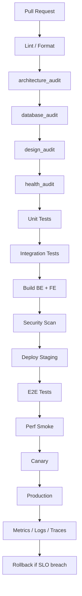

# ZOZI Health & Scaling Audit Report (GENERATED — do not hand-edit)

**Repo:** `D:\Projects\10- E-COMMERCE WEBSITE\zozi`  
**Health Score:** `70/100` (C)  
**Result:** 🔴 0 · 🟡 1202 · 🟢 1  
**Ephemeral. Add to `.gitignore`.**

---

## Executive Summary

**Health Score: 70/100 (C)**

| Priority | Count | Action |
|---|---:|---|
| 🔴 P0 (fix today) | 0 | Production / security risk |
| 🟠 P1 (fix this sprint) | 57 | Scaling / performance risk |
| 🟡 P2 (fix this month) | 534 | Maintainability / structure |
| 🟢 P3 (fix when convenient) | 612 | Hygiene / style |

### Quick Wins (< 1 hour each)

- **SC101** (1 files): list endpoint missing pagination
- **HL403** (1 files): sync file/OS I/O inside async function
- **HL501** (2 files): heavy top-level import in web path (lazy-load recommended)
- **OB102** (3 files): missing request_id / correlation_id
- **OB101** (4 files): module missing structured logger

---

## Top 20 Unhealthiest Files

| # | File | Weight | Issues |
|---|---|---:|---|
| 1 | `backend\services\finance\payments_gateway_service.py` | 19 | HL101, HL102, HL204, HL302, HL601, HL602, HL801, MR104 |
| 2 | `backend\services\finance\finance_transfer_service.py` | 16 | HL101, HL102, HL302, HL601, HL602, HL801 |
| 3 | `backend\routers\api_comms_command.py` | 16 | API101, HL102, HL302, HL801, PG102, SC101 |
| 4 | `backend\middleware\country_context.py` | 15 | HL204, HL302, HL601, HL602, HL801, MR104 |
| 5 | `backend\services\country\country_ai_research.py` | 14 | HL302, HL601, HL602, HL801, MR104 |
| 6 | `backend\controllers\orders\returns_controller.py` | 14 | HL102, HL303, HL601, HL602, HL801 |
| 7 | `backend\utils\email_service.py` | 13 | HL102, HL303, HL601, HL602 |
| 8 | `backend\routers\supplier_supplier_experiments.py` | 13 | API101, HL102, HL303, HL801, MR104, PG103 |
| 9 | `backend\routers\supplier_supplier_routes.py` | 13 | API101, HL101, HL102, HL302, HL801, PG103 |
| 10 | `backend\services\country\country_detection.py` | 12 | HL303, HL601, HL602, HL801 |
| 11 | `backend\providers\logistics\geo.py` | 12 | HL302, HL601, HL602, HL801 |
| 12 | `backend\providers\logistics\map.py` | 12 | HL303, HL601, HL602, HL801 |
| 13 | `backend\providers\ai\text.py` | 12 | HL303, HL601, HL602, HL801 |
| 14 | `backend\providers\ai\voice_to_text.py` | 12 | HL303, HL601, HL602, HL801 |
| 15 | `backend\controllers\security\auth_controller.py` | 12 | HL101, HL102, HL204, HL302, HL601, HL801 |
| 16 | `backend\services\country\country_data_orchestrator.py` | 11 | HL601, HL602, HL801 |
| 17 | `backend\routers\api_comms_console.py` | 11 | API101, HL102, HL302, HL801, PG102 |
| 18 | `backend\routers\api_comms_realtime.py` | 11 | API101, HL102, HL302, HL801, PG102 |
| 19 | `backend\routers\api_media_bulk.py` | 11 | API101, HL102, HL302, HL801, PG103 |
| 20 | `backend\routers\supplier_orders.py` | 11 | API101, HL102, HL302, HL801, PG103 |

---


## AI Health & Scaling Objective Contract

### Python + JS Polyglot Strategy (NOT Python vs JS)

Python and JS **together** are faster than either alone:

| Workload | Best Tool | Why |
|---|---|---|
| Business logic / orchestration | **Python** (FastAPI) | Readability, DB, ecosystem |
| Database operations | **Python** (SQLAlchemy) | ORM, migrations, RLS |
| ML / AI inference | **Python** (PyTorch) | Model ecosystem |
| File / media processing | **Python worker** (Celery/arq) | Background, not request path |
| High-throughput JSON | **Python + orjson** or **Node.js sidecar** | 3-10x faster than stdlib |
| Real-time WebSocket gateway | **Node.js** gateway + Python backend | Node handles 100k+ connections |
| Edge / CDN functions | **Node.js** (Cloudflare/Vercel) | Cold start < 5ms |
| Frontend rendering | **React / Next.js** | Component model, SSR/SSG |
| Client-side CPU work | **Web Worker** or **WASM** | Keep main thread free |

### Scaling Rules
- Every list endpoint must have pagination.
- Never do N individual DB ops in a loop — use bulk/batch.
- Add caching for repeated expensive reads.
- Add rate limiting on public endpoints.
- Offload heavy operations to background jobs (return 202).
- Use streaming for large responses.
- Always set timeout + retry + circuit breaker on external calls.

### Logging & Observability
- No `print()` in backend application code.
- Use structured logging with request_id, domain, duration_ms.
- Never log secrets/tokens/passwords.
- Every caught error: `logger.exception(...)` with context.

### Error Handling
- No bare `except:`. No swallowed exceptions.
- DB writes must roll back on failure.
- API endpoints return controlled errors, not stack traces.

### React Rules
- No `console.log` / `debugger` in production.
- Stable keys for lists (never index).
- React Query/SWR for data fetching.
- Error boundaries at app and route level.
- `next/image` for all images.
- `React.lazy` + `Suspense` for route-level code splitting.
- Virtualization for lists > 100 items.
- Web Workers for CPU-heavy transforms.

### Deployment Rules
- Dockerfile with multi-stage build.
- Healthcheck in docker-compose.
- Validate env vars at startup (pydantic BaseSettings).
- Handle SIGTERM for graceful shutdown.


---

## Recommended Pipeline





---

## Fix Patterns (Before → After)

### FEH501: data fetching inside useEffect

**Before:**
```
useEffect(() => { fetch("/api/data").then(r => r.json()).then(setData) }, [])
```
**After:**
```
const { data, isLoading, error } = useQuery({ queryKey: ["data"], queryFn: () => api.get("/data") })
```
**Action:** Create shared hook: frontend/web_app/src/lib/hooks/useApiQuery.ts. Migrate all files in one PR.

### FEH402: list key uses array index

**Before:**
```
{items.map((item, index) => <Card key={index} />)}
```
**After:**
```
{items.map((item) => <Card key={item.id} />)}
```
**Action:** Ensure API responses include stable `id` fields. Fix all files in one PR.

### FEH503: direct DOM access in React

**Before:**
```
document.getElementById('modal').style.display = 'block'
```
**After:**
```
const ref = useRef<HTMLDivElement>(null); useEffect(() => { ref.current.style.display = 'block' })
```
**Action:** Isolate browser APIs in hooks (useDomEffect, useWindowSize). Prefer React state/refs.

### HL402: blocking call inside async function

**Before:**
```
async def handler(): time.sleep(5)  # blocks event loop
```
**After:**
```
async def handler(): await asyncio.sleep(5)  # or: await loop.run_in_executor(None, blocking_fn)
```
**Action:** Replace sync calls with async equivalents. Use run_in_executor for unavoidable sync code.

### HL601: sequential external calls (concurrency opportunity)

**Before:**
```
r1 = requests.get(url1); r2 = requests.get(url2)  # sequential
```
**After:**
```
r1, r2 = await asyncio.gather(fetch(url1), fetch(url2))  # concurrent
```
**Action:** Use asyncio.gather for async I/O. Use ThreadPoolExecutor for sync I/O. Add timeout.

### HL602: missing timeout on external call

**Before:**
```
requests.get(url)  # no timeout — can hang forever
```
**After:**
```
requests.get(url, timeout=30)  # always set timeout
```
**Action:** Add timeout to ALL external calls. Add retry + circuit breaker for critical paths.

### SC102: loop of individual DB operations (N+1)

**Before:**
```
for item in items: db.add(Order(**item)); db.flush()  # N+1
```
**After:**
```
db.bulk_save_objects([Order(**item) for item in items])  # batch
```
**Action:** Use bulk operations, joinedload, or subqueryload. Never individual DB ops in a loop.

### PG101: heavy JSON serialization (use orjson or Node.js sidecar)

**Before:**
```
json.dumps(large_dict)  # stdlib json is slow
```
**After:**
```
orjson.dumps(large_dict)  # 3-10x faster; or offload to Node.js sidecar
```
**Action:** Install orjson. For very high throughput, add Node.js JSON sidecar service.


---

## Scorecard

| Code | Count | Priority | Sev | Meaning |
|---|---:|---|---|---|
| API101 | 129 | 🟡 P2 | 🟡 ADVISORY | endpoint missing response_model |
| DP103 | 1 | 🟡 P2 | 🟡 ADVISORY | missing env var validation at startup |
| DP104 | 1 | 🟡 P2 | 🟡 ADVISORY | missing graceful shutdown handler |
| DP105 | 1 | 🟢 P3 | 🟡 ADVISORY | missing .dockerignore |
| FEH101 | 58 | 🟡 P2 | 🟡 ADVISORY | oversized frontend file/component |
| FEH201 | 1 | 🟢 P3 | 🟡 ADVISORY | console/debugger in frontend code |
| FEH401 | 9 | 🟢 P3 | 🟡 ADVISORY | too many inline JSX handlers |
| FEH402 | 1 | 🟢 P3 | 🟡 ADVISORY | list key uses array index |
| FEH501 | 1 | 🟡 P2 | 🟡 ADVISORY | data fetching inside useEffect |
| FEH502 | 1 | 🟡 P2 | 🟡 ADVISORY | heavy frontend import (lazy-load) |
| FEH503 | 1 | 🟢 P3 | 🟡 ADVISORY | direct DOM access in React |
| FEH504 | 1 | 🟢 P3 | 🟡 ADVISORY | large list rendering (virtualization) |
| FEH601 | 7 | 🟢 P3 | 🟡 ADVISORY | large component without memoization |
| FEH701 | 4 | 🟡 P2 | 🟡 ADVISORY | heavy client-side transformation |
| FEH801 | 29 | 🟡 P2 | 🟡 ADVISORY | missing Suspense/lazy for code splitting |
| FEH802 | 1 | 🟢 P3 | 🟡 ADVISORY | raw  without next/image |
| HL101 | 23 | 🟡 P2 | 🟡 ADVISORY | oversized Python file |
| HL102 | 75 | 🟡 P2 | 🟡 ADVISORY | oversized Python function |
| HL110 | 1 | 🟢 P3 | 🟡 ADVISORY | missing docstring on public service/controller function |
| HL201 | 15 | 🟢 P3 | 🟡 ADVISORY | print() used instead of structured logging |
| HL203 | 12 | 🟢 P3 | 🟡 ADVISORY | logging.basicConfig() should be configured centrally |
| HL204 | 8 | 🟢 P3 | 🟡 ADVISORY | possible secret/token value in log/print statement |
| HL301 | 3 | 🟢 P3 | 🟡 ADVISORY | bare except hides failures |
| HL302 | 102 | 🟢 P3 | 🟡 ADVISORY | swallowed exception (except + pass / no logging) |
| HL303 | 74 | 🟢 P3 | 🟡 ADVISORY | broad except Exception should be narrowed or logged |
| HL403 | 1 | 🟠 P1 | 🟡 ADVISORY | sync file/OS I/O inside async function |
| HL501 | 2 | 🟠 P1 | 🟡 ADVISORY | heavy top-level import in web path (lazy-load recommended) |
| HL502 | 34 | 🟡 P2 | 🟡 ADVISORY | star import (from x import *) pollutes namespace |
| HL601 | 13 | 🟠 P1 | 🟡 ADVISORY | sequential external calls (concurrency opportunity) |
| HL602 | 16 | 🟠 P1 | 🟡 ADVISORY | missing timeout on external call |
| HL801 | 122 | 🟢 P3 | 🟡 ADVISORY |  |
| HL902 | 1 | 🟢 P3 | 🟡 ADVISORY |  |
| MR101 | 4 | 🟡 P2 | 🟡 ADVISORY | nested list comprehension (use generator) |
| MR104 | 17 | 🟡 P2 | 🟡 ADVISORY | global mutable state (breaks scaling) |
| OB101 | 4 | 🟠 P1 | 🟡 ADVISORY | module missing structured logger |
| OB102 | 3 | 🟠 P1 | 🟡 ADVISORY | missing request_id / correlation_id |
| PG102 | 12 | 🟠 P1 | 🟡 ADVISORY | WebSocket in Python (consider Node.js gateway) |
| PG103 | 5 | 🟠 P1 | 🟡 ADVISORY | CPU-bound work in request path (offload to worker) |
| PG201 | 1 | 🟡 P2 | 🟡 ADVISORY | frontend main-thread CPU work (use Web Worker) |
| PL100 | 1 | 🟢 P3 | 🟢 INFO | pipeline component present |
| PL101 | 1 | 🟢 P3 | 🟡 ADVISORY | pipeline component missing |
| SC101 | 1 | 🟠 P1 | 🟡 ADVISORY | list endpoint missing pagination |

## 🔥 Health Hotlist (P0 + P1 only)

| Pri | Sev | Rule | Domain | Location | Problem | Suggestion |
|---|---|---|---|---|---|---|
| 🟠 P1 | 🟡 | HL403 | performance | `backend\providers\ai\async_workers.py` | sync I/O inside async: batch_analyze_images_async:204 (open), _analyze_one:204 (open) | use aiofiles / async pathlib / run_in_executor |
| 🟠 P1 | 🟡 | HL501 | performance | `backend\providers\legacy\br_12.py` | heavy top-level import(s): cv2 | lazy-import inside the function/job that needs them |
| 🟠 P1 | 🟡 | HL501 | performance | `backend\providers\catalog\parcel_verification.py` | heavy top-level import(s): numpy | lazy-import inside the function/job that needs them |
| 🟠 P1 | 🟡 | HL601 | concurrency | `backend\utils\email_service.py` | sequential external calls: _send_via_resend (2 calls), _send_via_smtp (2 calls) | use asyncio.gather or ThreadPoolExecutor; add timeout + retry |
| 🟠 P1 | 🟡 | HL601 | concurrency | `backend\services\finance\finance_transfer_service.py` | sequential external calls: execute_transfer_batch (3 calls) | use asyncio.gather or ThreadPoolExecutor; add timeout + retry |
| 🟠 P1 | 🟡 | HL601 | concurrency | `backend\services\finance\payments_gateway_service.py` | sequential external calls: test_payment_gateway_connection (4 calls), create_payment_intent (2 calls), confirm_card_payment (2 calls) | use asyncio.gather or ThreadPoolExecutor; add timeout + retry |
| 🟠 P1 | 🟡 | HL601 | concurrency | `backend\services\country\country_ai_research.py` | sequential external calls: _fetch_web_evidence (2 calls), _generate_ai_modules (2 calls) | use asyncio.gather or ThreadPoolExecutor; add timeout + retry |
| 🟠 P1 | 🟡 | HL601 | concurrency | `backend\services\country\country_data_orchestrator.py` | sequential external calls: __aenter__ (2 calls) | use asyncio.gather or ThreadPoolExecutor; add timeout + retry |
| 🟠 P1 | 🟡 | HL601 | concurrency | `backend\services\country\country_detection.py` | sequential external calls: _lookup_ipapi (2 calls) | use asyncio.gather or ThreadPoolExecutor; add timeout + retry |
| 🟠 P1 | 🟡 | HL601 | concurrency | `backend\providers\logistics\geo.py` | sequential external calls: _lookup_ipapi (2 calls) | use asyncio.gather or ThreadPoolExecutor; add timeout + retry |
| 🟠 P1 | 🟡 | HL601 | concurrency | `backend\providers\logistics\map.py` | sequential external calls: resolve_ip (2 calls), reverse_geocode (2 calls) | use asyncio.gather or ThreadPoolExecutor; add timeout + retry |
| 🟠 P1 | 🟡 | HL601 | concurrency | `backend\providers\ai\text.py` | sequential external calls: _ollama_chat (2 calls), ollama_vision_chat (2 calls), transcribe_audio (2 calls), embed_text (2 calls) | use asyncio.gather or ThreadPoolExecutor; add timeout + retry |
| 🟠 P1 | 🟡 | HL601 | concurrency | `backend\providers\ai\voice_to_text.py` | sequential external calls: transcribe_audio (2 calls) | use asyncio.gather or ThreadPoolExecutor; add timeout + retry |
| 🟠 P1 | 🟡 | HL601 | concurrency | `backend\middleware\country_context.py` | sequential external calls: _lookup_country_from_ip (2 calls) | use asyncio.gather or ThreadPoolExecutor; add timeout + retry |
| 🟠 P1 | 🟡 | HL601 | concurrency | `backend\controllers\security\auth_controller.py` | sequential external calls: handle_google_oauth_callback (2 calls), handle_facebook_oauth_callback (2 calls) | use asyncio.gather or ThreadPoolExecutor; add timeout + retry |
| 🟠 P1 | 🟡 | HL601 | concurrency | `backend\controllers\orders\returns_controller.py` | sequential external calls: update_return_request (2 calls) | use asyncio.gather or ThreadPoolExecutor; add timeout + retry |
| 🟠 P1 | 🟡 | HL602 | concurrency | `backend\utils\backup.py` | external call(s) missing timeout: _s3_client:323 | always set timeout; add retry + circuit breaker |
| 🟠 P1 | 🟡 | HL602 | concurrency | `backend\utils\config.py` | external call(s) missing timeout: _load_field_encryption_key_from_aws_ssm:392 | always set timeout; add retry + circuit breaker |
| 🟠 P1 | 🟡 | HL602 | concurrency | `backend\utils\email_service.py` | external call(s) missing timeout: _send_via_resend:353 | always set timeout; add retry + circuit breaker |
| 🟠 P1 | 🟡 | HL602 | concurrency | `backend\services\media\storage.py` | external call(s) missing timeout: client:160 | always set timeout; add retry + circuit breaker |
| 🟠 P1 | 🟡 | HL602 | concurrency | `backend\services\finance\finance_transfer_service.py` | external call(s) missing timeout: execute_transfer_batch:1028, execute_transfer_batch:1008, execute_transfer_batch:1012 | always set timeout; add retry + circuit breaker |
| 🟠 P1 | 🟡 | HL602 | concurrency | `backend\services\finance\payments_gateway_service.py` | external call(s) missing timeout: test_payment_gateway_connection:1594, create_payment_intent:2357, create_payment_intent:2303, create_stripe_checkout_session:2407, confirm_card_payment:2503, confirm_card_payment:2479 | always set timeout; add retry + circuit breaker |
| 🟠 P1 | 🟡 | HL602 | concurrency | `backend\services\country\country_ai_research.py` | external call(s) missing timeout: _fetch_web_evidence:370, _generate_ai_modules:403 | always set timeout; add retry + circuit breaker |
| 🟠 P1 | 🟡 | HL602 | concurrency | `backend\services\country\country_data_orchestrator.py` | external call(s) missing timeout: __aenter__:33 | always set timeout; add retry + circuit breaker |
| 🟠 P1 | 🟡 | HL602 | concurrency | `backend\services\country\country_detection.py` | external call(s) missing timeout: _lookup_ipapi:105 | always set timeout; add retry + circuit breaker |
| 🟠 P1 | 🟡 | HL602 | concurrency | `backend\providers\logistics\geo.py` | external call(s) missing timeout: _lookup_ipapi:109 | always set timeout; add retry + circuit breaker |
| 🟠 P1 | 🟡 | HL602 | concurrency | `backend\providers\logistics\map.py` | external call(s) missing timeout: resolve_ip:41, reverse_geocode:87 | always set timeout; add retry + circuit breaker |
| 🟠 P1 | 🟡 | HL602 | concurrency | `backend\providers\ai\text.py` | external call(s) missing timeout: _ollama_chat:69, ollama_vision_chat:108, transcribe_audio:146, embed_text:191 | always set timeout; add retry + circuit breaker |
| 🟠 P1 | 🟡 | HL602 | concurrency | `backend\providers\ai\voice_to_text.py` | external call(s) missing timeout: transcribe_audio:62 | always set timeout; add retry + circuit breaker |
| 🟠 P1 | 🟡 | HL602 | concurrency | `backend\middleware\country_context.py` | external call(s) missing timeout: _lookup_country_from_ip:376 | always set timeout; add retry + circuit breaker |
| 🟠 P1 | 🟡 | HL602 | concurrency | `backend\controllers\orders\admin_orders_controller.py` | external call(s) missing timeout: refund_order:433 | always set timeout; add retry + circuit breaker |
| 🟠 P1 | 🟡 | HL602 | concurrency | `backend\controllers\orders\returns_controller.py` | external call(s) missing timeout: update_return_request:459 | always set timeout; add retry + circuit breaker |
| 🟠 P1 | 🟡 | OB101 | observability | `backend/controllers/` | 63 modules missing structured logger | Add logger = logging.getLogger(__name__). Top: comm_controller.py, compliance_controller.py, coupons_controller.py, disputes_controller.py, flash_sale_controller.py +58 more |
| 🟠 P1 | 🟡 | OB101 | observability | `backend/providers/` | 19 modules missing structured logger | Add logger = logging.getLogger(__name__). Top: async_workers.py, bg_remover.py, image.py, ocr.py, vision.py +14 more |
| 🟠 P1 | 🟡 | OB101 | observability | `backend/routers/` | 110 modules missing structured logger | Add logger = logging.getLogger(__name__). Top: admin_analytics_routes.py, admin_catalog_routes.py, admin_catalog_routes_2.py, admin_commerce_routes.py, admin_comms_routes_2.py +105 more |
| 🟠 P1 | 🟡 | OB101 | observability | `backend/services/` | 136 modules missing structured logger | Add logger = logging.getLogger(__name__). Top: bank_transaction_service.py, cash_write_service.py, commission_write_service.py, country_read_service.py, credit_control_service.py +131 more |
| 🟠 P1 | 🟡 | OB102 | observability | `backend/controllers/` | 81 modules missing request_id / correlation_id | Add X-Request-ID middleware in main.py (fixes all 81 at once). Top: admin_controller.py, ai_controller.py, banner_controller.py, cart_controller.py, chatbot_controller.py +76 more |
| 🟠 P1 | 🟡 | OB102 | observability | `backend/middleware/` | 15 modules missing request_id / correlation_id | Add X-Request-ID middleware in main.py (fixes all 15 at once). Top: behavioral_analytics.py, coi_middleware.py, country_context.py, country_detection.py, csrf_middleware.py +10 more |
| 🟠 P1 | 🟡 | OB102 | observability | `backend/routers/` | 148 modules missing request_id / correlation_id | Add X-Request-ID middleware in main.py (fixes all 148 at once). Top: admin_analytics_routes.py, admin_catalog_routes.py, admin_catalog_routes_2.py, admin_commerce_routes.py, admin_comms_routes.py +143 more |
| 🟠 P1 | 🟡 | PG102 | polyglot | `backend\main.py` | WebSocket handler in Python: websocket_background_jobs | Python for business logic; Node.js gateway for high-throughput real-time |
| 🟠 P1 | 🟡 | PG102 | polyglot | `backend\utils\realtime.py` | WebSocket handler in Python: connect_user, connect_order, connect_partner | Python for business logic; Node.js gateway for high-throughput real-time |
| 🟠 P1 | 🟡 | PG102 | polyglot | `backend\services\communication\websocket_chat.py` | WebSocket handler in Python: get_websocket_chat_service | Python for business logic; Node.js gateway for high-throughput real-time |
| 🟠 P1 | 🟡 | PG102 | polyglot | `backend\services\communication\websocket_manager.py` | WebSocket handler in Python: connect_user, connect_staff | Python for business logic; Node.js gateway for high-throughput real-time |
| 🟠 P1 | 🟡 | PG102 | polyglot | `backend\routers\api_comms_command.py` | WebSocket handler in Python: websocket_endpoint, connect | Python for business logic; Node.js gateway for high-throughput real-time |
| 🟠 P1 | 🟡 | PG102 | polyglot | `backend\routers\api_comms_console.py` | WebSocket handler in Python: websocket_endpoint, connect | Python for business logic; Node.js gateway for high-throughput real-time |
| 🟠 P1 | 🟡 | PG102 | polyglot | `backend\routers\api_comms_messaging_2.py` | WebSocket handler in Python: websocket_endpoint | Python for business logic; Node.js gateway for high-throughput real-time |
| 🟠 P1 | 🟡 | PG102 | polyglot | `backend\routers\api_comms_messaging_3.py` | WebSocket handler in Python: websocket_endpoint | Python for business logic; Node.js gateway for high-throughput real-time |
| 🟠 P1 | 🟡 | PG102 | polyglot | `backend\routers\api_comms_realtime.py` | WebSocket handler in Python: websocket_chat, websocket_user, connect | Python for business logic; Node.js gateway for high-throughput real-time |
| 🟠 P1 | 🟡 | PG102 | polyglot | `backend\routers\api_geography_communications.py` | WebSocket handler in Python: websocket_country_communications, websocket_country_notifications | Python for business logic; Node.js gateway for high-throughput real-time |
| 🟠 P1 | 🟡 | PG102 | polyglot | `backend\routers\api_hr_dashboard.py` | WebSocket handler in Python: websocket_hr_activity | Python for business logic; Node.js gateway for high-throughput real-time |
| 🟠 P1 | 🟡 | PG102 | polyglot | `backend\routers\effective_permissions.py` | WebSocket handler in Python: websocket_country_communications, websocket_country_notifications | Python for business logic; Node.js gateway for high-throughput real-time |
| 🟠 P1 | 🟡 | PG103 | polyglot | `backend\routers\api_comms_unified.py` | CPU-bound in request path: unified_inbox | offload to worker (Celery/arq) or Node.js worker thread |
| 🟠 P1 | 🟡 | PG103 | polyglot | `backend\routers\api_media_bulk.py` | CPU-bound in request path: batch_analyze_products | offload to worker (Celery/arq) or Node.js worker thread |
| 🟠 P1 | 🟡 | PG103 | polyglot | `backend\routers\supplier_orders.py` | CPU-bound in request path: get_parcel_verification_history | offload to worker (Celery/arq) or Node.js worker thread |
| 🟠 P1 | 🟡 | PG103 | polyglot | `backend\routers\supplier_supplier_experiments.py` | CPU-bound in request path: ab_test_bg_strategies | offload to worker (Celery/arq) or Node.js worker thread |
| 🟠 P1 | 🟡 | PG103 | polyglot | `backend\routers\supplier_supplier_routes.py` | CPU-bound in request path: get_upload_history | offload to worker (Celery/arq) or Node.js worker thread |
| 🟠 P1 | 🟡 | SC101 | scaling | `backend\routers\api_comms_command.py` | list endpoint(s) missing pagination: get_system_metrics | add skip/limit or cursor pagination |

## Frontend Findings by Domain

### frontend/(tabs) (3 findings)

- 🟡 **FEH101** `frontend\mobile_app\app\(tabs)\profile.tsx` — oversized frontend file (697 lines) → *split into smaller components/hooks/features*
- 🟡 **FEH601** `frontend\mobile_app\app\(tabs)\profile.tsx` — large component without memoization → *use useMemo/useCallback/React.memo where measured*
- 🟡 **FEH601** `frontend\mobile_app\app\(tabs)\_layout.tsx` — large component without memoization → *use useMemo/useCallback/React.memo where measured*

### frontend/(tabs)/products (4 findings)

- 🟡 **FEH101** `frontend\mobile_app\app\(tabs)\products\index.tsx` — oversized frontend file (862 lines) → *split into smaller components/hooks/features*
- 🟡 **FEH401** `frontend\mobile_app\app\(tabs)\products\index.tsx` — 45 inline JSX handler(s) → *extract handlers; use useCallback/React.memo*
- 🟡 **FEH101** `frontend\mobile_app\app\(tabs)\products\[id].tsx` — oversized frontend file (905 lines) → *split into smaller components/hooks/features*
- 🟡 **FEH601** `frontend\mobile_app\app\(tabs)\products\[id].tsx` — large component without memoization → *use useMemo/useCallback/React.memo where measured*

### frontend/admin (2 findings)

- 🟡 **FEH101** `frontend\mobile_app\app\admin\dashboard.tsx` — oversized frontend file (1630 lines) → *split into smaller components/hooks/features*
- 🟡 **FEH101** `frontend\mobile_app\app\admin\email.tsx` — oversized frontend file (880 lines) → *split into smaller components/hooks/features*

### frontend/admin/command-center (1 findings)

- 🟡 **FEH801** `frontend\web_app\src\app\admin\command-center\page.tsx` — route/page without Suspense/lazy loading → *use React.lazy + Suspense or next/dynamic*

### frontend/admin/commission (1 findings)

- 🟡 **FEH801** `frontend\web_app\src\app\admin\commission\page.tsx` — route/page without Suspense/lazy loading → *use React.lazy + Suspense or next/dynamic*

### frontend/admin/countries (4 findings)

- 🟡 **FEH101** `frontend\web_app\src\app\admin\countries\page.tsx` — oversized frontend file (1276 lines) → *split into smaller components/hooks/features*
- 🟡 **FEH701** `frontend\web_app\src\app\admin\countries\page.tsx` — heavy client-side transformation (14 JSON ops) → *move to Web Worker / WASM / server*
- 🟡 **FEH801** `frontend\web_app\src\app\admin\countries\page.tsx` — route/page without Suspense/lazy loading → *use React.lazy + Suspense or next/dynamic*
- 🟡 **FEH801** `frontend\web_app\src\app\admin\countries\[code]\staff\page.tsx` — route/page without Suspense/lazy loading → *use React.lazy + Suspense or next/dynamic*

### frontend/admin/dashboard (1 findings)

- 🟡 **FEH101** `frontend\web_app\src\app\admin\dashboard\_components\ExportsPanel.tsx` — oversized frontend file (1167 lines) → *split into smaller components/hooks/features*

### frontend/admin/employees (1 findings)

- 🟡 **FEH101** `frontend\web_app\src\app\admin\employees\_components\employees-content.tsx` — oversized frontend file (1415 lines) → *split into smaller components/hooks/features*

### frontend/admin/ess (1 findings)

- 🟡 **FEH801** `frontend\web_app\src\app\admin\ess\page.tsx` — route/page without Suspense/lazy loading → *use React.lazy + Suspense or next/dynamic*

### frontend/admin/finance (1 findings)

- 🟡 **FEH101** `frontend\web_app\src\app\admin\finance\_components\ErpPanels.tsx` — oversized frontend file (724 lines) → *split into smaller components/hooks/features*

### frontend/admin/hr (2 findings)

- 🟡 **FEH101** `frontend\web_app\src\app\admin\hr\page.tsx` — oversized frontend file (615 lines) → *split into smaller components/hooks/features*
- 🟡 **FEH801** `frontend\web_app\src\app\admin\hr\page.tsx` — route/page without Suspense/lazy loading → *use React.lazy + Suspense or next/dynamic*

### frontend/admin/logistics (3 findings)

- 🟡 **FEH101** `frontend\web_app\src\app\admin\logistics\_components\LogisticsPartnersPanel.tsx` — oversized frontend file (1528 lines) → *split into smaller components/hooks/features*
- 🟡 **FEH401** `frontend\web_app\src\app\admin\logistics\_components\LogisticsPartnersPanel.tsx` — 29 inline JSX handler(s) → *extract handlers; use useCallback/React.memo*
- 🟡 **FEH701** `frontend\web_app\src\app\admin\logistics\_components\LogisticsPartnersPanel.tsx` — heavy client-side transformation (13 JSON ops) → *move to Web Worker / WASM / server*

### frontend/admin/orders (1 findings)

- 🟡 **FEH101** `frontend\web_app\src\app\admin\orders\page.tsx` — oversized frontend file (1004 lines) → *split into smaller components/hooks/features*

### frontend/admin/payments (2 findings)

- 🟡 **FEH101** `frontend\web_app\src\app\admin\payments\page.tsx` — oversized frontend file (984 lines) → *split into smaller components/hooks/features*
- 🟡 **FEH801** `frontend\web_app\src\app\admin\payments\page.tsx` — route/page without Suspense/lazy loading → *use React.lazy + Suspense or next/dynamic*

### frontend/admin/payouts (3 findings)

- 🟡 **FEH101** `frontend\web_app\src\app\admin\payouts\page.tsx` — oversized frontend file (614 lines) → *split into smaller components/hooks/features*
- 🟡 **FEH801** `frontend\web_app\src\app\admin\payouts\page.tsx` — route/page without Suspense/lazy loading → *use React.lazy + Suspense or next/dynamic*
- 🟡 **FEH801** `frontend\web_app\src\app\admin\payouts\background-jobs\page.tsx` — route/page without Suspense/lazy loading → *use React.lazy + Suspense or next/dynamic*

### frontend/admin/permissions (1 findings)

- 🟡 **FEH101** `frontend\web_app\src\app\admin\permissions\_components\permissions-content.tsx` — oversized frontend file (722 lines) → *split into smaller components/hooks/features*

### frontend/admin/promotions (2 findings)

- 🟡 **FEH701** `frontend\web_app\src\app\admin\promotions\_components\BannersPanel.tsx` — heavy client-side transformation (11 JSON ops) → *move to Web Worker / WASM / server*
- 🟡 **FEH101** `frontend\web_app\src\app\admin\promotions\_components\PromotionBuilderPanel.tsx` — oversized frontend file (750 lines) → *split into smaller components/hooks/features*

### frontend/admin/staff (1 findings)

- 🟡 **FEH101** `frontend\web_app\src\app\admin\staff\_components\staff-content.tsx` — oversized frontend file (1381 lines) → *split into smaller components/hooks/features*

### frontend/admin/suppliers (2 findings)

- 🟡 **FEH101** `frontend\web_app\src\app\admin\suppliers\page.tsx` — oversized frontend file (1542 lines) → *split into smaller components/hooks/features*
- 🟡 **FEH401** `frontend\web_app\src\app\admin\suppliers\page.tsx` — 38 inline JSX handler(s) → *extract handlers; use useCallback/React.memo*

### frontend/admin/treasury (2 findings)

- 🟡 **FEH101** `frontend\web_app\src\app\admin\treasury\_components\treasury-content.tsx` — oversized frontend file (2300 lines) → *split into smaller components/hooks/features*
- 🟡 **FEH401** `frontend\web_app\src\app\admin\treasury\_components\treasury-content.tsx` — 27 inline JSX handler(s) → *extract handlers; use useCallback/React.memo*

### frontend/admin/users (1 findings)

- 🟡 **FEH801** `frontend\web_app\src\app\admin\users\page.tsx` — route/page without Suspense/lazy loading → *use React.lazy + Suspense or next/dynamic*

### frontend/app (3 findings)

- 🟡 **FEH601** `frontend\mobile_app\app\barcode-scan.tsx` — large component without memoization → *use useMemo/useCallback/React.memo where measured*
- 🟡 **FEH101** `frontend\mobile_app\app\checkout.tsx` — oversized frontend file (1376 lines) → *split into smaller components/hooks/features*
- 🟡 **FEH101** `frontend\mobile_app\app\offers.tsx` — oversized frontend file (665 lines) → *split into smaller components/hooks/features*

### frontend/checkout (1 findings)

- 🟡 **FEH101** `frontend\web_app\src\app\checkout\page.tsx` — oversized frontend file (768 lines) → *split into smaller components/hooks/features*

### frontend/components (13 findings)

- 🟡 **FEH101** `frontend\web_app\src\components\BannerCanvasEditor.tsx` — oversized frontend file (1767 lines) → *split into smaller components/hooks/features*
- 🟡 **FEH401** `frontend\web_app\src\components\BannerCanvasEditor.tsx` — 34 inline JSX handler(s) → *extract handlers; use useCallback/React.memo*
- 🟡 **FEH504** `frontend\web_app\src\components\BannerCanvasEditor.tsx` — large list rendering (44 .map calls) → *use virtualization, pagination, or server-driven lists*
- 🟡 **FEH502** `frontend\web_app\src\components\ChartComponents.tsx` — heavy import(s): chart.js → *use modular imports / dynamic import / next dynamic*
- 🟡 **FEH101** `frontend\web_app\src\components\FilterSearchBar.tsx` — oversized frontend file (921 lines) → *split into smaller components/hooks/features*
- 🟡 **FEH101** `frontend\web_app\src\components\Header.tsx` — oversized frontend file (969 lines) → *split into smaller components/hooks/features*
- 🟡 **FEH401** `frontend\web_app\src\components\Header.tsx` — 30 inline JSX handler(s) → *extract handlers; use useCallback/React.memo*
- 🟡 **FEH101** `frontend\web_app\src\components\HeaderSearchBar.tsx` — oversized frontend file (606 lines) → *split into smaller components/hooks/features*
- 🟡 **FEH101** `frontend\web_app\src\components\MobileSearchOverlay.tsx` — oversized frontend file (615 lines) → *split into smaller components/hooks/features*
- 🟡 **FEH101** `frontend\web_app\src\components\PanelPage.tsx` — oversized frontend file (759 lines) → *split into smaller components/hooks/features*
- 🟡 **FEH801** `frontend\web_app\src\components\PanelPage.tsx` — route/page without Suspense/lazy loading → *use React.lazy + Suspense or next/dynamic*
- 🟡 **FEH801** `frontend\mobile_app\components\AddressesScreen.tsx` — route/page without Suspense/lazy loading → *use React.lazy + Suspense or next/dynamic*
- 🟡 **FEH101** `frontend\mobile_app\components\QuickViewModal.tsx` — oversized frontend file (718 lines) → *split into smaller components/hooks/features*

### frontend/components/admin (2 findings)

- 🟡 **FEH101** `frontend\web_app\src\components\admin\AdminChatPanel.tsx` — oversized frontend file (806 lines) → *split into smaller components/hooks/features*
- 🟡 **FEH401** `frontend\web_app\src\components\admin\AdminChatPanel.tsx` — 21 inline JSX handler(s) → *extract handlers; use useCallback/React.memo*

### frontend/components/supplier (1 findings)

- 🟡 **FEH101** `frontend\web_app\src\components\supplier\ParcelAuditWidget.tsx` — oversized frontend file (804 lines) → *split into smaller components/hooks/features*

### frontend/lib (3 findings)

- 🟡 **FEH101** `frontend\web_app\src\lib\variantConfigData.ts` — oversized frontend file (2903 lines) → *split into smaller components/hooks/features*
- 🟡 **FEH101** `frontend\mobile_app\lib\apiTypes.ts` — oversized frontend file (1978 lines) → *split into smaller components/hooks/features*
- 🟡 **FEH701** `frontend\mobile_app\lib\apiTypes.ts` — heavy client-side transformation (31 JSON ops) → *move to Web Worker / WASM / server*

### frontend/logistics-partner (3 findings)

- 🟡 **FEH101** `frontend\mobile_app\app\logistics-partner\profile.tsx` — oversized frontend file (1378 lines) → *split into smaller components/hooks/features*
- 🟡 **FEH101** `frontend\mobile_app\app\logistics-partner\scan.tsx` — oversized frontend file (713 lines) → *split into smaller components/hooks/features*
- 🟡 **FEH101** `frontend\mobile_app\app\logistics-partner\shipments.tsx` — oversized frontend file (651 lines) → *split into smaller components/hooks/features*

### frontend/logistics-partner/payouts (1 findings)

- 🟡 **FEH801** `frontend\web_app\src\app\logistics-partner\payouts\page.tsx` — route/page without Suspense/lazy loading → *use React.lazy + Suspense or next/dynamic*

### frontend/logistics-partner/profile (2 findings)

- 🟡 **FEH101** `frontend\web_app\src\app\logistics-partner\profile\page.tsx` — oversized frontend file (2273 lines) → *split into smaller components/hooks/features*
- 🟡 **FEH801** `frontend\web_app\src\app\logistics-partner\profile\page.tsx` — route/page without Suspense/lazy loading → *use React.lazy + Suspense or next/dynamic*

### frontend/logistics-partner/shipments (1 findings)

- 🟡 **FEH101** `frontend\web_app\src\app\logistics-partner\shipments\page.tsx` — oversized frontend file (617 lines) → *split into smaller components/hooks/features*

### frontend/orders/[id] (1 findings)

- 🟡 **FEH101** `frontend\web_app\src\app\orders\[id]\page.tsx` — oversized frontend file (624 lines) → *split into smaller components/hooks/features*

### frontend/products (1 findings)

- 🟡 **FEH101** `frontend\web_app\src\app\products\page.tsx` — oversized frontend file (1075 lines) → *split into smaller components/hooks/features*

### frontend/products/[id] (3 findings)

- 🟡 **FEH101** `frontend\web_app\src\app\products\[id]\page.tsx` — oversized frontend file (1140 lines) → *split into smaller components/hooks/features*
- 🟡 **FEH601** `frontend\web_app\src\app\products\[id]\page.tsx` — large component without memoization → *use useMemo/useCallback/React.memo where measured*
- 🟡 **FEH801** `frontend\web_app\src\app\products\[id]\page.tsx` — route/page without Suspense/lazy loading → *use React.lazy + Suspense or next/dynamic*

### frontend/profile (2 findings)

- 🟡 **FEH101** `frontend\web_app\src\app\profile\page.tsx` — oversized frontend file (660 lines) → *split into smaller components/hooks/features*
- 🟡 **FEH801** `frontend\web_app\src\app\profile\page.tsx` — route/page without Suspense/lazy loading → *use React.lazy + Suspense or next/dynamic*

### frontend/shared (2 findings)

- 🟡 **FEH101** `frontend\shared\src\i18n.ts` — oversized frontend file (827 lines) → *split into smaller components/hooks/features*
- 🟡 **FEH101** `frontend\shared\src\types.ts` — oversized frontend file (771 lines) → *split into smaller components/hooks/features*

### frontend/supplier (2 findings)

- 🟡 **FEH101** `frontend\mobile_app\app\supplier\logistics.tsx` — oversized frontend file (613 lines) → *split into smaller components/hooks/features*
- 🟡 **FEH101** `frontend\mobile_app\app\supplier\profile.tsx` — oversized frontend file (1038 lines) → *split into smaller components/hooks/features*

### frontend/supplier/analytics (1 findings)

- 🟡 **FEH801** `frontend\web_app\src\app\supplier\analytics\page.tsx` — route/page without Suspense/lazy loading → *use React.lazy + Suspense or next/dynamic*

### frontend/supplier/batch-upload (3 findings)

- 🟡 **FEH101** `frontend\web_app\src\app\supplier\batch-upload\page.tsx` — oversized frontend file (2077 lines) → *split into smaller components/hooks/features*
- 🟡 **FEH401** `frontend\web_app\src\app\supplier\batch-upload\page.tsx` — 23 inline JSX handler(s) → *extract handlers; use useCallback/React.memo*
- 🟡 **FEH801** `frontend\web_app\src\app\supplier\batch-upload\page.tsx` — route/page without Suspense/lazy loading → *use React.lazy + Suspense or next/dynamic*

### frontend/supplier/bulk (3 findings)

- 🟡 **FEH101** `frontend\web_app\src\app\supplier\bulk\page.tsx` — oversized frontend file (629 lines) → *split into smaller components/hooks/features*
- 🟡 **FEH801** `frontend\web_app\src\app\supplier\bulk\page.tsx` — route/page without Suspense/lazy loading → *use React.lazy + Suspense or next/dynamic*
- 🟡 **FEH101** `frontend\web_app\src\app\supplier\bulk\components\ProductDraftCard.tsx` — oversized frontend file (638 lines) → *split into smaller components/hooks/features*

### frontend/supplier/labels (1 findings)

- 🟡 **FEH801** `frontend\web_app\src\app\supplier\labels\[id]\page.tsx` — route/page without Suspense/lazy loading → *use React.lazy + Suspense or next/dynamic*

### frontend/supplier/orders (3 findings)

- 🟡 **FEH801** `frontend\web_app\src\app\supplier\orders\page.tsx` — route/page without Suspense/lazy loading → *use React.lazy + Suspense or next/dynamic*
- 🟡 **FEH101** `frontend\web_app\src\app\supplier\orders\SupplierOrdersList.tsx` — oversized frontend file (980 lines) → *split into smaller components/hooks/features*
- 🟡 **FEH601** `frontend\web_app\src\app\supplier\orders\SupplierOrdersList.tsx` — large component without memoization → *use useMemo/useCallback/React.memo where measured*

### frontend/supplier/payouts (1 findings)

- 🟡 **FEH801** `frontend\web_app\src\app\supplier\payouts\page.tsx` — route/page without Suspense/lazy loading → *use React.lazy + Suspense or next/dynamic*

### frontend/supplier/products (6 findings)

- 🟡 **FEH101** `frontend\web_app\src\app\supplier\products\[id]\page.tsx` — oversized frontend file (616 lines) → *split into smaller components/hooks/features*
- 🟡 **FEH801** `frontend\web_app\src\app\supplier\products\[id]\page.tsx` — route/page without Suspense/lazy loading → *use React.lazy + Suspense or next/dynamic*
- 🟡 **FEH101** `frontend\web_app\src\app\supplier\products\add\page.tsx` — oversized frontend file (2140 lines) → *split into smaller components/hooks/features*
- 🟡 **FEH401** `frontend\web_app\src\app\supplier\products\add\page.tsx` — 68 inline JSX handler(s) → *extract handlers; use useCallback/React.memo*
- 🟡 **FEH801** `frontend\web_app\src\app\supplier\products\add\page.tsx` — route/page without Suspense/lazy loading → *use React.lazy + Suspense or next/dynamic*
- 🟡 **FEH101** `frontend\mobile_app\app\supplier\products\new.tsx` — oversized frontend file (721 lines) → *split into smaller components/hooks/features*

### frontend/supplier/profile (2 findings)

- 🟡 **FEH101** `frontend\web_app\src\app\supplier\profile\page.tsx` — oversized frontend file (1797 lines) → *split into smaller components/hooks/features*
- 🟡 **FEH601** `frontend\web_app\src\app\supplier\profile\page.tsx` — large component without memoization → *use useMemo/useCallback/React.memo where measured*

### frontend/supplier/reports (1 findings)

- 🟡 **FEH801** `frontend\web_app\src\app\supplier\reports\page.tsx` — route/page without Suspense/lazy loading → *use React.lazy + Suspense or next/dynamic*

### frontend/supplier/upload (2 findings)

- 🟡 **FEH101** `frontend\web_app\src\app\supplier\upload\bg-compare\page.tsx` — oversized frontend file (764 lines) → *split into smaller components/hooks/features*
- 🟡 **FEH801** `frontend\web_app\src\app\supplier\upload\bg-compare\page.tsx` — route/page without Suspense/lazy loading → *use React.lazy + Suspense or next/dynamic*

### frontend/suppliers (1 findings)

- 🟡 **FEH101** `frontend\mobile_app\app\suppliers\[id].tsx` — oversized frontend file (722 lines) → *split into smaller components/hooks/features*

### frontend/suppliers/[id] (2 findings)

- 🟡 **FEH101** `frontend\web_app\src\app\suppliers\[id]\page.tsx` — oversized frontend file (1062 lines) → *split into smaller components/hooks/features*
- 🟡 **FEH801** `frontend\web_app\src\app\suppliers\[id]\page.tsx` — route/page without Suspense/lazy loading → *use React.lazy + Suspense or next/dynamic*

### frontend/tickets/[id] (1 findings)

- 🟡 **FEH801** `frontend\web_app\src\app\tickets\[id]\page.tsx` — route/page without Suspense/lazy loading → *use React.lazy + Suspense or next/dynamic*

### frontend/tracking (1 findings)

- 🟡 **FEH101** `frontend\mobile_app\app\tracking\[id].tsx` — oversized frontend file (608 lines) → *split into smaller components/hooks/features*

### frontend/tracking/[id] (1 findings)

- 🟡 **FEH801** `frontend\web_app\src\app\tracking\[id]\page.tsx` — route/page without Suspense/lazy loading → *use React.lazy + Suspense or next/dynamic*


## Domain: python

- 🟡 🟡 **HL102** `backend\main.py` — oversized function(s): _load_routers (201L) → *extract smaller functions*
- 🟡 🟡 **HL102** `backend\utils\background_jobs.py` — oversized function(s): enqueue_job (95L) → *extract smaller functions*
- 🟡 🟡 **HL102** `backend\utils\currency.py` — oversized function(s): _lookup_currency_from_wikidata (91L) → *extract smaller functions*
- 🟡 🟡 **HL102** `backend\utils\email_service.py` — oversized function(s): _load_runtime_email_config (94L) → *extract smaller functions*
- 🟡 🟡 **HL102** `backend\utils\invoice_html.py` — oversized function(s): generate_invoice_html (119L) → *extract smaller functions*
- 🟡 🟡 **HL102** `backend\utils\key_rotation.py` — oversized function(s): rotate_encryption_key (90L) → *extract smaller functions*
- 🟡 🟡 **HL102** `backend\utils\order_tracking.py` — oversized function(s): _build_order_finance_breakdown (87L), build_tracking_timeline (138L), build_order_tracking_payload (107L) → *extract smaller functions*
- 🟡 🟡 **HL102** `backend\utils\realtime.py` — oversized function(s): _collect_realtime_events (188L) → *extract smaller functions*
- 🟡 🟡 **HL102** `backend\services\auto_payout_scheduler.py` — oversized function(s): run_auto_payout_sweep (270L), run_auto_logistics_payout_sweep (269L) → *extract smaller functions*
- 🟡 🟡 **HL101** `backend\services\cash_management_service.py` — oversized Python file (1248 lines) → *split by responsibility/domain*
- 🟡 🟡 **HL102** `backend\services\cash_management_service.py` — oversized function(s): admin_list_ledger_entries (81L), apply_shipment_vehicle_selection (112L) → *extract smaller functions*
- 🟡 🟡 **HL102** `backend\services\treasury\cash_flow_forecast_service.py` — oversized function(s): generate_forecast (116L) → *extract smaller functions*
- 🟡 🟡 **HL102** `backend\services\treasury\payout_batch_service.py` — oversized function(s): generate_supplier_payout_batches (81L) → *extract smaller functions*
- 🟡 🟡 **HL102** `backend\services\treasury\period_close_service.py` — oversized function(s): _transfer_pnl_to_retained_earnings (114L) → *extract smaller functions*
- 🟡 🟡 **HL102** `backend\services\treasury\treasury_engine.py` — oversized function(s): post_journal_entry (117L) → *extract smaller functions*
- 🟡 🟡 **HL502** `backend\services\treasury\__init__.py` — star import(s) at lines: 2, 3, 4, 5, 6, 7 +2 more → *use explicit imports*
- 🟡 🟡 **HL101** `backend\services\supplier\supplier_countries_service.py` — oversized Python file (1933 lines) → *split by responsibility/domain*
- 🟡 🟡 **HL102** `backend\services\supplier\supplier_countries_service.py` — oversized function(s): _country_public_payload (82L), create_admin_country (159L), update_country_identity (91L), _apply_version_payload (153L) → *extract smaller functions*
- 🟡 🟡 **HL102** `backend\services\supplier\supplier_finance_service.py` — oversized function(s): get_order_payment_status (86L) → *extract smaller functions*
- 🟡 🟡 **HL101** `backend\services\supplier\supplier_read_service.py` — oversized Python file (1300 lines) → *split by responsibility/domain*
- 🟡 🟡 **HL102** `backend\services\supplier\supplier_read_service.py` — oversized function(s): get_supplier_comparison (126L), search_suppliers (211L) → *extract smaller functions*
- 🟡 🟡 **HL101** `backend\services\security\fraud_detection_service.py` — oversized Python file (1101 lines) → *split by responsibility/domain*
- 🟡 🟡 **HL102** `backend\services\security\fraud_detection_service.py` — oversized function(s): calculate_score (149L) → *extract smaller functions*
- 🟡 🟡 **HL502** `backend\services\security\permissions_read_service.py` — star import(s) at lines: 10 → *use explicit imports*
- 🟡 🟡 **HL102** `backend\services\orders\cart_shipping_service.py` — oversized function(s): quote_supplier_groups (195L) → *extract smaller functions*
- 🟡 🟡 **HL102** `backend\services\orders\trading_service.py` — oversized function(s): auto_invoice_ecommerce_orders (100L) → *extract smaller functions*
- 🟡 🟡 **HL101** `backend\services\media\free_image_tools.py` — oversized Python file (978 lines) → *split by responsibility/domain*
- 🟡 🟡 **HL102** `backend\services\media\free_image_tools.py` — oversized function(s): auto_process_image (82L) → *extract smaller functions*
- 🟡 🟡 **HL102** `backend\services\media\media_router_service.py` — oversized function(s): process_ai_upload_job (142L), batch_publish_products (206L) → *extract smaller functions*
- 🟡 🟡 **HL101** `backend\services\logistics\logistics_partner_pricing.py` — oversized Python file (1037 lines) → *split by responsibility/domain*
- 🟡 🟡 **HL102** `backend\services\logistics\logistics_partner_pricing.py` — oversized function(s): normalize_pricing_breakdown_payload (104L), build_service_area_pricing_breakdown (191L), quote_shipping_for_destination (88L) → *extract smaller functions*
- 🟡 🟡 **HL502** `backend\services\logistics\logistics_read_service.py` — star import(s) at lines: 10 → *use explicit imports*
- 🟡 🟡 **HL102** `backend\services\hr\employee_activity_logger.py` — oversized function(s): log_activity (93L) → *extract smaller functions*
- 🟡 🟡 **HL102** `backend\services\hr\performance_service.py` — oversized function(s): create_objective (87L), compute_performance_health (86L) → *extract smaller functions*
- 🟡 🟡 **HL102** `backend\services\finance\commission_engine.py` — oversized function(s): get_effective_rate (125L) → *extract smaller functions*
- 🟡 🟡 **HL101** `backend\services\finance\finance_transfer_service.py` — oversized Python file (1171 lines) → *split by responsibility/domain*
- 🟡 🟡 **HL102** `backend\services\finance\finance_transfer_service.py` — oversized function(s): _build_supplier_payout_export (100L), _build_logistics_payout_export (100L), _build_cod_remittance_export (90L), execute_transfer_batch (98L), execute_transfer_batch (143L) → *extract smaller functions*
- 🟡 🟡 **HL102** `backend\services\finance\invoice_service.py` — oversized function(s): create_invoice_from_order (99L) → *extract smaller functions*
- 🟡 🟡 **HL101** `backend\services\finance\payments_gateway_service.py` — oversized Python file (4527 lines) → *split by responsibility/domain*
- 🟡 🟡 **HL102** `backend\services\finance\payments_gateway_service.py` — oversized function(s): get_payment_methods_status (87L), _built_in_gateway_defaults (214L), _serialize_gateway_connection (108L), test_payment_gateway_connection (99L), _finalize_inventory_for_paid_order (88L), create_payment_intent (101L) → *extract smaller functions*
- 🟡 🟡 **HL102** `backend\services\country\confidence_scoring.py` — oversized function(s): calculate_confidence_score (96L) → *extract smaller functions*
- 🟡 🟡 **HL102** `backend\services\country\country_auto_populate.py` — oversized function(s): auto_populate_country (268L) → *extract smaller functions*
- 🟡 🟡 **HL102** `backend\services\country\country_research.py` — oversized function(s): build_country_research (186L) → *extract smaller functions*
- 🟡 🟡 **HL102** `backend\services\core\approval_matrix_service.py` — oversized function(s): can_approve (107L) → *extract smaller functions*
- 🟡 🟡 **HL102** `backend\services\core\chat_system.py` — oversized function(s): send_message_with_files (118L) → *extract smaller functions*
- 🟡 🟡 **HL102** `backend\services\core\command_center_service.py` — oversized function(s): get_command_center_heartbeat_metrics (81L) → *extract smaller functions*
- 🟡 🟡 **HL502** `backend\services\core\export_read_service.py` — star import(s) at lines: 10 → *use explicit imports*
- 🟡 🟡 **HL102** `backend\services\core\internal_router_service.py` — oversized function(s): get_hr_dashboard_data (177L) → *extract smaller functions*
- 🟡 🟡 **HL102** `backend\services\communication\email_gateway.py` — oversized function(s): send_internal_email (97L) → *extract smaller functions*
- 🟡 🟡 **HL102** `backend\services\communication\payout_notification_service.py` — oversized function(s): notify_suppliers_of_payout (114L), notify_logistics_partners_of_payout (132L) → *extract smaller functions*
- 🟡 🟡 **HL102** `backend\services\commerce\retention_service.py` — oversized function(s): run_operational_retention_cycle (86L) → *extract smaller functions*
- 🟡 🟡 **HL102** `backend\services\audit\ediscovery.py` — oversized function(s): search_communications (86L) → *extract smaller functions*
- 🟡 🟡 **HL502** `backend\services\analytics\admin_dashboard_service.py` — star import(s) at lines: 10 → *use explicit imports*
- 🟡 🟡 **HL102** `backend\services\analytics\financial_reports_service.py` — oversized function(s): _get_account_balances_for_period (93L), generate_cash_flow_statement (135L) → *extract smaller functions*
- 🟡 🟡 **HL101** `backend\services\ai\ai_service.py` — oversized Python file (1228 lines) → *split by responsibility/domain*
- 🟡 🟡 **HL102** `backend\services\ai\ai_service.py` — oversized function(s): _build_description (104L) → *extract smaller functions*
- 🟡 🟡 **HL102** `backend\services\ai\automation_scheduler.py` — oversized function(s): generate_supplier_statements (91L) → *extract smaller functions*
- 🟡 🟡 **HL101** `backend\services\ai\bg_removal_service.py` — oversized Python file (1159 lines) → *split by responsibility/domain*
- 🟡 🟡 **HL102** `backend\services\ai\ocr_parser.py` — oversized function(s): parse_bill_text (82L) → *extract smaller functions*
- 🟡 🟡 **HL101** `backend\routers\admin_core_console.py` — oversized Python file (1938 lines) → *split by responsibility/domain*
- 🟡 🟡 **HL102** `backend\routers\api_comms_command.py` — oversized function(s): get_comprehensive_dashboard (341L) → *extract smaller functions*
- 🟡 🟡 **HL102** `backend\routers\api_comms_console.py` — oversized function(s): get_comprehensive_dashboard (343L) → *extract smaller functions*
- 🟡 🟡 **HL102** `backend\routers\api_comms_realtime.py` — oversized function(s): websocket_chat (134L) → *extract smaller functions*
- 🟡 🟡 **HL102** `backend\routers\api_comms_unified.py` — oversized function(s): unified_inbox (160L) → *extract smaller functions*
- 🟡 🟡 **HL102** `backend\routers\api_media_bulk.py` — oversized function(s): batch_analyze_products (128L) → *extract smaller functions*
- 🟡 🟡 **HL102** `backend\routers\supplier_orders.py` — oversized function(s): verify_parcel_proof (118L) → *extract smaller functions*
- 🟡 🟡 **HL102** `backend\routers\supplier_supplier_experiments.py` — oversized function(s): ab_test_bg_strategies (96L) → *extract smaller functions*
- 🟡 🟡 **HL101** `backend\routers\supplier_supplier_routes.py` — oversized Python file (1394 lines) → *split by responsibility/domain*
- 🟡 🟡 **HL102** `backend\routers\supplier_supplier_routes.py` — oversized function(s): upload_product (91L), create_product (142L) → *extract smaller functions*
- 🟡 🟡 **HL502** `backend\providers\async_workers.py` — star import(s) at lines: 3 → *use explicit imports*
- 🟡 🟡 **HL502** `backend\providers\bg_remover.py` — star import(s) at lines: 9 → *use explicit imports*
- 🟡 🟡 **HL502** `backend\providers\image.py` — star import(s) at lines: 3 → *use explicit imports*
- 🟡 🟡 **HL502** `backend\providers\ocr.py` — star import(s) at lines: 3 → *use explicit imports*
- 🟡 🟡 **HL502** `backend\providers\vision.py` — star import(s) at lines: 3 → *use explicit imports*
- 🟡 🟡 **HL502** `backend\providers\voice_to_text.py` — star import(s) at lines: 4 → *use explicit imports*
- 🟡 🟡 **HL102** `backend\providers\media\image.py` — oversized function(s): process_image_search (119L) → *extract smaller functions*
- 🟡 🟡 **HL102** `backend\providers\legacy\br_06.py` — oversized function(s): process_file (82L) → *extract smaller functions*
- 🟡 🟡 **HL102** `backend\providers\legacy\br_08.py` — oversized function(s): process (91L) → *extract smaller functions*
- 🟡 🟡 **HL101** `backend\providers\hr\bg_remover.py` — oversized Python file (2475 lines) → *split by responsibility/domain*
- 🟢 🟡 **HL902** `backend\providers\hr\bg_remover.py` — 16 commented-out code lines → *remove dead code; rely on git history*
- 🟡 🟡 **HL102** `backend\providers\hr\bg_remover.py` — oversized function(s): remove_background (118L), process_folder (82L), generate_alpha (83L) → *extract smaller functions*
- 🟡 🟡 **HL102** `backend\providers\catalog\parcel_verification.py` — oversized function(s): _engine_feature_match (85L), _engine_feature_match_homography (218L), _engine_vision_ai (94L), verify_parcel_photo (138L) → *extract smaller functions*
- 🟡 🟡 **HL102** `backend\providers\catalog\search.py` — oversized function(s): parse_query (100L) → *extract smaller functions*
- 🟡 🟡 **HL102** `backend\providers\ai\vision.py` — oversized function(s): analyze_product_image (103L) → *extract smaller functions*
- 🟡 🟡 **HL502** `backend\models\marketing.py` — star import(s) at lines: 3 → *use explicit imports*
- 🟡 🟡 **HL502** `backend\models\_exports.py` — star import(s) at lines: 8, 9, 10, 11, 12, 13 +27 more → *use explicit imports*
- 🟡 🟡 **HL502** `backend\models\__init__.py` — star import(s) at lines: 6 → *use explicit imports*
- 🟡 🟡 **HL502** `backend\dependencies\auth.py` — star import(s) at lines: 3 → *use explicit imports*
- 🟡 🟡 **HL502** `backend\dependencies\db.py` — star import(s) at lines: 3 → *use explicit imports*
- 🟡 🟡 **HL502** `backend\db\models_country_enhancements.py` — star import(s) at lines: 10 → *use explicit imports*
- 🟡 🟡 **HL101** `backend\db\schemas.py` — oversized Python file (2456 lines) → *split by responsibility/domain*
- 🟡 🟡 **HL502** `backend\data\category_tax_profiles.py` — star import(s) at lines: 4 → *use explicit imports*
- 🟡 🟡 **HL502** `backend\data\models.py` — star import(s) at lines: 8 → *use explicit imports*
- 🟡 🟡 **HL502** `backend\data\orm_models.py` — star import(s) at lines: 13, 18, 19, 20, 21, 22 → *use explicit imports*
- 🟡 🟡 **HL502** `backend\data\vat_rates.py` — star import(s) at lines: 3 → *use explicit imports*
- 🟡 🟡 **HL102** `backend\controllers\ai_controller.py` — oversized function(s): _generate_ai_suggestions (162L) → *extract smaller functions*
- 🟡 🟡 **HL502** `backend\controllers\banner_controller.py` — star import(s) at lines: 2 → *use explicit imports*
- 🟡 🟡 **HL502** `backend\controllers\cart_controller.py` — star import(s) at lines: 3 → *use explicit imports*
- 🟡 🟡 **HL502** `backend\controllers\chatbot_controller.py` — star import(s) at lines: 2 → *use explicit imports*
- 🟡 🟡 **HL502** `backend\controllers\coupons_controller.py` — star import(s) at lines: 2 → *use explicit imports*
- 🟡 🟡 **HL502** `backend\controllers\disputes_controller.py` — star import(s) at lines: 2 → *use explicit imports*
- 🟡 🟡 **HL502** `backend\controllers\logistics_partner_controller.py` — star import(s) at lines: 3 → *use explicit imports*
- 🟡 🟡 **HL502** `backend\controllers\product_verification_controller.py` — star import(s) at lines: 2 → *use explicit imports*
- 🟡 🟡 **HL502** `backend\controllers\promotion_controller.py` — star import(s) at lines: 2 → *use explicit imports*
- 🟡 🟡 **HL502** `backend\controllers\returns_controller.py` — star import(s) at lines: 2 → *use explicit imports*
- 🟡 🟡 **HL502** `backend\controllers\search_controller.py` — star import(s) at lines: 2 → *use explicit imports*
- 🟡 🟡 **HL502** `backend\controllers\sub_ledger_controller.py` — star import(s) at lines: 3 → *use explicit imports*
- 🟡 🟡 **HL502** `backend\controllers\supplier_controller.py` — star import(s) at lines: 3 → *use explicit imports*
- 🟡 🟡 **HL102** `backend\controllers\supplier\admin_suppliers_controller.py` — oversized function(s): bulk_manage_suppliers (117L) → *extract smaller functions*
- 🟡 🟡 **HL101** `backend\controllers\supplier\supplier_controller.py` — oversized Python file (4048 lines) → *split by responsibility/domain*
- 🟡 🟡 **HL102** `backend\controllers\supplier\supplier_controller.py` — oversized function(s): persist_supplier_product (114L), _parse_product_variants_payload (83L), get_supplier_orders (145L), get_supplier_label_payload (143L), upload_supplier_parcel_proof (141L), create_supplier_product_upload (132L) → *extract smaller functions*
- 🟡 🟡 **HL502** `backend\controllers\supplier\__init__.py` — star import(s) at lines: 7 → *use explicit imports*
- 🟡 🟡 **HL101** `backend\controllers\security\auth_controller.py` — oversized Python file (2017 lines) → *split by responsibility/domain*
- 🟡 🟡 **HL102** `backend\controllers\security\auth_controller.py` — oversized function(s): register_user (157L) → *extract smaller functions*
- 🟡 🟡 **HL102** `backend\controllers\orders\admin_orders_controller.py` — oversized function(s): get_all_orders (112L) → *extract smaller functions*
- 🟡 🟡 **HL101** `backend\controllers\orders\orders_controller.py` — oversized Python file (1567 lines) → *split by responsibility/domain*
- 🟡 🟡 **HL102** `backend\controllers\orders\orders_controller.py` — oversized function(s): quote_supplier_groups (163L), _calculate_order_amounts (149L), create_order (151L), _build_supply_chain_timeline (90L), get_order_invoice (112L), respond_to_shipment_confirmation (135L) → *extract smaller functions*
- 🟡 🟡 **HL102** `backend\controllers\orders\returns_controller.py` — oversized function(s): update_return_request (147L), update_supplier_return_request (82L) → *extract smaller functions*
- 🟡 🟡 **HL101** `backend\controllers\logistics\logistics_controller.py` — oversized Python file (1074 lines) → *split by responsibility/domain*
- 🟡 🟡 **HL102** `backend\controllers\logistics\logistics_controller.py` — oversized function(s): create_shipment (140L), scan_shipment_event (114L), get_logistics_summary (81L) → *extract smaller functions*
- 🟡 🟡 **HL101** `backend\controllers\logistics\logistics_partner_controller.py` — oversized Python file (3812 lines) → *split by responsibility/domain*
- 🟡 🟡 **HL102** `backend\controllers\logistics\logistics_partner_controller.py` — oversized function(s): _parse_partner_service_area_payload (100L), update_my_partner_profile (105L), bulk_manage_partners (89L), scan_lookup_shipment_partner (159L), get_partner_shipments (124L), create_shipment_confirmation_request_partner (126L) → *extract smaller functions*
- 🟡 🟡 **HL101** `backend\controllers\country\country_controller.py` — oversized Python file (1698 lines) → *split by responsibility/domain*
- 🟡 🟡 **HL102** `backend\controllers\country\country_controller.py` — oversized function(s): create_admin_country (175L), _apply_version_payload (143L), update_country_identity (93L) → *extract smaller functions*
- 🟡 🟡 **HL102** `backend\controllers\core\admin_database_controller.py` — oversized function(s): get_database_overview (95L) → *extract smaller functions*
- 🟡 🟡 **HL101** `backend\controllers\core\admin_users_controller.py` — oversized Python file (1027 lines) → *split by responsibility/domain*
- 🟡 🟡 **HL102** `backend\controllers\core\admin_users_controller.py` — oversized function(s): bulk_update_users_role (85L), bulk_update_staff_accounts (110L) → *extract smaller functions*
- 🟡 🟡 **HL101** `backend\controllers\catalog\products_controller.py` — oversized Python file (1072 lines) → *split by responsibility/domain*
- 🟡 🟡 **HL102** `backend\controllers\catalog\products_controller.py` — oversized function(s): _list_products_cached (194L), get_products (103L) → *extract smaller functions*
- 🟡 🟡 **HL102** `backend\controllers\catalog\search_controller.py` — oversized function(s): parse_query (81L), smart_search_from_parsed (118L), get_recommendations (209L), _compute_payload (148L) → *extract smaller functions*
- 🟡 🟡 **HL102** `backend\controllers\analytics\admin_analytics_controller.py` — oversized function(s): get_chatbot_analytics (118L) → *extract smaller functions*
- 🟡 🟡 **HL101** `backend\controllers\ai\chatbot_controller.py` — oversized Python file (1105 lines) → *split by responsibility/domain*
- 🟡 🟡 **HL102** `backend\controllers\ai\chatbot_controller.py` — oversized function(s): _build_relaxed_product_recommendations (97L), handle_message (134L) → *extract smaller functions*

## Domain: performance

- 🟠 🟡 **HL501** `backend\providers\legacy\br_12.py` — heavy top-level import(s): cv2 → *lazy-import inside the function/job that needs them*
- 🟠 🟡 **HL501** `backend\providers\catalog\parcel_verification.py` — heavy top-level import(s): numpy → *lazy-import inside the function/job that needs them*
- 🟠 🟡 **HL403** `backend\providers\ai\async_workers.py` — sync I/O inside async: batch_analyze_images_async:204 (open), _analyze_one:204 (open) → *use aiofiles / async pathlib / run_in_executor*

## Domain: concurrency

- 🟠 🟡 **HL602** `backend\utils\backup.py` — external call(s) missing timeout: _s3_client:323 → *always set timeout; add retry + circuit breaker*
- 🟠 🟡 **HL602** `backend\utils\config.py` — external call(s) missing timeout: _load_field_encryption_key_from_aws_ssm:392 → *always set timeout; add retry + circuit breaker*
- 🟠 🟡 **HL601** `backend\utils\email_service.py` — sequential external calls: _send_via_resend (2 calls), _send_via_smtp (2 calls) → *use asyncio.gather or ThreadPoolExecutor; add timeout + retry*
- 🟠 🟡 **HL602** `backend\utils\email_service.py` — external call(s) missing timeout: _send_via_resend:353 → *always set timeout; add retry + circuit breaker*
- 🟠 🟡 **HL602** `backend\services\media\storage.py` — external call(s) missing timeout: client:160 → *always set timeout; add retry + circuit breaker*
- 🟠 🟡 **HL601** `backend\services\finance\finance_transfer_service.py` — sequential external calls: execute_transfer_batch (3 calls) → *use asyncio.gather or ThreadPoolExecutor; add timeout + retry*
- 🟠 🟡 **HL602** `backend\services\finance\finance_transfer_service.py` — external call(s) missing timeout: execute_transfer_batch:1028, execute_transfer_batch:1008, execute_transfer_batch:1012 → *always set timeout; add retry + circuit breaker*
- 🟠 🟡 **HL601** `backend\services\finance\payments_gateway_service.py` — sequential external calls: test_payment_gateway_connection (4 calls), create_payment_intent (2 calls), confirm_card_payment (2 calls) → *use asyncio.gather or ThreadPoolExecutor; add timeout + retry*
- 🟠 🟡 **HL602** `backend\services\finance\payments_gateway_service.py` — external call(s) missing timeout: test_payment_gateway_connection:1594, create_payment_intent:2357, create_payment_intent:2303, create_stripe_checkout_session:2407, confirm_card_payment:2503, confirm_card_payment:2479 → *always set timeout; add retry + circuit breaker*
- 🟠 🟡 **HL601** `backend\services\country\country_ai_research.py` — sequential external calls: _fetch_web_evidence (2 calls), _generate_ai_modules (2 calls) → *use asyncio.gather or ThreadPoolExecutor; add timeout + retry*
- 🟠 🟡 **HL602** `backend\services\country\country_ai_research.py` — external call(s) missing timeout: _fetch_web_evidence:370, _generate_ai_modules:403 → *always set timeout; add retry + circuit breaker*
- 🟠 🟡 **HL601** `backend\services\country\country_data_orchestrator.py` — sequential external calls: __aenter__ (2 calls) → *use asyncio.gather or ThreadPoolExecutor; add timeout + retry*
- 🟠 🟡 **HL602** `backend\services\country\country_data_orchestrator.py` — external call(s) missing timeout: __aenter__:33 → *always set timeout; add retry + circuit breaker*
- 🟠 🟡 **HL601** `backend\services\country\country_detection.py` — sequential external calls: _lookup_ipapi (2 calls) → *use asyncio.gather or ThreadPoolExecutor; add timeout + retry*
- 🟠 🟡 **HL602** `backend\services\country\country_detection.py` — external call(s) missing timeout: _lookup_ipapi:105 → *always set timeout; add retry + circuit breaker*
- 🟠 🟡 **HL601** `backend\providers\logistics\geo.py` — sequential external calls: _lookup_ipapi (2 calls) → *use asyncio.gather or ThreadPoolExecutor; add timeout + retry*
- 🟠 🟡 **HL602** `backend\providers\logistics\geo.py` — external call(s) missing timeout: _lookup_ipapi:109 → *always set timeout; add retry + circuit breaker*
- 🟠 🟡 **HL601** `backend\providers\logistics\map.py` — sequential external calls: resolve_ip (2 calls), reverse_geocode (2 calls) → *use asyncio.gather or ThreadPoolExecutor; add timeout + retry*
- 🟠 🟡 **HL602** `backend\providers\logistics\map.py` — external call(s) missing timeout: resolve_ip:41, reverse_geocode:87 → *always set timeout; add retry + circuit breaker*
- 🟠 🟡 **HL601** `backend\providers\ai\text.py` — sequential external calls: _ollama_chat (2 calls), ollama_vision_chat (2 calls), transcribe_audio (2 calls), embed_text (2 calls) → *use asyncio.gather or ThreadPoolExecutor; add timeout + retry*
- 🟠 🟡 **HL602** `backend\providers\ai\text.py` — external call(s) missing timeout: _ollama_chat:69, ollama_vision_chat:108, transcribe_audio:146, embed_text:191 → *always set timeout; add retry + circuit breaker*
- 🟠 🟡 **HL601** `backend\providers\ai\voice_to_text.py` — sequential external calls: transcribe_audio (2 calls) → *use asyncio.gather or ThreadPoolExecutor; add timeout + retry*
- 🟠 🟡 **HL602** `backend\providers\ai\voice_to_text.py` — external call(s) missing timeout: transcribe_audio:62 → *always set timeout; add retry + circuit breaker*
- 🟠 🟡 **HL601** `backend\middleware\country_context.py` — sequential external calls: _lookup_country_from_ip (2 calls) → *use asyncio.gather or ThreadPoolExecutor; add timeout + retry*
- 🟠 🟡 **HL602** `backend\middleware\country_context.py` — external call(s) missing timeout: _lookup_country_from_ip:376 → *always set timeout; add retry + circuit breaker*
- 🟠 🟡 **HL601** `backend\controllers\security\auth_controller.py` — sequential external calls: handle_google_oauth_callback (2 calls), handle_facebook_oauth_callback (2 calls) → *use asyncio.gather or ThreadPoolExecutor; add timeout + retry*
- 🟠 🟡 **HL602** `backend\controllers\orders\admin_orders_controller.py` — external call(s) missing timeout: refund_order:433 → *always set timeout; add retry + circuit breaker*
- 🟠 🟡 **HL601** `backend\controllers\orders\returns_controller.py` — sequential external calls: update_return_request (2 calls) → *use asyncio.gather or ThreadPoolExecutor; add timeout + retry*
- 🟠 🟡 **HL602** `backend\controllers\orders\returns_controller.py` — external call(s) missing timeout: update_return_request:459 → *always set timeout; add retry + circuit breaker*

## Domain: polyglot

- 🟠 🟡 **PG102** `backend\main.py` — WebSocket handler in Python: websocket_background_jobs → *Python for business logic; Node.js gateway for high-throughput real-time*
- 🟠 🟡 **PG102** `backend\utils\realtime.py` — WebSocket handler in Python: connect_user, connect_order, connect_partner → *Python for business logic; Node.js gateway for high-throughput real-time*
- 🟠 🟡 **PG102** `backend\services\communication\websocket_chat.py` — WebSocket handler in Python: get_websocket_chat_service → *Python for business logic; Node.js gateway for high-throughput real-time*
- 🟠 🟡 **PG102** `backend\services\communication\websocket_manager.py` — WebSocket handler in Python: connect_user, connect_staff → *Python for business logic; Node.js gateway for high-throughput real-time*
- 🟠 🟡 **PG102** `backend\routers\api_comms_command.py` — WebSocket handler in Python: websocket_endpoint, connect → *Python for business logic; Node.js gateway for high-throughput real-time*
- 🟠 🟡 **PG102** `backend\routers\api_comms_console.py` — WebSocket handler in Python: websocket_endpoint, connect → *Python for business logic; Node.js gateway for high-throughput real-time*
- 🟠 🟡 **PG102** `backend\routers\api_comms_messaging_2.py` — WebSocket handler in Python: websocket_endpoint → *Python for business logic; Node.js gateway for high-throughput real-time*
- 🟠 🟡 **PG102** `backend\routers\api_comms_messaging_3.py` — WebSocket handler in Python: websocket_endpoint → *Python for business logic; Node.js gateway for high-throughput real-time*
- 🟠 🟡 **PG102** `backend\routers\api_comms_realtime.py` — WebSocket handler in Python: websocket_chat, websocket_user, connect → *Python for business logic; Node.js gateway for high-throughput real-time*
- 🟠 🟡 **PG103** `backend\routers\api_comms_unified.py` — CPU-bound in request path: unified_inbox → *offload to worker (Celery/arq) or Node.js worker thread*
- 🟠 🟡 **PG102** `backend\routers\api_geography_communications.py` — WebSocket handler in Python: websocket_country_communications, websocket_country_notifications → *Python for business logic; Node.js gateway for high-throughput real-time*
- 🟠 🟡 **PG102** `backend\routers\api_hr_dashboard.py` — WebSocket handler in Python: websocket_hr_activity → *Python for business logic; Node.js gateway for high-throughput real-time*
- 🟠 🟡 **PG103** `backend\routers\api_media_bulk.py` — CPU-bound in request path: batch_analyze_products → *offload to worker (Celery/arq) or Node.js worker thread*
- 🟠 🟡 **PG102** `backend\routers\effective_permissions.py` — WebSocket handler in Python: websocket_country_communications, websocket_country_notifications → *Python for business logic; Node.js gateway for high-throughput real-time*
- 🟠 🟡 **PG103** `backend\routers\supplier_orders.py` — CPU-bound in request path: get_parcel_verification_history → *offload to worker (Celery/arq) or Node.js worker thread*
- 🟠 🟡 **PG103** `backend\routers\supplier_supplier_experiments.py` — CPU-bound in request path: ab_test_bg_strategies → *offload to worker (Celery/arq) or Node.js worker thread*
- 🟠 🟡 **PG103** `backend\routers\supplier_supplier_routes.py` — CPU-bound in request path: get_upload_history → *offload to worker (Celery/arq) or Node.js worker thread*
- 🟡 🟡 **PG201** `frontend\mobile_app\lib\apiTypes.ts` — heavy computation on main thread (31 JSON ops) → *move to Web Worker; keep main thread for rendering*

## Domain: scaling

- 🟠 🟡 **SC101** `backend\routers\api_comms_command.py` — list endpoint(s) missing pagination: get_system_metrics → *add skip/limit or cursor pagination*

## Domain: api-health

- 🟡 🟡 **API101** `backend\main.py` — endpoint(s) missing response_model: health_check, health_deps, health_ready → *add response_model for type safety and docs*
- 🟡 🟡 **API101** `backend\tests\test_error_handling.py` — endpoint(s) missing response_model: test_endpoint, error_endpoint, unhandled_endpoint → *add response_model for type safety and docs*
- 🟡 🟡 **API101** `backend\services\location\main.py` — endpoint(s) missing response_model: health, geo_from_ip, geo_locate, geo_reverse, geo_resolve → *add response_model for type safety and docs*
- 🟡 🟡 **API101** `backend\routers\admin_analytics_routes.py` — endpoint(s) missing response_model: get_analytics_endpoint, get_timeseries, get_top_products, get_user_growth, get_customer_insights → *add response_model for type safety and docs*
- 🟡 🟡 **API101** `backend\routers\admin_catalog_routes_2.py` — endpoint(s) missing response_model: approve_product, reject_product, update_product_badge_route, bulk_archive_products, bulk_restore_products, bulk_moderate_products → *add response_model for type safety and docs*
- 🟡 🟡 **API101** `backend\routers\admin_commerce_routes.py` — endpoint(s) missing response_model: get_promotion_config, update_promotion_config, list_coupons, create_coupon, archive_coupon, restore_coupon → *add response_model for type safety and docs*
- 🟡 🟡 **API101** `backend\routers\admin_comms_routes.py` — endpoint(s) missing response_model: admin_list_all_threads, admin_list_chat_threads, admin_get_chat_thread_messages, admin_send_chat_thread_message, admin_create_direct_chat, admin_create_group_chat → *add response_model for type safety and docs*
- 🟡 🟡 **API101** `backend\routers\admin_comms_routes_2.py` — endpoint(s) missing response_model: admin_email_metrics, delete_campaign → *add response_model for type safety and docs*
- 🟡 🟡 **API101** `backend\routers\admin_comms_routes_3.py` — endpoint(s) missing response_model: admin_list_all_rooms, admin_list_video_rooms, admin_create_video_room, admin_video_metrics, admin_list_rooms, admin_create_room → *add response_model for type safety and docs*
- 🟡 🟡 **API101** `backend\routers\admin_core_console.py` — endpoint(s) missing response_model: set_user_role, toggle_user_status, bulk_delete_users, bulk_toggle_users_active_route, bulk_update_users_role_route, delete_user → *add response_model for type safety and docs*
- 🟡 🟡 **API101** `backend\routers\admin_core_fallback.py` — endpoint(s) missing response_model: admin_dashboard_fallback, admin_stats_fallback, admin_suppliers_fallback, admin_commission_fallback, admin_logistics_fallback, admin_logistics_partners_fallback → *add response_model for type safety and docs*
- 🟡 🟡 **API101** `backend\routers\admin_core_routes.py` — endpoint(s) missing response_model: list_banners, list_all_banners, create_banner, update_banner, upload_image, delete_banner → *add response_model for type safety and docs*
- 🟡 🟡 **API101** `backend\routers\admin_core_routes_2.py` — endpoint(s) missing response_model: get_settings → *add response_model for type safety and docs*
- 🟡 🟡 **API101** `backend\routers\admin_core_routes_3.py` — endpoint(s) missing response_model: list_users, archive_user, restore_user, toggle_user_active_route, reset_user_password, bulk_archive_users → *add response_model for type safety and docs*
- 🟡 🟡 **API101** `backend\routers\admin_geography_routes.py` — endpoint(s) missing response_model: generate_legal_contract, log_financial_change, send_country_communication, list_communications, mark_communication_read, get_data_residency → *add response_model for type safety and docs*
- 🟡 🟡 **API101** `backend\routers\admin_geography_routes_2.py` — endpoint(s) missing response_model: generate_legal_contract, log_financial_change, send_country_communication, list_communications, mark_communication_read, get_data_residency → *add response_model for type safety and docs*
- 🟡 🟡 **API101** `backend\routers\admin_logistics_handlers.py` — endpoint(s) missing response_model: approve_partner, reject_partner, toggle_partner_active, archive_partner, restore_partner, bulk_archive_partners → *add response_model for type safety and docs*
- 🟡 🟡 **API101** `backend\routers\admin_orders_routes.py` — endpoint(s) missing response_model: update_status, archive_order, restore_order, bulk_archive_orders, bulk_restore_orders, bulk_update_order_status_route → *add response_model for type safety and docs*
- 🟡 🟡 **API101** `backend\routers\admin_supplier_routes.py` — endpoint(s) missing response_model: list_suppliers_by_country, list_pending_kyc_suppliers, get_supplier_by_country, update_supplier_by_country, approve_supplier_kyc, reject_supplier_kyc → *add response_model for type safety and docs*
- 🟡 🟡 **API101** `backend\routers\admin_treasury_routes_2.py` — endpoint(s) missing response_model: verify_payout, run_auto_payout_sweep, process_payout, get_background_job_status_endpoint, start_background_job, stop_background_job → *add response_model for type safety and docs*
- 🟡 🟡 **API101** `backend\routers\admin_treasury_routes_3.py` — endpoint(s) missing response_model: get_pending_payouts, approve_payout, reject_payout, approve_batch, reject_batch, dispatch_batch → *add response_model for type safety and docs*
- 🟡 🟡 **API101** `backend\routers\api_ai_assistant.py` — endpoint(s) missing response_model: chat_message, chat_message_root, chat_record_click → *add response_model for type safety and docs*
- 🟡 🟡 **API101** `backend\routers\api_ai_ingestion.py` — endpoint(s) missing response_model: create_ai_upload_job, get_ai_upload_job, publish_ai_upload_job, cancel_ai_upload_job → *add response_model for type safety and docs*
- 🟡 🟡 **API101** `backend\routers\api_ai_routes.py` — endpoint(s) missing response_model: ai_suggest, ai_suggest_async, ai_suggest_text_only, ai_suggest_text_only_async, generate_product_angles, generate_product_angles_async → *add response_model for type safety and docs*
- 🟡 🟡 **API101** `backend\routers\api_ai_routes_3.py` — endpoint(s) missing response_model: run_automation, cash_snapshot, compute_vat, generate_reports, distributor_statements, supplier_statements → *add response_model for type safety and docs*
- 🟡 🟡 **API101** `backend\routers\api_audit_trail.py` — endpoint(s) missing response_model: get_audit_trail, export_for_ediscovery → *add response_model for type safety and docs*
- 🟡 🟡 **API101** `backend\routers\api_catalog_media.py` — endpoint(s) missing response_model: upload_product_video, get_product_videos, get_video_recommendations, get_featured_videos, track_video_event → *add response_model for type safety and docs*
- 🟡 🟡 **API101** `backend\routers\api_catalog_query.py` — endpoint(s) missing response_model: voice_search, search, search_products, recommendations, public_recommendations, get_available_filters → *add response_model for type safety and docs*
- 🟡 🟡 **API101** `backend\routers\api_catalog_routes_2.py` — endpoint(s) missing response_model: get_product_restrictions, moderate_product → *add response_model for type safety and docs*
- 🟡 🟡 **API101** `backend\routers\api_catalog_routes_3.py` — endpoint(s) missing response_model: list_verifications, create_verification, bulk_update_verification_records, update_verification, get_verification → *add response_model for type safety and docs*
- 🟡 🟡 **API101** `backend\routers\api_catalog_routes_4.py` — endpoint(s) missing response_model: list_products, search_products, list_product_suppliers, get_product_by_barcode, get_product, get_product_by_hash → *add response_model for type safety and docs*
- 🟡 🟡 **API101** `backend\routers\api_commerce_flash.py` — endpoint(s) missing response_model: list_flash_sales_endpoint, get_flash_sale_endpoint, create_flash_sale_endpoint → *add response_model for type safety and docs*
- 🟡 🟡 **API101** `backend\routers\api_commerce_ratings.py` — endpoint(s) missing response_model: list_reviews, get_product_reviews, create_product_review, create_review_route, delete_review_route → *add response_model for type safety and docs*
- 🟡 🟡 **API101** `backend\routers\api_commerce_routes.py` — endpoint(s) missing response_model: validate_coupon, create_coupon, delete_coupon → *add response_model for type safety and docs*
- 🟡 🟡 **API101** `backend\routers\api_commerce_routes_2.py` — endpoint(s) missing response_model: get_wishlist, add_to_wishlist, remove_from_wishlist → *add response_model for type safety and docs*
- 🟡 🟡 **API101** `backend\routers\api_commerce_tracking.py` — endpoint(s) missing response_model: referral_config, get_referral_code → *add response_model for type safety and docs*
- 🟡 🟡 **API101** `backend\routers\api_comms_command.py` — endpoint(s) missing response_model: delete_executive_news, resolve_alert, get_dashboard_stats, get_comprehensive_dashboard → *add response_model for type safety and docs*
- 🟡 🟡 **API101** `backend\routers\api_comms_console.py` — endpoint(s) missing response_model: delete_executive_news, resolve_alert, get_dashboard_stats, get_comprehensive_dashboard → *add response_model for type safety and docs*
- 🟡 🟡 **API101** `backend\routers\api_comms_dispatch.py` — endpoint(s) missing response_model: send_notification, send_bulk_notifications, get_notifications, mark_notification_read → *add response_model for type safety and docs*
- 🟡 🟡 **API101** `backend\routers\api_comms_dispatch_2.py` — endpoint(s) missing response_model: register, unregister, list_tokens → *add response_model for type safety and docs*
- 🟡 🟡 **API101** `backend\routers\api_comms_enrichment.py` — endpoint(s) missing response_model: api_add_reaction, api_remove_reaction, api_get_reactions, api_edit_message, api_delete_message, api_apply_legal_hold → *add response_model for type safety and docs*
- 🟡 🟡 **API101** `backend\routers\api_comms_enrichment_2.py` — endpoint(s) missing response_model: api_resolve_address, api_resolve_recipients, api_dlp_scan, api_send_notification → *add response_model for type safety and docs*
- 🟡 🟡 **API101** `backend\routers\api_comms_gateway.py` — endpoint(s) missing response_model: resend_webhook, send_email, send_transactional, send_from_alias, send_bulk, list_templates → *add response_model for type safety and docs*
- 🟡 🟡 **API101** `backend\routers\api_comms_gateway_2.py` — endpoint(s) missing response_model: send_internal_email, send_internal_email_by_email, send_external_email, get_templates, track_open, get_email_history → *add response_model for type safety and docs*
- 🟡 🟡 **API101** `backend\routers\api_comms_inbound.py` — endpoint(s) missing response_model: submit_contact_form → *add response_model for type safety and docs*
- 🟡 🟡 **API101** `backend\routers\api_comms_messaging.py` — endpoint(s) missing response_model: create_direct_chat, create_group_chat, send_message, get_history, list_threads, create_thread → *add response_model for type safety and docs*
- 🟡 🟡 **API101** `backend\routers\api_comms_messaging_2.py` — endpoint(s) missing response_model: create_room, create_thread, send_message, create_incident, comm_metrics → *add response_model for type safety and docs*
- 🟡 🟡 **API101** `backend\routers\api_comms_messaging_3.py` — endpoint(s) missing response_model: create_room, create_thread, send_message, create_incident, comm_metrics → *add response_model for type safety and docs*
- 🟡 🟡 **API101** `backend\routers\api_comms_realtime.py` — endpoint(s) missing response_model: get_online_users, get_user_status → *add response_model for type safety and docs*
- 🟡 🟡 **API101** `backend\routers\api_comms_routes.py` — endpoint(s) missing response_model: create_direct_chat, create_group_chat, send_message, get_history, list_threads, create_thread → *add response_model for type safety and docs*
- 🟡 🟡 **API101** `backend\routers\api_comms_routes_2.py` — endpoint(s) missing response_model: create_ticket, get_ticket, reply_to_ticket, add_message → *add response_model for type safety and docs*
- 🟡 🟡 **API101** `backend\routers\api_comms_routing.py` — endpoint(s) missing response_model: track_message, check_escalations, acknowledge_escalation → *add response_model for type safety and docs*
- 🟡 🟡 **API101** `backend\routers\api_comms_streaming.py` — endpoint(s) missing response_model: create_room, list_rooms, generate_token, start_recording, end_room, get_room_details → *add response_model for type safety and docs*
- 🟡 🟡 **API101** `backend\routers\api_comms_streaming_2.py` — endpoint(s) missing response_model: create_room, list_rooms, get_room, generate_token, start_recording, end_recording → *add response_model for type safety and docs*
- 🟡 🟡 **API101** `backend\routers\api_comms_unified.py` — endpoint(s) missing response_model: reset_unified_inbox, unified_inbox → *add response_model for type safety and docs*
- 🟡 🟡 **API101** `backend\routers\api_core_desk.py` — endpoint(s) missing response_model: create_po, list_pos, get_po, confirm_po, receive_po, list_grns → *add response_model for type safety and docs*
- 🟡 🟡 **API101** `backend\routers\api_core_discovery.py` — endpoint(s) missing response_model: search_audit_trail, get_entity_timeline, export_for_legal → *add response_model for type safety and docs*
- 🟡 🟡 **API101** `backend\routers\api_core_export.py` — endpoint(s) missing response_model: export_pay_equity → *add response_model for type safety and docs*
- 🟡 🟡 **API101** `backend\routers\api_core_governance.py` — endpoint(s) missing response_model: submit_expense, assign_asset, check_work_hours, get_report, calculate_overtime → *add response_model for type safety and docs*
- 🟡 🟡 **API101** `backend\routers\api_core_health.py` — endpoint(s) missing response_model: health_check, database_health, readiness_check, deps_health → *add response_model for type safety and docs*
- 🟡 🟡 **API101** `backend\routers\api_core_ingestion.py` — endpoint(s) missing response_model: create_shipment, list_shipments, get_shipment, confirm_shipment, allocate_costs, auto_allocate → *add response_model for type safety and docs*
- 🟡 🟡 **API101** `backend\routers\api_core_posting.py` — endpoint(s) missing response_model: get_job_status → *add response_model for type safety and docs*
- 🟡 🟡 **API101** `backend\routers\api_core_reporting.py` — endpoint(s) missing response_model: report_frontend_errors → *add response_model for type safety and docs*
- 🟡 🟡 **API101** `backend\routers\api_core_routes.py` — endpoint(s) missing response_model: delete_banner → *add response_model for type safety and docs*
- 🟡 🟡 **API101** `backend\routers\api_core_selfservice.py` — endpoint(s) missing response_model: ess_get_profile, ess_update_profile, ess_leave_balance, ess_request_leave, ess_leave_history, ess_payslips → *add response_model for type safety and docs*
- 🟡 🟡 **API101** `backend\routers\api_core_workflows.py` — endpoint(s) missing response_model: create_workflow, execute_workflow → *add response_model for type safety and docs*
- 🟡 🟡 **API101** `backend\routers\api_customer_routes.py` — endpoint(s) missing response_model: list_addresses, create_address, update_address, delete_address, set_default_address → *add response_model for type safety and docs*
- 🟡 🟡 **API101** `backend\routers\api_finance_automation.py` — endpoint(s) missing response_model: create_account, deactivate_account, create_rule, list_rules, import_statement, statement_lines → *add response_model for type safety and docs*
- 🟡 🟡 **API101** `backend\routers\api_finance_domain.py` — endpoint(s) missing response_model: process_payroll, create_journal_entry, get_cash_flow, get_profitability, route_claim, get_deadline → *add response_model for type safety and docs*
- 🟡 🟡 **API101** `backend\routers\api_finance_expenses.py` — endpoint(s) missing response_model: list_expenses → *add response_model for type safety and docs*
- 🟡 🟡 **API101** `backend\routers\api_finance_integration.py` — endpoint(s) missing response_model: update_account, list_accounts_paged, ar_aging, list_ar, create_ar, ar_receipt → *add response_model for type safety and docs*
- 🟡 🟡 **API101** `backend\routers\api_finance_routes.py` — endpoint(s) missing response_model: seed_chart_of_accounts, list_accounts, get_account, create_journal_entry, list_journal_entries, get_journal_entry → *add response_model for type safety and docs*
- 🟡 🟡 **API101** `backend\routers\api_finance_routes_2.py` — endpoint(s) missing response_model: get_global_config, update_global_config, update_category_rate, update_badge_tier, list_ledger_entries, adjust_ledger_entry → *add response_model for type safety and docs*
- 🟡 🟡 **API101** `backend\routers\api_finance_routes_3.py` — endpoint(s) missing response_model: seed_chart_of_accounts, list_accounts, get_account, create_journal_entry, list_journal_entries, get_journal_entry → *add response_model for type safety and docs*
- 🟡 🟡 **API101** `backend\routers\api_finance_routes_4.py` — endpoint(s) missing response_model: list_invoices → *add response_model for type safety and docs*
- 🟡 🟡 **API101** `backend\routers\api_finance_routes_5.py` — endpoint(s) missing response_model: list_payments, payment_methods, payment_runtime_config, update_runtime_config, list_gateway_connections, save_gateway_connection → *add response_model for type safety and docs*
- 🟡 🟡 **API101** `backend\routers\api_geography_autofill.py` — endpoint(s) missing response_model: auto_populate, save_country_from_suggestion_endpoint → *add response_model for type safety and docs*
- 🟡 🟡 **API101** `backend\routers\api_geography_communications.py` — endpoint(s) missing response_model: list_cross_border_sessions, list_legal_contracts, list_warehouses, list_partner_locations → *add response_model for type safety and docs*
- 🟡 🟡 **API101** `backend\routers\api_geography_maps.py` — endpoint(s) missing response_model: get_country_map_endpoint, get_country_map_config_endpoint → *add response_model for type safety and docs*
- 🟡 🟡 **API101** `backend\routers\api_geography_payouts.py` — endpoint(s) missing response_model: list_payout_rule_categories_endpoint, create_payout_rule_category_endpoint, delete_payout_rule_category_endpoint, list_payout_rule_products_endpoint, create_payout_rule_product_endpoint, delete_payout_rule_product_endpoint → *add response_model for type safety and docs*
- 🟡 🟡 **API101** `backend\routers\api_geography_rates.py` — endpoint(s) missing response_model: currency_context, currency_rates, refresh_currency_rates → *add response_model for type safety and docs*
- 🟡 🟡 **API101** `backend\routers\api_geography_registry.py` — endpoint(s) missing response_model: list_public_countries, get_public_country_config, list_public_country_employees, create_admin_country, get_admin_country, update_admin_country_identity → *add response_model for type safety and docs*
- 🟡 🟡 **API101** `backend\routers\api_geography_research.py` — endpoint(s) missing response_model: get_country_research → *add response_model for type safety and docs*
- 🟡 🟡 **API101** `backend\routers\api_geography_staffing.py` — endpoint(s) missing response_model: list_country_staff_endpoint, assign_staff_to_country_endpoint, update_staff_assignment_endpoint, remove_staff_from_country_endpoint, get_my_assigned_countries_endpoint, list_all_staff_assignments_endpoint → *add response_model for type safety and docs*
- 🟡 🟡 **API101** `backend\routers\api_geography_trade.py` — endpoint(s) missing response_model: get_localization_settings, detect_country_from_ip, get_legal_documents, get_data_residency_info, get_cross_border_session, convert_currency → *add response_model for type safety and docs*
- 🟡 🟡 **API101** `backend\routers\api_geography_versioning.py` — endpoint(s) missing response_model: get_versions, approve_version, publish_version, rollback_version → *add response_model for type safety and docs*
- 🟡 🟡 **API101** `backend\routers\api_hr_dashboard.py` — endpoint(s) missing response_model: get_hr_dashboard → *add response_model for type safety and docs*
- 🟡 🟡 **API101** `backend\routers\api_hr_governance.py` — endpoint(s) missing response_model: submit_expense, assign_asset, check_work_hours, get_report, calculate_overtime → *add response_model for type safety and docs*
- 🟡 🟡 **API101** `backend\routers\api_hr_processing.py` — endpoint(s) missing response_model: calculate_employee_payroll, process_payroll_batch, approve_payroll_batch, get_employee_payslips, employee_bank_accounts, verify_bank_account → *add response_model for type safety and docs*
- 🟡 🟡 **API101** `backend\routers\api_hr_reviews.py` — endpoint(s) missing response_model: create_objective_endpoint, get_objective_tree_endpoint, update_objective_progress_endpoint, create_kpi_endpoint, record_kpi_value_endpoint, get_kpi_dashboard_endpoint → *add response_model for type safety and docs*
- 🟡 🟡 **API101** `backend\routers\api_hr_routes.py` — endpoint(s) missing response_model: add_address, add_dependent, check_coi, create_coi, check_compliance, get_graph → *add response_model for type safety and docs*
- 🟡 🟡 **API101** `backend\routers\api_hr_routes_2.py` — endpoint(s) missing response_model: add_address, add_dependent, check_coi, create_coi, check_compliance, get_graph → *add response_model for type safety and docs*
- 🟡 🟡 **API101** `backend\routers\api_hr_routes_3.py` — endpoint(s) missing response_model: create_handover, assign_incoming, add_task, acknowledge_handover, get_pending_handovers → *add response_model for type safety and docs*
- 🟡 🟡 **API101** `backend\routers\api_hr_training.py` — endpoint(s) missing response_model: create_module, assign_training, complete_training, check_lock, training_progress → *add response_model for type safety and docs*
- 🟡 🟡 **API101** `backend\routers\api_logistics_lookup.py` — endpoint(s) missing response_model: geo_from_ip, geo_locate, geo_reverse, geo_resolve → *add response_model for type safety and docs*
- 🟡 🟡 **API101** `backend\routers\api_logistics_resolution.py` — endpoint(s) missing response_model: get_geo_info, list_geo_countries_endpoint → *add response_model for type safety and docs*
- 🟡 🟡 **API101** `backend\routers\api_media_bulk.py` — endpoint(s) missing response_model: batch_publish_products, batch_analyze_products, batch_limits → *add response_model for type safety and docs*
- 🟡 🟡 **API101** `backend\routers\api_media_bulk_2.py` — endpoint(s) missing response_model: list_upload_jobs, upload_jobs_stats, get_upload_job, start_upload_job → *add response_model for type safety and docs*
- 🟡 🟡 **API101** `backend\routers\api_media_ingestion.py` — endpoint(s) missing response_model: upload_file → *add response_model for type safety and docs*
- 🟡 🟡 **API101** `backend\routers\api_orders_routes.py` — endpoint(s) missing response_model: get_cart_endpoint, add_to_cart, sync_cart, update_cart_item, remove_from_cart, clear_cart_endpoint → *add response_model for type safety and docs*
- 🟡 🟡 **API101** `backend\routers\api_orders_routes_2.py` — endpoint(s) missing response_model: list_orders, get_order, get_order_tracking, get_order_invoice, confirm_order_scan_receipt, create_order → *add response_model for type safety and docs*
- 🟡 🟡 **API101** `backend\routers\api_orders_routes_3.py` — endpoint(s) missing response_model: bulk_update_returns, update_return_status_endpoint → *add response_model for type safety and docs*
- 🟡 🟡 **API101** `backend\routers\api_security_access.py` — endpoint(s) missing response_model: create_card, enroll_bio, validate_geo, log_geo, get_qr, qr_login → *add response_model for type safety and docs*
- 🟡 🟡 **API101** `backend\routers\api_security_detection.py` — endpoint(s) missing response_model: remove_from_blacklist, assign_review, resolve_review, update_threat_feeds → *add response_model for type safety and docs*
- 🟡 🟡 **API101** `backend\routers\api_security_reporting.py` — endpoint(s) missing response_model: csp_report → *add response_model for type safety and docs*
- 🟡 🟡 **API101** `backend\routers\api_security_routes.py` — endpoint(s) missing response_model: csrf_token, logout → *add response_model for type safety and docs*
- 🟡 🟡 **API101** `backend\routers\api_security_routes_2.py` — endpoint(s) missing response_model: list_categories, create_category, update_category, delete_category, list_permissions, create_permission → *add response_model for type safety and docs*
- 🟡 🟡 **API101** `backend\routers\api_security_scoring.py` — endpoint(s) missing response_model: get_risk_score_route, ghost_employees, impossible_travel, update_risk, team_health, audit_timeline → *add response_model for type safety and docs*
- 🟡 🟡 **API101** `backend\routers\api_treasury_approval.py` — endpoint(s) missing response_model: get_pending_payouts, approve_payout, reject_payout, approve_batch, reject_batch, dispatch_batch → *add response_model for type safety and docs*
- 🟡 🟡 **API101** `backend\routers\api_treasury_routes.py` — endpoint(s) missing response_model: get_pending_payouts, approve_payout, reject_payout, approve_batch, reject_batch, dispatch_batch → *add response_model for type safety and docs*
- 🟡 🟡 **API101** `backend\routers\api_treasury_routes_2.py` — endpoint(s) missing response_model: treasury_metrics, cash_position, vat_liability, supplier_payables → *add response_model for type safety and docs*
- 🟡 🟡 **API101** `backend\routers\customer_health.py` — endpoint(s) missing response_model: get_customer_health_endpoint, list_customer_health_endpoint → *add response_model for type safety and docs*
- 🟡 🟡 **API101** `backend\routers\effective_permissions.py` — endpoint(s) missing response_model: list_cross_border_sessions, list_legal_contracts, list_warehouses, list_partner_locations → *add response_model for type safety and docs*
- 🟡 🟡 **API101** `backend\routers\internal_core_channels.py` — endpoint(s) missing response_model: create_channel, list_channels, get_channel, add_member, remove_member, send_message → *add response_model for type safety and docs*
- 🟡 🟡 **API101** `backend\routers\logistics_health.py` — endpoint(s) missing response_model: get_logistics_health_endpoint, list_logistics_health_endpoint → *add response_model for type safety and docs*
- 🟡 🟡 **API101** `backend\routers\logistics_logistics_handlers.py` — endpoint(s) missing response_model: get_logistics_summary, get_carriers, create_carrier, delete_carrier, get_shipping_zones, upsert_shipping_zone → *add response_model for type safety and docs*
- 🟡 🟡 **API101** `backend\routers\logistics_orders.py` — endpoint(s) missing response_model: list_assigned_shipments → *add response_model for type safety and docs*
- 🟡 🟡 **API101** `backend\routers\logistics_orders_v2.py` — endpoint(s) missing response_model: list_available_orders, list_my_pickups, confirm_pickup, scan_and_receive, update_transit, deliver_order → *add response_model for type safety and docs*
- 🟡 🟡 **API101** `backend\routers\logistics_partner.py` — endpoint(s) missing response_model: list_public_logistics_partners, get_public_logistics_partner, get_partner_profile, update_partner_profile, accept_partner_profile_terms, submit_partner_profile_review → *add response_model for type safety and docs*
- 🟡 🟡 **API101** `backend\routers\public_supplier_routes.py` — endpoint(s) missing response_model: list_public_suppliers, resolve_public_supplier_slug, get_public_supplier, get_supplier_products_public → *add response_model for type safety and docs*
- 🟡 🟡 **API101** `backend\routers\supplier_analytics.py` — endpoint(s) missing response_model: analytics_summary → *add response_model for type safety and docs*
- 🟡 🟡 **API101** `backend\routers\supplier_documents.py` — endpoint(s) missing response_model: review_document → *add response_model for type safety and docs*
- 🟡 🟡 **API101** `backend\routers\supplier_finance.py` — endpoint(s) missing response_model: get_supplier_payout_summary, get_order_payment_status_route, get_supplier_bank_account, upsert_supplier_bank_account → *add response_model for type safety and docs*
- 🟡 🟡 **API101** `backend\routers\supplier_health.py` — endpoint(s) missing response_model: get_supplier_health_endpoint, list_supplier_health_endpoint → *add response_model for type safety and docs*
- 🟡 🟡 **API101** `backend\routers\supplier_orders.py` — endpoint(s) missing response_model: list_supplier_orders, get_supplier_label, upload_parcel_proof, verify_parcel_proof, replace_reference_image, get_reference_image → *add response_model for type safety and docs*
- 🟡 🟡 **API101** `backend\routers\supplier_payouts.py` — endpoint(s) missing response_model: request_payout → *add response_model for type safety and docs*
- 🟡 🟡 **API101** `backend\routers\supplier_products.py` — endpoint(s) missing response_model: get_supplier_product, update_product_discount_route, update_supplier_product, upload_supplier_product_image, delete_supplier_product → *add response_model for type safety and docs*
- 🟡 🟡 **API101** `backend\routers\supplier_supplier_experiments.py` — endpoint(s) missing response_model: ab_test_bg_strategies, list_ab_test_strategies, get_bg_recommendations → *add response_model for type safety and docs*
- 🟡 🟡 **API101** `backend\routers\supplier_supplier_routes.py` — endpoint(s) missing response_model: get_upload_history, get_supplier_commission_policy, update_order_status, update_order_status_alias, get_order_detail, get_order_label_payload → *add response_model for type safety and docs*

## Domain: logging

- 🟢 🟡 **HL201** `backend\check_app.py` — 2 print() (lines: 6, 13) → *use structured logging with request_id/domain/context*
- 🟢 🟡 **HL201** `backend\_fix_syntax.py` — 1 print() (lines: 14) → *use structured logging with request_id/domain/context*
- 🟢 🟡 **HL201** `backend\_triage\test_imports.py` — 5 print() (lines: 12, 27, 29, 33, 31) → *use structured logging with request_id/domain/context*
- 🟢 🟡 **HL201** `backend\utils\analyze_fks.py` — 4 print() (lines: 25, 73, 74, 61) → *use structured logging with request_id/domain/context*
- 🟢 🟡 **HL203** `backend\utils\logging_config.py:145` — logging.basicConfig() in module code → *configure once in main; modules use getLogger()*
- 🟢 🟡 **HL203** `backend\utils\ml_worker.py:30` — logging.basicConfig() in module code → *configure once in main; modules use getLogger()*
- 🟢 🟡 **HL201** `backend\utils\schema_audit.py` — 23 print() (lines: 946, 947, 948, 951, 952, 997 +17 more) → *use structured logging with request_id/domain/context*
- 🟢 🟡 **HL203** `backend\tests\scripts\migrate_media_to_s3.py:199` — logging.basicConfig() in module code → *configure once in main; modules use getLogger()*
- 🟢 🟡 **HL203** `backend\services\location\main.py:34` — logging.basicConfig() in module code → *configure once in main; modules use getLogger()*
- 🟢 🟡 **HL203** `backend\services\communication\notification_worker.py:28` — logging.basicConfig() in module code → *configure once in main; modules use getLogger()*
- 🟢 🟡 **HL203** `backend\scripts\seed_all.py:51` — logging.basicConfig() in module code → *configure once in main; modules use getLogger()*
- 🟢 🟡 **HL201** `backend\providers\legacy\br_05.py` — 10 print() (lines: 288, 289, 290, 291, 292, 293 +4 more) → *use structured logging with request_id/domain/context*
- 🟢 🟡 **HL201** `backend\providers\legacy\br_06.py` — 10 print() (lines: 427, 428, 429, 430, 431, 432 +4 more) → *use structured logging with request_id/domain/context*
- 🟢 🟡 **HL203** `backend\providers\legacy\br_08.py:54` — logging.basicConfig() in module code → *configure once in main; modules use getLogger()*
- 🟢 🟡 **HL201** `backend\providers\legacy\br_08.py` — 13 print() (lines: 625, 626, 627, 661, 662, 663 +7 more) → *use structured logging with request_id/domain/context*
- 🟢 🟡 **HL203** `backend\providers\legacy\br_11.py:42` — logging.basicConfig() in module code → *configure once in main; modules use getLogger()*
- 🟢 🟡 **HL201** `backend\providers\legacy\br_11.py` — 6 print() (lines: 285, 305, 282, 289, 297, 300) → *use structured logging with request_id/domain/context*
- 🟢 🟡 **HL203** `backend\providers\legacy\br_12.py:36` — logging.basicConfig() in module code → *configure once in main; modules use getLogger()*
- 🟢 🟡 **HL201** `backend\providers\legacy\br_12.py` — 7 print() (lines: 346, 347, 367, 343, 351, 359 +1 more) → *use structured logging with request_id/domain/context*
- 🟢 🟡 **HL203** `backend\providers\legacy\br_13.py:35` — logging.basicConfig() in module code → *configure once in main; modules use getLogger()*
- 🟢 🟡 **HL201** `backend\providers\legacy\br_13.py` — 7 print() (lines: 310, 311, 331, 307, 315, 323 +1 more) → *use structured logging with request_id/domain/context*
- 🟢 🟡 **HL201** `backend\providers\legacy\check_BiRefNet.py` — 4 print() (lines: 10, 12, 13, 17) → *use structured logging with request_id/domain/context*
- 🟢 🟡 **HL201** `backend\providers\ai\mcp_client_example.py` — 14 print() (lines: 80, 81, 82, 83, 84, 50 +8 more) → *use structured logging with request_id/domain/context*
- 🟢 🟡 **HL203** `backend\providers\ai\mcp_server.py:627` — logging.basicConfig() in module code → *configure once in main; modules use getLogger()*
- 🟢 🟡 **HL201** `backend\db\create_tables.py` — 1 print() (lines: 13) → *use structured logging with request_id/domain/context*
- 🟢 🟡 **HL201** `backend\db\init_db.py` — 4 print() (lines: 41, 64, 56, 58) → *use structured logging with request_id/domain/context*
- 🟢 🟡 **HL203** `scripts\seed_all.py:43` — logging.basicConfig() in module code → *configure once in main; modules use getLogger()*

## Domain: error-handling

- 🟢 🟡 **HL303** `backend\lifespan.py` — broad except Exception (lines: 38, 53, 95, 118, 133, 152 +6 more) → *narrow exception types; always log with context*
- 🟢 🟡 **HL302** `backend\main.py` — swallowed exception (lines: 218, 172) → *log with logger.exception(...); re-raise or return controlled error*
- 🟢 🟡 **HL302** `backend\_triage\test_imports.py` — swallowed exception (lines: 20, 24) → *log with logger.exception(...); re-raise or return controlled error*
- 🟢 🟡 **HL302** `backend\utils\analytics_service.py` — swallowed exception (lines: 57, 70) → *log with logger.exception(...); re-raise or return controlled error*
- 🟢 🟡 **HL303** `backend\utils\audit.py` — broad except Exception (lines: 64) → *narrow exception types; always log with context*
- 🟢 🟡 **HL302** `backend\utils\audit_log.py` — swallowed exception (lines: 181) → *log with logger.exception(...); re-raise or return controlled error*
- 🟢 🟡 **HL302** `backend\utils\auth.py` — swallowed exception (lines: 66, 184, 38, 42) → *log with logger.exception(...); re-raise or return controlled error*
- 🟢 🟡 **HL302** `backend\utils\background_jobs.py` — swallowed exception (lines: 91, 115, 134, 178, 197, 206) → *log with logger.exception(...); re-raise or return controlled error*
- 🟢 🟡 **HL302** `backend\utils\backup.py` — swallowed exception (lines: 162) → *log with logger.exception(...); re-raise or return controlled error*
- 🟢 🟡 **HL302** `backend\utils\cache.py` — swallowed exception (lines: 22, 37, 47, 64, 74, 100 +2 more) → *log with logger.exception(...); re-raise or return controlled error*
- 🟢 🟡 **HL302** `backend\utils\circuit_breaker.py` — swallowed exception (lines: 390, 404) → *log with logger.exception(...); re-raise or return controlled error*
- 🟢 🟡 **HL302** `backend\utils\config.py` — swallowed exception (lines: 358, 397) → *log with logger.exception(...); re-raise or return controlled error*
- 🟢 🟡 **HL303** `backend\utils\currency.py` — broad except Exception (lines: 193, 294) → *narrow exception types; always log with context*
- 🟢 🟡 **HL302** `backend\utils\db_backup.py` — swallowed exception (lines: 31) → *log with logger.exception(...); re-raise or return controlled error*
- 🟢 🟡 **HL303** `backend\utils\dependencies.py` — broad except Exception (lines: 133) → *narrow exception types; always log with context*
- 🟢 🟡 **HL303** `backend\utils\email_service.py` — broad except Exception (lines: 185) → *narrow exception types; always log with context*
- 🟢 🟡 **HL303** `backend\utils\error_handler.py` — broad except Exception (lines: 78) → *narrow exception types; always log with context*
- 🟢 🟡 **HL303** `backend\utils\invoice_html.py` — broad except Exception (lines: 226) → *narrow exception types; always log with context*
- 🟢 🟡 **HL302** `backend\utils\ip_utils.py` — swallowed exception (lines: 122) → *log with logger.exception(...); re-raise or return controlled error*
- 🟢 🟡 **HL303** `backend\utils\key_rotation.py` — broad except Exception (lines: 131, 120) → *narrow exception types; always log with context*
- 🟢 🟡 **HL302** `backend\utils\kms_integration.py` — swallowed exception (lines: 26) → *log with logger.exception(...); re-raise or return controlled error*
- 🟢 🟡 **HL303** `backend\utils\middleware_helpers.py` — broad except Exception (lines: 90) → *narrow exception types; always log with context*
- 🟢 🟡 **HL302** `backend\utils\migration_helpers.py` — swallowed exception (lines: 32, 39, 48, 53, 58) → *log with logger.exception(...); re-raise or return controlled error*
- 🟢 🟡 **HL302** `backend\utils\ml_worker.py` — swallowed exception (lines: 85) → *log with logger.exception(...); re-raise or return controlled error*
- 🟢 🟡 **HL302** `backend\utils\pagination.py` — swallowed exception (lines: 167) → *log with logger.exception(...); re-raise or return controlled error*
- 🟢 🟡 **HL302** `backend\utils\qr_auth.py` — swallowed exception (lines: 70) → *log with logger.exception(...); re-raise or return controlled error*
- 🟢 🟡 **HL302** `backend\utils\realtime.py` — swallowed exception (lines: 45, 80, 169, 264, 123, 127) → *log with logger.exception(...); re-raise or return controlled error*
- 🟢 🟡 **HL302** `backend\utils\redis_client.py` — swallowed exception (lines: 104, 86) → *log with logger.exception(...); re-raise or return controlled error*
- 🟢 🟡 **HL302** `backend\utils\rls_interceptor.py` — swallowed exception (lines: 348, 361, 417) → *log with logger.exception(...); re-raise or return controlled error*
- 🟢 🟡 **HL302** `backend\utils\schema_audit.py` — swallowed exception (lines: 56, 499, 894, 336, 347, 363 +6 more) → *log with logger.exception(...); re-raise or return controlled error*
- 🟢 🟡 **HL303** `backend\utils\secrets_manager.py` — broad except Exception (lines: 68) → *narrow exception types; always log with context*
- 🟢 🟡 **HL303** `backend\utils\security_audit.py` — broad except Exception (lines: 86) → *narrow exception types; always log with context*
- 🟢 🟡 **HL302** `backend\utils\vault.py` — swallowed exception (lines: 156) → *log with logger.exception(...); re-raise or return controlled error*
- 🟢 🟡 **HL302** `backend\utils\websocket_manager.py` — swallowed exception (lines: 45) → *log with logger.exception(...); re-raise or return controlled error*
- 🟢 🟡 **HL302** `backend\tests\test_ems_edge_cases.py` — swallowed exception (lines: 1184, 1308, 1441, 1187, 1311, 1444) → *log with logger.exception(...); re-raise or return controlled error*
- 🟢 🟡 **HL302** `backend\tests\test_error_handling.py` — swallowed exception (lines: 170, 183) → *log with logger.exception(...); re-raise or return controlled error*
- 🟢 🟡 **HL302** `backend\tests\_check_fk2.py` — swallowed exception (lines: 50) → *log with logger.exception(...); re-raise or return controlled error*
- 🟢 🟡 **HL303** `backend\services\auto_payout_scheduler.py` — broad except Exception (lines: 330, 604, 732, 837, 148, 296 +2 more) → *narrow exception types; always log with context*
- 🟢 🟡 **HL303** `backend\services\treasury\gateway_reconciliation_service.py` — broad except Exception (lines: 272, 212, 255) → *narrow exception types; always log with context*
- 🟢 🟡 **HL303** `backend\services\treasury\payout_batch_service.py` — broad except Exception (lines: 319, 111) → *narrow exception types; always log with context*
- 🟢 🟡 **HL303** `backend\services\treasury\treasury_adapter.py` — broad except Exception (lines: 78) → *narrow exception types; always log with context*
- 🟢 🟡 **HL303** `backend\services\treasury\treasury_engine.py` — broad except Exception (lines: 43) → *narrow exception types; always log with context*
- 🟢 🟡 **HL303** `backend\services\supplier\onboarding_pipeline.py` — broad except Exception (lines: 66) → *narrow exception types; always log with context*
- 🟢 🟡 **HL302** `backend\services\supplier\supplier_countries_service.py` — swallowed exception (lines: 100, 170) → *log with logger.exception(...); re-raise or return controlled error*
- 🟢 🟡 **HL303** `backend\services\supplier\supplier_orders_service.py` — broad except Exception (lines: 138, 36) → *narrow exception types; always log with context*
- 🟢 🟡 **HL302** `backend\services\supplier\supplier_read_service.py` — swallowed exception (lines: 204) → *log with logger.exception(...); re-raise or return controlled error*
- 🟢 🟡 **HL303** `backend\services\security\data_residency_service.py` — broad except Exception (lines: 67) → *narrow exception types; always log with context*
- 🟢 🟡 **HL302** `backend\services\security\effective_permissions.py` — swallowed exception (lines: 147, 163, 174, 190, 206) → *log with logger.exception(...); re-raise or return controlled error*
- 🟢 🟡 **HL302** `backend\services\security\fraud_detection_service.py` — swallowed exception (lines: 755, 1019, 1035) → *log with logger.exception(...); re-raise or return controlled error*
- 🟢 🟡 **HL302** `backend\services\security\kms_encryption.py` — swallowed exception (lines: 82) → *log with logger.exception(...); re-raise or return controlled error*
- 🟢 🟡 **HL302** `backend\services\security\security_router_service.py` — swallowed exception (lines: 423, 426) → *log with logger.exception(...); re-raise or return controlled error*
- 🟢 🟡 **HL303** `backend\services\security\threat_feed_updater.py` — broad except Exception (lines: 48) → *narrow exception types; always log with context*
- 🟢 🟡 **HL303** `backend\services\payments\webhook_processor.py` — broad except Exception (lines: 109) → *narrow exception types; always log with context*
- 🟢 🟡 **HL303** `backend\services\orders\import_service.py` — broad except Exception (lines: 210, 365, 438, 496, 555) → *narrow exception types; always log with context*
- 🟢 🟡 **HL303** `backend\services\orders\order_tracking_service.py` — broad except Exception (lines: 195) → *narrow exception types; always log with context*
- 🟢 🟡 **HL302** `backend\services\orders\qr_service.py` — swallowed exception (lines: 92) → *log with logger.exception(...); re-raise or return controlled error*
- 🟢 🟡 **HL303** `backend\services\orders\trading_service.py` — broad except Exception (lines: 226, 473, 801, 518) → *narrow exception types; always log with context*
- 🟢 🟡 **HL303** `backend\services\media\free_image_tools.py` — broad except Exception (lines: 139, 160, 178, 225, 289, 318 +15 more) → *narrow exception types; always log with context*
- 🟢 🟡 **HL303** `backend\services\media\image_ai_service.py` — broad except Exception (lines: 87, 98, 136, 183, 276, 317 +5 more) → *narrow exception types; always log with context*
- 🟢 🟡 **HL303** `backend\services\media\media_router_service.py` — broad except Exception (lines: 596, 399, 587, 383) → *narrow exception types; always log with context*
- 🟢 🟡 **HL303** `backend\services\media\media_service.py` — broad except Exception (lines: 123, 179) → *narrow exception types; always log with context*
- 🟢 🟡 **HL303** `backend\services\media\storage.py` — broad except Exception (lines: 210) → *narrow exception types; always log with context*
- 🟢 🟡 **HL303** `backend\services\media\upload_job_service.py` — broad except Exception (lines: 106, 233) → *narrow exception types; always log with context*
- 🟢 🟡 **HL302** `backend\services\logistics\logistics_partner_pricing.py` — swallowed exception (lines: 233) → *log with logger.exception(...); re-raise or return controlled error*
- 🟢 🟡 **HL303** `backend\services\logistics\logistics_partner_write_service.py` — broad except Exception (lines: 557) → *narrow exception types; always log with context*
- 🟢 🟡 **HL302** `backend\services\hr\dei_auditor.py` — swallowed exception (lines: 92) → *log with logger.exception(...); re-raise or return controlled error*
- 🟢 🟡 **HL303** `backend\services\hr\employee_activity_logger.py` — broad except Exception (lines: 113) → *narrow exception types; always log with context*
- 🟢 🟡 **HL302** `backend\services\hr\employee_communication_service.py` — swallowed exception (lines: 289) → *log with logger.exception(...); re-raise or return controlled error*
- 🟢 🟡 **HL303** `backend\services\hr\employee_write_service.py` — broad except Exception (lines: 385) → *narrow exception types; always log with context*
- 🟢 🟡 **HL303** `backend\services\hr\payroll_engine.py` — broad except Exception (lines: 339, 435, 463, 498) → *narrow exception types; always log with context*
- 🟢 🟡 **HL302** `backend\services\hr\payroll_service.py` — swallowed exception (lines: 98) → *log with logger.exception(...); re-raise or return controlled error*
- 🟢 🟡 **HL303** `backend\services\hr\performance_service.py` — broad except Exception (lines: 190, 460) → *narrow exception types; always log with context*
- 🟢 🟡 **HL303** `backend\services\finance\erp_finance_service.py` — broad except Exception (lines: 37) → *narrow exception types; always log with context*
- 🟢 🟡 **HL303** `backend\services\finance\finance_automation.py` — broad except Exception (lines: 508, 439, 501) → *narrow exception types; always log with context*
- 🟢 🟡 **HL302** `backend\services\finance\finance_transfer_service.py` — swallowed exception (lines: 1047) → *log with logger.exception(...); re-raise or return controlled error*
- 🟢 🟡 **HL302** `backend\services\finance\financial_reporting.py` — swallowed exception (lines: 84) → *log with logger.exception(...); re-raise or return controlled error*
- 🟢 🟡 **HL303** `backend\services\finance\ghost_order_detector.py` — broad except Exception (lines: 84) → *narrow exception types; always log with context*
- 🟢 🟡 **HL303** `backend\services\finance\invoice_service.py` — broad except Exception (lines: 175, 232) → *narrow exception types; always log with context*
- 🟢 🟡 **HL302** `backend\services\finance\payments_gateway_service.py` — swallowed exception (lines: 425, 441, 454, 866, 1650, 2372 +14 more) → *log with logger.exception(...); re-raise or return controlled error*
- 🟢 🟡 **HL302** `backend\services\country\country_ai_research.py` — swallowed exception (lines: 515, 469, 520) → *log with logger.exception(...); re-raise or return controlled error*
- 🟢 🟡 **HL303** `backend\services\country\country_auto_populate.py` — broad except Exception (lines: 37, 53, 223, 267, 294, 319 +4 more) → *narrow exception types; always log with context*
- 🟢 🟡 **HL303** `backend\services\country\country_detection.py` — broad except Exception (lines: 28, 98, 109, 123, 142) → *narrow exception types; always log with context*
- 🟢 🟡 **HL302** `backend\services\core\command_center_service.py` — swallowed exception (lines: 77, 86, 102, 110, 824, 844 +2 more) → *log with logger.exception(...); re-raise or return controlled error*
- 🟢 🟡 **HL302** `backend\services\core\db_health_service.py` — swallowed exception (lines: 13, 25) → *log with logger.exception(...); re-raise or return controlled error*
- 🟢 🟡 **HL303** `backend\services\core\event_publisher.py` — broad except Exception (lines: 62) → *narrow exception types; always log with context*
- 🟢 🟡 **HL302** `backend\services\core\health_service.py` — swallowed exception (lines: 57, 72) → *log with logger.exception(...); re-raise or return controlled error*
- 🟢 🟡 **HL303** `backend\services\core\internal_router_service.py` — broad except Exception (lines: 146, 197, 246, 265) → *narrow exception types; always log with context*
- 🟢 🟡 **HL302** `backend\services\core\misc_write_service.py` — swallowed exception (lines: 85, 77) → *log with logger.exception(...); re-raise or return controlled error*
- 🟢 🟡 **HL302** `backend\services\core\transaction_service.py` — swallowed exception (lines: 53) → *log with logger.exception(...); re-raise or return controlled error*
- 🟢 🟡 **HL303** `backend\services\communication\chat_enrichment.py` — broad except Exception (lines: 54, 445) → *narrow exception types; always log with context*
- 🟢 🟡 **HL302** `backend\services\communication\command_center_query_service.py` — swallowed exception (lines: 37, 45, 59) → *log with logger.exception(...); re-raise or return controlled error*
- 🟢 🟡 **HL302** `backend\services\communication\communication_read_service.py` — swallowed exception (lines: 49, 59, 79) → *log with logger.exception(...); re-raise or return controlled error*
- 🟢 🟡 **HL303** `backend\services\communication\content_service.py` — broad except Exception (lines: 74) → *narrow exception types; always log with context*
- 🟢 🟡 **HL303** `backend\services\communication\email_enrichment.py` — broad except Exception (lines: 152) → *narrow exception types; always log with context*
- 🟢 🟡 **HL302** `backend\services\communication\email_event_service.py` — swallowed exception (lines: 86, 133) → *log with logger.exception(...); re-raise or return controlled error*
- 🟢 🟡 **HL302** `backend\services\communication\email_gateway.py` — swallowed exception (lines: 244, 300) → *log with logger.exception(...); re-raise or return controlled error*
- 🟢 🟡 **HL303** `backend\services\communication\notification_engine.py` — broad except Exception (lines: 192) → *narrow exception types; always log with context*
- 🟢 🟡 **HL303** `backend\services\communication\notification_worker.py` — broad except Exception (lines: 81, 131) → *narrow exception types; always log with context*
- 🟢 🟡 **HL302** `backend\services\communication\payout_notification_service.py` — swallowed exception (lines: 44, 232, 361) → *log with logger.exception(...); re-raise or return controlled error*
- 🟢 🟡 **HL301** `backend\services\communication\translation_service.py` — bare except (lines: 61) → *catch specific exceptions; log; re-raise or return safe error*
- 🟢 🟡 **HL303** `backend\services\communication\video_conferencing.py` — broad except Exception (lines: 234, 262) → *narrow exception types; always log with context*
- 🟢 🟡 **HL302** `backend\services\communication\websocket_manager.py` — swallowed exception (lines: 44, 54) → *log with logger.exception(...); re-raise or return controlled error*
- 🟢 🟡 **HL302** `backend\services\catalog\product_utils.py` — swallowed exception (lines: 77) → *log with logger.exception(...); re-raise or return controlled error*
- 🟢 🟡 **HL302** `backend\services\audit\audit_trail_service.py` — swallowed exception (lines: 155, 171) → *log with logger.exception(...); re-raise or return controlled error*
- 🟢 🟡 **HL302** `backend\services\ai\ai_service.py` — swallowed exception (lines: 813, 287) → *log with logger.exception(...); re-raise or return controlled error*
- 🟢 🟡 **HL303** `backend\services\ai\automation_scheduler.py` — broad except Exception (lines: 135, 142, 149) → *narrow exception types; always log with context*
- 🟢 🟡 **HL302** `backend\services\ai\bg_removal_service.py` — swallowed exception (lines: 249, 310, 1078, 601) → *log with logger.exception(...); re-raise or return controlled error*
- 🟢 🟡 **HL303** `backend\routers\admin_comms_routes.py` — broad except Exception (lines: 139) → *narrow exception types; always log with context*
- 🟢 🟡 **HL302** `backend\routers\api_ai_ingestion.py` — swallowed exception (lines: 113, 133, 149, 169) → *log with logger.exception(...); re-raise or return controlled error*
- 🟢 🟡 **HL302** `backend\routers\api_ai_routes_2.py` — swallowed exception (lines: 57, 123, 101) → *log with logger.exception(...); re-raise or return controlled error*
- 🟢 🟡 **HL302** `backend\routers\api_commerce_routes_2.py` — swallowed exception (lines: 36) → *log with logger.exception(...); re-raise or return controlled error*
- 🟢 🟡 **HL302** `backend\routers\api_comms_command.py` — swallowed exception (lines: 144, 214, 470, 506) → *log with logger.exception(...); re-raise or return controlled error*
- 🟢 🟡 **HL302** `backend\routers\api_comms_console.py` — swallowed exception (lines: 158, 220, 438, 459) → *log with logger.exception(...); re-raise or return controlled error*
- 🟢 🟡 **HL302** `backend\routers\api_comms_gateway.py` — swallowed exception (lines: 282) → *log with logger.exception(...); re-raise or return controlled error*
- 🟢 🟡 **HL302** `backend\routers\api_comms_inbound.py` — swallowed exception (lines: 42) → *log with logger.exception(...); re-raise or return controlled error*
- 🟢 🟡 **HL302** `backend\routers\api_comms_messaging_2.py` — swallowed exception (lines: 49) → *log with logger.exception(...); re-raise or return controlled error*
- 🟢 🟡 **HL302** `backend\routers\api_comms_messaging_3.py` — swallowed exception (lines: 49) → *log with logger.exception(...); re-raise or return controlled error*
- 🟢 🟡 **HL302** `backend\routers\api_comms_realtime.py` — swallowed exception (lines: 36, 401, 83) → *log with logger.exception(...); re-raise or return controlled error*
- 🟢 🟡 **HL302** `backend\routers\api_comms_unified.py` — swallowed exception (lines: 129) → *log with logger.exception(...); re-raise or return controlled error*
- 🟢 🟡 **HL303** `backend\routers\api_core_translation.py` — broad except Exception (lines: 63, 53) → *narrow exception types; always log with context*
- 🟢 🟡 **HL303** `backend\routers\api_geography_autofill.py` — broad except Exception (lines: 60) → *narrow exception types; always log with context*
- 🟢 🟡 **HL303** `backend\routers\api_geography_research.py` — broad except Exception (lines: 47) → *narrow exception types; always log with context*
- 🟢 🟡 **HL303** `backend\routers\api_hr_dashboard.py` — broad except Exception (lines: 54) → *narrow exception types; always log with context*
- 🟢 🟡 **HL302** `backend\routers\api_media_bulk.py` — swallowed exception (lines: 129) → *log with logger.exception(...); re-raise or return controlled error*
- 🟢 🟡 **HL302** `backend\routers\api_media_bulk_2.py` — swallowed exception (lines: 68) → *log with logger.exception(...); re-raise or return controlled error*
- 🟢 🟡 **HL302** `backend\routers\api_security_reporting.py` — swallowed exception (lines: 58) → *log with logger.exception(...); re-raise or return controlled error*
- 🟢 🟡 **HL302** `backend\routers\api_security_routes.py` — swallowed exception (lines: 291) → *log with logger.exception(...); re-raise or return controlled error*
- 🟢 🟡 **HL302** `backend\routers\supplier_orders.py` — swallowed exception (lines: 258, 403) → *log with logger.exception(...); re-raise or return controlled error*
- 🟢 🟡 **HL303** `backend\routers\supplier_supplier_experiments.py` — broad except Exception (lines: 194) → *narrow exception types; always log with context*
- 🟢 🟡 **HL302** `backend\routers\supplier_supplier_routes.py` — swallowed exception (lines: 818, 1012, 59) → *log with logger.exception(...); re-raise or return controlled error*
- 🟢 🟡 **HL303** `backend\providers\media\image.py` — broad except Exception (lines: 197, 182) → *narrow exception types; always log with context*
- 🟢 🟡 **HL302** `backend\providers\logistics\geo.py` — swallowed exception (lines: 102, 96) → *log with logger.exception(...); re-raise or return controlled error*
- 🟢 🟡 **HL303** `backend\providers\logistics\map.py` — broad except Exception (lines: 104, 55) → *narrow exception types; always log with context*
- 🟢 🟡 **HL301** `backend\providers\legacy\br_05.py` — bare except (lines: 78) → *catch specific exceptions; log; re-raise or return safe error*
- 🟢 🟡 **HL302** `backend\providers\legacy\br_05.py` — swallowed exception (lines: 136) → *log with logger.exception(...); re-raise or return controlled error*
- 🟢 🟡 **HL301** `backend\providers\legacy\br_06.py` — bare except (lines: 73) → *catch specific exceptions; log; re-raise or return safe error*
- 🟢 🟡 **HL302** `backend\providers\legacy\br_06.py` — swallowed exception (lines: 268) → *log with logger.exception(...); re-raise or return controlled error*
- 🟢 🟡 **HL302** `backend\providers\legacy\br_08.py` — swallowed exception (lines: 657) → *log with logger.exception(...); re-raise or return controlled error*
- 🟢 🟡 **HL302** `backend\providers\legacy\br_11.py` — swallowed exception (lines: 299) → *log with logger.exception(...); re-raise or return controlled error*
- 🟢 🟡 **HL302** `backend\providers\legacy\br_12.py` — swallowed exception (lines: 361) → *log with logger.exception(...); re-raise or return controlled error*
- 🟢 🟡 **HL302** `backend\providers\legacy\br_13.py` — swallowed exception (lines: 325) → *log with logger.exception(...); re-raise or return controlled error*
- 🟢 🟡 **HL302** `backend\providers\legacy\check_BiRefNet.py` — swallowed exception (lines: 11) → *log with logger.exception(...); re-raise or return controlled error*
- 🟢 🟡 **HL302** `backend\providers\hr\bg_remover.py` — swallowed exception (lines: 86, 210, 1145, 1613) → *log with logger.exception(...); re-raise or return controlled error*
- 🟢 🟡 **HL303** `backend\providers\finance\finance_ai.py` — broad except Exception (lines: 135) → *narrow exception types; always log with context*
- 🟢 🟡 **HL303** `backend\providers\catalog\parcel_verification.py` — broad except Exception (lines: 135, 226, 450) → *narrow exception types; always log with context*
- 🟢 🟡 **HL303** `backend\providers\ai\async_workers.py` — broad except Exception (lines: 209) → *narrow exception types; always log with context*
- 🟢 🟡 **HL302** `backend\providers\ai\ocr.py` — swallowed exception (lines: 48) → *log with logger.exception(...); re-raise or return controlled error*
- 🟢 🟡 **HL303** `backend\providers\ai\text.py` — broad except Exception (lines: 75, 114, 151, 165, 196) → *narrow exception types; always log with context*
- 🟢 🟡 **HL303** `backend\providers\ai\voice_to_text.py` — broad except Exception (lines: 67) → *narrow exception types; always log with context*
- 🟢 🟡 **HL303** `backend\middleware\behavioral_analytics.py` — broad except Exception (lines: 72, 99, 148) → *narrow exception types; always log with context*
- 🟢 🟡 **HL302** `backend\middleware\country_context.py` — swallowed exception (lines: 272) → *log with logger.exception(...); re-raise or return controlled error*
- 🟢 🟡 **HL302** `backend\middleware\country_detection.py` — swallowed exception (lines: 46) → *log with logger.exception(...); re-raise or return controlled error*
- 🟢 🟡 **HL303** `backend\middleware\database_security.py` — broad except Exception (lines: 215) → *narrow exception types; always log with context*
- 🟢 🟡 **HL302** `backend\middleware\impossible_travel_middleware.py` — swallowed exception (lines: 110, 123, 135, 143, 150, 166) → *log with logger.exception(...); re-raise or return controlled error*
- 🟢 🟡 **HL302** `backend\middleware\logging_middleware.py` — swallowed exception (lines: 34) → *log with logger.exception(...); re-raise or return controlled error*
- 🟢 🟡 **HL302** `backend\middleware\rate_limit_middleware.py` — swallowed exception (lines: 88, 232, 160) → *log with logger.exception(...); re-raise or return controlled error*
- 🟢 🟡 **HL303** `backend\middleware\siem_engine.py` — broad except Exception (lines: 111) → *narrow exception types; always log with context*
- 🟢 🟡 **HL302** `backend\middleware\webhook_verification.py` — swallowed exception (lines: 262, 168, 179, 285) → *log with logger.exception(...); re-raise or return controlled error*
- 🟢 🟡 **HL302** `backend\db\database.py` — swallowed exception (lines: 150, 178, 196) → *log with logger.exception(...); re-raise or return controlled error*
- 🟢 🟡 **HL303** `backend\db\seed.py` — broad except Exception (lines: 1133) → *narrow exception types; always log with context*
- 🟢 🟡 **HL302** `backend\db\transaction.py` — swallowed exception (lines: 60, 68) → *log with logger.exception(...); re-raise or return controlled error*
- 🟢 🟡 **HL302** `backend\data\services_auto_payout_scheduler.py` — swallowed exception (lines: 15) → *log with logger.exception(...); re-raise or return controlled error*
- 🟢 🟡 **HL302** `backend\controllers\ai_controller.py` — swallowed exception (lines: 46, 341, 358) → *log with logger.exception(...); re-raise or return controlled error*
- 🟢 🟡 **HL303** `backend\controllers\__init__.py` — broad except Exception (lines: 35) → *narrow exception types; always log with context*
- 🟢 🟡 **HL302** `backend\controllers\supplier\supplier_controller.py` — swallowed exception (lines: 903, 3409, 604, 1778, 2755, 3464 +6 more) → *log with logger.exception(...); re-raise or return controlled error*
- 🟢 🟡 **HL302** `backend\controllers\security\auth_controller.py` — swallowed exception (lines: 467, 524, 1616, 1634, 591, 614) → *log with logger.exception(...); re-raise or return controlled error*
- 🟢 🟡 **HL303** `backend\controllers\orders\admin_orders_controller.py` — broad except Exception (lines: 388, 477, 446, 462) → *narrow exception types; always log with context*
- 🟢 🟡 **HL302** `backend\controllers\orders\orders_controller.py` — swallowed exception (lines: 673, 890, 897) → *log with logger.exception(...); re-raise or return controlled error*
- 🟢 🟡 **HL303** `backend\controllers\orders\returns_controller.py` — broad except Exception (lines: 321, 395, 570, 482, 472, 540 +1 more) → *narrow exception types; always log with context*
- 🟢 🟡 **HL303** `backend\controllers\logistics\logistics_controller.py` — broad except Exception (lines: 706) → *narrow exception types; always log with context*
- 🟢 🟡 **HL303** `backend\controllers\logistics\logistics_partner_controller.py` — broad except Exception (lines: 3214) → *narrow exception types; always log with context*
- 🟢 🟡 **HL302** `backend\controllers\country\country_controller.py` — swallowed exception (lines: 164, 228, 1430) → *log with logger.exception(...); re-raise or return controlled error*
- 🟢 🟡 **HL302** `backend\controllers\core\admin_database_controller.py` — swallowed exception (lines: 172) → *log with logger.exception(...); re-raise or return controlled error*
- 🟢 🟡 **HL303** `backend\controllers\core\admin_users_controller.py` — broad except Exception (lines: 301) → *narrow exception types; always log with context*
- 🟢 🟡 **HL302** `backend\controllers\commerce\promotion_controller.py` — swallowed exception (lines: 236) → *log with logger.exception(...); re-raise or return controlled error*
- 🟢 🟡 **HL302** `backend\controllers\catalog\products_controller.py` — swallowed exception (lines: 169, 184, 194, 210, 1045, 543) → *log with logger.exception(...); re-raise or return controlled error*
- 🟢 🟡 **HL302** `backend\alembic\versions\2026_07_26_16_09-b81bfc888610_baseline_canonical_orm_schema_clean.py` — swallowed exception (lines: 55, 65) → *log with logger.exception(...); re-raise or return controlled error*
- 🟢 🟡 **HL303** `backend\alembic\versions\2026_07_29_10_28-9ff24a0683dd_schema_drift_check.py` — broad except Exception (lines: 62) → *narrow exception types; always log with context*
- 🟢 🟡 **HL302** `backend\alembic\versions\2026_07_31_0011_add_composite_indexes.py` — swallowed exception (lines: 99) → *log with logger.exception(...); re-raise or return controlled error*

## Domain: security

- 🟢 🟡 **HL204** `backend\utils\auth.py` — possible secret in log (lines: 98, 101) → *never log secrets; log only IDs/status*
- 🟢 🟡 **HL204** `backend\utils\constant_time.py` — possible secret in log (lines: 34) → *never log secrets; log only IDs/status*
- 🟢 🟡 **HL204** `backend\utils\multi_secret_webhook.py` — possible secret in log (lines: 98, 104) → *never log secrets; log only IDs/status*
- 🟢 🟡 **HL204** `backend\utils\secrets_manager.py` — possible secret in log (lines: 69) → *never log secrets; log only IDs/status*
- 🟢 🟡 **HL204** `backend\services\security\biometric_auth.py` — possible secret in log (lines: 50, 51) → *never log secrets; log only IDs/status*
- 🟢 🟡 **HL204** `backend\services\finance\payments_gateway_service.py` — possible secret in log (lines: 908) → *never log secrets; log only IDs/status*
- 🟢 🟡 **HL204** `backend\middleware\country_context.py` — possible secret in log (lines: 85) → *never log secrets; log only IDs/status*
- 🟢 🟡 **HL204** `backend\controllers\security\auth_controller.py` — possible secret in log (lines: 829, 1754) → *never log secrets; log only IDs/status*

## Domain: documentation

- 🟢 🟡 **HL110** `backend/` — 2768 public functions missing docstrings across 329 files → *By layer: services/ (1368), routers/ (986), controllers/ (325), providers/ (89). Top files: cash_management_service.py, cash_write_service.py, commission_write_service.py, country_read_service.py, credit_control_service.py +324 more. Add docstrings to service layer first.*

## Domain: observability

- 🟢 🟡 **HL801** `backend\services\auto_payout_scheduler.py` — function(s) need timing/metrics: run_auto_payout_sweep (calls=108), run_auto_logistics_payout_sweep (calls=106), _run_once_with_retry (calls=36) → *add timing decorator / Prometheus histogram / duration_ms logs*
- 🟢 🟡 **HL801** `backend\services\cash_management_service.py` — function(s) need timing/metrics: _decorate_supplier_settlement (calls=45), admin_list_ledger_entries (calls=47), apply_shipment_vehicle_selection (calls=97), create_cod_remittance_receipt (calls=30), serialize_cod_remittance_receipt (calls=25) → *add timing decorator / Prometheus histogram / duration_ms logs*
- 🟢 🟡 **HL801** `backend\services\treasury\cash_flow_forecast_service.py` — function(s) need timing/metrics: generate_forecast (calls=61) → *add timing decorator / Prometheus histogram / duration_ms logs*
- 🟢 🟡 **HL801** `backend\services\treasury\gateway_reconciliation_service.py` — function(s) need timing/metrics: match_gateway_settlement (calls=26), reconcile_cod_deposit (calls=25) → *add timing decorator / Prometheus histogram / duration_ms logs*
- 🟢 🟡 **HL801** `backend\services\treasury\payout_admin_service.py` — function(s) need timing/metrics: verify_payout (calls=43) → *add timing decorator / Prometheus histogram / duration_ms logs*
- 🟢 🟡 **HL801** `backend\services\treasury\period_close_service.py` — function(s) need timing/metrics: _transfer_pnl_to_retained_earnings (calls=37) → *add timing decorator / Prometheus histogram / duration_ms logs*
- 🟢 🟡 **HL801** `backend\services\treasury\treasury_engine.py` — function(s) need timing/metrics: post_journal_entry (calls=57) → *add timing decorator / Prometheus histogram / duration_ms logs*
- 🟢 🟡 **HL801** `backend\services\treasury\treasury_router_service.py` — function(s) need timing/metrics: get_pending_payouts (calls=30), dispatch_batch (calls=25) → *add timing decorator / Prometheus histogram / duration_ms logs*
- 🟢 🟡 **HL801** `backend\services\treasury\treasury_service.py` — function(s) need timing/metrics: create_journal_entry (calls=25) → *add timing decorator / Prometheus histogram / duration_ms logs*
- 🟢 🟡 **HL801** `backend\services\supplier\supplier_badge_service.py` — function(s) need timing/metrics: list_supplier_badge_catalog (calls=26), purchase_supplier_badge (calls=34), compute_credibility_score (calls=42), refresh_supplier_badge (calls=31) → *add timing decorator / Prometheus histogram / duration_ms logs*
- 🟢 🟡 **HL801** `backend\services\supplier\supplier_countries_service.py` — function(s) need timing/metrics: _country_public_payload (calls=38), create_admin_country (calls=207), update_country_identity (calls=55), create_tax_draft (calls=28), create_logistics_draft (calls=32), create_commission_draft (calls=28) → *add timing decorator / Prometheus histogram / duration_ms logs*
- 🟢 🟡 **HL801** `backend\services\supplier\supplier_finance_service.py` — function(s) need timing/metrics: get_order_payment_status (calls=45), list_orders_with_payout_status (calls=38) → *add timing decorator / Prometheus histogram / duration_ms logs*
- 🟢 🟡 **HL801** `backend\services\supplier\supplier_health_engine.py` — function(s) need timing/metrics: calculate_health_score (calls=26) → *add timing decorator / Prometheus histogram / duration_ms logs*
- 🟢 🟡 **HL801** `backend\services\supplier\supplier_orders_service.py` — function(s) need timing/metrics: get_supplier_order_label (calls=44) → *add timing decorator / Prometheus histogram / duration_ms logs*
- 🟢 🟡 **HL801** `backend\services\supplier\supplier_read_service.py` — function(s) need timing/metrics: get_supplier_comparison (calls=102), search_suppliers (calls=145) → *add timing decorator / Prometheus histogram / duration_ms logs*
- 🟢 🟡 **HL801** `backend\services\security\fraud_detection.py` — function(s) need timing/metrics: detect_ghost_employees (calls=29) → *add timing decorator / Prometheus histogram / duration_ms logs*
- 🟢 🟡 **HL801** `backend\services\security\fraud_detection_service.py` — function(s) need timing/metrics: check_ip_reputation (calls=31), calculate_score (calls=69) → *add timing decorator / Prometheus histogram / duration_ms logs*
- 🟢 🟡 **HL801** `backend\services\security\ghost_watchdog.py` — function(s) need timing/metrics: find_ghost_employees (calls=25) → *add timing decorator / Prometheus histogram / duration_ms logs*
- 🟢 🟡 **HL801** `backend\services\orders\cart_shipping_service.py` — function(s) need timing/metrics: load_products_for_order (calls=33), group_supplier_totals (calls=45), quote_supplier_groups (calls=88) → *add timing decorator / Prometheus histogram / duration_ms logs*
- 🟢 🟡 **HL801** `backend\services\orders\import_service.py` — function(s) need timing/metrics: create_import_shipment (calls=48), allocate_landed_costs (calls=36), record_customs_entry (calls=31), finalize_landed_cost (calls=27) → *add timing decorator / Prometheus histogram / duration_ms logs*
- 🟢 🟡 **HL801** `backend\services\orders\orders_router_service.py` — function(s) need timing/metrics: serialize_order (calls=61) → *add timing decorator / Prometheus histogram / duration_ms logs*
- 🟢 🟡 **HL801** `backend\services\orders\trading_service.py` — function(s) need timing/metrics: create_purchase_order (calls=38), receive_purchase_order (calls=41), three_way_match (calls=25), create_sales_order (calls=50), dispatch_sales_order (calls=25), auto_invoice_ecommerce_orders (calls=26) → *add timing decorator / Prometheus histogram / duration_ms logs*
- 🟢 🟡 **HL801** `backend\services\media\free_image_tools.py` — function(s) need timing/metrics: magic_erase (calls=34), smart_crop (calls=30), auto_lighting (calls=32), color_enhance (calls=31), batch_process_folder (calls=35) → *add timing decorator / Prometheus histogram / duration_ms logs*
- 🟢 🟡 **HL801** `backend\services\media\image_ai_service.py` — function(s) need timing/metrics: _generate_pil_angle_views (calls=33) → *add timing decorator / Prometheus histogram / duration_ms logs*
- 🟢 🟡 **HL801** `backend\services\media\media_router_service.py` — function(s) need timing/metrics: _publish_staging (calls=27), process_ai_upload_job (calls=45), batch_publish_products (calls=75) → *add timing decorator / Prometheus histogram / duration_ms logs*
- 🟢 🟡 **HL801** `backend\services\media\upload_job_service.py` — function(s) need timing/metrics: get_job_stats (calls=27) → *add timing decorator / Prometheus histogram / duration_ms logs*
- 🟢 🟡 **HL801** `backend\services\logistics\logistics_engine.py` — function(s) need timing/metrics: calculate_shipping_cost (calls=25), register_provider (calls=43) → *add timing decorator / Prometheus histogram / duration_ms logs*
- 🟢 🟡 **HL801** `backend\services\logistics\logistics_health_engine.py` — function(s) need timing/metrics: calculate_health_score (calls=25) → *add timing decorator / Prometheus histogram / duration_ms logs*
- 🟢 🟡 **HL801** `backend\services\logistics\logistics_partner_pricing.py` — function(s) need timing/metrics: serialize_pricing_profile (calls=28), normalize_pricing_breakdown_payload (calls=83), resolve_vehicle_rule_for_area (calls=40), build_service_area_pricing_breakdown (calls=140), calculate_per_km_delivery (calls=32), calculate_country_per_km_delivery (calls=30) → *add timing decorator / Prometheus histogram / duration_ms logs*
- 🟢 🟡 **HL801** `backend\services\hr\employee_activity_logger.py` — function(s) need timing/metrics: get_employee_activity (calls=31), get_team_activity (calls=25), get_activity_stats (calls=28) → *add timing decorator / Prometheus histogram / duration_ms logs*
- 🟢 🟡 **HL801** `backend\services\hr\employee_communication_service.py` — function(s) need timing/metrics: get_inbox (calls=26) → *add timing decorator / Prometheus histogram / duration_ms logs*
- 🟢 🟡 **HL801** `backend\services\hr\payroll_engine.py` — function(s) need timing/metrics: calculate_monthly_payroll (calls=26), process_payroll_batch (calls=31) → *add timing decorator / Prometheus histogram / duration_ms logs*
- 🟢 🟡 **HL801** `backend\services\hr\payroll_service.py` — function(s) need timing/metrics: calculate_monthly_payroll (calls=38), generate_payroll_batch (calls=28) → *add timing decorator / Prometheus histogram / duration_ms logs*
- 🟢 🟡 **HL801** `backend\services\hr\performance_service.py` — function(s) need timing/metrics: compute_performance_health (calls=31) → *add timing decorator / Prometheus histogram / duration_ms logs*
- 🟢 🟡 **HL801** `backend\services\finance\commission_engine.py` — function(s) need timing/metrics: seed_defaults (calls=32), get_effective_rate (calls=36) → *add timing decorator / Prometheus histogram / duration_ms logs*
- 🟢 🟡 **HL801** `backend\services\finance\erp_finance_service.py` — function(s) need timing/metrics: budget_variance (calls=38) → *add timing decorator / Prometheus histogram / duration_ms logs*
- 🟢 🟡 **HL801** `backend\services\finance\finance_transfer_service.py` — function(s) need timing/metrics: _build_dispatch_manifest (calls=35), get_country_payout_settings (calls=25), _build_supplier_payout_export (calls=31), _build_logistics_payout_export (calls=32), _build_cod_remittance_export (calls=42), execute_transfer_batch (calls=41) → *add timing decorator / Prometheus histogram / duration_ms logs*
- 🟢 🟡 **HL801** `backend\services\finance\ghost_order_detector.py` — function(s) need timing/metrics: detect_ghost_orders (calls=40) → *add timing decorator / Prometheus histogram / duration_ms logs*
- 🟢 🟡 **HL801** `backend\services\finance\invoice_service.py` — function(s) need timing/metrics: create_invoice_from_order (calls=42) → *add timing decorator / Prometheus histogram / duration_ms logs*
- 🟢 🟡 **HL801** `backend\services\finance\je_reversal_service.py` — function(s) need timing/metrics: reverse_journal_entry (calls=28) → *add timing decorator / Prometheus histogram / duration_ms logs*
- 🟢 🟡 **HL801** `backend\services\finance\payments_gateway_service.py` — function(s) need timing/metrics: get_customer_checkout_gateways (calls=26), _serialize_gateway_connection (calls=107), upsert_payment_gateway_connection (calls=38), test_payment_gateway_connection (calls=52), build_payment_finance_quote (calls=44), _build_tap_customer (calls=26) → *add timing decorator / Prometheus histogram / duration_ms logs*
- 🟢 🟡 **HL801** `backend\services\finance\payment_orchestrator.py` — function(s) need timing/metrics: sync_gateways (calls=57) → *add timing decorator / Prometheus histogram / duration_ms logs*
- 🟢 🟡 **HL801** `backend\services\country\confidence_scoring.py` — function(s) need timing/metrics: calculate_confidence_score (calls=56) → *add timing decorator / Prometheus histogram / duration_ms logs*
- 🟢 🟡 **HL801** `backend\services\country\country_ai_research.py` — function(s) need timing/metrics: _fetch_web_evidence (calls=13), _generate_ai_modules (calls=15) → *add timing decorator / Prometheus histogram / duration_ms logs*
- 🟢 🟡 **HL801** `backend\services\country\country_auto_populate.py` — function(s) need timing/metrics: normalize_rest_country (calls=31), auto_populate_country (calls=102) → *add timing decorator / Prometheus histogram / duration_ms logs*
- 🟢 🟡 **HL801** `backend\services\country\country_data_orchestrator.py` — function(s) need timing/metrics: auto_populate_country_config (calls=33), __aenter__ (calls=2) → *add timing decorator / Prometheus histogram / duration_ms logs*
- 🟢 🟡 **HL801** `backend\services\country\country_detection.py` — function(s) need timing/metrics: _lookup_ipapi (calls=8) → *add timing decorator / Prometheus histogram / duration_ms logs*
- 🟢 🟡 **HL801** `backend\services\country\country_research.py` — function(s) need timing/metrics: build_country_research (calls=87) → *add timing decorator / Prometheus histogram / duration_ms logs*
- 🟢 🟡 **HL801** `backend\services\country\country_router_service.py` — function(s) need timing/metrics: save_country_from_suggestion (calls=52) → *add timing decorator / Prometheus histogram / duration_ms logs*
- 🟢 🟡 **HL801** `backend\services\core\admin_router_service.py` — function(s) need timing/metrics: admin_logistics_overview (calls=29) → *add timing decorator / Prometheus histogram / duration_ms logs*
- 🟢 🟡 **HL801** `backend\services\core\chat_system.py` — function(s) need timing/metrics: get_chat_history (calls=25), send_message_with_files (calls=37), mark_read (calls=27) → *add timing decorator / Prometheus histogram / duration_ms logs*
- 🟢 🟡 **HL801** `backend\services\core\command_center_service.py` — function(s) need timing/metrics: _fetch_rss (calls=25), _process_api_response (calls=32) → *add timing decorator / Prometheus histogram / duration_ms logs*
- 🟢 🟡 **HL801** `backend\services\core\internal_router_service.py` — function(s) need timing/metrics: get_hr_dashboard_data (calls=48) → *add timing decorator / Prometheus histogram / duration_ms logs*
- 🟢 🟡 **HL801** `backend\services\communication\chat_enrichment.py` — function(s) need timing/metrics: edit_message (calls=34), delete_message (calls=36) → *add timing decorator / Prometheus histogram / duration_ms logs*
- 🟢 🟡 **HL801** `backend\services\communication\email_event_service.py` — function(s) need timing/metrics: verify_resend_webhook_request (calls=25), process_resend_webhook (calls=50) → *add timing decorator / Prometheus histogram / duration_ms logs*
- 🟢 🟡 **HL801** `backend\services\communication\email_gateway.py` — function(s) need timing/metrics: send_internal_email (calls=47) → *add timing decorator / Prometheus histogram / duration_ms logs*
- 🟢 🟡 **HL801** `backend\services\communication\email_management_service.py` — function(s) need timing/metrics: get_email_marketing_stats (calls=41) → *add timing decorator / Prometheus histogram / duration_ms logs*
- 🟢 🟡 **HL801** `backend\services\communication\email_write_service.py` — function(s) need timing/metrics: list_folders_paginated (calls=25) → *add timing decorator / Prometheus histogram / duration_ms logs*
- 🟢 🟡 **HL801** `backend\services\communication\payout_notification_service.py` — function(s) need timing/metrics: notify_suppliers_of_payout (calls=34), notify_logistics_partners_of_payout (calls=47) → *add timing decorator / Prometheus histogram / duration_ms logs*
- 🟢 🟡 **HL801** `backend\services\commerce\promotion_bogo_service.py` — function(s) need timing/metrics: calculate_bogo_discount (calls=27) → *add timing decorator / Prometheus histogram / duration_ms logs*
- 🟢 🟡 **HL801** `backend\services\commerce\promotion_engine_service.py` — function(s) need timing/metrics: _serialize_config (calls=45) → *add timing decorator / Prometheus histogram / duration_ms logs*
- 🟢 🟡 **HL801** `backend\services\commerce\retention_service.py` — function(s) need timing/metrics: run_operational_retention_cycle (calls=34) → *add timing decorator / Prometheus histogram / duration_ms logs*
- 🟢 🟡 **HL801** `backend\services\catalog\advanced_filter_service.py` — function(s) need timing/metrics: apply_filters (calls=44) → *add timing decorator / Prometheus histogram / duration_ms logs*
- 🟢 🟡 **HL801** `backend\services\catalog\advanced_search_engine.py` — function(s) need timing/metrics: parse_query (calls=32), search (calls=48), get_autocomplete_suggestions (calls=27), fuzzy_search (calls=32) → *add timing decorator / Prometheus histogram / duration_ms logs*
- 🟢 🟡 **HL801** `backend\services\audit\ediscovery.py` — function(s) need timing/metrics: search_communications (calls=38) → *add timing decorator / Prometheus histogram / duration_ms logs*
- 🟢 🟡 **HL801** `backend\services\analytics\financial_reports_service.py` — function(s) need timing/metrics: generate_cash_flow_statement (calls=55) → *add timing decorator / Prometheus histogram / duration_ms logs*
- 🟢 🟡 **HL801** `backend\services\ai\ai_service.py` — function(s) need timing/metrics: suggest_tags (calls=28) → *add timing decorator / Prometheus histogram / duration_ms logs*
- 🟢 🟡 **HL801** `backend\services\ai\automation_scheduler.py` — function(s) need timing/metrics: generate_supplier_statements (calls=37) → *add timing decorator / Prometheus histogram / duration_ms logs*
- 🟢 🟡 **HL801** `backend\services\ai\bg_removal_service.py` — function(s) need timing/metrics: _generate_alpha (calls=25), _postprocess (calls=34), get (calls=25), remove (calls=25) → *add timing decorator / Prometheus histogram / duration_ms logs*
- 🟢 🟡 **HL801** `backend\services\ai\ocr_parser.py` — function(s) need timing/metrics: parse_bill_text (calls=30), parse_statement_csv (calls=28) → *add timing decorator / Prometheus histogram / duration_ms logs*
- 🟢 🟡 **HL801** `backend\routers\admin_supplier_routes.py` — function(s) need timing/metrics: list_suppliers_by_country (calls=25) → *add timing decorator / Prometheus histogram / duration_ms logs*
- 🟢 🟡 **HL801** `backend\routers\api_catalog_routes_4.py` — function(s) need timing/metrics: create_product (calls=58) → *add timing decorator / Prometheus histogram / duration_ms logs*
- 🟢 🟡 **HL801** `backend\routers\api_commerce_routes.py` — function(s) need timing/metrics: validate_coupon (calls=39), create_coupon (calls=37) → *add timing decorator / Prometheus histogram / duration_ms logs*
- 🟢 🟡 **HL801** `backend\routers\api_comms_command.py` — function(s) need timing/metrics: get_dashboard (calls=25), get_dashboard_stats (calls=43), websocket_endpoint (calls=33), get_comprehensive_dashboard (calls=113) → *add timing decorator / Prometheus histogram / duration_ms logs*
- 🟢 🟡 **HL801** `backend\routers\api_comms_console.py` — function(s) need timing/metrics: get_comprehensive_dashboard (calls=113) → *add timing decorator / Prometheus histogram / duration_ms logs*
- 🟢 🟡 **HL801** `backend\routers\api_comms_realtime.py` — function(s) need timing/metrics: websocket_chat (calls=46) → *add timing decorator / Prometheus histogram / duration_ms logs*
- 🟢 🟡 **HL801** `backend\routers\api_media_bulk.py` — function(s) need timing/metrics: batch_analyze_products (calls=53), process_one (calls=26) → *add timing decorator / Prometheus histogram / duration_ms logs*
- 🟢 🟡 **HL801** `backend\routers\api_orders_routes_2.py` — function(s) need timing/metrics: _serialize_order (calls=61) → *add timing decorator / Prometheus histogram / duration_ms logs*
- 🟢 🟡 **HL801** `backend\routers\api_security_routes.py` — function(s) need timing/metrics: login (calls=34), register (calls=29), refresh (calls=32) → *add timing decorator / Prometheus histogram / duration_ms logs*
- 🟢 🟡 **HL801** `backend\routers\supplier_orders.py` — function(s) need timing/metrics: verify_parcel_proof (calls=37) → *add timing decorator / Prometheus histogram / duration_ms logs*
- 🟢 🟡 **HL801** `backend\routers\supplier_supplier_experiments.py` — function(s) need timing/metrics: ab_test_bg_strategies (calls=39), _run_ab_test (calls=26) → *add timing decorator / Prometheus histogram / duration_ms logs*
- 🟢 🟡 **HL801** `backend\routers\supplier_supplier_routes.py` — function(s) need timing/metrics: get_upload_history (calls=35), upload_product (calls=51), create_product (calls=90), analyze_async (calls=35), update_product (calls=40) → *add timing decorator / Prometheus histogram / duration_ms logs*
- 🟢 🟡 **HL801** `backend\providers\logistics\geo.py` — function(s) need timing/metrics: _lookup_ipapi (calls=8) → *add timing decorator / Prometheus histogram / duration_ms logs*
- 🟢 🟡 **HL801** `backend\providers\logistics\map.py` — function(s) need timing/metrics: resolve_ip (calls=19), reverse_geocode (calls=21) → *add timing decorator / Prometheus histogram / duration_ms logs*
- 🟢 🟡 **HL801** `backend\providers\legacy\br_05.py` — function(s) need timing/metrics: process_file (calls=36) → *add timing decorator / Prometheus histogram / duration_ms logs*
- 🟢 🟡 **HL801** `backend\providers\legacy\br_06.py` — function(s) need timing/metrics: process_file (calls=45) → *add timing decorator / Prometheus histogram / duration_ms logs*
- 🟢 🟡 **HL801** `backend\providers\legacy\br_08.py` — function(s) need timing/metrics: _generate_probability_map (calls=28), remove (calls=28), process (calls=47) → *add timing decorator / Prometheus histogram / duration_ms logs*
- 🟢 🟡 **HL801** `backend\providers\legacy\br_11.py` — function(s) need timing/metrics: generate_alpha (calls=30) → *add timing decorator / Prometheus histogram / duration_ms logs*
- 🟢 🟡 **HL801** `backend\providers\legacy\br_12.py` — function(s) need timing/metrics: generate_alpha (calls=33) → *add timing decorator / Prometheus histogram / duration_ms logs*
- 🟢 🟡 **HL801** `backend\providers\legacy\br_13.py` — function(s) need timing/metrics: generate_alpha (calls=33) → *add timing decorator / Prometheus histogram / duration_ms logs*
- 🟢 🟡 **HL801** `backend\providers\hr\bg_remover.py` — function(s) need timing/metrics: remove_background (calls=38), process_folder (calls=37), process_file (calls=39), _generate_probability_map (calls=27), remove (calls=29), process (calls=33) → *add timing decorator / Prometheus histogram / duration_ms logs*
- 🟢 🟡 **HL801** `backend\providers\catalog\parcel_verification.py` — function(s) need timing/metrics: _engine_ssim (calls=25), _engine_feature_match (calls=31), _engine_feature_match_homography (calls=67), _engine_vision_ai (calls=33), verify_parcel_photo (calls=25) → *add timing decorator / Prometheus histogram / duration_ms logs*
- 🟢 🟡 **HL801** `backend\providers\catalog\search.py` — function(s) need timing/metrics: parse_query (calls=25) → *add timing decorator / Prometheus histogram / duration_ms logs*
- 🟢 🟡 **HL801** `backend\providers\ai\text.py` — function(s) need timing/metrics: _ollama_chat (calls=9), ollama_vision_chat (calls=11), transcribe_audio (calls=18), embed_text (calls=9) → *add timing decorator / Prometheus histogram / duration_ms logs*
- 🟢 🟡 **HL801** `backend\providers\ai\vision.py` — function(s) need timing/metrics: analyze_product_image (calls=28) → *add timing decorator / Prometheus histogram / duration_ms logs*
- 🟢 🟡 **HL801** `backend\providers\ai\voice_to_text.py` — function(s) need timing/metrics: transcribe_audio (calls=11), process_product_voice_command (calls=27) → *add timing decorator / Prometheus histogram / duration_ms logs*
- 🟢 🟡 **HL801** `backend\middleware\country_context.py` — function(s) need timing/metrics: dispatch (calls=31), _lookup_country_from_ip (calls=6) → *add timing decorator / Prometheus histogram / duration_ms logs*
- 🟢 🟡 **HL801** `backend\middleware\csrf_middleware.py` — function(s) need timing/metrics: dispatch (calls=25) → *add timing decorator / Prometheus histogram / duration_ms logs*
- 🟢 🟡 **HL801** `backend\middleware\rate_limit_middleware.py` — function(s) need timing/metrics: dispatch (calls=33) → *add timing decorator / Prometheus histogram / duration_ms logs*
- 🟢 🟡 **HL801** `backend\controllers\ai_controller.py` — function(s) need timing/metrics: _generate_ai_suggestions (calls=43) → *add timing decorator / Prometheus histogram / duration_ms logs*
- 🟢 🟡 **HL801** `backend\controllers\supplier\admin_suppliers_controller.py` — function(s) need timing/metrics: bulk_supplier_verification (calls=39), bulk_manage_suppliers (calls=71), verify_supplier (calls=38) → *add timing decorator / Prometheus histogram / duration_ms logs*
- 🟢 🟡 **HL801** `backend\controllers\supplier\supplier_controller.py` — function(s) need timing/metrics: persist_supplier_product (calls=36), _load_supplier_ai_audit_summary (calls=37), _parse_product_variants_payload (calls=55), get_supplier_orders (calls=96), get_supplier_order_detail (calls=25), get_supplier_label_payload (calls=70) → *add timing decorator / Prometheus histogram / duration_ms logs*
- 🟢 🟡 **HL801** `backend\controllers\security\auth_controller.py` — function(s) need timing/metrics: _user_public_payload (calls=28), get_current_user (calls=44), get_optional_user (calls=40), handle_google_oauth_callback (calls=25), handle_facebook_oauth_callback (calls=25), register_user (calls=75) → *add timing decorator / Prometheus histogram / duration_ms logs*
- 🟢 🟡 **HL801** `backend\controllers\orders\admin_orders_controller.py` — function(s) need timing/metrics: get_all_orders (calls=95), update_order_status (calls=26), refund_order (calls=36) → *add timing decorator / Prometheus histogram / duration_ms logs*
- 🟢 🟡 **HL801** `backend\controllers\orders\cart_controller.py` — function(s) need timing/metrics: sync_cart (calls=31), get_cart_shipping_quote (calls=31) → *add timing decorator / Prometheus histogram / duration_ms logs*
- 🟢 🟡 **HL801** `backend\controllers\orders\disputes_controller.py` — function(s) need timing/metrics: create_supplier_dispute (calls=50), update_admin_dispute (calls=30) → *add timing decorator / Prometheus histogram / duration_ms logs*
- 🟢 🟡 **HL801** `backend\controllers\orders\orders_controller.py` — function(s) need timing/metrics: load_products_for_order (calls=32), group_supplier_totals (calls=44), quote_supplier_groups (calls=68), _calculate_order_amounts (calls=57), create_order (calls=67), preview_order (calls=35) → *add timing decorator / Prometheus histogram / duration_ms logs*
- 🟢 🟡 **HL801** `backend\controllers\orders\returns_controller.py` — function(s) need timing/metrics: _return_request_item_summaries (calls=32), _serialize_supplier_return_request (calls=26), create_return_request (calls=36), update_return_request (calls=68), update_supplier_return_request (calls=50) → *add timing decorator / Prometheus histogram / duration_ms logs*
- 🟢 🟡 **HL801** `backend\controllers\logistics\logistics_controller.py` — function(s) need timing/metrics: _serialize_shipment (calls=26), update_event_gps (calls=27), upsert_shipping_zone (calls=53), get_orders_to_fulfil (calls=38), create_shipment (calls=69), scan_shipment_event (calls=78) → *add timing decorator / Prometheus histogram / duration_ms logs*
- 🟢 🟡 **HL801** `backend\controllers\logistics\logistics_partner_controller.py` — function(s) need timing/metrics: _serialize_partner (calls=30), _parse_partner_service_area_payload (calls=50), _parse_pricing_profile_payload (calls=30), update_my_partner_profile (calls=40), upsert_my_partner_service_area (calls=31), upsert_my_partner_pricing_profile (calls=34) → *add timing decorator / Prometheus histogram / duration_ms logs*
- 🟢 🟡 **HL801** `backend\controllers\country\country_controller.py` — function(s) need timing/metrics: auto_populate_async (calls=36), _country_public_payload (calls=36), create_admin_country (calls=208), create_tax_draft (calls=25), create_logistics_draft (calls=29), create_commission_draft (calls=25) → *add timing decorator / Prometheus histogram / duration_ms logs*
- 🟢 🟡 **HL801** `backend\controllers\core\admin_database_controller.py` — function(s) need timing/metrics: get_database_overview (calls=63) → *add timing decorator / Prometheus histogram / duration_ms logs*
- 🟢 🟡 **HL801** `backend\controllers\core\admin_users_controller.py` — function(s) need timing/metrics: _serialize_staff_user (calls=39), get_all_users (calls=51), delete_user_admin (calls=40), bulk_delete_users_admin (calls=33), bulk_update_users_role (calls=38), bulk_toggle_users_active (calls=31) → *add timing decorator / Prometheus histogram / duration_ms logs*
- 🟢 🟡 **HL801** `backend\controllers\communication\admin_tickets_controller.py` — function(s) need timing/metrics: _serialize_support_ticket (calls=38) → *add timing decorator / Prometheus histogram / duration_ms logs*
- 🟢 🟡 **HL801** `backend\controllers\commerce\admin_coupons_controller.py` — function(s) need timing/metrics: create_coupon (calls=27) → *add timing decorator / Prometheus histogram / duration_ms logs*
- 🟢 🟡 **HL801** `backend\controllers\commerce\promotion_controller.py` — function(s) need timing/metrics: _serialize_config (calls=45), update_promotion_config (calls=32), create_promotion_tier (calls=28), update_promotion_tier (calls=41), calculate_order_tier_discount (calls=32) → *add timing decorator / Prometheus histogram / duration_ms logs*
- 🟢 🟡 **HL801** `backend\controllers\catalog\products.py` — function(s) need timing/metrics: get_all_products (calls=31) → *add timing decorator / Prometheus histogram / duration_ms logs*
- 🟢 🟡 **HL801** `backend\controllers\catalog\products_controller.py` — function(s) need timing/metrics: _apply_live_offer_metadata (calls=43), _list_products_cached (calls=108), get_recommended_products (calls=38) → *add timing decorator / Prometheus histogram / duration_ms logs*
- 🟢 🟡 **HL801** `backend\controllers\catalog\product_verification_controller.py` — function(s) need timing/metrics: create_verification (calls=29) → *add timing decorator / Prometheus histogram / duration_ms logs*
- 🟢 🟡 **HL801** `backend\controllers\catalog\search_controller.py` — function(s) need timing/metrics: _resolve_brand_from_catalog (calls=28), _score_product (calls=57), parse_query (calls=38), smart_search_from_parsed (calls=72), get_recommendations (calls=113), _compute_payload (calls=91) → *add timing decorator / Prometheus histogram / duration_ms logs*
- 🟢 🟡 **HL801** `backend\controllers\analytics\admin_analytics_controller.py` — function(s) need timing/metrics: get_customer_insights (calls=32), get_chatbot_analytics (calls=99) → *add timing decorator / Prometheus histogram / duration_ms logs*
- 🟢 🟡 **HL801** `backend\controllers\ai\chatbot_controller.py` — function(s) need timing/metrics: get_shopper_profile (calls=49), _style_similarity_score (calls=62), _build_relaxed_product_recommendations (calls=50), _build_follow_up_prompts (calls=42), _product_constraints (calls=28), handle_message (calls=40) → *add timing decorator / Prometheus histogram / duration_ms logs*
- 🟠 🟡 **OB101** `backend/controllers/` — 63 modules missing structured logger → *Add logger = logging.getLogger(__name__). Top: comm_controller.py, compliance_controller.py, coupons_controller.py, disputes_controller.py, flash_sale_controller.py +58 more*
- 🟠 🟡 **OB101** `backend/providers/` — 19 modules missing structured logger → *Add logger = logging.getLogger(__name__). Top: async_workers.py, bg_remover.py, image.py, ocr.py, vision.py +14 more*
- 🟠 🟡 **OB101** `backend/routers/` — 110 modules missing structured logger → *Add logger = logging.getLogger(__name__). Top: admin_analytics_routes.py, admin_catalog_routes.py, admin_catalog_routes_2.py, admin_commerce_routes.py, admin_comms_routes_2.py +105 more*
- 🟠 🟡 **OB101** `backend/services/` — 136 modules missing structured logger → *Add logger = logging.getLogger(__name__). Top: bank_transaction_service.py, cash_write_service.py, commission_write_service.py, country_read_service.py, credit_control_service.py +131 more*
- 🟠 🟡 **OB102** `backend/controllers/` — 81 modules missing request_id / correlation_id → *Add X-Request-ID middleware in main.py (fixes all 81 at once). Top: admin_controller.py, ai_controller.py, banner_controller.py, cart_controller.py, chatbot_controller.py +76 more*
- 🟠 🟡 **OB102** `backend/middleware/` — 15 modules missing request_id / correlation_id → *Add X-Request-ID middleware in main.py (fixes all 15 at once). Top: behavioral_analytics.py, coi_middleware.py, country_context.py, country_detection.py, csrf_middleware.py +10 more*
- 🟠 🟡 **OB102** `backend/routers/` — 148 modules missing request_id / correlation_id → *Add X-Request-ID middleware in main.py (fixes all 148 at once). Top: admin_analytics_routes.py, admin_catalog_routes.py, admin_catalog_routes_2.py, admin_commerce_routes.py, admin_comms_routes.py +143 more*

## Domain: memory

- 🟡 🟡 **MR104** `backend\_triage\test_imports.py` — global mutable state: failed → *use dependency injection / singleton*
- 🟡 🟡 **MR104** `backend\utils\ip_utils.py` — global mutable state: IP_HEADER_MAPPING → *use dependency injection / singleton*
- 🟡 🟡 **MR104** `backend\utils\logging_config.py` — global mutable state: PII_PATTERNS → *use dependency injection / singleton*
- 🟡 🟡 **MR101** `backend\services\auto_payout_scheduler.py` — nested list comprehension: run_auto_payout_sweep:314, run_auto_logistics_payout_sweep:588 → *use generator expression for large datasets*
- 🟡 🟡 **MR104** `backend\services\treasury\gateway_reconciliation_service.py` — global mutable state: GATEWAY_FEE_RATES → *use dependency injection / singleton*
- 🟡 🟡 **MR101** `backend\services\treasury\treasury_seeder_service.py` — nested list comprehension: seed_chart_of_accounts:119 → *use generator expression for large datasets*
- 🟡 🟡 **MR104** `backend\services\orders\order_tracking_service.py` — global mutable state: ORDER_STATUS_FLOW, LOGISTICS_SUB_STATUSES, FAULT_STATUSES → *use dependency injection / singleton*
- 🟡 🟡 **MR104** `backend\services\logistics\logistics_partner_pricing.py` — global mutable state: DEFAULT_VEHICLE_MULTIPLIERS → *use dependency injection / singleton*
- 🟡 🟡 **MR104** `backend\services\location\geo_resolver.py` — global mutable state: IP_GEO_PROVIDERS → *use dependency injection / singleton*
- 🟡 🟡 **MR104** `backend\services\hr\performance_service.py` — global mutable state: OKR_CASCADE_LEVELS, REVIEW_TYPES → *use dependency injection / singleton*
- 🟡 🟡 **MR104** `backend\services\finance\payments_gateway_service.py` — global mutable state: ORDER_PAYMENT_METHOD_GATEWAY_MAP → *use dependency injection / singleton*
- 🟡 🟡 **MR104** `backend\services\country\country_ai_research.py` — global mutable state: QUAL_MODULES, DDG_QUERIES → *use dependency injection / singleton*
- 🟡 🟡 **MR104** `backend\services\country\localization_service.py` — global mutable state: GREGORIAN_MONTHS_EN, GREGORIAN_MONTHS_AR, HIJRI_MONTHS_AR → *use dependency injection / singleton*
- 🟡 🟡 **MR104** `backend\services\ai\ai_service.py` — global mutable state: PRODUCT_CATEGORIES → *use dependency injection / singleton*
- 🟡 🟡 **MR104** `backend\services\ai\bg_removal_service.py` — global mutable state: VALID_STRATEGIES, LIGHT_MODELS → *use dependency injection / singleton*
- 🟡 🟡 **MR104** `backend\routers\supplier_supplier_experiments.py` — global mutable state: AB_TEST_STRATEGIES → *use dependency injection / singleton*
- 🟡 🟡 **MR104** `backend\middleware\country_context.py` — global mutable state: HIGH_RISK_IP_PREFIXES → *use dependency injection / singleton*
- 🟡 🟡 **MR101** `backend\controllers\supplier\supplier_controller.py` — nested list comprehension: get_supplier_orders:1036 → *use generator expression for large datasets*
- 🟡 🟡 **MR104** `backend\controllers\security\permissions.py` — global mutable state: STAFF_PERMISSION_GROUPS → *use dependency injection / singleton*
- 🟡 🟡 **MR101** `backend\controllers\orders\orders_controller.py` — nested list comprehension: get_orders:946 → *use generator expression for large datasets*
- 🟡 🟡 **MR104** `backend\alembic\versions\2026_07_30_0005-20260730_0005_bounded_context_schema_migration.py` — global mutable state: ALL_SCHEMAS, TABLE_SCHEMA_MAP → *use dependency injection / singleton*

## Domain: deployment

- 🟢 🟡 **DP105** `repo` — missing .dockerignore → *exclude .git, node_modules, __pycache__, .venv, uploads*
- 🟡 🟡 **DP103** `backend/` — no env var validation at startup → *use pydantic BaseSettings; fail fast on missing vars*
- 🟡 🟡 **DP104** `backend/main.py` — no graceful shutdown handler → *handle SIGTERM/SIGINT; drain connections; flush logs*

## Domain: pipeline

- 🟢 🟢 **PL100** `repo` — present: GitHub Actions, Makefile, docker-compose, deploy script, health-check script, backend tests, frontend e2e
- 🟢 🟡 **PL101** `repo` — missing: GitLab CI → *CI: lint → audits → tests → build → security → staging → e2e → canary*

## Domain: react

- 🟢 🟡 **FEH402** `frontend/` — 114 files use array index as list key → *Use item.id instead of index. Top: frontend\web_app\src\components\BackgroundEffect.tsx, frontend\web_app\src\components\BannerCanvasEditor.tsx, frontend\web_app\src\components\Breadcrumbs.tsx, frontend\web_app\src\components\Carousel.tsx, frontend\web_app\src\components\Chatbot.tsx +109 more*
- 🟡 🟡 **FEH501** `frontend/` — 157 files fetch data inside useEffect → *Migrate to React Query/SWR. Create shared useApiQuery() hook. Top: frontend\web_app\src\lib\authCapabilities.ts, frontend\web_app\src\lib\useAdminCountry.tsx, frontend\web_app\src\lib\useApi.ts, frontend\web_app\src\components\AdvancedFilter.tsx, frontend\web_app\src\components\ApprovalActionModal.tsx +152 more*
- 🟢 🟡 **FEH503** `frontend/` — 67 files use direct DOM/window access → *Isolate browser APIs in hooks. Top: frontend\web_app\src\lib\errorReporter.ts, frontend\web_app\src\lib\globalErrorHandler.ts, frontend\web_app\src\lib\themeStore.ts, frontend\web_app\src\lib\useAdminCountry.tsx, frontend\web_app\src\lib\useAuth.tsx +62 more*
