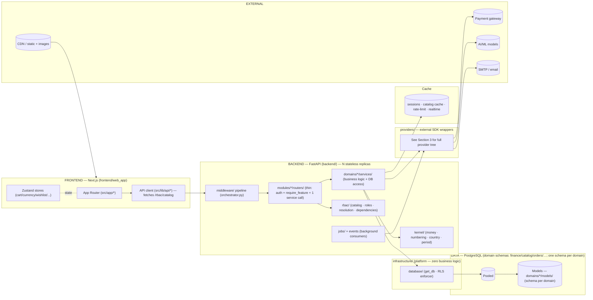
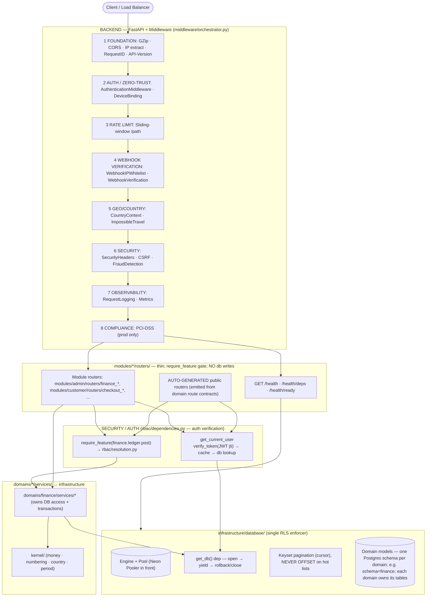
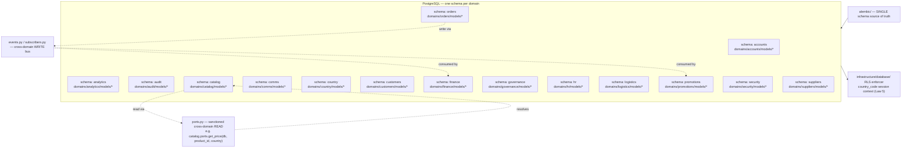
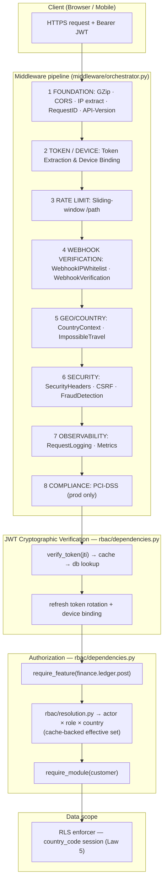
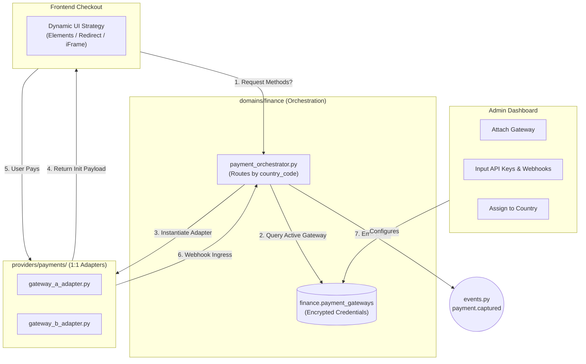
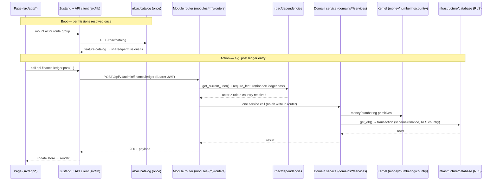

# ZOZI Platform — Architecture Stack (Canonical)

> **Purpose.** The single canonical reference for the ZOZI platform's structure,
> modules, domains, laws, and wiring.
>
> **Companion doc.** All technology versions, SDKs, and infrastructure details are
> canonical in `_most_imp_docx/TECHNOLOGY_STACK.md`. This file references technology
> **by key** — it does not pin versions.
>
> **Rule of use.** This file defines *structure* and *laws*. It never names a version
> literal, an SDK, or a lockfile. If you need a version, read `TECHNOLOGY_STACK.md`.
> If a feature needs a new law or a new domain, update this file first.

---

## 1 · How the three documents fit together

| Document | Answers | Contains | Does NOT contain |
|---|---|---|---|
| `TECHNOLOGY_STACK.md` | *What tools and versions do we use?* | Versions, SDKs, infra, providers, avoid list | Laws, modules, domains, package layout |
| `ARCHITECTURE_STACK.md` (this file) | *How is the platform structured? What are the laws?* | Modules, domains, package layout, laws 1–325, diagrams, wiring | Version literals, SDK names, lockfiles |
| `PROMPT_STACK.md` | *How does a feature get built?* | Feature build contract template | Technology or law definitions (it references both) |

**Cross-references only by filename.** If ARCH needs to say "see the framework version", it writes: *see `TECHNOLOGY_STACK.md`*.

---

## 2 · The Three Orthogonal Axes

A folder tree can only express **one** axis. The other two live in **naming + registration + configuration**.

| Axis | What it is | Where it lives | Mechanism |
|---|---|---|---|
| **Module** (customer, supplier, logistics, admin, employee) | *Who* is acting — login, session, route prefix, UI shell. The `admin` module contains multiple **roles** (super_admin, sub_admin, moderator, finance_officer, country_manager, auditor) — see Law 162. Sub-admins share the admin auth flow and route prefix but receive a bounded feature set via RBAC. The logistics module serves two actor subtypes: logistics_individual (solo courier) and logistics_company (fleet operator). Both share the same auth flow and route prefix `/logistics-partner/*`; RBAC features distinguish capabilities. Subtype is stored on the logistics partner's user record and embedded in the JWT at issuance. | `modules/{module}/` | Separate auth + thin API surface |
| **Domain** (finance, accounts, catalog, orders, logistics, suppliers, customers, hr, comms, country, governance, analytics, audit, security, promotions) | *What* the business does — logic + data | `domains/{domain}/` | Services, models, schemas, policies, events |
| **Feature** (`finance.ledger`, `finance.reporting`, …) | *What may be done* — permission atoms | `rbac/` + `domains/*/features.py` | Data/config, enforced by `require_feature()` |

**The rule that makes it coherent:** Modules compose. Domains own. Features gate.

---

## 3 · Backend Package Layout

```
backend/
├── main.py                     # boots app; registers module routers per actor prefix
├── config.py                   # settings, env, feature gates
├── DOMAIN_ALLOWLIST.yaml       # temporary cross-domain imports (may only shrink)
│
├── modules/                    # AXIS 1 — MODULE (who)
│   ├── customer/  supplier/  logistics/  admin/  employee/
│   │     #   admin/ hosts multiple roles: super_admin (owner), sub_admin,
│   │     #   moderator, finance_officer, country_manager, auditor
│   │     #   — distinguished by RBAC features, not by folder or auth flow
│   │     ├── auth/             # per-actor login/OTP/social → that actor's own tables; sessions; device binding
│   │     ├── routers/          # THIN per-actor routers (auth + require_feature + ONE service call)
│   │     │                     #   modules/{m}/routers/{d}.py — one file per domain the module exposes
│   │     │                     #   modules/{m}/routers/__init__.py lists routers/public_routers/system_routers
│   │     └── serializers/      # per-actor view models (customer-facing response shaping)
│   │
├── domains/                    # AXIS 2 — DOMAIN (what)
│   ├── finance/  accounts/  catalog/  orders/  logistics/  suppliers/
│   ├── customers/  hr/  comms/  analytics/  audit/  country/  governance/  security/  promotions/
│   │     ├── services/  models/  schemas/  policies/   # heavy domains may instead slice:
│   │     ├── events.py  subscribers.py                  #   ledger/ payouts/ treasury/ … (one sub-capability = one folder)
│   │     ├── ports.py        # SANCTIONED cross-domain READ path (the only thing another domain may import)
│   │     ├── read_models/    # CQRS-lite projections for this domain's own dashboards
│   │     └── features.py      # AXIS 3 seed: this domain's permission atoms
│   │
├── rbac/                       # AXIS 3 — FEATURE (may)
│   ├── catalog.py               # aggregates domains/*/features.py → single source of truth
│   ├── roles.py                 # (module, role) → feature sets
│   ├── resolution.py            # actor × role × country → effective set (cache-backed)
│   ├── dependencies.py          # require_feature(...), require_module(...)
│   └── service.py               # grant/revoke, delegation, maker-checker
│   #   ORM models for permissions live in domains/security/models/rbac.py (Law 6 — every table in a domain schema)
│
├── infrastructure/             # PLATFORM — zero business logic; imports nothing above it
│   ├── database/               # base.py · database.py (get_db/get_read_db) · session.py · transaction.py
│   │                           #   security.py ← ONE canonical RLS enforcer · seeds/ · create_tables.py (dev-only)
│   ├── valkey/                 # client · cache · token blacklist · streams (event bus) · pub/sub (ws fan-out)
│   ├── storage/                # object storage client · presigned URLs (media blobs never in Postgres)
│   ├── messaging/              # event_bus (Streams for cross-domain writes; Pub/Sub for WebSocket fan-out) · ws_manager · webhook ingress
│   ├── observability/          # structlog · error tracking SDK · metrics exporter
│   ├── security/               # JWT · hashing · field encryption (Coolify-held master key)
│   └── utils/                  # pure technical helpers: pagination.py · datetime_utils · variant_key
├── kernel/                     # SHARED KERNEL — pure business primitives: money, currency, numbering, country, period
├── providers/                  # 3rd-party/AI adapters (called ONLY by services/jobs; never by modules directly)
│   ├── ai/                      # AI/ML: chatbot, search, vision, text, sentiment, recommendation, price_intelligence, image_similarity, finance_ai
│   ├── barcode/                 # EAN/UPC/Code128 generation
│   ├── bg_removal/              # AI background removal
│   ├── comms/                   # Email, SMS (self-hosted), WhatsApp (self-hosted)
│   ├── finance/                 # Bank API integration
│   ├── geography/               # IP geolocation, country, maps, currency rates
│   ├── image/                   # Image processing, OCR, parcel verification
│   ├── ocr/                     # Document OCR parsing
│   ├── payments/                # 1:1 payment gateway adapters (Stripe, PayPal, regional gateways)
│   ├── qr/                      # QR generation, parcel verification, barcode scanning
│   ├── security/                # threat intel, watchlist
│   ├── shipping/                # Rate calculator, carrier comparison
│   ├── storage/                 # object storage backends (R2/local)
│   ├── async_workers/           # Thread/process pool executors for CPU-bound work
│   └── _base.py                 # BaseProvider / BaseAIProvider + health_check()
├── jobs/                        # background workers/consumers (→ domains → infrastructure)
│   ├── fraud_monitoring.py  ghost_order_detector.py  data_retention.py
│   ├── payroll_run.py  payout_sweep.py  reconciliation_cron.py  bank_statement_importer.py
│   ├── fx_revaluation.py  accrual_reversal.py
│   └── background_tasks.py
├── middleware/                  # flat; orchestrator.py orders the pipeline BEFORE module routers
│   └── orchestrator.py · api_version · country_context · csrf · database_security · device_binding
│       · impossible_travel · ip_extraction · logging · pci_dss_compliance · rate_limit
│       · request_id · security_headers · webhook_ip_whitelist
│       · webhook_verification · zero_trust_auth
├── alembic/                     # SINGLE schema source of truth
├── scripts/                     # analyze_tables.py, rewrite_imports.py, seed helpers (dev)
└── tests/
    ├── architecture/            # test_import_laws.py · test_feature_catalog.py · test_schema_discipline.py · test_model_relocation.py
    ├── domains/                 # per-domain unit/integration tests
    ├── infrastructure/          # infrastructure-layer tests (database, cache, storage)
    ├── providers/               # provider adapter tests
    ├── integration/             # cross-domain integration tests
    ├── workflows/               # end-to-end workflow tests
    ├── kernel/                  # kernel primitive tests
    ├── rbac/                    # RBAC/authorization tests
    ├── modules/                 # module router tests
    ├── middleware/              # middleware pipeline tests
    ├── security/                # security-layer tests
    ├── observability/           # logging/tracing tests
    ├── admin/                   # admin-stub tests
    ├── performance/             # latency regression tests
    ├── playwright/              # Playwright E2E mocks
    ├── system/                  # system-level conftest (no test_*.py files)
    ├── config/                  # test configuration helpers
    └── _support/                # shared test helpers (imported, not a test package)
```

> **Provider Availability Flags.** All providers expose `HAS_<SDK>` boolean flags. Domains must gracefully degrade when a provider SDK is not installed — never crash.

> **Provider-to-Domain Wiring.** Providers are wired into domain services via direct function calls (never via imports from domains into providers).

| Provider Tool | Served Domains | Use Case |
|---|---|---|
| `ai/chatbot` | Analytics | Intent classification, session management |
| `ai/search` + `ai/text` (embeddings) | Catalog, Customers | Semantic product search, autocomplete |
| `ai/vision` + `ai/image_similarity` | Catalog | Product image analysis, duplicate detection |
| `ai/sentiment` | Reviews, Security, Analytics | Review moderation, fraud signals |
| `ai/recommendation` | Customers, Promotions, Analytics | Personalized product feeds |
| `ai/price_intelligence` | Promotions, Analytics | Dynamic pricing, competitor tracking |
| `ai/finance_ai` | Finance | Transaction categorization |
| `barcode/` + `qr/` | Logistics, Catalog, Suppliers | Shipping labels, SKU barcodes, parcel verification |
| `bg_removal/` + `image/` + `ocr/` | Catalog, Reviews, Finance, Accounts, Suppliers, Audit | Image preprocessing, document extraction |
| `comms/email` + `comms/sms` + `comms/whatsapp_selfhosted` | Orders, Comms, Promotions, Accounts, HR, Suppliers, Logistics | Transactional messaging, notifications |
| `finance/bank_api` | Finance, Orders, Suppliers | Bank verification, payouts |
| `geography/` (ip, country, rates, maps) | Orders, Logistics, Country, Security, Accounts, Analytics | Localization, tax rules, shipping eligibility |
| `payments/` (1:1 SDK adapters) | Finance, Orders | Dumb API wrappers. Routing logic lives in `domains/finance/services/payment_orchestrator.py` |
| `security/threat_intel` + `security/watchlist` | Security, Accounts, HR, Governance, Audit, Comms | AML screening, fraud feeds |
| `shipping/` | Orders, Customers (cart), Logistics | Rate calculation, carrier comparison |
| `storage/` + `storage/r2_client` | Catalog, Audit, Analytics, Suppliers | File persistence, audit archival |

> **Wiring Pattern.** Domain services import providers at the top of the service file, call provider functions with primitive parameters, and handle results.
>
> **Async Provider Calls.** CPU-bound provider work runs through `providers.async_workers`.

---

## 3.1 · Shared kernel (`kernel/`)

`money` (Decimal, never float), `currency`, `numbering` (centralized ORD-/INV-/PAY-/BATCH-), `country`, `period` — live here as first-class residents so they are not smuggled into `infrastructure/utils/` or duplicated per domain.

**Dependency rule:** kernel is a leaf on the read path for domains; it imports nothing from modules, domains, rbac, providers, jobs, or middleware — only `infrastructure/` platform primitives. See Law 1.

**Canonical top-level packages.** The backend root contains **only**: `main.py`, `config.py`, `DOMAIN_ALLOWLIST.yaml`, `modules/`, `domains/`, `rbac/`, `kernel/`, `infrastructure/`, `providers/`, `jobs/`, `middleware/`, `alembic/`, `scripts/`, `tests/`. A root-level `utils/`, `routers/`, `controllers/`, `services/`, `models/`, `db/` are **forbidden**.

**Cross-domain contract (Law 3).** Writes across domains go *only* through `events.py`/`subscribers.py`. Reads across domains go *only* through the publishing domain's `ports.py`. `DOMAIN_ALLOWLIST.yaml` tracks temporary cross-domain imports and must only shrink.

**Deployment model.** Shipped initially as a **modular monolith** (one deployable, one Postgres ecosystem, shared cache) — modules and domains are boundaries inside one process, not separate servers. Module boundaries make later extraction to independent services possible without redesigning domains.

**Multi-supplier marketplace.** A single customer order may span multiple suppliers. `orders` owns order headers; `order_lines` carry `supplier_id`; fulfillment splits per supplier into `shipments`, each assigned to a logistics partner (individual or company). Cross-domain writes from orders → suppliers/logistics go via events.

**Scale triggers** (any one): sustained p95 API latency > 500 ms at peak with CPU > 70%; MAU > 100,000; a single module's CPU/RAM footprint > 30% of total; a second engineer joins.

### Frontend layout

```
frontend/
├── web_app/                     # Next.js (App Router, RSC)
│   ├── src/app/                 # route tree: (customer), auth/, admin/*, supplier/*, logistics-partner/*,
│   │                             #   employee/*, wishlist/, profile/, chatbot/, tracking/; app/api/ = Next server routes
│   ├── src/components/          # ui/ (design system), admin/, auth/, chat/, comms/, country/, map/, supplier/
│   ├── src/hooks/               # useApi, useAuth, WebSocket hooks
│   ├── src/lib/                 # api/ (client.ts, auth.ts, country.ts, errors.ts), rbac.ts (fetches /rbac/catalog)
│   ├── src/services/            # localizationService, crossBorderService, addressFormatService
│   ├── src/theme/  src/styles/  src/types/  src/utils/
│   ├── tests/  e2e/             # mocks + Playwright
│   └── root/                    # next.config.ts (rewrites), middleware.ts, tailwind config, playwright.config
├── mobile_app/                  # Expo RN
│   ├── app/                     # Expo Router: (auth)/(tabs) + admin/ supplier/ logistics/ employee/ tracking/ returns/
│   ├── components/ui/           # design-system
│   ├── lib/                     # api.ts, Zustand stores, authPrompt, countryContext, geo, paymentService,
│   │                             #   secureStorage, errorReporter
│   └── theme/  assets/  android/  mocks/  e2e/  scripts/  root/
└── shared/                      # cross-platform TS, imported by BOTH apps
    └── src/                     # api-core.ts (apiFetch), money.ts, i18n.ts, cart/checkout/order/product/returns/
                                  #   wishlist/notification helpers, statusColors.ts, requestCache.ts, realtime.ts,
                                  #   chatbot.ts, types.ts, theme.ts + theme.native.ts,
                                  #   permissions.ts  ← GENERATED from backend /rbac/catalog
```

---

## 4 · The Laws (325 total, enforced by the audit)

The laws are organized into sections. Each law is numbered for reference in audit findings and CI failures. Version literals are stripped; where a law names technology, see `TECHNOLOGY_STACK.md` for the pinned version.

### 4.1 Architecture Laws (Laws 1–7)

1. **Arrows point down only:** `modules → {rbac, domains}; rbac → domains; domains → {kernel → infrastructure, providers}; jobs → {domains, infrastructure, providers}`. Domains never import modules. `rbac` is imported by modules + middleware only. `infrastructure` / `kernel` import nothing above them. `providers ← services/jobs`. Additionally: `middleware → {rbac, infrastructure}`; `rbac → {domains, infrastructure}` (for cache-backed resolution).
2. **Module routers stay thin:** auth context + `require_feature(...)` + one domain-service call. No DB writes, no business rules.
3. **Cross-domain writes only via events** (`events.py`/`subscribers.py`); cross-domain *reads* only via `ports.py` / `read_models/`. In-process events must be emitted post-commit to prevent cross-schema transaction locking.
4. **Features single-sourced** in `domains/*/features.py`; aggregated by `rbac/catalog.py`; CI fails on any `require_feature("…")` literal not in the catalog.
5. **Country is the orthogonal scope axis:** RLS session context + `country_staff_assignments` — independent of the feature check. Suppliers may sell into multiple countries. Orders carry both buyer_country_code and supplier_country_code. `set_rls_context()` executes `SET LOCAL app.country_code = :cc` inside the active transaction (session-level SET is forbidden under the Neon pooler); must be given the correct dimension per query.
6. **Schema discipline:** every table in a domain Postgres schema; Alembic is the only schema source; naming lint (`snake_case`, plural, `<thing>_id`, `created_at/updated_at`, `country_code`, `is_deleted`).
7. **Allowlist rule:** temporary cross-domain imports are tracked in `DOMAIN_ALLOWLIST.yaml` and may only shrink; direct cross-domain writes outside `events.py` are forbidden. Any entry must carry a dated removal plan (≤ 30 days).

---

## 5 · System Context



> **Provider-to-Domain Connection Map.** Domain services call providers via function calls (arrows from `BEDOM` to `PROV_ALL`). Providers never import from domains — data flows through parameters and return values only.

---

## 6 · Backend Circuit (request lifecycle)



---

## 7 · RBAC / Feature axis (AXIS 3)

- Feature atoms are **defined once** in `domains/{domain}/features.py` (e.g. `finance.ledger.post`, `finance.reporting.read`).
- `rbac/catalog.py` aggregates every domain's `features.py` via package scan → single source of truth. It is served to the frontend at `GET /rbac/catalog`.
- `rbac/roles.py` grants per **(module, role)**; `rbac/resolution.py` resolves `actor × role × country → effective feature set` (cache-backed).
- `rbac/dependencies.py` provides `require_feature(...)` / `require_module(...)` gates used by every module router.
- ORM models for permissions live in `domains/security/models/rbac.py` (Law 6). `rbac/` imports them via the security domain's `ports.py`.
- Frontend `shared/src/permissions.ts` is **generated** from `/rbac/catalog` so UI gating and backend gating share one source.

---

## 8 · Schema discipline (Law 6)

- Every ORM model declares `__table_args__ = {"schema": "<domain>"}` (slice tables use the parent domain's schema).
- Alembic is the only schema source (`create_all` is dev-only).
- Naming lint: `snake_case`, plural tables, `<thing>_id` FKs, `created_at`/`updated_at`, `country_code`, `is_deleted`.
- Forbidden schemas: `core` / `platform` / `identity` — every actor's `user` table lives in its own domain schema (e.g. `customer.user`, `supplier.user`).
- Approved non-canonical schemas: `media` (media assets / upload sessions — no dedicated domain yet), `treasury` (payment gateway, settlements, payouts — finance sub-capability), `ai` (AI staging, generation logs — provider-backed, not a domain), `configuration` (historical catch-all; tables are being migrated to canonical schemas and this schema will be removed). Note: `core` was a forbidden schema renamed to `accounts` (migration `20260821_core_to_accounts_schema`); `communication` was renamed to `comms` (migration `20260822_communication_to_comms_schema`); `commerce` was split into canonical schemas `catalog`, `promotion`, `finance`, `customer`, `security` (migration `20260821_split_commerce_schema`).

---

## 9 · Database organization (Law 6)

Every domain owns one Postgres schema; the model classes live in `domains/{domain}/models/`. Cross-domain **writes** travel only through `events.py` / `subscribers.py`; cross-domain **reads** travel only through the owning domain's `ports.py` (or `read_models/`). The country scope is enforced by RLS on every schema.



---

## 10 · Security architecture

Authentication and authorization follow the axes: **modules** carry the actor (who), **features** gate the action (may), and **country RLS** scopes the data. The 8-layer middleware pipeline runs before any module router.



---

## 10.1 · Payment Orchestration Architecture (Dynamic Gateway Routing)

The platform utilizes a **Database-Driven Payment Orchestration Layer** allowing Admins to dynamically attach, configure, and route payment gateways on a per-country basis without code deployments.



**Key Rules for Payment Orchestration:**

1. **Credential Security:** Admin-entered API keys and webhook secrets are NEVER stored in plain text. They are encrypted via `infrastructure/security/field_encryption.py` (master key `FIELD_ENCRYPTION_KEY` in Coolify env vars; per-record data keys are derived) before being saved to the `finance.payment_gateways` table. Vault Transit and AWS KMS are NOT used.
2. **Frontend Agnosticism:** The frontend requests available payment methods via `GET /api/v1/finance/checkout/options`. The backend returns a standardized payload dictating the UI strategy (`stripe_elements`, `hosted_redirect`, or `iframe`).
3. **Universal Webhook Ingress:** All gateways send webhooks to a single ingress route: `POST /api/v1/webhooks/payments/{gateway_slug}`. The orchestrator verifies the signature using the DB-stored secret and translates the payload into a canonical `payment.captured` domain event.
4. **Adapter Scope (Law 123):** Each adapter in `providers/payments/` wraps exactly one external SDK. Routing logic lives in `domains/finance/services/payment_orchestrator.py` — never in providers.
5. **Adding a Gateway:** A new gateway is a config + adapter task, not a redeploy of routing logic. The DB-driven design keeps the orchestrator provider-agnostic.

---

## 11 · End-to-end flow (frontend ↔ backend)

The frontend route tree under `frontend/web_app/src/app/*` is grouped per actor (module). On boot it fetches `GET /rbac/catalog` once to build `shared/src/permissions.ts`; every later action calls a thin module router that authenticates, gates on a feature, and delegates to one domain service.



---

## 12 · Project Rules & Decisions (Laws 1–325)

> All 325 laws in a single scannable matrix. Each law appears **once**.

| Law | Category | Rule | Description | Why |
|-----|----------|------|-------------|-----|
| 1 | Architecture | Arrows point down | Dependencies flow: modules → {rbac, domains}; rbac → domains; domains → {kernel → infrastructure, providers}; jobs → {domains, infrastructure, providers}; middleware → {rbac, infrastructure}; rbac → {domains, infrastructure}. Reverse imports FORBIDDEN. | Prevents circular dependencies and unmaintainable coupling between layers. |
| 2 | Architecture | Thin routers | Router = auth context + require_feature + ONE service call + serialization. No DB writes, no business logic. | Keeps API layer a thin HTTP shim over domain logic. Easy to test and maintain. |
| 3 | Architecture | Cross-domain events/ports | Cross-domain WRITES via events.py/subscribers.py. Cross-domain READS via ports.py only. In-process events must be emitted post-commit. | Keeps domains decoupled and independently deployable. |
| 4 | Architecture | Features single-sourced | Permission atoms defined once in domains/*/features.py. Aggregated by rbac/catalog.py. | Prevents permission drift. Frontend and backend share one permission model. |
| 5 | Architecture | Country is orthogonal | Every data access scoped by country_code via RLS (`SET LOCAL`). Independent of feature check. | Ensures multi-tenant data isolation at the database level. |
| 6 | Architecture | Schema discipline | Every table in a domain Postgres schema. Alembic is the only schema source. | Naming consistency and single source of truth for schema changes. |
| 7 | Architecture | Allowlist only shrinks | DOMAIN_ALLOWLIST.yaml tracks temporary cross-domain imports. May only shrink. | Ensures migration toward clean domain boundaries makes forward progress. |
| 8 | Structure | Router structure | modules/{m}/routers/{d}.py — one file per domain the module exposes. | Makes endpoints discoverable by actor+domain. |
| 9 | Structure | Tools in providers | All tools code in providers/ai, providers/image, etc. | Tools are an external concern, not a business domain. |
| 10 | Structure | Kernel is pure | kernel/ contains ONLY pure business primitives. No imports from domains/modules/rbac/providers/jobs/middleware — only infrastructure/. | Ensures business primitives are consistent and reusable across all domains. |
| 11 | Structure | Providers wrap SDKs | A provider wraps exactly one external SDK. No business logic, no domain imports. | External dependencies are isolated and swappable. |
| 12 | Structure | 15 domains | Fixed set: accounts, analytics, audit, catalog, comms, country, customers, finance, governance, hr, logistics, orders, promotions, security, suppliers. | Prevents domain sprawl and ensures clear ownership boundaries. |
| 13 | Structure | 5 modules | Fixed set: admin, customer, employee, logistics, supplier. The `admin` module serves multiple **roles**. Sub-Admin is a role, NOT a separate module. Logistics supports two actor subtypes (individual/company) sharing the same auth flow. | Prevents module sprawl; uses RBAC as designed for role differentiation. |
| 14 | File Placement | Business logic → domains/ | All business logic in domain services/. No logic in routers or modules. | Business logic is colocated with the data it operates on (DDD). |
| 15 | File Placement | API endpoints → modules/routers/ | Every HTTP endpoint in a module router file named after the domain. | Endpoints grouped by business capability, not CRUD operation. |
| 16 | File Placement | SDK wrappers → providers/ | Every third-party integration under providers/{category}/. | Trivial to find every external dependency and swap implementations. |
| 17 | File Placement | Cross-domain → events/ports only | events.py (writes) and ports.py (reads) are the ONLY sanctioned cross-domain channels. | Creates a clear, auditable boundary contract between domains. |
| 18 | File Placement | Root forbidden folders | utils/, routers/, controllers/, services/, models/, db/ FORBIDDEN at backend/ root. | Prevents the 'god directory' anti-pattern. |
| 19 | Code Quality | No float for money | Monetary values MUST use Decimal or Numeric. Float FORBIDDEN for money. | Floating-point arithmetic introduces rounding errors causing financial discrepancies. |
| 20 | Code Quality | country_code = String(2) | Always String(2) following ISO 3166-1 alpha-2. | Consistency across all 15 domains simplifies joins, indexes, and RLS filtering. |
| 21 | Code Quality | Timestamps = server_default | created_at/updated_at use server_default=func.now() (DB-side), not Python-side. | Timestamps survive clock skew and are consistent in the database. |
| 22 | Code Quality | FK have ondelete | Every ForeignKey MUST declare explicit ondelete behavior. | Prevents unpredictable behavior across PostgreSQL versions. |
| 23 | Code Quality | Audit columns | Every model MUST include created_at, updated_at, country_code, is_deleted. | Required for RLS, debugging, compliance, and data recovery. |
| 24 | Code Quality | No forbidden schemas | core, platform, identity are FORBIDDEN as Postgres schema names. | Prevents monolithic shared-schema architecture. |
| 25 | Migration | Shift files first | All files to correct domains before reorganization. Never replace working code with stubs. | Ensures agents have complete file context for each domain. |
| 26 | Migration | Backward-compat shims | Temporary re-exports in infrastructure/utils/ for relocated files. | Enables gradual migration without breaking existing imports. |
| 27 | Migration | Delete temp scripts | Root-level fix_*.py, debug_*.py should be removed after use. | Keeps root clean and architecture clear. |
| 28 | Migration | _auto_stubs ≠ architecture | _auto_stubs.py are migration scaffolding, not architecture components. | Distinguishes temporary scaffolding from permanent architecture. |
| 29 | Migration | registry.py ≠ architecture | Service Registry and auto_wire.py were removed from architecture. | Prevents confusion about what is permanent architecture. |
| 30 | Provider | Graceful degradation | Domains handle missing SDKs via HAS_<SDK> flags. Never crash. | System runs in development without all production dependencies. |
| 31 | Provider | No domain imports | Providers MUST NOT import from domains, modules, rbac, jobs, middleware. | Data flows through parameters only. Ensures providers remain pure wrappers. |
| 32 | Security | No hardcoded secrets | JWT keys, API keys, passwords from env vars or secrets manager only. | Attackers can clone repo. Committed secrets = token forgery. |
| 33 | Security | Token type verification | All JWT decoders MUST verify the type claim (access vs refresh). | Prevents refresh tokens from being used as access tokens. |
| 34 | Security | Parameterized SQL | Use SQLAlchemy text() with bound parameters or ORM. No f-string interpolation. | Prevents SQL injection attacks. |
| 35 | Security | CSRF active | CSRF middleware MUST be active in all environments. | Prevents CSRF attacks in misconfigured deployments. |
| 36 | Security | Security headers | CSP, HSTS, X-Frame-Options, X-Content-Type-Options, Referrer-Policy in production. | Prevents XSS, clickjacking, and other browser-based attacks. |
| 37 | Security | Rate limit fails closed | If the rate-limit backend is unreachable, deny requests (not allow all). | Prevents brute-force and DoS when cache is down. |
| 38 | Security | Password handling | Passwords >72 bytes rejected with error, never truncated. | bcrypt's 72-byte limit. Silent truncation creates security holes. |
| 39 | Security | No duplicate auth | Auth logic in exactly one canonical location. | Duplicate implementations with divergent behavior create security holes. |
| 40 | Security | Backend CORS | Backend CORS is disabled for browser origins. Web traffic routes through the Next.js API proxy (same-origin). Mobile native apps call `/api/v1/*` directly with Bearer JWT + device binding — CORS does not apply to native clients. | Prevents arbitrary websites from making authenticated requests without breaking mobile. |
| 41 | Security | WebSocket auth | WebSocket connections MUST verify JWT type claim equals access. | Prevents stolen refresh tokens from opening WebSocket connections. |
| 42 | Security | Input validation | All public endpoints use Pydantic schemas. No raw dicts in router signatures. | Prevents malformed data from reaching domain services. |
| 43 | Security | Security event logging | Auth failures, 403s, rate-limit triggers logged at WARNING+. | Silent security events prevent incident detection. |
| 44 | Security | Dependency scanning | All deps scanned for CVEs in CI. High/critical block deployment. | Prevents supply-chain attacks via compromised dependencies. |
| 45 | Database | No N+1 queries | All relationships declare lazy=selectin or joined. Default lazy=select FORBIDDEN. | N+1 queries bring the database to its knees at 100K+ users. |
| 46 | Database | No SELECT * | Application queries MUST select explicit columns. | Wastes memory/I/O. Prevents covering indexes. Breaks on column reorder. |
| 47 | Database | Connection pool sizing | pool_size ≥ 10, max_overflow ≥ 20. Environment-configurable. | Connection exhaustion causes cascading failures under load. |
| 48 | Database | Read replica separation | Replica connections use independent pool settings. Read-heavy uses get_read_db(). | Without replicas, every read competes with writes for connections. Reads and writes share the primary branch with the built-in pooler. |
| 49 | Database | Linear migration history | Alembic history MUST remain linear. Resolve divergent heads immediately. | Divergent heads break alembic upgrade head and cause deployment failures. |
| 50 | Database | Explicit transactions | All writes use explicit transaction management. Autocommit FORBIDDEN. | Ensures multi-step operations can roll back on failure. |
| 51 | Database | Single table ownership | Each table defined in exactly one domain. Duplicate __tablename__ FORBIDDEN. | Duplicate tables cause MetaData conflicts and runtime crashes. |
| 52 | Database | FK constraints | All FK columns have explicit ForeignKey with ondelete. | Prevents orphan rows and ensures referential integrity. |
| 53 | Database | Index FK columns | All FK columns have explicit index. PostgreSQL does NOT auto-index FKs. | Without indexes, JOINs degrade to sequential scans. |
| 54 | Database | Soft delete | All user-facing tables use is_deleted (boolean, default false). | Enables data recovery, audit trails, and safe cascading. |
| 55 | Database | Schema-per-domain | Every model declares __table_args__ = {schema: <domain>}. | Tables without schema land in public, breaking multi-tenant isolation. |
| 56 | Database | No forbidden schemas | core, platform, identity FORBIDDEN as schema names. | Prevents accidental coupling through shared schema namespace. |
| 57 | Database | Migration safety | Destructive migrations include backward-compatible strategy (expand-contract). | Enables zero-downtime rollback. |
| 58 | Code Quality | No print() in production | print() FORBIDDEN in production code. Use structlog logger. | print() bypasses log formatting and cannot be filtered by level. |
| 59 | Code Quality | No silent exceptions | All except blocks MUST log at minimum DEBUG level. | Silent exception swallowing makes debugging impossible. |
| 60 | Code Quality | No blocking in async | Async functions MUST NOT call blocking I/O. Use asyncio.sleep, httpx. | Blocking calls freeze the event loop, preventing other requests. |
| 61 | Code Quality | Bounded caches | All in-memory caches have max size and/or TTL. Unbounded dict FORBIDDEN. | Unbounded caches cause OOM at scale. |
| 62 | Code Quality | TODO/FIXME hygiene | TODO/FIXME must include ticket reference and expiration date. | Ensures technical debt is tracked and doesn't accumulate invisibly. |
| 63 | Code Quality | Type hints required | All public function signatures MUST have type hints. | Enables static analysis, IDE autocompletion, inline documentation. |
| 64 | Code Quality | Function length ≤50 | Functions SHOULD NOT exceed 50 lines (excl. docstrings/blanks). | Long functions are hard to test, debug, and reason about. |
| 65 | Code Quality | Indentation ≤4 levels | Maximum 4 levels of indentation per function. | Deeper nesting signals complex control flow needing refactoring. |
| 66 | Code Quality | No magic numbers | Numeric constants MUST be named constants or config values. | Named constants make business rules self-documenting and easy to change. |
| 67 | Code Quality | DRY principle | Duplicate code blocks (>5 lines) MUST be extracted into shared functions. | Copy-paste creates maintenance nightmares. |
| 68 | Code Quality | Consistent errors | All service functions use consistent error pattern (exceptions or Result). | Mixed patterns make error handling unpredictable for callers. |
| 69 | Testing | Domain smoke tests | Every domain MUST have at least one smoke test. | Catches circular imports, missing deps, broken __init__.py, syntax errors. |
| 70 | Testing | Architecture law tests | Every statically checkable law MUST have a corresponding test. | Ensures laws are actually enforced, not just documented. |
| 71 | Testing | No broken tests in CI | Collection-time failures MUST block CI. Fix within 24h. | Broken tests hide real failures. |
| 72 | Testing | Cross-domain integration | Cross-domain flows MUST have integration tests. | Unit tests verify single services; integration tests verify wiring. |
| 73 | Testing | Performance regression | Critical paths MUST have perf regression tests. Fail on >20% latency. | Prevents slow queries or missing indexes from shipping to production. |
| 74 | Testing | Test isolation | All tests use transaction-rolled-back sessions. No data leaks. | Each test is independent and order-independent. |
| 75 | Infrastructure | Graceful degradation | External failures MUST degrade gracefully AND log WARNING. | Silent fallbacks hide degradation from ops. |
| 76 | Infrastructure | Session lifecycle | Sessions managed via FastAPI dependency injection only. | Ensures sessions are properly closed even on exceptions. |
| 77 | Infrastructure | Async resource safety | Async resources use asyncio.Lock for init and disposal. | Prevents race conditions that create multiple engines. |
| 78 | Infrastructure | Middleware ordering | Pipeline order FIXED: Foundation → Auth → Rate → Webhook → Geo → Security → Observe → Compliance. | Reordering changes security posture. |
| 79 | Infrastructure | Global exception handler | Catches all uncaught exceptions. Returns structured response. No stack traces in prod. | Prevents stack trace leakage and ensures consistent error format. |
| 80 | Infrastructure | Graceful shutdown | Shutdown disposes DB engine, cache client, workers via lifespan.py. | Prevents connection leaks on restart. |
| 81 | Infrastructure | Health checks | /health, /health/deps, /health/ready verify all critical dependencies. | Load balancers use these for routing decisions. |
| 82 | Config | No default credentials | Config fallbacks MUST NOT contain real credentials. Empty/null default. | Prevents accidental use of dev credentials in production. |
| 83 | Config | Environment validation | Required env vars validated at startup. Missing = immediate failure. | Prevents silent fallbacks to development defaults in production. |
| 84 | Config | Typed feature flags | Flags use pydantic-settings. Raw os.getenv() FORBIDDEN. | String 'false' is truthy in Python. Typed coercion prevents bugs. |
| 85 | Config | Secret rotation | Secrets rotatable without deployment via env var updates. | Enables response to credential leaks without full redeployment. |
| 86 | Config | Env-specific configs | Prod, staging, dev have separate config profiles. No inheritance. | Prevents prod from inheriting dev defaults like debug=True. |
| 87 | Router | Auth on protected endpoints | All non-public endpoints MUST use get_current_user or equivalent. | Prevents accidental exposure of sensitive endpoints. |
| 88 | Router | Feature gate on protected | All non-public endpoints MUST use require_feature() or require_module(). | Ensures every protected endpoint has explicit authorization. |
| 89 | Router | Response serialization | Routers return serialized responses (Pydantic/dicts), never raw ORM models. | Prevents accidental exposure of internal model fields. |
| 90 | Router | No business logic | Routers contain ONLY: auth, gate, parsing, ONE service call, serialization. | Keeps API layer a thin HTTP shim. |
| 91 | Router | Documentation | All endpoints MUST have OpenAPI-compatible docstrings. | The OpenAPI spec is the API contract. |
| 92 | Observability | Structured logging | All logs use structlog with context (user_id, request_id, domain, action). | Enables log aggregation, filtering by field, cross-service correlation. |
| 93 | Observability | Request tracing | All requests carry request_id propagated through service calls. | Enables end-to-end request tracing for debugging. |
| 94 | Observability | Metrics emission | Critical paths emit Prometheus metrics (latency, error rate, throughput). | Unmonitored critical paths hide degradation. |
| 95 | Observability | Error tracking | Unhandled exceptions reported via the error-tracking SDK to self-hosted GlitchTip. Fallback to structlog if GlitchTip is unreachable. | SDK is the wire format; GlitchTip is the destination. No SaaS cost. |
| 96 | Observability | Audit trail | State-changing operations write to domains/audit/. | WORM audit log enables compliance investigations. |
| 97 | Wiring | Import direction | Imports MUST follow modules → {rbac, domains}; middleware → {rbac, infrastructure}; rbac → {domains, infrastructure}; domains → {kernel, infrastructure, providers}; kernel → infrastructure; jobs → {domains, infrastructure, providers}. | Prevents reverse dependencies. |
| 98 | Wiring | No circular imports | Circular chains between any two packages FORBIDDEN. | Circular imports cause ImportError at module load time. |
| 99 | Wiring | No layer crossing | Modules don't import infrastructure directly (delegate through rbac + domains). Domains don't import modules. | Prevents tight coupling across layers. |
| 100 | Wiring | Provider isolation | Providers don't import from domains/modules/rbac/jobs/middleware. | Ensures providers remain pure wrappers. |
| 101 | Wiring | Kernel isolation | kernel/ doesn't import from domains/modules/rbac/providers/jobs/middleware. | Kernel is the universal foundation layer. |
| 102 | Wiring | Infrastructure isolation | infrastructure/ doesn't import from domains/modules/rbac/providers. | Provides platform primitives to all layers. |
| 103 | Wiring | Job wiring | Jobs import from domains/, infrastructure/, and providers/ only. Jobs MUST NOT import modules/ or middleware/. | Jobs are decoupled from HTTP layer but may consume provider services. |
| 104 | Wiring | Middleware wiring | Middleware imports from infrastructure/ + rbac/ only. | Middleware operates at HTTP layer, needs only platform primitives. |
| 105 | Wiring | Shared package wiring | @zozi/shared doesn't import from web_app or mobile_app. | Shared is consumed BY apps, never imports FROM them. |
| 106 | Wiring | Frontend-backend wiring | Web frontend communicates via API proxy only. Mobile communicates directly via `/api/v1/*` with Bearer JWT. No frontend imports backend code. | Ensures frontend and backend are decoupled deployables. |
| 107 | Technology | PostgreSQL in prod | Production uses Neon PostgreSQL. SQLite for pure unit tests only. | PostgreSQL provides RLS, proper concurrency, JSONB, full-text search. |
| 108 | Technology | SQLite in dev | Per-developer Neon branch is the dev database. SQLite only for pure unit tests that do not exercise RLS, JSONB, schemas, or row locking. | Fast unit tests without full DB fidelity. |
| 109 | Technology | Cache / sessions usage | Sessions, catalog cache, rate limiting, blacklist, realtime pub/sub, event bus (Streams), Celery broker. | Ephemeral store, not a primary data store. See TECHNOLOGY_STACK.md for pinned version. |
| 110 | Technology | Cache failure handling | Sessions→DB fallback; caching pass-through; rate limit fails closed; idempotency lookups fail closed. | System degrades gracefully when cache is unreachable; no duplicate writes. |
| 111 | Technology | Next.js App Router | Web uses Next.js App Router, not Pages Router. | Different routing and rendering models. |
| 112 | Technology | React Server Components | Data-fetching = Server Components. Client = interactivity/hooks. | RSC reduces JS bundle and enables server-side data access. |
| 113 | Technology | Expo Router | Mobile uses Expo Router with file-based routing. | Native navigation with deep linking. |
| 114 | Technology | WebSocket for realtime | WebSocket only for real-time (notifications, chat, tracking). | All other communication uses REST. |
| 115 | Technology | Celery for jobs | CPU-bound and async jobs use Celery with cache broker. | Request handlers never block on CPU-bound work. |
| 116 | Technology | Email via SMTP | Transactional email via providers/comms/email.py. Async sending. | Prevents SMTP latency from blocking request handlers. |
| 117 | Technology | SMS / WhatsApp via self-hosted | SMS via `providers/comms/sms.py` and WhatsApp via `providers/comms/whatsapp_selfhosted.py`. Async sending. | Prevents SMS latency from blocking request handlers. Self-hosted removes external dependency. |
| 118 | Technology | Payment Orchestration | Gateways are database-driven. Admins attach/configure gateways per country. `domains/finance/services/payment_orchestrator.py` routes to the active 1:1 provider adapter. | Enables dynamic country-wise gateway switching without code deployments. |
| 119 | Technology | AI/ML backends | Local AI runtime + local ONNX embeddings via providers/ai/. CPU-bound via providers.async_workers. OpenAI and HuggingFace are NOT used. | Local AI runtime avoids cloud API fees; embeddings served from object storage. |
| 120 | Technology | Object storage | S3-compatible object storage (production: Cloudflare R2). Media blobs never in PostgreSQL. Presigned URLs for direct upload/download. | DB stays small. Zero-egress object storage. |
| 121 | Technology | Image processing | Pillow, rembg, OpenCV. Heavy processing via async_workers. | Prevents image processing from blocking the event loop. |
| 122 | Technology | Leaflet maps | Leaflet + react-leaflet. Geocoding via providers/geography/. | Map tiles from CDN, not bundled. |
| 123 | Provider | Single SDK per provider | Each provider adapter wraps exactly one external SDK. Orchestration/routing logic belongs in the domain, NOT the provider. | Keeps providers dumb, testable, and swappable. |
| 124 | Provider | HAS_ flags | Every provider exposes HAS_<SDK> boolean flags. | Enables graceful degradation when SDK is absent. |
| 125 | Provider | Degrade gracefully | When HAS_<SDK> = False, return defaults. Never crash. | System runs without all production dependencies. |
| 126 | Provider | No business logic | Providers contain ONLY SDK wrapping: auth, formatting, parsing, error mapping. | Business rules belong in domain services, not providers. |
| 127 | Provider | Config in providers/ | API keys, endpoints, timeouts in providers/config.py. | Enables per-environment config without code changes. |
| 128 | Provider | Async workers for CPU | CPU-bound provider work via providers/async_workers. | Prevents blocking the event loop. |
| 129 | Provider | Health checks | All providers expose health_check() via BaseProvider. | Enables /health/deps to verify external dependency health. |
| 130 | Provider | Error mapping | SDK errors mapped to domain exceptions. Raw SDK errors don't leak. | Decouples API from specific SDK error types. |
| 131 | Provider | Mock in tests | Provider tests mock the external SDK. No real API calls. | Tests are fast, reliable, and don't depend on external services. |
| 132 | Module | Module structure | modules/{name}/ with auth/, routers/, serializers/. | Each module is a complete actor context. |
| 133 | Module | Per-module auth | Each module has its own auth dependency in auth/dependencies.py. | Different actors may need different auth strategies. |
| 134 | Module | Router file naming | modules/{module}/routers/{domain}.py — one file per domain the module exposes. | Makes endpoints discoverable by actor+domain. |
| 135 | Module | Router registration | All router files listed in routers/__init__.py. | Unregistered routers are invisible to FastAPI (dead code). |
| 136 | Module | Router categories | Three lists in modules/{m}/routers/__init__.py: routers (auth + feature gate), public_routers (no auth), system_routers (health/webhooks — auth-exempt). | Three categories match the three ingress patterns the middleware pipeline supports. |
| 137 | Module | Serializers location | Response serializers in modules/{module}/serializers/. | Different actors may serialize the same model differently. |
| 138 | Module | 5 modules fixed | admin, customer, employee, logistics, supplier. New requires review. Sub-Admin is a **role** in the `admin` module, NOT a 6th module. Logistics supports two actor subtypes (individual/company) sharing /logistics-partner/* prefix; RBAC distinguishes capabilities. | Prevents module sprawl. |
| 139 | Module | Route prefixes | /admin/*, /customer/*, /employee/*, /logistics-partner/*, /supplier/*. | Prevents route collisions between modules. |
| 140 | Infrastructure | 7 subpackages | database/, valkey/, storage/, messaging/, observability/, security/, utils/. | Each subpackage has a single responsibility. |
| 141 | Infrastructure | Database infra | Base, get_db/get_read_db, sessions, RLS, transactions, seeds. | Single place for DB engine and session management. |
| 142 | Infrastructure | Cache infra | Client singleton, cache abstraction, blacklist, pub/sub, streams. | Prevents connection proliferation. |
| 143 | Infrastructure | Storage infra | Abstraction interface + backup utilities. | Backends in providers/storage/. |
| 144 | Infrastructure | Messaging infra | WS manager, realtime, event bus. Event bus uses Streams for cross-domain writes (Valkey Streams with consumer groups); Pub/Sub only for WebSocket fan-out. In-process emission is reserved strictly for synchronous HTTP lifecycles. | Streams guarantee delivery; Pub/Sub is fire-and-forget. |
| 145 | Infrastructure | Observability infra | Metrics · structlog · error tracker · circuit breaker. Tracing available when cross-service tracing is required. | Wires observability into the app at startup. |
| 146 | Infrastructure | Security infra | JWT, hashing, field encryption (Coolify-held master key), rate limiting, CSRF, country access. | Canonical location for auth-related code. |
| 147 | Infrastructure | Utils infra | Pure technical helpers: pagination, datetime, config, caching, HTTP. | Business primitives belong in kernel/, not here. |
| 148 | Infrastructure | Canonical Base | infrastructure.database.base.Base is THE base. Others FORBIDDEN. | Multiple bases cause MetaData conflicts and migration failures. |
| 149 | Infrastructure | Session lifecycle | Sessions via FastAPI Depends(get_db) only. | Ensures sessions are closed even on exceptions. |
| 150 | Domain | Domain structure | services/, models/, schemas/, events.py, subscribers.py, ports.py, features.py, read_models/, policies/. | Standardized structure across all 15 domains. |
| 151 | Domain | Service patterns | Services take primitives, own DB access and transactions. | Services are the entry point for business logic. |
| 152 | Domain | Model patterns | __tablename__ + __table_args__ = {schema: <domain>}. Canonical Base. | Every model knows its schema and inherits from one base. |
| 153 | Domain | Schema patterns | Pydantic models for validation. Used by routers (in) and serializers (out). | Schemas are NOT ORM models — different purposes. |
| 154 | Domain | Event patterns | Named {domain}.{entity}.{action}. Minimal data (IDs, not objects). | Minimizes coupling between event publisher and subscribers. |
| 155 | Domain | Port patterns | Sanctioned cross-domain READ path. Take db + primitives, return results. | Ports are the ONLY importable thing from another domain. |
| 156 | Domain | Subscriber patterns | Handle events from other domains. Resolve context, call services. | Subscribers MUST NOT import from other domains directly. |
| 157 | Domain | Feature patterns | FEATURES = {key: description}. Consistent format across domains. | Enables rbac/catalog.py to aggregate all features. |
| 158 | Domain | Read model patterns | CQRS-lite projections for this domain's dashboards. | Cross-domain dashboards live in governance/read_models/. |
| 159 | Domain | Policy patterns | Authorization policies. Enforced by require_feature() and service checks. | Policies are business rules about access, distinct from auth. |
| 160 | Domain | 15 domains fixed | New domains require architecture review. | Prevents domain sprawl. |
| 161 | RBAC | Catalog single source | Aggregates all features.py via package scan. | CI fails on any require_feature() literal not in catalog. |
| 162 | RBAC | Role definitions | (module, role) → feature sets. Static code, not DB-driven. **Admin module roles**: super_admin, sub_admin, moderator, finance_officer, country_manager, auditor. | Enables code review of permission grants; role list is explicit. |
| 163 | RBAC | Resolution | actor × role × country → effective set. Cache-backed. | Fast permission checks on every request. |
| 164 | RBAC | Dependencies | require_feature(...) and require_module(...) FastAPI dependencies. | The gates used by every module router. |
| 165 | RBAC | Service | Grant/revoke, delegation, maker-checker. All changes audited. | Runtime permission management with full audit trail. |
| 166 | RBAC | Permission models | Categories, permissions, assignments, overrides, audit log. Stored in the security Postgres schema via domains/security/models/rbac.py. | Every table in a domain schema (Law 6). |
| 167 | RBAC | Frontend permissions | permissions.ts GENERATED from GET /rbac/catalog. | UI gating and backend gating share one source. |
| 168 | Frontend | Monorepo | web_app/ (Next.js), mobile_app/ (Expo), shared/ (cross-platform). | Code sharing while keeping platform-specific code separate. |
| 169 | Frontend | Next.js version | See TECHNOLOGY_STACK.md for the pinned version. | Version pinning is a technology concern. |
| 170 | Frontend | TypeScript strict | strict: true. any requires justification. | Catches null/undefined errors and missing properties at compile time. |
| 171 | Frontend | State management | Zustand (global + client cache), React (local), React Server Components (server). @tanstack/react-query and SWR are FORBIDDEN. | RSC fetches server state natively; Zustand caches on client. |
| 172 | Frontend | Data fetching | Server Components fetch directly. Client Components use API client. | Frontend knows backend only through the API. |
| 173 | Frontend | API proxy | Next.js rewrites /api/*, /admin/*, etc. to the backend URL. | All web API traffic through Next.js server routes. No CORS. |
| 174 | Frontend | Styling | Tailwind CSS + CVA + tailwind-merge + clsx. | Consistent, type-safe styling with design tokens. |
| 175 | Frontend | Forms | React Hook Form + Zod. | Server validation authoritative; client for UX. |
| 176 | Frontend | Error handling | API errors → toasts/boundaries. Unhandled → console (dev) / error tracker (prod). | Users never see raw error objects. |
| 177 | Frontend | Route groups | Organized by actor: (customer), auth/, admin/*, supplier/*, etc. | Each group has its own layout. |
| 178 | Web App | Route structure | page.tsx, layout.tsx, loading.tsx, error.tsx per route. | Next.js App Router convention. |
| 179 | Web App | Component structure | ui/ (design system), admin/, auth/, chat/, comms/, country/, etc. | Organized by area for discoverability. |
| 180 | Web App | Hook patterns | useXxx prefix. No JSX in hooks. | Hooks encapsulate logic; components render UI. |
| 181 | Web App | Lib patterns | api/ (client, auth, country, errors), rbac.ts. | Pure functions and utilities. |
| 182 | Web App | Service patterns | localizationService, crossBorderService, addressFormatService. | Client-side services are NOT backend domain services. |
| 183 | Web App | Theme/styling | Design tokens, Tailwind config, global CSS. | Consistent theme across the app. |
| 184 | Web App | Types | From @zozi/shared + local definitions. | Shared types prevent drift between frontend and backend. |
| 185 | Web App | Utils | Pure utility functions. | Business logic belongs in services or hooks. |
| 186 | Web App | Build | next build passes with no errors. | Build failures block deployment. |
| 187 | Mobile | Framework | Expo SDK + Expo Router (see TECHNOLOGY_STACK.md for versions). | Native navigation with deep linking. |
| 188 | Mobile | Route groups | (auth), (tabs), admin/, supplier/, logistics/, employee/. | Each group has its own layout and navigation. |
| 189 | Mobile | Components | components/ui/ design system. Shared from @zozi/shared. | Consistent design system across platforms. |
| 190 | Mobile | Lib patterns | api, stores, authPrompt, countryContext, geo, payment, secureStorage. | Same patterns as web where possible. |
| 191 | Mobile | Platform-specific | .native.ts (RN) / .ts (web) suffixes. | Enables sharing logic while customizing per-platform. |
| 192 | Mobile | State | Zustand (same stores as web). | Consistent state management across platforms. |
| 193 | Mobile | Storage | Secure storage for secrets. Async storage for non-sensitive. | Never store secrets in plain async storage. |
| 194 | Mobile | Build | EAS Build. Dev client for dev. App stores for production. | Automated build and submission pipeline. |
| 195 | Shared | Structure | api-core, money, i18n, domain helpers, statusColors, requestCache, etc. | Cross-platform TypeScript consumed by both apps. |
| 196 | Shared | No app imports | MUST NOT import from web_app/ or mobile_app/. | Prevents circular dependency. |
| 197 | Shared | Permissions generated | permissions.ts GENERATED from backend /rbac/catalog. | UI and backend gate share one source. |
| 198 | Shared | Cross-platform types | Platform-agnostic. .native.ts for platform adaptations. | Type safety across web and mobile. |
| 199 | Shared | API core | apiFetch base client with auth, errors, retry. | Consistent API client across platforms. |
| 200 | Shared | Money formatting | Intl.NumberFormat with locale support. | Consistent monetary display across platforms. |
| 201 | Config | Env hierarchy | .env.example → .env → backend/.env → frontend/.env.local. | Each environment has its own file. |
| 202 | Config | Required vars | Required env vars (see TECHNOLOGY_STACK.md) MUST be set in prod. | Missing vars cause immediate startup failure. |
| 203 | Config | Typed flags | pydantic-settings. No raw os.getenv(). | String 'false' is truthy. Typed coercion prevents bugs. |
| 204 | Config | Secrets manager | Coolify built-in env vars (encrypted at rest). Vault CE only if a second engineer or compliance requirement appears. .env files are dev-only. | Coolify env vars are zero-cost and sufficient for solo-dev single-VPS. |
| 205 | Config | APP_ENV detection | development, test, staging, production. | Behavior changes based on environment. |
| 206 | Config | CORS allowlist | Backend CORS disabled for browser origins. All web traffic flows through the Next.js API proxy. Mobile native apps call the API directly — CORS does not apply to native. | Prevents arbitrary websites from making authenticated requests without breaking mobile. |
| 207 | Testing | pytest framework | pytest + pytest-asyncio. Files in tests/domains/ and tests/architecture/. | Standard Python testing stack. |
| 208 | Testing | Fixtures | db_session, client/{admin,supplier,customer,logistics-individual,logistics-company}_client, JWT tokens. | Pre-authenticated test clients speed up test writing. |
| 209 | Testing | Demo users | admin@zozi.com, supplier@zozi.com, customer@zozi.com, logistics-individual@zozi.com, logistics-company@zozi.com. **Plus role-variant admin fixtures**: sub-admin@zozi.com, moderator@zozi.com, finance@zozi.com, auditor@zozi.com. | Consistent test users; every actor path AND every admin role path testable. |
| 210 | Testing | Test environment | APP_ENV=test. CSRF/rate disabled. SQLite for pure unit tests; Neon branch for integration. | Optimized for speed; matches dev workflow. |
| 211 | Testing | Frontend tests | Jest + RTL. E2E: Playwright. | Standard React testing stack. |
| 212 | Testing | Architecture tests | test_import_laws.py (Laws 1, 97, 98), test_feature_catalog.py (Law 4), test_schema_discipline.py (Law 6), test_model_relocation.py (class identity + table uniqueness). | Ensures laws are actually enforced. |
| 213 | Testing | Coverage | Per-domain smoke tests. Per-law tests. CI-enforced. | Minimum viable test coverage. |
| 214 | Testing | Isolation | Transaction-rolled-back. No leaks. Independent. | Tests don't affect each other. |
| 215 | Deployment | Docker Compose | Local dev: cache, backend, frontend, celery, beat, mailhog (optional). Database is Neon (remote). | Mirrors production minus the remote database. No local Postgres container. |
| 216 | Deployment | Production targets | Backend + cache + Celery + Beat on VPS with Coolify. Frontend on Cloudflare Pages. Mobile: EAS Build. DB: Neon. Object storage: Cloudflare R2. Errors: GlitchTip. | Flat VPS cost, no per-service SaaS. |
| 217 | Deployment | Migration on deploy | Migrations are run via a dedicated CI/CD pre-deployment step before new web replicas are provisioned. Web replicas NEVER auto-migrate on boot. | Schema is always up-to-date before traffic arrives. |
| 218 | Deployment | Health checks | /health, /health/deps, /health/ready return 200. | Load balancers use these for routing. |
| 219 | Deployment | Rollback | MUST support rollback. Migrations backward-compatible. | Zero-downtime rollback on failure. |
| 220 | Deployment | Env promotion | development → staging → production. | Each environment has its own config and database. |
| 221 | Performance | Caching strategy | Cache with TTL. Event-driven invalidation. | Stale cache preferable to cache stampede. |
| 222 | Performance | Keyset pagination | cursor_paginate_asc. OFFSET FORBIDDEN on hot lists. | OFFSET degrades to O(n) on large tables. |
| 223 | Performance | Connection pooling | pool_size ≥ 10, max_overflow ≥ 20. Built-in pooler. | Connection exhaustion causes cascading failures. |
| 224 | Performance | Query optimization | Indexes on queried columns. No N+1. No SELECT *. | Slow queries are logged and reviewed. |
| 225 | Performance | CDN | Static assets, images via CDN. Presigned URLs. | Reduces origin bandwidth by 40-60%. |
| 226 | Performance | Async processing | CPU-bound work to Celery. Request handlers never block. | Event loop stays responsive under load. |
| 227 | Data | RLS enforcement | set_rls_context() executes `SET LOCAL app.country_code = :cc` inside the active transaction. All queries filtered. | Data isolation at the database level. Session-level SET forbidden under pooler. |
| 228 | Data | Soft delete | is_deleted (boolean, default false). Queries filter by default. | Enables data recovery and audit trails. |
| 229 | Data | Audit columns | created_at/updated_at via TimestampMixin. DB-side defaults. | Required for debugging and compliance. |
| 230 | Data | Audit trail | WORM log. Actor, action, entity, timestamp, before/after. Finance ≥ 7 years; inventory/RBAC ≥ 2 years. | Forensic integrity for compliance investigations. |
| 231 | Data | Data residency | MAY shard by country_code. | Enables compliance with country-specific data laws. |
| 232 | Data | Backup & recovery | Daily backups. Tested for recovery. PITR. 30-day retention. | Disaster recovery capability. |
| 233 | API | REST conventions | GET (list/detail), POST (create), PUT (update), DELETE. | Standard REST mapping. |
| 234 | API | Versioning | URL prefix /api/v1/. Breaking = new version. Old deprecated. | Enables API evolution without breaking clients. |
| 235 | API | JSON format | Request/response JSON. Pydantic validation. Serializer output. | Consistent, validated, serialized. |
| 236 | API | RFC 7807 errors | Problem Details. No stack traces in production. | Standard error format enables client-side handling. |
| 237 | API | Pagination format | items + next_cursor + has_more. No count on hot lists. | Count is expensive on large tables. |
| 238 | API | Filtering/sorting | filter[field]=value, sort=-created_at. Complex: POST body. | Flexible querying without endpoint proliferation. |
| 239 | API | Idempotency | Idempotency-Key header. 24h expiry in cache. Required on payment, order creation, refund, and webhook endpoints. | Duplicate requests don't cause duplicate operations. |
| 240 | Git | Branching | main, feature/*, fix/*, release/*, hotfix/*. | Git Flow convention. |
| 241 | Git | Conventional Commits | type(scope): description. feat, fix, refactor, docs, test, chore, perf, security. | Automated changelog generation. |
| 242 | Git | PR process | All via PR. CI + review. No direct main pushes. | Code review catches issues before merge. |
| 243 | Git | Hooks | Pre-commit: ruff. Pre-push: architecture tests. | Automated quality gates. |
| 244 | Git | Worktrees | Agent Manager uses worktrees. Cleaned up after merge. | Parallel work without branch switching. |
| 245 | Docs | Architecture docs | ARCHITECTURE_STACK.md is authoritative for structure and laws. Lock-step with code. | Single source of truth for architecture. |
| 246 | Docs | Agent docs | AGENTS.md quick reference. Not the full architecture. | Agent onboarding without overwhelming detail. |
| 247 | Docs | API docs | FastAPI auto-generates at /docs and /redoc. | Always up-to-date with code. |
| 248 | Docs | Runbooks | docs/runbooks/. Deployment, rollback, incident response. | Tested in staging quarterly. |
| 249 | Docs | Code comments | Docstrings + WHY comments. Outdated removed. | Comments explain why, not what. |
| 250 | Docs | Changelog | CHANGELOG.md. Per-release: features, breaking changes, fixes. | User-facing, plain language. |
| 251 | Scalability | Horizontal scaling | N stateless replicas. Sessions in cache. | Add replicas to handle more traffic. |
| 252 | Scalability | Auto-scaling | Vertical scaling on a single VPS is the primary mechanism. Horizontal replica auto-scaling is a later phase (multi-VPS). | Solo-dev single-VPS deployment cannot auto-scale replicas. |
| 253 | Scalability | Partitioning | Range partition by created_at (monthly) when a table exceeds thresholds. | Query time constant as data grows. |
| 254 | Scalability | CQRS | Commands write. Events update read models. | Prevents write contention from slowing reads. |
| 255 | Scalability | Write-behind cache | Buffer in cache, flush async. | 10-100x reduction in DB write pressure. |
| 256 | Scalability | Tenant quotas | Per-country limits. 429 on exceed. | Prevents one tenant from monopolizing resources. |
| 257 | Scalability | Full-text search | PostgreSQL tsvector + pg_trgm; pgvector optional for semantic search. OpenSearch only if catalog exceeds Postgres search. | Search is kept inside Neon. |
| 258 | Scalability | Image pipeline | Async resize, WebP, metadata strip. | 60-80% bandwidth reduction. |
| 259 | Scalability | API caching | ETag, Last-Modified, Cache-Control. CDN. | 40-60% origin load reduction. |
| 260 | Scalability | Connection pooling | Built-in pooler (transaction mode). asyncpg statement_cache_size=0. Self-hosted pooler is NOT deployed. | Eliminates a redundant failure domain. |
| 261 | Scalability | Read replicas | Neon provides read scaling. Split-read via get_read_db() wired but points at primary branch initially. Read replicas are a later phase. | Reads and writes share the primary branch with the pooler. |
| 262 | Scalability | Archiving | Old audit/analytics data to object storage Infrequent Access. | IA transitions cold data for ~33% storage savings. |
| 263 | Scalability | Write buffering | Celery queue for bursty writes. | Prevents DB overload during spikes. |
| 264 | Scalability | Static assets | Minify, compress, hash, CDN. | Reduces bandwidth and improves cache hit rate. |
| 265 | Scalability | DB monitoring | Alerts on connections, lag, deadlocks, slow queries. | Early warning of capacity issues. |
| 266 | Scalability | Synthetic monitoring | Uptime monitoring from a single external monitor is the baseline; synthetic monitoring is available when needed. | Detects issues before users report them. |
| 267 | Scalability | Endpoint limits | Max body (10MB), query (100 items), time (30s). | Prevents resource exhaustion. |
| 268 | Scalability | Load shedding | Cloudflare WAF + rate limiting handle baseline load; explicit load shedding is available when multi-VPS. | Critical paths always served under load. |
| 269 | Scalability | Cost optimization | Right-size the VPS. Spot instances do NOT apply to a dedicated VPS. | Right-sizing is the primary lever. |
| 270 | Scalability | Chaos engineering | Manual failure drills are the baseline; automated chaos tooling is available when multi-VPS. | Validates resilience assumptions. |
| 271 | Security | AI-agent security | Prompt injection prevention at the API boundary. | AI endpoints are new attack surface. |
| 272 | Security | Data exfiltration | Per-user export limits. | Prevents AI agents from bulk-extracting data. |
| 273 | Security | Model poisoning | Not applicable — no model training occurs. If fine-tuning is introduced, revisit this law. | No training data to poison. |
| 274 | Security | Adversarial detection | Cloudflare WAF + error tracker provide baseline protection; advanced adversarial detection is available when AI exposure scales. | Catches known and novel attack patterns. |
| 275 | Security | Encryption at rest | AES-256-GCM envelope encryption via infrastructure/security/field_encryption.py. Master key lives in a Coolify env var (`FIELD_ENCRYPTION_KEY`); per-record data keys are derived. Vault Transit and AWS KMS are NOT used. | Protects sensitive fields without Vault/KMS cost or operational burden. |
| 276 | Security | Encryption in transit | TLS 1.3 via Cloudflare (automatic). Certificate pinning available for mobile. | Cloudflare provides TLS termination. Pinning is a mobile-app concern. |
| 277 | Security | Key rotation | Every 90 days. Zero-downtime. | Limits exposure window of compromised keys. |
| 278 | Security | WORM audit | Write Once Read Many. Tamper-proof. | Forensic integrity for compliance. |
| 279 | Security | Session binding | Device fingerprint. Concurrent limits. | Prevents session hijacking and abuse. |
| 280 | Security | Brute force DB level | 5 fails = lock. 10 = admin. | Database-level enforcement beyond app. |
| 281 | Security | Bot detection | Score + block/CAPTCHA. | Prevents automated abuse. |
| 282 | Security | PII masking | In logs, errors, non-admin responses. | Prevents PII leakage to unauthorized viewers. |
| 283 | Security | MFA | TOTP for admin/employee. Store TOTP secrets encrypted (field encryption), not bcrypt-hashed. | Second factor prevents credential abuse. |
| 284 | Security | Zero-trust | mTLS between modules is available via Traefik or Cloudflare Tunnel when the architecture is extracted into separate deployments. | On a single VPS modular monolith, there is no inter-service network traffic to protect. |
| 285 | Security | CSP | Strict + nonces. | Prevents XSS via injected scripts. |
| 286 | Security | SRI | Integrity hashes. | Prevents CDN compromise from injecting code. |
| 287 | Security | All headers | Permissions-Policy, COOP, CORP. | Defense in depth against browser attacks. |
| 288 | Security | Disclosure process | SECURITY.md. 24h SLA for critical. | Enables responsible vulnerability reporting. |
| 289 | Security | Pen testing | OWASP ZAP scans + manual code review are baseline; external pen test is available when revenue or compliance requires it. | Independent security validation. |
| 290 | Security | Dep pinning | Exact + hashes in lockfiles. | Prevents supply chain attacks via dep substitution. |
| 291 | Security | SBOM | pip-audit + Dependabot cover vulnerability tracking; SBOM is available as a compliance artifact when external consumers exist. | Know what's in the software. |
| 292 | Security | License compliance | CI-enforced. | Prevents legal issues from incompatible licenses. |
| 293 | Security | Incident automation | Auto-isolate, revoke, capture. | Fast response limits blast radius. |
| 294 | Security | Training | Annual. OWASP + social engineering. | Developers are the first line of defense. |
| 295 | Security | Supply chain | Trivy image scanning is baseline; cosign image signing is available when external consumers exist. | Scanning catches known CVEs; signing only adds value with external image consumers. |
| 296 | Resilience | Circuit breaker | All external calls wrapped. | Prevents cascade failures. |
| 297 | Resilience | Retry + backoff | 1-2-4-8s. Jitter. Max 5. | Handles transient failures without thundering herd. |
| 298 | Resilience | Dead letter queue | Failed events to DLQ. Replayable. | No event silently dropped. |
| 299 | Resilience | Feature health | Per-feature in /health/deps. | Granular health visibility. |
| 300 | Resilience | Per-feature fallback | Each feature defines degradation. | Users always see a usable UI. |
| 301 | Resilience | Error budget | Exhaustion = freeze. | Balances velocity and reliability. |
| 302 | Resilience | On-call | Not applicable for solo development. | Fast human response to critical issues is a team concern. |
| 303 | Resilience | Runbooks | Per-alert. Tested quarterly. | Reduces MTTR for known issues. |
| 304 | Resilience | DR | Not required on a single-VPS deployment. Revisit when multi-region. | Survives regional failures. |
| 305 | Resilience | DB failover | Neon provides sufficient durability. | Minimal data loss on primary failure. |
| 306 | Resilience | Multi-region | Single-region deployment; multi-region is available when traffic justifies. | Survives regional failures. |
| 307 | Resilience | Backup verify | Daily restore test. | A backup that can't be restored is worthless. |
| 308 | Resilience | Drift detection | IaC daily checks when Terraform is introduced. | Prevents configuration surprises. |
| 309 | Resilience | Dep monitoring | External status pages. Auto-fallback. | Fast response to external degradation. |
| 310 | Resilience | Post-incident reviews | Blameless. Action items tracked. | Prevents repeat incidents. |
| 311 | Operations | Feature flags | Gradual rollout. Instant rollback. | Decouples deployment from release. |
| 312 | Operations | A/B testing | Hash-based. Sticky. | Data-driven feature decisions. |
| 313 | Operations | PCI-DSS Compliance | PCI-DSS managed via Tokenization/Hosted Pages for local gateways, and Stripe Elements where applicable. Admin-entered API keys are AES-256 encrypted at rest. | Automated compliance reduces legal risk and secures tenant credentials. |
| 314 | Operations | IaC | Infrastructure is documented in SETUP.md; Terraform CLI is available when multi-environment IaC is required. | Manual provisioning is correct and sufficient for a single-VPS solo-dev deployment. |
| 315 | Operations | Log aggregation | Coolify container logs + structured JSON are baseline. Loki is added when log volume requires it. ELK is NOT used. | ELK consumes 2–4 GB RAM for functionality Loki already covers. |
| 316 | Operations | Dashboards | Metrics endpoint + uptime monitor + error tracker dashboards are baseline. Grafana is added when dashboards are required. | Real-time system health visibility. |
| 317 | Operations | Alerting tiers | P1/P2/P3. | Right urgency for right issues. |
| 318 | Operations | Capacity planning | Monthly. 3-month projection. | Prevents surprises. |
| 319 | Operations | Release mgmt | Coolify zero-downtime rolling deploy. Canary on multi-VPS. | Safe, fast deployments. |
| 320 | Operations | DevX | < 10min setup. Hot reload. | Fast onboarding and iteration. |
| 321 | Operations | Doc freshness | Quarterly reviews. | Outdated docs are worse than no docs. |
| 322 | Operations | Cost allocation | By domain/team via tagging. | Visibility into cost drivers. |
| 323 | Operations | Human access | Least-privilege. 24h offboarding. | Limits blast radius of compromised accounts. |
| 324 | Operations | Change mgmt | All via PR + CI. | Auditable, reviewable changes. |
| 325 | Operations | Sustainability | Right-size. Carbon tracking. | Environmental responsibility. |

---

## 13 · Law Quick-Reference Index

| Range | Category | Rows |
|-------|----------|------|
| 1-7 | Architecture | 1-7 |
| 8-13 | Structure | 8-13 |
| 14-18 | File Placement | 14-18 |
| 19-24 | Code Quality | 19-24 |
| 25-29 | Migration | 25-29 |
| 30-31 | Provider | 30-31 |
| 32-44 | Security | 32-44 |
| 45-57 | Database | 45-57 |
| 58-68 | Code Quality | 58-68 |
| 69-74 | Testing | 69-74 |
| 75-81 | Infrastructure | 75-81 |
| 82-86 | Config | 82-86 |
| 87-91 | Router | 87-91 |
| 92-96 | Observability | 92-96 |
| 97-106 | Wiring | 97-106 |
| 107-122 | Technology | 107-122 |
| 123-131 | Provider Laws | 123-131 |
| 132-139 | Module Laws | 132-139 |
| 140-149 | Infrastructure Laws | 140-149 |
| 150-160 | Domain Laws | 150-160 |
| 161-167 | RBAC | 161-167 |
| 168-177 | Frontend | 168-177 |
| 178-186 | Web App | 178-186 |
| 187-194 | Mobile | 187-194 |
| 195-200 | Shared | 195-200 |
| 201-206 | Config | 201-206 |
| 207-214 | Testing | 207-214 |
| 215-220 | Deployment | 215-220 |
| 221-226 | Performance | 221-226 |
| 227-232 | Data | 227-232 |
| 233-239 | API | 233-239 |
| 240-244 | Git | 240-244 |
| 245-250 | Documentation | 245-250 |
| 251-270 | Scalability | 251-270 |
| 271-295 | Security Hardening | 271-295 |
| 296-310 | Resilience | 296-310 |
| 311-325 | Operations | 311-325 |

---

## 14 · Document Control

| Field | Value |
|---|---|
| Source of Truth | **This file** is canonical for architecture: structure, modules, domains, laws, wiring, package layout. |
| Companion Doc | `_most_imp_docx/TECHNOLOGY_STACK.md` is canonical for technologies, versions, SDKs, infra. |
| Feature Contract | `_most_imp_docx/PROMPT_STACK.md` binds features to both canonical docs. |
| Last Updated | 2026-09-13 |
| Maintained By | CTO / Architecture Team |
| Review Cadence | Quarterly review, synchronization, and update (Law 321). Deletion of documents is FORBIDDEN. |
| Status | 325 laws, 15 domains, 5 modules, package layout, diagrams, wiring — all canonical. |
| Sync Rule | This file contains **no version literals**. CI (`validate-arch.yml`) greps for `\b\d+\.\d+\.\d+\b` in this file and fails on any match. Version detail lives only in `TECHNOLOGY_STACK.md`. |
| Object Storage Canon | Production object storage is defined in `TECHNOLOGY_STACK.md` (Law 120). ARCH references it by key. |
| Deletion Policy | Document deletion is FORBIDDEN. Superseded content is marked and retained. |

---

*End of ARCHITECTURE_STACK.md — the canonical source of truth for ZOZI's structure, modules, domains, and 325 laws.*